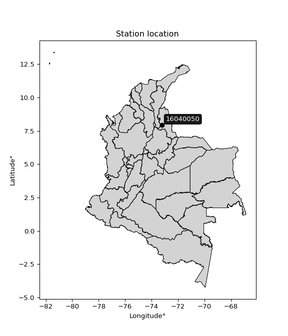

<div align="center">


</div>

# PMax24h Station (Rain, Pmax24h): 16040050

Maximum Precipitation in 24 hours (PMax24h) is the greatest amount of rainfall for a specific duration that is meteorologically possible for a given location, acting as a "worst-case" scenario for extreme storms, crucial for designing safety-critical infrastructure like bridges, river deviations, dams, spillways, and nuclear plants to prevent catastrophic failure. The PMax24h is related with the Probable Maximum Precipitation (PMP) and it is calculated by hydrologists using meteorological data to determine the upper limit of extreme rainfall, often leading to the Probable Maximum Flood (PMF) for flood control design, and is increasingly being studied for climate change impacts. Probable Maximum Precipitation (PMP) is the theoretical upper limit of rainfall, a deterministic estimate for extreme events, while probability distributions (like GEV, Gumbel) describe the likelihood and frequency of various precipitation amounts, including rare ones, showing how often events occur, with PMP representing the extreme end of these distributions, used for critical infrastructure design to ensure safety against the worst conceivable weather, unlike standard statistical forecasts which cover typical probabilities.

The most common probability distributions in hydrology, used for analyzing floods, rainfall, and streamflow, include the Normal, Log-Normal, Gumbel, Gamma (including Log-Pearson Type III), and Generalized Extreme Value (GEV) distributions, often chosen based on the data´s skewness and whether modeling extremes or general conditions, with Gumbel and GEV popular for extreme events like floods, while the Normal distribution serves as a baseline, though often requiring transformations for skewed hydrological data. These distributions help in designing water infrastructure, managing water resources, and forecasting hydrologic events.

> Hydrological data often isn´t perfectly normal (it´s skewed), so different distributions are needed for different applications, such as: **Flood Frequency Analysis**: Using Gumbel, GEV, or Log-Pearson Type III for predicting extreme flood magnitudes and their return periods, **Rainfall Analysis**: Normal for annual totals, but Log-Normal, Weibull, or GEV for intensity or extreme daily rainfall, **Streamflow Modeling**: Gamma and Log-Normal for maximum flows, GEV for minimum flows, and Kappa for daily flows.

<div align="center">

</img>

</div>


## A. General information


### 1. General running parameters

• app_version: _v20260225_. • runtime: _2026-02-27 14:50:08.749431_. • Python version: _3.14.0_. • SciPy version: _1.16.3_. • Pandas version: _2.3.3_. • NumPy version: _2.3.5_. • Stations dataset (station_dataset_file): _dataset/pmax24h_in/automatic_colombia_2003_2025.csv_. • Stations catalog (station_catalog_file): _dataset/CNE.xls_. • Minimum year to eval til year_max (date_min): _1900_. • Maximum year to eval since year_min (date_max): _2025_. • Creates, save and include plots into reports (create_plot): _False_. • Plot only fit distributions with Δo > Δ (plot_only_fit): _True_. • Plot only simple graphs avoiding multiple CDFs and multiple Extreme values plots (plot_only_simple): _False_. • Eval low extreme values, if False, evaluates high extreme values (low_extreme): _False_. • Eval every SciPy distribution as logarithmic (pdist_logarithmic_on): _True_. • Standard deviation normalized (ddof): _1.0_. • Return periods to eval in years (Tr): _[2, 2.33, 5, 10, 15, 20, 25, 50, 75, 100, 200, 250, 500, 750, 1000]_. • Minimum data sample per station, 0 means any (minimum_sample): _5_. • Z-Score maximum threshold to adjust a value, 0 means disable (zscore_max): _3.5_. • Z-Score minimum threshold to adjust a value, 0 means disable (zscore_min): _-2.5_. • Avoid zeros, e.g. rain = 0 (avoid_zeros): _True_. • Avoid null values (avoid_nans): _True_. 

:file_folder:Table: [dataset.csv](../../dataset/pmax24h_in/automatic_colombia_2003_2025.csv)

> Delta Degrees of Freedom (DDOF): is a parameter used in the formulas for calculating variance and standard deviation. When ddof=0, the divisor is $N$ (the total number of observations) and this is used when your data set is the entire population. When ddof=1, the divisor is $N-1$ and this is used when your data set is a sample drawn from a larger population. Using $N-1$ provides an unbiased estimate of the population variance (known as Bessel´s correction).


### 2. Station info and location

|   id |   CODIGO | NOMBRE                    | CATEGORIA               | TECNOLOGIA                              | ESTADO   | FECHA_INSTALACION   |   FECHA_SUSPENSION |   ALTITUD |   LATITUD |   LONGITUD | DEPARTAMENTO       | MUNICIPIO   | AREA_OPERATIVA                         | ENTIDAD                                                     | AREA_HIDROGRAFICA   | ZONA_HIDROGRAFICA   | SUBZONA_HIDROGRAFICA           |   CORRIENTE | Catalogo   |   Version |
|-----:|---------:|:--------------------------|:------------------------|:----------------------------------------|:---------|:--------------------|-------------------:|----------:|----------:|-----------:|:-------------------|:------------|:---------------------------------------|:------------------------------------------------------------|:--------------------|:--------------------|:-------------------------------|------------:|:-----------|----------:|
|    0 | 16040050 | LA MARIA - AUT [16040050] | Climatológica Principal | Automática con Telemetría, Convencional | Activa   | 15/02/1985          |                nan |      1927 |   7.93485 |   -73.2136 | Norte De Santander | Ábrego      | Area Operativa 08 - Santanderes-Arauca | INSTITUTO DE HIDROLOGIA METEOROLOGIA Y ESTUDIOS AMBIENTALES | Caribe              | Catatumbo           | Río Algodonal (Alto Catatumbo) |         nan | CNE_IDEAM  |  20251226 |

<div align="center">

Dynamic map: [:earth_americas:Google](http://maps.google.com/maps?q=7.93485,-73.21358) [:earth_americas:OSM](https://www.openstreetmap.org/#map=18/7.93485/-73.21358&layers=P) [:earth_americas:Bing](https://www.bing.com/maps?cp=7.93485~-73.21358&lvl=18) [:earth_americas:Apple](https://maps.apple.com/frame?center=7.93485%2C-73.21358&span=0.003%2C0.006)

</div>


<div align="center">

```geojson
{
  "type": "Feature",
  "geometry": {
    "type": "Point", 
    "coordinates": [-73.21358, 7.93485]
  }, 
  "properties": {
    "Name": "16040050"
  }
}
```

</div>


### 3. Discrete values table and plot

<div align="center">

|               |           0 |          1 |           2 |          3 |          4 |
|:--------------|------------:|-----------:|------------:|-----------:|-----------:|
| Date          | 2019        | 2020       | 2021        | 2022       | 2023       |
| Value         |   66.2      |   82.4     |   58.8      |   88       |   45       |
| Value_initial |   66.2      |   82.4     |   58.8      |   88       |   45       |
| count         |    5        |    5       |    5        |    5       |    5       |
| mean          |   68.08     |   68.08    |   68.08     |   68.08    |   68.08    |
| std           |   17.4943   |   17.4943  |   17.4943   |   17.4943  |   17.4943  |
| zscore        |   -0.107463 |    0.81855 |   -0.530457 |    1.13865 |   -1.31928 |


</div>


> The initial value (value_initial) correspond to the initial obtained or null completed value, and value (value) is adjusted only when the initial value is outside the valid range (outlier) definite through the Z-Score value. If Z-Score is active, values out of range or outliers are replaced with the station mean value. A Z-Score (or standard score) measures how many standard deviations a data point is from the mean of a dataset, indicating its relative position; positive scores mean above the mean, negative mean below, and a score of zero is exactly at the mean, allowing for comparison of values from different distributions. It´s calculated using the formula $z=(x–μ)/σ$, where $x$ is the data point, $μ$ is the mean, and $σ$ is the standard deviation, helping identify outliers and understand probability.
>
> <sub>**Note**: In this study, "completing" (filling gaps in) and "extending" (forecasting or lengthening the historical record) rainfall data series are avoided for certain critical analyses because they introduce artificial bias and uncertainty, which can distort the statistics of rare events (extremes), alter day-to-day variability, and compromise the integrity and homogeneity of the original data. Some reasons against Completing/Extending rainfall data are: **Distortion of Extremes and Variability**: The primary issue is that most gap-filling or extension methods rely on averaging or regression with nearby stations, which inherently smooths the data. Rainfall is highly variable in space and time, with a large percentage of zero values and occasional large storms. Infilling methods often underestimate the highest values and overestimate the lowest (zero) values, which severely distorts analyses focused on flood frequency, drought severity, and intensity-duration-frequency (IDF) curves, **Loss of Data Homogeneity**: Infilled or extended data are synthetic estimates, not actual measurements. Combining these estimates with observed data can violate the assumption of data homogeneity, which requires that the data properties do not change over time. Inhomogeneity can lead to incorrect conclusions about long-term trends or changes in climate patterns, **Propagation of Errors**: Errors and biases from the original data (e.g., wind-induced undercatch, instrument errors, site changes) or the data used for imputation can propagate through the analysis, leading to unreliable hydrological models and inaccurate predictions, **Compromised Statistical Integrity**: For statistical analyses, especially those involving the frequency of events, using artificial data can introduce time bias or autocorrelation that doesn´t exist in reality, making it difficult to assess the true probability of events, **Difficulty in Validation**: It is difficult to accurately validate the quality of filled or extended data, especially for past periods where ground-truth measurements are unavailable. The reliability of imputation techniques heavily depends on the density of the surrounding station network and the complexity of the local topography.</sub>


### 4. Active continuous probability distributions from SciPy (80 of 104 available)

A Probability Density Function (PDF) describes the relative likelihood of a continuous random variable falling within a specific range, where the total area under its curve equals 1, and the area over any interval gives the actual probability for that range. Unlike discrete probabilities (like rolling a die), a PDF shows density, not direct probability for a single point (which is zero), with higher points indicating higher likelihood, often visualized as a bell curve for normal distributions.

A log of a probability density function (log-PDF) is simply the logarithm of the PDF´s value, denoted as $log(f(x))$, useful for converting multiplication of probabilities into addition, improving numerical stability with tiny numbers, and connecting to information theory concepts like entropy. Instead of dealing with very small probabilities (e.g., 0.000001), log-PDFs use negative numbers (e.g., $log(0.00001) ≈ -11.51$ that are easier for computers to handle, preventing underflow errors and simplifying complex calculations. In this study, each active probability distribution from SciPy is also evaluated in the $log$ form.

[scipy.stats](https://docs.scipy.org/doc/scipy/reference/stats.html) is a Python´s powerful submodule within the SciPy library for comprehensive statistical analysis, offering over 130 probability distributions (like Normal, Poisson, etc.), functions for descriptive stats (mean, variance), hypothesis testing (t-tests, chi-square), random variable generation, and statistical tests, making it essential for data science, modeling, and research. It provides tools to explore, model, and draw conclusions from data efficiently, working seamlessly with [NumPy](https://numpy.org/).

<div align="center">

|   id | p_dist           |   n_parameter | fit_method   | label                                                                       | active   | ref                                                                                                      |
|-----:|:-----------------|--------------:|:-------------|:----------------------------------------------------------------------------|:---------|:---------------------------------------------------------------------------------------------------------|
|    0 | alpha            |             3 | MLE          | Alpha                                                                       | True     | [:mortar_board:](https://docs.scipy.org/doc/scipy/reference/generated/scipy.stats.alpha.html)            |
|    1 | anglit           |             2 | MM           | Anglit                                                                      | True     | [:mortar_board:](https://docs.scipy.org/doc/scipy/reference/generated/scipy.stats.anglit.html)           |
|    2 | arcsine          |             2 | MM           | Arcsine                                                                     | True     | [:mortar_board:](https://docs.scipy.org/doc/scipy/reference/generated/scipy.stats.arcsine.html)          |
|    3 | argus            |             3 | MLE          | Argus                                                                       | True     | [:mortar_board:](https://docs.scipy.org/doc/scipy/reference/generated/scipy.stats.argus.html)            |
|    4 | beta             |             4 | MLE          | Beta                                                                        | True     | [:mortar_board:](https://docs.scipy.org/doc/scipy/reference/generated/scipy.stats.beta.html)             |
|    5 | betaprime        |             4 | MLE          | Beta prime                                                                  | True     | [:mortar_board:](https://docs.scipy.org/doc/scipy/reference/generated/scipy.stats.betaprime.html)        |
|    6 | bradford         |             3 | MLE          | Bradford                                                                    | True     | [:mortar_board:](https://docs.scipy.org/doc/scipy/reference/generated/scipy.stats.bradford.html)         |
|    7 | burr             |             4 | MLE          | Burr (Type III)                                                             | True     | [:mortar_board:](https://docs.scipy.org/doc/scipy/reference/generated/scipy.stats.burr.html)             |
|    8 | burr12           |             4 | MLE          | Burr (Type III) 12                                                          | True     | [:mortar_board:](https://docs.scipy.org/doc/scipy/reference/generated/scipy.stats.burr12.html)           |
|    9 | cosine           |             2 | MLE          | Cosine                                                                      | True     | [:mortar_board:](https://docs.scipy.org/doc/scipy/reference/generated/scipy.stats.cosine.html)           |
|   10 | crystalball      |             4 | MLE          | Crystalball                                                                 | True     | [:mortar_board:](https://docs.scipy.org/doc/scipy/reference/generated/scipy.stats.crystalball.html)      |
|   11 | dgamma           |             3 | MLE          | Double gamma                                                                | True     | [:mortar_board:](https://docs.scipy.org/doc/scipy/reference/generated/scipy.stats.dgamma.html)           |
|   12 | dweibull         |             3 | MLE          | Double Weibull                                                              | True     | [:mortar_board:](https://docs.scipy.org/doc/scipy/reference/generated/scipy.stats.dweibull.html)         |
|   13 | erlang           |             3 | MLE          | Erlang                                                                      | True     | [:mortar_board:](https://docs.scipy.org/doc/scipy/reference/generated/scipy.stats.erlang.html)           |
|   14 | exponnorm        |             3 | MLE          | Exponentially modified Normal                                               | True     | [:mortar_board:](https://docs.scipy.org/doc/scipy/reference/generated/scipy.stats.exponnorm.html)        |
|   15 | exponpow         |             3 | MLE          | Exponential power                                                           | True     | [:mortar_board:](https://docs.scipy.org/doc/scipy/reference/generated/scipy.stats.exponpow.html)         |
|   16 | exponweib        |             4 | MLE          | Exponentiated Weibull                                                       | True     | [:mortar_board:](https://docs.scipy.org/doc/scipy/reference/generated/scipy.stats.exponweib.html)        |
|   17 | f                |             4 | MLE          | F                                                                           | True     | [:mortar_board:](https://docs.scipy.org/doc/scipy/reference/generated/scipy.stats.f.html)                |
|   18 | fatiguelife      |             3 | MLE          | Fatigue-life (Birnbaum-Saunders)                                            | True     | [:mortar_board:](https://docs.scipy.org/doc/scipy/reference/generated/scipy.stats.fatiguelife.html)      |
|   19 | foldnorm         |             3 | MM           | Fold Normal                                                                 | True     | [:mortar_board:](https://docs.scipy.org/doc/scipy/reference/generated/scipy.stats.foldnorm.html)         |
|   20 | gamma            |             3 | MLE          | Gamma                                                                       | True     | [:mortar_board:](https://docs.scipy.org/doc/scipy/reference/generated/scipy.stats.gamma.html)            |
|   21 | gausshyper       |             6 | MLE          | Gauss hypergeometric                                                        | True     | [:mortar_board:](https://docs.scipy.org/doc/scipy/reference/generated/scipy.stats.gausshyper.html)       |
|   22 | genexpon         |             5 | MLE          | Generalized exponential                                                     | True     | [:mortar_board:](https://docs.scipy.org/doc/scipy/reference/generated/scipy.stats.genexpon.html)         |
|   23 | genextreme       |             3 | MLE          | Generalized exponential                                                     | True     | [:mortar_board:](https://docs.scipy.org/doc/scipy/reference/generated/scipy.stats.genextreme.html)       |
|   24 | gengamma         |             4 | MLE          | Generalized gamma                                                           | True     | [:mortar_board:](https://docs.scipy.org/doc/scipy/reference/generated/scipy.stats.gengamma.html)         |
|   25 | genhalflogistic  |             3 | MLE          | Generalized half-logistic                                                   | True     | [:mortar_board:](https://docs.scipy.org/doc/scipy/reference/generated/scipy.stats.genhalflogistic.html)  |
|   26 | genlogistic      |             3 | MLE          | Generalized logistic                                                        | True     | [:mortar_board:](https://docs.scipy.org/doc/scipy/reference/generated/scipy.stats.genlogistic.html)      |
|   27 | gennorm          |             3 | MLE          | Generalized Normal                                                          | True     | [:mortar_board:](https://docs.scipy.org/doc/scipy/reference/generated/scipy.stats.gennorm.html)          |
|   28 | genpareto        |             3 | MLE          | Generalized Pareto                                                          | True     | [:mortar_board:](https://docs.scipy.org/doc/scipy/reference/generated/scipy.stats.genpareto.html)        |
|   29 | gompertz         |             3 | MLE          | Gompertz (or truncated Gumbel)                                              | True     | [:mortar_board:](https://docs.scipy.org/doc/scipy/reference/generated/scipy.stats.gompertz.html)         |
|   30 | gumbel_l         |             2 | MM           | Gumbel Left Skew                                                            | True     | [:mortar_board:](https://docs.scipy.org/doc/scipy/reference/generated/scipy.stats.gumbel_l.html)         |
|   31 | gumbel_r         |             2 | MM           | Gumbel Right Skew                                                           | True     | [:mortar_board:](https://docs.scipy.org/doc/scipy/reference/generated/scipy.stats.gumbel_r.html)         |
|   32 | halfgennorm      |             3 | MLE          | Upper half of a generalized normal                                          | True     | [:mortar_board:](https://docs.scipy.org/doc/scipy/reference/generated/scipy.stats.halfgennorm.html)      |
|   33 | halflogistic     |             2 | MM           | Half-logistic                                                               | True     | [:mortar_board:](https://docs.scipy.org/doc/scipy/reference/generated/scipy.stats.halflogistic.html)     |
|   34 | halfnorm         |             2 | MM           | Half Normal                                                                 | True     | [:mortar_board:](https://docs.scipy.org/doc/scipy/reference/generated/scipy.stats.halfnorm.html)         |
|   35 | hypsecant        |             2 | MM           | hyperbolic secant                                                           | True     | [:mortar_board:](https://docs.scipy.org/doc/scipy/reference/generated/scipy.stats.hypsecant.html)        |
|   36 | invgamma         |             3 | MLE          | Inverted gamma                                                              | True     | [:mortar_board:](https://docs.scipy.org/doc/scipy/reference/generated/scipy.stats.invgamma.html)         |
|   37 | invgauss         |             3 | MLE          | Inverse Gaussian                                                            | True     | [:mortar_board:](https://docs.scipy.org/doc/scipy/reference/generated/scipy.stats.invgauss.html)         |
|   38 | invweibull       |             3 | MLE          | Inverted Weibull                                                            | True     | [:mortar_board:](https://docs.scipy.org/doc/scipy/reference/generated/scipy.stats.invweibull.html)       |
|   39 | johnsonsb        |             4 | MLE          | Johnson SB                                                                  | True     | [:mortar_board:](https://docs.scipy.org/doc/scipy/reference/generated/scipy.stats.johnsonsb.html)        |
|   40 | johnsonsu        |             4 | MLE          | Johnson Su                                                                  | True     | [:mortar_board:](https://docs.scipy.org/doc/scipy/reference/generated/scipy.stats.johnsonsu.html)        |
|   41 | kappa3           |             3 | MLE          | Kappa 3                                                                     | True     | [:mortar_board:](https://docs.scipy.org/doc/scipy/reference/generated/scipy.stats.kappa3.html)           |
|   42 | kappa4           |             4 | MLE          | Kappa 4                                                                     | True     | [:mortar_board:](https://docs.scipy.org/doc/scipy/reference/generated/scipy.stats.kappa4.html)           |
|   43 | ksone            |             3 | MLE          | Kolmogorov-Smirnov one-sided test statistic distribution                    | True     | [:mortar_board:](https://docs.scipy.org/doc/scipy/reference/generated/scipy.stats.ksone.html)            |
|   44 | kstwobign        |             2 | MLE          | Limiting distribution of scaled Kolmogorov-Smirnov two-sided test statistic | True     | [:mortar_board:](https://docs.scipy.org/doc/scipy/reference/generated/scipy.stats.kstwobign.html)        |
|   45 | laplace          |             2 | MM           | Laplace                                                                     | True     | [:mortar_board:](https://docs.scipy.org/doc/scipy/reference/generated/scipy.stats.laplace.html)          |
|   46 | levy_l           |             2 | MLE          | Left-skewed Levy                                                            | True     | [:mortar_board:](https://docs.scipy.org/doc/scipy/reference/generated/scipy.stats.levy_l.html)           |
|   47 | loggamma         |             3 | MLE          | Log gamma                                                                   | True     | [:mortar_board:](https://docs.scipy.org/doc/scipy/reference/generated/scipy.stats.loggamma.html)         |
|   48 | logistic         |             2 | MM           | Logistic (or Sech-squared)                                                  | True     | [:mortar_board:](https://docs.scipy.org/doc/scipy/reference/generated/scipy.stats.logistic.html)         |
|   49 | loglaplace       |             3 | MLE          | Log-Laplace                                                                 | True     | [:mortar_board:](https://docs.scipy.org/doc/scipy/reference/generated/scipy.stats.loglaplace.html)       |
|   50 | lomax            |             3 | MLE          | Lomax (Pareto of the second kind)                                           | True     | [:mortar_board:](https://docs.scipy.org/doc/scipy/reference/generated/scipy.stats.lomax.html)            |
|   51 | maxwell          |             2 | MM           | Maxwell                                                                     | True     | [:mortar_board:](https://docs.scipy.org/doc/scipy/reference/generated/scipy.stats.maxwell.html)          |
|   52 | mielke           |             4 | MLE          | Mielke Beta-Kappa / Dagum                                                   | True     | [:mortar_board:](https://docs.scipy.org/doc/scipy/reference/generated/scipy.stats.mielke.html)           |
|   53 | moyal            |             2 | MM           | Moyal                                                                       | True     | [:mortar_board:](https://docs.scipy.org/doc/scipy/reference/generated/scipy.stats.moyal.html)            |
|   54 | nakagami         |             3 | MLE          | Nakagami                                                                    | True     | [:mortar_board:](https://docs.scipy.org/doc/scipy/reference/generated/scipy.stats.nakagami.html)         |
|   55 | ncf              |             5 | MLE          | Non-central F distribution                                                  | True     | [:mortar_board:](https://docs.scipy.org/doc/scipy/reference/generated/scipy.stats.ncf.html)              |
|   56 | nct              |             4 | MLE          | Non-central Student’s t                                                     | True     | [:mortar_board:](https://docs.scipy.org/doc/scipy/reference/generated/scipy.stats.nct.html)              |
|   57 | norm             |             2 | MM           | Normal                                                                      | True     | [:mortar_board:](https://docs.scipy.org/doc/scipy/reference/generated/scipy.stats.norm.html)             |
|   58 | pearson3         |             3 | MM           | Pearson type III                                                            | True     | [:mortar_board:](https://docs.scipy.org/doc/scipy/reference/generated/scipy.stats.pearson3.html)         |
|   59 | powerlaw         |             3 | MLE          | Power-function                                                              | True     | [:mortar_board:](https://docs.scipy.org/doc/scipy/reference/generated/scipy.stats.powerlaw.html)         |
|   60 | rayleigh         |             2 | MM           | Rayleigh                                                                    | True     | [:mortar_board:](https://docs.scipy.org/doc/scipy/reference/generated/scipy.stats.rayleigh.html)         |
|   61 | rdist            |             3 | MLE          | R-distributed (symmetric beta)                                              | True     | [:mortar_board:](https://docs.scipy.org/doc/scipy/reference/generated/scipy.stats.rdist.html)            |
|   62 | rice             |             3 | MLE          | Rice                                                                        | True     | [:mortar_board:](https://docs.scipy.org/doc/scipy/reference/generated/scipy.stats.rice.html)             |
|   63 | semicircular     |             2 | MM           | Semicircular                                                                | True     | [:mortar_board:](https://docs.scipy.org/doc/scipy/reference/generated/scipy.stats.semicircular.html)     |
|   64 | skewnorm         |             3 | MLE          | Skew normal                                                                 | True     | [:mortar_board:](https://docs.scipy.org/doc/scipy/reference/generated/scipy.stats.skewnorm.html)         |
|   65 | t                |             3 | MLE          | Student’s t                                                                 | True     | [:mortar_board:](https://docs.scipy.org/doc/scipy/reference/generated/scipy.stats.t.html)                |
|   66 | trapezoid        |             4 | MLE          | Trapezoid                                                                   | True     | [:mortar_board:](https://docs.scipy.org/doc/scipy/reference/generated/scipy.stats.trapezoid.html)        |
|   67 | triang           |             3 | MLE          | Triangular                                                                  | True     | [:mortar_board:](https://docs.scipy.org/doc/scipy/reference/generated/scipy.stats.triang.html)           |
|   68 | truncexpon       |             3 | MLE          | Truncated exponential                                                       | True     | [:mortar_board:](https://docs.scipy.org/doc/scipy/reference/generated/scipy.stats.truncexpon.html)       |
|   69 | truncnorm        |             4 | MLE          | Truncated normal                                                            | True     | [:mortar_board:](https://docs.scipy.org/doc/scipy/reference/generated/scipy.stats.truncnorm.html)        |
|   70 | truncpareto      |             4 | MLE          | Upper truncated Pareto                                                      | True     | [:mortar_board:](https://docs.scipy.org/doc/scipy/reference/generated/scipy.stats.truncpareto.html)      |
|   71 | truncweibull_min |             5 | MLE          | Doubly truncated Weibull minimum                                            | True     | [:mortar_board:](https://docs.scipy.org/doc/scipy/reference/generated/scipy.stats.truncweibull_min.html) |
|   72 | tukeylambda      |             3 | MLE          | Tukey-Lamdba                                                                | True     | [:mortar_board:](https://docs.scipy.org/doc/scipy/reference/generated/scipy.stats.tukeylambda.html)      |
|   73 | uniform          |             2 | MLE          | Uniform                                                                     | True     | [:mortar_board:](https://docs.scipy.org/doc/scipy/reference/generated/scipy.stats.uniform.html)          |
|   74 | vonmises         |             3 | MLE          | Von Mises                                                                   | True     | [:mortar_board:](https://docs.scipy.org/doc/scipy/reference/generated/scipy.stats.vonmises.html)         |
|   75 | vonmises_line    |             3 | MLE          | Von Mises line                                                              | True     | [:mortar_board:](https://docs.scipy.org/doc/scipy/reference/generated/scipy.stats.vonmises_line.html)    |
|   76 | wald             |             2 | MM           | Wald                                                                        | True     | [:mortar_board:](https://docs.scipy.org/doc/scipy/reference/generated/scipy.stats.wald.html)             |
|   77 | weibull_max      |             3 | MLE          | Weibull maximum                                                             | True     | [:mortar_board:](https://docs.scipy.org/doc/scipy/reference/generated/scipy.stats.weibull_max.html)      |
|   78 | weibull_min      |             3 | MLE          | Weibull minimum                                                             | True     | [:mortar_board:](https://docs.scipy.org/doc/scipy/reference/generated/scipy.stats.weibull_min.html)      |
|   79 | wrapcauchy       |             3 | MLE          | Wrapped  Cauchy                                                             | True     | [:mortar_board:](https://docs.scipy.org/doc/scipy/reference/generated/scipy.stats.wrapcauchy.html)       |

</div>

> **n_parameter:** # arguments & localization & scale.
>
> **Fit methods:** (MLE) maximum likelihood, (MM) L-moments.
>
>**Inactive** (With the only purpose of prevent loops, zero divisions, infinite values, over high estimated values or horizontal trending for recurrence intervals estimations, the follow distributions were disabled.)**:** lognorm, norminvgauss, powernorm, powerlognorm, cauchy, halfcauchy, foldcauchy, skewcauchy, chi2, expon, fisk, genhyperbolic, geninvgauss, gibrat, kstwo, laplace_asymmetric, levy, levy_stable, ncx2, pareto, rel_breitwigner, recipinvgauss, studentized_range, loguniform, 


## B. Probability (PDF) vs. Empirical (EDF) distributions functions

A continuous probability distribution (CPD) describes probabilities for variables that can take any value within a range (like rain any time), unlike discrete variables with specific outcomes (like temperature). It uses a Probability Density Function (PDF), a curve where the total area under it equals 1, and the probability of the variable falling within an interval (a to b) is found by calculating the area under the curve between those points. A key feature is that the probability of hitting any single exact value is zero, so probabilities are always expressed for ranges, e.g., $P(a ≤ X ≤ b)$.

<div align="center">

Distributions parameters from station values
|     |   station | p_dist              |   n |               loc |            scale | shape                  | shape1                 | shape2                 | shape3             |
|----:|----------:|:--------------------|----:|------------------:|-----------------:|:-----------------------|:-----------------------|:-----------------------|:-------------------|
|   0 |  16040050 | alpha               |   5 |    -222.642       |   5362.75        | 18.513038236720874     |                        |                        |                    |
|   1 |  16040050 | anglit              |   5 |      68.08        |     45.7749      |                        |                        |                        |                    |
|   2 |  16040050 | arcsine             |   5 |      45.9512      |     44.2575      |                        |                        |                        |                    |
|   3 |  16040050 | argus               |   5 |      32.2402      |     58.693       | 1.1191688953101224     |                        |                        |                    |
|   4 |  16040050 | beta                |   5 |      45           |     44.7185      | 0.7124799430821342     | 0.6956299623540645     |                        |                    |
|   5 |  16040050 | betaprime           |   5 |      -0.647873    |     72.835       | 34.795085184579165     | 37.68890686965773      |                        |                    |
|   6 |  16040050 | bradford            |   5 |      45           |     43.0001      | 1.1655530168717423     |                        |                        |                    |
|   7 |  16040050 | burr                |   5 |    -250.558       |    180.673       | 22.21240526089136      | 162711.48851577088     |                        |                    |
|   8 |  16040050 | burr12              |   5 |      -5.49804     |     50.3052      | 1145.1219291917891     | 0.0024509817410641073  |                        |                    |
|   9 |  16040050 | cosine              |   5 |      67.7318      |     12.59        |                        |                        |                        |                    |
|  10 |  16040050 | crystalball         |   5 |      68.08        |     15.6474      | 5387.662434621247      | 59.11107211213693      |                        |                    |
|  11 |  16040050 | dgamma              |   5 |      63.3168      |      7.79036     | 1.7838265419487636     |                        |                        |                    |
|  12 |  16040050 | dweibull            |   5 |      63.5846      |     15.3156      | 1.5374485794311301     |                        |                        |                    |
|  13 |  16040050 | erlang              |   5 |    -306.758       |      0.656106    | 571.3597315952293      |                        |                        |                    |
|  14 |  16040050 | exponnorm           |   5 |      68.0656      |     15.6474      | 0.0009179330477875533  |                        |                        |                    |
|  15 |  16040050 | exponpow            |   5 |      45           |      1.46394     | 0.13700306392066472    |                        |                        |                    |
|  16 |  16040050 | exponweib           |   5 |      45           |      1.27185     | 1.2572605684162061     | 0.27921169796670847    |                        |                    |
|  17 |  16040050 | f                   |   5 |    -664.731       |    732.832       | 4499.491959239951      | 128257.8401728975      |                        |                    |
|  18 |  16040050 | fatiguelife         |   5 |      45           |      3.84179e-05 | 962.07561032797        |                        |                        |                    |
|  19 |  16040050 | foldnorm            |   5 |      69.0143      |      2.11227     | 6.516678593729088e-07  |                        |                        |                    |
|  20 |  16040050 | gamma               |   5 |    -303.71        |      0.664166    | 559.7814135007015      |                        |                        |                    |
|  21 |  16040050 | gausshyper          |   5 |      44.9895      |     43.0105      | 0.9639358381319239     | 0.9595691632530494     | 1.0682053803378242     | 1.014974600173776  |
|  22 |  16040050 | genexpon            |   5 |      45           |      1.87039     | 0.0811096393443742     | 9.769449916703901e-08  | 1.2586438533425008     |                    |
|  23 |  16040050 | genextreme          |   5 |      71.7711      |     18.1991      | 1.1214010887926738     |                        |                        |                    |
|  24 |  16040050 | gengamma            |   5 |      45           |      1.30873     | 1.2652435751333995     | 0.22545985338961314    |                        |                    |
|  25 |  16040050 | genhalflogistic     |   5 |      36.4702      |     55.0883      | 1.0690574536750437     |                        |                        |                    |
|  26 |  16040050 | genlogistic         |   5 |      17.928       |     14.0641      | 20.985783120626394     |                        |                        |                    |
|  27 |  16040050 | gennorm             |   5 |      66.5         |     21.5002      | 1294661.9447265635     |                        |                        |                    |
|  28 |  16040050 | genpareto           |   5 |      -0.825064    |    132.536       | -1.4921057543311806    |                        |                        |                    |
|  29 |  16040050 | gompertz            |   5 |      82.4         |      1.69652     | 0.078706152651859      |                        |                        |                    |
|  30 |  16040050 | gumbel_l            |   5 |      75.1222      |     12.2002      |                        |                        |                        |                    |
|  31 |  16040050 | gumbel_r            |   5 |      61.0378      |     12.2002      |                        |                        |                        |                    |
|  32 |  16040050 | halfgennorm         |   5 |      45           |      1.42745     | 0.3885394302356442     |                        |                        |                    |
|  33 |  16040050 | halflogistic        |   5 |      49.5341      |     13.378       |                        |                        |                        |                    |
|  34 |  16040050 | halfnorm            |   5 |      47.3689      |     25.9575      |                        |                        |                        |                    |
|  35 |  16040050 | hypsecant           |   5 |      68.08        |      9.96145     |                        |                        |                        |                    |
|  36 |  16040050 | invgamma            |   5 |    -118.259       |  25357.4         | 137.15479477194663     |                        |                        |                    |
|  37 |  16040050 | invgauss            |   5 |     -15.6878      |   2184.52        | 0.03844108753726273    |                        |                        |                    |
|  38 |  16040050 | invweibull          |   5 |      45           |      1.69086     | 0.05662344996346169    |                        |                        |                    |
|  39 |  16040050 | johnsonsb           |   5 |      45           |     43           | 1.840425960749126      | 0.0877839016692269     |                        |                    |
|  40 |  16040050 | johnsonsu           |   5 |     109.964       |      1.82246     | 9.414213535040648      | 2.509248087775319      |                        |                    |
|  41 |  16040050 | kappa3              |   5 |      45           |     42.9987      | 49052.110119878096     |                        |                        |                    |
|  42 |  16040050 | kappa4              |   5 |      41.008       |     52.0299      | 1.0822946773123814     | 1.107208417255531      |                        |                    |
|  43 |  16040050 | ksone               |   5 |      40.9779      |     54.2042      | 1.0                    |                        |                        |                    |
|  44 |  16040050 | kstwobign           |   5 |      10.4645      |     65.7304      |                        |                        |                        |                    |
|  45 |  16040050 | laplace             |   5 |      68.08        |     11.0644      |                        |                        |                        |                    |
|  46 |  16040050 | levy_l              |   5 |      89.3043      |      4.94953     |                        |                        |                        |                    |
|  47 |  16040050 | loggamma            |   5 |       7.14636     |     36.4883      | 5.804098477651021      |                        |                        |                    |
|  48 |  16040050 | logistic            |   5 |      68.08        |      8.62687     |                        |                        |                        |                    |
|  49 |  16040050 | loglaplace          |   5 |      -0.201974    |     66.402       | 4.975404627394461      |                        |                        |                    |
|  50 |  16040050 | lomax               |   5 |      45           |   2287.11        | 99.50820869587213      |                        |                        |                    |
|  51 |  16040050 | maxwell             |   5 |      31.0022      |     23.2351      |                        |                        |                        |                    |
|  52 |  16040050 | mielke              |   5 |     -10.1008      |     98.267       | 4.004064752835033      | 2945.258629922132      |                        |                    |
|  53 |  16040050 | moyal               |   5 |      59.1318      |      7.04381     |                        |                        |                        |                    |
|  54 |  16040050 | nakagami            |   5 |      58.8         |     15.6284      | 0.269734562397521      |                        |                        |                    |
|  55 |  16040050 | ncf                 |   5 |      -1.69588     |     69.2059      | 43.58493430959447      | 242.71250544552203     | 0.0100897264361381     |                    |
|  56 |  16040050 | nct                 |   5 |    -839.971       |     15.6027      | 259555.2137089984      | 58.19805399495198      |                        |                    |
|  57 |  16040050 | norm                |   5 |      68.08        |     15.6474      |                        |                        |                        |                    |
|  58 |  16040050 | pearson3            |   5 |      68.08        |     15.6474      | -0.1179591920388938    |                        |                        |                    |
|  59 |  16040050 | powerlaw            |   5 |      45           |     43           | 0.13047207219348178    |                        |                        |                    |
|  60 |  16040050 | rayleigh            |   5 |      38.1456      |     23.8842      |                        |                        |                        |                    |
|  61 |  16040050 | rdist               |   5 |      42.2325      |     23.9675      | 1.0736373005837918     |                        |                        |                    |
|  62 |  16040050 | rice                |   5 |      36.4405      |     18.5392      | 1.2747262781678264     |                        |                        |                    |
|  63 |  16040050 | semicircular        |   5 |      68.08        |     31.2948      |                        |                        |                        |                    |
|  64 |  16040050 | skewnorm            |   5 |      76.0357      |     17.5538      | -0.6891430105165055    |                        |                        |                    |
|  65 |  16040050 | t                   |   5 |      68.0799      |     15.6471      | 49469953.88075239      |                        |                        |                    |
|  66 |  16040050 | trapezoid           |   5 |      23.8224      |     66.3864      | 0.9999999999999999     | 1.0                    |                        |                    |
|  67 |  16040050 | triang              |   5 |      31.4148      |     56.626       | 0.9999999999990424     |                        |                        |                    |
|  68 |  16040050 | truncexpon          |   5 |      45           |     55.2235      | 0.7786549128760067     |                        |                        |                    |
|  69 |  16040050 | truncnorm           |   5 |      82.2117      |     31.0995      | -454.9297910627058     | 0.18612342985198504    |                        |                    |
|  70 |  16040050 | truncpareto         |   5 |      44.7768      |      0.223197    | 0.26180767673224914    | 193.65497900410037     |                        |                    |
|  71 |  16040050 | truncweibull_min    |   5 |      45           |     56.9589      | 0.5807916312751712     | 1.1016261078948323e-16 | 0.7645890683297525     |                    |
|  72 |  16040050 | tukeylambda         |   5 |      66.4857      |     26.0769      | 1.2120761234153705     |                        |                        |                    |
|  73 |  16040050 | uniform             |   5 |      45           |     43           |                        |                        |                        |                    |
|  74 |  16040050 | vonmises            |   5 |       1.25994     |      1           | 0.9836399767087478     |                        |                        |                    |
|  75 |  16040050 | vonmises_line       |   5 |      66.4995      |      6.84382     | 0.03889565195487168    |                        |                        |                    |
|  76 |  16040050 | wald                |   5 |      52.4326      |     15.6474      |                        |                        |                        |                    |
|  77 |  16040050 | weibull_max         |   5 |      88           |      1.49408     | 0.33812788360783497    |                        |                        |                    |
|  78 |  16040050 | weibull_min         |   5 |      31.6977      |     41.0888      | 2.5699706952078705     |                        |                        |                    |
|  79 |  16040050 | wrapcauchy          |   5 |      45           |      6.84366     | 0.44162571014606467    |                        |                        |                    |
|  80 |  16040050 | logalpha            |   5 |      -4.9061      |    336.378       | 36.99633896490273      |                        |                        |                    |
|  81 |  16040050 | loganglit           |   5 |       4.19248     |      0.706966    |                        |                        |                        |                    |
|  82 |  16040050 | logarcsine          |   5 |       3.85073     |      0.683507    |                        |                        |                        |                    |
|  83 |  16040050 | logargus            |   5 |       3.58426     |      0.930745    | 1.629507320208817      |                        |                        |                    |
|  84 |  16040050 | logbeta             |   5 |       3.73854     |      0.738795    | 0.9410436810500573     | 0.6659185044820705     |                        |                    |
|  85 |  16040050 | logbetaprime        |   5 |     -19.7637      |      5.35481     | 53038.56304202908      | 11857.188595216448     |                        |                    |
|  86 |  16040050 | logbradford         |   5 |       3.80666     |      0.67068     | 1.0588974627466254     |                        |                        |                    |
|  87 |  16040050 | logburr             |   5 |    -297.441       |    301.932       | 43207.18510127949      | 0.023376259426578727   |                        |                    |
|  88 |  16040050 | logburr12           |   5 |      -9.03567     |     14.9911      | 67.52010939001713      | 2612.2844365439896     |                        |                    |
|  89 |  16040050 | logcosine           |   5 |       4.17868     |      0.196778    |                        |                        |                        |                    |
|  90 |  16040050 | logcrystalball      |   5 |       4.19248     |      0.241665    | 46.308162466120606     | 873.771014604625       |                        |                    |
|  91 |  16040050 | logdgamma           |   5 |       4.19268     |      0.246654    | 0.8714507915491021     |                        |                        |                    |
|  92 |  16040050 | logdweibull         |   5 |       4.19268     |      0.209422    | 0.9569614876288441     |                        |                        |                    |
|  93 |  16040050 | logerlang           |   5 |       0.122864    |      0.0147734   | 275.3456586324073      |                        |                        |                    |
|  94 |  16040050 | logexponnorm        |   5 |       4.19229     |      0.241666    | 0.000791484241025562   |                        |                        |                    |
|  95 |  16040050 | logexponpow         |   5 |       3.56292     |      0.846039    | 2.4434022377002647     |                        |                        |                    |
|  96 |  16040050 | logexponweib        |   5 |       3.80666     |      0.523732    | 0.11068336107068746    | 1.922029368685839      |                        |                    |
|  97 |  16040050 | logf                |   5 |     -21.2859      |     25.478       | 31790.456376695125     | 69140.16636396265      |                        |                    |
|  98 |  16040050 | logfatiguelife      |   5 |     -40.2387      |     44.4318      | 0.0054253009286483415  |                        |                        |                    |
|  99 |  16040050 | logfoldnorm         |   5 |       3.78811     |      0.266178    | 1.4545910499970307     |                        |                        |                    |
| 100 |  16040050 | loggamma            |   5 |       0.272973    |      0.0152874   | 256.2900160862147      |                        |                        |                    |
| 101 |  16040050 | loggausshyper       |   5 |       3.7743      |      0.703041    | 1.1457180002792287     | 0.9536699573054987     | 0.9106998917790803     | 1.0489997755999578 |
| 102 |  16040050 | loggenexpon         |   5 |       3.80615     |      0.00460831  | 0.006021613469896744   | 3.943862406991028      | 2.5711882837061527e-05 |                    |
| 103 |  16040050 | loggenextreme       |   5 |       4.26471     |      0.244791    | 1.1512566563598536     |                        |                        |                    |
| 104 |  16040050 | loggengamma         |   5 |       3.80666     |      0.687872    | 0.432652219768826      | 1.4476914310458413     |                        |                    |
| 105 |  16040050 | loggenhalflogistic  |   5 |       3.70963     |      0.801081    | 1.0434754155025874     |                        |                        |                    |
| 106 |  16040050 | loggenlogistic      |   5 |       4.47735     |      8.87524e-07 | 3.1097957428692704e-06 |                        |                        |                    |
| 107 |  16040050 | loggennorm          |   5 |       4.142       |      0.335339    | 1990395.9859966186     |                        |                        |                    |
| 108 |  16040050 | loggenpareto        |   5 |      -0.0179069   |     19.0794      | -4.244342296661197     |                        |                        |                    |
| 109 |  16040050 | loggompertz         |   5 |       3.80665     |      0.284873    | 0.2344121204746171     |                        |                        |                    |
| 110 |  16040050 | loggumbel_l         |   5 |       4.30124     |      0.188425    |                        |                        |                        |                    |
| 111 |  16040050 | loggumbel_r         |   5 |       4.08372     |      0.188425    |                        |                        |                        |                    |
| 112 |  16040050 | loghalfgennorm      |   5 |       3.80663     |      0.670812    | 51418.30921413154      |                        |                        |                    |
| 113 |  16040050 | loghalflogistic     |   5 |       3.90604     |      0.206624    |                        |                        |                        |                    |
| 114 |  16040050 | loghalfnorm         |   5 |       3.87262     |      0.400893    |                        |                        |                        |                    |
| 115 |  16040050 | loghypsecant        |   5 |       4.19248     |      0.153849    |                        |                        |                        |                    |
| 116 |  16040050 | loginvgamma         |   5 |      -3.12226     |   6597.45        | 902.8639209806183      |                        |                        |                    |
| 117 |  16040050 | loginvgauss         |   5 |       2.21464     |    121.993       | 0.016218564819445336   |                        |                        |                    |
| 118 |  16040050 | loginvweibull       |   5 | -303401           | 303405           | 1284715.990640432      |                        |                        |                    |
| 119 |  16040050 | logjohnsonsb        |   5 |       3.80666     |      0.67068     | -0.005001805113459773  | 0.14203669444065548    |                        |                    |
| 120 |  16040050 | logjohnsonsu        |   5 |       4.47734     |      6.38663e-13 | 2.9622319559513075     | 0.1145730069500454     |                        |                    |
| 121 |  16040050 | logkappa3           |   5 |       3.80666     |      0.670527    | 7317.92235710317       |                        |                        |                    |
| 122 |  16040050 | logkappa4           |   5 |       3.7961      |      0.754267    | 1.0108039552278085     | 1.1071977006280025     |                        |                    |
| 123 |  16040050 | logksone            |   5 |       3.77391     |      0.837152    | 1.0                    |                        |                        |                    |
| 124 |  16040050 | logkstwobign        |   5 |       3.24843     |      1.07663     |                        |                        |                        |                    |
| 125 |  16040050 | loglaplace          |   5 |       4.19248     |      0.170883    |                        |                        |                        |                    |
| 126 |  16040050 | loglevy_l           |   5 |       4.49393     |      0.0628135   |                        |                        |                        |                    |
| 127 |  16040050 | logloggamma         |   5 |       4.47734     |      2.38922e-07 | 8.412248483500482e-07  |                        |                        |                    |
| 128 |  16040050 | loglogistic         |   5 |       4.19248     |      0.133237    |                        |                        |                        |                    |
| 129 |  16040050 | logloglaplace       |   5 |      -0.0317565   |      4.22444     | 20.827007046582914     |                        |                        |                    |
| 130 |  16040050 | loglomax            |   5 |       3.80666     |      2.18323e+11 | 58771078238.843575     |                        |                        |                    |
| 131 |  16040050 | logmaxwell          |   5 |       3.61984     |      0.358852    |                        |                        |                        |                    |
| 132 |  16040050 | logmielke           |   5 |      -1.75749e+07 |      1.75749e+07 | 60386721.13784024      | 10242886715.426067     |                        |                    |
| 133 |  16040050 | logmoyal            |   5 |       4.05428     |      0.108787    |                        |                        |                        |                    |
| 134 |  16040050 | lognakagami         |   5 |       3.80666     |      0.483031    | 0.39654777469848956    |                        |                        |                    |
| 135 |  16040050 | logncf              |   5 |      -8.24756     |     10.5795      | 9109.922395948146      | 11923.428443010434     | 1602.9459471083019     |                    |
| 136 |  16040050 | lognct              |   5 |      -9.16528     |      0.17082     | 2926.2735826042845     | 78.1781452508186       |                        |                    |
| 137 |  16040050 | lognorm             |   5 |       4.19248     |      0.241665    |                        |                        |                        |                    |
| 138 |  16040050 | logpearson3         |   5 |       4.19265     |      0.237218    | 1.0260529690166706     |                        |                        |                    |
| 139 |  16040050 | logpowerlaw         |   5 |       3.80666     |      0.670674    | 0.13688932323813044    |                        |                        |                    |
| 140 |  16040050 | lograyleigh         |   5 |       3.73016     |      0.368877    |                        |                        |                        |                    |
| 141 |  16040050 | logrdist            |   5 |       4.22172     |      0.415058    | 1.0954365314163803     |                        |                        |                    |
| 142 |  16040050 | logrice             |   5 |       3.66078     |      0.273369    | 1.6014134596699527     |                        |                        |                    |
| 143 |  16040050 | logsemicircular     |   5 |       4.19248     |      0.48333     |                        |                        |                        |                    |
| 144 |  16040050 | logskewnorm         |   5 |       4.47734     |      0.373558    | -93201516.59236923     |                        |                        |                    |
| 145 |  16040050 | logt                |   5 |       4.19248     |      0.241665    | 25719737117.66164      |                        |                        |                    |
| 146 |  16040050 | logtrapezoid        |   5 |       3.50895     |      1.0253      | 1.0                    | 1.0                    |                        |                    |
| 147 |  16040050 | logtriang           |   5 |       3.52821     |      0.949129    | 0.9999961938911623     |                        |                        |                    |
| 148 |  16040050 | logtruncexpon       |   5 |       3.80666     |      0.779361    | 0.8605752113720371     |                        |                        |                    |
| 149 |  16040050 | logtruncnorm        |   5 |      -0.071315    |      1.0502      | 3.947306566239849      | 4.331235855846435      |                        |                    |
| 150 |  16040050 | logtruncpareto      |   5 |       3.80285     |      0.00381732  | 0.26128636976619296    | 176.692370701317       |                        |                    |
| 151 |  16040050 | logtruncweibull_min |   5 |       3.80583     |      0.796112    | 0.6586539007095309     | 0.0010435194016871984  | 0.843481290944875      |                    |
| 152 |  16040050 | logtukeylambda      |   5 |       4.14188     |      0.372263    | 1.1097026595769437     |                        |                        |                    |
| 153 |  16040050 | loguniform          |   5 |       3.80666     |      0.670674    |                        |                        |                        |                    |
| 154 |  16040050 | logvonmises         |   5 |      -2.08984     |      1           | 17.538060184120663     |                        |                        |                    |
| 155 |  16040050 | logvonmises_line    |   5 |       4.142       |      0.106742    | 0.13916825535988828    |                        |                        |                    |
| 156 |  16040050 | logwald             |   5 |       3.9508      |      0.241679    |                        |                        |                        |                    |
| 157 |  16040050 | logweibull_max      |   5 |       4.47734     |      0.227836    | 0.6869514494926394     |                        |                        |                    |
| 158 |  16040050 | logweibull_min      |   5 |      -1.85535e+06 |      1.85535e+06 | 9468833.419738032      |                        |                        |                    |
| 159 |  16040050 | logwrapcauchy       |   5 |       3.80666     |      0.106741    | 0.5249999999999999     |                        |                        |                    |

</div>

> **loc** (Location parameter): This shifts the distribution along the x-axis. For many common distributions, like the normal (Gaussian) distribution, loc represents the mean $μ$. For others, like the uniform distribution, it might represent the minimum value, or for the beta distribution, the left end of the support interval.
>
> **scale** (Scale parameter): This determines the width or spread of the distribution. For the normal distribution, scale represents the standard deviation $σ$. For a uniform distribution, it defines the length of the interval (from $loc$ to $loc + scale$).
>
> **shape** (Shape parameters): Refers to parameters that define the specific form of a probability distribution, distinct from its location (loc) and scale (scale). These parameters are required arguments for most distribution functions. For example, a normal (Gaussian) distribution is fully defined by its location (mean) and scale (standard deviation), so it has no specific shape parameters beyond loc and scale. However, other distributions have intrinsic properties that need specification, as Gamma distribution that takes a shape parameter, often named $a$ or $alpha$.


### 0. Cumulative distribution values - CDF (160 evaluated)

Cumulative Distribution Function (CDF), denoted as $F$<sub>$X$</sub>$(x)$, is a function that gives the probability that a random variable $X$ will take a value less than or equal to a specific value, $x$ (i.e., $(P(X≥x)$. It essentially "accumulates" probabilities from a given point up to the far right (positive infinity), providing a complete picture of the distribution´s probabilities for both discrete (like rain) and continuous (like temperature) variables, helping to find probabilities over ranges or above certain values. Each station is evaluated separately ordering the $x$ values ascending, calculating the CDF and PDF values for the activated distributions and their logarithmic forms.

<div align="center">

CDF ordered by x ascending and calculating $log(f(x))$ separately
|   id |   Station |   date |    x |   count |   mean |     std |    zscore |   Value_initial |   station |   m |     alpha |   alpha_pdf |    anglit |   anglit_pdf |   arcsine |   arcsine_pdf |    argus |   argus_pdf |        beta |    beta_pdf |   betaprime |   betaprime_pdf |    bradford |   bradford_pdf |      burr |   burr_pdf |    burr12 |   burr12_pdf |    cosine |   cosine_pdf |   crystalball |   crystalball_pdf |   dgamma |   dgamma_pdf |   dweibull |   dweibull_pdf |    erlang |   erlang_pdf |   exponnorm |   exponnorm_pdf |   exponpow |   exponpow_pdf |   exponweib |   exponweib_pdf |         f |      f_pdf |   fatiguelife |   fatiguelife_pdf |   foldnorm |   foldnorm_pdf |     gamma |   gamma_pdf |   gausshyper |   gausshyper_pdf |    genexpon |   genexpon_pdf |   genextreme |   genextreme_pdf |    gengamma |   gengamma_pdf |   genhalflogistic |   genhalflogistic_pdf |   genlogistic |   genlogistic_pdf |   gennorm |   gennorm_pdf |   genpareto |   genpareto_pdf |    gompertz |   gompertz_pdf |   gumbel_l |   gumbel_l_pdf |   gumbel_r |   gumbel_r_pdf |   halfgennorm |   halfgennorm_pdf |   halflogistic |   halflogistic_pdf |   halfnorm |   halfnorm_pdf |   hypsecant |   hypsecant_pdf |   invgamma |   invgamma_pdf |   invgauss |   invgauss_pdf |   invweibull |   invweibull_pdf |   johnsonsb |   johnsonsb_pdf |   johnsonsu |   johnsonsu_pdf |      kappa3 |   kappa3_pdf |     kappa4 |   kappa4_pdf |    ksone |   ksone_pdf |   kstwobign |   kstwobign_pdf |   laplace |   laplace_pdf |   levy_l |   levy_l_pdf |   loggamma |   loggamma_pdf |   logistic |   logistic_pdf |   loglaplace |   loglaplace_pdf |       lomax |   lomax_pdf |   maxwell |   maxwell_pdf |    mielke |   mielke_pdf |      moyal |   moyal_pdf |    nakagami |    nakagami_pdf |       ncf |    ncf_pdf |       nct |    nct_pdf |      norm |   norm_pdf |   pearson3 |   pearson3_pdf |   powerlaw |   powerlaw_pdf |   rayleigh |   rayleigh_pdf |    rdist |      rdist_pdf |      rice |   rice_pdf |   semicircular |   semicircular_pdf |   skewnorm |   skewnorm_pdf |        t |      t_pdf |   trapezoid |   trapezoid_pdf |    triang |   triang_pdf |   truncexpon |   truncexpon_pdf |   truncnorm |   truncnorm_pdf |   truncpareto |   truncpareto_pdf |   truncweibull_min |   truncweibull_min_pdf |   tukeylambda |   tukeylambda_pdf |   uniform |   uniform_pdf |   vonmises |   vonmises_pdf |   vonmises_line |   vonmises_line_pdf |     wald |   wald_pdf |   weibull_max |   weibull_max_pdf |   weibull_min |   weibull_min_pdf |   wrapcauchy |   wrapcauchy_pdf |   logalpha |   logalpha_pdf |   loganglit |   loganglit_pdf |   logarcsine |   logarcsine_pdf |   logargus |   logargus_pdf |   logbeta |   logbeta_pdf |   logbetaprime |   logbetaprime_pdf |   logbradford |   logbradford_pdf |   logburr |   logburr_pdf |   logburr12 |   logburr12_pdf |   logcosine |   logcosine_pdf |   logcrystalball |   logcrystalball_pdf |   logdgamma |   logdgamma_pdf |   logdweibull |   logdweibull_pdf |   logerlang |   logerlang_pdf |   logexponnorm |   logexponnorm_pdf |   logexponpow |   logexponpow_pdf |   logexponweib |   logexponweib_pdf |      logf |   logf_pdf |   logfatiguelife |   logfatiguelife_pdf |   logfoldnorm |   logfoldnorm_pdf |   loggausshyper |   loggausshyper_pdf |   loggenexpon |   loggenexpon_pdf |   loggenextreme |   loggenextreme_pdf |   loggengamma |   loggengamma_pdf |   loggenhalflogistic |   loggenhalflogistic_pdf |   loggenlogistic |   loggenlogistic_pdf |   loggennorm |   loggennorm_pdf |   loggenpareto |   loggenpareto_pdf |   loggompertz |   loggompertz_pdf |   loggumbel_l |   loggumbel_l_pdf |   loggumbel_r |   loggumbel_r_pdf |   loghalfgennorm |   loghalfgennorm_pdf |   loghalflogistic |   loghalflogistic_pdf |   loghalfnorm |   loghalfnorm_pdf |   loghypsecant |   loghypsecant_pdf |   loginvgamma |   loginvgamma_pdf |   loginvgauss |   loginvgauss_pdf |   loginvweibull |   loginvweibull_pdf |   logjohnsonsb |   logjohnsonsb_pdf |   logjohnsonsu |   logjohnsonsu_pdf |   logkappa3 |   logkappa3_pdf |   logkappa4 |   logkappa4_pdf |   logksone |   logksone_pdf |   logkstwobign |   logkstwobign_pdf |   loglevy_l |   loglevy_l_pdf |   logloggamma |   logloggamma_pdf |   loglogistic |   loglogistic_pdf |   logloglaplace |   logloglaplace_pdf |    loglomax |   loglomax_pdf |   logmaxwell |   logmaxwell_pdf |   logmielke |   logmielke_pdf |   logmoyal |   logmoyal_pdf |   lognakagami |   lognakagami_pdf |   logncf |   logncf_pdf |    lognct |   lognct_pdf |   lognorm |   lognorm_pdf |   logpearson3 |   logpearson3_pdf |   logpowerlaw |   logpowerlaw_pdf |   lograyleigh |   lograyleigh_pdf |    logrdist |   logrdist_pdf |   logrice |   logrice_pdf |   logsemicircular |   logsemicircular_pdf |   logskewnorm |   logskewnorm_pdf |      logt |   logt_pdf |   logtrapezoid |   logtrapezoid_pdf |   logtriang |   logtriang_pdf |   logtruncexpon |   logtruncexpon_pdf |   logtruncnorm |   logtruncnorm_pdf |   logtruncpareto |   logtruncpareto_pdf |   logtruncweibull_min |   logtruncweibull_min_pdf |   logtukeylambda |   logtukeylambda_pdf |   loguniform |   loguniform_pdf |   logvonmises |   logvonmises_pdf |   logvonmises_line |   logvonmises_line_pdf |   logwald |   logwald_pdf |   logweibull_max |   logweibull_max_pdf |   logweibull_min |   logweibull_min_pdf |   logwrapcauchy |   logwrapcauchy_pdf |
|-----:|----------:|-------:|-----:|--------:|-------:|--------:|----------:|----------------:|----------:|----:|----------:|------------:|----------:|-------------:|----------:|--------------:|---------:|------------:|------------:|------------:|------------:|----------------:|------------:|---------------:|----------:|-----------:|----------:|-------------:|----------:|-------------:|--------------:|------------------:|---------:|-------------:|-----------:|---------------:|----------:|-------------:|------------:|----------------:|-----------:|---------------:|------------:|----------------:|----------:|-----------:|--------------:|------------------:|-----------:|---------------:|----------:|------------:|-------------:|-----------------:|------------:|---------------:|-------------:|-----------------:|------------:|---------------:|------------------:|----------------------:|--------------:|------------------:|----------:|--------------:|------------:|----------------:|------------:|---------------:|-----------:|---------------:|-----------:|---------------:|--------------:|------------------:|---------------:|-------------------:|-----------:|---------------:|------------:|----------------:|-----------:|---------------:|-----------:|---------------:|-------------:|-----------------:|------------:|----------------:|------------:|----------------:|------------:|-------------:|-----------:|-------------:|---------:|------------:|------------:|----------------:|----------:|--------------:|---------:|-------------:|-----------:|---------------:|-----------:|---------------:|-------------:|-----------------:|------------:|------------:|----------:|--------------:|----------:|-------------:|-----------:|------------:|------------:|----------------:|----------:|-----------:|----------:|-----------:|----------:|-----------:|-----------:|---------------:|-----------:|---------------:|-----------:|---------------:|---------:|---------------:|----------:|-----------:|---------------:|-------------------:|-----------:|---------------:|---------:|-----------:|------------:|----------------:|----------:|-------------:|-------------:|-----------------:|------------:|----------------:|--------------:|------------------:|-------------------:|-----------------------:|--------------:|------------------:|----------:|--------------:|-----------:|---------------:|----------------:|--------------------:|---------:|-----------:|--------------:|------------------:|--------------:|------------------:|-------------:|-----------------:|-----------:|---------------:|------------:|----------------:|-------------:|-----------------:|-----------:|---------------:|----------:|--------------:|---------------:|-------------------:|--------------:|------------------:|----------:|--------------:|------------:|----------------:|------------:|----------------:|-----------------:|---------------------:|------------:|----------------:|--------------:|------------------:|------------:|----------------:|---------------:|-------------------:|--------------:|------------------:|---------------:|-------------------:|----------:|-----------:|-----------------:|---------------------:|--------------:|------------------:|----------------:|--------------------:|--------------:|------------------:|----------------:|--------------------:|--------------:|------------------:|---------------------:|-------------------------:|-----------------:|---------------------:|-------------:|-----------------:|---------------:|-------------------:|--------------:|------------------:|--------------:|------------------:|--------------:|------------------:|-----------------:|---------------------:|------------------:|----------------------:|--------------:|------------------:|---------------:|-------------------:|--------------:|------------------:|--------------:|------------------:|----------------:|--------------------:|---------------:|-------------------:|---------------:|-------------------:|------------:|----------------:|------------:|----------------:|-----------:|---------------:|---------------:|-------------------:|------------:|----------------:|--------------:|------------------:|--------------:|------------------:|----------------:|--------------------:|------------:|---------------:|-------------:|-----------------:|------------:|----------------:|-----------:|---------------:|--------------:|------------------:|---------:|-------------:|----------:|-------------:|----------:|--------------:|--------------:|------------------:|--------------:|------------------:|--------------:|------------------:|------------:|---------------:|----------:|--------------:|------------------:|----------------------:|--------------:|------------------:|----------:|-----------:|---------------:|-------------------:|------------:|----------------:|----------------:|--------------------:|---------------:|-------------------:|-----------------:|---------------------:|----------------------:|--------------------------:|-----------------:|---------------------:|-------------:|-----------------:|--------------:|------------------:|-------------------:|-----------------------:|----------:|--------------:|-----------------:|---------------------:|-----------------:|---------------------:|----------------:|--------------------:|
|    0 |  16040050 |   2023 | 45   |       5 |  68.08 | 17.4943 | -1.31928  |            45   |  16040050 |   1 | 0.0637557 |  0.00935094 | 0.0770069 |    0.0116484 |  0        |     0         | 0.054587 |  0.00857834 | 4.13319e-12 | 414.446     |    0.051599 |      0.00968065 | 4.61576e-09 |      0.0350805 | 0.0546138 | 0.0119335  | 0.0107099 |   0.0543049  | 0.0578495 |   0.00970106 |     0.0701057 |        0.00859081 | 0.131682 |   0.012887   |   0.130087 |     0.0144896  | 0.0679481 |   0.00873048 |   0.0701058 |      0.00859083 |   0.010938 |    2.10893e+11 | 9.92261e-06 |     4.90198e+08 | 0.0695373 | 0.00868798 |     0.0712491 |       5.17158e+09 |          0 |    0           | 0.0686403 |  0.00878428 |  0.000469818 |        0.0430817 | 2.39425e-07 |     0.0433651  |     0.09215  |       0.00455653 | 7.45542e-05 |    2.99233e+09 |         0.0844338 |             0.0107992 |     0.0573902 |        0.0109027  | 5.359e-06 |     0.0232556 |    0.385044 |      0.00958464 | 0           |      0         |  0.0811855 |     0.00637668 |  0.0241595 |     0.00737262 |   2.39855e-11 |        0.19413    |       0        |         0          |   0        |     0          |   0.0625531 |      0.00623918 |  0.0648029 |     0.00946038 |   0.057661 |     0.00988177 |   0.00147809 |      7.67635e+10 |    0.143765 |     1.0768e+11  |   0.0980517 |      0.00667914 | 1.44462e-07 |    0.0232514 | 0.00184188 |    0.0325488 | 0.074203 |   0.0184487 |    0.054667 |       0.0125653 | 0.0620933 |    0.00561199 | 0.261802 |   0.0028462  |  0.0543742 |       0.482628 |   0.064443 |     0.00698864 |    0.0522903 |         0.306001 | 5.76245e-13 |  0.0435082  | 0.0522123 |     0.0103948 | 0.0986233 |   0.00716676 | 0.00639479 |  0.00375103 | 0           |      0          | 0.0596251 | 0.00991377 | 0.0701615 | 0.00859545 | 0.0701057 | 0.00859081 |  0.0730004 |     0.00838316 | 0.00872782 |    1.60263e+11 |  0.0403439 |     0.0115309  | 0.538677 |      0.0140338 | 0.0467994 |  0.0108131 |      0.0774652 |          0.0137383 |  0.0714468 |     0.00846097 | 0.070102 | 0.00859064 |    0.101764 |      0.00961056 | 0.0575577 |   0.00847356 |  1.19671e-07 |        0.0334732 |    0.201705 |       0.0109266 |   1.48407e-16 |        1.56797    |        7.02175e-11 |         82389.9        |   0.000922243 |         0.0312546 |  0        |     0.0232558 |    7.41875 |      0.329027  |     2.14422e-05 |           0.0223596 | 0        | 0          |     0.0444096 |       0.00108755  |      0.05362  |         0.0100764 |  6.99361e-08 |       0.0600425  |   0.053574 |       0.482789 |   0.0563454 |        0.652329 |     0        |         0        |  0.0484447 |       0.445774 | 0.0728183 |       1.02305 |      0.0560662 |           0.473299 |   1.15143e-05 |           2.18623 |  0.10091  |      0.338333 |   0.0730971 |         0.36991 |    0.04802  |        0.554559 |        0.0551883 |             0.461558 |   0.0854826 |        0.366155 |     0.0830325 |          0.369565 |   0.0549787 |        0.484729 |      0.0551896 |           0.461565 |     0.0477822 |          0.478626 |    0.000621884 |        2.97908e+11 | 0.0561527 |   0.469349 |        0.0536849 |             0.456701 |     0.0193239 |          1.0435   |       0.0398867 |             1.38549 |   0.000672647 |          1.30826  |       0.0663819 |            0.233189 |   3.45422e-10 |     487186        |            0.0646558 |                  0.71147 |         0        |             0.334159 |  3.68379e-06 |          1.49103 |       0.36125  |        0.224393    |   6.97886e-06 |          0.822884 |      0.069891 |          0.357646 |     0.0128954 |          0.297764 |         0        |              1.49075 |          0        |              0        |      0        |          0        |      0.0517376 |           0.33481  |      0.052323 |          0.472025 |     0.0494525 |          0.5083   |       0.0485536 |            0.621934 |    3.35919e-07 |         5.5405e+08 |       0.38646  |         0.0653732  |  4.8508e-10 |         1.48955 |  0.00357653 |         1.41112 |  0.0391291 |        1.19453 |      0.0491354 |           0.719812 |    0.23759  |        0.167649 |     0.0942875 |          0.331979 |     0.0523647 |          0.372439 |       0.0679554 |            0.368721 | 3.64514e-11 |       0.269193 |    0.0346213 |         0.526272 |   0.0977786 |        0.335964 | 0.00180363 |      0.0878455 |   9.27198e-13 |       1655.88     | 0.053321 |      0.45982 | 0.0556561 |     0.472217 | 0.0551882 |      0.461558 |    0.00585411 |          0.253959 |    0.00835894 |       2.57662e+12 |      0.021275 |          0.550249 | 8.25525e-10 |    9.81226e+06 | 0.0401986 |      0.559411 |         0.0527131 |              0.793353 |     0.0725948 |          0.426226 | 0.0551884 |   0.461559 |      0.0843131 |           0.566406 |   0.0860691 |         0.6182  |     5.05978e-06 |            2.22343  |    0           |           0        |      1.49771e-16 |            92.3372   |           4.86244e-10 |                 14.6942   |      0.000481519 |              1.87519 |     0        |          1.49104 |       1.0551  |          0.454293 |        5.18642e-08 |                1.29105 |  0        |      0        |         0.122525 |             0.263477 |        0.0744142 |              0.36528 |        0        |            4.78701  |
|    1 |  16040050 |   2021 | 58.8 |       5 |  68.08 | 17.4943 | -0.530457 |            58.8 |  16040050 |   2 | 0.294078  |  0.0233263  | 0.302778  |    0.0200747 |  0.362253 |     0.0158451 | 0.237991 |  0.0180046  | 0.337329    |   0.0186449 |    0.302046 |      0.0248037  | 0.41126     |      0.0255305 | 0.348154  | 0.0263756  | 0.497829  |   0.0219203  | 0.283416  |   0.0222327  |     0.276567  |        0.0213841  | 0.420319 |   0.0252866  |   0.423029 |     0.0227233  | 0.279301  |   0.0218001  |   0.276568  |      0.0213841  |   0.944734 |    0.00290653  | 0.823805    |     0.00679665  | 0.278372  | 0.021543   |     0.733346  |       0.00741643  |          0 |    0           | 0.280524  |  0.0218049  |  0.412501    |        0.0249958 | 0.450331    |     0.0238365  |     0.184813 |       0.00952942 | 0.739834    |    0.00646398  |         0.259573  |             0.014938  |     0.327138  |        0.0253109  | 0.5       |     0.0232556 |    0.525546 |      0.0108896  | 0           |      0         |  0.230803  |     0.0165442  |  0.300795  |     0.0296185  |   0.543408    |        0.017359   |       0.333099 |         0.0332279  |   0.340336 |     0.0278976  |   0.238898  |      0.0217933  |  0.295157  |     0.0231553  |   0.302399 |     0.0240533  |   0.411512   |      0.00149924  |    0.962021 |     0.000773866 |   0.243892  |      0.01537    | 0.320869    |    0.0232514 | 0.324477   |    0.0220791 | 0.328796 |   0.0184487 |    0.348154 |       0.025663  | 0.21613   |    0.0195339  | 0.312913 |   0.00485756 |  0.322266  |       1.49526  |   0.254319 |     0.0219826  |    0.250157  |         1.46391  | 0.450425    |  0.0237676  | 0.301787  |     0.0240284 | 0.241346  |   0.0140254  | 0.305914   |  0.0343329  | 4.11454e-09 | 312390          | 0.303376  | 0.0239984  | 0.276657  | 0.0213818  | 0.276567  | 0.0213841  |  0.272291  |     0.0207381  | 0.862185   |    0.00815152  |  0.311965  |     0.0249116  | 0.75319  |      0.0188442 | 0.294712  |  0.0234935 |      0.314025  |          0.0194277 |  0.274068  |     0.0210707  | 0.276565 | 0.0213844  |    0.277601 |      0.0158731  | 0.233885  |   0.0170811  |  0.408736    |        0.0260717 |    0.393473 |       0.0168391 |   0.884591    |        0.00844126 |        0.6179      |             0.0207139  |   0.328721    |         0.0224419 |  0.32093  |     0.0232558 |    9.7905  |      0.216977  |     0.315337    |           0.0236396 | 0.277553 | 0.0637525  |     0.0650704 |       0.00205877  |      0.290513 |         0.0230903 |  0.423756    |       0.01188    |   0.322324 |       1.49614  |   0.335719  |        1.33596  |     0.387447 |         0.992824 |  0.256028  |       1.15134  | 0.351749  |       1.10381 |      0.317252  |           1.47294  |   0.487816    |           1.5371  |  0.247309 |      0.828444 |   0.263103  |         1.15866 |    0.334813 |        1.50613  |        0.312179  |             1.46429  |   0.276129  |        1.26049  |     0.279931  |          1.31088  |   0.322828  |        1.49266  |      0.312181  |           1.46429  |     0.287619  |          1.33153  |    0.854013    |        0.590153    | 0.314603  |   1.46006  |        0.310597  |             1.46869  |     0.346254  |          1.45557  |       0.43898   |             1.46261 |   0.406412    |          1.53466  |       0.174936  |            0.657011 |   0.580001    |          1.13378  |            0.299142  |                  1.08208 |         0        |             0.853067 |  0.5         |          1.49103 |       0.433418 |        0.331083    |   0.305846    |          1.46075  |      0.258896 |          1.17843  |     0.349189  |          1.94982  |         0        |              1.49075 |          0.385738 |              2.05979  |      0.38482  |          1.75404  |      0.276248  |           1.57852  |      0.318623 |          1.49804  |     0.335469  |          1.54316  |       0.377317  |            1.55722  |    0.474767    |         0.351677   |       0.408947 |         0.110399   |  0.398425   |         1.48955 |  0.374539   |         1.40973 |  0.35864   |        1.19453 |      0.401265  |           1.55257  |    0.301112 |        0.341114 |     0.241803  |          0.851368 |     0.291484  |          1.55003  |       0.276398  |            1.40202  | 0.0694725   |       0.25049  |    0.341233  |         1.59903  |   0.245122  |        0.84223  | 0.361367   |      2.20687   |   0.472342    |          1.28294  | 0.311295 |      1.46622 | 0.316342  |     1.46882  | 0.312179  |      1.46429  |    0.354101   |          1.90178  |    0.881761   |       0.451263    |      0.352594 |          1.63661  | 0.377071    |    0.867957    | 0.329423  |      1.516    |         0.3457    |              1.27706  |     0.280437  |          1.19292  | 0.312179  |   1.46429  |      0.303873  |           1.07529  |   0.330845  |         1.21204 |     0.50341     |            1.57751  |    1.76429e-05 |           4.89389  |      0.90623     |             0.426452 |           0.647529    |                  1.26826  |      0.401775    |              1.45204 |     0.398822 |          1.49104 |       1.31021 |          1.46441  |        0.385324    |                1.65964 |  0.374001 |      3.57977  |         0.227616 |             0.573989 |        0.261271  |              1.14168 |        0.467493 |            0.509347 |
|    2 |  16040050 |   2019 | 66.2 |       5 |  68.08 | 17.4943 | -0.107463 |            66.2 |  16040050 |   3 | 0.47873   |  0.025607   | 0.458976  |    0.0217724 |  0.472925 |     0.0144366 | 0.389394 |  0.0228413  | 0.471717    |   0.0179106 |    0.491296 |      0.0252889  | 0.587606    |      0.0222784 | 0.535739  | 0.0234466  | 0.630113  |   0.0144795  | 0.46132   |   0.0251892  |     0.452183  |        0.0253124  | 0.540667 |   0.0219355  |   0.531956 |     0.0181721  | 0.456874  |   0.0253744  |   0.452184  |      0.0253124  |   0.960447 |    0.0015594   | 0.861874    |     0.00392907  | 0.45445   | 0.0252588  |     0.779982  |       0.00539233  |          0 |    0           | 0.457946  |  0.0253307  |  0.585078    |        0.0218213 | 0.601219    |     0.0172932  |     0.272246 |       0.014489   | 0.777235    |    0.0040009   |         0.38195   |             0.0183243 |     0.513047  |        0.0239627  | 0.5       |     0.0232556 |    0.609942 |      0.0119915  | 0           |      0         |  0.382007  |     0.0243787  |  0.519442  |     0.0278875  |   0.646422    |        0.0111986  |       0.553132 |         0.0259398  |   0.531829 |     0.0236263  |   0.44028   |      0.0313934  |  0.477949  |     0.0253044  |   0.487344 |     0.0249563  |   0.420382   |      0.000973014 |    0.966967 |     0.000601788 |   0.381279  |      0.0218342  | 0.49293     |    0.0232514 | 0.487146   |    0.0219659 | 0.465316 |   0.0184487 |    0.531547 |       0.0231913 | 0.421869  |    0.0381285  | 0.356525 |   0.00718019 |  0.511071  |       1.62881  |   0.445734 |     0.0286379  |    0.500582  |         2.92257  | 0.600733    |  0.0172118  | 0.486481  |     0.0250168 | 0.363111  |   0.0190551  | 0.544859   |  0.0285493  | 0.513279    |      0.0356735  | 0.488545  | 0.0250702  | 0.45223   | 0.0253034  | 0.452183  | 0.0253124  |  0.444521  |     0.0251279  | 0.911859   |    0.00561189  |  0.498346  |     0.0246709  | 1        | 130632         | 0.476751  |  0.024946  |      0.461779  |          0.0203059 |  0.448212  |     0.0252645  | 0.452184 | 0.0253129  |    0.407488 |      0.0192313  | 0.377363  |   0.0216967  |  0.589299    |        0.0228021 |    0.528606 |       0.0195802 |   0.932071    |        0.00494524 |        0.748966    |             0.0152795  |   0.493654    |         0.0222106 |  0.493023 |     0.0232558 |   10.9416  |      0.0765302 |     0.49276     |           0.0241676 | 0.615513 | 0.0306402  |     0.0841469 |       0.00323051  |      0.471794 |         0.0251123 |  0.497297    |       0.00901118 |   0.510685 |       1.62037  |   0.500282  |        1.41449  |     0.500185 |         0.931402 |  0.41591   |       1.5537   | 0.488728  |       1.21804 |      0.505245  |           1.63913  |   0.658992    |           1.35836 |  0.367839 |      1.23171  |   0.429144  |         1.63333 |    0.522631 |        1.61557  |        0.500329  |             1.65081  |   0.5       |      133.371    |     0.5       |          9.49324  |   0.511292  |        1.62603  |      0.500331  |           1.6508   |     0.465244  |          1.63983  |    0.910038    |        0.37489     | 0.501447  |   1.63387  |        0.499302  |             1.65499  |     0.524577  |          1.51355  |       0.608885  |             1.40481 |   0.577484    |          1.33109  |       0.275711  |            1.08396  |   0.695052    |          0.826925 |            0.442547  |                  1.35365 |         0        |             1.29231  |  0.5         |          1.49103 |       0.478037 |        0.432025    |   0.490549    |          1.62531  |      0.429962 |          1.70036  |     0.570714  |          1.69879  |         0        |              1.49075 |          0.600308 |              1.54781  |      0.57535  |          1.44711  |      0.500412  |           2.06898  |      0.508183 |          1.63777  |     0.524503  |          1.58388  |       0.554313  |            1.38488  |    0.51526     |         0.345598   |       0.424511 |         0.157689   |  0.574994   |         1.48955 |  0.543966   |         1.45219 |  0.500238  |        1.19453 |      0.574806  |           1.34398  |    0.352062 |        0.544842 |     0.367046  |          1.29234  |     0.500373  |          1.87636  |       0.5       |            2.46506  | 0.0986967   |       0.242624 |    0.533366  |         1.58461  |   0.368356  |        1.26566  | 0.596559   |      1.68745   |   0.609903    |          1.04248  | 0.498935 |      1.63995 | 0.503696  |     1.63286  | 0.500329  |      1.65081  |    0.56831    |          1.64525  |    0.927171   |       0.328792    |      0.54437  |          1.54873  | 0.476272    |    0.818302    | 0.517027  |      1.59529  |         0.500262  |              1.31715  |     0.446051  |          1.59769  | 0.500329  |   1.65081  |      0.444703  |           1.30081  |   0.490117  |         1.47522 |     0.676879    |            1.35493  |    0.467248    |           3.11452  |      0.946246    |             0.269959 |           0.779351    |                  0.979822 |      0.573656    |              1.45081 |     0.575567 |          1.49104 |       1.4989  |          1.65848  |        0.585979    |                1.67934 |  0.668433 |      1.64866  |         0.311838 |             0.876923 |        0.425656  |              1.62542 |        0.523944 |            0.488835 |
|    3 |  16040050 |   2020 | 82.4 |       5 |  68.08 | 17.4943 |  0.81855  |            82.4 |  16040050 |   4 | 0.824505  |  0.0148829  | 0.79282   |    0.0177077 |  0.724027 |     0.0188676 | 0.818092 |  0.0275177  | 0.778604    |   0.021704  |    0.81552  |      0.0136009  | 0.905947    |      0.0174204 | 0.813744  | 0.011189   | 0.791187  |   0.00666761 | 0.83166   |   0.0176308  |     0.819948  |        0.0167726  | 0.877875 |   0.012061   |   0.873224 |     0.0142147  | 0.819508  |   0.0163473  |   0.819949  |      0.0167725  |   0.976564 |    0.000636167 | 0.90478     |     0.00180834  | 0.818646  | 0.0165497  |     0.84745   |       0.00323281  |          1 |    7.18986e-10 | 0.819648  |  0.0163028  |  0.900593    |        0.0177244 | 0.802469    |     0.00856598 |     0.678961 |       0.0418622  | 0.823318    |    0.00206465  |         0.777103  |             0.0330825 |     0.807972  |        0.0121878  | 0.5       |     0.0232556 |    0.843132 |      0.0187736  | 5.44354e-07 |      0.0463929 |  0.837294  |     0.0242162  |  0.840627  |     0.0119619  |   0.774049    |        0.00553875 |       0.842101 |         0.010871   |   0.822842 |     0.0123648  |   0.851546  |      0.0143684  |  0.820548  |     0.0148737  |   0.814345 |     0.0140145  |   0.432065   |      0.000548945 |    0.977632 |     0.000959291 |   0.804068  |      0.0251164  | 0.869602    |    0.0232514 | 0.852637   |    0.0239275 | 0.764186 |   0.0184487 |    0.817871 |       0.0121021 | 0.862947  |    0.0123868  | 0.602831 |   0.034186   |  0.81746   |       1.04281  |   0.840229 |     0.0155612  |    0.861285  |         0.811754 | 0.80092     |  0.00852227 | 0.82022   |     0.014549  | 0.784954  |   0.0339782  | 0.847955   |  0.0106612  | 0.863926    |      0.0120095  | 0.817916  | 0.0140856  | 0.819848  | 0.0167684  | 0.819948  | 0.0167726  |  0.819226  |     0.0174482  | 0.98196    |    0.00342562  |  0.820319  |     0.0139392  | 1        |      0         | 0.818985  |  0.015277  |      0.780795  |          0.018088  |  0.819719  |     0.0170824  | 0.819954 | 0.0167726  |    0.778583 |      0.026583   | 0.810696  |   0.0318012  |  0.909442    |        0.0170048 |    0.875555 |       0.0223547 |   0.987543    |        0.00242988 |        0.944494    |             0.0096655  |   0.859517    |         0.0235563 |  0.869767 |     0.0232558 |   13.325   |      0.294185  |     0.874257    |           0.0226366 | 0.875695 | 0.00773029 |     0.209459  |       0.0197703   |      0.820311 |         0.0156341 |  0.732073    |       0.0316568  |   0.814695 |       1.03527  |   0.790454  |        1.15136  |     0.721529 |         1.21364  |  0.829987  |       2.07044  | 0.808909  |       1.9418  |      0.817979  |           1.07388  |   0.92836     |           1.11823 |  0.76539  |      2.56103  |   0.81689   |         1.56035 |    0.835743 |        1.11422  |        0.817702  |             1.09446  |   0.823677  |        0.775491 |     0.823854  |          0.803376 |   0.817365  |        1.04273  |      0.817703  |           1.09446  |     0.824306  |          1.39604  |    0.966153    |        0.163564    | 0.815087  |   1.08473  |        0.817039  |             1.09434  |     0.812584  |          1.01179  |       0.908165  |             1.35289 |   0.810862    |          0.793011 |       0.697128  |            3.32266  |   0.833394    |          0.470079 |            0.826683  |                  2.30721 |         0        |             2.78279  |  0.5         |          1.49103 |       0.630431 |        1.32428     |   0.821894    |          1.22528  |      0.83405  |          1.58183  |     0.839025  |          0.781537 |         0        |              1.49075 |          0.840638 |              0.709807 |      0.821189 |          0.806165 |      0.849619  |           0.941505 |      0.816432 |          1.04874  |     0.812634  |          0.964777 |       0.791745  |            0.782864 |    0.621794    |         0.910515   |       0.491036 |         0.694989   |  0.901065   |         1.48955 |  0.878881   |         1.66491 |  0.761726  |        1.19453 |      0.806438  |           0.774819 |    0.617552 |        2.88965  |     0.793326  |          2.79324  |     0.838142  |          1.01819  |       0.825415  |            0.818321 | 0.150274    |       0.228742 |    0.818273  |         0.949099 |   0.781488  |        2.68516  | 0.846527   |      0.696617  |   0.794531    |          0.65703  | 0.813189 |      1.08566 | 0.815527  |     1.07408  | 0.817702  |      1.09446  |    0.834947   |          0.805837 |    0.985975   |       0.223118    |      0.818453 |          0.909165 | 0.660423    |    0.907958    | 0.815923  |      1.02542  |         0.77838   |              1.17404  |     0.860283  |          2.10308  | 0.817702  |   1.09446  |      0.775042  |           1.71729  |   0.866243  |         1.96122 |     0.935467    |            1.02314  |    0.924608    |           1.3074   |      0.99052     |             0.153877 |           0.957403    |                  0.679042 |      0.895929    |              1.51921 |     0.901962 |          1.49104 |       1.81738 |          1.09406  |        0.914363    |                1.32451 |  0.874653 |      0.505444 |         0.653225 |             2.90619  |        0.816358  |              1.58837 |        0.746642 |            2.58012  |
|    4 |  16040050 |   2022 | 88   |       5 |  68.08 | 17.4943 |  1.13865  |            88   |  16040050 |   5 | 0.894277  |  0.0101556  | 0.882276  |    0.0140811 |  0.856569 |     0.0330292 | 0.957868 |  0.0204842  | 0.920473    |   0.0324079 |    0.879982 |      0.00955595 | 0.999999    |      0.0161993 | 0.867362  | 0.00809773 | 0.824421  |   0.00527063 | 0.915251  |   0.0121476  |     0.898501  |        0.0113382  | 0.930839 |   0.00719097 |   0.935518 |     0.00831674 | 0.896187  |   0.0111101  |   0.898502  |      0.0113381  |   0.979731 |    0.000502677 | 0.913938    |     0.00147962  | 0.89632   | 0.0112526  |     0.86426   |       0.00278667  |          1 |    1.08124e-18 | 0.896141  |  0.011088   |  1           |        0.0667079 | 0.845058    |     0.0067191  |     1        |       2.93204    | 0.833944    |    0.00174574  |         1         |             0.389567  |     0.866381  |        0.00880552 | 0.999995  |     0.0232555 |    1        |   1379.07       | 0.872174    |      0.160923  |  0.943501  |     0.0133073  |  0.896099  |     0.00805768 |   0.802146    |        0.00454314 |       0.893224 |         0.00755533 |   0.882486 |     0.00902891 |   0.914338  |      0.00849588 |  0.890599  |     0.0102553  |   0.88093  |     0.00988322 |   0.434928   |      0.000476835 |    0.999999 |     2.08845e+06 |   0.922854  |      0.0164661  | 0.99981     |    0.0232493 | 1          |    0.673896  | 0.867499 |   0.0184487 |    0.876312 |       0.0088725 | 0.917381  |    0.0074671  | 0.948591 |   0.0893498  |  0.877665  |       0.790485 |   0.909625 |     0.00952923 |    0.90559   |         0.552483 | 0.84331     |  0.00669151 | 0.889246  |     0.0101977 | 0.993236  |   0.0402645  | 0.897485   |  0.0072368  | 0.918946    |      0.00785466 | 0.884631  | 0.00986049 | 0.898392  | 0.0113393  | 0.898501  | 0.0113382  |  0.900883  |     0.0117394  | 1          |    0.00303423  |  0.886788  |     0.00989409 | 1        |      0         | 0.891447  |  0.0106711 |      0.875896  |          0.0156894 |  0.899635  |     0.0115045  | 0.898506 | 0.011338   |    0.934564 |      0.0291243  | 0.998562  |   0.0352941  |  1           |        0.015365  |    1        |       0.0219712 |   1           |        0.00203961 |        0.995333    |             0.00853313 |   1           |         0.0383098 |  1        |     0.0232558 |   14.1637  |      0.176805  |     0.999999    |           0.0223596 | 0.911371 | 0.00520869 |     0.999982  |       4.31824e+08 |      0.894272 |         0.0108436 |  1           |       0.0600425  |   0.874577 |       0.788291 |   0.860711  |        0.979532 |     0.813673 |         1.68579  |  0.956283  |       1.63391  | 1         |  184060       |      0.879895  |           0.810789 |   1           |           1.06185 |  0.950966 |      2.81103  |   0.905537  |         1.11321 |    0.900483 |        0.851717 |        0.880745  |             0.824131 |   0.867689  |        0.574304 |     0.869262  |          0.589574 |   0.877582  |        0.790836 |      0.880745  |           0.824126 |     0.904684  |          1.03183  |    0.97558     |        0.124582    | 0.877742  |   0.822034 |        0.880076  |             0.82421  |     0.871734  |          0.787696 |       1         |             6.45018 |   0.857903    |          0.640235 |       1         |          509.779    |   0.861791    |          0.395671 |            1         |                 11.5368  |         0.999962 |             3.50375  |  0.999997    |          1.49102 |       0.999826 |        8.22244e+10 |   0.89292     |          0.927911 |      0.921611 |          1.05922  |     0.883545  |          0.580571 |         0.999848 |              1.49041 |          0.8815   |              0.539526 |      0.868557 |          0.637998 |      0.900862  |           0.634019 |      0.876963 |          0.794504 |     0.868657  |          0.742443 |       0.837974  |            0.627218 |    0.949909    |      2409.2        |       0.99855  |         8.4071e+08 |  0.999005   |         1.48853 |  1          |        46.4709  |  0.840267  |        1.19453 |      0.852367  |           0.625324 |    0.948306 |        7.04733  |     0.999984  |          3.52087  |     0.894539  |          0.708057 |       0.87143   |            0.593853 | 0.165182    |       0.224727 |    0.873397  |         0.730713 |   0.979403  |        3.26659  | 0.886234   |      0.519325  |   0.834419    |          0.557706 | 0.875927 |      0.82379 | 0.877562  |     0.814101 | 0.880745  |      0.82413  |    0.881199   |          0.607596 |    1          |       0.204107    |      0.871445 |          0.705906 | 0.723206    |    1.01302     | 0.875438  |      0.786307 |         0.852176  |              1.06409  |     1         |          2.13591  | 0.880745  |   0.82413  |      0.892068  |           1.84238  |   0.999995  |         2.10719 |     0.99998     |            0.940359 |    0.999997    |           0.998827 |      1           |             0.135205 |           1           |                  0.618221 |      1           |              2.61299 |     1        |          1.49104 |       1.88031 |          0.821527 |        0.99999     |                1.29105 |  0.903276 |      0.373184 |         1        |         97736.8      |        0.906568  |              1.13034 |        1        |            4.78701  |


</div>

An Empirical Distribution Function (EDF) is a step-function estimate of a true cumulative distribution function (CDF) based on observed sample data, representing the proportion of data points less than or equal to a given value. It is calculated by ordering your data and jumping up by $1/n$ (where $n$ is sample size) at each unique data point, allowing analysis without assuming an underlying population distribution, and it gets closer to the true CDF as the sample size grows. For the empirical probability calculations, the parameter $m$ correspond to the order number which means the position of the $x$ values in an ascending order list.

The Kolmogorov-Smirnov (K-S) test is a non-parametric statistical test used to determine if a sample data set comes from a specific theoretical distribution (one-sample) or if two different samples come from the same underlying distribution (two-sample), by comparing their cumulative distribution functions (CDFs). It calculates the maximum vertical difference (D statistic) between these functions, with a small p-value indicating a significant difference and rejection of the null hypothesis (that the data/samples match).


### 1. EDF California (1923)

California´s estimates the true probability distribution of water-related data (like rainfall, streamflow) using observed samples, crucial for risk assessment.

<div align="center">


$P=m/n$


</div>


**1.1. Empirical values**

<div align="center">

|                | 0              | 1                  | 2              | 3                 | 4              |
|:---------------|:---------------|:-------------------|:---------------|:------------------|:---------------|
| date           | 2023           | 2021               | 2019           | 2020              | 2022           |
| x              | 45.0           | 58.8               | 66.2           | 82.4              | 88.0           |
| m              | 1              | 2                  | 3              | 4                 | 5              |
| empirical_dist | edf_california | edf_california     | edf_california | edf_california    | edf_california |
| empirical      | 0.2            | 0.4                | 0.6            | 0.8               | 1.0            |
| empirical_tr   | 1.25           | 1.6666666666666667 | 2.5            | 5.000000000000001 | inf            |

</div>


**1.2. Kolmogorov-Smirnov fit test (sorted by Δ)**


<div align="center">

|                | 0                   | 1                   | 2                   | 3                   | 4                  | 5                   | 6                  | 7                   | 8                   | 9                   | 10                  | 11                 | 12                  | 13                 | 14                  | 15                 | 16                  | 17                  | 18                  | 19                  | 20                 | 21                  | 22                  | 23                  | 24                  | 25                 | 26                  | 27                  | 28                  | 29                  | 30                  | 31                  | 32                  | 33                  | 34                  | 35                  | 36                  | 37                  | 38                  | 39                  | 40                  | 41                 | 42                  | 43                  | 44                 | 45                  | 46                  | 47                  | 48                  | 49                  | 50                  | 51                  | 52                  | 53                 | 54                 | 55                  | 56                  | 57                  | 58                  | 59                  | 60                 | 61                  | 62                  | 63                  | 64                  | 65                  | 66                 | 67                 | 68                 | 69                  | 70                 | 71                  | 72                  | 73                  | 74                  | 75                  | 76                 | 77                  | 78                  | 79                  | 80                  | 81                 | 82                  | 83                  | 84                 | 85                  | 86                  | 87                  | 88                  | 89                  | 90                 | 91                  | 92                 | 93                  | 94                 | 95                  | 96                  | 97                  | 98                  | 99                  | 100                | 101                 | 102                 | 103                 | 104                 | 105                | 106                 | 107                | 108                | 109                | 110                | 111                | 112                | 113                | 114                | 115                | 116                | 117                | 118                 | 119                 | 120                | 121                | 122                 | 123                | 124                 | 125                 | 126                 | 127                | 128                 | 129                 | 130                 | 131                | 132                | 133                 | 134                 | 135                 | 136                | 137                | 138                 | 139                 | 140                 | 141                 | 142                 | 143                | 144                 | 145                 | 146                | 147                 | 148                | 149                | 150                | 151                | 152                | 153                | 154                | 155                | 156                | 157                | 158                | 159                |
|:---------------|:--------------------|:--------------------|:--------------------|:--------------------|:-------------------|:--------------------|:-------------------|:--------------------|:--------------------|:--------------------|:--------------------|:-------------------|:--------------------|:-------------------|:--------------------|:-------------------|:--------------------|:--------------------|:--------------------|:--------------------|:-------------------|:--------------------|:--------------------|:--------------------|:--------------------|:-------------------|:--------------------|:--------------------|:--------------------|:--------------------|:--------------------|:--------------------|:--------------------|:--------------------|:--------------------|:--------------------|:--------------------|:--------------------|:--------------------|:--------------------|:--------------------|:-------------------|:--------------------|:--------------------|:-------------------|:--------------------|:--------------------|:--------------------|:--------------------|:--------------------|:--------------------|:--------------------|:--------------------|:-------------------|:-------------------|:--------------------|:--------------------|:--------------------|:--------------------|:--------------------|:-------------------|:--------------------|:--------------------|:--------------------|:--------------------|:--------------------|:-------------------|:-------------------|:-------------------|:--------------------|:-------------------|:--------------------|:--------------------|:--------------------|:--------------------|:--------------------|:-------------------|:--------------------|:--------------------|:--------------------|:--------------------|:-------------------|:--------------------|:--------------------|:-------------------|:--------------------|:--------------------|:--------------------|:--------------------|:--------------------|:-------------------|:--------------------|:-------------------|:--------------------|:-------------------|:--------------------|:--------------------|:--------------------|:--------------------|:--------------------|:-------------------|:--------------------|:--------------------|:--------------------|:--------------------|:-------------------|:--------------------|:-------------------|:-------------------|:-------------------|:-------------------|:-------------------|:-------------------|:-------------------|:-------------------|:-------------------|:-------------------|:-------------------|:--------------------|:--------------------|:-------------------|:-------------------|:--------------------|:-------------------|:--------------------|:--------------------|:--------------------|:-------------------|:--------------------|:--------------------|:--------------------|:-------------------|:-------------------|:--------------------|:--------------------|:--------------------|:-------------------|:-------------------|:--------------------|:--------------------|:--------------------|:--------------------|:--------------------|:-------------------|:--------------------|:--------------------|:-------------------|:--------------------|:-------------------|:-------------------|:-------------------|:-------------------|:-------------------|:-------------------|:-------------------|:-------------------|:-------------------|:-------------------|:-------------------|:-------------------|
| station        | 16040050            | 16040050            | 16040050            | 16040050            | 16040050           | 16040050            | 16040050           | 16040050            | 16040050            | 16040050            | 16040050            | 16040050           | 16040050            | 16040050           | 16040050            | 16040050           | 16040050            | 16040050            | 16040050            | 16040050            | 16040050           | 16040050            | 16040050            | 16040050            | 16040050            | 16040050           | 16040050            | 16040050            | 16040050            | 16040050            | 16040050            | 16040050            | 16040050            | 16040050            | 16040050            | 16040050            | 16040050            | 16040050            | 16040050            | 16040050            | 16040050            | 16040050           | 16040050            | 16040050            | 16040050           | 16040050            | 16040050            | 16040050            | 16040050            | 16040050            | 16040050            | 16040050            | 16040050            | 16040050           | 16040050           | 16040050            | 16040050            | 16040050            | 16040050            | 16040050            | 16040050           | 16040050            | 16040050            | 16040050            | 16040050            | 16040050            | 16040050           | 16040050           | 16040050           | 16040050            | 16040050           | 16040050            | 16040050            | 16040050            | 16040050            | 16040050            | 16040050           | 16040050            | 16040050            | 16040050            | 16040050            | 16040050           | 16040050            | 16040050            | 16040050           | 16040050            | 16040050            | 16040050            | 16040050            | 16040050            | 16040050           | 16040050            | 16040050           | 16040050            | 16040050           | 16040050            | 16040050            | 16040050            | 16040050            | 16040050            | 16040050           | 16040050            | 16040050            | 16040050            | 16040050            | 16040050           | 16040050            | 16040050           | 16040050           | 16040050           | 16040050           | 16040050           | 16040050           | 16040050           | 16040050           | 16040050           | 16040050           | 16040050           | 16040050            | 16040050            | 16040050           | 16040050           | 16040050            | 16040050           | 16040050            | 16040050            | 16040050            | 16040050           | 16040050            | 16040050            | 16040050            | 16040050           | 16040050           | 16040050            | 16040050            | 16040050            | 16040050           | 16040050           | 16040050            | 16040050            | 16040050            | 16040050            | 16040050            | 16040050           | 16040050            | 16040050            | 16040050           | 16040050            | 16040050           | 16040050           | 16040050           | 16040050           | 16040050           | 16040050           | 16040050           | 16040050           | 16040050           | 16040050           | 16040050           | 16040050           |
| empirical_dist | edf_california      | edf_california      | edf_california      | edf_california      | edf_california     | edf_california      | edf_california     | edf_california      | edf_california      | edf_california      | edf_california      | edf_california     | edf_california      | edf_california     | edf_california      | edf_california     | edf_california      | edf_california      | edf_california      | edf_california      | edf_california     | edf_california      | edf_california      | edf_california      | edf_california      | edf_california     | edf_california      | edf_california      | edf_california      | edf_california      | edf_california      | edf_california      | edf_california      | edf_california      | edf_california      | edf_california      | edf_california      | edf_california      | edf_california      | edf_california      | edf_california      | edf_california     | edf_california      | edf_california      | edf_california     | edf_california      | edf_california      | edf_california      | edf_california      | edf_california      | edf_california      | edf_california      | edf_california      | edf_california     | edf_california     | edf_california      | edf_california      | edf_california      | edf_california      | edf_california      | edf_california     | edf_california      | edf_california      | edf_california      | edf_california      | edf_california      | edf_california     | edf_california     | edf_california     | edf_california      | edf_california     | edf_california      | edf_california      | edf_california      | edf_california      | edf_california      | edf_california     | edf_california      | edf_california      | edf_california      | edf_california      | edf_california     | edf_california      | edf_california      | edf_california     | edf_california      | edf_california      | edf_california      | edf_california      | edf_california      | edf_california     | edf_california      | edf_california     | edf_california      | edf_california     | edf_california      | edf_california      | edf_california      | edf_california      | edf_california      | edf_california     | edf_california      | edf_california      | edf_california      | edf_california      | edf_california     | edf_california      | edf_california     | edf_california     | edf_california     | edf_california     | edf_california     | edf_california     | edf_california     | edf_california     | edf_california     | edf_california     | edf_california     | edf_california      | edf_california      | edf_california     | edf_california     | edf_california      | edf_california     | edf_california      | edf_california      | edf_california      | edf_california     | edf_california      | edf_california      | edf_california      | edf_california     | edf_california     | edf_california      | edf_california      | edf_california      | edf_california     | edf_california     | edf_california      | edf_california      | edf_california      | edf_california      | edf_california      | edf_california     | edf_california      | edf_california      | edf_california     | edf_california      | edf_california     | edf_california     | edf_california     | edf_california     | edf_california     | edf_california     | edf_california     | edf_california     | edf_california     | edf_california     | edf_california     | edf_california     |
| p_dist         | dweibull            | truncnorm           | dgamma              | logtriang           | logbeta            | logdweibull         | logloglaplace      | logdgamma           | ksone               | invgamma            | alpha               | semicircular       | ncf                 | anglit             | gamma               | cosine             | invgauss            | genlogistic         | erlang              | loganglit           | logf               | logbetaprime        | lognct              | logexponnorm        | logt                | logcrystalball     | lognorm             | logerlang           | kstwobign           | burr                | f                   | loggamma            | loggamma            | logfatiguelife      | weibull_min         | logalpha            | logncf              | loglogistic         | loginvgamma         | nct                 | maxwell             | exponnorm          | t                   | norm                | crystalball        | logsemicircular     | loghypsecant        | betaprime           | loglaplace          | loglaplace          | loginvgauss         | logkstwobign        | skewnorm            | logcosine          | logexponpow        | rice                | logskewnorm         | logistic            | logtrapezoid        | pearson3            | loggenhalflogistic | rayleigh            | logrice             | loggausshyper       | logksone            | hypsecant           | loginvweibull      | logmaxwell         | loggenpareto       | loggumbel_l         | logburr12          | logweibull_min      | gumbel_r            | lograyleigh         | logfoldnorm         | laplace             | logargus           | genpareto           | loggumbel_r         | burr12              | trapezoid           | moyal              | logpearson3         | logkappa4           | kappa4             | logmoyal            | tukeylambda         | loggenexpon         | logtukeylambda      | gausshyper          | vonmises_line      | logbradford         | loggompertz        | logtruncexpon       | logjohnsonsb       | genexpon            | kappa3              | truncexpon          | wrapcauchy          | logvonmises_line    | bradford           | logkappa3           | loggengamma         | halfgennorm         | beta                | lognakagami        | lomax               | logwrapcauchy      | loghalflogistic    | loguniform         | logwald            | halfnorm           | arcsine            | loghalfnorm        | uniform            | halflogistic       | logarcsine         | wald               | argus               | truncweibull_min    | gumbel_l           | genhalflogistic    | johnsonsu           | triang             | logmielke           | logburr             | logloggamma         | mielke             | levy_l              | logtruncweibull_min | loglevy_l           | logrdist           | logweibull_max     | gennorm             | loggennorm          | logjohnsonsu        | loggenextreme      | genextreme         | fatiguelife         | gengamma            | logtruncnorm        | nakagami            | rdist               | exponweib          | logexponweib        | powerlaw            | logpowerlaw        | truncpareto         | logtruncpareto     | exponpow           | johnsonsb          | invweibull         | weibull_max        | foldnorm           | gompertz           | loggenlogistic     | loghalfgennorm     | loglomax           | logvonmises        | vonmises           |
| delta          | 0.07322413624336255 | 0.07555453502715648 | 0.07787512446135536 | 0.11393091308958239 | 0.1271816648671129 | 0.13073815060780636 | 0.1320446282275413 | 0.13231055991197704 | 0.13468363616655266 | 0.13519706344627208 | 0.13624428889452606 | 0.1382211661580987 | 0.14037486126763632 | 0.1410243425303062 | 0.14205383789578774 | 0.1421504788767405 | 0.14233897819846208 | 0.14260979313419866 | 0.14312562648799215 | 0.14365461125245355 | 0.1438473415591409 | 0.14393377566933313 | 0.14434394268765802 | 0.14481039287375602 | 0.14481163146608755 | 0.1448117131081897 | 0.14481179061664082 | 0.14502134456533705 | 0.14533300754413375 | 0.14538617271095078 | 0.14554966311040185 | 0.14562584374822776 | 0.14562584374822776 | 0.14631511589366464 | 0.14638000018027497 | 0.14642599968944442 | 0.14667904119385464 | 0.14763530299088642 | 0.14767695496772304 | 0.14776973403854582 | 0.14778767367995577 | 0.1478156194023429 | 0.14781621444087967 | 0.14781690280994164 | 0.1478169116723949 | 0.14782405948298594 | 0.14826235133220395 | 0.14840099938185672 | 0.14984274701946898 | 0.14984274701946898 | 0.15054748029318174 | 0.15086459933044677 | 0.15178846407427787 | 0.151980032238785  | 0.1522178301213496 | 0.15320063475330759 | 0.15394853621531096 | 0.15426633569397874 | 0.15529666467970815 | 0.15547862646307942 | 0.1574530983548577 | 0.15965609111747073 | 0.15980139682949984 | 0.16011330266912685 | 0.16087087076174467 | 0.16110227756644344 | 0.1620258838049745 | 0.1653787430639616 | 0.1695689486321632 | 0.17003762104067244 | 0.170856221861996  | 0.17434407450804157 | 0.17584048515369186 | 0.17872497454309672 | 0.18067614249323877 | 0.18386967342498708 | 0.1840904253817922 | 0.18504405046763306 | 0.18710462682295204 | 0.18929010209204175 | 0.19251234626924152 | 0.1936052095718845 | 0.19414588678870842 | 0.19642346536973737 | 0.1981581171864209 | 0.19819637165084422 | 0.19907775736280514 | 0.19932735329182896 | 0.19951848075142636 | 0.19953018196057676 | 0.1999785577828851 | 0.19998848572102135 | 0.1999930211396699 | 0.19999494021762845 | 0.199999664081136  | 0.19999976057490987 | 0.19999985553757613 | 0.19999988032868088 | 0.19999993006392872 | 0.19999994813584931 | 0.199999995384237  | 0.19999999951491965 | 0.19999999965457813 | 0.19999999997601456 | 0.19999999999586682 | 0.1999999999990728 | 0.19999999999942378 | 0.2                | 0.2                | 0.2                | 0.2                | 0.2                | 0.2                | 0.2                | 0.2                | 0.2                | 0.2                | 0.2                | 0.21060605178681402 | 0.21789998020330548 | 0.2179933258167221 | 0.2180502390216213 | 0.21872132774510178 | 0.222637474225314  | 0.23164400890726933 | 0.23216074408562964 | 0.23295404372625073 | 0.2368894392263009 | 0.24347502071922522 | 0.24752851113712526 | 0.24793758924412723 | 0.2767943764497993 | 0.2881616003078358 | 0.30000000000000004 | 0.30000000000000004 | 0.30896425722572124 | 0.3242892772694431 | 0.327753582830124  | 0.33334569110687695 | 0.33983411818890963 | 0.39998235708077995 | 0.39999999588546353 | 0.39999999740991155 | 0.423804768263211  | 0.45401293667969755 | 0.46218481996528404 | 0.4817609328781074 | 0.48459121115450743 | 0.5062301520783535 | 0.5447336627497149 | 0.5620206581163929 | 0.5650723606913501 | 0.5905413092214697 | 0.6                | 0.7999994556460372 | 0.8                | 0.8                | 0.8348184989352047 | 1.0173814051565706 | 13.163667762965217 |
| deltao         | 0.5865427407550001  | 0.5865427407550001  | 0.5865427407550001  | 0.5865427407550001  | 0.5865427407550001 | 0.5865427407550001  | 0.5865427407550001 | 0.5865427407550001  | 0.5865427407550001  | 0.5865427407550001  | 0.5865427407550001  | 0.5865427407550001 | 0.5865427407550001  | 0.5865427407550001 | 0.5865427407550001  | 0.5865427407550001 | 0.5865427407550001  | 0.5865427407550001  | 0.5865427407550001  | 0.5865427407550001  | 0.5865427407550001 | 0.5865427407550001  | 0.5865427407550001  | 0.5865427407550001  | 0.5865427407550001  | 0.5865427407550001 | 0.5865427407550001  | 0.5865427407550001  | 0.5865427407550001  | 0.5865427407550001  | 0.5865427407550001  | 0.5865427407550001  | 0.5865427407550001  | 0.5865427407550001  | 0.5865427407550001  | 0.5865427407550001  | 0.5865427407550001  | 0.5865427407550001  | 0.5865427407550001  | 0.5865427407550001  | 0.5865427407550001  | 0.5865427407550001 | 0.5865427407550001  | 0.5865427407550001  | 0.5865427407550001 | 0.5865427407550001  | 0.5865427407550001  | 0.5865427407550001  | 0.5865427407550001  | 0.5865427407550001  | 0.5865427407550001  | 0.5865427407550001  | 0.5865427407550001  | 0.5865427407550001 | 0.5865427407550001 | 0.5865427407550001  | 0.5865427407550001  | 0.5865427407550001  | 0.5865427407550001  | 0.5865427407550001  | 0.5865427407550001 | 0.5865427407550001  | 0.5865427407550001  | 0.5865427407550001  | 0.5865427407550001  | 0.5865427407550001  | 0.5865427407550001 | 0.5865427407550001 | 0.5865427407550001 | 0.5865427407550001  | 0.5865427407550001 | 0.5865427407550001  | 0.5865427407550001  | 0.5865427407550001  | 0.5865427407550001  | 0.5865427407550001  | 0.5865427407550001 | 0.5865427407550001  | 0.5865427407550001  | 0.5865427407550001  | 0.5865427407550001  | 0.5865427407550001 | 0.5865427407550001  | 0.5865427407550001  | 0.5865427407550001 | 0.5865427407550001  | 0.5865427407550001  | 0.5865427407550001  | 0.5865427407550001  | 0.5865427407550001  | 0.5865427407550001 | 0.5865427407550001  | 0.5865427407550001 | 0.5865427407550001  | 0.5865427407550001 | 0.5865427407550001  | 0.5865427407550001  | 0.5865427407550001  | 0.5865427407550001  | 0.5865427407550001  | 0.5865427407550001 | 0.5865427407550001  | 0.5865427407550001  | 0.5865427407550001  | 0.5865427407550001  | 0.5865427407550001 | 0.5865427407550001  | 0.5865427407550001 | 0.5865427407550001 | 0.5865427407550001 | 0.5865427407550001 | 0.5865427407550001 | 0.5865427407550001 | 0.5865427407550001 | 0.5865427407550001 | 0.5865427407550001 | 0.5865427407550001 | 0.5865427407550001 | 0.5865427407550001  | 0.5865427407550001  | 0.5865427407550001 | 0.5865427407550001 | 0.5865427407550001  | 0.5865427407550001 | 0.5865427407550001  | 0.5865427407550001  | 0.5865427407550001  | 0.5865427407550001 | 0.5865427407550001  | 0.5865427407550001  | 0.5865427407550001  | 0.5865427407550001 | 0.5865427407550001 | 0.5865427407550001  | 0.5865427407550001  | 0.5865427407550001  | 0.5865427407550001 | 0.5865427407550001 | 0.5865427407550001  | 0.5865427407550001  | 0.5865427407550001  | 0.5865427407550001  | 0.5865427407550001  | 0.5865427407550001 | 0.5865427407550001  | 0.5865427407550001  | 0.5865427407550001 | 0.5865427407550001  | 0.5865427407550001 | 0.5865427407550001 | 0.5865427407550001 | 0.5865427407550001 | 0.5865427407550001 | 0.5865427407550001 | 0.5865427407550001 | 0.5865427407550001 | 0.5865427407550001 | 0.5865427407550001 | 0.5865427407550001 | 0.5865427407550001 |
| eval           | Δo > Δ              | Δo > Δ              | Δo > Δ              | Δo > Δ              | Δo > Δ             | Δo > Δ              | Δo > Δ             | Δo > Δ              | Δo > Δ              | Δo > Δ              | Δo > Δ              | Δo > Δ             | Δo > Δ              | Δo > Δ             | Δo > Δ              | Δo > Δ             | Δo > Δ              | Δo > Δ              | Δo > Δ              | Δo > Δ              | Δo > Δ             | Δo > Δ              | Δo > Δ              | Δo > Δ              | Δo > Δ              | Δo > Δ             | Δo > Δ              | Δo > Δ              | Δo > Δ              | Δo > Δ              | Δo > Δ              | Δo > Δ              | Δo > Δ              | Δo > Δ              | Δo > Δ              | Δo > Δ              | Δo > Δ              | Δo > Δ              | Δo > Δ              | Δo > Δ              | Δo > Δ              | Δo > Δ             | Δo > Δ              | Δo > Δ              | Δo > Δ             | Δo > Δ              | Δo > Δ              | Δo > Δ              | Δo > Δ              | Δo > Δ              | Δo > Δ              | Δo > Δ              | Δo > Δ              | Δo > Δ             | Δo > Δ             | Δo > Δ              | Δo > Δ              | Δo > Δ              | Δo > Δ              | Δo > Δ              | Δo > Δ             | Δo > Δ              | Δo > Δ              | Δo > Δ              | Δo > Δ              | Δo > Δ              | Δo > Δ             | Δo > Δ             | Δo > Δ             | Δo > Δ              | Δo > Δ             | Δo > Δ              | Δo > Δ              | Δo > Δ              | Δo > Δ              | Δo > Δ              | Δo > Δ             | Δo > Δ              | Δo > Δ              | Δo > Δ              | Δo > Δ              | Δo > Δ             | Δo > Δ              | Δo > Δ              | Δo > Δ             | Δo > Δ              | Δo > Δ              | Δo > Δ              | Δo > Δ              | Δo > Δ              | Δo > Δ             | Δo > Δ              | Δo > Δ             | Δo > Δ              | Δo > Δ             | Δo > Δ              | Δo > Δ              | Δo > Δ              | Δo > Δ              | Δo > Δ              | Δo > Δ             | Δo > Δ              | Δo > Δ              | Δo > Δ              | Δo > Δ              | Δo > Δ             | Δo > Δ              | Δo > Δ             | Δo > Δ             | Δo > Δ             | Δo > Δ             | Δo > Δ             | Δo > Δ             | Δo > Δ             | Δo > Δ             | Δo > Δ             | Δo > Δ             | Δo > Δ             | Δo > Δ              | Δo > Δ              | Δo > Δ             | Δo > Δ             | Δo > Δ              | Δo > Δ             | Δo > Δ              | Δo > Δ              | Δo > Δ              | Δo > Δ             | Δo > Δ              | Δo > Δ              | Δo > Δ              | Δo > Δ             | Δo > Δ             | Δo > Δ              | Δo > Δ              | Δo > Δ              | Δo > Δ             | Δo > Δ             | Δo > Δ              | Δo > Δ              | Δo > Δ              | Δo > Δ              | Δo > Δ              | Δo > Δ             | Δo > Δ              | Δo > Δ              | Δo > Δ             | Δo > Δ              | Δo > Δ             | Δo > Δ             | Δo > Δ             | Δo > Δ             | Δo <= Δ            | Δo <= Δ            | Δo <= Δ            | Δo <= Δ            | Δo <= Δ            | Δo <= Δ            | Δo <= Δ            | Δo <= Δ            |
| fit            | 1                   | 1                   | 1                   | 1                   | 1                  | 1                   | 1                  | 1                   | 1                   | 1                   | 1                   | 1                  | 1                   | 1                  | 1                   | 1                  | 1                   | 1                   | 1                   | 1                   | 1                  | 1                   | 1                   | 1                   | 1                   | 1                  | 1                   | 1                   | 1                   | 1                   | 1                   | 1                   | 1                   | 1                   | 1                   | 1                   | 1                   | 1                   | 1                   | 1                   | 1                   | 1                  | 1                   | 1                   | 1                  | 1                   | 1                   | 1                   | 1                   | 1                   | 1                   | 1                   | 1                   | 1                  | 1                  | 1                   | 1                   | 1                   | 1                   | 1                   | 1                  | 1                   | 1                   | 1                   | 1                   | 1                   | 1                  | 1                  | 1                  | 1                   | 1                  | 1                   | 1                   | 1                   | 1                   | 1                   | 1                  | 1                   | 1                   | 1                   | 1                   | 1                  | 1                   | 1                   | 1                  | 1                   | 1                   | 1                   | 1                   | 1                   | 1                  | 1                   | 1                  | 1                   | 1                  | 1                   | 1                   | 1                   | 1                   | 1                   | 1                  | 1                   | 1                   | 1                   | 1                   | 1                  | 1                   | 1                  | 1                  | 1                  | 1                  | 1                  | 1                  | 1                  | 1                  | 1                  | 1                  | 1                  | 1                   | 1                   | 1                  | 1                  | 1                   | 1                  | 1                   | 1                   | 1                   | 1                  | 1                   | 1                   | 1                   | 1                  | 1                  | 1                   | 1                   | 1                   | 1                  | 1                  | 1                   | 1                   | 1                   | 1                   | 1                   | 1                  | 1                   | 1                   | 1                  | 1                   | 1                  | 1                  | 1                  | 1                  | 0                  | 0                  | 0                  | 0                  | 0                  | 0                  | 0                  | 0                  |
| n              | 5                   | 5                   | 5                   | 5                   | 5                  | 5                   | 5                  | 5                   | 5                   | 5                   | 5                   | 5                  | 5                   | 5                  | 5                   | 5                  | 5                   | 5                   | 5                   | 5                   | 5                  | 5                   | 5                   | 5                   | 5                   | 5                  | 5                   | 5                   | 5                   | 5                   | 5                   | 5                   | 5                   | 5                   | 5                   | 5                   | 5                   | 5                   | 5                   | 5                   | 5                   | 5                  | 5                   | 5                   | 5                  | 5                   | 5                   | 5                   | 5                   | 5                   | 5                   | 5                   | 5                   | 5                  | 5                  | 5                   | 5                   | 5                   | 5                   | 5                   | 5                  | 5                   | 5                   | 5                   | 5                   | 5                   | 5                  | 5                  | 5                  | 5                   | 5                  | 5                   | 5                   | 5                   | 5                   | 5                   | 5                  | 5                   | 5                   | 5                   | 5                   | 5                  | 5                   | 5                   | 5                  | 5                   | 5                   | 5                   | 5                   | 5                   | 5                  | 5                   | 5                  | 5                   | 5                  | 5                   | 5                   | 5                   | 5                   | 5                   | 5                  | 5                   | 5                   | 5                   | 5                   | 5                  | 5                   | 5                  | 5                  | 5                  | 5                  | 5                  | 5                  | 5                  | 5                  | 5                  | 5                  | 5                  | 5                   | 5                   | 5                  | 5                  | 5                   | 5                  | 5                   | 5                   | 5                   | 5                  | 5                   | 5                   | 5                   | 5                  | 5                  | 5                   | 5                   | 5                   | 5                  | 5                  | 5                   | 5                   | 5                   | 5                   | 5                   | 5                  | 5                   | 5                   | 5                  | 5                   | 5                  | 5                  | 5                  | 5                  | 5                  | 5                  | 5                  | 5                  | 5                  | 5                  | 5                  | 5                  |
| best_fit       | 1                   | 0                   | 0                   | 0                   | 0                  | 0                   | 0                  | 0                   | 0                   | 0                   | 0                   | 0                  | 0                   | 0                  | 0                   | 0                  | 0                   | 0                   | 0                   | 0                   | 0                  | 0                   | 0                   | 0                   | 0                   | 0                  | 0                   | 0                   | 0                   | 0                   | 0                   | 0                   | 0                   | 0                   | 0                   | 0                   | 0                   | 0                   | 0                   | 0                   | 0                   | 0                  | 0                   | 0                   | 0                  | 0                   | 0                   | 0                   | 0                   | 0                   | 0                   | 0                   | 0                   | 0                  | 0                  | 0                   | 0                   | 0                   | 0                   | 0                   | 0                  | 0                   | 0                   | 0                   | 0                   | 0                   | 0                  | 0                  | 0                  | 0                   | 0                  | 0                   | 0                   | 0                   | 0                   | 0                   | 0                  | 0                   | 0                   | 0                   | 0                   | 0                  | 0                   | 0                   | 0                  | 0                   | 0                   | 0                   | 0                   | 0                   | 0                  | 0                   | 0                  | 0                   | 0                  | 0                   | 0                   | 0                   | 0                   | 0                   | 0                  | 0                   | 0                   | 0                   | 0                   | 0                  | 0                   | 0                  | 0                  | 0                  | 0                  | 0                  | 0                  | 0                  | 0                  | 0                  | 0                  | 0                  | 0                   | 0                   | 0                  | 0                  | 0                   | 0                  | 0                   | 0                   | 0                   | 0                  | 0                   | 0                   | 0                   | 0                  | 0                  | 0                   | 0                   | 0                   | 0                  | 0                  | 0                   | 0                   | 0                   | 0                   | 0                   | 0                  | 0                   | 0                   | 0                  | 0                   | 0                  | 0                  | 0                  | 0                  | 0                  | 0                  | 0                  | 0                  | 0                  | 0                  | 0                  | 0                  |
| best_fit_sort  | 1                   | 2                   | 3                   | 4                   | 5                  | 6                   | 7                  | 8                   | 9                   | 10                  | 11                  | 12                 | 13                  | 14                 | 15                  | 16                 | 17                  | 18                  | 19                  | 20                  | 21                 | 22                  | 23                  | 24                  | 25                  | 26                 | 27                  | 28                  | 29                  | 30                  | 31                  | 32                  | 33                  | 34                  | 35                  | 36                  | 37                  | 38                  | 39                  | 40                  | 41                  | 42                 | 43                  | 44                  | 45                 | 46                  | 47                  | 48                  | 49                  | 50                  | 51                  | 52                  | 53                  | 54                 | 55                 | 56                  | 57                  | 58                  | 59                  | 60                  | 61                 | 62                  | 63                  | 64                  | 65                  | 66                  | 67                 | 68                 | 69                 | 70                  | 71                 | 72                  | 73                  | 74                  | 75                  | 76                  | 77                 | 78                  | 79                  | 80                  | 81                  | 82                 | 83                  | 84                  | 85                 | 86                  | 87                  | 88                  | 89                  | 90                  | 91                 | 92                  | 93                 | 94                  | 95                 | 96                  | 97                  | 98                  | 99                  | 100                 | 101                | 102                 | 103                 | 104                 | 105                 | 106                | 107                 | 108                | 109                | 110                | 111                | 112                | 113                | 114                | 115                | 116                | 117                | 118                | 119                 | 120                 | 121                | 122                | 123                 | 124                | 125                 | 126                 | 127                 | 128                | 129                 | 130                 | 131                 | 132                | 133                | 134                 | 135                 | 136                 | 137                | 138                | 139                 | 140                 | 141                 | 142                 | 143                 | 144                | 145                 | 146                 | 147                | 148                 | 149                | 150                | 151                | 152                | 153                | 154                | 155                | 156                | 157                | 158                | 159                | 160                |

</div>


**1.3. Best fit**

<div align="center">

|   id |   station | empirical_dist   | p_dist   |     delta |   deltao | eval   |   fit |   n |   best_fit |   best_fit_sort |
|-----:|----------:|:-----------------|:---------|----------:|---------:|:-------|------:|----:|-----------:|----------------:|
|    0 |  16040050 | edf_california   | dweibull | 0.0732241 | 0.586543 | Δo > Δ |     1 |   5 |          1 |               1 |

</div>


### 2. EDF Hazen (1930)

Hazen method for plotting positions is a formula used to estimate the empirical cumulative probability distribution of flood events or other hydrological data. This formula often results in biased estimations, particularly when extrapolating to extreme events (high return periods).

<div align="center">


$P=(m-0.5)/n$


</div>


**2.1. Empirical values**

<div align="center">

|                | 0                  | 1                  | 2         | 3                 | 4                  |
|:---------------|:-------------------|:-------------------|:----------|:------------------|:-------------------|
| date           | 2023               | 2021               | 2019      | 2020              | 2022               |
| x              | 45.0               | 58.8               | 66.2      | 82.4              | 88.0               |
| m              | 1                  | 2                  | 3         | 4                 | 5                  |
| empirical_dist | edf_hazen          | edf_hazen          | edf_hazen | edf_hazen         | edf_hazen          |
| empirical      | 0.1                | 0.3                | 0.5       | 0.7               | 0.9                |
| empirical_tr   | 1.1111111111111112 | 1.4285714285714286 | 2.0       | 3.333333333333333 | 10.000000000000002 |

</div>


**2.2. Kolmogorov-Smirnov fit test (sorted by Δ)**


<div align="center">

|                | 0                   | 1                   | 2                   | 3                   | 4                   | 5                   | 6                   | 7                   | 8                   | 9                   | 10                 | 11                 | 12                  | 13                  | 14                  | 15                  | 16                  | 17                  | 18                  | 19                  | 20                  | 21                 | 22                  | 23                 | 24                  | 25                  | 26                  | 27                  | 28                  | 29                  | 30                  | 31                  | 32                  | 33                  | 34                 | 35                  | 36                  | 37                 | 38                  | 39                  | 40                  | 41                  | 42                 | 43                  | 44                  | 45                 | 46                  | 47                  | 48                  | 49                  | 50                  | 51                  | 52                  | 53                  | 54                  | 55                 | 56                  | 57                  | 58                 | 59                  | 60                  | 61                 | 62                  | 63                 | 64                  | 65                  | 66                  | 67                  | 68                  | 69                  | 70                  | 71                  | 72                  | 73                  | 74                  | 75                  | 76                 | 77                  | 78                 | 79                  | 80                  | 81                  | 82                 | 83                  | 84                  | 85                 | 86                 | 87                 | 88                  | 89                  | 90                 | 91                 | 92                 | 93                  | 94                  | 95                 | 96                 | 97                  | 98                  | 99                  | 100                | 101                 | 102                 | 103                | 104                 | 105                 | 106                 | 107                | 108                 | 109                 | 110                 | 111                | 112                 | 113                 | 114                | 115                | 116                 | 117                | 118                | 119                | 120                 | 121                | 122                | 123                 | 124                 | 125                 | 126                 | 127                 | 128                 | 129                 | 130                 | 131                | 132                 | 133                | 134                 | 135                | 136                | 137                | 138                | 139                 | 140                | 141                 | 142                 | 143                 | 144                | 145                | 146                | 147                | 148                | 149                | 150                | 151                | 152                | 153                | 154                | 155                | 156                | 157                | 158                | 159                |
|:---------------|:--------------------|:--------------------|:--------------------|:--------------------|:--------------------|:--------------------|:--------------------|:--------------------|:--------------------|:--------------------|:-------------------|:-------------------|:--------------------|:--------------------|:--------------------|:--------------------|:--------------------|:--------------------|:--------------------|:--------------------|:--------------------|:-------------------|:--------------------|:-------------------|:--------------------|:--------------------|:--------------------|:--------------------|:--------------------|:--------------------|:--------------------|:--------------------|:--------------------|:--------------------|:-------------------|:--------------------|:--------------------|:-------------------|:--------------------|:--------------------|:--------------------|:--------------------|:-------------------|:--------------------|:--------------------|:-------------------|:--------------------|:--------------------|:--------------------|:--------------------|:--------------------|:--------------------|:--------------------|:--------------------|:--------------------|:-------------------|:--------------------|:--------------------|:-------------------|:--------------------|:--------------------|:-------------------|:--------------------|:-------------------|:--------------------|:--------------------|:--------------------|:--------------------|:--------------------|:--------------------|:--------------------|:--------------------|:--------------------|:--------------------|:--------------------|:--------------------|:-------------------|:--------------------|:-------------------|:--------------------|:--------------------|:--------------------|:-------------------|:--------------------|:--------------------|:-------------------|:-------------------|:-------------------|:--------------------|:--------------------|:-------------------|:-------------------|:-------------------|:--------------------|:--------------------|:-------------------|:-------------------|:--------------------|:--------------------|:--------------------|:-------------------|:--------------------|:--------------------|:-------------------|:--------------------|:--------------------|:--------------------|:-------------------|:--------------------|:--------------------|:--------------------|:-------------------|:--------------------|:--------------------|:-------------------|:-------------------|:--------------------|:-------------------|:-------------------|:-------------------|:--------------------|:-------------------|:-------------------|:--------------------|:--------------------|:--------------------|:--------------------|:--------------------|:--------------------|:--------------------|:--------------------|:-------------------|:--------------------|:-------------------|:--------------------|:-------------------|:-------------------|:-------------------|:-------------------|:--------------------|:-------------------|:--------------------|:--------------------|:--------------------|:-------------------|:-------------------|:-------------------|:-------------------|:-------------------|:-------------------|:-------------------|:-------------------|:-------------------|:-------------------|:-------------------|:-------------------|:-------------------|:-------------------|:-------------------|:-------------------|
| station        | 16040050            | 16040050            | 16040050            | 16040050            | 16040050            | 16040050            | 16040050            | 16040050            | 16040050            | 16040050            | 16040050           | 16040050           | 16040050            | 16040050            | 16040050            | 16040050            | 16040050            | 16040050            | 16040050            | 16040050            | 16040050            | 16040050           | 16040050            | 16040050           | 16040050            | 16040050            | 16040050            | 16040050            | 16040050            | 16040050            | 16040050            | 16040050            | 16040050            | 16040050            | 16040050           | 16040050            | 16040050            | 16040050           | 16040050            | 16040050            | 16040050            | 16040050            | 16040050           | 16040050            | 16040050            | 16040050           | 16040050            | 16040050            | 16040050            | 16040050            | 16040050            | 16040050            | 16040050            | 16040050            | 16040050            | 16040050           | 16040050            | 16040050            | 16040050           | 16040050            | 16040050            | 16040050           | 16040050            | 16040050           | 16040050            | 16040050            | 16040050            | 16040050            | 16040050            | 16040050            | 16040050            | 16040050            | 16040050            | 16040050            | 16040050            | 16040050            | 16040050           | 16040050            | 16040050           | 16040050            | 16040050            | 16040050            | 16040050           | 16040050            | 16040050            | 16040050           | 16040050           | 16040050           | 16040050            | 16040050            | 16040050           | 16040050           | 16040050           | 16040050            | 16040050            | 16040050           | 16040050           | 16040050            | 16040050            | 16040050            | 16040050           | 16040050            | 16040050            | 16040050           | 16040050            | 16040050            | 16040050            | 16040050           | 16040050            | 16040050            | 16040050            | 16040050           | 16040050            | 16040050            | 16040050           | 16040050           | 16040050            | 16040050           | 16040050           | 16040050           | 16040050            | 16040050           | 16040050           | 16040050            | 16040050            | 16040050            | 16040050            | 16040050            | 16040050            | 16040050            | 16040050            | 16040050           | 16040050            | 16040050           | 16040050            | 16040050           | 16040050           | 16040050           | 16040050           | 16040050            | 16040050           | 16040050            | 16040050            | 16040050            | 16040050           | 16040050           | 16040050           | 16040050           | 16040050           | 16040050           | 16040050           | 16040050           | 16040050           | 16040050           | 16040050           | 16040050           | 16040050           | 16040050           | 16040050           | 16040050           |
| empirical_dist | edf_hazen           | edf_hazen           | edf_hazen           | edf_hazen           | edf_hazen           | edf_hazen           | edf_hazen           | edf_hazen           | edf_hazen           | edf_hazen           | edf_hazen          | edf_hazen          | edf_hazen           | edf_hazen           | edf_hazen           | edf_hazen           | edf_hazen           | edf_hazen           | edf_hazen           | edf_hazen           | edf_hazen           | edf_hazen          | edf_hazen           | edf_hazen          | edf_hazen           | edf_hazen           | edf_hazen           | edf_hazen           | edf_hazen           | edf_hazen           | edf_hazen           | edf_hazen           | edf_hazen           | edf_hazen           | edf_hazen          | edf_hazen           | edf_hazen           | edf_hazen          | edf_hazen           | edf_hazen           | edf_hazen           | edf_hazen           | edf_hazen          | edf_hazen           | edf_hazen           | edf_hazen          | edf_hazen           | edf_hazen           | edf_hazen           | edf_hazen           | edf_hazen           | edf_hazen           | edf_hazen           | edf_hazen           | edf_hazen           | edf_hazen          | edf_hazen           | edf_hazen           | edf_hazen          | edf_hazen           | edf_hazen           | edf_hazen          | edf_hazen           | edf_hazen          | edf_hazen           | edf_hazen           | edf_hazen           | edf_hazen           | edf_hazen           | edf_hazen           | edf_hazen           | edf_hazen           | edf_hazen           | edf_hazen           | edf_hazen           | edf_hazen           | edf_hazen          | edf_hazen           | edf_hazen          | edf_hazen           | edf_hazen           | edf_hazen           | edf_hazen          | edf_hazen           | edf_hazen           | edf_hazen          | edf_hazen          | edf_hazen          | edf_hazen           | edf_hazen           | edf_hazen          | edf_hazen          | edf_hazen          | edf_hazen           | edf_hazen           | edf_hazen          | edf_hazen          | edf_hazen           | edf_hazen           | edf_hazen           | edf_hazen          | edf_hazen           | edf_hazen           | edf_hazen          | edf_hazen           | edf_hazen           | edf_hazen           | edf_hazen          | edf_hazen           | edf_hazen           | edf_hazen           | edf_hazen          | edf_hazen           | edf_hazen           | edf_hazen          | edf_hazen          | edf_hazen           | edf_hazen          | edf_hazen          | edf_hazen          | edf_hazen           | edf_hazen          | edf_hazen          | edf_hazen           | edf_hazen           | edf_hazen           | edf_hazen           | edf_hazen           | edf_hazen           | edf_hazen           | edf_hazen           | edf_hazen          | edf_hazen           | edf_hazen          | edf_hazen           | edf_hazen          | edf_hazen          | edf_hazen          | edf_hazen          | edf_hazen           | edf_hazen          | edf_hazen           | edf_hazen           | edf_hazen           | edf_hazen          | edf_hazen          | edf_hazen          | edf_hazen          | edf_hazen          | edf_hazen          | edf_hazen          | edf_hazen          | edf_hazen          | edf_hazen          | edf_hazen          | edf_hazen          | edf_hazen          | edf_hazen          | edf_hazen          | edf_hazen          |
| p_dist         | logksone            | ksone               | logtrapezoid        | logsemicircular     | semicircular        | loganglit           | loginvweibull       | trapezoid           | anglit              | beta                | arcsine            | logarcsine         | logkstwobign        | genlogistic         | logbeta             | loggenexpon         | logfoldnorm         | loginvgauss         | logncf              | burr                | invgauss            | logalpha           | logf                | betaprime          | lognct              | logrice             | logweibull_min      | loginvgamma         | logburr12           | logfatiguelife      | logerlang           | loggamma            | loggamma            | logcrystalball      | logt               | lognorm             | logexponnorm        | kstwobign          | ncf                 | logbetaprime        | genhalflogistic     | argus               | logmaxwell         | lograyleigh         | f                   | johnsonsu          | rice                | pearson3            | erlang              | gamma               | skewnorm            | nct                 | crystalball         | norm                | exponnorm           | t                  | maxwell             | weibull_min         | rayleigh           | invgamma            | loghalfnorm         | loggompertz        | triang              | halfnorm           | logdgamma           | wrapcauchy          | logdweibull         | logexponpow         | alpha               | logloglaplace       | loggenhalflogistic  | logargus            | logmielke           | cosine              | logburr             | logloggamma         | loggumbel_l        | logpearson3         | logcosine          | mielke              | gumbel_l            | loglogistic         | loggumbel_r        | logistic            | gumbel_r            | loghalflogistic    | halflogistic       | logmoyal           | loglevy_l           | moyal               | loghypsecant       | genexpon           | lomax              | hypsecant           | kappa4              | tukeylambda        | logskewnorm        | loglaplace          | loglaplace          | levy_l              | laplace            | logtriang           | logwrapcauchy       | kappa3             | uniform             | lognakagami         | dweibull            | vonmises_line      | logwald             | logjohnsonsb        | truncnorm           | wald               | logrdist            | dgamma              | logkappa4          | logweibull_max     | logtukeylambda      | burr12             | loggennorm         | gennorm            | gausshyper          | logkappa3          | loguniform         | bradford            | loggausshyper       | truncexpon          | logvonmises_line    | loggenextreme       | genextreme          | logbradford         | logtruncexpon       | halfgennorm        | loggenpareto        | loggengamma        | genpareto           | logjohnsonsu       | logtruncnorm       | nakagami           | truncweibull_min   | logtruncweibull_min | fatiguelife        | gengamma            | invweibull          | weibull_max         | rdist              | foldnorm           | exponweib          | logexponweib       | powerlaw           | logpowerlaw        | truncpareto        | logtruncpareto     | exponpow           | johnsonsb          | gompertz           | loggenlogistic     | loghalfgennorm     | loglomax           | logvonmises        | vonmises           |
| delta          | 0.06172553256192981 | 0.06418599463033814 | 0.07504195067873398 | 0.07837974119695557 | 0.08079505600060444 | 0.09045361718021772 | 0.09174479449004003 | 0.09251234626924154 | 0.09282021252484973 | 0.09999999999586681 | 0.1                | 0.1                | 0.10643752900644743 | 0.10797211657442207 | 0.10890946991772821 | 0.11086190070691426 | 0.11258370519231464 | 0.11263447217061184 | 0.11318906797571582 | 0.11374367738678581 | 0.11434484533174549 | 0.1146948760461246 | 0.11508744959919015 | 0.1155203695144631 | 0.11552708353768959 | 0.11592346548188992 | 0.11635835427890151 | 0.11643193988368461 | 0.11689019539918444 | 0.11703878789066757 | 0.11736531137079964 | 0.11745981192700095 | 0.11745981192700095 | 0.11770230235982371 | 0.1177024129685913 | 0.11770241474573773 | 0.11770296233174016 | 0.1178714815772578 | 0.11791636535846839 | 0.11797914401876919 | 0.11805023902162132 | 0.11809244391302343 | 0.1182727678440817 | 0.11845273492092145 | 0.11864641821192579 | 0.1187213277451018 | 0.11898535765738882 | 0.11922628784753075 | 0.11950835025069384 | 0.11964795074290913 | 0.11971932963755405 | 0.11984803437757774 | 0.11994804426447325 | 0.11994805133499353 | 0.11994938423952328 | 0.1199543679131323 | 0.12022041392046912 | 0.12031069624537394 | 0.1203185913405539 | 0.12054806934889195 | 0.12118856971749414 | 0.1218943757467652 | 0.12263747422531401 | 0.1228417655666596 | 0.12367710972352952 | 0.12375555245121361 | 0.12385354746974508 | 0.12430585837384245 | 0.12450547738089712 | 0.12541509244201432 | 0.12668297667271256 | 0.12998703902773745 | 0.13164400890726935 | 0.13165979417000928 | 0.13216074408562967 | 0.13295404372625075 | 0.134049998406641  | 0.13494673598461915 | 0.1357434861958784 | 0.13688943922630092 | 0.13729397649665787 | 0.13814225655184953 | 0.1390249292742426 | 0.14022854707422439 | 0.14062748498080135 | 0.1406384122862322 | 0.1421012312401586 | 0.1465267564029048 | 0.14793758924412725 | 0.14795511467765632 | 0.1496187070621886 | 0.1503313921043657 | 0.1504246588383909 | 0.15154647467045657 | 0.15263746004668743 | 0.1595166921461939 | 0.1602829436269788 | 0.16128519212027692 | 0.16128519212027692 | 0.16180212476484676 | 0.162947189403857  | 0.16624316520785676 | 0.16749278761290765 | 0.1696020482589865 | 0.16976744186046533 | 0.17234170987662356 | 0.17322413624336264 | 0.1742571426240136 | 0.17465255731573304 | 0.17476673214385163 | 0.17555453502715657 | 0.1756947156183789 | 0.17679437644979934 | 0.17787512446135545 | 0.1788814120008666 | 0.1881616003078358 | 0.19592867171553086 | 0.1978288597817976 | 0.2                | 0.2                | 0.20059309624268906 | 0.2010646015101505 | 0.2019622861044833 | 0.20594651239313766 | 0.20816526101417854 | 0.20944188117204265 | 0.21436269533803676 | 0.22428927726944314 | 0.22775358283012404 | 0.22835979150258934 | 0.23546652487173436 | 0.2434083656213794 | 0.26124976408992207 | 0.280000735748191  | 0.28504405046763304 | 0.286460336074121  | 0.2999823570807799 | 0.2999999958854635 | 0.3178999802033055 | 0.3475285111371253  | 0.433345691106877  | 0.43983411818890966 | 0.46507236069135016 | 0.49054130922146966 | 0.4999999974099115 | 0.5                | 0.523804768263211  | 0.5540129366796975 | 0.5621848199652841 | 0.5817609328781075 | 0.5845912111545075 | 0.6062301520783535 | 0.6447336627497149 | 0.662020658116393  | 0.6999994556460372 | 0.7                | 0.7                | 0.7348184989352047 | 1.1173814051565707 | 13.263667762965216 |
| deltao         | 0.5865427407550001  | 0.5865427407550001  | 0.5865427407550001  | 0.5865427407550001  | 0.5865427407550001  | 0.5865427407550001  | 0.5865427407550001  | 0.5865427407550001  | 0.5865427407550001  | 0.5865427407550001  | 0.5865427407550001 | 0.5865427407550001 | 0.5865427407550001  | 0.5865427407550001  | 0.5865427407550001  | 0.5865427407550001  | 0.5865427407550001  | 0.5865427407550001  | 0.5865427407550001  | 0.5865427407550001  | 0.5865427407550001  | 0.5865427407550001 | 0.5865427407550001  | 0.5865427407550001 | 0.5865427407550001  | 0.5865427407550001  | 0.5865427407550001  | 0.5865427407550001  | 0.5865427407550001  | 0.5865427407550001  | 0.5865427407550001  | 0.5865427407550001  | 0.5865427407550001  | 0.5865427407550001  | 0.5865427407550001 | 0.5865427407550001  | 0.5865427407550001  | 0.5865427407550001 | 0.5865427407550001  | 0.5865427407550001  | 0.5865427407550001  | 0.5865427407550001  | 0.5865427407550001 | 0.5865427407550001  | 0.5865427407550001  | 0.5865427407550001 | 0.5865427407550001  | 0.5865427407550001  | 0.5865427407550001  | 0.5865427407550001  | 0.5865427407550001  | 0.5865427407550001  | 0.5865427407550001  | 0.5865427407550001  | 0.5865427407550001  | 0.5865427407550001 | 0.5865427407550001  | 0.5865427407550001  | 0.5865427407550001 | 0.5865427407550001  | 0.5865427407550001  | 0.5865427407550001 | 0.5865427407550001  | 0.5865427407550001 | 0.5865427407550001  | 0.5865427407550001  | 0.5865427407550001  | 0.5865427407550001  | 0.5865427407550001  | 0.5865427407550001  | 0.5865427407550001  | 0.5865427407550001  | 0.5865427407550001  | 0.5865427407550001  | 0.5865427407550001  | 0.5865427407550001  | 0.5865427407550001 | 0.5865427407550001  | 0.5865427407550001 | 0.5865427407550001  | 0.5865427407550001  | 0.5865427407550001  | 0.5865427407550001 | 0.5865427407550001  | 0.5865427407550001  | 0.5865427407550001 | 0.5865427407550001 | 0.5865427407550001 | 0.5865427407550001  | 0.5865427407550001  | 0.5865427407550001 | 0.5865427407550001 | 0.5865427407550001 | 0.5865427407550001  | 0.5865427407550001  | 0.5865427407550001 | 0.5865427407550001 | 0.5865427407550001  | 0.5865427407550001  | 0.5865427407550001  | 0.5865427407550001 | 0.5865427407550001  | 0.5865427407550001  | 0.5865427407550001 | 0.5865427407550001  | 0.5865427407550001  | 0.5865427407550001  | 0.5865427407550001 | 0.5865427407550001  | 0.5865427407550001  | 0.5865427407550001  | 0.5865427407550001 | 0.5865427407550001  | 0.5865427407550001  | 0.5865427407550001 | 0.5865427407550001 | 0.5865427407550001  | 0.5865427407550001 | 0.5865427407550001 | 0.5865427407550001 | 0.5865427407550001  | 0.5865427407550001 | 0.5865427407550001 | 0.5865427407550001  | 0.5865427407550001  | 0.5865427407550001  | 0.5865427407550001  | 0.5865427407550001  | 0.5865427407550001  | 0.5865427407550001  | 0.5865427407550001  | 0.5865427407550001 | 0.5865427407550001  | 0.5865427407550001 | 0.5865427407550001  | 0.5865427407550001 | 0.5865427407550001 | 0.5865427407550001 | 0.5865427407550001 | 0.5865427407550001  | 0.5865427407550001 | 0.5865427407550001  | 0.5865427407550001  | 0.5865427407550001  | 0.5865427407550001 | 0.5865427407550001 | 0.5865427407550001 | 0.5865427407550001 | 0.5865427407550001 | 0.5865427407550001 | 0.5865427407550001 | 0.5865427407550001 | 0.5865427407550001 | 0.5865427407550001 | 0.5865427407550001 | 0.5865427407550001 | 0.5865427407550001 | 0.5865427407550001 | 0.5865427407550001 | 0.5865427407550001 |
| eval           | Δo > Δ              | Δo > Δ              | Δo > Δ              | Δo > Δ              | Δo > Δ              | Δo > Δ              | Δo > Δ              | Δo > Δ              | Δo > Δ              | Δo > Δ              | Δo > Δ             | Δo > Δ             | Δo > Δ              | Δo > Δ              | Δo > Δ              | Δo > Δ              | Δo > Δ              | Δo > Δ              | Δo > Δ              | Δo > Δ              | Δo > Δ              | Δo > Δ             | Δo > Δ              | Δo > Δ             | Δo > Δ              | Δo > Δ              | Δo > Δ              | Δo > Δ              | Δo > Δ              | Δo > Δ              | Δo > Δ              | Δo > Δ              | Δo > Δ              | Δo > Δ              | Δo > Δ             | Δo > Δ              | Δo > Δ              | Δo > Δ             | Δo > Δ              | Δo > Δ              | Δo > Δ              | Δo > Δ              | Δo > Δ             | Δo > Δ              | Δo > Δ              | Δo > Δ             | Δo > Δ              | Δo > Δ              | Δo > Δ              | Δo > Δ              | Δo > Δ              | Δo > Δ              | Δo > Δ              | Δo > Δ              | Δo > Δ              | Δo > Δ             | Δo > Δ              | Δo > Δ              | Δo > Δ             | Δo > Δ              | Δo > Δ              | Δo > Δ             | Δo > Δ              | Δo > Δ             | Δo > Δ              | Δo > Δ              | Δo > Δ              | Δo > Δ              | Δo > Δ              | Δo > Δ              | Δo > Δ              | Δo > Δ              | Δo > Δ              | Δo > Δ              | Δo > Δ              | Δo > Δ              | Δo > Δ             | Δo > Δ              | Δo > Δ             | Δo > Δ              | Δo > Δ              | Δo > Δ              | Δo > Δ             | Δo > Δ              | Δo > Δ              | Δo > Δ             | Δo > Δ             | Δo > Δ             | Δo > Δ              | Δo > Δ              | Δo > Δ             | Δo > Δ             | Δo > Δ             | Δo > Δ              | Δo > Δ              | Δo > Δ             | Δo > Δ             | Δo > Δ              | Δo > Δ              | Δo > Δ              | Δo > Δ             | Δo > Δ              | Δo > Δ              | Δo > Δ             | Δo > Δ              | Δo > Δ              | Δo > Δ              | Δo > Δ             | Δo > Δ              | Δo > Δ              | Δo > Δ              | Δo > Δ             | Δo > Δ              | Δo > Δ              | Δo > Δ             | Δo > Δ             | Δo > Δ              | Δo > Δ             | Δo > Δ             | Δo > Δ             | Δo > Δ              | Δo > Δ             | Δo > Δ             | Δo > Δ              | Δo > Δ              | Δo > Δ              | Δo > Δ              | Δo > Δ              | Δo > Δ              | Δo > Δ              | Δo > Δ              | Δo > Δ             | Δo > Δ              | Δo > Δ             | Δo > Δ              | Δo > Δ             | Δo > Δ             | Δo > Δ             | Δo > Δ             | Δo > Δ              | Δo > Δ             | Δo > Δ              | Δo > Δ              | Δo > Δ              | Δo > Δ             | Δo > Δ             | Δo > Δ             | Δo > Δ             | Δo > Δ             | Δo > Δ             | Δo > Δ             | Δo <= Δ            | Δo <= Δ            | Δo <= Δ            | Δo <= Δ            | Δo <= Δ            | Δo <= Δ            | Δo <= Δ            | Δo <= Δ            | Δo <= Δ            |
| fit            | 1                   | 1                   | 1                   | 1                   | 1                   | 1                   | 1                   | 1                   | 1                   | 1                   | 1                  | 1                  | 1                   | 1                   | 1                   | 1                   | 1                   | 1                   | 1                   | 1                   | 1                   | 1                  | 1                   | 1                  | 1                   | 1                   | 1                   | 1                   | 1                   | 1                   | 1                   | 1                   | 1                   | 1                   | 1                  | 1                   | 1                   | 1                  | 1                   | 1                   | 1                   | 1                   | 1                  | 1                   | 1                   | 1                  | 1                   | 1                   | 1                   | 1                   | 1                   | 1                   | 1                   | 1                   | 1                   | 1                  | 1                   | 1                   | 1                  | 1                   | 1                   | 1                  | 1                   | 1                  | 1                   | 1                   | 1                   | 1                   | 1                   | 1                   | 1                   | 1                   | 1                   | 1                   | 1                   | 1                   | 1                  | 1                   | 1                  | 1                   | 1                   | 1                   | 1                  | 1                   | 1                   | 1                  | 1                  | 1                  | 1                   | 1                   | 1                  | 1                  | 1                  | 1                   | 1                   | 1                  | 1                  | 1                   | 1                   | 1                   | 1                  | 1                   | 1                   | 1                  | 1                   | 1                   | 1                   | 1                  | 1                   | 1                   | 1                   | 1                  | 1                   | 1                   | 1                  | 1                  | 1                   | 1                  | 1                  | 1                  | 1                   | 1                  | 1                  | 1                   | 1                   | 1                   | 1                   | 1                   | 1                   | 1                   | 1                   | 1                  | 1                   | 1                  | 1                   | 1                  | 1                  | 1                  | 1                  | 1                   | 1                  | 1                   | 1                   | 1                   | 1                  | 1                  | 1                  | 1                  | 1                  | 1                  | 1                  | 0                  | 0                  | 0                  | 0                  | 0                  | 0                  | 0                  | 0                  | 0                  |
| n              | 5                   | 5                   | 5                   | 5                   | 5                   | 5                   | 5                   | 5                   | 5                   | 5                   | 5                  | 5                  | 5                   | 5                   | 5                   | 5                   | 5                   | 5                   | 5                   | 5                   | 5                   | 5                  | 5                   | 5                  | 5                   | 5                   | 5                   | 5                   | 5                   | 5                   | 5                   | 5                   | 5                   | 5                   | 5                  | 5                   | 5                   | 5                  | 5                   | 5                   | 5                   | 5                   | 5                  | 5                   | 5                   | 5                  | 5                   | 5                   | 5                   | 5                   | 5                   | 5                   | 5                   | 5                   | 5                   | 5                  | 5                   | 5                   | 5                  | 5                   | 5                   | 5                  | 5                   | 5                  | 5                   | 5                   | 5                   | 5                   | 5                   | 5                   | 5                   | 5                   | 5                   | 5                   | 5                   | 5                   | 5                  | 5                   | 5                  | 5                   | 5                   | 5                   | 5                  | 5                   | 5                   | 5                  | 5                  | 5                  | 5                   | 5                   | 5                  | 5                  | 5                  | 5                   | 5                   | 5                  | 5                  | 5                   | 5                   | 5                   | 5                  | 5                   | 5                   | 5                  | 5                   | 5                   | 5                   | 5                  | 5                   | 5                   | 5                   | 5                  | 5                   | 5                   | 5                  | 5                  | 5                   | 5                  | 5                  | 5                  | 5                   | 5                  | 5                  | 5                   | 5                   | 5                   | 5                   | 5                   | 5                   | 5                   | 5                   | 5                  | 5                   | 5                  | 5                   | 5                  | 5                  | 5                  | 5                  | 5                   | 5                  | 5                   | 5                   | 5                   | 5                  | 5                  | 5                  | 5                  | 5                  | 5                  | 5                  | 5                  | 5                  | 5                  | 5                  | 5                  | 5                  | 5                  | 5                  | 5                  |
| best_fit       | 1                   | 0                   | 0                   | 0                   | 0                   | 0                   | 0                   | 0                   | 0                   | 0                   | 0                  | 0                  | 0                   | 0                   | 0                   | 0                   | 0                   | 0                   | 0                   | 0                   | 0                   | 0                  | 0                   | 0                  | 0                   | 0                   | 0                   | 0                   | 0                   | 0                   | 0                   | 0                   | 0                   | 0                   | 0                  | 0                   | 0                   | 0                  | 0                   | 0                   | 0                   | 0                   | 0                  | 0                   | 0                   | 0                  | 0                   | 0                   | 0                   | 0                   | 0                   | 0                   | 0                   | 0                   | 0                   | 0                  | 0                   | 0                   | 0                  | 0                   | 0                   | 0                  | 0                   | 0                  | 0                   | 0                   | 0                   | 0                   | 0                   | 0                   | 0                   | 0                   | 0                   | 0                   | 0                   | 0                   | 0                  | 0                   | 0                  | 0                   | 0                   | 0                   | 0                  | 0                   | 0                   | 0                  | 0                  | 0                  | 0                   | 0                   | 0                  | 0                  | 0                  | 0                   | 0                   | 0                  | 0                  | 0                   | 0                   | 0                   | 0                  | 0                   | 0                   | 0                  | 0                   | 0                   | 0                   | 0                  | 0                   | 0                   | 0                   | 0                  | 0                   | 0                   | 0                  | 0                  | 0                   | 0                  | 0                  | 0                  | 0                   | 0                  | 0                  | 0                   | 0                   | 0                   | 0                   | 0                   | 0                   | 0                   | 0                   | 0                  | 0                   | 0                  | 0                   | 0                  | 0                  | 0                  | 0                  | 0                   | 0                  | 0                   | 0                   | 0                   | 0                  | 0                  | 0                  | 0                  | 0                  | 0                  | 0                  | 0                  | 0                  | 0                  | 0                  | 0                  | 0                  | 0                  | 0                  | 0                  |
| best_fit_sort  | 1                   | 2                   | 3                   | 4                   | 5                   | 6                   | 7                   | 8                   | 9                   | 10                  | 11                 | 12                 | 13                  | 14                  | 15                  | 16                  | 17                  | 18                  | 19                  | 20                  | 21                  | 22                 | 23                  | 24                 | 25                  | 26                  | 27                  | 28                  | 29                  | 30                  | 31                  | 32                  | 33                  | 34                  | 35                 | 36                  | 37                  | 38                 | 39                  | 40                  | 41                  | 42                  | 43                 | 44                  | 45                  | 46                 | 47                  | 48                  | 49                  | 50                  | 51                  | 52                  | 53                  | 54                  | 55                  | 56                 | 57                  | 58                  | 59                 | 60                  | 61                  | 62                 | 63                  | 64                 | 65                  | 66                  | 67                  | 68                  | 69                  | 70                  | 71                  | 72                  | 73                  | 74                  | 75                  | 76                  | 77                 | 78                  | 79                 | 80                  | 81                  | 82                  | 83                 | 84                  | 85                  | 86                 | 87                 | 88                 | 89                  | 90                  | 91                 | 92                 | 93                 | 94                  | 95                  | 96                 | 97                 | 98                  | 99                  | 100                 | 101                | 102                 | 103                 | 104                | 105                 | 106                 | 107                 | 108                | 109                 | 110                 | 111                 | 112                | 113                 | 114                 | 115                | 116                | 117                 | 118                | 119                | 120                | 121                 | 122                | 123                | 124                 | 125                 | 126                 | 127                 | 128                 | 129                 | 130                 | 131                 | 132                | 133                 | 134                | 135                 | 136                | 137                | 138                | 139                | 140                 | 141                | 142                 | 143                 | 144                 | 145                | 146                | 147                | 148                | 149                | 150                | 151                | 152                | 153                | 154                | 155                | 156                | 157                | 158                | 159                | 160                |

</div>


**2.3. Best fit**

<div align="center">

|   id |   station | empirical_dist   | p_dist   |     delta |   deltao | eval   |   fit |   n |   best_fit |   best_fit_sort |
|-----:|----------:|:-----------------|:---------|----------:|---------:|:-------|------:|----:|-----------:|----------------:|
|    0 |  16040050 | edf_hazen        | logksone | 0.0617255 | 0.586543 | Δo > Δ |     1 |   5 |          1 |               1 |

</div>


### 3. EDF Weibull (1939)

Weibull plotting position formula is an empirical method used to estimate the non-exceedance probability or plotting position for a set of observed data, is often recommended or widely used in practice, particularly in flood frequency analysis.

<div align="center">


$P=m/(n+1)$


</div>


**3.1. Empirical values**

<div align="center">

|                | 0                   | 1                  | 2           | 3                  | 4                  |
|:---------------|:--------------------|:-------------------|:------------|:-------------------|:-------------------|
| date           | 2023                | 2021               | 2019        | 2020               | 2022               |
| x              | 45.0                | 58.8               | 66.2        | 82.4               | 88.0               |
| m              | 1                   | 2                  | 3           | 4                  | 5                  |
| empirical_dist | edf_weibull         | edf_weibull        | edf_weibull | edf_weibull        | edf_weibull        |
| empirical      | 0.16666666666666666 | 0.3333333333333333 | 0.5         | 0.6666666666666666 | 0.8333333333333334 |
| empirical_tr   | 1.2                 | 1.4999999999999998 | 2.0         | 2.9999999999999996 | 6.000000000000002  |

</div>


**3.2. Kolmogorov-Smirnov fit test (sorted by Δ)**


<div align="center">

|                | 0                   | 1                   | 2                   | 3                  | 4                   | 5                   | 6                   | 7                   | 8                  | 9                   | 10                  | 11                  | 12                 | 13                  | 14                  | 15                 | 16                  | 17                  | 18                 | 19                  | 20                  | 21                  | 22                  | 23                  | 24                  | 25                  | 26                  | 27                  | 28                  | 29                 | 30                  | 31                  | 32                  | 33                  | 34                  | 35                  | 36                  | 37                  | 38                  | 39                  | 40                  | 41                  | 42                  | 43                 | 44                  | 45                  | 46                  | 47                  | 48                  | 49                  | 50                  | 51                  | 52                 | 53                  | 54                  | 55                  | 56                  | 57                  | 58                  | 59                 | 60                  | 61                  | 62                  | 63                  | 64                  | 65                  | 66                 | 67                 | 68                 | 69                  | 70                  | 71                  | 72                  | 73                  | 74                  | 75                  | 76                  | 77                  | 78                  | 79                 | 80                  | 81                  | 82                  | 83                  | 84                  | 85                  | 86                  | 87                  | 88                  | 89                  | 90                  | 91                 | 92                  | 93                  | 94                 | 95                  | 96                  | 97                  | 98                  | 99                  | 100                 | 101                | 102                 | 103                | 104                 | 105                 | 106                 | 107                 | 108                 | 109                 | 110                 | 111                 | 112                 | 113                 | 114                 | 115                 | 116                | 117                 | 118                 | 119                 | 120                 | 121                | 122                 | 123                 | 124                 | 125                 | 126                | 127                | 128                 | 129                 | 130                 | 131                 | 132                 | 133                 | 134                 | 135                | 136                | 137                 | 138                 | 139                | 140                | 141                 | 142                 | 143                 | 144                | 145                | 146                | 147                | 148                | 149                | 150                | 151                | 152                | 153                | 154                | 155                | 156                | 157                | 158                | 159                |
|:---------------|:--------------------|:--------------------|:--------------------|:-------------------|:--------------------|:--------------------|:--------------------|:--------------------|:-------------------|:--------------------|:--------------------|:--------------------|:-------------------|:--------------------|:--------------------|:-------------------|:--------------------|:--------------------|:-------------------|:--------------------|:--------------------|:--------------------|:--------------------|:--------------------|:--------------------|:--------------------|:--------------------|:--------------------|:--------------------|:-------------------|:--------------------|:--------------------|:--------------------|:--------------------|:--------------------|:--------------------|:--------------------|:--------------------|:--------------------|:--------------------|:--------------------|:--------------------|:--------------------|:-------------------|:--------------------|:--------------------|:--------------------|:--------------------|:--------------------|:--------------------|:--------------------|:--------------------|:-------------------|:--------------------|:--------------------|:--------------------|:--------------------|:--------------------|:--------------------|:-------------------|:--------------------|:--------------------|:--------------------|:--------------------|:--------------------|:--------------------|:-------------------|:-------------------|:-------------------|:--------------------|:--------------------|:--------------------|:--------------------|:--------------------|:--------------------|:--------------------|:--------------------|:--------------------|:--------------------|:-------------------|:--------------------|:--------------------|:--------------------|:--------------------|:--------------------|:--------------------|:--------------------|:--------------------|:--------------------|:--------------------|:--------------------|:-------------------|:--------------------|:--------------------|:-------------------|:--------------------|:--------------------|:--------------------|:--------------------|:--------------------|:--------------------|:-------------------|:--------------------|:-------------------|:--------------------|:--------------------|:--------------------|:--------------------|:--------------------|:--------------------|:--------------------|:--------------------|:--------------------|:--------------------|:--------------------|:--------------------|:-------------------|:--------------------|:--------------------|:--------------------|:--------------------|:-------------------|:--------------------|:--------------------|:--------------------|:--------------------|:-------------------|:-------------------|:--------------------|:--------------------|:--------------------|:--------------------|:--------------------|:--------------------|:--------------------|:-------------------|:-------------------|:--------------------|:--------------------|:-------------------|:-------------------|:--------------------|:--------------------|:--------------------|:-------------------|:-------------------|:-------------------|:-------------------|:-------------------|:-------------------|:-------------------|:-------------------|:-------------------|:-------------------|:-------------------|:-------------------|:-------------------|:-------------------|:-------------------|:-------------------|
| station        | 16040050            | 16040050            | 16040050            | 16040050           | 16040050            | 16040050            | 16040050            | 16040050            | 16040050           | 16040050            | 16040050            | 16040050            | 16040050           | 16040050            | 16040050            | 16040050           | 16040050            | 16040050            | 16040050           | 16040050            | 16040050            | 16040050            | 16040050            | 16040050            | 16040050            | 16040050            | 16040050            | 16040050            | 16040050            | 16040050           | 16040050            | 16040050            | 16040050            | 16040050            | 16040050            | 16040050            | 16040050            | 16040050            | 16040050            | 16040050            | 16040050            | 16040050            | 16040050            | 16040050           | 16040050            | 16040050            | 16040050            | 16040050            | 16040050            | 16040050            | 16040050            | 16040050            | 16040050           | 16040050            | 16040050            | 16040050            | 16040050            | 16040050            | 16040050            | 16040050           | 16040050            | 16040050            | 16040050            | 16040050            | 16040050            | 16040050            | 16040050           | 16040050           | 16040050           | 16040050            | 16040050            | 16040050            | 16040050            | 16040050            | 16040050            | 16040050            | 16040050            | 16040050            | 16040050            | 16040050           | 16040050            | 16040050            | 16040050            | 16040050            | 16040050            | 16040050            | 16040050            | 16040050            | 16040050            | 16040050            | 16040050            | 16040050           | 16040050            | 16040050            | 16040050           | 16040050            | 16040050            | 16040050            | 16040050            | 16040050            | 16040050            | 16040050           | 16040050            | 16040050           | 16040050            | 16040050            | 16040050            | 16040050            | 16040050            | 16040050            | 16040050            | 16040050            | 16040050            | 16040050            | 16040050            | 16040050            | 16040050           | 16040050            | 16040050            | 16040050            | 16040050            | 16040050           | 16040050            | 16040050            | 16040050            | 16040050            | 16040050           | 16040050           | 16040050            | 16040050            | 16040050            | 16040050            | 16040050            | 16040050            | 16040050            | 16040050           | 16040050           | 16040050            | 16040050            | 16040050           | 16040050           | 16040050            | 16040050            | 16040050            | 16040050           | 16040050           | 16040050           | 16040050           | 16040050           | 16040050           | 16040050           | 16040050           | 16040050           | 16040050           | 16040050           | 16040050           | 16040050           | 16040050           | 16040050           | 16040050           |
| empirical_dist | edf_weibull         | edf_weibull         | edf_weibull         | edf_weibull        | edf_weibull         | edf_weibull         | edf_weibull         | edf_weibull         | edf_weibull        | edf_weibull         | edf_weibull         | edf_weibull         | edf_weibull        | edf_weibull         | edf_weibull         | edf_weibull        | edf_weibull         | edf_weibull         | edf_weibull        | edf_weibull         | edf_weibull         | edf_weibull         | edf_weibull         | edf_weibull         | edf_weibull         | edf_weibull         | edf_weibull         | edf_weibull         | edf_weibull         | edf_weibull        | edf_weibull         | edf_weibull         | edf_weibull         | edf_weibull         | edf_weibull         | edf_weibull         | edf_weibull         | edf_weibull         | edf_weibull         | edf_weibull         | edf_weibull         | edf_weibull         | edf_weibull         | edf_weibull        | edf_weibull         | edf_weibull         | edf_weibull         | edf_weibull         | edf_weibull         | edf_weibull         | edf_weibull         | edf_weibull         | edf_weibull        | edf_weibull         | edf_weibull         | edf_weibull         | edf_weibull         | edf_weibull         | edf_weibull         | edf_weibull        | edf_weibull         | edf_weibull         | edf_weibull         | edf_weibull         | edf_weibull         | edf_weibull         | edf_weibull        | edf_weibull        | edf_weibull        | edf_weibull         | edf_weibull         | edf_weibull         | edf_weibull         | edf_weibull         | edf_weibull         | edf_weibull         | edf_weibull         | edf_weibull         | edf_weibull         | edf_weibull        | edf_weibull         | edf_weibull         | edf_weibull         | edf_weibull         | edf_weibull         | edf_weibull         | edf_weibull         | edf_weibull         | edf_weibull         | edf_weibull         | edf_weibull         | edf_weibull        | edf_weibull         | edf_weibull         | edf_weibull        | edf_weibull         | edf_weibull         | edf_weibull         | edf_weibull         | edf_weibull         | edf_weibull         | edf_weibull        | edf_weibull         | edf_weibull        | edf_weibull         | edf_weibull         | edf_weibull         | edf_weibull         | edf_weibull         | edf_weibull         | edf_weibull         | edf_weibull         | edf_weibull         | edf_weibull         | edf_weibull         | edf_weibull         | edf_weibull        | edf_weibull         | edf_weibull         | edf_weibull         | edf_weibull         | edf_weibull        | edf_weibull         | edf_weibull         | edf_weibull         | edf_weibull         | edf_weibull        | edf_weibull        | edf_weibull         | edf_weibull         | edf_weibull         | edf_weibull         | edf_weibull         | edf_weibull         | edf_weibull         | edf_weibull        | edf_weibull        | edf_weibull         | edf_weibull         | edf_weibull        | edf_weibull        | edf_weibull         | edf_weibull         | edf_weibull         | edf_weibull        | edf_weibull        | edf_weibull        | edf_weibull        | edf_weibull        | edf_weibull        | edf_weibull        | edf_weibull        | edf_weibull        | edf_weibull        | edf_weibull        | edf_weibull        | edf_weibull        | edf_weibull        | edf_weibull        | edf_weibull        |
| p_dist         | ksone               | logtrapezoid        | trapezoid           | logsemicircular    | semicircular        | loganglit           | loginvweibull       | anglit              | logksone           | logburr             | johnsonsu           | logkstwobign        | genlogistic        | levy_l              | loginvgauss         | logmielke          | logncf              | burr                | logfoldnorm        | invgauss            | loglevy_l           | logalpha            | logf                | betaprime           | lognct              | logrice             | logweibull_min      | loginvgamma         | logburr12           | logfatiguelife     | logerlang           | loggamma            | loggamma            | logcrystalball      | logt                | lognorm             | logexponnorm        | kstwobign           | ncf                 | logbetaprime        | argus               | logmaxwell          | lograyleigh         | f                  | rice                | pearson3            | erlang              | gamma               | skewnorm            | nct                 | crystalball         | norm                | exponnorm          | t                   | maxwell             | weibull_min         | rayleigh            | invgamma            | logdgamma           | logdweibull        | logexponpow         | alpha               | logloglaplace       | mielke              | logargus            | burr12              | cosine             | triang             | loggenexpon        | logloggamma         | loggompertz         | logjohnsonsb        | genexpon            | wrapcauchy          | logrdist            | logbeta             | beta                | lognakagami         | lomax               | genhalflogistic    | loggenhalflogistic  | logwrapcauchy       | halfnorm            | logarcsine          | loghalfnorm         | arcsine             | gennorm             | loggennorm          | loggumbel_l         | logpearson3         | logcosine           | gumbel_l           | loglogistic         | loggumbel_r         | logistic           | gumbel_r            | loghalflogistic     | halflogistic        | logmoyal            | moyal               | loghypsecant        | hypsecant          | kappa4              | logweibull_max     | tukeylambda         | logskewnorm         | loggenpareto        | loglaplace          | loglaplace          | laplace             | logtriang           | kappa3              | uniform             | dweibull            | vonmises_line       | logwald             | truncnorm          | wald                | halfgennorm         | dgamma              | logkappa4           | genpareto          | logjohnsonsu        | loggenextreme       | genextreme          | logtukeylambda      | gausshyper         | logkappa3          | loguniform          | bradford            | loggausshyper       | truncexpon          | loggengamma         | logvonmises_line    | logbradford         | logtruncexpon      | truncweibull_min   | logtruncweibull_min | logtruncnorm        | nakagami           | invweibull         | fatiguelife         | gengamma            | weibull_max         | exponweib          | rdist              | foldnorm           | logexponweib       | powerlaw           | logpowerlaw        | truncpareto        | logtruncpareto     | exponpow           | johnsonsb          | gompertz           | loggenlogistic     | loghalfgennorm     | loglomax           | logvonmises        | vonmises           |
| delta          | 0.09751932796367146 | 0.10837528401206731 | 0.11191655274320755 | 0.1139535758008268 | 0.11412838933393776 | 0.12378695051355104 | 0.12507812782337335 | 0.12615354585818306 | 0.1275375374284113 | 0.13216074408562967 | 0.13740180649458023 | 0.13977086233978075 | 0.1413054499077554 | 0.14347502071922524 | 0.14596780550394517 | 0.1460701274775258 | 0.14652240130904914 | 0.14707701072011914 | 0.1473428091599054 | 0.14767817866507882 | 0.14793758924412725 | 0.14802820937945793 | 0.14842078293252348 | 0.14885370284779642 | 0.14886041687102292 | 0.14925679881522325 | 0.14969168761223484 | 0.14976527321701794 | 0.15022352873251776 | 0.1503721212240009 | 0.15069864470413297 | 0.15079314526033427 | 0.15079314526033427 | 0.15103563569315703 | 0.15103574630192462 | 0.15103574807907105 | 0.15103629566507348 | 0.15120481491059112 | 0.15124969869180172 | 0.15131247735210251 | 0.15142577724635675 | 0.15160610117741502 | 0.15178606825425478 | 0.1519797515452591 | 0.15231869099072215 | 0.15255962118086408 | 0.15284168358402717 | 0.15298128407624245 | 0.15305266297088738 | 0.15318136771091106 | 0.15328137759780658 | 0.15328138466832686 | 0.1532827175728566 | 0.15328770124646562 | 0.15355374725380244 | 0.15364402957870726 | 0.15365192467388722 | 0.15388140268222528 | 0.15701044305686285 | 0.1571868808030784 | 0.15763919170717577 | 0.15783881071423045 | 0.15874842577534765 | 0.15990220683427936 | 0.16332037236107078 | 0.16449552644846427 | 0.1649931275033426 | 0.1652289763819178 | 0.1659940199584956 | 0.16665102187595926 | 0.16665968780633655 | 0.16666633074780265 | 0.16666642724157651 | 0.16666664485605598 | 0.16666666584114131 | 0.16666666664399554 | 0.16666666666253346 | 0.16666666666573945 | 0.16666666666609042 | 0.1666666666666643 | 0.16666666666666563 | 0.16666666666666666 | 0.16666666666666666 | 0.16666666666666666 | 0.16666666666666666 | 0.16666666666666666 | 0.16666666666666669 | 0.16666666666666669 | 0.16738333173997433 | 0.16828006931795247 | 0.16907681952921172 | 0.1706273098299912 | 0.17147558988518286 | 0.17235826260757592 | 0.1735618804075577 | 0.17396081831413468 | 0.17397174561956552 | 0.17543456457349194 | 0.17986008973623813 | 0.18128844801098964 | 0.18295204039552193 | 0.1848798080037899 | 0.18597079338002076 | 0.1881616003078358 | 0.19285002547952723 | 0.19361627696031214 | 0.19458309742325544 | 0.19461852545361025 | 0.19461852545361025 | 0.19628052273719032 | 0.19957649854119008 | 0.20293538159231983 | 0.20310077519379865 | 0.20655746957669596 | 0.20759047595734692 | 0.20798589064906636 | 0.2088878683604899 | 0.20902804895171223 | 0.21007503228804608 | 0.21120845779468878 | 0.21221474533419993 | 0.2183773838009664 | 0.21979366940745435 | 0.22428927726944314 | 0.22775358283012404 | 0.22926200504886418 | 0.2339264295760224 | 0.2343979348434838 | 0.23529561943781663 | 0.23927984572647099 | 0.24149859434751186 | 0.24277521450537598 | 0.24666740241485768 | 0.24769602867137008 | 0.26169312483592266 | 0.2687998582050677 | 0.2845666468699722 | 0.31419517780379197 | 0.33331569041411324 | 0.3333333292187968 | 0.3984056940246835 | 0.40001235777354366 | 0.40650078485557634 | 0.45720797588813633 | 0.4904714349298777 | 0.4999999974099115 | 0.5                | 0.5206796033463643 | 0.5288514866319507 | 0.548427599544774  | 0.5512578778211741 | 0.5728968187450203 | 0.6114003294163817 | 0.6286873247830596 | 0.6666661223127038 | 0.6666666666666666 | 0.6666666666666666 | 0.668151832268538  | 1.1507147384899041 | 13.330334429631883 |
| deltao         | 0.5865427407550001  | 0.5865427407550001  | 0.5865427407550001  | 0.5865427407550001 | 0.5865427407550001  | 0.5865427407550001  | 0.5865427407550001  | 0.5865427407550001  | 0.5865427407550001 | 0.5865427407550001  | 0.5865427407550001  | 0.5865427407550001  | 0.5865427407550001 | 0.5865427407550001  | 0.5865427407550001  | 0.5865427407550001 | 0.5865427407550001  | 0.5865427407550001  | 0.5865427407550001 | 0.5865427407550001  | 0.5865427407550001  | 0.5865427407550001  | 0.5865427407550001  | 0.5865427407550001  | 0.5865427407550001  | 0.5865427407550001  | 0.5865427407550001  | 0.5865427407550001  | 0.5865427407550001  | 0.5865427407550001 | 0.5865427407550001  | 0.5865427407550001  | 0.5865427407550001  | 0.5865427407550001  | 0.5865427407550001  | 0.5865427407550001  | 0.5865427407550001  | 0.5865427407550001  | 0.5865427407550001  | 0.5865427407550001  | 0.5865427407550001  | 0.5865427407550001  | 0.5865427407550001  | 0.5865427407550001 | 0.5865427407550001  | 0.5865427407550001  | 0.5865427407550001  | 0.5865427407550001  | 0.5865427407550001  | 0.5865427407550001  | 0.5865427407550001  | 0.5865427407550001  | 0.5865427407550001 | 0.5865427407550001  | 0.5865427407550001  | 0.5865427407550001  | 0.5865427407550001  | 0.5865427407550001  | 0.5865427407550001  | 0.5865427407550001 | 0.5865427407550001  | 0.5865427407550001  | 0.5865427407550001  | 0.5865427407550001  | 0.5865427407550001  | 0.5865427407550001  | 0.5865427407550001 | 0.5865427407550001 | 0.5865427407550001 | 0.5865427407550001  | 0.5865427407550001  | 0.5865427407550001  | 0.5865427407550001  | 0.5865427407550001  | 0.5865427407550001  | 0.5865427407550001  | 0.5865427407550001  | 0.5865427407550001  | 0.5865427407550001  | 0.5865427407550001 | 0.5865427407550001  | 0.5865427407550001  | 0.5865427407550001  | 0.5865427407550001  | 0.5865427407550001  | 0.5865427407550001  | 0.5865427407550001  | 0.5865427407550001  | 0.5865427407550001  | 0.5865427407550001  | 0.5865427407550001  | 0.5865427407550001 | 0.5865427407550001  | 0.5865427407550001  | 0.5865427407550001 | 0.5865427407550001  | 0.5865427407550001  | 0.5865427407550001  | 0.5865427407550001  | 0.5865427407550001  | 0.5865427407550001  | 0.5865427407550001 | 0.5865427407550001  | 0.5865427407550001 | 0.5865427407550001  | 0.5865427407550001  | 0.5865427407550001  | 0.5865427407550001  | 0.5865427407550001  | 0.5865427407550001  | 0.5865427407550001  | 0.5865427407550001  | 0.5865427407550001  | 0.5865427407550001  | 0.5865427407550001  | 0.5865427407550001  | 0.5865427407550001 | 0.5865427407550001  | 0.5865427407550001  | 0.5865427407550001  | 0.5865427407550001  | 0.5865427407550001 | 0.5865427407550001  | 0.5865427407550001  | 0.5865427407550001  | 0.5865427407550001  | 0.5865427407550001 | 0.5865427407550001 | 0.5865427407550001  | 0.5865427407550001  | 0.5865427407550001  | 0.5865427407550001  | 0.5865427407550001  | 0.5865427407550001  | 0.5865427407550001  | 0.5865427407550001 | 0.5865427407550001 | 0.5865427407550001  | 0.5865427407550001  | 0.5865427407550001 | 0.5865427407550001 | 0.5865427407550001  | 0.5865427407550001  | 0.5865427407550001  | 0.5865427407550001 | 0.5865427407550001 | 0.5865427407550001 | 0.5865427407550001 | 0.5865427407550001 | 0.5865427407550001 | 0.5865427407550001 | 0.5865427407550001 | 0.5865427407550001 | 0.5865427407550001 | 0.5865427407550001 | 0.5865427407550001 | 0.5865427407550001 | 0.5865427407550001 | 0.5865427407550001 | 0.5865427407550001 |
| eval           | Δo > Δ              | Δo > Δ              | Δo > Δ              | Δo > Δ             | Δo > Δ              | Δo > Δ              | Δo > Δ              | Δo > Δ              | Δo > Δ             | Δo > Δ              | Δo > Δ              | Δo > Δ              | Δo > Δ             | Δo > Δ              | Δo > Δ              | Δo > Δ             | Δo > Δ              | Δo > Δ              | Δo > Δ             | Δo > Δ              | Δo > Δ              | Δo > Δ              | Δo > Δ              | Δo > Δ              | Δo > Δ              | Δo > Δ              | Δo > Δ              | Δo > Δ              | Δo > Δ              | Δo > Δ             | Δo > Δ              | Δo > Δ              | Δo > Δ              | Δo > Δ              | Δo > Δ              | Δo > Δ              | Δo > Δ              | Δo > Δ              | Δo > Δ              | Δo > Δ              | Δo > Δ              | Δo > Δ              | Δo > Δ              | Δo > Δ             | Δo > Δ              | Δo > Δ              | Δo > Δ              | Δo > Δ              | Δo > Δ              | Δo > Δ              | Δo > Δ              | Δo > Δ              | Δo > Δ             | Δo > Δ              | Δo > Δ              | Δo > Δ              | Δo > Δ              | Δo > Δ              | Δo > Δ              | Δo > Δ             | Δo > Δ              | Δo > Δ              | Δo > Δ              | Δo > Δ              | Δo > Δ              | Δo > Δ              | Δo > Δ             | Δo > Δ             | Δo > Δ             | Δo > Δ              | Δo > Δ              | Δo > Δ              | Δo > Δ              | Δo > Δ              | Δo > Δ              | Δo > Δ              | Δo > Δ              | Δo > Δ              | Δo > Δ              | Δo > Δ             | Δo > Δ              | Δo > Δ              | Δo > Δ              | Δo > Δ              | Δo > Δ              | Δo > Δ              | Δo > Δ              | Δo > Δ              | Δo > Δ              | Δo > Δ              | Δo > Δ              | Δo > Δ             | Δo > Δ              | Δo > Δ              | Δo > Δ             | Δo > Δ              | Δo > Δ              | Δo > Δ              | Δo > Δ              | Δo > Δ              | Δo > Δ              | Δo > Δ             | Δo > Δ              | Δo > Δ             | Δo > Δ              | Δo > Δ              | Δo > Δ              | Δo > Δ              | Δo > Δ              | Δo > Δ              | Δo > Δ              | Δo > Δ              | Δo > Δ              | Δo > Δ              | Δo > Δ              | Δo > Δ              | Δo > Δ             | Δo > Δ              | Δo > Δ              | Δo > Δ              | Δo > Δ              | Δo > Δ             | Δo > Δ              | Δo > Δ              | Δo > Δ              | Δo > Δ              | Δo > Δ             | Δo > Δ             | Δo > Δ              | Δo > Δ              | Δo > Δ              | Δo > Δ              | Δo > Δ              | Δo > Δ              | Δo > Δ              | Δo > Δ             | Δo > Δ             | Δo > Δ              | Δo > Δ              | Δo > Δ             | Δo > Δ             | Δo > Δ              | Δo > Δ              | Δo > Δ              | Δo > Δ             | Δo > Δ             | Δo > Δ             | Δo > Δ             | Δo > Δ             | Δo > Δ             | Δo > Δ             | Δo > Δ             | Δo <= Δ            | Δo <= Δ            | Δo <= Δ            | Δo <= Δ            | Δo <= Δ            | Δo <= Δ            | Δo <= Δ            | Δo <= Δ            |
| fit            | 1                   | 1                   | 1                   | 1                  | 1                   | 1                   | 1                   | 1                   | 1                  | 1                   | 1                   | 1                   | 1                  | 1                   | 1                   | 1                  | 1                   | 1                   | 1                  | 1                   | 1                   | 1                   | 1                   | 1                   | 1                   | 1                   | 1                   | 1                   | 1                   | 1                  | 1                   | 1                   | 1                   | 1                   | 1                   | 1                   | 1                   | 1                   | 1                   | 1                   | 1                   | 1                   | 1                   | 1                  | 1                   | 1                   | 1                   | 1                   | 1                   | 1                   | 1                   | 1                   | 1                  | 1                   | 1                   | 1                   | 1                   | 1                   | 1                   | 1                  | 1                   | 1                   | 1                   | 1                   | 1                   | 1                   | 1                  | 1                  | 1                  | 1                   | 1                   | 1                   | 1                   | 1                   | 1                   | 1                   | 1                   | 1                   | 1                   | 1                  | 1                   | 1                   | 1                   | 1                   | 1                   | 1                   | 1                   | 1                   | 1                   | 1                   | 1                   | 1                  | 1                   | 1                   | 1                  | 1                   | 1                   | 1                   | 1                   | 1                   | 1                   | 1                  | 1                   | 1                  | 1                   | 1                   | 1                   | 1                   | 1                   | 1                   | 1                   | 1                   | 1                   | 1                   | 1                   | 1                   | 1                  | 1                   | 1                   | 1                   | 1                   | 1                  | 1                   | 1                   | 1                   | 1                   | 1                  | 1                  | 1                   | 1                   | 1                   | 1                   | 1                   | 1                   | 1                   | 1                  | 1                  | 1                   | 1                   | 1                  | 1                  | 1                   | 1                   | 1                   | 1                  | 1                  | 1                  | 1                  | 1                  | 1                  | 1                  | 1                  | 0                  | 0                  | 0                  | 0                  | 0                  | 0                  | 0                  | 0                  |
| n              | 5                   | 5                   | 5                   | 5                  | 5                   | 5                   | 5                   | 5                   | 5                  | 5                   | 5                   | 5                   | 5                  | 5                   | 5                   | 5                  | 5                   | 5                   | 5                  | 5                   | 5                   | 5                   | 5                   | 5                   | 5                   | 5                   | 5                   | 5                   | 5                   | 5                  | 5                   | 5                   | 5                   | 5                   | 5                   | 5                   | 5                   | 5                   | 5                   | 5                   | 5                   | 5                   | 5                   | 5                  | 5                   | 5                   | 5                   | 5                   | 5                   | 5                   | 5                   | 5                   | 5                  | 5                   | 5                   | 5                   | 5                   | 5                   | 5                   | 5                  | 5                   | 5                   | 5                   | 5                   | 5                   | 5                   | 5                  | 5                  | 5                  | 5                   | 5                   | 5                   | 5                   | 5                   | 5                   | 5                   | 5                   | 5                   | 5                   | 5                  | 5                   | 5                   | 5                   | 5                   | 5                   | 5                   | 5                   | 5                   | 5                   | 5                   | 5                   | 5                  | 5                   | 5                   | 5                  | 5                   | 5                   | 5                   | 5                   | 5                   | 5                   | 5                  | 5                   | 5                  | 5                   | 5                   | 5                   | 5                   | 5                   | 5                   | 5                   | 5                   | 5                   | 5                   | 5                   | 5                   | 5                  | 5                   | 5                   | 5                   | 5                   | 5                  | 5                   | 5                   | 5                   | 5                   | 5                  | 5                  | 5                   | 5                   | 5                   | 5                   | 5                   | 5                   | 5                   | 5                  | 5                  | 5                   | 5                   | 5                  | 5                  | 5                   | 5                   | 5                   | 5                  | 5                  | 5                  | 5                  | 5                  | 5                  | 5                  | 5                  | 5                  | 5                  | 5                  | 5                  | 5                  | 5                  | 5                  | 5                  |
| best_fit       | 1                   | 0                   | 0                   | 0                  | 0                   | 0                   | 0                   | 0                   | 0                  | 0                   | 0                   | 0                   | 0                  | 0                   | 0                   | 0                  | 0                   | 0                   | 0                  | 0                   | 0                   | 0                   | 0                   | 0                   | 0                   | 0                   | 0                   | 0                   | 0                   | 0                  | 0                   | 0                   | 0                   | 0                   | 0                   | 0                   | 0                   | 0                   | 0                   | 0                   | 0                   | 0                   | 0                   | 0                  | 0                   | 0                   | 0                   | 0                   | 0                   | 0                   | 0                   | 0                   | 0                  | 0                   | 0                   | 0                   | 0                   | 0                   | 0                   | 0                  | 0                   | 0                   | 0                   | 0                   | 0                   | 0                   | 0                  | 0                  | 0                  | 0                   | 0                   | 0                   | 0                   | 0                   | 0                   | 0                   | 0                   | 0                   | 0                   | 0                  | 0                   | 0                   | 0                   | 0                   | 0                   | 0                   | 0                   | 0                   | 0                   | 0                   | 0                   | 0                  | 0                   | 0                   | 0                  | 0                   | 0                   | 0                   | 0                   | 0                   | 0                   | 0                  | 0                   | 0                  | 0                   | 0                   | 0                   | 0                   | 0                   | 0                   | 0                   | 0                   | 0                   | 0                   | 0                   | 0                   | 0                  | 0                   | 0                   | 0                   | 0                   | 0                  | 0                   | 0                   | 0                   | 0                   | 0                  | 0                  | 0                   | 0                   | 0                   | 0                   | 0                   | 0                   | 0                   | 0                  | 0                  | 0                   | 0                   | 0                  | 0                  | 0                   | 0                   | 0                   | 0                  | 0                  | 0                  | 0                  | 0                  | 0                  | 0                  | 0                  | 0                  | 0                  | 0                  | 0                  | 0                  | 0                  | 0                  | 0                  |
| best_fit_sort  | 1                   | 2                   | 3                   | 4                  | 5                   | 6                   | 7                   | 8                   | 9                  | 10                  | 11                  | 12                  | 13                 | 14                  | 15                  | 16                 | 17                  | 18                  | 19                 | 20                  | 21                  | 22                  | 23                  | 24                  | 25                  | 26                  | 27                  | 28                  | 29                  | 30                 | 31                  | 32                  | 33                  | 34                  | 35                  | 36                  | 37                  | 38                  | 39                  | 40                  | 41                  | 42                  | 43                  | 44                 | 45                  | 46                  | 47                  | 48                  | 49                  | 50                  | 51                  | 52                  | 53                 | 54                  | 55                  | 56                  | 57                  | 58                  | 59                  | 60                 | 61                  | 62                  | 63                  | 64                  | 65                  | 66                  | 67                 | 68                 | 69                 | 70                  | 71                  | 72                  | 73                  | 74                  | 75                  | 76                  | 77                  | 78                  | 79                  | 80                 | 81                  | 82                  | 83                  | 84                  | 85                  | 86                  | 87                  | 88                  | 89                  | 90                  | 91                  | 92                 | 93                  | 94                  | 95                 | 96                  | 97                  | 98                  | 99                  | 100                 | 101                 | 102                | 103                 | 104                | 105                 | 106                 | 107                 | 108                 | 109                 | 110                 | 111                 | 112                 | 113                 | 114                 | 115                 | 116                 | 117                | 118                 | 119                 | 120                 | 121                 | 122                | 123                 | 124                 | 125                 | 126                 | 127                | 128                | 129                 | 130                 | 131                 | 132                 | 133                 | 134                 | 135                 | 136                | 137                | 138                 | 139                 | 140                | 141                | 142                 | 143                 | 144                 | 145                | 146                | 147                | 148                | 149                | 150                | 151                | 152                | 153                | 154                | 155                | 156                | 157                | 158                | 159                | 160                |

</div>


**3.3. Best fit**

<div align="center">

|   id |   station | empirical_dist   | p_dist   |     delta |   deltao | eval   |   fit |   n |   best_fit |   best_fit_sort |
|-----:|----------:|:-----------------|:---------|----------:|---------:|:-------|------:|----:|-----------:|----------------:|
|    0 |  16040050 | edf_weibull      | ksone    | 0.0975193 | 0.586543 | Δo > Δ |     1 |   5 |          1 |               1 |

</div>


### 4. EDF Beard (1943)

The Beard formula (or Beard´s plotting position formula) in hydrology is used to estimate the empirical non-exceedance probability _(P)_ of a flood event (or other extreme hydrological data point) within a given dataset.

<div align="center">


$P=(m-0.31)/(n+0.38)$


</div>


**4.1. Empirical values**

<div align="center">

|                | 0                   | 1                  | 2         | 3                  | 4                  |
|:---------------|:--------------------|:-------------------|:----------|:-------------------|:-------------------|
| date           | 2023                | 2021               | 2019      | 2020               | 2022               |
| x              | 45.0                | 58.8               | 66.2      | 82.4               | 88.0               |
| m              | 1                   | 2                  | 3         | 4                  | 5                  |
| empirical_dist | edf_beard           | edf_beard          | edf_beard | edf_beard          | edf_beard          |
| empirical      | 0.12825278810408922 | 0.3141263940520446 | 0.5       | 0.6858736059479554 | 0.8717472118959109 |
| empirical_tr   | 1.1471215351812367  | 1.4579945799457996 | 2.0       | 3.183431952662722  | 7.797101449275368  |

</div>


**4.2. Kolmogorov-Smirnov fit test (sorted by Δ)**


<div align="center">

|                | 0                   | 1                   | 2                  | 3                   | 4                   | 5                   | 6                   | 7                   | 8                   | 9                  | 10                  | 11                 | 12                  | 13                  | 14                 | 15                  | 16                  | 17                  | 18                  | 19                  | 20                  | 21                 | 22                  | 23                  | 24                  | 25                  | 26                  | 27                  | 28                 | 29                  | 30                  | 31                  | 32                  | 33                 | 34                  | 35                  | 36                  | 37                  | 38                  | 39                  | 40                  | 41                  | 42                  | 43                 | 44                 | 45                  | 46                  | 47                  | 48                  | 49                 | 50                  | 51                  | 52                  | 53                  | 54                  | 55                  | 56                  | 57                  | 58                  | 59                 | 60                  | 61                  | 62                  | 63                  | 64                  | 65                  | 66                  | 67                  | 68                  | 69                  | 70                  | 71                  | 72                 | 73                  | 74                  | 75                  | 76                  | 77                  | 78                  | 79                 | 80                  | 81                  | 82                  | 83                  | 84                  | 85                 | 86                  | 87                  | 88                 | 89                 | 90                  | 91                  | 92                  | 93                  | 94                 | 95                  | 96                  | 97                  | 98                 | 99                  | 100                 | 101                 | 102                 | 103                 | 104                 | 105                 | 106                 | 107                 | 108                 | 109                 | 110                 | 111                 | 112                | 113                 | 114                 | 115                | 116                 | 117                 | 118                 | 119                 | 120                 | 121                | 122                 | 123                 | 124                 | 125                 | 126                 | 127                 | 128                 | 129                 | 130                 | 131                 | 132                 | 133                | 134                 | 135                | 136                | 137                 | 138                 | 139                 | 140                 | 141                 | 142                | 143                 | 144                | 145                | 146                | 147                | 148                | 149                | 150                | 151                | 152                | 153                | 154                | 155                | 156                | 157                | 158                | 159                |
|:---------------|:--------------------|:--------------------|:-------------------|:--------------------|:--------------------|:--------------------|:--------------------|:--------------------|:--------------------|:-------------------|:--------------------|:-------------------|:--------------------|:--------------------|:-------------------|:--------------------|:--------------------|:--------------------|:--------------------|:--------------------|:--------------------|:-------------------|:--------------------|:--------------------|:--------------------|:--------------------|:--------------------|:--------------------|:-------------------|:--------------------|:--------------------|:--------------------|:--------------------|:-------------------|:--------------------|:--------------------|:--------------------|:--------------------|:--------------------|:--------------------|:--------------------|:--------------------|:--------------------|:-------------------|:-------------------|:--------------------|:--------------------|:--------------------|:--------------------|:-------------------|:--------------------|:--------------------|:--------------------|:--------------------|:--------------------|:--------------------|:--------------------|:--------------------|:--------------------|:-------------------|:--------------------|:--------------------|:--------------------|:--------------------|:--------------------|:--------------------|:--------------------|:--------------------|:--------------------|:--------------------|:--------------------|:--------------------|:-------------------|:--------------------|:--------------------|:--------------------|:--------------------|:--------------------|:--------------------|:-------------------|:--------------------|:--------------------|:--------------------|:--------------------|:--------------------|:-------------------|:--------------------|:--------------------|:-------------------|:-------------------|:--------------------|:--------------------|:--------------------|:--------------------|:-------------------|:--------------------|:--------------------|:--------------------|:-------------------|:--------------------|:--------------------|:--------------------|:--------------------|:--------------------|:--------------------|:--------------------|:--------------------|:--------------------|:--------------------|:--------------------|:--------------------|:--------------------|:-------------------|:--------------------|:--------------------|:-------------------|:--------------------|:--------------------|:--------------------|:--------------------|:--------------------|:-------------------|:--------------------|:--------------------|:--------------------|:--------------------|:--------------------|:--------------------|:--------------------|:--------------------|:--------------------|:--------------------|:--------------------|:-------------------|:--------------------|:-------------------|:-------------------|:--------------------|:--------------------|:--------------------|:--------------------|:--------------------|:-------------------|:--------------------|:-------------------|:-------------------|:-------------------|:-------------------|:-------------------|:-------------------|:-------------------|:-------------------|:-------------------|:-------------------|:-------------------|:-------------------|:-------------------|:-------------------|:-------------------|:-------------------|
| station        | 16040050            | 16040050            | 16040050           | 16040050            | 16040050            | 16040050            | 16040050            | 16040050            | 16040050            | 16040050           | 16040050            | 16040050           | 16040050            | 16040050            | 16040050           | 16040050            | 16040050            | 16040050            | 16040050            | 16040050            | 16040050            | 16040050           | 16040050            | 16040050            | 16040050            | 16040050            | 16040050            | 16040050            | 16040050           | 16040050            | 16040050            | 16040050            | 16040050            | 16040050           | 16040050            | 16040050            | 16040050            | 16040050            | 16040050            | 16040050            | 16040050            | 16040050            | 16040050            | 16040050           | 16040050           | 16040050            | 16040050            | 16040050            | 16040050            | 16040050           | 16040050            | 16040050            | 16040050            | 16040050            | 16040050            | 16040050            | 16040050            | 16040050            | 16040050            | 16040050           | 16040050            | 16040050            | 16040050            | 16040050            | 16040050            | 16040050            | 16040050            | 16040050            | 16040050            | 16040050            | 16040050            | 16040050            | 16040050           | 16040050            | 16040050            | 16040050            | 16040050            | 16040050            | 16040050            | 16040050           | 16040050            | 16040050            | 16040050            | 16040050            | 16040050            | 16040050           | 16040050            | 16040050            | 16040050           | 16040050           | 16040050            | 16040050            | 16040050            | 16040050            | 16040050           | 16040050            | 16040050            | 16040050            | 16040050           | 16040050            | 16040050            | 16040050            | 16040050            | 16040050            | 16040050            | 16040050            | 16040050            | 16040050            | 16040050            | 16040050            | 16040050            | 16040050            | 16040050           | 16040050            | 16040050            | 16040050           | 16040050            | 16040050            | 16040050            | 16040050            | 16040050            | 16040050           | 16040050            | 16040050            | 16040050            | 16040050            | 16040050            | 16040050            | 16040050            | 16040050            | 16040050            | 16040050            | 16040050            | 16040050           | 16040050            | 16040050           | 16040050           | 16040050            | 16040050            | 16040050            | 16040050            | 16040050            | 16040050           | 16040050            | 16040050           | 16040050           | 16040050           | 16040050           | 16040050           | 16040050           | 16040050           | 16040050           | 16040050           | 16040050           | 16040050           | 16040050           | 16040050           | 16040050           | 16040050           | 16040050           |
| empirical_dist | edf_beard           | edf_beard           | edf_beard          | edf_beard           | edf_beard           | edf_beard           | edf_beard           | edf_beard           | edf_beard           | edf_beard          | edf_beard           | edf_beard          | edf_beard           | edf_beard           | edf_beard          | edf_beard           | edf_beard           | edf_beard           | edf_beard           | edf_beard           | edf_beard           | edf_beard          | edf_beard           | edf_beard           | edf_beard           | edf_beard           | edf_beard           | edf_beard           | edf_beard          | edf_beard           | edf_beard           | edf_beard           | edf_beard           | edf_beard          | edf_beard           | edf_beard           | edf_beard           | edf_beard           | edf_beard           | edf_beard           | edf_beard           | edf_beard           | edf_beard           | edf_beard          | edf_beard          | edf_beard           | edf_beard           | edf_beard           | edf_beard           | edf_beard          | edf_beard           | edf_beard           | edf_beard           | edf_beard           | edf_beard           | edf_beard           | edf_beard           | edf_beard           | edf_beard           | edf_beard          | edf_beard           | edf_beard           | edf_beard           | edf_beard           | edf_beard           | edf_beard           | edf_beard           | edf_beard           | edf_beard           | edf_beard           | edf_beard           | edf_beard           | edf_beard          | edf_beard           | edf_beard           | edf_beard           | edf_beard           | edf_beard           | edf_beard           | edf_beard          | edf_beard           | edf_beard           | edf_beard           | edf_beard           | edf_beard           | edf_beard          | edf_beard           | edf_beard           | edf_beard          | edf_beard          | edf_beard           | edf_beard           | edf_beard           | edf_beard           | edf_beard          | edf_beard           | edf_beard           | edf_beard           | edf_beard          | edf_beard           | edf_beard           | edf_beard           | edf_beard           | edf_beard           | edf_beard           | edf_beard           | edf_beard           | edf_beard           | edf_beard           | edf_beard           | edf_beard           | edf_beard           | edf_beard          | edf_beard           | edf_beard           | edf_beard          | edf_beard           | edf_beard           | edf_beard           | edf_beard           | edf_beard           | edf_beard          | edf_beard           | edf_beard           | edf_beard           | edf_beard           | edf_beard           | edf_beard           | edf_beard           | edf_beard           | edf_beard           | edf_beard           | edf_beard           | edf_beard          | edf_beard           | edf_beard          | edf_beard          | edf_beard           | edf_beard           | edf_beard           | edf_beard           | edf_beard           | edf_beard          | edf_beard           | edf_beard          | edf_beard          | edf_beard          | edf_beard          | edf_beard          | edf_beard          | edf_beard          | edf_beard          | edf_beard          | edf_beard          | edf_beard          | edf_beard          | edf_beard          | edf_beard          | edf_beard          | edf_beard          |
| p_dist         | ksone               | logksone            | logtrapezoid       | logsemicircular     | trapezoid           | semicircular        | loganglit           | loginvweibull       | anglit              | johnsonsu          | logkstwobign        | genlogistic        | logfoldnorm         | loginvgauss         | triang             | logncf              | loggenexpon         | burr                | wrapcauchy          | logbeta             | beta                | genhalflogistic    | logarcsine          | arcsine             | invgauss            | logalpha            | logf                | betaprime           | lognct             | logrice             | logweibull_min      | loginvgamma         | logburr12           | logfatiguelife     | logerlang           | loggamma            | loggamma            | logmielke           | logcrystalball      | logt                | lognorm             | logexponnorm        | kstwobign           | ncf                | logbetaprime       | logburr             | argus               | logmaxwell          | lograyleigh         | f                  | logloggamma         | rice                | pearson3            | erlang              | gamma               | skewnorm            | nct                 | crystalball         | norm                | exponnorm          | t                   | maxwell             | weibull_min         | rayleigh            | invgamma            | loghalfnorm         | loggompertz         | genexpon            | lomax               | mielke              | halfnorm            | logdgamma           | logdweibull        | logexponpow         | alpha               | logloglaplace       | loggenhalflogistic  | levy_l              | logargus            | cosine             | loglevy_l           | loggumbel_l         | logrdist            | logpearson3         | logcosine           | gumbel_l           | loglogistic         | loggumbel_r         | logwrapcauchy      | logistic           | gumbel_r            | loghalflogistic     | halflogistic        | lognakagami         | logjohnsonsb       | logmoyal            | moyal               | loghypsecant        | hypsecant          | kappa4              | tukeylambda         | logskewnorm         | loglaplace          | loglaplace          | laplace             | logtriang           | burr12              | kappa3              | uniform             | loggennorm          | gennorm             | dweibull            | logweibull_max     | vonmises_line       | logwald             | truncnorm          | wald                | dgamma              | logkappa4           | logtukeylambda      | gausshyper          | logkappa3          | loguniform          | bradford            | loggausshyper       | truncexpon          | loggenextreme       | genextreme          | logvonmises_line    | halfgennorm         | loggenpareto        | logbradford         | logtruncexpon       | genpareto          | logjohnsonsu        | loggengamma        | truncweibull_min   | logtruncnorm        | nakagami            | logtruncweibull_min | fatiguelife         | gengamma            | invweibull         | weibull_max         | rdist              | foldnorm           | exponweib          | logexponweib       | powerlaw           | logpowerlaw        | truncpareto        | logtruncpareto     | exponpow           | johnsonsb          | gompertz           | loggenlogistic     | loghalfgennorm     | loglomax           | logvonmises        | vonmises           |
| delta          | 0.07831238868238266 | 0.08912365886583387 | 0.0891683447307785 | 0.09250613524900009 | 0.09270961346191875 | 0.09492145005264896 | 0.10458001123226224 | 0.10587118854208455 | 0.10694660657689425 | 0.1187213277451018 | 0.12056392305849195 | 0.1220985106264666 | 0.12671009924435916 | 0.12676086622265637 | 0.1268150978193403 | 0.12731546202776034 | 0.12758014139591817 | 0.12787007143883033 | 0.12825276629347848 | 0.12825278808141805 | 0.12825278809995602 | 0.1282527881040868 | 0.12825278810408922 | 0.12825278810408922 | 0.12847123938379001 | 0.12882127009816913 | 0.12921384365123467 | 0.12964676356650762 | 0.1296534775897341 | 0.13004985953393444 | 0.13048474833094603 | 0.13055833393572913 | 0.13101658945122896 | 0.1311651819427121 | 0.13149170542284416 | 0.13158620597904547 | 0.13158620597904547 | 0.13164400890726935 | 0.13182869641186823 | 0.13182880702063582 | 0.13182880879778225 | 0.13182935638378468 | 0.13199787562930232 | 0.1320427594105129 | 0.1321055380708137 | 0.13216074408562967 | 0.13221883796506795 | 0.13239916189612622 | 0.13257912897296598 | 0.1327728122639703 | 0.13295404372625075 | 0.13311175170943335 | 0.13335268189957528 | 0.13363474430273836 | 0.13377434479495365 | 0.13384572368959857 | 0.13397442842962226 | 0.13407443831651777 | 0.13407444538703805 | 0.1340757782915678 | 0.13408076196517682 | 0.13434680797251364 | 0.13443709029741846 | 0.13444498539259842 | 0.13467446340093647 | 0.13531496376953867 | 0.13602076979880973 | 0.13620499805232106 | 0.13629826478634627 | 0.13688943922630092 | 0.13696815961870412 | 0.13780350377557404 | 0.1379799415217896 | 0.13843225242588697 | 0.13863187143294164 | 0.13954148649405884 | 0.14080937072475708 | 0.14347502071922524 | 0.14411343307978197 | 0.1457861882220538 | 0.14793758924412725 | 0.14817639245868552 | 0.14854158834571018 | 0.14907313003666367 | 0.14986988024792292 | 0.1514203705487024 | 0.15226865060389405 | 0.15315132332628711 | 0.153366393560863  | 0.1543549411262689 | 0.15475387903284588 | 0.15476480633827672 | 0.15622762529220313 | 0.15821531582457893 | 0.160640338091807  | 0.16065315045494932 | 0.16208150872970084 | 0.16374510111423313 | 0.1656728687225011 | 0.16676385409873196 | 0.17364308619823843 | 0.17440933767902334 | 0.17541158617232144 | 0.17541158617232144 | 0.17707358345590152 | 0.18036955925990128 | 0.18370246572975296 | 0.18372844231103103 | 0.18389383591250985 | 0.18587360594795543 | 0.18587360594795543 | 0.18735053029540716 | 0.1881616003078358 | 0.18838353667605812 | 0.18877895136777756 | 0.1896809290792011 | 0.18982110967042343 | 0.19200151851339997 | 0.19300780605291112 | 0.21005506576757538 | 0.21471949029473358 | 0.215190995562195  | 0.21608868015652782 | 0.22007290644518218 | 0.22229165506622306 | 0.22356827522408718 | 0.22428927726944314 | 0.22775358283012404 | 0.22848908939008128 | 0.22928197156933477 | 0.23299697598583288 | 0.24248618555463386 | 0.24959291892377888 | 0.2567912623635439 | 0.25820754797003176 | 0.2658743416961464 | 0.3037735861512609 | 0.31410875113282455 | 0.31412638993750813 | 0.33340211708508066 | 0.41921929705483235 | 0.42570772413686503 | 0.436819572587261  | 0.47641491516942513 | 0.4999999974099115 | 0.5                | 0.5096783742111664 | 0.5398865426276529 | 0.5480584259132395 | 0.5676345388260629 | 0.5704648171024629 | 0.5921037580263089 | 0.6306072686976703 | 0.6478942640643484 | 0.6858730615939926 | 0.6858736059479554 | 0.6858736059479554 | 0.7065657108311155 | 1.1315077992086153 | 13.291920551069305 |
| deltao         | 0.5865427407550001  | 0.5865427407550001  | 0.5865427407550001 | 0.5865427407550001  | 0.5865427407550001  | 0.5865427407550001  | 0.5865427407550001  | 0.5865427407550001  | 0.5865427407550001  | 0.5865427407550001 | 0.5865427407550001  | 0.5865427407550001 | 0.5865427407550001  | 0.5865427407550001  | 0.5865427407550001 | 0.5865427407550001  | 0.5865427407550001  | 0.5865427407550001  | 0.5865427407550001  | 0.5865427407550001  | 0.5865427407550001  | 0.5865427407550001 | 0.5865427407550001  | 0.5865427407550001  | 0.5865427407550001  | 0.5865427407550001  | 0.5865427407550001  | 0.5865427407550001  | 0.5865427407550001 | 0.5865427407550001  | 0.5865427407550001  | 0.5865427407550001  | 0.5865427407550001  | 0.5865427407550001 | 0.5865427407550001  | 0.5865427407550001  | 0.5865427407550001  | 0.5865427407550001  | 0.5865427407550001  | 0.5865427407550001  | 0.5865427407550001  | 0.5865427407550001  | 0.5865427407550001  | 0.5865427407550001 | 0.5865427407550001 | 0.5865427407550001  | 0.5865427407550001  | 0.5865427407550001  | 0.5865427407550001  | 0.5865427407550001 | 0.5865427407550001  | 0.5865427407550001  | 0.5865427407550001  | 0.5865427407550001  | 0.5865427407550001  | 0.5865427407550001  | 0.5865427407550001  | 0.5865427407550001  | 0.5865427407550001  | 0.5865427407550001 | 0.5865427407550001  | 0.5865427407550001  | 0.5865427407550001  | 0.5865427407550001  | 0.5865427407550001  | 0.5865427407550001  | 0.5865427407550001  | 0.5865427407550001  | 0.5865427407550001  | 0.5865427407550001  | 0.5865427407550001  | 0.5865427407550001  | 0.5865427407550001 | 0.5865427407550001  | 0.5865427407550001  | 0.5865427407550001  | 0.5865427407550001  | 0.5865427407550001  | 0.5865427407550001  | 0.5865427407550001 | 0.5865427407550001  | 0.5865427407550001  | 0.5865427407550001  | 0.5865427407550001  | 0.5865427407550001  | 0.5865427407550001 | 0.5865427407550001  | 0.5865427407550001  | 0.5865427407550001 | 0.5865427407550001 | 0.5865427407550001  | 0.5865427407550001  | 0.5865427407550001  | 0.5865427407550001  | 0.5865427407550001 | 0.5865427407550001  | 0.5865427407550001  | 0.5865427407550001  | 0.5865427407550001 | 0.5865427407550001  | 0.5865427407550001  | 0.5865427407550001  | 0.5865427407550001  | 0.5865427407550001  | 0.5865427407550001  | 0.5865427407550001  | 0.5865427407550001  | 0.5865427407550001  | 0.5865427407550001  | 0.5865427407550001  | 0.5865427407550001  | 0.5865427407550001  | 0.5865427407550001 | 0.5865427407550001  | 0.5865427407550001  | 0.5865427407550001 | 0.5865427407550001  | 0.5865427407550001  | 0.5865427407550001  | 0.5865427407550001  | 0.5865427407550001  | 0.5865427407550001 | 0.5865427407550001  | 0.5865427407550001  | 0.5865427407550001  | 0.5865427407550001  | 0.5865427407550001  | 0.5865427407550001  | 0.5865427407550001  | 0.5865427407550001  | 0.5865427407550001  | 0.5865427407550001  | 0.5865427407550001  | 0.5865427407550001 | 0.5865427407550001  | 0.5865427407550001 | 0.5865427407550001 | 0.5865427407550001  | 0.5865427407550001  | 0.5865427407550001  | 0.5865427407550001  | 0.5865427407550001  | 0.5865427407550001 | 0.5865427407550001  | 0.5865427407550001 | 0.5865427407550001 | 0.5865427407550001 | 0.5865427407550001 | 0.5865427407550001 | 0.5865427407550001 | 0.5865427407550001 | 0.5865427407550001 | 0.5865427407550001 | 0.5865427407550001 | 0.5865427407550001 | 0.5865427407550001 | 0.5865427407550001 | 0.5865427407550001 | 0.5865427407550001 | 0.5865427407550001 |
| eval           | Δo > Δ              | Δo > Δ              | Δo > Δ             | Δo > Δ              | Δo > Δ              | Δo > Δ              | Δo > Δ              | Δo > Δ              | Δo > Δ              | Δo > Δ             | Δo > Δ              | Δo > Δ             | Δo > Δ              | Δo > Δ              | Δo > Δ             | Δo > Δ              | Δo > Δ              | Δo > Δ              | Δo > Δ              | Δo > Δ              | Δo > Δ              | Δo > Δ             | Δo > Δ              | Δo > Δ              | Δo > Δ              | Δo > Δ              | Δo > Δ              | Δo > Δ              | Δo > Δ             | Δo > Δ              | Δo > Δ              | Δo > Δ              | Δo > Δ              | Δo > Δ             | Δo > Δ              | Δo > Δ              | Δo > Δ              | Δo > Δ              | Δo > Δ              | Δo > Δ              | Δo > Δ              | Δo > Δ              | Δo > Δ              | Δo > Δ             | Δo > Δ             | Δo > Δ              | Δo > Δ              | Δo > Δ              | Δo > Δ              | Δo > Δ             | Δo > Δ              | Δo > Δ              | Δo > Δ              | Δo > Δ              | Δo > Δ              | Δo > Δ              | Δo > Δ              | Δo > Δ              | Δo > Δ              | Δo > Δ             | Δo > Δ              | Δo > Δ              | Δo > Δ              | Δo > Δ              | Δo > Δ              | Δo > Δ              | Δo > Δ              | Δo > Δ              | Δo > Δ              | Δo > Δ              | Δo > Δ              | Δo > Δ              | Δo > Δ             | Δo > Δ              | Δo > Δ              | Δo > Δ              | Δo > Δ              | Δo > Δ              | Δo > Δ              | Δo > Δ             | Δo > Δ              | Δo > Δ              | Δo > Δ              | Δo > Δ              | Δo > Δ              | Δo > Δ             | Δo > Δ              | Δo > Δ              | Δo > Δ             | Δo > Δ             | Δo > Δ              | Δo > Δ              | Δo > Δ              | Δo > Δ              | Δo > Δ             | Δo > Δ              | Δo > Δ              | Δo > Δ              | Δo > Δ             | Δo > Δ              | Δo > Δ              | Δo > Δ              | Δo > Δ              | Δo > Δ              | Δo > Δ              | Δo > Δ              | Δo > Δ              | Δo > Δ              | Δo > Δ              | Δo > Δ              | Δo > Δ              | Δo > Δ              | Δo > Δ             | Δo > Δ              | Δo > Δ              | Δo > Δ             | Δo > Δ              | Δo > Δ              | Δo > Δ              | Δo > Δ              | Δo > Δ              | Δo > Δ             | Δo > Δ              | Δo > Δ              | Δo > Δ              | Δo > Δ              | Δo > Δ              | Δo > Δ              | Δo > Δ              | Δo > Δ              | Δo > Δ              | Δo > Δ              | Δo > Δ              | Δo > Δ             | Δo > Δ              | Δo > Δ             | Δo > Δ             | Δo > Δ              | Δo > Δ              | Δo > Δ              | Δo > Δ              | Δo > Δ              | Δo > Δ             | Δo > Δ              | Δo > Δ             | Δo > Δ             | Δo > Δ             | Δo > Δ             | Δo > Δ             | Δo > Δ             | Δo > Δ             | Δo <= Δ            | Δo <= Δ            | Δo <= Δ            | Δo <= Δ            | Δo <= Δ            | Δo <= Δ            | Δo <= Δ            | Δo <= Δ            | Δo <= Δ            |
| fit            | 1                   | 1                   | 1                  | 1                   | 1                   | 1                   | 1                   | 1                   | 1                   | 1                  | 1                   | 1                  | 1                   | 1                   | 1                  | 1                   | 1                   | 1                   | 1                   | 1                   | 1                   | 1                  | 1                   | 1                   | 1                   | 1                   | 1                   | 1                   | 1                  | 1                   | 1                   | 1                   | 1                   | 1                  | 1                   | 1                   | 1                   | 1                   | 1                   | 1                   | 1                   | 1                   | 1                   | 1                  | 1                  | 1                   | 1                   | 1                   | 1                   | 1                  | 1                   | 1                   | 1                   | 1                   | 1                   | 1                   | 1                   | 1                   | 1                   | 1                  | 1                   | 1                   | 1                   | 1                   | 1                   | 1                   | 1                   | 1                   | 1                   | 1                   | 1                   | 1                   | 1                  | 1                   | 1                   | 1                   | 1                   | 1                   | 1                   | 1                  | 1                   | 1                   | 1                   | 1                   | 1                   | 1                  | 1                   | 1                   | 1                  | 1                  | 1                   | 1                   | 1                   | 1                   | 1                  | 1                   | 1                   | 1                   | 1                  | 1                   | 1                   | 1                   | 1                   | 1                   | 1                   | 1                   | 1                   | 1                   | 1                   | 1                   | 1                   | 1                   | 1                  | 1                   | 1                   | 1                  | 1                   | 1                   | 1                   | 1                   | 1                   | 1                  | 1                   | 1                   | 1                   | 1                   | 1                   | 1                   | 1                   | 1                   | 1                   | 1                   | 1                   | 1                  | 1                   | 1                  | 1                  | 1                   | 1                   | 1                   | 1                   | 1                   | 1                  | 1                   | 1                  | 1                  | 1                  | 1                  | 1                  | 1                  | 1                  | 0                  | 0                  | 0                  | 0                  | 0                  | 0                  | 0                  | 0                  | 0                  |
| n              | 5                   | 5                   | 5                  | 5                   | 5                   | 5                   | 5                   | 5                   | 5                   | 5                  | 5                   | 5                  | 5                   | 5                   | 5                  | 5                   | 5                   | 5                   | 5                   | 5                   | 5                   | 5                  | 5                   | 5                   | 5                   | 5                   | 5                   | 5                   | 5                  | 5                   | 5                   | 5                   | 5                   | 5                  | 5                   | 5                   | 5                   | 5                   | 5                   | 5                   | 5                   | 5                   | 5                   | 5                  | 5                  | 5                   | 5                   | 5                   | 5                   | 5                  | 5                   | 5                   | 5                   | 5                   | 5                   | 5                   | 5                   | 5                   | 5                   | 5                  | 5                   | 5                   | 5                   | 5                   | 5                   | 5                   | 5                   | 5                   | 5                   | 5                   | 5                   | 5                   | 5                  | 5                   | 5                   | 5                   | 5                   | 5                   | 5                   | 5                  | 5                   | 5                   | 5                   | 5                   | 5                   | 5                  | 5                   | 5                   | 5                  | 5                  | 5                   | 5                   | 5                   | 5                   | 5                  | 5                   | 5                   | 5                   | 5                  | 5                   | 5                   | 5                   | 5                   | 5                   | 5                   | 5                   | 5                   | 5                   | 5                   | 5                   | 5                   | 5                   | 5                  | 5                   | 5                   | 5                  | 5                   | 5                   | 5                   | 5                   | 5                   | 5                  | 5                   | 5                   | 5                   | 5                   | 5                   | 5                   | 5                   | 5                   | 5                   | 5                   | 5                   | 5                  | 5                   | 5                  | 5                  | 5                   | 5                   | 5                   | 5                   | 5                   | 5                  | 5                   | 5                  | 5                  | 5                  | 5                  | 5                  | 5                  | 5                  | 5                  | 5                  | 5                  | 5                  | 5                  | 5                  | 5                  | 5                  | 5                  |
| best_fit       | 1                   | 0                   | 0                  | 0                   | 0                   | 0                   | 0                   | 0                   | 0                   | 0                  | 0                   | 0                  | 0                   | 0                   | 0                  | 0                   | 0                   | 0                   | 0                   | 0                   | 0                   | 0                  | 0                   | 0                   | 0                   | 0                   | 0                   | 0                   | 0                  | 0                   | 0                   | 0                   | 0                   | 0                  | 0                   | 0                   | 0                   | 0                   | 0                   | 0                   | 0                   | 0                   | 0                   | 0                  | 0                  | 0                   | 0                   | 0                   | 0                   | 0                  | 0                   | 0                   | 0                   | 0                   | 0                   | 0                   | 0                   | 0                   | 0                   | 0                  | 0                   | 0                   | 0                   | 0                   | 0                   | 0                   | 0                   | 0                   | 0                   | 0                   | 0                   | 0                   | 0                  | 0                   | 0                   | 0                   | 0                   | 0                   | 0                   | 0                  | 0                   | 0                   | 0                   | 0                   | 0                   | 0                  | 0                   | 0                   | 0                  | 0                  | 0                   | 0                   | 0                   | 0                   | 0                  | 0                   | 0                   | 0                   | 0                  | 0                   | 0                   | 0                   | 0                   | 0                   | 0                   | 0                   | 0                   | 0                   | 0                   | 0                   | 0                   | 0                   | 0                  | 0                   | 0                   | 0                  | 0                   | 0                   | 0                   | 0                   | 0                   | 0                  | 0                   | 0                   | 0                   | 0                   | 0                   | 0                   | 0                   | 0                   | 0                   | 0                   | 0                   | 0                  | 0                   | 0                  | 0                  | 0                   | 0                   | 0                   | 0                   | 0                   | 0                  | 0                   | 0                  | 0                  | 0                  | 0                  | 0                  | 0                  | 0                  | 0                  | 0                  | 0                  | 0                  | 0                  | 0                  | 0                  | 0                  | 0                  |
| best_fit_sort  | 1                   | 2                   | 3                  | 4                   | 5                   | 6                   | 7                   | 8                   | 9                   | 10                 | 11                  | 12                 | 13                  | 14                  | 15                 | 16                  | 17                  | 18                  | 19                  | 20                  | 21                  | 22                 | 23                  | 24                  | 25                  | 26                  | 27                  | 28                  | 29                 | 30                  | 31                  | 32                  | 33                  | 34                 | 35                  | 36                  | 37                  | 38                  | 39                  | 40                  | 41                  | 42                  | 43                  | 44                 | 45                 | 46                  | 47                  | 48                  | 49                  | 50                 | 51                  | 52                  | 53                  | 54                  | 55                  | 56                  | 57                  | 58                  | 59                  | 60                 | 61                  | 62                  | 63                  | 64                  | 65                  | 66                  | 67                  | 68                  | 69                  | 70                  | 71                  | 72                  | 73                 | 74                  | 75                  | 76                  | 77                  | 78                  | 79                  | 80                 | 81                  | 82                  | 83                  | 84                  | 85                  | 86                 | 87                  | 88                  | 89                 | 90                 | 91                  | 92                  | 93                  | 94                  | 95                 | 96                  | 97                  | 98                  | 99                 | 100                 | 101                 | 102                 | 103                 | 104                 | 105                 | 106                 | 107                 | 108                 | 109                 | 110                 | 111                 | 112                 | 113                | 114                 | 115                 | 116                | 117                 | 118                 | 119                 | 120                 | 121                 | 122                | 123                 | 124                 | 125                 | 126                 | 127                 | 128                 | 129                 | 130                 | 131                 | 132                 | 133                 | 134                | 135                 | 136                | 137                | 138                 | 139                 | 140                 | 141                 | 142                 | 143                | 144                 | 145                | 146                | 147                | 148                | 149                | 150                | 151                | 152                | 153                | 154                | 155                | 156                | 157                | 158                | 159                | 160                |

</div>


**4.3. Best fit**

<div align="center">

|   id |   station | empirical_dist   | p_dist   |     delta |   deltao | eval   |   fit |   n |   best_fit |   best_fit_sort |
|-----:|----------:|:-----------------|:---------|----------:|---------:|:-------|------:|----:|-----------:|----------------:|
|    0 |  16040050 | edf_beard        | ksone    | 0.0783124 | 0.586543 | Δo > Δ |     1 |   5 |          1 |               1 |

</div>


### 5. EDF Chegodayev (1955)

The Chegodayev formula is an empirical plotting position formula used in hydrological frequency analysis to estimate the exceedance probability or return period of a specific event from a set of observed data. It is primarily used for plotting observed data points on probability paper to fit a theoretical distribution, particularly for analyzing extreme events like maximum flood flows or rainfall intensities. The constant _b_ value in the generalized plotting position formula is 0.3.

<div align="center">


$P=(m-b)/(n+1-2b)$


</div>


**5.1. Empirical values**

<div align="center">

|                | 0                   | 1                   | 2              | 3                  | 4                  |
|:---------------|:--------------------|:--------------------|:---------------|:-------------------|:-------------------|
| date           | 2023                | 2021                | 2019           | 2020               | 2022               |
| x              | 45.0                | 58.8                | 66.2           | 82.4               | 88.0               |
| m              | 1                   | 2                   | 3              | 4                  | 5                  |
| empirical_dist | edf_chegodayev      | edf_chegodayev      | edf_chegodayev | edf_chegodayev     | edf_chegodayev     |
| empirical      | 0.12962962962962962 | 0.31481481481481477 | 0.5            | 0.6851851851851851 | 0.8703703703703703 |
| empirical_tr   | 1.148936170212766   | 1.4594594594594594  | 2.0            | 3.1764705882352935 | 7.714285714285713  |

</div>


**5.2. Kolmogorov-Smirnov fit test (sorted by Δ)**


<div align="center">

|                | 0                   | 1                   | 2                   | 3                  | 4                   | 5                   | 6                   | 7                   | 8                   | 9                   | 10                  | 11                  | 12                  | 13                  | 14                  | 15                  | 16                  | 17                  | 18                  | 19                  | 20                 | 21                  | 22                  | 23                  | 24                  | 25                  | 26                 | 27                  | 28                  | 29                  | 30                  | 31                  | 32                  | 33                  | 34                 | 35                  | 36                  | 37                  | 38                  | 39                  | 40                  | 41                  | 42                 | 43                  | 44                  | 45                  | 46                  | 47                  | 48                  | 49                 | 50                  | 51                  | 52                 | 53                  | 54                  | 55                 | 56                  | 57                 | 58                  | 59                  | 60                  | 61                  | 62                  | 63                  | 64                 | 65                 | 66                  | 67                  | 68                  | 69                  | 70                  | 71                  | 72                  | 73                  | 74                  | 75                  | 76                 | 77                  | 78                  | 79                  | 80                  | 81                  | 82                  | 83                  | 84                  | 85                 | 86                  | 87                  | 88                  | 89                  | 90                 | 91                  | 92                  | 93                  | 94                  | 95                  | 96                  | 97                  | 98                 | 99                  | 100                 | 101                 | 102                 | 103                 | 104                 | 105                | 106                 | 107                 | 108                 | 109                 | 110                 | 111                 | 112                | 113                 | 114                 | 115                | 116                 | 117                 | 118                 | 119                | 120                | 121                 | 122                 | 123                | 124                 | 125                | 126                 | 127                 | 128                 | 129                | 130                 | 131                 | 132                | 133                | 134                 | 135                 | 136                 | 137                | 138                | 139                 | 140                | 141                | 142                | 143                | 144                | 145                | 146                | 147                | 148                | 149                | 150                | 151                | 152                | 153                | 154                | 155                | 156                | 157                | 158                | 159                |
|:---------------|:--------------------|:--------------------|:--------------------|:-------------------|:--------------------|:--------------------|:--------------------|:--------------------|:--------------------|:--------------------|:--------------------|:--------------------|:--------------------|:--------------------|:--------------------|:--------------------|:--------------------|:--------------------|:--------------------|:--------------------|:-------------------|:--------------------|:--------------------|:--------------------|:--------------------|:--------------------|:-------------------|:--------------------|:--------------------|:--------------------|:--------------------|:--------------------|:--------------------|:--------------------|:-------------------|:--------------------|:--------------------|:--------------------|:--------------------|:--------------------|:--------------------|:--------------------|:-------------------|:--------------------|:--------------------|:--------------------|:--------------------|:--------------------|:--------------------|:-------------------|:--------------------|:--------------------|:-------------------|:--------------------|:--------------------|:-------------------|:--------------------|:-------------------|:--------------------|:--------------------|:--------------------|:--------------------|:--------------------|:--------------------|:-------------------|:-------------------|:--------------------|:--------------------|:--------------------|:--------------------|:--------------------|:--------------------|:--------------------|:--------------------|:--------------------|:--------------------|:-------------------|:--------------------|:--------------------|:--------------------|:--------------------|:--------------------|:--------------------|:--------------------|:--------------------|:-------------------|:--------------------|:--------------------|:--------------------|:--------------------|:-------------------|:--------------------|:--------------------|:--------------------|:--------------------|:--------------------|:--------------------|:--------------------|:-------------------|:--------------------|:--------------------|:--------------------|:--------------------|:--------------------|:--------------------|:-------------------|:--------------------|:--------------------|:--------------------|:--------------------|:--------------------|:--------------------|:-------------------|:--------------------|:--------------------|:-------------------|:--------------------|:--------------------|:--------------------|:-------------------|:-------------------|:--------------------|:--------------------|:-------------------|:--------------------|:-------------------|:--------------------|:--------------------|:--------------------|:-------------------|:--------------------|:--------------------|:-------------------|:-------------------|:--------------------|:--------------------|:--------------------|:-------------------|:-------------------|:--------------------|:-------------------|:-------------------|:-------------------|:-------------------|:-------------------|:-------------------|:-------------------|:-------------------|:-------------------|:-------------------|:-------------------|:-------------------|:-------------------|:-------------------|:-------------------|:-------------------|:-------------------|:-------------------|:-------------------|:-------------------|
| station        | 16040050            | 16040050            | 16040050            | 16040050           | 16040050            | 16040050            | 16040050            | 16040050            | 16040050            | 16040050            | 16040050            | 16040050            | 16040050            | 16040050            | 16040050            | 16040050            | 16040050            | 16040050            | 16040050            | 16040050            | 16040050           | 16040050            | 16040050            | 16040050            | 16040050            | 16040050            | 16040050           | 16040050            | 16040050            | 16040050            | 16040050            | 16040050            | 16040050            | 16040050            | 16040050           | 16040050            | 16040050            | 16040050            | 16040050            | 16040050            | 16040050            | 16040050            | 16040050           | 16040050            | 16040050            | 16040050            | 16040050            | 16040050            | 16040050            | 16040050           | 16040050            | 16040050            | 16040050           | 16040050            | 16040050            | 16040050           | 16040050            | 16040050           | 16040050            | 16040050            | 16040050            | 16040050            | 16040050            | 16040050            | 16040050           | 16040050           | 16040050            | 16040050            | 16040050            | 16040050            | 16040050            | 16040050            | 16040050            | 16040050            | 16040050            | 16040050            | 16040050           | 16040050            | 16040050            | 16040050            | 16040050            | 16040050            | 16040050            | 16040050            | 16040050            | 16040050           | 16040050            | 16040050            | 16040050            | 16040050            | 16040050           | 16040050            | 16040050            | 16040050            | 16040050            | 16040050            | 16040050            | 16040050            | 16040050           | 16040050            | 16040050            | 16040050            | 16040050            | 16040050            | 16040050            | 16040050           | 16040050            | 16040050            | 16040050            | 16040050            | 16040050            | 16040050            | 16040050           | 16040050            | 16040050            | 16040050           | 16040050            | 16040050            | 16040050            | 16040050           | 16040050           | 16040050            | 16040050            | 16040050           | 16040050            | 16040050           | 16040050            | 16040050            | 16040050            | 16040050           | 16040050            | 16040050            | 16040050           | 16040050           | 16040050            | 16040050            | 16040050            | 16040050           | 16040050           | 16040050            | 16040050           | 16040050           | 16040050           | 16040050           | 16040050           | 16040050           | 16040050           | 16040050           | 16040050           | 16040050           | 16040050           | 16040050           | 16040050           | 16040050           | 16040050           | 16040050           | 16040050           | 16040050           | 16040050           | 16040050           |
| empirical_dist | edf_chegodayev      | edf_chegodayev      | edf_chegodayev      | edf_chegodayev     | edf_chegodayev      | edf_chegodayev      | edf_chegodayev      | edf_chegodayev      | edf_chegodayev      | edf_chegodayev      | edf_chegodayev      | edf_chegodayev      | edf_chegodayev      | edf_chegodayev      | edf_chegodayev      | edf_chegodayev      | edf_chegodayev      | edf_chegodayev      | edf_chegodayev      | edf_chegodayev      | edf_chegodayev     | edf_chegodayev      | edf_chegodayev      | edf_chegodayev      | edf_chegodayev      | edf_chegodayev      | edf_chegodayev     | edf_chegodayev      | edf_chegodayev      | edf_chegodayev      | edf_chegodayev      | edf_chegodayev      | edf_chegodayev      | edf_chegodayev      | edf_chegodayev     | edf_chegodayev      | edf_chegodayev      | edf_chegodayev      | edf_chegodayev      | edf_chegodayev      | edf_chegodayev      | edf_chegodayev      | edf_chegodayev     | edf_chegodayev      | edf_chegodayev      | edf_chegodayev      | edf_chegodayev      | edf_chegodayev      | edf_chegodayev      | edf_chegodayev     | edf_chegodayev      | edf_chegodayev      | edf_chegodayev     | edf_chegodayev      | edf_chegodayev      | edf_chegodayev     | edf_chegodayev      | edf_chegodayev     | edf_chegodayev      | edf_chegodayev      | edf_chegodayev      | edf_chegodayev      | edf_chegodayev      | edf_chegodayev      | edf_chegodayev     | edf_chegodayev     | edf_chegodayev      | edf_chegodayev      | edf_chegodayev      | edf_chegodayev      | edf_chegodayev      | edf_chegodayev      | edf_chegodayev      | edf_chegodayev      | edf_chegodayev      | edf_chegodayev      | edf_chegodayev     | edf_chegodayev      | edf_chegodayev      | edf_chegodayev      | edf_chegodayev      | edf_chegodayev      | edf_chegodayev      | edf_chegodayev      | edf_chegodayev      | edf_chegodayev     | edf_chegodayev      | edf_chegodayev      | edf_chegodayev      | edf_chegodayev      | edf_chegodayev     | edf_chegodayev      | edf_chegodayev      | edf_chegodayev      | edf_chegodayev      | edf_chegodayev      | edf_chegodayev      | edf_chegodayev      | edf_chegodayev     | edf_chegodayev      | edf_chegodayev      | edf_chegodayev      | edf_chegodayev      | edf_chegodayev      | edf_chegodayev      | edf_chegodayev     | edf_chegodayev      | edf_chegodayev      | edf_chegodayev      | edf_chegodayev      | edf_chegodayev      | edf_chegodayev      | edf_chegodayev     | edf_chegodayev      | edf_chegodayev      | edf_chegodayev     | edf_chegodayev      | edf_chegodayev      | edf_chegodayev      | edf_chegodayev     | edf_chegodayev     | edf_chegodayev      | edf_chegodayev      | edf_chegodayev     | edf_chegodayev      | edf_chegodayev     | edf_chegodayev      | edf_chegodayev      | edf_chegodayev      | edf_chegodayev     | edf_chegodayev      | edf_chegodayev      | edf_chegodayev     | edf_chegodayev     | edf_chegodayev      | edf_chegodayev      | edf_chegodayev      | edf_chegodayev     | edf_chegodayev     | edf_chegodayev      | edf_chegodayev     | edf_chegodayev     | edf_chegodayev     | edf_chegodayev     | edf_chegodayev     | edf_chegodayev     | edf_chegodayev     | edf_chegodayev     | edf_chegodayev     | edf_chegodayev     | edf_chegodayev     | edf_chegodayev     | edf_chegodayev     | edf_chegodayev     | edf_chegodayev     | edf_chegodayev     | edf_chegodayev     | edf_chegodayev     | edf_chegodayev     | edf_chegodayev     |
| p_dist         | ksone               | logtrapezoid        | logksone            | logsemicircular    | trapezoid           | semicircular        | loganglit           | loginvweibull       | anglit              | johnsonsu           | logkstwobign        | genlogistic         | logfoldnorm         | loginvgauss         | logncf              | triang              | burr                | loggenexpon         | invgauss            | logalpha            | wrapcauchy         | logbeta             | beta                | genhalflogistic     | logarcsine          | arcsine             | logf               | betaprime           | lognct              | logrice             | logweibull_min      | loginvgamma         | logmielke           | logburr12           | logfatiguelife     | logburr             | logerlang           | loggamma            | loggamma            | logcrystalball      | logt                | lognorm             | logexponnorm       | kstwobign           | ncf                 | logbetaprime        | argus               | logloggamma         | logmaxwell          | lograyleigh        | f                   | rice                | pearson3           | erlang              | gamma               | skewnorm           | nct                 | crystalball        | norm                | exponnorm           | t                   | maxwell             | weibull_min         | rayleigh            | invgamma           | genexpon           | lomax               | loghalfnorm         | loggompertz         | mielke              | halfnorm            | logdgamma           | logdweibull         | logexponpow         | alpha               | logloglaplace       | loggenhalflogistic | levy_l              | logargus            | cosine              | logrdist            | loglevy_l           | loggumbel_l         | logpearson3         | logcosine           | gumbel_l           | logwrapcauchy       | loglogistic         | loggumbel_r         | logistic            | gumbel_r           | loghalflogistic     | halflogistic        | lognakagami         | logjohnsonsb        | logmoyal            | moyal               | loghypsecant        | hypsecant          | kappa4              | tukeylambda         | logskewnorm         | loglaplace          | loglaplace          | laplace             | logtriang          | burr12              | kappa3              | uniform             | loggennorm          | gennorm             | dweibull            | logweibull_max     | vonmises_line       | logwald             | truncnorm          | wald                | dgamma              | logkappa4           | logtukeylambda     | gausshyper         | logkappa3           | loguniform          | bradford           | loggausshyper       | truncexpon         | loggenextreme       | genextreme          | halfgennorm         | logvonmises_line   | loggenpareto        | logbradford         | logtruncexpon      | genpareto          | logjohnsonsu        | loggengamma         | truncweibull_min    | logtruncnorm       | nakagami           | logtruncweibull_min | fatiguelife        | gengamma           | invweibull         | weibull_max        | rdist              | foldnorm           | exponweib          | logexponweib       | powerlaw           | logpowerlaw        | truncpareto        | logtruncpareto     | exponpow           | johnsonsb          | gompertz           | loggenlogistic     | loghalfgennorm     | loglomax           | logvonmises        | vonmises           |
| delta          | 0.07900080944515298 | 0.08985676549354882 | 0.09050050039137428 | 0.0931945560117704 | 0.09339803422468906 | 0.09560987081541927 | 0.10526843199503255 | 0.10655960930485486 | 0.10763502733966457 | 0.11888328797606174 | 0.12125234382126227 | 0.12278693138923691 | 0.12739852000712948 | 0.12744928698542668 | 0.12800388279053065 | 0.12819193934488082 | 0.12855849220160065 | 0.12895698292145857 | 0.12915966014656033 | 0.12950969086093944 | 0.129629607819019  | 0.12962962960695856 | 0.12962962962549643 | 0.12962962962962732 | 0.12962962962962962 | 0.12962962962962962 | 0.129902264414005  | 0.13033518432927793 | 0.13034189835250443 | 0.13073828029670476 | 0.13117316909371635 | 0.13124675469849945 | 0.13164400890726935 | 0.13170501021399927 | 0.1318536027054824 | 0.13216074408562967 | 0.13218012618561448 | 0.13227462674181578 | 0.13227462674181578 | 0.13251711717463854 | 0.13251722778340613 | 0.13251722956055256 | 0.132517777146555  | 0.13268629639207263 | 0.13273118017328323 | 0.13279395883358402 | 0.13290725872783826 | 0.13295404372625075 | 0.13308758265889653 | 0.1332675497357363 | 0.13346123302674062 | 0.13380017247220366 | 0.1340411026623456 | 0.13432316506550868 | 0.13446276555772396 | 0.1345341444523689 | 0.13466284919239258 | 0.1347628590792881 | 0.13476286614980837 | 0.13476419905433812 | 0.13476918272794713 | 0.13503522873528395 | 0.13512551106018877 | 0.13513340615536873 | 0.1353628841637068 | 0.1355165772895509 | 0.13560984402357612 | 0.13600338453230898 | 0.13670919056158004 | 0.13688943922630092 | 0.13765658038147444 | 0.13849192453834436 | 0.13866836228455992 | 0.13912067318865728 | 0.13932029219571196 | 0.14022990725682916 | 0.1414977914875274 | 0.14347502071922524 | 0.14480185384255229 | 0.14647460898482412 | 0.14716474682016967 | 0.14793758924412725 | 0.14886481322145584 | 0.14976155079943398 | 0.15055830101069323 | 0.1521087913114727 | 0.15267797279809286 | 0.15295707136666437 | 0.15383974408905743 | 0.15504336188903922 | 0.1554422997956162 | 0.15545322710104703 | 0.15691604605497345 | 0.15752689506180878 | 0.15995191732903685 | 0.16134157121771964 | 0.16276992949247115 | 0.16443352187700344 | 0.1663612894852714 | 0.16745227486150227 | 0.17433150696100874 | 0.17509775844179365 | 0.17610000693509176 | 0.17610000693509176 | 0.17776200421867183 | 0.1810579800226716 | 0.18301404496698281 | 0.18441686307380134 | 0.18458225667528017 | 0.18518518518518523 | 0.18518518518518523 | 0.18803895105817747 | 0.1881616003078358 | 0.18907195743882843 | 0.18946737213054787 | 0.1903693498419714 | 0.19050953043319374 | 0.19268993927617029 | 0.19369622681568144 | 0.2107434865303457 | 0.2154079110575039 | 0.21587941632496532 | 0.21677710091929814 | 0.2207613272079525 | 0.22298007582899337 | 0.2242566959868575 | 0.22428927726944314 | 0.22775358283012404 | 0.22859355080656463 | 0.2291775101528516 | 0.23162013446029248 | 0.24317460631740417 | 0.2502813396865492 | 0.2554144208380035 | 0.25683070644449135 | 0.26518592093337623 | 0.30308516538849073 | 0.3147971718955947 | 0.3148148107002783 | 0.3327136963223105  | 0.4185308762920622 | 0.4250193033740949 | 0.4354427310617205 | 0.4757264944066548 | 0.4999999974099115 | 0.5                | 0.5089899534483963 | 0.5391981218648828 | 0.5473700051504693 | 0.5669461180632926 | 0.5697763963396927 | 0.5914153372635388 | 0.6299188479349002 | 0.6472058433015782 | 0.6851846408312223 | 0.6851851851851851 | 0.6851851851851851 | 0.705188869305575  | 1.1321962199713855 | 13.293297392594846 |
| deltao         | 0.5865427407550001  | 0.5865427407550001  | 0.5865427407550001  | 0.5865427407550001 | 0.5865427407550001  | 0.5865427407550001  | 0.5865427407550001  | 0.5865427407550001  | 0.5865427407550001  | 0.5865427407550001  | 0.5865427407550001  | 0.5865427407550001  | 0.5865427407550001  | 0.5865427407550001  | 0.5865427407550001  | 0.5865427407550001  | 0.5865427407550001  | 0.5865427407550001  | 0.5865427407550001  | 0.5865427407550001  | 0.5865427407550001 | 0.5865427407550001  | 0.5865427407550001  | 0.5865427407550001  | 0.5865427407550001  | 0.5865427407550001  | 0.5865427407550001 | 0.5865427407550001  | 0.5865427407550001  | 0.5865427407550001  | 0.5865427407550001  | 0.5865427407550001  | 0.5865427407550001  | 0.5865427407550001  | 0.5865427407550001 | 0.5865427407550001  | 0.5865427407550001  | 0.5865427407550001  | 0.5865427407550001  | 0.5865427407550001  | 0.5865427407550001  | 0.5865427407550001  | 0.5865427407550001 | 0.5865427407550001  | 0.5865427407550001  | 0.5865427407550001  | 0.5865427407550001  | 0.5865427407550001  | 0.5865427407550001  | 0.5865427407550001 | 0.5865427407550001  | 0.5865427407550001  | 0.5865427407550001 | 0.5865427407550001  | 0.5865427407550001  | 0.5865427407550001 | 0.5865427407550001  | 0.5865427407550001 | 0.5865427407550001  | 0.5865427407550001  | 0.5865427407550001  | 0.5865427407550001  | 0.5865427407550001  | 0.5865427407550001  | 0.5865427407550001 | 0.5865427407550001 | 0.5865427407550001  | 0.5865427407550001  | 0.5865427407550001  | 0.5865427407550001  | 0.5865427407550001  | 0.5865427407550001  | 0.5865427407550001  | 0.5865427407550001  | 0.5865427407550001  | 0.5865427407550001  | 0.5865427407550001 | 0.5865427407550001  | 0.5865427407550001  | 0.5865427407550001  | 0.5865427407550001  | 0.5865427407550001  | 0.5865427407550001  | 0.5865427407550001  | 0.5865427407550001  | 0.5865427407550001 | 0.5865427407550001  | 0.5865427407550001  | 0.5865427407550001  | 0.5865427407550001  | 0.5865427407550001 | 0.5865427407550001  | 0.5865427407550001  | 0.5865427407550001  | 0.5865427407550001  | 0.5865427407550001  | 0.5865427407550001  | 0.5865427407550001  | 0.5865427407550001 | 0.5865427407550001  | 0.5865427407550001  | 0.5865427407550001  | 0.5865427407550001  | 0.5865427407550001  | 0.5865427407550001  | 0.5865427407550001 | 0.5865427407550001  | 0.5865427407550001  | 0.5865427407550001  | 0.5865427407550001  | 0.5865427407550001  | 0.5865427407550001  | 0.5865427407550001 | 0.5865427407550001  | 0.5865427407550001  | 0.5865427407550001 | 0.5865427407550001  | 0.5865427407550001  | 0.5865427407550001  | 0.5865427407550001 | 0.5865427407550001 | 0.5865427407550001  | 0.5865427407550001  | 0.5865427407550001 | 0.5865427407550001  | 0.5865427407550001 | 0.5865427407550001  | 0.5865427407550001  | 0.5865427407550001  | 0.5865427407550001 | 0.5865427407550001  | 0.5865427407550001  | 0.5865427407550001 | 0.5865427407550001 | 0.5865427407550001  | 0.5865427407550001  | 0.5865427407550001  | 0.5865427407550001 | 0.5865427407550001 | 0.5865427407550001  | 0.5865427407550001 | 0.5865427407550001 | 0.5865427407550001 | 0.5865427407550001 | 0.5865427407550001 | 0.5865427407550001 | 0.5865427407550001 | 0.5865427407550001 | 0.5865427407550001 | 0.5865427407550001 | 0.5865427407550001 | 0.5865427407550001 | 0.5865427407550001 | 0.5865427407550001 | 0.5865427407550001 | 0.5865427407550001 | 0.5865427407550001 | 0.5865427407550001 | 0.5865427407550001 | 0.5865427407550001 |
| eval           | Δo > Δ              | Δo > Δ              | Δo > Δ              | Δo > Δ             | Δo > Δ              | Δo > Δ              | Δo > Δ              | Δo > Δ              | Δo > Δ              | Δo > Δ              | Δo > Δ              | Δo > Δ              | Δo > Δ              | Δo > Δ              | Δo > Δ              | Δo > Δ              | Δo > Δ              | Δo > Δ              | Δo > Δ              | Δo > Δ              | Δo > Δ             | Δo > Δ              | Δo > Δ              | Δo > Δ              | Δo > Δ              | Δo > Δ              | Δo > Δ             | Δo > Δ              | Δo > Δ              | Δo > Δ              | Δo > Δ              | Δo > Δ              | Δo > Δ              | Δo > Δ              | Δo > Δ             | Δo > Δ              | Δo > Δ              | Δo > Δ              | Δo > Δ              | Δo > Δ              | Δo > Δ              | Δo > Δ              | Δo > Δ             | Δo > Δ              | Δo > Δ              | Δo > Δ              | Δo > Δ              | Δo > Δ              | Δo > Δ              | Δo > Δ             | Δo > Δ              | Δo > Δ              | Δo > Δ             | Δo > Δ              | Δo > Δ              | Δo > Δ             | Δo > Δ              | Δo > Δ             | Δo > Δ              | Δo > Δ              | Δo > Δ              | Δo > Δ              | Δo > Δ              | Δo > Δ              | Δo > Δ             | Δo > Δ             | Δo > Δ              | Δo > Δ              | Δo > Δ              | Δo > Δ              | Δo > Δ              | Δo > Δ              | Δo > Δ              | Δo > Δ              | Δo > Δ              | Δo > Δ              | Δo > Δ             | Δo > Δ              | Δo > Δ              | Δo > Δ              | Δo > Δ              | Δo > Δ              | Δo > Δ              | Δo > Δ              | Δo > Δ              | Δo > Δ             | Δo > Δ              | Δo > Δ              | Δo > Δ              | Δo > Δ              | Δo > Δ             | Δo > Δ              | Δo > Δ              | Δo > Δ              | Δo > Δ              | Δo > Δ              | Δo > Δ              | Δo > Δ              | Δo > Δ             | Δo > Δ              | Δo > Δ              | Δo > Δ              | Δo > Δ              | Δo > Δ              | Δo > Δ              | Δo > Δ             | Δo > Δ              | Δo > Δ              | Δo > Δ              | Δo > Δ              | Δo > Δ              | Δo > Δ              | Δo > Δ             | Δo > Δ              | Δo > Δ              | Δo > Δ             | Δo > Δ              | Δo > Δ              | Δo > Δ              | Δo > Δ             | Δo > Δ             | Δo > Δ              | Δo > Δ              | Δo > Δ             | Δo > Δ              | Δo > Δ             | Δo > Δ              | Δo > Δ              | Δo > Δ              | Δo > Δ             | Δo > Δ              | Δo > Δ              | Δo > Δ             | Δo > Δ             | Δo > Δ              | Δo > Δ              | Δo > Δ              | Δo > Δ             | Δo > Δ             | Δo > Δ              | Δo > Δ             | Δo > Δ             | Δo > Δ             | Δo > Δ             | Δo > Δ             | Δo > Δ             | Δo > Δ             | Δo > Δ             | Δo > Δ             | Δo > Δ             | Δo > Δ             | Δo <= Δ            | Δo <= Δ            | Δo <= Δ            | Δo <= Δ            | Δo <= Δ            | Δo <= Δ            | Δo <= Δ            | Δo <= Δ            | Δo <= Δ            |
| fit            | 1                   | 1                   | 1                   | 1                  | 1                   | 1                   | 1                   | 1                   | 1                   | 1                   | 1                   | 1                   | 1                   | 1                   | 1                   | 1                   | 1                   | 1                   | 1                   | 1                   | 1                  | 1                   | 1                   | 1                   | 1                   | 1                   | 1                  | 1                   | 1                   | 1                   | 1                   | 1                   | 1                   | 1                   | 1                  | 1                   | 1                   | 1                   | 1                   | 1                   | 1                   | 1                   | 1                  | 1                   | 1                   | 1                   | 1                   | 1                   | 1                   | 1                  | 1                   | 1                   | 1                  | 1                   | 1                   | 1                  | 1                   | 1                  | 1                   | 1                   | 1                   | 1                   | 1                   | 1                   | 1                  | 1                  | 1                   | 1                   | 1                   | 1                   | 1                   | 1                   | 1                   | 1                   | 1                   | 1                   | 1                  | 1                   | 1                   | 1                   | 1                   | 1                   | 1                   | 1                   | 1                   | 1                  | 1                   | 1                   | 1                   | 1                   | 1                  | 1                   | 1                   | 1                   | 1                   | 1                   | 1                   | 1                   | 1                  | 1                   | 1                   | 1                   | 1                   | 1                   | 1                   | 1                  | 1                   | 1                   | 1                   | 1                   | 1                   | 1                   | 1                  | 1                   | 1                   | 1                  | 1                   | 1                   | 1                   | 1                  | 1                  | 1                   | 1                   | 1                  | 1                   | 1                  | 1                   | 1                   | 1                   | 1                  | 1                   | 1                   | 1                  | 1                  | 1                   | 1                   | 1                   | 1                  | 1                  | 1                   | 1                  | 1                  | 1                  | 1                  | 1                  | 1                  | 1                  | 1                  | 1                  | 1                  | 1                  | 0                  | 0                  | 0                  | 0                  | 0                  | 0                  | 0                  | 0                  | 0                  |
| n              | 5                   | 5                   | 5                   | 5                  | 5                   | 5                   | 5                   | 5                   | 5                   | 5                   | 5                   | 5                   | 5                   | 5                   | 5                   | 5                   | 5                   | 5                   | 5                   | 5                   | 5                  | 5                   | 5                   | 5                   | 5                   | 5                   | 5                  | 5                   | 5                   | 5                   | 5                   | 5                   | 5                   | 5                   | 5                  | 5                   | 5                   | 5                   | 5                   | 5                   | 5                   | 5                   | 5                  | 5                   | 5                   | 5                   | 5                   | 5                   | 5                   | 5                  | 5                   | 5                   | 5                  | 5                   | 5                   | 5                  | 5                   | 5                  | 5                   | 5                   | 5                   | 5                   | 5                   | 5                   | 5                  | 5                  | 5                   | 5                   | 5                   | 5                   | 5                   | 5                   | 5                   | 5                   | 5                   | 5                   | 5                  | 5                   | 5                   | 5                   | 5                   | 5                   | 5                   | 5                   | 5                   | 5                  | 5                   | 5                   | 5                   | 5                   | 5                  | 5                   | 5                   | 5                   | 5                   | 5                   | 5                   | 5                   | 5                  | 5                   | 5                   | 5                   | 5                   | 5                   | 5                   | 5                  | 5                   | 5                   | 5                   | 5                   | 5                   | 5                   | 5                  | 5                   | 5                   | 5                  | 5                   | 5                   | 5                   | 5                  | 5                  | 5                   | 5                   | 5                  | 5                   | 5                  | 5                   | 5                   | 5                   | 5                  | 5                   | 5                   | 5                  | 5                  | 5                   | 5                   | 5                   | 5                  | 5                  | 5                   | 5                  | 5                  | 5                  | 5                  | 5                  | 5                  | 5                  | 5                  | 5                  | 5                  | 5                  | 5                  | 5                  | 5                  | 5                  | 5                  | 5                  | 5                  | 5                  | 5                  |
| best_fit       | 1                   | 0                   | 0                   | 0                  | 0                   | 0                   | 0                   | 0                   | 0                   | 0                   | 0                   | 0                   | 0                   | 0                   | 0                   | 0                   | 0                   | 0                   | 0                   | 0                   | 0                  | 0                   | 0                   | 0                   | 0                   | 0                   | 0                  | 0                   | 0                   | 0                   | 0                   | 0                   | 0                   | 0                   | 0                  | 0                   | 0                   | 0                   | 0                   | 0                   | 0                   | 0                   | 0                  | 0                   | 0                   | 0                   | 0                   | 0                   | 0                   | 0                  | 0                   | 0                   | 0                  | 0                   | 0                   | 0                  | 0                   | 0                  | 0                   | 0                   | 0                   | 0                   | 0                   | 0                   | 0                  | 0                  | 0                   | 0                   | 0                   | 0                   | 0                   | 0                   | 0                   | 0                   | 0                   | 0                   | 0                  | 0                   | 0                   | 0                   | 0                   | 0                   | 0                   | 0                   | 0                   | 0                  | 0                   | 0                   | 0                   | 0                   | 0                  | 0                   | 0                   | 0                   | 0                   | 0                   | 0                   | 0                   | 0                  | 0                   | 0                   | 0                   | 0                   | 0                   | 0                   | 0                  | 0                   | 0                   | 0                   | 0                   | 0                   | 0                   | 0                  | 0                   | 0                   | 0                  | 0                   | 0                   | 0                   | 0                  | 0                  | 0                   | 0                   | 0                  | 0                   | 0                  | 0                   | 0                   | 0                   | 0                  | 0                   | 0                   | 0                  | 0                  | 0                   | 0                   | 0                   | 0                  | 0                  | 0                   | 0                  | 0                  | 0                  | 0                  | 0                  | 0                  | 0                  | 0                  | 0                  | 0                  | 0                  | 0                  | 0                  | 0                  | 0                  | 0                  | 0                  | 0                  | 0                  | 0                  |
| best_fit_sort  | 1                   | 2                   | 3                   | 4                  | 5                   | 6                   | 7                   | 8                   | 9                   | 10                  | 11                  | 12                  | 13                  | 14                  | 15                  | 16                  | 17                  | 18                  | 19                  | 20                  | 21                 | 22                  | 23                  | 24                  | 25                  | 26                  | 27                 | 28                  | 29                  | 30                  | 31                  | 32                  | 33                  | 34                  | 35                 | 36                  | 37                  | 38                  | 39                  | 40                  | 41                  | 42                  | 43                 | 44                  | 45                  | 46                  | 47                  | 48                  | 49                  | 50                 | 51                  | 52                  | 53                 | 54                  | 55                  | 56                 | 57                  | 58                 | 59                  | 60                  | 61                  | 62                  | 63                  | 64                  | 65                 | 66                 | 67                  | 68                  | 69                  | 70                  | 71                  | 72                  | 73                  | 74                  | 75                  | 76                  | 77                 | 78                  | 79                  | 80                  | 81                  | 82                  | 83                  | 84                  | 85                  | 86                 | 87                  | 88                  | 89                  | 90                  | 91                 | 92                  | 93                  | 94                  | 95                  | 96                  | 97                  | 98                  | 99                 | 100                 | 101                 | 102                 | 103                 | 104                 | 105                 | 106                | 107                 | 108                 | 109                 | 110                 | 111                 | 112                 | 113                | 114                 | 115                 | 116                | 117                 | 118                 | 119                 | 120                | 121                | 122                 | 123                 | 124                | 125                 | 126                | 127                 | 128                 | 129                 | 130                | 131                 | 132                 | 133                | 134                | 135                 | 136                 | 137                 | 138                | 139                | 140                 | 141                | 142                | 143                | 144                | 145                | 146                | 147                | 148                | 149                | 150                | 151                | 152                | 153                | 154                | 155                | 156                | 157                | 158                | 159                | 160                |

</div>


**5.3. Best fit**

<div align="center">

|   id |   station | empirical_dist   | p_dist   |     delta |   deltao | eval   |   fit |   n |   best_fit |   best_fit_sort |
|-----:|----------:|:-----------------|:---------|----------:|---------:|:-------|------:|----:|-----------:|----------------:|
|    0 |  16040050 | edf_chegodayev   | ksone    | 0.0790008 | 0.586543 | Δo > Δ |     1 |   5 |          1 |               1 |

</div>


### 6. EDF Blom (1958)

The Blom formula is a specific "plotting position" formula used in hydrology and statistical analysis to estimate the empirical cumulative probability (or non-exceedance probability) of a data series. It is particularly recommended for data that are approximately normally distributed. The constant _a_ is set to 0.375 (or 3/8).

<div align="center">


$P=(m-a)/(n+1-2a)$


</div>


**6.1. Empirical values**

<div align="center">

|                | 0                   | 1                   | 2        | 3                  | 4                  |
|:---------------|:--------------------|:--------------------|:---------|:-------------------|:-------------------|
| date           | 2023                | 2021                | 2019     | 2020               | 2022               |
| x              | 45.0                | 58.8                | 66.2     | 82.4               | 88.0               |
| m              | 1                   | 2                   | 3        | 4                  | 5                  |
| empirical_dist | edf_blom            | edf_blom            | edf_blom | edf_blom           | edf_blom           |
| empirical      | 0.11904761904761904 | 0.30952380952380953 | 0.5      | 0.6904761904761905 | 0.8809523809523809 |
| empirical_tr   | 1.135135135135135   | 1.4482758620689655  | 2.0      | 3.230769230769231  | 8.399999999999999  |

</div>


**6.2. Kolmogorov-Smirnov fit test (sorted by Δ)**


<div align="center">

|                | 0                   | 1                  | 2                   | 3                   | 4                   | 5                   | 6                  | 7                   | 8                   | 9                   | 10                  | 11                 | 12                  | 13                  | 14                  | 15                  | 16                  | 17                  | 18                  | 19                  | 20                  | 21                  | 22                  | 23                 | 24                  | 25                 | 26                  | 27                  | 28                  | 29                 | 30                 | 31                 | 32                  | 33                  | 34                  | 35                  | 36                  | 37                 | 38                 | 39                  | 40                  | 41                 | 42                  | 43                  | 44                  | 45                  | 46                  | 47                  | 48                 | 49                  | 50                  | 51                  | 52                  | 53                  | 54                  | 55                  | 56                  | 57                 | 58                 | 59                  | 60                  | 61                  | 62                  | 63                 | 64                  | 65                  | 66                 | 67                  | 68                 | 69                  | 70                  | 71                 | 72                 | 73                  | 74                  | 75                  | 76                  | 77                  | 78                  | 79                  | 80                 | 81                  | 82                  | 83                  | 84                  | 85                  | 86                  | 87                  | 88                  | 89                  | 90                 | 91                 | 92                 | 93                  | 94                 | 95                 | 96                  | 97                  | 98                  | 99                 | 100                | 101                | 102                | 103                | 104                 | 105                 | 106                | 107                 | 108                 | 109                 | 110                 | 111                 | 112                | 113                 | 114                | 115                 | 116                | 117                 | 118                 | 119                 | 120                 | 121                 | 122                | 123                 | 124                 | 125                 | 126                 | 127                 | 128                 | 129                 | 130                 | 131                 | 132                 | 133                 | 134                 | 135                 | 136                 | 137                 | 138                 | 139                 | 140                 | 141                | 142                 | 143                 | 144                | 145                | 146                | 147                | 148                | 149                | 150                | 151                | 152                | 153                | 154                | 155                | 156                | 157                | 158                | 159                |
|:---------------|:--------------------|:-------------------|:--------------------|:--------------------|:--------------------|:--------------------|:-------------------|:--------------------|:--------------------|:--------------------|:--------------------|:-------------------|:--------------------|:--------------------|:--------------------|:--------------------|:--------------------|:--------------------|:--------------------|:--------------------|:--------------------|:--------------------|:--------------------|:-------------------|:--------------------|:-------------------|:--------------------|:--------------------|:--------------------|:-------------------|:-------------------|:-------------------|:--------------------|:--------------------|:--------------------|:--------------------|:--------------------|:-------------------|:-------------------|:--------------------|:--------------------|:-------------------|:--------------------|:--------------------|:--------------------|:--------------------|:--------------------|:--------------------|:-------------------|:--------------------|:--------------------|:--------------------|:--------------------|:--------------------|:--------------------|:--------------------|:--------------------|:-------------------|:-------------------|:--------------------|:--------------------|:--------------------|:--------------------|:-------------------|:--------------------|:--------------------|:-------------------|:--------------------|:-------------------|:--------------------|:--------------------|:-------------------|:-------------------|:--------------------|:--------------------|:--------------------|:--------------------|:--------------------|:--------------------|:--------------------|:-------------------|:--------------------|:--------------------|:--------------------|:--------------------|:--------------------|:--------------------|:--------------------|:--------------------|:--------------------|:-------------------|:-------------------|:-------------------|:--------------------|:-------------------|:-------------------|:--------------------|:--------------------|:--------------------|:-------------------|:-------------------|:-------------------|:-------------------|:-------------------|:--------------------|:--------------------|:-------------------|:--------------------|:--------------------|:--------------------|:--------------------|:--------------------|:-------------------|:--------------------|:-------------------|:--------------------|:-------------------|:--------------------|:--------------------|:--------------------|:--------------------|:--------------------|:-------------------|:--------------------|:--------------------|:--------------------|:--------------------|:--------------------|:--------------------|:--------------------|:--------------------|:--------------------|:--------------------|:--------------------|:--------------------|:--------------------|:--------------------|:--------------------|:--------------------|:--------------------|:--------------------|:-------------------|:--------------------|:--------------------|:-------------------|:-------------------|:-------------------|:-------------------|:-------------------|:-------------------|:-------------------|:-------------------|:-------------------|:-------------------|:-------------------|:-------------------|:-------------------|:-------------------|:-------------------|:-------------------|
| station        | 16040050            | 16040050           | 16040050            | 16040050            | 16040050            | 16040050            | 16040050           | 16040050            | 16040050            | 16040050            | 16040050            | 16040050           | 16040050            | 16040050            | 16040050            | 16040050            | 16040050            | 16040050            | 16040050            | 16040050            | 16040050            | 16040050            | 16040050            | 16040050           | 16040050            | 16040050           | 16040050            | 16040050            | 16040050            | 16040050           | 16040050           | 16040050           | 16040050            | 16040050            | 16040050            | 16040050            | 16040050            | 16040050           | 16040050           | 16040050            | 16040050            | 16040050           | 16040050            | 16040050            | 16040050            | 16040050            | 16040050            | 16040050            | 16040050           | 16040050            | 16040050            | 16040050            | 16040050            | 16040050            | 16040050            | 16040050            | 16040050            | 16040050           | 16040050           | 16040050            | 16040050            | 16040050            | 16040050            | 16040050           | 16040050            | 16040050            | 16040050           | 16040050            | 16040050           | 16040050            | 16040050            | 16040050           | 16040050           | 16040050            | 16040050            | 16040050            | 16040050            | 16040050            | 16040050            | 16040050            | 16040050           | 16040050            | 16040050            | 16040050            | 16040050            | 16040050            | 16040050            | 16040050            | 16040050            | 16040050            | 16040050           | 16040050           | 16040050           | 16040050            | 16040050           | 16040050           | 16040050            | 16040050            | 16040050            | 16040050           | 16040050           | 16040050           | 16040050           | 16040050           | 16040050            | 16040050            | 16040050           | 16040050            | 16040050            | 16040050            | 16040050            | 16040050            | 16040050           | 16040050            | 16040050           | 16040050            | 16040050           | 16040050            | 16040050            | 16040050            | 16040050            | 16040050            | 16040050           | 16040050            | 16040050            | 16040050            | 16040050            | 16040050            | 16040050            | 16040050            | 16040050            | 16040050            | 16040050            | 16040050            | 16040050            | 16040050            | 16040050            | 16040050            | 16040050            | 16040050            | 16040050            | 16040050           | 16040050            | 16040050            | 16040050           | 16040050           | 16040050           | 16040050           | 16040050           | 16040050           | 16040050           | 16040050           | 16040050           | 16040050           | 16040050           | 16040050           | 16040050           | 16040050           | 16040050           | 16040050           |
| empirical_dist | edf_blom            | edf_blom           | edf_blom            | edf_blom            | edf_blom            | edf_blom            | edf_blom           | edf_blom            | edf_blom            | edf_blom            | edf_blom            | edf_blom           | edf_blom            | edf_blom            | edf_blom            | edf_blom            | edf_blom            | edf_blom            | edf_blom            | edf_blom            | edf_blom            | edf_blom            | edf_blom            | edf_blom           | edf_blom            | edf_blom           | edf_blom            | edf_blom            | edf_blom            | edf_blom           | edf_blom           | edf_blom           | edf_blom            | edf_blom            | edf_blom            | edf_blom            | edf_blom            | edf_blom           | edf_blom           | edf_blom            | edf_blom            | edf_blom           | edf_blom            | edf_blom            | edf_blom            | edf_blom            | edf_blom            | edf_blom            | edf_blom           | edf_blom            | edf_blom            | edf_blom            | edf_blom            | edf_blom            | edf_blom            | edf_blom            | edf_blom            | edf_blom           | edf_blom           | edf_blom            | edf_blom            | edf_blom            | edf_blom            | edf_blom           | edf_blom            | edf_blom            | edf_blom           | edf_blom            | edf_blom           | edf_blom            | edf_blom            | edf_blom           | edf_blom           | edf_blom            | edf_blom            | edf_blom            | edf_blom            | edf_blom            | edf_blom            | edf_blom            | edf_blom           | edf_blom            | edf_blom            | edf_blom            | edf_blom            | edf_blom            | edf_blom            | edf_blom            | edf_blom            | edf_blom            | edf_blom           | edf_blom           | edf_blom           | edf_blom            | edf_blom           | edf_blom           | edf_blom            | edf_blom            | edf_blom            | edf_blom           | edf_blom           | edf_blom           | edf_blom           | edf_blom           | edf_blom            | edf_blom            | edf_blom           | edf_blom            | edf_blom            | edf_blom            | edf_blom            | edf_blom            | edf_blom           | edf_blom            | edf_blom           | edf_blom            | edf_blom           | edf_blom            | edf_blom            | edf_blom            | edf_blom            | edf_blom            | edf_blom           | edf_blom            | edf_blom            | edf_blom            | edf_blom            | edf_blom            | edf_blom            | edf_blom            | edf_blom            | edf_blom            | edf_blom            | edf_blom            | edf_blom            | edf_blom            | edf_blom            | edf_blom            | edf_blom            | edf_blom            | edf_blom            | edf_blom           | edf_blom            | edf_blom            | edf_blom           | edf_blom           | edf_blom           | edf_blom           | edf_blom           | edf_blom           | edf_blom           | edf_blom           | edf_blom           | edf_blom           | edf_blom           | edf_blom           | edf_blom           | edf_blom           | edf_blom           | edf_blom           |
| p_dist         | ksone               | logksone           | logtrapezoid        | logsemicircular     | semicircular        | trapezoid           | loganglit          | loginvweibull       | anglit              | logkstwobign        | genlogistic         | johnsonsu          | wrapcauchy          | logbeta             | beta                | genhalflogistic     | logarcsine          | arcsine             | loggenexpon         | logfoldnorm         | loginvgauss         | triang              | logncf              | burr               | invgauss            | logalpha           | logf                | betaprime           | lognct              | logrice            | logweibull_min     | loginvgamma        | logburr12           | logfatiguelife      | logerlang           | loggamma            | loggamma            | logcrystalball     | logt               | lognorm             | logexponnorm        | kstwobign          | ncf                 | logbetaprime        | argus               | logmaxwell          | lograyleigh         | f                   | rice               | pearson3            | erlang              | gamma               | skewnorm            | nct                 | crystalball         | norm                | exponnorm           | t                  | maxwell            | weibull_min         | rayleigh            | invgamma            | loghalfnorm         | loggompertz        | logmielke           | logburr             | halfnorm           | logloggamma         | logdgamma          | logdweibull         | logexponpow         | alpha              | logloglaplace      | loggenhalflogistic  | mielke              | logargus            | genexpon            | lomax               | cosine              | levy_l              | loggumbel_l        | logpearson3         | logcosine           | gumbel_l            | loglogistic         | loglevy_l           | loggumbel_r         | logistic            | gumbel_r            | loghalflogistic     | halflogistic       | logmoyal           | moyal              | logrdist            | logwrapcauchy      | loghypsecant       | hypsecant           | kappa4              | lognakagami         | logjohnsonsb       | tukeylambda        | logskewnorm        | loglaplace         | loglaplace         | laplace             | logtriang           | kappa3             | uniform             | dweibull            | vonmises_line       | logwald             | truncnorm           | wald               | dgamma              | logweibull_max     | burr12              | logkappa4          | gennorm             | loggennorm          | logtukeylambda      | gausshyper          | logkappa3           | loguniform         | bradford            | loggausshyper       | truncexpon          | logvonmises_line    | loggenextreme       | genextreme          | halfgennorm         | logbradford         | loggenpareto        | logtruncexpon       | genpareto           | logjohnsonsu        | loggengamma         | truncweibull_min    | logtruncnorm        | nakagami            | logtruncweibull_min | fatiguelife         | gengamma           | invweibull          | weibull_max         | rdist              | foldnorm           | exponweib          | logexponweib       | powerlaw           | logpowerlaw        | truncpareto        | logtruncpareto     | exponpow           | johnsonsb          | gompertz           | loggenlogistic     | loghalfgennorm     | loglomax           | logvonmises        | vonmises           |
| delta          | 0.07370980415414763 | 0.0799184898093637 | 0.08456576020254347 | 0.08790355072076506 | 0.09031886552441393 | 0.09251234626924154 | 0.0999774267040272 | 0.10126860401384952 | 0.10234402204865922 | 0.11596133853025692 | 0.11749592609823156 | 0.1187213277451018 | 0.11904759723700842 | 0.11904761902494798 | 0.11904761904348585 | 0.11904761904761674 | 0.11904761904761904 | 0.11904761904761904 | 0.12038571023072375 | 0.12210751471612413 | 0.12215828169442133 | 0.12263747422531401 | 0.12271287749952531 | 0.1232674869105953 | 0.12386865485555498 | 0.1242186855699341 | 0.12461125912299964 | 0.12504417903827258 | 0.12505089306149908 | 0.1254472750056994 | 0.125882163802711  | 0.1259557494074941 | 0.12641400492299393 | 0.12656259741447706 | 0.12688912089460913 | 0.12698362145081044 | 0.12698362145081044 | 0.1272261118836332 | 0.1272262224924008 | 0.12722622426954722 | 0.12722677185554965 | 0.1273952911010673 | 0.12744017488227788 | 0.12750295354257868 | 0.12761625343683292 | 0.12779657736789118 | 0.12797654444473094 | 0.12817022773573528 | 0.1285091671811983 | 0.12875009737134024 | 0.12903215977450333 | 0.12917176026671862 | 0.12924313916136354 | 0.12937184390138723 | 0.12947185378828274 | 0.12947186085880302 | 0.12947319376333277 | 0.1294781774369418 | 0.1297442234442786 | 0.12983450576918343 | 0.12984240086436338 | 0.13007187887270144 | 0.13071237924130363 | 0.1314181852705747 | 0.13164400890726935 | 0.13216074408562967 | 0.1323655750904691 | 0.13295404372625075 | 0.133200919247339  | 0.13337735699355457 | 0.13382966789765194 | 0.1340292869047066 | 0.1349389019658238 | 0.13620678619652204 | 0.13688943922630092 | 0.13951084855154694 | 0.14080758258055615 | 0.14090084931458136 | 0.14118360369381877 | 0.14347502071922524 | 0.1435738079304505 | 0.14447054550842864 | 0.14526729571968788 | 0.14681778602046736 | 0.14766606607565902 | 0.14793758924412725 | 0.14854873879805208 | 0.14975235659803388 | 0.15015129450461084 | 0.15016222181004169 | 0.1516250407639681 | 0.1560505659267143 | 0.1574789242014658 | 0.15774675740218025 | 0.1579689780890981 | 0.1591425165859981 | 0.16107028419426606 | 0.16216126957049692 | 0.16281790035281402 | 0.1652429226200421 | 0.1690405016700034 | 0.1698067531507883 | 0.1708090016440864 | 0.1708090016440864 | 0.17247099892766649 | 0.17576697473166625 | 0.179125857782796  | 0.17929125138427482 | 0.18274794576717213 | 0.18378095214782308 | 0.18417636683954253 | 0.18507834455096606 | 0.1852185251421884 | 0.18739893398516494 | 0.1881616003078358 | 0.18830505025798805 | 0.1884052215246761 | 0.19047619047619047 | 0.19047619047619047 | 0.20545248123934035 | 0.21011690576649855 | 0.21058841103395998 | 0.2114860956282928 | 0.21547032191694715 | 0.21768907053798803 | 0.21896569069585214 | 0.22388650486184625 | 0.22428927726944314 | 0.22775358283012404 | 0.23388455609756986 | 0.23788360102639883 | 0.24220214504230306 | 0.24499033439554385 | 0.26599643142001406 | 0.26741271702650193 | 0.27047692622438146 | 0.30837617067949596 | 0.30950616660458946 | 0.30952380540927305 | 0.33800470161331575 | 0.42382188158306744 | 0.4303103086651001 | 0.44602474164373107 | 0.48101749969766017 | 0.4999999974099115 | 0.5                | 0.5142809587394015 | 0.544489127155888  | 0.5526610104414745 | 0.5722371233542979 | 0.5750674016306979 | 0.596706342554544  | 0.6352098532259054 | 0.6524968485925834 | 0.6904756461222277 | 0.6904761904761905 | 0.6904761904761905 | 0.7157708798875856 | 1.1269052146803802 | 13.282715382012835 |
| deltao         | 0.5865427407550001  | 0.5865427407550001 | 0.5865427407550001  | 0.5865427407550001  | 0.5865427407550001  | 0.5865427407550001  | 0.5865427407550001 | 0.5865427407550001  | 0.5865427407550001  | 0.5865427407550001  | 0.5865427407550001  | 0.5865427407550001 | 0.5865427407550001  | 0.5865427407550001  | 0.5865427407550001  | 0.5865427407550001  | 0.5865427407550001  | 0.5865427407550001  | 0.5865427407550001  | 0.5865427407550001  | 0.5865427407550001  | 0.5865427407550001  | 0.5865427407550001  | 0.5865427407550001 | 0.5865427407550001  | 0.5865427407550001 | 0.5865427407550001  | 0.5865427407550001  | 0.5865427407550001  | 0.5865427407550001 | 0.5865427407550001 | 0.5865427407550001 | 0.5865427407550001  | 0.5865427407550001  | 0.5865427407550001  | 0.5865427407550001  | 0.5865427407550001  | 0.5865427407550001 | 0.5865427407550001 | 0.5865427407550001  | 0.5865427407550001  | 0.5865427407550001 | 0.5865427407550001  | 0.5865427407550001  | 0.5865427407550001  | 0.5865427407550001  | 0.5865427407550001  | 0.5865427407550001  | 0.5865427407550001 | 0.5865427407550001  | 0.5865427407550001  | 0.5865427407550001  | 0.5865427407550001  | 0.5865427407550001  | 0.5865427407550001  | 0.5865427407550001  | 0.5865427407550001  | 0.5865427407550001 | 0.5865427407550001 | 0.5865427407550001  | 0.5865427407550001  | 0.5865427407550001  | 0.5865427407550001  | 0.5865427407550001 | 0.5865427407550001  | 0.5865427407550001  | 0.5865427407550001 | 0.5865427407550001  | 0.5865427407550001 | 0.5865427407550001  | 0.5865427407550001  | 0.5865427407550001 | 0.5865427407550001 | 0.5865427407550001  | 0.5865427407550001  | 0.5865427407550001  | 0.5865427407550001  | 0.5865427407550001  | 0.5865427407550001  | 0.5865427407550001  | 0.5865427407550001 | 0.5865427407550001  | 0.5865427407550001  | 0.5865427407550001  | 0.5865427407550001  | 0.5865427407550001  | 0.5865427407550001  | 0.5865427407550001  | 0.5865427407550001  | 0.5865427407550001  | 0.5865427407550001 | 0.5865427407550001 | 0.5865427407550001 | 0.5865427407550001  | 0.5865427407550001 | 0.5865427407550001 | 0.5865427407550001  | 0.5865427407550001  | 0.5865427407550001  | 0.5865427407550001 | 0.5865427407550001 | 0.5865427407550001 | 0.5865427407550001 | 0.5865427407550001 | 0.5865427407550001  | 0.5865427407550001  | 0.5865427407550001 | 0.5865427407550001  | 0.5865427407550001  | 0.5865427407550001  | 0.5865427407550001  | 0.5865427407550001  | 0.5865427407550001 | 0.5865427407550001  | 0.5865427407550001 | 0.5865427407550001  | 0.5865427407550001 | 0.5865427407550001  | 0.5865427407550001  | 0.5865427407550001  | 0.5865427407550001  | 0.5865427407550001  | 0.5865427407550001 | 0.5865427407550001  | 0.5865427407550001  | 0.5865427407550001  | 0.5865427407550001  | 0.5865427407550001  | 0.5865427407550001  | 0.5865427407550001  | 0.5865427407550001  | 0.5865427407550001  | 0.5865427407550001  | 0.5865427407550001  | 0.5865427407550001  | 0.5865427407550001  | 0.5865427407550001  | 0.5865427407550001  | 0.5865427407550001  | 0.5865427407550001  | 0.5865427407550001  | 0.5865427407550001 | 0.5865427407550001  | 0.5865427407550001  | 0.5865427407550001 | 0.5865427407550001 | 0.5865427407550001 | 0.5865427407550001 | 0.5865427407550001 | 0.5865427407550001 | 0.5865427407550001 | 0.5865427407550001 | 0.5865427407550001 | 0.5865427407550001 | 0.5865427407550001 | 0.5865427407550001 | 0.5865427407550001 | 0.5865427407550001 | 0.5865427407550001 | 0.5865427407550001 |
| eval           | Δo > Δ              | Δo > Δ             | Δo > Δ              | Δo > Δ              | Δo > Δ              | Δo > Δ              | Δo > Δ             | Δo > Δ              | Δo > Δ              | Δo > Δ              | Δo > Δ              | Δo > Δ             | Δo > Δ              | Δo > Δ              | Δo > Δ              | Δo > Δ              | Δo > Δ              | Δo > Δ              | Δo > Δ              | Δo > Δ              | Δo > Δ              | Δo > Δ              | Δo > Δ              | Δo > Δ             | Δo > Δ              | Δo > Δ             | Δo > Δ              | Δo > Δ              | Δo > Δ              | Δo > Δ             | Δo > Δ             | Δo > Δ             | Δo > Δ              | Δo > Δ              | Δo > Δ              | Δo > Δ              | Δo > Δ              | Δo > Δ             | Δo > Δ             | Δo > Δ              | Δo > Δ              | Δo > Δ             | Δo > Δ              | Δo > Δ              | Δo > Δ              | Δo > Δ              | Δo > Δ              | Δo > Δ              | Δo > Δ             | Δo > Δ              | Δo > Δ              | Δo > Δ              | Δo > Δ              | Δo > Δ              | Δo > Δ              | Δo > Δ              | Δo > Δ              | Δo > Δ             | Δo > Δ             | Δo > Δ              | Δo > Δ              | Δo > Δ              | Δo > Δ              | Δo > Δ             | Δo > Δ              | Δo > Δ              | Δo > Δ             | Δo > Δ              | Δo > Δ             | Δo > Δ              | Δo > Δ              | Δo > Δ             | Δo > Δ             | Δo > Δ              | Δo > Δ              | Δo > Δ              | Δo > Δ              | Δo > Δ              | Δo > Δ              | Δo > Δ              | Δo > Δ             | Δo > Δ              | Δo > Δ              | Δo > Δ              | Δo > Δ              | Δo > Δ              | Δo > Δ              | Δo > Δ              | Δo > Δ              | Δo > Δ              | Δo > Δ             | Δo > Δ             | Δo > Δ             | Δo > Δ              | Δo > Δ             | Δo > Δ             | Δo > Δ              | Δo > Δ              | Δo > Δ              | Δo > Δ             | Δo > Δ             | Δo > Δ             | Δo > Δ             | Δo > Δ             | Δo > Δ              | Δo > Δ              | Δo > Δ             | Δo > Δ              | Δo > Δ              | Δo > Δ              | Δo > Δ              | Δo > Δ              | Δo > Δ             | Δo > Δ              | Δo > Δ             | Δo > Δ              | Δo > Δ             | Δo > Δ              | Δo > Δ              | Δo > Δ              | Δo > Δ              | Δo > Δ              | Δo > Δ             | Δo > Δ              | Δo > Δ              | Δo > Δ              | Δo > Δ              | Δo > Δ              | Δo > Δ              | Δo > Δ              | Δo > Δ              | Δo > Δ              | Δo > Δ              | Δo > Δ              | Δo > Δ              | Δo > Δ              | Δo > Δ              | Δo > Δ              | Δo > Δ              | Δo > Δ              | Δo > Δ              | Δo > Δ             | Δo > Δ              | Δo > Δ              | Δo > Δ             | Δo > Δ             | Δo > Δ             | Δo > Δ             | Δo > Δ             | Δo > Δ             | Δo > Δ             | Δo <= Δ            | Δo <= Δ            | Δo <= Δ            | Δo <= Δ            | Δo <= Δ            | Δo <= Δ            | Δo <= Δ            | Δo <= Δ            | Δo <= Δ            |
| fit            | 1                   | 1                  | 1                   | 1                   | 1                   | 1                   | 1                  | 1                   | 1                   | 1                   | 1                   | 1                  | 1                   | 1                   | 1                   | 1                   | 1                   | 1                   | 1                   | 1                   | 1                   | 1                   | 1                   | 1                  | 1                   | 1                  | 1                   | 1                   | 1                   | 1                  | 1                  | 1                  | 1                   | 1                   | 1                   | 1                   | 1                   | 1                  | 1                  | 1                   | 1                   | 1                  | 1                   | 1                   | 1                   | 1                   | 1                   | 1                   | 1                  | 1                   | 1                   | 1                   | 1                   | 1                   | 1                   | 1                   | 1                   | 1                  | 1                  | 1                   | 1                   | 1                   | 1                   | 1                  | 1                   | 1                   | 1                  | 1                   | 1                  | 1                   | 1                   | 1                  | 1                  | 1                   | 1                   | 1                   | 1                   | 1                   | 1                   | 1                   | 1                  | 1                   | 1                   | 1                   | 1                   | 1                   | 1                   | 1                   | 1                   | 1                   | 1                  | 1                  | 1                  | 1                   | 1                  | 1                  | 1                   | 1                   | 1                   | 1                  | 1                  | 1                  | 1                  | 1                  | 1                   | 1                   | 1                  | 1                   | 1                   | 1                   | 1                   | 1                   | 1                  | 1                   | 1                  | 1                   | 1                  | 1                   | 1                   | 1                   | 1                   | 1                   | 1                  | 1                   | 1                   | 1                   | 1                   | 1                   | 1                   | 1                   | 1                   | 1                   | 1                   | 1                   | 1                   | 1                   | 1                   | 1                   | 1                   | 1                   | 1                   | 1                  | 1                   | 1                   | 1                  | 1                  | 1                  | 1                  | 1                  | 1                  | 1                  | 0                  | 0                  | 0                  | 0                  | 0                  | 0                  | 0                  | 0                  | 0                  |
| n              | 5                   | 5                  | 5                   | 5                   | 5                   | 5                   | 5                  | 5                   | 5                   | 5                   | 5                   | 5                  | 5                   | 5                   | 5                   | 5                   | 5                   | 5                   | 5                   | 5                   | 5                   | 5                   | 5                   | 5                  | 5                   | 5                  | 5                   | 5                   | 5                   | 5                  | 5                  | 5                  | 5                   | 5                   | 5                   | 5                   | 5                   | 5                  | 5                  | 5                   | 5                   | 5                  | 5                   | 5                   | 5                   | 5                   | 5                   | 5                   | 5                  | 5                   | 5                   | 5                   | 5                   | 5                   | 5                   | 5                   | 5                   | 5                  | 5                  | 5                   | 5                   | 5                   | 5                   | 5                  | 5                   | 5                   | 5                  | 5                   | 5                  | 5                   | 5                   | 5                  | 5                  | 5                   | 5                   | 5                   | 5                   | 5                   | 5                   | 5                   | 5                  | 5                   | 5                   | 5                   | 5                   | 5                   | 5                   | 5                   | 5                   | 5                   | 5                  | 5                  | 5                  | 5                   | 5                  | 5                  | 5                   | 5                   | 5                   | 5                  | 5                  | 5                  | 5                  | 5                  | 5                   | 5                   | 5                  | 5                   | 5                   | 5                   | 5                   | 5                   | 5                  | 5                   | 5                  | 5                   | 5                  | 5                   | 5                   | 5                   | 5                   | 5                   | 5                  | 5                   | 5                   | 5                   | 5                   | 5                   | 5                   | 5                   | 5                   | 5                   | 5                   | 5                   | 5                   | 5                   | 5                   | 5                   | 5                   | 5                   | 5                   | 5                  | 5                   | 5                   | 5                  | 5                  | 5                  | 5                  | 5                  | 5                  | 5                  | 5                  | 5                  | 5                  | 5                  | 5                  | 5                  | 5                  | 5                  | 5                  |
| best_fit       | 1                   | 0                  | 0                   | 0                   | 0                   | 0                   | 0                  | 0                   | 0                   | 0                   | 0                   | 0                  | 0                   | 0                   | 0                   | 0                   | 0                   | 0                   | 0                   | 0                   | 0                   | 0                   | 0                   | 0                  | 0                   | 0                  | 0                   | 0                   | 0                   | 0                  | 0                  | 0                  | 0                   | 0                   | 0                   | 0                   | 0                   | 0                  | 0                  | 0                   | 0                   | 0                  | 0                   | 0                   | 0                   | 0                   | 0                   | 0                   | 0                  | 0                   | 0                   | 0                   | 0                   | 0                   | 0                   | 0                   | 0                   | 0                  | 0                  | 0                   | 0                   | 0                   | 0                   | 0                  | 0                   | 0                   | 0                  | 0                   | 0                  | 0                   | 0                   | 0                  | 0                  | 0                   | 0                   | 0                   | 0                   | 0                   | 0                   | 0                   | 0                  | 0                   | 0                   | 0                   | 0                   | 0                   | 0                   | 0                   | 0                   | 0                   | 0                  | 0                  | 0                  | 0                   | 0                  | 0                  | 0                   | 0                   | 0                   | 0                  | 0                  | 0                  | 0                  | 0                  | 0                   | 0                   | 0                  | 0                   | 0                   | 0                   | 0                   | 0                   | 0                  | 0                   | 0                  | 0                   | 0                  | 0                   | 0                   | 0                   | 0                   | 0                   | 0                  | 0                   | 0                   | 0                   | 0                   | 0                   | 0                   | 0                   | 0                   | 0                   | 0                   | 0                   | 0                   | 0                   | 0                   | 0                   | 0                   | 0                   | 0                   | 0                  | 0                   | 0                   | 0                  | 0                  | 0                  | 0                  | 0                  | 0                  | 0                  | 0                  | 0                  | 0                  | 0                  | 0                  | 0                  | 0                  | 0                  | 0                  |
| best_fit_sort  | 1                   | 2                  | 3                   | 4                   | 5                   | 6                   | 7                  | 8                   | 9                   | 10                  | 11                  | 12                 | 13                  | 14                  | 15                  | 16                  | 17                  | 18                  | 19                  | 20                  | 21                  | 22                  | 23                  | 24                 | 25                  | 26                 | 27                  | 28                  | 29                  | 30                 | 31                 | 32                 | 33                  | 34                  | 35                  | 36                  | 37                  | 38                 | 39                 | 40                  | 41                  | 42                 | 43                  | 44                  | 45                  | 46                  | 47                  | 48                  | 49                 | 50                  | 51                  | 52                  | 53                  | 54                  | 55                  | 56                  | 57                  | 58                 | 59                 | 60                  | 61                  | 62                  | 63                  | 64                 | 65                  | 66                  | 67                 | 68                  | 69                 | 70                  | 71                  | 72                 | 73                 | 74                  | 75                  | 76                  | 77                  | 78                  | 79                  | 80                  | 81                 | 82                  | 83                  | 84                  | 85                  | 86                  | 87                  | 88                  | 89                  | 90                  | 91                 | 92                 | 93                 | 94                  | 95                 | 96                 | 97                  | 98                  | 99                  | 100                | 101                | 102                | 103                | 104                | 105                 | 106                 | 107                | 108                 | 109                 | 110                 | 111                 | 112                 | 113                | 114                 | 115                | 116                 | 117                | 118                 | 119                 | 120                 | 121                 | 122                 | 123                | 124                 | 125                 | 126                 | 127                 | 128                 | 129                 | 130                 | 131                 | 132                 | 133                 | 134                 | 135                 | 136                 | 137                 | 138                 | 139                 | 140                 | 141                 | 142                | 143                 | 144                 | 145                | 146                | 147                | 148                | 149                | 150                | 151                | 152                | 153                | 154                | 155                | 156                | 157                | 158                | 159                | 160                |

</div>


**6.3. Best fit**

<div align="center">

|   id |   station | empirical_dist   | p_dist   |     delta |   deltao | eval   |   fit |   n |   best_fit |   best_fit_sort |
|-----:|----------:|:-----------------|:---------|----------:|---------:|:-------|------:|----:|-----------:|----------------:|
|    0 |  16040050 | edf_blom         | ksone    | 0.0737098 | 0.586543 | Δo > Δ |     1 |   5 |          1 |               1 |

</div>


### 7. EDF Tukey (1962)

In hydrology, the Tukey formula is used as a plotting position formula to estimate the empirical probability or frequency of a flood event (or other hydrological data). The formula parameter is given as _c=0.333_ (or 1/3).

<div align="center">


$P=(m-c)/(n+1-2c)$


</div>


**7.1. Empirical values**

<div align="center">

|                | 0                  | 1                  | 2         | 3         | 4         |
|:---------------|:-------------------|:-------------------|:----------|:----------|:----------|
| date           | 2023               | 2021               | 2019      | 2020      | 2022      |
| x              | 45.0               | 58.8               | 66.2      | 82.4      | 88.0      |
| m              | 1                  | 2                  | 3         | 4         | 5         |
| empirical_dist | edf_tukey          | edf_tukey          | edf_tukey | edf_tukey | edf_tukey |
| empirical      | 0.125              | 0.3125             | 0.5       | 0.6875    | 0.875     |
| empirical_tr   | 1.1428571428571428 | 1.4545454545454546 | 2.0       | 3.2       | 8.0       |

</div>


**7.2. Kolmogorov-Smirnov fit test (sorted by Δ)**


<div align="center">

|                | 0                  | 1                   | 2                   | 3                   | 4                   | 5                   | 6                   | 7                   | 8                   | 9                  | 10                  | 11                  | 12                  | 13                  | 14                  | 15                  | 16                 | 17                  | 18                 | 19                 | 20                 | 21                 | 22                  | 23                  | 24                  | 25                  | 26                 | 27                  | 28                  | 29                  | 30                  | 31                  | 32                 | 33                  | 34                 | 35                 | 36                 | 37                  | 38                  | 39                  | 40                 | 41                  | 42                  | 43                  | 44                  | 45                  | 46                 | 47                  | 48                  | 49                  | 50                 | 51                 | 52                  | 53                  | 54                 | 55                 | 56                 | 57                 | 58                  | 59                  | 60                  | 61                 | 62                  | 63                  | 64                 | 65                 | 66                  | 67                  | 68                  | 69                  | 70                 | 71                  | 72                  | 73                  | 74                  | 75                 | 76                 | 77                 | 78                  | 79                  | 80                  | 81                 | 82                  | 83                  | 84                  | 85                  | 86                  | 87                  | 88                  | 89                 | 90                  | 91                  | 92                  | 93                  | 94                  | 95                  | 96                  | 97                  | 98                  | 99                 | 100                 | 101                 | 102                 | 103                 | 104                 | 105                | 106                 | 107                 | 108                 | 109                | 110                 | 111                | 112                | 113                | 114                 | 115                | 116                 | 117                | 118                 | 119                | 120                 | 121                 | 122                 | 123                 | 124                | 125                | 126                 | 127                | 128                 | 129                | 130                | 131                | 132                 | 133                 | 134                | 135                | 136                | 137                | 138                | 139                 | 140                | 141                 | 142                 | 143                | 144                | 145                | 146                | 147                | 148                | 149                | 150                | 151                | 152                | 153                | 154                | 155                | 156                | 157                | 158                | 159                |
|:---------------|:-------------------|:--------------------|:--------------------|:--------------------|:--------------------|:--------------------|:--------------------|:--------------------|:--------------------|:-------------------|:--------------------|:--------------------|:--------------------|:--------------------|:--------------------|:--------------------|:-------------------|:--------------------|:-------------------|:-------------------|:-------------------|:-------------------|:--------------------|:--------------------|:--------------------|:--------------------|:-------------------|:--------------------|:--------------------|:--------------------|:--------------------|:--------------------|:-------------------|:--------------------|:-------------------|:-------------------|:-------------------|:--------------------|:--------------------|:--------------------|:-------------------|:--------------------|:--------------------|:--------------------|:--------------------|:--------------------|:-------------------|:--------------------|:--------------------|:--------------------|:-------------------|:-------------------|:--------------------|:--------------------|:-------------------|:-------------------|:-------------------|:-------------------|:--------------------|:--------------------|:--------------------|:-------------------|:--------------------|:--------------------|:-------------------|:-------------------|:--------------------|:--------------------|:--------------------|:--------------------|:-------------------|:--------------------|:--------------------|:--------------------|:--------------------|:-------------------|:-------------------|:-------------------|:--------------------|:--------------------|:--------------------|:-------------------|:--------------------|:--------------------|:--------------------|:--------------------|:--------------------|:--------------------|:--------------------|:-------------------|:--------------------|:--------------------|:--------------------|:--------------------|:--------------------|:--------------------|:--------------------|:--------------------|:--------------------|:-------------------|:--------------------|:--------------------|:--------------------|:--------------------|:--------------------|:-------------------|:--------------------|:--------------------|:--------------------|:-------------------|:--------------------|:-------------------|:-------------------|:-------------------|:--------------------|:-------------------|:--------------------|:-------------------|:--------------------|:-------------------|:--------------------|:--------------------|:--------------------|:--------------------|:-------------------|:-------------------|:--------------------|:-------------------|:--------------------|:-------------------|:-------------------|:-------------------|:--------------------|:--------------------|:-------------------|:-------------------|:-------------------|:-------------------|:-------------------|:--------------------|:-------------------|:--------------------|:--------------------|:-------------------|:-------------------|:-------------------|:-------------------|:-------------------|:-------------------|:-------------------|:-------------------|:-------------------|:-------------------|:-------------------|:-------------------|:-------------------|:-------------------|:-------------------|:-------------------|:-------------------|
| station        | 16040050           | 16040050            | 16040050            | 16040050            | 16040050            | 16040050            | 16040050            | 16040050            | 16040050            | 16040050           | 16040050            | 16040050            | 16040050            | 16040050            | 16040050            | 16040050            | 16040050           | 16040050            | 16040050           | 16040050           | 16040050           | 16040050           | 16040050            | 16040050            | 16040050            | 16040050            | 16040050           | 16040050            | 16040050            | 16040050            | 16040050            | 16040050            | 16040050           | 16040050            | 16040050           | 16040050           | 16040050           | 16040050            | 16040050            | 16040050            | 16040050           | 16040050            | 16040050            | 16040050            | 16040050            | 16040050            | 16040050           | 16040050            | 16040050            | 16040050            | 16040050           | 16040050           | 16040050            | 16040050            | 16040050           | 16040050           | 16040050           | 16040050           | 16040050            | 16040050            | 16040050            | 16040050           | 16040050            | 16040050            | 16040050           | 16040050           | 16040050            | 16040050            | 16040050            | 16040050            | 16040050           | 16040050            | 16040050            | 16040050            | 16040050            | 16040050           | 16040050           | 16040050           | 16040050            | 16040050            | 16040050            | 16040050           | 16040050            | 16040050            | 16040050            | 16040050            | 16040050            | 16040050            | 16040050            | 16040050           | 16040050            | 16040050            | 16040050            | 16040050            | 16040050            | 16040050            | 16040050            | 16040050            | 16040050            | 16040050           | 16040050            | 16040050            | 16040050            | 16040050            | 16040050            | 16040050           | 16040050            | 16040050            | 16040050            | 16040050           | 16040050            | 16040050           | 16040050           | 16040050           | 16040050            | 16040050           | 16040050            | 16040050           | 16040050            | 16040050           | 16040050            | 16040050            | 16040050            | 16040050            | 16040050           | 16040050           | 16040050            | 16040050           | 16040050            | 16040050           | 16040050           | 16040050           | 16040050            | 16040050            | 16040050           | 16040050           | 16040050           | 16040050           | 16040050           | 16040050            | 16040050           | 16040050            | 16040050            | 16040050           | 16040050           | 16040050           | 16040050           | 16040050           | 16040050           | 16040050           | 16040050           | 16040050           | 16040050           | 16040050           | 16040050           | 16040050           | 16040050           | 16040050           | 16040050           | 16040050           |
| empirical_dist | edf_tukey          | edf_tukey           | edf_tukey           | edf_tukey           | edf_tukey           | edf_tukey           | edf_tukey           | edf_tukey           | edf_tukey           | edf_tukey          | edf_tukey           | edf_tukey           | edf_tukey           | edf_tukey           | edf_tukey           | edf_tukey           | edf_tukey          | edf_tukey           | edf_tukey          | edf_tukey          | edf_tukey          | edf_tukey          | edf_tukey           | edf_tukey           | edf_tukey           | edf_tukey           | edf_tukey          | edf_tukey           | edf_tukey           | edf_tukey           | edf_tukey           | edf_tukey           | edf_tukey          | edf_tukey           | edf_tukey          | edf_tukey          | edf_tukey          | edf_tukey           | edf_tukey           | edf_tukey           | edf_tukey          | edf_tukey           | edf_tukey           | edf_tukey           | edf_tukey           | edf_tukey           | edf_tukey          | edf_tukey           | edf_tukey           | edf_tukey           | edf_tukey          | edf_tukey          | edf_tukey           | edf_tukey           | edf_tukey          | edf_tukey          | edf_tukey          | edf_tukey          | edf_tukey           | edf_tukey           | edf_tukey           | edf_tukey          | edf_tukey           | edf_tukey           | edf_tukey          | edf_tukey          | edf_tukey           | edf_tukey           | edf_tukey           | edf_tukey           | edf_tukey          | edf_tukey           | edf_tukey           | edf_tukey           | edf_tukey           | edf_tukey          | edf_tukey          | edf_tukey          | edf_tukey           | edf_tukey           | edf_tukey           | edf_tukey          | edf_tukey           | edf_tukey           | edf_tukey           | edf_tukey           | edf_tukey           | edf_tukey           | edf_tukey           | edf_tukey          | edf_tukey           | edf_tukey           | edf_tukey           | edf_tukey           | edf_tukey           | edf_tukey           | edf_tukey           | edf_tukey           | edf_tukey           | edf_tukey          | edf_tukey           | edf_tukey           | edf_tukey           | edf_tukey           | edf_tukey           | edf_tukey          | edf_tukey           | edf_tukey           | edf_tukey           | edf_tukey          | edf_tukey           | edf_tukey          | edf_tukey          | edf_tukey          | edf_tukey           | edf_tukey          | edf_tukey           | edf_tukey          | edf_tukey           | edf_tukey          | edf_tukey           | edf_tukey           | edf_tukey           | edf_tukey           | edf_tukey          | edf_tukey          | edf_tukey           | edf_tukey          | edf_tukey           | edf_tukey          | edf_tukey          | edf_tukey          | edf_tukey           | edf_tukey           | edf_tukey          | edf_tukey          | edf_tukey          | edf_tukey          | edf_tukey          | edf_tukey           | edf_tukey          | edf_tukey           | edf_tukey           | edf_tukey          | edf_tukey          | edf_tukey          | edf_tukey          | edf_tukey          | edf_tukey          | edf_tukey          | edf_tukey          | edf_tukey          | edf_tukey          | edf_tukey          | edf_tukey          | edf_tukey          | edf_tukey          | edf_tukey          | edf_tukey          | edf_tukey          |
| p_dist         | ksone              | logksone            | logtrapezoid        | logsemicircular     | trapezoid           | semicircular        | loganglit           | loginvweibull       | anglit              | johnsonsu          | logkstwobign        | genlogistic         | triang              | loggenexpon         | wrapcauchy          | logbeta             | beta               | genhalflogistic     | logarcsine         | arcsine            | logfoldnorm        | loginvgauss        | logncf              | burr                | invgauss            | logalpha            | logf               | betaprime           | lognct              | logrice             | logweibull_min      | loginvgamma         | logburr12          | logfatiguelife      | logerlang          | loggamma           | loggamma           | logcrystalball      | logt                | lognorm             | logexponnorm       | kstwobign           | ncf                 | logbetaprime        | argus               | logmaxwell          | lograyleigh        | f                   | rice                | logmielke           | pearson3           | erlang             | gamma               | logburr             | skewnorm           | nct                | crystalball        | norm               | exponnorm           | t                   | maxwell             | weibull_min        | rayleigh            | logloggamma         | invgamma           | loghalfnorm        | loggompertz         | halfnorm            | logdgamma           | logdweibull         | logexponpow        | mielke              | alpha               | genexpon            | logloglaplace       | lomax              | loggenhalflogistic | logargus           | levy_l              | cosine              | loggumbel_l         | logpearson3        | loglevy_l           | logcosine           | gumbel_l            | loglogistic         | loggumbel_r         | logrdist            | logistic            | gumbel_r           | loghalflogistic     | halflogistic        | logwrapcauchy       | logmoyal            | lognakagami         | moyal               | loghypsecant        | logjohnsonsb        | hypsecant           | kappa4             | tukeylambda         | logskewnorm         | loglaplace          | loglaplace          | laplace             | logtriang          | kappa3              | uniform             | burr12              | dweibull           | vonmises_line       | logwald            | loggennorm         | gennorm            | truncnorm           | logweibull_max     | wald                | dgamma             | logkappa4           | logtukeylambda     | gausshyper          | logkappa3           | loguniform          | bradford            | loggausshyper      | truncexpon         | loggenextreme       | logvonmises_line   | genextreme          | halfgennorm        | loggenpareto       | logbradford        | logtruncexpon       | genpareto           | logjohnsonsu       | loggengamma        | truncweibull_min   | logtruncnorm       | nakagami           | logtruncweibull_min | fatiguelife        | gengamma            | invweibull          | weibull_max        | rdist              | foldnorm           | exponweib          | logexponweib       | powerlaw           | logpowerlaw        | truncpareto        | logtruncpareto     | exponpow           | johnsonsb          | gompertz           | loggenlogistic     | loghalfgennorm     | loglomax           | logvonmises        | vonmises           |
| delta          | 0.0766859946303381 | 0.08587087076174466 | 0.08754195067873394 | 0.09087974119695552 | 0.09251234626924154 | 0.09329505600060439 | 0.10295361718021767 | 0.10424479449003998 | 0.10532021252484969 | 0.1187213277451018 | 0.11893752900644738 | 0.12047211657442203 | 0.12356230971525117 | 0.12432735329182895 | 0.12499997818938935 | 0.12499999997732891 | 0.1249999999958668 | 0.12499999999999767 | 0.125              | 0.125              | 0.1250837051923146 | 0.1251344721706118 | 0.12568906797571577 | 0.12624367738678577 | 0.12684484533174545 | 0.12719487604612456 | 0.1275874495991901 | 0.12802036951446305 | 0.12802708353768955 | 0.12842346548188988 | 0.12885835427890147 | 0.12893193988368457 | 0.1293901953991844 | 0.12953878789066753 | 0.1298653113707996 | 0.1299598119270009 | 0.1299598119270009 | 0.13020230235982366 | 0.13020241296859125 | 0.13020241474573768 | 0.1302029623317401 | 0.13037148157725775 | 0.13041636535846834 | 0.13047914401876914 | 0.13059244391302338 | 0.13077276784408165 | 0.1309527349209214 | 0.13114641821192574 | 0.13148535765738878 | 0.13164400890726935 | 0.1317262878475307 | 0.1320083502506938 | 0.13214795074290908 | 0.13216074408562967 | 0.132219329637554  | 0.1323480343775777 | 0.1324480442644732 | 0.1324480513349935 | 0.13244938423952324 | 0.13245436791313225 | 0.13272041392046907 | 0.1328106962453739 | 0.13281859134055385 | 0.13295404372625075 | 0.1330480693488919 | 0.1336885697174941 | 0.13439437574676516 | 0.13534176556665956 | 0.13617710972352948 | 0.13635354746974504 | 0.1368058583738424 | 0.13688943922630092 | 0.13700547738089708 | 0.13783139210436568 | 0.13791509244201428 | 0.1379246588383909 | 0.1391829766727125 | 0.1424870390277374 | 0.14347502071922524 | 0.14415979417000924 | 0.14654999840664096 | 0.1474467359846191 | 0.14793758924412725 | 0.14824348619587835 | 0.14979397649665782 | 0.15064225655184948 | 0.15152492927424255 | 0.15179437644979932 | 0.15272854707422434 | 0.1531274849808013 | 0.15313841228623215 | 0.15460123124015857 | 0.15499278761290763 | 0.15902675640290476 | 0.15984170987662355 | 0.16045511467765627 | 0.16211870706218856 | 0.16226673214385162 | 0.16404647467045652 | 0.1651374600466874 | 0.17201669214619386 | 0.17278294362697877 | 0.17378519212027688 | 0.17378519212027688 | 0.17544718940385695 | 0.1787431652078567 | 0.18210204825898646 | 0.18226744186046528 | 0.18532885978179758 | 0.1857241362433626 | 0.18675714262401355 | 0.187152557315733  | 0.1875             | 0.1875             | 0.18805453502715652 | 0.1881616003078358 | 0.18819471561837886 | 0.1903751244613554 | 0.19138141200086656 | 0.2084286717155308 | 0.21309309624268902 | 0.21356460151015044 | 0.21446228610448326 | 0.21844651239313762 | 0.2206652610141785 | 0.2219418811720426 | 0.22428927726944314 | 0.2268626953380367 | 0.22775358283012404 | 0.2309083656213794 | 0.2362497640899221 | 0.2408597915025893 | 0.24796652487173432 | 0.26004405046763307 | 0.261460336074121  | 0.267500735748191  | 0.3053999802033055 | 0.3124823570807799 | 0.3124999958854635 | 0.3350285111371253  | 0.420845691106877  | 0.42733411818890965 | 0.44007236069135014 | 0.4780413092214697 | 0.4999999974099115 | 0.5                | 0.511304768263211  | 0.5415129366796976 | 0.5496848199652841 | 0.5692609328781074 | 0.5720912111545075 | 0.5937301520783536 | 0.6322336627497149 | 0.6495206581163929 | 0.6874994556460372 | 0.6875             | 0.6875             | 0.7098184989352047 | 1.1298814051565707 | 13.288667762965217 |
| deltao         | 0.5865427407550001 | 0.5865427407550001  | 0.5865427407550001  | 0.5865427407550001  | 0.5865427407550001  | 0.5865427407550001  | 0.5865427407550001  | 0.5865427407550001  | 0.5865427407550001  | 0.5865427407550001 | 0.5865427407550001  | 0.5865427407550001  | 0.5865427407550001  | 0.5865427407550001  | 0.5865427407550001  | 0.5865427407550001  | 0.5865427407550001 | 0.5865427407550001  | 0.5865427407550001 | 0.5865427407550001 | 0.5865427407550001 | 0.5865427407550001 | 0.5865427407550001  | 0.5865427407550001  | 0.5865427407550001  | 0.5865427407550001  | 0.5865427407550001 | 0.5865427407550001  | 0.5865427407550001  | 0.5865427407550001  | 0.5865427407550001  | 0.5865427407550001  | 0.5865427407550001 | 0.5865427407550001  | 0.5865427407550001 | 0.5865427407550001 | 0.5865427407550001 | 0.5865427407550001  | 0.5865427407550001  | 0.5865427407550001  | 0.5865427407550001 | 0.5865427407550001  | 0.5865427407550001  | 0.5865427407550001  | 0.5865427407550001  | 0.5865427407550001  | 0.5865427407550001 | 0.5865427407550001  | 0.5865427407550001  | 0.5865427407550001  | 0.5865427407550001 | 0.5865427407550001 | 0.5865427407550001  | 0.5865427407550001  | 0.5865427407550001 | 0.5865427407550001 | 0.5865427407550001 | 0.5865427407550001 | 0.5865427407550001  | 0.5865427407550001  | 0.5865427407550001  | 0.5865427407550001 | 0.5865427407550001  | 0.5865427407550001  | 0.5865427407550001 | 0.5865427407550001 | 0.5865427407550001  | 0.5865427407550001  | 0.5865427407550001  | 0.5865427407550001  | 0.5865427407550001 | 0.5865427407550001  | 0.5865427407550001  | 0.5865427407550001  | 0.5865427407550001  | 0.5865427407550001 | 0.5865427407550001 | 0.5865427407550001 | 0.5865427407550001  | 0.5865427407550001  | 0.5865427407550001  | 0.5865427407550001 | 0.5865427407550001  | 0.5865427407550001  | 0.5865427407550001  | 0.5865427407550001  | 0.5865427407550001  | 0.5865427407550001  | 0.5865427407550001  | 0.5865427407550001 | 0.5865427407550001  | 0.5865427407550001  | 0.5865427407550001  | 0.5865427407550001  | 0.5865427407550001  | 0.5865427407550001  | 0.5865427407550001  | 0.5865427407550001  | 0.5865427407550001  | 0.5865427407550001 | 0.5865427407550001  | 0.5865427407550001  | 0.5865427407550001  | 0.5865427407550001  | 0.5865427407550001  | 0.5865427407550001 | 0.5865427407550001  | 0.5865427407550001  | 0.5865427407550001  | 0.5865427407550001 | 0.5865427407550001  | 0.5865427407550001 | 0.5865427407550001 | 0.5865427407550001 | 0.5865427407550001  | 0.5865427407550001 | 0.5865427407550001  | 0.5865427407550001 | 0.5865427407550001  | 0.5865427407550001 | 0.5865427407550001  | 0.5865427407550001  | 0.5865427407550001  | 0.5865427407550001  | 0.5865427407550001 | 0.5865427407550001 | 0.5865427407550001  | 0.5865427407550001 | 0.5865427407550001  | 0.5865427407550001 | 0.5865427407550001 | 0.5865427407550001 | 0.5865427407550001  | 0.5865427407550001  | 0.5865427407550001 | 0.5865427407550001 | 0.5865427407550001 | 0.5865427407550001 | 0.5865427407550001 | 0.5865427407550001  | 0.5865427407550001 | 0.5865427407550001  | 0.5865427407550001  | 0.5865427407550001 | 0.5865427407550001 | 0.5865427407550001 | 0.5865427407550001 | 0.5865427407550001 | 0.5865427407550001 | 0.5865427407550001 | 0.5865427407550001 | 0.5865427407550001 | 0.5865427407550001 | 0.5865427407550001 | 0.5865427407550001 | 0.5865427407550001 | 0.5865427407550001 | 0.5865427407550001 | 0.5865427407550001 | 0.5865427407550001 |
| eval           | Δo > Δ             | Δo > Δ              | Δo > Δ              | Δo > Δ              | Δo > Δ              | Δo > Δ              | Δo > Δ              | Δo > Δ              | Δo > Δ              | Δo > Δ             | Δo > Δ              | Δo > Δ              | Δo > Δ              | Δo > Δ              | Δo > Δ              | Δo > Δ              | Δo > Δ             | Δo > Δ              | Δo > Δ             | Δo > Δ             | Δo > Δ             | Δo > Δ             | Δo > Δ              | Δo > Δ              | Δo > Δ              | Δo > Δ              | Δo > Δ             | Δo > Δ              | Δo > Δ              | Δo > Δ              | Δo > Δ              | Δo > Δ              | Δo > Δ             | Δo > Δ              | Δo > Δ             | Δo > Δ             | Δo > Δ             | Δo > Δ              | Δo > Δ              | Δo > Δ              | Δo > Δ             | Δo > Δ              | Δo > Δ              | Δo > Δ              | Δo > Δ              | Δo > Δ              | Δo > Δ             | Δo > Δ              | Δo > Δ              | Δo > Δ              | Δo > Δ             | Δo > Δ             | Δo > Δ              | Δo > Δ              | Δo > Δ             | Δo > Δ             | Δo > Δ             | Δo > Δ             | Δo > Δ              | Δo > Δ              | Δo > Δ              | Δo > Δ             | Δo > Δ              | Δo > Δ              | Δo > Δ             | Δo > Δ             | Δo > Δ              | Δo > Δ              | Δo > Δ              | Δo > Δ              | Δo > Δ             | Δo > Δ              | Δo > Δ              | Δo > Δ              | Δo > Δ              | Δo > Δ             | Δo > Δ             | Δo > Δ             | Δo > Δ              | Δo > Δ              | Δo > Δ              | Δo > Δ             | Δo > Δ              | Δo > Δ              | Δo > Δ              | Δo > Δ              | Δo > Δ              | Δo > Δ              | Δo > Δ              | Δo > Δ             | Δo > Δ              | Δo > Δ              | Δo > Δ              | Δo > Δ              | Δo > Δ              | Δo > Δ              | Δo > Δ              | Δo > Δ              | Δo > Δ              | Δo > Δ             | Δo > Δ              | Δo > Δ              | Δo > Δ              | Δo > Δ              | Δo > Δ              | Δo > Δ             | Δo > Δ              | Δo > Δ              | Δo > Δ              | Δo > Δ             | Δo > Δ              | Δo > Δ             | Δo > Δ             | Δo > Δ             | Δo > Δ              | Δo > Δ             | Δo > Δ              | Δo > Δ             | Δo > Δ              | Δo > Δ             | Δo > Δ              | Δo > Δ              | Δo > Δ              | Δo > Δ              | Δo > Δ             | Δo > Δ             | Δo > Δ              | Δo > Δ             | Δo > Δ              | Δo > Δ             | Δo > Δ             | Δo > Δ             | Δo > Δ              | Δo > Δ              | Δo > Δ             | Δo > Δ             | Δo > Δ             | Δo > Δ             | Δo > Δ             | Δo > Δ              | Δo > Δ             | Δo > Δ              | Δo > Δ              | Δo > Δ             | Δo > Δ             | Δo > Δ             | Δo > Δ             | Δo > Δ             | Δo > Δ             | Δo > Δ             | Δo > Δ             | Δo <= Δ            | Δo <= Δ            | Δo <= Δ            | Δo <= Δ            | Δo <= Δ            | Δo <= Δ            | Δo <= Δ            | Δo <= Δ            | Δo <= Δ            |
| fit            | 1                  | 1                   | 1                   | 1                   | 1                   | 1                   | 1                   | 1                   | 1                   | 1                  | 1                   | 1                   | 1                   | 1                   | 1                   | 1                   | 1                  | 1                   | 1                  | 1                  | 1                  | 1                  | 1                   | 1                   | 1                   | 1                   | 1                  | 1                   | 1                   | 1                   | 1                   | 1                   | 1                  | 1                   | 1                  | 1                  | 1                  | 1                   | 1                   | 1                   | 1                  | 1                   | 1                   | 1                   | 1                   | 1                   | 1                  | 1                   | 1                   | 1                   | 1                  | 1                  | 1                   | 1                   | 1                  | 1                  | 1                  | 1                  | 1                   | 1                   | 1                   | 1                  | 1                   | 1                   | 1                  | 1                  | 1                   | 1                   | 1                   | 1                   | 1                  | 1                   | 1                   | 1                   | 1                   | 1                  | 1                  | 1                  | 1                   | 1                   | 1                   | 1                  | 1                   | 1                   | 1                   | 1                   | 1                   | 1                   | 1                   | 1                  | 1                   | 1                   | 1                   | 1                   | 1                   | 1                   | 1                   | 1                   | 1                   | 1                  | 1                   | 1                   | 1                   | 1                   | 1                   | 1                  | 1                   | 1                   | 1                   | 1                  | 1                   | 1                  | 1                  | 1                  | 1                   | 1                  | 1                   | 1                  | 1                   | 1                  | 1                   | 1                   | 1                   | 1                   | 1                  | 1                  | 1                   | 1                  | 1                   | 1                  | 1                  | 1                  | 1                   | 1                   | 1                  | 1                  | 1                  | 1                  | 1                  | 1                   | 1                  | 1                   | 1                   | 1                  | 1                  | 1                  | 1                  | 1                  | 1                  | 1                  | 1                  | 0                  | 0                  | 0                  | 0                  | 0                  | 0                  | 0                  | 0                  | 0                  |
| n              | 5                  | 5                   | 5                   | 5                   | 5                   | 5                   | 5                   | 5                   | 5                   | 5                  | 5                   | 5                   | 5                   | 5                   | 5                   | 5                   | 5                  | 5                   | 5                  | 5                  | 5                  | 5                  | 5                   | 5                   | 5                   | 5                   | 5                  | 5                   | 5                   | 5                   | 5                   | 5                   | 5                  | 5                   | 5                  | 5                  | 5                  | 5                   | 5                   | 5                   | 5                  | 5                   | 5                   | 5                   | 5                   | 5                   | 5                  | 5                   | 5                   | 5                   | 5                  | 5                  | 5                   | 5                   | 5                  | 5                  | 5                  | 5                  | 5                   | 5                   | 5                   | 5                  | 5                   | 5                   | 5                  | 5                  | 5                   | 5                   | 5                   | 5                   | 5                  | 5                   | 5                   | 5                   | 5                   | 5                  | 5                  | 5                  | 5                   | 5                   | 5                   | 5                  | 5                   | 5                   | 5                   | 5                   | 5                   | 5                   | 5                   | 5                  | 5                   | 5                   | 5                   | 5                   | 5                   | 5                   | 5                   | 5                   | 5                   | 5                  | 5                   | 5                   | 5                   | 5                   | 5                   | 5                  | 5                   | 5                   | 5                   | 5                  | 5                   | 5                  | 5                  | 5                  | 5                   | 5                  | 5                   | 5                  | 5                   | 5                  | 5                   | 5                   | 5                   | 5                   | 5                  | 5                  | 5                   | 5                  | 5                   | 5                  | 5                  | 5                  | 5                   | 5                   | 5                  | 5                  | 5                  | 5                  | 5                  | 5                   | 5                  | 5                   | 5                   | 5                  | 5                  | 5                  | 5                  | 5                  | 5                  | 5                  | 5                  | 5                  | 5                  | 5                  | 5                  | 5                  | 5                  | 5                  | 5                  | 5                  |
| best_fit       | 1                  | 0                   | 0                   | 0                   | 0                   | 0                   | 0                   | 0                   | 0                   | 0                  | 0                   | 0                   | 0                   | 0                   | 0                   | 0                   | 0                  | 0                   | 0                  | 0                  | 0                  | 0                  | 0                   | 0                   | 0                   | 0                   | 0                  | 0                   | 0                   | 0                   | 0                   | 0                   | 0                  | 0                   | 0                  | 0                  | 0                  | 0                   | 0                   | 0                   | 0                  | 0                   | 0                   | 0                   | 0                   | 0                   | 0                  | 0                   | 0                   | 0                   | 0                  | 0                  | 0                   | 0                   | 0                  | 0                  | 0                  | 0                  | 0                   | 0                   | 0                   | 0                  | 0                   | 0                   | 0                  | 0                  | 0                   | 0                   | 0                   | 0                   | 0                  | 0                   | 0                   | 0                   | 0                   | 0                  | 0                  | 0                  | 0                   | 0                   | 0                   | 0                  | 0                   | 0                   | 0                   | 0                   | 0                   | 0                   | 0                   | 0                  | 0                   | 0                   | 0                   | 0                   | 0                   | 0                   | 0                   | 0                   | 0                   | 0                  | 0                   | 0                   | 0                   | 0                   | 0                   | 0                  | 0                   | 0                   | 0                   | 0                  | 0                   | 0                  | 0                  | 0                  | 0                   | 0                  | 0                   | 0                  | 0                   | 0                  | 0                   | 0                   | 0                   | 0                   | 0                  | 0                  | 0                   | 0                  | 0                   | 0                  | 0                  | 0                  | 0                   | 0                   | 0                  | 0                  | 0                  | 0                  | 0                  | 0                   | 0                  | 0                   | 0                   | 0                  | 0                  | 0                  | 0                  | 0                  | 0                  | 0                  | 0                  | 0                  | 0                  | 0                  | 0                  | 0                  | 0                  | 0                  | 0                  | 0                  |
| best_fit_sort  | 1                  | 2                   | 3                   | 4                   | 5                   | 6                   | 7                   | 8                   | 9                   | 10                 | 11                  | 12                  | 13                  | 14                  | 15                  | 16                  | 17                 | 18                  | 19                 | 20                 | 21                 | 22                 | 23                  | 24                  | 25                  | 26                  | 27                 | 28                  | 29                  | 30                  | 31                  | 32                  | 33                 | 34                  | 35                 | 36                 | 37                 | 38                  | 39                  | 40                  | 41                 | 42                  | 43                  | 44                  | 45                  | 46                  | 47                 | 48                  | 49                  | 50                  | 51                 | 52                 | 53                  | 54                  | 55                 | 56                 | 57                 | 58                 | 59                  | 60                  | 61                  | 62                 | 63                  | 64                  | 65                 | 66                 | 67                  | 68                  | 69                  | 70                  | 71                 | 72                  | 73                  | 74                  | 75                  | 76                 | 77                 | 78                 | 79                  | 80                  | 81                  | 82                 | 83                  | 84                  | 85                  | 86                  | 87                  | 88                  | 89                  | 90                 | 91                  | 92                  | 93                  | 94                  | 95                  | 96                  | 97                  | 98                  | 99                  | 100                | 101                 | 102                 | 103                 | 104                 | 105                 | 106                | 107                 | 108                 | 109                 | 110                | 111                 | 112                | 113                | 114                | 115                 | 116                | 117                 | 118                | 119                 | 120                | 121                 | 122                 | 123                 | 124                 | 125                | 126                | 127                 | 128                | 129                 | 130                | 131                | 132                | 133                 | 134                 | 135                | 136                | 137                | 138                | 139                | 140                 | 141                | 142                 | 143                 | 144                | 145                | 146                | 147                | 148                | 149                | 150                | 151                | 152                | 153                | 154                | 155                | 156                | 157                | 158                | 159                | 160                |

</div>


**7.3. Best fit**

<div align="center">

|   id |   station | empirical_dist   | p_dist   |    delta |   deltao | eval   |   fit |   n |   best_fit |   best_fit_sort |
|-----:|----------:|:-----------------|:---------|---------:|---------:|:-------|------:|----:|-----------:|----------------:|
|    0 |  16040050 | edf_tukey        | ksone    | 0.076686 | 0.586543 | Δo > Δ |     1 |   5 |          1 |               1 |

</div>


### 8. EDF Gringorten (1963)

Gringorten plotting position formula is essential for estimating the probability and return periods of extreme events like floods and heavy rainfall. The constant _a=0.44_.

<div align="center">


$P=(m-a)/(n+1-2a)$


</div>


**8.1. Empirical values**

<div align="center">

|                | 0                   | 1                  | 2              | 3                 | 4                  |
|:---------------|:--------------------|:-------------------|:---------------|:------------------|:-------------------|
| date           | 2023                | 2021               | 2019           | 2020              | 2022               |
| x              | 45.0                | 58.8               | 66.2           | 82.4              | 88.0               |
| m              | 1                   | 2                  | 3              | 4                 | 5                  |
| empirical_dist | edf_gringorten      | edf_gringorten     | edf_gringorten | edf_gringorten    | edf_gringorten     |
| empirical      | 0.10937500000000001 | 0.3046875          | 0.5            | 0.6953125         | 0.8906249999999999 |
| empirical_tr   | 1.1228070175438596  | 1.4382022471910112 | 2.0            | 3.282051282051282 | 9.142857142857133  |

</div>


**8.2. Kolmogorov-Smirnov fit test (sorted by Δ)**


<div align="center">

|                | 0                  | 1                   | 2                   | 3                   | 4                   | 5                   | 6                   | 7                   | 8                   | 9                   | 10                  | 11                  | 12                  | 13                  | 14                  | 15                  | 16                 | 17                 | 18                  | 19                  | 20                  | 21                 | 22                  | 23                 | 24                  | 25                 | 26                  | 27                  | 28                  | 29                  | 30                  | 31                 | 32                  | 33                 | 34                 | 35                 | 36                  | 37                  | 38                  | 39                  | 40                  | 41                  | 42                  | 43                  | 44                  | 45                  | 46                  | 47                  | 48                  | 49                  | 50                 | 51                  | 52                 | 53                 | 54                  | 55                  | 56                  | 57                  | 58                  | 59                 | 60                  | 61                 | 62                 | 63                  | 64                  | 65                  | 66                  | 67                 | 68                  | 69                  | 70                 | 71                  | 72                  | 73                  | 74                 | 75                  | 76                  | 77                  | 78                 | 79                  | 80                  | 81                  | 82                  | 83                  | 84                 | 85                  | 86                  | 87                 | 88                  | 89                  | 90                  | 91                  | 92                  | 93                  | 94                  | 95                 | 96                  | 97                  | 98                  | 99                  | 100                 | 101                | 102                 | 103                 | 104                 | 105                | 106                 | 107                 | 108                | 109                 | 110                | 111                 | 112                 | 113                | 114                 | 115                | 116                 | 117                | 118                | 119                | 120                 | 121                 | 122                 | 123                 | 124                | 125                | 126                | 127                 | 128                 | 129                | 130                | 131                 | 132                | 133                | 134                 | 135                | 136                | 137                | 138                | 139                 | 140                | 141                 | 142                 | 143                | 144                | 145                | 146                | 147                | 148                | 149                | 150                | 151                | 152                | 153                | 154                | 155                | 156                | 157                | 158                | 159                |
|:---------------|:-------------------|:--------------------|:--------------------|:--------------------|:--------------------|:--------------------|:--------------------|:--------------------|:--------------------|:--------------------|:--------------------|:--------------------|:--------------------|:--------------------|:--------------------|:--------------------|:-------------------|:-------------------|:--------------------|:--------------------|:--------------------|:-------------------|:--------------------|:-------------------|:--------------------|:-------------------|:--------------------|:--------------------|:--------------------|:--------------------|:--------------------|:-------------------|:--------------------|:-------------------|:-------------------|:-------------------|:--------------------|:--------------------|:--------------------|:--------------------|:--------------------|:--------------------|:--------------------|:--------------------|:--------------------|:--------------------|:--------------------|:--------------------|:--------------------|:--------------------|:-------------------|:--------------------|:-------------------|:-------------------|:--------------------|:--------------------|:--------------------|:--------------------|:--------------------|:-------------------|:--------------------|:-------------------|:-------------------|:--------------------|:--------------------|:--------------------|:--------------------|:-------------------|:--------------------|:--------------------|:-------------------|:--------------------|:--------------------|:--------------------|:-------------------|:--------------------|:--------------------|:--------------------|:-------------------|:--------------------|:--------------------|:--------------------|:--------------------|:--------------------|:-------------------|:--------------------|:--------------------|:-------------------|:--------------------|:--------------------|:--------------------|:--------------------|:--------------------|:--------------------|:--------------------|:-------------------|:--------------------|:--------------------|:--------------------|:--------------------|:--------------------|:-------------------|:--------------------|:--------------------|:--------------------|:-------------------|:--------------------|:--------------------|:-------------------|:--------------------|:-------------------|:--------------------|:--------------------|:-------------------|:--------------------|:-------------------|:--------------------|:-------------------|:-------------------|:-------------------|:--------------------|:--------------------|:--------------------|:--------------------|:-------------------|:-------------------|:-------------------|:--------------------|:--------------------|:-------------------|:-------------------|:--------------------|:-------------------|:-------------------|:--------------------|:-------------------|:-------------------|:-------------------|:-------------------|:--------------------|:-------------------|:--------------------|:--------------------|:-------------------|:-------------------|:-------------------|:-------------------|:-------------------|:-------------------|:-------------------|:-------------------|:-------------------|:-------------------|:-------------------|:-------------------|:-------------------|:-------------------|:-------------------|:-------------------|:-------------------|
| station        | 16040050           | 16040050            | 16040050            | 16040050            | 16040050            | 16040050            | 16040050            | 16040050            | 16040050            | 16040050            | 16040050            | 16040050            | 16040050            | 16040050            | 16040050            | 16040050            | 16040050           | 16040050           | 16040050            | 16040050            | 16040050            | 16040050           | 16040050            | 16040050           | 16040050            | 16040050           | 16040050            | 16040050            | 16040050            | 16040050            | 16040050            | 16040050           | 16040050            | 16040050           | 16040050           | 16040050           | 16040050            | 16040050            | 16040050            | 16040050            | 16040050            | 16040050            | 16040050            | 16040050            | 16040050            | 16040050            | 16040050            | 16040050            | 16040050            | 16040050            | 16040050           | 16040050            | 16040050           | 16040050           | 16040050            | 16040050            | 16040050            | 16040050            | 16040050            | 16040050           | 16040050            | 16040050           | 16040050           | 16040050            | 16040050            | 16040050            | 16040050            | 16040050           | 16040050            | 16040050            | 16040050           | 16040050            | 16040050            | 16040050            | 16040050           | 16040050            | 16040050            | 16040050            | 16040050           | 16040050            | 16040050            | 16040050            | 16040050            | 16040050            | 16040050           | 16040050            | 16040050            | 16040050           | 16040050            | 16040050            | 16040050            | 16040050            | 16040050            | 16040050            | 16040050            | 16040050           | 16040050            | 16040050            | 16040050            | 16040050            | 16040050            | 16040050           | 16040050            | 16040050            | 16040050            | 16040050           | 16040050            | 16040050            | 16040050           | 16040050            | 16040050           | 16040050            | 16040050            | 16040050           | 16040050            | 16040050           | 16040050            | 16040050           | 16040050           | 16040050           | 16040050            | 16040050            | 16040050            | 16040050            | 16040050           | 16040050           | 16040050           | 16040050            | 16040050            | 16040050           | 16040050           | 16040050            | 16040050           | 16040050           | 16040050            | 16040050           | 16040050           | 16040050           | 16040050           | 16040050            | 16040050           | 16040050            | 16040050            | 16040050           | 16040050           | 16040050           | 16040050           | 16040050           | 16040050           | 16040050           | 16040050           | 16040050           | 16040050           | 16040050           | 16040050           | 16040050           | 16040050           | 16040050           | 16040050           | 16040050           |
| empirical_dist | edf_gringorten     | edf_gringorten      | edf_gringorten      | edf_gringorten      | edf_gringorten      | edf_gringorten      | edf_gringorten      | edf_gringorten      | edf_gringorten      | edf_gringorten      | edf_gringorten      | edf_gringorten      | edf_gringorten      | edf_gringorten      | edf_gringorten      | edf_gringorten      | edf_gringorten     | edf_gringorten     | edf_gringorten      | edf_gringorten      | edf_gringorten      | edf_gringorten     | edf_gringorten      | edf_gringorten     | edf_gringorten      | edf_gringorten     | edf_gringorten      | edf_gringorten      | edf_gringorten      | edf_gringorten      | edf_gringorten      | edf_gringorten     | edf_gringorten      | edf_gringorten     | edf_gringorten     | edf_gringorten     | edf_gringorten      | edf_gringorten      | edf_gringorten      | edf_gringorten      | edf_gringorten      | edf_gringorten      | edf_gringorten      | edf_gringorten      | edf_gringorten      | edf_gringorten      | edf_gringorten      | edf_gringorten      | edf_gringorten      | edf_gringorten      | edf_gringorten     | edf_gringorten      | edf_gringorten     | edf_gringorten     | edf_gringorten      | edf_gringorten      | edf_gringorten      | edf_gringorten      | edf_gringorten      | edf_gringorten     | edf_gringorten      | edf_gringorten     | edf_gringorten     | edf_gringorten      | edf_gringorten      | edf_gringorten      | edf_gringorten      | edf_gringorten     | edf_gringorten      | edf_gringorten      | edf_gringorten     | edf_gringorten      | edf_gringorten      | edf_gringorten      | edf_gringorten     | edf_gringorten      | edf_gringorten      | edf_gringorten      | edf_gringorten     | edf_gringorten      | edf_gringorten      | edf_gringorten      | edf_gringorten      | edf_gringorten      | edf_gringorten     | edf_gringorten      | edf_gringorten      | edf_gringorten     | edf_gringorten      | edf_gringorten      | edf_gringorten      | edf_gringorten      | edf_gringorten      | edf_gringorten      | edf_gringorten      | edf_gringorten     | edf_gringorten      | edf_gringorten      | edf_gringorten      | edf_gringorten      | edf_gringorten      | edf_gringorten     | edf_gringorten      | edf_gringorten      | edf_gringorten      | edf_gringorten     | edf_gringorten      | edf_gringorten      | edf_gringorten     | edf_gringorten      | edf_gringorten     | edf_gringorten      | edf_gringorten      | edf_gringorten     | edf_gringorten      | edf_gringorten     | edf_gringorten      | edf_gringorten     | edf_gringorten     | edf_gringorten     | edf_gringorten      | edf_gringorten      | edf_gringorten      | edf_gringorten      | edf_gringorten     | edf_gringorten     | edf_gringorten     | edf_gringorten      | edf_gringorten      | edf_gringorten     | edf_gringorten     | edf_gringorten      | edf_gringorten     | edf_gringorten     | edf_gringorten      | edf_gringorten     | edf_gringorten     | edf_gringorten     | edf_gringorten     | edf_gringorten      | edf_gringorten     | edf_gringorten      | edf_gringorten      | edf_gringorten     | edf_gringorten     | edf_gringorten     | edf_gringorten     | edf_gringorten     | edf_gringorten     | edf_gringorten     | edf_gringorten     | edf_gringorten     | edf_gringorten     | edf_gringorten     | edf_gringorten     | edf_gringorten     | edf_gringorten     | edf_gringorten     | edf_gringorten     | edf_gringorten     |
| p_dist         | ksone              | logksone            | logtrapezoid        | logsemicircular     | semicircular        | trapezoid           | loganglit           | loginvweibull       | anglit              | beta                | arcsine             | logarcsine          | logkstwobign        | genlogistic         | logbeta             | loggenexpon         | logfoldnorm        | loginvgauss        | logncf              | genhalflogistic     | burr                | johnsonsu          | invgauss            | wrapcauchy         | logalpha            | logf               | betaprime           | lognct              | logrice             | logweibull_min      | loginvgamma         | logburr12          | logfatiguelife      | logerlang          | loggamma           | loggamma           | logcrystalball      | logt                | lognorm             | logexponnorm        | kstwobign           | ncf                 | triang              | logbetaprime        | argus               | logmaxwell          | lograyleigh         | f                   | rice                | pearson3            | erlang             | gamma               | skewnorm           | nct                | crystalball         | norm                | exponnorm           | t                   | maxwell             | weibull_min        | rayleigh            | invgamma           | loghalfnorm        | loggompertz         | halfnorm            | logdgamma           | logdweibull         | logexponpow        | alpha               | logloglaplace       | loggenhalflogistic | logmielke           | logburr             | logloggamma         | logargus           | cosine              | mielke              | loggumbel_l         | logpearson3        | logcosine           | gumbel_l            | loglogistic         | loggumbel_r         | logistic            | gumbel_r           | loghalflogistic     | genexpon            | lomax              | halflogistic        | loglevy_l           | logmoyal            | levy_l              | moyal               | loghypsecant        | hypsecant           | kappa4             | logwrapcauchy       | tukeylambda         | logskewnorm         | loglaplace          | loglaplace          | logrdist           | laplace             | lognakagami         | logjohnsonsb        | logtriang          | kappa3              | uniform             | dweibull           | vonmises_line       | logwald            | truncnorm           | wald                | dgamma             | logkappa4           | logweibull_max     | burr12              | gennorm            | loggennorm         | logtukeylambda     | gausshyper          | logkappa3           | loguniform          | bradford            | loggausshyper      | truncexpon         | logvonmises_line   | loggenextreme       | genextreme          | logbradford        | halfgennorm        | logtruncexpon       | loggenpareto       | loggengamma        | genpareto           | logjohnsonsu       | logtruncnorm       | nakagami           | truncweibull_min   | logtruncweibull_min | fatiguelife        | gengamma            | invweibull          | weibull_max        | rdist              | foldnorm           | exponweib          | logexponweib       | powerlaw           | logpowerlaw        | truncpareto        | logtruncpareto     | exponpow           | johnsonsb          | gompertz           | loggenlogistic     | loghalfgennorm     | loglomax           | logvonmises        | vonmises           |
| delta          | 0.0688734946303381 | 0.07024587076174468 | 0.07972945067873394 | 0.08306724119695552 | 0.08548255600060439 | 0.09251234626924154 | 0.09514111718021767 | 0.09643229449003998 | 0.09750771252484969 | 0.10937499999586682 | 0.10937500000000001 | 0.10937500000000001 | 0.11112502900644738 | 0.11265961657442203 | 0.11359696991772816 | 0.11554940070691422 | 0.1172712051923146 | 0.1173219721706118 | 0.11787656797571577 | 0.11805023902162132 | 0.11843117738678577 | 0.1187213277451018 | 0.11903234533174545 | 0.1190680524512136 | 0.11938237604612456 | 0.1197749495991901 | 0.12020786951446305 | 0.12021458353768955 | 0.12061096548188988 | 0.12104585427890147 | 0.12111943988368457 | 0.1215776953991844 | 0.12172628789066753 | 0.1220528113707996 | 0.1221473119270009 | 0.1221473119270009 | 0.12238980235982366 | 0.12238991296859125 | 0.12238991474573768 | 0.12239046233174011 | 0.12255898157725775 | 0.12260386535846834 | 0.12263747422531401 | 0.12266664401876914 | 0.12277994391302338 | 0.12296026784408165 | 0.12314023492092141 | 0.12333391821192574 | 0.12367285765738878 | 0.12391378784753071 | 0.1241958502506938 | 0.12433545074290908 | 0.124406829637554  | 0.1245355343775777 | 0.12463554426447321 | 0.12463555133499349 | 0.12463688423952324 | 0.12464186791313225 | 0.12490791392046907 | 0.1249981962453739 | 0.12500609134055385 | 0.1252355693488919 | 0.1258760697174941 | 0.12658187574676516 | 0.12752926556665956 | 0.12836460972352948 | 0.12854104746974504 | 0.1289933583738424 | 0.12919297738089708 | 0.13010259244201428 | 0.1313704766727125 | 0.13164400890726935 | 0.13216074408562967 | 0.13295404372625075 | 0.1346745390277374 | 0.13634729417000924 | 0.13688943922630092 | 0.13873749840664096 | 0.1396342359846191 | 0.14043098619587835 | 0.14198147649665782 | 0.14282975655184948 | 0.14371242927424255 | 0.14491604707422434 | 0.1453149849808013 | 0.14532591228623215 | 0.14564389210436568 | 0.1457371588383909 | 0.14678873124015857 | 0.14793758924412725 | 0.15121425640290476 | 0.15242712476484677 | 0.15264261467765627 | 0.15430620706218856 | 0.15623397467045652 | 0.1573249600466874 | 0.16280528761290763 | 0.16420419214619386 | 0.16497044362697877 | 0.16597269212027688 | 0.16597269212027688 | 0.1674193764497992 | 0.16763468940385695 | 0.16765420987662355 | 0.17007923214385162 | 0.1709306652078567 | 0.17428954825898646 | 0.17445494186046528 | 0.1779116362433626 | 0.17894464262401355 | 0.179340057315733  | 0.18024203502715652 | 0.18038221561837886 | 0.1825626244613554 | 0.18356891200086656 | 0.1881616003078358 | 0.19314135978179758 | 0.1953125          | 0.1953125          | 0.2006161717155308 | 0.20528059624268902 | 0.20575210151015044 | 0.20664978610448326 | 0.21063401239313762 | 0.2128527610141785 | 0.2141293811720426 | 0.2190501953380367 | 0.22428927726944314 | 0.22775358283012404 | 0.2330472915025893 | 0.2387208656213794 | 0.24015402487173432 | 0.2518747640899221 | 0.275313235748191  | 0.27566905046763307 | 0.277085336074121  | 0.3046698570807799 | 0.3046874958854635 | 0.3132124802033055 | 0.3428410111371253  | 0.428658191106877  | 0.43514661818890965 | 0.45569736069135003 | 0.4858538092214697 | 0.4999999974099115 | 0.5                | 0.519117268263211  | 0.5493254366796976 | 0.5574973199652841 | 0.5770734328781074 | 0.5799037111545075 | 0.6015426520783536 | 0.6400461627497149 | 0.6573331581163929 | 0.6953119556460372 | 0.6953125          | 0.6953125          | 0.7254434989352045 | 1.1220689051565707 | 13.273042762965217 |
| deltao         | 0.5865427407550001 | 0.5865427407550001  | 0.5865427407550001  | 0.5865427407550001  | 0.5865427407550001  | 0.5865427407550001  | 0.5865427407550001  | 0.5865427407550001  | 0.5865427407550001  | 0.5865427407550001  | 0.5865427407550001  | 0.5865427407550001  | 0.5865427407550001  | 0.5865427407550001  | 0.5865427407550001  | 0.5865427407550001  | 0.5865427407550001 | 0.5865427407550001 | 0.5865427407550001  | 0.5865427407550001  | 0.5865427407550001  | 0.5865427407550001 | 0.5865427407550001  | 0.5865427407550001 | 0.5865427407550001  | 0.5865427407550001 | 0.5865427407550001  | 0.5865427407550001  | 0.5865427407550001  | 0.5865427407550001  | 0.5865427407550001  | 0.5865427407550001 | 0.5865427407550001  | 0.5865427407550001 | 0.5865427407550001 | 0.5865427407550001 | 0.5865427407550001  | 0.5865427407550001  | 0.5865427407550001  | 0.5865427407550001  | 0.5865427407550001  | 0.5865427407550001  | 0.5865427407550001  | 0.5865427407550001  | 0.5865427407550001  | 0.5865427407550001  | 0.5865427407550001  | 0.5865427407550001  | 0.5865427407550001  | 0.5865427407550001  | 0.5865427407550001 | 0.5865427407550001  | 0.5865427407550001 | 0.5865427407550001 | 0.5865427407550001  | 0.5865427407550001  | 0.5865427407550001  | 0.5865427407550001  | 0.5865427407550001  | 0.5865427407550001 | 0.5865427407550001  | 0.5865427407550001 | 0.5865427407550001 | 0.5865427407550001  | 0.5865427407550001  | 0.5865427407550001  | 0.5865427407550001  | 0.5865427407550001 | 0.5865427407550001  | 0.5865427407550001  | 0.5865427407550001 | 0.5865427407550001  | 0.5865427407550001  | 0.5865427407550001  | 0.5865427407550001 | 0.5865427407550001  | 0.5865427407550001  | 0.5865427407550001  | 0.5865427407550001 | 0.5865427407550001  | 0.5865427407550001  | 0.5865427407550001  | 0.5865427407550001  | 0.5865427407550001  | 0.5865427407550001 | 0.5865427407550001  | 0.5865427407550001  | 0.5865427407550001 | 0.5865427407550001  | 0.5865427407550001  | 0.5865427407550001  | 0.5865427407550001  | 0.5865427407550001  | 0.5865427407550001  | 0.5865427407550001  | 0.5865427407550001 | 0.5865427407550001  | 0.5865427407550001  | 0.5865427407550001  | 0.5865427407550001  | 0.5865427407550001  | 0.5865427407550001 | 0.5865427407550001  | 0.5865427407550001  | 0.5865427407550001  | 0.5865427407550001 | 0.5865427407550001  | 0.5865427407550001  | 0.5865427407550001 | 0.5865427407550001  | 0.5865427407550001 | 0.5865427407550001  | 0.5865427407550001  | 0.5865427407550001 | 0.5865427407550001  | 0.5865427407550001 | 0.5865427407550001  | 0.5865427407550001 | 0.5865427407550001 | 0.5865427407550001 | 0.5865427407550001  | 0.5865427407550001  | 0.5865427407550001  | 0.5865427407550001  | 0.5865427407550001 | 0.5865427407550001 | 0.5865427407550001 | 0.5865427407550001  | 0.5865427407550001  | 0.5865427407550001 | 0.5865427407550001 | 0.5865427407550001  | 0.5865427407550001 | 0.5865427407550001 | 0.5865427407550001  | 0.5865427407550001 | 0.5865427407550001 | 0.5865427407550001 | 0.5865427407550001 | 0.5865427407550001  | 0.5865427407550001 | 0.5865427407550001  | 0.5865427407550001  | 0.5865427407550001 | 0.5865427407550001 | 0.5865427407550001 | 0.5865427407550001 | 0.5865427407550001 | 0.5865427407550001 | 0.5865427407550001 | 0.5865427407550001 | 0.5865427407550001 | 0.5865427407550001 | 0.5865427407550001 | 0.5865427407550001 | 0.5865427407550001 | 0.5865427407550001 | 0.5865427407550001 | 0.5865427407550001 | 0.5865427407550001 |
| eval           | Δo > Δ             | Δo > Δ              | Δo > Δ              | Δo > Δ              | Δo > Δ              | Δo > Δ              | Δo > Δ              | Δo > Δ              | Δo > Δ              | Δo > Δ              | Δo > Δ              | Δo > Δ              | Δo > Δ              | Δo > Δ              | Δo > Δ              | Δo > Δ              | Δo > Δ             | Δo > Δ             | Δo > Δ              | Δo > Δ              | Δo > Δ              | Δo > Δ             | Δo > Δ              | Δo > Δ             | Δo > Δ              | Δo > Δ             | Δo > Δ              | Δo > Δ              | Δo > Δ              | Δo > Δ              | Δo > Δ              | Δo > Δ             | Δo > Δ              | Δo > Δ             | Δo > Δ             | Δo > Δ             | Δo > Δ              | Δo > Δ              | Δo > Δ              | Δo > Δ              | Δo > Δ              | Δo > Δ              | Δo > Δ              | Δo > Δ              | Δo > Δ              | Δo > Δ              | Δo > Δ              | Δo > Δ              | Δo > Δ              | Δo > Δ              | Δo > Δ             | Δo > Δ              | Δo > Δ             | Δo > Δ             | Δo > Δ              | Δo > Δ              | Δo > Δ              | Δo > Δ              | Δo > Δ              | Δo > Δ             | Δo > Δ              | Δo > Δ             | Δo > Δ             | Δo > Δ              | Δo > Δ              | Δo > Δ              | Δo > Δ              | Δo > Δ             | Δo > Δ              | Δo > Δ              | Δo > Δ             | Δo > Δ              | Δo > Δ              | Δo > Δ              | Δo > Δ             | Δo > Δ              | Δo > Δ              | Δo > Δ              | Δo > Δ             | Δo > Δ              | Δo > Δ              | Δo > Δ              | Δo > Δ              | Δo > Δ              | Δo > Δ             | Δo > Δ              | Δo > Δ              | Δo > Δ             | Δo > Δ              | Δo > Δ              | Δo > Δ              | Δo > Δ              | Δo > Δ              | Δo > Δ              | Δo > Δ              | Δo > Δ             | Δo > Δ              | Δo > Δ              | Δo > Δ              | Δo > Δ              | Δo > Δ              | Δo > Δ             | Δo > Δ              | Δo > Δ              | Δo > Δ              | Δo > Δ             | Δo > Δ              | Δo > Δ              | Δo > Δ             | Δo > Δ              | Δo > Δ             | Δo > Δ              | Δo > Δ              | Δo > Δ             | Δo > Δ              | Δo > Δ             | Δo > Δ              | Δo > Δ             | Δo > Δ             | Δo > Δ             | Δo > Δ              | Δo > Δ              | Δo > Δ              | Δo > Δ              | Δo > Δ             | Δo > Δ             | Δo > Δ             | Δo > Δ              | Δo > Δ              | Δo > Δ             | Δo > Δ             | Δo > Δ              | Δo > Δ             | Δo > Δ             | Δo > Δ              | Δo > Δ             | Δo > Δ             | Δo > Δ             | Δo > Δ             | Δo > Δ              | Δo > Δ             | Δo > Δ              | Δo > Δ              | Δo > Δ             | Δo > Δ             | Δo > Δ             | Δo > Δ             | Δo > Δ             | Δo > Δ             | Δo > Δ             | Δo > Δ             | Δo <= Δ            | Δo <= Δ            | Δo <= Δ            | Δo <= Δ            | Δo <= Δ            | Δo <= Δ            | Δo <= Δ            | Δo <= Δ            | Δo <= Δ            |
| fit            | 1                  | 1                   | 1                   | 1                   | 1                   | 1                   | 1                   | 1                   | 1                   | 1                   | 1                   | 1                   | 1                   | 1                   | 1                   | 1                   | 1                  | 1                  | 1                   | 1                   | 1                   | 1                  | 1                   | 1                  | 1                   | 1                  | 1                   | 1                   | 1                   | 1                   | 1                   | 1                  | 1                   | 1                  | 1                  | 1                  | 1                   | 1                   | 1                   | 1                   | 1                   | 1                   | 1                   | 1                   | 1                   | 1                   | 1                   | 1                   | 1                   | 1                   | 1                  | 1                   | 1                  | 1                  | 1                   | 1                   | 1                   | 1                   | 1                   | 1                  | 1                   | 1                  | 1                  | 1                   | 1                   | 1                   | 1                   | 1                  | 1                   | 1                   | 1                  | 1                   | 1                   | 1                   | 1                  | 1                   | 1                   | 1                   | 1                  | 1                   | 1                   | 1                   | 1                   | 1                   | 1                  | 1                   | 1                   | 1                  | 1                   | 1                   | 1                   | 1                   | 1                   | 1                   | 1                   | 1                  | 1                   | 1                   | 1                   | 1                   | 1                   | 1                  | 1                   | 1                   | 1                   | 1                  | 1                   | 1                   | 1                  | 1                   | 1                  | 1                   | 1                   | 1                  | 1                   | 1                  | 1                   | 1                  | 1                  | 1                  | 1                   | 1                   | 1                   | 1                   | 1                  | 1                  | 1                  | 1                   | 1                   | 1                  | 1                  | 1                   | 1                  | 1                  | 1                   | 1                  | 1                  | 1                  | 1                  | 1                   | 1                  | 1                   | 1                   | 1                  | 1                  | 1                  | 1                  | 1                  | 1                  | 1                  | 1                  | 0                  | 0                  | 0                  | 0                  | 0                  | 0                  | 0                  | 0                  | 0                  |
| n              | 5                  | 5                   | 5                   | 5                   | 5                   | 5                   | 5                   | 5                   | 5                   | 5                   | 5                   | 5                   | 5                   | 5                   | 5                   | 5                   | 5                  | 5                  | 5                   | 5                   | 5                   | 5                  | 5                   | 5                  | 5                   | 5                  | 5                   | 5                   | 5                   | 5                   | 5                   | 5                  | 5                   | 5                  | 5                  | 5                  | 5                   | 5                   | 5                   | 5                   | 5                   | 5                   | 5                   | 5                   | 5                   | 5                   | 5                   | 5                   | 5                   | 5                   | 5                  | 5                   | 5                  | 5                  | 5                   | 5                   | 5                   | 5                   | 5                   | 5                  | 5                   | 5                  | 5                  | 5                   | 5                   | 5                   | 5                   | 5                  | 5                   | 5                   | 5                  | 5                   | 5                   | 5                   | 5                  | 5                   | 5                   | 5                   | 5                  | 5                   | 5                   | 5                   | 5                   | 5                   | 5                  | 5                   | 5                   | 5                  | 5                   | 5                   | 5                   | 5                   | 5                   | 5                   | 5                   | 5                  | 5                   | 5                   | 5                   | 5                   | 5                   | 5                  | 5                   | 5                   | 5                   | 5                  | 5                   | 5                   | 5                  | 5                   | 5                  | 5                   | 5                   | 5                  | 5                   | 5                  | 5                   | 5                  | 5                  | 5                  | 5                   | 5                   | 5                   | 5                   | 5                  | 5                  | 5                  | 5                   | 5                   | 5                  | 5                  | 5                   | 5                  | 5                  | 5                   | 5                  | 5                  | 5                  | 5                  | 5                   | 5                  | 5                   | 5                   | 5                  | 5                  | 5                  | 5                  | 5                  | 5                  | 5                  | 5                  | 5                  | 5                  | 5                  | 5                  | 5                  | 5                  | 5                  | 5                  | 5                  |
| best_fit       | 1                  | 0                   | 0                   | 0                   | 0                   | 0                   | 0                   | 0                   | 0                   | 0                   | 0                   | 0                   | 0                   | 0                   | 0                   | 0                   | 0                  | 0                  | 0                   | 0                   | 0                   | 0                  | 0                   | 0                  | 0                   | 0                  | 0                   | 0                   | 0                   | 0                   | 0                   | 0                  | 0                   | 0                  | 0                  | 0                  | 0                   | 0                   | 0                   | 0                   | 0                   | 0                   | 0                   | 0                   | 0                   | 0                   | 0                   | 0                   | 0                   | 0                   | 0                  | 0                   | 0                  | 0                  | 0                   | 0                   | 0                   | 0                   | 0                   | 0                  | 0                   | 0                  | 0                  | 0                   | 0                   | 0                   | 0                   | 0                  | 0                   | 0                   | 0                  | 0                   | 0                   | 0                   | 0                  | 0                   | 0                   | 0                   | 0                  | 0                   | 0                   | 0                   | 0                   | 0                   | 0                  | 0                   | 0                   | 0                  | 0                   | 0                   | 0                   | 0                   | 0                   | 0                   | 0                   | 0                  | 0                   | 0                   | 0                   | 0                   | 0                   | 0                  | 0                   | 0                   | 0                   | 0                  | 0                   | 0                   | 0                  | 0                   | 0                  | 0                   | 0                   | 0                  | 0                   | 0                  | 0                   | 0                  | 0                  | 0                  | 0                   | 0                   | 0                   | 0                   | 0                  | 0                  | 0                  | 0                   | 0                   | 0                  | 0                  | 0                   | 0                  | 0                  | 0                   | 0                  | 0                  | 0                  | 0                  | 0                   | 0                  | 0                   | 0                   | 0                  | 0                  | 0                  | 0                  | 0                  | 0                  | 0                  | 0                  | 0                  | 0                  | 0                  | 0                  | 0                  | 0                  | 0                  | 0                  | 0                  |
| best_fit_sort  | 1                  | 2                   | 3                   | 4                   | 5                   | 6                   | 7                   | 8                   | 9                   | 10                  | 11                  | 12                  | 13                  | 14                  | 15                  | 16                  | 17                 | 18                 | 19                  | 20                  | 21                  | 22                 | 23                  | 24                 | 25                  | 26                 | 27                  | 28                  | 29                  | 30                  | 31                  | 32                 | 33                  | 34                 | 35                 | 36                 | 37                  | 38                  | 39                  | 40                  | 41                  | 42                  | 43                  | 44                  | 45                  | 46                  | 47                  | 48                  | 49                  | 50                  | 51                 | 52                  | 53                 | 54                 | 55                  | 56                  | 57                  | 58                  | 59                  | 60                 | 61                  | 62                 | 63                 | 64                  | 65                  | 66                  | 67                  | 68                 | 69                  | 70                  | 71                 | 72                  | 73                  | 74                  | 75                 | 76                  | 77                  | 78                  | 79                 | 80                  | 81                  | 82                  | 83                  | 84                  | 85                 | 86                  | 87                  | 88                 | 89                  | 90                  | 91                  | 92                  | 93                  | 94                  | 95                  | 96                 | 97                  | 98                  | 99                  | 100                 | 101                 | 102                | 103                 | 104                 | 105                 | 106                | 107                 | 108                 | 109                | 110                 | 111                | 112                 | 113                 | 114                | 115                 | 116                | 117                 | 118                | 119                | 120                | 121                 | 122                 | 123                 | 124                 | 125                | 126                | 127                | 128                 | 129                 | 130                | 131                | 132                 | 133                | 134                | 135                 | 136                | 137                | 138                | 139                | 140                 | 141                | 142                 | 143                 | 144                | 145                | 146                | 147                | 148                | 149                | 150                | 151                | 152                | 153                | 154                | 155                | 156                | 157                | 158                | 159                | 160                |

</div>


**8.3. Best fit**

<div align="center">

|   id |   station | empirical_dist   | p_dist   |     delta |   deltao | eval   |   fit |   n |   best_fit |   best_fit_sort |
|-----:|----------:|:-----------------|:---------|----------:|---------:|:-------|------:|----:|-----------:|----------------:|
|    0 |  16040050 | edf_gringorten   | ksone    | 0.0688735 | 0.586543 | Δo > Δ |     1 |   5 |          1 |               1 |

</div>


### 9. EDF Filliben (1975)

The specific values of the constants (0.3175) (often denoted as $alpha$) and (0.365) are derived from a method proposed by James J. Filliben in a 1975 paper. This particular formula is the mean value of the $i$-th order statistic of the normal distribution and is considered a robust and effective plotting position formula for the normal probability plot correlation coefficient test for normality.

<div align="center">


$P=(m-0.3175)/(n+0.365)$


</div>


**9.1. Empirical values**

<div align="center">

|                | 0                   | 1                  | 2            | 3                  | 4                  |
|:---------------|:--------------------|:-------------------|:-------------|:-------------------|:-------------------|
| date           | 2023                | 2021               | 2019         | 2020               | 2022               |
| x              | 45.0                | 58.8               | 66.2         | 82.4               | 88.0               |
| m              | 1                   | 2                  | 3            | 4                  | 5                  |
| empirical_dist | edf_filliben        | edf_filliben       | edf_filliben | edf_filliben       | edf_filliben       |
| empirical      | 0.12721342031686858 | 0.3136067101584343 | 0.5          | 0.6863932898415657 | 0.8727865796831314 |
| empirical_tr   | 1.1457554725040042  | 1.456890699253225  | 2.0          | 3.188707280832095  | 7.860805860805863  |

</div>


**9.2. Kolmogorov-Smirnov fit test (sorted by Δ)**


<div align="center">

|                | 0                   | 1                   | 2                   | 3                   | 4                   | 5                   | 6                  | 7                   | 8                   | 9                  | 10                  | 11                  | 12                  | 13                  | 14                  | 15                  | 16                 | 17                 | 18                  | 19                 | 20                  | 21                  | 22                  | 23                 | 24                  | 25                 | 26                  | 27                  | 28                  | 29                 | 30                 | 31                 | 32                  | 33                  | 34                  | 35                  | 36                  | 37                 | 38                  | 39                  | 40                  | 41                  | 42                  | 43                  | 44                  | 45                 | 46                  | 47                  | 48                  | 49                  | 50                 | 51                  | 52                  | 53                  | 54                 | 55                  | 56                  | 57                  | 58                  | 59                  | 60                  | 61                 | 62                  | 63                  | 64                  | 65                  | 66                 | 67                 | 68                 | 69                 | 70                  | 71                 | 72                  | 73                  | 74                 | 75                 | 76                  | 77                  | 78                  | 79                  | 80                 | 81                  | 82                  | 83                  | 84                  | 85                  | 86                  | 87                  | 88                  | 89                  | 90                  | 91                  | 92                 | 93                  | 94                 | 95                  | 96                 | 97                 | 98                  | 99                  | 100                | 101                | 102                | 103                | 104                 | 105                 | 106                | 107                 | 108                | 109                 | 110                 | 111                 | 112                 | 113                | 114                 | 115                 | 116                | 117                 | 118                | 119                 | 120                 | 121                 | 122                | 123                 | 124                 | 125                 | 126                 | 127                 | 128                 | 129                 | 130                 | 131                 | 132                 | 133                 | 134                 | 135                | 136                | 137                | 138                | 139                 | 140                | 141                | 142                | 143                 | 144                | 145                | 146                | 147                | 148                | 149                | 150                | 151                | 152                | 153                | 154                | 155                | 156                | 157                | 158                | 159                |
|:---------------|:--------------------|:--------------------|:--------------------|:--------------------|:--------------------|:--------------------|:-------------------|:--------------------|:--------------------|:-------------------|:--------------------|:--------------------|:--------------------|:--------------------|:--------------------|:--------------------|:-------------------|:-------------------|:--------------------|:-------------------|:--------------------|:--------------------|:--------------------|:-------------------|:--------------------|:-------------------|:--------------------|:--------------------|:--------------------|:-------------------|:-------------------|:-------------------|:--------------------|:--------------------|:--------------------|:--------------------|:--------------------|:-------------------|:--------------------|:--------------------|:--------------------|:--------------------|:--------------------|:--------------------|:--------------------|:-------------------|:--------------------|:--------------------|:--------------------|:--------------------|:-------------------|:--------------------|:--------------------|:--------------------|:-------------------|:--------------------|:--------------------|:--------------------|:--------------------|:--------------------|:--------------------|:-------------------|:--------------------|:--------------------|:--------------------|:--------------------|:-------------------|:-------------------|:-------------------|:-------------------|:--------------------|:-------------------|:--------------------|:--------------------|:-------------------|:-------------------|:--------------------|:--------------------|:--------------------|:--------------------|:-------------------|:--------------------|:--------------------|:--------------------|:--------------------|:--------------------|:--------------------|:--------------------|:--------------------|:--------------------|:--------------------|:--------------------|:-------------------|:--------------------|:-------------------|:--------------------|:-------------------|:-------------------|:--------------------|:--------------------|:-------------------|:-------------------|:-------------------|:-------------------|:--------------------|:--------------------|:-------------------|:--------------------|:-------------------|:--------------------|:--------------------|:--------------------|:--------------------|:-------------------|:--------------------|:--------------------|:-------------------|:--------------------|:-------------------|:--------------------|:--------------------|:--------------------|:-------------------|:--------------------|:--------------------|:--------------------|:--------------------|:--------------------|:--------------------|:--------------------|:--------------------|:--------------------|:--------------------|:--------------------|:--------------------|:-------------------|:-------------------|:-------------------|:-------------------|:--------------------|:-------------------|:-------------------|:-------------------|:--------------------|:-------------------|:-------------------|:-------------------|:-------------------|:-------------------|:-------------------|:-------------------|:-------------------|:-------------------|:-------------------|:-------------------|:-------------------|:-------------------|:-------------------|:-------------------|:-------------------|
| station        | 16040050            | 16040050            | 16040050            | 16040050            | 16040050            | 16040050            | 16040050           | 16040050            | 16040050            | 16040050           | 16040050            | 16040050            | 16040050            | 16040050            | 16040050            | 16040050            | 16040050           | 16040050           | 16040050            | 16040050           | 16040050            | 16040050            | 16040050            | 16040050           | 16040050            | 16040050           | 16040050            | 16040050            | 16040050            | 16040050           | 16040050           | 16040050           | 16040050            | 16040050            | 16040050            | 16040050            | 16040050            | 16040050           | 16040050            | 16040050            | 16040050            | 16040050            | 16040050            | 16040050            | 16040050            | 16040050           | 16040050            | 16040050            | 16040050            | 16040050            | 16040050           | 16040050            | 16040050            | 16040050            | 16040050           | 16040050            | 16040050            | 16040050            | 16040050            | 16040050            | 16040050            | 16040050           | 16040050            | 16040050            | 16040050            | 16040050            | 16040050           | 16040050           | 16040050           | 16040050           | 16040050            | 16040050           | 16040050            | 16040050            | 16040050           | 16040050           | 16040050            | 16040050            | 16040050            | 16040050            | 16040050           | 16040050            | 16040050            | 16040050            | 16040050            | 16040050            | 16040050            | 16040050            | 16040050            | 16040050            | 16040050            | 16040050            | 16040050           | 16040050            | 16040050           | 16040050            | 16040050           | 16040050           | 16040050            | 16040050            | 16040050           | 16040050           | 16040050           | 16040050           | 16040050            | 16040050            | 16040050           | 16040050            | 16040050           | 16040050            | 16040050            | 16040050            | 16040050            | 16040050           | 16040050            | 16040050            | 16040050           | 16040050            | 16040050           | 16040050            | 16040050            | 16040050            | 16040050           | 16040050            | 16040050            | 16040050            | 16040050            | 16040050            | 16040050            | 16040050            | 16040050            | 16040050            | 16040050            | 16040050            | 16040050            | 16040050           | 16040050           | 16040050           | 16040050           | 16040050            | 16040050           | 16040050           | 16040050           | 16040050            | 16040050           | 16040050           | 16040050           | 16040050           | 16040050           | 16040050           | 16040050           | 16040050           | 16040050           | 16040050           | 16040050           | 16040050           | 16040050           | 16040050           | 16040050           | 16040050           |
| empirical_dist | edf_filliben        | edf_filliben        | edf_filliben        | edf_filliben        | edf_filliben        | edf_filliben        | edf_filliben       | edf_filliben        | edf_filliben        | edf_filliben       | edf_filliben        | edf_filliben        | edf_filliben        | edf_filliben        | edf_filliben        | edf_filliben        | edf_filliben       | edf_filliben       | edf_filliben        | edf_filliben       | edf_filliben        | edf_filliben        | edf_filliben        | edf_filliben       | edf_filliben        | edf_filliben       | edf_filliben        | edf_filliben        | edf_filliben        | edf_filliben       | edf_filliben       | edf_filliben       | edf_filliben        | edf_filliben        | edf_filliben        | edf_filliben        | edf_filliben        | edf_filliben       | edf_filliben        | edf_filliben        | edf_filliben        | edf_filliben        | edf_filliben        | edf_filliben        | edf_filliben        | edf_filliben       | edf_filliben        | edf_filliben        | edf_filliben        | edf_filliben        | edf_filliben       | edf_filliben        | edf_filliben        | edf_filliben        | edf_filliben       | edf_filliben        | edf_filliben        | edf_filliben        | edf_filliben        | edf_filliben        | edf_filliben        | edf_filliben       | edf_filliben        | edf_filliben        | edf_filliben        | edf_filliben        | edf_filliben       | edf_filliben       | edf_filliben       | edf_filliben       | edf_filliben        | edf_filliben       | edf_filliben        | edf_filliben        | edf_filliben       | edf_filliben       | edf_filliben        | edf_filliben        | edf_filliben        | edf_filliben        | edf_filliben       | edf_filliben        | edf_filliben        | edf_filliben        | edf_filliben        | edf_filliben        | edf_filliben        | edf_filliben        | edf_filliben        | edf_filliben        | edf_filliben        | edf_filliben        | edf_filliben       | edf_filliben        | edf_filliben       | edf_filliben        | edf_filliben       | edf_filliben       | edf_filliben        | edf_filliben        | edf_filliben       | edf_filliben       | edf_filliben       | edf_filliben       | edf_filliben        | edf_filliben        | edf_filliben       | edf_filliben        | edf_filliben       | edf_filliben        | edf_filliben        | edf_filliben        | edf_filliben        | edf_filliben       | edf_filliben        | edf_filliben        | edf_filliben       | edf_filliben        | edf_filliben       | edf_filliben        | edf_filliben        | edf_filliben        | edf_filliben       | edf_filliben        | edf_filliben        | edf_filliben        | edf_filliben        | edf_filliben        | edf_filliben        | edf_filliben        | edf_filliben        | edf_filliben        | edf_filliben        | edf_filliben        | edf_filliben        | edf_filliben       | edf_filliben       | edf_filliben       | edf_filliben       | edf_filliben        | edf_filliben       | edf_filliben       | edf_filliben       | edf_filliben        | edf_filliben       | edf_filliben       | edf_filliben       | edf_filliben       | edf_filliben       | edf_filliben       | edf_filliben       | edf_filliben       | edf_filliben       | edf_filliben       | edf_filliben       | edf_filliben       | edf_filliben       | edf_filliben       | edf_filliben       | edf_filliben       |
| p_dist         | ksone               | logksone            | logtrapezoid        | logsemicircular     | trapezoid           | semicircular        | loganglit          | loginvweibull       | anglit              | johnsonsu          | logkstwobign        | genlogistic         | triang              | logfoldnorm         | loginvgauss         | loggenexpon         | logncf             | wrapcauchy         | logbeta             | beta               | genhalflogistic     | logarcsine          | arcsine             | burr               | invgauss            | logalpha           | logf                | betaprime           | lognct              | logrice            | logweibull_min     | loginvgamma        | logburr12           | logfatiguelife      | logerlang           | loggamma            | loggamma            | logcrystalball     | logt                | lognorm             | logexponnorm        | kstwobign           | ncf                 | logbetaprime        | logmielke           | argus              | logmaxwell          | lograyleigh         | logburr             | f                   | rice               | pearson3            | logloggamma         | erlang              | gamma              | skewnorm            | nct                 | crystalball         | norm                | exponnorm           | t                   | maxwell            | weibull_min         | rayleigh            | invgamma            | loghalfnorm         | loggompertz        | halfnorm           | genexpon           | lomax              | mielke              | logdgamma          | logdweibull         | logexponpow         | alpha              | logloglaplace      | loggenhalflogistic  | levy_l              | logargus            | cosine              | loggumbel_l        | loglevy_l           | logpearson3         | logcosine           | logrdist            | gumbel_l            | loglogistic         | loggumbel_r         | logistic            | logwrapcauchy       | gumbel_r            | loghalflogistic     | halflogistic       | lognakagami         | logmoyal           | logjohnsonsb        | moyal              | loghypsecant       | hypsecant           | kappa4              | tukeylambda        | logskewnorm        | loglaplace         | loglaplace         | laplace             | logtriang           | kappa3             | uniform             | burr12             | loggennorm          | gennorm             | dweibull            | vonmises_line       | logweibull_max     | logwald             | truncnorm           | wald               | dgamma              | logkappa4          | logtukeylambda      | gausshyper          | logkappa3           | loguniform         | bradford            | loggausshyper       | truncexpon          | loggenextreme       | genextreme          | logvonmises_line    | halfgennorm         | loggenpareto        | logbradford         | logtruncexpon       | genpareto           | logjohnsonsu        | loggengamma        | truncweibull_min   | logtruncnorm       | nakagami           | logtruncweibull_min | fatiguelife        | gengamma           | invweibull         | weibull_max         | rdist              | foldnorm           | exponweib          | logexponweib       | powerlaw           | logpowerlaw        | truncpareto        | logtruncpareto     | exponpow           | johnsonsb          | gompertz           | loggenlogistic     | loghalfgennorm     | loglomax           | logvonmises        | vonmises           |
| delta          | 0.07779270478877243 | 0.08808429107861324 | 0.08864866083716827 | 0.09198645135538985 | 0.09251234626924154 | 0.09440176615903872 | 0.104060327338652  | 0.10535150464847431 | 0.10642692268328402 | 0.1187213277451018 | 0.12004423916488172 | 0.12157882673285636 | 0.12577573003211973 | 0.12619041535074893 | 0.12624118232904613 | 0.12654077360869753 | 0.1267957781341501 | 0.1272133985062579 | 0.12721342029419747 | 0.1272134203127354 | 0.12721342031686622 | 0.12721342031686858 | 0.12721342031686858 | 0.1273503875452201 | 0.12795155549017978 | 0.1283015862045589 | 0.12869415975762444 | 0.12912707967289738 | 0.12913379369612388 | 0.1295301756403242 | 0.1299650644373358 | 0.1300386500421189 | 0.13049690555761873 | 0.13064549804910186 | 0.13097202152923393 | 0.13106652208543523 | 0.13106652208543523 | 0.131309012518258  | 0.13130912312702558 | 0.13130912490417201 | 0.13130967249017444 | 0.13147819173569208 | 0.13152307551690268 | 0.13158585417720348 | 0.13164400890726935 | 0.1316991540714577 | 0.13187947800251598 | 0.13205944507935574 | 0.13216074408562967 | 0.13225312837036007 | 0.1325920678158231 | 0.13283299800596504 | 0.13295404372625075 | 0.13311506040912813 | 0.1332546609013434 | 0.13332603979598834 | 0.13345474453601203 | 0.13355475442290754 | 0.13355476149342782 | 0.13355609439795757 | 0.13356107807156659 | 0.1338271240789034 | 0.13391740640380823 | 0.13392530149898818 | 0.13415477950732624 | 0.13479527987592843 | 0.1355010859051995 | 0.1364484757250939 | 0.1367246819459314 | 0.1368179486799566 | 0.13688943922630092 | 0.1372838198819638 | 0.13746025762817937 | 0.13791256853227674 | 0.1381121875393314 | 0.1390218026004486 | 0.14028968683114684 | 0.14347502071922524 | 0.14359374918617174 | 0.14526650432844357 | 0.1476567085650753 | 0.14793758924412725 | 0.14855344614305344 | 0.14935019635431268 | 0.14958095613293076 | 0.15090068665509215 | 0.15174896671028382 | 0.15263163943267688 | 0.15383525723265867 | 0.15388607745447336 | 0.15423419513923564 | 0.15424512244466648 | 0.1557079413985929 | 0.15873499971818927 | 0.1601334665613391 | 0.16116002198541735 | 0.1615618248360906 | 0.1632254172206229 | 0.16515318482889085 | 0.16624417020512172 | 0.1731234023046282 | 0.1738896537854131 | 0.1748919022787112 | 0.1748919022787112 | 0.17655389956229128 | 0.17984987536629105 | 0.1832087584174208 | 0.18337415201889962 | 0.1842221496233633 | 0.18639328984156572 | 0.18639328984156572 | 0.18683084640179692 | 0.18786385278244788 | 0.1881616003078358 | 0.18825926747416732 | 0.18916124518559085 | 0.1893014257768132 | 0.19148183461978974 | 0.1924881221593009 | 0.20953538187396514 | 0.21419980640112335 | 0.21467131166858477 | 0.2155689962629176 | 0.21955322255157195 | 0.22177197117261283 | 0.22304859133047694 | 0.22428927726944314 | 0.22775358283012404 | 0.22796940549647104 | 0.22980165546294512 | 0.23403634377305352 | 0.24196650166102363 | 0.24907323503016865 | 0.25783063015076446 | 0.25924691575725245 | 0.2663940255897567 | 0.3042932700448712 | 0.3135890672392142 | 0.3136067060438978 | 0.333921800978691   | 0.4197389809484427 | 0.4262274080304754 | 0.4378589403744816 | 0.47693459906303537 | 0.4999999974099115 | 0.5                | 0.5101980581047767 | 0.5404062265212632 | 0.5485781098068498 | 0.5681542227196732 | 0.5709845009960732 | 0.5926234419199192 | 0.6311269525912806 | 0.6484139479579587 | 0.6863927454876029 | 0.6863932898415657 | 0.6863932898415657 | 0.7076050786183361 | 1.130988115315005  | 13.290881183282085 |
| deltao         | 0.5865427407550001  | 0.5865427407550001  | 0.5865427407550001  | 0.5865427407550001  | 0.5865427407550001  | 0.5865427407550001  | 0.5865427407550001 | 0.5865427407550001  | 0.5865427407550001  | 0.5865427407550001 | 0.5865427407550001  | 0.5865427407550001  | 0.5865427407550001  | 0.5865427407550001  | 0.5865427407550001  | 0.5865427407550001  | 0.5865427407550001 | 0.5865427407550001 | 0.5865427407550001  | 0.5865427407550001 | 0.5865427407550001  | 0.5865427407550001  | 0.5865427407550001  | 0.5865427407550001 | 0.5865427407550001  | 0.5865427407550001 | 0.5865427407550001  | 0.5865427407550001  | 0.5865427407550001  | 0.5865427407550001 | 0.5865427407550001 | 0.5865427407550001 | 0.5865427407550001  | 0.5865427407550001  | 0.5865427407550001  | 0.5865427407550001  | 0.5865427407550001  | 0.5865427407550001 | 0.5865427407550001  | 0.5865427407550001  | 0.5865427407550001  | 0.5865427407550001  | 0.5865427407550001  | 0.5865427407550001  | 0.5865427407550001  | 0.5865427407550001 | 0.5865427407550001  | 0.5865427407550001  | 0.5865427407550001  | 0.5865427407550001  | 0.5865427407550001 | 0.5865427407550001  | 0.5865427407550001  | 0.5865427407550001  | 0.5865427407550001 | 0.5865427407550001  | 0.5865427407550001  | 0.5865427407550001  | 0.5865427407550001  | 0.5865427407550001  | 0.5865427407550001  | 0.5865427407550001 | 0.5865427407550001  | 0.5865427407550001  | 0.5865427407550001  | 0.5865427407550001  | 0.5865427407550001 | 0.5865427407550001 | 0.5865427407550001 | 0.5865427407550001 | 0.5865427407550001  | 0.5865427407550001 | 0.5865427407550001  | 0.5865427407550001  | 0.5865427407550001 | 0.5865427407550001 | 0.5865427407550001  | 0.5865427407550001  | 0.5865427407550001  | 0.5865427407550001  | 0.5865427407550001 | 0.5865427407550001  | 0.5865427407550001  | 0.5865427407550001  | 0.5865427407550001  | 0.5865427407550001  | 0.5865427407550001  | 0.5865427407550001  | 0.5865427407550001  | 0.5865427407550001  | 0.5865427407550001  | 0.5865427407550001  | 0.5865427407550001 | 0.5865427407550001  | 0.5865427407550001 | 0.5865427407550001  | 0.5865427407550001 | 0.5865427407550001 | 0.5865427407550001  | 0.5865427407550001  | 0.5865427407550001 | 0.5865427407550001 | 0.5865427407550001 | 0.5865427407550001 | 0.5865427407550001  | 0.5865427407550001  | 0.5865427407550001 | 0.5865427407550001  | 0.5865427407550001 | 0.5865427407550001  | 0.5865427407550001  | 0.5865427407550001  | 0.5865427407550001  | 0.5865427407550001 | 0.5865427407550001  | 0.5865427407550001  | 0.5865427407550001 | 0.5865427407550001  | 0.5865427407550001 | 0.5865427407550001  | 0.5865427407550001  | 0.5865427407550001  | 0.5865427407550001 | 0.5865427407550001  | 0.5865427407550001  | 0.5865427407550001  | 0.5865427407550001  | 0.5865427407550001  | 0.5865427407550001  | 0.5865427407550001  | 0.5865427407550001  | 0.5865427407550001  | 0.5865427407550001  | 0.5865427407550001  | 0.5865427407550001  | 0.5865427407550001 | 0.5865427407550001 | 0.5865427407550001 | 0.5865427407550001 | 0.5865427407550001  | 0.5865427407550001 | 0.5865427407550001 | 0.5865427407550001 | 0.5865427407550001  | 0.5865427407550001 | 0.5865427407550001 | 0.5865427407550001 | 0.5865427407550001 | 0.5865427407550001 | 0.5865427407550001 | 0.5865427407550001 | 0.5865427407550001 | 0.5865427407550001 | 0.5865427407550001 | 0.5865427407550001 | 0.5865427407550001 | 0.5865427407550001 | 0.5865427407550001 | 0.5865427407550001 | 0.5865427407550001 |
| eval           | Δo > Δ              | Δo > Δ              | Δo > Δ              | Δo > Δ              | Δo > Δ              | Δo > Δ              | Δo > Δ             | Δo > Δ              | Δo > Δ              | Δo > Δ             | Δo > Δ              | Δo > Δ              | Δo > Δ              | Δo > Δ              | Δo > Δ              | Δo > Δ              | Δo > Δ             | Δo > Δ             | Δo > Δ              | Δo > Δ             | Δo > Δ              | Δo > Δ              | Δo > Δ              | Δo > Δ             | Δo > Δ              | Δo > Δ             | Δo > Δ              | Δo > Δ              | Δo > Δ              | Δo > Δ             | Δo > Δ             | Δo > Δ             | Δo > Δ              | Δo > Δ              | Δo > Δ              | Δo > Δ              | Δo > Δ              | Δo > Δ             | Δo > Δ              | Δo > Δ              | Δo > Δ              | Δo > Δ              | Δo > Δ              | Δo > Δ              | Δo > Δ              | Δo > Δ             | Δo > Δ              | Δo > Δ              | Δo > Δ              | Δo > Δ              | Δo > Δ             | Δo > Δ              | Δo > Δ              | Δo > Δ              | Δo > Δ             | Δo > Δ              | Δo > Δ              | Δo > Δ              | Δo > Δ              | Δo > Δ              | Δo > Δ              | Δo > Δ             | Δo > Δ              | Δo > Δ              | Δo > Δ              | Δo > Δ              | Δo > Δ             | Δo > Δ             | Δo > Δ             | Δo > Δ             | Δo > Δ              | Δo > Δ             | Δo > Δ              | Δo > Δ              | Δo > Δ             | Δo > Δ             | Δo > Δ              | Δo > Δ              | Δo > Δ              | Δo > Δ              | Δo > Δ             | Δo > Δ              | Δo > Δ              | Δo > Δ              | Δo > Δ              | Δo > Δ              | Δo > Δ              | Δo > Δ              | Δo > Δ              | Δo > Δ              | Δo > Δ              | Δo > Δ              | Δo > Δ             | Δo > Δ              | Δo > Δ             | Δo > Δ              | Δo > Δ             | Δo > Δ             | Δo > Δ              | Δo > Δ              | Δo > Δ             | Δo > Δ             | Δo > Δ             | Δo > Δ             | Δo > Δ              | Δo > Δ              | Δo > Δ             | Δo > Δ              | Δo > Δ             | Δo > Δ              | Δo > Δ              | Δo > Δ              | Δo > Δ              | Δo > Δ             | Δo > Δ              | Δo > Δ              | Δo > Δ             | Δo > Δ              | Δo > Δ             | Δo > Δ              | Δo > Δ              | Δo > Δ              | Δo > Δ             | Δo > Δ              | Δo > Δ              | Δo > Δ              | Δo > Δ              | Δo > Δ              | Δo > Δ              | Δo > Δ              | Δo > Δ              | Δo > Δ              | Δo > Δ              | Δo > Δ              | Δo > Δ              | Δo > Δ             | Δo > Δ             | Δo > Δ             | Δo > Δ             | Δo > Δ              | Δo > Δ             | Δo > Δ             | Δo > Δ             | Δo > Δ              | Δo > Δ             | Δo > Δ             | Δo > Δ             | Δo > Δ             | Δo > Δ             | Δo > Δ             | Δo > Δ             | Δo <= Δ            | Δo <= Δ            | Δo <= Δ            | Δo <= Δ            | Δo <= Δ            | Δo <= Δ            | Δo <= Δ            | Δo <= Δ            | Δo <= Δ            |
| fit            | 1                   | 1                   | 1                   | 1                   | 1                   | 1                   | 1                  | 1                   | 1                   | 1                  | 1                   | 1                   | 1                   | 1                   | 1                   | 1                   | 1                  | 1                  | 1                   | 1                  | 1                   | 1                   | 1                   | 1                  | 1                   | 1                  | 1                   | 1                   | 1                   | 1                  | 1                  | 1                  | 1                   | 1                   | 1                   | 1                   | 1                   | 1                  | 1                   | 1                   | 1                   | 1                   | 1                   | 1                   | 1                   | 1                  | 1                   | 1                   | 1                   | 1                   | 1                  | 1                   | 1                   | 1                   | 1                  | 1                   | 1                   | 1                   | 1                   | 1                   | 1                   | 1                  | 1                   | 1                   | 1                   | 1                   | 1                  | 1                  | 1                  | 1                  | 1                   | 1                  | 1                   | 1                   | 1                  | 1                  | 1                   | 1                   | 1                   | 1                   | 1                  | 1                   | 1                   | 1                   | 1                   | 1                   | 1                   | 1                   | 1                   | 1                   | 1                   | 1                   | 1                  | 1                   | 1                  | 1                   | 1                  | 1                  | 1                   | 1                   | 1                  | 1                  | 1                  | 1                  | 1                   | 1                   | 1                  | 1                   | 1                  | 1                   | 1                   | 1                   | 1                   | 1                  | 1                   | 1                   | 1                  | 1                   | 1                  | 1                   | 1                   | 1                   | 1                  | 1                   | 1                   | 1                   | 1                   | 1                   | 1                   | 1                   | 1                   | 1                   | 1                   | 1                   | 1                   | 1                  | 1                  | 1                  | 1                  | 1                   | 1                  | 1                  | 1                  | 1                   | 1                  | 1                  | 1                  | 1                  | 1                  | 1                  | 1                  | 0                  | 0                  | 0                  | 0                  | 0                  | 0                  | 0                  | 0                  | 0                  |
| n              | 5                   | 5                   | 5                   | 5                   | 5                   | 5                   | 5                  | 5                   | 5                   | 5                  | 5                   | 5                   | 5                   | 5                   | 5                   | 5                   | 5                  | 5                  | 5                   | 5                  | 5                   | 5                   | 5                   | 5                  | 5                   | 5                  | 5                   | 5                   | 5                   | 5                  | 5                  | 5                  | 5                   | 5                   | 5                   | 5                   | 5                   | 5                  | 5                   | 5                   | 5                   | 5                   | 5                   | 5                   | 5                   | 5                  | 5                   | 5                   | 5                   | 5                   | 5                  | 5                   | 5                   | 5                   | 5                  | 5                   | 5                   | 5                   | 5                   | 5                   | 5                   | 5                  | 5                   | 5                   | 5                   | 5                   | 5                  | 5                  | 5                  | 5                  | 5                   | 5                  | 5                   | 5                   | 5                  | 5                  | 5                   | 5                   | 5                   | 5                   | 5                  | 5                   | 5                   | 5                   | 5                   | 5                   | 5                   | 5                   | 5                   | 5                   | 5                   | 5                   | 5                  | 5                   | 5                  | 5                   | 5                  | 5                  | 5                   | 5                   | 5                  | 5                  | 5                  | 5                  | 5                   | 5                   | 5                  | 5                   | 5                  | 5                   | 5                   | 5                   | 5                   | 5                  | 5                   | 5                   | 5                  | 5                   | 5                  | 5                   | 5                   | 5                   | 5                  | 5                   | 5                   | 5                   | 5                   | 5                   | 5                   | 5                   | 5                   | 5                   | 5                   | 5                   | 5                   | 5                  | 5                  | 5                  | 5                  | 5                   | 5                  | 5                  | 5                  | 5                   | 5                  | 5                  | 5                  | 5                  | 5                  | 5                  | 5                  | 5                  | 5                  | 5                  | 5                  | 5                  | 5                  | 5                  | 5                  | 5                  |
| best_fit       | 1                   | 0                   | 0                   | 0                   | 0                   | 0                   | 0                  | 0                   | 0                   | 0                  | 0                   | 0                   | 0                   | 0                   | 0                   | 0                   | 0                  | 0                  | 0                   | 0                  | 0                   | 0                   | 0                   | 0                  | 0                   | 0                  | 0                   | 0                   | 0                   | 0                  | 0                  | 0                  | 0                   | 0                   | 0                   | 0                   | 0                   | 0                  | 0                   | 0                   | 0                   | 0                   | 0                   | 0                   | 0                   | 0                  | 0                   | 0                   | 0                   | 0                   | 0                  | 0                   | 0                   | 0                   | 0                  | 0                   | 0                   | 0                   | 0                   | 0                   | 0                   | 0                  | 0                   | 0                   | 0                   | 0                   | 0                  | 0                  | 0                  | 0                  | 0                   | 0                  | 0                   | 0                   | 0                  | 0                  | 0                   | 0                   | 0                   | 0                   | 0                  | 0                   | 0                   | 0                   | 0                   | 0                   | 0                   | 0                   | 0                   | 0                   | 0                   | 0                   | 0                  | 0                   | 0                  | 0                   | 0                  | 0                  | 0                   | 0                   | 0                  | 0                  | 0                  | 0                  | 0                   | 0                   | 0                  | 0                   | 0                  | 0                   | 0                   | 0                   | 0                   | 0                  | 0                   | 0                   | 0                  | 0                   | 0                  | 0                   | 0                   | 0                   | 0                  | 0                   | 0                   | 0                   | 0                   | 0                   | 0                   | 0                   | 0                   | 0                   | 0                   | 0                   | 0                   | 0                  | 0                  | 0                  | 0                  | 0                   | 0                  | 0                  | 0                  | 0                   | 0                  | 0                  | 0                  | 0                  | 0                  | 0                  | 0                  | 0                  | 0                  | 0                  | 0                  | 0                  | 0                  | 0                  | 0                  | 0                  |
| best_fit_sort  | 1                   | 2                   | 3                   | 4                   | 5                   | 6                   | 7                  | 8                   | 9                   | 10                 | 11                  | 12                  | 13                  | 14                  | 15                  | 16                  | 17                 | 18                 | 19                  | 20                 | 21                  | 22                  | 23                  | 24                 | 25                  | 26                 | 27                  | 28                  | 29                  | 30                 | 31                 | 32                 | 33                  | 34                  | 35                  | 36                  | 37                  | 38                 | 39                  | 40                  | 41                  | 42                  | 43                  | 44                  | 45                  | 46                 | 47                  | 48                  | 49                  | 50                  | 51                 | 52                  | 53                  | 54                  | 55                 | 56                  | 57                  | 58                  | 59                  | 60                  | 61                  | 62                 | 63                  | 64                  | 65                  | 66                  | 67                 | 68                 | 69                 | 70                 | 71                  | 72                 | 73                  | 74                  | 75                 | 76                 | 77                  | 78                  | 79                  | 80                  | 81                 | 82                  | 83                  | 84                  | 85                  | 86                  | 87                  | 88                  | 89                  | 90                  | 91                  | 92                  | 93                 | 94                  | 95                 | 96                  | 97                 | 98                 | 99                  | 100                 | 101                | 102                | 103                | 104                | 105                 | 106                 | 107                | 108                 | 109                | 110                 | 111                 | 112                 | 113                 | 114                | 115                 | 116                 | 117                | 118                 | 119                | 120                 | 121                 | 122                 | 123                | 124                 | 125                 | 126                 | 127                 | 128                 | 129                 | 130                 | 131                 | 132                 | 133                 | 134                 | 135                 | 136                | 137                | 138                | 139                | 140                 | 141                | 142                | 143                | 144                 | 145                | 146                | 147                | 148                | 149                | 150                | 151                | 152                | 153                | 154                | 155                | 156                | 157                | 158                | 159                | 160                |

</div>


**9.3. Best fit**

<div align="center">

|   id |   station | empirical_dist   | p_dist   |     delta |   deltao | eval   |   fit |   n |   best_fit |   best_fit_sort |
|-----:|----------:|:-----------------|:---------|----------:|---------:|:-------|------:|----:|-----------:|----------------:|
|    0 |  16040050 | edf_filliben     | ksone    | 0.0777927 | 0.586543 | Δo > Δ |     1 |   5 |          1 |               1 |

</div>


### 10. EDF Jenkinson (1977)

The Jenkinson formula in hydrology is an empirical plotting position formula used to estimate the non-exceedance probability _(P)_ or return period _(T)_ of a given ordered observation within a sample. It is a widely used method in the frequency analysis of extreme events such as floods and rainfall, as it provides a distribution-free way to plot data. _a≈0.31_ and _b≈0.38_ are constants derived to approximate the median of the probability distribution for the given rank.

<div align="center">


$P=(m-a)/(n+b)$


</div>


**10.1. Empirical values**

<div align="center">

|                | 0                   | 1                  | 2             | 3                  | 4                  |
|:---------------|:--------------------|:-------------------|:--------------|:-------------------|:-------------------|
| date           | 2023                | 2021               | 2019          | 2020               | 2022               |
| x              | 45.0                | 58.8               | 66.2          | 82.4               | 88.0               |
| m              | 1                   | 2                  | 3             | 4                  | 5                  |
| empirical_dist | edf_jenkinson       | edf_jenkinson      | edf_jenkinson | edf_jenkinson      | edf_jenkinson      |
| empirical      | 0.12825278810408922 | 0.3141263940520446 | 0.5           | 0.6858736059479554 | 0.8717472118959109 |
| empirical_tr   | 1.1471215351812367  | 1.4579945799457996 | 2.0           | 3.183431952662722  | 7.797101449275368  |

</div>


**10.2. Kolmogorov-Smirnov fit test (sorted by Δ)**


<div align="center">

|                | 0                   | 1                   | 2                  | 3                   | 4                   | 5                   | 6                   | 7                   | 8                   | 9                  | 10                  | 11                 | 12                  | 13                  | 14                 | 15                  | 16                  | 17                  | 18                  | 19                  | 20                  | 21                 | 22                  | 23                  | 24                  | 25                  | 26                  | 27                  | 28                 | 29                  | 30                  | 31                  | 32                  | 33                 | 34                  | 35                  | 36                  | 37                  | 38                  | 39                  | 40                  | 41                  | 42                  | 43                 | 44                 | 45                  | 46                  | 47                  | 48                  | 49                 | 50                  | 51                  | 52                  | 53                  | 54                  | 55                  | 56                  | 57                  | 58                  | 59                 | 60                  | 61                  | 62                  | 63                  | 64                  | 65                  | 66                  | 67                  | 68                  | 69                  | 70                  | 71                  | 72                 | 73                  | 74                  | 75                  | 76                  | 77                  | 78                  | 79                 | 80                  | 81                  | 82                  | 83                  | 84                  | 85                 | 86                  | 87                  | 88                 | 89                 | 90                  | 91                  | 92                  | 93                  | 94                 | 95                  | 96                  | 97                  | 98                 | 99                  | 100                 | 101                 | 102                 | 103                 | 104                 | 105                 | 106                 | 107                 | 108                 | 109                 | 110                 | 111                 | 112                | 113                 | 114                 | 115                | 116                 | 117                 | 118                 | 119                 | 120                 | 121                | 122                 | 123                 | 124                 | 125                 | 126                 | 127                 | 128                 | 129                 | 130                 | 131                 | 132                 | 133                | 134                 | 135                | 136                | 137                 | 138                 | 139                 | 140                 | 141                 | 142                | 143                 | 144                | 145                | 146                | 147                | 148                | 149                | 150                | 151                | 152                | 153                | 154                | 155                | 156                | 157                | 158                | 159                |
|:---------------|:--------------------|:--------------------|:-------------------|:--------------------|:--------------------|:--------------------|:--------------------|:--------------------|:--------------------|:-------------------|:--------------------|:-------------------|:--------------------|:--------------------|:-------------------|:--------------------|:--------------------|:--------------------|:--------------------|:--------------------|:--------------------|:-------------------|:--------------------|:--------------------|:--------------------|:--------------------|:--------------------|:--------------------|:-------------------|:--------------------|:--------------------|:--------------------|:--------------------|:-------------------|:--------------------|:--------------------|:--------------------|:--------------------|:--------------------|:--------------------|:--------------------|:--------------------|:--------------------|:-------------------|:-------------------|:--------------------|:--------------------|:--------------------|:--------------------|:-------------------|:--------------------|:--------------------|:--------------------|:--------------------|:--------------------|:--------------------|:--------------------|:--------------------|:--------------------|:-------------------|:--------------------|:--------------------|:--------------------|:--------------------|:--------------------|:--------------------|:--------------------|:--------------------|:--------------------|:--------------------|:--------------------|:--------------------|:-------------------|:--------------------|:--------------------|:--------------------|:--------------------|:--------------------|:--------------------|:-------------------|:--------------------|:--------------------|:--------------------|:--------------------|:--------------------|:-------------------|:--------------------|:--------------------|:-------------------|:-------------------|:--------------------|:--------------------|:--------------------|:--------------------|:-------------------|:--------------------|:--------------------|:--------------------|:-------------------|:--------------------|:--------------------|:--------------------|:--------------------|:--------------------|:--------------------|:--------------------|:--------------------|:--------------------|:--------------------|:--------------------|:--------------------|:--------------------|:-------------------|:--------------------|:--------------------|:-------------------|:--------------------|:--------------------|:--------------------|:--------------------|:--------------------|:-------------------|:--------------------|:--------------------|:--------------------|:--------------------|:--------------------|:--------------------|:--------------------|:--------------------|:--------------------|:--------------------|:--------------------|:-------------------|:--------------------|:-------------------|:-------------------|:--------------------|:--------------------|:--------------------|:--------------------|:--------------------|:-------------------|:--------------------|:-------------------|:-------------------|:-------------------|:-------------------|:-------------------|:-------------------|:-------------------|:-------------------|:-------------------|:-------------------|:-------------------|:-------------------|:-------------------|:-------------------|:-------------------|:-------------------|
| station        | 16040050            | 16040050            | 16040050           | 16040050            | 16040050            | 16040050            | 16040050            | 16040050            | 16040050            | 16040050           | 16040050            | 16040050           | 16040050            | 16040050            | 16040050           | 16040050            | 16040050            | 16040050            | 16040050            | 16040050            | 16040050            | 16040050           | 16040050            | 16040050            | 16040050            | 16040050            | 16040050            | 16040050            | 16040050           | 16040050            | 16040050            | 16040050            | 16040050            | 16040050           | 16040050            | 16040050            | 16040050            | 16040050            | 16040050            | 16040050            | 16040050            | 16040050            | 16040050            | 16040050           | 16040050           | 16040050            | 16040050            | 16040050            | 16040050            | 16040050           | 16040050            | 16040050            | 16040050            | 16040050            | 16040050            | 16040050            | 16040050            | 16040050            | 16040050            | 16040050           | 16040050            | 16040050            | 16040050            | 16040050            | 16040050            | 16040050            | 16040050            | 16040050            | 16040050            | 16040050            | 16040050            | 16040050            | 16040050           | 16040050            | 16040050            | 16040050            | 16040050            | 16040050            | 16040050            | 16040050           | 16040050            | 16040050            | 16040050            | 16040050            | 16040050            | 16040050           | 16040050            | 16040050            | 16040050           | 16040050           | 16040050            | 16040050            | 16040050            | 16040050            | 16040050           | 16040050            | 16040050            | 16040050            | 16040050           | 16040050            | 16040050            | 16040050            | 16040050            | 16040050            | 16040050            | 16040050            | 16040050            | 16040050            | 16040050            | 16040050            | 16040050            | 16040050            | 16040050           | 16040050            | 16040050            | 16040050           | 16040050            | 16040050            | 16040050            | 16040050            | 16040050            | 16040050           | 16040050            | 16040050            | 16040050            | 16040050            | 16040050            | 16040050            | 16040050            | 16040050            | 16040050            | 16040050            | 16040050            | 16040050           | 16040050            | 16040050           | 16040050           | 16040050            | 16040050            | 16040050            | 16040050            | 16040050            | 16040050           | 16040050            | 16040050           | 16040050           | 16040050           | 16040050           | 16040050           | 16040050           | 16040050           | 16040050           | 16040050           | 16040050           | 16040050           | 16040050           | 16040050           | 16040050           | 16040050           | 16040050           |
| empirical_dist | edf_jenkinson       | edf_jenkinson       | edf_jenkinson      | edf_jenkinson       | edf_jenkinson       | edf_jenkinson       | edf_jenkinson       | edf_jenkinson       | edf_jenkinson       | edf_jenkinson      | edf_jenkinson       | edf_jenkinson      | edf_jenkinson       | edf_jenkinson       | edf_jenkinson      | edf_jenkinson       | edf_jenkinson       | edf_jenkinson       | edf_jenkinson       | edf_jenkinson       | edf_jenkinson       | edf_jenkinson      | edf_jenkinson       | edf_jenkinson       | edf_jenkinson       | edf_jenkinson       | edf_jenkinson       | edf_jenkinson       | edf_jenkinson      | edf_jenkinson       | edf_jenkinson       | edf_jenkinson       | edf_jenkinson       | edf_jenkinson      | edf_jenkinson       | edf_jenkinson       | edf_jenkinson       | edf_jenkinson       | edf_jenkinson       | edf_jenkinson       | edf_jenkinson       | edf_jenkinson       | edf_jenkinson       | edf_jenkinson      | edf_jenkinson      | edf_jenkinson       | edf_jenkinson       | edf_jenkinson       | edf_jenkinson       | edf_jenkinson      | edf_jenkinson       | edf_jenkinson       | edf_jenkinson       | edf_jenkinson       | edf_jenkinson       | edf_jenkinson       | edf_jenkinson       | edf_jenkinson       | edf_jenkinson       | edf_jenkinson      | edf_jenkinson       | edf_jenkinson       | edf_jenkinson       | edf_jenkinson       | edf_jenkinson       | edf_jenkinson       | edf_jenkinson       | edf_jenkinson       | edf_jenkinson       | edf_jenkinson       | edf_jenkinson       | edf_jenkinson       | edf_jenkinson      | edf_jenkinson       | edf_jenkinson       | edf_jenkinson       | edf_jenkinson       | edf_jenkinson       | edf_jenkinson       | edf_jenkinson      | edf_jenkinson       | edf_jenkinson       | edf_jenkinson       | edf_jenkinson       | edf_jenkinson       | edf_jenkinson      | edf_jenkinson       | edf_jenkinson       | edf_jenkinson      | edf_jenkinson      | edf_jenkinson       | edf_jenkinson       | edf_jenkinson       | edf_jenkinson       | edf_jenkinson      | edf_jenkinson       | edf_jenkinson       | edf_jenkinson       | edf_jenkinson      | edf_jenkinson       | edf_jenkinson       | edf_jenkinson       | edf_jenkinson       | edf_jenkinson       | edf_jenkinson       | edf_jenkinson       | edf_jenkinson       | edf_jenkinson       | edf_jenkinson       | edf_jenkinson       | edf_jenkinson       | edf_jenkinson       | edf_jenkinson      | edf_jenkinson       | edf_jenkinson       | edf_jenkinson      | edf_jenkinson       | edf_jenkinson       | edf_jenkinson       | edf_jenkinson       | edf_jenkinson       | edf_jenkinson      | edf_jenkinson       | edf_jenkinson       | edf_jenkinson       | edf_jenkinson       | edf_jenkinson       | edf_jenkinson       | edf_jenkinson       | edf_jenkinson       | edf_jenkinson       | edf_jenkinson       | edf_jenkinson       | edf_jenkinson      | edf_jenkinson       | edf_jenkinson      | edf_jenkinson      | edf_jenkinson       | edf_jenkinson       | edf_jenkinson       | edf_jenkinson       | edf_jenkinson       | edf_jenkinson      | edf_jenkinson       | edf_jenkinson      | edf_jenkinson      | edf_jenkinson      | edf_jenkinson      | edf_jenkinson      | edf_jenkinson      | edf_jenkinson      | edf_jenkinson      | edf_jenkinson      | edf_jenkinson      | edf_jenkinson      | edf_jenkinson      | edf_jenkinson      | edf_jenkinson      | edf_jenkinson      | edf_jenkinson      |
| p_dist         | ksone               | logksone            | logtrapezoid       | logsemicircular     | trapezoid           | semicircular        | loganglit           | loginvweibull       | anglit              | johnsonsu          | logkstwobign        | genlogistic        | logfoldnorm         | loginvgauss         | triang             | logncf              | loggenexpon         | burr                | wrapcauchy          | logbeta             | beta                | genhalflogistic    | logarcsine          | arcsine             | invgauss            | logalpha            | logf                | betaprime           | lognct             | logrice             | logweibull_min      | loginvgamma         | logburr12           | logfatiguelife     | logerlang           | loggamma            | loggamma            | logmielke           | logcrystalball      | logt                | lognorm             | logexponnorm        | kstwobign           | ncf                | logbetaprime       | logburr             | argus               | logmaxwell          | lograyleigh         | f                  | logloggamma         | rice                | pearson3            | erlang              | gamma               | skewnorm            | nct                 | crystalball         | norm                | exponnorm          | t                   | maxwell             | weibull_min         | rayleigh            | invgamma            | loghalfnorm         | loggompertz         | genexpon            | lomax               | mielke              | halfnorm            | logdgamma           | logdweibull        | logexponpow         | alpha               | logloglaplace       | loggenhalflogistic  | levy_l              | logargus            | cosine             | loglevy_l           | loggumbel_l         | logrdist            | logpearson3         | logcosine           | gumbel_l           | loglogistic         | loggumbel_r         | logwrapcauchy      | logistic           | gumbel_r            | loghalflogistic     | halflogistic        | lognakagami         | logjohnsonsb       | logmoyal            | moyal               | loghypsecant        | hypsecant          | kappa4              | tukeylambda         | logskewnorm         | loglaplace          | loglaplace          | laplace             | logtriang           | burr12              | kappa3              | uniform             | loggennorm          | gennorm             | dweibull            | logweibull_max     | vonmises_line       | logwald             | truncnorm          | wald                | dgamma              | logkappa4           | logtukeylambda      | gausshyper          | logkappa3          | loguniform          | bradford            | loggausshyper       | truncexpon          | loggenextreme       | genextreme          | logvonmises_line    | halfgennorm         | loggenpareto        | logbradford         | logtruncexpon       | genpareto          | logjohnsonsu        | loggengamma        | truncweibull_min   | logtruncnorm        | nakagami            | logtruncweibull_min | fatiguelife         | gengamma            | invweibull         | weibull_max         | rdist              | foldnorm           | exponweib          | logexponweib       | powerlaw           | logpowerlaw        | truncpareto        | logtruncpareto     | exponpow           | johnsonsb          | gompertz           | loggenlogistic     | loghalfgennorm     | loglomax           | logvonmises        | vonmises           |
| delta          | 0.07831238868238266 | 0.08912365886583387 | 0.0891683447307785 | 0.09250613524900009 | 0.09270961346191875 | 0.09492145005264896 | 0.10458001123226224 | 0.10587118854208455 | 0.10694660657689425 | 0.1187213277451018 | 0.12056392305849195 | 0.1220985106264666 | 0.12671009924435916 | 0.12676086622265637 | 0.1268150978193403 | 0.12731546202776034 | 0.12758014139591817 | 0.12787007143883033 | 0.12825276629347848 | 0.12825278808141805 | 0.12825278809995602 | 0.1282527881040868 | 0.12825278810408922 | 0.12825278810408922 | 0.12847123938379001 | 0.12882127009816913 | 0.12921384365123467 | 0.12964676356650762 | 0.1296534775897341 | 0.13004985953393444 | 0.13048474833094603 | 0.13055833393572913 | 0.13101658945122896 | 0.1311651819427121 | 0.13149170542284416 | 0.13158620597904547 | 0.13158620597904547 | 0.13164400890726935 | 0.13182869641186823 | 0.13182880702063582 | 0.13182880879778225 | 0.13182935638378468 | 0.13199787562930232 | 0.1320427594105129 | 0.1321055380708137 | 0.13216074408562967 | 0.13221883796506795 | 0.13239916189612622 | 0.13257912897296598 | 0.1327728122639703 | 0.13295404372625075 | 0.13311175170943335 | 0.13335268189957528 | 0.13363474430273836 | 0.13377434479495365 | 0.13384572368959857 | 0.13397442842962226 | 0.13407443831651777 | 0.13407444538703805 | 0.1340757782915678 | 0.13408076196517682 | 0.13434680797251364 | 0.13443709029741846 | 0.13444498539259842 | 0.13467446340093647 | 0.13531496376953867 | 0.13602076979880973 | 0.13620499805232106 | 0.13629826478634627 | 0.13688943922630092 | 0.13696815961870412 | 0.13780350377557404 | 0.1379799415217896 | 0.13843225242588697 | 0.13863187143294164 | 0.13954148649405884 | 0.14080937072475708 | 0.14347502071922524 | 0.14411343307978197 | 0.1457861882220538 | 0.14793758924412725 | 0.14817639245868552 | 0.14854158834571018 | 0.14907313003666367 | 0.14986988024792292 | 0.1514203705487024 | 0.15226865060389405 | 0.15315132332628711 | 0.153366393560863  | 0.1543549411262689 | 0.15475387903284588 | 0.15476480633827672 | 0.15622762529220313 | 0.15821531582457893 | 0.160640338091807  | 0.16065315045494932 | 0.16208150872970084 | 0.16374510111423313 | 0.1656728687225011 | 0.16676385409873196 | 0.17364308619823843 | 0.17440933767902334 | 0.17541158617232144 | 0.17541158617232144 | 0.17707358345590152 | 0.18036955925990128 | 0.18370246572975296 | 0.18372844231103103 | 0.18389383591250985 | 0.18587360594795543 | 0.18587360594795543 | 0.18735053029540716 | 0.1881616003078358 | 0.18838353667605812 | 0.18877895136777756 | 0.1896809290792011 | 0.18982110967042343 | 0.19200151851339997 | 0.19300780605291112 | 0.21005506576757538 | 0.21471949029473358 | 0.215190995562195  | 0.21608868015652782 | 0.22007290644518218 | 0.22229165506622306 | 0.22356827522408718 | 0.22428927726944314 | 0.22775358283012404 | 0.22848908939008128 | 0.22928197156933477 | 0.23299697598583288 | 0.24248618555463386 | 0.24959291892377888 | 0.2567912623635439 | 0.25820754797003176 | 0.2658743416961464 | 0.3037735861512609 | 0.31410875113282455 | 0.31412638993750813 | 0.33340211708508066 | 0.41921929705483235 | 0.42570772413686503 | 0.436819572587261  | 0.47641491516942513 | 0.4999999974099115 | 0.5                | 0.5096783742111664 | 0.5398865426276529 | 0.5480584259132395 | 0.5676345388260629 | 0.5704648171024629 | 0.5921037580263089 | 0.6306072686976703 | 0.6478942640643484 | 0.6858730615939926 | 0.6858736059479554 | 0.6858736059479554 | 0.7065657108311155 | 1.1315077992086153 | 13.291920551069305 |
| deltao         | 0.5865427407550001  | 0.5865427407550001  | 0.5865427407550001 | 0.5865427407550001  | 0.5865427407550001  | 0.5865427407550001  | 0.5865427407550001  | 0.5865427407550001  | 0.5865427407550001  | 0.5865427407550001 | 0.5865427407550001  | 0.5865427407550001 | 0.5865427407550001  | 0.5865427407550001  | 0.5865427407550001 | 0.5865427407550001  | 0.5865427407550001  | 0.5865427407550001  | 0.5865427407550001  | 0.5865427407550001  | 0.5865427407550001  | 0.5865427407550001 | 0.5865427407550001  | 0.5865427407550001  | 0.5865427407550001  | 0.5865427407550001  | 0.5865427407550001  | 0.5865427407550001  | 0.5865427407550001 | 0.5865427407550001  | 0.5865427407550001  | 0.5865427407550001  | 0.5865427407550001  | 0.5865427407550001 | 0.5865427407550001  | 0.5865427407550001  | 0.5865427407550001  | 0.5865427407550001  | 0.5865427407550001  | 0.5865427407550001  | 0.5865427407550001  | 0.5865427407550001  | 0.5865427407550001  | 0.5865427407550001 | 0.5865427407550001 | 0.5865427407550001  | 0.5865427407550001  | 0.5865427407550001  | 0.5865427407550001  | 0.5865427407550001 | 0.5865427407550001  | 0.5865427407550001  | 0.5865427407550001  | 0.5865427407550001  | 0.5865427407550001  | 0.5865427407550001  | 0.5865427407550001  | 0.5865427407550001  | 0.5865427407550001  | 0.5865427407550001 | 0.5865427407550001  | 0.5865427407550001  | 0.5865427407550001  | 0.5865427407550001  | 0.5865427407550001  | 0.5865427407550001  | 0.5865427407550001  | 0.5865427407550001  | 0.5865427407550001  | 0.5865427407550001  | 0.5865427407550001  | 0.5865427407550001  | 0.5865427407550001 | 0.5865427407550001  | 0.5865427407550001  | 0.5865427407550001  | 0.5865427407550001  | 0.5865427407550001  | 0.5865427407550001  | 0.5865427407550001 | 0.5865427407550001  | 0.5865427407550001  | 0.5865427407550001  | 0.5865427407550001  | 0.5865427407550001  | 0.5865427407550001 | 0.5865427407550001  | 0.5865427407550001  | 0.5865427407550001 | 0.5865427407550001 | 0.5865427407550001  | 0.5865427407550001  | 0.5865427407550001  | 0.5865427407550001  | 0.5865427407550001 | 0.5865427407550001  | 0.5865427407550001  | 0.5865427407550001  | 0.5865427407550001 | 0.5865427407550001  | 0.5865427407550001  | 0.5865427407550001  | 0.5865427407550001  | 0.5865427407550001  | 0.5865427407550001  | 0.5865427407550001  | 0.5865427407550001  | 0.5865427407550001  | 0.5865427407550001  | 0.5865427407550001  | 0.5865427407550001  | 0.5865427407550001  | 0.5865427407550001 | 0.5865427407550001  | 0.5865427407550001  | 0.5865427407550001 | 0.5865427407550001  | 0.5865427407550001  | 0.5865427407550001  | 0.5865427407550001  | 0.5865427407550001  | 0.5865427407550001 | 0.5865427407550001  | 0.5865427407550001  | 0.5865427407550001  | 0.5865427407550001  | 0.5865427407550001  | 0.5865427407550001  | 0.5865427407550001  | 0.5865427407550001  | 0.5865427407550001  | 0.5865427407550001  | 0.5865427407550001  | 0.5865427407550001 | 0.5865427407550001  | 0.5865427407550001 | 0.5865427407550001 | 0.5865427407550001  | 0.5865427407550001  | 0.5865427407550001  | 0.5865427407550001  | 0.5865427407550001  | 0.5865427407550001 | 0.5865427407550001  | 0.5865427407550001 | 0.5865427407550001 | 0.5865427407550001 | 0.5865427407550001 | 0.5865427407550001 | 0.5865427407550001 | 0.5865427407550001 | 0.5865427407550001 | 0.5865427407550001 | 0.5865427407550001 | 0.5865427407550001 | 0.5865427407550001 | 0.5865427407550001 | 0.5865427407550001 | 0.5865427407550001 | 0.5865427407550001 |
| eval           | Δo > Δ              | Δo > Δ              | Δo > Δ             | Δo > Δ              | Δo > Δ              | Δo > Δ              | Δo > Δ              | Δo > Δ              | Δo > Δ              | Δo > Δ             | Δo > Δ              | Δo > Δ             | Δo > Δ              | Δo > Δ              | Δo > Δ             | Δo > Δ              | Δo > Δ              | Δo > Δ              | Δo > Δ              | Δo > Δ              | Δo > Δ              | Δo > Δ             | Δo > Δ              | Δo > Δ              | Δo > Δ              | Δo > Δ              | Δo > Δ              | Δo > Δ              | Δo > Δ             | Δo > Δ              | Δo > Δ              | Δo > Δ              | Δo > Δ              | Δo > Δ             | Δo > Δ              | Δo > Δ              | Δo > Δ              | Δo > Δ              | Δo > Δ              | Δo > Δ              | Δo > Δ              | Δo > Δ              | Δo > Δ              | Δo > Δ             | Δo > Δ             | Δo > Δ              | Δo > Δ              | Δo > Δ              | Δo > Δ              | Δo > Δ             | Δo > Δ              | Δo > Δ              | Δo > Δ              | Δo > Δ              | Δo > Δ              | Δo > Δ              | Δo > Δ              | Δo > Δ              | Δo > Δ              | Δo > Δ             | Δo > Δ              | Δo > Δ              | Δo > Δ              | Δo > Δ              | Δo > Δ              | Δo > Δ              | Δo > Δ              | Δo > Δ              | Δo > Δ              | Δo > Δ              | Δo > Δ              | Δo > Δ              | Δo > Δ             | Δo > Δ              | Δo > Δ              | Δo > Δ              | Δo > Δ              | Δo > Δ              | Δo > Δ              | Δo > Δ             | Δo > Δ              | Δo > Δ              | Δo > Δ              | Δo > Δ              | Δo > Δ              | Δo > Δ             | Δo > Δ              | Δo > Δ              | Δo > Δ             | Δo > Δ             | Δo > Δ              | Δo > Δ              | Δo > Δ              | Δo > Δ              | Δo > Δ             | Δo > Δ              | Δo > Δ              | Δo > Δ              | Δo > Δ             | Δo > Δ              | Δo > Δ              | Δo > Δ              | Δo > Δ              | Δo > Δ              | Δo > Δ              | Δo > Δ              | Δo > Δ              | Δo > Δ              | Δo > Δ              | Δo > Δ              | Δo > Δ              | Δo > Δ              | Δo > Δ             | Δo > Δ              | Δo > Δ              | Δo > Δ             | Δo > Δ              | Δo > Δ              | Δo > Δ              | Δo > Δ              | Δo > Δ              | Δo > Δ             | Δo > Δ              | Δo > Δ              | Δo > Δ              | Δo > Δ              | Δo > Δ              | Δo > Δ              | Δo > Δ              | Δo > Δ              | Δo > Δ              | Δo > Δ              | Δo > Δ              | Δo > Δ             | Δo > Δ              | Δo > Δ             | Δo > Δ             | Δo > Δ              | Δo > Δ              | Δo > Δ              | Δo > Δ              | Δo > Δ              | Δo > Δ             | Δo > Δ              | Δo > Δ             | Δo > Δ             | Δo > Δ             | Δo > Δ             | Δo > Δ             | Δo > Δ             | Δo > Δ             | Δo <= Δ            | Δo <= Δ            | Δo <= Δ            | Δo <= Δ            | Δo <= Δ            | Δo <= Δ            | Δo <= Δ            | Δo <= Δ            | Δo <= Δ            |
| fit            | 1                   | 1                   | 1                  | 1                   | 1                   | 1                   | 1                   | 1                   | 1                   | 1                  | 1                   | 1                  | 1                   | 1                   | 1                  | 1                   | 1                   | 1                   | 1                   | 1                   | 1                   | 1                  | 1                   | 1                   | 1                   | 1                   | 1                   | 1                   | 1                  | 1                   | 1                   | 1                   | 1                   | 1                  | 1                   | 1                   | 1                   | 1                   | 1                   | 1                   | 1                   | 1                   | 1                   | 1                  | 1                  | 1                   | 1                   | 1                   | 1                   | 1                  | 1                   | 1                   | 1                   | 1                   | 1                   | 1                   | 1                   | 1                   | 1                   | 1                  | 1                   | 1                   | 1                   | 1                   | 1                   | 1                   | 1                   | 1                   | 1                   | 1                   | 1                   | 1                   | 1                  | 1                   | 1                   | 1                   | 1                   | 1                   | 1                   | 1                  | 1                   | 1                   | 1                   | 1                   | 1                   | 1                  | 1                   | 1                   | 1                  | 1                  | 1                   | 1                   | 1                   | 1                   | 1                  | 1                   | 1                   | 1                   | 1                  | 1                   | 1                   | 1                   | 1                   | 1                   | 1                   | 1                   | 1                   | 1                   | 1                   | 1                   | 1                   | 1                   | 1                  | 1                   | 1                   | 1                  | 1                   | 1                   | 1                   | 1                   | 1                   | 1                  | 1                   | 1                   | 1                   | 1                   | 1                   | 1                   | 1                   | 1                   | 1                   | 1                   | 1                   | 1                  | 1                   | 1                  | 1                  | 1                   | 1                   | 1                   | 1                   | 1                   | 1                  | 1                   | 1                  | 1                  | 1                  | 1                  | 1                  | 1                  | 1                  | 0                  | 0                  | 0                  | 0                  | 0                  | 0                  | 0                  | 0                  | 0                  |
| n              | 5                   | 5                   | 5                  | 5                   | 5                   | 5                   | 5                   | 5                   | 5                   | 5                  | 5                   | 5                  | 5                   | 5                   | 5                  | 5                   | 5                   | 5                   | 5                   | 5                   | 5                   | 5                  | 5                   | 5                   | 5                   | 5                   | 5                   | 5                   | 5                  | 5                   | 5                   | 5                   | 5                   | 5                  | 5                   | 5                   | 5                   | 5                   | 5                   | 5                   | 5                   | 5                   | 5                   | 5                  | 5                  | 5                   | 5                   | 5                   | 5                   | 5                  | 5                   | 5                   | 5                   | 5                   | 5                   | 5                   | 5                   | 5                   | 5                   | 5                  | 5                   | 5                   | 5                   | 5                   | 5                   | 5                   | 5                   | 5                   | 5                   | 5                   | 5                   | 5                   | 5                  | 5                   | 5                   | 5                   | 5                   | 5                   | 5                   | 5                  | 5                   | 5                   | 5                   | 5                   | 5                   | 5                  | 5                   | 5                   | 5                  | 5                  | 5                   | 5                   | 5                   | 5                   | 5                  | 5                   | 5                   | 5                   | 5                  | 5                   | 5                   | 5                   | 5                   | 5                   | 5                   | 5                   | 5                   | 5                   | 5                   | 5                   | 5                   | 5                   | 5                  | 5                   | 5                   | 5                  | 5                   | 5                   | 5                   | 5                   | 5                   | 5                  | 5                   | 5                   | 5                   | 5                   | 5                   | 5                   | 5                   | 5                   | 5                   | 5                   | 5                   | 5                  | 5                   | 5                  | 5                  | 5                   | 5                   | 5                   | 5                   | 5                   | 5                  | 5                   | 5                  | 5                  | 5                  | 5                  | 5                  | 5                  | 5                  | 5                  | 5                  | 5                  | 5                  | 5                  | 5                  | 5                  | 5                  | 5                  |
| best_fit       | 1                   | 0                   | 0                  | 0                   | 0                   | 0                   | 0                   | 0                   | 0                   | 0                  | 0                   | 0                  | 0                   | 0                   | 0                  | 0                   | 0                   | 0                   | 0                   | 0                   | 0                   | 0                  | 0                   | 0                   | 0                   | 0                   | 0                   | 0                   | 0                  | 0                   | 0                   | 0                   | 0                   | 0                  | 0                   | 0                   | 0                   | 0                   | 0                   | 0                   | 0                   | 0                   | 0                   | 0                  | 0                  | 0                   | 0                   | 0                   | 0                   | 0                  | 0                   | 0                   | 0                   | 0                   | 0                   | 0                   | 0                   | 0                   | 0                   | 0                  | 0                   | 0                   | 0                   | 0                   | 0                   | 0                   | 0                   | 0                   | 0                   | 0                   | 0                   | 0                   | 0                  | 0                   | 0                   | 0                   | 0                   | 0                   | 0                   | 0                  | 0                   | 0                   | 0                   | 0                   | 0                   | 0                  | 0                   | 0                   | 0                  | 0                  | 0                   | 0                   | 0                   | 0                   | 0                  | 0                   | 0                   | 0                   | 0                  | 0                   | 0                   | 0                   | 0                   | 0                   | 0                   | 0                   | 0                   | 0                   | 0                   | 0                   | 0                   | 0                   | 0                  | 0                   | 0                   | 0                  | 0                   | 0                   | 0                   | 0                   | 0                   | 0                  | 0                   | 0                   | 0                   | 0                   | 0                   | 0                   | 0                   | 0                   | 0                   | 0                   | 0                   | 0                  | 0                   | 0                  | 0                  | 0                   | 0                   | 0                   | 0                   | 0                   | 0                  | 0                   | 0                  | 0                  | 0                  | 0                  | 0                  | 0                  | 0                  | 0                  | 0                  | 0                  | 0                  | 0                  | 0                  | 0                  | 0                  | 0                  |
| best_fit_sort  | 1                   | 2                   | 3                  | 4                   | 5                   | 6                   | 7                   | 8                   | 9                   | 10                 | 11                  | 12                 | 13                  | 14                  | 15                 | 16                  | 17                  | 18                  | 19                  | 20                  | 21                  | 22                 | 23                  | 24                  | 25                  | 26                  | 27                  | 28                  | 29                 | 30                  | 31                  | 32                  | 33                  | 34                 | 35                  | 36                  | 37                  | 38                  | 39                  | 40                  | 41                  | 42                  | 43                  | 44                 | 45                 | 46                  | 47                  | 48                  | 49                  | 50                 | 51                  | 52                  | 53                  | 54                  | 55                  | 56                  | 57                  | 58                  | 59                  | 60                 | 61                  | 62                  | 63                  | 64                  | 65                  | 66                  | 67                  | 68                  | 69                  | 70                  | 71                  | 72                  | 73                 | 74                  | 75                  | 76                  | 77                  | 78                  | 79                  | 80                 | 81                  | 82                  | 83                  | 84                  | 85                  | 86                 | 87                  | 88                  | 89                 | 90                 | 91                  | 92                  | 93                  | 94                  | 95                 | 96                  | 97                  | 98                  | 99                 | 100                 | 101                 | 102                 | 103                 | 104                 | 105                 | 106                 | 107                 | 108                 | 109                 | 110                 | 111                 | 112                 | 113                | 114                 | 115                 | 116                | 117                 | 118                 | 119                 | 120                 | 121                 | 122                | 123                 | 124                 | 125                 | 126                 | 127                 | 128                 | 129                 | 130                 | 131                 | 132                 | 133                 | 134                | 135                 | 136                | 137                | 138                 | 139                 | 140                 | 141                 | 142                 | 143                | 144                 | 145                | 146                | 147                | 148                | 149                | 150                | 151                | 152                | 153                | 154                | 155                | 156                | 157                | 158                | 159                | 160                |

</div>


**10.3. Best fit**

<div align="center">

|   id |   station | empirical_dist   | p_dist   |     delta |   deltao | eval   |   fit |   n |   best_fit |   best_fit_sort |
|-----:|----------:|:-----------------|:---------|----------:|---------:|:-------|------:|----:|-----------:|----------------:|
|    0 |  16040050 | edf_jenkinson    | ksone    | 0.0783124 | 0.586543 | Δo > Δ |     1 |   5 |          1 |               1 |

</div>


### 11. EDF Cunnane (1978)

Cunnane´s work in statistical hydrology has focused on the performance and evaluation of different probability distributions (such as GEV, Gumbel, Lognormal) for flood frequency estimation. _b_ is a constant, typically set to 0.4.

<div align="center">


$P=(m-b)/(n+1-2b)$


</div>


**11.1. Empirical values**

<div align="center">

|                | 0                   | 1                  | 2           | 3                  | 4                  |
|:---------------|:--------------------|:-------------------|:------------|:-------------------|:-------------------|
| date           | 2023                | 2021               | 2019        | 2020               | 2022               |
| x              | 45.0                | 58.8               | 66.2        | 82.4               | 88.0               |
| m              | 1                   | 2                  | 3           | 4                  | 5                  |
| empirical_dist | edf_cunnane         | edf_cunnane        | edf_cunnane | edf_cunnane        | edf_cunnane        |
| empirical      | 0.11538461538461538 | 0.3076923076923077 | 0.5         | 0.6923076923076923 | 0.8846153846153845 |
| empirical_tr   | 1.1304347826086958  | 1.4444444444444444 | 2.0         | 3.25               | 8.666666666666655  |

</div>


**11.2. Kolmogorov-Smirnov fit test (sorted by Δ)**


<div align="center">

|                | 0                  | 1                   | 2                   | 3                   | 4                  | 5                   | 6                   | 7                   | 8                  | 9                  | 10                  | 11                  | 12                  | 13                  | 14                  | 15                  | 16                  | 17                  | 18                 | 19                  | 20                  | 21                  | 22                  | 23                  | 24                  | 25                  | 26                  | 27                  | 28                  | 29                  | 30                  | 31                  | 32                 | 33                  | 34                 | 35                 | 36                 | 37                  | 38                  | 39                 | 40                  | 41                  | 42                  | 43                  | 44                 | 45                  | 46                  | 47                  | 48                 | 49                  | 50                 | 51                 | 52                  | 53                 | 54                  | 55                 | 56                  | 57                  | 58                  | 59                 | 60                  | 61                  | 62                 | 63                  | 64                  | 65                 | 66                  | 67                  | 68                 | 69                  | 70                 | 71                  | 72                  | 73                  | 74                  | 75                  | 76                  | 77                  | 78                 | 79                  | 80                  | 81                  | 82                  | 83                 | 84                 | 85                  | 86                  | 87                  | 88                  | 89                  | 90                  | 91                  | 92                  | 93                  | 94                  | 95                  | 96                 | 97                 | 98                  | 99                 | 100                 | 101                 | 102                | 103                | 104                 | 105                 | 106                 | 107                | 108                | 109                 | 110                | 111                 | 112                 | 113                 | 114                 | 115                | 116                 | 117                | 118                | 119                 | 120                 | 121                 | 122                 | 123                 | 124                | 125                 | 126                 | 127                 | 128                 | 129                | 130                | 131                 | 132                 | 133                | 134                 | 135                | 136                 | 137                | 138                | 139                 | 140                 | 141                 | 142                | 143                | 144                | 145                | 146                | 147                | 148                | 149                | 150                | 151                | 152                | 153                | 154                | 155                | 156                | 157                | 158                | 159                |
|:---------------|:-------------------|:--------------------|:--------------------|:--------------------|:-------------------|:--------------------|:--------------------|:--------------------|:-------------------|:-------------------|:--------------------|:--------------------|:--------------------|:--------------------|:--------------------|:--------------------|:--------------------|:--------------------|:-------------------|:--------------------|:--------------------|:--------------------|:--------------------|:--------------------|:--------------------|:--------------------|:--------------------|:--------------------|:--------------------|:--------------------|:--------------------|:--------------------|:-------------------|:--------------------|:-------------------|:-------------------|:-------------------|:--------------------|:--------------------|:-------------------|:--------------------|:--------------------|:--------------------|:--------------------|:-------------------|:--------------------|:--------------------|:--------------------|:-------------------|:--------------------|:-------------------|:-------------------|:--------------------|:-------------------|:--------------------|:-------------------|:--------------------|:--------------------|:--------------------|:-------------------|:--------------------|:--------------------|:-------------------|:--------------------|:--------------------|:-------------------|:--------------------|:--------------------|:-------------------|:--------------------|:-------------------|:--------------------|:--------------------|:--------------------|:--------------------|:--------------------|:--------------------|:--------------------|:-------------------|:--------------------|:--------------------|:--------------------|:--------------------|:-------------------|:-------------------|:--------------------|:--------------------|:--------------------|:--------------------|:--------------------|:--------------------|:--------------------|:--------------------|:--------------------|:--------------------|:--------------------|:-------------------|:-------------------|:--------------------|:-------------------|:--------------------|:--------------------|:-------------------|:-------------------|:--------------------|:--------------------|:--------------------|:-------------------|:-------------------|:--------------------|:-------------------|:--------------------|:--------------------|:--------------------|:--------------------|:-------------------|:--------------------|:-------------------|:-------------------|:--------------------|:--------------------|:--------------------|:--------------------|:--------------------|:-------------------|:--------------------|:--------------------|:--------------------|:--------------------|:-------------------|:-------------------|:--------------------|:--------------------|:-------------------|:--------------------|:-------------------|:--------------------|:-------------------|:-------------------|:--------------------|:--------------------|:--------------------|:-------------------|:-------------------|:-------------------|:-------------------|:-------------------|:-------------------|:-------------------|:-------------------|:-------------------|:-------------------|:-------------------|:-------------------|:-------------------|:-------------------|:-------------------|:-------------------|:-------------------|:-------------------|
| station        | 16040050           | 16040050            | 16040050            | 16040050            | 16040050           | 16040050            | 16040050            | 16040050            | 16040050           | 16040050           | 16040050            | 16040050            | 16040050            | 16040050            | 16040050            | 16040050            | 16040050            | 16040050            | 16040050           | 16040050            | 16040050            | 16040050            | 16040050            | 16040050            | 16040050            | 16040050            | 16040050            | 16040050            | 16040050            | 16040050            | 16040050            | 16040050            | 16040050           | 16040050            | 16040050           | 16040050           | 16040050           | 16040050            | 16040050            | 16040050           | 16040050            | 16040050            | 16040050            | 16040050            | 16040050           | 16040050            | 16040050            | 16040050            | 16040050           | 16040050            | 16040050           | 16040050           | 16040050            | 16040050           | 16040050            | 16040050           | 16040050            | 16040050            | 16040050            | 16040050           | 16040050            | 16040050            | 16040050           | 16040050            | 16040050            | 16040050           | 16040050            | 16040050            | 16040050           | 16040050            | 16040050           | 16040050            | 16040050            | 16040050            | 16040050            | 16040050            | 16040050            | 16040050            | 16040050           | 16040050            | 16040050            | 16040050            | 16040050            | 16040050           | 16040050           | 16040050            | 16040050            | 16040050            | 16040050            | 16040050            | 16040050            | 16040050            | 16040050            | 16040050            | 16040050            | 16040050            | 16040050           | 16040050           | 16040050            | 16040050           | 16040050            | 16040050            | 16040050           | 16040050           | 16040050            | 16040050            | 16040050            | 16040050           | 16040050           | 16040050            | 16040050           | 16040050            | 16040050            | 16040050            | 16040050            | 16040050           | 16040050            | 16040050           | 16040050           | 16040050            | 16040050            | 16040050            | 16040050            | 16040050            | 16040050           | 16040050            | 16040050            | 16040050            | 16040050            | 16040050           | 16040050           | 16040050            | 16040050            | 16040050           | 16040050            | 16040050           | 16040050            | 16040050           | 16040050           | 16040050            | 16040050            | 16040050            | 16040050           | 16040050           | 16040050           | 16040050           | 16040050           | 16040050           | 16040050           | 16040050           | 16040050           | 16040050           | 16040050           | 16040050           | 16040050           | 16040050           | 16040050           | 16040050           | 16040050           | 16040050           |
| empirical_dist | edf_cunnane        | edf_cunnane         | edf_cunnane         | edf_cunnane         | edf_cunnane        | edf_cunnane         | edf_cunnane         | edf_cunnane         | edf_cunnane        | edf_cunnane        | edf_cunnane         | edf_cunnane         | edf_cunnane         | edf_cunnane         | edf_cunnane         | edf_cunnane         | edf_cunnane         | edf_cunnane         | edf_cunnane        | edf_cunnane         | edf_cunnane         | edf_cunnane         | edf_cunnane         | edf_cunnane         | edf_cunnane         | edf_cunnane         | edf_cunnane         | edf_cunnane         | edf_cunnane         | edf_cunnane         | edf_cunnane         | edf_cunnane         | edf_cunnane        | edf_cunnane         | edf_cunnane        | edf_cunnane        | edf_cunnane        | edf_cunnane         | edf_cunnane         | edf_cunnane        | edf_cunnane         | edf_cunnane         | edf_cunnane         | edf_cunnane         | edf_cunnane        | edf_cunnane         | edf_cunnane         | edf_cunnane         | edf_cunnane        | edf_cunnane         | edf_cunnane        | edf_cunnane        | edf_cunnane         | edf_cunnane        | edf_cunnane         | edf_cunnane        | edf_cunnane         | edf_cunnane         | edf_cunnane         | edf_cunnane        | edf_cunnane         | edf_cunnane         | edf_cunnane        | edf_cunnane         | edf_cunnane         | edf_cunnane        | edf_cunnane         | edf_cunnane         | edf_cunnane        | edf_cunnane         | edf_cunnane        | edf_cunnane         | edf_cunnane         | edf_cunnane         | edf_cunnane         | edf_cunnane         | edf_cunnane         | edf_cunnane         | edf_cunnane        | edf_cunnane         | edf_cunnane         | edf_cunnane         | edf_cunnane         | edf_cunnane        | edf_cunnane        | edf_cunnane         | edf_cunnane         | edf_cunnane         | edf_cunnane         | edf_cunnane         | edf_cunnane         | edf_cunnane         | edf_cunnane         | edf_cunnane         | edf_cunnane         | edf_cunnane         | edf_cunnane        | edf_cunnane        | edf_cunnane         | edf_cunnane        | edf_cunnane         | edf_cunnane         | edf_cunnane        | edf_cunnane        | edf_cunnane         | edf_cunnane         | edf_cunnane         | edf_cunnane        | edf_cunnane        | edf_cunnane         | edf_cunnane        | edf_cunnane         | edf_cunnane         | edf_cunnane         | edf_cunnane         | edf_cunnane        | edf_cunnane         | edf_cunnane        | edf_cunnane        | edf_cunnane         | edf_cunnane         | edf_cunnane         | edf_cunnane         | edf_cunnane         | edf_cunnane        | edf_cunnane         | edf_cunnane         | edf_cunnane         | edf_cunnane         | edf_cunnane        | edf_cunnane        | edf_cunnane         | edf_cunnane         | edf_cunnane        | edf_cunnane         | edf_cunnane        | edf_cunnane         | edf_cunnane        | edf_cunnane        | edf_cunnane         | edf_cunnane         | edf_cunnane         | edf_cunnane        | edf_cunnane        | edf_cunnane        | edf_cunnane        | edf_cunnane        | edf_cunnane        | edf_cunnane        | edf_cunnane        | edf_cunnane        | edf_cunnane        | edf_cunnane        | edf_cunnane        | edf_cunnane        | edf_cunnane        | edf_cunnane        | edf_cunnane        | edf_cunnane        | edf_cunnane        |
| p_dist         | ksone              | logksone            | logtrapezoid        | logsemicircular     | semicircular       | trapezoid           | loganglit           | loginvweibull       | anglit             | logkstwobign       | beta                | arcsine             | logarcsine          | genlogistic         | wrapcauchy          | logbeta             | genhalflogistic     | loggenexpon         | johnsonsu          | logfoldnorm         | loginvgauss         | logncf              | burr                | invgauss            | logalpha            | triang              | logf                | betaprime           | lognct              | logrice             | logweibull_min      | loginvgamma         | logburr12          | logfatiguelife      | logerlang          | loggamma           | loggamma           | logcrystalball      | logt                | lognorm            | logexponnorm        | kstwobign           | ncf                 | logbetaprime        | argus              | logmaxwell          | lograyleigh         | f                   | rice               | pearson3            | erlang             | gamma              | skewnorm            | nct                | crystalball         | norm               | exponnorm           | t                   | maxwell             | weibull_min        | rayleigh            | invgamma            | loghalfnorm        | loggompertz         | halfnorm            | logdgamma          | logdweibull         | logmielke           | logexponpow        | logburr             | alpha              | logloggamma         | logloglaplace       | loggenhalflogistic  | mielke              | logargus            | cosine              | loggumbel_l         | logpearson3        | genexpon            | lomax               | logcosine           | gumbel_l            | loglogistic        | levy_l             | loggumbel_r         | logistic            | loglevy_l           | gumbel_r            | loghalflogistic     | halflogistic        | logmoyal            | moyal               | loghypsecant        | hypsecant           | logwrapcauchy       | kappa4             | logrdist           | lognakagami         | logjohnsonsb       | tukeylambda         | logskewnorm         | loglaplace         | loglaplace         | laplace             | logtriang           | kappa3              | uniform            | dweibull           | vonmises_line       | logwald            | truncnorm           | wald                | dgamma              | logkappa4           | logweibull_max     | burr12              | gennorm            | loggennorm         | logtukeylambda      | gausshyper          | logkappa3           | loguniform          | bradford            | loggausshyper      | truncexpon          | logvonmises_line    | loggenextreme       | genextreme          | halfgennorm        | logbradford        | logtruncexpon       | loggenpareto        | genpareto          | logjohnsonsu        | loggengamma        | logtruncnorm        | nakagami           | truncweibull_min   | logtruncweibull_min | fatiguelife         | gengamma            | invweibull         | weibull_max        | rdist              | foldnorm           | exponweib          | logexponweib       | powerlaw           | logpowerlaw        | truncpareto        | logtruncpareto     | exponpow           | johnsonsb          | gompertz           | loggenlogistic     | loghalfgennorm     | loglomax           | logvonmises        | vonmises           |
| delta          | 0.0718783023226458 | 0.07625548614636005 | 0.08273425837104165 | 0.08607204888926323 | 0.0884873636929121 | 0.09251234626924154 | 0.09814592487252538 | 0.09943710218234769 | 0.1005125202171574 | 0.1141298366987551 | 0.11538461538048218 | 0.11538461538461538 | 0.11538461538461538 | 0.11566442426672974 | 0.11606324475890589 | 0.11660177761003587 | 0.11805023902162132 | 0.11855420839922193 | 0.1187213277451018 | 0.12027601288462231 | 0.12032677986291951 | 0.12088137566802348 | 0.12143598507909348 | 0.12203715302405316 | 0.12238718373843227 | 0.12263747422531401 | 0.12277975729149782 | 0.12321267720677076 | 0.12321939122999725 | 0.12361577317419759 | 0.12405066197120918 | 0.12412424757599227 | 0.1245825030914921 | 0.12473109558297524 | 0.1250576190631073 | 0.1251521196193086 | 0.1251521196193086 | 0.12539461005213137 | 0.12539472066089896 | 0.1253947224380454 | 0.12539527002404782 | 0.12556378926956546 | 0.12560867305077605 | 0.12567145171107685 | 0.1257847516053311 | 0.12596507553638936 | 0.12614504261322912 | 0.12633872590423345 | 0.1266776653496965 | 0.12691859553983842 | 0.1272006579430015 | 0.1273402584352168 | 0.12741163732986172 | 0.1275403420698854 | 0.12764035195678092 | 0.1276403590273012 | 0.12764169193183095 | 0.12764667560543996 | 0.12791272161277678 | 0.1280030039376816 | 0.12801089903286156 | 0.12824037704119962 | 0.1288808774098018 | 0.12958668343907287 | 0.13053407325896726 | 0.1313694174158372 | 0.13154585516205275 | 0.13164400890726935 | 0.1319981660661501 | 0.13216074408562967 | 0.1321977850732048 | 0.13295404372625075 | 0.13310740013432198 | 0.13437528436502022 | 0.13688943922630092 | 0.13767934672004511 | 0.13935210186231695 | 0.14174230609894867 | 0.1426390436769268 | 0.14263908441205797 | 0.14273235114608318 | 0.14343579388818606 | 0.14498628418896553 | 0.1458345642441572 | 0.1464175093802314 | 0.14671723696655026 | 0.14792085476653205 | 0.14793758924412725 | 0.14831979267310902 | 0.14833071997853986 | 0.14979353893246627 | 0.15421906409521247 | 0.15564742236996398 | 0.15731101475449627 | 0.15923878236276423 | 0.15980047992059992 | 0.1603297677389951 | 0.1614097610651838 | 0.16464940218431584 | 0.1670744244515439 | 0.16720899983850157 | 0.16797525131928648 | 0.1689774998125846 | 0.1689774998125846 | 0.17063949709616466 | 0.17393547290016442 | 0.17729435595129417 | 0.177459749552773  | 0.1809164439356703 | 0.18194945031632126 | 0.1823448650080407 | 0.18324684271946423 | 0.18338702331068657 | 0.18556743215366311 | 0.18657371969317427 | 0.1881616003078358 | 0.19013655208948987 | 0.1923076923076923 | 0.1923076923076923 | 0.20362097940783852 | 0.20828540393499673 | 0.20875690920245815 | 0.20965459379679097 | 0.21363882008544532 | 0.2158575687064862 | 0.21713418886435032 | 0.22205500303034442 | 0.22428927726944314 | 0.22775358283012404 | 0.2357160579290717 | 0.236052099194897  | 0.24315883256404203 | 0.24586514870530674 | 0.2696594350830177 | 0.27107572068950564 | 0.2723084280558833 | 0.30767466477308764 | 0.3076923035777712 | 0.3102076725109978 | 0.3398362034448176  | 0.42565338341456926 | 0.43214181049660194 | 0.4496877453067346 | 0.482849001529162  | 0.4999999974099115 | 0.5                | 0.5161124605709033 | 0.5463206289873899 | 0.5544925122729764 | 0.5740686251857997 | 0.5768989034621997 | 0.5985378443860458 | 0.6370413550574072 | 0.6543283504240852 | 0.6923071479537295 | 0.6923076923076923 | 0.6923076923076923 | 0.7194338835505891 | 1.1250737128488784 | 13.279052378349832 |
| deltao         | 0.5865427407550001 | 0.5865427407550001  | 0.5865427407550001  | 0.5865427407550001  | 0.5865427407550001 | 0.5865427407550001  | 0.5865427407550001  | 0.5865427407550001  | 0.5865427407550001 | 0.5865427407550001 | 0.5865427407550001  | 0.5865427407550001  | 0.5865427407550001  | 0.5865427407550001  | 0.5865427407550001  | 0.5865427407550001  | 0.5865427407550001  | 0.5865427407550001  | 0.5865427407550001 | 0.5865427407550001  | 0.5865427407550001  | 0.5865427407550001  | 0.5865427407550001  | 0.5865427407550001  | 0.5865427407550001  | 0.5865427407550001  | 0.5865427407550001  | 0.5865427407550001  | 0.5865427407550001  | 0.5865427407550001  | 0.5865427407550001  | 0.5865427407550001  | 0.5865427407550001 | 0.5865427407550001  | 0.5865427407550001 | 0.5865427407550001 | 0.5865427407550001 | 0.5865427407550001  | 0.5865427407550001  | 0.5865427407550001 | 0.5865427407550001  | 0.5865427407550001  | 0.5865427407550001  | 0.5865427407550001  | 0.5865427407550001 | 0.5865427407550001  | 0.5865427407550001  | 0.5865427407550001  | 0.5865427407550001 | 0.5865427407550001  | 0.5865427407550001 | 0.5865427407550001 | 0.5865427407550001  | 0.5865427407550001 | 0.5865427407550001  | 0.5865427407550001 | 0.5865427407550001  | 0.5865427407550001  | 0.5865427407550001  | 0.5865427407550001 | 0.5865427407550001  | 0.5865427407550001  | 0.5865427407550001 | 0.5865427407550001  | 0.5865427407550001  | 0.5865427407550001 | 0.5865427407550001  | 0.5865427407550001  | 0.5865427407550001 | 0.5865427407550001  | 0.5865427407550001 | 0.5865427407550001  | 0.5865427407550001  | 0.5865427407550001  | 0.5865427407550001  | 0.5865427407550001  | 0.5865427407550001  | 0.5865427407550001  | 0.5865427407550001 | 0.5865427407550001  | 0.5865427407550001  | 0.5865427407550001  | 0.5865427407550001  | 0.5865427407550001 | 0.5865427407550001 | 0.5865427407550001  | 0.5865427407550001  | 0.5865427407550001  | 0.5865427407550001  | 0.5865427407550001  | 0.5865427407550001  | 0.5865427407550001  | 0.5865427407550001  | 0.5865427407550001  | 0.5865427407550001  | 0.5865427407550001  | 0.5865427407550001 | 0.5865427407550001 | 0.5865427407550001  | 0.5865427407550001 | 0.5865427407550001  | 0.5865427407550001  | 0.5865427407550001 | 0.5865427407550001 | 0.5865427407550001  | 0.5865427407550001  | 0.5865427407550001  | 0.5865427407550001 | 0.5865427407550001 | 0.5865427407550001  | 0.5865427407550001 | 0.5865427407550001  | 0.5865427407550001  | 0.5865427407550001  | 0.5865427407550001  | 0.5865427407550001 | 0.5865427407550001  | 0.5865427407550001 | 0.5865427407550001 | 0.5865427407550001  | 0.5865427407550001  | 0.5865427407550001  | 0.5865427407550001  | 0.5865427407550001  | 0.5865427407550001 | 0.5865427407550001  | 0.5865427407550001  | 0.5865427407550001  | 0.5865427407550001  | 0.5865427407550001 | 0.5865427407550001 | 0.5865427407550001  | 0.5865427407550001  | 0.5865427407550001 | 0.5865427407550001  | 0.5865427407550001 | 0.5865427407550001  | 0.5865427407550001 | 0.5865427407550001 | 0.5865427407550001  | 0.5865427407550001  | 0.5865427407550001  | 0.5865427407550001 | 0.5865427407550001 | 0.5865427407550001 | 0.5865427407550001 | 0.5865427407550001 | 0.5865427407550001 | 0.5865427407550001 | 0.5865427407550001 | 0.5865427407550001 | 0.5865427407550001 | 0.5865427407550001 | 0.5865427407550001 | 0.5865427407550001 | 0.5865427407550001 | 0.5865427407550001 | 0.5865427407550001 | 0.5865427407550001 | 0.5865427407550001 |
| eval           | Δo > Δ             | Δo > Δ              | Δo > Δ              | Δo > Δ              | Δo > Δ             | Δo > Δ              | Δo > Δ              | Δo > Δ              | Δo > Δ             | Δo > Δ             | Δo > Δ              | Δo > Δ              | Δo > Δ              | Δo > Δ              | Δo > Δ              | Δo > Δ              | Δo > Δ              | Δo > Δ              | Δo > Δ             | Δo > Δ              | Δo > Δ              | Δo > Δ              | Δo > Δ              | Δo > Δ              | Δo > Δ              | Δo > Δ              | Δo > Δ              | Δo > Δ              | Δo > Δ              | Δo > Δ              | Δo > Δ              | Δo > Δ              | Δo > Δ             | Δo > Δ              | Δo > Δ             | Δo > Δ             | Δo > Δ             | Δo > Δ              | Δo > Δ              | Δo > Δ             | Δo > Δ              | Δo > Δ              | Δo > Δ              | Δo > Δ              | Δo > Δ             | Δo > Δ              | Δo > Δ              | Δo > Δ              | Δo > Δ             | Δo > Δ              | Δo > Δ             | Δo > Δ             | Δo > Δ              | Δo > Δ             | Δo > Δ              | Δo > Δ             | Δo > Δ              | Δo > Δ              | Δo > Δ              | Δo > Δ             | Δo > Δ              | Δo > Δ              | Δo > Δ             | Δo > Δ              | Δo > Δ              | Δo > Δ             | Δo > Δ              | Δo > Δ              | Δo > Δ             | Δo > Δ              | Δo > Δ             | Δo > Δ              | Δo > Δ              | Δo > Δ              | Δo > Δ              | Δo > Δ              | Δo > Δ              | Δo > Δ              | Δo > Δ             | Δo > Δ              | Δo > Δ              | Δo > Δ              | Δo > Δ              | Δo > Δ             | Δo > Δ             | Δo > Δ              | Δo > Δ              | Δo > Δ              | Δo > Δ              | Δo > Δ              | Δo > Δ              | Δo > Δ              | Δo > Δ              | Δo > Δ              | Δo > Δ              | Δo > Δ              | Δo > Δ             | Δo > Δ             | Δo > Δ              | Δo > Δ             | Δo > Δ              | Δo > Δ              | Δo > Δ             | Δo > Δ             | Δo > Δ              | Δo > Δ              | Δo > Δ              | Δo > Δ             | Δo > Δ             | Δo > Δ              | Δo > Δ             | Δo > Δ              | Δo > Δ              | Δo > Δ              | Δo > Δ              | Δo > Δ             | Δo > Δ              | Δo > Δ             | Δo > Δ             | Δo > Δ              | Δo > Δ              | Δo > Δ              | Δo > Δ              | Δo > Δ              | Δo > Δ             | Δo > Δ              | Δo > Δ              | Δo > Δ              | Δo > Δ              | Δo > Δ             | Δo > Δ             | Δo > Δ              | Δo > Δ              | Δo > Δ             | Δo > Δ              | Δo > Δ             | Δo > Δ              | Δo > Δ             | Δo > Δ             | Δo > Δ              | Δo > Δ              | Δo > Δ              | Δo > Δ             | Δo > Δ             | Δo > Δ             | Δo > Δ             | Δo > Δ             | Δo > Δ             | Δo > Δ             | Δo > Δ             | Δo > Δ             | Δo <= Δ            | Δo <= Δ            | Δo <= Δ            | Δo <= Δ            | Δo <= Δ            | Δo <= Δ            | Δo <= Δ            | Δo <= Δ            | Δo <= Δ            |
| fit            | 1                  | 1                   | 1                   | 1                   | 1                  | 1                   | 1                   | 1                   | 1                  | 1                  | 1                   | 1                   | 1                   | 1                   | 1                   | 1                   | 1                   | 1                   | 1                  | 1                   | 1                   | 1                   | 1                   | 1                   | 1                   | 1                   | 1                   | 1                   | 1                   | 1                   | 1                   | 1                   | 1                  | 1                   | 1                  | 1                  | 1                  | 1                   | 1                   | 1                  | 1                   | 1                   | 1                   | 1                   | 1                  | 1                   | 1                   | 1                   | 1                  | 1                   | 1                  | 1                  | 1                   | 1                  | 1                   | 1                  | 1                   | 1                   | 1                   | 1                  | 1                   | 1                   | 1                  | 1                   | 1                   | 1                  | 1                   | 1                   | 1                  | 1                   | 1                  | 1                   | 1                   | 1                   | 1                   | 1                   | 1                   | 1                   | 1                  | 1                   | 1                   | 1                   | 1                   | 1                  | 1                  | 1                   | 1                   | 1                   | 1                   | 1                   | 1                   | 1                   | 1                   | 1                   | 1                   | 1                   | 1                  | 1                  | 1                   | 1                  | 1                   | 1                   | 1                  | 1                  | 1                   | 1                   | 1                   | 1                  | 1                  | 1                   | 1                  | 1                   | 1                   | 1                   | 1                   | 1                  | 1                   | 1                  | 1                  | 1                   | 1                   | 1                   | 1                   | 1                   | 1                  | 1                   | 1                   | 1                   | 1                   | 1                  | 1                  | 1                   | 1                   | 1                  | 1                   | 1                  | 1                   | 1                  | 1                  | 1                   | 1                   | 1                   | 1                  | 1                  | 1                  | 1                  | 1                  | 1                  | 1                  | 1                  | 1                  | 0                  | 0                  | 0                  | 0                  | 0                  | 0                  | 0                  | 0                  | 0                  |
| n              | 5                  | 5                   | 5                   | 5                   | 5                  | 5                   | 5                   | 5                   | 5                  | 5                  | 5                   | 5                   | 5                   | 5                   | 5                   | 5                   | 5                   | 5                   | 5                  | 5                   | 5                   | 5                   | 5                   | 5                   | 5                   | 5                   | 5                   | 5                   | 5                   | 5                   | 5                   | 5                   | 5                  | 5                   | 5                  | 5                  | 5                  | 5                   | 5                   | 5                  | 5                   | 5                   | 5                   | 5                   | 5                  | 5                   | 5                   | 5                   | 5                  | 5                   | 5                  | 5                  | 5                   | 5                  | 5                   | 5                  | 5                   | 5                   | 5                   | 5                  | 5                   | 5                   | 5                  | 5                   | 5                   | 5                  | 5                   | 5                   | 5                  | 5                   | 5                  | 5                   | 5                   | 5                   | 5                   | 5                   | 5                   | 5                   | 5                  | 5                   | 5                   | 5                   | 5                   | 5                  | 5                  | 5                   | 5                   | 5                   | 5                   | 5                   | 5                   | 5                   | 5                   | 5                   | 5                   | 5                   | 5                  | 5                  | 5                   | 5                  | 5                   | 5                   | 5                  | 5                  | 5                   | 5                   | 5                   | 5                  | 5                  | 5                   | 5                  | 5                   | 5                   | 5                   | 5                   | 5                  | 5                   | 5                  | 5                  | 5                   | 5                   | 5                   | 5                   | 5                   | 5                  | 5                   | 5                   | 5                   | 5                   | 5                  | 5                  | 5                   | 5                   | 5                  | 5                   | 5                  | 5                   | 5                  | 5                  | 5                   | 5                   | 5                   | 5                  | 5                  | 5                  | 5                  | 5                  | 5                  | 5                  | 5                  | 5                  | 5                  | 5                  | 5                  | 5                  | 5                  | 5                  | 5                  | 5                  | 5                  |
| best_fit       | 1                  | 0                   | 0                   | 0                   | 0                  | 0                   | 0                   | 0                   | 0                  | 0                  | 0                   | 0                   | 0                   | 0                   | 0                   | 0                   | 0                   | 0                   | 0                  | 0                   | 0                   | 0                   | 0                   | 0                   | 0                   | 0                   | 0                   | 0                   | 0                   | 0                   | 0                   | 0                   | 0                  | 0                   | 0                  | 0                  | 0                  | 0                   | 0                   | 0                  | 0                   | 0                   | 0                   | 0                   | 0                  | 0                   | 0                   | 0                   | 0                  | 0                   | 0                  | 0                  | 0                   | 0                  | 0                   | 0                  | 0                   | 0                   | 0                   | 0                  | 0                   | 0                   | 0                  | 0                   | 0                   | 0                  | 0                   | 0                   | 0                  | 0                   | 0                  | 0                   | 0                   | 0                   | 0                   | 0                   | 0                   | 0                   | 0                  | 0                   | 0                   | 0                   | 0                   | 0                  | 0                  | 0                   | 0                   | 0                   | 0                   | 0                   | 0                   | 0                   | 0                   | 0                   | 0                   | 0                   | 0                  | 0                  | 0                   | 0                  | 0                   | 0                   | 0                  | 0                  | 0                   | 0                   | 0                   | 0                  | 0                  | 0                   | 0                  | 0                   | 0                   | 0                   | 0                   | 0                  | 0                   | 0                  | 0                  | 0                   | 0                   | 0                   | 0                   | 0                   | 0                  | 0                   | 0                   | 0                   | 0                   | 0                  | 0                  | 0                   | 0                   | 0                  | 0                   | 0                  | 0                   | 0                  | 0                  | 0                   | 0                   | 0                   | 0                  | 0                  | 0                  | 0                  | 0                  | 0                  | 0                  | 0                  | 0                  | 0                  | 0                  | 0                  | 0                  | 0                  | 0                  | 0                  | 0                  | 0                  |
| best_fit_sort  | 1                  | 2                   | 3                   | 4                   | 5                  | 6                   | 7                   | 8                   | 9                  | 10                 | 11                  | 12                  | 13                  | 14                  | 15                  | 16                  | 17                  | 18                  | 19                 | 20                  | 21                  | 22                  | 23                  | 24                  | 25                  | 26                  | 27                  | 28                  | 29                  | 30                  | 31                  | 32                  | 33                 | 34                  | 35                 | 36                 | 37                 | 38                  | 39                  | 40                 | 41                  | 42                  | 43                  | 44                  | 45                 | 46                  | 47                  | 48                  | 49                 | 50                  | 51                 | 52                 | 53                  | 54                 | 55                  | 56                 | 57                  | 58                  | 59                  | 60                 | 61                  | 62                  | 63                 | 64                  | 65                  | 66                 | 67                  | 68                  | 69                 | 70                  | 71                 | 72                  | 73                  | 74                  | 75                  | 76                  | 77                  | 78                  | 79                 | 80                  | 81                  | 82                  | 83                  | 84                 | 85                 | 86                  | 87                  | 88                  | 89                  | 90                  | 91                  | 92                  | 93                  | 94                  | 95                  | 96                  | 97                 | 98                 | 99                  | 100                | 101                 | 102                 | 103                | 104                | 105                 | 106                 | 107                 | 108                | 109                | 110                 | 111                | 112                 | 113                 | 114                 | 115                 | 116                | 117                 | 118                | 119                | 120                 | 121                 | 122                 | 123                 | 124                 | 125                | 126                 | 127                 | 128                 | 129                 | 130                | 131                | 132                 | 133                 | 134                | 135                 | 136                | 137                 | 138                | 139                | 140                 | 141                 | 142                 | 143                | 144                | 145                | 146                | 147                | 148                | 149                | 150                | 151                | 152                | 153                | 154                | 155                | 156                | 157                | 158                | 159                | 160                |

</div>


**11.3. Best fit**

<div align="center">

|   id |   station | empirical_dist   | p_dist   |     delta |   deltao | eval   |   fit |   n |   best_fit |   best_fit_sort |
|-----:|----------:|:-----------------|:---------|----------:|---------:|:-------|------:|----:|-----------:|----------------:|
|    0 |  16040050 | edf_cunnane      | ksone    | 0.0718783 | 0.586543 | Δo > Δ |     1 |   5 |          1 |               1 |

</div>


### 12. EDF Adamowski (1981)

The Adamowski formula in hydrology refers to a specific plotting position formula used for estimating the non-parametric empirical distribution of hydrological events (like flood peaks) to calculate their return periods. This formula provides an alternative to traditional parametric methods (like the Gumbel or Log Pearson Type III distributions). 

<div align="center">


$P=(m-0.25)/(n+0.5)$


</div>


**12.1. Empirical values**

<div align="center">

|                | 0                   | 1                  | 2             | 3                  | 4                  |
|:---------------|:--------------------|:-------------------|:--------------|:-------------------|:-------------------|
| date           | 2023                | 2021               | 2019          | 2020               | 2022               |
| x              | 45.0                | 58.8               | 66.2          | 82.4               | 88.0               |
| m              | 1                   | 2                  | 3             | 4                  | 5                  |
| empirical_dist | edf_adamowski       | edf_adamowski      | edf_adamowski | edf_adamowski      | edf_adamowski      |
| empirical      | 0.13636363636363635 | 0.3181818181818182 | 0.5           | 0.6818181818181818 | 0.8636363636363636 |
| empirical_tr   | 1.1578947368421053  | 1.4666666666666666 | 2.0           | 3.1428571428571423 | 7.333333333333334  |

</div>


**12.2. Kolmogorov-Smirnov fit test (sorted by Δ)**


<div align="center">

|                | 0                   | 1                   | 2                   | 3                   | 4                   | 5                   | 6                  | 7                   | 8                   | 9                   | 10                  | 11                  | 12                  | 13                  | 14                 | 15                  | 16                 | 17                  | 18                  | 19                 | 20                  | 21                  | 22                  | 23                 | 24                 | 25                 | 26                  | 27                  | 28                  | 29                  | 30                  | 31                  | 32                 | 33                 | 34                  | 35                  | 36                  | 37                  | 38                  | 39                  | 40                  | 41                  | 42                 | 43                 | 44                  | 45                  | 46                  | 47                  | 48                  | 49                  | 50                  | 51                  | 52                  | 53                  | 54                 | 55                  | 56                  | 57                  | 58                  | 59                  | 60                  | 61                  | 62                  | 63                  | 64                 | 65                  | 66                  | 67                  | 68                  | 69                 | 70                  | 71                 | 72                 | 73                  | 74                  | 75                 | 76                  | 77                 | 78                  | 79                  | 80                  | 81                  | 82                  | 83                 | 84                  | 85                  | 86                  | 87                  | 88                  | 89                  | 90                  | 91                  | 92                  | 93                  | 94                 | 95                 | 96                 | 97                 | 98                  | 99                  | 100                | 101                | 102                | 103                | 104                | 105                 | 106                 | 107                 | 108                 | 109                | 110                 | 111                | 112                 | 113                 | 114                 | 115                 | 116                | 117                 | 118                | 119                 | 120                 | 121                 | 122                | 123                 | 124                 | 125                 | 126                 | 127                 | 128                 | 129                 | 130                 | 131                 | 132                 | 133                 | 134                 | 135                | 136                | 137                | 138                | 139                 | 140                | 141                | 142                | 143                 | 144                | 145                | 146                | 147                | 148                | 149                | 150                | 151                | 152                | 153                | 154                | 155                | 156                | 157                | 158                | 159                |
|:---------------|:--------------------|:--------------------|:--------------------|:--------------------|:--------------------|:--------------------|:-------------------|:--------------------|:--------------------|:--------------------|:--------------------|:--------------------|:--------------------|:--------------------|:-------------------|:--------------------|:-------------------|:--------------------|:--------------------|:-------------------|:--------------------|:--------------------|:--------------------|:-------------------|:-------------------|:-------------------|:--------------------|:--------------------|:--------------------|:--------------------|:--------------------|:--------------------|:-------------------|:-------------------|:--------------------|:--------------------|:--------------------|:--------------------|:--------------------|:--------------------|:--------------------|:--------------------|:-------------------|:-------------------|:--------------------|:--------------------|:--------------------|:--------------------|:--------------------|:--------------------|:--------------------|:--------------------|:--------------------|:--------------------|:-------------------|:--------------------|:--------------------|:--------------------|:--------------------|:--------------------|:--------------------|:--------------------|:--------------------|:--------------------|:-------------------|:--------------------|:--------------------|:--------------------|:--------------------|:-------------------|:--------------------|:-------------------|:-------------------|:--------------------|:--------------------|:-------------------|:--------------------|:-------------------|:--------------------|:--------------------|:--------------------|:--------------------|:--------------------|:-------------------|:--------------------|:--------------------|:--------------------|:--------------------|:--------------------|:--------------------|:--------------------|:--------------------|:--------------------|:--------------------|:-------------------|:-------------------|:-------------------|:-------------------|:--------------------|:--------------------|:-------------------|:-------------------|:-------------------|:-------------------|:-------------------|:--------------------|:--------------------|:--------------------|:--------------------|:-------------------|:--------------------|:-------------------|:--------------------|:--------------------|:--------------------|:--------------------|:-------------------|:--------------------|:-------------------|:--------------------|:--------------------|:--------------------|:-------------------|:--------------------|:--------------------|:--------------------|:--------------------|:--------------------|:--------------------|:--------------------|:--------------------|:--------------------|:--------------------|:--------------------|:--------------------|:-------------------|:-------------------|:-------------------|:-------------------|:--------------------|:-------------------|:-------------------|:-------------------|:--------------------|:-------------------|:-------------------|:-------------------|:-------------------|:-------------------|:-------------------|:-------------------|:-------------------|:-------------------|:-------------------|:-------------------|:-------------------|:-------------------|:-------------------|:-------------------|:-------------------|
| station        | 16040050            | 16040050            | 16040050            | 16040050            | 16040050            | 16040050            | 16040050           | 16040050            | 16040050            | 16040050            | 16040050            | 16040050            | 16040050            | 16040050            | 16040050           | 16040050            | 16040050           | 16040050            | 16040050            | 16040050           | 16040050            | 16040050            | 16040050            | 16040050           | 16040050           | 16040050           | 16040050            | 16040050            | 16040050            | 16040050            | 16040050            | 16040050            | 16040050           | 16040050           | 16040050            | 16040050            | 16040050            | 16040050            | 16040050            | 16040050            | 16040050            | 16040050            | 16040050           | 16040050           | 16040050            | 16040050            | 16040050            | 16040050            | 16040050            | 16040050            | 16040050            | 16040050            | 16040050            | 16040050            | 16040050           | 16040050            | 16040050            | 16040050            | 16040050            | 16040050            | 16040050            | 16040050            | 16040050            | 16040050            | 16040050           | 16040050            | 16040050            | 16040050            | 16040050            | 16040050           | 16040050            | 16040050           | 16040050           | 16040050            | 16040050            | 16040050           | 16040050            | 16040050           | 16040050            | 16040050            | 16040050            | 16040050            | 16040050            | 16040050           | 16040050            | 16040050            | 16040050            | 16040050            | 16040050            | 16040050            | 16040050            | 16040050            | 16040050            | 16040050            | 16040050           | 16040050           | 16040050           | 16040050           | 16040050            | 16040050            | 16040050           | 16040050           | 16040050           | 16040050           | 16040050           | 16040050            | 16040050            | 16040050            | 16040050            | 16040050           | 16040050            | 16040050           | 16040050            | 16040050            | 16040050            | 16040050            | 16040050           | 16040050            | 16040050           | 16040050            | 16040050            | 16040050            | 16040050           | 16040050            | 16040050            | 16040050            | 16040050            | 16040050            | 16040050            | 16040050            | 16040050            | 16040050            | 16040050            | 16040050            | 16040050            | 16040050           | 16040050           | 16040050           | 16040050           | 16040050            | 16040050           | 16040050           | 16040050           | 16040050            | 16040050           | 16040050           | 16040050           | 16040050           | 16040050           | 16040050           | 16040050           | 16040050           | 16040050           | 16040050           | 16040050           | 16040050           | 16040050           | 16040050           | 16040050           | 16040050           |
| empirical_dist | edf_adamowski       | edf_adamowski       | edf_adamowski       | edf_adamowski       | edf_adamowski       | edf_adamowski       | edf_adamowski      | edf_adamowski       | edf_adamowski       | edf_adamowski       | edf_adamowski       | edf_adamowski       | edf_adamowski       | edf_adamowski       | edf_adamowski      | edf_adamowski       | edf_adamowski      | edf_adamowski       | edf_adamowski       | edf_adamowski      | edf_adamowski       | edf_adamowski       | edf_adamowski       | edf_adamowski      | edf_adamowski      | edf_adamowski      | edf_adamowski       | edf_adamowski       | edf_adamowski       | edf_adamowski       | edf_adamowski       | edf_adamowski       | edf_adamowski      | edf_adamowski      | edf_adamowski       | edf_adamowski       | edf_adamowski       | edf_adamowski       | edf_adamowski       | edf_adamowski       | edf_adamowski       | edf_adamowski       | edf_adamowski      | edf_adamowski      | edf_adamowski       | edf_adamowski       | edf_adamowski       | edf_adamowski       | edf_adamowski       | edf_adamowski       | edf_adamowski       | edf_adamowski       | edf_adamowski       | edf_adamowski       | edf_adamowski      | edf_adamowski       | edf_adamowski       | edf_adamowski       | edf_adamowski       | edf_adamowski       | edf_adamowski       | edf_adamowski       | edf_adamowski       | edf_adamowski       | edf_adamowski      | edf_adamowski       | edf_adamowski       | edf_adamowski       | edf_adamowski       | edf_adamowski      | edf_adamowski       | edf_adamowski      | edf_adamowski      | edf_adamowski       | edf_adamowski       | edf_adamowski      | edf_adamowski       | edf_adamowski      | edf_adamowski       | edf_adamowski       | edf_adamowski       | edf_adamowski       | edf_adamowski       | edf_adamowski      | edf_adamowski       | edf_adamowski       | edf_adamowski       | edf_adamowski       | edf_adamowski       | edf_adamowski       | edf_adamowski       | edf_adamowski       | edf_adamowski       | edf_adamowski       | edf_adamowski      | edf_adamowski      | edf_adamowski      | edf_adamowski      | edf_adamowski       | edf_adamowski       | edf_adamowski      | edf_adamowski      | edf_adamowski      | edf_adamowski      | edf_adamowski      | edf_adamowski       | edf_adamowski       | edf_adamowski       | edf_adamowski       | edf_adamowski      | edf_adamowski       | edf_adamowski      | edf_adamowski       | edf_adamowski       | edf_adamowski       | edf_adamowski       | edf_adamowski      | edf_adamowski       | edf_adamowski      | edf_adamowski       | edf_adamowski       | edf_adamowski       | edf_adamowski      | edf_adamowski       | edf_adamowski       | edf_adamowski       | edf_adamowski       | edf_adamowski       | edf_adamowski       | edf_adamowski       | edf_adamowski       | edf_adamowski       | edf_adamowski       | edf_adamowski       | edf_adamowski       | edf_adamowski      | edf_adamowski      | edf_adamowski      | edf_adamowski      | edf_adamowski       | edf_adamowski      | edf_adamowski      | edf_adamowski      | edf_adamowski       | edf_adamowski      | edf_adamowski      | edf_adamowski      | edf_adamowski      | edf_adamowski      | edf_adamowski      | edf_adamowski      | edf_adamowski      | edf_adamowski      | edf_adamowski      | edf_adamowski      | edf_adamowski      | edf_adamowski      | edf_adamowski      | edf_adamowski      | edf_adamowski      |
| p_dist         | ksone               | logtrapezoid        | logsemicircular     | trapezoid           | logksone            | semicircular        | loganglit          | loginvweibull       | anglit              | johnsonsu           | logkstwobign        | genlogistic         | logfoldnorm         | loginvgauss         | logncf             | logmielke           | burr               | logburr             | invgauss            | logalpha           | logf                | betaprime           | lognct              | logrice            | logweibull_min     | loginvgamma        | triang              | logburr12           | logfatiguelife      | logerlang           | loggamma            | loggamma            | loggenexpon        | logcrystalball     | logt                | lognorm             | logexponnorm        | kstwobign           | ncf                 | logbetaprime        | argus               | logloggamma         | genexpon           | wrapcauchy         | logbeta             | beta                | lomax               | genhalflogistic     | logarcsine          | arcsine             | logmaxwell          | lograyleigh         | f                   | mielke              | rice               | pearson3            | erlang              | gamma               | skewnorm            | nct                 | crystalball         | norm                | exponnorm           | t                   | maxwell            | weibull_min         | rayleigh            | invgamma            | loghalfnorm         | loggompertz        | logrdist            | halfnorm           | logdgamma          | logdweibull         | logexponpow         | alpha              | levy_l              | logloglaplace      | loggenhalflogistic  | loglevy_l           | logargus            | logwrapcauchy       | cosine              | loggumbel_l        | logpearson3         | logcosine           | lognakagami         | gumbel_l            | loglogistic         | logjohnsonsb        | loggumbel_r         | logistic            | gumbel_r            | loghalflogistic     | halflogistic       | logmoyal           | moyal              | loghypsecant       | hypsecant           | kappa4              | tukeylambda        | logskewnorm        | loglaplace         | loglaplace         | burr12             | laplace             | loggennorm          | gennorm             | logtriang           | kappa3             | uniform             | logweibull_max     | dweibull            | vonmises_line       | logwald             | truncnorm           | wald               | dgamma              | logkappa4          | logtukeylambda      | gausshyper          | logkappa3           | loguniform         | bradford            | loggenextreme       | loggenpareto        | halfgennorm         | loggausshyper       | truncexpon          | genextreme          | logvonmises_line    | logbradford         | genpareto           | logjohnsonsu        | logtruncexpon       | loggengamma        | truncweibull_min   | logtruncnorm       | nakagami           | logtruncweibull_min | fatiguelife        | gengamma           | invweibull         | weibull_max         | rdist              | foldnorm           | exponweib          | logexponweib       | powerlaw           | logpowerlaw        | truncpareto        | logtruncpareto     | exponpow           | johnsonsb          | gompertz           | loggenlogistic     | loghalfgennorm     | loglomax           | logvonmises        | vonmises           |
| delta          | 0.08236781281215633 | 0.09322376886055217 | 0.09656155937877375 | 0.09676503759169242 | 0.09723450712538101 | 0.09897687418242263 | 0.1086354353620359 | 0.10992661267185821 | 0.11100203070666792 | 0.12225029134306509 | 0.12461934718826562 | 0.12615393475624026 | 0.13076552337413283 | 0.13081629035243003 | 0.131370886157534  | 0.13164400890726935 | 0.131925495568604  | 0.13216074408562967 | 0.13252666351356368 | 0.1328766942279428 | 0.13326926778100834 | 0.13370218769628128 | 0.13370890171950778 | 0.1341052836637081 | 0.1345401724607197 | 0.1346137580655028 | 0.13492594607888753 | 0.13507201358100263 | 0.13522060607248576 | 0.13554712955261783 | 0.13564163010881913 | 0.13564163010881913 | 0.1356909896554653 | 0.1358841205416419 | 0.13588423115040948 | 0.13588423292755591 | 0.13588478051355835 | 0.13605329975907599 | 0.13609818354028658 | 0.13616096220058738 | 0.13627426209484161 | 0.13634799157292898 | 0.1363633969385462 | 0.1363636145530257 | 0.13636363634096527 | 0.13636363635950316 | 0.13636363636306012 | 0.13636363636363402 | 0.13636363636363635 | 0.13636363636363635 | 0.13645458602589988 | 0.13663455310273964 | 0.13682823639374397 | 0.13688943922630092 | 0.137167175839207  | 0.13740810602934894 | 0.13769016843251203 | 0.13782976892472731 | 0.13790114781937224 | 0.13802985255939593 | 0.13812986244629144 | 0.13812986951681172 | 0.13813120242134147 | 0.13813618609495049 | 0.1384022321022873 | 0.13849251442719213 | 0.13850040952237208 | 0.13872988753071014 | 0.13937038789931233 | 0.1400761939285834 | 0.14043074008616296 | 0.1410235837484778 | 0.1418589279053477 | 0.14203536565156327 | 0.14248767655566064 | 0.1426872955627153 | 0.14347502071922524 | 0.1435969106238325 | 0.14486479485453074 | 0.14793758924412725 | 0.14816885720955564 | 0.14931096943108946 | 0.14984161235182747 | 0.1522318165884592 | 0.15312855416643734 | 0.15392530437769658 | 0.15415989169480537 | 0.15547579467847605 | 0.15632407473366772 | 0.15658491396203345 | 0.15720674745606078 | 0.15841036525604257 | 0.15880930316261954 | 0.15882023046805038 | 0.1602830494219768 | 0.164708574584723  | 0.1661369328594745 | 0.1678005252440068 | 0.16972829285227475 | 0.17081927822850562 | 0.1776985103280121 | 0.178464761808797  | 0.1794670103020951 | 0.1794670103020951 | 0.1796470415999794 | 0.18112900758567518 | 0.18181818181818182 | 0.18181818181818182 | 0.18442498338967495 | 0.1877838664408047 | 0.18794926004228352 | 0.1881616003078358 | 0.19140595442518082 | 0.19243896080583178 | 0.19283437549755122 | 0.19373635320897475 | 0.1938765338001971 | 0.19605694264317364 | 0.1970632301826848 | 0.21411048989734904 | 0.21877491442450725 | 0.21924641969196867 | 0.2201441042863015 | 0.22412833057495585 | 0.22428927726944314 | 0.22488612772628574 | 0.22522654743956122 | 0.22634707919599673 | 0.22762369935386084 | 0.22775358283012404 | 0.23254451351985495 | 0.24654160968440753 | 0.24868041410399672 | 0.25009669971048465 | 0.25364834305355255 | 0.2618189175663728 | 0.2997181620214873 | 0.3181641752625981 | 0.3181818140672817 | 0.3293466929553071  | 0.4151638729250588 | 0.4216523000070915 | 0.4287087243277138 | 0.47235949103965147 | 0.4999999974099115 | 0.5                | 0.5056229500813929 | 0.5358311184978795 | 0.5440030017834658 | 0.5635791146962892 | 0.5664093929726892 | 0.5880483338965354 | 0.6265518445678968 | 0.6438388399345747 | 0.681817637464219  | 0.6818181818181818 | 0.6818181818181818 | 0.6984548625715683 | 1.135563223338389  | 13.300031399328853 |
| deltao         | 0.5865427407550001  | 0.5865427407550001  | 0.5865427407550001  | 0.5865427407550001  | 0.5865427407550001  | 0.5865427407550001  | 0.5865427407550001 | 0.5865427407550001  | 0.5865427407550001  | 0.5865427407550001  | 0.5865427407550001  | 0.5865427407550001  | 0.5865427407550001  | 0.5865427407550001  | 0.5865427407550001 | 0.5865427407550001  | 0.5865427407550001 | 0.5865427407550001  | 0.5865427407550001  | 0.5865427407550001 | 0.5865427407550001  | 0.5865427407550001  | 0.5865427407550001  | 0.5865427407550001 | 0.5865427407550001 | 0.5865427407550001 | 0.5865427407550001  | 0.5865427407550001  | 0.5865427407550001  | 0.5865427407550001  | 0.5865427407550001  | 0.5865427407550001  | 0.5865427407550001 | 0.5865427407550001 | 0.5865427407550001  | 0.5865427407550001  | 0.5865427407550001  | 0.5865427407550001  | 0.5865427407550001  | 0.5865427407550001  | 0.5865427407550001  | 0.5865427407550001  | 0.5865427407550001 | 0.5865427407550001 | 0.5865427407550001  | 0.5865427407550001  | 0.5865427407550001  | 0.5865427407550001  | 0.5865427407550001  | 0.5865427407550001  | 0.5865427407550001  | 0.5865427407550001  | 0.5865427407550001  | 0.5865427407550001  | 0.5865427407550001 | 0.5865427407550001  | 0.5865427407550001  | 0.5865427407550001  | 0.5865427407550001  | 0.5865427407550001  | 0.5865427407550001  | 0.5865427407550001  | 0.5865427407550001  | 0.5865427407550001  | 0.5865427407550001 | 0.5865427407550001  | 0.5865427407550001  | 0.5865427407550001  | 0.5865427407550001  | 0.5865427407550001 | 0.5865427407550001  | 0.5865427407550001 | 0.5865427407550001 | 0.5865427407550001  | 0.5865427407550001  | 0.5865427407550001 | 0.5865427407550001  | 0.5865427407550001 | 0.5865427407550001  | 0.5865427407550001  | 0.5865427407550001  | 0.5865427407550001  | 0.5865427407550001  | 0.5865427407550001 | 0.5865427407550001  | 0.5865427407550001  | 0.5865427407550001  | 0.5865427407550001  | 0.5865427407550001  | 0.5865427407550001  | 0.5865427407550001  | 0.5865427407550001  | 0.5865427407550001  | 0.5865427407550001  | 0.5865427407550001 | 0.5865427407550001 | 0.5865427407550001 | 0.5865427407550001 | 0.5865427407550001  | 0.5865427407550001  | 0.5865427407550001 | 0.5865427407550001 | 0.5865427407550001 | 0.5865427407550001 | 0.5865427407550001 | 0.5865427407550001  | 0.5865427407550001  | 0.5865427407550001  | 0.5865427407550001  | 0.5865427407550001 | 0.5865427407550001  | 0.5865427407550001 | 0.5865427407550001  | 0.5865427407550001  | 0.5865427407550001  | 0.5865427407550001  | 0.5865427407550001 | 0.5865427407550001  | 0.5865427407550001 | 0.5865427407550001  | 0.5865427407550001  | 0.5865427407550001  | 0.5865427407550001 | 0.5865427407550001  | 0.5865427407550001  | 0.5865427407550001  | 0.5865427407550001  | 0.5865427407550001  | 0.5865427407550001  | 0.5865427407550001  | 0.5865427407550001  | 0.5865427407550001  | 0.5865427407550001  | 0.5865427407550001  | 0.5865427407550001  | 0.5865427407550001 | 0.5865427407550001 | 0.5865427407550001 | 0.5865427407550001 | 0.5865427407550001  | 0.5865427407550001 | 0.5865427407550001 | 0.5865427407550001 | 0.5865427407550001  | 0.5865427407550001 | 0.5865427407550001 | 0.5865427407550001 | 0.5865427407550001 | 0.5865427407550001 | 0.5865427407550001 | 0.5865427407550001 | 0.5865427407550001 | 0.5865427407550001 | 0.5865427407550001 | 0.5865427407550001 | 0.5865427407550001 | 0.5865427407550001 | 0.5865427407550001 | 0.5865427407550001 | 0.5865427407550001 |
| eval           | Δo > Δ              | Δo > Δ              | Δo > Δ              | Δo > Δ              | Δo > Δ              | Δo > Δ              | Δo > Δ             | Δo > Δ              | Δo > Δ              | Δo > Δ              | Δo > Δ              | Δo > Δ              | Δo > Δ              | Δo > Δ              | Δo > Δ             | Δo > Δ              | Δo > Δ             | Δo > Δ              | Δo > Δ              | Δo > Δ             | Δo > Δ              | Δo > Δ              | Δo > Δ              | Δo > Δ             | Δo > Δ             | Δo > Δ             | Δo > Δ              | Δo > Δ              | Δo > Δ              | Δo > Δ              | Δo > Δ              | Δo > Δ              | Δo > Δ             | Δo > Δ             | Δo > Δ              | Δo > Δ              | Δo > Δ              | Δo > Δ              | Δo > Δ              | Δo > Δ              | Δo > Δ              | Δo > Δ              | Δo > Δ             | Δo > Δ             | Δo > Δ              | Δo > Δ              | Δo > Δ              | Δo > Δ              | Δo > Δ              | Δo > Δ              | Δo > Δ              | Δo > Δ              | Δo > Δ              | Δo > Δ              | Δo > Δ             | Δo > Δ              | Δo > Δ              | Δo > Δ              | Δo > Δ              | Δo > Δ              | Δo > Δ              | Δo > Δ              | Δo > Δ              | Δo > Δ              | Δo > Δ             | Δo > Δ              | Δo > Δ              | Δo > Δ              | Δo > Δ              | Δo > Δ             | Δo > Δ              | Δo > Δ             | Δo > Δ             | Δo > Δ              | Δo > Δ              | Δo > Δ             | Δo > Δ              | Δo > Δ             | Δo > Δ              | Δo > Δ              | Δo > Δ              | Δo > Δ              | Δo > Δ              | Δo > Δ             | Δo > Δ              | Δo > Δ              | Δo > Δ              | Δo > Δ              | Δo > Δ              | Δo > Δ              | Δo > Δ              | Δo > Δ              | Δo > Δ              | Δo > Δ              | Δo > Δ             | Δo > Δ             | Δo > Δ             | Δo > Δ             | Δo > Δ              | Δo > Δ              | Δo > Δ             | Δo > Δ             | Δo > Δ             | Δo > Δ             | Δo > Δ             | Δo > Δ              | Δo > Δ              | Δo > Δ              | Δo > Δ              | Δo > Δ             | Δo > Δ              | Δo > Δ             | Δo > Δ              | Δo > Δ              | Δo > Δ              | Δo > Δ              | Δo > Δ             | Δo > Δ              | Δo > Δ             | Δo > Δ              | Δo > Δ              | Δo > Δ              | Δo > Δ             | Δo > Δ              | Δo > Δ              | Δo > Δ              | Δo > Δ              | Δo > Δ              | Δo > Δ              | Δo > Δ              | Δo > Δ              | Δo > Δ              | Δo > Δ              | Δo > Δ              | Δo > Δ              | Δo > Δ             | Δo > Δ             | Δo > Δ             | Δo > Δ             | Δo > Δ              | Δo > Δ             | Δo > Δ             | Δo > Δ             | Δo > Δ              | Δo > Δ             | Δo > Δ             | Δo > Δ             | Δo > Δ             | Δo > Δ             | Δo > Δ             | Δo > Δ             | Δo <= Δ            | Δo <= Δ            | Δo <= Δ            | Δo <= Δ            | Δo <= Δ            | Δo <= Δ            | Δo <= Δ            | Δo <= Δ            | Δo <= Δ            |
| fit            | 1                   | 1                   | 1                   | 1                   | 1                   | 1                   | 1                  | 1                   | 1                   | 1                   | 1                   | 1                   | 1                   | 1                   | 1                  | 1                   | 1                  | 1                   | 1                   | 1                  | 1                   | 1                   | 1                   | 1                  | 1                  | 1                  | 1                   | 1                   | 1                   | 1                   | 1                   | 1                   | 1                  | 1                  | 1                   | 1                   | 1                   | 1                   | 1                   | 1                   | 1                   | 1                   | 1                  | 1                  | 1                   | 1                   | 1                   | 1                   | 1                   | 1                   | 1                   | 1                   | 1                   | 1                   | 1                  | 1                   | 1                   | 1                   | 1                   | 1                   | 1                   | 1                   | 1                   | 1                   | 1                  | 1                   | 1                   | 1                   | 1                   | 1                  | 1                   | 1                  | 1                  | 1                   | 1                   | 1                  | 1                   | 1                  | 1                   | 1                   | 1                   | 1                   | 1                   | 1                  | 1                   | 1                   | 1                   | 1                   | 1                   | 1                   | 1                   | 1                   | 1                   | 1                   | 1                  | 1                  | 1                  | 1                  | 1                   | 1                   | 1                  | 1                  | 1                  | 1                  | 1                  | 1                   | 1                   | 1                   | 1                   | 1                  | 1                   | 1                  | 1                   | 1                   | 1                   | 1                   | 1                  | 1                   | 1                  | 1                   | 1                   | 1                   | 1                  | 1                   | 1                   | 1                   | 1                   | 1                   | 1                   | 1                   | 1                   | 1                   | 1                   | 1                   | 1                   | 1                  | 1                  | 1                  | 1                  | 1                   | 1                  | 1                  | 1                  | 1                   | 1                  | 1                  | 1                  | 1                  | 1                  | 1                  | 1                  | 0                  | 0                  | 0                  | 0                  | 0                  | 0                  | 0                  | 0                  | 0                  |
| n              | 5                   | 5                   | 5                   | 5                   | 5                   | 5                   | 5                  | 5                   | 5                   | 5                   | 5                   | 5                   | 5                   | 5                   | 5                  | 5                   | 5                  | 5                   | 5                   | 5                  | 5                   | 5                   | 5                   | 5                  | 5                  | 5                  | 5                   | 5                   | 5                   | 5                   | 5                   | 5                   | 5                  | 5                  | 5                   | 5                   | 5                   | 5                   | 5                   | 5                   | 5                   | 5                   | 5                  | 5                  | 5                   | 5                   | 5                   | 5                   | 5                   | 5                   | 5                   | 5                   | 5                   | 5                   | 5                  | 5                   | 5                   | 5                   | 5                   | 5                   | 5                   | 5                   | 5                   | 5                   | 5                  | 5                   | 5                   | 5                   | 5                   | 5                  | 5                   | 5                  | 5                  | 5                   | 5                   | 5                  | 5                   | 5                  | 5                   | 5                   | 5                   | 5                   | 5                   | 5                  | 5                   | 5                   | 5                   | 5                   | 5                   | 5                   | 5                   | 5                   | 5                   | 5                   | 5                  | 5                  | 5                  | 5                  | 5                   | 5                   | 5                  | 5                  | 5                  | 5                  | 5                  | 5                   | 5                   | 5                   | 5                   | 5                  | 5                   | 5                  | 5                   | 5                   | 5                   | 5                   | 5                  | 5                   | 5                  | 5                   | 5                   | 5                   | 5                  | 5                   | 5                   | 5                   | 5                   | 5                   | 5                   | 5                   | 5                   | 5                   | 5                   | 5                   | 5                   | 5                  | 5                  | 5                  | 5                  | 5                   | 5                  | 5                  | 5                  | 5                   | 5                  | 5                  | 5                  | 5                  | 5                  | 5                  | 5                  | 5                  | 5                  | 5                  | 5                  | 5                  | 5                  | 5                  | 5                  | 5                  |
| best_fit       | 1                   | 0                   | 0                   | 0                   | 0                   | 0                   | 0                  | 0                   | 0                   | 0                   | 0                   | 0                   | 0                   | 0                   | 0                  | 0                   | 0                  | 0                   | 0                   | 0                  | 0                   | 0                   | 0                   | 0                  | 0                  | 0                  | 0                   | 0                   | 0                   | 0                   | 0                   | 0                   | 0                  | 0                  | 0                   | 0                   | 0                   | 0                   | 0                   | 0                   | 0                   | 0                   | 0                  | 0                  | 0                   | 0                   | 0                   | 0                   | 0                   | 0                   | 0                   | 0                   | 0                   | 0                   | 0                  | 0                   | 0                   | 0                   | 0                   | 0                   | 0                   | 0                   | 0                   | 0                   | 0                  | 0                   | 0                   | 0                   | 0                   | 0                  | 0                   | 0                  | 0                  | 0                   | 0                   | 0                  | 0                   | 0                  | 0                   | 0                   | 0                   | 0                   | 0                   | 0                  | 0                   | 0                   | 0                   | 0                   | 0                   | 0                   | 0                   | 0                   | 0                   | 0                   | 0                  | 0                  | 0                  | 0                  | 0                   | 0                   | 0                  | 0                  | 0                  | 0                  | 0                  | 0                   | 0                   | 0                   | 0                   | 0                  | 0                   | 0                  | 0                   | 0                   | 0                   | 0                   | 0                  | 0                   | 0                  | 0                   | 0                   | 0                   | 0                  | 0                   | 0                   | 0                   | 0                   | 0                   | 0                   | 0                   | 0                   | 0                   | 0                   | 0                   | 0                   | 0                  | 0                  | 0                  | 0                  | 0                   | 0                  | 0                  | 0                  | 0                   | 0                  | 0                  | 0                  | 0                  | 0                  | 0                  | 0                  | 0                  | 0                  | 0                  | 0                  | 0                  | 0                  | 0                  | 0                  | 0                  |
| best_fit_sort  | 1                   | 2                   | 3                   | 4                   | 5                   | 6                   | 7                  | 8                   | 9                   | 10                  | 11                  | 12                  | 13                  | 14                  | 15                 | 16                  | 17                 | 18                  | 19                  | 20                 | 21                  | 22                  | 23                  | 24                 | 25                 | 26                 | 27                  | 28                  | 29                  | 30                  | 31                  | 32                  | 33                 | 34                 | 35                  | 36                  | 37                  | 38                  | 39                  | 40                  | 41                  | 42                  | 43                 | 44                 | 45                  | 46                  | 47                  | 48                  | 49                  | 50                  | 51                  | 52                  | 53                  | 54                  | 55                 | 56                  | 57                  | 58                  | 59                  | 60                  | 61                  | 62                  | 63                  | 64                  | 65                 | 66                  | 67                  | 68                  | 69                  | 70                 | 71                  | 72                 | 73                 | 74                  | 75                  | 76                 | 77                  | 78                 | 79                  | 80                  | 81                  | 82                  | 83                  | 84                 | 85                  | 86                  | 87                  | 88                  | 89                  | 90                  | 91                  | 92                  | 93                  | 94                  | 95                 | 96                 | 97                 | 98                 | 99                  | 100                 | 101                | 102                | 103                | 104                | 105                | 106                 | 107                 | 108                 | 109                 | 110                | 111                 | 112                | 113                 | 114                 | 115                 | 116                 | 117                | 118                 | 119                | 120                 | 121                 | 122                 | 123                | 124                 | 125                 | 126                 | 127                 | 128                 | 129                 | 130                 | 131                 | 132                 | 133                 | 134                 | 135                 | 136                | 137                | 138                | 139                | 140                 | 141                | 142                | 143                | 144                 | 145                | 146                | 147                | 148                | 149                | 150                | 151                | 152                | 153                | 154                | 155                | 156                | 157                | 158                | 159                | 160                |

</div>


**12.3. Best fit**

<div align="center">

|   id |   station | empirical_dist   | p_dist   |     delta |   deltao | eval   |   fit |   n |   best_fit |   best_fit_sort |
|-----:|----------:|:-----------------|:---------|----------:|---------:|:-------|------:|----:|-----------:|----------------:|
|    0 |  16040050 | edf_adamowski    | ksone    | 0.0823678 | 0.586543 | Δo > Δ |     1 |   5 |          1 |               1 |

</div>


## C. Best fit & Estimate extreme values for specific return periods - Tr

Best fit in probability distribution analysis means finding the theoretical distribution (like Normal, Poisson, Exponential, etc.) that most accurately mirrors your real-world data´s patterns (shape, center, spread) for better predictions, using methods like visual checks (Q-Q plots), goodness-of-fit tests (Kolmogorov-Smirnov, Chi-Squared), and information criteria (AIC) to score and select the simplest, most representative model.


### 1. Best fit (ordered by delta Δ)

:file_folder:Table: [bestfit_16040050.csv](table/bestfit_16040050.csv)

<div align="center">

|   id |   station | empirical_dist   | p_dist   |     delta |   deltao | eval   |   fit |   n |   best_fit |   best_fit_sort |
|-----:|----------:|:-----------------|:---------|----------:|---------:|:-------|------:|----:|-----------:|----------------:|
|    0 |  16040050 | edf_hazen        | logksone | 0.0617255 | 0.586543 | Δo > Δ |     1 |   5 |          1 |               1 |
|    1 |  16040050 | edf_gringorten   | ksone    | 0.0688735 | 0.586543 | Δo > Δ |     1 |   5 |          1 |               2 |
|    2 |  16040050 | edf_cunnane      | ksone    | 0.0718783 | 0.586543 | Δo > Δ |     1 |   5 |          1 |               3 |
|    3 |  16040050 | edf_california   | dweibull | 0.0732241 | 0.586543 | Δo > Δ |     1 |   5 |          1 |               4 |
|    4 |  16040050 | edf_blom         | ksone    | 0.0737098 | 0.586543 | Δo > Δ |     1 |   5 |          1 |               5 |
|    5 |  16040050 | edf_tukey        | ksone    | 0.076686  | 0.586543 | Δo > Δ |     1 |   5 |          1 |               6 |
|    6 |  16040050 | edf_filliben     | ksone    | 0.0777927 | 0.586543 | Δo > Δ |     1 |   5 |          1 |               7 |
|    7 |  16040050 | edf_jenkinson    | ksone    | 0.0783124 | 0.586543 | Δo > Δ |     1 |   5 |          1 |               8 |
|    8 |  16040050 | edf_beard        | ksone    | 0.0783124 | 0.586543 | Δo > Δ |     1 |   5 |          1 |               9 |
|    9 |  16040050 | edf_chegodayev   | ksone    | 0.0790008 | 0.586543 | Δo > Δ |     1 |   5 |          1 |              10 |
|   10 |  16040050 | edf_adamowski    | ksone    | 0.0823678 | 0.586543 | Δo > Δ |     1 |   5 |          1 |              11 |
|   11 |  16040050 | edf_weibull      | ksone    | 0.0975193 | 0.586543 | Δo > Δ |     1 |   5 |          1 |              12 |

</div>


### 2. Extreme values and % difference analysis

In hydrology, a return period (or recurrence interval $Tr$) is the statistical average time between extreme events like floods or droughts of a specific magnitude, indicating how rare an event is, with a 100-year flood, for example, having a 1% chance of occurring in any given year, not that it happens exactly every century. It is a key tool for infrastructure design (like bridges or dams) and risk assessment, calculated from historical data to determine the probability of future events, although it is important to remember it is statistical average, and events can cluster or be missed.

The extreme value porcentage difference is evaluated as $pdiff = 1 - (ETrBf / ETr) * 100$, where _ETrBf_ correspond to the bestfit extreme value for a specific recurrence interval and _ETr_ correspond to the extreme value for one of the most used PDFsused in hydrology.

> risk_rate: assuming the return period as the project useful life.

:file_folder:Table: [extreme_16040050.csv](table/extreme_16040050.csv), all PDFs.  
:file_folder:Table: [extremepdiff_16040050.csv](table/extremepdiff_16040050.csv), % difference between bestfit and most used PDFs in Hydrology.

<div align="center">

Extreme values table for only best fit PDFs
|   id |      tr |   prob_l |     prob_g |    alpha |   anglit |   arcsine |   argus |    beta |   betaprime |   bradford |     burr |   burr12 |   cosine |   crystalball |   dgamma |   dweibull |   erlang |   exponnorm |   exponpow |   exponweib |        f |   fatiguelife |   foldnorm |    gamma |   gausshyper |   genexpon |   genextreme |   gengamma |   genhalflogistic |   genlogistic |   gennorm |   genpareto |   gompertz |   gumbel_l |   gumbel_r |   halfgennorm |   halflogistic |   halfnorm |   hypsecant |   invgamma |   invgauss |      invweibull |   johnsonsb |   johnsonsu |   kappa3 |   kappa4 |   ksone |   kstwobign |   laplace |   levy_l |   loggamma |   logistic |   loglaplace |    lomax |   maxwell |   mielke |    moyal |   nakagami |      ncf |      nct |     norm |   pearson3 |   powerlaw |   rayleigh |   rdist |     rice |   semicircular |   skewnorm |        t |   trapezoid |   triang |   truncexpon |   truncnorm |   truncpareto |   truncweibull_min |   tukeylambda |   uniform |   vonmises |   vonmises_line |     wald |   weibull_max |   weibull_min |   wrapcauchy |   logalpha |   loganglit |   logarcsine |   logargus |   logbeta |   logbetaprime |   logbradford |   logburr |   logburr12 |   logcosine |   logcrystalball |   logdgamma |   logdweibull |   logerlang |   logexponnorm |   logexponpow |   logexponweib |     logf |   logfatiguelife |   logfoldnorm |   loggausshyper |   loggenexpon |   loggenextreme |   loggengamma |   loggenhalflogistic |   loggenlogistic |   loggennorm |   loggenpareto |   loggompertz |   loggumbel_l |   loggumbel_r |   loghalfgennorm |   loghalflogistic |   loghalfnorm |   loghypsecant |   loginvgamma |   loginvgauss |   loginvweibull |   logjohnsonsb |   logjohnsonsu |   logkappa3 |   logkappa4 |   logksone |   logkstwobign |   loglevy_l |   logloggamma |   loglogistic |   logloglaplace |         loglomax |   logmaxwell |   logmielke |   logmoyal |   lognakagami |   logncf |   lognct |   lognorm |   logpearson3 |   logpowerlaw |   lograyleigh |   logrdist |   logrice |   logsemicircular |   logskewnorm |     logt |   logtrapezoid |   logtriang |   logtruncexpon |   logtruncnorm |   logtruncpareto |   logtruncweibull_min |   logtukeylambda |   loguniform |   logvonmises |   logvonmises_line |   logwald |   logweibull_max |   logweibull_min |   logwrapcauchy |   station |   n |   risk_rate |
|-----:|--------:|---------:|-----------:|---------:|---------:|----------:|--------:|--------:|------------:|-----------:|---------:|---------:|---------:|--------------:|---------:|-----------:|---------:|------------:|-----------:|------------:|---------:|--------------:|-----------:|---------:|-------------:|-----------:|-------------:|-----------:|------------------:|--------------:|----------:|------------:|-----------:|-----------:|-----------:|--------------:|---------------:|-----------:|------------:|-----------:|-----------:|----------------:|------------:|------------:|---------:|---------:|--------:|------------:|----------:|---------:|-----------:|-----------:|-------------:|---------:|----------:|---------:|---------:|-----------:|---------:|---------:|---------:|-----------:|-----------:|-----------:|--------:|---------:|---------------:|-----------:|---------:|------------:|---------:|-------------:|------------:|--------------:|-------------------:|--------------:|----------:|-----------:|----------------:|---------:|--------------:|--------------:|-------------:|-----------:|------------:|-------------:|-----------:|----------:|---------------:|--------------:|----------:|------------:|------------:|-----------------:|------------:|--------------:|------------:|---------------:|--------------:|---------------:|---------:|-----------------:|--------------:|----------------:|--------------:|----------------:|--------------:|---------------------:|-----------------:|-------------:|---------------:|--------------:|--------------:|--------------:|-----------------:|------------------:|--------------:|---------------:|--------------:|--------------:|----------------:|---------------:|---------------:|------------:|------------:|-----------:|---------------:|------------:|--------------:|--------------:|----------------:|-----------------:|-------------:|------------:|-----------:|--------------:|---------:|---------:|----------:|--------------:|--------------:|--------------:|-----------:|----------:|------------------:|--------------:|---------:|---------------:|------------:|----------------:|---------------:|-----------------:|----------------------:|-----------------:|-------------:|--------------:|-------------------:|----------:|-----------------:|-----------------:|----------------:|----------:|----:|------------:|
|    0 |    2    | 0.5      | 0.5        |  67.0322 |  68.08   |   68.08   | 70.7729 | 67.7791 |     66.545  |    62.3978 |  64.7074 |  58.8993 |  67.7318 |       68.08   |  63.3168 |    63.5846 |  67.8955 |     68.0799 |    45.0136 |     45.7363 |  67.997  |       45      |    70.439  |  67.8565 |      62.4263 |    60.984  |      77.2406 |    46.0516 |           72.0783 |       65.6587 |      66.5 |     56.4233 |    86.2733 |    70.6506 |    65.5094 |       56.4969 |        64.2314 |    64.877  |     68.08   |    67.0733 |    66.7085 |  1139.5         |     45      |     71.1691 |  45      |  66.7851 | 68.08   |     64.8612 |   68.08   |  78.4246 |    65.7519 |    68.08   |      66.1868 |  60.987  |   66.7417 |  72.5461 |  64.6795 |    65.8331 |  66.658  |  68.0789 |  68.08   |    68.3876 |    45.2119 |    66.2671 | 42.2325 |  67.1344 |        68.08   |    68.2357 |  68.0799 |     70.7647 |  71.4554 |      62.4164 |     64.7205 |       46.1128 |            53.843  |       66.4857 |   66.5    |    1.25994 |         66.4995 |  63.0078 |       87.4946 |       67.3253 |      66.5    |    65.7653 |     66.1868 |      66.1868 |    69.6735 |   66.8125 |        65.9885 |       59.27   |   72.5565 |     69.0151 |     65.2799 |          66.1868 |     66.2    |       66.2    |     65.7423 |        66.1867 |       67.6027 |        45.916  |  66.1414 |          66.2279 |       65.1364 |         61.3234 |       62.607  |         76.5467 |       55.1389 |              68.9492 |         inf      |      62.9285 |        69.4187 |       66.5857 |       68.8674 |       63.6106 |          44.9988 |           62.3672 |       62.9924 |        66.1868 |       65.8703 |       65.189  |         63.729  |        63.3013 |        83.3706 |     45      |     64.2169 |    66.1868 |        62.7664 |     77.9337 |       72.2748 |       66.1868 |         66.2    |    590.854       |      64.8329 |     72.3568 |    62.8005 |       60.1055 |  66.243  |  66.0504 |   66.1868 |       63.6106 |       45.1912 |       64.3593 |    68.1506 |   65.4986 |           66.1868 |       68.4002 |  66.1868 |        68.9888 |     66.6428 |         58.6732 |        66.9145 |          45.8468 |               53.1518 |          62.9207 |      62.9285 |      0.123707 |            62.9288 |   61.1994 |          76.9922 |          69.1585 |         62.9285 |  16040050 |   5 |    0.75     |
|    1 |    2.33 | 0.570815 | 0.429185   |  69.8516 |  71.3325 |   72.9626 | 73.4842 | 71.709  |     69.4334 |    65.4512 |  67.7318 |  62.5005 |  70.5444 |       70.8723 |  67.4799 |    68.0961 |  70.7002 |     70.8722 |    45.0411 |     46.3761 |  70.8055 |       46.1324 |    70.6842 |  70.6667 |      65.5499 |    64.5057 |      79.5179 |    47.2604 |           75.1274 |       68.686  |      66.5 |     62.8579 |    86.5796 |    73.08   |    68.0967 |       60.4679 |        66.8916 |    67.8906 |     70.3147 |    69.9291 |    69.6283 | 46369           |     45      |     73.8353 |  45      |  70.0004 | 71.9185 |     67.9322 |   69.7698 |  81.3854 |    68.6961 |    70.5402 |      67.9369 |  64.5244 |   69.6427 |  75.3259 |  67.1288 |    67.9199 |  69.5573 |  70.8723 |  70.8723 |    71.1682 |    45.585  |    69.211  | 47.2749 |  70.0336 |        71.5684 |    71.0181 |  70.8722 |     73.9789 |  74.197  |      65.3953 |     68.3198 |       46.6497 |            56.6493 |       69.6723 |   69.5451 |    1.4706  |         69.4331 |  64.8387 |       87.7301 |       70.1955 |      73.7353 |    68.7283 |     69.5965 |      71.3707 |    72.4667 |   70.6393 |        68.9203 |       62.1649 |   75.4853 |     71.774  |     68.2136 |          69.1036 |     67.9564 |       68.1746 |     68.6907 |        69.1035 |       70.4833 |        46.7242 |  69.0892 |          69.1404 |       68.2699 |         64.4379 |       65.8705 |         78.8942 |       58.3308 |              72.1744 |         inf      |      62.9285 |        77.7342 |       69.5406 |       71.5004 |       66.2039 |          44.9988 |           64.9831 |       65.9935 |        68.511  |       68.8052 |       68.191  |         67.0022 |        76.1538 |        87.0039 |     45      |     67.4317 |    70.2292 |        66.0042 |     80.9177 |       75.0456 |       68.7501 |         68.2906 |   1042           |      67.8037 |     75.2007 |    65.2216 |       63.8421 |  69.1871 |  68.9978 |   69.1036 |       66.3011 |       45.505  |       67.3531 |    74.2829 |   68.4942 |           69.8505 |       71.2066 |  69.1036 |        72.5    |     69.7767 |         61.4416 |        68.5992 |          46.256  |               55.5881 |          66.0705 |      65.9894 |      0.129133 |            65.6064 |   62.9548 |          79.7741 |          71.9101 |         71.9591 |  16040050 |   5 |    0.729209 |
|    2 |    5    | 0.8      | 0.2        |  80.8283 |  82.8081 |   85.9826 | 81.7456 | 83.3687 |     81.2946 |    76.5605 |  81.2119 |  83.7609 |  80.6801 |       81.2492 |  77.2277 |    78.0537 |  81.2455 |     81.2491 |    46.0796 |     55.7826 |  81.3078 |       70.1876 |    71.7213 |  81.2344 |      76.8669 |    82.1136 |      84.9815 |    72.8768 |           83.0805 |       81.7574 |      66.5 |     79.9537 |    87.601  |    80.9281 |    79.3375 |       87.5313 |        78.9286 |    80.6348 |     79.2784 |    81.0706 |    81.4047 |     5.40074e+11 |     45.0005 |     82.2386 |  45      |  80.168  | 84.3413 |     80.9767 |   78.2182 |  86.2906 |    81.0717 |    80.0394 |      77.4057 |  82.2923 |   81.0608 |  82.8397 |  78.474  |    77.8722 |  81.1718 |  81.2545 |  81.2492 |    81.3309 |    52.7751 |    80.9968 | 61.1173 |  81.1974 |        83.4727 |    81.2819 |  81.2488 |     83.2002 |  82.0626 |      76.3123 |     79.0146 |       52.0604 |            69.7444 |       79.843  |   79.4    |    2.29595 |         79.1445 |  75.0883 |       87.9823 |       81.1449 |      84.2454 |    81.2673 |     83.092  |      87.2664 |    81.2203 |   82.0185 |        81.0718 |       73.8442 |   83.4964 |     81.5288 |     79.9228 |          81.1153 |     80.0813 |       80.1435 |     81.0784 |        81.1153 |       81.0152 |        54.4346 |  81.2893 |          81.1617 |       81.4017 |         76.0566 |       81.3015 |         84.7343 |       77.1991 |              81.4352 |         inf      |      62.9285 |        87.5739 |       80.9809 |       80.714  |       78.7553 |          44.9988 |           78.2602 |       80.3491 |        78.6836 |       81.1541 |       81.3522 |         83.2889 |        87.8489 |        87.9969 |     45      |     78.4787 |    85.083  |        81.7268 |     86.115  |       82.5963 |       79.6138 |         80.0527 |  17772.5         |      80.8797 |     82.9634 |    77.7121 |       83.0957 |  81.4261 |  81.247  |   81.1153 |       79.1712 |       51.3186 |       80.7997 |    94.2781 |   81.1634 |           83.9493 |       80.0537 |  81.1153 |        83.5967 |     79.6098 |         72.9153 |        76.0169 |          50.5001 |               67.6396 |          77.2867 |      76.9535 |      0.15152  |            75.8469 |   73.7533 |          85.7702 |          81.5701 |         83.9168 |  16040050 |   5 |    0.67232  |
|    3 |   10    | 0.9      | 0.1        |  88.5761 |  89.3034 |   89.1257 | 85.4909 | 87.336  |     90.2619 |    82.0594 |  92.6119 | inf      |  86.8037 |       88.133  |  84.402  |    84.4565 |  88.348  |     88.1329 |    50.3636 |     79.8834 |  88.3314 |      103.402  |    72.4886 |  88.353  |      82.3665 |    98.0975 |      86.6989 |   161.066  |           85.7869 |       92.351  |      66.5 |     85.1396 |    88.1846 |    85.2976 |    88.4929 |      122.609  |        88.9249 |    90.0652 |     86.4363 |    88.9495 |    90.0706 |     3.07704e+17 |     45.0738 |     86.7078 |  45      |  84.346  | 89.7617 |     90.9085 |   85.8875 |  87.4749 |    90.7146 |    87.0352 |      87.1392 |  98.54   |   89.0963 |  85.6142 |  88.3519 |    85.7923 |  89.6511 |  88.1426 |  88.133  |    87.925  |    64.1761 |    89.4003 | 64.7684 |  88.8261 |        89.5811 |    88.0317 |  88.1325 |     86.8021 |  85.1349 |      81.8475 |     83.4939 |       60.7858 |            78.0341 |       84.1005 |   83.7    |    2.92613 |         83.5398 |  85.9655 |       87.9981 |       88.5391 |      86.2865 |    91.1355 |     91.8599 |      91.6071 |    85.3066 |   85.8346 |        90.3591 |       80.3572 |   86.4948 |     87.5706 |     87.9502 |          90.2143 |     93.8926 |       93.4123 |     90.7241 |        90.2142 |       87.6067 |        64.5313 |  90.5942 |          90.297  |       91.5086 |         81.9039 |       94.8547 |         86.6084 |       98.3903 |              84.9265 |         inf      |      62.9285 |        87.9775 |       88.6879 |       86.3489 |       90.7171 |          44.9988 |           91.3257 |       92.9466 |        87.8809 |       90.7933 |       92.2164 |         99.4386 |        87.9937 |        87.9999 |     45      |     83.4416 |    92.5124 |        96.1644 |     87.419  |       85.4061 |       88.6976 |         92.9512 | 233355           |      91.5665 |     85.8566 |    90.5197 |      101.402  |  90.8189 |  90.6442 |   90.2143 |       90.9828 |       61.3929 |       91.9974 |   100.547  |   91.0212 |           92.2546 |       83.9646 |  90.2143 |        88.3788 |     83.8168 |         79.6522 |        80.9189 |          57.9752 |               76.099  |          82.6209 |      82.2916 |      0.168587 |            81.5151 |   87.2457 |          87.2457 |          87.5    |         86.1254 |  16040050 |   5 |    0.651322 |
|    4 |   15    | 0.933333 | 0.0666667  |  92.5922 |  92.0771 |   89.7252 | 86.8744 | 88.3829 |     95.1059 |    83.9889 |  99.2157 | inf      |  89.593  |       91.5681 |  88.3528 |    87.7409 |  91.9243 |     91.568  |    55.5372 |    104.776  |  91.8533 |      125.124  |    72.888  |  91.9378 |      84.2576 |   107.448  |      87.1907 |   267.903  |           86.5918 |       98.3177 |      66.5 |     86.438  |    88.4513 |    87.2764 |    93.6582 |      147.892  |        94.5819 |    94.9727 |     90.5212 |    93.0362 |    94.6646 |     5.438e+20   |     45.8824 |     88.6623 |  45      |  85.6639 | 91.5685 |     96.1811 |   90.3737 |  87.8326 |    96.0195 |    90.8468 |      93.3909 | 108.097  |   93.2192 |  86.4875 |  94.0845 |    89.9835 |  94.128  |  91.5802 |  91.5681 |    91.1719 |    70.3406 |    93.7302 | 65.5241 |  92.6765 |        91.9631 |    91.3845 |  91.5675 |     87.9577 |  86.1206 |      83.8232 |     84.9883 |       66.4572 |            81.2608 |       85.4664 |   85.1333 |    3.26476 |         85.0221 |  92.9503 |       87.9995 |       92.2421 |      86.8757 |    96.602  |     95.8804 |      92.4591 |    86.8349 |   86.8148 |        95.4053 |       82.768  |   87.4662 |     90.4637 |     91.8694 |          95.1297 |    103.224  |      102.325  |     96.0282 |        95.1297 |       90.7375 |        71.0405 |  95.6429 |          95.2423 |       97.0143 |         83.9427 |      102.78   |         87.1427 |      112.716  |              86.0105 |         inf      |      62.9285 |        87.996  |       92.514  |       89.0287 |       98.2507 |          44.9988 |           99.664  |      100.265  |        93.6039 |       96.1037 |       98.4214 |        109.895  |        87.9991 |        88      |     84.2045 |     85.0618 |    95.1303 |       104.838  |     87.8168 |       86.2928 |       94.0758 |        101.676  |      1.05235e+06 |      97.5867 |     86.7702 |    98.8996 |      112.529  |  95.9362 |  95.7626 |   95.1297 |       98.1707 |       67.4793 |       98.3598 |   101.925  |   96.4192 |           95.7118 |       85.2926 |  95.1297 |        89.9704 |     85.2132 |         82.2286 |        82.9594 |          63.3282 |               79.6023 |          84.4362 |      84.152  |      0.177866 |            83.5948 |   97.1845 |          87.5919 |          90.3256 |         86.7668 |  16040050 |   5 |    0.644736 |
|    5 |   20    | 0.95     | 0.05       |  95.279  |  93.7087 |   89.9363 | 87.6245 | 88.8337 |     98.4214 |    84.9724 | 103.915  | inf      |  91.3084 |       93.8177 |  91.0872 |    89.9316 |  94.278  |     93.8176 |    60.7943 |    128.766  |  94.1659 |      141.207  |    73.1542 |  94.2971 |      85.2083 |   114.082  |      87.4196 |   380.291  |           86.9741 |      102.493  |      66.5 |     86.9831 |    88.618  |    88.5081 |    97.2749 |      168.017  |        98.5453 |    98.2446 |     93.4029 |    95.7705 |    97.7737 |     1.02122e+23 |     49.1828 |     89.8529 |  45      |  86.2998 | 92.4719 |     99.7329 |   93.5567 |  88.0158 |    99.6877 |    93.4813 |      98.0967 | 114.901  |   95.9554 |  86.9154 |  98.1445 |    92.7905 |  97.1518 |  93.8315 |  93.8177 |    93.2824 |    74.0223 |    96.6081 | 65.8038 |  95.2105 |        93.2843 |    93.5751 |  93.8171 |     88.5278 |  86.6069 |      84.8381 |     85.7377 |       70.2486 |            82.9735 |       86.1333 |   85.85   |    3.48308 |         85.7654 |  98.1555 |       87.9998 |       94.6679 |      87.1614 |   100.398  |     98.3272 |      92.7611 |    87.6678 |   87.2285 |        98.8696 |       84.0229 |   87.9698 |     92.3164 |     94.3658 |          98.493  |    110.455  |      109.216  |     99.6948 |        98.493  |       92.7273 |        75.8063 |  99.1061 |          98.6302 |      100.798  |         84.9723 |      108.435  |         87.3897 |      123.82   |              86.5351 |         inf      |      62.9285 |        87.9988 |       95.0054 |       90.7385 |      103.895  |          44.9988 |          105.956  |      105.462  |        97.864  |       99.779  |      102.807  |        117.865  |        88      |        88      |     85.152  |     85.8532 |    96.4669 |       111.119  |     88.0212 |       86.7277 |       97.9825 |        108.475  |      3.06397e+06 |     101.799  |     87.2183 |   105.3    |      120.63   |  99.4548 |  99.2815 |   98.4929 |      103.436  |       71.3605 |      102.83   |   102.447  |  100.139  |           97.6849 |       85.9626 |  98.4929 |        90.7661 |     85.9106 |         83.5898 |        84.0841 |          67.1484 |               81.5136 |          85.3449 |      85.098  |      0.184245 |            84.6676 |  105.32   |          87.7347 |          92.1302 |         87.0788 |  16040050 |   5 |    0.641514 |
|    6 |   25    | 0.96     | 0.04       |  97.2862 |  94.8144 |   90.0343 | 88.1048 | 89.0759 |    100.938  |    85.5686 | 107.578  | inf      |  92.5114 |       95.4737 |  93.1772 |    91.5653 |  96.0165 |     95.4736 |    65.9161 |    151.606  |  95.8713 |      153.985  |    73.3523 |  96.0398 |      85.7787 |   119.227  |      87.5507 |   493.756  |           87.1962 |      105.708  |      66.5 |     87.2711 |    88.7369 |    89.3846 |   100.061  |      184.897  |       101.599  |   100.679  |     95.6331 |    97.8134 |   100.114  |     5.76036e+24 |     56.3771 |     90.687  |  45      |  86.6713 | 93.0139 |    102.393  |   96.0257 |  88.1308 |   102.491  |    95.4967 |     101.91   | 120.193  |   97.9868 |  87.1695 | 101.291  |    94.8828 |  99.4252 |  95.4888 |  95.4737 |    94.8282 |    76.4475 |    98.7463 | 65.9383 |  97.0814 |        94.1415 |    95.1851 |  95.4731 |     88.8675 |  86.8966 |      85.4562 |     86.1883 |       72.9294 |            84.0348 |       86.5266 |   86.28   |    3.63489 |         86.2119 | 102.325  |       87.9999 |       96.453  |      87.3308 |   103.308  |    100.021  |      92.9015 |    88.2026 |   87.4474 |       101.504  |       84.7924 |   88.291  |     93.6596 |     96.1569 |         101.045  |    116.435  |      114.908  |    102.497  |       101.045  |       94.1612 |        79.562  | 101.738  |         101.203  |      103.678  |         85.5912 |      112.848  |         87.5304 |      133.003  |              86.8435 |         inf      |      62.9285 |        87.9995 |       96.8306 |       91.9752 |      108.462  |          44.9988 |          111.073  |      109.503  |       101.294  |      102.59   |      106.211  |        124.395  |        88.0003 |        88      |     85.7256 |     86.3185 |    97.2778 |       116.068  |     88.1498 |       86.986  |      101.08   |        114.131  |      7.01918e+06 |     105.043  |     87.4847 |   110.544  |      127.037  | 102.133  | 101.96   |  101.044  |      107.626  |       74.0248 |      106.283  |   102.702  |  102.974  |           98.9867 |       86.3666 | 101.044  |        91.2435 |     86.3288 |         84.4315 |        84.7977 |          69.974  |               82.7166 |          85.8888 |      85.6706 |      0.189102 |            85.3211 |  112.325  |          87.8097 |          93.4363 |         87.2643 |  16040050 |   5 |    0.639603 |
|    7 |   50    | 0.98     | 0.02       | 103.177  |  97.5362 |   90.1651 | 89.1835 | 89.4809 |    108.518  |    86.7749 | 119.1    | inf      |  95.6614 |      100.216  |  99.5366 |    96.3459 | 101.022  |    100.216  |    88.5415 |    250.976  | 100.77   |      194.985  |    73.9281 | 101.058  |      86.9128 |   135.211  |      87.7958 |  1038.95   |           87.621  |      115.607  |      66.5 |     87.7409 |    89.0606 |    91.764  |   108.642  |      244.57   |       111.008  |   107.755  |    102.548  |   103.808  |   107.064  |     1.43044e+30 |     84.521  |     92.8906 |  45      |  87.3827 | 94.098  |    110.206  |  103.695  |  88.3897 |   111.036  |   101.654  |     114.724  | 136.705  |  103.878  |  87.6716 | 111.061  |   100.973  | 106.164  | 100.235  | 100.216  |    99.2176 |    81.8316 |   104.953  | 66.128  | 102.462  |        96.0995 |    99.7847 | 100.215  |     89.5416 |  87.4716 |      86.7135 |     87.0921 |       79.451  |            86.2369 |       87.2919 |   87.14   |    3.99071 |         87.1057 | 115.937  |       88      |      101.558  |      87.6665 |   112.223  |    104.315  |      93.0894 |    89.4085 |   87.8044 |       109.464  |       86.3697 |   89.0578 |     97.4131 |    101.009  |         108.723  |    137.285  |      134.717  |    111.033  |       108.723  |       98.1232 |        91.4546 | 109.683  |         108.955  |      112.388  |         86.8232 |      126.756  |         87.7907 |      164.974  |              87.4429 |         inf      |      62.9285 |        88      |      102.01   |       95.4179 |      123.834  |          44.9988 |          128.445  |      122.148  |       112.71   |      111.168  |      116.865  |        146.875  |        88.0005 |        88      |     86.8844 |     87.2153 |    98.9203 |       131.912  |     88.4399 |       87.4969 |      111.165  |        134.12   |      9.21625e+07 |     115.05   |     88.0161 |   128.546  |      147.668  | 110.242  | 110.068  |  108.723  |      121.309  |       80.2634 |      116.976  |   103.067  |  111.569  |          102.026  |       87.1798 | 108.723  |        92.1984 |     87.1647 |         86.1745 |        86.3233 |          77.3081 |               85.2592 |          86.9673 |      86.8275 |      0.203818 |            86.6486 |  138.608  |          87.9316 |          97.0759 |         87.6327 |  16040050 |   5 |    0.63583  |
|    8 |   75    | 0.986667 | 0.0133333  | 106.428  |  98.7341 |   90.1894 | 89.6075 | 89.5858 |    112.826  |    87.1812 | 125.967  | inf      |  97.1657 |      102.76   | 103.184  |    98.9741 | 103.725  |    102.76   |   107.095  |    333.018  | 103.407  |      219.676  |    74.2416 | 103.768  |      87.2857 |   144.561  |      87.8709 |  1534.19   |           87.7552 |      121.36   |      66.5 |     87.8585 |    89.2247 |    92.9671 |   113.63   |      284.675  |       116.477  |   111.607  |    106.589  |   107.116  |   110.948  |     1.95551e+33 |     87.4144 |     93.9683 |  87.4347 |  87.6058 | 94.4594 |    114.504  |  108.181  |  88.4961 |   115.957  |   105.211  |     122.955  | 146.418  |  107.081  |  87.8373 | 116.773  |   104.289  | 109.924  | 102.782  | 102.76   |   101.55   |    83.7961 |   108.33   | 66.1661 | 105.361  |        96.8818 |   102.246  | 102.76   |     89.7647 |  87.6619 |      87.139  |     87.3942 |       82.0417 |            86.9952 |       87.538  |   87.4267 |    4.1235  |         87.4038 | 124.313  |       88      |      104.291  |      87.7778 |   117.389  |    106.263  |      93.1243 |    89.8842 |   87.8936 |       114.002  |       86.9072 |   89.4139 |     99.3726 |    103.413  |         113.08   |    151.247  |      147.961  |    115.948  |       113.08   |      100.162  |        98.5275 | 114.207  |         113.363  |      117.359  |         87.2281 |      135.059  |         87.8692 |      186.32   |              87.636  |         inf      |      62.9285 |        88      |      104.758  |       97.2075 |      133.751  |          87.2253 |          139.767  |      129.635  |       119.968  |      116.115  |      123.193  |        161.764  |        88.0005 |        88      |     87.2741 |     87.4983 |    99.4739 |       141.534  |     88.5593 |       87.6655 |      117.442  |        147.771  |      4.15622e+08 |     120.884  |     88.2013 |   140.404  |      160.275  | 114.876  | 114.7    |  113.08   |      129.832  |       82.6565 |      123.238  |   103.142  |  116.488  |          103.266  |       87.4524 | 113.08   |        92.5167 |     87.4433 |         86.774  |        86.8641 |          80.4134 |               86.1498 |          87.3211 |      87.2166 |      0.212244 |            87.0967 |  157.752  |          87.9623 |          98.97   |         87.7551 |  16040050 |   5 |    0.634587 |
|    9 |  100    | 0.99     | 0.01       | 108.664  |  99.4464 |   90.1979 | 89.8432 | 89.6307 |    115.842  |    87.3851 | 130.905  | inf      |  98.1086 |      104.481  | 105.747  |   100.777  | 105.56   |    104.481  |   122.887  |    403.916  | 105.194  |      237.443  |    74.4551 | 105.608  |      87.47   |   151.195  |      87.9067 |  1986.5    |           87.8203 |      125.431  |      66.5 |     87.9079 |    89.3323 |    93.7541 |   117.161  |      315.514  |       120.348  |   114.231  |    109.455  |   109.39   |   113.637  |     3.24081e+35 |     87.8311 |     94.6588 |  87.5781 |  87.7133 | 94.6401 |    117.449  |  111.364  |  88.5583 |   119.427  |   107.722  |     129.151  | 153.333  |  109.263  |  87.9199 | 120.826  |   106.546  | 112.525  | 104.504  | 104.481  |   103.119  |    84.812  |   110.631  | 66.1802 | 107.326  |        97.3198 |   103.909  | 104.48   |     89.876  |  87.7569 |      87.353  |     87.5455 |       83.4287 |            87.3792 |       87.6585 |   87.57   |    4.19186 |         87.5528 | 130.421  |       88      |      106.136  |      87.8334 |   121.047  |    107.438  |      93.1365 |    90.1491 |   87.9309 |       117.183  |       87.1781 |   89.6438 |    100.677  |    104.948  |         116.126  |    162.035  |      158.187  |    119.412  |       116.126  |      101.508  |       103.589  | 117.376  |         116.447  |      120.846  |         87.4282 |      141.036  |         87.9063 |      202.764  |              87.7307 |         inf      |      62.9285 |        88      |      106.603  |       98.3963 |      141.246  |          87.4206 |          148.378  |      134.996  |       125.398  |      119.608  |      127.739  |        173.205  |        88.0005 |        88      |     87.4696 |     87.6349 |    99.7519 |       148.528  |     88.6293 |       87.7496 |      122.085  |        158.474  |      1.2101e+09  |     125.027  |     88.3019 |   149.473  |      169.473  | 118.129  | 117.951  |  116.126  |      136.134  |       83.9197 |      127.696  |   103.171  |  119.942  |          103.967  |       87.589  | 116.126  |        92.6758 |     87.5825 |         87.0773 |        87.1411 |          82.123  |               86.6036 |          87.4959 |      87.4118 |      0.218168 |            87.3218 |  173.357  |          87.9752 |         100.229  |         87.8163 |  16040050 |   5 |    0.633968 |
|   10 |  200    | 0.995    | 0.005      | 113.85   | 100.792  |   90.206  | 90.2513 | 89.6861 |    122.999  |    87.692  | 143.04   | inf      | 100.026  |      108.385  | 111.85   |   104.94   | 109.742  |    108.385  |   170.587  |    625.227  | 109.259  |      280.932  |    74.9435 | 109.801  |      87.7422 |   167.179  |      87.9572 |  3507.67   |           87.9146 |      135.216  |      66.5 |     87.9673 |    89.5664 |    95.4647 |   125.648  |      398.14   |       129.655  |   120.232  |    116.36   |   114.661  |   119.927  |     7.01936e+40 |     87.9901 |     96.1181 |  87.7931 |  87.8669 | 94.9111 |    124.232  |  119.033  |  88.6761 |   127.748  |   113.745  |     145.391  | 170.078  |  114.254  |  88.0441 | 130.592  |   111.705  | 118.605  | 108.412  | 108.385  |   106.651  |    86.3793 |   115.895  | 66.1946 | 111.794  |        98.0834 |   107.673  | 108.384  |     90.0426 |  87.899  |      87.6756 |     87.7726 |       85.6338 |            87.961  |       87.8347 |   87.785  |    4.29613 |         87.7764 | 145.633  |       88      |      110.31   |      87.9167 |   129.865  |    109.695  |      93.1483 |    90.6085 |   87.9756 |       124.75   |       87.5874 |   90.1522 |    103.577  |    108.14   |         123.343  |    191.389  |      185.986  |    127.719  |       123.343  |      104.464  |       115.923  | 124.906  |         123.764  |      129.143  |         87.7229 |      155.756  |         87.9579 |      247.253  |              87.8696 |         inf      |      62.9285 |        88      |      110.746  |      101.03   |      161.029  |          87.7143 |          171.315  |      148.107  |       139.511  |      127.994  |      138.925  |        204.133  |        88.0005 |        88      |     87.7637 |     87.8303 |   100.17   |       165.982  |     88.7619 |       87.8752 |      133.987  |        188.31   |      1.58887e+10 |     135.046  |     88.4856 |   173.805  |      192.535  | 125.879  | 125.696  |  123.343  |      152.264  |       85.9033 |      138.511  |   103.2    |  128.176  |          105.2    |       87.7942 | 123.343  |        92.9146 |     87.7914 |         87.5368 |        87.5653 |          84.9107 |               87.2951 |          87.7541 |      87.7054 |      0.232326 |            87.6605 |  219.272  |          87.991  |         103.021  |         87.9081 |  16040050 |   5 |    0.633042 |
|   11 |  250    | 0.996    | 0.004      | 115.468  | 101.135  |   90.207  | 90.3465 | 89.6949 |    125.278  |    87.7535 | 147.023  | inf      | 100.551  |      109.578  | 113.796  |   106.232  | 111.026  |    109.578  |   188.998  |    713.639  | 110.504  |      295.105  |    75.0937 | 111.088  |      87.7956 |   172.325  |      87.9667 |  4152.47   |           87.9328 |      138.362  |      66.5 |     87.9765 |    89.6354 |    95.968  |   128.377  |      427.293  |       132.646  |   122.079  |    118.583  |   116.305  |   121.903  |     3.64443e+42 |     87.9959 |     96.5361 |  87.8361 |  87.896  | 94.9653 |    126.331  |  121.502  |  88.7068 |   130.422  |   115.678  |     151.042  | 175.493  |  115.791  |  88.0697 | 133.735  |   113.29   | 120.514  | 109.606  | 109.578  |   107.723  |    86.6991 |   117.515  | 66.1964 | 113.163  |        98.2626 |   108.822  | 109.577  |     90.0759 |  87.9274 |      87.7403 |     87.818  |       86.0937 |            88.0782 |       87.8691 |   87.828  |    4.31716 |         87.8212 | 150.666  |       88      |      111.582  |      87.9334 |   132.714  |    110.276  |      93.1497 |    90.7158 |   87.9825 |       127.163  |       87.6696 |   90.3072 |    104.447  |    109.032  |         125.637  |    201.953  |      195.984  |    130.387  |       125.637  |      105.341  |       119.938  | 127.306  |         126.092  |      131.791  |         87.7806 |      160.598  |         87.9675 |      263.162  |              87.8967 |         inf      |      62.9285 |        88      |      112      |      101.819  |      167.96   |          87.7731 |          179.417  |      152.391  |       144.384  |      130.692  |      142.605  |        215.204  |        88.0005 |        88      |     87.8227 |     87.8674 |   100.254  |       171.788  |     88.7964 |       87.9003 |      138.049  |        199.309  |      3.63991e+10 |     138.289  |     88.5342 |   182.452  |      200.239  | 128.354  | 128.17   |  125.637  |      157.761  |       86.3134 |      142.021  |   103.204  |  130.808  |          105.492  |       87.8354 | 125.637  |        92.9624 |     87.8332 |         87.6294 |        87.6514 |          85.5031 |               87.435  |          87.8048 |      87.7642 |      0.236864 |            87.7285 |  236.997  |          87.9935 |         103.857  |         87.9265 |  16040050 |   5 |    0.632858 |
|   12 |  500    | 0.998    | 0.002      | 120.357  | 101.984  |   90.2083 | 90.565  | 89.7098 |    132.302  |    87.8767 | 159.644  | inf      | 101.95   |      113.116  | 119.796  |   110.121  | 114.848  |    113.116  |   256.192  |   1050.26   | 114.204  |      339.566  |    75.5417 | 114.92   |      87.9007 |   188.309  |      87.9847 |  6755.43   |           87.968  |      148.125  |      66.5 |     87.9917 |    89.8333 |    97.4108 |   136.845  |      525.986  |       141.933  |   127.584  |    125.488  |   121.268  |   127.912  |     7.6854e+47  |     87.9997 |     97.7042 |  87.9222 |  87.9517 | 95.0737 |    132.622  |  129.172  |  88.786  |   138.736  |   121.675  |     170.035  | 192.392  |  120.376  |  88.1258 | 143.5    |   118.01   | 126.318  | 113.147  | 113.116  |   110.882  |    87.3452 |   122.35   | 66.199  | 117.228  |        98.6751 |   112.224  | 113.115  |     90.1424 |  87.9841 |      87.87   |     87.909  |       87.0333 |            88.3136 |       87.9363 |   87.914  |    4.35931 |         87.9106 | 166.668  |       88      |      115.344  |      87.9667 |   141.613  |    111.732  |      93.1516 |    90.9622 |   87.9938 |       134.612  |       87.8346 |   90.7741 |    106.986  |    111.441  |         132.692  |    238.706  |      230.755  |    138.681  |       132.692  |      107.873  |       132.557  | 134.706  |         133.265  |      139.965  |         87.8938 |      175.977  |         87.9854 |      318.062  |              87.9499 |          87.9507 |      62.9285 |        88      |      115.688  |      104.113  |      191.43   |          87.891  |          207.088  |      165.914  |       160.632  |      139.093  |      154.31   |        253.54   |        88.0005 |        88      |     87.9407 |     87.9384 |   100.422  |       190.433  |     88.8857 |       87.9504 |      151.446  |        238.678  |      4.77924e+11 |     148.437  |     88.6678 |   212.151  |      225.078  | 136.009  | 135.818  |  132.692  |      175.863  |       87.1473 |      153.031  |   103.209  |  138.944  |          106.166  |       87.9176 | 132.692  |        93.0579 |     87.9167 |         87.8152 |        87.825  |          86.7254 |               87.7164 |          87.9047 |      87.882  |      0.250948 |            87.8645 |  303.447  |          87.9976 |         106.291  |         87.9632 |  16040050 |   5 |    0.632489 |
|   13 |  750    | 0.998667 | 0.00133333 | 123.135  | 102.36   |   90.2086 | 90.6526 | 89.7136 |    136.384  |    87.9178 | 167.207  | inf      | 102.628  |      115.081  | 123.278  |   112.316  | 116.981  |    115.081  |   302.75   |   1295.88   | 116.265  |      365.835  |    75.7919 | 117.059  |      87.9349 |   197.659  |      87.9903 |  8775.2    |           87.9793 |      153.832  |      66.5 |     87.9954 |    89.9393 |    98.1819 |   141.796  |      589.541  |       147.362  |   130.659  |    129.527  |   124.086  |   131.348  |     9.95615e+50 |     87.9999 |     98.3095 |  87.9508 |  87.9692 | 95.1098 |    136.156  |  133.658  |  88.8235 |   143.615  |   125.179  |     182.234  | 202.332  |  122.94   |  88.1491 | 149.212  |   120.643  | 129.636  | 115.115  | 115.081  |   112.623  |    87.5625 |   125.053  | 66.1995 | 119.49   |        98.8411 |   114.111  | 115.08   |     90.1645 |  88.003  |      87.9133 |     87.9393 |       87.3525 |            88.3923 |       87.9582 |   87.9427 |    4.37338 |         87.9404 | 176.263  |       88      |      117.427  |      87.9778 |   146.867  |    112.383  |      93.1519 |    91.0611 |   87.9966 |       138.946  |       87.8896 |   91.0411 |    108.37   |    112.628  |         136.782  |    263.283  |      253.999  |    143.546  |       136.782  |      109.237  |       140.053  | 139.007  |         137.428  |      144.724  |         87.9306 |      185.224  |         87.9908 |      354.373  |              87.9672 |          87.9675 |      62.9285 |        88      |      117.715  |      105.36   |      206.641  |          87.9303 |          225.201  |      173.984  |       170.971  |      144.031  |      161.367  |        279.041  |        88.0005 |        88      |     87.98   |     87.9607 |   100.478  |       201.782  |     88.9281 |       87.9671 |      159.867  |        265.968  |      2.15528e+12 |     154.433  |     88.7385 |   231.717  |      240.265  | 140.472  | 140.276  |  136.781  |      187.222  |       87.4294 |      159.556  |   103.21   |  143.686  |          106.439  |       87.9451 | 136.782  |        93.0897 |     87.9445 |         87.8773 |        87.8832 |          87.1443 |               87.8107 |          87.9373 |      87.9213 |      0.2592   |            87.9098 |  351.919  |          87.9987 |         107.616  |         87.9755 |  16040050 |   5 |    0.632366 |
|   14 | 1000    | 0.999    | 0.001      | 125.074  | 102.584  |   90.2087 | 90.7018 | 89.7153 |    139.273  |    87.9384 | 172.656  | inf      | 103.055  |      116.434  | 125.738  |   113.841  | 118.454  |    116.434  |   339.119  |   1494.52   | 117.686  |      384.574  |    75.9648 | 118.536  |      87.9517 |   204.293  |      87.993  | 10469.8    |           87.9847 |      157.881  |      66.5 |     87.997  |    90.0106 |    98.7009 |   145.308  |      637.294  |       151.212  |   132.783  |    132.393  |   126.051  |   133.755  |     1.6064e+53  |     88      |     98.7092 |  87.9652 |  87.9776 | 95.1279 |    138.604  |  136.841  |  88.8471 |   147.088  |   127.664  |     191.417  | 209.409  |  124.713  |  88.1634 | 153.265  |   122.459  | 131.961  | 116.469  | 116.434  |   113.817  |    87.6715 |   126.921  | 66.1997 | 121.049  |        98.9344 |   115.409  | 116.433  |     90.1756 |  88.0124 |      87.935  |     87.9545 |       87.5132 |            88.4317 |       87.969  |   87.957  |    4.38042 |         87.9553 | 183.164  |       88      |      118.858  |      87.9833 |   150.62   |    112.772  |      93.1521 |    91.1167 |   87.9978 |       142.016  |       87.9172 |   91.229  |    109.313  |    113.383  |         139.67   |    282.261  |      271.946  |    147.009  |       139.67   |      110.158  |       145.428  | 142.051  |         140.371  |      148.093  |         87.9486 |      191.902  |         87.9934 |      382.191  |              87.9757 |          87.9758 |      62.9285 |        88      |      119.102  |      106.208  |      218.158  |          87.95   |          239.001  |      179.785  |       178.708  |      147.55   |      166.474  |        298.669  |        88.0005 |        88      |     87.9997 |     87.9714 |   100.506  |       210.038  |     88.9548 |       87.9754 |      166.121  |        287.572  |      6.27518e+12 |     158.719  |     88.7868 |   246.684  |      251.344  | 143.636  | 143.436  |  139.67   |      195.65   |       87.5713 |      164.227  |   103.211  |  147.047  |          106.592  |       87.9588 | 139.67   |        93.1056 |     87.9584 |         87.9084 |        87.9124 |          87.356  |               87.8579 |          87.9534 |      87.941  |      0.265072 |            87.9325 |  391.505  |          87.9991 |         108.517  |         87.9816 |  16040050 |   5 |    0.632305 |


</div>


<sub>**APP DISCLAIMER**: NO WARRANTY - This software is provided by [github.com/rcfdtools](https://github.com/rcfdtools) "as is", without any express or implied warranty, including warranties of merchantability, fitness for a particular purpose, or non-infringement. There is no guarantee that the software will be error-free or operate without interruption. LIMITATION OF LIABILITY - Neither the authors nor copyright holders will be liable for claims or damages arising from the software or its use. You are responsible for determining if the software is appropriate for your use and assume all associated risks, including errors, legal compliance, and data loss. NO PROFESSIONAL ADVICE - The software provides general information and does not offer professional advice. It should not replace consultation with professional advisors.</sub>