<div align="center">


</div>

# Station (rain, Pmax24h): 16055120

Probable Maximum Precipitation (PMP) is the greatest amount of rainfall for a specific duration that is meteorologically possible for a given location, acting as a "worst-case" scenario for extreme storms, crucial for designing safety-critical infrastructure like bridges, river deviations, dams, spillways, and nuclear plants to prevent catastrophic failure. PMP is calculated by hydrologists using meteorological data to determine the upper limit of extreme rainfall, often leading to the Probable Maximum Flood (PMF) for flood control design, and is increasingly being studied for climate change impacts.

<div align="center">

</img>

</div>


## A. General information


### 1. General running parameters

• app_version: _v20251225_. • runtime: _2025-12-26 14:29:50.888910_. • Python version: _3.14.0_. • SciPy version: _1.16.3_. • Pandas version: _2.3.3_. • NumPy version: _2.3.5_. • Stations dataset (station_dataset_file): _dataset/pmax24h_in/automatic_colombia.csv_. • Stations catalog (station_catalog_file): _dataset/CNE_IDEAM.xls_. • Plot only fit distributions with Δo > Δ (plot_only_fit): _True_. • Eval low extreme values, if False, evaluates high extreme values (low_extreme): _False_. • Eval every SciPy distribution as logarithmic (pdist_logarithmic_on): _True_. • Standard deviation normalized (ddof): _1.0_. • Return periods to eval in years (Tr): _[2, 2.33, 5, 10, 15, 20, 25, 50, 75, 100, 200, 250, 500, 750, 1000]_. • Minimum data sample per station, 0 means any (minimum_sample): _5_. • Z-Score threshold to adjust a value, 0 means disable (zscore): _3.5_. • Avoid zeros, e.g. rain = 0 (avoid_zeros): _True_. • Avoid null values (avoid_nans): _True_. [:file_folder:Dataset file.](../../dataset/pmax24h_in/automatic_colombia.csv)


### 2. Station info and location

|   id |   CODIGO | NOMBRE                               | CATEGORIA               | TECNOLOGIA                | ESTADO           | FECHA_INSTALACION   |   FECHA_SUSPENSION |   ALTITUD |   LATITUD |   LONGITUD | DEPARTAMENTO       | MUNICIPIO   | AREA_OPERATIVA                         | ENTIDAD                                                     | AREA_HIDROGRAFICA   | ZONA_HIDROGRAFICA   | SUBZONA_HIDROGRAFICA           |   CORRIENTE | OBSERVACION                                                                                      | SUBRED                                                   | Catalogo   |
|-----:|---------:|:-------------------------------------|:------------------------|:--------------------------|:-----------------|:--------------------|-------------------:|----------:|----------:|-----------:|:-------------------|:------------|:---------------------------------------|:------------------------------------------------------------|:--------------------|:--------------------|:-------------------------------|------------:|:-------------------------------------------------------------------------------------------------|:---------------------------------------------------------|:-----------|
|    0 | 16055120 | AGUAS DE LA VIRGEN  - AUT [16055120] | Climatológica Principal | Automática con Telemetría | En Mantenimiento | 09/08/2006          |                nan |      1679 |   8.22769 |   -73.3975 | Norte De Santander | Ocaña       | Area Operativa 08 - Santanderes-Arauca | INSTITUTO DE HIDROLOGIA METEOROLOGIA Y ESTUDIOS AMBIENTALES | Caribe              | Catatumbo           | Río Algodonal (Alto Catatumbo) |         nan | Cambio de tecnología por instalación o repotenciación de estaciones proyecto Fondo de Adaptación | Radiación Visible,Radición Global,Radiación Ultravioleta | CNE_IDEAM  |

<div align="center">

Map location in: [:earth_americas:Google](http://maps.google.com/maps?q=8.22769,-73.3975) [:earth_americas:OSM](https://www.openstreetmap.org/#map=18/8.22769/-73.3975&layers=P) [:earth_americas:Bing](https://www.bing.com/maps?cp=8.22769~-73.3975&lvl=18) [:earth_americas:Apple](https://maps.apple.com/frame?center=8.22769%2C-73.3975&span=0.003%2C0.006)

</div>


<div align="center">

```geojson
{
  "type": "Feature",
  "geometry": {
    "type": "Point", 
    "coordinates": [-73.3975, 8.22769]
  }, 
  "properties": {
    "Name": "16055120"
  }
}
```

</div>


### 3. Discrete values table and plot

|               |           0 |           1 |           2 |           3 |          4 |           5 |          6 |          7 |          8 |          9 |         10 |          11 |         12 |          13 |          14 |
|:--------------|------------:|------------:|------------:|------------:|-----------:|------------:|-----------:|-----------:|-----------:|-----------:|-----------:|------------:|-----------:|------------:|------------:|
| Date          | 2006        | 2007        | 2008        | 2009        | 2010       | 2011        | 2016       | 2017       | 2018       | 2019       | 2020       | 2021        | 2022       | 2024        | 2025        |
| Value         |    6.9      |   48.2      |   10.2      |   60.4      |   59.3     |   43.7      |   44.5     |   88.6     |   73.9     |    0.4     |    0.4     |    3        |    0.3     |   58.2      |    4.1      |
| Value_initial |    6.9      |   48.2      |   10.2      |   60.4      |   59.3     |   43.7      |   44.5     |   88.6     |   73.9     |    0.4     |    0.4     |    3        |    0.3     |   58.2      |    4.1      |
| count         |   15        |   15        |   15        |   15        |   15       |   15        |   15       |   15       |   15       |   15       |   15       |   15        |   15       |   15        |   15        |
| mean          |   33.4733   |   33.4733   |   33.4733   |   33.4733   |   33.4733  |   33.4733   |   33.4733  |   33.4733  |   33.4733  |   33.4733  |   33.4733  |   33.4733   |   33.4733  |   33.4733   |   33.4733   |
| std           |   30.9921   |   30.9921   |   30.9921   |   30.9921   |   30.9921  |   30.9921   |   30.9921  |   30.9921  |   30.9921  |   30.9921  |   30.9921  |   30.9921   |   30.9921  |   30.9921   |   30.9921   |
| zscore        |   -0.857423 |    0.475175 |   -0.750944 |    0.868823 |    0.83333 |    0.329976 |    0.35579 |    1.77873 |    1.30442 |   -1.06715 |   -1.06715 |   -0.983261 |   -1.07038 |    0.797838 |   -0.947768 |

<div align="center">

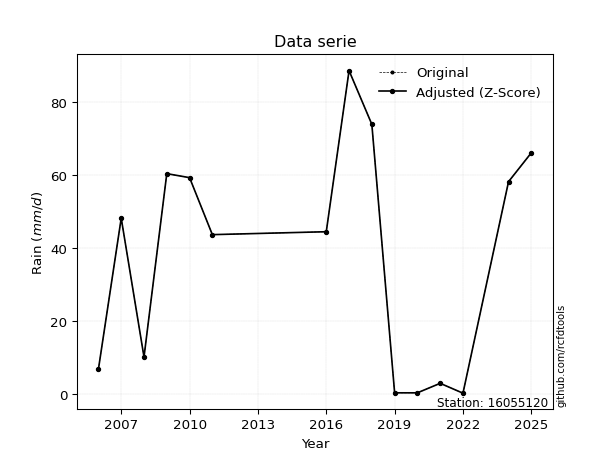</img>

</div>

> If Z-Score is active, values out of range or outliers are replaced with the station mean value.


### 4. Active continuous probability distributions from SciPy (45 of 104 available)

[scipy.stats](https://docs.scipy.org/doc/scipy/reference/stats.html) is a Python´s powerful submodule within the SciPy library for comprehensive statistical analysis, offering over 130 probability distributions (like Normal, Poisson), functions for descriptive stats (mean, variance), hypothesis testing (t-tests, chi-square), random variable generation, and statistical tests, making it essential for data science, modeling, and research. It provides tools to explore, model, and draw conclusions from data efficiently, working seamlessly with NumPy.

<div align="center">

|   id | p_dist             |   n_parameter | fit_method   | label                                                                       | active   | ref                                                                                                        |
|-----:|:-------------------|--------------:|:-------------|:----------------------------------------------------------------------------|:---------|:-----------------------------------------------------------------------------------------------------------|
|    0 | alpha              |             3 | MLE          | Alpha                                                                       | True     | [:mortar_board:](https://docs.scipy.org/doc/scipy/reference/generated/scipy.stats.alpha.html)              |
|    1 | betaprime          |             4 | MLE          | Beta prime                                                                  | True     | [:mortar_board:](https://docs.scipy.org/doc/scipy/reference/generated/scipy.stats.betaprime.html)          |
|    2 | chi2               |             3 | MLE          | Chi²                                                                        | True     | [:mortar_board:](https://docs.scipy.org/doc/scipy/reference/generated/scipy.stats.chi2.html)               |
|    3 | crystalball        |             4 | MLE          | Crystalball                                                                 | True     | [:mortar_board:](https://docs.scipy.org/doc/scipy/reference/generated/scipy.stats.crystalball.html)        |
|    4 | erlang             |             3 | MLE          | Erlang                                                                      | True     | [:mortar_board:](https://docs.scipy.org/doc/scipy/reference/generated/scipy.stats.erlang.html)             |
|    5 | expon              |             2 | MLE          | Exponential                                                                 | True     | [:mortar_board:](https://docs.scipy.org/doc/scipy/reference/generated/scipy.stats.expon.html)              |
|    6 | exponnorm          |             3 | MLE          | Exponentially modified Normal                                               | True     | [:mortar_board:](https://docs.scipy.org/doc/scipy/reference/generated/scipy.stats.exponnorm.html)          |
|    7 | f                  |             4 | MLE          | F                                                                           | True     | [:mortar_board:](https://docs.scipy.org/doc/scipy/reference/generated/scipy.stats.f.html)                  |
|    8 | fatiguelife        |             3 | MLE          | Fatigue-life (Birnbaum-Saunders)                                            | True     | [:mortar_board:](https://docs.scipy.org/doc/scipy/reference/generated/scipy.stats.fatiguelife.html)        |
|    9 | fisk               |             3 | MLE          | Fisk                                                                        | True     | [:mortar_board:](https://docs.scipy.org/doc/scipy/reference/generated/scipy.stats.fisk.html)               |
|   10 | gamma              |             3 | MLE          | Gamma                                                                       | True     | [:mortar_board:](https://docs.scipy.org/doc/scipy/reference/generated/scipy.stats.gamma.html)              |
|   11 | genexpon           |             5 | MLE          | Generalized exponential                                                     | True     | [:mortar_board:](https://docs.scipy.org/doc/scipy/reference/generated/scipy.stats.genexpon.html)           |
|   12 | genlogistic        |             3 | MLE          | Generalized logistic                                                        | True     | [:mortar_board:](https://docs.scipy.org/doc/scipy/reference/generated/scipy.stats.genlogistic.html)        |
|   13 | gibrat             |             2 | MM           | Gibrat                                                                      | True     | [:mortar_board:](https://docs.scipy.org/doc/scipy/reference/generated/scipy.stats.gibrat.html)             |
|   14 | gompertz           |             3 | MLE          | Gompertz (or truncated Gumbel)                                              | True     | [:mortar_board:](https://docs.scipy.org/doc/scipy/reference/generated/scipy.stats.gompertz.html)           |
|   15 | gumbel_l           |             2 | MM           | Gumbel Left Skew                                                            | True     | [:mortar_board:](https://docs.scipy.org/doc/scipy/reference/generated/scipy.stats.gumbel_l.html)           |
|   16 | gumbel_r           |             2 | MM           | Gumbel Right Skew                                                           | True     | [:mortar_board:](https://docs.scipy.org/doc/scipy/reference/generated/scipy.stats.gumbel_r.html)           |
|   17 | halflogistic       |             2 | MM           | Half-logistic                                                               | True     | [:mortar_board:](https://docs.scipy.org/doc/scipy/reference/generated/scipy.stats.halflogistic.html)       |
|   18 | halfnorm           |             2 | MM           | Half Normal                                                                 | True     | [:mortar_board:](https://docs.scipy.org/doc/scipy/reference/generated/scipy.stats.halfnorm.html)           |
|   19 | hypsecant          |             2 | MM           | hyperbolic secant                                                           | True     | [:mortar_board:](https://docs.scipy.org/doc/scipy/reference/generated/scipy.stats.hypsecant.html)          |
|   20 | invgamma           |             3 | MLE          | Inverted gamma                                                              | True     | [:mortar_board:](https://docs.scipy.org/doc/scipy/reference/generated/scipy.stats.invgamma.html)           |
|   21 | invgauss           |             3 | MLE          | Inverse Gaussian                                                            | True     | [:mortar_board:](https://docs.scipy.org/doc/scipy/reference/generated/scipy.stats.invgauss.html)           |
|   22 | invweibull         |             3 | MLE          | Inverted Weibull                                                            | True     | [:mortar_board:](https://docs.scipy.org/doc/scipy/reference/generated/scipy.stats.invweibull.html)         |
|   23 | johnsonsu          |             4 | MLE          | Johnson Su                                                                  | True     | [:mortar_board:](https://docs.scipy.org/doc/scipy/reference/generated/scipy.stats.johnsonsu.html)          |
|   24 | kstwobign          |             2 | MLE          | Limiting distribution of scaled Kolmogorov-Smirnov two-sided test statistic | True     | [:mortar_board:](https://docs.scipy.org/doc/scipy/reference/generated/scipy.stats.kstwobign.html)          |
|   25 | laplace            |             2 | MM           | Laplace                                                                     | True     | [:mortar_board:](https://docs.scipy.org/doc/scipy/reference/generated/scipy.stats.laplace.html)            |
|   26 | laplace_asymmetric |             3 | MLE          | Asymmetric Laplace                                                          | True     | [:mortar_board:](https://docs.scipy.org/doc/scipy/reference/generated/scipy.stats.laplace_asymmetric.html) |
|   27 | loggamma           |             3 | MLE          | Log gamma                                                                   | True     | [:mortar_board:](https://docs.scipy.org/doc/scipy/reference/generated/scipy.stats.loggamma.html)           |
|   28 | logistic           |             2 | MM           | Logistic (or Sech-squared)                                                  | True     | [:mortar_board:](https://docs.scipy.org/doc/scipy/reference/generated/scipy.stats.logistic.html)           |
|   29 | lognorm            |             3 | MLE          | Log Normal                                                                  | True     | [:mortar_board:](https://docs.scipy.org/doc/scipy/reference/generated/scipy.stats.lognorm.html)            |
|   30 | maxwell            |             2 | MM           | Maxwell                                                                     | True     | [:mortar_board:](https://docs.scipy.org/doc/scipy/reference/generated/scipy.stats.maxwell.html)            |
|   31 | mielke             |             4 | MLE          | Mielke Beta-Kappa / Dagum                                                   | True     | [:mortar_board:](https://docs.scipy.org/doc/scipy/reference/generated/scipy.stats.mielke.html)             |
|   32 | moyal              |             2 | MM           | Moyal                                                                       | True     | [:mortar_board:](https://docs.scipy.org/doc/scipy/reference/generated/scipy.stats.moyal.html)              |
|   33 | nakagami           |             3 | MLE          | Nakagami                                                                    | True     | [:mortar_board:](https://docs.scipy.org/doc/scipy/reference/generated/scipy.stats.nakagami.html)           |
|   34 | ncf                |             5 | MLE          | Non-central F distribution                                                  | True     | [:mortar_board:](https://docs.scipy.org/doc/scipy/reference/generated/scipy.stats.ncf.html)                |
|   35 | nct                |             4 | MLE          | Non-central Student’s t                                                     | True     | [:mortar_board:](https://docs.scipy.org/doc/scipy/reference/generated/scipy.stats.nct.html)                |
|   36 | norm               |             2 | MM           | Normal                                                                      | True     | [:mortar_board:](https://docs.scipy.org/doc/scipy/reference/generated/scipy.stats.norm.html)               |
|   37 | pareto             |             3 | MLE          | Pareto                                                                      | True     | [:mortar_board:](https://docs.scipy.org/doc/scipy/reference/generated/scipy.stats.pareto.html)             |
|   38 | pearson3           |             3 | MM           | Pearson type III                                                            | True     | [:mortar_board:](https://docs.scipy.org/doc/scipy/reference/generated/scipy.stats.pearson3.html)           |
|   39 | rayleigh           |             2 | MM           | Rayleigh                                                                    | True     | [:mortar_board:](https://docs.scipy.org/doc/scipy/reference/generated/scipy.stats.rayleigh.html)           |
|   40 | rice               |             3 | MLE          | Rice                                                                        | True     | [:mortar_board:](https://docs.scipy.org/doc/scipy/reference/generated/scipy.stats.rice.html)               |
|   41 | t                  |             3 | MLE          | Student’s t                                                                 | True     | [:mortar_board:](https://docs.scipy.org/doc/scipy/reference/generated/scipy.stats.t.html)                  |
|   42 | truncnorm          |             4 | MLE          | Truncated normal                                                            | True     | [:mortar_board:](https://docs.scipy.org/doc/scipy/reference/generated/scipy.stats.truncnorm.html)          |
|   43 | wald               |             2 | MM           | Wald                                                                        | True     | [:mortar_board:](https://docs.scipy.org/doc/scipy/reference/generated/scipy.stats.wald.html)               |
|   44 | weibull_min        |             3 | MLE          | Weibull minimum                                                             | True     | [:mortar_board:](https://docs.scipy.org/doc/scipy/reference/generated/scipy.stats.weibull_min.html)        |

</div>

> **n_parameter:** # arguments & localization & scale.
>
> **Fit methods:** (MLE) maximum likelihood, (MM) L-moments.
>
>**Inactive:** foldnorm, gennorm, norminvgauss, powernorm, powerlognorm, skewnorm, genextreme, anglit, arcsine, argus, beta, bradford, burr, burr12, cauchy, cosine, halfcauchy, foldcauchy, skewcauchy, wrapcauchy, dgamma, gengamma, exponweib, exponpow, truncexpon, gausshyper, genhalflogistic, genhyperbolic, geninvgauss, halfgennorm, johnsonsb, kappa4, kappa3, ksone, kstwo, loglaplace, levy, levy_l, levy_stable, ncx2, genpareto, truncpareto, lomax, powerlaw, rdist, rel_breitwigner, recipinvgauss, semicircular, studentized_range, trapezoid, triang, truncweibull_min, tukeylambda, uniform, loguniform, vonmises, vonmises_line, weibull_max, dweibull, 


## B. Probability distributions vs. Empirical distributions

A continuous probability distribution (CPD) describes probabilities for variables that can take any value within a range (like rain any time), unlike discrete variables with specific outcomes (like temperature). It uses a Probability Density Function (PDF), a curve where the total area under it equals 1, and the probability of the variable falling within an interval (a to b) is found by calculating the area under the curve between those points. A key feature is that the probability of hitting any single exact value is zero, so probabilities are always expressed for ranges, e.g., $P(a ≤ X ≤ b)$.

<div align="center">

Distributions parameters
|    |   station | p_dist                |   n |             loc |           scale | shape                  | shape1             | shape2                 | shape3   |
|---:|----------:|:----------------------|----:|----------------:|----------------:|:-----------------------|:-------------------|:-----------------------|:---------|
|  0 |  16055120 | alpha                 |  15 |    -7.78579     |    14.5833      | 2.090674412589496e-10  |                    |                        |          |
|  1 |  16055120 | betaprime             |  15 |     0.3         |    22.7579      | 0.19673411493797888    | 0.4585285493096376 |                        |          |
|  2 |  16055120 | chi2                  |  15 |     0.3         |    45.2176      | 0.8587425467603265     |                    |                        |          |
|  3 |  16055120 | crystalball           |  15 |    33.4733      |    29.9412      | 3451.0635048479207     | 154.48026331159653 |                        |          |
|  4 |  16055120 | erlang                |  15 |     0.3         |    33.9287      | 0.5553663776337726     |                    |                        |          |
|  5 |  16055120 | expon                 |  15 |     0.3         |    33.1733      |                        |                    |                        |          |
|  6 |  16055120 | exponnorm             |  15 |    27.7062      |    29.3822      | 0.19627924263360194    |                    |                        |          |
|  7 |  16055120 | f                     |  15 |     0.3         |    29.2433      | 0.7193450062209555     | 15.296198948491003 |                        |          |
|  8 |  16055120 | fatiguelife           |  15 |     0.286754    |     1.42977     | 5.494415115300548      |                    |                        |          |
|  9 |  16055120 | fisk                  |  15 |     0.3         |     7.27205     | 0.6972912146336352     |                    |                        |          |
| 10 |  16055120 | gamma                 |  15 |     0.3         |    21.7195      | 0.849709812713324      |                    |                        |          |
| 11 |  16055120 | genexpon              |  15 |     0.3         |     1.83244e+06 | 49638.92277036169      | 285068.78305591445 | 1181.6159598956824     |          |
| 12 |  16055120 | genlogistic           |  15 |  -158.189       |    24.4499      | 1402.8954122979276     |                    |                        |          |
| 13 |  16055120 | gibrat                |  15 |    10.632       |    13.854       |                        |                    |                        |          |
| 14 |  16055120 | gompertz              |  15 |     0.299984    |   143.569       | 3.468321660662017      |                    |                        |          |
| 15 |  16055120 | gumbel_l              |  15 |    46.9485      |    23.3451      |                        |                    |                        |          |
| 16 |  16055120 | gumbel_r              |  15 |    19.9982      |    23.3451      |                        |                    |                        |          |
| 17 |  16055120 | halflogistic          |  15 |    -2.01397     |    25.5987      |                        |                    |                        |          |
| 18 |  16055120 | halfnorm              |  15 |    -6.15711     |    49.6694      |                        |                    |                        |          |
| 19 |  16055120 | hypsecant             |  15 |    33.4733      |    19.0612      |                        |                    |                        |          |
| 20 |  16055120 | invgamma              |  15 |    -2.0894      |     5.59605     | 0.712131788681052      |                    |                        |          |
| 21 |  16055120 | invgauss              |  15 |    -2.21326     |    10.5682      | 3.3767719830018823     |                    |                        |          |
| 22 |  16055120 | invweibull            |  15 |     0.278291    |     1.88292     | 0.33865606715553187    |                    |                        |          |
| 23 |  16055120 | johnsonsu             |  15 |     1.15586e+09 |     1.26822e+09 | 46846887.5858823       | 57317498.65974689  |                        |          |
| 24 |  16055120 | kstwobign             |  15 |   -63.8825      |   111.003       |                        |                    |                        |          |
| 25 |  16055120 | laplace               |  15 |    33.4733      |    21.1716      |                        |                    |                        |          |
| 26 |  16055120 | laplace_asymmetric    |  15 |    48.2         |    24.8162      | 1.339804417300959      |                    |                        |          |
| 27 |  16055120 | loggamma              |  15 | -6588.58        |   958.816       | 999.1665096552201      |                    |                        |          |
| 28 |  16055120 | logistic              |  15 |    33.4733      |    16.5075      |                        |                    |                        |          |
| 29 |  16055120 | lognorm               |  15 |     0.3         |     0.813979    | 10.180137219939493     |                    |                        |          |
| 30 |  16055120 | maxwell               |  15 |   -37.4748      |    44.4601      |                        |                    |                        |          |
| 31 |  16055120 | mielke                |  15 |     0.3         |   101.138       | 0.6120228354951687     | 186.64360310239678 |                        |          |
| 32 |  16055120 | moyal                 |  15 |    16.351       |    13.4783      |                        |                    |                        |          |
| 33 |  16055120 | nakagami              |  15 |     0.3         |    59.9474      | 0.19661147345163077    |                    |                        |          |
| 34 |  16055120 | ncf                   |  15 |     0.3         |    13.809       | 0.6466477182543652     | 9.869801823210206  | 0.4314038652568764     |          |
| 35 |  16055120 | nct                   |  15 |    -0.42047     |     0.0314607   | 0.3641607707342656     | 54.736195864163285 |                        |          |
| 36 |  16055120 | norm                  |  15 |    33.4733      |    29.9412      |                        |                    |                        |          |
| 37 |  16055120 | pareto                |  15 |     0.299996    |     3.56001e-06 | 0.07143430085413727    |                    |                        |          |
| 38 |  16055120 | pearson3              |  15 |    33.4733      |    29.9412      | 0.24141407614776234    |                    |                        |          |
| 39 |  16055120 | rayleigh              |  15 |   -23.806       |    45.7023      |                        |                    |                        |          |
| 40 |  16055120 | rice                  |  15 |   -18.3536      |    39.3458      | 0.5604832559377686     |                    |                        |          |
| 41 |  16055120 | t                     |  15 |    33.4761      |    29.9405      | 6668838.372288655      |                    |                        |          |
| 42 |  16055120 | truncnorm             |  15 |   -23.7745      |    52.8731      | 0.4553256336795407     | 98.89294889234327  |                        |          |
| 43 |  16055120 | wald                  |  15 |     3.53206     |    29.9412      |                        |                    |                        |          |
| 44 |  16055120 | weibull_min           |  15 |     0.3         |    40.5102      | 0.5470915800603953     |                    |                        |          |
| 45 |  16055120 | logalpha              |  15 |   -64.2457      |  2139.71        | 32.13049397136827      |                    |                        |          |
| 46 |  16055120 | logbetaprime          |  15 |    -5.76741     |     2.73357e+12 | 12.48111830658437      | 4151804835750.8105 |                        |          |
| 47 |  16055120 | logchi2               |  15 |    -1.20397     |     1.88033     | 1.7341641312806164     |                    |                        |          |
| 48 |  16055120 | logcrystalball        |  15 |     2.41397     |     2.00594     | 6.393730965804814      | 499.802106438313   |                        |          |
| 49 |  16055120 | logerlang             |  15 |   -29.8404      |     0.130705    | 246.66256767473374     |                    |                        |          |
| 50 |  16055120 | logexpon              |  15 |    -1.20397     |     3.61794     |                        |                    |                        |          |
| 51 |  16055120 | logexponnorm          |  15 |     2.41253     |     2.00594     | 0.0007191334587875034  |                    |                        |          |
| 52 |  16055120 | logf                  |  15 |    -1.20397     |     1.08883     | 1.1524329331417595     | 1.1018857989083726 |                        |          |
| 53 |  16055120 | logfatiguelife        |  15 |  -722.585       |   724.982       | 0.0027622219422927235  |                    |                        |          |
| 54 |  16055120 | logfisk               |  15 |    -1.20397     |     1.92371     | 0.37797023024625287    |                    |                        |          |
| 55 |  16055120 | loggamma              |  15 |   -31.1752      |     0.128905    | 260.32354085222596     |                    |                        |          |
| 56 |  16055120 | loggenexpon           |  15 |    -1.22994     |     0.0551998   | 0.00578305902480877    | 3.926299059470484  | 5.5288328697544406e-05 |          |
| 57 |  16055120 | loggenlogistic        |  15 |     4.48419     |     2.3135e-06  | 1.1226434109350606e-06 |                    |                        |          |
| 58 |  16055120 | loggibrat             |  15 |     0.883662    |     0.928172    |                        |                    |                        |          |
| 59 |  16055120 | loggompertz           |  15 |    -1.20397     |     1.75291     | 0.08683164048654143    |                    |                        |          |
| 60 |  16055120 | loggumbel_l           |  15 |     3.31674     |     1.56402     |                        |                    |                        |          |
| 61 |  16055120 | loggumbel_r           |  15 |     1.51119     |     1.56402     |                        |                    |                        |          |
| 62 |  16055120 | loghalflogistic       |  15 |     0.0364275   |     1.71502     |                        |                    |                        |          |
| 63 |  16055120 | loghalfnorm           |  15 |    -0.241088    |     3.32762     |                        |                    |                        |          |
| 64 |  16055120 | loghypsecant          |  15 |     2.41397     |     1.27702     |                        |                    |                        |          |
| 65 |  16055120 | loginvgamma           |  15 |   -35.9544      | 13182.8         | 344.93870977553087     |                    |                        |          |
| 66 |  16055120 | loginvgauss           |  15 |   -12.8088      |   732.127       | 0.02078549773507503    |                    |                        |          |
| 67 |  16055120 | loginvweibull         |  15 |    -4.01403e+08 |     4.01403e+08 | 190700998.33667275     |                    |                        |          |
| 68 |  16055120 | logjohnsonsu          |  15 |     4.57209     |     0.0035093   | 5.345075154154291      | 0.8200181521596024 |                        |          |
| 69 |  16055120 | logkstwobign          |  15 |    -5.89975     |     9.4713      |                        |                    |                        |          |
| 70 |  16055120 | loglaplace            |  15 |     2.41397     |     1.41841     |                        |                    |                        |          |
| 71 |  16055120 | loglaplace_asymmetric |  15 |     4.48413     |     0.0215395   | 95.88554313409031      |                    |                        |          |
| 72 |  16055120 | logloggamma           |  15 |     4.48444     |     1.65999e-06 | 8.036734926601821e-07  |                    |                        |          |
| 73 |  16055120 | loglogistic           |  15 |     2.41397     |     1.10593     |                        |                    |                        |          |
| 74 |  16055120 | loglognorm            |  15 |  -410.887       |   413.299       | 0.004840651321059028   |                    |                        |          |
| 75 |  16055120 | logmaxwell            |  15 |    -2.33926     |     2.97864     |                        |                    |                        |          |
| 76 |  16055120 | logmielke             |  15 |    -1.20397     |     5.42561     | 0.4221361054083145     | 7.891566970622481  |                        |          |
| 77 |  16055120 | logmoyal              |  15 |     1.26684     |     0.902988    |                        |                    |                        |          |
| 78 |  16055120 | lognakagami           |  15 |    -1.20397     |     3.09178     | 0.13685780185450924    |                    |                        |          |
| 79 |  16055120 | logncf                |  15 |    -1.20397     |     1.06709     | 1.0368981850550578     | 1.1595038241560556 | 1.0643068654979237     |          |
| 80 |  16055120 | lognct                |  15 |  -108.018       |     1.92802     | 18755.63780471449      | 57.27481079536338  |                        |          |
| 81 |  16055120 | lognorm               |  15 |     2.41397     |     2.00594     |                        |                    |                        |          |
| 82 |  16055120 | logpareto             |  15 |    -1.20397     |     8.92364e-07 | 0.0714292464060363     |                    |                        |          |
| 83 |  16055120 | logpearson3           |  15 |     2.41397     |     2.00592     | -0.7168034024519334    |                    |                        |          |
| 84 |  16055120 | lograyleigh           |  15 |    -1.42351     |     3.06186     |                        |                    |                        |          |
| 85 |  16055120 | logrice               |  15 |    -2.364       |     2.21367     | 1.8654217317714985     |                    |                        |          |
| 86 |  16055120 | logt                  |  15 |     2.41397     |     2.00593     | 25357829369.331993     |                    |                        |          |
| 87 |  16055120 | logtruncnorm          |  15 |     1.30775     |     5.83507     | -0.4305285025721862    | 0.544359655534013  |                        |          |
| 88 |  16055120 | logwald               |  15 |     0.408032    |     2.00594     |                        |                    |                        |          |
| 89 |  16055120 | logweibull_min        |  15 |    -1.1302e+08  |     1.1302e+08  | 78946913.3744768       |                    |                        |          |

</div>

> **loc** (Location parameter): This shifts the distribution along the x-axis. For many common distributions, like the normal (Gaussian) distribution, loc represents the mean $μ$. For others, like the uniform distribution, it might represent the minimum value, or for the beta distribution, the left end of the support interval.
>
> **scale** (Scale parameter): This determines the width or spread of the distribution. For the normal distribution, scale represents the standard deviation $σ$. For a uniform distribution, it defines the length of the interval (from $loc$ to $loc + scale$).
>
> **shape** (Shape parameters): Refers to parameters that define the specific form of a probability distribution, distinct from its location (loc) and scale (scale). These parameters are required arguments for most distribution functions. For example, a normal (Gaussian) distribution is fully defined by its location (mean) and scale (standard deviation), so it has no specific shape parameters beyond loc and scale. However, other distributions have intrinsic properties that need specification, as Gamma distribution that takes a shape parameter, often named $a$ or $alpha$.


### 0. Cumulative distribution values - CDF (90 evaluated)

> Ordered by x ascending and calculating $log(f(x))$ separately. 

|   id |   Station |   date |    x |   count |    mean |     std |    zscore |   Value_initial |   station |   m |     alpha |   alpha_pdf |   betaprime |   betaprime_pdf |        chi2 |    chi2_pdf |   crystalball |   crystalball_pdf |      erlang |     erlang_pdf |      expon |   expon_pdf |   exponnorm |   exponnorm_pdf |           f |       f_pdf |   fatiguelife |   fatiguelife_pdf |        fisk |       fisk_pdf |       gamma |   gamma_pdf |    genexpon |   genexpon_pdf |   genlogistic |   genlogistic_pdf |   gibrat |   gibrat_pdf |    gompertz |   gompertz_pdf |   gumbel_l |   gumbel_l_pdf |   gumbel_r |   gumbel_r_pdf |   halflogistic |   halflogistic_pdf |   halfnorm |   halfnorm_pdf |   hypsecant |   hypsecant_pdf |   invgamma |   invgamma_pdf |   invgauss |   invgauss_pdf |   invweibull |   invweibull_pdf |   johnsonsu |   johnsonsu_pdf |   kstwobign |   kstwobign_pdf |   laplace |   laplace_pdf |   laplace_asymmetric |   laplace_asymmetric_pdf |   loggamma |   loggamma_pdf |   logistic |   logistic_pdf |   lognorm |   lognorm_pdf |   maxwell |   maxwell_pdf |      mielke |   mielke_pdf |     moyal |   moyal_pdf |    nakagami |   nakagami_pdf |         ncf |     ncf_pdf |       nct |     nct_pdf |     norm |   norm_pdf |   pareto |      pareto_pdf |   pearson3 |   pearson3_pdf |   rayleigh |   rayleigh_pdf |      rice |   rice_pdf |        t |      t_pdf |   truncnorm |   truncnorm_pdf |        wald |    wald_pdf |   weibull_min |   weibull_min_pdf |   logalpha |   logalpha_pdf |   logbetaprime |   logbetaprime_pdf |     logchi2 |   logchi2_pdf |   logcrystalball |   logcrystalball_pdf |   logerlang |   logerlang_pdf |   logexpon |   logexpon_pdf |   logexponnorm |   logexponnorm_pdf |        logf |    logf_pdf |   logfatiguelife |   logfatiguelife_pdf |     logfisk |   logfisk_pdf |   loggenexpon |   loggenexpon_pdf |   loggenlogistic |   loggenlogistic_pdf |   loggibrat |   loggibrat_pdf |   loggompertz |   loggompertz_pdf |   loggumbel_l |   loggumbel_l_pdf |   loggumbel_r |   loggumbel_r_pdf |   loghalflogistic |   loghalflogistic_pdf |   loghalfnorm |   loghalfnorm_pdf |   loghypsecant |   loghypsecant_pdf |   loginvgamma |   loginvgamma_pdf |   loginvgauss |   loginvgauss_pdf |   loginvweibull |   loginvweibull_pdf |   logjohnsonsu |   logjohnsonsu_pdf |   logkstwobign |   logkstwobign_pdf |   loglaplace |   loglaplace_pdf |   loglaplace_asymmetric |   loglaplace_asymmetric_pdf |   logloggamma |   logloggamma_pdf |   loglogistic |   loglogistic_pdf |   loglognorm |   loglognorm_pdf |   logmaxwell |   logmaxwell_pdf |   logmielke |   logmielke_pdf |    logmoyal |   logmoyal_pdf |   lognakagami |   lognakagami_pdf |      logncf |   logncf_pdf |    lognct |   lognct_pdf |   logpareto |   logpareto_pdf |   logpearson3 |   logpearson3_pdf |   lograyleigh |   lograyleigh_pdf |   logrice |   logrice_pdf |      logt |   logt_pdf |   logtruncnorm |   logtruncnorm_pdf |   logwald |   logwald_pdf |   logweibull_min |   logweibull_min_pdf |
|-----:|----------:|-------:|-----:|--------:|--------:|--------:|----------:|----------------:|----------:|----:|----------:|------------:|------------:|----------------:|------------:|------------:|--------------:|------------------:|------------:|---------------:|-----------:|------------:|------------:|----------------:|------------:|------------:|--------------:|------------------:|------------:|---------------:|------------:|------------:|------------:|---------------:|--------------:|------------------:|---------:|-------------:|------------:|---------------:|-----------:|---------------:|-----------:|---------------:|---------------:|-------------------:|-----------:|---------------:|------------:|----------------:|-----------:|---------------:|-----------:|---------------:|-------------:|-----------------:|------------:|----------------:|------------:|----------------:|----------:|--------------:|---------------------:|-------------------------:|-----------:|---------------:|-----------:|---------------:|----------:|--------------:|----------:|--------------:|------------:|-------------:|----------:|------------:|------------:|---------------:|------------:|------------:|----------:|------------:|---------:|-----------:|---------:|----------------:|-----------:|---------------:|-----------:|---------------:|----------:|-----------:|---------:|-----------:|------------:|----------------:|------------:|------------:|--------------:|------------------:|-----------:|---------------:|---------------:|-------------------:|------------:|--------------:|-----------------:|---------------------:|------------:|----------------:|-----------:|---------------:|---------------:|-------------------:|------------:|------------:|-----------------:|---------------------:|------------:|--------------:|--------------:|------------------:|-----------------:|---------------------:|------------:|----------------:|--------------:|------------------:|--------------:|------------------:|--------------:|------------------:|------------------:|----------------------:|--------------:|------------------:|---------------:|-------------------:|--------------:|------------------:|--------------:|------------------:|----------------:|--------------------:|---------------:|-------------------:|---------------:|-------------------:|-------------:|-----------------:|------------------------:|----------------------------:|--------------:|------------------:|--------------:|------------------:|-------------:|-----------------:|-------------:|-----------------:|------------:|----------------:|------------:|---------------:|--------------:|------------------:|------------:|-------------:|----------:|-------------:|------------:|----------------:|--------------:|------------------:|--------------:|------------------:|----------:|--------------:|----------:|-----------:|---------------:|-------------------:|----------:|--------------:|-----------------:|---------------------:|
|    0 |  16055120 |   2022 |  0.3 |      15 | 33.4733 | 30.9921 | -1.07038  |             0.3 |  16055120 |   1 | 0.0712989 |  0.0349946  | 0.000265481 |     9.40876e+11 | 5.30839e-08 | 2.93283e+07 |      0.133942 |        0.00721243 | 1.34473e-07 | 6413.36        | 0          |  0.0301447  |    0.133728 |      0.00723876 | 3.23753e-07 | 2.09769e+09 |     0.0305056 |        4.97018    | 1.15951e-12 | 14564.9        | 7.16567e-11 | 2.60242     | 4.65644e-09 |     0.027089   |      0.117015 |        0.0102601  | 0        |   0          | 3.91617e-07 |     0.0241579  |   0.126788 |    0.0050712   |  0.097769  |     0.0097377  |      0.0451663 |         0.0194924  |   0.103435 |     0.0159287  |    0.110574 |      0.00568503 |  0.0537912 |     0.0576532  |  0.0537727 |     0.0529099  |    0.0107489 |      0.760092    |    0.133913 |      0.00721232 |    0.108242 |      0.0107602  |  0.104348 |    0.00492867 |             0.152062 |               0.00457347 |  0.0384669 |      0.0432875 |   0.118199 |     0.00631399 | 0.0356457 |     0.0391026 |  0.131953 |    0.0090298  | 6.43203e-09 | 943.527      | 0.069704  |  0.0103625  | 6.40651e-08 |    4.53816e+08 | 3.15388e-06 | 1.66998e+09 | 0.0442828 | 0.194902    | 0.133942 | 0.00721243 | 0        | 20065.7         |   0.131171 |     0.00782472 |   0.129864 |     0.0100424  | 0.0916358 | 0.00936648 | 0.133916 | 0.00721164 | 2.37591e-14 |      0.0209665  | 0           | 0           |   1.68734e-10 |       1.66296e+06 |  0.0350951 |      0.0416943 |      0.0363872 |          0.0511505 | 8.91534e-15 |    34.8143    |        0.0356457 |            0.0391026 |   0.0356156 |       0.0413349 |  0         |      0.276401  |      0.0356455 |          0.0391024 | 6.10922e-10 | 1.58537e+06 |        0.0357228 |            0.0394339 | 9.46289e-07 |    1.6108e+09 |    0.00274074 |         0.106324  |          0       |            0.0307058 |   0         |       0         |   2.38131e-09 |         0.0495356 |     0.0540368 |         0.0335991 |    0.0034318  |         0.0124515 |          0        |             0         |      0        |         0         |      0.0374088 |          0.0292265 |     0.0349417 |         0.0425765 |     0.0344598 |         0.0461433 |       0.03412   |           0.0547551 |       0.097415 |          0.0244422 |       0.033426 |          0.0643347 |    0.0390136 |        0.0275051 |               0.0636594 |                   0.030823  |     0.0636724 |         0.0308266 |     0.0365655 |         0.0318542 |    0.0347357 |        0.038722  |    0.0141004 |        0.0361869 |  1.2079e-07 |     2.29637e+08 | 8.56519e-05 |    0.000774426 |   3.09754e-05 |       3.81835e+10 | 2.86727e-09 |  6.69475e+06 | 0.035753  |    0.0393079 |    0        |  80045          |     0.0513891 |         0.0378126 |     0.0025671 |         0.0233568 | 0.0252547 |     0.0454074 | 0.0356455 |  0.0391025 |    7.34462e-05 |           0.166856 |  0        |     0         |        0.0412788 |            0.0282306 |
|    1 |  16055120 |   2019 |  0.4 |      15 | 33.4733 | 30.9921 | -1.06715  |             0.4 |  16055120 |   2 | 0.0748249 |  0.0355203  | 0.266151    |     0.522355    | 0.0606777   | 0.260331    |      0.134665 |        0.00723913 | 0.0441689   |    0.244835    | 0.00300993 |  0.030054   |    0.134453 |      0.00726564 | 0.0993328   | 0.356935    |     0.275763  |        1.02959    | 0.0479242   |     0.318156   | 0.0109085   | 0.0924604   | 0.00270574  |     0.0270257  |      0.118044 |        0.0103081  | 0        |   0          | 0.0024141   |     0.0241163  |   0.127296 |    0.00509     |  0.0987455 |     0.00979292 |      0.0471154 |         0.0194889  |   0.105028 |     0.0159245  |    0.111144 |      0.00571314 |  0.0596283 |     0.0590467  |  0.0591228 |     0.0540605  |    0.0797918 |      0.561345    |    0.134635 |      0.00723903 |    0.109321 |      0.0108115  |  0.104842 |    0.00495201 |             0.15252  |               0.00458724 |  0.0526098 |      0.0553347 |   0.118832 |     0.00634325 | 0.048437  |     0.0501276 |  0.132858 |    0.00906032 | 0.0144852   |   0.0886526  | 0.0707447 |  0.0104504  | 0.0638971   |    0.251258    | 0.124324    | 0.401718    | 0.0644929 | 0.207088    | 0.134665 | 0.00723913 | 0.518917 |     0.343646    |   0.131955 |     0.0078545  |   0.130869 |     0.0100724  | 0.0925745 | 0.00940709 | 0.134638 | 0.00723834 | 0.00209574  |      0.0209484  | 0           | 0           |   0.0367551   |       0.197342    |  0.0488104 |      0.0539765 |      0.0532961 |          0.0666673 | 0.109288    |     0.316094  |        0.048437  |            0.0501276 |   0.0491855 |       0.05332   |  0.0764363 |      0.255274  |      0.0484367 |          0.0501273 | 0.281704    | 0.474544    |        0.0486296 |            0.050603  | 0.327789    |    0.289498   |    0.0357105  |         0.122569  |          0       |            0.035306  |   0         |       0         |   0.0153673   |         0.0574734 |     0.0645894 |         0.0399336 |    0.00890399 |         0.0268782 |          0        |             0         |      0        |         0         |      0.0468302 |          0.0365394 |     0.0489818 |         0.0553653 |     0.0497582 |         0.0605412 |       0.0525303 |           0.0735307 |       0.104825 |          0.0271352 |       0.055291 |          0.0877878 |    0.0477858 |        0.0336897 |               0.0731739 |                   0.0354298 |     0.073188  |         0.0354334 |     0.0469193 |         0.0404346 |    0.0474273 |        0.0498211 |    0.0270901 |        0.0545404 |  0.289435   |     0.424708    | 0.000809309 |    0.00541851  |   0.424106    |       0.403096    | 0.195135    |  0.344402    | 0.0486118 |    0.0503918 |    0.595851 |      0.100347   |     0.0633449 |         0.0454947 |     0.0136273 |         0.0533658 | 0.0402408 |     0.0589664 | 0.0484368 |  0.0501275 |    0.048568    |           0.170228 |  0        |     0         |        0.0502317 |            0.0341915 |
|    2 |  16055120 |   2020 |  0.4 |      15 | 33.4733 | 30.9921 | -1.06715  |             0.4 |  16055120 |   3 | 0.0748249 |  0.0355203  | 0.266151    |     0.522355    | 0.0606777   | 0.260331    |      0.134665 |        0.00723913 | 0.0441689   |    0.244835    | 0.00300993 |  0.030054   |    0.134453 |      0.00726564 | 0.0993328   | 0.356935    |     0.275763  |        1.02959    | 0.0479242   |     0.318156   | 0.0109085   | 0.0924604   | 0.00270574  |     0.0270257  |      0.118044 |        0.0103081  | 0        |   0          | 0.0024141   |     0.0241163  |   0.127296 |    0.00509     |  0.0987455 |     0.00979292 |      0.0471154 |         0.0194889  |   0.105028 |     0.0159245  |    0.111144 |      0.00571314 |  0.0596283 |     0.0590467  |  0.0591228 |     0.0540605  |    0.0797918 |      0.561345    |    0.134635 |      0.00723903 |    0.109321 |      0.0108115  |  0.104842 |    0.00495201 |             0.15252  |               0.00458724 |  0.0526098 |      0.0553347 |   0.118832 |     0.00634325 | 0.048437  |     0.0501276 |  0.132858 |    0.00906032 | 0.0144852   |   0.0886526  | 0.0707447 |  0.0104504  | 0.0638971   |    0.251258    | 0.124324    | 0.401718    | 0.0644929 | 0.207088    | 0.134665 | 0.00723913 | 0.518917 |     0.343646    |   0.131955 |     0.0078545  |   0.130869 |     0.0100724  | 0.0925745 | 0.00940709 | 0.134638 | 0.00723834 | 0.00209574  |      0.0209484  | 0           | 0           |   0.0367551   |       0.197342    |  0.0488104 |      0.0539765 |      0.0532961 |          0.0666673 | 0.109288    |     0.316094  |        0.048437  |            0.0501276 |   0.0491855 |       0.05332   |  0.0764363 |      0.255274  |      0.0484367 |          0.0501273 | 0.281704    | 0.474544    |        0.0486296 |            0.050603  | 0.327789    |    0.289498   |    0.0357105  |         0.122569  |          0       |            0.035306  |   0         |       0         |   0.0153673   |         0.0574734 |     0.0645894 |         0.0399336 |    0.00890399 |         0.0268782 |          0        |             0         |      0        |         0         |      0.0468302 |          0.0365394 |     0.0489818 |         0.0553653 |     0.0497582 |         0.0605412 |       0.0525303 |           0.0735307 |       0.104825 |          0.0271352 |       0.055291 |          0.0877878 |    0.0477858 |        0.0336897 |               0.0731739 |                   0.0354298 |     0.073188  |         0.0354334 |     0.0469193 |         0.0404346 |    0.0474273 |        0.0498211 |    0.0270901 |        0.0545404 |  0.289435   |     0.424708    | 0.000809309 |    0.00541851  |   0.424106    |       0.403096    | 0.195135    |  0.344402    | 0.0486118 |    0.0503918 |    0.595851 |      0.100347   |     0.0633449 |         0.0454947 |     0.0136273 |         0.0533658 | 0.0402408 |     0.0589664 | 0.0484368 |  0.0501275 |    0.048568    |           0.170228 |  0        |     0         |        0.0502317 |            0.0341915 |
|    3 |  16055120 |   2021 |  3   |      15 | 33.4733 | 30.9921 | -0.983261 |             3   |  16055120 |   4 | 0.176349  |  0.0400976  | 0.503068    |     0.0344781   | 0.247675    | 0.0385712   |      0.154393 |        0.00793792 | 0.268094    |    0.0523793   | 0.0781665  |  0.0277884  |    0.154256 |      0.00796889 | 0.322177    | 0.0418349   |     0.547204  |        0.0279482  | 0.33384     |     0.0574338  | 0.169988    | 0.0499858   | 0.0708692   |     0.0254207  |      0.146417 |        0.0114977  | 0        |   0          | 0.0637229   |     0.0230478  |   0.141184 |    0.00559912  |  0.126035  |     0.0111819  |      0.0976222 |         0.0193461  |   0.14627  |     0.0157932  |    0.126986 |      0.00648669 |  0.217055  |     0.0547268  |  0.2049    |     0.0520317  |    0.413666  |      0.0454337   |    0.154364 |      0.007938   |    0.139085 |      0.012054   |  0.118541 |    0.00559906 |             0.164926 |               0.00496035 |  0.27283   |      0.164003  |   0.136339 |     0.00713319 | 0.255999  |     0.160407  |  0.157423 |    0.0098273  | 0.108881    |   0.0246806  | 0.100807  |  0.0126372  | 0.233506    |    0.033996    | 0.358937    | 0.0422297   | 0.385625  | 0.0628997   | 0.154393 | 0.00793792 | 0.619835 |     0.0100581   |   0.153381 |     0.00862584 |   0.15803  |     0.0108057  | 0.11836   | 0.0104109  | 0.154365 | 0.00793715 | 0.0559322   |      0.0204579  | 0           | 0           |   0.203281    |       0.036687    |  0.269386  |      0.165503  |      0.301353  |          0.168628  | 0.525564    |     0.140302  |        0.255999  |            0.160407  |   0.267252  |       0.164696  |  0.470825  |      0.146264  |      0.255997  |          0.160407  | 0.620426    | 0.0694597   |        0.258197  |            0.161683  | 0.516981    |    0.0409903  |    0.353995   |         0.174722  |          0       |            0.0938596 |   0.0717595 |       0.636674  |   0.210325    |         0.145494  |     0.215057  |         0.121526  |    0.272026   |         0.226429  |          0.300138 |             0.265279  |      0.312758 |         0.221111  |      0.218295  |          0.157854  |     0.27568   |         0.169181  |     0.289604  |         0.171236  |       0.322631  |           0.173395  |       0.189595 |          0.0639798 |       0.354128 |          0.17808   |    0.197802  |        0.139453  |               0.19411   |                   0.0939854 |     0.194131  |         0.0939871 |     0.233373  |         0.161773  |    0.255427  |        0.161157  |    0.278479  |        0.183315  |  0.69637    |     0.127519    | 0.272367    |    0.265501    |   0.742809    |       0.0825852   | 0.500821    |  0.0777887   | 0.256872  |    0.16062   |    0.651647 |      0.0108064  |     0.23328   |         0.13224   |     0.287702  |         0.191627  | 0.269     |     0.166713  | 0.255998  |  0.160407  |    0.407763    |           0.182935 |  0.213004 |     0.527272  |        0.189867  |            0.119153  |
|    4 |  16055120 |   2025 |  4.1 |      15 | 33.4733 | 30.9921 | -0.947768 |             4.1 |  16055120 |   5 | 0.219841  |  0.0388011  | 0.535541    |     0.025485    | 0.285784    | 0.0313536   |      0.163288 |        0.00823479 | 0.320485    |    0.0435599   | 0.108233   |  0.0268821  |    0.163186 |      0.0082675  | 0.362974    | 0.0331422   |     0.573693  |        0.0210121  | 0.38875     |     0.0436034  | 0.222185    | 0.0451384   | 0.09847     |     0.0247648  |      0.159322 |        0.0119614  | 0        |   0          | 0.0888301   |     0.0226023  |   0.147467 |    0.00582632  |  0.138641  |     0.0117342  |      0.118855  |         0.0192563  |   0.163606 |     0.015725   |    0.134313 |      0.00683919 |  0.273293  |     0.0475957  |  0.25902   |     0.0463733  |    0.45528   |      0.0317445   |    0.163259 |      0.00823495 |    0.152606 |      0.012522   |  0.124863 |    0.00589766 |             0.170474 |               0.00512721 |  0.326126  |      0.176706  |   0.144378 |     0.00748344 | 0.308536  |     0.175511  |  0.168403 |    0.0101347  | 0.134211    |   0.0216158  | 0.115177  |  0.013482   | 0.267074    |    0.0276185   | 0.399943    | 0.0331804   | 0.44328   | 0.0438555   | 0.163288 | 0.00823479 | 0.629003 |     0.00697418  |   0.163048 |     0.00894839 |   0.170074 |     0.0110882  | 0.13003   | 0.0108042  | 0.163259 | 0.00823404 | 0.0783161   |      0.0202391  | 1.03646e-12 | 4.89698e-11 |   0.239648    |       0.0299917   |  0.32316   |      0.178231  |      0.3551    |          0.174874  | 0.567264    |     0.126954  |        0.308536  |            0.175511  |   0.320868  |       0.178049  |  0.514597  |      0.134166  |      0.308534  |          0.175511  | 0.640503    | 0.0595112   |        0.311119  |            0.176688  | 0.528976    |    0.036014   |    0.408387   |         0.173144  |          0       |            0.109222  |   0.285901  |       0.644785  |   0.25854     |         0.163259  |     0.25597   |         0.140657  |    0.344327   |         0.234721  |          0.380583 |             0.249314  |      0.38044  |         0.211974  |      0.272332  |          0.188175  |     0.330542  |         0.181472  |     0.344598  |         0.180216  |       0.377107  |           0.17472   |       0.211243 |          0.0750213 |       0.409512 |          0.17596   |    0.246533  |        0.173809  |               0.225805  |                   0.109332  |     0.225826  |         0.109332  |     0.287633  |         0.185274  |    0.30821   |        0.176322  |    0.337249  |        0.192213  |  0.734711   |     0.118233    | 0.355858    |    0.266352    |   0.767167    |       0.0736587   | 0.523593    |  0.0683484   | 0.309454  |    0.175584  |    0.654799 |      0.00942939 |     0.277239  |         0.149209  |     0.348514  |         0.196974  | 0.323039  |     0.178768  | 0.308535  |  0.175511  |    0.464935    |           0.183024 |  0.364969 |     0.438095  |        0.230411  |            0.14079   |
|    5 |  16055120 |   2006 |  6.9 |      15 | 33.4733 | 30.9921 | -0.857423 |             6.9 |  16055120 |   6 | 0.3207    |  0.0329514  | 0.590304    |     0.0153168   | 0.358932    | 0.0221834   |      0.1874   |        0.00898663 | 0.423303    |    0.0313791   | 0.180413   |  0.0247062  |    0.187396 |      0.00902327 | 0.438605    | 0.0224557   |     0.620503  |        0.0136988  | 0.483103    |     0.0263824  | 0.335647    | 0.0365195   | 0.165539    |     0.023156   |      0.194332 |        0.013013   | 0        |   0          | 0.150548    |     0.0214863  |   0.164624 |    0.00643657  |  0.173332  |     0.0130123  |      0.172372  |         0.0189519  |   0.207357 |     0.0155183  |    0.154792 |      0.00780449 |  0.385084  |     0.0332941  |  0.370803  |     0.0341802  |    0.520377  |      0.0173842   |    0.187372 |      0.00898701 |    0.189156 |      0.0135438  |  0.142518 |    0.00673156 |             0.185452 |               0.00557769 |  0.421999  |      0.18982   |   0.16662  |     0.0084118  | 0.404968  |     0.193211  |  0.19782  |    0.0108639  | 0.188159    |   0.0174482  | 0.15563   |  0.0153367  | 0.33174     |    0.0197255   | 0.475228    | 0.0222452   | 0.531743  | 0.0230958   | 0.1874   | 0.00898663 | 0.643349 |     0.00386016  |   0.189233 |     0.00974971 |   0.202046 |     0.0117307  | 0.161589  | 0.0117164  | 0.187369 | 0.00898593 | 0.134176    |      0.0196543  | 0.00743114  | 0.0106515   |   0.309665    |       0.0212059   |  0.419748  |      0.190959  |      0.447159  |          0.177187  | 0.628234    |     0.107908  |        0.404968  |            0.193211  |   0.417682  |       0.192033  |  0.579644  |      0.116187  |      0.404966  |          0.193211  | 0.668139    | 0.0474271   |        0.408081  |            0.194029  | 0.546032    |    0.029881   |    0.496851   |         0.165859  |          0       |            0.140608  |   0.548268  |       0.377931  |   0.351169    |         0.192258  |     0.337963  |         0.17458   |    0.465644   |         0.227559  |          0.502391 |             0.217958  |      0.486181 |         0.19375   |      0.382508  |          0.232472  |     0.428519  |         0.192968  |     0.440445  |         0.186137  |       0.466937  |           0.168941  |       0.256372 |          0.099999  |       0.498849 |          0.166197  |    0.355839  |        0.250872  |               0.290531  |                   0.140671  |     0.290551  |         0.140668  |     0.392639  |         0.215632  |    0.405057  |        0.193959  |    0.439091  |        0.197011  |  0.792806   |     0.105346    | 0.488883    |    0.240646    |   0.8023      |       0.0618516   | 0.555873    |  0.0563212   | 0.405852  |    0.193002  |    0.659246 |      0.00776267 |     0.362076  |         0.176261  |     0.451371  |         0.196338  | 0.419774  |     0.191154  | 0.404968  |  0.193211  |    0.560004    |           0.18201  |  0.551966 |     0.289249  |        0.313907  |            0.180554  |
|    6 |  16055120 |   2008 | 10.2 |      15 | 33.4733 | 30.9921 | -0.750944 |            10.2 |  16055120 |   7 | 0.417468  |  0.0258926  | 0.631569    |     0.0103135   | 0.422653    | 0.0169706   |      0.218491 |        0.00985011 | 0.513178    |    0.0237741   | 0.25802    |  0.0223668  |    0.218613 |      0.00989015 | 0.502019    | 0.0166095   |     0.659141  |        0.0101439  | 0.553572    |     0.0174062  | 0.443975    | 0.0295171   | 0.238973    |     0.0213688  |      0.23896  |        0.0139832  | 0        |   0          | 0.219329    |     0.0202057  |   0.187131 |    0.00721413  |  0.218379  |     0.0142329  |      0.234141  |         0.0184615  |   0.258086 |     0.015216   |    0.182588 |      0.00906232 |  0.476518  |     0.0230386  |  0.466805  |     0.0247431  |    0.565749  |      0.0109994   |    0.218464 |      0.00985075 |    0.2354   |      0.0144246  |  0.166557 |    0.007867   |             0.204802 |               0.00615969 |  0.496844  |      0.192016  |   0.196255 |     0.00955562 | 0.481793  |     0.198674  |  0.234941 |    0.0116124  | 0.241156    |   0.0149084  | 0.209002  |  0.0168906  | 0.388892    |    0.0153775   | 0.537864    | 0.0163644   | 0.590752  | 0.0139758   | 0.218491 | 0.00985011 | 0.653531 |     0.00249998  |   0.222893 |     0.0106383  |   0.241813 |     0.012344   | 0.201797  | 0.0126202  | 0.218457 | 0.00984949 | 0.197834    |      0.0189185  | 0.0851265   | 0.0326536   |   0.370364    |       0.0160965   |  0.494937  |      0.192618  |      0.515715  |          0.172797  | 0.667982    |     0.0957486 |        0.481793  |            0.198674  |   0.493474  |       0.194605  |  0.62269   |      0.104289  |      0.481791  |          0.198674  | 0.685326    | 0.0407955   |        0.485151  |            0.199098  | 0.557015    |    0.0264476  |    0.560069   |         0.157229  |          0       |            0.169974  |   0.669414  |       0.251894  |   0.430121    |         0.211045  |     0.411117  |         0.199377  |    0.551388   |         0.209876  |          0.582641 |             0.192572  |      0.558916 |         0.178213  |      0.477193  |          0.248621  |     0.504267  |         0.193447  |     0.512831  |         0.183255  |       0.531263  |           0.15964   |       0.300415 |          0.126813  |       0.561769 |          0.155378  |    0.468738  |        0.330467  |               0.351061  |                   0.169979  |     0.35108   |         0.169973  |     0.47931   |         0.225667  |    0.482144  |        0.199251  |    0.515477  |        0.192799  |  0.832236   |     0.0964091   | 0.577255    |    0.210828    |   0.825041    |       0.0547148   | 0.57649     |  0.0494208   | 0.482554  |    0.198256  |    0.662093 |      0.00684457 |     0.434448  |         0.193398  |     0.526858  |         0.18905   | 0.49509   |     0.193142  | 0.481793  |  0.198674  |    0.630839    |           0.180306 |  0.649246 |     0.213089  |        0.390438  |            0.210773  |
|    7 |  16055120 |   2011 | 43.7 |      15 | 33.4733 | 30.9921 |  0.329976 |            43.7 |  16055120 |   8 | 0.776986  |  0.00421695 | 0.774303    |     0.0019812   | 0.719764    | 0.00504151  |      0.633658 |        0.0125692  | 0.873827    |    0.004591    | 0.729715   |  0.00814765 |    0.634515 |      0.0125504  | 0.772581    | 0.00426248  |     0.833944  |        0.00297392 | 0.776547    |     0.00278791 | 0.895914    | 0.0050554   | 0.718961    |     0.00881965 |      0.69501  |        0.0103408  | 0.807848 |   0.00826315 | 0.705999    |     0.00960929 |   0.581089 |    0.0156133   |  0.696073  |     0.0108026  |      0.712822  |         0.00960763 |   0.684515 |     0.00970643 |    0.66313  |      0.014554   |  0.766329  |     0.00338151 |  0.80115   |     0.00412952 |    0.707863  |      0.00190746  |    0.633681 |      0.0125706  |    0.695498 |      0.0105205  |  0.691546 |    0.0145692  |             0.560932 |               0.0168707  |  0.752542  |      0.14788   |   0.650109 |     0.0137797  | 0.751645  |     0.157863  |  0.656993 |    0.0112982  | 0.595837    |   0.00840244 | 0.716931  |  0.0100488  | 0.684528    |    0.0056885   | 0.801743    | 0.00407666  | 0.756187  | 0.0020119   | 0.633658 | 0.0125692  | 0.688245 |     0.000513134 |   0.646946 |     0.0120756  |   0.664081 |     0.0108568  | 0.657023  | 0.011903   | 0.633626 | 0.0125699  | 0.688847    |      0.0103015  | 0.775621    | 0.00820999  |   0.645985    |       0.00463408  |  0.750107  |      0.146915  |      0.737534  |          0.126614  | 0.780913    |     0.0621109 |        0.751645  |            0.157863  |   0.752708  |       0.149663  |  0.747625  |      0.0697565 |      0.751643  |          0.157863  | 0.732407    | 0.0258029   |        0.754483  |            0.15686   | 0.588948    |    0.0183691  |    0.757375   |         0.111755  |          0       |            0.344357  |   0.872245  |       0.0722276 |   0.753882    |         0.209032  |     0.738797  |         0.2242    |    0.790712   |         0.118717  |          0.797109 |             0.106301  |      0.7728   |         0.115649  |      0.789176  |          0.153282  |     0.75769   |         0.144191  |     0.74882   |         0.13368   |       0.728436  |           0.109654  |       0.629317 |          0.389806  |       0.752567 |          0.106157  |    0.808784  |        0.13481   |               0.710118  |                   0.343829  |     0.710113  |         0.343796  |     0.774307  |         0.158017  |    0.752177  |        0.15758   |    0.761016  |        0.137163  |  0.943561   |     0.0529699   | 0.803324    |    0.10667     |   0.88966     |       0.0356602   | 0.63502     |  0.0328769   | 0.751506  |    0.157233  |    0.670329 |      0.00472729 |     0.73301   |         0.197191  |     0.76369   |         0.131095  | 0.752694  |     0.14943   | 0.751644  |  0.157863  |    0.884964    |           0.167371 |  0.842901 |     0.0796224 |        0.745316  |            0.243322  |
|    8 |  16055120 |   2016 | 44.5 |      15 | 33.4733 | 30.9921 |  0.35579  |            44.5 |  16055120 |   9 | 0.78031   |  0.00409388 | 0.775871    |     0.00193702  | 0.723758    | 0.00494529  |      0.643667 |        0.0124506  | 0.877443    |    0.00444775  | 0.736156   |  0.00795351 |    0.644508 |      0.0124297  | 0.775955    | 0.00417257  |     0.836301  |        0.00291805 | 0.778749    |     0.00271816 | 0.899879    | 0.00485922  | 0.725938    |     0.0086221  |      0.703197 |        0.0101259  | 0.814312 |   0.00789966 | 0.713608    |     0.00941291 |   0.593605 |    0.0156748   |  0.704621  |     0.0105669  |      0.720423  |         0.00939485 |   0.692217 |     0.00954953 |    0.674652 |      0.0142481  |  0.768997  |     0.0032896  |  0.804409  |     0.00401847 |    0.709372  |      0.00186538  |    0.643691 |      0.012452   |    0.703833 |      0.0103177  |  0.702984 |    0.014029   |             0.574593 |               0.0172816  |  0.755216  |      0.14697   |   0.661051 |     0.0135734  | 0.7545    |     0.156889  |  0.665972 |    0.0111478  | 0.602535    |   0.00834311 | 0.724867  |  0.00979198 | 0.689045    |    0.00560428  | 0.804968    | 0.00398652  | 0.757777  | 0.0019632   | 0.643667 | 0.0124506  | 0.688651 |     0.00050319  |   0.656549 |     0.0119294  |   0.672705 |     0.0107034  | 0.666475  | 0.0117276  | 0.643635 | 0.0124513  | 0.697009    |      0.0101034  | 0.782073    | 0.00792236  |   0.649658    |       0.00454822  |  0.752764  |      0.146003  |      0.739825  |          0.125887  | 0.782036    |     0.0617822 |        0.7545    |            0.156889  |   0.755415  |       0.148729  |  0.748887  |      0.0694076 |      0.754498  |          0.15689   | 0.732874    | 0.025676    |        0.75732   |            0.155877  | 0.58928     |    0.0182979  |    0.759396   |         0.111133  |          0       |            0.347401  |   0.873547  |       0.0712679 |   0.757664    |         0.20796   |     0.742856  |         0.223291  |    0.792857   |         0.117666  |          0.79903  |             0.105407  |      0.774891 |         0.114888  |      0.791942  |          0.151569  |     0.760297  |         0.143258  |     0.751238  |         0.132853  |       0.73042   |           0.109009  |       0.636448 |          0.396355  |       0.754488 |          0.105545  |    0.811214  |        0.133097  |               0.716383  |                   0.346863  |     0.716377  |         0.346829  |     0.777161  |         0.156594  |    0.755026  |        0.156599  |    0.763496  |        0.13626   |  0.944516   |     0.0523171   | 0.80525     |    0.105669    |   0.890305    |       0.0354741   | 0.635615    |  0.0327305   | 0.75435   |    0.156264  |    0.670414 |      0.00470892 |     0.736581  |         0.196422  |     0.76606   |         0.130233  | 0.755397  |     0.148521  | 0.754499  |  0.156889  |    0.887998    |           0.16715  |  0.844337 |     0.0787528 |        0.749719  |            0.242164  |
|    9 |  16055120 |   2007 | 48.2 |      15 | 33.4733 | 30.9921 |  0.475175 |            48.2 |  16055120 |  10 | 0.794492  |  0.00358844 | 0.782688    |     0.00175301  | 0.741279    | 0.00453421  |      0.688588 |        0.0118062  | 0.89276     |    0.00384818  | 0.764002   |  0.0071141  |    0.689336 |      0.0117766  | 0.790671    | 0.00379124  |     0.846646  |        0.00267912 | 0.788256    |     0.00242972 | 0.916312    | 0.00404889  | 0.756215    |     0.00775739 |      0.73884  |        0.00914536 | 0.840758 |   0.00645646 | 0.746802    |     0.00853917 |   0.651833 |    0.0157353   |  0.741721  |     0.00949292 |      0.753409  |         0.00844527 |   0.726211 |     0.00882636 |    0.724578 |      0.0127127  |  0.780447  |     0.00291177 |  0.818401  |     0.00355912 |    0.715941  |      0.00169065  |    0.688617 |      0.0118073  |    0.740282 |      0.00938739 |  0.750609 |    0.0117795  |             0.642228 |               0.0193158  |  0.766793  |      0.14291   |   0.709328 |     0.0124902  | 0.766857  |     0.152524  |  0.705871 |    0.0104086  | 0.632922    |   0.00808691 | 0.75898   |  0.00866399 | 0.709093    |    0.00523888  | 0.818994    | 0.0036042   | 0.764658  | 0.00176234  | 0.688588 | 0.0118062  | 0.690434 |     0.000461662 |   0.699338 |     0.0111821  |   0.710954 |     0.00996459 | 0.70831   | 0.0108757  | 0.68856  | 0.0118069  | 0.732724    |      0.00920787 | 0.809132    | 0.00674277  |   0.665796    |       0.00418358  |  0.764264  |      0.141941  |      0.749751  |          0.122679  | 0.786914    |     0.0603566 |        0.766857  |            0.152524  |   0.767128  |       0.14456   |  0.75437   |      0.0678922 |      0.766855  |          0.152525  | 0.734903    | 0.0251293   |        0.769595  |            0.15147   | 0.590729    |    0.0179908  |    0.768163   |         0.108396  |          0       |            0.36113   |   0.879076  |       0.0672275 |   0.774076    |         0.202915  |     0.760517  |         0.21885   |    0.802072   |         0.113108  |          0.807293 |             0.101537  |      0.783934 |         0.111559  |      0.803749  |          0.144126  |     0.771574  |         0.139113  |     0.761703  |         0.129196  |       0.739013  |           0.106185  |       0.669297 |          0.426588  |       0.76281  |          0.102864  |    0.821551  |        0.125809  |               0.74463   |                   0.360539  |     0.744621  |         0.360503  |     0.789417  |         0.150315  |    0.767359  |        0.152206  |    0.77422   |        0.132271  |  0.94858    |     0.0494496   | 0.813516    |    0.101358    |   0.893106    |       0.0346662   | 0.638204    |  0.0320983   | 0.766658  |    0.151921  |    0.670787 |      0.00462963 |     0.752126  |         0.192784  |     0.77631   |         0.126432  | 0.767098  |     0.144464  | 0.766857  |  0.152525  |    0.901309    |           0.166162 |  0.850478 |     0.0750586 |        0.768841  |            0.236496  |
|   10 |  16055120 |   2024 | 58.2 |      15 | 33.4733 | 30.9921 |  0.797838 |            58.2 |  16055120 |  11 | 0.825087  |  0.00260788 | 0.798228    |     0.0013803   | 0.781934    | 0.00364327  |      0.795553 |        0.00947422 | 0.924746    |    0.00263415  | 0.825421   |  0.00526263 |    0.795928 |      0.0094325  | 0.824306    | 0.00298203  |     0.870707  |        0.00215964 | 0.809483    |     0.00185728 | 0.948323    | 0.00248315  | 0.823517    |     0.00578692 |      0.817849 |        0.00672556 | 0.891322 |   0.00391881 | 0.821445    |     0.0064562  |   0.801954 |    0.0137368   |  0.823098  |     0.00686401 |      0.826223  |         0.00619868 |   0.804924 |     0.0069389  |    0.830166 |      0.00849318 |  0.805594  |     0.00217429 |  0.849105  |     0.00264835 |    0.730969  |      0.00133935  |    0.795589 |      0.00947451 |    0.822138 |      0.00703412 |  0.844493 |    0.00734508 |             0.791486 |               0.0112575  |  0.792812  |      0.133057  |   0.817262 |     0.0090471  | 0.794609  |     0.141803  |  0.799082 |    0.00820471 | 0.710798    |   0.00751338 | 0.83232   |  0.00612797 | 0.757159    |    0.00440693  | 0.850749    | 0.00279348  | 0.780151  | 0.00136556  | 0.795553 | 0.00947422 | 0.694599 |     0.00037679  |   0.799495 |     0.00878835 |   0.800082 |     0.00784912 | 0.804802  | 0.00840511 | 0.795532 | 0.00947502 | 0.813453    |      0.00699163 | 0.864313    | 0.00448058  |   0.703527    |       0.00340587  |  0.790102  |      0.132119  |      0.772163  |          0.115069  | 0.797985    |     0.057128  |        0.794609  |            0.141803  |   0.793433  |       0.134443  |  0.766842  |      0.064445  |      0.794608  |          0.141803  | 0.739524    | 0.0239123   |        0.797141  |            0.140673  | 0.594055    |    0.0173028  |    0.787991   |         0.101958  |          0       |            0.395726  |   0.89093   |       0.0587671 |   0.811059    |         0.188967  |     0.800586  |         0.205579  |    0.822414   |         0.102806  |          0.825605 |             0.09282   |      0.804235 |         0.103841  |      0.82932   |          0.127342  |     0.796864  |         0.129147  |     0.785241  |         0.120496  |       0.758412  |           0.0996363 |       0.757003 |          0.50499   |       0.781614 |          0.096644  |    0.84376   |        0.110151  |               0.8158    |                   0.394999  |     0.815783  |         0.394956  |     0.816361  |         0.135556  |    0.795047  |        0.141433  |    0.798265  |        0.122801  |  0.957272   |     0.0428006   | 0.83171     |    0.0917908   |   0.899467    |       0.0328308   | 0.64412     |  0.0306831   | 0.794302  |    0.141261  |    0.671643 |      0.00445234 |     0.787545  |         0.182585  |     0.799301  |         0.117474  | 0.793408  |     0.134587  | 0.794609  |  0.141803  |    0.932408    |           0.163731 |  0.863865 |     0.0671397 |        0.811904  |            0.219525  |
|   11 |  16055120 |   2010 | 59.3 |      15 | 33.4733 | 30.9921 |  0.83333  |            59.3 |  16055120 |  12 | 0.82791   |  0.00252507 | 0.799728    |     0.00134757  | 0.785896    | 0.00356078  |      0.805816 |        0.00918489 | 0.927585    |    0.00252887  | 0.831115   |  0.00509099 |    0.806145 |      0.00914298 | 0.827545    | 0.0029084   |     0.873056  |        0.0021114  | 0.811499    |     0.00180786 | 0.950983    | 0.00235386  | 0.829779    |     0.00559967 |      0.825115 |        0.00648685 | 0.895523 |   0.00372275 | 0.828434    |     0.00625122 |   0.816837 |    0.0133175   |  0.830506  |     0.00660702 |      0.832921  |         0.0059816  |   0.812448 |     0.00674096 |    0.839279 |      0.00807811 |  0.807951  |     0.00211152 |  0.851975  |     0.00256991 |    0.732426  |      0.00130864  |    0.805852 |      0.00918509 |    0.829744 |      0.00679576 |  0.852366 |    0.0069732  |             0.803509 |               0.0106084  |  0.795294  |      0.132063  |   0.827005 |     0.00866687 | 0.797254  |     0.140712  |  0.807971 |    0.00795678 | 0.719032    |   0.00745871 | 0.838931  |  0.00589329 | 0.761962    |    0.00432634  | 0.853781    | 0.00271986  | 0.781635  | 0.00133137  | 0.805816 | 0.00918489 | 0.695009 |     0.000369268 |   0.809009 |     0.00851012 |   0.808588 |     0.00761598 | 0.813898  | 0.0081323  | 0.805796 | 0.00918568 | 0.821021    |      0.00676825 | 0.869137    | 0.00429264  |   0.707234    |       0.00333474  |  0.792566  |      0.13113   |      0.77431   |          0.114313  | 0.799052    |     0.0568175 |        0.797254  |            0.140712  |   0.795941  |       0.133422  |  0.768046  |      0.0641123 |      0.797253  |          0.140713  | 0.73997     | 0.0237967   |        0.799765  |            0.139576  | 0.594379    |    0.0172372  |    0.789894   |         0.101322  |          0       |            0.399338  |   0.892023  |       0.0580013 |   0.814583    |         0.187434  |     0.804421  |         0.204054  |    0.82433    |         0.101819  |          0.827335 |             0.0919863 |      0.806172 |         0.103087  |      0.831689  |          0.125744  |     0.799273  |         0.128149  |     0.787489  |         0.11963   |       0.760272  |           0.0989961 |       0.766533 |          0.512939  |       0.783418 |          0.0960352 |    0.845809  |        0.108707  |               0.823229  |                   0.398596  |     0.823212  |         0.398552  |     0.818886  |         0.134106  |    0.797684  |        0.140338  |    0.800555  |        0.12186   |  0.958068   |     0.0421553   | 0.83342     |    0.0908862   |   0.90008     |       0.0326538   | 0.644693    |  0.0305482   | 0.796937  |    0.140177  |    0.671726 |      0.00443544 |     0.790953  |         0.181453  |     0.801492  |         0.116588  | 0.795919  |     0.133588  | 0.797254  |  0.140712  |    0.935471    |           0.163482 |  0.865116 |     0.0664097 |        0.815996  |            0.217576  |
|   12 |  16055120 |   2009 | 60.4 |      15 | 33.4733 | 30.9921 |  0.868823 |            60.4 |  16055120 |  13 | 0.830644  |  0.0024461  | 0.801193    |     0.00131615  | 0.789769    | 0.00348084  |      0.815758 |        0.00889238 | 0.930311    |    0.00242817  | 0.836623   |  0.00492494 |    0.816041 |      0.00885051 | 0.830705    | 0.00283728  |     0.875353  |        0.00206462 | 0.813461    |     0.00176054 | 0.953504    | 0.00223141  | 0.835838    |     0.00541778 |      0.832122 |        0.00625418 | 0.899516 |   0.00353878 | 0.835199    |     0.00605089 |   0.831239 |    0.0128623   |  0.837636  |     0.00635704 |      0.839384  |         0.00577049 |   0.819755 |     0.00654546 |    0.847943 |      0.00767735 |  0.810241  |     0.00205157 |  0.85476   |     0.00249486 |    0.733849  |      0.00127917  |    0.815795 |      0.00889249 |    0.83709  |      0.00656211 |  0.859841 |    0.00662015 |             0.814839 |               0.00999671 |  0.797712  |      0.131085  |   0.836331 |     0.00829208 | 0.799831  |     0.139638  |  0.816587 |    0.00770963 | 0.727207    |   0.00740545 | 0.845289  |  0.00566681 | 0.766678    |    0.00424757  | 0.856734    | 0.00264878  | 0.783081  | 0.00129864  | 0.815758 | 0.00889238 | 0.695411 |     0.000362032 |   0.818217 |     0.00823171 |   0.816838 |     0.00738419 | 0.822694  | 0.00786126 | 0.815739 | 0.00889317 | 0.828345    |      0.00654916 | 0.87376     | 0.00411413  |   0.710864    |       0.00326595  |  0.794967  |      0.130158  |      0.776404  |          0.113571  | 0.800094    |     0.0565144 |        0.799831  |            0.139638  |   0.798384  |       0.132418  |  0.769221  |      0.0637875 |      0.799829  |          0.139638  | 0.740407    | 0.0236842   |        0.80232   |            0.138497  | 0.594695    |    0.0171732  |    0.791751   |         0.100698  |          0       |            0.402916  |   0.893083  |       0.0572616 |   0.818014    |         0.185904  |     0.808157  |         0.202521  |    0.826192   |         0.100857  |          0.829018 |             0.0911735 |      0.80806  |         0.102348  |      0.833986  |          0.124187  |     0.801619  |         0.127167  |     0.78968   |         0.11878   |       0.762085  |           0.0983695 |       0.776032 |          0.520664  |       0.785177 |          0.0954392 |    0.847794  |        0.107307  |               0.830588  |                   0.402159  |     0.83057   |         0.402115  |     0.821337  |         0.132687  |    0.800254  |        0.13926   |    0.802787  |        0.120936  |  0.958837   |     0.0415253   | 0.835082    |    0.090006    |   0.900679    |       0.032481    | 0.645254    |  0.0304166   | 0.799504  |    0.13911   |    0.671808 |      0.00441898 |     0.794278  |         0.180322  |     0.803627  |         0.115719  | 0.798365  |     0.132605  | 0.79983   |  0.139638  |    0.938474    |           0.163236 |  0.86633  |     0.0657025 |        0.819977  |            0.215619  |
|   13 |  16055120 |   2018 | 73.9 |      15 | 33.4733 | 30.9921 |  1.30442  |            73.9 |  16055120 |  14 | 0.858308  |  0.00171625 | 0.816764    |     0.00101312  | 0.830971    | 0.00267077  |      0.911524 |        0.00535515 | 0.956211    |    0.00149055  | 0.891244   |  0.00327841 |    0.911317 |      0.00532807 | 0.863925    | 0.00212999  |     0.899829  |        0.00158894 | 0.83396     |     0.00131188 | 0.975623    | 0.00116255  | 0.895775    |     0.00357488 |      0.8996   |        0.00389279 | 0.935594 |   0.00198983 | 0.901996    |     0.00395315 |   0.958097 |    0.0056943   |  0.905409  |     0.0038539  |      0.901986  |         0.00364123 |   0.892994 |     0.00438253 |    0.924016 |      0.00394855 |  0.833837  |     0.00149127 |  0.883272  |     0.0017866  |    0.749061  |      0.000995567 |    0.911556 |      0.00535445 |    0.908221 |      0.00410398 |  0.925921 |    0.00349898 |             0.910667 |               0.00482303 |  0.823065  |      0.120258  |   0.920488 |     0.00443375 | 0.826796  |     0.127666  |  0.90104  |    0.0048859  | 0.823225    |   0.00684555 | 0.905862  |  0.00347595 | 0.818087    |    0.00340295  | 0.887427    | 0.00194504  | 0.79835   | 0.000987975 | 0.911524 | 0.00535515 | 0.699788 |     0.000291378 |   0.907057 |     0.00502377 |   0.898253 |     0.00475957 | 0.907601  | 0.00482665 | 0.911515 | 0.00535572 | 0.900292    |      0.00422178 | 0.917409    | 0.00250924  |   0.75001     |       0.00257616  |  0.820142  |      0.119429  |      0.798495  |          0.105464  | 0.811166    |     0.0532978 |        0.826796  |            0.127666  |   0.823977  |       0.121307  |  0.781736  |      0.0603282 |      0.826795  |          0.127667  | 0.745064    | 0.0225046   |        0.829051  |            0.126484  | 0.59809     |    0.0164992  |    0.811377   |         0.0939038 |          0       |            0.444351  |   0.903866  |       0.0498677 |   0.853718    |         0.167657  |     0.847162  |         0.183557  |    0.845502   |         0.090725  |          0.846536 |             0.0826162 |      0.827898 |         0.0943902 |      0.857376  |          0.107986  |     0.826184  |         0.116378  |     0.812702  |         0.109488  |       0.781244  |           0.0916269 |       0.888235 |          0.578918  |       0.803778 |          0.0890136 |    0.867972  |        0.0930816 |               0.915807  |                   0.443421  |     0.915779  |         0.443368  |     0.846555  |         0.117457  |    0.82714   |        0.12726   |    0.826163  |        0.110856  |  0.966534   |     0.0348809   | 0.8523      |    0.0808436   |   0.907044    |       0.0306405   | 0.651248    |  0.029032    | 0.826371  |    0.12722   |    0.672682 |      0.00424577 |     0.829311  |         0.166653  |     0.826014  |         0.10627   | 0.824017  |     0.1217    | 0.826796  |  0.127666  |    0.971125    |           0.160461 |  0.878841 |     0.0585069 |        0.861119  |            0.191514  |
|   14 |  16055120 |   2017 | 88.6 |      15 | 33.4733 | 30.9921 |  1.77873  |            88.6 |  16055120 |  15 | 0.879738  |  0.00123822 | 0.829965    |     0.000797499 | 0.865381    | 0.00204605  |      0.967201 |        0.00244645 | 0.97332     |    0.000891295 | 0.930176   |  0.00210483 |    0.96679  |      0.00244485 | 0.891125    | 0.00160322  |     0.920323  |        0.00121973 | 0.850805    |     0.00100239 | 0.987886    | 0.000574897 | 0.937695    |     0.00222425 |      0.943653 |        0.00223835 | 0.957981 |   0.00115027 | 0.947509    |     0.00234559 |   0.997406 |    0.000661606 |  0.948437  |     0.00215078 |      0.943598  |         0.00214118 |   0.943577 |     0.00260337 |    0.964729 |      0.00184662 |  0.852781  |     0.00111492 |  0.905725  |     0.00130433 |    0.762113  |      0.000793847 |    0.967221 |      0.0024456  |    0.954081 |      0.00227296 |  0.963004 |    0.00174743 |             0.959604 |               0.00218095 |  0.843996  |      0.110492  |   0.965759 |     0.00200323 | 0.848969  |     0.116766  |  0.95483  |    0.00258931 | 0.920278    |   0.00637861 | 0.945348  |  0.00202423 | 0.862558    |    0.00267499  | 0.911972    | 0.00142777  | 0.811177  | 0.000772386 | 0.967201 | 0.00244645 | 0.703668 |     0.000239731 |   0.960768 |     0.00248007 |   0.951425 |     0.00261415 | 0.959782  | 0.00245133 | 0.967198 | 0.00244673 | 0.948285    |      0.00243027 | 0.946429    | 0.00153218  |   0.783802    |       0.00205157  |  0.840934  |      0.10979   |      0.816975  |          0.0982806 | 0.820586    |     0.0505693 |        0.848969  |            0.116766  |   0.845075  |       0.111295  |  0.792411  |      0.0573777 |      0.848967  |          0.116767  | 0.749057    | 0.0215242   |        0.851008  |            0.115575  | 0.601032    |    0.015934   |    0.827867   |         0.0879067 |          0.99997 |            0.485243  |   0.912387  |       0.0442088 |   0.882497    |         0.149358  |     0.878689  |         0.163612  |    0.861187   |         0.0822874 |          0.860869 |             0.0754815 |      0.844393 |         0.0874884 |      0.875753  |          0.0948424 |     0.846421  |         0.106748  |     0.831816  |         0.101256  |       0.797335  |           0.0857916 |       0.983607 |          0.380696  |       0.819417 |          0.0834283 |    0.883823  |        0.0819061 |               0.999891  |                   0.484133  |     0.999853  |         0.484072  |     0.866675  |         0.104481  |    0.849238  |        0.116353  |    0.845464  |        0.101947  |  0.972359   |     0.0294316   | 0.866276    |    0.0733481   |   0.912459    |       0.02907     | 0.656409    |  0.0278728   | 0.84847   |    0.116401  |    0.673438 |      0.00410085 |     0.858294  |         0.152614  |     0.844537  |         0.097965  | 0.8452    |     0.111826  | 0.848969  |  0.116766  |    1           |           0.157844 |  0.88893  |     0.0528308 |        0.893632  |            0.166496  |

An Empirical Distribution Function (EDF) is a step-function estimate of a true cumulative distribution function (CDF) based on observed sample data, representing the proportion of data points less than or equal to a given value. It is calculated by ordering your data and jumping up by $1/n$ (where $n$ is sample size) at each unique data point, allowing analysis without assuming an underlying population distribution, and it gets closer to the true CDF as the sample size grows.


### 1. Empirical - EDF California (1923)

California´s estimates the true probability distribution of water-related data (like rainfall, streamflow) using observed samples, crucial for risk assessment.

<div align="center">


$P=m/n$


</div>


**1.1. Empirical values**

<div align="center">

|                | 0                   | 1                   | 2              | 3                   | 4                  | 5                  | 6                  | 7                  | 8              | 9                  | 10                 | 11                | 12                 | 13                 | 14             |
|:---------------|:--------------------|:--------------------|:---------------|:--------------------|:-------------------|:-------------------|:-------------------|:-------------------|:---------------|:-------------------|:-------------------|:------------------|:-------------------|:-------------------|:---------------|
| date           | 2022                | 2019                | 2020           | 2021                | 2025               | 2006               | 2008               | 2011               | 2016           | 2007               | 2024               | 2010              | 2009               | 2018               | 2017           |
| x              | 0.3                 | 0.4                 | 0.4            | 3.0                 | 4.1                | 6.9                | 10.2               | 43.7               | 44.5           | 48.2               | 58.2               | 59.3              | 60.4               | 73.9               | 88.6           |
| m              | 1                   | 2                   | 3              | 4                   | 5                  | 6                  | 7                  | 8                  | 9              | 10                 | 11                 | 12                | 13                 | 14                 | 15             |
| empirical_dist | edf_california      | edf_california      | edf_california | edf_california      | edf_california     | edf_california     | edf_california     | edf_california     | edf_california | edf_california     | edf_california     | edf_california    | edf_california     | edf_california     | edf_california |
| empirical      | 0.06666666666666667 | 0.13333333333333333 | 0.2            | 0.26666666666666666 | 0.3333333333333333 | 0.4                | 0.4666666666666667 | 0.5333333333333333 | 0.6            | 0.6666666666666666 | 0.7333333333333333 | 0.8               | 0.8666666666666667 | 0.9333333333333333 | 1.0            |
| empirical_tr   | 1.0714285714285714  | 1.1538461538461537  | 1.25           | 1.3636363636363635  | 1.4999999999999998 | 1.6666666666666667 | 1.875              | 2.142857142857143  | 2.5            | 2.9999999999999996 | 3.749999999999999  | 5.000000000000001 | 7.500000000000002  | 15.000000000000004 | inf            |

</div>


**1.2. Kolmogorov-Smirnov fit test (sorted by Δ)**


<div align="center">

|                | 0                   | 1                   | 2                   | 3                     | 4                   | 5                   | 6                   | 7                  | 8                  | 9                   | 10                  | 11                  | 12                  | 13                  | 14                  | 15                  | 16                  | 17                 | 18                 | 19                  | 20                  | 21                 | 22                  | 23                  | 24                  | 25                  | 26                  | 27                 | 28                 | 29                 | 30                  | 31                  | 32                  | 33                 | 34                  | 35                  | 36                  | 37                 | 38                  | 39                  | 40                  | 41                 | 42                  | 43                 | 44                  | 45                  | 46                 | 47                 | 48                 | 49                  | 50                 | 51                  | 52                 | 53                  | 54                 | 55                  | 56                  | 57                 | 58                  | 59                 | 60                  | 61                  | 62                 | 63                  | 64                  | 65                 | 66                 | 67                 | 68                 | 69                 | 70                  | 71                 | 72                  | 73                  | 74                  | 75                 | 76                  | 77                 | 78                 | 79                 | 80                  | 81                 | 82                 | 83                  | 84                 | 85                 | 86                 | 87                 | 88                 | 89                 |
|:---------------|:--------------------|:--------------------|:--------------------|:----------------------|:--------------------|:--------------------|:--------------------|:-------------------|:-------------------|:--------------------|:--------------------|:--------------------|:--------------------|:--------------------|:--------------------|:--------------------|:--------------------|:-------------------|:-------------------|:--------------------|:--------------------|:-------------------|:--------------------|:--------------------|:--------------------|:--------------------|:--------------------|:-------------------|:-------------------|:-------------------|:--------------------|:--------------------|:--------------------|:-------------------|:--------------------|:--------------------|:--------------------|:-------------------|:--------------------|:--------------------|:--------------------|:-------------------|:--------------------|:-------------------|:--------------------|:--------------------|:-------------------|:-------------------|:-------------------|:--------------------|:-------------------|:--------------------|:-------------------|:--------------------|:-------------------|:--------------------|:--------------------|:-------------------|:--------------------|:-------------------|:--------------------|:--------------------|:-------------------|:--------------------|:--------------------|:-------------------|:-------------------|:-------------------|:-------------------|:-------------------|:--------------------|:-------------------|:--------------------|:--------------------|:--------------------|:-------------------|:--------------------|:-------------------|:-------------------|:-------------------|:--------------------|:-------------------|:-------------------|:--------------------|:-------------------|:-------------------|:-------------------|:-------------------|:-------------------|:-------------------|
| station        | 16055120            | 16055120            | 16055120            | 16055120              | 16055120            | 16055120            | 16055120            | 16055120           | 16055120           | 16055120            | 16055120            | 16055120            | 16055120            | 16055120            | 16055120            | 16055120            | 16055120            | 16055120           | 16055120           | 16055120            | 16055120            | 16055120           | 16055120            | 16055120            | 16055120            | 16055120            | 16055120            | 16055120           | 16055120           | 16055120           | 16055120            | 16055120            | 16055120            | 16055120           | 16055120            | 16055120            | 16055120            | 16055120           | 16055120            | 16055120            | 16055120            | 16055120           | 16055120            | 16055120           | 16055120            | 16055120            | 16055120           | 16055120           | 16055120           | 16055120            | 16055120           | 16055120            | 16055120           | 16055120            | 16055120           | 16055120            | 16055120            | 16055120           | 16055120            | 16055120           | 16055120            | 16055120            | 16055120           | 16055120            | 16055120            | 16055120           | 16055120           | 16055120           | 16055120           | 16055120           | 16055120            | 16055120           | 16055120            | 16055120            | 16055120            | 16055120           | 16055120            | 16055120           | 16055120           | 16055120           | 16055120            | 16055120           | 16055120           | 16055120            | 16055120           | 16055120           | 16055120           | 16055120           | 16055120           | 16055120           |
| empirical_dist | edf_california      | edf_california      | edf_california      | edf_california        | edf_california      | edf_california      | edf_california      | edf_california     | edf_california     | edf_california      | edf_california      | edf_california      | edf_california      | edf_california      | edf_california      | edf_california      | edf_california      | edf_california     | edf_california     | edf_california      | edf_california      | edf_california     | edf_california      | edf_california      | edf_california      | edf_california      | edf_california      | edf_california     | edf_california     | edf_california     | edf_california      | edf_california      | edf_california      | edf_california     | edf_california      | edf_california      | edf_california      | edf_california     | edf_california      | edf_california      | edf_california      | edf_california     | edf_california      | edf_california     | edf_california      | edf_california      | edf_california     | edf_california     | edf_california     | edf_california      | edf_california     | edf_california      | edf_california     | edf_california      | edf_california     | edf_california      | edf_california      | edf_california     | edf_california      | edf_california     | edf_california      | edf_california      | edf_california     | edf_california      | edf_california      | edf_california     | edf_california     | edf_california     | edf_california     | edf_california     | edf_california      | edf_california     | edf_california      | edf_california      | edf_california      | edf_california     | edf_california      | edf_california     | edf_california     | edf_california     | edf_california      | edf_california     | edf_california     | edf_california      | edf_california     | edf_california     | edf_california     | edf_california     | edf_california     | edf_california     |
| p_dist         | nakagami            | logjohnsonsu        | logloggamma         | loglaplace_asymmetric | chi2                | logpearson3         | loginvweibull       | logbetaprime       | loggumbel_l        | halfnorm            | logweibull_min      | logexpon            | loginvgauss         | weibull_min         | logalpha            | lognct              | logexponnorm        | logt               | logcrystalball     | lognorm             | lognorm             | loglognorm         | loggamma            | loggamma            | logkstwobign        | logrice             | logerlang           | loggompertz        | logfatiguelife     | nct                | loggenexpon         | loginvgamma         | rayleigh            | expon              | mielke              | logmaxwell          | genlogistic         | lograyleigh        | kstwobign           | maxwell             | halflogistic        | invgamma           | genexpon            | invweibull         | f                   | loghalfnorm         | betaprime          | loglogistic        | fisk               | alpha               | pearson3           | exponnorm           | crystalball        | norm                | johnsonsu          | t                   | gumbel_r            | gompertz           | loghypsecant        | loggumbel_r        | moyal               | logchi2             | laplace_asymmetric | loghalflogistic     | rice                | invgauss           | ncf                | truncnorm          | logmoyal           | logistic           | loglaplace          | gumbel_l           | hypsecant           | laplace             | fatiguelife         | logwald            | loggibrat           | erlang             | logncf             | logtruncnorm       | logf                | gamma              | pareto             | wald                | logfisk            | logmielke          | logpareto          | gibrat             | lognakagami        | loggenlogistic     |
| delta          | 0.15119495535930172 | 0.16625196043234974 | 0.17677918516812674 | 0.1767851106320627    | 0.18643030514358272 | 0.19967693582119161 | 0.20266547847525096 | 0.2042011194512533 | 0.2054632288243885 | 0.20858075088147054 | 0.21198225440969576 | 0.21429180260344327 | 0.21548716567395887 | 0.21619845313844377 | 0.21677401689507414 | 0.21817288442856098 | 0.21830961532115267 | 0.2183111490308297 | 0.2183113036499328 | 0.21831132787833452 | 0.21831132787833452 | 0.2188432996262485 | 0.21920835432027752 | 0.21920835432027752 | 0.21923394503609783 | 0.21936101409628905 | 0.21937506390330375 | 0.2205482285541822 | 0.2211501520004595 | 0.2228540160142265 | 0.22404117167680015 | 0.22435645845319552 | 0.22485411198335126 | 0.2251008256402519 | 0.22551070758280922 | 0.22768300513119288 | 0.22770697078266378 | 0.2303564816564091 | 0.23126646840994194 | 0.23172580576233995 | 0.23252545831031662 | 0.2329956526517637 | 0.23486335198143946 | 0.2378867194364902 | 0.23924734940622794 | 0.23946631266839458 | 0.2409701494367793 | 0.2409736921454586 | 0.2432136224353879 | 0.24365292108552072 | 0.2437735301757581 | 0.24805356261008188 | 0.2481759972353803 | 0.24817600016517588 | 0.2482026287522726 | 0.24820917716658125 | 0.24828746352322867 | 0.2494519296681409 | 0.25584312756688055 | 0.2573790664268605 | 0.25766480890748633 | 0.25889754017280536 | 0.2618642750383482 | 0.26377602591166527 | 0.26486981215082206 | 0.2678165294693581 | 0.2684096552558056 | 0.2688327251632636 | 0.2699903557862354 | 0.2704117370152087 | 0.27545071856948866 | 0.279535835620331  | 0.28407856032279877 | 0.30010946756229284 | 0.30061069137257324 | 0.3095672752179953 | 0.33891209068342276 | 0.3404941495117948 | 0.3435913354031601 | 0.3516305726307912 | 0.35375954090096723 | 0.362580690831832  | 0.3855837250775549 | 0.39256886259592266 | 0.3989681920676086 | 0.4297037502068152 | 0.4625180247346903 | 0.4666666666666667 | 0.4761422553952777 | 0.9333333333333333 |
| deltao         | 0.3366456264050002  | 0.3366456264050002  | 0.3366456264050002  | 0.3366456264050002    | 0.3366456264050002  | 0.3366456264050002  | 0.3366456264050002  | 0.3366456264050002 | 0.3366456264050002 | 0.3366456264050002  | 0.3366456264050002  | 0.3366456264050002  | 0.3366456264050002  | 0.3366456264050002  | 0.3366456264050002  | 0.3366456264050002  | 0.3366456264050002  | 0.3366456264050002 | 0.3366456264050002 | 0.3366456264050002  | 0.3366456264050002  | 0.3366456264050002 | 0.3366456264050002  | 0.3366456264050002  | 0.3366456264050002  | 0.3366456264050002  | 0.3366456264050002  | 0.3366456264050002 | 0.3366456264050002 | 0.3366456264050002 | 0.3366456264050002  | 0.3366456264050002  | 0.3366456264050002  | 0.3366456264050002 | 0.3366456264050002  | 0.3366456264050002  | 0.3366456264050002  | 0.3366456264050002 | 0.3366456264050002  | 0.3366456264050002  | 0.3366456264050002  | 0.3366456264050002 | 0.3366456264050002  | 0.3366456264050002 | 0.3366456264050002  | 0.3366456264050002  | 0.3366456264050002 | 0.3366456264050002 | 0.3366456264050002 | 0.3366456264050002  | 0.3366456264050002 | 0.3366456264050002  | 0.3366456264050002 | 0.3366456264050002  | 0.3366456264050002 | 0.3366456264050002  | 0.3366456264050002  | 0.3366456264050002 | 0.3366456264050002  | 0.3366456264050002 | 0.3366456264050002  | 0.3366456264050002  | 0.3366456264050002 | 0.3366456264050002  | 0.3366456264050002  | 0.3366456264050002 | 0.3366456264050002 | 0.3366456264050002 | 0.3366456264050002 | 0.3366456264050002 | 0.3366456264050002  | 0.3366456264050002 | 0.3366456264050002  | 0.3366456264050002  | 0.3366456264050002  | 0.3366456264050002 | 0.3366456264050002  | 0.3366456264050002 | 0.3366456264050002 | 0.3366456264050002 | 0.3366456264050002  | 0.3366456264050002 | 0.3366456264050002 | 0.3366456264050002  | 0.3366456264050002 | 0.3366456264050002 | 0.3366456264050002 | 0.3366456264050002 | 0.3366456264050002 | 0.3366456264050002 |
| eval           | Δo > Δ              | Δo > Δ              | Δo > Δ              | Δo > Δ                | Δo > Δ              | Δo > Δ              | Δo > Δ              | Δo > Δ             | Δo > Δ             | Δo > Δ              | Δo > Δ              | Δo > Δ              | Δo > Δ              | Δo > Δ              | Δo > Δ              | Δo > Δ              | Δo > Δ              | Δo > Δ             | Δo > Δ             | Δo > Δ              | Δo > Δ              | Δo > Δ             | Δo > Δ              | Δo > Δ              | Δo > Δ              | Δo > Δ              | Δo > Δ              | Δo > Δ             | Δo > Δ             | Δo > Δ             | Δo > Δ              | Δo > Δ              | Δo > Δ              | Δo > Δ             | Δo > Δ              | Δo > Δ              | Δo > Δ              | Δo > Δ             | Δo > Δ              | Δo > Δ              | Δo > Δ              | Δo > Δ             | Δo > Δ              | Δo > Δ             | Δo > Δ              | Δo > Δ              | Δo > Δ             | Δo > Δ             | Δo > Δ             | Δo > Δ              | Δo > Δ             | Δo > Δ              | Δo > Δ             | Δo > Δ              | Δo > Δ             | Δo > Δ              | Δo > Δ              | Δo > Δ             | Δo > Δ              | Δo > Δ             | Δo > Δ              | Δo > Δ              | Δo > Δ             | Δo > Δ              | Δo > Δ              | Δo > Δ             | Δo > Δ             | Δo > Δ             | Δo > Δ             | Δo > Δ             | Δo > Δ              | Δo > Δ             | Δo > Δ              | Δo > Δ              | Δo > Δ              | Δo > Δ             | Δo <= Δ             | Δo <= Δ            | Δo <= Δ            | Δo <= Δ            | Δo <= Δ             | Δo <= Δ            | Δo <= Δ            | Δo <= Δ             | Δo <= Δ            | Δo <= Δ            | Δo <= Δ            | Δo <= Δ            | Δo <= Δ            | Δo <= Δ            |
| fit            | 1                   | 1                   | 1                   | 1                     | 1                   | 1                   | 1                   | 1                  | 1                  | 1                   | 1                   | 1                   | 1                   | 1                   | 1                   | 1                   | 1                   | 1                  | 1                  | 1                   | 1                   | 1                  | 1                   | 1                   | 1                   | 1                   | 1                   | 1                  | 1                  | 1                  | 1                   | 1                   | 1                   | 1                  | 1                   | 1                   | 1                   | 1                  | 1                   | 1                   | 1                   | 1                  | 1                   | 1                  | 1                   | 1                   | 1                  | 1                  | 1                  | 1                   | 1                  | 1                   | 1                  | 1                   | 1                  | 1                   | 1                   | 1                  | 1                   | 1                  | 1                   | 1                   | 1                  | 1                   | 1                   | 1                  | 1                  | 1                  | 1                  | 1                  | 1                   | 1                  | 1                   | 1                   | 1                   | 1                  | 0                   | 0                  | 0                  | 0                  | 0                   | 0                  | 0                  | 0                   | 0                  | 0                  | 0                  | 0                  | 0                  | 0                  |
| n              | 15                  | 15                  | 15                  | 15                    | 15                  | 15                  | 15                  | 15                 | 15                 | 15                  | 15                  | 15                  | 15                  | 15                  | 15                  | 15                  | 15                  | 15                 | 15                 | 15                  | 15                  | 15                 | 15                  | 15                  | 15                  | 15                  | 15                  | 15                 | 15                 | 15                 | 15                  | 15                  | 15                  | 15                 | 15                  | 15                  | 15                  | 15                 | 15                  | 15                  | 15                  | 15                 | 15                  | 15                 | 15                  | 15                  | 15                 | 15                 | 15                 | 15                  | 15                 | 15                  | 15                 | 15                  | 15                 | 15                  | 15                  | 15                 | 15                  | 15                 | 15                  | 15                  | 15                 | 15                  | 15                  | 15                 | 15                 | 15                 | 15                 | 15                 | 15                  | 15                 | 15                  | 15                  | 15                  | 15                 | 15                  | 15                 | 15                 | 15                 | 15                  | 15                 | 15                 | 15                  | 15                 | 15                 | 15                 | 15                 | 15                 | 15                 |
| best_fit       | 1                   | 0                   | 0                   | 0                     | 0                   | 0                   | 0                   | 0                  | 0                  | 0                   | 0                   | 0                   | 0                   | 0                   | 0                   | 0                   | 0                   | 0                  | 0                  | 0                   | 0                   | 0                  | 0                   | 0                   | 0                   | 0                   | 0                   | 0                  | 0                  | 0                  | 0                   | 0                   | 0                   | 0                  | 0                   | 0                   | 0                   | 0                  | 0                   | 0                   | 0                   | 0                  | 0                   | 0                  | 0                   | 0                   | 0                  | 0                  | 0                  | 0                   | 0                  | 0                   | 0                  | 0                   | 0                  | 0                   | 0                   | 0                  | 0                   | 0                  | 0                   | 0                   | 0                  | 0                   | 0                   | 0                  | 0                  | 0                  | 0                  | 0                  | 0                   | 0                  | 0                   | 0                   | 0                   | 0                  | 0                   | 0                  | 0                  | 0                  | 0                   | 0                  | 0                  | 0                   | 0                  | 0                  | 0                  | 0                  | 0                  | 0                  |
| best_fit_sort  | 1                   | 2                   | 3                   | 4                     | 5                   | 6                   | 7                   | 8                  | 9                  | 10                  | 11                  | 12                  | 13                  | 14                  | 15                  | 16                  | 17                  | 18                 | 19                 | 20                  | 21                  | 22                 | 23                  | 24                  | 25                  | 26                  | 27                  | 28                 | 29                 | 30                 | 31                  | 32                  | 33                  | 34                 | 35                  | 36                  | 37                  | 38                 | 39                  | 40                  | 41                  | 42                 | 43                  | 44                 | 45                  | 46                  | 47                 | 48                 | 49                 | 50                  | 51                 | 52                  | 53                 | 54                  | 55                 | 56                  | 57                  | 58                 | 59                  | 60                 | 61                  | 62                  | 63                 | 64                  | 65                  | 66                 | 67                 | 68                 | 69                 | 70                 | 71                  | 72                 | 73                  | 74                  | 75                  | 76                 | 77                  | 78                 | 79                 | 80                 | 81                  | 82                 | 83                 | 84                  | 85                 | 86                 | 87                 | 88                 | 89                 | 90                 |

</div>


<div align="center">

</img>

</div>


**1.3. Best fit**

<div align="center">

|   id |   station | empirical_dist   | p_dist   |    delta |   deltao | eval   |   fit |   n |   best_fit |   best_fit_sort |
|-----:|----------:|:-----------------|:---------|---------:|---------:|:-------|------:|----:|-----------:|----------------:|
|    0 |  16055120 | edf_california   | nakagami | 0.151195 | 0.336646 | Δo > Δ |     1 |  15 |          1 |               1 |

</div>


<div align="center">

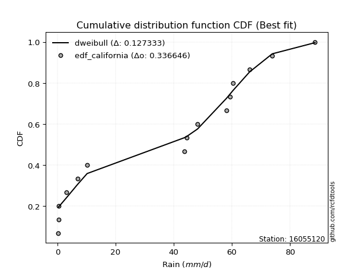</img>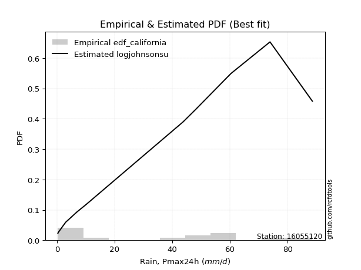</img>

</div>


### 2. Empirical - EDF Hazen (1930)

Hazen method for plotting positions is a formula used to estimate the empirical cumulative probability distribution of flood events or other hydrological data. This formula often results in biased estimations, particularly when extrapolating to extreme events (high return periods).

<div align="center">


$P=(m-0.5)/n$


</div>


**2.1. Empirical values**

<div align="center">

|                | 0                   | 1                  | 2                   | 3                   | 4                  | 5                   | 6                   | 7         | 8                  | 9                  | 10                | 11                 | 12                 | 13                 | 14                 |
|:---------------|:--------------------|:-------------------|:--------------------|:--------------------|:-------------------|:--------------------|:--------------------|:----------|:-------------------|:-------------------|:------------------|:-------------------|:-------------------|:-------------------|:-------------------|
| date           | 2022                | 2019               | 2020                | 2021                | 2025               | 2006                | 2008                | 2011      | 2016               | 2007               | 2024              | 2010               | 2009               | 2018               | 2017               |
| x              | 0.3                 | 0.4                | 0.4                 | 3.0                 | 4.1                | 6.9                 | 10.2                | 43.7      | 44.5               | 48.2               | 58.2              | 59.3               | 60.4               | 73.9               | 88.6               |
| m              | 1                   | 2                  | 3                   | 4                   | 5                  | 6                   | 7                   | 8         | 9                  | 10                 | 11                | 12                 | 13                 | 14                 | 15                 |
| empirical_dist | edf_hazen           | edf_hazen          | edf_hazen           | edf_hazen           | edf_hazen          | edf_hazen           | edf_hazen           | edf_hazen | edf_hazen          | edf_hazen          | edf_hazen         | edf_hazen          | edf_hazen          | edf_hazen          | edf_hazen          |
| empirical      | 0.03333333333333333 | 0.1                | 0.16666666666666666 | 0.23333333333333334 | 0.3                | 0.36666666666666664 | 0.43333333333333335 | 0.5       | 0.5666666666666667 | 0.6333333333333333 | 0.7               | 0.7666666666666667 | 0.8333333333333334 | 0.9                | 0.9666666666666667 |
| empirical_tr   | 1.0344827586206897  | 1.1111111111111112 | 1.2                 | 1.3043478260869565  | 1.4285714285714286 | 1.5789473684210527  | 1.7647058823529411  | 2.0       | 2.3076923076923075 | 2.727272727272727  | 3.333333333333333 | 4.2857142857142865 | 6.000000000000002  | 10.000000000000002 | 30.000000000000007 |

</div>


**2.2. Kolmogorov-Smirnov fit test (sorted by Δ)**


<div align="center">

|                | 0                   | 1                   | 2                  | 3                   | 4                   | 5                  | 6                  | 7                   | 8                   | 9                  | 10                  | 11                    | 12                  | 13                  | 14                  | 15                  | 16                  | 17                 | 18                  | 19                  | 20                 | 21                  | 22                  | 23                 | 24                  | 25                  | 26                 | 27                  | 28                  | 29                 | 30                  | 31                  | 32                  | 33                  | 34                  | 35                 | 36                 | 37                  | 38                  | 39                 | 40                 | 41                  | 42                 | 43                  | 44                  | 45                 | 46                  | 47                  | 48                  | 49                 | 50                 | 51                  | 52                  | 53                 | 54                 | 55                  | 56                 | 57                 | 58                 | 59                 | 60                  | 61                 | 62                 | 63                  | 64                  | 65                  | 66                  | 67                 | 68                 | 69                 | 70                 | 71                  | 72                  | 73                 | 74                 | 75                  | 76                  | 77                 | 78                  | 79                 | 80                 | 81                  | 82                  | 83                 | 84                 | 85                  | 86                  | 87                 | 88                 | 89                 |
|:---------------|:--------------------|:--------------------|:-------------------|:--------------------|:--------------------|:-------------------|:-------------------|:--------------------|:--------------------|:-------------------|:--------------------|:----------------------|:--------------------|:--------------------|:--------------------|:--------------------|:--------------------|:-------------------|:--------------------|:--------------------|:-------------------|:--------------------|:--------------------|:-------------------|:--------------------|:--------------------|:-------------------|:--------------------|:--------------------|:-------------------|:--------------------|:--------------------|:--------------------|:--------------------|:--------------------|:-------------------|:-------------------|:--------------------|:--------------------|:-------------------|:-------------------|:--------------------|:-------------------|:--------------------|:--------------------|:-------------------|:--------------------|:--------------------|:--------------------|:-------------------|:-------------------|:--------------------|:--------------------|:-------------------|:-------------------|:--------------------|:-------------------|:-------------------|:-------------------|:-------------------|:--------------------|:-------------------|:-------------------|:--------------------|:--------------------|:--------------------|:--------------------|:-------------------|:-------------------|:-------------------|:-------------------|:--------------------|:--------------------|:-------------------|:-------------------|:--------------------|:--------------------|:-------------------|:--------------------|:-------------------|:-------------------|:--------------------|:--------------------|:-------------------|:-------------------|:--------------------|:--------------------|:-------------------|:-------------------|:-------------------|
| station        | 16055120            | 16055120            | 16055120           | 16055120            | 16055120            | 16055120           | 16055120           | 16055120            | 16055120            | 16055120           | 16055120            | 16055120              | 16055120            | 16055120            | 16055120            | 16055120            | 16055120            | 16055120           | 16055120            | 16055120            | 16055120           | 16055120            | 16055120            | 16055120           | 16055120            | 16055120            | 16055120           | 16055120            | 16055120            | 16055120           | 16055120            | 16055120            | 16055120            | 16055120            | 16055120            | 16055120           | 16055120           | 16055120            | 16055120            | 16055120           | 16055120           | 16055120            | 16055120           | 16055120            | 16055120            | 16055120           | 16055120            | 16055120            | 16055120            | 16055120           | 16055120           | 16055120            | 16055120            | 16055120           | 16055120           | 16055120            | 16055120           | 16055120           | 16055120           | 16055120           | 16055120            | 16055120           | 16055120           | 16055120            | 16055120            | 16055120            | 16055120            | 16055120           | 16055120           | 16055120           | 16055120           | 16055120            | 16055120            | 16055120           | 16055120           | 16055120            | 16055120            | 16055120           | 16055120            | 16055120           | 16055120           | 16055120            | 16055120            | 16055120           | 16055120           | 16055120            | 16055120            | 16055120           | 16055120           | 16055120           |
| empirical_dist | edf_hazen           | edf_hazen           | edf_hazen          | edf_hazen           | edf_hazen           | edf_hazen          | edf_hazen          | edf_hazen           | edf_hazen           | edf_hazen          | edf_hazen           | edf_hazen             | edf_hazen           | edf_hazen           | edf_hazen           | edf_hazen           | edf_hazen           | edf_hazen          | edf_hazen           | edf_hazen           | edf_hazen          | edf_hazen           | edf_hazen           | edf_hazen          | edf_hazen           | edf_hazen           | edf_hazen          | edf_hazen           | edf_hazen           | edf_hazen          | edf_hazen           | edf_hazen           | edf_hazen           | edf_hazen           | edf_hazen           | edf_hazen          | edf_hazen          | edf_hazen           | edf_hazen           | edf_hazen          | edf_hazen          | edf_hazen           | edf_hazen          | edf_hazen           | edf_hazen           | edf_hazen          | edf_hazen           | edf_hazen           | edf_hazen           | edf_hazen          | edf_hazen          | edf_hazen           | edf_hazen           | edf_hazen          | edf_hazen          | edf_hazen           | edf_hazen          | edf_hazen          | edf_hazen          | edf_hazen          | edf_hazen           | edf_hazen          | edf_hazen          | edf_hazen           | edf_hazen           | edf_hazen           | edf_hazen           | edf_hazen          | edf_hazen          | edf_hazen          | edf_hazen          | edf_hazen           | edf_hazen           | edf_hazen          | edf_hazen          | edf_hazen           | edf_hazen           | edf_hazen          | edf_hazen           | edf_hazen          | edf_hazen          | edf_hazen           | edf_hazen           | edf_hazen          | edf_hazen          | edf_hazen           | edf_hazen           | edf_hazen          | edf_hazen          | edf_hazen          |
| p_dist         | logjohnsonsu        | weibull_min         | halfnorm           | nakagami            | rayleigh            | mielke             | genlogistic        | kstwobign           | maxwell             | invweibull         | logloggamma         | loglaplace_asymmetric | pearson3            | halflogistic        | exponnorm           | crystalball         | norm                | johnsonsu          | t                   | gumbel_r            | gompertz           | genexpon            | chi2                | moyal              | loginvweibull       | laplace_asymmetric  | expon              | rice                | logpearson3         | truncnorm          | logistic            | logbetaprime        | loggumbel_l         | logweibull_min      | gumbel_l            | logexpon           | loginvgauss        | logalpha            | hypsecant           | lognct             | logexponnorm       | logt                | logcrystalball     | lognorm             | lognorm             | loglognorm         | loggamma            | loggamma            | logkstwobign        | logrice            | logerlang          | loggompertz         | logfatiguelife      | nct                | loggenexpon        | loginvgamma         | logmaxwell         | lograyleigh        | invgamma           | laplace            | f                   | loghalfnorm        | betaprime          | loglogistic         | fisk                | alpha               | loghypsecant        | loggumbel_r        | logchi2            | loghalflogistic    | invgauss           | ncf                 | logmoyal            | loglaplace         | logncf             | fatiguelife         | logwald             | wald               | logfisk             | loggibrat          | erlang             | logtruncnorm        | logf                | gamma              | pareto             | gibrat              | logmielke           | logpareto          | lognakagami        | loggenlogistic     |
| delta          | 0.13291862709901642 | 0.18286511980511044 | 0.1845149987940793 | 0.18452828869263505 | 0.19152077865001793 | 0.1921773742494759 | 0.1950103801555675 | 0.19793313507660862 | 0.19839247242900662 | 0.2078629912737101 | 0.21011251850146007 | 0.21011844396539603   | 0.21044019684242476 | 0.21282170780547016 | 0.21472022927674855 | 0.21484266390204698 | 0.21484266683184255 | 0.2148692954189393 | 0.21487584383324793 | 0.21495413018989534 | 0.2161185963348075 | 0.21896133206399837 | 0.21976363847691605 | 0.224331475574153  | 0.22843638604038563 | 0.22853094170501487 | 0.2297153842449977 | 0.23153647881748876 | 0.23301026915452494 | 0.2354993918299303 | 0.23707840368187535 | 0.23753445278458662 | 0.23879656215772183 | 0.24531558774302908 | 0.24620250228699772 | 0.2476251359367766 | 0.2488204990072922 | 0.25010735022840747 | 0.25074522698946544 | 0.2515062177618943 | 0.251642948654486  | 0.25164448236416304 | 0.2516446369832661 | 0.25164466121166784 | 0.25164466121166784 | 0.2521766329595818 | 0.25254168765361085 | 0.25254168765361085 | 0.25256727836943116 | 0.2526943474296224 | 0.2527083972366371 | 0.25388156188751554 | 0.25448348533379284 | 0.2561873493475598 | 0.2573745050101335 | 0.25768979178652884 | 0.2610163384645262 | 0.2636898149897424 | 0.266328985985097  | 0.2667761342289595 | 0.27258068273956126 | 0.2727996460017279 | 0.2743034827701126 | 0.27430702547879193 | 0.27654695576872124 | 0.27698625441885405 | 0.28917646090021387 | 0.2907123997601938 | 0.2922308735061387 | 0.2971093592449986 | 0.3011498628026914 | 0.30174298858913895 | 0.30332368911956875 | 0.308784051902822  | 0.3102580020698268 | 0.33394402470590656 | 0.34290060855132865 | 0.3592355292625893 | 0.36563485873427526 | 0.3722454240167561 | 0.3738274828451281 | 0.38496390596412455 | 0.38709287423430055 | 0.3959140241651653 | 0.4189170584108882 | 0.43333333333333335 | 0.46303708354014855 | 0.4958513580680236 | 0.5094755887286111 | 0.9                |
| deltao         | 0.3366456264050002  | 0.3366456264050002  | 0.3366456264050002 | 0.3366456264050002  | 0.3366456264050002  | 0.3366456264050002 | 0.3366456264050002 | 0.3366456264050002  | 0.3366456264050002  | 0.3366456264050002 | 0.3366456264050002  | 0.3366456264050002    | 0.3366456264050002  | 0.3366456264050002  | 0.3366456264050002  | 0.3366456264050002  | 0.3366456264050002  | 0.3366456264050002 | 0.3366456264050002  | 0.3366456264050002  | 0.3366456264050002 | 0.3366456264050002  | 0.3366456264050002  | 0.3366456264050002 | 0.3366456264050002  | 0.3366456264050002  | 0.3366456264050002 | 0.3366456264050002  | 0.3366456264050002  | 0.3366456264050002 | 0.3366456264050002  | 0.3366456264050002  | 0.3366456264050002  | 0.3366456264050002  | 0.3366456264050002  | 0.3366456264050002 | 0.3366456264050002 | 0.3366456264050002  | 0.3366456264050002  | 0.3366456264050002 | 0.3366456264050002 | 0.3366456264050002  | 0.3366456264050002 | 0.3366456264050002  | 0.3366456264050002  | 0.3366456264050002 | 0.3366456264050002  | 0.3366456264050002  | 0.3366456264050002  | 0.3366456264050002 | 0.3366456264050002 | 0.3366456264050002  | 0.3366456264050002  | 0.3366456264050002 | 0.3366456264050002 | 0.3366456264050002  | 0.3366456264050002 | 0.3366456264050002 | 0.3366456264050002 | 0.3366456264050002 | 0.3366456264050002  | 0.3366456264050002 | 0.3366456264050002 | 0.3366456264050002  | 0.3366456264050002  | 0.3366456264050002  | 0.3366456264050002  | 0.3366456264050002 | 0.3366456264050002 | 0.3366456264050002 | 0.3366456264050002 | 0.3366456264050002  | 0.3366456264050002  | 0.3366456264050002 | 0.3366456264050002 | 0.3366456264050002  | 0.3366456264050002  | 0.3366456264050002 | 0.3366456264050002  | 0.3366456264050002 | 0.3366456264050002 | 0.3366456264050002  | 0.3366456264050002  | 0.3366456264050002 | 0.3366456264050002 | 0.3366456264050002  | 0.3366456264050002  | 0.3366456264050002 | 0.3366456264050002 | 0.3366456264050002 |
| eval           | Δo > Δ              | Δo > Δ              | Δo > Δ             | Δo > Δ              | Δo > Δ              | Δo > Δ             | Δo > Δ             | Δo > Δ              | Δo > Δ              | Δo > Δ             | Δo > Δ              | Δo > Δ                | Δo > Δ              | Δo > Δ              | Δo > Δ              | Δo > Δ              | Δo > Δ              | Δo > Δ             | Δo > Δ              | Δo > Δ              | Δo > Δ             | Δo > Δ              | Δo > Δ              | Δo > Δ             | Δo > Δ              | Δo > Δ              | Δo > Δ             | Δo > Δ              | Δo > Δ              | Δo > Δ             | Δo > Δ              | Δo > Δ              | Δo > Δ              | Δo > Δ              | Δo > Δ              | Δo > Δ             | Δo > Δ             | Δo > Δ              | Δo > Δ              | Δo > Δ             | Δo > Δ             | Δo > Δ              | Δo > Δ             | Δo > Δ              | Δo > Δ              | Δo > Δ             | Δo > Δ              | Δo > Δ              | Δo > Δ              | Δo > Δ             | Δo > Δ             | Δo > Δ              | Δo > Δ              | Δo > Δ             | Δo > Δ             | Δo > Δ              | Δo > Δ             | Δo > Δ             | Δo > Δ             | Δo > Δ             | Δo > Δ              | Δo > Δ             | Δo > Δ             | Δo > Δ              | Δo > Δ              | Δo > Δ              | Δo > Δ              | Δo > Δ             | Δo > Δ             | Δo > Δ             | Δo > Δ             | Δo > Δ              | Δo > Δ              | Δo > Δ             | Δo > Δ             | Δo > Δ              | Δo <= Δ             | Δo <= Δ            | Δo <= Δ             | Δo <= Δ            | Δo <= Δ            | Δo <= Δ             | Δo <= Δ             | Δo <= Δ            | Δo <= Δ            | Δo <= Δ             | Δo <= Δ             | Δo <= Δ            | Δo <= Δ            | Δo <= Δ            |
| fit            | 1                   | 1                   | 1                  | 1                   | 1                   | 1                  | 1                  | 1                   | 1                   | 1                  | 1                   | 1                     | 1                   | 1                   | 1                   | 1                   | 1                   | 1                  | 1                   | 1                   | 1                  | 1                   | 1                   | 1                  | 1                   | 1                   | 1                  | 1                   | 1                   | 1                  | 1                   | 1                   | 1                   | 1                   | 1                   | 1                  | 1                  | 1                   | 1                   | 1                  | 1                  | 1                   | 1                  | 1                   | 1                   | 1                  | 1                   | 1                   | 1                   | 1                  | 1                  | 1                   | 1                   | 1                  | 1                  | 1                   | 1                  | 1                  | 1                  | 1                  | 1                   | 1                  | 1                  | 1                   | 1                   | 1                   | 1                   | 1                  | 1                  | 1                  | 1                  | 1                   | 1                   | 1                  | 1                  | 1                   | 0                   | 0                  | 0                   | 0                  | 0                  | 0                   | 0                   | 0                  | 0                  | 0                   | 0                   | 0                  | 0                  | 0                  |
| n              | 15                  | 15                  | 15                 | 15                  | 15                  | 15                 | 15                 | 15                  | 15                  | 15                 | 15                  | 15                    | 15                  | 15                  | 15                  | 15                  | 15                  | 15                 | 15                  | 15                  | 15                 | 15                  | 15                  | 15                 | 15                  | 15                  | 15                 | 15                  | 15                  | 15                 | 15                  | 15                  | 15                  | 15                  | 15                  | 15                 | 15                 | 15                  | 15                  | 15                 | 15                 | 15                  | 15                 | 15                  | 15                  | 15                 | 15                  | 15                  | 15                  | 15                 | 15                 | 15                  | 15                  | 15                 | 15                 | 15                  | 15                 | 15                 | 15                 | 15                 | 15                  | 15                 | 15                 | 15                  | 15                  | 15                  | 15                  | 15                 | 15                 | 15                 | 15                 | 15                  | 15                  | 15                 | 15                 | 15                  | 15                  | 15                 | 15                  | 15                 | 15                 | 15                  | 15                  | 15                 | 15                 | 15                  | 15                  | 15                 | 15                 | 15                 |
| best_fit       | 1                   | 0                   | 0                  | 0                   | 0                   | 0                  | 0                  | 0                   | 0                   | 0                  | 0                   | 0                     | 0                   | 0                   | 0                   | 0                   | 0                   | 0                  | 0                   | 0                   | 0                  | 0                   | 0                   | 0                  | 0                   | 0                   | 0                  | 0                   | 0                   | 0                  | 0                   | 0                   | 0                   | 0                   | 0                   | 0                  | 0                  | 0                   | 0                   | 0                  | 0                  | 0                   | 0                  | 0                   | 0                   | 0                  | 0                   | 0                   | 0                   | 0                  | 0                  | 0                   | 0                   | 0                  | 0                  | 0                   | 0                  | 0                  | 0                  | 0                  | 0                   | 0                  | 0                  | 0                   | 0                   | 0                   | 0                   | 0                  | 0                  | 0                  | 0                  | 0                   | 0                   | 0                  | 0                  | 0                   | 0                   | 0                  | 0                   | 0                  | 0                  | 0                   | 0                   | 0                  | 0                  | 0                   | 0                   | 0                  | 0                  | 0                  |
| best_fit_sort  | 1                   | 2                   | 3                  | 4                   | 5                   | 6                  | 7                  | 8                   | 9                   | 10                 | 11                  | 12                    | 13                  | 14                  | 15                  | 16                  | 17                  | 18                 | 19                  | 20                  | 21                 | 22                  | 23                  | 24                 | 25                  | 26                  | 27                 | 28                  | 29                  | 30                 | 31                  | 32                  | 33                  | 34                  | 35                  | 36                 | 37                 | 38                  | 39                  | 40                 | 41                 | 42                  | 43                 | 44                  | 45                  | 46                 | 47                  | 48                  | 49                  | 50                 | 51                 | 52                  | 53                  | 54                 | 55                 | 56                  | 57                 | 58                 | 59                 | 60                 | 61                  | 62                 | 63                 | 64                  | 65                  | 66                  | 67                  | 68                 | 69                 | 70                 | 71                 | 72                  | 73                  | 74                 | 75                 | 76                  | 77                  | 78                 | 79                  | 80                 | 81                 | 82                  | 83                  | 84                 | 85                 | 86                  | 87                  | 88                 | 89                 | 90                 |

</div>


<div align="center">

</img>

</div>


**2.3. Best fit**

<div align="center">

|   id |   station | empirical_dist   | p_dist       |    delta |   deltao | eval   |   fit |   n |   best_fit |   best_fit_sort |
|-----:|----------:|:-----------------|:-------------|---------:|---------:|:-------|------:|----:|-----------:|----------------:|
|    0 |  16055120 | edf_hazen        | logjohnsonsu | 0.132919 | 0.336646 | Δo > Δ |     1 |  15 |          1 |               1 |

</div>


<div align="center">

</img></img>

</div>


### 3. Empirical - EDF Weibull (1939)

Weibull plotting position formula is an empirical method used to estimate the non-exceedance probability or plotting position for a set of observed data, is often recommended or widely used in practice, particularly in flood frequency analysis.

<div align="center">


$P=m/(n+1)$


</div>


**3.1. Empirical values**

<div align="center">

|                | 0                  | 1                  | 2                  | 3                  | 4                  | 5           | 6                  | 7           | 8                  | 9                  | 10          | 11          | 12                | 13          | 14          |
|:---------------|:-------------------|:-------------------|:-------------------|:-------------------|:-------------------|:------------|:-------------------|:------------|:-------------------|:-------------------|:------------|:------------|:------------------|:------------|:------------|
| date           | 2022               | 2019               | 2020               | 2021               | 2025               | 2006        | 2008               | 2011        | 2016               | 2007               | 2024        | 2010        | 2009              | 2018        | 2017        |
| x              | 0.3                | 0.4                | 0.4                | 3.0                | 4.1                | 6.9         | 10.2               | 43.7        | 44.5               | 48.2               | 58.2        | 59.3        | 60.4              | 73.9        | 88.6        |
| m              | 1                  | 2                  | 3                  | 4                  | 5                  | 6           | 7                  | 8           | 9                  | 10                 | 11          | 12          | 13                | 14          | 15          |
| empirical_dist | edf_weibull        | edf_weibull        | edf_weibull        | edf_weibull        | edf_weibull        | edf_weibull | edf_weibull        | edf_weibull | edf_weibull        | edf_weibull        | edf_weibull | edf_weibull | edf_weibull       | edf_weibull | edf_weibull |
| empirical      | 0.0625             | 0.125              | 0.1875             | 0.25               | 0.3125             | 0.375       | 0.4375             | 0.5         | 0.5625             | 0.625              | 0.6875      | 0.75        | 0.8125            | 0.875       | 0.9375      |
| empirical_tr   | 1.0666666666666667 | 1.1428571428571428 | 1.2307692307692308 | 1.3333333333333333 | 1.4545454545454546 | 1.6         | 1.7777777777777777 | 2.0         | 2.2857142857142856 | 2.6666666666666665 | 3.2         | 4.0         | 5.333333333333333 | 8.0         | 16.0        |

</div>


**3.2. Kolmogorov-Smirnov fit test (sorted by Δ)**


<div align="center">

|                | 0                   | 1                   | 2                  | 3                   | 4                   | 5                   | 6                  | 7                   | 8                   | 9                  | 10                  | 11                    | 12                  | 13                  | 14                 | 15                  | 16                  | 17                 | 18                  | 19                  | 20                 | 21                  | 22                  | 23                  | 24                  | 25                 | 26                  | 27                  | 28                 | 29                  | 30                  | 31                  | 32                 | 33                  | 34                 | 35                 | 36                  | 37                  | 38                 | 39                 | 40                  | 41                 | 42                  | 43                  | 44                 | 45                  | 46                  | 47                  | 48                 | 49                 | 50                  | 51                  | 52                 | 53                 | 54                 | 55                  | 56                 | 57                 | 58                 | 59                  | 60                  | 61                 | 62                 | 63                  | 64                  | 65                  | 66                 | 67                 | 68                  | 69                 | 70                 | 71                 | 72                  | 73                  | 74                 | 75                  | 76                 | 77                  | 78                  | 79                 | 80                 | 81                 | 82                  | 83                 | 84                 | 85                 | 86                 | 87                 | 88                 | 89                 |
|:---------------|:--------------------|:--------------------|:-------------------|:--------------------|:--------------------|:--------------------|:-------------------|:--------------------|:--------------------|:-------------------|:--------------------|:----------------------|:--------------------|:--------------------|:-------------------|:--------------------|:--------------------|:-------------------|:--------------------|:--------------------|:-------------------|:--------------------|:--------------------|:--------------------|:--------------------|:-------------------|:--------------------|:--------------------|:-------------------|:--------------------|:--------------------|:--------------------|:-------------------|:--------------------|:-------------------|:-------------------|:--------------------|:--------------------|:-------------------|:-------------------|:--------------------|:-------------------|:--------------------|:--------------------|:-------------------|:--------------------|:--------------------|:--------------------|:-------------------|:-------------------|:--------------------|:--------------------|:-------------------|:-------------------|:-------------------|:--------------------|:-------------------|:-------------------|:-------------------|:--------------------|:--------------------|:-------------------|:-------------------|:--------------------|:--------------------|:--------------------|:-------------------|:-------------------|:--------------------|:-------------------|:-------------------|:-------------------|:--------------------|:--------------------|:-------------------|:--------------------|:-------------------|:--------------------|:--------------------|:-------------------|:-------------------|:-------------------|:--------------------|:-------------------|:-------------------|:-------------------|:-------------------|:-------------------|:-------------------|:-------------------|
| station        | 16055120            | 16055120            | 16055120           | 16055120            | 16055120            | 16055120            | 16055120           | 16055120            | 16055120            | 16055120           | 16055120            | 16055120              | 16055120            | 16055120            | 16055120           | 16055120            | 16055120            | 16055120           | 16055120            | 16055120            | 16055120           | 16055120            | 16055120            | 16055120            | 16055120            | 16055120           | 16055120            | 16055120            | 16055120           | 16055120            | 16055120            | 16055120            | 16055120           | 16055120            | 16055120           | 16055120           | 16055120            | 16055120            | 16055120           | 16055120           | 16055120            | 16055120           | 16055120            | 16055120            | 16055120           | 16055120            | 16055120            | 16055120            | 16055120           | 16055120           | 16055120            | 16055120            | 16055120           | 16055120           | 16055120           | 16055120            | 16055120           | 16055120           | 16055120           | 16055120            | 16055120            | 16055120           | 16055120           | 16055120            | 16055120            | 16055120            | 16055120           | 16055120           | 16055120            | 16055120           | 16055120           | 16055120           | 16055120            | 16055120            | 16055120           | 16055120            | 16055120           | 16055120            | 16055120            | 16055120           | 16055120           | 16055120           | 16055120            | 16055120           | 16055120           | 16055120           | 16055120           | 16055120           | 16055120           | 16055120           |
| empirical_dist | edf_weibull         | edf_weibull         | edf_weibull        | edf_weibull         | edf_weibull         | edf_weibull         | edf_weibull        | edf_weibull         | edf_weibull         | edf_weibull        | edf_weibull         | edf_weibull           | edf_weibull         | edf_weibull         | edf_weibull        | edf_weibull         | edf_weibull         | edf_weibull        | edf_weibull         | edf_weibull         | edf_weibull        | edf_weibull         | edf_weibull         | edf_weibull         | edf_weibull         | edf_weibull        | edf_weibull         | edf_weibull         | edf_weibull        | edf_weibull         | edf_weibull         | edf_weibull         | edf_weibull        | edf_weibull         | edf_weibull        | edf_weibull        | edf_weibull         | edf_weibull         | edf_weibull        | edf_weibull        | edf_weibull         | edf_weibull        | edf_weibull         | edf_weibull         | edf_weibull        | edf_weibull         | edf_weibull         | edf_weibull         | edf_weibull        | edf_weibull        | edf_weibull         | edf_weibull         | edf_weibull        | edf_weibull        | edf_weibull        | edf_weibull         | edf_weibull        | edf_weibull        | edf_weibull        | edf_weibull         | edf_weibull         | edf_weibull        | edf_weibull        | edf_weibull         | edf_weibull         | edf_weibull         | edf_weibull        | edf_weibull        | edf_weibull         | edf_weibull        | edf_weibull        | edf_weibull        | edf_weibull         | edf_weibull         | edf_weibull        | edf_weibull         | edf_weibull        | edf_weibull         | edf_weibull         | edf_weibull        | edf_weibull        | edf_weibull        | edf_weibull         | edf_weibull        | edf_weibull        | edf_weibull        | edf_weibull        | edf_weibull        | edf_weibull        | edf_weibull        |
| p_dist         | logjohnsonsu        | weibull_min         | halfnorm           | nakagami            | rayleigh            | mielke              | genlogistic        | kstwobign           | maxwell             | invweibull         | logloggamma         | loglaplace_asymmetric | halflogistic        | pearson3            | exponnorm          | genexpon            | crystalball         | norm               | johnsonsu           | t                   | gumbel_r           | chi2                | gompertz            | loginvweibull       | moyal               | expon              | laplace_asymmetric  | logpearson3         | rice               | logbetaprime        | loggumbel_l         | truncnorm           | logistic           | logweibull_min      | logexpon           | loginvgauss        | logalpha            | gumbel_l            | lognct             | logexponnorm       | logt                | logcrystalball     | lognorm             | lognorm             | loglognorm         | loggamma            | loggamma            | logkstwobign        | logrice            | logerlang          | loggompertz         | logfatiguelife      | hypsecant          | nct                | loggenexpon        | loginvgamma         | logmaxwell         | lograyleigh        | invgamma           | laplace             | f                   | loghalfnorm        | betaprime          | loglogistic         | fisk                | alpha               | logchi2            | logncf             | loghypsecant        | loggumbel_r        | loghalflogistic    | invgauss           | ncf                 | logmoyal            | loglaplace         | fatiguelife         | logfisk            | logwald             | wald                | logf               | loggibrat          | erlang             | logtruncnorm        | pareto             | gamma              | gibrat             | logmielke          | logpareto          | lognakagami        | loggenlogistic     |
| delta          | 0.13708529376568307 | 0.15369845313844377 | 0.1845149987940793 | 0.18452828869263505 | 0.19568744531668458 | 0.19634404091614255 | 0.1985403041159971 | 0.20209980174327527 | 0.20255913909567327 | 0.2078629912737101 | 0.21011251850146007 | 0.21011844396539603   | 0.21282170780547016 | 0.21460686350909142 | 0.2188868959434152 | 0.21896133206399837 | 0.21900933056871363 | 0.2190093334985092 | 0.21903596208560594 | 0.21904251049991458 | 0.219120796856562  | 0.21976363847691605 | 0.22445192966814087 | 0.22843638604038563 | 0.22849814224081966 | 0.2297153842449977 | 0.23269760837168152 | 0.23301026915452494 | 0.2357031454841554 | 0.23753445278458662 | 0.23879656215772183 | 0.24082405472306856 | 0.241245070348542  | 0.24531558774302908 | 0.2476251359367766 | 0.2488204990072922 | 0.25010735022840747 | 0.25036916895366434 | 0.2515062177618943 | 0.251642948654486  | 0.25164448236416304 | 0.2516446369832661 | 0.25164466121166784 | 0.25164466121166784 | 0.2521766329595818 | 0.25254168765361085 | 0.25254168765361085 | 0.25256727836943116 | 0.2526943474296224 | 0.2527083972366371 | 0.25388156188751554 | 0.25448348533379284 | 0.2549118936561321 | 0.2561873493475598 | 0.2573745050101335 | 0.25768979178652884 | 0.2610163384645262 | 0.2636898149897424 | 0.266328985985097  | 0.27094280089562617 | 0.27258068273956126 | 0.2727996460017279 | 0.2743034827701126 | 0.27430702547879193 | 0.27654695576872124 | 0.27698625441885405 | 0.2809126097576774 | 0.2810913354031601 | 0.28917646090021387 | 0.2907123997601938 | 0.2971093592449986 | 0.3011498628026914 | 0.30174298858913895 | 0.30332368911956875 | 0.308784051902822  | 0.33394402470590656 | 0.3364681920676086 | 0.34290060855132865 | 0.36756886259592264 | 0.3704262075676339 | 0.3722454240167561 | 0.3738274828451281 | 0.38496390596412455 | 0.3939170584108882 | 0.3959140241651653 | 0.4375             | 0.4463704168734819 | 0.4708513580680236 | 0.4928089220619444 | 0.875              |
| deltao         | 0.3366456264050002  | 0.3366456264050002  | 0.3366456264050002 | 0.3366456264050002  | 0.3366456264050002  | 0.3366456264050002  | 0.3366456264050002 | 0.3366456264050002  | 0.3366456264050002  | 0.3366456264050002 | 0.3366456264050002  | 0.3366456264050002    | 0.3366456264050002  | 0.3366456264050002  | 0.3366456264050002 | 0.3366456264050002  | 0.3366456264050002  | 0.3366456264050002 | 0.3366456264050002  | 0.3366456264050002  | 0.3366456264050002 | 0.3366456264050002  | 0.3366456264050002  | 0.3366456264050002  | 0.3366456264050002  | 0.3366456264050002 | 0.3366456264050002  | 0.3366456264050002  | 0.3366456264050002 | 0.3366456264050002  | 0.3366456264050002  | 0.3366456264050002  | 0.3366456264050002 | 0.3366456264050002  | 0.3366456264050002 | 0.3366456264050002 | 0.3366456264050002  | 0.3366456264050002  | 0.3366456264050002 | 0.3366456264050002 | 0.3366456264050002  | 0.3366456264050002 | 0.3366456264050002  | 0.3366456264050002  | 0.3366456264050002 | 0.3366456264050002  | 0.3366456264050002  | 0.3366456264050002  | 0.3366456264050002 | 0.3366456264050002 | 0.3366456264050002  | 0.3366456264050002  | 0.3366456264050002 | 0.3366456264050002 | 0.3366456264050002 | 0.3366456264050002  | 0.3366456264050002 | 0.3366456264050002 | 0.3366456264050002 | 0.3366456264050002  | 0.3366456264050002  | 0.3366456264050002 | 0.3366456264050002 | 0.3366456264050002  | 0.3366456264050002  | 0.3366456264050002  | 0.3366456264050002 | 0.3366456264050002 | 0.3366456264050002  | 0.3366456264050002 | 0.3366456264050002 | 0.3366456264050002 | 0.3366456264050002  | 0.3366456264050002  | 0.3366456264050002 | 0.3366456264050002  | 0.3366456264050002 | 0.3366456264050002  | 0.3366456264050002  | 0.3366456264050002 | 0.3366456264050002 | 0.3366456264050002 | 0.3366456264050002  | 0.3366456264050002 | 0.3366456264050002 | 0.3366456264050002 | 0.3366456264050002 | 0.3366456264050002 | 0.3366456264050002 | 0.3366456264050002 |
| eval           | Δo > Δ              | Δo > Δ              | Δo > Δ             | Δo > Δ              | Δo > Δ              | Δo > Δ              | Δo > Δ             | Δo > Δ              | Δo > Δ              | Δo > Δ             | Δo > Δ              | Δo > Δ                | Δo > Δ              | Δo > Δ              | Δo > Δ             | Δo > Δ              | Δo > Δ              | Δo > Δ             | Δo > Δ              | Δo > Δ              | Δo > Δ             | Δo > Δ              | Δo > Δ              | Δo > Δ              | Δo > Δ              | Δo > Δ             | Δo > Δ              | Δo > Δ              | Δo > Δ             | Δo > Δ              | Δo > Δ              | Δo > Δ              | Δo > Δ             | Δo > Δ              | Δo > Δ             | Δo > Δ             | Δo > Δ              | Δo > Δ              | Δo > Δ             | Δo > Δ             | Δo > Δ              | Δo > Δ             | Δo > Δ              | Δo > Δ              | Δo > Δ             | Δo > Δ              | Δo > Δ              | Δo > Δ              | Δo > Δ             | Δo > Δ             | Δo > Δ              | Δo > Δ              | Δo > Δ             | Δo > Δ             | Δo > Δ             | Δo > Δ              | Δo > Δ             | Δo > Δ             | Δo > Δ             | Δo > Δ              | Δo > Δ              | Δo > Δ             | Δo > Δ             | Δo > Δ              | Δo > Δ              | Δo > Δ              | Δo > Δ             | Δo > Δ             | Δo > Δ              | Δo > Δ             | Δo > Δ             | Δo > Δ             | Δo > Δ              | Δo > Δ              | Δo > Δ             | Δo > Δ              | Δo > Δ             | Δo <= Δ             | Δo <= Δ             | Δo <= Δ            | Δo <= Δ            | Δo <= Δ            | Δo <= Δ             | Δo <= Δ            | Δo <= Δ            | Δo <= Δ            | Δo <= Δ            | Δo <= Δ            | Δo <= Δ            | Δo <= Δ            |
| fit            | 1                   | 1                   | 1                  | 1                   | 1                   | 1                   | 1                  | 1                   | 1                   | 1                  | 1                   | 1                     | 1                   | 1                   | 1                  | 1                   | 1                   | 1                  | 1                   | 1                   | 1                  | 1                   | 1                   | 1                   | 1                   | 1                  | 1                   | 1                   | 1                  | 1                   | 1                   | 1                   | 1                  | 1                   | 1                  | 1                  | 1                   | 1                   | 1                  | 1                  | 1                   | 1                  | 1                   | 1                   | 1                  | 1                   | 1                   | 1                   | 1                  | 1                  | 1                   | 1                   | 1                  | 1                  | 1                  | 1                   | 1                  | 1                  | 1                  | 1                   | 1                   | 1                  | 1                  | 1                   | 1                   | 1                   | 1                  | 1                  | 1                   | 1                  | 1                  | 1                  | 1                   | 1                   | 1                  | 1                   | 1                  | 0                   | 0                   | 0                  | 0                  | 0                  | 0                   | 0                  | 0                  | 0                  | 0                  | 0                  | 0                  | 0                  |
| n              | 15                  | 15                  | 15                 | 15                  | 15                  | 15                  | 15                 | 15                  | 15                  | 15                 | 15                  | 15                    | 15                  | 15                  | 15                 | 15                  | 15                  | 15                 | 15                  | 15                  | 15                 | 15                  | 15                  | 15                  | 15                  | 15                 | 15                  | 15                  | 15                 | 15                  | 15                  | 15                  | 15                 | 15                  | 15                 | 15                 | 15                  | 15                  | 15                 | 15                 | 15                  | 15                 | 15                  | 15                  | 15                 | 15                  | 15                  | 15                  | 15                 | 15                 | 15                  | 15                  | 15                 | 15                 | 15                 | 15                  | 15                 | 15                 | 15                 | 15                  | 15                  | 15                 | 15                 | 15                  | 15                  | 15                  | 15                 | 15                 | 15                  | 15                 | 15                 | 15                 | 15                  | 15                  | 15                 | 15                  | 15                 | 15                  | 15                  | 15                 | 15                 | 15                 | 15                  | 15                 | 15                 | 15                 | 15                 | 15                 | 15                 | 15                 |
| best_fit       | 1                   | 0                   | 0                  | 0                   | 0                   | 0                   | 0                  | 0                   | 0                   | 0                  | 0                   | 0                     | 0                   | 0                   | 0                  | 0                   | 0                   | 0                  | 0                   | 0                   | 0                  | 0                   | 0                   | 0                   | 0                   | 0                  | 0                   | 0                   | 0                  | 0                   | 0                   | 0                   | 0                  | 0                   | 0                  | 0                  | 0                   | 0                   | 0                  | 0                  | 0                   | 0                  | 0                   | 0                   | 0                  | 0                   | 0                   | 0                   | 0                  | 0                  | 0                   | 0                   | 0                  | 0                  | 0                  | 0                   | 0                  | 0                  | 0                  | 0                   | 0                   | 0                  | 0                  | 0                   | 0                   | 0                   | 0                  | 0                  | 0                   | 0                  | 0                  | 0                  | 0                   | 0                   | 0                  | 0                   | 0                  | 0                   | 0                   | 0                  | 0                  | 0                  | 0                   | 0                  | 0                  | 0                  | 0                  | 0                  | 0                  | 0                  |
| best_fit_sort  | 1                   | 2                   | 3                  | 4                   | 5                   | 6                   | 7                  | 8                   | 9                   | 10                 | 11                  | 12                    | 13                  | 14                  | 15                 | 16                  | 17                  | 18                 | 19                  | 20                  | 21                 | 22                  | 23                  | 24                  | 25                  | 26                 | 27                  | 28                  | 29                 | 30                  | 31                  | 32                  | 33                 | 34                  | 35                 | 36                 | 37                  | 38                  | 39                 | 40                 | 41                  | 42                 | 43                  | 44                  | 45                 | 46                  | 47                  | 48                  | 49                 | 50                 | 51                  | 52                  | 53                 | 54                 | 55                 | 56                  | 57                 | 58                 | 59                 | 60                  | 61                  | 62                 | 63                 | 64                  | 65                  | 66                  | 67                 | 68                 | 69                  | 70                 | 71                 | 72                 | 73                  | 74                  | 75                 | 76                  | 77                 | 78                  | 79                  | 80                 | 81                 | 82                 | 83                  | 84                 | 85                 | 86                 | 87                 | 88                 | 89                 | 90                 |

</div>


<div align="center">

</img>

</div>


**3.3. Best fit**

<div align="center">

|   id |   station | empirical_dist   | p_dist       |    delta |   deltao | eval   |   fit |   n |   best_fit |   best_fit_sort |
|-----:|----------:|:-----------------|:-------------|---------:|---------:|:-------|------:|----:|-----------:|----------------:|
|    0 |  16055120 | edf_weibull      | logjohnsonsu | 0.137085 | 0.336646 | Δo > Δ |     1 |  15 |          1 |               1 |

</div>


<div align="center">

</img>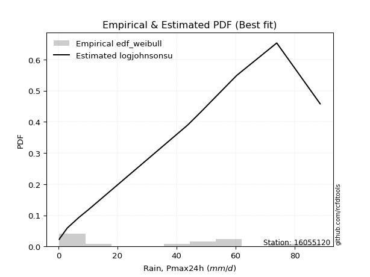</img>

</div>


### 4. Empirical - EDF Beard (1943)

The Beard formula (or Beard´s plotting position formula) in hydrology is used to estimate the empirical non-exceedance probability _(P)_ of a flood event (or other extreme hydrological data point) within a given dataset.

<div align="center">


$P=(m-0.31)/(n+0.38)$


</div>


**4.1. Empirical values**

<div align="center">

|                | 0                   | 1                   | 2                   | 3                   | 4                  | 5                   | 6                   | 7         | 8                  | 9                  | 10                 | 11                | 12                 | 13                 | 14                 |
|:---------------|:--------------------|:--------------------|:--------------------|:--------------------|:-------------------|:--------------------|:--------------------|:----------|:-------------------|:-------------------|:-------------------|:------------------|:-------------------|:-------------------|:-------------------|
| date           | 2022                | 2019                | 2020                | 2021                | 2025               | 2006                | 2008                | 2011      | 2016               | 2007               | 2024               | 2010              | 2009               | 2018               | 2017               |
| x              | 0.3                 | 0.4                 | 0.4                 | 3.0                 | 4.1                | 6.9                 | 10.2                | 43.7      | 44.5               | 48.2               | 58.2               | 59.3              | 60.4               | 73.9               | 88.6               |
| m              | 1                   | 2                   | 3                   | 4                   | 5                  | 6                   | 7                   | 8         | 9                  | 10                 | 11                 | 12                | 13                 | 14                 | 15                 |
| empirical_dist | edf_beard           | edf_beard           | edf_beard           | edf_beard           | edf_beard          | edf_beard           | edf_beard           | edf_beard | edf_beard          | edf_beard          | edf_beard          | edf_beard         | edf_beard          | edf_beard          | edf_beard          |
| empirical      | 0.04486345903771131 | 0.10988296488946683 | 0.17490247074122237 | 0.23992197659297787 | 0.3049414824447334 | 0.36996098829648894 | 0.43498049414824447 | 0.5       | 0.5650195058517554 | 0.630039011703511  | 0.6950585175552665 | 0.760078023407022 | 0.8250975292587776 | 0.8901170351105331 | 0.9551365409622886 |
| empirical_tr   | 1.0469707283866576  | 1.1234477720964207  | 1.2119779353821907  | 1.3156544054747648  | 1.4387277829747427 | 1.587203302373581   | 1.7698504027617952  | 2.0       | 2.298953662182361  | 2.7029876977152894 | 3.279317697228144  | 4.168021680216801 | 5.717472118959106  | 9.100591715976325  | 22.289855072463734 |

</div>


**4.2. Kolmogorov-Smirnov fit test (sorted by Δ)**


<div align="center">

|                | 0                   | 1                   | 2                  | 3                   | 4                   | 5                   | 6                   | 7                   | 8                   | 9                  | 10                  | 11                    | 12                  | 13                  | 14                  | 15                 | 16                  | 17                 | 18                  | 19                  | 20                  | 21                 | 22                  | 23                  | 24                  | 25                 | 26                 | 27                  | 28                  | 29                 | 30                  | 31                  | 32                  | 33                  | 34                 | 35                  | 36                 | 37                  | 38                 | 39                 | 40                  | 41                 | 42                  | 43                  | 44                 | 45                  | 46                  | 47                  | 48                  | 49                 | 50                 | 51                  | 52                  | 53                 | 54                 | 55                  | 56                 | 57                 | 58                 | 59                  | 60                  | 61                 | 62                 | 63                  | 64                  | 65                  | 66                  | 67                  | 68                 | 69                 | 70                  | 71                 | 72                  | 73                  | 74                 | 75                  | 76                  | 77                 | 78                 | 79                 | 80                 | 81                 | 82                  | 83                 | 84                 | 85                  | 86                 | 87                 | 88                 | 89                 |
|:---------------|:--------------------|:--------------------|:-------------------|:--------------------|:--------------------|:--------------------|:--------------------|:--------------------|:--------------------|:-------------------|:--------------------|:----------------------|:--------------------|:--------------------|:--------------------|:-------------------|:--------------------|:-------------------|:--------------------|:--------------------|:--------------------|:-------------------|:--------------------|:--------------------|:--------------------|:-------------------|:-------------------|:--------------------|:--------------------|:-------------------|:--------------------|:--------------------|:--------------------|:--------------------|:-------------------|:--------------------|:-------------------|:--------------------|:-------------------|:-------------------|:--------------------|:-------------------|:--------------------|:--------------------|:-------------------|:--------------------|:--------------------|:--------------------|:--------------------|:-------------------|:-------------------|:--------------------|:--------------------|:-------------------|:-------------------|:--------------------|:-------------------|:-------------------|:-------------------|:--------------------|:--------------------|:-------------------|:-------------------|:--------------------|:--------------------|:--------------------|:--------------------|:--------------------|:-------------------|:-------------------|:--------------------|:-------------------|:--------------------|:--------------------|:-------------------|:--------------------|:--------------------|:-------------------|:-------------------|:-------------------|:-------------------|:-------------------|:--------------------|:-------------------|:-------------------|:--------------------|:-------------------|:-------------------|:-------------------|:-------------------|
| station        | 16055120            | 16055120            | 16055120           | 16055120            | 16055120            | 16055120            | 16055120            | 16055120            | 16055120            | 16055120           | 16055120            | 16055120              | 16055120            | 16055120            | 16055120            | 16055120           | 16055120            | 16055120           | 16055120            | 16055120            | 16055120            | 16055120           | 16055120            | 16055120            | 16055120            | 16055120           | 16055120           | 16055120            | 16055120            | 16055120           | 16055120            | 16055120            | 16055120            | 16055120            | 16055120           | 16055120            | 16055120           | 16055120            | 16055120           | 16055120           | 16055120            | 16055120           | 16055120            | 16055120            | 16055120           | 16055120            | 16055120            | 16055120            | 16055120            | 16055120           | 16055120           | 16055120            | 16055120            | 16055120           | 16055120           | 16055120            | 16055120           | 16055120           | 16055120           | 16055120            | 16055120            | 16055120           | 16055120           | 16055120            | 16055120            | 16055120            | 16055120            | 16055120            | 16055120           | 16055120           | 16055120            | 16055120           | 16055120            | 16055120            | 16055120           | 16055120            | 16055120            | 16055120           | 16055120           | 16055120           | 16055120           | 16055120           | 16055120            | 16055120           | 16055120           | 16055120            | 16055120           | 16055120           | 16055120           | 16055120           |
| empirical_dist | edf_beard           | edf_beard           | edf_beard          | edf_beard           | edf_beard           | edf_beard           | edf_beard           | edf_beard           | edf_beard           | edf_beard          | edf_beard           | edf_beard             | edf_beard           | edf_beard           | edf_beard           | edf_beard          | edf_beard           | edf_beard          | edf_beard           | edf_beard           | edf_beard           | edf_beard          | edf_beard           | edf_beard           | edf_beard           | edf_beard          | edf_beard          | edf_beard           | edf_beard           | edf_beard          | edf_beard           | edf_beard           | edf_beard           | edf_beard           | edf_beard          | edf_beard           | edf_beard          | edf_beard           | edf_beard          | edf_beard          | edf_beard           | edf_beard          | edf_beard           | edf_beard           | edf_beard          | edf_beard           | edf_beard           | edf_beard           | edf_beard           | edf_beard          | edf_beard          | edf_beard           | edf_beard           | edf_beard          | edf_beard          | edf_beard           | edf_beard          | edf_beard          | edf_beard          | edf_beard           | edf_beard           | edf_beard          | edf_beard          | edf_beard           | edf_beard           | edf_beard           | edf_beard           | edf_beard           | edf_beard          | edf_beard          | edf_beard           | edf_beard          | edf_beard           | edf_beard           | edf_beard          | edf_beard           | edf_beard           | edf_beard          | edf_beard          | edf_beard          | edf_beard          | edf_beard          | edf_beard           | edf_beard          | edf_beard          | edf_beard           | edf_beard          | edf_beard          | edf_beard          | edf_beard          |
| p_dist         | logjohnsonsu        | weibull_min         | halfnorm           | nakagami            | rayleigh            | mielke              | genlogistic         | kstwobign           | maxwell             | invweibull         | logloggamma         | loglaplace_asymmetric | pearson3            | halflogistic        | exponnorm           | crystalball        | norm                | johnsonsu          | t                   | gumbel_r            | genexpon            | gompertz           | chi2                | moyal               | loginvweibull       | expon              | laplace_asymmetric | logpearson3         | rice                | truncnorm          | logbetaprime        | logistic            | loggumbel_l         | logweibull_min      | logexpon           | gumbel_l            | loginvgauss        | logalpha            | lognct             | logexponnorm       | logt                | logcrystalball     | lognorm             | lognorm             | loglognorm         | hypsecant           | loggamma            | loggamma            | logkstwobign        | logrice            | logerlang          | loggompertz         | logfatiguelife      | nct                | loggenexpon        | loginvgamma         | logmaxwell         | lograyleigh        | invgamma           | laplace             | f                   | loghalfnorm        | betaprime          | loglogistic         | fisk                | alpha               | logchi2             | loghypsecant        | loggumbel_r        | loghalflogistic    | logncf              | invgauss           | ncf                 | logmoyal            | loglaplace         | fatiguelife         | logwald             | logfisk            | wald               | loggibrat          | erlang             | logf               | logtruncnorm        | gamma              | pareto             | gibrat              | logmielke          | logpareto          | lognakagami        | loggenlogistic     |
| delta          | 0.13456578791392754 | 0.17133499410073239 | 0.1845149987940793 | 0.18452828869263505 | 0.19316793946492905 | 0.19382453506438702 | 0.19602079826424157 | 0.19958029589151974 | 0.20003963324391774 | 0.2078629912737101 | 0.21011251850146007 | 0.21011844396539603   | 0.21208735765733588 | 0.21282170780547016 | 0.21636739009165967 | 0.2164898247169581 | 0.21648982764675367 | 0.2165164562338504 | 0.21652300464815905 | 0.21660129100480646 | 0.21896133206399837 | 0.2194129179646298 | 0.21976363847691605 | 0.22597863638906412 | 0.22843638604038563 | 0.2297153842449977 | 0.230178102519926  | 0.23301026915452494 | 0.23318363963239988 | 0.2371465526448414 | 0.23753445278458662 | 0.23872556449678647 | 0.23879656215772183 | 0.24531558774302908 | 0.2476251359367766 | 0.24784966310190884 | 0.2488204990072922 | 0.25010735022840747 | 0.2515062177618943 | 0.251642948654486  | 0.25164448236416304 | 0.2516446369832661 | 0.25164466121166784 | 0.25164466121166784 | 0.2521766329595818 | 0.25239238780437656 | 0.25254168765361085 | 0.25254168765361085 | 0.25256727836943116 | 0.2526943474296224 | 0.2527083972366371 | 0.25388156188751554 | 0.25448348533379284 | 0.2561873493475598 | 0.2573745050101335 | 0.25768979178652884 | 0.2610163384645262 | 0.2636898149897424 | 0.266328985985097  | 0.26842329504387064 | 0.27258068273956126 | 0.2727996460017279 | 0.2743034827701126 | 0.27430702547879193 | 0.27654695576872124 | 0.27698625441885405 | 0.28564223024649416 | 0.28917646090021387 | 0.2907123997601938 | 0.2971093592449986 | 0.29872787636544873 | 0.3011498628026914 | 0.30174298858913895 | 0.30332368911956875 | 0.308784051902822  | 0.33394402470590656 | 0.34290060855132865 | 0.3541047330298972 | 0.3625298508924116 | 0.3722454240167561 | 0.3738274828451281 | 0.380504230974656  | 0.38496390596412455 | 0.3959140241651653 | 0.4090340935214214 | 0.43498049414824447 | 0.456448440280504  | 0.4859683931785568 | 0.5028869454689665 | 0.8901170351105331 |
| deltao         | 0.3366456264050002  | 0.3366456264050002  | 0.3366456264050002 | 0.3366456264050002  | 0.3366456264050002  | 0.3366456264050002  | 0.3366456264050002  | 0.3366456264050002  | 0.3366456264050002  | 0.3366456264050002 | 0.3366456264050002  | 0.3366456264050002    | 0.3366456264050002  | 0.3366456264050002  | 0.3366456264050002  | 0.3366456264050002 | 0.3366456264050002  | 0.3366456264050002 | 0.3366456264050002  | 0.3366456264050002  | 0.3366456264050002  | 0.3366456264050002 | 0.3366456264050002  | 0.3366456264050002  | 0.3366456264050002  | 0.3366456264050002 | 0.3366456264050002 | 0.3366456264050002  | 0.3366456264050002  | 0.3366456264050002 | 0.3366456264050002  | 0.3366456264050002  | 0.3366456264050002  | 0.3366456264050002  | 0.3366456264050002 | 0.3366456264050002  | 0.3366456264050002 | 0.3366456264050002  | 0.3366456264050002 | 0.3366456264050002 | 0.3366456264050002  | 0.3366456264050002 | 0.3366456264050002  | 0.3366456264050002  | 0.3366456264050002 | 0.3366456264050002  | 0.3366456264050002  | 0.3366456264050002  | 0.3366456264050002  | 0.3366456264050002 | 0.3366456264050002 | 0.3366456264050002  | 0.3366456264050002  | 0.3366456264050002 | 0.3366456264050002 | 0.3366456264050002  | 0.3366456264050002 | 0.3366456264050002 | 0.3366456264050002 | 0.3366456264050002  | 0.3366456264050002  | 0.3366456264050002 | 0.3366456264050002 | 0.3366456264050002  | 0.3366456264050002  | 0.3366456264050002  | 0.3366456264050002  | 0.3366456264050002  | 0.3366456264050002 | 0.3366456264050002 | 0.3366456264050002  | 0.3366456264050002 | 0.3366456264050002  | 0.3366456264050002  | 0.3366456264050002 | 0.3366456264050002  | 0.3366456264050002  | 0.3366456264050002 | 0.3366456264050002 | 0.3366456264050002 | 0.3366456264050002 | 0.3366456264050002 | 0.3366456264050002  | 0.3366456264050002 | 0.3366456264050002 | 0.3366456264050002  | 0.3366456264050002 | 0.3366456264050002 | 0.3366456264050002 | 0.3366456264050002 |
| eval           | Δo > Δ              | Δo > Δ              | Δo > Δ             | Δo > Δ              | Δo > Δ              | Δo > Δ              | Δo > Δ              | Δo > Δ              | Δo > Δ              | Δo > Δ             | Δo > Δ              | Δo > Δ                | Δo > Δ              | Δo > Δ              | Δo > Δ              | Δo > Δ             | Δo > Δ              | Δo > Δ             | Δo > Δ              | Δo > Δ              | Δo > Δ              | Δo > Δ             | Δo > Δ              | Δo > Δ              | Δo > Δ              | Δo > Δ             | Δo > Δ             | Δo > Δ              | Δo > Δ              | Δo > Δ             | Δo > Δ              | Δo > Δ              | Δo > Δ              | Δo > Δ              | Δo > Δ             | Δo > Δ              | Δo > Δ             | Δo > Δ              | Δo > Δ             | Δo > Δ             | Δo > Δ              | Δo > Δ             | Δo > Δ              | Δo > Δ              | Δo > Δ             | Δo > Δ              | Δo > Δ              | Δo > Δ              | Δo > Δ              | Δo > Δ             | Δo > Δ             | Δo > Δ              | Δo > Δ              | Δo > Δ             | Δo > Δ             | Δo > Δ              | Δo > Δ             | Δo > Δ             | Δo > Δ             | Δo > Δ              | Δo > Δ              | Δo > Δ             | Δo > Δ             | Δo > Δ              | Δo > Δ              | Δo > Δ              | Δo > Δ              | Δo > Δ              | Δo > Δ             | Δo > Δ             | Δo > Δ              | Δo > Δ             | Δo > Δ              | Δo > Δ              | Δo > Δ             | Δo > Δ              | Δo <= Δ             | Δo <= Δ            | Δo <= Δ            | Δo <= Δ            | Δo <= Δ            | Δo <= Δ            | Δo <= Δ             | Δo <= Δ            | Δo <= Δ            | Δo <= Δ             | Δo <= Δ            | Δo <= Δ            | Δo <= Δ            | Δo <= Δ            |
| fit            | 1                   | 1                   | 1                  | 1                   | 1                   | 1                   | 1                   | 1                   | 1                   | 1                  | 1                   | 1                     | 1                   | 1                   | 1                   | 1                  | 1                   | 1                  | 1                   | 1                   | 1                   | 1                  | 1                   | 1                   | 1                   | 1                  | 1                  | 1                   | 1                   | 1                  | 1                   | 1                   | 1                   | 1                   | 1                  | 1                   | 1                  | 1                   | 1                  | 1                  | 1                   | 1                  | 1                   | 1                   | 1                  | 1                   | 1                   | 1                   | 1                   | 1                  | 1                  | 1                   | 1                   | 1                  | 1                  | 1                   | 1                  | 1                  | 1                  | 1                   | 1                   | 1                  | 1                  | 1                   | 1                   | 1                   | 1                   | 1                   | 1                  | 1                  | 1                   | 1                  | 1                   | 1                   | 1                  | 1                   | 0                   | 0                  | 0                  | 0                  | 0                  | 0                  | 0                   | 0                  | 0                  | 0                   | 0                  | 0                  | 0                  | 0                  |
| n              | 15                  | 15                  | 15                 | 15                  | 15                  | 15                  | 15                  | 15                  | 15                  | 15                 | 15                  | 15                    | 15                  | 15                  | 15                  | 15                 | 15                  | 15                 | 15                  | 15                  | 15                  | 15                 | 15                  | 15                  | 15                  | 15                 | 15                 | 15                  | 15                  | 15                 | 15                  | 15                  | 15                  | 15                  | 15                 | 15                  | 15                 | 15                  | 15                 | 15                 | 15                  | 15                 | 15                  | 15                  | 15                 | 15                  | 15                  | 15                  | 15                  | 15                 | 15                 | 15                  | 15                  | 15                 | 15                 | 15                  | 15                 | 15                 | 15                 | 15                  | 15                  | 15                 | 15                 | 15                  | 15                  | 15                  | 15                  | 15                  | 15                 | 15                 | 15                  | 15                 | 15                  | 15                  | 15                 | 15                  | 15                  | 15                 | 15                 | 15                 | 15                 | 15                 | 15                  | 15                 | 15                 | 15                  | 15                 | 15                 | 15                 | 15                 |
| best_fit       | 1                   | 0                   | 0                  | 0                   | 0                   | 0                   | 0                   | 0                   | 0                   | 0                  | 0                   | 0                     | 0                   | 0                   | 0                   | 0                  | 0                   | 0                  | 0                   | 0                   | 0                   | 0                  | 0                   | 0                   | 0                   | 0                  | 0                  | 0                   | 0                   | 0                  | 0                   | 0                   | 0                   | 0                   | 0                  | 0                   | 0                  | 0                   | 0                  | 0                  | 0                   | 0                  | 0                   | 0                   | 0                  | 0                   | 0                   | 0                   | 0                   | 0                  | 0                  | 0                   | 0                   | 0                  | 0                  | 0                   | 0                  | 0                  | 0                  | 0                   | 0                   | 0                  | 0                  | 0                   | 0                   | 0                   | 0                   | 0                   | 0                  | 0                  | 0                   | 0                  | 0                   | 0                   | 0                  | 0                   | 0                   | 0                  | 0                  | 0                  | 0                  | 0                  | 0                   | 0                  | 0                  | 0                   | 0                  | 0                  | 0                  | 0                  |
| best_fit_sort  | 1                   | 2                   | 3                  | 4                   | 5                   | 6                   | 7                   | 8                   | 9                   | 10                 | 11                  | 12                    | 13                  | 14                  | 15                  | 16                 | 17                  | 18                 | 19                  | 20                  | 21                  | 22                 | 23                  | 24                  | 25                  | 26                 | 27                 | 28                  | 29                  | 30                 | 31                  | 32                  | 33                  | 34                  | 35                 | 36                  | 37                 | 38                  | 39                 | 40                 | 41                  | 42                 | 43                  | 44                  | 45                 | 46                  | 47                  | 48                  | 49                  | 50                 | 51                 | 52                  | 53                  | 54                 | 55                 | 56                  | 57                 | 58                 | 59                 | 60                  | 61                  | 62                 | 63                 | 64                  | 65                  | 66                  | 67                  | 68                  | 69                 | 70                 | 71                  | 72                 | 73                  | 74                  | 75                 | 76                  | 77                  | 78                 | 79                 | 80                 | 81                 | 82                 | 83                  | 84                 | 85                 | 86                  | 87                 | 88                 | 89                 | 90                 |

</div>


<div align="center">

</img>

</div>


**4.3. Best fit**

<div align="center">

|   id |   station | empirical_dist   | p_dist       |    delta |   deltao | eval   |   fit |   n |   best_fit |   best_fit_sort |
|-----:|----------:|:-----------------|:-------------|---------:|---------:|:-------|------:|----:|-----------:|----------------:|
|    0 |  16055120 | edf_beard        | logjohnsonsu | 0.134566 | 0.336646 | Δo > Δ |     1 |  15 |          1 |               1 |

</div>


<div align="center">

</img></img>

</div>


### 5. Empirical - EDF Chegodayev (1955)

The Chegodayev formula is an empirical plotting position formula used in hydrological frequency analysis to estimate the exceedance probability or return period of a specific event from a set of observed data. It is primarily used for plotting observed data points on probability paper to fit a theoretical distribution, particularly for analyzing extreme events like maximum flood flows or rainfall intensities. The constant _b_ value in the generalized plotting position formula is 0.3.

<div align="center">


$P=(m-b)/(n+1-2b)$


</div>


**5.1. Empirical values**

<div align="center">

|                | 0                   | 1                   | 2                   | 3                   | 4                  | 5                   | 6                   | 7              | 8                  | 9                  | 10                 | 11                 | 12                 | 13                 | 14                 |
|:---------------|:--------------------|:--------------------|:--------------------|:--------------------|:-------------------|:--------------------|:--------------------|:---------------|:-------------------|:-------------------|:-------------------|:-------------------|:-------------------|:-------------------|:-------------------|
| date           | 2022                | 2019                | 2020                | 2021                | 2025               | 2006                | 2008                | 2011           | 2016               | 2007               | 2024               | 2010               | 2009               | 2018               | 2017               |
| x              | 0.3                 | 0.4                 | 0.4                 | 3.0                 | 4.1                | 6.9                 | 10.2                | 43.7           | 44.5               | 48.2               | 58.2               | 59.3               | 60.4               | 73.9               | 88.6               |
| m              | 1                   | 2                   | 3                   | 4                   | 5                  | 6                   | 7                   | 8              | 9                  | 10                 | 11                 | 12                 | 13                 | 14                 | 15                 |
| empirical_dist | edf_chegodayev      | edf_chegodayev      | edf_chegodayev      | edf_chegodayev      | edf_chegodayev     | edf_chegodayev      | edf_chegodayev      | edf_chegodayev | edf_chegodayev     | edf_chegodayev     | edf_chegodayev     | edf_chegodayev     | edf_chegodayev     | edf_chegodayev     | edf_chegodayev     |
| empirical      | 0.04545454545454545 | 0.11038961038961038 | 0.17532467532467533 | 0.24025974025974026 | 0.3051948051948052 | 0.37012987012987014 | 0.43506493506493504 | 0.5            | 0.5649350649350648 | 0.6298701298701298 | 0.6948051948051948 | 0.7597402597402597 | 0.8246753246753246 | 0.8896103896103895 | 0.9545454545454545 |
| empirical_tr   | 1.0476190476190477  | 1.1240875912408759  | 1.2125984251968505  | 1.3162393162393162  | 1.4392523364485983 | 1.5876288659793814  | 1.7701149425287355  | 2.0            | 2.2985074626865667 | 2.701754385964912  | 3.2765957446808507 | 4.162162162162161  | 5.7037037037037    | 9.058823529411757  | 21.999999999999964 |

</div>


**5.2. Kolmogorov-Smirnov fit test (sorted by Δ)**


<div align="center">

|                | 0                  | 1                   | 2                  | 3                   | 4                   | 5                  | 6                   | 7                  | 8                   | 9                  | 10                  | 11                    | 12                  | 13                  | 14                  | 15                  | 16                  | 17                  | 18                  | 19                  | 20                  | 21                 | 22                  | 23                 | 24                  | 25                 | 26                  | 27                  | 28                  | 29                 | 30                  | 31                  | 32                  | 33                  | 34                 | 35                  | 36                 | 37                  | 38                 | 39                 | 40                  | 41                 | 42                  | 43                  | 44                 | 45                  | 46                  | 47                  | 48                  | 49                 | 50                 | 51                  | 52                  | 53                 | 54                 | 55                  | 56                 | 57                 | 58                 | 59                 | 60                  | 61                 | 62                 | 63                  | 64                  | 65                  | 66                  | 67                  | 68                 | 69                 | 70                 | 71                 | 72                  | 73                  | 74                 | 75                  | 76                  | 77                  | 78                 | 79                 | 80                 | 81                 | 82                  | 83                 | 84                  | 85                  | 86                 | 87                 | 88                 | 89                 |
|:---------------|:-------------------|:--------------------|:-------------------|:--------------------|:--------------------|:-------------------|:--------------------|:-------------------|:--------------------|:-------------------|:--------------------|:----------------------|:--------------------|:--------------------|:--------------------|:--------------------|:--------------------|:--------------------|:--------------------|:--------------------|:--------------------|:-------------------|:--------------------|:-------------------|:--------------------|:-------------------|:--------------------|:--------------------|:--------------------|:-------------------|:--------------------|:--------------------|:--------------------|:--------------------|:-------------------|:--------------------|:-------------------|:--------------------|:-------------------|:-------------------|:--------------------|:-------------------|:--------------------|:--------------------|:-------------------|:--------------------|:--------------------|:--------------------|:--------------------|:-------------------|:-------------------|:--------------------|:--------------------|:-------------------|:-------------------|:--------------------|:-------------------|:-------------------|:-------------------|:-------------------|:--------------------|:-------------------|:-------------------|:--------------------|:--------------------|:--------------------|:--------------------|:--------------------|:-------------------|:-------------------|:-------------------|:-------------------|:--------------------|:--------------------|:-------------------|:--------------------|:--------------------|:--------------------|:-------------------|:-------------------|:-------------------|:-------------------|:--------------------|:-------------------|:--------------------|:--------------------|:-------------------|:-------------------|:-------------------|:-------------------|
| station        | 16055120           | 16055120            | 16055120           | 16055120            | 16055120            | 16055120           | 16055120            | 16055120           | 16055120            | 16055120           | 16055120            | 16055120              | 16055120            | 16055120            | 16055120            | 16055120            | 16055120            | 16055120            | 16055120            | 16055120            | 16055120            | 16055120           | 16055120            | 16055120           | 16055120            | 16055120           | 16055120            | 16055120            | 16055120            | 16055120           | 16055120            | 16055120            | 16055120            | 16055120            | 16055120           | 16055120            | 16055120           | 16055120            | 16055120           | 16055120           | 16055120            | 16055120           | 16055120            | 16055120            | 16055120           | 16055120            | 16055120            | 16055120            | 16055120            | 16055120           | 16055120           | 16055120            | 16055120            | 16055120           | 16055120           | 16055120            | 16055120           | 16055120           | 16055120           | 16055120           | 16055120            | 16055120           | 16055120           | 16055120            | 16055120            | 16055120            | 16055120            | 16055120            | 16055120           | 16055120           | 16055120           | 16055120           | 16055120            | 16055120            | 16055120           | 16055120            | 16055120            | 16055120            | 16055120           | 16055120           | 16055120           | 16055120           | 16055120            | 16055120           | 16055120            | 16055120            | 16055120           | 16055120           | 16055120           | 16055120           |
| empirical_dist | edf_chegodayev     | edf_chegodayev      | edf_chegodayev     | edf_chegodayev      | edf_chegodayev      | edf_chegodayev     | edf_chegodayev      | edf_chegodayev     | edf_chegodayev      | edf_chegodayev     | edf_chegodayev      | edf_chegodayev        | edf_chegodayev      | edf_chegodayev      | edf_chegodayev      | edf_chegodayev      | edf_chegodayev      | edf_chegodayev      | edf_chegodayev      | edf_chegodayev      | edf_chegodayev      | edf_chegodayev     | edf_chegodayev      | edf_chegodayev     | edf_chegodayev      | edf_chegodayev     | edf_chegodayev      | edf_chegodayev      | edf_chegodayev      | edf_chegodayev     | edf_chegodayev      | edf_chegodayev      | edf_chegodayev      | edf_chegodayev      | edf_chegodayev     | edf_chegodayev      | edf_chegodayev     | edf_chegodayev      | edf_chegodayev     | edf_chegodayev     | edf_chegodayev      | edf_chegodayev     | edf_chegodayev      | edf_chegodayev      | edf_chegodayev     | edf_chegodayev      | edf_chegodayev      | edf_chegodayev      | edf_chegodayev      | edf_chegodayev     | edf_chegodayev     | edf_chegodayev      | edf_chegodayev      | edf_chegodayev     | edf_chegodayev     | edf_chegodayev      | edf_chegodayev     | edf_chegodayev     | edf_chegodayev     | edf_chegodayev     | edf_chegodayev      | edf_chegodayev     | edf_chegodayev     | edf_chegodayev      | edf_chegodayev      | edf_chegodayev      | edf_chegodayev      | edf_chegodayev      | edf_chegodayev     | edf_chegodayev     | edf_chegodayev     | edf_chegodayev     | edf_chegodayev      | edf_chegodayev      | edf_chegodayev     | edf_chegodayev      | edf_chegodayev      | edf_chegodayev      | edf_chegodayev     | edf_chegodayev     | edf_chegodayev     | edf_chegodayev     | edf_chegodayev      | edf_chegodayev     | edf_chegodayev      | edf_chegodayev      | edf_chegodayev     | edf_chegodayev     | edf_chegodayev     | edf_chegodayev     |
| p_dist         | logjohnsonsu       | weibull_min         | halfnorm           | nakagami            | rayleigh            | mielke             | genlogistic         | kstwobign          | maxwell             | invweibull         | logloggamma         | loglaplace_asymmetric | pearson3            | halflogistic        | exponnorm           | crystalball         | norm                | johnsonsu           | t                   | gumbel_r            | genexpon            | gompertz           | chi2                | moyal              | loginvweibull       | expon              | laplace_asymmetric  | logpearson3         | rice                | truncnorm          | logbetaprime        | loggumbel_l         | logistic            | logweibull_min      | logexpon           | gumbel_l            | loginvgauss        | logalpha            | lognct             | logexponnorm       | logt                | logcrystalball     | lognorm             | lognorm             | loglognorm         | hypsecant           | loggamma            | loggamma            | logkstwobign        | logrice            | logerlang          | loggompertz         | logfatiguelife      | nct                | loggenexpon        | loginvgamma         | logmaxwell         | lograyleigh        | invgamma           | laplace            | f                   | loghalfnorm        | betaprime          | loglogistic         | fisk                | alpha               | logchi2             | loghypsecant        | loggumbel_r        | loghalflogistic    | logncf             | invgauss           | ncf                 | logmoyal            | loglaplace         | fatiguelife         | logwald             | logfisk             | wald               | loggibrat          | erlang             | logf               | logtruncnorm        | gamma              | pareto              | gibrat              | logmielke          | logpareto          | lognakagami        | loggenlogistic     |
| delta          | 0.1346502288306181 | 0.17074390768389824 | 0.1845149987940793 | 0.18452828869263505 | 0.19325238038161963 | 0.1939089759810776 | 0.19610523918093214 | 0.1996647368082103 | 0.20012407416060832 | 0.2078629912737101 | 0.21011251850146007 | 0.21011844396539603   | 0.21217179857402646 | 0.21282170780547016 | 0.21645183100835025 | 0.21657426563364868 | 0.21657426856344425 | 0.21660089715054098 | 0.21660744556484962 | 0.21668573192149704 | 0.21896133206399837 | 0.219581799798011  | 0.21976363847691605 | 0.2260630773057547 | 0.22843638604038563 | 0.2297153842449977 | 0.23026254343661656 | 0.23301026915452494 | 0.23326808054909046 | 0.237230993561532  | 0.23753445278458662 | 0.23879656215772183 | 0.23881000541347705 | 0.24531558774302908 | 0.2476251359367766 | 0.24793410401859942 | 0.2488204990072922 | 0.25010735022840747 | 0.2515062177618943 | 0.251642948654486  | 0.25164448236416304 | 0.2516446369832661 | 0.25164466121166784 | 0.25164466121166784 | 0.2521766329595818 | 0.25247682872106714 | 0.25254168765361085 | 0.25254168765361085 | 0.25256727836943116 | 0.2526943474296224 | 0.2527083972366371 | 0.25388156188751554 | 0.25448348533379284 | 0.2561873493475598 | 0.2573745050101335 | 0.25768979178652884 | 0.2610163384645262 | 0.2636898149897424 | 0.266328985985097  | 0.2685077359605612 | 0.27258068273956126 | 0.2727996460017279 | 0.2743034827701126 | 0.27430702547879193 | 0.27654695576872124 | 0.27698625441885405 | 0.28530446657973174 | 0.28917646090021387 | 0.2907123997601938 | 0.2971093592449986 | 0.2981367899486146 | 0.3011498628026914 | 0.30174298858913895 | 0.30332368911956875 | 0.308784051902822  | 0.33394402470590656 | 0.34290060855132865 | 0.35351364661306306 | 0.3626987327257928 | 0.3722454240167561 | 0.3738274828451281 | 0.3801664673078936 | 0.38496390596412455 | 0.3959140241651653 | 0.40852744802127783 | 0.43506493506493504 | 0.4561106766137416 | 0.4854617476784132 | 0.5025491818022041 | 0.8896103896103895 |
| deltao         | 0.3366456264050002 | 0.3366456264050002  | 0.3366456264050002 | 0.3366456264050002  | 0.3366456264050002  | 0.3366456264050002 | 0.3366456264050002  | 0.3366456264050002 | 0.3366456264050002  | 0.3366456264050002 | 0.3366456264050002  | 0.3366456264050002    | 0.3366456264050002  | 0.3366456264050002  | 0.3366456264050002  | 0.3366456264050002  | 0.3366456264050002  | 0.3366456264050002  | 0.3366456264050002  | 0.3366456264050002  | 0.3366456264050002  | 0.3366456264050002 | 0.3366456264050002  | 0.3366456264050002 | 0.3366456264050002  | 0.3366456264050002 | 0.3366456264050002  | 0.3366456264050002  | 0.3366456264050002  | 0.3366456264050002 | 0.3366456264050002  | 0.3366456264050002  | 0.3366456264050002  | 0.3366456264050002  | 0.3366456264050002 | 0.3366456264050002  | 0.3366456264050002 | 0.3366456264050002  | 0.3366456264050002 | 0.3366456264050002 | 0.3366456264050002  | 0.3366456264050002 | 0.3366456264050002  | 0.3366456264050002  | 0.3366456264050002 | 0.3366456264050002  | 0.3366456264050002  | 0.3366456264050002  | 0.3366456264050002  | 0.3366456264050002 | 0.3366456264050002 | 0.3366456264050002  | 0.3366456264050002  | 0.3366456264050002 | 0.3366456264050002 | 0.3366456264050002  | 0.3366456264050002 | 0.3366456264050002 | 0.3366456264050002 | 0.3366456264050002 | 0.3366456264050002  | 0.3366456264050002 | 0.3366456264050002 | 0.3366456264050002  | 0.3366456264050002  | 0.3366456264050002  | 0.3366456264050002  | 0.3366456264050002  | 0.3366456264050002 | 0.3366456264050002 | 0.3366456264050002 | 0.3366456264050002 | 0.3366456264050002  | 0.3366456264050002  | 0.3366456264050002 | 0.3366456264050002  | 0.3366456264050002  | 0.3366456264050002  | 0.3366456264050002 | 0.3366456264050002 | 0.3366456264050002 | 0.3366456264050002 | 0.3366456264050002  | 0.3366456264050002 | 0.3366456264050002  | 0.3366456264050002  | 0.3366456264050002 | 0.3366456264050002 | 0.3366456264050002 | 0.3366456264050002 |
| eval           | Δo > Δ             | Δo > Δ              | Δo > Δ             | Δo > Δ              | Δo > Δ              | Δo > Δ             | Δo > Δ              | Δo > Δ             | Δo > Δ              | Δo > Δ             | Δo > Δ              | Δo > Δ                | Δo > Δ              | Δo > Δ              | Δo > Δ              | Δo > Δ              | Δo > Δ              | Δo > Δ              | Δo > Δ              | Δo > Δ              | Δo > Δ              | Δo > Δ             | Δo > Δ              | Δo > Δ             | Δo > Δ              | Δo > Δ             | Δo > Δ              | Δo > Δ              | Δo > Δ              | Δo > Δ             | Δo > Δ              | Δo > Δ              | Δo > Δ              | Δo > Δ              | Δo > Δ             | Δo > Δ              | Δo > Δ             | Δo > Δ              | Δo > Δ             | Δo > Δ             | Δo > Δ              | Δo > Δ             | Δo > Δ              | Δo > Δ              | Δo > Δ             | Δo > Δ              | Δo > Δ              | Δo > Δ              | Δo > Δ              | Δo > Δ             | Δo > Δ             | Δo > Δ              | Δo > Δ              | Δo > Δ             | Δo > Δ             | Δo > Δ              | Δo > Δ             | Δo > Δ             | Δo > Δ             | Δo > Δ             | Δo > Δ              | Δo > Δ             | Δo > Δ             | Δo > Δ              | Δo > Δ              | Δo > Δ              | Δo > Δ              | Δo > Δ              | Δo > Δ             | Δo > Δ             | Δo > Δ             | Δo > Δ             | Δo > Δ              | Δo > Δ              | Δo > Δ             | Δo > Δ              | Δo <= Δ             | Δo <= Δ             | Δo <= Δ            | Δo <= Δ            | Δo <= Δ            | Δo <= Δ            | Δo <= Δ             | Δo <= Δ            | Δo <= Δ             | Δo <= Δ             | Δo <= Δ            | Δo <= Δ            | Δo <= Δ            | Δo <= Δ            |
| fit            | 1                  | 1                   | 1                  | 1                   | 1                   | 1                  | 1                   | 1                  | 1                   | 1                  | 1                   | 1                     | 1                   | 1                   | 1                   | 1                   | 1                   | 1                   | 1                   | 1                   | 1                   | 1                  | 1                   | 1                  | 1                   | 1                  | 1                   | 1                   | 1                   | 1                  | 1                   | 1                   | 1                   | 1                   | 1                  | 1                   | 1                  | 1                   | 1                  | 1                  | 1                   | 1                  | 1                   | 1                   | 1                  | 1                   | 1                   | 1                   | 1                   | 1                  | 1                  | 1                   | 1                   | 1                  | 1                  | 1                   | 1                  | 1                  | 1                  | 1                  | 1                   | 1                  | 1                  | 1                   | 1                   | 1                   | 1                   | 1                   | 1                  | 1                  | 1                  | 1                  | 1                   | 1                   | 1                  | 1                   | 0                   | 0                   | 0                  | 0                  | 0                  | 0                  | 0                   | 0                  | 0                   | 0                   | 0                  | 0                  | 0                  | 0                  |
| n              | 15                 | 15                  | 15                 | 15                  | 15                  | 15                 | 15                  | 15                 | 15                  | 15                 | 15                  | 15                    | 15                  | 15                  | 15                  | 15                  | 15                  | 15                  | 15                  | 15                  | 15                  | 15                 | 15                  | 15                 | 15                  | 15                 | 15                  | 15                  | 15                  | 15                 | 15                  | 15                  | 15                  | 15                  | 15                 | 15                  | 15                 | 15                  | 15                 | 15                 | 15                  | 15                 | 15                  | 15                  | 15                 | 15                  | 15                  | 15                  | 15                  | 15                 | 15                 | 15                  | 15                  | 15                 | 15                 | 15                  | 15                 | 15                 | 15                 | 15                 | 15                  | 15                 | 15                 | 15                  | 15                  | 15                  | 15                  | 15                  | 15                 | 15                 | 15                 | 15                 | 15                  | 15                  | 15                 | 15                  | 15                  | 15                  | 15                 | 15                 | 15                 | 15                 | 15                  | 15                 | 15                  | 15                  | 15                 | 15                 | 15                 | 15                 |
| best_fit       | 1                  | 0                   | 0                  | 0                   | 0                   | 0                  | 0                   | 0                  | 0                   | 0                  | 0                   | 0                     | 0                   | 0                   | 0                   | 0                   | 0                   | 0                   | 0                   | 0                   | 0                   | 0                  | 0                   | 0                  | 0                   | 0                  | 0                   | 0                   | 0                   | 0                  | 0                   | 0                   | 0                   | 0                   | 0                  | 0                   | 0                  | 0                   | 0                  | 0                  | 0                   | 0                  | 0                   | 0                   | 0                  | 0                   | 0                   | 0                   | 0                   | 0                  | 0                  | 0                   | 0                   | 0                  | 0                  | 0                   | 0                  | 0                  | 0                  | 0                  | 0                   | 0                  | 0                  | 0                   | 0                   | 0                   | 0                   | 0                   | 0                  | 0                  | 0                  | 0                  | 0                   | 0                   | 0                  | 0                   | 0                   | 0                   | 0                  | 0                  | 0                  | 0                  | 0                   | 0                  | 0                   | 0                   | 0                  | 0                  | 0                  | 0                  |
| best_fit_sort  | 1                  | 2                   | 3                  | 4                   | 5                   | 6                  | 7                   | 8                  | 9                   | 10                 | 11                  | 12                    | 13                  | 14                  | 15                  | 16                  | 17                  | 18                  | 19                  | 20                  | 21                  | 22                 | 23                  | 24                 | 25                  | 26                 | 27                  | 28                  | 29                  | 30                 | 31                  | 32                  | 33                  | 34                  | 35                 | 36                  | 37                 | 38                  | 39                 | 40                 | 41                  | 42                 | 43                  | 44                  | 45                 | 46                  | 47                  | 48                  | 49                  | 50                 | 51                 | 52                  | 53                  | 54                 | 55                 | 56                  | 57                 | 58                 | 59                 | 60                 | 61                  | 62                 | 63                 | 64                  | 65                  | 66                  | 67                  | 68                  | 69                 | 70                 | 71                 | 72                 | 73                  | 74                  | 75                 | 76                  | 77                  | 78                  | 79                 | 80                 | 81                 | 82                 | 83                  | 84                 | 85                  | 86                  | 87                 | 88                 | 89                 | 90                 |

</div>


<div align="center">

</img>

</div>


**5.3. Best fit**

<div align="center">

|   id |   station | empirical_dist   | p_dist       |   delta |   deltao | eval   |   fit |   n |   best_fit |   best_fit_sort |
|-----:|----------:|:-----------------|:-------------|--------:|---------:|:-------|------:|----:|-----------:|----------------:|
|    0 |  16055120 | edf_chegodayev   | logjohnsonsu | 0.13465 | 0.336646 | Δo > Δ |     1 |  15 |          1 |               1 |

</div>


<div align="center">

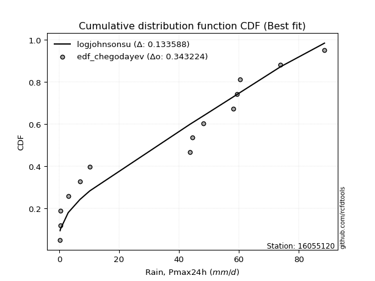</img>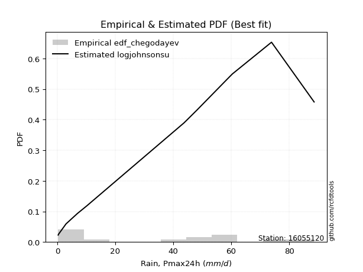</img>

</div>


### 6. Empirical - EDF Blom (1958)

The Blom formula is a specific "plotting position" formula used in hydrology and statistical analysis to estimate the empirical cumulative probability (or non-exceedance probability) of a data series. It is particularly recommended for data that are approximately normally distributed. The constant _a_ is set to 0.375 (or 3/8).

<div align="center">


$P=(m-a)/(n+1-2a)$


</div>


**6.1. Empirical values**

<div align="center">

|                | 0                    | 1                   | 2                  | 3                   | 4                   | 5                   | 6                  | 7        | 8                  | 9                  | 10                 | 11                 | 12                 | 13                 | 14                 |
|:---------------|:---------------------|:--------------------|:-------------------|:--------------------|:--------------------|:--------------------|:-------------------|:---------|:-------------------|:-------------------|:-------------------|:-------------------|:-------------------|:-------------------|:-------------------|
| date           | 2022                 | 2019                | 2020               | 2021                | 2025                | 2006                | 2008               | 2011     | 2016               | 2007               | 2024               | 2010               | 2009               | 2018               | 2017               |
| x              | 0.3                  | 0.4                 | 0.4                | 3.0                 | 4.1                 | 6.9                 | 10.2               | 43.7     | 44.5               | 48.2               | 58.2               | 59.3               | 60.4               | 73.9               | 88.6               |
| m              | 1                    | 2                   | 3                  | 4                   | 5                   | 6                   | 7                  | 8        | 9                  | 10                 | 11                 | 12                 | 13                 | 14                 | 15                 |
| empirical_dist | edf_blom             | edf_blom            | edf_blom           | edf_blom            | edf_blom            | edf_blom            | edf_blom           | edf_blom | edf_blom           | edf_blom           | edf_blom           | edf_blom           | edf_blom           | edf_blom           | edf_blom           |
| empirical      | 0.040983606557377046 | 0.10655737704918032 | 0.1721311475409836 | 0.23770491803278687 | 0.30327868852459017 | 0.36885245901639346 | 0.4344262295081967 | 0.5      | 0.5655737704918032 | 0.6311475409836066 | 0.6967213114754098 | 0.7622950819672131 | 0.8278688524590164 | 0.8934426229508197 | 0.9590163934426229 |
| empirical_tr   | 1.0427350427350428   | 1.1192660550458715  | 1.2079207920792079 | 1.3118279569892473  | 1.4352941176470588  | 1.5844155844155845  | 1.7681159420289854 | 2.0      | 2.30188679245283   | 2.7111111111111112 | 3.2972972972972974 | 4.206896551724137  | 5.80952380952381   | 9.384615384615383  | 24.399999999999974 |

</div>


**6.2. Kolmogorov-Smirnov fit test (sorted by Δ)**


<div align="center">

|                | 0                   | 1                   | 2                  | 3                   | 4                  | 5                   | 6                  | 7                   | 8                   | 9                  | 10                  | 11                    | 12                  | 13                  | 14                 | 15                  | 16                 | 17                  | 18                  | 19                 | 20                  | 21                  | 22                  | 23                  | 24                  | 25                  | 26                 | 27                  | 28                  | 29                  | 30                  | 31                 | 32                  | 33                  | 34                  | 35                 | 36                 | 37                  | 38                 | 39                 | 40                  | 41                 | 42                  | 43                  | 44                 | 45                 | 46                  | 47                  | 48                  | 49                 | 50                 | 51                  | 52                  | 53                 | 54                 | 55                  | 56                 | 57                 | 58                 | 59                 | 60                  | 61                 | 62                 | 63                  | 64                  | 65                  | 66                  | 67                  | 68                 | 69                 | 70                 | 71                  | 72                 | 73                  | 74                 | 75                  | 76                  | 77                 | 78                 | 79                 | 80                 | 81                 | 82                  | 83                 | 84                  | 85                 | 86                 | 87                  | 88                 | 89                 |
|:---------------|:--------------------|:--------------------|:-------------------|:--------------------|:-------------------|:--------------------|:-------------------|:--------------------|:--------------------|:-------------------|:--------------------|:----------------------|:--------------------|:--------------------|:-------------------|:--------------------|:-------------------|:--------------------|:--------------------|:-------------------|:--------------------|:--------------------|:--------------------|:--------------------|:--------------------|:--------------------|:-------------------|:--------------------|:--------------------|:--------------------|:--------------------|:-------------------|:--------------------|:--------------------|:--------------------|:-------------------|:-------------------|:--------------------|:-------------------|:-------------------|:--------------------|:-------------------|:--------------------|:--------------------|:-------------------|:-------------------|:--------------------|:--------------------|:--------------------|:-------------------|:-------------------|:--------------------|:--------------------|:-------------------|:-------------------|:--------------------|:-------------------|:-------------------|:-------------------|:-------------------|:--------------------|:-------------------|:-------------------|:--------------------|:--------------------|:--------------------|:--------------------|:--------------------|:-------------------|:-------------------|:-------------------|:--------------------|:-------------------|:--------------------|:-------------------|:--------------------|:--------------------|:-------------------|:-------------------|:-------------------|:-------------------|:-------------------|:--------------------|:-------------------|:--------------------|:-------------------|:-------------------|:--------------------|:-------------------|:-------------------|
| station        | 16055120            | 16055120            | 16055120           | 16055120            | 16055120           | 16055120            | 16055120           | 16055120            | 16055120            | 16055120           | 16055120            | 16055120              | 16055120            | 16055120            | 16055120           | 16055120            | 16055120           | 16055120            | 16055120            | 16055120           | 16055120            | 16055120            | 16055120            | 16055120            | 16055120            | 16055120            | 16055120           | 16055120            | 16055120            | 16055120            | 16055120            | 16055120           | 16055120            | 16055120            | 16055120            | 16055120           | 16055120           | 16055120            | 16055120           | 16055120           | 16055120            | 16055120           | 16055120            | 16055120            | 16055120           | 16055120           | 16055120            | 16055120            | 16055120            | 16055120           | 16055120           | 16055120            | 16055120            | 16055120           | 16055120           | 16055120            | 16055120           | 16055120           | 16055120           | 16055120           | 16055120            | 16055120           | 16055120           | 16055120            | 16055120            | 16055120            | 16055120            | 16055120            | 16055120           | 16055120           | 16055120           | 16055120            | 16055120           | 16055120            | 16055120           | 16055120            | 16055120            | 16055120           | 16055120           | 16055120           | 16055120           | 16055120           | 16055120            | 16055120           | 16055120            | 16055120           | 16055120           | 16055120            | 16055120           | 16055120           |
| empirical_dist | edf_blom            | edf_blom            | edf_blom           | edf_blom            | edf_blom           | edf_blom            | edf_blom           | edf_blom            | edf_blom            | edf_blom           | edf_blom            | edf_blom              | edf_blom            | edf_blom            | edf_blom           | edf_blom            | edf_blom           | edf_blom            | edf_blom            | edf_blom           | edf_blom            | edf_blom            | edf_blom            | edf_blom            | edf_blom            | edf_blom            | edf_blom           | edf_blom            | edf_blom            | edf_blom            | edf_blom            | edf_blom           | edf_blom            | edf_blom            | edf_blom            | edf_blom           | edf_blom           | edf_blom            | edf_blom           | edf_blom           | edf_blom            | edf_blom           | edf_blom            | edf_blom            | edf_blom           | edf_blom           | edf_blom            | edf_blom            | edf_blom            | edf_blom           | edf_blom           | edf_blom            | edf_blom            | edf_blom           | edf_blom           | edf_blom            | edf_blom           | edf_blom           | edf_blom           | edf_blom           | edf_blom            | edf_blom           | edf_blom           | edf_blom            | edf_blom            | edf_blom            | edf_blom            | edf_blom            | edf_blom           | edf_blom           | edf_blom           | edf_blom            | edf_blom           | edf_blom            | edf_blom           | edf_blom            | edf_blom            | edf_blom           | edf_blom           | edf_blom           | edf_blom           | edf_blom           | edf_blom            | edf_blom           | edf_blom            | edf_blom           | edf_blom           | edf_blom            | edf_blom           | edf_blom           |
| p_dist         | logjohnsonsu        | weibull_min         | halfnorm           | nakagami            | rayleigh           | mielke              | genlogistic        | kstwobign           | maxwell             | invweibull         | logloggamma         | loglaplace_asymmetric | pearson3            | halflogistic        | exponnorm          | crystalball         | norm               | johnsonsu           | t                   | gumbel_r           | gompertz            | genexpon            | chi2                | moyal               | loginvweibull       | laplace_asymmetric  | expon              | rice                | logpearson3         | truncnorm           | logbetaprime        | logistic           | loggumbel_l         | logweibull_min      | gumbel_l            | logexpon           | loginvgauss        | logalpha            | lognct             | logexponnorm       | logt                | logcrystalball     | lognorm             | lognorm             | hypsecant          | loglognorm         | loggamma            | loggamma            | logkstwobign        | logrice            | logerlang          | loggompertz         | logfatiguelife      | nct                | loggenexpon        | loginvgamma         | logmaxwell         | lograyleigh        | invgamma           | laplace            | f                   | loghalfnorm        | betaprime          | loglogistic         | fisk                | alpha               | logchi2             | loghypsecant        | loggumbel_r        | loghalflogistic    | invgauss           | ncf                 | logncf             | logmoyal            | loglaplace         | fatiguelife         | logwald             | logfisk            | wald               | loggibrat          | erlang             | logf               | logtruncnorm        | gamma              | pareto              | gibrat             | logmielke          | logpareto           | lognakagami        | loggenlogistic     |
| delta          | 0.13401152327387977 | 0.17521484658106667 | 0.1845149987940793 | 0.18452828869263505 | 0.1926136748248813 | 0.19327027042433925 | 0.1954665336241938 | 0.19902603125147197 | 0.19948536860386998 | 0.2078629912737101 | 0.21011251850146007 | 0.21011844396539603   | 0.21153309301728812 | 0.21282170780547016 | 0.2158131254516119 | 0.21593556007691034 | 0.2159355630067059 | 0.21596219159380264 | 0.21596874000811128 | 0.2160470263647587 | 0.21830438868453433 | 0.21896133206399837 | 0.21976363847691605 | 0.22542437174901636 | 0.22843638604038563 | 0.22962383787987822 | 0.2297153842449977 | 0.23262937499235212 | 0.23301026915452494 | 0.23659228800479365 | 0.23753445278458662 | 0.2381712998567387 | 0.23879656215772183 | 0.24531558774302908 | 0.24729539846186108 | 0.2476251359367766 | 0.2488204990072922 | 0.25010735022840747 | 0.2515062177618943 | 0.251642948654486  | 0.25164448236416304 | 0.2516446369832661 | 0.25164466121166784 | 0.25164466121166784 | 0.2518381231643288 | 0.2521766329595818 | 0.25254168765361085 | 0.25254168765361085 | 0.25256727836943116 | 0.2526943474296224 | 0.2527083972366371 | 0.25388156188751554 | 0.25448348533379284 | 0.2561873493475598 | 0.2573745050101335 | 0.25768979178652884 | 0.2610163384645262 | 0.2636898149897424 | 0.266328985985097  | 0.2678690304038228 | 0.27258068273956126 | 0.2727996460017279 | 0.2743034827701126 | 0.27430702547879193 | 0.27654695576872124 | 0.27698625441885405 | 0.28785928880668515 | 0.28917646090021387 | 0.2907123997601938 | 0.2971093592449986 | 0.3011498628026914 | 0.30174298858913895 | 0.302607728845783  | 0.30332368911956875 | 0.308784051902822  | 0.33394402470590656 | 0.34290060855132865 | 0.3579845855102315 | 0.3614213216123161 | 0.3722454240167561 | 0.3738274828451281 | 0.382721289534847  | 0.38496390596412455 | 0.3959140241651653 | 0.41235968136170786 | 0.4344262295081967 | 0.458665498840695  | 0.48929398101884325 | 0.5051040040291574 | 0.8934426229508197 |
| deltao         | 0.3366456264050002  | 0.3366456264050002  | 0.3366456264050002 | 0.3366456264050002  | 0.3366456264050002 | 0.3366456264050002  | 0.3366456264050002 | 0.3366456264050002  | 0.3366456264050002  | 0.3366456264050002 | 0.3366456264050002  | 0.3366456264050002    | 0.3366456264050002  | 0.3366456264050002  | 0.3366456264050002 | 0.3366456264050002  | 0.3366456264050002 | 0.3366456264050002  | 0.3366456264050002  | 0.3366456264050002 | 0.3366456264050002  | 0.3366456264050002  | 0.3366456264050002  | 0.3366456264050002  | 0.3366456264050002  | 0.3366456264050002  | 0.3366456264050002 | 0.3366456264050002  | 0.3366456264050002  | 0.3366456264050002  | 0.3366456264050002  | 0.3366456264050002 | 0.3366456264050002  | 0.3366456264050002  | 0.3366456264050002  | 0.3366456264050002 | 0.3366456264050002 | 0.3366456264050002  | 0.3366456264050002 | 0.3366456264050002 | 0.3366456264050002  | 0.3366456264050002 | 0.3366456264050002  | 0.3366456264050002  | 0.3366456264050002 | 0.3366456264050002 | 0.3366456264050002  | 0.3366456264050002  | 0.3366456264050002  | 0.3366456264050002 | 0.3366456264050002 | 0.3366456264050002  | 0.3366456264050002  | 0.3366456264050002 | 0.3366456264050002 | 0.3366456264050002  | 0.3366456264050002 | 0.3366456264050002 | 0.3366456264050002 | 0.3366456264050002 | 0.3366456264050002  | 0.3366456264050002 | 0.3366456264050002 | 0.3366456264050002  | 0.3366456264050002  | 0.3366456264050002  | 0.3366456264050002  | 0.3366456264050002  | 0.3366456264050002 | 0.3366456264050002 | 0.3366456264050002 | 0.3366456264050002  | 0.3366456264050002 | 0.3366456264050002  | 0.3366456264050002 | 0.3366456264050002  | 0.3366456264050002  | 0.3366456264050002 | 0.3366456264050002 | 0.3366456264050002 | 0.3366456264050002 | 0.3366456264050002 | 0.3366456264050002  | 0.3366456264050002 | 0.3366456264050002  | 0.3366456264050002 | 0.3366456264050002 | 0.3366456264050002  | 0.3366456264050002 | 0.3366456264050002 |
| eval           | Δo > Δ              | Δo > Δ              | Δo > Δ             | Δo > Δ              | Δo > Δ             | Δo > Δ              | Δo > Δ             | Δo > Δ              | Δo > Δ              | Δo > Δ             | Δo > Δ              | Δo > Δ                | Δo > Δ              | Δo > Δ              | Δo > Δ             | Δo > Δ              | Δo > Δ             | Δo > Δ              | Δo > Δ              | Δo > Δ             | Δo > Δ              | Δo > Δ              | Δo > Δ              | Δo > Δ              | Δo > Δ              | Δo > Δ              | Δo > Δ             | Δo > Δ              | Δo > Δ              | Δo > Δ              | Δo > Δ              | Δo > Δ             | Δo > Δ              | Δo > Δ              | Δo > Δ              | Δo > Δ             | Δo > Δ             | Δo > Δ              | Δo > Δ             | Δo > Δ             | Δo > Δ              | Δo > Δ             | Δo > Δ              | Δo > Δ              | Δo > Δ             | Δo > Δ             | Δo > Δ              | Δo > Δ              | Δo > Δ              | Δo > Δ             | Δo > Δ             | Δo > Δ              | Δo > Δ              | Δo > Δ             | Δo > Δ             | Δo > Δ              | Δo > Δ             | Δo > Δ             | Δo > Δ             | Δo > Δ             | Δo > Δ              | Δo > Δ             | Δo > Δ             | Δo > Δ              | Δo > Δ              | Δo > Δ              | Δo > Δ              | Δo > Δ              | Δo > Δ             | Δo > Δ             | Δo > Δ             | Δo > Δ              | Δo > Δ             | Δo > Δ              | Δo > Δ             | Δo > Δ              | Δo <= Δ             | Δo <= Δ            | Δo <= Δ            | Δo <= Δ            | Δo <= Δ            | Δo <= Δ            | Δo <= Δ             | Δo <= Δ            | Δo <= Δ             | Δo <= Δ            | Δo <= Δ            | Δo <= Δ             | Δo <= Δ            | Δo <= Δ            |
| fit            | 1                   | 1                   | 1                  | 1                   | 1                  | 1                   | 1                  | 1                   | 1                   | 1                  | 1                   | 1                     | 1                   | 1                   | 1                  | 1                   | 1                  | 1                   | 1                   | 1                  | 1                   | 1                   | 1                   | 1                   | 1                   | 1                   | 1                  | 1                   | 1                   | 1                   | 1                   | 1                  | 1                   | 1                   | 1                   | 1                  | 1                  | 1                   | 1                  | 1                  | 1                   | 1                  | 1                   | 1                   | 1                  | 1                  | 1                   | 1                   | 1                   | 1                  | 1                  | 1                   | 1                   | 1                  | 1                  | 1                   | 1                  | 1                  | 1                  | 1                  | 1                   | 1                  | 1                  | 1                   | 1                   | 1                   | 1                   | 1                   | 1                  | 1                  | 1                  | 1                   | 1                  | 1                   | 1                  | 1                   | 0                   | 0                  | 0                  | 0                  | 0                  | 0                  | 0                   | 0                  | 0                   | 0                  | 0                  | 0                   | 0                  | 0                  |
| n              | 15                  | 15                  | 15                 | 15                  | 15                 | 15                  | 15                 | 15                  | 15                  | 15                 | 15                  | 15                    | 15                  | 15                  | 15                 | 15                  | 15                 | 15                  | 15                  | 15                 | 15                  | 15                  | 15                  | 15                  | 15                  | 15                  | 15                 | 15                  | 15                  | 15                  | 15                  | 15                 | 15                  | 15                  | 15                  | 15                 | 15                 | 15                  | 15                 | 15                 | 15                  | 15                 | 15                  | 15                  | 15                 | 15                 | 15                  | 15                  | 15                  | 15                 | 15                 | 15                  | 15                  | 15                 | 15                 | 15                  | 15                 | 15                 | 15                 | 15                 | 15                  | 15                 | 15                 | 15                  | 15                  | 15                  | 15                  | 15                  | 15                 | 15                 | 15                 | 15                  | 15                 | 15                  | 15                 | 15                  | 15                  | 15                 | 15                 | 15                 | 15                 | 15                 | 15                  | 15                 | 15                  | 15                 | 15                 | 15                  | 15                 | 15                 |
| best_fit       | 1                   | 0                   | 0                  | 0                   | 0                  | 0                   | 0                  | 0                   | 0                   | 0                  | 0                   | 0                     | 0                   | 0                   | 0                  | 0                   | 0                  | 0                   | 0                   | 0                  | 0                   | 0                   | 0                   | 0                   | 0                   | 0                   | 0                  | 0                   | 0                   | 0                   | 0                   | 0                  | 0                   | 0                   | 0                   | 0                  | 0                  | 0                   | 0                  | 0                  | 0                   | 0                  | 0                   | 0                   | 0                  | 0                  | 0                   | 0                   | 0                   | 0                  | 0                  | 0                   | 0                   | 0                  | 0                  | 0                   | 0                  | 0                  | 0                  | 0                  | 0                   | 0                  | 0                  | 0                   | 0                   | 0                   | 0                   | 0                   | 0                  | 0                  | 0                  | 0                   | 0                  | 0                   | 0                  | 0                   | 0                   | 0                  | 0                  | 0                  | 0                  | 0                  | 0                   | 0                  | 0                   | 0                  | 0                  | 0                   | 0                  | 0                  |
| best_fit_sort  | 1                   | 2                   | 3                  | 4                   | 5                  | 6                   | 7                  | 8                   | 9                   | 10                 | 11                  | 12                    | 13                  | 14                  | 15                 | 16                  | 17                 | 18                  | 19                  | 20                 | 21                  | 22                  | 23                  | 24                  | 25                  | 26                  | 27                 | 28                  | 29                  | 30                  | 31                  | 32                 | 33                  | 34                  | 35                  | 36                 | 37                 | 38                  | 39                 | 40                 | 41                  | 42                 | 43                  | 44                  | 45                 | 46                 | 47                  | 48                  | 49                  | 50                 | 51                 | 52                  | 53                  | 54                 | 55                 | 56                  | 57                 | 58                 | 59                 | 60                 | 61                  | 62                 | 63                 | 64                  | 65                  | 66                  | 67                  | 68                  | 69                 | 70                 | 71                 | 72                  | 73                 | 74                  | 75                 | 76                  | 77                  | 78                 | 79                 | 80                 | 81                 | 82                 | 83                  | 84                 | 85                  | 86                 | 87                 | 88                  | 89                 | 90                 |

</div>


<div align="center">

</img>

</div>


**6.3. Best fit**

<div align="center">

|   id |   station | empirical_dist   | p_dist       |    delta |   deltao | eval   |   fit |   n |   best_fit |   best_fit_sort |
|-----:|----------:|:-----------------|:-------------|---------:|---------:|:-------|------:|----:|-----------:|----------------:|
|    0 |  16055120 | edf_blom         | logjohnsonsu | 0.134012 | 0.336646 | Δo > Δ |     1 |  15 |          1 |               1 |

</div>


<div align="center">

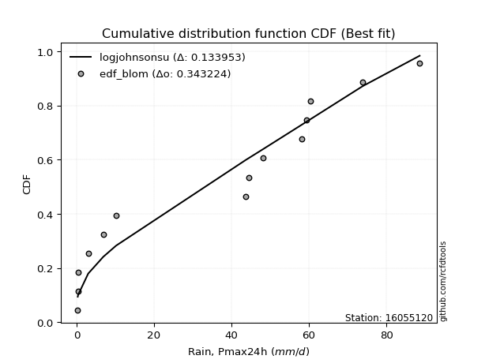</img></img>

</div>


### 7. Empirical - EDF Tukey (1962)

In hydrology, the Tukey formula is used as a plotting position formula to estimate the empirical probability or frequency of a flood event (or other hydrological data). The formula parameter is given as _c=0.333_ (or 1/3).

<div align="center">


$P=(m-c)/(n+1-2c)$


</div>


**7.1. Empirical values**

<div align="center">

|                | 0                    | 1                   | 2                   | 3                  | 4                   | 5                  | 6                   | 7         | 8                  | 9                  | 10                 | 11                 | 12                 | 13                 | 14                 |
|:---------------|:---------------------|:--------------------|:--------------------|:-------------------|:--------------------|:-------------------|:--------------------|:----------|:-------------------|:-------------------|:-------------------|:-------------------|:-------------------|:-------------------|:-------------------|
| date           | 2022                 | 2019                | 2020                | 2021               | 2025                | 2006               | 2008                | 2011      | 2016               | 2007               | 2024               | 2010               | 2009               | 2018               | 2017               |
| x              | 0.3                  | 0.4                 | 0.4                 | 3.0                | 4.1                 | 6.9                | 10.2                | 43.7      | 44.5               | 48.2               | 58.2               | 59.3               | 60.4               | 73.9               | 88.6               |
| m              | 1                    | 2                   | 3                   | 4                  | 5                   | 6                  | 7                   | 8         | 9                  | 10                 | 11                 | 12                 | 13                 | 14                 | 15                 |
| empirical_dist | edf_tukey            | edf_tukey           | edf_tukey           | edf_tukey          | edf_tukey           | edf_tukey          | edf_tukey           | edf_tukey | edf_tukey          | edf_tukey          | edf_tukey          | edf_tukey          | edf_tukey          | edf_tukey          | edf_tukey          |
| empirical      | 0.043478260869565216 | 0.10869565217391304 | 0.17391304347826086 | 0.2391304347826087 | 0.30434782608695654 | 0.3695652173913043 | 0.43478260869565216 | 0.5       | 0.5652173913043478 | 0.6304347826086957 | 0.6956521739130435 | 0.7608695652173914 | 0.8260869565217391 | 0.8913043478260869 | 0.9565217391304348 |
| empirical_tr   | 1.0454545454545454   | 1.1219512195121952  | 1.2105263157894737  | 1.3142857142857143 | 1.4375              | 1.586206896551724  | 1.769230769230769   | 2.0       | 2.3                | 2.7058823529411766 | 3.2857142857142856 | 4.1818181818181825 | 5.75               | 9.199999999999998  | 23.000000000000014 |

</div>


**7.2. Kolmogorov-Smirnov fit test (sorted by Δ)**


<div align="center">

|                | 0                   | 1                   | 2                  | 3                   | 4                   | 5                  | 6                   | 7                   | 8                   | 9                  | 10                  | 11                    | 12                  | 13                  | 14                  | 15                 | 16                  | 17                 | 18                  | 19                  | 20                  | 21                 | 22                  | 23                  | 24                  | 25                 | 26                  | 27                  | 28                  | 29                 | 30                  | 31                  | 32                  | 33                  | 34                 | 35                  | 36                 | 37                  | 38                 | 39                 | 40                  | 41                 | 42                  | 43                  | 44                 | 45                  | 46                  | 47                  | 48                  | 49                 | 50                 | 51                  | 52                  | 53                 | 54                 | 55                  | 56                 | 57                 | 58                 | 59                 | 60                  | 61                 | 62                 | 63                  | 64                  | 65                  | 66                 | 67                  | 68                 | 69                 | 70                 | 71                 | 72                  | 73                  | 74                 | 75                  | 76                  | 77                 | 78                  | 79                 | 80                 | 81                 | 82                  | 83                 | 84                 | 85                  | 86                 | 87                  | 88                 | 89                 |
|:---------------|:--------------------|:--------------------|:-------------------|:--------------------|:--------------------|:-------------------|:--------------------|:--------------------|:--------------------|:-------------------|:--------------------|:----------------------|:--------------------|:--------------------|:--------------------|:-------------------|:--------------------|:-------------------|:--------------------|:--------------------|:--------------------|:-------------------|:--------------------|:--------------------|:--------------------|:-------------------|:--------------------|:--------------------|:--------------------|:-------------------|:--------------------|:--------------------|:--------------------|:--------------------|:-------------------|:--------------------|:-------------------|:--------------------|:-------------------|:-------------------|:--------------------|:-------------------|:--------------------|:--------------------|:-------------------|:--------------------|:--------------------|:--------------------|:--------------------|:-------------------|:-------------------|:--------------------|:--------------------|:-------------------|:-------------------|:--------------------|:-------------------|:-------------------|:-------------------|:-------------------|:--------------------|:-------------------|:-------------------|:--------------------|:--------------------|:--------------------|:-------------------|:--------------------|:-------------------|:-------------------|:-------------------|:-------------------|:--------------------|:--------------------|:-------------------|:--------------------|:--------------------|:-------------------|:--------------------|:-------------------|:-------------------|:-------------------|:--------------------|:-------------------|:-------------------|:--------------------|:-------------------|:--------------------|:-------------------|:-------------------|
| station        | 16055120            | 16055120            | 16055120           | 16055120            | 16055120            | 16055120           | 16055120            | 16055120            | 16055120            | 16055120           | 16055120            | 16055120              | 16055120            | 16055120            | 16055120            | 16055120           | 16055120            | 16055120           | 16055120            | 16055120            | 16055120            | 16055120           | 16055120            | 16055120            | 16055120            | 16055120           | 16055120            | 16055120            | 16055120            | 16055120           | 16055120            | 16055120            | 16055120            | 16055120            | 16055120           | 16055120            | 16055120           | 16055120            | 16055120           | 16055120           | 16055120            | 16055120           | 16055120            | 16055120            | 16055120           | 16055120            | 16055120            | 16055120            | 16055120            | 16055120           | 16055120           | 16055120            | 16055120            | 16055120           | 16055120           | 16055120            | 16055120           | 16055120           | 16055120           | 16055120           | 16055120            | 16055120           | 16055120           | 16055120            | 16055120            | 16055120            | 16055120           | 16055120            | 16055120           | 16055120           | 16055120           | 16055120           | 16055120            | 16055120            | 16055120           | 16055120            | 16055120            | 16055120           | 16055120            | 16055120           | 16055120           | 16055120           | 16055120            | 16055120           | 16055120           | 16055120            | 16055120           | 16055120            | 16055120           | 16055120           |
| empirical_dist | edf_tukey           | edf_tukey           | edf_tukey          | edf_tukey           | edf_tukey           | edf_tukey          | edf_tukey           | edf_tukey           | edf_tukey           | edf_tukey          | edf_tukey           | edf_tukey             | edf_tukey           | edf_tukey           | edf_tukey           | edf_tukey          | edf_tukey           | edf_tukey          | edf_tukey           | edf_tukey           | edf_tukey           | edf_tukey          | edf_tukey           | edf_tukey           | edf_tukey           | edf_tukey          | edf_tukey           | edf_tukey           | edf_tukey           | edf_tukey          | edf_tukey           | edf_tukey           | edf_tukey           | edf_tukey           | edf_tukey          | edf_tukey           | edf_tukey          | edf_tukey           | edf_tukey          | edf_tukey          | edf_tukey           | edf_tukey          | edf_tukey           | edf_tukey           | edf_tukey          | edf_tukey           | edf_tukey           | edf_tukey           | edf_tukey           | edf_tukey          | edf_tukey          | edf_tukey           | edf_tukey           | edf_tukey          | edf_tukey          | edf_tukey           | edf_tukey          | edf_tukey          | edf_tukey          | edf_tukey          | edf_tukey           | edf_tukey          | edf_tukey          | edf_tukey           | edf_tukey           | edf_tukey           | edf_tukey          | edf_tukey           | edf_tukey          | edf_tukey          | edf_tukey          | edf_tukey          | edf_tukey           | edf_tukey           | edf_tukey          | edf_tukey           | edf_tukey           | edf_tukey          | edf_tukey           | edf_tukey          | edf_tukey          | edf_tukey          | edf_tukey           | edf_tukey          | edf_tukey          | edf_tukey           | edf_tukey          | edf_tukey           | edf_tukey          | edf_tukey          |
| p_dist         | logjohnsonsu        | weibull_min         | halfnorm           | nakagami            | rayleigh            | mielke             | genlogistic         | kstwobign           | maxwell             | invweibull         | logloggamma         | loglaplace_asymmetric | pearson3            | halflogistic        | exponnorm           | crystalball        | norm                | johnsonsu          | t                   | gumbel_r            | genexpon            | gompertz           | chi2                | moyal               | loginvweibull       | expon              | laplace_asymmetric  | rice                | logpearson3         | truncnorm          | logbetaprime        | logistic            | loggumbel_l         | logweibull_min      | logexpon           | gumbel_l            | loginvgauss        | logalpha            | lognct             | logexponnorm       | logt                | logcrystalball     | lognorm             | lognorm             | loglognorm         | hypsecant           | loggamma            | loggamma            | logkstwobign        | logrice            | logerlang          | loggompertz         | logfatiguelife      | nct                | loggenexpon        | loginvgamma         | logmaxwell         | lograyleigh        | invgamma           | laplace            | f                   | loghalfnorm        | betaprime          | loglogistic         | fisk                | alpha               | logchi2            | loghypsecant        | loggumbel_r        | loghalflogistic    | logncf             | invgauss           | ncf                 | logmoyal            | loglaplace         | fatiguelife         | logwald             | logfisk            | wald                | loggibrat          | erlang             | logf               | logtruncnorm        | gamma              | pareto             | gibrat              | logmielke          | logpareto           | lognakagami        | loggenlogistic     |
| delta          | 0.13436790246133523 | 0.17272019226887858 | 0.1845149987940793 | 0.18452828869263505 | 0.19297005401233674 | 0.1936266496117947 | 0.19582291281164926 | 0.19938241043892743 | 0.19984174779132544 | 0.2078629912737101 | 0.21011251850146007 | 0.21011844396539603   | 0.21188947220474358 | 0.21282170780547016 | 0.21616950463906737 | 0.2162919392643658 | 0.21629194219416137 | 0.2163185707812581 | 0.21632511919556674 | 0.21640340555221416 | 0.21896133206399837 | 0.2190171470594452 | 0.21976363847691605 | 0.22578075093647182 | 0.22843638604038563 | 0.2297153842449977 | 0.22998021706733368 | 0.23298575417980757 | 0.23301026915452494 | 0.2369486671922491 | 0.23753445278458662 | 0.23852767904419417 | 0.23879656215772183 | 0.24531558774302908 | 0.2476251359367766 | 0.24765177764931653 | 0.2488204990072922 | 0.25010735022840747 | 0.2515062177618943 | 0.251642948654486  | 0.25164448236416304 | 0.2516446369832661 | 0.25164466121166784 | 0.25164466121166784 | 0.2521766329595818 | 0.25219450235178426 | 0.25254168765361085 | 0.25254168765361085 | 0.25256727836943116 | 0.2526943474296224 | 0.2527083972366371 | 0.25388156188751554 | 0.25448348533379284 | 0.2561873493475598 | 0.2573745050101335 | 0.25768979178652884 | 0.2610163384645262 | 0.2636898149897424 | 0.266328985985097  | 0.2682254095912783 | 0.27258068273956126 | 0.2727996460017279 | 0.2743034827701126 | 0.27430702547879193 | 0.27654695576872124 | 0.27698625441885405 | 0.2864337720568633 | 0.28917646090021387 | 0.2907123997601938 | 0.2971093592449986 | 0.3001130745335949 | 0.3011498628026914 | 0.30174298858913895 | 0.30332368911956875 | 0.308784051902822  | 0.33394402470590656 | 0.34290060855132865 | 0.3554899311980434 | 0.36213407998722696 | 0.3722454240167561 | 0.3738274828451281 | 0.3812957727850252 | 0.38496390596412455 | 0.3959140241651653 | 0.4102214062369752 | 0.43478260869565216 | 0.4572399820908732 | 0.48715570589411056 | 0.5036784872793356 | 0.8913043478260869 |
| deltao         | 0.3366456264050002  | 0.3366456264050002  | 0.3366456264050002 | 0.3366456264050002  | 0.3366456264050002  | 0.3366456264050002 | 0.3366456264050002  | 0.3366456264050002  | 0.3366456264050002  | 0.3366456264050002 | 0.3366456264050002  | 0.3366456264050002    | 0.3366456264050002  | 0.3366456264050002  | 0.3366456264050002  | 0.3366456264050002 | 0.3366456264050002  | 0.3366456264050002 | 0.3366456264050002  | 0.3366456264050002  | 0.3366456264050002  | 0.3366456264050002 | 0.3366456264050002  | 0.3366456264050002  | 0.3366456264050002  | 0.3366456264050002 | 0.3366456264050002  | 0.3366456264050002  | 0.3366456264050002  | 0.3366456264050002 | 0.3366456264050002  | 0.3366456264050002  | 0.3366456264050002  | 0.3366456264050002  | 0.3366456264050002 | 0.3366456264050002  | 0.3366456264050002 | 0.3366456264050002  | 0.3366456264050002 | 0.3366456264050002 | 0.3366456264050002  | 0.3366456264050002 | 0.3366456264050002  | 0.3366456264050002  | 0.3366456264050002 | 0.3366456264050002  | 0.3366456264050002  | 0.3366456264050002  | 0.3366456264050002  | 0.3366456264050002 | 0.3366456264050002 | 0.3366456264050002  | 0.3366456264050002  | 0.3366456264050002 | 0.3366456264050002 | 0.3366456264050002  | 0.3366456264050002 | 0.3366456264050002 | 0.3366456264050002 | 0.3366456264050002 | 0.3366456264050002  | 0.3366456264050002 | 0.3366456264050002 | 0.3366456264050002  | 0.3366456264050002  | 0.3366456264050002  | 0.3366456264050002 | 0.3366456264050002  | 0.3366456264050002 | 0.3366456264050002 | 0.3366456264050002 | 0.3366456264050002 | 0.3366456264050002  | 0.3366456264050002  | 0.3366456264050002 | 0.3366456264050002  | 0.3366456264050002  | 0.3366456264050002 | 0.3366456264050002  | 0.3366456264050002 | 0.3366456264050002 | 0.3366456264050002 | 0.3366456264050002  | 0.3366456264050002 | 0.3366456264050002 | 0.3366456264050002  | 0.3366456264050002 | 0.3366456264050002  | 0.3366456264050002 | 0.3366456264050002 |
| eval           | Δo > Δ              | Δo > Δ              | Δo > Δ             | Δo > Δ              | Δo > Δ              | Δo > Δ             | Δo > Δ              | Δo > Δ              | Δo > Δ              | Δo > Δ             | Δo > Δ              | Δo > Δ                | Δo > Δ              | Δo > Δ              | Δo > Δ              | Δo > Δ             | Δo > Δ              | Δo > Δ             | Δo > Δ              | Δo > Δ              | Δo > Δ              | Δo > Δ             | Δo > Δ              | Δo > Δ              | Δo > Δ              | Δo > Δ             | Δo > Δ              | Δo > Δ              | Δo > Δ              | Δo > Δ             | Δo > Δ              | Δo > Δ              | Δo > Δ              | Δo > Δ              | Δo > Δ             | Δo > Δ              | Δo > Δ             | Δo > Δ              | Δo > Δ             | Δo > Δ             | Δo > Δ              | Δo > Δ             | Δo > Δ              | Δo > Δ              | Δo > Δ             | Δo > Δ              | Δo > Δ              | Δo > Δ              | Δo > Δ              | Δo > Δ             | Δo > Δ             | Δo > Δ              | Δo > Δ              | Δo > Δ             | Δo > Δ             | Δo > Δ              | Δo > Δ             | Δo > Δ             | Δo > Δ             | Δo > Δ             | Δo > Δ              | Δo > Δ             | Δo > Δ             | Δo > Δ              | Δo > Δ              | Δo > Δ              | Δo > Δ             | Δo > Δ              | Δo > Δ             | Δo > Δ             | Δo > Δ             | Δo > Δ             | Δo > Δ              | Δo > Δ              | Δo > Δ             | Δo > Δ              | Δo <= Δ             | Δo <= Δ            | Δo <= Δ             | Δo <= Δ            | Δo <= Δ            | Δo <= Δ            | Δo <= Δ             | Δo <= Δ            | Δo <= Δ            | Δo <= Δ             | Δo <= Δ            | Δo <= Δ             | Δo <= Δ            | Δo <= Δ            |
| fit            | 1                   | 1                   | 1                  | 1                   | 1                   | 1                  | 1                   | 1                   | 1                   | 1                  | 1                   | 1                     | 1                   | 1                   | 1                   | 1                  | 1                   | 1                  | 1                   | 1                   | 1                   | 1                  | 1                   | 1                   | 1                   | 1                  | 1                   | 1                   | 1                   | 1                  | 1                   | 1                   | 1                   | 1                   | 1                  | 1                   | 1                  | 1                   | 1                  | 1                  | 1                   | 1                  | 1                   | 1                   | 1                  | 1                   | 1                   | 1                   | 1                   | 1                  | 1                  | 1                   | 1                   | 1                  | 1                  | 1                   | 1                  | 1                  | 1                  | 1                  | 1                   | 1                  | 1                  | 1                   | 1                   | 1                   | 1                  | 1                   | 1                  | 1                  | 1                  | 1                  | 1                   | 1                   | 1                  | 1                   | 0                   | 0                  | 0                   | 0                  | 0                  | 0                  | 0                   | 0                  | 0                  | 0                   | 0                  | 0                   | 0                  | 0                  |
| n              | 15                  | 15                  | 15                 | 15                  | 15                  | 15                 | 15                  | 15                  | 15                  | 15                 | 15                  | 15                    | 15                  | 15                  | 15                  | 15                 | 15                  | 15                 | 15                  | 15                  | 15                  | 15                 | 15                  | 15                  | 15                  | 15                 | 15                  | 15                  | 15                  | 15                 | 15                  | 15                  | 15                  | 15                  | 15                 | 15                  | 15                 | 15                  | 15                 | 15                 | 15                  | 15                 | 15                  | 15                  | 15                 | 15                  | 15                  | 15                  | 15                  | 15                 | 15                 | 15                  | 15                  | 15                 | 15                 | 15                  | 15                 | 15                 | 15                 | 15                 | 15                  | 15                 | 15                 | 15                  | 15                  | 15                  | 15                 | 15                  | 15                 | 15                 | 15                 | 15                 | 15                  | 15                  | 15                 | 15                  | 15                  | 15                 | 15                  | 15                 | 15                 | 15                 | 15                  | 15                 | 15                 | 15                  | 15                 | 15                  | 15                 | 15                 |
| best_fit       | 1                   | 0                   | 0                  | 0                   | 0                   | 0                  | 0                   | 0                   | 0                   | 0                  | 0                   | 0                     | 0                   | 0                   | 0                   | 0                  | 0                   | 0                  | 0                   | 0                   | 0                   | 0                  | 0                   | 0                   | 0                   | 0                  | 0                   | 0                   | 0                   | 0                  | 0                   | 0                   | 0                   | 0                   | 0                  | 0                   | 0                  | 0                   | 0                  | 0                  | 0                   | 0                  | 0                   | 0                   | 0                  | 0                   | 0                   | 0                   | 0                   | 0                  | 0                  | 0                   | 0                   | 0                  | 0                  | 0                   | 0                  | 0                  | 0                  | 0                  | 0                   | 0                  | 0                  | 0                   | 0                   | 0                   | 0                  | 0                   | 0                  | 0                  | 0                  | 0                  | 0                   | 0                   | 0                  | 0                   | 0                   | 0                  | 0                   | 0                  | 0                  | 0                  | 0                   | 0                  | 0                  | 0                   | 0                  | 0                   | 0                  | 0                  |
| best_fit_sort  | 1                   | 2                   | 3                  | 4                   | 5                   | 6                  | 7                   | 8                   | 9                   | 10                 | 11                  | 12                    | 13                  | 14                  | 15                  | 16                 | 17                  | 18                 | 19                  | 20                  | 21                  | 22                 | 23                  | 24                  | 25                  | 26                 | 27                  | 28                  | 29                  | 30                 | 31                  | 32                  | 33                  | 34                  | 35                 | 36                  | 37                 | 38                  | 39                 | 40                 | 41                  | 42                 | 43                  | 44                  | 45                 | 46                  | 47                  | 48                  | 49                  | 50                 | 51                 | 52                  | 53                  | 54                 | 55                 | 56                  | 57                 | 58                 | 59                 | 60                 | 61                  | 62                 | 63                 | 64                  | 65                  | 66                  | 67                 | 68                  | 69                 | 70                 | 71                 | 72                 | 73                  | 74                  | 75                 | 76                  | 77                  | 78                 | 79                  | 80                 | 81                 | 82                 | 83                  | 84                 | 85                 | 86                  | 87                 | 88                  | 89                 | 90                 |

</div>


<div align="center">

</img>

</div>


**7.3. Best fit**

<div align="center">

|   id |   station | empirical_dist   | p_dist       |    delta |   deltao | eval   |   fit |   n |   best_fit |   best_fit_sort |
|-----:|----------:|:-----------------|:-------------|---------:|---------:|:-------|------:|----:|-----------:|----------------:|
|    0 |  16055120 | edf_tukey        | logjohnsonsu | 0.134368 | 0.336646 | Δo > Δ |     1 |  15 |          1 |               1 |

</div>


<div align="center">

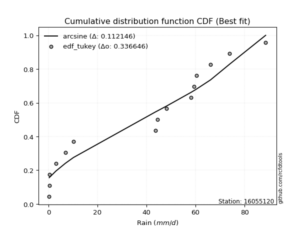</img>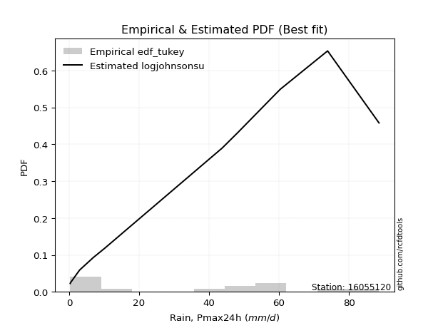</img>

</div>


### 8. Empirical - EDF Gringorten (1963)

Gringorten plotting position formula is essential for estimating the probability and return periods of extreme events like floods and heavy rainfall. The constant _a=0.44_.

<div align="center">


$P=(m-a)/(n+1-2a)$


</div>


**8.1. Empirical values**

<div align="center">

|                | 0                   | 1                   | 2                   | 3                   | 4                   | 5                   | 6                   | 7              | 8                  | 9                  | 10                 | 11                 | 12                 | 13                 | 14                 |
|:---------------|:--------------------|:--------------------|:--------------------|:--------------------|:--------------------|:--------------------|:--------------------|:---------------|:-------------------|:-------------------|:-------------------|:-------------------|:-------------------|:-------------------|:-------------------|
| date           | 2022                | 2019                | 2020                | 2021                | 2025                | 2006                | 2008                | 2011           | 2016               | 2007               | 2024               | 2010               | 2009               | 2018               | 2017               |
| x              | 0.3                 | 0.4                 | 0.4                 | 3.0                 | 4.1                 | 6.9                 | 10.2                | 43.7           | 44.5               | 48.2               | 58.2               | 59.3               | 60.4               | 73.9               | 88.6               |
| m              | 1                   | 2                   | 3                   | 4                   | 5                   | 6                   | 7                   | 8              | 9                  | 10                 | 11                 | 12                 | 13                 | 14                 | 15                 |
| empirical_dist | edf_gringorten      | edf_gringorten      | edf_gringorten      | edf_gringorten      | edf_gringorten      | edf_gringorten      | edf_gringorten      | edf_gringorten | edf_gringorten     | edf_gringorten     | edf_gringorten     | edf_gringorten     | edf_gringorten     | edf_gringorten     | edf_gringorten     |
| empirical      | 0.03703703703703704 | 0.10317460317460318 | 0.16931216931216933 | 0.23544973544973546 | 0.30158730158730157 | 0.36772486772486773 | 0.43386243386243384 | 0.5            | 0.5661375661375662 | 0.6322751322751323 | 0.6984126984126985 | 0.7645502645502646 | 0.8306878306878308 | 0.8968253968253969 | 0.962962962962963  |
| empirical_tr   | 1.0384615384615385  | 1.1150442477876106  | 1.2038216560509554  | 1.3079584775086506  | 1.4318181818181819  | 1.5815899581589956  | 1.7663551401869158  | 2.0            | 2.304878048780488  | 2.719424460431655  | 3.3157894736842115 | 4.247191011235957  | 5.906250000000004  | 9.692307692307695  | 27.000000000000043 |

</div>


**8.2. Kolmogorov-Smirnov fit test (sorted by Δ)**


<div align="center">

|                | 0                  | 1                  | 2                  | 3                   | 4                   | 5                  | 6                  | 7                  | 8                  | 9                  | 10                  | 11                    | 12                  | 13                  | 14                  | 15                  | 16                  | 17                  | 18                  | 19                  | 20                 | 21                  | 22                  | 23                 | 24                  | 25                  | 26                 | 27                  | 28                  | 29                  | 30                  | 31                  | 32                  | 33                  | 34                 | 35                 | 36                 | 37                  | 38                  | 39                 | 40                 | 41                  | 42                 | 43                  | 44                  | 45                 | 46                  | 47                  | 48                  | 49                 | 50                 | 51                  | 52                  | 53                 | 54                 | 55                  | 56                 | 57                 | 58                 | 59                 | 60                  | 61                 | 62                 | 63                  | 64                  | 65                  | 66                  | 67                  | 68                 | 69                 | 70                 | 71                  | 72                  | 73                  | 74                 | 75                  | 76                  | 77                 | 78                 | 79                 | 80                 | 81                  | 82                 | 83                 | 84                 | 85                  | 86                 | 87                 | 88                 | 89                 |
|:---------------|:-------------------|:-------------------|:-------------------|:--------------------|:--------------------|:-------------------|:-------------------|:-------------------|:-------------------|:-------------------|:--------------------|:----------------------|:--------------------|:--------------------|:--------------------|:--------------------|:--------------------|:--------------------|:--------------------|:--------------------|:-------------------|:--------------------|:--------------------|:-------------------|:--------------------|:--------------------|:-------------------|:--------------------|:--------------------|:--------------------|:--------------------|:--------------------|:--------------------|:--------------------|:-------------------|:-------------------|:-------------------|:--------------------|:--------------------|:-------------------|:-------------------|:--------------------|:-------------------|:--------------------|:--------------------|:-------------------|:--------------------|:--------------------|:--------------------|:-------------------|:-------------------|:--------------------|:--------------------|:-------------------|:-------------------|:--------------------|:-------------------|:-------------------|:-------------------|:-------------------|:--------------------|:-------------------|:-------------------|:--------------------|:--------------------|:--------------------|:--------------------|:--------------------|:-------------------|:-------------------|:-------------------|:--------------------|:--------------------|:--------------------|:-------------------|:--------------------|:--------------------|:-------------------|:-------------------|:-------------------|:-------------------|:--------------------|:-------------------|:-------------------|:-------------------|:--------------------|:-------------------|:-------------------|:-------------------|:-------------------|
| station        | 16055120           | 16055120           | 16055120           | 16055120            | 16055120            | 16055120           | 16055120           | 16055120           | 16055120           | 16055120           | 16055120            | 16055120              | 16055120            | 16055120            | 16055120            | 16055120            | 16055120            | 16055120            | 16055120            | 16055120            | 16055120           | 16055120            | 16055120            | 16055120           | 16055120            | 16055120            | 16055120           | 16055120            | 16055120            | 16055120            | 16055120            | 16055120            | 16055120            | 16055120            | 16055120           | 16055120           | 16055120           | 16055120            | 16055120            | 16055120           | 16055120           | 16055120            | 16055120           | 16055120            | 16055120            | 16055120           | 16055120            | 16055120            | 16055120            | 16055120           | 16055120           | 16055120            | 16055120            | 16055120           | 16055120           | 16055120            | 16055120           | 16055120           | 16055120           | 16055120           | 16055120            | 16055120           | 16055120           | 16055120            | 16055120            | 16055120            | 16055120            | 16055120            | 16055120           | 16055120           | 16055120           | 16055120            | 16055120            | 16055120            | 16055120           | 16055120            | 16055120            | 16055120           | 16055120           | 16055120           | 16055120           | 16055120            | 16055120           | 16055120           | 16055120           | 16055120            | 16055120           | 16055120           | 16055120           | 16055120           |
| empirical_dist | edf_gringorten     | edf_gringorten     | edf_gringorten     | edf_gringorten      | edf_gringorten      | edf_gringorten     | edf_gringorten     | edf_gringorten     | edf_gringorten     | edf_gringorten     | edf_gringorten      | edf_gringorten        | edf_gringorten      | edf_gringorten      | edf_gringorten      | edf_gringorten      | edf_gringorten      | edf_gringorten      | edf_gringorten      | edf_gringorten      | edf_gringorten     | edf_gringorten      | edf_gringorten      | edf_gringorten     | edf_gringorten      | edf_gringorten      | edf_gringorten     | edf_gringorten      | edf_gringorten      | edf_gringorten      | edf_gringorten      | edf_gringorten      | edf_gringorten      | edf_gringorten      | edf_gringorten     | edf_gringorten     | edf_gringorten     | edf_gringorten      | edf_gringorten      | edf_gringorten     | edf_gringorten     | edf_gringorten      | edf_gringorten     | edf_gringorten      | edf_gringorten      | edf_gringorten     | edf_gringorten      | edf_gringorten      | edf_gringorten      | edf_gringorten     | edf_gringorten     | edf_gringorten      | edf_gringorten      | edf_gringorten     | edf_gringorten     | edf_gringorten      | edf_gringorten     | edf_gringorten     | edf_gringorten     | edf_gringorten     | edf_gringorten      | edf_gringorten     | edf_gringorten     | edf_gringorten      | edf_gringorten      | edf_gringorten      | edf_gringorten      | edf_gringorten      | edf_gringorten     | edf_gringorten     | edf_gringorten     | edf_gringorten      | edf_gringorten      | edf_gringorten      | edf_gringorten     | edf_gringorten      | edf_gringorten      | edf_gringorten     | edf_gringorten     | edf_gringorten     | edf_gringorten     | edf_gringorten      | edf_gringorten     | edf_gringorten     | edf_gringorten     | edf_gringorten      | edf_gringorten     | edf_gringorten     | edf_gringorten     | edf_gringorten     |
| p_dist         | logjohnsonsu       | weibull_min        | halfnorm           | nakagami            | rayleigh            | mielke             | genlogistic        | kstwobign          | maxwell            | invweibull         | logloggamma         | loglaplace_asymmetric | pearson3            | halflogistic        | exponnorm           | crystalball         | norm                | johnsonsu           | t                   | gumbel_r            | gompertz           | genexpon            | chi2                | moyal              | loginvweibull       | laplace_asymmetric  | expon              | rice                | logpearson3         | truncnorm           | logbetaprime        | logistic            | loggumbel_l         | logweibull_min      | gumbel_l           | logexpon           | loginvgauss        | logalpha            | hypsecant           | lognct             | logexponnorm       | logt                | logcrystalball     | lognorm             | lognorm             | loglognorm         | loggamma            | loggamma            | logkstwobign        | logrice            | logerlang          | loggompertz         | logfatiguelife      | nct                | loggenexpon        | loginvgamma         | logmaxwell         | lograyleigh        | invgamma           | laplace            | f                   | loghalfnorm        | betaprime          | loglogistic         | fisk                | alpha               | loghypsecant        | logchi2             | loggumbel_r        | loghalflogistic    | invgauss           | ncf                 | logmoyal            | logncf              | loglaplace         | fatiguelife         | logwald             | wald               | logfisk            | loggibrat          | erlang             | logtruncnorm        | logf               | gamma              | pareto             | gibrat              | logmielke          | logpareto          | lognakagami        | loggenlogistic     |
| delta          | 0.1334477276281169 | 0.1791614161014068 | 0.1845149987940793 | 0.18452828869263505 | 0.19204987917911842 | 0.1927064747785764 | 0.1950103801555675 | 0.1984622356057091 | 0.1989215729581071 | 0.2078629912737101 | 0.21011251850146007 | 0.21011844396539603   | 0.21096929737152526 | 0.21282170780547016 | 0.21524932980584904 | 0.21537176443114747 | 0.21537176736094304 | 0.21539839594803978 | 0.21540494436234842 | 0.21548323071899583 | 0.2171767973930086 | 0.21896133206399837 | 0.21976363847691605 | 0.2248605761032535 | 0.22843638604038563 | 0.22906004223411536 | 0.2297153842449977 | 0.23206557934658925 | 0.23301026915452494 | 0.23602849235903078 | 0.23753445278458662 | 0.23760750421097585 | 0.23879656215772183 | 0.24531558774302908 | 0.2467316028160982 | 0.2476251359367766 | 0.2488204990072922 | 0.25010735022840747 | 0.25127432751856593 | 0.2515062177618943 | 0.251642948654486  | 0.25164448236416304 | 0.2516446369832661 | 0.25164466121166784 | 0.25164466121166784 | 0.2521766329595818 | 0.25254168765361085 | 0.25254168765361085 | 0.25256727836943116 | 0.2526943474296224 | 0.2527083972366371 | 0.25388156188751554 | 0.25448348533379284 | 0.2561873493475598 | 0.2573745050101335 | 0.25768979178652884 | 0.2610163384645262 | 0.2636898149897424 | 0.266328985985097  | 0.26730523475806   | 0.27258068273956126 | 0.2727996460017279 | 0.2743034827701126 | 0.27430702547879193 | 0.27654695576872124 | 0.27698625441885405 | 0.28917646090021387 | 0.29011447138973656 | 0.2907123997601938 | 0.2971093592449986 | 0.3011498628026914 | 0.30174298858913895 | 0.30332368911956875 | 0.30655429836612313 | 0.308784051902822  | 0.33394402470590656 | 0.34290060855132865 | 0.3602937303207904 | 0.3619311550305716 | 0.3722454240167561 | 0.3738274828451281 | 0.38496390596412455 | 0.3849764721178984 | 0.3959140241651653 | 0.415742455236285  | 0.43386243386243384 | 0.4609206814237464 | 0.4926767548934204 | 0.5073591866122089 | 0.8968253968253969 |
| deltao         | 0.3366456264050002 | 0.3366456264050002 | 0.3366456264050002 | 0.3366456264050002  | 0.3366456264050002  | 0.3366456264050002 | 0.3366456264050002 | 0.3366456264050002 | 0.3366456264050002 | 0.3366456264050002 | 0.3366456264050002  | 0.3366456264050002    | 0.3366456264050002  | 0.3366456264050002  | 0.3366456264050002  | 0.3366456264050002  | 0.3366456264050002  | 0.3366456264050002  | 0.3366456264050002  | 0.3366456264050002  | 0.3366456264050002 | 0.3366456264050002  | 0.3366456264050002  | 0.3366456264050002 | 0.3366456264050002  | 0.3366456264050002  | 0.3366456264050002 | 0.3366456264050002  | 0.3366456264050002  | 0.3366456264050002  | 0.3366456264050002  | 0.3366456264050002  | 0.3366456264050002  | 0.3366456264050002  | 0.3366456264050002 | 0.3366456264050002 | 0.3366456264050002 | 0.3366456264050002  | 0.3366456264050002  | 0.3366456264050002 | 0.3366456264050002 | 0.3366456264050002  | 0.3366456264050002 | 0.3366456264050002  | 0.3366456264050002  | 0.3366456264050002 | 0.3366456264050002  | 0.3366456264050002  | 0.3366456264050002  | 0.3366456264050002 | 0.3366456264050002 | 0.3366456264050002  | 0.3366456264050002  | 0.3366456264050002 | 0.3366456264050002 | 0.3366456264050002  | 0.3366456264050002 | 0.3366456264050002 | 0.3366456264050002 | 0.3366456264050002 | 0.3366456264050002  | 0.3366456264050002 | 0.3366456264050002 | 0.3366456264050002  | 0.3366456264050002  | 0.3366456264050002  | 0.3366456264050002  | 0.3366456264050002  | 0.3366456264050002 | 0.3366456264050002 | 0.3366456264050002 | 0.3366456264050002  | 0.3366456264050002  | 0.3366456264050002  | 0.3366456264050002 | 0.3366456264050002  | 0.3366456264050002  | 0.3366456264050002 | 0.3366456264050002 | 0.3366456264050002 | 0.3366456264050002 | 0.3366456264050002  | 0.3366456264050002 | 0.3366456264050002 | 0.3366456264050002 | 0.3366456264050002  | 0.3366456264050002 | 0.3366456264050002 | 0.3366456264050002 | 0.3366456264050002 |
| eval           | Δo > Δ             | Δo > Δ             | Δo > Δ             | Δo > Δ              | Δo > Δ              | Δo > Δ             | Δo > Δ             | Δo > Δ             | Δo > Δ             | Δo > Δ             | Δo > Δ              | Δo > Δ                | Δo > Δ              | Δo > Δ              | Δo > Δ              | Δo > Δ              | Δo > Δ              | Δo > Δ              | Δo > Δ              | Δo > Δ              | Δo > Δ             | Δo > Δ              | Δo > Δ              | Δo > Δ             | Δo > Δ              | Δo > Δ              | Δo > Δ             | Δo > Δ              | Δo > Δ              | Δo > Δ              | Δo > Δ              | Δo > Δ              | Δo > Δ              | Δo > Δ              | Δo > Δ             | Δo > Δ             | Δo > Δ             | Δo > Δ              | Δo > Δ              | Δo > Δ             | Δo > Δ             | Δo > Δ              | Δo > Δ             | Δo > Δ              | Δo > Δ              | Δo > Δ             | Δo > Δ              | Δo > Δ              | Δo > Δ              | Δo > Δ             | Δo > Δ             | Δo > Δ              | Δo > Δ              | Δo > Δ             | Δo > Δ             | Δo > Δ              | Δo > Δ             | Δo > Δ             | Δo > Δ             | Δo > Δ             | Δo > Δ              | Δo > Δ             | Δo > Δ             | Δo > Δ              | Δo > Δ              | Δo > Δ              | Δo > Δ              | Δo > Δ              | Δo > Δ             | Δo > Δ             | Δo > Δ             | Δo > Δ              | Δo > Δ              | Δo > Δ              | Δo > Δ             | Δo > Δ              | Δo <= Δ             | Δo <= Δ            | Δo <= Δ            | Δo <= Δ            | Δo <= Δ            | Δo <= Δ             | Δo <= Δ            | Δo <= Δ            | Δo <= Δ            | Δo <= Δ             | Δo <= Δ            | Δo <= Δ            | Δo <= Δ            | Δo <= Δ            |
| fit            | 1                  | 1                  | 1                  | 1                   | 1                   | 1                  | 1                  | 1                  | 1                  | 1                  | 1                   | 1                     | 1                   | 1                   | 1                   | 1                   | 1                   | 1                   | 1                   | 1                   | 1                  | 1                   | 1                   | 1                  | 1                   | 1                   | 1                  | 1                   | 1                   | 1                   | 1                   | 1                   | 1                   | 1                   | 1                  | 1                  | 1                  | 1                   | 1                   | 1                  | 1                  | 1                   | 1                  | 1                   | 1                   | 1                  | 1                   | 1                   | 1                   | 1                  | 1                  | 1                   | 1                   | 1                  | 1                  | 1                   | 1                  | 1                  | 1                  | 1                  | 1                   | 1                  | 1                  | 1                   | 1                   | 1                   | 1                   | 1                   | 1                  | 1                  | 1                  | 1                   | 1                   | 1                   | 1                  | 1                   | 0                   | 0                  | 0                  | 0                  | 0                  | 0                   | 0                  | 0                  | 0                  | 0                   | 0                  | 0                  | 0                  | 0                  |
| n              | 15                 | 15                 | 15                 | 15                  | 15                  | 15                 | 15                 | 15                 | 15                 | 15                 | 15                  | 15                    | 15                  | 15                  | 15                  | 15                  | 15                  | 15                  | 15                  | 15                  | 15                 | 15                  | 15                  | 15                 | 15                  | 15                  | 15                 | 15                  | 15                  | 15                  | 15                  | 15                  | 15                  | 15                  | 15                 | 15                 | 15                 | 15                  | 15                  | 15                 | 15                 | 15                  | 15                 | 15                  | 15                  | 15                 | 15                  | 15                  | 15                  | 15                 | 15                 | 15                  | 15                  | 15                 | 15                 | 15                  | 15                 | 15                 | 15                 | 15                 | 15                  | 15                 | 15                 | 15                  | 15                  | 15                  | 15                  | 15                  | 15                 | 15                 | 15                 | 15                  | 15                  | 15                  | 15                 | 15                  | 15                  | 15                 | 15                 | 15                 | 15                 | 15                  | 15                 | 15                 | 15                 | 15                  | 15                 | 15                 | 15                 | 15                 |
| best_fit       | 1                  | 0                  | 0                  | 0                   | 0                   | 0                  | 0                  | 0                  | 0                  | 0                  | 0                   | 0                     | 0                   | 0                   | 0                   | 0                   | 0                   | 0                   | 0                   | 0                   | 0                  | 0                   | 0                   | 0                  | 0                   | 0                   | 0                  | 0                   | 0                   | 0                   | 0                   | 0                   | 0                   | 0                   | 0                  | 0                  | 0                  | 0                   | 0                   | 0                  | 0                  | 0                   | 0                  | 0                   | 0                   | 0                  | 0                   | 0                   | 0                   | 0                  | 0                  | 0                   | 0                   | 0                  | 0                  | 0                   | 0                  | 0                  | 0                  | 0                  | 0                   | 0                  | 0                  | 0                   | 0                   | 0                   | 0                   | 0                   | 0                  | 0                  | 0                  | 0                   | 0                   | 0                   | 0                  | 0                   | 0                   | 0                  | 0                  | 0                  | 0                  | 0                   | 0                  | 0                  | 0                  | 0                   | 0                  | 0                  | 0                  | 0                  |
| best_fit_sort  | 1                  | 2                  | 3                  | 4                   | 5                   | 6                  | 7                  | 8                  | 9                  | 10                 | 11                  | 12                    | 13                  | 14                  | 15                  | 16                  | 17                  | 18                  | 19                  | 20                  | 21                 | 22                  | 23                  | 24                 | 25                  | 26                  | 27                 | 28                  | 29                  | 30                  | 31                  | 32                  | 33                  | 34                  | 35                 | 36                 | 37                 | 38                  | 39                  | 40                 | 41                 | 42                  | 43                 | 44                  | 45                  | 46                 | 47                  | 48                  | 49                  | 50                 | 51                 | 52                  | 53                  | 54                 | 55                 | 56                  | 57                 | 58                 | 59                 | 60                 | 61                  | 62                 | 63                 | 64                  | 65                  | 66                  | 67                  | 68                  | 69                 | 70                 | 71                 | 72                  | 73                  | 74                  | 75                 | 76                  | 77                  | 78                 | 79                 | 80                 | 81                 | 82                  | 83                 | 84                 | 85                 | 86                  | 87                 | 88                 | 89                 | 90                 |

</div>


<div align="center">

</img>

</div>


**8.3. Best fit**

<div align="center">

|   id |   station | empirical_dist   | p_dist       |    delta |   deltao | eval   |   fit |   n |   best_fit |   best_fit_sort |
|-----:|----------:|:-----------------|:-------------|---------:|---------:|:-------|------:|----:|-----------:|----------------:|
|    0 |  16055120 | edf_gringorten   | logjohnsonsu | 0.133448 | 0.336646 | Δo > Δ |     1 |  15 |          1 |               1 |

</div>


<div align="center">

</img>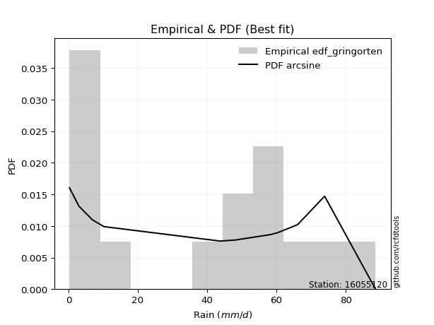</img>

</div>


### 9. Empirical - EDF Filliben (1975)

The specific values of the constants (0.3175) (often denoted as $alpha$) and (0.365) are derived from a method proposed by James J. Filliben in a 1975 paper. This particular formula is the mean value of the $i$-th order statistic of the normal distribution and is considered a robust and effective plotting position formula for the normal probability plot correlation coefficient test for normality.

<div align="center">


$P=(m-0.3175)/(n+0.365)$


</div>


**9.1. Empirical values**

<div align="center">

|                | 0                   | 1                   | 2                  | 3                   | 4                  | 5                  | 6                   | 7            | 8                  | 9                  | 10                 | 11                 | 12                 | 13                | 14                 |
|:---------------|:--------------------|:--------------------|:-------------------|:--------------------|:-------------------|:-------------------|:--------------------|:-------------|:-------------------|:-------------------|:-------------------|:-------------------|:-------------------|:------------------|:-------------------|
| date           | 2022                | 2019                | 2020               | 2021                | 2025               | 2006               | 2008                | 2011         | 2016               | 2007               | 2024               | 2010               | 2009               | 2018              | 2017               |
| x              | 0.3                 | 0.4                 | 0.4                | 3.0                 | 4.1                | 6.9                | 10.2                | 43.7         | 44.5               | 48.2               | 58.2               | 59.3               | 60.4               | 73.9              | 88.6               |
| m              | 1                   | 2                   | 3                  | 4                   | 5                  | 6                  | 7                   | 8            | 9                  | 10                 | 11                 | 12                 | 13                 | 14                | 15                 |
| empirical_dist | edf_filliben        | edf_filliben        | edf_filliben       | edf_filliben        | edf_filliben       | edf_filliben       | edf_filliben        | edf_filliben | edf_filliben       | edf_filliben       | edf_filliben       | edf_filliben       | edf_filliben       | edf_filliben      | edf_filliben       |
| empirical      | 0.04441913439635535 | 0.10950211519687603 | 0.1745850959973967 | 0.23966807679791735 | 0.304751057598438  | 0.3698340383989587 | 0.43491701919947934 | 0.5          | 0.5650829808005206 | 0.6301659616010412 | 0.6952489424015619 | 0.7603319232020826 | 0.8254149040026033 | 0.890497884803124 | 0.9555808656036446 |
| empirical_tr   | 1.0464839094159715  | 1.1229672939886717  | 1.211511925882121  | 1.3152150652685641  | 1.4383337233793587 | 1.586883552801446  | 1.7696515980420386  | 2.0          | 2.2992891881780766 | 2.7039155301363826 | 3.2813667912439923 | 4.172437202987101  | 5.727865796831314  | 9.13224368499257  | 22.512820512820507 |

</div>


**9.2. Kolmogorov-Smirnov fit test (sorted by Δ)**


<div align="center">

|                | 0                  | 1                  | 2                  | 3                   | 4                   | 5                   | 6                   | 7                  | 8                  | 9                  | 10                  | 11                    | 12                  | 13                  | 14                  | 15                  | 16                  | 17                  | 18                  | 19                  | 20                  | 21                  | 22                  | 23                 | 24                  | 25                 | 26                  | 27                  | 28                  | 29                  | 30                  | 31                  | 32                  | 33                  | 34                 | 35                 | 36                 | 37                  | 38                 | 39                 | 40                  | 41                 | 42                  | 43                  | 44                 | 45                  | 46                  | 47                  | 48                  | 49                 | 50                 | 51                  | 52                  | 53                 | 54                 | 55                  | 56                 | 57                 | 58                 | 59                 | 60                  | 61                 | 62                 | 63                  | 64                  | 65                  | 66                 | 67                  | 68                 | 69                 | 70                  | 71                 | 72                  | 73                  | 74                 | 75                  | 76                  | 77                 | 78                 | 79                 | 80                 | 81                  | 82                  | 83                 | 84                 | 85                  | 86                  | 87                  | 88                 | 89                 |
|:---------------|:-------------------|:-------------------|:-------------------|:--------------------|:--------------------|:--------------------|:--------------------|:-------------------|:-------------------|:-------------------|:--------------------|:----------------------|:--------------------|:--------------------|:--------------------|:--------------------|:--------------------|:--------------------|:--------------------|:--------------------|:--------------------|:--------------------|:--------------------|:-------------------|:--------------------|:-------------------|:--------------------|:--------------------|:--------------------|:--------------------|:--------------------|:--------------------|:--------------------|:--------------------|:-------------------|:-------------------|:-------------------|:--------------------|:-------------------|:-------------------|:--------------------|:-------------------|:--------------------|:--------------------|:-------------------|:--------------------|:--------------------|:--------------------|:--------------------|:-------------------|:-------------------|:--------------------|:--------------------|:-------------------|:-------------------|:--------------------|:-------------------|:-------------------|:-------------------|:-------------------|:--------------------|:-------------------|:-------------------|:--------------------|:--------------------|:--------------------|:-------------------|:--------------------|:-------------------|:-------------------|:--------------------|:-------------------|:--------------------|:--------------------|:-------------------|:--------------------|:--------------------|:-------------------|:-------------------|:-------------------|:-------------------|:--------------------|:--------------------|:-------------------|:-------------------|:--------------------|:--------------------|:--------------------|:-------------------|:-------------------|
| station        | 16055120           | 16055120           | 16055120           | 16055120            | 16055120            | 16055120            | 16055120            | 16055120           | 16055120           | 16055120           | 16055120            | 16055120              | 16055120            | 16055120            | 16055120            | 16055120            | 16055120            | 16055120            | 16055120            | 16055120            | 16055120            | 16055120            | 16055120            | 16055120           | 16055120            | 16055120           | 16055120            | 16055120            | 16055120            | 16055120            | 16055120            | 16055120            | 16055120            | 16055120            | 16055120           | 16055120           | 16055120           | 16055120            | 16055120           | 16055120           | 16055120            | 16055120           | 16055120            | 16055120            | 16055120           | 16055120            | 16055120            | 16055120            | 16055120            | 16055120           | 16055120           | 16055120            | 16055120            | 16055120           | 16055120           | 16055120            | 16055120           | 16055120           | 16055120           | 16055120           | 16055120            | 16055120           | 16055120           | 16055120            | 16055120            | 16055120            | 16055120           | 16055120            | 16055120           | 16055120           | 16055120            | 16055120           | 16055120            | 16055120            | 16055120           | 16055120            | 16055120            | 16055120           | 16055120           | 16055120           | 16055120           | 16055120            | 16055120            | 16055120           | 16055120           | 16055120            | 16055120            | 16055120            | 16055120           | 16055120           |
| empirical_dist | edf_filliben       | edf_filliben       | edf_filliben       | edf_filliben        | edf_filliben        | edf_filliben        | edf_filliben        | edf_filliben       | edf_filliben       | edf_filliben       | edf_filliben        | edf_filliben          | edf_filliben        | edf_filliben        | edf_filliben        | edf_filliben        | edf_filliben        | edf_filliben        | edf_filliben        | edf_filliben        | edf_filliben        | edf_filliben        | edf_filliben        | edf_filliben       | edf_filliben        | edf_filliben       | edf_filliben        | edf_filliben        | edf_filliben        | edf_filliben        | edf_filliben        | edf_filliben        | edf_filliben        | edf_filliben        | edf_filliben       | edf_filliben       | edf_filliben       | edf_filliben        | edf_filliben       | edf_filliben       | edf_filliben        | edf_filliben       | edf_filliben        | edf_filliben        | edf_filliben       | edf_filliben        | edf_filliben        | edf_filliben        | edf_filliben        | edf_filliben       | edf_filliben       | edf_filliben        | edf_filliben        | edf_filliben       | edf_filliben       | edf_filliben        | edf_filliben       | edf_filliben       | edf_filliben       | edf_filliben       | edf_filliben        | edf_filliben       | edf_filliben       | edf_filliben        | edf_filliben        | edf_filliben        | edf_filliben       | edf_filliben        | edf_filliben       | edf_filliben       | edf_filliben        | edf_filliben       | edf_filliben        | edf_filliben        | edf_filliben       | edf_filliben        | edf_filliben        | edf_filliben       | edf_filliben       | edf_filliben       | edf_filliben       | edf_filliben        | edf_filliben        | edf_filliben       | edf_filliben       | edf_filliben        | edf_filliben        | edf_filliben        | edf_filliben       | edf_filliben       |
| p_dist         | logjohnsonsu       | weibull_min        | halfnorm           | nakagami            | rayleigh            | mielke              | genlogistic         | kstwobign          | maxwell            | invweibull         | logloggamma         | loglaplace_asymmetric | pearson3            | halflogistic        | exponnorm           | crystalball         | norm                | johnsonsu           | t                   | gumbel_r            | genexpon            | gompertz            | chi2                | moyal              | loginvweibull       | expon              | laplace_asymmetric  | logpearson3         | rice                | truncnorm           | logbetaprime        | logistic            | loggumbel_l         | logweibull_min      | logexpon           | gumbel_l           | loginvgauss        | logalpha            | lognct             | logexponnorm       | logt                | logcrystalball     | lognorm             | lognorm             | loglognorm         | hypsecant           | loggamma            | loggamma            | logkstwobign        | logrice            | logerlang          | loggompertz         | logfatiguelife      | nct                | loggenexpon        | loginvgamma         | logmaxwell         | lograyleigh        | invgamma           | laplace            | f                   | loghalfnorm        | betaprime          | loglogistic         | fisk                | alpha               | logchi2            | loghypsecant        | loggumbel_r        | loghalflogistic    | logncf              | invgauss           | ncf                 | logmoyal            | loglaplace         | fatiguelife         | logwald             | logfisk            | wald               | loggibrat          | erlang             | logf                | logtruncnorm        | gamma              | pareto             | gibrat              | logmielke           | logpareto           | lognakagami        | loggenlogistic     |
| delta          | 0.1345023129651624 | 0.1717793187420884 | 0.1845149987940793 | 0.18452828869263505 | 0.19310446451616392 | 0.19376106011562189 | 0.19595732331547644 | 0.1995168209427546 | 0.1999761582951526 | 0.2078629912737101 | 0.21011251850146007 | 0.21011844396539603   | 0.21202388270857075 | 0.21282170780547016 | 0.21630391514289454 | 0.21642634976819297 | 0.21642635269798854 | 0.21645298128508528 | 0.21645952969939392 | 0.21653781605604133 | 0.21896133206399837 | 0.21928596806709955 | 0.21976363847691605 | 0.225915161440299  | 0.22843638604038563 | 0.2297153842449977 | 0.23011462757116086 | 0.23301026915452494 | 0.23312016468363475 | 0.23708307769607628 | 0.23753445278458662 | 0.23866208954802134 | 0.23879656215772183 | 0.24531558774302908 | 0.2476251359367766 | 0.2477861881531437 | 0.2488204990072922 | 0.25010735022840747 | 0.2515062177618943 | 0.251642948654486  | 0.25164448236416304 | 0.2516446369832661 | 0.25164466121166784 | 0.25164466121166784 | 0.2521766329595818 | 0.25232891285561143 | 0.25254168765361085 | 0.25254168765361085 | 0.25256727836943116 | 0.2526943474296224 | 0.2527083972366371 | 0.25388156188751554 | 0.25448348533379284 | 0.2561873493475598 | 0.2573745050101335 | 0.25768979178652884 | 0.2610163384645262 | 0.2636898149897424 | 0.266328985985097  | 0.2683598200951055 | 0.27258068273956126 | 0.2727996460017279 | 0.2743034827701126 | 0.27430702547879193 | 0.27654695576872124 | 0.27698625441885405 | 0.2858961300415547 | 0.28917646090021387 | 0.2907123997601938 | 0.2971093592449986 | 0.29917220100680475 | 0.3011498628026914 | 0.30174298858913895 | 0.30332368911956875 | 0.308784051902822  | 0.33394402470590656 | 0.34290060855132865 | 0.3545490576712532 | 0.3624029009948813 | 0.3722454240167561 | 0.3738274828451281 | 0.38075813076971654 | 0.38496390596412455 | 0.3959140241651653 | 0.4094149432140122 | 0.43491701919947934 | 0.45670234007556454 | 0.48634924287114756 | 0.503140845264027  | 0.890497884803124  |
| deltao         | 0.3366456264050002 | 0.3366456264050002 | 0.3366456264050002 | 0.3366456264050002  | 0.3366456264050002  | 0.3366456264050002  | 0.3366456264050002  | 0.3366456264050002 | 0.3366456264050002 | 0.3366456264050002 | 0.3366456264050002  | 0.3366456264050002    | 0.3366456264050002  | 0.3366456264050002  | 0.3366456264050002  | 0.3366456264050002  | 0.3366456264050002  | 0.3366456264050002  | 0.3366456264050002  | 0.3366456264050002  | 0.3366456264050002  | 0.3366456264050002  | 0.3366456264050002  | 0.3366456264050002 | 0.3366456264050002  | 0.3366456264050002 | 0.3366456264050002  | 0.3366456264050002  | 0.3366456264050002  | 0.3366456264050002  | 0.3366456264050002  | 0.3366456264050002  | 0.3366456264050002  | 0.3366456264050002  | 0.3366456264050002 | 0.3366456264050002 | 0.3366456264050002 | 0.3366456264050002  | 0.3366456264050002 | 0.3366456264050002 | 0.3366456264050002  | 0.3366456264050002 | 0.3366456264050002  | 0.3366456264050002  | 0.3366456264050002 | 0.3366456264050002  | 0.3366456264050002  | 0.3366456264050002  | 0.3366456264050002  | 0.3366456264050002 | 0.3366456264050002 | 0.3366456264050002  | 0.3366456264050002  | 0.3366456264050002 | 0.3366456264050002 | 0.3366456264050002  | 0.3366456264050002 | 0.3366456264050002 | 0.3366456264050002 | 0.3366456264050002 | 0.3366456264050002  | 0.3366456264050002 | 0.3366456264050002 | 0.3366456264050002  | 0.3366456264050002  | 0.3366456264050002  | 0.3366456264050002 | 0.3366456264050002  | 0.3366456264050002 | 0.3366456264050002 | 0.3366456264050002  | 0.3366456264050002 | 0.3366456264050002  | 0.3366456264050002  | 0.3366456264050002 | 0.3366456264050002  | 0.3366456264050002  | 0.3366456264050002 | 0.3366456264050002 | 0.3366456264050002 | 0.3366456264050002 | 0.3366456264050002  | 0.3366456264050002  | 0.3366456264050002 | 0.3366456264050002 | 0.3366456264050002  | 0.3366456264050002  | 0.3366456264050002  | 0.3366456264050002 | 0.3366456264050002 |
| eval           | Δo > Δ             | Δo > Δ             | Δo > Δ             | Δo > Δ              | Δo > Δ              | Δo > Δ              | Δo > Δ              | Δo > Δ             | Δo > Δ             | Δo > Δ             | Δo > Δ              | Δo > Δ                | Δo > Δ              | Δo > Δ              | Δo > Δ              | Δo > Δ              | Δo > Δ              | Δo > Δ              | Δo > Δ              | Δo > Δ              | Δo > Δ              | Δo > Δ              | Δo > Δ              | Δo > Δ             | Δo > Δ              | Δo > Δ             | Δo > Δ              | Δo > Δ              | Δo > Δ              | Δo > Δ              | Δo > Δ              | Δo > Δ              | Δo > Δ              | Δo > Δ              | Δo > Δ             | Δo > Δ             | Δo > Δ             | Δo > Δ              | Δo > Δ             | Δo > Δ             | Δo > Δ              | Δo > Δ             | Δo > Δ              | Δo > Δ              | Δo > Δ             | Δo > Δ              | Δo > Δ              | Δo > Δ              | Δo > Δ              | Δo > Δ             | Δo > Δ             | Δo > Δ              | Δo > Δ              | Δo > Δ             | Δo > Δ             | Δo > Δ              | Δo > Δ             | Δo > Δ             | Δo > Δ             | Δo > Δ             | Δo > Δ              | Δo > Δ             | Δo > Δ             | Δo > Δ              | Δo > Δ              | Δo > Δ              | Δo > Δ             | Δo > Δ              | Δo > Δ             | Δo > Δ             | Δo > Δ              | Δo > Δ             | Δo > Δ              | Δo > Δ              | Δo > Δ             | Δo > Δ              | Δo <= Δ             | Δo <= Δ            | Δo <= Δ            | Δo <= Δ            | Δo <= Δ            | Δo <= Δ             | Δo <= Δ             | Δo <= Δ            | Δo <= Δ            | Δo <= Δ             | Δo <= Δ             | Δo <= Δ             | Δo <= Δ            | Δo <= Δ            |
| fit            | 1                  | 1                  | 1                  | 1                   | 1                   | 1                   | 1                   | 1                  | 1                  | 1                  | 1                   | 1                     | 1                   | 1                   | 1                   | 1                   | 1                   | 1                   | 1                   | 1                   | 1                   | 1                   | 1                   | 1                  | 1                   | 1                  | 1                   | 1                   | 1                   | 1                   | 1                   | 1                   | 1                   | 1                   | 1                  | 1                  | 1                  | 1                   | 1                  | 1                  | 1                   | 1                  | 1                   | 1                   | 1                  | 1                   | 1                   | 1                   | 1                   | 1                  | 1                  | 1                   | 1                   | 1                  | 1                  | 1                   | 1                  | 1                  | 1                  | 1                  | 1                   | 1                  | 1                  | 1                   | 1                   | 1                   | 1                  | 1                   | 1                  | 1                  | 1                   | 1                  | 1                   | 1                   | 1                  | 1                   | 0                   | 0                  | 0                  | 0                  | 0                  | 0                   | 0                   | 0                  | 0                  | 0                   | 0                   | 0                   | 0                  | 0                  |
| n              | 15                 | 15                 | 15                 | 15                  | 15                  | 15                  | 15                  | 15                 | 15                 | 15                 | 15                  | 15                    | 15                  | 15                  | 15                  | 15                  | 15                  | 15                  | 15                  | 15                  | 15                  | 15                  | 15                  | 15                 | 15                  | 15                 | 15                  | 15                  | 15                  | 15                  | 15                  | 15                  | 15                  | 15                  | 15                 | 15                 | 15                 | 15                  | 15                 | 15                 | 15                  | 15                 | 15                  | 15                  | 15                 | 15                  | 15                  | 15                  | 15                  | 15                 | 15                 | 15                  | 15                  | 15                 | 15                 | 15                  | 15                 | 15                 | 15                 | 15                 | 15                  | 15                 | 15                 | 15                  | 15                  | 15                  | 15                 | 15                  | 15                 | 15                 | 15                  | 15                 | 15                  | 15                  | 15                 | 15                  | 15                  | 15                 | 15                 | 15                 | 15                 | 15                  | 15                  | 15                 | 15                 | 15                  | 15                  | 15                  | 15                 | 15                 |
| best_fit       | 1                  | 0                  | 0                  | 0                   | 0                   | 0                   | 0                   | 0                  | 0                  | 0                  | 0                   | 0                     | 0                   | 0                   | 0                   | 0                   | 0                   | 0                   | 0                   | 0                   | 0                   | 0                   | 0                   | 0                  | 0                   | 0                  | 0                   | 0                   | 0                   | 0                   | 0                   | 0                   | 0                   | 0                   | 0                  | 0                  | 0                  | 0                   | 0                  | 0                  | 0                   | 0                  | 0                   | 0                   | 0                  | 0                   | 0                   | 0                   | 0                   | 0                  | 0                  | 0                   | 0                   | 0                  | 0                  | 0                   | 0                  | 0                  | 0                  | 0                  | 0                   | 0                  | 0                  | 0                   | 0                   | 0                   | 0                  | 0                   | 0                  | 0                  | 0                   | 0                  | 0                   | 0                   | 0                  | 0                   | 0                   | 0                  | 0                  | 0                  | 0                  | 0                   | 0                   | 0                  | 0                  | 0                   | 0                   | 0                   | 0                  | 0                  |
| best_fit_sort  | 1                  | 2                  | 3                  | 4                   | 5                   | 6                   | 7                   | 8                  | 9                  | 10                 | 11                  | 12                    | 13                  | 14                  | 15                  | 16                  | 17                  | 18                  | 19                  | 20                  | 21                  | 22                  | 23                  | 24                 | 25                  | 26                 | 27                  | 28                  | 29                  | 30                  | 31                  | 32                  | 33                  | 34                  | 35                 | 36                 | 37                 | 38                  | 39                 | 40                 | 41                  | 42                 | 43                  | 44                  | 45                 | 46                  | 47                  | 48                  | 49                  | 50                 | 51                 | 52                  | 53                  | 54                 | 55                 | 56                  | 57                 | 58                 | 59                 | 60                 | 61                  | 62                 | 63                 | 64                  | 65                  | 66                  | 67                 | 68                  | 69                 | 70                 | 71                  | 72                 | 73                  | 74                  | 75                 | 76                  | 77                  | 78                 | 79                 | 80                 | 81                 | 82                  | 83                  | 84                 | 85                 | 86                  | 87                  | 88                  | 89                 | 90                 |

</div>


<div align="center">

</img>

</div>


**9.3. Best fit**

<div align="center">

|   id |   station | empirical_dist   | p_dist       |    delta |   deltao | eval   |   fit |   n |   best_fit |   best_fit_sort |
|-----:|----------:|:-----------------|:-------------|---------:|---------:|:-------|------:|----:|-----------:|----------------:|
|    0 |  16055120 | edf_filliben     | logjohnsonsu | 0.134502 | 0.336646 | Δo > Δ |     1 |  15 |          1 |               1 |

</div>


<div align="center">

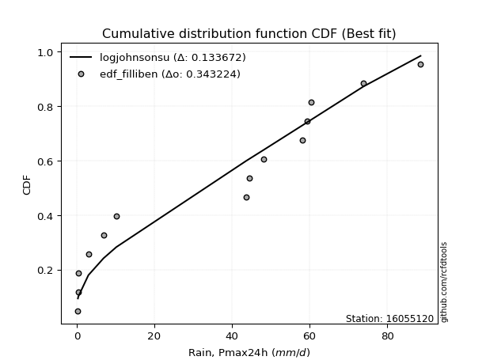</img></img>

</div>


### 10. Empirical - EDF Jenkinson (1977)

The Jenkinson formula in hydrology is an empirical plotting position formula used to estimate the non-exceedance probability _(P)_ or return period _(T)_ of a given ordered observation within a sample. It is a widely used method in the frequency analysis of extreme events such as floods and rainfall, as it provides a distribution-free way to plot data. _a≈0.31_ and _b≈0.38_ are constants derived to approximate the median of the probability distribution for the given rank.

<div align="center">


$P=(m-a)/(n+b)$


</div>


**10.1. Empirical values**

<div align="center">

|                | 0                   | 1                   | 2                   | 3                   | 4                  | 5                   | 6                   | 7             | 8                  | 9                  | 10                 | 11                | 12                 | 13                 | 14                 |
|:---------------|:--------------------|:--------------------|:--------------------|:--------------------|:-------------------|:--------------------|:--------------------|:--------------|:-------------------|:-------------------|:-------------------|:------------------|:-------------------|:-------------------|:-------------------|
| date           | 2022                | 2019                | 2020                | 2021                | 2025               | 2006                | 2008                | 2011          | 2016               | 2007               | 2024               | 2010              | 2009               | 2018               | 2017               |
| x              | 0.3                 | 0.4                 | 0.4                 | 3.0                 | 4.1                | 6.9                 | 10.2                | 43.7          | 44.5               | 48.2               | 58.2               | 59.3              | 60.4               | 73.9               | 88.6               |
| m              | 1                   | 2                   | 3                   | 4                   | 5                  | 6                   | 7                   | 8             | 9                  | 10                 | 11                 | 12                | 13                 | 14                 | 15                 |
| empirical_dist | edf_jenkinson       | edf_jenkinson       | edf_jenkinson       | edf_jenkinson       | edf_jenkinson      | edf_jenkinson       | edf_jenkinson       | edf_jenkinson | edf_jenkinson      | edf_jenkinson      | edf_jenkinson      | edf_jenkinson     | edf_jenkinson      | edf_jenkinson      | edf_jenkinson      |
| empirical      | 0.04486345903771131 | 0.10988296488946683 | 0.17490247074122237 | 0.23992197659297787 | 0.3049414824447334 | 0.36996098829648894 | 0.43498049414824447 | 0.5           | 0.5650195058517554 | 0.630039011703511  | 0.6950585175552665 | 0.760078023407022 | 0.8250975292587776 | 0.8901170351105331 | 0.9551365409622886 |
| empirical_tr   | 1.0469707283866576  | 1.1234477720964207  | 1.2119779353821907  | 1.3156544054747648  | 1.4387277829747427 | 1.587203302373581   | 1.7698504027617952  | 2.0           | 2.298953662182361  | 2.7029876977152894 | 3.279317697228144  | 4.168021680216801 | 5.717472118959106  | 9.100591715976325  | 22.289855072463734 |

</div>


**10.2. Kolmogorov-Smirnov fit test (sorted by Δ)**


<div align="center">

|                | 0                   | 1                   | 2                  | 3                   | 4                   | 5                   | 6                   | 7                   | 8                   | 9                  | 10                  | 11                    | 12                  | 13                  | 14                  | 15                 | 16                  | 17                 | 18                  | 19                  | 20                  | 21                 | 22                  | 23                  | 24                  | 25                 | 26                 | 27                  | 28                  | 29                 | 30                  | 31                  | 32                  | 33                  | 34                 | 35                  | 36                 | 37                  | 38                 | 39                 | 40                  | 41                 | 42                  | 43                  | 44                 | 45                  | 46                  | 47                  | 48                  | 49                 | 50                 | 51                  | 52                  | 53                 | 54                 | 55                  | 56                 | 57                 | 58                 | 59                  | 60                  | 61                 | 62                 | 63                  | 64                  | 65                  | 66                  | 67                  | 68                 | 69                 | 70                  | 71                 | 72                  | 73                  | 74                 | 75                  | 76                  | 77                 | 78                 | 79                 | 80                 | 81                 | 82                  | 83                 | 84                 | 85                  | 86                 | 87                 | 88                 | 89                 |
|:---------------|:--------------------|:--------------------|:-------------------|:--------------------|:--------------------|:--------------------|:--------------------|:--------------------|:--------------------|:-------------------|:--------------------|:----------------------|:--------------------|:--------------------|:--------------------|:-------------------|:--------------------|:-------------------|:--------------------|:--------------------|:--------------------|:-------------------|:--------------------|:--------------------|:--------------------|:-------------------|:-------------------|:--------------------|:--------------------|:-------------------|:--------------------|:--------------------|:--------------------|:--------------------|:-------------------|:--------------------|:-------------------|:--------------------|:-------------------|:-------------------|:--------------------|:-------------------|:--------------------|:--------------------|:-------------------|:--------------------|:--------------------|:--------------------|:--------------------|:-------------------|:-------------------|:--------------------|:--------------------|:-------------------|:-------------------|:--------------------|:-------------------|:-------------------|:-------------------|:--------------------|:--------------------|:-------------------|:-------------------|:--------------------|:--------------------|:--------------------|:--------------------|:--------------------|:-------------------|:-------------------|:--------------------|:-------------------|:--------------------|:--------------------|:-------------------|:--------------------|:--------------------|:-------------------|:-------------------|:-------------------|:-------------------|:-------------------|:--------------------|:-------------------|:-------------------|:--------------------|:-------------------|:-------------------|:-------------------|:-------------------|
| station        | 16055120            | 16055120            | 16055120           | 16055120            | 16055120            | 16055120            | 16055120            | 16055120            | 16055120            | 16055120           | 16055120            | 16055120              | 16055120            | 16055120            | 16055120            | 16055120           | 16055120            | 16055120           | 16055120            | 16055120            | 16055120            | 16055120           | 16055120            | 16055120            | 16055120            | 16055120           | 16055120           | 16055120            | 16055120            | 16055120           | 16055120            | 16055120            | 16055120            | 16055120            | 16055120           | 16055120            | 16055120           | 16055120            | 16055120           | 16055120           | 16055120            | 16055120           | 16055120            | 16055120            | 16055120           | 16055120            | 16055120            | 16055120            | 16055120            | 16055120           | 16055120           | 16055120            | 16055120            | 16055120           | 16055120           | 16055120            | 16055120           | 16055120           | 16055120           | 16055120            | 16055120            | 16055120           | 16055120           | 16055120            | 16055120            | 16055120            | 16055120            | 16055120            | 16055120           | 16055120           | 16055120            | 16055120           | 16055120            | 16055120            | 16055120           | 16055120            | 16055120            | 16055120           | 16055120           | 16055120           | 16055120           | 16055120           | 16055120            | 16055120           | 16055120           | 16055120            | 16055120           | 16055120           | 16055120           | 16055120           |
| empirical_dist | edf_jenkinson       | edf_jenkinson       | edf_jenkinson      | edf_jenkinson       | edf_jenkinson       | edf_jenkinson       | edf_jenkinson       | edf_jenkinson       | edf_jenkinson       | edf_jenkinson      | edf_jenkinson       | edf_jenkinson         | edf_jenkinson       | edf_jenkinson       | edf_jenkinson       | edf_jenkinson      | edf_jenkinson       | edf_jenkinson      | edf_jenkinson       | edf_jenkinson       | edf_jenkinson       | edf_jenkinson      | edf_jenkinson       | edf_jenkinson       | edf_jenkinson       | edf_jenkinson      | edf_jenkinson      | edf_jenkinson       | edf_jenkinson       | edf_jenkinson      | edf_jenkinson       | edf_jenkinson       | edf_jenkinson       | edf_jenkinson       | edf_jenkinson      | edf_jenkinson       | edf_jenkinson      | edf_jenkinson       | edf_jenkinson      | edf_jenkinson      | edf_jenkinson       | edf_jenkinson      | edf_jenkinson       | edf_jenkinson       | edf_jenkinson      | edf_jenkinson       | edf_jenkinson       | edf_jenkinson       | edf_jenkinson       | edf_jenkinson      | edf_jenkinson      | edf_jenkinson       | edf_jenkinson       | edf_jenkinson      | edf_jenkinson      | edf_jenkinson       | edf_jenkinson      | edf_jenkinson      | edf_jenkinson      | edf_jenkinson       | edf_jenkinson       | edf_jenkinson      | edf_jenkinson      | edf_jenkinson       | edf_jenkinson       | edf_jenkinson       | edf_jenkinson       | edf_jenkinson       | edf_jenkinson      | edf_jenkinson      | edf_jenkinson       | edf_jenkinson      | edf_jenkinson       | edf_jenkinson       | edf_jenkinson      | edf_jenkinson       | edf_jenkinson       | edf_jenkinson      | edf_jenkinson      | edf_jenkinson      | edf_jenkinson      | edf_jenkinson      | edf_jenkinson       | edf_jenkinson      | edf_jenkinson      | edf_jenkinson       | edf_jenkinson      | edf_jenkinson      | edf_jenkinson      | edf_jenkinson      |
| p_dist         | logjohnsonsu        | weibull_min         | halfnorm           | nakagami            | rayleigh            | mielke              | genlogistic         | kstwobign           | maxwell             | invweibull         | logloggamma         | loglaplace_asymmetric | pearson3            | halflogistic        | exponnorm           | crystalball        | norm                | johnsonsu          | t                   | gumbel_r            | genexpon            | gompertz           | chi2                | moyal               | loginvweibull       | expon              | laplace_asymmetric | logpearson3         | rice                | truncnorm          | logbetaprime        | logistic            | loggumbel_l         | logweibull_min      | logexpon           | gumbel_l            | loginvgauss        | logalpha            | lognct             | logexponnorm       | logt                | logcrystalball     | lognorm             | lognorm             | loglognorm         | hypsecant           | loggamma            | loggamma            | logkstwobign        | logrice            | logerlang          | loggompertz         | logfatiguelife      | nct                | loggenexpon        | loginvgamma         | logmaxwell         | lograyleigh        | invgamma           | laplace             | f                   | loghalfnorm        | betaprime          | loglogistic         | fisk                | alpha               | logchi2             | loghypsecant        | loggumbel_r        | loghalflogistic    | logncf              | invgauss           | ncf                 | logmoyal            | loglaplace         | fatiguelife         | logwald             | logfisk            | wald               | loggibrat          | erlang             | logf               | logtruncnorm        | gamma              | pareto             | gibrat              | logmielke          | logpareto          | lognakagami        | loggenlogistic     |
| delta          | 0.13456578791392754 | 0.17133499410073239 | 0.1845149987940793 | 0.18452828869263505 | 0.19316793946492905 | 0.19382453506438702 | 0.19602079826424157 | 0.19958029589151974 | 0.20003963324391774 | 0.2078629912737101 | 0.21011251850146007 | 0.21011844396539603   | 0.21208735765733588 | 0.21282170780547016 | 0.21636739009165967 | 0.2164898247169581 | 0.21648982764675367 | 0.2165164562338504 | 0.21652300464815905 | 0.21660129100480646 | 0.21896133206399837 | 0.2194129179646298 | 0.21976363847691605 | 0.22597863638906412 | 0.22843638604038563 | 0.2297153842449977 | 0.230178102519926  | 0.23301026915452494 | 0.23318363963239988 | 0.2371465526448414 | 0.23753445278458662 | 0.23872556449678647 | 0.23879656215772183 | 0.24531558774302908 | 0.2476251359367766 | 0.24784966310190884 | 0.2488204990072922 | 0.25010735022840747 | 0.2515062177618943 | 0.251642948654486  | 0.25164448236416304 | 0.2516446369832661 | 0.25164466121166784 | 0.25164466121166784 | 0.2521766329595818 | 0.25239238780437656 | 0.25254168765361085 | 0.25254168765361085 | 0.25256727836943116 | 0.2526943474296224 | 0.2527083972366371 | 0.25388156188751554 | 0.25448348533379284 | 0.2561873493475598 | 0.2573745050101335 | 0.25768979178652884 | 0.2610163384645262 | 0.2636898149897424 | 0.266328985985097  | 0.26842329504387064 | 0.27258068273956126 | 0.2727996460017279 | 0.2743034827701126 | 0.27430702547879193 | 0.27654695576872124 | 0.27698625441885405 | 0.28564223024649416 | 0.28917646090021387 | 0.2907123997601938 | 0.2971093592449986 | 0.29872787636544873 | 0.3011498628026914 | 0.30174298858913895 | 0.30332368911956875 | 0.308784051902822  | 0.33394402470590656 | 0.34290060855132865 | 0.3541047330298972 | 0.3625298508924116 | 0.3722454240167561 | 0.3738274828451281 | 0.380504230974656  | 0.38496390596412455 | 0.3959140241651653 | 0.4090340935214214 | 0.43498049414824447 | 0.456448440280504  | 0.4859683931785568 | 0.5028869454689665 | 0.8901170351105331 |
| deltao         | 0.3366456264050002  | 0.3366456264050002  | 0.3366456264050002 | 0.3366456264050002  | 0.3366456264050002  | 0.3366456264050002  | 0.3366456264050002  | 0.3366456264050002  | 0.3366456264050002  | 0.3366456264050002 | 0.3366456264050002  | 0.3366456264050002    | 0.3366456264050002  | 0.3366456264050002  | 0.3366456264050002  | 0.3366456264050002 | 0.3366456264050002  | 0.3366456264050002 | 0.3366456264050002  | 0.3366456264050002  | 0.3366456264050002  | 0.3366456264050002 | 0.3366456264050002  | 0.3366456264050002  | 0.3366456264050002  | 0.3366456264050002 | 0.3366456264050002 | 0.3366456264050002  | 0.3366456264050002  | 0.3366456264050002 | 0.3366456264050002  | 0.3366456264050002  | 0.3366456264050002  | 0.3366456264050002  | 0.3366456264050002 | 0.3366456264050002  | 0.3366456264050002 | 0.3366456264050002  | 0.3366456264050002 | 0.3366456264050002 | 0.3366456264050002  | 0.3366456264050002 | 0.3366456264050002  | 0.3366456264050002  | 0.3366456264050002 | 0.3366456264050002  | 0.3366456264050002  | 0.3366456264050002  | 0.3366456264050002  | 0.3366456264050002 | 0.3366456264050002 | 0.3366456264050002  | 0.3366456264050002  | 0.3366456264050002 | 0.3366456264050002 | 0.3366456264050002  | 0.3366456264050002 | 0.3366456264050002 | 0.3366456264050002 | 0.3366456264050002  | 0.3366456264050002  | 0.3366456264050002 | 0.3366456264050002 | 0.3366456264050002  | 0.3366456264050002  | 0.3366456264050002  | 0.3366456264050002  | 0.3366456264050002  | 0.3366456264050002 | 0.3366456264050002 | 0.3366456264050002  | 0.3366456264050002 | 0.3366456264050002  | 0.3366456264050002  | 0.3366456264050002 | 0.3366456264050002  | 0.3366456264050002  | 0.3366456264050002 | 0.3366456264050002 | 0.3366456264050002 | 0.3366456264050002 | 0.3366456264050002 | 0.3366456264050002  | 0.3366456264050002 | 0.3366456264050002 | 0.3366456264050002  | 0.3366456264050002 | 0.3366456264050002 | 0.3366456264050002 | 0.3366456264050002 |
| eval           | Δo > Δ              | Δo > Δ              | Δo > Δ             | Δo > Δ              | Δo > Δ              | Δo > Δ              | Δo > Δ              | Δo > Δ              | Δo > Δ              | Δo > Δ             | Δo > Δ              | Δo > Δ                | Δo > Δ              | Δo > Δ              | Δo > Δ              | Δo > Δ             | Δo > Δ              | Δo > Δ             | Δo > Δ              | Δo > Δ              | Δo > Δ              | Δo > Δ             | Δo > Δ              | Δo > Δ              | Δo > Δ              | Δo > Δ             | Δo > Δ             | Δo > Δ              | Δo > Δ              | Δo > Δ             | Δo > Δ              | Δo > Δ              | Δo > Δ              | Δo > Δ              | Δo > Δ             | Δo > Δ              | Δo > Δ             | Δo > Δ              | Δo > Δ             | Δo > Δ             | Δo > Δ              | Δo > Δ             | Δo > Δ              | Δo > Δ              | Δo > Δ             | Δo > Δ              | Δo > Δ              | Δo > Δ              | Δo > Δ              | Δo > Δ             | Δo > Δ             | Δo > Δ              | Δo > Δ              | Δo > Δ             | Δo > Δ             | Δo > Δ              | Δo > Δ             | Δo > Δ             | Δo > Δ             | Δo > Δ              | Δo > Δ              | Δo > Δ             | Δo > Δ             | Δo > Δ              | Δo > Δ              | Δo > Δ              | Δo > Δ              | Δo > Δ              | Δo > Δ             | Δo > Δ             | Δo > Δ              | Δo > Δ             | Δo > Δ              | Δo > Δ              | Δo > Δ             | Δo > Δ              | Δo <= Δ             | Δo <= Δ            | Δo <= Δ            | Δo <= Δ            | Δo <= Δ            | Δo <= Δ            | Δo <= Δ             | Δo <= Δ            | Δo <= Δ            | Δo <= Δ             | Δo <= Δ            | Δo <= Δ            | Δo <= Δ            | Δo <= Δ            |
| fit            | 1                   | 1                   | 1                  | 1                   | 1                   | 1                   | 1                   | 1                   | 1                   | 1                  | 1                   | 1                     | 1                   | 1                   | 1                   | 1                  | 1                   | 1                  | 1                   | 1                   | 1                   | 1                  | 1                   | 1                   | 1                   | 1                  | 1                  | 1                   | 1                   | 1                  | 1                   | 1                   | 1                   | 1                   | 1                  | 1                   | 1                  | 1                   | 1                  | 1                  | 1                   | 1                  | 1                   | 1                   | 1                  | 1                   | 1                   | 1                   | 1                   | 1                  | 1                  | 1                   | 1                   | 1                  | 1                  | 1                   | 1                  | 1                  | 1                  | 1                   | 1                   | 1                  | 1                  | 1                   | 1                   | 1                   | 1                   | 1                   | 1                  | 1                  | 1                   | 1                  | 1                   | 1                   | 1                  | 1                   | 0                   | 0                  | 0                  | 0                  | 0                  | 0                  | 0                   | 0                  | 0                  | 0                   | 0                  | 0                  | 0                  | 0                  |
| n              | 15                  | 15                  | 15                 | 15                  | 15                  | 15                  | 15                  | 15                  | 15                  | 15                 | 15                  | 15                    | 15                  | 15                  | 15                  | 15                 | 15                  | 15                 | 15                  | 15                  | 15                  | 15                 | 15                  | 15                  | 15                  | 15                 | 15                 | 15                  | 15                  | 15                 | 15                  | 15                  | 15                  | 15                  | 15                 | 15                  | 15                 | 15                  | 15                 | 15                 | 15                  | 15                 | 15                  | 15                  | 15                 | 15                  | 15                  | 15                  | 15                  | 15                 | 15                 | 15                  | 15                  | 15                 | 15                 | 15                  | 15                 | 15                 | 15                 | 15                  | 15                  | 15                 | 15                 | 15                  | 15                  | 15                  | 15                  | 15                  | 15                 | 15                 | 15                  | 15                 | 15                  | 15                  | 15                 | 15                  | 15                  | 15                 | 15                 | 15                 | 15                 | 15                 | 15                  | 15                 | 15                 | 15                  | 15                 | 15                 | 15                 | 15                 |
| best_fit       | 1                   | 0                   | 0                  | 0                   | 0                   | 0                   | 0                   | 0                   | 0                   | 0                  | 0                   | 0                     | 0                   | 0                   | 0                   | 0                  | 0                   | 0                  | 0                   | 0                   | 0                   | 0                  | 0                   | 0                   | 0                   | 0                  | 0                  | 0                   | 0                   | 0                  | 0                   | 0                   | 0                   | 0                   | 0                  | 0                   | 0                  | 0                   | 0                  | 0                  | 0                   | 0                  | 0                   | 0                   | 0                  | 0                   | 0                   | 0                   | 0                   | 0                  | 0                  | 0                   | 0                   | 0                  | 0                  | 0                   | 0                  | 0                  | 0                  | 0                   | 0                   | 0                  | 0                  | 0                   | 0                   | 0                   | 0                   | 0                   | 0                  | 0                  | 0                   | 0                  | 0                   | 0                   | 0                  | 0                   | 0                   | 0                  | 0                  | 0                  | 0                  | 0                  | 0                   | 0                  | 0                  | 0                   | 0                  | 0                  | 0                  | 0                  |
| best_fit_sort  | 1                   | 2                   | 3                  | 4                   | 5                   | 6                   | 7                   | 8                   | 9                   | 10                 | 11                  | 12                    | 13                  | 14                  | 15                  | 16                 | 17                  | 18                 | 19                  | 20                  | 21                  | 22                 | 23                  | 24                  | 25                  | 26                 | 27                 | 28                  | 29                  | 30                 | 31                  | 32                  | 33                  | 34                  | 35                 | 36                  | 37                 | 38                  | 39                 | 40                 | 41                  | 42                 | 43                  | 44                  | 45                 | 46                  | 47                  | 48                  | 49                  | 50                 | 51                 | 52                  | 53                  | 54                 | 55                 | 56                  | 57                 | 58                 | 59                 | 60                  | 61                  | 62                 | 63                 | 64                  | 65                  | 66                  | 67                  | 68                  | 69                 | 70                 | 71                  | 72                 | 73                  | 74                  | 75                 | 76                  | 77                  | 78                 | 79                 | 80                 | 81                 | 82                 | 83                  | 84                 | 85                 | 86                  | 87                 | 88                 | 89                 | 90                 |

</div>


<div align="center">

</img>

</div>


**10.3. Best fit**

<div align="center">

|   id |   station | empirical_dist   | p_dist       |    delta |   deltao | eval   |   fit |   n |   best_fit |   best_fit_sort |
|-----:|----------:|:-----------------|:-------------|---------:|---------:|:-------|------:|----:|-----------:|----------------:|
|    0 |  16055120 | edf_jenkinson    | logjohnsonsu | 0.134566 | 0.336646 | Δo > Δ |     1 |  15 |          1 |               1 |

</div>


<div align="center">

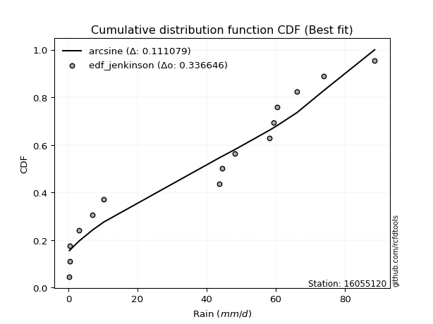</img></img>

</div>


### 11. Empirical - EDF Cunnane (1978)

Cunnane´s work in statistical hydrology has focused on the performance and evaluation of different probability distributions (such as GEV, Gumbel, Lognormal) for flood frequency estimation. _b_ is a constant, typically set to 0.4.

<div align="center">


$P=(m-b)/(n+1-2b)$


</div>


**11.1. Empirical values**

<div align="center">

|                | 0                    | 1                   | 2                   | 3                  | 4                  | 5                  | 6                  | 7           | 8                  | 9                 | 10                 | 11                 | 12                 | 13                 | 14                 |
|:---------------|:---------------------|:--------------------|:--------------------|:-------------------|:-------------------|:-------------------|:-------------------|:------------|:-------------------|:------------------|:-------------------|:-------------------|:-------------------|:-------------------|:-------------------|
| date           | 2022                 | 2019                | 2020                | 2021               | 2025               | 2006               | 2008               | 2011        | 2016               | 2007              | 2024               | 2010               | 2009               | 2018               | 2017               |
| x              | 0.3                  | 0.4                 | 0.4                 | 3.0                | 4.1                | 6.9                | 10.2               | 43.7        | 44.5               | 48.2              | 58.2               | 59.3               | 60.4               | 73.9               | 88.6               |
| m              | 1                    | 2                   | 3                   | 4                  | 5                  | 6                  | 7                  | 8           | 9                  | 10                | 11                 | 12                 | 13                 | 14                 | 15                 |
| empirical_dist | edf_cunnane          | edf_cunnane         | edf_cunnane         | edf_cunnane        | edf_cunnane        | edf_cunnane        | edf_cunnane        | edf_cunnane | edf_cunnane        | edf_cunnane       | edf_cunnane        | edf_cunnane        | edf_cunnane        | edf_cunnane        | edf_cunnane        |
| empirical      | 0.039473684210526314 | 0.10526315789473685 | 0.17105263157894737 | 0.2368421052631579 | 0.3026315789473684 | 0.3684210526315789 | 0.4342105263157895 | 0.5         | 0.5657894736842105 | 0.631578947368421 | 0.6973684210526316 | 0.7631578947368421 | 0.8289473684210527 | 0.8947368421052632 | 0.9605263157894737 |
| empirical_tr   | 1.0410958904109588   | 1.1176470588235294  | 1.2063492063492063  | 1.310344827586207  | 1.4339622641509433 | 1.5833333333333335 | 1.7674418604651163 | 2.0         | 2.3030303030303028 | 2.714285714285714 | 3.304347826086957  | 4.222222222222223  | 5.846153846153847  | 9.5                | 25.333333333333325 |

</div>


**11.2. Kolmogorov-Smirnov fit test (sorted by Δ)**


<div align="center">

|                | 0                   | 1                   | 2                  | 3                   | 4                   | 5                   | 6                  | 7                   | 8                   | 9                  | 10                  | 11                    | 12                 | 13                  | 14                 | 15                  | 16                 | 17                  | 18                  | 19                  | 20                 | 21                  | 22                  | 23                  | 24                  | 25                 | 26                 | 27                 | 28                  | 29                  | 30                  | 31                 | 32                  | 33                  | 34                  | 35                 | 36                 | 37                  | 38                 | 39                 | 40                 | 41                  | 42                 | 43                  | 44                  | 45                 | 46                  | 47                  | 48                  | 49                 | 50                 | 51                  | 52                  | 53                 | 54                 | 55                  | 56                 | 57                 | 58                 | 59                  | 60                  | 61                 | 62                 | 63                  | 64                  | 65                  | 66                 | 67                  | 68                 | 69                 | 70                 | 71                  | 72                  | 73                 | 74                 | 75                  | 76                  | 77                  | 78                  | 79                 | 80                 | 81                 | 82                  | 83                 | 84                  | 85                 | 86                 | 87                  | 88                 | 89                 |
|:---------------|:--------------------|:--------------------|:-------------------|:--------------------|:--------------------|:--------------------|:-------------------|:--------------------|:--------------------|:-------------------|:--------------------|:----------------------|:-------------------|:--------------------|:-------------------|:--------------------|:-------------------|:--------------------|:--------------------|:--------------------|:-------------------|:--------------------|:--------------------|:--------------------|:--------------------|:-------------------|:-------------------|:-------------------|:--------------------|:--------------------|:--------------------|:-------------------|:--------------------|:--------------------|:--------------------|:-------------------|:-------------------|:--------------------|:-------------------|:-------------------|:-------------------|:--------------------|:-------------------|:--------------------|:--------------------|:-------------------|:--------------------|:--------------------|:--------------------|:-------------------|:-------------------|:--------------------|:--------------------|:-------------------|:-------------------|:--------------------|:-------------------|:-------------------|:-------------------|:--------------------|:--------------------|:-------------------|:-------------------|:--------------------|:--------------------|:--------------------|:-------------------|:--------------------|:-------------------|:-------------------|:-------------------|:--------------------|:--------------------|:-------------------|:-------------------|:--------------------|:--------------------|:--------------------|:--------------------|:-------------------|:-------------------|:-------------------|:--------------------|:-------------------|:--------------------|:-------------------|:-------------------|:--------------------|:-------------------|:-------------------|
| station        | 16055120            | 16055120            | 16055120           | 16055120            | 16055120            | 16055120            | 16055120           | 16055120            | 16055120            | 16055120           | 16055120            | 16055120              | 16055120           | 16055120            | 16055120           | 16055120            | 16055120           | 16055120            | 16055120            | 16055120            | 16055120           | 16055120            | 16055120            | 16055120            | 16055120            | 16055120           | 16055120           | 16055120           | 16055120            | 16055120            | 16055120            | 16055120           | 16055120            | 16055120            | 16055120            | 16055120           | 16055120           | 16055120            | 16055120           | 16055120           | 16055120           | 16055120            | 16055120           | 16055120            | 16055120            | 16055120           | 16055120            | 16055120            | 16055120            | 16055120           | 16055120           | 16055120            | 16055120            | 16055120           | 16055120           | 16055120            | 16055120           | 16055120           | 16055120           | 16055120            | 16055120            | 16055120           | 16055120           | 16055120            | 16055120            | 16055120            | 16055120           | 16055120            | 16055120           | 16055120           | 16055120           | 16055120            | 16055120            | 16055120           | 16055120           | 16055120            | 16055120            | 16055120            | 16055120            | 16055120           | 16055120           | 16055120           | 16055120            | 16055120           | 16055120            | 16055120           | 16055120           | 16055120            | 16055120           | 16055120           |
| empirical_dist | edf_cunnane         | edf_cunnane         | edf_cunnane        | edf_cunnane         | edf_cunnane         | edf_cunnane         | edf_cunnane        | edf_cunnane         | edf_cunnane         | edf_cunnane        | edf_cunnane         | edf_cunnane           | edf_cunnane        | edf_cunnane         | edf_cunnane        | edf_cunnane         | edf_cunnane        | edf_cunnane         | edf_cunnane         | edf_cunnane         | edf_cunnane        | edf_cunnane         | edf_cunnane         | edf_cunnane         | edf_cunnane         | edf_cunnane        | edf_cunnane        | edf_cunnane        | edf_cunnane         | edf_cunnane         | edf_cunnane         | edf_cunnane        | edf_cunnane         | edf_cunnane         | edf_cunnane         | edf_cunnane        | edf_cunnane        | edf_cunnane         | edf_cunnane        | edf_cunnane        | edf_cunnane        | edf_cunnane         | edf_cunnane        | edf_cunnane         | edf_cunnane         | edf_cunnane        | edf_cunnane         | edf_cunnane         | edf_cunnane         | edf_cunnane        | edf_cunnane        | edf_cunnane         | edf_cunnane         | edf_cunnane        | edf_cunnane        | edf_cunnane         | edf_cunnane        | edf_cunnane        | edf_cunnane        | edf_cunnane         | edf_cunnane         | edf_cunnane        | edf_cunnane        | edf_cunnane         | edf_cunnane         | edf_cunnane         | edf_cunnane        | edf_cunnane         | edf_cunnane        | edf_cunnane        | edf_cunnane        | edf_cunnane         | edf_cunnane         | edf_cunnane        | edf_cunnane        | edf_cunnane         | edf_cunnane         | edf_cunnane         | edf_cunnane         | edf_cunnane        | edf_cunnane        | edf_cunnane        | edf_cunnane         | edf_cunnane        | edf_cunnane         | edf_cunnane        | edf_cunnane        | edf_cunnane         | edf_cunnane        | edf_cunnane        |
| p_dist         | logjohnsonsu        | weibull_min         | halfnorm           | nakagami            | rayleigh            | mielke              | genlogistic        | kstwobign           | maxwell             | invweibull         | logloggamma         | loglaplace_asymmetric | pearson3           | halflogistic        | exponnorm          | crystalball         | norm               | johnsonsu           | t                   | gumbel_r            | gompertz           | genexpon            | chi2                | moyal               | loginvweibull       | laplace_asymmetric | expon              | rice               | logpearson3         | truncnorm           | logbetaprime        | logistic           | loggumbel_l         | logweibull_min      | gumbel_l            | logexpon           | loginvgauss        | logalpha            | lognct             | hypsecant          | logexponnorm       | logt                | logcrystalball     | lognorm             | lognorm             | loglognorm         | loggamma            | loggamma            | logkstwobign        | logrice            | logerlang          | loggompertz         | logfatiguelife      | nct                | loggenexpon        | loginvgamma         | logmaxwell         | lograyleigh        | invgamma           | laplace             | f                   | loghalfnorm        | betaprime          | loglogistic         | fisk                | alpha               | logchi2            | loghypsecant        | loggumbel_r        | loghalflogistic    | invgauss           | ncf                 | logmoyal            | logncf             | loglaplace         | fatiguelife         | logwald             | logfisk             | wald                | loggibrat          | erlang             | logf               | logtruncnorm        | gamma              | pareto              | gibrat             | logmielke          | logpareto           | lognakagami        | loggenlogistic     |
| delta          | 0.13379582008147256 | 0.17672476892791744 | 0.1845149987940793 | 0.18452828869263505 | 0.19239797163247407 | 0.19305456723193204 | 0.1952508304317866 | 0.19881032805906476 | 0.19926966541146277 | 0.2078629912737101 | 0.21011251850146007 | 0.21011844396539603   | 0.2113173898248809 | 0.21282170780547016 | 0.2155974222592047 | 0.21571985688450313 | 0.2157198598142987 | 0.21574648840139543 | 0.21575303681570407 | 0.21583132317235149 | 0.2178729822997198 | 0.21896133206399837 | 0.21976363847691605 | 0.22520866855660915 | 0.22843638604038563 | 0.229408134687471  | 0.2297153842449977 | 0.2324136717999449 | 0.23301026915452494 | 0.23637658481238644 | 0.23753445278458662 | 0.2379555966643315 | 0.23879656215772183 | 0.24531558774302908 | 0.24707969526945386 | 0.2476251359367766 | 0.2488204990072922 | 0.25010735022840747 | 0.2515062177618943 | 0.2516224199719216 | 0.251642948654486  | 0.25164448236416304 | 0.2516446369832661 | 0.25164466121166784 | 0.25164466121166784 | 0.2521766329595818 | 0.25254168765361085 | 0.25254168765361085 | 0.25256727836943116 | 0.2526943474296224 | 0.2527083972366371 | 0.25388156188751554 | 0.25448348533379284 | 0.2561873493475598 | 0.2573745050101335 | 0.25768979178652884 | 0.2610163384645262 | 0.2636898149897424 | 0.266328985985097  | 0.26765332721141566 | 0.27258068273956126 | 0.2727996460017279 | 0.2743034827701126 | 0.27430702547879193 | 0.27654695576872124 | 0.27698625441885405 | 0.2887221015763141 | 0.28917646090021387 | 0.2907123997601938 | 0.2971093592449986 | 0.3011498628026914 | 0.30174298858913895 | 0.30332368911956875 | 0.3041176511926338 | 0.308784051902822  | 0.33394402470590656 | 0.34290060855132865 | 0.35949450785708226 | 0.36098991522750157 | 0.3722454240167561 | 0.3738274828451281 | 0.383584102304476  | 0.38496390596412455 | 0.3959140241651653 | 0.41365390051615136 | 0.4342105263157895 | 0.459528311610324  | 0.49058820017328675 | 0.5059668167987865 | 0.8947368421052632 |
| deltao         | 0.3366456264050002  | 0.3366456264050002  | 0.3366456264050002 | 0.3366456264050002  | 0.3366456264050002  | 0.3366456264050002  | 0.3366456264050002 | 0.3366456264050002  | 0.3366456264050002  | 0.3366456264050002 | 0.3366456264050002  | 0.3366456264050002    | 0.3366456264050002 | 0.3366456264050002  | 0.3366456264050002 | 0.3366456264050002  | 0.3366456264050002 | 0.3366456264050002  | 0.3366456264050002  | 0.3366456264050002  | 0.3366456264050002 | 0.3366456264050002  | 0.3366456264050002  | 0.3366456264050002  | 0.3366456264050002  | 0.3366456264050002 | 0.3366456264050002 | 0.3366456264050002 | 0.3366456264050002  | 0.3366456264050002  | 0.3366456264050002  | 0.3366456264050002 | 0.3366456264050002  | 0.3366456264050002  | 0.3366456264050002  | 0.3366456264050002 | 0.3366456264050002 | 0.3366456264050002  | 0.3366456264050002 | 0.3366456264050002 | 0.3366456264050002 | 0.3366456264050002  | 0.3366456264050002 | 0.3366456264050002  | 0.3366456264050002  | 0.3366456264050002 | 0.3366456264050002  | 0.3366456264050002  | 0.3366456264050002  | 0.3366456264050002 | 0.3366456264050002 | 0.3366456264050002  | 0.3366456264050002  | 0.3366456264050002 | 0.3366456264050002 | 0.3366456264050002  | 0.3366456264050002 | 0.3366456264050002 | 0.3366456264050002 | 0.3366456264050002  | 0.3366456264050002  | 0.3366456264050002 | 0.3366456264050002 | 0.3366456264050002  | 0.3366456264050002  | 0.3366456264050002  | 0.3366456264050002 | 0.3366456264050002  | 0.3366456264050002 | 0.3366456264050002 | 0.3366456264050002 | 0.3366456264050002  | 0.3366456264050002  | 0.3366456264050002 | 0.3366456264050002 | 0.3366456264050002  | 0.3366456264050002  | 0.3366456264050002  | 0.3366456264050002  | 0.3366456264050002 | 0.3366456264050002 | 0.3366456264050002 | 0.3366456264050002  | 0.3366456264050002 | 0.3366456264050002  | 0.3366456264050002 | 0.3366456264050002 | 0.3366456264050002  | 0.3366456264050002 | 0.3366456264050002 |
| eval           | Δo > Δ              | Δo > Δ              | Δo > Δ             | Δo > Δ              | Δo > Δ              | Δo > Δ              | Δo > Δ             | Δo > Δ              | Δo > Δ              | Δo > Δ             | Δo > Δ              | Δo > Δ                | Δo > Δ             | Δo > Δ              | Δo > Δ             | Δo > Δ              | Δo > Δ             | Δo > Δ              | Δo > Δ              | Δo > Δ              | Δo > Δ             | Δo > Δ              | Δo > Δ              | Δo > Δ              | Δo > Δ              | Δo > Δ             | Δo > Δ             | Δo > Δ             | Δo > Δ              | Δo > Δ              | Δo > Δ              | Δo > Δ             | Δo > Δ              | Δo > Δ              | Δo > Δ              | Δo > Δ             | Δo > Δ             | Δo > Δ              | Δo > Δ             | Δo > Δ             | Δo > Δ             | Δo > Δ              | Δo > Δ             | Δo > Δ              | Δo > Δ              | Δo > Δ             | Δo > Δ              | Δo > Δ              | Δo > Δ              | Δo > Δ             | Δo > Δ             | Δo > Δ              | Δo > Δ              | Δo > Δ             | Δo > Δ             | Δo > Δ              | Δo > Δ             | Δo > Δ             | Δo > Δ             | Δo > Δ              | Δo > Δ              | Δo > Δ             | Δo > Δ             | Δo > Δ              | Δo > Δ              | Δo > Δ              | Δo > Δ             | Δo > Δ              | Δo > Δ             | Δo > Δ             | Δo > Δ             | Δo > Δ              | Δo > Δ              | Δo > Δ             | Δo > Δ             | Δo > Δ              | Δo <= Δ             | Δo <= Δ             | Δo <= Δ             | Δo <= Δ            | Δo <= Δ            | Δo <= Δ            | Δo <= Δ             | Δo <= Δ            | Δo <= Δ             | Δo <= Δ            | Δo <= Δ            | Δo <= Δ             | Δo <= Δ            | Δo <= Δ            |
| fit            | 1                   | 1                   | 1                  | 1                   | 1                   | 1                   | 1                  | 1                   | 1                   | 1                  | 1                   | 1                     | 1                  | 1                   | 1                  | 1                   | 1                  | 1                   | 1                   | 1                   | 1                  | 1                   | 1                   | 1                   | 1                   | 1                  | 1                  | 1                  | 1                   | 1                   | 1                   | 1                  | 1                   | 1                   | 1                   | 1                  | 1                  | 1                   | 1                  | 1                  | 1                  | 1                   | 1                  | 1                   | 1                   | 1                  | 1                   | 1                   | 1                   | 1                  | 1                  | 1                   | 1                   | 1                  | 1                  | 1                   | 1                  | 1                  | 1                  | 1                   | 1                   | 1                  | 1                  | 1                   | 1                   | 1                   | 1                  | 1                   | 1                  | 1                  | 1                  | 1                   | 1                   | 1                  | 1                  | 1                   | 0                   | 0                   | 0                   | 0                  | 0                  | 0                  | 0                   | 0                  | 0                   | 0                  | 0                  | 0                   | 0                  | 0                  |
| n              | 15                  | 15                  | 15                 | 15                  | 15                  | 15                  | 15                 | 15                  | 15                  | 15                 | 15                  | 15                    | 15                 | 15                  | 15                 | 15                  | 15                 | 15                  | 15                  | 15                  | 15                 | 15                  | 15                  | 15                  | 15                  | 15                 | 15                 | 15                 | 15                  | 15                  | 15                  | 15                 | 15                  | 15                  | 15                  | 15                 | 15                 | 15                  | 15                 | 15                 | 15                 | 15                  | 15                 | 15                  | 15                  | 15                 | 15                  | 15                  | 15                  | 15                 | 15                 | 15                  | 15                  | 15                 | 15                 | 15                  | 15                 | 15                 | 15                 | 15                  | 15                  | 15                 | 15                 | 15                  | 15                  | 15                  | 15                 | 15                  | 15                 | 15                 | 15                 | 15                  | 15                  | 15                 | 15                 | 15                  | 15                  | 15                  | 15                  | 15                 | 15                 | 15                 | 15                  | 15                 | 15                  | 15                 | 15                 | 15                  | 15                 | 15                 |
| best_fit       | 1                   | 0                   | 0                  | 0                   | 0                   | 0                   | 0                  | 0                   | 0                   | 0                  | 0                   | 0                     | 0                  | 0                   | 0                  | 0                   | 0                  | 0                   | 0                   | 0                   | 0                  | 0                   | 0                   | 0                   | 0                   | 0                  | 0                  | 0                  | 0                   | 0                   | 0                   | 0                  | 0                   | 0                   | 0                   | 0                  | 0                  | 0                   | 0                  | 0                  | 0                  | 0                   | 0                  | 0                   | 0                   | 0                  | 0                   | 0                   | 0                   | 0                  | 0                  | 0                   | 0                   | 0                  | 0                  | 0                   | 0                  | 0                  | 0                  | 0                   | 0                   | 0                  | 0                  | 0                   | 0                   | 0                   | 0                  | 0                   | 0                  | 0                  | 0                  | 0                   | 0                   | 0                  | 0                  | 0                   | 0                   | 0                   | 0                   | 0                  | 0                  | 0                  | 0                   | 0                  | 0                   | 0                  | 0                  | 0                   | 0                  | 0                  |
| best_fit_sort  | 1                   | 2                   | 3                  | 4                   | 5                   | 6                   | 7                  | 8                   | 9                   | 10                 | 11                  | 12                    | 13                 | 14                  | 15                 | 16                  | 17                 | 18                  | 19                  | 20                  | 21                 | 22                  | 23                  | 24                  | 25                  | 26                 | 27                 | 28                 | 29                  | 30                  | 31                  | 32                 | 33                  | 34                  | 35                  | 36                 | 37                 | 38                  | 39                 | 40                 | 41                 | 42                  | 43                 | 44                  | 45                  | 46                 | 47                  | 48                  | 49                  | 50                 | 51                 | 52                  | 53                  | 54                 | 55                 | 56                  | 57                 | 58                 | 59                 | 60                  | 61                  | 62                 | 63                 | 64                  | 65                  | 66                  | 67                 | 68                  | 69                 | 70                 | 71                 | 72                  | 73                  | 74                 | 75                 | 76                  | 77                  | 78                  | 79                  | 80                 | 81                 | 82                 | 83                  | 84                 | 85                  | 86                 | 87                 | 88                  | 89                 | 90                 |

</div>


<div align="center">

</img>

</div>


**11.3. Best fit**

<div align="center">

|   id |   station | empirical_dist   | p_dist       |    delta |   deltao | eval   |   fit |   n |   best_fit |   best_fit_sort |
|-----:|----------:|:-----------------|:-------------|---------:|---------:|:-------|------:|----:|-----------:|----------------:|
|    0 |  16055120 | edf_cunnane      | logjohnsonsu | 0.133796 | 0.336646 | Δo > Δ |     1 |  15 |          1 |               1 |

</div>


<div align="center">

</img></img>

</div>


### 12. Empirical - EDF Adamowski (1981)

The Adamowski formula in hydrology refers to a specific plotting position formula used for estimating the non-parametric empirical distribution of hydrological events (like flood peaks) to calculate their return periods. This formula provides an alternative to traditional parametric methods (like the Gumbel or Log Pearson Type III distributions). 

<div align="center">


$P=(m-0.25)/(n+0.5)$


</div>


**12.1. Empirical values**

<div align="center">

|                | 0                   | 1                   | 2                  | 3                   | 4                  | 5                  | 6                   | 7             | 8                  | 9                  | 10                 | 11                 | 12                 | 13                 | 14                 |
|:---------------|:--------------------|:--------------------|:-------------------|:--------------------|:-------------------|:-------------------|:--------------------|:--------------|:-------------------|:-------------------|:-------------------|:-------------------|:-------------------|:-------------------|:-------------------|
| date           | 2022                | 2019                | 2020               | 2021                | 2025               | 2006               | 2008                | 2011          | 2016               | 2007               | 2024               | 2010               | 2009               | 2018               | 2017               |
| x              | 0.3                 | 0.4                 | 0.4                | 3.0                 | 4.1                | 6.9                | 10.2                | 43.7          | 44.5               | 48.2               | 58.2               | 59.3               | 60.4               | 73.9               | 88.6               |
| m              | 1                   | 2                   | 3                  | 4                   | 5                  | 6                  | 7                   | 8             | 9                  | 10                 | 11                 | 12                 | 13                 | 14                 | 15                 |
| empirical_dist | edf_adamowski       | edf_adamowski       | edf_adamowski      | edf_adamowski       | edf_adamowski      | edf_adamowski      | edf_adamowski       | edf_adamowski | edf_adamowski      | edf_adamowski      | edf_adamowski      | edf_adamowski      | edf_adamowski      | edf_adamowski      | edf_adamowski      |
| empirical      | 0.04838709677419355 | 0.11290322580645161 | 0.1774193548387097 | 0.24193548387096775 | 0.3064516129032258 | 0.3709677419354839 | 0.43548387096774194 | 0.5           | 0.5645161290322581 | 0.6290322580645161 | 0.6935483870967742 | 0.7580645161290323 | 0.8225806451612904 | 0.8870967741935484 | 0.9516129032258065 |
| empirical_tr   | 1.0508474576271185  | 1.1272727272727272  | 1.215686274509804  | 1.3191489361702127  | 1.441860465116279  | 1.5897435897435896 | 1.7714285714285716  | 2.0           | 2.2962962962962967 | 2.6956521739130435 | 3.2631578947368425 | 4.133333333333333  | 5.636363636363638  | 8.857142857142856  | 20.666666666666686 |

</div>


**12.2. Kolmogorov-Smirnov fit test (sorted by Δ)**


<div align="center">

|                | 0                  | 1                   | 2                  | 3                   | 4                   | 5                   | 6                   | 7                  | 8                  | 9                  | 10                  | 11                    | 12                  | 13                  | 14                  | 15                  | 16                  | 17                  | 18                  | 19                  | 20                  | 21                  | 22                  | 23                 | 24                  | 25                 | 26                  | 27                  | 28                  | 29                  | 30                  | 31                  | 32                  | 33                  | 34                 | 35                 | 36                 | 37                  | 38                 | 39                 | 40                  | 41                 | 42                  | 43                  | 44                 | 45                  | 46                  | 47                  | 48                 | 49                 | 50                  | 51                  | 52                  | 53                 | 54                 | 55                  | 56                 | 57                 | 58                 | 59                  | 60                  | 61                 | 62                 | 63                  | 64                  | 65                  | 66                 | 67                  | 68                 | 69                 | 70                 | 71                 | 72                  | 73                  | 74                 | 75                  | 76                  | 77                 | 78                 | 79                 | 80                 | 81                  | 82                  | 83                 | 84                 | 85                  | 86                  | 87                  | 88                 | 89                 |
|:---------------|:-------------------|:--------------------|:-------------------|:--------------------|:--------------------|:--------------------|:--------------------|:-------------------|:-------------------|:-------------------|:--------------------|:----------------------|:--------------------|:--------------------|:--------------------|:--------------------|:--------------------|:--------------------|:--------------------|:--------------------|:--------------------|:--------------------|:--------------------|:-------------------|:--------------------|:-------------------|:--------------------|:--------------------|:--------------------|:--------------------|:--------------------|:--------------------|:--------------------|:--------------------|:-------------------|:-------------------|:-------------------|:--------------------|:-------------------|:-------------------|:--------------------|:-------------------|:--------------------|:--------------------|:-------------------|:--------------------|:--------------------|:--------------------|:-------------------|:-------------------|:--------------------|:--------------------|:--------------------|:-------------------|:-------------------|:--------------------|:-------------------|:-------------------|:-------------------|:--------------------|:--------------------|:-------------------|:-------------------|:--------------------|:--------------------|:--------------------|:-------------------|:--------------------|:-------------------|:-------------------|:-------------------|:-------------------|:--------------------|:--------------------|:-------------------|:--------------------|:--------------------|:-------------------|:-------------------|:-------------------|:-------------------|:--------------------|:--------------------|:-------------------|:-------------------|:--------------------|:--------------------|:--------------------|:-------------------|:-------------------|
| station        | 16055120           | 16055120            | 16055120           | 16055120            | 16055120            | 16055120            | 16055120            | 16055120           | 16055120           | 16055120           | 16055120            | 16055120              | 16055120            | 16055120            | 16055120            | 16055120            | 16055120            | 16055120            | 16055120            | 16055120            | 16055120            | 16055120            | 16055120            | 16055120           | 16055120            | 16055120           | 16055120            | 16055120            | 16055120            | 16055120            | 16055120            | 16055120            | 16055120            | 16055120            | 16055120           | 16055120           | 16055120           | 16055120            | 16055120           | 16055120           | 16055120            | 16055120           | 16055120            | 16055120            | 16055120           | 16055120            | 16055120            | 16055120            | 16055120           | 16055120           | 16055120            | 16055120            | 16055120            | 16055120           | 16055120           | 16055120            | 16055120           | 16055120           | 16055120           | 16055120            | 16055120            | 16055120           | 16055120           | 16055120            | 16055120            | 16055120            | 16055120           | 16055120            | 16055120           | 16055120           | 16055120           | 16055120           | 16055120            | 16055120            | 16055120           | 16055120            | 16055120            | 16055120           | 16055120           | 16055120           | 16055120           | 16055120            | 16055120            | 16055120           | 16055120           | 16055120            | 16055120            | 16055120            | 16055120           | 16055120           |
| empirical_dist | edf_adamowski      | edf_adamowski       | edf_adamowski      | edf_adamowski       | edf_adamowski       | edf_adamowski       | edf_adamowski       | edf_adamowski      | edf_adamowski      | edf_adamowski      | edf_adamowski       | edf_adamowski         | edf_adamowski       | edf_adamowski       | edf_adamowski       | edf_adamowski       | edf_adamowski       | edf_adamowski       | edf_adamowski       | edf_adamowski       | edf_adamowski       | edf_adamowski       | edf_adamowski       | edf_adamowski      | edf_adamowski       | edf_adamowski      | edf_adamowski       | edf_adamowski       | edf_adamowski       | edf_adamowski       | edf_adamowski       | edf_adamowski       | edf_adamowski       | edf_adamowski       | edf_adamowski      | edf_adamowski      | edf_adamowski      | edf_adamowski       | edf_adamowski      | edf_adamowski      | edf_adamowski       | edf_adamowski      | edf_adamowski       | edf_adamowski       | edf_adamowski      | edf_adamowski       | edf_adamowski       | edf_adamowski       | edf_adamowski      | edf_adamowski      | edf_adamowski       | edf_adamowski       | edf_adamowski       | edf_adamowski      | edf_adamowski      | edf_adamowski       | edf_adamowski      | edf_adamowski      | edf_adamowski      | edf_adamowski       | edf_adamowski       | edf_adamowski      | edf_adamowski      | edf_adamowski       | edf_adamowski       | edf_adamowski       | edf_adamowski      | edf_adamowski       | edf_adamowski      | edf_adamowski      | edf_adamowski      | edf_adamowski      | edf_adamowski       | edf_adamowski       | edf_adamowski      | edf_adamowski       | edf_adamowski       | edf_adamowski      | edf_adamowski      | edf_adamowski      | edf_adamowski      | edf_adamowski       | edf_adamowski       | edf_adamowski      | edf_adamowski      | edf_adamowski       | edf_adamowski       | edf_adamowski       | edf_adamowski      | edf_adamowski      |
| p_dist         | logjohnsonsu       | weibull_min         | halfnorm           | nakagami            | rayleigh            | mielke              | genlogistic         | kstwobign          | maxwell            | invweibull         | logloggamma         | loglaplace_asymmetric | pearson3            | halflogistic        | exponnorm           | crystalball         | norm                | johnsonsu           | t                   | gumbel_r            | genexpon            | chi2                | gompertz            | moyal              | loginvweibull       | expon              | laplace_asymmetric  | logpearson3         | rice                | logbetaprime        | truncnorm           | loggumbel_l         | logistic            | logweibull_min      | logexpon           | gumbel_l           | loginvgauss        | logalpha            | lognct             | logexponnorm       | logt                | logcrystalball     | lognorm             | lognorm             | loglognorm         | loggamma            | loggamma            | logkstwobign        | logrice            | logerlang          | hypsecant           | loggompertz         | logfatiguelife      | nct                | loggenexpon        | loginvgamma         | logmaxwell         | lograyleigh        | invgamma           | laplace             | f                   | loghalfnorm        | betaprime          | loglogistic         | fisk                | alpha               | logchi2            | loghypsecant        | loggumbel_r        | logncf             | loghalflogistic    | invgauss           | ncf                 | logmoyal            | loglaplace         | fatiguelife         | logwald             | logfisk            | wald               | loggibrat          | erlang             | logf                | logtruncnorm        | gamma              | pareto             | gibrat              | logmielke           | logpareto           | lognakagami        | loggenlogistic     |
| delta          | 0.135069164733425  | 0.16781135636425026 | 0.1845149987940793 | 0.18452828869263505 | 0.19367131628442652 | 0.19432791188388449 | 0.19652417508373904 | 0.2000836727110172 | 0.2005430100634152 | 0.2078629912737101 | 0.21011251850146007 | 0.21011844396539603   | 0.21259073447683335 | 0.21282170780547016 | 0.21687076691115714 | 0.21699320153645557 | 0.21699320446625114 | 0.21701983305334788 | 0.21702638146765652 | 0.21710466782430393 | 0.21896133206399837 | 0.21976363847691605 | 0.22041967160362474 | 0.2264820132085616 | 0.22843638604038563 | 0.2297153842449977 | 0.23068147933942346 | 0.23301026915452494 | 0.23368701645189735 | 0.23753445278458662 | 0.23764992946433888 | 0.23879656215772183 | 0.23922894131628394 | 0.24531558774302908 | 0.2476251359367766 | 0.2483530399214063 | 0.2488204990072922 | 0.25010735022840747 | 0.2515062177618943 | 0.251642948654486  | 0.25164448236416304 | 0.2516446369832661 | 0.25164466121166784 | 0.25164466121166784 | 0.2521766329595818 | 0.25254168765361085 | 0.25254168765361085 | 0.25256727836943116 | 0.2526943474296224 | 0.2527083972366371 | 0.25289576462387403 | 0.25388156188751554 | 0.25448348533379284 | 0.2561873493475598 | 0.2573745050101335 | 0.25768979178652884 | 0.2610163384645262 | 0.2636898149897424 | 0.266328985985097  | 0.26892667186336805 | 0.27258068273956126 | 0.2727996460017279 | 0.2743034827701126 | 0.27430702547879193 | 0.27654695576872124 | 0.27698625441885405 | 0.2836287229685043 | 0.28917646090021387 | 0.2907123997601938 | 0.2952042386289666 | 0.2971093592449986 | 0.3011498628026914 | 0.30174298858913895 | 0.30332368911956875 | 0.308784051902822  | 0.33394402470590656 | 0.34290060855132865 | 0.3505810952934151 | 0.3635366045314065 | 0.3722454240167561 | 0.3738274828451281 | 0.37849072369666614 | 0.38496390596412455 | 0.3959140241651653 | 0.4060138326044366 | 0.43548387096774194 | 0.45443493300251414 | 0.48294813226157196 | 0.5008734381909766 | 0.8870967741935484 |
| deltao         | 0.3366456264050002 | 0.3366456264050002  | 0.3366456264050002 | 0.3366456264050002  | 0.3366456264050002  | 0.3366456264050002  | 0.3366456264050002  | 0.3366456264050002 | 0.3366456264050002 | 0.3366456264050002 | 0.3366456264050002  | 0.3366456264050002    | 0.3366456264050002  | 0.3366456264050002  | 0.3366456264050002  | 0.3366456264050002  | 0.3366456264050002  | 0.3366456264050002  | 0.3366456264050002  | 0.3366456264050002  | 0.3366456264050002  | 0.3366456264050002  | 0.3366456264050002  | 0.3366456264050002 | 0.3366456264050002  | 0.3366456264050002 | 0.3366456264050002  | 0.3366456264050002  | 0.3366456264050002  | 0.3366456264050002  | 0.3366456264050002  | 0.3366456264050002  | 0.3366456264050002  | 0.3366456264050002  | 0.3366456264050002 | 0.3366456264050002 | 0.3366456264050002 | 0.3366456264050002  | 0.3366456264050002 | 0.3366456264050002 | 0.3366456264050002  | 0.3366456264050002 | 0.3366456264050002  | 0.3366456264050002  | 0.3366456264050002 | 0.3366456264050002  | 0.3366456264050002  | 0.3366456264050002  | 0.3366456264050002 | 0.3366456264050002 | 0.3366456264050002  | 0.3366456264050002  | 0.3366456264050002  | 0.3366456264050002 | 0.3366456264050002 | 0.3366456264050002  | 0.3366456264050002 | 0.3366456264050002 | 0.3366456264050002 | 0.3366456264050002  | 0.3366456264050002  | 0.3366456264050002 | 0.3366456264050002 | 0.3366456264050002  | 0.3366456264050002  | 0.3366456264050002  | 0.3366456264050002 | 0.3366456264050002  | 0.3366456264050002 | 0.3366456264050002 | 0.3366456264050002 | 0.3366456264050002 | 0.3366456264050002  | 0.3366456264050002  | 0.3366456264050002 | 0.3366456264050002  | 0.3366456264050002  | 0.3366456264050002 | 0.3366456264050002 | 0.3366456264050002 | 0.3366456264050002 | 0.3366456264050002  | 0.3366456264050002  | 0.3366456264050002 | 0.3366456264050002 | 0.3366456264050002  | 0.3366456264050002  | 0.3366456264050002  | 0.3366456264050002 | 0.3366456264050002 |
| eval           | Δo > Δ             | Δo > Δ              | Δo > Δ             | Δo > Δ              | Δo > Δ              | Δo > Δ              | Δo > Δ              | Δo > Δ             | Δo > Δ             | Δo > Δ             | Δo > Δ              | Δo > Δ                | Δo > Δ              | Δo > Δ              | Δo > Δ              | Δo > Δ              | Δo > Δ              | Δo > Δ              | Δo > Δ              | Δo > Δ              | Δo > Δ              | Δo > Δ              | Δo > Δ              | Δo > Δ             | Δo > Δ              | Δo > Δ             | Δo > Δ              | Δo > Δ              | Δo > Δ              | Δo > Δ              | Δo > Δ              | Δo > Δ              | Δo > Δ              | Δo > Δ              | Δo > Δ             | Δo > Δ             | Δo > Δ             | Δo > Δ              | Δo > Δ             | Δo > Δ             | Δo > Δ              | Δo > Δ             | Δo > Δ              | Δo > Δ              | Δo > Δ             | Δo > Δ              | Δo > Δ              | Δo > Δ              | Δo > Δ             | Δo > Δ             | Δo > Δ              | Δo > Δ              | Δo > Δ              | Δo > Δ             | Δo > Δ             | Δo > Δ              | Δo > Δ             | Δo > Δ             | Δo > Δ             | Δo > Δ              | Δo > Δ              | Δo > Δ             | Δo > Δ             | Δo > Δ              | Δo > Δ              | Δo > Δ              | Δo > Δ             | Δo > Δ              | Δo > Δ             | Δo > Δ             | Δo > Δ             | Δo > Δ             | Δo > Δ              | Δo > Δ              | Δo > Δ             | Δo > Δ              | Δo <= Δ             | Δo <= Δ            | Δo <= Δ            | Δo <= Δ            | Δo <= Δ            | Δo <= Δ             | Δo <= Δ             | Δo <= Δ            | Δo <= Δ            | Δo <= Δ             | Δo <= Δ             | Δo <= Δ             | Δo <= Δ            | Δo <= Δ            |
| fit            | 1                  | 1                   | 1                  | 1                   | 1                   | 1                   | 1                   | 1                  | 1                  | 1                  | 1                   | 1                     | 1                   | 1                   | 1                   | 1                   | 1                   | 1                   | 1                   | 1                   | 1                   | 1                   | 1                   | 1                  | 1                   | 1                  | 1                   | 1                   | 1                   | 1                   | 1                   | 1                   | 1                   | 1                   | 1                  | 1                  | 1                  | 1                   | 1                  | 1                  | 1                   | 1                  | 1                   | 1                   | 1                  | 1                   | 1                   | 1                   | 1                  | 1                  | 1                   | 1                   | 1                   | 1                  | 1                  | 1                   | 1                  | 1                  | 1                  | 1                   | 1                   | 1                  | 1                  | 1                   | 1                   | 1                   | 1                  | 1                   | 1                  | 1                  | 1                  | 1                  | 1                   | 1                   | 1                  | 1                   | 0                   | 0                  | 0                  | 0                  | 0                  | 0                   | 0                   | 0                  | 0                  | 0                   | 0                   | 0                   | 0                  | 0                  |
| n              | 15                 | 15                  | 15                 | 15                  | 15                  | 15                  | 15                  | 15                 | 15                 | 15                 | 15                  | 15                    | 15                  | 15                  | 15                  | 15                  | 15                  | 15                  | 15                  | 15                  | 15                  | 15                  | 15                  | 15                 | 15                  | 15                 | 15                  | 15                  | 15                  | 15                  | 15                  | 15                  | 15                  | 15                  | 15                 | 15                 | 15                 | 15                  | 15                 | 15                 | 15                  | 15                 | 15                  | 15                  | 15                 | 15                  | 15                  | 15                  | 15                 | 15                 | 15                  | 15                  | 15                  | 15                 | 15                 | 15                  | 15                 | 15                 | 15                 | 15                  | 15                  | 15                 | 15                 | 15                  | 15                  | 15                  | 15                 | 15                  | 15                 | 15                 | 15                 | 15                 | 15                  | 15                  | 15                 | 15                  | 15                  | 15                 | 15                 | 15                 | 15                 | 15                  | 15                  | 15                 | 15                 | 15                  | 15                  | 15                  | 15                 | 15                 |
| best_fit       | 1                  | 0                   | 0                  | 0                   | 0                   | 0                   | 0                   | 0                  | 0                  | 0                  | 0                   | 0                     | 0                   | 0                   | 0                   | 0                   | 0                   | 0                   | 0                   | 0                   | 0                   | 0                   | 0                   | 0                  | 0                   | 0                  | 0                   | 0                   | 0                   | 0                   | 0                   | 0                   | 0                   | 0                   | 0                  | 0                  | 0                  | 0                   | 0                  | 0                  | 0                   | 0                  | 0                   | 0                   | 0                  | 0                   | 0                   | 0                   | 0                  | 0                  | 0                   | 0                   | 0                   | 0                  | 0                  | 0                   | 0                  | 0                  | 0                  | 0                   | 0                   | 0                  | 0                  | 0                   | 0                   | 0                   | 0                  | 0                   | 0                  | 0                  | 0                  | 0                  | 0                   | 0                   | 0                  | 0                   | 0                   | 0                  | 0                  | 0                  | 0                  | 0                   | 0                   | 0                  | 0                  | 0                   | 0                   | 0                   | 0                  | 0                  |
| best_fit_sort  | 1                  | 2                   | 3                  | 4                   | 5                   | 6                   | 7                   | 8                  | 9                  | 10                 | 11                  | 12                    | 13                  | 14                  | 15                  | 16                  | 17                  | 18                  | 19                  | 20                  | 21                  | 22                  | 23                  | 24                 | 25                  | 26                 | 27                  | 28                  | 29                  | 30                  | 31                  | 32                  | 33                  | 34                  | 35                 | 36                 | 37                 | 38                  | 39                 | 40                 | 41                  | 42                 | 43                  | 44                  | 45                 | 46                  | 47                  | 48                  | 49                 | 50                 | 51                  | 52                  | 53                  | 54                 | 55                 | 56                  | 57                 | 58                 | 59                 | 60                  | 61                  | 62                 | 63                 | 64                  | 65                  | 66                  | 67                 | 68                  | 69                 | 70                 | 71                 | 72                 | 73                  | 74                  | 75                 | 76                  | 77                  | 78                 | 79                 | 80                 | 81                 | 82                  | 83                  | 84                 | 85                 | 86                  | 87                  | 88                  | 89                 | 90                 |

</div>


<div align="center">

</img>

</div>


**12.3. Best fit**

<div align="center">

|   id |   station | empirical_dist   | p_dist       |    delta |   deltao | eval   |   fit |   n |   best_fit |   best_fit_sort |
|-----:|----------:|:-----------------|:-------------|---------:|---------:|:-------|------:|----:|-----------:|----------------:|
|    0 |  16055120 | edf_adamowski    | logjohnsonsu | 0.135069 | 0.336646 | Δo > Δ |     1 |  15 |          1 |               1 |

</div>


<div align="center">

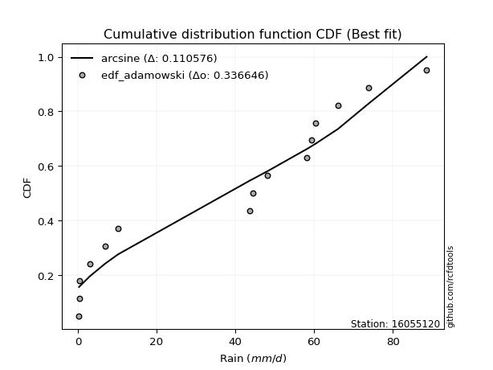</img></img>

</div>


## C. Best fit & Estimate extreme values for specific return periods - Tr


### 1. Best fit (ordered by delta Δ)

<div align="center">

|   id |   station | empirical_dist   | p_dist       |    delta |   deltao | eval   |   fit |   n |   best_fit |   best_fit_sort |
|-----:|----------:|:-----------------|:-------------|---------:|---------:|:-------|------:|----:|-----------:|----------------:|
|    0 |  16055120 | edf_hazen        | logjohnsonsu | 0.132919 | 0.336646 | Δo > Δ |     1 |  15 |          1 |               1 |
|    1 |  16055120 | edf_gringorten   | logjohnsonsu | 0.133448 | 0.336646 | Δo > Δ |     1 |  15 |          1 |               2 |
|    2 |  16055120 | edf_cunnane      | logjohnsonsu | 0.133796 | 0.336646 | Δo > Δ |     1 |  15 |          1 |               3 |
|    3 |  16055120 | edf_blom         | logjohnsonsu | 0.134012 | 0.336646 | Δo > Δ |     1 |  15 |          1 |               4 |
|    4 |  16055120 | edf_tukey        | logjohnsonsu | 0.134368 | 0.336646 | Δo > Δ |     1 |  15 |          1 |               5 |
|    5 |  16055120 | edf_filliben     | logjohnsonsu | 0.134502 | 0.336646 | Δo > Δ |     1 |  15 |          1 |               6 |
|    6 |  16055120 | edf_beard        | logjohnsonsu | 0.134566 | 0.336646 | Δo > Δ |     1 |  15 |          1 |               7 |
|    7 |  16055120 | edf_jenkinson    | logjohnsonsu | 0.134566 | 0.336646 | Δo > Δ |     1 |  15 |          1 |               8 |
|    8 |  16055120 | edf_chegodayev   | logjohnsonsu | 0.13465  | 0.336646 | Δo > Δ |     1 |  15 |          1 |               9 |
|    9 |  16055120 | edf_adamowski    | logjohnsonsu | 0.135069 | 0.336646 | Δo > Δ |     1 |  15 |          1 |              10 |
|   10 |  16055120 | edf_weibull      | logjohnsonsu | 0.137085 | 0.336646 | Δo > Δ |     1 |  15 |          1 |              11 |
|   11 |  16055120 | edf_california   | nakagami     | 0.151195 | 0.336646 | Δo > Δ |     1 |  15 |          1 |              12 |

</div>

:file_folder:Tables: [bestfit_16055120.csv](table/bestfit_16055120.csv) | [extreme_16055120.csv](table/extreme_16055120.csv)


### 2. Extreme values

In hydrology, a return period (or recurrence interval $Tr$) is the statistical average time between extreme events like floods or droughts of a specific magnitude, indicating how rare an event is, with a 100-year flood, for example, having a 1% chance of occurring in any given year, not that it happens exactly every century. It is a key tool for infrastructure design (like bridges or dams) and risk assessment, calculated from historical data to determine the probability of future events, although it is important to remember it is statistical average, and events can cluster or be missed.

> risk_rate: assuming the return period as the project useful life.

|   id |      tr |   prob_l |     prob_g |      alpha |        betaprime |     chi2 |   crystalball |    erlang |    expon |   exponnorm |        f |   fatiguelife |         fisk |    gamma |   genexpon |   genlogistic |   gibrat |   gompertz |   gumbel_l |   gumbel_r |   halflogistic |   halfnorm |   hypsecant |    invgamma |   invgauss |       invweibull |   johnsonsu |   kstwobign |   laplace |   laplace_asymmetric |   loggamma |   logistic |   lognorm |   maxwell |   mielke |    moyal |   nakagami |       ncf |              nct |     norm |          pareto |   pearson3 |   rayleigh |     rice |        t |   truncnorm |     wald |   weibull_min |   logalpha |   logbetaprime |          logchi2 |   logcrystalball |   logerlang |         logexpon |   logexponnorm |            logf |   logfatiguelife |        logfisk |   loggenexpon |   loggenlogistic |        loggibrat |   loggompertz |   loggumbel_l |   loggumbel_r |   loghalflogistic |   loghalfnorm |   loghypsecant |   loginvgamma |   loginvgauss |    loginvweibull |   logjohnsonsu |   logkstwobign |   loglaplace |   loglaplace_asymmetric |   logloggamma |   loglogistic |   loglognorm |   logmaxwell |   logmielke |     logmoyal |      lognakagami |         logncf |    lognct |   logpareto |   logpearson3 |   lograyleigh |   logrice |      logt |   logtruncnorm |          logwald |   logweibull_min |   station |   n |   risk_rate |
|-----:|--------:|---------:|-----------:|-----------:|-----------------:|---------:|--------------:|----------:|---------:|------------:|---------:|--------------:|-------------:|---------:|-----------:|--------------:|---------:|-----------:|-----------:|-----------:|---------------:|-----------:|------------:|------------:|-----------:|-----------------:|------------:|------------:|----------:|---------------------:|-----------:|-----------:|----------:|----------:|---------:|---------:|-----------:|----------:|-----------------:|---------:|----------------:|-----------:|-----------:|---------:|---------:|------------:|---------:|--------------:|-----------:|---------------:|-----------------:|-----------------:|------------:|-----------------:|---------------:|----------------:|-----------------:|---------------:|--------------:|-----------------:|-----------------:|--------------:|--------------:|--------------:|------------------:|--------------:|---------------:|--------------:|--------------:|-----------------:|---------------:|---------------:|-------------:|------------------------:|--------------:|--------------:|-------------:|-------------:|------------:|-------------:|-----------------:|---------------:|----------:|------------:|--------------:|--------------:|----------:|----------:|---------------:|-----------------:|-----------------:|----------:|----:|------------:|
|    0 |    2    | 0.5      | 0.5        |    13.8354 |      2.91229     |  15.5348 |       33.4733 |   9.65695 |  23.294  |     33.406  |  10.079  |       1.71652 |      7.57205 |  12.2157 |    24.7836 |       27.9377 |  24.486  |    26.4579 |    38.3922 |    28.5545 |        26.1091 |    27.3444 |     33.4733 |     11.2753 |    11.6284 |      5.83541     |     33.4729 |     27.9804 |   33.4733 |              39.8766 |    10.369  |    33.4733 |   11.1782 |   30.9126 |  32.8877 |  26.9665 |    19.1687 |   8.08547 |      5.682       |  33.4733 |     0.358278    |    32.2696 |    30.0043 |  31.645  |  33.4761 |     28.3256 |  23.7676 |       21.0309 |    10.4717 |        9.31692 |      2.5133      |          11.1782 |     10.5479 |      3.68323     |        11.1783 |    0.924082     |          10.9895 |   2.05389      |       7.03241 |              inf |      6.12166     |       14.0721 |       15.5414 |       8.03994 |           6.82485 |       7.41389 |        11.1782 |       9.97755 |        9.512  |      8.41193     |        29.4743 |        6.94797 |      11.1782 |                 21.1742 |       21.1732 |       11.1782 |      11.1557 |      9.41595 |    0.857602 |      7.22852 |      0.507436    |   2.96856      |   11.1377 |    0.304418 |       14.1781 |        8.8601 |   10.4627 |   11.1782 |        4.96624 |      5.83415     |          16.5162 |  16055120 |  15 |    0.75     |
|    1 |    2.33 | 0.570815 | 0.429185   |    17.941  |      5.73701     |  22.0492 |       38.8164 |  12.8601  |  28.3603 |     38.7466 |  15.0774 |       3.96503 |     11.2465  |  15.1591 |    29.9122 |       33.1241 |  27.1925 |    31.6323 |    43.0407 |    33.5054 |        31.1994 |    33.1109 |     37.7494 |     15.3715 |    15.3888 |     10.6731      |     38.8152 |     33.1664 |   36.7067 |              44.2807 |    15.0452 |    38.1809 |   15.9894 |   36.4636 |  40.7619 |  31.6532 |    26.9382 |  12.3807  |      8.89392     |  38.8164 |     0.794332    |    37.6359 |    35.6375 |  36.8535 |  38.819  |     33.5254 |  27.2711 |       30.1322 |    15.1895 |       14.1176  |      4.21684     |          15.9894 |     15.2313 |      6.40018     |        15.9896 |    1.64592      |          15.7114 |  17.9374       |      10.9257  |              inf |      7.33872     |       19.2525 |       21.2199 |      11.2022  |           9.59848 |      10.9101  |        14.8863 |      14.446   |       14.07   |     13.145       |        37.1873 |       10.8151  |      13.8819 |                 27.8366 |       27.836  |       15.323  |      15.9446 |     13.6577  |    1.26306  |      9.89492 |      0.705532    |   9.11252      |   15.9461 |    0.33961  |       19.9472 |       12.9223 |   15.1506 |   15.9894 |        7.32251 |      7.3776      |          21.964  |  16055120 |  15 |    0.729209 |
|    2 |    5    | 0.8      | 0.2        |    49.7767 |     59.5025      |  63.431  |       58.6725 |  31.3428  |  53.6904 |     58.6343 |  50.7399 |      33.6583  |     53.3987  |  30.354  |    54.3634 |       55.654  |  42.775  |    55.0284 |    58.058  |    55.0144 |        54.2321 |    57.4968 |     54.9015 |     55.7132 |    43.4229 |    158.171       |     58.6686 |     55.1956 |   52.8727 |              58.9721 |    61.4673 |    56.3575 |   60.4734 |   58.3121 |  70.5378 |  53.3622 |    68.8028 |  43.275   |     75.5956      |  58.6725 | 21689.7         |    58.2575 |    58.1895 |  57.6334 |  58.6747 |     56.3277 |  46.8836 |       96.9793 |    62.8005 |       74.9648  |     60.3001      |          60.4734 |     61.1436 |    101.38        |        60.474  | 2343.66         |          59.4002 |   1.57081e+32  |      65.6325  |              inf |     20.8455      |       54.9303 |       58.0345 |      47.3291  |          44.9124  |      55.8921  |        46.9724 |      59.6378  |       65.9827 |     91.4123      |        63.1944 |       70.8512  |      41.0029 |                 55.896  |       55.8982 |       51.7855 |      60.29   |     59.0306  |    7.3915   |     42.3699  |      6.64965     |   5.53297e+06  |   60.6161 |  inf        |       62.3586 |       58.5479 |   61.1513 |   60.4734 |       26.5287  |     27.4512      |          55.1643 |  16055120 |  15 |    0.67232  |
|    3 |   10    | 0.9      | 0.1        |   108.266  |    302.54        | 108.572  |       71.8445 |  50.1534  |  76.6844 |     71.8699 |  94.4373 |      74.0079  |    170.185   |  44.5248 |    75.1044 |       74.0029 |  60.5372 |    73.3994 |    66.419  |    72.5332 |        73.3598 |    75.5418 |     68.5979 |    156.416  |    84.3953 |   1448.1         |     71.8389 |     71.9679 |   67.5478 |              71.8108 |   159.694  |    69.7439 |  146.156  |   73.6879 |  85.4432 |  72.2634 |   104.547  |  80.8629  |    509.571       |  71.8445 |     3.55082e+08 |    72.535  |    74.2696 |  72.3735 |  71.8464 |     73.831  |  67.6972 |      186.354  |   166.534  |      253.76    |    714.497       |         146.156  |    157.06   |   1244.68        |       146.158  |    9.83623e+13  |         143.721  |   1.25992e+279 |     239.601   |              inf |     68.5213      |      100.148  |      101.615  |     153.057   |         161.774   |     187.233   |       117.585  |     158.744   |      199.678  |    443.607       |        75.4182 |      296.392   |     109.597  |                 71.2898 |       71.2941 |      126.969  |     146.034  |    165.368   |   22.2977   |    150.315   |     59.1547      |   9.43854e+24  |  147.206  |  inf        |      119.351  |      171.939  |  156.124  |  146.156  |       47.8219  |    110.701       |          92.115  |  16055120 |  15 |    0.651322 |
|    4 |   15    | 0.933333 | 0.0666667  |   166.547  |    746.379       | 136.943  |       78.4177 |  61.6739  |  90.1351 |     78.4902 | 123.952  |     100.383   |    320.442   |  52.9083 |    86.6998 |       84.3549 |  72.7887 |    83.148  |    70.2055 |    82.4171 |        84.1844 |    84.9323 |     76.4144 |    280.547  |   115.569  |   5054.64        |     78.4111 |     80.872  |   76.1321 |              79.3209 |   258.796  |    77.0375 |  227.022  |   81.577  |  90.656  |  83.2328 |   123.759  | 106.329   |   1552.38        |  78.4177 |     1.03612e+11 |    79.8402 |    82.5547 |  79.9424 |  78.4194 |     83.093  |  81.0627 |      250.562  |   273.783  |      482.562   |   3077.98        |         227.022  |    253.112  |   5396.93        |       227.025  |    1.3616e+30   |         223.451  | inf            |     468.409   |              inf |    155.704       |      131.815  |      130.957  |     296.781   |         334.09    |     351.242   |       198.509  |     261.846   |      355.978  |   1081.51        |        79.9619 |      633.605   |     194.791  |                 76.8507 |       76.8558 |      206.971  |     227.242  |    280.539   |   36.433    |    313.449   |    198.386       |   2.77345e+51  |  229.301  |  inf        |      160.099  |      299.529  |  249.841  |  227.022  |       58.5299  |    271.039       |         116.191  |  16055120 |  15 |    0.644736 |
|    5 |   20    | 0.95     | 0.05       |   224.777  |   1406.37        | 157.709  |       82.7223 |  70.015   |  99.6784 |     82.8319 | 146.512  |     119.908   |    496.372   |  58.8868 |    94.7135 |       91.6031 |  82.3991 |    89.6841 |    72.5624 |    89.3376 |        91.7684 |    91.1931 |     81.9286 |    422.87   |   140.813  |  12129.3         |     82.7151 |     86.8702 |   82.2228 |              84.6494 |   355.844  |    82.0785 |  302.91   |   86.8128 |  93.3072 |  91.0015 |   136.678  | 125.934   |   3420.98        |  82.7223 |     5.81314e+12 |    84.6898 |    88.0616 |  84.9636 |  82.7238 |     89.3158 |  91.0227 |      301.281  |   380.612  |      744.369   |   8715.33        |         302.91   |    346.773  |  15281.5         |       302.914  |    2.39583e+51  |         298.375  | inf            |     732.03    |              inf |    296.434       |      156.512  |      153.357  |     471.838   |         555.303   |     534.28    |       287.224  |     365.001   |      524.772  |   2018.46        |        82.4504 |     1057.03    |     292.942  |                 79.712  |       79.7176 |      290.124  |     303.64   |    398.411   |   49.6191   |    527.478   |    450.402       |   1.75603e+85  |  306.566  |  inf        |      192.027  |      433.179  |  340.176  |  302.91   |       64.8325  |    528.235       |         134.259  |  16055120 |  15 |    0.641514 |
|    6 |   25    | 0.96     | 0.04       |   282.987  |   2294.16        | 174.119  |       85.891  |  76.5641  | 107.081  |     86.0314 | 164.909  |     135.421   |    693.801   |  63.5384 |   100.816  |       97.186  |  90.4109 |    94.5565 |    74.2396 |    94.6682 |        97.6115 |    95.8514 |     86.1961 |    580.461  |   162.102  |  23804.3         |     85.8835 |     91.363  |   86.9471 |              88.7825 |   450.374  |    85.9349 |  374.551  |   90.6998 |  94.9122 |  97.023  |   146.324  | 142.041   |   6313.83        |  85.891  |     1.32142e+14 |    88.293  |    92.1531 |  88.6892 |  85.8925 |     93.9678 |  99.0003 |      343.518  |   486.039  |     1030.69    |  19581.5         |         374.551  |    437.734  |  34259.5         |       374.556  |    2.8837e+77   |         369.179  | inf            |    1020.4     |              inf |    507.038       |      176.91   |      171.595  |     674.36    |         821.377   |     729.967   |       382.285  |     467.155   |      701.703  |   3264.03        |        84.0626 |     1550.86    |     402.013  |                 81.4546 |       81.4605 |      375.655  |     375.9    |    516.925   |   62.1365   |    789.599   |    832.343       |   6.47533e+125 |  379.665  |  inf        |      218.394  |      569.788  |  427.091  |  374.551  |       68.9644  |    901.458       |         148.803  |  16055120 |  15 |    0.639603 |
|    7 |   50    | 0.98     | 0.02       |   573.942  |  10437.5         | 226.451  |       94.9651 |  97.2649  | 130.075  |     95.2113 | 226.983  |     185.191   |   1930.5     |  78.0529 |   119.196  |      114.384  | 118.653  |   108.716  |    78.7924 |   111.089  |       115.615  |   109.391  |     99.4271 |   1545.18   |   237.042  | 189977           |     94.9563 |    104.556  |  101.622  |             101.621  |   889.073  |    97.7174 |  687.906  |  101.973  |  98.1551 | 115.716  |   174.433  | 197.348   |  42360.2         |  94.9651 |     2.16334e+18 |    98.7683 |   104.03   |  99.4804 |  94.9664 |    107.583  | 125.048  |      490.512  |   988.298  |     2697.78    | 244453           |         687.907  |    857.669  | 420620           |       687.916  |    5.10139e+274 |         679.515  | inf            |    2680.45    |              inf |   3363.33        |      246.984  |      232.794  |    2026.17    |        2743.96    |    1808.23    |       927.59   |     957.246   |     1650.26   |  14347.1         |        87.7945 |     4780.31    |    1074.54   |                 84.9983 |       85.0048 |      827.2    |     693.152  |   1100.09    |  119.641    |   2762.53    |   5005.72        | inf            |  700.686  |  inf        |      308.29   |     1262.66   |  820.541  |  687.906  |       78.1131  |   5161.97        |         196.727  |  16055120 |  15 |    0.63583  |
|    8 |   75    | 0.986667 | 0.0133333  |   864.857  |  25285.6         | 257.83   |       99.8339 | 109.577   | 143.525  |    100.149  | 266.758  |     215.163   |   3486.57    |  86.5804 |   129.578  |      124.381  | 137.727  |   116.395  |    81.0947 |   120.634  |       126.08   |   116.762  |    107.159  |   2734.68   |   286.463  | 635340           |     99.8245 |    111.815  |  110.207  |             109.131  |  1284.92   |   104.523  |  953.22   |  108.102  |  99.2529 | 126.648  |   189.741  | 233.667   | 128978           |  99.8339 |     6.31254e+20 |   104.485  |   110.492  | 105.337  |  99.8351 |    115.045  | 141.076  |      587.344  |  1454.93   |     4606.01    |      1.07636e+06 |         953.22   |   1234.62   |      1.8238e+06  |       953.233  |  inf            |         942.889  | inf            |    4537.18    |              inf |  12071.7         |      292.544  |      271.618  |    3840.46    |        5531.99    |    2962.81    |      1557.15   |    1416.14    |     2649      |  33923.8         |        89.3425 |     8880.5     |    1909.83   |                 86.1969 |       86.2035 |     1305      |     962.91   |   1658.65    |  173.546    |   5746.04    |  13308.6         | inf            |  973.684  |  inf        |      365.761  |     1946.66   | 1165.71   |  953.219  |       81.4499  |  15106.8         |         226.558  |  16055120 |  15 |    0.634587 |
|    9 |  100    | 0.99     | 0.01       |  1155.76   |  47362           | 280.372  |      103.127  | 118.385   | 153.069  |    103.494  | 296.558  |     236.73    |   5292.54    |  92.6442 |   136.795  |      131.456  | 152.503  |   121.604  |    82.6006 |   127.389  |       133.488  |   121.783  |    112.644  |   4098.58   |   323.752  |      1.4931e+06  |    103.117  |    116.788  |  116.297  |             114.46   |  1650.55   |   109.327  | 1188.53   |  112.276  |  99.8162 | 134.403  |   200.162  | 261.359   | 284186           | 103.127  |     3.54165e+22 |   108.391  |   114.894  | 109.321  | 103.128  |    120.146  | 152.762  |      660.806  |  1894.43   |     6663.29    |      3.08751e+06 |        1188.53   |   1581.71   |      5.16413e+06 |      1188.54   |  inf            |        1176.84   | inf            |    6496       |              inf |  32486.5         |      326.859  |      300.451  |    6038.55    |        9086.62    |    4147.59    |      2248.61   |    1850.61    |     3669.53   |  62376.9         |        90.2407 |    13574.8     |    2872.16   |                 86.7994 |       86.8061 |     1800.55   |    1202.83   |   2193.92    |  226.189    |   9660.98    |  25889.4         | inf            | 1216.48   |  inf        |      408.387  |     2614.4    | 1478.59   | 1188.52   |       83.1764  |  33051.6         |         248.476  |  16055120 |  15 |    0.633968 |
|   10 |  200    | 0.995    | 0.005      |  2319.35   | 214790           | 335.47   |      110.597  | 139.818   | 176.063  |    111.098  | 373.907  |     289.519   |  14404.5     | 107.293  |   153.713  |      148.465  | 192.704  |   133.429  |    85.8738 |   143.629  |       151.296  |   133.267  |    125.857  |  10856.8    |   420.303  |      1.16469e+07 |    110.586  |    128.243  |  130.972  |             127.298  |  2924.48   |   120.852  | 1960.42   |  121.828  | 100.745  | 153.089  |   223.952  | 335.233   |      1.90653e+06 | 110.597  |     5.79813e+26 |   117.364  |   124.966  | 118.42   | 110.598  |    131.862  | 181.871  |      853.751  |  3472.73   |    15747       |      3.93385e+07 |        1960.42   |   2785.78   |      6.34023e+07 |      1960.45   |  inf            |        1946.09   | inf            |   14778.7     |              inf | 480167           |      416.154  |      374.12   |   17925       |       29960.2     |    8952.09    |      5449.65   |    3423.51    |     7821.18   | 269747           |        91.9061 |    36075       |    7677.02   |                 87.7072 |       87.7141 |     3897.11   |    1993.23   |   4160.23    |  435.394    |  33782.3     | 118117           | inf            | 2016.25   |  inf        |      516.296  |     5133.81   | 2537.39   | 1960.41   |       85.8414  | 232351           |         303.709  |  16055120 |  15 |    0.633042 |
|   11 |  250    | 0.996    | 0.004      |  2901.15   | 349439           | 353.411  |      112.88   | 146.772   | 183.465  |    113.427  | 400.532  |     306.723   |  19865.7     | 112.019  |   159.028  |      153.933  | 207.128  |   137.038  |    86.8369 |   148.85   |       157.021  |   136.799  |    130.111  |  14854.1    |   453.194  |      2.25432e+07 |    112.868  |    131.788  |  135.697  |             131.432  |  3486.95   |   124.552  | 2284.37   |  124.768  | 100.966  | 159.104  |   231.256  | 361.34    |      3.51854e+06 | 112.88   |     1.31801e+28 |   120.138  |   128.067  | 121.216  | 112.88   |    135.478  | 191.501  |      920.593  |  4187.84   |    20608.9     |      8.93875e+07 |        2284.37   |   3315.55   |      1.42141e+08 |      2284.41   |  inf            |        2269.6    | inf            |   19037.8     |              inf |      1.26206e+06 |      446.851  |      399.054  |   25431.3     |       43966.3     |   11342.7     |      7246.51   |    4141.07    |     9904.86   | 431916           |        92.3269 |    48817       |   10535.4    |                 87.8894 |       87.8963 |     4993.45   |    2326.18   |   5065.95    |  541.62     |  50548.5     | 188143           | inf            | 2353.09   |  inf        |      552.323  |     6319.06   | 2993.26   | 2284.37   |       86.3855  | 442934           |         322.185  |  16055120 |  15 |    0.632858 |
|   12 |  500    | 0.998    | 0.002      |  5810.09   |      1.58451e+06 | 409.664  |      119.649  | 168.512   | 206.459  |    120.349  | 488.87   |     360.693   |  53834.7     | 126.725  |   175.166  |      170.905  | 256.978  |   147.701  |    89.5977 |   165.055  |       174.79   |   147.333  |    143.323  |  39324.2    |   560.221  |      1.75064e+08 |    119.637  |    142.412  |  150.372  |             144.27   |  5892.89   |   136.028  | 3595.26   |  133.541  | 101.532  | 177.789  |   252.988  | 450.453   |      2.36049e+07 | 119.649  |     2.15775e+32 |   128.454  |   137.318  | 129.547  | 119.65   |    146.291  | 222.121  |     1142.66   |  7338.99   |    46573.2     |      1.14884e+09 |        3595.26   |   5573.41   |      1.74513e+09 |      3595.32   |  inf            |        3581.69   | inf            |   40551.2     |              inf |      3.5605e+07  |      548.121  |      480.13   |   75312.6     |      144590       |   22971.7     |     17561.2    |    7327.91    |    20230.8    |      1.86186e+06 |        93.3765 |   120849       |   28160.2    |                 88.2543 |       88.2613 |    10771.7    |    3679.04   |   9118.58    | 1100.68     | 176752       | 750438           | inf            | 3721.32   |  inf        |      667.158  |    11744.1    | 4888.15   | 3595.25   |       87.4851  |      3.44564e+06 |         381.621  |  16055120 |  15 |    0.632489 |
|   13 |  750    | 0.998667 | 0.00133333 |  8719.04   |      3.83647e+06 | 442.888  |      123.41   | 181.315   | 219.91   |    124.206  | 544.68   |     392.579   |  96385.8     | 135.343  |   184.362  |      180.826  | 289.945  |   153.591  |    91.0731 |   174.529  |       185.178  |   153.217  |    151.052  |  69495.8    |   625.857  |      5.80224e+08 |    123.397  |    148.38   |  158.956  |             151.78   |  7902.76   |   142.732  | 4625.37   |  138.448  | 101.812  | 188.719  |   265.096  | 508.722   |      7.18714e+07 | 123.41   |     6.29624e+34 |   133.13   |   142.491  | 134.198  | 123.41   |    152.349  | 240.481  |     1282.56   | 10060.5    |    74084.8     |      5.12891e+09 |        4625.37   |   7452.42   |      7.56684e+09 |      4625.44   |  inf            |        4615.41   | inf            |   61912       |              inf |      3.24142e+08 |      611.434  |      530.017  |  142071       |      289993       |   34072.8     |     29473.2    |   10104.2     |    30353.9    |      4.37425e+06 |        93.8503 |   201094       |   50050.1    |                 88.3761 |       88.3831 |    16879      |    4747.07   |  12667.7     | 1708.97     | 367605       |      1.62042e+06 | inf            | 4801.06   |  inf        |      735.81   |    16608.7    | 6420.85   | 4625.36   |       87.855   |      1.17883e+07 |         417.761  |  16055120 |  15 |    0.632366 |
|   14 | 1000    | 0.999    | 0.001      | 11628      |      7.18472e+06 | 466.585  |      125.999  | 190.432   | 229.453  |    126.866  | 586.226  |     415.325   | 145679       | 141.464  |   190.786  |      187.864  | 315.173  |   157.628  |    92.0662 |   181.249  |       192.546  |   157.281  |    156.536  | 104091      |   673.626  |      1.35748e+09 |    125.986  |    152.515  |  165.047  |             157.109  |  9680.22   |   147.486  | 5501.48   |  141.839  | 101.998  | 196.474  |   273.445  | 553.079   |      1.58359e+08 | 125.999  |     3.53251e+36 |   136.374  |   146.066  | 137.408  | 125.999  |    156.54   | 253.687  |     1386.24   | 12520.5    |   102464       |      1.48407e+10 |        5501.48   |   9110.3    |      2.14257e+10 |      5501.56   |  inf            |        5496.06   | inf            |   82951.3     |              inf |      1.75705e+09 |      658.147  |      566.479  |  222856       |      475100       |   44735.4     |     42557.6    |   12628       |    40287.4    |      8.01747e+06 |        94.1382 |   286163       |   75269.5    |                 88.437  |       88.444  |    23210.3    |    5658.17   |  15899.2     | 2364.82     | 618042       |      2.75381e+06 | inf            | 5721.86   |  inf        |      784.933  |    21103.3    | 7748.05   | 5501.46   |       88.0406  |      2.85563e+07 |         443.993  |  16055120 |  15 |    0.632305 |

<div align="center">

</img>

</div>


<div align="center">

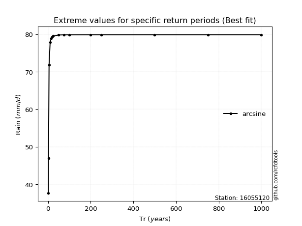</img>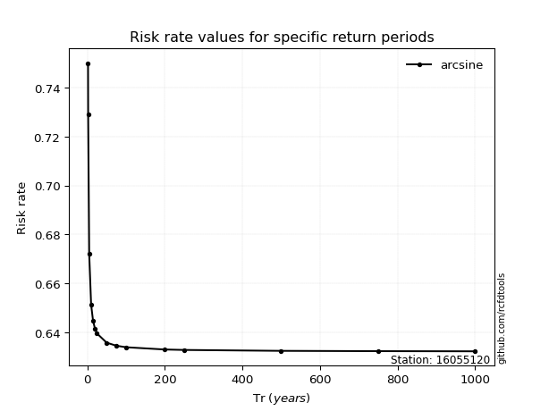</img>

</div>


<sub>**APP DISCLAIMER**: NO WARRANTY - This software is provided by [github.com/rcfdtools](https://github.com/rcfdtools) "as is", without any express or implied warranty, including warranties of merchantability, fitness for a particular purpose, or non-infringement. There is no guarantee that the software will be error-free or operate without interruption. LIMITATION OF LIABILITY - Neither the authors nor copyright holders will be liable for claims or damages arising from the software or its use. You are responsible for determining if the software is appropriate for your use and assume all associated risks, including errors, legal compliance, and data loss. NO PROFESSIONAL ADVICE - The software provides general information and does not offer professional advice. It should not replace consultation with professional advisors.</sub>