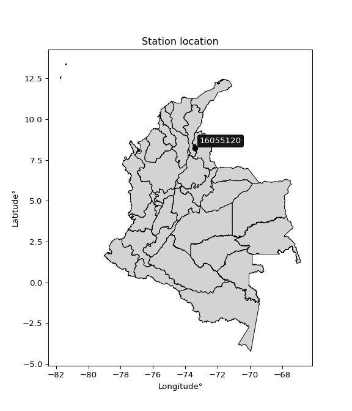

<div align="center">


</div>

# Station (rain, Pmax24h): 16055120

Probable Maximum Precipitation (PMP) is the greatest amount of rainfall for a specific duration that is meteorologically possible for a given location, acting as a "worst-case" scenario for extreme storms, crucial for designing safety-critical infrastructure like bridges, river deviations, dams, spillways, and nuclear plants to prevent catastrophic failure. PMP is calculated by hydrologists using meteorological data to determine the upper limit of extreme rainfall, often leading to the Probable Maximum Flood (PMF) for flood control design, and is increasingly being studied for climate change impacts.

<div align="center">

</img>

</div>


## A. General information


### 1. General running parameters

• app_version: _v20251226_. • runtime: _2025-12-26 15:38:16.554582_. • Python version: _3.14.0_. • SciPy version: _1.16.3_. • Pandas version: _2.3.3_. • NumPy version: _2.3.5_. • Stations dataset (station_dataset_file): _dataset/pmax24h_in/automatic_colombia_2003_2024.csv_. • Stations catalog (station_catalog_file): _dataset/CNE_IDEAM.xls_. • Minimum year to eval til year_max (date_min): _2003_. • Maximum year to eval since year_min (date_max): _2024_. • Creates, save and include plots into reports (create_plot): _False_. • Plot only fit distributions with Δo > Δ (plot_only_fit): _True_. • Eval low extreme values, if False, evaluates high extreme values (low_extreme): _False_. • Eval every SciPy distribution as logarithmic (pdist_logarithmic_on): _True_. • Standard deviation normalized (ddof): _1.0_. • Return periods to eval in years (Tr): _[2, 2.33, 5, 10, 15, 20, 25, 50, 75, 100, 200, 250, 500, 750, 1000]_. • Minimum data sample per station, 0 means any (minimum_sample): _5_. • Z-Score threshold to adjust a value, 0 means disable (zscore): _3.5_. • Avoid zeros, e.g. rain = 0 (avoid_zeros): _True_. • Avoid null values (avoid_nans): _True_. [:file_folder:Dataset file.](../../dataset/pmax24h_in/automatic_colombia_2003_2024.csv)


### 2. Station info and location

|   id |   CODIGO | NOMBRE                               | CATEGORIA               | TECNOLOGIA                | ESTADO           | FECHA_INSTALACION   |   FECHA_SUSPENSION |   ALTITUD |   LATITUD |   LONGITUD | DEPARTAMENTO       | MUNICIPIO   | AREA_OPERATIVA                         | ENTIDAD                                                     | AREA_HIDROGRAFICA   | ZONA_HIDROGRAFICA   | SUBZONA_HIDROGRAFICA           |   CORRIENTE | OBSERVACION                                                                                      | SUBRED                                                   | Catalogo   |
|-----:|---------:|:-------------------------------------|:------------------------|:--------------------------|:-----------------|:--------------------|-------------------:|----------:|----------:|-----------:|:-------------------|:------------|:---------------------------------------|:------------------------------------------------------------|:--------------------|:--------------------|:-------------------------------|------------:|:-------------------------------------------------------------------------------------------------|:---------------------------------------------------------|:-----------|
|    0 | 16055120 | AGUAS DE LA VIRGEN  - AUT [16055120] | Climatológica Principal | Automática con Telemetría | En Mantenimiento | 09/08/2006          |                nan |      1679 |   8.22769 |   -73.3975 | Norte De Santander | Ocaña       | Area Operativa 08 - Santanderes-Arauca | INSTITUTO DE HIDROLOGIA METEOROLOGIA Y ESTUDIOS AMBIENTALES | Caribe              | Catatumbo           | Río Algodonal (Alto Catatumbo) |         nan | Cambio de tecnología por instalación o repotenciación de estaciones proyecto Fondo de Adaptación | Radiación Visible,Radición Global,Radiación Ultravioleta | CNE_IDEAM  |

<div align="center">

Map location in: [:earth_americas:Google](http://maps.google.com/maps?q=8.22769,-73.3975) [:earth_americas:OSM](https://www.openstreetmap.org/#map=18/8.22769/-73.3975&layers=P) [:earth_americas:Bing](https://www.bing.com/maps?cp=8.22769~-73.3975&lvl=18) [:earth_americas:Apple](https://maps.apple.com/frame?center=8.22769%2C-73.3975&span=0.003%2C0.006)

</div>


<div align="center">

```geojson
{
  "type": "Feature",
  "geometry": {
    "type": "Point", 
    "coordinates": [-73.3975, 8.22769]
  }, 
  "properties": {
    "Name": "16055120"
  }
}
```

</div>


### 3. Discrete values table and plot

|               |           0 |           1 |           2 |          3 |           4 |           5 |           6 |          7 |          8 |          9 |         10 |         11 |         12 |          13 |
|:--------------|------------:|------------:|------------:|-----------:|------------:|------------:|------------:|-----------:|-----------:|-----------:|-----------:|-----------:|-----------:|------------:|
| Date          | 2006        | 2007        | 2008        | 2009       | 2010        | 2011        | 2016        | 2017       | 2018       | 2019       | 2020       | 2021       | 2022       | 2024        |
| Value         |    6.9      |   48.2      |   10.2      |   60.4     |   59.3      |   43.7      |   44.5      |   88.6     |   73.9     |    0.4     |    0.4     |    3       |    0.3     |   58.2      |
| Value_initial |    6.9      |   48.2      |   10.2      |   60.4     |   59.3      |   43.7      |   44.5      |   88.6     |   73.9     |    0.4     |    0.4     |    3       |    0.3     |   58.2      |
| count         |   14        |   14        |   14        |   14       |   14        |   14        |   14        |   14       |   14       |   14       |   14       |   14       |   14       |   14        |
| mean          |   35.5714   |   35.5714   |   35.5714   |   35.5714  |   35.5714   |   35.5714   |   35.5714   |   35.5714  |   35.5714  |   35.5714  |   35.5714  |   35.5714  |   35.5714  |   35.5714   |
| std           |   31.0369   |   31.0369   |   31.0369   |   31.0369  |   31.0369   |   31.0369   |   31.0369   |   31.0369  |   31.0369  |   31.0369  |   31.0369  |   31.0369  |   31.0369  |   31.0369   |
| zscore        |   -0.923786 |    0.406889 |   -0.817461 |    0.79997 |    0.764529 |    0.261901 |    0.287676 |    1.70857 |    1.23494 |   -1.13321 |   -1.13321 |   -1.04944 |   -1.13644 |    0.729087 |
> If Z-Score is active, values out of range or outliers are replaced with the station mean value.


### 4. Active continuous probability distributions from SciPy (45 of 104 available)

[scipy.stats](https://docs.scipy.org/doc/scipy/reference/stats.html) is a Python´s powerful submodule within the SciPy library for comprehensive statistical analysis, offering over 130 probability distributions (like Normal, Poisson), functions for descriptive stats (mean, variance), hypothesis testing (t-tests, chi-square), random variable generation, and statistical tests, making it essential for data science, modeling, and research. It provides tools to explore, model, and draw conclusions from data efficiently, working seamlessly with NumPy.

<div align="center">

|   id | p_dist             |   n_parameter | fit_method   | label                                                                       | active   | ref                                                                                                        |
|-----:|:-------------------|--------------:|:-------------|:----------------------------------------------------------------------------|:---------|:-----------------------------------------------------------------------------------------------------------|
|    0 | alpha              |             3 | MLE          | Alpha                                                                       | True     | [:mortar_board:](https://docs.scipy.org/doc/scipy/reference/generated/scipy.stats.alpha.html)              |
|    1 | betaprime          |             4 | MLE          | Beta prime                                                                  | True     | [:mortar_board:](https://docs.scipy.org/doc/scipy/reference/generated/scipy.stats.betaprime.html)          |
|    2 | chi2               |             3 | MLE          | Chi²                                                                        | True     | [:mortar_board:](https://docs.scipy.org/doc/scipy/reference/generated/scipy.stats.chi2.html)               |
|    3 | crystalball        |             4 | MLE          | Crystalball                                                                 | True     | [:mortar_board:](https://docs.scipy.org/doc/scipy/reference/generated/scipy.stats.crystalball.html)        |
|    4 | erlang             |             3 | MLE          | Erlang                                                                      | True     | [:mortar_board:](https://docs.scipy.org/doc/scipy/reference/generated/scipy.stats.erlang.html)             |
|    5 | expon              |             2 | MLE          | Exponential                                                                 | True     | [:mortar_board:](https://docs.scipy.org/doc/scipy/reference/generated/scipy.stats.expon.html)              |
|    6 | exponnorm          |             3 | MLE          | Exponentially modified Normal                                               | True     | [:mortar_board:](https://docs.scipy.org/doc/scipy/reference/generated/scipy.stats.exponnorm.html)          |
|    7 | f                  |             4 | MLE          | F                                                                           | True     | [:mortar_board:](https://docs.scipy.org/doc/scipy/reference/generated/scipy.stats.f.html)                  |
|    8 | fatiguelife        |             3 | MLE          | Fatigue-life (Birnbaum-Saunders)                                            | True     | [:mortar_board:](https://docs.scipy.org/doc/scipy/reference/generated/scipy.stats.fatiguelife.html)        |
|    9 | fisk               |             3 | MLE          | Fisk                                                                        | True     | [:mortar_board:](https://docs.scipy.org/doc/scipy/reference/generated/scipy.stats.fisk.html)               |
|   10 | gamma              |             3 | MLE          | Gamma                                                                       | True     | [:mortar_board:](https://docs.scipy.org/doc/scipy/reference/generated/scipy.stats.gamma.html)              |
|   11 | genexpon           |             5 | MLE          | Generalized exponential                                                     | True     | [:mortar_board:](https://docs.scipy.org/doc/scipy/reference/generated/scipy.stats.genexpon.html)           |
|   12 | genlogistic        |             3 | MLE          | Generalized logistic                                                        | True     | [:mortar_board:](https://docs.scipy.org/doc/scipy/reference/generated/scipy.stats.genlogistic.html)        |
|   13 | gibrat             |             2 | MM           | Gibrat                                                                      | True     | [:mortar_board:](https://docs.scipy.org/doc/scipy/reference/generated/scipy.stats.gibrat.html)             |
|   14 | gompertz           |             3 | MLE          | Gompertz (or truncated Gumbel)                                              | True     | [:mortar_board:](https://docs.scipy.org/doc/scipy/reference/generated/scipy.stats.gompertz.html)           |
|   15 | gumbel_l           |             2 | MM           | Gumbel Left Skew                                                            | True     | [:mortar_board:](https://docs.scipy.org/doc/scipy/reference/generated/scipy.stats.gumbel_l.html)           |
|   16 | gumbel_r           |             2 | MM           | Gumbel Right Skew                                                           | True     | [:mortar_board:](https://docs.scipy.org/doc/scipy/reference/generated/scipy.stats.gumbel_r.html)           |
|   17 | halflogistic       |             2 | MM           | Half-logistic                                                               | True     | [:mortar_board:](https://docs.scipy.org/doc/scipy/reference/generated/scipy.stats.halflogistic.html)       |
|   18 | halfnorm           |             2 | MM           | Half Normal                                                                 | True     | [:mortar_board:](https://docs.scipy.org/doc/scipy/reference/generated/scipy.stats.halfnorm.html)           |
|   19 | hypsecant          |             2 | MM           | hyperbolic secant                                                           | True     | [:mortar_board:](https://docs.scipy.org/doc/scipy/reference/generated/scipy.stats.hypsecant.html)          |
|   20 | invgamma           |             3 | MLE          | Inverted gamma                                                              | True     | [:mortar_board:](https://docs.scipy.org/doc/scipy/reference/generated/scipy.stats.invgamma.html)           |
|   21 | invgauss           |             3 | MLE          | Inverse Gaussian                                                            | True     | [:mortar_board:](https://docs.scipy.org/doc/scipy/reference/generated/scipy.stats.invgauss.html)           |
|   22 | invweibull         |             3 | MLE          | Inverted Weibull                                                            | True     | [:mortar_board:](https://docs.scipy.org/doc/scipy/reference/generated/scipy.stats.invweibull.html)         |
|   23 | johnsonsu          |             4 | MLE          | Johnson Su                                                                  | True     | [:mortar_board:](https://docs.scipy.org/doc/scipy/reference/generated/scipy.stats.johnsonsu.html)          |
|   24 | kstwobign          |             2 | MLE          | Limiting distribution of scaled Kolmogorov-Smirnov two-sided test statistic | True     | [:mortar_board:](https://docs.scipy.org/doc/scipy/reference/generated/scipy.stats.kstwobign.html)          |
|   25 | laplace            |             2 | MM           | Laplace                                                                     | True     | [:mortar_board:](https://docs.scipy.org/doc/scipy/reference/generated/scipy.stats.laplace.html)            |
|   26 | laplace_asymmetric |             3 | MLE          | Asymmetric Laplace                                                          | True     | [:mortar_board:](https://docs.scipy.org/doc/scipy/reference/generated/scipy.stats.laplace_asymmetric.html) |
|   27 | loggamma           |             3 | MLE          | Log gamma                                                                   | True     | [:mortar_board:](https://docs.scipy.org/doc/scipy/reference/generated/scipy.stats.loggamma.html)           |
|   28 | logistic           |             2 | MM           | Logistic (or Sech-squared)                                                  | True     | [:mortar_board:](https://docs.scipy.org/doc/scipy/reference/generated/scipy.stats.logistic.html)           |
|   29 | lognorm            |             3 | MLE          | Log Normal                                                                  | True     | [:mortar_board:](https://docs.scipy.org/doc/scipy/reference/generated/scipy.stats.lognorm.html)            |
|   30 | maxwell            |             2 | MM           | Maxwell                                                                     | True     | [:mortar_board:](https://docs.scipy.org/doc/scipy/reference/generated/scipy.stats.maxwell.html)            |
|   31 | mielke             |             4 | MLE          | Mielke Beta-Kappa / Dagum                                                   | True     | [:mortar_board:](https://docs.scipy.org/doc/scipy/reference/generated/scipy.stats.mielke.html)             |
|   32 | moyal              |             2 | MM           | Moyal                                                                       | True     | [:mortar_board:](https://docs.scipy.org/doc/scipy/reference/generated/scipy.stats.moyal.html)              |
|   33 | nakagami           |             3 | MLE          | Nakagami                                                                    | True     | [:mortar_board:](https://docs.scipy.org/doc/scipy/reference/generated/scipy.stats.nakagami.html)           |
|   34 | ncf                |             5 | MLE          | Non-central F distribution                                                  | True     | [:mortar_board:](https://docs.scipy.org/doc/scipy/reference/generated/scipy.stats.ncf.html)                |
|   35 | nct                |             4 | MLE          | Non-central Student’s t                                                     | True     | [:mortar_board:](https://docs.scipy.org/doc/scipy/reference/generated/scipy.stats.nct.html)                |
|   36 | norm               |             2 | MM           | Normal                                                                      | True     | [:mortar_board:](https://docs.scipy.org/doc/scipy/reference/generated/scipy.stats.norm.html)               |
|   37 | pareto             |             3 | MLE          | Pareto                                                                      | True     | [:mortar_board:](https://docs.scipy.org/doc/scipy/reference/generated/scipy.stats.pareto.html)             |
|   38 | pearson3           |             3 | MM           | Pearson type III                                                            | True     | [:mortar_board:](https://docs.scipy.org/doc/scipy/reference/generated/scipy.stats.pearson3.html)           |
|   39 | rayleigh           |             2 | MM           | Rayleigh                                                                    | True     | [:mortar_board:](https://docs.scipy.org/doc/scipy/reference/generated/scipy.stats.rayleigh.html)           |
|   40 | rice               |             3 | MLE          | Rice                                                                        | True     | [:mortar_board:](https://docs.scipy.org/doc/scipy/reference/generated/scipy.stats.rice.html)               |
|   41 | t                  |             3 | MLE          | Student’s t                                                                 | True     | [:mortar_board:](https://docs.scipy.org/doc/scipy/reference/generated/scipy.stats.t.html)                  |
|   42 | truncnorm          |             4 | MLE          | Truncated normal                                                            | True     | [:mortar_board:](https://docs.scipy.org/doc/scipy/reference/generated/scipy.stats.truncnorm.html)          |
|   43 | wald               |             2 | MM           | Wald                                                                        | True     | [:mortar_board:](https://docs.scipy.org/doc/scipy/reference/generated/scipy.stats.wald.html)               |
|   44 | weibull_min        |             3 | MLE          | Weibull minimum                                                             | True     | [:mortar_board:](https://docs.scipy.org/doc/scipy/reference/generated/scipy.stats.weibull_min.html)        |

</div>

> **n_parameter:** # arguments & localization & scale.
>
> **Fit methods:** (MLE) maximum likelihood, (MM) L-moments.
>
>**Inactive:** foldnorm, gennorm, norminvgauss, powernorm, powerlognorm, skewnorm, genextreme, anglit, arcsine, argus, beta, bradford, burr, burr12, cauchy, cosine, halfcauchy, foldcauchy, skewcauchy, wrapcauchy, dgamma, gengamma, exponweib, exponpow, truncexpon, gausshyper, genhalflogistic, genhyperbolic, geninvgauss, halfgennorm, johnsonsb, kappa4, kappa3, ksone, kstwo, loglaplace, levy, levy_l, levy_stable, ncx2, genpareto, truncpareto, lomax, powerlaw, rdist, rel_breitwigner, recipinvgauss, semicircular, studentized_range, trapezoid, triang, truncweibull_min, tukeylambda, uniform, loguniform, vonmises, vonmises_line, weibull_max, dweibull, 


## B. Probability distributions vs. Empirical distributions

A continuous probability distribution (CPD) describes probabilities for variables that can take any value within a range (like rain any time), unlike discrete variables with specific outcomes (like temperature). It uses a Probability Density Function (PDF), a curve where the total area under it equals 1, and the probability of the variable falling within an interval (a to b) is found by calculating the area under the curve between those points. A key feature is that the probability of hitting any single exact value is zero, so probabilities are always expressed for ranges, e.g., $P(a ≤ X ≤ b)$.

<div align="center">

Distributions parameters
|    |   station | p_dist                |   n |             loc |            scale | shape                  | shape1               | shape2             | shape3   |
|---:|----------:|:----------------------|----:|----------------:|-----------------:|:-----------------------|:---------------------|:-------------------|:---------|
|  0 |  16055120 | alpha                 |  14 |      -9.7157    |     17.8972      | 1.1344703324496285e-09 |                      |                    |          |
|  1 |  16055120 | betaprime             |  14 |       0.3       |    501.495       | 0.6197299616261449     | 15.732412256414932   |                    |          |
|  2 |  16055120 | chi2                  |  14 |       0.3       |     14.1336      | 1.3303290435479143     |                      |                    |          |
|  3 |  16055120 | crystalball           |  14 |      35.5714    |     29.9079      | 3352.653649318762      | 98.51999766420263    |                    |          |
|  4 |  16055120 | erlang                |  14 |    -280.753     |      2.80815     | 112.62958905997559     |                      |                    |          |
|  5 |  16055120 | expon                 |  14 |       0.3       |     35.2714      |                        |                      |                    |          |
|  6 |  16055120 | exponnorm             |  14 |      32.9898    |     29.7963      | 0.08664267086172547    |                      |                    |          |
|  7 |  16055120 | f                     |  14 |       0.3       |     28.3151      | 1.2930605993635016     | 24.360585809964654   |                    |          |
|  8 |  16055120 | fatiguelife           |  14 |       0.293632  |      0.977649    | 6.812990686789693      |                      |                    |          |
|  9 |  16055120 | fisk                  |  14 |       0.3       |      8.34289     | 0.5249035500685371     |                      |                    |          |
| 10 |  16055120 | gamma                 |  14 |    -247.329     |      3.11306     | 90.81253343177715      |                      |                    |          |
| 11 |  16055120 | genexpon              |  14 |       0.299978  |      2.28189     | 0.06441756814368801    | 7.80525242284791e-05 | 1.981987970321665  |          |
| 12 |  16055120 | genlogistic           |  14 |    -147.745     |     25.3897      | 765.389394102059       |                      |                    |          |
| 13 |  16055120 | gibrat                |  14 |      12.7555    |     13.8386      |                        |                      |                    |          |
| 14 |  16055120 | gompertz              |  14 |       0.3       |     89.3068      | 1.7546396048786121     |                      |                    |          |
| 15 |  16055120 | gumbel_l              |  14 |      49.0316    |     23.3191      |                        |                      |                    |          |
| 16 |  16055120 | gumbel_r              |  14 |      22.1113    |     23.3191      |                        |                      |                    |          |
| 17 |  16055120 | halflogistic          |  14 |       0.123654  |     25.5702      |                        |                      |                    |          |
| 18 |  16055120 | halfnorm              |  14 |      -4.01487   |     49.6141      |                        |                      |                    |          |
| 19 |  16055120 | hypsecant             |  14 |      35.5714    |     19.0399      |                        |                      |                    |          |
| 20 |  16055120 | invgamma              |  14 |     -75.6593    |   1374.24        | 13.337885926944956     |                      |                    |          |
| 21 |  16055120 | invgauss              |  14 |      -3.76177   |     17.1472      | 2.2938498422694327     |                      |                    |          |
| 22 |  16055120 | invweibull            |  14 |       0.2894    |      1.62685     | 0.3063470804972457     |                      |                    |          |
| 23 |  16055120 | johnsonsu             |  14 |       0.305241  |      0.0633311   | -1.954028867887267     | 0.34512935049103066  |                    |          |
| 24 |  16055120 | kstwobign             |  14 |     -65.0782    |    114.664       |                        |                      |                    |          |
| 25 |  16055120 | laplace               |  14 |      35.5714    |     21.1481      |                        |                      |                    |          |
| 26 |  16055120 | laplace_asymmetric    |  14 |      59.3       |     21.304       | 1.7015170545504512     |                      |                    |          |
| 27 |  16055120 | loggamma              |  14 |   -6983.84      |   1001.82        | 1104.478531318141      |                      |                    |          |
| 28 |  16055120 | logistic              |  14 |      35.5714    |     16.4891      |                        |                      |                    |          |
| 29 |  16055120 | lognorm               |  14 |       0.3       |      0.729147    | 10.528818257371451     |                      |                    |          |
| 30 |  16055120 | maxwell               |  14 |     -35.2977    |     44.4106      |                        |                      |                    |          |
| 31 |  16055120 | mielke                |  14 |       0.3       |    117.734       | 0.43510227551857295    | 11.00409145376651    |                    |          |
| 32 |  16055120 | moyal                 |  14 |      18.4682    |     13.4633      |                        |                      |                    |          |
| 33 |  16055120 | nakagami              |  14 |       0.3       |     60.631       | 0.2061808622351085     |                      |                    |          |
| 34 |  16055120 | ncf                   |  14 |       0.3       |      1.75945     | 0.11790575985761112    | 82.52842270029902    | 2.1163088224079774 |          |
| 35 |  16055120 | nct                   |  14 |       0.139504  |      0.0082632   | 0.24923984576713326    | 54.736180964153434   |                    |          |
| 36 |  16055120 | norm                  |  14 |      35.5714    |     29.9079      |                        |                      |                    |          |
| 37 |  16055120 | pareto                |  14 |       0.299989  |      1.05686e-05 | 0.07694125524833417    |                      |                    |          |
| 38 |  16055120 | pearson3              |  14 |      35.5714    |     29.9079      | 0.11638947182719676    |                      |                    |          |
| 39 |  16055120 | rayleigh              |  14 |     -21.6441    |     45.6514      |                        |                      |                    |          |
| 40 |  16055120 | rice                  |  14 |     -18.0355    |     37.8719      | 0.7919800776807879     |                      |                    |          |
| 41 |  16055120 | t                     |  14 |      35.5728    |     29.9071      | 24406126.20524938      |                      |                    |          |
| 42 |  16055120 | truncnorm             |  14 |     -20.8698    |     53.7146      | 0.39411676272817875    | 76.65174549311254    |                    |          |
| 43 |  16055120 | wald                  |  14 |       5.66352   |     29.9079      |                        |                      |                    |          |
| 44 |  16055120 | weibull_min           |  14 |       0.3       |     42.8915      | 0.49258969071553127    |                      |                    |          |
| 45 |  16055120 | logalpha              |  14 |     -55.6514    |   1588.1         | 27.366663426603743     |                      |                    |          |
| 46 |  16055120 | logbetaprime          |  14 |      -4.1459    |      1.3673e+13  | 6.883307283575515      | 14046551829325.246   |                    |          |
| 47 |  16055120 | logchi2               |  14 |      -1.20397   |      1.88033     | 1.7341641312806164     |                      |                    |          |
| 48 |  16055120 | logcrystalball        |  14 |       2.48561   |      2.05772     | 623.3759555462841      | 6.037306392802504    |                    |          |
| 49 |  16055120 | logerlang             |  14 |     -32.1866    |      0.130677    | 265.2164212221206      |                      |                    |          |
| 50 |  16055120 | logexpon              |  14 |      -1.20397   |      3.68958     |                        |                      |                    |          |
| 51 |  16055120 | logexponnorm          |  14 |       2.48403   |      2.05773     | 0.0007590820229895006  |                      |                    |          |
| 52 |  16055120 | logf                  |  14 |      -1.20397   |      1.08883     | 1.1524329331417595     | 1.1018857989083726   |                    |          |
| 53 |  16055120 | logfatiguelife        |  14 |    -846.764     |    849.244       | 0.0024152205323661616  |                      |                    |          |
| 54 |  16055120 | logfisk               |  14 |      -1.20397   |      2.38012     | 0.35673021989350306    |                      |                    |          |
| 55 |  16055120 | loggamma              |  14 |     -29.64      |      0.138326    | 232.40437385890596     |                      |                    |          |
| 56 |  16055120 | loggenexpon           |  14 |      -1.20397   | 153169           | 26344.862194294492     | 22905.086670603778   | 87184.99690464138  |          |
| 57 |  16055120 | loggenlogistic        |  14 |       4.48418   |      6.74955e-07 | 3.37280159348736e-07   |                      |                    |          |
| 58 |  16055120 | loggibrat             |  14 |       0.915918  |      0.952082    |                        |                      |                    |          |
| 59 |  16055120 | loggompertz           |  14 |      -1.20397   |      2.33231     | 0.18329049031436045    |                      |                    |          |
| 60 |  16055120 | loggumbel_l           |  14 |       3.41169   |      1.6044      |                        |                      |                    |          |
| 61 |  16055120 | loggumbel_r           |  14 |       1.55952   |      1.6044      |                        |                      |                    |          |
| 62 |  16055120 | loghalflogistic       |  14 |       0.0467159 |      1.75928     |                        |                      |                    |          |
| 63 |  16055120 | loghalfnorm           |  14 |      -0.238025  |      3.41356     |                        |                      |                    |          |
| 64 |  16055120 | loghypsecant          |  14 |       2.48561   |      1.30998     |                        |                      |                    |          |
| 65 |  16055120 | loginvgamma           |  14 |     -33.4981    |  10086.5         | 281.5334921565072      |                      |                    |          |
| 66 |  16055120 | loginvgauss           |  14 |     -15.8218    |   1242           | 0.014719247707744978   |                      |                    |          |
| 67 |  16055120 | loginvweibull         |  14 | -763626         | 763627           | 352223.79368554073     |                      |                    |          |
| 68 |  16055120 | logjohnsonsu          |  14 |       4.55428   |      0.00245334  | 5.299583772740622      | 0.7826901701036735   |                    |          |
| 69 |  16055120 | logkstwobign          |  14 |      -6.11499   |      9.79166     |                        |                      |                    |          |
| 70 |  16055120 | loglaplace            |  14 |       2.48561   |      1.45503     |                        |                      |                    |          |
| 71 |  16055120 | loglaplace_asymmetric |  14 |       4.30271   |      0.57556     | 3.4471816022017148     |                      |                    |          |
| 72 |  16055120 | logloggamma           |  14 |       4.48419   |      2.97391e-06 | 1.4883931360782795e-06 |                      |                    |          |
| 73 |  16055120 | loglogistic           |  14 |       2.48561   |      1.13448     |                        |                      |                    |          |
| 74 |  16055120 | loglognorm            |  14 |    -789.654     |    792.129       | 0.002600154761973854   |                      |                    |          |
| 75 |  16055120 | logmaxwell            |  14 |      -2.39032   |      3.05553     |                        |                      |                    |          |
| 76 |  16055120 | logmielke             |  14 |      -1.20397   |      5.51883     | 0.38381913813766605    | 20.145133720296997   |                    |          |
| 77 |  16055120 | logmoyal              |  14 |       1.30887   |      0.926298    |                        |                      |                    |          |
| 78 |  16055120 | lognakagami           |  14 |      -1.20397   |      3.70028     | 0.47333411784494406    |                      |                    |          |
| 79 |  16055120 | logncf                |  14 |      -1.20397   |      1.06709     | 1.0368981850550578     | 1.1595038241560556   | 1.0643068654979237 |          |
| 80 |  16055120 | lognct                |  14 |    -121.343     |      1.98435     | 24150.18609621435      | 62.39978775828563    |                    |          |
| 81 |  16055120 | lognorm               |  14 |       2.48561   |      2.05772     |                        |                      |                    |          |
| 82 |  16055120 | logpareto             |  14 |      -1.20398   |      2.44668e-06 | 0.07692500417618006    |                      |                    |          |
| 83 |  16055120 | logpearson3           |  14 |       2.48558   |      2.05776     | -0.8076542815931111    |                      |                    |          |
| 84 |  16055120 | lograyleigh           |  14 |      -1.45093   |      3.1409      |                        |                      |                    |          |
| 85 |  16055120 | logrice               |  14 |      -2.4358    |      2.2694      | 1.8774675261753186     |                      |                    |          |
| 86 |  16055120 | logt                  |  14 |       2.48561   |      2.05771     | 4502553515.774195      |                      |                    |          |
| 87 |  16055120 | logtruncnorm          |  14 |       1.26168   |      5.77342     | -0.42707049677325426   | 0.5581530017069823   |                    |          |
| 88 |  16055120 | logwald               |  14 |       0.427919  |      2.0577      |                        |                      |                    |          |
| 89 |  16055120 | logweibull_min        |  14 | -343972         | 343975           | 243772.92981626943     |                      |                    |          |

</div>

> **loc** (Location parameter): This shifts the distribution along the x-axis. For many common distributions, like the normal (Gaussian) distribution, loc represents the mean $μ$. For others, like the uniform distribution, it might represent the minimum value, or for the beta distribution, the left end of the support interval.
>
> **scale** (Scale parameter): This determines the width or spread of the distribution. For the normal distribution, scale represents the standard deviation $σ$. For a uniform distribution, it defines the length of the interval (from $loc$ to $loc + scale$).
>
> **shape** (Shape parameters): Refers to parameters that define the specific form of a probability distribution, distinct from its location (loc) and scale (scale). These parameters are required arguments for most distribution functions. For example, a normal (Gaussian) distribution is fully defined by its location (mean) and scale (standard deviation), so it has no specific shape parameters beyond loc and scale. However, other distributions have intrinsic properties that need specification, as Gamma distribution that takes a shape parameter, often named $a$ or $alpha$.


### 0. Cumulative distribution values - CDF (90 evaluated)

> Ordered by x ascending and calculating $log(f(x))$ separately. 

|   id |   Station |   date |    x |   count |    mean |     std |    zscore |   Value_initial |   station |   m |     alpha |   alpha_pdf |   betaprime |   betaprime_pdf |        chi2 |       chi2_pdf |   crystalball |   crystalball_pdf |   erlang |   erlang_pdf |      expon |   expon_pdf |   exponnorm |   exponnorm_pdf |           f |          f_pdf |   fatiguelife |   fatiguelife_pdf |        fisk |    fisk_pdf |    gamma |   gamma_pdf |    genexpon |   genexpon_pdf |   genlogistic |   genlogistic_pdf |   gibrat |   gibrat_pdf |    gompertz |   gompertz_pdf |   gumbel_l |   gumbel_l_pdf |   gumbel_r |   gumbel_r_pdf |   halflogistic |   halflogistic_pdf |   halfnorm |   halfnorm_pdf |   hypsecant |   hypsecant_pdf |   invgamma |   invgamma_pdf |   invgauss |   invgauss_pdf |   invweibull |   invweibull_pdf |   johnsonsu |   johnsonsu_pdf |   kstwobign |   kstwobign_pdf |   laplace |   laplace_pdf |   laplace_asymmetric |   laplace_asymmetric_pdf |   loggamma |   loggamma_pdf |   logistic |   logistic_pdf |   lognorm |   lognorm_pdf |   maxwell |   maxwell_pdf |      mielke |      mielke_pdf |     moyal |   moyal_pdf |    nakagami |   nakagami_pdf |       ncf |     ncf_pdf |       nct |     nct_pdf |     norm |   norm_pdf |   pareto |     pareto_pdf |   pearson3 |   pearson3_pdf |   rayleigh |   rayleigh_pdf |      rice |   rice_pdf |        t |      t_pdf |   truncnorm |   truncnorm_pdf |        wald |    wald_pdf |   weibull_min |   weibull_min_pdf |   logalpha |   logalpha_pdf |   logbetaprime |   logbetaprime_pdf |     logchi2 |   logchi2_pdf |   logcrystalball |   logcrystalball_pdf |   logerlang |   logerlang_pdf |   logexpon |   logexpon_pdf |   logexponnorm |   logexponnorm_pdf |        logf |    logf_pdf |   logfatiguelife |   logfatiguelife_pdf |    logfisk |   logfisk_pdf |   loggenexpon |   loggenexpon_pdf |   loggenlogistic |   loggenlogistic_pdf |   loggibrat |   loggibrat_pdf |   loggompertz |   loggompertz_pdf |   loggumbel_l |   loggumbel_l_pdf |   loggumbel_r |   loggumbel_r_pdf |   loghalflogistic |   loghalflogistic_pdf |   loghalfnorm |   loghalfnorm_pdf |   loghypsecant |   loghypsecant_pdf |   loginvgamma |   loginvgamma_pdf |   loginvgauss |   loginvgauss_pdf |   loginvweibull |   loginvweibull_pdf |   logjohnsonsu |   logjohnsonsu_pdf |   logkstwobign |   logkstwobign_pdf |   loglaplace |   loglaplace_pdf |   loglaplace_asymmetric |   loglaplace_asymmetric_pdf |   logloggamma |   logloggamma_pdf |   loglogistic |   loglogistic_pdf |   loglognorm |   loglognorm_pdf |   logmaxwell |   logmaxwell_pdf |   logmielke |   logmielke_pdf |    logmoyal |   logmoyal_pdf |   lognakagami |   lognakagami_pdf |      logncf |   logncf_pdf |    lognct |   lognct_pdf |   logpareto |   logpareto_pdf |   logpearson3 |   logpearson3_pdf |   lograyleigh |   lograyleigh_pdf |   logrice |   logrice_pdf |      logt |   logt_pdf |   logtruncnorm |   logtruncnorm_pdf |   logwald |   logwald_pdf |   logweibull_min |   logweibull_min_pdf |
|-----:|----------:|-------:|-----:|--------:|--------:|--------:|----------:|----------------:|----------:|----:|----------:|------------:|------------:|----------------:|------------:|---------------:|--------------:|------------------:|---------:|-------------:|-----------:|------------:|------------:|----------------:|------------:|---------------:|--------------:|------------------:|------------:|------------:|---------:|------------:|------------:|---------------:|--------------:|------------------:|---------:|-------------:|------------:|---------------:|-----------:|---------------:|-----------:|---------------:|---------------:|-------------------:|-----------:|---------------:|------------:|----------------:|-----------:|---------------:|-----------:|---------------:|-------------:|-----------------:|------------:|----------------:|------------:|----------------:|----------:|--------------:|---------------------:|-------------------------:|-----------:|---------------:|-----------:|---------------:|----------:|--------------:|----------:|--------------:|------------:|----------------:|----------:|------------:|------------:|---------------:|----------:|------------:|----------:|------------:|---------:|-----------:|---------:|---------------:|-----------:|---------------:|-----------:|---------------:|----------:|-----------:|---------:|-----------:|------------:|----------------:|------------:|------------:|--------------:|------------------:|-----------:|---------------:|---------------:|-------------------:|------------:|--------------:|-----------------:|---------------------:|------------:|----------------:|-----------:|---------------:|---------------:|-------------------:|------------:|------------:|-----------------:|---------------------:|-----------:|--------------:|--------------:|------------------:|-----------------:|---------------------:|------------:|----------------:|--------------:|------------------:|--------------:|------------------:|--------------:|------------------:|------------------:|----------------------:|--------------:|------------------:|---------------:|-------------------:|--------------:|------------------:|--------------:|------------------:|----------------:|--------------------:|---------------:|-------------------:|---------------:|-------------------:|-------------:|-----------------:|------------------------:|----------------------------:|--------------:|------------------:|--------------:|------------------:|-------------:|-----------------:|-------------:|-----------------:|------------:|----------------:|------------:|---------------:|--------------:|------------------:|------------:|-------------:|----------:|-------------:|------------:|----------------:|--------------:|------------------:|--------------:|------------------:|----------:|--------------:|----------:|-----------:|---------------:|-------------------:|----------:|--------------:|-----------------:|---------------------:|
|    0 |  16055120 |   2022 |  0.3 |      14 | 35.5714 | 31.0369 | -1.13644  |             0.3 |  16055120 |   1 | 0.0739507 |  0.02884    |  1.0931e-11 | 122035          | 2.56433e-10 | 1847.69        |      0.119132 |        0.0066544  | 0.115588 |   0.00707313 | 0          |  0.0283516  |    0.119111 |      0.00665678 | 8.37176e-12 | 19500.9        |     0.0353955 |       11.2086     | 9.63308e-10 | 9.10887e+06 | 0.115111 |  0.00715325 | 6.16736e-07 |     0.02823    |      0.106097 |        0.00936086 | 0        |   0          | 1.45896e-14 |     0.0196473  |   0.116369 |    0.00468795  |  0.0782314 |     0.00854838 |     0.00344826 |         0.0195538  |  0.0693036 |     0.0160211  |   0.0990438 |      0.00511836 |   0.103493 |     0.00958147 |  0.0606826 |     0.0369637  |   0.00933509 |      1.26098     |   0.0237083 |      0.303589   |   0.0988537 |      0.00996387 | 0.0943277 |    0.00446035 |             0.145974 |               0.00402699 |  0.0350987 |      0.0398694 |   0.105356 |     0.00571629 | 0.0364829 |     0.0388503 |  0.113361 |    0.00837157 | 1.06454e-06 | 210033          | 0.0495874 |  0.00846471 | 2.87173e-08 |    2.13325e+08 | 0.0322451 | 3.42444e+13 | 0.0312665 | 0.612109    | 0.119132 | 0.0066544  | 0        | 7280.2         |   0.117429 |     0.00690706 |   0.109107 |     0.0093807  | 0.0822853 | 0.00861742 | 0.119117 | 0.00665397 | 1.60982e-13 |      0.0198187  | 0           | 0           |   1.54369e-09 |       1.36983e+07 |  0.0358516 |      0.042218  |      0.0387741 |          0.0578415 | 8.91534e-15 |    34.8143    |        0.0364829 |            0.0388503 |   0.0382525 |       0.0420866 |  0         |      0.271034  |      0.0364843 |          0.0388513 | 6.10922e-10 | 1.58537e+06 |        0.0359604 |            0.0386857 | 1.9123e-06 |   3.07225e+09 |   6.93156e-10 |         0.171999  |         0        |            0.0291254 |    0        |       0         |   5.11885e-08 |         0.0785875 |     0.0547539 |         0.0331756 |    0.00370436 |         0.0129257 |          0        |             0         |      0        |         0         |      0.0380338 |          0.0289647 |     0.0365501 |         0.0430715 |     0.0367123 |         0.0456802 |       0.0368186 |           0.0560726 |      0.0938612 |          0.0227705 |      0.0370554 |          0.0664645 |    0.0396012 |        0.0272169 |               0.0574831 |                   0.0289725 |     0.0580277 |         0.0290419 |     0.0372471 |         0.031609  |    0.0366754 |        0.039163  |    0.0148812 |        0.0365063 | 5.09482e-07 |     8.80675e+08 | 0.000103535 |    0.000892441 |   3.48595e-16 |         1.4862    | 2.86727e-09 |  6.69475e+06 | 0.0366816 |     0.039095 |    0        |  31440.6        |     0.053516  |         0.0369283 |    0.00308621 |         0.0249555 | 0.0266156 |     0.0452389 | 0.0364826 |  0.03885   |    6.09595e-07 |           0.167328 |  0        |     0         |        0.0372966 |            0.025933  |
|    1 |  16055120 |   2019 |  0.4 |      14 | 35.5714 | 31.0369 | -1.13321  |             0.4 |  16055120 |   2 | 0.0768516 |  0.0291747  |  0.0310802  |      0.192226   | 0.025908    |    0.171965    |      0.119799 |        0.00668065 | 0.116297 |   0.00710219 | 0.00283114 |  0.0282713  |    0.119778 |      0.00668305 | 0.0215636   |     0.139212   |     0.345841  |        0.855302   | 0.0893034   | 0.426895    | 0.115827 |  0.00718292 | 0.00281977  |     0.0281532  |      0.107035 |        0.00940664 | 0        |   0          | 0.0019639   |     0.0196307  |   0.116838 |    0.0047056   |  0.0790891 |     0.00860512 |     0.00540362 |         0.0195535  |  0.0709055 |     0.0160183  |   0.0995569 |      0.00514401 |   0.104454 |     0.00962876 |  0.0644049 |     0.037473   |   0.102416   |      0.646423    |   0.0614881 |      0.3677     |   0.0998526 |      0.0100139  | 0.0947748 |    0.00448149 |             0.146378 |               0.00403811 |  0.0481519 |      0.0511711 |   0.105929 |     0.00574369 | 0.0491412 |     0.0494331 |  0.1142   |    0.00840346 | 0.0461152   |      0.200648   | 0.0504384 |  0.00855449 | 0.0561019   |    0.231343    | 0.256566  | 0.159336    | 0.0958175 | 0.617477    | 0.119799 | 0.00668065 | 0.505599 |    0.380358    |   0.118121 |     0.00693488 |   0.110046 |     0.00941351 | 0.083149  | 0.00865673 | 0.119783 | 0.00668022 | 0.00198114  |      0.0198042  | 0           | 0           |   0.0492494   |       0.236523    |  0.0497076 |      0.0544157 |      0.0577927 |          0.074519  | 0.109288    |     0.316094  |        0.0491412 |            0.0494331 |   0.051966  |       0.0535307 |  0.0750092 |      0.250704  |      0.0491429 |          0.0494342 | 0.281704    | 0.474544    |        0.0485806 |            0.0493371 | 0.319996   |   0.269826    |   0.0514479   |         0.184575  |         0        |            0.0336283 |    0        |       0         |   0.0237746   |         0.0867905 |     0.0651495 |         0.0392544 |    0.00928568 |         0.027082  |          0        |             0         |      0        |         0         |      0.0473434 |          0.0360073 |     0.0506736 |         0.0554166 |     0.0517293 |         0.0590158 |       0.0554956 |           0.0740138 |      0.10076   |          0.0252482 |      0.0593382 |          0.0884946 |    0.0482587 |        0.0331669 |               0.0664525 |                   0.0334932 |     0.0670139 |         0.0335394 |     0.0474873 |         0.0398705 |    0.0494366 |        0.0498369 |    0.0278585 |        0.0540949 | 0.3218      |     0.429338    | 0.000888044 |    0.00571277  |   0.0705374   |         0.231665  | 0.195135    |  0.344402    | 0.0494179 |     0.04973  |    0.592653 |      0.108922   |     0.0651333 |         0.0440051 |    0.0143826  |         0.0534145 | 0.0414551 |     0.0581052 | 0.0491408 |  0.0494329 |    0.0486336   |           0.170715 |  0        |     0         |        0.0455365 |            0.0315256 |
|    2 |  16055120 |   2020 |  0.4 |      14 | 35.5714 | 31.0369 | -1.13321  |             0.4 |  16055120 |   3 | 0.0768516 |  0.0291747  |  0.0310802  |      0.192226   | 0.025908    |    0.171965    |      0.119799 |        0.00668065 | 0.116297 |   0.00710219 | 0.00283114 |  0.0282713  |    0.119778 |      0.00668305 | 0.0215636   |     0.139212   |     0.345841  |        0.855302   | 0.0893034   | 0.426895    | 0.115827 |  0.00718292 | 0.00281977  |     0.0281532  |      0.107035 |        0.00940664 | 0        |   0          | 0.0019639   |     0.0196307  |   0.116838 |    0.0047056   |  0.0790891 |     0.00860512 |     0.00540362 |         0.0195535  |  0.0709055 |     0.0160183  |   0.0995569 |      0.00514401 |   0.104454 |     0.00962876 |  0.0644049 |     0.037473   |   0.102416   |      0.646423    |   0.0614881 |      0.3677     |   0.0998526 |      0.0100139  | 0.0947748 |    0.00448149 |             0.146378 |               0.00403811 |  0.0481519 |      0.0511711 |   0.105929 |     0.00574369 | 0.0491412 |     0.0494331 |  0.1142   |    0.00840346 | 0.0461152   |      0.200648   | 0.0504384 |  0.00855449 | 0.0561019   |    0.231343    | 0.256566  | 0.159336    | 0.0958175 | 0.617477    | 0.119799 | 0.00668065 | 0.505599 |    0.380358    |   0.118121 |     0.00693488 |   0.110046 |     0.00941351 | 0.083149  | 0.00865673 | 0.119783 | 0.00668022 | 0.00198114  |      0.0198042  | 0           | 0           |   0.0492494   |       0.236523    |  0.0497076 |      0.0544157 |      0.0577927 |          0.074519  | 0.109288    |     0.316094  |        0.0491412 |            0.0494331 |   0.051966  |       0.0535307 |  0.0750092 |      0.250704  |      0.0491429 |          0.0494342 | 0.281704    | 0.474544    |        0.0485806 |            0.0493371 | 0.319996   |   0.269826    |   0.0514479   |         0.184575  |         0        |            0.0336283 |    0        |       0         |   0.0237746   |         0.0867905 |     0.0651495 |         0.0392544 |    0.00928568 |         0.027082  |          0        |             0         |      0        |         0         |      0.0473434 |          0.0360073 |     0.0506736 |         0.0554166 |     0.0517293 |         0.0590158 |       0.0554956 |           0.0740138 |      0.10076   |          0.0252482 |      0.0593382 |          0.0884946 |    0.0482587 |        0.0331669 |               0.0664525 |                   0.0334932 |     0.0670139 |         0.0335394 |     0.0474873 |         0.0398705 |    0.0494366 |        0.0498369 |    0.0278585 |        0.0540949 | 0.3218      |     0.429338    | 0.000888044 |    0.00571277  |   0.0705374   |         0.231665  | 0.195135    |  0.344402    | 0.0494179 |     0.04973  |    0.592653 |      0.108922   |     0.0651333 |         0.0440051 |    0.0143826  |         0.0534145 | 0.0414551 |     0.0581052 | 0.0491408 |  0.0494329 |    0.0486336   |           0.170715 |  0        |     0         |        0.0455365 |            0.0315256 |
|    3 |  16055120 |   2021 |  3   |      14 | 35.5714 | 31.0369 | -1.04944  |             3   |  16055120 |   4 | 0.159282  |  0.0327997  |  0.232076   |      0.0504419  | 0.223741    |    0.0520262   |      0.138064 |        0.00737186 | 0.135749 |   0.00786242 | 0.0736927  |  0.0262623  |    0.13805  |      0.00737468 | 0.177247    |     0.0407993  |     0.56198   |        0.0242052  | 0.356136    | 0.0445785   | 0.13551  |  0.00795832 | 0.0734417   |     0.0261854  |      0.133004 |        0.0105541  | 0        |   0          | 0.0524332   |     0.0191886  |   0.129687 |    0.00518409  |  0.103365  |     0.0100598  |     0.0561849  |         0.0194923  |  0.112437  |     0.0159219  |   0.113834  |      0.00585209 |   0.131042 |     0.0108053  |  0.167784  |     0.0393828  |   0.42519    |      0.0410969   |   0.337139  |      0.0467623  |   0.127513  |      0.0112375  | 0.107173  |    0.00506776 |             0.157263 |               0.00433839 |  0.255856  |      0.157158  |   0.121817 |     0.00648779 | 0.250141  |     0.154478  |  0.137109 |    0.00921174 | 0.193479    |      0.0311789  | 0.0757051 |  0.0108691  | 0.218367    |    0.0333391   | 0.336531  | 0.0167197   | 0.483005  | 0.044922    | 0.138064 | 0.00737186 | 0.616335 |    0.0109332   |   0.137098 |     0.00766414 |   0.135591 |     0.0102217  | 0.106948  | 0.00963576 | 0.138047 | 0.00737145 | 0.0529618   |      0.0194054  | 0           | 0           |   0.225929    |       0.0361658   |  0.268438  |      0.162572  |      0.312921  |          0.162951  | 0.525564    |     0.140302  |        0.250141  |            0.154478  |   0.263341  |       0.157599  |  0.464245  |      0.145208  |      0.250145  |          0.154478  | 0.620426    | 0.0694597   |        0.250265  |            0.155269  | 0.497046   |   0.0387301   |   0.422181    |         0.162492  |         0        |            0.0920405 |    0.049386 |       0.558987  |   0.265551    |         0.154908  |     0.210632  |         0.11637   |    0.263738   |         0.219092  |          0.290358 |             0.260247  |      0.304622 |         0.21649   |      0.21256   |          0.150468  |     0.271107  |         0.162559  |     0.281464  |         0.164825  |       0.319326  |           0.168137  |      0.179391  |          0.0593057 |      0.350429  |          0.17227   |    0.192744  |        0.132468  |               0.183467  |                   0.0924704 |     0.183704  |         0.091941  |     0.227482  |         0.154903  |    0.251711  |        0.155114  |    0.271769  |        0.177397  | 0.714974    |     0.119179    | 0.262635    |    0.257614    |   0.477539    |         0.173113  | 0.500821    |  0.0777887   | 0.25111   |     0.154665 |    0.652882 |      0.0115966  |     0.225614  |         0.123969  |    0.280679   |         0.185899  | 0.262958  |     0.160777  | 0.250141  |  0.154478  |    0.408709    |           0.183232 |  0.193522 |     0.518944  |        0.176635  |            0.11341   |
|    4 |  16055120 |   2006 |  6.9 |      14 | 35.5714 | 31.0369 | -0.923786 |             6.9 |  16055120 |   5 | 0.281423  |  0.028957   |  0.385411   |      0.0316561  | 0.384497    |    0.033599    |      0.168865 |        0.00842482 | 0.168636 |   0.00899896 | 0.170656   |  0.0235132  |    0.168863 |      0.00842819 | 0.304822    |     0.0271061  |     0.627442  |        0.0125446  | 0.469287    | 0.0198077   | 0.168811 |  0.00911463 | 0.170146    |     0.0234551  |      0.177205 |        0.0120638  | 0        |   0          | 0.125921    |     0.0184905  |   0.151418 |    0.00597481  |  0.146611  |     0.0120712  |     0.131735   |         0.0192147  |  0.174125  |     0.0156973  |   0.138969  |      0.00706916 |   0.176252 |     0.0123235  |  0.305544  |     0.0309526  |   0.521613   |      0.0157322   |   0.455632  |      0.020748   |   0.174425  |      0.0127507  | 0.128877  |    0.00609405 |             0.175126 |               0.00483119 |  0.400183  |      0.185433  |   0.149464 |     0.00770961 | 0.39386   |     0.186973  |  0.175254 |    0.0103279  | 0.285451    |      0.0188182  | 0.124373  |  0.0139822  | 0.315578    |    0.0196771   | 0.391938  | 0.0127037   | 0.582642  | 0.0153792   | 0.168865 | 0.00842482 | 0.641834 |    0.00417541  |   0.169133 |     0.00876237 |   0.177557 |     0.0112646  | 0.147132  | 0.0109366  | 0.168847 | 0.00842446 | 0.12737     |      0.0187399  | 2.32993e-06 | 2.36318e-05 |   0.32817     |       0.0199439   |  0.415755  |      0.186798  |      0.450892  |          0.164839  | 0.628234    |     0.107908  |        0.39386   |            0.186973  |   0.407355  |       0.184283  |  0.57251   |      0.115864  |      0.393864  |          0.186973  | 0.668139    | 0.0474271   |        0.39469   |            0.187805  | 0.524562   |   0.0283743   |   0.545956    |         0.134597  |         0        |            0.139552  |    0.525749 |       0.391995  |   0.405343    |         0.179256  |     0.327999  |         0.166491  |    0.45246    |         0.223652  |          0.489708 |             0.216051  |      0.474941 |         0.190993  |      0.369208  |          0.222762  |     0.417904  |         0.185589  |     0.42797   |         0.182549  |       0.459599  |           0.164802  |      0.241392  |          0.0930641 |      0.49084   |          0.16188   |    0.341655  |        0.23481   |               0.279174  |                   0.140708  |     0.278714  |         0.139492  |     0.380269  |         0.207729  |    0.3958    |        0.187177  |    0.427721  |        0.192127  | 0.804927    |     0.0985309   | 0.474884    |    0.238409    |   0.610414    |         0.145604  | 0.555873    |  0.0563212   | 0.394826  |     0.186759 |    0.661029 |      0.00831618 |     0.346789  |         0.166765  |    0.440024   |         0.191996  | 0.408707  |     0.185426  | 0.39386   |  0.186974  |    0.561107    |           0.182076 |  0.534881 |     0.295361  |        0.295814  |            0.175025  |
|    5 |  16055120 |   2008 | 10.2 |      14 | 35.5714 | 31.0369 | -0.817461 |            10.2 |  16055120 |   6 | 0.368839  |  0.0240421  |  0.476915   |      0.0244073  | 0.482035    |    0.0261014   |      0.19813  |        0.00930798 | 0.199878 |   0.00992744 | 0.24473    |  0.0214131  |    0.19814  |      0.00931168 | 0.38467     |     0.0217214  |     0.663165  |        0.00945931 | 0.522441    | 0.0132284   | 0.200456 |  0.0100557  | 0.244047    |     0.0213664  |      0.218767 |        0.0130817  | 0        |   0          | 0.185922    |     0.0178695  |   0.172336 |    0.00671342  |  0.188885  |     0.0134996  |     0.194522   |         0.0188141  |  0.225512  |     0.0154351  |   0.164204  |      0.00824673 |   0.218643 |     0.0133209  |  0.396623  |     0.0245264  |   0.56276    |      0.0100007   |   0.511401  |      0.0139091  |   0.218142  |      0.0136914  | 0.150642  |    0.00712319 |             0.191817 |               0.00529165 |  0.473664  |      0.189478  |   0.176727 |     0.0088237  | 0.468389  |     0.193267  |  0.210736 |    0.0111571  | 0.340525    |      0.014966   | 0.174011  |  0.0159889  | 0.372815    |    0.0154581   | 0.431594  | 0.0114364   | 0.621997  | 0.00936259  | 0.19813  | 0.00930798 | 0.652835 |    0.00269811  |   0.199554 |     0.00966894 |   0.215954 |     0.0119802  | 0.184802  | 0.0118664  | 0.198111 | 0.00930768 | 0.188202    |      0.0181198  | 0.0261699   | 0.0210612   |   0.384722    |       0.0148687   |  0.489301  |      0.188438  |      0.514334  |          0.159196  | 0.667982    |     0.0957486 |        0.468389  |            0.193267  |   0.480268  |       0.187749  |  0.615481  |      0.104218  |      0.468392  |          0.193266  | 0.685326    | 0.0407955   |        0.469521  |            0.193969  | 0.535002   |   0.0251663   |   0.596042    |         0.121772  |         0        |            0.169653  |    0.651801 |       0.262857  |   0.476932    |         0.186444  |     0.397791  |         0.190359  |    0.537093   |         0.208084  |          0.569487 |             0.192035  |      0.546788 |         0.176427  |      0.460442  |          0.241114  |     0.490892  |         0.186816  |     0.49932   |         0.181563  |       0.522488  |           0.156445  |      0.282468  |          0.11855   |      0.552265  |          0.152057  |    0.446944  |        0.307172  |               0.339963  |                   0.171347  |     0.338935  |         0.169631  |     0.464094  |         0.219229  |    0.470355  |        0.193196  |    0.502416  |        0.189086  | 0.842051    |     0.0916402   | 0.562834    |    0.210795    |   0.664716    |         0.132239  | 0.57649     |  0.0494208   | 0.469232  |     0.192859 |    0.664078 |      0.00732788 |     0.415578  |         0.184753  |    0.514035   |         0.185874  | 0.481951  |     0.188348  | 0.468388  |  0.193268  |    0.631941    |           0.180237 |  0.634477 |     0.218719  |        0.370388  |            0.206436  |
|    6 |  16055120 |   2011 | 43.7 |      14 | 35.5714 | 31.0369 |  0.261901 |            43.7 |  16055120 |   7 | 0.737583  |  0.00473163 |  0.855769   |      0.00492989 | 0.88064     |    0.00486471  |      0.607107 |        0.0128554  | 0.619141 |   0.0125665  | 0.707841   |  0.00828316 |    0.607186 |      0.0128537  | 0.766797    |     0.00598032 |     0.830462  |        0.00290999 | 0.703828    | 0.00252116  | 0.622772 |  0.0125569  | 0.70672     |     0.00828933 |      0.665974 |        0.0106598  | 0.789514 |   0.00932615 | 0.666447    |     0.0106542  |   0.548698 |    0.0153979   |  0.672861  |     0.0114326  |     0.692162   |         0.0101859  |  0.66381   |     0.0101273  |   0.631944  |      0.0153022  |   0.66707  |     0.0105726  |  0.770304  |     0.0050135  |   0.693741   |      0.00179015  |   0.704985  |      0.00274421 |   0.67088   |      0.0107437  | 0.659559  |    0.016098   |             0.483332 |               0.0133337  |  0.731131  |      0.152466  |   0.620805 |     0.0142765  | 0.734918  |     0.159203  |  0.632995 |    0.0116849  | 0.647771    |      0.00649405 | 0.695223  |  0.0107515  | 0.674354    |    0.00586794  | 0.708524  | 0.00589964  | 0.737656  | 0.00150104  | 0.607107 | 0.0128554  | 0.69015  |    0.000549314 |   0.613993 |     0.0126565  |   0.640993 |     0.0112565  | 0.630652  | 0.0121807  | 0.607092 | 0.0128558  | 0.669315    |      0.0103997  | 0.757636    | 0.00903421  |   0.634256    |       0.00417536  |  0.74016   |      0.145808  |      0.718427  |          0.117811  | 0.780913    |     0.0621109 |        0.734918  |            0.159203  |   0.734566  |       0.150276  |  0.740787  |      0.0702554 |      0.734919  |          0.159202  | 0.732407    | 0.0258029   |        0.736438  |            0.159006  | 0.565487   |   0.0175963   |   0.741896    |         0.0807251 |         0        |            0.351009  |    0.864427 |       0.0760984 |   0.745391    |         0.169351  |     0.715201  |         0.22295   |    0.77803    |         0.121714  |          0.785769 |             0.108729  |      0.760525 |         0.117023  |      0.772695  |          0.159142  |     0.73917   |         0.14432   |     0.7374    |         0.137439  |       0.717622  |           0.109831  |      0.598866  |          0.389494  |      0.740859  |          0.106246  |    0.794216  |        0.14143   |               0.707801  |                   0.356744  |     0.702041  |         0.35136   |     0.757426  |         0.161952  |    0.73615   |        0.158416  |    0.746463  |        0.138729  | 0.959247    |     0.0655878   | 0.791909    |    0.109742    |   0.821732    |         0.0846284 | 0.63502     |  0.0328769   | 0.734884  |     0.158574 |    0.672887 |      0.0050515  |     0.709608  |         0.201882  |    0.749779   |         0.132609  | 0.73678   |     0.150698  | 0.734918  |  0.159203  |    0.885546    |           0.166704 |  0.83434  |     0.082713  |        0.72675   |            0.251235  |
|    7 |  16055120 |   2016 | 44.5 |      14 | 35.5714 | 31.0369 |  0.287676 |            44.5 |  16055120 |   8 | 0.741315  |  0.00460058 |  0.859652   |      0.00477971 | 0.884466    |    0.00470013  |      0.617353 |        0.0127577  | 0.629144 |   0.0124417  | 0.714393   |  0.0080974  |    0.617431 |      0.0127558  | 0.771523    |     0.00583714 |     0.832768  |        0.00285711 | 0.705822    | 0.00246583  | 0.632766 |  0.0124265  | 0.713277    |     0.008104   |      0.674422 |        0.0104604  | 0.796804 |   0.00890339 | 0.6749      |     0.0104776  |   0.561058 |    0.0154989   |  0.681913  |     0.0111957  |     0.700222   |         0.00996647 |  0.671849  |     0.00997018 |   0.64408   |      0.0150344  |   0.675448 |     0.0103723  |  0.774262  |     0.00488233 |   0.695158   |      0.00175152  |   0.707157  |      0.00268534 |   0.679399  |      0.0105537  | 0.672196  |    0.0155004  |             0.494118 |               0.0136312  |  0.733889  |      0.151621  |   0.632158 |     0.0141023  | 0.737798  |     0.158318  |  0.642288 |    0.0115449  | 0.652939    |      0.00642736 | 0.703716  |  0.0104831  | 0.679014    |    0.00578252  | 0.713208  | 0.00580999  | 0.738843  | 0.0014673   | 0.617353 | 0.0127577  | 0.690585 |    0.000538614 |   0.624073 |     0.0125427  |   0.64994  |     0.0111103  | 0.640336  | 0.0120269  | 0.617338 | 0.0127582  | 0.677561    |      0.0102141  | 0.764733    | 0.00871043  |   0.637566    |       0.0040994   |  0.742797  |      0.144952  |      0.720559  |          0.117202  | 0.782036    |     0.0617822 |        0.737798  |            0.158318  |   0.737284  |       0.14944   |  0.742058  |      0.0699108 |      0.737799  |          0.158317  | 0.732874    | 0.025676    |        0.739314  |            0.158111  | 0.565805   |   0.0175294   |   0.743357    |         0.0802914 |         0        |            0.354206  |    0.865798 |       0.0750934 |   0.748457    |         0.168618  |     0.71924   |         0.222287  |    0.780229   |         0.120686  |          0.787733 |             0.10785   |      0.762641 |         0.116292  |      0.775567  |          0.157478  |     0.741781  |         0.14348   |     0.739886  |         0.136645  |       0.719609  |           0.109217  |      0.605998  |          0.396895  |      0.742781  |          0.105667  |    0.796765  |        0.139678  |               0.714302  |                   0.360021  |     0.708444  |         0.354565  |     0.760352  |         0.160617  |    0.739015  |        0.157529  |    0.748972  |        0.137882  | 0.960431    |     0.0648753   | 0.793891    |    0.108746    |   0.823262    |         0.084084  | 0.635615    |  0.0327305   | 0.737753  |     0.157693 |    0.672978 |      0.00503177 |     0.713265  |         0.201337  |    0.752177   |         0.131794  | 0.739506  |     0.149865  | 0.737798  |  0.158319  |    0.888568    |           0.166475 |  0.835833 |     0.08182   |        0.731299  |            0.25025   |
|    8 |  16055120 |   2007 | 48.2 |      14 | 35.5714 | 31.0369 |  0.406889 |            48.2 |  16055120 |   9 | 0.757305  |  0.0040588  |  0.876142   |      0.00415084 | 0.90055     |    0.00401396  |      0.663578 |        0.0122014  | 0.673991 |   0.0117772  | 0.742836   |  0.00729101 |    0.663648 |      0.0121986  | 0.791967    |     0.00522747 |     0.842912  |        0.00263057 | 0.714507    | 0.00223535  | 0.677512 |  0.0117381  | 0.741747    |     0.00729931 |      0.711418 |        0.00953853 | 0.826522 |   0.0072324  | 0.712167    |     0.00966896 |   0.619005 |    0.015766    |  0.721314  |     0.010105   |     0.735262   |         0.00898292 |  0.707393  |     0.00924326 |   0.697156  |      0.0136124  |   0.712115 |     0.00944941 |  0.791287  |     0.00433605 |   0.701333   |      0.00159095  |   0.716626  |      0.00243975 |   0.716821  |      0.00967517 | 0.724811  |    0.0130125  |             0.547217 |               0.015096   |  0.745849  |      0.147834  |   0.682628 |     0.0131388  | 0.750285  |     0.154338  |  0.683734 |    0.0108452  | 0.676181    |      0.00614182 | 0.740281  |  0.00929735 | 0.699711    |    0.00541129  | 0.733959  | 0.00541123  | 0.744005  | 0.00132756  | 0.663578 | 0.0122014  | 0.692493 |    0.000493944 |   0.669379 |     0.0119225  |   0.689747 |     0.0103977  | 0.683447  | 0.0112631  | 0.663565 | 0.0122019  | 0.713784    |      0.00937047 | 0.79443     | 0.0073865   |   0.652124    |       0.00377747  |  0.754222  |      0.141133  |      0.729813  |          0.114517  | 0.786914    |     0.0603566 |        0.750285  |            0.154338  |   0.749071  |       0.145697  |  0.747582  |      0.0684137 |      0.750285  |          0.154337  | 0.734903    | 0.0251293   |        0.751783  |            0.154087  | 0.567194   |   0.0172408   |   0.749694    |         0.0784054 |         0        |            0.368628  |    0.871625 |       0.070861  |   0.761791    |         0.165243  |     0.736866  |         0.218966  |    0.789689   |         0.116217  |          0.796194 |             0.104041  |      0.771802 |         0.11309   |      0.787854  |          0.15022   |     0.753091  |         0.139735  |     0.75066   |         0.133119  |       0.728225  |           0.106527  |      0.639063  |          0.431685  |      0.751119  |          0.103129  |    0.807621  |        0.132217  |               0.743644  |                   0.374809  |     0.737337  |         0.369025  |     0.772945  |         0.154698  |    0.751439  |        0.153542  |    0.759834  |        0.134128  | 0.965478    |     0.0614152   | 0.802404    |    0.104451    |   0.829883    |         0.0817072 | 0.638204    |  0.0320983   | 0.75019   |     0.153731 |    0.673377 |      0.00494661 |     0.729242  |         0.198674  |    0.76256    |         0.128195  | 0.751327  |     0.146134  | 0.750285  |  0.154339  |    0.901823    |           0.165452 |  0.842215 |     0.0780252 |        0.751096  |            0.245312  |
|    9 |  16055120 |   2024 | 58.2 |      14 | 35.5714 | 31.0369 |  0.729087 |            58.2 |  16055120 |  10 | 0.792149  |  0.00299024 |  0.91083    |      0.00287557 | 0.933336    |    0.00264462  |      0.775358 |        0.0100188  | 0.78069  |   0.00946903 | 0.806321   |  0.00549109 |    0.775393 |      0.0100149  | 0.837374    |     0.00392805 |     0.866619  |        0.00213573 | 0.734368    | 0.00176846  | 0.783575 |  0.00938704 | 0.805331    |     0.00550215 |      0.794801 |        0.00718831 | 0.882787 |   0.00432939 | 0.79827     |     0.00757947 |   0.772743 |    0.0144397   |  0.808353  |     0.00737519 |     0.812936   |         0.00663145 |  0.790149  |     0.00732623 |   0.81172   |      0.00932204 |   0.794652 |     0.00711057 |  0.82876   |     0.00323543 |   0.715512   |      0.00126708  |   0.738358  |      0.00193992 |   0.802027  |      0.00740337 | 0.828497  |    0.00810964 |             0.721055 |               0.0198917  |  0.772851  |      0.138545  |   0.797758 |     0.00978469 | 0.778461  |     0.14447   |  0.78159  |    0.00868205 | 0.734319    |      0.00551596 | 0.819141  |  0.00660052 | 0.749415    |    0.00456186  | 0.783148  | 0.00445476  | 0.755786  | 0.00104834  | 0.775358 | 0.0100188  | 0.696947 |    0.000402717 |   0.777897 |     0.00967194 |   0.783355 |     0.00830012 | 0.784628  | 0.00893106 | 0.77535  | 0.0100193  | 0.796666    |      0.00724887 | 0.854636    | 0.00486795  |   0.686288    |       0.00309404  |  0.779962  |      0.13188   |      0.750804  |          0.108172  | 0.797985    |     0.057128  |        0.778461  |            0.14447   |   0.775681  |       0.136527  |  0.760156  |      0.0650058 |      0.778461  |          0.144469  | 0.739524    | 0.0239123   |        0.779902  |            0.144126  | 0.570383   |   0.0165941   |   0.764067    |         0.0741027 |         0        |            0.405045  |    0.884125 |       0.0619928 |   0.792125    |         0.156341  |     0.777218  |         0.208503  |    0.810634   |         0.106073  |          0.814989 |             0.0954348 |      0.792418 |         0.105647  |      0.814599  |          0.133661  |     0.778585  |         0.130671  |     0.774961  |         0.124654  |       0.747716  |           0.100269  |      0.729254  |          0.528449  |      0.770003  |          0.0972233 |    0.831     |        0.116149  |               0.817771  |                   0.412171  |     0.810295  |         0.40554   |     0.800783  |         0.140619  |    0.779464  |        0.143671  |    0.784278  |        0.125168  | 0.97613     |     0.0511086   | 0.821182    |    0.0948904   |   0.844768    |         0.0762306 | 0.64412     |  0.0306831   | 0.778257  |     0.143916 |    0.674291 |      0.00475623 |     0.765981  |         0.190677  |    0.785925   |         0.119671  | 0.778021  |     0.13698   | 0.778461  |  0.14447   |    0.932781    |           0.162937 |  0.85614  |     0.0698836 |        0.795968  |            0.229832  |
|   10 |  16055120 |   2010 | 59.3 |      14 | 35.5714 | 31.0369 |  0.764529 |            59.3 |  16055120 |  11 | 0.795387  |  0.00289886 |  0.913932   |      0.0027648  | 0.93618     |    0.0025277   |      0.786224 |        0.00973728 | 0.790952 |   0.00918888 | 0.812268   |  0.00532248 |    0.786255 |      0.00973338 | 0.841629    |     0.00381009 |     0.868943  |        0.0020896  | 0.736291    | 0.00172744  | 0.793746 |  0.00910436 | 0.811291    |     0.00533371 |      0.802578 |        0.00695096 | 0.887426 |   0.00410738 | 0.806487    |     0.00736084 |   0.788439 |    0.0140917   |  0.816316  |     0.00710468 |     0.820105   |         0.00640255 |  0.798097  |     0.0071236  |   0.821731  |      0.00888106 |   0.802343 |     0.00687518 |  0.832266  |     0.00313956 |   0.71689    |      0.00123869  |   0.740467  |      0.00189583 |   0.810042  |      0.0071695  | 0.83719   |    0.0076986  |             0.743271 |               0.0205046  |  0.775436  |      0.1376    |   0.808307 |     0.00939693 | 0.781156  |     0.143459  |  0.791003 |    0.00843338 | 0.740354    |      0.0054571  | 0.826263  |  0.00634932 | 0.754387    |    0.00447926  | 0.787996  | 0.00435957  | 0.756926  | 0.00102405  | 0.786224 | 0.00973728 | 0.697385 |    0.000394636 |   0.788383 |     0.00939246 |   0.792355 |     0.00806488 | 0.794306  | 0.00866473 | 0.786217 | 0.00973774 | 0.80452     |      0.00703213 | 0.859875    | 0.0046601   |   0.689657    |       0.00303172  |  0.782422  |      0.130948  |      0.752824  |          0.107543  | 0.799052    |     0.0568175 |        0.781156  |            0.143459  |   0.778229  |       0.135595  |  0.76137   |      0.0646767 |      0.781157  |          0.143458  | 0.73997     | 0.0237967   |        0.782592  |            0.143106  | 0.570693   |   0.0165324   |   0.76545     |         0.0736866 |         0        |            0.408852  |    0.885278 |       0.0611897 |   0.795043    |         0.155388  |     0.781111  |         0.207265  |    0.81261    |         0.105098  |          0.816768 |             0.0946097 |      0.794389 |         0.104918  |      0.817087  |          0.132071  |     0.781023  |         0.129757  |     0.777287  |         0.123806  |       0.749587  |           0.0996554 |      0.739248  |          0.53905   |      0.771818  |          0.0966441 |    0.833161  |        0.114664  |               0.825525  |                   0.416079  |     0.817924  |         0.409358  |     0.803402  |         0.139224  |    0.782145  |        0.142661  |    0.786613  |        0.124274  | 0.977076    |     0.0499358   | 0.82295     |    0.0939842   |   0.84619     |         0.0756972 | 0.644693    |  0.0305482   | 0.780942  |     0.142911 |    0.67438  |      0.00473809 |     0.769543  |         0.189752  |    0.788158   |         0.118825  | 0.780577  |     0.136049  | 0.781156  |  0.143459  |    0.935829    |           0.16268  |  0.857441 |     0.0691326 |        0.800254  |            0.228009  |
|   11 |  16055120 |   2009 | 60.4 |      14 | 35.5714 | 31.0369 |  0.79997  |            60.4 |  16055120 |  12 | 0.798528  |  0.00281156 |  0.916914   |      0.00265882 | 0.938899    |    0.00241623  |      0.796778 |        0.00945086 | 0.800904 |   0.0089066  | 0.818033   |  0.00515905 |    0.796804 |      0.00944695 | 0.845757    |     0.00369629 |     0.871217  |        0.00204484 | 0.738169    | 0.00168804  | 0.803604 |  0.00881999 | 0.817068    |     0.00517044 |      0.810095 |        0.00671868 | 0.891828 |   0.00389939 | 0.814465    |     0.00714485 |   0.803731 |    0.0137046   |  0.823985  |     0.00684099 |     0.827024   |         0.00617968 |  0.805822  |     0.00692317 |   0.831264  |      0.00845297 |   0.809779 |     0.00664492 |  0.835668  |     0.00304768 |   0.718237   |      0.00121143  |   0.742529  |      0.00185345 |   0.817801  |      0.00693956 | 0.845442  |    0.0073084  |             0.764864 |               0.01878    |  0.777956  |      0.136669  |   0.818432 |     0.0090121  | 0.783784  |     0.142462  |  0.800143 |    0.00818459 | 0.746325    |      0.00539982 | 0.833113  |  0.00610669 | 0.75927     |    0.00439846  | 0.79274   | 0.00426625  | 0.75804   | 0.00100075  | 0.796778 | 0.00945086 | 0.697815 |    0.000386863 |   0.798559 |     0.00910983 |   0.801098 |     0.00783032 | 0.80369   | 0.00839856 | 0.796771 | 0.0094513  | 0.812138    |      0.00681902 | 0.864892    | 0.0044629   |   0.692958    |       0.00297149  |  0.784821  |      0.13003   |      0.754795  |          0.106926  | 0.800094    |     0.0565144 |        0.783784  |            0.142462  |   0.780712  |       0.134677  |  0.762556  |      0.0643553 |      0.783784  |          0.142461  | 0.740407    | 0.0236842   |        0.785213  |            0.142102  | 0.570996   |   0.0164722   |   0.766801    |         0.0732802 |         0        |            0.412625  |    0.886395 |       0.0604139 |   0.79789     |         0.154442  |     0.784909  |         0.206015  |    0.814533   |         0.104147  |          0.8185   |             0.093805  |      0.796311 |         0.104204  |      0.8195    |          0.130521  |     0.783399  |         0.128859  |     0.779555  |         0.122973  |       0.751414  |           0.0990549 |      0.749252  |          0.549565  |      0.773589  |          0.0960768 |    0.835255  |        0.113225  |               0.833208  |                   0.419951  |     0.825483  |         0.413141  |     0.805949  |         0.137857  |    0.784758  |        0.141665  |    0.788889  |        0.123396  | 0.977983    |     0.0487635   | 0.824669    |    0.0931022   |   0.847576    |         0.0751756 | 0.645254    |  0.0304166   | 0.783559  |     0.14192  |    0.674467 |      0.00472041 |     0.773022  |         0.188822  |    0.790334   |         0.117995  | 0.78307   |     0.135132  | 0.783784  |  0.142463  |    0.938817    |           0.162426 |  0.858705 |     0.0684049 |        0.804428  |            0.226171  |
|   12 |  16055120 |   2018 | 73.9 |      14 | 35.5714 | 31.0369 |  1.23494  |            73.9 |  16055120 |  13 | 0.830515  |  0.00199619 |  0.945554   |      0.00166928 | 0.964012    |    0.00140042  |      0.900001 |        0.00586794 | 0.897957 |   0.00553766 | 0.875901   |  0.0035184  |    0.899981 |      0.00586544 | 0.887587    |     0.00257855 |     0.895564  |        0.00158782 | 0.7582      | 0.0013075   | 0.89946  |  0.00545502 | 0.875095    |     0.00353033 |      0.883594 |        0.00430656 | 0.931331 |   0.00216367 | 0.894151    |     0.00474138 |   0.945253 |    0.00682028  |  0.897166  |     0.00417492 |     0.894225   |         0.00391788 |  0.883682  |     0.00468601 |   0.915461  |      0.00438806 |   0.882462 |     0.00425954 |  0.870447  |     0.00217355 |   0.732686   |      0.00094843  |   0.764577  |      0.00144255 |   0.894086  |      0.00447624 | 0.918368  |    0.00386    |             0.920007 |               0.00638893 |  0.804484  |      0.126292  |   0.910885 |     0.00492289 | 0.8114    |     0.131278  |  0.890596 |    0.00528542 | 0.814951    |      0.00479051 | 0.898443  |  0.0037512  | 0.812547    |    0.00352876  | 0.843271  | 0.00326138  | 0.769928  | 0.000777419 | 0.900001 | 0.00586794 | 0.70249  |    0.000311016 |   0.89801  |     0.00567441 |   0.888098 |     0.0051302  | 0.895726  | 0.0053164  | 0.899998 | 0.00586819 | 0.887991    |      0.00451712 | 0.912061    | 0.00270062  |   0.72875     |       0.0023686   |  0.810029  |      0.119882  |      0.775683  |          0.100191  | 0.811166    |     0.0532978 |        0.8114    |            0.131278  |   0.806853  |       0.124452  |  0.775189  |      0.0609312 |      0.811401  |          0.131277  | 0.745064    | 0.0225046   |        0.812748  |            0.130838  | 0.574254   |   0.0158381   |   0.781142    |         0.0689469 |         0        |            0.456387  |    0.897777 |       0.0526553 |   0.827947    |         0.143352  |     0.824931  |         0.190147  |    0.834516   |         0.0940955 |          0.836555 |             0.085312  |      0.816549 |         0.0964944 |      0.844166  |          0.114264  |     0.808394  |         0.118929  |     0.803437  |         0.113803  |       0.770738  |           0.0925752 |      0.871392  |          0.653256  |      0.792349  |          0.0899469 |    0.856582  |        0.098567  |               0.922379  |                   0.464895  |     0.913176  |         0.45703   |     0.832257  |         0.123057  |    0.812216  |        0.130503  |    0.81281   |        0.113769  | 0.986459    |     0.0351408   | 0.842508    |    0.0838989   |   0.862172    |         0.0695774 | 0.651248    |  0.029032    | 0.811074  |     0.130807 |    0.6754   |      0.00453446 |     0.809981  |         0.177172  |    0.813221   |         0.108934  | 0.809301  |     0.124894  | 0.811401  |  0.131278  |    0.971295    |           0.159562 |  0.87174  |     0.0609963 |        0.847808  |            0.203053  |
|   13 |  16055120 |   2017 | 88.6 |      14 | 35.5714 | 31.0369 |  1.70857  |            88.6 |  16055120 |  14 | 0.855552  |  0.00145306 |  0.964987   |      0.00103089 | 0.979611    |    0.000783304 |      0.961891 |        0.00276992 | 0.957369 |   0.00274677 | 0.918197   |  0.00231924 |    0.961853 |      0.00276982 | 0.919201    |     0.00177882 |     0.916135  |        0.00123022 | 0.775289    | 0.00103563  | 0.957908 |  0.0026999  | 0.91756     |     0.00233009 |      0.932986 |        0.00254881 | 0.95555  |   0.00123744 | 0.948259    |     0.00273238 |   0.995732 |    0.000998703 |  0.943866  |     0.00233837 |     0.939064   |         0.00231047 |  0.938057  |     0.00281622 |   0.960757  |      0.00205589 |   0.931359 |     0.00252754 |  0.897651  |     0.00157215 |   0.745154   |      0.000760392 |   0.783466  |      0.00114684 |   0.944945  |      0.0025739  | 0.959264  |    0.00192624 |             0.975274 |               0.00197486 |  0.826537  |      0.116815  |   0.961431 |     0.00224883 | 0.834284  |     0.120974  |  0.949286 |    0.00285448 | 0.880904    |      0.004165   | 0.941062  |  0.00218487 | 0.858672    |    0.00277446  | 0.884747  | 0.0024208   | 0.780117  | 0.000619525 | 0.961891 | 0.00276992 | 0.706629 |    0.000255632 |   0.958607 |     0.00277522 |   0.945845 |     0.00286475 | 0.953919  | 0.00277214 | 0.961891 | 0.00276999 | 0.940085    |      0.00268475 | 0.943199    | 0.00163874  |   0.760009    |       0.00191069  |  0.830947  |      0.110732  |      0.793317  |          0.0942261 | 0.820586    |     0.0505693 |        0.834284  |            0.120974  |   0.828585  |       0.115123  |  0.785976  |      0.0580077 |      0.834284  |          0.120973  | 0.749057    | 0.0215242   |        0.835547  |            0.120479  | 0.577079   |   0.0153062   |   0.793312    |         0.0652451 |         0.999975 |            0.499695  |    0.906777 |       0.0467123 |   0.852974    |         0.132409  |     0.857895  |         0.172821  |    0.850815   |         0.0856762 |          0.85138  |             0.0782003 |      0.833443 |         0.0897813 |      0.863666  |          0.10092   |     0.829157  |         0.10998   |     0.823337  |         0.105594  |       0.787019  |           0.0869424 |      0.983512  |          0.457997  |      0.808179  |          0.0845975 |    0.873395  |        0.0870125 |               0.973813  |                   0.156843  |     0.99997   |         0.500469  |     0.853413  |         0.11027   |    0.834962  |        0.120235  |    0.83267   |        0.105198  | 0.991757    |     0.0235812   | 0.857033    |    0.07634     |   0.874354    |         0.0647479 | 0.656409    |  0.0278728   | 0.833879  |     0.120575 |    0.676209 |      0.0043789  |     0.841008  |         0.164563  |    0.832254   |         0.100918  | 0.831111  |     0.11553   | 0.834284  |  0.120974  |    1           |           0.156865 |  0.882264 |     0.0551452 |        0.882452  |            0.178349  |

An Empirical Distribution Function (EDF) is a step-function estimate of a true cumulative distribution function (CDF) based on observed sample data, representing the proportion of data points less than or equal to a given value. It is calculated by ordering your data and jumping up by $1/n$ (where $n$ is sample size) at each unique data point, allowing analysis without assuming an underlying population distribution, and it gets closer to the true CDF as the sample size grows.


### 1. Empirical - EDF California (1923)

California´s estimates the true probability distribution of water-related data (like rainfall, streamflow) using observed samples, crucial for risk assessment.

<div align="center">


$P=m/n$


</div>


**1.1. Empirical values**

<div align="center">

|                | 0                   | 1                   | 2                   | 3                  | 4                   | 5                   | 6              | 7                  | 8                  | 9                  | 10                 | 11                 | 12                 | 13             |
|:---------------|:--------------------|:--------------------|:--------------------|:-------------------|:--------------------|:--------------------|:---------------|:-------------------|:-------------------|:-------------------|:-------------------|:-------------------|:-------------------|:---------------|
| date           | 2022                | 2019                | 2020                | 2021               | 2006                | 2008                | 2011           | 2016               | 2007               | 2024               | 2010               | 2009               | 2018               | 2017           |
| x              | 0.3                 | 0.4                 | 0.4                 | 3.0                | 6.9                 | 10.2                | 43.7           | 44.5               | 48.2               | 58.2               | 59.3               | 60.4               | 73.9               | 88.6           |
| m              | 1                   | 2                   | 3                   | 4                  | 5                   | 6                   | 7              | 8                  | 9                  | 10                 | 11                 | 12                 | 13                 | 14             |
| empirical_dist | edf_california      | edf_california      | edf_california      | edf_california     | edf_california      | edf_california      | edf_california | edf_california     | edf_california     | edf_california     | edf_california     | edf_california     | edf_california     | edf_california |
| empirical      | 0.07142857142857142 | 0.14285714285714285 | 0.21428571428571427 | 0.2857142857142857 | 0.35714285714285715 | 0.42857142857142855 | 0.5            | 0.5714285714285714 | 0.6428571428571429 | 0.7142857142857143 | 0.7857142857142857 | 0.8571428571428571 | 0.9285714285714286 | 1.0            |
| empirical_tr   | 1.0769230769230769  | 1.1666666666666665  | 1.2727272727272727  | 1.4                | 1.5555555555555558  | 1.75                | 2.0            | 2.333333333333333  | 2.8000000000000003 | 3.5                | 4.666666666666666  | 6.999999999999997  | 14.000000000000007 | inf            |

</div>


**1.2. Kolmogorov-Smirnov fit test (sorted by Δ)**


<div align="center">

|                | 0                  | 1                   | 2                   | 3                   | 4                   | 5                     | 6                   | 7                   | 8                 | 9                  | 10                  | 11                 | 12                 | 13                | 14                 | 15                  | 16                  | 17                 | 18                  | 19                 | 20                  | 21                 | 22                  | 23                  | 24                  | 25               | 26                  | 27                  | 28                  | 29                  | 30                 | 31                  | 32                  | 33                  | 34                  | 35                  | 36                 | 37                 | 38                 | 39                  | 40                  | 41                  | 42                  | 43                  | 44                  | 45                  | 46                 | 47                 | 48                  | 49                  | 50                  | 51                  | 52                 | 53                  | 54                  | 55                 | 56                  | 57                  | 58                 | 59                 | 60                  | 61                  | 62                 | 63                  | 64                  | 65                 | 66                  | 67                  | 68                  | 69                  | 70                 | 71                | 72                 | 73                 | 74                | 75                 | 76                  | 77                 | 78                 | 79                 | 80                  | 81                  | 82                 | 83                  | 84                  | 85                  | 86                  | 87                  | 88                  | 89                 |
|:---------------|:-------------------|:--------------------|:--------------------|:--------------------|:--------------------|:----------------------|:--------------------|:--------------------|:------------------|:-------------------|:--------------------|:-------------------|:-------------------|:------------------|:-------------------|:--------------------|:--------------------|:-------------------|:--------------------|:-------------------|:--------------------|:-------------------|:--------------------|:--------------------|:--------------------|:-----------------|:--------------------|:--------------------|:--------------------|:--------------------|:-------------------|:--------------------|:--------------------|:--------------------|:--------------------|:--------------------|:-------------------|:-------------------|:-------------------|:--------------------|:--------------------|:--------------------|:--------------------|:--------------------|:--------------------|:--------------------|:-------------------|:-------------------|:--------------------|:--------------------|:--------------------|:--------------------|:-------------------|:--------------------|:--------------------|:-------------------|:--------------------|:--------------------|:-------------------|:-------------------|:--------------------|:--------------------|:-------------------|:--------------------|:--------------------|:-------------------|:--------------------|:--------------------|:--------------------|:--------------------|:-------------------|:------------------|:-------------------|:-------------------|:------------------|:-------------------|:--------------------|:-------------------|:-------------------|:-------------------|:--------------------|:--------------------|:-------------------|:--------------------|:--------------------|:--------------------|:--------------------|:--------------------|:--------------------|:-------------------|
| station        | 16055120           | 16055120            | 16055120            | 16055120            | 16055120            | 16055120              | 16055120            | 16055120            | 16055120          | 16055120           | 16055120            | 16055120           | 16055120           | 16055120          | 16055120           | 16055120            | 16055120            | 16055120           | 16055120            | 16055120           | 16055120            | 16055120           | 16055120            | 16055120            | 16055120            | 16055120         | 16055120            | 16055120            | 16055120            | 16055120            | 16055120           | 16055120            | 16055120            | 16055120            | 16055120            | 16055120            | 16055120           | 16055120           | 16055120           | 16055120            | 16055120            | 16055120            | 16055120            | 16055120            | 16055120            | 16055120            | 16055120           | 16055120           | 16055120            | 16055120            | 16055120            | 16055120            | 16055120           | 16055120            | 16055120            | 16055120           | 16055120            | 16055120            | 16055120           | 16055120           | 16055120            | 16055120            | 16055120           | 16055120            | 16055120            | 16055120           | 16055120            | 16055120            | 16055120            | 16055120            | 16055120           | 16055120          | 16055120           | 16055120           | 16055120          | 16055120           | 16055120            | 16055120           | 16055120           | 16055120           | 16055120            | 16055120            | 16055120           | 16055120            | 16055120            | 16055120            | 16055120            | 16055120            | 16055120            | 16055120           |
| empirical_dist | edf_california     | edf_california      | edf_california      | edf_california      | edf_california      | edf_california        | edf_california      | edf_california      | edf_california    | edf_california     | edf_california      | edf_california     | edf_california     | edf_california    | edf_california     | edf_california      | edf_california      | edf_california     | edf_california      | edf_california     | edf_california      | edf_california     | edf_california      | edf_california      | edf_california      | edf_california   | edf_california      | edf_california      | edf_california      | edf_california      | edf_california     | edf_california      | edf_california      | edf_california      | edf_california      | edf_california      | edf_california     | edf_california     | edf_california     | edf_california      | edf_california      | edf_california      | edf_california      | edf_california      | edf_california      | edf_california      | edf_california     | edf_california     | edf_california      | edf_california      | edf_california      | edf_california      | edf_california     | edf_california      | edf_california      | edf_california     | edf_california      | edf_california      | edf_california     | edf_california     | edf_california      | edf_california      | edf_california     | edf_california      | edf_california      | edf_california     | edf_california      | edf_california      | edf_california      | edf_california      | edf_california     | edf_california    | edf_california     | edf_california     | edf_california    | edf_california     | edf_california      | edf_california     | edf_california     | edf_california     | edf_california      | edf_california      | edf_california     | edf_california      | edf_california      | edf_california      | edf_california      | edf_california      | edf_california      | edf_california     |
| p_dist         | logjohnsonsu       | mielke              | nakagami            | logloggamma         | halfnorm            | loglaplace_asymmetric | ncf                 | logpearson3         | genlogistic       | invgamma           | kstwobign           | expon              | genexpon           | rayleigh          | loggumbel_l        | johnsonsu           | loginvweibull       | maxwell            | logbetaprime        | fisk               | logweibull_min      | gamma              | erlang              | pearson3            | exponnorm           | norm             | crystalball         | t                   | loggamma            | loggamma            | halflogistic       | logerlang           | lognct              | lognorm             | lognorm             | logcrystalball      | logt               | logexponnorm       | loglognorm         | logfatiguelife      | laplace_asymmetric  | logrice             | loginvgauss         | alpha               | nct                 | loginvgamma         | gumbel_r           | weibull_min        | logalpha            | truncnorm           | logexpon            | logkstwobign        | loggenexpon        | gompertz            | rice                | loggompertz        | logmaxwell          | lograyleigh         | logistic           | moyal              | invweibull          | gumbel_l            | loglogistic        | loghalfnorm         | hypsecant           | f                  | invgauss            | loghypsecant        | laplace             | loggumbel_r         | logchi2            | loghalflogistic   | logmoyal           | loglaplace         | lognakagami       | fatiguelife        | logwald             | logf               | logncf             | betaprime          | pareto              | loggibrat           | chi2               | logtruncnorm        | wald                | logfisk             | gibrat              | logpareto           | logmielke           | loggenlogistic     |
| delta          | 0.1461031120379973 | 0.16817055376508183 | 0.17435408904302485 | 0.20204084083487706 | 0.20305984986034306 | 0.2078009082564113    | 0.20852434452678548 | 0.20960751225110208 | 0.209804500241377 | 0.2099281205725063 | 0.21042897876665156 | 0.2120216151064772 | 0.2122726136682282 | 0.212617559784995 | 0.2152014574690566 | 0.21653363176890972 | 0.21762222745998117 | 0.2178352951896169 | 0.21842742545474114 | 0.2247109313137956 | 0.22675042170882032 | 0.2281157934935769 | 0.22869391559021396 | 0.22901725999712486 | 0.23043176447737393 | 0.23044140124453 | 0.23044140525108814 | 0.23046060922066403 | 0.23113118982193004 | 0.23113118982193004 | 0.2340489315145583 | 0.23456577791443434 | 0.23488380571221767 | 0.23491760678995854 | 0.23491760678995854 | 0.23491762303780028 | 0.2349176851853999 | 0.2349186152012651 | 0.2361496117539037 | 0.23643783857866385 | 0.23675428473010215 | 0.23677960215804872 | 0.23740038640564431 | 0.23758292583546659 | 0.23765551325035084 | 0.23917011204215755 | 0.2396866197597879 | 0.2399907534337833 | 0.24015955694387925 | 0.24036940257647357 | 0.24078705309697934 | 0.24085911797277526 | 0.2418963996187553 | 0.24264941705287765 | 0.24376977734384012 | 0.2453912656818904 | 0.24646251349049753 | 0.24977919190736397 | 0.2518443848205542 | 0.2545606938773622 | 0.25484623592373346 | 0.25623577754805404 | 0.2574263053933943 | 0.26052513535590505 | 0.26436760387021657 | 0.2667965145547727 | 0.27030359386512104 | 0.27269514481589485 | 0.27792988347985437 | 0.27803013078544747 | 0.2809126097576774 | 0.285768711331263 | 0.2919090916466738 | 0.2942155644967642 | 0.321731847968747 | 0.3304617198241655 | 0.33434035504359305 | 0.3347119218533482 | 0.3435913354031601 | 0.3557688809304054 | 0.36274193783226955 | 0.36442658859954147 | 0.3806400500722419 | 0.38554567818142527 | 0.40240153700839565 | 0.42292126734880264 | 0.42857142857142855 | 0.44979628916726505 | 0.45924732109219357 | 0.9285714285714286 |
| deltao         | 0.343224222286     | 0.343224222286      | 0.343224222286      | 0.343224222286      | 0.343224222286      | 0.343224222286        | 0.343224222286      | 0.343224222286      | 0.343224222286    | 0.343224222286     | 0.343224222286      | 0.343224222286     | 0.343224222286     | 0.343224222286    | 0.343224222286     | 0.343224222286      | 0.343224222286      | 0.343224222286     | 0.343224222286      | 0.343224222286     | 0.343224222286      | 0.343224222286     | 0.343224222286      | 0.343224222286      | 0.343224222286      | 0.343224222286   | 0.343224222286      | 0.343224222286      | 0.343224222286      | 0.343224222286      | 0.343224222286     | 0.343224222286      | 0.343224222286      | 0.343224222286      | 0.343224222286      | 0.343224222286      | 0.343224222286     | 0.343224222286     | 0.343224222286     | 0.343224222286      | 0.343224222286      | 0.343224222286      | 0.343224222286      | 0.343224222286      | 0.343224222286      | 0.343224222286      | 0.343224222286     | 0.343224222286     | 0.343224222286      | 0.343224222286      | 0.343224222286      | 0.343224222286      | 0.343224222286     | 0.343224222286      | 0.343224222286      | 0.343224222286     | 0.343224222286      | 0.343224222286      | 0.343224222286     | 0.343224222286     | 0.343224222286      | 0.343224222286      | 0.343224222286     | 0.343224222286      | 0.343224222286      | 0.343224222286     | 0.343224222286      | 0.343224222286      | 0.343224222286      | 0.343224222286      | 0.343224222286     | 0.343224222286    | 0.343224222286     | 0.343224222286     | 0.343224222286    | 0.343224222286     | 0.343224222286      | 0.343224222286     | 0.343224222286     | 0.343224222286     | 0.343224222286      | 0.343224222286      | 0.343224222286     | 0.343224222286      | 0.343224222286      | 0.343224222286      | 0.343224222286      | 0.343224222286      | 0.343224222286      | 0.343224222286     |
| eval           | Δo > Δ             | Δo > Δ              | Δo > Δ              | Δo > Δ              | Δo > Δ              | Δo > Δ                | Δo > Δ              | Δo > Δ              | Δo > Δ            | Δo > Δ             | Δo > Δ              | Δo > Δ             | Δo > Δ             | Δo > Δ            | Δo > Δ             | Δo > Δ              | Δo > Δ              | Δo > Δ             | Δo > Δ              | Δo > Δ             | Δo > Δ              | Δo > Δ             | Δo > Δ              | Δo > Δ              | Δo > Δ              | Δo > Δ           | Δo > Δ              | Δo > Δ              | Δo > Δ              | Δo > Δ              | Δo > Δ             | Δo > Δ              | Δo > Δ              | Δo > Δ              | Δo > Δ              | Δo > Δ              | Δo > Δ             | Δo > Δ             | Δo > Δ             | Δo > Δ              | Δo > Δ              | Δo > Δ              | Δo > Δ              | Δo > Δ              | Δo > Δ              | Δo > Δ              | Δo > Δ             | Δo > Δ             | Δo > Δ              | Δo > Δ              | Δo > Δ              | Δo > Δ              | Δo > Δ             | Δo > Δ              | Δo > Δ              | Δo > Δ             | Δo > Δ              | Δo > Δ              | Δo > Δ             | Δo > Δ             | Δo > Δ              | Δo > Δ              | Δo > Δ             | Δo > Δ              | Δo > Δ              | Δo > Δ             | Δo > Δ              | Δo > Δ              | Δo > Δ              | Δo > Δ              | Δo > Δ             | Δo > Δ            | Δo > Δ             | Δo > Δ             | Δo > Δ            | Δo > Δ             | Δo > Δ              | Δo > Δ             | Δo <= Δ            | Δo <= Δ            | Δo <= Δ             | Δo <= Δ             | Δo <= Δ            | Δo <= Δ             | Δo <= Δ             | Δo <= Δ             | Δo <= Δ             | Δo <= Δ             | Δo <= Δ             | Δo <= Δ            |
| fit            | 1                  | 1                   | 1                   | 1                   | 1                   | 1                     | 1                   | 1                   | 1                 | 1                  | 1                   | 1                  | 1                  | 1                 | 1                  | 1                   | 1                   | 1                  | 1                   | 1                  | 1                   | 1                  | 1                   | 1                   | 1                   | 1                | 1                   | 1                   | 1                   | 1                   | 1                  | 1                   | 1                   | 1                   | 1                   | 1                   | 1                  | 1                  | 1                  | 1                   | 1                   | 1                   | 1                   | 1                   | 1                   | 1                   | 1                  | 1                  | 1                   | 1                   | 1                   | 1                   | 1                  | 1                   | 1                   | 1                  | 1                   | 1                   | 1                  | 1                  | 1                   | 1                   | 1                  | 1                   | 1                   | 1                  | 1                   | 1                   | 1                   | 1                   | 1                  | 1                 | 1                  | 1                  | 1                 | 1                  | 1                   | 1                  | 0                  | 0                  | 0                   | 0                   | 0                  | 0                   | 0                   | 0                   | 0                   | 0                   | 0                   | 0                  |
| n              | 14                 | 14                  | 14                  | 14                  | 14                  | 14                    | 14                  | 14                  | 14                | 14                 | 14                  | 14                 | 14                 | 14                | 14                 | 14                  | 14                  | 14                 | 14                  | 14                 | 14                  | 14                 | 14                  | 14                  | 14                  | 14               | 14                  | 14                  | 14                  | 14                  | 14                 | 14                  | 14                  | 14                  | 14                  | 14                  | 14                 | 14                 | 14                 | 14                  | 14                  | 14                  | 14                  | 14                  | 14                  | 14                  | 14                 | 14                 | 14                  | 14                  | 14                  | 14                  | 14                 | 14                  | 14                  | 14                 | 14                  | 14                  | 14                 | 14                 | 14                  | 14                  | 14                 | 14                  | 14                  | 14                 | 14                  | 14                  | 14                  | 14                  | 14                 | 14                | 14                 | 14                 | 14                | 14                 | 14                  | 14                 | 14                 | 14                 | 14                  | 14                  | 14                 | 14                  | 14                  | 14                  | 14                  | 14                  | 14                  | 14                 |
| best_fit       | 1                  | 0                   | 0                   | 0                   | 0                   | 0                     | 0                   | 0                   | 0                 | 0                  | 0                   | 0                  | 0                  | 0                 | 0                  | 0                   | 0                   | 0                  | 0                   | 0                  | 0                   | 0                  | 0                   | 0                   | 0                   | 0                | 0                   | 0                   | 0                   | 0                   | 0                  | 0                   | 0                   | 0                   | 0                   | 0                   | 0                  | 0                  | 0                  | 0                   | 0                   | 0                   | 0                   | 0                   | 0                   | 0                   | 0                  | 0                  | 0                   | 0                   | 0                   | 0                   | 0                  | 0                   | 0                   | 0                  | 0                   | 0                   | 0                  | 0                  | 0                   | 0                   | 0                  | 0                   | 0                   | 0                  | 0                   | 0                   | 0                   | 0                   | 0                  | 0                 | 0                  | 0                  | 0                 | 0                  | 0                   | 0                  | 0                  | 0                  | 0                   | 0                   | 0                  | 0                   | 0                   | 0                   | 0                   | 0                   | 0                   | 0                  |
| best_fit_sort  | 1                  | 2                   | 3                   | 4                   | 5                   | 6                     | 7                   | 8                   | 9                 | 10                 | 11                  | 12                 | 13                 | 14                | 15                 | 16                  | 17                  | 18                 | 19                  | 20                 | 21                  | 22                 | 23                  | 24                  | 25                  | 26               | 27                  | 28                  | 29                  | 30                  | 31                 | 32                  | 33                  | 34                  | 35                  | 36                  | 37                 | 38                 | 39                 | 40                  | 41                  | 42                  | 43                  | 44                  | 45                  | 46                  | 47                 | 48                 | 49                  | 50                  | 51                  | 52                  | 53                 | 54                  | 55                  | 56                 | 57                  | 58                  | 59                 | 60                 | 61                  | 62                  | 63                 | 64                  | 65                  | 66                 | 67                  | 68                  | 69                  | 70                  | 71                 | 72                | 73                 | 74                 | 75                | 76                 | 77                  | 78                 | 79                 | 80                 | 81                  | 82                  | 83                 | 84                  | 85                  | 86                  | 87                  | 88                  | 89                  | 90                 |

</div>


**1.3. Best fit**

<div align="center">

|   id |   station | empirical_dist   | p_dist       |    delta |   deltao | eval   |   fit |   n |   best_fit |   best_fit_sort |
|-----:|----------:|:-----------------|:-------------|---------:|---------:|:-------|------:|----:|-----------:|----------------:|
|    0 |  16055120 | edf_california   | logjohnsonsu | 0.146103 | 0.343224 | Δo > Δ |     1 |  14 |          1 |               1 |

</div>


### 2. Empirical - EDF Hazen (1930)

Hazen method for plotting positions is a formula used to estimate the empirical cumulative probability distribution of flood events or other hydrological data. This formula often results in biased estimations, particularly when extrapolating to extreme events (high return periods).

<div align="center">


$P=(m-0.5)/n$


</div>


**2.1. Empirical values**

<div align="center">

|                | 0                   | 1                   | 2                   | 3                  | 4                   | 5                   | 6                  | 7                  | 8                  | 9                  | 10        | 11                 | 12                 | 13                 |
|:---------------|:--------------------|:--------------------|:--------------------|:-------------------|:--------------------|:--------------------|:-------------------|:-------------------|:-------------------|:-------------------|:----------|:-------------------|:-------------------|:-------------------|
| date           | 2022                | 2019                | 2020                | 2021               | 2006                | 2008                | 2011               | 2016               | 2007               | 2024               | 2010      | 2009               | 2018               | 2017               |
| x              | 0.3                 | 0.4                 | 0.4                 | 3.0                | 6.9                 | 10.2                | 43.7               | 44.5               | 48.2               | 58.2               | 59.3      | 60.4               | 73.9               | 88.6               |
| m              | 1                   | 2                   | 3                   | 4                  | 5                   | 6                   | 7                  | 8                  | 9                  | 10                 | 11        | 12                 | 13                 | 14                 |
| empirical_dist | edf_hazen           | edf_hazen           | edf_hazen           | edf_hazen          | edf_hazen           | edf_hazen           | edf_hazen          | edf_hazen          | edf_hazen          | edf_hazen          | edf_hazen | edf_hazen          | edf_hazen          | edf_hazen          |
| empirical      | 0.03571428571428571 | 0.10714285714285714 | 0.17857142857142858 | 0.25               | 0.32142857142857145 | 0.39285714285714285 | 0.4642857142857143 | 0.5357142857142857 | 0.6071428571428571 | 0.6785714285714286 | 0.75      | 0.8214285714285714 | 0.8928571428571429 | 0.9642857142857143 |
| empirical_tr   | 1.037037037037037   | 1.1199999999999999  | 1.2173913043478262  | 1.3333333333333333 | 1.4736842105263157  | 1.6470588235294117  | 1.8666666666666667 | 2.1538461538461537 | 2.545454545454545  | 3.1111111111111116 | 4.0       | 5.599999999999999  | 9.333333333333337  | 28.000000000000014 |

</div>


**2.2. Kolmogorov-Smirnov fit test (sorted by Δ)**


<div align="center">

|                | 0                   | 1                  | 2                  | 3                   | 4                   | 5                   | 6                   | 7                   | 8                  | 9                   | 10                  | 11                  | 12                  | 13                 | 14                 | 15                 | 16                  | 17                 | 18                  | 19                  | 20                  | 21                  | 22                  | 23                  | 24                  | 25                  | 26                 | 27                  | 28                  | 29                 | 30                  | 31                 | 32                  | 33                    | 34                  | 35                  | 36                  | 37                 | 38                  | 39                  | 40                | 41                  | 42                  | 43                  | 44                 | 45                  | 46                  | 47                | 48                 | 49                 | 50                 | 51                  | 52                 | 53               | 54                 | 55                  | 56                  | 57                  | 58                  | 59                  | 60                | 61                 | 62                 | 63                  | 64               | 65                  | 66                 | 67                  | 68                 | 69                  | 70                  | 71                 | 72                 | 73                 | 74                 | 75                 | 76                 | 77                  | 78                  | 79                 | 80                  | 81                  | 82                  | 83                  | 84                  | 85                 | 86                  | 87                  | 88                  | 89                 |
|:---------------|:--------------------|:-------------------|:-------------------|:--------------------|:--------------------|:--------------------|:--------------------|:--------------------|:-------------------|:--------------------|:--------------------|:--------------------|:--------------------|:-------------------|:-------------------|:-------------------|:--------------------|:-------------------|:--------------------|:--------------------|:--------------------|:--------------------|:--------------------|:--------------------|:--------------------|:--------------------|:-------------------|:--------------------|:--------------------|:-------------------|:--------------------|:-------------------|:--------------------|:----------------------|:--------------------|:--------------------|:--------------------|:-------------------|:--------------------|:--------------------|:------------------|:--------------------|:--------------------|:--------------------|:-------------------|:--------------------|:--------------------|:------------------|:-------------------|:-------------------|:-------------------|:--------------------|:-------------------|:-----------------|:-------------------|:--------------------|:--------------------|:--------------------|:--------------------|:--------------------|:------------------|:-------------------|:-------------------|:--------------------|:-----------------|:--------------------|:-------------------|:--------------------|:-------------------|:--------------------|:--------------------|:-------------------|:-------------------|:-------------------|:-------------------|:-------------------|:-------------------|:--------------------|:--------------------|:-------------------|:--------------------|:--------------------|:--------------------|:--------------------|:--------------------|:-------------------|:--------------------|:--------------------|:--------------------|:-------------------|
| station        | 16055120            | 16055120           | 16055120           | 16055120            | 16055120            | 16055120            | 16055120            | 16055120            | 16055120           | 16055120            | 16055120            | 16055120            | 16055120            | 16055120           | 16055120           | 16055120           | 16055120            | 16055120           | 16055120            | 16055120            | 16055120            | 16055120            | 16055120            | 16055120            | 16055120            | 16055120            | 16055120           | 16055120            | 16055120            | 16055120           | 16055120            | 16055120           | 16055120            | 16055120              | 16055120            | 16055120            | 16055120            | 16055120           | 16055120            | 16055120            | 16055120          | 16055120            | 16055120            | 16055120            | 16055120           | 16055120            | 16055120            | 16055120          | 16055120           | 16055120           | 16055120           | 16055120            | 16055120           | 16055120         | 16055120           | 16055120            | 16055120            | 16055120            | 16055120            | 16055120            | 16055120          | 16055120           | 16055120           | 16055120            | 16055120         | 16055120            | 16055120           | 16055120            | 16055120           | 16055120            | 16055120            | 16055120           | 16055120           | 16055120           | 16055120           | 16055120           | 16055120           | 16055120            | 16055120            | 16055120           | 16055120            | 16055120            | 16055120            | 16055120            | 16055120            | 16055120           | 16055120            | 16055120            | 16055120            | 16055120           |
| empirical_dist | edf_hazen           | edf_hazen          | edf_hazen          | edf_hazen           | edf_hazen           | edf_hazen           | edf_hazen           | edf_hazen           | edf_hazen          | edf_hazen           | edf_hazen           | edf_hazen           | edf_hazen           | edf_hazen          | edf_hazen          | edf_hazen          | edf_hazen           | edf_hazen          | edf_hazen           | edf_hazen           | edf_hazen           | edf_hazen           | edf_hazen           | edf_hazen           | edf_hazen           | edf_hazen           | edf_hazen          | edf_hazen           | edf_hazen           | edf_hazen          | edf_hazen           | edf_hazen          | edf_hazen           | edf_hazen             | edf_hazen           | edf_hazen           | edf_hazen           | edf_hazen          | edf_hazen           | edf_hazen           | edf_hazen         | edf_hazen           | edf_hazen           | edf_hazen           | edf_hazen          | edf_hazen           | edf_hazen           | edf_hazen         | edf_hazen          | edf_hazen          | edf_hazen          | edf_hazen           | edf_hazen          | edf_hazen        | edf_hazen          | edf_hazen           | edf_hazen           | edf_hazen           | edf_hazen           | edf_hazen           | edf_hazen         | edf_hazen          | edf_hazen          | edf_hazen           | edf_hazen        | edf_hazen           | edf_hazen          | edf_hazen           | edf_hazen          | edf_hazen           | edf_hazen           | edf_hazen          | edf_hazen          | edf_hazen          | edf_hazen          | edf_hazen          | edf_hazen          | edf_hazen           | edf_hazen           | edf_hazen          | edf_hazen           | edf_hazen           | edf_hazen           | edf_hazen           | edf_hazen           | edf_hazen          | edf_hazen           | edf_hazen           | edf_hazen           | edf_hazen          |
| p_dist         | logjohnsonsu        | rayleigh           | maxwell            | mielke              | gamma               | erlang              | pearson3            | exponnorm           | norm               | crystalball         | t                   | halfnorm            | laplace_asymmetric  | genlogistic        | invgamma           | weibull_min        | truncnorm           | kstwobign          | gompertz            | rice                | gumbel_r            | nakagami            | logistic            | gumbel_l            | halflogistic        | hypsecant           | invweibull         | moyal               | logloggamma         | fisk               | johnsonsu           | laplace            | genexpon            | loglaplace_asymmetric | expon               | ncf                 | logpearson3         | loggumbel_l        | loginvweibull       | logbetaprime        | logweibull_min    | loggamma            | loggamma            | logerlang           | lognct             | lognorm             | lognorm             | logcrystalball    | logt               | logexponnorm       | loglognorm         | logfatiguelife      | logrice            | loginvgauss      | alpha              | nct                 | loginvgamma         | logalpha            | logexpon            | logkstwobign        | loggenexpon       | loggompertz        | logmaxwell         | lograyleigh         | loglogistic      | loghalfnorm         | f                  | invgauss            | logncf             | loghypsecant        | loggumbel_r         | logchi2            | loghalflogistic    | logmoyal           | loglaplace         | lognakagami        | fatiguelife        | wald                | logwald             | logf               | logfisk             | betaprime           | gibrat              | pareto              | loggibrat           | chi2               | logtruncnorm        | logpareto           | logmielke           | loggenlogistic     |
| delta          | 0.13457984862906214 | 0.1769032740707093 | 0.1821210094753312 | 0.18348485965730277 | 0.19240150777929121 | 0.19297962987592826 | 0.19330297428283916 | 0.19471747876308823 | 0.1947271155302443 | 0.19472711953680244 | 0.19474632350637833 | 0.19952430774950647 | 0.20103999901581646 | 0.2016883649574983 | 0.2027842803578609 | 0.2042764677194976 | 0.20502946576586012 | 0.2065939300410139 | 0.20693513133859195 | 0.20805549162955442 | 0.20857571812260323 | 0.21006837475731055 | 0.21613009910626851 | 0.22052149183376837 | 0.22787591201993662 | 0.22865331815593087 | 0.2294554040629735 | 0.23093682949895256 | 0.23775512654916275 | 0.2395420022785446 | 0.24069977089182548 | 0.2422155977655687 | 0.24243396025922814 | 0.24351519397069699   | 0.24355545248113886 | 0.24423863024107118 | 0.24532179796538778 | 0.2509157431833423 | 0.25333651317426686 | 0.25414171116902684 | 0.262464707423106 | 0.26684547553621574 | 0.26684547553621574 | 0.27028006362872004 | 0.2705980914265034 | 0.27063189250424424 | 0.27063189250424424 | 0.270631908752086 | 0.2706319708996856 | 0.2706329009155508 | 0.2718638974681894 | 0.27215212429294955 | 0.2724938878723344 | 0.27311467211993 | 0.2732972115497523 | 0.27336979896463653 | 0.27488439775644324 | 0.27587384265816495 | 0.27650133881126504 | 0.27657340368706096 | 0.277610685333041 | 0.2811055513961761 | 0.2821767992047832 | 0.28549347762164967 | 0.29314059110768 | 0.29623942107019074 | 0.3025108002690584 | 0.30601787957940674 | 0.3078770496888744 | 0.30840943053018055 | 0.31374441649973317 | 0.3166268954719631 | 0.3214829970455487 | 0.3276233773609595 | 0.3299298502110499 | 0.3574461336830327 | 0.3661760055384512 | 0.36668725129410995 | 0.37005464075787875 | 0.3704262075676339 | 0.38720698163451694 | 0.39148316664469107 | 0.39285714285714285 | 0.39845622354655524 | 0.40014087431382717 | 0.4163543357865276 | 0.42125996389571096 | 0.48551057488155075 | 0.49496160680647927 | 0.8928571428571429 |
| deltao         | 0.343224222286      | 0.343224222286     | 0.343224222286     | 0.343224222286      | 0.343224222286      | 0.343224222286      | 0.343224222286      | 0.343224222286      | 0.343224222286     | 0.343224222286      | 0.343224222286      | 0.343224222286      | 0.343224222286      | 0.343224222286     | 0.343224222286     | 0.343224222286     | 0.343224222286      | 0.343224222286     | 0.343224222286      | 0.343224222286      | 0.343224222286      | 0.343224222286      | 0.343224222286      | 0.343224222286      | 0.343224222286      | 0.343224222286      | 0.343224222286     | 0.343224222286      | 0.343224222286      | 0.343224222286     | 0.343224222286      | 0.343224222286     | 0.343224222286      | 0.343224222286        | 0.343224222286      | 0.343224222286      | 0.343224222286      | 0.343224222286     | 0.343224222286      | 0.343224222286      | 0.343224222286    | 0.343224222286      | 0.343224222286      | 0.343224222286      | 0.343224222286     | 0.343224222286      | 0.343224222286      | 0.343224222286    | 0.343224222286     | 0.343224222286     | 0.343224222286     | 0.343224222286      | 0.343224222286     | 0.343224222286   | 0.343224222286     | 0.343224222286      | 0.343224222286      | 0.343224222286      | 0.343224222286      | 0.343224222286      | 0.343224222286    | 0.343224222286     | 0.343224222286     | 0.343224222286      | 0.343224222286   | 0.343224222286      | 0.343224222286     | 0.343224222286      | 0.343224222286     | 0.343224222286      | 0.343224222286      | 0.343224222286     | 0.343224222286     | 0.343224222286     | 0.343224222286     | 0.343224222286     | 0.343224222286     | 0.343224222286      | 0.343224222286      | 0.343224222286     | 0.343224222286      | 0.343224222286      | 0.343224222286      | 0.343224222286      | 0.343224222286      | 0.343224222286     | 0.343224222286      | 0.343224222286      | 0.343224222286      | 0.343224222286     |
| eval           | Δo > Δ              | Δo > Δ             | Δo > Δ             | Δo > Δ              | Δo > Δ              | Δo > Δ              | Δo > Δ              | Δo > Δ              | Δo > Δ             | Δo > Δ              | Δo > Δ              | Δo > Δ              | Δo > Δ              | Δo > Δ             | Δo > Δ             | Δo > Δ             | Δo > Δ              | Δo > Δ             | Δo > Δ              | Δo > Δ              | Δo > Δ              | Δo > Δ              | Δo > Δ              | Δo > Δ              | Δo > Δ              | Δo > Δ              | Δo > Δ             | Δo > Δ              | Δo > Δ              | Δo > Δ             | Δo > Δ              | Δo > Δ             | Δo > Δ              | Δo > Δ                | Δo > Δ              | Δo > Δ              | Δo > Δ              | Δo > Δ             | Δo > Δ              | Δo > Δ              | Δo > Δ            | Δo > Δ              | Δo > Δ              | Δo > Δ              | Δo > Δ             | Δo > Δ              | Δo > Δ              | Δo > Δ            | Δo > Δ             | Δo > Δ             | Δo > Δ             | Δo > Δ              | Δo > Δ             | Δo > Δ           | Δo > Δ             | Δo > Δ              | Δo > Δ              | Δo > Δ              | Δo > Δ              | Δo > Δ              | Δo > Δ            | Δo > Δ             | Δo > Δ             | Δo > Δ              | Δo > Δ           | Δo > Δ              | Δo > Δ             | Δo > Δ              | Δo > Δ             | Δo > Δ              | Δo > Δ              | Δo > Δ             | Δo > Δ             | Δo > Δ             | Δo > Δ             | Δo <= Δ            | Δo <= Δ            | Δo <= Δ             | Δo <= Δ             | Δo <= Δ            | Δo <= Δ             | Δo <= Δ             | Δo <= Δ             | Δo <= Δ             | Δo <= Δ             | Δo <= Δ            | Δo <= Δ             | Δo <= Δ             | Δo <= Δ             | Δo <= Δ            |
| fit            | 1                   | 1                  | 1                  | 1                   | 1                   | 1                   | 1                   | 1                   | 1                  | 1                   | 1                   | 1                   | 1                   | 1                  | 1                  | 1                  | 1                   | 1                  | 1                   | 1                   | 1                   | 1                   | 1                   | 1                   | 1                   | 1                   | 1                  | 1                   | 1                   | 1                  | 1                   | 1                  | 1                   | 1                     | 1                   | 1                   | 1                   | 1                  | 1                   | 1                   | 1                 | 1                   | 1                   | 1                   | 1                  | 1                   | 1                   | 1                 | 1                  | 1                  | 1                  | 1                   | 1                  | 1                | 1                  | 1                   | 1                   | 1                   | 1                   | 1                   | 1                 | 1                  | 1                  | 1                   | 1                | 1                   | 1                  | 1                   | 1                  | 1                   | 1                   | 1                  | 1                  | 1                  | 1                  | 0                  | 0                  | 0                   | 0                   | 0                  | 0                   | 0                   | 0                   | 0                   | 0                   | 0                  | 0                   | 0                   | 0                   | 0                  |
| n              | 14                  | 14                 | 14                 | 14                  | 14                  | 14                  | 14                  | 14                  | 14                 | 14                  | 14                  | 14                  | 14                  | 14                 | 14                 | 14                 | 14                  | 14                 | 14                  | 14                  | 14                  | 14                  | 14                  | 14                  | 14                  | 14                  | 14                 | 14                  | 14                  | 14                 | 14                  | 14                 | 14                  | 14                    | 14                  | 14                  | 14                  | 14                 | 14                  | 14                  | 14                | 14                  | 14                  | 14                  | 14                 | 14                  | 14                  | 14                | 14                 | 14                 | 14                 | 14                  | 14                 | 14               | 14                 | 14                  | 14                  | 14                  | 14                  | 14                  | 14                | 14                 | 14                 | 14                  | 14               | 14                  | 14                 | 14                  | 14                 | 14                  | 14                  | 14                 | 14                 | 14                 | 14                 | 14                 | 14                 | 14                  | 14                  | 14                 | 14                  | 14                  | 14                  | 14                  | 14                  | 14                 | 14                  | 14                  | 14                  | 14                 |
| best_fit       | 1                   | 0                  | 0                  | 0                   | 0                   | 0                   | 0                   | 0                   | 0                  | 0                   | 0                   | 0                   | 0                   | 0                  | 0                  | 0                  | 0                   | 0                  | 0                   | 0                   | 0                   | 0                   | 0                   | 0                   | 0                   | 0                   | 0                  | 0                   | 0                   | 0                  | 0                   | 0                  | 0                   | 0                     | 0                   | 0                   | 0                   | 0                  | 0                   | 0                   | 0                 | 0                   | 0                   | 0                   | 0                  | 0                   | 0                   | 0                 | 0                  | 0                  | 0                  | 0                   | 0                  | 0                | 0                  | 0                   | 0                   | 0                   | 0                   | 0                   | 0                 | 0                  | 0                  | 0                   | 0                | 0                   | 0                  | 0                   | 0                  | 0                   | 0                   | 0                  | 0                  | 0                  | 0                  | 0                  | 0                  | 0                   | 0                   | 0                  | 0                   | 0                   | 0                   | 0                   | 0                   | 0                  | 0                   | 0                   | 0                   | 0                  |
| best_fit_sort  | 1                   | 2                  | 3                  | 4                   | 5                   | 6                   | 7                   | 8                   | 9                  | 10                  | 11                  | 12                  | 13                  | 14                 | 15                 | 16                 | 17                  | 18                 | 19                  | 20                  | 21                  | 22                  | 23                  | 24                  | 25                  | 26                  | 27                 | 28                  | 29                  | 30                 | 31                  | 32                 | 33                  | 34                    | 35                  | 36                  | 37                  | 38                 | 39                  | 40                  | 41                | 42                  | 43                  | 44                  | 45                 | 46                  | 47                  | 48                | 49                 | 50                 | 51                 | 52                  | 53                 | 54               | 55                 | 56                  | 57                  | 58                  | 59                  | 60                  | 61                | 62                 | 63                 | 64                  | 65               | 66                  | 67                 | 68                  | 69                 | 70                  | 71                  | 72                 | 73                 | 74                 | 75                 | 76                 | 77                 | 78                  | 79                  | 80                 | 81                  | 82                  | 83                  | 84                  | 85                  | 86                 | 87                  | 88                  | 89                  | 90                 |

</div>


**2.3. Best fit**

<div align="center">

|   id |   station | empirical_dist   | p_dist       |   delta |   deltao | eval   |   fit |   n |   best_fit |   best_fit_sort |
|-----:|----------:|:-----------------|:-------------|--------:|---------:|:-------|------:|----:|-----------:|----------------:|
|    0 |  16055120 | edf_hazen        | logjohnsonsu | 0.13458 | 0.343224 | Δo > Δ |     1 |  14 |          1 |               1 |

</div>


### 3. Empirical - EDF Weibull (1939)

Weibull plotting position formula is an empirical method used to estimate the non-exceedance probability or plotting position for a set of observed data, is often recommended or widely used in practice, particularly in flood frequency analysis.

<div align="center">


$P=m/(n+1)$


</div>


**3.1. Empirical values**

<div align="center">

|                | 0                   | 1                   | 2           | 3                   | 4                  | 5                  | 6                  | 7                  | 8           | 9                  | 10                 | 11                | 12                 | 13                 |
|:---------------|:--------------------|:--------------------|:------------|:--------------------|:-------------------|:-------------------|:-------------------|:-------------------|:------------|:-------------------|:-------------------|:------------------|:-------------------|:-------------------|
| date           | 2022                | 2019                | 2020        | 2021                | 2006               | 2008               | 2011               | 2016               | 2007        | 2024               | 2010               | 2009              | 2018               | 2017               |
| x              | 0.3                 | 0.4                 | 0.4         | 3.0                 | 6.9                | 10.2               | 43.7               | 44.5               | 48.2        | 58.2               | 59.3               | 60.4              | 73.9               | 88.6               |
| m              | 1                   | 2                   | 3           | 4                   | 5                  | 6                  | 7                  | 8                  | 9           | 10                 | 11                 | 12                | 13                 | 14                 |
| empirical_dist | edf_weibull         | edf_weibull         | edf_weibull | edf_weibull         | edf_weibull        | edf_weibull        | edf_weibull        | edf_weibull        | edf_weibull | edf_weibull        | edf_weibull        | edf_weibull       | edf_weibull        | edf_weibull        |
| empirical      | 0.06666666666666667 | 0.13333333333333333 | 0.2         | 0.26666666666666666 | 0.3333333333333333 | 0.4                | 0.4666666666666667 | 0.5333333333333333 | 0.6         | 0.6666666666666666 | 0.7333333333333333 | 0.8               | 0.8666666666666667 | 0.9333333333333333 |
| empirical_tr   | 1.0714285714285714  | 1.1538461538461537  | 1.25        | 1.3636363636363635  | 1.4999999999999998 | 1.6666666666666667 | 1.875              | 2.142857142857143  | 2.5         | 2.9999999999999996 | 3.749999999999999  | 5.000000000000001 | 7.500000000000002  | 15.000000000000004 |

</div>


**3.2. Kolmogorov-Smirnov fit test (sorted by Δ)**


<div align="center">

|                | 0                   | 1                   | 2                  | 3                   | 4                   | 5                  | 6                   | 7                  | 8                   | 9                   | 10                  | 11                 | 12                  | 13                 | 14                 | 15                  | 16                  | 17                  | 18                  | 19                  | 20                 | 21                 | 22                 | 23                  | 24                  | 25                  | 26                  | 27                  | 28                  | 29                  | 30                 | 31                  | 32                    | 33                  | 34                 | 35                 | 36                  | 37                  | 38                 | 39                  | 40                  | 41                  | 42                  | 43                  | 44                | 45                  | 46                  | 47                 | 48                  | 49                  | 50                | 51                 | 52                  | 53                  | 54                 | 55                  | 56                  | 57                 | 58                  | 59                 | 60                  | 61                  | 62                  | 63                  | 64                 | 65                 | 66                 | 67                  | 68                  | 69                 | 70                 | 71                 | 72                  | 73                 | 74                  | 75                  | 76                 | 77                | 78                 | 79                 | 80                 | 81                 | 82                 | 83                 | 84             | 85                 | 86                 | 87                 | 88                 | 89                 |
|:---------------|:--------------------|:--------------------|:-------------------|:--------------------|:--------------------|:-------------------|:--------------------|:-------------------|:--------------------|:--------------------|:--------------------|:-------------------|:--------------------|:-------------------|:-------------------|:--------------------|:--------------------|:--------------------|:--------------------|:--------------------|:-------------------|:-------------------|:-------------------|:--------------------|:--------------------|:--------------------|:--------------------|:--------------------|:--------------------|:--------------------|:-------------------|:--------------------|:----------------------|:--------------------|:-------------------|:-------------------|:--------------------|:--------------------|:-------------------|:--------------------|:--------------------|:--------------------|:--------------------|:--------------------|:------------------|:--------------------|:--------------------|:-------------------|:--------------------|:--------------------|:------------------|:-------------------|:--------------------|:--------------------|:-------------------|:--------------------|:--------------------|:-------------------|:--------------------|:-------------------|:--------------------|:--------------------|:--------------------|:--------------------|:-------------------|:-------------------|:-------------------|:--------------------|:--------------------|:-------------------|:-------------------|:-------------------|:--------------------|:-------------------|:--------------------|:--------------------|:-------------------|:------------------|:-------------------|:-------------------|:-------------------|:-------------------|:-------------------|:-------------------|:---------------|:-------------------|:-------------------|:-------------------|:-------------------|:-------------------|
| station        | 16055120            | 16055120            | 16055120           | 16055120            | 16055120            | 16055120           | 16055120            | 16055120           | 16055120            | 16055120            | 16055120            | 16055120           | 16055120            | 16055120           | 16055120           | 16055120            | 16055120            | 16055120            | 16055120            | 16055120            | 16055120           | 16055120           | 16055120           | 16055120            | 16055120            | 16055120            | 16055120            | 16055120            | 16055120            | 16055120            | 16055120           | 16055120            | 16055120              | 16055120            | 16055120           | 16055120           | 16055120            | 16055120            | 16055120           | 16055120            | 16055120            | 16055120            | 16055120            | 16055120            | 16055120          | 16055120            | 16055120            | 16055120           | 16055120            | 16055120            | 16055120          | 16055120           | 16055120            | 16055120            | 16055120           | 16055120            | 16055120            | 16055120           | 16055120            | 16055120           | 16055120            | 16055120            | 16055120            | 16055120            | 16055120           | 16055120           | 16055120           | 16055120            | 16055120            | 16055120           | 16055120           | 16055120           | 16055120            | 16055120           | 16055120            | 16055120            | 16055120           | 16055120          | 16055120           | 16055120           | 16055120           | 16055120           | 16055120           | 16055120           | 16055120       | 16055120           | 16055120           | 16055120           | 16055120           | 16055120           |
| empirical_dist | edf_weibull         | edf_weibull         | edf_weibull        | edf_weibull         | edf_weibull         | edf_weibull        | edf_weibull         | edf_weibull        | edf_weibull         | edf_weibull         | edf_weibull         | edf_weibull        | edf_weibull         | edf_weibull        | edf_weibull        | edf_weibull         | edf_weibull         | edf_weibull         | edf_weibull         | edf_weibull         | edf_weibull        | edf_weibull        | edf_weibull        | edf_weibull         | edf_weibull         | edf_weibull         | edf_weibull         | edf_weibull         | edf_weibull         | edf_weibull         | edf_weibull        | edf_weibull         | edf_weibull           | edf_weibull         | edf_weibull        | edf_weibull        | edf_weibull         | edf_weibull         | edf_weibull        | edf_weibull         | edf_weibull         | edf_weibull         | edf_weibull         | edf_weibull         | edf_weibull       | edf_weibull         | edf_weibull         | edf_weibull        | edf_weibull         | edf_weibull         | edf_weibull       | edf_weibull        | edf_weibull         | edf_weibull         | edf_weibull        | edf_weibull         | edf_weibull         | edf_weibull        | edf_weibull         | edf_weibull        | edf_weibull         | edf_weibull         | edf_weibull         | edf_weibull         | edf_weibull        | edf_weibull        | edf_weibull        | edf_weibull         | edf_weibull         | edf_weibull        | edf_weibull        | edf_weibull        | edf_weibull         | edf_weibull        | edf_weibull         | edf_weibull         | edf_weibull        | edf_weibull       | edf_weibull        | edf_weibull        | edf_weibull        | edf_weibull        | edf_weibull        | edf_weibull        | edf_weibull    | edf_weibull        | edf_weibull        | edf_weibull        | edf_weibull        | edf_weibull        |
| p_dist         | logjohnsonsu        | weibull_min         | mielke             | rayleigh            | maxwell             | halfnorm           | genlogistic         | gamma              | erlang              | invgamma            | pearson3            | exponnorm          | norm                | crystalball        | t                  | kstwobign           | nakagami            | laplace_asymmetric  | gumbel_r            | truncnorm           | gompertz           | rice               | logistic           | halflogistic        | invweibull          | gumbel_l            | moyal               | logloggamma         | hypsecant           | fisk                | johnsonsu          | genexpon            | loglaplace_asymmetric | expon               | ncf                | logpearson3        | loggumbel_l         | laplace             | loginvweibull      | logbetaprime        | logweibull_min      | loggamma            | loggamma            | logerlang           | lognct            | lognorm             | lognorm             | logcrystalball     | logt                | logexponnorm        | loglognorm        | logfatiguelife     | logrice             | loginvgauss         | alpha              | nct                 | loginvgamma         | logalpha           | logexpon            | logkstwobign       | loggenexpon         | logncf              | loggompertz         | logmaxwell          | lograyleigh        | loglogistic        | loghalfnorm        | f                   | invgauss            | loghypsecant       | loggumbel_r        | logchi2            | loghalflogistic     | logmoyal           | loglaplace          | logf                | lognakagami        | logfisk           | fatiguelife        | logwald            | pareto             | wald               | betaprime          | loggibrat          | gibrat         | chi2               | logtruncnorm       | logpareto          | logmielke          | loggenlogistic     |
| delta          | 0.13219889624810977 | 0.17332408676711664 | 0.1811039072763504 | 0.18404613121356647 | 0.18926386661818836 | 0.1971433553685541 | 0.19930741257654594 | 0.1995443649221484 | 0.20012248701878543 | 0.20040332797690852 | 0.20044583142569633 | 0.2018603359059454 | 0.20186997267310147 | 0.2018699766796596 | 0.2018891806492355 | 0.20421297766006152 | 0.20768742237635818 | 0.20818285615867363 | 0.21111519118835936 | 0.21370486456587384 | 0.2142335135314662 | 0.2151983487724116 | 0.2232729562491257 | 0.22549495963898425 | 0.22707445168202112 | 0.22766434897662555 | 0.22855587711800018 | 0.23537417416821038 | 0.23579617529878805 | 0.23716104989759224 | 0.2383188185108731 | 0.24005300787827577 | 0.2411342415897446    | 0.24117450010018648 | 0.2418576778601188 | 0.2429408455844354 | 0.24853479080238994 | 0.24935845490842587 | 0.2509555607933145 | 0.25176075878807447 | 0.26008375504215364 | 0.26446452315526336 | 0.26446452315526336 | 0.26789911124776766 | 0.268217139045551 | 0.26825094012329187 | 0.26825094012329187 | 0.2682509563711336 | 0.26825101851873323 | 0.26825194853459844 | 0.269482945087237 | 0.2697711719119972 | 0.27011293549138204 | 0.27073371973897764 | 0.2709162591687999 | 0.27098884658368416 | 0.27250344537549087 | 0.2734928902772126 | 0.27412038643031267 | 0.2741924513061086 | 0.27522973295208863 | 0.27692466873649346 | 0.27872459901522373 | 0.27979584682383085 | 0.2831125252406973 | 0.2907596387267276 | 0.2938584686892384 | 0.30012984788810604 | 0.30363692719845436 | 0.3060284781492282 | 0.3113634641187808 | 0.3142459430910107 | 0.31910204466459635 | 0.3252424249800071 | 0.32754889783009755 | 0.35375954090096723 | 0.3550651813020803 | 0.356254600682136 | 0.3637950531574988 | 0.3676736883769264 | 0.3722657473560791 | 0.3738301084369671 | 0.3891022142637387 | 0.3977599219328748 | 0.4            | 0.4139733834055752 | 0.4188790115147586 | 0.4593200986910746 | 0.4925806544255269 | 0.8666666666666667 |
| deltao         | 0.343224222286      | 0.343224222286      | 0.343224222286     | 0.343224222286      | 0.343224222286      | 0.343224222286     | 0.343224222286      | 0.343224222286     | 0.343224222286      | 0.343224222286      | 0.343224222286      | 0.343224222286     | 0.343224222286      | 0.343224222286     | 0.343224222286     | 0.343224222286      | 0.343224222286      | 0.343224222286      | 0.343224222286      | 0.343224222286      | 0.343224222286     | 0.343224222286     | 0.343224222286     | 0.343224222286      | 0.343224222286      | 0.343224222286      | 0.343224222286      | 0.343224222286      | 0.343224222286      | 0.343224222286      | 0.343224222286     | 0.343224222286      | 0.343224222286        | 0.343224222286      | 0.343224222286     | 0.343224222286     | 0.343224222286      | 0.343224222286      | 0.343224222286     | 0.343224222286      | 0.343224222286      | 0.343224222286      | 0.343224222286      | 0.343224222286      | 0.343224222286    | 0.343224222286      | 0.343224222286      | 0.343224222286     | 0.343224222286      | 0.343224222286      | 0.343224222286    | 0.343224222286     | 0.343224222286      | 0.343224222286      | 0.343224222286     | 0.343224222286      | 0.343224222286      | 0.343224222286     | 0.343224222286      | 0.343224222286     | 0.343224222286      | 0.343224222286      | 0.343224222286      | 0.343224222286      | 0.343224222286     | 0.343224222286     | 0.343224222286     | 0.343224222286      | 0.343224222286      | 0.343224222286     | 0.343224222286     | 0.343224222286     | 0.343224222286      | 0.343224222286     | 0.343224222286      | 0.343224222286      | 0.343224222286     | 0.343224222286    | 0.343224222286     | 0.343224222286     | 0.343224222286     | 0.343224222286     | 0.343224222286     | 0.343224222286     | 0.343224222286 | 0.343224222286     | 0.343224222286     | 0.343224222286     | 0.343224222286     | 0.343224222286     |
| eval           | Δo > Δ              | Δo > Δ              | Δo > Δ             | Δo > Δ              | Δo > Δ              | Δo > Δ             | Δo > Δ              | Δo > Δ             | Δo > Δ              | Δo > Δ              | Δo > Δ              | Δo > Δ             | Δo > Δ              | Δo > Δ             | Δo > Δ             | Δo > Δ              | Δo > Δ              | Δo > Δ              | Δo > Δ              | Δo > Δ              | Δo > Δ             | Δo > Δ             | Δo > Δ             | Δo > Δ              | Δo > Δ              | Δo > Δ              | Δo > Δ              | Δo > Δ              | Δo > Δ              | Δo > Δ              | Δo > Δ             | Δo > Δ              | Δo > Δ                | Δo > Δ              | Δo > Δ             | Δo > Δ             | Δo > Δ              | Δo > Δ              | Δo > Δ             | Δo > Δ              | Δo > Δ              | Δo > Δ              | Δo > Δ              | Δo > Δ              | Δo > Δ            | Δo > Δ              | Δo > Δ              | Δo > Δ             | Δo > Δ              | Δo > Δ              | Δo > Δ            | Δo > Δ             | Δo > Δ              | Δo > Δ              | Δo > Δ             | Δo > Δ              | Δo > Δ              | Δo > Δ             | Δo > Δ              | Δo > Δ             | Δo > Δ              | Δo > Δ              | Δo > Δ              | Δo > Δ              | Δo > Δ             | Δo > Δ             | Δo > Δ             | Δo > Δ              | Δo > Δ              | Δo > Δ             | Δo > Δ             | Δo > Δ             | Δo > Δ              | Δo > Δ             | Δo > Δ              | Δo <= Δ             | Δo <= Δ            | Δo <= Δ           | Δo <= Δ            | Δo <= Δ            | Δo <= Δ            | Δo <= Δ            | Δo <= Δ            | Δo <= Δ            | Δo <= Δ        | Δo <= Δ            | Δo <= Δ            | Δo <= Δ            | Δo <= Δ            | Δo <= Δ            |
| fit            | 1                   | 1                   | 1                  | 1                   | 1                   | 1                  | 1                   | 1                  | 1                   | 1                   | 1                   | 1                  | 1                   | 1                  | 1                  | 1                   | 1                   | 1                   | 1                   | 1                   | 1                  | 1                  | 1                  | 1                   | 1                   | 1                   | 1                   | 1                   | 1                   | 1                   | 1                  | 1                   | 1                     | 1                   | 1                  | 1                  | 1                   | 1                   | 1                  | 1                   | 1                   | 1                   | 1                   | 1                   | 1                 | 1                   | 1                   | 1                  | 1                   | 1                   | 1                 | 1                  | 1                   | 1                   | 1                  | 1                   | 1                   | 1                  | 1                   | 1                  | 1                   | 1                   | 1                   | 1                   | 1                  | 1                  | 1                  | 1                   | 1                   | 1                  | 1                  | 1                  | 1                   | 1                  | 1                   | 0                   | 0                  | 0                 | 0                  | 0                  | 0                  | 0                  | 0                  | 0                  | 0              | 0                  | 0                  | 0                  | 0                  | 0                  |
| n              | 14                  | 14                  | 14                 | 14                  | 14                  | 14                 | 14                  | 14                 | 14                  | 14                  | 14                  | 14                 | 14                  | 14                 | 14                 | 14                  | 14                  | 14                  | 14                  | 14                  | 14                 | 14                 | 14                 | 14                  | 14                  | 14                  | 14                  | 14                  | 14                  | 14                  | 14                 | 14                  | 14                    | 14                  | 14                 | 14                 | 14                  | 14                  | 14                 | 14                  | 14                  | 14                  | 14                  | 14                  | 14                | 14                  | 14                  | 14                 | 14                  | 14                  | 14                | 14                 | 14                  | 14                  | 14                 | 14                  | 14                  | 14                 | 14                  | 14                 | 14                  | 14                  | 14                  | 14                  | 14                 | 14                 | 14                 | 14                  | 14                  | 14                 | 14                 | 14                 | 14                  | 14                 | 14                  | 14                  | 14                 | 14                | 14                 | 14                 | 14                 | 14                 | 14                 | 14                 | 14             | 14                 | 14                 | 14                 | 14                 | 14                 |
| best_fit       | 1                   | 0                   | 0                  | 0                   | 0                   | 0                  | 0                   | 0                  | 0                   | 0                   | 0                   | 0                  | 0                   | 0                  | 0                  | 0                   | 0                   | 0                   | 0                   | 0                   | 0                  | 0                  | 0                  | 0                   | 0                   | 0                   | 0                   | 0                   | 0                   | 0                   | 0                  | 0                   | 0                     | 0                   | 0                  | 0                  | 0                   | 0                   | 0                  | 0                   | 0                   | 0                   | 0                   | 0                   | 0                 | 0                   | 0                   | 0                  | 0                   | 0                   | 0                 | 0                  | 0                   | 0                   | 0                  | 0                   | 0                   | 0                  | 0                   | 0                  | 0                   | 0                   | 0                   | 0                   | 0                  | 0                  | 0                  | 0                   | 0                   | 0                  | 0                  | 0                  | 0                   | 0                  | 0                   | 0                   | 0                  | 0                 | 0                  | 0                  | 0                  | 0                  | 0                  | 0                  | 0              | 0                  | 0                  | 0                  | 0                  | 0                  |
| best_fit_sort  | 1                   | 2                   | 3                  | 4                   | 5                   | 6                  | 7                   | 8                  | 9                   | 10                  | 11                  | 12                 | 13                  | 14                 | 15                 | 16                  | 17                  | 18                  | 19                  | 20                  | 21                 | 22                 | 23                 | 24                  | 25                  | 26                  | 27                  | 28                  | 29                  | 30                  | 31                 | 32                  | 33                    | 34                  | 35                 | 36                 | 37                  | 38                  | 39                 | 40                  | 41                  | 42                  | 43                  | 44                  | 45                | 46                  | 47                  | 48                 | 49                  | 50                  | 51                | 52                 | 53                  | 54                  | 55                 | 56                  | 57                  | 58                 | 59                  | 60                 | 61                  | 62                  | 63                  | 64                  | 65                 | 66                 | 67                 | 68                  | 69                  | 70                 | 71                 | 72                 | 73                  | 74                 | 75                  | 76                  | 77                 | 78                | 79                 | 80                 | 81                 | 82                 | 83                 | 84                 | 85             | 86                 | 87                 | 88                 | 89                 | 90                 |

</div>


**3.3. Best fit**

<div align="center">

|   id |   station | empirical_dist   | p_dist       |    delta |   deltao | eval   |   fit |   n |   best_fit |   best_fit_sort |
|-----:|----------:|:-----------------|:-------------|---------:|---------:|:-------|------:|----:|-----------:|----------------:|
|    0 |  16055120 | edf_weibull      | logjohnsonsu | 0.132199 | 0.343224 | Δo > Δ |     1 |  14 |          1 |               1 |

</div>


### 4. Empirical - EDF Beard (1943)

The Beard formula (or Beard´s plotting position formula) in hydrology is used to estimate the empirical non-exceedance probability _(P)_ of a flood event (or other extreme hydrological data point) within a given dataset.

<div align="center">


$P=(m-0.31)/(n+0.38)$


</div>


**4.1. Empirical values**

<div align="center">

|                | 0                   | 1                   | 2                  | 3                  | 4                   | 5                  | 6                   | 7                  | 8                  | 9                  | 10                 | 11                 | 12                 | 13                 |
|:---------------|:--------------------|:--------------------|:-------------------|:-------------------|:--------------------|:-------------------|:--------------------|:-------------------|:-------------------|:-------------------|:-------------------|:-------------------|:-------------------|:-------------------|
| date           | 2022                | 2019                | 2020               | 2021               | 2006                | 2008               | 2011                | 2016               | 2007               | 2024               | 2010               | 2009               | 2018               | 2017               |
| x              | 0.3                 | 0.4                 | 0.4                | 3.0                | 6.9                 | 10.2               | 43.7                | 44.5               | 48.2               | 58.2               | 59.3               | 60.4               | 73.9               | 88.6               |
| m              | 1                   | 2                   | 3                  | 4                  | 5                   | 6                  | 7                   | 8                  | 9                  | 10                 | 11                 | 12                 | 13                 | 14                 |
| empirical_dist | edf_beard           | edf_beard           | edf_beard          | edf_beard          | edf_beard           | edf_beard          | edf_beard           | edf_beard          | edf_beard          | edf_beard          | edf_beard          | edf_beard          | edf_beard          | edf_beard          |
| empirical      | 0.04798331015299026 | 0.11752433936022252 | 0.1870653685674548 | 0.256606397774687  | 0.32614742698191934 | 0.3956884561891516 | 0.46522948539638387 | 0.5347705146036161 | 0.6043115438108483 | 0.6738525730180805 | 0.7433936022253128 | 0.8129346314325451 | 0.8824756606397773 | 0.9520166898470096 |
| empirical_tr   | 1.0504017531044558  | 1.1331757289204099  | 1.2301112061591104 | 1.3451824134705332 | 1.4840041279669762  | 1.6547756041426929 | 1.869960988296489   | 2.1494768310911807 | 2.527240773286467  | 3.066098081023453  | 3.8970189701897002 | 5.345724907063193  | 8.50887573964496   | 20.84057971014487  |

</div>


**4.2. Kolmogorov-Smirnov fit test (sorted by Δ)**


<div align="center">

|                | 0                   | 1                   | 2                  | 3                   | 4                  | 5                   | 6                   | 7                  | 8                 | 9                   | 10                 | 11                  | 12                 | 13                  | 14                  | 15                 | 16                  | 17                  | 18                  | 19                  | 20                 | 21                  | 22                  | 23                  | 24                  | 25                  | 26                | 27                  | 28                 | 29                  | 30                  | 31                  | 32                    | 33                 | 34                 | 35                 | 36                  | 37                  | 38                 | 39                 | 40                  | 41                  | 42                  | 43                  | 44                 | 45                 | 46                 | 47                 | 48                  | 49                  | 50                  | 51               | 52                  | 53                  | 54                 | 55                  | 56                 | 57                 | 58                 | 59                 | 60                  | 61                  | 62                  | 63                 | 64                 | 65                 | 66                 | 67                  | 68                  | 69                | 70                 | 71                  | 72                  | 73                 | 74                  | 75                 | 76                  | 77                  | 78                 | 79                 | 80                  | 81                  | 82                 | 83                 | 84                 | 85                | 86                 | 87                  | 88                 | 89                 |
|:---------------|:--------------------|:--------------------|:-------------------|:--------------------|:-------------------|:--------------------|:--------------------|:-------------------|:------------------|:--------------------|:-------------------|:--------------------|:-------------------|:--------------------|:--------------------|:-------------------|:--------------------|:--------------------|:--------------------|:--------------------|:-------------------|:--------------------|:--------------------|:--------------------|:--------------------|:--------------------|:------------------|:--------------------|:-------------------|:--------------------|:--------------------|:--------------------|:----------------------|:-------------------|:-------------------|:-------------------|:--------------------|:--------------------|:-------------------|:-------------------|:--------------------|:--------------------|:--------------------|:--------------------|:-------------------|:-------------------|:-------------------|:-------------------|:--------------------|:--------------------|:--------------------|:-----------------|:--------------------|:--------------------|:-------------------|:--------------------|:-------------------|:-------------------|:-------------------|:-------------------|:--------------------|:--------------------|:--------------------|:-------------------|:-------------------|:-------------------|:-------------------|:--------------------|:--------------------|:------------------|:-------------------|:--------------------|:--------------------|:-------------------|:--------------------|:-------------------|:--------------------|:--------------------|:-------------------|:-------------------|:--------------------|:--------------------|:-------------------|:-------------------|:-------------------|:------------------|:-------------------|:--------------------|:-------------------|:-------------------|
| station        | 16055120            | 16055120            | 16055120           | 16055120            | 16055120           | 16055120            | 16055120            | 16055120           | 16055120          | 16055120            | 16055120           | 16055120            | 16055120           | 16055120            | 16055120            | 16055120           | 16055120            | 16055120            | 16055120            | 16055120            | 16055120           | 16055120            | 16055120            | 16055120            | 16055120            | 16055120            | 16055120          | 16055120            | 16055120           | 16055120            | 16055120            | 16055120            | 16055120              | 16055120           | 16055120           | 16055120           | 16055120            | 16055120            | 16055120           | 16055120           | 16055120            | 16055120            | 16055120            | 16055120            | 16055120           | 16055120           | 16055120           | 16055120           | 16055120            | 16055120            | 16055120            | 16055120         | 16055120            | 16055120            | 16055120           | 16055120            | 16055120           | 16055120           | 16055120           | 16055120           | 16055120            | 16055120            | 16055120            | 16055120           | 16055120           | 16055120           | 16055120           | 16055120            | 16055120            | 16055120          | 16055120           | 16055120            | 16055120            | 16055120           | 16055120            | 16055120           | 16055120            | 16055120            | 16055120           | 16055120           | 16055120            | 16055120            | 16055120           | 16055120           | 16055120           | 16055120          | 16055120           | 16055120            | 16055120           | 16055120           |
| empirical_dist | edf_beard           | edf_beard           | edf_beard          | edf_beard           | edf_beard          | edf_beard           | edf_beard           | edf_beard          | edf_beard         | edf_beard           | edf_beard          | edf_beard           | edf_beard          | edf_beard           | edf_beard           | edf_beard          | edf_beard           | edf_beard           | edf_beard           | edf_beard           | edf_beard          | edf_beard           | edf_beard           | edf_beard           | edf_beard           | edf_beard           | edf_beard         | edf_beard           | edf_beard          | edf_beard           | edf_beard           | edf_beard           | edf_beard             | edf_beard          | edf_beard          | edf_beard          | edf_beard           | edf_beard           | edf_beard          | edf_beard          | edf_beard           | edf_beard           | edf_beard           | edf_beard           | edf_beard          | edf_beard          | edf_beard          | edf_beard          | edf_beard           | edf_beard           | edf_beard           | edf_beard        | edf_beard           | edf_beard           | edf_beard          | edf_beard           | edf_beard          | edf_beard          | edf_beard          | edf_beard          | edf_beard           | edf_beard           | edf_beard           | edf_beard          | edf_beard          | edf_beard          | edf_beard          | edf_beard           | edf_beard           | edf_beard         | edf_beard          | edf_beard           | edf_beard           | edf_beard          | edf_beard           | edf_beard          | edf_beard           | edf_beard           | edf_beard          | edf_beard          | edf_beard           | edf_beard           | edf_beard          | edf_beard          | edf_beard          | edf_beard         | edf_beard          | edf_beard           | edf_beard          | edf_beard          |
| p_dist         | logjohnsonsu        | rayleigh            | mielke             | maxwell             | weibull_min        | gamma               | erlang              | pearson3           | exponnorm         | norm                | crystalball        | t                   | halfnorm           | genlogistic         | invgamma            | laplace_asymmetric | kstwobign           | truncnorm           | gumbel_r            | nakagami            | gompertz           | rice                | logistic            | gumbel_l            | halflogistic        | invweibull          | moyal             | hypsecant           | logloggamma        | fisk                | johnsonsu           | genexpon            | loglaplace_asymmetric | expon              | ncf                | logpearson3        | laplace             | loggumbel_l         | loginvweibull      | logbetaprime       | logweibull_min      | loggamma            | loggamma            | logerlang           | lognct             | lognorm            | lognorm            | logcrystalball     | logt                | logexponnorm        | loglognorm          | logfatiguelife   | logrice             | loginvgauss         | alpha              | nct                 | loginvgamma        | logalpha           | logexpon           | logkstwobign       | loggenexpon         | loggompertz         | logmaxwell          | lograyleigh        | loglogistic        | loghalfnorm        | logncf             | f                   | invgauss            | loghypsecant      | loggumbel_r        | logchi2             | loghalflogistic     | logmoyal           | loglaplace          | lognakagami        | logf                | fatiguelife         | logwald            | wald               | logfisk             | pareto              | betaprime          | gibrat             | loggibrat          | chi2              | logtruncnorm       | logpareto           | logmielke          | loggenlogistic     |
| delta          | 0.13363607751839257 | 0.17973458740271805 | 0.1825410885466332 | 0.18495232280733995 | 0.1920074432807929 | 0.19523282111129997 | 0.19581094320793702 | 0.1961342876148479 | 0.197548792095097 | 0.19755842886225305 | 0.1975584328688112 | 0.19757763683838708 | 0.1985805366388369 | 0.20074459384682874 | 0.20184050924719132 | 0.2038713123478252 | 0.20565015893034433 | 0.20748643019419663 | 0.20763194701193366 | 0.20912460364664098 | 0.2097664446706007 | 0.21088680496156317 | 0.21896141243827727 | 0.22335280516577713 | 0.22693214090926705 | 0.22851163295230392 | 0.229993058388283 | 0.23148463148793963 | 0.2368113554384932 | 0.23859823116787504 | 0.23975599978115592 | 0.24149018914855858 | 0.24257142286002742   | 0.2426116813704693 | 0.2432948591304016 | 0.2443780268547182 | 0.24504691109757745 | 0.24997197207267274 | 0.2523927420635973 | 0.2531979400583573 | 0.26152093631243645 | 0.26590170442554617 | 0.26590170442554617 | 0.26933629251805047 | 0.2696543203158338 | 0.2696881213935747 | 0.2696881213935747 | 0.2696881376414164 | 0.26968819978901604 | 0.26968912980488124 | 0.27092012635751983 | 0.27120835318228 | 0.27155011676166485 | 0.27217090100926045 | 0.2723534404390827 | 0.27242602785396697 | 0.2739406266457737 | 0.2749300715474954 | 0.2755575677005955 | 0.2756296325763914 | 0.27666691422237144 | 0.28016178028550653 | 0.28123302809411366 | 0.2845497065109801 | 0.2921968199970104 | 0.2952956499595212 | 0.2956080252501697 | 0.30156702915838884 | 0.30507410846873717 | 0.307465659419511 | 0.3128006453890636 | 0.31568312436129353 | 0.32053922593487916 | 0.3266796062502899 | 0.32898607910038036 | 0.3565023625723631 | 0.36381980979294687 | 0.36523223442778163 | 0.3691108696472092 | 0.3695185646261187 | 0.37493795719581224 | 0.38807474132918984 | 0.3905393955340215 | 0.3956884561891516 | 0.3991971032031576 | 0.415410564675858 | 0.4203161927850414 | 0.47512909266418535 | 0.4940178356958097 | 0.8824756606397773 |
| deltao         | 0.343224222286      | 0.343224222286      | 0.343224222286     | 0.343224222286      | 0.343224222286     | 0.343224222286      | 0.343224222286      | 0.343224222286     | 0.343224222286    | 0.343224222286      | 0.343224222286     | 0.343224222286      | 0.343224222286     | 0.343224222286      | 0.343224222286      | 0.343224222286     | 0.343224222286      | 0.343224222286      | 0.343224222286      | 0.343224222286      | 0.343224222286     | 0.343224222286      | 0.343224222286      | 0.343224222286      | 0.343224222286      | 0.343224222286      | 0.343224222286    | 0.343224222286      | 0.343224222286     | 0.343224222286      | 0.343224222286      | 0.343224222286      | 0.343224222286        | 0.343224222286     | 0.343224222286     | 0.343224222286     | 0.343224222286      | 0.343224222286      | 0.343224222286     | 0.343224222286     | 0.343224222286      | 0.343224222286      | 0.343224222286      | 0.343224222286      | 0.343224222286     | 0.343224222286     | 0.343224222286     | 0.343224222286     | 0.343224222286      | 0.343224222286      | 0.343224222286      | 0.343224222286   | 0.343224222286      | 0.343224222286      | 0.343224222286     | 0.343224222286      | 0.343224222286     | 0.343224222286     | 0.343224222286     | 0.343224222286     | 0.343224222286      | 0.343224222286      | 0.343224222286      | 0.343224222286     | 0.343224222286     | 0.343224222286     | 0.343224222286     | 0.343224222286      | 0.343224222286      | 0.343224222286    | 0.343224222286     | 0.343224222286      | 0.343224222286      | 0.343224222286     | 0.343224222286      | 0.343224222286     | 0.343224222286      | 0.343224222286      | 0.343224222286     | 0.343224222286     | 0.343224222286      | 0.343224222286      | 0.343224222286     | 0.343224222286     | 0.343224222286     | 0.343224222286    | 0.343224222286     | 0.343224222286      | 0.343224222286     | 0.343224222286     |
| eval           | Δo > Δ              | Δo > Δ              | Δo > Δ             | Δo > Δ              | Δo > Δ             | Δo > Δ              | Δo > Δ              | Δo > Δ             | Δo > Δ            | Δo > Δ              | Δo > Δ             | Δo > Δ              | Δo > Δ             | Δo > Δ              | Δo > Δ              | Δo > Δ             | Δo > Δ              | Δo > Δ              | Δo > Δ              | Δo > Δ              | Δo > Δ             | Δo > Δ              | Δo > Δ              | Δo > Δ              | Δo > Δ              | Δo > Δ              | Δo > Δ            | Δo > Δ              | Δo > Δ             | Δo > Δ              | Δo > Δ              | Δo > Δ              | Δo > Δ                | Δo > Δ             | Δo > Δ             | Δo > Δ             | Δo > Δ              | Δo > Δ              | Δo > Δ             | Δo > Δ             | Δo > Δ              | Δo > Δ              | Δo > Δ              | Δo > Δ              | Δo > Δ             | Δo > Δ             | Δo > Δ             | Δo > Δ             | Δo > Δ              | Δo > Δ              | Δo > Δ              | Δo > Δ           | Δo > Δ              | Δo > Δ              | Δo > Δ             | Δo > Δ              | Δo > Δ             | Δo > Δ             | Δo > Δ             | Δo > Δ             | Δo > Δ              | Δo > Δ              | Δo > Δ              | Δo > Δ             | Δo > Δ             | Δo > Δ             | Δo > Δ             | Δo > Δ              | Δo > Δ              | Δo > Δ            | Δo > Δ             | Δo > Δ              | Δo > Δ              | Δo > Δ             | Δo > Δ              | Δo <= Δ            | Δo <= Δ             | Δo <= Δ             | Δo <= Δ            | Δo <= Δ            | Δo <= Δ             | Δo <= Δ             | Δo <= Δ            | Δo <= Δ            | Δo <= Δ            | Δo <= Δ           | Δo <= Δ            | Δo <= Δ             | Δo <= Δ            | Δo <= Δ            |
| fit            | 1                   | 1                   | 1                  | 1                   | 1                  | 1                   | 1                   | 1                  | 1                 | 1                   | 1                  | 1                   | 1                  | 1                   | 1                   | 1                  | 1                   | 1                   | 1                   | 1                   | 1                  | 1                   | 1                   | 1                   | 1                   | 1                   | 1                 | 1                   | 1                  | 1                   | 1                   | 1                   | 1                     | 1                  | 1                  | 1                  | 1                   | 1                   | 1                  | 1                  | 1                   | 1                   | 1                   | 1                   | 1                  | 1                  | 1                  | 1                  | 1                   | 1                   | 1                   | 1                | 1                   | 1                   | 1                  | 1                   | 1                  | 1                  | 1                  | 1                  | 1                   | 1                   | 1                   | 1                  | 1                  | 1                  | 1                  | 1                   | 1                   | 1                 | 1                  | 1                   | 1                   | 1                  | 1                   | 0                  | 0                   | 0                   | 0                  | 0                  | 0                   | 0                   | 0                  | 0                  | 0                  | 0                 | 0                  | 0                   | 0                  | 0                  |
| n              | 14                  | 14                  | 14                 | 14                  | 14                 | 14                  | 14                  | 14                 | 14                | 14                  | 14                 | 14                  | 14                 | 14                  | 14                  | 14                 | 14                  | 14                  | 14                  | 14                  | 14                 | 14                  | 14                  | 14                  | 14                  | 14                  | 14                | 14                  | 14                 | 14                  | 14                  | 14                  | 14                    | 14                 | 14                 | 14                 | 14                  | 14                  | 14                 | 14                 | 14                  | 14                  | 14                  | 14                  | 14                 | 14                 | 14                 | 14                 | 14                  | 14                  | 14                  | 14               | 14                  | 14                  | 14                 | 14                  | 14                 | 14                 | 14                 | 14                 | 14                  | 14                  | 14                  | 14                 | 14                 | 14                 | 14                 | 14                  | 14                  | 14                | 14                 | 14                  | 14                  | 14                 | 14                  | 14                 | 14                  | 14                  | 14                 | 14                 | 14                  | 14                  | 14                 | 14                 | 14                 | 14                | 14                 | 14                  | 14                 | 14                 |
| best_fit       | 1                   | 0                   | 0                  | 0                   | 0                  | 0                   | 0                   | 0                  | 0                 | 0                   | 0                  | 0                   | 0                  | 0                   | 0                   | 0                  | 0                   | 0                   | 0                   | 0                   | 0                  | 0                   | 0                   | 0                   | 0                   | 0                   | 0                 | 0                   | 0                  | 0                   | 0                   | 0                   | 0                     | 0                  | 0                  | 0                  | 0                   | 0                   | 0                  | 0                  | 0                   | 0                   | 0                   | 0                   | 0                  | 0                  | 0                  | 0                  | 0                   | 0                   | 0                   | 0                | 0                   | 0                   | 0                  | 0                   | 0                  | 0                  | 0                  | 0                  | 0                   | 0                   | 0                   | 0                  | 0                  | 0                  | 0                  | 0                   | 0                   | 0                 | 0                  | 0                   | 0                   | 0                  | 0                   | 0                  | 0                   | 0                   | 0                  | 0                  | 0                   | 0                   | 0                  | 0                  | 0                  | 0                 | 0                  | 0                   | 0                  | 0                  |
| best_fit_sort  | 1                   | 2                   | 3                  | 4                   | 5                  | 6                   | 7                   | 8                  | 9                 | 10                  | 11                 | 12                  | 13                 | 14                  | 15                  | 16                 | 17                  | 18                  | 19                  | 20                  | 21                 | 22                  | 23                  | 24                  | 25                  | 26                  | 27                | 28                  | 29                 | 30                  | 31                  | 32                  | 33                    | 34                 | 35                 | 36                 | 37                  | 38                  | 39                 | 40                 | 41                  | 42                  | 43                  | 44                  | 45                 | 46                 | 47                 | 48                 | 49                  | 50                  | 51                  | 52               | 53                  | 54                  | 55                 | 56                  | 57                 | 58                 | 59                 | 60                 | 61                  | 62                  | 63                  | 64                 | 65                 | 66                 | 67                 | 68                  | 69                  | 70                | 71                 | 72                  | 73                  | 74                 | 75                  | 76                 | 77                  | 78                  | 79                 | 80                 | 81                  | 82                  | 83                 | 84                 | 85                 | 86                | 87                 | 88                  | 89                 | 90                 |

</div>


**4.3. Best fit**

<div align="center">

|   id |   station | empirical_dist   | p_dist       |    delta |   deltao | eval   |   fit |   n |   best_fit |   best_fit_sort |
|-----:|----------:|:-----------------|:-------------|---------:|---------:|:-------|------:|----:|-----------:|----------------:|
|    0 |  16055120 | edf_beard        | logjohnsonsu | 0.133636 | 0.343224 | Δo > Δ |     1 |  14 |          1 |               1 |

</div>


### 5. Empirical - EDF Chegodayev (1955)

The Chegodayev formula is an empirical plotting position formula used in hydrological frequency analysis to estimate the exceedance probability or return period of a specific event from a set of observed data. It is primarily used for plotting observed data points on probability paper to fit a theoretical distribution, particularly for analyzing extreme events like maximum flood flows or rainfall intensities. The constant _b_ value in the generalized plotting position formula is 0.3.

<div align="center">


$P=(m-b)/(n+1-2b)$


</div>


**5.1. Empirical values**

<div align="center">

|                | 0                    | 1                   | 2                  | 3                  | 4                  | 5                  | 6                  | 7                  | 8                  | 9                 | 10                 | 11                 | 12                 | 13                 |
|:---------------|:---------------------|:--------------------|:-------------------|:-------------------|:-------------------|:-------------------|:-------------------|:-------------------|:-------------------|:------------------|:-------------------|:-------------------|:-------------------|:-------------------|
| date           | 2022                 | 2019                | 2020               | 2021               | 2006               | 2008               | 2011               | 2016               | 2007               | 2024              | 2010               | 2009               | 2018               | 2017               |
| x              | 0.3                  | 0.4                 | 0.4                | 3.0                | 6.9                | 10.2               | 43.7               | 44.5               | 48.2               | 58.2              | 59.3               | 60.4               | 73.9               | 88.6               |
| m              | 1                    | 2                   | 3                  | 4                  | 5                  | 6                  | 7                  | 8                  | 9                  | 10                | 11                 | 12                 | 13                 | 14                 |
| empirical_dist | edf_chegodayev       | edf_chegodayev      | edf_chegodayev     | edf_chegodayev     | edf_chegodayev     | edf_chegodayev     | edf_chegodayev     | edf_chegodayev     | edf_chegodayev     | edf_chegodayev    | edf_chegodayev     | edf_chegodayev     | edf_chegodayev     | edf_chegodayev     |
| empirical      | 0.048611111111111105 | 0.11805555555555555 | 0.1875             | 0.2569444444444445 | 0.3263888888888889 | 0.3958333333333333 | 0.4652777777777778 | 0.5347222222222222 | 0.6041666666666666 | 0.673611111111111 | 0.7430555555555555 | 0.8124999999999999 | 0.8819444444444444 | 0.9513888888888888 |
| empirical_tr   | 1.051094890510949    | 1.1338582677165354  | 1.2307692307692308 | 1.3457943925233644 | 1.4845360824742266 | 1.6551724137931032 | 1.87012987012987   | 2.1492537313432836 | 2.526315789473684  | 3.063829787234042 | 3.8918918918918908 | 5.33333333333333   | 8.470588235294116  | 20.57142857142855  |

</div>


**5.2. Kolmogorov-Smirnov fit test (sorted by Δ)**


<div align="center">

|                | 0                   | 1                   | 2                   | 3                   | 4                   | 5                   | 6                   | 7                   | 8                  | 9                   | 10                 | 11                 | 12                  | 13                  | 14                 | 15                  | 16                 | 17                  | 18                  | 19                  | 20                  | 21                  | 22                  | 23                  | 24                  | 25               | 26                  | 27                  | 28                  | 29                  | 30                | 31                  | 32                    | 33                  | 34                 | 35                 | 36                  | 37                  | 38                 | 39                  | 40                 | 41                  | 42                  | 43                  | 44                 | 45                  | 46                  | 47                 | 48                 | 49                 | 50                 | 51                  | 52                  | 53                 | 54                 | 55                  | 56                  | 57                  | 58                  | 59                  | 60                 | 61                 | 62                  | 63                 | 64                 | 65                  | 66                  | 67                 | 68                  | 69                  | 70                 | 71                 | 72                  | 73                | 74                  | 75                 | 76                 | 77                 | 78                  | 79                 | 80                 | 81                 | 82                 | 83                 | 84                 | 85                 | 86                 | 87                 | 88                 | 89                 |
|:---------------|:--------------------|:--------------------|:--------------------|:--------------------|:--------------------|:--------------------|:--------------------|:--------------------|:-------------------|:--------------------|:-------------------|:-------------------|:--------------------|:--------------------|:-------------------|:--------------------|:-------------------|:--------------------|:--------------------|:--------------------|:--------------------|:--------------------|:--------------------|:--------------------|:--------------------|:-----------------|:--------------------|:--------------------|:--------------------|:--------------------|:------------------|:--------------------|:----------------------|:--------------------|:-------------------|:-------------------|:--------------------|:--------------------|:-------------------|:--------------------|:-------------------|:--------------------|:--------------------|:--------------------|:-------------------|:--------------------|:--------------------|:-------------------|:-------------------|:-------------------|:-------------------|:--------------------|:--------------------|:-------------------|:-------------------|:--------------------|:--------------------|:--------------------|:--------------------|:--------------------|:-------------------|:-------------------|:--------------------|:-------------------|:-------------------|:--------------------|:--------------------|:-------------------|:--------------------|:--------------------|:-------------------|:-------------------|:--------------------|:------------------|:--------------------|:-------------------|:-------------------|:-------------------|:--------------------|:-------------------|:-------------------|:-------------------|:-------------------|:-------------------|:-------------------|:-------------------|:-------------------|:-------------------|:-------------------|:-------------------|
| station        | 16055120            | 16055120            | 16055120            | 16055120            | 16055120            | 16055120            | 16055120            | 16055120            | 16055120           | 16055120            | 16055120           | 16055120           | 16055120            | 16055120            | 16055120           | 16055120            | 16055120           | 16055120            | 16055120            | 16055120            | 16055120            | 16055120            | 16055120            | 16055120            | 16055120            | 16055120         | 16055120            | 16055120            | 16055120            | 16055120            | 16055120          | 16055120            | 16055120              | 16055120            | 16055120           | 16055120           | 16055120            | 16055120            | 16055120           | 16055120            | 16055120           | 16055120            | 16055120            | 16055120            | 16055120           | 16055120            | 16055120            | 16055120           | 16055120           | 16055120           | 16055120           | 16055120            | 16055120            | 16055120           | 16055120           | 16055120            | 16055120            | 16055120            | 16055120            | 16055120            | 16055120           | 16055120           | 16055120            | 16055120           | 16055120           | 16055120            | 16055120            | 16055120           | 16055120            | 16055120            | 16055120           | 16055120           | 16055120            | 16055120          | 16055120            | 16055120           | 16055120           | 16055120           | 16055120            | 16055120           | 16055120           | 16055120           | 16055120           | 16055120           | 16055120           | 16055120           | 16055120           | 16055120           | 16055120           | 16055120           |
| empirical_dist | edf_chegodayev      | edf_chegodayev      | edf_chegodayev      | edf_chegodayev      | edf_chegodayev      | edf_chegodayev      | edf_chegodayev      | edf_chegodayev      | edf_chegodayev     | edf_chegodayev      | edf_chegodayev     | edf_chegodayev     | edf_chegodayev      | edf_chegodayev      | edf_chegodayev     | edf_chegodayev      | edf_chegodayev     | edf_chegodayev      | edf_chegodayev      | edf_chegodayev      | edf_chegodayev      | edf_chegodayev      | edf_chegodayev      | edf_chegodayev      | edf_chegodayev      | edf_chegodayev   | edf_chegodayev      | edf_chegodayev      | edf_chegodayev      | edf_chegodayev      | edf_chegodayev    | edf_chegodayev      | edf_chegodayev        | edf_chegodayev      | edf_chegodayev     | edf_chegodayev     | edf_chegodayev      | edf_chegodayev      | edf_chegodayev     | edf_chegodayev      | edf_chegodayev     | edf_chegodayev      | edf_chegodayev      | edf_chegodayev      | edf_chegodayev     | edf_chegodayev      | edf_chegodayev      | edf_chegodayev     | edf_chegodayev     | edf_chegodayev     | edf_chegodayev     | edf_chegodayev      | edf_chegodayev      | edf_chegodayev     | edf_chegodayev     | edf_chegodayev      | edf_chegodayev      | edf_chegodayev      | edf_chegodayev      | edf_chegodayev      | edf_chegodayev     | edf_chegodayev     | edf_chegodayev      | edf_chegodayev     | edf_chegodayev     | edf_chegodayev      | edf_chegodayev      | edf_chegodayev     | edf_chegodayev      | edf_chegodayev      | edf_chegodayev     | edf_chegodayev     | edf_chegodayev      | edf_chegodayev    | edf_chegodayev      | edf_chegodayev     | edf_chegodayev     | edf_chegodayev     | edf_chegodayev      | edf_chegodayev     | edf_chegodayev     | edf_chegodayev     | edf_chegodayev     | edf_chegodayev     | edf_chegodayev     | edf_chegodayev     | edf_chegodayev     | edf_chegodayev     | edf_chegodayev     | edf_chegodayev     |
| p_dist         | logjohnsonsu        | rayleigh            | mielke              | maxwell             | weibull_min         | gamma               | erlang              | pearson3            | exponnorm          | norm                | crystalball        | t                  | halfnorm            | genlogistic         | invgamma           | laplace_asymmetric  | kstwobign          | gumbel_r            | truncnorm           | nakagami            | gompertz            | rice                | logistic            | gumbel_l            | halflogistic        | invweibull       | moyal               | hypsecant           | logloggamma         | fisk                | johnsonsu         | genexpon            | loglaplace_asymmetric | expon               | ncf                | logpearson3        | laplace             | loggumbel_l         | loginvweibull      | logbetaprime        | logweibull_min     | loggamma            | loggamma            | logerlang           | lognct             | lognorm             | lognorm             | logcrystalball     | logt               | logexponnorm       | loglognorm         | logfatiguelife      | logrice             | loginvgauss        | alpha              | nct                 | loginvgamma         | logalpha            | logexpon            | logkstwobign        | loggenexpon        | loggompertz        | logmaxwell          | lograyleigh        | loglogistic        | logncf              | loghalfnorm         | f                  | invgauss            | loghypsecant        | loggumbel_r        | logchi2            | loghalflogistic     | logmoyal          | loglaplace          | lognakagami        | logf               | fatiguelife        | logwald             | wald               | logfisk            | pareto             | betaprime          | gibrat             | loggibrat          | chi2               | logtruncnorm       | logpareto          | logmielke          | loggenlogistic     |
| delta          | 0.13358778513699865 | 0.17987946454689976 | 0.18249279616523928 | 0.18509719995152166 | 0.19137964232267213 | 0.19537769825548168 | 0.19595582035211873 | 0.19627916475902962 | 0.1976936692392787 | 0.19770330600643476 | 0.1977033100129929 | 0.1977225139825688 | 0.19853224425744298 | 0.20069630146543482 | 0.2017922168657974 | 0.20401618949200692 | 0.2056018665489504 | 0.20758365463053974 | 0.20763130733837834 | 0.20907631126524706 | 0.20991132181478242 | 0.21103168210574488 | 0.21910628958245898 | 0.22349768230995884 | 0.22688384852787313 | 0.22846334057091 | 0.22994476600688907 | 0.23162950863212134 | 0.23676306305709927 | 0.23854993878648112 | 0.239707707399762 | 0.24144189676716465 | 0.2425231304786335    | 0.24256338898907537 | 0.2432465667490077 | 0.2443297344733243 | 0.24519178824175916 | 0.24992367969127882 | 0.2523444496822034 | 0.25314964767696335 | 0.2614726439310425 | 0.26585341204415225 | 0.26585341204415225 | 0.26928800013665655 | 0.2696060279344399 | 0.26963982901218075 | 0.26963982901218075 | 0.2696398452600225 | 0.2696399074076221 | 0.2696408374234873 | 0.2708718339761259 | 0.27116006080088606 | 0.27150182438027093 | 0.2721226086278665 | 0.2723051480576888 | 0.27237773547257305 | 0.27389233426437976 | 0.27488177916610146 | 0.27550927531920155 | 0.27558134019499747 | 0.2766186218409775 | 0.2801134879041126 | 0.28118473571271974 | 0.2845014141295862 | 0.2921485276156165 | 0.29498022429204895 | 0.29524735757812726 | 0.3015187367769949 | 0.30502581608734325 | 0.30741736703811706 | 0.3127523530076697 | 0.3156348319798996 | 0.32049093355348524 | 0.326631313868896 | 0.32893778671898644 | 0.3564540701909692 | 0.3634817631231894 | 0.3651839420463877 | 0.36906257726581526 | 0.3696634417703004 | 0.3743101562376915 | 0.3875435251338568 | 0.3904911031526276 | 0.3958333333333333 | 0.3991488108217637 | 0.4153622722944641 | 0.4202679004036475 | 0.4745978764688523 | 0.4939695433144158 | 0.8819444444444444 |
| deltao         | 0.343224222286      | 0.343224222286      | 0.343224222286      | 0.343224222286      | 0.343224222286      | 0.343224222286      | 0.343224222286      | 0.343224222286      | 0.343224222286     | 0.343224222286      | 0.343224222286     | 0.343224222286     | 0.343224222286      | 0.343224222286      | 0.343224222286     | 0.343224222286      | 0.343224222286     | 0.343224222286      | 0.343224222286      | 0.343224222286      | 0.343224222286      | 0.343224222286      | 0.343224222286      | 0.343224222286      | 0.343224222286      | 0.343224222286   | 0.343224222286      | 0.343224222286      | 0.343224222286      | 0.343224222286      | 0.343224222286    | 0.343224222286      | 0.343224222286        | 0.343224222286      | 0.343224222286     | 0.343224222286     | 0.343224222286      | 0.343224222286      | 0.343224222286     | 0.343224222286      | 0.343224222286     | 0.343224222286      | 0.343224222286      | 0.343224222286      | 0.343224222286     | 0.343224222286      | 0.343224222286      | 0.343224222286     | 0.343224222286     | 0.343224222286     | 0.343224222286     | 0.343224222286      | 0.343224222286      | 0.343224222286     | 0.343224222286     | 0.343224222286      | 0.343224222286      | 0.343224222286      | 0.343224222286      | 0.343224222286      | 0.343224222286     | 0.343224222286     | 0.343224222286      | 0.343224222286     | 0.343224222286     | 0.343224222286      | 0.343224222286      | 0.343224222286     | 0.343224222286      | 0.343224222286      | 0.343224222286     | 0.343224222286     | 0.343224222286      | 0.343224222286    | 0.343224222286      | 0.343224222286     | 0.343224222286     | 0.343224222286     | 0.343224222286      | 0.343224222286     | 0.343224222286     | 0.343224222286     | 0.343224222286     | 0.343224222286     | 0.343224222286     | 0.343224222286     | 0.343224222286     | 0.343224222286     | 0.343224222286     | 0.343224222286     |
| eval           | Δo > Δ              | Δo > Δ              | Δo > Δ              | Δo > Δ              | Δo > Δ              | Δo > Δ              | Δo > Δ              | Δo > Δ              | Δo > Δ             | Δo > Δ              | Δo > Δ             | Δo > Δ             | Δo > Δ              | Δo > Δ              | Δo > Δ             | Δo > Δ              | Δo > Δ             | Δo > Δ              | Δo > Δ              | Δo > Δ              | Δo > Δ              | Δo > Δ              | Δo > Δ              | Δo > Δ              | Δo > Δ              | Δo > Δ           | Δo > Δ              | Δo > Δ              | Δo > Δ              | Δo > Δ              | Δo > Δ            | Δo > Δ              | Δo > Δ                | Δo > Δ              | Δo > Δ             | Δo > Δ             | Δo > Δ              | Δo > Δ              | Δo > Δ             | Δo > Δ              | Δo > Δ             | Δo > Δ              | Δo > Δ              | Δo > Δ              | Δo > Δ             | Δo > Δ              | Δo > Δ              | Δo > Δ             | Δo > Δ             | Δo > Δ             | Δo > Δ             | Δo > Δ              | Δo > Δ              | Δo > Δ             | Δo > Δ             | Δo > Δ              | Δo > Δ              | Δo > Δ              | Δo > Δ              | Δo > Δ              | Δo > Δ             | Δo > Δ             | Δo > Δ              | Δo > Δ             | Δo > Δ             | Δo > Δ              | Δo > Δ              | Δo > Δ             | Δo > Δ              | Δo > Δ              | Δo > Δ             | Δo > Δ             | Δo > Δ              | Δo > Δ            | Δo > Δ              | Δo <= Δ            | Δo <= Δ            | Δo <= Δ            | Δo <= Δ             | Δo <= Δ            | Δo <= Δ            | Δo <= Δ            | Δo <= Δ            | Δo <= Δ            | Δo <= Δ            | Δo <= Δ            | Δo <= Δ            | Δo <= Δ            | Δo <= Δ            | Δo <= Δ            |
| fit            | 1                   | 1                   | 1                   | 1                   | 1                   | 1                   | 1                   | 1                   | 1                  | 1                   | 1                  | 1                  | 1                   | 1                   | 1                  | 1                   | 1                  | 1                   | 1                   | 1                   | 1                   | 1                   | 1                   | 1                   | 1                   | 1                | 1                   | 1                   | 1                   | 1                   | 1                 | 1                   | 1                     | 1                   | 1                  | 1                  | 1                   | 1                   | 1                  | 1                   | 1                  | 1                   | 1                   | 1                   | 1                  | 1                   | 1                   | 1                  | 1                  | 1                  | 1                  | 1                   | 1                   | 1                  | 1                  | 1                   | 1                   | 1                   | 1                   | 1                   | 1                  | 1                  | 1                   | 1                  | 1                  | 1                   | 1                   | 1                  | 1                   | 1                   | 1                  | 1                  | 1                   | 1                 | 1                   | 0                  | 0                  | 0                  | 0                   | 0                  | 0                  | 0                  | 0                  | 0                  | 0                  | 0                  | 0                  | 0                  | 0                  | 0                  |
| n              | 14                  | 14                  | 14                  | 14                  | 14                  | 14                  | 14                  | 14                  | 14                 | 14                  | 14                 | 14                 | 14                  | 14                  | 14                 | 14                  | 14                 | 14                  | 14                  | 14                  | 14                  | 14                  | 14                  | 14                  | 14                  | 14               | 14                  | 14                  | 14                  | 14                  | 14                | 14                  | 14                    | 14                  | 14                 | 14                 | 14                  | 14                  | 14                 | 14                  | 14                 | 14                  | 14                  | 14                  | 14                 | 14                  | 14                  | 14                 | 14                 | 14                 | 14                 | 14                  | 14                  | 14                 | 14                 | 14                  | 14                  | 14                  | 14                  | 14                  | 14                 | 14                 | 14                  | 14                 | 14                 | 14                  | 14                  | 14                 | 14                  | 14                  | 14                 | 14                 | 14                  | 14                | 14                  | 14                 | 14                 | 14                 | 14                  | 14                 | 14                 | 14                 | 14                 | 14                 | 14                 | 14                 | 14                 | 14                 | 14                 | 14                 |
| best_fit       | 1                   | 0                   | 0                   | 0                   | 0                   | 0                   | 0                   | 0                   | 0                  | 0                   | 0                  | 0                  | 0                   | 0                   | 0                  | 0                   | 0                  | 0                   | 0                   | 0                   | 0                   | 0                   | 0                   | 0                   | 0                   | 0                | 0                   | 0                   | 0                   | 0                   | 0                 | 0                   | 0                     | 0                   | 0                  | 0                  | 0                   | 0                   | 0                  | 0                   | 0                  | 0                   | 0                   | 0                   | 0                  | 0                   | 0                   | 0                  | 0                  | 0                  | 0                  | 0                   | 0                   | 0                  | 0                  | 0                   | 0                   | 0                   | 0                   | 0                   | 0                  | 0                  | 0                   | 0                  | 0                  | 0                   | 0                   | 0                  | 0                   | 0                   | 0                  | 0                  | 0                   | 0                 | 0                   | 0                  | 0                  | 0                  | 0                   | 0                  | 0                  | 0                  | 0                  | 0                  | 0                  | 0                  | 0                  | 0                  | 0                  | 0                  |
| best_fit_sort  | 1                   | 2                   | 3                   | 4                   | 5                   | 6                   | 7                   | 8                   | 9                  | 10                  | 11                 | 12                 | 13                  | 14                  | 15                 | 16                  | 17                 | 18                  | 19                  | 20                  | 21                  | 22                  | 23                  | 24                  | 25                  | 26               | 27                  | 28                  | 29                  | 30                  | 31                | 32                  | 33                    | 34                  | 35                 | 36                 | 37                  | 38                  | 39                 | 40                  | 41                 | 42                  | 43                  | 44                  | 45                 | 46                  | 47                  | 48                 | 49                 | 50                 | 51                 | 52                  | 53                  | 54                 | 55                 | 56                  | 57                  | 58                  | 59                  | 60                  | 61                 | 62                 | 63                  | 64                 | 65                 | 66                  | 67                  | 68                 | 69                  | 70                  | 71                 | 72                 | 73                  | 74                | 75                  | 76                 | 77                 | 78                 | 79                  | 80                 | 81                 | 82                 | 83                 | 84                 | 85                 | 86                 | 87                 | 88                 | 89                 | 90                 |

</div>


**5.3. Best fit**

<div align="center">

|   id |   station | empirical_dist   | p_dist       |    delta |   deltao | eval   |   fit |   n |   best_fit |   best_fit_sort |
|-----:|----------:|:-----------------|:-------------|---------:|---------:|:-------|------:|----:|-----------:|----------------:|
|    0 |  16055120 | edf_chegodayev   | logjohnsonsu | 0.133588 | 0.343224 | Δo > Δ |     1 |  14 |          1 |               1 |

</div>


### 6. Empirical - EDF Blom (1958)

The Blom formula is a specific "plotting position" formula used in hydrology and statistical analysis to estimate the empirical cumulative probability (or non-exceedance probability) of a data series. It is particularly recommended for data that are approximately normally distributed. The constant _a_ is set to 0.375 (or 3/8).

<div align="center">


$P=(m-a)/(n+1-2a)$


</div>


**6.1. Empirical values**

<div align="center">

|                | 0                    | 1                   | 2                   | 3                  | 4                   | 5                   | 6                  | 7                  | 8                  | 9                  | 10                 | 11                 | 12                 | 13                 |
|:---------------|:---------------------|:--------------------|:--------------------|:-------------------|:--------------------|:--------------------|:-------------------|:-------------------|:-------------------|:-------------------|:-------------------|:-------------------|:-------------------|:-------------------|
| date           | 2022                 | 2019                | 2020                | 2021               | 2006                | 2008                | 2011               | 2016               | 2007               | 2024               | 2010               | 2009               | 2018               | 2017               |
| x              | 0.3                  | 0.4                 | 0.4                 | 3.0                | 6.9                 | 10.2                | 43.7               | 44.5               | 48.2               | 58.2               | 59.3               | 60.4               | 73.9               | 88.6               |
| m              | 1                    | 2                   | 3                   | 4                  | 5                   | 6                   | 7                  | 8                  | 9                  | 10                 | 11                 | 12                 | 13                 | 14                 |
| empirical_dist | edf_blom             | edf_blom            | edf_blom            | edf_blom           | edf_blom            | edf_blom            | edf_blom           | edf_blom           | edf_blom           | edf_blom           | edf_blom           | edf_blom           | edf_blom           | edf_blom           |
| empirical      | 0.043859649122807015 | 0.11403508771929824 | 0.18421052631578946 | 0.2543859649122807 | 0.32456140350877194 | 0.39473684210526316 | 0.4649122807017544 | 0.5350877192982456 | 0.6052631578947368 | 0.6754385964912281 | 0.7456140350877193 | 0.8157894736842105 | 0.8859649122807017 | 0.956140350877193  |
| empirical_tr   | 1.0458715596330275   | 1.1287128712871288  | 1.2258064516129032  | 1.3411764705882354 | 1.4805194805194806  | 1.6521739130434783  | 1.8688524590163935 | 2.150943396226415  | 2.533333333333333  | 3.081081081081081  | 3.9310344827586206 | 5.428571428571428  | 8.769230769230768  | 22.799999999999986 |

</div>


**6.2. Kolmogorov-Smirnov fit test (sorted by Δ)**


<div align="center">

|                | 0                   | 1                  | 2                   | 3                  | 4                   | 5                   | 6                   | 7                   | 8                   | 9                  | 10                  | 11                  | 12                  | 13                  | 14                 | 15                  | 16                 | 17                 | 18                  | 19                  | 20                  | 21                  | 22                  | 23                 | 24                  | 25                 | 26                  | 27                 | 28                  | 29                  | 30                 | 31                  | 32                    | 33                  | 34                 | 35                | 36                 | 37                 | 38                 | 39                  | 40                 | 41                  | 42                  | 43                  | 44                 | 45                  | 46                  | 47                 | 48                 | 49                 | 50                 | 51                  | 52                  | 53                 | 54                 | 55                  | 56                  | 57                  | 58                  | 59                 | 60                 | 61                | 62                  | 63                 | 64                 | 65                  | 66                  | 67                 | 68                  | 69                  | 70                 | 71                | 72                  | 73                 | 74                  | 75                 | 76                 | 77                 | 78                  | 79                  | 80                 | 81                | 82                 | 83                  | 84                 | 85                 | 86                 | 87                  | 88                 | 89                 |
|:---------------|:--------------------|:-------------------|:--------------------|:-------------------|:--------------------|:--------------------|:--------------------|:--------------------|:--------------------|:-------------------|:--------------------|:--------------------|:--------------------|:--------------------|:-------------------|:--------------------|:-------------------|:-------------------|:--------------------|:--------------------|:--------------------|:--------------------|:--------------------|:-------------------|:--------------------|:-------------------|:--------------------|:-------------------|:--------------------|:--------------------|:-------------------|:--------------------|:----------------------|:--------------------|:-------------------|:------------------|:-------------------|:-------------------|:-------------------|:--------------------|:-------------------|:--------------------|:--------------------|:--------------------|:-------------------|:--------------------|:--------------------|:-------------------|:-------------------|:-------------------|:-------------------|:--------------------|:--------------------|:-------------------|:-------------------|:--------------------|:--------------------|:--------------------|:--------------------|:-------------------|:-------------------|:------------------|:--------------------|:-------------------|:-------------------|:--------------------|:--------------------|:-------------------|:--------------------|:--------------------|:-------------------|:------------------|:--------------------|:-------------------|:--------------------|:-------------------|:-------------------|:-------------------|:--------------------|:--------------------|:-------------------|:------------------|:-------------------|:--------------------|:-------------------|:-------------------|:-------------------|:--------------------|:-------------------|:-------------------|
| station        | 16055120            | 16055120           | 16055120            | 16055120           | 16055120            | 16055120            | 16055120            | 16055120            | 16055120            | 16055120           | 16055120            | 16055120            | 16055120            | 16055120            | 16055120           | 16055120            | 16055120           | 16055120           | 16055120            | 16055120            | 16055120            | 16055120            | 16055120            | 16055120           | 16055120            | 16055120           | 16055120            | 16055120           | 16055120            | 16055120            | 16055120           | 16055120            | 16055120              | 16055120            | 16055120           | 16055120          | 16055120           | 16055120           | 16055120           | 16055120            | 16055120           | 16055120            | 16055120            | 16055120            | 16055120           | 16055120            | 16055120            | 16055120           | 16055120           | 16055120           | 16055120           | 16055120            | 16055120            | 16055120           | 16055120           | 16055120            | 16055120            | 16055120            | 16055120            | 16055120           | 16055120           | 16055120          | 16055120            | 16055120           | 16055120           | 16055120            | 16055120            | 16055120           | 16055120            | 16055120            | 16055120           | 16055120          | 16055120            | 16055120           | 16055120            | 16055120           | 16055120           | 16055120           | 16055120            | 16055120            | 16055120           | 16055120          | 16055120           | 16055120            | 16055120           | 16055120           | 16055120           | 16055120            | 16055120           | 16055120           |
| empirical_dist | edf_blom            | edf_blom           | edf_blom            | edf_blom           | edf_blom            | edf_blom            | edf_blom            | edf_blom            | edf_blom            | edf_blom           | edf_blom            | edf_blom            | edf_blom            | edf_blom            | edf_blom           | edf_blom            | edf_blom           | edf_blom           | edf_blom            | edf_blom            | edf_blom            | edf_blom            | edf_blom            | edf_blom           | edf_blom            | edf_blom           | edf_blom            | edf_blom           | edf_blom            | edf_blom            | edf_blom           | edf_blom            | edf_blom              | edf_blom            | edf_blom           | edf_blom          | edf_blom           | edf_blom           | edf_blom           | edf_blom            | edf_blom           | edf_blom            | edf_blom            | edf_blom            | edf_blom           | edf_blom            | edf_blom            | edf_blom           | edf_blom           | edf_blom           | edf_blom           | edf_blom            | edf_blom            | edf_blom           | edf_blom           | edf_blom            | edf_blom            | edf_blom            | edf_blom            | edf_blom           | edf_blom           | edf_blom          | edf_blom            | edf_blom           | edf_blom           | edf_blom            | edf_blom            | edf_blom           | edf_blom            | edf_blom            | edf_blom           | edf_blom          | edf_blom            | edf_blom           | edf_blom            | edf_blom           | edf_blom           | edf_blom           | edf_blom            | edf_blom            | edf_blom           | edf_blom          | edf_blom           | edf_blom            | edf_blom           | edf_blom           | edf_blom           | edf_blom            | edf_blom           | edf_blom           |
| p_dist         | logjohnsonsu        | rayleigh           | mielke              | maxwell            | gamma               | erlang              | pearson3            | weibull_min         | exponnorm           | norm               | crystalball         | t                   | halfnorm            | genlogistic         | invgamma           | laplace_asymmetric  | kstwobign          | truncnorm          | gumbel_r            | gompertz            | nakagami            | rice                | logistic            | gumbel_l           | halflogistic        | invweibull         | moyal               | hypsecant          | logloggamma         | fisk                | johnsonsu          | genexpon            | loglaplace_asymmetric | expon               | ncf                | laplace           | logpearson3        | loggumbel_l        | loginvweibull      | logbetaprime        | logweibull_min     | loggamma            | loggamma            | logerlang           | lognct             | lognorm             | lognorm             | logcrystalball     | logt               | logexponnorm       | loglognorm         | logfatiguelife      | logrice             | loginvgauss        | alpha              | nct                 | loginvgamma         | logalpha            | logexpon            | logkstwobign       | loggenexpon        | loggompertz       | logmaxwell          | lograyleigh        | loglogistic        | loghalfnorm         | logncf              | f                  | invgauss            | loghypsecant        | loggumbel_r        | logchi2           | loghalflogistic     | logmoyal           | loglaplace          | lognakagami        | fatiguelife        | logf               | wald                | logwald             | logfisk            | betaprime         | pareto             | gibrat              | loggibrat          | chi2               | logtruncnorm       | logpareto           | logmielke          | loggenlogistic     |
| delta          | 0.13395328221302205 | 0.1787829733188296 | 0.18285829324126268 | 0.1840007087234515 | 0.19428120702741153 | 0.19485932912404857 | 0.19518267353095947 | 0.19613110431097625 | 0.19659717801120855 | 0.1966068147783646 | 0.19660681878492275 | 0.19662602275449864 | 0.19889774133346638 | 0.20106179854145823 | 0.2021577139418208 | 0.20291969826393677 | 0.2059673636249738 | 0.2065348161103082 | 0.20794915170656314 | 0.20881483058671227 | 0.20944180834127046 | 0.20993519087767473 | 0.21800979835438883 | 0.2224011910818887 | 0.22724934560389654 | 0.2288288376469334 | 0.23031026308291247 | 0.2305330174040512 | 0.23712856013312267 | 0.23891543586250452 | 0.2400732044757854 | 0.24180739384318806 | 0.2428886275546569    | 0.24292888606509877 | 0.2436120638250311 | 0.244095297013689 | 0.2446952315493477 | 0.2502891767673022 | 0.2527099467582268 | 0.25351514475298675 | 0.2618381410070659 | 0.26621890912017565 | 0.26621890912017565 | 0.26965349721267995 | 0.2699715250104633 | 0.27000532608820416 | 0.27000532608820416 | 0.2700053423360459 | 0.2700054044836455 | 0.2700063344995107 | 0.2712373310521493 | 0.27152555787690946 | 0.27186732145629433 | 0.2724881057038899 | 0.2726706451337122 | 0.27274323254859645 | 0.27425783134040316 | 0.27524727624212486 | 0.27587477239522495 | 0.2759468372710209 | 0.2769841189170009 | 0.280478984980136 | 0.28155023278874314 | 0.2848669112056096 | 0.2925140246916399 | 0.29561285465415066 | 0.29973168628035307 | 0.3018842338530183 | 0.30539131316336665 | 0.30778286411414046 | 0.3131178500836931 | 0.316000329055923 | 0.32085643062950864 | 0.3269968109449194 | 0.32930328379500984 | 0.3568195672669926 | 0.3655494391224111 | 0.3660402426553532 | 0.36856695054223026 | 0.36942807434183866 | 0.3790616182259956 | 0.390856600228651 | 0.3915639929701141 | 0.39473684210526316 | 0.3995143078977871 | 0.4157277693704875 | 0.4206333974796709 | 0.47861834430510963 | 0.4943350403904392 | 0.8859649122807017 |
| deltao         | 0.343224222286      | 0.343224222286     | 0.343224222286      | 0.343224222286     | 0.343224222286      | 0.343224222286      | 0.343224222286      | 0.343224222286      | 0.343224222286      | 0.343224222286     | 0.343224222286      | 0.343224222286      | 0.343224222286      | 0.343224222286      | 0.343224222286     | 0.343224222286      | 0.343224222286     | 0.343224222286     | 0.343224222286      | 0.343224222286      | 0.343224222286      | 0.343224222286      | 0.343224222286      | 0.343224222286     | 0.343224222286      | 0.343224222286     | 0.343224222286      | 0.343224222286     | 0.343224222286      | 0.343224222286      | 0.343224222286     | 0.343224222286      | 0.343224222286        | 0.343224222286      | 0.343224222286     | 0.343224222286    | 0.343224222286     | 0.343224222286     | 0.343224222286     | 0.343224222286      | 0.343224222286     | 0.343224222286      | 0.343224222286      | 0.343224222286      | 0.343224222286     | 0.343224222286      | 0.343224222286      | 0.343224222286     | 0.343224222286     | 0.343224222286     | 0.343224222286     | 0.343224222286      | 0.343224222286      | 0.343224222286     | 0.343224222286     | 0.343224222286      | 0.343224222286      | 0.343224222286      | 0.343224222286      | 0.343224222286     | 0.343224222286     | 0.343224222286    | 0.343224222286      | 0.343224222286     | 0.343224222286     | 0.343224222286      | 0.343224222286      | 0.343224222286     | 0.343224222286      | 0.343224222286      | 0.343224222286     | 0.343224222286    | 0.343224222286      | 0.343224222286     | 0.343224222286      | 0.343224222286     | 0.343224222286     | 0.343224222286     | 0.343224222286      | 0.343224222286      | 0.343224222286     | 0.343224222286    | 0.343224222286     | 0.343224222286      | 0.343224222286     | 0.343224222286     | 0.343224222286     | 0.343224222286      | 0.343224222286     | 0.343224222286     |
| eval           | Δo > Δ              | Δo > Δ             | Δo > Δ              | Δo > Δ             | Δo > Δ              | Δo > Δ              | Δo > Δ              | Δo > Δ              | Δo > Δ              | Δo > Δ             | Δo > Δ              | Δo > Δ              | Δo > Δ              | Δo > Δ              | Δo > Δ             | Δo > Δ              | Δo > Δ             | Δo > Δ             | Δo > Δ              | Δo > Δ              | Δo > Δ              | Δo > Δ              | Δo > Δ              | Δo > Δ             | Δo > Δ              | Δo > Δ             | Δo > Δ              | Δo > Δ             | Δo > Δ              | Δo > Δ              | Δo > Δ             | Δo > Δ              | Δo > Δ                | Δo > Δ              | Δo > Δ             | Δo > Δ            | Δo > Δ             | Δo > Δ             | Δo > Δ             | Δo > Δ              | Δo > Δ             | Δo > Δ              | Δo > Δ              | Δo > Δ              | Δo > Δ             | Δo > Δ              | Δo > Δ              | Δo > Δ             | Δo > Δ             | Δo > Δ             | Δo > Δ             | Δo > Δ              | Δo > Δ              | Δo > Δ             | Δo > Δ             | Δo > Δ              | Δo > Δ              | Δo > Δ              | Δo > Δ              | Δo > Δ             | Δo > Δ             | Δo > Δ            | Δo > Δ              | Δo > Δ             | Δo > Δ             | Δo > Δ              | Δo > Δ              | Δo > Δ             | Δo > Δ              | Δo > Δ              | Δo > Δ             | Δo > Δ            | Δo > Δ              | Δo > Δ             | Δo > Δ              | Δo <= Δ            | Δo <= Δ            | Δo <= Δ            | Δo <= Δ             | Δo <= Δ             | Δo <= Δ            | Δo <= Δ           | Δo <= Δ            | Δo <= Δ             | Δo <= Δ            | Δo <= Δ            | Δo <= Δ            | Δo <= Δ             | Δo <= Δ            | Δo <= Δ            |
| fit            | 1                   | 1                  | 1                   | 1                  | 1                   | 1                   | 1                   | 1                   | 1                   | 1                  | 1                   | 1                   | 1                   | 1                   | 1                  | 1                   | 1                  | 1                  | 1                   | 1                   | 1                   | 1                   | 1                   | 1                  | 1                   | 1                  | 1                   | 1                  | 1                   | 1                   | 1                  | 1                   | 1                     | 1                   | 1                  | 1                 | 1                  | 1                  | 1                  | 1                   | 1                  | 1                   | 1                   | 1                   | 1                  | 1                   | 1                   | 1                  | 1                  | 1                  | 1                  | 1                   | 1                   | 1                  | 1                  | 1                   | 1                   | 1                   | 1                   | 1                  | 1                  | 1                 | 1                   | 1                  | 1                  | 1                   | 1                   | 1                  | 1                   | 1                   | 1                  | 1                 | 1                   | 1                  | 1                   | 0                  | 0                  | 0                  | 0                   | 0                   | 0                  | 0                 | 0                  | 0                   | 0                  | 0                  | 0                  | 0                   | 0                  | 0                  |
| n              | 14                  | 14                 | 14                  | 14                 | 14                  | 14                  | 14                  | 14                  | 14                  | 14                 | 14                  | 14                  | 14                  | 14                  | 14                 | 14                  | 14                 | 14                 | 14                  | 14                  | 14                  | 14                  | 14                  | 14                 | 14                  | 14                 | 14                  | 14                 | 14                  | 14                  | 14                 | 14                  | 14                    | 14                  | 14                 | 14                | 14                 | 14                 | 14                 | 14                  | 14                 | 14                  | 14                  | 14                  | 14                 | 14                  | 14                  | 14                 | 14                 | 14                 | 14                 | 14                  | 14                  | 14                 | 14                 | 14                  | 14                  | 14                  | 14                  | 14                 | 14                 | 14                | 14                  | 14                 | 14                 | 14                  | 14                  | 14                 | 14                  | 14                  | 14                 | 14                | 14                  | 14                 | 14                  | 14                 | 14                 | 14                 | 14                  | 14                  | 14                 | 14                | 14                 | 14                  | 14                 | 14                 | 14                 | 14                  | 14                 | 14                 |
| best_fit       | 1                   | 0                  | 0                   | 0                  | 0                   | 0                   | 0                   | 0                   | 0                   | 0                  | 0                   | 0                   | 0                   | 0                   | 0                  | 0                   | 0                  | 0                  | 0                   | 0                   | 0                   | 0                   | 0                   | 0                  | 0                   | 0                  | 0                   | 0                  | 0                   | 0                   | 0                  | 0                   | 0                     | 0                   | 0                  | 0                 | 0                  | 0                  | 0                  | 0                   | 0                  | 0                   | 0                   | 0                   | 0                  | 0                   | 0                   | 0                  | 0                  | 0                  | 0                  | 0                   | 0                   | 0                  | 0                  | 0                   | 0                   | 0                   | 0                   | 0                  | 0                  | 0                 | 0                   | 0                  | 0                  | 0                   | 0                   | 0                  | 0                   | 0                   | 0                  | 0                 | 0                   | 0                  | 0                   | 0                  | 0                  | 0                  | 0                   | 0                   | 0                  | 0                 | 0                  | 0                   | 0                  | 0                  | 0                  | 0                   | 0                  | 0                  |
| best_fit_sort  | 1                   | 2                  | 3                   | 4                  | 5                   | 6                   | 7                   | 8                   | 9                   | 10                 | 11                  | 12                  | 13                  | 14                  | 15                 | 16                  | 17                 | 18                 | 19                  | 20                  | 21                  | 22                  | 23                  | 24                 | 25                  | 26                 | 27                  | 28                 | 29                  | 30                  | 31                 | 32                  | 33                    | 34                  | 35                 | 36                | 37                 | 38                 | 39                 | 40                  | 41                 | 42                  | 43                  | 44                  | 45                 | 46                  | 47                  | 48                 | 49                 | 50                 | 51                 | 52                  | 53                  | 54                 | 55                 | 56                  | 57                  | 58                  | 59                  | 60                 | 61                 | 62                | 63                  | 64                 | 65                 | 66                  | 67                  | 68                 | 69                  | 70                  | 71                 | 72                | 73                  | 74                 | 75                  | 76                 | 77                 | 78                 | 79                  | 80                  | 81                 | 82                | 83                 | 84                  | 85                 | 86                 | 87                 | 88                  | 89                 | 90                 |

</div>


**6.3. Best fit**

<div align="center">

|   id |   station | empirical_dist   | p_dist       |    delta |   deltao | eval   |   fit |   n |   best_fit |   best_fit_sort |
|-----:|----------:|:-----------------|:-------------|---------:|---------:|:-------|------:|----:|-----------:|----------------:|
|    0 |  16055120 | edf_blom         | logjohnsonsu | 0.133953 | 0.343224 | Δo > Δ |     1 |  14 |          1 |               1 |

</div>


### 7. Empirical - EDF Tukey (1962)

In hydrology, the Tukey formula is used as a plotting position formula to estimate the empirical probability or frequency of a flood event (or other hydrological data). The formula parameter is given as _c=0.333_ (or 1/3).

<div align="center">


$P=(m-c)/(n+1-2c)$


</div>


**7.1. Empirical values**

<div align="center">

|                | 0                    | 1                   | 2                   | 3                  | 4                   | 5                  | 6                   | 7                  | 8                  | 9                  | 10                 | 11                | 12                 | 13                 |
|:---------------|:---------------------|:--------------------|:--------------------|:-------------------|:--------------------|:-------------------|:--------------------|:-------------------|:-------------------|:-------------------|:-------------------|:------------------|:-------------------|:-------------------|
| date           | 2022                 | 2019                | 2020                | 2021               | 2006                | 2008               | 2011                | 2016               | 2007               | 2024               | 2010               | 2009              | 2018               | 2017               |
| x              | 0.3                  | 0.4                 | 0.4                 | 3.0                | 6.9                 | 10.2               | 43.7                | 44.5               | 48.2               | 58.2               | 59.3               | 60.4              | 73.9               | 88.6               |
| m              | 1                    | 2                   | 3                   | 4                  | 5                   | 6                  | 7                   | 8                  | 9                  | 10                 | 11                 | 12                | 13                 | 14                 |
| empirical_dist | edf_tukey            | edf_tukey           | edf_tukey           | edf_tukey          | edf_tukey           | edf_tukey          | edf_tukey           | edf_tukey          | edf_tukey          | edf_tukey          | edf_tukey          | edf_tukey         | edf_tukey          | edf_tukey          |
| empirical      | 0.046511627906976744 | 0.11627906976744186 | 0.18604651162790697 | 0.2558139534883721 | 0.32558139534883723 | 0.3953488372093023 | 0.46511627906976744 | 0.5348837209302325 | 0.6046511627906976 | 0.6744186046511628 | 0.7441860465116279 | 0.813953488372093 | 0.8837209302325582 | 0.9534883720930233 |
| empirical_tr   | 1.048780487804878    | 1.131578947368421   | 1.2285714285714286  | 1.34375            | 1.4827586206896552  | 1.653846153846154  | 1.8695652173913042  | 2.15               | 2.5294117647058822 | 3.071428571428571  | 3.9090909090909087 | 5.375             | 8.600000000000001  | 21.500000000000014 |

</div>


**7.2. Kolmogorov-Smirnov fit test (sorted by Δ)**


<div align="center">

|                | 0                 | 1                   | 2                   | 3                   | 4                   | 5                   | 6                   | 7                   | 8                  | 9                   | 10                 | 11                  | 12                  | 13                  | 14                  | 15                 | 16                  | 17                  | 18                 | 19                  | 20                 | 21                  | 22                  | 23                  | 24                 | 25                  | 26                  | 27                  | 28                  | 29                  | 30                  | 31                | 32                    | 33                  | 34                  | 35                  | 36                  | 37                 | 38                  | 39                 | 40                 | 41                 | 42                 | 43                 | 44                  | 45                 | 46                 | 47                  | 48                  | 49                 | 50                  | 51                 | 52                 | 53                 | 54                  | 55                 | 56                 | 57                 | 58                 | 59                 | 60                 | 61                  | 62                 | 63                  | 64                  | 65                 | 66                 | 67                 | 68                 | 69                 | 70                  | 71                  | 72                 | 73                  | 74                 | 75                  | 76                 | 77                  | 78                 | 79                 | 80                 | 81                  | 82                  | 83                 | 84                  | 85                  | 86                  | 87                  | 88                  | 89                 |
|:---------------|:------------------|:--------------------|:--------------------|:--------------------|:--------------------|:--------------------|:--------------------|:--------------------|:-------------------|:--------------------|:-------------------|:--------------------|:--------------------|:--------------------|:--------------------|:-------------------|:--------------------|:--------------------|:-------------------|:--------------------|:-------------------|:--------------------|:--------------------|:--------------------|:-------------------|:--------------------|:--------------------|:--------------------|:--------------------|:--------------------|:--------------------|:------------------|:----------------------|:--------------------|:--------------------|:--------------------|:--------------------|:-------------------|:--------------------|:-------------------|:-------------------|:-------------------|:-------------------|:-------------------|:--------------------|:-------------------|:-------------------|:--------------------|:--------------------|:-------------------|:--------------------|:-------------------|:-------------------|:-------------------|:--------------------|:-------------------|:-------------------|:-------------------|:-------------------|:-------------------|:-------------------|:--------------------|:-------------------|:--------------------|:--------------------|:-------------------|:-------------------|:-------------------|:-------------------|:-------------------|:--------------------|:--------------------|:-------------------|:--------------------|:-------------------|:--------------------|:-------------------|:--------------------|:-------------------|:-------------------|:-------------------|:--------------------|:--------------------|:-------------------|:--------------------|:--------------------|:--------------------|:--------------------|:--------------------|:-------------------|
| station        | 16055120          | 16055120            | 16055120            | 16055120            | 16055120            | 16055120            | 16055120            | 16055120            | 16055120           | 16055120            | 16055120           | 16055120            | 16055120            | 16055120            | 16055120            | 16055120           | 16055120            | 16055120            | 16055120           | 16055120            | 16055120           | 16055120            | 16055120            | 16055120            | 16055120           | 16055120            | 16055120            | 16055120            | 16055120            | 16055120            | 16055120            | 16055120          | 16055120              | 16055120            | 16055120            | 16055120            | 16055120            | 16055120           | 16055120            | 16055120           | 16055120           | 16055120           | 16055120           | 16055120           | 16055120            | 16055120           | 16055120           | 16055120            | 16055120            | 16055120           | 16055120            | 16055120           | 16055120           | 16055120           | 16055120            | 16055120           | 16055120           | 16055120           | 16055120           | 16055120           | 16055120           | 16055120            | 16055120           | 16055120            | 16055120            | 16055120           | 16055120           | 16055120           | 16055120           | 16055120           | 16055120            | 16055120            | 16055120           | 16055120            | 16055120           | 16055120            | 16055120           | 16055120            | 16055120           | 16055120           | 16055120           | 16055120            | 16055120            | 16055120           | 16055120            | 16055120            | 16055120            | 16055120            | 16055120            | 16055120           |
| empirical_dist | edf_tukey         | edf_tukey           | edf_tukey           | edf_tukey           | edf_tukey           | edf_tukey           | edf_tukey           | edf_tukey           | edf_tukey          | edf_tukey           | edf_tukey          | edf_tukey           | edf_tukey           | edf_tukey           | edf_tukey           | edf_tukey          | edf_tukey           | edf_tukey           | edf_tukey          | edf_tukey           | edf_tukey          | edf_tukey           | edf_tukey           | edf_tukey           | edf_tukey          | edf_tukey           | edf_tukey           | edf_tukey           | edf_tukey           | edf_tukey           | edf_tukey           | edf_tukey         | edf_tukey             | edf_tukey           | edf_tukey           | edf_tukey           | edf_tukey           | edf_tukey          | edf_tukey           | edf_tukey          | edf_tukey          | edf_tukey          | edf_tukey          | edf_tukey          | edf_tukey           | edf_tukey          | edf_tukey          | edf_tukey           | edf_tukey           | edf_tukey          | edf_tukey           | edf_tukey          | edf_tukey          | edf_tukey          | edf_tukey           | edf_tukey          | edf_tukey          | edf_tukey          | edf_tukey          | edf_tukey          | edf_tukey          | edf_tukey           | edf_tukey          | edf_tukey           | edf_tukey           | edf_tukey          | edf_tukey          | edf_tukey          | edf_tukey          | edf_tukey          | edf_tukey           | edf_tukey           | edf_tukey          | edf_tukey           | edf_tukey          | edf_tukey           | edf_tukey          | edf_tukey           | edf_tukey          | edf_tukey          | edf_tukey          | edf_tukey           | edf_tukey           | edf_tukey          | edf_tukey           | edf_tukey           | edf_tukey           | edf_tukey           | edf_tukey           | edf_tukey          |
| p_dist         | logjohnsonsu      | rayleigh            | mielke              | maxwell             | weibull_min         | gamma               | erlang              | pearson3            | exponnorm          | norm                | crystalball        | t                   | halfnorm            | genlogistic         | invgamma            | laplace_asymmetric | kstwobign           | truncnorm           | gumbel_r           | nakagami            | gompertz           | rice                | logistic            | gumbel_l            | halflogistic       | invweibull          | moyal               | hypsecant           | logloggamma         | fisk                | johnsonsu           | genexpon          | loglaplace_asymmetric | expon               | ncf                 | logpearson3         | laplace             | loggumbel_l        | loginvweibull       | logbetaprime       | logweibull_min     | loggamma           | loggamma           | logerlang          | lognct              | lognorm            | lognorm            | logcrystalball      | logt                | logexponnorm       | loglognorm          | logfatiguelife     | logrice            | loginvgauss        | alpha               | nct                | loginvgamma        | logalpha           | logexpon           | logkstwobign       | loggenexpon        | loggompertz         | logmaxwell         | lograyleigh         | loglogistic         | loghalfnorm        | logncf             | f                  | invgauss           | loghypsecant       | loggumbel_r         | logchi2             | loghalflogistic    | logmoyal            | loglaplace         | lognakagami         | logf               | fatiguelife         | wald               | logwald            | logfisk            | pareto              | betaprime           | gibrat             | loggibrat           | chi2                | logtruncnorm        | logpareto           | logmielke           | loggenlogistic     |
| delta          | 0.133749283845009 | 0.17939496842286876 | 0.18265429487324963 | 0.18461270382749065 | 0.19347912552680657 | 0.19489320213145067 | 0.19547132422808772 | 0.19579466863499861 | 0.1972091731152477 | 0.19721880988240376 | 0.1972188138889619 | 0.19723801785853778 | 0.19869374296545333 | 0.20085780017344518 | 0.20195371557380776 | 0.2035316933679759 | 0.20576336525696076 | 0.20714681121434733 | 0.2077451533385501 | 0.20923780997325742 | 0.2094268256907514 | 0.21054718598171387 | 0.21862179345842797 | 0.22301318618592783 | 0.2270453472358835 | 0.22862483927892036 | 0.23010626471489942 | 0.23114501250809033 | 0.23692456176510962 | 0.23871143749449147 | 0.23986920610777235 | 0.241603395475175 | 0.24268462918664385   | 0.24272488769708572 | 0.24340806545701804 | 0.24449123318133464 | 0.24470729211772815 | 0.2500851783992892 | 0.25250594839021373 | 0.2533111463849737 | 0.2616341426390529 | 0.2660149107521626 | 0.2660149107521626 | 0.2694494988446669 | 0.26976752664245024 | 0.2698013277201911 | 0.2698013277201911 | 0.26980134396803285 | 0.26980140611563247 | 0.2698023361314977 | 0.27103333268413626 | 0.2713215595088964 | 0.2716633230882813 | 0.2722841073358769 | 0.27246664676569915 | 0.2725392341805834 | 0.2740538329723901 | 0.2750432778741118 | 0.2756707740272119 | 0.2757428389030078 | 0.2767801205489879 | 0.28027498661212297 | 0.2813462344207301 | 0.28466291283759654 | 0.29231002632362685 | 0.2954088562861376 | 0.2970797074961834 | 0.3016802354850053 | 0.3051873147953536 | 0.3075788657461274 | 0.31291385171568004 | 0.31579633068790997 | 0.3206524322614956 | 0.32679281257690634 | 0.3290992854269968 | 0.35661556889897955 | 0.3646122540792618 | 0.36534544075439807 | 0.3691789456462694 | 0.3692240759738256 | 0.3764096394418259 | 0.38932001092197055 | 0.39065260186063794 | 0.3953488372093023 | 0.39931030952977403 | 0.41552377100247445 | 0.42042939911165783 | 0.47637436225696606 | 0.49413104202242614 | 0.8837209302325582 |
| deltao         | 0.343224222286    | 0.343224222286      | 0.343224222286      | 0.343224222286      | 0.343224222286      | 0.343224222286      | 0.343224222286      | 0.343224222286      | 0.343224222286     | 0.343224222286      | 0.343224222286     | 0.343224222286      | 0.343224222286      | 0.343224222286      | 0.343224222286      | 0.343224222286     | 0.343224222286      | 0.343224222286      | 0.343224222286     | 0.343224222286      | 0.343224222286     | 0.343224222286      | 0.343224222286      | 0.343224222286      | 0.343224222286     | 0.343224222286      | 0.343224222286      | 0.343224222286      | 0.343224222286      | 0.343224222286      | 0.343224222286      | 0.343224222286    | 0.343224222286        | 0.343224222286      | 0.343224222286      | 0.343224222286      | 0.343224222286      | 0.343224222286     | 0.343224222286      | 0.343224222286     | 0.343224222286     | 0.343224222286     | 0.343224222286     | 0.343224222286     | 0.343224222286      | 0.343224222286     | 0.343224222286     | 0.343224222286      | 0.343224222286      | 0.343224222286     | 0.343224222286      | 0.343224222286     | 0.343224222286     | 0.343224222286     | 0.343224222286      | 0.343224222286     | 0.343224222286     | 0.343224222286     | 0.343224222286     | 0.343224222286     | 0.343224222286     | 0.343224222286      | 0.343224222286     | 0.343224222286      | 0.343224222286      | 0.343224222286     | 0.343224222286     | 0.343224222286     | 0.343224222286     | 0.343224222286     | 0.343224222286      | 0.343224222286      | 0.343224222286     | 0.343224222286      | 0.343224222286     | 0.343224222286      | 0.343224222286     | 0.343224222286      | 0.343224222286     | 0.343224222286     | 0.343224222286     | 0.343224222286      | 0.343224222286      | 0.343224222286     | 0.343224222286      | 0.343224222286      | 0.343224222286      | 0.343224222286      | 0.343224222286      | 0.343224222286     |
| eval           | Δo > Δ            | Δo > Δ              | Δo > Δ              | Δo > Δ              | Δo > Δ              | Δo > Δ              | Δo > Δ              | Δo > Δ              | Δo > Δ             | Δo > Δ              | Δo > Δ             | Δo > Δ              | Δo > Δ              | Δo > Δ              | Δo > Δ              | Δo > Δ             | Δo > Δ              | Δo > Δ              | Δo > Δ             | Δo > Δ              | Δo > Δ             | Δo > Δ              | Δo > Δ              | Δo > Δ              | Δo > Δ             | Δo > Δ              | Δo > Δ              | Δo > Δ              | Δo > Δ              | Δo > Δ              | Δo > Δ              | Δo > Δ            | Δo > Δ                | Δo > Δ              | Δo > Δ              | Δo > Δ              | Δo > Δ              | Δo > Δ             | Δo > Δ              | Δo > Δ             | Δo > Δ             | Δo > Δ             | Δo > Δ             | Δo > Δ             | Δo > Δ              | Δo > Δ             | Δo > Δ             | Δo > Δ              | Δo > Δ              | Δo > Δ             | Δo > Δ              | Δo > Δ             | Δo > Δ             | Δo > Δ             | Δo > Δ              | Δo > Δ             | Δo > Δ             | Δo > Δ             | Δo > Δ             | Δo > Δ             | Δo > Δ             | Δo > Δ              | Δo > Δ             | Δo > Δ              | Δo > Δ              | Δo > Δ             | Δo > Δ             | Δo > Δ             | Δo > Δ             | Δo > Δ             | Δo > Δ              | Δo > Δ              | Δo > Δ             | Δo > Δ              | Δo > Δ             | Δo <= Δ             | Δo <= Δ            | Δo <= Δ             | Δo <= Δ            | Δo <= Δ            | Δo <= Δ            | Δo <= Δ             | Δo <= Δ             | Δo <= Δ            | Δo <= Δ             | Δo <= Δ             | Δo <= Δ             | Δo <= Δ             | Δo <= Δ             | Δo <= Δ            |
| fit            | 1                 | 1                   | 1                   | 1                   | 1                   | 1                   | 1                   | 1                   | 1                  | 1                   | 1                  | 1                   | 1                   | 1                   | 1                   | 1                  | 1                   | 1                   | 1                  | 1                   | 1                  | 1                   | 1                   | 1                   | 1                  | 1                   | 1                   | 1                   | 1                   | 1                   | 1                   | 1                 | 1                     | 1                   | 1                   | 1                   | 1                   | 1                  | 1                   | 1                  | 1                  | 1                  | 1                  | 1                  | 1                   | 1                  | 1                  | 1                   | 1                   | 1                  | 1                   | 1                  | 1                  | 1                  | 1                   | 1                  | 1                  | 1                  | 1                  | 1                  | 1                  | 1                   | 1                  | 1                   | 1                   | 1                  | 1                  | 1                  | 1                  | 1                  | 1                   | 1                   | 1                  | 1                   | 1                  | 0                   | 0                  | 0                   | 0                  | 0                  | 0                  | 0                   | 0                   | 0                  | 0                   | 0                   | 0                   | 0                   | 0                   | 0                  |
| n              | 14                | 14                  | 14                  | 14                  | 14                  | 14                  | 14                  | 14                  | 14                 | 14                  | 14                 | 14                  | 14                  | 14                  | 14                  | 14                 | 14                  | 14                  | 14                 | 14                  | 14                 | 14                  | 14                  | 14                  | 14                 | 14                  | 14                  | 14                  | 14                  | 14                  | 14                  | 14                | 14                    | 14                  | 14                  | 14                  | 14                  | 14                 | 14                  | 14                 | 14                 | 14                 | 14                 | 14                 | 14                  | 14                 | 14                 | 14                  | 14                  | 14                 | 14                  | 14                 | 14                 | 14                 | 14                  | 14                 | 14                 | 14                 | 14                 | 14                 | 14                 | 14                  | 14                 | 14                  | 14                  | 14                 | 14                 | 14                 | 14                 | 14                 | 14                  | 14                  | 14                 | 14                  | 14                 | 14                  | 14                 | 14                  | 14                 | 14                 | 14                 | 14                  | 14                  | 14                 | 14                  | 14                  | 14                  | 14                  | 14                  | 14                 |
| best_fit       | 1                 | 0                   | 0                   | 0                   | 0                   | 0                   | 0                   | 0                   | 0                  | 0                   | 0                  | 0                   | 0                   | 0                   | 0                   | 0                  | 0                   | 0                   | 0                  | 0                   | 0                  | 0                   | 0                   | 0                   | 0                  | 0                   | 0                   | 0                   | 0                   | 0                   | 0                   | 0                 | 0                     | 0                   | 0                   | 0                   | 0                   | 0                  | 0                   | 0                  | 0                  | 0                  | 0                  | 0                  | 0                   | 0                  | 0                  | 0                   | 0                   | 0                  | 0                   | 0                  | 0                  | 0                  | 0                   | 0                  | 0                  | 0                  | 0                  | 0                  | 0                  | 0                   | 0                  | 0                   | 0                   | 0                  | 0                  | 0                  | 0                  | 0                  | 0                   | 0                   | 0                  | 0                   | 0                  | 0                   | 0                  | 0                   | 0                  | 0                  | 0                  | 0                   | 0                   | 0                  | 0                   | 0                   | 0                   | 0                   | 0                   | 0                  |
| best_fit_sort  | 1                 | 2                   | 3                   | 4                   | 5                   | 6                   | 7                   | 8                   | 9                  | 10                  | 11                 | 12                  | 13                  | 14                  | 15                  | 16                 | 17                  | 18                  | 19                 | 20                  | 21                 | 22                  | 23                  | 24                  | 25                 | 26                  | 27                  | 28                  | 29                  | 30                  | 31                  | 32                | 33                    | 34                  | 35                  | 36                  | 37                  | 38                 | 39                  | 40                 | 41                 | 42                 | 43                 | 44                 | 45                  | 46                 | 47                 | 48                  | 49                  | 50                 | 51                  | 52                 | 53                 | 54                 | 55                  | 56                 | 57                 | 58                 | 59                 | 60                 | 61                 | 62                  | 63                 | 64                  | 65                  | 66                 | 67                 | 68                 | 69                 | 70                 | 71                  | 72                  | 73                 | 74                  | 75                 | 76                  | 77                 | 78                  | 79                 | 80                 | 81                 | 82                  | 83                  | 84                 | 85                  | 86                  | 87                  | 88                  | 89                  | 90                 |

</div>


**7.3. Best fit**

<div align="center">

|   id |   station | empirical_dist   | p_dist       |    delta |   deltao | eval   |   fit |   n |   best_fit |   best_fit_sort |
|-----:|----------:|:-----------------|:-------------|---------:|---------:|:-------|------:|----:|-----------:|----------------:|
|    0 |  16055120 | edf_tukey        | logjohnsonsu | 0.133749 | 0.343224 | Δo > Δ |     1 |  14 |          1 |               1 |

</div>


### 8. Empirical - EDF Gringorten (1963)

Gringorten plotting position formula is essential for estimating the probability and return periods of extreme events like floods and heavy rainfall. The constant _a=0.44_.

<div align="center">


$P=(m-a)/(n+1-2a)$


</div>


**8.1. Empirical values**

<div align="center">

|                | 0                  | 1                  | 2                  | 3                  | 4                   | 5                  | 6                   | 7                  | 8                  | 9                  | 10                 | 11                 | 12                 | 13                 |
|:---------------|:-------------------|:-------------------|:-------------------|:-------------------|:--------------------|:-------------------|:--------------------|:-------------------|:-------------------|:-------------------|:-------------------|:-------------------|:-------------------|:-------------------|
| date           | 2022               | 2019               | 2020               | 2021               | 2006                | 2008               | 2011                | 2016               | 2007               | 2024               | 2010               | 2009               | 2018               | 2017               |
| x              | 0.3                | 0.4                | 0.4                | 3.0                | 6.9                 | 10.2               | 43.7                | 44.5               | 48.2               | 58.2               | 59.3               | 60.4               | 73.9               | 88.6               |
| m              | 1                  | 2                  | 3                  | 4                  | 5                   | 6                  | 7                   | 8                  | 9                  | 10                 | 11                 | 12                 | 13                 | 14                 |
| empirical_dist | edf_gringorten     | edf_gringorten     | edf_gringorten     | edf_gringorten     | edf_gringorten      | edf_gringorten     | edf_gringorten      | edf_gringorten     | edf_gringorten     | edf_gringorten     | edf_gringorten     | edf_gringorten     | edf_gringorten     | edf_gringorten     |
| empirical      | 0.0396600566572238 | 0.1104815864022663 | 0.1813031161473088 | 0.2521246458923513 | 0.32294617563739375 | 0.3937677053824363 | 0.46458923512747874 | 0.5354107648725213 | 0.6062322946175638 | 0.6770538243626063 | 0.7478753541076488 | 0.8186968838526913 | 0.8895184135977338 | 0.9603399433427763 |
| empirical_tr   | 1.041297935103245  | 1.124203821656051  | 1.221453287197232  | 1.3371212121212122 | 1.4769874476987446  | 1.6495327102803736 | 1.8677248677248677  | 2.152439024390244  | 2.539568345323741  | 3.096491228070176  | 3.966292134831462  | 5.5156250000000036 | 9.051282051282055  | 25.214285714285765 |

</div>


**8.2. Kolmogorov-Smirnov fit test (sorted by Δ)**


<div align="center">

|                | 0                  | 1                   | 2                   | 3                   | 4                   | 5                   | 6                   | 7                   | 8                   | 9                   | 10                  | 11                  | 12                  | 13                  | 14                  | 15                  | 16                 | 17                  | 18                  | 19                 | 20                  | 21                 | 22                  | 23                 | 24                  | 25                  | 26                 | 27                  | 28                  | 29                  | 30                  | 31                 | 32                  | 33                    | 34                  | 35                  | 36                  | 37                 | 38                 | 39                 | 40                 | 41                 | 42                 | 43                 | 44                  | 45                 | 46                 | 47                  | 48                  | 49                 | 50                  | 51                 | 52               | 53                 | 54                  | 55                 | 56                 | 57                 | 58                 | 59                 | 60                  | 61                  | 62                 | 63                  | 64                  | 65                 | 66                | 67                 | 68                 | 69                 | 70                  | 71                  | 72                 | 73                  | 74                 | 75                  | 76                  | 77                 | 78                 | 79                 | 80                 | 81                  | 82                 | 83                 | 84                  | 85                  | 86                 | 87                 | 88                  | 89                 |
|:---------------|:-------------------|:--------------------|:--------------------|:--------------------|:--------------------|:--------------------|:--------------------|:--------------------|:--------------------|:--------------------|:--------------------|:--------------------|:--------------------|:--------------------|:--------------------|:--------------------|:-------------------|:--------------------|:--------------------|:-------------------|:--------------------|:-------------------|:--------------------|:-------------------|:--------------------|:--------------------|:-------------------|:--------------------|:--------------------|:--------------------|:--------------------|:-------------------|:--------------------|:----------------------|:--------------------|:--------------------|:--------------------|:-------------------|:-------------------|:-------------------|:-------------------|:-------------------|:-------------------|:-------------------|:--------------------|:-------------------|:-------------------|:--------------------|:--------------------|:-------------------|:--------------------|:-------------------|:-----------------|:-------------------|:--------------------|:-------------------|:-------------------|:-------------------|:-------------------|:-------------------|:--------------------|:--------------------|:-------------------|:--------------------|:--------------------|:-------------------|:------------------|:-------------------|:-------------------|:-------------------|:--------------------|:--------------------|:-------------------|:--------------------|:-------------------|:--------------------|:--------------------|:-------------------|:-------------------|:-------------------|:-------------------|:--------------------|:-------------------|:-------------------|:--------------------|:--------------------|:-------------------|:-------------------|:--------------------|:-------------------|
| station        | 16055120           | 16055120            | 16055120            | 16055120            | 16055120            | 16055120            | 16055120            | 16055120            | 16055120            | 16055120            | 16055120            | 16055120            | 16055120            | 16055120            | 16055120            | 16055120            | 16055120           | 16055120            | 16055120            | 16055120           | 16055120            | 16055120           | 16055120            | 16055120           | 16055120            | 16055120            | 16055120           | 16055120            | 16055120            | 16055120            | 16055120            | 16055120           | 16055120            | 16055120              | 16055120            | 16055120            | 16055120            | 16055120           | 16055120           | 16055120           | 16055120           | 16055120           | 16055120           | 16055120           | 16055120            | 16055120           | 16055120           | 16055120            | 16055120            | 16055120           | 16055120            | 16055120           | 16055120         | 16055120           | 16055120            | 16055120           | 16055120           | 16055120           | 16055120           | 16055120           | 16055120            | 16055120            | 16055120           | 16055120            | 16055120            | 16055120           | 16055120          | 16055120           | 16055120           | 16055120           | 16055120            | 16055120            | 16055120           | 16055120            | 16055120           | 16055120            | 16055120            | 16055120           | 16055120           | 16055120           | 16055120           | 16055120            | 16055120           | 16055120           | 16055120            | 16055120            | 16055120           | 16055120           | 16055120            | 16055120           |
| empirical_dist | edf_gringorten     | edf_gringorten      | edf_gringorten      | edf_gringorten      | edf_gringorten      | edf_gringorten      | edf_gringorten      | edf_gringorten      | edf_gringorten      | edf_gringorten      | edf_gringorten      | edf_gringorten      | edf_gringorten      | edf_gringorten      | edf_gringorten      | edf_gringorten      | edf_gringorten     | edf_gringorten      | edf_gringorten      | edf_gringorten     | edf_gringorten      | edf_gringorten     | edf_gringorten      | edf_gringorten     | edf_gringorten      | edf_gringorten      | edf_gringorten     | edf_gringorten      | edf_gringorten      | edf_gringorten      | edf_gringorten      | edf_gringorten     | edf_gringorten      | edf_gringorten        | edf_gringorten      | edf_gringorten      | edf_gringorten      | edf_gringorten     | edf_gringorten     | edf_gringorten     | edf_gringorten     | edf_gringorten     | edf_gringorten     | edf_gringorten     | edf_gringorten      | edf_gringorten     | edf_gringorten     | edf_gringorten      | edf_gringorten      | edf_gringorten     | edf_gringorten      | edf_gringorten     | edf_gringorten   | edf_gringorten     | edf_gringorten      | edf_gringorten     | edf_gringorten     | edf_gringorten     | edf_gringorten     | edf_gringorten     | edf_gringorten      | edf_gringorten      | edf_gringorten     | edf_gringorten      | edf_gringorten      | edf_gringorten     | edf_gringorten    | edf_gringorten     | edf_gringorten     | edf_gringorten     | edf_gringorten      | edf_gringorten      | edf_gringorten     | edf_gringorten      | edf_gringorten     | edf_gringorten      | edf_gringorten      | edf_gringorten     | edf_gringorten     | edf_gringorten     | edf_gringorten     | edf_gringorten      | edf_gringorten     | edf_gringorten     | edf_gringorten      | edf_gringorten      | edf_gringorten     | edf_gringorten     | edf_gringorten      | edf_gringorten     |
| p_dist         | logjohnsonsu       | rayleigh            | maxwell             | mielke              | gamma               | erlang              | pearson3            | exponnorm           | norm                | crystalball         | t                   | halfnorm            | weibull_min         | genlogistic         | laplace_asymmetric  | invgamma            | truncnorm          | kstwobign           | gompertz            | gumbel_r           | rice                | nakagami           | logistic            | gumbel_l           | halflogistic        | invweibull          | hypsecant          | moyal               | logloggamma         | fisk                | johnsonsu           | genexpon           | laplace             | loglaplace_asymmetric | expon               | ncf                 | logpearson3         | loggumbel_l        | loginvweibull      | logbetaprime       | logweibull_min     | loggamma           | loggamma           | logerlang          | lognct              | lognorm            | lognorm            | logcrystalball      | logt                | logexponnorm       | loglognorm          | logfatiguelife     | logrice          | loginvgauss        | alpha               | nct                | loginvgamma        | logalpha           | logexpon           | logkstwobign       | loggenexpon         | loggompertz         | logmaxwell         | lograyleigh         | loglogistic         | loghalfnorm        | f                 | logncf             | invgauss           | loghypsecant       | loggumbel_r         | logchi2             | loghalflogistic    | logmoyal            | loglaplace         | lognakagami         | fatiguelife         | wald               | logf               | logwald            | logfisk            | betaprime           | gibrat             | pareto             | loggibrat           | chi2                | logtruncnorm       | logpareto          | logmielke           | loggenlogistic     |
| delta          | 0.1342763277872977 | 0.17781383659600272 | 0.18303157200062461 | 0.18318133881553833 | 0.19331207030458464 | 0.19389019240122168 | 0.19421353680813258 | 0.19562804128838165 | 0.19563767805553772 | 0.19563768206209586 | 0.19565688603167175 | 0.19922078690774203 | 0.20033069677655957 | 0.20138484411573387 | 0.20195056154110988 | 0.20248075951609645 | 0.2055656793874813 | 0.20629040919924946 | 0.20784569386388538 | 0.2082721972808388 | 0.20896605415484784 | 0.2097648539155461 | 0.21704066163156194 | 0.2214320543590618 | 0.22757239117817218 | 0.22915188322120905 | 0.2295638806812243 | 0.23063330865718812 | 0.23745160570739832 | 0.23923848143678017 | 0.24039625005006104 | 0.2421304394174637 | 0.24312616029086212 | 0.24321167312893255   | 0.24325193163937442 | 0.24393510939930674 | 0.24501827712362334 | 0.2506122223415779 | 0.2530329923325024 | 0.2538381903272624 | 0.2621611865813416 | 0.2665419546944513 | 0.2665419546944513 | 0.2699765427869556 | 0.27029457058473894 | 0.2703283716624798 | 0.2703283716624798 | 0.27032838791032154 | 0.27032845005792117 | 0.2703293800737864 | 0.27156037662642496 | 0.2718486034511851 | 0.27219036703057 | 0.2728111512781656 | 0.27299369070798785 | 0.2730662781228721 | 0.2745808769146788 | 0.2755703218164005 | 0.2761978179695006 | 0.2762698828452965 | 0.27730716449127657 | 0.28080203055441166 | 0.2818732783630188 | 0.28518995677988523 | 0.29283707026591554 | 0.2959359002284263 | 0.302207279427294 | 0.3039312787459364 | 0.3057143587376423 | 0.3081059096884161 | 0.31344089565796873 | 0.31632337463019866 | 0.3211794762037843 | 0.32731985651919504 | 0.3296263293692855 | 0.35714261284126825 | 0.36587248469668676 | 0.3675978138194034 | 0.3683015616752826 | 0.3697511199161143 | 0.3832612106915789 | 0.39117964580292663 | 0.3937677053824363 | 0.3951174942871461 | 0.39983735347206273 | 0.41605081494476315 | 0.4209564430539465 | 0.4821718456221416 | 0.49465808596471483 | 0.8895184135977338 |
| deltao         | 0.343224222286     | 0.343224222286      | 0.343224222286      | 0.343224222286      | 0.343224222286      | 0.343224222286      | 0.343224222286      | 0.343224222286      | 0.343224222286      | 0.343224222286      | 0.343224222286      | 0.343224222286      | 0.343224222286      | 0.343224222286      | 0.343224222286      | 0.343224222286      | 0.343224222286     | 0.343224222286      | 0.343224222286      | 0.343224222286     | 0.343224222286      | 0.343224222286     | 0.343224222286      | 0.343224222286     | 0.343224222286      | 0.343224222286      | 0.343224222286     | 0.343224222286      | 0.343224222286      | 0.343224222286      | 0.343224222286      | 0.343224222286     | 0.343224222286      | 0.343224222286        | 0.343224222286      | 0.343224222286      | 0.343224222286      | 0.343224222286     | 0.343224222286     | 0.343224222286     | 0.343224222286     | 0.343224222286     | 0.343224222286     | 0.343224222286     | 0.343224222286      | 0.343224222286     | 0.343224222286     | 0.343224222286      | 0.343224222286      | 0.343224222286     | 0.343224222286      | 0.343224222286     | 0.343224222286   | 0.343224222286     | 0.343224222286      | 0.343224222286     | 0.343224222286     | 0.343224222286     | 0.343224222286     | 0.343224222286     | 0.343224222286      | 0.343224222286      | 0.343224222286     | 0.343224222286      | 0.343224222286      | 0.343224222286     | 0.343224222286    | 0.343224222286     | 0.343224222286     | 0.343224222286     | 0.343224222286      | 0.343224222286      | 0.343224222286     | 0.343224222286      | 0.343224222286     | 0.343224222286      | 0.343224222286      | 0.343224222286     | 0.343224222286     | 0.343224222286     | 0.343224222286     | 0.343224222286      | 0.343224222286     | 0.343224222286     | 0.343224222286      | 0.343224222286      | 0.343224222286     | 0.343224222286     | 0.343224222286      | 0.343224222286     |
| eval           | Δo > Δ             | Δo > Δ              | Δo > Δ              | Δo > Δ              | Δo > Δ              | Δo > Δ              | Δo > Δ              | Δo > Δ              | Δo > Δ              | Δo > Δ              | Δo > Δ              | Δo > Δ              | Δo > Δ              | Δo > Δ              | Δo > Δ              | Δo > Δ              | Δo > Δ             | Δo > Δ              | Δo > Δ              | Δo > Δ             | Δo > Δ              | Δo > Δ             | Δo > Δ              | Δo > Δ             | Δo > Δ              | Δo > Δ              | Δo > Δ             | Δo > Δ              | Δo > Δ              | Δo > Δ              | Δo > Δ              | Δo > Δ             | Δo > Δ              | Δo > Δ                | Δo > Δ              | Δo > Δ              | Δo > Δ              | Δo > Δ             | Δo > Δ             | Δo > Δ             | Δo > Δ             | Δo > Δ             | Δo > Δ             | Δo > Δ             | Δo > Δ              | Δo > Δ             | Δo > Δ             | Δo > Δ              | Δo > Δ              | Δo > Δ             | Δo > Δ              | Δo > Δ             | Δo > Δ           | Δo > Δ             | Δo > Δ              | Δo > Δ             | Δo > Δ             | Δo > Δ             | Δo > Δ             | Δo > Δ             | Δo > Δ              | Δo > Δ              | Δo > Δ             | Δo > Δ              | Δo > Δ              | Δo > Δ             | Δo > Δ            | Δo > Δ             | Δo > Δ             | Δo > Δ             | Δo > Δ              | Δo > Δ              | Δo > Δ             | Δo > Δ              | Δo > Δ             | Δo <= Δ             | Δo <= Δ             | Δo <= Δ            | Δo <= Δ            | Δo <= Δ            | Δo <= Δ            | Δo <= Δ             | Δo <= Δ            | Δo <= Δ            | Δo <= Δ             | Δo <= Δ             | Δo <= Δ            | Δo <= Δ            | Δo <= Δ             | Δo <= Δ            |
| fit            | 1                  | 1                   | 1                   | 1                   | 1                   | 1                   | 1                   | 1                   | 1                   | 1                   | 1                   | 1                   | 1                   | 1                   | 1                   | 1                   | 1                  | 1                   | 1                   | 1                  | 1                   | 1                  | 1                   | 1                  | 1                   | 1                   | 1                  | 1                   | 1                   | 1                   | 1                   | 1                  | 1                   | 1                     | 1                   | 1                   | 1                   | 1                  | 1                  | 1                  | 1                  | 1                  | 1                  | 1                  | 1                   | 1                  | 1                  | 1                   | 1                   | 1                  | 1                   | 1                  | 1                | 1                  | 1                   | 1                  | 1                  | 1                  | 1                  | 1                  | 1                   | 1                   | 1                  | 1                   | 1                   | 1                  | 1                 | 1                  | 1                  | 1                  | 1                   | 1                   | 1                  | 1                   | 1                  | 0                   | 0                   | 0                  | 0                  | 0                  | 0                  | 0                   | 0                  | 0                  | 0                   | 0                   | 0                  | 0                  | 0                   | 0                  |
| n              | 14                 | 14                  | 14                  | 14                  | 14                  | 14                  | 14                  | 14                  | 14                  | 14                  | 14                  | 14                  | 14                  | 14                  | 14                  | 14                  | 14                 | 14                  | 14                  | 14                 | 14                  | 14                 | 14                  | 14                 | 14                  | 14                  | 14                 | 14                  | 14                  | 14                  | 14                  | 14                 | 14                  | 14                    | 14                  | 14                  | 14                  | 14                 | 14                 | 14                 | 14                 | 14                 | 14                 | 14                 | 14                  | 14                 | 14                 | 14                  | 14                  | 14                 | 14                  | 14                 | 14               | 14                 | 14                  | 14                 | 14                 | 14                 | 14                 | 14                 | 14                  | 14                  | 14                 | 14                  | 14                  | 14                 | 14                | 14                 | 14                 | 14                 | 14                  | 14                  | 14                 | 14                  | 14                 | 14                  | 14                  | 14                 | 14                 | 14                 | 14                 | 14                  | 14                 | 14                 | 14                  | 14                  | 14                 | 14                 | 14                  | 14                 |
| best_fit       | 1                  | 0                   | 0                   | 0                   | 0                   | 0                   | 0                   | 0                   | 0                   | 0                   | 0                   | 0                   | 0                   | 0                   | 0                   | 0                   | 0                  | 0                   | 0                   | 0                  | 0                   | 0                  | 0                   | 0                  | 0                   | 0                   | 0                  | 0                   | 0                   | 0                   | 0                   | 0                  | 0                   | 0                     | 0                   | 0                   | 0                   | 0                  | 0                  | 0                  | 0                  | 0                  | 0                  | 0                  | 0                   | 0                  | 0                  | 0                   | 0                   | 0                  | 0                   | 0                  | 0                | 0                  | 0                   | 0                  | 0                  | 0                  | 0                  | 0                  | 0                   | 0                   | 0                  | 0                   | 0                   | 0                  | 0                 | 0                  | 0                  | 0                  | 0                   | 0                   | 0                  | 0                   | 0                  | 0                   | 0                   | 0                  | 0                  | 0                  | 0                  | 0                   | 0                  | 0                  | 0                   | 0                   | 0                  | 0                  | 0                   | 0                  |
| best_fit_sort  | 1                  | 2                   | 3                   | 4                   | 5                   | 6                   | 7                   | 8                   | 9                   | 10                  | 11                  | 12                  | 13                  | 14                  | 15                  | 16                  | 17                 | 18                  | 19                  | 20                 | 21                  | 22                 | 23                  | 24                 | 25                  | 26                  | 27                 | 28                  | 29                  | 30                  | 31                  | 32                 | 33                  | 34                    | 35                  | 36                  | 37                  | 38                 | 39                 | 40                 | 41                 | 42                 | 43                 | 44                 | 45                  | 46                 | 47                 | 48                  | 49                  | 50                 | 51                  | 52                 | 53               | 54                 | 55                  | 56                 | 57                 | 58                 | 59                 | 60                 | 61                  | 62                  | 63                 | 64                  | 65                  | 66                 | 67                | 68                 | 69                 | 70                 | 71                  | 72                  | 73                 | 74                  | 75                 | 76                  | 77                  | 78                 | 79                 | 80                 | 81                 | 82                  | 83                 | 84                 | 85                  | 86                  | 87                 | 88                 | 89                  | 90                 |

</div>


**8.3. Best fit**

<div align="center">

|   id |   station | empirical_dist   | p_dist       |    delta |   deltao | eval   |   fit |   n |   best_fit |   best_fit_sort |
|-----:|----------:|:-----------------|:-------------|---------:|---------:|:-------|------:|----:|-----------:|----------------:|
|    0 |  16055120 | edf_gringorten   | logjohnsonsu | 0.134276 | 0.343224 | Δo > Δ |     1 |  14 |          1 |               1 |

</div>


### 9. Empirical - EDF Filliben (1975)

The specific values of the constants (0.3175) (often denoted as $alpha$) and (0.365) are derived from a method proposed by James J. Filliben in a 1975 paper. This particular formula is the mean value of the $i$-th order statistic of the normal distribution and is considered a robust and effective plotting position formula for the normal probability plot correlation coefficient test for normality.

<div align="center">


$P=(m-0.3175)/(n+0.365)$


</div>


**9.1. Empirical values**

<div align="center">

|                | 0                   | 1                   | 2                   | 3                   | 4                  | 5                  | 6                   | 7                  | 8                  | 9                  | 10                | 11                 | 12                 | 13                 |
|:---------------|:--------------------|:--------------------|:--------------------|:--------------------|:-------------------|:-------------------|:--------------------|:-------------------|:-------------------|:-------------------|:------------------|:-------------------|:-------------------|:-------------------|
| date           | 2022                | 2019                | 2020                | 2021                | 2006               | 2008               | 2011                | 2016               | 2007               | 2024               | 2010              | 2009               | 2018               | 2017               |
| x              | 0.3                 | 0.4                 | 0.4                 | 3.0                 | 6.9                | 10.2               | 43.7                | 44.5               | 48.2               | 58.2               | 59.3              | 60.4               | 73.9               | 88.6               |
| m              | 1                   | 2                   | 3                   | 4                   | 5                  | 6                  | 7                   | 8                  | 9                  | 10                 | 11                | 12                 | 13                 | 14                 |
| empirical_dist | edf_filliben        | edf_filliben        | edf_filliben        | edf_filliben        | edf_filliben       | edf_filliben       | edf_filliben        | edf_filliben       | edf_filliben       | edf_filliben       | edf_filliben      | edf_filliben       | edf_filliben       | edf_filliben       |
| empirical      | 0.04751131221719457 | 0.11712495649147234 | 0.18673860076575008 | 0.25635224504002785 | 0.3259658893143056 | 0.3955795335885834 | 0.46519317786286113 | 0.5348068221371389 | 0.6044204664114166 | 0.6740341106856943 | 0.743647754959972 | 0.8132613992342499 | 0.8828750435085276 | 0.9524886877828054 |
| empirical_tr   | 1.0498812351543945  | 1.132663118470333   | 1.2296169484271346  | 1.3447226772759187  | 1.4836044410018074 | 1.6544773970630582 | 1.8698340383989585  | 2.1496445940890387 | 2.5279366476022873 | 3.0678056593699936 | 3.900882552613712 | 5.355079217148182  | 8.537890044576521  | 21.047619047619023 |

</div>


**9.2. Kolmogorov-Smirnov fit test (sorted by Δ)**


<div align="center">

|                | 0                  | 1                   | 2                   | 3                   | 4                   | 5                   | 6                  | 7                  | 8                   | 9                   | 10                  | 11                  | 12                  | 13                  | 14                  | 15                 | 16                  | 17                 | 18                 | 19                  | 20                 | 21                  | 22                  | 23                 | 24                 | 25                  | 26                  | 27                 | 28                  | 29                  | 30                  | 31                  | 32                    | 33                  | 34                  | 35                  | 36                  | 37                 | 38                  | 39               | 40                 | 41                 | 42                 | 43                 | 44                  | 45                 | 46                 | 47                  | 48                 | 49                | 50                  | 51                 | 52                 | 53                 | 54                  | 55                 | 56                 | 57                 | 58                 | 59                  | 60                 | 61                 | 62                 | 63                  | 64                  | 65                 | 66                 | 67                 | 68                 | 69                 | 70                  | 71                  | 72                 | 73                  | 74                 | 75                  | 76                  | 77                  | 78                 | 79                 | 80                | 81                  | 82                  | 83                 | 84                  | 85                  | 86                  | 87                  | 88                  | 89                 |
|:---------------|:-------------------|:--------------------|:--------------------|:--------------------|:--------------------|:--------------------|:-------------------|:-------------------|:--------------------|:--------------------|:--------------------|:--------------------|:--------------------|:--------------------|:--------------------|:-------------------|:--------------------|:-------------------|:-------------------|:--------------------|:-------------------|:--------------------|:--------------------|:-------------------|:-------------------|:--------------------|:--------------------|:-------------------|:--------------------|:--------------------|:--------------------|:--------------------|:----------------------|:--------------------|:--------------------|:--------------------|:--------------------|:-------------------|:--------------------|:-----------------|:-------------------|:-------------------|:-------------------|:-------------------|:--------------------|:-------------------|:-------------------|:--------------------|:-------------------|:------------------|:--------------------|:-------------------|:-------------------|:-------------------|:--------------------|:-------------------|:-------------------|:-------------------|:-------------------|:--------------------|:-------------------|:-------------------|:-------------------|:--------------------|:--------------------|:-------------------|:-------------------|:-------------------|:-------------------|:-------------------|:--------------------|:--------------------|:-------------------|:--------------------|:-------------------|:--------------------|:--------------------|:--------------------|:-------------------|:-------------------|:------------------|:--------------------|:--------------------|:-------------------|:--------------------|:--------------------|:--------------------|:--------------------|:--------------------|:-------------------|
| station        | 16055120           | 16055120            | 16055120            | 16055120            | 16055120            | 16055120            | 16055120           | 16055120           | 16055120            | 16055120            | 16055120            | 16055120            | 16055120            | 16055120            | 16055120            | 16055120           | 16055120            | 16055120           | 16055120           | 16055120            | 16055120           | 16055120            | 16055120            | 16055120           | 16055120           | 16055120            | 16055120            | 16055120           | 16055120            | 16055120            | 16055120            | 16055120            | 16055120              | 16055120            | 16055120            | 16055120            | 16055120            | 16055120           | 16055120            | 16055120         | 16055120           | 16055120           | 16055120           | 16055120           | 16055120            | 16055120           | 16055120           | 16055120            | 16055120           | 16055120          | 16055120            | 16055120           | 16055120           | 16055120           | 16055120            | 16055120           | 16055120           | 16055120           | 16055120           | 16055120            | 16055120           | 16055120           | 16055120           | 16055120            | 16055120            | 16055120           | 16055120           | 16055120           | 16055120           | 16055120           | 16055120            | 16055120            | 16055120           | 16055120            | 16055120           | 16055120            | 16055120            | 16055120            | 16055120           | 16055120           | 16055120          | 16055120            | 16055120            | 16055120           | 16055120            | 16055120            | 16055120            | 16055120            | 16055120            | 16055120           |
| empirical_dist | edf_filliben       | edf_filliben        | edf_filliben        | edf_filliben        | edf_filliben        | edf_filliben        | edf_filliben       | edf_filliben       | edf_filliben        | edf_filliben        | edf_filliben        | edf_filliben        | edf_filliben        | edf_filliben        | edf_filliben        | edf_filliben       | edf_filliben        | edf_filliben       | edf_filliben       | edf_filliben        | edf_filliben       | edf_filliben        | edf_filliben        | edf_filliben       | edf_filliben       | edf_filliben        | edf_filliben        | edf_filliben       | edf_filliben        | edf_filliben        | edf_filliben        | edf_filliben        | edf_filliben          | edf_filliben        | edf_filliben        | edf_filliben        | edf_filliben        | edf_filliben       | edf_filliben        | edf_filliben     | edf_filliben       | edf_filliben       | edf_filliben       | edf_filliben       | edf_filliben        | edf_filliben       | edf_filliben       | edf_filliben        | edf_filliben       | edf_filliben      | edf_filliben        | edf_filliben       | edf_filliben       | edf_filliben       | edf_filliben        | edf_filliben       | edf_filliben       | edf_filliben       | edf_filliben       | edf_filliben        | edf_filliben       | edf_filliben       | edf_filliben       | edf_filliben        | edf_filliben        | edf_filliben       | edf_filliben       | edf_filliben       | edf_filliben       | edf_filliben       | edf_filliben        | edf_filliben        | edf_filliben       | edf_filliben        | edf_filliben       | edf_filliben        | edf_filliben        | edf_filliben        | edf_filliben       | edf_filliben       | edf_filliben      | edf_filliben        | edf_filliben        | edf_filliben       | edf_filliben        | edf_filliben        | edf_filliben        | edf_filliben        | edf_filliben        | edf_filliben       |
| p_dist         | logjohnsonsu       | rayleigh            | mielke              | maxwell             | weibull_min         | gamma               | erlang             | pearson3           | exponnorm           | norm                | crystalball         | t                   | halfnorm            | genlogistic         | invgamma            | laplace_asymmetric | kstwobign           | truncnorm          | gumbel_r           | nakagami            | gompertz           | rice                | logistic            | gumbel_l           | halflogistic       | invweibull          | moyal               | hypsecant          | logloggamma         | fisk                | johnsonsu           | genexpon            | loglaplace_asymmetric | expon               | ncf                 | logpearson3         | laplace             | loggumbel_l        | loginvweibull       | logbetaprime     | logweibull_min     | loggamma           | loggamma           | logerlang          | lognct              | lognorm            | lognorm            | logcrystalball      | logt               | logexponnorm      | loglognorm          | logfatiguelife     | logrice            | loginvgauss        | alpha               | nct                | loginvgamma        | logalpha           | logexpon           | logkstwobign        | loggenexpon        | loggompertz        | logmaxwell         | lograyleigh         | loglogistic         | loghalfnorm        | logncf             | f                  | invgauss           | loghypsecant       | loggumbel_r         | logchi2             | loghalflogistic    | logmoyal            | loglaplace         | lognakagami         | logf                | fatiguelife         | logwald            | wald               | logfisk           | pareto              | betaprime           | gibrat             | loggibrat           | chi2                | logtruncnorm        | logpareto           | logmielke           | loggenlogistic     |
| delta          | 0.1336723850519153 | 0.17962566480214984 | 0.18257739608015594 | 0.18484340020677173 | 0.19247944121658866 | 0.19512389851073175 | 0.1957020206073688 | 0.1960253650142797 | 0.19743986949452877 | 0.19744950626168484 | 0.19744951026824298 | 0.19746871423781887 | 0.19861684417235964 | 0.20078090138035148 | 0.20187681678071406 | 0.203762389747257  | 0.20568646646386707 | 0.2073775075936284 | 0.2076682545454564 | 0.20916091118016372 | 0.2096575220700325 | 0.21077788236099496 | 0.21885248983770905 | 0.2232438825652089 | 0.2269684484427898 | 0.22854794048582666 | 0.23002936592180573 | 0.2313757088873714 | 0.23684766297201593 | 0.23863453870139778 | 0.23979230731467865 | 0.24152649668208132 | 0.24260773039355016   | 0.24264798890399203 | 0.24333116666392435 | 0.24441433438824095 | 0.24493798849700923 | 0.2500082796061955 | 0.25242904959712004 | 0.25323424759188 | 0.2615572438459592 | 0.2659380119590689 | 0.2659380119590689 | 0.2693726000515732 | 0.26969062784935655 | 0.2697244289270974 | 0.2697244289270974 | 0.26972444517493915 | 0.2697245073225388 | 0.269725437338404 | 0.27095643389104257 | 0.2712446607158027 | 0.2715864242951876 | 0.2722072085427832 | 0.27238974797260546 | 0.2724623353874897 | 0.2739769341792964 | 0.2749663790810181 | 0.2755938752341182 | 0.27566594010991413 | 0.2767032217558942 | 0.2801980878190293 | 0.2812693356276364 | 0.28458601404450284 | 0.29223312753053315 | 0.2953319574930439 | 0.2960800231859655 | 0.3016033366919116 | 0.3051104160022599 | 0.3075019669530337 | 0.31283695292258634 | 0.31571943189481627 | 0.3205755334684019 | 0.32671591378381265 | 0.3290223866339031 | 0.35653867010588586 | 0.36407396252760604 | 0.36526854196130437 | 0.3691471771807319 | 0.3694096420255505 | 0.375409955131608 | 0.38847412419794003 | 0.39057570306754424 | 0.3955795335885834 | 0.39923341073668034 | 0.41544687220938076 | 0.42035250031856414 | 0.47552847553293554 | 0.49405414322933244 | 0.8828750435085276 |
| deltao         | 0.343224222286     | 0.343224222286      | 0.343224222286      | 0.343224222286      | 0.343224222286      | 0.343224222286      | 0.343224222286     | 0.343224222286     | 0.343224222286      | 0.343224222286      | 0.343224222286      | 0.343224222286      | 0.343224222286      | 0.343224222286      | 0.343224222286      | 0.343224222286     | 0.343224222286      | 0.343224222286     | 0.343224222286     | 0.343224222286      | 0.343224222286     | 0.343224222286      | 0.343224222286      | 0.343224222286     | 0.343224222286     | 0.343224222286      | 0.343224222286      | 0.343224222286     | 0.343224222286      | 0.343224222286      | 0.343224222286      | 0.343224222286      | 0.343224222286        | 0.343224222286      | 0.343224222286      | 0.343224222286      | 0.343224222286      | 0.343224222286     | 0.343224222286      | 0.343224222286   | 0.343224222286     | 0.343224222286     | 0.343224222286     | 0.343224222286     | 0.343224222286      | 0.343224222286     | 0.343224222286     | 0.343224222286      | 0.343224222286     | 0.343224222286    | 0.343224222286      | 0.343224222286     | 0.343224222286     | 0.343224222286     | 0.343224222286      | 0.343224222286     | 0.343224222286     | 0.343224222286     | 0.343224222286     | 0.343224222286      | 0.343224222286     | 0.343224222286     | 0.343224222286     | 0.343224222286      | 0.343224222286      | 0.343224222286     | 0.343224222286     | 0.343224222286     | 0.343224222286     | 0.343224222286     | 0.343224222286      | 0.343224222286      | 0.343224222286     | 0.343224222286      | 0.343224222286     | 0.343224222286      | 0.343224222286      | 0.343224222286      | 0.343224222286     | 0.343224222286     | 0.343224222286    | 0.343224222286      | 0.343224222286      | 0.343224222286     | 0.343224222286      | 0.343224222286      | 0.343224222286      | 0.343224222286      | 0.343224222286      | 0.343224222286     |
| eval           | Δo > Δ             | Δo > Δ              | Δo > Δ              | Δo > Δ              | Δo > Δ              | Δo > Δ              | Δo > Δ             | Δo > Δ             | Δo > Δ              | Δo > Δ              | Δo > Δ              | Δo > Δ              | Δo > Δ              | Δo > Δ              | Δo > Δ              | Δo > Δ             | Δo > Δ              | Δo > Δ             | Δo > Δ             | Δo > Δ              | Δo > Δ             | Δo > Δ              | Δo > Δ              | Δo > Δ             | Δo > Δ             | Δo > Δ              | Δo > Δ              | Δo > Δ             | Δo > Δ              | Δo > Δ              | Δo > Δ              | Δo > Δ              | Δo > Δ                | Δo > Δ              | Δo > Δ              | Δo > Δ              | Δo > Δ              | Δo > Δ             | Δo > Δ              | Δo > Δ           | Δo > Δ             | Δo > Δ             | Δo > Δ             | Δo > Δ             | Δo > Δ              | Δo > Δ             | Δo > Δ             | Δo > Δ              | Δo > Δ             | Δo > Δ            | Δo > Δ              | Δo > Δ             | Δo > Δ             | Δo > Δ             | Δo > Δ              | Δo > Δ             | Δo > Δ             | Δo > Δ             | Δo > Δ             | Δo > Δ              | Δo > Δ             | Δo > Δ             | Δo > Δ             | Δo > Δ              | Δo > Δ              | Δo > Δ             | Δo > Δ             | Δo > Δ             | Δo > Δ             | Δo > Δ             | Δo > Δ              | Δo > Δ              | Δo > Δ             | Δo > Δ              | Δo > Δ             | Δo <= Δ             | Δo <= Δ             | Δo <= Δ             | Δo <= Δ            | Δo <= Δ            | Δo <= Δ           | Δo <= Δ             | Δo <= Δ             | Δo <= Δ            | Δo <= Δ             | Δo <= Δ             | Δo <= Δ             | Δo <= Δ             | Δo <= Δ             | Δo <= Δ            |
| fit            | 1                  | 1                   | 1                   | 1                   | 1                   | 1                   | 1                  | 1                  | 1                   | 1                   | 1                   | 1                   | 1                   | 1                   | 1                   | 1                  | 1                   | 1                  | 1                  | 1                   | 1                  | 1                   | 1                   | 1                  | 1                  | 1                   | 1                   | 1                  | 1                   | 1                   | 1                   | 1                   | 1                     | 1                   | 1                   | 1                   | 1                   | 1                  | 1                   | 1                | 1                  | 1                  | 1                  | 1                  | 1                   | 1                  | 1                  | 1                   | 1                  | 1                 | 1                   | 1                  | 1                  | 1                  | 1                   | 1                  | 1                  | 1                  | 1                  | 1                   | 1                  | 1                  | 1                  | 1                   | 1                   | 1                  | 1                  | 1                  | 1                  | 1                  | 1                   | 1                   | 1                  | 1                   | 1                  | 0                   | 0                   | 0                   | 0                  | 0                  | 0                 | 0                   | 0                   | 0                  | 0                   | 0                   | 0                   | 0                   | 0                   | 0                  |
| n              | 14                 | 14                  | 14                  | 14                  | 14                  | 14                  | 14                 | 14                 | 14                  | 14                  | 14                  | 14                  | 14                  | 14                  | 14                  | 14                 | 14                  | 14                 | 14                 | 14                  | 14                 | 14                  | 14                  | 14                 | 14                 | 14                  | 14                  | 14                 | 14                  | 14                  | 14                  | 14                  | 14                    | 14                  | 14                  | 14                  | 14                  | 14                 | 14                  | 14               | 14                 | 14                 | 14                 | 14                 | 14                  | 14                 | 14                 | 14                  | 14                 | 14                | 14                  | 14                 | 14                 | 14                 | 14                  | 14                 | 14                 | 14                 | 14                 | 14                  | 14                 | 14                 | 14                 | 14                  | 14                  | 14                 | 14                 | 14                 | 14                 | 14                 | 14                  | 14                  | 14                 | 14                  | 14                 | 14                  | 14                  | 14                  | 14                 | 14                 | 14                | 14                  | 14                  | 14                 | 14                  | 14                  | 14                  | 14                  | 14                  | 14                 |
| best_fit       | 1                  | 0                   | 0                   | 0                   | 0                   | 0                   | 0                  | 0                  | 0                   | 0                   | 0                   | 0                   | 0                   | 0                   | 0                   | 0                  | 0                   | 0                  | 0                  | 0                   | 0                  | 0                   | 0                   | 0                  | 0                  | 0                   | 0                   | 0                  | 0                   | 0                   | 0                   | 0                   | 0                     | 0                   | 0                   | 0                   | 0                   | 0                  | 0                   | 0                | 0                  | 0                  | 0                  | 0                  | 0                   | 0                  | 0                  | 0                   | 0                  | 0                 | 0                   | 0                  | 0                  | 0                  | 0                   | 0                  | 0                  | 0                  | 0                  | 0                   | 0                  | 0                  | 0                  | 0                   | 0                   | 0                  | 0                  | 0                  | 0                  | 0                  | 0                   | 0                   | 0                  | 0                   | 0                  | 0                   | 0                   | 0                   | 0                  | 0                  | 0                 | 0                   | 0                   | 0                  | 0                   | 0                   | 0                   | 0                   | 0                   | 0                  |
| best_fit_sort  | 1                  | 2                   | 3                   | 4                   | 5                   | 6                   | 7                  | 8                  | 9                   | 10                  | 11                  | 12                  | 13                  | 14                  | 15                  | 16                 | 17                  | 18                 | 19                 | 20                  | 21                 | 22                  | 23                  | 24                 | 25                 | 26                  | 27                  | 28                 | 29                  | 30                  | 31                  | 32                  | 33                    | 34                  | 35                  | 36                  | 37                  | 38                 | 39                  | 40               | 41                 | 42                 | 43                 | 44                 | 45                  | 46                 | 47                 | 48                  | 49                 | 50                | 51                  | 52                 | 53                 | 54                 | 55                  | 56                 | 57                 | 58                 | 59                 | 60                  | 61                 | 62                 | 63                 | 64                  | 65                  | 66                 | 67                 | 68                 | 69                 | 70                 | 71                  | 72                  | 73                 | 74                  | 75                 | 76                  | 77                  | 78                  | 79                 | 80                 | 81                | 82                  | 83                  | 84                 | 85                  | 86                  | 87                  | 88                  | 89                  | 90                 |

</div>


**9.3. Best fit**

<div align="center">

|   id |   station | empirical_dist   | p_dist       |    delta |   deltao | eval   |   fit |   n |   best_fit |   best_fit_sort |
|-----:|----------:|:-----------------|:-------------|---------:|---------:|:-------|------:|----:|-----------:|----------------:|
|    0 |  16055120 | edf_filliben     | logjohnsonsu | 0.133672 | 0.343224 | Δo > Δ |     1 |  14 |          1 |               1 |

</div>


### 10. Empirical - EDF Jenkinson (1977)

The Jenkinson formula in hydrology is an empirical plotting position formula used to estimate the non-exceedance probability _(P)_ or return period _(T)_ of a given ordered observation within a sample. It is a widely used method in the frequency analysis of extreme events such as floods and rainfall, as it provides a distribution-free way to plot data. _a≈0.31_ and _b≈0.38_ are constants derived to approximate the median of the probability distribution for the given rank.

<div align="center">


$P=(m-a)/(n+b)$


</div>


**10.1. Empirical values**

<div align="center">

|                | 0                   | 1                   | 2                  | 3                  | 4                   | 5                  | 6                   | 7                  | 8                  | 9                  | 10                 | 11                 | 12                 | 13                 |
|:---------------|:--------------------|:--------------------|:-------------------|:-------------------|:--------------------|:-------------------|:--------------------|:-------------------|:-------------------|:-------------------|:-------------------|:-------------------|:-------------------|:-------------------|
| date           | 2022                | 2019                | 2020               | 2021               | 2006                | 2008               | 2011                | 2016               | 2007               | 2024               | 2010               | 2009               | 2018               | 2017               |
| x              | 0.3                 | 0.4                 | 0.4                | 3.0                | 6.9                 | 10.2               | 43.7                | 44.5               | 48.2               | 58.2               | 59.3               | 60.4               | 73.9               | 88.6               |
| m              | 1                   | 2                   | 3                  | 4                  | 5                   | 6                  | 7                   | 8                  | 9                  | 10                 | 11                 | 12                 | 13                 | 14                 |
| empirical_dist | edf_jenkinson       | edf_jenkinson       | edf_jenkinson      | edf_jenkinson      | edf_jenkinson       | edf_jenkinson      | edf_jenkinson       | edf_jenkinson      | edf_jenkinson      | edf_jenkinson      | edf_jenkinson      | edf_jenkinson      | edf_jenkinson      | edf_jenkinson      |
| empirical      | 0.04798331015299026 | 0.11752433936022252 | 0.1870653685674548 | 0.256606397774687  | 0.32614742698191934 | 0.3956884561891516 | 0.46522948539638387 | 0.5347705146036161 | 0.6043115438108483 | 0.6738525730180805 | 0.7433936022253128 | 0.8129346314325451 | 0.8824756606397773 | 0.9520166898470096 |
| empirical_tr   | 1.0504017531044558  | 1.1331757289204099  | 1.2301112061591104 | 1.3451824134705332 | 1.4840041279669762  | 1.6547756041426929 | 1.869960988296489   | 2.1494768310911807 | 2.527240773286467  | 3.066098081023453  | 3.8970189701897002 | 5.345724907063193  | 8.50887573964496   | 20.84057971014487  |

</div>


**10.2. Kolmogorov-Smirnov fit test (sorted by Δ)**


<div align="center">

|                | 0                   | 1                   | 2                  | 3                   | 4                  | 5                   | 6                   | 7                  | 8                 | 9                   | 10                 | 11                  | 12                 | 13                  | 14                  | 15                 | 16                  | 17                  | 18                  | 19                  | 20                 | 21                  | 22                  | 23                  | 24                  | 25                  | 26                | 27                  | 28                 | 29                  | 30                  | 31                  | 32                    | 33                 | 34                 | 35                 | 36                  | 37                  | 38                 | 39                 | 40                  | 41                  | 42                  | 43                  | 44                 | 45                 | 46                 | 47                 | 48                  | 49                  | 50                  | 51               | 52                  | 53                  | 54                 | 55                  | 56                 | 57                 | 58                 | 59                 | 60                  | 61                  | 62                  | 63                 | 64                 | 65                 | 66                 | 67                  | 68                  | 69                | 70                 | 71                  | 72                  | 73                 | 74                  | 75                 | 76                  | 77                  | 78                 | 79                 | 80                  | 81                  | 82                 | 83                 | 84                 | 85                | 86                 | 87                  | 88                 | 89                 |
|:---------------|:--------------------|:--------------------|:-------------------|:--------------------|:-------------------|:--------------------|:--------------------|:-------------------|:------------------|:--------------------|:-------------------|:--------------------|:-------------------|:--------------------|:--------------------|:-------------------|:--------------------|:--------------------|:--------------------|:--------------------|:-------------------|:--------------------|:--------------------|:--------------------|:--------------------|:--------------------|:------------------|:--------------------|:-------------------|:--------------------|:--------------------|:--------------------|:----------------------|:-------------------|:-------------------|:-------------------|:--------------------|:--------------------|:-------------------|:-------------------|:--------------------|:--------------------|:--------------------|:--------------------|:-------------------|:-------------------|:-------------------|:-------------------|:--------------------|:--------------------|:--------------------|:-----------------|:--------------------|:--------------------|:-------------------|:--------------------|:-------------------|:-------------------|:-------------------|:-------------------|:--------------------|:--------------------|:--------------------|:-------------------|:-------------------|:-------------------|:-------------------|:--------------------|:--------------------|:------------------|:-------------------|:--------------------|:--------------------|:-------------------|:--------------------|:-------------------|:--------------------|:--------------------|:-------------------|:-------------------|:--------------------|:--------------------|:-------------------|:-------------------|:-------------------|:------------------|:-------------------|:--------------------|:-------------------|:-------------------|
| station        | 16055120            | 16055120            | 16055120           | 16055120            | 16055120           | 16055120            | 16055120            | 16055120           | 16055120          | 16055120            | 16055120           | 16055120            | 16055120           | 16055120            | 16055120            | 16055120           | 16055120            | 16055120            | 16055120            | 16055120            | 16055120           | 16055120            | 16055120            | 16055120            | 16055120            | 16055120            | 16055120          | 16055120            | 16055120           | 16055120            | 16055120            | 16055120            | 16055120              | 16055120           | 16055120           | 16055120           | 16055120            | 16055120            | 16055120           | 16055120           | 16055120            | 16055120            | 16055120            | 16055120            | 16055120           | 16055120           | 16055120           | 16055120           | 16055120            | 16055120            | 16055120            | 16055120         | 16055120            | 16055120            | 16055120           | 16055120            | 16055120           | 16055120           | 16055120           | 16055120           | 16055120            | 16055120            | 16055120            | 16055120           | 16055120           | 16055120           | 16055120           | 16055120            | 16055120            | 16055120          | 16055120           | 16055120            | 16055120            | 16055120           | 16055120            | 16055120           | 16055120            | 16055120            | 16055120           | 16055120           | 16055120            | 16055120            | 16055120           | 16055120           | 16055120           | 16055120          | 16055120           | 16055120            | 16055120           | 16055120           |
| empirical_dist | edf_jenkinson       | edf_jenkinson       | edf_jenkinson      | edf_jenkinson       | edf_jenkinson      | edf_jenkinson       | edf_jenkinson       | edf_jenkinson      | edf_jenkinson     | edf_jenkinson       | edf_jenkinson      | edf_jenkinson       | edf_jenkinson      | edf_jenkinson       | edf_jenkinson       | edf_jenkinson      | edf_jenkinson       | edf_jenkinson       | edf_jenkinson       | edf_jenkinson       | edf_jenkinson      | edf_jenkinson       | edf_jenkinson       | edf_jenkinson       | edf_jenkinson       | edf_jenkinson       | edf_jenkinson     | edf_jenkinson       | edf_jenkinson      | edf_jenkinson       | edf_jenkinson       | edf_jenkinson       | edf_jenkinson         | edf_jenkinson      | edf_jenkinson      | edf_jenkinson      | edf_jenkinson       | edf_jenkinson       | edf_jenkinson      | edf_jenkinson      | edf_jenkinson       | edf_jenkinson       | edf_jenkinson       | edf_jenkinson       | edf_jenkinson      | edf_jenkinson      | edf_jenkinson      | edf_jenkinson      | edf_jenkinson       | edf_jenkinson       | edf_jenkinson       | edf_jenkinson    | edf_jenkinson       | edf_jenkinson       | edf_jenkinson      | edf_jenkinson       | edf_jenkinson      | edf_jenkinson      | edf_jenkinson      | edf_jenkinson      | edf_jenkinson       | edf_jenkinson       | edf_jenkinson       | edf_jenkinson      | edf_jenkinson      | edf_jenkinson      | edf_jenkinson      | edf_jenkinson       | edf_jenkinson       | edf_jenkinson     | edf_jenkinson      | edf_jenkinson       | edf_jenkinson       | edf_jenkinson      | edf_jenkinson       | edf_jenkinson      | edf_jenkinson       | edf_jenkinson       | edf_jenkinson      | edf_jenkinson      | edf_jenkinson       | edf_jenkinson       | edf_jenkinson      | edf_jenkinson      | edf_jenkinson      | edf_jenkinson     | edf_jenkinson      | edf_jenkinson       | edf_jenkinson      | edf_jenkinson      |
| p_dist         | logjohnsonsu        | rayleigh            | mielke             | maxwell             | weibull_min        | gamma               | erlang              | pearson3           | exponnorm         | norm                | crystalball        | t                   | halfnorm           | genlogistic         | invgamma            | laplace_asymmetric | kstwobign           | truncnorm           | gumbel_r            | nakagami            | gompertz           | rice                | logistic            | gumbel_l            | halflogistic        | invweibull          | moyal             | hypsecant           | logloggamma        | fisk                | johnsonsu           | genexpon            | loglaplace_asymmetric | expon              | ncf                | logpearson3        | laplace             | loggumbel_l         | loginvweibull      | logbetaprime       | logweibull_min      | loggamma            | loggamma            | logerlang           | lognct             | lognorm            | lognorm            | logcrystalball     | logt                | logexponnorm        | loglognorm          | logfatiguelife   | logrice             | loginvgauss         | alpha              | nct                 | loginvgamma        | logalpha           | logexpon           | logkstwobign       | loggenexpon         | loggompertz         | logmaxwell          | lograyleigh        | loglogistic        | loghalfnorm        | logncf             | f                   | invgauss            | loghypsecant      | loggumbel_r        | logchi2             | loghalflogistic     | logmoyal           | loglaplace          | lognakagami        | logf                | fatiguelife         | logwald            | wald               | logfisk             | pareto              | betaprime          | gibrat             | loggibrat          | chi2              | logtruncnorm       | logpareto           | logmielke          | loggenlogistic     |
| delta          | 0.13363607751839257 | 0.17973458740271805 | 0.1825410885466332 | 0.18495232280733995 | 0.1920074432807929 | 0.19523282111129997 | 0.19581094320793702 | 0.1961342876148479 | 0.197548792095097 | 0.19755842886225305 | 0.1975584328688112 | 0.19757763683838708 | 0.1985805366388369 | 0.20074459384682874 | 0.20184050924719132 | 0.2038713123478252 | 0.20565015893034433 | 0.20748643019419663 | 0.20763194701193366 | 0.20912460364664098 | 0.2097664446706007 | 0.21088680496156317 | 0.21896141243827727 | 0.22335280516577713 | 0.22693214090926705 | 0.22851163295230392 | 0.229993058388283 | 0.23148463148793963 | 0.2368113554384932 | 0.23859823116787504 | 0.23975599978115592 | 0.24149018914855858 | 0.24257142286002742   | 0.2426116813704693 | 0.2432948591304016 | 0.2443780268547182 | 0.24504691109757745 | 0.24997197207267274 | 0.2523927420635973 | 0.2531979400583573 | 0.26152093631243645 | 0.26590170442554617 | 0.26590170442554617 | 0.26933629251805047 | 0.2696543203158338 | 0.2696881213935747 | 0.2696881213935747 | 0.2696881376414164 | 0.26968819978901604 | 0.26968912980488124 | 0.27092012635751983 | 0.27120835318228 | 0.27155011676166485 | 0.27217090100926045 | 0.2723534404390827 | 0.27242602785396697 | 0.2739406266457737 | 0.2749300715474954 | 0.2755575677005955 | 0.2756296325763914 | 0.27666691422237144 | 0.28016178028550653 | 0.28123302809411366 | 0.2845497065109801 | 0.2921968199970104 | 0.2952956499595212 | 0.2956080252501697 | 0.30156702915838884 | 0.30507410846873717 | 0.307465659419511 | 0.3128006453890636 | 0.31568312436129353 | 0.32053922593487916 | 0.3266796062502899 | 0.32898607910038036 | 0.3565023625723631 | 0.36381980979294687 | 0.36523223442778163 | 0.3691108696472092 | 0.3695185646261187 | 0.37493795719581224 | 0.38807474132918984 | 0.3905393955340215 | 0.3956884561891516 | 0.3991971032031576 | 0.415410564675858 | 0.4203161927850414 | 0.47512909266418535 | 0.4940178356958097 | 0.8824756606397773 |
| deltao         | 0.343224222286      | 0.343224222286      | 0.343224222286     | 0.343224222286      | 0.343224222286     | 0.343224222286      | 0.343224222286      | 0.343224222286     | 0.343224222286    | 0.343224222286      | 0.343224222286     | 0.343224222286      | 0.343224222286     | 0.343224222286      | 0.343224222286      | 0.343224222286     | 0.343224222286      | 0.343224222286      | 0.343224222286      | 0.343224222286      | 0.343224222286     | 0.343224222286      | 0.343224222286      | 0.343224222286      | 0.343224222286      | 0.343224222286      | 0.343224222286    | 0.343224222286      | 0.343224222286     | 0.343224222286      | 0.343224222286      | 0.343224222286      | 0.343224222286        | 0.343224222286     | 0.343224222286     | 0.343224222286     | 0.343224222286      | 0.343224222286      | 0.343224222286     | 0.343224222286     | 0.343224222286      | 0.343224222286      | 0.343224222286      | 0.343224222286      | 0.343224222286     | 0.343224222286     | 0.343224222286     | 0.343224222286     | 0.343224222286      | 0.343224222286      | 0.343224222286      | 0.343224222286   | 0.343224222286      | 0.343224222286      | 0.343224222286     | 0.343224222286      | 0.343224222286     | 0.343224222286     | 0.343224222286     | 0.343224222286     | 0.343224222286      | 0.343224222286      | 0.343224222286      | 0.343224222286     | 0.343224222286     | 0.343224222286     | 0.343224222286     | 0.343224222286      | 0.343224222286      | 0.343224222286    | 0.343224222286     | 0.343224222286      | 0.343224222286      | 0.343224222286     | 0.343224222286      | 0.343224222286     | 0.343224222286      | 0.343224222286      | 0.343224222286     | 0.343224222286     | 0.343224222286      | 0.343224222286      | 0.343224222286     | 0.343224222286     | 0.343224222286     | 0.343224222286    | 0.343224222286     | 0.343224222286      | 0.343224222286     | 0.343224222286     |
| eval           | Δo > Δ              | Δo > Δ              | Δo > Δ             | Δo > Δ              | Δo > Δ             | Δo > Δ              | Δo > Δ              | Δo > Δ             | Δo > Δ            | Δo > Δ              | Δo > Δ             | Δo > Δ              | Δo > Δ             | Δo > Δ              | Δo > Δ              | Δo > Δ             | Δo > Δ              | Δo > Δ              | Δo > Δ              | Δo > Δ              | Δo > Δ             | Δo > Δ              | Δo > Δ              | Δo > Δ              | Δo > Δ              | Δo > Δ              | Δo > Δ            | Δo > Δ              | Δo > Δ             | Δo > Δ              | Δo > Δ              | Δo > Δ              | Δo > Δ                | Δo > Δ             | Δo > Δ             | Δo > Δ             | Δo > Δ              | Δo > Δ              | Δo > Δ             | Δo > Δ             | Δo > Δ              | Δo > Δ              | Δo > Δ              | Δo > Δ              | Δo > Δ             | Δo > Δ             | Δo > Δ             | Δo > Δ             | Δo > Δ              | Δo > Δ              | Δo > Δ              | Δo > Δ           | Δo > Δ              | Δo > Δ              | Δo > Δ             | Δo > Δ              | Δo > Δ             | Δo > Δ             | Δo > Δ             | Δo > Δ             | Δo > Δ              | Δo > Δ              | Δo > Δ              | Δo > Δ             | Δo > Δ             | Δo > Δ             | Δo > Δ             | Δo > Δ              | Δo > Δ              | Δo > Δ            | Δo > Δ             | Δo > Δ              | Δo > Δ              | Δo > Δ             | Δo > Δ              | Δo <= Δ            | Δo <= Δ             | Δo <= Δ             | Δo <= Δ            | Δo <= Δ            | Δo <= Δ             | Δo <= Δ             | Δo <= Δ            | Δo <= Δ            | Δo <= Δ            | Δo <= Δ           | Δo <= Δ            | Δo <= Δ             | Δo <= Δ            | Δo <= Δ            |
| fit            | 1                   | 1                   | 1                  | 1                   | 1                  | 1                   | 1                   | 1                  | 1                 | 1                   | 1                  | 1                   | 1                  | 1                   | 1                   | 1                  | 1                   | 1                   | 1                   | 1                   | 1                  | 1                   | 1                   | 1                   | 1                   | 1                   | 1                 | 1                   | 1                  | 1                   | 1                   | 1                   | 1                     | 1                  | 1                  | 1                  | 1                   | 1                   | 1                  | 1                  | 1                   | 1                   | 1                   | 1                   | 1                  | 1                  | 1                  | 1                  | 1                   | 1                   | 1                   | 1                | 1                   | 1                   | 1                  | 1                   | 1                  | 1                  | 1                  | 1                  | 1                   | 1                   | 1                   | 1                  | 1                  | 1                  | 1                  | 1                   | 1                   | 1                 | 1                  | 1                   | 1                   | 1                  | 1                   | 0                  | 0                   | 0                   | 0                  | 0                  | 0                   | 0                   | 0                  | 0                  | 0                  | 0                 | 0                  | 0                   | 0                  | 0                  |
| n              | 14                  | 14                  | 14                 | 14                  | 14                 | 14                  | 14                  | 14                 | 14                | 14                  | 14                 | 14                  | 14                 | 14                  | 14                  | 14                 | 14                  | 14                  | 14                  | 14                  | 14                 | 14                  | 14                  | 14                  | 14                  | 14                  | 14                | 14                  | 14                 | 14                  | 14                  | 14                  | 14                    | 14                 | 14                 | 14                 | 14                  | 14                  | 14                 | 14                 | 14                  | 14                  | 14                  | 14                  | 14                 | 14                 | 14                 | 14                 | 14                  | 14                  | 14                  | 14               | 14                  | 14                  | 14                 | 14                  | 14                 | 14                 | 14                 | 14                 | 14                  | 14                  | 14                  | 14                 | 14                 | 14                 | 14                 | 14                  | 14                  | 14                | 14                 | 14                  | 14                  | 14                 | 14                  | 14                 | 14                  | 14                  | 14                 | 14                 | 14                  | 14                  | 14                 | 14                 | 14                 | 14                | 14                 | 14                  | 14                 | 14                 |
| best_fit       | 1                   | 0                   | 0                  | 0                   | 0                  | 0                   | 0                   | 0                  | 0                 | 0                   | 0                  | 0                   | 0                  | 0                   | 0                   | 0                  | 0                   | 0                   | 0                   | 0                   | 0                  | 0                   | 0                   | 0                   | 0                   | 0                   | 0                 | 0                   | 0                  | 0                   | 0                   | 0                   | 0                     | 0                  | 0                  | 0                  | 0                   | 0                   | 0                  | 0                  | 0                   | 0                   | 0                   | 0                   | 0                  | 0                  | 0                  | 0                  | 0                   | 0                   | 0                   | 0                | 0                   | 0                   | 0                  | 0                   | 0                  | 0                  | 0                  | 0                  | 0                   | 0                   | 0                   | 0                  | 0                  | 0                  | 0                  | 0                   | 0                   | 0                 | 0                  | 0                   | 0                   | 0                  | 0                   | 0                  | 0                   | 0                   | 0                  | 0                  | 0                   | 0                   | 0                  | 0                  | 0                  | 0                 | 0                  | 0                   | 0                  | 0                  |
| best_fit_sort  | 1                   | 2                   | 3                  | 4                   | 5                  | 6                   | 7                   | 8                  | 9                 | 10                  | 11                 | 12                  | 13                 | 14                  | 15                  | 16                 | 17                  | 18                  | 19                  | 20                  | 21                 | 22                  | 23                  | 24                  | 25                  | 26                  | 27                | 28                  | 29                 | 30                  | 31                  | 32                  | 33                    | 34                 | 35                 | 36                 | 37                  | 38                  | 39                 | 40                 | 41                  | 42                  | 43                  | 44                  | 45                 | 46                 | 47                 | 48                 | 49                  | 50                  | 51                  | 52               | 53                  | 54                  | 55                 | 56                  | 57                 | 58                 | 59                 | 60                 | 61                  | 62                  | 63                  | 64                 | 65                 | 66                 | 67                 | 68                  | 69                  | 70                | 71                 | 72                  | 73                  | 74                 | 75                  | 76                 | 77                  | 78                  | 79                 | 80                 | 81                  | 82                  | 83                 | 84                 | 85                 | 86                | 87                 | 88                  | 89                 | 90                 |

</div>


**10.3. Best fit**

<div align="center">

|   id |   station | empirical_dist   | p_dist       |    delta |   deltao | eval   |   fit |   n |   best_fit |   best_fit_sort |
|-----:|----------:|:-----------------|:-------------|---------:|---------:|:-------|------:|----:|-----------:|----------------:|
|    0 |  16055120 | edf_jenkinson    | logjohnsonsu | 0.133636 | 0.343224 | Δo > Δ |     1 |  14 |          1 |               1 |

</div>


### 11. Empirical - EDF Cunnane (1978)

Cunnane´s work in statistical hydrology has focused on the performance and evaluation of different probability distributions (such as GEV, Gumbel, Lognormal) for flood frequency estimation. _b_ is a constant, typically set to 0.4.

<div align="center">


$P=(m-b)/(n+1-2b)$


</div>


**11.1. Empirical values**

<div align="center">

|                | 0                   | 1                   | 2                   | 3                  | 4                  | 5                   | 6                  | 7                  | 8                  | 9                  | 10                 | 11                 | 12                 | 13                 |
|:---------------|:--------------------|:--------------------|:--------------------|:-------------------|:-------------------|:--------------------|:-------------------|:-------------------|:-------------------|:-------------------|:-------------------|:-------------------|:-------------------|:-------------------|
| date           | 2022                | 2019                | 2020                | 2021               | 2006               | 2008                | 2011               | 2016               | 2007               | 2024               | 2010               | 2009               | 2018               | 2017               |
| x              | 0.3                 | 0.4                 | 0.4                 | 3.0                | 6.9                | 10.2                | 43.7               | 44.5               | 48.2               | 58.2               | 59.3               | 60.4               | 73.9               | 88.6               |
| m              | 1                   | 2                   | 3                   | 4                  | 5                  | 6                   | 7                  | 8                  | 9                  | 10                 | 11                 | 12                 | 13                 | 14                 |
| empirical_dist | edf_cunnane         | edf_cunnane         | edf_cunnane         | edf_cunnane        | edf_cunnane        | edf_cunnane         | edf_cunnane        | edf_cunnane        | edf_cunnane        | edf_cunnane        | edf_cunnane        | edf_cunnane        | edf_cunnane        | edf_cunnane        |
| empirical      | 0.04225352112676056 | 0.11267605633802819 | 0.18309859154929578 | 0.2535211267605634 | 0.323943661971831  | 0.39436619718309857 | 0.4647887323943662 | 0.5352112676056338 | 0.6056338028169014 | 0.676056338028169  | 0.7464788732394366 | 0.8169014084507042 | 0.8873239436619719 | 0.9577464788732395 |
| empirical_tr   | 1.0441176470588234  | 1.126984126984127   | 1.2241379310344827  | 1.3396226415094339 | 1.4791666666666667 | 1.6511627906976742  | 1.8684210526315792 | 2.1515151515151514 | 2.5357142857142856 | 3.0869565217391304 | 3.9444444444444446 | 5.461538461538463  | 8.875000000000004  | 23.6666666666667   |

</div>


**11.2. Kolmogorov-Smirnov fit test (sorted by Δ)**


<div align="center">

|                | 0                   | 1                   | 2                   | 3                  | 4                   | 5                   | 6                   | 7                   | 8                   | 9                   | 10                  | 11                  | 12                  | 13                  | 14                | 15                  | 16                | 17                 | 18                  | 19                  | 20                  | 21                  | 22                  | 23                 | 24                  | 25                 | 26                 | 27                  | 28                  | 29                  | 30                 | 31                  | 32                    | 33                  | 34                 | 35                 | 36                 | 37                 | 38                | 39                  | 40                 | 41                  | 42                  | 43                  | 44                 | 45                  | 46                  | 47                 | 48                 | 49                 | 50                 | 51                  | 52                  | 53                 | 54                 | 55                  | 56                  | 57                  | 58                  | 59                  | 60                 | 61                 | 62                  | 63                 | 64                 | 65                  | 66                 | 67                 | 68                  | 69                  | 70                 | 71                 | 72                  | 73                 | 74                  | 75                 | 76                 | 77                 | 78                  | 79                  | 80                  | 81                 | 82                 | 83                  | 84                 | 85                 | 86                 | 87                 | 88                 | 89                 |
|:---------------|:--------------------|:--------------------|:--------------------|:-------------------|:--------------------|:--------------------|:--------------------|:--------------------|:--------------------|:--------------------|:--------------------|:--------------------|:--------------------|:--------------------|:------------------|:--------------------|:------------------|:-------------------|:--------------------|:--------------------|:--------------------|:--------------------|:--------------------|:-------------------|:--------------------|:-------------------|:-------------------|:--------------------|:--------------------|:--------------------|:-------------------|:--------------------|:----------------------|:--------------------|:-------------------|:-------------------|:-------------------|:-------------------|:------------------|:--------------------|:-------------------|:--------------------|:--------------------|:--------------------|:-------------------|:--------------------|:--------------------|:-------------------|:-------------------|:-------------------|:-------------------|:--------------------|:--------------------|:-------------------|:-------------------|:--------------------|:--------------------|:--------------------|:--------------------|:--------------------|:-------------------|:-------------------|:--------------------|:-------------------|:-------------------|:--------------------|:-------------------|:-------------------|:--------------------|:--------------------|:-------------------|:-------------------|:--------------------|:-------------------|:--------------------|:-------------------|:-------------------|:-------------------|:--------------------|:--------------------|:--------------------|:-------------------|:-------------------|:--------------------|:-------------------|:-------------------|:-------------------|:-------------------|:-------------------|:-------------------|
| station        | 16055120            | 16055120            | 16055120            | 16055120           | 16055120            | 16055120            | 16055120            | 16055120            | 16055120            | 16055120            | 16055120            | 16055120            | 16055120            | 16055120            | 16055120          | 16055120            | 16055120          | 16055120           | 16055120            | 16055120            | 16055120            | 16055120            | 16055120            | 16055120           | 16055120            | 16055120           | 16055120           | 16055120            | 16055120            | 16055120            | 16055120           | 16055120            | 16055120              | 16055120            | 16055120           | 16055120           | 16055120           | 16055120           | 16055120          | 16055120            | 16055120           | 16055120            | 16055120            | 16055120            | 16055120           | 16055120            | 16055120            | 16055120           | 16055120           | 16055120           | 16055120           | 16055120            | 16055120            | 16055120           | 16055120           | 16055120            | 16055120            | 16055120            | 16055120            | 16055120            | 16055120           | 16055120           | 16055120            | 16055120           | 16055120           | 16055120            | 16055120           | 16055120           | 16055120            | 16055120            | 16055120           | 16055120           | 16055120            | 16055120           | 16055120            | 16055120           | 16055120           | 16055120           | 16055120            | 16055120            | 16055120            | 16055120           | 16055120           | 16055120            | 16055120           | 16055120           | 16055120           | 16055120           | 16055120           | 16055120           |
| empirical_dist | edf_cunnane         | edf_cunnane         | edf_cunnane         | edf_cunnane        | edf_cunnane         | edf_cunnane         | edf_cunnane         | edf_cunnane         | edf_cunnane         | edf_cunnane         | edf_cunnane         | edf_cunnane         | edf_cunnane         | edf_cunnane         | edf_cunnane       | edf_cunnane         | edf_cunnane       | edf_cunnane        | edf_cunnane         | edf_cunnane         | edf_cunnane         | edf_cunnane         | edf_cunnane         | edf_cunnane        | edf_cunnane         | edf_cunnane        | edf_cunnane        | edf_cunnane         | edf_cunnane         | edf_cunnane         | edf_cunnane        | edf_cunnane         | edf_cunnane           | edf_cunnane         | edf_cunnane        | edf_cunnane        | edf_cunnane        | edf_cunnane        | edf_cunnane       | edf_cunnane         | edf_cunnane        | edf_cunnane         | edf_cunnane         | edf_cunnane         | edf_cunnane        | edf_cunnane         | edf_cunnane         | edf_cunnane        | edf_cunnane        | edf_cunnane        | edf_cunnane        | edf_cunnane         | edf_cunnane         | edf_cunnane        | edf_cunnane        | edf_cunnane         | edf_cunnane         | edf_cunnane         | edf_cunnane         | edf_cunnane         | edf_cunnane        | edf_cunnane        | edf_cunnane         | edf_cunnane        | edf_cunnane        | edf_cunnane         | edf_cunnane        | edf_cunnane        | edf_cunnane         | edf_cunnane         | edf_cunnane        | edf_cunnane        | edf_cunnane         | edf_cunnane        | edf_cunnane         | edf_cunnane        | edf_cunnane        | edf_cunnane        | edf_cunnane         | edf_cunnane         | edf_cunnane         | edf_cunnane        | edf_cunnane        | edf_cunnane         | edf_cunnane        | edf_cunnane        | edf_cunnane        | edf_cunnane        | edf_cunnane        | edf_cunnane        |
| p_dist         | logjohnsonsu        | rayleigh            | mielke              | maxwell            | gamma               | erlang              | pearson3            | exponnorm           | norm                | crystalball         | t                   | weibull_min         | halfnorm            | genlogistic         | invgamma          | laplace_asymmetric  | kstwobign         | truncnorm          | gumbel_r            | gompertz            | rice                | nakagami            | logistic            | gumbel_l           | halflogistic        | invweibull         | hypsecant          | moyal               | logloggamma         | fisk                | johnsonsu          | genexpon            | loglaplace_asymmetric | expon               | laplace            | ncf                | logpearson3        | loggumbel_l        | loginvweibull     | logbetaprime        | logweibull_min     | loggamma            | loggamma            | logerlang           | lognct             | lognorm             | lognorm             | logcrystalball     | logt               | logexponnorm       | loglognorm         | logfatiguelife      | logrice             | loginvgauss        | alpha              | nct                 | loginvgamma         | logalpha            | logexpon            | logkstwobign        | loggenexpon        | loggompertz        | logmaxwell          | lograyleigh        | loglogistic        | loghalfnorm         | logncf             | f                  | invgauss            | loghypsecant        | loggumbel_r        | logchi2            | loghalflogistic     | logmoyal           | loglaplace          | lognakagami        | fatiguelife        | logf               | wald                | logwald             | logfisk             | betaprime          | pareto             | gibrat              | loggibrat          | chi2               | logtruncnorm       | logpareto          | logmielke          | loggenlogistic     |
| delta          | 0.13407683052041025 | 0.17841232839666502 | 0.18298184154865088 | 0.1836300638012869 | 0.19391056210524693 | 0.19448868420188398 | 0.19481202860879487 | 0.19622653308904395 | 0.19623616985620002 | 0.19623617386275816 | 0.19625537783233404 | 0.19773723230702278 | 0.19902128964085458 | 0.20118534684884642 | 0.202281262249209 | 0.20254905334177217 | 0.206090911932362 | 0.2061641711881436 | 0.20807270001395134 | 0.20844418566454767 | 0.20956454595551013 | 0.20956535664865866 | 0.21763915343222423 | 0.2220305461597241 | 0.22737289391128473 | 0.2289523859543216 | 0.2301623724818866 | 0.23043381139030067 | 0.23725210844051087 | 0.23903898416989272 | 0.2401967527831736 | 0.24193094215057626 | 0.2430121758620451    | 0.24305243437248697 | 0.2437246520915244 | 0.2437356121324193 | 0.2448187798567359 | 0.2504127250746904 | 0.252833495065615 | 0.25363869306037495 | 0.2619616893144541 | 0.26634245742756385 | 0.26634245742756385 | 0.26977704552006815 | 0.2700950733178515 | 0.27012887439559236 | 0.27012887439559236 | 0.2701288906434341 | 0.2701289527910337 | 0.2701298828068989 | 0.2713608793595375 | 0.27164910618429766 | 0.27199086976368253 | 0.2726116540112781 | 0.2727941934411004 | 0.27286678085598465 | 0.27438137964779136 | 0.27537082454951306 | 0.27599832070261315 | 0.27607038557840907 | 0.2771076672243891 | 0.2806025332875242 | 0.28167378109613134 | 0.2849904595129978 | 0.2926375729990281 | 0.29573640296153886 | 0.3013378142763996 | 0.3020077821604065 | 0.30551486147075485 | 0.30790641242152866 | 0.3132413983910813 | 0.3161238773633112 | 0.32097997893689684 | 0.3271203592523076 | 0.32942683210239804 | 0.3569431155743808 | 0.3656729874297993 | 0.3669050808070705 | 0.36819630562006567 | 0.36955162264922686 | 0.38066774622204214 | 0.3909801485360392 | 0.3929230243513842 | 0.39436619718309857 | 0.3996378562051753 | 0.4158513176778757 | 0.4207569457870591 | 0.4799773756863797 | 0.4944585886978274 | 0.8873239436619719 |
| deltao         | 0.343224222286      | 0.343224222286      | 0.343224222286      | 0.343224222286     | 0.343224222286      | 0.343224222286      | 0.343224222286      | 0.343224222286      | 0.343224222286      | 0.343224222286      | 0.343224222286      | 0.343224222286      | 0.343224222286      | 0.343224222286      | 0.343224222286    | 0.343224222286      | 0.343224222286    | 0.343224222286     | 0.343224222286      | 0.343224222286      | 0.343224222286      | 0.343224222286      | 0.343224222286      | 0.343224222286     | 0.343224222286      | 0.343224222286     | 0.343224222286     | 0.343224222286      | 0.343224222286      | 0.343224222286      | 0.343224222286     | 0.343224222286      | 0.343224222286        | 0.343224222286      | 0.343224222286     | 0.343224222286     | 0.343224222286     | 0.343224222286     | 0.343224222286    | 0.343224222286      | 0.343224222286     | 0.343224222286      | 0.343224222286      | 0.343224222286      | 0.343224222286     | 0.343224222286      | 0.343224222286      | 0.343224222286     | 0.343224222286     | 0.343224222286     | 0.343224222286     | 0.343224222286      | 0.343224222286      | 0.343224222286     | 0.343224222286     | 0.343224222286      | 0.343224222286      | 0.343224222286      | 0.343224222286      | 0.343224222286      | 0.343224222286     | 0.343224222286     | 0.343224222286      | 0.343224222286     | 0.343224222286     | 0.343224222286      | 0.343224222286     | 0.343224222286     | 0.343224222286      | 0.343224222286      | 0.343224222286     | 0.343224222286     | 0.343224222286      | 0.343224222286     | 0.343224222286      | 0.343224222286     | 0.343224222286     | 0.343224222286     | 0.343224222286      | 0.343224222286      | 0.343224222286      | 0.343224222286     | 0.343224222286     | 0.343224222286      | 0.343224222286     | 0.343224222286     | 0.343224222286     | 0.343224222286     | 0.343224222286     | 0.343224222286     |
| eval           | Δo > Δ              | Δo > Δ              | Δo > Δ              | Δo > Δ             | Δo > Δ              | Δo > Δ              | Δo > Δ              | Δo > Δ              | Δo > Δ              | Δo > Δ              | Δo > Δ              | Δo > Δ              | Δo > Δ              | Δo > Δ              | Δo > Δ            | Δo > Δ              | Δo > Δ            | Δo > Δ             | Δo > Δ              | Δo > Δ              | Δo > Δ              | Δo > Δ              | Δo > Δ              | Δo > Δ             | Δo > Δ              | Δo > Δ             | Δo > Δ             | Δo > Δ              | Δo > Δ              | Δo > Δ              | Δo > Δ             | Δo > Δ              | Δo > Δ                | Δo > Δ              | Δo > Δ             | Δo > Δ             | Δo > Δ             | Δo > Δ             | Δo > Δ            | Δo > Δ              | Δo > Δ             | Δo > Δ              | Δo > Δ              | Δo > Δ              | Δo > Δ             | Δo > Δ              | Δo > Δ              | Δo > Δ             | Δo > Δ             | Δo > Δ             | Δo > Δ             | Δo > Δ              | Δo > Δ              | Δo > Δ             | Δo > Δ             | Δo > Δ              | Δo > Δ              | Δo > Δ              | Δo > Δ              | Δo > Δ              | Δo > Δ             | Δo > Δ             | Δo > Δ              | Δo > Δ             | Δo > Δ             | Δo > Δ              | Δo > Δ             | Δo > Δ             | Δo > Δ              | Δo > Δ              | Δo > Δ             | Δo > Δ             | Δo > Δ              | Δo > Δ             | Δo > Δ              | Δo <= Δ            | Δo <= Δ            | Δo <= Δ            | Δo <= Δ             | Δo <= Δ             | Δo <= Δ             | Δo <= Δ            | Δo <= Δ            | Δo <= Δ             | Δo <= Δ            | Δo <= Δ            | Δo <= Δ            | Δo <= Δ            | Δo <= Δ            | Δo <= Δ            |
| fit            | 1                   | 1                   | 1                   | 1                  | 1                   | 1                   | 1                   | 1                   | 1                   | 1                   | 1                   | 1                   | 1                   | 1                   | 1                 | 1                   | 1                 | 1                  | 1                   | 1                   | 1                   | 1                   | 1                   | 1                  | 1                   | 1                  | 1                  | 1                   | 1                   | 1                   | 1                  | 1                   | 1                     | 1                   | 1                  | 1                  | 1                  | 1                  | 1                 | 1                   | 1                  | 1                   | 1                   | 1                   | 1                  | 1                   | 1                   | 1                  | 1                  | 1                  | 1                  | 1                   | 1                   | 1                  | 1                  | 1                   | 1                   | 1                   | 1                   | 1                   | 1                  | 1                  | 1                   | 1                  | 1                  | 1                   | 1                  | 1                  | 1                   | 1                   | 1                  | 1                  | 1                   | 1                  | 1                   | 0                  | 0                  | 0                  | 0                   | 0                   | 0                   | 0                  | 0                  | 0                   | 0                  | 0                  | 0                  | 0                  | 0                  | 0                  |
| n              | 14                  | 14                  | 14                  | 14                 | 14                  | 14                  | 14                  | 14                  | 14                  | 14                  | 14                  | 14                  | 14                  | 14                  | 14                | 14                  | 14                | 14                 | 14                  | 14                  | 14                  | 14                  | 14                  | 14                 | 14                  | 14                 | 14                 | 14                  | 14                  | 14                  | 14                 | 14                  | 14                    | 14                  | 14                 | 14                 | 14                 | 14                 | 14                | 14                  | 14                 | 14                  | 14                  | 14                  | 14                 | 14                  | 14                  | 14                 | 14                 | 14                 | 14                 | 14                  | 14                  | 14                 | 14                 | 14                  | 14                  | 14                  | 14                  | 14                  | 14                 | 14                 | 14                  | 14                 | 14                 | 14                  | 14                 | 14                 | 14                  | 14                  | 14                 | 14                 | 14                  | 14                 | 14                  | 14                 | 14                 | 14                 | 14                  | 14                  | 14                  | 14                 | 14                 | 14                  | 14                 | 14                 | 14                 | 14                 | 14                 | 14                 |
| best_fit       | 1                   | 0                   | 0                   | 0                  | 0                   | 0                   | 0                   | 0                   | 0                   | 0                   | 0                   | 0                   | 0                   | 0                   | 0                 | 0                   | 0                 | 0                  | 0                   | 0                   | 0                   | 0                   | 0                   | 0                  | 0                   | 0                  | 0                  | 0                   | 0                   | 0                   | 0                  | 0                   | 0                     | 0                   | 0                  | 0                  | 0                  | 0                  | 0                 | 0                   | 0                  | 0                   | 0                   | 0                   | 0                  | 0                   | 0                   | 0                  | 0                  | 0                  | 0                  | 0                   | 0                   | 0                  | 0                  | 0                   | 0                   | 0                   | 0                   | 0                   | 0                  | 0                  | 0                   | 0                  | 0                  | 0                   | 0                  | 0                  | 0                   | 0                   | 0                  | 0                  | 0                   | 0                  | 0                   | 0                  | 0                  | 0                  | 0                   | 0                   | 0                   | 0                  | 0                  | 0                   | 0                  | 0                  | 0                  | 0                  | 0                  | 0                  |
| best_fit_sort  | 1                   | 2                   | 3                   | 4                  | 5                   | 6                   | 7                   | 8                   | 9                   | 10                  | 11                  | 12                  | 13                  | 14                  | 15                | 16                  | 17                | 18                 | 19                  | 20                  | 21                  | 22                  | 23                  | 24                 | 25                  | 26                 | 27                 | 28                  | 29                  | 30                  | 31                 | 32                  | 33                    | 34                  | 35                 | 36                 | 37                 | 38                 | 39                | 40                  | 41                 | 42                  | 43                  | 44                  | 45                 | 46                  | 47                  | 48                 | 49                 | 50                 | 51                 | 52                  | 53                  | 54                 | 55                 | 56                  | 57                  | 58                  | 59                  | 60                  | 61                 | 62                 | 63                  | 64                 | 65                 | 66                  | 67                 | 68                 | 69                  | 70                  | 71                 | 72                 | 73                  | 74                 | 75                  | 76                 | 77                 | 78                 | 79                  | 80                  | 81                  | 82                 | 83                 | 84                  | 85                 | 86                 | 87                 | 88                 | 89                 | 90                 |

</div>


**11.3. Best fit**

<div align="center">

|   id |   station | empirical_dist   | p_dist       |    delta |   deltao | eval   |   fit |   n |   best_fit |   best_fit_sort |
|-----:|----------:|:-----------------|:-------------|---------:|---------:|:-------|------:|----:|-----------:|----------------:|
|    0 |  16055120 | edf_cunnane      | logjohnsonsu | 0.134077 | 0.343224 | Δo > Δ |     1 |  14 |          1 |               1 |

</div>


### 12. Empirical - EDF Adamowski (1981)

The Adamowski formula in hydrology refers to a specific plotting position formula used for estimating the non-parametric empirical distribution of hydrological events (like flood peaks) to calculate their return periods. This formula provides an alternative to traditional parametric methods (like the Gumbel or Log Pearson Type III distributions). 

<div align="center">


$P=(m-0.25)/(n+0.5)$


</div>


**12.1. Empirical values**

<div align="center">

|                | 0                   | 1                  | 2                  | 3                   | 4                  | 5                   | 6                   | 7                  | 8                  | 9                  | 10                 | 11                 | 12                 | 13                 |
|:---------------|:--------------------|:-------------------|:-------------------|:--------------------|:-------------------|:--------------------|:--------------------|:-------------------|:-------------------|:-------------------|:-------------------|:-------------------|:-------------------|:-------------------|
| date           | 2022                | 2019               | 2020               | 2021                | 2006               | 2008                | 2011                | 2016               | 2007               | 2024               | 2010               | 2009               | 2018               | 2017               |
| x              | 0.3                 | 0.4                | 0.4                | 3.0                 | 6.9                | 10.2                | 43.7                | 44.5               | 48.2               | 58.2               | 59.3               | 60.4               | 73.9               | 88.6               |
| m              | 1                   | 2                  | 3                  | 4                   | 5                  | 6                   | 7                   | 8                  | 9                  | 10                 | 11                 | 12                 | 13                 | 14                 |
| empirical_dist | edf_adamowski       | edf_adamowski      | edf_adamowski      | edf_adamowski       | edf_adamowski      | edf_adamowski       | edf_adamowski       | edf_adamowski      | edf_adamowski      | edf_adamowski      | edf_adamowski      | edf_adamowski      | edf_adamowski      | edf_adamowski      |
| empirical      | 0.05172413793103448 | 0.1206896551724138 | 0.1896551724137931 | 0.25862068965517243 | 0.3275862068965517 | 0.39655172413793105 | 0.46551724137931033 | 0.5344827586206896 | 0.603448275862069  | 0.6724137931034483 | 0.7413793103448276 | 0.8103448275862069 | 0.8793103448275862 | 0.9482758620689655 |
| empirical_tr   | 1.0545454545454545  | 1.1372549019607843 | 1.2340425531914894 | 1.3488372093023255  | 1.4871794871794872 | 1.6571428571428573  | 1.8709677419354835  | 2.148148148148148  | 2.5217391304347827 | 3.0526315789473686 | 3.866666666666667  | 5.272727272727272  | 8.285714285714285  | 19.333333333333336 |

</div>


**12.2. Kolmogorov-Smirnov fit test (sorted by Δ)**


<div align="center">

|                | 0                  | 1                  | 2                   | 3                  | 4                  | 5                   | 6                   | 7                   | 8                   | 9                   | 10                 | 11                  | 12                  | 13                  | 14                  | 15                  | 16                  | 17                 | 18                  | 19                  | 20                  | 21                  | 22                  | 23                  | 24                 | 25                  | 26                  | 27                  | 28                  | 29                  | 30                  | 31                 | 32                    | 33                  | 34                  | 35                  | 36                 | 37                  | 38                  | 39                 | 40               | 41                 | 42                 | 43                | 44                  | 45                 | 46                 | 47                  | 48                 | 49                 | 50                  | 51                 | 52                 | 53                | 54                  | 55                 | 56                 | 57                 | 58                | 59                  | 60                | 61                  | 62                 | 63                  | 64                  | 65                  | 66                 | 67                 | 68                 | 69                 | 70                  | 71                  | 72                 | 73                  | 74                 | 75                  | 76                  | 77                  | 78                 | 79                  | 80                  | 81                 | 82                  | 83                  | 84                  | 85                  | 86                  | 87                 | 88                  | 89                 |
|:---------------|:-------------------|:-------------------|:--------------------|:-------------------|:-------------------|:--------------------|:--------------------|:--------------------|:--------------------|:--------------------|:-------------------|:--------------------|:--------------------|:--------------------|:--------------------|:--------------------|:--------------------|:-------------------|:--------------------|:--------------------|:--------------------|:--------------------|:--------------------|:--------------------|:-------------------|:--------------------|:--------------------|:--------------------|:--------------------|:--------------------|:--------------------|:-------------------|:----------------------|:--------------------|:--------------------|:--------------------|:-------------------|:--------------------|:--------------------|:-------------------|:-----------------|:-------------------|:-------------------|:------------------|:--------------------|:-------------------|:-------------------|:--------------------|:-------------------|:-------------------|:--------------------|:-------------------|:-------------------|:------------------|:--------------------|:-------------------|:-------------------|:-------------------|:------------------|:--------------------|:------------------|:--------------------|:-------------------|:--------------------|:--------------------|:--------------------|:-------------------|:-------------------|:-------------------|:-------------------|:--------------------|:--------------------|:-------------------|:--------------------|:-------------------|:--------------------|:--------------------|:--------------------|:-------------------|:--------------------|:--------------------|:-------------------|:--------------------|:--------------------|:--------------------|:--------------------|:--------------------|:-------------------|:--------------------|:-------------------|
| station        | 16055120           | 16055120           | 16055120            | 16055120           | 16055120           | 16055120            | 16055120            | 16055120            | 16055120            | 16055120            | 16055120           | 16055120            | 16055120            | 16055120            | 16055120            | 16055120            | 16055120            | 16055120           | 16055120            | 16055120            | 16055120            | 16055120            | 16055120            | 16055120            | 16055120           | 16055120            | 16055120            | 16055120            | 16055120            | 16055120            | 16055120            | 16055120           | 16055120              | 16055120            | 16055120            | 16055120            | 16055120           | 16055120            | 16055120            | 16055120           | 16055120         | 16055120           | 16055120           | 16055120          | 16055120            | 16055120           | 16055120           | 16055120            | 16055120           | 16055120           | 16055120            | 16055120           | 16055120           | 16055120          | 16055120            | 16055120           | 16055120           | 16055120           | 16055120          | 16055120            | 16055120          | 16055120            | 16055120           | 16055120            | 16055120            | 16055120            | 16055120           | 16055120           | 16055120           | 16055120           | 16055120            | 16055120            | 16055120           | 16055120            | 16055120           | 16055120            | 16055120            | 16055120            | 16055120           | 16055120            | 16055120            | 16055120           | 16055120            | 16055120            | 16055120            | 16055120            | 16055120            | 16055120           | 16055120            | 16055120           |
| empirical_dist | edf_adamowski      | edf_adamowski      | edf_adamowski       | edf_adamowski      | edf_adamowski      | edf_adamowski       | edf_adamowski       | edf_adamowski       | edf_adamowski       | edf_adamowski       | edf_adamowski      | edf_adamowski       | edf_adamowski       | edf_adamowski       | edf_adamowski       | edf_adamowski       | edf_adamowski       | edf_adamowski      | edf_adamowski       | edf_adamowski       | edf_adamowski       | edf_adamowski       | edf_adamowski       | edf_adamowski       | edf_adamowski      | edf_adamowski       | edf_adamowski       | edf_adamowski       | edf_adamowski       | edf_adamowski       | edf_adamowski       | edf_adamowski      | edf_adamowski         | edf_adamowski       | edf_adamowski       | edf_adamowski       | edf_adamowski      | edf_adamowski       | edf_adamowski       | edf_adamowski      | edf_adamowski    | edf_adamowski      | edf_adamowski      | edf_adamowski     | edf_adamowski       | edf_adamowski      | edf_adamowski      | edf_adamowski       | edf_adamowski      | edf_adamowski      | edf_adamowski       | edf_adamowski      | edf_adamowski      | edf_adamowski     | edf_adamowski       | edf_adamowski      | edf_adamowski      | edf_adamowski      | edf_adamowski     | edf_adamowski       | edf_adamowski     | edf_adamowski       | edf_adamowski      | edf_adamowski       | edf_adamowski       | edf_adamowski       | edf_adamowski      | edf_adamowski      | edf_adamowski      | edf_adamowski      | edf_adamowski       | edf_adamowski       | edf_adamowski      | edf_adamowski       | edf_adamowski      | edf_adamowski       | edf_adamowski       | edf_adamowski       | edf_adamowski      | edf_adamowski       | edf_adamowski       | edf_adamowski      | edf_adamowski       | edf_adamowski       | edf_adamowski       | edf_adamowski       | edf_adamowski       | edf_adamowski      | edf_adamowski       | edf_adamowski      |
| p_dist         | logjohnsonsu       | rayleigh           | mielke              | maxwell            | weibull_min        | gamma               | erlang              | pearson3            | halfnorm            | exponnorm           | norm               | crystalball         | t                   | genlogistic         | invgamma            | laplace_asymmetric  | kstwobign           | gumbel_r           | truncnorm           | nakagami            | gompertz            | rice                | logistic            | gumbel_l            | halflogistic       | invweibull          | moyal               | hypsecant           | logloggamma         | fisk                | johnsonsu           | genexpon           | loglaplace_asymmetric | expon               | ncf                 | logpearson3         | laplace            | loggumbel_l         | loginvweibull       | logbetaprime       | logweibull_min   | loggamma           | loggamma           | logerlang         | lognct              | lognorm            | lognorm            | logcrystalball      | logt               | logexponnorm       | loglognorm          | logfatiguelife     | logrice            | loginvgauss       | alpha               | nct                | loginvgamma        | logalpha           | logexpon          | logkstwobign        | loggenexpon       | loggompertz         | logmaxwell         | lograyleigh         | logncf              | loglogistic         | loghalfnorm        | f                  | invgauss           | loghypsecant       | loggumbel_r         | logchi2             | loghalflogistic    | logmoyal            | loglaplace         | lognakagami         | logf                | fatiguelife         | logwald            | wald                | logfisk             | pareto             | betaprime           | gibrat              | loggibrat           | chi2                | logtruncnorm        | logpareto          | logmielke           | loggenlogistic     |
| delta          | 0.1333483215354661 | 0.1805978553514975 | 0.18225333256370674 | 0.1858155907561194 | 0.1882666155027488 | 0.19609608906007941 | 0.19667421115671646 | 0.19699755556362736 | 0.19829278065591044 | 0.19841206004387643 | 0.1984216968110325 | 0.19842170081759064 | 0.19844090478716653 | 0.20045683786390228 | 0.20155275326426486 | 0.20473458029660466 | 0.20536240294741787 | 0.2076669153262904 | 0.20834969814297608 | 0.20883684766371452 | 0.21062971261938015 | 0.21175007291034262 | 0.21982468038705671 | 0.22421607311455657 | 0.2266443849263406 | 0.22822387696937746 | 0.22970530240535653 | 0.23234789943671907 | 0.23652359945556672 | 0.23831047518494858 | 0.23946824379822945 | 0.2412024331656321 | 0.24228366687710096   | 0.24232392538754283 | 0.24300710314747515 | 0.24409027087179175 | 0.2459101790463569 | 0.24968421608974628 | 0.25210498608067083 | 0.2529101840754308 | 0.26123318032951 | 0.2656139484426197 | 0.2656139484426197 | 0.269048536535124 | 0.26936656433290734 | 0.2694003654106482 | 0.2694003654106482 | 0.26940038165848995 | 0.2694004438060896 | 0.2694013738219548 | 0.27063237037459337 | 0.2709205971993535 | 0.2712623607787384 | 0.271883145026334 | 0.27206568445615625 | 0.2721382718710405 | 0.2736528706628472 | 0.2746423155645689 | 0.275269811717669 | 0.27534187659346493 | 0.276379158239445 | 0.27987402430258007 | 0.2809452721111872 | 0.28426195052805364 | 0.29186719747212564 | 0.29190906401408395 | 0.2950078939765947 | 0.3012792731754624 | 0.3047863524858107 | 0.3071779034365845 | 0.31251288940613714 | 0.31539536837836707 | 0.3202514699519527 | 0.32639185026736345 | 0.3286983231174539 | 0.35621460658943666 | 0.36180551791246146 | 0.36494447844485517 | 0.3688231136642827 | 0.37038183257489815 | 0.37119712941776817 | 0.3849094255169986 | 0.39025163955109504 | 0.39655172413793105 | 0.39890934722023114 | 0.41512280869293156 | 0.42002843680211494 | 0.4719637768519941 | 0.49373007971288324 | 0.8793103448275862 |
| deltao         | 0.343224222286     | 0.343224222286     | 0.343224222286      | 0.343224222286     | 0.343224222286     | 0.343224222286      | 0.343224222286      | 0.343224222286      | 0.343224222286      | 0.343224222286      | 0.343224222286     | 0.343224222286      | 0.343224222286      | 0.343224222286      | 0.343224222286      | 0.343224222286      | 0.343224222286      | 0.343224222286     | 0.343224222286      | 0.343224222286      | 0.343224222286      | 0.343224222286      | 0.343224222286      | 0.343224222286      | 0.343224222286     | 0.343224222286      | 0.343224222286      | 0.343224222286      | 0.343224222286      | 0.343224222286      | 0.343224222286      | 0.343224222286     | 0.343224222286        | 0.343224222286      | 0.343224222286      | 0.343224222286      | 0.343224222286     | 0.343224222286      | 0.343224222286      | 0.343224222286     | 0.343224222286   | 0.343224222286     | 0.343224222286     | 0.343224222286    | 0.343224222286      | 0.343224222286     | 0.343224222286     | 0.343224222286      | 0.343224222286     | 0.343224222286     | 0.343224222286      | 0.343224222286     | 0.343224222286     | 0.343224222286    | 0.343224222286      | 0.343224222286     | 0.343224222286     | 0.343224222286     | 0.343224222286    | 0.343224222286      | 0.343224222286    | 0.343224222286      | 0.343224222286     | 0.343224222286      | 0.343224222286      | 0.343224222286      | 0.343224222286     | 0.343224222286     | 0.343224222286     | 0.343224222286     | 0.343224222286      | 0.343224222286      | 0.343224222286     | 0.343224222286      | 0.343224222286     | 0.343224222286      | 0.343224222286      | 0.343224222286      | 0.343224222286     | 0.343224222286      | 0.343224222286      | 0.343224222286     | 0.343224222286      | 0.343224222286      | 0.343224222286      | 0.343224222286      | 0.343224222286      | 0.343224222286     | 0.343224222286      | 0.343224222286     |
| eval           | Δo > Δ             | Δo > Δ             | Δo > Δ              | Δo > Δ             | Δo > Δ             | Δo > Δ              | Δo > Δ              | Δo > Δ              | Δo > Δ              | Δo > Δ              | Δo > Δ             | Δo > Δ              | Δo > Δ              | Δo > Δ              | Δo > Δ              | Δo > Δ              | Δo > Δ              | Δo > Δ             | Δo > Δ              | Δo > Δ              | Δo > Δ              | Δo > Δ              | Δo > Δ              | Δo > Δ              | Δo > Δ             | Δo > Δ              | Δo > Δ              | Δo > Δ              | Δo > Δ              | Δo > Δ              | Δo > Δ              | Δo > Δ             | Δo > Δ                | Δo > Δ              | Δo > Δ              | Δo > Δ              | Δo > Δ             | Δo > Δ              | Δo > Δ              | Δo > Δ             | Δo > Δ           | Δo > Δ             | Δo > Δ             | Δo > Δ            | Δo > Δ              | Δo > Δ             | Δo > Δ             | Δo > Δ              | Δo > Δ             | Δo > Δ             | Δo > Δ              | Δo > Δ             | Δo > Δ             | Δo > Δ            | Δo > Δ              | Δo > Δ             | Δo > Δ             | Δo > Δ             | Δo > Δ            | Δo > Δ              | Δo > Δ            | Δo > Δ              | Δo > Δ             | Δo > Δ              | Δo > Δ              | Δo > Δ              | Δo > Δ             | Δo > Δ             | Δo > Δ             | Δo > Δ             | Δo > Δ              | Δo > Δ              | Δo > Δ             | Δo > Δ              | Δo > Δ             | Δo <= Δ             | Δo <= Δ             | Δo <= Δ             | Δo <= Δ            | Δo <= Δ             | Δo <= Δ             | Δo <= Δ            | Δo <= Δ             | Δo <= Δ             | Δo <= Δ             | Δo <= Δ             | Δo <= Δ             | Δo <= Δ            | Δo <= Δ             | Δo <= Δ            |
| fit            | 1                  | 1                  | 1                   | 1                  | 1                  | 1                   | 1                   | 1                   | 1                   | 1                   | 1                  | 1                   | 1                   | 1                   | 1                   | 1                   | 1                   | 1                  | 1                   | 1                   | 1                   | 1                   | 1                   | 1                   | 1                  | 1                   | 1                   | 1                   | 1                   | 1                   | 1                   | 1                  | 1                     | 1                   | 1                   | 1                   | 1                  | 1                   | 1                   | 1                  | 1                | 1                  | 1                  | 1                 | 1                   | 1                  | 1                  | 1                   | 1                  | 1                  | 1                   | 1                  | 1                  | 1                 | 1                   | 1                  | 1                  | 1                  | 1                 | 1                   | 1                 | 1                   | 1                  | 1                   | 1                   | 1                   | 1                  | 1                  | 1                  | 1                  | 1                   | 1                   | 1                  | 1                   | 1                  | 0                   | 0                   | 0                   | 0                  | 0                   | 0                   | 0                  | 0                   | 0                   | 0                   | 0                   | 0                   | 0                  | 0                   | 0                  |
| n              | 14                 | 14                 | 14                  | 14                 | 14                 | 14                  | 14                  | 14                  | 14                  | 14                  | 14                 | 14                  | 14                  | 14                  | 14                  | 14                  | 14                  | 14                 | 14                  | 14                  | 14                  | 14                  | 14                  | 14                  | 14                 | 14                  | 14                  | 14                  | 14                  | 14                  | 14                  | 14                 | 14                    | 14                  | 14                  | 14                  | 14                 | 14                  | 14                  | 14                 | 14               | 14                 | 14                 | 14                | 14                  | 14                 | 14                 | 14                  | 14                 | 14                 | 14                  | 14                 | 14                 | 14                | 14                  | 14                 | 14                 | 14                 | 14                | 14                  | 14                | 14                  | 14                 | 14                  | 14                  | 14                  | 14                 | 14                 | 14                 | 14                 | 14                  | 14                  | 14                 | 14                  | 14                 | 14                  | 14                  | 14                  | 14                 | 14                  | 14                  | 14                 | 14                  | 14                  | 14                  | 14                  | 14                  | 14                 | 14                  | 14                 |
| best_fit       | 1                  | 0                  | 0                   | 0                  | 0                  | 0                   | 0                   | 0                   | 0                   | 0                   | 0                  | 0                   | 0                   | 0                   | 0                   | 0                   | 0                   | 0                  | 0                   | 0                   | 0                   | 0                   | 0                   | 0                   | 0                  | 0                   | 0                   | 0                   | 0                   | 0                   | 0                   | 0                  | 0                     | 0                   | 0                   | 0                   | 0                  | 0                   | 0                   | 0                  | 0                | 0                  | 0                  | 0                 | 0                   | 0                  | 0                  | 0                   | 0                  | 0                  | 0                   | 0                  | 0                  | 0                 | 0                   | 0                  | 0                  | 0                  | 0                 | 0                   | 0                 | 0                   | 0                  | 0                   | 0                   | 0                   | 0                  | 0                  | 0                  | 0                  | 0                   | 0                   | 0                  | 0                   | 0                  | 0                   | 0                   | 0                   | 0                  | 0                   | 0                   | 0                  | 0                   | 0                   | 0                   | 0                   | 0                   | 0                  | 0                   | 0                  |
| best_fit_sort  | 1                  | 2                  | 3                   | 4                  | 5                  | 6                   | 7                   | 8                   | 9                   | 10                  | 11                 | 12                  | 13                  | 14                  | 15                  | 16                  | 17                  | 18                 | 19                  | 20                  | 21                  | 22                  | 23                  | 24                  | 25                 | 26                  | 27                  | 28                  | 29                  | 30                  | 31                  | 32                 | 33                    | 34                  | 35                  | 36                  | 37                 | 38                  | 39                  | 40                 | 41               | 42                 | 43                 | 44                | 45                  | 46                 | 47                 | 48                  | 49                 | 50                 | 51                  | 52                 | 53                 | 54                | 55                  | 56                 | 57                 | 58                 | 59                | 60                  | 61                | 62                  | 63                 | 64                  | 65                  | 66                  | 67                 | 68                 | 69                 | 70                 | 71                  | 72                  | 73                 | 74                  | 75                 | 76                  | 77                  | 78                  | 79                 | 80                  | 81                  | 82                 | 83                  | 84                  | 85                  | 86                  | 87                  | 88                 | 89                  | 90                 |

</div>


**12.3. Best fit**

<div align="center">

|   id |   station | empirical_dist   | p_dist       |    delta |   deltao | eval   |   fit |   n |   best_fit |   best_fit_sort |
|-----:|----------:|:-----------------|:-------------|---------:|---------:|:-------|------:|----:|-----------:|----------------:|
|    0 |  16055120 | edf_adamowski    | logjohnsonsu | 0.133348 | 0.343224 | Δo > Δ |     1 |  14 |          1 |               1 |

</div>


## C. Best fit & Estimate extreme values for specific return periods - Tr


### 1. Best fit (ordered by delta Δ)

<div align="center">

|   id |   station | empirical_dist   | p_dist       |    delta |   deltao | eval   |   fit |   n |   best_fit |   best_fit_sort |
|-----:|----------:|:-----------------|:-------------|---------:|---------:|:-------|------:|----:|-----------:|----------------:|
|    0 |  16055120 | edf_weibull      | logjohnsonsu | 0.132199 | 0.343224 | Δo > Δ |     1 |  14 |          1 |               1 |
|    1 |  16055120 | edf_adamowski    | logjohnsonsu | 0.133348 | 0.343224 | Δo > Δ |     1 |  14 |          1 |               2 |
|    2 |  16055120 | edf_chegodayev   | logjohnsonsu | 0.133588 | 0.343224 | Δo > Δ |     1 |  14 |          1 |               3 |
|    3 |  16055120 | edf_jenkinson    | logjohnsonsu | 0.133636 | 0.343224 | Δo > Δ |     1 |  14 |          1 |               4 |
|    4 |  16055120 | edf_beard        | logjohnsonsu | 0.133636 | 0.343224 | Δo > Δ |     1 |  14 |          1 |               5 |
|    5 |  16055120 | edf_filliben     | logjohnsonsu | 0.133672 | 0.343224 | Δo > Δ |     1 |  14 |          1 |               6 |
|    6 |  16055120 | edf_tukey        | logjohnsonsu | 0.133749 | 0.343224 | Δo > Δ |     1 |  14 |          1 |               7 |
|    7 |  16055120 | edf_blom         | logjohnsonsu | 0.133953 | 0.343224 | Δo > Δ |     1 |  14 |          1 |               8 |
|    8 |  16055120 | edf_cunnane      | logjohnsonsu | 0.134077 | 0.343224 | Δo > Δ |     1 |  14 |          1 |               9 |
|    9 |  16055120 | edf_gringorten   | logjohnsonsu | 0.134276 | 0.343224 | Δo > Δ |     1 |  14 |          1 |              10 |
|   10 |  16055120 | edf_hazen        | logjohnsonsu | 0.13458  | 0.343224 | Δo > Δ |     1 |  14 |          1 |              11 |
|   11 |  16055120 | edf_california   | logjohnsonsu | 0.146103 | 0.343224 | Δo > Δ |     1 |  14 |          1 |              12 |

</div>

:file_folder:Tables: [bestfit_16055120.csv](table/bestfit_16055120.csv) | [extreme_16055120.csv](table/extreme_16055120.csv)


### 2. Extreme values

In hydrology, a return period (or recurrence interval $Tr$) is the statistical average time between extreme events like floods or droughts of a specific magnitude, indicating how rare an event is, with a 100-year flood, for example, having a 1% chance of occurring in any given year, not that it happens exactly every century. It is a key tool for infrastructure design (like bridges or dams) and risk assessment, calculated from historical data to determine the probability of future events, although it is important to remember it is statistical average, and events can cluster or be missed.

> risk_rate: assuming the return period as the project useful life.

|   id |      tr |   prob_l |     prob_g |      alpha |   betaprime |     chi2 |   crystalball |   erlang |    expon |   exponnorm |        f |   fatiguelife |             fisk |    gamma |   genexpon |   genlogistic |   gibrat |   gompertz |   gumbel_l |   gumbel_r |   halflogistic |   halfnorm |   hypsecant |   invgamma |   invgauss |       invweibull |   johnsonsu |   kstwobign |   laplace |   laplace_asymmetric |   loggamma |   logistic |   lognorm |   maxwell |   mielke |    moyal |   nakagami |      ncf |             nct |     norm |          pareto |   pearson3 |   rayleigh |     rice |        t |   truncnorm |     wald |   weibull_min |   logalpha |   logbetaprime |          logchi2 |   logcrystalball |   logerlang |         logexpon |   logexponnorm |            logf |   logfatiguelife |       logfisk |      loggenexpon |   loggenlogistic |        loggibrat |   loggompertz |   loggumbel_l |   loggumbel_r |   loghalflogistic |   loghalfnorm |   loghypsecant |   loginvgamma |   loginvgauss |    loginvweibull |   logjohnsonsu |   logkstwobign |   loglaplace |   loglaplace_asymmetric |   logloggamma |   loglogistic |   loglognorm |   logmaxwell |   logmielke |     logmoyal |   lognakagami |         logncf |    lognct |   logpareto |   logpearson3 |   lograyleigh |   logrice |      logt |   logtruncnorm |          logwald |   logweibull_min |   station |   n |   risk_rate |
|-----:|--------:|---------:|-----------:|-----------:|------------:|---------:|--------------:|---------:|---------:|------------:|---------:|--------------:|-----------------:|---------:|-----------:|--------------:|---------:|-----------:|-----------:|-----------:|---------------:|-----------:|------------:|-----------:|-----------:|-----------------:|------------:|------------:|----------:|---------------------:|-----------:|-----------:|----------:|----------:|---------:|---------:|-----------:|---------:|----------------:|---------:|----------------:|-----------:|-----------:|---------:|---------:|------------:|---------:|--------------:|-----------:|---------------:|-----------------:|-----------------:|------------:|-----------------:|---------------:|----------------:|-----------------:|--------------:|-----------------:|-----------------:|-----------------:|--------------:|--------------:|--------------:|------------------:|--------------:|---------------:|--------------:|--------------:|-----------------:|---------------:|---------------:|-------------:|------------------------:|--------------:|--------------:|-------------:|-------------:|------------:|-------------:|--------------:|---------------:|----------:|------------:|--------------:|--------------:|----------:|----------:|---------------:|-----------------:|-----------------:|----------:|----:|------------:|
|    0 |    2    | 0.5      | 0.5        |    16.8188 |     11.1782 |  10.905  |       35.5714 |  34.5926 |  24.7483 |     35.5651 |  16.4478 |       1.27128 |      8.64289     |  34.3395 |    24.8253 |       30.1461 |  26.5941 |    30.0321 |    40.4848 |    30.658  |        28.2154 |    29.4493 |     35.5714 |    30.0019 |    15.1457 |      5.67132     |     9.41358 |     29.8145 |   35.5714 |              44.929  |    11.721  |    35.5714 |   12.0084 |   33.0135 |  24.2354 |  29.0718 |    20.6206 |  16.6492 |     3.4116      |  35.5714 |     0.386383    |    34.9914 |    32.1063 |  33.6426 |  35.5728 |     29.6711 |  25.8765 |       20.6813 |    10.7963 |        9.32601 |      2.5133      |          12.0084 |     11.3306 |      3.87075     |        12.0082 |    0.924082     |          11.9321 |   3.24186     |      4.97049     |              inf |      6.47533     |       11.5376 |       16.8383 |        8.5639 |           7.23898 |       7.88047 |        12.0084 |       10.71   |       10.2383 |      8.84828     |        32.6033 |        7.30333 |      12.0084 |                 21.9283 |       22.181  |       12.0084 |      11.8884 |      10.0706 |    0.742968 |      7.67848 |       3.42103 |   2.96856      |   11.9606 |    0.306071 |       15.7956 |        9.4612 |   11.2262 |   12.0084 |        4.93745 |      6.16321     |          18.0443 |  16055120 |  14 |    0.75     |
|    1 |    2.33 | 0.570815 | 0.429185   |    21.8574 |     14.6347 |  14.0487 |       40.9085 |  39.9315 |  30.135  |     40.9022 |  21.437  |       3.38482 |     14.6637      |  39.6552 |    30.2286 |       35.5328 |  29.2976 |    35.4372 |    45.1281 |    35.6034 |        33.3    |    35.2094 |     39.8427 |    35.3952 |    19.6802 |     11.0438      |    15.5808  |     35.1716 |   38.8012 |              49.7304 |    17.096  |    40.2738 |   17.3364 |   38.5584 |  32.7529 |  33.7533 |    28.5676 |  24.373  |     6.18266     |  40.9085 |     0.928793    |    40.3434 |    37.7332 |  38.9515 |  40.9098 |     35.0746 |  29.3761 |       30.8344 |    15.8013 |       14.6716  |      4.21684     |          17.3364 |     16.583  |      6.80002     |        17.3362 |    1.64592      |          17.2073 |  59.742       |      8.33639     |              inf |      7.79906     |       16.7811 |       23.1762 |       12.0349 |          10.2709  |      11.7129  |        16.1106 |       15.7301 |       15.2197 |     14.0133      |        40.5497 |       11.5397  |      14.9965 |                 28.5194 |       28.9016 |       16.5956 |      17.1706 |      14.7481 |    1.07967  |     10.5964  |       5.2998  |   9.11252      |   17.2845 |    0.347127 |       22.342  |       13.9341 |   16.4135 |   17.3364 |        7.27812 |      7.84105     |          23.8981 |  16055120 |  14 |    0.729209 |
|    2 |    5    | 0.8      | 0.2        |    60.9275 |     34.3555 |  31.251  |       60.7425 |  60.2986 |  57.0672 |     60.7399 |  49.7724 |      34.3643  |    117.333       |  59.9938 |    57.2441 |       58.9313 |  44.8627 |    58.4289 |    60.1288 |    57.0885 |        56.307  |    59.5681 |     56.9757 |    58.9609 |    50.2747 |    217.933       |   104.657   |     57.9273 |   54.9492 |              62.4264 |    71.3406 |    58.4301 |   67.8586 |   60.3825 |  70.82   |  55.4382 |    70.4432 |  62.1309 |   129.529       |  60.7425 | 12837.8         |    60.5585 |    60.2601 |  59.9633 |  60.7433 |     58.6629 |  48.9668 |      113.004  |    68.066  |       95.1965  |     60.3001      |          67.8585 |     69.9834 |    113.77        |        67.8583 | 2343.66         |          67.1712 |   6.90096e+49 |     98.3246      |              inf |     22.7569      |       61.2326 |       65.0527 |       52.7742 |          50.011   |      62.5915  |        52.3662 |       68.9335 |       71.7146 |    103.288       |        65.973  |       80.5604  |      45.551  |                 55.7175 |       56.7318 |       57.8775 |      67.4182 |      66.1984 |    6.56504  |     47.1096  |      34.173   |   5.53297e+06  |   68.0015 |  inf        |       69.8907 |       65.643  |   68.6724 |   67.8585 |       26.3968  |     30.1817      |          59.2339 |  16055120 |  14 |    0.67232  |
|    3 |   10    | 0.9      | 0.1        |   132.709  |     54.6681 |  48.0633 |       73.8999 |  74.2718 |  81.5155 |     73.9032 |  79.0396 |      76.7663  |    548.899       |  73.9993 |    81.7679 |       77.9864 |  62.6051 |    75.1602 |    68.4804 |    74.5878 |        75.4134 |    77.593  |     70.6569 |    78.3428 |    90.1176 |   2521.4         |   373.632   |     75.2529 |   69.6079 |              71.105  |   188.261  |    71.8016 |  167.784  |   75.7412 |  93.3218 |  74.3183 |   105.744  |  95.3466 |  2087.96        |  73.8999 |     1.04941e+08 |    74.2533 |    76.3222 |  74.7169 |  73.9003 |     76.6832 |  69.7572 |      233.485  |   186.836  |      389.255   |    714.497       |         167.784  |    185.827  |   1467.91        |       167.784  |    9.83623e+13  |         165.986  | inf           |    867.365       |              inf |     77.1331      |      131.247  |      115.562  |      175.916  |         186.196   |     216.325   |       134.23   |      192.058  |      214.922  |    525.561       |        77.1849 |      353.723   |     124.883  |                 70.3851 |       71.7849 |      145.229  |     167.256  |     190.445  |   19.9031   |    172.684   |     136.534   |   9.43854e+24  |  168.919  |  inf        |      131.832  |      198.212  |  179.576  |  167.784  |       47.6719  |    126.171       |          98.1856 |  16055120 |  14 |    0.651322 |
|    4 |   15    | 0.933333 | 0.0666667  |   204.234  |     67.3603 |  58.1991 |       80.4657 |  81.384  |  95.8168 |     80.4732 |  97.432  |     104.491   |   1273.27        |  81.1431 |    96.1135 |       88.7366 |  74.843  |    83.6669 |    72.2627 |    84.4607 |        86.226  |    86.9731 |     78.4647 |    89.3924 |   118.569  |  10042           |   705.551   |     84.4506 |   78.1827 |              76.1817 |   307.62   |    79.087  |  263.596  |   83.6216 | 102.538  |  85.2754 |   124.665  | 114.503  | 10622.1         |  80.4657 |     2.03981e+10 |    81.1727 |    84.5981 |  82.2503 |  80.4659 |     86.1973 |  83.1078 |      324.417  |   313.238  |      827.757   |   3077.98        |         263.596  |    304.467  |   6552.44        |       263.597  |    1.3616e+30   |         260.789  | inf           |   3074.71        |              inf |    179.019       |      186.696  |      149.91   |      346.985  |         391.789   |     412.466   |       229.693  |      324.724  |      379.72   |   1316.03        |        81.215  |      775.846   |     225.28   |                 75.8012 |       77.1953 |      239.742  |     263.31   |     327.519  |   30.3587   |    366.991   |     280.945   |   2.77345e+51  |  266.094  |  inf        |      174.877  |      350.281  |  290.835  |  263.595  |       58.3978  |    316.137       |         123.437  |  16055120 |  14 |    0.644736 |
|    5 |   20    | 0.95     | 0.05       |   275.696  |     76.6901 |  65.4879 |       84.7655 |  86.0921 | 105.964  |     84.7761 | 111.012  |     125.017   |   2277.94        |  85.8776 |   106.292  |       96.2635 |  84.4427 |    89.246  |    74.617  |    91.3735 |        93.8015 |    93.2269 |     83.9727 |    97.1949 |   140.894  |  26428.1         |  1069.98    |     90.6466 |   84.2666 |              79.7836 |   425.344  |    84.1225 |  354.338  |   88.8515 | 108.021  |  93.0355 |   137.378  | 128.018  | 33688.9         |  84.7655 |     8.57847e+11 |    85.735  |    90.0989 |  87.2336 |  84.7656 |     92.5827 |  93.0567 |      398.145  |   441.482  |     1382.72    |   8715.33        |         354.338  |    421.672  |  18939.8         |       354.34   |    2.39583e+51  |         350.624  | inf           |   7535.41        |              inf |    346.521       |      232.923  |      176.27   |      558.298  |         659.8     |     634.243   |       335.527  |      460.371  |      555.61   |   2502.58        |        83.3857 |     1316.92    |     342.382  |                 79.531  |       79.9742 |      339.004  |     354.481  |     469.362  |   38.1421   |    625.932   |     454.588   |   1.75603e+85  |  358.376  |  inf        |      207.958  |      511.425  |  399.115  |  354.336  |       64.7184  |    626.827       |         142.336  |  16055120 |  14 |    0.641514 |
|    6 |   25    | 0.96     | 0.04       |   347.133  |     84.1038 |  71.1877 |       87.9307 |  89.5835 | 113.834  |     87.9439 | 121.841  |     141.325   |   3554.76        |  89.3914 |   114.187  |      102.061  |  92.4455 |    93.3455 |    76.2923 |    96.6981 |        99.6381 |    97.88   |     88.2354 |   103.248  |   159.356  |  55688.9         |  1453.84    |     95.2876 |   88.9857 |              82.5775 |   540.6    |    87.9746 |  440.55   |   92.7342 | 111.866  |  99.0503 |   146.868  | 138.47   | 82472.4         |  87.9307 |     1.55935e+13 |    89.1091 |    94.1859 |  90.9243 |  87.9307 |     97.3531 | 101.025  |      460.615  |   569.765  |     2036.96    |  19581.5         |         440.55   |    536.54   |  43145.1         |       440.553  |    2.8837e+77   |         436.017  | inf           |  15096.1         |              inf |    600.963       |      272.852  |      197.805  |      805.32   |         985.853   |     873.556   |       449.884  |      596.824  |      738.272  |   4105.67        |        84.7769 |     1957.39    |     473.716  |                 82.55   |       81.6651 |      441.882  |     441.245  |     613.089  |   44.2061   |    946.787   |     650.337   |   6.47533e+125 |  446.226  |  inf        |      234.88   |      677.488  |  503.997  |  440.548  |       68.865   |   1084.57        |         157.522  |  16055120 |  14 |    0.639603 |
|    7 |   50    | 0.98     | 0.02       |   704.206  |    108.081  |  89.1012 |       96.9947 |  99.7023 | 138.283  |     97.0162 | 157.104  |     193.649   |  13846.4         |  99.5878 |   138.711  |      119.921  | 120.656  |   104.998  |    80.84   |   113.101  |       117.622  |   111.405  |    101.452  |   122.181  |   222.513  | 553288           |  3498.03    |    108.916  |  103.644  |              91.2561 |  1080.52   |    99.7439 |  821.919  |  103.995  | 122.45   | 117.723  |   174.516  | 170.838  |     1.33076e+06 |  96.9947 |     1.2747e+17  |    98.845  |   106.05   | 101.584  |  96.9945 |    111.301  | 127.044  |      684.207  |  1196.9    |     6467.93    | 244453           |         821.919  |   1075.53   | 556680           |       821.928  |    5.10139e+274 |         814.16   | inf           | 130499           |              inf |   4185.48        |      420.486  |      270.473  |     2489.35   |        3397.54    |    2215.22    |      1116.88   |     1271.03   |     1698.57   |  18866.3         |        87.9452 |     6267.56    |    1298.75   |                 92.6785 |       85.0998 |      993.065  |     826.252  |    1330.43   |   63.0262   |   3421.31    |    1841.73    | inf            |  836.29   |  inf        |      324.217  |     1532.47   |  984.495  |  821.914  |       78.0542  |   6496.52        |         207.421  |  16055120 |  14 |    0.63583  |
|    8 |   75    | 0.986667 | 0.0133333  |  1061.23   |    122.755  |  99.6982 |      101.858  | 105.206  | 152.584  |    101.885  | 178.867  |     225.16    |  30368           | 105.141  |   153.056  |      130.301  | 139.709  |   111.17   |    83.1398 |   122.635  |       128.075  |   118.767  |    109.175  |   133.416  |   263.099  |      2.10161e+06 |  5603.18    |    116.414  |  112.219  |              96.3327 |  1572.44   |   106.541  | 1148.55   |  110.117  | 128.135  | 128.642  |   189.572  | 189.747  |     6.77039e+06 | 101.858  |     2.47773e+19 |   104.114  |   112.504  | 107.353  | 101.858  |    118.938  | 143.054  |      835.798  |  1795.68   |    12369.4     |      1.07636e+06 |        1148.55   |   1567.29   |      2.4849e+06  |      1148.57   |  inf            |        1138.45   | inf           | 460648           |              inf |  15525.3         |      524.056  |      316.84   |     4796.92   |        6974.71    |    3676.25    |      1900.15   |     1921.86   |     2688.04   |  45776.5         |        89.235  |    11889.9     |    2342.84   |                 99.1699 |       86.2604 |     1585.22   |    1157.12   |    2027.32   |   74.3408   |   7252.12    |    3245.85    | inf            | 1171.71   |  inf        |      379.521  |     2389.19   | 1411.16   | 1148.54   |       81.4083  |  19546.7         |         238.39   |  16055120 |  14 |    0.634587 |
|    9 |  100    | 0.99     | 0.01       |  1418.24   |    133.452  | 107.26   |      105.148  | 108.958  | 162.731  |    105.178  | 194.821  |     247.833   |  52872.2         | 108.93   |   163.234  |      137.648  | 154.469  |   115.304  |    84.644  |   129.382  |       135.474  |   123.782  |    114.654  |   141.487  |   293.333  |      5.40472e+06 |  7705.99    |    121.551  |  118.303  |              99.9347 |  2029.56   |   111.341  | 1440.25   |  114.287  | 132.076  | 136.389  |   199.821  | 203.17   |     2.1473e+07  | 105.148  |     1.04201e+21 |   107.696  |   116.901  | 111.271  | 105.147  |    124.157  | 154.727  |      952.696  |  2369.63   |    19397.2     |      3.08751e+06 |        1440.25   |   2024.6    |      7.18257e+06 |      1440.27   |  inf            |        1428.32   | inf           |      1.12713e+06 |              inf |  42859.9         |      605.531  |      351.388  |     7631.08   |       11604       |    5191.23    |      2770.08   |     2550.05   |     3684.26   |  85723.6         |        89.9757 |    18437.7     |    3560.66   |                104.05   |       86.8437 |     2205.42   |    1453.26   |    2700.99   |   82.7279   |  12357.8     |    4775.05    | inf            | 1472.04   |  inf        |      419.707  |     3233.26   | 1800.74   | 1440.24   |       83.1443  |  43638.1         |         261.106  |  16055120 |  14 |    0.633968 |
|   10 |  200    | 0.995    | 0.005      |  2846.25   |    160.198  | 125.602  |      112.609  | 117.556  | 187.179  |    112.649  | 235.035  |     303.333   | 199935           | 117.624  |   187.758  |      155.311  | 194.625  |   124.542  |    87.9135 |   145.605  |       153.262  |   135.253  |    127.853  |   161.34   |   370.512  |      5.2358e+07  | 15876.5     |    133.384  |  132.962  |             108.613  |  3636.27   |   122.853  | 2406.52   |  123.827  | 141.517  | 155.054  |   223.223  | 235.577  |     3.46486e+08 | 112.609  |     8.51802e+24 |   115.874  |   126.962  | 120.203  | 112.608  |    136.134  | 183.804  |     1266.3    |  4486.07   |    55699.3     |      3.93385e+07 |        2406.52   |   3633.36   |      9.26732e+07 |      2406.56   |  inf            |        2389.89   | inf           |      9.73274e+06 |              inf | 679006           |      829.987  |      440.029  |    23297.6    |       39456.7     |   11429.5     |      6868.65   |     4890.38   |     7642.39   | 387361           |        91.3316 |    50645.1     |    9761.97   |                116.816  |       87.7223 |     4869.52   |    2437.43   |    5207.07   |  104.986    |  44631.9     |   11544.8     | inf            | 2470.63   |  inf        |      518.509  |     6460.6    | 3132.83   | 2406.5    |       85.8247  | 322604           |         318.229  |  16055120 |  14 |    0.633042 |
|   11 |  250    | 0.996    | 0.004      |  3560.25   |    169.102  | 131.538  |      114.889  | 120.208  | 195.05   |    114.933  | 248.525  |     321.421   | 306439           | 120.307  |   195.653  |      160.989  | 209.033  |   127.324  |    88.8755 |   150.82   |       158.981  |   138.782  |    132.101  |   167.87   |   396.526  |      1.08651e+08 | 19801.2     |    137.046  |  137.681  |             111.407  |  4350.77   |   126.549  | 2815.28   |  126.764  | 144.586  | 161.062  |   230.409  | 246.039  |     8.48218e+08 | 114.889  |     1.54836e+26 |   118.389  |   130.059  | 122.943  | 114.888  |    139.83   | 193.423  |     1376.89   |  5466.24   |    77625.1     |      8.93875e+07 |        2815.28   |   4349.19   |      2.11111e+08 |      2815.33   |  inf            |        2797.18   | inf           |      1.94821e+07 |              inf |      1.82967e+06 |      910.935  |      470.139  |    33353.5    |       58478.4     |   14570.5     |      9200.82   |     5983.29   |     9590.28   | 629063           |        91.6701 |    69238.2     |   13506.5    |                121.25   |       87.8985 |     6279.48   |    2854.92   |    6373.02   |  112.988    |  67481.2     |   15147.1     | inf            | 2894.42   |  inf        |      550.617  |     7994.93   | 3711.18   | 2815.26   |       86.372   | 625310           |         337.303  |  16055120 |  14 |    0.632858 |
|   12 |  500    | 0.998    | 0.002      |  7130.25   |    197.682  | 150.061  |      121.651  | 128.141  | 219.498  |    121.705  | 292.167  |     378.161   |      1.15213e+06 | 128.342  |   220.177  |      178.614  | 258.827  |   135.45   |    91.6332 |   167.007  |       176.731  |   149.304  |    145.299  |   188.643  |   480.479  |      1.04737e+09 | 38123.3     |    148.02   |  152.34   |             120.086  |  7430.83   |   138.012  | 4483.01   |  135.528  | 154.34   | 179.726  |   251.792  | 278.667  |     1.36867e+10 | 121.651  |     1.26572e+30 |   125.886  |   139.3    | 131.097  | 121.65   |    150.874  | 224.009  |     1750.43   |  9893.28   |   213317       |      1.14884e+09 |        4483.01   |   7436.29   |      2.72386e+09 |      4483.11   |  inf            |        4461.38   | inf           |      1.68212e+08 |              inf |      5.6256e+07  |     1190.25   |      568.365  |   101581      |      198315       |   30051.6     |     22812.7    |    10965      |    19017.7    |      2.83327e+06 |        92.5059 |   176740       |   37029.7    |                136.127  |       88.2515 |    13817.3    |    4563.44   |   11646.6    |  141.417    | 243710       |   34036.8     | inf            | 4629.48   |  inf        |      650.234  |    15098.4    | 6136.32   | 4482.97   |       87.4782  |      5.12879e+06 |         398.559  |  16055120 |  14 |    0.632489 |
|   13 |  750    | 0.998667 | 0.00133333 | 10700.2    |    215.057  | 160.946  |      125.407  | 132.592  | 233.799  |    125.467  | 318.949  |     411.685   |      2.49762e+06 | 132.855  |   234.523  |      188.917  | 291.757  |   139.882  |    93.1071 |   176.47   |       187.107  |   155.182  |    153.019  |   201.167  |   531.556  |      3.93897e+09 | 54857.4     |    154.185  |  160.914  |             125.162  | 10025.4    |   144.708  | 5805.11   |  140.429  | 160.25   | 190.644  |   263.709  | 297.859  |     6.96327e+10 | 125.407  |     2.46027e+32 |   130.077  |   144.468  | 135.643  | 125.406  |    157.06   | 242.348  |     1990.03   | 13820.9    |   380552       |      5.12891e+09 |        5805.11   |  10037.7    |      1.21587e+10 |      5805.25   |  inf            |        5782.9    | inf           |      5.93622e+08 |              inf |      5.4213e+08  |     1373.66   |      629.023  |   194789      |      404953       |   45030.3     |     38802      |    15427.9    |    28024.7    |      6.82932e+06 |        92.8787 |   299205       |   66798.7    |                145.662  |       88.3694 |    21904.1    |    5922.44   |   16317.7    |  161.178    | 516534       |   53501       | inf            | 6010.26   |  inf        |      707.91   |    21544.3    | 8116.25   | 5805.05   |       87.8504  |      1.81125e+07 |         435.737  |  16055120 |  14 |    0.632366 |
|   14 | 1000    | 0.999    | 0.001      | 14270.2    |    227.683  | 168.689  |      127.994  | 135.675  | 243.946  |    128.058  | 338.529  |     435.599   |      4.32339e+06 | 135.982  |   244.701  |      196.225  | 316.957  |   142.899  |    94.099  |   183.182  |       194.467  |   159.242  |    158.497  |   210.233  |   568.577  |      1.00798e+10 | 70477.3     |    158.456  |  166.998  |             128.764  | 12332      |   149.457  | 6935.67   |  143.817  | 164.553  | 198.39   |   271.926  | 311.531  |     2.20847e+11 | 127.994  |     1.03467e+34 |   132.974  |   148.038  | 138.778  | 127.993  |    161.337  | 255.54   |     2169.49   | 17433.1    |   570991       |      1.48407e+10 |        6935.66   |  12350.6    |      3.51447e+10 |      6935.83   |  inf            |        6914.23   | inf           |      1.45236e+09 |              inf |      3.06946e+09 |     1512.97   |      673.452  |   309123      |      671945       |   59539.1     |     56561.7    |    19557.9    |    36712.8    |      1.2747e+07  |        93.1036 |   430889       |  101521      |                152.829  |       88.4283 |    30369      |    7087.07   |   20600.8    |  176.935    | 880158       |   73113.4     | inf            | 7193.89   |  inf        |      748.359  |    27544.3    | 9840.59   | 6935.59   |       88.0372  |      4.48895e+07 |         462.693  |  16055120 |  14 |    0.632305 |

<sub>**APP DISCLAIMER**: NO WARRANTY - This software is provided by [github.com/rcfdtools](https://github.com/rcfdtools) "as is", without any express or implied warranty, including warranties of merchantability, fitness for a particular purpose, or non-infringement. There is no guarantee that the software will be error-free or operate without interruption. LIMITATION OF LIABILITY - Neither the authors nor copyright holders will be liable for claims or damages arising from the software or its use. You are responsible for determining if the software is appropriate for your use and assume all associated risks, including errors, legal compliance, and data loss. NO PROFESSIONAL ADVICE - The software provides general information and does not offer professional advice. It should not replace consultation with professional advisors.</sub>