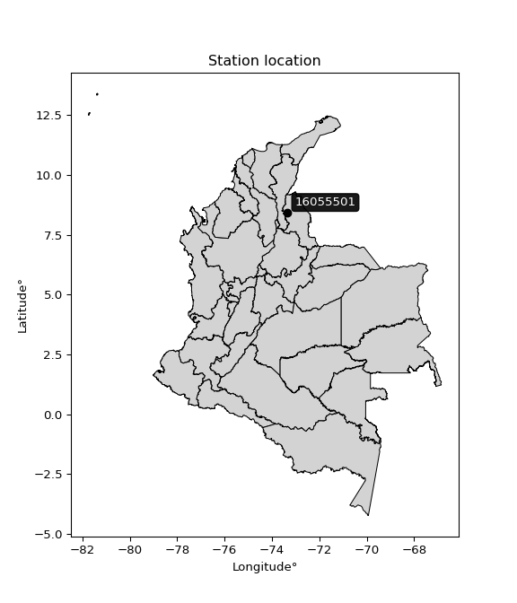

<div align="center">


</div>

# PMP Station (Rain, Pmax24h): 16055501

Probable Maximum Precipitation (PMP) is the greatest amount of rainfall for a specific duration that is meteorologically possible for a given location, acting as a "worst-case" scenario for extreme storms, crucial for designing safety-critical infrastructure like bridges, river deviations, dams, spillways, and nuclear plants to prevent catastrophic failure. PMP is calculated by hydrologists using meteorological data to determine the upper limit of extreme rainfall, often leading to the Probable Maximum Flood (PMF) for flood control design, and is increasingly being studied for climate change impacts. Probable Maximum Precipitation (PMP) is the theoretical upper limit of rainfall, a deterministic estimate for extreme events, while probability distributions (like GEV, Gumbel) describe the likelihood and frequency of various precipitation amounts, including rare ones, showing how often events occur, with PMP representing the extreme end of these distributions, used for critical infrastructure design to ensure safety against the worst conceivable weather, unlike standard statistical forecasts which cover typical probabilities.

The most common probability distributions in hydrology, used for analyzing floods, rainfall, and streamflow, include the Normal, Log-Normal, Gumbel, Gamma (including Log-Pearson Type III), and Generalized Extreme Value (GEV) distributions, often chosen based on the data´s skewness and whether modeling extremes or general conditions, with Gumbel and GEV popular for extreme events like floods, while the Normal distribution serves as a baseline, though often requiring transformations for skewed hydrological data. These distributions help in designing water infrastructure, managing water resources, and forecasting hydrologic events.

> Hydrological data often isn´t perfectly normal (it´s skewed), so different distributions are needed for different applications, such as: **Flood Frequency Analysis**: Using Gumbel, GEV, or Log-Pearson Type III for predicting extreme flood magnitudes and their return periods, **Rainfall Analysis**: Normal for annual totals, but Log-Normal, Weibull, or GEV for intensity or extreme daily rainfall, **Streamflow Modeling**: Gamma and Log-Normal for maximum flows, GEV for minimum flows, and Kappa for daily flows.

<div align="center">

</img>

</div>


## A. General information


### 1. General running parameters

• app_version: _v20260108_. • runtime: _2026-01-08 13:24:42.400241_. • Python version: _3.14.0_. • SciPy version: _1.16.3_. • Pandas version: _2.3.3_. • NumPy version: _2.3.5_. • Stations dataset (station_dataset_file): _dataset/pmax24h_in/automatic_colombia_2003_2024.csv_. • Stations catalog (station_catalog_file): _dataset/CNE.xls_. • Minimum year to eval til year_max (date_min): _1900_. • Maximum year to eval since year_min (date_max): _2024_. • Creates, save and include plots into reports (create_plot): _False_. • Plot only fit distributions with Δo > Δ (plot_only_fit): _True_. • Plot only simple graphs avoiding multiple CDFs and multiple Extreme values plots (plot_only_simple): _True_. • Eval low extreme values, if False, evaluates high extreme values (low_extreme): _False_. • Eval every SciPy distribution as logarithmic (pdist_logarithmic_on): _True_. • Standard deviation normalized (ddof): _1.0_. • Return periods to eval in years (Tr): _[2, 2.33, 5, 10, 15, 20, 25, 50, 75, 100, 200, 250, 500, 750, 1000]_. • Minimum data sample per station, 0 means any (minimum_sample): _5_. • Z-Score maximum threshold to adjust a value, 0 means disable (zscore_max): _3.5_. • Z-Score minimum threshold to adjust a value, 0 means disable (zscore_min): _-2.5_. • Avoid zeros, e.g. rain = 0 (avoid_zeros): _True_. • Avoid null values (avoid_nans): _True_. 

:file_folder:Table: [dataset.csv](../../dataset/pmax24h_in/automatic_colombia_2003_2024.csv)

> Delta Degrees of Freedom (DDOF): is a parameter used in the formulas for calculating variance and standard deviation. When ddof=0, the divisor is $N$ (the total number of observations) and this is used when your data set is the entire population. When ddof=1, the divisor is $N-1$ and this is used when your data set is a sample drawn from a larger population. Using $N-1$ provides an unbiased estimate of the population variance (known as Bessel´s correction).


### 2. Station info and location

|   id |   CODIGO | NOMBRE                           | CATEGORIA               | TECNOLOGIA                | ESTADO   | FECHA_INSTALACION   |   FECHA_SUSPENSION |   ALTITUD |   LATITUD |   LONGITUD | DEPARTAMENTO       | MUNICIPIO   | AREA_OPERATIVA                         | ENTIDAD                                    | AREA_HIDROGRAFICA   | ZONA_HIDROGRAFICA   | SUBZONA_HIDROGRAFICA           |   CORRIENTE | Catalogo   |   Version |
|-----:|---------:|:---------------------------------|:------------------------|:--------------------------|:---------|:--------------------|-------------------:|----------:|----------:|-----------:|:-------------------|:------------|:---------------------------------------|:-------------------------------------------|:--------------------|:--------------------|:-------------------------------|------------:|:-----------|----------:|
|    0 | 16055501 | GABRIEL MARIA  - AUT  [16055501] | Climatológica Principal | Automática con Telemetría | Activa   | 20/05/2013          |                nan |      1261 |    8.4125 |   -73.3394 | Norte De Santander | Convención  | Area Operativa 08 - Santanderes-Arauca | CENTRO NACIONAL DE INVESTIGACIONES DE CAFE | Caribe              | Catatumbo           | Río Algodonal (Alto Catatumbo) |         nan | CNE_OE     |  20251226 |

<div align="center">

Dynamic map: [:earth_americas:Google](http://maps.google.com/maps?q=8.412497222,-73.33944167) [:earth_americas:OSM](https://www.openstreetmap.org/#map=18/8.412497222/-73.33944167&layers=P) [:earth_americas:Bing](https://www.bing.com/maps?cp=8.412497222~-73.33944167&lvl=18) [:earth_americas:Apple](https://maps.apple.com/frame?center=8.412497222%2C-73.33944167&span=0.003%2C0.006)

</div>


<div align="center">

```geojson
{
  "type": "Feature",
  "geometry": {
    "type": "Point", 
    "coordinates": [-73.33944167, 8.412497222]
  }, 
  "properties": {
    "Name": "16055501"
  }
}
```

</div>


### 3. Discrete values table and plot

<div align="center">

|               |           0 |         1 |          2 |          3 |           4 |           5 |             6 |          7 |
|:--------------|------------:|----------:|-----------:|-----------:|------------:|------------:|--------------:|-----------:|
| Date          | 2016        | 2017      | 2018       | 2019       | 2020        | 2021        | 2022          | 2023       |
| Value         |   54.2      |   29.9    |   64.9     |   70.2     |   44        |   51.8      |   49.6        |   32.9     |
| Value_initial |   54.2      |   29.9    |   64.9     |   70.2     |   44        |   51.8      |   49.6        |   32.9     |
| count         |    8        |    8      |    8       |    8       |    8        |    8        |    8          |    8       |
| mean          |   49.6875   |   49.6875 |   49.6875  |   49.6875  |   49.6875   |   49.6875   |   49.6875     |   49.6875  |
| std           |   14.0546   |   14.0546 |   14.0546  |   14.0546  |   14.0546   |   14.0546   |   14.0546     |   14.0546  |
| zscore        |    0.321069 |   -1.4079 |    1.08238 |    1.45948 |   -0.404671 |    0.150306 |   -0.00622571 |   -1.19445 |


</div>


> The initial value (value_initial) correspond to the initial obtained or null completed value, and value (value) is adjusted only when the initial value is outside the valid range (outlier) definite through the Z-Score value. If Z-Score is active, values out of range or outliers are replaced with the station mean value. A Z-Score (or standard score) measures how many standard deviations a data point is from the mean of a dataset, indicating its relative position; positive scores mean above the mean, negative mean below, and a score of zero is exactly at the mean, allowing for comparison of values from different distributions. It´s calculated using the formula $z=(x–μ)/σ$, where $x$ is the data point, $μ$ is the mean, and $σ$ is the standard deviation, helping identify outliers and understand probability.
>
> <sub>**Note**: In this study, "completing" (filling gaps in) and "extending" (forecasting or lengthening the historical record) rainfall data series are avoided for certain critical analyses because they introduce artificial bias and uncertainty, which can distort the statistics of rare events (extremes), alter day-to-day variability, and compromise the integrity and homogeneity of the original data. Some reasons against Completing/Extending rainfall data are: **Distortion of Extremes and Variability**: The primary issue is that most gap-filling or extension methods rely on averaging or regression with nearby stations, which inherently smooths the data. Rainfall is highly variable in space and time, with a large percentage of zero values and occasional large storms. Infilling methods often underestimate the highest values and overestimate the lowest (zero) values, which severely distorts analyses focused on flood frequency, drought severity, and intensity-duration-frequency (IDF) curves, **Loss of Data Homogeneity**: Infilled or extended data are synthetic estimates, not actual measurements. Combining these estimates with observed data can violate the assumption of data homogeneity, which requires that the data properties do not change over time. Inhomogeneity can lead to incorrect conclusions about long-term trends or changes in climate patterns, **Propagation of Errors**: Errors and biases from the original data (e.g., wind-induced undercatch, instrument errors, site changes) or the data used for imputation can propagate through the analysis, leading to unreliable hydrological models and inaccurate predictions, **Compromised Statistical Integrity**: For statistical analyses, especially those involving the frequency of events, using artificial data can introduce time bias or autocorrelation that doesn´t exist in reality, making it difficult to assess the true probability of events, **Difficulty in Validation**: It is difficult to accurately validate the quality of filled or extended data, especially for past periods where ground-truth measurements are unavailable. The reliability of imputation techniques heavily depends on the density of the surrounding station network and the complexity of the local topography.</sub>


### 4. Active continuous probability distributions from SciPy (43 of 104 available)

A Probability Density Function (PDF) describes the relative likelihood of a continuous random variable falling within a specific range, where the total area under its curve equals 1, and the area over any interval gives the actual probability for that range. Unlike discrete probabilities (like rolling a die), a PDF shows density, not direct probability for a single point (which is zero), with higher points indicating higher likelihood, often visualized as a bell curve for normal distributions.

A log of a probability density function (log-PDF) is simply the logarithm of the PDF´s value, denoted as $log(f(x))$, useful for converting multiplication of probabilities into addition, improving numerical stability with tiny numbers, and connecting to information theory concepts like entropy. Instead of dealing with very small probabilities (e.g., 0.000001), log-PDFs use negative numbers (e.g., $log(0.00001) ≈ -11.51$ that are easier for computers to handle, preventing underflow errors and simplifying complex calculations. In this study, each active probability distribution from SciPy is also evaluated in the $log$ form.

[scipy.stats](https://docs.scipy.org/doc/scipy/reference/stats.html) is a Python´s powerful submodule within the SciPy library for comprehensive statistical analysis, offering over 130 probability distributions (like Normal, Poisson), functions for descriptive stats (mean, variance), hypothesis testing (t-tests, chi-square), random variable generation, and statistical tests, making it essential for data science, modeling, and research. It provides tools to explore, model, and draw conclusions from data efficiently, working seamlessly with NumPy.

<div align="center">

|   id | p_dist             |   n_parameter | fit_method   | label                                                                       | active   | ref                                                                                                        |
|-----:|:-------------------|--------------:|:-------------|:----------------------------------------------------------------------------|:---------|:-----------------------------------------------------------------------------------------------------------|
|    0 | alpha              |             3 | MLE          | Alpha                                                                       | True     | [:mortar_board:](https://docs.scipy.org/doc/scipy/reference/generated/scipy.stats.alpha.html)              |
|    1 | betaprime          |             4 | MLE          | Beta prime                                                                  | True     | [:mortar_board:](https://docs.scipy.org/doc/scipy/reference/generated/scipy.stats.betaprime.html)          |
|    2 | chi2               |             3 | MLE          | Chi²                                                                        | True     | [:mortar_board:](https://docs.scipy.org/doc/scipy/reference/generated/scipy.stats.chi2.html)               |
|    3 | crystalball        |             4 | MLE          | Crystalball                                                                 | True     | [:mortar_board:](https://docs.scipy.org/doc/scipy/reference/generated/scipy.stats.crystalball.html)        |
|    4 | erlang             |             3 | MLE          | Erlang                                                                      | True     | [:mortar_board:](https://docs.scipy.org/doc/scipy/reference/generated/scipy.stats.erlang.html)             |
|    5 | expon              |             2 | MLE          | Exponential                                                                 | True     | [:mortar_board:](https://docs.scipy.org/doc/scipy/reference/generated/scipy.stats.expon.html)              |
|    6 | exponnorm          |             3 | MLE          | Exponentially modified Normal                                               | True     | [:mortar_board:](https://docs.scipy.org/doc/scipy/reference/generated/scipy.stats.exponnorm.html)          |
|    7 | f                  |             4 | MLE          | F                                                                           | True     | [:mortar_board:](https://docs.scipy.org/doc/scipy/reference/generated/scipy.stats.f.html)                  |
|    8 | fatiguelife        |             3 | MLE          | Fatigue-life (Birnbaum-Saunders)                                            | True     | [:mortar_board:](https://docs.scipy.org/doc/scipy/reference/generated/scipy.stats.fatiguelife.html)        |
|    9 | fisk               |             3 | MLE          | Fisk                                                                        | True     | [:mortar_board:](https://docs.scipy.org/doc/scipy/reference/generated/scipy.stats.fisk.html)               |
|   10 | gamma              |             3 | MLE          | Gamma                                                                       | True     | [:mortar_board:](https://docs.scipy.org/doc/scipy/reference/generated/scipy.stats.gamma.html)              |
|   11 | genexpon           |             5 | MLE          | Generalized exponential                                                     | True     | [:mortar_board:](https://docs.scipy.org/doc/scipy/reference/generated/scipy.stats.genexpon.html)           |
|   12 | genlogistic        |             3 | MLE          | Generalized logistic                                                        | True     | [:mortar_board:](https://docs.scipy.org/doc/scipy/reference/generated/scipy.stats.genlogistic.html)        |
|   13 | gibrat             |             2 | MM           | Gibrat                                                                      | True     | [:mortar_board:](https://docs.scipy.org/doc/scipy/reference/generated/scipy.stats.gibrat.html)             |
|   14 | gompertz           |             3 | MLE          | Gompertz (or truncated Gumbel)                                              | True     | [:mortar_board:](https://docs.scipy.org/doc/scipy/reference/generated/scipy.stats.gompertz.html)           |
|   15 | gumbel_l           |             2 | MM           | Gumbel Left Skew                                                            | True     | [:mortar_board:](https://docs.scipy.org/doc/scipy/reference/generated/scipy.stats.gumbel_l.html)           |
|   16 | gumbel_r           |             2 | MM           | Gumbel Right Skew                                                           | True     | [:mortar_board:](https://docs.scipy.org/doc/scipy/reference/generated/scipy.stats.gumbel_r.html)           |
|   17 | halflogistic       |             2 | MM           | Half-logistic                                                               | True     | [:mortar_board:](https://docs.scipy.org/doc/scipy/reference/generated/scipy.stats.halflogistic.html)       |
|   18 | halfnorm           |             2 | MM           | Half Normal                                                                 | True     | [:mortar_board:](https://docs.scipy.org/doc/scipy/reference/generated/scipy.stats.halfnorm.html)           |
|   19 | hypsecant          |             2 | MM           | hyperbolic secant                                                           | True     | [:mortar_board:](https://docs.scipy.org/doc/scipy/reference/generated/scipy.stats.hypsecant.html)          |
|   20 | invgamma           |             3 | MLE          | Inverted gamma                                                              | True     | [:mortar_board:](https://docs.scipy.org/doc/scipy/reference/generated/scipy.stats.invgamma.html)           |
|   21 | invgauss           |             3 | MLE          | Inverse Gaussian                                                            | True     | [:mortar_board:](https://docs.scipy.org/doc/scipy/reference/generated/scipy.stats.invgauss.html)           |
|   22 | invweibull         |             3 | MLE          | Inverted Weibull                                                            | True     | [:mortar_board:](https://docs.scipy.org/doc/scipy/reference/generated/scipy.stats.invweibull.html)         |
|   23 | kstwobign          |             2 | MLE          | Limiting distribution of scaled Kolmogorov-Smirnov two-sided test statistic | True     | [:mortar_board:](https://docs.scipy.org/doc/scipy/reference/generated/scipy.stats.kstwobign.html)          |
|   24 | laplace            |             2 | MM           | Laplace                                                                     | True     | [:mortar_board:](https://docs.scipy.org/doc/scipy/reference/generated/scipy.stats.laplace.html)            |
|   25 | laplace_asymmetric |             3 | MLE          | Asymmetric Laplace                                                          | True     | [:mortar_board:](https://docs.scipy.org/doc/scipy/reference/generated/scipy.stats.laplace_asymmetric.html) |
|   26 | loggamma           |             3 | MLE          | Log gamma                                                                   | True     | [:mortar_board:](https://docs.scipy.org/doc/scipy/reference/generated/scipy.stats.loggamma.html)           |
|   27 | logistic           |             2 | MM           | Logistic (or Sech-squared)                                                  | True     | [:mortar_board:](https://docs.scipy.org/doc/scipy/reference/generated/scipy.stats.logistic.html)           |
|   28 | lognorm            |             3 | MLE          | Log Normal                                                                  | True     | [:mortar_board:](https://docs.scipy.org/doc/scipy/reference/generated/scipy.stats.lognorm.html)            |
|   29 | maxwell            |             2 | MM           | Maxwell                                                                     | True     | [:mortar_board:](https://docs.scipy.org/doc/scipy/reference/generated/scipy.stats.maxwell.html)            |
|   30 | mielke             |             4 | MLE          | Mielke Beta-Kappa / Dagum                                                   | True     | [:mortar_board:](https://docs.scipy.org/doc/scipy/reference/generated/scipy.stats.mielke.html)             |
|   31 | moyal              |             2 | MM           | Moyal                                                                       | True     | [:mortar_board:](https://docs.scipy.org/doc/scipy/reference/generated/scipy.stats.moyal.html)              |
|   32 | nakagami           |             3 | MLE          | Nakagami                                                                    | True     | [:mortar_board:](https://docs.scipy.org/doc/scipy/reference/generated/scipy.stats.nakagami.html)           |
|   33 | ncf                |             5 | MLE          | Non-central F distribution                                                  | True     | [:mortar_board:](https://docs.scipy.org/doc/scipy/reference/generated/scipy.stats.ncf.html)                |
|   34 | nct                |             4 | MLE          | Non-central Student’s t                                                     | True     | [:mortar_board:](https://docs.scipy.org/doc/scipy/reference/generated/scipy.stats.nct.html)                |
|   35 | norm               |             2 | MM           | Normal                                                                      | True     | [:mortar_board:](https://docs.scipy.org/doc/scipy/reference/generated/scipy.stats.norm.html)               |
|   36 | pearson3           |             3 | MM           | Pearson type III                                                            | True     | [:mortar_board:](https://docs.scipy.org/doc/scipy/reference/generated/scipy.stats.pearson3.html)           |
|   37 | rayleigh           |             2 | MM           | Rayleigh                                                                    | True     | [:mortar_board:](https://docs.scipy.org/doc/scipy/reference/generated/scipy.stats.rayleigh.html)           |
|   38 | rice               |             3 | MLE          | Rice                                                                        | True     | [:mortar_board:](https://docs.scipy.org/doc/scipy/reference/generated/scipy.stats.rice.html)               |
|   39 | t                  |             3 | MLE          | Student’s t                                                                 | True     | [:mortar_board:](https://docs.scipy.org/doc/scipy/reference/generated/scipy.stats.t.html)                  |
|   40 | truncnorm          |             4 | MLE          | Truncated normal                                                            | True     | [:mortar_board:](https://docs.scipy.org/doc/scipy/reference/generated/scipy.stats.truncnorm.html)          |
|   41 | wald               |             2 | MM           | Wald                                                                        | True     | [:mortar_board:](https://docs.scipy.org/doc/scipy/reference/generated/scipy.stats.wald.html)               |
|   42 | weibull_min        |             3 | MLE          | Weibull minimum                                                             | True     | [:mortar_board:](https://docs.scipy.org/doc/scipy/reference/generated/scipy.stats.weibull_min.html)        |

</div>

> **n_parameter:** # arguments & localization & scale.
>
> **Fit methods:** (MLE) maximum likelihood, (MM) L-moments.
>
>**Inactive** (With the only purpose of prevent loops, zero divisions, infinite values, over high estimated values or horizontal trending for recurrence intervals estimations, the follow distributions were disabled.)**:** foldnorm, gennorm, norminvgauss, powernorm, powerlognorm, skewnorm, genextreme, anglit, arcsine, argus, beta, bradford, burr, burr12, cauchy, cosine, halfcauchy, foldcauchy, skewcauchy, wrapcauchy, dgamma, gengamma, exponweib, exponpow, truncexpon, gausshyper, genhalflogistic, genhyperbolic, geninvgauss, halfgennorm, johnsonsb, johnsonsu, kappa4, kappa3, ksone, kstwo, loglaplace, levy, levy_l, levy_stable, ncx2, pareto, genpareto, truncpareto, lomax, powerlaw, rdist, rel_breitwigner, recipinvgauss, semicircular, studentized_range, trapezoid, triang, truncweibull_min, tukeylambda, uniform, loguniform, vonmises, vonmises_line, weibull_max, dweibull, 


## B. Probability (PDF) vs. Empirical (EDF) distributions functions

A continuous probability distribution (CPD) describes probabilities for variables that can take any value within a range (like rain any time), unlike discrete variables with specific outcomes (like temperature). It uses a Probability Density Function (PDF), a curve where the total area under it equals 1, and the probability of the variable falling within an interval (a to b) is found by calculating the area under the curve between those points. A key feature is that the probability of hitting any single exact value is zero, so probabilities are always expressed for ranges, e.g., $P(a ≤ X ≤ b)$.

<div align="center">

Distributions parameters from station values
|    |   station | p_dist                |   n |             loc |           scale | shape                  | shape1                | shape2               | shape3   |
|---:|----------:|:----------------------|----:|----------------:|----------------:|:-----------------------|:----------------------|:---------------------|:---------|
|  0 |  16055501 | alpha                 |   8 |  -189.695       |  4318.15        | 18.09058076294276      |                       |                      |          |
|  1 |  16055501 | betaprime             |   8 |  -133.657       |  8298.88        | 196.7284364418141      | 8908.612590144887     |                      |          |
|  2 |  16055501 | chi2                  |   8 |    29.9         |    12.0972      | 1.1401364390403488     |                       |                      |          |
|  3 |  16055501 | crystalball           |   8 |    49.6875      |    13.1469      | 4664.729056922442      | 1507.032136505878     |                      |          |
|  4 |  16055501 | erlang                |   8 | -1168.6         |     0.141942    | 8582.98625739904       |                       |                      |          |
|  5 |  16055501 | expon                 |   8 |    29.9         |    19.7875      |                        |                       |                      |          |
|  6 |  16055501 | exponnorm             |   8 |    49.6695      |    13.1469      | 0.001368387637863524   |                       |                      |          |
|  7 |  16055501 | f                     |   8 |  -543.838       |   593.535       | 4203.721893009213      | 139640.37878324563    |                      |          |
|  8 |  16055501 | fatiguelife           |   8 |    29.9         |     1.62462e-05 | 1011.9585725226568     |                       |                      |          |
|  9 |  16055501 | fisk                  |   8 |    -1.88963e+08 |     1.88963e+08 | 24098310.104397137     |                       |                      |          |
| 10 |  16055501 | gamma                 |   8 | -1166.79        |     0.142124    | 8559.276244663844      |                       |                      |          |
| 11 |  16055501 | genexpon              |   8 |    29.8999      |     1.43832     | 0.07279207188254702    | 1.334150722230728e-06 | 1.303466035372841    |          |
| 12 |  16055501 | genlogistic           |   8 |    44.833       |     8.8381      | 1.463563509559135      |                       |                      |          |
| 13 |  16055501 | gibrat                |   8 |    39.6581      |     6.08315     |                        |                       |                      |          |
| 14 |  16055501 | gompertz              |   8 |    34.5946      |     1.84715     | 2.4070351607474354e-08 |                       |                      |          |
| 15 |  16055501 | gumbel_l              |   8 |    55.6043      |    10.2506      |                        |                       |                      |          |
| 16 |  16055501 | gumbel_r              |   8 |    43.7707      |    10.2506      |                        |                       |                      |          |
| 17 |  16055501 | halflogistic          |   8 |    34.1053      |    11.2401      |                        |                       |                      |          |
| 18 |  16055501 | halfnorm              |   8 |    32.2861      |    21.8094      |                        |                       |                      |          |
| 19 |  16055501 | hypsecant             |   8 |    49.6875      |     8.36958     |                        |                       |                      |          |
| 20 |  16055501 | invgamma              |   8 |   -83.5467      | 12843.4         | 97.46399579630287      |                       |                      |          |
| 21 |  16055501 | invgauss              |   8 |   -20.7847      |  1835.45        | 0.0383085992417035     |                       |                      |          |
| 22 |  16055501 | invweibull            |   8 |    -6.3881e+08  |     6.3881e+08  | 53396682.70322323      |                       |                      |          |
| 23 |  16055501 | kstwobign             |   8 |     1.38017     |    55.1545      |                        |                       |                      |          |
| 24 |  16055501 | laplace               |   8 |    49.6875      |     9.29627     |                        |                       |                      |          |
| 25 |  16055501 | laplace_asymmetric    |   8 |    51.8         |    10.4276      | 1.1064166336942682     |                       |                      |          |
| 26 |  16055501 | loggamma              |   8 | -1626.62        |   275.499       | 439.5436903836856      |                       |                      |          |
| 27 |  16055501 | logistic              |   8 |    49.6875      |     7.24827     |                        |                       |                      |          |
| 28 |  16055501 | lognorm               |   8 |    29.9         |     0.196494    | 11.983769232596831     |                       |                      |          |
| 29 |  16055501 | maxwell               |   8 |    18.5349      |    19.522       |                        |                       |                      |          |
| 30 |  16055501 | mielke                |   8 |    -0.471824    |    61.0666      | 3.645495611870366      | 10.66826688658908     |                      |          |
| 31 |  16055501 | moyal                 |   8 |    42.1693      |     5.91819     |                        |                       |                      |          |
| 32 |  16055501 | nakagami              |   8 |    29.9         |    26.1035      | 0.38640680296749724    |                       |                      |          |
| 33 |  16055501 | ncf                   |   8 |     2.04015     |     6.82861     | 6.643506153646822      | 2960.2587246896583    | 39.600415287133174   |          |
| 34 |  16055501 | nct                   |   8 |  -588.807       |    13.0839      | 120954.42584585847     | 48.79952716495613     |                      |          |
| 35 |  16055501 | norm                  |   8 |    49.6875      |    13.1469      |                        |                       |                      |          |
| 36 |  16055501 | pearson3              |   8 |    49.6875      |    13.1469      | -0.0225844502306769    |                       |                      |          |
| 37 |  16055501 | rayleigh              |   8 |    24.5367      |    20.0674      |                        |                       |                      |          |
| 38 |  16055501 | rice                  |   8 |    23.2243      |    15.5926      | 1.2614573999242977     |                       |                      |          |
| 39 |  16055501 | t                     |   8 |    49.6875      |    13.1465      | 16328.164778507193     |                       |                      |          |
| 40 |  16055501 | truncnorm             |   8 |     0.0462625   |    73.1601      | -2142.692691470582     | 0.9589071574636983    |                      |          |
| 41 |  16055501 | wald                  |   8 |    36.5406      |    13.1469      |                        |                       |                      |          |
| 42 |  16055501 | weibull_min           |   8 |    22.33        |    30.9026      | 2.2214974041424886     |                       |                      |          |
| 43 |  16055501 | logalpha              |   8 |    -5.08202     |   277.075       | 30.99797550993405      |                       |                      |          |
| 44 |  16055501 | logbetaprime          |   8 |    -3.67365     |     2.58133     | 2223.2524779593614     | 761.8087040524124     |                      |          |
| 45 |  16055501 | logchi2               |   8 |     3.39786     |     0.988332    | 1.0221813078682191     |                       |                      |          |
| 46 |  16055501 | logcrystalball        |   8 |     3.86797     |     0.280927    | 433.1491264779954      | 28.92481542860071     |                      |          |
| 47 |  16055501 | logerlang             |   8 |    -0.886093    |     0.0171221   | 277.4717710865207      |                       |                      |          |
| 48 |  16055501 | logexpon              |   8 |     3.39786     |     0.470114    |                        |                       |                      |          |
| 49 |  16055501 | logexponnorm          |   8 |     3.86774     |     0.280926    | 0.0008067906787104964  |                       |                      |          |
| 50 |  16055501 | logf                  |   8 |  -197.941       |   201.809       | 9372587.670294747      | 1156812.7715223595    |                      |          |
| 51 |  16055501 | logfatiguelife        |   8 |   -77.3893      |    81.2566      | 0.0034570788807846767  |                       |                      |          |
| 52 |  16055501 | logfisk               |   8 |    -1.27069e+07 |     1.27069e+07 | 77284431.90857075      |                       |                      |          |
| 53 |  16055501 | loggamma              |   8 |    -1.09357     |     0.0164498   | 301.63806823639925     |                       |                      |          |
| 54 |  16055501 | loggenexpon           |   8 |     3.39786     |     0.0862553   | 0.08200719560264323    | 5.60189379830957      | 0.004938401957630822 |          |
| 55 |  16055501 | loggenlogistic        |   8 |     4.10596     |     0.0939828   | 0.33775900064288855    |                       |                      |          |
| 56 |  16055501 | loggibrat             |   8 |     3.65368     |     0.129975    |                        |                       |                      |          |
| 57 |  16055501 | loggompertz           |   8 |     3.39786     |     0.77834     | 1.1248536109209852     |                       |                      |          |
| 58 |  16055501 | loggumbel_l           |   8 |     3.9944      |     0.219038    |                        |                       |                      |          |
| 59 |  16055501 | loggumbel_r           |   8 |     3.74154     |     0.219038    |                        |                       |                      |          |
| 60 |  16055501 | loghalflogistic       |   8 |     3.53499     |     0.240192    |                        |                       |                      |          |
| 61 |  16055501 | loghalfnorm           |   8 |     3.49611     |     0.46606     |                        |                       |                      |          |
| 62 |  16055501 | loghypsecant          |   8 |     3.86797     |     0.178844    |                        |                       |                      |          |
| 63 |  16055501 | loginvgamma           |   8 |    -0.961488    |  1328.62        | 276.2434421498257      |                       |                      |          |
| 64 |  16055501 | loginvgauss           |   8 |     1.58841     |   135.179       | 0.016844935748126094   |                       |                      |          |
| 65 |  16055501 | loginvweibull         |   8 |    -2.18295e+07 |     2.18295e+07 | 78718247.28034002      |                       |                      |          |
| 66 |  16055501 | logkstwobign          |   8 |     2.76064     |     1.26256     |                        |                       |                      |          |
| 67 |  16055501 | loglaplace            |   8 |     3.86797     |     0.198645    |                        |                       |                      |          |
| 68 |  16055501 | loglaplace_asymmetric |   8 |     3.94739     |     0.212095    | 1.2046656409991154     |                       |                      |          |
| 69 |  16055501 | logloggamma           |   8 |     4.01325     |     0.226364    | 0.9618443153999804     |                       |                      |          |
| 70 |  16055501 | loglogistic           |   8 |     3.86797     |     0.154883    |                        |                       |                      |          |
| 71 |  16055501 | loglognorm            |   8 |     3.39786     |     0.00605008  | 11.448514612874021     |                       |                      |          |
| 72 |  16055501 | logmaxwell            |   8 |     3.20229     |     0.417152    |                        |                       |                      |          |
| 73 |  16055501 | logmielke             |   8 |     3.39707     |     0.860805    | 0.9762893805265689     | 565.4266023032533     |                      |          |
| 74 |  16055501 | logmoyal              |   8 |     3.70732     |     0.126462    |                        |                       |                      |          |
| 75 |  16055501 | lognakagami           |   8 |     3.39786     |     0.531863    | 0.41963697110016707    |                       |                      |          |
| 76 |  16055501 | logncf                |   8 |    -1.23027     |     3.79168     | 800.7872005540148      | 2598.20695063281      | 275.1184248449979    |          |
| 77 |  16055501 | lognct                |   8 |    -8.33052     |     0.18775     | 1648.9624011531814     | 64.9364060472912      |                      |          |
| 78 |  16055501 | lognorm               |   8 |     3.86797     |     0.280927    |                        |                       |                      |          |
| 79 |  16055501 | logpearson3           |   8 |     3.86797     |     0.280927    | -0.39376702631504296   |                       |                      |          |
| 80 |  16055501 | lograyleigh           |   8 |     3.33054     |     0.428807    |                        |                       |                      |          |
| 81 |  16055501 | logrice               |   8 |     3.24308     |     0.316576    | 1.638235595324165      |                       |                      |          |
| 82 |  16055501 | logt                  |   8 |     3.86797     |     0.280926    | 13812586727.756527     |                       |                      |          |
| 83 |  16055501 | logtruncnorm          |   8 |    -0.106462    |     1.2025      | 2.914155752750321      | 3.6239488405070723    |                      |          |
| 84 |  16055501 | logwald               |   8 |     3.58702     |     0.280956    |                        |                       |                      |          |
| 85 |  16055501 | logweibull_min        |   8 |     1.11202     |     2.87951     | 12.001479872991034     |                       |                      |          |

</div>

> **loc** (Location parameter): This shifts the distribution along the x-axis. For many common distributions, like the normal (Gaussian) distribution, loc represents the mean $μ$. For others, like the uniform distribution, it might represent the minimum value, or for the beta distribution, the left end of the support interval.
>
> **scale** (Scale parameter): This determines the width or spread of the distribution. For the normal distribution, scale represents the standard deviation $σ$. For a uniform distribution, it defines the length of the interval (from $loc$ to $loc + scale$).
>
> **shape** (Shape parameters): Refers to parameters that define the specific form of a probability distribution, distinct from its location (loc) and scale (scale). These parameters are required arguments for most distribution functions. For example, a normal (Gaussian) distribution is fully defined by its location (mean) and scale (standard deviation), so it has no specific shape parameters beyond loc and scale. However, other distributions have intrinsic properties that need specification, as Gamma distribution that takes a shape parameter, often named $a$ or $alpha$.


### 0. Cumulative distribution values - CDF (86 evaluated)

Cumulative Distribution Function (CDF), denoted as $F$<sub>$X$</sub>$(x)$, is a function that gives the probability that a random variable $X$ will take a value less than or equal to a specific value, $x$ (i.e., $(P(X≥x)$. It essentially "accumulates" probabilities from a given point up to the far right (positive infinity), providing a complete picture of the distribution´s probabilities for both discrete (like rain) and continuous (like temperature) variables, helping to find probabilities over ranges or above certain values. Each station is evaluated separately ordering the $x$ values ascending, calculating the CDF and PDF values for the activated distributions and their logarithmic forms.

<div align="center">

CDF ordered by x ascending and calculating $log(f(x))$ separately
|   id |   Station |   date |    x |   count |    mean |     std |      zscore |   Value_initial |   station |   m |     alpha |   alpha_pdf |   betaprime |   betaprime_pdf |        chi2 |        chi2_pdf |   crystalball |   crystalball_pdf |    erlang |   erlang_pdf |    expon |   expon_pdf |   exponnorm |   exponnorm_pdf |         f |      f_pdf |   fatiguelife |   fatiguelife_pdf |     fisk |   fisk_pdf |    gamma |   gamma_pdf |    genexpon |   genexpon_pdf |   genlogistic |   genlogistic_pdf |   gibrat |   gibrat_pdf |    gompertz |   gompertz_pdf |   gumbel_l |   gumbel_l_pdf |   gumbel_r |   gumbel_r_pdf |   halflogistic |   halflogistic_pdf |   halfnorm |   halfnorm_pdf |   hypsecant |   hypsecant_pdf |   invgamma |   invgamma_pdf |   invgauss |   invgauss_pdf |   invweibull |   invweibull_pdf |   kstwobign |   kstwobign_pdf |   laplace |   laplace_pdf |   laplace_asymmetric |   laplace_asymmetric_pdf |   loggamma |   loggamma_pdf |   logistic |   logistic_pdf |   lognorm |   lognorm_pdf |   maxwell |   maxwell_pdf |    mielke |   mielke_pdf |      moyal |   moyal_pdf |   nakagami |   nakagami_pdf |       ncf |    ncf_pdf |       nct |    nct_pdf |      norm |   norm_pdf |   pearson3 |   pearson3_pdf |   rayleigh |   rayleigh_pdf |      rice |   rice_pdf |         t |      t_pdf |   truncnorm |   truncnorm_pdf |     wald |   wald_pdf |   weibull_min |   weibull_min_pdf |   logalpha |   logalpha_pdf |   logbetaprime |   logbetaprime_pdf |     logchi2 |   logchi2_pdf |   logcrystalball |   logcrystalball_pdf |   logerlang |   logerlang_pdf |   logexpon |   logexpon_pdf |   logexponnorm |   logexponnorm_pdf |      logf |   logf_pdf |   logfatiguelife |   logfatiguelife_pdf |   logfisk |   logfisk_pdf |   loggenexpon |   loggenexpon_pdf |   loggenlogistic |   loggenlogistic_pdf |   loggibrat |   loggibrat_pdf |   loggompertz |   loggompertz_pdf |   loggumbel_l |   loggumbel_l_pdf |   loggumbel_r |   loggumbel_r_pdf |   loghalflogistic |   loghalflogistic_pdf |   loghalfnorm |   loghalfnorm_pdf |   loghypsecant |   loghypsecant_pdf |   loginvgamma |   loginvgamma_pdf |   loginvgauss |   loginvgauss_pdf |   loginvweibull |   loginvweibull_pdf |   logkstwobign |   logkstwobign_pdf |   loglaplace |   loglaplace_pdf |   loglaplace_asymmetric |   loglaplace_asymmetric_pdf |   logloggamma |   logloggamma_pdf |   loglogistic |   loglogistic_pdf |   loglognorm |   loglognorm_pdf |   logmaxwell |   logmaxwell_pdf |   logmielke |   logmielke_pdf |    logmoyal |   logmoyal_pdf |   lognakagami |   lognakagami_pdf |    logncf |   logncf_pdf |    lognct |   lognct_pdf |   logpearson3 |   logpearson3_pdf |   lograyleigh |   lograyleigh_pdf |   logrice |   logrice_pdf |      logt |   logt_pdf |   logtruncnorm |   logtruncnorm_pdf |   logwald |   logwald_pdf |   logweibull_min |   logweibull_min_pdf |
|-----:|----------:|-------:|-----:|--------:|--------:|--------:|------------:|----------------:|----------:|----:|----------:|------------:|------------:|----------------:|------------:|----------------:|--------------:|------------------:|----------:|-------------:|---------:|------------:|------------:|----------------:|----------:|-----------:|--------------:|------------------:|---------:|-----------:|---------:|------------:|------------:|---------------:|--------------:|------------------:|---------:|-------------:|------------:|---------------:|-----------:|---------------:|-----------:|---------------:|---------------:|-------------------:|-----------:|---------------:|------------:|----------------:|-----------:|---------------:|-----------:|---------------:|-------------:|-----------------:|------------:|----------------:|----------:|--------------:|---------------------:|-------------------------:|-----------:|---------------:|-----------:|---------------:|----------:|--------------:|----------:|--------------:|----------:|-------------:|-----------:|------------:|-----------:|---------------:|----------:|-----------:|----------:|-----------:|----------:|-----------:|-----------:|---------------:|-----------:|---------------:|----------:|-----------:|----------:|-----------:|------------:|----------------:|---------:|-----------:|--------------:|------------------:|-----------:|---------------:|---------------:|-------------------:|------------:|--------------:|-----------------:|---------------------:|------------:|----------------:|-----------:|---------------:|---------------:|-------------------:|----------:|-----------:|-----------------:|---------------------:|----------:|--------------:|--------------:|------------------:|-----------------:|---------------------:|------------:|----------------:|--------------:|------------------:|--------------:|------------------:|--------------:|------------------:|------------------:|----------------------:|--------------:|------------------:|---------------:|-------------------:|--------------:|------------------:|--------------:|------------------:|----------------:|--------------------:|---------------:|-------------------:|-------------:|-----------------:|------------------------:|----------------------------:|--------------:|------------------:|--------------:|------------------:|-------------:|-----------------:|-------------:|-----------------:|------------:|----------------:|------------:|---------------:|--------------:|------------------:|----------:|-------------:|----------:|-------------:|--------------:|------------------:|--------------:|------------------:|----------:|--------------:|----------:|-----------:|---------------:|-------------------:|----------:|--------------:|-----------------:|---------------------:|
|    0 |  16055501 |   2017 | 29.9 |       8 | 49.6875 | 14.0546 | -1.4079     |            29.9 |  16055501 |   1 | 0.0577979 |  0.0103587  |   0.0633845 |      0.0101722  | 1.05777e-09 | 169730          |     0.0661483 |        0.00977626 | 0.0656279 |   0.00982088 | 0        |  0.050537   |   0.0661482 |      0.00977627 | 0.0645926 | 0.00982891 |     0.0710945 |       1.35393e+10 | 0.073372 | 0.00867055 | 0.065577 |  0.00981615 | 3.15888e-06 |     0.0506089  |     0.0658231 |        0.00920159 | 0        |   0          | 0           |    0           |  0.0782344 |     0.00732552 |  0.0208661 |     0.007877   |       0        |          0         |   0        |     0          |   0.0596814 |      0.00708905 |  0.0605997 |     0.0109858  |  0.0557984 |     0.011552   |    0.0493145 |       0.0124056  |   0.0480494 |      0.0138623  | 0.0595053 |    0.00640099 |            0.0824707 |               0.00714816 |   0.046243 |       0.362476 |  0.0612283 |     0.00793009 | 0.0471205 |      0.350121 | 0.0474505 |    0.0116928  | 0.0783639 |   0.00940047 | 0.00480931 |  0.00356965 | 4.2698e-13 |    92.8799     | 0.0572619 | 0.0112189  | 0.0661701 | 0.00978359 | 0.0661483 | 0.00977626 |  0.0667526 |     0.00973537 |  0.0350847 |     0.012851   | 0.0409584 | 0.0121459  | 0.0661517 | 0.00977578 |    0.792093 |      0.00603634 | 0        | 0          |     0.0429917 |        0.0123411  |  0.0468233 |       0.377074 |      0.0640906 |           0.426721 | 1.13363e-08 |   1.30467e+07 |        0.0471204 |             0.350121 |   0.047073  |        0.369262 |   0        |       2.12714  |      0.0471205 |           0.350123 | 0.0470561 |   0.350361 |        0.0468815 |             0.350744 | 0.0483878 |      0.280058 |   2.38608e-09 |          0.95075  |        0.0784744 |             0.281873 |    0        |        0        |   1.02917e-08 |          1.4452   |     0.0635374 |          0.280658 |    0.00821252 |          0.180048 |          0        |              0        |      0        |          0        |      0.0458699 |           0.255594 |     0.0464016 |          0.382809 |     0.0432429 |          0.394315 |       0.0397241 |            0.462086 |       0.039143 |           0.533596 |    0.0468996 |         0.236097 |               0.0689098 |                    0.269701 |     0.0719803 |          0.295684 |     0.0458572 |          0.282499 |   0.00412532 |      2.39543e+12 |    0.0256657 |         0.376628 |  0.00108174 |         1.33877 | 0.000675824 |       0.033211 |   1.73492e-13 |        327.879    | 0.0447396 |     0.359285 | 0.046984  |     0.359926 |     0.0567628 |          0.336151 |     0.0122464 |          0.361611 | 0.031816  |      0.417927 | 0.0471203 |   0.350121 |     0.00011236 |           2.8996   |  0        |      0        |        0.0606812 |             0.30873  |
|    1 |  16055501 |   2023 | 32.9 |       8 | 49.6875 | 14.0546 | -1.19445    |            32.9 |  16055501 |   2 | 0.09535   |  0.0147698  |   0.0997351 |      0.0141525  | 0.32681     |      0.0573461  |     0.100816  |        0.0134284  | 0.100498  |   0.0135187  | 0.140677 |  0.0434275  |   0.100816  |      0.0134284  | 0.0995627 | 0.0135785  |     0.66445   |       0.0258004   | 0.104012 | 0.0118849  | 0.100432 |  0.0135138  | 0.140868    |     0.0434807  |     0.0989262 |        0.0130098  | 0        |   0          | 0           |    0           |  0.103415  |     0.00954801 |  0.0556989 |     0.0156915  |       0        |          0         |   0.022455 |     0.03657    |   0.0851495 |      0.0100528  |  0.100272  |     0.0155378  |  0.0980964 |     0.0167025  |    0.0961312 |       0.0188192  |   0.100356  |      0.0208704  | 0.0821688 |    0.0088389  |            0.106961  |               0.00927091 |   0.092215 |       0.60991  |  0.0898007 |     0.0112767  | 0.0912518 |      0.58401  | 0.0903082 |    0.0168814  | 0.110434  |   0.0120445  | 0.0286491  |  0.0134586  | 0.146298   |     0.0375486  | 0.0979916 | 0.0159959  | 0.100864  | 0.0134386  | 0.100816  | 0.0134284  |  0.101227  |     0.0133404  |  0.0831802 |     0.0190405  | 0.0850443 | 0.0171724  | 0.100818  | 0.0134278  |    0.810046 |      0.00593119 | 0        | 0          |     0.0881218 |        0.0176794  |  0.0947335 |       0.635499 |      0.115359  |           0.651682 | 0.235994    |   1.2216      |        0.0912516 |             0.58401  |   0.0938635 |        0.620174 |   0.184036 |       1.73567  |      0.0912521 |           0.584013 | 0.0912271 |   0.584585 |        0.091147  |             0.586245 | 0.083373  |      0.464805 |   0.102256    |          1.17183  |        0.110617  |             0.396953 |    0        |        0        |   0.136729    |          1.41067  |     0.096586  |          0.41894  |    0.0448914  |          0.636059 |          0        |              0        |      0        |          0        |      0.0780337 |           0.431966 |     0.0951853 |          0.647851 |     0.0943339 |          0.684249 |       0.101768  |            0.838574 |       0.110918 |           0.957136 |    0.0758942 |         0.382059 |               0.100185  |                    0.392107 |     0.106262  |          0.428759 |     0.0818141 |          0.485015 |   0.595262   |      0.35401     |    0.0783115 |         0.730427 |  0.117959   |         1.19459 | 0.019851    |       0.487681 |   0.184884    |          1.60742  | 0.0906052 |     0.611304 | 0.0924969 |     0.602969 |     0.0974955 |          0.525197 |     0.0696415 |          0.824381 | 0.0851451 |      0.700059 | 0.0912516 |   0.58401  |     0.247333   |           2.29263  |  0        |      0        |        0.0973017 |             0.465688 |
|    2 |  16055501 |   2020 | 44   |       8 | 49.6875 | 14.0546 | -0.404671   |            44   |  16055501 |   3 | 0.349342  |  0.0292664  |   0.342402  |      0.0284037  | 0.67798     |      0.0186337  |     0.332649  |        0.0276342  | 0.33382   |   0.0277521  | 0.509618 |  0.0247824  |   0.332649  |      0.0276343  | 0.334286  | 0.0278866  |     0.82137   |       0.0085251   | 0.323476 | 0.0279085  | 0.333719 |  0.0277518  | 0.510124    |     0.0247926  |     0.337881  |        0.0292935  | 0.36798  |   0.0868036  | 3.89191e-06 |    2.12001e-06 |  0.275569  |     0.0227824  |  0.376108  |     0.0358797  |       0.413767 |          0.0368677 |   0.408803 |     0.0316705  |   0.298645  |      0.0306729  |  0.360371  |     0.029277   |  0.37319   |     0.0300287  |    0.396105  |       0.0306619  |   0.410932  |      0.0301998  | 0.271186  |    0.0291715  |            0.279937  |               0.0242636  |   0.390942 |       1.35918  |  0.313314  |     0.0296827  | 0.382761  |      1.35832  | 0.363409  |    0.0297011  | 0.311167  |   0.0246699  | 0.391612   |  0.0400109  | 0.469728   |     0.0237222  | 0.363282  | 0.0294867  | 0.332822  | 0.0276421  | 0.332649  | 0.0276342  |  0.331538  |     0.0275079  |  0.375215  |     0.030197   | 0.354802  | 0.0292261  | 0.332646  | 0.0276343  |    0.87345  |      0.00547713 | 0.421233 | 0.0602057  |     0.36527   |        0.0295776  |  0.400239  |       1.36195  |      0.4025    |           1.23786  | 0.45912     |   0.532797    |        0.382761  |             1.35832  |   0.395816  |        1.36616  |   0.560353 |       0.935194 |      0.382763  |           1.35833  | 0.382812  |   1.35752  |        0.383655  |             1.36074  | 0.34769   |      1.37943  |   0.474158    |          1.24703  |        0.31123   |             1.08321  |    0.501641 |        3.05676  |   0.514689    |          1.15215  |     0.318187  |          1.19219  |    0.439081   |          1.64992  |          0.476727 |              1.60857  |      0.463503 |          1.41427  |      0.356055  |           1.60092  |     0.404026  |          1.3625   |     0.414457  |          1.37069  |       0.4489    |            1.29655  |       0.473155 |           1.27322  |    0.327942  |         1.65089  |               0.312572  |                    1.22335  |     0.322934  |          1.13376  |     0.367969  |          1.50157  |   0.641724   |      0.0844455   |    0.416271  |         1.40676  |  0.458321   |         1.15585 | 0.460565    |       1.77304  |   0.562446    |          1.04326  | 0.39192   |     1.37098  | 0.389527  |     1.36195  |     0.360185  |          1.28098  |     0.428566  |          1.40981  | 0.400845  |      1.36146  | 0.382761  |   1.35832  |     0.717881   |           1.07974  |  0.516885 |      2.26693  |        0.33492   |             1.21827  |
|    3 |  16055501 |   2022 | 49.6 |       8 | 49.6875 | 14.0546 | -0.00622571 |            49.6 |  16055501 |   4 | 0.518073  |  0.0300534  |   0.508958  |      0.0301896  | 0.764638    |      0.0128036  |     0.497345  |        0.0303443  | 0.498857  |   0.0303387  | 0.63049  |  0.0186739  |   0.497346  |      0.0303444  | 0.499805  | 0.0303646  |     0.861738  |       0.00609516  | 0.494081 | 0.0318779  | 0.498764 |  0.0303418  | 0.631023    |     0.018674   |     0.510506  |        0.0311383  | 0.688371 |   0.0355664  | 8.11605e-05 |    4.39494e-05 |  0.426896  |     0.031124   |  0.567637  |     0.0313579  |       0.597503 |          0.0286024 |   0.57273  |     0.0266958  |   0.496672  |      0.0380297  |  0.527187  |     0.0294016  |  0.540745  |     0.0289439  |    0.559952  |       0.0271425  |   0.570779  |      0.0263751  | 0.495316  |    0.0532812  |            0.454839  |               0.0394233  |   0.557176 |       1.37531  |  0.496982  |     0.0344897  | 0.55101   |      1.40847  | 0.530499  |    0.0291778  | 0.466512  |   0.0303172  | 0.5935     |  0.0312039  | 0.59121    |     0.0197488  | 0.530181  | 0.029249   | 0.497534  | 0.0303416  | 0.497345  | 0.0303443  |  0.495843  |     0.0303417  |  0.541568  |     0.0285318  | 0.520854  | 0.0293438  | 0.497344  | 0.0303448  |    0.903399 |      0.00521566 | 0.665434 | 0.0306497  |     0.531137  |        0.0289306  |  0.565097  |       1.35064  |      0.552828  |           1.24173  | 0.517005    |   0.439429    |        0.55101   |             1.40847  |   0.562397  |        1.37394  |   0.659254 |       0.724817 |      0.551012  |           1.40847  | 0.550893  |   1.40658  |        0.551994  |             1.40746  | 0.524837  |      1.51677  |   0.61438     |          1.08194  |        0.46622   |             1.50056  |    0.743884 |        1.28577  |   0.643148    |          0.988152 |     0.484084  |          1.55881  |    0.621062   |          1.35058  |          0.645839 |              1.21339  |      0.618519 |          1.16729  |      0.563678  |           1.74433  |     0.56809   |          1.33761  |     0.576948  |          1.30543  |       0.59453   |            1.1148   |       0.61493  |           1.08044  |    0.582916  |         2.09964  |               0.499554  |                    1.95517  |     0.479421  |          1.46372  |     0.557878  |          1.59249  |   0.650497   |      0.0638898   |    0.581334  |         1.31503  |  0.596332   |         1.14849 | 0.645867    |       1.30436  |   0.675905    |          0.852424 | 0.559248  |     1.38096  | 0.55675   |     1.38831  |     0.525308  |          1.44008  |     0.591066  |          1.27534  | 0.565116  |      1.34533  | 0.55101   |   1.40847  |     0.82829    |           0.778347 |  0.714691 |      1.17633  |        0.498615  |             1.48793  |
|    4 |  16055501 |   2021 | 51.8 |       8 | 49.6875 | 14.0546 |  0.150306   |            51.8 |  16055501 |   5 | 0.583052  |  0.0288962  |   0.574681  |      0.0294265  | 0.790958    |      0.0111705  |     0.563829  |        0.0299557  | 0.565268  |   0.0298959  | 0.669371 |  0.016709   |   0.56383   |      0.0299558  | 0.566215  | 0.0298694  |     0.874374  |       0.00541105  | 0.563871 | 0.0313621  | 0.565184 |  0.0299     | 0.669901    |     0.0167063  |     0.577837  |        0.029906   | 0.755261 |   0.025876   | 0.000267085 |    0.000144586 |  0.498401  |     0.033762   |  0.633247  |     0.0282254  |       0.656773 |          0.0252954 |   0.629077 |     0.0245163  |   0.579502  |      0.0368517  |  0.590546  |     0.0280877  |  0.602687  |     0.0272762  |    0.617241  |       0.0248937  |   0.626516  |      0.0242647  | 0.601636  |    0.0428521  |            0.550392  |               0.0477053  |   0.61583  |       1.32298  |  0.572351  |     0.0337688  | 0.611296  |      1.36447  | 0.593264  |    0.0277873  | 0.534493  |   0.0313158  | 0.657596   |  0.0270829  | 0.633059   |     0.0183044  | 0.593109  | 0.0278554  | 0.564008  | 0.0299488  | 0.563829  | 0.0299557  |  0.562384  |     0.0300094  |  0.602625  |     0.0269026  | 0.584302  | 0.0282385  | 0.563829  | 0.0299562  |    0.914755 |      0.00510819 | 0.72518  | 0.0239985  |     0.593398  |        0.0275828  |  0.62252   |       1.29133  |      0.605896  |           1.20033  | 0.53549     |   0.412939    |        0.611296  |             1.36447  |   0.620927  |        1.31864  |   0.689302 |       0.6609   |      0.611299  |           1.36447  | 0.611093  |   1.36242  |        0.612211  |             1.36228  | 0.58986   |      1.47141  |   0.659747    |          1.00793  |        0.534076  |             1.61969  |    0.792537 |        0.974236 |   0.684635    |          0.923348 |     0.55373   |          1.64385  |    0.676577   |          1.20685  |          0.695468 |              1.07481  |      0.6671   |          1.07128  |      0.636921  |           1.61769  |     0.624875  |          1.27519  |     0.63212   |          1.23363  |       0.641046  |            1.02788  |       0.660026 |           0.99721  |    0.664772  |         1.68757  |               0.59204   |                    2.31714  |     0.544828  |          1.54491  |     0.625453  |          1.51251  |   0.653154   |      0.0586793   |    0.6368    |         1.23797  |  0.646127   |         1.14625 | 0.698713    |       1.13291  |   0.711451    |          0.785953 | 0.618082  |     1.32561  | 0.616016  |     1.33795  |     0.587892  |          1.438    |     0.644657  |          1.19207  | 0.622369  |      1.28905  | 0.611297  |   1.36447  |     0.860109   |           0.68963  |  0.760556 |      0.947481 |        0.56429   |             1.53217  |
|    5 |  16055501 |   2016 | 54.2 |       8 | 49.6875 | 14.0546 |  0.321069   |            54.2 |  16055501 |   6 | 0.650126  |  0.0268846  |   0.643455  |      0.027751   | 0.815918    |      0.00967333 |     0.63429   |        0.0286091  | 0.635523  |   0.0284993  | 0.707136 |  0.0148004  |   0.634291  |      0.0286091  | 0.636344  | 0.0284226  |     0.886582  |       0.00477943  | 0.637137 | 0.029484   | 0.635449 |  0.0285041  | 0.707656    |     0.0147955  |     0.646984  |        0.027571   | 0.808263 |   0.0187654  | 0.000979041 |    0.000529781 |  0.581874  |     0.0355681  |  0.696616  |     0.0245685  |       0.713304 |          0.0218501 |   0.685002 |     0.0220833  |   0.663861  |      0.0331028  |  0.655565  |     0.0259971  |  0.665431  |     0.024938   |    0.67382   |       0.0222359  |   0.68184   |      0.0218262  | 0.692278  |    0.0331017  |            0.651469  |               0.0369806  |   0.673981 |       1.24066  |  0.650801  |     0.0313536  | 0.671449  |      1.28684  | 0.657561  |    0.0257097  | 0.60969   |   0.0310987  | 0.717436   |  0.0228485  | 0.675157   |     0.0167876  | 0.657516  | 0.0257271  | 0.634447  | 0.0285983  | 0.63429   | 0.0286091  |  0.63304   |     0.0287157  |  0.664626  |     0.0247039  | 0.650003  | 0.0264145  | 0.634291  | 0.0286094  |    0.926872 |      0.00498833 | 0.776033 | 0.0186557  |     0.657291  |        0.0255816  |  0.679126  |       1.20459  |      0.658887  |           1.13652  | 0.553623    |   0.388257    |        0.671449  |             1.28684  |   0.678818  |        1.23364  |   0.717838 |       0.6002   |      0.671452  |           1.28684  | 0.671153  |   1.28482  |        0.672241  |             1.28368  | 0.654494  |      1.37535  |   0.703564    |          0.926442 |        0.609194  |             1.68463  |    0.831136 |        0.743261 |   0.724885    |          0.853764 |     0.629226  |          1.67947  |    0.727801   |          1.05572  |          0.741026 |              0.938585 |      0.713336 |          0.970483 |      0.70589   |           1.4203   |     0.680706  |          1.18676  |     0.685927  |          1.13974  |       0.685468  |            0.933495 |       0.703183 |           0.908519 |    0.733116  |         1.34352  |               0.684573  |                    1.79157  |     0.615942  |          1.58697  |     0.691081  |          1.37838  |   0.655704   |      0.0540626   |    0.69072   |         1.14073  |  0.697992   |         1.14411 | 0.746242    |       0.968768 |   0.745514    |          0.718584 | 0.676283  |     1.24024  | 0.674864  |     1.25622  |     0.65224   |          1.39692  |     0.696443  |          1.09311  | 0.678966  |      1.20657  | 0.67145   |   1.28684  |     0.889434   |           0.606967 |  0.79914  |      0.764445 |        0.633886  |             1.53265  |
|    6 |  16055501 |   2018 | 64.9 |       8 | 49.6875 | 14.0546 |  1.08238    |            64.9 |  16055501 |   7 | 0.87071   |  0.0140395  |   0.874751  |      0.0147759  | 0.893413    |      0.0053135  |     0.876388  |        0.0155362  | 0.876126  |   0.0154272  | 0.829461 |  0.0086185  |   0.876389  |      0.0155361  | 0.875727  | 0.0153343  |     0.92653   |       0.00288728  | 0.872975 | 0.0141417  | 0.876101 |  0.0154308  | 0.829897    |     0.0086089  |     0.866041  |        0.0134228  | 0.92263  |   0.00574236 | 0.274716    |    0.126116    |  0.915963  |     0.020303   |  0.880477  |     0.0109337  |       0.878658 |          0.0101404 |   0.865191 |     0.0119592  |   0.897498  |      0.0120364  |  0.86844   |     0.0136345  |  0.867254  |     0.0129159  |    0.85094   |       0.0114811  |   0.859127  |      0.0117538  | 0.902661  |    0.0104707  |            0.88801   |               0.0118826  |   0.856342 |       0.761937 |  0.890784  |     0.0134222  | 0.861094  |      0.788077 | 0.869539  |    0.0137368  | 0.873923  |   0.0158826  | 0.88349    |  0.0097731  | 0.8215     |     0.0107825  | 0.868218  | 0.0135465  | 0.876407  | 0.0155257  | 0.876388  | 0.0155362  |  0.876655  |     0.0156493  |  0.86772   |     0.0132586  | 0.870932  | 0.0144043  | 0.876386  | 0.0155356  |    0.977284 |      0.00442888 | 0.90131  | 0.00702253 |     0.869604  |        0.0138623  |  0.855347  |       0.736114 |      0.831485  |           0.758707 | 0.61622     |   0.311426    |        0.861094  |             0.788077 |   0.85937   |        0.750675 |   0.807664 |       0.409125 |      0.861096  |           0.788072 | 0.860558  |   0.787732 |        0.861212  |             0.784717 | 0.850005  |      0.775445 |   0.840725    |          0.600377 |        0.873826  |             1.03389  |    0.916957 |        0.294531 |   0.853346    |          0.573647 |     0.895485  |          1.07762  |    0.869721   |          0.554232 |          0.86871  |              0.510723 |      0.85351  |          0.596567 |      0.885497  |           0.626524 |     0.854067  |          0.725056 |     0.851487  |          0.693263 |       0.821015  |            0.583874 |       0.836282 |           0.579208 |    0.892248  |         0.542436 |               0.886635  |                    0.643892 |     0.876028  |          1.12363  |     0.877441  |          0.694317 |   0.664173   |      0.0411008   |    0.856074  |         0.691265 |  0.903449   |         1.13696 | 0.873886    |       0.494451 |   0.852544    |          0.47754  | 0.857819  |     0.755034 | 0.859357  |     0.767581 |     0.865842  |          0.903808 |     0.854741  |          0.66541  | 0.856742  |      0.747859 | 0.861095  |   0.788076 |     0.974789   |           0.360148 |  0.894396 |      0.355584 |        0.875202  |             1.01833  |
|    7 |  16055501 |   2019 | 70.2 |       8 | 49.6875 | 14.0546 |  1.45948    |            70.2 |  16055501 |   8 | 0.929979  |  0.00858566 |   0.936452  |      0.00877236 | 0.917961    |      0.00401713 |     0.94065   |        0.00898391 | 0.940025  |   0.00895554 | 0.869534 |  0.00659338 |   0.940651  |      0.00898384 | 0.939324  | 0.00893509 |     0.94019   |       0.00229454  | 0.931082 | 0.00818335 | 0.940015 |  0.00895748 | 0.869917    |     0.00658348 |     0.92247   |        0.00819504 | 0.94669  |   0.00355338 | 0.99652     |    0.0106639   |  0.984286  |     0.00636665 |  0.926907  |     0.00686338 |       0.922509 |          0.006627  |   0.917863 |     0.00807337 |   0.945245  |      0.00650989 |  0.926476  |     0.00850735 |  0.9227    |     0.00823607 |    0.901547  |       0.00781039 |   0.911147  |      0.00803838 | 0.944959  |    0.00592076 |            0.93618   |               0.00677153 |   0.907714 |       0.551104 |  0.944275  |     0.00725964 | 0.913824  |      0.559643 | 0.928229  |    0.00862707 | 0.936816  |   0.00840211 | 0.925387   |  0.00628531 | 0.871977   |     0.00832758 | 0.926055  | 0.00851064 | 0.94063   | 0.00897968 | 0.94065   | 0.00898391 |  0.941295  |     0.00901341 |  0.9249    |     0.00851577 | 0.932058  | 0.00887631 | 0.940646  | 0.00898356 |    1        |      0.00414252 | 0.931593 | 0.00460458 |     0.928912  |        0.00872191 |  0.905147  |       0.536983 |      0.884029  |           0.581955 | 0.639626    |   0.28551     |        0.913824  |             0.559642 |   0.909893  |        0.540953 |   0.837243 |       0.346208 |      0.913825  |           0.559636 | 0.913297  |   0.560205 |        0.913724  |             0.557523 | 0.90133   |      0.540907 |   0.882811    |          0.474384 |        0.936889  |             0.590999 |    0.936457 |        0.208441 |   0.893835    |          0.45934  |     0.960516  |          0.582579 |    0.907066   |          0.403928 |          0.903547 |              0.3822   |      0.89487  |          0.460555 |      0.92571   |           0.411632 |     0.903232  |          0.531834 |     0.898742  |          0.515016 |       0.86192   |            0.461845 |       0.876955 |           0.459947 |    0.927422  |         0.365363 |               0.927416  |                    0.412263 |     0.946957  |          0.677841 |     0.922389  |          0.462203 |   0.66724    |      0.0371861   |    0.903141  |         0.512112 |  0.992575   |         1.1192  | 0.907358    |       0.364636 |   0.886483    |          0.388969 | 0.908656  |     0.544653 | 0.910919  |     0.550446 |     0.92553   |          0.618465 |     0.9003    |          0.499273 | 0.907374  |      0.545819 | 0.913824  |   0.559641 |     1          |           0.284881 |  0.918479 |      0.263425 |        0.940404  |             0.642526 |


</div>

An Empirical Distribution Function (EDF) is a step-function estimate of a true cumulative distribution function (CDF) based on observed sample data, representing the proportion of data points less than or equal to a given value. It is calculated by ordering your data and jumping up by $1/n$ (where $n$ is sample size) at each unique data point, allowing analysis without assuming an underlying population distribution, and it gets closer to the true CDF as the sample size grows. For the empirical probability calculations, the parameter $m$ correspond to the order number which means the position of the $x$ values in an ascending order list.

The Kolmogorov-Smirnov (K-S) test is a non-parametric statistical test used to determine if a sample data set comes from a specific theoretical distribution (one-sample) or if two different samples come from the same underlying distribution (two-sample), by comparing their cumulative distribution functions (CDFs). It calculates the maximum vertical difference (D statistic) between these functions, with a small p-value indicating a significant difference and rejection of the null hypothesis (that the data/samples match).


### 1. EDF California (1923)

California´s estimates the true probability distribution of water-related data (like rainfall, streamflow) using observed samples, crucial for risk assessment.

<div align="center">


$P=m/n$


</div>


**1.1. Empirical values**

<div align="center">

|                | 0                  | 1                  | 2              | 3              | 4                  | 5              | 6              | 7              |
|:---------------|:-------------------|:-------------------|:---------------|:---------------|:-------------------|:---------------|:---------------|:---------------|
| date           | 2017               | 2023               | 2020           | 2022           | 2021               | 2016           | 2018           | 2019           |
| x              | 29.9               | 32.9               | 44.0           | 49.6           | 51.8               | 54.2           | 64.9           | 70.2           |
| m              | 1                  | 2                  | 3              | 4              | 5                  | 6              | 7              | 8              |
| empirical_dist | edf_california     | edf_california     | edf_california | edf_california | edf_california     | edf_california | edf_california | edf_california |
| empirical      | 0.125              | 0.25               | 0.375          | 0.5            | 0.625              | 0.75           | 0.875          | 1.0            |
| empirical_tr   | 1.1428571428571428 | 1.3333333333333333 | 1.6            | 2.0            | 2.6666666666666665 | 4.0            | 8.0            | inf            |

</div>


**1.2. Kolmogorov-Smirnov fit test (sorted by Δ)**


<div align="center">

|                | 0                   | 1                   | 2                   | 3                   | 4                  | 5                   | 6                  | 7                   | 8                   | 9                   | 10                  | 11                  | 12                 | 13                  | 14                  | 15                  | 16                  | 17                  | 18                  | 19                  | 20                  | 21                 | 22                  | 23                  | 24                    | 25                  | 26                  | 27                  | 28                  | 29                  | 30                  | 31                 | 32                  | 33                  | 34                 | 35                 | 36                 | 37                  | 38                 | 39                  | 40                 | 41                 | 42                 | 43                  | 44                  | 45                  | 46                 | 47                  | 48                  | 49                  | 50                  | 51                 | 52                  | 53                  | 54                  | 55                  | 56                 | 57                  | 58                  | 59                 | 60                 | 61                  | 62                  | 63                  | 64                  | 65                 | 66                  | 67                 | 68                  | 69                  | 70                  | 71                 | 72                 | 73                 | 74                 | 75                 | 76                 | 77                 | 78                 | 79                  | 80                  | 81                  | 82                  | 83                  | 84                 | 85                 |
|:---------------|:--------------------|:--------------------|:--------------------|:--------------------|:-------------------|:--------------------|:-------------------|:--------------------|:--------------------|:--------------------|:--------------------|:--------------------|:-------------------|:--------------------|:--------------------|:--------------------|:--------------------|:--------------------|:--------------------|:--------------------|:--------------------|:-------------------|:--------------------|:--------------------|:----------------------|:--------------------|:--------------------|:--------------------|:--------------------|:--------------------|:--------------------|:-------------------|:--------------------|:--------------------|:-------------------|:-------------------|:-------------------|:--------------------|:-------------------|:--------------------|:-------------------|:-------------------|:-------------------|:--------------------|:--------------------|:--------------------|:-------------------|:--------------------|:--------------------|:--------------------|:--------------------|:-------------------|:--------------------|:--------------------|:--------------------|:--------------------|:-------------------|:--------------------|:--------------------|:-------------------|:-------------------|:--------------------|:--------------------|:--------------------|:--------------------|:-------------------|:--------------------|:-------------------|:--------------------|:--------------------|:--------------------|:-------------------|:-------------------|:-------------------|:-------------------|:-------------------|:-------------------|:-------------------|:-------------------|:--------------------|:--------------------|:--------------------|:--------------------|:--------------------|:-------------------|:-------------------|
| station        | 16055501            | 16055501            | 16055501            | 16055501            | 16055501           | 16055501            | 16055501           | 16055501            | 16055501            | 16055501            | 16055501            | 16055501            | 16055501           | 16055501            | 16055501            | 16055501            | 16055501            | 16055501            | 16055501            | 16055501            | 16055501            | 16055501           | 16055501            | 16055501            | 16055501              | 16055501            | 16055501            | 16055501            | 16055501            | 16055501            | 16055501            | 16055501           | 16055501            | 16055501            | 16055501           | 16055501           | 16055501           | 16055501            | 16055501           | 16055501            | 16055501           | 16055501           | 16055501           | 16055501            | 16055501            | 16055501            | 16055501           | 16055501            | 16055501            | 16055501            | 16055501            | 16055501           | 16055501            | 16055501            | 16055501            | 16055501            | 16055501           | 16055501            | 16055501            | 16055501           | 16055501           | 16055501            | 16055501            | 16055501            | 16055501            | 16055501           | 16055501            | 16055501           | 16055501            | 16055501            | 16055501            | 16055501           | 16055501           | 16055501           | 16055501           | 16055501           | 16055501           | 16055501           | 16055501           | 16055501            | 16055501            | 16055501            | 16055501            | 16055501            | 16055501           | 16055501           |
| empirical_dist | edf_california      | edf_california      | edf_california      | edf_california      | edf_california     | edf_california      | edf_california     | edf_california      | edf_california      | edf_california      | edf_california      | edf_california      | edf_california     | edf_california      | edf_california      | edf_california      | edf_california      | edf_california      | edf_california      | edf_california      | edf_california      | edf_california     | edf_california      | edf_california      | edf_california        | edf_california      | edf_california      | edf_california      | edf_california      | edf_california      | edf_california      | edf_california     | edf_california      | edf_california      | edf_california     | edf_california     | edf_california     | edf_california      | edf_california     | edf_california      | edf_california     | edf_california     | edf_california     | edf_california      | edf_california      | edf_california      | edf_california     | edf_california      | edf_california      | edf_california      | edf_california      | edf_california     | edf_california      | edf_california      | edf_california      | edf_california      | edf_california     | edf_california      | edf_california      | edf_california     | edf_california     | edf_california      | edf_california      | edf_california      | edf_california      | edf_california     | edf_california      | edf_california     | edf_california      | edf_california      | edf_california      | edf_california     | edf_california     | edf_california     | edf_california     | edf_california     | edf_california     | edf_california     | edf_california     | edf_california      | edf_california      | edf_california      | edf_california      | edf_california      | edf_california     | edf_california     |
| p_dist         | nakagami            | logmielke           | expon               | logbetaprime        | genexpon           | logkstwobign        | mielke             | loggenlogistic      | laplace_asymmetric  | loggompertz         | logloggamma         | fisk                | loggenexpon        | loginvweibull       | pearson3            | nct                 | t                   | crystalball         | exponnorm           | norm                | erlang              | gamma              | kstwobign           | invgamma            | loglaplace_asymmetric | betaprime           | f                   | genlogistic         | invgauss            | ncf                 | logpearson3         | logweibull_min     | loggumbel_l         | invweibull          | alpha              | loginvgamma        | logalpha           | loginvgauss         | logerlang          | lognct              | loggamma           | loggamma           | logexponnorm       | lognorm             | lognorm             | logcrystalball      | logt               | logf                | logfatiguelife      | logncf              | maxwell             | logistic           | weibull_min         | hypsecant           | logrice             | rice                | logfisk            | rayleigh            | laplace             | gumbel_l           | loglogistic        | logmaxwell          | loghypsecant        | loglaplace          | lograyleigh         | logexpon           | lognakagami         | gumbel_r           | loggumbel_r         | moyal               | halfnorm            | logmoyal           | halflogistic       | wald               | gibrat             | logwald            | loghalflogistic    | loggibrat          | loghalfnorm        | chi2                | logtruncnorm        | loglognorm          | logchi2             | fatiguelife         | truncnorm          | gompertz           |
| delta          | 0.12802326341772652 | 0.13204117430981066 | 0.13461822941465862 | 0.13464053181638042 | 0.1351242537072237 | 0.13908197655514692 | 0.1403102286026887 | 0.14080632774557456 | 0.14303855092231876 | 0.14314827503369465 | 0.14373758396977954 | 0.14598802127552452 | 0.1477435263179071 | 0.14823163025900754 | 0.14877261910925943 | 0.14913603253849933 | 0.14918242968192943 | 0.14918414190017193 | 0.14918414627229212 | 0.14918414829333976 | 0.14950233099902405 | 0.14956772868516   | 0.14964438772422453 | 0.14972847786359386 | 0.14981518789678455   | 0.15026487374236994 | 0.15043729807982126 | 0.15107376623087393 | 0.15190361927069695 | 0.15200836970574733 | 0.15250451337489268 | 0.1526982536189918 | 0.15341404284952237 | 0.15386881985312825 | 0.1546499751667872 | 0.1548146925195708 | 0.1552664757444075 | 0.15566613089532816 | 0.1561365346380878 | 0.15750313696281934 | 0.157785031464385  | 0.157785031464385  | 0.1587479358957294 | 0.15874817365457283 | 0.15874817365457283 | 0.15874835629212825 | 0.1587483832356404 | 0.15877287725342373 | 0.15885296171129398 | 0.15939484608063456 | 0.15969177637426696 | 0.1601992711548053 | 0.16187817807233157 | 0.16485050701208187 | 0.16485486777132985 | 0.16495573252587223 | 0.16662695890039   | 0.16681983409652307 | 0.16783122474617523 | 0.1681260209264358 | 0.1681858909612643 | 0.17168852789857889 | 0.17196632444795765 | 0.17410581275032078 | 0.18035854474346882 | 0.1853525502951855 | 0.18744617758546245 | 0.1943011436654019 | 0.20510858142475327 | 0.22135085742503643 | 0.22754496044517789 | 0.2301490284503172 | 0.25               | 0.25               | 0.25               | 0.25               | 0.25               | 0.25               | 0.25               | 0.30298036385335836 | 0.34288122602221904 | 0.34526161084272433 | 0.36037351322960554 | 0.44636974832488263 | 0.6670927785503588 | 0.7490209592660482 |
| deltao         | 0.4472608134160001  | 0.4472608134160001  | 0.4472608134160001  | 0.4472608134160001  | 0.4472608134160001 | 0.4472608134160001  | 0.4472608134160001 | 0.4472608134160001  | 0.4472608134160001  | 0.4472608134160001  | 0.4472608134160001  | 0.4472608134160001  | 0.4472608134160001 | 0.4472608134160001  | 0.4472608134160001  | 0.4472608134160001  | 0.4472608134160001  | 0.4472608134160001  | 0.4472608134160001  | 0.4472608134160001  | 0.4472608134160001  | 0.4472608134160001 | 0.4472608134160001  | 0.4472608134160001  | 0.4472608134160001    | 0.4472608134160001  | 0.4472608134160001  | 0.4472608134160001  | 0.4472608134160001  | 0.4472608134160001  | 0.4472608134160001  | 0.4472608134160001 | 0.4472608134160001  | 0.4472608134160001  | 0.4472608134160001 | 0.4472608134160001 | 0.4472608134160001 | 0.4472608134160001  | 0.4472608134160001 | 0.4472608134160001  | 0.4472608134160001 | 0.4472608134160001 | 0.4472608134160001 | 0.4472608134160001  | 0.4472608134160001  | 0.4472608134160001  | 0.4472608134160001 | 0.4472608134160001  | 0.4472608134160001  | 0.4472608134160001  | 0.4472608134160001  | 0.4472608134160001 | 0.4472608134160001  | 0.4472608134160001  | 0.4472608134160001  | 0.4472608134160001  | 0.4472608134160001 | 0.4472608134160001  | 0.4472608134160001  | 0.4472608134160001 | 0.4472608134160001 | 0.4472608134160001  | 0.4472608134160001  | 0.4472608134160001  | 0.4472608134160001  | 0.4472608134160001 | 0.4472608134160001  | 0.4472608134160001 | 0.4472608134160001  | 0.4472608134160001  | 0.4472608134160001  | 0.4472608134160001 | 0.4472608134160001 | 0.4472608134160001 | 0.4472608134160001 | 0.4472608134160001 | 0.4472608134160001 | 0.4472608134160001 | 0.4472608134160001 | 0.4472608134160001  | 0.4472608134160001  | 0.4472608134160001  | 0.4472608134160001  | 0.4472608134160001  | 0.4472608134160001 | 0.4472608134160001 |
| eval           | Δo > Δ              | Δo > Δ              | Δo > Δ              | Δo > Δ              | Δo > Δ             | Δo > Δ              | Δo > Δ             | Δo > Δ              | Δo > Δ              | Δo > Δ              | Δo > Δ              | Δo > Δ              | Δo > Δ             | Δo > Δ              | Δo > Δ              | Δo > Δ              | Δo > Δ              | Δo > Δ              | Δo > Δ              | Δo > Δ              | Δo > Δ              | Δo > Δ             | Δo > Δ              | Δo > Δ              | Δo > Δ                | Δo > Δ              | Δo > Δ              | Δo > Δ              | Δo > Δ              | Δo > Δ              | Δo > Δ              | Δo > Δ             | Δo > Δ              | Δo > Δ              | Δo > Δ             | Δo > Δ             | Δo > Δ             | Δo > Δ              | Δo > Δ             | Δo > Δ              | Δo > Δ             | Δo > Δ             | Δo > Δ             | Δo > Δ              | Δo > Δ              | Δo > Δ              | Δo > Δ             | Δo > Δ              | Δo > Δ              | Δo > Δ              | Δo > Δ              | Δo > Δ             | Δo > Δ              | Δo > Δ              | Δo > Δ              | Δo > Δ              | Δo > Δ             | Δo > Δ              | Δo > Δ              | Δo > Δ             | Δo > Δ             | Δo > Δ              | Δo > Δ              | Δo > Δ              | Δo > Δ              | Δo > Δ             | Δo > Δ              | Δo > Δ             | Δo > Δ              | Δo > Δ              | Δo > Δ              | Δo > Δ             | Δo > Δ             | Δo > Δ             | Δo > Δ             | Δo > Δ             | Δo > Δ             | Δo > Δ             | Δo > Δ             | Δo > Δ              | Δo > Δ              | Δo > Δ              | Δo > Δ              | Δo > Δ              | Δo <= Δ            | Δo <= Δ            |
| fit            | 1                   | 1                   | 1                   | 1                   | 1                  | 1                   | 1                  | 1                   | 1                   | 1                   | 1                   | 1                   | 1                  | 1                   | 1                   | 1                   | 1                   | 1                   | 1                   | 1                   | 1                   | 1                  | 1                   | 1                   | 1                     | 1                   | 1                   | 1                   | 1                   | 1                   | 1                   | 1                  | 1                   | 1                   | 1                  | 1                  | 1                  | 1                   | 1                  | 1                   | 1                  | 1                  | 1                  | 1                   | 1                   | 1                   | 1                  | 1                   | 1                   | 1                   | 1                   | 1                  | 1                   | 1                   | 1                   | 1                   | 1                  | 1                   | 1                   | 1                  | 1                  | 1                   | 1                   | 1                   | 1                   | 1                  | 1                   | 1                  | 1                   | 1                   | 1                   | 1                  | 1                  | 1                  | 1                  | 1                  | 1                  | 1                  | 1                  | 1                   | 1                   | 1                   | 1                   | 1                   | 0                  | 0                  |
| n              | 8                   | 8                   | 8                   | 8                   | 8                  | 8                   | 8                  | 8                   | 8                   | 8                   | 8                   | 8                   | 8                  | 8                   | 8                   | 8                   | 8                   | 8                   | 8                   | 8                   | 8                   | 8                  | 8                   | 8                   | 8                     | 8                   | 8                   | 8                   | 8                   | 8                   | 8                   | 8                  | 8                   | 8                   | 8                  | 8                  | 8                  | 8                   | 8                  | 8                   | 8                  | 8                  | 8                  | 8                   | 8                   | 8                   | 8                  | 8                   | 8                   | 8                   | 8                   | 8                  | 8                   | 8                   | 8                   | 8                   | 8                  | 8                   | 8                   | 8                  | 8                  | 8                   | 8                   | 8                   | 8                   | 8                  | 8                   | 8                  | 8                   | 8                   | 8                   | 8                  | 8                  | 8                  | 8                  | 8                  | 8                  | 8                  | 8                  | 8                   | 8                   | 8                   | 8                   | 8                   | 8                  | 8                  |
| best_fit       | 1                   | 0                   | 0                   | 0                   | 0                  | 0                   | 0                  | 0                   | 0                   | 0                   | 0                   | 0                   | 0                  | 0                   | 0                   | 0                   | 0                   | 0                   | 0                   | 0                   | 0                   | 0                  | 0                   | 0                   | 0                     | 0                   | 0                   | 0                   | 0                   | 0                   | 0                   | 0                  | 0                   | 0                   | 0                  | 0                  | 0                  | 0                   | 0                  | 0                   | 0                  | 0                  | 0                  | 0                   | 0                   | 0                   | 0                  | 0                   | 0                   | 0                   | 0                   | 0                  | 0                   | 0                   | 0                   | 0                   | 0                  | 0                   | 0                   | 0                  | 0                  | 0                   | 0                   | 0                   | 0                   | 0                  | 0                   | 0                  | 0                   | 0                   | 0                   | 0                  | 0                  | 0                  | 0                  | 0                  | 0                  | 0                  | 0                  | 0                   | 0                   | 0                   | 0                   | 0                   | 0                  | 0                  |
| best_fit_sort  | 1                   | 2                   | 3                   | 4                   | 5                  | 6                   | 7                  | 8                   | 9                   | 10                  | 11                  | 12                  | 13                 | 14                  | 15                  | 16                  | 17                  | 18                  | 19                  | 20                  | 21                  | 22                 | 23                  | 24                  | 25                    | 26                  | 27                  | 28                  | 29                  | 30                  | 31                  | 32                 | 33                  | 34                  | 35                 | 36                 | 37                 | 38                  | 39                 | 40                  | 41                 | 42                 | 43                 | 44                  | 45                  | 46                  | 47                 | 48                  | 49                  | 50                  | 51                  | 52                 | 53                  | 54                  | 55                  | 56                  | 57                 | 58                  | 59                  | 60                 | 61                 | 62                  | 63                  | 64                  | 65                  | 66                 | 67                  | 68                 | 69                  | 70                  | 71                  | 72                 | 73                 | 74                 | 75                 | 76                 | 77                 | 78                 | 79                 | 80                  | 81                  | 82                  | 83                  | 84                  | 85                 | 86                 |

</div>


<div align="center">

</img>

</div>


**1.3. Best fit**

<div align="center">

|   id |   station | empirical_dist   | p_dist   |    delta |   deltao | eval   |   fit |   n |   best_fit |   best_fit_sort |
|-----:|----------:|:-----------------|:---------|---------:|---------:|:-------|------:|----:|-----------:|----------------:|
|    0 |  16055501 | edf_california   | nakagami | 0.128023 | 0.447261 | Δo > Δ |     1 |   8 |          1 |               1 |

</div>


### 2. EDF Hazen (1930)

Hazen method for plotting positions is a formula used to estimate the empirical cumulative probability distribution of flood events or other hydrological data. This formula often results in biased estimations, particularly when extrapolating to extreme events (high return periods).

<div align="center">


$P=(m-0.5)/n$


</div>


**2.1. Empirical values**

<div align="center">

|                | 0                  | 1                  | 2                  | 3                  | 4                  | 5         | 6                 | 7         |
|:---------------|:-------------------|:-------------------|:-------------------|:-------------------|:-------------------|:----------|:------------------|:----------|
| date           | 2017               | 2023               | 2020               | 2022               | 2021               | 2016      | 2018              | 2019      |
| x              | 29.9               | 32.9               | 44.0               | 49.6               | 51.8               | 54.2      | 64.9              | 70.2      |
| m              | 1                  | 2                  | 3                  | 4                  | 5                  | 6         | 7                 | 8         |
| empirical_dist | edf_hazen          | edf_hazen          | edf_hazen          | edf_hazen          | edf_hazen          | edf_hazen | edf_hazen         | edf_hazen |
| empirical      | 0.0625             | 0.1875             | 0.3125             | 0.4375             | 0.5625             | 0.6875    | 0.8125            | 0.9375    |
| empirical_tr   | 1.0666666666666667 | 1.2307692307692308 | 1.4545454545454546 | 1.7777777777777777 | 2.2857142857142856 | 3.2       | 5.333333333333333 | 16.0      |

</div>


**2.2. Kolmogorov-Smirnov fit test (sorted by Δ)**


<div align="center">

|                | 0                   | 1                   | 2                   | 3                   | 4                  | 5                   | 6                   | 7                   | 8                   | 9                   | 10                  | 11                  | 12                  | 13                    | 14                  | 15                  | 16                  | 17                  | 18                  | 19                  | 20                  | 21                  | 22                  | 23                  | 24                 | 25                  | 26                  | 27                  | 28                  | 29                 | 30                  | 31                  | 32                 | 33                  | 34                  | 35                  | 36                  | 37                  | 38                 | 39                  | 40                  | 41                  | 42                  | 43                  | 44                 | 45                  | 46                  | 47                  | 48                 | 49                  | 50                 | 51                  | 52                 | 53                  | 54                  | 55                  | 56                  | 57                  | 58                  | 59                  | 60                  | 61                  | 62                  | 63                  | 64                  | 65                 | 66                 | 67                 | 68                  | 69                 | 70                  | 71                 | 72                  | 73                  | 74                 | 75                  | 76                 | 77                 | 78                  | 79                  | 80                  | 81                  | 82                  | 83                 | 84                 | 85                 |
|:---------------|:--------------------|:--------------------|:--------------------|:--------------------|:-------------------|:--------------------|:--------------------|:--------------------|:--------------------|:--------------------|:--------------------|:--------------------|:--------------------|:----------------------|:--------------------|:--------------------|:--------------------|:--------------------|:--------------------|:--------------------|:--------------------|:--------------------|:--------------------|:--------------------|:-------------------|:--------------------|:--------------------|:--------------------|:--------------------|:-------------------|:--------------------|:--------------------|:-------------------|:--------------------|:--------------------|:--------------------|:--------------------|:--------------------|:-------------------|:--------------------|:--------------------|:--------------------|:--------------------|:--------------------|:-------------------|:--------------------|:--------------------|:--------------------|:-------------------|:--------------------|:-------------------|:--------------------|:-------------------|:--------------------|:--------------------|:--------------------|:--------------------|:--------------------|:--------------------|:--------------------|:--------------------|:--------------------|:--------------------|:--------------------|:--------------------|:-------------------|:-------------------|:-------------------|:--------------------|:-------------------|:--------------------|:-------------------|:--------------------|:--------------------|:-------------------|:--------------------|:-------------------|:-------------------|:--------------------|:--------------------|:--------------------|:--------------------|:--------------------|:-------------------|:-------------------|:-------------------|
| station        | 16055501            | 16055501            | 16055501            | 16055501            | 16055501           | 16055501            | 16055501            | 16055501            | 16055501            | 16055501            | 16055501            | 16055501            | 16055501            | 16055501              | 16055501            | 16055501            | 16055501            | 16055501            | 16055501            | 16055501            | 16055501            | 16055501            | 16055501            | 16055501            | 16055501           | 16055501            | 16055501            | 16055501            | 16055501            | 16055501           | 16055501            | 16055501            | 16055501           | 16055501            | 16055501            | 16055501            | 16055501            | 16055501            | 16055501           | 16055501            | 16055501            | 16055501            | 16055501            | 16055501            | 16055501           | 16055501            | 16055501            | 16055501            | 16055501           | 16055501            | 16055501           | 16055501            | 16055501           | 16055501            | 16055501            | 16055501            | 16055501            | 16055501            | 16055501            | 16055501            | 16055501            | 16055501            | 16055501            | 16055501            | 16055501            | 16055501           | 16055501           | 16055501           | 16055501            | 16055501           | 16055501            | 16055501           | 16055501            | 16055501            | 16055501           | 16055501            | 16055501           | 16055501           | 16055501            | 16055501            | 16055501            | 16055501            | 16055501            | 16055501           | 16055501           | 16055501           |
| empirical_dist | edf_hazen           | edf_hazen           | edf_hazen           | edf_hazen           | edf_hazen          | edf_hazen           | edf_hazen           | edf_hazen           | edf_hazen           | edf_hazen           | edf_hazen           | edf_hazen           | edf_hazen           | edf_hazen             | edf_hazen           | edf_hazen           | edf_hazen           | edf_hazen           | edf_hazen           | edf_hazen           | edf_hazen           | edf_hazen           | edf_hazen           | edf_hazen           | edf_hazen          | edf_hazen           | edf_hazen           | edf_hazen           | edf_hazen           | edf_hazen          | edf_hazen           | edf_hazen           | edf_hazen          | edf_hazen           | edf_hazen           | edf_hazen           | edf_hazen           | edf_hazen           | edf_hazen          | edf_hazen           | edf_hazen           | edf_hazen           | edf_hazen           | edf_hazen           | edf_hazen          | edf_hazen           | edf_hazen           | edf_hazen           | edf_hazen          | edf_hazen           | edf_hazen          | edf_hazen           | edf_hazen          | edf_hazen           | edf_hazen           | edf_hazen           | edf_hazen           | edf_hazen           | edf_hazen           | edf_hazen           | edf_hazen           | edf_hazen           | edf_hazen           | edf_hazen           | edf_hazen           | edf_hazen          | edf_hazen          | edf_hazen          | edf_hazen           | edf_hazen          | edf_hazen           | edf_hazen          | edf_hazen           | edf_hazen           | edf_hazen          | edf_hazen           | edf_hazen          | edf_hazen          | edf_hazen           | edf_hazen           | edf_hazen           | edf_hazen           | edf_hazen           | edf_hazen          | edf_hazen          | edf_hazen          |
| p_dist         | mielke              | loggenlogistic      | laplace_asymmetric  | logloggamma         | fisk               | pearson3            | nct                 | t                   | crystalball         | exponnorm           | norm                | erlang              | gamma               | loglaplace_asymmetric | betaprime           | f                   | genlogistic         | invgamma            | logpearson3         | logweibull_min      | loggumbel_l         | alpha               | ncf                 | maxwell             | logistic           | weibull_min         | hypsecant           | rice                | invgauss            | logfisk            | rayleigh            | laplace             | gumbel_l           | logf                | logcrystalball      | lognorm             | lognorm             | logt                | logexponnorm       | logfatiguelife      | logbetaprime        | lognct              | loggamma            | loggamma            | loglogistic        | logncf              | invweibull          | logerlang           | loghypsecant       | logalpha            | logrice            | loginvgamma         | gumbel_r           | kstwobign           | loginvgauss         | logmaxwell          | loglaplace          | lograyleigh         | loginvweibull       | nakagami            | logmielke           | moyal               | halfnorm            | loggenexpon         | logkstwobign        | loggumbel_r        | loghalfnorm        | halflogistic       | expon               | genexpon           | loggompertz         | loghalflogistic    | logmoyal            | wald                | logexpon           | lognakagami         | gibrat             | logwald            | logchi2             | loggibrat           | chi2                | logtruncnorm        | loglognorm          | fatiguelife        | gompertz           | truncnorm          |
| delta          | 0.07781022860268871 | 0.07830632774557456 | 0.08053855092231878 | 0.08123758396977954 | 0.0834880212755245 | 0.08627261910925943 | 0.08663603253849934 | 0.08668242968192943 | 0.08668414190017194 | 0.08668414627229212 | 0.08668414829333976 | 0.08700233099902403 | 0.08706772868516001 | 0.08731518789678454   | 0.08776487374236994 | 0.08793729807982127 | 0.08857376623087392 | 0.08968706234057966 | 0.09000451337489268 | 0.09019825361899181 | 0.09091404284952237 | 0.09214997516678719 | 0.09268136047519138 | 0.09719177637426697 | 0.0976992711548053 | 0.09937817807233158 | 0.10235050701208188 | 0.10245573252587223 | 0.10324505599728395 | 0.10412695890039   | 0.10431983409652308 | 0.10533122474617522 | 0.1056260209264358 | 0.11339300030856247 | 0.11350981616339306 | 0.11350983241240997 | 0.11350983241240997 | 0.11351031084385632 | 0.1135123987551463 | 0.11449407778673804 | 0.11532832851801733 | 0.11925009776568496 | 0.11967557436312593 | 0.11967557436312593 | 0.1203776045334698 | 0.12174794108471898 | 0.12245167115523137 | 0.12489717443262438 | 0.1261775252714188 | 0.12759665240579565 | 0.1276164530866657 | 0.13058971261175034 | 0.1318011436654019 | 0.13327895765252573 | 0.13944816594742482 | 0.14383393387213106 | 0.14541610157657647 | 0.15356564010325768 | 0.15703026096338546 | 0.15722835085094938 | 0.15883242982357282 | 0.15885085742503643 | 0.16504496044517789 | 0.17687968930741027 | 0.17742992801891777 | 0.1835617425500311 | 0.1875             | 0.1875             | 0.19711822941465862 | 0.1976242537072237 | 0.20564827503369465 | 0.2083389323858007 | 0.20836658508239203 | 0.22793363685025014 | 0.2478525502951855 | 0.24994617758546245 | 0.2508705515114734 | 0.2771906032317901 | 0.29787351322960554 | 0.30638433989884417 | 0.36548036385335836 | 0.40538122602221904 | 0.40776161084272433 | 0.5088697483248826 | 0.6865209592660482 | 0.7295927785503588 |
| deltao         | 0.4472608134160001  | 0.4472608134160001  | 0.4472608134160001  | 0.4472608134160001  | 0.4472608134160001 | 0.4472608134160001  | 0.4472608134160001  | 0.4472608134160001  | 0.4472608134160001  | 0.4472608134160001  | 0.4472608134160001  | 0.4472608134160001  | 0.4472608134160001  | 0.4472608134160001    | 0.4472608134160001  | 0.4472608134160001  | 0.4472608134160001  | 0.4472608134160001  | 0.4472608134160001  | 0.4472608134160001  | 0.4472608134160001  | 0.4472608134160001  | 0.4472608134160001  | 0.4472608134160001  | 0.4472608134160001 | 0.4472608134160001  | 0.4472608134160001  | 0.4472608134160001  | 0.4472608134160001  | 0.4472608134160001 | 0.4472608134160001  | 0.4472608134160001  | 0.4472608134160001 | 0.4472608134160001  | 0.4472608134160001  | 0.4472608134160001  | 0.4472608134160001  | 0.4472608134160001  | 0.4472608134160001 | 0.4472608134160001  | 0.4472608134160001  | 0.4472608134160001  | 0.4472608134160001  | 0.4472608134160001  | 0.4472608134160001 | 0.4472608134160001  | 0.4472608134160001  | 0.4472608134160001  | 0.4472608134160001 | 0.4472608134160001  | 0.4472608134160001 | 0.4472608134160001  | 0.4472608134160001 | 0.4472608134160001  | 0.4472608134160001  | 0.4472608134160001  | 0.4472608134160001  | 0.4472608134160001  | 0.4472608134160001  | 0.4472608134160001  | 0.4472608134160001  | 0.4472608134160001  | 0.4472608134160001  | 0.4472608134160001  | 0.4472608134160001  | 0.4472608134160001 | 0.4472608134160001 | 0.4472608134160001 | 0.4472608134160001  | 0.4472608134160001 | 0.4472608134160001  | 0.4472608134160001 | 0.4472608134160001  | 0.4472608134160001  | 0.4472608134160001 | 0.4472608134160001  | 0.4472608134160001 | 0.4472608134160001 | 0.4472608134160001  | 0.4472608134160001  | 0.4472608134160001  | 0.4472608134160001  | 0.4472608134160001  | 0.4472608134160001 | 0.4472608134160001 | 0.4472608134160001 |
| eval           | Δo > Δ              | Δo > Δ              | Δo > Δ              | Δo > Δ              | Δo > Δ             | Δo > Δ              | Δo > Δ              | Δo > Δ              | Δo > Δ              | Δo > Δ              | Δo > Δ              | Δo > Δ              | Δo > Δ              | Δo > Δ                | Δo > Δ              | Δo > Δ              | Δo > Δ              | Δo > Δ              | Δo > Δ              | Δo > Δ              | Δo > Δ              | Δo > Δ              | Δo > Δ              | Δo > Δ              | Δo > Δ             | Δo > Δ              | Δo > Δ              | Δo > Δ              | Δo > Δ              | Δo > Δ             | Δo > Δ              | Δo > Δ              | Δo > Δ             | Δo > Δ              | Δo > Δ              | Δo > Δ              | Δo > Δ              | Δo > Δ              | Δo > Δ             | Δo > Δ              | Δo > Δ              | Δo > Δ              | Δo > Δ              | Δo > Δ              | Δo > Δ             | Δo > Δ              | Δo > Δ              | Δo > Δ              | Δo > Δ             | Δo > Δ              | Δo > Δ             | Δo > Δ              | Δo > Δ             | Δo > Δ              | Δo > Δ              | Δo > Δ              | Δo > Δ              | Δo > Δ              | Δo > Δ              | Δo > Δ              | Δo > Δ              | Δo > Δ              | Δo > Δ              | Δo > Δ              | Δo > Δ              | Δo > Δ             | Δo > Δ             | Δo > Δ             | Δo > Δ              | Δo > Δ             | Δo > Δ              | Δo > Δ             | Δo > Δ              | Δo > Δ              | Δo > Δ             | Δo > Δ              | Δo > Δ             | Δo > Δ             | Δo > Δ              | Δo > Δ              | Δo > Δ              | Δo > Δ              | Δo > Δ              | Δo <= Δ            | Δo <= Δ            | Δo <= Δ            |
| fit            | 1                   | 1                   | 1                   | 1                   | 1                  | 1                   | 1                   | 1                   | 1                   | 1                   | 1                   | 1                   | 1                   | 1                     | 1                   | 1                   | 1                   | 1                   | 1                   | 1                   | 1                   | 1                   | 1                   | 1                   | 1                  | 1                   | 1                   | 1                   | 1                   | 1                  | 1                   | 1                   | 1                  | 1                   | 1                   | 1                   | 1                   | 1                   | 1                  | 1                   | 1                   | 1                   | 1                   | 1                   | 1                  | 1                   | 1                   | 1                   | 1                  | 1                   | 1                  | 1                   | 1                  | 1                   | 1                   | 1                   | 1                   | 1                   | 1                   | 1                   | 1                   | 1                   | 1                   | 1                   | 1                   | 1                  | 1                  | 1                  | 1                   | 1                  | 1                   | 1                  | 1                   | 1                   | 1                  | 1                   | 1                  | 1                  | 1                   | 1                   | 1                   | 1                   | 1                   | 0                  | 0                  | 0                  |
| n              | 8                   | 8                   | 8                   | 8                   | 8                  | 8                   | 8                   | 8                   | 8                   | 8                   | 8                   | 8                   | 8                   | 8                     | 8                   | 8                   | 8                   | 8                   | 8                   | 8                   | 8                   | 8                   | 8                   | 8                   | 8                  | 8                   | 8                   | 8                   | 8                   | 8                  | 8                   | 8                   | 8                  | 8                   | 8                   | 8                   | 8                   | 8                   | 8                  | 8                   | 8                   | 8                   | 8                   | 8                   | 8                  | 8                   | 8                   | 8                   | 8                  | 8                   | 8                  | 8                   | 8                  | 8                   | 8                   | 8                   | 8                   | 8                   | 8                   | 8                   | 8                   | 8                   | 8                   | 8                   | 8                   | 8                  | 8                  | 8                  | 8                   | 8                  | 8                   | 8                  | 8                   | 8                   | 8                  | 8                   | 8                  | 8                  | 8                   | 8                   | 8                   | 8                   | 8                   | 8                  | 8                  | 8                  |
| best_fit       | 1                   | 0                   | 0                   | 0                   | 0                  | 0                   | 0                   | 0                   | 0                   | 0                   | 0                   | 0                   | 0                   | 0                     | 0                   | 0                   | 0                   | 0                   | 0                   | 0                   | 0                   | 0                   | 0                   | 0                   | 0                  | 0                   | 0                   | 0                   | 0                   | 0                  | 0                   | 0                   | 0                  | 0                   | 0                   | 0                   | 0                   | 0                   | 0                  | 0                   | 0                   | 0                   | 0                   | 0                   | 0                  | 0                   | 0                   | 0                   | 0                  | 0                   | 0                  | 0                   | 0                  | 0                   | 0                   | 0                   | 0                   | 0                   | 0                   | 0                   | 0                   | 0                   | 0                   | 0                   | 0                   | 0                  | 0                  | 0                  | 0                   | 0                  | 0                   | 0                  | 0                   | 0                   | 0                  | 0                   | 0                  | 0                  | 0                   | 0                   | 0                   | 0                   | 0                   | 0                  | 0                  | 0                  |
| best_fit_sort  | 1                   | 2                   | 3                   | 4                   | 5                  | 6                   | 7                   | 8                   | 9                   | 10                  | 11                  | 12                  | 13                  | 14                    | 15                  | 16                  | 17                  | 18                  | 19                  | 20                  | 21                  | 22                  | 23                  | 24                  | 25                 | 26                  | 27                  | 28                  | 29                  | 30                 | 31                  | 32                  | 33                 | 34                  | 35                  | 36                  | 37                  | 38                  | 39                 | 40                  | 41                  | 42                  | 43                  | 44                  | 45                 | 46                  | 47                  | 48                  | 49                 | 50                  | 51                 | 52                  | 53                 | 54                  | 55                  | 56                  | 57                  | 58                  | 59                  | 60                  | 61                  | 62                  | 63                  | 64                  | 65                  | 66                 | 67                 | 68                 | 69                  | 70                 | 71                  | 72                 | 73                  | 74                  | 75                 | 76                  | 77                 | 78                 | 79                  | 80                  | 81                  | 82                  | 83                  | 84                 | 85                 | 86                 |

</div>


<div align="center">

</img>

</div>


**2.3. Best fit**

<div align="center">

|   id |   station | empirical_dist   | p_dist   |     delta |   deltao | eval   |   fit |   n |   best_fit |   best_fit_sort |
|-----:|----------:|:-----------------|:---------|----------:|---------:|:-------|------:|----:|-----------:|----------------:|
|    0 |  16055501 | edf_hazen        | mielke   | 0.0778102 | 0.447261 | Δo > Δ |     1 |   8 |          1 |               1 |

</div>


### 3. EDF Weibull (1939)

Weibull plotting position formula is an empirical method used to estimate the non-exceedance probability or plotting position for a set of observed data, is often recommended or widely used in practice, particularly in flood frequency analysis.

<div align="center">


$P=m/(n+1)$


</div>


**3.1. Empirical values**

<div align="center">

|                | 0                  | 1                  | 2                  | 3                  | 4                  | 5                  | 6                  | 7                  |
|:---------------|:-------------------|:-------------------|:-------------------|:-------------------|:-------------------|:-------------------|:-------------------|:-------------------|
| date           | 2017               | 2023               | 2020               | 2022               | 2021               | 2016               | 2018               | 2019               |
| x              | 29.9               | 32.9               | 44.0               | 49.6               | 51.8               | 54.2               | 64.9               | 70.2               |
| m              | 1                  | 2                  | 3                  | 4                  | 5                  | 6                  | 7                  | 8                  |
| empirical_dist | edf_weibull        | edf_weibull        | edf_weibull        | edf_weibull        | edf_weibull        | edf_weibull        | edf_weibull        | edf_weibull        |
| empirical      | 0.1111111111111111 | 0.2222222222222222 | 0.3333333333333333 | 0.4444444444444444 | 0.5555555555555556 | 0.6666666666666666 | 0.7777777777777778 | 0.8888888888888888 |
| empirical_tr   | 1.125              | 1.2857142857142856 | 1.4999999999999998 | 1.7999999999999998 | 2.25               | 2.9999999999999996 | 4.5                | 8.999999999999996  |

</div>


**3.2. Kolmogorov-Smirnov fit test (sorted by Δ)**


<div align="center">

|                | 0                   | 1                  | 2                   | 3                   | 4                   | 5                   | 6                   | 7                   | 8                   | 9                   | 10                  | 11                  | 12                  | 13                  | 14                  | 15                    | 16                  | 17                  | 18                  | 19                  | 20                  | 21                  | 22                  | 23                  | 24                  | 25                 | 26                 | 27                  | 28                 | 29                 | 30                  | 31                 | 32                 | 33                 | 34                  | 35                  | 36                  | 37                 | 38                  | 39                 | 40                  | 41                  | 42                  | 43                 | 44                  | 45                  | 46                  | 47                  | 48                  | 49                  | 50                  | 51                  | 52                 | 53                 | 54                  | 55                 | 56                 | 57                  | 58                 | 59                  | 60                  | 61                  | 62                  | 63                  | 64                  | 65                 | 66                  | 67                  | 68                 | 69                  | 70                 | 71                 | 72                 | 73                 | 74                  | 75                  | 76                 | 77                  | 78                 | 79                  | 80                  | 81                 | 82                  | 83                 | 84                 | 85                 |
|:---------------|:--------------------|:-------------------|:--------------------|:--------------------|:--------------------|:--------------------|:--------------------|:--------------------|:--------------------|:--------------------|:--------------------|:--------------------|:--------------------|:--------------------|:--------------------|:----------------------|:--------------------|:--------------------|:--------------------|:--------------------|:--------------------|:--------------------|:--------------------|:--------------------|:--------------------|:-------------------|:-------------------|:--------------------|:-------------------|:-------------------|:--------------------|:-------------------|:-------------------|:-------------------|:--------------------|:--------------------|:--------------------|:-------------------|:--------------------|:-------------------|:--------------------|:--------------------|:--------------------|:-------------------|:--------------------|:--------------------|:--------------------|:--------------------|:--------------------|:--------------------|:--------------------|:--------------------|:-------------------|:-------------------|:--------------------|:-------------------|:-------------------|:--------------------|:-------------------|:--------------------|:--------------------|:--------------------|:--------------------|:--------------------|:--------------------|:-------------------|:--------------------|:--------------------|:-------------------|:--------------------|:-------------------|:-------------------|:-------------------|:-------------------|:--------------------|:--------------------|:-------------------|:--------------------|:-------------------|:--------------------|:--------------------|:-------------------|:--------------------|:-------------------|:-------------------|:-------------------|
| station        | 16055501            | 16055501           | 16055501            | 16055501            | 16055501            | 16055501            | 16055501            | 16055501            | 16055501            | 16055501            | 16055501            | 16055501            | 16055501            | 16055501            | 16055501            | 16055501              | 16055501            | 16055501            | 16055501            | 16055501            | 16055501            | 16055501            | 16055501            | 16055501            | 16055501            | 16055501           | 16055501           | 16055501            | 16055501           | 16055501           | 16055501            | 16055501           | 16055501           | 16055501           | 16055501            | 16055501            | 16055501            | 16055501           | 16055501            | 16055501           | 16055501            | 16055501            | 16055501            | 16055501           | 16055501            | 16055501            | 16055501            | 16055501            | 16055501            | 16055501            | 16055501            | 16055501            | 16055501           | 16055501           | 16055501            | 16055501           | 16055501           | 16055501            | 16055501           | 16055501            | 16055501            | 16055501            | 16055501            | 16055501            | 16055501            | 16055501           | 16055501            | 16055501            | 16055501           | 16055501            | 16055501           | 16055501           | 16055501           | 16055501           | 16055501            | 16055501            | 16055501           | 16055501            | 16055501           | 16055501            | 16055501            | 16055501           | 16055501            | 16055501           | 16055501           | 16055501           |
| empirical_dist | edf_weibull         | edf_weibull        | edf_weibull         | edf_weibull         | edf_weibull         | edf_weibull         | edf_weibull         | edf_weibull         | edf_weibull         | edf_weibull         | edf_weibull         | edf_weibull         | edf_weibull         | edf_weibull         | edf_weibull         | edf_weibull           | edf_weibull         | edf_weibull         | edf_weibull         | edf_weibull         | edf_weibull         | edf_weibull         | edf_weibull         | edf_weibull         | edf_weibull         | edf_weibull        | edf_weibull        | edf_weibull         | edf_weibull        | edf_weibull        | edf_weibull         | edf_weibull        | edf_weibull        | edf_weibull        | edf_weibull         | edf_weibull         | edf_weibull         | edf_weibull        | edf_weibull         | edf_weibull        | edf_weibull         | edf_weibull         | edf_weibull         | edf_weibull        | edf_weibull         | edf_weibull         | edf_weibull         | edf_weibull         | edf_weibull         | edf_weibull         | edf_weibull         | edf_weibull         | edf_weibull        | edf_weibull        | edf_weibull         | edf_weibull        | edf_weibull        | edf_weibull         | edf_weibull        | edf_weibull         | edf_weibull         | edf_weibull         | edf_weibull         | edf_weibull         | edf_weibull         | edf_weibull        | edf_weibull         | edf_weibull         | edf_weibull        | edf_weibull         | edf_weibull        | edf_weibull        | edf_weibull        | edf_weibull        | edf_weibull         | edf_weibull         | edf_weibull        | edf_weibull         | edf_weibull        | edf_weibull         | edf_weibull         | edf_weibull        | edf_weibull         | edf_weibull        | edf_weibull        | edf_weibull        |
| p_dist         | logbetaprime        | loggenlogistic     | mielke              | laplace_asymmetric  | logloggamma         | fisk                | pearson3            | nct                 | t                   | crystalball         | exponnorm           | norm                | erlang              | gamma               | invgamma            | loglaplace_asymmetric | betaprime           | f                   | genlogistic         | invgauss            | ncf                 | logpearson3         | logweibull_min      | loggumbel_l         | invweibull          | kstwobign          | alpha              | loginvgamma         | logalpha           | logerlang          | lognct              | loggamma           | loggamma           | logexponnorm       | lognorm             | lognorm             | logcrystalball      | logt               | logf                | logfatiguelife     | logncf              | maxwell             | logistic            | loginvgauss        | weibull_min         | hypsecant           | logrice             | rice                | gumbel_l            | logfisk             | rayleigh            | laplace             | loglogistic        | logmaxwell         | loghypsecant        | loglaplace         | nakagami           | loginvweibull       | logmielke          | lograyleigh         | gumbel_r            | loggenexpon         | logkstwobign        | loggumbel_r         | expon               | genexpon           | moyal               | loggompertz         | halfnorm           | logmoyal            | loghalflogistic    | halflogistic       | loghalfnorm        | wald               | logexpon            | lognakagami         | gibrat             | logchi2             | logwald            | loggibrat           | chi2                | loglognorm         | logtruncnorm        | fatiguelife        | gompertz           | truncnorm          |
| delta          | 0.10838388407357291 | 0.1116050597862667 | 0.11178869383863088 | 0.11526077314454099 | 0.11595980619200175 | 0.11821024349774671 | 0.12099484133148164 | 0.12135825476072155 | 0.12140465190415164 | 0.12140636412239415 | 0.12140636849451433 | 0.12140637051556197 | 0.12172455322124624 | 0.12178995090738222 | 0.12195070008581607 | 0.12203741011900675   | 0.12248709596459215 | 0.12265952030204348 | 0.12329598845309613 | 0.12412584149291915 | 0.12423059192796952 | 0.12472673559711489 | 0.12492047584121402 | 0.12563626507174458 | 0.12609104207535046 | 0.1263345132080813 | 0.1268721973890094 | 0.12703691474179302 | 0.1274886979666297 | 0.12835875686031   | 0.12972535918504155 | 0.1300072536866072 | 0.1300072536866072 | 0.1309701581179516 | 0.13097039587679504 | 0.13097039587679504 | 0.13097057851435046 | 0.1309706054578626 | 0.13099509947564594 | 0.1310751839335162 | 0.13161706830285677 | 0.13191399859648917 | 0.13242149337702752 | 0.1325037215029804 | 0.13410040029455378 | 0.13707272923430408 | 0.13707708999355206 | 0.13717795474809444 | 0.13818489040017568 | 0.13884918112261221 | 0.13904205631874528 | 0.14005344696839744 | 0.1404081131834865 | 0.1439107501208011 | 0.14418854667017986 | 0.146328034972543  | 0.1467657975985136 | 0.15008581651894104 | 0.1518879853791284 | 0.15258076696569103 | 0.16652336588762412 | 0.16993524486296585 | 0.17048548357447335 | 0.17733080364697548 | 0.18604575548401436 | 0.1865780670055983 | 0.19357307964725864 | 0.19870383058925023 | 0.1997671826674001 | 0.20237125067253942 | 0.2222222222222222 | 0.2222222222222222 | 0.2222222222222222 | 0.2222222222222222 | 0.22701921696185218 | 0.23146082726089778 | 0.243926107067029  | 0.24926240211849438 | 0.2702461587873457 | 0.29943989545439975 | 0.34464703052002504 | 0.3730393886205021 | 0.38454789268888573 | 0.4880364149915493 | 0.6656876259327148 | 0.6809816674392477 |
| deltao         | 0.4472608134160001  | 0.4472608134160001 | 0.4472608134160001  | 0.4472608134160001  | 0.4472608134160001  | 0.4472608134160001  | 0.4472608134160001  | 0.4472608134160001  | 0.4472608134160001  | 0.4472608134160001  | 0.4472608134160001  | 0.4472608134160001  | 0.4472608134160001  | 0.4472608134160001  | 0.4472608134160001  | 0.4472608134160001    | 0.4472608134160001  | 0.4472608134160001  | 0.4472608134160001  | 0.4472608134160001  | 0.4472608134160001  | 0.4472608134160001  | 0.4472608134160001  | 0.4472608134160001  | 0.4472608134160001  | 0.4472608134160001 | 0.4472608134160001 | 0.4472608134160001  | 0.4472608134160001 | 0.4472608134160001 | 0.4472608134160001  | 0.4472608134160001 | 0.4472608134160001 | 0.4472608134160001 | 0.4472608134160001  | 0.4472608134160001  | 0.4472608134160001  | 0.4472608134160001 | 0.4472608134160001  | 0.4472608134160001 | 0.4472608134160001  | 0.4472608134160001  | 0.4472608134160001  | 0.4472608134160001 | 0.4472608134160001  | 0.4472608134160001  | 0.4472608134160001  | 0.4472608134160001  | 0.4472608134160001  | 0.4472608134160001  | 0.4472608134160001  | 0.4472608134160001  | 0.4472608134160001 | 0.4472608134160001 | 0.4472608134160001  | 0.4472608134160001 | 0.4472608134160001 | 0.4472608134160001  | 0.4472608134160001 | 0.4472608134160001  | 0.4472608134160001  | 0.4472608134160001  | 0.4472608134160001  | 0.4472608134160001  | 0.4472608134160001  | 0.4472608134160001 | 0.4472608134160001  | 0.4472608134160001  | 0.4472608134160001 | 0.4472608134160001  | 0.4472608134160001 | 0.4472608134160001 | 0.4472608134160001 | 0.4472608134160001 | 0.4472608134160001  | 0.4472608134160001  | 0.4472608134160001 | 0.4472608134160001  | 0.4472608134160001 | 0.4472608134160001  | 0.4472608134160001  | 0.4472608134160001 | 0.4472608134160001  | 0.4472608134160001 | 0.4472608134160001 | 0.4472608134160001 |
| eval           | Δo > Δ              | Δo > Δ             | Δo > Δ              | Δo > Δ              | Δo > Δ              | Δo > Δ              | Δo > Δ              | Δo > Δ              | Δo > Δ              | Δo > Δ              | Δo > Δ              | Δo > Δ              | Δo > Δ              | Δo > Δ              | Δo > Δ              | Δo > Δ                | Δo > Δ              | Δo > Δ              | Δo > Δ              | Δo > Δ              | Δo > Δ              | Δo > Δ              | Δo > Δ              | Δo > Δ              | Δo > Δ              | Δo > Δ             | Δo > Δ             | Δo > Δ              | Δo > Δ             | Δo > Δ             | Δo > Δ              | Δo > Δ             | Δo > Δ             | Δo > Δ             | Δo > Δ              | Δo > Δ              | Δo > Δ              | Δo > Δ             | Δo > Δ              | Δo > Δ             | Δo > Δ              | Δo > Δ              | Δo > Δ              | Δo > Δ             | Δo > Δ              | Δo > Δ              | Δo > Δ              | Δo > Δ              | Δo > Δ              | Δo > Δ              | Δo > Δ              | Δo > Δ              | Δo > Δ             | Δo > Δ             | Δo > Δ              | Δo > Δ             | Δo > Δ             | Δo > Δ              | Δo > Δ             | Δo > Δ              | Δo > Δ              | Δo > Δ              | Δo > Δ              | Δo > Δ              | Δo > Δ              | Δo > Δ             | Δo > Δ              | Δo > Δ              | Δo > Δ             | Δo > Δ              | Δo > Δ             | Δo > Δ             | Δo > Δ             | Δo > Δ             | Δo > Δ              | Δo > Δ              | Δo > Δ             | Δo > Δ              | Δo > Δ             | Δo > Δ              | Δo > Δ              | Δo > Δ             | Δo > Δ              | Δo <= Δ            | Δo <= Δ            | Δo <= Δ            |
| fit            | 1                   | 1                  | 1                   | 1                   | 1                   | 1                   | 1                   | 1                   | 1                   | 1                   | 1                   | 1                   | 1                   | 1                   | 1                   | 1                     | 1                   | 1                   | 1                   | 1                   | 1                   | 1                   | 1                   | 1                   | 1                   | 1                  | 1                  | 1                   | 1                  | 1                  | 1                   | 1                  | 1                  | 1                  | 1                   | 1                   | 1                   | 1                  | 1                   | 1                  | 1                   | 1                   | 1                   | 1                  | 1                   | 1                   | 1                   | 1                   | 1                   | 1                   | 1                   | 1                   | 1                  | 1                  | 1                   | 1                  | 1                  | 1                   | 1                  | 1                   | 1                   | 1                   | 1                   | 1                   | 1                   | 1                  | 1                   | 1                   | 1                  | 1                   | 1                  | 1                  | 1                  | 1                  | 1                   | 1                   | 1                  | 1                   | 1                  | 1                   | 1                   | 1                  | 1                   | 0                  | 0                  | 0                  |
| n              | 8                   | 8                  | 8                   | 8                   | 8                   | 8                   | 8                   | 8                   | 8                   | 8                   | 8                   | 8                   | 8                   | 8                   | 8                   | 8                     | 8                   | 8                   | 8                   | 8                   | 8                   | 8                   | 8                   | 8                   | 8                   | 8                  | 8                  | 8                   | 8                  | 8                  | 8                   | 8                  | 8                  | 8                  | 8                   | 8                   | 8                   | 8                  | 8                   | 8                  | 8                   | 8                   | 8                   | 8                  | 8                   | 8                   | 8                   | 8                   | 8                   | 8                   | 8                   | 8                   | 8                  | 8                  | 8                   | 8                  | 8                  | 8                   | 8                  | 8                   | 8                   | 8                   | 8                   | 8                   | 8                   | 8                  | 8                   | 8                   | 8                  | 8                   | 8                  | 8                  | 8                  | 8                  | 8                   | 8                   | 8                  | 8                   | 8                  | 8                   | 8                   | 8                  | 8                   | 8                  | 8                  | 8                  |
| best_fit       | 1                   | 0                  | 0                   | 0                   | 0                   | 0                   | 0                   | 0                   | 0                   | 0                   | 0                   | 0                   | 0                   | 0                   | 0                   | 0                     | 0                   | 0                   | 0                   | 0                   | 0                   | 0                   | 0                   | 0                   | 0                   | 0                  | 0                  | 0                   | 0                  | 0                  | 0                   | 0                  | 0                  | 0                  | 0                   | 0                   | 0                   | 0                  | 0                   | 0                  | 0                   | 0                   | 0                   | 0                  | 0                   | 0                   | 0                   | 0                   | 0                   | 0                   | 0                   | 0                   | 0                  | 0                  | 0                   | 0                  | 0                  | 0                   | 0                  | 0                   | 0                   | 0                   | 0                   | 0                   | 0                   | 0                  | 0                   | 0                   | 0                  | 0                   | 0                  | 0                  | 0                  | 0                  | 0                   | 0                   | 0                  | 0                   | 0                  | 0                   | 0                   | 0                  | 0                   | 0                  | 0                  | 0                  |
| best_fit_sort  | 1                   | 2                  | 3                   | 4                   | 5                   | 6                   | 7                   | 8                   | 9                   | 10                  | 11                  | 12                  | 13                  | 14                  | 15                  | 16                    | 17                  | 18                  | 19                  | 20                  | 21                  | 22                  | 23                  | 24                  | 25                  | 26                 | 27                 | 28                  | 29                 | 30                 | 31                  | 32                 | 33                 | 34                 | 35                  | 36                  | 37                  | 38                 | 39                  | 40                 | 41                  | 42                  | 43                  | 44                 | 45                  | 46                  | 47                  | 48                  | 49                  | 50                  | 51                  | 52                  | 53                 | 54                 | 55                  | 56                 | 57                 | 58                  | 59                 | 60                  | 61                  | 62                  | 63                  | 64                  | 65                  | 66                 | 67                  | 68                  | 69                 | 70                  | 71                 | 72                 | 73                 | 74                 | 75                  | 76                  | 77                 | 78                  | 79                 | 80                  | 81                  | 82                 | 83                  | 84                 | 85                 | 86                 |

</div>


<div align="center">

</img>

</div>


**3.3. Best fit**

<div align="center">

|   id |   station | empirical_dist   | p_dist       |    delta |   deltao | eval   |   fit |   n |   best_fit |   best_fit_sort |
|-----:|----------:|:-----------------|:-------------|---------:|---------:|:-------|------:|----:|-----------:|----------------:|
|    0 |  16055501 | edf_weibull      | logbetaprime | 0.108384 | 0.447261 | Δo > Δ |     1 |   8 |          1 |               1 |

</div>


### 4. EDF Beard (1943)

The Beard formula (or Beard´s plotting position formula) in hydrology is used to estimate the empirical non-exceedance probability _(P)_ of a flood event (or other extreme hydrological data point) within a given dataset.

<div align="center">


$P=(m-0.31)/(n+0.38)$


</div>


**4.1. Empirical values**

<div align="center">

|                | 0                   | 1                   | 2                  | 3                   | 4                  | 5                  | 6                  | 7                  |
|:---------------|:--------------------|:--------------------|:-------------------|:--------------------|:-------------------|:-------------------|:-------------------|:-------------------|
| date           | 2017                | 2023                | 2020               | 2022                | 2021               | 2016               | 2018               | 2019               |
| x              | 29.9                | 32.9                | 44.0               | 49.6                | 51.8               | 54.2               | 64.9               | 70.2               |
| m              | 1                   | 2                   | 3                  | 4                   | 5                  | 6                  | 7                  | 8                  |
| empirical_dist | edf_beard           | edf_beard           | edf_beard          | edf_beard           | edf_beard          | edf_beard          | edf_beard          | edf_beard          |
| empirical      | 0.08233890214797135 | 0.20167064439140808 | 0.3210023866348448 | 0.44033412887828155 | 0.5596658711217184 | 0.6789976133651551 | 0.7983293556085919 | 0.9176610978520287 |
| empirical_tr   | 1.0897269180754225  | 1.2526158445440956  | 1.4727592267135323 | 1.7867803837953091  | 2.2710027100271004 | 3.115241635687732  | 4.958579881656804  | 12.144927536231886 |

</div>


**4.2. Kolmogorov-Smirnov fit test (sorted by Δ)**


<div align="center">

|                | 0                   | 1                   | 2                   | 3                   | 4                   | 5                   | 6                   | 7                   | 8                   | 9                  | 10                  | 11                  | 12                  | 13                  | 14                    | 15                  | 16                  | 17                 | 18                  | 19                 | 20                  | 21                  | 22                  | 23                  | 24                  | 25                  | 26                  | 27                  | 28                  | 29                  | 30                  | 31                  | 32                  | 33                  | 34                  | 35                  | 36                  | 37                  | 38                  | 39                  | 40                 | 41                  | 42                  | 43                  | 44                 | 45                  | 46                  | 47                  | 48                  | 49                 | 50                  | 51                 | 52                  | 53                  | 54                 | 55                  | 56                 | 57                  | 58                  | 59                 | 60                  | 61                  | 62                  | 63                  | 64                  | 65                  | 66                  | 67                  | 68                  | 69                  | 70                 | 71                  | 72                  | 73                 | 74                  | 75                  | 76                  | 77                 | 78                 | 79                 | 80                  | 81                  | 82                 | 83                 | 84                 | 85                 |
|:---------------|:--------------------|:--------------------|:--------------------|:--------------------|:--------------------|:--------------------|:--------------------|:--------------------|:--------------------|:-------------------|:--------------------|:--------------------|:--------------------|:--------------------|:----------------------|:--------------------|:--------------------|:-------------------|:--------------------|:-------------------|:--------------------|:--------------------|:--------------------|:--------------------|:--------------------|:--------------------|:--------------------|:--------------------|:--------------------|:--------------------|:--------------------|:--------------------|:--------------------|:--------------------|:--------------------|:--------------------|:--------------------|:--------------------|:--------------------|:--------------------|:-------------------|:--------------------|:--------------------|:--------------------|:-------------------|:--------------------|:--------------------|:--------------------|:--------------------|:-------------------|:--------------------|:-------------------|:--------------------|:--------------------|:-------------------|:--------------------|:-------------------|:--------------------|:--------------------|:-------------------|:--------------------|:--------------------|:--------------------|:--------------------|:--------------------|:--------------------|:--------------------|:--------------------|:--------------------|:--------------------|:-------------------|:--------------------|:--------------------|:-------------------|:--------------------|:--------------------|:--------------------|:-------------------|:-------------------|:-------------------|:--------------------|:--------------------|:-------------------|:-------------------|:-------------------|:-------------------|
| station        | 16055501            | 16055501            | 16055501            | 16055501            | 16055501            | 16055501            | 16055501            | 16055501            | 16055501            | 16055501           | 16055501            | 16055501            | 16055501            | 16055501            | 16055501              | 16055501            | 16055501            | 16055501           | 16055501            | 16055501           | 16055501            | 16055501            | 16055501            | 16055501            | 16055501            | 16055501            | 16055501            | 16055501            | 16055501            | 16055501            | 16055501            | 16055501            | 16055501            | 16055501            | 16055501            | 16055501            | 16055501            | 16055501            | 16055501            | 16055501            | 16055501           | 16055501            | 16055501            | 16055501            | 16055501           | 16055501            | 16055501            | 16055501            | 16055501            | 16055501           | 16055501            | 16055501           | 16055501            | 16055501            | 16055501           | 16055501            | 16055501           | 16055501            | 16055501            | 16055501           | 16055501            | 16055501            | 16055501            | 16055501            | 16055501            | 16055501            | 16055501            | 16055501            | 16055501            | 16055501            | 16055501           | 16055501            | 16055501            | 16055501           | 16055501            | 16055501            | 16055501            | 16055501           | 16055501           | 16055501           | 16055501            | 16055501            | 16055501           | 16055501           | 16055501           | 16055501           |
| empirical_dist | edf_beard           | edf_beard           | edf_beard           | edf_beard           | edf_beard           | edf_beard           | edf_beard           | edf_beard           | edf_beard           | edf_beard          | edf_beard           | edf_beard           | edf_beard           | edf_beard           | edf_beard             | edf_beard           | edf_beard           | edf_beard          | edf_beard           | edf_beard          | edf_beard           | edf_beard           | edf_beard           | edf_beard           | edf_beard           | edf_beard           | edf_beard           | edf_beard           | edf_beard           | edf_beard           | edf_beard           | edf_beard           | edf_beard           | edf_beard           | edf_beard           | edf_beard           | edf_beard           | edf_beard           | edf_beard           | edf_beard           | edf_beard          | edf_beard           | edf_beard           | edf_beard           | edf_beard          | edf_beard           | edf_beard           | edf_beard           | edf_beard           | edf_beard          | edf_beard           | edf_beard          | edf_beard           | edf_beard           | edf_beard          | edf_beard           | edf_beard          | edf_beard           | edf_beard           | edf_beard          | edf_beard           | edf_beard           | edf_beard           | edf_beard           | edf_beard           | edf_beard           | edf_beard           | edf_beard           | edf_beard           | edf_beard           | edf_beard          | edf_beard           | edf_beard           | edf_beard          | edf_beard           | edf_beard           | edf_beard           | edf_beard          | edf_beard          | edf_beard          | edf_beard           | edf_beard           | edf_beard          | edf_beard          | edf_beard          | edf_beard          |
| p_dist         | loggenlogistic      | mielke              | laplace_asymmetric  | logloggamma         | fisk                | pearson3            | nct                 | t                   | crystalball         | exponnorm          | norm                | erlang              | gamma               | invgamma            | loglaplace_asymmetric | betaprime           | f                   | genlogistic        | invgauss            | ncf                | logpearson3         | logweibull_min      | loggumbel_l         | alpha               | logf                | logcrystalball      | lognorm             | lognorm             | logt                | logexponnorm        | maxwell             | logfatiguelife      | logistic            | logbetaprime        | weibull_min         | lognct              | hypsecant           | rice                | loggamma            | loggamma            | gumbel_l           | logfisk             | rayleigh            | logncf              | laplace            | invweibull          | loglogistic         | logerlang           | loghypsecant        | logalpha           | logrice             | loginvgamma        | kstwobign           | loginvgauss         | logmaxwell         | loglaplace          | gumbel_r           | lograyleigh         | nakagami            | loginvweibull      | logmielke           | moyal               | loggenexpon         | logkstwobign        | halfnorm            | loggumbel_r         | expon               | genexpon            | loghalfnorm         | halflogistic        | loggompertz        | loghalflogistic     | logmoyal            | wald               | logexpon            | lognakagami         | gibrat              | logwald            | logchi2            | loggibrat          | chi2                | loglognorm          | logtruncnorm       | fatiguelife        | gompertz           | truncnorm          |
| delta          | 0.09105348195545257 | 0.09123711600781675 | 0.09470919531372686 | 0.09540822836118762 | 0.09765866566693258 | 0.10044326350066751 | 0.10080667692990743 | 0.10085307407333752 | 0.10085478629158003 | 0.1008547906637002 | 0.10085479268474784 | 0.10117297539043212 | 0.10123837307656809 | 0.10139912225500194 | 0.10148583228819262   | 0.10193551813377802 | 0.10210794247122935 | 0.102744410622282  | 0.10357426366210502 | 0.1036790140971554 | 0.10417515776630076 | 0.10436889801039989 | 0.10508468724093045 | 0.10632061955819527 | 0.11055887143028093 | 0.11067568728511151 | 0.11067570353412842 | 0.11067570353412842 | 0.11067618196557477 | 0.11067826987686474 | 0.11136242076567505 | 0.11165994890845649 | 0.11186991554621338 | 0.11249419963973578 | 0.11354882246373967 | 0.11641596888740341 | 0.11652115140348997 | 0.11662637691728031 | 0.11684144548484438 | 0.11684144548484438 | 0.1176333125693616 | 0.11829760329179809 | 0.11849047848793116 | 0.11891381220643743 | 0.1195018691375833 | 0.11961754227694982 | 0.11985653535267238 | 0.12206304555434283 | 0.12363696883936573 | 0.1247625235275141 | 0.12478232420838414 | 0.1277555837334688 | 0.13044482877424418 | 0.13661403706914327 | 0.1409998049938495 | 0.14258197269829492 | 0.14597178805681   | 0.15073151122497613 | 0.15087611316467647 | 0.1541961320851039 | 0.15599830094529127 | 0.17302150181644452 | 0.17404556042912872 | 0.17459579914063622 | 0.17921560483658597 | 0.18072761367174955 | 0.19015607105017723 | 0.19068838257176118 | 0.20167064439140808 | 0.20167064439140808 | 0.2028141461554131 | 0.20550480350751915 | 0.20553245620411048 | 0.2250995079719686 | 0.23935016366034068 | 0.24144379095061763 | 0.24803642263319187 | 0.2743564743535086 | 0.2780346110816342 | 0.3035502110205626 | 0.35697797721851354 | 0.39359096645131625 | 0.3968788393873742 | 0.5003673616900378 | 0.6780185726312032 | 0.7097538764023874 |
| deltao         | 0.4472608134160001  | 0.4472608134160001  | 0.4472608134160001  | 0.4472608134160001  | 0.4472608134160001  | 0.4472608134160001  | 0.4472608134160001  | 0.4472608134160001  | 0.4472608134160001  | 0.4472608134160001 | 0.4472608134160001  | 0.4472608134160001  | 0.4472608134160001  | 0.4472608134160001  | 0.4472608134160001    | 0.4472608134160001  | 0.4472608134160001  | 0.4472608134160001 | 0.4472608134160001  | 0.4472608134160001 | 0.4472608134160001  | 0.4472608134160001  | 0.4472608134160001  | 0.4472608134160001  | 0.4472608134160001  | 0.4472608134160001  | 0.4472608134160001  | 0.4472608134160001  | 0.4472608134160001  | 0.4472608134160001  | 0.4472608134160001  | 0.4472608134160001  | 0.4472608134160001  | 0.4472608134160001  | 0.4472608134160001  | 0.4472608134160001  | 0.4472608134160001  | 0.4472608134160001  | 0.4472608134160001  | 0.4472608134160001  | 0.4472608134160001 | 0.4472608134160001  | 0.4472608134160001  | 0.4472608134160001  | 0.4472608134160001 | 0.4472608134160001  | 0.4472608134160001  | 0.4472608134160001  | 0.4472608134160001  | 0.4472608134160001 | 0.4472608134160001  | 0.4472608134160001 | 0.4472608134160001  | 0.4472608134160001  | 0.4472608134160001 | 0.4472608134160001  | 0.4472608134160001 | 0.4472608134160001  | 0.4472608134160001  | 0.4472608134160001 | 0.4472608134160001  | 0.4472608134160001  | 0.4472608134160001  | 0.4472608134160001  | 0.4472608134160001  | 0.4472608134160001  | 0.4472608134160001  | 0.4472608134160001  | 0.4472608134160001  | 0.4472608134160001  | 0.4472608134160001 | 0.4472608134160001  | 0.4472608134160001  | 0.4472608134160001 | 0.4472608134160001  | 0.4472608134160001  | 0.4472608134160001  | 0.4472608134160001 | 0.4472608134160001 | 0.4472608134160001 | 0.4472608134160001  | 0.4472608134160001  | 0.4472608134160001 | 0.4472608134160001 | 0.4472608134160001 | 0.4472608134160001 |
| eval           | Δo > Δ              | Δo > Δ              | Δo > Δ              | Δo > Δ              | Δo > Δ              | Δo > Δ              | Δo > Δ              | Δo > Δ              | Δo > Δ              | Δo > Δ             | Δo > Δ              | Δo > Δ              | Δo > Δ              | Δo > Δ              | Δo > Δ                | Δo > Δ              | Δo > Δ              | Δo > Δ             | Δo > Δ              | Δo > Δ             | Δo > Δ              | Δo > Δ              | Δo > Δ              | Δo > Δ              | Δo > Δ              | Δo > Δ              | Δo > Δ              | Δo > Δ              | Δo > Δ              | Δo > Δ              | Δo > Δ              | Δo > Δ              | Δo > Δ              | Δo > Δ              | Δo > Δ              | Δo > Δ              | Δo > Δ              | Δo > Δ              | Δo > Δ              | Δo > Δ              | Δo > Δ             | Δo > Δ              | Δo > Δ              | Δo > Δ              | Δo > Δ             | Δo > Δ              | Δo > Δ              | Δo > Δ              | Δo > Δ              | Δo > Δ             | Δo > Δ              | Δo > Δ             | Δo > Δ              | Δo > Δ              | Δo > Δ             | Δo > Δ              | Δo > Δ             | Δo > Δ              | Δo > Δ              | Δo > Δ             | Δo > Δ              | Δo > Δ              | Δo > Δ              | Δo > Δ              | Δo > Δ              | Δo > Δ              | Δo > Δ              | Δo > Δ              | Δo > Δ              | Δo > Δ              | Δo > Δ             | Δo > Δ              | Δo > Δ              | Δo > Δ             | Δo > Δ              | Δo > Δ              | Δo > Δ              | Δo > Δ             | Δo > Δ             | Δo > Δ             | Δo > Δ              | Δo > Δ              | Δo > Δ             | Δo <= Δ            | Δo <= Δ            | Δo <= Δ            |
| fit            | 1                   | 1                   | 1                   | 1                   | 1                   | 1                   | 1                   | 1                   | 1                   | 1                  | 1                   | 1                   | 1                   | 1                   | 1                     | 1                   | 1                   | 1                  | 1                   | 1                  | 1                   | 1                   | 1                   | 1                   | 1                   | 1                   | 1                   | 1                   | 1                   | 1                   | 1                   | 1                   | 1                   | 1                   | 1                   | 1                   | 1                   | 1                   | 1                   | 1                   | 1                  | 1                   | 1                   | 1                   | 1                  | 1                   | 1                   | 1                   | 1                   | 1                  | 1                   | 1                  | 1                   | 1                   | 1                  | 1                   | 1                  | 1                   | 1                   | 1                  | 1                   | 1                   | 1                   | 1                   | 1                   | 1                   | 1                   | 1                   | 1                   | 1                   | 1                  | 1                   | 1                   | 1                  | 1                   | 1                   | 1                   | 1                  | 1                  | 1                  | 1                   | 1                   | 1                  | 0                  | 0                  | 0                  |
| n              | 8                   | 8                   | 8                   | 8                   | 8                   | 8                   | 8                   | 8                   | 8                   | 8                  | 8                   | 8                   | 8                   | 8                   | 8                     | 8                   | 8                   | 8                  | 8                   | 8                  | 8                   | 8                   | 8                   | 8                   | 8                   | 8                   | 8                   | 8                   | 8                   | 8                   | 8                   | 8                   | 8                   | 8                   | 8                   | 8                   | 8                   | 8                   | 8                   | 8                   | 8                  | 8                   | 8                   | 8                   | 8                  | 8                   | 8                   | 8                   | 8                   | 8                  | 8                   | 8                  | 8                   | 8                   | 8                  | 8                   | 8                  | 8                   | 8                   | 8                  | 8                   | 8                   | 8                   | 8                   | 8                   | 8                   | 8                   | 8                   | 8                   | 8                   | 8                  | 8                   | 8                   | 8                  | 8                   | 8                   | 8                   | 8                  | 8                  | 8                  | 8                   | 8                   | 8                  | 8                  | 8                  | 8                  |
| best_fit       | 1                   | 0                   | 0                   | 0                   | 0                   | 0                   | 0                   | 0                   | 0                   | 0                  | 0                   | 0                   | 0                   | 0                   | 0                     | 0                   | 0                   | 0                  | 0                   | 0                  | 0                   | 0                   | 0                   | 0                   | 0                   | 0                   | 0                   | 0                   | 0                   | 0                   | 0                   | 0                   | 0                   | 0                   | 0                   | 0                   | 0                   | 0                   | 0                   | 0                   | 0                  | 0                   | 0                   | 0                   | 0                  | 0                   | 0                   | 0                   | 0                   | 0                  | 0                   | 0                  | 0                   | 0                   | 0                  | 0                   | 0                  | 0                   | 0                   | 0                  | 0                   | 0                   | 0                   | 0                   | 0                   | 0                   | 0                   | 0                   | 0                   | 0                   | 0                  | 0                   | 0                   | 0                  | 0                   | 0                   | 0                   | 0                  | 0                  | 0                  | 0                   | 0                   | 0                  | 0                  | 0                  | 0                  |
| best_fit_sort  | 1                   | 2                   | 3                   | 4                   | 5                   | 6                   | 7                   | 8                   | 9                   | 10                 | 11                  | 12                  | 13                  | 14                  | 15                    | 16                  | 17                  | 18                 | 19                  | 20                 | 21                  | 22                  | 23                  | 24                  | 25                  | 26                  | 27                  | 28                  | 29                  | 30                  | 31                  | 32                  | 33                  | 34                  | 35                  | 36                  | 37                  | 38                  | 39                  | 40                  | 41                 | 42                  | 43                  | 44                  | 45                 | 46                  | 47                  | 48                  | 49                  | 50                 | 51                  | 52                 | 53                  | 54                  | 55                 | 56                  | 57                 | 58                  | 59                  | 60                 | 61                  | 62                  | 63                  | 64                  | 65                  | 66                  | 67                  | 68                  | 69                  | 70                  | 71                 | 72                  | 73                  | 74                 | 75                  | 76                  | 77                  | 78                 | 79                 | 80                 | 81                  | 82                  | 83                 | 84                 | 85                 | 86                 |

</div>


<div align="center">

</img>

</div>


**4.3. Best fit**

<div align="center">

|   id |   station | empirical_dist   | p_dist         |     delta |   deltao | eval   |   fit |   n |   best_fit |   best_fit_sort |
|-----:|----------:|:-----------------|:---------------|----------:|---------:|:-------|------:|----:|-----------:|----------------:|
|    0 |  16055501 | edf_beard        | loggenlogistic | 0.0910535 | 0.447261 | Δo > Δ |     1 |   8 |          1 |               1 |

</div>


### 5. EDF Chegodayev (1955)

The Chegodayev formula is an empirical plotting position formula used in hydrological frequency analysis to estimate the exceedance probability or return period of a specific event from a set of observed data. It is primarily used for plotting observed data points on probability paper to fit a theoretical distribution, particularly for analyzing extreme events like maximum flood flows or rainfall intensities. The constant _b_ value in the generalized plotting position formula is 0.3.

<div align="center">


$P=(m-b)/(n+1-2b)$


</div>


**5.1. Empirical values**

<div align="center">

|                | 0                   | 1                   | 2                   | 3                   | 4                  | 5                  | 6                  | 7                  |
|:---------------|:--------------------|:--------------------|:--------------------|:--------------------|:-------------------|:-------------------|:-------------------|:-------------------|
| date           | 2017                | 2023                | 2020                | 2022                | 2021               | 2016               | 2018               | 2019               |
| x              | 29.9                | 32.9                | 44.0                | 49.6                | 51.8               | 54.2               | 64.9               | 70.2               |
| m              | 1                   | 2                   | 3                   | 4                   | 5                  | 6                  | 7                  | 8                  |
| empirical_dist | edf_chegodayev      | edf_chegodayev      | edf_chegodayev      | edf_chegodayev      | edf_chegodayev     | edf_chegodayev     | edf_chegodayev     | edf_chegodayev     |
| empirical      | 0.08333333333333333 | 0.20238095238095236 | 0.32142857142857145 | 0.44047619047619047 | 0.5595238095238095 | 0.6785714285714286 | 0.7976190476190476 | 0.9166666666666666 |
| empirical_tr   | 1.090909090909091   | 1.253731343283582   | 1.4736842105263157  | 1.7872340425531914  | 2.27027027027027   | 3.1111111111111116 | 4.941176470588234  | 11.999999999999995 |

</div>


**5.2. Kolmogorov-Smirnov fit test (sorted by Δ)**


<div align="center">

|                | 0                   | 1                   | 2                   | 3                   | 4                   | 5                   | 6                  | 7                   | 8                  | 9                   | 10                  | 11                  | 12                  | 13                  | 14                    | 15                  | 16                  | 17                  | 18                 | 19                  | 20                  | 21                  | 22                  | 23                  | 24                  | 25                  | 26                  | 27                 | 28                  | 29                  | 30                  | 31                  | 32                  | 33                  | 34                  | 35                 | 36                  | 37                  | 38                  | 39                  | 40                 | 41                  | 42                  | 43                  | 44                 | 45                  | 46                  | 47                  | 48                 | 49                  | 50                  | 51                  | 52                  | 53                  | 54                 | 55                 | 56                  | 57                  | 58                  | 59                 | 60                  | 61                 | 62                 | 63                 | 64                  | 65                  | 66                  | 67                  | 68                  | 69                  | 70                  | 71                  | 72                  | 73                  | 74                  | 75                 | 76                  | 77                  | 78                  | 79                 | 80                 | 81                 | 82                 | 83                 | 84                 | 85                 |
|:---------------|:--------------------|:--------------------|:--------------------|:--------------------|:--------------------|:--------------------|:-------------------|:--------------------|:-------------------|:--------------------|:--------------------|:--------------------|:--------------------|:--------------------|:----------------------|:--------------------|:--------------------|:--------------------|:-------------------|:--------------------|:--------------------|:--------------------|:--------------------|:--------------------|:--------------------|:--------------------|:--------------------|:-------------------|:--------------------|:--------------------|:--------------------|:--------------------|:--------------------|:--------------------|:--------------------|:-------------------|:--------------------|:--------------------|:--------------------|:--------------------|:-------------------|:--------------------|:--------------------|:--------------------|:-------------------|:--------------------|:--------------------|:--------------------|:-------------------|:--------------------|:--------------------|:--------------------|:--------------------|:--------------------|:-------------------|:-------------------|:--------------------|:--------------------|:--------------------|:-------------------|:--------------------|:-------------------|:-------------------|:-------------------|:--------------------|:--------------------|:--------------------|:--------------------|:--------------------|:--------------------|:--------------------|:--------------------|:--------------------|:--------------------|:--------------------|:-------------------|:--------------------|:--------------------|:--------------------|:-------------------|:-------------------|:-------------------|:-------------------|:-------------------|:-------------------|:-------------------|
| station        | 16055501            | 16055501            | 16055501            | 16055501            | 16055501            | 16055501            | 16055501           | 16055501            | 16055501           | 16055501            | 16055501            | 16055501            | 16055501            | 16055501            | 16055501              | 16055501            | 16055501            | 16055501            | 16055501           | 16055501            | 16055501            | 16055501            | 16055501            | 16055501            | 16055501            | 16055501            | 16055501            | 16055501           | 16055501            | 16055501            | 16055501            | 16055501            | 16055501            | 16055501            | 16055501            | 16055501           | 16055501            | 16055501            | 16055501            | 16055501            | 16055501           | 16055501            | 16055501            | 16055501            | 16055501           | 16055501            | 16055501            | 16055501            | 16055501           | 16055501            | 16055501            | 16055501            | 16055501            | 16055501            | 16055501           | 16055501           | 16055501            | 16055501            | 16055501            | 16055501           | 16055501            | 16055501           | 16055501           | 16055501           | 16055501            | 16055501            | 16055501            | 16055501            | 16055501            | 16055501            | 16055501            | 16055501            | 16055501            | 16055501            | 16055501            | 16055501           | 16055501            | 16055501            | 16055501            | 16055501           | 16055501           | 16055501           | 16055501           | 16055501           | 16055501           | 16055501           |
| empirical_dist | edf_chegodayev      | edf_chegodayev      | edf_chegodayev      | edf_chegodayev      | edf_chegodayev      | edf_chegodayev      | edf_chegodayev     | edf_chegodayev      | edf_chegodayev     | edf_chegodayev      | edf_chegodayev      | edf_chegodayev      | edf_chegodayev      | edf_chegodayev      | edf_chegodayev        | edf_chegodayev      | edf_chegodayev      | edf_chegodayev      | edf_chegodayev     | edf_chegodayev      | edf_chegodayev      | edf_chegodayev      | edf_chegodayev      | edf_chegodayev      | edf_chegodayev      | edf_chegodayev      | edf_chegodayev      | edf_chegodayev     | edf_chegodayev      | edf_chegodayev      | edf_chegodayev      | edf_chegodayev      | edf_chegodayev      | edf_chegodayev      | edf_chegodayev      | edf_chegodayev     | edf_chegodayev      | edf_chegodayev      | edf_chegodayev      | edf_chegodayev      | edf_chegodayev     | edf_chegodayev      | edf_chegodayev      | edf_chegodayev      | edf_chegodayev     | edf_chegodayev      | edf_chegodayev      | edf_chegodayev      | edf_chegodayev     | edf_chegodayev      | edf_chegodayev      | edf_chegodayev      | edf_chegodayev      | edf_chegodayev      | edf_chegodayev     | edf_chegodayev     | edf_chegodayev      | edf_chegodayev      | edf_chegodayev      | edf_chegodayev     | edf_chegodayev      | edf_chegodayev     | edf_chegodayev     | edf_chegodayev     | edf_chegodayev      | edf_chegodayev      | edf_chegodayev      | edf_chegodayev      | edf_chegodayev      | edf_chegodayev      | edf_chegodayev      | edf_chegodayev      | edf_chegodayev      | edf_chegodayev      | edf_chegodayev      | edf_chegodayev     | edf_chegodayev      | edf_chegodayev      | edf_chegodayev      | edf_chegodayev     | edf_chegodayev     | edf_chegodayev     | edf_chegodayev     | edf_chegodayev     | edf_chegodayev     | edf_chegodayev     |
| p_dist         | loggenlogistic      | mielke              | laplace_asymmetric  | logloggamma         | fisk                | pearson3            | nct                | t                   | crystalball        | exponnorm           | norm                | erlang              | gamma               | invgamma            | loglaplace_asymmetric | betaprime           | f                   | genlogistic         | invgauss           | ncf                 | logpearson3         | logweibull_min      | loggumbel_l         | alpha               | logexponnorm        | lognorm             | lognorm             | logcrystalball     | logt                | logf                | logfatiguelife      | maxwell             | logbetaprime        | logistic            | weibull_min         | lognct             | loggamma            | loggamma            | hypsecant           | rice                | gumbel_l           | logncf              | logfisk             | rayleigh            | invweibull         | laplace             | loglogistic         | logerlang           | loghypsecant       | logalpha            | logrice             | loginvgamma         | kstwobign           | loginvgauss         | logmaxwell         | loglaplace         | gumbel_r            | lograyleigh         | nakagami            | loginvweibull      | logmielke           | moyal              | loggenexpon        | logkstwobign       | halfnorm            | loggumbel_r         | expon               | genexpon            | loghalfnorm         | halflogistic        | loggompertz         | loghalflogistic     | logmoyal            | wald                | logexpon            | lognakagami        | gibrat              | logwald             | logchi2             | loggibrat          | chi2               | loglognorm         | logtruncnorm       | fatiguelife        | gompertz           | truncnorm          |
| delta          | 0.09176378994499684 | 0.09194742399736103 | 0.09541950330327113 | 0.09611853635073189 | 0.09836897365647686 | 0.10115357149021179 | 0.1015169849194517 | 0.10156338206288179 | 0.1015650942811243 | 0.10156509865324448 | 0.10156510067429211 | 0.10188328337997639 | 0.10194868106611236 | 0.10210943024454622 | 0.1021961402777369    | 0.10264582612332229 | 0.10281825046077363 | 0.10345471861182627 | 0.1042845716516493 | 0.10438932208669967 | 0.10488546575584504 | 0.10507920599994416 | 0.10579499523047473 | 0.10703092754773955 | 0.11112888827668174 | 0.11112912603552519 | 0.11112912603552519 | 0.1111293086730806 | 0.11112933561659274 | 0.11115382963437609 | 0.11151788731054757 | 0.11207272875521933 | 0.11235213804182687 | 0.11258022353575765 | 0.11425913045328394 | 0.1162739072894945 | 0.11669938388693546 | 0.11669938388693546 | 0.11723145939303424 | 0.11733668490682458 | 0.1183436205589059 | 0.11877175060852851 | 0.11900791128134236 | 0.11920078647747544 | 0.1194754806790409 | 0.12021217712712758 | 0.12056684334221665 | 0.12192098395643391 | 0.12434727682891   | 0.12462046192960519 | 0.12464026261047523 | 0.12761352213555988 | 0.13030276717633527 | 0.13647197547123435 | 0.1408577433959406 | 0.142439911100386  | 0.14668209604635424 | 0.15058944962706722 | 0.15073405156676756 | 0.154054070487195  | 0.15585623934738235 | 0.1737318098059888 | 0.1739034988312198 | 0.1744537375427273 | 0.17992591282613024 | 0.18058555207384064 | 0.19001400945226832 | 0.19054632097385227 | 0.20238095238095236 | 0.20238095238095236 | 0.20267208455750418 | 0.20536274190961024 | 0.20539039460620157 | 0.22495744637405968 | 0.23892397886661404 | 0.241017606156891  | 0.24789436103528295 | 0.27421441275559966 | 0.27704017989627217 | 0.3034081494226537 | 0.3565517924247869 | 0.392880658461772  | 0.3964526545936476 | 0.4999411768963112 | 0.6775923878374768 | 0.7087594452170254 |
| deltao         | 0.4472608134160001  | 0.4472608134160001  | 0.4472608134160001  | 0.4472608134160001  | 0.4472608134160001  | 0.4472608134160001  | 0.4472608134160001 | 0.4472608134160001  | 0.4472608134160001 | 0.4472608134160001  | 0.4472608134160001  | 0.4472608134160001  | 0.4472608134160001  | 0.4472608134160001  | 0.4472608134160001    | 0.4472608134160001  | 0.4472608134160001  | 0.4472608134160001  | 0.4472608134160001 | 0.4472608134160001  | 0.4472608134160001  | 0.4472608134160001  | 0.4472608134160001  | 0.4472608134160001  | 0.4472608134160001  | 0.4472608134160001  | 0.4472608134160001  | 0.4472608134160001 | 0.4472608134160001  | 0.4472608134160001  | 0.4472608134160001  | 0.4472608134160001  | 0.4472608134160001  | 0.4472608134160001  | 0.4472608134160001  | 0.4472608134160001 | 0.4472608134160001  | 0.4472608134160001  | 0.4472608134160001  | 0.4472608134160001  | 0.4472608134160001 | 0.4472608134160001  | 0.4472608134160001  | 0.4472608134160001  | 0.4472608134160001 | 0.4472608134160001  | 0.4472608134160001  | 0.4472608134160001  | 0.4472608134160001 | 0.4472608134160001  | 0.4472608134160001  | 0.4472608134160001  | 0.4472608134160001  | 0.4472608134160001  | 0.4472608134160001 | 0.4472608134160001 | 0.4472608134160001  | 0.4472608134160001  | 0.4472608134160001  | 0.4472608134160001 | 0.4472608134160001  | 0.4472608134160001 | 0.4472608134160001 | 0.4472608134160001 | 0.4472608134160001  | 0.4472608134160001  | 0.4472608134160001  | 0.4472608134160001  | 0.4472608134160001  | 0.4472608134160001  | 0.4472608134160001  | 0.4472608134160001  | 0.4472608134160001  | 0.4472608134160001  | 0.4472608134160001  | 0.4472608134160001 | 0.4472608134160001  | 0.4472608134160001  | 0.4472608134160001  | 0.4472608134160001 | 0.4472608134160001 | 0.4472608134160001 | 0.4472608134160001 | 0.4472608134160001 | 0.4472608134160001 | 0.4472608134160001 |
| eval           | Δo > Δ              | Δo > Δ              | Δo > Δ              | Δo > Δ              | Δo > Δ              | Δo > Δ              | Δo > Δ             | Δo > Δ              | Δo > Δ             | Δo > Δ              | Δo > Δ              | Δo > Δ              | Δo > Δ              | Δo > Δ              | Δo > Δ                | Δo > Δ              | Δo > Δ              | Δo > Δ              | Δo > Δ             | Δo > Δ              | Δo > Δ              | Δo > Δ              | Δo > Δ              | Δo > Δ              | Δo > Δ              | Δo > Δ              | Δo > Δ              | Δo > Δ             | Δo > Δ              | Δo > Δ              | Δo > Δ              | Δo > Δ              | Δo > Δ              | Δo > Δ              | Δo > Δ              | Δo > Δ             | Δo > Δ              | Δo > Δ              | Δo > Δ              | Δo > Δ              | Δo > Δ             | Δo > Δ              | Δo > Δ              | Δo > Δ              | Δo > Δ             | Δo > Δ              | Δo > Δ              | Δo > Δ              | Δo > Δ             | Δo > Δ              | Δo > Δ              | Δo > Δ              | Δo > Δ              | Δo > Δ              | Δo > Δ             | Δo > Δ             | Δo > Δ              | Δo > Δ              | Δo > Δ              | Δo > Δ             | Δo > Δ              | Δo > Δ             | Δo > Δ             | Δo > Δ             | Δo > Δ              | Δo > Δ              | Δo > Δ              | Δo > Δ              | Δo > Δ              | Δo > Δ              | Δo > Δ              | Δo > Δ              | Δo > Δ              | Δo > Δ              | Δo > Δ              | Δo > Δ             | Δo > Δ              | Δo > Δ              | Δo > Δ              | Δo > Δ             | Δo > Δ             | Δo > Δ             | Δo > Δ             | Δo <= Δ            | Δo <= Δ            | Δo <= Δ            |
| fit            | 1                   | 1                   | 1                   | 1                   | 1                   | 1                   | 1                  | 1                   | 1                  | 1                   | 1                   | 1                   | 1                   | 1                   | 1                     | 1                   | 1                   | 1                   | 1                  | 1                   | 1                   | 1                   | 1                   | 1                   | 1                   | 1                   | 1                   | 1                  | 1                   | 1                   | 1                   | 1                   | 1                   | 1                   | 1                   | 1                  | 1                   | 1                   | 1                   | 1                   | 1                  | 1                   | 1                   | 1                   | 1                  | 1                   | 1                   | 1                   | 1                  | 1                   | 1                   | 1                   | 1                   | 1                   | 1                  | 1                  | 1                   | 1                   | 1                   | 1                  | 1                   | 1                  | 1                  | 1                  | 1                   | 1                   | 1                   | 1                   | 1                   | 1                   | 1                   | 1                   | 1                   | 1                   | 1                   | 1                  | 1                   | 1                   | 1                   | 1                  | 1                  | 1                  | 1                  | 0                  | 0                  | 0                  |
| n              | 8                   | 8                   | 8                   | 8                   | 8                   | 8                   | 8                  | 8                   | 8                  | 8                   | 8                   | 8                   | 8                   | 8                   | 8                     | 8                   | 8                   | 8                   | 8                  | 8                   | 8                   | 8                   | 8                   | 8                   | 8                   | 8                   | 8                   | 8                  | 8                   | 8                   | 8                   | 8                   | 8                   | 8                   | 8                   | 8                  | 8                   | 8                   | 8                   | 8                   | 8                  | 8                   | 8                   | 8                   | 8                  | 8                   | 8                   | 8                   | 8                  | 8                   | 8                   | 8                   | 8                   | 8                   | 8                  | 8                  | 8                   | 8                   | 8                   | 8                  | 8                   | 8                  | 8                  | 8                  | 8                   | 8                   | 8                   | 8                   | 8                   | 8                   | 8                   | 8                   | 8                   | 8                   | 8                   | 8                  | 8                   | 8                   | 8                   | 8                  | 8                  | 8                  | 8                  | 8                  | 8                  | 8                  |
| best_fit       | 1                   | 0                   | 0                   | 0                   | 0                   | 0                   | 0                  | 0                   | 0                  | 0                   | 0                   | 0                   | 0                   | 0                   | 0                     | 0                   | 0                   | 0                   | 0                  | 0                   | 0                   | 0                   | 0                   | 0                   | 0                   | 0                   | 0                   | 0                  | 0                   | 0                   | 0                   | 0                   | 0                   | 0                   | 0                   | 0                  | 0                   | 0                   | 0                   | 0                   | 0                  | 0                   | 0                   | 0                   | 0                  | 0                   | 0                   | 0                   | 0                  | 0                   | 0                   | 0                   | 0                   | 0                   | 0                  | 0                  | 0                   | 0                   | 0                   | 0                  | 0                   | 0                  | 0                  | 0                  | 0                   | 0                   | 0                   | 0                   | 0                   | 0                   | 0                   | 0                   | 0                   | 0                   | 0                   | 0                  | 0                   | 0                   | 0                   | 0                  | 0                  | 0                  | 0                  | 0                  | 0                  | 0                  |
| best_fit_sort  | 1                   | 2                   | 3                   | 4                   | 5                   | 6                   | 7                  | 8                   | 9                  | 10                  | 11                  | 12                  | 13                  | 14                  | 15                    | 16                  | 17                  | 18                  | 19                 | 20                  | 21                  | 22                  | 23                  | 24                  | 25                  | 26                  | 27                  | 28                 | 29                  | 30                  | 31                  | 32                  | 33                  | 34                  | 35                  | 36                 | 37                  | 38                  | 39                  | 40                  | 41                 | 42                  | 43                  | 44                  | 45                 | 46                  | 47                  | 48                  | 49                 | 50                  | 51                  | 52                  | 53                  | 54                  | 55                 | 56                 | 57                  | 58                  | 59                  | 60                 | 61                  | 62                 | 63                 | 64                 | 65                  | 66                  | 67                  | 68                  | 69                  | 70                  | 71                  | 72                  | 73                  | 74                  | 75                  | 76                 | 77                  | 78                  | 79                  | 80                 | 81                 | 82                 | 83                 | 84                 | 85                 | 86                 |

</div>


<div align="center">

</img>

</div>


**5.3. Best fit**

<div align="center">

|   id |   station | empirical_dist   | p_dist         |     delta |   deltao | eval   |   fit |   n |   best_fit |   best_fit_sort |
|-----:|----------:|:-----------------|:---------------|----------:|---------:|:-------|------:|----:|-----------:|----------------:|
|    0 |  16055501 | edf_chegodayev   | loggenlogistic | 0.0917638 | 0.447261 | Δo > Δ |     1 |   8 |          1 |               1 |

</div>


### 6. EDF Blom (1958)

The Blom formula is a specific "plotting position" formula used in hydrology and statistical analysis to estimate the empirical cumulative probability (or non-exceedance probability) of a data series. It is particularly recommended for data that are approximately normally distributed. The constant _a_ is set to 0.375 (or 3/8).

<div align="center">


$P=(m-a)/(n+1-2a)$


</div>


**6.1. Empirical values**

<div align="center">

|                | 0                   | 1                   | 2                  | 3                  | 4                  | 5                  | 6                 | 7                  |
|:---------------|:--------------------|:--------------------|:-------------------|:-------------------|:-------------------|:-------------------|:------------------|:-------------------|
| date           | 2017                | 2023                | 2020               | 2022               | 2021               | 2016               | 2018              | 2019               |
| x              | 29.9                | 32.9                | 44.0               | 49.6               | 51.8               | 54.2               | 64.9              | 70.2               |
| m              | 1                   | 2                   | 3                  | 4                  | 5                  | 6                  | 7                 | 8                  |
| empirical_dist | edf_blom            | edf_blom            | edf_blom           | edf_blom           | edf_blom           | edf_blom           | edf_blom          | edf_blom           |
| empirical      | 0.07575757575757576 | 0.19696969696969696 | 0.3181818181818182 | 0.4393939393939394 | 0.5606060606060606 | 0.6818181818181818 | 0.803030303030303 | 0.9242424242424242 |
| empirical_tr   | 1.0819672131147542  | 1.2452830188679247  | 1.4666666666666666 | 1.783783783783784  | 2.275862068965517  | 3.1428571428571423 | 5.076923076923076 | 13.199999999999992 |

</div>


**6.2. Kolmogorov-Smirnov fit test (sorted by Δ)**


<div align="center">

|                | 0                   | 1                   | 2                   | 3                  | 4                   | 5                   | 6                  | 7                  | 8                  | 9                   | 10                  | 11                 | 12                  | 13                  | 14                    | 15                 | 16                  | 17                  | 18                  | 19                  | 20                  | 21                  | 22                  | 23                  | 24                  | 25                  | 26                  | 27                  | 28                  | 29                  | 30                  | 31                  | 32                 | 33                  | 34                  | 35                  | 36                  | 37                  | 38                  | 39                  | 40                  | 41                  | 42                  | 43                  | 44                 | 45                  | 46                  | 47                  | 48                 | 49                  | 50                 | 51                  | 52                  | 53                  | 54                  | 55                  | 56                  | 57                 | 58                  | 59                  | 60                  | 61                 | 62                  | 63                  | 64                  | 65                 | 66                  | 67                  | 68                  | 69                  | 70                  | 71                 | 72                  | 73                  | 74                  | 75                  | 76                  | 77                  | 78                  | 79                 | 80                 | 81                  | 82                  | 83                 | 84                 | 85                 |
|:---------------|:--------------------|:--------------------|:--------------------|:-------------------|:--------------------|:--------------------|:-------------------|:-------------------|:-------------------|:--------------------|:--------------------|:-------------------|:--------------------|:--------------------|:----------------------|:-------------------|:--------------------|:--------------------|:--------------------|:--------------------|:--------------------|:--------------------|:--------------------|:--------------------|:--------------------|:--------------------|:--------------------|:--------------------|:--------------------|:--------------------|:--------------------|:--------------------|:-------------------|:--------------------|:--------------------|:--------------------|:--------------------|:--------------------|:--------------------|:--------------------|:--------------------|:--------------------|:--------------------|:--------------------|:-------------------|:--------------------|:--------------------|:--------------------|:-------------------|:--------------------|:-------------------|:--------------------|:--------------------|:--------------------|:--------------------|:--------------------|:--------------------|:-------------------|:--------------------|:--------------------|:--------------------|:-------------------|:--------------------|:--------------------|:--------------------|:-------------------|:--------------------|:--------------------|:--------------------|:--------------------|:--------------------|:-------------------|:--------------------|:--------------------|:--------------------|:--------------------|:--------------------|:--------------------|:--------------------|:-------------------|:-------------------|:--------------------|:--------------------|:-------------------|:-------------------|:-------------------|
| station        | 16055501            | 16055501            | 16055501            | 16055501           | 16055501            | 16055501            | 16055501           | 16055501           | 16055501           | 16055501            | 16055501            | 16055501           | 16055501            | 16055501            | 16055501              | 16055501           | 16055501            | 16055501            | 16055501            | 16055501            | 16055501            | 16055501            | 16055501            | 16055501            | 16055501            | 16055501            | 16055501            | 16055501            | 16055501            | 16055501            | 16055501            | 16055501            | 16055501           | 16055501            | 16055501            | 16055501            | 16055501            | 16055501            | 16055501            | 16055501            | 16055501            | 16055501            | 16055501            | 16055501            | 16055501           | 16055501            | 16055501            | 16055501            | 16055501           | 16055501            | 16055501           | 16055501            | 16055501            | 16055501            | 16055501            | 16055501            | 16055501            | 16055501           | 16055501            | 16055501            | 16055501            | 16055501           | 16055501            | 16055501            | 16055501            | 16055501           | 16055501            | 16055501            | 16055501            | 16055501            | 16055501            | 16055501           | 16055501            | 16055501            | 16055501            | 16055501            | 16055501            | 16055501            | 16055501            | 16055501           | 16055501           | 16055501            | 16055501            | 16055501           | 16055501           | 16055501           |
| empirical_dist | edf_blom            | edf_blom            | edf_blom            | edf_blom           | edf_blom            | edf_blom            | edf_blom           | edf_blom           | edf_blom           | edf_blom            | edf_blom            | edf_blom           | edf_blom            | edf_blom            | edf_blom              | edf_blom           | edf_blom            | edf_blom            | edf_blom            | edf_blom            | edf_blom            | edf_blom            | edf_blom            | edf_blom            | edf_blom            | edf_blom            | edf_blom            | edf_blom            | edf_blom            | edf_blom            | edf_blom            | edf_blom            | edf_blom           | edf_blom            | edf_blom            | edf_blom            | edf_blom            | edf_blom            | edf_blom            | edf_blom            | edf_blom            | edf_blom            | edf_blom            | edf_blom            | edf_blom           | edf_blom            | edf_blom            | edf_blom            | edf_blom           | edf_blom            | edf_blom           | edf_blom            | edf_blom            | edf_blom            | edf_blom            | edf_blom            | edf_blom            | edf_blom           | edf_blom            | edf_blom            | edf_blom            | edf_blom           | edf_blom            | edf_blom            | edf_blom            | edf_blom           | edf_blom            | edf_blom            | edf_blom            | edf_blom            | edf_blom            | edf_blom           | edf_blom            | edf_blom            | edf_blom            | edf_blom            | edf_blom            | edf_blom            | edf_blom            | edf_blom           | edf_blom           | edf_blom            | edf_blom            | edf_blom           | edf_blom           | edf_blom           |
| p_dist         | loggenlogistic      | mielke              | laplace_asymmetric  | logloggamma        | fisk                | pearson3            | nct                | t                  | crystalball        | exponnorm           | norm                | erlang             | gamma               | invgamma            | loglaplace_asymmetric | betaprime          | f                   | genlogistic         | ncf                 | logpearson3         | logweibull_min      | loggumbel_l         | invgauss            | alpha               | maxwell             | logistic            | weibull_min         | logf                | logcrystalball      | lognorm             | lognorm             | logt                | logexponnorm       | hypsecant           | rice                | logfatiguelife      | gumbel_l            | logbetaprime        | logfisk             | rayleigh            | laplace             | lognct              | loggamma            | loggamma            | loglogistic        | logncf              | invweibull          | logerlang           | loghypsecant       | logalpha            | logrice            | loginvgamma         | kstwobign           | loginvgauss         | gumbel_r            | logmaxwell          | loglaplace          | lograyleigh        | nakagami            | loginvweibull       | logmielke           | moyal              | halfnorm            | loggenexpon         | logkstwobign        | loggumbel_r        | expon               | genexpon            | loghalfnorm         | halflogistic        | loggompertz         | loghalflogistic    | logmoyal            | wald                | logexpon            | lognakagami         | gibrat              | logwald             | logchi2             | loggibrat          | chi2               | loglognorm          | logtruncnorm        | fatiguelife        | gompertz           | truncnorm          |
| delta          | 0.08635253453374145 | 0.08653616858610563 | 0.09000824789201574 | 0.0907072809394765 | 0.09295771824522146 | 0.09574231607895639 | 0.0961057295081963 | 0.0961521266516264 | 0.0961538388698689 | 0.09615384324198908 | 0.09615384526303672 | 0.096472027968721  | 0.09653742565485697 | 0.09669817483329082 | 0.0967848848664815    | 0.0972345707120669 | 0.09740699504951823 | 0.09804346320057088 | 0.09897806667544427 | 0.09947421034458964 | 0.09966795058868877 | 0.10038373981921933 | 0.10135111660334456 | 0.10161967213648415 | 0.10666147334396393 | 0.10716896812450226 | 0.10884787504202854 | 0.11149906091462308 | 0.11161587676945367 | 0.11161589301847058 | 0.11161589301847058 | 0.11161637144991693 | 0.1116184593612069 | 0.11182020398177885 | 0.11192542949556919 | 0.11260013839279864 | 0.11293236514765048 | 0.11343438912407794 | 0.11359665587008697 | 0.11378953106622004 | 0.11480092171587218 | 0.11735615837174557 | 0.11778163496918653 | 0.11778163496918653 | 0.1184836651395304 | 0.11985400169077959 | 0.12055773176129198 | 0.12300323503868499 | 0.1242835858774794 | 0.12570271301185626 | 0.1257225136927263 | 0.12869577321781095 | 0.13138501825858634 | 0.13755422655348543 | 0.14127084063509887 | 0.14193999447819167 | 0.14352216218263708 | 0.1516717007093183 | 0.15181630264901863 | 0.15513632156944607 | 0.15693849042963343 | 0.1683205543947334 | 0.17451465741487485 | 0.17498574991347088 | 0.17553598862497838 | 0.1816678031560917 | 0.19143641123284044 | 0.19194243552540552 | 0.19696969696969696 | 0.19696969696969696 | 0.20375433563975526 | 0.2064449929918613 | 0.20647264568845264 | 0.22603969745631075 | 0.24217073211336732 | 0.24426435940364427 | 0.24897661211753402 | 0.27529666383785073 | 0.28461593747202973 | 0.3044904005049048 | 0.3597985456715402 | 0.39829191387302737 | 0.39969940784040087 | 0.5031879301430644 | 0.6808391410842299 | 0.716335202792783  |
| deltao         | 0.4472608134160001  | 0.4472608134160001  | 0.4472608134160001  | 0.4472608134160001 | 0.4472608134160001  | 0.4472608134160001  | 0.4472608134160001 | 0.4472608134160001 | 0.4472608134160001 | 0.4472608134160001  | 0.4472608134160001  | 0.4472608134160001 | 0.4472608134160001  | 0.4472608134160001  | 0.4472608134160001    | 0.4472608134160001 | 0.4472608134160001  | 0.4472608134160001  | 0.4472608134160001  | 0.4472608134160001  | 0.4472608134160001  | 0.4472608134160001  | 0.4472608134160001  | 0.4472608134160001  | 0.4472608134160001  | 0.4472608134160001  | 0.4472608134160001  | 0.4472608134160001  | 0.4472608134160001  | 0.4472608134160001  | 0.4472608134160001  | 0.4472608134160001  | 0.4472608134160001 | 0.4472608134160001  | 0.4472608134160001  | 0.4472608134160001  | 0.4472608134160001  | 0.4472608134160001  | 0.4472608134160001  | 0.4472608134160001  | 0.4472608134160001  | 0.4472608134160001  | 0.4472608134160001  | 0.4472608134160001  | 0.4472608134160001 | 0.4472608134160001  | 0.4472608134160001  | 0.4472608134160001  | 0.4472608134160001 | 0.4472608134160001  | 0.4472608134160001 | 0.4472608134160001  | 0.4472608134160001  | 0.4472608134160001  | 0.4472608134160001  | 0.4472608134160001  | 0.4472608134160001  | 0.4472608134160001 | 0.4472608134160001  | 0.4472608134160001  | 0.4472608134160001  | 0.4472608134160001 | 0.4472608134160001  | 0.4472608134160001  | 0.4472608134160001  | 0.4472608134160001 | 0.4472608134160001  | 0.4472608134160001  | 0.4472608134160001  | 0.4472608134160001  | 0.4472608134160001  | 0.4472608134160001 | 0.4472608134160001  | 0.4472608134160001  | 0.4472608134160001  | 0.4472608134160001  | 0.4472608134160001  | 0.4472608134160001  | 0.4472608134160001  | 0.4472608134160001 | 0.4472608134160001 | 0.4472608134160001  | 0.4472608134160001  | 0.4472608134160001 | 0.4472608134160001 | 0.4472608134160001 |
| eval           | Δo > Δ              | Δo > Δ              | Δo > Δ              | Δo > Δ             | Δo > Δ              | Δo > Δ              | Δo > Δ             | Δo > Δ             | Δo > Δ             | Δo > Δ              | Δo > Δ              | Δo > Δ             | Δo > Δ              | Δo > Δ              | Δo > Δ                | Δo > Δ             | Δo > Δ              | Δo > Δ              | Δo > Δ              | Δo > Δ              | Δo > Δ              | Δo > Δ              | Δo > Δ              | Δo > Δ              | Δo > Δ              | Δo > Δ              | Δo > Δ              | Δo > Δ              | Δo > Δ              | Δo > Δ              | Δo > Δ              | Δo > Δ              | Δo > Δ             | Δo > Δ              | Δo > Δ              | Δo > Δ              | Δo > Δ              | Δo > Δ              | Δo > Δ              | Δo > Δ              | Δo > Δ              | Δo > Δ              | Δo > Δ              | Δo > Δ              | Δo > Δ             | Δo > Δ              | Δo > Δ              | Δo > Δ              | Δo > Δ             | Δo > Δ              | Δo > Δ             | Δo > Δ              | Δo > Δ              | Δo > Δ              | Δo > Δ              | Δo > Δ              | Δo > Δ              | Δo > Δ             | Δo > Δ              | Δo > Δ              | Δo > Δ              | Δo > Δ             | Δo > Δ              | Δo > Δ              | Δo > Δ              | Δo > Δ             | Δo > Δ              | Δo > Δ              | Δo > Δ              | Δo > Δ              | Δo > Δ              | Δo > Δ             | Δo > Δ              | Δo > Δ              | Δo > Δ              | Δo > Δ              | Δo > Δ              | Δo > Δ              | Δo > Δ              | Δo > Δ             | Δo > Δ             | Δo > Δ              | Δo > Δ              | Δo <= Δ            | Δo <= Δ            | Δo <= Δ            |
| fit            | 1                   | 1                   | 1                   | 1                  | 1                   | 1                   | 1                  | 1                  | 1                  | 1                   | 1                   | 1                  | 1                   | 1                   | 1                     | 1                  | 1                   | 1                   | 1                   | 1                   | 1                   | 1                   | 1                   | 1                   | 1                   | 1                   | 1                   | 1                   | 1                   | 1                   | 1                   | 1                   | 1                  | 1                   | 1                   | 1                   | 1                   | 1                   | 1                   | 1                   | 1                   | 1                   | 1                   | 1                   | 1                  | 1                   | 1                   | 1                   | 1                  | 1                   | 1                  | 1                   | 1                   | 1                   | 1                   | 1                   | 1                   | 1                  | 1                   | 1                   | 1                   | 1                  | 1                   | 1                   | 1                   | 1                  | 1                   | 1                   | 1                   | 1                   | 1                   | 1                  | 1                   | 1                   | 1                   | 1                   | 1                   | 1                   | 1                   | 1                  | 1                  | 1                   | 1                   | 0                  | 0                  | 0                  |
| n              | 8                   | 8                   | 8                   | 8                  | 8                   | 8                   | 8                  | 8                  | 8                  | 8                   | 8                   | 8                  | 8                   | 8                   | 8                     | 8                  | 8                   | 8                   | 8                   | 8                   | 8                   | 8                   | 8                   | 8                   | 8                   | 8                   | 8                   | 8                   | 8                   | 8                   | 8                   | 8                   | 8                  | 8                   | 8                   | 8                   | 8                   | 8                   | 8                   | 8                   | 8                   | 8                   | 8                   | 8                   | 8                  | 8                   | 8                   | 8                   | 8                  | 8                   | 8                  | 8                   | 8                   | 8                   | 8                   | 8                   | 8                   | 8                  | 8                   | 8                   | 8                   | 8                  | 8                   | 8                   | 8                   | 8                  | 8                   | 8                   | 8                   | 8                   | 8                   | 8                  | 8                   | 8                   | 8                   | 8                   | 8                   | 8                   | 8                   | 8                  | 8                  | 8                   | 8                   | 8                  | 8                  | 8                  |
| best_fit       | 1                   | 0                   | 0                   | 0                  | 0                   | 0                   | 0                  | 0                  | 0                  | 0                   | 0                   | 0                  | 0                   | 0                   | 0                     | 0                  | 0                   | 0                   | 0                   | 0                   | 0                   | 0                   | 0                   | 0                   | 0                   | 0                   | 0                   | 0                   | 0                   | 0                   | 0                   | 0                   | 0                  | 0                   | 0                   | 0                   | 0                   | 0                   | 0                   | 0                   | 0                   | 0                   | 0                   | 0                   | 0                  | 0                   | 0                   | 0                   | 0                  | 0                   | 0                  | 0                   | 0                   | 0                   | 0                   | 0                   | 0                   | 0                  | 0                   | 0                   | 0                   | 0                  | 0                   | 0                   | 0                   | 0                  | 0                   | 0                   | 0                   | 0                   | 0                   | 0                  | 0                   | 0                   | 0                   | 0                   | 0                   | 0                   | 0                   | 0                  | 0                  | 0                   | 0                   | 0                  | 0                  | 0                  |
| best_fit_sort  | 1                   | 2                   | 3                   | 4                  | 5                   | 6                   | 7                  | 8                  | 9                  | 10                  | 11                  | 12                 | 13                  | 14                  | 15                    | 16                 | 17                  | 18                  | 19                  | 20                  | 21                  | 22                  | 23                  | 24                  | 25                  | 26                  | 27                  | 28                  | 29                  | 30                  | 31                  | 32                  | 33                 | 34                  | 35                  | 36                  | 37                  | 38                  | 39                  | 40                  | 41                  | 42                  | 43                  | 44                  | 45                 | 46                  | 47                  | 48                  | 49                 | 50                  | 51                 | 52                  | 53                  | 54                  | 55                  | 56                  | 57                  | 58                 | 59                  | 60                  | 61                  | 62                 | 63                  | 64                  | 65                  | 66                 | 67                  | 68                  | 69                  | 70                  | 71                  | 72                 | 73                  | 74                  | 75                  | 76                  | 77                  | 78                  | 79                  | 80                 | 81                 | 82                  | 83                  | 84                 | 85                 | 86                 |

</div>


<div align="center">

</img>

</div>


**6.3. Best fit**

<div align="center">

|   id |   station | empirical_dist   | p_dist         |     delta |   deltao | eval   |   fit |   n |   best_fit |   best_fit_sort |
|-----:|----------:|:-----------------|:---------------|----------:|---------:|:-------|------:|----:|-----------:|----------------:|
|    0 |  16055501 | edf_blom         | loggenlogistic | 0.0863525 | 0.447261 | Δo > Δ |     1 |   8 |          1 |               1 |

</div>


### 7. EDF Tukey (1962)

In hydrology, the Tukey formula is used as a plotting position formula to estimate the empirical probability or frequency of a flood event (or other hydrological data). The formula parameter is given as _c=0.333_ (or 1/3).

<div align="center">


$P=(m-c)/(n+1-2c)$


</div>


**7.1. Empirical values**

<div align="center">

|                | 0                  | 1         | 2                  | 3                  | 4                 | 5                  | 6                 | 7                  |
|:---------------|:-------------------|:----------|:-------------------|:-------------------|:------------------|:-------------------|:------------------|:-------------------|
| date           | 2017               | 2023      | 2020               | 2022               | 2021              | 2016               | 2018              | 2019               |
| x              | 29.9               | 32.9      | 44.0               | 49.6               | 51.8              | 54.2               | 64.9              | 70.2               |
| m              | 1                  | 2         | 3                  | 4                  | 5                 | 6                  | 7                 | 8                  |
| empirical_dist | edf_tukey          | edf_tukey | edf_tukey          | edf_tukey          | edf_tukey         | edf_tukey          | edf_tukey         | edf_tukey          |
| empirical      | 0.08               | 0.2       | 0.32               | 0.44               | 0.56              | 0.68               | 0.8               | 0.92               |
| empirical_tr   | 1.0869565217391304 | 1.25      | 1.4705882352941178 | 1.7857142857142856 | 2.272727272727273 | 3.1250000000000004 | 5.000000000000001 | 12.500000000000007 |

</div>


**7.2. Kolmogorov-Smirnov fit test (sorted by Δ)**


<div align="center">

|                | 0                  | 1                   | 2                   | 3                   | 4                   | 5                   | 6                   | 7                   | 8                   | 9                   | 10                  | 11                  | 12                  | 13                  | 14                    | 15                  | 16                  | 17                  | 18                  | 19                  | 20                  | 21                  | 22                  | 23                 | 24                  | 25                  | 26                  | 27                  | 28                  | 29                  | 30                  | 31                  | 32                 | 33                  | 34                  | 35                 | 36                  | 37                  | 38                  | 39                  | 40                  | 41                  | 42                  | 43                  | 44                 | 45                  | 46                  | 47                  | 48                  | 49                  | 50                 | 51                  | 52                  | 53                  | 54                  | 55                  | 56                  | 57                  | 58                  | 59                  | 60                  | 61                  | 62                  | 63                  | 64                 | 65                 | 66                  | 67                  | 68                 | 69                 | 70                  | 71                 | 72                  | 73                  | 74                  | 75                  | 76                  | 77                 | 78                 | 79                  | 80                  | 81                 | 82                  | 83                 | 84                 | 85                 |
|:---------------|:-------------------|:--------------------|:--------------------|:--------------------|:--------------------|:--------------------|:--------------------|:--------------------|:--------------------|:--------------------|:--------------------|:--------------------|:--------------------|:--------------------|:----------------------|:--------------------|:--------------------|:--------------------|:--------------------|:--------------------|:--------------------|:--------------------|:--------------------|:-------------------|:--------------------|:--------------------|:--------------------|:--------------------|:--------------------|:--------------------|:--------------------|:--------------------|:-------------------|:--------------------|:--------------------|:-------------------|:--------------------|:--------------------|:--------------------|:--------------------|:--------------------|:--------------------|:--------------------|:--------------------|:-------------------|:--------------------|:--------------------|:--------------------|:--------------------|:--------------------|:-------------------|:--------------------|:--------------------|:--------------------|:--------------------|:--------------------|:--------------------|:--------------------|:--------------------|:--------------------|:--------------------|:--------------------|:--------------------|:--------------------|:-------------------|:-------------------|:--------------------|:--------------------|:-------------------|:-------------------|:--------------------|:-------------------|:--------------------|:--------------------|:--------------------|:--------------------|:--------------------|:-------------------|:-------------------|:--------------------|:--------------------|:-------------------|:--------------------|:-------------------|:-------------------|:-------------------|
| station        | 16055501           | 16055501            | 16055501            | 16055501            | 16055501            | 16055501            | 16055501            | 16055501            | 16055501            | 16055501            | 16055501            | 16055501            | 16055501            | 16055501            | 16055501              | 16055501            | 16055501            | 16055501            | 16055501            | 16055501            | 16055501            | 16055501            | 16055501            | 16055501           | 16055501            | 16055501            | 16055501            | 16055501            | 16055501            | 16055501            | 16055501            | 16055501            | 16055501           | 16055501            | 16055501            | 16055501           | 16055501            | 16055501            | 16055501            | 16055501            | 16055501            | 16055501            | 16055501            | 16055501            | 16055501           | 16055501            | 16055501            | 16055501            | 16055501            | 16055501            | 16055501           | 16055501            | 16055501            | 16055501            | 16055501            | 16055501            | 16055501            | 16055501            | 16055501            | 16055501            | 16055501            | 16055501            | 16055501            | 16055501            | 16055501           | 16055501           | 16055501            | 16055501            | 16055501           | 16055501           | 16055501            | 16055501           | 16055501            | 16055501            | 16055501            | 16055501            | 16055501            | 16055501           | 16055501           | 16055501            | 16055501            | 16055501           | 16055501            | 16055501           | 16055501           | 16055501           |
| empirical_dist | edf_tukey          | edf_tukey           | edf_tukey           | edf_tukey           | edf_tukey           | edf_tukey           | edf_tukey           | edf_tukey           | edf_tukey           | edf_tukey           | edf_tukey           | edf_tukey           | edf_tukey           | edf_tukey           | edf_tukey             | edf_tukey           | edf_tukey           | edf_tukey           | edf_tukey           | edf_tukey           | edf_tukey           | edf_tukey           | edf_tukey           | edf_tukey          | edf_tukey           | edf_tukey           | edf_tukey           | edf_tukey           | edf_tukey           | edf_tukey           | edf_tukey           | edf_tukey           | edf_tukey          | edf_tukey           | edf_tukey           | edf_tukey          | edf_tukey           | edf_tukey           | edf_tukey           | edf_tukey           | edf_tukey           | edf_tukey           | edf_tukey           | edf_tukey           | edf_tukey          | edf_tukey           | edf_tukey           | edf_tukey           | edf_tukey           | edf_tukey           | edf_tukey          | edf_tukey           | edf_tukey           | edf_tukey           | edf_tukey           | edf_tukey           | edf_tukey           | edf_tukey           | edf_tukey           | edf_tukey           | edf_tukey           | edf_tukey           | edf_tukey           | edf_tukey           | edf_tukey          | edf_tukey          | edf_tukey           | edf_tukey           | edf_tukey          | edf_tukey          | edf_tukey           | edf_tukey          | edf_tukey           | edf_tukey           | edf_tukey           | edf_tukey           | edf_tukey           | edf_tukey          | edf_tukey          | edf_tukey           | edf_tukey           | edf_tukey          | edf_tukey           | edf_tukey          | edf_tukey          | edf_tukey          |
| p_dist         | loggenlogistic     | mielke              | laplace_asymmetric  | logloggamma         | fisk                | pearson3            | nct                 | t                   | crystalball         | exponnorm           | norm                | erlang              | gamma               | invgamma            | loglaplace_asymmetric | betaprime           | f                   | genlogistic         | invgauss            | ncf                 | logpearson3         | logweibull_min      | loggumbel_l         | alpha              | maxwell             | logistic            | logf                | logcrystalball      | lognorm             | lognorm             | logt                | logexponnorm        | weibull_min        | logfatiguelife      | logbetaprime        | hypsecant          | rice                | gumbel_l            | logfisk             | lognct              | rayleigh            | loggamma            | loggamma            | laplace             | loglogistic        | logncf              | invweibull          | logerlang           | loghypsecant        | logalpha            | logrice            | loginvgamma         | kstwobign           | loginvgauss         | logmaxwell          | loglaplace          | gumbel_r            | lograyleigh         | nakagami            | loginvweibull       | logmielke           | moyal               | loggenexpon         | logkstwobign        | halfnorm           | loggumbel_r        | expon               | genexpon            | loghalfnorm        | halflogistic       | loggompertz         | loghalflogistic    | logmoyal            | wald                | logexpon            | lognakagami         | gibrat              | logwald            | logchi2            | loggibrat           | chi2                | loglognorm         | logtruncnorm        | fatiguelife        | gompertz           | truncnorm          |
| delta          | 0.0893828375640445 | 0.08956647161640868 | 0.09303855092231879 | 0.09373758396977955 | 0.09598802127552451 | 0.09877261910925944 | 0.09913603253849936 | 0.09918242968192945 | 0.09918414190017195 | 0.09918414627229213 | 0.09918414829333977 | 0.09950233099902404 | 0.09956772868516002 | 0.09972847786359387 | 0.09981518789678455   | 0.10026487374236995 | 0.10043729807982128 | 0.10107376623087393 | 0.10190361927069695 | 0.10200836970574732 | 0.10250451337489269 | 0.10269825361899182 | 0.10341404284952238 | 0.1046499751667872 | 0.10969177637426698 | 0.11019927115480531 | 0.11089300030856247 | 0.11100981616339306 | 0.11100983241240997 | 0.11100983241240997 | 0.11101031084385632 | 0.11101239875514629 | 0.1118781780723316 | 0.11199407778673803 | 0.11282832851801733 | 0.1148505070120819 | 0.11495573252587224 | 0.11596266817795342 | 0.11662695890039002 | 0.11675009776568496 | 0.11681983409652309 | 0.11717557436312592 | 0.11717557436312592 | 0.11783122474617523 | 0.1181858909612643 | 0.11924794108471898 | 0.11995167115523137 | 0.12239717443262438 | 0.12367752527141879 | 0.12509665240579565 | 0.1251164530866657 | 0.12808971261175034 | 0.13077895765252573 | 0.13694816594742482 | 0.14133393387213106 | 0.14291610157657647 | 0.14430114366540192 | 0.15106564010325768 | 0.15121024204295802 | 0.15453026096338546 | 0.15633242982357282 | 0.17135085742503645 | 0.17437968930741027 | 0.17492992801891777 | 0.1775449604451779 | 0.1810617425500311 | 0.19049019992845878 | 0.19102251145004273 | 0.2                | 0.2                | 0.20314827503369465 | 0.2058389323858007 | 0.20586658508239203 | 0.22543363685025014 | 0.24035255029518549 | 0.24244617758546244 | 0.24837055151147341 | 0.2746906032317901 | 0.2803735132296056 | 0.30388433989884417 | 0.35798036385335835 | 0.3952616108427243 | 0.39788122602221904 | 0.5013697483248827 | 0.6790209592660482 | 0.7120927785503588 |
| deltao         | 0.4472608134160001 | 0.4472608134160001  | 0.4472608134160001  | 0.4472608134160001  | 0.4472608134160001  | 0.4472608134160001  | 0.4472608134160001  | 0.4472608134160001  | 0.4472608134160001  | 0.4472608134160001  | 0.4472608134160001  | 0.4472608134160001  | 0.4472608134160001  | 0.4472608134160001  | 0.4472608134160001    | 0.4472608134160001  | 0.4472608134160001  | 0.4472608134160001  | 0.4472608134160001  | 0.4472608134160001  | 0.4472608134160001  | 0.4472608134160001  | 0.4472608134160001  | 0.4472608134160001 | 0.4472608134160001  | 0.4472608134160001  | 0.4472608134160001  | 0.4472608134160001  | 0.4472608134160001  | 0.4472608134160001  | 0.4472608134160001  | 0.4472608134160001  | 0.4472608134160001 | 0.4472608134160001  | 0.4472608134160001  | 0.4472608134160001 | 0.4472608134160001  | 0.4472608134160001  | 0.4472608134160001  | 0.4472608134160001  | 0.4472608134160001  | 0.4472608134160001  | 0.4472608134160001  | 0.4472608134160001  | 0.4472608134160001 | 0.4472608134160001  | 0.4472608134160001  | 0.4472608134160001  | 0.4472608134160001  | 0.4472608134160001  | 0.4472608134160001 | 0.4472608134160001  | 0.4472608134160001  | 0.4472608134160001  | 0.4472608134160001  | 0.4472608134160001  | 0.4472608134160001  | 0.4472608134160001  | 0.4472608134160001  | 0.4472608134160001  | 0.4472608134160001  | 0.4472608134160001  | 0.4472608134160001  | 0.4472608134160001  | 0.4472608134160001 | 0.4472608134160001 | 0.4472608134160001  | 0.4472608134160001  | 0.4472608134160001 | 0.4472608134160001 | 0.4472608134160001  | 0.4472608134160001 | 0.4472608134160001  | 0.4472608134160001  | 0.4472608134160001  | 0.4472608134160001  | 0.4472608134160001  | 0.4472608134160001 | 0.4472608134160001 | 0.4472608134160001  | 0.4472608134160001  | 0.4472608134160001 | 0.4472608134160001  | 0.4472608134160001 | 0.4472608134160001 | 0.4472608134160001 |
| eval           | Δo > Δ             | Δo > Δ              | Δo > Δ              | Δo > Δ              | Δo > Δ              | Δo > Δ              | Δo > Δ              | Δo > Δ              | Δo > Δ              | Δo > Δ              | Δo > Δ              | Δo > Δ              | Δo > Δ              | Δo > Δ              | Δo > Δ                | Δo > Δ              | Δo > Δ              | Δo > Δ              | Δo > Δ              | Δo > Δ              | Δo > Δ              | Δo > Δ              | Δo > Δ              | Δo > Δ             | Δo > Δ              | Δo > Δ              | Δo > Δ              | Δo > Δ              | Δo > Δ              | Δo > Δ              | Δo > Δ              | Δo > Δ              | Δo > Δ             | Δo > Δ              | Δo > Δ              | Δo > Δ             | Δo > Δ              | Δo > Δ              | Δo > Δ              | Δo > Δ              | Δo > Δ              | Δo > Δ              | Δo > Δ              | Δo > Δ              | Δo > Δ             | Δo > Δ              | Δo > Δ              | Δo > Δ              | Δo > Δ              | Δo > Δ              | Δo > Δ             | Δo > Δ              | Δo > Δ              | Δo > Δ              | Δo > Δ              | Δo > Δ              | Δo > Δ              | Δo > Δ              | Δo > Δ              | Δo > Δ              | Δo > Δ              | Δo > Δ              | Δo > Δ              | Δo > Δ              | Δo > Δ             | Δo > Δ             | Δo > Δ              | Δo > Δ              | Δo > Δ             | Δo > Δ             | Δo > Δ              | Δo > Δ             | Δo > Δ              | Δo > Δ              | Δo > Δ              | Δo > Δ              | Δo > Δ              | Δo > Δ             | Δo > Δ             | Δo > Δ              | Δo > Δ              | Δo > Δ             | Δo > Δ              | Δo <= Δ            | Δo <= Δ            | Δo <= Δ            |
| fit            | 1                  | 1                   | 1                   | 1                   | 1                   | 1                   | 1                   | 1                   | 1                   | 1                   | 1                   | 1                   | 1                   | 1                   | 1                     | 1                   | 1                   | 1                   | 1                   | 1                   | 1                   | 1                   | 1                   | 1                  | 1                   | 1                   | 1                   | 1                   | 1                   | 1                   | 1                   | 1                   | 1                  | 1                   | 1                   | 1                  | 1                   | 1                   | 1                   | 1                   | 1                   | 1                   | 1                   | 1                   | 1                  | 1                   | 1                   | 1                   | 1                   | 1                   | 1                  | 1                   | 1                   | 1                   | 1                   | 1                   | 1                   | 1                   | 1                   | 1                   | 1                   | 1                   | 1                   | 1                   | 1                  | 1                  | 1                   | 1                   | 1                  | 1                  | 1                   | 1                  | 1                   | 1                   | 1                   | 1                   | 1                   | 1                  | 1                  | 1                   | 1                   | 1                  | 1                   | 0                  | 0                  | 0                  |
| n              | 8                  | 8                   | 8                   | 8                   | 8                   | 8                   | 8                   | 8                   | 8                   | 8                   | 8                   | 8                   | 8                   | 8                   | 8                     | 8                   | 8                   | 8                   | 8                   | 8                   | 8                   | 8                   | 8                   | 8                  | 8                   | 8                   | 8                   | 8                   | 8                   | 8                   | 8                   | 8                   | 8                  | 8                   | 8                   | 8                  | 8                   | 8                   | 8                   | 8                   | 8                   | 8                   | 8                   | 8                   | 8                  | 8                   | 8                   | 8                   | 8                   | 8                   | 8                  | 8                   | 8                   | 8                   | 8                   | 8                   | 8                   | 8                   | 8                   | 8                   | 8                   | 8                   | 8                   | 8                   | 8                  | 8                  | 8                   | 8                   | 8                  | 8                  | 8                   | 8                  | 8                   | 8                   | 8                   | 8                   | 8                   | 8                  | 8                  | 8                   | 8                   | 8                  | 8                   | 8                  | 8                  | 8                  |
| best_fit       | 1                  | 0                   | 0                   | 0                   | 0                   | 0                   | 0                   | 0                   | 0                   | 0                   | 0                   | 0                   | 0                   | 0                   | 0                     | 0                   | 0                   | 0                   | 0                   | 0                   | 0                   | 0                   | 0                   | 0                  | 0                   | 0                   | 0                   | 0                   | 0                   | 0                   | 0                   | 0                   | 0                  | 0                   | 0                   | 0                  | 0                   | 0                   | 0                   | 0                   | 0                   | 0                   | 0                   | 0                   | 0                  | 0                   | 0                   | 0                   | 0                   | 0                   | 0                  | 0                   | 0                   | 0                   | 0                   | 0                   | 0                   | 0                   | 0                   | 0                   | 0                   | 0                   | 0                   | 0                   | 0                  | 0                  | 0                   | 0                   | 0                  | 0                  | 0                   | 0                  | 0                   | 0                   | 0                   | 0                   | 0                   | 0                  | 0                  | 0                   | 0                   | 0                  | 0                   | 0                  | 0                  | 0                  |
| best_fit_sort  | 1                  | 2                   | 3                   | 4                   | 5                   | 6                   | 7                   | 8                   | 9                   | 10                  | 11                  | 12                  | 13                  | 14                  | 15                    | 16                  | 17                  | 18                  | 19                  | 20                  | 21                  | 22                  | 23                  | 24                 | 25                  | 26                  | 27                  | 28                  | 29                  | 30                  | 31                  | 32                  | 33                 | 34                  | 35                  | 36                 | 37                  | 38                  | 39                  | 40                  | 41                  | 42                  | 43                  | 44                  | 45                 | 46                  | 47                  | 48                  | 49                  | 50                  | 51                 | 52                  | 53                  | 54                  | 55                  | 56                  | 57                  | 58                  | 59                  | 60                  | 61                  | 62                  | 63                  | 64                  | 65                 | 66                 | 67                  | 68                  | 69                 | 70                 | 71                  | 72                 | 73                  | 74                  | 75                  | 76                  | 77                  | 78                 | 79                 | 80                  | 81                  | 82                 | 83                  | 84                 | 85                 | 86                 |

</div>


<div align="center">

</img>

</div>


**7.3. Best fit**

<div align="center">

|   id |   station | empirical_dist   | p_dist         |     delta |   deltao | eval   |   fit |   n |   best_fit |   best_fit_sort |
|-----:|----------:|:-----------------|:---------------|----------:|---------:|:-------|------:|----:|-----------:|----------------:|
|    0 |  16055501 | edf_tukey        | loggenlogistic | 0.0893828 | 0.447261 | Δo > Δ |     1 |   8 |          1 |               1 |

</div>


### 8. EDF Gringorten (1963)

Gringorten plotting position formula is essential for estimating the probability and return periods of extreme events like floods and heavy rainfall. The constant _a=0.44_.

<div align="center">


$P=(m-a)/(n+1-2a)$


</div>


**8.1. Empirical values**

<div align="center">

|                | 0                   | 1                   | 2                  | 3                  | 4                  | 5                  | 6                  | 7                  |
|:---------------|:--------------------|:--------------------|:-------------------|:-------------------|:-------------------|:-------------------|:-------------------|:-------------------|
| date           | 2017                | 2023                | 2020               | 2022               | 2021               | 2016               | 2018               | 2019               |
| x              | 29.9                | 32.9                | 44.0               | 49.6               | 51.8               | 54.2               | 64.9               | 70.2               |
| m              | 1                   | 2                   | 3                  | 4                  | 5                  | 6                  | 7                  | 8                  |
| empirical_dist | edf_gringorten      | edf_gringorten      | edf_gringorten     | edf_gringorten     | edf_gringorten     | edf_gringorten     | edf_gringorten     | edf_gringorten     |
| empirical      | 0.06896551724137932 | 0.19211822660098524 | 0.3152709359605912 | 0.4384236453201971 | 0.5615763546798029 | 0.6847290640394089 | 0.8078817733990148 | 0.9310344827586208 |
| empirical_tr   | 1.0740740740740742  | 1.2378048780487805  | 1.460431654676259  | 1.780701754385965  | 2.2808988764044944 | 3.1718750000000004 | 5.205128205128205  | 14.500000000000018 |

</div>


**8.2. Kolmogorov-Smirnov fit test (sorted by Δ)**


<div align="center">

|                | 0                   | 1                   | 2                   | 3                   | 4                   | 5                   | 6                   | 7                   | 8                   | 9                   | 10                 | 11                  | 12                  | 13                 | 14                    | 15                  | 16                  | 17                  | 18                  | 19                  | 20                  | 21                 | 22                  | 23                  | 24                  | 25                  | 26                  | 27                  | 28                  | 29                  | 30                  | 31                  | 32                  | 33                  | 34                  | 35                  | 36                  | 37                 | 38                  | 39                  | 40                  | 41                  | 42                 | 43                 | 44                  | 45                  | 46                  | 47                  | 48                  | 49                  | 50                  | 51                  | 52                 | 53                  | 54                 | 55                  | 56                  | 57                  | 58                 | 59                  | 60                 | 61                  | 62                  | 63                  | 64                  | 65                  | 66                  | 67                  | 68                  | 69                 | 70                  | 71                  | 72                 | 73                  | 74                 | 75                  | 76                 | 77                 | 78                 | 79                  | 80                  | 81                  | 82                 | 83                 | 84                 | 85                 |
|:---------------|:--------------------|:--------------------|:--------------------|:--------------------|:--------------------|:--------------------|:--------------------|:--------------------|:--------------------|:--------------------|:-------------------|:--------------------|:--------------------|:-------------------|:----------------------|:--------------------|:--------------------|:--------------------|:--------------------|:--------------------|:--------------------|:-------------------|:--------------------|:--------------------|:--------------------|:--------------------|:--------------------|:--------------------|:--------------------|:--------------------|:--------------------|:--------------------|:--------------------|:--------------------|:--------------------|:--------------------|:--------------------|:-------------------|:--------------------|:--------------------|:--------------------|:--------------------|:-------------------|:-------------------|:--------------------|:--------------------|:--------------------|:--------------------|:--------------------|:--------------------|:--------------------|:--------------------|:-------------------|:--------------------|:-------------------|:--------------------|:--------------------|:--------------------|:-------------------|:--------------------|:-------------------|:--------------------|:--------------------|:--------------------|:--------------------|:--------------------|:--------------------|:--------------------|:--------------------|:-------------------|:--------------------|:--------------------|:-------------------|:--------------------|:-------------------|:--------------------|:-------------------|:-------------------|:-------------------|:--------------------|:--------------------|:--------------------|:-------------------|:-------------------|:-------------------|:-------------------|
| station        | 16055501            | 16055501            | 16055501            | 16055501            | 16055501            | 16055501            | 16055501            | 16055501            | 16055501            | 16055501            | 16055501           | 16055501            | 16055501            | 16055501           | 16055501              | 16055501            | 16055501            | 16055501            | 16055501            | 16055501            | 16055501            | 16055501           | 16055501            | 16055501            | 16055501            | 16055501            | 16055501            | 16055501            | 16055501            | 16055501            | 16055501            | 16055501            | 16055501            | 16055501            | 16055501            | 16055501            | 16055501            | 16055501           | 16055501            | 16055501            | 16055501            | 16055501            | 16055501           | 16055501           | 16055501            | 16055501            | 16055501            | 16055501            | 16055501            | 16055501            | 16055501            | 16055501            | 16055501           | 16055501            | 16055501           | 16055501            | 16055501            | 16055501            | 16055501           | 16055501            | 16055501           | 16055501            | 16055501            | 16055501            | 16055501            | 16055501            | 16055501            | 16055501            | 16055501            | 16055501           | 16055501            | 16055501            | 16055501           | 16055501            | 16055501           | 16055501            | 16055501           | 16055501           | 16055501           | 16055501            | 16055501            | 16055501            | 16055501           | 16055501           | 16055501           | 16055501           |
| empirical_dist | edf_gringorten      | edf_gringorten      | edf_gringorten      | edf_gringorten      | edf_gringorten      | edf_gringorten      | edf_gringorten      | edf_gringorten      | edf_gringorten      | edf_gringorten      | edf_gringorten     | edf_gringorten      | edf_gringorten      | edf_gringorten     | edf_gringorten        | edf_gringorten      | edf_gringorten      | edf_gringorten      | edf_gringorten      | edf_gringorten      | edf_gringorten      | edf_gringorten     | edf_gringorten      | edf_gringorten      | edf_gringorten      | edf_gringorten      | edf_gringorten      | edf_gringorten      | edf_gringorten      | edf_gringorten      | edf_gringorten      | edf_gringorten      | edf_gringorten      | edf_gringorten      | edf_gringorten      | edf_gringorten      | edf_gringorten      | edf_gringorten     | edf_gringorten      | edf_gringorten      | edf_gringorten      | edf_gringorten      | edf_gringorten     | edf_gringorten     | edf_gringorten      | edf_gringorten      | edf_gringorten      | edf_gringorten      | edf_gringorten      | edf_gringorten      | edf_gringorten      | edf_gringorten      | edf_gringorten     | edf_gringorten      | edf_gringorten     | edf_gringorten      | edf_gringorten      | edf_gringorten      | edf_gringorten     | edf_gringorten      | edf_gringorten     | edf_gringorten      | edf_gringorten      | edf_gringorten      | edf_gringorten      | edf_gringorten      | edf_gringorten      | edf_gringorten      | edf_gringorten      | edf_gringorten     | edf_gringorten      | edf_gringorten      | edf_gringorten     | edf_gringorten      | edf_gringorten     | edf_gringorten      | edf_gringorten     | edf_gringorten     | edf_gringorten     | edf_gringorten      | edf_gringorten      | edf_gringorten      | edf_gringorten     | edf_gringorten     | edf_gringorten     | edf_gringorten     |
| p_dist         | loggenlogistic      | mielke              | laplace_asymmetric  | logloggamma         | fisk                | pearson3            | nct                 | t                   | crystalball         | exponnorm           | norm               | erlang              | gamma               | invgamma           | loglaplace_asymmetric | betaprime           | f                   | genlogistic         | ncf                 | logpearson3         | logweibull_min      | loggumbel_l        | alpha               | maxwell             | logistic            | invgauss            | weibull_min         | hypsecant           | rice                | gumbel_l            | logfisk             | rayleigh            | laplace             | logf                | logcrystalball      | lognorm             | lognorm             | logt               | logexponnorm        | logfatiguelife      | logbetaprime        | lognct              | loggamma           | loggamma           | loglogistic         | logncf              | invweibull          | logerlang           | loghypsecant        | logalpha            | logrice             | loginvgamma         | kstwobign          | gumbel_r            | loginvgauss        | logmaxwell          | loglaplace          | lograyleigh         | nakagami           | loginvweibull       | logmielke          | moyal               | halfnorm            | loggenexpon         | logkstwobign        | loggumbel_r         | loghalfnorm         | halflogistic        | expon               | genexpon           | loggompertz         | loghalflogistic     | logmoyal           | wald                | logexpon           | lognakagami         | gibrat             | logwald            | logchi2            | loggibrat           | chi2                | logtruncnorm        | loglognorm         | fatiguelife        | gompertz           | truncnorm          |
| delta          | 0.08150106416502972 | 0.08168469821739391 | 0.08515677752330401 | 0.08585581057076477 | 0.08810624787650974 | 0.09089084571024467 | 0.09125425913948458 | 0.09130065628291467 | 0.09130236850115718 | 0.09130237287327736 | 0.091302374894325  | 0.09162055760000927 | 0.09168595528614525 | 0.0918467044645791 | 0.09193341449776977   | 0.09238310034335517 | 0.09255552468080651 | 0.09319199283185915 | 0.09412659630673255 | 0.09462273997587792 | 0.09481648021997705 | 0.0955322694505076 | 0.09676820176777243 | 0.10181000297525221 | 0.10231749775579053 | 0.10232141067708683 | 0.10399640467331682 | 0.10696873361306712 | 0.10707395912685747 | 0.10808089477893867 | 0.10874518550137524 | 0.10893806069750832 | 0.10994945134716046 | 0.11246935498836536 | 0.11258617084319594 | 0.11258618709221285 | 0.11258618709221285 | 0.1125866655236592 | 0.11258875343494917 | 0.11357043246654092 | 0.11440468319782021 | 0.11832645244548784 | 0.1187519290429288 | 0.1187519290429288 | 0.11945395921327268 | 0.12082429576452186 | 0.12152802583503425 | 0.12397352911242726 | 0.12525387995122167 | 0.12667300708559853 | 0.12669280776646857 | 0.12966606729155322 | 0.1323553123323286 | 0.13641937026638712 | 0.1385245206272277 | 0.14291028855193394 | 0.14449245625637935 | 0.15264199478306056 | 0.1544574148903582 | 0.15610661564318834 | 0.1579087845033757 | 0.16346908402602167 | 0.16966318704616312 | 0.17595604398721315 | 0.17650628269872065 | 0.18263809722983398 | 0.19211822660098524 | 0.19211822660098524 | 0.19434729345406743 | 0.1948533177466325 | 0.20472462971349753 | 0.20741528706560358 | 0.2074429397621949 | 0.22700999153005302 | 0.2450816143345943 | 0.24717524162487126 | 0.2499469061912763 | 0.276266957911593  | 0.2914079959882263 | 0.30546069457864705 | 0.36270942789276717 | 0.40261029006162785 | 0.4031433842417391 | 0.5060988123642914 | 0.6837500233054571 | 0.7231272613089794 |
| deltao         | 0.4472608134160001  | 0.4472608134160001  | 0.4472608134160001  | 0.4472608134160001  | 0.4472608134160001  | 0.4472608134160001  | 0.4472608134160001  | 0.4472608134160001  | 0.4472608134160001  | 0.4472608134160001  | 0.4472608134160001 | 0.4472608134160001  | 0.4472608134160001  | 0.4472608134160001 | 0.4472608134160001    | 0.4472608134160001  | 0.4472608134160001  | 0.4472608134160001  | 0.4472608134160001  | 0.4472608134160001  | 0.4472608134160001  | 0.4472608134160001 | 0.4472608134160001  | 0.4472608134160001  | 0.4472608134160001  | 0.4472608134160001  | 0.4472608134160001  | 0.4472608134160001  | 0.4472608134160001  | 0.4472608134160001  | 0.4472608134160001  | 0.4472608134160001  | 0.4472608134160001  | 0.4472608134160001  | 0.4472608134160001  | 0.4472608134160001  | 0.4472608134160001  | 0.4472608134160001 | 0.4472608134160001  | 0.4472608134160001  | 0.4472608134160001  | 0.4472608134160001  | 0.4472608134160001 | 0.4472608134160001 | 0.4472608134160001  | 0.4472608134160001  | 0.4472608134160001  | 0.4472608134160001  | 0.4472608134160001  | 0.4472608134160001  | 0.4472608134160001  | 0.4472608134160001  | 0.4472608134160001 | 0.4472608134160001  | 0.4472608134160001 | 0.4472608134160001  | 0.4472608134160001  | 0.4472608134160001  | 0.4472608134160001 | 0.4472608134160001  | 0.4472608134160001 | 0.4472608134160001  | 0.4472608134160001  | 0.4472608134160001  | 0.4472608134160001  | 0.4472608134160001  | 0.4472608134160001  | 0.4472608134160001  | 0.4472608134160001  | 0.4472608134160001 | 0.4472608134160001  | 0.4472608134160001  | 0.4472608134160001 | 0.4472608134160001  | 0.4472608134160001 | 0.4472608134160001  | 0.4472608134160001 | 0.4472608134160001 | 0.4472608134160001 | 0.4472608134160001  | 0.4472608134160001  | 0.4472608134160001  | 0.4472608134160001 | 0.4472608134160001 | 0.4472608134160001 | 0.4472608134160001 |
| eval           | Δo > Δ              | Δo > Δ              | Δo > Δ              | Δo > Δ              | Δo > Δ              | Δo > Δ              | Δo > Δ              | Δo > Δ              | Δo > Δ              | Δo > Δ              | Δo > Δ             | Δo > Δ              | Δo > Δ              | Δo > Δ             | Δo > Δ                | Δo > Δ              | Δo > Δ              | Δo > Δ              | Δo > Δ              | Δo > Δ              | Δo > Δ              | Δo > Δ             | Δo > Δ              | Δo > Δ              | Δo > Δ              | Δo > Δ              | Δo > Δ              | Δo > Δ              | Δo > Δ              | Δo > Δ              | Δo > Δ              | Δo > Δ              | Δo > Δ              | Δo > Δ              | Δo > Δ              | Δo > Δ              | Δo > Δ              | Δo > Δ             | Δo > Δ              | Δo > Δ              | Δo > Δ              | Δo > Δ              | Δo > Δ             | Δo > Δ             | Δo > Δ              | Δo > Δ              | Δo > Δ              | Δo > Δ              | Δo > Δ              | Δo > Δ              | Δo > Δ              | Δo > Δ              | Δo > Δ             | Δo > Δ              | Δo > Δ             | Δo > Δ              | Δo > Δ              | Δo > Δ              | Δo > Δ             | Δo > Δ              | Δo > Δ             | Δo > Δ              | Δo > Δ              | Δo > Δ              | Δo > Δ              | Δo > Δ              | Δo > Δ              | Δo > Δ              | Δo > Δ              | Δo > Δ             | Δo > Δ              | Δo > Δ              | Δo > Δ             | Δo > Δ              | Δo > Δ             | Δo > Δ              | Δo > Δ             | Δo > Δ             | Δo > Δ             | Δo > Δ              | Δo > Δ              | Δo > Δ              | Δo > Δ             | Δo <= Δ            | Δo <= Δ            | Δo <= Δ            |
| fit            | 1                   | 1                   | 1                   | 1                   | 1                   | 1                   | 1                   | 1                   | 1                   | 1                   | 1                  | 1                   | 1                   | 1                  | 1                     | 1                   | 1                   | 1                   | 1                   | 1                   | 1                   | 1                  | 1                   | 1                   | 1                   | 1                   | 1                   | 1                   | 1                   | 1                   | 1                   | 1                   | 1                   | 1                   | 1                   | 1                   | 1                   | 1                  | 1                   | 1                   | 1                   | 1                   | 1                  | 1                  | 1                   | 1                   | 1                   | 1                   | 1                   | 1                   | 1                   | 1                   | 1                  | 1                   | 1                  | 1                   | 1                   | 1                   | 1                  | 1                   | 1                  | 1                   | 1                   | 1                   | 1                   | 1                   | 1                   | 1                   | 1                   | 1                  | 1                   | 1                   | 1                  | 1                   | 1                  | 1                   | 1                  | 1                  | 1                  | 1                   | 1                   | 1                   | 1                  | 0                  | 0                  | 0                  |
| n              | 8                   | 8                   | 8                   | 8                   | 8                   | 8                   | 8                   | 8                   | 8                   | 8                   | 8                  | 8                   | 8                   | 8                  | 8                     | 8                   | 8                   | 8                   | 8                   | 8                   | 8                   | 8                  | 8                   | 8                   | 8                   | 8                   | 8                   | 8                   | 8                   | 8                   | 8                   | 8                   | 8                   | 8                   | 8                   | 8                   | 8                   | 8                  | 8                   | 8                   | 8                   | 8                   | 8                  | 8                  | 8                   | 8                   | 8                   | 8                   | 8                   | 8                   | 8                   | 8                   | 8                  | 8                   | 8                  | 8                   | 8                   | 8                   | 8                  | 8                   | 8                  | 8                   | 8                   | 8                   | 8                   | 8                   | 8                   | 8                   | 8                   | 8                  | 8                   | 8                   | 8                  | 8                   | 8                  | 8                   | 8                  | 8                  | 8                  | 8                   | 8                   | 8                   | 8                  | 8                  | 8                  | 8                  |
| best_fit       | 1                   | 0                   | 0                   | 0                   | 0                   | 0                   | 0                   | 0                   | 0                   | 0                   | 0                  | 0                   | 0                   | 0                  | 0                     | 0                   | 0                   | 0                   | 0                   | 0                   | 0                   | 0                  | 0                   | 0                   | 0                   | 0                   | 0                   | 0                   | 0                   | 0                   | 0                   | 0                   | 0                   | 0                   | 0                   | 0                   | 0                   | 0                  | 0                   | 0                   | 0                   | 0                   | 0                  | 0                  | 0                   | 0                   | 0                   | 0                   | 0                   | 0                   | 0                   | 0                   | 0                  | 0                   | 0                  | 0                   | 0                   | 0                   | 0                  | 0                   | 0                  | 0                   | 0                   | 0                   | 0                   | 0                   | 0                   | 0                   | 0                   | 0                  | 0                   | 0                   | 0                  | 0                   | 0                  | 0                   | 0                  | 0                  | 0                  | 0                   | 0                   | 0                   | 0                  | 0                  | 0                  | 0                  |
| best_fit_sort  | 1                   | 2                   | 3                   | 4                   | 5                   | 6                   | 7                   | 8                   | 9                   | 10                  | 11                 | 12                  | 13                  | 14                 | 15                    | 16                  | 17                  | 18                  | 19                  | 20                  | 21                  | 22                 | 23                  | 24                  | 25                  | 26                  | 27                  | 28                  | 29                  | 30                  | 31                  | 32                  | 33                  | 34                  | 35                  | 36                  | 37                  | 38                 | 39                  | 40                  | 41                  | 42                  | 43                 | 44                 | 45                  | 46                  | 47                  | 48                  | 49                  | 50                  | 51                  | 52                  | 53                 | 54                  | 55                 | 56                  | 57                  | 58                  | 59                 | 60                  | 61                 | 62                  | 63                  | 64                  | 65                  | 66                  | 67                  | 68                  | 69                  | 70                 | 71                  | 72                  | 73                 | 74                  | 75                 | 76                  | 77                 | 78                 | 79                 | 80                  | 81                  | 82                  | 83                 | 84                 | 85                 | 86                 |

</div>


<div align="center">

</img>

</div>


**8.3. Best fit**

<div align="center">

|   id |   station | empirical_dist   | p_dist         |     delta |   deltao | eval   |   fit |   n |   best_fit |   best_fit_sort |
|-----:|----------:|:-----------------|:---------------|----------:|---------:|:-------|------:|----:|-----------:|----------------:|
|    0 |  16055501 | edf_gringorten   | loggenlogistic | 0.0815011 | 0.447261 | Δo > Δ |     1 |   8 |          1 |               1 |

</div>


### 9. EDF Filliben (1975)

The specific values of the constants (0.3175) (often denoted as $alpha$) and (0.365) are derived from a method proposed by James J. Filliben in a 1975 paper. This particular formula is the mean value of the $i$-th order statistic of the normal distribution and is considered a robust and effective plotting position formula for the normal probability plot correlation coefficient test for normality.

<div align="center">


$P=(m-0.3175)/(n+0.365)$


</div>


**9.1. Empirical values**

<div align="center">

|                | 0                  | 1                   | 2                  | 3                   | 4                  | 5                  | 6                  | 7                  |
|:---------------|:-------------------|:--------------------|:-------------------|:--------------------|:-------------------|:-------------------|:-------------------|:-------------------|
| date           | 2017               | 2023                | 2020               | 2022                | 2021               | 2016               | 2018               | 2019               |
| x              | 29.9               | 32.9                | 44.0               | 49.6                | 51.8               | 54.2               | 64.9               | 70.2               |
| m              | 1                  | 2                   | 3                  | 4                   | 5                  | 6                  | 7                  | 8                  |
| empirical_dist | edf_filliben       | edf_filliben        | edf_filliben       | edf_filliben        | edf_filliben       | edf_filliben       | edf_filliben       | edf_filliben       |
| empirical      | 0.0815899581589958 | 0.20113568439928273 | 0.3206814106395696 | 0.44022713687985654 | 0.5597728631201434 | 0.6793185893604303 | 0.7988643156007172 | 0.9184100418410042 |
| empirical_tr   | 1.0888382687927107 | 1.2517770295548074  | 1.4720633523977125 | 1.7864388681260008  | 2.271554650373387  | 3.118359739049394  | 4.971768202080237  | 12.256410256410254 |

</div>


**9.2. Kolmogorov-Smirnov fit test (sorted by Δ)**


<div align="center">

|                | 0                   | 1                  | 2                  | 3                   | 4                   | 5                   | 6                   | 7                   | 8                   | 9                   | 10                  | 11                  | 12                  | 13                  | 14                    | 15                  | 16                 | 17                  | 18                  | 19                  | 20                  | 21                  | 22                 | 23                  | 24                  | 25                  | 26                  | 27                  | 28                  | 29                  | 30                 | 31                  | 32                 | 33                  | 34                  | 35                  | 36                  | 37                  | 38                  | 39                  | 40                  | 41                  | 42                  | 43                  | 44                  | 45                  | 46                  | 47                  | 48                  | 49                  | 50                  | 51                 | 52                 | 53                  | 54                  | 55                  | 56                 | 57                  | 58                  | 59                  | 60                  | 61                  | 62                  | 63                  | 64                 | 65                  | 66                  | 67                 | 68                  | 69                  | 70                 | 71                  | 72                 | 73                 | 74                  | 75                  | 76                  | 77                 | 78                 | 79                  | 80                  | 81                 | 82                 | 83                 | 84                 | 85                 |
|:---------------|:--------------------|:-------------------|:-------------------|:--------------------|:--------------------|:--------------------|:--------------------|:--------------------|:--------------------|:--------------------|:--------------------|:--------------------|:--------------------|:--------------------|:----------------------|:--------------------|:-------------------|:--------------------|:--------------------|:--------------------|:--------------------|:--------------------|:-------------------|:--------------------|:--------------------|:--------------------|:--------------------|:--------------------|:--------------------|:--------------------|:-------------------|:--------------------|:-------------------|:--------------------|:--------------------|:--------------------|:--------------------|:--------------------|:--------------------|:--------------------|:--------------------|:--------------------|:--------------------|:--------------------|:--------------------|:--------------------|:--------------------|:--------------------|:--------------------|:--------------------|:--------------------|:-------------------|:-------------------|:--------------------|:--------------------|:--------------------|:-------------------|:--------------------|:--------------------|:--------------------|:--------------------|:--------------------|:--------------------|:--------------------|:-------------------|:--------------------|:--------------------|:-------------------|:--------------------|:--------------------|:-------------------|:--------------------|:-------------------|:-------------------|:--------------------|:--------------------|:--------------------|:-------------------|:-------------------|:--------------------|:--------------------|:-------------------|:-------------------|:-------------------|:-------------------|:-------------------|
| station        | 16055501            | 16055501           | 16055501           | 16055501            | 16055501            | 16055501            | 16055501            | 16055501            | 16055501            | 16055501            | 16055501            | 16055501            | 16055501            | 16055501            | 16055501              | 16055501            | 16055501           | 16055501            | 16055501            | 16055501            | 16055501            | 16055501            | 16055501           | 16055501            | 16055501            | 16055501            | 16055501            | 16055501            | 16055501            | 16055501            | 16055501           | 16055501            | 16055501           | 16055501            | 16055501            | 16055501            | 16055501            | 16055501            | 16055501            | 16055501            | 16055501            | 16055501            | 16055501            | 16055501            | 16055501            | 16055501            | 16055501            | 16055501            | 16055501            | 16055501            | 16055501            | 16055501           | 16055501           | 16055501            | 16055501            | 16055501            | 16055501           | 16055501            | 16055501            | 16055501            | 16055501            | 16055501            | 16055501            | 16055501            | 16055501           | 16055501            | 16055501            | 16055501           | 16055501            | 16055501            | 16055501           | 16055501            | 16055501           | 16055501           | 16055501            | 16055501            | 16055501            | 16055501           | 16055501           | 16055501            | 16055501            | 16055501           | 16055501           | 16055501           | 16055501           | 16055501           |
| empirical_dist | edf_filliben        | edf_filliben       | edf_filliben       | edf_filliben        | edf_filliben        | edf_filliben        | edf_filliben        | edf_filliben        | edf_filliben        | edf_filliben        | edf_filliben        | edf_filliben        | edf_filliben        | edf_filliben        | edf_filliben          | edf_filliben        | edf_filliben       | edf_filliben        | edf_filliben        | edf_filliben        | edf_filliben        | edf_filliben        | edf_filliben       | edf_filliben        | edf_filliben        | edf_filliben        | edf_filliben        | edf_filliben        | edf_filliben        | edf_filliben        | edf_filliben       | edf_filliben        | edf_filliben       | edf_filliben        | edf_filliben        | edf_filliben        | edf_filliben        | edf_filliben        | edf_filliben        | edf_filliben        | edf_filliben        | edf_filliben        | edf_filliben        | edf_filliben        | edf_filliben        | edf_filliben        | edf_filliben        | edf_filliben        | edf_filliben        | edf_filliben        | edf_filliben        | edf_filliben       | edf_filliben       | edf_filliben        | edf_filliben        | edf_filliben        | edf_filliben       | edf_filliben        | edf_filliben        | edf_filliben        | edf_filliben        | edf_filliben        | edf_filliben        | edf_filliben        | edf_filliben       | edf_filliben        | edf_filliben        | edf_filliben       | edf_filliben        | edf_filliben        | edf_filliben       | edf_filliben        | edf_filliben       | edf_filliben       | edf_filliben        | edf_filliben        | edf_filliben        | edf_filliben       | edf_filliben       | edf_filliben        | edf_filliben        | edf_filliben       | edf_filliben       | edf_filliben       | edf_filliben       | edf_filliben       |
| p_dist         | loggenlogistic      | mielke             | laplace_asymmetric | logloggamma         | fisk                | pearson3            | nct                 | t                   | crystalball         | exponnorm           | norm                | erlang              | gamma               | invgamma            | loglaplace_asymmetric | betaprime           | f                  | genlogistic         | invgauss            | ncf                 | logpearson3         | logweibull_min      | loggumbel_l        | alpha               | logf                | logcrystalball      | lognorm             | lognorm             | logt                | logexponnorm        | maxwell            | logistic            | logfatiguelife     | logbetaprime        | weibull_min         | hypsecant           | rice                | lognct              | loggamma            | loggamma            | gumbel_l            | logfisk             | rayleigh            | laplace             | logncf              | loglogistic         | invweibull          | logerlang           | loghypsecant        | logalpha            | logrice             | loginvgamma        | kstwobign          | loginvgauss         | logmaxwell          | loglaplace          | gumbel_r           | lograyleigh         | nakagami            | loginvweibull       | logmielke           | moyal               | loggenexpon         | logkstwobign        | halfnorm           | loggumbel_r         | expon               | genexpon           | loghalfnorm         | halflogistic        | loggompertz        | loghalflogistic     | logmoyal           | wald               | logexpon            | lognakagami         | gibrat              | logwald            | logchi2            | loggibrat           | chi2                | loglognorm         | logtruncnorm       | fatiguelife        | gompertz           | truncnorm          |
| delta          | 0.09051852196332721 | 0.0907021560156914 | 0.0941742353216015 | 0.09487326836906226 | 0.09712370567480723 | 0.09990830350854216 | 0.10027171693778207 | 0.10031811408121216 | 0.10031982629945467 | 0.10031983067157485 | 0.10031983269262248 | 0.10063801539830676 | 0.10070341308444274 | 0.10086416226287659 | 0.10095087229606726   | 0.10140055814165266 | 0.101572982479104  | 0.10220945063015664 | 0.10303930366997967 | 0.10314405410503004 | 0.10364019777417541 | 0.10383393801827454 | 0.1045497272488051 | 0.10578565956606992 | 0.11066586342870594 | 0.11078267928353652 | 0.11078269553255343 | 0.11078269553255343 | 0.11078317396399978 | 0.11078526187528975 | 0.1108274607735497 | 0.11133495555408802 | 0.1117669409068815 | 0.11260119163816079 | 0.11301386247161431 | 0.11598619141136461 | 0.11609141692515496 | 0.11652296088582842 | 0.11694843748326939 | 0.11694843748326939 | 0.11709835257723622 | 0.11776264329967273 | 0.11795551849580581 | 0.11896690914545795 | 0.11902080420486244 | 0.11932157536054702 | 0.11972453427537483 | 0.12217003755276784 | 0.12345038839156225 | 0.12486951552593911 | 0.12488931620680915 | 0.1278625757318938 | 0.1305518207726692 | 0.13672102906756828 | 0.14110679699227452 | 0.14268896469671993 | 0.1454368280646846 | 0.15083850322340114 | 0.15098310516310148 | 0.15430312408352892 | 0.15610529294371628 | 0.17248654182431916 | 0.17415255242755373 | 0.17470279113906123 | 0.1786806448444606 | 0.18083460567017456 | 0.19026306304860224 | 0.1907953745701862 | 0.20113568439928273 | 0.20113568439928273 | 0.2029211381538381 | 0.20561179550594416 | 0.2056394482025355 | 0.2252064999703936 | 0.23967113965561587 | 0.24176476694589283 | 0.24814341463161688 | 0.2744634663519336 | 0.2787835550706097 | 0.30365720301898763 | 0.35729895321378874 | 0.3941259264434416 | 0.3971998153826494 | 0.5006883376853131 | 0.6783395486264785 | 0.7105028203913629 |
| deltao         | 0.4472608134160001  | 0.4472608134160001 | 0.4472608134160001 | 0.4472608134160001  | 0.4472608134160001  | 0.4472608134160001  | 0.4472608134160001  | 0.4472608134160001  | 0.4472608134160001  | 0.4472608134160001  | 0.4472608134160001  | 0.4472608134160001  | 0.4472608134160001  | 0.4472608134160001  | 0.4472608134160001    | 0.4472608134160001  | 0.4472608134160001 | 0.4472608134160001  | 0.4472608134160001  | 0.4472608134160001  | 0.4472608134160001  | 0.4472608134160001  | 0.4472608134160001 | 0.4472608134160001  | 0.4472608134160001  | 0.4472608134160001  | 0.4472608134160001  | 0.4472608134160001  | 0.4472608134160001  | 0.4472608134160001  | 0.4472608134160001 | 0.4472608134160001  | 0.4472608134160001 | 0.4472608134160001  | 0.4472608134160001  | 0.4472608134160001  | 0.4472608134160001  | 0.4472608134160001  | 0.4472608134160001  | 0.4472608134160001  | 0.4472608134160001  | 0.4472608134160001  | 0.4472608134160001  | 0.4472608134160001  | 0.4472608134160001  | 0.4472608134160001  | 0.4472608134160001  | 0.4472608134160001  | 0.4472608134160001  | 0.4472608134160001  | 0.4472608134160001  | 0.4472608134160001 | 0.4472608134160001 | 0.4472608134160001  | 0.4472608134160001  | 0.4472608134160001  | 0.4472608134160001 | 0.4472608134160001  | 0.4472608134160001  | 0.4472608134160001  | 0.4472608134160001  | 0.4472608134160001  | 0.4472608134160001  | 0.4472608134160001  | 0.4472608134160001 | 0.4472608134160001  | 0.4472608134160001  | 0.4472608134160001 | 0.4472608134160001  | 0.4472608134160001  | 0.4472608134160001 | 0.4472608134160001  | 0.4472608134160001 | 0.4472608134160001 | 0.4472608134160001  | 0.4472608134160001  | 0.4472608134160001  | 0.4472608134160001 | 0.4472608134160001 | 0.4472608134160001  | 0.4472608134160001  | 0.4472608134160001 | 0.4472608134160001 | 0.4472608134160001 | 0.4472608134160001 | 0.4472608134160001 |
| eval           | Δo > Δ              | Δo > Δ             | Δo > Δ             | Δo > Δ              | Δo > Δ              | Δo > Δ              | Δo > Δ              | Δo > Δ              | Δo > Δ              | Δo > Δ              | Δo > Δ              | Δo > Δ              | Δo > Δ              | Δo > Δ              | Δo > Δ                | Δo > Δ              | Δo > Δ             | Δo > Δ              | Δo > Δ              | Δo > Δ              | Δo > Δ              | Δo > Δ              | Δo > Δ             | Δo > Δ              | Δo > Δ              | Δo > Δ              | Δo > Δ              | Δo > Δ              | Δo > Δ              | Δo > Δ              | Δo > Δ             | Δo > Δ              | Δo > Δ             | Δo > Δ              | Δo > Δ              | Δo > Δ              | Δo > Δ              | Δo > Δ              | Δo > Δ              | Δo > Δ              | Δo > Δ              | Δo > Δ              | Δo > Δ              | Δo > Δ              | Δo > Δ              | Δo > Δ              | Δo > Δ              | Δo > Δ              | Δo > Δ              | Δo > Δ              | Δo > Δ              | Δo > Δ             | Δo > Δ             | Δo > Δ              | Δo > Δ              | Δo > Δ              | Δo > Δ             | Δo > Δ              | Δo > Δ              | Δo > Δ              | Δo > Δ              | Δo > Δ              | Δo > Δ              | Δo > Δ              | Δo > Δ             | Δo > Δ              | Δo > Δ              | Δo > Δ             | Δo > Δ              | Δo > Δ              | Δo > Δ             | Δo > Δ              | Δo > Δ             | Δo > Δ             | Δo > Δ              | Δo > Δ              | Δo > Δ              | Δo > Δ             | Δo > Δ             | Δo > Δ              | Δo > Δ              | Δo > Δ             | Δo > Δ             | Δo <= Δ            | Δo <= Δ            | Δo <= Δ            |
| fit            | 1                   | 1                  | 1                  | 1                   | 1                   | 1                   | 1                   | 1                   | 1                   | 1                   | 1                   | 1                   | 1                   | 1                   | 1                     | 1                   | 1                  | 1                   | 1                   | 1                   | 1                   | 1                   | 1                  | 1                   | 1                   | 1                   | 1                   | 1                   | 1                   | 1                   | 1                  | 1                   | 1                  | 1                   | 1                   | 1                   | 1                   | 1                   | 1                   | 1                   | 1                   | 1                   | 1                   | 1                   | 1                   | 1                   | 1                   | 1                   | 1                   | 1                   | 1                   | 1                  | 1                  | 1                   | 1                   | 1                   | 1                  | 1                   | 1                   | 1                   | 1                   | 1                   | 1                   | 1                   | 1                  | 1                   | 1                   | 1                  | 1                   | 1                   | 1                  | 1                   | 1                  | 1                  | 1                   | 1                   | 1                   | 1                  | 1                  | 1                   | 1                   | 1                  | 1                  | 0                  | 0                  | 0                  |
| n              | 8                   | 8                  | 8                  | 8                   | 8                   | 8                   | 8                   | 8                   | 8                   | 8                   | 8                   | 8                   | 8                   | 8                   | 8                     | 8                   | 8                  | 8                   | 8                   | 8                   | 8                   | 8                   | 8                  | 8                   | 8                   | 8                   | 8                   | 8                   | 8                   | 8                   | 8                  | 8                   | 8                  | 8                   | 8                   | 8                   | 8                   | 8                   | 8                   | 8                   | 8                   | 8                   | 8                   | 8                   | 8                   | 8                   | 8                   | 8                   | 8                   | 8                   | 8                   | 8                  | 8                  | 8                   | 8                   | 8                   | 8                  | 8                   | 8                   | 8                   | 8                   | 8                   | 8                   | 8                   | 8                  | 8                   | 8                   | 8                  | 8                   | 8                   | 8                  | 8                   | 8                  | 8                  | 8                   | 8                   | 8                   | 8                  | 8                  | 8                   | 8                   | 8                  | 8                  | 8                  | 8                  | 8                  |
| best_fit       | 1                   | 0                  | 0                  | 0                   | 0                   | 0                   | 0                   | 0                   | 0                   | 0                   | 0                   | 0                   | 0                   | 0                   | 0                     | 0                   | 0                  | 0                   | 0                   | 0                   | 0                   | 0                   | 0                  | 0                   | 0                   | 0                   | 0                   | 0                   | 0                   | 0                   | 0                  | 0                   | 0                  | 0                   | 0                   | 0                   | 0                   | 0                   | 0                   | 0                   | 0                   | 0                   | 0                   | 0                   | 0                   | 0                   | 0                   | 0                   | 0                   | 0                   | 0                   | 0                  | 0                  | 0                   | 0                   | 0                   | 0                  | 0                   | 0                   | 0                   | 0                   | 0                   | 0                   | 0                   | 0                  | 0                   | 0                   | 0                  | 0                   | 0                   | 0                  | 0                   | 0                  | 0                  | 0                   | 0                   | 0                   | 0                  | 0                  | 0                   | 0                   | 0                  | 0                  | 0                  | 0                  | 0                  |
| best_fit_sort  | 1                   | 2                  | 3                  | 4                   | 5                   | 6                   | 7                   | 8                   | 9                   | 10                  | 11                  | 12                  | 13                  | 14                  | 15                    | 16                  | 17                 | 18                  | 19                  | 20                  | 21                  | 22                  | 23                 | 24                  | 25                  | 26                  | 27                  | 28                  | 29                  | 30                  | 31                 | 32                  | 33                 | 34                  | 35                  | 36                  | 37                  | 38                  | 39                  | 40                  | 41                  | 42                  | 43                  | 44                  | 45                  | 46                  | 47                  | 48                  | 49                  | 50                  | 51                  | 52                 | 53                 | 54                  | 55                  | 56                  | 57                 | 58                  | 59                  | 60                  | 61                  | 62                  | 63                  | 64                  | 65                 | 66                  | 67                  | 68                 | 69                  | 70                  | 71                 | 72                  | 73                 | 74                 | 75                  | 76                  | 77                  | 78                 | 79                 | 80                  | 81                  | 82                 | 83                 | 84                 | 85                 | 86                 |

</div>


<div align="center">

</img>

</div>


**9.3. Best fit**

<div align="center">

|   id |   station | empirical_dist   | p_dist         |     delta |   deltao | eval   |   fit |   n |   best_fit |   best_fit_sort |
|-----:|----------:|:-----------------|:---------------|----------:|---------:|:-------|------:|----:|-----------:|----------------:|
|    0 |  16055501 | edf_filliben     | loggenlogistic | 0.0905185 | 0.447261 | Δo > Δ |     1 |   8 |          1 |               1 |

</div>


### 10. EDF Jenkinson (1977)

The Jenkinson formula in hydrology is an empirical plotting position formula used to estimate the non-exceedance probability _(P)_ or return period _(T)_ of a given ordered observation within a sample. It is a widely used method in the frequency analysis of extreme events such as floods and rainfall, as it provides a distribution-free way to plot data. _a≈0.31_ and _b≈0.38_ are constants derived to approximate the median of the probability distribution for the given rank.

<div align="center">


$P=(m-a)/(n+b)$


</div>


**10.1. Empirical values**

<div align="center">

|                | 0                   | 1                   | 2                  | 3                   | 4                  | 5                  | 6                  | 7                  |
|:---------------|:--------------------|:--------------------|:-------------------|:--------------------|:-------------------|:-------------------|:-------------------|:-------------------|
| date           | 2017                | 2023                | 2020               | 2022                | 2021               | 2016               | 2018               | 2019               |
| x              | 29.9                | 32.9                | 44.0               | 49.6                | 51.8               | 54.2               | 64.9               | 70.2               |
| m              | 1                   | 2                   | 3                  | 4                   | 5                  | 6                  | 7                  | 8                  |
| empirical_dist | edf_jenkinson       | edf_jenkinson       | edf_jenkinson      | edf_jenkinson       | edf_jenkinson      | edf_jenkinson      | edf_jenkinson      | edf_jenkinson      |
| empirical      | 0.08233890214797135 | 0.20167064439140808 | 0.3210023866348448 | 0.44033412887828155 | 0.5596658711217184 | 0.6789976133651551 | 0.7983293556085919 | 0.9176610978520287 |
| empirical_tr   | 1.0897269180754225  | 1.2526158445440956  | 1.4727592267135323 | 1.7867803837953091  | 2.2710027100271004 | 3.115241635687732  | 4.958579881656804  | 12.144927536231886 |

</div>


**10.2. Kolmogorov-Smirnov fit test (sorted by Δ)**


<div align="center">

|                | 0                   | 1                   | 2                   | 3                   | 4                   | 5                   | 6                   | 7                   | 8                   | 9                  | 10                  | 11                  | 12                  | 13                  | 14                    | 15                  | 16                  | 17                 | 18                  | 19                 | 20                  | 21                  | 22                  | 23                  | 24                  | 25                  | 26                  | 27                  | 28                  | 29                  | 30                  | 31                  | 32                  | 33                  | 34                  | 35                  | 36                  | 37                  | 38                  | 39                  | 40                 | 41                  | 42                  | 43                  | 44                 | 45                  | 46                  | 47                  | 48                  | 49                 | 50                  | 51                 | 52                  | 53                  | 54                 | 55                  | 56                 | 57                  | 58                  | 59                 | 60                  | 61                  | 62                  | 63                  | 64                  | 65                  | 66                  | 67                  | 68                  | 69                  | 70                 | 71                  | 72                  | 73                 | 74                  | 75                  | 76                  | 77                 | 78                 | 79                 | 80                  | 81                  | 82                 | 83                 | 84                 | 85                 |
|:---------------|:--------------------|:--------------------|:--------------------|:--------------------|:--------------------|:--------------------|:--------------------|:--------------------|:--------------------|:-------------------|:--------------------|:--------------------|:--------------------|:--------------------|:----------------------|:--------------------|:--------------------|:-------------------|:--------------------|:-------------------|:--------------------|:--------------------|:--------------------|:--------------------|:--------------------|:--------------------|:--------------------|:--------------------|:--------------------|:--------------------|:--------------------|:--------------------|:--------------------|:--------------------|:--------------------|:--------------------|:--------------------|:--------------------|:--------------------|:--------------------|:-------------------|:--------------------|:--------------------|:--------------------|:-------------------|:--------------------|:--------------------|:--------------------|:--------------------|:-------------------|:--------------------|:-------------------|:--------------------|:--------------------|:-------------------|:--------------------|:-------------------|:--------------------|:--------------------|:-------------------|:--------------------|:--------------------|:--------------------|:--------------------|:--------------------|:--------------------|:--------------------|:--------------------|:--------------------|:--------------------|:-------------------|:--------------------|:--------------------|:-------------------|:--------------------|:--------------------|:--------------------|:-------------------|:-------------------|:-------------------|:--------------------|:--------------------|:-------------------|:-------------------|:-------------------|:-------------------|
| station        | 16055501            | 16055501            | 16055501            | 16055501            | 16055501            | 16055501            | 16055501            | 16055501            | 16055501            | 16055501           | 16055501            | 16055501            | 16055501            | 16055501            | 16055501              | 16055501            | 16055501            | 16055501           | 16055501            | 16055501           | 16055501            | 16055501            | 16055501            | 16055501            | 16055501            | 16055501            | 16055501            | 16055501            | 16055501            | 16055501            | 16055501            | 16055501            | 16055501            | 16055501            | 16055501            | 16055501            | 16055501            | 16055501            | 16055501            | 16055501            | 16055501           | 16055501            | 16055501            | 16055501            | 16055501           | 16055501            | 16055501            | 16055501            | 16055501            | 16055501           | 16055501            | 16055501           | 16055501            | 16055501            | 16055501           | 16055501            | 16055501           | 16055501            | 16055501            | 16055501           | 16055501            | 16055501            | 16055501            | 16055501            | 16055501            | 16055501            | 16055501            | 16055501            | 16055501            | 16055501            | 16055501           | 16055501            | 16055501            | 16055501           | 16055501            | 16055501            | 16055501            | 16055501           | 16055501           | 16055501           | 16055501            | 16055501            | 16055501           | 16055501           | 16055501           | 16055501           |
| empirical_dist | edf_jenkinson       | edf_jenkinson       | edf_jenkinson       | edf_jenkinson       | edf_jenkinson       | edf_jenkinson       | edf_jenkinson       | edf_jenkinson       | edf_jenkinson       | edf_jenkinson      | edf_jenkinson       | edf_jenkinson       | edf_jenkinson       | edf_jenkinson       | edf_jenkinson         | edf_jenkinson       | edf_jenkinson       | edf_jenkinson      | edf_jenkinson       | edf_jenkinson      | edf_jenkinson       | edf_jenkinson       | edf_jenkinson       | edf_jenkinson       | edf_jenkinson       | edf_jenkinson       | edf_jenkinson       | edf_jenkinson       | edf_jenkinson       | edf_jenkinson       | edf_jenkinson       | edf_jenkinson       | edf_jenkinson       | edf_jenkinson       | edf_jenkinson       | edf_jenkinson       | edf_jenkinson       | edf_jenkinson       | edf_jenkinson       | edf_jenkinson       | edf_jenkinson      | edf_jenkinson       | edf_jenkinson       | edf_jenkinson       | edf_jenkinson      | edf_jenkinson       | edf_jenkinson       | edf_jenkinson       | edf_jenkinson       | edf_jenkinson      | edf_jenkinson       | edf_jenkinson      | edf_jenkinson       | edf_jenkinson       | edf_jenkinson      | edf_jenkinson       | edf_jenkinson      | edf_jenkinson       | edf_jenkinson       | edf_jenkinson      | edf_jenkinson       | edf_jenkinson       | edf_jenkinson       | edf_jenkinson       | edf_jenkinson       | edf_jenkinson       | edf_jenkinson       | edf_jenkinson       | edf_jenkinson       | edf_jenkinson       | edf_jenkinson      | edf_jenkinson       | edf_jenkinson       | edf_jenkinson      | edf_jenkinson       | edf_jenkinson       | edf_jenkinson       | edf_jenkinson      | edf_jenkinson      | edf_jenkinson      | edf_jenkinson       | edf_jenkinson       | edf_jenkinson      | edf_jenkinson      | edf_jenkinson      | edf_jenkinson      |
| p_dist         | loggenlogistic      | mielke              | laplace_asymmetric  | logloggamma         | fisk                | pearson3            | nct                 | t                   | crystalball         | exponnorm          | norm                | erlang              | gamma               | invgamma            | loglaplace_asymmetric | betaprime           | f                   | genlogistic        | invgauss            | ncf                | logpearson3         | logweibull_min      | loggumbel_l         | alpha               | logf                | logcrystalball      | lognorm             | lognorm             | logt                | logexponnorm        | maxwell             | logfatiguelife      | logistic            | logbetaprime        | weibull_min         | lognct              | hypsecant           | rice                | loggamma            | loggamma            | gumbel_l           | logfisk             | rayleigh            | logncf              | laplace            | invweibull          | loglogistic         | logerlang           | loghypsecant        | logalpha           | logrice             | loginvgamma        | kstwobign           | loginvgauss         | logmaxwell         | loglaplace          | gumbel_r           | lograyleigh         | nakagami            | loginvweibull      | logmielke           | moyal               | loggenexpon         | logkstwobign        | halfnorm            | loggumbel_r         | expon               | genexpon            | loghalfnorm         | halflogistic        | loggompertz        | loghalflogistic     | logmoyal            | wald               | logexpon            | lognakagami         | gibrat              | logwald            | logchi2            | loggibrat          | chi2                | loglognorm          | logtruncnorm       | fatiguelife        | gompertz           | truncnorm          |
| delta          | 0.09105348195545257 | 0.09123711600781675 | 0.09470919531372686 | 0.09540822836118762 | 0.09765866566693258 | 0.10044326350066751 | 0.10080667692990743 | 0.10085307407333752 | 0.10085478629158003 | 0.1008547906637002 | 0.10085479268474784 | 0.10117297539043212 | 0.10123837307656809 | 0.10139912225500194 | 0.10148583228819262   | 0.10193551813377802 | 0.10210794247122935 | 0.102744410622282  | 0.10357426366210502 | 0.1036790140971554 | 0.10417515776630076 | 0.10436889801039989 | 0.10508468724093045 | 0.10632061955819527 | 0.11055887143028093 | 0.11067568728511151 | 0.11067570353412842 | 0.11067570353412842 | 0.11067618196557477 | 0.11067826987686474 | 0.11136242076567505 | 0.11165994890845649 | 0.11186991554621338 | 0.11249419963973578 | 0.11354882246373967 | 0.11641596888740341 | 0.11652115140348997 | 0.11662637691728031 | 0.11684144548484438 | 0.11684144548484438 | 0.1176333125693616 | 0.11829760329179809 | 0.11849047848793116 | 0.11891381220643743 | 0.1195018691375833 | 0.11961754227694982 | 0.11985653535267238 | 0.12206304555434283 | 0.12363696883936573 | 0.1247625235275141 | 0.12478232420838414 | 0.1277555837334688 | 0.13044482877424418 | 0.13661403706914327 | 0.1409998049938495 | 0.14258197269829492 | 0.14597178805681   | 0.15073151122497613 | 0.15087611316467647 | 0.1541961320851039 | 0.15599830094529127 | 0.17302150181644452 | 0.17404556042912872 | 0.17459579914063622 | 0.17921560483658597 | 0.18072761367174955 | 0.19015607105017723 | 0.19068838257176118 | 0.20167064439140808 | 0.20167064439140808 | 0.2028141461554131 | 0.20550480350751915 | 0.20553245620411048 | 0.2250995079719686 | 0.23935016366034068 | 0.24144379095061763 | 0.24803642263319187 | 0.2743564743535086 | 0.2780346110816342 | 0.3035502110205626 | 0.35697797721851354 | 0.39359096645131625 | 0.3968788393873742 | 0.5003673616900378 | 0.6780185726312032 | 0.7097538764023874 |
| deltao         | 0.4472608134160001  | 0.4472608134160001  | 0.4472608134160001  | 0.4472608134160001  | 0.4472608134160001  | 0.4472608134160001  | 0.4472608134160001  | 0.4472608134160001  | 0.4472608134160001  | 0.4472608134160001 | 0.4472608134160001  | 0.4472608134160001  | 0.4472608134160001  | 0.4472608134160001  | 0.4472608134160001    | 0.4472608134160001  | 0.4472608134160001  | 0.4472608134160001 | 0.4472608134160001  | 0.4472608134160001 | 0.4472608134160001  | 0.4472608134160001  | 0.4472608134160001  | 0.4472608134160001  | 0.4472608134160001  | 0.4472608134160001  | 0.4472608134160001  | 0.4472608134160001  | 0.4472608134160001  | 0.4472608134160001  | 0.4472608134160001  | 0.4472608134160001  | 0.4472608134160001  | 0.4472608134160001  | 0.4472608134160001  | 0.4472608134160001  | 0.4472608134160001  | 0.4472608134160001  | 0.4472608134160001  | 0.4472608134160001  | 0.4472608134160001 | 0.4472608134160001  | 0.4472608134160001  | 0.4472608134160001  | 0.4472608134160001 | 0.4472608134160001  | 0.4472608134160001  | 0.4472608134160001  | 0.4472608134160001  | 0.4472608134160001 | 0.4472608134160001  | 0.4472608134160001 | 0.4472608134160001  | 0.4472608134160001  | 0.4472608134160001 | 0.4472608134160001  | 0.4472608134160001 | 0.4472608134160001  | 0.4472608134160001  | 0.4472608134160001 | 0.4472608134160001  | 0.4472608134160001  | 0.4472608134160001  | 0.4472608134160001  | 0.4472608134160001  | 0.4472608134160001  | 0.4472608134160001  | 0.4472608134160001  | 0.4472608134160001  | 0.4472608134160001  | 0.4472608134160001 | 0.4472608134160001  | 0.4472608134160001  | 0.4472608134160001 | 0.4472608134160001  | 0.4472608134160001  | 0.4472608134160001  | 0.4472608134160001 | 0.4472608134160001 | 0.4472608134160001 | 0.4472608134160001  | 0.4472608134160001  | 0.4472608134160001 | 0.4472608134160001 | 0.4472608134160001 | 0.4472608134160001 |
| eval           | Δo > Δ              | Δo > Δ              | Δo > Δ              | Δo > Δ              | Δo > Δ              | Δo > Δ              | Δo > Δ              | Δo > Δ              | Δo > Δ              | Δo > Δ             | Δo > Δ              | Δo > Δ              | Δo > Δ              | Δo > Δ              | Δo > Δ                | Δo > Δ              | Δo > Δ              | Δo > Δ             | Δo > Δ              | Δo > Δ             | Δo > Δ              | Δo > Δ              | Δo > Δ              | Δo > Δ              | Δo > Δ              | Δo > Δ              | Δo > Δ              | Δo > Δ              | Δo > Δ              | Δo > Δ              | Δo > Δ              | Δo > Δ              | Δo > Δ              | Δo > Δ              | Δo > Δ              | Δo > Δ              | Δo > Δ              | Δo > Δ              | Δo > Δ              | Δo > Δ              | Δo > Δ             | Δo > Δ              | Δo > Δ              | Δo > Δ              | Δo > Δ             | Δo > Δ              | Δo > Δ              | Δo > Δ              | Δo > Δ              | Δo > Δ             | Δo > Δ              | Δo > Δ             | Δo > Δ              | Δo > Δ              | Δo > Δ             | Δo > Δ              | Δo > Δ             | Δo > Δ              | Δo > Δ              | Δo > Δ             | Δo > Δ              | Δo > Δ              | Δo > Δ              | Δo > Δ              | Δo > Δ              | Δo > Δ              | Δo > Δ              | Δo > Δ              | Δo > Δ              | Δo > Δ              | Δo > Δ             | Δo > Δ              | Δo > Δ              | Δo > Δ             | Δo > Δ              | Δo > Δ              | Δo > Δ              | Δo > Δ             | Δo > Δ             | Δo > Δ             | Δo > Δ              | Δo > Δ              | Δo > Δ             | Δo <= Δ            | Δo <= Δ            | Δo <= Δ            |
| fit            | 1                   | 1                   | 1                   | 1                   | 1                   | 1                   | 1                   | 1                   | 1                   | 1                  | 1                   | 1                   | 1                   | 1                   | 1                     | 1                   | 1                   | 1                  | 1                   | 1                  | 1                   | 1                   | 1                   | 1                   | 1                   | 1                   | 1                   | 1                   | 1                   | 1                   | 1                   | 1                   | 1                   | 1                   | 1                   | 1                   | 1                   | 1                   | 1                   | 1                   | 1                  | 1                   | 1                   | 1                   | 1                  | 1                   | 1                   | 1                   | 1                   | 1                  | 1                   | 1                  | 1                   | 1                   | 1                  | 1                   | 1                  | 1                   | 1                   | 1                  | 1                   | 1                   | 1                   | 1                   | 1                   | 1                   | 1                   | 1                   | 1                   | 1                   | 1                  | 1                   | 1                   | 1                  | 1                   | 1                   | 1                   | 1                  | 1                  | 1                  | 1                   | 1                   | 1                  | 0                  | 0                  | 0                  |
| n              | 8                   | 8                   | 8                   | 8                   | 8                   | 8                   | 8                   | 8                   | 8                   | 8                  | 8                   | 8                   | 8                   | 8                   | 8                     | 8                   | 8                   | 8                  | 8                   | 8                  | 8                   | 8                   | 8                   | 8                   | 8                   | 8                   | 8                   | 8                   | 8                   | 8                   | 8                   | 8                   | 8                   | 8                   | 8                   | 8                   | 8                   | 8                   | 8                   | 8                   | 8                  | 8                   | 8                   | 8                   | 8                  | 8                   | 8                   | 8                   | 8                   | 8                  | 8                   | 8                  | 8                   | 8                   | 8                  | 8                   | 8                  | 8                   | 8                   | 8                  | 8                   | 8                   | 8                   | 8                   | 8                   | 8                   | 8                   | 8                   | 8                   | 8                   | 8                  | 8                   | 8                   | 8                  | 8                   | 8                   | 8                   | 8                  | 8                  | 8                  | 8                   | 8                   | 8                  | 8                  | 8                  | 8                  |
| best_fit       | 1                   | 0                   | 0                   | 0                   | 0                   | 0                   | 0                   | 0                   | 0                   | 0                  | 0                   | 0                   | 0                   | 0                   | 0                     | 0                   | 0                   | 0                  | 0                   | 0                  | 0                   | 0                   | 0                   | 0                   | 0                   | 0                   | 0                   | 0                   | 0                   | 0                   | 0                   | 0                   | 0                   | 0                   | 0                   | 0                   | 0                   | 0                   | 0                   | 0                   | 0                  | 0                   | 0                   | 0                   | 0                  | 0                   | 0                   | 0                   | 0                   | 0                  | 0                   | 0                  | 0                   | 0                   | 0                  | 0                   | 0                  | 0                   | 0                   | 0                  | 0                   | 0                   | 0                   | 0                   | 0                   | 0                   | 0                   | 0                   | 0                   | 0                   | 0                  | 0                   | 0                   | 0                  | 0                   | 0                   | 0                   | 0                  | 0                  | 0                  | 0                   | 0                   | 0                  | 0                  | 0                  | 0                  |
| best_fit_sort  | 1                   | 2                   | 3                   | 4                   | 5                   | 6                   | 7                   | 8                   | 9                   | 10                 | 11                  | 12                  | 13                  | 14                  | 15                    | 16                  | 17                  | 18                 | 19                  | 20                 | 21                  | 22                  | 23                  | 24                  | 25                  | 26                  | 27                  | 28                  | 29                  | 30                  | 31                  | 32                  | 33                  | 34                  | 35                  | 36                  | 37                  | 38                  | 39                  | 40                  | 41                 | 42                  | 43                  | 44                  | 45                 | 46                  | 47                  | 48                  | 49                  | 50                 | 51                  | 52                 | 53                  | 54                  | 55                 | 56                  | 57                 | 58                  | 59                  | 60                 | 61                  | 62                  | 63                  | 64                  | 65                  | 66                  | 67                  | 68                  | 69                  | 70                  | 71                 | 72                  | 73                  | 74                 | 75                  | 76                  | 77                  | 78                 | 79                 | 80                 | 81                  | 82                  | 83                 | 84                 | 85                 | 86                 |

</div>


<div align="center">

</img>

</div>


**10.3. Best fit**

<div align="center">

|   id |   station | empirical_dist   | p_dist         |     delta |   deltao | eval   |   fit |   n |   best_fit |   best_fit_sort |
|-----:|----------:|:-----------------|:---------------|----------:|---------:|:-------|------:|----:|-----------:|----------------:|
|    0 |  16055501 | edf_jenkinson    | loggenlogistic | 0.0910535 | 0.447261 | Δo > Δ |     1 |   8 |          1 |               1 |

</div>


### 11. EDF Cunnane (1978)

Cunnane´s work in statistical hydrology has focused on the performance and evaluation of different probability distributions (such as GEV, Gumbel, Lognormal) for flood frequency estimation. _b_ is a constant, typically set to 0.4.

<div align="center">


$P=(m-b)/(n+1-2b)$


</div>


**11.1. Empirical values**

<div align="center">

|                | 0                   | 1                   | 2                  | 3                  | 4                  | 5                  | 6                  | 7                  |
|:---------------|:--------------------|:--------------------|:-------------------|:-------------------|:-------------------|:-------------------|:-------------------|:-------------------|
| date           | 2017                | 2023                | 2020               | 2022               | 2021               | 2016               | 2018               | 2019               |
| x              | 29.9                | 32.9                | 44.0               | 49.6               | 51.8               | 54.2               | 64.9               | 70.2               |
| m              | 1                   | 2                   | 3                  | 4                  | 5                  | 6                  | 7                  | 8                  |
| empirical_dist | edf_cunnane         | edf_cunnane         | edf_cunnane        | edf_cunnane        | edf_cunnane        | edf_cunnane        | edf_cunnane        | edf_cunnane        |
| empirical      | 0.07317073170731708 | 0.19512195121951223 | 0.3170731707317074 | 0.4390243902439025 | 0.5609756097560976 | 0.6829268292682927 | 0.8048780487804879 | 0.926829268292683  |
| empirical_tr   | 1.0789473684210527  | 1.2424242424242424  | 1.4642857142857144 | 1.782608695652174  | 2.277777777777778  | 3.153846153846154  | 5.125000000000001  | 13.666666666666675 |

</div>


**11.2. Kolmogorov-Smirnov fit test (sorted by Δ)**


<div align="center">

|                | 0                   | 1                  | 2                   | 3                   | 4                   | 5                   | 6                   | 7                   | 8                   | 9                   | 10                  | 11                  | 12                  | 13                  | 14                    | 15                  | 16                 | 17                  | 18                  | 19                  | 20                  | 21                 | 22                  | 23                  | 24                 | 25                  | 26                  | 27                  | 28                  | 29                  | 30                  | 31                  | 32                  | 33                  | 34                  | 35                  | 36                  | 37                 | 38                  | 39                  | 40                  | 41                  | 42                  | 43                  | 44                 | 45                  | 46                  | 47                  | 48                  | 49                  | 50                 | 51                  | 52                  | 53                  | 54                 | 55                  | 56                  | 57                 | 58                 | 59                  | 60                  | 61                  | 62                  | 63                  | 64                  | 65                 | 66                  | 67                  | 68                  | 69                  | 70                  | 71                 | 72                  | 73                  | 74                  | 75                  | 76                  | 77                 | 78                 | 79                 | 80                 | 81                 | 82                  | 83                 | 84                 | 85                 |
|:---------------|:--------------------|:-------------------|:--------------------|:--------------------|:--------------------|:--------------------|:--------------------|:--------------------|:--------------------|:--------------------|:--------------------|:--------------------|:--------------------|:--------------------|:----------------------|:--------------------|:-------------------|:--------------------|:--------------------|:--------------------|:--------------------|:-------------------|:--------------------|:--------------------|:-------------------|:--------------------|:--------------------|:--------------------|:--------------------|:--------------------|:--------------------|:--------------------|:--------------------|:--------------------|:--------------------|:--------------------|:--------------------|:-------------------|:--------------------|:--------------------|:--------------------|:--------------------|:--------------------|:--------------------|:-------------------|:--------------------|:--------------------|:--------------------|:--------------------|:--------------------|:-------------------|:--------------------|:--------------------|:--------------------|:-------------------|:--------------------|:--------------------|:-------------------|:-------------------|:--------------------|:--------------------|:--------------------|:--------------------|:--------------------|:--------------------|:-------------------|:--------------------|:--------------------|:--------------------|:--------------------|:--------------------|:-------------------|:--------------------|:--------------------|:--------------------|:--------------------|:--------------------|:-------------------|:-------------------|:-------------------|:-------------------|:-------------------|:--------------------|:-------------------|:-------------------|:-------------------|
| station        | 16055501            | 16055501           | 16055501            | 16055501            | 16055501            | 16055501            | 16055501            | 16055501            | 16055501            | 16055501            | 16055501            | 16055501            | 16055501            | 16055501            | 16055501              | 16055501            | 16055501           | 16055501            | 16055501            | 16055501            | 16055501            | 16055501           | 16055501            | 16055501            | 16055501           | 16055501            | 16055501            | 16055501            | 16055501            | 16055501            | 16055501            | 16055501            | 16055501            | 16055501            | 16055501            | 16055501            | 16055501            | 16055501           | 16055501            | 16055501            | 16055501            | 16055501            | 16055501            | 16055501            | 16055501           | 16055501            | 16055501            | 16055501            | 16055501            | 16055501            | 16055501           | 16055501            | 16055501            | 16055501            | 16055501           | 16055501            | 16055501            | 16055501           | 16055501           | 16055501            | 16055501            | 16055501            | 16055501            | 16055501            | 16055501            | 16055501           | 16055501            | 16055501            | 16055501            | 16055501            | 16055501            | 16055501           | 16055501            | 16055501            | 16055501            | 16055501            | 16055501            | 16055501           | 16055501           | 16055501           | 16055501           | 16055501           | 16055501            | 16055501           | 16055501           | 16055501           |
| empirical_dist | edf_cunnane         | edf_cunnane        | edf_cunnane         | edf_cunnane         | edf_cunnane         | edf_cunnane         | edf_cunnane         | edf_cunnane         | edf_cunnane         | edf_cunnane         | edf_cunnane         | edf_cunnane         | edf_cunnane         | edf_cunnane         | edf_cunnane           | edf_cunnane         | edf_cunnane        | edf_cunnane         | edf_cunnane         | edf_cunnane         | edf_cunnane         | edf_cunnane        | edf_cunnane         | edf_cunnane         | edf_cunnane        | edf_cunnane         | edf_cunnane         | edf_cunnane         | edf_cunnane         | edf_cunnane         | edf_cunnane         | edf_cunnane         | edf_cunnane         | edf_cunnane         | edf_cunnane         | edf_cunnane         | edf_cunnane         | edf_cunnane        | edf_cunnane         | edf_cunnane         | edf_cunnane         | edf_cunnane         | edf_cunnane         | edf_cunnane         | edf_cunnane        | edf_cunnane         | edf_cunnane         | edf_cunnane         | edf_cunnane         | edf_cunnane         | edf_cunnane        | edf_cunnane         | edf_cunnane         | edf_cunnane         | edf_cunnane        | edf_cunnane         | edf_cunnane         | edf_cunnane        | edf_cunnane        | edf_cunnane         | edf_cunnane         | edf_cunnane         | edf_cunnane         | edf_cunnane         | edf_cunnane         | edf_cunnane        | edf_cunnane         | edf_cunnane         | edf_cunnane         | edf_cunnane         | edf_cunnane         | edf_cunnane        | edf_cunnane         | edf_cunnane         | edf_cunnane         | edf_cunnane         | edf_cunnane         | edf_cunnane        | edf_cunnane        | edf_cunnane        | edf_cunnane        | edf_cunnane        | edf_cunnane         | edf_cunnane        | edf_cunnane        | edf_cunnane        |
| p_dist         | loggenlogistic      | mielke             | laplace_asymmetric  | logloggamma         | fisk                | pearson3            | nct                 | t                   | crystalball         | exponnorm           | norm                | erlang              | gamma               | invgamma            | loglaplace_asymmetric | betaprime           | f                  | genlogistic         | ncf                 | logpearson3         | logweibull_min      | loggumbel_l        | alpha               | invgauss            | maxwell            | logistic            | weibull_min         | hypsecant           | rice                | gumbel_l            | logfisk             | logf                | rayleigh            | logcrystalball      | lognorm             | lognorm             | logt                | logexponnorm       | laplace             | logfatiguelife      | logbetaprime        | lognct              | loggamma            | loggamma            | loglogistic        | logncf              | invweibull          | logerlang           | loghypsecant        | logalpha            | logrice            | loginvgamma         | kstwobign           | loginvgauss         | gumbel_r           | logmaxwell          | loglaplace          | lograyleigh        | nakagami           | loginvweibull       | logmielke           | moyal               | halfnorm            | loggenexpon         | logkstwobign        | loggumbel_r        | expon               | genexpon            | loghalfnorm         | halflogistic        | loggompertz         | loghalflogistic    | logmoyal            | wald                | logexpon            | lognakagami         | gibrat              | logwald            | logchi2            | loggibrat          | chi2               | loglognorm         | logtruncnorm        | fatiguelife        | gompertz           | truncnorm          |
| delta          | 0.08450478878355672 | 0.0846884228359209 | 0.08816050214183101 | 0.08885953518929177 | 0.09110997249503673 | 0.09389457032877166 | 0.09425798375801157 | 0.09430438090144166 | 0.09430609311968417 | 0.09430609749180435 | 0.09430609951285199 | 0.09462428221853626 | 0.09468967990467224 | 0.09485042908310609 | 0.09493713911629677   | 0.09538682496188217 | 0.0955592492993335 | 0.09619571745038615 | 0.09713032092525954 | 0.09762646459440491 | 0.09782020483850404 | 0.0985359940690346 | 0.09977192638629942 | 0.10172066575338146 | 0.1048137275937792 | 0.10532122237431753 | 0.10700012929184381 | 0.10997245823159411 | 0.11007768374538446 | 0.11108461939746561 | 0.11174891011990223 | 0.11186861006465998 | 0.11194178531603531 | 0.11198542591949057 | 0.11198544216850748 | 0.11198544216850748 | 0.11198592059995383 | 0.1119880085112438 | 0.11295317596568745 | 0.11296968754283554 | 0.11380393827411484 | 0.11772570752178246 | 0.11815118411922343 | 0.11815118411922343 | 0.1188532142895673 | 0.12022355084081648 | 0.12092728091132887 | 0.12337278418872188 | 0.12465313502751629 | 0.12607226216189316 | 0.1260920628427632 | 0.12906532236784785 | 0.13175456740862324 | 0.13792377570352232 | 0.1394230948849141 | 0.14230954362822856 | 0.14389171133267398 | 0.1520412498593552 | 0.152655180119242  | 0.15550587071948296 | 0.15730803957967032 | 0.16647280864454866 | 0.17266691166469011 | 0.17535529906350777 | 0.17590553777501527 | 0.1820373523061286 | 0.19254505868295124 | 0.19305108297551632 | 0.19512195121951223 | 0.19512195121951223 | 0.20412388478979215 | 0.2068145421418982 | 0.20684219483848953 | 0.22640924660634765 | 0.24327937956347812 | 0.24537300685375507 | 0.24934616126757092 | 0.2756662129878876 | 0.2872027815222885 | 0.3048599496549417 | 0.360907193121651  | 0.4001396596232121 | 0.40080805529051167 | 0.5042965775931753 | 0.6819477885343409 | 0.7189220468430417 |
| deltao         | 0.4472608134160001  | 0.4472608134160001 | 0.4472608134160001  | 0.4472608134160001  | 0.4472608134160001  | 0.4472608134160001  | 0.4472608134160001  | 0.4472608134160001  | 0.4472608134160001  | 0.4472608134160001  | 0.4472608134160001  | 0.4472608134160001  | 0.4472608134160001  | 0.4472608134160001  | 0.4472608134160001    | 0.4472608134160001  | 0.4472608134160001 | 0.4472608134160001  | 0.4472608134160001  | 0.4472608134160001  | 0.4472608134160001  | 0.4472608134160001 | 0.4472608134160001  | 0.4472608134160001  | 0.4472608134160001 | 0.4472608134160001  | 0.4472608134160001  | 0.4472608134160001  | 0.4472608134160001  | 0.4472608134160001  | 0.4472608134160001  | 0.4472608134160001  | 0.4472608134160001  | 0.4472608134160001  | 0.4472608134160001  | 0.4472608134160001  | 0.4472608134160001  | 0.4472608134160001 | 0.4472608134160001  | 0.4472608134160001  | 0.4472608134160001  | 0.4472608134160001  | 0.4472608134160001  | 0.4472608134160001  | 0.4472608134160001 | 0.4472608134160001  | 0.4472608134160001  | 0.4472608134160001  | 0.4472608134160001  | 0.4472608134160001  | 0.4472608134160001 | 0.4472608134160001  | 0.4472608134160001  | 0.4472608134160001  | 0.4472608134160001 | 0.4472608134160001  | 0.4472608134160001  | 0.4472608134160001 | 0.4472608134160001 | 0.4472608134160001  | 0.4472608134160001  | 0.4472608134160001  | 0.4472608134160001  | 0.4472608134160001  | 0.4472608134160001  | 0.4472608134160001 | 0.4472608134160001  | 0.4472608134160001  | 0.4472608134160001  | 0.4472608134160001  | 0.4472608134160001  | 0.4472608134160001 | 0.4472608134160001  | 0.4472608134160001  | 0.4472608134160001  | 0.4472608134160001  | 0.4472608134160001  | 0.4472608134160001 | 0.4472608134160001 | 0.4472608134160001 | 0.4472608134160001 | 0.4472608134160001 | 0.4472608134160001  | 0.4472608134160001 | 0.4472608134160001 | 0.4472608134160001 |
| eval           | Δo > Δ              | Δo > Δ             | Δo > Δ              | Δo > Δ              | Δo > Δ              | Δo > Δ              | Δo > Δ              | Δo > Δ              | Δo > Δ              | Δo > Δ              | Δo > Δ              | Δo > Δ              | Δo > Δ              | Δo > Δ              | Δo > Δ                | Δo > Δ              | Δo > Δ             | Δo > Δ              | Δo > Δ              | Δo > Δ              | Δo > Δ              | Δo > Δ             | Δo > Δ              | Δo > Δ              | Δo > Δ             | Δo > Δ              | Δo > Δ              | Δo > Δ              | Δo > Δ              | Δo > Δ              | Δo > Δ              | Δo > Δ              | Δo > Δ              | Δo > Δ              | Δo > Δ              | Δo > Δ              | Δo > Δ              | Δo > Δ             | Δo > Δ              | Δo > Δ              | Δo > Δ              | Δo > Δ              | Δo > Δ              | Δo > Δ              | Δo > Δ             | Δo > Δ              | Δo > Δ              | Δo > Δ              | Δo > Δ              | Δo > Δ              | Δo > Δ             | Δo > Δ              | Δo > Δ              | Δo > Δ              | Δo > Δ             | Δo > Δ              | Δo > Δ              | Δo > Δ             | Δo > Δ             | Δo > Δ              | Δo > Δ              | Δo > Δ              | Δo > Δ              | Δo > Δ              | Δo > Δ              | Δo > Δ             | Δo > Δ              | Δo > Δ              | Δo > Δ              | Δo > Δ              | Δo > Δ              | Δo > Δ             | Δo > Δ              | Δo > Δ              | Δo > Δ              | Δo > Δ              | Δo > Δ              | Δo > Δ             | Δo > Δ             | Δo > Δ             | Δo > Δ             | Δo > Δ             | Δo > Δ              | Δo <= Δ            | Δo <= Δ            | Δo <= Δ            |
| fit            | 1                   | 1                  | 1                   | 1                   | 1                   | 1                   | 1                   | 1                   | 1                   | 1                   | 1                   | 1                   | 1                   | 1                   | 1                     | 1                   | 1                  | 1                   | 1                   | 1                   | 1                   | 1                  | 1                   | 1                   | 1                  | 1                   | 1                   | 1                   | 1                   | 1                   | 1                   | 1                   | 1                   | 1                   | 1                   | 1                   | 1                   | 1                  | 1                   | 1                   | 1                   | 1                   | 1                   | 1                   | 1                  | 1                   | 1                   | 1                   | 1                   | 1                   | 1                  | 1                   | 1                   | 1                   | 1                  | 1                   | 1                   | 1                  | 1                  | 1                   | 1                   | 1                   | 1                   | 1                   | 1                   | 1                  | 1                   | 1                   | 1                   | 1                   | 1                   | 1                  | 1                   | 1                   | 1                   | 1                   | 1                   | 1                  | 1                  | 1                  | 1                  | 1                  | 1                   | 0                  | 0                  | 0                  |
| n              | 8                   | 8                  | 8                   | 8                   | 8                   | 8                   | 8                   | 8                   | 8                   | 8                   | 8                   | 8                   | 8                   | 8                   | 8                     | 8                   | 8                  | 8                   | 8                   | 8                   | 8                   | 8                  | 8                   | 8                   | 8                  | 8                   | 8                   | 8                   | 8                   | 8                   | 8                   | 8                   | 8                   | 8                   | 8                   | 8                   | 8                   | 8                  | 8                   | 8                   | 8                   | 8                   | 8                   | 8                   | 8                  | 8                   | 8                   | 8                   | 8                   | 8                   | 8                  | 8                   | 8                   | 8                   | 8                  | 8                   | 8                   | 8                  | 8                  | 8                   | 8                   | 8                   | 8                   | 8                   | 8                   | 8                  | 8                   | 8                   | 8                   | 8                   | 8                   | 8                  | 8                   | 8                   | 8                   | 8                   | 8                   | 8                  | 8                  | 8                  | 8                  | 8                  | 8                   | 8                  | 8                  | 8                  |
| best_fit       | 1                   | 0                  | 0                   | 0                   | 0                   | 0                   | 0                   | 0                   | 0                   | 0                   | 0                   | 0                   | 0                   | 0                   | 0                     | 0                   | 0                  | 0                   | 0                   | 0                   | 0                   | 0                  | 0                   | 0                   | 0                  | 0                   | 0                   | 0                   | 0                   | 0                   | 0                   | 0                   | 0                   | 0                   | 0                   | 0                   | 0                   | 0                  | 0                   | 0                   | 0                   | 0                   | 0                   | 0                   | 0                  | 0                   | 0                   | 0                   | 0                   | 0                   | 0                  | 0                   | 0                   | 0                   | 0                  | 0                   | 0                   | 0                  | 0                  | 0                   | 0                   | 0                   | 0                   | 0                   | 0                   | 0                  | 0                   | 0                   | 0                   | 0                   | 0                   | 0                  | 0                   | 0                   | 0                   | 0                   | 0                   | 0                  | 0                  | 0                  | 0                  | 0                  | 0                   | 0                  | 0                  | 0                  |
| best_fit_sort  | 1                   | 2                  | 3                   | 4                   | 5                   | 6                   | 7                   | 8                   | 9                   | 10                  | 11                  | 12                  | 13                  | 14                  | 15                    | 16                  | 17                 | 18                  | 19                  | 20                  | 21                  | 22                 | 23                  | 24                  | 25                 | 26                  | 27                  | 28                  | 29                  | 30                  | 31                  | 32                  | 33                  | 34                  | 35                  | 36                  | 37                  | 38                 | 39                  | 40                  | 41                  | 42                  | 43                  | 44                  | 45                 | 46                  | 47                  | 48                  | 49                  | 50                  | 51                 | 52                  | 53                  | 54                  | 55                 | 56                  | 57                  | 58                 | 59                 | 60                  | 61                  | 62                  | 63                  | 64                  | 65                  | 66                 | 67                  | 68                  | 69                  | 70                  | 71                  | 72                 | 73                  | 74                  | 75                  | 76                  | 77                  | 78                 | 79                 | 80                 | 81                 | 82                 | 83                  | 84                 | 85                 | 86                 |

</div>


<div align="center">

</img>

</div>


**11.3. Best fit**

<div align="center">

|   id |   station | empirical_dist   | p_dist         |     delta |   deltao | eval   |   fit |   n |   best_fit |   best_fit_sort |
|-----:|----------:|:-----------------|:---------------|----------:|---------:|:-------|------:|----:|-----------:|----------------:|
|    0 |  16055501 | edf_cunnane      | loggenlogistic | 0.0845048 | 0.447261 | Δo > Δ |     1 |   8 |          1 |               1 |

</div>


### 12. EDF Adamowski (1981)

The Adamowski formula in hydrology refers to a specific plotting position formula used for estimating the non-parametric empirical distribution of hydrological events (like flood peaks) to calculate their return periods. This formula provides an alternative to traditional parametric methods (like the Gumbel or Log Pearson Type III distributions). 

<div align="center">


$P=(m-0.25)/(n+0.5)$


</div>


**12.1. Empirical values**

<div align="center">

|                | 0                   | 1                   | 2                  | 3                  | 4                  | 5                  | 6                  | 7                  |
|:---------------|:--------------------|:--------------------|:-------------------|:-------------------|:-------------------|:-------------------|:-------------------|:-------------------|
| date           | 2017                | 2023                | 2020               | 2022               | 2021               | 2016               | 2018               | 2019               |
| x              | 29.9                | 32.9                | 44.0               | 49.6               | 51.8               | 54.2               | 64.9               | 70.2               |
| m              | 1                   | 2                   | 3                  | 4                  | 5                  | 6                  | 7                  | 8                  |
| empirical_dist | edf_adamowski       | edf_adamowski       | edf_adamowski      | edf_adamowski      | edf_adamowski      | edf_adamowski      | edf_adamowski      | edf_adamowski      |
| empirical      | 0.08823529411764706 | 0.20588235294117646 | 0.3235294117647059 | 0.4411764705882353 | 0.5588235294117647 | 0.6764705882352942 | 0.7941176470588235 | 0.9117647058823529 |
| empirical_tr   | 1.096774193548387   | 1.259259259259259   | 1.4782608695652173 | 1.7894736842105263 | 2.2666666666666666 | 3.0909090909090913 | 4.857142857142856  | 11.33333333333333  |

</div>


**12.2. Kolmogorov-Smirnov fit test (sorted by Δ)**


<div align="center">

|                | 0                   | 1                   | 2                   | 3                  | 4                   | 5                   | 6                  | 7                  | 8                  | 9                   | 10                  | 11                 | 12                  | 13                  | 14                    | 15                 | 16                  | 17                  | 18                 | 19                  | 20                  | 21                  | 22                  | 23                  | 24                  | 25                  | 26                 | 27                 | 28                 | 29                  | 30                 | 31                  | 32                  | 33                  | 34                  | 35                  | 36                  | 37                  | 38                 | 39                  | 40                  | 41                  | 42                 | 43                  | 44                  | 45                  | 46                  | 47                  | 48                  | 49                  | 50                  | 51                 | 52                  | 53                  | 54                  | 55                 | 56                 | 57                  | 58                  | 59                  | 60                  | 61                 | 62                 | 63                 | 64                  | 65                  | 66                 | 67                  | 68                  | 69                  | 70                  | 71                  | 72                  | 73                  | 74                 | 75                  | 76                  | 77                  | 78                  | 79                 | 80                  | 81                  | 82                  | 83                  | 84                 | 85                 |
|:---------------|:--------------------|:--------------------|:--------------------|:-------------------|:--------------------|:--------------------|:-------------------|:-------------------|:-------------------|:--------------------|:--------------------|:-------------------|:--------------------|:--------------------|:----------------------|:-------------------|:--------------------|:--------------------|:-------------------|:--------------------|:--------------------|:--------------------|:--------------------|:--------------------|:--------------------|:--------------------|:-------------------|:-------------------|:-------------------|:--------------------|:-------------------|:--------------------|:--------------------|:--------------------|:--------------------|:--------------------|:--------------------|:--------------------|:-------------------|:--------------------|:--------------------|:--------------------|:-------------------|:--------------------|:--------------------|:--------------------|:--------------------|:--------------------|:--------------------|:--------------------|:--------------------|:-------------------|:--------------------|:--------------------|:--------------------|:-------------------|:-------------------|:--------------------|:--------------------|:--------------------|:--------------------|:-------------------|:-------------------|:-------------------|:--------------------|:--------------------|:-------------------|:--------------------|:--------------------|:--------------------|:--------------------|:--------------------|:--------------------|:--------------------|:-------------------|:--------------------|:--------------------|:--------------------|:--------------------|:-------------------|:--------------------|:--------------------|:--------------------|:--------------------|:-------------------|:-------------------|
| station        | 16055501            | 16055501            | 16055501            | 16055501           | 16055501            | 16055501            | 16055501           | 16055501           | 16055501           | 16055501            | 16055501            | 16055501           | 16055501            | 16055501            | 16055501              | 16055501           | 16055501            | 16055501            | 16055501           | 16055501            | 16055501            | 16055501            | 16055501            | 16055501            | 16055501            | 16055501            | 16055501           | 16055501           | 16055501           | 16055501            | 16055501           | 16055501            | 16055501            | 16055501            | 16055501            | 16055501            | 16055501            | 16055501            | 16055501           | 16055501            | 16055501            | 16055501            | 16055501           | 16055501            | 16055501            | 16055501            | 16055501            | 16055501            | 16055501            | 16055501            | 16055501            | 16055501           | 16055501            | 16055501            | 16055501            | 16055501           | 16055501           | 16055501            | 16055501            | 16055501            | 16055501            | 16055501           | 16055501           | 16055501           | 16055501            | 16055501            | 16055501           | 16055501            | 16055501            | 16055501            | 16055501            | 16055501            | 16055501            | 16055501            | 16055501           | 16055501            | 16055501            | 16055501            | 16055501            | 16055501           | 16055501            | 16055501            | 16055501            | 16055501            | 16055501           | 16055501           |
| empirical_dist | edf_adamowski       | edf_adamowski       | edf_adamowski       | edf_adamowski      | edf_adamowski       | edf_adamowski       | edf_adamowski      | edf_adamowski      | edf_adamowski      | edf_adamowski       | edf_adamowski       | edf_adamowski      | edf_adamowski       | edf_adamowski       | edf_adamowski         | edf_adamowski      | edf_adamowski       | edf_adamowski       | edf_adamowski      | edf_adamowski       | edf_adamowski       | edf_adamowski       | edf_adamowski       | edf_adamowski       | edf_adamowski       | edf_adamowski       | edf_adamowski      | edf_adamowski      | edf_adamowski      | edf_adamowski       | edf_adamowski      | edf_adamowski       | edf_adamowski       | edf_adamowski       | edf_adamowski       | edf_adamowski       | edf_adamowski       | edf_adamowski       | edf_adamowski      | edf_adamowski       | edf_adamowski       | edf_adamowski       | edf_adamowski      | edf_adamowski       | edf_adamowski       | edf_adamowski       | edf_adamowski       | edf_adamowski       | edf_adamowski       | edf_adamowski       | edf_adamowski       | edf_adamowski      | edf_adamowski       | edf_adamowski       | edf_adamowski       | edf_adamowski      | edf_adamowski      | edf_adamowski       | edf_adamowski       | edf_adamowski       | edf_adamowski       | edf_adamowski      | edf_adamowski      | edf_adamowski      | edf_adamowski       | edf_adamowski       | edf_adamowski      | edf_adamowski       | edf_adamowski       | edf_adamowski       | edf_adamowski       | edf_adamowski       | edf_adamowski       | edf_adamowski       | edf_adamowski      | edf_adamowski       | edf_adamowski       | edf_adamowski       | edf_adamowski       | edf_adamowski      | edf_adamowski       | edf_adamowski       | edf_adamowski       | edf_adamowski       | edf_adamowski      | edf_adamowski      |
| p_dist         | loggenlogistic      | mielke              | laplace_asymmetric  | logloggamma        | fisk                | pearson3            | nct                | t                  | crystalball        | exponnorm           | norm                | erlang             | gamma               | invgamma            | loglaplace_asymmetric | betaprime          | f                   | genlogistic         | invgauss           | ncf                 | logpearson3         | logweibull_min      | loggumbel_l         | alpha               | logbetaprime        | logexponnorm        | lognorm            | lognorm            | logcrystalball     | logt                | logf               | logfatiguelife      | lognct              | maxwell             | loggamma            | loggamma            | logistic            | weibull_min         | logncf             | invweibull          | hypsecant           | rice                | logerlang          | gumbel_l            | logfisk             | rayleigh            | laplace             | logalpha            | logrice             | loglogistic         | loginvgamma         | loghypsecant       | kstwobign           | loginvgauss         | logmaxwell          | loglaplace         | lograyleigh        | nakagami            | gumbel_r            | loginvweibull       | logmielke           | loggenexpon        | logkstwobign       | moyal              | loggumbel_r         | halfnorm            | expon              | genexpon            | loggompertz         | logmoyal            | loghalflogistic     | halflogistic        | loghalfnorm         | wald                | logexpon           | lognakagami         | gibrat              | logchi2             | logwald             | loggibrat          | chi2                | loglognorm          | logtruncnorm        | fatiguelife         | gompertz           | truncnorm          |
| delta          | 0.09526519050522095 | 0.09544882455758513 | 0.09892090386349524 | 0.099619936910956  | 0.10187037421670096 | 0.10465497205043589 | 0.1050183854796758 | 0.1050647826231059 | 0.1050664948413484 | 0.10506649921346858 | 0.10506650123451622 | 0.1053846839402005 | 0.10545008162633647 | 0.10561083080477032 | 0.105697540837961     | 0.1061472266835464 | 0.10631965102099773 | 0.10695611917205038 | 0.1077859722118734 | 0.10789072264692377 | 0.10838686631606914 | 0.10858060656016827 | 0.10929639579069883 | 0.11053232810796365 | 0.11165185792978205 | 0.11463028883690585 | 0.1146305265957493 | 0.1146305265957493 | 0.1146307092333047 | 0.11463073617681685 | 0.1146552301946002 | 0.11473531465247044 | 0.11557362717744968 | 0.11557412931544343 | 0.11599910377489064 | 0.11599910377489064 | 0.11608162409598176 | 0.11776053101350804 | 0.1180714704964837 | 0.11877520056699609 | 0.12073285995325835 | 0.12083808546704869 | 0.1212207038443891 | 0.12184502111912998 | 0.12250931184156647 | 0.12270218703769954 | 0.12371357768735168 | 0.12392018181756037 | 0.12393998249843041 | 0.12406824390244076 | 0.12691324202351506 | 0.1278486773891341 | 0.12960248706429045 | 0.13577169535918954 | 0.14015746328389578 | 0.1417396309883412 | 0.1498891695150224 | 0.15003377145472274 | 0.15018349660657837 | 0.15335379037515018 | 0.15515595923533754 | 0.173203218719175  | 0.1737534574306825 | 0.1772332103662129 | 0.17988527196179582 | 0.18342731338635435 | 0.1893137293402235 | 0.18984604086180745 | 0.20197180444545937 | 0.20469011449415675 | 0.20588235294117646 | 0.20588235294117646 | 0.20588235294117646 | 0.22425716626201486 | 0.2368231385304796 | 0.23891676582075655 | 0.24719408092323814 | 0.27213821911195846 | 0.27351413264355484 | 0.3027078693106089 | 0.35445095208865246 | 0.38937925790154787 | 0.39435181425751314 | 0.49784033656017673 | 0.6754915475013423 | 0.7038574844327117 |
| deltao         | 0.4472608134160001  | 0.4472608134160001  | 0.4472608134160001  | 0.4472608134160001 | 0.4472608134160001  | 0.4472608134160001  | 0.4472608134160001 | 0.4472608134160001 | 0.4472608134160001 | 0.4472608134160001  | 0.4472608134160001  | 0.4472608134160001 | 0.4472608134160001  | 0.4472608134160001  | 0.4472608134160001    | 0.4472608134160001 | 0.4472608134160001  | 0.4472608134160001  | 0.4472608134160001 | 0.4472608134160001  | 0.4472608134160001  | 0.4472608134160001  | 0.4472608134160001  | 0.4472608134160001  | 0.4472608134160001  | 0.4472608134160001  | 0.4472608134160001 | 0.4472608134160001 | 0.4472608134160001 | 0.4472608134160001  | 0.4472608134160001 | 0.4472608134160001  | 0.4472608134160001  | 0.4472608134160001  | 0.4472608134160001  | 0.4472608134160001  | 0.4472608134160001  | 0.4472608134160001  | 0.4472608134160001 | 0.4472608134160001  | 0.4472608134160001  | 0.4472608134160001  | 0.4472608134160001 | 0.4472608134160001  | 0.4472608134160001  | 0.4472608134160001  | 0.4472608134160001  | 0.4472608134160001  | 0.4472608134160001  | 0.4472608134160001  | 0.4472608134160001  | 0.4472608134160001 | 0.4472608134160001  | 0.4472608134160001  | 0.4472608134160001  | 0.4472608134160001 | 0.4472608134160001 | 0.4472608134160001  | 0.4472608134160001  | 0.4472608134160001  | 0.4472608134160001  | 0.4472608134160001 | 0.4472608134160001 | 0.4472608134160001 | 0.4472608134160001  | 0.4472608134160001  | 0.4472608134160001 | 0.4472608134160001  | 0.4472608134160001  | 0.4472608134160001  | 0.4472608134160001  | 0.4472608134160001  | 0.4472608134160001  | 0.4472608134160001  | 0.4472608134160001 | 0.4472608134160001  | 0.4472608134160001  | 0.4472608134160001  | 0.4472608134160001  | 0.4472608134160001 | 0.4472608134160001  | 0.4472608134160001  | 0.4472608134160001  | 0.4472608134160001  | 0.4472608134160001 | 0.4472608134160001 |
| eval           | Δo > Δ              | Δo > Δ              | Δo > Δ              | Δo > Δ             | Δo > Δ              | Δo > Δ              | Δo > Δ             | Δo > Δ             | Δo > Δ             | Δo > Δ              | Δo > Δ              | Δo > Δ             | Δo > Δ              | Δo > Δ              | Δo > Δ                | Δo > Δ             | Δo > Δ              | Δo > Δ              | Δo > Δ             | Δo > Δ              | Δo > Δ              | Δo > Δ              | Δo > Δ              | Δo > Δ              | Δo > Δ              | Δo > Δ              | Δo > Δ             | Δo > Δ             | Δo > Δ             | Δo > Δ              | Δo > Δ             | Δo > Δ              | Δo > Δ              | Δo > Δ              | Δo > Δ              | Δo > Δ              | Δo > Δ              | Δo > Δ              | Δo > Δ             | Δo > Δ              | Δo > Δ              | Δo > Δ              | Δo > Δ             | Δo > Δ              | Δo > Δ              | Δo > Δ              | Δo > Δ              | Δo > Δ              | Δo > Δ              | Δo > Δ              | Δo > Δ              | Δo > Δ             | Δo > Δ              | Δo > Δ              | Δo > Δ              | Δo > Δ             | Δo > Δ             | Δo > Δ              | Δo > Δ              | Δo > Δ              | Δo > Δ              | Δo > Δ             | Δo > Δ             | Δo > Δ             | Δo > Δ              | Δo > Δ              | Δo > Δ             | Δo > Δ              | Δo > Δ              | Δo > Δ              | Δo > Δ              | Δo > Δ              | Δo > Δ              | Δo > Δ              | Δo > Δ             | Δo > Δ              | Δo > Δ              | Δo > Δ              | Δo > Δ              | Δo > Δ             | Δo > Δ              | Δo > Δ              | Δo > Δ              | Δo <= Δ             | Δo <= Δ            | Δo <= Δ            |
| fit            | 1                   | 1                   | 1                   | 1                  | 1                   | 1                   | 1                  | 1                  | 1                  | 1                   | 1                   | 1                  | 1                   | 1                   | 1                     | 1                  | 1                   | 1                   | 1                  | 1                   | 1                   | 1                   | 1                   | 1                   | 1                   | 1                   | 1                  | 1                  | 1                  | 1                   | 1                  | 1                   | 1                   | 1                   | 1                   | 1                   | 1                   | 1                   | 1                  | 1                   | 1                   | 1                   | 1                  | 1                   | 1                   | 1                   | 1                   | 1                   | 1                   | 1                   | 1                   | 1                  | 1                   | 1                   | 1                   | 1                  | 1                  | 1                   | 1                   | 1                   | 1                   | 1                  | 1                  | 1                  | 1                   | 1                   | 1                  | 1                   | 1                   | 1                   | 1                   | 1                   | 1                   | 1                   | 1                  | 1                   | 1                   | 1                   | 1                   | 1                  | 1                   | 1                   | 1                   | 0                   | 0                  | 0                  |
| n              | 8                   | 8                   | 8                   | 8                  | 8                   | 8                   | 8                  | 8                  | 8                  | 8                   | 8                   | 8                  | 8                   | 8                   | 8                     | 8                  | 8                   | 8                   | 8                  | 8                   | 8                   | 8                   | 8                   | 8                   | 8                   | 8                   | 8                  | 8                  | 8                  | 8                   | 8                  | 8                   | 8                   | 8                   | 8                   | 8                   | 8                   | 8                   | 8                  | 8                   | 8                   | 8                   | 8                  | 8                   | 8                   | 8                   | 8                   | 8                   | 8                   | 8                   | 8                   | 8                  | 8                   | 8                   | 8                   | 8                  | 8                  | 8                   | 8                   | 8                   | 8                   | 8                  | 8                  | 8                  | 8                   | 8                   | 8                  | 8                   | 8                   | 8                   | 8                   | 8                   | 8                   | 8                   | 8                  | 8                   | 8                   | 8                   | 8                   | 8                  | 8                   | 8                   | 8                   | 8                   | 8                  | 8                  |
| best_fit       | 1                   | 0                   | 0                   | 0                  | 0                   | 0                   | 0                  | 0                  | 0                  | 0                   | 0                   | 0                  | 0                   | 0                   | 0                     | 0                  | 0                   | 0                   | 0                  | 0                   | 0                   | 0                   | 0                   | 0                   | 0                   | 0                   | 0                  | 0                  | 0                  | 0                   | 0                  | 0                   | 0                   | 0                   | 0                   | 0                   | 0                   | 0                   | 0                  | 0                   | 0                   | 0                   | 0                  | 0                   | 0                   | 0                   | 0                   | 0                   | 0                   | 0                   | 0                   | 0                  | 0                   | 0                   | 0                   | 0                  | 0                  | 0                   | 0                   | 0                   | 0                   | 0                  | 0                  | 0                  | 0                   | 0                   | 0                  | 0                   | 0                   | 0                   | 0                   | 0                   | 0                   | 0                   | 0                  | 0                   | 0                   | 0                   | 0                   | 0                  | 0                   | 0                   | 0                   | 0                   | 0                  | 0                  |
| best_fit_sort  | 1                   | 2                   | 3                   | 4                  | 5                   | 6                   | 7                  | 8                  | 9                  | 10                  | 11                  | 12                 | 13                  | 14                  | 15                    | 16                 | 17                  | 18                  | 19                 | 20                  | 21                  | 22                  | 23                  | 24                  | 25                  | 26                  | 27                 | 28                 | 29                 | 30                  | 31                 | 32                  | 33                  | 34                  | 35                  | 36                  | 37                  | 38                  | 39                 | 40                  | 41                  | 42                  | 43                 | 44                  | 45                  | 46                  | 47                  | 48                  | 49                  | 50                  | 51                  | 52                 | 53                  | 54                  | 55                  | 56                 | 57                 | 58                  | 59                  | 60                  | 61                  | 62                 | 63                 | 64                 | 65                  | 66                  | 67                 | 68                  | 69                  | 70                  | 71                  | 72                  | 73                  | 74                  | 75                 | 76                  | 77                  | 78                  | 79                  | 80                 | 81                  | 82                  | 83                  | 84                  | 85                 | 86                 |

</div>


<div align="center">

</img>

</div>


**12.3. Best fit**

<div align="center">

|   id |   station | empirical_dist   | p_dist         |     delta |   deltao | eval   |   fit |   n |   best_fit |   best_fit_sort |
|-----:|----------:|:-----------------|:---------------|----------:|---------:|:-------|------:|----:|-----------:|----------------:|
|    0 |  16055501 | edf_adamowski    | loggenlogistic | 0.0952652 | 0.447261 | Δo > Δ |     1 |   8 |          1 |               1 |

</div>


## C. Best fit & Estimate extreme values for specific return periods - Tr

Best fit in probability distribution analysis means finding the theoretical distribution (like Normal, Poisson, Exponential) that most accurately mirrors your real-world data´s patterns (shape, center, spread) for better predictions, using methods like visual checks (Q-Q plots), goodness-of-fit tests (Kolmogorov-Smirnov, Chi-Squared), and information criteria (AIC) to score and select the simplest, most representative model.


### 1. Best fit (ordered by delta Δ)

:file_folder:Table: [bestfit_16055501.csv](table/bestfit_16055501.csv)

<div align="center">

|   id |   station | empirical_dist   | p_dist         |     delta |   deltao | eval   |   fit |   n |   best_fit |   best_fit_sort |
|-----:|----------:|:-----------------|:---------------|----------:|---------:|:-------|------:|----:|-----------:|----------------:|
|    0 |  16055501 | edf_hazen        | mielke         | 0.0778102 | 0.447261 | Δo > Δ |     1 |   8 |          1 |               1 |
|    1 |  16055501 | edf_gringorten   | loggenlogistic | 0.0815011 | 0.447261 | Δo > Δ |     1 |   8 |          1 |               2 |
|    2 |  16055501 | edf_cunnane      | loggenlogistic | 0.0845048 | 0.447261 | Δo > Δ |     1 |   8 |          1 |               3 |
|    3 |  16055501 | edf_blom         | loggenlogistic | 0.0863525 | 0.447261 | Δo > Δ |     1 |   8 |          1 |               4 |
|    4 |  16055501 | edf_tukey        | loggenlogistic | 0.0893828 | 0.447261 | Δo > Δ |     1 |   8 |          1 |               5 |
|    5 |  16055501 | edf_filliben     | loggenlogistic | 0.0905185 | 0.447261 | Δo > Δ |     1 |   8 |          1 |               6 |
|    6 |  16055501 | edf_beard        | loggenlogistic | 0.0910535 | 0.447261 | Δo > Δ |     1 |   8 |          1 |               7 |
|    7 |  16055501 | edf_jenkinson    | loggenlogistic | 0.0910535 | 0.447261 | Δo > Δ |     1 |   8 |          1 |               8 |
|    8 |  16055501 | edf_chegodayev   | loggenlogistic | 0.0917638 | 0.447261 | Δo > Δ |     1 |   8 |          1 |               9 |
|    9 |  16055501 | edf_adamowski    | loggenlogistic | 0.0952652 | 0.447261 | Δo > Δ |     1 |   8 |          1 |              10 |
|   10 |  16055501 | edf_weibull      | logbetaprime   | 0.108384  | 0.447261 | Δo > Δ |     1 |   8 |          1 |              11 |
|   11 |  16055501 | edf_california   | nakagami       | 0.128023  | 0.447261 | Δo > Δ |     1 |   8 |          1 |              12 |

</div>


### 2. Extreme values and % difference analysis

In hydrology, a return period (or recurrence interval $Tr$) is the statistical average time between extreme events like floods or droughts of a specific magnitude, indicating how rare an event is, with a 100-year flood, for example, having a 1% chance of occurring in any given year, not that it happens exactly every century. It is a key tool for infrastructure design (like bridges or dams) and risk assessment, calculated from historical data to determine the probability of future events, although it is important to remember it is statistical average, and events can cluster or be missed.

> risk_rate: assuming the return period as the project useful life.

:file_folder:Table: [extreme_16055501.csv](table/extreme_16055501.csv), all PDFs.  
:file_folder:Table: [extremepdiff_16055501.csv](table/extremepdiff_16055501.csv), % difference between bestfit and most used PDFs in Hydrology.

<div align="center">

Extreme values table for only best fit PDFs
|   id |      tr |   prob_l |     prob_g |   alpha |   betaprime |     chi2 |   crystalball |   erlang |    expon |   exponnorm |       f |   fatiguelife |     fisk |   gamma |   genexpon |   genlogistic |   gibrat |   gompertz |   gumbel_l |   gumbel_r |   halflogistic |   halfnorm |   hypsecant |   invgamma |   invgauss |   invweibull |   kstwobign |   laplace |   laplace_asymmetric |   loggamma |   logistic |   lognorm |   maxwell |   mielke |    moyal |   nakagami |      ncf |     nct |    norm |   pearson3 |   rayleigh |    rice |       t |   truncnorm |     wald |   weibull_min |   logalpha |   logbetaprime |          logchi2 |   logcrystalball |   logerlang |   logexpon |   logexponnorm |     logf |   logfatiguelife |   logfisk |   loggenexpon |   loggenlogistic |   loggibrat |   loggompertz |   loggumbel_l |   loggumbel_r |   loghalflogistic |   loghalfnorm |   loghypsecant |   loginvgamma |   loginvgauss |   loginvweibull |   logkstwobign |   loglaplace |   loglaplace_asymmetric |   logloggamma |   loglogistic |    loglognorm |   logmaxwell |   logmielke |   logmoyal |   lognakagami |   logncf |   lognct |   logpearson3 |   lograyleigh |   logrice |     logt |   logtruncnorm |   logwald |   logweibull_min |   station |   n |   risk_rate |
|-----:|--------:|---------:|-----------:|--------:|------------:|---------:|--------------:|---------:|---------:|------------:|--------:|--------------:|---------:|--------:|-----------:|--------------:|---------:|-----------:|-----------:|-----------:|---------------:|-----------:|------------:|-----------:|-----------:|-------------:|------------:|----------:|---------------------:|-----------:|-----------:|----------:|----------:|---------:|---------:|-----------:|---------:|--------:|--------:|-----------:|-----------:|--------:|--------:|------------:|---------:|--------------:|-----------:|---------------:|-----------------:|-----------------:|------------:|-----------:|---------------:|---------:|-----------------:|----------:|--------------:|-----------------:|------------:|--------------:|--------------:|--------------:|------------------:|--------------:|---------------:|--------------:|--------------:|----------------:|---------------:|-------------:|------------------------:|--------------:|--------------:|--------------:|-------------:|------------:|-----------:|--------------:|---------:|---------:|--------------:|--------------:|----------:|---------:|---------------:|----------:|-----------------:|----------:|----:|------------:|
|    0 |    2    | 0.5      | 0.5        | 49.0006 |     49.3035 |  36.8885 |       49.6875 |  49.6377 |  43.6156 |     49.6875 | 49.6064 |       29.9    |  49.7857 | 49.6407 |    43.5958 |       49.2632 |  45.7412 |    66.3208 |    51.8473 |    47.5277 |        46.4539 |    46.9963 |     49.6875 |    48.681  |    48.2111 |      47.466  |     47.0246 |   49.6875 |              50.6922 |    47.5993 |    49.6875 |   47.8453 |   48.5631 |  50.6927 |  46.8304 |    45.303  |  48.576  | 49.6813 | 49.6875 |    49.737  |    48.1643 | 48.8922 | 49.6875 |   -15.549   |  45.4258 |       48.5325 |    47.2984 |        47.5525 |     47.7688      |          47.8453 |     47.4221 |    41.418  |        47.8452 |  47.8471 |          47.8116 |   48.7957 |       44.9299 |          50.7043 |     43.9764 |       43.4464 |       50.1052 |       45.6873 |           44.6508 |       45.1713 |        47.8453 |       47.1781 |       46.8292 |         45.7998 |        44.9478 |      47.8453 |                 49.6113 |       50.2951 |       47.8453 |  30.0814      |      46.7094 |     45.6173 |    45.0116 |       41.5507 |  47.5389 |  47.6298 |       48.7335 |       46.3131 |   47.2879 |  47.8453 |        37.4335 |   43.6803 |          49.6462 |  16055501 |   8 |    0.75     |
|    1 |    2.33 | 0.570815 | 0.429185   | 51.3786 |     51.6688 |  39.2301 |       52.0336 |  51.9858 |  46.6376 |     52.0335 | 51.9542 |       30.4298 |  52.0218 | 51.9886 |    46.6134 |       51.5659 |  46.9297 |    66.6886 |    53.8884 |    49.7016 |        48.689  |    49.5284 |     51.5651 |    51.1037 |    50.6518 |      50.0031 |     49.6014 |   51.1072 |              52.2382 |    50.096  |    51.7546 |   50.305  |   51.0005 |  52.9573 |  48.8883 |    48.5849 |  51.008  | 52.0276 | 52.0336 |    52.0814 |    50.6378 | 51.3248 | 52.0336 |    -4.64056 |  46.9642 |       50.9896 |    49.8108 |        50.327  |     56.7295      |          50.305  |     49.9055 |    44.5011 |        50.3049 |  50.3102 |          50.2701 |   51.1382 |       47.6964 |          52.9721 |     45.1074 |       46.2615 |       52.3389 |       47.8597 |           46.8352 |       47.6828 |        49.8039 |       49.7013 |       49.3681 |         48.5741 |        47.6788 |      49.319  |                 51.3191 |       52.6723 |       50.0059 |  31.3285      |      49.2067 |     48.5107 |    47.0351 |       44.3567 |  50.0185 |  50.1067 |       51.1895 |       48.8267 |   49.8109 |  50.305  |        39.1725 |   45.1402 |          52.0209 |  16055501 |   8 |    0.729209 |
|    2 |    5    | 0.8      | 0.2        | 60.6471 |     60.6411 |  52.63   |       60.7522 |  60.7384 |  61.7468 |     60.7522 | 60.7349 |       41.6845 |  60.656  | 60.7404 |    61.7007 |       60.7735 |  53.7718 |    67.8769 |    60.4824 |    59.146  |        58.8025 |    60.236  |     59.0964 |    60.6428 |    60.4944 |      61.0257 |     60.5471 |   58.2056 |              59.4346 |    60.7647 |    59.7357 |   60.6068 |   60.594  |  61.0656 |  58.4205 |    62.9915 |  60.6229 | 60.7489 | 60.7522 |    60.7664 |    60.5401 | 60.699  | 60.7522 |    31.2148  |  55.5758 |       60.615  |    60.6996 |        62.4074 |    157.362       |          60.6067 |     60.5227 |    63.7187 |        60.6066 |  60.6362 |          60.5841 |   61.2874 |       60.9843 |          61.0791 |     52.208  |       59.6918 |       60.2584 |       58.5619 |           58.134  |       59.9427 |        58.4999 |       60.7255 |       60.7318 |         62.7144 |        61.2552 |      57.3968 |                 58.7268 |       61.1215 |       59.3045 |   4.62196e+41 |      60.4022 |     59.2634 |    57.6611 |       58.8673 |  60.6426 |  60.6094 |       60.8343 |       60.3327 |   60.659  |  60.6067 |        47.9116 |   54.2612 |          60.8251 |  16055501 |   8 |    0.67232  |
|    3 |   10    | 0.9      | 0.1        | 67.1992 |     66.7531 |  66.1827 |       66.5359 |  66.5677 |  75.4624 |     66.5359 | 66.6085 |       57.2244 |  67.0148 | 66.5691 |    75.3966 |       67.7681 |  61.571  |    68.5384 |    64.1536 |    66.8383 |        67.2013 |    68.1594 |     65.1104 |    67.4713 |    67.736  |      70.0034 |     68.8809 |   64.6493 |              65.9673 |    69.2535 |    65.6136 |   68.5796 |   67.3453 |  66.7119 |  66.7198 |    73.9032 |  67.506  | 66.5357 | 66.5359 |    66.5038 |    67.6007 | 67.1088 | 66.5361 |    48.9503  |  64.7149 |       67.3127 |    69.5439 |        72.2641 |    454.261       |          68.5796 |     68.9773 |    88.2643 |        68.5794 |  68.6386 |          68.5845 |   70.0287 |       72.958  |          66.7134 |     61.6749 |       71.1688 |       65.1759 |       69.0241 |           69.5625 |       71.0021 |        66.522  |       69.7801 |       70.3726 |         77.2228 |        74.13   |      65.8698 |                 66.3493 |       66.3807 |       67.2411 | inf           |      69.776  |     64.7034 |    68.8496 |       72.8116 |  69.1308 |  68.88   |       67.6322 |       70.1578 |   69.2846 |  68.5795 |        55.1763 |   65.9644 |          66.6034 |  16055501 |   8 |    0.651322 |
|    4 |   15    | 0.933333 | 0.0666667  | 70.5987 |     69.8513 |  74.4633 |       69.4221 |  69.4835 |  83.4855 |     69.4221 | 69.5541 |       67.3878 |  70.4794 | 69.4846 |    83.4081 |       71.6209 |  66.9505 |    68.838  |    65.8162 |    71.1783 |        71.9542 |    72.2827 |     68.5425 |    71.0397 |    71.5747 |      75.0686 |     73.3051 |   68.4186 |              69.7887 |    73.983  |    68.8161 |   72.9422 |   70.8094 |  69.7962 |  71.5364 |    79.6133 |  71.0925 | 69.4238 | 69.4221 |    69.3598 |    71.2387 | 70.3447 | 69.4225 |    55.504   |  70.5836 |       70.7199 |    74.5413 |        77.844  |    873.997       |          72.9422 |     73.6901 |   106.799  |        72.942  |  73.0212 |          72.9689 |   75.3052 |       80.0876 |          69.7888 |     69.1874 |       77.6398 |       67.533  |       75.7314 |           76.999  |       77.5423 |        71.584  |       74.9336 |       75.9748 |         86.8432 |        82.0309 |      71.3947 |                 71.2589 |       68.9044 |       72.0037 | inf           |      75.1368 |     66.6292 |    76.3132 |       81.3618 |  73.8736 |  73.4577 |       71.1258 |       75.8292 |   74.0711 |  72.9422 |        58.7732 |   74.7785 |          69.4603 |  16055501 |   8 |    0.644736 |
|    5 |   20    | 0.95     | 0.05       | 72.8742 |     71.8976 |  80.4525 |       71.3122 |  71.3954 |  89.1781 |     71.3121 | 71.4884 |       74.9125 |  72.874  | 71.3964 |    89.0924 |       74.2947 |  71.1703 |    69.0245 |    66.8511 |    74.217  |        75.2843 |    75.0317 |     70.9637 |    73.4372 |    74.1723 |      78.6151 |     76.2854 |   71.0929 |              72.5    |    77.2766 |    71.0296 |   75.9485 |   73.1084 |  71.9569 |  74.9476 |    83.4261 |  73.4962 | 71.3153 | 71.3122 |    71.2275 |    73.6567 | 72.4745 | 71.3128 |    58.9521  |  74.9569 |       72.9698 |    78.0509 |        81.7655 |   1405.94        |          75.9485 |     76.973  |   122.265  |        75.9483 |  76.0429 |          75.9929 |   79.1828 |       85.2306 |          71.9427 |     75.7153 |       82.1388 |       69.043  |       80.812  |           82.678  |       82.2341 |        75.3851 |       78.5683 |       79.9737 |         94.2839 |        87.8227 |      75.5935 |                 74.9611 |       70.5221 |       75.4912 | inf           |      78.9201 |     67.6141 |    82.0835 |       87.6197 |  77.1822 |  76.6335 |       73.4458 |       79.8503 |   77.3939 |  75.9485 |        60.9574 |   82.1044 |          71.3206 |  16055501 |   8 |    0.641514 |
|    6 |   25    | 0.96     | 0.04       | 74.5749 |     73.4129 |  85.1521 |       72.7036 |  72.8042 |  93.5935 |     72.7035 | 72.915  |       80.8912 |  74.7058 | 72.805  |    93.5015 |       76.3446 |  74.6882 |    69.1572 |    67.5876 |    76.5576 |        77.85   |    77.0771 |     72.8376 |    75.2337 |    76.1277 |      81.3468 |     78.5178 |   73.1673 |              74.603  |    79.8062 |    72.7229 |   78.2405 |   74.8151 |  73.6326 |  77.5916 |    86.2648 |  75.2934 | 72.7078 | 72.7036 |    72.6011 |    75.4532 | 74.0471 | 72.7044 |    61.0851  |  78.4598 |       74.6342 |    80.7629 |        84.7971 |   2043.59        |          78.2405 |     79.4951 |   135.788  |        78.2402 |  78.3473 |          78.2997 |   82.2834 |       89.2757 |          73.6129 |     81.6258 |       85.5806 |       70.1381 |       84.9566 |           87.3374 |       85.9082 |        78.4648 |       81.3855 |       83.0997 |        100.447  |        92.4272 |      79.0196 |                 77.9647 |       71.6956 |       78.2727 | inf           |      81.8515 |     68.2122 |    86.8545 |       92.5882 |  79.7266 |  79.0661 |       75.1685 |       82.9752 |   79.9396 |  78.2404 |        62.4326 |   88.4866 |          72.6846 |  16055501 |   8 |    0.639603 |
|    7 |   50    | 0.98     | 0.02       | 79.569  |     77.7938 |  99.9943 |       76.6879 |  76.8441 | 107.309  |     76.6878 | 77.0126 |      100.074  |  80.3027 | 76.8446 |   107.197  |       82.6238 |  87.0889 |    69.5175 |    69.5867 |    83.7679 |        85.7552 |    83.0223 |     78.6472 |    80.5307 |    81.934  |      89.762  |     85.0731 |   79.611  |              81.1358 |    87.5785 |    77.8965 |   85.1935 |   79.765  |  78.9108 |  85.7996 |    94.5199 |  80.5711 | 76.6956 | 76.6879 |    76.5285 |    80.6683 | 78.5698 | 76.6893 |    65.5155  |  89.897  |       79.4335 |    89.1848 |        94.2149 |   6686.82        |          85.1935 |     87.247  |   188.096  |        85.1932 |  85.3426 |          85.3055 |   92.5293 |      102.194  |          78.8731 |    106.389  |       96.0332 |       73.1992 |       99.1082 |          103.41   |       97.5463 |        88.8359 |       90.1798 |       93.001  |        122.082  |       107.391  |      90.6845 |                 88.0842 |       74.9777 |       87.4222 | inf           |      90.9834 |     69.4248 |   103.506  |      108.694  |  87.5621 |  86.5067 |       80.1635 |       92.7567 |   87.7244 |  85.1934 |        65.8669 |  112.986  |          76.5643 |  16055501 |   8 |    0.63583  |
|    8 |   75    | 0.986667 | 0.0133333  | 82.3273 |     80.1701 | 108.815  |       78.8258 |  79.0154 | 115.332  |     78.8257 | 79.2189 |      111.626  |  83.5352 | 79.0157 |   115.209  |       86.2578 |  95.4643 |    69.6996 |    70.5976 |    87.9588 |        90.3504 |    86.2587 |     82.0423 |    83.4695 |    85.1785 |      94.6532 |     88.6798 |   83.3803 |              84.9571 |    92.0957 |    80.8845 |   89.1757 |   82.4562 |  82.0895 |  90.5996 |    99.014  |  83.4832 | 78.8356 | 78.8258 |    78.632  |    83.5055 | 81.0069 | 78.8276 |    67.0464  |  96.9348 |       82.0257 |    94.1412 |        99.758  |  13557.9         |          89.1756 |     91.7544 |   227.595  |        89.1753 |  89.3518 |          89.3228 |   99.0184 |      110.026  |          82.0407 |    127.237  |      101.998  |       74.7976 |      108.393  |          114.08   |      104.531  |        95.5203 |       95.3865 |       98.9613 |        136.739  |       116.634  |      98.2908 |                 94.6021 |       76.6925 |       93.1862 | inf           |      96.3688 |     69.834  |   114.685  |      118.61   |  92.128  |  90.8088 |       82.8762 |       98.5541 |   92.2221 |  89.1756 |        67.1921 |  131.324  |          78.6297 |  16055501 |   8 |    0.634587 |
|    9 |  100    | 0.99     | 0.01       | 84.2252 |     81.7875 | 115.123  |       80.2718 |  80.4854 | 121.025  |     80.2717 | 80.7142 |      119.938  |  85.8175 | 80.4856 |   120.893  |       88.8254 | 101.952  |    69.8188 |    71.2588 |    90.925  |        93.6029 |    88.4634 |     84.4506 |    85.4966 |    87.4251 |      98.115  |     91.1509 |   86.0547 |              87.6685 |    95.2984 |    82.9942 |   91.974  |   84.2892 |  84.399  |  94.0049 |   102.075  |  85.4847 | 80.283  | 80.2718 |    80.0533 |    85.4384 | 82.6589 | 80.2739 |    67.823   | 102.066  |       83.7845 |    97.6827 |       103.718  |  22496.1         |          91.974  |     94.951  |   260.555  |        91.9736 |  92.1704 |          92.148  |  103.872  |      115.715  |          84.3422 |    146.157  |      106.171  |       75.8619 |      115.486  |          122.291  |      109.574  |       100.565  |       99.1205 |      103.279  |        148.164  |       123.422  |     104.071  |                 99.5171 |       77.8347 |       97.4831 | inf           |     100.218  |     70.0397 |   123.342  |      125.877  |  95.3707 |  93.8495 |       84.7218 |      102.71   |   95.3987 |  91.9739 |        67.896  |  146.544  |          80.0202 |  16055501 |   8 |    0.633968 |
|   10 |  200    | 0.995    | 0.005      | 88.6299 |     85.4868 | 130.465  |       83.5517 |  83.8241 | 134.74   |     83.5516 | 84.1151 |      140.286  |  91.2922 | 83.8241 |   134.589  |       94.989  | 119.604  |    70.0778 |    72.696  |    98.0559 |       101.422  |    93.5058 |     90.2525 |    90.2165 |    92.6797 |     106.438  |     96.8426 |   92.4984 |              94.2012 |   103.034  |    88.0548 |   98.6514 |   88.483  |  90.1806 | 102.209  |   109.074  |  90.1206 | 83.5666 | 83.5517 |    83.2728 |    89.8612 | 86.4157 | 83.5546 |    69.0024  | 114.848  |       87.7882 |   106.33   |       113.384  |  77261.2         |          98.6513 |    102.675  |   360.925  |        98.651  |  98.8999 |          98.8965 |  116.507  |      129.908  |          90.1042 |    213.115  |      116.039  |       78.2278 |      134.495  |          144.531  |      122.041  |       113.838  |      108.284  |      114.023  |        179.69   |       140.597  |     119.434  |                112.434  |       80.3748 |      108.616  | inf           |     109.614  |     70.3548 |   146.977  |      144.213  | 103.222  | 101.163  |       88.9346 |      112.89   |  103.029  |  98.6512 |        69.0096 |  192.573  |          83.1552 |  16055501 |   8 |    0.633042 |
|   11 |  250    | 0.996    | 0.004      | 90.0044 |     86.6258 | 135.44   |       84.554  |  84.8455 | 139.156  |     84.5539 | 85.157  |      146.917  |  93.0498 | 84.8455 |   138.998  |       96.9686 | 125.938  |    70.154  |    73.1189 |   100.348  |       103.936  |    95.0571 |     92.1201 |    91.6935 |    94.33   |     109.113  |     98.604  |   94.5728 |              96.3042 |   105.536  |    89.6795 |  100.787  |   89.774  |  92.1138 | 104.851  |   111.226  |  91.5638 | 84.5701 | 84.554  |    84.2555 |    91.2226 | 87.5662 | 84.5573 |    69.2404  | 119.076  |       89.0151 |   109.155  |       116.54   | 115350           |         100.787  |    105.174  |   400.845  |       100.787  | 101.054  |         101.057  |  120.881  |      134.629  |          92.031  |    243.997  |      119.165  |       78.9379 |      141.247  |          152.507  |      126.154  |       118.473  |      111.291  |      117.592  |        191.187  |       146.382  |     124.848  |                116.939  |       81.1375 |      112.453  | inf           |     112.68   |     70.4219 |   155.511  |      150.372  | 105.766  | 103.519  |       90.2279 |      116.222  |  105.484  | 100.787  |        69.2412 |  210.785  |          84.108  |  16055501 |   8 |    0.632858 |
|   12 |  500    | 0.998    | 0.002      | 94.1614 |     90.0269 | 150.992  |       87.5264 |  87.878  | 152.872  |     87.5263 | 88.2535 |      167.719  |  98.5007 | 87.8777 |   152.694  |      103.11   | 147.826  |    70.3724 |    74.3312 |   107.464  |       111.738  |    99.6822 |     97.9216 |    96.1719 |    99.3491 |     117.418  |    103.883  |  101.016  |             102.837  |   113.363  |    94.7181 |  107.396  |   93.6262 |  98.3656 | 113.055  |   117.639  |  95.9171 | 87.5462 | 87.5264 |    87.1662 |    95.2846 | 90.9841 | 87.5307 |    69.7187  | 132.521  |       92.6612 |   118.08   |       126.503  | 404288           |         107.396  |    112.994  |   555.257  |       107.396  | 107.721  |         107.749  |  135.518  |      149.796  |          98.2626 |    389.487  |      128.731  |       81.0094 |      164.442  |          180.177  |      139.26   |       134.109  |      120.835  |      129.061  |        231.771  |       165.183  |     143.278  |                132.117  |       83.363  |      125.236  | inf           |     122.348  |     70.5755 |   185.31   |      170.335  | 113.743  | 110.863  |       94.0747 |      126.761  |  113.123  | 107.396  |        69.714  |  280.948  |          86.9192 |  16055501 |   8 |    0.632489 |
|   13 |  750    | 0.998667 | 0.00133333 | 96.5245 |     91.9314 | 160.148  |       89.1776 |  89.5647 | 160.895  |     89.1775 | 89.9781 |      180.01   | 101.685  | 89.5642 |   160.706  |      106.698  | 162.301  |    70.4892 |    74.979  |   111.624  |       116.3    |   102.266  |    101.315  |    98.725  |   102.219  |     122.272  |    106.848  |  104.786  |             106.658  |   117.989  |    97.6619 |  111.253  |   95.7808 | 102.207  | 117.854  |   121.22   |  98.383  | 89.1996 | 89.1776 |    88.781  |    97.5561 | 92.8863 | 89.1825 |    69.8788  | 140.583  |       94.691  |   123.417  |       132.455  | 846736           |         111.253  |    117.618  |   671.858  |       111.253  | 111.615  |         111.659  |  144.876  |      159.034  |         102.092  |    530.66   |      134.233  |       82.1387 |      179.727  |          198.624  |      147.166  |       144.195  |      126.573  |      136.053  |        259.376  |       176.786  |     155.295  |                141.894  |       84.5767 |      133.367  | inf           |     128.112  |     70.6431 |   205.322  |      182.616  | 118.47   | 115.185  |       96.2165 |      133.066  |  117.609  | 111.253  |        69.8745 |  333.768  |          88.4717 |  16055501 |   8 |    0.632366 |
|   14 | 1000    | 0.999    | 0.001      | 98.1744 |     93.249  | 166.667  |       90.3145 |  90.7268 | 166.587  |     90.3144 | 91.1674 |      188.777  | 103.944  | 90.7263 |   166.39   |      109.243  | 173.379  |    70.5677 |    75.4151 |   114.574  |       119.535  |   104.05   |    103.723  |   100.51   |   104.229  |     125.716  |    108.902  |  107.46   |             109.37   |   121.295  |    99.7495 |  113.989  |   97.27   | 105.02   | 121.259  |   123.693  | 100.1    | 90.3381 | 90.3145 |    89.8918 |    99.1258 | 94.1973 | 90.3198 |    69.959   | 146.381  |       96.0899 |   127.261  |       136.737  |      1.43381e+06 |         113.989  |    120.923  |   769.153  |       113.988  | 114.378  |         114.434  |  151.902  |      165.758  |         104.896  |    672.368  |      138.098  |       82.9076 |      191.424  |          212.842  |      152.886  |       151.808  |      130.718  |      141.15   |        280.93   |       185.298  |     164.428  |                149.266  |       85.4032 |      139.451  | inf           |     132.255  |     70.6857 |   220.819  |      191.608  | 121.854  | 118.266  |       97.6922 |      137.605  |  120.803  | 113.989  |        69.9553 |  377.801  |          89.5369 |  16055501 |   8 |    0.632305 |


</div>


<div align="center">

</img>

</div>


<sub>**APP DISCLAIMER**: NO WARRANTY - This software is provided by [github.com/rcfdtools](https://github.com/rcfdtools) "as is", without any express or implied warranty, including warranties of merchantability, fitness for a particular purpose, or non-infringement. There is no guarantee that the software will be error-free or operate without interruption. LIMITATION OF LIABILITY - Neither the authors nor copyright holders will be liable for claims or damages arising from the software or its use. You are responsible for determining if the software is appropriate for your use and assume all associated risks, including errors, legal compliance, and data loss. NO PROFESSIONAL ADVICE - The software provides general information and does not offer professional advice. It should not replace consultation with professional advisors.</sub>