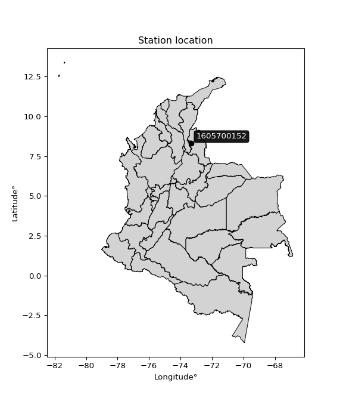

<div align="center">


</div>

# Station (rain, Pmax24h): 1605700152

Probable Maximum Precipitation (PMP) is the greatest amount of rainfall for a specific duration that is meteorologically possible for a given location, acting as a "worst-case" scenario for extreme storms, crucial for designing safety-critical infrastructure like bridges, river deviations, dams, spillways, and nuclear plants to prevent catastrophic failure. PMP is calculated by hydrologists using meteorological data to determine the upper limit of extreme rainfall, often leading to the Probable Maximum Flood (PMF) for flood control design, and is increasingly being studied for climate change impacts.

<div align="center">

</img>

</div>


## A. General information


### 1. General running parameters

• app_version: _v20251226_. • runtime: _2025-12-26 15:38:16.554582_. • Python version: _3.14.0_. • SciPy version: _1.16.3_. • Pandas version: _2.3.3_. • NumPy version: _2.3.5_. • Stations dataset (station_dataset_file): _dataset/pmax24h_in/automatic_colombia_2003_2024.csv_. • Stations catalog (station_catalog_file): _dataset/CNE_IDEAM.xls_. • Minimum year to eval til year_max (date_min): _2003_. • Maximum year to eval since year_min (date_max): _2024_. • Creates, save and include plots into reports (create_plot): _False_. • Plot only fit distributions with Δo > Δ (plot_only_fit): _True_. • Eval low extreme values, if False, evaluates high extreme values (low_extreme): _False_. • Eval every SciPy distribution as logarithmic (pdist_logarithmic_on): _True_. • Standard deviation normalized (ddof): _1.0_. • Return periods to eval in years (Tr): _[2, 2.33, 5, 10, 15, 20, 25, 50, 75, 100, 200, 250, 500, 750, 1000]_. • Minimum data sample per station, 0 means any (minimum_sample): _5_. • Z-Score threshold to adjust a value, 0 means disable (zscore): _3.5_. • Avoid zeros, e.g. rain = 0 (avoid_zeros): _True_. • Avoid null values (avoid_nans): _True_. [:file_folder:Dataset file.](../../dataset/pmax24h_in/automatic_colombia_2003_2024.csv)


### 2. Station info and location

|   id |     CODIGO | NOMBRE                           | CATEGORIA    | TECNOLOGIA                              | ESTADO           | FECHA_INSTALACION   | FECHA_SUSPENSION   |   ALTITUD |   LATITUD |   LONGITUD | DEPARTAMENTO       | MUNICIPIO   | AREA_OPERATIVA                         | ENTIDAD                                                     | AREA_HIDROGRAFICA   | ZONA_HIDROGRAFICA   | SUBZONA_HIDROGRAFICA           | CORRIENTE   | OBSERVACION                                                                                                                                                                                                                                                                                                                                                                                                                                                                                                                                                                                                                                                                                                                                                                                                                                                                                                                                                                       |   SUBRED | Catalogo   |
|-----:|-----------:|:---------------------------------|:-------------|:----------------------------------------|:-----------------|:--------------------|:-------------------|----------:|----------:|-----------:|:-------------------|:------------|:---------------------------------------|:------------------------------------------------------------|:--------------------|:--------------------|:-------------------------------|:------------|:----------------------------------------------------------------------------------------------------------------------------------------------------------------------------------------------------------------------------------------------------------------------------------------------------------------------------------------------------------------------------------------------------------------------------------------------------------------------------------------------------------------------------------------------------------------------------------------------------------------------------------------------------------------------------------------------------------------------------------------------------------------------------------------------------------------------------------------------------------------------------------------------------------------------------------------------------------------------------------|---------:|:-----------|
|    0 | 1605700152 | PALO GRANDE - AUT   [1605700152] | Limnigráfica | Automática con Telemetría, Convencional | En Mantenimiento | 15/12/2017          | 05/08/2025         |      1087 |   8.29076 |   -73.3045 | Norte De Santander | Ocaña       | Area Operativa 08 - Santanderes-Arauca | INSTITUTO DE HIDROLOGIA METEOROLOGIA Y ESTUDIOS AMBIENTALES | Caribe              | Catatumbo           | Río Algodonal (Alto Catatumbo) | Algodonal   | Solicitado mediante correo electrónico por Jorge A. González, coordinador área operativa 11|26/08/2022$Migracion$Se Cambia Estado por orden de la Coordinación de Planeacion Operativa Decisión tomada en la Reunión de la RED 19/08/2022|30/09/2022$Migracion$Solicitado mediante correo electrónico por Jorge A. González, coordinador área operativa 11|26/08/2022$Migracion$Se Cambia Estado por orden de la Coordinación de Planeacion Operativa Decisión tomada en la Reunión de la RED 19/08/2022|05/08/2025$mvelez$Instalada con componente automático, sin miras, en diciembre 2017.  Desde esa época solo se ha podido ingresar una vez a la estación por el alto riesgo de inseguridad por orden público (zona Catatumbo) suspensión bajo memorando 20253150131043|01/09/2025$mvelez$Se deja en estado mantenimiento por temas de orden publico no se puede visitar en este momento pero se debe realizar el proceso ante automatizacion bajo memorando 20253060153393 |      nan | CNE_IDEAM  |

<div align="center">

Map location in: [:earth_americas:Google](http://maps.google.com/maps?q=8.290761111,-73.3045) [:earth_americas:OSM](https://www.openstreetmap.org/#map=18/8.290761111/-73.3045&layers=P) [:earth_americas:Bing](https://www.bing.com/maps?cp=8.290761111~-73.3045&lvl=18) [:earth_americas:Apple](https://maps.apple.com/frame?center=8.290761111%2C-73.3045&span=0.003%2C0.006)

</div>


<div align="center">

```geojson
{
  "type": "Feature",
  "geometry": {
    "type": "Point", 
    "coordinates": [-73.3045, 8.290761111]
  }, 
  "properties": {
    "Name": "1605700152"
  }
}
```

</div>


### 3. Discrete values table and plot

|               |             0 |           1 |          2 |           3 |         4 |
|:--------------|--------------:|------------:|-----------:|------------:|----------:|
| Date          | 2019          | 2020        | 2021       | 2022        | 2023      |
| Value         |   37.8        |   47.4      |   53.2     |   33.4      |   16.6    |
| Value_initial |   37.8        |   47.4      |   53.2     |   33.4      |   16.6    |
| count         |    5          |    5        |    5       |    5        |    5      |
| mean          |   37.68       |   37.68     |   37.68    |   37.68     |   37.68   |
| std           |   14.1249     |   14.1249   |   14.1249  |   14.1249   |   14.1249 |
| zscore        |    0.00849565 |    0.688148 |    1.09877 |   -0.303012 |   -1.4924 |
> If Z-Score is active, values out of range or outliers are replaced with the station mean value.


### 4. Active continuous probability distributions from SciPy (45 of 104 available)

[scipy.stats](https://docs.scipy.org/doc/scipy/reference/stats.html) is a Python´s powerful submodule within the SciPy library for comprehensive statistical analysis, offering over 130 probability distributions (like Normal, Poisson), functions for descriptive stats (mean, variance), hypothesis testing (t-tests, chi-square), random variable generation, and statistical tests, making it essential for data science, modeling, and research. It provides tools to explore, model, and draw conclusions from data efficiently, working seamlessly with NumPy.

<div align="center">

|   id | p_dist             |   n_parameter | fit_method   | label                                                                       | active   | ref                                                                                                        |
|-----:|:-------------------|--------------:|:-------------|:----------------------------------------------------------------------------|:---------|:-----------------------------------------------------------------------------------------------------------|
|    0 | alpha              |             3 | MLE          | Alpha                                                                       | True     | [:mortar_board:](https://docs.scipy.org/doc/scipy/reference/generated/scipy.stats.alpha.html)              |
|    1 | betaprime          |             4 | MLE          | Beta prime                                                                  | True     | [:mortar_board:](https://docs.scipy.org/doc/scipy/reference/generated/scipy.stats.betaprime.html)          |
|    2 | chi2               |             3 | MLE          | Chi²                                                                        | True     | [:mortar_board:](https://docs.scipy.org/doc/scipy/reference/generated/scipy.stats.chi2.html)               |
|    3 | crystalball        |             4 | MLE          | Crystalball                                                                 | True     | [:mortar_board:](https://docs.scipy.org/doc/scipy/reference/generated/scipy.stats.crystalball.html)        |
|    4 | erlang             |             3 | MLE          | Erlang                                                                      | True     | [:mortar_board:](https://docs.scipy.org/doc/scipy/reference/generated/scipy.stats.erlang.html)             |
|    5 | expon              |             2 | MLE          | Exponential                                                                 | True     | [:mortar_board:](https://docs.scipy.org/doc/scipy/reference/generated/scipy.stats.expon.html)              |
|    6 | exponnorm          |             3 | MLE          | Exponentially modified Normal                                               | True     | [:mortar_board:](https://docs.scipy.org/doc/scipy/reference/generated/scipy.stats.exponnorm.html)          |
|    7 | f                  |             4 | MLE          | F                                                                           | True     | [:mortar_board:](https://docs.scipy.org/doc/scipy/reference/generated/scipy.stats.f.html)                  |
|    8 | fatiguelife        |             3 | MLE          | Fatigue-life (Birnbaum-Saunders)                                            | True     | [:mortar_board:](https://docs.scipy.org/doc/scipy/reference/generated/scipy.stats.fatiguelife.html)        |
|    9 | fisk               |             3 | MLE          | Fisk                                                                        | True     | [:mortar_board:](https://docs.scipy.org/doc/scipy/reference/generated/scipy.stats.fisk.html)               |
|   10 | gamma              |             3 | MLE          | Gamma                                                                       | True     | [:mortar_board:](https://docs.scipy.org/doc/scipy/reference/generated/scipy.stats.gamma.html)              |
|   11 | genexpon           |             5 | MLE          | Generalized exponential                                                     | True     | [:mortar_board:](https://docs.scipy.org/doc/scipy/reference/generated/scipy.stats.genexpon.html)           |
|   12 | genlogistic        |             3 | MLE          | Generalized logistic                                                        | True     | [:mortar_board:](https://docs.scipy.org/doc/scipy/reference/generated/scipy.stats.genlogistic.html)        |
|   13 | gibrat             |             2 | MM           | Gibrat                                                                      | True     | [:mortar_board:](https://docs.scipy.org/doc/scipy/reference/generated/scipy.stats.gibrat.html)             |
|   14 | gompertz           |             3 | MLE          | Gompertz (or truncated Gumbel)                                              | True     | [:mortar_board:](https://docs.scipy.org/doc/scipy/reference/generated/scipy.stats.gompertz.html)           |
|   15 | gumbel_l           |             2 | MM           | Gumbel Left Skew                                                            | True     | [:mortar_board:](https://docs.scipy.org/doc/scipy/reference/generated/scipy.stats.gumbel_l.html)           |
|   16 | gumbel_r           |             2 | MM           | Gumbel Right Skew                                                           | True     | [:mortar_board:](https://docs.scipy.org/doc/scipy/reference/generated/scipy.stats.gumbel_r.html)           |
|   17 | halflogistic       |             2 | MM           | Half-logistic                                                               | True     | [:mortar_board:](https://docs.scipy.org/doc/scipy/reference/generated/scipy.stats.halflogistic.html)       |
|   18 | halfnorm           |             2 | MM           | Half Normal                                                                 | True     | [:mortar_board:](https://docs.scipy.org/doc/scipy/reference/generated/scipy.stats.halfnorm.html)           |
|   19 | hypsecant          |             2 | MM           | hyperbolic secant                                                           | True     | [:mortar_board:](https://docs.scipy.org/doc/scipy/reference/generated/scipy.stats.hypsecant.html)          |
|   20 | invgamma           |             3 | MLE          | Inverted gamma                                                              | True     | [:mortar_board:](https://docs.scipy.org/doc/scipy/reference/generated/scipy.stats.invgamma.html)           |
|   21 | invgauss           |             3 | MLE          | Inverse Gaussian                                                            | True     | [:mortar_board:](https://docs.scipy.org/doc/scipy/reference/generated/scipy.stats.invgauss.html)           |
|   22 | invweibull         |             3 | MLE          | Inverted Weibull                                                            | True     | [:mortar_board:](https://docs.scipy.org/doc/scipy/reference/generated/scipy.stats.invweibull.html)         |
|   23 | johnsonsu          |             4 | MLE          | Johnson Su                                                                  | True     | [:mortar_board:](https://docs.scipy.org/doc/scipy/reference/generated/scipy.stats.johnsonsu.html)          |
|   24 | kstwobign          |             2 | MLE          | Limiting distribution of scaled Kolmogorov-Smirnov two-sided test statistic | True     | [:mortar_board:](https://docs.scipy.org/doc/scipy/reference/generated/scipy.stats.kstwobign.html)          |
|   25 | laplace            |             2 | MM           | Laplace                                                                     | True     | [:mortar_board:](https://docs.scipy.org/doc/scipy/reference/generated/scipy.stats.laplace.html)            |
|   26 | laplace_asymmetric |             3 | MLE          | Asymmetric Laplace                                                          | True     | [:mortar_board:](https://docs.scipy.org/doc/scipy/reference/generated/scipy.stats.laplace_asymmetric.html) |
|   27 | loggamma           |             3 | MLE          | Log gamma                                                                   | True     | [:mortar_board:](https://docs.scipy.org/doc/scipy/reference/generated/scipy.stats.loggamma.html)           |
|   28 | logistic           |             2 | MM           | Logistic (or Sech-squared)                                                  | True     | [:mortar_board:](https://docs.scipy.org/doc/scipy/reference/generated/scipy.stats.logistic.html)           |
|   29 | lognorm            |             3 | MLE          | Log Normal                                                                  | True     | [:mortar_board:](https://docs.scipy.org/doc/scipy/reference/generated/scipy.stats.lognorm.html)            |
|   30 | maxwell            |             2 | MM           | Maxwell                                                                     | True     | [:mortar_board:](https://docs.scipy.org/doc/scipy/reference/generated/scipy.stats.maxwell.html)            |
|   31 | mielke             |             4 | MLE          | Mielke Beta-Kappa / Dagum                                                   | True     | [:mortar_board:](https://docs.scipy.org/doc/scipy/reference/generated/scipy.stats.mielke.html)             |
|   32 | moyal              |             2 | MM           | Moyal                                                                       | True     | [:mortar_board:](https://docs.scipy.org/doc/scipy/reference/generated/scipy.stats.moyal.html)              |
|   33 | nakagami           |             3 | MLE          | Nakagami                                                                    | True     | [:mortar_board:](https://docs.scipy.org/doc/scipy/reference/generated/scipy.stats.nakagami.html)           |
|   34 | ncf                |             5 | MLE          | Non-central F distribution                                                  | True     | [:mortar_board:](https://docs.scipy.org/doc/scipy/reference/generated/scipy.stats.ncf.html)                |
|   35 | nct                |             4 | MLE          | Non-central Student’s t                                                     | True     | [:mortar_board:](https://docs.scipy.org/doc/scipy/reference/generated/scipy.stats.nct.html)                |
|   36 | norm               |             2 | MM           | Normal                                                                      | True     | [:mortar_board:](https://docs.scipy.org/doc/scipy/reference/generated/scipy.stats.norm.html)               |
|   37 | pareto             |             3 | MLE          | Pareto                                                                      | True     | [:mortar_board:](https://docs.scipy.org/doc/scipy/reference/generated/scipy.stats.pareto.html)             |
|   38 | pearson3           |             3 | MM           | Pearson type III                                                            | True     | [:mortar_board:](https://docs.scipy.org/doc/scipy/reference/generated/scipy.stats.pearson3.html)           |
|   39 | rayleigh           |             2 | MM           | Rayleigh                                                                    | True     | [:mortar_board:](https://docs.scipy.org/doc/scipy/reference/generated/scipy.stats.rayleigh.html)           |
|   40 | rice               |             3 | MLE          | Rice                                                                        | True     | [:mortar_board:](https://docs.scipy.org/doc/scipy/reference/generated/scipy.stats.rice.html)               |
|   41 | t                  |             3 | MLE          | Student’s t                                                                 | True     | [:mortar_board:](https://docs.scipy.org/doc/scipy/reference/generated/scipy.stats.t.html)                  |
|   42 | truncnorm          |             4 | MLE          | Truncated normal                                                            | True     | [:mortar_board:](https://docs.scipy.org/doc/scipy/reference/generated/scipy.stats.truncnorm.html)          |
|   43 | wald               |             2 | MM           | Wald                                                                        | True     | [:mortar_board:](https://docs.scipy.org/doc/scipy/reference/generated/scipy.stats.wald.html)               |
|   44 | weibull_min        |             3 | MLE          | Weibull minimum                                                             | True     | [:mortar_board:](https://docs.scipy.org/doc/scipy/reference/generated/scipy.stats.weibull_min.html)        |

</div>

> **n_parameter:** # arguments & localization & scale.
>
> **Fit methods:** (MLE) maximum likelihood, (MM) L-moments.
>
>**Inactive:** foldnorm, gennorm, norminvgauss, powernorm, powerlognorm, skewnorm, genextreme, anglit, arcsine, argus, beta, bradford, burr, burr12, cauchy, cosine, halfcauchy, foldcauchy, skewcauchy, wrapcauchy, dgamma, gengamma, exponweib, exponpow, truncexpon, gausshyper, genhalflogistic, genhyperbolic, geninvgauss, halfgennorm, johnsonsb, kappa4, kappa3, ksone, kstwo, loglaplace, levy, levy_l, levy_stable, ncx2, genpareto, truncpareto, lomax, powerlaw, rdist, rel_breitwigner, recipinvgauss, semicircular, studentized_range, trapezoid, triang, truncweibull_min, tukeylambda, uniform, loguniform, vonmises, vonmises_line, weibull_max, dweibull, 


## B. Probability distributions vs. Empirical distributions

A continuous probability distribution (CPD) describes probabilities for variables that can take any value within a range (like rain any time), unlike discrete variables with specific outcomes (like temperature). It uses a Probability Density Function (PDF), a curve where the total area under it equals 1, and the probability of the variable falling within an interval (a to b) is found by calculating the area under the curve between those points. A key feature is that the probability of hitting any single exact value is zero, so probabilities are always expressed for ranges, e.g., $P(a ≤ X ≤ b)$.

<div align="center">

Distributions parameters
|    |    station | p_dist                |   n |               loc |            scale | shape                  | shape1              | shape2                 | shape3   |
|---:|-----------:|:----------------------|----:|------------------:|-----------------:|:-----------------------|:--------------------|:-----------------------|:---------|
|  0 | 1605700152 | alpha                 |   5 |    -249.093       |   6278.18        | 21.955881586862333     |                     |                        |          |
|  1 | 1605700152 | betaprime             |   5 |    -120.514       |  21064.5         | 146.23255728257868     | 19445.822230964113  |                        |          |
|  2 | 1605700152 | chi2                  |   5 |      16.6         |      9.70642     | 1.8238318840197256     |                     |                        |          |
|  3 | 1605700152 | crystalball           |   5 |      37.68        |     12.6337      | 4131.221066123149      | 64.34082407883987   |                        |          |
|  4 | 1605700152 | erlang                |   5 |    -148.558       |      0.87128     | 213.6798867689049      |                     |                        |          |
|  5 | 1605700152 | expon                 |   5 |      16.6         |     21.08        |                        |                     |                        |          |
|  6 | 1605700152 | exponnorm             |   5 |      37.676       |     12.6336      | 0.00032586951860821595 |                     |                        |          |
|  7 | 1605700152 | f                     |   5 |   -2485.59        |   2523.27        | 94514.89729116822      | 464548.3070578892   |                        |          |
|  8 | 1605700152 | fatiguelife           |   5 |      16.6         |      5.88806e-06 | 1610.4162990275054     |                     |                        |          |
|  9 | 1605700152 | fisk                  |   5 | -121693           | 121731           | 16299.941777985725     |                     |                        |          |
| 10 | 1605700152 | gamma                 |   5 |    -181.343       |      0.749951    | 291.79889266719        |                     |                        |          |
| 11 | 1605700152 | genexpon              |   5 |      16.6         |      5.78137     | 0.14774861701365744    | 0.9520389097367523  | 0.057711278013130175   |          |
| 12 | 1605700152 | genlogistic           |   5 |      53.2004      |      1.34123e-05 | 8.66609991570939e-07   |                     |                        |          |
| 13 | 1605700152 | gibrat                |   5 |      28.0421      |      5.84567     |                        |                     |                        |          |
| 14 | 1605700152 | gompertz              |   5 |      15.7091      |      3.94198     | 0.00029762930825987075 |                     |                        |          |
| 15 | 1605700152 | gumbel_l              |   5 |      43.3658      |      9.85043     |                        |                     |                        |          |
| 16 | 1605700152 | gumbel_r              |   5 |      31.9942      |      9.85043     |                        |                     |                        |          |
| 17 | 1605700152 | halflogistic          |   5 |      22.7061      |     10.8014      |                        |                     |                        |          |
| 18 | 1605700152 | halfnorm              |   5 |      20.958       |     20.9579      |                        |                     |                        |          |
| 19 | 1605700152 | hypsecant             |   5 |      37.68        |      8.04284     |                        |                     |                        |          |
| 20 | 1605700152 | invgamma              |   5 |    -107.918       |  17157.3         | 118.9586569263505      |                     |                        |          |
| 21 | 1605700152 | invgauss              |   5 |     -53.2534      |   4137.91        | 0.021945762060682127   |                     |                        |          |
| 22 | 1605700152 | invweibull            |   5 |      16.6         |      1.38153     | 0.0320062463425788     |                     |                        |          |
| 23 | 1605700152 | johnsonsu             |   5 |      61.5287      |      0.507685    | 7.545332133441605      | 1.7204041371016334  |                        |          |
| 24 | 1605700152 | kstwobign             |   5 |     -13.3635      |     58.2288      |                        |                     |                        |          |
| 25 | 1605700152 | laplace               |   5 |      37.68        |      8.93335     |                        |                     |                        |          |
| 26 | 1605700152 | laplace_asymmetric    |   5 |      37.8         |     10.1195      | 1.0059480050604837     |                     |                        |          |
| 27 | 1605700152 | loggamma              |   5 |      53.2019      |      1.94342e-05 | 1.253480565215832e-06  |                     |                        |          |
| 28 | 1605700152 | logistic              |   5 |      37.68        |      6.96531     |                        |                     |                        |          |
| 29 | 1605700152 | lognorm               |   5 |      16.6         |      0.0170156   | 14.601280589930534     |                     |                        |          |
| 30 | 1605700152 | maxwell               |   5 |       7.74351     |     18.7599      |                        |                     |                        |          |
| 31 | 1605700152 | mielke                |   5 |      -9.84327     |     63.2675      | 3.0489460665575194     | 1222.9119275761452  |                        |          |
| 32 | 1605700152 | moyal                 |   5 |      30.4553      |      5.68715     |                        |                     |                        |          |
| 33 | 1605700152 | nakagami              |   5 |      33.4         |     10.0453      | 0.16170286342828244    |                     |                        |          |
| 34 | 1605700152 | ncf                   |   5 |       6.0159      |      0.00226488  | 0.001455889410106232   | 7214.866350880322   | 20.33034346355129      |          |
| 35 | 1605700152 | nct                   |   5 |    -430.982       |     12.5829      | 81555.29070733787      | 37.24523267616988   |                        |          |
| 36 | 1605700152 | norm                  |   5 |      37.68        |     12.6337      |                        |                     |                        |          |
| 37 | 1605700152 | pareto                |   5 |      16.3889      |      0.211141    | 0.2609760023492395     |                     |                        |          |
| 38 | 1605700152 | pearson3              |   5 |      37.68        |     12.6337      | -0.47500533739146233   |                     |                        |          |
| 39 | 1605700152 | rayleigh              |   5 |      13.5111      |     19.284       |                        |                     |                        |          |
| 40 | 1605700152 | rice                  |   5 |       8.5481      |     14.0468      | 1.763536777848499      |                     |                        |          |
| 41 | 1605700152 | t                     |   5 |      37.6813      |     12.6349      | 4227410.221060227      |                     |                        |          |
| 42 | 1605700152 | truncnorm             |   5 |      37.68        |     12.6337      | -613.5039724398828     | 916.1387566155843   |                        |          |
| 43 | 1605700152 | wald                  |   5 |      25.0463      |     12.6337      |                        |                     |                        |          |
| 44 | 1605700152 | weibull_min           |   5 |      -1.13268e+08 |      1.13268e+08 | 11158750.911514606     |                     |                        |          |
| 45 | 1605700152 | logalpha              |   5 |     -11.2663      |    516.582       | 34.87463927466139      |                     |                        |          |
| 46 | 1605700152 | logbetaprime          |   5 |     -44.469       |     40.8484      | 29560.023893349637     | 25143.527744046427  |                        |          |
| 47 | 1605700152 | logchi2               |   5 |       2.8094      |      0.961245    | 1.066009878761494      |                     |                        |          |
| 48 | 1605700152 | logcrystalball        |   5 |       3.55659     |      0.40788     | 193.48056466243466     | 24.414435884676568  |                        |          |
| 49 | 1605700152 | logerlang             |   5 |      -2.81474     |      0.0276319   | 230.41802353142276     |                     |                        |          |
| 50 | 1605700152 | logexpon              |   5 |       2.8094      |      0.747187    |                        |                     |                        |          |
| 51 | 1605700152 | logexponnorm          |   5 |       3.55627     |      0.407881    | 0.0007867983716614202  |                     |                        |          |
| 52 | 1605700152 | logf                  |   5 |    -516.919       |    520.474       | 9578742.954926416      | 4890411.440731539   |                        |          |
| 53 | 1605700152 | logfatiguelife        |   5 |    -207.563       |    211.118       | 0.0019272648600702214  |                     |                        |          |
| 54 | 1605700152 | logfisk               |   5 |  -34585.6         |  34589.2         | 151844.3477579392      |                     |                        |          |
| 55 | 1605700152 | loggamma              |   5 |      -3.40076     |      0.0254031   | 273.9988900713006      |                     |                        |          |
| 56 | 1605700152 | loggenexpon           |   5 |       2.80031     |      0.00793197  | 0.004330614546255104   | 4.271988327909729   | 2.3292821306209823e-05 |          |
| 57 | 1605700152 | loggenlogistic        |   5 |       3.97408     |      9.65252e-07 | 2.2953030390931435e-06 |                     |                        |          |
| 58 | 1605700152 | loggibrat             |   5 |       3.24543     |      0.188725    |                        |                     |                        |          |
| 59 | 1605700152 | loggompertz           |   5 |       2.8094      |      1.06287     | 0.9603691956655869     |                     |                        |          |
| 60 | 1605700152 | loggumbel_l           |   5 |       3.74016     |      0.318023    |                        |                     |                        |          |
| 61 | 1605700152 | loggumbel_r           |   5 |       3.37302     |      0.318023    |                        |                     |                        |          |
| 62 | 1605700152 | loghalflogistic       |   5 |       3.07312     |      0.348744    |                        |                     |                        |          |
| 63 | 1605700152 | loghalfnorm           |   5 |       3.01673     |      0.67661     |                        |                     |                        |          |
| 64 | 1605700152 | loghypsecant          |   5 |       3.55659     |      0.259665    |                        |                     |                        |          |
| 65 | 1605700152 | loginvgamma           |   5 |      -3.98295     |   2289.87        | 304.7969097231962      |                     |                        |          |
| 66 | 1605700152 | loginvgauss           |   5 |      -0.797781    |    427.781       | 0.010193257653826802   |                     |                        |          |
| 67 | 1605700152 | loginvweibull         |   5 |      -3.96297e+07 |      3.96297e+07 | 88801395.21437627      |                     |                        |          |
| 68 | 1605700152 | logjohnsonsu          |   5 |       3.97406     |      2.4696e-12  | 3.0210777704497955     | 0.16978319360572292 |                        |          |
| 69 | 1605700152 | logkstwobign          |   5 |       1.77501     |      2.0311      |                        |                     |                        |          |
| 70 | 1605700152 | loglaplace            |   5 |       3.55659     |      0.288415    |                        |                     |                        |          |
| 71 | 1605700152 | loglaplace_asymmetric |   5 |       3.63231     |      0.295706    | 1.136236242231341      |                     |                        |          |
| 72 | 1605700152 | logloggamma           |   5 |       3.97413     |      4.1632e-06  | 9.957614868404511e-06  |                     |                        |          |
| 73 | 1605700152 | loglogistic           |   5 |       3.55659     |      0.224876    |                        |                     |                        |          |
| 74 | 1605700152 | loglognorm            |   5 |       2.8094      |      0.000792303 | 14.106108302750856     |                     |                        |          |
| 75 | 1605700152 | logmaxwell            |   5 |       2.59008     |      0.605668    |                        |                     |                        |          |
| 76 | 1605700152 | logmielke             |   5 |      -1.2863e+07  |      1.2863e+07  | 30399743.246401332     | 10103600344.606655  |                        |          |
| 77 | 1605700152 | logmoyal              |   5 |       3.32334     |      0.183611    |                        |                     |                        |          |
| 78 | 1605700152 | lognakagami           |   5 |       3.50856     |      0.276914    | 0.1500444373966679     |                     |                        |          |
| 79 | 1605700152 | logncf                |   5 |      -4.07961     |      7.62307     | 607.4572719153402      | 836.9273104658414   | 3.5915405369992006e-06 |          |
| 80 | 1605700152 | lognct                |   5 |      14.3119      |      0.400522    | 8271.689010083317      | -26.84846466591297  |                        |          |
| 81 | 1605700152 | lognorm               |   5 |       3.55659     |      0.407881    |                        |                     |                        |          |
| 82 | 1605700152 | logpareto             |   5 |       2.80177     |      0.00762876  | 0.2606223174430177     |                     |                        |          |
| 83 | 1605700152 | logpearson3           |   5 |       3.55659     |      0.407881    | -0.9328815121057386    |                     |                        |          |
| 84 | 1605700152 | lograyleigh           |   5 |       2.77629     |      0.622589    |                        |                     |                        |          |
| 85 | 1605700152 | logrice               |   5 |       2.51616     |      0.44319     | 2.087650634303373      |                     |                        |          |
| 86 | 1605700152 | logt                  |   5 |       3.55659     |      0.407881    | 644225874.1218079      |                     |                        |          |
| 87 | 1605700152 | logtruncnorm          |   5 |      -0.108289    |      1.1088      | 3.261948443992604      | 3.6817783893780796  |                        |          |
| 88 | 1605700152 | logwald               |   5 |       3.14874     |      0.407854    |                        |                     |                        |          |
| 89 | 1605700152 | logweibull_min        |   5 |      -3.24359e+07 |      3.24359e+07 | 112784824.34995669     |                     |                        |          |

</div>

> **loc** (Location parameter): This shifts the distribution along the x-axis. For many common distributions, like the normal (Gaussian) distribution, loc represents the mean $μ$. For others, like the uniform distribution, it might represent the minimum value, or for the beta distribution, the left end of the support interval.
>
> **scale** (Scale parameter): This determines the width or spread of the distribution. For the normal distribution, scale represents the standard deviation $σ$. For a uniform distribution, it defines the length of the interval (from $loc$ to $loc + scale$).
>
> **shape** (Shape parameters): Refers to parameters that define the specific form of a probability distribution, distinct from its location (loc) and scale (scale). These parameters are required arguments for most distribution functions. For example, a normal (Gaussian) distribution is fully defined by its location (mean) and scale (standard deviation), so it has no specific shape parameters beyond loc and scale. However, other distributions have intrinsic properties that need specification, as Gamma distribution that takes a shape parameter, often named $a$ or $alpha$.


### 0. Cumulative distribution values - CDF (90 evaluated)

> Ordered by x ascending and calculating $log(f(x))$ separately. 

|   id |    Station |   date |    x |   count |   mean |     std |      zscore |   Value_initial |    station |   m |     alpha |   alpha_pdf |   betaprime |   betaprime_pdf |        chi2 |   chi2_pdf |   crystalball |   crystalball_pdf |    erlang |   erlang_pdf |    expon |   expon_pdf |   exponnorm |   exponnorm_pdf |         f |      f_pdf |   fatiguelife |   fatiguelife_pdf |      fisk |   fisk_pdf |     gamma |   gamma_pdf |    genexpon |   genexpon_pdf |   genlogistic |   genlogistic_pdf |   gibrat |   gibrat_pdf |   gompertz |   gompertz_pdf |   gumbel_l |   gumbel_l_pdf |   gumbel_r |   gumbel_r_pdf |   halflogistic |   halflogistic_pdf |   halfnorm |   halfnorm_pdf |   hypsecant |   hypsecant_pdf |   invgamma |   invgamma_pdf |   invgauss |   invgauss_pdf |   invweibull |   invweibull_pdf |   johnsonsu |   johnsonsu_pdf |   kstwobign |   kstwobign_pdf |   laplace |   laplace_pdf |   laplace_asymmetric |   laplace_asymmetric_pdf |   loggamma |   loggamma_pdf |   logistic |   logistic_pdf |   lognorm |   lognorm_pdf |   maxwell |   maxwell_pdf |    mielke |   mielke_pdf |       moyal |   moyal_pdf |    nakagami |   nakagami_pdf |       ncf |   ncf_pdf |      nct |    nct_pdf |      norm |   norm_pdf |      pareto |   pareto_pdf |   pearson3 |   pearson3_pdf |   rayleigh |   rayleigh_pdf |      rice |   rice_pdf |         t |      t_pdf |   truncnorm |   truncnorm_pdf |     wald |   wald_pdf |   weibull_min |   weibull_min_pdf |   logalpha |   logalpha_pdf |   logbetaprime |   logbetaprime_pdf |     logchi2 |   logchi2_pdf |   logcrystalball |   logcrystalball_pdf |   logerlang |   logerlang_pdf |   logexpon |   logexpon_pdf |   logexponnorm |   logexponnorm_pdf |      logf |   logf_pdf |   logfatiguelife |   logfatiguelife_pdf |   logfisk |   logfisk_pdf |   loggenexpon |   loggenexpon_pdf |   loggenlogistic |   loggenlogistic_pdf |   loggibrat |   loggibrat_pdf |   loggompertz |   loggompertz_pdf |   loggumbel_l |   loggumbel_l_pdf |   loggumbel_r |   loggumbel_r_pdf |   loghalflogistic |   loghalflogistic_pdf |   loghalfnorm |   loghalfnorm_pdf |   loghypsecant |   loghypsecant_pdf |   loginvgamma |   loginvgamma_pdf |   loginvgauss |   loginvgauss_pdf |   loginvweibull |   loginvweibull_pdf |   logjohnsonsu |   logjohnsonsu_pdf |   logkstwobign |   logkstwobign_pdf |   loglaplace |   loglaplace_pdf |   loglaplace_asymmetric |   loglaplace_asymmetric_pdf |   logloggamma |   logloggamma_pdf |   loglogistic |   loglogistic_pdf |   loglognorm |   loglognorm_pdf |   logmaxwell |   logmaxwell_pdf |   logmielke |   logmielke_pdf |    logmoyal |   logmoyal_pdf |   lognakagami |   lognakagami_pdf |   logncf |   logncf_pdf |   lognct |   lognct_pdf |   logpareto |   logpareto_pdf |   logpearson3 |   logpearson3_pdf |   lograyleigh |   lograyleigh_pdf |   logrice |   logrice_pdf |      logt |   logt_pdf |   logtruncnorm |   logtruncnorm_pdf |   logwald |   logwald_pdf |   logweibull_min |   logweibull_min_pdf |
|-----:|-----------:|-------:|-----:|--------:|-------:|--------:|------------:|----------------:|-----------:|----:|----------:|------------:|------------:|----------------:|------------:|-----------:|--------------:|------------------:|----------:|-------------:|---------:|------------:|------------:|----------------:|----------:|-----------:|--------------:|------------------:|----------:|-----------:|----------:|------------:|------------:|---------------:|--------------:|------------------:|---------:|-------------:|-----------:|---------------:|-----------:|---------------:|-----------:|---------------:|---------------:|-------------------:|-----------:|---------------:|------------:|----------------:|-----------:|---------------:|-----------:|---------------:|-------------:|-----------------:|------------:|----------------:|------------:|----------------:|----------:|--------------:|---------------------:|-------------------------:|-----------:|---------------:|-----------:|---------------:|----------:|--------------:|----------:|--------------:|----------:|-------------:|------------:|------------:|------------:|---------------:|----------:|----------:|---------:|-----------:|----------:|-----------:|------------:|-------------:|-----------:|---------------:|-----------:|---------------:|----------:|-----------:|----------:|-----------:|------------:|----------------:|---------:|-----------:|--------------:|------------------:|-----------:|---------------:|---------------:|-------------------:|------------:|--------------:|-----------------:|---------------------:|------------:|----------------:|-----------:|---------------:|---------------:|-------------------:|----------:|-----------:|-----------------:|---------------------:|----------:|--------------:|--------------:|------------------:|-----------------:|---------------------:|------------:|----------------:|--------------:|------------------:|--------------:|------------------:|--------------:|------------------:|------------------:|----------------------:|--------------:|------------------:|---------------:|-------------------:|--------------:|------------------:|--------------:|------------------:|----------------:|--------------------:|---------------:|-------------------:|---------------:|-------------------:|-------------:|-----------------:|------------------------:|----------------------------:|--------------:|------------------:|--------------:|------------------:|-------------:|-----------------:|-------------:|-----------------:|------------:|----------------:|------------:|---------------:|--------------:|------------------:|---------:|-------------:|---------:|-------------:|------------:|----------------:|--------------:|------------------:|--------------:|------------------:|----------:|--------------:|----------:|-----------:|---------------:|-------------------:|----------:|--------------:|-----------------:|---------------------:|
|    0 | 1605700152 |   2023 | 16.6 |       5 |  37.68 | 14.1249 | -1.4924     |            16.6 | 1605700152 |   1 | 0.0471062 |   0.0087454 |   0.0473483 |      0.00827684 | 4.61066e-15 | 1.18347    |     0.0476026 |        0.00784918 | 0.0451662 |   0.00808714 | 0        |  0.0474383  |    0.047601 |      0.00784901 | 0.0484863 | 0.00795505 |      0.136539 |       6.34422e+10 | 0.0499359 | 0.00635372 | 0.0478411 |  0.00831093 | 2.06536e-08 |      0.025556  |      0        |        0.00607115 | 0        |    0         | 7.5474e-05 |    9.46424e-05 |  0.0639233 |     0.00627742 | 0.00846236 |     0.00409966 |       0        |         0          |   0        |      0         |   0.0462217 |      0.00572676 |  0.0471474 |     0.00905537 |  0.0438731 |     0.00907796 |    0.0533621 |      1.40887e+12 |   0.0869568 |      0.00606052 |   0.0461548 |       0.0128131 | 0.0472245 |    0.00528631 |            0.0626734 |               0.00615673 |  0.0334496 |       0.191078 |  0.0462461 |     0.00633244 | 0.0334849 |      0.182675 | 0.0261854 |    0.00847958 | 0.0699617 |   0.00806668 | 0.000722686 | 0.000781719 | 0           |    0           | 0.0396733 | 0.0102735 | 0.047626 | 0.00785635 | 0.0476026 | 0.00784919 | 1.11022e-16 |   1.23603    |  0.0587662 |     0.00743693 |  0.0127471 |     0.00820056 | 0.0361408 | 0.00930315 | 0.0476082 | 0.00784917 |   0.0476026 |      0.00784919 | 0        | 0          |     0.0671761 |        0.00639051 |  0.0339518 |       0.1965   |      0.0341501 |           0.186772 | 5.21721e-09 |    6.2618e+06 |        0.0334846 |             0.182675 |   0.0341827 |        0.196318 |   0        |       1.33835  |      0.0334852 |           0.182677 | 0.0339657 |   0.184582 |        0.0331698 |             0.182349 | 0.0280664 |      0.119754 |    0.00501587 |          0.557536 |         0        |             0.149077 |    0        |        0        |   1.71135e-09 |          0.903563 |     0.0521643 |          0.159672 |    0.00278329 |         0.0514969 |          0        |              0        |      0        |          0        |       0.035788 |           0.137534 |     0.0352333 |          0.206557 |     0.0333719 |          0.205215 |       0.0385573 |            0.281279 |      0.0484295 |        0.0146567   |      0.0423005 |           0.348144 |    0.0374851 |         0.129969 |               0.0486676 |                    0.144847 |     0.0616789 |          0.147525 |      0.034802 |          0.149375 |    0.0227588 |      8.62152e+12 |    0.0121429 |         0.161776 |   0.0629718 |        0.148824 | 5.05083e-05 |     0.00238407 |   0           |       0           | 0.090956 |     0.313192 | 0.034037 |     0.183456 | 1.11022e-16 |      34.1632    |     0.0522872 |          0.174372 |    0.00141332 |         0.0853049 | 0.0277694 |      0.208577 | 0.0334853 |   0.182677 |    0           |           0        |  0        |      0        |        0.0390135 |             0.132975 |
|    1 | 1605700152 |   2022 | 33.4 |       5 |  37.68 | 14.1249 | -0.303012   |            33.4 | 1605700152 |   2 | 0.394223  |   0.0302757 |   0.375403  |      0.0294069  | 0.619875    | 0.020731   |     0.367389  |        0.0298166  | 0.377995  |   0.0303029  | 0.549305 |  0.0213802  |    0.367385 |      0.0298167  | 0.368756  | 0.0296585  |      0.852886 |       0.00718459  | 0.332699  | 0.0297287  | 0.381362  |  0.0301281  | 0.477366    |      0.0266442 |      0        |        0.0179763  | 0.465283 |    0.074177  | 0.0258307  |    0.00654091  |  0.304827  |     0.0256599  | 0.420211   |     0.0369854  |       0.458195 |         0.0365722  |   0.447264 |      0.0319198 |   0.338083  |      0.0345659  |  0.39989   |     0.0300121  |  0.403846  |     0.0302622  |    0.397263  |      0.000698681 |   0.289728  |      0.0209234  |   0.46089   |       0.0278488 | 0.309669  |    0.0346644  |            0.326453  |               0.0320692  |  0.459511  |       0.948408 |  0.351039  |     0.0327065  | 0.453127  |      0.971327 | 0.400262  |    0.0312242  | 0.313419  |   0.0220982  | 0.440171    | 0.0401971   | 1.00969e-05 |    4.59566e+08 | 0.421688  | 0.0295385 | 0.367593 | 0.0298203  | 0.367389  | 0.0298166  | 0.681919    |   0.00487983 |  0.341325  |     0.0275466  |  0.412489  |     0.0314219  | 0.383352  | 0.0299309  | 0.367362  | 0.0298131  |   0.367389  |      0.0298166  | 0.490172 | 0.0538479  |     0.30506   |        0.0249157  |  0.464553  |       0.940339 |      0.455588  |           0.963244 | 0.582331    |    0.348167   |        0.453127  |             0.971328 |   0.467244  |        0.952163 |   0.607694 |       0.525044 |      0.453129  |           0.971327 | 0.454237  |   0.968894 |        0.454397  |             0.974294 | 0.383329  |      1.03773  |    0.543      |          0.760881 |         0        |             0.786034 |    0.630178 |        1.43474  |   0.590844    |          0.713716 |     0.382917  |          0.936717 |    0.520482   |         1.06871   |          0.554104 |              0.993519 |      0.532707 |          0.905456 |       0.441451 |           1.20517  |     0.472668  |          0.928316 |     0.470682  |          0.916289 |       0.506825  |            0.771798 |      0.0662169 |        0.0469156   |      0.539983  |           0.74358  |    0.423293  |         1.46765  |               0.389893  |                    1.16042  |     0.328386  |          0.785439 |      0.446802 |          1.09914  |    0.684682  |      0.0360351   |    0.487413  |         0.959411 |   0.32866   |        0.776734 | 0.545923    |     1.09339    |   2.92904e-05 |       1.97927e+10 | 0.477327 |     0.695919 | 0.451762 |     0.9675   | 0.692815    |       0.113273  |     0.393119  |          0.904453 |    0.499265   |         0.945962  | 0.464514  |      0.950326 | 0.453129  |   0.971327 |    1.23961e-05 |           4.02366  |  0.616649 |      1.17118  |        0.363969  |             1.00076  |
|    2 | 1605700152 |   2019 | 37.8 |       5 |  37.68 | 14.1249 |  0.00849565 |            37.8 | 1605700152 |   3 | 0.528905  |   0.0303502 |   0.5081    |      0.0303409  | 0.700661    | 0.0161915  |     0.503789  |        0.0315763  | 0.514839  |   0.0312772  | 0.634209 |  0.0173525  |    0.503786 |      0.0315764  | 0.504237  | 0.0313275  |      0.880655 |       0.00553758  | 0.47332   | 0.0333802  | 0.517359  |  0.0310796  | 0.587883    |      0.0234759 |      0        |        0.0238874  | 0.695805 |    0.0358549 | 0.0773579  |    0.0189144   |  0.433536  |     0.0326833  | 0.574267   |     0.032336   |       0.603543 |         0.0294285  |   0.578378 |      0.0275652 |   0.504749  |      0.0395724  |  0.532385  |     0.0296533  |  0.536605  |     0.0295315  |    0.399993  |      0.000553341 |   0.39682   |      0.0279453  |   0.577144  |       0.0247716 | 0.506671  |    0.0552232  |            0.502965  |               0.0494088  |  0.57625   |       0.924847 |  0.504307  |     0.0358895  | 0.573637  |      0.961377 | 0.536684  |    0.0302497  | 0.421148  |   0.0269515  | 0.600085    | 0.0320546   | 0.611082    |    0.0437305   | 0.548729  | 0.0277814 | 0.503986 | 0.0315692  | 0.503789  | 0.0315763  | 0.700453    |   0.00365111 |  0.472184  |     0.0314992  |  0.547613  |     0.0295477  | 0.517641  | 0.0305671  | 0.503748  | 0.0315733  |   0.503789  |      0.0315763  | 0.671864 | 0.0311317  |     0.42959   |        0.0315477  |  0.579827  |       0.9098   |      0.574841  |           0.949634 | 0.622487    |    0.302537   |        0.573637  |             0.961378 |   0.584044  |        0.922116 |   0.667574 |       0.444903 |      0.573638  |           0.961376 | 0.574395  |   0.958055 |        0.575177  |             0.96268  | 0.516951  |      1.09622  |    0.632561   |          0.683521 |         0        |             1.05498  |    0.763563 |        0.796993 |   0.674567    |          0.63777  |     0.509532  |          1.09868  |    0.642427   |         0.893882  |          0.664992 |              0.799705 |      0.637068 |          0.779586 |       0.591532 |           1.17551  |     0.585873  |          0.889225 |     0.582162  |          0.874097 |       0.597495  |            0.689522 |      0.0732364 |        0.0690588   |      0.626881  |           0.658499 |    0.615451  |         1.33332  |               0.563516  |                    1.67717  |     0.441503  |          1.05599  |      0.583393 |          1.0808   |    0.688777  |      0.0304443   |    0.60234   |         0.88749  |   0.440316  |        1.04062  | 0.666384    |     0.853586   |   0.630735    |       1.49009     | 0.562657 |     0.677958 | 0.571921 |     0.959666 | 0.705465    |       0.0924253 |     0.513545  |          1.03253  |    0.611407   |         0.858175  | 0.58139   |      0.925484 | 0.573639  |   0.961375 |    0.416592    |           2.77846  |  0.732919 |      0.74672  |        0.501343  |             1.20652  |
|    3 | 1605700152 |   2020 | 47.4 |       5 |  37.68 | 14.1249 |  0.688148   |            47.4 | 1605700152 |   4 | 0.782619  |   0.021001  |   0.769195  |      0.022248   | 0.821334    | 0.00955503 |     0.779164  |        0.0234879  | 0.781661  |   0.0223689  | 0.768019 |  0.0110048  |    0.779163 |      0.0234881  | 0.777388  | 0.0233408  |      0.922226 |       0.00335505  | 0.764693  | 0.0240921  | 0.782735  |  0.0222786  | 0.775234    |      0.0155409 |      0        |        0.0444177  | 0.884424 |    0.0100627 | 0.602489   |    0.0930587   |  0.778233  |     0.0339081  | 0.81115    |     0.0172354  |       0.815452 |         0.0155091  |   0.792933 |      0.0171765 |   0.815249  |      0.0217026  |  0.778553  |     0.02036    |  0.779537  |     0.01996    |    0.404373  |      0.000380465 |   0.735668  |      0.0398071  |   0.773772  |       0.0161463 | 0.831565  |    0.0188546  |            0.808603  |               0.0190263  |  0.764584  |       0.71126  |  0.801467  |     0.0228443  | 0.770499  |      0.743548 | 0.784887  |    0.020349   | 0.737064  |   0.0392582  | 0.821644    | 0.0154168   | 0.8564      |    0.0150573   | 0.774029  | 0.0185163 | 0.779222 | 0.023471   | 0.779164  | 0.0234879  | 0.728056    |   0.00228856 |  0.770781  |     0.0274322  |  0.786508  |     0.0194556  | 0.779247  | 0.0221593  | 0.779112  | 0.0234888  |   0.779164  |      0.0234879  | 0.85648  | 0.0113503  |     0.764365  |        0.033555   |  0.764319  |       0.695044 |      0.769068  |           0.7339   | 0.683477    |    0.240092   |        0.770499  |             0.743549 |   0.770695  |        0.70037  |   0.754443 |       0.328642 |      0.770501  |           0.743545 | 0.770524  |   0.740844 |        0.77195   |             0.741662 | 0.742943  |      0.838376 |    0.768364   |          0.513577 |         0        |             1.80702  |    0.880678 |        0.32493  |   0.801482    |          0.481367 |     0.765749  |          1.06905  |    0.804769   |         0.549633  |          0.809708 |              0.493733 |      0.786601 |          0.543764 |       0.80718  |           0.697985 |     0.765284  |          0.673997 |     0.758551  |          0.664617 |       0.733334  |            0.509656 |      0.10243   |        0.262678    |      0.756689  |           0.488884 |    0.824543  |         0.608348 |               0.81706   |                    0.702936 |     0.758607  |          1.81445  |      0.793    |          0.729961 |    0.694838  |      0.0236724   |    0.777379  |         0.64459  |   0.751708  |        1.77654  | 0.815932    |     0.492256   |   0.839655    |       0.583463    | 0.706019 |     0.57667  | 0.768879 |     0.745822 | 0.723394    |       0.068212  |     0.754102  |          1.02372  |    0.779329   |         0.616173  | 0.769836  |      0.71139  | 0.770501  |   0.743545 |    0.868484    |           1.36684  |  0.852273 |      0.363884 |        0.78314   |             1.15258  |
|    4 | 1605700152 |   2021 | 53.2 |       5 |  37.68 | 14.1249 |  1.09877    |            53.2 | 1605700152 |   5 | 0.882454  |   0.0135443 |   0.876063  |      0.0146281  | 0.868886    | 0.00698035 |     0.890363  |        0.0148484  | 0.887559  |   0.0142159  | 0.823819 |  0.00835774 |    0.890363 |      0.0148485  | 0.888223  | 0.0148665  |      0.939208 |       0.0025454   | 0.876006  | 0.0145425  | 0.888269  |  0.0141733  | 0.852461    |      0.0112061 |      0.999975 |        0.0646117  | 0.927782 |    0.0054664 | 0.982024   |    0.0183275   |  0.933716  |     0.0182614  | 0.890332   |     0.0104992  |       0.887828 |         0.00980252 |   0.876053 |      0.0116591 |   0.908206  |      0.0112555  |  0.875967  |     0.0133589  |  0.875055  |     0.0131241  |    0.406394  |      0.000320001 |   0.938005  |      0.0251969  |   0.853505  |       0.0114902 | 0.912003  |    0.00985035 |            0.892468  |               0.0106895  |  0.838093  |       0.561065 |  0.902752  |     0.012604   | 0.846966  |      0.579296 | 0.881955  |    0.0132591  | 0.989203  |   0.0472257  | 0.892311    | 0.00941009  | 0.923761    |    0.00869882  | 0.863854  | 0.0126039 | 0.890342 | 0.0148388  | 0.890363  | 0.0148484  | 0.739956    |   0.0018436  |  0.901857  |     0.0172766  |  0.879721  |     0.012837   | 0.885081  | 0.0143589  | 0.890322  | 0.014851   |   0.890363  |      0.0148484  | 0.907649 | 0.00676581 |     0.92266   |        0.0195018  |  0.836201  |       0.549481 |      0.844664  |           0.57404  | 0.709727    |    0.215343   |        0.846966  |             0.579297 |   0.842872  |        0.549232 |   0.789595 |       0.281596 |      0.846967  |           0.579294 | 0.846738  |   0.577653 |        0.848145  |             0.576604 | 0.827509  |      0.626602 |    0.822544   |          0.425742 |         0.999946 |             2.3778   |    0.911631 |        0.21986  |   0.852297    |          0.39924  |     0.875878  |          0.814341 |    0.859775   |         0.408457  |          0.859566 |              0.374408 |      0.842897 |          0.433407 |       0.874124 |           0.472228 |     0.835047  |          0.534219 |     0.827591  |          0.531193 |       0.78705   |            0.422319 |      0.998291  |        3.26811e+08 |      0.808364  |           0.407527 |    0.882416  |         0.407689 |               0.882599  |                    0.451109 |     0.999831  |          2.39141  |      0.864881 |          0.519671 |    0.697425  |      0.0212453   |    0.843716  |         0.505451 |   0.987441  |        2.29868  | 0.865018    |     0.364051   |   0.89557     |       0.397539    | 0.768437 |     0.503266 | 0.845672 |     0.582517 | 0.730767    |       0.0598559 |     0.862678  |          0.835458 |    0.842857   |         0.485584  | 0.843285  |      0.559721 | 0.846967  |   0.579293 |    0.999999    |           0.936705 |  0.888031 |      0.262301 |        0.898066  |             0.809341 |

An Empirical Distribution Function (EDF) is a step-function estimate of a true cumulative distribution function (CDF) based on observed sample data, representing the proportion of data points less than or equal to a given value. It is calculated by ordering your data and jumping up by $1/n$ (where $n$ is sample size) at each unique data point, allowing analysis without assuming an underlying population distribution, and it gets closer to the true CDF as the sample size grows.


### 1. Empirical - EDF California (1923)

California´s estimates the true probability distribution of water-related data (like rainfall, streamflow) using observed samples, crucial for risk assessment.

<div align="center">


$P=m/n$


</div>


**1.1. Empirical values**

<div align="center">

|                | 0              | 1                  | 2              | 3                 | 4              |
|:---------------|:---------------|:-------------------|:---------------|:------------------|:---------------|
| date           | 2023           | 2022               | 2019           | 2020              | 2021           |
| x              | 16.6           | 33.4               | 37.8           | 47.4              | 53.2           |
| m              | 1              | 2                  | 3              | 4                 | 5              |
| empirical_dist | edf_california | edf_california     | edf_california | edf_california    | edf_california |
| empirical      | 0.2            | 0.4                | 0.6            | 0.8               | 1.0            |
| empirical_tr   | 1.25           | 1.6666666666666667 | 2.5            | 5.000000000000001 | inf            |

</div>


**1.2. Kolmogorov-Smirnov fit test (sorted by Δ)**


<div align="center">

|                | 0                   | 1                   | 2                   | 3                   | 4                   | 5                     | 6                   | 7                  | 8                   | 9                   | 10                  | 11                  | 12                  | 13                 | 14                  | 15                  | 16                  | 17                  | 18                  | 19                  | 20                  | 21                  | 22                 | 23                 | 24                  | 25                 | 26                 | 27                  | 28                  | 29                  | 30                  | 31                  | 32                  | 33                  | 34                  | 35                  | 36                  | 37                  | 38                  | 39                 | 40                  | 41                  | 42                 | 43                 | 44                 | 45                  | 46                  | 47                  | 48                  | 49                  | 50                  | 51                  | 52                 | 53                  | 54                  | 55                 | 56                  | 57                 | 58                  | 59                 | 60                 | 61                  | 62                  | 63                 | 64                 | 65                 | 66                 | 67                 | 68                 | 69                 | 70                  | 71                  | 72                  | 73                  | 74                 | 75                  | 76                 | 77                 | 78                 | 79                 | 80                 | 81                 | 82                 | 83                 | 84                 | 85                 | 86                 | 87                 | 88                 | 89                 |
|:---------------|:--------------------|:--------------------|:--------------------|:--------------------|:--------------------|:----------------------|:--------------------|:-------------------|:--------------------|:--------------------|:--------------------|:--------------------|:--------------------|:-------------------|:--------------------|:--------------------|:--------------------|:--------------------|:--------------------|:--------------------|:--------------------|:--------------------|:-------------------|:-------------------|:--------------------|:-------------------|:-------------------|:--------------------|:--------------------|:--------------------|:--------------------|:--------------------|:--------------------|:--------------------|:--------------------|:--------------------|:--------------------|:--------------------|:--------------------|:-------------------|:--------------------|:--------------------|:-------------------|:-------------------|:-------------------|:--------------------|:--------------------|:--------------------|:--------------------|:--------------------|:--------------------|:--------------------|:-------------------|:--------------------|:--------------------|:-------------------|:--------------------|:-------------------|:--------------------|:-------------------|:-------------------|:--------------------|:--------------------|:-------------------|:-------------------|:-------------------|:-------------------|:-------------------|:-------------------|:-------------------|:--------------------|:--------------------|:--------------------|:--------------------|:-------------------|:--------------------|:-------------------|:-------------------|:-------------------|:-------------------|:-------------------|:-------------------|:-------------------|:-------------------|:-------------------|:-------------------|:-------------------|:-------------------|:-------------------|:-------------------|
| station        | 1605700152          | 1605700152          | 1605700152          | 1605700152          | 1605700152          | 1605700152            | 1605700152          | 1605700152         | 1605700152          | 1605700152          | 1605700152          | 1605700152          | 1605700152          | 1605700152         | 1605700152          | 1605700152          | 1605700152          | 1605700152          | 1605700152          | 1605700152          | 1605700152          | 1605700152          | 1605700152         | 1605700152         | 1605700152          | 1605700152         | 1605700152         | 1605700152          | 1605700152          | 1605700152          | 1605700152          | 1605700152          | 1605700152          | 1605700152          | 1605700152          | 1605700152          | 1605700152          | 1605700152          | 1605700152          | 1605700152         | 1605700152          | 1605700152          | 1605700152         | 1605700152         | 1605700152         | 1605700152          | 1605700152          | 1605700152          | 1605700152          | 1605700152          | 1605700152          | 1605700152          | 1605700152         | 1605700152          | 1605700152          | 1605700152         | 1605700152          | 1605700152         | 1605700152          | 1605700152         | 1605700152         | 1605700152          | 1605700152          | 1605700152         | 1605700152         | 1605700152         | 1605700152         | 1605700152         | 1605700152         | 1605700152         | 1605700152          | 1605700152          | 1605700152          | 1605700152          | 1605700152         | 1605700152          | 1605700152         | 1605700152         | 1605700152         | 1605700152         | 1605700152         | 1605700152         | 1605700152         | 1605700152         | 1605700152         | 1605700152         | 1605700152         | 1605700152         | 1605700152         | 1605700152         |
| empirical_dist | edf_california      | edf_california      | edf_california      | edf_california      | edf_california      | edf_california        | edf_california      | edf_california     | edf_california      | edf_california      | edf_california      | edf_california      | edf_california      | edf_california     | edf_california      | edf_california      | edf_california      | edf_california      | edf_california      | edf_california      | edf_california      | edf_california      | edf_california     | edf_california     | edf_california      | edf_california     | edf_california     | edf_california      | edf_california      | edf_california      | edf_california      | edf_california      | edf_california      | edf_california      | edf_california      | edf_california      | edf_california      | edf_california      | edf_california      | edf_california     | edf_california      | edf_california      | edf_california     | edf_california     | edf_california     | edf_california      | edf_california      | edf_california      | edf_california      | edf_california      | edf_california      | edf_california      | edf_california     | edf_california      | edf_california      | edf_california     | edf_california      | edf_california     | edf_california      | edf_california     | edf_california     | edf_california      | edf_california      | edf_california     | edf_california     | edf_california     | edf_california     | edf_california     | edf_california     | edf_california     | edf_california      | edf_california      | edf_california      | edf_california      | edf_california     | edf_california      | edf_california     | edf_california     | edf_california     | edf_california     | edf_california     | edf_california     | edf_california     | edf_california     | edf_california     | edf_california     | edf_california     | edf_california     | edf_california     | edf_california     |
| p_dist         | laplace_asymmetric  | pearson3            | logpearson3         | loggumbel_l         | fisk                | loglaplace_asymmetric | f                   | gamma              | nct                 | t                   | truncnorm           | norm                | crystalball         | exponnorm          | betaprime           | laplace             | invgamma            | alpha               | logistic            | hypsecant           | kstwobign           | erlang              | invgauss           | logloggamma        | logmielke           | ncf                | logweibull_min     | loglaplace          | rice                | loghypsecant        | loginvgamma         | loglogistic         | logerlang           | logbetaprime        | lognct              | logf                | logalpha            | gumbel_l            | logt                | logexponnorm       | lognorm             | lognorm             | logcrystalball     | loggamma           | loggamma           | logfatiguelife      | weibull_min         | logrice             | loginvgauss         | logfisk             | maxwell             | mielke              | rayleigh           | logmaxwell          | gumbel_r            | logkstwobign       | loggenexpon         | loggumbel_r        | lograyleigh         | moyal              | logmoyal           | genexpon            | loggompertz         | expon              | halflogistic       | gibrat             | loghalflogistic    | loghalfnorm        | wald               | halfnorm           | johnsonsu           | logexpon            | loginvweibull       | logwald             | chi2               | loggibrat           | logncf             | pareto             | logchi2            | logpareto          | loglognorm         | lognakagami        | logtruncnorm       | nakagami           | fatiguelife        | gompertz           | invweibull         | logjohnsonsu       | loggenlogistic     | genlogistic        |
| delta          | 0.13732661174775507 | 0.14123375590719714 | 0.14771279591098543 | 0.14783567206263756 | 0.15006412853442636 | 0.151332444336127     | 0.15151367399369148 | 0.1521588641469387 | 0.15237401215780258 | 0.15239184978362708 | 0.15239740471296295 | 0.15239741747535102 | 0.15239742232415798 | 0.1523990051239679 | 0.15265165633313899 | 0.15277554548761202 | 0.15285264336402296 | 0.15289382317573605 | 0.15375387666650353 | 0.15377828471328148 | 0.15384522847819024 | 0.15483377182631575 | 0.1561268506949676 | 0.1584974441321998 | 0.15968370782700003 | 0.1603266608847578 | 0.1609865099349163 | 0.16251491509453034 | 0.16385917715838855 | 0.16421198412711613 | 0.16495345866813782 | 0.16519795046678282 | 0.16581731008784603 | 0.16584986785639355 | 0.16596296018406007 | 0.16603430295935342 | 0.16604819186545544 | 0.16646434977558622 | 0.16651467997271308 | 0.1665147564646932 | 0.16651510929497657 | 0.16651510929497657 | 0.1665153568987115 | 0.1665504440922454 | 0.1665504440922454 | 0.16683023614384745 | 0.17040991061517108 | 0.17223056970107697 | 0.17240935228019527 | 0.17249085559408806 | 0.17381461896802944 | 0.17885242485452962 | 0.1872528675310057 | 0.18785707847793362 | 0.19153763778851032 | 0.1916358849696338 | 0.19498413149143784 | 0.1972167118662007 | 0.19858667637383248 | 0.1992773136130277 | 0.199949491710838  | 0.19999997934636576 | 0.19999999828864992 | 0.2                | 0.2                | 0.2                | 0.2                | 0.2                | 0.2                | 0.2                | 0.20317958799535063 | 0.21040509698414844 | 0.21294984402229955 | 0.21664900576026047 | 0.2198745412993206 | 0.23017840587802596 | 0.2315634473263587 | 0.2819191085218108 | 0.290273236467935  | 0.29281518265325   | 0.3025747643765704 | 0.3999707096092146 | 0.3999876038685226 | 0.3999899030502516 | 0.4528857839640419 | 0.5226420823506704 | 0.5936062218274554 | 0.6975703001407546 | 0.8                | 0.8                |
| deltao         | 0.5865427407550001  | 0.5865427407550001  | 0.5865427407550001  | 0.5865427407550001  | 0.5865427407550001  | 0.5865427407550001    | 0.5865427407550001  | 0.5865427407550001 | 0.5865427407550001  | 0.5865427407550001  | 0.5865427407550001  | 0.5865427407550001  | 0.5865427407550001  | 0.5865427407550001 | 0.5865427407550001  | 0.5865427407550001  | 0.5865427407550001  | 0.5865427407550001  | 0.5865427407550001  | 0.5865427407550001  | 0.5865427407550001  | 0.5865427407550001  | 0.5865427407550001 | 0.5865427407550001 | 0.5865427407550001  | 0.5865427407550001 | 0.5865427407550001 | 0.5865427407550001  | 0.5865427407550001  | 0.5865427407550001  | 0.5865427407550001  | 0.5865427407550001  | 0.5865427407550001  | 0.5865427407550001  | 0.5865427407550001  | 0.5865427407550001  | 0.5865427407550001  | 0.5865427407550001  | 0.5865427407550001  | 0.5865427407550001 | 0.5865427407550001  | 0.5865427407550001  | 0.5865427407550001 | 0.5865427407550001 | 0.5865427407550001 | 0.5865427407550001  | 0.5865427407550001  | 0.5865427407550001  | 0.5865427407550001  | 0.5865427407550001  | 0.5865427407550001  | 0.5865427407550001  | 0.5865427407550001 | 0.5865427407550001  | 0.5865427407550001  | 0.5865427407550001 | 0.5865427407550001  | 0.5865427407550001 | 0.5865427407550001  | 0.5865427407550001 | 0.5865427407550001 | 0.5865427407550001  | 0.5865427407550001  | 0.5865427407550001 | 0.5865427407550001 | 0.5865427407550001 | 0.5865427407550001 | 0.5865427407550001 | 0.5865427407550001 | 0.5865427407550001 | 0.5865427407550001  | 0.5865427407550001  | 0.5865427407550001  | 0.5865427407550001  | 0.5865427407550001 | 0.5865427407550001  | 0.5865427407550001 | 0.5865427407550001 | 0.5865427407550001 | 0.5865427407550001 | 0.5865427407550001 | 0.5865427407550001 | 0.5865427407550001 | 0.5865427407550001 | 0.5865427407550001 | 0.5865427407550001 | 0.5865427407550001 | 0.5865427407550001 | 0.5865427407550001 | 0.5865427407550001 |
| eval           | Δo > Δ              | Δo > Δ              | Δo > Δ              | Δo > Δ              | Δo > Δ              | Δo > Δ                | Δo > Δ              | Δo > Δ             | Δo > Δ              | Δo > Δ              | Δo > Δ              | Δo > Δ              | Δo > Δ              | Δo > Δ             | Δo > Δ              | Δo > Δ              | Δo > Δ              | Δo > Δ              | Δo > Δ              | Δo > Δ              | Δo > Δ              | Δo > Δ              | Δo > Δ             | Δo > Δ             | Δo > Δ              | Δo > Δ             | Δo > Δ             | Δo > Δ              | Δo > Δ              | Δo > Δ              | Δo > Δ              | Δo > Δ              | Δo > Δ              | Δo > Δ              | Δo > Δ              | Δo > Δ              | Δo > Δ              | Δo > Δ              | Δo > Δ              | Δo > Δ             | Δo > Δ              | Δo > Δ              | Δo > Δ             | Δo > Δ             | Δo > Δ             | Δo > Δ              | Δo > Δ              | Δo > Δ              | Δo > Δ              | Δo > Δ              | Δo > Δ              | Δo > Δ              | Δo > Δ             | Δo > Δ              | Δo > Δ              | Δo > Δ             | Δo > Δ              | Δo > Δ             | Δo > Δ              | Δo > Δ             | Δo > Δ             | Δo > Δ              | Δo > Δ              | Δo > Δ             | Δo > Δ             | Δo > Δ             | Δo > Δ             | Δo > Δ             | Δo > Δ             | Δo > Δ             | Δo > Δ              | Δo > Δ              | Δo > Δ              | Δo > Δ              | Δo > Δ             | Δo > Δ              | Δo > Δ             | Δo > Δ             | Δo > Δ             | Δo > Δ             | Δo > Δ             | Δo > Δ             | Δo > Δ             | Δo > Δ             | Δo > Δ             | Δo > Δ             | Δo <= Δ            | Δo <= Δ            | Δo <= Δ            | Δo <= Δ            |
| fit            | 1                   | 1                   | 1                   | 1                   | 1                   | 1                     | 1                   | 1                  | 1                   | 1                   | 1                   | 1                   | 1                   | 1                  | 1                   | 1                   | 1                   | 1                   | 1                   | 1                   | 1                   | 1                   | 1                  | 1                  | 1                   | 1                  | 1                  | 1                   | 1                   | 1                   | 1                   | 1                   | 1                   | 1                   | 1                   | 1                   | 1                   | 1                   | 1                   | 1                  | 1                   | 1                   | 1                  | 1                  | 1                  | 1                   | 1                   | 1                   | 1                   | 1                   | 1                   | 1                   | 1                  | 1                   | 1                   | 1                  | 1                   | 1                  | 1                   | 1                  | 1                  | 1                   | 1                   | 1                  | 1                  | 1                  | 1                  | 1                  | 1                  | 1                  | 1                   | 1                   | 1                   | 1                   | 1                  | 1                   | 1                  | 1                  | 1                  | 1                  | 1                  | 1                  | 1                  | 1                  | 1                  | 1                  | 0                  | 0                  | 0                  | 0                  |
| n              | 5                   | 5                   | 5                   | 5                   | 5                   | 5                     | 5                   | 5                  | 5                   | 5                   | 5                   | 5                   | 5                   | 5                  | 5                   | 5                   | 5                   | 5                   | 5                   | 5                   | 5                   | 5                   | 5                  | 5                  | 5                   | 5                  | 5                  | 5                   | 5                   | 5                   | 5                   | 5                   | 5                   | 5                   | 5                   | 5                   | 5                   | 5                   | 5                   | 5                  | 5                   | 5                   | 5                  | 5                  | 5                  | 5                   | 5                   | 5                   | 5                   | 5                   | 5                   | 5                   | 5                  | 5                   | 5                   | 5                  | 5                   | 5                  | 5                   | 5                  | 5                  | 5                   | 5                   | 5                  | 5                  | 5                  | 5                  | 5                  | 5                  | 5                  | 5                   | 5                   | 5                   | 5                   | 5                  | 5                   | 5                  | 5                  | 5                  | 5                  | 5                  | 5                  | 5                  | 5                  | 5                  | 5                  | 5                  | 5                  | 5                  | 5                  |
| best_fit       | 1                   | 0                   | 0                   | 0                   | 0                   | 0                     | 0                   | 0                  | 0                   | 0                   | 0                   | 0                   | 0                   | 0                  | 0                   | 0                   | 0                   | 0                   | 0                   | 0                   | 0                   | 0                   | 0                  | 0                  | 0                   | 0                  | 0                  | 0                   | 0                   | 0                   | 0                   | 0                   | 0                   | 0                   | 0                   | 0                   | 0                   | 0                   | 0                   | 0                  | 0                   | 0                   | 0                  | 0                  | 0                  | 0                   | 0                   | 0                   | 0                   | 0                   | 0                   | 0                   | 0                  | 0                   | 0                   | 0                  | 0                   | 0                  | 0                   | 0                  | 0                  | 0                   | 0                   | 0                  | 0                  | 0                  | 0                  | 0                  | 0                  | 0                  | 0                   | 0                   | 0                   | 0                   | 0                  | 0                   | 0                  | 0                  | 0                  | 0                  | 0                  | 0                  | 0                  | 0                  | 0                  | 0                  | 0                  | 0                  | 0                  | 0                  |
| best_fit_sort  | 1                   | 2                   | 3                   | 4                   | 5                   | 6                     | 7                   | 8                  | 9                   | 10                  | 11                  | 12                  | 13                  | 14                 | 15                  | 16                  | 17                  | 18                  | 19                  | 20                  | 21                  | 22                  | 23                 | 24                 | 25                  | 26                 | 27                 | 28                  | 29                  | 30                  | 31                  | 32                  | 33                  | 34                  | 35                  | 36                  | 37                  | 38                  | 39                  | 40                 | 41                  | 42                  | 43                 | 44                 | 45                 | 46                  | 47                  | 48                  | 49                  | 50                  | 51                  | 52                  | 53                 | 54                  | 55                  | 56                 | 57                  | 58                 | 59                  | 60                 | 61                 | 62                  | 63                  | 64                 | 65                 | 66                 | 67                 | 68                 | 69                 | 70                 | 71                  | 72                  | 73                  | 74                  | 75                 | 76                  | 77                 | 78                 | 79                 | 80                 | 81                 | 82                 | 83                 | 84                 | 85                 | 86                 | 87                 | 88                 | 89                 | 90                 |

</div>


**1.3. Best fit**

<div align="center">

|   id |    station | empirical_dist   | p_dist             |    delta |   deltao | eval   |   fit |   n |   best_fit |   best_fit_sort |
|-----:|-----------:|:-----------------|:-------------------|---------:|---------:|:-------|------:|----:|-----------:|----------------:|
|    0 | 1605700152 | edf_california   | laplace_asymmetric | 0.137327 | 0.586543 | Δo > Δ |     1 |   5 |          1 |               1 |

</div>


### 2. Empirical - EDF Hazen (1930)

Hazen method for plotting positions is a formula used to estimate the empirical cumulative probability distribution of flood events or other hydrological data. This formula often results in biased estimations, particularly when extrapolating to extreme events (high return periods).

<div align="center">


$P=(m-0.5)/n$


</div>


**2.1. Empirical values**

<div align="center">

|                | 0                  | 1                  | 2         | 3                 | 4                  |
|:---------------|:-------------------|:-------------------|:----------|:------------------|:-------------------|
| date           | 2023               | 2022               | 2019      | 2020              | 2021               |
| x              | 16.6               | 33.4               | 37.8      | 47.4              | 53.2               |
| m              | 1                  | 2                  | 3         | 4                 | 5                  |
| empirical_dist | edf_hazen          | edf_hazen          | edf_hazen | edf_hazen         | edf_hazen          |
| empirical      | 0.1                | 0.3                | 0.5       | 0.7               | 0.9                |
| empirical_tr   | 1.1111111111111112 | 1.4285714285714286 | 2.0       | 3.333333333333333 | 10.000000000000002 |

</div>


**2.2. Kolmogorov-Smirnov fit test (sorted by Δ)**


<div align="center">

|                | 0                   | 1                  | 2                   | 3                   | 4                  | 5                   | 6                   | 7                   | 8                   | 9                   | 10                 | 11                  | 12                  | 13                  | 14                  | 15                 | 16                  | 17                  | 18                  | 19                  | 20                  | 21                  | 22                  | 23                  | 24                  | 25                  | 26                  | 27                  | 28                  | 29                  | 30                  | 31                    | 32                  | 33                 | 34                  | 35                  | 36                  | 37                  | 38                 | 39                  | 40                  | 41                  | 42                 | 43                 | 44                  | 45                  | 46                  | 47                 | 48                  | 49                  | 50                 | 51                 | 52                 | 53                  | 54                  | 55                  | 56                  | 57                  | 58                  | 59                 | 60                  | 61                  | 62                  | 63                  | 64                 | 65                 | 66                  | 67                  | 68                  | 69                  | 70                  | 71                 | 72                  | 73                  | 74                  | 75                 | 76                 | 77                 | 78                 | 79                  | 80                 | 81                 | 82                  | 83                  | 84                 | 85                 | 86                 | 87                 | 88                 | 89                 |
|:---------------|:--------------------|:-------------------|:--------------------|:--------------------|:-------------------|:--------------------|:--------------------|:--------------------|:--------------------|:--------------------|:-------------------|:--------------------|:--------------------|:--------------------|:--------------------|:-------------------|:--------------------|:--------------------|:--------------------|:--------------------|:--------------------|:--------------------|:--------------------|:--------------------|:--------------------|:--------------------|:--------------------|:--------------------|:--------------------|:--------------------|:--------------------|:----------------------|:--------------------|:-------------------|:--------------------|:--------------------|:--------------------|:--------------------|:-------------------|:--------------------|:--------------------|:--------------------|:-------------------|:-------------------|:--------------------|:--------------------|:--------------------|:-------------------|:--------------------|:--------------------|:-------------------|:-------------------|:-------------------|:--------------------|:--------------------|:--------------------|:--------------------|:--------------------|:--------------------|:-------------------|:--------------------|:--------------------|:--------------------|:--------------------|:-------------------|:-------------------|:--------------------|:--------------------|:--------------------|:--------------------|:--------------------|:-------------------|:--------------------|:--------------------|:--------------------|:-------------------|:-------------------|:-------------------|:-------------------|:--------------------|:-------------------|:-------------------|:--------------------|:--------------------|:-------------------|:-------------------|:-------------------|:-------------------|:-------------------|:-------------------|
| station        | 1605700152          | 1605700152         | 1605700152          | 1605700152          | 1605700152         | 1605700152          | 1605700152          | 1605700152          | 1605700152          | 1605700152          | 1605700152         | 1605700152          | 1605700152          | 1605700152          | 1605700152          | 1605700152         | 1605700152          | 1605700152          | 1605700152          | 1605700152          | 1605700152          | 1605700152          | 1605700152          | 1605700152          | 1605700152          | 1605700152          | 1605700152          | 1605700152          | 1605700152          | 1605700152          | 1605700152          | 1605700152            | 1605700152          | 1605700152         | 1605700152          | 1605700152          | 1605700152          | 1605700152          | 1605700152         | 1605700152          | 1605700152          | 1605700152          | 1605700152         | 1605700152         | 1605700152          | 1605700152          | 1605700152          | 1605700152         | 1605700152          | 1605700152          | 1605700152         | 1605700152         | 1605700152         | 1605700152          | 1605700152          | 1605700152          | 1605700152          | 1605700152          | 1605700152          | 1605700152         | 1605700152          | 1605700152          | 1605700152          | 1605700152          | 1605700152         | 1605700152         | 1605700152          | 1605700152          | 1605700152          | 1605700152          | 1605700152          | 1605700152         | 1605700152          | 1605700152          | 1605700152          | 1605700152         | 1605700152         | 1605700152         | 1605700152         | 1605700152          | 1605700152         | 1605700152         | 1605700152          | 1605700152          | 1605700152         | 1605700152         | 1605700152         | 1605700152         | 1605700152         | 1605700152         |
| empirical_dist | edf_hazen           | edf_hazen          | edf_hazen           | edf_hazen           | edf_hazen          | edf_hazen           | edf_hazen           | edf_hazen           | edf_hazen           | edf_hazen           | edf_hazen          | edf_hazen           | edf_hazen           | edf_hazen           | edf_hazen           | edf_hazen          | edf_hazen           | edf_hazen           | edf_hazen           | edf_hazen           | edf_hazen           | edf_hazen           | edf_hazen           | edf_hazen           | edf_hazen           | edf_hazen           | edf_hazen           | edf_hazen           | edf_hazen           | edf_hazen           | edf_hazen           | edf_hazen             | edf_hazen           | edf_hazen          | edf_hazen           | edf_hazen           | edf_hazen           | edf_hazen           | edf_hazen          | edf_hazen           | edf_hazen           | edf_hazen           | edf_hazen          | edf_hazen          | edf_hazen           | edf_hazen           | edf_hazen           | edf_hazen          | edf_hazen           | edf_hazen           | edf_hazen          | edf_hazen          | edf_hazen          | edf_hazen           | edf_hazen           | edf_hazen           | edf_hazen           | edf_hazen           | edf_hazen           | edf_hazen          | edf_hazen           | edf_hazen           | edf_hazen           | edf_hazen           | edf_hazen          | edf_hazen          | edf_hazen           | edf_hazen           | edf_hazen           | edf_hazen           | edf_hazen           | edf_hazen          | edf_hazen           | edf_hazen           | edf_hazen           | edf_hazen          | edf_hazen          | edf_hazen          | edf_hazen          | edf_hazen           | edf_hazen          | edf_hazen          | edf_hazen           | edf_hazen           | edf_hazen          | edf_hazen          | edf_hazen          | edf_hazen          | edf_hazen          | edf_hazen          |
| p_dist         | fisk                | weibull_min        | pearson3            | betaprime           | f                  | gumbel_l            | t                   | exponnorm           | truncnorm           | norm                | crystalball        | nct                 | erlang              | gamma               | loggumbel_l         | logweibull_min     | logfisk             | rice                | logmielke           | mielke              | logpearson3         | alpha               | logloggamma         | invgamma            | maxwell             | logistic            | johnsonsu           | invgauss            | laplace_asymmetric  | rayleigh            | hypsecant           | loglaplace_asymmetric | gumbel_r            | ncf                | loglaplace          | laplace             | moyal               | loghypsecant        | loglogistic        | halfnorm            | lognct              | logcrystalball      | lognorm            | lognorm            | logexponnorm        | logt                | logf                | logfatiguelife     | logbetaprime        | halflogistic        | loggamma           | loggamma           | kstwobign          | logrice             | logalpha            | logerlang           | loginvgauss         | loginvgamma         | logncf              | genexpon           | logmaxwell          | wald                | gibrat              | lograyleigh         | loginvweibull      | loggumbel_r        | loghalfnorm         | logkstwobign        | loggenexpon         | logmoyal            | expon               | loghalflogistic    | logchi2             | loggompertz         | lognakagami         | logtruncnorm       | nakagami           | logexpon           | logwald            | chi2                | loggibrat          | pareto             | loglognorm          | logpareto           | gompertz           | invweibull         | fatiguelife        | logjohnsonsu       | loggenlogistic     | genlogistic        |
| delta          | 0.06469336996574737 | 0.0704099106151711 | 0.07078134061238417 | 0.07540349209405678 | 0.0773880384653447 | 0.07823333957345735 | 0.07911155650363699 | 0.07916271361319005 | 0.07916394804194515 | 0.07916394871282872 | 0.079163952431476  | 0.07922204676641231 | 0.08166061656792689 | 0.08273507376679534 | 0.08291655981658103 | 0.0831397285528368 | 0.08332947183142192 | 0.08335162658059736 | 0.08744149708438487 | 0.08920305429012787 | 0.09311850208702427 | 0.09422338581007245 | 0.09983079250346016 | 0.09989038687919544 | 0.10026227043962821 | 0.10146687452554115 | 0.10317958799535065 | 0.10384587292575664 | 0.10860272211527167 | 0.11248930282756281 | 0.11524943186307246 | 0.11706031830928654   | 0.12021052137785299 | 0.1216881913229903 | 0.12454310740567931 | 0.13156484806072755 | 0.14017101151318329 | 0.14145082822489202 | 0.1468019157158546 | 0.14726422314767923 | 0.15176152221602995 | 0.15312677046923784 | 0.153127215224037  | 0.153127215224037  | 0.15312884613597333 | 0.15312910990968337 | 0.15423669299581494 | 0.154396628837631  | 0.15558781072169492 | 0.15819488584343516 | 0.1595106019604085 | 0.1595106019604085 | 0.160890078695771  | 0.16451445049811447 | 0.16455292456201132 | 0.16724390495179647 | 0.17068227039038858 | 0.17266765373723736 | 0.17732714133082206 | 0.1773660082354302 | 0.18741337295059834 | 0.19017198519125972 | 0.19580521882039992 | 0.19926541041801066 | 0.2068253285040878 | 0.2204816307065694 | 0.23270690787196707 | 0.23998267377526555 | 0.24299980419225792 | 0.24592279034394765 | 0.24930477630559095 | 0.2541041032881414 | 0.28233147478706405 | 0.29084413967077455 | 0.29997070960921457 | 0.2999876038685226 | 0.2999899030502516 | 0.3076942865902486 | 0.3166490057602605 | 0.31987454129932064 | 0.330178405878026  | 0.3819191085218108 | 0.38468237018166845 | 0.39281518265325005 | 0.4226420823506705 | 0.4936062218274554 | 0.552885783964042  | 0.5975703001407545 | 0.7                | 0.7                |
| deltao         | 0.5865427407550001  | 0.5865427407550001 | 0.5865427407550001  | 0.5865427407550001  | 0.5865427407550001 | 0.5865427407550001  | 0.5865427407550001  | 0.5865427407550001  | 0.5865427407550001  | 0.5865427407550001  | 0.5865427407550001 | 0.5865427407550001  | 0.5865427407550001  | 0.5865427407550001  | 0.5865427407550001  | 0.5865427407550001 | 0.5865427407550001  | 0.5865427407550001  | 0.5865427407550001  | 0.5865427407550001  | 0.5865427407550001  | 0.5865427407550001  | 0.5865427407550001  | 0.5865427407550001  | 0.5865427407550001  | 0.5865427407550001  | 0.5865427407550001  | 0.5865427407550001  | 0.5865427407550001  | 0.5865427407550001  | 0.5865427407550001  | 0.5865427407550001    | 0.5865427407550001  | 0.5865427407550001 | 0.5865427407550001  | 0.5865427407550001  | 0.5865427407550001  | 0.5865427407550001  | 0.5865427407550001 | 0.5865427407550001  | 0.5865427407550001  | 0.5865427407550001  | 0.5865427407550001 | 0.5865427407550001 | 0.5865427407550001  | 0.5865427407550001  | 0.5865427407550001  | 0.5865427407550001 | 0.5865427407550001  | 0.5865427407550001  | 0.5865427407550001 | 0.5865427407550001 | 0.5865427407550001 | 0.5865427407550001  | 0.5865427407550001  | 0.5865427407550001  | 0.5865427407550001  | 0.5865427407550001  | 0.5865427407550001  | 0.5865427407550001 | 0.5865427407550001  | 0.5865427407550001  | 0.5865427407550001  | 0.5865427407550001  | 0.5865427407550001 | 0.5865427407550001 | 0.5865427407550001  | 0.5865427407550001  | 0.5865427407550001  | 0.5865427407550001  | 0.5865427407550001  | 0.5865427407550001 | 0.5865427407550001  | 0.5865427407550001  | 0.5865427407550001  | 0.5865427407550001 | 0.5865427407550001 | 0.5865427407550001 | 0.5865427407550001 | 0.5865427407550001  | 0.5865427407550001 | 0.5865427407550001 | 0.5865427407550001  | 0.5865427407550001  | 0.5865427407550001 | 0.5865427407550001 | 0.5865427407550001 | 0.5865427407550001 | 0.5865427407550001 | 0.5865427407550001 |
| eval           | Δo > Δ              | Δo > Δ             | Δo > Δ              | Δo > Δ              | Δo > Δ             | Δo > Δ              | Δo > Δ              | Δo > Δ              | Δo > Δ              | Δo > Δ              | Δo > Δ             | Δo > Δ              | Δo > Δ              | Δo > Δ              | Δo > Δ              | Δo > Δ             | Δo > Δ              | Δo > Δ              | Δo > Δ              | Δo > Δ              | Δo > Δ              | Δo > Δ              | Δo > Δ              | Δo > Δ              | Δo > Δ              | Δo > Δ              | Δo > Δ              | Δo > Δ              | Δo > Δ              | Δo > Δ              | Δo > Δ              | Δo > Δ                | Δo > Δ              | Δo > Δ             | Δo > Δ              | Δo > Δ              | Δo > Δ              | Δo > Δ              | Δo > Δ             | Δo > Δ              | Δo > Δ              | Δo > Δ              | Δo > Δ             | Δo > Δ             | Δo > Δ              | Δo > Δ              | Δo > Δ              | Δo > Δ             | Δo > Δ              | Δo > Δ              | Δo > Δ             | Δo > Δ             | Δo > Δ             | Δo > Δ              | Δo > Δ              | Δo > Δ              | Δo > Δ              | Δo > Δ              | Δo > Δ              | Δo > Δ             | Δo > Δ              | Δo > Δ              | Δo > Δ              | Δo > Δ              | Δo > Δ             | Δo > Δ             | Δo > Δ              | Δo > Δ              | Δo > Δ              | Δo > Δ              | Δo > Δ              | Δo > Δ             | Δo > Δ              | Δo > Δ              | Δo > Δ              | Δo > Δ             | Δo > Δ             | Δo > Δ             | Δo > Δ             | Δo > Δ              | Δo > Δ             | Δo > Δ             | Δo > Δ              | Δo > Δ              | Δo > Δ             | Δo > Δ             | Δo > Δ             | Δo <= Δ            | Δo <= Δ            | Δo <= Δ            |
| fit            | 1                   | 1                  | 1                   | 1                   | 1                  | 1                   | 1                   | 1                   | 1                   | 1                   | 1                  | 1                   | 1                   | 1                   | 1                   | 1                  | 1                   | 1                   | 1                   | 1                   | 1                   | 1                   | 1                   | 1                   | 1                   | 1                   | 1                   | 1                   | 1                   | 1                   | 1                   | 1                     | 1                   | 1                  | 1                   | 1                   | 1                   | 1                   | 1                  | 1                   | 1                   | 1                   | 1                  | 1                  | 1                   | 1                   | 1                   | 1                  | 1                   | 1                   | 1                  | 1                  | 1                  | 1                   | 1                   | 1                   | 1                   | 1                   | 1                   | 1                  | 1                   | 1                   | 1                   | 1                   | 1                  | 1                  | 1                   | 1                   | 1                   | 1                   | 1                   | 1                  | 1                   | 1                   | 1                   | 1                  | 1                  | 1                  | 1                  | 1                   | 1                  | 1                  | 1                   | 1                   | 1                  | 1                  | 1                  | 0                  | 0                  | 0                  |
| n              | 5                   | 5                  | 5                   | 5                   | 5                  | 5                   | 5                   | 5                   | 5                   | 5                   | 5                  | 5                   | 5                   | 5                   | 5                   | 5                  | 5                   | 5                   | 5                   | 5                   | 5                   | 5                   | 5                   | 5                   | 5                   | 5                   | 5                   | 5                   | 5                   | 5                   | 5                   | 5                     | 5                   | 5                  | 5                   | 5                   | 5                   | 5                   | 5                  | 5                   | 5                   | 5                   | 5                  | 5                  | 5                   | 5                   | 5                   | 5                  | 5                   | 5                   | 5                  | 5                  | 5                  | 5                   | 5                   | 5                   | 5                   | 5                   | 5                   | 5                  | 5                   | 5                   | 5                   | 5                   | 5                  | 5                  | 5                   | 5                   | 5                   | 5                   | 5                   | 5                  | 5                   | 5                   | 5                   | 5                  | 5                  | 5                  | 5                  | 5                   | 5                  | 5                  | 5                   | 5                   | 5                  | 5                  | 5                  | 5                  | 5                  | 5                  |
| best_fit       | 1                   | 0                  | 0                   | 0                   | 0                  | 0                   | 0                   | 0                   | 0                   | 0                   | 0                  | 0                   | 0                   | 0                   | 0                   | 0                  | 0                   | 0                   | 0                   | 0                   | 0                   | 0                   | 0                   | 0                   | 0                   | 0                   | 0                   | 0                   | 0                   | 0                   | 0                   | 0                     | 0                   | 0                  | 0                   | 0                   | 0                   | 0                   | 0                  | 0                   | 0                   | 0                   | 0                  | 0                  | 0                   | 0                   | 0                   | 0                  | 0                   | 0                   | 0                  | 0                  | 0                  | 0                   | 0                   | 0                   | 0                   | 0                   | 0                   | 0                  | 0                   | 0                   | 0                   | 0                   | 0                  | 0                  | 0                   | 0                   | 0                   | 0                   | 0                   | 0                  | 0                   | 0                   | 0                   | 0                  | 0                  | 0                  | 0                  | 0                   | 0                  | 0                  | 0                   | 0                   | 0                  | 0                  | 0                  | 0                  | 0                  | 0                  |
| best_fit_sort  | 1                   | 2                  | 3                   | 4                   | 5                  | 6                   | 7                   | 8                   | 9                   | 10                  | 11                 | 12                  | 13                  | 14                  | 15                  | 16                 | 17                  | 18                  | 19                  | 20                  | 21                  | 22                  | 23                  | 24                  | 25                  | 26                  | 27                  | 28                  | 29                  | 30                  | 31                  | 32                    | 33                  | 34                 | 35                  | 36                  | 37                  | 38                  | 39                 | 40                  | 41                  | 42                  | 43                 | 44                 | 45                  | 46                  | 47                  | 48                 | 49                  | 50                  | 51                 | 52                 | 53                 | 54                  | 55                  | 56                  | 57                  | 58                  | 59                  | 60                 | 61                  | 62                  | 63                  | 64                  | 65                 | 66                 | 67                  | 68                  | 69                  | 70                  | 71                  | 72                 | 73                  | 74                  | 75                  | 76                 | 77                 | 78                 | 79                 | 80                  | 81                 | 82                 | 83                  | 84                  | 85                 | 86                 | 87                 | 88                 | 89                 | 90                 |

</div>


**2.3. Best fit**

<div align="center">

|   id |    station | empirical_dist   | p_dist   |     delta |   deltao | eval   |   fit |   n |   best_fit |   best_fit_sort |
|-----:|-----------:|:-----------------|:---------|----------:|---------:|:-------|------:|----:|-----------:|----------------:|
|    0 | 1605700152 | edf_hazen        | fisk     | 0.0646934 | 0.586543 | Δo > Δ |     1 |   5 |          1 |               1 |

</div>


### 3. Empirical - EDF Weibull (1939)

Weibull plotting position formula is an empirical method used to estimate the non-exceedance probability or plotting position for a set of observed data, is often recommended or widely used in practice, particularly in flood frequency analysis.

<div align="center">


$P=m/(n+1)$


</div>


**3.1. Empirical values**

<div align="center">

|                | 0                   | 1                  | 2           | 3                  | 4                  |
|:---------------|:--------------------|:-------------------|:------------|:-------------------|:-------------------|
| date           | 2023                | 2022               | 2019        | 2020               | 2021               |
| x              | 16.6                | 33.4               | 37.8        | 47.4               | 53.2               |
| m              | 1                   | 2                  | 3           | 4                  | 5                  |
| empirical_dist | edf_weibull         | edf_weibull        | edf_weibull | edf_weibull        | edf_weibull        |
| empirical      | 0.16666666666666666 | 0.3333333333333333 | 0.5         | 0.6666666666666666 | 0.8333333333333334 |
| empirical_tr   | 1.2                 | 1.4999999999999998 | 2.0         | 2.9999999999999996 | 6.000000000000002  |

</div>


**3.2. Kolmogorov-Smirnov fit test (sorted by Δ)**


<div align="center">

|                | 0                   | 1                   | 2                   | 3                   | 4                   | 5                   | 6                  | 7                   | 8                   | 9                   | 10                  | 11                 | 12                  | 13                  | 14                  | 15                  | 16                  | 17                 | 18                 | 19                  | 20                  | 21                  | 22                  | 23                 | 24                 | 25                 | 26                 | 27                  | 28                  | 29                  | 30                  | 31                 | 32                 | 33                  | 34                  | 35                  | 36                  | 37                  | 38                  | 39                  | 40                  | 41                  | 42                  | 43                  | 44                  | 45                 | 46                  | 47                  | 48                    | 49                  | 50                  | 51                  | 52                  | 53                  | 54                  | 55                  | 56                  | 57                  | 58                  | 59                 | 60                  | 61                  | 62                  | 63                  | 64                  | 65                  | 66                  | 67                 | 68                  | 69                  | 70                  | 71                 | 72                  | 73                 | 74                 | 75                 | 76                 | 77                  | 78                 | 79                 | 80                 | 81                 | 82                  | 83                 | 84                 | 85                  | 86                 | 87                 | 88                 | 89                 |
|:---------------|:--------------------|:--------------------|:--------------------|:--------------------|:--------------------|:--------------------|:-------------------|:--------------------|:--------------------|:--------------------|:--------------------|:-------------------|:--------------------|:--------------------|:--------------------|:--------------------|:--------------------|:-------------------|:-------------------|:--------------------|:--------------------|:--------------------|:--------------------|:-------------------|:-------------------|:-------------------|:-------------------|:--------------------|:--------------------|:--------------------|:--------------------|:-------------------|:-------------------|:--------------------|:--------------------|:--------------------|:--------------------|:--------------------|:--------------------|:--------------------|:--------------------|:--------------------|:--------------------|:--------------------|:--------------------|:-------------------|:--------------------|:--------------------|:----------------------|:--------------------|:--------------------|:--------------------|:--------------------|:--------------------|:--------------------|:--------------------|:--------------------|:--------------------|:--------------------|:-------------------|:--------------------|:--------------------|:--------------------|:--------------------|:--------------------|:--------------------|:--------------------|:-------------------|:--------------------|:--------------------|:--------------------|:-------------------|:--------------------|:-------------------|:-------------------|:-------------------|:-------------------|:--------------------|:-------------------|:-------------------|:-------------------|:-------------------|:--------------------|:-------------------|:-------------------|:--------------------|:-------------------|:-------------------|:-------------------|:-------------------|
| station        | 1605700152          | 1605700152          | 1605700152          | 1605700152          | 1605700152          | 1605700152          | 1605700152         | 1605700152          | 1605700152          | 1605700152          | 1605700152          | 1605700152         | 1605700152          | 1605700152          | 1605700152          | 1605700152          | 1605700152          | 1605700152         | 1605700152         | 1605700152          | 1605700152          | 1605700152          | 1605700152          | 1605700152         | 1605700152         | 1605700152         | 1605700152         | 1605700152          | 1605700152          | 1605700152          | 1605700152          | 1605700152         | 1605700152         | 1605700152          | 1605700152          | 1605700152          | 1605700152          | 1605700152          | 1605700152          | 1605700152          | 1605700152          | 1605700152          | 1605700152          | 1605700152          | 1605700152          | 1605700152         | 1605700152          | 1605700152          | 1605700152            | 1605700152          | 1605700152          | 1605700152          | 1605700152          | 1605700152          | 1605700152          | 1605700152          | 1605700152          | 1605700152          | 1605700152          | 1605700152         | 1605700152          | 1605700152          | 1605700152          | 1605700152          | 1605700152          | 1605700152          | 1605700152          | 1605700152         | 1605700152          | 1605700152          | 1605700152          | 1605700152         | 1605700152          | 1605700152         | 1605700152         | 1605700152         | 1605700152         | 1605700152          | 1605700152         | 1605700152         | 1605700152         | 1605700152         | 1605700152          | 1605700152         | 1605700152         | 1605700152          | 1605700152         | 1605700152         | 1605700152         | 1605700152         |
| empirical_dist | edf_weibull         | edf_weibull         | edf_weibull         | edf_weibull         | edf_weibull         | edf_weibull         | edf_weibull        | edf_weibull         | edf_weibull         | edf_weibull         | edf_weibull         | edf_weibull        | edf_weibull         | edf_weibull         | edf_weibull         | edf_weibull         | edf_weibull         | edf_weibull        | edf_weibull        | edf_weibull         | edf_weibull         | edf_weibull         | edf_weibull         | edf_weibull        | edf_weibull        | edf_weibull        | edf_weibull        | edf_weibull         | edf_weibull         | edf_weibull         | edf_weibull         | edf_weibull        | edf_weibull        | edf_weibull         | edf_weibull         | edf_weibull         | edf_weibull         | edf_weibull         | edf_weibull         | edf_weibull         | edf_weibull         | edf_weibull         | edf_weibull         | edf_weibull         | edf_weibull         | edf_weibull        | edf_weibull         | edf_weibull         | edf_weibull           | edf_weibull         | edf_weibull         | edf_weibull         | edf_weibull         | edf_weibull         | edf_weibull         | edf_weibull         | edf_weibull         | edf_weibull         | edf_weibull         | edf_weibull        | edf_weibull         | edf_weibull         | edf_weibull         | edf_weibull         | edf_weibull         | edf_weibull         | edf_weibull         | edf_weibull        | edf_weibull         | edf_weibull         | edf_weibull         | edf_weibull        | edf_weibull         | edf_weibull        | edf_weibull        | edf_weibull        | edf_weibull        | edf_weibull         | edf_weibull        | edf_weibull        | edf_weibull        | edf_weibull        | edf_weibull         | edf_weibull        | edf_weibull        | edf_weibull         | edf_weibull        | edf_weibull        | edf_weibull        | edf_weibull        |
| p_dist         | weibull_min         | johnsonsu           | pearson3            | gumbel_l            | logpearson3         | loggumbel_l         | fisk               | f                   | gamma               | nct                 | t                   | truncnorm          | norm                | crystalball         | exponnorm           | betaprime           | invgamma            | alpha              | erlang             | invgauss            | ncf                 | kstwobign           | logweibull_min      | rice               | loglogistic        | logbetaprime       | lognct             | logf                | logalpha            | logt                | logexponnorm        | lognorm            | lognorm            | logcrystalball      | loggamma            | loggamma            | logfatiguelife      | logerlang           | logistic            | loginvgauss         | logfisk             | logrice             | loginvgamma         | maxwell             | loghypsecant        | laplace_asymmetric | logncf              | hypsecant           | loglaplace_asymmetric | rayleigh            | logmielke           | logmaxwell          | mielke              | loglaplace          | gumbel_r            | laplace             | lograyleigh         | moyal               | logloggamma         | genexpon           | halfnorm            | halflogistic        | loginvweibull       | loggumbel_r         | wald                | loghalfnorm         | logkstwobign        | loggenexpon        | logmoyal            | expon               | gibrat              | loghalflogistic    | logchi2             | loggompertz        | logexpon           | logwald            | chi2               | loggibrat           | lognakagami        | logtruncnorm       | nakagami           | pareto             | loglognorm          | logpareto          | gompertz           | invweibull          | fatiguelife        | logjohnsonsu       | loggenlogistic     | genlogistic        |
| delta          | 0.09949058039807425 | 0.10467207070530671 | 0.10790042257386379 | 0.11156667290679068 | 0.11437946257765208 | 0.11450233872930421 | 0.116730795201093  | 0.11818034066035814 | 0.11882553081360533 | 0.11904067882446923 | 0.11905851645029372 | 0.1190640713796296 | 0.11906408414201768 | 0.11906408899082463 | 0.11906567179063454 | 0.11931832299980563 | 0.11951931003068961 | 0.1195604898424027 | 0.1215004384929824 | 0.12279351736163424 | 0.12699332755142445 | 0.12755674536243766 | 0.12765317660158296 | 0.1305258438250552 | 0.1318646171334495 | 0.1325165345230602 | 0.1326296268507267 | 0.13270096962602007 | 0.13271485853212212 | 0.13318134663937972 | 0.13318142313135983 | 0.1331817759616432 | 0.1331817759616432 | 0.13318202356537817 | 0.13321711075891204 | 0.13321711075891204 | 0.13349690281051413 | 0.13391057161846315 | 0.13480020785887448 | 0.13734893705705525 | 0.13860026252553798 | 0.13889723636774362 | 0.13933432040390403 | 0.14048128563469608 | 0.14051306381110018 | 0.141936055448605  | 0.14399380799748873 | 0.14858276519640579 | 0.15039365164261986   | 0.15391953419767235 | 0.15410816375105152 | 0.15452374514460027 | 0.15586972095679452 | 0.15787644073901264 | 0.15820430445517697 | 0.16489818139406087 | 0.16593207708467733 | 0.16594398027969434 | 0.16649745917012682 | 0.1666666460130324 | 0.16666666666666666 | 0.16666666666666666 | 0.17349199517075448 | 0.18714829737323607 | 0.18981306307292856 | 0.19937357453863375 | 0.20664934044193223 | 0.2096664708589246 | 0.21258945701061432 | 0.21597144297225762 | 0.21775767038347527 | 0.2207707699548081 | 0.24899814145373073 | 0.2575108063374412 | 0.2743609532569153 | 0.2833156724269272 | 0.2865412079659873 | 0.29684507254469267 | 0.3333040429425479 | 0.3333209372018559 | 0.3333232363835849 | 0.3485857751884775 | 0.35134903684833513 | 0.3594818493199167 | 0.4226420823506705 | 0.42693955516078874 | 0.5195524506307085 | 0.5642369668074212 | 0.6666666666666666 | 0.6666666666666666 |
| deltao         | 0.5865427407550001  | 0.5865427407550001  | 0.5865427407550001  | 0.5865427407550001  | 0.5865427407550001  | 0.5865427407550001  | 0.5865427407550001 | 0.5865427407550001  | 0.5865427407550001  | 0.5865427407550001  | 0.5865427407550001  | 0.5865427407550001 | 0.5865427407550001  | 0.5865427407550001  | 0.5865427407550001  | 0.5865427407550001  | 0.5865427407550001  | 0.5865427407550001 | 0.5865427407550001 | 0.5865427407550001  | 0.5865427407550001  | 0.5865427407550001  | 0.5865427407550001  | 0.5865427407550001 | 0.5865427407550001 | 0.5865427407550001 | 0.5865427407550001 | 0.5865427407550001  | 0.5865427407550001  | 0.5865427407550001  | 0.5865427407550001  | 0.5865427407550001 | 0.5865427407550001 | 0.5865427407550001  | 0.5865427407550001  | 0.5865427407550001  | 0.5865427407550001  | 0.5865427407550001  | 0.5865427407550001  | 0.5865427407550001  | 0.5865427407550001  | 0.5865427407550001  | 0.5865427407550001  | 0.5865427407550001  | 0.5865427407550001  | 0.5865427407550001 | 0.5865427407550001  | 0.5865427407550001  | 0.5865427407550001    | 0.5865427407550001  | 0.5865427407550001  | 0.5865427407550001  | 0.5865427407550001  | 0.5865427407550001  | 0.5865427407550001  | 0.5865427407550001  | 0.5865427407550001  | 0.5865427407550001  | 0.5865427407550001  | 0.5865427407550001 | 0.5865427407550001  | 0.5865427407550001  | 0.5865427407550001  | 0.5865427407550001  | 0.5865427407550001  | 0.5865427407550001  | 0.5865427407550001  | 0.5865427407550001 | 0.5865427407550001  | 0.5865427407550001  | 0.5865427407550001  | 0.5865427407550001 | 0.5865427407550001  | 0.5865427407550001 | 0.5865427407550001 | 0.5865427407550001 | 0.5865427407550001 | 0.5865427407550001  | 0.5865427407550001 | 0.5865427407550001 | 0.5865427407550001 | 0.5865427407550001 | 0.5865427407550001  | 0.5865427407550001 | 0.5865427407550001 | 0.5865427407550001  | 0.5865427407550001 | 0.5865427407550001 | 0.5865427407550001 | 0.5865427407550001 |
| eval           | Δo > Δ              | Δo > Δ              | Δo > Δ              | Δo > Δ              | Δo > Δ              | Δo > Δ              | Δo > Δ             | Δo > Δ              | Δo > Δ              | Δo > Δ              | Δo > Δ              | Δo > Δ             | Δo > Δ              | Δo > Δ              | Δo > Δ              | Δo > Δ              | Δo > Δ              | Δo > Δ             | Δo > Δ             | Δo > Δ              | Δo > Δ              | Δo > Δ              | Δo > Δ              | Δo > Δ             | Δo > Δ             | Δo > Δ             | Δo > Δ             | Δo > Δ              | Δo > Δ              | Δo > Δ              | Δo > Δ              | Δo > Δ             | Δo > Δ             | Δo > Δ              | Δo > Δ              | Δo > Δ              | Δo > Δ              | Δo > Δ              | Δo > Δ              | Δo > Δ              | Δo > Δ              | Δo > Δ              | Δo > Δ              | Δo > Δ              | Δo > Δ              | Δo > Δ             | Δo > Δ              | Δo > Δ              | Δo > Δ                | Δo > Δ              | Δo > Δ              | Δo > Δ              | Δo > Δ              | Δo > Δ              | Δo > Δ              | Δo > Δ              | Δo > Δ              | Δo > Δ              | Δo > Δ              | Δo > Δ             | Δo > Δ              | Δo > Δ              | Δo > Δ              | Δo > Δ              | Δo > Δ              | Δo > Δ              | Δo > Δ              | Δo > Δ             | Δo > Δ              | Δo > Δ              | Δo > Δ              | Δo > Δ             | Δo > Δ              | Δo > Δ             | Δo > Δ             | Δo > Δ             | Δo > Δ             | Δo > Δ              | Δo > Δ             | Δo > Δ             | Δo > Δ             | Δo > Δ             | Δo > Δ              | Δo > Δ             | Δo > Δ             | Δo > Δ              | Δo > Δ             | Δo > Δ             | Δo <= Δ            | Δo <= Δ            |
| fit            | 1                   | 1                   | 1                   | 1                   | 1                   | 1                   | 1                  | 1                   | 1                   | 1                   | 1                   | 1                  | 1                   | 1                   | 1                   | 1                   | 1                   | 1                  | 1                  | 1                   | 1                   | 1                   | 1                   | 1                  | 1                  | 1                  | 1                  | 1                   | 1                   | 1                   | 1                   | 1                  | 1                  | 1                   | 1                   | 1                   | 1                   | 1                   | 1                   | 1                   | 1                   | 1                   | 1                   | 1                   | 1                   | 1                  | 1                   | 1                   | 1                     | 1                   | 1                   | 1                   | 1                   | 1                   | 1                   | 1                   | 1                   | 1                   | 1                   | 1                  | 1                   | 1                   | 1                   | 1                   | 1                   | 1                   | 1                   | 1                  | 1                   | 1                   | 1                   | 1                  | 1                   | 1                  | 1                  | 1                  | 1                  | 1                   | 1                  | 1                  | 1                  | 1                  | 1                   | 1                  | 1                  | 1                   | 1                  | 1                  | 0                  | 0                  |
| n              | 5                   | 5                   | 5                   | 5                   | 5                   | 5                   | 5                  | 5                   | 5                   | 5                   | 5                   | 5                  | 5                   | 5                   | 5                   | 5                   | 5                   | 5                  | 5                  | 5                   | 5                   | 5                   | 5                   | 5                  | 5                  | 5                  | 5                  | 5                   | 5                   | 5                   | 5                   | 5                  | 5                  | 5                   | 5                   | 5                   | 5                   | 5                   | 5                   | 5                   | 5                   | 5                   | 5                   | 5                   | 5                   | 5                  | 5                   | 5                   | 5                     | 5                   | 5                   | 5                   | 5                   | 5                   | 5                   | 5                   | 5                   | 5                   | 5                   | 5                  | 5                   | 5                   | 5                   | 5                   | 5                   | 5                   | 5                   | 5                  | 5                   | 5                   | 5                   | 5                  | 5                   | 5                  | 5                  | 5                  | 5                  | 5                   | 5                  | 5                  | 5                  | 5                  | 5                   | 5                  | 5                  | 5                   | 5                  | 5                  | 5                  | 5                  |
| best_fit       | 1                   | 0                   | 0                   | 0                   | 0                   | 0                   | 0                  | 0                   | 0                   | 0                   | 0                   | 0                  | 0                   | 0                   | 0                   | 0                   | 0                   | 0                  | 0                  | 0                   | 0                   | 0                   | 0                   | 0                  | 0                  | 0                  | 0                  | 0                   | 0                   | 0                   | 0                   | 0                  | 0                  | 0                   | 0                   | 0                   | 0                   | 0                   | 0                   | 0                   | 0                   | 0                   | 0                   | 0                   | 0                   | 0                  | 0                   | 0                   | 0                     | 0                   | 0                   | 0                   | 0                   | 0                   | 0                   | 0                   | 0                   | 0                   | 0                   | 0                  | 0                   | 0                   | 0                   | 0                   | 0                   | 0                   | 0                   | 0                  | 0                   | 0                   | 0                   | 0                  | 0                   | 0                  | 0                  | 0                  | 0                  | 0                   | 0                  | 0                  | 0                  | 0                  | 0                   | 0                  | 0                  | 0                   | 0                  | 0                  | 0                  | 0                  |
| best_fit_sort  | 1                   | 2                   | 3                   | 4                   | 5                   | 6                   | 7                  | 8                   | 9                   | 10                  | 11                  | 12                 | 13                  | 14                  | 15                  | 16                  | 17                  | 18                 | 19                 | 20                  | 21                  | 22                  | 23                  | 24                 | 25                 | 26                 | 27                 | 28                  | 29                  | 30                  | 31                  | 32                 | 33                 | 34                  | 35                  | 36                  | 37                  | 38                  | 39                  | 40                  | 41                  | 42                  | 43                  | 44                  | 45                  | 46                 | 47                  | 48                  | 49                    | 50                  | 51                  | 52                  | 53                  | 54                  | 55                  | 56                  | 57                  | 58                  | 59                  | 60                 | 61                  | 62                  | 63                  | 64                  | 65                  | 66                  | 67                  | 68                 | 69                  | 70                  | 71                  | 72                 | 73                  | 74                 | 75                 | 76                 | 77                 | 78                  | 79                 | 80                 | 81                 | 82                 | 83                  | 84                 | 85                 | 86                  | 87                 | 88                 | 89                 | 90                 |

</div>


**3.3. Best fit**

<div align="center">

|   id |    station | empirical_dist   | p_dist      |     delta |   deltao | eval   |   fit |   n |   best_fit |   best_fit_sort |
|-----:|-----------:|:-----------------|:------------|----------:|---------:|:-------|------:|----:|-----------:|----------------:|
|    0 | 1605700152 | edf_weibull      | weibull_min | 0.0994906 | 0.586543 | Δo > Δ |     1 |   5 |          1 |               1 |

</div>


### 4. Empirical - EDF Beard (1943)

The Beard formula (or Beard´s plotting position formula) in hydrology is used to estimate the empirical non-exceedance probability _(P)_ of a flood event (or other extreme hydrological data point) within a given dataset.

<div align="center">


$P=(m-0.31)/(n+0.38)$


</div>


**4.1. Empirical values**

<div align="center">

|                | 0                   | 1                  | 2         | 3                  | 4                  |
|:---------------|:--------------------|:-------------------|:----------|:-------------------|:-------------------|
| date           | 2023                | 2022               | 2019      | 2020               | 2021               |
| x              | 16.6                | 33.4               | 37.8      | 47.4               | 53.2               |
| m              | 1                   | 2                  | 3         | 4                  | 5                  |
| empirical_dist | edf_beard           | edf_beard          | edf_beard | edf_beard          | edf_beard          |
| empirical      | 0.12825278810408922 | 0.3141263940520446 | 0.5       | 0.6858736059479554 | 0.8717472118959109 |
| empirical_tr   | 1.1471215351812367  | 1.4579945799457996 | 2.0       | 3.183431952662722  | 7.797101449275368  |

</div>


**4.2. Kolmogorov-Smirnov fit test (sorted by Δ)**


<div align="center">

|                | 0                   | 1                  | 2                   | 3                   | 4                   | 5                   | 6                   | 7                   | 8                   | 9                   | 10                  | 11                  | 12                  | 13                  | 14                  | 15                  | 16                  | 17                  | 18                 | 19                  | 20                  | 21                  | 22                  | 23                  | 24                  | 25                 | 26                  | 27                  | 28                  | 29                  | 30                  | 31                 | 32                  | 33                  | 34                    | 35                  | 36                 | 37                 | 38                  | 39                  | 40                 | 41                  | 42                  | 43                 | 44                  | 45                 | 46                  | 47                 | 48                  | 49                  | 50                  | 51                  | 52                  | 53                  | 54                  | 55                  | 56                  | 57                  | 58                  | 59                  | 60                 | 61                  | 62                  | 63                  | 64                  | 65                  | 66                  | 67                  | 68                  | 69                  | 70                  | 71                 | 72                 | 73                 | 74                 | 75                  | 76                 | 77                 | 78                 | 79                 | 80                  | 81                 | 82                 | 83                 | 84                 | 85                  | 86                 | 87                 | 88                 | 89                 |
|:---------------|:--------------------|:-------------------|:--------------------|:--------------------|:--------------------|:--------------------|:--------------------|:--------------------|:--------------------|:--------------------|:--------------------|:--------------------|:--------------------|:--------------------|:--------------------|:--------------------|:--------------------|:--------------------|:-------------------|:--------------------|:--------------------|:--------------------|:--------------------|:--------------------|:--------------------|:-------------------|:--------------------|:--------------------|:--------------------|:--------------------|:--------------------|:-------------------|:--------------------|:--------------------|:----------------------|:--------------------|:-------------------|:-------------------|:--------------------|:--------------------|:-------------------|:--------------------|:--------------------|:-------------------|:--------------------|:-------------------|:--------------------|:-------------------|:--------------------|:--------------------|:--------------------|:--------------------|:--------------------|:--------------------|:--------------------|:--------------------|:--------------------|:--------------------|:--------------------|:--------------------|:-------------------|:--------------------|:--------------------|:--------------------|:--------------------|:--------------------|:--------------------|:--------------------|:--------------------|:--------------------|:--------------------|:-------------------|:-------------------|:-------------------|:-------------------|:--------------------|:-------------------|:-------------------|:-------------------|:-------------------|:--------------------|:-------------------|:-------------------|:-------------------|:-------------------|:--------------------|:-------------------|:-------------------|:-------------------|:-------------------|
| station        | 1605700152          | 1605700152         | 1605700152          | 1605700152          | 1605700152          | 1605700152          | 1605700152          | 1605700152          | 1605700152          | 1605700152          | 1605700152          | 1605700152          | 1605700152          | 1605700152          | 1605700152          | 1605700152          | 1605700152          | 1605700152          | 1605700152         | 1605700152          | 1605700152          | 1605700152          | 1605700152          | 1605700152          | 1605700152          | 1605700152         | 1605700152          | 1605700152          | 1605700152          | 1605700152          | 1605700152          | 1605700152         | 1605700152          | 1605700152          | 1605700152            | 1605700152          | 1605700152         | 1605700152         | 1605700152          | 1605700152          | 1605700152         | 1605700152          | 1605700152          | 1605700152         | 1605700152          | 1605700152         | 1605700152          | 1605700152         | 1605700152          | 1605700152          | 1605700152          | 1605700152          | 1605700152          | 1605700152          | 1605700152          | 1605700152          | 1605700152          | 1605700152          | 1605700152          | 1605700152          | 1605700152         | 1605700152          | 1605700152          | 1605700152          | 1605700152          | 1605700152          | 1605700152          | 1605700152          | 1605700152          | 1605700152          | 1605700152          | 1605700152         | 1605700152         | 1605700152         | 1605700152         | 1605700152          | 1605700152         | 1605700152         | 1605700152         | 1605700152         | 1605700152          | 1605700152         | 1605700152         | 1605700152         | 1605700152         | 1605700152          | 1605700152         | 1605700152         | 1605700152         | 1605700152         |
| empirical_dist | edf_beard           | edf_beard          | edf_beard           | edf_beard           | edf_beard           | edf_beard           | edf_beard           | edf_beard           | edf_beard           | edf_beard           | edf_beard           | edf_beard           | edf_beard           | edf_beard           | edf_beard           | edf_beard           | edf_beard           | edf_beard           | edf_beard          | edf_beard           | edf_beard           | edf_beard           | edf_beard           | edf_beard           | edf_beard           | edf_beard          | edf_beard           | edf_beard           | edf_beard           | edf_beard           | edf_beard           | edf_beard          | edf_beard           | edf_beard           | edf_beard             | edf_beard           | edf_beard          | edf_beard          | edf_beard           | edf_beard           | edf_beard          | edf_beard           | edf_beard           | edf_beard          | edf_beard           | edf_beard          | edf_beard           | edf_beard          | edf_beard           | edf_beard           | edf_beard           | edf_beard           | edf_beard           | edf_beard           | edf_beard           | edf_beard           | edf_beard           | edf_beard           | edf_beard           | edf_beard           | edf_beard          | edf_beard           | edf_beard           | edf_beard           | edf_beard           | edf_beard           | edf_beard           | edf_beard           | edf_beard           | edf_beard           | edf_beard           | edf_beard          | edf_beard          | edf_beard          | edf_beard          | edf_beard           | edf_beard          | edf_beard          | edf_beard          | edf_beard          | edf_beard           | edf_beard          | edf_beard          | edf_beard          | edf_beard          | edf_beard           | edf_beard          | edf_beard          | edf_beard          | edf_beard          |
| p_dist         | weibull_min         | fisk               | logpearson3         | loggumbel_l         | betaprime           | pearson3            | f                   | gumbel_l            | invgamma            | t                   | exponnorm           | truncnorm           | norm                | crystalball         | nct                 | rice                | invgauss            | erlang              | alpha              | gamma               | logweibull_min      | logfisk             | maxwell             | johnsonsu           | ncf                 | rayleigh           | logistic            | logmielke           | mielke              | laplace_asymmetric  | gumbel_r            | loghypsecant       | logloggamma         | hypsecant           | loglaplace_asymmetric | loglogistic         | halfnorm           | moyal              | lognct              | loglaplace          | logcrystalball     | lognorm             | lognorm             | logexponnorm       | logt                | logf               | logfatiguelife      | logbetaprime       | halflogistic        | loggamma            | loggamma            | laplace             | kstwobign           | logrice             | logalpha            | logerlang           | loginvgauss         | loginvgamma         | logncf              | genexpon            | logmaxwell         | wald                | lograyleigh         | loginvweibull       | gibrat              | loggumbel_r         | loghalfnorm         | logkstwobign        | loggenexpon         | logmoyal            | expon               | loghalflogistic    | logchi2            | loggompertz        | logexpon           | logwald             | chi2               | lognakagami        | logtruncnorm       | nakagami           | loggibrat           | pareto             | loglognorm         | logpareto          | gompertz           | invweibull          | fatiguelife        | logjohnsonsu       | loggenlogistic     | genlogistic        |
| delta          | 0.07849163237521883 | 0.0788197640177919 | 0.07899210803497964 | 0.07987557671885825 | 0.08332164514654083 | 0.08490773466442869 | 0.09151443251738922 | 0.09235973362550187 | 0.09267920597518431 | 0.09323795055568151 | 0.09328910766523457 | 0.09329034209398968 | 0.09329034276487325 | 0.09329034648352053 | 0.09334844081845683 | 0.09337317732988315 | 0.09366306019469983 | 0.09578701061997141 | 0.0967454559827029 | 0.09686146781883986 | 0.09726612260488132 | 0.10018638396296053 | 0.10206740707211866 | 0.10317958799535065 | 0.10756179727094567 | 0.1155056556350949 | 0.11559326857758567 | 0.11569428518847402 | 0.11745584239421702 | 0.12272911616731619 | 0.12527617886071885 | 0.1273244341728474 | 0.12808358060754932 | 0.12937582591511698 | 0.13118671236133106   | 0.13267552166380997 | 0.1331378290956346 | 0.1357701211406075 | 0.13763512816398532 | 0.13866950145772383 | 0.1390003764171932 | 0.13900082117199236 | 0.13900082117199236 | 0.1390024520839287 | 0.13900271585763874 | 0.1401102989437703 | 0.14027023478558637 | 0.1414614166696503 | 0.14406849179139053 | 0.14538420790836387 | 0.14538420790836387 | 0.14569124211277207 | 0.14676368464372636 | 0.15038805644606984 | 0.15042653050996668 | 0.15311751089975184 | 0.15655587633834395 | 0.15854125968519273 | 0.16320074727877742 | 0.16323961418338556 | 0.1732869788985537 | 0.17604559113921509 | 0.18513901636596602 | 0.19269893445204317 | 0.19855073110218646 | 0.20635523665452477 | 0.21858051381992244 | 0.22585627972322092 | 0.22887341014021328 | 0.23179639629190302 | 0.23517838225354631 | 0.2399777092360968 | 0.2682050807350194 | 0.2767177456187299 | 0.293567892538204  | 0.30252261170821587 | 0.305748147247276  | 0.3140971036612592 | 0.3141139979205672 | 0.3141162971022962 | 0.31605201182598136 | 0.3677927144697662 | 0.3705559761296238 | 0.3786887886012054 | 0.4226420823506705 | 0.46535343372336624 | 0.5387593899119973 | 0.58344390608871   | 0.6858736059479554 | 0.6858736059479554 |
| deltao         | 0.5865427407550001  | 0.5865427407550001 | 0.5865427407550001  | 0.5865427407550001  | 0.5865427407550001  | 0.5865427407550001  | 0.5865427407550001  | 0.5865427407550001  | 0.5865427407550001  | 0.5865427407550001  | 0.5865427407550001  | 0.5865427407550001  | 0.5865427407550001  | 0.5865427407550001  | 0.5865427407550001  | 0.5865427407550001  | 0.5865427407550001  | 0.5865427407550001  | 0.5865427407550001 | 0.5865427407550001  | 0.5865427407550001  | 0.5865427407550001  | 0.5865427407550001  | 0.5865427407550001  | 0.5865427407550001  | 0.5865427407550001 | 0.5865427407550001  | 0.5865427407550001  | 0.5865427407550001  | 0.5865427407550001  | 0.5865427407550001  | 0.5865427407550001 | 0.5865427407550001  | 0.5865427407550001  | 0.5865427407550001    | 0.5865427407550001  | 0.5865427407550001 | 0.5865427407550001 | 0.5865427407550001  | 0.5865427407550001  | 0.5865427407550001 | 0.5865427407550001  | 0.5865427407550001  | 0.5865427407550001 | 0.5865427407550001  | 0.5865427407550001 | 0.5865427407550001  | 0.5865427407550001 | 0.5865427407550001  | 0.5865427407550001  | 0.5865427407550001  | 0.5865427407550001  | 0.5865427407550001  | 0.5865427407550001  | 0.5865427407550001  | 0.5865427407550001  | 0.5865427407550001  | 0.5865427407550001  | 0.5865427407550001  | 0.5865427407550001  | 0.5865427407550001 | 0.5865427407550001  | 0.5865427407550001  | 0.5865427407550001  | 0.5865427407550001  | 0.5865427407550001  | 0.5865427407550001  | 0.5865427407550001  | 0.5865427407550001  | 0.5865427407550001  | 0.5865427407550001  | 0.5865427407550001 | 0.5865427407550001 | 0.5865427407550001 | 0.5865427407550001 | 0.5865427407550001  | 0.5865427407550001 | 0.5865427407550001 | 0.5865427407550001 | 0.5865427407550001 | 0.5865427407550001  | 0.5865427407550001 | 0.5865427407550001 | 0.5865427407550001 | 0.5865427407550001 | 0.5865427407550001  | 0.5865427407550001 | 0.5865427407550001 | 0.5865427407550001 | 0.5865427407550001 |
| eval           | Δo > Δ              | Δo > Δ             | Δo > Δ              | Δo > Δ              | Δo > Δ              | Δo > Δ              | Δo > Δ              | Δo > Δ              | Δo > Δ              | Δo > Δ              | Δo > Δ              | Δo > Δ              | Δo > Δ              | Δo > Δ              | Δo > Δ              | Δo > Δ              | Δo > Δ              | Δo > Δ              | Δo > Δ             | Δo > Δ              | Δo > Δ              | Δo > Δ              | Δo > Δ              | Δo > Δ              | Δo > Δ              | Δo > Δ             | Δo > Δ              | Δo > Δ              | Δo > Δ              | Δo > Δ              | Δo > Δ              | Δo > Δ             | Δo > Δ              | Δo > Δ              | Δo > Δ                | Δo > Δ              | Δo > Δ             | Δo > Δ             | Δo > Δ              | Δo > Δ              | Δo > Δ             | Δo > Δ              | Δo > Δ              | Δo > Δ             | Δo > Δ              | Δo > Δ             | Δo > Δ              | Δo > Δ             | Δo > Δ              | Δo > Δ              | Δo > Δ              | Δo > Δ              | Δo > Δ              | Δo > Δ              | Δo > Δ              | Δo > Δ              | Δo > Δ              | Δo > Δ              | Δo > Δ              | Δo > Δ              | Δo > Δ             | Δo > Δ              | Δo > Δ              | Δo > Δ              | Δo > Δ              | Δo > Δ              | Δo > Δ              | Δo > Δ              | Δo > Δ              | Δo > Δ              | Δo > Δ              | Δo > Δ             | Δo > Δ             | Δo > Δ             | Δo > Δ             | Δo > Δ              | Δo > Δ             | Δo > Δ             | Δo > Δ             | Δo > Δ             | Δo > Δ              | Δo > Δ             | Δo > Δ             | Δo > Δ             | Δo > Δ             | Δo > Δ              | Δo > Δ             | Δo > Δ             | Δo <= Δ            | Δo <= Δ            |
| fit            | 1                   | 1                  | 1                   | 1                   | 1                   | 1                   | 1                   | 1                   | 1                   | 1                   | 1                   | 1                   | 1                   | 1                   | 1                   | 1                   | 1                   | 1                   | 1                  | 1                   | 1                   | 1                   | 1                   | 1                   | 1                   | 1                  | 1                   | 1                   | 1                   | 1                   | 1                   | 1                  | 1                   | 1                   | 1                     | 1                   | 1                  | 1                  | 1                   | 1                   | 1                  | 1                   | 1                   | 1                  | 1                   | 1                  | 1                   | 1                  | 1                   | 1                   | 1                   | 1                   | 1                   | 1                   | 1                   | 1                   | 1                   | 1                   | 1                   | 1                   | 1                  | 1                   | 1                   | 1                   | 1                   | 1                   | 1                   | 1                   | 1                   | 1                   | 1                   | 1                  | 1                  | 1                  | 1                  | 1                   | 1                  | 1                  | 1                  | 1                  | 1                   | 1                  | 1                  | 1                  | 1                  | 1                   | 1                  | 1                  | 0                  | 0                  |
| n              | 5                   | 5                  | 5                   | 5                   | 5                   | 5                   | 5                   | 5                   | 5                   | 5                   | 5                   | 5                   | 5                   | 5                   | 5                   | 5                   | 5                   | 5                   | 5                  | 5                   | 5                   | 5                   | 5                   | 5                   | 5                   | 5                  | 5                   | 5                   | 5                   | 5                   | 5                   | 5                  | 5                   | 5                   | 5                     | 5                   | 5                  | 5                  | 5                   | 5                   | 5                  | 5                   | 5                   | 5                  | 5                   | 5                  | 5                   | 5                  | 5                   | 5                   | 5                   | 5                   | 5                   | 5                   | 5                   | 5                   | 5                   | 5                   | 5                   | 5                   | 5                  | 5                   | 5                   | 5                   | 5                   | 5                   | 5                   | 5                   | 5                   | 5                   | 5                   | 5                  | 5                  | 5                  | 5                  | 5                   | 5                  | 5                  | 5                  | 5                  | 5                   | 5                  | 5                  | 5                  | 5                  | 5                   | 5                  | 5                  | 5                  | 5                  |
| best_fit       | 1                   | 0                  | 0                   | 0                   | 0                   | 0                   | 0                   | 0                   | 0                   | 0                   | 0                   | 0                   | 0                   | 0                   | 0                   | 0                   | 0                   | 0                   | 0                  | 0                   | 0                   | 0                   | 0                   | 0                   | 0                   | 0                  | 0                   | 0                   | 0                   | 0                   | 0                   | 0                  | 0                   | 0                   | 0                     | 0                   | 0                  | 0                  | 0                   | 0                   | 0                  | 0                   | 0                   | 0                  | 0                   | 0                  | 0                   | 0                  | 0                   | 0                   | 0                   | 0                   | 0                   | 0                   | 0                   | 0                   | 0                   | 0                   | 0                   | 0                   | 0                  | 0                   | 0                   | 0                   | 0                   | 0                   | 0                   | 0                   | 0                   | 0                   | 0                   | 0                  | 0                  | 0                  | 0                  | 0                   | 0                  | 0                  | 0                  | 0                  | 0                   | 0                  | 0                  | 0                  | 0                  | 0                   | 0                  | 0                  | 0                  | 0                  |
| best_fit_sort  | 1                   | 2                  | 3                   | 4                   | 5                   | 6                   | 7                   | 8                   | 9                   | 10                  | 11                  | 12                  | 13                  | 14                  | 15                  | 16                  | 17                  | 18                  | 19                 | 20                  | 21                  | 22                  | 23                  | 24                  | 25                  | 26                 | 27                  | 28                  | 29                  | 30                  | 31                  | 32                 | 33                  | 34                  | 35                    | 36                  | 37                 | 38                 | 39                  | 40                  | 41                 | 42                  | 43                  | 44                 | 45                  | 46                 | 47                  | 48                 | 49                  | 50                  | 51                  | 52                  | 53                  | 54                  | 55                  | 56                  | 57                  | 58                  | 59                  | 60                  | 61                 | 62                  | 63                  | 64                  | 65                  | 66                  | 67                  | 68                  | 69                  | 70                  | 71                  | 72                 | 73                 | 74                 | 75                 | 76                  | 77                 | 78                 | 79                 | 80                 | 81                  | 82                 | 83                 | 84                 | 85                 | 86                  | 87                 | 88                 | 89                 | 90                 |

</div>


**4.3. Best fit**

<div align="center">

|   id |    station | empirical_dist   | p_dist      |     delta |   deltao | eval   |   fit |   n |   best_fit |   best_fit_sort |
|-----:|-----------:|:-----------------|:------------|----------:|---------:|:-------|------:|----:|-----------:|----------------:|
|    0 | 1605700152 | edf_beard        | weibull_min | 0.0784916 | 0.586543 | Δo > Δ |     1 |   5 |          1 |               1 |

</div>


### 5. Empirical - EDF Chegodayev (1955)

The Chegodayev formula is an empirical plotting position formula used in hydrological frequency analysis to estimate the exceedance probability or return period of a specific event from a set of observed data. It is primarily used for plotting observed data points on probability paper to fit a theoretical distribution, particularly for analyzing extreme events like maximum flood flows or rainfall intensities. The constant _b_ value in the generalized plotting position formula is 0.3.

<div align="center">


$P=(m-b)/(n+1-2b)$


</div>


**5.1. Empirical values**

<div align="center">

|                | 0                   | 1                   | 2              | 3                  | 4                  |
|:---------------|:--------------------|:--------------------|:---------------|:-------------------|:-------------------|
| date           | 2023                | 2022                | 2019           | 2020               | 2021               |
| x              | 16.6                | 33.4                | 37.8           | 47.4               | 53.2               |
| m              | 1                   | 2                   | 3              | 4                  | 5                  |
| empirical_dist | edf_chegodayev      | edf_chegodayev      | edf_chegodayev | edf_chegodayev     | edf_chegodayev     |
| empirical      | 0.12962962962962962 | 0.31481481481481477 | 0.5            | 0.6851851851851851 | 0.8703703703703703 |
| empirical_tr   | 1.148936170212766   | 1.4594594594594594  | 2.0            | 3.1764705882352935 | 7.714285714285713  |

</div>


**5.2. Kolmogorov-Smirnov fit test (sorted by Δ)**


<div align="center">

|                | 0                   | 1                   | 2                   | 3                   | 4                   | 5                  | 6                   | 7                   | 8                   | 9                   | 10                  | 11                  | 12                  | 13                  | 14                  | 15                  | 16                  | 17                  | 18                  | 19                  | 20                  | 21                  | 22                  | 23                  | 24                  | 25                  | 26                  | 27                  | 28                  | 29                 | 30                  | 31                  | 32                  | 33                 | 34                    | 35                  | 36                  | 37                 | 38                  | 39                  | 40                 | 41                 | 42                  | 43                 | 44                  | 45                  | 46                  | 47                  | 48                  | 49                  | 50                  | 51                 | 52                  | 53                 | 54                  | 55                 | 56                 | 57                  | 58                  | 59                  | 60                  | 61                  | 62                  | 63                  | 64                  | 65                  | 66                 | 67                  | 68                  | 69                  | 70                  | 71                  | 72                  | 73                  | 74                  | 75                 | 76                  | 77                  | 78                  | 79                  | 80                 | 81                  | 82                 | 83                  | 84                 | 85                 | 86                 | 87                 | 88                 | 89                 |
|:---------------|:--------------------|:--------------------|:--------------------|:--------------------|:--------------------|:-------------------|:--------------------|:--------------------|:--------------------|:--------------------|:--------------------|:--------------------|:--------------------|:--------------------|:--------------------|:--------------------|:--------------------|:--------------------|:--------------------|:--------------------|:--------------------|:--------------------|:--------------------|:--------------------|:--------------------|:--------------------|:--------------------|:--------------------|:--------------------|:-------------------|:--------------------|:--------------------|:--------------------|:-------------------|:----------------------|:--------------------|:--------------------|:-------------------|:--------------------|:--------------------|:-------------------|:-------------------|:--------------------|:-------------------|:--------------------|:--------------------|:--------------------|:--------------------|:--------------------|:--------------------|:--------------------|:-------------------|:--------------------|:-------------------|:--------------------|:-------------------|:-------------------|:--------------------|:--------------------|:--------------------|:--------------------|:--------------------|:--------------------|:--------------------|:--------------------|:--------------------|:-------------------|:--------------------|:--------------------|:--------------------|:--------------------|:--------------------|:--------------------|:--------------------|:--------------------|:-------------------|:--------------------|:--------------------|:--------------------|:--------------------|:-------------------|:--------------------|:-------------------|:--------------------|:-------------------|:-------------------|:-------------------|:-------------------|:-------------------|:-------------------|
| station        | 1605700152          | 1605700152          | 1605700152          | 1605700152          | 1605700152          | 1605700152         | 1605700152          | 1605700152          | 1605700152          | 1605700152          | 1605700152          | 1605700152          | 1605700152          | 1605700152          | 1605700152          | 1605700152          | 1605700152          | 1605700152          | 1605700152          | 1605700152          | 1605700152          | 1605700152          | 1605700152          | 1605700152          | 1605700152          | 1605700152          | 1605700152          | 1605700152          | 1605700152          | 1605700152         | 1605700152          | 1605700152          | 1605700152          | 1605700152         | 1605700152            | 1605700152          | 1605700152          | 1605700152         | 1605700152          | 1605700152          | 1605700152         | 1605700152         | 1605700152          | 1605700152         | 1605700152          | 1605700152          | 1605700152          | 1605700152          | 1605700152          | 1605700152          | 1605700152          | 1605700152         | 1605700152          | 1605700152         | 1605700152          | 1605700152         | 1605700152         | 1605700152          | 1605700152          | 1605700152          | 1605700152          | 1605700152          | 1605700152          | 1605700152          | 1605700152          | 1605700152          | 1605700152         | 1605700152          | 1605700152          | 1605700152          | 1605700152          | 1605700152          | 1605700152          | 1605700152          | 1605700152          | 1605700152         | 1605700152          | 1605700152          | 1605700152          | 1605700152          | 1605700152         | 1605700152          | 1605700152         | 1605700152          | 1605700152         | 1605700152         | 1605700152         | 1605700152         | 1605700152         | 1605700152         |
| empirical_dist | edf_chegodayev      | edf_chegodayev      | edf_chegodayev      | edf_chegodayev      | edf_chegodayev      | edf_chegodayev     | edf_chegodayev      | edf_chegodayev      | edf_chegodayev      | edf_chegodayev      | edf_chegodayev      | edf_chegodayev      | edf_chegodayev      | edf_chegodayev      | edf_chegodayev      | edf_chegodayev      | edf_chegodayev      | edf_chegodayev      | edf_chegodayev      | edf_chegodayev      | edf_chegodayev      | edf_chegodayev      | edf_chegodayev      | edf_chegodayev      | edf_chegodayev      | edf_chegodayev      | edf_chegodayev      | edf_chegodayev      | edf_chegodayev      | edf_chegodayev     | edf_chegodayev      | edf_chegodayev      | edf_chegodayev      | edf_chegodayev     | edf_chegodayev        | edf_chegodayev      | edf_chegodayev      | edf_chegodayev     | edf_chegodayev      | edf_chegodayev      | edf_chegodayev     | edf_chegodayev     | edf_chegodayev      | edf_chegodayev     | edf_chegodayev      | edf_chegodayev      | edf_chegodayev      | edf_chegodayev      | edf_chegodayev      | edf_chegodayev      | edf_chegodayev      | edf_chegodayev     | edf_chegodayev      | edf_chegodayev     | edf_chegodayev      | edf_chegodayev     | edf_chegodayev     | edf_chegodayev      | edf_chegodayev      | edf_chegodayev      | edf_chegodayev      | edf_chegodayev      | edf_chegodayev      | edf_chegodayev      | edf_chegodayev      | edf_chegodayev      | edf_chegodayev     | edf_chegodayev      | edf_chegodayev      | edf_chegodayev      | edf_chegodayev      | edf_chegodayev      | edf_chegodayev      | edf_chegodayev      | edf_chegodayev      | edf_chegodayev     | edf_chegodayev      | edf_chegodayev      | edf_chegodayev      | edf_chegodayev      | edf_chegodayev     | edf_chegodayev      | edf_chegodayev     | edf_chegodayev      | edf_chegodayev     | edf_chegodayev     | edf_chegodayev     | edf_chegodayev     | edf_chegodayev     | edf_chegodayev     |
| p_dist         | logpearson3         | weibull_min         | fisk                | loggumbel_l         | betaprime           | pearson3           | f                   | gumbel_l            | invgamma            | t                   | exponnorm           | truncnorm           | norm                | crystalball         | nct                 | rice                | invgauss            | erlang              | alpha               | gamma               | logweibull_min      | logfisk             | johnsonsu           | maxwell             | ncf                 | logistic            | rayleigh            | logmielke           | mielke              | laplace_asymmetric | gumbel_r            | loghypsecant        | logloggamma         | hypsecant          | loglaplace_asymmetric | loglogistic         | halfnorm            | moyal              | lognct              | logcrystalball      | lognorm            | lognorm            | logexponnorm        | logt               | loglaplace          | logf                | logfatiguelife      | logbetaprime        | halflogistic        | loggamma            | loggamma            | kstwobign          | laplace             | logrice            | logalpha            | logerlang          | loginvgauss        | loginvgamma         | logncf              | genexpon            | logmaxwell          | wald                | lograyleigh         | loginvweibull       | gibrat              | loggumbel_r         | loghalfnorm        | logkstwobign        | loggenexpon         | logmoyal            | expon               | loghalflogistic     | logchi2             | loggompertz         | logexpon            | logwald            | chi2                | lognakagami         | logtruncnorm        | nakagami            | loggibrat          | pareto              | loglognorm         | logpareto           | gompertz           | invweibull         | fatiguelife        | logjohnsonsu       | loggenlogistic     | genlogistic        |
| delta          | 0.07830368727220949 | 0.07918005313798915 | 0.07969375816405597 | 0.08056399748162857 | 0.08401006590931115 | 0.085596155427199  | 0.09220285328015954 | 0.09304815438827219 | 0.09336762673795462 | 0.09392637131845183 | 0.09397752842800489 | 0.09397876285675999 | 0.09397876352764356 | 0.09397876724629084 | 0.09403686158122715 | 0.09406159809265346 | 0.09435148095747015 | 0.09647543138274173 | 0.09743387674547321 | 0.09754988858161018 | 0.09795454336765164 | 0.10156322548850094 | 0.10317958799535065 | 0.10344424859765906 | 0.10687337650817552 | 0.11628168934035599 | 0.11688249716063531 | 0.11707112671401454 | 0.11883268391975754 | 0.1234175369300865 | 0.12596459962348916 | 0.12663601341007724 | 0.12946042213308984 | 0.1300642466778873 | 0.13187513312410137   | 0.13198710090103982 | 0.13244940833286445 | 0.1364585419033778 | 0.13694670740121517 | 0.13831195565442306 | 0.1383124004092222 | 0.1383124004092222 | 0.13831403132115855 | 0.1383142950948686 | 0.13935792222049415 | 0.13942187818100016 | 0.13958181402281622 | 0.14077299590688014 | 0.14338007102862038 | 0.14469578714559372 | 0.14469578714559372 | 0.1460752638809562 | 0.14637966287554238 | 0.1496996356832997 | 0.14973810974719653 | 0.1524290901369817 | 0.1558674555755738 | 0.15785283892242258 | 0.16251232651600728 | 0.16255119342061541 | 0.17259855813578356 | 0.17535717037644494 | 0.18445059560319588 | 0.19201051368927302 | 0.19923915186495678 | 0.20566681589175462 | 0.2178920930571523 | 0.22516785896045077 | 0.22818498937744314 | 0.23110797552913287 | 0.23448996149077617 | 0.23928928847332664 | 0.26751665997224927 | 0.27602932485595977 | 0.29287947177543383 | 0.3018341909454457 | 0.30505972648450586 | 0.31478552442402935 | 0.31480241868333736 | 0.31480471786506636 | 0.3153635910632112 | 0.36710429370699604 | 0.3698675553668537 | 0.37800036783843527 | 0.4226420823506705 | 0.4639765921978257 | 0.5380709691492271 | 0.5827554853259397 | 0.6851851851851851 | 0.6851851851851851 |
| deltao         | 0.5865427407550001  | 0.5865427407550001  | 0.5865427407550001  | 0.5865427407550001  | 0.5865427407550001  | 0.5865427407550001 | 0.5865427407550001  | 0.5865427407550001  | 0.5865427407550001  | 0.5865427407550001  | 0.5865427407550001  | 0.5865427407550001  | 0.5865427407550001  | 0.5865427407550001  | 0.5865427407550001  | 0.5865427407550001  | 0.5865427407550001  | 0.5865427407550001  | 0.5865427407550001  | 0.5865427407550001  | 0.5865427407550001  | 0.5865427407550001  | 0.5865427407550001  | 0.5865427407550001  | 0.5865427407550001  | 0.5865427407550001  | 0.5865427407550001  | 0.5865427407550001  | 0.5865427407550001  | 0.5865427407550001 | 0.5865427407550001  | 0.5865427407550001  | 0.5865427407550001  | 0.5865427407550001 | 0.5865427407550001    | 0.5865427407550001  | 0.5865427407550001  | 0.5865427407550001 | 0.5865427407550001  | 0.5865427407550001  | 0.5865427407550001 | 0.5865427407550001 | 0.5865427407550001  | 0.5865427407550001 | 0.5865427407550001  | 0.5865427407550001  | 0.5865427407550001  | 0.5865427407550001  | 0.5865427407550001  | 0.5865427407550001  | 0.5865427407550001  | 0.5865427407550001 | 0.5865427407550001  | 0.5865427407550001 | 0.5865427407550001  | 0.5865427407550001 | 0.5865427407550001 | 0.5865427407550001  | 0.5865427407550001  | 0.5865427407550001  | 0.5865427407550001  | 0.5865427407550001  | 0.5865427407550001  | 0.5865427407550001  | 0.5865427407550001  | 0.5865427407550001  | 0.5865427407550001 | 0.5865427407550001  | 0.5865427407550001  | 0.5865427407550001  | 0.5865427407550001  | 0.5865427407550001  | 0.5865427407550001  | 0.5865427407550001  | 0.5865427407550001  | 0.5865427407550001 | 0.5865427407550001  | 0.5865427407550001  | 0.5865427407550001  | 0.5865427407550001  | 0.5865427407550001 | 0.5865427407550001  | 0.5865427407550001 | 0.5865427407550001  | 0.5865427407550001 | 0.5865427407550001 | 0.5865427407550001 | 0.5865427407550001 | 0.5865427407550001 | 0.5865427407550001 |
| eval           | Δo > Δ              | Δo > Δ              | Δo > Δ              | Δo > Δ              | Δo > Δ              | Δo > Δ             | Δo > Δ              | Δo > Δ              | Δo > Δ              | Δo > Δ              | Δo > Δ              | Δo > Δ              | Δo > Δ              | Δo > Δ              | Δo > Δ              | Δo > Δ              | Δo > Δ              | Δo > Δ              | Δo > Δ              | Δo > Δ              | Δo > Δ              | Δo > Δ              | Δo > Δ              | Δo > Δ              | Δo > Δ              | Δo > Δ              | Δo > Δ              | Δo > Δ              | Δo > Δ              | Δo > Δ             | Δo > Δ              | Δo > Δ              | Δo > Δ              | Δo > Δ             | Δo > Δ                | Δo > Δ              | Δo > Δ              | Δo > Δ             | Δo > Δ              | Δo > Δ              | Δo > Δ             | Δo > Δ             | Δo > Δ              | Δo > Δ             | Δo > Δ              | Δo > Δ              | Δo > Δ              | Δo > Δ              | Δo > Δ              | Δo > Δ              | Δo > Δ              | Δo > Δ             | Δo > Δ              | Δo > Δ             | Δo > Δ              | Δo > Δ             | Δo > Δ             | Δo > Δ              | Δo > Δ              | Δo > Δ              | Δo > Δ              | Δo > Δ              | Δo > Δ              | Δo > Δ              | Δo > Δ              | Δo > Δ              | Δo > Δ             | Δo > Δ              | Δo > Δ              | Δo > Δ              | Δo > Δ              | Δo > Δ              | Δo > Δ              | Δo > Δ              | Δo > Δ              | Δo > Δ             | Δo > Δ              | Δo > Δ              | Δo > Δ              | Δo > Δ              | Δo > Δ             | Δo > Δ              | Δo > Δ             | Δo > Δ              | Δo > Δ             | Δo > Δ             | Δo > Δ             | Δo > Δ             | Δo <= Δ            | Δo <= Δ            |
| fit            | 1                   | 1                   | 1                   | 1                   | 1                   | 1                  | 1                   | 1                   | 1                   | 1                   | 1                   | 1                   | 1                   | 1                   | 1                   | 1                   | 1                   | 1                   | 1                   | 1                   | 1                   | 1                   | 1                   | 1                   | 1                   | 1                   | 1                   | 1                   | 1                   | 1                  | 1                   | 1                   | 1                   | 1                  | 1                     | 1                   | 1                   | 1                  | 1                   | 1                   | 1                  | 1                  | 1                   | 1                  | 1                   | 1                   | 1                   | 1                   | 1                   | 1                   | 1                   | 1                  | 1                   | 1                  | 1                   | 1                  | 1                  | 1                   | 1                   | 1                   | 1                   | 1                   | 1                   | 1                   | 1                   | 1                   | 1                  | 1                   | 1                   | 1                   | 1                   | 1                   | 1                   | 1                   | 1                   | 1                  | 1                   | 1                   | 1                   | 1                   | 1                  | 1                   | 1                  | 1                   | 1                  | 1                  | 1                  | 1                  | 0                  | 0                  |
| n              | 5                   | 5                   | 5                   | 5                   | 5                   | 5                  | 5                   | 5                   | 5                   | 5                   | 5                   | 5                   | 5                   | 5                   | 5                   | 5                   | 5                   | 5                   | 5                   | 5                   | 5                   | 5                   | 5                   | 5                   | 5                   | 5                   | 5                   | 5                   | 5                   | 5                  | 5                   | 5                   | 5                   | 5                  | 5                     | 5                   | 5                   | 5                  | 5                   | 5                   | 5                  | 5                  | 5                   | 5                  | 5                   | 5                   | 5                   | 5                   | 5                   | 5                   | 5                   | 5                  | 5                   | 5                  | 5                   | 5                  | 5                  | 5                   | 5                   | 5                   | 5                   | 5                   | 5                   | 5                   | 5                   | 5                   | 5                  | 5                   | 5                   | 5                   | 5                   | 5                   | 5                   | 5                   | 5                   | 5                  | 5                   | 5                   | 5                   | 5                   | 5                  | 5                   | 5                  | 5                   | 5                  | 5                  | 5                  | 5                  | 5                  | 5                  |
| best_fit       | 1                   | 0                   | 0                   | 0                   | 0                   | 0                  | 0                   | 0                   | 0                   | 0                   | 0                   | 0                   | 0                   | 0                   | 0                   | 0                   | 0                   | 0                   | 0                   | 0                   | 0                   | 0                   | 0                   | 0                   | 0                   | 0                   | 0                   | 0                   | 0                   | 0                  | 0                   | 0                   | 0                   | 0                  | 0                     | 0                   | 0                   | 0                  | 0                   | 0                   | 0                  | 0                  | 0                   | 0                  | 0                   | 0                   | 0                   | 0                   | 0                   | 0                   | 0                   | 0                  | 0                   | 0                  | 0                   | 0                  | 0                  | 0                   | 0                   | 0                   | 0                   | 0                   | 0                   | 0                   | 0                   | 0                   | 0                  | 0                   | 0                   | 0                   | 0                   | 0                   | 0                   | 0                   | 0                   | 0                  | 0                   | 0                   | 0                   | 0                   | 0                  | 0                   | 0                  | 0                   | 0                  | 0                  | 0                  | 0                  | 0                  | 0                  |
| best_fit_sort  | 1                   | 2                   | 3                   | 4                   | 5                   | 6                  | 7                   | 8                   | 9                   | 10                  | 11                  | 12                  | 13                  | 14                  | 15                  | 16                  | 17                  | 18                  | 19                  | 20                  | 21                  | 22                  | 23                  | 24                  | 25                  | 26                  | 27                  | 28                  | 29                  | 30                 | 31                  | 32                  | 33                  | 34                 | 35                    | 36                  | 37                  | 38                 | 39                  | 40                  | 41                 | 42                 | 43                  | 44                 | 45                  | 46                  | 47                  | 48                  | 49                  | 50                  | 51                  | 52                 | 53                  | 54                 | 55                  | 56                 | 57                 | 58                  | 59                  | 60                  | 61                  | 62                  | 63                  | 64                  | 65                  | 66                  | 67                 | 68                  | 69                  | 70                  | 71                  | 72                  | 73                  | 74                  | 75                  | 76                 | 77                  | 78                  | 79                  | 80                  | 81                 | 82                  | 83                 | 84                  | 85                 | 86                 | 87                 | 88                 | 89                 | 90                 |

</div>


**5.3. Best fit**

<div align="center">

|   id |    station | empirical_dist   | p_dist      |     delta |   deltao | eval   |   fit |   n |   best_fit |   best_fit_sort |
|-----:|-----------:|:-----------------|:------------|----------:|---------:|:-------|------:|----:|-----------:|----------------:|
|    0 | 1605700152 | edf_chegodayev   | logpearson3 | 0.0783037 | 0.586543 | Δo > Δ |     1 |   5 |          1 |               1 |

</div>


### 6. Empirical - EDF Blom (1958)

The Blom formula is a specific "plotting position" formula used in hydrology and statistical analysis to estimate the empirical cumulative probability (or non-exceedance probability) of a data series. It is particularly recommended for data that are approximately normally distributed. The constant _a_ is set to 0.375 (or 3/8).

<div align="center">


$P=(m-a)/(n+1-2a)$


</div>


**6.1. Empirical values**

<div align="center">

|                | 0                   | 1                   | 2        | 3                  | 4                  |
|:---------------|:--------------------|:--------------------|:---------|:-------------------|:-------------------|
| date           | 2023                | 2022                | 2019     | 2020               | 2021               |
| x              | 16.6                | 33.4                | 37.8     | 47.4               | 53.2               |
| m              | 1                   | 2                   | 3        | 4                  | 5                  |
| empirical_dist | edf_blom            | edf_blom            | edf_blom | edf_blom           | edf_blom           |
| empirical      | 0.11904761904761904 | 0.30952380952380953 | 0.5      | 0.6904761904761905 | 0.8809523809523809 |
| empirical_tr   | 1.135135135135135   | 1.4482758620689655  | 2.0      | 3.230769230769231  | 8.399999999999999  |

</div>


**6.2. Kolmogorov-Smirnov fit test (sorted by Δ)**


<div align="center">

|                | 0                  | 1                   | 2                   | 3                  | 4                   | 5                   | 6                   | 7                   | 8                   | 9                   | 10                  | 11                  | 12                 | 13                 | 14                  | 15                  | 16                  | 17                  | 18                  | 19                  | 20                  | 21                 | 22                  | 23                  | 24                  | 25                  | 26                  | 27                  | 28                  | 29                  | 30                  | 31                  | 32                  | 33                    | 34                  | 35                  | 36                 | 37                  | 38                  | 39                  | 40                 | 41                 | 42                  | 43                  | 44                  | 45                  | 46                 | 47                  | 48                  | 49                  | 50                  | 51                  | 52                  | 53                  | 54                  | 55                  | 56                  | 57                 | 58                 | 59                  | 60                 | 61                  | 62                 | 63                  | 64                  | 65                  | 66                  | 67                 | 68                  | 69                 | 70                 | 71                  | 72                 | 73                 | 74                  | 75                  | 76                 | 77                 | 78                  | 79                 | 80                  | 81                 | 82                 | 83                 | 84                 | 85                 | 86                 | 87                 | 88                 | 89                 |
|:---------------|:-------------------|:--------------------|:--------------------|:-------------------|:--------------------|:--------------------|:--------------------|:--------------------|:--------------------|:--------------------|:--------------------|:--------------------|:-------------------|:-------------------|:--------------------|:--------------------|:--------------------|:--------------------|:--------------------|:--------------------|:--------------------|:-------------------|:--------------------|:--------------------|:--------------------|:--------------------|:--------------------|:--------------------|:--------------------|:--------------------|:--------------------|:--------------------|:--------------------|:----------------------|:--------------------|:--------------------|:-------------------|:--------------------|:--------------------|:--------------------|:-------------------|:-------------------|:--------------------|:--------------------|:--------------------|:--------------------|:-------------------|:--------------------|:--------------------|:--------------------|:--------------------|:--------------------|:--------------------|:--------------------|:--------------------|:--------------------|:--------------------|:-------------------|:-------------------|:--------------------|:-------------------|:--------------------|:-------------------|:--------------------|:--------------------|:--------------------|:--------------------|:-------------------|:--------------------|:-------------------|:-------------------|:--------------------|:-------------------|:-------------------|:--------------------|:--------------------|:-------------------|:-------------------|:--------------------|:-------------------|:--------------------|:-------------------|:-------------------|:-------------------|:-------------------|:-------------------|:-------------------|:-------------------|:-------------------|:-------------------|
| station        | 1605700152         | 1605700152          | 1605700152          | 1605700152         | 1605700152          | 1605700152          | 1605700152          | 1605700152          | 1605700152          | 1605700152          | 1605700152          | 1605700152          | 1605700152         | 1605700152         | 1605700152          | 1605700152          | 1605700152          | 1605700152          | 1605700152          | 1605700152          | 1605700152          | 1605700152         | 1605700152          | 1605700152          | 1605700152          | 1605700152          | 1605700152          | 1605700152          | 1605700152          | 1605700152          | 1605700152          | 1605700152          | 1605700152          | 1605700152            | 1605700152          | 1605700152          | 1605700152         | 1605700152          | 1605700152          | 1605700152          | 1605700152         | 1605700152         | 1605700152          | 1605700152          | 1605700152          | 1605700152          | 1605700152         | 1605700152          | 1605700152          | 1605700152          | 1605700152          | 1605700152          | 1605700152          | 1605700152          | 1605700152          | 1605700152          | 1605700152          | 1605700152         | 1605700152         | 1605700152          | 1605700152         | 1605700152          | 1605700152         | 1605700152          | 1605700152          | 1605700152          | 1605700152          | 1605700152         | 1605700152          | 1605700152         | 1605700152         | 1605700152          | 1605700152         | 1605700152         | 1605700152          | 1605700152          | 1605700152         | 1605700152         | 1605700152          | 1605700152         | 1605700152          | 1605700152         | 1605700152         | 1605700152         | 1605700152         | 1605700152         | 1605700152         | 1605700152         | 1605700152         | 1605700152         |
| empirical_dist | edf_blom           | edf_blom            | edf_blom            | edf_blom           | edf_blom            | edf_blom            | edf_blom            | edf_blom            | edf_blom            | edf_blom            | edf_blom            | edf_blom            | edf_blom           | edf_blom           | edf_blom            | edf_blom            | edf_blom            | edf_blom            | edf_blom            | edf_blom            | edf_blom            | edf_blom           | edf_blom            | edf_blom            | edf_blom            | edf_blom            | edf_blom            | edf_blom            | edf_blom            | edf_blom            | edf_blom            | edf_blom            | edf_blom            | edf_blom              | edf_blom            | edf_blom            | edf_blom           | edf_blom            | edf_blom            | edf_blom            | edf_blom           | edf_blom           | edf_blom            | edf_blom            | edf_blom            | edf_blom            | edf_blom           | edf_blom            | edf_blom            | edf_blom            | edf_blom            | edf_blom            | edf_blom            | edf_blom            | edf_blom            | edf_blom            | edf_blom            | edf_blom           | edf_blom           | edf_blom            | edf_blom           | edf_blom            | edf_blom           | edf_blom            | edf_blom            | edf_blom            | edf_blom            | edf_blom           | edf_blom            | edf_blom           | edf_blom           | edf_blom            | edf_blom           | edf_blom           | edf_blom            | edf_blom            | edf_blom           | edf_blom           | edf_blom            | edf_blom           | edf_blom            | edf_blom           | edf_blom           | edf_blom           | edf_blom           | edf_blom           | edf_blom           | edf_blom           | edf_blom           | edf_blom           |
| p_dist         | weibull_min        | fisk                | loggumbel_l         | betaprime          | pearson3            | logpearson3         | f                   | gumbel_l            | t                   | exponnorm           | truncnorm           | norm                | crystalball        | nct                | rice                | invgamma            | logfisk             | erlang              | alpha               | gamma               | logweibull_min      | invgauss           | maxwell             | johnsonsu           | rayleigh            | logmielke           | mielke              | logistic            | ncf                 | laplace_asymmetric  | logloggamma         | gumbel_r            | hypsecant           | loglaplace_asymmetric | moyal               | loghypsecant        | loglaplace         | loglogistic         | halfnorm            | laplace             | lognct             | logcrystalball     | lognorm             | lognorm             | logexponnorm        | logt                | logf               | logfatiguelife      | logbetaprime        | halflogistic        | loggamma            | loggamma            | kstwobign           | logrice             | logalpha            | logerlang           | loginvgauss         | loginvgamma        | logncf             | genexpon            | logmaxwell         | wald                | lograyleigh        | gibrat              | loginvweibull       | loggumbel_r         | loghalfnorm         | logkstwobign       | loggenexpon         | logmoyal           | expon              | loghalflogistic     | logchi2            | loggompertz        | logexpon            | logwald             | lognakagami        | logtruncnorm       | nakagami            | chi2               | loggibrat           | pareto             | loglognorm         | logpareto          | gompertz           | invweibull         | fatiguelife        | logjohnsonsu       | loggenlogistic     | genlogistic        |
| delta          | 0.0738890478469838 | 0.07421717948955686 | 0.07527299219062322 | 0.0787190606183058 | 0.08030515013619366 | 0.08359469256321472 | 0.08691184798915419 | 0.08775714909726684 | 0.08863536602744648 | 0.08868652313699954 | 0.08868775756575464 | 0.08868775823663821 | 0.0886877619552855 | 0.0887458562902218 | 0.08877059280164812 | 0.09036657735538589 | 0.09098121490649036 | 0.09118442609173638 | 0.09214287145446787 | 0.09225888329060483 | 0.09266353807664629 | 0.0943220634019471 | 0.09441128846458735 | 0.10317958799535065 | 0.10630048657862473 | 0.10648911613200396 | 0.10825067333774696 | 0.11099068404935064 | 0.11216438179918076 | 0.11812653163908116 | 0.11887841155107925 | 0.12067359433248381 | 0.12477324138688195 | 0.12658412783309603   | 0.13116753661237246 | 0.13192701870108248 | 0.1340669169294888 | 0.13727810619204506 | 0.13774041362386968 | 0.14108865758453704 | 0.1422377126922204 | 0.1436029609454283 | 0.14360340570022745 | 0.14360340570022745 | 0.14360503661216378 | 0.14360530038587382 | 0.1447128834720054 | 0.14487281931382145 | 0.14606400119788537 | 0.14867107631962562 | 0.14998679243659896 | 0.14998679243659896 | 0.15136626917196144 | 0.15499064097430493 | 0.15502911503820177 | 0.15772009542798693 | 0.16115846086657903 | 0.1631438442134278 | 0.1678033318070125 | 0.16784219871162065 | 0.1778895634267888 | 0.18064817566745017 | 0.1897416008942011 | 0.19580521882039992 | 0.19730151898027826 | 0.21095782118275985 | 0.22318309834815753 | 0.230458864251456  | 0.23347599466844837 | 0.2363989808201381 | 0.2397809667817814 | 0.24458029376433188 | 0.2728076652632545 | 0.281320330146965  | 0.29817047706643907 | 0.30712519623645096 | 0.3094945191330241 | 0.3095114133923321 | 0.30951371257406113 | 0.3103507317755111 | 0.32065459635421645 | 0.3723952989980013 | 0.3751585606578589 | 0.3832913731294405 | 0.4226420823506705 | 0.4745586027798363 | 0.5433619744402324 | 0.588046490616945  | 0.6904761904761905 | 0.6904761904761905 |
| deltao         | 0.5865427407550001 | 0.5865427407550001  | 0.5865427407550001  | 0.5865427407550001 | 0.5865427407550001  | 0.5865427407550001  | 0.5865427407550001  | 0.5865427407550001  | 0.5865427407550001  | 0.5865427407550001  | 0.5865427407550001  | 0.5865427407550001  | 0.5865427407550001 | 0.5865427407550001 | 0.5865427407550001  | 0.5865427407550001  | 0.5865427407550001  | 0.5865427407550001  | 0.5865427407550001  | 0.5865427407550001  | 0.5865427407550001  | 0.5865427407550001 | 0.5865427407550001  | 0.5865427407550001  | 0.5865427407550001  | 0.5865427407550001  | 0.5865427407550001  | 0.5865427407550001  | 0.5865427407550001  | 0.5865427407550001  | 0.5865427407550001  | 0.5865427407550001  | 0.5865427407550001  | 0.5865427407550001    | 0.5865427407550001  | 0.5865427407550001  | 0.5865427407550001 | 0.5865427407550001  | 0.5865427407550001  | 0.5865427407550001  | 0.5865427407550001 | 0.5865427407550001 | 0.5865427407550001  | 0.5865427407550001  | 0.5865427407550001  | 0.5865427407550001  | 0.5865427407550001 | 0.5865427407550001  | 0.5865427407550001  | 0.5865427407550001  | 0.5865427407550001  | 0.5865427407550001  | 0.5865427407550001  | 0.5865427407550001  | 0.5865427407550001  | 0.5865427407550001  | 0.5865427407550001  | 0.5865427407550001 | 0.5865427407550001 | 0.5865427407550001  | 0.5865427407550001 | 0.5865427407550001  | 0.5865427407550001 | 0.5865427407550001  | 0.5865427407550001  | 0.5865427407550001  | 0.5865427407550001  | 0.5865427407550001 | 0.5865427407550001  | 0.5865427407550001 | 0.5865427407550001 | 0.5865427407550001  | 0.5865427407550001 | 0.5865427407550001 | 0.5865427407550001  | 0.5865427407550001  | 0.5865427407550001 | 0.5865427407550001 | 0.5865427407550001  | 0.5865427407550001 | 0.5865427407550001  | 0.5865427407550001 | 0.5865427407550001 | 0.5865427407550001 | 0.5865427407550001 | 0.5865427407550001 | 0.5865427407550001 | 0.5865427407550001 | 0.5865427407550001 | 0.5865427407550001 |
| eval           | Δo > Δ             | Δo > Δ              | Δo > Δ              | Δo > Δ             | Δo > Δ              | Δo > Δ              | Δo > Δ              | Δo > Δ              | Δo > Δ              | Δo > Δ              | Δo > Δ              | Δo > Δ              | Δo > Δ             | Δo > Δ             | Δo > Δ              | Δo > Δ              | Δo > Δ              | Δo > Δ              | Δo > Δ              | Δo > Δ              | Δo > Δ              | Δo > Δ             | Δo > Δ              | Δo > Δ              | Δo > Δ              | Δo > Δ              | Δo > Δ              | Δo > Δ              | Δo > Δ              | Δo > Δ              | Δo > Δ              | Δo > Δ              | Δo > Δ              | Δo > Δ                | Δo > Δ              | Δo > Δ              | Δo > Δ             | Δo > Δ              | Δo > Δ              | Δo > Δ              | Δo > Δ             | Δo > Δ             | Δo > Δ              | Δo > Δ              | Δo > Δ              | Δo > Δ              | Δo > Δ             | Δo > Δ              | Δo > Δ              | Δo > Δ              | Δo > Δ              | Δo > Δ              | Δo > Δ              | Δo > Δ              | Δo > Δ              | Δo > Δ              | Δo > Δ              | Δo > Δ             | Δo > Δ             | Δo > Δ              | Δo > Δ             | Δo > Δ              | Δo > Δ             | Δo > Δ              | Δo > Δ              | Δo > Δ              | Δo > Δ              | Δo > Δ             | Δo > Δ              | Δo > Δ             | Δo > Δ             | Δo > Δ              | Δo > Δ             | Δo > Δ             | Δo > Δ              | Δo > Δ              | Δo > Δ             | Δo > Δ             | Δo > Δ              | Δo > Δ             | Δo > Δ              | Δo > Δ             | Δo > Δ             | Δo > Δ             | Δo > Δ             | Δo > Δ             | Δo > Δ             | Δo <= Δ            | Δo <= Δ            | Δo <= Δ            |
| fit            | 1                  | 1                   | 1                   | 1                  | 1                   | 1                   | 1                   | 1                   | 1                   | 1                   | 1                   | 1                   | 1                  | 1                  | 1                   | 1                   | 1                   | 1                   | 1                   | 1                   | 1                   | 1                  | 1                   | 1                   | 1                   | 1                   | 1                   | 1                   | 1                   | 1                   | 1                   | 1                   | 1                   | 1                     | 1                   | 1                   | 1                  | 1                   | 1                   | 1                   | 1                  | 1                  | 1                   | 1                   | 1                   | 1                   | 1                  | 1                   | 1                   | 1                   | 1                   | 1                   | 1                   | 1                   | 1                   | 1                   | 1                   | 1                  | 1                  | 1                   | 1                  | 1                   | 1                  | 1                   | 1                   | 1                   | 1                   | 1                  | 1                   | 1                  | 1                  | 1                   | 1                  | 1                  | 1                   | 1                   | 1                  | 1                  | 1                   | 1                  | 1                   | 1                  | 1                  | 1                  | 1                  | 1                  | 1                  | 0                  | 0                  | 0                  |
| n              | 5                  | 5                   | 5                   | 5                  | 5                   | 5                   | 5                   | 5                   | 5                   | 5                   | 5                   | 5                   | 5                  | 5                  | 5                   | 5                   | 5                   | 5                   | 5                   | 5                   | 5                   | 5                  | 5                   | 5                   | 5                   | 5                   | 5                   | 5                   | 5                   | 5                   | 5                   | 5                   | 5                   | 5                     | 5                   | 5                   | 5                  | 5                   | 5                   | 5                   | 5                  | 5                  | 5                   | 5                   | 5                   | 5                   | 5                  | 5                   | 5                   | 5                   | 5                   | 5                   | 5                   | 5                   | 5                   | 5                   | 5                   | 5                  | 5                  | 5                   | 5                  | 5                   | 5                  | 5                   | 5                   | 5                   | 5                   | 5                  | 5                   | 5                  | 5                  | 5                   | 5                  | 5                  | 5                   | 5                   | 5                  | 5                  | 5                   | 5                  | 5                   | 5                  | 5                  | 5                  | 5                  | 5                  | 5                  | 5                  | 5                  | 5                  |
| best_fit       | 1                  | 0                   | 0                   | 0                  | 0                   | 0                   | 0                   | 0                   | 0                   | 0                   | 0                   | 0                   | 0                  | 0                  | 0                   | 0                   | 0                   | 0                   | 0                   | 0                   | 0                   | 0                  | 0                   | 0                   | 0                   | 0                   | 0                   | 0                   | 0                   | 0                   | 0                   | 0                   | 0                   | 0                     | 0                   | 0                   | 0                  | 0                   | 0                   | 0                   | 0                  | 0                  | 0                   | 0                   | 0                   | 0                   | 0                  | 0                   | 0                   | 0                   | 0                   | 0                   | 0                   | 0                   | 0                   | 0                   | 0                   | 0                  | 0                  | 0                   | 0                  | 0                   | 0                  | 0                   | 0                   | 0                   | 0                   | 0                  | 0                   | 0                  | 0                  | 0                   | 0                  | 0                  | 0                   | 0                   | 0                  | 0                  | 0                   | 0                  | 0                   | 0                  | 0                  | 0                  | 0                  | 0                  | 0                  | 0                  | 0                  | 0                  |
| best_fit_sort  | 1                  | 2                   | 3                   | 4                  | 5                   | 6                   | 7                   | 8                   | 9                   | 10                  | 11                  | 12                  | 13                 | 14                 | 15                  | 16                  | 17                  | 18                  | 19                  | 20                  | 21                  | 22                 | 23                  | 24                  | 25                  | 26                  | 27                  | 28                  | 29                  | 30                  | 31                  | 32                  | 33                  | 34                    | 35                  | 36                  | 37                 | 38                  | 39                  | 40                  | 41                 | 42                 | 43                  | 44                  | 45                  | 46                  | 47                 | 48                  | 49                  | 50                  | 51                  | 52                  | 53                  | 54                  | 55                  | 56                  | 57                  | 58                 | 59                 | 60                  | 61                 | 62                  | 63                 | 64                  | 65                  | 66                  | 67                  | 68                 | 69                  | 70                 | 71                 | 72                  | 73                 | 74                 | 75                  | 76                  | 77                 | 78                 | 79                  | 80                 | 81                  | 82                 | 83                 | 84                 | 85                 | 86                 | 87                 | 88                 | 89                 | 90                 |

</div>


**6.3. Best fit**

<div align="center">

|   id |    station | empirical_dist   | p_dist      |    delta |   deltao | eval   |   fit |   n |   best_fit |   best_fit_sort |
|-----:|-----------:|:-----------------|:------------|---------:|---------:|:-------|------:|----:|-----------:|----------------:|
|    0 | 1605700152 | edf_blom         | weibull_min | 0.073889 | 0.586543 | Δo > Δ |     1 |   5 |          1 |               1 |

</div>


### 7. Empirical - EDF Tukey (1962)

In hydrology, the Tukey formula is used as a plotting position formula to estimate the empirical probability or frequency of a flood event (or other hydrological data). The formula parameter is given as _c=0.333_ (or 1/3).

<div align="center">


$P=(m-c)/(n+1-2c)$


</div>


**7.1. Empirical values**

<div align="center">

|                | 0                  | 1                  | 2         | 3         | 4         |
|:---------------|:-------------------|:-------------------|:----------|:----------|:----------|
| date           | 2023               | 2022               | 2019      | 2020      | 2021      |
| x              | 16.6               | 33.4               | 37.8      | 47.4      | 53.2      |
| m              | 1                  | 2                  | 3         | 4         | 5         |
| empirical_dist | edf_tukey          | edf_tukey          | edf_tukey | edf_tukey | edf_tukey |
| empirical      | 0.125              | 0.3125             | 0.5       | 0.6875    | 0.875     |
| empirical_tr   | 1.1428571428571428 | 1.4545454545454546 | 2.0       | 3.2       | 8.0       |

</div>


**7.2. Kolmogorov-Smirnov fit test (sorted by Δ)**


<div align="center">

|                | 0                   | 1                   | 2                   | 3                   | 4                   | 5                   | 6                   | 7                  | 8                   | 9                   | 10                 | 11                  | 12                  | 13                  | 14                  | 15                  | 16                  | 17                  | 18                  | 19                 | 20                  | 21                  | 22                  | 23                  | 24                  | 25                  | 26                  | 27                 | 28                  | 29                  | 30                  | 31                  | 32                  | 33                 | 34                    | 35                  | 36                 | 37                  | 38                  | 39                  | 40                  | 41                  | 42                  | 43                  | 44                  | 45                  | 46                 | 47                 | 48                 | 49                  | 50                 | 51                 | 52                  | 53                  | 54                 | 55                  | 56                  | 57                  | 58                  | 59                  | 60                  | 61                 | 62                  | 63                 | 64                 | 65                 | 66                  | 67                  | 68                 | 69                  | 70                  | 71                  | 72                  | 73                  | 74                 | 75                 | 76                 | 77                 | 78                 | 79                 | 80                 | 81                 | 82                  | 83                  | 84                 | 85                  | 86                 | 87                 | 88                 | 89                 |
|:---------------|:--------------------|:--------------------|:--------------------|:--------------------|:--------------------|:--------------------|:--------------------|:-------------------|:--------------------|:--------------------|:-------------------|:--------------------|:--------------------|:--------------------|:--------------------|:--------------------|:--------------------|:--------------------|:--------------------|:-------------------|:--------------------|:--------------------|:--------------------|:--------------------|:--------------------|:--------------------|:--------------------|:-------------------|:--------------------|:--------------------|:--------------------|:--------------------|:--------------------|:-------------------|:----------------------|:--------------------|:-------------------|:--------------------|:--------------------|:--------------------|:--------------------|:--------------------|:--------------------|:--------------------|:--------------------|:--------------------|:-------------------|:-------------------|:-------------------|:--------------------|:-------------------|:-------------------|:--------------------|:--------------------|:-------------------|:--------------------|:--------------------|:--------------------|:--------------------|:--------------------|:--------------------|:-------------------|:--------------------|:-------------------|:-------------------|:-------------------|:--------------------|:--------------------|:-------------------|:--------------------|:--------------------|:--------------------|:--------------------|:--------------------|:-------------------|:-------------------|:-------------------|:-------------------|:-------------------|:-------------------|:-------------------|:-------------------|:--------------------|:--------------------|:-------------------|:--------------------|:-------------------|:-------------------|:-------------------|:-------------------|
| station        | 1605700152          | 1605700152          | 1605700152          | 1605700152          | 1605700152          | 1605700152          | 1605700152          | 1605700152         | 1605700152          | 1605700152          | 1605700152         | 1605700152          | 1605700152          | 1605700152          | 1605700152          | 1605700152          | 1605700152          | 1605700152          | 1605700152          | 1605700152         | 1605700152          | 1605700152          | 1605700152          | 1605700152          | 1605700152          | 1605700152          | 1605700152          | 1605700152         | 1605700152          | 1605700152          | 1605700152          | 1605700152          | 1605700152          | 1605700152         | 1605700152            | 1605700152          | 1605700152         | 1605700152          | 1605700152          | 1605700152          | 1605700152          | 1605700152          | 1605700152          | 1605700152          | 1605700152          | 1605700152          | 1605700152         | 1605700152         | 1605700152         | 1605700152          | 1605700152         | 1605700152         | 1605700152          | 1605700152          | 1605700152         | 1605700152          | 1605700152          | 1605700152          | 1605700152          | 1605700152          | 1605700152          | 1605700152         | 1605700152          | 1605700152         | 1605700152         | 1605700152         | 1605700152          | 1605700152          | 1605700152         | 1605700152          | 1605700152          | 1605700152          | 1605700152          | 1605700152          | 1605700152         | 1605700152         | 1605700152         | 1605700152         | 1605700152         | 1605700152         | 1605700152         | 1605700152         | 1605700152          | 1605700152          | 1605700152         | 1605700152          | 1605700152         | 1605700152         | 1605700152         | 1605700152         |
| empirical_dist | edf_tukey           | edf_tukey           | edf_tukey           | edf_tukey           | edf_tukey           | edf_tukey           | edf_tukey           | edf_tukey          | edf_tukey           | edf_tukey           | edf_tukey          | edf_tukey           | edf_tukey           | edf_tukey           | edf_tukey           | edf_tukey           | edf_tukey           | edf_tukey           | edf_tukey           | edf_tukey          | edf_tukey           | edf_tukey           | edf_tukey           | edf_tukey           | edf_tukey           | edf_tukey           | edf_tukey           | edf_tukey          | edf_tukey           | edf_tukey           | edf_tukey           | edf_tukey           | edf_tukey           | edf_tukey          | edf_tukey             | edf_tukey           | edf_tukey          | edf_tukey           | edf_tukey           | edf_tukey           | edf_tukey           | edf_tukey           | edf_tukey           | edf_tukey           | edf_tukey           | edf_tukey           | edf_tukey          | edf_tukey          | edf_tukey          | edf_tukey           | edf_tukey          | edf_tukey          | edf_tukey           | edf_tukey           | edf_tukey          | edf_tukey           | edf_tukey           | edf_tukey           | edf_tukey           | edf_tukey           | edf_tukey           | edf_tukey          | edf_tukey           | edf_tukey          | edf_tukey          | edf_tukey          | edf_tukey           | edf_tukey           | edf_tukey          | edf_tukey           | edf_tukey           | edf_tukey           | edf_tukey           | edf_tukey           | edf_tukey          | edf_tukey          | edf_tukey          | edf_tukey          | edf_tukey          | edf_tukey          | edf_tukey          | edf_tukey          | edf_tukey           | edf_tukey           | edf_tukey          | edf_tukey           | edf_tukey          | edf_tukey          | edf_tukey          | edf_tukey          |
| p_dist         | weibull_min         | fisk                | loggumbel_l         | logpearson3         | betaprime           | pearson3            | f                   | gumbel_l           | invgamma            | t                   | exponnorm          | truncnorm           | norm                | crystalball         | nct                 | rice                | invgauss            | erlang              | alpha               | gamma              | logweibull_min      | logfisk             | maxwell             | johnsonsu           | ncf                 | rayleigh            | logmielke           | logistic           | mielke              | laplace_asymmetric  | gumbel_r            | logloggamma         | hypsecant           | loghypsecant       | loglaplace_asymmetric | moyal               | loglogistic        | halfnorm            | loglaplace          | lognct              | logcrystalball      | lognorm             | lognorm             | logexponnorm        | logt                | logf                | logfatiguelife     | logbetaprime       | laplace            | halflogistic        | loggamma           | loggamma           | kstwobign           | logrice             | logalpha           | logerlang           | loginvgauss         | loginvgamma         | logncf              | genexpon            | logmaxwell          | wald               | lograyleigh         | loginvweibull      | gibrat             | loggumbel_r        | loghalfnorm         | logkstwobign        | loggenexpon        | logmoyal            | expon               | loghalflogistic     | logchi2             | loggompertz         | logexpon           | logwald            | chi2               | lognakagami        | logtruncnorm       | nakagami           | loggibrat          | pareto             | loglognorm          | logpareto           | gompertz           | invweibull          | fatiguelife        | logjohnsonsu       | loggenlogistic     | genlogistic        |
| delta          | 0.07686523832317427 | 0.07719336996574733 | 0.07824918266681369 | 0.08061850208702426 | 0.08169525109449627 | 0.08328134061238412 | 0.08988803846534466 | 0.0907333395734573 | 0.09105281192313974 | 0.09161155650363695 | 0.09166271361319   | 0.09166394804194511 | 0.09166394871282868 | 0.09166395243147596 | 0.09172204676641227 | 0.09174678327783858 | 0.09203666614265527 | 0.09416061656792685 | 0.09511906193065833 | 0.0952350737667953 | 0.09563972855283676 | 0.09693359585887132 | 0.09881461896802944 | 0.10317958799535065 | 0.10918819132299029 | 0.11225286753100569 | 0.11244149708438489 | 0.1139668745255411 | 0.11420305429012789 | 0.12110272211527162 | 0.12364978480867428 | 0.12483079250346019 | 0.12774943186307242 | 0.128950828224892  | 0.1295603183092865    | 0.13414372708856293 | 0.1343019157158546 | 0.13476422314767922 | 0.13704310740567927 | 0.13926152221602994 | 0.14062677046923783 | 0.14062721522403698 | 0.14062721522403698 | 0.14062884613597332 | 0.14062910990968336 | 0.14173669299581493 | 0.141896628837631  | 0.1430878107216949 | 0.1440648480607275 | 0.14569488584343515 | 0.1470106019604085 | 0.1470106019604085 | 0.14839007869577098 | 0.15201445049811446 | 0.1520529245620113 | 0.15474390495179646 | 0.15818227039038857 | 0.16016765373723735 | 0.16482714133082205 | 0.16486600823543018 | 0.17491337295059833 | 0.1776719851912597 | 0.18676541041801065 | 0.1943253285040878 | 0.1969243370501419 | 0.2079816307065694 | 0.22020690787196706 | 0.22748267377526554 | 0.2304998041922579 | 0.23342279034394764 | 0.23680477630559094 | 0.24160410328814141 | 0.26983147478706404 | 0.27834413967077454 | 0.2951942865902486 | 0.3041490057602605 | 0.3073745412993206 | 0.3124707096092146 | 0.3124876038685226 | 0.3124899030502516 | 0.317678405878026  | 0.3694191085218108 | 0.37218237018166844 | 0.38031518265325004 | 0.4226420823506705 | 0.46860622182745537 | 0.5403857839640419 | 0.5850703001407546 | 0.6875             | 0.6875             |
| deltao         | 0.5865427407550001  | 0.5865427407550001  | 0.5865427407550001  | 0.5865427407550001  | 0.5865427407550001  | 0.5865427407550001  | 0.5865427407550001  | 0.5865427407550001 | 0.5865427407550001  | 0.5865427407550001  | 0.5865427407550001 | 0.5865427407550001  | 0.5865427407550001  | 0.5865427407550001  | 0.5865427407550001  | 0.5865427407550001  | 0.5865427407550001  | 0.5865427407550001  | 0.5865427407550001  | 0.5865427407550001 | 0.5865427407550001  | 0.5865427407550001  | 0.5865427407550001  | 0.5865427407550001  | 0.5865427407550001  | 0.5865427407550001  | 0.5865427407550001  | 0.5865427407550001 | 0.5865427407550001  | 0.5865427407550001  | 0.5865427407550001  | 0.5865427407550001  | 0.5865427407550001  | 0.5865427407550001 | 0.5865427407550001    | 0.5865427407550001  | 0.5865427407550001 | 0.5865427407550001  | 0.5865427407550001  | 0.5865427407550001  | 0.5865427407550001  | 0.5865427407550001  | 0.5865427407550001  | 0.5865427407550001  | 0.5865427407550001  | 0.5865427407550001  | 0.5865427407550001 | 0.5865427407550001 | 0.5865427407550001 | 0.5865427407550001  | 0.5865427407550001 | 0.5865427407550001 | 0.5865427407550001  | 0.5865427407550001  | 0.5865427407550001 | 0.5865427407550001  | 0.5865427407550001  | 0.5865427407550001  | 0.5865427407550001  | 0.5865427407550001  | 0.5865427407550001  | 0.5865427407550001 | 0.5865427407550001  | 0.5865427407550001 | 0.5865427407550001 | 0.5865427407550001 | 0.5865427407550001  | 0.5865427407550001  | 0.5865427407550001 | 0.5865427407550001  | 0.5865427407550001  | 0.5865427407550001  | 0.5865427407550001  | 0.5865427407550001  | 0.5865427407550001 | 0.5865427407550001 | 0.5865427407550001 | 0.5865427407550001 | 0.5865427407550001 | 0.5865427407550001 | 0.5865427407550001 | 0.5865427407550001 | 0.5865427407550001  | 0.5865427407550001  | 0.5865427407550001 | 0.5865427407550001  | 0.5865427407550001 | 0.5865427407550001 | 0.5865427407550001 | 0.5865427407550001 |
| eval           | Δo > Δ              | Δo > Δ              | Δo > Δ              | Δo > Δ              | Δo > Δ              | Δo > Δ              | Δo > Δ              | Δo > Δ             | Δo > Δ              | Δo > Δ              | Δo > Δ             | Δo > Δ              | Δo > Δ              | Δo > Δ              | Δo > Δ              | Δo > Δ              | Δo > Δ              | Δo > Δ              | Δo > Δ              | Δo > Δ             | Δo > Δ              | Δo > Δ              | Δo > Δ              | Δo > Δ              | Δo > Δ              | Δo > Δ              | Δo > Δ              | Δo > Δ             | Δo > Δ              | Δo > Δ              | Δo > Δ              | Δo > Δ              | Δo > Δ              | Δo > Δ             | Δo > Δ                | Δo > Δ              | Δo > Δ             | Δo > Δ              | Δo > Δ              | Δo > Δ              | Δo > Δ              | Δo > Δ              | Δo > Δ              | Δo > Δ              | Δo > Δ              | Δo > Δ              | Δo > Δ             | Δo > Δ             | Δo > Δ             | Δo > Δ              | Δo > Δ             | Δo > Δ             | Δo > Δ              | Δo > Δ              | Δo > Δ             | Δo > Δ              | Δo > Δ              | Δo > Δ              | Δo > Δ              | Δo > Δ              | Δo > Δ              | Δo > Δ             | Δo > Δ              | Δo > Δ             | Δo > Δ             | Δo > Δ             | Δo > Δ              | Δo > Δ              | Δo > Δ             | Δo > Δ              | Δo > Δ              | Δo > Δ              | Δo > Δ              | Δo > Δ              | Δo > Δ             | Δo > Δ             | Δo > Δ             | Δo > Δ             | Δo > Δ             | Δo > Δ             | Δo > Δ             | Δo > Δ             | Δo > Δ              | Δo > Δ              | Δo > Δ             | Δo > Δ              | Δo > Δ             | Δo > Δ             | Δo <= Δ            | Δo <= Δ            |
| fit            | 1                   | 1                   | 1                   | 1                   | 1                   | 1                   | 1                   | 1                  | 1                   | 1                   | 1                  | 1                   | 1                   | 1                   | 1                   | 1                   | 1                   | 1                   | 1                   | 1                  | 1                   | 1                   | 1                   | 1                   | 1                   | 1                   | 1                   | 1                  | 1                   | 1                   | 1                   | 1                   | 1                   | 1                  | 1                     | 1                   | 1                  | 1                   | 1                   | 1                   | 1                   | 1                   | 1                   | 1                   | 1                   | 1                   | 1                  | 1                  | 1                  | 1                   | 1                  | 1                  | 1                   | 1                   | 1                  | 1                   | 1                   | 1                   | 1                   | 1                   | 1                   | 1                  | 1                   | 1                  | 1                  | 1                  | 1                   | 1                   | 1                  | 1                   | 1                   | 1                   | 1                   | 1                   | 1                  | 1                  | 1                  | 1                  | 1                  | 1                  | 1                  | 1                  | 1                   | 1                   | 1                  | 1                   | 1                  | 1                  | 0                  | 0                  |
| n              | 5                   | 5                   | 5                   | 5                   | 5                   | 5                   | 5                   | 5                  | 5                   | 5                   | 5                  | 5                   | 5                   | 5                   | 5                   | 5                   | 5                   | 5                   | 5                   | 5                  | 5                   | 5                   | 5                   | 5                   | 5                   | 5                   | 5                   | 5                  | 5                   | 5                   | 5                   | 5                   | 5                   | 5                  | 5                     | 5                   | 5                  | 5                   | 5                   | 5                   | 5                   | 5                   | 5                   | 5                   | 5                   | 5                   | 5                  | 5                  | 5                  | 5                   | 5                  | 5                  | 5                   | 5                   | 5                  | 5                   | 5                   | 5                   | 5                   | 5                   | 5                   | 5                  | 5                   | 5                  | 5                  | 5                  | 5                   | 5                   | 5                  | 5                   | 5                   | 5                   | 5                   | 5                   | 5                  | 5                  | 5                  | 5                  | 5                  | 5                  | 5                  | 5                  | 5                   | 5                   | 5                  | 5                   | 5                  | 5                  | 5                  | 5                  |
| best_fit       | 1                   | 0                   | 0                   | 0                   | 0                   | 0                   | 0                   | 0                  | 0                   | 0                   | 0                  | 0                   | 0                   | 0                   | 0                   | 0                   | 0                   | 0                   | 0                   | 0                  | 0                   | 0                   | 0                   | 0                   | 0                   | 0                   | 0                   | 0                  | 0                   | 0                   | 0                   | 0                   | 0                   | 0                  | 0                     | 0                   | 0                  | 0                   | 0                   | 0                   | 0                   | 0                   | 0                   | 0                   | 0                   | 0                   | 0                  | 0                  | 0                  | 0                   | 0                  | 0                  | 0                   | 0                   | 0                  | 0                   | 0                   | 0                   | 0                   | 0                   | 0                   | 0                  | 0                   | 0                  | 0                  | 0                  | 0                   | 0                   | 0                  | 0                   | 0                   | 0                   | 0                   | 0                   | 0                  | 0                  | 0                  | 0                  | 0                  | 0                  | 0                  | 0                  | 0                   | 0                   | 0                  | 0                   | 0                  | 0                  | 0                  | 0                  |
| best_fit_sort  | 1                   | 2                   | 3                   | 4                   | 5                   | 6                   | 7                   | 8                  | 9                   | 10                  | 11                 | 12                  | 13                  | 14                  | 15                  | 16                  | 17                  | 18                  | 19                  | 20                 | 21                  | 22                  | 23                  | 24                  | 25                  | 26                  | 27                  | 28                 | 29                  | 30                  | 31                  | 32                  | 33                  | 34                 | 35                    | 36                  | 37                 | 38                  | 39                  | 40                  | 41                  | 42                  | 43                  | 44                  | 45                  | 46                  | 47                 | 48                 | 49                 | 50                  | 51                 | 52                 | 53                  | 54                  | 55                 | 56                  | 57                  | 58                  | 59                  | 60                  | 61                  | 62                 | 63                  | 64                 | 65                 | 66                 | 67                  | 68                  | 69                 | 70                  | 71                  | 72                  | 73                  | 74                  | 75                 | 76                 | 77                 | 78                 | 79                 | 80                 | 81                 | 82                 | 83                  | 84                  | 85                 | 86                  | 87                 | 88                 | 89                 | 90                 |

</div>


**7.3. Best fit**

<div align="center">

|   id |    station | empirical_dist   | p_dist      |     delta |   deltao | eval   |   fit |   n |   best_fit |   best_fit_sort |
|-----:|-----------:|:-----------------|:------------|----------:|---------:|:-------|------:|----:|-----------:|----------------:|
|    0 | 1605700152 | edf_tukey        | weibull_min | 0.0768652 | 0.586543 | Δo > Δ |     1 |   5 |          1 |               1 |

</div>


### 8. Empirical - EDF Gringorten (1963)

Gringorten plotting position formula is essential for estimating the probability and return periods of extreme events like floods and heavy rainfall. The constant _a=0.44_.

<div align="center">


$P=(m-a)/(n+1-2a)$


</div>


**8.1. Empirical values**

<div align="center">

|                | 0                   | 1                  | 2              | 3                 | 4                  |
|:---------------|:--------------------|:-------------------|:---------------|:------------------|:-------------------|
| date           | 2023                | 2022               | 2019           | 2020              | 2021               |
| x              | 16.6                | 33.4               | 37.8           | 47.4              | 53.2               |
| m              | 1                   | 2                  | 3              | 4                 | 5                  |
| empirical_dist | edf_gringorten      | edf_gringorten     | edf_gringorten | edf_gringorten    | edf_gringorten     |
| empirical      | 0.10937500000000001 | 0.3046875          | 0.5            | 0.6953125         | 0.8906249999999999 |
| empirical_tr   | 1.1228070175438596  | 1.4382022471910112 | 2.0            | 3.282051282051282 | 9.142857142857133  |

</div>


**8.2. Kolmogorov-Smirnov fit test (sorted by Δ)**


<div align="center">

|                | 0                   | 1                  | 2                   | 3                   | 4                   | 5                   | 6                   | 7                  | 8                   | 9                  | 10                  | 11                  | 12                  | 13                  | 14                  | 15                  | 16                 | 17                  | 18                  | 19                  | 20                  | 21                 | 22                 | 23                 | 24                  | 25                  | 26                 | 27                 | 28                 | 29                  | 30                  | 31                  | 32                  | 33                    | 34                  | 35                  | 36                 | 37                 | 38                 | 39                  | 40                  | 41                  | 42                  | 43                  | 44                  | 45                  | 46                  | 47                 | 48                 | 49                  | 50                 | 51                 | 52                  | 53                  | 54                 | 55                  | 56                  | 57                  | 58                  | 59                  | 60                  | 61                 | 62                  | 63                  | 64                 | 65                 | 66                  | 67                  | 68                 | 69                  | 70                  | 71                  | 72                  | 73                  | 74                 | 75                 | 76                 | 77                 | 78                 | 79                 | 80                 | 81                 | 82                  | 83                  | 84                 | 85                  | 86                 | 87                 | 88                 | 89                 |
|:---------------|:--------------------|:-------------------|:--------------------|:--------------------|:--------------------|:--------------------|:--------------------|:-------------------|:--------------------|:-------------------|:--------------------|:--------------------|:--------------------|:--------------------|:--------------------|:--------------------|:-------------------|:--------------------|:--------------------|:--------------------|:--------------------|:-------------------|:-------------------|:-------------------|:--------------------|:--------------------|:-------------------|:-------------------|:-------------------|:--------------------|:--------------------|:--------------------|:--------------------|:----------------------|:--------------------|:--------------------|:-------------------|:-------------------|:-------------------|:--------------------|:--------------------|:--------------------|:--------------------|:--------------------|:--------------------|:--------------------|:--------------------|:-------------------|:-------------------|:--------------------|:-------------------|:-------------------|:--------------------|:--------------------|:-------------------|:--------------------|:--------------------|:--------------------|:--------------------|:--------------------|:--------------------|:-------------------|:--------------------|:--------------------|:-------------------|:-------------------|:--------------------|:--------------------|:-------------------|:--------------------|:--------------------|:--------------------|:--------------------|:--------------------|:-------------------|:-------------------|:-------------------|:-------------------|:-------------------|:-------------------|:-------------------|:-------------------|:--------------------|:--------------------|:-------------------|:--------------------|:-------------------|:-------------------|:-------------------|:-------------------|
| station        | 1605700152          | 1605700152         | 1605700152          | 1605700152          | 1605700152          | 1605700152          | 1605700152          | 1605700152         | 1605700152          | 1605700152         | 1605700152          | 1605700152          | 1605700152          | 1605700152          | 1605700152          | 1605700152          | 1605700152         | 1605700152          | 1605700152          | 1605700152          | 1605700152          | 1605700152         | 1605700152         | 1605700152         | 1605700152          | 1605700152          | 1605700152         | 1605700152         | 1605700152         | 1605700152          | 1605700152          | 1605700152          | 1605700152          | 1605700152            | 1605700152          | 1605700152          | 1605700152         | 1605700152         | 1605700152         | 1605700152          | 1605700152          | 1605700152          | 1605700152          | 1605700152          | 1605700152          | 1605700152          | 1605700152          | 1605700152         | 1605700152         | 1605700152          | 1605700152         | 1605700152         | 1605700152          | 1605700152          | 1605700152         | 1605700152          | 1605700152          | 1605700152          | 1605700152          | 1605700152          | 1605700152          | 1605700152         | 1605700152          | 1605700152          | 1605700152         | 1605700152         | 1605700152          | 1605700152          | 1605700152         | 1605700152          | 1605700152          | 1605700152          | 1605700152          | 1605700152          | 1605700152         | 1605700152         | 1605700152         | 1605700152         | 1605700152         | 1605700152         | 1605700152         | 1605700152         | 1605700152          | 1605700152          | 1605700152         | 1605700152          | 1605700152         | 1605700152         | 1605700152         | 1605700152         |
| empirical_dist | edf_gringorten      | edf_gringorten     | edf_gringorten      | edf_gringorten      | edf_gringorten      | edf_gringorten      | edf_gringorten      | edf_gringorten     | edf_gringorten      | edf_gringorten     | edf_gringorten      | edf_gringorten      | edf_gringorten      | edf_gringorten      | edf_gringorten      | edf_gringorten      | edf_gringorten     | edf_gringorten      | edf_gringorten      | edf_gringorten      | edf_gringorten      | edf_gringorten     | edf_gringorten     | edf_gringorten     | edf_gringorten      | edf_gringorten      | edf_gringorten     | edf_gringorten     | edf_gringorten     | edf_gringorten      | edf_gringorten      | edf_gringorten      | edf_gringorten      | edf_gringorten        | edf_gringorten      | edf_gringorten      | edf_gringorten     | edf_gringorten     | edf_gringorten     | edf_gringorten      | edf_gringorten      | edf_gringorten      | edf_gringorten      | edf_gringorten      | edf_gringorten      | edf_gringorten      | edf_gringorten      | edf_gringorten     | edf_gringorten     | edf_gringorten      | edf_gringorten     | edf_gringorten     | edf_gringorten      | edf_gringorten      | edf_gringorten     | edf_gringorten      | edf_gringorten      | edf_gringorten      | edf_gringorten      | edf_gringorten      | edf_gringorten      | edf_gringorten     | edf_gringorten      | edf_gringorten      | edf_gringorten     | edf_gringorten     | edf_gringorten      | edf_gringorten      | edf_gringorten     | edf_gringorten      | edf_gringorten      | edf_gringorten      | edf_gringorten      | edf_gringorten      | edf_gringorten     | edf_gringorten     | edf_gringorten     | edf_gringorten     | edf_gringorten     | edf_gringorten     | edf_gringorten     | edf_gringorten     | edf_gringorten      | edf_gringorten      | edf_gringorten     | edf_gringorten      | edf_gringorten     | edf_gringorten     | edf_gringorten     | edf_gringorten     |
| p_dist         | fisk                | weibull_min        | betaprime           | pearson3            | loggumbel_l         | logfisk             | f                   | gumbel_l           | t                   | exponnorm          | truncnorm           | norm                | crystalball         | nct                 | rice                | erlang              | gamma              | logweibull_min      | logpearson3         | alpha               | invgamma            | maxwell            | logmielke          | mielke             | invgauss            | johnsonsu           | logistic           | rayleigh           | logloggamma        | laplace_asymmetric  | gumbel_r            | ncf                 | hypsecant           | loglaplace_asymmetric | loglaplace          | moyal               | laplace            | loghypsecant       | loglogistic        | halfnorm            | lognct              | logcrystalball      | lognorm             | lognorm             | logexponnorm        | logt                | logf                | logfatiguelife     | logbetaprime       | halflogistic        | loggamma           | loggamma           | kstwobign           | logrice             | logalpha           | logerlang           | loginvgauss         | loginvgamma         | logncf              | genexpon            | logmaxwell          | wald               | lograyleigh         | gibrat              | loginvweibull      | loggumbel_r        | loghalfnorm         | logkstwobign        | loggenexpon        | logmoyal            | expon               | loghalflogistic     | logchi2             | loggompertz         | logexpon           | lognakagami        | logtruncnorm       | nakagami           | logwald            | chi2               | loggibrat          | pareto             | loglognorm          | logpareto           | gompertz           | invweibull          | fatiguelife        | logjohnsonsu       | loggenlogistic     | genlogistic        |
| delta          | 0.06938086996574733 | 0.0704099106151711 | 0.07388275109449627 | 0.07546884061238412 | 0.07822905981658101 | 0.08130859585887133 | 0.08207553846534466 | 0.0829208395734573 | 0.08379905650363695 | 0.08385021361319   | 0.08385144804194511 | 0.08385144871282868 | 0.08385145243147596 | 0.08390954676641227 | 0.08393428327783858 | 0.08634811656792685 | 0.0874225737667953 | 0.08782722855283676 | 0.08843100208702426 | 0.08953588581007244 | 0.09520288687919543 | 0.0955747704396282 | 0.096816497084385  | 0.098578054290128  | 0.09915837292575663 | 0.10317958799535065 | 0.1061543745255411 | 0.1078018028275628 | 0.1092057925034603 | 0.11329022211527162 | 0.11583728480867428 | 0.11700069132299029 | 0.11993693186307242 | 0.12174781830928649   | 0.12923060740567927 | 0.13548351151318327 | 0.1362523480607275 | 0.136763328224892  | 0.1421144157158546 | 0.14257672314767922 | 0.14707402221602994 | 0.14843927046923783 | 0.14843971522403698 | 0.14843971522403698 | 0.14844134613597332 | 0.14844160990968336 | 0.14954919299581493 | 0.149709128837631  | 0.1509003107216949 | 0.15350738584343515 | 0.1548231019604085 | 0.1548231019604085 | 0.15620257869577098 | 0.15982695049811446 | 0.1598654245620113 | 0.16255640495179646 | 0.16599477039038857 | 0.16798015373723735 | 0.17263964133082205 | 0.17267850823543018 | 0.18272587295059833 | 0.1854844851912597 | 0.19457791041801065 | 0.19580521882039992 | 0.2021378285040878 | 0.2157941307065694 | 0.22801940787196706 | 0.23529517377526554 | 0.2383123041922579 | 0.24123529034394764 | 0.24461727630559094 | 0.24941660328814141 | 0.27764397478706404 | 0.28615663967077454 | 0.3030067865902486 | 0.3046582096092146 | 0.3046751038685226 | 0.3046774030502516 | 0.3119615057602605 | 0.3151870412993206 | 0.325490905878026  | 0.3772316085218108 | 0.37999487018166844 | 0.38812768265325004 | 0.4226420823506705 | 0.48423122182745526 | 0.5481982839640419 | 0.5928828001407546 | 0.6953125          | 0.6953125          |
| deltao         | 0.5865427407550001  | 0.5865427407550001 | 0.5865427407550001  | 0.5865427407550001  | 0.5865427407550001  | 0.5865427407550001  | 0.5865427407550001  | 0.5865427407550001 | 0.5865427407550001  | 0.5865427407550001 | 0.5865427407550001  | 0.5865427407550001  | 0.5865427407550001  | 0.5865427407550001  | 0.5865427407550001  | 0.5865427407550001  | 0.5865427407550001 | 0.5865427407550001  | 0.5865427407550001  | 0.5865427407550001  | 0.5865427407550001  | 0.5865427407550001 | 0.5865427407550001 | 0.5865427407550001 | 0.5865427407550001  | 0.5865427407550001  | 0.5865427407550001 | 0.5865427407550001 | 0.5865427407550001 | 0.5865427407550001  | 0.5865427407550001  | 0.5865427407550001  | 0.5865427407550001  | 0.5865427407550001    | 0.5865427407550001  | 0.5865427407550001  | 0.5865427407550001 | 0.5865427407550001 | 0.5865427407550001 | 0.5865427407550001  | 0.5865427407550001  | 0.5865427407550001  | 0.5865427407550001  | 0.5865427407550001  | 0.5865427407550001  | 0.5865427407550001  | 0.5865427407550001  | 0.5865427407550001 | 0.5865427407550001 | 0.5865427407550001  | 0.5865427407550001 | 0.5865427407550001 | 0.5865427407550001  | 0.5865427407550001  | 0.5865427407550001 | 0.5865427407550001  | 0.5865427407550001  | 0.5865427407550001  | 0.5865427407550001  | 0.5865427407550001  | 0.5865427407550001  | 0.5865427407550001 | 0.5865427407550001  | 0.5865427407550001  | 0.5865427407550001 | 0.5865427407550001 | 0.5865427407550001  | 0.5865427407550001  | 0.5865427407550001 | 0.5865427407550001  | 0.5865427407550001  | 0.5865427407550001  | 0.5865427407550001  | 0.5865427407550001  | 0.5865427407550001 | 0.5865427407550001 | 0.5865427407550001 | 0.5865427407550001 | 0.5865427407550001 | 0.5865427407550001 | 0.5865427407550001 | 0.5865427407550001 | 0.5865427407550001  | 0.5865427407550001  | 0.5865427407550001 | 0.5865427407550001  | 0.5865427407550001 | 0.5865427407550001 | 0.5865427407550001 | 0.5865427407550001 |
| eval           | Δo > Δ              | Δo > Δ             | Δo > Δ              | Δo > Δ              | Δo > Δ              | Δo > Δ              | Δo > Δ              | Δo > Δ             | Δo > Δ              | Δo > Δ             | Δo > Δ              | Δo > Δ              | Δo > Δ              | Δo > Δ              | Δo > Δ              | Δo > Δ              | Δo > Δ             | Δo > Δ              | Δo > Δ              | Δo > Δ              | Δo > Δ              | Δo > Δ             | Δo > Δ             | Δo > Δ             | Δo > Δ              | Δo > Δ              | Δo > Δ             | Δo > Δ             | Δo > Δ             | Δo > Δ              | Δo > Δ              | Δo > Δ              | Δo > Δ              | Δo > Δ                | Δo > Δ              | Δo > Δ              | Δo > Δ             | Δo > Δ             | Δo > Δ             | Δo > Δ              | Δo > Δ              | Δo > Δ              | Δo > Δ              | Δo > Δ              | Δo > Δ              | Δo > Δ              | Δo > Δ              | Δo > Δ             | Δo > Δ             | Δo > Δ              | Δo > Δ             | Δo > Δ             | Δo > Δ              | Δo > Δ              | Δo > Δ             | Δo > Δ              | Δo > Δ              | Δo > Δ              | Δo > Δ              | Δo > Δ              | Δo > Δ              | Δo > Δ             | Δo > Δ              | Δo > Δ              | Δo > Δ             | Δo > Δ             | Δo > Δ              | Δo > Δ              | Δo > Δ             | Δo > Δ              | Δo > Δ              | Δo > Δ              | Δo > Δ              | Δo > Δ              | Δo > Δ             | Δo > Δ             | Δo > Δ             | Δo > Δ             | Δo > Δ             | Δo > Δ             | Δo > Δ             | Δo > Δ             | Δo > Δ              | Δo > Δ              | Δo > Δ             | Δo > Δ              | Δo > Δ             | Δo <= Δ            | Δo <= Δ            | Δo <= Δ            |
| fit            | 1                   | 1                  | 1                   | 1                   | 1                   | 1                   | 1                   | 1                  | 1                   | 1                  | 1                   | 1                   | 1                   | 1                   | 1                   | 1                   | 1                  | 1                   | 1                   | 1                   | 1                   | 1                  | 1                  | 1                  | 1                   | 1                   | 1                  | 1                  | 1                  | 1                   | 1                   | 1                   | 1                   | 1                     | 1                   | 1                   | 1                  | 1                  | 1                  | 1                   | 1                   | 1                   | 1                   | 1                   | 1                   | 1                   | 1                   | 1                  | 1                  | 1                   | 1                  | 1                  | 1                   | 1                   | 1                  | 1                   | 1                   | 1                   | 1                   | 1                   | 1                   | 1                  | 1                   | 1                   | 1                  | 1                  | 1                   | 1                   | 1                  | 1                   | 1                   | 1                   | 1                   | 1                   | 1                  | 1                  | 1                  | 1                  | 1                  | 1                  | 1                  | 1                  | 1                   | 1                   | 1                  | 1                   | 1                  | 0                  | 0                  | 0                  |
| n              | 5                   | 5                  | 5                   | 5                   | 5                   | 5                   | 5                   | 5                  | 5                   | 5                  | 5                   | 5                   | 5                   | 5                   | 5                   | 5                   | 5                  | 5                   | 5                   | 5                   | 5                   | 5                  | 5                  | 5                  | 5                   | 5                   | 5                  | 5                  | 5                  | 5                   | 5                   | 5                   | 5                   | 5                     | 5                   | 5                   | 5                  | 5                  | 5                  | 5                   | 5                   | 5                   | 5                   | 5                   | 5                   | 5                   | 5                   | 5                  | 5                  | 5                   | 5                  | 5                  | 5                   | 5                   | 5                  | 5                   | 5                   | 5                   | 5                   | 5                   | 5                   | 5                  | 5                   | 5                   | 5                  | 5                  | 5                   | 5                   | 5                  | 5                   | 5                   | 5                   | 5                   | 5                   | 5                  | 5                  | 5                  | 5                  | 5                  | 5                  | 5                  | 5                  | 5                   | 5                   | 5                  | 5                   | 5                  | 5                  | 5                  | 5                  |
| best_fit       | 1                   | 0                  | 0                   | 0                   | 0                   | 0                   | 0                   | 0                  | 0                   | 0                  | 0                   | 0                   | 0                   | 0                   | 0                   | 0                   | 0                  | 0                   | 0                   | 0                   | 0                   | 0                  | 0                  | 0                  | 0                   | 0                   | 0                  | 0                  | 0                  | 0                   | 0                   | 0                   | 0                   | 0                     | 0                   | 0                   | 0                  | 0                  | 0                  | 0                   | 0                   | 0                   | 0                   | 0                   | 0                   | 0                   | 0                   | 0                  | 0                  | 0                   | 0                  | 0                  | 0                   | 0                   | 0                  | 0                   | 0                   | 0                   | 0                   | 0                   | 0                   | 0                  | 0                   | 0                   | 0                  | 0                  | 0                   | 0                   | 0                  | 0                   | 0                   | 0                   | 0                   | 0                   | 0                  | 0                  | 0                  | 0                  | 0                  | 0                  | 0                  | 0                  | 0                   | 0                   | 0                  | 0                   | 0                  | 0                  | 0                  | 0                  |
| best_fit_sort  | 1                   | 2                  | 3                   | 4                   | 5                   | 6                   | 7                   | 8                  | 9                   | 10                 | 11                  | 12                  | 13                  | 14                  | 15                  | 16                  | 17                 | 18                  | 19                  | 20                  | 21                  | 22                 | 23                 | 24                 | 25                  | 26                  | 27                 | 28                 | 29                 | 30                  | 31                  | 32                  | 33                  | 34                    | 35                  | 36                  | 37                 | 38                 | 39                 | 40                  | 41                  | 42                  | 43                  | 44                  | 45                  | 46                  | 47                  | 48                 | 49                 | 50                  | 51                 | 52                 | 53                  | 54                  | 55                 | 56                  | 57                  | 58                  | 59                  | 60                  | 61                  | 62                 | 63                  | 64                  | 65                 | 66                 | 67                  | 68                  | 69                 | 70                  | 71                  | 72                  | 73                  | 74                  | 75                 | 76                 | 77                 | 78                 | 79                 | 80                 | 81                 | 82                 | 83                  | 84                  | 85                 | 86                  | 87                 | 88                 | 89                 | 90                 |

</div>


**8.3. Best fit**

<div align="center">

|   id |    station | empirical_dist   | p_dist   |     delta |   deltao | eval   |   fit |   n |   best_fit |   best_fit_sort |
|-----:|-----------:|:-----------------|:---------|----------:|---------:|:-------|------:|----:|-----------:|----------------:|
|    0 | 1605700152 | edf_gringorten   | fisk     | 0.0693809 | 0.586543 | Δo > Δ |     1 |   5 |          1 |               1 |

</div>


### 9. Empirical - EDF Filliben (1975)

The specific values of the constants (0.3175) (often denoted as $alpha$) and (0.365) are derived from a method proposed by James J. Filliben in a 1975 paper. This particular formula is the mean value of the $i$-th order statistic of the normal distribution and is considered a robust and effective plotting position formula for the normal probability plot correlation coefficient test for normality.

<div align="center">


$P=(m-0.3175)/(n+0.365)$


</div>


**9.1. Empirical values**

<div align="center">

|                | 0                   | 1                  | 2            | 3                  | 4                  |
|:---------------|:--------------------|:-------------------|:-------------|:-------------------|:-------------------|
| date           | 2023                | 2022               | 2019         | 2020               | 2021               |
| x              | 16.6                | 33.4               | 37.8         | 47.4               | 53.2               |
| m              | 1                   | 2                  | 3            | 4                  | 5                  |
| empirical_dist | edf_filliben        | edf_filliben       | edf_filliben | edf_filliben       | edf_filliben       |
| empirical      | 0.12721342031686858 | 0.3136067101584343 | 0.5          | 0.6863932898415657 | 0.8727865796831314 |
| empirical_tr   | 1.1457554725040042  | 1.456890699253225  | 2.0          | 3.188707280832095  | 7.860805860805863  |

</div>


**9.2. Kolmogorov-Smirnov fit test (sorted by Δ)**


<div align="center">

|                | 0                  | 1                   | 2                   | 3                   | 4                  | 5                   | 6                   | 7                   | 8                   | 9                   | 10                  | 11                  | 12                  | 13                  | 14                 | 15                  | 16                 | 17                  | 18                  | 19                  | 20                  | 21                 | 22                  | 23                  | 24                  | 25                  | 26                  | 27                  | 28                  | 29                  | 30                  | 31                  | 32                  | 33                  | 34                    | 35                  | 36                  | 37                  | 38                 | 39                  | 40                  | 41                 | 42                 | 43                  | 44                  | 45                  | 46                 | 47                  | 48                  | 49                  | 50                  | 51                  | 52                 | 53                  | 54                  | 55                 | 56                 | 57                  | 58                  | 59                 | 60                  | 61                  | 62                  | 63                  | 64                  | 65                 | 66                  | 67                  | 68                  | 69                  | 70                  | 71                  | 72                  | 73                  | 74                 | 75                 | 76                  | 77                  | 78                  | 79                  | 80                 | 81                  | 82                  | 83                  | 84                 | 85                 | 86                 | 87                 | 88                 | 89                 |
|:---------------|:-------------------|:--------------------|:--------------------|:--------------------|:-------------------|:--------------------|:--------------------|:--------------------|:--------------------|:--------------------|:--------------------|:--------------------|:--------------------|:--------------------|:-------------------|:--------------------|:-------------------|:--------------------|:--------------------|:--------------------|:--------------------|:-------------------|:--------------------|:--------------------|:--------------------|:--------------------|:--------------------|:--------------------|:--------------------|:--------------------|:--------------------|:--------------------|:--------------------|:--------------------|:----------------------|:--------------------|:--------------------|:--------------------|:-------------------|:--------------------|:--------------------|:-------------------|:-------------------|:--------------------|:--------------------|:--------------------|:-------------------|:--------------------|:--------------------|:--------------------|:--------------------|:--------------------|:-------------------|:--------------------|:--------------------|:-------------------|:-------------------|:--------------------|:--------------------|:-------------------|:--------------------|:--------------------|:--------------------|:--------------------|:--------------------|:-------------------|:--------------------|:--------------------|:--------------------|:--------------------|:--------------------|:--------------------|:--------------------|:--------------------|:-------------------|:-------------------|:--------------------|:--------------------|:--------------------|:--------------------|:-------------------|:--------------------|:--------------------|:--------------------|:-------------------|:-------------------|:-------------------|:-------------------|:-------------------|:-------------------|
| station        | 1605700152         | 1605700152          | 1605700152          | 1605700152          | 1605700152         | 1605700152          | 1605700152          | 1605700152          | 1605700152          | 1605700152          | 1605700152          | 1605700152          | 1605700152          | 1605700152          | 1605700152         | 1605700152          | 1605700152         | 1605700152          | 1605700152          | 1605700152          | 1605700152          | 1605700152         | 1605700152          | 1605700152          | 1605700152          | 1605700152          | 1605700152          | 1605700152          | 1605700152          | 1605700152          | 1605700152          | 1605700152          | 1605700152          | 1605700152          | 1605700152            | 1605700152          | 1605700152          | 1605700152          | 1605700152         | 1605700152          | 1605700152          | 1605700152         | 1605700152         | 1605700152          | 1605700152          | 1605700152          | 1605700152         | 1605700152          | 1605700152          | 1605700152          | 1605700152          | 1605700152          | 1605700152         | 1605700152          | 1605700152          | 1605700152         | 1605700152         | 1605700152          | 1605700152          | 1605700152         | 1605700152          | 1605700152          | 1605700152          | 1605700152          | 1605700152          | 1605700152         | 1605700152          | 1605700152          | 1605700152          | 1605700152          | 1605700152          | 1605700152          | 1605700152          | 1605700152          | 1605700152         | 1605700152         | 1605700152          | 1605700152          | 1605700152          | 1605700152          | 1605700152         | 1605700152          | 1605700152          | 1605700152          | 1605700152         | 1605700152         | 1605700152         | 1605700152         | 1605700152         | 1605700152         |
| empirical_dist | edf_filliben       | edf_filliben        | edf_filliben        | edf_filliben        | edf_filliben       | edf_filliben        | edf_filliben        | edf_filliben        | edf_filliben        | edf_filliben        | edf_filliben        | edf_filliben        | edf_filliben        | edf_filliben        | edf_filliben       | edf_filliben        | edf_filliben       | edf_filliben        | edf_filliben        | edf_filliben        | edf_filliben        | edf_filliben       | edf_filliben        | edf_filliben        | edf_filliben        | edf_filliben        | edf_filliben        | edf_filliben        | edf_filliben        | edf_filliben        | edf_filliben        | edf_filliben        | edf_filliben        | edf_filliben        | edf_filliben          | edf_filliben        | edf_filliben        | edf_filliben        | edf_filliben       | edf_filliben        | edf_filliben        | edf_filliben       | edf_filliben       | edf_filliben        | edf_filliben        | edf_filliben        | edf_filliben       | edf_filliben        | edf_filliben        | edf_filliben        | edf_filliben        | edf_filliben        | edf_filliben       | edf_filliben        | edf_filliben        | edf_filliben       | edf_filliben       | edf_filliben        | edf_filliben        | edf_filliben       | edf_filliben        | edf_filliben        | edf_filliben        | edf_filliben        | edf_filliben        | edf_filliben       | edf_filliben        | edf_filliben        | edf_filliben        | edf_filliben        | edf_filliben        | edf_filliben        | edf_filliben        | edf_filliben        | edf_filliben       | edf_filliben       | edf_filliben        | edf_filliben        | edf_filliben        | edf_filliben        | edf_filliben       | edf_filliben        | edf_filliben        | edf_filliben        | edf_filliben       | edf_filliben       | edf_filliben       | edf_filliben       | edf_filliben       | edf_filliben       |
| p_dist         | weibull_min        | fisk                | loggumbel_l         | logpearson3         | betaprime          | pearson3            | f                   | gumbel_l            | invgamma            | t                   | exponnorm           | truncnorm           | norm                | crystalball         | nct                | rice                | invgauss           | erlang              | alpha               | gamma               | logweibull_min      | logfisk            | maxwell             | johnsonsu           | ncf                 | rayleigh            | logmielke           | logistic            | mielke              | laplace_asymmetric  | gumbel_r            | logloggamma         | loghypsecant        | hypsecant           | loglaplace_asymmetric | loglogistic         | halfnorm            | moyal               | loglaplace         | lognct              | logcrystalball      | lognorm            | lognorm            | logexponnorm        | logt                | logf                | logfatiguelife     | logbetaprime        | halflogistic        | laplace             | loggamma            | loggamma            | kstwobign          | logrice             | logalpha            | logerlang          | loginvgauss        | loginvgamma         | logncf              | genexpon           | logmaxwell          | wald                | lograyleigh         | loginvweibull       | gibrat              | loggumbel_r        | loghalfnorm         | logkstwobign        | loggenexpon         | logmoyal            | expon               | loghalflogistic     | logchi2             | loggompertz         | logexpon           | logwald            | chi2                | lognakagami         | logtruncnorm        | nakagami            | loggibrat          | pareto              | loglognorm          | logpareto           | gompertz           | invweibull         | fatiguelife        | logjohnsonsu       | loggenlogistic     | genlogistic        |
| delta          | 0.0779719484816086 | 0.07830008012418166 | 0.07935589282524802 | 0.07951179192858998 | 0.0828019612529306 | 0.08438805077081846 | 0.09099474862377899 | 0.09184004973189164 | 0.09215952208157407 | 0.09271826666207128 | 0.09276942377162434 | 0.09277065820037944 | 0.09277065887126301 | 0.09277066258991029 | 0.0928287569248466 | 0.09285349343627292 | 0.0931433763010896 | 0.09526732672636118 | 0.09622577208909266 | 0.09634178392522963 | 0.09674643871127109 | 0.0991470161757399 | 0.10102803928489802 | 0.10317958799535065 | 0.10808148116455601 | 0.11446628784787427 | 0.11465491740125344 | 0.11507358468397544 | 0.11641647460699645 | 0.12220943227370595 | 0.12475649496710861 | 0.12704421282032874 | 0.12784411806645773 | 0.12885614202150675 | 0.13066702846772082   | 0.13319520555742032 | 0.13365751298924494 | 0.13525043724699726 | 0.1381498175641136 | 0.13815481205759567 | 0.13952006031080355 | 0.1395205050656027 | 0.1395205050656027 | 0.13952213597753904 | 0.13952239975124908 | 0.14062998283738065 | 0.1407899186791967 | 0.14198110056326063 | 0.14458817568500087 | 0.14517155821916183 | 0.14590389180197422 | 0.14590389180197422 | 0.1472833685373367 | 0.15090774033968019 | 0.15094621440357703 | 0.1536371947933622 | 0.1570755602319543 | 0.15906094357880307 | 0.16372043117238777 | 0.1637592980769959 | 0.17380666279216406 | 0.17656527503282543 | 0.18565870025957637 | 0.19321861834565351 | 0.19803104720857623 | 0.2068749205481351 | 0.21910019771353278 | 0.22637596361683127 | 0.22939309403382363 | 0.23231608018551336 | 0.23569806614715666 | 0.24049739312970714 | 0.26872476462862976 | 0.27723742951234026 | 0.2940875764318143 | 0.3030422956018262 | 0.30626783114088635 | 0.31357741976764886 | 0.31359431402695687 | 0.31359661320868587 | 0.3165716957195917 | 0.36831239836337654 | 0.37107566002323417 | 0.37920847249481576 | 0.4226420823506705 | 0.4663928015105868 | 0.5392790738056077 | 0.5839635899823202 | 0.6863932898415657 | 0.6863932898415657 |
| deltao         | 0.5865427407550001 | 0.5865427407550001  | 0.5865427407550001  | 0.5865427407550001  | 0.5865427407550001 | 0.5865427407550001  | 0.5865427407550001  | 0.5865427407550001  | 0.5865427407550001  | 0.5865427407550001  | 0.5865427407550001  | 0.5865427407550001  | 0.5865427407550001  | 0.5865427407550001  | 0.5865427407550001 | 0.5865427407550001  | 0.5865427407550001 | 0.5865427407550001  | 0.5865427407550001  | 0.5865427407550001  | 0.5865427407550001  | 0.5865427407550001 | 0.5865427407550001  | 0.5865427407550001  | 0.5865427407550001  | 0.5865427407550001  | 0.5865427407550001  | 0.5865427407550001  | 0.5865427407550001  | 0.5865427407550001  | 0.5865427407550001  | 0.5865427407550001  | 0.5865427407550001  | 0.5865427407550001  | 0.5865427407550001    | 0.5865427407550001  | 0.5865427407550001  | 0.5865427407550001  | 0.5865427407550001 | 0.5865427407550001  | 0.5865427407550001  | 0.5865427407550001 | 0.5865427407550001 | 0.5865427407550001  | 0.5865427407550001  | 0.5865427407550001  | 0.5865427407550001 | 0.5865427407550001  | 0.5865427407550001  | 0.5865427407550001  | 0.5865427407550001  | 0.5865427407550001  | 0.5865427407550001 | 0.5865427407550001  | 0.5865427407550001  | 0.5865427407550001 | 0.5865427407550001 | 0.5865427407550001  | 0.5865427407550001  | 0.5865427407550001 | 0.5865427407550001  | 0.5865427407550001  | 0.5865427407550001  | 0.5865427407550001  | 0.5865427407550001  | 0.5865427407550001 | 0.5865427407550001  | 0.5865427407550001  | 0.5865427407550001  | 0.5865427407550001  | 0.5865427407550001  | 0.5865427407550001  | 0.5865427407550001  | 0.5865427407550001  | 0.5865427407550001 | 0.5865427407550001 | 0.5865427407550001  | 0.5865427407550001  | 0.5865427407550001  | 0.5865427407550001  | 0.5865427407550001 | 0.5865427407550001  | 0.5865427407550001  | 0.5865427407550001  | 0.5865427407550001 | 0.5865427407550001 | 0.5865427407550001 | 0.5865427407550001 | 0.5865427407550001 | 0.5865427407550001 |
| eval           | Δo > Δ             | Δo > Δ              | Δo > Δ              | Δo > Δ              | Δo > Δ             | Δo > Δ              | Δo > Δ              | Δo > Δ              | Δo > Δ              | Δo > Δ              | Δo > Δ              | Δo > Δ              | Δo > Δ              | Δo > Δ              | Δo > Δ             | Δo > Δ              | Δo > Δ             | Δo > Δ              | Δo > Δ              | Δo > Δ              | Δo > Δ              | Δo > Δ             | Δo > Δ              | Δo > Δ              | Δo > Δ              | Δo > Δ              | Δo > Δ              | Δo > Δ              | Δo > Δ              | Δo > Δ              | Δo > Δ              | Δo > Δ              | Δo > Δ              | Δo > Δ              | Δo > Δ                | Δo > Δ              | Δo > Δ              | Δo > Δ              | Δo > Δ             | Δo > Δ              | Δo > Δ              | Δo > Δ             | Δo > Δ             | Δo > Δ              | Δo > Δ              | Δo > Δ              | Δo > Δ             | Δo > Δ              | Δo > Δ              | Δo > Δ              | Δo > Δ              | Δo > Δ              | Δo > Δ             | Δo > Δ              | Δo > Δ              | Δo > Δ             | Δo > Δ             | Δo > Δ              | Δo > Δ              | Δo > Δ             | Δo > Δ              | Δo > Δ              | Δo > Δ              | Δo > Δ              | Δo > Δ              | Δo > Δ             | Δo > Δ              | Δo > Δ              | Δo > Δ              | Δo > Δ              | Δo > Δ              | Δo > Δ              | Δo > Δ              | Δo > Δ              | Δo > Δ             | Δo > Δ             | Δo > Δ              | Δo > Δ              | Δo > Δ              | Δo > Δ              | Δo > Δ             | Δo > Δ              | Δo > Δ              | Δo > Δ              | Δo > Δ             | Δo > Δ             | Δo > Δ             | Δo > Δ             | Δo <= Δ            | Δo <= Δ            |
| fit            | 1                  | 1                   | 1                   | 1                   | 1                  | 1                   | 1                   | 1                   | 1                   | 1                   | 1                   | 1                   | 1                   | 1                   | 1                  | 1                   | 1                  | 1                   | 1                   | 1                   | 1                   | 1                  | 1                   | 1                   | 1                   | 1                   | 1                   | 1                   | 1                   | 1                   | 1                   | 1                   | 1                   | 1                   | 1                     | 1                   | 1                   | 1                   | 1                  | 1                   | 1                   | 1                  | 1                  | 1                   | 1                   | 1                   | 1                  | 1                   | 1                   | 1                   | 1                   | 1                   | 1                  | 1                   | 1                   | 1                  | 1                  | 1                   | 1                   | 1                  | 1                   | 1                   | 1                   | 1                   | 1                   | 1                  | 1                   | 1                   | 1                   | 1                   | 1                   | 1                   | 1                   | 1                   | 1                  | 1                  | 1                   | 1                   | 1                   | 1                   | 1                  | 1                   | 1                   | 1                   | 1                  | 1                  | 1                  | 1                  | 0                  | 0                  |
| n              | 5                  | 5                   | 5                   | 5                   | 5                  | 5                   | 5                   | 5                   | 5                   | 5                   | 5                   | 5                   | 5                   | 5                   | 5                  | 5                   | 5                  | 5                   | 5                   | 5                   | 5                   | 5                  | 5                   | 5                   | 5                   | 5                   | 5                   | 5                   | 5                   | 5                   | 5                   | 5                   | 5                   | 5                   | 5                     | 5                   | 5                   | 5                   | 5                  | 5                   | 5                   | 5                  | 5                  | 5                   | 5                   | 5                   | 5                  | 5                   | 5                   | 5                   | 5                   | 5                   | 5                  | 5                   | 5                   | 5                  | 5                  | 5                   | 5                   | 5                  | 5                   | 5                   | 5                   | 5                   | 5                   | 5                  | 5                   | 5                   | 5                   | 5                   | 5                   | 5                   | 5                   | 5                   | 5                  | 5                  | 5                   | 5                   | 5                   | 5                   | 5                  | 5                   | 5                   | 5                   | 5                  | 5                  | 5                  | 5                  | 5                  | 5                  |
| best_fit       | 1                  | 0                   | 0                   | 0                   | 0                  | 0                   | 0                   | 0                   | 0                   | 0                   | 0                   | 0                   | 0                   | 0                   | 0                  | 0                   | 0                  | 0                   | 0                   | 0                   | 0                   | 0                  | 0                   | 0                   | 0                   | 0                   | 0                   | 0                   | 0                   | 0                   | 0                   | 0                   | 0                   | 0                   | 0                     | 0                   | 0                   | 0                   | 0                  | 0                   | 0                   | 0                  | 0                  | 0                   | 0                   | 0                   | 0                  | 0                   | 0                   | 0                   | 0                   | 0                   | 0                  | 0                   | 0                   | 0                  | 0                  | 0                   | 0                   | 0                  | 0                   | 0                   | 0                   | 0                   | 0                   | 0                  | 0                   | 0                   | 0                   | 0                   | 0                   | 0                   | 0                   | 0                   | 0                  | 0                  | 0                   | 0                   | 0                   | 0                   | 0                  | 0                   | 0                   | 0                   | 0                  | 0                  | 0                  | 0                  | 0                  | 0                  |
| best_fit_sort  | 1                  | 2                   | 3                   | 4                   | 5                  | 6                   | 7                   | 8                   | 9                   | 10                  | 11                  | 12                  | 13                  | 14                  | 15                 | 16                  | 17                 | 18                  | 19                  | 20                  | 21                  | 22                 | 23                  | 24                  | 25                  | 26                  | 27                  | 28                  | 29                  | 30                  | 31                  | 32                  | 33                  | 34                  | 35                    | 36                  | 37                  | 38                  | 39                 | 40                  | 41                  | 42                 | 43                 | 44                  | 45                  | 46                  | 47                 | 48                  | 49                  | 50                  | 51                  | 52                  | 53                 | 54                  | 55                  | 56                 | 57                 | 58                  | 59                  | 60                 | 61                  | 62                  | 63                  | 64                  | 65                  | 66                 | 67                  | 68                  | 69                  | 70                  | 71                  | 72                  | 73                  | 74                  | 75                 | 76                 | 77                  | 78                  | 79                  | 80                  | 81                 | 82                  | 83                  | 84                  | 85                 | 86                 | 87                 | 88                 | 89                 | 90                 |

</div>


**9.3. Best fit**

<div align="center">

|   id |    station | empirical_dist   | p_dist      |     delta |   deltao | eval   |   fit |   n |   best_fit |   best_fit_sort |
|-----:|-----------:|:-----------------|:------------|----------:|---------:|:-------|------:|----:|-----------:|----------------:|
|    0 | 1605700152 | edf_filliben     | weibull_min | 0.0779719 | 0.586543 | Δo > Δ |     1 |   5 |          1 |               1 |

</div>


### 10. Empirical - EDF Jenkinson (1977)

The Jenkinson formula in hydrology is an empirical plotting position formula used to estimate the non-exceedance probability _(P)_ or return period _(T)_ of a given ordered observation within a sample. It is a widely used method in the frequency analysis of extreme events such as floods and rainfall, as it provides a distribution-free way to plot data. _a≈0.31_ and _b≈0.38_ are constants derived to approximate the median of the probability distribution for the given rank.

<div align="center">


$P=(m-a)/(n+b)$


</div>


**10.1. Empirical values**

<div align="center">

|                | 0                   | 1                  | 2             | 3                  | 4                  |
|:---------------|:--------------------|:-------------------|:--------------|:-------------------|:-------------------|
| date           | 2023                | 2022               | 2019          | 2020               | 2021               |
| x              | 16.6                | 33.4               | 37.8          | 47.4               | 53.2               |
| m              | 1                   | 2                  | 3             | 4                  | 5                  |
| empirical_dist | edf_jenkinson       | edf_jenkinson      | edf_jenkinson | edf_jenkinson      | edf_jenkinson      |
| empirical      | 0.12825278810408922 | 0.3141263940520446 | 0.5           | 0.6858736059479554 | 0.8717472118959109 |
| empirical_tr   | 1.1471215351812367  | 1.4579945799457996 | 2.0           | 3.183431952662722  | 7.797101449275368  |

</div>


**10.2. Kolmogorov-Smirnov fit test (sorted by Δ)**


<div align="center">

|                | 0                   | 1                  | 2                   | 3                   | 4                   | 5                   | 6                   | 7                   | 8                   | 9                   | 10                  | 11                  | 12                  | 13                  | 14                  | 15                  | 16                  | 17                  | 18                 | 19                  | 20                  | 21                  | 22                  | 23                  | 24                  | 25                 | 26                  | 27                  | 28                  | 29                  | 30                  | 31                 | 32                  | 33                  | 34                    | 35                  | 36                 | 37                 | 38                  | 39                  | 40                 | 41                  | 42                  | 43                 | 44                  | 45                 | 46                  | 47                 | 48                  | 49                  | 50                  | 51                  | 52                  | 53                  | 54                  | 55                  | 56                  | 57                  | 58                  | 59                  | 60                 | 61                  | 62                  | 63                  | 64                  | 65                  | 66                  | 67                  | 68                  | 69                  | 70                  | 71                 | 72                 | 73                 | 74                 | 75                  | 76                 | 77                 | 78                 | 79                 | 80                  | 81                 | 82                 | 83                 | 84                 | 85                  | 86                 | 87                 | 88                 | 89                 |
|:---------------|:--------------------|:-------------------|:--------------------|:--------------------|:--------------------|:--------------------|:--------------------|:--------------------|:--------------------|:--------------------|:--------------------|:--------------------|:--------------------|:--------------------|:--------------------|:--------------------|:--------------------|:--------------------|:-------------------|:--------------------|:--------------------|:--------------------|:--------------------|:--------------------|:--------------------|:-------------------|:--------------------|:--------------------|:--------------------|:--------------------|:--------------------|:-------------------|:--------------------|:--------------------|:----------------------|:--------------------|:-------------------|:-------------------|:--------------------|:--------------------|:-------------------|:--------------------|:--------------------|:-------------------|:--------------------|:-------------------|:--------------------|:-------------------|:--------------------|:--------------------|:--------------------|:--------------------|:--------------------|:--------------------|:--------------------|:--------------------|:--------------------|:--------------------|:--------------------|:--------------------|:-------------------|:--------------------|:--------------------|:--------------------|:--------------------|:--------------------|:--------------------|:--------------------|:--------------------|:--------------------|:--------------------|:-------------------|:-------------------|:-------------------|:-------------------|:--------------------|:-------------------|:-------------------|:-------------------|:-------------------|:--------------------|:-------------------|:-------------------|:-------------------|:-------------------|:--------------------|:-------------------|:-------------------|:-------------------|:-------------------|
| station        | 1605700152          | 1605700152         | 1605700152          | 1605700152          | 1605700152          | 1605700152          | 1605700152          | 1605700152          | 1605700152          | 1605700152          | 1605700152          | 1605700152          | 1605700152          | 1605700152          | 1605700152          | 1605700152          | 1605700152          | 1605700152          | 1605700152         | 1605700152          | 1605700152          | 1605700152          | 1605700152          | 1605700152          | 1605700152          | 1605700152         | 1605700152          | 1605700152          | 1605700152          | 1605700152          | 1605700152          | 1605700152         | 1605700152          | 1605700152          | 1605700152            | 1605700152          | 1605700152         | 1605700152         | 1605700152          | 1605700152          | 1605700152         | 1605700152          | 1605700152          | 1605700152         | 1605700152          | 1605700152         | 1605700152          | 1605700152         | 1605700152          | 1605700152          | 1605700152          | 1605700152          | 1605700152          | 1605700152          | 1605700152          | 1605700152          | 1605700152          | 1605700152          | 1605700152          | 1605700152          | 1605700152         | 1605700152          | 1605700152          | 1605700152          | 1605700152          | 1605700152          | 1605700152          | 1605700152          | 1605700152          | 1605700152          | 1605700152          | 1605700152         | 1605700152         | 1605700152         | 1605700152         | 1605700152          | 1605700152         | 1605700152         | 1605700152         | 1605700152         | 1605700152          | 1605700152         | 1605700152         | 1605700152         | 1605700152         | 1605700152          | 1605700152         | 1605700152         | 1605700152         | 1605700152         |
| empirical_dist | edf_jenkinson       | edf_jenkinson      | edf_jenkinson       | edf_jenkinson       | edf_jenkinson       | edf_jenkinson       | edf_jenkinson       | edf_jenkinson       | edf_jenkinson       | edf_jenkinson       | edf_jenkinson       | edf_jenkinson       | edf_jenkinson       | edf_jenkinson       | edf_jenkinson       | edf_jenkinson       | edf_jenkinson       | edf_jenkinson       | edf_jenkinson      | edf_jenkinson       | edf_jenkinson       | edf_jenkinson       | edf_jenkinson       | edf_jenkinson       | edf_jenkinson       | edf_jenkinson      | edf_jenkinson       | edf_jenkinson       | edf_jenkinson       | edf_jenkinson       | edf_jenkinson       | edf_jenkinson      | edf_jenkinson       | edf_jenkinson       | edf_jenkinson         | edf_jenkinson       | edf_jenkinson      | edf_jenkinson      | edf_jenkinson       | edf_jenkinson       | edf_jenkinson      | edf_jenkinson       | edf_jenkinson       | edf_jenkinson      | edf_jenkinson       | edf_jenkinson      | edf_jenkinson       | edf_jenkinson      | edf_jenkinson       | edf_jenkinson       | edf_jenkinson       | edf_jenkinson       | edf_jenkinson       | edf_jenkinson       | edf_jenkinson       | edf_jenkinson       | edf_jenkinson       | edf_jenkinson       | edf_jenkinson       | edf_jenkinson       | edf_jenkinson      | edf_jenkinson       | edf_jenkinson       | edf_jenkinson       | edf_jenkinson       | edf_jenkinson       | edf_jenkinson       | edf_jenkinson       | edf_jenkinson       | edf_jenkinson       | edf_jenkinson       | edf_jenkinson      | edf_jenkinson      | edf_jenkinson      | edf_jenkinson      | edf_jenkinson       | edf_jenkinson      | edf_jenkinson      | edf_jenkinson      | edf_jenkinson      | edf_jenkinson       | edf_jenkinson      | edf_jenkinson      | edf_jenkinson      | edf_jenkinson      | edf_jenkinson       | edf_jenkinson      | edf_jenkinson      | edf_jenkinson      | edf_jenkinson      |
| p_dist         | weibull_min         | fisk               | logpearson3         | loggumbel_l         | betaprime           | pearson3            | f                   | gumbel_l            | invgamma            | t                   | exponnorm           | truncnorm           | norm                | crystalball         | nct                 | rice                | invgauss            | erlang              | alpha              | gamma               | logweibull_min      | logfisk             | maxwell             | johnsonsu           | ncf                 | rayleigh           | logistic            | logmielke           | mielke              | laplace_asymmetric  | gumbel_r            | loghypsecant       | logloggamma         | hypsecant           | loglaplace_asymmetric | loglogistic         | halfnorm           | moyal              | lognct              | loglaplace          | logcrystalball     | lognorm             | lognorm             | logexponnorm       | logt                | logf               | logfatiguelife      | logbetaprime       | halflogistic        | loggamma            | loggamma            | laplace             | kstwobign           | logrice             | logalpha            | logerlang           | loginvgauss         | loginvgamma         | logncf              | genexpon            | logmaxwell         | wald                | lograyleigh         | loginvweibull       | gibrat              | loggumbel_r         | loghalfnorm         | logkstwobign        | loggenexpon         | logmoyal            | expon               | loghalflogistic    | logchi2            | loggompertz        | logexpon           | logwald             | chi2               | lognakagami        | logtruncnorm       | nakagami           | loggibrat           | pareto             | loglognorm         | logpareto          | gompertz           | invweibull          | fatiguelife        | logjohnsonsu       | loggenlogistic     | genlogistic        |
| delta          | 0.07849163237521883 | 0.0788197640177919 | 0.07899210803497964 | 0.07987557671885825 | 0.08332164514654083 | 0.08490773466442869 | 0.09151443251738922 | 0.09235973362550187 | 0.09267920597518431 | 0.09323795055568151 | 0.09328910766523457 | 0.09329034209398968 | 0.09329034276487325 | 0.09329034648352053 | 0.09334844081845683 | 0.09337317732988315 | 0.09366306019469983 | 0.09578701061997141 | 0.0967454559827029 | 0.09686146781883986 | 0.09726612260488132 | 0.10018638396296053 | 0.10206740707211866 | 0.10317958799535065 | 0.10756179727094567 | 0.1155056556350949 | 0.11559326857758567 | 0.11569428518847402 | 0.11745584239421702 | 0.12272911616731619 | 0.12527617886071885 | 0.1273244341728474 | 0.12808358060754932 | 0.12937582591511698 | 0.13118671236133106   | 0.13267552166380997 | 0.1331378290956346 | 0.1357701211406075 | 0.13763512816398532 | 0.13866950145772383 | 0.1390003764171932 | 0.13900082117199236 | 0.13900082117199236 | 0.1390024520839287 | 0.13900271585763874 | 0.1401102989437703 | 0.14027023478558637 | 0.1414614166696503 | 0.14406849179139053 | 0.14538420790836387 | 0.14538420790836387 | 0.14569124211277207 | 0.14676368464372636 | 0.15038805644606984 | 0.15042653050996668 | 0.15311751089975184 | 0.15655587633834395 | 0.15854125968519273 | 0.16320074727877742 | 0.16323961418338556 | 0.1732869788985537 | 0.17604559113921509 | 0.18513901636596602 | 0.19269893445204317 | 0.19855073110218646 | 0.20635523665452477 | 0.21858051381992244 | 0.22585627972322092 | 0.22887341014021328 | 0.23179639629190302 | 0.23517838225354631 | 0.2399777092360968 | 0.2682050807350194 | 0.2767177456187299 | 0.293567892538204  | 0.30252261170821587 | 0.305748147247276  | 0.3140971036612592 | 0.3141139979205672 | 0.3141162971022962 | 0.31605201182598136 | 0.3677927144697662 | 0.3705559761296238 | 0.3786887886012054 | 0.4226420823506705 | 0.46535343372336624 | 0.5387593899119973 | 0.58344390608871   | 0.6858736059479554 | 0.6858736059479554 |
| deltao         | 0.5865427407550001  | 0.5865427407550001 | 0.5865427407550001  | 0.5865427407550001  | 0.5865427407550001  | 0.5865427407550001  | 0.5865427407550001  | 0.5865427407550001  | 0.5865427407550001  | 0.5865427407550001  | 0.5865427407550001  | 0.5865427407550001  | 0.5865427407550001  | 0.5865427407550001  | 0.5865427407550001  | 0.5865427407550001  | 0.5865427407550001  | 0.5865427407550001  | 0.5865427407550001 | 0.5865427407550001  | 0.5865427407550001  | 0.5865427407550001  | 0.5865427407550001  | 0.5865427407550001  | 0.5865427407550001  | 0.5865427407550001 | 0.5865427407550001  | 0.5865427407550001  | 0.5865427407550001  | 0.5865427407550001  | 0.5865427407550001  | 0.5865427407550001 | 0.5865427407550001  | 0.5865427407550001  | 0.5865427407550001    | 0.5865427407550001  | 0.5865427407550001 | 0.5865427407550001 | 0.5865427407550001  | 0.5865427407550001  | 0.5865427407550001 | 0.5865427407550001  | 0.5865427407550001  | 0.5865427407550001 | 0.5865427407550001  | 0.5865427407550001 | 0.5865427407550001  | 0.5865427407550001 | 0.5865427407550001  | 0.5865427407550001  | 0.5865427407550001  | 0.5865427407550001  | 0.5865427407550001  | 0.5865427407550001  | 0.5865427407550001  | 0.5865427407550001  | 0.5865427407550001  | 0.5865427407550001  | 0.5865427407550001  | 0.5865427407550001  | 0.5865427407550001 | 0.5865427407550001  | 0.5865427407550001  | 0.5865427407550001  | 0.5865427407550001  | 0.5865427407550001  | 0.5865427407550001  | 0.5865427407550001  | 0.5865427407550001  | 0.5865427407550001  | 0.5865427407550001  | 0.5865427407550001 | 0.5865427407550001 | 0.5865427407550001 | 0.5865427407550001 | 0.5865427407550001  | 0.5865427407550001 | 0.5865427407550001 | 0.5865427407550001 | 0.5865427407550001 | 0.5865427407550001  | 0.5865427407550001 | 0.5865427407550001 | 0.5865427407550001 | 0.5865427407550001 | 0.5865427407550001  | 0.5865427407550001 | 0.5865427407550001 | 0.5865427407550001 | 0.5865427407550001 |
| eval           | Δo > Δ              | Δo > Δ             | Δo > Δ              | Δo > Δ              | Δo > Δ              | Δo > Δ              | Δo > Δ              | Δo > Δ              | Δo > Δ              | Δo > Δ              | Δo > Δ              | Δo > Δ              | Δo > Δ              | Δo > Δ              | Δo > Δ              | Δo > Δ              | Δo > Δ              | Δo > Δ              | Δo > Δ             | Δo > Δ              | Δo > Δ              | Δo > Δ              | Δo > Δ              | Δo > Δ              | Δo > Δ              | Δo > Δ             | Δo > Δ              | Δo > Δ              | Δo > Δ              | Δo > Δ              | Δo > Δ              | Δo > Δ             | Δo > Δ              | Δo > Δ              | Δo > Δ                | Δo > Δ              | Δo > Δ             | Δo > Δ             | Δo > Δ              | Δo > Δ              | Δo > Δ             | Δo > Δ              | Δo > Δ              | Δo > Δ             | Δo > Δ              | Δo > Δ             | Δo > Δ              | Δo > Δ             | Δo > Δ              | Δo > Δ              | Δo > Δ              | Δo > Δ              | Δo > Δ              | Δo > Δ              | Δo > Δ              | Δo > Δ              | Δo > Δ              | Δo > Δ              | Δo > Δ              | Δo > Δ              | Δo > Δ             | Δo > Δ              | Δo > Δ              | Δo > Δ              | Δo > Δ              | Δo > Δ              | Δo > Δ              | Δo > Δ              | Δo > Δ              | Δo > Δ              | Δo > Δ              | Δo > Δ             | Δo > Δ             | Δo > Δ             | Δo > Δ             | Δo > Δ              | Δo > Δ             | Δo > Δ             | Δo > Δ             | Δo > Δ             | Δo > Δ              | Δo > Δ             | Δo > Δ             | Δo > Δ             | Δo > Δ             | Δo > Δ              | Δo > Δ             | Δo > Δ             | Δo <= Δ            | Δo <= Δ            |
| fit            | 1                   | 1                  | 1                   | 1                   | 1                   | 1                   | 1                   | 1                   | 1                   | 1                   | 1                   | 1                   | 1                   | 1                   | 1                   | 1                   | 1                   | 1                   | 1                  | 1                   | 1                   | 1                   | 1                   | 1                   | 1                   | 1                  | 1                   | 1                   | 1                   | 1                   | 1                   | 1                  | 1                   | 1                   | 1                     | 1                   | 1                  | 1                  | 1                   | 1                   | 1                  | 1                   | 1                   | 1                  | 1                   | 1                  | 1                   | 1                  | 1                   | 1                   | 1                   | 1                   | 1                   | 1                   | 1                   | 1                   | 1                   | 1                   | 1                   | 1                   | 1                  | 1                   | 1                   | 1                   | 1                   | 1                   | 1                   | 1                   | 1                   | 1                   | 1                   | 1                  | 1                  | 1                  | 1                  | 1                   | 1                  | 1                  | 1                  | 1                  | 1                   | 1                  | 1                  | 1                  | 1                  | 1                   | 1                  | 1                  | 0                  | 0                  |
| n              | 5                   | 5                  | 5                   | 5                   | 5                   | 5                   | 5                   | 5                   | 5                   | 5                   | 5                   | 5                   | 5                   | 5                   | 5                   | 5                   | 5                   | 5                   | 5                  | 5                   | 5                   | 5                   | 5                   | 5                   | 5                   | 5                  | 5                   | 5                   | 5                   | 5                   | 5                   | 5                  | 5                   | 5                   | 5                     | 5                   | 5                  | 5                  | 5                   | 5                   | 5                  | 5                   | 5                   | 5                  | 5                   | 5                  | 5                   | 5                  | 5                   | 5                   | 5                   | 5                   | 5                   | 5                   | 5                   | 5                   | 5                   | 5                   | 5                   | 5                   | 5                  | 5                   | 5                   | 5                   | 5                   | 5                   | 5                   | 5                   | 5                   | 5                   | 5                   | 5                  | 5                  | 5                  | 5                  | 5                   | 5                  | 5                  | 5                  | 5                  | 5                   | 5                  | 5                  | 5                  | 5                  | 5                   | 5                  | 5                  | 5                  | 5                  |
| best_fit       | 1                   | 0                  | 0                   | 0                   | 0                   | 0                   | 0                   | 0                   | 0                   | 0                   | 0                   | 0                   | 0                   | 0                   | 0                   | 0                   | 0                   | 0                   | 0                  | 0                   | 0                   | 0                   | 0                   | 0                   | 0                   | 0                  | 0                   | 0                   | 0                   | 0                   | 0                   | 0                  | 0                   | 0                   | 0                     | 0                   | 0                  | 0                  | 0                   | 0                   | 0                  | 0                   | 0                   | 0                  | 0                   | 0                  | 0                   | 0                  | 0                   | 0                   | 0                   | 0                   | 0                   | 0                   | 0                   | 0                   | 0                   | 0                   | 0                   | 0                   | 0                  | 0                   | 0                   | 0                   | 0                   | 0                   | 0                   | 0                   | 0                   | 0                   | 0                   | 0                  | 0                  | 0                  | 0                  | 0                   | 0                  | 0                  | 0                  | 0                  | 0                   | 0                  | 0                  | 0                  | 0                  | 0                   | 0                  | 0                  | 0                  | 0                  |
| best_fit_sort  | 1                   | 2                  | 3                   | 4                   | 5                   | 6                   | 7                   | 8                   | 9                   | 10                  | 11                  | 12                  | 13                  | 14                  | 15                  | 16                  | 17                  | 18                  | 19                 | 20                  | 21                  | 22                  | 23                  | 24                  | 25                  | 26                 | 27                  | 28                  | 29                  | 30                  | 31                  | 32                 | 33                  | 34                  | 35                    | 36                  | 37                 | 38                 | 39                  | 40                  | 41                 | 42                  | 43                  | 44                 | 45                  | 46                 | 47                  | 48                 | 49                  | 50                  | 51                  | 52                  | 53                  | 54                  | 55                  | 56                  | 57                  | 58                  | 59                  | 60                  | 61                 | 62                  | 63                  | 64                  | 65                  | 66                  | 67                  | 68                  | 69                  | 70                  | 71                  | 72                 | 73                 | 74                 | 75                 | 76                  | 77                 | 78                 | 79                 | 80                 | 81                  | 82                 | 83                 | 84                 | 85                 | 86                  | 87                 | 88                 | 89                 | 90                 |

</div>


**10.3. Best fit**

<div align="center">

|   id |    station | empirical_dist   | p_dist      |     delta |   deltao | eval   |   fit |   n |   best_fit |   best_fit_sort |
|-----:|-----------:|:-----------------|:------------|----------:|---------:|:-------|------:|----:|-----------:|----------------:|
|    0 | 1605700152 | edf_jenkinson    | weibull_min | 0.0784916 | 0.586543 | Δo > Δ |     1 |   5 |          1 |               1 |

</div>


### 11. Empirical - EDF Cunnane (1978)

Cunnane´s work in statistical hydrology has focused on the performance and evaluation of different probability distributions (such as GEV, Gumbel, Lognormal) for flood frequency estimation. _b_ is a constant, typically set to 0.4.

<div align="center">


$P=(m-b)/(n+1-2b)$


</div>


**11.1. Empirical values**

<div align="center">

|                | 0                   | 1                  | 2           | 3                  | 4                  |
|:---------------|:--------------------|:-------------------|:------------|:-------------------|:-------------------|
| date           | 2023                | 2022               | 2019        | 2020               | 2021               |
| x              | 16.6                | 33.4               | 37.8        | 47.4               | 53.2               |
| m              | 1                   | 2                  | 3           | 4                  | 5                  |
| empirical_dist | edf_cunnane         | edf_cunnane        | edf_cunnane | edf_cunnane        | edf_cunnane        |
| empirical      | 0.11538461538461538 | 0.3076923076923077 | 0.5         | 0.6923076923076923 | 0.8846153846153845 |
| empirical_tr   | 1.1304347826086958  | 1.4444444444444444 | 2.0         | 3.25               | 8.666666666666655  |

</div>


**11.2. Kolmogorov-Smirnov fit test (sorted by Δ)**


<div align="center">

|                | 0                   | 1                   | 2                  | 3                   | 4                   | 5                   | 6                   | 7                   | 8                   | 9                   | 10                  | 11                  | 12                  | 13                  | 14                 | 15                 | 16                  | 17                  | 18                 | 19                  | 20                  | 21                  | 22                  | 23                  | 24                  | 25                  | 26                  | 27                  | 28                  | 29                  | 30                  | 31                  | 32                  | 33                    | 34                  | 35                  | 36                 | 37                  | 38                 | 39                 | 40                  | 41                  | 42                  | 43                  | 44                 | 45                  | 46                  | 47                  | 48                 | 49                  | 50                  | 51                  | 52                  | 53                  | 54                 | 55                  | 56                  | 57                  | 58                  | 59                  | 60                  | 61                 | 62                  | 63                  | 64                  | 65                  | 66                  | 67                  | 68                 | 69                  | 70                  | 71                 | 72                  | 73                  | 74                 | 75                 | 76                 | 77                 | 78                 | 79                 | 80                 | 81                 | 82                  | 83                  | 84                 | 85                  | 86                 | 87                 | 88                 | 89                 |
|:---------------|:--------------------|:--------------------|:-------------------|:--------------------|:--------------------|:--------------------|:--------------------|:--------------------|:--------------------|:--------------------|:--------------------|:--------------------|:--------------------|:--------------------|:-------------------|:-------------------|:--------------------|:--------------------|:-------------------|:--------------------|:--------------------|:--------------------|:--------------------|:--------------------|:--------------------|:--------------------|:--------------------|:--------------------|:--------------------|:--------------------|:--------------------|:--------------------|:--------------------|:----------------------|:--------------------|:--------------------|:-------------------|:--------------------|:-------------------|:-------------------|:--------------------|:--------------------|:--------------------|:--------------------|:-------------------|:--------------------|:--------------------|:--------------------|:-------------------|:--------------------|:--------------------|:--------------------|:--------------------|:--------------------|:-------------------|:--------------------|:--------------------|:--------------------|:--------------------|:--------------------|:--------------------|:-------------------|:--------------------|:--------------------|:--------------------|:--------------------|:--------------------|:--------------------|:-------------------|:--------------------|:--------------------|:-------------------|:--------------------|:--------------------|:-------------------|:-------------------|:-------------------|:-------------------|:-------------------|:-------------------|:-------------------|:-------------------|:--------------------|:--------------------|:-------------------|:--------------------|:-------------------|:-------------------|:-------------------|:-------------------|
| station        | 1605700152          | 1605700152          | 1605700152         | 1605700152          | 1605700152          | 1605700152          | 1605700152          | 1605700152          | 1605700152          | 1605700152          | 1605700152          | 1605700152          | 1605700152          | 1605700152          | 1605700152         | 1605700152         | 1605700152          | 1605700152          | 1605700152         | 1605700152          | 1605700152          | 1605700152          | 1605700152          | 1605700152          | 1605700152          | 1605700152          | 1605700152          | 1605700152          | 1605700152          | 1605700152          | 1605700152          | 1605700152          | 1605700152          | 1605700152            | 1605700152          | 1605700152          | 1605700152         | 1605700152          | 1605700152         | 1605700152         | 1605700152          | 1605700152          | 1605700152          | 1605700152          | 1605700152         | 1605700152          | 1605700152          | 1605700152          | 1605700152         | 1605700152          | 1605700152          | 1605700152          | 1605700152          | 1605700152          | 1605700152         | 1605700152          | 1605700152          | 1605700152          | 1605700152          | 1605700152          | 1605700152          | 1605700152         | 1605700152          | 1605700152          | 1605700152          | 1605700152          | 1605700152          | 1605700152          | 1605700152         | 1605700152          | 1605700152          | 1605700152         | 1605700152          | 1605700152          | 1605700152         | 1605700152         | 1605700152         | 1605700152         | 1605700152         | 1605700152         | 1605700152         | 1605700152         | 1605700152          | 1605700152          | 1605700152         | 1605700152          | 1605700152         | 1605700152         | 1605700152         | 1605700152         |
| empirical_dist | edf_cunnane         | edf_cunnane         | edf_cunnane        | edf_cunnane         | edf_cunnane         | edf_cunnane         | edf_cunnane         | edf_cunnane         | edf_cunnane         | edf_cunnane         | edf_cunnane         | edf_cunnane         | edf_cunnane         | edf_cunnane         | edf_cunnane        | edf_cunnane        | edf_cunnane         | edf_cunnane         | edf_cunnane        | edf_cunnane         | edf_cunnane         | edf_cunnane         | edf_cunnane         | edf_cunnane         | edf_cunnane         | edf_cunnane         | edf_cunnane         | edf_cunnane         | edf_cunnane         | edf_cunnane         | edf_cunnane         | edf_cunnane         | edf_cunnane         | edf_cunnane           | edf_cunnane         | edf_cunnane         | edf_cunnane        | edf_cunnane         | edf_cunnane        | edf_cunnane        | edf_cunnane         | edf_cunnane         | edf_cunnane         | edf_cunnane         | edf_cunnane        | edf_cunnane         | edf_cunnane         | edf_cunnane         | edf_cunnane        | edf_cunnane         | edf_cunnane         | edf_cunnane         | edf_cunnane         | edf_cunnane         | edf_cunnane        | edf_cunnane         | edf_cunnane         | edf_cunnane         | edf_cunnane         | edf_cunnane         | edf_cunnane         | edf_cunnane        | edf_cunnane         | edf_cunnane         | edf_cunnane         | edf_cunnane         | edf_cunnane         | edf_cunnane         | edf_cunnane        | edf_cunnane         | edf_cunnane         | edf_cunnane        | edf_cunnane         | edf_cunnane         | edf_cunnane        | edf_cunnane        | edf_cunnane        | edf_cunnane        | edf_cunnane        | edf_cunnane        | edf_cunnane        | edf_cunnane        | edf_cunnane         | edf_cunnane         | edf_cunnane        | edf_cunnane         | edf_cunnane        | edf_cunnane        | edf_cunnane        | edf_cunnane        |
| p_dist         | weibull_min         | fisk                | loggumbel_l        | betaprime           | pearson3            | f                   | logpearson3         | gumbel_l            | t                   | exponnorm           | truncnorm           | norm                | crystalball         | nct                 | rice               | logfisk            | erlang              | alpha               | gamma              | logweibull_min      | invgamma            | maxwell             | invgauss            | logmielke           | johnsonsu           | mielke              | rayleigh            | logistic            | ncf                 | logloggamma         | laplace_asymmetric  | gumbel_r            | hypsecant           | loglaplace_asymmetric | loglaplace          | moyal               | loghypsecant       | loglogistic         | laplace            | halfnorm           | lognct              | logcrystalball      | lognorm             | lognorm             | logexponnorm       | logt                | logf                | logfatiguelife      | logbetaprime       | halflogistic        | loggamma            | loggamma            | kstwobign           | logrice             | logalpha           | logerlang           | loginvgauss         | loginvgamma         | logncf              | genexpon            | logmaxwell          | wald               | lograyleigh         | gibrat              | loginvweibull       | loggumbel_r         | loghalfnorm         | logkstwobign        | loggenexpon        | logmoyal            | expon               | loghalflogistic    | logchi2             | loggompertz         | logexpon           | lognakagami        | logtruncnorm       | nakagami           | logwald            | chi2               | loggibrat          | pareto             | loglognorm          | logpareto           | gompertz           | invweibull          | fatiguelife        | logjohnsonsu       | loggenlogistic     | genlogistic        |
| delta          | 0.07205754601548198 | 0.07238567765805504 | 0.0752242521242733 | 0.07688755878680398 | 0.07847364830469183 | 0.08508034615765236 | 0.08542619439471655 | 0.08592564726576501 | 0.08680386419594466 | 0.08685502130549771 | 0.08685625573425282 | 0.08685625640513639 | 0.08685626012378367 | 0.08691435445871998 | 0.0869390909701463 | 0.0873182112434867 | 0.08935292426023456 | 0.09031136962296604 | 0.090427381459103  | 0.09083203624514447 | 0.09219807918688772 | 0.09257978663308553 | 0.09615356523344892 | 0.10282611246900042 | 0.10317958799535065 | 0.10458766967474342 | 0.10479699513525509 | 0.10915918221784882 | 0.11399588363068258 | 0.11521540788807572 | 0.11629502980757933 | 0.11884209250098199 | 0.12294173955538013 | 0.1247526260015942    | 0.13223541509798697 | 0.13247870382087557 | 0.1337585205325843 | 0.13910960802354688 | 0.1392571557530352 | 0.1395719154553715 | 0.14406921452372223 | 0.14543446277693012 | 0.14543490753172927 | 0.14543490753172927 | 0.1454365384436656 | 0.14543680221737565 | 0.14654438530350722 | 0.14670432114532328 | 0.1478955030293872 | 0.15050257815112744 | 0.15181829426810078 | 0.15181829426810078 | 0.15319777100346327 | 0.15682214280580675 | 0.1568606168697036 | 0.15955159725948875 | 0.16298996269808086 | 0.16497534604492964 | 0.16963483363851434 | 0.16967370054312247 | 0.17972106525829062 | 0.182479677498952  | 0.19157310272570294 | 0.19580521882039992 | 0.19913302081178008 | 0.21278932301426168 | 0.22501460017965935 | 0.23229036608295783 | 0.2353074964999502 | 0.23823048265163993 | 0.24161246861328323 | 0.2464117955958337 | 0.27463916709475633 | 0.28315183197846683 | 0.3000019788979409 | 0.3076630173015223 | 0.3076799115608303 | 0.3076822107425593 | 0.3089566980679528 | 0.3121822336070129 | 0.3224860981857183 | 0.3742268008295031 | 0.37699006248936073 | 0.38512287496094233 | 0.4226420823506705 | 0.47822160644283984 | 0.5451934762717342 | 0.5898779924484469 | 0.6923076923076923 | 0.6923076923076923 |
| deltao         | 0.5865427407550001  | 0.5865427407550001  | 0.5865427407550001 | 0.5865427407550001  | 0.5865427407550001  | 0.5865427407550001  | 0.5865427407550001  | 0.5865427407550001  | 0.5865427407550001  | 0.5865427407550001  | 0.5865427407550001  | 0.5865427407550001  | 0.5865427407550001  | 0.5865427407550001  | 0.5865427407550001 | 0.5865427407550001 | 0.5865427407550001  | 0.5865427407550001  | 0.5865427407550001 | 0.5865427407550001  | 0.5865427407550001  | 0.5865427407550001  | 0.5865427407550001  | 0.5865427407550001  | 0.5865427407550001  | 0.5865427407550001  | 0.5865427407550001  | 0.5865427407550001  | 0.5865427407550001  | 0.5865427407550001  | 0.5865427407550001  | 0.5865427407550001  | 0.5865427407550001  | 0.5865427407550001    | 0.5865427407550001  | 0.5865427407550001  | 0.5865427407550001 | 0.5865427407550001  | 0.5865427407550001 | 0.5865427407550001 | 0.5865427407550001  | 0.5865427407550001  | 0.5865427407550001  | 0.5865427407550001  | 0.5865427407550001 | 0.5865427407550001  | 0.5865427407550001  | 0.5865427407550001  | 0.5865427407550001 | 0.5865427407550001  | 0.5865427407550001  | 0.5865427407550001  | 0.5865427407550001  | 0.5865427407550001  | 0.5865427407550001 | 0.5865427407550001  | 0.5865427407550001  | 0.5865427407550001  | 0.5865427407550001  | 0.5865427407550001  | 0.5865427407550001  | 0.5865427407550001 | 0.5865427407550001  | 0.5865427407550001  | 0.5865427407550001  | 0.5865427407550001  | 0.5865427407550001  | 0.5865427407550001  | 0.5865427407550001 | 0.5865427407550001  | 0.5865427407550001  | 0.5865427407550001 | 0.5865427407550001  | 0.5865427407550001  | 0.5865427407550001 | 0.5865427407550001 | 0.5865427407550001 | 0.5865427407550001 | 0.5865427407550001 | 0.5865427407550001 | 0.5865427407550001 | 0.5865427407550001 | 0.5865427407550001  | 0.5865427407550001  | 0.5865427407550001 | 0.5865427407550001  | 0.5865427407550001 | 0.5865427407550001 | 0.5865427407550001 | 0.5865427407550001 |
| eval           | Δo > Δ              | Δo > Δ              | Δo > Δ             | Δo > Δ              | Δo > Δ              | Δo > Δ              | Δo > Δ              | Δo > Δ              | Δo > Δ              | Δo > Δ              | Δo > Δ              | Δo > Δ              | Δo > Δ              | Δo > Δ              | Δo > Δ             | Δo > Δ             | Δo > Δ              | Δo > Δ              | Δo > Δ             | Δo > Δ              | Δo > Δ              | Δo > Δ              | Δo > Δ              | Δo > Δ              | Δo > Δ              | Δo > Δ              | Δo > Δ              | Δo > Δ              | Δo > Δ              | Δo > Δ              | Δo > Δ              | Δo > Δ              | Δo > Δ              | Δo > Δ                | Δo > Δ              | Δo > Δ              | Δo > Δ             | Δo > Δ              | Δo > Δ             | Δo > Δ             | Δo > Δ              | Δo > Δ              | Δo > Δ              | Δo > Δ              | Δo > Δ             | Δo > Δ              | Δo > Δ              | Δo > Δ              | Δo > Δ             | Δo > Δ              | Δo > Δ              | Δo > Δ              | Δo > Δ              | Δo > Δ              | Δo > Δ             | Δo > Δ              | Δo > Δ              | Δo > Δ              | Δo > Δ              | Δo > Δ              | Δo > Δ              | Δo > Δ             | Δo > Δ              | Δo > Δ              | Δo > Δ              | Δo > Δ              | Δo > Δ              | Δo > Δ              | Δo > Δ             | Δo > Δ              | Δo > Δ              | Δo > Δ             | Δo > Δ              | Δo > Δ              | Δo > Δ             | Δo > Δ             | Δo > Δ             | Δo > Δ             | Δo > Δ             | Δo > Δ             | Δo > Δ             | Δo > Δ             | Δo > Δ              | Δo > Δ              | Δo > Δ             | Δo > Δ              | Δo > Δ             | Δo <= Δ            | Δo <= Δ            | Δo <= Δ            |
| fit            | 1                   | 1                   | 1                  | 1                   | 1                   | 1                   | 1                   | 1                   | 1                   | 1                   | 1                   | 1                   | 1                   | 1                   | 1                  | 1                  | 1                   | 1                   | 1                  | 1                   | 1                   | 1                   | 1                   | 1                   | 1                   | 1                   | 1                   | 1                   | 1                   | 1                   | 1                   | 1                   | 1                   | 1                     | 1                   | 1                   | 1                  | 1                   | 1                  | 1                  | 1                   | 1                   | 1                   | 1                   | 1                  | 1                   | 1                   | 1                   | 1                  | 1                   | 1                   | 1                   | 1                   | 1                   | 1                  | 1                   | 1                   | 1                   | 1                   | 1                   | 1                   | 1                  | 1                   | 1                   | 1                   | 1                   | 1                   | 1                   | 1                  | 1                   | 1                   | 1                  | 1                   | 1                   | 1                  | 1                  | 1                  | 1                  | 1                  | 1                  | 1                  | 1                  | 1                   | 1                   | 1                  | 1                   | 1                  | 0                  | 0                  | 0                  |
| n              | 5                   | 5                   | 5                  | 5                   | 5                   | 5                   | 5                   | 5                   | 5                   | 5                   | 5                   | 5                   | 5                   | 5                   | 5                  | 5                  | 5                   | 5                   | 5                  | 5                   | 5                   | 5                   | 5                   | 5                   | 5                   | 5                   | 5                   | 5                   | 5                   | 5                   | 5                   | 5                   | 5                   | 5                     | 5                   | 5                   | 5                  | 5                   | 5                  | 5                  | 5                   | 5                   | 5                   | 5                   | 5                  | 5                   | 5                   | 5                   | 5                  | 5                   | 5                   | 5                   | 5                   | 5                   | 5                  | 5                   | 5                   | 5                   | 5                   | 5                   | 5                   | 5                  | 5                   | 5                   | 5                   | 5                   | 5                   | 5                   | 5                  | 5                   | 5                   | 5                  | 5                   | 5                   | 5                  | 5                  | 5                  | 5                  | 5                  | 5                  | 5                  | 5                  | 5                   | 5                   | 5                  | 5                   | 5                  | 5                  | 5                  | 5                  |
| best_fit       | 1                   | 0                   | 0                  | 0                   | 0                   | 0                   | 0                   | 0                   | 0                   | 0                   | 0                   | 0                   | 0                   | 0                   | 0                  | 0                  | 0                   | 0                   | 0                  | 0                   | 0                   | 0                   | 0                   | 0                   | 0                   | 0                   | 0                   | 0                   | 0                   | 0                   | 0                   | 0                   | 0                   | 0                     | 0                   | 0                   | 0                  | 0                   | 0                  | 0                  | 0                   | 0                   | 0                   | 0                   | 0                  | 0                   | 0                   | 0                   | 0                  | 0                   | 0                   | 0                   | 0                   | 0                   | 0                  | 0                   | 0                   | 0                   | 0                   | 0                   | 0                   | 0                  | 0                   | 0                   | 0                   | 0                   | 0                   | 0                   | 0                  | 0                   | 0                   | 0                  | 0                   | 0                   | 0                  | 0                  | 0                  | 0                  | 0                  | 0                  | 0                  | 0                  | 0                   | 0                   | 0                  | 0                   | 0                  | 0                  | 0                  | 0                  |
| best_fit_sort  | 1                   | 2                   | 3                  | 4                   | 5                   | 6                   | 7                   | 8                   | 9                   | 10                  | 11                  | 12                  | 13                  | 14                  | 15                 | 16                 | 17                  | 18                  | 19                 | 20                  | 21                  | 22                  | 23                  | 24                  | 25                  | 26                  | 27                  | 28                  | 29                  | 30                  | 31                  | 32                  | 33                  | 34                    | 35                  | 36                  | 37                 | 38                  | 39                 | 40                 | 41                  | 42                  | 43                  | 44                  | 45                 | 46                  | 47                  | 48                  | 49                 | 50                  | 51                  | 52                  | 53                  | 54                  | 55                 | 56                  | 57                  | 58                  | 59                  | 60                  | 61                  | 62                 | 63                  | 64                  | 65                  | 66                  | 67                  | 68                  | 69                 | 70                  | 71                  | 72                 | 73                  | 74                  | 75                 | 76                 | 77                 | 78                 | 79                 | 80                 | 81                 | 82                 | 83                  | 84                  | 85                 | 86                  | 87                 | 88                 | 89                 | 90                 |

</div>


**11.3. Best fit**

<div align="center">

|   id |    station | empirical_dist   | p_dist      |     delta |   deltao | eval   |   fit |   n |   best_fit |   best_fit_sort |
|-----:|-----------:|:-----------------|:------------|----------:|---------:|:-------|------:|----:|-----------:|----------------:|
|    0 | 1605700152 | edf_cunnane      | weibull_min | 0.0720575 | 0.586543 | Δo > Δ |     1 |   5 |          1 |               1 |

</div>


### 12. Empirical - EDF Adamowski (1981)

The Adamowski formula in hydrology refers to a specific plotting position formula used for estimating the non-parametric empirical distribution of hydrological events (like flood peaks) to calculate their return periods. This formula provides an alternative to traditional parametric methods (like the Gumbel or Log Pearson Type III distributions). 

<div align="center">


$P=(m-0.25)/(n+0.5)$


</div>


**12.1. Empirical values**

<div align="center">

|                | 0                   | 1                  | 2             | 3                  | 4                  |
|:---------------|:--------------------|:-------------------|:--------------|:-------------------|:-------------------|
| date           | 2023                | 2022               | 2019          | 2020               | 2021               |
| x              | 16.6                | 33.4               | 37.8          | 47.4               | 53.2               |
| m              | 1                   | 2                  | 3             | 4                  | 5                  |
| empirical_dist | edf_adamowski       | edf_adamowski      | edf_adamowski | edf_adamowski      | edf_adamowski      |
| empirical      | 0.13636363636363635 | 0.3181818181818182 | 0.5           | 0.6818181818181818 | 0.8636363636363636 |
| empirical_tr   | 1.1578947368421053  | 1.4666666666666666 | 2.0           | 3.1428571428571423 | 7.333333333333334  |

</div>


**12.2. Kolmogorov-Smirnov fit test (sorted by Δ)**


<div align="center">

|                | 0                  | 1                   | 2                  | 3                  | 4                   | 5                   | 6                   | 7                   | 8                   | 9                   | 10                  | 11                  | 12                  | 13                  | 14                 | 15                 | 16                  | 17                  | 18                  | 19                  | 20                  | 21                  | 22                  | 23                  | 24                 | 25                  | 26                  | 27                  | 28                  | 29                  | 30                  | 31                  | 32                 | 33                  | 34                  | 35                  | 36                 | 37                 | 38                  | 39                  | 40                    | 41                  | 42                  | 43                 | 44                  | 45                  | 46                  | 47                  | 48                  | 49                  | 50                 | 51                 | 52                  | 53                  | 54                  | 55                  | 56                 | 57                  | 58                  | 59                 | 60                  | 61                  | 62                  | 63                  | 64                 | 65                  | 66                  | 67                  | 68                  | 69                  | 70                  | 71                  | 72                  | 73                  | 74                 | 75                 | 76                  | 77                 | 78                  | 79                  | 80                  | 81                  | 82                  | 83                  | 84                 | 85                 | 86                 | 87                 | 88                 | 89                 |
|:---------------|:-------------------|:--------------------|:-------------------|:-------------------|:--------------------|:--------------------|:--------------------|:--------------------|:--------------------|:--------------------|:--------------------|:--------------------|:--------------------|:--------------------|:-------------------|:-------------------|:--------------------|:--------------------|:--------------------|:--------------------|:--------------------|:--------------------|:--------------------|:--------------------|:-------------------|:--------------------|:--------------------|:--------------------|:--------------------|:--------------------|:--------------------|:--------------------|:-------------------|:--------------------|:--------------------|:--------------------|:-------------------|:-------------------|:--------------------|:--------------------|:----------------------|:--------------------|:--------------------|:-------------------|:--------------------|:--------------------|:--------------------|:--------------------|:--------------------|:--------------------|:-------------------|:-------------------|:--------------------|:--------------------|:--------------------|:--------------------|:-------------------|:--------------------|:--------------------|:-------------------|:--------------------|:--------------------|:--------------------|:--------------------|:-------------------|:--------------------|:--------------------|:--------------------|:--------------------|:--------------------|:--------------------|:--------------------|:--------------------|:--------------------|:-------------------|:-------------------|:--------------------|:-------------------|:--------------------|:--------------------|:--------------------|:--------------------|:--------------------|:--------------------|:-------------------|:-------------------|:-------------------|:-------------------|:-------------------|:-------------------|
| station        | 1605700152         | 1605700152          | 1605700152         | 1605700152         | 1605700152          | 1605700152          | 1605700152          | 1605700152          | 1605700152          | 1605700152          | 1605700152          | 1605700152          | 1605700152          | 1605700152          | 1605700152         | 1605700152         | 1605700152          | 1605700152          | 1605700152          | 1605700152          | 1605700152          | 1605700152          | 1605700152          | 1605700152          | 1605700152         | 1605700152          | 1605700152          | 1605700152          | 1605700152          | 1605700152          | 1605700152          | 1605700152          | 1605700152         | 1605700152          | 1605700152          | 1605700152          | 1605700152         | 1605700152         | 1605700152          | 1605700152          | 1605700152            | 1605700152          | 1605700152          | 1605700152         | 1605700152          | 1605700152          | 1605700152          | 1605700152          | 1605700152          | 1605700152          | 1605700152         | 1605700152         | 1605700152          | 1605700152          | 1605700152          | 1605700152          | 1605700152         | 1605700152          | 1605700152          | 1605700152         | 1605700152          | 1605700152          | 1605700152          | 1605700152          | 1605700152         | 1605700152          | 1605700152          | 1605700152          | 1605700152          | 1605700152          | 1605700152          | 1605700152          | 1605700152          | 1605700152          | 1605700152         | 1605700152         | 1605700152          | 1605700152         | 1605700152          | 1605700152          | 1605700152          | 1605700152          | 1605700152          | 1605700152          | 1605700152         | 1605700152         | 1605700152         | 1605700152         | 1605700152         | 1605700152         |
| empirical_dist | edf_adamowski      | edf_adamowski       | edf_adamowski      | edf_adamowski      | edf_adamowski       | edf_adamowski       | edf_adamowski       | edf_adamowski       | edf_adamowski       | edf_adamowski       | edf_adamowski       | edf_adamowski       | edf_adamowski       | edf_adamowski       | edf_adamowski      | edf_adamowski      | edf_adamowski       | edf_adamowski       | edf_adamowski       | edf_adamowski       | edf_adamowski       | edf_adamowski       | edf_adamowski       | edf_adamowski       | edf_adamowski      | edf_adamowski       | edf_adamowski       | edf_adamowski       | edf_adamowski       | edf_adamowski       | edf_adamowski       | edf_adamowski       | edf_adamowski      | edf_adamowski       | edf_adamowski       | edf_adamowski       | edf_adamowski      | edf_adamowski      | edf_adamowski       | edf_adamowski       | edf_adamowski         | edf_adamowski       | edf_adamowski       | edf_adamowski      | edf_adamowski       | edf_adamowski       | edf_adamowski       | edf_adamowski       | edf_adamowski       | edf_adamowski       | edf_adamowski      | edf_adamowski      | edf_adamowski       | edf_adamowski       | edf_adamowski       | edf_adamowski       | edf_adamowski      | edf_adamowski       | edf_adamowski       | edf_adamowski      | edf_adamowski       | edf_adamowski       | edf_adamowski       | edf_adamowski       | edf_adamowski      | edf_adamowski       | edf_adamowski       | edf_adamowski       | edf_adamowski       | edf_adamowski       | edf_adamowski       | edf_adamowski       | edf_adamowski       | edf_adamowski       | edf_adamowski      | edf_adamowski      | edf_adamowski       | edf_adamowski      | edf_adamowski       | edf_adamowski       | edf_adamowski       | edf_adamowski       | edf_adamowski       | edf_adamowski       | edf_adamowski      | edf_adamowski      | edf_adamowski      | edf_adamowski      | edf_adamowski      | edf_adamowski      |
| p_dist         | weibull_min        | logpearson3         | loggumbel_l        | fisk               | pearson3            | betaprime           | f                   | gumbel_l            | invgamma            | t                   | exponnorm           | truncnorm           | norm                | crystalball         | nct                | invgauss           | erlang              | rice                | alpha               | gamma               | logweibull_min      | johnsonsu           | ncf                 | logfisk             | maxwell            | logistic            | rayleigh            | logmielke           | loghypsecant        | mielke              | laplace_asymmetric  | loglogistic         | gumbel_r           | hypsecant           | lognct              | logcrystalball      | lognorm            | lognorm            | logexponnorm        | logt                | loglaplace_asymmetric | logf                | logloggamma         | logfatiguelife     | halfnorm            | logbetaprime        | moyal               | halflogistic        | loggamma            | loggamma            | kstwobign          | loglaplace         | logrice             | logalpha            | logerlang           | laplace             | loginvgauss        | loginvgamma         | logncf              | genexpon           | logmaxwell          | wald                | lograyleigh         | loginvweibull       | loggumbel_r        | gibrat              | loghalfnorm         | logkstwobign        | loggenexpon         | logmoyal            | expon               | loghalflogistic     | logchi2             | loggompertz         | logexpon           | logwald            | chi2                | loggibrat          | lognakagami         | logtruncnorm        | nakagami            | pareto              | loglognorm          | logpareto           | gompertz           | invweibull         | fatiguelife        | logjohnsonsu       | loggenlogistic     | genlogistic        |
| delta          | 0.0825470565049925 | 0.08407643227462178 | 0.0841993084262739 | 0.0864277648980627 | 0.08896315879420236 | 0.08901529269677533 | 0.09556985664716289 | 0.09641515775527554 | 0.09673463010495797 | 0.09729337468545518 | 0.09734453179500824 | 0.09734576622376334 | 0.09734576689464691 | 0.09734577061329419 | 0.0974038649482305 | 0.0977184843244735 | 0.09984243474974508 | 0.10022281352202489 | 0.10080088011247657 | 0.10091689194861353 | 0.10132154673465499 | 0.10317958799535065 | 0.10350637314117211 | 0.10829723222250767 | 0.1101782553316658 | 0.11964869270735934 | 0.12361650389464204 | 0.12380513344802124 | 0.12536154865958504 | 0.12556669065376425 | 0.12678454029708985 | 0.12862009753403641 | 0.1293316029904925 | 0.13343125004489065 | 0.13357970403421177 | 0.13494495228741965 | 0.1349453970422188 | 0.1349453970422188 | 0.13494702795415514 | 0.13494729172786518 | 0.13524213649110473   | 0.13605487481399675 | 0.13619442886709654 | 0.1362148106558128 | 0.13636363636363635 | 0.13740599253987673 | 0.13982554527038116 | 0.14001306766161697 | 0.14132878377859032 | 0.14132878377859032 | 0.1427082605139528 | 0.1427249255874975 | 0.14633263231629628 | 0.14637110638019313 | 0.14906208676997829 | 0.14974666624254573 | 0.1525004522085704 | 0.15448583555541917 | 0.15914532314900387 | 0.159184190053612  | 0.16923155476878016 | 0.17466154792141342 | 0.18108359223619247 | 0.18864351032226961 | 0.2022998125247512 | 0.20260615523196013 | 0.21452508969014888 | 0.22180085559344737 | 0.22481798601043973 | 0.22774097216212946 | 0.23112295812377276 | 0.23592228510632324 | 0.26414965660524586 | 0.27266232148895636 | 0.2895124684084304 | 0.2984671875784423 | 0.30169272311750245 | 0.3119965876962078 | 0.31815252779103276 | 0.31816942205034077 | 0.31817172123206977 | 0.36373729033999264 | 0.36650055199985027 | 0.37463336447143186 | 0.4226420823506705 | 0.457242585463819  | 0.5347039657822237 | 0.5793884819589363 | 0.6818181818181818 | 0.6818181818181818 |
| deltao         | 0.5865427407550001 | 0.5865427407550001  | 0.5865427407550001 | 0.5865427407550001 | 0.5865427407550001  | 0.5865427407550001  | 0.5865427407550001  | 0.5865427407550001  | 0.5865427407550001  | 0.5865427407550001  | 0.5865427407550001  | 0.5865427407550001  | 0.5865427407550001  | 0.5865427407550001  | 0.5865427407550001 | 0.5865427407550001 | 0.5865427407550001  | 0.5865427407550001  | 0.5865427407550001  | 0.5865427407550001  | 0.5865427407550001  | 0.5865427407550001  | 0.5865427407550001  | 0.5865427407550001  | 0.5865427407550001 | 0.5865427407550001  | 0.5865427407550001  | 0.5865427407550001  | 0.5865427407550001  | 0.5865427407550001  | 0.5865427407550001  | 0.5865427407550001  | 0.5865427407550001 | 0.5865427407550001  | 0.5865427407550001  | 0.5865427407550001  | 0.5865427407550001 | 0.5865427407550001 | 0.5865427407550001  | 0.5865427407550001  | 0.5865427407550001    | 0.5865427407550001  | 0.5865427407550001  | 0.5865427407550001 | 0.5865427407550001  | 0.5865427407550001  | 0.5865427407550001  | 0.5865427407550001  | 0.5865427407550001  | 0.5865427407550001  | 0.5865427407550001 | 0.5865427407550001 | 0.5865427407550001  | 0.5865427407550001  | 0.5865427407550001  | 0.5865427407550001  | 0.5865427407550001 | 0.5865427407550001  | 0.5865427407550001  | 0.5865427407550001 | 0.5865427407550001  | 0.5865427407550001  | 0.5865427407550001  | 0.5865427407550001  | 0.5865427407550001 | 0.5865427407550001  | 0.5865427407550001  | 0.5865427407550001  | 0.5865427407550001  | 0.5865427407550001  | 0.5865427407550001  | 0.5865427407550001  | 0.5865427407550001  | 0.5865427407550001  | 0.5865427407550001 | 0.5865427407550001 | 0.5865427407550001  | 0.5865427407550001 | 0.5865427407550001  | 0.5865427407550001  | 0.5865427407550001  | 0.5865427407550001  | 0.5865427407550001  | 0.5865427407550001  | 0.5865427407550001 | 0.5865427407550001 | 0.5865427407550001 | 0.5865427407550001 | 0.5865427407550001 | 0.5865427407550001 |
| eval           | Δo > Δ             | Δo > Δ              | Δo > Δ             | Δo > Δ             | Δo > Δ              | Δo > Δ              | Δo > Δ              | Δo > Δ              | Δo > Δ              | Δo > Δ              | Δo > Δ              | Δo > Δ              | Δo > Δ              | Δo > Δ              | Δo > Δ             | Δo > Δ             | Δo > Δ              | Δo > Δ              | Δo > Δ              | Δo > Δ              | Δo > Δ              | Δo > Δ              | Δo > Δ              | Δo > Δ              | Δo > Δ             | Δo > Δ              | Δo > Δ              | Δo > Δ              | Δo > Δ              | Δo > Δ              | Δo > Δ              | Δo > Δ              | Δo > Δ             | Δo > Δ              | Δo > Δ              | Δo > Δ              | Δo > Δ             | Δo > Δ             | Δo > Δ              | Δo > Δ              | Δo > Δ                | Δo > Δ              | Δo > Δ              | Δo > Δ             | Δo > Δ              | Δo > Δ              | Δo > Δ              | Δo > Δ              | Δo > Δ              | Δo > Δ              | Δo > Δ             | Δo > Δ             | Δo > Δ              | Δo > Δ              | Δo > Δ              | Δo > Δ              | Δo > Δ             | Δo > Δ              | Δo > Δ              | Δo > Δ             | Δo > Δ              | Δo > Δ              | Δo > Δ              | Δo > Δ              | Δo > Δ             | Δo > Δ              | Δo > Δ              | Δo > Δ              | Δo > Δ              | Δo > Δ              | Δo > Δ              | Δo > Δ              | Δo > Δ              | Δo > Δ              | Δo > Δ             | Δo > Δ             | Δo > Δ              | Δo > Δ             | Δo > Δ              | Δo > Δ              | Δo > Δ              | Δo > Δ              | Δo > Δ              | Δo > Δ              | Δo > Δ             | Δo > Δ             | Δo > Δ             | Δo > Δ             | Δo <= Δ            | Δo <= Δ            |
| fit            | 1                  | 1                   | 1                  | 1                  | 1                   | 1                   | 1                   | 1                   | 1                   | 1                   | 1                   | 1                   | 1                   | 1                   | 1                  | 1                  | 1                   | 1                   | 1                   | 1                   | 1                   | 1                   | 1                   | 1                   | 1                  | 1                   | 1                   | 1                   | 1                   | 1                   | 1                   | 1                   | 1                  | 1                   | 1                   | 1                   | 1                  | 1                  | 1                   | 1                   | 1                     | 1                   | 1                   | 1                  | 1                   | 1                   | 1                   | 1                   | 1                   | 1                   | 1                  | 1                  | 1                   | 1                   | 1                   | 1                   | 1                  | 1                   | 1                   | 1                  | 1                   | 1                   | 1                   | 1                   | 1                  | 1                   | 1                   | 1                   | 1                   | 1                   | 1                   | 1                   | 1                   | 1                   | 1                  | 1                  | 1                   | 1                  | 1                   | 1                   | 1                   | 1                   | 1                   | 1                   | 1                  | 1                  | 1                  | 1                  | 0                  | 0                  |
| n              | 5                  | 5                   | 5                  | 5                  | 5                   | 5                   | 5                   | 5                   | 5                   | 5                   | 5                   | 5                   | 5                   | 5                   | 5                  | 5                  | 5                   | 5                   | 5                   | 5                   | 5                   | 5                   | 5                   | 5                   | 5                  | 5                   | 5                   | 5                   | 5                   | 5                   | 5                   | 5                   | 5                  | 5                   | 5                   | 5                   | 5                  | 5                  | 5                   | 5                   | 5                     | 5                   | 5                   | 5                  | 5                   | 5                   | 5                   | 5                   | 5                   | 5                   | 5                  | 5                  | 5                   | 5                   | 5                   | 5                   | 5                  | 5                   | 5                   | 5                  | 5                   | 5                   | 5                   | 5                   | 5                  | 5                   | 5                   | 5                   | 5                   | 5                   | 5                   | 5                   | 5                   | 5                   | 5                  | 5                  | 5                   | 5                  | 5                   | 5                   | 5                   | 5                   | 5                   | 5                   | 5                  | 5                  | 5                  | 5                  | 5                  | 5                  |
| best_fit       | 1                  | 0                   | 0                  | 0                  | 0                   | 0                   | 0                   | 0                   | 0                   | 0                   | 0                   | 0                   | 0                   | 0                   | 0                  | 0                  | 0                   | 0                   | 0                   | 0                   | 0                   | 0                   | 0                   | 0                   | 0                  | 0                   | 0                   | 0                   | 0                   | 0                   | 0                   | 0                   | 0                  | 0                   | 0                   | 0                   | 0                  | 0                  | 0                   | 0                   | 0                     | 0                   | 0                   | 0                  | 0                   | 0                   | 0                   | 0                   | 0                   | 0                   | 0                  | 0                  | 0                   | 0                   | 0                   | 0                   | 0                  | 0                   | 0                   | 0                  | 0                   | 0                   | 0                   | 0                   | 0                  | 0                   | 0                   | 0                   | 0                   | 0                   | 0                   | 0                   | 0                   | 0                   | 0                  | 0                  | 0                   | 0                  | 0                   | 0                   | 0                   | 0                   | 0                   | 0                   | 0                  | 0                  | 0                  | 0                  | 0                  | 0                  |
| best_fit_sort  | 1                  | 2                   | 3                  | 4                  | 5                   | 6                   | 7                   | 8                   | 9                   | 10                  | 11                  | 12                  | 13                  | 14                  | 15                 | 16                 | 17                  | 18                  | 19                  | 20                  | 21                  | 22                  | 23                  | 24                  | 25                 | 26                  | 27                  | 28                  | 29                  | 30                  | 31                  | 32                  | 33                 | 34                  | 35                  | 36                  | 37                 | 38                 | 39                  | 40                  | 41                    | 42                  | 43                  | 44                 | 45                  | 46                  | 47                  | 48                  | 49                  | 50                  | 51                 | 52                 | 53                  | 54                  | 55                  | 56                  | 57                 | 58                  | 59                  | 60                 | 61                  | 62                  | 63                  | 64                  | 65                 | 66                  | 67                  | 68                  | 69                  | 70                  | 71                  | 72                  | 73                  | 74                  | 75                 | 76                 | 77                  | 78                 | 79                  | 80                  | 81                  | 82                  | 83                  | 84                  | 85                 | 86                 | 87                 | 88                 | 89                 | 90                 |

</div>


**12.3. Best fit**

<div align="center">

|   id |    station | empirical_dist   | p_dist      |     delta |   deltao | eval   |   fit |   n |   best_fit |   best_fit_sort |
|-----:|-----------:|:-----------------|:------------|----------:|---------:|:-------|------:|----:|-----------:|----------------:|
|    0 | 1605700152 | edf_adamowski    | weibull_min | 0.0825471 | 0.586543 | Δo > Δ |     1 |   5 |          1 |               1 |

</div>


## C. Best fit & Estimate extreme values for specific return periods - Tr


### 1. Best fit (ordered by delta Δ)

<div align="center">

|   id |    station | empirical_dist   | p_dist             |     delta |   deltao | eval   |   fit |   n |   best_fit |   best_fit_sort |
|-----:|-----------:|:-----------------|:-------------------|----------:|---------:|:-------|------:|----:|-----------:|----------------:|
|    0 | 1605700152 | edf_hazen        | fisk               | 0.0646934 | 0.586543 | Δo > Δ |     1 |   5 |          1 |               1 |
|    1 | 1605700152 | edf_gringorten   | fisk               | 0.0693809 | 0.586543 | Δo > Δ |     1 |   5 |          1 |               2 |
|    2 | 1605700152 | edf_cunnane      | weibull_min        | 0.0720575 | 0.586543 | Δo > Δ |     1 |   5 |          1 |               3 |
|    3 | 1605700152 | edf_blom         | weibull_min        | 0.073889  | 0.586543 | Δo > Δ |     1 |   5 |          1 |               4 |
|    4 | 1605700152 | edf_tukey        | weibull_min        | 0.0768652 | 0.586543 | Δo > Δ |     1 |   5 |          1 |               5 |
|    5 | 1605700152 | edf_filliben     | weibull_min        | 0.0779719 | 0.586543 | Δo > Δ |     1 |   5 |          1 |               6 |
|    6 | 1605700152 | edf_chegodayev   | logpearson3        | 0.0783037 | 0.586543 | Δo > Δ |     1 |   5 |          1 |               7 |
|    7 | 1605700152 | edf_jenkinson    | weibull_min        | 0.0784916 | 0.586543 | Δo > Δ |     1 |   5 |          1 |               8 |
|    8 | 1605700152 | edf_beard        | weibull_min        | 0.0784916 | 0.586543 | Δo > Δ |     1 |   5 |          1 |               9 |
|    9 | 1605700152 | edf_adamowski    | weibull_min        | 0.0825471 | 0.586543 | Δo > Δ |     1 |   5 |          1 |              10 |
|   10 | 1605700152 | edf_weibull      | weibull_min        | 0.0994906 | 0.586543 | Δo > Δ |     1 |   5 |          1 |              11 |
|   11 | 1605700152 | edf_california   | laplace_asymmetric | 0.137327  | 0.586543 | Δo > Δ |     1 |   5 |          1 |              12 |

</div>

:file_folder:Tables: [bestfit_1605700152.csv](table/bestfit_1605700152.csv) | [extreme_1605700152.csv](table/extreme_1605700152.csv)


### 2. Extreme values

In hydrology, a return period (or recurrence interval $Tr$) is the statistical average time between extreme events like floods or droughts of a specific magnitude, indicating how rare an event is, with a 100-year flood, for example, having a 1% chance of occurring in any given year, not that it happens exactly every century. It is a key tool for infrastructure design (like bridges or dams) and risk assessment, calculated from historical data to determine the probability of future events, although it is important to remember it is statistical average, and events can cluster or be missed.

> risk_rate: assuming the return period as the project useful life.

|   id |      tr |   prob_l |     prob_g |   alpha |   betaprime |     chi2 |   crystalball |   erlang |    expon |   exponnorm |       f |   fatiguelife |    fisk |   gamma |   genexpon |   genlogistic |   gibrat |   gompertz |   gumbel_l |   gumbel_r |   halflogistic |   halfnorm |   hypsecant |   invgamma |   invgauss |       invweibull |   johnsonsu |   kstwobign |   laplace |   laplace_asymmetric |   loggamma |   logistic |   lognorm |   maxwell |   mielke |    moyal |   nakagami |     ncf |     nct |    norm |           pareto |   pearson3 |   rayleigh |    rice |       t |   truncnorm |     wald |   weibull_min |   logalpha |   logbetaprime |     logchi2 |   logcrystalball |   logerlang |   logexpon |   logexponnorm |     logf |   logfatiguelife |   logfisk |   loggenexpon |   loggenlogistic |   loggibrat |   loggompertz |   loggumbel_l |   loggumbel_r |   loghalflogistic |   loghalfnorm |   loghypsecant |   loginvgamma |   loginvgauss |   loginvweibull |   logjohnsonsu |   logkstwobign |   loglaplace |   loglaplace_asymmetric |   logloggamma |   loglogistic |    loglognorm |   logmaxwell |   logmielke |   logmoyal |   lognakagami |   logncf |   lognct |      logpareto |   logpearson3 |   lograyleigh |   logrice |     logt |   logtruncnorm |   logwald |   logweibull_min |    station |   n |   risk_rate |
|-----:|--------:|---------:|-----------:|--------:|------------:|---------:|--------------:|---------:|---------:|------------:|--------:|--------------:|--------:|--------:|-----------:|--------------:|---------:|-----------:|-----------:|-----------:|---------------:|-----------:|------------:|-----------:|-----------:|-----------------:|------------:|------------:|----------:|---------------------:|-----------:|-----------:|----------:|----------:|---------:|---------:|-----------:|--------:|--------:|--------:|-----------------:|-----------:|-----------:|--------:|--------:|------------:|---------:|--------------:|-----------:|---------------:|------------:|-----------------:|------------:|-----------:|---------------:|---------:|-----------------:|----------:|--------------:|-----------------:|------------:|--------------:|--------------:|--------------:|------------------:|--------------:|---------------:|--------------:|--------------:|----------------:|---------------:|---------------:|-------------:|------------------------:|--------------:|--------------:|--------------:|-------------:|------------:|-----------:|--------------:|---------:|---------:|---------------:|--------------:|--------------:|----------:|---------:|---------------:|----------:|-----------------:|-----------:|----:|------------:|
|    0 |    2    | 0.5      | 0.5        | 36.8524 |     37.5332 |  28.4066 |       37.68   |  37.3262 |  31.2115 |     37.6801 | 37.6648 |       16.6    | 38.5978 | 37.2423 |    34.2584 |           inf |  33.8878 |    46.2735 |    39.7555 |    35.6045 |        34.5726 |    35.0939 |     37.68   |    36.7157 |    36.5723 | 129912           |     41.1478 |     34.8252 |   37.68   |              37.7398 |    34.8547 |    37.68   |   35.0435 |   36.5995 |  40.5588 |  34.9344 |    35.7438 | 36.0783 | 37.6737 | 37.68   |     19.3953      |    38.6768 |    36.2163 | 37.2239 | 37.6813 |     37.68   |  33.5847 |       39.9398 |    34.683  |        34.9701 |     27.1597 |          35.0435 |     34.5685 |    27.8634 |        35.0434 |  35.0066 |          34.9935 |   37.2204 |       31.5978 |         inf      |     31.0053 |       29.5742 |       37.4722 |       32.7722 |           31.6982 |       32.2366 |        35.0435 |       34.3991 |       34.4881 |         33.1068 |        53.1965 |        31.6867 |      35.0435 |                 36.3113 |       39.8184 |       35.0435 |  16.6132      |      33.8421 |     39.8888 |    32.0709 |       35.341  |  34.5072 |  35.0986 |  18.3713       |       37.3049 |       33.426  |   34.6694 |  35.0434 |        39.009  |   30.7036 |          37.7579 | 1605700152 |   5 |    0.75     |
|    1 |    2.33 | 0.570815 | 0.429185   | 39.1955 |     39.8882 |  31.1801 |       39.9345 |  39.6061 |  34.4309 |     39.9346 | 39.9378 |       17.0863 | 40.7276 | 39.5348 |    37.0816 |           inf |  35.0298 |    47.0581 |    41.7169 |    37.6935 |        36.7205 |    37.5271 |     39.4843 |    39.111  |    38.972  |      9.80069e+07 |     43.1566 |     37.5456 |   39.0443 |              39.2765 |    37.5789 |    39.6664 |   37.6893 |   38.9417 |  42.7967 |  36.912  |    36.9474 | 38.6031 | 39.9288 | 39.9345 |     21.7864      |    40.8748 |    38.5932 | 39.5558 | 39.936  |     39.9345 |  35.063  |       41.961  |    37.4285 |        37.6403 |     32.334  |          37.6893 |     37.2638 |    31.2314 |        37.6892 |  37.6592 |          37.6293 |   39.7186 |       34.6612 |         inf      |     32.1698 |       32.4857 |       39.9218 |       35.0588 |           33.9744 |       34.871  |        37.1454 |       37.1687 |       37.3146 |         36.3933 |        53.1988 |        34.8408 |      36.6215 |                 37.9663 |       42.0858 |       37.3644 |  16.7638      |      36.5005 |     42.1883 |    34.1852 |       36.4787 |  38.2587 |  37.7565 |  20.0384       |       39.917  |       36.092  |   37.3718 |  37.6892 |        40.1708 |   32.2045 |          39.9832 | 1605700152 |   5 |    0.729209 |
|    2 |    5    | 0.8      | 0.2        | 48.2503 |     48.8458 |  45.2929 |       48.3128 |  48.2421 |  50.527  |     48.3128 | 48.3991 |       27.4164 | 48.9513 | 48.1947 |    49.0644 |           inf |  41.6048 |    49.5932 |    48.0535 |    46.7692 |        46.4391 |    47.8167 |     46.7216 |    48.4898 |    48.4598 |      3.11263e+20 |     49.0361 |     49.1015 |   45.8655 |              46.9577 |    49.9417 |    47.336  |   49.3961 |   48.1607 |  48.9592 |  46.0721 |    44.1908 | 48.8648 | 48.3108 | 48.3128 |    117.051       |    48.4975 |    48.109  | 48.3644 | 48.3151 |     48.3128 |  43.3385 |       48.4907 |    50.0267 |        49.5277 |     89.6655 |          49.3961 |     49.5116 |    55.2547 |        49.396  |  49.4018 |          49.2978 |   51.042  |       50.5703 |         inf      |     39.7774 |       47.2546 |       48.9843 |       46.9948 |           46.4973 |       48.6108 |        46.9226 |       50.0356 |       50.6412 |         54.9025 |        53.2    |        52.1369 |      45.6435 |                 46.3128 |       48.4646 |       47.8626 |   3.12137e+50 |      49.1541 |     48.6654 |    45.9489 |       44.59   |  56.8075 |  49.5051 | 645.072        |       49.6356 |       49.0721 |   49.5398 |  49.396  |        45.2483 |   42.067  |          48.1086 | 1605700152 |   5 |    0.67232  |
|    3 |   10    | 0.9      | 0.1        | 54.5775 |     54.9689 |  58.2966 |       53.8707 |  54.1138 |  65.1385 |     53.8707 | 54.0243 |       41.6796 | 55.0082 | 54.0621 |    58.1402 |           inf |  49.0995 |    51.0048 |    51.5814 |    54.1613 |        54.5101 |    55.4307 |     52.5008 |    55.1542 |    55.2722 |      4.73932e+30 |     51.8575 |     57.8998 |   52.0577 |              53.9305 |    60.5631 |    52.9843 |   59.1047 |   54.6485 |  51.2752 |  54.0474 |    50.7756 | 56.437  | 53.8727 | 53.8707 |   1449.7         |    53.0931 |    54.8939 | 54.2921 | 53.8735 |     53.8707 |  52.1207 |       52.1261 |    61.0282 |        59.471  |    255.87   |          59.1046 |     60.0545 |    92.746  |        59.1046 |  59.1526 |          58.9827 |   61.398  |       66.475  |         inf      |     50.6664 |       60.9081 |       54.8937 |       59.6617 |           60.3391 |       62.1567 |        56.5475 |       61.4682 |       62.7209 |         76.7424 |        53.2    |        70.8646 |      55.7443 |                 55.4682 |       50.911  |       57.4373 | inf           |      60.6077 |     51.1522 |    59.4428 |       53.8076 |  74.6244 |  59.2341 |   9.52063e+23  |       55.8071 |       61.0898 |   59.833  |  59.1046 |        48.5495 |   55.8563 |          53.328  | 1605700152 |   5 |    0.651322 |
|    4 |   15    | 0.933333 | 0.0666667  | 57.8367 |     58.0789 |  65.9512 |       56.6442 |  57.0867 |  73.6857 |     56.6442 | 56.8351 |       51.008  | 58.3084 | 57.0268 |    62.9654 |           inf |  54.2691 |    51.6441 |    53.1791 |    58.3318 |        59.0775 |    59.393  |     55.7989 |    58.6211 |    58.8335 |      2.63419e+36 |     53.0178 |     62.5706 |   55.6798 |              58.0094 |    66.7637 |    56.0618 |   64.6413 |   57.9773 |  52.0086 |  58.676  |    54.3646 | 60.444  | 56.6486 | 56.6442 |   6794.1         |    55.2533 |    58.3898 | 57.2676 | 56.6473 |     56.6442 |  57.7603 |       53.7725 |    67.5246 |        65.1735 |    487.527  |          64.6413 |     66.2176 |   125.565  |        64.6412 |  64.7178 |          64.5093 |   67.8992 |       76.5935 |         inf      |     59.869  |       68.9828 |       57.7996 |       68.2609 |           69.9269 |       70.6388 |        62.9011 |       68.2982 |       70.0313 |         92.7029 |        53.2    |        83.4039 |      62.6597 |                 61.6413 |       51.691  |       63.4373 | inf           |      67.4841 |     51.9454 |    69.0236 |       59.6505 |  85.7867 |  64.7767 |   1.19643e+109 |       58.7235 |       68.3889 |   65.7691 |  64.6412 |        49.9058 |   67.0102 |          55.8745 | 1605700152 |   5 |    0.644736 |
|    5 |   20    | 0.95     | 0.05       | 60.0092 |     60.1353 |  71.3976 |       58.4605 |  59.0492 |  79.75   |     58.4605 | 58.6771 |       57.9146 | 60.5894 | 58.9817 |    66.2258 |           inf |  58.3242 |    52.0421 |    54.1736 |    61.2519 |        62.2776 |    62.0348 |     58.1256 |    60.9446 |    61.2255 |      2.77396e+40 |     53.7014 |     65.717  |   58.2498 |              60.9033 |    71.1966 |    58.1889 |   68.5452 |   60.1865 |  52.3687 |  61.9539 |    56.7866 | 63.1505 | 58.4666 | 58.4605 |  20425.3         |    56.6208 |    60.7135 | 59.2213 | 58.4638 |     58.4605 |  61.9629 |       54.7973 |    72.2014 |        69.2078 |    778.109  |          68.5452 |     70.6272 |   155.676  |        68.5451 |  68.6437 |          68.4075 |   72.7909 |       84.176  |         inf      |     68.2431 |       74.7465 |       59.6855 |       75.0093 |           77.5382 |       76.9277 |        67.8081 |       73.2494 |       75.371  |        105.815  |        53.2    |        93.0789 |      68.0804 |                 66.4336 |       52.0749 |       67.9468 | inf           |      72.4733 |     52.3359 |    76.7289 |       63.9556 |  94.0995 |  68.6824 | inf            |       60.5595 |       73.7168 |   69.9803 |  68.5451 |        50.6481 |   76.7472 |          57.5206 | 1605700152 |   5 |    0.641514 |
|    6 |   25    | 0.96     | 0.04       | 61.6283 |     61.6591 |  75.6295 |       59.7976 |  60.5017 |  84.4539 |     59.7976 | 60.0337 |       63.4021 | 62.3344 | 60.4275 |    68.6751 |           inf |  61.7047 |    52.3252 |    54.8813 |    63.5011 |        64.7431 |    64.0003 |     59.9263 |    62.6825 |    63.017  |      3.47892e+43 |     54.1694 |     68.0738 |   60.2432 |              63.1481 |    74.6638 |    59.8161 |   71.5689 |   61.8267 |  52.5828 |  64.4947 |    58.5976 | 65.1846 | 59.8051 | 59.7976 |  48007           |    57.604  |    62.4399 | 60.6619 | 59.801  |     59.7976 |  65.329  |       55.5265 |    75.8782 |        72.3398 |   1123.61   |          71.5689 |     74.0783 |   183.921  |        71.5688 |  71.6855 |          71.4276 |   76.7695 |       90.3006 |         inf      |     76.1127 |       79.2354 |       61.0649 |       80.6589 |           83.9629 |       81.9674 |        71.8669 |       77.1612 |       79.6125 |        117.167  |        53.2    |       101.054  |      72.606  |                 70.4058 |       52.3034 |       71.6117 | inf           |      76.4143 |     52.5683 |    83.2883 |       67.3789 | 100.791  |  71.706  | inf            |       61.8697 |       77.9422 |   73.2556 |  71.5688 |        51.117  |   85.5574 |          58.7214 | 1605700152 |   5 |    0.639603 |
|    7 |   50    | 0.98     | 0.02       | 66.3598 |     66.07   |  88.8081 |       63.6264 |  64.6982 |  99.0654 |     63.6264 | 63.9216 |       81.0085 | 67.6661 | 64.5996 |    75.9131 |           inf |  73.6212 |    53.094  |    56.8024 |    70.43   |        72.3397 |    69.7134 |     65.5091 |    67.792  |    68.2938 |      1.21892e+53 |     55.3611 |     74.9945 |   66.4354 |              70.1209 |    85.6476 |    64.7877 |   80.9858 |   66.5833 |  53.0064 |  72.3824 |    63.8814 | 71.2051 | 63.6381 | 63.6264 | 683352           |    60.3109 |    67.4514 | 64.7969 | 63.6302 |     63.6264 |  76.3197 |       57.5061 |    87.631  |        82.1338 |   3595      |          80.9858 |     85.0224 |   308.714  |        80.9857 |  81.1639 |          80.838  |   90.324  |      110.767  |         inf      |    111.825  |       93.2725 |       64.9721 |      100.88   |          107.302  |       98.5698 |        86.0612 |       89.7749 |       93.4158 |        160.374  |        53.2    |       128.645  |      88.6736 |                 84.3241 |       52.7563 |       84.0799 | inf           |      89.0982 |     53.029  |   107.443  |       78.4566 | 123.065  |  81.1156 | inf            |       65.4107 |       91.6305 |   83.5269 |  80.9857 |        52.1138 |  121.997  |          62.109  | 1605700152 |   5 |    0.63583  |
|    8 |   75    | 0.986667 | 0.0133333  | 68.9585 |     68.4656 |  96.536  |       65.6808 |  66.9727 | 107.613  |     65.6808 | 66.0097 |       91.6119 | 70.7456 | 66.8576 |    79.9301 |           inf |  81.6697 |    53.4827 |    57.7738 |    74.4573 |        76.7555 |    72.8234 |     68.7717 |    70.6172 |    71.2162 |      4.30153e+58 |     55.9194 |     78.8023 |   70.0575 |              74.1997 |    92.2538 |    67.6591 |   86.5395 |   69.1694 |  53.1465 |  76.9949 |    66.7598 | 74.5552 | 65.695  | 65.6808 |      3.2313e+06  |    61.6981 |    70.1778 | 67.021  | 65.6848 |     65.6808 |  83.0828 |       58.5072 |    94.775  |        87.937  |   7185.73   |          86.5394 |     91.6125 |   417.955  |        86.5394 |  86.7575 |          86.3911 |   99.2173 |      123.813  |         inf      |    145.006  |      101.543  |       67.0422 |      114.887  |          123.745  |      108.98   |        95.6209 |       97.5196 |      101.98   |        192.475  |        53.2    |       146.919  |      99.674  |                 93.7086 |       52.906  |       92.2472 | inf           |      96.8567 |     53.1821 |   124.696  |       85.241  | 137.23   |  86.6598 | inf            |       67.1727 |      100.062  |   89.6307 |  86.5394 |        52.4652 |  151.765  |          63.8957 | 1605700152 |   5 |    0.634587 |
|    9 |  100    | 0.99     | 0.01       | 70.7406 |     70.0975 | 102.026  |       67.0703 |  68.52   | 113.677  |     67.0703 | 67.4227 |       99.2414 | 72.9199 | 68.3926 |    82.6985 |           inf |  87.9045 |    53.7369 |    58.4092 |    77.3076 |        79.881  |    74.942  |     71.086  |    72.5622 |    73.2294 |      3.63106e+62 |     56.2682 |     81.4112 |   72.6275 |              77.0937 |    97.0339 |    69.6864 |   90.5101 |   70.9309 |  53.2169 |  80.2673 |    68.7188 | 76.8685 | 67.0863 | 67.0703 |      9.72999e+06 |    62.6109 |    72.0353 | 68.5271 | 67.0744 |     67.0703 |  88.0137 |       59.1619 |    99.9786 |        92.0978 |  11797.8    |          90.5101 |     96.3846 |   518.182  |        90.51   |  90.7582 |          90.3627 |  106.019  |      133.581  |         inf      |    177.339  |      107.436  |       68.4317 |      125.961  |          136.884  |      116.695  |       103.039  |      103.196  |      108.297  |        219.006  |        53.2    |       160.916  |     108.297  |                100.994  |       52.9807 |       98.4869 | inf           |     102.525  |     53.2597 |   138.591  |       90.1905 | 147.833  |  90.6215 | inf            |       68.3072 |      106.246  |   94.0142 |  90.51   |        52.6448 |  177.953  |          65.0921 | 1605700152 |   5 |    0.633968 |
|   10 |  200    | 0.995    | 0.005      | 74.8578 |     73.8335 | 115.273  |       70.2222 |  72.0569 | 128.289  |     70.2221 | 70.6302 |      117.917  | 78.1357 | 71.8975 |    89.1298 |           inf | 104.867  |    54.2896 |    59.7903 |    84.1602 |        87.395  |    79.7876 |     76.6614 |    77.0788 |    77.9074 |      9.98898e+71 |     56.9819 |     87.4201 |   78.8196 |              84.0665 |   108.9    |    74.5495 |  100.205  |   74.961  |  53.3277 |  88.1516 |    73.1892 | 82.2577 | 70.2426 | 70.2222 |      1.38545e+08 |    64.6067 |    76.2853 | 71.9487 | 70.2266 |     70.2222 | 100.296  |       60.5851 |   113.018  |       102.298  |  39455.2    |         100.205  |    108.244  |   869.777  |       100.205  | 100.532  |         100.065  |  124.296  |      158.96   |         inf      |    306.646  |      121.711  |       71.5521 |      157.152  |          174.468  |      136.456  |       123.36   |      117.543  |      124.405  |        298.735  |        53.2    |       198.439  |     132.263  |                120.959  |       53.0924 |      115.23   | inf           |     116.771  |     53.3851 |   178.766  |      102.586  | 175.406  | 100.287  | inf            |       70.7044 |      121.872  |  104.781  | 100.205  |        52.9193 |  264.552  |          67.7705 | 1605700152 |   5 |    0.633042 |
|   11 |  250    | 0.996    | 0.004      | 76.1373 |     74.9848 | 119.543  |       71.1854 |  73.1453 | 132.992  |     71.1853 | 71.611  |      124.004  | 79.8102 | 72.9751 |    91.1367 |           inf | 110.953  |    54.4522 |    60.1967 |    86.3632 |        89.8107 |    81.2783 |     78.4561 |    78.4888 |    79.3681 |      1.08188e+75 |     57.1802 |     89.2797 |   80.813  |              86.3112 |   112.833  |    76.1108 |  103.37   |   76.2015 |  53.3526 |  90.6897 |    74.561  | 83.944  | 71.2072 | 71.1854 |      3.25781e+08 |    65.1962 |    77.5936 | 72.9957 | 71.1899 |     71.1854 | 104.36   |       61.0039 |   117.377  |       105.639  |  58386.2    |         103.37   |    112.178  |  1027.58   |       103.37   | 103.724  |         103.234  |  130.807  |      167.711  |         inf      |    373.226  |      126.329  |       72.497  |      168.736  |          188.62   |      143.184  |       130.72   |      122.377  |      129.875  |        330.089  |        53.2    |       211.737  |     141.055  |                128.191  |       53.1147 |      121.187  | inf           |     121.543  |     53.4144 |   194.031  |      106.72   | 184.932  | 103.44   | inf            |       71.3875 |      127.13   |  108.315  | 103.37   |        52.9749 |  301.634  |          68.5793 | 1605700152 |   5 |    0.632858 |
|   12 |  500    | 0.998    | 0.002      | 79.9916 |     78.4256 | 132.819  |       74.0417 |  76.3937 | 147.604  |     74.0417 | 74.5214 |      143.097  | 85.0036 | 76.1882 |    97.201  |           inf | 131.987  |    54.9184 |    61.3616 |    93.2009 |        97.3084 |    85.7228 |     84.0311 |    82.7543 |    83.7871 |      2.83878e+84 |     57.7196 |     94.8526 |   87.0052 |              93.2841 |   125.426  |    80.9527 |  113.356  |   79.9034 |  53.4134 |  98.5738 |    78.6398 | 89.0529 | 74.068  | 74.0417 |      4.63878e+09 |    66.8893 |    81.4971 | 76.1037 | 74.0465 |     74.0417 | 117.28   |       62.2043 |   131.456  |       116.22   | 198922      |         113.356  |    124.787  |  1724.82   |       113.356  | 113.801  |         113.237  |  153.252  |      196.816  |         inf      |    736.016  |      140.734  |       75.2755 |      210.417  |          240.283  |      165.276  |       156.498  |      138.114  |      147.819  |        449.953  |        53.2    |       257.17   |     172.27   |                153.533  |       53.1593 |      141.692  | inf           |     136.973  |     53.4881 |   250.275  |      120.019  | 216.708  | 113.382  | inf            |       73.2772 |      144.205  |  119.52   | 113.356  |        53.087  |  457.749  |          70.9519 | 1605700152 |   5 |    0.632489 |
|   13 |  750    | 0.998667 | 0.00133333 | 82.1725 |     80.3541 | 140.593  |       75.6285 |  78.2116 | 156.151  |     75.6284 | 76.1392 |      154.378  | 88.0379 | 77.9847 |   100.642  |           inf | 145.898  |    55.1675 |    61.9842 |    97.1982 |       101.692  |    88.2058 |     87.2922 |    85.1796 |    86.2988 |      9.10835e+89 |     57.9903 |     97.9833 |   90.6273 |              97.3629 |   133.07   |    83.7815 |  119.315  |   81.9739 |  53.4421 | 103.186  |    80.9109 | 91.961  | 75.6573 | 75.6285 |      2.19354e+10 |    67.7946 |    83.6799 | 77.8322 | 75.6334 |     75.6285 | 125.027  |       62.8459 |   140.092  |       122.558  | 409580      |         119.315  |    132.45   |  2335.16   |       119.315  | 119.816  |         119.209  |  168.107  |      215.256  |          53.1714 |   1153.26   |      149.202  |       76.8039 |      239.403  |          276.811  |      179.07   |       173.874  |      147.855  |      159.025  |        539.283  |        53.2    |       286.844  |     193.641  |                170.62   |       53.1741 |      155.242  | inf           |     146.442  |     53.524  |   290.457  |      128.127  | 236.932  | 119.309  | inf            |       74.2394 |      154.734  |  126.243  | 119.315  |        53.1246 |  587.812  |          72.2533 | 1605700152 |   5 |    0.632366 |
|   14 | 1000    | 0.999    | 0.001      | 83.6909 |     81.689  | 146.112  |       76.721  |  79.4688 | 162.215  |     76.7209 | 77.2536 |      162.425  | 90.1897 | 79.2263 |   103.041  |           inf | 156.543  |    55.3352 |    62.4032 |   100.034  |       104.801  |    89.9206 |     89.606  |    86.873  |    88.052  |      7.33292e+93 |     58.1655 |    100.152  |   93.1973 |             100.257  |   138.625  |    85.7877 |  123.598  |   83.4049 |  53.4607 | 106.458  |    82.4761 | 93.9923 | 76.7516 | 76.721  |      6.60514e+10 |    68.4036 |    85.1883 | 79.023  | 76.726  |     76.721  | 130.599  |       63.2776 |   146.408  |       127.127  | 685099      |         123.598  |    138.022  |  2895.14   |       123.598  | 124.142  |         123.503  |  179.507  |      229.005  |          53.1788 |   1626.22   |      155.227  |       77.85   |      262.352  |          306.042  |      189.263  |       187.36   |      155.021  |      167.314  |        613.206  |        53.2    |       309.387  |     210.393  |                183.885  |       53.1815 |      165.63   | inf           |     153.366  |     53.5476 |   322.821  |      134.03   | 252.062  | 123.567  | inf            |       74.8661 |      162.456  |  131.094  | 123.598  |        53.1434 |  703.665  |          73.1427 | 1605700152 |   5 |    0.632305 |

<sub>**APP DISCLAIMER**: NO WARRANTY - This software is provided by [github.com/rcfdtools](https://github.com/rcfdtools) "as is", without any express or implied warranty, including warranties of merchantability, fitness for a particular purpose, or non-infringement. There is no guarantee that the software will be error-free or operate without interruption. LIMITATION OF LIABILITY - Neither the authors nor copyright holders will be liable for claims or damages arising from the software or its use. You are responsible for determining if the software is appropriate for your use and assume all associated risks, including errors, legal compliance, and data loss. NO PROFESSIONAL ADVICE - The software provides general information and does not offer professional advice. It should not replace consultation with professional advisors.</sub>