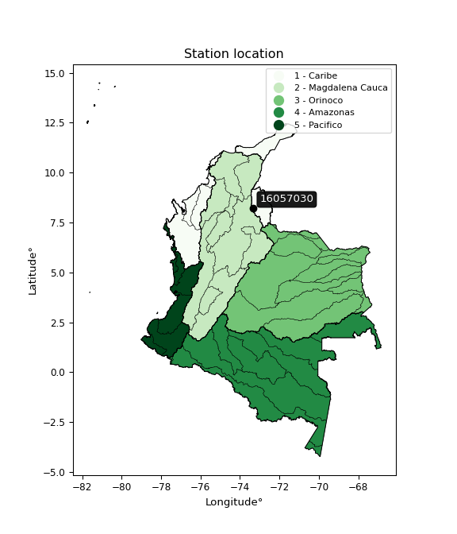

<div align="center">


</div>

# PMP Station (Rain, Pmax24h): 16057030

Probable Maximum Precipitation (PMP) is the greatest amount of rainfall for a specific duration that is meteorologically possible for a given location, acting as a "worst-case" scenario for extreme storms, crucial for designing safety-critical infrastructure like bridges, river deviations, dams, spillways, and nuclear plants to prevent catastrophic failure. PMP is calculated by hydrologists using meteorological data to determine the upper limit of extreme rainfall, often leading to the Probable Maximum Flood (PMF) for flood control design, and is increasingly being studied for climate change impacts. Probable Maximum Precipitation (PMP) is the theoretical upper limit of rainfall, a deterministic estimate for extreme events, while probability distributions (like GEV, Gumbel) describe the likelihood and frequency of various precipitation amounts, including rare ones, showing how often events occur, with PMP representing the extreme end of these distributions, used for critical infrastructure design to ensure safety against the worst conceivable weather, unlike standard statistical forecasts which cover typical probabilities.

The most common probability distributions in hydrology, used for analyzing floods, rainfall, and streamflow, include the Normal, Log-Normal, Gumbel, Gamma (including Log-Pearson Type III), and Generalized Extreme Value (GEV) distributions, often chosen based on the data´s skewness and whether modeling extremes or general conditions, with Gumbel and GEV popular for extreme events like floods, while the Normal distribution serves as a baseline, though often requiring transformations for skewed hydrological data. These distributions help in designing water infrastructure, managing water resources, and forecasting hydrologic events.

> Hydrological data often isn´t perfectly normal (it´s skewed), so different distributions are needed for different applications, such as: **Flood Frequency Analysis**: Using Gumbel, GEV, or Log-Pearson Type III for predicting extreme flood magnitudes and their return periods, **Rainfall Analysis**: Normal for annual totals, but Log-Normal, Weibull, or GEV for intensity or extreme daily rainfall, **Streamflow Modeling**: Gamma and Log-Normal for maximum flows, GEV for minimum flows, and Kappa for daily flows.

<div align="center">

</img>

</div>


## A. General information


### 1. General running parameters

• app_version: _v20260113_. • runtime: _2026-01-17 18:24:04.630693_. • Python version: _3.14.0_. • SciPy version: _1.16.3_. • Pandas version: _2.3.3_. • NumPy version: _2.3.5_. • Stations dataset (station_dataset_file): _dataset/pmax24h_in/automatic_colombia_2003_2025.csv_. • Stations catalog (station_catalog_file): _dataset/CNE.xls_. • Minimum year to eval til year_max (date_min): _1900_. • Maximum year to eval since year_min (date_max): _2025_. • Creates, save and include plots into reports (create_plot): _False_. • Plot only fit distributions with Δo > Δ (plot_only_fit): _True_. • Plot only simple graphs avoiding multiple CDFs and multiple Extreme values plots (plot_only_simple): _True_. • Eval low extreme values, if False, evaluates high extreme values (low_extreme): _False_. • Eval every SciPy distribution as logarithmic (pdist_logarithmic_on): _True_. • Standard deviation normalized (ddof): _1.0_. • Return periods to eval in years (Tr): _[2, 2.33, 5, 10, 15, 20, 25, 50, 75, 100, 200, 250, 500, 750, 1000]_. • Minimum data sample per station, 0 means any (minimum_sample): _5_. • Z-Score maximum threshold to adjust a value, 0 means disable (zscore_max): _3.5_. • Z-Score minimum threshold to adjust a value, 0 means disable (zscore_min): _-2.5_. • Avoid zeros, e.g. rain = 0 (avoid_zeros): _True_. • Avoid null values (avoid_nans): _True_. 

:file_folder:Table: [dataset.csv](../../dataset/pmax24h_in/automatic_colombia_2003_2025.csv)

> Delta Degrees of Freedom (DDOF): is a parameter used in the formulas for calculating variance and standard deviation. When ddof=0, the divisor is $N$ (the total number of observations) and this is used when your data set is the entire population. When ddof=1, the divisor is $N-1$ and this is used when your data set is a sample drawn from a larger population. Using $N-1$ provides an unbiased estimate of the population variance (known as Bessel´s correction).


### 2. Station info and location

|   id |   CODIGO | NOMBRE                     | CATEGORIA    | TECNOLOGIA                              | ESTADO           | FECHA_INSTALACION   |   FECHA_SUSPENSION |   ALTITUD |   LATITUD |   LONGITUD | DEPARTAMENTO       | MUNICIPIO   | AREA_OPERATIVA                         | ENTIDAD                                                     | AREA_HIDROGRAFICA   | ZONA_HIDROGRAFICA   | SUBZONA_HIDROGRAFICA           | CORRIENTE   | Catalogo   |   Version |
|-----:|---------:|:---------------------------|:-------------|:----------------------------------------|:-----------------|:--------------------|-------------------:|----------:|----------:|-----------:|:-------------------|:------------|:---------------------------------------|:------------------------------------------------------------|:--------------------|:--------------------|:-------------------------------|:------------|:-----------|----------:|
|    0 | 16057030 | LA CABANA - AUT [16057030] | Limnigráfica | Automática con Telemetría, Convencional | En Mantenimiento | 15/10/1971          |                nan |      1220 |   8.19781 |   -73.3183 | Norte De Santander | Ocaña       | Area Operativa 08 - Santanderes-Arauca | INSTITUTO DE HIDROLOGIA METEOROLOGIA Y ESTUDIOS AMBIENTALES | Caribe              | Catatumbo           | Río Algodonal (Alto Catatumbo) | Algodonal   | CNE_IDEAM  |  20251226 |

<div align="center">

Dynamic map: [:earth_americas:Google](http://maps.google.com/maps?q=8.197805556,-73.31825) [:earth_americas:OSM](https://www.openstreetmap.org/#map=18/8.197805556/-73.31825&layers=P) [:earth_americas:Bing](https://www.bing.com/maps?cp=8.197805556~-73.31825&lvl=18) [:earth_americas:Apple](https://maps.apple.com/frame?center=8.197805556%2C-73.31825&span=0.003%2C0.006)

</div>


<div align="center">

```geojson
{
  "type": "Feature",
  "geometry": {
    "type": "Point", 
    "coordinates": [-73.31825, 8.197805556]
  }, 
  "properties": {
    "Name": "16057030"
  }
}
```

</div>


### 3. Discrete values table and plot

<div align="center">

|               |           0 |            1 |           2 |           3 |           4 |           5 |          6 |           7 |           8 |          9 |          10 |         11 |           12 |          13 |          14 |         15 |
|:--------------|------------:|-------------:|------------:|------------:|------------:|------------:|-----------:|------------:|------------:|-----------:|------------:|-----------:|-------------:|------------:|------------:|-----------:|
| Date          | 2006        | 2007         | 2008        | 2009        | 2010        | 2011        | 2012       | 2013        | 2014        | 2015       | 2016        | 2017       | 2018         | 2019        | 2021        | 2022       |
| Value         |   36.7      |   45         |   45.7      |   34.1      |   36.7      |   52.7      |   49.1     |   45.6      |   48.8      |   87.7     |   51.2      |   55.4     |   42.1       |   29.8      |   30.3      |    6       |
| Value_initial |   36.7      |   45         |   45.7      |   34.1      |   36.7      |   52.7      |   49.1     |   45.6      |   48.8      |   87.7     |   51.2      |   55.4     |   42.1       |   29.8      |   30.3      |    6       |
| count         |   16        |   16         |   16        |   16        |   16        |   16        |   16       |   16        |   16        |   16       |   16        |   16       |   16         |   16        |   16        |   16       |
| mean          |   43.5562   |   43.5562    |   43.5562   |   43.5562   |   43.5562   |   43.5562   |   43.5562  |   43.5562   |   43.5562   |   43.5562  |   43.5562   |   43.5562  |   43.5562    |   43.5562   |   43.5562   |   43.5562  |
| std           |   16.8544   |   16.8544    |   16.8544   |   16.8544   |   16.8544   |   16.8544   |   16.8544  |   16.8544   |   16.8544   |   16.8544  |   16.8544   |   16.8544  |   16.8544    |   16.8544   |   16.8544   |   16.8544  |
| zscore        |   -0.406793 |    0.0856602 |    0.127192 |   -0.561055 |   -0.406793 |    0.542514 |    0.32892 |    0.121259 |    0.311121 |    2.61912 |    0.453517 |    0.70271 |   -0.0864018 |   -0.816182 |   -0.786516 |   -2.22828 |


</div>


> The initial value (value_initial) correspond to the initial obtained or null completed value, and value (value) is adjusted only when the initial value is outside the valid range (outlier) definite through the Z-Score value. If Z-Score is active, values out of range or outliers are replaced with the station mean value. A Z-Score (or standard score) measures how many standard deviations a data point is from the mean of a dataset, indicating its relative position; positive scores mean above the mean, negative mean below, and a score of zero is exactly at the mean, allowing for comparison of values from different distributions. It´s calculated using the formula $z=(x–μ)/σ$, where $x$ is the data point, $μ$ is the mean, and $σ$ is the standard deviation, helping identify outliers and understand probability.
>
> <sub>**Note**: In this study, "completing" (filling gaps in) and "extending" (forecasting or lengthening the historical record) rainfall data series are avoided for certain critical analyses because they introduce artificial bias and uncertainty, which can distort the statistics of rare events (extremes), alter day-to-day variability, and compromise the integrity and homogeneity of the original data. Some reasons against Completing/Extending rainfall data are: **Distortion of Extremes and Variability**: The primary issue is that most gap-filling or extension methods rely on averaging or regression with nearby stations, which inherently smooths the data. Rainfall is highly variable in space and time, with a large percentage of zero values and occasional large storms. Infilling methods often underestimate the highest values and overestimate the lowest (zero) values, which severely distorts analyses focused on flood frequency, drought severity, and intensity-duration-frequency (IDF) curves, **Loss of Data Homogeneity**: Infilled or extended data are synthetic estimates, not actual measurements. Combining these estimates with observed data can violate the assumption of data homogeneity, which requires that the data properties do not change over time. Inhomogeneity can lead to incorrect conclusions about long-term trends or changes in climate patterns, **Propagation of Errors**: Errors and biases from the original data (e.g., wind-induced undercatch, instrument errors, site changes) or the data used for imputation can propagate through the analysis, leading to unreliable hydrological models and inaccurate predictions, **Compromised Statistical Integrity**: For statistical analyses, especially those involving the frequency of events, using artificial data can introduce time bias or autocorrelation that doesn´t exist in reality, making it difficult to assess the true probability of events, **Difficulty in Validation**: It is difficult to accurately validate the quality of filled or extended data, especially for past periods where ground-truth measurements are unavailable. The reliability of imputation techniques heavily depends on the density of the surrounding station network and the complexity of the local topography.</sub>


### 4. Active continuous probability distributions from SciPy (80 of 104 available)

A Probability Density Function (PDF) describes the relative likelihood of a continuous random variable falling within a specific range, where the total area under its curve equals 1, and the area over any interval gives the actual probability for that range. Unlike discrete probabilities (like rolling a die), a PDF shows density, not direct probability for a single point (which is zero), with higher points indicating higher likelihood, often visualized as a bell curve for normal distributions.

A log of a probability density function (log-PDF) is simply the logarithm of the PDF´s value, denoted as $log(f(x))$, useful for converting multiplication of probabilities into addition, improving numerical stability with tiny numbers, and connecting to information theory concepts like entropy. Instead of dealing with very small probabilities (e.g., 0.000001), log-PDFs use negative numbers (e.g., $log(0.00001) ≈ -11.51$ that are easier for computers to handle, preventing underflow errors and simplifying complex calculations. In this study, each active probability distribution from SciPy is also evaluated in the $log$ form.

[scipy.stats](https://docs.scipy.org/doc/scipy/reference/stats.html) is a Python´s powerful submodule within the SciPy library for comprehensive statistical analysis, offering over 130 probability distributions (like Normal, Poisson), functions for descriptive stats (mean, variance), hypothesis testing (t-tests, chi-square), random variable generation, and statistical tests, making it essential for data science, modeling, and research. It provides tools to explore, model, and draw conclusions from data efficiently, working seamlessly with NumPy.

<div align="center">

|   id | p_dist           |   n_parameter | fit_method   | label                                                                       | active   | ref                                                                                                      |
|-----:|:-----------------|--------------:|:-------------|:----------------------------------------------------------------------------|:---------|:---------------------------------------------------------------------------------------------------------|
|    0 | alpha            |             3 | MLE          | Alpha                                                                       | True     | [:mortar_board:](https://docs.scipy.org/doc/scipy/reference/generated/scipy.stats.alpha.html)            |
|    1 | anglit           |             2 | MM           | Anglit                                                                      | True     | [:mortar_board:](https://docs.scipy.org/doc/scipy/reference/generated/scipy.stats.anglit.html)           |
|    2 | arcsine          |             2 | MM           | Arcsine                                                                     | True     | [:mortar_board:](https://docs.scipy.org/doc/scipy/reference/generated/scipy.stats.arcsine.html)          |
|    3 | argus            |             3 | MLE          | Argus                                                                       | True     | [:mortar_board:](https://docs.scipy.org/doc/scipy/reference/generated/scipy.stats.argus.html)            |
|    4 | beta             |             4 | MLE          | Beta                                                                        | True     | [:mortar_board:](https://docs.scipy.org/doc/scipy/reference/generated/scipy.stats.beta.html)             |
|    5 | betaprime        |             4 | MLE          | Beta prime                                                                  | True     | [:mortar_board:](https://docs.scipy.org/doc/scipy/reference/generated/scipy.stats.betaprime.html)        |
|    6 | bradford         |             3 | MLE          | Bradford                                                                    | True     | [:mortar_board:](https://docs.scipy.org/doc/scipy/reference/generated/scipy.stats.bradford.html)         |
|    7 | burr             |             4 | MLE          | Burr (Type III)                                                             | True     | [:mortar_board:](https://docs.scipy.org/doc/scipy/reference/generated/scipy.stats.burr.html)             |
|    8 | burr12           |             4 | MLE          | Burr (Type III) 12                                                          | True     | [:mortar_board:](https://docs.scipy.org/doc/scipy/reference/generated/scipy.stats.burr12.html)           |
|    9 | cosine           |             2 | MLE          | Cosine                                                                      | True     | [:mortar_board:](https://docs.scipy.org/doc/scipy/reference/generated/scipy.stats.cosine.html)           |
|   10 | crystalball      |             4 | MLE          | Crystalball                                                                 | True     | [:mortar_board:](https://docs.scipy.org/doc/scipy/reference/generated/scipy.stats.crystalball.html)      |
|   11 | dgamma           |             3 | MLE          | Double gamma                                                                | True     | [:mortar_board:](https://docs.scipy.org/doc/scipy/reference/generated/scipy.stats.dgamma.html)           |
|   12 | dweibull         |             3 | MLE          | Double Weibull                                                              | True     | [:mortar_board:](https://docs.scipy.org/doc/scipy/reference/generated/scipy.stats.dweibull.html)         |
|   13 | erlang           |             3 | MLE          | Erlang                                                                      | True     | [:mortar_board:](https://docs.scipy.org/doc/scipy/reference/generated/scipy.stats.erlang.html)           |
|   14 | exponnorm        |             3 | MLE          | Exponentially modified Normal                                               | True     | [:mortar_board:](https://docs.scipy.org/doc/scipy/reference/generated/scipy.stats.exponnorm.html)        |
|   15 | exponpow         |             3 | MLE          | Exponential power                                                           | True     | [:mortar_board:](https://docs.scipy.org/doc/scipy/reference/generated/scipy.stats.exponpow.html)         |
|   16 | exponweib        |             4 | MLE          | Exponentiated Weibull                                                       | True     | [:mortar_board:](https://docs.scipy.org/doc/scipy/reference/generated/scipy.stats.exponweib.html)        |
|   17 | f                |             4 | MLE          | F                                                                           | True     | [:mortar_board:](https://docs.scipy.org/doc/scipy/reference/generated/scipy.stats.f.html)                |
|   18 | fatiguelife      |             3 | MLE          | Fatigue-life (Birnbaum-Saunders)                                            | True     | [:mortar_board:](https://docs.scipy.org/doc/scipy/reference/generated/scipy.stats.fatiguelife.html)      |
|   19 | foldnorm         |             3 | MM           | Fold Normal                                                                 | True     | [:mortar_board:](https://docs.scipy.org/doc/scipy/reference/generated/scipy.stats.foldnorm.html)         |
|   20 | gamma            |             3 | MLE          | Gamma                                                                       | True     | [:mortar_board:](https://docs.scipy.org/doc/scipy/reference/generated/scipy.stats.gamma.html)            |
|   21 | gausshyper       |             6 | MLE          | Gauss hypergeometric                                                        | True     | [:mortar_board:](https://docs.scipy.org/doc/scipy/reference/generated/scipy.stats.gausshyper.html)       |
|   22 | genexpon         |             5 | MLE          | Generalized exponential                                                     | True     | [:mortar_board:](https://docs.scipy.org/doc/scipy/reference/generated/scipy.stats.genexpon.html)         |
|   23 | genextreme       |             3 | MLE          | Generalized exponential                                                     | True     | [:mortar_board:](https://docs.scipy.org/doc/scipy/reference/generated/scipy.stats.genextreme.html)       |
|   24 | gengamma         |             4 | MLE          | Generalized gamma                                                           | True     | [:mortar_board:](https://docs.scipy.org/doc/scipy/reference/generated/scipy.stats.gengamma.html)         |
|   25 | genhalflogistic  |             3 | MLE          | Generalized half-logistic                                                   | True     | [:mortar_board:](https://docs.scipy.org/doc/scipy/reference/generated/scipy.stats.genhalflogistic.html)  |
|   26 | genlogistic      |             3 | MLE          | Generalized logistic                                                        | True     | [:mortar_board:](https://docs.scipy.org/doc/scipy/reference/generated/scipy.stats.genlogistic.html)      |
|   27 | gennorm          |             3 | MLE          | Generalized Normal                                                          | True     | [:mortar_board:](https://docs.scipy.org/doc/scipy/reference/generated/scipy.stats.gennorm.html)          |
|   28 | genpareto        |             3 | MLE          | Generalized Pareto                                                          | True     | [:mortar_board:](https://docs.scipy.org/doc/scipy/reference/generated/scipy.stats.genpareto.html)        |
|   29 | gompertz         |             3 | MLE          | Gompertz (or truncated Gumbel)                                              | True     | [:mortar_board:](https://docs.scipy.org/doc/scipy/reference/generated/scipy.stats.gompertz.html)         |
|   30 | gumbel_l         |             2 | MM           | Gumbel Left Skew                                                            | True     | [:mortar_board:](https://docs.scipy.org/doc/scipy/reference/generated/scipy.stats.gumbel_l.html)         |
|   31 | gumbel_r         |             2 | MM           | Gumbel Right Skew                                                           | True     | [:mortar_board:](https://docs.scipy.org/doc/scipy/reference/generated/scipy.stats.gumbel_r.html)         |
|   32 | halfgennorm      |             3 | MLE          | Upper half of a generalized normal                                          | True     | [:mortar_board:](https://docs.scipy.org/doc/scipy/reference/generated/scipy.stats.halfgennorm.html)      |
|   33 | halflogistic     |             2 | MM           | Half-logistic                                                               | True     | [:mortar_board:](https://docs.scipy.org/doc/scipy/reference/generated/scipy.stats.halflogistic.html)     |
|   34 | halfnorm         |             2 | MM           | Half Normal                                                                 | True     | [:mortar_board:](https://docs.scipy.org/doc/scipy/reference/generated/scipy.stats.halfnorm.html)         |
|   35 | hypsecant        |             2 | MM           | hyperbolic secant                                                           | True     | [:mortar_board:](https://docs.scipy.org/doc/scipy/reference/generated/scipy.stats.hypsecant.html)        |
|   36 | invgamma         |             3 | MLE          | Inverted gamma                                                              | True     | [:mortar_board:](https://docs.scipy.org/doc/scipy/reference/generated/scipy.stats.invgamma.html)         |
|   37 | invgauss         |             3 | MLE          | Inverse Gaussian                                                            | True     | [:mortar_board:](https://docs.scipy.org/doc/scipy/reference/generated/scipy.stats.invgauss.html)         |
|   38 | invweibull       |             3 | MLE          | Inverted Weibull                                                            | True     | [:mortar_board:](https://docs.scipy.org/doc/scipy/reference/generated/scipy.stats.invweibull.html)       |
|   39 | johnsonsb        |             4 | MLE          | Johnson SB                                                                  | True     | [:mortar_board:](https://docs.scipy.org/doc/scipy/reference/generated/scipy.stats.johnsonsb.html)        |
|   40 | johnsonsu        |             4 | MLE          | Johnson Su                                                                  | True     | [:mortar_board:](https://docs.scipy.org/doc/scipy/reference/generated/scipy.stats.johnsonsu.html)        |
|   41 | kappa3           |             3 | MLE          | Kappa 3                                                                     | True     | [:mortar_board:](https://docs.scipy.org/doc/scipy/reference/generated/scipy.stats.kappa3.html)           |
|   42 | kappa4           |             4 | MLE          | Kappa 4                                                                     | True     | [:mortar_board:](https://docs.scipy.org/doc/scipy/reference/generated/scipy.stats.kappa4.html)           |
|   43 | ksone            |             3 | MLE          | Kolmogorov-Smirnov one-sided test statistic distribution                    | True     | [:mortar_board:](https://docs.scipy.org/doc/scipy/reference/generated/scipy.stats.ksone.html)            |
|   44 | kstwobign        |             2 | MLE          | Limiting distribution of scaled Kolmogorov-Smirnov two-sided test statistic | True     | [:mortar_board:](https://docs.scipy.org/doc/scipy/reference/generated/scipy.stats.kstwobign.html)        |
|   45 | laplace          |             2 | MM           | Laplace                                                                     | True     | [:mortar_board:](https://docs.scipy.org/doc/scipy/reference/generated/scipy.stats.laplace.html)          |
|   46 | levy_l           |             2 | MLE          | Left-skewed Levy                                                            | True     | [:mortar_board:](https://docs.scipy.org/doc/scipy/reference/generated/scipy.stats.levy_l.html)           |
|   47 | loggamma         |             3 | MLE          | Log gamma                                                                   | True     | [:mortar_board:](https://docs.scipy.org/doc/scipy/reference/generated/scipy.stats.loggamma.html)         |
|   48 | logistic         |             2 | MM           | Logistic (or Sech-squared)                                                  | True     | [:mortar_board:](https://docs.scipy.org/doc/scipy/reference/generated/scipy.stats.logistic.html)         |
|   49 | loglaplace       |             3 | MLE          | Log-Laplace                                                                 | True     | [:mortar_board:](https://docs.scipy.org/doc/scipy/reference/generated/scipy.stats.loglaplace.html)       |
|   50 | lomax            |             3 | MLE          | Lomax (Pareto of the second kind)                                           | True     | [:mortar_board:](https://docs.scipy.org/doc/scipy/reference/generated/scipy.stats.lomax.html)            |
|   51 | maxwell          |             2 | MM           | Maxwell                                                                     | True     | [:mortar_board:](https://docs.scipy.org/doc/scipy/reference/generated/scipy.stats.maxwell.html)          |
|   52 | mielke           |             4 | MLE          | Mielke Beta-Kappa / Dagum                                                   | True     | [:mortar_board:](https://docs.scipy.org/doc/scipy/reference/generated/scipy.stats.mielke.html)           |
|   53 | moyal            |             2 | MM           | Moyal                                                                       | True     | [:mortar_board:](https://docs.scipy.org/doc/scipy/reference/generated/scipy.stats.moyal.html)            |
|   54 | nakagami         |             3 | MLE          | Nakagami                                                                    | True     | [:mortar_board:](https://docs.scipy.org/doc/scipy/reference/generated/scipy.stats.nakagami.html)         |
|   55 | ncf              |             5 | MLE          | Non-central F distribution                                                  | True     | [:mortar_board:](https://docs.scipy.org/doc/scipy/reference/generated/scipy.stats.ncf.html)              |
|   56 | nct              |             4 | MLE          | Non-central Student’s t                                                     | True     | [:mortar_board:](https://docs.scipy.org/doc/scipy/reference/generated/scipy.stats.nct.html)              |
|   57 | norm             |             2 | MM           | Normal                                                                      | True     | [:mortar_board:](https://docs.scipy.org/doc/scipy/reference/generated/scipy.stats.norm.html)             |
|   58 | pearson3         |             3 | MM           | Pearson type III                                                            | True     | [:mortar_board:](https://docs.scipy.org/doc/scipy/reference/generated/scipy.stats.pearson3.html)         |
|   59 | powerlaw         |             3 | MLE          | Power-function                                                              | True     | [:mortar_board:](https://docs.scipy.org/doc/scipy/reference/generated/scipy.stats.powerlaw.html)         |
|   60 | rayleigh         |             2 | MM           | Rayleigh                                                                    | True     | [:mortar_board:](https://docs.scipy.org/doc/scipy/reference/generated/scipy.stats.rayleigh.html)         |
|   61 | rdist            |             3 | MLE          | R-distributed (symmetric beta)                                              | True     | [:mortar_board:](https://docs.scipy.org/doc/scipy/reference/generated/scipy.stats.rdist.html)            |
|   62 | rice             |             3 | MLE          | Rice                                                                        | True     | [:mortar_board:](https://docs.scipy.org/doc/scipy/reference/generated/scipy.stats.rice.html)             |
|   63 | semicircular     |             2 | MM           | Semicircular                                                                | True     | [:mortar_board:](https://docs.scipy.org/doc/scipy/reference/generated/scipy.stats.semicircular.html)     |
|   64 | skewnorm         |             3 | MLE          | Skew normal                                                                 | True     | [:mortar_board:](https://docs.scipy.org/doc/scipy/reference/generated/scipy.stats.skewnorm.html)         |
|   65 | t                |             3 | MLE          | Student’s t                                                                 | True     | [:mortar_board:](https://docs.scipy.org/doc/scipy/reference/generated/scipy.stats.t.html)                |
|   66 | trapezoid        |             4 | MLE          | Trapezoid                                                                   | True     | [:mortar_board:](https://docs.scipy.org/doc/scipy/reference/generated/scipy.stats.trapezoid.html)        |
|   67 | triang           |             3 | MLE          | Triangular                                                                  | True     | [:mortar_board:](https://docs.scipy.org/doc/scipy/reference/generated/scipy.stats.triang.html)           |
|   68 | truncexpon       |             3 | MLE          | Truncated exponential                                                       | True     | [:mortar_board:](https://docs.scipy.org/doc/scipy/reference/generated/scipy.stats.truncexpon.html)       |
|   69 | truncnorm        |             4 | MLE          | Truncated normal                                                            | True     | [:mortar_board:](https://docs.scipy.org/doc/scipy/reference/generated/scipy.stats.truncnorm.html)        |
|   70 | truncpareto      |             4 | MLE          | Upper truncated Pareto                                                      | True     | [:mortar_board:](https://docs.scipy.org/doc/scipy/reference/generated/scipy.stats.truncpareto.html)      |
|   71 | truncweibull_min |             5 | MLE          | Doubly truncated Weibull minimum                                            | True     | [:mortar_board:](https://docs.scipy.org/doc/scipy/reference/generated/scipy.stats.truncweibull_min.html) |
|   72 | tukeylambda      |             3 | MLE          | Tukey-Lamdba                                                                | True     | [:mortar_board:](https://docs.scipy.org/doc/scipy/reference/generated/scipy.stats.tukeylambda.html)      |
|   73 | uniform          |             2 | MLE          | Uniform                                                                     | True     | [:mortar_board:](https://docs.scipy.org/doc/scipy/reference/generated/scipy.stats.uniform.html)          |
|   74 | vonmises         |             3 | MLE          | Von Mises                                                                   | True     | [:mortar_board:](https://docs.scipy.org/doc/scipy/reference/generated/scipy.stats.vonmises.html)         |
|   75 | vonmises_line    |             3 | MLE          | Von Mises line                                                              | True     | [:mortar_board:](https://docs.scipy.org/doc/scipy/reference/generated/scipy.stats.vonmises_line.html)    |
|   76 | wald             |             2 | MM           | Wald                                                                        | True     | [:mortar_board:](https://docs.scipy.org/doc/scipy/reference/generated/scipy.stats.wald.html)             |
|   77 | weibull_max      |             3 | MLE          | Weibull maximum                                                             | True     | [:mortar_board:](https://docs.scipy.org/doc/scipy/reference/generated/scipy.stats.weibull_max.html)      |
|   78 | weibull_min      |             3 | MLE          | Weibull minimum                                                             | True     | [:mortar_board:](https://docs.scipy.org/doc/scipy/reference/generated/scipy.stats.weibull_min.html)      |
|   79 | wrapcauchy       |             3 | MLE          | Wrapped  Cauchy                                                             | True     | [:mortar_board:](https://docs.scipy.org/doc/scipy/reference/generated/scipy.stats.wrapcauchy.html)       |

</div>

> **n_parameter:** # arguments & localization & scale.
>
> **Fit methods:** (MLE) maximum likelihood, (MM) L-moments.
>
>**Inactive** (With the only purpose of prevent loops, zero divisions, infinite values, over high estimated values or horizontal trending for recurrence intervals estimations, the follow distributions were disabled.)**:** lognorm, norminvgauss, powernorm, powerlognorm, cauchy, halfcauchy, foldcauchy, skewcauchy, chi2, expon, fisk, genhyperbolic, geninvgauss, gibrat, kstwo, laplace_asymmetric, levy, levy_stable, ncx2, pareto, rel_breitwigner, recipinvgauss, studentized_range, loguniform, 


## B. Probability (PDF) vs. Empirical (EDF) distributions functions

A continuous probability distribution (CPD) describes probabilities for variables that can take any value within a range (like rain any time), unlike discrete variables with specific outcomes (like temperature). It uses a Probability Density Function (PDF), a curve where the total area under it equals 1, and the probability of the variable falling within an interval (a to b) is found by calculating the area under the curve between those points. A key feature is that the probability of hitting any single exact value is zero, so probabilities are always expressed for ranges, e.g., $P(a ≤ X ≤ b)$.

<div align="center">

Distributions parameters from station values
|     |   station | p_dist              |   n |               loc |            scale | shape                  | shape1                 | shape2               | shape3             |
|----:|----------:|:--------------------|----:|------------------:|-----------------:|:-----------------------|:-----------------------|:---------------------|:-------------------|
|   0 |  16057030 | alpha               |  16 |    -588.439       |  23456.6         | 37.158066545750145     |                        |                      |                    |
|   1 |  16057030 | anglit              |  16 |      43.5563      |     47.7401      |                        |                        |                      |                    |
|   2 |  16057030 | arcsine             |  16 |      20.4774      |     46.1577      |                        |                        |                      |                    |
|   3 |  16057030 | argus               |  16 |      -5.6415      |     95.083       | 6.912512539575306e-06  |                        |                      |                    |
|   4 |  16057030 | beta                |  16 |    -116.824       |  83023.8         | 96.34549935422933      | 49777.36062103849      |                      |                    |
|   5 |  16057030 | betaprime           |  16 |    -147.884       |  14705.4         | 140.45610981155465     | 10790.07864816805      |                      |                    |
|   6 |  16057030 | bradford            |  16 |      -2.89325     |     90.5933      | 1.035875747968035e-05  |                        |                      |                    |
|   7 |  16057030 | burr                |  16 |      -0.38153     |     53.7727      | 8.227260783665464      | 0.33357459527653754    |                      |                    |
|   8 |  16057030 | burr12              |  16 |    -157.692       |    201.104       | 22.704059497541984     | 1.0341303136431086     |                      |                    |
|   9 |  16057030 | cosine              |  16 |      45.1302      |     16.6345      |                        |                        |                      |                    |
|  10 |  16057030 | crystalball         |  16 |      43.5562      |     16.3192      | 1874.9618619466005     | 5689.133357719931      |                      |                    |
|  11 |  16057030 | dgamma              |  16 |      45           |     11.5487      | 0.9529714043383641     |                        |                      |                    |
|  12 |  16057030 | dweibull            |  16 |      45.7         |     11.7095      | 0.9445761663575352     |                        |                      |                    |
|  13 |  16057030 | erlang              |  16 |    -144.408       |      1.40717     | 133.5823579471476      |                        |                      |                    |
|  14 |  16057030 | exponnorm           |  16 |      33.3947      |     12.3881      | 0.8202718914014138     |                        |                      |                    |
|  15 |  16057030 | exponpow            |  16 |       6           |      7.89664     | 0.1423634832403832     |                        |                      |                    |
|  16 |  16057030 | exponweib           |  16 |    -368.627       |    199.967       | 4788.4366441913735     | 3.0325609706623737     |                      |                    |
|  17 |  16057030 | f                   |  16 |    -147.508       |    191.055       | 277.94331476241496     | 44085.15944736339      |                      |                    |
|  18 |  16057030 | fatiguelife         |  16 |       5.94226     |      2.63322     | 3.89420610773362       |                        |                      |                    |
|  19 |  16057030 | foldnorm            |  16 |      22.9697      |     25.4871      | 0.19859881829928006    |                        |                      |                    |
|  20 |  16057030 | gamma               |  16 |    -146.759       |      1.38911     | 137.0053163479629      |                        |                      |                    |
|  21 |  16057030 | gausshyper          |  16 |     -61.0652      |    431.604       | 25.840555692738512     | 112.28832593472902     | -31.40157607784538   | 1.9378794931292678 |
|  22 |  16057030 | genexpon            |  16 |       5.99999     |      1.56251     | 0.041611454361514685   | 1.003492687583937e-06  | 1.330556152875682    |                    |
|  23 |  16057030 | genextreme          |  16 |      37.2852      |     16.0965      | 0.19456907407425528    |                        |                      |                    |
|  24 |  16057030 | gengamma            |  16 |    -115.642       |      9.83313     | 48.8484950423713       | 1.3955422583567616     |                      |                    |
|  25 |  16057030 | genhalflogistic     |  16 |       5.99995     |     37.8641      | 0.4137037486300955     |                        |                      |                    |
|  26 |  16057030 | genlogistic         |  16 |      43.8009      |      7.93732     | 0.9536462080923653     |                        |                      |                    |
|  27 |  16057030 | gennorm             |  16 |      45.6         |      2.82584     | 0.5573016916568112     |                        |                      |                    |
|  28 |  16057030 | genpareto           |  16 |      -0.167802    |     97.1049      | -1.1051248911649505    |                        |                      |                    |
|  29 |  16057030 | gompertz            |  16 |       0.0943116   |      3.00482     | 3.4788023228499607e-12 |                        |                      |                    |
|  30 |  16057030 | gumbel_l            |  16 |      50.9008      |     12.724       |                        |                        |                      |                    |
|  31 |  16057030 | gumbel_r            |  16 |      36.2117      |     12.724       |                        |                        |                      |                    |
|  32 |  16057030 | halfgennorm         |  16 |       6           |     67.4336      | 4.329394067806907      |                        |                      |                    |
|  33 |  16057030 | halflogistic        |  16 |      24.2142      |     13.9523      |                        |                        |                      |                    |
|  34 |  16057030 | halfnorm            |  16 |      21.956       |     27.0719      |                        |                        |                      |                    |
|  35 |  16057030 | hypsecant           |  16 |      43.5562      |     10.3891      |                        |                        |                      |                    |
|  36 |  16057030 | invgamma            |  16 |    -148.464       |  26630.8         | 139.7443164792685      |                        |                      |                    |
|  37 |  16057030 | invgauss            |  16 |     -69.4303      |   4871.48        | 0.02310514085604977    |                        |                      |                    |
|  38 |  16057030 | invweibull          |  16 |      -2.70253e+09 |      2.70253e+09 | 162919000.4542946      |                        |                      |                    |
|  39 |  16057030 | johnsonsb           |  16 |    -190.896       |   2157.19        | 27.1191341160012       | 12.872093774048658     |                      |                    |
|  40 |  16057030 | johnsonsu           |  16 |      46.0866      |      8.15302     | 0.2076323842709477     | 0.9031226142593016     |                      |                    |
|  41 |  16057030 | kappa3              |  16 |       6           |     44.3624      | 7.81370849010343       |                        |                      |                    |
|  42 |  16057030 | kappa4              |  16 |      -2.37765     |     85.867       | 1.1078127860889688     | 0.95005451513595       |                      |                    |
|  43 |  16057030 | ksone               |  16 |      -2.17        |     98.04        | 1.0                    |                        |                      |                    |
|  44 |  16057030 | kstwobign           |  16 |     -27.5943      |     82.2427      |                        |                        |                      |                    |
|  45 |  16057030 | laplace             |  16 |      43.5562      |     11.5394      |                        |                        |                      |                    |
|  46 |  16057030 | levy_l              |  16 |      92.5977      |     31.6259      |                        |                        |                      |                    |
|  47 |  16057030 | loggamma            |  16 |   -3673.3         |    533.573       | 1060.3069348084412     |                        |                      |                    |
|  48 |  16057030 | logistic            |  16 |      43.5562      |      8.99725     |                        |                        |                      |                    |
|  49 |  16057030 | loglaplace          |  16 |      -0.108061    |     45.7081      | 3.2584898853567186     |                        |                      |                    |
|  50 |  16057030 | lomax               |  16 |       6           |      6.24371e+09 | 159501725.03748316     |                        |                      |                    |
|  51 |  16057030 | maxwell             |  16 |       4.8866      |     24.2326      |                        |                        |                      |                    |
|  52 |  16057030 | mielke              |  16 |      -0.272037    |     53.6906      | 2.7300432864350617     | 8.205888765548108      |                      |                    |
|  53 |  16057030 | moyal               |  16 |      34.2239      |      7.34622     |                        |                        |                      |                    |
|  54 |  16057030 | nakagami            |  16 |      29.8         |     18.8187      | 0.1319533034303878     |                        |                      |                    |
|  55 |  16057030 | ncf                 |  16 |      -0.128131    |      4.32613     | 3.297640389725534      | 22.680361630899576     | 27.92575303955094    |                    |
|  56 |  16057030 | nct                 |  16 |      46.8669      |      8.26828     | 2.00139309311447       | -0.3203582827972117    |                      |                    |
|  57 |  16057030 | norm                |  16 |      43.5562      |     16.3192      |                        |                        |                      |                    |
|  58 |  16057030 | pearson3            |  16 |      43.5562      |     16.3193      | 0.4289617723792919     |                        |                      |                    |
|  59 |  16057030 | powerlaw            |  16 |       6           |     81.7         | 0.3169959897436568     |                        |                      |                    |
|  60 |  16057030 | rayleigh            |  16 |      12.3366      |     24.9096      |                        |                        |                      |                    |
|  61 |  16057030 | rdist               |  16 |      -1.16557     |     56.5656      | 1.095758927856836      |                        |                      |                    |
|  62 |  16057030 | rice                |  16 |       5.8873      |     13.9053      | 1.23380507796801e-08   |                        |                      |                    |
|  63 |  16057030 | semicircular        |  16 |      43.5562      |     32.6384      |                        |                        |                      |                    |
|  64 |  16057030 | skewnorm            |  16 |      30.6527      |     20.8043      | 1.270888698227166      |                        |                      |                    |
|  65 |  16057030 | t                   |  16 |      41.2242      |     15.3232      | 5.934733949909777      |                        |                      |                    |
|  66 |  16057030 | trapezoid           |  16 |      -2.2785      |     98.04        | 0.9999999999999999     | 1.0                    |                      |                    |
|  67 |  16057030 | triang              |  16 |      -0.555898    |     94.0013      | 0.48463050179903805    |                        |                      |                    |
|  68 |  16057030 | truncexpon          |  16 |      -1.71854     |    114.099       | 0.7836899474376204     |                        |                      |                    |
|  69 |  16057030 | truncnorm           |  16 |      43.5563      |     16.3192      | -81.34431475686634     | 425.5412857834875      |                      |                    |
|  70 |  16057030 | truncpareto         |  16 |       6           |      4.29607e-06 | 0.06666679200939904    | 19017381.993014783     |                      |                    |
|  71 |  16057030 | truncweibull_min    |  16 |       0.693439    |     67.3868      | 1.8648723593784684     | 0.0035840953347046726  | 1.2911505601897053   |                    |
|  72 |  16057030 | tukeylambda         |  16 |      -0.351044    |     73.1524      | 1.312126881800471      |                        |                      |                    |
|  73 |  16057030 | uniform             |  16 |       6           |     81.7         |                        |                        |                      |                    |
|  74 |  16057030 | vonmises            |  16 |      -0.768291    |      1           | 0.5936797570927537     |                        |                      |                    |
|  75 |  16057030 | vonmises_line       |  16 |       2.43215     |     16.8602      | 1.7987739994520632e-05 |                        |                      |                    |
|  76 |  16057030 | wald                |  16 |      27.2371      |     16.3192      |                        |                        |                      |                    |
|  77 |  16057030 | weibull_max         |  16 |      87.7         |      1.65027     | 0.2126568567509718     |                        |                      |                    |
|  78 |  16057030 | weibull_min         |  16 |      29.8         |     27.6121      | 0.36795898753289996    |                        |                      |                    |
|  79 |  16057030 | wrapcauchy          |  16 |       4.66916     |     13.2148      | 4.129520615292566e-06  |                        |                      |                    |
|  80 |  16057030 | logalpha            |  16 |     -17.725       |    764.253       | 35.745236191203304     |                        |                      |                    |
|  81 |  16057030 | loganglit           |  16 |       3.66821     |      1.6004      |                        |                        |                      |                    |
|  82 |  16057030 | logarcsine          |  16 |       2.89455     |      1.54733     |                        |                        |                      |                    |
|  83 |  16057030 | logargus            |  16 |       1.24922     |      3.25252     | 2.266537082540263      |                        |                      |                    |
|  84 |  16057030 | logbeta             |  16 |      -2.78161e+07 |      2.78161e+07 | 121178107.13818334     | 4.544845634564939      |                      |                    |
|  85 |  16057030 | logbetaprime        |  16 |     -14.9231      |     29.9442      | 1623.6428831016747     | 2617.646490758304      |                      |                    |
|  86 |  16057030 | logbradford         |  16 |       1.79176     |      2.68218     | 1.0185077852100424     |                        |                      |                    |
|  87 |  16057030 | logburr             |  16 | -946335           | 946339           | 8823803.223945923      | 0.28553481018498694    |                      |                    |
|  88 |  16057030 | logburr12           |  16 |    -207.314       |    215.327       | 603.6145865829117      | 117644.66164676781     |                      |                    |
|  89 |  16057030 | logcosine           |  16 |       3.45989     |      0.618351    |                        |                        |                      |                    |
|  90 |  16057030 | logcrystalball      |  16 |       3.78827     |      0.272052    | 1.7716415118383213     | 1.8355237975326912     |                      |                    |
|  91 |  16057030 | logdgamma           |  16 |       3.8221      |      0.327821    | 0.7937979578213837     |                        |                      |                    |
|  92 |  16057030 | logdweibull         |  16 |       3.81991     |      0.338489    | 0.6955053241576821     |                        |                      |                    |
|  93 |  16057030 | logerlang           |  16 |      -2.72901     |      0.0629588   | 101.49238722910358     |                        |                      |                    |
|  94 |  16057030 | logexponnorm        |  16 |       3.6679      |      0.547074    | 0.0005843002572330047  |                        |                      |                    |
|  95 |  16057030 | logexponpow         |  16 |       1.79176     |      1.40289     | 0.5661686087997362     |                        |                      |                    |
|  96 |  16057030 | logexponweib        |  16 |       1.79176     |      1.06655     | 1.1158360975421253     | 0.7778932045044431     |                      |                    |
|  97 |  16057030 | logf                |  16 |   -1769.09        |   1772.76        | 62003555.14894684      | 31798355.118955582     |                      |                    |
|  98 |  16057030 | logfatiguelife      |  16 |    -725.654       |    729.322       | 0.0007491426347878928  |                        |                      |                    |
|  99 |  16057030 | logfoldnorm         |  16 |       1.65904     |      0.501035    | 4.01865559005767       |                        |                      |                    |
| 100 |  16057030 | loggamma            |  16 |      -8.09135     |      0.029397    | 399.73887730849265     |                        |                      |                    |
| 101 |  16057030 | loggausshyper       |  16 |       1.76428     |      2.70964     | 1.1264458315860255     | 0.6169788928569513     | 1.1080371056551745   | 0.9726601476980028 |
| 102 |  16057030 | loggenexpon         |  16 |       1.79048     |      0.00519919  | 0.0003552831618341541  | 1.5983758042361162     | 7.68484855667735e-06 |                    |
| 103 |  16057030 | loggenextreme       |  16 |       3.56682     |      0.579014    | 0.6013683373701648     |                        |                      |                    |
| 104 |  16057030 | loggengamma         |  16 |       1.79176     |      1.08806     | 1.0512575154732975     | 0.8141778600806198     |                      |                    |
| 105 |  16057030 | loggenhalflogistic  |  16 |       1.63411     |      2.98216     | 1.0501247756763514     |                        |                      |                    |
| 106 |  16057030 | loggenlogistic      |  16 |       3.97966     |      0.122243    | 0.32928209355089466    |                        |                      |                    |
| 107 |  16057030 | loggennorm          |  16 |       3.81991     |      0.0179272   | 0.4036000080608396     |                        |                      |                    |
| 108 |  16057030 | loggenpareto        |  16 |      -0.00249014  |      8.67808     | -1.9386231185356455    |                        |                      |                    |
| 109 |  16057030 | loggompertz         |  16 |       1.79174     |      0.370672    | 0.003589033088033816   |                        |                      |                    |
| 110 |  16057030 | loggumbel_l         |  16 |       3.91443     |      0.426551    |                        |                        |                      |                    |
| 111 |  16057030 | loggumbel_r         |  16 |       3.422       |      0.426551    |                        |                        |                      |                    |
| 112 |  16057030 | loghalfgennorm      |  16 |       1.78976     |      2.71118     | 246.18885472362794     |                        |                      |                    |
| 113 |  16057030 | loghalflogistic     |  16 |       3.01986     |      0.467697    |                        |                        |                      |                    |
| 114 |  16057030 | loghalfnorm         |  16 |       2.94413     |      0.907506    |                        |                        |                      |                    |
| 115 |  16057030 | loghypsecant        |  16 |       3.66821     |      0.348277    |                        |                        |                      |                    |
| 116 |  16057030 | loginvgamma         |  16 |     -14.3738      |  17054.6         | 946.9648551689797      |                        |                      |                    |
| 117 |  16057030 | loginvgauss         |  16 |      -4.69223     |   1464.7         | 0.00569145686702038    |                        |                      |                    |
| 118 |  16057030 | loginvweibull       |  16 |      -1.20614e+08 |      1.20614e+08 | 154769474.5397836      |                        |                      |                    |
| 119 |  16057030 | logjohnsonsb        |  16 |    -159.013       |    164           | -13.647865760815804    | 2.7952904319617176     |                      |                    |
| 120 |  16057030 | logjohnsonsu        |  16 |       3.8906      |      0.113545    | 0.5209259571297072     | 0.7073169599283167     |                      |                    |
| 121 |  16057030 | logkappa3           |  16 |       1.79174     |      2.68166     | 12635.61659341713      |                        |                      |                    |
| 122 |  16057030 | logkappa4           |  16 |       1.90332     |      3.1918      | 0.928430663471433      | 1.2416558116345517     |                      |                    |
| 123 |  16057030 | logksone            |  16 |       1.52354     |      3.21859     | 1.0                    |                        |                      |                    |
| 124 |  16057030 | logkstwobign        |  16 |       0.239368    |      3.96567     |                        |                        |                      |                    |
| 125 |  16057030 | loglaplace          |  16 |       3.66821     |      0.386839    |                        |                        |                      |                    |
| 126 |  16057030 | loglevy_l           |  16 |       4.55368     |      0.512752    |                        |                        |                      |                    |
| 127 |  16057030 | logloggamma         |  16 |       3.90553     |      0.355227    | 0.9469413293129018     |                        |                      |                    |
| 128 |  16057030 | loglogistic         |  16 |       3.66821     |      0.301617    |                        |                        |                      |                    |
| 129 |  16057030 | logloglaplace       |  16 |      -0.109058    |      3.92897     | 10.936946934396133     |                        |                      |                    |
| 130 |  16057030 | loglomax            |  16 |       1.79176     |     33.5569      | 17.00884913486925      |                        |                      |                    |
| 131 |  16057030 | logmaxwell          |  16 |       2.37186     |      0.812368    |                        |                        |                      |                    |
| 132 |  16057030 | logmielke           |  16 |      -3.15321e+07 |      3.15321e+07 | 85466767.14498797      | 256728591.1099625      |                      |                    |
| 133 |  16057030 | logmoyal            |  16 |       3.35536     |      0.246269    |                        |                        |                      |                    |
| 134 |  16057030 | lognakagami         |  16 |       3.39451     |      0.451728    | 0.42520283973476625    |                        |                      |                    |
| 135 |  16057030 | logncf              |  16 |     -67.919       |     63.4834      | 47825.017642516716     | 96744.48932616596      | 6109.2406718191305   |                    |
| 136 |  16057030 | lognct              |  16 |     -35.6833      |      0.496977    | 12544.485239102654     | 79.17676049052076      |                      |                    |
| 137 |  16057030 | lognorm             |  16 |       3.66821     |      0.547073    |                        |                        |                      |                    |
| 138 |  16057030 | logpearson3         |  16 |       3.66821     |      0.547074    | -2.292594547988007     |                        |                      |                    |
| 139 |  16057030 | logpowerlaw         |  16 |       1.79176     |      2.68216     | 0.3851180411031625     |                        |                      |                    |
| 140 |  16057030 | lograyleigh         |  16 |       2.6216      |      0.835073    |                        |                        |                      |                    |
| 141 |  16057030 | logrdist            |  16 |       2.46854     |      1.54604     | 1.0740767041288581     |                        |                      |                    |
| 142 |  16057030 | logrice             |  16 |    -159.04        |      0.546818    | 297.5524575228701      |                        |                      |                    |
| 143 |  16057030 | logsemicircular     |  16 |       3.66822     |      1.09411     |                        |                        |                      |                    |
| 144 |  16057030 | logskewnorm         |  16 |       4.47392     |      0.973845    | -65409302.01210649     |                        |                      |                    |
| 145 |  16057030 | logt                |  16 |       3.79549     |      0.184475    | 1.5750015367210786     |                        |                      |                    |
| 146 |  16057030 | logtrapezoid        |  16 |       1.52354     |      3.21859     | 1.0                    | 1.0                    |                      |                    |
| 147 |  16057030 | logtriang           |  16 |       1.54778     |      2.92616     | 0.9999973387283334     |                        |                      |                    |
| 148 |  16057030 | logtruncexpon       |  16 |       1.79176     |      3.78762     | 0.7081419795031085     |                        |                      |                    |
| 149 |  16057030 | logtruncnorm        |  16 |      -0.233917    |      1.58471     | 2.2896451805265237     | 2.9707931239509304     |                      |                    |
| 150 |  16057030 | logtruncpareto      |  16 |       1.79176     |      2.23383e-07 | 0.0666667871002264     | 12006989.849278014     |                      |                    |
| 151 |  16057030 | logtruncweibull_min |  16 |       1.77831     |      4.37438     | 1.3284174217289766     | 1.1472146168236605e-07 | 0.6162277667417979   |                    |
| 152 |  16057030 | logtukeylambda      |  16 |       2.90316     |      1.23455     | 1.1107827232106335     |                        |                      |                    |
| 153 |  16057030 | loguniform          |  16 |       1.79176     |      2.68216     |                        |                        |                      |                    |
| 154 |  16057030 | logvonmises         |  16 |      -2.55643     |      1           | 4.549935590131336      |                        |                      |                    |
| 155 |  16057030 | logvonmises_line    |  16 |       3.74078     |      0.620391    | 2.7908389776652536     |                        |                      |                    |
| 156 |  16057030 | logwald             |  16 |       3.12112     |      0.547088    |                        |                        |                      |                    |
| 157 |  16057030 | logweibull_max      |  16 |       4.52964     |      0.962836    | 1.6628963510099233     |                        |                      |                    |
| 158 |  16057030 | logweibull_min      |  16 |      -2.21394e+07 |      2.21394e+07 | 60350104.48599096      |                        |                      |                    |
| 159 |  16057030 | logwrapcauchy       |  16 |       1.79176     |      0.429033    | 4.371940074260195e-05  |                        |                      |                    |

</div>

> **loc** (Location parameter): This shifts the distribution along the x-axis. For many common distributions, like the normal (Gaussian) distribution, loc represents the mean $μ$. For others, like the uniform distribution, it might represent the minimum value, or for the beta distribution, the left end of the support interval.
>
> **scale** (Scale parameter): This determines the width or spread of the distribution. For the normal distribution, scale represents the standard deviation $σ$. For a uniform distribution, it defines the length of the interval (from $loc$ to $loc + scale$).
>
> **shape** (Shape parameters): Refers to parameters that define the specific form of a probability distribution, distinct from its location (loc) and scale (scale). These parameters are required arguments for most distribution functions. For example, a normal (Gaussian) distribution is fully defined by its location (mean) and scale (standard deviation), so it has no specific shape parameters beyond loc and scale. However, other distributions have intrinsic properties that need specification, as Gamma distribution that takes a shape parameter, often named $a$ or $alpha$.


### 0. Cumulative distribution values - CDF (160 evaluated)

Cumulative Distribution Function (CDF), denoted as $F$<sub>$X$</sub>$(x)$, is a function that gives the probability that a random variable $X$ will take a value less than or equal to a specific value, $x$ (i.e., $(P(X≥x)$. It essentially "accumulates" probabilities from a given point up to the far right (positive infinity), providing a complete picture of the distribution´s probabilities for both discrete (like rain) and continuous (like temperature) variables, helping to find probabilities over ranges or above certain values. Each station is evaluated separately ordering the $x$ values ascending, calculating the CDF and PDF values for the activated distributions and their logarithmic forms.

<div align="center">

CDF ordered by x ascending and calculating $log(f(x))$ separately
|   id |   Station |   date |    x |   count |    mean |     std |     zscore |   Value_initial |   station |   m |     alpha |   alpha_pdf |   anglit |   anglit_pdf |   arcsine |   arcsine_pdf |     argus |   argus_pdf |       beta |    beta_pdf |   betaprime |   betaprime_pdf |   bradford |   bradford_pdf |       burr |    burr_pdf |     burr12 |   burr12_pdf |    cosine |   cosine_pdf |   crystalball |   crystalball_pdf |    dgamma |   dgamma_pdf |   dweibull |   dweibull_pdf |     erlang |   erlang_pdf |   exponnorm |   exponnorm_pdf |   exponpow |   exponpow_pdf |   exponweib |   exponweib_pdf |          f |       f_pdf |   fatiguelife |   fatiguelife_pdf |   foldnorm |   foldnorm_pdf |      gamma |   gamma_pdf |   gausshyper |   gausshyper_pdf |    genexpon |   genexpon_pdf |   genextreme |   genextreme_pdf |   gengamma |   gengamma_pdf |   genhalflogistic |   genhalflogistic_pdf |   genlogistic |   genlogistic_pdf |   gennorm |   gennorm_pdf |   genpareto |   genpareto_pdf |    gompertz |   gompertz_pdf |   gumbel_l |   gumbel_l_pdf |    gumbel_r |   gumbel_r_pdf |   halfgennorm |   halfgennorm_pdf |   halflogistic |   halflogistic_pdf |   halfnorm |   halfnorm_pdf |   hypsecant |   hypsecant_pdf |   invgamma |   invgamma_pdf |   invgauss |   invgauss_pdf |   invweibull |   invweibull_pdf |   johnsonsb |   johnsonsb_pdf |   johnsonsu |   johnsonsu_pdf |      kappa3 |   kappa3_pdf |      kappa4 |   kappa4_pdf |     ksone |   ksone_pdf |   kstwobign |   kstwobign_pdf |   laplace |   laplace_pdf |   levy_l |   levy_l_pdf |    loggamma |   loggamma_pdf |   logistic |   logistic_pdf |   loglaplace |   loglaplace_pdf |       lomax |   lomax_pdf |     maxwell |   maxwell_pdf |     mielke |   mielke_pdf |       moyal |   moyal_pdf |    nakagami |   nakagami_pdf |         ncf |     ncf_pdf |       nct |     nct_pdf |      norm |    norm_pdf |   pearson3 |   pearson3_pdf |    powerlaw |   powerlaw_pdf |   rayleigh |   rayleigh_pdf |    rdist |      rdist_pdf |        rice |    rice_pdf |   semicircular |   semicircular_pdf |   skewnorm |   skewnorm_pdf |         t |       t_pdf |   trapezoid |   trapezoid_pdf |    triang |   triang_pdf |   truncexpon |   truncexpon_pdf |   truncnorm |   truncnorm_pdf |   truncpareto |   truncpareto_pdf |   truncweibull_min |   truncweibull_min_pdf |   tukeylambda |   tukeylambda_pdf |   uniform |   uniform_pdf |   vonmises |   vonmises_pdf |   vonmises_line |   vonmises_line_pdf |      wald |   wald_pdf |   weibull_max |   weibull_max_pdf |   weibull_min |   weibull_min_pdf |   wrapcauchy |   wrapcauchy_pdf |    logalpha |   logalpha_pdf |   loganglit |   loganglit_pdf |   logarcsine |   logarcsine_pdf |   logargus |   logargus_pdf |    logbeta |   logbeta_pdf |   logbetaprime |   logbetaprime_pdf |   logbradford |   logbradford_pdf |    logburr |   logburr_pdf |   logburr12 |   logburr12_pdf |   logcosine |   logcosine_pdf |   logcrystalball |   logcrystalball_pdf |   logdgamma |   logdgamma_pdf |   logdweibull |   logdweibull_pdf |   logerlang |   logerlang_pdf |   logexponnorm |   logexponnorm_pdf |   logexponpow |   logexponpow_pdf |   logexponweib |   logexponweib_pdf |       logf |   logf_pdf |   logfatiguelife |   logfatiguelife_pdf |   logfoldnorm |   logfoldnorm_pdf |   loggausshyper |   loggausshyper_pdf |   loggenexpon |   loggenexpon_pdf |   loggenextreme |   loggenextreme_pdf |   loggengamma |   loggengamma_pdf |   loggenhalflogistic |   loggenhalflogistic_pdf |   loggenlogistic |   loggenlogistic_pdf |   loggennorm |   loggennorm_pdf |   loggenpareto |   loggenpareto_pdf |   loggompertz |   loggompertz_pdf |   loggumbel_l |   loggumbel_l_pdf |   loggumbel_r |   loggumbel_r_pdf |   loghalfgennorm |   loghalfgennorm_pdf |   loghalflogistic |   loghalflogistic_pdf |   loghalfnorm |   loghalfnorm_pdf |   loghypsecant |   loghypsecant_pdf |   loginvgamma |   loginvgamma_pdf |   loginvgauss |   loginvgauss_pdf |   loginvweibull |   loginvweibull_pdf |   logjohnsonsb |   logjohnsonsb_pdf |   logjohnsonsu |   logjohnsonsu_pdf |   logkappa3 |   logkappa3_pdf |   logkappa4 |   logkappa4_pdf |   logksone |   logksone_pdf |   logkstwobign |   logkstwobign_pdf |   loglevy_l |   loglevy_l_pdf |   logloggamma |   logloggamma_pdf |   loglogistic |   loglogistic_pdf |   logloglaplace |   logloglaplace_pdf |   loglomax |   loglomax_pdf |   logmaxwell |   logmaxwell_pdf |   logmielke |   logmielke_pdf |     logmoyal |   logmoyal_pdf |   lognakagami |   lognakagami_pdf |      logncf |   logncf_pdf |      lognct |   lognct_pdf |     lognorm |   lognorm_pdf |   logpearson3 |   logpearson3_pdf |   logpowerlaw |   logpowerlaw_pdf |   lograyleigh |   lograyleigh_pdf |   logrdist |   logrdist_pdf |     logrice |   logrice_pdf |   logsemicircular |   logsemicircular_pdf |   logskewnorm |   logskewnorm_pdf |       logt |   logt_pdf |   logtrapezoid |   logtrapezoid_pdf |   logtriang |   logtriang_pdf |   logtruncexpon |   logtruncexpon_pdf |   logtruncnorm |   logtruncnorm_pdf |   logtruncpareto |   logtruncpareto_pdf |   logtruncweibull_min |   logtruncweibull_min_pdf |   logtukeylambda |   logtukeylambda_pdf |   loguniform |   loguniform_pdf |   logvonmises |   logvonmises_pdf |   logvonmises_line |   logvonmises_line_pdf |   logwald |   logwald_pdf |   logweibull_max |   logweibull_max_pdf |   logweibull_min |   logweibull_min_pdf |   logwrapcauchy |   logwrapcauchy_pdf |
|-----:|----------:|-------:|-----:|--------:|--------:|--------:|-----------:|----------------:|----------:|----:|----------:|------------:|---------:|-------------:|----------:|--------------:|----------:|------------:|-----------:|------------:|------------:|----------------:|-----------:|---------------:|-----------:|------------:|-----------:|-------------:|----------:|-------------:|--------------:|------------------:|----------:|-------------:|-----------:|---------------:|-----------:|-------------:|------------:|----------------:|-----------:|---------------:|------------:|----------------:|-----------:|------------:|--------------:|------------------:|-----------:|---------------:|-----------:|------------:|-------------:|-----------------:|------------:|---------------:|-------------:|-----------------:|-----------:|---------------:|------------------:|----------------------:|--------------:|------------------:|----------:|--------------:|------------:|----------------:|------------:|---------------:|-----------:|---------------:|------------:|---------------:|--------------:|------------------:|---------------:|-------------------:|-----------:|---------------:|------------:|----------------:|-----------:|---------------:|-----------:|---------------:|-------------:|-----------------:|------------:|----------------:|------------:|----------------:|------------:|-------------:|------------:|-------------:|----------:|------------:|------------:|----------------:|----------:|--------------:|---------:|-------------:|------------:|---------------:|-----------:|---------------:|-------------:|-----------------:|------------:|------------:|------------:|--------------:|-----------:|-------------:|------------:|------------:|------------:|---------------:|------------:|------------:|----------:|------------:|----------:|------------:|-----------:|---------------:|------------:|---------------:|-----------:|---------------:|---------:|---------------:|------------:|------------:|---------------:|-------------------:|-----------:|---------------:|----------:|------------:|------------:|----------------:|----------:|-------------:|-------------:|-----------------:|------------:|----------------:|--------------:|------------------:|-------------------:|-----------------------:|--------------:|------------------:|----------:|--------------:|-----------:|---------------:|----------------:|--------------------:|----------:|-----------:|--------------:|------------------:|--------------:|------------------:|-------------:|-----------------:|------------:|---------------:|------------:|----------------:|-------------:|-----------------:|-----------:|---------------:|-----------:|--------------:|---------------:|-------------------:|--------------:|------------------:|-----------:|--------------:|------------:|----------------:|------------:|----------------:|-----------------:|---------------------:|------------:|----------------:|--------------:|------------------:|------------:|----------------:|---------------:|-------------------:|--------------:|------------------:|---------------:|-------------------:|-----------:|-----------:|-----------------:|---------------------:|--------------:|------------------:|----------------:|--------------------:|--------------:|------------------:|----------------:|--------------------:|--------------:|------------------:|---------------------:|-------------------------:|-----------------:|---------------------:|-------------:|-----------------:|---------------:|-------------------:|--------------:|------------------:|--------------:|------------------:|--------------:|------------------:|-----------------:|---------------------:|------------------:|----------------------:|--------------:|------------------:|---------------:|-------------------:|--------------:|------------------:|--------------:|------------------:|----------------:|--------------------:|---------------:|-------------------:|---------------:|-------------------:|------------:|----------------:|------------:|----------------:|-----------:|---------------:|---------------:|-------------------:|------------:|----------------:|--------------:|------------------:|--------------:|------------------:|----------------:|--------------------:|-----------:|---------------:|-------------:|-----------------:|------------:|----------------:|-------------:|---------------:|--------------:|------------------:|------------:|-------------:|------------:|-------------:|------------:|--------------:|--------------:|------------------:|--------------:|------------------:|--------------:|------------------:|-----------:|---------------:|------------:|--------------:|------------------:|----------------------:|--------------:|------------------:|-----------:|-----------:|---------------:|-------------------:|------------:|----------------:|----------------:|--------------------:|---------------:|-------------------:|-----------------:|---------------------:|----------------------:|--------------------------:|-----------------:|---------------------:|-------------:|-----------------:|--------------:|------------------:|-------------------:|-----------------------:|----------:|--------------:|-----------------:|---------------------:|-----------------:|---------------------:|----------------:|--------------------:|
|    0 |  16057030 |   2022 |  6   |      16 | 43.5562 | 16.8544 | -2.22828   |             6   |  16057030 |   1 | 0.0106672 | 0.00187171  | 0        |    0         |  0        |     0         | 0.0224011 |  0.00383394 | 0.00666159 | 0.00136701  |   0.0070617 |     0.00140116  |  0.0981673 |      0.0110384 | 0.00288188 | 0.00123937  | 0.00956857 |  0.00131467  | 0.0126408 |   0.00282842 |     0.0106858 |       0.00173041  | 0.0154905 |  0.00135635  |   0.021032 |     0.00158559 | 0.00704208 |  0.00139921  |  0.00411891 |     0.000923659 | 0.00591979 |    4.74427e+11 |  0.00293195 |     0.000929512 | 0.00707444 | 0.00140261  |     0.0449257 |        1.45282    |   0        |     0          | 0.00708177 | 0.00140357  |    0.0118333 |       0.00243181 | 2.45417e-07 |     0.0266311  |   0.00552032 |       0.00129383 | 0.00735805 |    0.00144427  |       6.56603e-07 |            0.0132051  |     0.0105694 |       0.00125913  | 0.0261231 |    0.00136204 |   0.0637346 |       0.0103697 | 2.13522e-11 |    8.26375e-12 |  0.0289134 |    0.00223917  | 2.15657e-05 |    1.82105e-05 |   4.39948e-11 |        0.0162866  |       0        |         0          |   0        |     0          |   0.0171324 |     0.00164828  | 0.00465043 |    0.00111375  | 0.00489698 |     0.0012667  |   0.00262816 |      0.000941342 |   0.0068861 |     0.00138176  |    0.031026 |     0.00154461  | 2.54766e-12 |  0.0173268   | 3.96385e-15 |   0.413676   | 0.0833333 |   0.0101999 |  0.00377402 |      0.00154893 |  0.019298 |   0.00167236  | 0.454371 |   0.00231936 | 0.000407991 |     0.00281283 |  0.0151544 |    0.00165881  |    0.0039113 |        0.0101109 | 1.33126e-09 |  0.025546   | 2.57806e-05 |   6.94354e-05 | 0.00284618 |  0.00123886  | 8.63185e-12 | 2.79521e-11 | 0           |    0           | 0.000497505 | 0.000359121 | 0.0309246 | 0.00141255  | 0.0106858 | 0.00173041  | 0.00276094 |    0.000828507 | 4.19342e-06 |    1.49666e+09 |   0        |     0          | 0.543043 |     0.00603628 | 3.28418e-05 | 0.000582826 |       0        |          0         | 0.00625294 |    0.00125504  | 0.0308396 | 0.00274436  |  0.00713012 |      0.00172256 | 0.0100366 |   0.00306185 |     0.120398 |       0.0150769  |   0.0106858 |     0.00173041  |      0        |   23062.6         |          0.0108434 |             0.00380605 |      0.553917 |        0.00849661 |  0        |     0.0122399 |    1.62535 |      0.246859  |        0.53368  |          0.00943985 | 0         | 0          |      0.100974 |       0.000602631 |   0           |        0          |    0.0160283 |        0.0120438 | 0.000320561 |     0.00236047 |    0        |        0        |     0        |         0        |  0.0121675 |      0.0461505 | 0.00267974 |     0.0087008 |    0.000449256 |         0.00302102 |   2.94346e-07 |          0.540652 | 0.00285531 |     0.0076019 |  0.00242256 |      0.00698461 |  0.00229709 |       0.0249424 |        0.0205805 |           0.00957226 | 0.000581745 |      0.00182642 |     0.0155008 |          0.018465 | 0.000553075 |      0.00388618 |    0.000301808 |         0.00203316 |   1.13294e-09 |       2.88876e+06 |     2.4457e-14 |         95.6056    | 0.00029843 | 0.00201519 |      0.000293345 |           0.00198772 |   7.79007e-05 |       0.000776393 |      0.00555857 |            0.227103 |   8.75313e-05 |         0.0689079 |      0.00339681 |           0.0117284 |   3.63752e-14 |       140.215     |            0.0271878 |                 0.177387 |       0.00275736 |           0.00742743 |    0.0093277 |         0.010145 |       0.232186 |        0.147665    |    1.5782e-07 |        0.00968293 |    0.00687546 |         0.0160632 |    1.4333e-20 |       1.53534e-18 |         0        |             0.369704 |          0        |              0        |      0        |          0        |     0.00291057 |         0.00835694 |   0.000341806 |        0.00246508 |   0.000475949 |        0.00350106 |     0.000722693 |          0.00670704 |     0.00352507 |         0.00943742 |      0.0210229 |          0.0169966 |  6.9938e-06 |        0.372625 |   0.0305827 |        0.242092 |  0.0833333 |       0.310695 |     0.00204162 |          0.0198609 |    0.333439 |       0.0567197 |    0.00364462 |         0.0097026 |     0.0019827 |        0.00656052 |     0.000177884 |          0.00102351 | 4.3218e-14 |       0.506867 |     0        |         0        |  0.00266936 |       0.0072352 | 2.05027e-126 |   2.38523e-123 |   0           |          0        | 0.000364434 |   0.00240815 | 0.000330675 |   0.00221913 | 0.000301802 |    0.00203313 |     0.0134087 |         0.0225022 |   6.40493e-07 |       1.11088e+09 |      0        |          0        |   0.348891 |    0.238656    | 0.000300012 |    0.00202285 |          0        |              0        |    0.00588363 |         0.0184611 | 0.00906379 | 0.00705677 |     0.00694444 |          0.0517824 |  0.00695232 |       0.0569899 |     6.60761e-07 |            0.520293 |    0           |           0        |         0        |       450352         |            0.00112535 |                  0.11109  |      1.21132e-05 |             0.630212 |     0        |         0.372833 |       1.00047 |          0.001723 |        2.73593e-11 |             0.00381465 |  0        |      0        |       0.00339681 |            0.0117286 |       0.00335519 |           0.00913061 |     8.39686e-07 |            0.370994 |
|    1 |  16057030 |   2019 | 29.8 |      16 | 43.5562 | 16.8544 | -0.816182  |            29.8 |  16057030 |   2 | 0.216831  | 0.0180199   | 0.227539 |    0.0175635 |  0.296734 |     0.0171771 | 0.20099   |  0.010913   | 0.202082   | 0.0183175   |   0.200818  |     0.0181526   |  0.360881  |      0.0110384 | 0.204362   | 0.0184235   | 0.17444    |  0.0174923   | 0.226548  |   0.015352   |     0.199629  |       0.0171362   | 0.125649  |  0.0111333   |   0.131574 |     0.0104353  | 0.200759   |  0.0181495   |  0.189345   |     0.0193372   | 0.891631   |    0.00244395  |  0.230133   |     0.0208198   | 0.200814   | 0.0181479   |     0.75416   |        0.00566492 |   0.207264 |     0.0296534  | 0.200824   | 0.0181455   |    0.339454  |       0.0298964  | 0.469447    |     0.0141296  |   0.209977   |       0.0186706  | 0.201832   |    0.0180809   |       0.348714    |            0.0156757  |     0.159931  |       0.0164041   | 0.109051  |    0.00780018 |   0.314384  |       0.010715  | 6.83679e-08 |    2.27539e-08 |  0.173417  |    0.0123724   | 0.191058    |    0.0248534   |   0.386822    |        0.0161082  |       0.197542 |         0.0344379  |   0.22799  |     0.0282612  |   0.165533  |     0.0152248   | 0.204427   |    0.0192318   | 0.224732   |     0.0199687  |   0.242902   |      0.0207214   |   0.201275  |     0.0182593   |    0.136718 |     0.0108596   | 0.412325    |  0.0173075   | 0.340244    |   0.0127822  | 0.326091  |   0.0101999 |  0.285215   |      0.0202073  |  0.15179  |   0.0131541   | 0.522084 |   0.00350475 | 0.330681    |     0.626096   |  0.178149  |    0.016273    |    0.246426  |        0.637026  | 0.455558    |  0.0139083  | 0.212531    |   0.0205157   | 0.204887   |  0.0184418   | 0.176585    | 0.0294492   | 5.77415e-05 |    4.28922e+09 | 0.259166    | 0.0222144   | 0.135248  | 0.0113664   | 0.199629  | 0.0171362   | 0.204069   |    0.0198293   | 0.676399    |    0.00900906  |   0.217881 |     0.0220123  | 0.69527  |     0.00703942 | 0.772057    | 0.02819     |       0.239852 |          0.0176881 | 0.196202   |    0.018364    | 0.242204  | 0.0183034   |  0.107059   |      0.00667479 | 0.215183  |   0.0141773  |     0.444276 |       0.0122383  |   0.199628  |     0.0171362   |      0.958335 |       0.00147854  |          0.235644  |             0.0135772  |      0.758502 |        0.00876777 |  0.29131  |     0.0122399 |    5.29039 |      0.216265  |        0.758347 |          0.00943968 | 0.0296525 | 0.0408961  |      0.11872  |       0.000929191 |   1.42211e-06 |        1.4729e+08 |    0.302669  |        0.0120437 | 0.3293      |     0.619993   |    0.332293 |        0.588646 |     0.384897 |         0.439878 |  0.29227   |      0.395939  | 0.252024   |     0.556218  |    0.331303    |         0.626112   |   0.676825    |          0.336098 | 0.203408   |     0.539498  |  0.216093   |      0.546738   |  0.466373   |       0.513335  |        0.130222  |           0.483186   | 0.0992773   |      0.334514   |     0.15483   |          0.29675  | 0.347291    |      0.598947   |    0.308428    |         0.643442   |   0.85626     |       0.16096     |     0.721747   |          0.182123  | 0.308487   | 0.64388    |      0.308575    |           0.644652   |   0.289483    |       0.682622    |      0.487218   |            0.327243 |   0.500284    |         0.397947  |      0.268498   |           0.517187  |   0.728123    |         0.184696  |            0.430552  |                 0.359335 |       0.206195   |           0.550827   |    0.101816  |         0.23742  |       0.51988  |        0.22944     |    0.234582   |        0.55944    |    0.255884   |         0.5156    |    0.344184   |       0.860622    |         0.593281 |             0.369704 |          0.380402 |              0.914369 |      0.380302 |          0.777336 |     0.272217   |         0.689761   |   0.334657    |        0.633527   |   0.357367    |        0.612176   |     0.396554    |          0.470656   |     0.235691   |         0.545567   |      0.153529  |          0.329103  |  0.597232   |        0.372625 |   0.513328  |        0.353656 |  0.581299  |       0.310695 |     0.448704   |          0.412128  |    0.494007 |       0.18348   |    0.233693   |         0.550177  |     0.28752   |        0.679179   |     0.142778    |          0.445705   | 0.547775   |       0.218769 |     0.337134 |         0.704726 |  0.205033   |       0.550973  | 0.355695     |   0.976672     |   2.44439e-13 |        234.044    | 0.310063    |   0.628278   | 0.311953    |   0.638384   | 0.308429    |    0.643444   |     0.211441  |         0.380839  |   0.820125    |       0.197065    |      0.348401 |          0.722201 |   0.713579 |    0.265661    | 0.308344    |    0.643668   |          0.342418 |              0.563358 |    0.267688   |         0.443274  | 0.0975368  | 0.312142   |     0.337908   |          0.361213  |  0.398304   |       0.431361  |     0.679927    |            0.34078  |    1.75991e-06 |           1.91961  |         0.982224 |            0.021912  |            0.572085   |                  0.410359 |      0.715577    |             0.441766 |     0.597558 |         0.372833 |       1.24728 |          0.642821 |        0.193525    |             0.663142   |  0.36472  |      1.60699  |       0.268508   |            0.517205  |       0.233082   |           0.554781   |     0.594552    |            0.370935 |
|    2 |  16057030 |   2021 | 30.3 |      16 | 43.5562 | 16.8544 | -0.786516  |            30.3 |  16057030 |   3 | 0.225941  | 0.0184192   | 0.236379 |    0.0177988 |  0.30524  |     0.016849  | 0.206479  |  0.0110416  | 0.211354   | 0.0187677   |   0.210008  |     0.018606    |  0.3664    |      0.0110384 | 0.2137     | 0.0189279   | 0.183349   |  0.0181419   | 0.234281  |   0.0155784  |     0.208307  |       0.0175763   | 0.131342  |  0.0116442   |   0.136901 |     0.010877   | 0.209947   |  0.0186026   |  0.199154   |     0.0198996   | 0.892837   |    0.00238228  |  0.24063    |     0.0211623   | 0.210002   | 0.0186012   |     0.756966  |        0.00556053 |   0.222053 |     0.0294986  | 0.210011   | 0.0185987   |    0.354577  |       0.0305895  | 0.476465    |     0.0139427  |   0.219412   |       0.0190658  | 0.210985   |    0.0185277   |       0.356556    |            0.0156928  |     0.168306  |       0.0171005   | 0.113043  |    0.00817024 |   0.319744  |       0.0107238 | 8.07462e-08 |    2.68734e-08 |  0.179702  |    0.0127704   | 0.203641    |    0.0254694   |   0.394872    |        0.0160915  |       0.214699 |         0.0341844  |   0.242082 |     0.0281056  |   0.173306  |     0.0158695   | 0.214158   |    0.0196916   | 0.234814   |     0.0203597  |   0.253326   |      0.0209689   |   0.210519  |     0.0187146   |    0.142291 |     0.0114387   | 0.420978    |  0.0173041   | 0.346627    |   0.0127508  | 0.331191  |   0.0101999 |  0.295342   |      0.0202996  |  0.158512 |   0.0137365   | 0.523846 |   0.00353987 | 0.341158    |     0.63315    |  0.186431  |    0.0168579   |    0.257257  |        0.665024  | 0.462468    |  0.0137318  | 0.222885    |   0.0208949   | 0.214233   |  0.0189443   | 0.191508    | 0.0302263   | 0.312854    |    0.165115    | 0.270318    | 0.0223866   | 0.141092  | 0.0120181   | 0.208307  | 0.0175763   | 0.214098   |    0.0202875   | 0.680871    |    0.00888203  |   0.228965 |     0.0223217  | 0.698801 |     0.00708421 | 0.785864    | 0.0270363   |       0.24873  |          0.017824  | 0.205504   |    0.0188437   | 0.251475  | 0.0187764   |  0.110422   |      0.00677883 | 0.22233   |   0.0144109  |     0.450382 |       0.0121848  |   0.208307  |     0.0175763   |      0.959066 |       0.00144612  |          0.24246   |             0.013686   |      0.762889 |        0.00877908 |  0.29743  |     0.0122399 |    5.40918 |      0.255137  |        0.763067 |          0.00943967 | 0.052993  | 0.0518368  |      0.119187 |       0.000939239 |   0.204308    |        0.133827   |    0.308691  |        0.0120437 | 0.339672    |     0.626604   |    0.342123 |        0.592876 |     0.392185 |         0.436215 |  0.298921  |      0.403572  | 0.261407   |     0.571648  |    0.341781    |         0.633214   |   0.682406    |          0.334783 | 0.212583   |     0.563475  |  0.225355   |      0.566609   |  0.47492    |       0.513973  |        0.138623  |           0.526923   | 0.105011    |      0.354824   |     0.159878  |          0.310171 | 0.357299    |      0.604003   |    0.319215    |         0.653006   |   0.858915    |       0.158277    |     0.724757   |          0.179782  | 0.319281   | 0.653446   |      0.319382    |           0.654227   |   0.300945    |       0.694935    |      0.492672   |            0.328249 |   0.506893    |         0.396404  |      0.2772     |           0.528748  |   0.731176    |         0.182299  |            0.436559  |                 0.362627 |       0.215561   |           0.575155   |    0.105882  |         0.251433 |       0.523712 |        0.231172    |    0.244044   |        0.577892   |    0.264582   |         0.529845  |    0.358519   |       0.86217     |         0.599433 |             0.369704 |          0.395512 |              0.901834 |      0.393177 |          0.770165 |     0.283873   |         0.711251   |   0.345256    |        0.640334   |   0.367592    |        0.6168     |     0.404378    |          0.469804   |     0.244913   |         0.562921   |      0.159161  |          0.34809   |  0.603432   |        0.372625 |   0.519224  |        0.355017 |  0.586468  |       0.310695 |     0.455547   |          0.41036   |    0.497088 |       0.1869    |    0.243      |         0.568623  |     0.298952  |        0.694853   |     0.150372    |          0.467191   | 0.5514     |       0.216913 |     0.348898 |         0.70917  |  0.214403   |       0.575438  | 0.371901     |   0.970911     |   0.0473392   |          2.41844  | 0.320592    |   0.637161   | 0.322651    |   0.647454   | 0.319215    |    0.653008   |     0.21788   |         0.393179  |   0.823394    |       0.195817    |      0.360434 |          0.724124 |   0.718021 |    0.268194    | 0.319134    |    0.653245   |          0.351811 |              0.565571 |    0.275133   |         0.451683  | 0.102946   | 0.338467   |     0.343945   |          0.364425  |  0.405514   |       0.435247  |     0.685585    |            0.339286 |    0.0315614   |           1.87391  |         0.982586 |            0.0216719 |            0.578912   |                  0.410241 |      0.722931    |             0.442111 |     0.603762 |         0.372833 |       1.25811 |          0.6585   |        0.204778    |             0.689368   |  0.390852 |      1.53409  |       0.277211   |            0.528765  |       0.242468   |           0.573419   |     0.600724    |            0.370936 |
|    3 |  16057030 |   2009 | 34.1 |      16 | 43.5562 | 16.8544 | -0.561055  |            34.1 |  16057030 |   4 | 0.301227  | 0.0210827   | 0.307063 |    0.0193244 |  0.365621 |     0.0151197 | 0.250242  |  0.0119803  | 0.288658   | 0.0217835   |   0.286776  |     0.0216698   |  0.408346  |      0.0110384 | 0.292888   | 0.0227238   | 0.2616     |  0.0229757   | 0.296498  |   0.017108   |     0.281141  |       0.0206681   | 0.184111  |  0.0164104   |   0.185573 |     0.0149774  | 0.286699   |  0.0216645   |  0.282257   |     0.0236621   | 0.901105   |    0.00198912  |  0.324961   |     0.0229892   | 0.286751   | 0.021665    |     0.77673   |        0.00486883 |   0.331484 |     0.0280075  | 0.286749   | 0.021662    |    0.479968  |       0.0351846  | 0.526854    |     0.0126007  |   0.296918   |       0.0215687  | 0.287369   |    0.0215486   |       0.416343    |            0.0157525  |     0.243714  |       0.0226185   | 0.150605  |    0.0119122  |   0.360626  |       0.0107939 | 2.85996e-07 |    9.51802e-08 |  0.234349  |    0.0160681   | 0.307115    |    0.0284941   |   0.455724    |        0.0159226  |       0.340157 |         0.0316898  |   0.346268 |     0.0266517  |   0.243576  |     0.0212233   | 0.294949   |    0.0226583   | 0.31703    |     0.0227215  |   0.335557   |      0.022089    |   0.287714  |     0.0217824   |    0.1959   |     0.0172245   | 0.486657    |  0.0172565   | 0.39465     |   0.0125287  | 0.369951  |   0.0101999 |  0.373086   |      0.0204686  |  0.220332 |   0.0190938   | 0.53783  |   0.00382671 | 0.418354    |     0.66942    |  0.25903   |    0.0213325   |    0.34915   |        0.902571  | 0.512196    |  0.0124614  | 0.306917    |   0.0231376   | 0.293452   |  0.022723    | 0.31323     | 0.0329358   | 0.551593    |    0.0336478   | 0.356729    | 0.0228566   | 0.198145  | 0.0184879   | 0.281141  | 0.0206681   | 0.297008   |    0.0231528   | 0.712964    |    0.00804294  |   0.317279 |     0.0239461  | 0.726447 |     0.00748561 | 0.872324    | 0.0186292   |       0.318168 |          0.0186686 | 0.283509   |    0.0220693   | 0.329275  | 0.0220535   |  0.137684   |      0.00756952 | 0.280463  |   0.0161856  |     0.495922 |       0.0117857  |   0.281141  |     0.0206681   |      0.964147 |       0.0012385   |          0.295869  |             0.0143871  |      0.796429 |        0.00887737 |  0.343941 |     0.0122399 |    6.0253  |      0.0829627 |        0.798937 |          0.00943963 | 0.291025  | 0.0601341  |      0.12291  |       0.00102225  |   0.396167    |        0.0260659  |    0.354457  |        0.0120436 | 0.415914    |     0.659875   |    0.413635 |        0.615451 |     0.442533 |         0.418228 |  0.34996   |      0.461487  | 0.335478   |     0.682079  |    0.419007    |         0.66986    |   0.721421    |          0.325734 | 0.290431   |     0.763055  |  0.301039   |      0.716688   |  0.53569    |       0.513153  |        0.221016  |           0.875473   | 0.157295    |      0.545623   |     0.203415  |          0.43783  | 0.430283    |      0.627835   |    0.399775    |         0.706093   |   0.87654     |       0.140397    |     0.745061   |          0.164195  | 0.399884   | 0.70651    |      0.400087    |           0.707287   |   0.387487    |       0.764356    |      0.53192    |            0.336475 |   0.552989    |         0.383287  |      0.344508   |           0.610262  |   0.751753    |         0.166323  |            0.480846  |                 0.387504 |       0.294849   |           0.774765   |    0.143199  |         0.396051 |       0.551803 |        0.244746    |    0.320328   |        0.714625   |    0.333287   |         0.633647  |    0.459507   |       0.83768     |         0.643113 |             0.369704 |          0.496483 |              0.805548 |      0.480947 |          0.714178 |     0.376275   |         0.845778   |   0.423173    |        0.674282   |   0.441874    |        0.636829   |     0.459306    |          0.458553   |     0.318925   |         0.690915   |      0.210432  |          0.538908  |  0.647457   |        0.372625 |   0.561765  |        0.365307 |  0.623177  |       0.310695 |     0.503186   |          0.395385  |    0.520741 |       0.214526  |    0.318227   |         0.706314  |     0.38685   |        0.786418   |     0.21576     |          0.648576   | 0.576269   |       0.204202 |     0.433788 |         0.722561 |  0.29379    |       0.77621   | 0.48238      |   0.889152     |   0.277349    |          1.70387  | 0.399033    |   0.686376   | 0.40236     |   0.697334   | 0.399776    |    0.706095   |     0.270087  |         0.495015  |   0.84603     |       0.187519    |      0.446086 |          0.720997 |   0.750937 |    0.290358    | 0.399727    |    0.706404   |          0.419387 |              0.57715  |    0.332049   |         0.511845  | 0.157997   | 0.628677   |     0.38835    |          0.387235  |  0.458568   |       0.462845  |     0.725052    |            0.328866 |    0.234839    |           1.57422  |         0.985052 |            0.0201037 |            0.62731    |                  0.408882 |      0.775333    |             0.445125 |     0.647812 |         0.372833 |       1.34189 |          0.754671 |        0.296778    |             0.862595   |  0.544104 |      1.08369  |       0.344521   |            0.610279  |       0.318327   |           0.712064   |     0.64455     |            0.370942 |
|    4 |  16057030 |   2010 | 36.7 |      16 | 43.5562 | 16.8544 | -0.406793  |            36.7 |  16057030 |   5 | 0.357867  | 0.0224091   | 0.358351 |    0.0200886 |  0.403987 |     0.0144444 | 0.282179  |  0.0125802  | 0.347368   | 0.0232902   |   0.345257  |     0.0232298   |  0.437045  |      0.0110384 | 0.35513    | 0.0251034   | 0.325129   |  0.0257834   | 0.342093  |   0.0179329  |     0.337194  |       0.0223811   | 0.232268  |  0.020819    |   0.229226 |     0.0187628  | 0.345164   |  0.0232231   |  0.346299   |     0.0254778   | 0.905995   |    0.00177939  |  0.385447   |     0.0234314   | 0.34522    | 0.0232256   |     0.788868  |        0.00447786 |   0.40265  |     0.0267003  | 0.345211   | 0.0232226   |    0.574553  |       0.0374341  | 0.558508    |     0.0117577  |   0.354555   |       0.022679   | 0.345508   |    0.0230904   |       0.457266    |            0.0157155  |     0.307284  |       0.026207    | 0.186455  |    0.0159357  |   0.388756  |       0.0108451 | 6.79435e-07 |    2.26116e-07 |  0.279326  |    0.0185531   | 0.381993    |    0.0288912   |   0.496915    |        0.0157555  |       0.419796 |         0.0295209  |   0.413988 |     0.0254104  |   0.303706  |     0.0249953   | 0.355753   |    0.0240109   | 0.377421   |     0.0236317  |   0.393156   |      0.022126    |   0.346477  |     0.0233326   |    0.247802 |     0.0229747   | 0.531443    |  0.0171869   | 0.427043    |   0.0123904  | 0.396471  |   0.0101999 |  0.425923   |      0.0201207  |  0.276013 |   0.0239192   | 0.54806  |   0.0040456  | 0.467949    |     0.678722   |  0.318204  |    0.024113    |    0.422187  |        1.09138   | 0.543543    |  0.0116606  | 0.368286    |   0.0239717   | 0.355675   |  0.0250886   | 0.398163    | 0.03211     | 0.624128    |    0.0234999   | 0.41573     | 0.0224422   | 0.25394   | 0.0246698   | 0.337194  | 0.0223811   | 0.358923   |    0.0243645   | 0.733247    |    0.00757121  |   0.38017  |     0.0243374  | 0.746353 |     0.00783984 | 0.914146    | 0.0136814   |       0.367258 |          0.01907   | 0.343107   |    0.0236803   | 0.388929  | 0.0237351   |  0.158068   |      0.00811052 | 0.324124  |   0.0173999  |     0.526218 |       0.0115202  |   0.337194  |     0.0223811   |      0.967218 |       0.00112694  |          0.333757  |             0.0147408  |      0.819614 |        0.00895974 |  0.375765 |     0.0122399 |    6.4393  |      0.26023   |        0.82348  |          0.00943961 | 0.43101   | 0.0475468  |      0.12565  |       0.00108676  |   0.451374    |        0.017564   |    0.38577   |        0.0120436 | 0.464749    |     0.667662   |    0.459158 |        0.622755 |     0.473045 |         0.41291  |  0.385298  |      0.500774  | 0.388047   |     0.748053  |    0.468643    |         0.679399   |   0.745157    |          0.320348 | 0.351891   |     0.912703  |  0.357249   |      0.813038   |  0.573226   |       0.507932  |        0.293433  |           1.09159    | 0.203587    |      0.724627   |     0.239913  |          0.564319 | 0.476605    |      0.631559   |    0.452394    |         0.724031   |   0.886479    |       0.130238    |     0.756796   |          0.155339  | 0.451631   | 0.724401   |      0.45279     |           0.72512    |   0.444639    |       0.788557    |      0.556868   |            0.342733 |   0.580797    |         0.373403  |      0.391147   |           0.65871   |   0.763637    |         0.157237  |            0.509934  |                 0.404437 |       0.357026   |           0.919578   |    0.177718  |         0.557334 |       0.570139 |        0.254533    |    0.375993   |        0.799945   |    0.38221    |         0.69753   |    0.519675   |       0.797452    |         0.670279 |             0.369704 |          0.55334  |              0.741736 |      0.532022 |          0.67563  |     0.440542   |         0.898056   |   0.47306     |        0.681761   |   0.488755    |        0.637704   |     0.492613    |          0.447553   |     0.37264    |         0.7707     |      0.256785  |          0.736748  |  0.674838   |        0.372625 |   0.588864  |        0.372363 |  0.646007  |       0.310695 |     0.531838   |          0.384272  |    0.537247 |       0.235272  |    0.373338   |         0.793339  |     0.445973  |        0.819188   |     0.268498    |          0.791132   | 0.590996   |       0.196695 |     0.48669  |         0.715471 |  0.356102   |       0.92179   | 0.545097     |   0.816262     |   0.395409    |          1.5148   | 0.450149    |   0.703028   | 0.454275    |   0.713735   | 0.452395    |    0.724032   |     0.309268  |         0.573699  |   0.859633    |       0.182804    |      0.498554 |          0.705539 |   0.772936 |    0.309283    | 0.45237     |    0.724366   |          0.461947 |              0.580817 |    0.371032   |         0.549146  | 0.215016   | 0.944316   |     0.417325   |          0.401421  |  0.493209   |       0.480008  |     0.748984    |            0.322547 |    0.344333    |           1.40857  |         0.986497 |            0.0192348 |            0.65731    |                  0.407603 |      0.80813     |             0.447638 |     0.675208 |         0.372833 |       1.39897 |          0.796137 |        0.363371    |             0.945551   |  0.615773 |      0.875605 |       0.391161   |            0.658726  |       0.373863   |           0.799099   |     0.671807    |            0.370946 |
|    5 |  16057030 |   2006 | 36.7 |      16 | 43.5562 | 16.8544 | -0.406793  |            36.7 |  16057030 |   6 | 0.357867  | 0.0224091   | 0.358351 |    0.0200886 |  0.403987 |     0.0144444 | 0.282179  |  0.0125802  | 0.347368   | 0.0232902   |   0.345257  |     0.0232298   |  0.437045  |      0.0110384 | 0.35513    | 0.0251034   | 0.325129   |  0.0257834   | 0.342093  |   0.0179329  |     0.337194  |       0.0223811   | 0.232268  |  0.020819    |   0.229226 |     0.0187628  | 0.345164   |  0.0232231   |  0.346299   |     0.0254778   | 0.905995   |    0.00177939  |  0.385447   |     0.0234314   | 0.34522    | 0.0232256   |     0.788868  |        0.00447786 |   0.40265  |     0.0267003  | 0.345211   | 0.0232226   |    0.574553  |       0.0374341  | 0.558508    |     0.0117577  |   0.354555   |       0.022679   | 0.345508   |    0.0230904   |       0.457266    |            0.0157155  |     0.307284  |       0.026207    | 0.186455  |    0.0159357  |   0.388756  |       0.0108451 | 6.79435e-07 |    2.26116e-07 |  0.279326  |    0.0185531   | 0.381993    |    0.0288912   |   0.496915    |        0.0157555  |       0.419796 |         0.0295209  |   0.413988 |     0.0254104  |   0.303706  |     0.0249953   | 0.355753   |    0.0240109   | 0.377421   |     0.0236317  |   0.393156   |      0.022126    |   0.346477  |     0.0233326   |    0.247802 |     0.0229747   | 0.531443    |  0.0171869   | 0.427043    |   0.0123904  | 0.396471  |   0.0101999 |  0.425923   |      0.0201207  |  0.276013 |   0.0239192   | 0.54806  |   0.0040456  | 0.467949    |     0.678722   |  0.318204  |    0.024113    |    0.422187  |        1.09138   | 0.543543    |  0.0116606  | 0.368286    |   0.0239717   | 0.355675   |  0.0250886   | 0.398163    | 0.03211     | 0.624128    |    0.0234999   | 0.41573     | 0.0224422   | 0.25394   | 0.0246698   | 0.337194  | 0.0223811   | 0.358923   |    0.0243645   | 0.733247    |    0.00757121  |   0.38017  |     0.0243374  | 0.746353 |     0.00783984 | 0.914146    | 0.0136814   |       0.367258 |          0.01907   | 0.343107   |    0.0236803   | 0.388929  | 0.0237351   |  0.158068   |      0.00811052 | 0.324124  |   0.0173999  |     0.526218 |       0.0115202  |   0.337194  |     0.0223811   |      0.967218 |       0.00112694  |          0.333757  |             0.0147408  |      0.819614 |        0.00895974 |  0.375765 |     0.0122399 |    6.4393  |      0.26023   |        0.82348  |          0.00943961 | 0.43101   | 0.0475468  |      0.12565  |       0.00108676  |   0.451374    |        0.017564   |    0.38577   |        0.0120436 | 0.464749    |     0.667662   |    0.459158 |        0.622755 |     0.473045 |         0.41291  |  0.385298  |      0.500774  | 0.388047   |     0.748053  |    0.468643    |         0.679399   |   0.745157    |          0.320348 | 0.351891   |     0.912703  |  0.357249   |      0.813038   |  0.573226   |       0.507932  |        0.293433  |           1.09159    | 0.203587    |      0.724627   |     0.239913  |          0.564319 | 0.476605    |      0.631559   |    0.452394    |         0.724031   |   0.886479    |       0.130238    |     0.756796   |          0.155339  | 0.451631   | 0.724401   |      0.45279     |           0.72512    |   0.444639    |       0.788557    |      0.556868   |            0.342733 |   0.580797    |         0.373403  |      0.391147   |           0.65871   |   0.763637    |         0.157237  |            0.509934  |                 0.404437 |       0.357026   |           0.919578   |    0.177718  |         0.557334 |       0.570139 |        0.254533    |    0.375993   |        0.799945   |    0.38221    |         0.69753   |    0.519675   |       0.797452    |         0.670279 |             0.369704 |          0.55334  |              0.741736 |      0.532022 |          0.67563  |     0.440542   |         0.898056   |   0.47306     |        0.681761   |   0.488755    |        0.637704   |     0.492613    |          0.447553   |     0.37264    |         0.7707     |      0.256785  |          0.736748  |  0.674838   |        0.372625 |   0.588864  |        0.372363 |  0.646007  |       0.310695 |     0.531838   |          0.384272  |    0.537247 |       0.235272  |    0.373338   |         0.793339  |     0.445973  |        0.819188   |     0.268498    |          0.791132   | 0.590996   |       0.196695 |     0.48669  |         0.715471 |  0.356102   |       0.92179   | 0.545097     |   0.816262     |   0.395409    |          1.5148   | 0.450149    |   0.703028   | 0.454275    |   0.713735   | 0.452395    |    0.724032   |     0.309268  |         0.573699  |   0.859633    |       0.182804    |      0.498554 |          0.705539 |   0.772936 |    0.309283    | 0.45237     |    0.724366   |          0.461947 |              0.580817 |    0.371032   |         0.549146  | 0.215016   | 0.944316   |     0.417325   |          0.401421  |  0.493209   |       0.480008  |     0.748984    |            0.322547 |    0.344333    |           1.40857  |         0.986497 |            0.0192348 |            0.65731    |                  0.407603 |      0.80813     |             0.447638 |     0.675208 |         0.372833 |       1.39897 |          0.796137 |        0.363371    |             0.945551   |  0.615773 |      0.875605 |       0.391161   |            0.658726  |       0.373863   |           0.799099   |     0.671807    |            0.370946 |
|    6 |  16057030 |   2018 | 42.1 |      16 | 43.5562 | 16.8544 | -0.0864018 |            42.1 |  16057030 |   7 | 0.482921  | 0.0235154   | 0.469515 |    0.0209078 |  0.479902 |     0.0138198 | 0.353217  |  0.0137003  | 0.477723   | 0.0245428   |   0.475639  |     0.0246144   |  0.496653  |      0.0110383 | 0.500737   | 0.0282812   | 0.474175   |  0.0286043   | 0.442176  |   0.0189772  |     0.464447  |       0.0243491   | 0.37885   |  0.0349145   |   0.360106 |     0.0310111  | 0.475506   |  0.0246063   |  0.488602   |     0.0265984   | 0.914652   |    0.00144629  |  0.51044    |     0.0224841   | 0.475587   | 0.0246129   |     0.811183  |        0.00381611 |   0.538259 |     0.0234167  | 0.475563   | 0.0246108   |    0.783258  |       0.0391702  | 0.617645    |     0.0101828  |   0.479609   |       0.0232464  | 0.475118   |    0.0244767   |       0.541456    |            0.0154131  |     0.463632  |       0.030825    | 0.312632  |    0.0343704  |   0.447627  |       0.0109612 | 4.09851e-06 |    1.36398e-06 |  0.393919  |    0.0238517   | 0.532837    |    0.0263629   |   0.580703    |        0.0152333  |       0.565553 |         0.0243741  |   0.54318  |     0.0223456  |   0.455528  |     0.0303402   | 0.488653   |    0.024733    | 0.506078   |     0.0235973  |   0.509587   |      0.02071     |   0.477298  |     0.0246687   |    0.4137   |     0.038767    | 0.623478    |  0.0168402   | 0.49323     |   0.0121283  | 0.45155   |   0.0101999 |  0.530758   |      0.0185508  |  0.44072  |   0.0381926   | 0.571279 |   0.00457118 | 0.560785    |     0.667786   |  0.459624  |    0.0276051   |    0.584736  |        1.07348   | 0.602361    |  0.0101581  | 0.498555    |   0.0238804   | 0.501127   |  0.0282406   | 0.558517    | 0.0267739   | 0.723774    |    0.0147736   | 0.531699    | 0.0202774   | 0.42762   | 0.0392572   | 0.464447  | 0.0243491   | 0.49277    |    0.0247278   | 0.771892    |    0.00677803  |   0.510238 |     0.0234926  | 0.791336 |     0.00891861 | 0.966326    | 0.00630654  |       0.471605 |          0.0194858 | 0.475807   |    0.0249808   | 0.521851  | 0.0249184   |  0.204898   |      0.00923413 | 0.424893  |   0.0199219  |     0.586978 |       0.0109877  |   0.464447  |     0.0243491   |      0.972793 |       0.000948074 |          0.414685  |             0.0151647  |      0.868572 |        0.00918838 |  0.44186  |     0.0122399 |    7.2363  |      0.189708  |        0.874454 |          0.00943957 | 0.629983  | 0.028003   |      0.131932 |       0.00124621  |   0.524141    |        0.0105718  |    0.450806  |        0.0120436 | 0.55594     |     0.655219   |    0.544825 |        0.622327 |     0.529597 |         0.413216 |  0.459414  |      0.580303  | 0.498208   |     0.850871  |    0.561597    |         0.668798   |   0.788466    |          0.310751 | 0.497841   |     1.21022   |  0.480351   |      0.972865   |  0.641774   |       0.488804  |        0.464347  |           1.35577    | 0.339239    |      1.34902    |     0.346667  |          1.10574  | 0.562557    |      0.615983   |    0.552232    |         0.72297    |   0.90315     |       0.113028    |     0.777067   |          0.140308  | 0.552715   | 0.7232     |      0.552756    |           0.723708   |   0.553597    |       0.789039    |      0.60488    |            0.357566 |   0.630625    |         0.351996  |      0.487216   |           0.737788  |   0.78414     |         0.141801  |            0.567809  |                 0.439619 |       0.502169   |           1.18568    |    0.296992  |         1.38308  |       0.606528 |        0.276566    |    0.495696   |        0.936258   |    0.485439   |         0.801534  |    0.622234   |       0.692091    |         0.721028 |             0.369704 |          0.646892 |              0.621697 |      0.619533 |          0.598498 |     0.565192   |         0.894853   |   0.56606     |        0.667129   |   0.575159    |        0.616407   |     0.55229     |          0.420734   |     0.4878     |         0.900718   |      0.400143  |          1.44931   |  0.725988   |        0.372625 |   0.640976  |        0.387343 |  0.688656  |       0.310695 |     0.583011   |          0.360813  |    0.572719 |       0.284038  |    0.492494   |         0.935441  |     0.55926   |        0.817222   |     0.39942     |          1.13492    | 0.617076   |       0.183441 |     0.582475 |         0.674576 |  0.501608   |       1.18845   | 0.646998     |   0.667987     |   0.581418    |          1.19858  | 0.547092    |   0.70243    | 0.552579    |   0.711251   | 0.552233    |    0.722971   |     0.400406  |         0.76562   |   0.884165    |       0.174773    |      0.592173 |          0.654096 |   0.81879  |    0.36462     | 0.552255    |    0.723305   |          0.541766 |              0.580604 |    0.451099   |         0.616786  | 0.399337   | 1.73098    |     0.474247   |          0.427923  |  0.5613     |       0.512072  |     0.792468    |            0.311067 |    0.518553    |           1.13781  |         0.989036 |            0.0177927 |            0.713055   |                  0.404422 |      0.870005    |             0.454455 |     0.726387 |         0.372833 |       1.51096 |          0.824099 |        0.499263    |             1.01285    |  0.715714 |      0.601413 |       0.487232   |            0.7378    |       0.493715   |           0.939365   |     0.722728    |            0.370956 |
|    7 |  16057030 |   2007 | 45   |      16 | 43.5562 | 16.8544 |  0.0856602 |            45   |  16057030 |   8 | 0.550724  | 0.0231332   | 0.530223 |    0.0209084 |  0.519926 |     0.0138193 | 0.39372   |  0.0142226  | 0.548448   | 0.0241078   |   0.546667  |     0.0242422   |  0.528664  |      0.0110383 | 0.583087   | 0.028263    | 0.556573   |  0.0279686   | 0.497509  |   0.0191352  |     0.535248  |       0.0243507   | 0.5       |  0.211364    |   0.466252 |     0.0439669  | 0.54651    |  0.0242345   |  0.564643   |     0.0256781   | 0.918641   |    0.00130815  |  0.573853   |     0.0211762   | 0.546612   | 0.0242424   |     0.821817  |        0.00352355 |   0.603324 |     0.021438   | 0.546584   | 0.0242413   |    0.895999  |       0.0383885  | 0.646064    |     0.00942595 |   0.546273   |       0.0226301  | 0.545775   |    0.0241265   |       0.585746    |            0.0151154  |     0.553384  |       0.0307375   | 0.4512    |    0.0695606  |   0.479512  |       0.0110299 | 1.07589e-05 |    3.58054e-06 |  0.466833  |    0.0263533   | 0.605783    |    0.0238634   |   0.624323    |        0.014834   |       0.632088 |         0.0215185  |   0.60535  |     0.0205156  |   0.544093  |     0.0303453   | 0.559465   |    0.02398     | 0.573227   |     0.0226134  |   0.567778   |      0.0193738   |   0.548433  |     0.0242614   |    0.53491  |     0.0436363   | 0.671802    |  0.0164561   | 0.528211    |   0.0119978  | 0.48113   |   0.0101999 |  0.582923   |      0.0174002  |  0.558802 |   0.038234    | 0.585004 |   0.00490084 | 0.604714    |     0.6498     |  0.540031  |    0.0276082   |    0.650427  |        0.903665  | 0.630754    |  0.00943274 | 0.566557    |   0.0229243   | 0.583349   |  0.0282162   | 0.631049    | 0.0232397   | 0.76279     |    0.0122718   | 0.588238    | 0.0186843   | 0.54764   | 0.0424276   | 0.535248  | 0.0243507   | 0.563314   |    0.0238069   | 0.791033    |    0.00642959  |   0.576719 |     0.022282   | 0.81845  |     0.00983942 | 0.980859    | 0.00387192  |       0.528152 |          0.0194861 | 0.547719   |    0.0244786   | 0.593167  | 0.0241003   |  0.232552   |      0.00983755 | 0.484631  |   0.0212763  |     0.618441 |       0.0107119  |   0.535248  |     0.0243507   |      0.975431 |       0.000873067 |          0.458783  |             0.0152298  |      0.895457 |        0.00936106 |  0.477356 |     0.0122399 |    7.86962 |      0.128619  |        0.901829 |          0.00943955 | 0.701175  | 0.0214499  |      0.135692 |       0.00134978  |   0.551925    |        0.00870785 |    0.485732  |        0.0120436 | 0.59903     |     0.637279   |    0.586078 |        0.615514 |     0.55727  |         0.418181 |  0.499426  |      0.621168  | 0.556065   |     0.883804  |    0.605596    |         0.650887   |   0.809018    |          0.306297 | 0.582323   |     1.31702   |  0.547045   |      1.02562    |  0.673902   |       0.475349  |        0.555725  |           1.37409    | 0.453426    |      2.33281    |     0.450173  |          2.48146  | 0.603046    |      0.598648   |    0.599892    |         0.706248   |   0.910424    |       0.105438    |     0.78619    |          0.133653  | 0.600097   | 0.706395   |      0.600458    |           0.706766   |   0.605539    |       0.768208    |      0.628995   |            0.366708 |   0.653693    |         0.340465  |      0.537395   |           0.767592  |   0.793356    |         0.134961  |            0.59772   |                 0.458631 |       0.584155   |           1.26603    |    0.438215  |         3.54958  |       0.625375 |        0.289607    |    0.559594   |        0.978599   |    0.540101   |         0.837475  |    0.666416   |       0.634061    |         0.745656 |             0.369704 |          0.686418 |              0.565356 |      0.658111 |          0.559672 |     0.623329   |         0.846209   |   0.609886    |        0.647423   |   0.615585    |        0.596355   |     0.579816    |          0.405516   |     0.549351   |         0.944316   |      0.514666  |          1.99709   |  0.750811   |        0.372625 |   0.667053  |        0.395711 |  0.709353  |       0.310695 |     0.606639   |          0.34851   |    0.592609 |       0.313921  |    0.556461   |         0.98156   |     0.612782  |        0.786694   |     0.481871    |          1.34591    | 0.629092   |       0.177352 |     0.626426 |         0.644    |  0.583761   |       1.26815   | 0.689151     |   0.598167     |   0.656319    |          1.05084  | 0.593432    |   0.687309   | 0.599459    |   0.694621   | 0.599893    |    0.706249   |     0.455371  |         0.88874   |   0.895687    |       0.171197    |      0.634663 |          0.620848 |   0.844491 |    0.410225    | 0.599937    |    0.70656    |          0.580341 |              0.577182 |    0.49323    |         0.647896  | 0.520766   | 1.85425    |     0.503181   |          0.440784  |  0.59593    |       0.527632  |     0.813009    |            0.305644 |    0.590469    |           1.02307  |         0.9902   |            0.0171659 |            0.739934   |                  0.402539 |      0.900437    |             0.459473 |     0.751223 |         0.372833 |       1.56556 |          0.812548 |        0.566385    |             0.997053   |  0.752513 |      0.506748 |       0.537412   |            0.767601  |       0.557885   |           0.98364    |     0.747439    |            0.370961 |
|    8 |  16057030 |   2013 | 45.6 |      16 | 43.5562 | 16.8544 |  0.121259  |            45.6 |  16057030 |   9 | 0.564557  | 0.0229724   | 0.542758 |    0.02087   |  0.528225 |     0.0138467 | 0.402284  |  0.0143231  | 0.56286    | 0.0239261   |   0.561163  |     0.0240715   |  0.535287  |      0.0110383 | 0.59999    | 0.0280671   | 0.573262   |  0.0276541   | 0.50899   |   0.0191317  |     0.549832  |       0.0242552   | 0.529672  |  0.0458858   |   0.494471 |     0.0519379  | 0.561001   |  0.0240639   |  0.579959   |     0.0253691   | 0.919418   |    0.00128229  |  0.586463   |     0.0208558   | 0.561108   | 0.024072    |     0.823914  |        0.00346742 |   0.61606  |     0.0210173  | 0.561079   | 0.0240711   |    0.918943  |       0.0380853  | 0.651674    |     0.00927653 |   0.559792   |       0.0224319  | 0.560203   |    0.0239617   |       0.594793    |            0.0150414  |     0.57175   |       0.0304712   | 0.5       |    0.106041   |   0.486135  |       0.0110447 | 1.31368e-05 |    4.37187e-06 |  0.482781  |    0.0267994   | 0.619931    |    0.0232959   |   0.633195    |        0.0147396  |       0.644824 |         0.0209357  |   0.617543 |     0.0201272  |   0.562218  |     0.0300553   | 0.573781   |    0.0237359   | 0.586714   |     0.0223398  |   0.57931    |      0.0190651   |   0.562938  |     0.0240833   |    0.5611   |     0.0435945   | 0.681645    |  0.0163516   | 0.535402    |   0.0119714  | 0.48725   |   0.0101999 |  0.593287   |      0.0171454  |  0.581156 |   0.0362968   | 0.587966 |   0.00497385 | 0.613291    |     0.645316   |  0.556545  |    0.0274309   |    0.662194  |        0.873247  | 0.636371    |  0.00928926 | 0.580234    |   0.02266     | 0.600223   |  0.0280201   | 0.644774    | 0.0225125   | 0.770024    |    0.0118446   | 0.599344    | 0.0183352   | 0.573043  | 0.0421909   | 0.549832  | 0.0242552   | 0.577517   |    0.0235335   | 0.79487     |    0.0063629   |   0.589998 |     0.0219794  | 0.824425 |     0.0100808  | 0.983062    | 0.00347875  |       0.539838 |          0.0194669 | 0.562347   |    0.0242769   | 0.607542  | 0.0238122   |  0.238492   |      0.0099624  | 0.497317  |   0.0210128  |     0.624851 |       0.0106557  |   0.549832  |     0.0242552   |      0.975951 |       0.000858964 |          0.467921  |             0.01523    |      0.901086 |        0.00940338 |  0.4847   |     0.0122399 |    7.93556 |      0.094776  |        0.907493 |          0.00943954 | 0.713708  | 0.0203385  |      0.136509 |       0.00137312  |   0.557056    |        0.00840005 |    0.492958  |        0.0120436 | 0.607442    |     0.632871   |    0.594218 |        0.613649 |     0.562818 |         0.419575 |  0.507708  |      0.629407  | 0.567803   |     0.888535  |    0.614188    |         0.646411   |   0.813069    |          0.305427 | 0.599859   |     1.33036   |  0.56068    |      1.03308    |  0.680178   |       0.472367  |        0.573888  |           1.36795    | 0.489937    |      3.63312    |     0.5       |      34933.2      | 0.610948    |      0.594515   |    0.609217    |         0.701728   |   0.911811    |       0.103984    |     0.787952   |          0.132375  | 0.609422   | 0.701858   |      0.609789    |           0.7022     |   0.615677    |       0.762524    |      0.633866   |            0.368716 |   0.658187    |         0.338098  |      0.547596   |           0.772634  |   0.795135    |         0.133648  |            0.603821  |                 0.462583 |       0.60098    |           1.274      |    0.5       |         8.59781  |       0.62923  |        0.292432    |    0.572594   |        0.984262   |    0.55123    |         0.842982  |    0.674736   |       0.622349    |         0.750553 |             0.369704 |          0.693834 |              0.554414 |      0.665473 |          0.551903 |     0.634455   |         0.833625   |   0.61843     |        0.642616   |   0.623453    |        0.591701   |     0.585167    |          0.402361   |     0.561902   |         0.95072    |      0.541801  |          2.09814   |  0.755746   |        0.372625 |   0.672306  |        0.397482 |  0.713468  |       0.310695 |     0.611239   |          0.346011  |    0.59681  |       0.320467  |    0.569506   |         0.988008  |     0.623149  |        0.778585   |     0.5         |          1.39183    | 0.631433   |       0.176167 |     0.634912 |         0.63724  |  0.600613   |       1.27592   | 0.696985     |   0.58474      |   0.670046    |          1.02198  | 0.602509    |   0.683207   | 0.60863     |   0.690182   | 0.609218    |    0.701729   |     0.467324  |         0.916402  |   0.89795     |       0.170509    |      0.642839 |          0.613737 |   0.850002 |    0.422023    | 0.609266    |    0.702034   |          0.58798  |              0.57624  |    0.501852   |         0.653902  | 0.545205   | 1.8335     |     0.509037   |          0.443341  |  0.602939   |       0.530726  |     0.81705     |            0.304577 |    0.603876    |           1.00146  |         0.990426 |            0.0170464 |            0.745263   |                  0.402141 |      0.906531    |             0.460691 |     0.756162 |         0.372833 |       1.5763  |          0.808327 |        0.579547    |             0.990149   |  0.759115 |      0.490177 |       0.547613   |            0.772642  |       0.570955   |           0.989657   |     0.752352    |            0.370962 |
|    9 |  16057030 |   2008 | 45.7 |      16 | 43.5562 | 16.8544 |  0.127192  |            45.7 |  16057030 |  10 | 0.566852  | 0.022943    | 0.544844 |    0.0208623 |  0.52961  |     0.0138522 | 0.403717  |  0.0143395  | 0.565251   | 0.0238929   |   0.563568  |     0.0240401   |  0.536391  |      0.0110383 | 0.602794   | 0.0280279   | 0.576025   |  0.027596    | 0.510903  |   0.0191299  |     0.552256  |       0.0242362   | 0.534224  |  0.0451616   |   0.5      |     0.281222   | 0.563406   |  0.0240325   |  0.582493   |     0.025314    | 0.919546   |    0.00127807  |  0.588546   |     0.0208011   | 0.563514   | 0.0240407   |     0.82426   |        0.0034582  |   0.618159 |     0.0209469  | 0.563485   | 0.0240397   |    0.922749  |       0.0380304  | 0.652601    |     0.00925186 |   0.562034   |       0.0223967  | 0.562598   |    0.0239313   |       0.596297    |            0.0150287  |     0.574795  |       0.0304188   | 0.509605  |    0.0907854  |   0.487239  |       0.0110472 | 1.35813e-05 |    4.51982e-06 |  0.485464  |    0.0268707   | 0.622256    |    0.0232003   |   0.634668    |        0.0147235  |       0.646913 |         0.020839   |   0.619553 |     0.0200623  |   0.565221  |     0.0299979   | 0.576153   |    0.0236925   | 0.588946   |     0.0222921  |   0.581214   |      0.0190128   |   0.565345  |     0.0240506   |    0.565457 |     0.0435463   | 0.683279    |  0.0163332   | 0.536599    |   0.0119671  | 0.48827   |   0.0101999 |  0.595      |      0.0171025  |  0.58477  |   0.0359836   | 0.588464 |   0.00498619 | 0.614704    |     0.644547   |  0.559287  |    0.0273956   |    0.664101  |        0.868316  | 0.637299    |  0.00926556 | 0.582497    |   0.0226139   | 0.603023   |  0.0279808   | 0.647019    | 0.022392    | 0.771205    |    0.0117758   | 0.601175    | 0.0182766   | 0.577258  | 0.0421192   | 0.552256  | 0.0242362   | 0.579868   |    0.0234855   | 0.795506    |    0.00635194  |   0.592194 |     0.0219275  | 0.825436 |     0.0101232  | 0.983407    | 0.00341653  |       0.541784 |          0.0194631 | 0.564773   |    0.0242402   | 0.609921  | 0.0237605   |  0.23949    |      0.00998321 | 0.499416  |   0.0209689  |     0.625916 |       0.0106464  |   0.552256  |     0.0242362   |      0.976037 |       0.000856656 |          0.469444  |             0.0152296  |      0.902027 |        0.00941071 |  0.485924 |     0.0122399 |    7.94485 |      0.091198  |        0.908436 |          0.00943954 | 0.715733  | 0.0201603  |      0.136647 |       0.00137708  |   0.557894    |        0.0083508  |    0.494163  |        0.0120436 | 0.608828    |     0.632116   |    0.595562 |        0.613324 |     0.563737 |         0.419819 |  0.509088  |      0.630772  | 0.56975    |     0.889253  |    0.615603    |         0.645643   |   0.813738    |          0.305284 | 0.602775   |     1.33224   |  0.562944   |      1.0342     |  0.681212   |       0.471864  |        0.576884  |           1.36662    | 0.5         |   1515.38       |     0.514792  |          4.62614  | 0.61225     |      0.593811   |    0.610754    |         0.700944   |   0.912039    |       0.103745    |     0.788241   |          0.132165  | 0.610958   | 0.701071   |      0.611327    |           0.701408   |   0.617346    |       0.761537    |      0.634674   |            0.369055 |   0.658927    |         0.337705  |      0.549289   |           0.773437  |   0.795427    |         0.133433  |            0.604835  |                 0.463242 |       0.603772   |           1.27501    |    0.513947  |         5.6055   |       0.629871 |        0.292907    |    0.574751   |        0.985099   |    0.553078   |         0.843834  |    0.676097   |       0.62041     |         0.751363 |             0.369704 |          0.695046 |              0.552613 |      0.66668  |          0.550618 |     0.636278   |         0.831464   |   0.619837    |        0.641794   |   0.624749    |        0.590912   |     0.586047    |          0.401836   |     0.563986   |         0.951697   |      0.546414  |          2.11353   |  0.756562   |        0.372625 |   0.673177  |        0.397778 |  0.714149  |       0.310695 |     0.611997   |          0.345597  |    0.597513 |       0.321571  |    0.571672   |         0.988975  |     0.624853  |        0.777183   |     0.503039    |          1.3826     | 0.631819   |       0.175972 |     0.636307 |         0.636102 |  0.603409   |       1.27689   | 0.698263     |   0.582537     |   0.67228     |          1.01723  | 0.604005    |   0.682495   | 0.610141    |   0.689413   | 0.610755    |    0.700945   |     0.469337  |         0.921093  |   0.898324    |       0.170396    |      0.644182 |          0.612547 |   0.850928 |    0.424091    | 0.610803    |    0.701248   |          0.589242 |              0.576075 |    0.503285   |         0.654889  | 0.549216   | 1.82864    |     0.510008   |          0.443764  |  0.604103   |       0.531237  |     0.817717    |            0.304401 |    0.606066    |           0.997927 |         0.990464 |            0.0170268 |            0.746143   |                  0.402074 |      0.90754     |             0.460901 |     0.756978 |         0.372833 |       1.57807 |          0.807569 |        0.581715    |             0.988892   |  0.760186 |      0.487501 |       0.549306   |            0.773445  |       0.573124   |           0.990551   |     0.753165    |            0.370962 |
|   10 |  16057030 |   2014 | 48.8 |      16 | 43.5562 | 16.8544 |  0.311121  |            48.8 |  16057030 |  11 | 0.636197  | 0.0216883   | 0.608958 |    0.0204433 |  0.572961 |     0.0141627 | 0.44892   |  0.014811   | 0.637318   | 0.0224845   |   0.636163  |     0.0226732   |  0.570609  |      0.0110383 | 0.686825   | 0.0258984   | 0.658034   |  0.025107    | 0.56994   |   0.0189036  |     0.626018  |       0.0232162   | 0.651182  |  0.031889    |   0.623985 |     0.0326507  | 0.635979   |  0.0226672   |  0.657835   |     0.0231592   | 0.923316   |    0.00115767  |  0.650223   |     0.0189451   | 0.636113   | 0.0226754   |     0.834557  |        0.00319008 |   0.679682 |     0.0187395  | 0.636083   | 0.0226756   |    1.03738   |       0.0357408  | 0.680129    |     0.00851872 |   0.629474   |       0.0210279  | 0.63491    |    0.0226009   |       0.642211    |            0.0145743  |     0.665491  |       0.0277892   | 0.676771  |    0.0363095  |   0.521609  |       0.0111281 | 3.81055e-05 |    1.26812e-05 |  0.571647  |    0.0285414   | 0.689474    |    0.0201481   |   0.679473    |        0.0141629  |       0.706952 |         0.017926   |   0.678599 |     0.0180266  |   0.654245  |     0.0271114   | 0.647144   |    0.0220036   | 0.655479   |     0.0205546  |   0.637539   |      0.0173004   |   0.637914  |     0.022647    |    0.692485 |     0.0369495   | 0.732875    |  0.0156133   | 0.57349     |   0.0118342  | 0.51989   |   0.0101999 |  0.645903   |      0.0157251  |  0.682592 |   0.0275064   | 0.604541 |   0.00539454 | 0.656173    |     0.618061   |  0.641715  |    0.0255541   |    0.716518  |        0.732815  | 0.664914    |  0.0085601  | 0.650114    |   0.0209333   | 0.686912   |  0.0258558   | 0.710784    | 0.0187989   | 0.804707    |    0.0099207   | 0.654971    | 0.0164222   | 0.700003  | 0.0359158   | 0.626018  | 0.0232162   | 0.650028   |    0.021685    | 0.814694    |    0.00603399  |   0.657469 |     0.020129   | 0.85929  |     0.0118885  | 0.991451    | 0.00189735  |       0.601839 |          0.0192518 | 0.637731   |    0.022708    | 0.680605  | 0.0217056   |  0.271437   |      0.0106282  | 0.56231   |   0.0196074  |     0.658475 |       0.010361   |   0.626018  |     0.0232162   |      0.978587 |       0.000790636 |          0.516575  |             0.0151582  |      0.931602 |        0.00968804 |  0.523868 |     0.0122399 |    8.32399 |      0.23016   |        0.937699 |          0.00943953 | 0.770579  | 0.0154785  |      0.141117 |       0.00151063  |   0.581673    |        0.00706033 |    0.531498  |        0.0120436 | 0.649502    |     0.606335   |    0.635449 |        0.601478 |     0.591573 |         0.429064 |  0.551834  |      0.671829  | 0.628618   |     0.901513  |    0.657144    |         0.619145   |   0.833634    |          0.301047 | 0.690923   |     1.33559   |  0.631567   |      1.0514     |  0.71166    |       0.455583  |        0.664402  |           1.2882     | 0.637533    |      1.48513    |     0.639423  |          1.20877  | 0.650472    |      0.570133   |    0.655883    |         0.672825   |   0.918618    |       0.0968149   |     0.796713   |          0.126059  | 0.656091   | 0.672867   |      0.656479    |           0.673056   |   0.666224    |       0.726077    |      0.65925    |            0.380183 |   0.680698    |         0.325642  |      0.600743   |           0.793027  |   0.803977    |         0.127155  |            0.635904  |                 0.483797 |       0.687427   |           1.25845    |    0.685366  |         1.55415  |       0.649588 |        0.308351    |    0.639913   |        0.995729   |    0.609111   |         0.860798  |    0.714912   |       0.562469    |         0.775627 |             0.369704 |          0.729575 |              0.500026 |      0.701553 |          0.512068 |     0.688528   |         0.758282   |   0.661076    |        0.613831   |   0.662699    |        0.56479    |     0.611895    |          0.385671   |     0.627147   |         0.968956   |      0.692544  |          2.18908   |  0.781018   |        0.372625 |   0.699587  |        0.4072   |  0.73454   |       0.310695 |     0.634267   |          0.333002  |    0.61977  |       0.357693  |    0.637215   |         1.00342   |     0.674322  |        0.728115   |     0.585355    |          1.13465    | 0.643178   |       0.170228 |     0.676883 |         0.599678 |  0.687148   |       1.25907   | 0.734382     |   0.518904     |   0.734436    |          0.877911 | 0.648003    |   0.656909   | 0.654534    |   0.662      | 0.655884    |    0.672826   |     0.53479   |         1.07969   |   0.909398    |       0.167095    |      0.683177 |          0.575235 |   0.881263 |    0.509098    | 0.655951    |    0.673092   |          0.626865 |              0.570028 |    0.547217   |         0.683553  | 0.661002   | 1.53844    |     0.539549   |          0.456435  |  0.639472   |       0.546568  |     0.837523    |            0.299172 |    0.668193    |           0.896789 |         0.991562 |            0.0164587 |            0.772465   |                  0.399979 |      0.93803     |             0.468818 |     0.781448 |         0.372833 |       1.63015 |          0.777333 |        0.645059    |             0.936919   |  0.789726 |      0.415078 |       0.600761   |            0.793031  |       0.638695   |           1.00265    |     0.777512    |            0.370967 |
|   11 |  16057030 |   2012 | 49.1 |      16 | 43.5562 | 16.8544 |  0.32892   |            49.1 |  16057030 |  12 | 0.64268   | 0.0215343   | 0.615082 |    0.0203844 |  0.577216 |     0.0142083 | 0.45337   |  0.0148524  | 0.644038   | 0.0223125   |   0.64294   |     0.0225039   |  0.573921  |      0.0110383 | 0.694551   | 0.0256049   | 0.665522   |  0.0248066   | 0.575605  |   0.0188643  |     0.632962  |       0.0230756   | 0.660609  |  0.0309605   |   0.633629 |     0.0316508  | 0.642754   |  0.0224981   |  0.664746   |     0.0229113   | 0.923662   |    0.00114702  |  0.655878   |     0.0187528   | 0.64289    | 0.0225063   |     0.83551   |        0.00316583 |   0.685272 |     0.0185247  | 0.64286    | 0.0225065   |    1.04806   |       0.0354642  | 0.682675    |     0.00845093 |   0.635759   |       0.02087    | 0.641666   |    0.0224354   |       0.646576    |            0.0145242  |     0.673777  |       0.0274454   | 0.687368  |    0.0343704  |   0.524949  |       0.0111363 | 4.21063e-05 |    1.40126e-05 |  0.580224  |    0.0286372   | 0.695474    |    0.0198498   |   0.683713    |        0.0141023  |       0.712289 |         0.0176546  |   0.683977 |     0.0178285  |   0.662323  |     0.0267405   | 0.653716   |    0.021809    | 0.661617   |     0.0203636  |   0.642703   |      0.017128    |   0.644682  |     0.0224744   |    0.703419 |     0.0359379   | 0.737546    |  0.0155266   | 0.577038    |   0.0118215  | 0.52295   |   0.0101999 |  0.6506     |      0.0155882  |  0.690738 |   0.0268005   | 0.606166 |   0.00543689 | 0.659952    |     0.615267   |  0.649345  |    0.0253073   |    0.720974  |        0.721297  | 0.667472    |  0.00849475 | 0.656367    |   0.0207479   | 0.694625   |  0.0255633   | 0.716374    | 0.0184697   | 0.80766     |    0.00976506  | 0.659871    | 0.0162411   | 0.710643  | 0.035008    | 0.632962  | 0.0230756   | 0.656503   |    0.0214831   | 0.8165      |    0.00600527  |   0.663479 |     0.0199385  | 0.862892 |     0.0121257  | 0.992003    | 0.00178713  |       0.60761  |          0.0192218 | 0.644516   |    0.0225231   | 0.687081  | 0.0214669   |  0.274635   |      0.0106907  | 0.568172  |   0.0194757  |     0.66158  |       0.0103338  |   0.632961  |     0.0230756   |      0.978823 |       0.000784767 |          0.52112   |             0.0151455  |      0.934513 |        0.00972169 |  0.52754  |     0.0122399 |    8.3966  |      0.25242   |        0.940531 |          0.00943953 | 0.775166  | 0.0151005  |      0.141572 |       0.00152477  |   0.583775    |        0.00695563 |    0.535111  |        0.0120436 | 0.653209    |     0.603633   |    0.639132 |        0.600164 |     0.594206 |         0.430131 |  0.555963  |      0.67566   | 0.634143   |     0.901674  |    0.66093     |         0.616346   |   0.835478    |          0.300657 | 0.699091   |     1.32995   |  0.63801    |      1.05123    |  0.714447   |       0.453945  |        0.672264  |           1.2773     | 0.646467    |      1.43103    |     0.64666   |          1.15371  | 0.653959    |      0.567682   |    0.659997    |         0.669766   |   0.919209    |       0.0961892   |     0.797484   |          0.125507  | 0.660206   | 0.669799   |      0.660594    |           0.669974   |   0.670662    |       0.722218    |      0.661583   |            0.381328 |   0.682691    |         0.324491  |      0.605608   |           0.794381  |   0.804754    |         0.126587  |            0.638875  |                 0.4858   |       0.69512    |           1.25191    |    0.694605  |         1.46249  |       0.651483 |        0.309924    |    0.646014   |        0.995178   |    0.614389   |         0.861465  |    0.718342   |       0.557106    |         0.777893 |             0.369704 |          0.732625 |              0.495258 |      0.70468  |          0.508474 |     0.693152   |         0.75079    |   0.664829    |        0.61091    |   0.666153    |        0.562125   |     0.614253    |          0.384125   |     0.633086   |         0.969273   |      0.705832  |          2.14567   |  0.783302   |        0.372625 |   0.702086  |        0.408137 |  0.736444  |       0.310695 |     0.636304   |          0.331812  |    0.621974 |       0.361393  |    0.643364   |         1.00321   |     0.678768  |        0.72291    |     0.592246    |          1.11408    | 0.64422    |       0.169702 |     0.680548 |         0.596069 |  0.694844   |       1.25241   | 0.737545     |   0.513213     |   0.739777    |          0.865253 | 0.65202     |   0.65412    | 0.658582    |   0.65903    | 0.659998    |    0.669766   |     0.541458  |         1.09658   |   0.910421    |       0.166795    |      0.686691 |          0.571608 |   0.884417 |    0.520407    | 0.660067    |    0.670028   |          0.630356 |              0.569351 |    0.551415   |         0.686133  | 0.67032    | 1.50197    |     0.54235    |          0.457618  |  0.642826   |       0.547999  |     0.839355    |            0.298688 |    0.673662    |           0.887807 |         0.991663 |            0.0164075 |            0.774915   |                  0.399774 |      0.940906    |             0.469775 |     0.783733 |         0.372833 |       1.63491 |          0.773801 |        0.650782    |             0.930754   |  0.792251 |      0.409015 |       0.605625   |            0.794384  |       0.644838   |           1.0022     |     0.779786    |            0.370968 |
|   12 |  16057030 |   2016 | 51.2 |      16 | 43.5562 | 16.8544 |  0.453517  |            51.2 |  16057030 |  13 | 0.686667  | 0.0203201   | 0.657389 |    0.0198819 |  0.607454 |     0.0146173 | 0.484848  |  0.0151203  | 0.689519   | 0.0209624   |   0.688836  |     0.0211647   |  0.597101  |      0.0110383 | 0.745899   | 0.0232059   | 0.715253   |  0.0225059   | 0.614869  |   0.0185056  |     0.680247  |       0.0219064   | 0.71946   |  0.0253157   |   0.693623 |     0.0257716  | 0.68864    |  0.0211606   |  0.710929   |     0.0210355   | 0.925996   |    0.00107678  |  0.693816   |     0.0173688   | 0.688793   | 0.021168    |     0.841986  |        0.00300352 |   0.722596 |     0.0170244  | 0.688764   | 0.0211688   |    1.12033   |       0.0333019  | 0.699935    |     0.00799127 |   0.678347   |       0.0196625  | 0.687448   |    0.0211237   |       0.676686    |            0.0141431  |     0.728644  |       0.0247297   | 0.748276  |    0.0245284  |   0.548397  |       0.0111957 | 8.46947e-05 |    2.81851e-05 |  0.640772  |    0.0289041   | 0.734982    |    0.0177859   |   0.712858    |        0.0136454  |       0.747414 |         0.0158171  |   0.719962 |     0.0164449  |   0.715541  |     0.0238788   | 0.697992   |    0.0203263   | 0.702911   |     0.0189422  |   0.677392   |      0.0159058   |   0.690495  |     0.0211143   |    0.771038 |     0.0284229   | 0.769447    |  0.014827    | 0.601771    |   0.0117339  | 0.54437   |   0.0101999 |  0.682323   |      0.0146221  |  0.742195 |   0.0223413   | 0.617906 |   0.00574879 | 0.6853      |     0.594848   |  0.700476  |    0.0233193   |    0.749605  |        0.647285  | 0.684841    |  0.00805104 | 0.698508    |   0.0193634   | 0.745894   |  0.023172    | 0.752821    | 0.0162747   | 0.827092    |    0.00876649  | 0.69265     | 0.0149805   | 0.777019  | 0.0281218   | 0.680247  | 0.0219064   | 0.700054   |    0.0199664   | 0.828906    |    0.00581327  |   0.703904 |     0.0185455  | 0.890541 |     0.0144378  | 0.995055    | 0.00115874  |       0.647719 |          0.0189628 | 0.690345   |    0.0210832   | 0.730298  | 0.0196551   |  0.297544   |      0.0111276  | 0.608103  |   0.0185534  |     0.683082 |       0.0101454  |   0.680247  |     0.0219064   |      0.98043  |       0.000745937 |          0.552811  |             0.0150286  |      0.955215 |        0.010014   |  0.553244 |     0.0122399 |    8.85866 |      0.135029  |        0.960354 |          0.00943952 | 0.804323  | 0.0127499  |      0.144883 |       0.0016307   |   0.59767     |        0.00629854 |    0.560402  |        0.0120436 | 0.678085    |     0.583959   |    0.664065 |        0.590247 |     0.612389 |         0.438479 |  0.584806  |      0.701667  | 0.671856   |     0.897808  |    0.686322    |         0.595879   |   0.848015    |          0.298022 | 0.75354    |     1.26151   |  0.68188    |      1.04108    |  0.733217   |       0.442249  |        0.72399   |           1.18905    | 0.700004    |      1.14551    |     0.688853  |          0.886197 | 0.677368    |      0.549952   |    0.687582    |         0.647049   |   0.92315     |       0.0920083   |     0.802663   |          0.121807  | 0.687791   | 0.64703    |      0.688185    |           0.64711    |   0.700323    |       0.69361     |      0.677726   |            0.389718 |   0.696114    |         0.316529  |      0.639035   |           0.801208  |   0.809976    |         0.122781  |            0.659513  |                 0.499897 |       0.746264   |           1.18373    |    0.745839  |         1.02878  |       0.664698 |        0.321376    |    0.687499   |        0.983637   |    0.650494   |         0.861357  |    0.740913   |       0.520874    |         0.793376 |             0.369704 |          0.752695 |              0.463389 |      0.725462 |          0.483984 |     0.723495   |         0.697775   |   0.689977    |        0.589691   |   0.6893      |        0.542994   |     0.630118    |          0.373429   |     0.673628   |         0.964816   |      0.786756  |          1.68334   |  0.798908   |        0.372625 |   0.719317  |        0.414853 |  0.749456  |       0.310695 |     0.65003    |          0.323626  |    0.637664 |       0.388385  |    0.685231   |         0.99378   |     0.708264  |        0.68506    |     0.636117    |          0.983922   | 0.651253   |       0.166153 |     0.704983 |         0.570624 |  0.745994   |       1.1835    | 0.758242     |   0.475535     |   0.774231    |          0.780679 | 0.678991    |   0.633381   | 0.685732    |   0.637023   | 0.687583    |    0.64705    |     0.58998   |         1.22445   |   0.917364    |       0.164784    |      0.710104 |          0.546304 |   0.908262 |    0.629786    | 0.687662    |    0.647283   |          0.654096 |              0.564197 |    0.580512   |         0.703286  | 0.727827   | 1.24355    |     0.561685   |          0.465704  |  0.665981   |       0.557782  |     0.851796    |            0.295403 |    0.709588    |           0.828459 |         0.992343 |            0.0160658 |            0.791628   |                  0.398332 |      0.960742    |             0.478117 |     0.799348 |         0.372833 |       1.66677 |          0.746724 |        0.688802    |             0.883462   |  0.808555 |      0.370371 |       0.639052   |            0.801208  |       0.68663    |           0.991211   |     0.795322    |            0.370971 |
|   13 |  16057030 |   2011 | 52.7 |      16 | 43.5562 | 16.8544 |  0.542514  |            52.7 |  16057030 |  14 | 0.716414  | 0.0193272   | 0.686882 |    0.0194286 |  0.62967  |     0.0150216 | 0.507656  |  0.0152868  | 0.720152   | 0.0198655   |   0.719774  |     0.020068    |  0.613659  |      0.0110383 | 0.779236   | 0.0212149   | 0.747684   |  0.0207226   | 0.642378  |   0.0181618  |     0.712365  |       0.0208949   | 0.754888  |  0.0220067   |   0.729705 |     0.0224346  | 0.719572   |  0.0200651   |  0.741404   |     0.019586    | 0.927576   |    0.00103083  |  0.719111   |     0.0163566   | 0.719735   | 0.0200717   |     0.846409  |        0.00289504 |   0.747336 |     0.0159638  | 0.719708   | 0.0200729   |    1.16899   |       0.031552   | 0.711685    |     0.00767833 |   0.707134   |       0.0187097  | 0.718338   |    0.0200463   |       0.697675    |            0.0138386  |     0.764132  |       0.022566    | 0.78145   |    0.0199416  |   0.565224  |       0.0112405 | 0.000139522 |    4.64296e-05 |  0.683961  |    0.0286106   | 0.760584    |    0.0163587   |   0.733058    |        0.0132837  |       0.770203 |         0.0145778  |   0.743894 |     0.0154657  |   0.749719  |     0.021684    | 0.727619   |    0.0191644   | 0.730517   |     0.0178581  |   0.700592   |      0.0150283   |   0.721347  |     0.0200053   |    0.809802 |     0.0233599   | 0.791246    |  0.014224    | 0.619325    |   0.011672   | 0.55967   |   0.0101999 |  0.703736   |      0.0139289  |  0.77362  |   0.019618    | 0.626708 |   0.00598939 | 0.702258    |     0.57953    |  0.734248  |    0.0216875   |    0.767615  |        0.600728  | 0.696689    |  0.00774837 | 0.726762    |   0.0183002   | 0.779185   |  0.0211875   | 0.776137    | 0.0148304   | 0.839761    |    0.00813609  | 0.714456    | 0.0140962   | 0.815521  | 0.0232768   | 0.712365  | 0.0208949   | 0.729134   |    0.0187975   | 0.837529    |    0.00568508  |   0.730943 |     0.0175023  | 0.914261 |     0.0175215  | 0.996541    | 0.000837412 |       0.67599  |          0.0187241 | 0.721113   |    0.0199262   | 0.758738  | 0.0182543   |  0.31447    |      0.0114397  | 0.635438  |   0.0178946  |     0.698201 |       0.0100129  |   0.712365  |     0.0208949   |      0.98153  |       0.000720408 |          0.575273  |             0.0149171  |      0.970455 |        0.0103264  |  0.571603 |     0.0122399 |    9.00494 |      0.0807263 |        0.974513 |          0.00943952 | 0.822367  | 0.0113424  |      0.147392 |       0.00171465  |   0.606811    |        0.00589744 |    0.578468  |        0.0120436 | 0.694737    |     0.569264   |    0.680998 |        0.582465 |     0.625148 |         0.445415 |  0.605322  |      0.719292  | 0.697676   |     0.889815  |    0.703309    |         0.580511   |   0.856594    |          0.296231 | 0.788914   |     1.18484   |  0.711721   |      1.02441    |  0.745865   |       0.433687  |        0.757295  |           1.11626    | 0.730923    |      1.00108    |     0.712608  |          0.764902 | 0.69306     |      0.536807   |    0.706019    |         0.629684   |   0.925766    |       0.0892198   |     0.806144   |          0.119331  | 0.706227   | 0.62963    |      0.706622    |           0.629645   |   0.720041    |       0.671808    |      0.689071   |            0.396146 |   0.705174    |         0.310949  |      0.662206   |           0.803276  |   0.813484    |         0.120236  |            0.674094  |                 0.510061 |       0.779484   |           1.11435    |    0.77271   |         0.842646 |       0.674102 |        0.330072    |    0.715685   |        0.967421   |    0.675304   |         0.856262  |    0.755599   |       0.496429    |         0.804052 |             0.369704 |          0.765767 |              0.442167 |      0.739195 |          0.46721  |     0.743101   |         0.660117   |   0.706779    |        0.573887   |   0.704778    |        0.52896    |     0.640793    |          0.365942   |     0.701355   |         0.954598   |      0.830054  |          1.32029   |  0.809668   |        0.372625 |   0.731368  |        0.419829 |  0.758428  |       0.310695 |     0.659293   |          0.317939  |    0.649171 |       0.408889  |    0.713728   |         0.978764  |     0.727645  |        0.657051   |     0.663355    |          0.903821   | 0.656016   |       0.163751 |     0.721198 |         0.552394 |  0.779202   |       1.11378   | 0.771614     |   0.450814     |   0.795959    |          0.724527 | 0.697054    |   0.617496   | 0.703887    |   0.620239   | 0.70602     |    0.629685   |     0.626801  |         1.32834   |   0.922103    |       0.163434    |      0.725621 |          0.528423 |   0.928303 |    0.774431    | 0.706105    |    0.629895   |          0.67033  |              0.560101 |    0.600985   |         0.714591  | 0.761232   | 1.07234    |     0.575213   |          0.471279  |  0.682185   |       0.564526  |     0.860293    |            0.29316  |    0.732945    |           0.789545 |         0.992804 |            0.0158382 |            0.803116   |                  0.397297 |      0.974669    |             0.487178 |     0.810113 |         0.372833 |       1.68802 |          0.7253   |        0.713784    |             0.846267   |  0.818898 |      0.346319 |       0.662223   |            0.803275  |       0.715038   |           0.975172   |     0.806034    |            0.370973 |
|   14 |  16057030 |   2017 | 55.4 |      16 | 43.5562 | 16.8544 |  0.70271   |            55.4 |  16057030 |  15 | 0.765973  | 0.0173492   | 0.738033 |    0.0184208 |  0.671535 |     0.0160697 | 0.549276  |  0.0155302  | 0.770908   | 0.0176985   |   0.771061  |     0.0178866   |  0.643462  |      0.0110383 | 0.831378   | 0.0173891   | 0.799199   |  0.0174403   | 0.690394  |   0.0173693  |     0.766006  |       0.018786    | 0.807494  |  0.0171744   |   0.783512 |     0.0176467  | 0.770855   |  0.0178863   |  0.790644   |     0.016879    | 0.930256   |    0.000955806 |  0.760808   |     0.0145343   | 0.771033   | 0.0178908   |     0.853977  |        0.00271369 |   0.787906 |     0.0140995  | 0.77101    | 0.0178925   |    1.24959   |       0.028102   | 0.731689    |     0.00714559 |   0.755192   |       0.0168666  | 0.769611   |    0.0178969   |       0.734229    |            0.0132239  |     0.819622  |       0.0185393   | 0.827158  |    0.0143541  |   0.595688  |       0.0113267 | 0.00034264  |    0.000114011 |  0.759296  |    0.0269417   | 0.80144     |    0.0139417   |   0.767967    |        0.0125584  |       0.806727 |         0.0125138  |   0.78331  |     0.0137411  |   0.802944  |     0.017779    | 0.776391   |    0.0169433   | 0.77601    |     0.0158303  |   0.739057   |      0.013472    |   0.772441  |     0.0178079   |    0.862441 |     0.0160464   | 0.827958    |  0.0129265   | 0.650691    |   0.0115615  | 0.587209  |   0.0101999 |  0.739669   |      0.012692   |  0.820848 |   0.0155252   | 0.643508 |   0.00646452 | 0.730511    |     0.55097    |  0.788578  |    0.0185304   |    0.795772  |        0.527939  | 0.716905    |  0.00723195 | 0.773482    |   0.0162929   | 0.831269   |  0.0173735   | 0.81295     | 0.0124952   | 0.860346    |    0.00713831  | 0.750425    | 0.0125618   | 0.868019  | 0.0159683   | 0.766006  | 0.018786    | 0.776933   |    0.0165949   | 0.852585    |    0.00547098  |   0.775604 |     0.0155735  | 1        | 52334.4        | 0.998235    | 0.000452078 |       0.72584  |          0.0181757 | 0.771904   |    0.0176685   | 0.804515  | 0.0156491   |  0.346116   |      0.0120016  | 0.682153  |   0.0167088  |     0.724918 |       0.00977871 |   0.766006  |     0.018786    |      0.983417 |       0.000678486 |          0.61522   |             0.0146615  |      1        |        0.0136691  |  0.604651 |     0.0122399 |    9.40085 |      0.253377  |        1        |          0.00943952 | 0.85006   | 0.00925692 |      0.152247 |       0.0018867   |   0.62188     |        0.00528565 |    0.610986  |        0.0120436 | 0.722507    |     0.541973   |    0.709729 |        0.567216 |     0.647754 |         0.460117 |  0.642003  |      0.748701  | 0.741574   |     0.864986  |    0.731608    |         0.551835   |   0.871319    |          0.293183 | 0.843866   |     1.00692   |  0.761801   |      0.976079   |  0.767146   |       0.417976  |        0.80959   |           0.974403   | 0.775873    |      0.807909   |     0.746851  |          0.61558  | 0.719283    |      0.512536   |    0.736673    |         0.596791   |   0.930107    |       0.0845704   |     0.812002   |          0.115189  | 0.736877   | 0.59668    |      0.73727     |           0.596588   |   0.752597    |       0.630723    |      0.70917    |            0.408757 |   0.720466    |         0.301146  |      0.702321   |           0.801224  |   0.819385    |         0.115974  |            0.700037  |                 0.52859  |       0.831474   |           0.96098    |    0.809005  |         0.627117 |       0.691006 |        0.346993    |    0.762995   |        0.922813   |    0.717663   |         0.837083  |    0.779372   |       0.455448    |         0.822524 |             0.369704 |          0.786972 |              0.406967 |      0.76182  |          0.438497 |     0.774448   |         0.59477    |   0.734731    |        0.544623   |   0.730573    |        0.50331    |     0.65875     |          0.352835   |     0.74832    |         0.922157   |      0.882834  |          0.827517  |  0.828286   |        0.372625 |   0.752574  |        0.429228 |  0.773952  |       0.310695 |     0.674931   |          0.308046  |    0.670568 |       0.448567  |    0.761643   |         0.93554   |     0.759211  |        0.606098   |     0.705375    |          0.781421   | 0.664095   |       0.159682 |     0.74799  |         0.51986  |  0.831157   |       0.960213  | 0.793118     |   0.410489     |   0.829824    |          0.632095 | 0.727166    |   0.587331   | 0.734098    |   0.588503   | 0.736674    |    0.596791   |     0.698512  |         1.55406   |   0.930212    |       0.161165    |      0.751239 |          0.49691  |   1        |    2.01033e+06 | 0.736769    |    0.596961   |          0.698117 |              0.551933 |    0.637156   |         0.733059  | 0.808175   | 0.816349   |     0.599001   |          0.480925  |  0.710683   |       0.576197  |     0.874844    |            0.289318 |    0.770785    |           0.725911 |         0.993585 |            0.0154587 |            0.82292    |                  0.395432 |      1           |             0.78866  |     0.828742 |         0.372833 |       1.72325 |          0.683704 |        0.754322    |             0.775191   |  0.835249 |      0.309052 |       0.702338   |            0.801218  |       0.762734   |           0.930422   |     0.82457     |            0.370976 |
|   15 |  16057030 |   2015 | 87.7 |      16 | 43.5562 | 16.8544 |  2.61912   |            87.7 |  16057030 |  16 | 0.99317   | 0.000978415 | 1        |    0         |  1        |     0         | 0.993085  |  0.00590085 | 0.994182   | 0.000863386 |   0.994713  |     0.000813091 |  1         |      0.0110383 | 0.994312   | 0.000525254 | 0.990761   |  0.000874484 | 0.994846  |   0.00157766 |     0.996585  |       0.000629965 | 0.988795  |  0.000980345 |   0.982311 |     0.00132938 | 0.994686   |  0.000816315 |  0.989961   |     0.000987376 | 0.951858   |    0.000471915 |  0.976372   |     0.00189404  | 0.994724   | 0.000812212 |     0.916942  |        0.00138137 |   0.9873   |     0.00137866 | 0.994729   | 0.000811894 |    1.60164   |       0.00126913 | 0.886484    |     0.00302312 |   0.992057   |       0.00125826 | 0.994675   |    0.000823395 |       0.990958    |            0.00221459 |     0.996235  |       0.000472497 | 0.977036  |    0.00117098 |   1         |       0.339186  | 1           |    6.16004e-07 |  1         |    2.09183e-08 | 0.982669    |    0.00135019  |   0.989295    |        0.00164058 |       0.979091 |         0.00148296 |   0.984838 |     0.00154445 |   0.990911  |     0.000874743 | 0.992233   |    0.000996339 | 0.988889   |     0.00124322 |   0.957775   |      0.00249099  |   0.994653  |     0.000814341 |    0.989674 |     0.000583733 | 0.991835    |  0.000753351 | 0.997511    |   0.00863437 | 0.916667  |   0.0101999 |  0.960734   |      0.0026772  |  0.989096 |   0.000944938 | 0.98895  |   0.00819901 | 0.91482     |     0.253606   |  0.992655  |    0.000810365 |    0.937709  |        0.161025  | 0.875954    |  0.00316887 | 0.991432    |   0.0011192   | 0.994281   |  0.000527383 | 0.97905     | 0.00142559  | 0.977642    |    0.00143306  | 0.954221    | 0.00240864  | 0.988657  | 0.000528906 | 0.996585  | 0.000629965 | 0.99129    |    0.00107161  | 1           |    0.00388     |   0.989712 |     0.00124961 | 1        |     0          | 1           | 1.28702e-08 |       1        |          0         | 0.993896   |    0.000893162 | 0.988338  | 0.000972034 |  0.842308   |      0.0187224  | 0.992751  |   0.00252327 |     1        |       0.00736782 |   0.996585  |     0.000629965 |      1        |       0.000396716 |          1         |             0.00861865 |      1        |        0          |  1        |     0.0122399 |   14.6299  |      0.245569  |        1        |          0          | 0.973647  | 0.00127696 |      0.99898  |       1.5262e+10  |   0.73104     |        0.00224459 |    0.999998  |        0.0120438 | 0.906204    |     0.259671   |    0.922585 |        0.333978 |     1        |         0        |  0.992001  |      0.422116  | 0.991204   |     0.138911  |    0.915916    |         0.252708   |   0.999996    |          0.267848 | 0.996822   |     0.0294192 |  0.995108   |      0.0741781  |  0.919772   |       0.239616  |        0.994494  |           0.0575041  | 0.952852    |      0.154737   |     0.89712   |          0.172977 | 0.896892    |      0.261248   |    0.929592    |         0.24653    |   0.960625    |       0.0507984   |     0.857332   |          0.0840928 | 0.929683   | 0.246264   |      0.929895    |           0.245759   |   0.945142    |       0.221571    |      1          |       248533        |   0.837529    |         0.208821  |      0.991284   |           0.258945  |   0.864857    |         0.0839873 |            1         |                 3.873    |       0.994291   |           0.0461663  |    0.936991  |         0.120221 |       1        |        6.11378e+06 |    0.993125   |        0.0924304  |    0.975581   |         0.212527  |    0.91859    |       0.182867    |         0.992011 |             0.339599 |          0.914524 |              0.174948 |      0.908148 |          0.212346 |     0.937227   |         0.179071   |   0.915915    |        0.248224   |   0.902672    |        0.24926    |     0.793329    |          0.23568    |     0.993134   |         0.104691   |      0.985199  |          0.0445606 |  0.999448   |        0.372277 |   1         |      399.124    |  0.916667  |       0.310695 |     0.795733   |          0.219299  |    0.988773 |       0.50953   |    0.993783   |         0.0874861 |     0.935311  |        0.200599   |     0.907185    |          0.221497   | 0.729612   |       0.126907 |     0.917737 |         0.231237 |  0.994193   |       0.0467315 | 0.917798     |   0.166303     |   0.978523    |          0.114372 | 0.921272    |   0.258079   | 0.926089    |   0.249935   | 0.929592    |    0.246529   |     1         |         0         |   1           |       0.143585    |      0.914574 |          0.226913 |   1        |    0           | 0.929684    |    0.246396   |          0.922061 |              0.393654 |    1          |         0.819313  | 0.952787   | 0.101281   |     0.840278   |          0.569607  |  0.999997   |       0.68349   |     0.999998    |            0.256275 |    0.999997    |           0.320002 |         1        |            0.0126519 |            1          |                  0.374582 |      1           |             0        |     1        |         0.372833 |       1.9337  |          0.245345 |        0.958003    |             0.179159   |  0.926052 |      0.120954 |       0.991288   |            0.258891  |       0.993473   |           0.0895263  |     0.99498     |            0.370994 |


</div>

An Empirical Distribution Function (EDF) is a step-function estimate of a true cumulative distribution function (CDF) based on observed sample data, representing the proportion of data points less than or equal to a given value. It is calculated by ordering your data and jumping up by $1/n$ (where $n$ is sample size) at each unique data point, allowing analysis without assuming an underlying population distribution, and it gets closer to the true CDF as the sample size grows. For the empirical probability calculations, the parameter $m$ correspond to the order number which means the position of the $x$ values in an ascending order list.

The Kolmogorov-Smirnov (K-S) test is a non-parametric statistical test used to determine if a sample data set comes from a specific theoretical distribution (one-sample) or if two different samples come from the same underlying distribution (two-sample), by comparing their cumulative distribution functions (CDFs). It calculates the maximum vertical difference (D statistic) between these functions, with a small p-value indicating a significant difference and rejection of the null hypothesis (that the data/samples match).


### 1. EDF California (1923)

California´s estimates the true probability distribution of water-related data (like rainfall, streamflow) using observed samples, crucial for risk assessment.

<div align="center">


$P=m/n$


</div>


**1.1. Empirical values**

<div align="center">

|                | 0                  | 1                  | 2                  | 3                  | 4                  | 5              | 6                  | 7              | 8                  | 9                  | 10             | 11             | 12                | 13             | 14             | 15             |
|:---------------|:-------------------|:-------------------|:-------------------|:-------------------|:-------------------|:---------------|:-------------------|:---------------|:-------------------|:-------------------|:---------------|:---------------|:------------------|:---------------|:---------------|:---------------|
| date           | 2022               | 2019               | 2021               | 2009               | 2010               | 2006           | 2018               | 2007           | 2013               | 2008               | 2014           | 2012           | 2016              | 2011           | 2017           | 2015           |
| x              | 6.0                | 29.8               | 30.3               | 34.1               | 36.7               | 36.7           | 42.1               | 45.0           | 45.6               | 45.7               | 48.8           | 49.1           | 51.2              | 52.7           | 55.4           | 87.7           |
| m              | 1                  | 2                  | 3                  | 4                  | 5                  | 6              | 7                  | 8              | 9                  | 10                 | 11             | 12             | 13                | 14             | 15             | 16             |
| empirical_dist | edf_california     | edf_california     | edf_california     | edf_california     | edf_california     | edf_california | edf_california     | edf_california | edf_california     | edf_california     | edf_california | edf_california | edf_california    | edf_california | edf_california | edf_california |
| empirical      | 0.0625             | 0.125              | 0.1875             | 0.25               | 0.3125             | 0.375          | 0.4375             | 0.5            | 0.5625             | 0.625              | 0.6875         | 0.75           | 0.8125            | 0.875          | 0.9375         | 1.0            |
| empirical_tr   | 1.0666666666666667 | 1.1428571428571428 | 1.2307692307692308 | 1.3333333333333333 | 1.4545454545454546 | 1.6            | 1.7777777777777777 | 2.0            | 2.2857142857142856 | 2.6666666666666665 | 3.2            | 4.0            | 5.333333333333333 | 8.0            | 16.0           | inf            |

</div>


**1.2. Kolmogorov-Smirnov fit test (sorted by Δ)**


<div align="center">

|                | 0                   | 1                   | 2                   | 3                   | 4                  | 5                   | 6                   | 7                   | 8                   | 9                   | 10                  | 11                  | 12                  | 13                  | 14                 | 15                  | 16                  | 17                  | 18                  | 19                 | 20                  | 21                 | 22                 | 23                  | 24                  | 25                  | 26                  | 27                 | 28                  | 29                  | 30                  | 31                  | 32                  | 33                  | 34                 | 35                  | 36                  | 37                  | 38                  | 39                  | 40                  | 41                 | 42                 | 43                | 44                 | 45                  | 46                  | 47                 | 48                  | 49                  | 50                | 51                  | 52                 | 53                  | 54                  | 55                 | 56                  | 57                 | 58                 | 59                 | 60                  | 61                 | 62                  | 63                  | 64                  | 65                  | 66                 | 67                 | 68                  | 69                  | 70                  | 71                 | 72                 | 73                 | 74                  | 75                  | 76                  | 77                  | 78                  | 79                 | 80                  | 81                 | 82                 | 83                 | 84                 | 85                  | 86                  | 87                 | 88                  | 89                  | 90                  | 91                 | 92                 | 93                  | 94                 | 95                 | 96                 | 97                 | 98                  | 99                  | 100               | 101                | 102                | 103                | 104                 | 105                | 106                | 107                 | 108                 | 109                 | 110                | 111                | 112                | 113                 | 114                 | 115                | 116                 | 117                 | 118                | 119                 | 120                | 121                | 122                 | 123                | 124                 | 125               | 126                | 127                 | 128                | 129                | 130                 | 131                 | 132                | 133                 | 134                | 135                | 136                | 137                | 138               | 139                | 140                | 141                | 142                | 143                | 144                | 145                | 146                | 147               | 148                | 149                | 150                | 151                | 152                | 153                | 154                | 155                | 156                | 157               | 158                | 159               |
|:---------------|:--------------------|:--------------------|:--------------------|:--------------------|:-------------------|:--------------------|:--------------------|:--------------------|:--------------------|:--------------------|:--------------------|:--------------------|:--------------------|:--------------------|:-------------------|:--------------------|:--------------------|:--------------------|:--------------------|:-------------------|:--------------------|:-------------------|:-------------------|:--------------------|:--------------------|:--------------------|:--------------------|:-------------------|:--------------------|:--------------------|:--------------------|:--------------------|:--------------------|:--------------------|:-------------------|:--------------------|:--------------------|:--------------------|:--------------------|:--------------------|:--------------------|:-------------------|:-------------------|:------------------|:-------------------|:--------------------|:--------------------|:-------------------|:--------------------|:--------------------|:------------------|:--------------------|:-------------------|:--------------------|:--------------------|:-------------------|:--------------------|:-------------------|:-------------------|:-------------------|:--------------------|:-------------------|:--------------------|:--------------------|:--------------------|:--------------------|:-------------------|:-------------------|:--------------------|:--------------------|:--------------------|:-------------------|:-------------------|:-------------------|:--------------------|:--------------------|:--------------------|:--------------------|:--------------------|:-------------------|:--------------------|:-------------------|:-------------------|:-------------------|:-------------------|:--------------------|:--------------------|:-------------------|:--------------------|:--------------------|:--------------------|:-------------------|:-------------------|:--------------------|:-------------------|:-------------------|:-------------------|:-------------------|:--------------------|:--------------------|:------------------|:-------------------|:-------------------|:-------------------|:--------------------|:-------------------|:-------------------|:--------------------|:--------------------|:--------------------|:-------------------|:-------------------|:-------------------|:--------------------|:--------------------|:-------------------|:--------------------|:--------------------|:-------------------|:--------------------|:-------------------|:-------------------|:--------------------|:-------------------|:--------------------|:------------------|:-------------------|:--------------------|:-------------------|:-------------------|:--------------------|:--------------------|:-------------------|:--------------------|:-------------------|:-------------------|:-------------------|:-------------------|:------------------|:-------------------|:-------------------|:-------------------|:-------------------|:-------------------|:-------------------|:-------------------|:-------------------|:------------------|:-------------------|:-------------------|:-------------------|:-------------------|:-------------------|:-------------------|:-------------------|:-------------------|:-------------------|:------------------|:-------------------|:------------------|
| station        | 16057030            | 16057030            | 16057030            | 16057030            | 16057030           | 16057030            | 16057030            | 16057030            | 16057030            | 16057030            | 16057030            | 16057030            | 16057030            | 16057030            | 16057030           | 16057030            | 16057030            | 16057030            | 16057030            | 16057030           | 16057030            | 16057030           | 16057030           | 16057030            | 16057030            | 16057030            | 16057030            | 16057030           | 16057030            | 16057030            | 16057030            | 16057030            | 16057030            | 16057030            | 16057030           | 16057030            | 16057030            | 16057030            | 16057030            | 16057030            | 16057030            | 16057030           | 16057030           | 16057030          | 16057030           | 16057030            | 16057030            | 16057030           | 16057030            | 16057030            | 16057030          | 16057030            | 16057030           | 16057030            | 16057030            | 16057030           | 16057030            | 16057030           | 16057030           | 16057030           | 16057030            | 16057030           | 16057030            | 16057030            | 16057030            | 16057030            | 16057030           | 16057030           | 16057030            | 16057030            | 16057030            | 16057030           | 16057030           | 16057030           | 16057030            | 16057030            | 16057030            | 16057030            | 16057030            | 16057030           | 16057030            | 16057030           | 16057030           | 16057030           | 16057030           | 16057030            | 16057030            | 16057030           | 16057030            | 16057030            | 16057030            | 16057030           | 16057030           | 16057030            | 16057030           | 16057030           | 16057030           | 16057030           | 16057030            | 16057030            | 16057030          | 16057030           | 16057030           | 16057030           | 16057030            | 16057030           | 16057030           | 16057030            | 16057030            | 16057030            | 16057030           | 16057030           | 16057030           | 16057030            | 16057030            | 16057030           | 16057030            | 16057030            | 16057030           | 16057030            | 16057030           | 16057030           | 16057030            | 16057030           | 16057030            | 16057030          | 16057030           | 16057030            | 16057030           | 16057030           | 16057030            | 16057030            | 16057030           | 16057030            | 16057030           | 16057030           | 16057030           | 16057030           | 16057030          | 16057030           | 16057030           | 16057030           | 16057030           | 16057030           | 16057030           | 16057030           | 16057030           | 16057030          | 16057030           | 16057030           | 16057030           | 16057030           | 16057030           | 16057030           | 16057030           | 16057030           | 16057030           | 16057030          | 16057030           | 16057030          |
| empirical_dist | edf_california      | edf_california      | edf_california      | edf_california      | edf_california     | edf_california      | edf_california      | edf_california      | edf_california      | edf_california      | edf_california      | edf_california      | edf_california      | edf_california      | edf_california     | edf_california      | edf_california      | edf_california      | edf_california      | edf_california     | edf_california      | edf_california     | edf_california     | edf_california      | edf_california      | edf_california      | edf_california      | edf_california     | edf_california      | edf_california      | edf_california      | edf_california      | edf_california      | edf_california      | edf_california     | edf_california      | edf_california      | edf_california      | edf_california      | edf_california      | edf_california      | edf_california     | edf_california     | edf_california    | edf_california     | edf_california      | edf_california      | edf_california     | edf_california      | edf_california      | edf_california    | edf_california      | edf_california     | edf_california      | edf_california      | edf_california     | edf_california      | edf_california     | edf_california     | edf_california     | edf_california      | edf_california     | edf_california      | edf_california      | edf_california      | edf_california      | edf_california     | edf_california     | edf_california      | edf_california      | edf_california      | edf_california     | edf_california     | edf_california     | edf_california      | edf_california      | edf_california      | edf_california      | edf_california      | edf_california     | edf_california      | edf_california     | edf_california     | edf_california     | edf_california     | edf_california      | edf_california      | edf_california     | edf_california      | edf_california      | edf_california      | edf_california     | edf_california     | edf_california      | edf_california     | edf_california     | edf_california     | edf_california     | edf_california      | edf_california      | edf_california    | edf_california     | edf_california     | edf_california     | edf_california      | edf_california     | edf_california     | edf_california      | edf_california      | edf_california      | edf_california     | edf_california     | edf_california     | edf_california      | edf_california      | edf_california     | edf_california      | edf_california      | edf_california     | edf_california      | edf_california     | edf_california     | edf_california      | edf_california     | edf_california      | edf_california    | edf_california     | edf_california      | edf_california     | edf_california     | edf_california      | edf_california      | edf_california     | edf_california      | edf_california     | edf_california     | edf_california     | edf_california     | edf_california    | edf_california     | edf_california     | edf_california     | edf_california     | edf_california     | edf_california     | edf_california     | edf_california     | edf_california    | edf_california     | edf_california     | edf_california     | edf_california     | edf_california     | edf_california     | edf_california     | edf_california     | edf_california     | edf_california    | edf_california     | edf_california    |
| p_dist         | logburr             | loggenlogistic      | burr                | mielke              | logmielke          | laplace             | genlogistic         | logjohnsonsu        | nct                 | johnsonsu           | logcrystalball      | moyal               | halflogistic        | t                   | hypsecant          | gumbel_r            | burr12              | dgamma              | exponnorm           | logistic           | foldnorm            | loglaplace         | loglaplace         | dweibull            | halfnorm            | lognakagami         | logt                | pearson3           | invgamma            | invgauss            | rayleigh            | loghypsecant        | maxwell             | johnsonsb           | skewnorm           | betaprime           | f                   | gamma               | beta                | erlang              | logtruncnorm        | gengamma           | logdgamma          | crystalball       | norm               | truncnorm           | alpha               | loggompertz        | logweibull_min      | logburr12           | logloggamma       | exponweib           | loglogistic        | genextreme          | logvonmises_line    | logfoldnorm        | ncf                 | gennorm            | logjohnsonsb       | logdweibull        | gumbel_l            | logbeta            | loggennorm          | kstwobign           | invweibull          | anglit              | logfatiguelife     | logf               | logrice             | lognorm             | logexponnorm        | wald               | lognct             | logbetaprime       | loggamma            | loggamma            | loginvgamma         | logncf              | semicircular        | logmaxwell         | logalpha            | loggumbel_r        | loggumbel_l        | logerlang          | lograyleigh        | genhalflogistic     | loganglit           | logloglaplace      | loginvgauss         | logmoyal            | logweibull_max      | loggenextreme      | logsemicircular    | cosine              | logpearson3        | loghalfnorm        | triang             | loghalflogistic    | halfgennorm         | arcsine             | logtriang         | loginvweibull      | kappa4             | kappa3             | logarcsine          | bradford           | logargus           | logskewnorm         | logwald             | loggenhalflogistic  | nakagami           | weibull_min        | truncexpon         | truncweibull_min    | logkstwobign        | wrapcauchy         | lomax               | uniform             | logtrapezoid       | logcosine           | genpareto          | genexpon           | ksone               | loggausshyper      | loglevy_l           | loggenexpon       | argus              | logkappa4           | loggenpareto       | levy_l             | loglomax            | logtruncweibull_min | logksone           | loghalfgennorm      | logwrapcauchy      | logkappa3          | loguniform         | powerlaw           | logbradford       | logtruncexpon      | rdist              | logrdist           | logtukeylambda     | trapezoid          | logexponweib       | gausshyper         | loggengamma        | fatiguelife       | vonmises_line      | tukeylambda        | rice               | logpowerlaw        | logexponpow        | exponpow           | weibull_max        | truncpareto        | logtruncpareto     | gompertz          | logvonmises        | vonmises          |
| delta          | 0.09363353054430723 | 0.10602553476635668 | 0.10612206622357445 | 0.10623120907026029 | 0.1063432536042127 | 0.11665199945015825 | 0.11787758431905604 | 0.11821502443223353 | 0.12106031063208927 | 0.12719810825969263 | 0.12790986265695647 | 0.13104887535254983 | 0.13208797961201035 | 0.13298533149553193 | 0.1345558550848308 | 0.13605973092797619 | 0.13830083978953012 | 0.14273183980157866 | 0.14685648129068385 | 0.1489220061683023 | 0.14959430094812698 | 0.1504271668227839 | 0.1504271668227839 | 0.15398776599777286 | 0.15419012585531944 | 0.15631899067460664 | 0.15998419373484796 | 0.1605673818812472 | 0.16110862708039042 | 0.16148968821435095 | 0.16189557807411115 | 0.16305195324342803 | 0.16401780554419187 | 0.16505893604955657 | 0.1655955455420841 | 0.16643923864360388 | 0.16646672418712083 | 0.16649023214380598 | 0.16659219898133137 | 0.16664482859082574 | 0.16671462324392972 | 0.1678894158047004 | 0.1714132696887068 | 0.171494278120647 | 0.1714942874266756 | 0.17149431175626761 | 0.17152725852296535 | 0.1745051028621143 | 0.17476626633517167 | 0.17569912639410756 | 0.175857276714253 | 0.17669181003583467 | 0.1782886213136452 | 0.18230820672730075 | 0.18317825923326114 | 0.1849030274141974 | 0.18707517168292898 | 0.1885450033940354 | 0.1891802767153239 | 0.1906489044931119 | 0.19103850030934733 | 0.1959256544228778 | 0.19728165800912079 | 0.19783089386595942 | 0.19844268117225583 | 0.19946704477751354 | 0.2002302624353106 | 0.2006234631389816 | 0.20073128904619997 | 0.20082617919971213 | 0.20082727247310972 | 0.2011753272966902 | 0.2034024278771298 | 0.2063031846096352 | 0.20698944125176189 | 0.20698944125176189 | 0.20965699777152208 | 0.21033365075081756 | 0.21166011696039955 | 0.2121343991131665 | 0.21499264850024336 | 0.2191839470916822 | 0.2198371605472209 | 0.2222906077855315 | 0.2234005495133618 | 0.22371407854665665 | 0.22777088871195394 | 0.2321248569146538 | 0.23236687129267636 | 0.23259737819604887 | 0.23516230134148053 | 0.2351793832843233 | 0.2393834383092921 | 0.24710624117336044 | 0.2481993108432039 | 0.2553019282152266 | 0.2553468770869718 | 0.2554018360896323 | 0.26182156554793556 | 0.26596486408744213 | 0.273303971549183 | 0.2787500251770979 | 0.2868094421779709 | 0.2873248741390938 | 0.28974577570158266 | 0.2940375630153442 | 0.2954970605886236 | 0.30034402663446147 | 0.30327344976824444 | 0.30555210596074484 | 0.3116276567031844 | 0.3156200885932945 | 0.3192760645301603 | 0.32228043073801294 | 0.32370443622825756 | 0.3265143666404423 | 0.33055820229591026 | 0.33284883720930236 | 0.3384990735940894 | 0.34137283510310695 | 0.3418119989230336 | 0.3444470025044718 | 0.35029069767441867 | 0.3622183079497812 | 0.36900696674523203 | 0.375284359720516 | 0.3882240141335067 | 0.38832807058741114 | 0.3948797479050743 | 0.3970844437727554 | 0.42277513362773855 | 0.4470848461117336  | 0.4562987393638265 | 0.46828113635917523 | 0.4695516649592968 | 0.4722315575548899 | 0.4725584872365918 | 0.5513985244786256 | 0.551824626931554 | 0.5549267622394692 | 0.5702700356097441 | 0.5885793038279927 | 0.5905770727383484 | 0.5913842918249921 | 0.5967466108823057 | 0.6016425392949332 | 0.6031228526475796 | 0.629159844923621 | 0.6333467730229282 | 0.6335021242991346 | 0.6470573975859796 | 0.6951250270106569 | 0.7312595279089643 | 0.7666309958704672 | 0.7852532547429814 | 0.8333349680206529 | 0.8572237287956049 | 0.937157360190832 | 1.1222805837400378 | 13.62992863397759 |
| deltao         | 0.331107277296      | 0.331107277296      | 0.331107277296      | 0.331107277296      | 0.331107277296     | 0.331107277296      | 0.331107277296      | 0.331107277296      | 0.331107277296      | 0.331107277296      | 0.331107277296      | 0.331107277296      | 0.331107277296      | 0.331107277296      | 0.331107277296     | 0.331107277296      | 0.331107277296      | 0.331107277296      | 0.331107277296      | 0.331107277296     | 0.331107277296      | 0.331107277296     | 0.331107277296     | 0.331107277296      | 0.331107277296      | 0.331107277296      | 0.331107277296      | 0.331107277296     | 0.331107277296      | 0.331107277296      | 0.331107277296      | 0.331107277296      | 0.331107277296      | 0.331107277296      | 0.331107277296     | 0.331107277296      | 0.331107277296      | 0.331107277296      | 0.331107277296      | 0.331107277296      | 0.331107277296      | 0.331107277296     | 0.331107277296     | 0.331107277296    | 0.331107277296     | 0.331107277296      | 0.331107277296      | 0.331107277296     | 0.331107277296      | 0.331107277296      | 0.331107277296    | 0.331107277296      | 0.331107277296     | 0.331107277296      | 0.331107277296      | 0.331107277296     | 0.331107277296      | 0.331107277296     | 0.331107277296     | 0.331107277296     | 0.331107277296      | 0.331107277296     | 0.331107277296      | 0.331107277296      | 0.331107277296      | 0.331107277296      | 0.331107277296     | 0.331107277296     | 0.331107277296      | 0.331107277296      | 0.331107277296      | 0.331107277296     | 0.331107277296     | 0.331107277296     | 0.331107277296      | 0.331107277296      | 0.331107277296      | 0.331107277296      | 0.331107277296      | 0.331107277296     | 0.331107277296      | 0.331107277296     | 0.331107277296     | 0.331107277296     | 0.331107277296     | 0.331107277296      | 0.331107277296      | 0.331107277296     | 0.331107277296      | 0.331107277296      | 0.331107277296      | 0.331107277296     | 0.331107277296     | 0.331107277296      | 0.331107277296     | 0.331107277296     | 0.331107277296     | 0.331107277296     | 0.331107277296      | 0.331107277296      | 0.331107277296    | 0.331107277296     | 0.331107277296     | 0.331107277296     | 0.331107277296      | 0.331107277296     | 0.331107277296     | 0.331107277296      | 0.331107277296      | 0.331107277296      | 0.331107277296     | 0.331107277296     | 0.331107277296     | 0.331107277296      | 0.331107277296      | 0.331107277296     | 0.331107277296      | 0.331107277296      | 0.331107277296     | 0.331107277296      | 0.331107277296     | 0.331107277296     | 0.331107277296      | 0.331107277296     | 0.331107277296      | 0.331107277296    | 0.331107277296     | 0.331107277296      | 0.331107277296     | 0.331107277296     | 0.331107277296      | 0.331107277296      | 0.331107277296     | 0.331107277296      | 0.331107277296     | 0.331107277296     | 0.331107277296     | 0.331107277296     | 0.331107277296    | 0.331107277296     | 0.331107277296     | 0.331107277296     | 0.331107277296     | 0.331107277296     | 0.331107277296     | 0.331107277296     | 0.331107277296     | 0.331107277296    | 0.331107277296     | 0.331107277296     | 0.331107277296     | 0.331107277296     | 0.331107277296     | 0.331107277296     | 0.331107277296     | 0.331107277296     | 0.331107277296     | 0.331107277296    | 0.331107277296     | 0.331107277296    |
| eval           | Δo > Δ              | Δo > Δ              | Δo > Δ              | Δo > Δ              | Δo > Δ             | Δo > Δ              | Δo > Δ              | Δo > Δ              | Δo > Δ              | Δo > Δ              | Δo > Δ              | Δo > Δ              | Δo > Δ              | Δo > Δ              | Δo > Δ             | Δo > Δ              | Δo > Δ              | Δo > Δ              | Δo > Δ              | Δo > Δ             | Δo > Δ              | Δo > Δ             | Δo > Δ             | Δo > Δ              | Δo > Δ              | Δo > Δ              | Δo > Δ              | Δo > Δ             | Δo > Δ              | Δo > Δ              | Δo > Δ              | Δo > Δ              | Δo > Δ              | Δo > Δ              | Δo > Δ             | Δo > Δ              | Δo > Δ              | Δo > Δ              | Δo > Δ              | Δo > Δ              | Δo > Δ              | Δo > Δ             | Δo > Δ             | Δo > Δ            | Δo > Δ             | Δo > Δ              | Δo > Δ              | Δo > Δ             | Δo > Δ              | Δo > Δ              | Δo > Δ            | Δo > Δ              | Δo > Δ             | Δo > Δ              | Δo > Δ              | Δo > Δ             | Δo > Δ              | Δo > Δ             | Δo > Δ             | Δo > Δ             | Δo > Δ              | Δo > Δ             | Δo > Δ              | Δo > Δ              | Δo > Δ              | Δo > Δ              | Δo > Δ             | Δo > Δ             | Δo > Δ              | Δo > Δ              | Δo > Δ              | Δo > Δ             | Δo > Δ             | Δo > Δ             | Δo > Δ              | Δo > Δ              | Δo > Δ              | Δo > Δ              | Δo > Δ              | Δo > Δ             | Δo > Δ              | Δo > Δ             | Δo > Δ             | Δo > Δ             | Δo > Δ             | Δo > Δ              | Δo > Δ              | Δo > Δ             | Δo > Δ              | Δo > Δ              | Δo > Δ              | Δo > Δ             | Δo > Δ             | Δo > Δ              | Δo > Δ             | Δo > Δ             | Δo > Δ             | Δo > Δ             | Δo > Δ              | Δo > Δ              | Δo > Δ            | Δo > Δ             | Δo > Δ             | Δo > Δ             | Δo > Δ              | Δo > Δ             | Δo > Δ             | Δo > Δ              | Δo > Δ              | Δo > Δ              | Δo > Δ             | Δo > Δ             | Δo > Δ             | Δo > Δ              | Δo > Δ              | Δo > Δ             | Δo > Δ              | Δo <= Δ             | Δo <= Δ            | Δo <= Δ             | Δo <= Δ            | Δo <= Δ            | Δo <= Δ             | Δo <= Δ            | Δo <= Δ             | Δo <= Δ           | Δo <= Δ            | Δo <= Δ             | Δo <= Δ            | Δo <= Δ            | Δo <= Δ             | Δo <= Δ             | Δo <= Δ            | Δo <= Δ             | Δo <= Δ            | Δo <= Δ            | Δo <= Δ            | Δo <= Δ            | Δo <= Δ           | Δo <= Δ            | Δo <= Δ            | Δo <= Δ            | Δo <= Δ            | Δo <= Δ            | Δo <= Δ            | Δo <= Δ            | Δo <= Δ            | Δo <= Δ           | Δo <= Δ            | Δo <= Δ            | Δo <= Δ            | Δo <= Δ            | Δo <= Δ            | Δo <= Δ            | Δo <= Δ            | Δo <= Δ            | Δo <= Δ            | Δo <= Δ           | Δo <= Δ            | Δo <= Δ           |
| fit            | 1                   | 1                   | 1                   | 1                   | 1                  | 1                   | 1                   | 1                   | 1                   | 1                   | 1                   | 1                   | 1                   | 1                   | 1                  | 1                   | 1                   | 1                   | 1                   | 1                  | 1                   | 1                  | 1                  | 1                   | 1                   | 1                   | 1                   | 1                  | 1                   | 1                   | 1                   | 1                   | 1                   | 1                   | 1                  | 1                   | 1                   | 1                   | 1                   | 1                   | 1                   | 1                  | 1                  | 1                 | 1                  | 1                   | 1                   | 1                  | 1                   | 1                   | 1                 | 1                   | 1                  | 1                   | 1                   | 1                  | 1                   | 1                  | 1                  | 1                  | 1                   | 1                  | 1                   | 1                   | 1                   | 1                   | 1                  | 1                  | 1                   | 1                   | 1                   | 1                  | 1                  | 1                  | 1                   | 1                   | 1                   | 1                   | 1                   | 1                  | 1                   | 1                  | 1                  | 1                  | 1                  | 1                   | 1                   | 1                  | 1                   | 1                   | 1                   | 1                  | 1                  | 1                   | 1                  | 1                  | 1                  | 1                  | 1                   | 1                   | 1                 | 1                  | 1                  | 1                  | 1                   | 1                  | 1                  | 1                   | 1                   | 1                   | 1                  | 1                  | 1                  | 1                   | 1                   | 1                  | 1                   | 0                   | 0                  | 0                   | 0                  | 0                  | 0                   | 0                  | 0                   | 0                 | 0                  | 0                   | 0                  | 0                  | 0                   | 0                   | 0                  | 0                   | 0                  | 0                  | 0                  | 0                  | 0                 | 0                  | 0                  | 0                  | 0                  | 0                  | 0                  | 0                  | 0                  | 0                 | 0                  | 0                  | 0                  | 0                  | 0                  | 0                  | 0                  | 0                  | 0                  | 0                 | 0                  | 0                 |
| n              | 16                  | 16                  | 16                  | 16                  | 16                 | 16                  | 16                  | 16                  | 16                  | 16                  | 16                  | 16                  | 16                  | 16                  | 16                 | 16                  | 16                  | 16                  | 16                  | 16                 | 16                  | 16                 | 16                 | 16                  | 16                  | 16                  | 16                  | 16                 | 16                  | 16                  | 16                  | 16                  | 16                  | 16                  | 16                 | 16                  | 16                  | 16                  | 16                  | 16                  | 16                  | 16                 | 16                 | 16                | 16                 | 16                  | 16                  | 16                 | 16                  | 16                  | 16                | 16                  | 16                 | 16                  | 16                  | 16                 | 16                  | 16                 | 16                 | 16                 | 16                  | 16                 | 16                  | 16                  | 16                  | 16                  | 16                 | 16                 | 16                  | 16                  | 16                  | 16                 | 16                 | 16                 | 16                  | 16                  | 16                  | 16                  | 16                  | 16                 | 16                  | 16                 | 16                 | 16                 | 16                 | 16                  | 16                  | 16                 | 16                  | 16                  | 16                  | 16                 | 16                 | 16                  | 16                 | 16                 | 16                 | 16                 | 16                  | 16                  | 16                | 16                 | 16                 | 16                 | 16                  | 16                 | 16                 | 16                  | 16                  | 16                  | 16                 | 16                 | 16                 | 16                  | 16                  | 16                 | 16                  | 16                  | 16                 | 16                  | 16                 | 16                 | 16                  | 16                 | 16                  | 16                | 16                 | 16                  | 16                 | 16                 | 16                  | 16                  | 16                 | 16                  | 16                 | 16                 | 16                 | 16                 | 16                | 16                 | 16                 | 16                 | 16                 | 16                 | 16                 | 16                 | 16                 | 16                | 16                 | 16                 | 16                 | 16                 | 16                 | 16                 | 16                 | 16                 | 16                 | 16                | 16                 | 16                |
| best_fit       | 1                   | 0                   | 0                   | 0                   | 0                  | 0                   | 0                   | 0                   | 0                   | 0                   | 0                   | 0                   | 0                   | 0                   | 0                  | 0                   | 0                   | 0                   | 0                   | 0                  | 0                   | 0                  | 0                  | 0                   | 0                   | 0                   | 0                   | 0                  | 0                   | 0                   | 0                   | 0                   | 0                   | 0                   | 0                  | 0                   | 0                   | 0                   | 0                   | 0                   | 0                   | 0                  | 0                  | 0                 | 0                  | 0                   | 0                   | 0                  | 0                   | 0                   | 0                 | 0                   | 0                  | 0                   | 0                   | 0                  | 0                   | 0                  | 0                  | 0                  | 0                   | 0                  | 0                   | 0                   | 0                   | 0                   | 0                  | 0                  | 0                   | 0                   | 0                   | 0                  | 0                  | 0                  | 0                   | 0                   | 0                   | 0                   | 0                   | 0                  | 0                   | 0                  | 0                  | 0                  | 0                  | 0                   | 0                   | 0                  | 0                   | 0                   | 0                   | 0                  | 0                  | 0                   | 0                  | 0                  | 0                  | 0                  | 0                   | 0                   | 0                 | 0                  | 0                  | 0                  | 0                   | 0                  | 0                  | 0                   | 0                   | 0                   | 0                  | 0                  | 0                  | 0                   | 0                   | 0                  | 0                   | 0                   | 0                  | 0                   | 0                  | 0                  | 0                   | 0                  | 0                   | 0                 | 0                  | 0                   | 0                  | 0                  | 0                   | 0                   | 0                  | 0                   | 0                  | 0                  | 0                  | 0                  | 0                 | 0                  | 0                  | 0                  | 0                  | 0                  | 0                  | 0                  | 0                  | 0                 | 0                  | 0                  | 0                  | 0                  | 0                  | 0                  | 0                  | 0                  | 0                  | 0                 | 0                  | 0                 |
| best_fit_sort  | 1                   | 2                   | 3                   | 4                   | 5                  | 6                   | 7                   | 8                   | 9                   | 10                  | 11                  | 12                  | 13                  | 14                  | 15                 | 16                  | 17                  | 18                  | 19                  | 20                 | 21                  | 22                 | 23                 | 24                  | 25                  | 26                  | 27                  | 28                 | 29                  | 30                  | 31                  | 32                  | 33                  | 34                  | 35                 | 36                  | 37                  | 38                  | 39                  | 40                  | 41                  | 42                 | 43                 | 44                | 45                 | 46                  | 47                  | 48                 | 49                  | 50                  | 51                | 52                  | 53                 | 54                  | 55                  | 56                 | 57                  | 58                 | 59                 | 60                 | 61                  | 62                 | 63                  | 64                  | 65                  | 66                  | 67                 | 68                 | 69                  | 70                  | 71                  | 72                 | 73                 | 74                 | 75                  | 76                  | 77                  | 78                  | 79                  | 80                 | 81                  | 82                 | 83                 | 84                 | 85                 | 86                  | 87                  | 88                 | 89                  | 90                  | 91                  | 92                 | 93                 | 94                  | 95                 | 96                 | 97                 | 98                 | 99                  | 100                 | 101               | 102                | 103                | 104                | 105                 | 106                | 107                | 108                 | 109                 | 110                 | 111                | 112                | 113                | 114                 | 115                 | 116                | 117                 | 118                 | 119                | 120                 | 121                | 122                | 123                 | 124                | 125                 | 126               | 127                | 128                 | 129                | 130                | 131                 | 132                 | 133                | 134                 | 135                | 136                | 137                | 138                | 139               | 140                | 141                | 142                | 143                | 144                | 145                | 146                | 147                | 148               | 149                | 150                | 151                | 152                | 153                | 154                | 155                | 156                | 157                | 158               | 159                | 160               |

</div>


**1.3. Best fit**

<div align="center">

|   id |   station | empirical_dist   | p_dist   |     delta |   deltao | eval   |   fit |   n |   best_fit |   best_fit_sort |
|-----:|----------:|:-----------------|:---------|----------:|---------:|:-------|------:|----:|-----------:|----------------:|
|    0 |  16057030 | edf_california   | logburr  | 0.0936335 | 0.331107 | Δo > Δ |     1 |  16 |          1 |               1 |

</div>


### 2. EDF Hazen (1930)

Hazen method for plotting positions is a formula used to estimate the empirical cumulative probability distribution of flood events or other hydrological data. This formula often results in biased estimations, particularly when extrapolating to extreme events (high return periods).

<div align="center">


$P=(m-0.5)/n$


</div>


**2.1. Empirical values**

<div align="center">

|                | 0                 | 1                 | 2                  | 3         | 4                 | 5                  | 6                  | 7                  | 8                  | 9                  | 10                | 11                 | 12                | 13        | 14                 | 15        |
|:---------------|:------------------|:------------------|:-------------------|:----------|:------------------|:-------------------|:-------------------|:-------------------|:-------------------|:-------------------|:------------------|:-------------------|:------------------|:----------|:-------------------|:----------|
| date           | 2022              | 2019              | 2021               | 2009      | 2010              | 2006               | 2018               | 2007               | 2013               | 2008               | 2014              | 2012               | 2016              | 2011      | 2017               | 2015      |
| x              | 6.0               | 29.8              | 30.3               | 34.1      | 36.7              | 36.7               | 42.1               | 45.0               | 45.6               | 45.7               | 48.8              | 49.1               | 51.2              | 52.7      | 55.4               | 87.7      |
| m              | 1                 | 2                 | 3                  | 4         | 5                 | 6                  | 7                  | 8                  | 9                  | 10                 | 11                | 12                 | 13                | 14        | 15                 | 16        |
| empirical_dist | edf_hazen         | edf_hazen         | edf_hazen          | edf_hazen | edf_hazen         | edf_hazen          | edf_hazen          | edf_hazen          | edf_hazen          | edf_hazen          | edf_hazen         | edf_hazen          | edf_hazen         | edf_hazen | edf_hazen          | edf_hazen |
| empirical      | 0.03125           | 0.09375           | 0.15625            | 0.21875   | 0.28125           | 0.34375            | 0.40625            | 0.46875            | 0.53125            | 0.59375            | 0.65625           | 0.71875            | 0.78125           | 0.84375   | 0.90625            | 0.96875   |
| empirical_tr   | 1.032258064516129 | 1.103448275862069 | 1.1851851851851851 | 1.28      | 1.391304347826087 | 1.5238095238095237 | 1.6842105263157894 | 1.8823529411764706 | 2.1333333333333333 | 2.4615384615384617 | 2.909090909090909 | 3.5555555555555554 | 4.571428571428571 | 6.4       | 10.666666666666666 | 32.0      |

</div>


**2.2. Kolmogorov-Smirnov fit test (sorted by Δ)**


<div align="center">

|                | 0                   | 1                   | 2                   | 3                   | 4                   | 5                   | 6                   | 7                   | 8                   | 9                   | 10                  | 11                  | 12                  | 13                  | 14                  | 15                  | 16                  | 17                  | 18                 | 19                  | 20                  | 21                  | 22                  | 23                  | 24                 | 25                  | 26                  | 27                  | 28                  | 29                  | 30                  | 31                  | 32                 | 33                | 34                 | 35                 | 36                | 37                 | 38                  | 39                  | 40                 | 41                  | 42                  | 43                | 44                  | 45                  | 46                  | 47                  | 48                 | 49                 | 50                 | 51                  | 52                  | 53                  | 54                 | 55                  | 56                  | 57                  | 58                  | 59                  | 60                  | 61                 | 62                 | 63                  | 64                 | 65                 | 66                  | 67                  | 68                 | 69                  | 70                 | 71                  | 72                  | 73                 | 74                 | 75                  | 76                  | 77                  | 78                 | 79                  | 80                 | 81                 | 82                  | 83                  | 84                  | 85                  | 86                 | 87                 | 88                  | 89                 | 90                  | 91                 | 92                 | 93                 | 94                  | 95                 | 96                  | 97                  | 98                 | 99                 | 100                 | 101                | 102                | 103                | 104                 | 105                | 106                 | 107                | 108                 | 109                 | 110               | 111                | 112                | 113                | 114                 | 115                 | 116                 | 117                | 118                | 119                 | 120                | 121                 | 122                 | 123                | 124                | 125                 | 126               | 127                 | 128                | 129                | 130                 | 131                 | 132                | 133                 | 134                | 135                | 136                | 137                | 138                | 139               | 140                | 141                | 142                | 143                | 144                | 145                | 146                | 147               | 148                | 149                | 150                | 151                | 152                | 153                | 154                | 155                | 156                | 157               | 158                | 159               |
|:---------------|:--------------------|:--------------------|:--------------------|:--------------------|:--------------------|:--------------------|:--------------------|:--------------------|:--------------------|:--------------------|:--------------------|:--------------------|:--------------------|:--------------------|:--------------------|:--------------------|:--------------------|:--------------------|:-------------------|:--------------------|:--------------------|:--------------------|:--------------------|:--------------------|:-------------------|:--------------------|:--------------------|:--------------------|:--------------------|:--------------------|:--------------------|:--------------------|:-------------------|:------------------|:-------------------|:-------------------|:------------------|:-------------------|:--------------------|:--------------------|:-------------------|:--------------------|:--------------------|:------------------|:--------------------|:--------------------|:--------------------|:--------------------|:-------------------|:-------------------|:-------------------|:--------------------|:--------------------|:--------------------|:-------------------|:--------------------|:--------------------|:--------------------|:--------------------|:--------------------|:--------------------|:-------------------|:-------------------|:--------------------|:-------------------|:-------------------|:--------------------|:--------------------|:-------------------|:--------------------|:-------------------|:--------------------|:--------------------|:-------------------|:-------------------|:--------------------|:--------------------|:--------------------|:-------------------|:--------------------|:-------------------|:-------------------|:--------------------|:--------------------|:--------------------|:--------------------|:-------------------|:-------------------|:--------------------|:-------------------|:--------------------|:-------------------|:-------------------|:-------------------|:--------------------|:-------------------|:--------------------|:--------------------|:-------------------|:-------------------|:--------------------|:-------------------|:-------------------|:-------------------|:--------------------|:-------------------|:--------------------|:-------------------|:--------------------|:--------------------|:------------------|:-------------------|:-------------------|:-------------------|:--------------------|:--------------------|:--------------------|:-------------------|:-------------------|:--------------------|:-------------------|:--------------------|:--------------------|:-------------------|:-------------------|:--------------------|:------------------|:--------------------|:-------------------|:-------------------|:--------------------|:--------------------|:-------------------|:--------------------|:-------------------|:-------------------|:-------------------|:-------------------|:-------------------|:------------------|:-------------------|:-------------------|:-------------------|:-------------------|:-------------------|:-------------------|:-------------------|:------------------|:-------------------|:-------------------|:-------------------|:-------------------|:-------------------|:-------------------|:-------------------|:-------------------|:-------------------|:------------------|:-------------------|:------------------|
| station        | 16057030            | 16057030            | 16057030            | 16057030            | 16057030            | 16057030            | 16057030            | 16057030            | 16057030            | 16057030            | 16057030            | 16057030            | 16057030            | 16057030            | 16057030            | 16057030            | 16057030            | 16057030            | 16057030           | 16057030            | 16057030            | 16057030            | 16057030            | 16057030            | 16057030           | 16057030            | 16057030            | 16057030            | 16057030            | 16057030            | 16057030            | 16057030            | 16057030           | 16057030          | 16057030           | 16057030           | 16057030          | 16057030           | 16057030            | 16057030            | 16057030           | 16057030            | 16057030            | 16057030          | 16057030            | 16057030            | 16057030            | 16057030            | 16057030           | 16057030           | 16057030           | 16057030            | 16057030            | 16057030            | 16057030           | 16057030            | 16057030            | 16057030            | 16057030            | 16057030            | 16057030            | 16057030           | 16057030           | 16057030            | 16057030           | 16057030           | 16057030            | 16057030            | 16057030           | 16057030            | 16057030           | 16057030            | 16057030            | 16057030           | 16057030           | 16057030            | 16057030            | 16057030            | 16057030           | 16057030            | 16057030           | 16057030           | 16057030            | 16057030            | 16057030            | 16057030            | 16057030           | 16057030           | 16057030            | 16057030           | 16057030            | 16057030           | 16057030           | 16057030           | 16057030            | 16057030           | 16057030            | 16057030            | 16057030           | 16057030           | 16057030            | 16057030           | 16057030           | 16057030           | 16057030            | 16057030           | 16057030            | 16057030           | 16057030            | 16057030            | 16057030          | 16057030           | 16057030           | 16057030           | 16057030            | 16057030            | 16057030            | 16057030           | 16057030           | 16057030            | 16057030           | 16057030            | 16057030            | 16057030           | 16057030           | 16057030            | 16057030          | 16057030            | 16057030           | 16057030           | 16057030            | 16057030            | 16057030           | 16057030            | 16057030           | 16057030           | 16057030           | 16057030           | 16057030           | 16057030          | 16057030           | 16057030           | 16057030           | 16057030           | 16057030           | 16057030           | 16057030           | 16057030          | 16057030           | 16057030           | 16057030           | 16057030           | 16057030           | 16057030           | 16057030           | 16057030           | 16057030           | 16057030          | 16057030           | 16057030          |
| empirical_dist | edf_hazen           | edf_hazen           | edf_hazen           | edf_hazen           | edf_hazen           | edf_hazen           | edf_hazen           | edf_hazen           | edf_hazen           | edf_hazen           | edf_hazen           | edf_hazen           | edf_hazen           | edf_hazen           | edf_hazen           | edf_hazen           | edf_hazen           | edf_hazen           | edf_hazen          | edf_hazen           | edf_hazen           | edf_hazen           | edf_hazen           | edf_hazen           | edf_hazen          | edf_hazen           | edf_hazen           | edf_hazen           | edf_hazen           | edf_hazen           | edf_hazen           | edf_hazen           | edf_hazen          | edf_hazen         | edf_hazen          | edf_hazen          | edf_hazen         | edf_hazen          | edf_hazen           | edf_hazen           | edf_hazen          | edf_hazen           | edf_hazen           | edf_hazen         | edf_hazen           | edf_hazen           | edf_hazen           | edf_hazen           | edf_hazen          | edf_hazen          | edf_hazen          | edf_hazen           | edf_hazen           | edf_hazen           | edf_hazen          | edf_hazen           | edf_hazen           | edf_hazen           | edf_hazen           | edf_hazen           | edf_hazen           | edf_hazen          | edf_hazen          | edf_hazen           | edf_hazen          | edf_hazen          | edf_hazen           | edf_hazen           | edf_hazen          | edf_hazen           | edf_hazen          | edf_hazen           | edf_hazen           | edf_hazen          | edf_hazen          | edf_hazen           | edf_hazen           | edf_hazen           | edf_hazen          | edf_hazen           | edf_hazen          | edf_hazen          | edf_hazen           | edf_hazen           | edf_hazen           | edf_hazen           | edf_hazen          | edf_hazen          | edf_hazen           | edf_hazen          | edf_hazen           | edf_hazen          | edf_hazen          | edf_hazen          | edf_hazen           | edf_hazen          | edf_hazen           | edf_hazen           | edf_hazen          | edf_hazen          | edf_hazen           | edf_hazen          | edf_hazen          | edf_hazen          | edf_hazen           | edf_hazen          | edf_hazen           | edf_hazen          | edf_hazen           | edf_hazen           | edf_hazen         | edf_hazen          | edf_hazen          | edf_hazen          | edf_hazen           | edf_hazen           | edf_hazen           | edf_hazen          | edf_hazen          | edf_hazen           | edf_hazen          | edf_hazen           | edf_hazen           | edf_hazen          | edf_hazen          | edf_hazen           | edf_hazen         | edf_hazen           | edf_hazen          | edf_hazen          | edf_hazen           | edf_hazen           | edf_hazen          | edf_hazen           | edf_hazen          | edf_hazen          | edf_hazen          | edf_hazen          | edf_hazen          | edf_hazen         | edf_hazen          | edf_hazen          | edf_hazen          | edf_hazen          | edf_hazen          | edf_hazen          | edf_hazen          | edf_hazen         | edf_hazen          | edf_hazen          | edf_hazen          | edf_hazen          | edf_hazen          | edf_hazen          | edf_hazen          | edf_hazen          | edf_hazen          | edf_hazen         | edf_hazen          | edf_hazen         |
| p_dist         | genlogistic         | logjohnsonsu        | nct                 | laplace             | johnsonsu           | logcrystalball      | hypsecant           | burr12              | dgamma              | logburr             | burr                | mielke              | logmielke           | loggenlogistic      | exponnorm           | logistic            | dweibull            | logt                | pearson3           | invgamma            | rayleigh            | invgauss            | maxwell             | johnsonsb           | skewnorm           | foldnorm            | betaprime           | f                   | gamma               | beta                | erlang              | logtruncnorm        | gengamma           | halfnorm          | gumbel_r           | logdgamma          | crystalball       | norm               | truncnorm           | alpha               | loggompertz        | logweibull_min      | logburr12           | logloggamma       | exponweib           | t                   | genextreme          | logvonmises_line    | gennorm            | logjohnsonsb       | logdweibull        | gumbel_l            | moyal               | halflogistic        | logbeta            | ncf                 | loggennorm          | invweibull          | anglit              | loghypsecant        | semicircular        | loglaplace         | loglaplace         | lognakagami         | loggumbel_l        | kstwobign          | loglogistic         | logfoldnorm         | logloglaplace      | logweibull_max      | loggenextreme      | logrice             | logexponnorm        | lognorm            | logf               | logfatiguelife      | cosine              | logncf              | logpearson3        | lognct              | triang             | wald               | arcsine             | logalpha            | loggamma            | loggamma            | logbetaprime       | loganglit          | loginvgamma         | logmaxwell         | logsemicircular     | loggumbel_r        | logerlang          | lograyleigh        | genhalflogistic     | kappa4             | loginvgauss         | logmoyal            | logargus           | bradford           | logskewnorm         | weibull_min        | loghalfnorm        | loghalflogistic    | truncweibull_min    | logarcsine         | halfgennorm         | wrapcauchy         | uniform             | loginvweibull       | logtriang         | logtrapezoid       | genpareto          | kappa3             | ksone               | logwald             | loggenhalflogistic  | nakagami           | truncexpon         | logkstwobign        | argus              | lomax               | logcosine           | genexpon           | loggausshyper      | loglevy_l           | loggenexpon       | logkappa4           | loggenpareto       | levy_l             | loglomax            | logtruncweibull_min | logksone           | loghalfgennorm      | logwrapcauchy      | logkappa3          | loguniform         | trapezoid          | powerlaw           | logbradford       | logtruncexpon      | rdist              | logrdist           | logtukeylambda     | logexponweib       | gausshyper         | loggengamma        | fatiguelife       | vonmises_line      | tukeylambda        | rice               | logpowerlaw        | weibull_max        | logexponpow        | exponpow           | truncpareto        | logtruncpareto     | gompertz          | logvonmises        | vonmises          |
| delta          | 0.08662758431905604 | 0.08696502443223353 | 0.08981031063208927 | 0.09005213851838434 | 0.09594810825969263 | 0.09665986265695647 | 0.10330585508483081 | 0.10705083978953012 | 0.11148183980157866 | 0.11357275139769951 | 0.11433705909024583 | 0.11459856203269014 | 0.11501140848950442 | 0.11540472607318619 | 0.11560648129068385 | 0.11767200616830231 | 0.12273776599777286 | 0.12873419373484796 | 0.1293173818812472 | 0.12985862708039042 | 0.13064557807411115 | 0.13098160295698497 | 0.13276780554419187 | 0.13380893604955657 | 0.1343455455420841 | 0.13457365950985456 | 0.13518923864360388 | 0.13521672418712083 | 0.13524023214380598 | 0.13534219898133137 | 0.13539482859082574 | 0.13546462324392972 | 0.1366394158047004 | 0.136929732613997 | 0.1370326283266503 | 0.1401632696887068 | 0.140244278120647 | 0.1402442874266756 | 0.14024431175626761 | 0.14027725852296535 | 0.1432551028621143 | 0.14351626633517167 | 0.14444912639410756 | 0.144607276714253 | 0.14544181003583467 | 0.14845449211119943 | 0.15105820672730075 | 0.15192825923326114 | 0.1572950033940354 | 0.1579302767153239 | 0.1593989044931119 | 0.15978850030934733 | 0.16229887535254983 | 0.16333797961201035 | 0.1646756544228778 | 0.16541613263698768 | 0.16603165800912079 | 0.16719268117225583 | 0.16821704477751354 | 0.17846704325513285 | 0.18041011696039955 | 0.1816771668227839 | 0.1816771668227839 | 0.18756899067460664 | 0.1885871605472209 | 0.1914649941676893 | 0.19376961784778307 | 0.19573324404965547 | 0.2008748569146538 | 0.20391230134148053 | 0.2039293832843233 | 0.21459385516508755 | 0.21467824132436925 | 0.2146785381048052 | 0.2147368099412736 | 0.21482537375129251 | 0.21585624117336044 | 0.21631341581985064 | 0.2169493108432039 | 0.21820295406199453 | 0.2240968770869718 | 0.2324253272966902 | 0.23471486408744213 | 0.23554992242104966 | 0.23693059043308157 | 0.23693059043308157 | 0.2375531846096352 | 0.2385426657749221 | 0.24090699777152208 | 0.2433843991131665 | 0.24866834815562955 | 0.2504339470916822 | 0.2535406077855315 | 0.2546505495133618 | 0.25496407854665665 | 0.2555594421779709 | 0.26361687129267636 | 0.26384737819604887 | 0.2642470605886236 | 0.2671307270324987 | 0.26909402663446147 | 0.2843700885932945 | 0.2865519282152266 | 0.2866518360896323 | 0.29103043073801294 | 0.2911466682149535 | 0.29307156554793556 | 0.2952643666404423 | 0.30159883720930236 | 0.30280370349969216 | 0.304553971549183 | 0.3072490735940894 | 0.3105619989230336 | 0.3185748741390938 | 0.31904069767441867 | 0.33452344976824444 | 0.33680210596074484 | 0.3428776567031844 | 0.3505260645301603 | 0.35495443622825756 | 0.3569740141335067 | 0.36180820229591026 | 0.37262283510310695 | 0.3756970025044718 | 0.3934683079497812 | 0.40025696674523203 | 0.406534359720516 | 0.41957807058741114 | 0.4261297479050743 | 0.4283344437727554 | 0.45402513362773855 | 0.4783348461117336  | 0.4875487393638265 | 0.49953113635917523 | 0.5008016649592968 | 0.5034815575548899 | 0.5038084872365918 | 0.5601342918249921 | 0.5826485244786256 | 0.583074626931554 | 0.5861767622394692 | 0.6015200356097441 | 0.6198293038279927 | 0.6218270727383484 | 0.6279966108823057 | 0.6328925392949332 | 0.6343728526475796 | 0.660409844923621 | 0.6645967730229282 | 0.6647521242991346 | 0.6783073975859796 | 0.7263750270106569 | 0.7540032547429814 | 0.7625095279089643 | 0.7978809958704672 | 0.8645849680206529 | 0.8884737287956049 | 0.905907360190832 | 1.1535305837400378 | 13.66117863397759 |
| deltao         | 0.331107277296      | 0.331107277296      | 0.331107277296      | 0.331107277296      | 0.331107277296      | 0.331107277296      | 0.331107277296      | 0.331107277296      | 0.331107277296      | 0.331107277296      | 0.331107277296      | 0.331107277296      | 0.331107277296      | 0.331107277296      | 0.331107277296      | 0.331107277296      | 0.331107277296      | 0.331107277296      | 0.331107277296     | 0.331107277296      | 0.331107277296      | 0.331107277296      | 0.331107277296      | 0.331107277296      | 0.331107277296     | 0.331107277296      | 0.331107277296      | 0.331107277296      | 0.331107277296      | 0.331107277296      | 0.331107277296      | 0.331107277296      | 0.331107277296     | 0.331107277296    | 0.331107277296     | 0.331107277296     | 0.331107277296    | 0.331107277296     | 0.331107277296      | 0.331107277296      | 0.331107277296     | 0.331107277296      | 0.331107277296      | 0.331107277296    | 0.331107277296      | 0.331107277296      | 0.331107277296      | 0.331107277296      | 0.331107277296     | 0.331107277296     | 0.331107277296     | 0.331107277296      | 0.331107277296      | 0.331107277296      | 0.331107277296     | 0.331107277296      | 0.331107277296      | 0.331107277296      | 0.331107277296      | 0.331107277296      | 0.331107277296      | 0.331107277296     | 0.331107277296     | 0.331107277296      | 0.331107277296     | 0.331107277296     | 0.331107277296      | 0.331107277296      | 0.331107277296     | 0.331107277296      | 0.331107277296     | 0.331107277296      | 0.331107277296      | 0.331107277296     | 0.331107277296     | 0.331107277296      | 0.331107277296      | 0.331107277296      | 0.331107277296     | 0.331107277296      | 0.331107277296     | 0.331107277296     | 0.331107277296      | 0.331107277296      | 0.331107277296      | 0.331107277296      | 0.331107277296     | 0.331107277296     | 0.331107277296      | 0.331107277296     | 0.331107277296      | 0.331107277296     | 0.331107277296     | 0.331107277296     | 0.331107277296      | 0.331107277296     | 0.331107277296      | 0.331107277296      | 0.331107277296     | 0.331107277296     | 0.331107277296      | 0.331107277296     | 0.331107277296     | 0.331107277296     | 0.331107277296      | 0.331107277296     | 0.331107277296      | 0.331107277296     | 0.331107277296      | 0.331107277296      | 0.331107277296    | 0.331107277296     | 0.331107277296     | 0.331107277296     | 0.331107277296      | 0.331107277296      | 0.331107277296      | 0.331107277296     | 0.331107277296     | 0.331107277296      | 0.331107277296     | 0.331107277296      | 0.331107277296      | 0.331107277296     | 0.331107277296     | 0.331107277296      | 0.331107277296    | 0.331107277296      | 0.331107277296     | 0.331107277296     | 0.331107277296      | 0.331107277296      | 0.331107277296     | 0.331107277296      | 0.331107277296     | 0.331107277296     | 0.331107277296     | 0.331107277296     | 0.331107277296     | 0.331107277296    | 0.331107277296     | 0.331107277296     | 0.331107277296     | 0.331107277296     | 0.331107277296     | 0.331107277296     | 0.331107277296     | 0.331107277296    | 0.331107277296     | 0.331107277296     | 0.331107277296     | 0.331107277296     | 0.331107277296     | 0.331107277296     | 0.331107277296     | 0.331107277296     | 0.331107277296     | 0.331107277296    | 0.331107277296     | 0.331107277296    |
| eval           | Δo > Δ              | Δo > Δ              | Δo > Δ              | Δo > Δ              | Δo > Δ              | Δo > Δ              | Δo > Δ              | Δo > Δ              | Δo > Δ              | Δo > Δ              | Δo > Δ              | Δo > Δ              | Δo > Δ              | Δo > Δ              | Δo > Δ              | Δo > Δ              | Δo > Δ              | Δo > Δ              | Δo > Δ             | Δo > Δ              | Δo > Δ              | Δo > Δ              | Δo > Δ              | Δo > Δ              | Δo > Δ             | Δo > Δ              | Δo > Δ              | Δo > Δ              | Δo > Δ              | Δo > Δ              | Δo > Δ              | Δo > Δ              | Δo > Δ             | Δo > Δ            | Δo > Δ             | Δo > Δ             | Δo > Δ            | Δo > Δ             | Δo > Δ              | Δo > Δ              | Δo > Δ             | Δo > Δ              | Δo > Δ              | Δo > Δ            | Δo > Δ              | Δo > Δ              | Δo > Δ              | Δo > Δ              | Δo > Δ             | Δo > Δ             | Δo > Δ             | Δo > Δ              | Δo > Δ              | Δo > Δ              | Δo > Δ             | Δo > Δ              | Δo > Δ              | Δo > Δ              | Δo > Δ              | Δo > Δ              | Δo > Δ              | Δo > Δ             | Δo > Δ             | Δo > Δ              | Δo > Δ             | Δo > Δ             | Δo > Δ              | Δo > Δ              | Δo > Δ             | Δo > Δ              | Δo > Δ             | Δo > Δ              | Δo > Δ              | Δo > Δ             | Δo > Δ             | Δo > Δ              | Δo > Δ              | Δo > Δ              | Δo > Δ             | Δo > Δ              | Δo > Δ             | Δo > Δ             | Δo > Δ              | Δo > Δ              | Δo > Δ              | Δo > Δ              | Δo > Δ             | Δo > Δ             | Δo > Δ              | Δo > Δ             | Δo > Δ              | Δo > Δ             | Δo > Δ             | Δo > Δ             | Δo > Δ              | Δo > Δ             | Δo > Δ              | Δo > Δ              | Δo > Δ             | Δo > Δ             | Δo > Δ              | Δo > Δ             | Δo > Δ             | Δo > Δ             | Δo > Δ              | Δo > Δ             | Δo > Δ              | Δo > Δ             | Δo > Δ              | Δo > Δ              | Δo > Δ            | Δo > Δ             | Δo > Δ             | Δo > Δ             | Δo > Δ              | Δo <= Δ             | Δo <= Δ             | Δo <= Δ            | Δo <= Δ            | Δo <= Δ             | Δo <= Δ            | Δo <= Δ             | Δo <= Δ             | Δo <= Δ            | Δo <= Δ            | Δo <= Δ             | Δo <= Δ           | Δo <= Δ             | Δo <= Δ            | Δo <= Δ            | Δo <= Δ             | Δo <= Δ             | Δo <= Δ            | Δo <= Δ             | Δo <= Δ            | Δo <= Δ            | Δo <= Δ            | Δo <= Δ            | Δo <= Δ            | Δo <= Δ           | Δo <= Δ            | Δo <= Δ            | Δo <= Δ            | Δo <= Δ            | Δo <= Δ            | Δo <= Δ            | Δo <= Δ            | Δo <= Δ           | Δo <= Δ            | Δo <= Δ            | Δo <= Δ            | Δo <= Δ            | Δo <= Δ            | Δo <= Δ            | Δo <= Δ            | Δo <= Δ            | Δo <= Δ            | Δo <= Δ           | Δo <= Δ            | Δo <= Δ           |
| fit            | 1                   | 1                   | 1                   | 1                   | 1                   | 1                   | 1                   | 1                   | 1                   | 1                   | 1                   | 1                   | 1                   | 1                   | 1                   | 1                   | 1                   | 1                   | 1                  | 1                   | 1                   | 1                   | 1                   | 1                   | 1                  | 1                   | 1                   | 1                   | 1                   | 1                   | 1                   | 1                   | 1                  | 1                 | 1                  | 1                  | 1                 | 1                  | 1                   | 1                   | 1                  | 1                   | 1                   | 1                 | 1                   | 1                   | 1                   | 1                   | 1                  | 1                  | 1                  | 1                   | 1                   | 1                   | 1                  | 1                   | 1                   | 1                   | 1                   | 1                   | 1                   | 1                  | 1                  | 1                   | 1                  | 1                  | 1                   | 1                   | 1                  | 1                   | 1                  | 1                   | 1                   | 1                  | 1                  | 1                   | 1                   | 1                   | 1                  | 1                   | 1                  | 1                  | 1                   | 1                   | 1                   | 1                   | 1                  | 1                  | 1                   | 1                  | 1                   | 1                  | 1                  | 1                  | 1                   | 1                  | 1                   | 1                   | 1                  | 1                  | 1                   | 1                  | 1                  | 1                  | 1                   | 1                  | 1                   | 1                  | 1                   | 1                   | 1                 | 1                  | 1                  | 1                  | 1                   | 0                   | 0                   | 0                  | 0                  | 0                   | 0                  | 0                   | 0                   | 0                  | 0                  | 0                   | 0                 | 0                   | 0                  | 0                  | 0                   | 0                   | 0                  | 0                   | 0                  | 0                  | 0                  | 0                  | 0                  | 0                 | 0                  | 0                  | 0                  | 0                  | 0                  | 0                  | 0                  | 0                 | 0                  | 0                  | 0                  | 0                  | 0                  | 0                  | 0                  | 0                  | 0                  | 0                 | 0                  | 0                 |
| n              | 16                  | 16                  | 16                  | 16                  | 16                  | 16                  | 16                  | 16                  | 16                  | 16                  | 16                  | 16                  | 16                  | 16                  | 16                  | 16                  | 16                  | 16                  | 16                 | 16                  | 16                  | 16                  | 16                  | 16                  | 16                 | 16                  | 16                  | 16                  | 16                  | 16                  | 16                  | 16                  | 16                 | 16                | 16                 | 16                 | 16                | 16                 | 16                  | 16                  | 16                 | 16                  | 16                  | 16                | 16                  | 16                  | 16                  | 16                  | 16                 | 16                 | 16                 | 16                  | 16                  | 16                  | 16                 | 16                  | 16                  | 16                  | 16                  | 16                  | 16                  | 16                 | 16                 | 16                  | 16                 | 16                 | 16                  | 16                  | 16                 | 16                  | 16                 | 16                  | 16                  | 16                 | 16                 | 16                  | 16                  | 16                  | 16                 | 16                  | 16                 | 16                 | 16                  | 16                  | 16                  | 16                  | 16                 | 16                 | 16                  | 16                 | 16                  | 16                 | 16                 | 16                 | 16                  | 16                 | 16                  | 16                  | 16                 | 16                 | 16                  | 16                 | 16                 | 16                 | 16                  | 16                 | 16                  | 16                 | 16                  | 16                  | 16                | 16                 | 16                 | 16                 | 16                  | 16                  | 16                  | 16                 | 16                 | 16                  | 16                 | 16                  | 16                  | 16                 | 16                 | 16                  | 16                | 16                  | 16                 | 16                 | 16                  | 16                  | 16                 | 16                  | 16                 | 16                 | 16                 | 16                 | 16                 | 16                | 16                 | 16                 | 16                 | 16                 | 16                 | 16                 | 16                 | 16                | 16                 | 16                 | 16                 | 16                 | 16                 | 16                 | 16                 | 16                 | 16                 | 16                | 16                 | 16                |
| best_fit       | 1                   | 0                   | 0                   | 0                   | 0                   | 0                   | 0                   | 0                   | 0                   | 0                   | 0                   | 0                   | 0                   | 0                   | 0                   | 0                   | 0                   | 0                   | 0                  | 0                   | 0                   | 0                   | 0                   | 0                   | 0                  | 0                   | 0                   | 0                   | 0                   | 0                   | 0                   | 0                   | 0                  | 0                 | 0                  | 0                  | 0                 | 0                  | 0                   | 0                   | 0                  | 0                   | 0                   | 0                 | 0                   | 0                   | 0                   | 0                   | 0                  | 0                  | 0                  | 0                   | 0                   | 0                   | 0                  | 0                   | 0                   | 0                   | 0                   | 0                   | 0                   | 0                  | 0                  | 0                   | 0                  | 0                  | 0                   | 0                   | 0                  | 0                   | 0                  | 0                   | 0                   | 0                  | 0                  | 0                   | 0                   | 0                   | 0                  | 0                   | 0                  | 0                  | 0                   | 0                   | 0                   | 0                   | 0                  | 0                  | 0                   | 0                  | 0                   | 0                  | 0                  | 0                  | 0                   | 0                  | 0                   | 0                   | 0                  | 0                  | 0                   | 0                  | 0                  | 0                  | 0                   | 0                  | 0                   | 0                  | 0                   | 0                   | 0                 | 0                  | 0                  | 0                  | 0                   | 0                   | 0                   | 0                  | 0                  | 0                   | 0                  | 0                   | 0                   | 0                  | 0                  | 0                   | 0                 | 0                   | 0                  | 0                  | 0                   | 0                   | 0                  | 0                   | 0                  | 0                  | 0                  | 0                  | 0                  | 0                 | 0                  | 0                  | 0                  | 0                  | 0                  | 0                  | 0                  | 0                 | 0                  | 0                  | 0                  | 0                  | 0                  | 0                  | 0                  | 0                  | 0                  | 0                 | 0                  | 0                 |
| best_fit_sort  | 1                   | 2                   | 3                   | 4                   | 5                   | 6                   | 7                   | 8                   | 9                   | 10                  | 11                  | 12                  | 13                  | 14                  | 15                  | 16                  | 17                  | 18                  | 19                 | 20                  | 21                  | 22                  | 23                  | 24                  | 25                 | 26                  | 27                  | 28                  | 29                  | 30                  | 31                  | 32                  | 33                 | 34                | 35                 | 36                 | 37                | 38                 | 39                  | 40                  | 41                 | 42                  | 43                  | 44                | 45                  | 46                  | 47                  | 48                  | 49                 | 50                 | 51                 | 52                  | 53                  | 54                  | 55                 | 56                  | 57                  | 58                  | 59                  | 60                  | 61                  | 62                 | 63                 | 64                  | 65                 | 66                 | 67                  | 68                  | 69                 | 70                  | 71                 | 72                  | 73                  | 74                 | 75                 | 76                  | 77                  | 78                  | 79                 | 80                  | 81                 | 82                 | 83                  | 84                  | 85                  | 86                  | 87                 | 88                 | 89                  | 90                 | 91                  | 92                 | 93                 | 94                 | 95                  | 96                 | 97                  | 98                  | 99                 | 100                | 101                 | 102                | 103                | 104                | 105                 | 106                | 107                 | 108                | 109                 | 110                 | 111               | 112                | 113                | 114                | 115                 | 116                 | 117                 | 118                | 119                | 120                 | 121                | 122                 | 123                 | 124                | 125                | 126                 | 127               | 128                 | 129                | 130                | 131                 | 132                 | 133                | 134                 | 135                | 136                | 137                | 138                | 139                | 140               | 141                | 142                | 143                | 144                | 145                | 146                | 147                | 148               | 149                | 150                | 151                | 152                | 153                | 154                | 155                | 156                | 157                | 158               | 159                | 160               |

</div>


**2.3. Best fit**

<div align="center">

|   id |   station | empirical_dist   | p_dist      |     delta |   deltao | eval   |   fit |   n |   best_fit |   best_fit_sort |
|-----:|----------:|:-----------------|:------------|----------:|---------:|:-------|------:|----:|-----------:|----------------:|
|    0 |  16057030 | edf_hazen        | genlogistic | 0.0866276 | 0.331107 | Δo > Δ |     1 |  16 |          1 |               1 |

</div>


### 3. EDF Weibull (1939)

Weibull plotting position formula is an empirical method used to estimate the non-exceedance probability or plotting position for a set of observed data, is often recommended or widely used in practice, particularly in flood frequency analysis.

<div align="center">


$P=m/(n+1)$


</div>


**3.1. Empirical values**

<div align="center">

|                | 0                    | 1                   | 2                   | 3                   | 4                   | 5                   | 6                  | 7                   | 8                  | 9                  | 10                 | 11                 | 12                 | 13                 | 14                 | 15                 |
|:---------------|:---------------------|:--------------------|:--------------------|:--------------------|:--------------------|:--------------------|:-------------------|:--------------------|:-------------------|:-------------------|:-------------------|:-------------------|:-------------------|:-------------------|:-------------------|:-------------------|
| date           | 2022                 | 2019                | 2021                | 2009                | 2010                | 2006                | 2018               | 2007                | 2013               | 2008               | 2014               | 2012               | 2016               | 2011               | 2017               | 2015               |
| x              | 6.0                  | 29.8                | 30.3                | 34.1                | 36.7                | 36.7                | 42.1               | 45.0                | 45.6               | 45.7               | 48.8               | 49.1               | 51.2               | 52.7               | 55.4               | 87.7               |
| m              | 1                    | 2                   | 3                   | 4                   | 5                   | 6                   | 7                  | 8                   | 9                  | 10                 | 11                 | 12                 | 13                 | 14                 | 15                 | 16                 |
| empirical_dist | edf_weibull          | edf_weibull         | edf_weibull         | edf_weibull         | edf_weibull         | edf_weibull         | edf_weibull        | edf_weibull         | edf_weibull        | edf_weibull        | edf_weibull        | edf_weibull        | edf_weibull        | edf_weibull        | edf_weibull        | edf_weibull        |
| empirical      | 0.058823529411764705 | 0.11764705882352941 | 0.17647058823529413 | 0.23529411764705882 | 0.29411764705882354 | 0.35294117647058826 | 0.4117647058823529 | 0.47058823529411764 | 0.5294117647058824 | 0.5882352941176471 | 0.6470588235294118 | 0.7058823529411765 | 0.7647058823529411 | 0.8235294117647058 | 0.8823529411764706 | 0.9411764705882353 |
| empirical_tr   | 1.0625               | 1.1333333333333333  | 1.2142857142857144  | 1.3076923076923077  | 1.4166666666666667  | 1.5454545454545456  | 1.7                | 1.8888888888888888  | 2.125              | 2.428571428571429  | 2.8333333333333335 | 3.4000000000000004 | 4.249999999999999  | 5.666666666666665  | 8.499999999999998  | 16.999999999999996 |

</div>


**3.2. Kolmogorov-Smirnov fit test (sorted by Δ)**


<div align="center">

|                | 0                   | 1                   | 2                   | 3                   | 4                  | 5                   | 6                   | 7                   | 8                   | 9                   | 10                  | 11                  | 12                  | 13                  | 14                  | 15                  | 16                  | 17                  | 18                  | 19                  | 20                  | 21                 | 22                  | 23                  | 24                  | 25                 | 26                  | 27                  | 28                  | 29                  | 30                  | 31                  | 32                  | 33                  | 34                  | 35                  | 36                  | 37                  | 38                  | 39                  | 40                 | 41                 | 42                  | 43                  | 44                  | 45                  | 46                  | 47                  | 48                  | 49                  | 50                  | 51                 | 52                 | 53                  | 54                  | 55                  | 56                 | 57                 | 58                 | 59                  | 60                  | 61                 | 62                  | 63                  | 64                  | 65                  | 66                  | 67                  | 68                 | 69                  | 70                | 71                  | 72                  | 73                  | 74                  | 75                 | 76                | 77                  | 78                  | 79                  | 80                  | 81                 | 82                  | 83                  | 84                  | 85                 | 86                 | 87                  | 88                 | 89                  | 90                 | 91                 | 92                  | 93                 | 94                  | 95                  | 96                  | 97                  | 98                  | 99                  | 100                | 101                 | 102                 | 103                 | 104                | 105                 | 106                | 107                | 108                | 109                | 110                 | 111                 | 112                 | 113                 | 114                 | 115                 | 116                | 117                | 118                 | 119                | 120                | 121                | 122                 | 123                 | 124                 | 125                | 126                 | 127                | 128                 | 129               | 130                | 131                 | 132                 | 133                | 134                 | 135                 | 136                 | 137                | 138                | 139                | 140                | 141                | 142                | 143                | 144                | 145                | 146                | 147                | 148                | 149                | 150                | 151                | 152                | 153                | 154                | 155                | 156                | 157                | 158                | 159                |
|:---------------|:--------------------|:--------------------|:--------------------|:--------------------|:-------------------|:--------------------|:--------------------|:--------------------|:--------------------|:--------------------|:--------------------|:--------------------|:--------------------|:--------------------|:--------------------|:--------------------|:--------------------|:--------------------|:--------------------|:--------------------|:--------------------|:-------------------|:--------------------|:--------------------|:--------------------|:-------------------|:--------------------|:--------------------|:--------------------|:--------------------|:--------------------|:--------------------|:--------------------|:--------------------|:--------------------|:--------------------|:--------------------|:--------------------|:--------------------|:--------------------|:-------------------|:-------------------|:--------------------|:--------------------|:--------------------|:--------------------|:--------------------|:--------------------|:--------------------|:--------------------|:--------------------|:-------------------|:-------------------|:--------------------|:--------------------|:--------------------|:-------------------|:-------------------|:-------------------|:--------------------|:--------------------|:-------------------|:--------------------|:--------------------|:--------------------|:--------------------|:--------------------|:--------------------|:-------------------|:--------------------|:------------------|:--------------------|:--------------------|:--------------------|:--------------------|:-------------------|:------------------|:--------------------|:--------------------|:--------------------|:--------------------|:-------------------|:--------------------|:--------------------|:--------------------|:-------------------|:-------------------|:--------------------|:-------------------|:--------------------|:-------------------|:-------------------|:--------------------|:-------------------|:--------------------|:--------------------|:--------------------|:--------------------|:--------------------|:--------------------|:-------------------|:--------------------|:--------------------|:--------------------|:-------------------|:--------------------|:-------------------|:-------------------|:-------------------|:-------------------|:--------------------|:--------------------|:--------------------|:--------------------|:--------------------|:--------------------|:-------------------|:-------------------|:--------------------|:-------------------|:-------------------|:-------------------|:--------------------|:--------------------|:--------------------|:-------------------|:--------------------|:-------------------|:--------------------|:------------------|:-------------------|:--------------------|:--------------------|:-------------------|:--------------------|:--------------------|:--------------------|:-------------------|:-------------------|:-------------------|:-------------------|:-------------------|:-------------------|:-------------------|:-------------------|:-------------------|:-------------------|:-------------------|:-------------------|:-------------------|:-------------------|:-------------------|:-------------------|:-------------------|:-------------------|:-------------------|:-------------------|:-------------------|:-------------------|:-------------------|
| station        | 16057030            | 16057030            | 16057030            | 16057030            | 16057030           | 16057030            | 16057030            | 16057030            | 16057030            | 16057030            | 16057030            | 16057030            | 16057030            | 16057030            | 16057030            | 16057030            | 16057030            | 16057030            | 16057030            | 16057030            | 16057030            | 16057030           | 16057030            | 16057030            | 16057030            | 16057030           | 16057030            | 16057030            | 16057030            | 16057030            | 16057030            | 16057030            | 16057030            | 16057030            | 16057030            | 16057030            | 16057030            | 16057030            | 16057030            | 16057030            | 16057030           | 16057030           | 16057030            | 16057030            | 16057030            | 16057030            | 16057030            | 16057030            | 16057030            | 16057030            | 16057030            | 16057030           | 16057030           | 16057030            | 16057030            | 16057030            | 16057030           | 16057030           | 16057030           | 16057030            | 16057030            | 16057030           | 16057030            | 16057030            | 16057030            | 16057030            | 16057030            | 16057030            | 16057030           | 16057030            | 16057030          | 16057030            | 16057030            | 16057030            | 16057030            | 16057030           | 16057030          | 16057030            | 16057030            | 16057030            | 16057030            | 16057030           | 16057030            | 16057030            | 16057030            | 16057030           | 16057030           | 16057030            | 16057030           | 16057030            | 16057030           | 16057030           | 16057030            | 16057030           | 16057030            | 16057030            | 16057030            | 16057030            | 16057030            | 16057030            | 16057030           | 16057030            | 16057030            | 16057030            | 16057030           | 16057030            | 16057030           | 16057030           | 16057030           | 16057030           | 16057030            | 16057030            | 16057030            | 16057030            | 16057030            | 16057030            | 16057030           | 16057030           | 16057030            | 16057030           | 16057030           | 16057030           | 16057030            | 16057030            | 16057030            | 16057030           | 16057030            | 16057030           | 16057030            | 16057030          | 16057030           | 16057030            | 16057030            | 16057030           | 16057030            | 16057030            | 16057030            | 16057030           | 16057030           | 16057030           | 16057030           | 16057030           | 16057030           | 16057030           | 16057030           | 16057030           | 16057030           | 16057030           | 16057030           | 16057030           | 16057030           | 16057030           | 16057030           | 16057030           | 16057030           | 16057030           | 16057030           | 16057030           | 16057030           | 16057030           |
| empirical_dist | edf_weibull         | edf_weibull         | edf_weibull         | edf_weibull         | edf_weibull        | edf_weibull         | edf_weibull         | edf_weibull         | edf_weibull         | edf_weibull         | edf_weibull         | edf_weibull         | edf_weibull         | edf_weibull         | edf_weibull         | edf_weibull         | edf_weibull         | edf_weibull         | edf_weibull         | edf_weibull         | edf_weibull         | edf_weibull        | edf_weibull         | edf_weibull         | edf_weibull         | edf_weibull        | edf_weibull         | edf_weibull         | edf_weibull         | edf_weibull         | edf_weibull         | edf_weibull         | edf_weibull         | edf_weibull         | edf_weibull         | edf_weibull         | edf_weibull         | edf_weibull         | edf_weibull         | edf_weibull         | edf_weibull        | edf_weibull        | edf_weibull         | edf_weibull         | edf_weibull         | edf_weibull         | edf_weibull         | edf_weibull         | edf_weibull         | edf_weibull         | edf_weibull         | edf_weibull        | edf_weibull        | edf_weibull         | edf_weibull         | edf_weibull         | edf_weibull        | edf_weibull        | edf_weibull        | edf_weibull         | edf_weibull         | edf_weibull        | edf_weibull         | edf_weibull         | edf_weibull         | edf_weibull         | edf_weibull         | edf_weibull         | edf_weibull        | edf_weibull         | edf_weibull       | edf_weibull         | edf_weibull         | edf_weibull         | edf_weibull         | edf_weibull        | edf_weibull       | edf_weibull         | edf_weibull         | edf_weibull         | edf_weibull         | edf_weibull        | edf_weibull         | edf_weibull         | edf_weibull         | edf_weibull        | edf_weibull        | edf_weibull         | edf_weibull        | edf_weibull         | edf_weibull        | edf_weibull        | edf_weibull         | edf_weibull        | edf_weibull         | edf_weibull         | edf_weibull         | edf_weibull         | edf_weibull         | edf_weibull         | edf_weibull        | edf_weibull         | edf_weibull         | edf_weibull         | edf_weibull        | edf_weibull         | edf_weibull        | edf_weibull        | edf_weibull        | edf_weibull        | edf_weibull         | edf_weibull         | edf_weibull         | edf_weibull         | edf_weibull         | edf_weibull         | edf_weibull        | edf_weibull        | edf_weibull         | edf_weibull        | edf_weibull        | edf_weibull        | edf_weibull         | edf_weibull         | edf_weibull         | edf_weibull        | edf_weibull         | edf_weibull        | edf_weibull         | edf_weibull       | edf_weibull        | edf_weibull         | edf_weibull         | edf_weibull        | edf_weibull         | edf_weibull         | edf_weibull         | edf_weibull        | edf_weibull        | edf_weibull        | edf_weibull        | edf_weibull        | edf_weibull        | edf_weibull        | edf_weibull        | edf_weibull        | edf_weibull        | edf_weibull        | edf_weibull        | edf_weibull        | edf_weibull        | edf_weibull        | edf_weibull        | edf_weibull        | edf_weibull        | edf_weibull        | edf_weibull        | edf_weibull        | edf_weibull        | edf_weibull        |
| p_dist         | hypsecant           | genlogistic         | logcrystalball      | burr12              | laplace            | logistic            | exponnorm           | logjohnsonsu        | nct                 | johnsonsu           | pearson3            | invgamma            | rayleigh            | invgauss            | maxwell             | johnsonsb           | skewnorm            | betaprime           | f                   | gamma               | beta                | erlang             | logburr             | burr                | gengamma            | mielke             | logmielke           | loggenlogistic      | crystalball         | norm                | truncnorm           | alpha               | loggompertz         | logweibull_min      | logburr12           | dgamma              | logloggamma         | exponweib           | dweibull            | t                   | genextreme         | logvonmises_line   | foldnorm            | logjohnsonsb        | halfnorm            | gumbel_r            | logdweibull         | logt                | gumbel_l            | logbeta             | ncf                 | invweibull         | anglit             | logtruncnorm        | logdgamma           | loghypsecant        | semicircular       | moyal              | halflogistic       | loggumbel_l         | gennorm             | kstwobign          | loglogistic         | logfoldnorm         | loggennorm          | logloglaplace       | loglaplace          | loglaplace          | logweibull_max     | loggenextreme       | lognakagami       | logrice             | logexponnorm        | lognorm             | logf                | logfatiguelife     | cosine            | logncf              | lognct              | logpearson3         | triang              | arcsine            | logalpha            | loggamma            | loggamma            | logbetaprime       | loganglit          | loginvgamma         | logmaxwell         | logsemicircular     | loggumbel_r        | logerlang          | wald                | lograyleigh        | genhalflogistic     | kappa4              | loginvgauss         | logargus            | bradford            | logskewnorm         | logmoyal           | weibull_min         | loghalfnorm         | loghalflogistic     | truncweibull_min   | logarcsine          | halfgennorm        | wrapcauchy         | uniform            | loginvweibull      | logtriang           | logtrapezoid        | genpareto           | kappa3              | ksone               | loggenhalflogistic  | logwald            | truncexpon         | nakagami            | logkstwobign       | argus              | lomax              | logcosine           | genexpon            | loggausshyper       | loglevy_l          | loggenexpon         | logkappa4          | loggenpareto        | levy_l            | loglomax           | logtruncweibull_min | logksone            | loghalfgennorm     | logwrapcauchy       | logkappa3           | loguniform          | trapezoid          | powerlaw           | logbradford        | logtruncexpon      | rdist              | logrdist           | logtukeylambda     | logexponweib       | loggengamma        | fatiguelife        | vonmises_line      | tukeylambda        | rice               | gausshyper         | logpowerlaw        | weibull_max        | logexponpow        | exponpow           | truncpareto        | logtruncpareto     | gompertz           | logvonmises        | vonmises           |
| delta          | 0.07940879626130137 | 0.08279542830838327 | 0.08513721261088125 | 0.08598437683190496 | 0.0882139032242667 | 0.09377494734477287 | 0.09405450646964675 | 0.09615620090282179 | 0.09900148710267753 | 0.10513928473028089 | 0.10542032305771776 | 0.10596156825686098 | 0.10674851925058171 | 0.10708454413345556 | 0.10887074672066244 | 0.10991187722602713 | 0.11044848671855467 | 0.11129217982007444 | 0.11131966536359139 | 0.11134317332027655 | 0.11144514015780194 | 0.1114977697672963 | 0.11173451610358187 | 0.11249882379612819 | 0.11274235698117097 | 0.1127603267385725 | 0.11317317319538678 | 0.11356649077906855 | 0.11634721929711755 | 0.11634722860314617 | 0.11634725293273818 | 0.11638019969943592 | 0.11935804403858485 | 0.11961920751164223 | 0.12055206757057813 | 0.12067301627216692 | 0.12071021789072356 | 0.12154475121230524 | 0.12371468680516118 | 0.12455743328767002 | 0.1271611479037713 | 0.1280312004097317 | 0.13273542421573692 | 0.13403321789179445 | 0.13476186967513482 | 0.13519439303253267 | 0.13550184566958245 | 0.13792537020543622 | 0.13956791207405317 | 0.14077859559934836 | 0.14151907381345827 | 0.1432956223487264 | 0.1443199859539841 | 0.14490922138120232 | 0.14935444615929505 | 0.15456998443160344 | 0.1565130581368701 | 0.1604606400584322 | 0.1614997443178927 | 0.16469010172369147 | 0.16648617986462366 | 0.1675679353441599 | 0.16987255902425366 | 0.17183618522612606 | 0.17522283447970904 | 0.17697779809112435 | 0.17983893152866626 | 0.17983893152866626 | 0.1800152425179511 | 0.18003232446079387 | 0.185730755380489 | 0.19069679634155814 | 0.19078118250083984 | 0.19078147928127578 | 0.19083975111774418 | 0.1909283149277631 | 0.191959182349831 | 0.19241635699632123 | 0.19430589523846512 | 0.19672872260790975 | 0.20019981826344235 | 0.2108178052639127 | 0.21165286359752025 | 0.21303353160955216 | 0.21303353160955216 | 0.2136561257861058 | 0.2146456069513927 | 0.21700993894799267 | 0.2194873402896371 | 0.22477128933210014 | 0.2265368882681528 | 0.2296435489620021 | 0.23058709200257255 | 0.2307534906898324 | 0.23106701972312724 | 0.23166238335444145 | 0.23971981246914695 | 0.24035000176509413 | 0.24323366820896927 | 0.24519696781093203 | 0.2509797311372253 | 0.26047302976976505 | 0.26265486939169724 | 0.26275477726610286 | 0.2671333719144835 | 0.26724960939142406 | 0.2691745067244061 | 0.2713673078169129 | 0.2777017783857729 | 0.2789066446761628 | 0.28065691272565363 | 0.28335201477055993 | 0.28666494009950416 | 0.29467781531556436 | 0.29514363885088923 | 0.31290504713721545 | 0.3216558027094209 | 0.3266290057066309 | 0.33001000964436084 | 0.3310573774047282 | 0.3330769553099773 | 0.3379111434723808 | 0.34872577627957757 | 0.35179994368094236 | 0.36957124912625183 | 0.3763599079217026 | 0.38263730089698655 | 0.3956810117638817 | 0.40223268908154486 | 0.404437384949226 | 0.4301280748042091 | 0.45443778728820416 | 0.46365168054029704 | 0.4756340775356458 | 0.47690460613576735 | 0.47958449873136044 | 0.47991142841306234 | 0.5362372330014626 | 0.5587514656550961 | 0.5591775681080245 | 0.5622797034159398 | 0.5776229767862147 | 0.5959322450044633 | 0.5979300139148189 | 0.6040995520587763 | 0.6104757938240502 | 0.6365127861000915 | 0.6406997141993988 | 0.6408550654756051 | 0.6544103387624501 | 0.6604660687066979 | 0.7024779681871275 | 0.7301061959194519 | 0.7386124690854349 | 0.7739839370469378 | 0.8406879091971234 | 0.8645766699720755 | 0.8820103013673025 | 1.1296335249165084 | 13.688752163389355 |
| deltao         | 0.331107277296      | 0.331107277296      | 0.331107277296      | 0.331107277296      | 0.331107277296     | 0.331107277296      | 0.331107277296      | 0.331107277296      | 0.331107277296      | 0.331107277296      | 0.331107277296      | 0.331107277296      | 0.331107277296      | 0.331107277296      | 0.331107277296      | 0.331107277296      | 0.331107277296      | 0.331107277296      | 0.331107277296      | 0.331107277296      | 0.331107277296      | 0.331107277296     | 0.331107277296      | 0.331107277296      | 0.331107277296      | 0.331107277296     | 0.331107277296      | 0.331107277296      | 0.331107277296      | 0.331107277296      | 0.331107277296      | 0.331107277296      | 0.331107277296      | 0.331107277296      | 0.331107277296      | 0.331107277296      | 0.331107277296      | 0.331107277296      | 0.331107277296      | 0.331107277296      | 0.331107277296     | 0.331107277296     | 0.331107277296      | 0.331107277296      | 0.331107277296      | 0.331107277296      | 0.331107277296      | 0.331107277296      | 0.331107277296      | 0.331107277296      | 0.331107277296      | 0.331107277296     | 0.331107277296     | 0.331107277296      | 0.331107277296      | 0.331107277296      | 0.331107277296     | 0.331107277296     | 0.331107277296     | 0.331107277296      | 0.331107277296      | 0.331107277296     | 0.331107277296      | 0.331107277296      | 0.331107277296      | 0.331107277296      | 0.331107277296      | 0.331107277296      | 0.331107277296     | 0.331107277296      | 0.331107277296    | 0.331107277296      | 0.331107277296      | 0.331107277296      | 0.331107277296      | 0.331107277296     | 0.331107277296    | 0.331107277296      | 0.331107277296      | 0.331107277296      | 0.331107277296      | 0.331107277296     | 0.331107277296      | 0.331107277296      | 0.331107277296      | 0.331107277296     | 0.331107277296     | 0.331107277296      | 0.331107277296     | 0.331107277296      | 0.331107277296     | 0.331107277296     | 0.331107277296      | 0.331107277296     | 0.331107277296      | 0.331107277296      | 0.331107277296      | 0.331107277296      | 0.331107277296      | 0.331107277296      | 0.331107277296     | 0.331107277296      | 0.331107277296      | 0.331107277296      | 0.331107277296     | 0.331107277296      | 0.331107277296     | 0.331107277296     | 0.331107277296     | 0.331107277296     | 0.331107277296      | 0.331107277296      | 0.331107277296      | 0.331107277296      | 0.331107277296      | 0.331107277296      | 0.331107277296     | 0.331107277296     | 0.331107277296      | 0.331107277296     | 0.331107277296     | 0.331107277296     | 0.331107277296      | 0.331107277296      | 0.331107277296      | 0.331107277296     | 0.331107277296      | 0.331107277296     | 0.331107277296      | 0.331107277296    | 0.331107277296     | 0.331107277296      | 0.331107277296      | 0.331107277296     | 0.331107277296      | 0.331107277296      | 0.331107277296      | 0.331107277296     | 0.331107277296     | 0.331107277296     | 0.331107277296     | 0.331107277296     | 0.331107277296     | 0.331107277296     | 0.331107277296     | 0.331107277296     | 0.331107277296     | 0.331107277296     | 0.331107277296     | 0.331107277296     | 0.331107277296     | 0.331107277296     | 0.331107277296     | 0.331107277296     | 0.331107277296     | 0.331107277296     | 0.331107277296     | 0.331107277296     | 0.331107277296     | 0.331107277296     |
| eval           | Δo > Δ              | Δo > Δ              | Δo > Δ              | Δo > Δ              | Δo > Δ             | Δo > Δ              | Δo > Δ              | Δo > Δ              | Δo > Δ              | Δo > Δ              | Δo > Δ              | Δo > Δ              | Δo > Δ              | Δo > Δ              | Δo > Δ              | Δo > Δ              | Δo > Δ              | Δo > Δ              | Δo > Δ              | Δo > Δ              | Δo > Δ              | Δo > Δ             | Δo > Δ              | Δo > Δ              | Δo > Δ              | Δo > Δ             | Δo > Δ              | Δo > Δ              | Δo > Δ              | Δo > Δ              | Δo > Δ              | Δo > Δ              | Δo > Δ              | Δo > Δ              | Δo > Δ              | Δo > Δ              | Δo > Δ              | Δo > Δ              | Δo > Δ              | Δo > Δ              | Δo > Δ             | Δo > Δ             | Δo > Δ              | Δo > Δ              | Δo > Δ              | Δo > Δ              | Δo > Δ              | Δo > Δ              | Δo > Δ              | Δo > Δ              | Δo > Δ              | Δo > Δ             | Δo > Δ             | Δo > Δ              | Δo > Δ              | Δo > Δ              | Δo > Δ             | Δo > Δ             | Δo > Δ             | Δo > Δ              | Δo > Δ              | Δo > Δ             | Δo > Δ              | Δo > Δ              | Δo > Δ              | Δo > Δ              | Δo > Δ              | Δo > Δ              | Δo > Δ             | Δo > Δ              | Δo > Δ            | Δo > Δ              | Δo > Δ              | Δo > Δ              | Δo > Δ              | Δo > Δ             | Δo > Δ            | Δo > Δ              | Δo > Δ              | Δo > Δ              | Δo > Δ              | Δo > Δ             | Δo > Δ              | Δo > Δ              | Δo > Δ              | Δo > Δ             | Δo > Δ             | Δo > Δ              | Δo > Δ             | Δo > Δ              | Δo > Δ             | Δo > Δ             | Δo > Δ              | Δo > Δ             | Δo > Δ              | Δo > Δ              | Δo > Δ              | Δo > Δ              | Δo > Δ              | Δo > Δ              | Δo > Δ             | Δo > Δ              | Δo > Δ              | Δo > Δ              | Δo > Δ             | Δo > Δ              | Δo > Δ             | Δo > Δ             | Δo > Δ             | Δo > Δ             | Δo > Δ              | Δo > Δ              | Δo > Δ              | Δo > Δ              | Δo > Δ              | Δo > Δ              | Δo > Δ             | Δo > Δ             | Δo > Δ              | Δo > Δ             | Δo <= Δ            | Δo <= Δ            | Δo <= Δ             | Δo <= Δ             | Δo <= Δ             | Δo <= Δ            | Δo <= Δ             | Δo <= Δ            | Δo <= Δ             | Δo <= Δ           | Δo <= Δ            | Δo <= Δ             | Δo <= Δ             | Δo <= Δ            | Δo <= Δ             | Δo <= Δ             | Δo <= Δ             | Δo <= Δ            | Δo <= Δ            | Δo <= Δ            | Δo <= Δ            | Δo <= Δ            | Δo <= Δ            | Δo <= Δ            | Δo <= Δ            | Δo <= Δ            | Δo <= Δ            | Δo <= Δ            | Δo <= Δ            | Δo <= Δ            | Δo <= Δ            | Δo <= Δ            | Δo <= Δ            | Δo <= Δ            | Δo <= Δ            | Δo <= Δ            | Δo <= Δ            | Δo <= Δ            | Δo <= Δ            | Δo <= Δ            |
| fit            | 1                   | 1                   | 1                   | 1                   | 1                  | 1                   | 1                   | 1                   | 1                   | 1                   | 1                   | 1                   | 1                   | 1                   | 1                   | 1                   | 1                   | 1                   | 1                   | 1                   | 1                   | 1                  | 1                   | 1                   | 1                   | 1                  | 1                   | 1                   | 1                   | 1                   | 1                   | 1                   | 1                   | 1                   | 1                   | 1                   | 1                   | 1                   | 1                   | 1                   | 1                  | 1                  | 1                   | 1                   | 1                   | 1                   | 1                   | 1                   | 1                   | 1                   | 1                   | 1                  | 1                  | 1                   | 1                   | 1                   | 1                  | 1                  | 1                  | 1                   | 1                   | 1                  | 1                   | 1                   | 1                   | 1                   | 1                   | 1                   | 1                  | 1                   | 1                 | 1                   | 1                   | 1                   | 1                   | 1                  | 1                 | 1                   | 1                   | 1                   | 1                   | 1                  | 1                   | 1                   | 1                   | 1                  | 1                  | 1                   | 1                  | 1                   | 1                  | 1                  | 1                   | 1                  | 1                   | 1                   | 1                   | 1                   | 1                   | 1                   | 1                  | 1                   | 1                   | 1                   | 1                  | 1                   | 1                  | 1                  | 1                  | 1                  | 1                   | 1                   | 1                   | 1                   | 1                   | 1                   | 1                  | 1                  | 1                   | 1                  | 0                  | 0                  | 0                   | 0                   | 0                   | 0                  | 0                   | 0                  | 0                   | 0                 | 0                  | 0                   | 0                   | 0                  | 0                   | 0                   | 0                   | 0                  | 0                  | 0                  | 0                  | 0                  | 0                  | 0                  | 0                  | 0                  | 0                  | 0                  | 0                  | 0                  | 0                  | 0                  | 0                  | 0                  | 0                  | 0                  | 0                  | 0                  | 0                  | 0                  |
| n              | 16                  | 16                  | 16                  | 16                  | 16                 | 16                  | 16                  | 16                  | 16                  | 16                  | 16                  | 16                  | 16                  | 16                  | 16                  | 16                  | 16                  | 16                  | 16                  | 16                  | 16                  | 16                 | 16                  | 16                  | 16                  | 16                 | 16                  | 16                  | 16                  | 16                  | 16                  | 16                  | 16                  | 16                  | 16                  | 16                  | 16                  | 16                  | 16                  | 16                  | 16                 | 16                 | 16                  | 16                  | 16                  | 16                  | 16                  | 16                  | 16                  | 16                  | 16                  | 16                 | 16                 | 16                  | 16                  | 16                  | 16                 | 16                 | 16                 | 16                  | 16                  | 16                 | 16                  | 16                  | 16                  | 16                  | 16                  | 16                  | 16                 | 16                  | 16                | 16                  | 16                  | 16                  | 16                  | 16                 | 16                | 16                  | 16                  | 16                  | 16                  | 16                 | 16                  | 16                  | 16                  | 16                 | 16                 | 16                  | 16                 | 16                  | 16                 | 16                 | 16                  | 16                 | 16                  | 16                  | 16                  | 16                  | 16                  | 16                  | 16                 | 16                  | 16                  | 16                  | 16                 | 16                  | 16                 | 16                 | 16                 | 16                 | 16                  | 16                  | 16                  | 16                  | 16                  | 16                  | 16                 | 16                 | 16                  | 16                 | 16                 | 16                 | 16                  | 16                  | 16                  | 16                 | 16                  | 16                 | 16                  | 16                | 16                 | 16                  | 16                  | 16                 | 16                  | 16                  | 16                  | 16                 | 16                 | 16                 | 16                 | 16                 | 16                 | 16                 | 16                 | 16                 | 16                 | 16                 | 16                 | 16                 | 16                 | 16                 | 16                 | 16                 | 16                 | 16                 | 16                 | 16                 | 16                 | 16                 |
| best_fit       | 1                   | 0                   | 0                   | 0                   | 0                  | 0                   | 0                   | 0                   | 0                   | 0                   | 0                   | 0                   | 0                   | 0                   | 0                   | 0                   | 0                   | 0                   | 0                   | 0                   | 0                   | 0                  | 0                   | 0                   | 0                   | 0                  | 0                   | 0                   | 0                   | 0                   | 0                   | 0                   | 0                   | 0                   | 0                   | 0                   | 0                   | 0                   | 0                   | 0                   | 0                  | 0                  | 0                   | 0                   | 0                   | 0                   | 0                   | 0                   | 0                   | 0                   | 0                   | 0                  | 0                  | 0                   | 0                   | 0                   | 0                  | 0                  | 0                  | 0                   | 0                   | 0                  | 0                   | 0                   | 0                   | 0                   | 0                   | 0                   | 0                  | 0                   | 0                 | 0                   | 0                   | 0                   | 0                   | 0                  | 0                 | 0                   | 0                   | 0                   | 0                   | 0                  | 0                   | 0                   | 0                   | 0                  | 0                  | 0                   | 0                  | 0                   | 0                  | 0                  | 0                   | 0                  | 0                   | 0                   | 0                   | 0                   | 0                   | 0                   | 0                  | 0                   | 0                   | 0                   | 0                  | 0                   | 0                  | 0                  | 0                  | 0                  | 0                   | 0                   | 0                   | 0                   | 0                   | 0                   | 0                  | 0                  | 0                   | 0                  | 0                  | 0                  | 0                   | 0                   | 0                   | 0                  | 0                   | 0                  | 0                   | 0                 | 0                  | 0                   | 0                   | 0                  | 0                   | 0                   | 0                   | 0                  | 0                  | 0                  | 0                  | 0                  | 0                  | 0                  | 0                  | 0                  | 0                  | 0                  | 0                  | 0                  | 0                  | 0                  | 0                  | 0                  | 0                  | 0                  | 0                  | 0                  | 0                  | 0                  |
| best_fit_sort  | 1                   | 2                   | 3                   | 4                   | 5                  | 6                   | 7                   | 8                   | 9                   | 10                  | 11                  | 12                  | 13                  | 14                  | 15                  | 16                  | 17                  | 18                  | 19                  | 20                  | 21                  | 22                 | 23                  | 24                  | 25                  | 26                 | 27                  | 28                  | 29                  | 30                  | 31                  | 32                  | 33                  | 34                  | 35                  | 36                  | 37                  | 38                  | 39                  | 40                  | 41                 | 42                 | 43                  | 44                  | 45                  | 46                  | 47                  | 48                  | 49                  | 50                  | 51                  | 52                 | 53                 | 54                  | 55                  | 56                  | 57                 | 58                 | 59                 | 60                  | 61                  | 62                 | 63                  | 64                  | 65                  | 66                  | 67                  | 68                  | 69                 | 70                  | 71                | 72                  | 73                  | 74                  | 75                  | 76                 | 77                | 78                  | 79                  | 80                  | 81                  | 82                 | 83                  | 84                  | 85                  | 86                 | 87                 | 88                  | 89                 | 90                  | 91                 | 92                 | 93                  | 94                 | 95                  | 96                  | 97                  | 98                  | 99                  | 100                 | 101                | 102                 | 103                 | 104                 | 105                | 106                 | 107                | 108                | 109                | 110                | 111                 | 112                 | 113                 | 114                 | 115                 | 116                 | 117                | 118                | 119                 | 120                | 121                | 122                | 123                 | 124                 | 125                 | 126                | 127                 | 128                | 129                 | 130               | 131                | 132                 | 133                 | 134                | 135                 | 136                 | 137                 | 138                | 139                | 140                | 141                | 142                | 143                | 144                | 145                | 146                | 147                | 148                | 149                | 150                | 151                | 152                | 153                | 154                | 155                | 156                | 157                | 158                | 159                | 160                |

</div>


**3.3. Best fit**

<div align="center">

|   id |   station | empirical_dist   | p_dist    |     delta |   deltao | eval   |   fit |   n |   best_fit |   best_fit_sort |
|-----:|----------:|:-----------------|:----------|----------:|---------:|:-------|------:|----:|-----------:|----------------:|
|    0 |  16057030 | edf_weibull      | hypsecant | 0.0794088 | 0.331107 | Δo > Δ |     1 |  16 |          1 |               1 |

</div>


### 4. EDF Beard (1943)

The Beard formula (or Beard´s plotting position formula) in hydrology is used to estimate the empirical non-exceedance probability _(P)_ of a flood event (or other extreme hydrological data point) within a given dataset.

<div align="center">


$P=(m-0.31)/(n+0.38)$


</div>


**4.1. Empirical values**

<div align="center">

|                | 0                   | 1                   | 2                   | 3                   | 4                   | 5                  | 6                  | 7                   | 8                  | 9                  | 10                 | 11                 | 12                 | 13                 | 14                 | 15                 |
|:---------------|:--------------------|:--------------------|:--------------------|:--------------------|:--------------------|:-------------------|:-------------------|:--------------------|:-------------------|:-------------------|:-------------------|:-------------------|:-------------------|:-------------------|:-------------------|:-------------------|
| date           | 2022                | 2019                | 2021                | 2009                | 2010                | 2006               | 2018               | 2007                | 2013               | 2008               | 2014               | 2012               | 2016               | 2011               | 2017               | 2015               |
| x              | 6.0                 | 29.8                | 30.3                | 34.1                | 36.7                | 36.7               | 42.1               | 45.0                | 45.6               | 45.7               | 48.8               | 49.1               | 51.2               | 52.7               | 55.4               | 87.7               |
| m              | 1                   | 2                   | 3                   | 4                   | 5                   | 6                  | 7                  | 8                   | 9                  | 10                 | 11                 | 12                 | 13                 | 14                 | 15                 | 16                 |
| empirical_dist | edf_beard           | edf_beard           | edf_beard           | edf_beard           | edf_beard           | edf_beard          | edf_beard          | edf_beard           | edf_beard          | edf_beard          | edf_beard          | edf_beard          | edf_beard          | edf_beard          | edf_beard          | edf_beard          |
| empirical      | 0.04212454212454212 | 0.10317460317460318 | 0.16422466422466422 | 0.22527472527472528 | 0.28632478632478636 | 0.3473748473748474 | 0.4084249084249085 | 0.46947496947496953 | 0.5305250305250305 | 0.5915750915750916 | 0.6526251526251526 | 0.7136752136752137 | 0.7747252747252747 | 0.8357753357753358 | 0.8968253968253969 | 0.9578754578754579 |
| empirical_tr   | 1.0439770554493308  | 1.1150442477876106  | 1.1964937910883857  | 1.2907801418439715  | 1.4011976047904193  | 1.5322731524789526 | 1.690402476780186  | 1.884925201380898   | 2.130039011703511  | 2.4484304932735426 | 2.878734622144113  | 3.492537313432836  | 4.439024390243903  | 6.08921933085502   | 9.692307692307695  | 23.73913043478263  |

</div>


**4.2. Kolmogorov-Smirnov fit test (sorted by Δ)**


<div align="center">

|                | 0                   | 1                   | 2                   | 3                   | 4                   | 5                   | 6                   | 7                   | 8                   | 9                   | 10                  | 11                 | 12                  | 13                  | 14                  | 15                  | 16                  | 17                  | 18                  | 19                | 20                  | 21                  | 22                  | 23                  | 24                  | 25                 | 26                  | 27                  | 28                 | 29                  | 30                  | 31                  | 32                  | 33                 | 34                  | 35                  | 36                  | 37                  | 38                  | 39                  | 40                  | 41                  | 42                  | 43                  | 44                  | 45                 | 46                | 47                 | 48                  | 49                  | 50                  | 51                  | 52                  | 53                 | 54                 | 55                  | 56                 | 57                  | 58                  | 59                 | 60                 | 61                  | 62                  | 63                  | 64                 | 65                  | 66                  | 67                 | 68                  | 69                 | 70                  | 71                  | 72                  | 73                | 74                 | 75                  | 76                 | 77                  | 78                  | 79                 | 80                  | 81                | 82                  | 83                  | 84                  | 85                | 86                  | 87                  | 88                  | 89                 | 90                  | 91                | 92                 | 93                 | 94                  | 95                  | 96                  | 97                  | 98                 | 99                 | 100                 | 101                 | 102                 | 103                | 104                | 105                | 106                 | 107                 | 108                | 109                 | 110                | 111                 | 112                 | 113                | 114                 | 115                 | 116                | 117               | 118                | 119                 | 120                 | 121                 | 122                 | 123                | 124               | 125                 | 126                | 127                 | 128                | 129                | 130                 | 131                 | 132                | 133                 | 134                | 135                | 136                | 137                | 138                | 139                | 140                | 141               | 142                | 143                | 144                | 145                | 146                | 147                | 148               | 149                | 150                | 151                | 152                | 153                | 154                | 155                | 156                | 157                | 158                | 159                |
|:---------------|:--------------------|:--------------------|:--------------------|:--------------------|:--------------------|:--------------------|:--------------------|:--------------------|:--------------------|:--------------------|:--------------------|:-------------------|:--------------------|:--------------------|:--------------------|:--------------------|:--------------------|:--------------------|:--------------------|:------------------|:--------------------|:--------------------|:--------------------|:--------------------|:--------------------|:-------------------|:--------------------|:--------------------|:-------------------|:--------------------|:--------------------|:--------------------|:--------------------|:-------------------|:--------------------|:--------------------|:--------------------|:--------------------|:--------------------|:--------------------|:--------------------|:--------------------|:--------------------|:--------------------|:--------------------|:-------------------|:------------------|:-------------------|:--------------------|:--------------------|:--------------------|:--------------------|:--------------------|:-------------------|:-------------------|:--------------------|:-------------------|:--------------------|:--------------------|:-------------------|:-------------------|:--------------------|:--------------------|:--------------------|:-------------------|:--------------------|:--------------------|:-------------------|:--------------------|:-------------------|:--------------------|:--------------------|:--------------------|:------------------|:-------------------|:--------------------|:-------------------|:--------------------|:--------------------|:-------------------|:--------------------|:------------------|:--------------------|:--------------------|:--------------------|:------------------|:--------------------|:--------------------|:--------------------|:-------------------|:--------------------|:------------------|:-------------------|:-------------------|:--------------------|:--------------------|:--------------------|:--------------------|:-------------------|:-------------------|:--------------------|:--------------------|:--------------------|:-------------------|:-------------------|:-------------------|:--------------------|:--------------------|:-------------------|:--------------------|:-------------------|:--------------------|:--------------------|:-------------------|:--------------------|:--------------------|:-------------------|:------------------|:-------------------|:--------------------|:--------------------|:--------------------|:--------------------|:-------------------|:------------------|:--------------------|:-------------------|:--------------------|:-------------------|:-------------------|:--------------------|:--------------------|:-------------------|:--------------------|:-------------------|:-------------------|:-------------------|:-------------------|:-------------------|:-------------------|:-------------------|:------------------|:-------------------|:-------------------|:-------------------|:-------------------|:-------------------|:-------------------|:------------------|:-------------------|:-------------------|:-------------------|:-------------------|:-------------------|:-------------------|:-------------------|:-------------------|:-------------------|:-------------------|:-------------------|
| station        | 16057030            | 16057030            | 16057030            | 16057030            | 16057030            | 16057030            | 16057030            | 16057030            | 16057030            | 16057030            | 16057030            | 16057030           | 16057030            | 16057030            | 16057030            | 16057030            | 16057030            | 16057030            | 16057030            | 16057030          | 16057030            | 16057030            | 16057030            | 16057030            | 16057030            | 16057030           | 16057030            | 16057030            | 16057030           | 16057030            | 16057030            | 16057030            | 16057030            | 16057030           | 16057030            | 16057030            | 16057030            | 16057030            | 16057030            | 16057030            | 16057030            | 16057030            | 16057030            | 16057030            | 16057030            | 16057030           | 16057030          | 16057030           | 16057030            | 16057030            | 16057030            | 16057030            | 16057030            | 16057030           | 16057030           | 16057030            | 16057030           | 16057030            | 16057030            | 16057030           | 16057030           | 16057030            | 16057030            | 16057030            | 16057030           | 16057030            | 16057030            | 16057030           | 16057030            | 16057030           | 16057030            | 16057030            | 16057030            | 16057030          | 16057030           | 16057030            | 16057030           | 16057030            | 16057030            | 16057030           | 16057030            | 16057030          | 16057030            | 16057030            | 16057030            | 16057030          | 16057030            | 16057030            | 16057030            | 16057030           | 16057030            | 16057030          | 16057030           | 16057030           | 16057030            | 16057030            | 16057030            | 16057030            | 16057030           | 16057030           | 16057030            | 16057030            | 16057030            | 16057030           | 16057030           | 16057030           | 16057030            | 16057030            | 16057030           | 16057030            | 16057030           | 16057030            | 16057030            | 16057030           | 16057030            | 16057030            | 16057030           | 16057030          | 16057030           | 16057030            | 16057030            | 16057030            | 16057030            | 16057030           | 16057030          | 16057030            | 16057030           | 16057030            | 16057030           | 16057030           | 16057030            | 16057030            | 16057030           | 16057030            | 16057030           | 16057030           | 16057030           | 16057030           | 16057030           | 16057030           | 16057030           | 16057030          | 16057030           | 16057030           | 16057030           | 16057030           | 16057030           | 16057030           | 16057030          | 16057030           | 16057030           | 16057030           | 16057030           | 16057030           | 16057030           | 16057030           | 16057030           | 16057030           | 16057030           | 16057030           |
| empirical_dist | edf_beard           | edf_beard           | edf_beard           | edf_beard           | edf_beard           | edf_beard           | edf_beard           | edf_beard           | edf_beard           | edf_beard           | edf_beard           | edf_beard          | edf_beard           | edf_beard           | edf_beard           | edf_beard           | edf_beard           | edf_beard           | edf_beard           | edf_beard         | edf_beard           | edf_beard           | edf_beard           | edf_beard           | edf_beard           | edf_beard          | edf_beard           | edf_beard           | edf_beard          | edf_beard           | edf_beard           | edf_beard           | edf_beard           | edf_beard          | edf_beard           | edf_beard           | edf_beard           | edf_beard           | edf_beard           | edf_beard           | edf_beard           | edf_beard           | edf_beard           | edf_beard           | edf_beard           | edf_beard          | edf_beard         | edf_beard          | edf_beard           | edf_beard           | edf_beard           | edf_beard           | edf_beard           | edf_beard          | edf_beard          | edf_beard           | edf_beard          | edf_beard           | edf_beard           | edf_beard          | edf_beard          | edf_beard           | edf_beard           | edf_beard           | edf_beard          | edf_beard           | edf_beard           | edf_beard          | edf_beard           | edf_beard          | edf_beard           | edf_beard           | edf_beard           | edf_beard         | edf_beard          | edf_beard           | edf_beard          | edf_beard           | edf_beard           | edf_beard          | edf_beard           | edf_beard         | edf_beard           | edf_beard           | edf_beard           | edf_beard         | edf_beard           | edf_beard           | edf_beard           | edf_beard          | edf_beard           | edf_beard         | edf_beard          | edf_beard          | edf_beard           | edf_beard           | edf_beard           | edf_beard           | edf_beard          | edf_beard          | edf_beard           | edf_beard           | edf_beard           | edf_beard          | edf_beard          | edf_beard          | edf_beard           | edf_beard           | edf_beard          | edf_beard           | edf_beard          | edf_beard           | edf_beard           | edf_beard          | edf_beard           | edf_beard           | edf_beard          | edf_beard         | edf_beard          | edf_beard           | edf_beard           | edf_beard           | edf_beard           | edf_beard          | edf_beard         | edf_beard           | edf_beard          | edf_beard           | edf_beard          | edf_beard          | edf_beard           | edf_beard           | edf_beard          | edf_beard           | edf_beard          | edf_beard          | edf_beard          | edf_beard          | edf_beard          | edf_beard          | edf_beard          | edf_beard         | edf_beard          | edf_beard          | edf_beard          | edf_beard          | edf_beard          | edf_beard          | edf_beard         | edf_beard          | edf_beard          | edf_beard          | edf_beard          | edf_beard          | edf_beard          | edf_beard          | edf_beard          | edf_beard          | edf_beard          | edf_beard          |
| p_dist         | genlogistic         | logcrystalball      | laplace             | logjohnsonsu        | nct                 | hypsecant           | burr12              | johnsonsu           | exponnorm           | logistic            | logburr             | burr               | mielke              | logmielke           | loggenlogistic      | dgamma              | dweibull            | pearson3            | invgamma            | rayleigh          | invgauss            | maxwell             | johnsonsb           | skewnorm            | betaprime           | f                  | gamma               | beta                | erlang             | gengamma            | crystalball         | norm                | truncnorm           | alpha              | logt                | logtruncnorm        | loggompertz         | foldnorm            | logweibull_min      | logburr12           | logloggamma         | halfnorm            | exponweib           | gumbel_r            | t                   | genextreme         | logvonmises_line  | logdgamma          | logjohnsonsb        | logdweibull         | gumbel_l            | logbeta             | ncf                 | invweibull         | anglit             | gennorm             | moyal              | halflogistic        | loghypsecant        | loggennorm         | semicircular       | loggumbel_l         | loglaplace          | loglaplace          | kstwobign          | loglogistic         | logfoldnorm         | lognakagami        | logloglaplace       | logweibull_max     | loggenextreme       | logrice             | logexponnorm        | lognorm           | logf               | logfatiguelife      | cosine             | logncf              | lognct              | logpearson3        | triang              | arcsine           | logalpha            | loggamma            | loggamma            | logbetaprime      | loganglit           | loginvgamma         | wald                | logmaxwell         | logsemicircular     | loggumbel_r       | logerlang          | lograyleigh        | genhalflogistic     | kappa4              | loginvgauss         | logargus            | bradford           | logmoyal           | logskewnorm         | weibull_min         | loghalfnorm         | loghalflogistic    | truncweibull_min   | logarcsine         | halfgennorm         | wrapcauchy          | uniform            | loginvweibull       | logtriang          | logtrapezoid        | genpareto           | kappa3             | ksone               | loggenhalflogistic  | logwald            | nakagami          | truncexpon         | logkstwobign        | argus               | lomax               | logcosine           | genexpon           | loggausshyper     | loglevy_l           | loggenexpon        | logkappa4           | loggenpareto       | levy_l             | loglomax            | logtruncweibull_min | logksone           | loghalfgennorm      | logwrapcauchy      | logkappa3          | loguniform         | trapezoid          | powerlaw           | logbradford        | logtruncexpon      | rdist             | logrdist           | logtukeylambda     | logexponweib       | loggengamma        | gausshyper         | fatiguelife        | vonmises_line     | tukeylambda        | rice               | logpowerlaw        | weibull_max        | logexponpow        | exponpow           | truncpareto        | logtruncpareto     | gompertz           | logvonmises        | vonmises           |
| delta          | 0.08390869412753138 | 0.08723525948235333 | 0.08932716904341481 | 0.09058987180708095 | 0.09343515800693669 | 0.09388125191022767 | 0.09762623661492698 | 0.09957295563454005 | 0.10618187811608071 | 0.10824740299369917 | 0.11284778192272998 | 0.1136120896152763 | 0.11387359255772062 | 0.11428643901453489 | 0.11467975659821666 | 0.11510668717642608 | 0.11814835770942034 | 0.11989277870664405 | 0.12043402390578728 | 0.121220974899508 | 0.12155699978238178 | 0.12334320236958873 | 0.12438433287495343 | 0.12492094236748097 | 0.12576463546900074 | 0.1257921210125177 | 0.12581562896920284 | 0.12591759580672823 | 0.1259702254162226 | 0.12721481263009726 | 0.13081967494604385 | 0.13081968425207247 | 0.13081970858166447 | 0.1308526553483622 | 0.13235904110969537 | 0.13266329737057242 | 0.13383049968751115 | 0.13384869003488503 | 0.13409166316056853 | 0.13502452321950442 | 0.13518267353964986 | 0.13587513549428293 | 0.13601720686123153 | 0.13630765885168078 | 0.13902988893659624 | 0.1416336035526976 | 0.142503656058658 | 0.1437881170635542 | 0.14850567354072075 | 0.14997430131850875 | 0.15181383608468313 | 0.15525105124827465 | 0.15599152946238448 | 0.1577680779976527 | 0.1587924416029104 | 0.16091985076888282 | 0.1615739058775803 | 0.16261301013704083 | 0.16904244008052965 | 0.1696565053839682 | 0.1709855137857964 | 0.17916255737261777 | 0.18095219734781437 | 0.18095219734781437 | 0.1820403909930861 | 0.18434501467317987 | 0.18630864087505228 | 0.1868440211996371 | 0.19145025374005065 | 0.1944876981668774 | 0.19450478010972017 | 0.20516925199048436 | 0.20525363814976605 | 0.205253934930202 | 0.2053122067666704 | 0.20540077057668932 | 0.2064316379987573 | 0.20688881264524744 | 0.20877835088739133 | 0.2089746466185397 | 0.21467227391236865 | 0.225290260912839 | 0.22612531924644647 | 0.22750598725847837 | 0.22750598725847837 | 0.228128581435032 | 0.22911806260031892 | 0.23148239459691888 | 0.23170035782172066 | 0.2339597959385633 | 0.23924374498102635 | 0.241009343917079 | 0.2441160046109283 | 0.2452259463387586 | 0.24553947537205345 | 0.24613483900336774 | 0.25419226811807316 | 0.25482245741402043 | 0.2577061238578955 | 0.2587725918712625 | 0.25966942345985833 | 0.27494548541869135 | 0.27712732504062343 | 0.2772272329150291 | 0.2816058275634098 | 0.2817220650403503 | 0.28364696237333237 | 0.28583976346583917 | 0.2921742340346992 | 0.29337910032508896 | 0.2951293683745798 | 0.29782447041948623 | 0.30113739574843046 | 0.3091502709644906 | 0.30961609449981553 | 0.32737750278614164 | 0.3294486634434581 | 0.337802870378398 | 0.3411014613555571 | 0.34552983305365437 | 0.34754941095890357 | 0.35238359912130707 | 0.36319823192850376 | 0.3662723993298686 | 0.384043704775178 | 0.39083236357062884 | 0.3971097565459128 | 0.41015346741280795 | 0.4167051447304711 | 0.4189098405981522 | 0.44460053045313536 | 0.4689102429371304  | 0.4781241361892233 | 0.49010653318457204 | 0.4913770617846936 | 0.4940569543802867 | 0.4943838840619886 | 0.5507096886503888 | 0.5732239213040224 | 0.5736500237569508 | 0.5767521590648661 | 0.592095432435141 | 0.6104047006533896 | 0.6124024695637452 | 0.6185720077077026 | 0.6249482494729764 | 0.6437670814194753 | 0.6509852417490178 | 0.655172169848325 | 0.6553275211245314 | 0.6688827944113764 | 0.7169504238360538 | 0.7445786515683782 | 0.7530849247343612 | 0.7884563926958641 | 0.8551603648460497 | 0.8790491256210018 | 0.8964827570162288 | 1.1441059805654346 | 13.672053176102132 |
| deltao         | 0.331107277296      | 0.331107277296      | 0.331107277296      | 0.331107277296      | 0.331107277296      | 0.331107277296      | 0.331107277296      | 0.331107277296      | 0.331107277296      | 0.331107277296      | 0.331107277296      | 0.331107277296     | 0.331107277296      | 0.331107277296      | 0.331107277296      | 0.331107277296      | 0.331107277296      | 0.331107277296      | 0.331107277296      | 0.331107277296    | 0.331107277296      | 0.331107277296      | 0.331107277296      | 0.331107277296      | 0.331107277296      | 0.331107277296     | 0.331107277296      | 0.331107277296      | 0.331107277296     | 0.331107277296      | 0.331107277296      | 0.331107277296      | 0.331107277296      | 0.331107277296     | 0.331107277296      | 0.331107277296      | 0.331107277296      | 0.331107277296      | 0.331107277296      | 0.331107277296      | 0.331107277296      | 0.331107277296      | 0.331107277296      | 0.331107277296      | 0.331107277296      | 0.331107277296     | 0.331107277296    | 0.331107277296     | 0.331107277296      | 0.331107277296      | 0.331107277296      | 0.331107277296      | 0.331107277296      | 0.331107277296     | 0.331107277296     | 0.331107277296      | 0.331107277296     | 0.331107277296      | 0.331107277296      | 0.331107277296     | 0.331107277296     | 0.331107277296      | 0.331107277296      | 0.331107277296      | 0.331107277296     | 0.331107277296      | 0.331107277296      | 0.331107277296     | 0.331107277296      | 0.331107277296     | 0.331107277296      | 0.331107277296      | 0.331107277296      | 0.331107277296    | 0.331107277296     | 0.331107277296      | 0.331107277296     | 0.331107277296      | 0.331107277296      | 0.331107277296     | 0.331107277296      | 0.331107277296    | 0.331107277296      | 0.331107277296      | 0.331107277296      | 0.331107277296    | 0.331107277296      | 0.331107277296      | 0.331107277296      | 0.331107277296     | 0.331107277296      | 0.331107277296    | 0.331107277296     | 0.331107277296     | 0.331107277296      | 0.331107277296      | 0.331107277296      | 0.331107277296      | 0.331107277296     | 0.331107277296     | 0.331107277296      | 0.331107277296      | 0.331107277296      | 0.331107277296     | 0.331107277296     | 0.331107277296     | 0.331107277296      | 0.331107277296      | 0.331107277296     | 0.331107277296      | 0.331107277296     | 0.331107277296      | 0.331107277296      | 0.331107277296     | 0.331107277296      | 0.331107277296      | 0.331107277296     | 0.331107277296    | 0.331107277296     | 0.331107277296      | 0.331107277296      | 0.331107277296      | 0.331107277296      | 0.331107277296     | 0.331107277296    | 0.331107277296      | 0.331107277296     | 0.331107277296      | 0.331107277296     | 0.331107277296     | 0.331107277296      | 0.331107277296      | 0.331107277296     | 0.331107277296      | 0.331107277296     | 0.331107277296     | 0.331107277296     | 0.331107277296     | 0.331107277296     | 0.331107277296     | 0.331107277296     | 0.331107277296    | 0.331107277296     | 0.331107277296     | 0.331107277296     | 0.331107277296     | 0.331107277296     | 0.331107277296     | 0.331107277296    | 0.331107277296     | 0.331107277296     | 0.331107277296     | 0.331107277296     | 0.331107277296     | 0.331107277296     | 0.331107277296     | 0.331107277296     | 0.331107277296     | 0.331107277296     | 0.331107277296     |
| eval           | Δo > Δ              | Δo > Δ              | Δo > Δ              | Δo > Δ              | Δo > Δ              | Δo > Δ              | Δo > Δ              | Δo > Δ              | Δo > Δ              | Δo > Δ              | Δo > Δ              | Δo > Δ             | Δo > Δ              | Δo > Δ              | Δo > Δ              | Δo > Δ              | Δo > Δ              | Δo > Δ              | Δo > Δ              | Δo > Δ            | Δo > Δ              | Δo > Δ              | Δo > Δ              | Δo > Δ              | Δo > Δ              | Δo > Δ             | Δo > Δ              | Δo > Δ              | Δo > Δ             | Δo > Δ              | Δo > Δ              | Δo > Δ              | Δo > Δ              | Δo > Δ             | Δo > Δ              | Δo > Δ              | Δo > Δ              | Δo > Δ              | Δo > Δ              | Δo > Δ              | Δo > Δ              | Δo > Δ              | Δo > Δ              | Δo > Δ              | Δo > Δ              | Δo > Δ             | Δo > Δ            | Δo > Δ             | Δo > Δ              | Δo > Δ              | Δo > Δ              | Δo > Δ              | Δo > Δ              | Δo > Δ             | Δo > Δ             | Δo > Δ              | Δo > Δ             | Δo > Δ              | Δo > Δ              | Δo > Δ             | Δo > Δ             | Δo > Δ              | Δo > Δ              | Δo > Δ              | Δo > Δ             | Δo > Δ              | Δo > Δ              | Δo > Δ             | Δo > Δ              | Δo > Δ             | Δo > Δ              | Δo > Δ              | Δo > Δ              | Δo > Δ            | Δo > Δ             | Δo > Δ              | Δo > Δ             | Δo > Δ              | Δo > Δ              | Δo > Δ             | Δo > Δ              | Δo > Δ            | Δo > Δ              | Δo > Δ              | Δo > Δ              | Δo > Δ            | Δo > Δ              | Δo > Δ              | Δo > Δ              | Δo > Δ             | Δo > Δ              | Δo > Δ            | Δo > Δ             | Δo > Δ             | Δo > Δ              | Δo > Δ              | Δo > Δ              | Δo > Δ              | Δo > Δ             | Δo > Δ             | Δo > Δ              | Δo > Δ              | Δo > Δ              | Δo > Δ             | Δo > Δ             | Δo > Δ             | Δo > Δ              | Δo > Δ              | Δo > Δ             | Δo > Δ              | Δo > Δ             | Δo > Δ              | Δo > Δ              | Δo > Δ             | Δo > Δ              | Δo > Δ              | Δo > Δ             | Δo <= Δ           | Δo <= Δ            | Δo <= Δ             | Δo <= Δ             | Δo <= Δ             | Δo <= Δ             | Δo <= Δ            | Δo <= Δ           | Δo <= Δ             | Δo <= Δ            | Δo <= Δ             | Δo <= Δ            | Δo <= Δ            | Δo <= Δ             | Δo <= Δ             | Δo <= Δ            | Δo <= Δ             | Δo <= Δ            | Δo <= Δ            | Δo <= Δ            | Δo <= Δ            | Δo <= Δ            | Δo <= Δ            | Δo <= Δ            | Δo <= Δ           | Δo <= Δ            | Δo <= Δ            | Δo <= Δ            | Δo <= Δ            | Δo <= Δ            | Δo <= Δ            | Δo <= Δ           | Δo <= Δ            | Δo <= Δ            | Δo <= Δ            | Δo <= Δ            | Δo <= Δ            | Δo <= Δ            | Δo <= Δ            | Δo <= Δ            | Δo <= Δ            | Δo <= Δ            | Δo <= Δ            |
| fit            | 1                   | 1                   | 1                   | 1                   | 1                   | 1                   | 1                   | 1                   | 1                   | 1                   | 1                   | 1                  | 1                   | 1                   | 1                   | 1                   | 1                   | 1                   | 1                   | 1                 | 1                   | 1                   | 1                   | 1                   | 1                   | 1                  | 1                   | 1                   | 1                  | 1                   | 1                   | 1                   | 1                   | 1                  | 1                   | 1                   | 1                   | 1                   | 1                   | 1                   | 1                   | 1                   | 1                   | 1                   | 1                   | 1                  | 1                 | 1                  | 1                   | 1                   | 1                   | 1                   | 1                   | 1                  | 1                  | 1                   | 1                  | 1                   | 1                   | 1                  | 1                  | 1                   | 1                   | 1                   | 1                  | 1                   | 1                   | 1                  | 1                   | 1                  | 1                   | 1                   | 1                   | 1                 | 1                  | 1                   | 1                  | 1                   | 1                   | 1                  | 1                   | 1                 | 1                   | 1                   | 1                   | 1                 | 1                   | 1                   | 1                   | 1                  | 1                   | 1                 | 1                  | 1                  | 1                   | 1                   | 1                   | 1                   | 1                  | 1                  | 1                   | 1                   | 1                   | 1                  | 1                  | 1                  | 1                   | 1                   | 1                  | 1                   | 1                  | 1                   | 1                   | 1                  | 1                   | 1                   | 1                  | 0                 | 0                  | 0                   | 0                   | 0                   | 0                   | 0                  | 0                 | 0                   | 0                  | 0                   | 0                  | 0                  | 0                   | 0                   | 0                  | 0                   | 0                  | 0                  | 0                  | 0                  | 0                  | 0                  | 0                  | 0                 | 0                  | 0                  | 0                  | 0                  | 0                  | 0                  | 0                 | 0                  | 0                  | 0                  | 0                  | 0                  | 0                  | 0                  | 0                  | 0                  | 0                  | 0                  |
| n              | 16                  | 16                  | 16                  | 16                  | 16                  | 16                  | 16                  | 16                  | 16                  | 16                  | 16                  | 16                 | 16                  | 16                  | 16                  | 16                  | 16                  | 16                  | 16                  | 16                | 16                  | 16                  | 16                  | 16                  | 16                  | 16                 | 16                  | 16                  | 16                 | 16                  | 16                  | 16                  | 16                  | 16                 | 16                  | 16                  | 16                  | 16                  | 16                  | 16                  | 16                  | 16                  | 16                  | 16                  | 16                  | 16                 | 16                | 16                 | 16                  | 16                  | 16                  | 16                  | 16                  | 16                 | 16                 | 16                  | 16                 | 16                  | 16                  | 16                 | 16                 | 16                  | 16                  | 16                  | 16                 | 16                  | 16                  | 16                 | 16                  | 16                 | 16                  | 16                  | 16                  | 16                | 16                 | 16                  | 16                 | 16                  | 16                  | 16                 | 16                  | 16                | 16                  | 16                  | 16                  | 16                | 16                  | 16                  | 16                  | 16                 | 16                  | 16                | 16                 | 16                 | 16                  | 16                  | 16                  | 16                  | 16                 | 16                 | 16                  | 16                  | 16                  | 16                 | 16                 | 16                 | 16                  | 16                  | 16                 | 16                  | 16                 | 16                  | 16                  | 16                 | 16                  | 16                  | 16                 | 16                | 16                 | 16                  | 16                  | 16                  | 16                  | 16                 | 16                | 16                  | 16                 | 16                  | 16                 | 16                 | 16                  | 16                  | 16                 | 16                  | 16                 | 16                 | 16                 | 16                 | 16                 | 16                 | 16                 | 16                | 16                 | 16                 | 16                 | 16                 | 16                 | 16                 | 16                | 16                 | 16                 | 16                 | 16                 | 16                 | 16                 | 16                 | 16                 | 16                 | 16                 | 16                 |
| best_fit       | 1                   | 0                   | 0                   | 0                   | 0                   | 0                   | 0                   | 0                   | 0                   | 0                   | 0                   | 0                  | 0                   | 0                   | 0                   | 0                   | 0                   | 0                   | 0                   | 0                 | 0                   | 0                   | 0                   | 0                   | 0                   | 0                  | 0                   | 0                   | 0                  | 0                   | 0                   | 0                   | 0                   | 0                  | 0                   | 0                   | 0                   | 0                   | 0                   | 0                   | 0                   | 0                   | 0                   | 0                   | 0                   | 0                  | 0                 | 0                  | 0                   | 0                   | 0                   | 0                   | 0                   | 0                  | 0                  | 0                   | 0                  | 0                   | 0                   | 0                  | 0                  | 0                   | 0                   | 0                   | 0                  | 0                   | 0                   | 0                  | 0                   | 0                  | 0                   | 0                   | 0                   | 0                 | 0                  | 0                   | 0                  | 0                   | 0                   | 0                  | 0                   | 0                 | 0                   | 0                   | 0                   | 0                 | 0                   | 0                   | 0                   | 0                  | 0                   | 0                 | 0                  | 0                  | 0                   | 0                   | 0                   | 0                   | 0                  | 0                  | 0                   | 0                   | 0                   | 0                  | 0                  | 0                  | 0                   | 0                   | 0                  | 0                   | 0                  | 0                   | 0                   | 0                  | 0                   | 0                   | 0                  | 0                 | 0                  | 0                   | 0                   | 0                   | 0                   | 0                  | 0                 | 0                   | 0                  | 0                   | 0                  | 0                  | 0                   | 0                   | 0                  | 0                   | 0                  | 0                  | 0                  | 0                  | 0                  | 0                  | 0                  | 0                 | 0                  | 0                  | 0                  | 0                  | 0                  | 0                  | 0                 | 0                  | 0                  | 0                  | 0                  | 0                  | 0                  | 0                  | 0                  | 0                  | 0                  | 0                  |
| best_fit_sort  | 1                   | 2                   | 3                   | 4                   | 5                   | 6                   | 7                   | 8                   | 9                   | 10                  | 11                  | 12                 | 13                  | 14                  | 15                  | 16                  | 17                  | 18                  | 19                  | 20                | 21                  | 22                  | 23                  | 24                  | 25                  | 26                 | 27                  | 28                  | 29                 | 30                  | 31                  | 32                  | 33                  | 34                 | 35                  | 36                  | 37                  | 38                  | 39                  | 40                  | 41                  | 42                  | 43                  | 44                  | 45                  | 46                 | 47                | 48                 | 49                  | 50                  | 51                  | 52                  | 53                  | 54                 | 55                 | 56                  | 57                 | 58                  | 59                  | 60                 | 61                 | 62                  | 63                  | 64                  | 65                 | 66                  | 67                  | 68                 | 69                  | 70                 | 71                  | 72                  | 73                  | 74                | 75                 | 76                  | 77                 | 78                  | 79                  | 80                 | 81                  | 82                | 83                  | 84                  | 85                  | 86                | 87                  | 88                  | 89                  | 90                 | 91                  | 92                | 93                 | 94                 | 95                  | 96                  | 97                  | 98                  | 99                 | 100                | 101                 | 102                 | 103                 | 104                | 105                | 106                | 107                 | 108                 | 109                | 110                 | 111                | 112                 | 113                 | 114                | 115                 | 116                 | 117                | 118               | 119                | 120                 | 121                 | 122                 | 123                 | 124                | 125               | 126                 | 127                | 128                 | 129                | 130                | 131                 | 132                 | 133                | 134                 | 135                | 136                | 137                | 138                | 139                | 140                | 141                | 142               | 143                | 144                | 145                | 146                | 147                | 148                | 149               | 150                | 151                | 152                | 153                | 154                | 155                | 156                | 157                | 158                | 159                | 160                |

</div>


**4.3. Best fit**

<div align="center">

|   id |   station | empirical_dist   | p_dist      |     delta |   deltao | eval   |   fit |   n |   best_fit |   best_fit_sort |
|-----:|----------:|:-----------------|:------------|----------:|---------:|:-------|------:|----:|-----------:|----------------:|
|    0 |  16057030 | edf_beard        | genlogistic | 0.0839087 | 0.331107 | Δo > Δ |     1 |  16 |          1 |               1 |

</div>


### 5. EDF Chegodayev (1955)

The Chegodayev formula is an empirical plotting position formula used in hydrological frequency analysis to estimate the exceedance probability or return period of a specific event from a set of observed data. It is primarily used for plotting observed data points on probability paper to fit a theoretical distribution, particularly for analyzing extreme events like maximum flood flows or rainfall intensities. The constant _b_ value in the generalized plotting position formula is 0.3.

<div align="center">


$P=(m-b)/(n+1-2b)$


</div>


**5.1. Empirical values**

<div align="center">

|                | 0                    | 1                   | 2                   | 3                  | 4                   | 5                   | 6                  | 7                   | 8                  | 9                  | 10                 | 11                 | 12                 | 13                 | 14                 | 15                 |
|:---------------|:---------------------|:--------------------|:--------------------|:-------------------|:--------------------|:--------------------|:-------------------|:--------------------|:-------------------|:-------------------|:-------------------|:-------------------|:-------------------|:-------------------|:-------------------|:-------------------|
| date           | 2022                 | 2019                | 2021                | 2009               | 2010                | 2006                | 2018               | 2007                | 2013               | 2008               | 2014               | 2012               | 2016               | 2011               | 2017               | 2015               |
| x              | 6.0                  | 29.8                | 30.3                | 34.1               | 36.7                | 36.7                | 42.1               | 45.0                | 45.6               | 45.7               | 48.8               | 49.1               | 51.2               | 52.7               | 55.4               | 87.7               |
| m              | 1                    | 2                   | 3                   | 4                  | 5                   | 6                   | 7                  | 8                   | 9                  | 10                 | 11                 | 12                 | 13                 | 14                 | 15                 | 16                 |
| empirical_dist | edf_chegodayev       | edf_chegodayev      | edf_chegodayev      | edf_chegodayev     | edf_chegodayev      | edf_chegodayev      | edf_chegodayev     | edf_chegodayev      | edf_chegodayev     | edf_chegodayev     | edf_chegodayev     | edf_chegodayev     | edf_chegodayev     | edf_chegodayev     | edf_chegodayev     | edf_chegodayev     |
| empirical      | 0.042682926829268296 | 0.10365853658536586 | 0.16463414634146345 | 0.225609756097561  | 0.28658536585365857 | 0.34756097560975613 | 0.4085365853658537 | 0.46951219512195125 | 0.5304878048780488 | 0.5914634146341463 | 0.6524390243902439 | 0.7134146341463414 | 0.774390243902439  | 0.8353658536585367 | 0.8963414634146342 | 0.9573170731707318 |
| empirical_tr   | 1.0445859872611465   | 1.1156462585034013  | 1.197080291970803   | 1.2913385826771653 | 1.4017094017094018  | 1.532710280373832   | 1.690721649484536  | 1.8850574712643677  | 2.12987012987013   | 2.4477611940298507 | 2.8771929824561404 | 3.4893617021276593 | 4.4324324324324325 | 6.074074074074077  | 9.647058823529413  | 23.42857142857147  |

</div>


**5.2. Kolmogorov-Smirnov fit test (sorted by Δ)**


<div align="center">

|                | 0                   | 1                   | 2                   | 3                   | 4                   | 5                  | 6                   | 7                   | 8                   | 9                   | 10                  | 11                  | 12                 | 13                  | 14                  | 15                  | 16                  | 17                  | 18                  | 19                  | 20                 | 21                  | 22                  | 23                  | 24                  | 25                | 26                  | 27                  | 28                 | 29                  | 30                  | 31                  | 32                  | 33                  | 34                  | 35                  | 36                  | 37                  | 38                 | 39                  | 40                  | 41                  | 42                 | 43                  | 44                  | 45                 | 46                 | 47                  | 48                  | 49                  | 50                | 51                  | 52                  | 53               | 54                 | 55                  | 56                  | 57                 | 58                | 59                  | 60                 | 61                  | 62                  | 63                  | 64                  | 65                 | 66                 | 67                 | 68                  | 69                 | 70                  | 71                 | 72                  | 73                  | 74                  | 75                  | 76                 | 77                  | 78                  | 79                  | 80                  | 81                 | 82                 | 83                 | 84                 | 85                  | 86                  | 87                  | 88                  | 89                  | 90                  | 91                  | 92                  | 93                  | 94                  | 95                  | 96                  | 97                  | 98                 | 99                 | 100                 | 101                 | 102                 | 103                 | 104                | 105                 | 106                 | 107                | 108                | 109                 | 110                | 111                 | 112                 | 113                 | 114                 | 115                 | 116                 | 117                | 118                | 119                | 120                | 121                 | 122                 | 123                 | 124                | 125                | 126                 | 127                | 128                 | 129                | 130                | 131                 | 132                 | 133                | 134                 | 135                 | 136                 | 137                | 138                | 139                | 140                | 141                | 142                | 143                | 144                | 145                | 146                | 147                | 148                | 149                | 150                | 151                | 152                | 153                | 154                | 155               | 156                | 157                | 158                | 159                |
|:---------------|:--------------------|:--------------------|:--------------------|:--------------------|:--------------------|:-------------------|:--------------------|:--------------------|:--------------------|:--------------------|:--------------------|:--------------------|:-------------------|:--------------------|:--------------------|:--------------------|:--------------------|:--------------------|:--------------------|:--------------------|:-------------------|:--------------------|:--------------------|:--------------------|:--------------------|:------------------|:--------------------|:--------------------|:-------------------|:--------------------|:--------------------|:--------------------|:--------------------|:--------------------|:--------------------|:--------------------|:--------------------|:--------------------|:-------------------|:--------------------|:--------------------|:--------------------|:-------------------|:--------------------|:--------------------|:-------------------|:-------------------|:--------------------|:--------------------|:--------------------|:------------------|:--------------------|:--------------------|:-----------------|:-------------------|:--------------------|:--------------------|:-------------------|:------------------|:--------------------|:-------------------|:--------------------|:--------------------|:--------------------|:--------------------|:-------------------|:-------------------|:-------------------|:--------------------|:-------------------|:--------------------|:-------------------|:--------------------|:--------------------|:--------------------|:--------------------|:-------------------|:--------------------|:--------------------|:--------------------|:--------------------|:-------------------|:-------------------|:-------------------|:-------------------|:--------------------|:--------------------|:--------------------|:--------------------|:--------------------|:--------------------|:--------------------|:--------------------|:--------------------|:--------------------|:--------------------|:--------------------|:--------------------|:-------------------|:-------------------|:--------------------|:--------------------|:--------------------|:--------------------|:-------------------|:--------------------|:--------------------|:-------------------|:-------------------|:--------------------|:-------------------|:--------------------|:--------------------|:--------------------|:--------------------|:--------------------|:--------------------|:-------------------|:-------------------|:-------------------|:-------------------|:--------------------|:--------------------|:--------------------|:-------------------|:-------------------|:--------------------|:-------------------|:--------------------|:-------------------|:-------------------|:--------------------|:--------------------|:-------------------|:--------------------|:--------------------|:--------------------|:-------------------|:-------------------|:-------------------|:-------------------|:-------------------|:-------------------|:-------------------|:-------------------|:-------------------|:-------------------|:-------------------|:-------------------|:-------------------|:-------------------|:-------------------|:-------------------|:-------------------|:-------------------|:------------------|:-------------------|:-------------------|:-------------------|:-------------------|
| station        | 16057030            | 16057030            | 16057030            | 16057030            | 16057030            | 16057030           | 16057030            | 16057030            | 16057030            | 16057030            | 16057030            | 16057030            | 16057030           | 16057030            | 16057030            | 16057030            | 16057030            | 16057030            | 16057030            | 16057030            | 16057030           | 16057030            | 16057030            | 16057030            | 16057030            | 16057030          | 16057030            | 16057030            | 16057030           | 16057030            | 16057030            | 16057030            | 16057030            | 16057030            | 16057030            | 16057030            | 16057030            | 16057030            | 16057030           | 16057030            | 16057030            | 16057030            | 16057030           | 16057030            | 16057030            | 16057030           | 16057030           | 16057030            | 16057030            | 16057030            | 16057030          | 16057030            | 16057030            | 16057030         | 16057030           | 16057030            | 16057030            | 16057030           | 16057030          | 16057030            | 16057030           | 16057030            | 16057030            | 16057030            | 16057030            | 16057030           | 16057030           | 16057030           | 16057030            | 16057030           | 16057030            | 16057030           | 16057030            | 16057030            | 16057030            | 16057030            | 16057030           | 16057030            | 16057030            | 16057030            | 16057030            | 16057030           | 16057030           | 16057030           | 16057030           | 16057030            | 16057030            | 16057030            | 16057030            | 16057030            | 16057030            | 16057030            | 16057030            | 16057030            | 16057030            | 16057030            | 16057030            | 16057030            | 16057030           | 16057030           | 16057030            | 16057030            | 16057030            | 16057030            | 16057030           | 16057030            | 16057030            | 16057030           | 16057030           | 16057030            | 16057030           | 16057030            | 16057030            | 16057030            | 16057030            | 16057030            | 16057030            | 16057030           | 16057030           | 16057030           | 16057030           | 16057030            | 16057030            | 16057030            | 16057030           | 16057030           | 16057030            | 16057030           | 16057030            | 16057030           | 16057030           | 16057030            | 16057030            | 16057030           | 16057030            | 16057030            | 16057030            | 16057030           | 16057030           | 16057030           | 16057030           | 16057030           | 16057030           | 16057030           | 16057030           | 16057030           | 16057030           | 16057030           | 16057030           | 16057030           | 16057030           | 16057030           | 16057030           | 16057030           | 16057030           | 16057030          | 16057030           | 16057030           | 16057030           | 16057030           |
| empirical_dist | edf_chegodayev      | edf_chegodayev      | edf_chegodayev      | edf_chegodayev      | edf_chegodayev      | edf_chegodayev     | edf_chegodayev      | edf_chegodayev      | edf_chegodayev      | edf_chegodayev      | edf_chegodayev      | edf_chegodayev      | edf_chegodayev     | edf_chegodayev      | edf_chegodayev      | edf_chegodayev      | edf_chegodayev      | edf_chegodayev      | edf_chegodayev      | edf_chegodayev      | edf_chegodayev     | edf_chegodayev      | edf_chegodayev      | edf_chegodayev      | edf_chegodayev      | edf_chegodayev    | edf_chegodayev      | edf_chegodayev      | edf_chegodayev     | edf_chegodayev      | edf_chegodayev      | edf_chegodayev      | edf_chegodayev      | edf_chegodayev      | edf_chegodayev      | edf_chegodayev      | edf_chegodayev      | edf_chegodayev      | edf_chegodayev     | edf_chegodayev      | edf_chegodayev      | edf_chegodayev      | edf_chegodayev     | edf_chegodayev      | edf_chegodayev      | edf_chegodayev     | edf_chegodayev     | edf_chegodayev      | edf_chegodayev      | edf_chegodayev      | edf_chegodayev    | edf_chegodayev      | edf_chegodayev      | edf_chegodayev   | edf_chegodayev     | edf_chegodayev      | edf_chegodayev      | edf_chegodayev     | edf_chegodayev    | edf_chegodayev      | edf_chegodayev     | edf_chegodayev      | edf_chegodayev      | edf_chegodayev      | edf_chegodayev      | edf_chegodayev     | edf_chegodayev     | edf_chegodayev     | edf_chegodayev      | edf_chegodayev     | edf_chegodayev      | edf_chegodayev     | edf_chegodayev      | edf_chegodayev      | edf_chegodayev      | edf_chegodayev      | edf_chegodayev     | edf_chegodayev      | edf_chegodayev      | edf_chegodayev      | edf_chegodayev      | edf_chegodayev     | edf_chegodayev     | edf_chegodayev     | edf_chegodayev     | edf_chegodayev      | edf_chegodayev      | edf_chegodayev      | edf_chegodayev      | edf_chegodayev      | edf_chegodayev      | edf_chegodayev      | edf_chegodayev      | edf_chegodayev      | edf_chegodayev      | edf_chegodayev      | edf_chegodayev      | edf_chegodayev      | edf_chegodayev     | edf_chegodayev     | edf_chegodayev      | edf_chegodayev      | edf_chegodayev      | edf_chegodayev      | edf_chegodayev     | edf_chegodayev      | edf_chegodayev      | edf_chegodayev     | edf_chegodayev     | edf_chegodayev      | edf_chegodayev     | edf_chegodayev      | edf_chegodayev      | edf_chegodayev      | edf_chegodayev      | edf_chegodayev      | edf_chegodayev      | edf_chegodayev     | edf_chegodayev     | edf_chegodayev     | edf_chegodayev     | edf_chegodayev      | edf_chegodayev      | edf_chegodayev      | edf_chegodayev     | edf_chegodayev     | edf_chegodayev      | edf_chegodayev     | edf_chegodayev      | edf_chegodayev     | edf_chegodayev     | edf_chegodayev      | edf_chegodayev      | edf_chegodayev     | edf_chegodayev      | edf_chegodayev      | edf_chegodayev      | edf_chegodayev     | edf_chegodayev     | edf_chegodayev     | edf_chegodayev     | edf_chegodayev     | edf_chegodayev     | edf_chegodayev     | edf_chegodayev     | edf_chegodayev     | edf_chegodayev     | edf_chegodayev     | edf_chegodayev     | edf_chegodayev     | edf_chegodayev     | edf_chegodayev     | edf_chegodayev     | edf_chegodayev     | edf_chegodayev     | edf_chegodayev    | edf_chegodayev     | edf_chegodayev     | edf_chegodayev     | edf_chegodayev     |
| p_dist         | genlogistic         | logcrystalball      | laplace             | logjohnsonsu        | hypsecant           | nct                | burr12              | johnsonsu           | exponnorm           | logistic            | logburr             | burr                | mielke             | logmielke           | loggenlogistic      | dgamma              | dweibull            | pearson3            | invgamma            | rayleigh            | invgauss           | maxwell             | johnsonsb           | skewnorm            | betaprime           | f                 | gamma               | beta                | erlang             | gengamma            | crystalball         | norm                | truncnorm           | alpha               | logt                | logtruncnorm        | loggompertz         | logweibull_min      | foldnorm           | logburr12           | logloggamma         | exponweib           | halfnorm           | gumbel_r            | t                   | genextreme         | logvonmises_line   | logdgamma           | logjohnsonsb        | logdweibull         | gumbel_l          | logbeta             | ncf                 | invweibull       | anglit             | gennorm             | moyal               | halflogistic       | loghypsecant      | loggennorm          | semicircular       | loggumbel_l         | loglaplace          | loglaplace          | kstwobign           | loglogistic        | logfoldnorm        | lognakagami        | logloglaplace       | logweibull_max     | loggenextreme       | logrice            | logexponnorm        | lognorm             | logf                | logfatiguelife      | cosine             | logncf              | lognct              | logpearson3         | triang              | arcsine            | logalpha           | loggamma           | loggamma           | logbetaprime        | loganglit           | loginvgamma         | wald                | logmaxwell          | logsemicircular     | loggumbel_r         | logerlang           | lograyleigh         | genhalflogistic     | kappa4              | loginvgauss         | logargus            | bradford           | logmoyal           | logskewnorm         | weibull_min         | loghalfnorm         | loghalflogistic     | truncweibull_min   | logarcsine          | halfgennorm         | wrapcauchy         | uniform            | loginvweibull       | logtriang          | logtrapezoid        | genpareto           | kappa3              | ksone               | loggenhalflogistic  | logwald             | nakagami           | truncexpon         | logkstwobign       | argus              | lomax               | logcosine           | genexpon            | loggausshyper      | loglevy_l          | loggenexpon         | logkappa4          | loggenpareto        | levy_l             | loglomax           | logtruncweibull_min | logksone            | loghalfgennorm     | logwrapcauchy       | logkappa3           | loguniform          | trapezoid          | powerlaw           | logbradford        | logtruncexpon      | rdist              | logrdist           | logtukeylambda     | logexponweib       | loggengamma        | gausshyper         | fatiguelife        | vonmises_line      | tukeylambda        | rice               | logpowerlaw        | weibull_max        | logexponpow        | exponpow           | truncpareto       | logtruncpareto     | gompertz           | logvonmises        | vonmises           |
| delta          | 0.08387146848054966 | 0.08675132607159064 | 0.08928994339643309 | 0.09077600004198966 | 0.09339731849946498 | 0.0936212862418454 | 0.09714230320416428 | 0.09975908386944876 | 0.10569794470531801 | 0.10776346958293648 | 0.11281055627574826 | 0.11357486396829458 | 0.1138363669107389 | 0.11424921336755317 | 0.11464253095123494 | 0.11529281541133479 | 0.11833448594432905 | 0.11940884529588136 | 0.11995009049502459 | 0.12073704148874531 | 0.1210730663716191 | 0.12285926895882604 | 0.12390039946419074 | 0.12443700895671828 | 0.12528070205823805 | 0.125308187601755 | 0.12533169555844015 | 0.12543366239596554 | 0.1254862920054599 | 0.12673087921933457 | 0.13033574153528116 | 0.13033575084130977 | 0.13033577517090178 | 0.13036872193759952 | 0.13254516934460409 | 0.13307277948737165 | 0.13334656627674846 | 0.13360772974980584 | 0.1338114643879033 | 0.13454058980874173 | 0.13469874012888716 | 0.13553327345046884 | 0.1358379098473012 | 0.13627043320469906 | 0.13854595552583357 | 0.1411496701419349 | 0.1420197226478953 | 0.14397424529846292 | 0.14802174012995806 | 0.14949036790774606 | 0.151404353967884 | 0.15476711783751196 | 0.15550759605162182 | 0.15728414458689 | 0.1583085081921477 | 0.16110597900379153 | 0.16153668023059858 | 0.1625757844900591 | 0.168558506669767 | 0.16984263361887691 | 0.1705015803750337 | 0.17867862396185508 | 0.18091497170083265 | 0.18091497170083265 | 0.18155645758232344 | 0.1838610812624172 | 0.1858247074642896 | 0.1868067955526554 | 0.19096632032928795 | 0.1940037647561147 | 0.19402084669895747 | 0.2046853185797217 | 0.20476970473900338 | 0.20477000151943933 | 0.20482827335590773 | 0.20491683716592665 | 0.2059477045879946 | 0.20640487923448478 | 0.20829441747662866 | 0.20856516450174056 | 0.21418834050160596 | 0.2248063275020763 | 0.2256413858356838 | 0.2270220538477157 | 0.2270220538477157 | 0.22764464802426934 | 0.22863412918955625 | 0.23099846118615622 | 0.23166313217473894 | 0.23347586252780064 | 0.23875981157026369 | 0.24052541050631635 | 0.24363207120016564 | 0.24474201292799594 | 0.24505554196129078 | 0.24565090559260505 | 0.25370833470731047 | 0.25433852400325774 | 0.2572221904471328 | 0.2585120123423903 | 0.25918549004909563 | 0.27446155200792866 | 0.27664339162986074 | 0.27674329950426646 | 0.2811218941526471 | 0.28123813162958766 | 0.28316302896256973 | 0.2853558300550765 | 0.2916903006239365 | 0.29289516691432627 | 0.2946454349638171 | 0.29734053700872354 | 0.30065346233766777 | 0.30866633755372797 | 0.30913216108905284 | 0.32689356937537895 | 0.32918808391458587 | 0.3375422908495258 | 0.3406175279447944 | 0.3450458996428917 | 0.3470654775481409 | 0.35189966571054443 | 0.36271429851774106 | 0.36578846591910597 | 0.3835597713644153 | 0.3903484301598662 | 0.39662582313515016 | 0.4096695340020453 | 0.41622121131970846 | 0.4184259071873896 | 0.4441165970423727 | 0.46842630952636777 | 0.47764020277846064 | 0.4896225997738094 | 0.49089312837393095 | 0.49357302096952405 | 0.49389995065122594 | 0.5502257552396261 | 0.5727399878932597 | 0.5731660903461882 | 0.5762682256541034 | 0.5916114990243783 | 0.6099207672426269 | 0.6119185361529825 | 0.6180880742969399 | 0.6244643160622138 | 0.6443254661242014 | 0.6505013083382551 | 0.6546882364375624 | 0.6548435877137687 | 0.6683988610006137 | 0.7164664904252911 | 0.7440947181576155 | 0.7526009913235985 | 0.7879724592851014 | 0.854676431435287 | 0.8785651922102391 | 0.8959988236054661 | 1.1436220471546719 | 13.672611560806859 |
| deltao         | 0.331107277296      | 0.331107277296      | 0.331107277296      | 0.331107277296      | 0.331107277296      | 0.331107277296     | 0.331107277296      | 0.331107277296      | 0.331107277296      | 0.331107277296      | 0.331107277296      | 0.331107277296      | 0.331107277296     | 0.331107277296      | 0.331107277296      | 0.331107277296      | 0.331107277296      | 0.331107277296      | 0.331107277296      | 0.331107277296      | 0.331107277296     | 0.331107277296      | 0.331107277296      | 0.331107277296      | 0.331107277296      | 0.331107277296    | 0.331107277296      | 0.331107277296      | 0.331107277296     | 0.331107277296      | 0.331107277296      | 0.331107277296      | 0.331107277296      | 0.331107277296      | 0.331107277296      | 0.331107277296      | 0.331107277296      | 0.331107277296      | 0.331107277296     | 0.331107277296      | 0.331107277296      | 0.331107277296      | 0.331107277296     | 0.331107277296      | 0.331107277296      | 0.331107277296     | 0.331107277296     | 0.331107277296      | 0.331107277296      | 0.331107277296      | 0.331107277296    | 0.331107277296      | 0.331107277296      | 0.331107277296   | 0.331107277296     | 0.331107277296      | 0.331107277296      | 0.331107277296     | 0.331107277296    | 0.331107277296      | 0.331107277296     | 0.331107277296      | 0.331107277296      | 0.331107277296      | 0.331107277296      | 0.331107277296     | 0.331107277296     | 0.331107277296     | 0.331107277296      | 0.331107277296     | 0.331107277296      | 0.331107277296     | 0.331107277296      | 0.331107277296      | 0.331107277296      | 0.331107277296      | 0.331107277296     | 0.331107277296      | 0.331107277296      | 0.331107277296      | 0.331107277296      | 0.331107277296     | 0.331107277296     | 0.331107277296     | 0.331107277296     | 0.331107277296      | 0.331107277296      | 0.331107277296      | 0.331107277296      | 0.331107277296      | 0.331107277296      | 0.331107277296      | 0.331107277296      | 0.331107277296      | 0.331107277296      | 0.331107277296      | 0.331107277296      | 0.331107277296      | 0.331107277296     | 0.331107277296     | 0.331107277296      | 0.331107277296      | 0.331107277296      | 0.331107277296      | 0.331107277296     | 0.331107277296      | 0.331107277296      | 0.331107277296     | 0.331107277296     | 0.331107277296      | 0.331107277296     | 0.331107277296      | 0.331107277296      | 0.331107277296      | 0.331107277296      | 0.331107277296      | 0.331107277296      | 0.331107277296     | 0.331107277296     | 0.331107277296     | 0.331107277296     | 0.331107277296      | 0.331107277296      | 0.331107277296      | 0.331107277296     | 0.331107277296     | 0.331107277296      | 0.331107277296     | 0.331107277296      | 0.331107277296     | 0.331107277296     | 0.331107277296      | 0.331107277296      | 0.331107277296     | 0.331107277296      | 0.331107277296      | 0.331107277296      | 0.331107277296     | 0.331107277296     | 0.331107277296     | 0.331107277296     | 0.331107277296     | 0.331107277296     | 0.331107277296     | 0.331107277296     | 0.331107277296     | 0.331107277296     | 0.331107277296     | 0.331107277296     | 0.331107277296     | 0.331107277296     | 0.331107277296     | 0.331107277296     | 0.331107277296     | 0.331107277296     | 0.331107277296    | 0.331107277296     | 0.331107277296     | 0.331107277296     | 0.331107277296     |
| eval           | Δo > Δ              | Δo > Δ              | Δo > Δ              | Δo > Δ              | Δo > Δ              | Δo > Δ             | Δo > Δ              | Δo > Δ              | Δo > Δ              | Δo > Δ              | Δo > Δ              | Δo > Δ              | Δo > Δ             | Δo > Δ              | Δo > Δ              | Δo > Δ              | Δo > Δ              | Δo > Δ              | Δo > Δ              | Δo > Δ              | Δo > Δ             | Δo > Δ              | Δo > Δ              | Δo > Δ              | Δo > Δ              | Δo > Δ            | Δo > Δ              | Δo > Δ              | Δo > Δ             | Δo > Δ              | Δo > Δ              | Δo > Δ              | Δo > Δ              | Δo > Δ              | Δo > Δ              | Δo > Δ              | Δo > Δ              | Δo > Δ              | Δo > Δ             | Δo > Δ              | Δo > Δ              | Δo > Δ              | Δo > Δ             | Δo > Δ              | Δo > Δ              | Δo > Δ             | Δo > Δ             | Δo > Δ              | Δo > Δ              | Δo > Δ              | Δo > Δ            | Δo > Δ              | Δo > Δ              | Δo > Δ           | Δo > Δ             | Δo > Δ              | Δo > Δ              | Δo > Δ             | Δo > Δ            | Δo > Δ              | Δo > Δ             | Δo > Δ              | Δo > Δ              | Δo > Δ              | Δo > Δ              | Δo > Δ             | Δo > Δ             | Δo > Δ             | Δo > Δ              | Δo > Δ             | Δo > Δ              | Δo > Δ             | Δo > Δ              | Δo > Δ              | Δo > Δ              | Δo > Δ              | Δo > Δ             | Δo > Δ              | Δo > Δ              | Δo > Δ              | Δo > Δ              | Δo > Δ             | Δo > Δ             | Δo > Δ             | Δo > Δ             | Δo > Δ              | Δo > Δ              | Δo > Δ              | Δo > Δ              | Δo > Δ              | Δo > Δ              | Δo > Δ              | Δo > Δ              | Δo > Δ              | Δo > Δ              | Δo > Δ              | Δo > Δ              | Δo > Δ              | Δo > Δ             | Δo > Δ             | Δo > Δ              | Δo > Δ              | Δo > Δ              | Δo > Δ              | Δo > Δ             | Δo > Δ              | Δo > Δ              | Δo > Δ             | Δo > Δ             | Δo > Δ              | Δo > Δ             | Δo > Δ              | Δo > Δ              | Δo > Δ              | Δo > Δ              | Δo > Δ              | Δo > Δ              | Δo <= Δ            | Δo <= Δ            | Δo <= Δ            | Δo <= Δ            | Δo <= Δ             | Δo <= Δ             | Δo <= Δ             | Δo <= Δ            | Δo <= Δ            | Δo <= Δ             | Δo <= Δ            | Δo <= Δ             | Δo <= Δ            | Δo <= Δ            | Δo <= Δ             | Δo <= Δ             | Δo <= Δ            | Δo <= Δ             | Δo <= Δ             | Δo <= Δ             | Δo <= Δ            | Δo <= Δ            | Δo <= Δ            | Δo <= Δ            | Δo <= Δ            | Δo <= Δ            | Δo <= Δ            | Δo <= Δ            | Δo <= Δ            | Δo <= Δ            | Δo <= Δ            | Δo <= Δ            | Δo <= Δ            | Δo <= Δ            | Δo <= Δ            | Δo <= Δ            | Δo <= Δ            | Δo <= Δ            | Δo <= Δ           | Δo <= Δ            | Δo <= Δ            | Δo <= Δ            | Δo <= Δ            |
| fit            | 1                   | 1                   | 1                   | 1                   | 1                   | 1                  | 1                   | 1                   | 1                   | 1                   | 1                   | 1                   | 1                  | 1                   | 1                   | 1                   | 1                   | 1                   | 1                   | 1                   | 1                  | 1                   | 1                   | 1                   | 1                   | 1                 | 1                   | 1                   | 1                  | 1                   | 1                   | 1                   | 1                   | 1                   | 1                   | 1                   | 1                   | 1                   | 1                  | 1                   | 1                   | 1                   | 1                  | 1                   | 1                   | 1                  | 1                  | 1                   | 1                   | 1                   | 1                 | 1                   | 1                   | 1                | 1                  | 1                   | 1                   | 1                  | 1                 | 1                   | 1                  | 1                   | 1                   | 1                   | 1                   | 1                  | 1                  | 1                  | 1                   | 1                  | 1                   | 1                  | 1                   | 1                   | 1                   | 1                   | 1                  | 1                   | 1                   | 1                   | 1                   | 1                  | 1                  | 1                  | 1                  | 1                   | 1                   | 1                   | 1                   | 1                   | 1                   | 1                   | 1                   | 1                   | 1                   | 1                   | 1                   | 1                   | 1                  | 1                  | 1                   | 1                   | 1                   | 1                   | 1                  | 1                   | 1                   | 1                  | 1                  | 1                   | 1                  | 1                   | 1                   | 1                   | 1                   | 1                   | 1                   | 0                  | 0                  | 0                  | 0                  | 0                   | 0                   | 0                   | 0                  | 0                  | 0                   | 0                  | 0                   | 0                  | 0                  | 0                   | 0                   | 0                  | 0                   | 0                   | 0                   | 0                  | 0                  | 0                  | 0                  | 0                  | 0                  | 0                  | 0                  | 0                  | 0                  | 0                  | 0                  | 0                  | 0                  | 0                  | 0                  | 0                  | 0                  | 0                 | 0                  | 0                  | 0                  | 0                  |
| n              | 16                  | 16                  | 16                  | 16                  | 16                  | 16                 | 16                  | 16                  | 16                  | 16                  | 16                  | 16                  | 16                 | 16                  | 16                  | 16                  | 16                  | 16                  | 16                  | 16                  | 16                 | 16                  | 16                  | 16                  | 16                  | 16                | 16                  | 16                  | 16                 | 16                  | 16                  | 16                  | 16                  | 16                  | 16                  | 16                  | 16                  | 16                  | 16                 | 16                  | 16                  | 16                  | 16                 | 16                  | 16                  | 16                 | 16                 | 16                  | 16                  | 16                  | 16                | 16                  | 16                  | 16               | 16                 | 16                  | 16                  | 16                 | 16                | 16                  | 16                 | 16                  | 16                  | 16                  | 16                  | 16                 | 16                 | 16                 | 16                  | 16                 | 16                  | 16                 | 16                  | 16                  | 16                  | 16                  | 16                 | 16                  | 16                  | 16                  | 16                  | 16                 | 16                 | 16                 | 16                 | 16                  | 16                  | 16                  | 16                  | 16                  | 16                  | 16                  | 16                  | 16                  | 16                  | 16                  | 16                  | 16                  | 16                 | 16                 | 16                  | 16                  | 16                  | 16                  | 16                 | 16                  | 16                  | 16                 | 16                 | 16                  | 16                 | 16                  | 16                  | 16                  | 16                  | 16                  | 16                  | 16                 | 16                 | 16                 | 16                 | 16                  | 16                  | 16                  | 16                 | 16                 | 16                  | 16                 | 16                  | 16                 | 16                 | 16                  | 16                  | 16                 | 16                  | 16                  | 16                  | 16                 | 16                 | 16                 | 16                 | 16                 | 16                 | 16                 | 16                 | 16                 | 16                 | 16                 | 16                 | 16                 | 16                 | 16                 | 16                 | 16                 | 16                 | 16                | 16                 | 16                 | 16                 | 16                 |
| best_fit       | 1                   | 0                   | 0                   | 0                   | 0                   | 0                  | 0                   | 0                   | 0                   | 0                   | 0                   | 0                   | 0                  | 0                   | 0                   | 0                   | 0                   | 0                   | 0                   | 0                   | 0                  | 0                   | 0                   | 0                   | 0                   | 0                 | 0                   | 0                   | 0                  | 0                   | 0                   | 0                   | 0                   | 0                   | 0                   | 0                   | 0                   | 0                   | 0                  | 0                   | 0                   | 0                   | 0                  | 0                   | 0                   | 0                  | 0                  | 0                   | 0                   | 0                   | 0                 | 0                   | 0                   | 0                | 0                  | 0                   | 0                   | 0                  | 0                 | 0                   | 0                  | 0                   | 0                   | 0                   | 0                   | 0                  | 0                  | 0                  | 0                   | 0                  | 0                   | 0                  | 0                   | 0                   | 0                   | 0                   | 0                  | 0                   | 0                   | 0                   | 0                   | 0                  | 0                  | 0                  | 0                  | 0                   | 0                   | 0                   | 0                   | 0                   | 0                   | 0                   | 0                   | 0                   | 0                   | 0                   | 0                   | 0                   | 0                  | 0                  | 0                   | 0                   | 0                   | 0                   | 0                  | 0                   | 0                   | 0                  | 0                  | 0                   | 0                  | 0                   | 0                   | 0                   | 0                   | 0                   | 0                   | 0                  | 0                  | 0                  | 0                  | 0                   | 0                   | 0                   | 0                  | 0                  | 0                   | 0                  | 0                   | 0                  | 0                  | 0                   | 0                   | 0                  | 0                   | 0                   | 0                   | 0                  | 0                  | 0                  | 0                  | 0                  | 0                  | 0                  | 0                  | 0                  | 0                  | 0                  | 0                  | 0                  | 0                  | 0                  | 0                  | 0                  | 0                  | 0                 | 0                  | 0                  | 0                  | 0                  |
| best_fit_sort  | 1                   | 2                   | 3                   | 4                   | 5                   | 6                  | 7                   | 8                   | 9                   | 10                  | 11                  | 12                  | 13                 | 14                  | 15                  | 16                  | 17                  | 18                  | 19                  | 20                  | 21                 | 22                  | 23                  | 24                  | 25                  | 26                | 27                  | 28                  | 29                 | 30                  | 31                  | 32                  | 33                  | 34                  | 35                  | 36                  | 37                  | 38                  | 39                 | 40                  | 41                  | 42                  | 43                 | 44                  | 45                  | 46                 | 47                 | 48                  | 49                  | 50                  | 51                | 52                  | 53                  | 54               | 55                 | 56                  | 57                  | 58                 | 59                | 60                  | 61                 | 62                  | 63                  | 64                  | 65                  | 66                 | 67                 | 68                 | 69                  | 70                 | 71                  | 72                 | 73                  | 74                  | 75                  | 76                  | 77                 | 78                  | 79                  | 80                  | 81                  | 82                 | 83                 | 84                 | 85                 | 86                  | 87                  | 88                  | 89                  | 90                  | 91                  | 92                  | 93                  | 94                  | 95                  | 96                  | 97                  | 98                  | 99                 | 100                | 101                 | 102                 | 103                 | 104                 | 105                | 106                 | 107                 | 108                | 109                | 110                 | 111                | 112                 | 113                 | 114                 | 115                 | 116                 | 117                 | 118                | 119                | 120                | 121                | 122                 | 123                 | 124                 | 125                | 126                | 127                 | 128                | 129                 | 130                | 131                | 132                 | 133                 | 134                | 135                 | 136                 | 137                 | 138                | 139                | 140                | 141                | 142                | 143                | 144                | 145                | 146                | 147                | 148                | 149                | 150                | 151                | 152                | 153                | 154                | 155                | 156               | 157                | 158                | 159                | 160                |

</div>


**5.3. Best fit**

<div align="center">

|   id |   station | empirical_dist   | p_dist      |     delta |   deltao | eval   |   fit |   n |   best_fit |   best_fit_sort |
|-----:|----------:|:-----------------|:------------|----------:|---------:|:-------|------:|----:|-----------:|----------------:|
|    0 |  16057030 | edf_chegodayev   | genlogistic | 0.0838715 | 0.331107 | Δo > Δ |     1 |  16 |          1 |               1 |

</div>


### 6. EDF Blom (1958)

The Blom formula is a specific "plotting position" formula used in hydrology and statistical analysis to estimate the empirical cumulative probability (or non-exceedance probability) of a data series. It is particularly recommended for data that are approximately normally distributed. The constant _a_ is set to 0.375 (or 3/8).

<div align="center">


$P=(m-a)/(n+1-2a)$


</div>


**6.1. Empirical values**

<div align="center">

|                | 0                    | 1                  | 2                   | 3                  | 4                  | 5                   | 6                  | 7                   | 8                  | 9                  | 10                 | 11                 | 12                 | 13                 | 14                 | 15                 |
|:---------------|:---------------------|:-------------------|:--------------------|:-------------------|:-------------------|:--------------------|:-------------------|:--------------------|:-------------------|:-------------------|:-------------------|:-------------------|:-------------------|:-------------------|:-------------------|:-------------------|
| date           | 2022                 | 2019               | 2021                | 2009               | 2010               | 2006                | 2018               | 2007                | 2013               | 2008               | 2014               | 2012               | 2016               | 2011               | 2017               | 2015               |
| x              | 6.0                  | 29.8               | 30.3                | 34.1               | 36.7               | 36.7                | 42.1               | 45.0                | 45.6               | 45.7               | 48.8               | 49.1               | 51.2               | 52.7               | 55.4               | 87.7               |
| m              | 1                    | 2                  | 3                   | 4                  | 5                  | 6                   | 7                  | 8                   | 9                  | 10                 | 11                 | 12                 | 13                 | 14                 | 15                 | 16                 |
| empirical_dist | edf_blom             | edf_blom           | edf_blom            | edf_blom           | edf_blom           | edf_blom            | edf_blom           | edf_blom            | edf_blom           | edf_blom           | edf_blom           | edf_blom           | edf_blom           | edf_blom           | edf_blom           | edf_blom           |
| empirical      | 0.038461538461538464 | 0.1                | 0.16153846153846155 | 0.2230769230769231 | 0.2846153846153846 | 0.34615384615384615 | 0.4076923076923077 | 0.46923076923076923 | 0.5307692307692308 | 0.5923076923076923 | 0.6538461538461539 | 0.7153846153846154 | 0.7769230769230769 | 0.8384615384615385 | 0.9                | 0.9615384615384616 |
| empirical_tr   | 1.04                 | 1.1111111111111112 | 1.1926605504587156  | 1.2871287128712872 | 1.3978494623655913 | 1.5294117647058822  | 1.6883116883116882 | 1.8840579710144927  | 2.1311475409836067 | 2.452830188679245  | 2.888888888888889  | 3.5135135135135136 | 4.482758620689656  | 6.190476190476192  | 10.000000000000002 | 26.000000000000018 |

</div>


**6.2. Kolmogorov-Smirnov fit test (sorted by Δ)**


<div align="center">

|                | 0                   | 1                   | 2                   | 3                  | 4                   | 5                   | 6                   | 7                   | 8                   | 9                   | 10                  | 11                 | 12                  | 13                  | 14                  | 15                  | 16                  | 17                  | 18                  | 19                  | 20                  | 21                 | 22                 | 23                  | 24                 | 25                  | 26                | 27                 | 28                  | 29                  | 30                  | 31                 | 32                  | 33                  | 34                  | 35                  | 36                  | 37                  | 38                  | 39                  | 40                 | 41                  | 42                  | 43                 | 44                  | 45                  | 46                  | 47                  | 48                  | 49                  | 50                 | 51                  | 52                  | 53                  | 54                  | 55                 | 56                  | 57                  | 58                  | 59                  | 60                  | 61                  | 62                  | 63                  | 64                 | 65                 | 66                  | 67                  | 68                 | 69                  | 70                  | 71                  | 72                  | 73                 | 74                  | 75                 | 76                  | 77                  | 78                  | 79                  | 80                 | 81                  | 82                  | 83                  | 84                  | 85                 | 86                  | 87                 | 88                  | 89                 | 90                  | 91                 | 92                 | 93                 | 94                  | 95                 | 96                 | 97                 | 98                  | 99                  | 100                | 101                | 102                | 103                | 104                 | 105                | 106                | 107                 | 108                | 109                | 110               | 111                | 112                | 113                | 114                | 115                | 116                 | 117                 | 118                 | 119                 | 120                 | 121                | 122                | 123                | 124                | 125                 | 126               | 127                 | 128                | 129                 | 130                | 131                 | 132                | 133                 | 134                | 135                | 136                | 137               | 138                | 139               | 140                | 141                | 142                | 143                | 144                | 145                | 146                | 147               | 148                | 149                | 150                | 151               | 152                | 153                | 154                | 155                | 156               | 157               | 158                | 159                |
|:---------------|:--------------------|:--------------------|:--------------------|:-------------------|:--------------------|:--------------------|:--------------------|:--------------------|:--------------------|:--------------------|:--------------------|:-------------------|:--------------------|:--------------------|:--------------------|:--------------------|:--------------------|:--------------------|:--------------------|:--------------------|:--------------------|:-------------------|:-------------------|:--------------------|:-------------------|:--------------------|:------------------|:-------------------|:--------------------|:--------------------|:--------------------|:-------------------|:--------------------|:--------------------|:--------------------|:--------------------|:--------------------|:--------------------|:--------------------|:--------------------|:-------------------|:--------------------|:--------------------|:-------------------|:--------------------|:--------------------|:--------------------|:--------------------|:--------------------|:--------------------|:-------------------|:--------------------|:--------------------|:--------------------|:--------------------|:-------------------|:--------------------|:--------------------|:--------------------|:--------------------|:--------------------|:--------------------|:--------------------|:--------------------|:-------------------|:-------------------|:--------------------|:--------------------|:-------------------|:--------------------|:--------------------|:--------------------|:--------------------|:-------------------|:--------------------|:-------------------|:--------------------|:--------------------|:--------------------|:--------------------|:-------------------|:--------------------|:--------------------|:--------------------|:--------------------|:-------------------|:--------------------|:-------------------|:--------------------|:-------------------|:--------------------|:-------------------|:-------------------|:-------------------|:--------------------|:-------------------|:-------------------|:-------------------|:--------------------|:--------------------|:-------------------|:-------------------|:-------------------|:-------------------|:--------------------|:-------------------|:-------------------|:--------------------|:-------------------|:-------------------|:------------------|:-------------------|:-------------------|:-------------------|:-------------------|:-------------------|:--------------------|:--------------------|:--------------------|:--------------------|:--------------------|:-------------------|:-------------------|:-------------------|:-------------------|:--------------------|:------------------|:--------------------|:-------------------|:--------------------|:-------------------|:--------------------|:-------------------|:--------------------|:-------------------|:-------------------|:-------------------|:------------------|:-------------------|:------------------|:-------------------|:-------------------|:-------------------|:-------------------|:-------------------|:-------------------|:-------------------|:------------------|:-------------------|:-------------------|:-------------------|:------------------|:-------------------|:-------------------|:-------------------|:-------------------|:------------------|:------------------|:-------------------|:-------------------|
| station        | 16057030            | 16057030            | 16057030            | 16057030           | 16057030            | 16057030            | 16057030            | 16057030            | 16057030            | 16057030            | 16057030            | 16057030           | 16057030            | 16057030            | 16057030            | 16057030            | 16057030            | 16057030            | 16057030            | 16057030            | 16057030            | 16057030           | 16057030           | 16057030            | 16057030           | 16057030            | 16057030          | 16057030           | 16057030            | 16057030            | 16057030            | 16057030           | 16057030            | 16057030            | 16057030            | 16057030            | 16057030            | 16057030            | 16057030            | 16057030            | 16057030           | 16057030            | 16057030            | 16057030           | 16057030            | 16057030            | 16057030            | 16057030            | 16057030            | 16057030            | 16057030           | 16057030            | 16057030            | 16057030            | 16057030            | 16057030           | 16057030            | 16057030            | 16057030            | 16057030            | 16057030            | 16057030            | 16057030            | 16057030            | 16057030           | 16057030           | 16057030            | 16057030            | 16057030           | 16057030            | 16057030            | 16057030            | 16057030            | 16057030           | 16057030            | 16057030           | 16057030            | 16057030            | 16057030            | 16057030            | 16057030           | 16057030            | 16057030            | 16057030            | 16057030            | 16057030           | 16057030            | 16057030           | 16057030            | 16057030           | 16057030            | 16057030           | 16057030           | 16057030           | 16057030            | 16057030           | 16057030           | 16057030           | 16057030            | 16057030            | 16057030           | 16057030           | 16057030           | 16057030           | 16057030            | 16057030           | 16057030           | 16057030            | 16057030           | 16057030           | 16057030          | 16057030           | 16057030           | 16057030           | 16057030           | 16057030           | 16057030            | 16057030            | 16057030            | 16057030            | 16057030            | 16057030           | 16057030           | 16057030           | 16057030           | 16057030            | 16057030          | 16057030            | 16057030           | 16057030            | 16057030           | 16057030            | 16057030           | 16057030            | 16057030           | 16057030           | 16057030           | 16057030          | 16057030           | 16057030          | 16057030           | 16057030           | 16057030           | 16057030           | 16057030           | 16057030           | 16057030           | 16057030          | 16057030           | 16057030           | 16057030           | 16057030          | 16057030           | 16057030           | 16057030           | 16057030           | 16057030          | 16057030          | 16057030           | 16057030           |
| empirical_dist | edf_blom            | edf_blom            | edf_blom            | edf_blom           | edf_blom            | edf_blom            | edf_blom            | edf_blom            | edf_blom            | edf_blom            | edf_blom            | edf_blom           | edf_blom            | edf_blom            | edf_blom            | edf_blom            | edf_blom            | edf_blom            | edf_blom            | edf_blom            | edf_blom            | edf_blom           | edf_blom           | edf_blom            | edf_blom           | edf_blom            | edf_blom          | edf_blom           | edf_blom            | edf_blom            | edf_blom            | edf_blom           | edf_blom            | edf_blom            | edf_blom            | edf_blom            | edf_blom            | edf_blom            | edf_blom            | edf_blom            | edf_blom           | edf_blom            | edf_blom            | edf_blom           | edf_blom            | edf_blom            | edf_blom            | edf_blom            | edf_blom            | edf_blom            | edf_blom           | edf_blom            | edf_blom            | edf_blom            | edf_blom            | edf_blom           | edf_blom            | edf_blom            | edf_blom            | edf_blom            | edf_blom            | edf_blom            | edf_blom            | edf_blom            | edf_blom           | edf_blom           | edf_blom            | edf_blom            | edf_blom           | edf_blom            | edf_blom            | edf_blom            | edf_blom            | edf_blom           | edf_blom            | edf_blom           | edf_blom            | edf_blom            | edf_blom            | edf_blom            | edf_blom           | edf_blom            | edf_blom            | edf_blom            | edf_blom            | edf_blom           | edf_blom            | edf_blom           | edf_blom            | edf_blom           | edf_blom            | edf_blom           | edf_blom           | edf_blom           | edf_blom            | edf_blom           | edf_blom           | edf_blom           | edf_blom            | edf_blom            | edf_blom           | edf_blom           | edf_blom           | edf_blom           | edf_blom            | edf_blom           | edf_blom           | edf_blom            | edf_blom           | edf_blom           | edf_blom          | edf_blom           | edf_blom           | edf_blom           | edf_blom           | edf_blom           | edf_blom            | edf_blom            | edf_blom            | edf_blom            | edf_blom            | edf_blom           | edf_blom           | edf_blom           | edf_blom           | edf_blom            | edf_blom          | edf_blom            | edf_blom           | edf_blom            | edf_blom           | edf_blom            | edf_blom           | edf_blom            | edf_blom           | edf_blom           | edf_blom           | edf_blom          | edf_blom           | edf_blom          | edf_blom           | edf_blom           | edf_blom           | edf_blom           | edf_blom           | edf_blom           | edf_blom           | edf_blom          | edf_blom           | edf_blom           | edf_blom           | edf_blom          | edf_blom           | edf_blom           | edf_blom           | edf_blom           | edf_blom          | edf_blom          | edf_blom           | edf_blom           |
| p_dist         | genlogistic         | logjohnsonsu        | laplace             | logcrystalball     | nct                 | hypsecant           | johnsonsu           | burr12              | exponnorm           | logistic            | logburr             | burr               | dgamma              | mielke              | logmielke           | loggenlogistic      | dweibull            | pearson3            | invgamma            | rayleigh            | invgauss            | maxwell            | johnsonsb          | skewnorm            | betaprime          | f                   | gamma             | beta               | erlang              | logtruncnorm        | gengamma            | logt               | crystalball         | norm                | truncnorm           | alpha               | foldnorm            | halfnorm            | gumbel_r            | loggompertz         | logweibull_min     | logburr12           | logloggamma         | exponweib          | t                   | logdgamma           | genextreme          | logvonmises_line    | logjohnsonsb        | logdweibull         | gumbel_l           | logbeta             | ncf                 | gennorm             | invweibull          | moyal              | anglit              | halflogistic        | loggennorm          | loghypsecant        | semicircular        | loglaplace          | loglaplace          | loggumbel_l         | kstwobign          | lognakagami        | loglogistic         | logfoldnorm         | logloglaplace      | logweibull_max      | loggenextreme       | logrice             | logexponnorm        | lognorm            | logf                | logfatiguelife     | cosine              | logncf              | logpearson3         | lognct              | triang             | arcsine             | logalpha            | loggamma            | loggamma            | logbetaprime       | wald                | loganglit          | loginvgamma         | logmaxwell         | logsemicircular     | loggumbel_r        | logerlang          | lograyleigh        | genhalflogistic     | kappa4             | loginvgauss        | logargus           | logmoyal            | bradford            | logskewnorm        | weibull_min        | loghalfnorm        | loghalflogistic    | truncweibull_min    | logarcsine         | halfgennorm        | wrapcauchy          | uniform            | loginvweibull      | logtriang         | logtrapezoid       | genpareto          | kappa3             | ksone              | loggenhalflogistic | logwald             | nakagami            | truncexpon          | logkstwobign        | argus               | lomax              | logcosine          | genexpon           | loggausshyper      | loglevy_l           | loggenexpon       | logkappa4           | loggenpareto       | levy_l              | loglomax           | logtruncweibull_min | logksone           | loghalfgennorm      | logwrapcauchy      | logkappa3          | loguniform         | trapezoid         | powerlaw           | logbradford       | logtruncexpon      | rdist              | logrdist           | logtukeylambda     | logexponweib       | loggengamma        | gausshyper         | fatiguelife       | vonmises_line      | tukeylambda        | rice               | logpowerlaw       | weibull_max        | logexponpow        | exponpow           | truncpareto        | logtruncpareto    | gompertz          | logvonmises        | vonmises           |
| delta          | 0.08415289437173168 | 0.08936887058607967 | 0.08957136928761511 | 0.0904098626569565 | 0.09221415678593542 | 0.09705585508483083 | 0.09835195441353878 | 0.10080083978953014 | 0.10935648129068387 | 0.11142200616830233 | 0.11309198216693028 | 0.1138562898594766 | 0.11388568595542481 | 0.11411779280192091 | 0.11453063925873519 | 0.11492395684241696 | 0.11692735648841907 | 0.12306738188124722 | 0.12360862708039044 | 0.12439557807411117 | 0.12473160295698496 | 0.1265178055441919 | 0.1275589360495566 | 0.12809554554208413 | 0.1289392386436039 | 0.12896672418712085 | 0.128990232143806 | 0.1290921989813314 | 0.12914482859082577 | 0.12997709468436974 | 0.13038941580470043 | 0.1311380398886941 | 0.13399427812064701 | 0.13399428742667563 | 0.13399431175626764 | 0.13402725852296538 | 0.13409289027908533 | 0.13611933573848323 | 0.13655185909588108 | 0.13700510286211431 | 0.1372662663351717 | 0.13819912639410759 | 0.13835727671425302 | 0.1391918100358347 | 0.14220449211119943 | 0.14256711584255294 | 0.14480820672730077 | 0.14567825923326116 | 0.15168027671532391 | 0.15314890449311191 | 0.1545000387708858 | 0.15842565442287782 | 0.15916613263698767 | 0.15969884954788155 | 0.16094268117225585 | 0.1618181061217806 | 0.16196704477751356 | 0.16285721038124112 | 0.16843550416296693 | 0.17221704325513285 | 0.17416011696039957 | 0.18119639759201467 | 0.18119639759201467 | 0.18233716054722093 | 0.1852149941676893 | 0.1870882214438374 | 0.18751961784778307 | 0.18948324404965547 | 0.1946248569146538 | 0.19766230134148055 | 0.19767938328432333 | 0.20834385516508755 | 0.20842824132436924 | 0.2084285381048052 | 0.20848680994127358 | 0.2085753737512925 | 0.20960624117336046 | 0.21006341581985064 | 0.21166084930474238 | 0.21195295406199452 | 0.2178468770869718 | 0.22846486408744215 | 0.22929992242104966 | 0.23068059043308156 | 0.23068059043308156 | 0.2313031846096352 | 0.23194455806592096 | 0.2322926657749221 | 0.23465699777152207 | 0.2371343991131665 | 0.24241834815562954 | 0.2441839470916822 | 0.2472906077855315 | 0.2484005495133618 | 0.24871407854665664 | 0.2493094421779709 | 0.2573668712926763 | 0.2579970605886236 | 0.26048199358066426 | 0.26088072703249865 | 0.2628440266344615 | 0.2781200885932945 | 0.2803019282152266 | 0.2804018360896323 | 0.28478043073801296 | 0.2848966682149535 | 0.2868215655479356 | 0.28901436664044233 | 0.2953488372093024 | 0.2965537034996921 | 0.298303971549183 | 0.3009990735940894 | 0.3043119989230336 | 0.3123248741390938 | 0.3127906976744187 | 0.3305521059607448 | 0.33115806515285984 | 0.33951227208779977 | 0.34427606453016024 | 0.34870443622825753 | 0.35072401413350673 | 0.3555582022959103 | 0.3663728351031069 | 0.3694470025044718 | 0.3872183079497812 | 0.39400696674523206 | 0.400284359720516 | 0.41332807058741117 | 0.4198797479050743 | 0.42208444377275545 | 0.4477751336277386 | 0.4720848461117336  | 0.4812987393638265 | 0.49328113635917525 | 0.4945516649592968 | 0.4972315575548899 | 0.4975584872365918 | 0.553884291824992 | 0.5763985244786256 | 0.576824626931554 | 0.5799267622394693 | 0.5952700356097441 | 0.6135793038279928 | 0.6155770727383484 | 0.6217466108823058 | 0.6281228526475796 | 0.6401040777564716 | 0.654159844923621 | 0.6583467730229282 | 0.6585021242991346 | 0.6720573975859796 | 0.720125027010657 | 0.7477532547429814 | 0.7562595279089643 | 0.7916309958704673 | 0.8583349680206529 | 0.882223728795605 | 0.899657360190832 | 1.1472805837400377 | 13.668390172439128 |
| deltao         | 0.331107277296      | 0.331107277296      | 0.331107277296      | 0.331107277296     | 0.331107277296      | 0.331107277296      | 0.331107277296      | 0.331107277296      | 0.331107277296      | 0.331107277296      | 0.331107277296      | 0.331107277296     | 0.331107277296      | 0.331107277296      | 0.331107277296      | 0.331107277296      | 0.331107277296      | 0.331107277296      | 0.331107277296      | 0.331107277296      | 0.331107277296      | 0.331107277296     | 0.331107277296     | 0.331107277296      | 0.331107277296     | 0.331107277296      | 0.331107277296    | 0.331107277296     | 0.331107277296      | 0.331107277296      | 0.331107277296      | 0.331107277296     | 0.331107277296      | 0.331107277296      | 0.331107277296      | 0.331107277296      | 0.331107277296      | 0.331107277296      | 0.331107277296      | 0.331107277296      | 0.331107277296     | 0.331107277296      | 0.331107277296      | 0.331107277296     | 0.331107277296      | 0.331107277296      | 0.331107277296      | 0.331107277296      | 0.331107277296      | 0.331107277296      | 0.331107277296     | 0.331107277296      | 0.331107277296      | 0.331107277296      | 0.331107277296      | 0.331107277296     | 0.331107277296      | 0.331107277296      | 0.331107277296      | 0.331107277296      | 0.331107277296      | 0.331107277296      | 0.331107277296      | 0.331107277296      | 0.331107277296     | 0.331107277296     | 0.331107277296      | 0.331107277296      | 0.331107277296     | 0.331107277296      | 0.331107277296      | 0.331107277296      | 0.331107277296      | 0.331107277296     | 0.331107277296      | 0.331107277296     | 0.331107277296      | 0.331107277296      | 0.331107277296      | 0.331107277296      | 0.331107277296     | 0.331107277296      | 0.331107277296      | 0.331107277296      | 0.331107277296      | 0.331107277296     | 0.331107277296      | 0.331107277296     | 0.331107277296      | 0.331107277296     | 0.331107277296      | 0.331107277296     | 0.331107277296     | 0.331107277296     | 0.331107277296      | 0.331107277296     | 0.331107277296     | 0.331107277296     | 0.331107277296      | 0.331107277296      | 0.331107277296     | 0.331107277296     | 0.331107277296     | 0.331107277296     | 0.331107277296      | 0.331107277296     | 0.331107277296     | 0.331107277296      | 0.331107277296     | 0.331107277296     | 0.331107277296    | 0.331107277296     | 0.331107277296     | 0.331107277296     | 0.331107277296     | 0.331107277296     | 0.331107277296      | 0.331107277296      | 0.331107277296      | 0.331107277296      | 0.331107277296      | 0.331107277296     | 0.331107277296     | 0.331107277296     | 0.331107277296     | 0.331107277296      | 0.331107277296    | 0.331107277296      | 0.331107277296     | 0.331107277296      | 0.331107277296     | 0.331107277296      | 0.331107277296     | 0.331107277296      | 0.331107277296     | 0.331107277296     | 0.331107277296     | 0.331107277296    | 0.331107277296     | 0.331107277296    | 0.331107277296     | 0.331107277296     | 0.331107277296     | 0.331107277296     | 0.331107277296     | 0.331107277296     | 0.331107277296     | 0.331107277296    | 0.331107277296     | 0.331107277296     | 0.331107277296     | 0.331107277296    | 0.331107277296     | 0.331107277296     | 0.331107277296     | 0.331107277296     | 0.331107277296    | 0.331107277296    | 0.331107277296     | 0.331107277296     |
| eval           | Δo > Δ              | Δo > Δ              | Δo > Δ              | Δo > Δ             | Δo > Δ              | Δo > Δ              | Δo > Δ              | Δo > Δ              | Δo > Δ              | Δo > Δ              | Δo > Δ              | Δo > Δ             | Δo > Δ              | Δo > Δ              | Δo > Δ              | Δo > Δ              | Δo > Δ              | Δo > Δ              | Δo > Δ              | Δo > Δ              | Δo > Δ              | Δo > Δ             | Δo > Δ             | Δo > Δ              | Δo > Δ             | Δo > Δ              | Δo > Δ            | Δo > Δ             | Δo > Δ              | Δo > Δ              | Δo > Δ              | Δo > Δ             | Δo > Δ              | Δo > Δ              | Δo > Δ              | Δo > Δ              | Δo > Δ              | Δo > Δ              | Δo > Δ              | Δo > Δ              | Δo > Δ             | Δo > Δ              | Δo > Δ              | Δo > Δ             | Δo > Δ              | Δo > Δ              | Δo > Δ              | Δo > Δ              | Δo > Δ              | Δo > Δ              | Δo > Δ             | Δo > Δ              | Δo > Δ              | Δo > Δ              | Δo > Δ              | Δo > Δ             | Δo > Δ              | Δo > Δ              | Δo > Δ              | Δo > Δ              | Δo > Δ              | Δo > Δ              | Δo > Δ              | Δo > Δ              | Δo > Δ             | Δo > Δ             | Δo > Δ              | Δo > Δ              | Δo > Δ             | Δo > Δ              | Δo > Δ              | Δo > Δ              | Δo > Δ              | Δo > Δ             | Δo > Δ              | Δo > Δ             | Δo > Δ              | Δo > Δ              | Δo > Δ              | Δo > Δ              | Δo > Δ             | Δo > Δ              | Δo > Δ              | Δo > Δ              | Δo > Δ              | Δo > Δ             | Δo > Δ              | Δo > Δ             | Δo > Δ              | Δo > Δ             | Δo > Δ              | Δo > Δ             | Δo > Δ             | Δo > Δ             | Δo > Δ              | Δo > Δ             | Δo > Δ             | Δo > Δ             | Δo > Δ              | Δo > Δ              | Δo > Δ             | Δo > Δ             | Δo > Δ             | Δo > Δ             | Δo > Δ              | Δo > Δ             | Δo > Δ             | Δo > Δ              | Δo > Δ             | Δo > Δ             | Δo > Δ            | Δo > Δ             | Δo > Δ             | Δo > Δ             | Δo > Δ             | Δo > Δ             | Δo <= Δ             | Δo <= Δ             | Δo <= Δ             | Δo <= Δ             | Δo <= Δ             | Δo <= Δ            | Δo <= Δ            | Δo <= Δ            | Δo <= Δ            | Δo <= Δ             | Δo <= Δ           | Δo <= Δ             | Δo <= Δ            | Δo <= Δ             | Δo <= Δ            | Δo <= Δ             | Δo <= Δ            | Δo <= Δ             | Δo <= Δ            | Δo <= Δ            | Δo <= Δ            | Δo <= Δ           | Δo <= Δ            | Δo <= Δ           | Δo <= Δ            | Δo <= Δ            | Δo <= Δ            | Δo <= Δ            | Δo <= Δ            | Δo <= Δ            | Δo <= Δ            | Δo <= Δ           | Δo <= Δ            | Δo <= Δ            | Δo <= Δ            | Δo <= Δ           | Δo <= Δ            | Δo <= Δ            | Δo <= Δ            | Δo <= Δ            | Δo <= Δ           | Δo <= Δ           | Δo <= Δ            | Δo <= Δ            |
| fit            | 1                   | 1                   | 1                   | 1                  | 1                   | 1                   | 1                   | 1                   | 1                   | 1                   | 1                   | 1                  | 1                   | 1                   | 1                   | 1                   | 1                   | 1                   | 1                   | 1                   | 1                   | 1                  | 1                  | 1                   | 1                  | 1                   | 1                 | 1                  | 1                   | 1                   | 1                   | 1                  | 1                   | 1                   | 1                   | 1                   | 1                   | 1                   | 1                   | 1                   | 1                  | 1                   | 1                   | 1                  | 1                   | 1                   | 1                   | 1                   | 1                   | 1                   | 1                  | 1                   | 1                   | 1                   | 1                   | 1                  | 1                   | 1                   | 1                   | 1                   | 1                   | 1                   | 1                   | 1                   | 1                  | 1                  | 1                   | 1                   | 1                  | 1                   | 1                   | 1                   | 1                   | 1                  | 1                   | 1                  | 1                   | 1                   | 1                   | 1                   | 1                  | 1                   | 1                   | 1                   | 1                   | 1                  | 1                   | 1                  | 1                   | 1                  | 1                   | 1                  | 1                  | 1                  | 1                   | 1                  | 1                  | 1                  | 1                   | 1                   | 1                  | 1                  | 1                  | 1                  | 1                   | 1                  | 1                  | 1                   | 1                  | 1                  | 1                 | 1                  | 1                  | 1                  | 1                  | 1                  | 0                   | 0                   | 0                   | 0                   | 0                   | 0                  | 0                  | 0                  | 0                  | 0                   | 0                 | 0                   | 0                  | 0                   | 0                  | 0                   | 0                  | 0                   | 0                  | 0                  | 0                  | 0                 | 0                  | 0                 | 0                  | 0                  | 0                  | 0                  | 0                  | 0                  | 0                  | 0                 | 0                  | 0                  | 0                  | 0                 | 0                  | 0                  | 0                  | 0                  | 0                 | 0                 | 0                  | 0                  |
| n              | 16                  | 16                  | 16                  | 16                 | 16                  | 16                  | 16                  | 16                  | 16                  | 16                  | 16                  | 16                 | 16                  | 16                  | 16                  | 16                  | 16                  | 16                  | 16                  | 16                  | 16                  | 16                 | 16                 | 16                  | 16                 | 16                  | 16                | 16                 | 16                  | 16                  | 16                  | 16                 | 16                  | 16                  | 16                  | 16                  | 16                  | 16                  | 16                  | 16                  | 16                 | 16                  | 16                  | 16                 | 16                  | 16                  | 16                  | 16                  | 16                  | 16                  | 16                 | 16                  | 16                  | 16                  | 16                  | 16                 | 16                  | 16                  | 16                  | 16                  | 16                  | 16                  | 16                  | 16                  | 16                 | 16                 | 16                  | 16                  | 16                 | 16                  | 16                  | 16                  | 16                  | 16                 | 16                  | 16                 | 16                  | 16                  | 16                  | 16                  | 16                 | 16                  | 16                  | 16                  | 16                  | 16                 | 16                  | 16                 | 16                  | 16                 | 16                  | 16                 | 16                 | 16                 | 16                  | 16                 | 16                 | 16                 | 16                  | 16                  | 16                 | 16                 | 16                 | 16                 | 16                  | 16                 | 16                 | 16                  | 16                 | 16                 | 16                | 16                 | 16                 | 16                 | 16                 | 16                 | 16                  | 16                  | 16                  | 16                  | 16                  | 16                 | 16                 | 16                 | 16                 | 16                  | 16                | 16                  | 16                 | 16                  | 16                 | 16                  | 16                 | 16                  | 16                 | 16                 | 16                 | 16                | 16                 | 16                | 16                 | 16                 | 16                 | 16                 | 16                 | 16                 | 16                 | 16                | 16                 | 16                 | 16                 | 16                | 16                 | 16                 | 16                 | 16                 | 16                | 16                | 16                 | 16                 |
| best_fit       | 1                   | 0                   | 0                   | 0                  | 0                   | 0                   | 0                   | 0                   | 0                   | 0                   | 0                   | 0                  | 0                   | 0                   | 0                   | 0                   | 0                   | 0                   | 0                   | 0                   | 0                   | 0                  | 0                  | 0                   | 0                  | 0                   | 0                 | 0                  | 0                   | 0                   | 0                   | 0                  | 0                   | 0                   | 0                   | 0                   | 0                   | 0                   | 0                   | 0                   | 0                  | 0                   | 0                   | 0                  | 0                   | 0                   | 0                   | 0                   | 0                   | 0                   | 0                  | 0                   | 0                   | 0                   | 0                   | 0                  | 0                   | 0                   | 0                   | 0                   | 0                   | 0                   | 0                   | 0                   | 0                  | 0                  | 0                   | 0                   | 0                  | 0                   | 0                   | 0                   | 0                   | 0                  | 0                   | 0                  | 0                   | 0                   | 0                   | 0                   | 0                  | 0                   | 0                   | 0                   | 0                   | 0                  | 0                   | 0                  | 0                   | 0                  | 0                   | 0                  | 0                  | 0                  | 0                   | 0                  | 0                  | 0                  | 0                   | 0                   | 0                  | 0                  | 0                  | 0                  | 0                   | 0                  | 0                  | 0                   | 0                  | 0                  | 0                 | 0                  | 0                  | 0                  | 0                  | 0                  | 0                   | 0                   | 0                   | 0                   | 0                   | 0                  | 0                  | 0                  | 0                  | 0                   | 0                 | 0                   | 0                  | 0                   | 0                  | 0                   | 0                  | 0                   | 0                  | 0                  | 0                  | 0                 | 0                  | 0                 | 0                  | 0                  | 0                  | 0                  | 0                  | 0                  | 0                  | 0                 | 0                  | 0                  | 0                  | 0                 | 0                  | 0                  | 0                  | 0                  | 0                 | 0                 | 0                  | 0                  |
| best_fit_sort  | 1                   | 2                   | 3                   | 4                  | 5                   | 6                   | 7                   | 8                   | 9                   | 10                  | 11                  | 12                 | 13                  | 14                  | 15                  | 16                  | 17                  | 18                  | 19                  | 20                  | 21                  | 22                 | 23                 | 24                  | 25                 | 26                  | 27                | 28                 | 29                  | 30                  | 31                  | 32                 | 33                  | 34                  | 35                  | 36                  | 37                  | 38                  | 39                  | 40                  | 41                 | 42                  | 43                  | 44                 | 45                  | 46                  | 47                  | 48                  | 49                  | 50                  | 51                 | 52                  | 53                  | 54                  | 55                  | 56                 | 57                  | 58                  | 59                  | 60                  | 61                  | 62                  | 63                  | 64                  | 65                 | 66                 | 67                  | 68                  | 69                 | 70                  | 71                  | 72                  | 73                  | 74                 | 75                  | 76                 | 77                  | 78                  | 79                  | 80                  | 81                 | 82                  | 83                  | 84                  | 85                  | 86                 | 87                  | 88                 | 89                  | 90                 | 91                  | 92                 | 93                 | 94                 | 95                  | 96                 | 97                 | 98                 | 99                  | 100                 | 101                | 102                | 103                | 104                | 105                 | 106                | 107                | 108                 | 109                | 110                | 111               | 112                | 113                | 114                | 115                | 116                | 117                 | 118                 | 119                 | 120                 | 121                 | 122                | 123                | 124                | 125                | 126                 | 127               | 128                 | 129                | 130                 | 131                | 132                 | 133                | 134                 | 135                | 136                | 137                | 138               | 139                | 140               | 141                | 142                | 143                | 144                | 145                | 146                | 147                | 148               | 149                | 150                | 151                | 152               | 153                | 154                | 155                | 156                | 157               | 158               | 159                | 160                |

</div>


**6.3. Best fit**

<div align="center">

|   id |   station | empirical_dist   | p_dist      |     delta |   deltao | eval   |   fit |   n |   best_fit |   best_fit_sort |
|-----:|----------:|:-----------------|:------------|----------:|---------:|:-------|------:|----:|-----------:|----------------:|
|    0 |  16057030 | edf_blom         | genlogistic | 0.0841529 | 0.331107 | Δo > Δ |     1 |  16 |          1 |               1 |

</div>


### 7. EDF Tukey (1962)

In hydrology, the Tukey formula is used as a plotting position formula to estimate the empirical probability or frequency of a flood event (or other hydrological data). The formula parameter is given as _c=0.333_ (or 1/3).

<div align="center">


$P=(m-c)/(n+1-2c)$


</div>


**7.1. Empirical values**

<div align="center">

|                | 0                   | 1                   | 2                   | 3                   | 4                  | 5                  | 6                   | 7                   | 8                  | 9                  | 10                 | 11                 | 12                 | 13                 | 14                 | 15                 |
|:---------------|:--------------------|:--------------------|:--------------------|:--------------------|:-------------------|:-------------------|:--------------------|:--------------------|:-------------------|:-------------------|:-------------------|:-------------------|:-------------------|:-------------------|:-------------------|:-------------------|
| date           | 2022                | 2019                | 2021                | 2009                | 2010               | 2006               | 2018                | 2007                | 2013               | 2008               | 2014               | 2012               | 2016               | 2011               | 2017               | 2015               |
| x              | 6.0                 | 29.8                | 30.3                | 34.1                | 36.7               | 36.7               | 42.1                | 45.0                | 45.6               | 45.7               | 48.8               | 49.1               | 51.2               | 52.7               | 55.4               | 87.7               |
| m              | 1                   | 2                   | 3                   | 4                   | 5                  | 6                  | 7                   | 8                   | 9                  | 10                 | 11                 | 12                 | 13                 | 14                 | 15                 | 16                 |
| empirical_dist | edf_tukey           | edf_tukey           | edf_tukey           | edf_tukey           | edf_tukey          | edf_tukey          | edf_tukey           | edf_tukey           | edf_tukey          | edf_tukey          | edf_tukey          | edf_tukey          | edf_tukey          | edf_tukey          | edf_tukey          | edf_tukey          |
| empirical      | 0.04081632653061224 | 0.10204081632653061 | 0.16326530612244897 | 0.22448979591836735 | 0.2857142857142857 | 0.3469387755102041 | 0.40816326530612246 | 0.46938775510204084 | 0.5306122448979592 | 0.5918367346938775 | 0.6530612244897959 | 0.7142857142857143 | 0.7755102040816326 | 0.8367346938775511 | 0.8979591836734694 | 0.9591836734693877 |
| empirical_tr   | 1.0425531914893618  | 1.1136363636363635  | 1.1951219512195121  | 1.2894736842105263  | 1.4                | 1.5312499999999998 | 1.6896551724137931  | 1.8846153846153848  | 2.130434782608696  | 2.4499999999999997 | 2.88235294117647   | 3.5                | 4.454545454545454  | 6.125000000000002  | 9.799999999999999  | 24.49999999999997  |

</div>


**7.2. Kolmogorov-Smirnov fit test (sorted by Δ)**


<div align="center">

|                | 0                   | 1                   | 2                  | 3                  | 4                   | 5                  | 6                  | 7                   | 8                   | 9                  | 10                  | 11                  | 12                 | 13                  | 14                  | 15                  | 16                | 17                  | 18                 | 19                  | 20                  | 21                  | 22                  | 23                 | 24                  | 25                  | 26                  | 27                  | 28                  | 29                 | 30                  | 31                  | 32                  | 33                | 34                | 35                  | 36                  | 37                  | 38                  | 39                  | 40                  | 41                  | 42                  | 43                  | 44                  | 45                  | 46                  | 47                  | 48                  | 49                  | 50                 | 51                  | 52                  | 53                  | 54                  | 55                  | 56                | 57                  | 58                  | 59                  | 60                  | 61                 | 62                  | 63                  | 64                 | 65                  | 66                 | 67                  | 68                  | 69                  | 70                 | 71                  | 72                  | 73                  | 74                  | 75                 | 76                  | 77                  | 78                 | 79                  | 80                  | 81                  | 82                  | 83                  | 84                  | 85                 | 86                 | 87                  | 88                  | 89                 | 90                  | 91                 | 92                 | 93                 | 94                  | 95                  | 96                  | 97                  | 98                  | 99                  | 100                 | 101                | 102               | 103                | 104                | 105                | 106                 | 107                | 108                 | 109                 | 110                | 111                 | 112               | 113                | 114                 | 115                | 116                 | 117                | 118                 | 119                 | 120                | 121                 | 122                 | 123                | 124                | 125                | 126                | 127                 | 128                | 129                | 130                 | 131                 | 132                 | 133                | 134                | 135                 | 136                 | 137                | 138               | 139                | 140                | 141                | 142                | 143                | 144                | 145               | 146                | 147                | 148                | 149                | 150               | 151                | 152                | 153                | 154                | 155                | 156                | 157                | 158               | 159                |
|:---------------|:--------------------|:--------------------|:-------------------|:-------------------|:--------------------|:-------------------|:-------------------|:--------------------|:--------------------|:-------------------|:--------------------|:--------------------|:-------------------|:--------------------|:--------------------|:--------------------|:------------------|:--------------------|:-------------------|:--------------------|:--------------------|:--------------------|:--------------------|:-------------------|:--------------------|:--------------------|:--------------------|:--------------------|:--------------------|:-------------------|:--------------------|:--------------------|:--------------------|:------------------|:------------------|:--------------------|:--------------------|:--------------------|:--------------------|:--------------------|:--------------------|:--------------------|:--------------------|:--------------------|:--------------------|:--------------------|:--------------------|:--------------------|:--------------------|:--------------------|:-------------------|:--------------------|:--------------------|:--------------------|:--------------------|:--------------------|:------------------|:--------------------|:--------------------|:--------------------|:--------------------|:-------------------|:--------------------|:--------------------|:-------------------|:--------------------|:-------------------|:--------------------|:--------------------|:--------------------|:-------------------|:--------------------|:--------------------|:--------------------|:--------------------|:-------------------|:--------------------|:--------------------|:-------------------|:--------------------|:--------------------|:--------------------|:--------------------|:--------------------|:--------------------|:-------------------|:-------------------|:--------------------|:--------------------|:-------------------|:--------------------|:-------------------|:-------------------|:-------------------|:--------------------|:--------------------|:--------------------|:--------------------|:--------------------|:--------------------|:--------------------|:-------------------|:------------------|:-------------------|:-------------------|:-------------------|:--------------------|:-------------------|:--------------------|:--------------------|:-------------------|:--------------------|:------------------|:-------------------|:--------------------|:-------------------|:--------------------|:-------------------|:--------------------|:--------------------|:-------------------|:--------------------|:--------------------|:-------------------|:-------------------|:-------------------|:-------------------|:--------------------|:-------------------|:-------------------|:--------------------|:--------------------|:--------------------|:-------------------|:-------------------|:--------------------|:--------------------|:-------------------|:------------------|:-------------------|:-------------------|:-------------------|:-------------------|:-------------------|:-------------------|:------------------|:-------------------|:-------------------|:-------------------|:-------------------|:------------------|:-------------------|:-------------------|:-------------------|:-------------------|:-------------------|:-------------------|:-------------------|:------------------|:-------------------|
| station        | 16057030            | 16057030            | 16057030           | 16057030           | 16057030            | 16057030           | 16057030           | 16057030            | 16057030            | 16057030           | 16057030            | 16057030            | 16057030           | 16057030            | 16057030            | 16057030            | 16057030          | 16057030            | 16057030           | 16057030            | 16057030            | 16057030            | 16057030            | 16057030           | 16057030            | 16057030            | 16057030            | 16057030            | 16057030            | 16057030           | 16057030            | 16057030            | 16057030            | 16057030          | 16057030          | 16057030            | 16057030            | 16057030            | 16057030            | 16057030            | 16057030            | 16057030            | 16057030            | 16057030            | 16057030            | 16057030            | 16057030            | 16057030            | 16057030            | 16057030            | 16057030           | 16057030            | 16057030            | 16057030            | 16057030            | 16057030            | 16057030          | 16057030            | 16057030            | 16057030            | 16057030            | 16057030           | 16057030            | 16057030            | 16057030           | 16057030            | 16057030           | 16057030            | 16057030            | 16057030            | 16057030           | 16057030            | 16057030            | 16057030            | 16057030            | 16057030           | 16057030            | 16057030            | 16057030           | 16057030            | 16057030            | 16057030            | 16057030            | 16057030            | 16057030            | 16057030           | 16057030           | 16057030            | 16057030            | 16057030           | 16057030            | 16057030           | 16057030           | 16057030           | 16057030            | 16057030            | 16057030            | 16057030            | 16057030            | 16057030            | 16057030            | 16057030           | 16057030          | 16057030           | 16057030           | 16057030           | 16057030            | 16057030           | 16057030            | 16057030            | 16057030           | 16057030            | 16057030          | 16057030           | 16057030            | 16057030           | 16057030            | 16057030           | 16057030            | 16057030            | 16057030           | 16057030            | 16057030            | 16057030           | 16057030           | 16057030           | 16057030           | 16057030            | 16057030           | 16057030           | 16057030            | 16057030            | 16057030            | 16057030           | 16057030           | 16057030            | 16057030            | 16057030           | 16057030          | 16057030           | 16057030           | 16057030           | 16057030           | 16057030           | 16057030           | 16057030          | 16057030           | 16057030           | 16057030           | 16057030           | 16057030          | 16057030           | 16057030           | 16057030           | 16057030           | 16057030           | 16057030           | 16057030           | 16057030          | 16057030           |
| empirical_dist | edf_tukey           | edf_tukey           | edf_tukey          | edf_tukey          | edf_tukey           | edf_tukey          | edf_tukey          | edf_tukey           | edf_tukey           | edf_tukey          | edf_tukey           | edf_tukey           | edf_tukey          | edf_tukey           | edf_tukey           | edf_tukey           | edf_tukey         | edf_tukey           | edf_tukey          | edf_tukey           | edf_tukey           | edf_tukey           | edf_tukey           | edf_tukey          | edf_tukey           | edf_tukey           | edf_tukey           | edf_tukey           | edf_tukey           | edf_tukey          | edf_tukey           | edf_tukey           | edf_tukey           | edf_tukey         | edf_tukey         | edf_tukey           | edf_tukey           | edf_tukey           | edf_tukey           | edf_tukey           | edf_tukey           | edf_tukey           | edf_tukey           | edf_tukey           | edf_tukey           | edf_tukey           | edf_tukey           | edf_tukey           | edf_tukey           | edf_tukey           | edf_tukey          | edf_tukey           | edf_tukey           | edf_tukey           | edf_tukey           | edf_tukey           | edf_tukey         | edf_tukey           | edf_tukey           | edf_tukey           | edf_tukey           | edf_tukey          | edf_tukey           | edf_tukey           | edf_tukey          | edf_tukey           | edf_tukey          | edf_tukey           | edf_tukey           | edf_tukey           | edf_tukey          | edf_tukey           | edf_tukey           | edf_tukey           | edf_tukey           | edf_tukey          | edf_tukey           | edf_tukey           | edf_tukey          | edf_tukey           | edf_tukey           | edf_tukey           | edf_tukey           | edf_tukey           | edf_tukey           | edf_tukey          | edf_tukey          | edf_tukey           | edf_tukey           | edf_tukey          | edf_tukey           | edf_tukey          | edf_tukey          | edf_tukey          | edf_tukey           | edf_tukey           | edf_tukey           | edf_tukey           | edf_tukey           | edf_tukey           | edf_tukey           | edf_tukey          | edf_tukey         | edf_tukey          | edf_tukey          | edf_tukey          | edf_tukey           | edf_tukey          | edf_tukey           | edf_tukey           | edf_tukey          | edf_tukey           | edf_tukey         | edf_tukey          | edf_tukey           | edf_tukey          | edf_tukey           | edf_tukey          | edf_tukey           | edf_tukey           | edf_tukey          | edf_tukey           | edf_tukey           | edf_tukey          | edf_tukey          | edf_tukey          | edf_tukey          | edf_tukey           | edf_tukey          | edf_tukey          | edf_tukey           | edf_tukey           | edf_tukey           | edf_tukey          | edf_tukey          | edf_tukey           | edf_tukey           | edf_tukey          | edf_tukey         | edf_tukey          | edf_tukey          | edf_tukey          | edf_tukey          | edf_tukey          | edf_tukey          | edf_tukey         | edf_tukey          | edf_tukey          | edf_tukey          | edf_tukey          | edf_tukey         | edf_tukey          | edf_tukey          | edf_tukey          | edf_tukey          | edf_tukey          | edf_tukey          | edf_tukey          | edf_tukey         | edf_tukey          |
| p_dist         | genlogistic         | logcrystalball      | laplace            | logjohnsonsu       | nct                 | hypsecant          | burr12             | johnsonsu           | exponnorm           | logistic           | logburr             | burr                | mielke             | logmielke           | dgamma              | loggenlogistic      | dweibull          | pearson3            | invgamma           | rayleigh            | invgauss            | maxwell             | johnsonsb           | skewnorm           | betaprime           | f                   | gamma               | beta                | erlang              | gengamma           | logtruncnorm        | logt                | crystalball         | norm              | truncnorm         | alpha               | foldnorm            | loggompertz         | logweibull_min      | halfnorm            | logburr12           | logloggamma         | gumbel_r            | exponweib           | t                   | genextreme          | logdgamma           | logvonmises_line    | logjohnsonsb        | logdweibull         | gumbel_l           | logbeta             | ncf                 | invweibull          | anglit              | gennorm             | moyal             | halflogistic        | loggennorm          | loghypsecant        | semicircular        | loggumbel_l        | loglaplace          | loglaplace          | kstwobign          | loglogistic         | lognakagami        | logfoldnorm         | logloglaplace       | logweibull_max      | loggenextreme      | logrice             | logexponnorm        | lognorm             | logf                | logfatiguelife     | cosine              | logncf              | lognct             | logpearson3         | triang              | arcsine             | logalpha            | loggamma            | loggamma            | logbetaprime       | loganglit          | wald                | loginvgamma         | logmaxwell         | logsemicircular     | loggumbel_r        | logerlang          | lograyleigh        | genhalflogistic     | kappa4              | loginvgauss         | logargus            | bradford            | logmoyal            | logskewnorm         | weibull_min        | loghalfnorm       | loghalflogistic    | truncweibull_min   | logarcsine         | halfgennorm         | wrapcauchy         | uniform             | loginvweibull       | logtriang          | logtrapezoid        | genpareto         | kappa3             | ksone               | loggenhalflogistic | logwald             | nakagami           | truncexpon          | logkstwobign        | argus              | lomax               | logcosine           | genexpon           | loggausshyper      | loglevy_l          | loggenexpon        | logkappa4           | loggenpareto       | levy_l             | loglomax            | logtruncweibull_min | logksone            | loghalfgennorm     | logwrapcauchy      | logkappa3           | loguniform          | trapezoid          | powerlaw          | logbradford        | logtruncexpon      | rdist              | logrdist           | logtukeylambda     | logexponweib       | loggengamma       | gausshyper         | fatiguelife        | vonmises_line      | tukeylambda        | rice              | logpowerlaw        | weibull_max        | logexponpow        | exponpow           | truncpareto        | logtruncpareto     | gompertz           | logvonmises       | vonmises           |
| delta          | 0.08399590850046007 | 0.08836904633042586 | 0.0894143834163435 | 0.0901537999424376 | 0.09299908614229335 | 0.0950150387583002 | 0.0987600234629995 | 0.09913688376989671 | 0.10731566496415323 | 0.1093811898417717 | 0.11293499629565867 | 0.11369930398820499 | 0.1139608069306493 | 0.11437365338746358 | 0.11467061531178274 | 0.11476697097114535 | 0.117712285844777 | 0.12102656555471658 | 0.1215678107538598 | 0.12235476174758053 | 0.12269078663045435 | 0.12447698921766126 | 0.12551811972302596 | 0.1260547292155535 | 0.12689842231707327 | 0.12692590786059021 | 0.12694941581727537 | 0.12705138265480076 | 0.12710401226429513 | 0.1283485994781698 | 0.13170393926835716 | 0.13192296924505204 | 0.13195346179411638 | 0.131953471100145 | 0.131953495429737 | 0.13198644219643474 | 0.13393590440781372 | 0.13496428653558368 | 0.13522545000864106 | 0.13596234986721162 | 0.13615831006757695 | 0.13631646038772238 | 0.13639487322460947 | 0.13715099370930406 | 0.14016367578466882 | 0.14276739040077013 | 0.14335204519891087 | 0.14363744290673053 | 0.14963946038879328 | 0.15110808816658128 | 0.1527731941868984 | 0.15638483809634718 | 0.15712531631045706 | 0.15890186484572522 | 0.15992622845098292 | 0.16048377890423948 | 0.161661120250509 | 0.16270022450996952 | 0.16922043351932486 | 0.17017622692860224 | 0.17211930063386893 | 0.1802963442206903 | 0.18103941172074306 | 0.18103941172074306 | 0.1831741778411587 | 0.18547880152125246 | 0.1869312355725658 | 0.18744242772312486 | 0.19258404058812317 | 0.19562148501494991 | 0.1956385669577927 | 0.20630303883855694 | 0.20638742499783863 | 0.20638772177827458 | 0.20644599361474297 | 0.2065345574247619 | 0.20756542484682983 | 0.20802259949332003 | 0.2099121377354639 | 0.20993400472075496 | 0.21580606076044118 | 0.22642404776091152 | 0.22725910609451905 | 0.22863977410655095 | 0.22863977410655095 | 0.2292623682831046 | 0.2302518494483915 | 0.23178757219464935 | 0.23261618144499147 | 0.2350935827866359 | 0.24037753182909893 | 0.2421431307651516 | 0.2452497914590009 | 0.2463597331868312 | 0.24667326222012603 | 0.24726862585144027 | 0.25532605496614574 | 0.25595624426209296 | 0.25883991070596807 | 0.25938309248176317 | 0.26080321030793086 | 0.2760792722667639 | 0.278261111888696 | 0.2783610197631017 | 0.2827396144114823 | 0.2828558518884229 | 0.28478074922140495 | 0.2869735503139117 | 0.29330802088277175 | 0.29451288717316154 | 0.2962631552226524 | 0.29895825726755876 | 0.302271182596503 | 0.3102840578125632 | 0.31074988134788806 | 0.3285112896342142 | 0.33005916405395874 | 0.3384133709888987 | 0.34223524820362966 | 0.34666361990172695 | 0.3486831978069761 | 0.35351738596937965 | 0.36433201877657634 | 0.3674061861779412 | 0.3851774916232506 | 0.3919661504187014 | 0.3982435433939854 | 0.41128725426088053 | 0.4178389315785437 | 0.4200436274462248 | 0.44573431730120794 | 0.470044029785203   | 0.47925792303729586 | 0.4912403200326446 | 0.4925108486327662 | 0.49519074122835927 | 0.49551767091006116 | 0.5518434754984614 | 0.574357708152095 | 0.5747838106050234 | 0.5778859459129386 | 0.5932292192832135 | 0.6115384875014621 | 0.6135362564118177 | 0.6197057945557751 | 0.626082036321049 | 0.6424588658255455 | 0.6521190285970904 | 0.6563059566963976 | 0.6564613079726039 | 0.670016581259449 | 0.7180842106841263 | 0.7457124384164507 | 0.7542187115824337 | 0.7895901795439366 | 0.8562941516941223 | 0.8801829124690743 | 0.8976165438643013 | 1.145239767413507 | 13.670744960508202 |
| deltao         | 0.331107277296      | 0.331107277296      | 0.331107277296     | 0.331107277296     | 0.331107277296      | 0.331107277296     | 0.331107277296     | 0.331107277296      | 0.331107277296      | 0.331107277296     | 0.331107277296      | 0.331107277296      | 0.331107277296     | 0.331107277296      | 0.331107277296      | 0.331107277296      | 0.331107277296    | 0.331107277296      | 0.331107277296     | 0.331107277296      | 0.331107277296      | 0.331107277296      | 0.331107277296      | 0.331107277296     | 0.331107277296      | 0.331107277296      | 0.331107277296      | 0.331107277296      | 0.331107277296      | 0.331107277296     | 0.331107277296      | 0.331107277296      | 0.331107277296      | 0.331107277296    | 0.331107277296    | 0.331107277296      | 0.331107277296      | 0.331107277296      | 0.331107277296      | 0.331107277296      | 0.331107277296      | 0.331107277296      | 0.331107277296      | 0.331107277296      | 0.331107277296      | 0.331107277296      | 0.331107277296      | 0.331107277296      | 0.331107277296      | 0.331107277296      | 0.331107277296     | 0.331107277296      | 0.331107277296      | 0.331107277296      | 0.331107277296      | 0.331107277296      | 0.331107277296    | 0.331107277296      | 0.331107277296      | 0.331107277296      | 0.331107277296      | 0.331107277296     | 0.331107277296      | 0.331107277296      | 0.331107277296     | 0.331107277296      | 0.331107277296     | 0.331107277296      | 0.331107277296      | 0.331107277296      | 0.331107277296     | 0.331107277296      | 0.331107277296      | 0.331107277296      | 0.331107277296      | 0.331107277296     | 0.331107277296      | 0.331107277296      | 0.331107277296     | 0.331107277296      | 0.331107277296      | 0.331107277296      | 0.331107277296      | 0.331107277296      | 0.331107277296      | 0.331107277296     | 0.331107277296     | 0.331107277296      | 0.331107277296      | 0.331107277296     | 0.331107277296      | 0.331107277296     | 0.331107277296     | 0.331107277296     | 0.331107277296      | 0.331107277296      | 0.331107277296      | 0.331107277296      | 0.331107277296      | 0.331107277296      | 0.331107277296      | 0.331107277296     | 0.331107277296    | 0.331107277296     | 0.331107277296     | 0.331107277296     | 0.331107277296      | 0.331107277296     | 0.331107277296      | 0.331107277296      | 0.331107277296     | 0.331107277296      | 0.331107277296    | 0.331107277296     | 0.331107277296      | 0.331107277296     | 0.331107277296      | 0.331107277296     | 0.331107277296      | 0.331107277296      | 0.331107277296     | 0.331107277296      | 0.331107277296      | 0.331107277296     | 0.331107277296     | 0.331107277296     | 0.331107277296     | 0.331107277296      | 0.331107277296     | 0.331107277296     | 0.331107277296      | 0.331107277296      | 0.331107277296      | 0.331107277296     | 0.331107277296     | 0.331107277296      | 0.331107277296      | 0.331107277296     | 0.331107277296    | 0.331107277296     | 0.331107277296     | 0.331107277296     | 0.331107277296     | 0.331107277296     | 0.331107277296     | 0.331107277296    | 0.331107277296     | 0.331107277296     | 0.331107277296     | 0.331107277296     | 0.331107277296    | 0.331107277296     | 0.331107277296     | 0.331107277296     | 0.331107277296     | 0.331107277296     | 0.331107277296     | 0.331107277296     | 0.331107277296    | 0.331107277296     |
| eval           | Δo > Δ              | Δo > Δ              | Δo > Δ             | Δo > Δ             | Δo > Δ              | Δo > Δ             | Δo > Δ             | Δo > Δ              | Δo > Δ              | Δo > Δ             | Δo > Δ              | Δo > Δ              | Δo > Δ             | Δo > Δ              | Δo > Δ              | Δo > Δ              | Δo > Δ            | Δo > Δ              | Δo > Δ             | Δo > Δ              | Δo > Δ              | Δo > Δ              | Δo > Δ              | Δo > Δ             | Δo > Δ              | Δo > Δ              | Δo > Δ              | Δo > Δ              | Δo > Δ              | Δo > Δ             | Δo > Δ              | Δo > Δ              | Δo > Δ              | Δo > Δ            | Δo > Δ            | Δo > Δ              | Δo > Δ              | Δo > Δ              | Δo > Δ              | Δo > Δ              | Δo > Δ              | Δo > Δ              | Δo > Δ              | Δo > Δ              | Δo > Δ              | Δo > Δ              | Δo > Δ              | Δo > Δ              | Δo > Δ              | Δo > Δ              | Δo > Δ             | Δo > Δ              | Δo > Δ              | Δo > Δ              | Δo > Δ              | Δo > Δ              | Δo > Δ            | Δo > Δ              | Δo > Δ              | Δo > Δ              | Δo > Δ              | Δo > Δ             | Δo > Δ              | Δo > Δ              | Δo > Δ             | Δo > Δ              | Δo > Δ             | Δo > Δ              | Δo > Δ              | Δo > Δ              | Δo > Δ             | Δo > Δ              | Δo > Δ              | Δo > Δ              | Δo > Δ              | Δo > Δ             | Δo > Δ              | Δo > Δ              | Δo > Δ             | Δo > Δ              | Δo > Δ              | Δo > Δ              | Δo > Δ              | Δo > Δ              | Δo > Δ              | Δo > Δ             | Δo > Δ             | Δo > Δ              | Δo > Δ              | Δo > Δ             | Δo > Δ              | Δo > Δ             | Δo > Δ             | Δo > Δ             | Δo > Δ              | Δo > Δ              | Δo > Δ              | Δo > Δ              | Δo > Δ              | Δo > Δ              | Δo > Δ              | Δo > Δ             | Δo > Δ            | Δo > Δ             | Δo > Δ             | Δo > Δ             | Δo > Δ              | Δo > Δ             | Δo > Δ              | Δo > Δ              | Δo > Δ             | Δo > Δ              | Δo > Δ            | Δo > Δ             | Δo > Δ              | Δo > Δ             | Δo > Δ              | Δo <= Δ            | Δo <= Δ             | Δo <= Δ             | Δo <= Δ            | Δo <= Δ             | Δo <= Δ             | Δo <= Δ            | Δo <= Δ            | Δo <= Δ            | Δo <= Δ            | Δo <= Δ             | Δo <= Δ            | Δo <= Δ            | Δo <= Δ             | Δo <= Δ             | Δo <= Δ             | Δo <= Δ            | Δo <= Δ            | Δo <= Δ             | Δo <= Δ             | Δo <= Δ            | Δo <= Δ           | Δo <= Δ            | Δo <= Δ            | Δo <= Δ            | Δo <= Δ            | Δo <= Δ            | Δo <= Δ            | Δo <= Δ           | Δo <= Δ            | Δo <= Δ            | Δo <= Δ            | Δo <= Δ            | Δo <= Δ           | Δo <= Δ            | Δo <= Δ            | Δo <= Δ            | Δo <= Δ            | Δo <= Δ            | Δo <= Δ            | Δo <= Δ            | Δo <= Δ           | Δo <= Δ            |
| fit            | 1                   | 1                   | 1                  | 1                  | 1                   | 1                  | 1                  | 1                   | 1                   | 1                  | 1                   | 1                   | 1                  | 1                   | 1                   | 1                   | 1                 | 1                   | 1                  | 1                   | 1                   | 1                   | 1                   | 1                  | 1                   | 1                   | 1                   | 1                   | 1                   | 1                  | 1                   | 1                   | 1                   | 1                 | 1                 | 1                   | 1                   | 1                   | 1                   | 1                   | 1                   | 1                   | 1                   | 1                   | 1                   | 1                   | 1                   | 1                   | 1                   | 1                   | 1                  | 1                   | 1                   | 1                   | 1                   | 1                   | 1                 | 1                   | 1                   | 1                   | 1                   | 1                  | 1                   | 1                   | 1                  | 1                   | 1                  | 1                   | 1                   | 1                   | 1                  | 1                   | 1                   | 1                   | 1                   | 1                  | 1                   | 1                   | 1                  | 1                   | 1                   | 1                   | 1                   | 1                   | 1                   | 1                  | 1                  | 1                   | 1                   | 1                  | 1                   | 1                  | 1                  | 1                  | 1                   | 1                   | 1                   | 1                   | 1                   | 1                   | 1                   | 1                  | 1                 | 1                  | 1                  | 1                  | 1                   | 1                  | 1                   | 1                   | 1                  | 1                   | 1                 | 1                  | 1                   | 1                  | 1                   | 0                  | 0                   | 0                   | 0                  | 0                   | 0                   | 0                  | 0                  | 0                  | 0                  | 0                   | 0                  | 0                  | 0                   | 0                   | 0                   | 0                  | 0                  | 0                   | 0                   | 0                  | 0                 | 0                  | 0                  | 0                  | 0                  | 0                  | 0                  | 0                 | 0                  | 0                  | 0                  | 0                  | 0                 | 0                  | 0                  | 0                  | 0                  | 0                  | 0                  | 0                  | 0                 | 0                  |
| n              | 16                  | 16                  | 16                 | 16                 | 16                  | 16                 | 16                 | 16                  | 16                  | 16                 | 16                  | 16                  | 16                 | 16                  | 16                  | 16                  | 16                | 16                  | 16                 | 16                  | 16                  | 16                  | 16                  | 16                 | 16                  | 16                  | 16                  | 16                  | 16                  | 16                 | 16                  | 16                  | 16                  | 16                | 16                | 16                  | 16                  | 16                  | 16                  | 16                  | 16                  | 16                  | 16                  | 16                  | 16                  | 16                  | 16                  | 16                  | 16                  | 16                  | 16                 | 16                  | 16                  | 16                  | 16                  | 16                  | 16                | 16                  | 16                  | 16                  | 16                  | 16                 | 16                  | 16                  | 16                 | 16                  | 16                 | 16                  | 16                  | 16                  | 16                 | 16                  | 16                  | 16                  | 16                  | 16                 | 16                  | 16                  | 16                 | 16                  | 16                  | 16                  | 16                  | 16                  | 16                  | 16                 | 16                 | 16                  | 16                  | 16                 | 16                  | 16                 | 16                 | 16                 | 16                  | 16                  | 16                  | 16                  | 16                  | 16                  | 16                  | 16                 | 16                | 16                 | 16                 | 16                 | 16                  | 16                 | 16                  | 16                  | 16                 | 16                  | 16                | 16                 | 16                  | 16                 | 16                  | 16                 | 16                  | 16                  | 16                 | 16                  | 16                  | 16                 | 16                 | 16                 | 16                 | 16                  | 16                 | 16                 | 16                  | 16                  | 16                  | 16                 | 16                 | 16                  | 16                  | 16                 | 16                | 16                 | 16                 | 16                 | 16                 | 16                 | 16                 | 16                | 16                 | 16                 | 16                 | 16                 | 16                | 16                 | 16                 | 16                 | 16                 | 16                 | 16                 | 16                 | 16                | 16                 |
| best_fit       | 1                   | 0                   | 0                  | 0                  | 0                   | 0                  | 0                  | 0                   | 0                   | 0                  | 0                   | 0                   | 0                  | 0                   | 0                   | 0                   | 0                 | 0                   | 0                  | 0                   | 0                   | 0                   | 0                   | 0                  | 0                   | 0                   | 0                   | 0                   | 0                   | 0                  | 0                   | 0                   | 0                   | 0                 | 0                 | 0                   | 0                   | 0                   | 0                   | 0                   | 0                   | 0                   | 0                   | 0                   | 0                   | 0                   | 0                   | 0                   | 0                   | 0                   | 0                  | 0                   | 0                   | 0                   | 0                   | 0                   | 0                 | 0                   | 0                   | 0                   | 0                   | 0                  | 0                   | 0                   | 0                  | 0                   | 0                  | 0                   | 0                   | 0                   | 0                  | 0                   | 0                   | 0                   | 0                   | 0                  | 0                   | 0                   | 0                  | 0                   | 0                   | 0                   | 0                   | 0                   | 0                   | 0                  | 0                  | 0                   | 0                   | 0                  | 0                   | 0                  | 0                  | 0                  | 0                   | 0                   | 0                   | 0                   | 0                   | 0                   | 0                   | 0                  | 0                 | 0                  | 0                  | 0                  | 0                   | 0                  | 0                   | 0                   | 0                  | 0                   | 0                 | 0                  | 0                   | 0                  | 0                   | 0                  | 0                   | 0                   | 0                  | 0                   | 0                   | 0                  | 0                  | 0                  | 0                  | 0                   | 0                  | 0                  | 0                   | 0                   | 0                   | 0                  | 0                  | 0                   | 0                   | 0                  | 0                 | 0                  | 0                  | 0                  | 0                  | 0                  | 0                  | 0                 | 0                  | 0                  | 0                  | 0                  | 0                 | 0                  | 0                  | 0                  | 0                  | 0                  | 0                  | 0                  | 0                 | 0                  |
| best_fit_sort  | 1                   | 2                   | 3                  | 4                  | 5                   | 6                  | 7                  | 8                   | 9                   | 10                 | 11                  | 12                  | 13                 | 14                  | 15                  | 16                  | 17                | 18                  | 19                 | 20                  | 21                  | 22                  | 23                  | 24                 | 25                  | 26                  | 27                  | 28                  | 29                  | 30                 | 31                  | 32                  | 33                  | 34                | 35                | 36                  | 37                  | 38                  | 39                  | 40                  | 41                  | 42                  | 43                  | 44                  | 45                  | 46                  | 47                  | 48                  | 49                  | 50                  | 51                 | 52                  | 53                  | 54                  | 55                  | 56                  | 57                | 58                  | 59                  | 60                  | 61                  | 62                 | 63                  | 64                  | 65                 | 66                  | 67                 | 68                  | 69                  | 70                  | 71                 | 72                  | 73                  | 74                  | 75                  | 76                 | 77                  | 78                  | 79                 | 80                  | 81                  | 82                  | 83                  | 84                  | 85                  | 86                 | 87                 | 88                  | 89                  | 90                 | 91                  | 92                 | 93                 | 94                 | 95                  | 96                  | 97                  | 98                  | 99                  | 100                 | 101                 | 102                | 103               | 104                | 105                | 106                | 107                 | 108                | 109                 | 110                 | 111                | 112                 | 113               | 114                | 115                 | 116                | 117                 | 118                | 119                 | 120                 | 121                | 122                 | 123                 | 124                | 125                | 126                | 127                | 128                 | 129                | 130                | 131                 | 132                 | 133                 | 134                | 135                | 136                 | 137                 | 138                | 139               | 140                | 141                | 142                | 143                | 144                | 145                | 146               | 147                | 148                | 149                | 150                | 151               | 152                | 153                | 154                | 155                | 156                | 157                | 158                | 159               | 160                |

</div>


**7.3. Best fit**

<div align="center">

|   id |   station | empirical_dist   | p_dist      |     delta |   deltao | eval   |   fit |   n |   best_fit |   best_fit_sort |
|-----:|----------:|:-----------------|:------------|----------:|---------:|:-------|------:|----:|-----------:|----------------:|
|    0 |  16057030 | edf_tukey        | genlogistic | 0.0839959 | 0.331107 | Δo > Δ |     1 |  16 |          1 |               1 |

</div>


### 8. EDF Gringorten (1963)

Gringorten plotting position formula is essential for estimating the probability and return periods of extreme events like floods and heavy rainfall. The constant _a=0.44_.

<div align="center">


$P=(m-a)/(n+1-2a)$


</div>


**8.1. Empirical values**

<div align="center">

|                | 0                    | 1                  | 2                  | 3                   | 4                  | 5                   | 6                  | 7                  | 8                  | 9                  | 10                 | 11                 | 12                 | 13                 | 14                 | 15                 |
|:---------------|:---------------------|:-------------------|:-------------------|:--------------------|:-------------------|:--------------------|:-------------------|:-------------------|:-------------------|:-------------------|:-------------------|:-------------------|:-------------------|:-------------------|:-------------------|:-------------------|
| date           | 2022                 | 2019               | 2021               | 2009                | 2010               | 2006                | 2018               | 2007               | 2013               | 2008               | 2014               | 2012               | 2016               | 2011               | 2017               | 2015               |
| x              | 6.0                  | 29.8               | 30.3               | 34.1                | 36.7               | 36.7                | 42.1               | 45.0               | 45.6               | 45.7               | 48.8               | 49.1               | 51.2               | 52.7               | 55.4               | 87.7               |
| m              | 1                    | 2                  | 3                  | 4                   | 5                  | 6                   | 7                  | 8                  | 9                  | 10                 | 11                 | 12                 | 13                 | 14                 | 15                 | 16                 |
| empirical_dist | edf_gringorten       | edf_gringorten     | edf_gringorten     | edf_gringorten      | edf_gringorten     | edf_gringorten      | edf_gringorten     | edf_gringorten     | edf_gringorten     | edf_gringorten     | edf_gringorten     | edf_gringorten     | edf_gringorten     | edf_gringorten     | edf_gringorten     | edf_gringorten     |
| empirical      | 0.034739454094292806 | 0.0967741935483871 | 0.1588089330024814 | 0.22084367245657568 | 0.2828784119106699 | 0.34491315136476425 | 0.4069478908188585 | 0.4689826302729528 | 0.5310173697270472 | 0.5930521091811415 | 0.6550868486352357 | 0.71712158808933   | 0.7791563275434243 | 0.8411910669975186 | 0.9032258064516129 | 0.9652605459057072 |
| empirical_tr   | 1.0359897172236503   | 1.1071428571428572 | 1.1887905604719764 | 1.28343949044586    | 1.3944636678200693 | 1.5265151515151516  | 1.6861924686192467 | 1.8831775700934574 | 2.1322751322751325 | 2.457317073170732  | 2.899280575539568  | 3.5350877192982457 | 4.52808988764045   | 6.296874999999998  | 10.33333333333333  | 28.785714285714292 |

</div>


**8.2. Kolmogorov-Smirnov fit test (sorted by Δ)**


<div align="center">

|                | 0                   | 1                   | 2                   | 3                   | 4                   | 5                   | 6                   | 7                 | 8                   | 9                   | 10                  | 11                  | 12                  | 13                  | 14                  | 15                  | 16                  | 17                  | 18                 | 19                  | 20                  | 21                  | 22                 | 23                  | 24                | 25                  | 26                 | 27                  | 28                  | 29                  | 30                 | 31                  | 32                  | 33                  | 34                  | 35                  | 36                  | 37                 | 38                  | 39                  | 40                  | 41                  | 42                  | 43                  | 44                  | 45                  | 46                  | 47                  | 48                  | 49                  | 50                  | 51                  | 52                  | 53                  | 54                  | 55                  | 56                 | 57                  | 58                  | 59                  | 60                  | 61                  | 62                  | 63                 | 64                  | 65                 | 66                  | 67                  | 68                  | 69                 | 70                  | 71                  | 72                  | 73                 | 74                 | 75                  | 76                  | 77                  | 78                  | 79                  | 80                  | 81                | 82                 | 83                  | 84                  | 85                  | 86                 | 87                  | 88                  | 89                 | 90                  | 91                 | 92                  | 93                  | 94                 | 95                  | 96                 | 97                  | 98                  | 99                 | 100                 | 101                 | 102                 | 103                | 104                | 105                | 106                 | 107                | 108                 | 109                | 110                 | 111                 | 112                | 113                | 114                 | 115                | 116                 | 117                 | 118                | 119                | 120                | 121                 | 122                | 123                | 124                 | 125                | 126                 | 127               | 128                | 129                | 130                 | 131                 | 132                 | 133                | 134                 | 135                | 136                | 137                | 138                | 139                | 140                | 141               | 142                | 143                | 144                | 145                | 146               | 147                | 148                | 149                | 150                | 151                | 152                | 153                | 154                | 155                | 156                | 157                | 158                | 159                |
|:---------------|:--------------------|:--------------------|:--------------------|:--------------------|:--------------------|:--------------------|:--------------------|:------------------|:--------------------|:--------------------|:--------------------|:--------------------|:--------------------|:--------------------|:--------------------|:--------------------|:--------------------|:--------------------|:-------------------|:--------------------|:--------------------|:--------------------|:-------------------|:--------------------|:------------------|:--------------------|:-------------------|:--------------------|:--------------------|:--------------------|:-------------------|:--------------------|:--------------------|:--------------------|:--------------------|:--------------------|:--------------------|:-------------------|:--------------------|:--------------------|:--------------------|:--------------------|:--------------------|:--------------------|:--------------------|:--------------------|:--------------------|:--------------------|:--------------------|:--------------------|:--------------------|:--------------------|:--------------------|:--------------------|:--------------------|:--------------------|:-------------------|:--------------------|:--------------------|:--------------------|:--------------------|:--------------------|:--------------------|:-------------------|:--------------------|:-------------------|:--------------------|:--------------------|:--------------------|:-------------------|:--------------------|:--------------------|:--------------------|:-------------------|:-------------------|:--------------------|:--------------------|:--------------------|:--------------------|:--------------------|:--------------------|:------------------|:-------------------|:--------------------|:--------------------|:--------------------|:-------------------|:--------------------|:--------------------|:-------------------|:--------------------|:-------------------|:--------------------|:--------------------|:-------------------|:--------------------|:-------------------|:--------------------|:--------------------|:-------------------|:--------------------|:--------------------|:--------------------|:-------------------|:-------------------|:-------------------|:--------------------|:-------------------|:--------------------|:-------------------|:--------------------|:--------------------|:-------------------|:-------------------|:--------------------|:-------------------|:--------------------|:--------------------|:-------------------|:-------------------|:-------------------|:--------------------|:-------------------|:-------------------|:--------------------|:-------------------|:--------------------|:------------------|:-------------------|:-------------------|:--------------------|:--------------------|:--------------------|:-------------------|:--------------------|:-------------------|:-------------------|:-------------------|:-------------------|:-------------------|:-------------------|:------------------|:-------------------|:-------------------|:-------------------|:-------------------|:------------------|:-------------------|:-------------------|:-------------------|:-------------------|:-------------------|:-------------------|:-------------------|:-------------------|:-------------------|:-------------------|:-------------------|:-------------------|:-------------------|
| station        | 16057030            | 16057030            | 16057030            | 16057030            | 16057030            | 16057030            | 16057030            | 16057030          | 16057030            | 16057030            | 16057030            | 16057030            | 16057030            | 16057030            | 16057030            | 16057030            | 16057030            | 16057030            | 16057030           | 16057030            | 16057030            | 16057030            | 16057030           | 16057030            | 16057030          | 16057030            | 16057030           | 16057030            | 16057030            | 16057030            | 16057030           | 16057030            | 16057030            | 16057030            | 16057030            | 16057030            | 16057030            | 16057030           | 16057030            | 16057030            | 16057030            | 16057030            | 16057030            | 16057030            | 16057030            | 16057030            | 16057030            | 16057030            | 16057030            | 16057030            | 16057030            | 16057030            | 16057030            | 16057030            | 16057030            | 16057030            | 16057030           | 16057030            | 16057030            | 16057030            | 16057030            | 16057030            | 16057030            | 16057030           | 16057030            | 16057030           | 16057030            | 16057030            | 16057030            | 16057030           | 16057030            | 16057030            | 16057030            | 16057030           | 16057030           | 16057030            | 16057030            | 16057030            | 16057030            | 16057030            | 16057030            | 16057030          | 16057030           | 16057030            | 16057030            | 16057030            | 16057030           | 16057030            | 16057030            | 16057030           | 16057030            | 16057030           | 16057030            | 16057030            | 16057030           | 16057030            | 16057030           | 16057030            | 16057030            | 16057030           | 16057030            | 16057030            | 16057030            | 16057030           | 16057030           | 16057030           | 16057030            | 16057030           | 16057030            | 16057030           | 16057030            | 16057030            | 16057030           | 16057030           | 16057030            | 16057030           | 16057030            | 16057030            | 16057030           | 16057030           | 16057030           | 16057030            | 16057030           | 16057030           | 16057030            | 16057030           | 16057030            | 16057030          | 16057030           | 16057030           | 16057030            | 16057030            | 16057030            | 16057030           | 16057030            | 16057030           | 16057030           | 16057030           | 16057030           | 16057030           | 16057030           | 16057030          | 16057030           | 16057030           | 16057030           | 16057030           | 16057030          | 16057030           | 16057030           | 16057030           | 16057030           | 16057030           | 16057030           | 16057030           | 16057030           | 16057030           | 16057030           | 16057030           | 16057030           | 16057030           |
| empirical_dist | edf_gringorten      | edf_gringorten      | edf_gringorten      | edf_gringorten      | edf_gringorten      | edf_gringorten      | edf_gringorten      | edf_gringorten    | edf_gringorten      | edf_gringorten      | edf_gringorten      | edf_gringorten      | edf_gringorten      | edf_gringorten      | edf_gringorten      | edf_gringorten      | edf_gringorten      | edf_gringorten      | edf_gringorten     | edf_gringorten      | edf_gringorten      | edf_gringorten      | edf_gringorten     | edf_gringorten      | edf_gringorten    | edf_gringorten      | edf_gringorten     | edf_gringorten      | edf_gringorten      | edf_gringorten      | edf_gringorten     | edf_gringorten      | edf_gringorten      | edf_gringorten      | edf_gringorten      | edf_gringorten      | edf_gringorten      | edf_gringorten     | edf_gringorten      | edf_gringorten      | edf_gringorten      | edf_gringorten      | edf_gringorten      | edf_gringorten      | edf_gringorten      | edf_gringorten      | edf_gringorten      | edf_gringorten      | edf_gringorten      | edf_gringorten      | edf_gringorten      | edf_gringorten      | edf_gringorten      | edf_gringorten      | edf_gringorten      | edf_gringorten      | edf_gringorten     | edf_gringorten      | edf_gringorten      | edf_gringorten      | edf_gringorten      | edf_gringorten      | edf_gringorten      | edf_gringorten     | edf_gringorten      | edf_gringorten     | edf_gringorten      | edf_gringorten      | edf_gringorten      | edf_gringorten     | edf_gringorten      | edf_gringorten      | edf_gringorten      | edf_gringorten     | edf_gringorten     | edf_gringorten      | edf_gringorten      | edf_gringorten      | edf_gringorten      | edf_gringorten      | edf_gringorten      | edf_gringorten    | edf_gringorten     | edf_gringorten      | edf_gringorten      | edf_gringorten      | edf_gringorten     | edf_gringorten      | edf_gringorten      | edf_gringorten     | edf_gringorten      | edf_gringorten     | edf_gringorten      | edf_gringorten      | edf_gringorten     | edf_gringorten      | edf_gringorten     | edf_gringorten      | edf_gringorten      | edf_gringorten     | edf_gringorten      | edf_gringorten      | edf_gringorten      | edf_gringorten     | edf_gringorten     | edf_gringorten     | edf_gringorten      | edf_gringorten     | edf_gringorten      | edf_gringorten     | edf_gringorten      | edf_gringorten      | edf_gringorten     | edf_gringorten     | edf_gringorten      | edf_gringorten     | edf_gringorten      | edf_gringorten      | edf_gringorten     | edf_gringorten     | edf_gringorten     | edf_gringorten      | edf_gringorten     | edf_gringorten     | edf_gringorten      | edf_gringorten     | edf_gringorten      | edf_gringorten    | edf_gringorten     | edf_gringorten     | edf_gringorten      | edf_gringorten      | edf_gringorten      | edf_gringorten     | edf_gringorten      | edf_gringorten     | edf_gringorten     | edf_gringorten     | edf_gringorten     | edf_gringorten     | edf_gringorten     | edf_gringorten    | edf_gringorten     | edf_gringorten     | edf_gringorten     | edf_gringorten     | edf_gringorten    | edf_gringorten     | edf_gringorten     | edf_gringorten     | edf_gringorten     | edf_gringorten     | edf_gringorten     | edf_gringorten     | edf_gringorten     | edf_gringorten     | edf_gringorten     | edf_gringorten     | edf_gringorten     | edf_gringorten     |
| p_dist         | genlogistic         | logjohnsonsu        | laplace             | nct                 | logcrystalball      | johnsonsu           | hypsecant           | burr12            | exponnorm           | dgamma              | logburr             | burr                | mielke              | logistic            | logmielke           | loggenlogistic      | dweibull            | pearson3            | invgamma           | rayleigh            | invgauss            | maxwell             | logt               | johnsonsb           | skewnorm          | betaprime           | f                  | gamma               | beta                | erlang              | logtruncnorm       | gengamma            | foldnorm            | halfnorm            | gumbel_r            | crystalball         | norm                | truncnorm          | alpha               | loggompertz         | logweibull_min      | logdgamma           | logburr12           | logloggamma         | exponweib           | t                   | genextreme          | logvonmises_line    | logjohnsonsb        | logdweibull         | gumbel_l            | gennorm             | logbeta             | moyal               | ncf                 | halflogistic        | invweibull         | anglit              | loggennorm          | loghypsecant        | semicircular        | loglaplace          | loglaplace          | loggumbel_l        | lognakagami         | kstwobign          | loglogistic         | logfoldnorm         | logloglaplace       | logweibull_max     | loggenextreme       | logrice             | logexponnorm        | lognorm            | logf               | logfatiguelife      | cosine              | logncf              | logpearson3         | lognct              | triang              | arcsine           | wald               | logalpha            | loggamma            | loggamma            | logbetaprime       | loganglit           | loginvgamma         | logmaxwell         | logsemicircular     | loggumbel_r        | logerlang           | lograyleigh         | genhalflogistic    | kappa4              | loginvgauss        | logargus            | logmoyal            | bradford           | logskewnorm         | weibull_min         | loghalfnorm         | loghalflogistic    | truncweibull_min   | logarcsine         | halfgennorm         | wrapcauchy         | uniform             | loginvweibull      | logtriang           | logtrapezoid        | genpareto          | kappa3             | ksone               | logwald            | loggenhalflogistic  | nakagami            | truncexpon         | logkstwobign       | argus              | lomax               | logcosine          | genexpon           | loggausshyper       | loglevy_l          | loggenexpon         | logkappa4         | loggenpareto       | levy_l             | loglomax            | logtruncweibull_min | logksone            | loghalfgennorm     | logwrapcauchy       | logkappa3          | loguniform         | trapezoid          | powerlaw           | logbradford        | logtruncexpon      | rdist             | logrdist           | logtukeylambda     | logexponweib       | loggengamma        | gausshyper        | fatiguelife        | vonmises_line      | tukeylambda        | rice               | logpowerlaw        | weibull_max        | logexponpow        | exponpow           | truncpareto        | logtruncpareto     | gompertz           | logvonmises        | vonmises           |
| delta          | 0.08440103332954813 | 0.08812817579699778 | 0.08981950824543156 | 0.09097346199685352 | 0.09363566910856935 | 0.09711125962445688 | 0.10028166153644369 | 0.104026646241143 | 0.11258228774229673 | 0.11264499116634291 | 0.11334012112474673 | 0.11410442881729305 | 0.11436593175973736 | 0.11464781261991519 | 0.11477877821655164 | 0.11517209580023341 | 0.11971357244938574 | 0.12629318833286007 | 0.1268344335320033 | 0.12762138452572402 | 0.12795740940859787 | 0.12974361199580475 | 0.1298973450996122 | 0.13078474250116945 | 0.131321351993697 | 0.13216504509521676 | 0.1321925306387337 | 0.13221603859541886 | 0.13231800543294425 | 0.13237063504243862 | 0.1324404296955426 | 0.13361522225631328 | 0.13434102923690178 | 0.13636747469629967 | 0.13679999805369752 | 0.13722008457225987 | 0.13722009387828848 | 0.1372201182078805 | 0.13725306497457823 | 0.14023090931372717 | 0.14049207278678455 | 0.14132642105347104 | 0.14142493284572044 | 0.14158308316586588 | 0.14241761648744755 | 0.14543029856281234 | 0.14803401317891363 | 0.14890406568487402 | 0.15490608316693677 | 0.15637471094472477 | 0.15722956730686588 | 0.15845815475879965 | 0.16165146087449067 | 0.16206624507959705 | 0.16239193908860058 | 0.16310534933905757 | 0.1641684876238687 | 0.16519285122912641 | 0.16719480937388503 | 0.17544284970674576 | 0.17738592341201243 | 0.18144453654983111 | 0.18144453654983111 | 0.1855629669988338 | 0.18733636040165386 | 0.1884408006193022 | 0.19074542429939598 | 0.19270905050126838 | 0.19785066336626667 | 0.2008881077930934 | 0.20090518973593618 | 0.21156966161670046 | 0.21165404777598215 | 0.2116543445564181 | 0.2117126163928865 | 0.21180118020290542 | 0.21283204762497332 | 0.21328922227146355 | 0.21439037784072246 | 0.21517876051360743 | 0.22107268353858467 | 0.231690670539055 | 0.2321926970237374 | 0.23252572887266257 | 0.23390639688469447 | 0.23390639688469447 | 0.2345289910612481 | 0.23551847222653502 | 0.23788280422313499 | 0.2403602055647794 | 0.24564415460724245 | 0.2474097535432951 | 0.25051641423714444 | 0.25162635596497474 | 0.2519398849982696 | 0.25253524862958376 | 0.2605926777442893 | 0.26122286704023645 | 0.26221896628537894 | 0.2641065334841116 | 0.26606983308607435 | 0.28134589504490737 | 0.28352773466683956 | 0.2836276425412452 | 0.2880062371896258 | 0.2881224746665664 | 0.29004737199954844 | 0.2922401730920552 | 0.29857464366091524 | 0.2997795099513051 | 0.30152977800079594 | 0.30422488004570225 | 0.3075378053746465 | 0.3155506805907067 | 0.31601650412603155 | 0.3328950378575745 | 0.33377791241235777 | 0.34124924479251445 | 0.3475018709817732 | 0.3519302426798705 | 0.3539498205851196 | 0.35878400874752314 | 0.3695986415547199 | 0.3726728089560847 | 0.39044411440139415 | 0.3972327731968449 | 0.40351016617212887 | 0.416553877039024 | 0.4231055543566872 | 0.4253102502243683 | 0.45100094007935143 | 0.4753106525633465  | 0.48452454581543936 | 0.4965069428107881 | 0.49777747141090967 | 0.5004573640065028 | 0.5007842936882047 | 0.5571100982766048 | 0.5796243309302385 | 0.5800504333831669 | 0.5831525686910821 | 0.598495842061357 | 0.6168051102796056 | 0.6188028791899612 | 0.6249724173339186 | 0.6313486590991925 | 0.636381993389226 | 0.6573856513752339 | 0.6615725794745411 | 0.6617279307507474 | 0.6752832040375925 | 0.7233508334622698 | 0.7509790611945942 | 0.7594853343605772 | 0.7948568023220801 | 0.8615607744722658 | 0.8854495352472178 | 0.9028831666424448 | 1.1505063901916508 | 13.664668088071883 |
| deltao         | 0.331107277296      | 0.331107277296      | 0.331107277296      | 0.331107277296      | 0.331107277296      | 0.331107277296      | 0.331107277296      | 0.331107277296    | 0.331107277296      | 0.331107277296      | 0.331107277296      | 0.331107277296      | 0.331107277296      | 0.331107277296      | 0.331107277296      | 0.331107277296      | 0.331107277296      | 0.331107277296      | 0.331107277296     | 0.331107277296      | 0.331107277296      | 0.331107277296      | 0.331107277296     | 0.331107277296      | 0.331107277296    | 0.331107277296      | 0.331107277296     | 0.331107277296      | 0.331107277296      | 0.331107277296      | 0.331107277296     | 0.331107277296      | 0.331107277296      | 0.331107277296      | 0.331107277296      | 0.331107277296      | 0.331107277296      | 0.331107277296     | 0.331107277296      | 0.331107277296      | 0.331107277296      | 0.331107277296      | 0.331107277296      | 0.331107277296      | 0.331107277296      | 0.331107277296      | 0.331107277296      | 0.331107277296      | 0.331107277296      | 0.331107277296      | 0.331107277296      | 0.331107277296      | 0.331107277296      | 0.331107277296      | 0.331107277296      | 0.331107277296      | 0.331107277296     | 0.331107277296      | 0.331107277296      | 0.331107277296      | 0.331107277296      | 0.331107277296      | 0.331107277296      | 0.331107277296     | 0.331107277296      | 0.331107277296     | 0.331107277296      | 0.331107277296      | 0.331107277296      | 0.331107277296     | 0.331107277296      | 0.331107277296      | 0.331107277296      | 0.331107277296     | 0.331107277296     | 0.331107277296      | 0.331107277296      | 0.331107277296      | 0.331107277296      | 0.331107277296      | 0.331107277296      | 0.331107277296    | 0.331107277296     | 0.331107277296      | 0.331107277296      | 0.331107277296      | 0.331107277296     | 0.331107277296      | 0.331107277296      | 0.331107277296     | 0.331107277296      | 0.331107277296     | 0.331107277296      | 0.331107277296      | 0.331107277296     | 0.331107277296      | 0.331107277296     | 0.331107277296      | 0.331107277296      | 0.331107277296     | 0.331107277296      | 0.331107277296      | 0.331107277296      | 0.331107277296     | 0.331107277296     | 0.331107277296     | 0.331107277296      | 0.331107277296     | 0.331107277296      | 0.331107277296     | 0.331107277296      | 0.331107277296      | 0.331107277296     | 0.331107277296     | 0.331107277296      | 0.331107277296     | 0.331107277296      | 0.331107277296      | 0.331107277296     | 0.331107277296     | 0.331107277296     | 0.331107277296      | 0.331107277296     | 0.331107277296     | 0.331107277296      | 0.331107277296     | 0.331107277296      | 0.331107277296    | 0.331107277296     | 0.331107277296     | 0.331107277296      | 0.331107277296      | 0.331107277296      | 0.331107277296     | 0.331107277296      | 0.331107277296     | 0.331107277296     | 0.331107277296     | 0.331107277296     | 0.331107277296     | 0.331107277296     | 0.331107277296    | 0.331107277296     | 0.331107277296     | 0.331107277296     | 0.331107277296     | 0.331107277296    | 0.331107277296     | 0.331107277296     | 0.331107277296     | 0.331107277296     | 0.331107277296     | 0.331107277296     | 0.331107277296     | 0.331107277296     | 0.331107277296     | 0.331107277296     | 0.331107277296     | 0.331107277296     | 0.331107277296     |
| eval           | Δo > Δ              | Δo > Δ              | Δo > Δ              | Δo > Δ              | Δo > Δ              | Δo > Δ              | Δo > Δ              | Δo > Δ            | Δo > Δ              | Δo > Δ              | Δo > Δ              | Δo > Δ              | Δo > Δ              | Δo > Δ              | Δo > Δ              | Δo > Δ              | Δo > Δ              | Δo > Δ              | Δo > Δ             | Δo > Δ              | Δo > Δ              | Δo > Δ              | Δo > Δ             | Δo > Δ              | Δo > Δ            | Δo > Δ              | Δo > Δ             | Δo > Δ              | Δo > Δ              | Δo > Δ              | Δo > Δ             | Δo > Δ              | Δo > Δ              | Δo > Δ              | Δo > Δ              | Δo > Δ              | Δo > Δ              | Δo > Δ             | Δo > Δ              | Δo > Δ              | Δo > Δ              | Δo > Δ              | Δo > Δ              | Δo > Δ              | Δo > Δ              | Δo > Δ              | Δo > Δ              | Δo > Δ              | Δo > Δ              | Δo > Δ              | Δo > Δ              | Δo > Δ              | Δo > Δ              | Δo > Δ              | Δo > Δ              | Δo > Δ              | Δo > Δ             | Δo > Δ              | Δo > Δ              | Δo > Δ              | Δo > Δ              | Δo > Δ              | Δo > Δ              | Δo > Δ             | Δo > Δ              | Δo > Δ             | Δo > Δ              | Δo > Δ              | Δo > Δ              | Δo > Δ             | Δo > Δ              | Δo > Δ              | Δo > Δ              | Δo > Δ             | Δo > Δ             | Δo > Δ              | Δo > Δ              | Δo > Δ              | Δo > Δ              | Δo > Δ              | Δo > Δ              | Δo > Δ            | Δo > Δ             | Δo > Δ              | Δo > Δ              | Δo > Δ              | Δo > Δ             | Δo > Δ              | Δo > Δ              | Δo > Δ             | Δo > Δ              | Δo > Δ             | Δo > Δ              | Δo > Δ              | Δo > Δ             | Δo > Δ              | Δo > Δ             | Δo > Δ              | Δo > Δ              | Δo > Δ             | Δo > Δ              | Δo > Δ              | Δo > Δ              | Δo > Δ             | Δo > Δ             | Δo > Δ             | Δo > Δ              | Δo > Δ             | Δo > Δ              | Δo > Δ             | Δo > Δ              | Δo > Δ              | Δo > Δ             | Δo > Δ             | Δo > Δ              | Δo <= Δ            | Δo <= Δ             | Δo <= Δ             | Δo <= Δ            | Δo <= Δ            | Δo <= Δ            | Δo <= Δ             | Δo <= Δ            | Δo <= Δ            | Δo <= Δ             | Δo <= Δ            | Δo <= Δ             | Δo <= Δ           | Δo <= Δ            | Δo <= Δ            | Δo <= Δ             | Δo <= Δ             | Δo <= Δ             | Δo <= Δ            | Δo <= Δ             | Δo <= Δ            | Δo <= Δ            | Δo <= Δ            | Δo <= Δ            | Δo <= Δ            | Δo <= Δ            | Δo <= Δ           | Δo <= Δ            | Δo <= Δ            | Δo <= Δ            | Δo <= Δ            | Δo <= Δ           | Δo <= Δ            | Δo <= Δ            | Δo <= Δ            | Δo <= Δ            | Δo <= Δ            | Δo <= Δ            | Δo <= Δ            | Δo <= Δ            | Δo <= Δ            | Δo <= Δ            | Δo <= Δ            | Δo <= Δ            | Δo <= Δ            |
| fit            | 1                   | 1                   | 1                   | 1                   | 1                   | 1                   | 1                   | 1                 | 1                   | 1                   | 1                   | 1                   | 1                   | 1                   | 1                   | 1                   | 1                   | 1                   | 1                  | 1                   | 1                   | 1                   | 1                  | 1                   | 1                 | 1                   | 1                  | 1                   | 1                   | 1                   | 1                  | 1                   | 1                   | 1                   | 1                   | 1                   | 1                   | 1                  | 1                   | 1                   | 1                   | 1                   | 1                   | 1                   | 1                   | 1                   | 1                   | 1                   | 1                   | 1                   | 1                   | 1                   | 1                   | 1                   | 1                   | 1                   | 1                  | 1                   | 1                   | 1                   | 1                   | 1                   | 1                   | 1                  | 1                   | 1                  | 1                   | 1                   | 1                   | 1                  | 1                   | 1                   | 1                   | 1                  | 1                  | 1                   | 1                   | 1                   | 1                   | 1                   | 1                   | 1                 | 1                  | 1                   | 1                   | 1                   | 1                  | 1                   | 1                   | 1                  | 1                   | 1                  | 1                   | 1                   | 1                  | 1                   | 1                  | 1                   | 1                   | 1                  | 1                   | 1                   | 1                   | 1                  | 1                  | 1                  | 1                   | 1                  | 1                   | 1                  | 1                   | 1                   | 1                  | 1                  | 1                   | 0                  | 0                   | 0                   | 0                  | 0                  | 0                  | 0                   | 0                  | 0                  | 0                   | 0                  | 0                   | 0                 | 0                  | 0                  | 0                   | 0                   | 0                   | 0                  | 0                   | 0                  | 0                  | 0                  | 0                  | 0                  | 0                  | 0                 | 0                  | 0                  | 0                  | 0                  | 0                 | 0                  | 0                  | 0                  | 0                  | 0                  | 0                  | 0                  | 0                  | 0                  | 0                  | 0                  | 0                  | 0                  |
| n              | 16                  | 16                  | 16                  | 16                  | 16                  | 16                  | 16                  | 16                | 16                  | 16                  | 16                  | 16                  | 16                  | 16                  | 16                  | 16                  | 16                  | 16                  | 16                 | 16                  | 16                  | 16                  | 16                 | 16                  | 16                | 16                  | 16                 | 16                  | 16                  | 16                  | 16                 | 16                  | 16                  | 16                  | 16                  | 16                  | 16                  | 16                 | 16                  | 16                  | 16                  | 16                  | 16                  | 16                  | 16                  | 16                  | 16                  | 16                  | 16                  | 16                  | 16                  | 16                  | 16                  | 16                  | 16                  | 16                  | 16                 | 16                  | 16                  | 16                  | 16                  | 16                  | 16                  | 16                 | 16                  | 16                 | 16                  | 16                  | 16                  | 16                 | 16                  | 16                  | 16                  | 16                 | 16                 | 16                  | 16                  | 16                  | 16                  | 16                  | 16                  | 16                | 16                 | 16                  | 16                  | 16                  | 16                 | 16                  | 16                  | 16                 | 16                  | 16                 | 16                  | 16                  | 16                 | 16                  | 16                 | 16                  | 16                  | 16                 | 16                  | 16                  | 16                  | 16                 | 16                 | 16                 | 16                  | 16                 | 16                  | 16                 | 16                  | 16                  | 16                 | 16                 | 16                  | 16                 | 16                  | 16                  | 16                 | 16                 | 16                 | 16                  | 16                 | 16                 | 16                  | 16                 | 16                  | 16                | 16                 | 16                 | 16                  | 16                  | 16                  | 16                 | 16                  | 16                 | 16                 | 16                 | 16                 | 16                 | 16                 | 16                | 16                 | 16                 | 16                 | 16                 | 16                | 16                 | 16                 | 16                 | 16                 | 16                 | 16                 | 16                 | 16                 | 16                 | 16                 | 16                 | 16                 | 16                 |
| best_fit       | 1                   | 0                   | 0                   | 0                   | 0                   | 0                   | 0                   | 0                 | 0                   | 0                   | 0                   | 0                   | 0                   | 0                   | 0                   | 0                   | 0                   | 0                   | 0                  | 0                   | 0                   | 0                   | 0                  | 0                   | 0                 | 0                   | 0                  | 0                   | 0                   | 0                   | 0                  | 0                   | 0                   | 0                   | 0                   | 0                   | 0                   | 0                  | 0                   | 0                   | 0                   | 0                   | 0                   | 0                   | 0                   | 0                   | 0                   | 0                   | 0                   | 0                   | 0                   | 0                   | 0                   | 0                   | 0                   | 0                   | 0                  | 0                   | 0                   | 0                   | 0                   | 0                   | 0                   | 0                  | 0                   | 0                  | 0                   | 0                   | 0                   | 0                  | 0                   | 0                   | 0                   | 0                  | 0                  | 0                   | 0                   | 0                   | 0                   | 0                   | 0                   | 0                 | 0                  | 0                   | 0                   | 0                   | 0                  | 0                   | 0                   | 0                  | 0                   | 0                  | 0                   | 0                   | 0                  | 0                   | 0                  | 0                   | 0                   | 0                  | 0                   | 0                   | 0                   | 0                  | 0                  | 0                  | 0                   | 0                  | 0                   | 0                  | 0                   | 0                   | 0                  | 0                  | 0                   | 0                  | 0                   | 0                   | 0                  | 0                  | 0                  | 0                   | 0                  | 0                  | 0                   | 0                  | 0                   | 0                 | 0                  | 0                  | 0                   | 0                   | 0                   | 0                  | 0                   | 0                  | 0                  | 0                  | 0                  | 0                  | 0                  | 0                 | 0                  | 0                  | 0                  | 0                  | 0                 | 0                  | 0                  | 0                  | 0                  | 0                  | 0                  | 0                  | 0                  | 0                  | 0                  | 0                  | 0                  | 0                  |
| best_fit_sort  | 1                   | 2                   | 3                   | 4                   | 5                   | 6                   | 7                   | 8                 | 9                   | 10                  | 11                  | 12                  | 13                  | 14                  | 15                  | 16                  | 17                  | 18                  | 19                 | 20                  | 21                  | 22                  | 23                 | 24                  | 25                | 26                  | 27                 | 28                  | 29                  | 30                  | 31                 | 32                  | 33                  | 34                  | 35                  | 36                  | 37                  | 38                 | 39                  | 40                  | 41                  | 42                  | 43                  | 44                  | 45                  | 46                  | 47                  | 48                  | 49                  | 50                  | 51                  | 52                  | 53                  | 54                  | 55                  | 56                  | 57                 | 58                  | 59                  | 60                  | 61                  | 62                  | 63                  | 64                 | 65                  | 66                 | 67                  | 68                  | 69                  | 70                 | 71                  | 72                  | 73                  | 74                 | 75                 | 76                  | 77                  | 78                  | 79                  | 80                  | 81                  | 82                | 83                 | 84                  | 85                  | 86                  | 87                 | 88                  | 89                  | 90                 | 91                  | 92                 | 93                  | 94                  | 95                 | 96                  | 97                 | 98                  | 99                  | 100                | 101                 | 102                 | 103                 | 104                | 105                | 106                | 107                 | 108                | 109                 | 110                | 111                 | 112                 | 113                | 114                | 115                 | 116                | 117                 | 118                 | 119                | 120                | 121                | 122                 | 123                | 124                | 125                 | 126                | 127                 | 128               | 129                | 130                | 131                 | 132                 | 133                 | 134                | 135                 | 136                | 137                | 138                | 139                | 140                | 141                | 142               | 143                | 144                | 145                | 146                | 147               | 148                | 149                | 150                | 151                | 152                | 153                | 154                | 155                | 156                | 157                | 158                | 159                | 160                |

</div>


**8.3. Best fit**

<div align="center">

|   id |   station | empirical_dist   | p_dist      |    delta |   deltao | eval   |   fit |   n |   best_fit |   best_fit_sort |
|-----:|----------:|:-----------------|:------------|---------:|---------:|:-------|------:|----:|-----------:|----------------:|
|    0 |  16057030 | edf_gringorten   | genlogistic | 0.084401 | 0.331107 | Δo > Δ |     1 |  16 |          1 |               1 |

</div>


### 9. EDF Filliben (1975)

The specific values of the constants (0.3175) (often denoted as $alpha$) and (0.365) are derived from a method proposed by James J. Filliben in a 1975 paper. This particular formula is the mean value of the $i$-th order statistic of the normal distribution and is considered a robust and effective plotting position formula for the normal probability plot correlation coefficient test for normality.

<div align="center">


$P=(m-0.3175)/(n+0.365)$


</div>


**9.1. Empirical values**

<div align="center">

|                | 0                    | 1                   | 2                  | 3                  | 4                  | 5                  | 6                   | 7                   | 8                  | 9                  | 10                 | 11                 | 12                 | 13                 | 14                 | 15                 |
|:---------------|:---------------------|:--------------------|:-------------------|:-------------------|:-------------------|:-------------------|:--------------------|:--------------------|:-------------------|:-------------------|:-------------------|:-------------------|:-------------------|:-------------------|:-------------------|:-------------------|
| date           | 2022                 | 2019                | 2021               | 2009               | 2010               | 2006               | 2018                | 2007                | 2013               | 2008               | 2014               | 2012               | 2016               | 2011               | 2017               | 2015               |
| x              | 6.0                  | 29.8                | 30.3               | 34.1               | 36.7               | 36.7               | 42.1                | 45.0                | 45.6               | 45.7               | 48.8               | 49.1               | 51.2               | 52.7               | 55.4               | 87.7               |
| m              | 1                    | 2                   | 3                  | 4                  | 5                  | 6                  | 7                   | 8                   | 9                  | 10                 | 11                 | 12                 | 13                 | 14                 | 15                 | 16                 |
| empirical_dist | edf_filliben         | edf_filliben        | edf_filliben       | edf_filliben       | edf_filliben       | edf_filliben       | edf_filliben        | edf_filliben        | edf_filliben       | edf_filliben       | edf_filliben       | edf_filliben       | edf_filliben       | edf_filliben       | edf_filliben       | edf_filliben       |
| empirical      | 0.041704857928505965 | 0.10281087687137185 | 0.1639168958142377 | 0.2250229147571036 | 0.2861289336999695 | 0.3472349526428354 | 0.40834097158570126 | 0.46944699052856714 | 0.5305530094714329 | 0.5916590284142988 | 0.6527650473571647 | 0.7138710663000306 | 0.7749770852428964 | 0.8360831041857624 | 0.8971891231286282 | 0.9582951420714941 |
| empirical_tr   | 1.0435198469631755   | 1.1145922016005447  | 1.1960533528229491 | 1.2903607332939089 | 1.4008131821099936 | 1.531944769482799  | 1.6901626646010846  | 1.8848257990210198  | 2.1301659616010413 | 2.4489337822671158 | 2.8798944126704793 | 3.4949279231179933 | 4.443991853360489  | 6.100652376514448  | 9.72659732540862   | 23.97802197802203  |

</div>


**9.2. Kolmogorov-Smirnov fit test (sorted by Δ)**


<div align="center">

|                | 0                   | 1                   | 2                  | 3                   | 4                   | 5                   | 6                   | 7                   | 8                   | 9                   | 10                  | 11                  | 12                | 13                  | 14                  | 15                  | 16                 | 17                  | 18                  | 19                  | 20                  | 21                  | 22                  | 23                 | 24                  | 25                  | 26                  | 27                  | 28                  | 29                 | 30                 | 31                 | 32                 | 33                  | 34                  | 35                 | 36                  | 37                 | 38                  | 39                  | 40                 | 41                 | 42                  | 43                  | 44                  | 45                  | 46                  | 47                  | 48                 | 49                 | 50                 | 51                | 52                  | 53                  | 54                  | 55                  | 56                 | 57                 | 58                | 59                  | 60                  | 61                 | 62                  | 63                  | 64                  | 65                 | 66                  | 67                 | 68                  | 69                  | 70                 | 71                 | 72                 | 73                  | 74                  | 75                  | 76                  | 77                  | 78                  | 79                  | 80              | 81                  | 82                 | 83                 | 84                 | 85                  | 86                  | 87                  | 88                  | 89                  | 90                 | 91                  | 92                  | 93                  | 94                 | 95                  | 96                 | 97                  | 98                 | 99                  | 100                 | 101                | 102                 | 103                 | 104                 | 105                 | 106                | 107                | 108                 | 109                | 110                 | 111                 | 112                | 113                 | 114                 | 115                | 116                 | 117                | 118                | 119                | 120                | 121                | 122                | 123                 | 124                 | 125                | 126                 | 127                | 128                 | 129                 | 130                | 131                 | 132                | 133                | 134                 | 135               | 136                | 137                | 138                | 139                | 140                | 141                | 142                | 143                | 144                | 145                | 146               | 147                | 148                | 149                | 150                | 151                | 152                | 153                | 154                | 155                | 156                | 157                | 158               | 159                |
|:---------------|:--------------------|:--------------------|:-------------------|:--------------------|:--------------------|:--------------------|:--------------------|:--------------------|:--------------------|:--------------------|:--------------------|:--------------------|:------------------|:--------------------|:--------------------|:--------------------|:-------------------|:--------------------|:--------------------|:--------------------|:--------------------|:--------------------|:--------------------|:-------------------|:--------------------|:--------------------|:--------------------|:--------------------|:--------------------|:-------------------|:-------------------|:-------------------|:-------------------|:--------------------|:--------------------|:-------------------|:--------------------|:-------------------|:--------------------|:--------------------|:-------------------|:-------------------|:--------------------|:--------------------|:--------------------|:--------------------|:--------------------|:--------------------|:-------------------|:-------------------|:-------------------|:------------------|:--------------------|:--------------------|:--------------------|:--------------------|:-------------------|:-------------------|:------------------|:--------------------|:--------------------|:-------------------|:--------------------|:--------------------|:--------------------|:-------------------|:--------------------|:-------------------|:--------------------|:--------------------|:-------------------|:-------------------|:-------------------|:--------------------|:--------------------|:--------------------|:--------------------|:--------------------|:--------------------|:--------------------|:----------------|:--------------------|:-------------------|:-------------------|:-------------------|:--------------------|:--------------------|:--------------------|:--------------------|:--------------------|:-------------------|:--------------------|:--------------------|:--------------------|:-------------------|:--------------------|:-------------------|:--------------------|:-------------------|:--------------------|:--------------------|:-------------------|:--------------------|:--------------------|:--------------------|:--------------------|:-------------------|:-------------------|:--------------------|:-------------------|:--------------------|:--------------------|:-------------------|:--------------------|:--------------------|:-------------------|:--------------------|:-------------------|:-------------------|:-------------------|:-------------------|:-------------------|:-------------------|:--------------------|:--------------------|:-------------------|:--------------------|:-------------------|:--------------------|:--------------------|:-------------------|:--------------------|:-------------------|:-------------------|:--------------------|:------------------|:-------------------|:-------------------|:-------------------|:-------------------|:-------------------|:-------------------|:-------------------|:-------------------|:-------------------|:-------------------|:------------------|:-------------------|:-------------------|:-------------------|:-------------------|:-------------------|:-------------------|:-------------------|:-------------------|:-------------------|:-------------------|:-------------------|:------------------|:-------------------|
| station        | 16057030            | 16057030            | 16057030           | 16057030            | 16057030            | 16057030            | 16057030            | 16057030            | 16057030            | 16057030            | 16057030            | 16057030            | 16057030          | 16057030            | 16057030            | 16057030            | 16057030           | 16057030            | 16057030            | 16057030            | 16057030            | 16057030            | 16057030            | 16057030           | 16057030            | 16057030            | 16057030            | 16057030            | 16057030            | 16057030           | 16057030           | 16057030           | 16057030           | 16057030            | 16057030            | 16057030           | 16057030            | 16057030           | 16057030            | 16057030            | 16057030           | 16057030           | 16057030            | 16057030            | 16057030            | 16057030            | 16057030            | 16057030            | 16057030           | 16057030           | 16057030           | 16057030          | 16057030            | 16057030            | 16057030            | 16057030            | 16057030           | 16057030           | 16057030          | 16057030            | 16057030            | 16057030           | 16057030            | 16057030            | 16057030            | 16057030           | 16057030            | 16057030           | 16057030            | 16057030            | 16057030           | 16057030           | 16057030           | 16057030            | 16057030            | 16057030            | 16057030            | 16057030            | 16057030            | 16057030            | 16057030        | 16057030            | 16057030           | 16057030           | 16057030           | 16057030            | 16057030            | 16057030            | 16057030            | 16057030            | 16057030           | 16057030            | 16057030            | 16057030            | 16057030           | 16057030            | 16057030           | 16057030            | 16057030           | 16057030            | 16057030            | 16057030           | 16057030            | 16057030            | 16057030            | 16057030            | 16057030           | 16057030           | 16057030            | 16057030           | 16057030            | 16057030            | 16057030           | 16057030            | 16057030            | 16057030           | 16057030            | 16057030           | 16057030           | 16057030           | 16057030           | 16057030           | 16057030           | 16057030            | 16057030            | 16057030           | 16057030            | 16057030           | 16057030            | 16057030            | 16057030           | 16057030            | 16057030           | 16057030           | 16057030            | 16057030          | 16057030           | 16057030           | 16057030           | 16057030           | 16057030           | 16057030           | 16057030           | 16057030           | 16057030           | 16057030           | 16057030          | 16057030           | 16057030           | 16057030           | 16057030           | 16057030           | 16057030           | 16057030           | 16057030           | 16057030           | 16057030           | 16057030           | 16057030          | 16057030           |
| empirical_dist | edf_filliben        | edf_filliben        | edf_filliben       | edf_filliben        | edf_filliben        | edf_filliben        | edf_filliben        | edf_filliben        | edf_filliben        | edf_filliben        | edf_filliben        | edf_filliben        | edf_filliben      | edf_filliben        | edf_filliben        | edf_filliben        | edf_filliben       | edf_filliben        | edf_filliben        | edf_filliben        | edf_filliben        | edf_filliben        | edf_filliben        | edf_filliben       | edf_filliben        | edf_filliben        | edf_filliben        | edf_filliben        | edf_filliben        | edf_filliben       | edf_filliben       | edf_filliben       | edf_filliben       | edf_filliben        | edf_filliben        | edf_filliben       | edf_filliben        | edf_filliben       | edf_filliben        | edf_filliben        | edf_filliben       | edf_filliben       | edf_filliben        | edf_filliben        | edf_filliben        | edf_filliben        | edf_filliben        | edf_filliben        | edf_filliben       | edf_filliben       | edf_filliben       | edf_filliben      | edf_filliben        | edf_filliben        | edf_filliben        | edf_filliben        | edf_filliben       | edf_filliben       | edf_filliben      | edf_filliben        | edf_filliben        | edf_filliben       | edf_filliben        | edf_filliben        | edf_filliben        | edf_filliben       | edf_filliben        | edf_filliben       | edf_filliben        | edf_filliben        | edf_filliben       | edf_filliben       | edf_filliben       | edf_filliben        | edf_filliben        | edf_filliben        | edf_filliben        | edf_filliben        | edf_filliben        | edf_filliben        | edf_filliben    | edf_filliben        | edf_filliben       | edf_filliben       | edf_filliben       | edf_filliben        | edf_filliben        | edf_filliben        | edf_filliben        | edf_filliben        | edf_filliben       | edf_filliben        | edf_filliben        | edf_filliben        | edf_filliben       | edf_filliben        | edf_filliben       | edf_filliben        | edf_filliben       | edf_filliben        | edf_filliben        | edf_filliben       | edf_filliben        | edf_filliben        | edf_filliben        | edf_filliben        | edf_filliben       | edf_filliben       | edf_filliben        | edf_filliben       | edf_filliben        | edf_filliben        | edf_filliben       | edf_filliben        | edf_filliben        | edf_filliben       | edf_filliben        | edf_filliben       | edf_filliben       | edf_filliben       | edf_filliben       | edf_filliben       | edf_filliben       | edf_filliben        | edf_filliben        | edf_filliben       | edf_filliben        | edf_filliben       | edf_filliben        | edf_filliben        | edf_filliben       | edf_filliben        | edf_filliben       | edf_filliben       | edf_filliben        | edf_filliben      | edf_filliben       | edf_filliben       | edf_filliben       | edf_filliben       | edf_filliben       | edf_filliben       | edf_filliben       | edf_filliben       | edf_filliben       | edf_filliben       | edf_filliben      | edf_filliben       | edf_filliben       | edf_filliben       | edf_filliben       | edf_filliben       | edf_filliben       | edf_filliben       | edf_filliben       | edf_filliben       | edf_filliben       | edf_filliben       | edf_filliben      | edf_filliben       |
| p_dist         | genlogistic         | logcrystalball      | laplace            | logjohnsonsu        | nct                 | hypsecant           | burr12              | johnsonsu           | exponnorm           | logistic            | logburr             | burr                | mielke            | logmielke           | loggenlogistic      | dgamma              | dweibull           | pearson3            | invgamma            | rayleigh            | invgauss            | maxwell             | johnsonsb           | skewnorm           | betaprime           | f                   | gamma               | beta                | erlang              | gengamma           | crystalball        | norm               | truncnorm          | alpha               | logt                | logtruncnorm       | foldnorm            | loggompertz        | logweibull_min      | logburr12           | logloggamma        | halfnorm           | gumbel_r            | exponweib           | t                   | genextreme          | logvonmises_line    | logdgamma           | logjohnsonsb       | logdweibull        | gumbel_l           | logbeta           | ncf                 | invweibull          | anglit              | gennorm             | moyal              | halflogistic       | loghypsecant      | loggennorm          | semicircular        | loggumbel_l        | loglaplace          | loglaplace          | kstwobign           | loglogistic        | logfoldnorm         | lognakagami        | logloglaplace       | logweibull_max      | loggenextreme      | logrice            | logexponnorm       | lognorm             | logf                | logfatiguelife      | cosine              | logncf              | lognct              | logpearson3         | triang          | arcsine             | logalpha           | loggamma           | loggamma           | logbetaprime        | loganglit           | wald                | loginvgamma         | logmaxwell          | logsemicircular    | loggumbel_r         | logerlang           | lograyleigh         | genhalflogistic    | kappa4              | loginvgauss        | logargus            | bradford           | logmoyal            | logskewnorm         | weibull_min        | loghalfnorm         | loghalflogistic     | truncweibull_min    | logarcsine          | halfgennorm        | wrapcauchy         | uniform             | loginvweibull      | logtriang           | logtrapezoid        | genpareto          | kappa3              | ksone               | loggenhalflogistic | logwald             | nakagami           | truncexpon         | logkstwobign       | argus              | lomax              | logcosine          | genexpon            | loggausshyper       | loglevy_l          | loggenexpon         | logkappa4          | loggenpareto        | levy_l              | loglomax           | logtruncweibull_min | logksone           | loghalfgennorm     | logwrapcauchy       | logkappa3         | loguniform         | trapezoid          | powerlaw           | logbradford        | logtruncexpon      | rdist              | logrdist           | logtukeylambda     | logexponweib       | loggengamma        | gausshyper        | fatiguelife        | vonmises_line      | tukeylambda        | rice               | logpowerlaw        | weibull_max        | logexponpow        | exponpow           | truncpareto        | logtruncpareto     | gompertz           | logvonmises       | vonmises           |
| delta          | 0.08393667307393377 | 0.08759898578558467 | 0.0893551479898172 | 0.09044997707506891 | 0.09329526327492466 | 0.09424497821345901 | 0.09798996291815831 | 0.09943306090252801 | 0.10654560441931205 | 0.10861112929693051 | 0.11287576086913237 | 0.11364006856167869 | 0.113901571504123 | 0.11431441796093728 | 0.11470773554461905 | 0.11496679244441405 | 0.1180084629774083 | 0.12025650500987539 | 0.12079775020901862 | 0.12158470120273934 | 0.12192072608561312 | 0.12370692867282007 | 0.12474805917818477 | 0.1252846686707123 | 0.12612836177223208 | 0.12615584731574903 | 0.12617935527243418 | 0.12628132210995957 | 0.12633395171945394 | 0.1275785389333286 | 0.1311834012492752 | 0.1311834105553038 | 0.1311834348848958 | 0.13121638165159355 | 0.13221914637768334 | 0.1323555289601459 | 0.13387666898128742 | 0.1341942259907425 | 0.13445538946379987 | 0.13538824952273576 | 0.1355463998428812 | 0.1359031144406853 | 0.13633563779808316 | 0.13638093316446287 | 0.13939361523982757 | 0.14199732985592894 | 0.14286738236188934 | 0.14364822233154217 | 0.1488693998439521 | 0.1503380276217401 | 0.1521216044951097 | 0.155614777551506 | 0.15635525576561582 | 0.15813180430088403 | 0.15915616790614173 | 0.16077995603687079 | 0.1616018848239827 | 0.1626409890834432 | 0.169406166383761 | 0.16951661065195617 | 0.17134924008902774 | 0.1795262836758491 | 0.18098017629421675 | 0.18098017629421675 | 0.18240411729631745 | 0.1847087409764112 | 0.18667236717828362 | 0.1868720001460395 | 0.19181398004328198 | 0.19485142447010873 | 0.1948685064129515 | 0.2055329782937157 | 0.2056173644529974 | 0.20561766123343334 | 0.20567593306990173 | 0.20576449687992066 | 0.20679536430198864 | 0.20725253894847878 | 0.20914207719062267 | 0.20928241502896627 | 0.2150360002156 | 0.22565398721607033 | 0.2264890455496778 | 0.2278697135617097 | 0.2278697135617097 | 0.22849230773826334 | 0.22948178890355025 | 0.23172833676812304 | 0.23184612090015022 | 0.23432352224179465 | 0.2396074712842577 | 0.24137307022031035 | 0.24447973091415964 | 0.24558967264198994 | 0.2459032016752848 | 0.24649856530659908 | 0.2545559944213045 | 0.25518618371725177 | 0.2580698501611268 | 0.25896844449607936 | 0.26003314976308967 | 0.2753092117219227 | 0.27749105134385477 | 0.27759095921826044 | 0.28196955386664113 | 0.28208579134358164 | 0.2840106886765637 | 0.2862034897690705 | 0.29253796033793056 | 0.2937428266283203 | 0.29549309467781115 | 0.29818819672271757 | 0.3015011220516618 | 0.30951399726772194 | 0.30997982080304687 | 0.327741229089373  | 0.32964451606827494 | 0.3379987230032149 | 0.3414651876587884 | 0.3458935593568857 | 0.3479131372621349 | 0.3527473254245384 | 0.3635619582317351 | 0.36663612563309994 | 0.38440743107840936 | 0.3911960898738602 | 0.39747348284914413 | 0.4105171937160393 | 0.41706887103370244 | 0.41927356690138357 | 0.4449642567563667 | 0.46927396924036174 | 0.4784878624924546 | 0.4904702594878034 | 0.49174078808792493 | 0.494420680683518 | 0.4947476103652199 | 0.5510734149536203 | 0.5735876476072538 | 0.5740137500601822 | 0.5771158853680974 | 0.5924591587383723 | 0.6107684269566209 | 0.6127661958669766 | 0.6189357340109339 | 0.6253119757762078 | 0.643347397223439 | 0.6513489680522492 | 0.6555358961515564 | 0.6556912474277627 | 0.6692465207146078 | 0.7173141501392851 | 0.7449423778716096 | 0.7534486510375925 | 0.7888201189990954 | 0.8555240911492811 | 0.8794128519242331 | 0.8968464833194602 | 1.144469706868666 | 13.671633491906096 |
| deltao         | 0.331107277296      | 0.331107277296      | 0.331107277296     | 0.331107277296      | 0.331107277296      | 0.331107277296      | 0.331107277296      | 0.331107277296      | 0.331107277296      | 0.331107277296      | 0.331107277296      | 0.331107277296      | 0.331107277296    | 0.331107277296      | 0.331107277296      | 0.331107277296      | 0.331107277296     | 0.331107277296      | 0.331107277296      | 0.331107277296      | 0.331107277296      | 0.331107277296      | 0.331107277296      | 0.331107277296     | 0.331107277296      | 0.331107277296      | 0.331107277296      | 0.331107277296      | 0.331107277296      | 0.331107277296     | 0.331107277296     | 0.331107277296     | 0.331107277296     | 0.331107277296      | 0.331107277296      | 0.331107277296     | 0.331107277296      | 0.331107277296     | 0.331107277296      | 0.331107277296      | 0.331107277296     | 0.331107277296     | 0.331107277296      | 0.331107277296      | 0.331107277296      | 0.331107277296      | 0.331107277296      | 0.331107277296      | 0.331107277296     | 0.331107277296     | 0.331107277296     | 0.331107277296    | 0.331107277296      | 0.331107277296      | 0.331107277296      | 0.331107277296      | 0.331107277296     | 0.331107277296     | 0.331107277296    | 0.331107277296      | 0.331107277296      | 0.331107277296     | 0.331107277296      | 0.331107277296      | 0.331107277296      | 0.331107277296     | 0.331107277296      | 0.331107277296     | 0.331107277296      | 0.331107277296      | 0.331107277296     | 0.331107277296     | 0.331107277296     | 0.331107277296      | 0.331107277296      | 0.331107277296      | 0.331107277296      | 0.331107277296      | 0.331107277296      | 0.331107277296      | 0.331107277296  | 0.331107277296      | 0.331107277296     | 0.331107277296     | 0.331107277296     | 0.331107277296      | 0.331107277296      | 0.331107277296      | 0.331107277296      | 0.331107277296      | 0.331107277296     | 0.331107277296      | 0.331107277296      | 0.331107277296      | 0.331107277296     | 0.331107277296      | 0.331107277296     | 0.331107277296      | 0.331107277296     | 0.331107277296      | 0.331107277296      | 0.331107277296     | 0.331107277296      | 0.331107277296      | 0.331107277296      | 0.331107277296      | 0.331107277296     | 0.331107277296     | 0.331107277296      | 0.331107277296     | 0.331107277296      | 0.331107277296      | 0.331107277296     | 0.331107277296      | 0.331107277296      | 0.331107277296     | 0.331107277296      | 0.331107277296     | 0.331107277296     | 0.331107277296     | 0.331107277296     | 0.331107277296     | 0.331107277296     | 0.331107277296      | 0.331107277296      | 0.331107277296     | 0.331107277296      | 0.331107277296     | 0.331107277296      | 0.331107277296      | 0.331107277296     | 0.331107277296      | 0.331107277296     | 0.331107277296     | 0.331107277296      | 0.331107277296    | 0.331107277296     | 0.331107277296     | 0.331107277296     | 0.331107277296     | 0.331107277296     | 0.331107277296     | 0.331107277296     | 0.331107277296     | 0.331107277296     | 0.331107277296     | 0.331107277296    | 0.331107277296     | 0.331107277296     | 0.331107277296     | 0.331107277296     | 0.331107277296     | 0.331107277296     | 0.331107277296     | 0.331107277296     | 0.331107277296     | 0.331107277296     | 0.331107277296     | 0.331107277296    | 0.331107277296     |
| eval           | Δo > Δ              | Δo > Δ              | Δo > Δ             | Δo > Δ              | Δo > Δ              | Δo > Δ              | Δo > Δ              | Δo > Δ              | Δo > Δ              | Δo > Δ              | Δo > Δ              | Δo > Δ              | Δo > Δ            | Δo > Δ              | Δo > Δ              | Δo > Δ              | Δo > Δ             | Δo > Δ              | Δo > Δ              | Δo > Δ              | Δo > Δ              | Δo > Δ              | Δo > Δ              | Δo > Δ             | Δo > Δ              | Δo > Δ              | Δo > Δ              | Δo > Δ              | Δo > Δ              | Δo > Δ             | Δo > Δ             | Δo > Δ             | Δo > Δ             | Δo > Δ              | Δo > Δ              | Δo > Δ             | Δo > Δ              | Δo > Δ             | Δo > Δ              | Δo > Δ              | Δo > Δ             | Δo > Δ             | Δo > Δ              | Δo > Δ              | Δo > Δ              | Δo > Δ              | Δo > Δ              | Δo > Δ              | Δo > Δ             | Δo > Δ             | Δo > Δ             | Δo > Δ            | Δo > Δ              | Δo > Δ              | Δo > Δ              | Δo > Δ              | Δo > Δ             | Δo > Δ             | Δo > Δ            | Δo > Δ              | Δo > Δ              | Δo > Δ             | Δo > Δ              | Δo > Δ              | Δo > Δ              | Δo > Δ             | Δo > Δ              | Δo > Δ             | Δo > Δ              | Δo > Δ              | Δo > Δ             | Δo > Δ             | Δo > Δ             | Δo > Δ              | Δo > Δ              | Δo > Δ              | Δo > Δ              | Δo > Δ              | Δo > Δ              | Δo > Δ              | Δo > Δ          | Δo > Δ              | Δo > Δ             | Δo > Δ             | Δo > Δ             | Δo > Δ              | Δo > Δ              | Δo > Δ              | Δo > Δ              | Δo > Δ              | Δo > Δ             | Δo > Δ              | Δo > Δ              | Δo > Δ              | Δo > Δ             | Δo > Δ              | Δo > Δ             | Δo > Δ              | Δo > Δ             | Δo > Δ              | Δo > Δ              | Δo > Δ             | Δo > Δ              | Δo > Δ              | Δo > Δ              | Δo > Δ              | Δo > Δ             | Δo > Δ             | Δo > Δ              | Δo > Δ             | Δo > Δ              | Δo > Δ              | Δo > Δ             | Δo > Δ              | Δo > Δ              | Δo > Δ             | Δo > Δ              | Δo <= Δ            | Δo <= Δ            | Δo <= Δ            | Δo <= Δ            | Δo <= Δ            | Δo <= Δ            | Δo <= Δ             | Δo <= Δ             | Δo <= Δ            | Δo <= Δ             | Δo <= Δ            | Δo <= Δ             | Δo <= Δ             | Δo <= Δ            | Δo <= Δ             | Δo <= Δ            | Δo <= Δ            | Δo <= Δ             | Δo <= Δ           | Δo <= Δ            | Δo <= Δ            | Δo <= Δ            | Δo <= Δ            | Δo <= Δ            | Δo <= Δ            | Δo <= Δ            | Δo <= Δ            | Δo <= Δ            | Δo <= Δ            | Δo <= Δ           | Δo <= Δ            | Δo <= Δ            | Δo <= Δ            | Δo <= Δ            | Δo <= Δ            | Δo <= Δ            | Δo <= Δ            | Δo <= Δ            | Δo <= Δ            | Δo <= Δ            | Δo <= Δ            | Δo <= Δ           | Δo <= Δ            |
| fit            | 1                   | 1                   | 1                  | 1                   | 1                   | 1                   | 1                   | 1                   | 1                   | 1                   | 1                   | 1                   | 1                 | 1                   | 1                   | 1                   | 1                  | 1                   | 1                   | 1                   | 1                   | 1                   | 1                   | 1                  | 1                   | 1                   | 1                   | 1                   | 1                   | 1                  | 1                  | 1                  | 1                  | 1                   | 1                   | 1                  | 1                   | 1                  | 1                   | 1                   | 1                  | 1                  | 1                   | 1                   | 1                   | 1                   | 1                   | 1                   | 1                  | 1                  | 1                  | 1                 | 1                   | 1                   | 1                   | 1                   | 1                  | 1                  | 1                 | 1                   | 1                   | 1                  | 1                   | 1                   | 1                   | 1                  | 1                   | 1                  | 1                   | 1                   | 1                  | 1                  | 1                  | 1                   | 1                   | 1                   | 1                   | 1                   | 1                   | 1                   | 1               | 1                   | 1                  | 1                  | 1                  | 1                   | 1                   | 1                   | 1                   | 1                   | 1                  | 1                   | 1                   | 1                   | 1                  | 1                   | 1                  | 1                   | 1                  | 1                   | 1                   | 1                  | 1                   | 1                   | 1                   | 1                   | 1                  | 1                  | 1                   | 1                  | 1                   | 1                   | 1                  | 1                   | 1                   | 1                  | 1                   | 0                  | 0                  | 0                  | 0                  | 0                  | 0                  | 0                   | 0                   | 0                  | 0                   | 0                  | 0                   | 0                   | 0                  | 0                   | 0                  | 0                  | 0                   | 0                 | 0                  | 0                  | 0                  | 0                  | 0                  | 0                  | 0                  | 0                  | 0                  | 0                  | 0                 | 0                  | 0                  | 0                  | 0                  | 0                  | 0                  | 0                  | 0                  | 0                  | 0                  | 0                  | 0                 | 0                  |
| n              | 16                  | 16                  | 16                 | 16                  | 16                  | 16                  | 16                  | 16                  | 16                  | 16                  | 16                  | 16                  | 16                | 16                  | 16                  | 16                  | 16                 | 16                  | 16                  | 16                  | 16                  | 16                  | 16                  | 16                 | 16                  | 16                  | 16                  | 16                  | 16                  | 16                 | 16                 | 16                 | 16                 | 16                  | 16                  | 16                 | 16                  | 16                 | 16                  | 16                  | 16                 | 16                 | 16                  | 16                  | 16                  | 16                  | 16                  | 16                  | 16                 | 16                 | 16                 | 16                | 16                  | 16                  | 16                  | 16                  | 16                 | 16                 | 16                | 16                  | 16                  | 16                 | 16                  | 16                  | 16                  | 16                 | 16                  | 16                 | 16                  | 16                  | 16                 | 16                 | 16                 | 16                  | 16                  | 16                  | 16                  | 16                  | 16                  | 16                  | 16              | 16                  | 16                 | 16                 | 16                 | 16                  | 16                  | 16                  | 16                  | 16                  | 16                 | 16                  | 16                  | 16                  | 16                 | 16                  | 16                 | 16                  | 16                 | 16                  | 16                  | 16                 | 16                  | 16                  | 16                  | 16                  | 16                 | 16                 | 16                  | 16                 | 16                  | 16                  | 16                 | 16                  | 16                  | 16                 | 16                  | 16                 | 16                 | 16                 | 16                 | 16                 | 16                 | 16                  | 16                  | 16                 | 16                  | 16                 | 16                  | 16                  | 16                 | 16                  | 16                 | 16                 | 16                  | 16                | 16                 | 16                 | 16                 | 16                 | 16                 | 16                 | 16                 | 16                 | 16                 | 16                 | 16                | 16                 | 16                 | 16                 | 16                 | 16                 | 16                 | 16                 | 16                 | 16                 | 16                 | 16                 | 16                | 16                 |
| best_fit       | 1                   | 0                   | 0                  | 0                   | 0                   | 0                   | 0                   | 0                   | 0                   | 0                   | 0                   | 0                   | 0                 | 0                   | 0                   | 0                   | 0                  | 0                   | 0                   | 0                   | 0                   | 0                   | 0                   | 0                  | 0                   | 0                   | 0                   | 0                   | 0                   | 0                  | 0                  | 0                  | 0                  | 0                   | 0                   | 0                  | 0                   | 0                  | 0                   | 0                   | 0                  | 0                  | 0                   | 0                   | 0                   | 0                   | 0                   | 0                   | 0                  | 0                  | 0                  | 0                 | 0                   | 0                   | 0                   | 0                   | 0                  | 0                  | 0                 | 0                   | 0                   | 0                  | 0                   | 0                   | 0                   | 0                  | 0                   | 0                  | 0                   | 0                   | 0                  | 0                  | 0                  | 0                   | 0                   | 0                   | 0                   | 0                   | 0                   | 0                   | 0               | 0                   | 0                  | 0                  | 0                  | 0                   | 0                   | 0                   | 0                   | 0                   | 0                  | 0                   | 0                   | 0                   | 0                  | 0                   | 0                  | 0                   | 0                  | 0                   | 0                   | 0                  | 0                   | 0                   | 0                   | 0                   | 0                  | 0                  | 0                   | 0                  | 0                   | 0                   | 0                  | 0                   | 0                   | 0                  | 0                   | 0                  | 0                  | 0                  | 0                  | 0                  | 0                  | 0                   | 0                   | 0                  | 0                   | 0                  | 0                   | 0                   | 0                  | 0                   | 0                  | 0                  | 0                   | 0                 | 0                  | 0                  | 0                  | 0                  | 0                  | 0                  | 0                  | 0                  | 0                  | 0                  | 0                 | 0                  | 0                  | 0                  | 0                  | 0                  | 0                  | 0                  | 0                  | 0                  | 0                  | 0                  | 0                 | 0                  |
| best_fit_sort  | 1                   | 2                   | 3                  | 4                   | 5                   | 6                   | 7                   | 8                   | 9                   | 10                  | 11                  | 12                  | 13                | 14                  | 15                  | 16                  | 17                 | 18                  | 19                  | 20                  | 21                  | 22                  | 23                  | 24                 | 25                  | 26                  | 27                  | 28                  | 29                  | 30                 | 31                 | 32                 | 33                 | 34                  | 35                  | 36                 | 37                  | 38                 | 39                  | 40                  | 41                 | 42                 | 43                  | 44                  | 45                  | 46                  | 47                  | 48                  | 49                 | 50                 | 51                 | 52                | 53                  | 54                  | 55                  | 56                  | 57                 | 58                 | 59                | 60                  | 61                  | 62                 | 63                  | 64                  | 65                  | 66                 | 67                  | 68                 | 69                  | 70                  | 71                 | 72                 | 73                 | 74                  | 75                  | 76                  | 77                  | 78                  | 79                  | 80                  | 81              | 82                  | 83                 | 84                 | 85                 | 86                  | 87                  | 88                  | 89                  | 90                  | 91                 | 92                  | 93                  | 94                  | 95                 | 96                  | 97                 | 98                  | 99                 | 100                 | 101                 | 102                | 103                 | 104                 | 105                 | 106                 | 107                | 108                | 109                 | 110                | 111                 | 112                 | 113                | 114                 | 115                 | 116                | 117                 | 118                | 119                | 120                | 121                | 122                | 123                | 124                 | 125                 | 126                | 127                 | 128                | 129                 | 130                 | 131                | 132                 | 133                | 134                | 135                 | 136               | 137                | 138                | 139                | 140                | 141                | 142                | 143                | 144                | 145                | 146                | 147               | 148                | 149                | 150                | 151                | 152                | 153                | 154                | 155                | 156                | 157                | 158                | 159               | 160                |

</div>


**9.3. Best fit**

<div align="center">

|   id |   station | empirical_dist   | p_dist      |     delta |   deltao | eval   |   fit |   n |   best_fit |   best_fit_sort |
|-----:|----------:|:-----------------|:------------|----------:|---------:|:-------|------:|----:|-----------:|----------------:|
|    0 |  16057030 | edf_filliben     | genlogistic | 0.0839367 | 0.331107 | Δo > Δ |     1 |  16 |          1 |               1 |

</div>


### 10. EDF Jenkinson (1977)

The Jenkinson formula in hydrology is an empirical plotting position formula used to estimate the non-exceedance probability _(P)_ or return period _(T)_ of a given ordered observation within a sample. It is a widely used method in the frequency analysis of extreme events such as floods and rainfall, as it provides a distribution-free way to plot data. _a≈0.31_ and _b≈0.38_ are constants derived to approximate the median of the probability distribution for the given rank.

<div align="center">


$P=(m-a)/(n+b)$


</div>


**10.1. Empirical values**

<div align="center">

|                | 0                   | 1                   | 2                   | 3                   | 4                   | 5                  | 6                  | 7                   | 8                  | 9                  | 10                 | 11                 | 12                 | 13                 | 14                 | 15                 |
|:---------------|:--------------------|:--------------------|:--------------------|:--------------------|:--------------------|:-------------------|:-------------------|:--------------------|:-------------------|:-------------------|:-------------------|:-------------------|:-------------------|:-------------------|:-------------------|:-------------------|
| date           | 2022                | 2019                | 2021                | 2009                | 2010                | 2006               | 2018               | 2007                | 2013               | 2008               | 2014               | 2012               | 2016               | 2011               | 2017               | 2015               |
| x              | 6.0                 | 29.8                | 30.3                | 34.1                | 36.7                | 36.7               | 42.1               | 45.0                | 45.6               | 45.7               | 48.8               | 49.1               | 51.2               | 52.7               | 55.4               | 87.7               |
| m              | 1                   | 2                   | 3                   | 4                   | 5                   | 6                  | 7                  | 8                   | 9                  | 10                 | 11                 | 12                 | 13                 | 14                 | 15                 | 16                 |
| empirical_dist | edf_jenkinson       | edf_jenkinson       | edf_jenkinson       | edf_jenkinson       | edf_jenkinson       | edf_jenkinson      | edf_jenkinson      | edf_jenkinson       | edf_jenkinson      | edf_jenkinson      | edf_jenkinson      | edf_jenkinson      | edf_jenkinson      | edf_jenkinson      | edf_jenkinson      | edf_jenkinson      |
| empirical      | 0.04212454212454212 | 0.10317460317460318 | 0.16422466422466422 | 0.22527472527472528 | 0.28632478632478636 | 0.3473748473748474 | 0.4084249084249085 | 0.46947496947496953 | 0.5305250305250305 | 0.5915750915750916 | 0.6526251526251526 | 0.7136752136752137 | 0.7747252747252747 | 0.8357753357753358 | 0.8968253968253969 | 0.9578754578754579 |
| empirical_tr   | 1.0439770554493308  | 1.1150442477876106  | 1.1964937910883857  | 1.2907801418439715  | 1.4011976047904193  | 1.5322731524789526 | 1.690402476780186  | 1.884925201380898   | 2.130039011703511  | 2.4484304932735426 | 2.878734622144113  | 3.492537313432836  | 4.439024390243903  | 6.08921933085502   | 9.692307692307695  | 23.73913043478263  |

</div>


**10.2. Kolmogorov-Smirnov fit test (sorted by Δ)**


<div align="center">

|                | 0                   | 1                   | 2                   | 3                   | 4                   | 5                   | 6                   | 7                   | 8                   | 9                   | 10                  | 11                 | 12                  | 13                  | 14                  | 15                  | 16                  | 17                  | 18                  | 19                | 20                  | 21                  | 22                  | 23                  | 24                  | 25                 | 26                  | 27                  | 28                 | 29                  | 30                  | 31                  | 32                  | 33                 | 34                  | 35                  | 36                  | 37                  | 38                  | 39                  | 40                  | 41                  | 42                  | 43                  | 44                  | 45                 | 46                | 47                 | 48                  | 49                  | 50                  | 51                  | 52                  | 53                 | 54                 | 55                  | 56                 | 57                  | 58                  | 59                 | 60                 | 61                  | 62                  | 63                  | 64                 | 65                  | 66                  | 67                 | 68                  | 69                 | 70                  | 71                  | 72                  | 73                | 74                 | 75                  | 76                 | 77                  | 78                  | 79                 | 80                  | 81                | 82                  | 83                  | 84                  | 85                | 86                  | 87                  | 88                  | 89                 | 90                  | 91                | 92                 | 93                 | 94                  | 95                  | 96                  | 97                  | 98                 | 99                 | 100                 | 101                 | 102                 | 103                | 104                | 105                | 106                 | 107                 | 108                | 109                 | 110                | 111                 | 112                 | 113                | 114                 | 115                 | 116                | 117               | 118                | 119                 | 120                 | 121                 | 122                 | 123                | 124               | 125                 | 126                | 127                 | 128                | 129                | 130                 | 131                 | 132                | 133                 | 134                | 135                | 136                | 137                | 138                | 139                | 140                | 141               | 142                | 143                | 144                | 145                | 146                | 147                | 148               | 149                | 150                | 151                | 152                | 153                | 154                | 155                | 156                | 157                | 158                | 159                |
|:---------------|:--------------------|:--------------------|:--------------------|:--------------------|:--------------------|:--------------------|:--------------------|:--------------------|:--------------------|:--------------------|:--------------------|:-------------------|:--------------------|:--------------------|:--------------------|:--------------------|:--------------------|:--------------------|:--------------------|:------------------|:--------------------|:--------------------|:--------------------|:--------------------|:--------------------|:-------------------|:--------------------|:--------------------|:-------------------|:--------------------|:--------------------|:--------------------|:--------------------|:-------------------|:--------------------|:--------------------|:--------------------|:--------------------|:--------------------|:--------------------|:--------------------|:--------------------|:--------------------|:--------------------|:--------------------|:-------------------|:------------------|:-------------------|:--------------------|:--------------------|:--------------------|:--------------------|:--------------------|:-------------------|:-------------------|:--------------------|:-------------------|:--------------------|:--------------------|:-------------------|:-------------------|:--------------------|:--------------------|:--------------------|:-------------------|:--------------------|:--------------------|:-------------------|:--------------------|:-------------------|:--------------------|:--------------------|:--------------------|:------------------|:-------------------|:--------------------|:-------------------|:--------------------|:--------------------|:-------------------|:--------------------|:------------------|:--------------------|:--------------------|:--------------------|:------------------|:--------------------|:--------------------|:--------------------|:-------------------|:--------------------|:------------------|:-------------------|:-------------------|:--------------------|:--------------------|:--------------------|:--------------------|:-------------------|:-------------------|:--------------------|:--------------------|:--------------------|:-------------------|:-------------------|:-------------------|:--------------------|:--------------------|:-------------------|:--------------------|:-------------------|:--------------------|:--------------------|:-------------------|:--------------------|:--------------------|:-------------------|:------------------|:-------------------|:--------------------|:--------------------|:--------------------|:--------------------|:-------------------|:------------------|:--------------------|:-------------------|:--------------------|:-------------------|:-------------------|:--------------------|:--------------------|:-------------------|:--------------------|:-------------------|:-------------------|:-------------------|:-------------------|:-------------------|:-------------------|:-------------------|:------------------|:-------------------|:-------------------|:-------------------|:-------------------|:-------------------|:-------------------|:------------------|:-------------------|:-------------------|:-------------------|:-------------------|:-------------------|:-------------------|:-------------------|:-------------------|:-------------------|:-------------------|:-------------------|
| station        | 16057030            | 16057030            | 16057030            | 16057030            | 16057030            | 16057030            | 16057030            | 16057030            | 16057030            | 16057030            | 16057030            | 16057030           | 16057030            | 16057030            | 16057030            | 16057030            | 16057030            | 16057030            | 16057030            | 16057030          | 16057030            | 16057030            | 16057030            | 16057030            | 16057030            | 16057030           | 16057030            | 16057030            | 16057030           | 16057030            | 16057030            | 16057030            | 16057030            | 16057030           | 16057030            | 16057030            | 16057030            | 16057030            | 16057030            | 16057030            | 16057030            | 16057030            | 16057030            | 16057030            | 16057030            | 16057030           | 16057030          | 16057030           | 16057030            | 16057030            | 16057030            | 16057030            | 16057030            | 16057030           | 16057030           | 16057030            | 16057030           | 16057030            | 16057030            | 16057030           | 16057030           | 16057030            | 16057030            | 16057030            | 16057030           | 16057030            | 16057030            | 16057030           | 16057030            | 16057030           | 16057030            | 16057030            | 16057030            | 16057030          | 16057030           | 16057030            | 16057030           | 16057030            | 16057030            | 16057030           | 16057030            | 16057030          | 16057030            | 16057030            | 16057030            | 16057030          | 16057030            | 16057030            | 16057030            | 16057030           | 16057030            | 16057030          | 16057030           | 16057030           | 16057030            | 16057030            | 16057030            | 16057030            | 16057030           | 16057030           | 16057030            | 16057030            | 16057030            | 16057030           | 16057030           | 16057030           | 16057030            | 16057030            | 16057030           | 16057030            | 16057030           | 16057030            | 16057030            | 16057030           | 16057030            | 16057030            | 16057030           | 16057030          | 16057030           | 16057030            | 16057030            | 16057030            | 16057030            | 16057030           | 16057030          | 16057030            | 16057030           | 16057030            | 16057030           | 16057030           | 16057030            | 16057030            | 16057030           | 16057030            | 16057030           | 16057030           | 16057030           | 16057030           | 16057030           | 16057030           | 16057030           | 16057030          | 16057030           | 16057030           | 16057030           | 16057030           | 16057030           | 16057030           | 16057030          | 16057030           | 16057030           | 16057030           | 16057030           | 16057030           | 16057030           | 16057030           | 16057030           | 16057030           | 16057030           | 16057030           |
| empirical_dist | edf_jenkinson       | edf_jenkinson       | edf_jenkinson       | edf_jenkinson       | edf_jenkinson       | edf_jenkinson       | edf_jenkinson       | edf_jenkinson       | edf_jenkinson       | edf_jenkinson       | edf_jenkinson       | edf_jenkinson      | edf_jenkinson       | edf_jenkinson       | edf_jenkinson       | edf_jenkinson       | edf_jenkinson       | edf_jenkinson       | edf_jenkinson       | edf_jenkinson     | edf_jenkinson       | edf_jenkinson       | edf_jenkinson       | edf_jenkinson       | edf_jenkinson       | edf_jenkinson      | edf_jenkinson       | edf_jenkinson       | edf_jenkinson      | edf_jenkinson       | edf_jenkinson       | edf_jenkinson       | edf_jenkinson       | edf_jenkinson      | edf_jenkinson       | edf_jenkinson       | edf_jenkinson       | edf_jenkinson       | edf_jenkinson       | edf_jenkinson       | edf_jenkinson       | edf_jenkinson       | edf_jenkinson       | edf_jenkinson       | edf_jenkinson       | edf_jenkinson      | edf_jenkinson     | edf_jenkinson      | edf_jenkinson       | edf_jenkinson       | edf_jenkinson       | edf_jenkinson       | edf_jenkinson       | edf_jenkinson      | edf_jenkinson      | edf_jenkinson       | edf_jenkinson      | edf_jenkinson       | edf_jenkinson       | edf_jenkinson      | edf_jenkinson      | edf_jenkinson       | edf_jenkinson       | edf_jenkinson       | edf_jenkinson      | edf_jenkinson       | edf_jenkinson       | edf_jenkinson      | edf_jenkinson       | edf_jenkinson      | edf_jenkinson       | edf_jenkinson       | edf_jenkinson       | edf_jenkinson     | edf_jenkinson      | edf_jenkinson       | edf_jenkinson      | edf_jenkinson       | edf_jenkinson       | edf_jenkinson      | edf_jenkinson       | edf_jenkinson     | edf_jenkinson       | edf_jenkinson       | edf_jenkinson       | edf_jenkinson     | edf_jenkinson       | edf_jenkinson       | edf_jenkinson       | edf_jenkinson      | edf_jenkinson       | edf_jenkinson     | edf_jenkinson      | edf_jenkinson      | edf_jenkinson       | edf_jenkinson       | edf_jenkinson       | edf_jenkinson       | edf_jenkinson      | edf_jenkinson      | edf_jenkinson       | edf_jenkinson       | edf_jenkinson       | edf_jenkinson      | edf_jenkinson      | edf_jenkinson      | edf_jenkinson       | edf_jenkinson       | edf_jenkinson      | edf_jenkinson       | edf_jenkinson      | edf_jenkinson       | edf_jenkinson       | edf_jenkinson      | edf_jenkinson       | edf_jenkinson       | edf_jenkinson      | edf_jenkinson     | edf_jenkinson      | edf_jenkinson       | edf_jenkinson       | edf_jenkinson       | edf_jenkinson       | edf_jenkinson      | edf_jenkinson     | edf_jenkinson       | edf_jenkinson      | edf_jenkinson       | edf_jenkinson      | edf_jenkinson      | edf_jenkinson       | edf_jenkinson       | edf_jenkinson      | edf_jenkinson       | edf_jenkinson      | edf_jenkinson      | edf_jenkinson      | edf_jenkinson      | edf_jenkinson      | edf_jenkinson      | edf_jenkinson      | edf_jenkinson     | edf_jenkinson      | edf_jenkinson      | edf_jenkinson      | edf_jenkinson      | edf_jenkinson      | edf_jenkinson      | edf_jenkinson     | edf_jenkinson      | edf_jenkinson      | edf_jenkinson      | edf_jenkinson      | edf_jenkinson      | edf_jenkinson      | edf_jenkinson      | edf_jenkinson      | edf_jenkinson      | edf_jenkinson      | edf_jenkinson      |
| p_dist         | genlogistic         | logcrystalball      | laplace             | logjohnsonsu        | nct                 | hypsecant           | burr12              | johnsonsu           | exponnorm           | logistic            | logburr             | burr               | mielke              | logmielke           | loggenlogistic      | dgamma              | dweibull            | pearson3            | invgamma            | rayleigh          | invgauss            | maxwell             | johnsonsb           | skewnorm            | betaprime           | f                  | gamma               | beta                | erlang             | gengamma            | crystalball         | norm                | truncnorm           | alpha              | logt                | logtruncnorm        | loggompertz         | foldnorm            | logweibull_min      | logburr12           | logloggamma         | halfnorm            | exponweib           | gumbel_r            | t                   | genextreme         | logvonmises_line  | logdgamma          | logjohnsonsb        | logdweibull         | gumbel_l            | logbeta             | ncf                 | invweibull         | anglit             | gennorm             | moyal              | halflogistic        | loghypsecant        | loggennorm         | semicircular       | loggumbel_l         | loglaplace          | loglaplace          | kstwobign          | loglogistic         | logfoldnorm         | lognakagami        | logloglaplace       | logweibull_max     | loggenextreme       | logrice             | logexponnorm        | lognorm           | logf               | logfatiguelife      | cosine             | logncf              | lognct              | logpearson3        | triang              | arcsine           | logalpha            | loggamma            | loggamma            | logbetaprime      | loganglit           | loginvgamma         | wald                | logmaxwell         | logsemicircular     | loggumbel_r       | logerlang          | lograyleigh        | genhalflogistic     | kappa4              | loginvgauss         | logargus            | bradford           | logmoyal           | logskewnorm         | weibull_min         | loghalfnorm         | loghalflogistic    | truncweibull_min   | logarcsine         | halfgennorm         | wrapcauchy          | uniform            | loginvweibull       | logtriang          | logtrapezoid        | genpareto           | kappa3             | ksone               | loggenhalflogistic  | logwald            | nakagami          | truncexpon         | logkstwobign        | argus               | lomax               | logcosine           | genexpon           | loggausshyper     | loglevy_l           | loggenexpon        | logkappa4           | loggenpareto       | levy_l             | loglomax            | logtruncweibull_min | logksone           | loghalfgennorm      | logwrapcauchy      | logkappa3          | loguniform         | trapezoid          | powerlaw           | logbradford        | logtruncexpon      | rdist             | logrdist           | logtukeylambda     | logexponweib       | loggengamma        | gausshyper         | fatiguelife        | vonmises_line     | tukeylambda        | rice               | logpowerlaw        | weibull_max        | logexponpow        | exponpow           | truncpareto        | logtruncpareto     | gompertz           | logvonmises        | vonmises           |
| delta          | 0.08390869412753138 | 0.08723525948235333 | 0.08932716904341481 | 0.09058987180708095 | 0.09343515800693669 | 0.09388125191022767 | 0.09762623661492698 | 0.09957295563454005 | 0.10618187811608071 | 0.10824740299369917 | 0.11284778192272998 | 0.1136120896152763 | 0.11387359255772062 | 0.11428643901453489 | 0.11467975659821666 | 0.11510668717642608 | 0.11814835770942034 | 0.11989277870664405 | 0.12043402390578728 | 0.121220974899508 | 0.12155699978238178 | 0.12334320236958873 | 0.12438433287495343 | 0.12492094236748097 | 0.12576463546900074 | 0.1257921210125177 | 0.12581562896920284 | 0.12591759580672823 | 0.1259702254162226 | 0.12721481263009726 | 0.13081967494604385 | 0.13081968425207247 | 0.13081970858166447 | 0.1308526553483622 | 0.13235904110969537 | 0.13266329737057242 | 0.13383049968751115 | 0.13384869003488503 | 0.13409166316056853 | 0.13502452321950442 | 0.13518267353964986 | 0.13587513549428293 | 0.13601720686123153 | 0.13630765885168078 | 0.13902988893659624 | 0.1416336035526976 | 0.142503656058658 | 0.1437881170635542 | 0.14850567354072075 | 0.14997430131850875 | 0.15181383608468313 | 0.15525105124827465 | 0.15599152946238448 | 0.1577680779976527 | 0.1587924416029104 | 0.16091985076888282 | 0.1615739058775803 | 0.16261301013704083 | 0.16904244008052965 | 0.1696565053839682 | 0.1709855137857964 | 0.17916255737261777 | 0.18095219734781437 | 0.18095219734781437 | 0.1820403909930861 | 0.18434501467317987 | 0.18630864087505228 | 0.1868440211996371 | 0.19145025374005065 | 0.1944876981668774 | 0.19450478010972017 | 0.20516925199048436 | 0.20525363814976605 | 0.205253934930202 | 0.2053122067666704 | 0.20540077057668932 | 0.2064316379987573 | 0.20688881264524744 | 0.20877835088739133 | 0.2089746466185397 | 0.21467227391236865 | 0.225290260912839 | 0.22612531924644647 | 0.22750598725847837 | 0.22750598725847837 | 0.228128581435032 | 0.22911806260031892 | 0.23148239459691888 | 0.23170035782172066 | 0.2339597959385633 | 0.23924374498102635 | 0.241009343917079 | 0.2441160046109283 | 0.2452259463387586 | 0.24553947537205345 | 0.24613483900336774 | 0.25419226811807316 | 0.25482245741402043 | 0.2577061238578955 | 0.2587725918712625 | 0.25966942345985833 | 0.27494548541869135 | 0.27712732504062343 | 0.2772272329150291 | 0.2816058275634098 | 0.2817220650403503 | 0.28364696237333237 | 0.28583976346583917 | 0.2921742340346992 | 0.29337910032508896 | 0.2951293683745798 | 0.29782447041948623 | 0.30113739574843046 | 0.3091502709644906 | 0.30961609449981553 | 0.32737750278614164 | 0.3294486634434581 | 0.337802870378398 | 0.3411014613555571 | 0.34552983305365437 | 0.34754941095890357 | 0.35238359912130707 | 0.36319823192850376 | 0.3662723993298686 | 0.384043704775178 | 0.39083236357062884 | 0.3971097565459128 | 0.41015346741280795 | 0.4167051447304711 | 0.4189098405981522 | 0.44460053045313536 | 0.4689102429371304  | 0.4781241361892233 | 0.49010653318457204 | 0.4913770617846936 | 0.4940569543802867 | 0.4943838840619886 | 0.5507096886503888 | 0.5732239213040224 | 0.5736500237569508 | 0.5767521590648661 | 0.592095432435141 | 0.6104047006533896 | 0.6124024695637452 | 0.6185720077077026 | 0.6249482494729764 | 0.6437670814194753 | 0.6509852417490178 | 0.655172169848325 | 0.6553275211245314 | 0.6688827944113764 | 0.7169504238360538 | 0.7445786515683782 | 0.7530849247343612 | 0.7884563926958641 | 0.8551603648460497 | 0.8790491256210018 | 0.8964827570162288 | 1.1441059805654346 | 13.672053176102132 |
| deltao         | 0.331107277296      | 0.331107277296      | 0.331107277296      | 0.331107277296      | 0.331107277296      | 0.331107277296      | 0.331107277296      | 0.331107277296      | 0.331107277296      | 0.331107277296      | 0.331107277296      | 0.331107277296     | 0.331107277296      | 0.331107277296      | 0.331107277296      | 0.331107277296      | 0.331107277296      | 0.331107277296      | 0.331107277296      | 0.331107277296    | 0.331107277296      | 0.331107277296      | 0.331107277296      | 0.331107277296      | 0.331107277296      | 0.331107277296     | 0.331107277296      | 0.331107277296      | 0.331107277296     | 0.331107277296      | 0.331107277296      | 0.331107277296      | 0.331107277296      | 0.331107277296     | 0.331107277296      | 0.331107277296      | 0.331107277296      | 0.331107277296      | 0.331107277296      | 0.331107277296      | 0.331107277296      | 0.331107277296      | 0.331107277296      | 0.331107277296      | 0.331107277296      | 0.331107277296     | 0.331107277296    | 0.331107277296     | 0.331107277296      | 0.331107277296      | 0.331107277296      | 0.331107277296      | 0.331107277296      | 0.331107277296     | 0.331107277296     | 0.331107277296      | 0.331107277296     | 0.331107277296      | 0.331107277296      | 0.331107277296     | 0.331107277296     | 0.331107277296      | 0.331107277296      | 0.331107277296      | 0.331107277296     | 0.331107277296      | 0.331107277296      | 0.331107277296     | 0.331107277296      | 0.331107277296     | 0.331107277296      | 0.331107277296      | 0.331107277296      | 0.331107277296    | 0.331107277296     | 0.331107277296      | 0.331107277296     | 0.331107277296      | 0.331107277296      | 0.331107277296     | 0.331107277296      | 0.331107277296    | 0.331107277296      | 0.331107277296      | 0.331107277296      | 0.331107277296    | 0.331107277296      | 0.331107277296      | 0.331107277296      | 0.331107277296     | 0.331107277296      | 0.331107277296    | 0.331107277296     | 0.331107277296     | 0.331107277296      | 0.331107277296      | 0.331107277296      | 0.331107277296      | 0.331107277296     | 0.331107277296     | 0.331107277296      | 0.331107277296      | 0.331107277296      | 0.331107277296     | 0.331107277296     | 0.331107277296     | 0.331107277296      | 0.331107277296      | 0.331107277296     | 0.331107277296      | 0.331107277296     | 0.331107277296      | 0.331107277296      | 0.331107277296     | 0.331107277296      | 0.331107277296      | 0.331107277296     | 0.331107277296    | 0.331107277296     | 0.331107277296      | 0.331107277296      | 0.331107277296      | 0.331107277296      | 0.331107277296     | 0.331107277296    | 0.331107277296      | 0.331107277296     | 0.331107277296      | 0.331107277296     | 0.331107277296     | 0.331107277296      | 0.331107277296      | 0.331107277296     | 0.331107277296      | 0.331107277296     | 0.331107277296     | 0.331107277296     | 0.331107277296     | 0.331107277296     | 0.331107277296     | 0.331107277296     | 0.331107277296    | 0.331107277296     | 0.331107277296     | 0.331107277296     | 0.331107277296     | 0.331107277296     | 0.331107277296     | 0.331107277296    | 0.331107277296     | 0.331107277296     | 0.331107277296     | 0.331107277296     | 0.331107277296     | 0.331107277296     | 0.331107277296     | 0.331107277296     | 0.331107277296     | 0.331107277296     | 0.331107277296     |
| eval           | Δo > Δ              | Δo > Δ              | Δo > Δ              | Δo > Δ              | Δo > Δ              | Δo > Δ              | Δo > Δ              | Δo > Δ              | Δo > Δ              | Δo > Δ              | Δo > Δ              | Δo > Δ             | Δo > Δ              | Δo > Δ              | Δo > Δ              | Δo > Δ              | Δo > Δ              | Δo > Δ              | Δo > Δ              | Δo > Δ            | Δo > Δ              | Δo > Δ              | Δo > Δ              | Δo > Δ              | Δo > Δ              | Δo > Δ             | Δo > Δ              | Δo > Δ              | Δo > Δ             | Δo > Δ              | Δo > Δ              | Δo > Δ              | Δo > Δ              | Δo > Δ             | Δo > Δ              | Δo > Δ              | Δo > Δ              | Δo > Δ              | Δo > Δ              | Δo > Δ              | Δo > Δ              | Δo > Δ              | Δo > Δ              | Δo > Δ              | Δo > Δ              | Δo > Δ             | Δo > Δ            | Δo > Δ             | Δo > Δ              | Δo > Δ              | Δo > Δ              | Δo > Δ              | Δo > Δ              | Δo > Δ             | Δo > Δ             | Δo > Δ              | Δo > Δ             | Δo > Δ              | Δo > Δ              | Δo > Δ             | Δo > Δ             | Δo > Δ              | Δo > Δ              | Δo > Δ              | Δo > Δ             | Δo > Δ              | Δo > Δ              | Δo > Δ             | Δo > Δ              | Δo > Δ             | Δo > Δ              | Δo > Δ              | Δo > Δ              | Δo > Δ            | Δo > Δ             | Δo > Δ              | Δo > Δ             | Δo > Δ              | Δo > Δ              | Δo > Δ             | Δo > Δ              | Δo > Δ            | Δo > Δ              | Δo > Δ              | Δo > Δ              | Δo > Δ            | Δo > Δ              | Δo > Δ              | Δo > Δ              | Δo > Δ             | Δo > Δ              | Δo > Δ            | Δo > Δ             | Δo > Δ             | Δo > Δ              | Δo > Δ              | Δo > Δ              | Δo > Δ              | Δo > Δ             | Δo > Δ             | Δo > Δ              | Δo > Δ              | Δo > Δ              | Δo > Δ             | Δo > Δ             | Δo > Δ             | Δo > Δ              | Δo > Δ              | Δo > Δ             | Δo > Δ              | Δo > Δ             | Δo > Δ              | Δo > Δ              | Δo > Δ             | Δo > Δ              | Δo > Δ              | Δo > Δ             | Δo <= Δ           | Δo <= Δ            | Δo <= Δ             | Δo <= Δ             | Δo <= Δ             | Δo <= Δ             | Δo <= Δ            | Δo <= Δ           | Δo <= Δ             | Δo <= Δ            | Δo <= Δ             | Δo <= Δ            | Δo <= Δ            | Δo <= Δ             | Δo <= Δ             | Δo <= Δ            | Δo <= Δ             | Δo <= Δ            | Δo <= Δ            | Δo <= Δ            | Δo <= Δ            | Δo <= Δ            | Δo <= Δ            | Δo <= Δ            | Δo <= Δ           | Δo <= Δ            | Δo <= Δ            | Δo <= Δ            | Δo <= Δ            | Δo <= Δ            | Δo <= Δ            | Δo <= Δ           | Δo <= Δ            | Δo <= Δ            | Δo <= Δ            | Δo <= Δ            | Δo <= Δ            | Δo <= Δ            | Δo <= Δ            | Δo <= Δ            | Δo <= Δ            | Δo <= Δ            | Δo <= Δ            |
| fit            | 1                   | 1                   | 1                   | 1                   | 1                   | 1                   | 1                   | 1                   | 1                   | 1                   | 1                   | 1                  | 1                   | 1                   | 1                   | 1                   | 1                   | 1                   | 1                   | 1                 | 1                   | 1                   | 1                   | 1                   | 1                   | 1                  | 1                   | 1                   | 1                  | 1                   | 1                   | 1                   | 1                   | 1                  | 1                   | 1                   | 1                   | 1                   | 1                   | 1                   | 1                   | 1                   | 1                   | 1                   | 1                   | 1                  | 1                 | 1                  | 1                   | 1                   | 1                   | 1                   | 1                   | 1                  | 1                  | 1                   | 1                  | 1                   | 1                   | 1                  | 1                  | 1                   | 1                   | 1                   | 1                  | 1                   | 1                   | 1                  | 1                   | 1                  | 1                   | 1                   | 1                   | 1                 | 1                  | 1                   | 1                  | 1                   | 1                   | 1                  | 1                   | 1                 | 1                   | 1                   | 1                   | 1                 | 1                   | 1                   | 1                   | 1                  | 1                   | 1                 | 1                  | 1                  | 1                   | 1                   | 1                   | 1                   | 1                  | 1                  | 1                   | 1                   | 1                   | 1                  | 1                  | 1                  | 1                   | 1                   | 1                  | 1                   | 1                  | 1                   | 1                   | 1                  | 1                   | 1                   | 1                  | 0                 | 0                  | 0                   | 0                   | 0                   | 0                   | 0                  | 0                 | 0                   | 0                  | 0                   | 0                  | 0                  | 0                   | 0                   | 0                  | 0                   | 0                  | 0                  | 0                  | 0                  | 0                  | 0                  | 0                  | 0                 | 0                  | 0                  | 0                  | 0                  | 0                  | 0                  | 0                 | 0                  | 0                  | 0                  | 0                  | 0                  | 0                  | 0                  | 0                  | 0                  | 0                  | 0                  |
| n              | 16                  | 16                  | 16                  | 16                  | 16                  | 16                  | 16                  | 16                  | 16                  | 16                  | 16                  | 16                 | 16                  | 16                  | 16                  | 16                  | 16                  | 16                  | 16                  | 16                | 16                  | 16                  | 16                  | 16                  | 16                  | 16                 | 16                  | 16                  | 16                 | 16                  | 16                  | 16                  | 16                  | 16                 | 16                  | 16                  | 16                  | 16                  | 16                  | 16                  | 16                  | 16                  | 16                  | 16                  | 16                  | 16                 | 16                | 16                 | 16                  | 16                  | 16                  | 16                  | 16                  | 16                 | 16                 | 16                  | 16                 | 16                  | 16                  | 16                 | 16                 | 16                  | 16                  | 16                  | 16                 | 16                  | 16                  | 16                 | 16                  | 16                 | 16                  | 16                  | 16                  | 16                | 16                 | 16                  | 16                 | 16                  | 16                  | 16                 | 16                  | 16                | 16                  | 16                  | 16                  | 16                | 16                  | 16                  | 16                  | 16                 | 16                  | 16                | 16                 | 16                 | 16                  | 16                  | 16                  | 16                  | 16                 | 16                 | 16                  | 16                  | 16                  | 16                 | 16                 | 16                 | 16                  | 16                  | 16                 | 16                  | 16                 | 16                  | 16                  | 16                 | 16                  | 16                  | 16                 | 16                | 16                 | 16                  | 16                  | 16                  | 16                  | 16                 | 16                | 16                  | 16                 | 16                  | 16                 | 16                 | 16                  | 16                  | 16                 | 16                  | 16                 | 16                 | 16                 | 16                 | 16                 | 16                 | 16                 | 16                | 16                 | 16                 | 16                 | 16                 | 16                 | 16                 | 16                | 16                 | 16                 | 16                 | 16                 | 16                 | 16                 | 16                 | 16                 | 16                 | 16                 | 16                 |
| best_fit       | 1                   | 0                   | 0                   | 0                   | 0                   | 0                   | 0                   | 0                   | 0                   | 0                   | 0                   | 0                  | 0                   | 0                   | 0                   | 0                   | 0                   | 0                   | 0                   | 0                 | 0                   | 0                   | 0                   | 0                   | 0                   | 0                  | 0                   | 0                   | 0                  | 0                   | 0                   | 0                   | 0                   | 0                  | 0                   | 0                   | 0                   | 0                   | 0                   | 0                   | 0                   | 0                   | 0                   | 0                   | 0                   | 0                  | 0                 | 0                  | 0                   | 0                   | 0                   | 0                   | 0                   | 0                  | 0                  | 0                   | 0                  | 0                   | 0                   | 0                  | 0                  | 0                   | 0                   | 0                   | 0                  | 0                   | 0                   | 0                  | 0                   | 0                  | 0                   | 0                   | 0                   | 0                 | 0                  | 0                   | 0                  | 0                   | 0                   | 0                  | 0                   | 0                 | 0                   | 0                   | 0                   | 0                 | 0                   | 0                   | 0                   | 0                  | 0                   | 0                 | 0                  | 0                  | 0                   | 0                   | 0                   | 0                   | 0                  | 0                  | 0                   | 0                   | 0                   | 0                  | 0                  | 0                  | 0                   | 0                   | 0                  | 0                   | 0                  | 0                   | 0                   | 0                  | 0                   | 0                   | 0                  | 0                 | 0                  | 0                   | 0                   | 0                   | 0                   | 0                  | 0                 | 0                   | 0                  | 0                   | 0                  | 0                  | 0                   | 0                   | 0                  | 0                   | 0                  | 0                  | 0                  | 0                  | 0                  | 0                  | 0                  | 0                 | 0                  | 0                  | 0                  | 0                  | 0                  | 0                  | 0                 | 0                  | 0                  | 0                  | 0                  | 0                  | 0                  | 0                  | 0                  | 0                  | 0                  | 0                  |
| best_fit_sort  | 1                   | 2                   | 3                   | 4                   | 5                   | 6                   | 7                   | 8                   | 9                   | 10                  | 11                  | 12                 | 13                  | 14                  | 15                  | 16                  | 17                  | 18                  | 19                  | 20                | 21                  | 22                  | 23                  | 24                  | 25                  | 26                 | 27                  | 28                  | 29                 | 30                  | 31                  | 32                  | 33                  | 34                 | 35                  | 36                  | 37                  | 38                  | 39                  | 40                  | 41                  | 42                  | 43                  | 44                  | 45                  | 46                 | 47                | 48                 | 49                  | 50                  | 51                  | 52                  | 53                  | 54                 | 55                 | 56                  | 57                 | 58                  | 59                  | 60                 | 61                 | 62                  | 63                  | 64                  | 65                 | 66                  | 67                  | 68                 | 69                  | 70                 | 71                  | 72                  | 73                  | 74                | 75                 | 76                  | 77                 | 78                  | 79                  | 80                 | 81                  | 82                | 83                  | 84                  | 85                  | 86                | 87                  | 88                  | 89                  | 90                 | 91                  | 92                | 93                 | 94                 | 95                  | 96                  | 97                  | 98                  | 99                 | 100                | 101                 | 102                 | 103                 | 104                | 105                | 106                | 107                 | 108                 | 109                | 110                 | 111                | 112                 | 113                 | 114                | 115                 | 116                 | 117                | 118               | 119                | 120                 | 121                 | 122                 | 123                 | 124                | 125               | 126                 | 127                | 128                 | 129                | 130                | 131                 | 132                 | 133                | 134                 | 135                | 136                | 137                | 138                | 139                | 140                | 141                | 142               | 143                | 144                | 145                | 146                | 147                | 148                | 149               | 150                | 151                | 152                | 153                | 154                | 155                | 156                | 157                | 158                | 159                | 160                |

</div>


**10.3. Best fit**

<div align="center">

|   id |   station | empirical_dist   | p_dist      |     delta |   deltao | eval   |   fit |   n |   best_fit |   best_fit_sort |
|-----:|----------:|:-----------------|:------------|----------:|---------:|:-------|------:|----:|-----------:|----------------:|
|    0 |  16057030 | edf_jenkinson    | genlogistic | 0.0839087 | 0.331107 | Δo > Δ |     1 |  16 |          1 |               1 |

</div>


### 11. EDF Cunnane (1978)

Cunnane´s work in statistical hydrology has focused on the performance and evaluation of different probability distributions (such as GEV, Gumbel, Lognormal) for flood frequency estimation. _b_ is a constant, typically set to 0.4.

<div align="center">


$P=(m-b)/(n+1-2b)$


</div>


**11.1. Empirical values**

<div align="center">

|                | 0                    | 1                   | 2                   | 3                   | 4                  | 5                  | 6                  | 7                  | 8                  | 9                  | 10                 | 11                 | 12                 | 13                 | 14                 | 15                 |
|:---------------|:---------------------|:--------------------|:--------------------|:--------------------|:-------------------|:-------------------|:-------------------|:-------------------|:-------------------|:-------------------|:-------------------|:-------------------|:-------------------|:-------------------|:-------------------|:-------------------|
| date           | 2022                 | 2019                | 2021                | 2009                | 2010               | 2006               | 2018               | 2007               | 2013               | 2008               | 2014               | 2012               | 2016               | 2011               | 2017               | 2015               |
| x              | 6.0                  | 29.8                | 30.3                | 34.1                | 36.7               | 36.7               | 42.1               | 45.0               | 45.6               | 45.7               | 48.8               | 49.1               | 51.2               | 52.7               | 55.4               | 87.7               |
| m              | 1                    | 2                   | 3                   | 4                   | 5                  | 6                  | 7                  | 8                  | 9                  | 10                 | 11                 | 12                 | 13                 | 14                 | 15                 | 16                 |
| empirical_dist | edf_cunnane          | edf_cunnane         | edf_cunnane         | edf_cunnane         | edf_cunnane        | edf_cunnane        | edf_cunnane        | edf_cunnane        | edf_cunnane        | edf_cunnane        | edf_cunnane        | edf_cunnane        | edf_cunnane        | edf_cunnane        | edf_cunnane        | edf_cunnane        |
| empirical      | 0.037037037037037035 | 0.09876543209876544 | 0.16049382716049385 | 0.22222222222222224 | 0.2839506172839506 | 0.345679012345679  | 0.4074074074074074 | 0.4691358024691358 | 0.5308641975308642 | 0.5925925925925926 | 0.654320987654321  | 0.7160493827160493 | 0.7777777777777778 | 0.8395061728395062 | 0.9012345679012346 | 0.962962962962963  |
| empirical_tr   | 1.0384615384615383   | 1.1095890410958904  | 1.1911764705882353  | 1.2857142857142856  | 1.3965517241379308 | 1.5283018867924527 | 1.6875             | 1.8837209302325582 | 2.1315789473684212 | 2.454545454545454  | 2.8928571428571432 | 3.5217391304347823 | 4.5                | 6.2307692307692335 | 10.125             | 27.000000000000043 |

</div>


**11.2. Kolmogorov-Smirnov fit test (sorted by Δ)**


<div align="center">

|                | 0                   | 1                   | 2                   | 3                   | 4                   | 5                   | 6                   | 7                   | 8                   | 9                   | 10                  | 11                  | 12                  | 13                  | 14                  | 15                  | 16                  | 17                  | 18                | 19                  | 20                  | 21                  | 22                  | 23                  | 24                  | 25                 | 26                  | 27                  | 28                  | 29                 | 30                  | 31                  | 32                  | 33                  | 34                  | 35                 | 36                  | 37                  | 38                  | 39                  | 40                  | 41                  | 42                  | 43                  | 44                 | 45                | 46                  | 47                  | 48                  | 49                  | 50                  | 51                 | 52                  | 53                  | 54                  | 55                 | 56                  | 57                 | 58                  | 59                  | 60                  | 61                  | 62                  | 63                  | 64                  | 65                  | 66                  | 67                  | 68                  | 69                 | 70                  | 71                  | 72                  | 73                  | 74                  | 75                 | 76                  | 77                  | 78                  | 79                 | 80                  | 81                 | 82                  | 83                  | 84                  | 85                 | 86                  | 87                 | 88                  | 89                  | 90                  | 91                  | 92                  | 93                  | 94                  | 95                  | 96                  | 97                  | 98                  | 99                  | 100                 | 101                 | 102                | 103                 | 104                | 105                 | 106                 | 107                | 108                 | 109                 | 110                | 111                 | 112                | 113                | 114                 | 115                | 116                 | 117                | 118                 | 119                 | 120                | 121                 | 122                | 123                | 124                | 125                | 126                 | 127                | 128                 | 129              | 130                | 131                 | 132                 | 133                | 134                 | 135                 | 136                 | 137                | 138                | 139                | 140                | 141                | 142                | 143                | 144                | 145                | 146                | 147                | 148                | 149                | 150                | 151                | 152                | 153                | 154                | 155                | 156                | 157                | 158                | 159                |
|:---------------|:--------------------|:--------------------|:--------------------|:--------------------|:--------------------|:--------------------|:--------------------|:--------------------|:--------------------|:--------------------|:--------------------|:--------------------|:--------------------|:--------------------|:--------------------|:--------------------|:--------------------|:--------------------|:------------------|:--------------------|:--------------------|:--------------------|:--------------------|:--------------------|:--------------------|:-------------------|:--------------------|:--------------------|:--------------------|:-------------------|:--------------------|:--------------------|:--------------------|:--------------------|:--------------------|:-------------------|:--------------------|:--------------------|:--------------------|:--------------------|:--------------------|:--------------------|:--------------------|:--------------------|:-------------------|:------------------|:--------------------|:--------------------|:--------------------|:--------------------|:--------------------|:-------------------|:--------------------|:--------------------|:--------------------|:-------------------|:--------------------|:-------------------|:--------------------|:--------------------|:--------------------|:--------------------|:--------------------|:--------------------|:--------------------|:--------------------|:--------------------|:--------------------|:--------------------|:-------------------|:--------------------|:--------------------|:--------------------|:--------------------|:--------------------|:-------------------|:--------------------|:--------------------|:--------------------|:-------------------|:--------------------|:-------------------|:--------------------|:--------------------|:--------------------|:-------------------|:--------------------|:-------------------|:--------------------|:--------------------|:--------------------|:--------------------|:--------------------|:--------------------|:--------------------|:--------------------|:--------------------|:--------------------|:--------------------|:--------------------|:--------------------|:--------------------|:-------------------|:--------------------|:-------------------|:--------------------|:--------------------|:-------------------|:--------------------|:--------------------|:-------------------|:--------------------|:-------------------|:-------------------|:--------------------|:-------------------|:--------------------|:-------------------|:--------------------|:--------------------|:-------------------|:--------------------|:-------------------|:-------------------|:-------------------|:-------------------|:--------------------|:-------------------|:--------------------|:-----------------|:-------------------|:--------------------|:--------------------|:-------------------|:--------------------|:--------------------|:--------------------|:-------------------|:-------------------|:-------------------|:-------------------|:-------------------|:-------------------|:-------------------|:-------------------|:-------------------|:-------------------|:-------------------|:-------------------|:-------------------|:-------------------|:-------------------|:-------------------|:-------------------|:-------------------|:-------------------|:-------------------|:-------------------|:-------------------|:-------------------|
| station        | 16057030            | 16057030            | 16057030            | 16057030            | 16057030            | 16057030            | 16057030            | 16057030            | 16057030            | 16057030            | 16057030            | 16057030            | 16057030            | 16057030            | 16057030            | 16057030            | 16057030            | 16057030            | 16057030          | 16057030            | 16057030            | 16057030            | 16057030            | 16057030            | 16057030            | 16057030           | 16057030            | 16057030            | 16057030            | 16057030           | 16057030            | 16057030            | 16057030            | 16057030            | 16057030            | 16057030           | 16057030            | 16057030            | 16057030            | 16057030            | 16057030            | 16057030            | 16057030            | 16057030            | 16057030           | 16057030          | 16057030            | 16057030            | 16057030            | 16057030            | 16057030            | 16057030           | 16057030            | 16057030            | 16057030            | 16057030           | 16057030            | 16057030           | 16057030            | 16057030            | 16057030            | 16057030            | 16057030            | 16057030            | 16057030            | 16057030            | 16057030            | 16057030            | 16057030            | 16057030           | 16057030            | 16057030            | 16057030            | 16057030            | 16057030            | 16057030           | 16057030            | 16057030            | 16057030            | 16057030           | 16057030            | 16057030           | 16057030            | 16057030            | 16057030            | 16057030           | 16057030            | 16057030           | 16057030            | 16057030            | 16057030            | 16057030            | 16057030            | 16057030            | 16057030            | 16057030            | 16057030            | 16057030            | 16057030            | 16057030            | 16057030            | 16057030            | 16057030           | 16057030            | 16057030           | 16057030            | 16057030            | 16057030           | 16057030            | 16057030            | 16057030           | 16057030            | 16057030           | 16057030           | 16057030            | 16057030           | 16057030            | 16057030           | 16057030            | 16057030            | 16057030           | 16057030            | 16057030           | 16057030           | 16057030           | 16057030           | 16057030            | 16057030           | 16057030            | 16057030         | 16057030           | 16057030            | 16057030            | 16057030           | 16057030            | 16057030            | 16057030            | 16057030           | 16057030           | 16057030           | 16057030           | 16057030           | 16057030           | 16057030           | 16057030           | 16057030           | 16057030           | 16057030           | 16057030           | 16057030           | 16057030           | 16057030           | 16057030           | 16057030           | 16057030           | 16057030           | 16057030           | 16057030           | 16057030           | 16057030           |
| empirical_dist | edf_cunnane         | edf_cunnane         | edf_cunnane         | edf_cunnane         | edf_cunnane         | edf_cunnane         | edf_cunnane         | edf_cunnane         | edf_cunnane         | edf_cunnane         | edf_cunnane         | edf_cunnane         | edf_cunnane         | edf_cunnane         | edf_cunnane         | edf_cunnane         | edf_cunnane         | edf_cunnane         | edf_cunnane       | edf_cunnane         | edf_cunnane         | edf_cunnane         | edf_cunnane         | edf_cunnane         | edf_cunnane         | edf_cunnane        | edf_cunnane         | edf_cunnane         | edf_cunnane         | edf_cunnane        | edf_cunnane         | edf_cunnane         | edf_cunnane         | edf_cunnane         | edf_cunnane         | edf_cunnane        | edf_cunnane         | edf_cunnane         | edf_cunnane         | edf_cunnane         | edf_cunnane         | edf_cunnane         | edf_cunnane         | edf_cunnane         | edf_cunnane        | edf_cunnane       | edf_cunnane         | edf_cunnane         | edf_cunnane         | edf_cunnane         | edf_cunnane         | edf_cunnane        | edf_cunnane         | edf_cunnane         | edf_cunnane         | edf_cunnane        | edf_cunnane         | edf_cunnane        | edf_cunnane         | edf_cunnane         | edf_cunnane         | edf_cunnane         | edf_cunnane         | edf_cunnane         | edf_cunnane         | edf_cunnane         | edf_cunnane         | edf_cunnane         | edf_cunnane         | edf_cunnane        | edf_cunnane         | edf_cunnane         | edf_cunnane         | edf_cunnane         | edf_cunnane         | edf_cunnane        | edf_cunnane         | edf_cunnane         | edf_cunnane         | edf_cunnane        | edf_cunnane         | edf_cunnane        | edf_cunnane         | edf_cunnane         | edf_cunnane         | edf_cunnane        | edf_cunnane         | edf_cunnane        | edf_cunnane         | edf_cunnane         | edf_cunnane         | edf_cunnane         | edf_cunnane         | edf_cunnane         | edf_cunnane         | edf_cunnane         | edf_cunnane         | edf_cunnane         | edf_cunnane         | edf_cunnane         | edf_cunnane         | edf_cunnane         | edf_cunnane        | edf_cunnane         | edf_cunnane        | edf_cunnane         | edf_cunnane         | edf_cunnane        | edf_cunnane         | edf_cunnane         | edf_cunnane        | edf_cunnane         | edf_cunnane        | edf_cunnane        | edf_cunnane         | edf_cunnane        | edf_cunnane         | edf_cunnane        | edf_cunnane         | edf_cunnane         | edf_cunnane        | edf_cunnane         | edf_cunnane        | edf_cunnane        | edf_cunnane        | edf_cunnane        | edf_cunnane         | edf_cunnane        | edf_cunnane         | edf_cunnane      | edf_cunnane        | edf_cunnane         | edf_cunnane         | edf_cunnane        | edf_cunnane         | edf_cunnane         | edf_cunnane         | edf_cunnane        | edf_cunnane        | edf_cunnane        | edf_cunnane        | edf_cunnane        | edf_cunnane        | edf_cunnane        | edf_cunnane        | edf_cunnane        | edf_cunnane        | edf_cunnane        | edf_cunnane        | edf_cunnane        | edf_cunnane        | edf_cunnane        | edf_cunnane        | edf_cunnane        | edf_cunnane        | edf_cunnane        | edf_cunnane        | edf_cunnane        | edf_cunnane        | edf_cunnane        |
| p_dist         | genlogistic         | logjohnsonsu        | laplace             | logcrystalball      | nct                 | johnsonsu           | hypsecant           | burr12              | exponnorm           | logistic            | logburr             | dgamma              | burr                | mielke              | logmielke           | loggenlogistic      | dweibull            | pearson3            | invgamma          | rayleigh            | invgauss            | maxwell             | johnsonsb           | skewnorm            | betaprime           | f                  | gamma               | beta                | erlang              | logtruncnorm       | logt                | gengamma            | foldnorm            | crystalball         | norm                | truncnorm          | alpha               | halfnorm            | gumbel_r            | loggompertz         | logweibull_min      | logburr12           | logloggamma         | exponweib           | logdgamma          | t                 | genextreme          | logvonmises_line    | logjohnsonsb        | logdweibull         | gumbel_l            | gennorm            | logbeta             | ncf                 | moyal               | invweibull         | halflogistic        | anglit             | loggennorm          | loghypsecant        | semicircular        | loglaplace          | loglaplace          | loggumbel_l         | kstwobign           | lognakagami         | loglogistic         | logfoldnorm         | logloglaplace       | logweibull_max     | loggenextreme       | logrice             | logexponnorm        | lognorm             | logf                | logfatiguelife     | cosine              | logncf              | logpearson3         | lognct             | triang              | arcsine            | logalpha            | loggamma            | loggamma            | wald               | logbetaprime        | loganglit          | loginvgamma         | logmaxwell          | logsemicircular     | loggumbel_r         | logerlang           | lograyleigh         | genhalflogistic     | kappa4              | loginvgauss         | logargus            | logmoyal            | bradford            | logskewnorm         | weibull_min         | loghalfnorm        | loghalflogistic     | truncweibull_min   | logarcsine          | halfgennorm         | wrapcauchy         | uniform             | loginvweibull       | logtriang          | logtrapezoid        | genpareto          | kappa3             | ksone               | loggenhalflogistic | logwald             | nakagami           | truncexpon          | logkstwobign        | argus              | lomax               | logcosine          | genexpon           | loggausshyper      | loglevy_l          | loggenexpon         | logkappa4          | loggenpareto        | levy_l           | loglomax           | logtruncweibull_min | logksone            | loghalfgennorm     | logwrapcauchy       | logkappa3           | loguniform          | trapezoid          | powerlaw           | logbradford        | logtruncexpon      | rdist              | logrdist           | logtukeylambda     | logexponweib       | loggengamma        | gausshyper         | fatiguelife        | vonmises_line      | tukeylambda        | rice               | logpowerlaw        | weibull_max        | logexponpow        | exponpow           | truncpareto        | logtruncpareto     | gompertz           | logvonmises        | vonmises           |
| delta          | 0.08424786113336513 | 0.08889403677791252 | 0.08966633604924856 | 0.09164443055819105 | 0.09173932297776827 | 0.09787712060537163 | 0.09829042298606538 | 0.10203540769076469 | 0.11059104919191842 | 0.11265657406953689 | 0.11318694892856374 | 0.11341085214725766 | 0.11395125662111005 | 0.11421275956355437 | 0.11462560602036864 | 0.11501892360405042 | 0.11772233389900744 | 0.12430194978248177 | 0.124843194981625 | 0.12563014597534572 | 0.12596617085821954 | 0.12775237344542645 | 0.12879350395079114 | 0.12933011344331868 | 0.13017380654483846 | 0.1302012920883554 | 0.13022480004504056 | 0.13032676688256595 | 0.13037939649206032 | 0.1304491911451643 | 0.13066320608052695 | 0.13162398370593498 | 0.13418785704071878 | 0.13522884602188157 | 0.13522885532791018 | 0.1352288796575022 | 0.13526182642419993 | 0.13621430250011668 | 0.13664682585751453 | 0.13823967076334887 | 0.13850083423640625 | 0.13943369429534214 | 0.13959184461548757 | 0.14042637793706925 | 0.1420922820343858 | 0.143439060012434 | 0.14604277462853532 | 0.14691282713449572 | 0.15291484461655847 | 0.15438347239434647 | 0.15554467314885356 | 0.1592240157397144 | 0.15966022232411237 | 0.16040070053822225 | 0.16191307288341406 | 0.1621772490734904 | 0.16295217714287458 | 0.1632016126787481 | 0.16796067035479978 | 0.17345161115636742 | 0.17539468486163412 | 0.18129136435364812 | 0.18129136435364812 | 0.18357172844845548 | 0.18644956206892388 | 0.18718318820547086 | 0.18875418574901764 | 0.19071781195089005 | 0.19585942481588836 | 0.1988968692427151 | 0.19891395118555788 | 0.20957842306632213 | 0.20966280922560382 | 0.20966310600603977 | 0.20972137784250816 | 0.2098099416525271 | 0.21084080907459501 | 0.21129798372108521 | 0.21270548368271014 | 0.2131875219632291 | 0.21908144498820636 | 0.2296994319886767 | 0.23053449032228424 | 0.23191515833431614 | 0.23191515833431614 | 0.2320395248275544 | 0.23253775251086978 | 0.2335272336761567 | 0.23589156567275665 | 0.23836896701440108 | 0.24365291605686412 | 0.24541851499291678 | 0.24852517568676608 | 0.24963511741459637 | 0.24994864644789122 | 0.25054401007920546 | 0.25860143919391093 | 0.25923162848985815 | 0.26114676091209826 | 0.26211529493373326 | 0.26407859453569604 | 0.27935465649452906 | 0.2815364961164612 | 0.28163640399086687 | 0.2860149986392475 | 0.28613123611618807 | 0.28805613344917014 | 0.2902489345416769 | 0.29658340511053694 | 0.29778827140092673 | 0.2995385394504176 | 0.30223364149532395 | 0.3055465668242682 | 0.3135594420403284 | 0.31402526557565325 | 0.3317866738619794 | 0.33182283248429384 | 0.3401770394192338 | 0.34551063243139485 | 0.34993900412949214 | 0.3519585820347413 | 0.35679277019714484 | 0.3676074030043415 | 0.3706815704057064 | 0.3884528758510158 | 0.3952415346464666 | 0.40151892762175057 | 0.4145626384886457 | 0.42111431580630887 | 0.42331901167399 | 0.4490097015289731 | 0.4733194140129682  | 0.48253330726506105 | 0.4945157042604098 | 0.49578623286053136 | 0.49846612545612445 | 0.49879305513782635 | 0.5551188597262267 | 0.5776330923798602 | 0.5780591948327886 | 0.5811613301407038 | 0.5965046035109787 | 0.6148138717292273 | 0.6168116406395829 | 0.6229811787835403 | 0.6293574205488142 | 0.6386795763319701 | 0.6553944128248556 | 0.6595813409241628 | 0.6597366922003691 | 0.6732919654872142 | 0.7213595949118915 | 0.7489878226442159 | 0.7574940958101989 | 0.7928655637717018 | 0.8595695359218875 | 0.8834582966968395 | 0.9008919280920665 | 1.1485151516412724 | 13.666965671014626 |
| deltao         | 0.331107277296      | 0.331107277296      | 0.331107277296      | 0.331107277296      | 0.331107277296      | 0.331107277296      | 0.331107277296      | 0.331107277296      | 0.331107277296      | 0.331107277296      | 0.331107277296      | 0.331107277296      | 0.331107277296      | 0.331107277296      | 0.331107277296      | 0.331107277296      | 0.331107277296      | 0.331107277296      | 0.331107277296    | 0.331107277296      | 0.331107277296      | 0.331107277296      | 0.331107277296      | 0.331107277296      | 0.331107277296      | 0.331107277296     | 0.331107277296      | 0.331107277296      | 0.331107277296      | 0.331107277296     | 0.331107277296      | 0.331107277296      | 0.331107277296      | 0.331107277296      | 0.331107277296      | 0.331107277296     | 0.331107277296      | 0.331107277296      | 0.331107277296      | 0.331107277296      | 0.331107277296      | 0.331107277296      | 0.331107277296      | 0.331107277296      | 0.331107277296     | 0.331107277296    | 0.331107277296      | 0.331107277296      | 0.331107277296      | 0.331107277296      | 0.331107277296      | 0.331107277296     | 0.331107277296      | 0.331107277296      | 0.331107277296      | 0.331107277296     | 0.331107277296      | 0.331107277296     | 0.331107277296      | 0.331107277296      | 0.331107277296      | 0.331107277296      | 0.331107277296      | 0.331107277296      | 0.331107277296      | 0.331107277296      | 0.331107277296      | 0.331107277296      | 0.331107277296      | 0.331107277296     | 0.331107277296      | 0.331107277296      | 0.331107277296      | 0.331107277296      | 0.331107277296      | 0.331107277296     | 0.331107277296      | 0.331107277296      | 0.331107277296      | 0.331107277296     | 0.331107277296      | 0.331107277296     | 0.331107277296      | 0.331107277296      | 0.331107277296      | 0.331107277296     | 0.331107277296      | 0.331107277296     | 0.331107277296      | 0.331107277296      | 0.331107277296      | 0.331107277296      | 0.331107277296      | 0.331107277296      | 0.331107277296      | 0.331107277296      | 0.331107277296      | 0.331107277296      | 0.331107277296      | 0.331107277296      | 0.331107277296      | 0.331107277296      | 0.331107277296     | 0.331107277296      | 0.331107277296     | 0.331107277296      | 0.331107277296      | 0.331107277296     | 0.331107277296      | 0.331107277296      | 0.331107277296     | 0.331107277296      | 0.331107277296     | 0.331107277296     | 0.331107277296      | 0.331107277296     | 0.331107277296      | 0.331107277296     | 0.331107277296      | 0.331107277296      | 0.331107277296     | 0.331107277296      | 0.331107277296     | 0.331107277296     | 0.331107277296     | 0.331107277296     | 0.331107277296      | 0.331107277296     | 0.331107277296      | 0.331107277296   | 0.331107277296     | 0.331107277296      | 0.331107277296      | 0.331107277296     | 0.331107277296      | 0.331107277296      | 0.331107277296      | 0.331107277296     | 0.331107277296     | 0.331107277296     | 0.331107277296     | 0.331107277296     | 0.331107277296     | 0.331107277296     | 0.331107277296     | 0.331107277296     | 0.331107277296     | 0.331107277296     | 0.331107277296     | 0.331107277296     | 0.331107277296     | 0.331107277296     | 0.331107277296     | 0.331107277296     | 0.331107277296     | 0.331107277296     | 0.331107277296     | 0.331107277296     | 0.331107277296     | 0.331107277296     |
| eval           | Δo > Δ              | Δo > Δ              | Δo > Δ              | Δo > Δ              | Δo > Δ              | Δo > Δ              | Δo > Δ              | Δo > Δ              | Δo > Δ              | Δo > Δ              | Δo > Δ              | Δo > Δ              | Δo > Δ              | Δo > Δ              | Δo > Δ              | Δo > Δ              | Δo > Δ              | Δo > Δ              | Δo > Δ            | Δo > Δ              | Δo > Δ              | Δo > Δ              | Δo > Δ              | Δo > Δ              | Δo > Δ              | Δo > Δ             | Δo > Δ              | Δo > Δ              | Δo > Δ              | Δo > Δ             | Δo > Δ              | Δo > Δ              | Δo > Δ              | Δo > Δ              | Δo > Δ              | Δo > Δ             | Δo > Δ              | Δo > Δ              | Δo > Δ              | Δo > Δ              | Δo > Δ              | Δo > Δ              | Δo > Δ              | Δo > Δ              | Δo > Δ             | Δo > Δ            | Δo > Δ              | Δo > Δ              | Δo > Δ              | Δo > Δ              | Δo > Δ              | Δo > Δ             | Δo > Δ              | Δo > Δ              | Δo > Δ              | Δo > Δ             | Δo > Δ              | Δo > Δ             | Δo > Δ              | Δo > Δ              | Δo > Δ              | Δo > Δ              | Δo > Δ              | Δo > Δ              | Δo > Δ              | Δo > Δ              | Δo > Δ              | Δo > Δ              | Δo > Δ              | Δo > Δ             | Δo > Δ              | Δo > Δ              | Δo > Δ              | Δo > Δ              | Δo > Δ              | Δo > Δ             | Δo > Δ              | Δo > Δ              | Δo > Δ              | Δo > Δ             | Δo > Δ              | Δo > Δ             | Δo > Δ              | Δo > Δ              | Δo > Δ              | Δo > Δ             | Δo > Δ              | Δo > Δ             | Δo > Δ              | Δo > Δ              | Δo > Δ              | Δo > Δ              | Δo > Δ              | Δo > Δ              | Δo > Δ              | Δo > Δ              | Δo > Δ              | Δo > Δ              | Δo > Δ              | Δo > Δ              | Δo > Δ              | Δo > Δ              | Δo > Δ             | Δo > Δ              | Δo > Δ             | Δo > Δ              | Δo > Δ              | Δo > Δ             | Δo > Δ              | Δo > Δ              | Δo > Δ             | Δo > Δ              | Δo > Δ             | Δo > Δ             | Δo > Δ              | Δo <= Δ            | Δo <= Δ             | Δo <= Δ            | Δo <= Δ             | Δo <= Δ             | Δo <= Δ            | Δo <= Δ             | Δo <= Δ            | Δo <= Δ            | Δo <= Δ            | Δo <= Δ            | Δo <= Δ             | Δo <= Δ            | Δo <= Δ             | Δo <= Δ          | Δo <= Δ            | Δo <= Δ             | Δo <= Δ             | Δo <= Δ            | Δo <= Δ             | Δo <= Δ             | Δo <= Δ             | Δo <= Δ            | Δo <= Δ            | Δo <= Δ            | Δo <= Δ            | Δo <= Δ            | Δo <= Δ            | Δo <= Δ            | Δo <= Δ            | Δo <= Δ            | Δo <= Δ            | Δo <= Δ            | Δo <= Δ            | Δo <= Δ            | Δo <= Δ            | Δo <= Δ            | Δo <= Δ            | Δo <= Δ            | Δo <= Δ            | Δo <= Δ            | Δo <= Δ            | Δo <= Δ            | Δo <= Δ            | Δo <= Δ            |
| fit            | 1                   | 1                   | 1                   | 1                   | 1                   | 1                   | 1                   | 1                   | 1                   | 1                   | 1                   | 1                   | 1                   | 1                   | 1                   | 1                   | 1                   | 1                   | 1                 | 1                   | 1                   | 1                   | 1                   | 1                   | 1                   | 1                  | 1                   | 1                   | 1                   | 1                  | 1                   | 1                   | 1                   | 1                   | 1                   | 1                  | 1                   | 1                   | 1                   | 1                   | 1                   | 1                   | 1                   | 1                   | 1                  | 1                 | 1                   | 1                   | 1                   | 1                   | 1                   | 1                  | 1                   | 1                   | 1                   | 1                  | 1                   | 1                  | 1                   | 1                   | 1                   | 1                   | 1                   | 1                   | 1                   | 1                   | 1                   | 1                   | 1                   | 1                  | 1                   | 1                   | 1                   | 1                   | 1                   | 1                  | 1                   | 1                   | 1                   | 1                  | 1                   | 1                  | 1                   | 1                   | 1                   | 1                  | 1                   | 1                  | 1                   | 1                   | 1                   | 1                   | 1                   | 1                   | 1                   | 1                   | 1                   | 1                   | 1                   | 1                   | 1                   | 1                   | 1                  | 1                   | 1                  | 1                   | 1                   | 1                  | 1                   | 1                   | 1                  | 1                   | 1                  | 1                  | 1                   | 0                  | 0                   | 0                  | 0                   | 0                   | 0                  | 0                   | 0                  | 0                  | 0                  | 0                  | 0                   | 0                  | 0                   | 0                | 0                  | 0                   | 0                   | 0                  | 0                   | 0                   | 0                   | 0                  | 0                  | 0                  | 0                  | 0                  | 0                  | 0                  | 0                  | 0                  | 0                  | 0                  | 0                  | 0                  | 0                  | 0                  | 0                  | 0                  | 0                  | 0                  | 0                  | 0                  | 0                  | 0                  |
| n              | 16                  | 16                  | 16                  | 16                  | 16                  | 16                  | 16                  | 16                  | 16                  | 16                  | 16                  | 16                  | 16                  | 16                  | 16                  | 16                  | 16                  | 16                  | 16                | 16                  | 16                  | 16                  | 16                  | 16                  | 16                  | 16                 | 16                  | 16                  | 16                  | 16                 | 16                  | 16                  | 16                  | 16                  | 16                  | 16                 | 16                  | 16                  | 16                  | 16                  | 16                  | 16                  | 16                  | 16                  | 16                 | 16                | 16                  | 16                  | 16                  | 16                  | 16                  | 16                 | 16                  | 16                  | 16                  | 16                 | 16                  | 16                 | 16                  | 16                  | 16                  | 16                  | 16                  | 16                  | 16                  | 16                  | 16                  | 16                  | 16                  | 16                 | 16                  | 16                  | 16                  | 16                  | 16                  | 16                 | 16                  | 16                  | 16                  | 16                 | 16                  | 16                 | 16                  | 16                  | 16                  | 16                 | 16                  | 16                 | 16                  | 16                  | 16                  | 16                  | 16                  | 16                  | 16                  | 16                  | 16                  | 16                  | 16                  | 16                  | 16                  | 16                  | 16                 | 16                  | 16                 | 16                  | 16                  | 16                 | 16                  | 16                  | 16                 | 16                  | 16                 | 16                 | 16                  | 16                 | 16                  | 16                 | 16                  | 16                  | 16                 | 16                  | 16                 | 16                 | 16                 | 16                 | 16                  | 16                 | 16                  | 16               | 16                 | 16                  | 16                  | 16                 | 16                  | 16                  | 16                  | 16                 | 16                 | 16                 | 16                 | 16                 | 16                 | 16                 | 16                 | 16                 | 16                 | 16                 | 16                 | 16                 | 16                 | 16                 | 16                 | 16                 | 16                 | 16                 | 16                 | 16                 | 16                 | 16                 |
| best_fit       | 1                   | 0                   | 0                   | 0                   | 0                   | 0                   | 0                   | 0                   | 0                   | 0                   | 0                   | 0                   | 0                   | 0                   | 0                   | 0                   | 0                   | 0                   | 0                 | 0                   | 0                   | 0                   | 0                   | 0                   | 0                   | 0                  | 0                   | 0                   | 0                   | 0                  | 0                   | 0                   | 0                   | 0                   | 0                   | 0                  | 0                   | 0                   | 0                   | 0                   | 0                   | 0                   | 0                   | 0                   | 0                  | 0                 | 0                   | 0                   | 0                   | 0                   | 0                   | 0                  | 0                   | 0                   | 0                   | 0                  | 0                   | 0                  | 0                   | 0                   | 0                   | 0                   | 0                   | 0                   | 0                   | 0                   | 0                   | 0                   | 0                   | 0                  | 0                   | 0                   | 0                   | 0                   | 0                   | 0                  | 0                   | 0                   | 0                   | 0                  | 0                   | 0                  | 0                   | 0                   | 0                   | 0                  | 0                   | 0                  | 0                   | 0                   | 0                   | 0                   | 0                   | 0                   | 0                   | 0                   | 0                   | 0                   | 0                   | 0                   | 0                   | 0                   | 0                  | 0                   | 0                  | 0                   | 0                   | 0                  | 0                   | 0                   | 0                  | 0                   | 0                  | 0                  | 0                   | 0                  | 0                   | 0                  | 0                   | 0                   | 0                  | 0                   | 0                  | 0                  | 0                  | 0                  | 0                   | 0                  | 0                   | 0                | 0                  | 0                   | 0                   | 0                  | 0                   | 0                   | 0                   | 0                  | 0                  | 0                  | 0                  | 0                  | 0                  | 0                  | 0                  | 0                  | 0                  | 0                  | 0                  | 0                  | 0                  | 0                  | 0                  | 0                  | 0                  | 0                  | 0                  | 0                  | 0                  | 0                  |
| best_fit_sort  | 1                   | 2                   | 3                   | 4                   | 5                   | 6                   | 7                   | 8                   | 9                   | 10                  | 11                  | 12                  | 13                  | 14                  | 15                  | 16                  | 17                  | 18                  | 19                | 20                  | 21                  | 22                  | 23                  | 24                  | 25                  | 26                 | 27                  | 28                  | 29                  | 30                 | 31                  | 32                  | 33                  | 34                  | 35                  | 36                 | 37                  | 38                  | 39                  | 40                  | 41                  | 42                  | 43                  | 44                  | 45                 | 46                | 47                  | 48                  | 49                  | 50                  | 51                  | 52                 | 53                  | 54                  | 55                  | 56                 | 57                  | 58                 | 59                  | 60                  | 61                  | 62                  | 63                  | 64                  | 65                  | 66                  | 67                  | 68                  | 69                  | 70                 | 71                  | 72                  | 73                  | 74                  | 75                  | 76                 | 77                  | 78                  | 79                  | 80                 | 81                  | 82                 | 83                  | 84                  | 85                  | 86                 | 87                  | 88                 | 89                  | 90                  | 91                  | 92                  | 93                  | 94                  | 95                  | 96                  | 97                  | 98                  | 99                  | 100                 | 101                 | 102                 | 103                | 104                 | 105                | 106                 | 107                 | 108                | 109                 | 110                 | 111                | 112                 | 113                | 114                | 115                 | 116                | 117                 | 118                | 119                 | 120                 | 121                | 122                 | 123                | 124                | 125                | 126                | 127                 | 128                | 129                 | 130              | 131                | 132                 | 133                 | 134                | 135                 | 136                 | 137                 | 138                | 139                | 140                | 141                | 142                | 143                | 144                | 145                | 146                | 147                | 148                | 149                | 150                | 151                | 152                | 153                | 154                | 155                | 156                | 157                | 158                | 159                | 160                |

</div>


**11.3. Best fit**

<div align="center">

|   id |   station | empirical_dist   | p_dist      |     delta |   deltao | eval   |   fit |   n |   best_fit |   best_fit_sort |
|-----:|----------:|:-----------------|:------------|----------:|---------:|:-------|------:|----:|-----------:|----------------:|
|    0 |  16057030 | edf_cunnane      | genlogistic | 0.0842479 | 0.331107 | Δo > Δ |     1 |  16 |          1 |               1 |

</div>


### 12. EDF Adamowski (1981)

The Adamowski formula in hydrology refers to a specific plotting position formula used for estimating the non-parametric empirical distribution of hydrological events (like flood peaks) to calculate their return periods. This formula provides an alternative to traditional parametric methods (like the Gumbel or Log Pearson Type III distributions). 

<div align="center">


$P=(m-0.25)/(n+0.5)$


</div>


**12.1. Empirical values**

<div align="center">

|                | 0                    | 1                   | 2                   | 3                   | 4                  | 5                  | 6                  | 7                  | 8                  | 9                  | 10                 | 11                 | 12                 | 13                 | 14                 | 15                 |
|:---------------|:---------------------|:--------------------|:--------------------|:--------------------|:-------------------|:-------------------|:-------------------|:-------------------|:-------------------|:-------------------|:-------------------|:-------------------|:-------------------|:-------------------|:-------------------|:-------------------|
| date           | 2022                 | 2019                | 2021                | 2009                | 2010               | 2006               | 2018               | 2007               | 2013               | 2008               | 2014               | 2012               | 2016               | 2011               | 2017               | 2015               |
| x              | 6.0                  | 29.8                | 30.3                | 34.1                | 36.7               | 36.7               | 42.1               | 45.0               | 45.6               | 45.7               | 48.8               | 49.1               | 51.2               | 52.7               | 55.4               | 87.7               |
| m              | 1                    | 2                   | 3                   | 4                   | 5                  | 6                  | 7                  | 8                  | 9                  | 10                 | 11                 | 12                 | 13                 | 14                 | 15                 | 16                 |
| empirical_dist | edf_adamowski        | edf_adamowski       | edf_adamowski       | edf_adamowski       | edf_adamowski      | edf_adamowski      | edf_adamowski      | edf_adamowski      | edf_adamowski      | edf_adamowski      | edf_adamowski      | edf_adamowski      | edf_adamowski      | edf_adamowski      | edf_adamowski      | edf_adamowski      |
| empirical      | 0.045454545454545456 | 0.10606060606060606 | 0.16666666666666666 | 0.22727272727272727 | 0.2878787878787879 | 0.3484848484848485 | 0.4090909090909091 | 0.4696969696969697 | 0.5303030303030303 | 0.5909090909090909 | 0.6515151515151515 | 0.7121212121212122 | 0.7727272727272727 | 0.8333333333333334 | 0.8939393939393939 | 0.9545454545454546 |
| empirical_tr   | 1.0476190476190477   | 1.1186440677966103  | 1.2                 | 1.2941176470588236  | 1.4042553191489362 | 1.5348837209302326 | 1.6923076923076925 | 1.885714285714286  | 2.129032258064516  | 2.4444444444444446 | 2.869565217391304  | 3.4736842105263164 | 4.3999999999999995 | 6.000000000000002  | 9.428571428571427  | 22.00000000000002  |

</div>


**12.2. Kolmogorov-Smirnov fit test (sorted by Δ)**


<div align="center">

|                | 0                   | 1                   | 2                   | 3                   | 4                   | 5                   | 6                   | 7                   | 8                   | 9                   | 10                  | 11                 | 12                  | 13                 | 14                  | 15                  | 16                  | 17                  | 18                  | 19                 | 20                  | 21                 | 22                 | 23                  | 24                 | 25                  | 26                 | 27                 | 28                  | 29                  | 30                  | 31                  | 32                  | 33                  | 34                  | 35                 | 36                  | 37                  | 38                 | 39                  | 40                  | 41                  | 42                  | 43                  | 44                  | 45                  | 46                  | 47                 | 48                  | 49                  | 50                 | 51                  | 52                 | 53                  | 54                  | 55                 | 56                 | 57                  | 58                  | 59                  | 60                 | 61                  | 62                  | 63                  | 64                  | 65                | 66                 | 67                  | 68                 | 69                  | 70                  | 71                  | 72                  | 73                  | 74                 | 75                  | 76                  | 77                  | 78                  | 79                  | 80                 | 81                  | 82                  | 83                 | 84                 | 85                  | 86                  | 87                | 88                  | 89                  | 90                  | 91                  | 92                  | 93                  | 94                  | 95                 | 96                 | 97                 | 98                 | 99                 | 100                 | 101                | 102                 | 103                | 104                 | 105                | 106                | 107                 | 108                | 109                | 110                 | 111                | 112                | 113                | 114                | 115                 | 116                 | 117                | 118                | 119                | 120                 | 121                | 122                | 123                | 124                 | 125                 | 126                | 127                 | 128                | 129                 | 130                | 131                 | 132                | 133                 | 134                | 135                | 136                | 137                | 138                | 139                | 140                | 141               | 142                | 143                | 144                | 145                | 146                | 147                | 148                | 149                | 150                | 151                | 152                | 153                | 154                | 155                | 156                | 157                | 158                | 159                |
|:---------------|:--------------------|:--------------------|:--------------------|:--------------------|:--------------------|:--------------------|:--------------------|:--------------------|:--------------------|:--------------------|:--------------------|:-------------------|:--------------------|:-------------------|:--------------------|:--------------------|:--------------------|:--------------------|:--------------------|:-------------------|:--------------------|:-------------------|:-------------------|:--------------------|:-------------------|:--------------------|:-------------------|:-------------------|:--------------------|:--------------------|:--------------------|:--------------------|:--------------------|:--------------------|:--------------------|:-------------------|:--------------------|:--------------------|:-------------------|:--------------------|:--------------------|:--------------------|:--------------------|:--------------------|:--------------------|:--------------------|:--------------------|:-------------------|:--------------------|:--------------------|:-------------------|:--------------------|:-------------------|:--------------------|:--------------------|:-------------------|:-------------------|:--------------------|:--------------------|:--------------------|:-------------------|:--------------------|:--------------------|:--------------------|:--------------------|:------------------|:-------------------|:--------------------|:-------------------|:--------------------|:--------------------|:--------------------|:--------------------|:--------------------|:-------------------|:--------------------|:--------------------|:--------------------|:--------------------|:--------------------|:-------------------|:--------------------|:--------------------|:-------------------|:-------------------|:--------------------|:--------------------|:------------------|:--------------------|:--------------------|:--------------------|:--------------------|:--------------------|:--------------------|:--------------------|:-------------------|:-------------------|:-------------------|:-------------------|:-------------------|:--------------------|:-------------------|:--------------------|:-------------------|:--------------------|:-------------------|:-------------------|:--------------------|:-------------------|:-------------------|:--------------------|:-------------------|:-------------------|:-------------------|:-------------------|:--------------------|:--------------------|:-------------------|:-------------------|:-------------------|:--------------------|:-------------------|:-------------------|:-------------------|:--------------------|:--------------------|:-------------------|:--------------------|:-------------------|:--------------------|:-------------------|:--------------------|:-------------------|:--------------------|:-------------------|:-------------------|:-------------------|:-------------------|:-------------------|:-------------------|:-------------------|:------------------|:-------------------|:-------------------|:-------------------|:-------------------|:-------------------|:-------------------|:-------------------|:-------------------|:-------------------|:-------------------|:-------------------|:-------------------|:-------------------|:-------------------|:-------------------|:-------------------|:-------------------|:-------------------|
| station        | 16057030            | 16057030            | 16057030            | 16057030            | 16057030            | 16057030            | 16057030            | 16057030            | 16057030            | 16057030            | 16057030            | 16057030           | 16057030            | 16057030           | 16057030            | 16057030            | 16057030            | 16057030            | 16057030            | 16057030           | 16057030            | 16057030           | 16057030           | 16057030            | 16057030           | 16057030            | 16057030           | 16057030           | 16057030            | 16057030            | 16057030            | 16057030            | 16057030            | 16057030            | 16057030            | 16057030           | 16057030            | 16057030            | 16057030           | 16057030            | 16057030            | 16057030            | 16057030            | 16057030            | 16057030            | 16057030            | 16057030            | 16057030           | 16057030            | 16057030            | 16057030           | 16057030            | 16057030           | 16057030            | 16057030            | 16057030           | 16057030           | 16057030            | 16057030            | 16057030            | 16057030           | 16057030            | 16057030            | 16057030            | 16057030            | 16057030          | 16057030           | 16057030            | 16057030           | 16057030            | 16057030            | 16057030            | 16057030            | 16057030            | 16057030           | 16057030            | 16057030            | 16057030            | 16057030            | 16057030            | 16057030           | 16057030            | 16057030            | 16057030           | 16057030           | 16057030            | 16057030            | 16057030          | 16057030            | 16057030            | 16057030            | 16057030            | 16057030            | 16057030            | 16057030            | 16057030           | 16057030           | 16057030           | 16057030           | 16057030           | 16057030            | 16057030           | 16057030            | 16057030           | 16057030            | 16057030           | 16057030           | 16057030            | 16057030           | 16057030           | 16057030            | 16057030           | 16057030           | 16057030           | 16057030           | 16057030            | 16057030            | 16057030           | 16057030           | 16057030           | 16057030            | 16057030           | 16057030           | 16057030           | 16057030            | 16057030            | 16057030           | 16057030            | 16057030           | 16057030            | 16057030           | 16057030            | 16057030           | 16057030            | 16057030           | 16057030           | 16057030           | 16057030           | 16057030           | 16057030           | 16057030           | 16057030          | 16057030           | 16057030           | 16057030           | 16057030           | 16057030           | 16057030           | 16057030           | 16057030           | 16057030           | 16057030           | 16057030           | 16057030           | 16057030           | 16057030           | 16057030           | 16057030           | 16057030           | 16057030           |
| empirical_dist | edf_adamowski       | edf_adamowski       | edf_adamowski       | edf_adamowski       | edf_adamowski       | edf_adamowski       | edf_adamowski       | edf_adamowski       | edf_adamowski       | edf_adamowski       | edf_adamowski       | edf_adamowski      | edf_adamowski       | edf_adamowski      | edf_adamowski       | edf_adamowski       | edf_adamowski       | edf_adamowski       | edf_adamowski       | edf_adamowski      | edf_adamowski       | edf_adamowski      | edf_adamowski      | edf_adamowski       | edf_adamowski      | edf_adamowski       | edf_adamowski      | edf_adamowski      | edf_adamowski       | edf_adamowski       | edf_adamowski       | edf_adamowski       | edf_adamowski       | edf_adamowski       | edf_adamowski       | edf_adamowski      | edf_adamowski       | edf_adamowski       | edf_adamowski      | edf_adamowski       | edf_adamowski       | edf_adamowski       | edf_adamowski       | edf_adamowski       | edf_adamowski       | edf_adamowski       | edf_adamowski       | edf_adamowski      | edf_adamowski       | edf_adamowski       | edf_adamowski      | edf_adamowski       | edf_adamowski      | edf_adamowski       | edf_adamowski       | edf_adamowski      | edf_adamowski      | edf_adamowski       | edf_adamowski       | edf_adamowski       | edf_adamowski      | edf_adamowski       | edf_adamowski       | edf_adamowski       | edf_adamowski       | edf_adamowski     | edf_adamowski      | edf_adamowski       | edf_adamowski      | edf_adamowski       | edf_adamowski       | edf_adamowski       | edf_adamowski       | edf_adamowski       | edf_adamowski      | edf_adamowski       | edf_adamowski       | edf_adamowski       | edf_adamowski       | edf_adamowski       | edf_adamowski      | edf_adamowski       | edf_adamowski       | edf_adamowski      | edf_adamowski      | edf_adamowski       | edf_adamowski       | edf_adamowski     | edf_adamowski       | edf_adamowski       | edf_adamowski       | edf_adamowski       | edf_adamowski       | edf_adamowski       | edf_adamowski       | edf_adamowski      | edf_adamowski      | edf_adamowski      | edf_adamowski      | edf_adamowski      | edf_adamowski       | edf_adamowski      | edf_adamowski       | edf_adamowski      | edf_adamowski       | edf_adamowski      | edf_adamowski      | edf_adamowski       | edf_adamowski      | edf_adamowski      | edf_adamowski       | edf_adamowski      | edf_adamowski      | edf_adamowski      | edf_adamowski      | edf_adamowski       | edf_adamowski       | edf_adamowski      | edf_adamowski      | edf_adamowski      | edf_adamowski       | edf_adamowski      | edf_adamowski      | edf_adamowski      | edf_adamowski       | edf_adamowski       | edf_adamowski      | edf_adamowski       | edf_adamowski      | edf_adamowski       | edf_adamowski      | edf_adamowski       | edf_adamowski      | edf_adamowski       | edf_adamowski      | edf_adamowski      | edf_adamowski      | edf_adamowski      | edf_adamowski      | edf_adamowski      | edf_adamowski      | edf_adamowski     | edf_adamowski      | edf_adamowski      | edf_adamowski      | edf_adamowski      | edf_adamowski      | edf_adamowski      | edf_adamowski      | edf_adamowski      | edf_adamowski      | edf_adamowski      | edf_adamowski      | edf_adamowski      | edf_adamowski      | edf_adamowski      | edf_adamowski      | edf_adamowski      | edf_adamowski      | edf_adamowski      |
| p_dist         | genlogistic         | logcrystalball      | laplace             | hypsecant           | logjohnsonsu        | nct                 | burr12              | johnsonsu           | exponnorm           | logistic            | logburr             | burr               | mielke              | logmielke          | loggenlogistic      | dgamma              | pearson3            | invgamma            | rayleigh            | invgauss           | dweibull            | maxwell            | johnsonsb          | skewnorm            | betaprime          | f                   | gamma              | beta               | erlang              | gengamma            | crystalball         | norm                | truncnorm           | alpha               | loggompertz         | logweibull_min     | logburr12           | logloggamma         | exponweib          | logt                | foldnorm            | logtruncnorm        | halfnorm            | gumbel_r            | t                   | genextreme          | logvonmises_line    | logdgamma          | logjohnsonsb        | logdweibull         | gumbel_l           | logbeta             | ncf                | invweibull          | anglit              | moyal              | gennorm            | halflogistic        | loghypsecant        | semicircular        | loggennorm         | loggumbel_l         | kstwobign           | loglaplace          | loglaplace          | loglogistic       | logfoldnorm        | lognakagami         | logloglaplace      | logweibull_max      | loggenextreme       | logrice             | logexponnorm        | lognorm             | logf               | logfatiguelife      | cosine              | logncf              | lognct              | logpearson3         | triang             | arcsine             | logalpha            | loggamma           | loggamma           | logbetaprime        | loganglit           | loginvgamma       | logmaxwell          | wald                | logsemicircular     | loggumbel_r         | logerlang           | lograyleigh         | genhalflogistic     | kappa4             | loginvgauss        | logargus           | bradford           | logskewnorm        | logmoyal            | weibull_min        | loghalfnorm         | loghalflogistic    | truncweibull_min    | logarcsine         | halfgennorm        | wrapcauchy          | uniform            | loginvweibull      | logtriang           | logtrapezoid       | genpareto          | kappa3             | ksone              | loggenhalflogistic  | logwald             | nakagami           | truncexpon         | logkstwobign       | argus               | lomax              | logcosine          | genexpon           | loggausshyper       | loglevy_l           | loggenexpon        | logkappa4           | loggenpareto       | levy_l              | loglomax           | logtruncweibull_min | logksone           | loghalfgennorm      | logwrapcauchy      | logkappa3          | loguniform         | trapezoid          | powerlaw           | logbradford        | logtruncexpon      | rdist             | logrdist           | logtukeylambda     | logexponweib       | loggengamma        | gausshyper         | fatiguelife        | vonmises_line      | tukeylambda        | rice               | logpowerlaw        | weibull_max        | logexponpow        | exponpow           | truncpareto        | logtruncpareto     | gompertz           | logvonmises        | vonmises           |
| delta          | 0.08368669390553118 | 0.08602847820802917 | 0.08910516882141462 | 0.09099524902422473 | 0.09169987291708204 | 0.09454515911693778 | 0.09474023372892404 | 0.10068295674454114 | 0.10329587523007777 | 0.10536140010769623 | 0.11262578170072979 | 0.1133900893932761 | 0.11365159233572042 | 0.1140644387925347 | 0.11445775637621647 | 0.11621668828642717 | 0.11700677582064112 | 0.11754802101978434 | 0.11833497201350507 | 0.1186709968963789 | 0.11925835881942143 | 0.1204571994835858 | 0.1214983299889505 | 0.12203493948147803 | 0.1228786325829978 | 0.12290611812651475 | 0.1229296260831999 | 0.1230315929207253 | 0.12308422253021967 | 0.12432880974409433 | 0.12793367206004091 | 0.12793368136606953 | 0.12793370569566154 | 0.12796665246235928 | 0.13094449680150821 | 0.1312056602745656 | 0.13213852033350149 | 0.13229667065364692 | 0.1331312039752286 | 0.13346904221969647 | 0.13362668981288484 | 0.13510529981257485 | 0.13565313527228273 | 0.13608565862968058 | 0.13614388605059335 | 0.13874760066669467 | 0.13961765317265507 | 0.1448981181735553 | 0.14561967065471781 | 0.14708829843250582 | 0.1493718336426807 | 0.15236504836227172 | 0.1531055265763816 | 0.15488207511164975 | 0.15590643871690746 | 0.1613519056555801 | 0.1620298518788839 | 0.16239100991504063 | 0.16615643719452677 | 0.16809951089979347 | 0.1707665064939693 | 0.17627655448661483 | 0.17915438810708323 | 0.18073019712581417 | 0.18073019712581417 | 0.181459011787177 | 0.1834226379890494 | 0.18662202097763692 | 0.1885642508540477 | 0.19160169528087445 | 0.19161877722371723 | 0.20228324910448148 | 0.20236763526376317 | 0.20236793204419912 | 0.2024262038806675 | 0.20251476769068644 | 0.20354563511275436 | 0.20400280975924456 | 0.20589234800138845 | 0.20653264417653727 | 0.2117862710263657 | 0.22240425802683605 | 0.22323931636044358 | 0.2246199843724755 | 0.2246199843724755 | 0.22524257854902913 | 0.22623205971431604 | 0.228596391710916 | 0.23107379305256043 | 0.23147835759972046 | 0.23635774209502347 | 0.23812334103107613 | 0.24123000172492542 | 0.24233994345275572 | 0.24265347248605057 | 0.2432488361173648 | 0.2513062652320703 | 0.2519364545280175 | 0.2548201209718926 | 0.2567834205738554 | 0.25721859031726096 | 0.2720594825326884 | 0.27424132215462055 | 0.2743412300290262 | 0.27871982467740686 | 0.2788360621543474 | 0.2807609594873295 | 0.28295376057983623 | 0.2892882311486963 | 0.2904930974390861 | 0.29224336548857693 | 0.2949384675334833 | 0.2982513928624275 | 0.3062642680784877 | 0.3067300916138126 | 0.32449149990013876 | 0.32789466188945654 | 0.3362488688243965 | 0.3382154584695542 | 0.3426438301676515 | 0.34466340807290063 | 0.3494975962353042 | 0.3603122290425009 | 0.3633863964438657 | 0.38115770188917514 | 0.38794636068462596 | 0.3942237536599099 | 0.40726746452680507 | 0.4138191418444682 | 0.41602383771214935 | 0.4417145275671325 | 0.4660242400511275  | 0.4752381333032204 | 0.48722053029856915 | 0.4884910588986907 | 0.4911709514942838 | 0.4914978811759857 | 0.5478236857643859 | 0.5703379184180195 | 0.5707640208709479 | 0.5738661561788632 | 0.589209429549138 | 0.6075186977673867 | 0.6095164666777423 | 0.6156860048216997 | 0.6220622465869735 | 0.6470970847494786 | 0.6480992388630149 | 0.6522861669623221 | 0.6524415182385285 | 0.6659967915253735 | 0.7140644209500508 | 0.7416926486823753 | 0.7501989218483582 | 0.7855703898098612 | 0.8522743619600468 | 0.8761631227349989 | 0.8935967541302259 | 1.1412199776794318 | 13.675383179432135 |
| deltao         | 0.331107277296      | 0.331107277296      | 0.331107277296      | 0.331107277296      | 0.331107277296      | 0.331107277296      | 0.331107277296      | 0.331107277296      | 0.331107277296      | 0.331107277296      | 0.331107277296      | 0.331107277296     | 0.331107277296      | 0.331107277296     | 0.331107277296      | 0.331107277296      | 0.331107277296      | 0.331107277296      | 0.331107277296      | 0.331107277296     | 0.331107277296      | 0.331107277296     | 0.331107277296     | 0.331107277296      | 0.331107277296     | 0.331107277296      | 0.331107277296     | 0.331107277296     | 0.331107277296      | 0.331107277296      | 0.331107277296      | 0.331107277296      | 0.331107277296      | 0.331107277296      | 0.331107277296      | 0.331107277296     | 0.331107277296      | 0.331107277296      | 0.331107277296     | 0.331107277296      | 0.331107277296      | 0.331107277296      | 0.331107277296      | 0.331107277296      | 0.331107277296      | 0.331107277296      | 0.331107277296      | 0.331107277296     | 0.331107277296      | 0.331107277296      | 0.331107277296     | 0.331107277296      | 0.331107277296     | 0.331107277296      | 0.331107277296      | 0.331107277296     | 0.331107277296     | 0.331107277296      | 0.331107277296      | 0.331107277296      | 0.331107277296     | 0.331107277296      | 0.331107277296      | 0.331107277296      | 0.331107277296      | 0.331107277296    | 0.331107277296     | 0.331107277296      | 0.331107277296     | 0.331107277296      | 0.331107277296      | 0.331107277296      | 0.331107277296      | 0.331107277296      | 0.331107277296     | 0.331107277296      | 0.331107277296      | 0.331107277296      | 0.331107277296      | 0.331107277296      | 0.331107277296     | 0.331107277296      | 0.331107277296      | 0.331107277296     | 0.331107277296     | 0.331107277296      | 0.331107277296      | 0.331107277296    | 0.331107277296      | 0.331107277296      | 0.331107277296      | 0.331107277296      | 0.331107277296      | 0.331107277296      | 0.331107277296      | 0.331107277296     | 0.331107277296     | 0.331107277296     | 0.331107277296     | 0.331107277296     | 0.331107277296      | 0.331107277296     | 0.331107277296      | 0.331107277296     | 0.331107277296      | 0.331107277296     | 0.331107277296     | 0.331107277296      | 0.331107277296     | 0.331107277296     | 0.331107277296      | 0.331107277296     | 0.331107277296     | 0.331107277296     | 0.331107277296     | 0.331107277296      | 0.331107277296      | 0.331107277296     | 0.331107277296     | 0.331107277296     | 0.331107277296      | 0.331107277296     | 0.331107277296     | 0.331107277296     | 0.331107277296      | 0.331107277296      | 0.331107277296     | 0.331107277296      | 0.331107277296     | 0.331107277296      | 0.331107277296     | 0.331107277296      | 0.331107277296     | 0.331107277296      | 0.331107277296     | 0.331107277296     | 0.331107277296     | 0.331107277296     | 0.331107277296     | 0.331107277296     | 0.331107277296     | 0.331107277296    | 0.331107277296     | 0.331107277296     | 0.331107277296     | 0.331107277296     | 0.331107277296     | 0.331107277296     | 0.331107277296     | 0.331107277296     | 0.331107277296     | 0.331107277296     | 0.331107277296     | 0.331107277296     | 0.331107277296     | 0.331107277296     | 0.331107277296     | 0.331107277296     | 0.331107277296     | 0.331107277296     |
| eval           | Δo > Δ              | Δo > Δ              | Δo > Δ              | Δo > Δ              | Δo > Δ              | Δo > Δ              | Δo > Δ              | Δo > Δ              | Δo > Δ              | Δo > Δ              | Δo > Δ              | Δo > Δ             | Δo > Δ              | Δo > Δ             | Δo > Δ              | Δo > Δ              | Δo > Δ              | Δo > Δ              | Δo > Δ              | Δo > Δ             | Δo > Δ              | Δo > Δ             | Δo > Δ             | Δo > Δ              | Δo > Δ             | Δo > Δ              | Δo > Δ             | Δo > Δ             | Δo > Δ              | Δo > Δ              | Δo > Δ              | Δo > Δ              | Δo > Δ              | Δo > Δ              | Δo > Δ              | Δo > Δ             | Δo > Δ              | Δo > Δ              | Δo > Δ             | Δo > Δ              | Δo > Δ              | Δo > Δ              | Δo > Δ              | Δo > Δ              | Δo > Δ              | Δo > Δ              | Δo > Δ              | Δo > Δ             | Δo > Δ              | Δo > Δ              | Δo > Δ             | Δo > Δ              | Δo > Δ             | Δo > Δ              | Δo > Δ              | Δo > Δ             | Δo > Δ             | Δo > Δ              | Δo > Δ              | Δo > Δ              | Δo > Δ             | Δo > Δ              | Δo > Δ              | Δo > Δ              | Δo > Δ              | Δo > Δ            | Δo > Δ             | Δo > Δ              | Δo > Δ             | Δo > Δ              | Δo > Δ              | Δo > Δ              | Δo > Δ              | Δo > Δ              | Δo > Δ             | Δo > Δ              | Δo > Δ              | Δo > Δ              | Δo > Δ              | Δo > Δ              | Δo > Δ             | Δo > Δ              | Δo > Δ              | Δo > Δ             | Δo > Δ             | Δo > Δ              | Δo > Δ              | Δo > Δ            | Δo > Δ              | Δo > Δ              | Δo > Δ              | Δo > Δ              | Δo > Δ              | Δo > Δ              | Δo > Δ              | Δo > Δ             | Δo > Δ             | Δo > Δ             | Δo > Δ             | Δo > Δ             | Δo > Δ              | Δo > Δ             | Δo > Δ              | Δo > Δ             | Δo > Δ              | Δo > Δ             | Δo > Δ             | Δo > Δ              | Δo > Δ             | Δo > Δ             | Δo > Δ              | Δo > Δ             | Δo > Δ             | Δo > Δ             | Δo > Δ             | Δo > Δ              | Δo > Δ              | Δo <= Δ            | Δo <= Δ            | Δo <= Δ            | Δo <= Δ             | Δo <= Δ            | Δo <= Δ            | Δo <= Δ            | Δo <= Δ             | Δo <= Δ             | Δo <= Δ            | Δo <= Δ             | Δo <= Δ            | Δo <= Δ             | Δo <= Δ            | Δo <= Δ             | Δo <= Δ            | Δo <= Δ             | Δo <= Δ            | Δo <= Δ            | Δo <= Δ            | Δo <= Δ            | Δo <= Δ            | Δo <= Δ            | Δo <= Δ            | Δo <= Δ           | Δo <= Δ            | Δo <= Δ            | Δo <= Δ            | Δo <= Δ            | Δo <= Δ            | Δo <= Δ            | Δo <= Δ            | Δo <= Δ            | Δo <= Δ            | Δo <= Δ            | Δo <= Δ            | Δo <= Δ            | Δo <= Δ            | Δo <= Δ            | Δo <= Δ            | Δo <= Δ            | Δo <= Δ            | Δo <= Δ            |
| fit            | 1                   | 1                   | 1                   | 1                   | 1                   | 1                   | 1                   | 1                   | 1                   | 1                   | 1                   | 1                  | 1                   | 1                  | 1                   | 1                   | 1                   | 1                   | 1                   | 1                  | 1                   | 1                  | 1                  | 1                   | 1                  | 1                   | 1                  | 1                  | 1                   | 1                   | 1                   | 1                   | 1                   | 1                   | 1                   | 1                  | 1                   | 1                   | 1                  | 1                   | 1                   | 1                   | 1                   | 1                   | 1                   | 1                   | 1                   | 1                  | 1                   | 1                   | 1                  | 1                   | 1                  | 1                   | 1                   | 1                  | 1                  | 1                   | 1                   | 1                   | 1                  | 1                   | 1                   | 1                   | 1                   | 1                 | 1                  | 1                   | 1                  | 1                   | 1                   | 1                   | 1                   | 1                   | 1                  | 1                   | 1                   | 1                   | 1                   | 1                   | 1                  | 1                   | 1                   | 1                  | 1                  | 1                   | 1                   | 1                 | 1                   | 1                   | 1                   | 1                   | 1                   | 1                   | 1                   | 1                  | 1                  | 1                  | 1                  | 1                  | 1                   | 1                  | 1                   | 1                  | 1                   | 1                  | 1                  | 1                   | 1                  | 1                  | 1                   | 1                  | 1                  | 1                  | 1                  | 1                   | 1                   | 0                  | 0                  | 0                  | 0                   | 0                  | 0                  | 0                  | 0                   | 0                   | 0                  | 0                   | 0                  | 0                   | 0                  | 0                   | 0                  | 0                   | 0                  | 0                  | 0                  | 0                  | 0                  | 0                  | 0                  | 0                 | 0                  | 0                  | 0                  | 0                  | 0                  | 0                  | 0                  | 0                  | 0                  | 0                  | 0                  | 0                  | 0                  | 0                  | 0                  | 0                  | 0                  | 0                  |
| n              | 16                  | 16                  | 16                  | 16                  | 16                  | 16                  | 16                  | 16                  | 16                  | 16                  | 16                  | 16                 | 16                  | 16                 | 16                  | 16                  | 16                  | 16                  | 16                  | 16                 | 16                  | 16                 | 16                 | 16                  | 16                 | 16                  | 16                 | 16                 | 16                  | 16                  | 16                  | 16                  | 16                  | 16                  | 16                  | 16                 | 16                  | 16                  | 16                 | 16                  | 16                  | 16                  | 16                  | 16                  | 16                  | 16                  | 16                  | 16                 | 16                  | 16                  | 16                 | 16                  | 16                 | 16                  | 16                  | 16                 | 16                 | 16                  | 16                  | 16                  | 16                 | 16                  | 16                  | 16                  | 16                  | 16                | 16                 | 16                  | 16                 | 16                  | 16                  | 16                  | 16                  | 16                  | 16                 | 16                  | 16                  | 16                  | 16                  | 16                  | 16                 | 16                  | 16                  | 16                 | 16                 | 16                  | 16                  | 16                | 16                  | 16                  | 16                  | 16                  | 16                  | 16                  | 16                  | 16                 | 16                 | 16                 | 16                 | 16                 | 16                  | 16                 | 16                  | 16                 | 16                  | 16                 | 16                 | 16                  | 16                 | 16                 | 16                  | 16                 | 16                 | 16                 | 16                 | 16                  | 16                  | 16                 | 16                 | 16                 | 16                  | 16                 | 16                 | 16                 | 16                  | 16                  | 16                 | 16                  | 16                 | 16                  | 16                 | 16                  | 16                 | 16                  | 16                 | 16                 | 16                 | 16                 | 16                 | 16                 | 16                 | 16                | 16                 | 16                 | 16                 | 16                 | 16                 | 16                 | 16                 | 16                 | 16                 | 16                 | 16                 | 16                 | 16                 | 16                 | 16                 | 16                 | 16                 | 16                 |
| best_fit       | 1                   | 0                   | 0                   | 0                   | 0                   | 0                   | 0                   | 0                   | 0                   | 0                   | 0                   | 0                  | 0                   | 0                  | 0                   | 0                   | 0                   | 0                   | 0                   | 0                  | 0                   | 0                  | 0                  | 0                   | 0                  | 0                   | 0                  | 0                  | 0                   | 0                   | 0                   | 0                   | 0                   | 0                   | 0                   | 0                  | 0                   | 0                   | 0                  | 0                   | 0                   | 0                   | 0                   | 0                   | 0                   | 0                   | 0                   | 0                  | 0                   | 0                   | 0                  | 0                   | 0                  | 0                   | 0                   | 0                  | 0                  | 0                   | 0                   | 0                   | 0                  | 0                   | 0                   | 0                   | 0                   | 0                 | 0                  | 0                   | 0                  | 0                   | 0                   | 0                   | 0                   | 0                   | 0                  | 0                   | 0                   | 0                   | 0                   | 0                   | 0                  | 0                   | 0                   | 0                  | 0                  | 0                   | 0                   | 0                 | 0                   | 0                   | 0                   | 0                   | 0                   | 0                   | 0                   | 0                  | 0                  | 0                  | 0                  | 0                  | 0                   | 0                  | 0                   | 0                  | 0                   | 0                  | 0                  | 0                   | 0                  | 0                  | 0                   | 0                  | 0                  | 0                  | 0                  | 0                   | 0                   | 0                  | 0                  | 0                  | 0                   | 0                  | 0                  | 0                  | 0                   | 0                   | 0                  | 0                   | 0                  | 0                   | 0                  | 0                   | 0                  | 0                   | 0                  | 0                  | 0                  | 0                  | 0                  | 0                  | 0                  | 0                 | 0                  | 0                  | 0                  | 0                  | 0                  | 0                  | 0                  | 0                  | 0                  | 0                  | 0                  | 0                  | 0                  | 0                  | 0                  | 0                  | 0                  | 0                  |
| best_fit_sort  | 1                   | 2                   | 3                   | 4                   | 5                   | 6                   | 7                   | 8                   | 9                   | 10                  | 11                  | 12                 | 13                  | 14                 | 15                  | 16                  | 17                  | 18                  | 19                  | 20                 | 21                  | 22                 | 23                 | 24                  | 25                 | 26                  | 27                 | 28                 | 29                  | 30                  | 31                  | 32                  | 33                  | 34                  | 35                  | 36                 | 37                  | 38                  | 39                 | 40                  | 41                  | 42                  | 43                  | 44                  | 45                  | 46                  | 47                  | 48                 | 49                  | 50                  | 51                 | 52                  | 53                 | 54                  | 55                  | 56                 | 57                 | 58                  | 59                  | 60                  | 61                 | 62                  | 63                  | 64                  | 65                  | 66                | 67                 | 68                  | 69                 | 70                  | 71                  | 72                  | 73                  | 74                  | 75                 | 76                  | 77                  | 78                  | 79                  | 80                  | 81                 | 82                  | 83                  | 84                 | 85                 | 86                  | 87                  | 88                | 89                  | 90                  | 91                  | 92                  | 93                  | 94                  | 95                  | 96                 | 97                 | 98                 | 99                 | 100                | 101                 | 102                | 103                 | 104                | 105                 | 106                | 107                | 108                 | 109                | 110                | 111                 | 112                | 113                | 114                | 115                | 116                 | 117                 | 118                | 119                | 120                | 121                 | 122                | 123                | 124                | 125                 | 126                 | 127                | 128                 | 129                | 130                 | 131                | 132                 | 133                | 134                 | 135                | 136                | 137                | 138                | 139                | 140                | 141                | 142               | 143                | 144                | 145                | 146                | 147                | 148                | 149                | 150                | 151                | 152                | 153                | 154                | 155                | 156                | 157                | 158                | 159                | 160                |

</div>


**12.3. Best fit**

<div align="center">

|   id |   station | empirical_dist   | p_dist      |     delta |   deltao | eval   |   fit |   n |   best_fit |   best_fit_sort |
|-----:|----------:|:-----------------|:------------|----------:|---------:|:-------|------:|----:|-----------:|----------------:|
|    0 |  16057030 | edf_adamowski    | genlogistic | 0.0836867 | 0.331107 | Δo > Δ |     1 |  16 |          1 |               1 |

</div>


## C. Best fit & Estimate extreme values for specific return periods - Tr

Best fit in probability distribution analysis means finding the theoretical distribution (like Normal, Poisson, Exponential) that most accurately mirrors your real-world data´s patterns (shape, center, spread) for better predictions, using methods like visual checks (Q-Q plots), goodness-of-fit tests (Kolmogorov-Smirnov, Chi-Squared), and information criteria (AIC) to score and select the simplest, most representative model.


### 1. Best fit (ordered by delta Δ)

:file_folder:Table: [bestfit_16057030.csv](table/bestfit_16057030.csv)

<div align="center">

|   id |   station | empirical_dist   | p_dist      |     delta |   deltao | eval   |   fit |   n |   best_fit |   best_fit_sort |
|-----:|----------:|:-----------------|:------------|----------:|---------:|:-------|------:|----:|-----------:|----------------:|
|    0 |  16057030 | edf_weibull      | hypsecant   | 0.0794088 | 0.331107 | Δo > Δ |     1 |  16 |          1 |               1 |
|    1 |  16057030 | edf_adamowski    | genlogistic | 0.0836867 | 0.331107 | Δo > Δ |     1 |  16 |          1 |               2 |
|    2 |  16057030 | edf_chegodayev   | genlogistic | 0.0838715 | 0.331107 | Δo > Δ |     1 |  16 |          1 |               3 |
|    3 |  16057030 | edf_jenkinson    | genlogistic | 0.0839087 | 0.331107 | Δo > Δ |     1 |  16 |          1 |               4 |
|    4 |  16057030 | edf_beard        | genlogistic | 0.0839087 | 0.331107 | Δo > Δ |     1 |  16 |          1 |               5 |
|    5 |  16057030 | edf_filliben     | genlogistic | 0.0839367 | 0.331107 | Δo > Δ |     1 |  16 |          1 |               6 |
|    6 |  16057030 | edf_tukey        | genlogistic | 0.0839959 | 0.331107 | Δo > Δ |     1 |  16 |          1 |               7 |
|    7 |  16057030 | edf_blom         | genlogistic | 0.0841529 | 0.331107 | Δo > Δ |     1 |  16 |          1 |               8 |
|    8 |  16057030 | edf_cunnane      | genlogistic | 0.0842479 | 0.331107 | Δo > Δ |     1 |  16 |          1 |               9 |
|    9 |  16057030 | edf_gringorten   | genlogistic | 0.084401  | 0.331107 | Δo > Δ |     1 |  16 |          1 |              10 |
|   10 |  16057030 | edf_hazen        | genlogistic | 0.0866276 | 0.331107 | Δo > Δ |     1 |  16 |          1 |              11 |
|   11 |  16057030 | edf_california   | logburr     | 0.0936335 | 0.331107 | Δo > Δ |     1 |  16 |          1 |              12 |

</div>


### 2. Extreme values and % difference analysis

In hydrology, a return period (or recurrence interval $Tr$) is the statistical average time between extreme events like floods or droughts of a specific magnitude, indicating how rare an event is, with a 100-year flood, for example, having a 1% chance of occurring in any given year, not that it happens exactly every century. It is a key tool for infrastructure design (like bridges or dams) and risk assessment, calculated from historical data to determine the probability of future events, although it is important to remember it is statistical average, and events can cluster or be missed.

The extreme value porcentage difference is evaluated as $pdiff = 1 - (ETrBf / ETr) * 100$, where _ETrBf_ correspond to the bestfit extreme value for a specific recurrence interval and _ETr_ correspond to the extreme value for one of the most used PDFsused in hydrology.

> risk_rate: assuming the return period as the project useful life.

:file_folder:Table: [extreme_16057030.csv](table/extreme_16057030.csv), all PDFs.  
:file_folder:Table: [extremepdiff_16057030.csv](table/extremepdiff_16057030.csv), % difference between bestfit and most used PDFs in Hydrology.

<div align="center">

Extreme values table for only best fit PDFs
|   id |      tr |   prob_l |     prob_g |    alpha |   anglit |   arcsine |   argus |    beta |   betaprime |   bradford |     burr |   burr12 |   cosine |   crystalball |   dgamma |   dweibull |   erlang |   exponnorm |   exponpow |   exponweib |       f |   fatiguelife |   foldnorm |   gamma |   gausshyper |   genexpon |   genextreme |   gengamma |   genhalflogistic |   genlogistic |   gennorm |   genpareto |   gompertz |   gumbel_l |   gumbel_r |   halfgennorm |   halflogistic |   halfnorm |   hypsecant |   invgamma |   invgauss |   invweibull |   johnsonsb |   johnsonsu |   kappa3 |   kappa4 |   ksone |   kstwobign |   laplace |   levy_l |   loggamma |   logistic |   loglaplace |    lomax |   maxwell |   mielke |    moyal |   nakagami |      ncf |      nct |    norm |   pearson3 |   powerlaw |   rayleigh |    rdist |    rice |   semicircular |   skewnorm |        t |   trapezoid |   triang |   truncexpon |   truncnorm |   truncpareto |   truncweibull_min |   tukeylambda |   uniform |   vonmises |   vonmises_line |     wald |   weibull_max |   weibull_min |   wrapcauchy |   logalpha |   loganglit |   logarcsine |   logargus |   logbeta |   logbetaprime |   logbradford |   logburr |   logburr12 |   logcosine |   logcrystalball |   logdgamma |   logdweibull |   logerlang |   logexponnorm |   logexponpow |     logexponweib |     logf |   logfatiguelife |   logfoldnorm |   loggausshyper |   loggenexpon |   loggenextreme |   loggengamma |   loggenhalflogistic |   loggenlogistic |   loggennorm |   loggenpareto |   loggompertz |   loggumbel_l |   loggumbel_r |   loghalfgennorm |   loghalflogistic |   loghalfnorm |   loghypsecant |   loginvgamma |   loginvgauss |   loginvweibull |   logjohnsonsb |   logjohnsonsu |   logkappa3 |   logkappa4 |   logksone |   logkstwobign |   loglevy_l |   logloggamma |   loglogistic |   logloglaplace |         loglomax |   logmaxwell |   logmielke |   logmoyal |   lognakagami |   logncf |   lognct |   lognorm |   logpearson3 |   logpowerlaw |   lograyleigh |   logrdist |   logrice |   logsemicircular |   logskewnorm |        logt |   logtrapezoid |   logtriang |   logtruncexpon |   logtruncnorm |   logtruncpareto |   logtruncweibull_min |   logtukeylambda |   loguniform |   logvonmises |   logvonmises_line |   logwald |   logweibull_max |   logweibull_min |   logwrapcauchy |   station |   n |   risk_rate |
|-----:|--------:|---------:|-----------:|---------:|---------:|----------:|--------:|--------:|------------:|-----------:|---------:|---------:|---------:|--------------:|---------:|-----------:|---------:|------------:|-----------:|------------:|--------:|--------------:|-----------:|--------:|-------------:|-----------:|-------------:|-----------:|------------------:|--------------:|----------:|------------:|-----------:|-----------:|-----------:|--------------:|---------------:|-----------:|------------:|-----------:|-----------:|-------------:|------------:|------------:|---------:|---------:|--------:|------------:|----------:|---------:|-----------:|-----------:|-------------:|---------:|----------:|---------:|---------:|-----------:|---------:|---------:|--------:|-----------:|-----------:|-----------:|---------:|--------:|---------------:|-----------:|---------:|------------:|---------:|-------------:|------------:|--------------:|-------------------:|--------------:|----------:|-----------:|----------------:|---------:|--------------:|--------------:|-------------:|-----------:|------------:|-------------:|-----------:|----------:|---------------:|--------------:|----------:|------------:|------------:|-----------------:|------------:|--------------:|------------:|---------------:|--------------:|-----------------:|---------:|-----------------:|--------------:|----------------:|--------------:|----------------:|--------------:|---------------------:|-----------------:|-------------:|---------------:|--------------:|--------------:|--------------:|-----------------:|------------------:|--------------:|---------------:|--------------:|--------------:|----------------:|---------------:|---------------:|------------:|------------:|-----------:|---------------:|------------:|--------------:|--------------:|----------------:|-----------------:|-------------:|------------:|-----------:|--------------:|---------:|---------:|----------:|--------------:|--------------:|--------------:|-----------:|----------:|------------------:|--------------:|------------:|---------------:|------------:|----------------:|---------------:|-----------------:|----------------------:|-----------------:|-------------:|--------------:|-------------------:|----------:|-----------------:|-----------------:|----------------:|----------:|----:|------------:|
|    0 |    2    | 0.5      | 0.5        |  42.8267 |  43.5563 |   43.5562 | 52.1983 | 43.0085 |     43.0902 |    42.4033 |  42.0739 |  43.003  |  45.1302 |       43.5562 |  45      |    45.7    |  43.096  |     42.5291 |    6.08729 |     41.6374 | 43.0924 |       8.57549 |    40.5018 | 43.0934 |      34.6648 |    32.0271 |      42.9793 |    43.117  |           39.4279 |       43.2748 |   45.6    |     46.8536 |    78.2731 |    46.2372 |    40.8753 |       36.8959 |        39.5424 |    40.2157 |     43.5562 |    42.5594 |    41.8427 |      41.6392 |     43.0209 |     44.1957 |  34.8736 |  42.6588 | 46.85   |     40.4675 |   43.5562 |  23.0804 |    38.4731 |    43.5562 |      39.1819 |  33.1333 |   42.1605 |  42.0601 |  40.0098 |    32.7592 |  40.5656 |  43.8738 | 43.5562 |    42.3927 |    15.1746 |    41.6655 | -1.16557 | 22.2595 |        43.5562 |    43.0697 |  41.2242 |     67.0462 |  45.7278 |      34.4466 |     43.5563 |       6.00201 |            47.708  |     -0.351044 |   46.85   |  -0.768291 |         2.43215 |  38.2663 |       87.4055 |       39.9979 |      46.1847 |    38.6894 |     39.1818 |      39.1819 |    45.0416 |   42.1887 |        38.4319 |       18.1697 |   42.1751 |     42.9508 |     31.8136 |          43.2139 |     45.7    |       45.6    |     38.0861 |        39.1819 |       9.42804 |     12.8689      |  39.1722 |          39.1571 |       39.3514 |         30.9826 |       29.7787 |         42.8316 |       12.7689 |              35.8031 |          42.023  |      45.6    |        27.2808 |       42.2936 |       42.8665 |       35.814  |          23.1546 |           34.2495 |       35.0311 |        39.1819 |       38.1792 |       37.3534 |         37.3127 |        42.6708 |        44.6657 |     5.99989 |     28.6932 |    22.939  |        33.8267 |     30.7716 |       42.438  |       39.1819 |         45.6    |     24.2283      |      37.3908 |     42.043  |    34.7898 |       39.4876 |  39.3835 |  39.1179 |   39.1819 |       47.1883 |       9.34829 |       36.7753 |    11.8052 |   39.182  |           39.1819 |       45.4709 |     44.4998 |        44.6759 |     37.2211 |         18.1782 |        41.4276 |          6.00056 |               25.0013 |          18.2317 |      22.939  |     0.0775811 |            42.1307 |   32.8144 |          42.8307 |          42.3818 |         23.0947 |  16057030 |  16 |    0.75     |
|    1 |    2.33 | 0.570815 | 0.429185   |  45.8729 |  46.9484 |   48.6484 | 56.7826 | 45.9333 |     46.0021 |    48.8187 |  44.5666 |  45.5116 |  48.8463 |       46.4684 |  46.5586 |    47.3016 |  46.009  |     45.2409 |    6.25366 |     44.8568 | 46.0044 |      11.1485  |    43.5191 | 46.0056 |      36.6001 |    37.7617 |      46.0934 |    46.0442 |           44.016  |       45.5693 |   46.5363 |     53.1971 |    78.8714 |    48.7709 |    43.5737 |       41.4526 |        42.3169 |    43.3587 |     45.8869 |    45.4752 |    44.8935 |      45.1571 |     45.9278 |     45.8231 |  38.9973 |  48.5741 | 53.7927 |     44.3099 |   45.3186 |  41.9986 |    42.7387 |    46.1221 |      41.5664 |  39.1116 |   45.1861 |  44.5567 |  42.5642 |    34.7004 |  44.0805 |  45.5472 | 46.4684 |    45.316  |    19.9335 |    44.7358 | 10.5745  | 23.9734 |        47.1944 |    45.9498 |  44.0799 |     71.793  |  49.2359 |      40.6384 |     46.4684 |       6.00617 |            52.4014 |      7.98796  |   52.6356 |  -0.498492 |         9.9339  |  40.1758 |       87.5914 |       47.3199 |      52.0646 |    43.0706 |     43.9007 |      46.4752 |    50.1803 |   45.7548 |        42.6856 |       21.9892 |   44.607  |     46.0485 |     36.5263 |          45.4977 |     46.9351 |       46.6473 |     42.6696 |        43.2    |      10.8344  |     15.8295      |  43.1848 |          43.1675 |       43.0318 |         38.2156 |       35.7367 |         46.9817 |       15.6286 |              42.3883 |          44.5268 |      46.3298 |        36.7975 |       45.5176 |       46.6664 |       39.2048 |          28.0431 |           37.5876 |       38.9234 |        42.3659 |       42.4016 |       41.8048 |         44.0184 |        46.0286 |        46.2215 |     5.99989 |     34.9526 |    28.8113 |        40.7122 |     41.8174 |       45.6605 |       42.7013 |         48.1902 |     33.2073      |      41.3823 |     44.5415 |    37.9002 |       41.7322 |  43.5526 |  43.1973 |   43.2    |       50.3877 |      11.2146  |       40.7622 |    16.3416 |   43.1981 |           44.2641 |       50.4961 |     46.2477 |        52.2096 |     42.8862 |         21.9144 |        44.1566 |          6.00167 |               29.708  |          21.4352 |      27.7373 |     0.0845807 |            45.2006 |   34.9838 |          46.9807 |          45.5936 |         27.9528 |  16057030 |  16 |    0.729209 |
|    2 |    5    | 0.8      | 0.2        |  57.456  |  58.9167 |   62.2274 | 71.4874 | 57.1137 |     57.0857 |    69.5813 |  53.7124 |  55.446  |  62.238  |       57.2908 |  54.9721 |    56.3744 |  57.0981 |     55.9638 |   11.8906  |     58.2853 | 57.0869 |      39.2859  |    56.2761 | 57.0881 |      42.5276 |    66.433  |      58.225  |    57.172  |           60.6468 |       54.383  |   53.6907 |     72.8618 |    80.8044 |    56.9559 |    55.297  |       58.0328 |        54.8706 |    56.65   |     55.2355 |    56.8454 |    56.9749 |      60.4406 |     57.0099 |     52.2918 |  53.3214 |  68.6281 | 76.262  |     60.6314 |   54.1297 |  73.3415 |    63.5194 |    56.0291 |      55.8501 |  69.0016 |   57.0944 |  53.7163 |  54.3965 |    48.3314 |  59.7454 |  52.0607 | 57.2908 |    56.8419 |    46.4118 |    57.0276 | 43.0574  | 30.835  |        59.6098 |    57.0577 |  55.114  |     85.4111 |  63.2662 |      63.3486 |     57.2908 |       6.46514 |            68.876  |     34.502    |   71.36   |   0.547845 |        34.2126  |  50.8654 |       87.6986 |      130.441  |      71.0941 |    64.7873 |     65.5717 |      73.268  |    67.5713 |   59.4012 |        63.3576 |       43.6986 |   53.2017 |     57.6756 |     60.0897 |          54.8653 |     57.1923 |       61.4618 |     65.8648 |        62.0937 |      22.0868  |     50.1014      |  62.0713 |          62.0264 |       59.9921 |         67.9252 |       74.243  |         62.7388 |       47.314  |              66.1082 |          53.7032 |      54.6397 |        71.9718 |       57.7314 |       61.4003 |       58.079  |          52.1256 |           57.2536 |       60.7732 |        57.9592 |       63.0682 |       64.3839 |         90.2543 |        58.699  |        51.6174 |     5.99989 |     61.6895 |    60.245  |        89.4372 |     69.5103 |       57.7849 |       59.5219 |         64.2805 |    167.689       |      61.6864 |     53.7181 |    56.3519 |       52.997  |  63.3713 |  62.5073 |   62.0936 |       58.7294 |      26.9606  |       61.5485 |    39.9061 |   62.0804 |           67.1123 |       68.5252 |     54.8627 |        81.6419 |     64.393  |         43.1352 |        57.7582 |          6.11267 |               52.2885 |          36.039  |      51.2897 |     0.116957  |            58.9913 |   50.0612 |          62.7375 |          57.7286 |         51.8497 |  16057030 |  16 |    0.67232  |
|    3 |   10    | 0.9      | 0.1        |  65.3762 |  65.6909 |   65.5055 | 78.5784 | 64.8038 |     64.6685 |    78.6406 |  60.2701 |  63.0217 |  70.3288 |       64.4701 |  62.7801 |    65.0794 |  64.6857 |     63.9217 |   33.5514  |     68.6206 | 64.6678 |      76.6947  |    65.7122 | 64.6683 |      45.1043 |    92.4601 |      66.6191 |    64.7695 |           70.453  |       60.8436 |   62.6264 |     80.8023 |    81.8805 |    61.513  |    64.8455 |       68.0293 |        65.296  |    66.4853 |     62.7006 |    64.8812 |    65.667  |      72.8888 |     64.6081 |     58.2334 |  61.931  |  77.9174 | 86.066  |     73.0582 |   62.1282 |  80.9084 |    83.0133 |    63.3252 |      73.0254 |  96.1349 |   65.4749 |  60.2832 |  64.6984 |    61.8446 |  72.9482 |  57.7647 | 64.4701 |    65.0758 |    64.5969 |    65.7919 | 51.8328  | 35.7275 |        65.9804 |    64.7984 |  63.3157 |     90.7304 |  72.1055 |      74.8759 |     64.4701 |      10.9397  |            77.413  |     45.4844   |   79.53   |   1.27123  |        44.8063  |  62.2096 |       87.7    |      296.174  |      79.3972 |    85.6796 |     82.2889 |      81.7785 |    76.3501 |   68.3392 |        82.684  |       61.1542 |   59.0745 |     65.3845 |     81.174  |          61.9982 |     69.9329 |       89.1994 |     88.7619 |        78.9898 |      40.959   |    162.451       |  78.9601 |          78.8947 |       74.7862 |         80.5952 |      125.122  |         72.303  |      143.435  |              77.0895 |          60.2727 |      70.3201 |        83.2928 |       65.9111 |       71.5348 |       79.9898 |          68.3159 |           81.2037 |       84.5081 |        74.4402 |       82.5999 |       86.7747 |        161.976  |        67.0189 |        56.6919 |     5.99989 |     75.6322 |    83.1194 |       162.836  |     78.5832 |       65.8381 |       76.0153 |         85.0114 |    777.74        |      81.6963 |     60.3056 |    79.5964 |       63.4026 |  81.3501 |  79.9301 |   78.9896 |       61.4012 |      46.1525  |       82.5696 |    50.508  |   78.964  |           83.09   |       77.5984 |     65.9382 |        97.2194 |     75.4724 |         60.4938 |        68.5161 |          7.19755 |               67.4572 |          44.9572 |      67.0679 |     0.145941  |            71.1535 |   73.2261 |          72.3017 |          65.8341 |         67.8911 |  16057030 |  16 |    0.651322 |
|    4 |   15    | 0.933333 | 0.0666667  |  69.4017 |  68.5836 |   66.1308 | 81.2742 | 68.7236 |     68.5219 |    81.6604 |  63.916  |  67.2472 |  74.0143 |       68.0528 |  67.3753 |    70.2836 |  68.5416 |     68.2651 |   58.7675  |     74.239  | 68.5198 |     101.114   |    70.6212 | 68.5197 |      45.9789 |   107.685  |      70.8414 |    68.6247 |           74.7978 |       64.3578 |   68.7526 |     83.2934 |    82.3679 |    63.5768 |    70.2326 |       72.658  |        71.1958 |    71.6035 |     66.9609 |    69.0477 |    70.216  |      79.912  |     68.4747 |     62.1853 |  66.252  |  81.1294 | 89.334  |     79.6553 |   66.8071 |  83.1943 |    95.0122 |    67.3005 |      85.4266 | 112.007  |   69.7748 |  63.9344 |  70.6772 |    69.3562 |  80.5868 |  61.5656 | 68.0528 |    69.3637 |    71.7203 |    70.3076 | 53.6898  | 38.2483 |        68.4647 |    68.7691 |  67.8633 |     92.4371 |  76.0214 |      78.9925 |     68.0528 |      17.8878  |            80.592  |     48.9786   |   82.2533 |   1.59436  |        48.3375  |  69.4944 |       87.7    |      443.731  |      82.1648 |    98.7685 |     90.6685 |      83.5107 |    79.7416 |   72.6277 |        94.5535 |       68.7705 |   62.264  |     69.2085 |     93.0925 |          65.8761 |     78.9554 |      115.208  |    103.334  |        89.0698 |      57.6009  |    338.548       |  89.0368 |          88.9599 |       83.4817 |         83.9282 |      163.753  |         76.4615 |      284.23   |              80.7377 |          63.9232 |      85.1711 |        85.6637 |       69.9893 |       76.6591 |       95.8222 |          74.7616 |           98.9613 |      100.326  |        85.8683 |       94.6891 |      101.079  |        225.293  |        71.0785 |        60.5434 |     5.99989 |     80.2046 |    92.533  |       223.822  |     81.5503 |       69.8351 |       86.8515 |        100.958  |   1965.12        |      94.3638 |     63.9709 |    97.2609 |       69.6237 |  92.1742 |  90.3843 |   89.0696 |       62.1271 |      56.4865  |       96.0653 |    53.0332 |   89.0356 |           90.306  |       80.8389 |     75.7977 |       102.822  |     79.4165 |         68.1926 |        73.532  |          9.16249 |               73.5535 |          48.3128 |      73.3404 |     0.163528  |            78.6084 |   93.4819 |          76.4601 |          69.8703 |         74.2735 |  16057030 |  16 |    0.644736 |
|    5 |   20    | 0.95     | 0.05       |  72.0648 |  70.2852 |   66.351  | 82.7539 | 71.3205 |     71.0705 |    83.1703 |  66.4968 |  70.2101 |  76.2808 |       70.3989 |  70.6435 |    74.0145 |  71.0921 |     71.2756 |   83.8976  |     78.0884 | 71.0673 |     119.186   |    73.8934 | 71.0668 |      46.4206 |   118.487  |      73.5974 |    71.1724 |           77.4194 |       66.7852 |   73.4721 |     84.4935 |    82.6713 |    64.8614 |    74.0046 |       75.5644 |        75.3294 |    75.0159 |     69.9663 |    71.8349 |    73.2734 |      84.8294 |     71.0341 |     65.2745 |  69.1817 |  82.7687 | 90.968  |     84.0993 |   70.1267 |  84.3649 |   103.849  |    70.0481 |      95.4826 | 123.268  |   72.6285 |  66.5189 |  74.9114 |    74.4513 |  86.0257 |  64.6007 | 70.3989 |    72.2371 |    75.4942 |    73.3091 | 54.3866  | 39.9239 |        69.8427 |    71.4058 |  71.0587 |     93.2791 |  78.3558 |      81.1079 |     70.3989 |      24.8154  |            82.2648 |     50.677    |   83.615  |   1.77474  |        50.1031  |  74.923  |       87.7    |      574.414  |      83.5487 |   108.513  |     95.991  |      84.1294 |    81.6146 |   75.347  |       103.283  |       73.0031 |   64.4969 |     71.7014 |    101.276  |          68.5404 |     86.1456 |      140.162  |    114.28   |        96.3582 |      72.6946  |    580.518       |  96.3233 |          96.2383 |       89.717  |         85.3108 |      195.829  |         78.9077 |      468.061  |              82.5432 |          66.5069 |      99.5315 |        86.5283 |       72.6547 |       80.0325 |      108.738  |          78.2091 |          113.669  |      112.484  |        94.9706 |      103.624  |      111.852  |        283.844  |        73.6917 |        63.8877 |    76.8012  |     82.39   |    97.6323 |       277.311  |     83.1128 |       72.4413 |       95.2312 |        114.503  |   3844.86        |     103.837  |     66.5665 |   112.095  |       74.1113 | 100.042  |  97.9688 |   96.3579 |       62.4497 |      62.7687  |      106.235  |    53.9998 |   96.3176 |           94.5753 |       82.5047 |     85.4242 |       105.704  |     81.4374 |         72.5071 |        76.4571 |         11.5832  |               76.8317 |          50.0564 |      76.6933 |     0.176458  |            84.1771 |  112.141  |          78.9063 |          72.5066 |         77.6863 |  16057030 |  16 |    0.641514 |
|    6 |   25    | 0.96     | 0.04       |  74.039  |  71.4384 |   66.4531 | 83.7081 | 73.2473 |     72.9595 |    84.0763 |  68.5133 |  72.5007 |  77.8702 |       72.126  |  73.1821 |    76.9275 |  72.9823 |     73.5853 |  108.073   |     81.008  | 72.9554 |     133.543   |    76.3277 | 72.9544 |      46.6872 |   126.866  |      75.6144 |    73.0594 |           79.231  |       68.6415 |   77.3378 |     85.1943 |    82.8871 |    65.7756 |    76.91   |       77.6435 |        78.5142 |    77.5549 |     72.2923 |    73.9169 |    75.5642 |      88.6172 |     72.9321 |     67.8551 |  71.4173 |  83.7665 | 91.9484 |     87.428  |   72.7017 |  85.0997 |   110.904  |    72.15   |     104.091  | 132.003  |   74.747  |  68.5384 |  78.1934 |    78.2691 |  90.2698 |  67.1977 | 72.126  |    74.3855 |    77.8281 |    75.5392 | 54.725   | 41.1687 |        70.7366 |    73.3641 |  73.5396 |     93.7807 |  79.9488 |      82.3962 |     72.126  |      30.9551  |            83.2987 |     51.6758   |   84.432  |   1.88862  |        51.1625  |  79.2711 |       87.7    |      691.84   |      84.379  |   116.355  |     99.7746 |      84.418  |    82.8267 |   77.2966 |       110.247  |       75.6922 |   66.2295 |     73.5302 |    107.439  |          70.5678 |     92.2145 |      164.437  |    123.142  |       102.102  |      86.6347  |    890.638       | 102.066  |         101.975  |       94.6027 |         86.0276 |      223.669  |         80.5585 |      694.133  |              83.6162 |          68.5256 |     113.613  |        86.938  |       74.6132 |       82.5231 |      119.862  |          80.3534 |          126.475  |      122.477  |       102.672  |      110.775  |      120.591  |        339.126  |        75.5894 |        66.9286 |    78.8901  |     83.6466 |   100.826  |       325.593  |     84.1088 |       74.3533 |      102.183  |        126.541  |   6522.28        |     111.48   |     68.5952 |   125.132  |       77.6383 | 106.265  | 103.96   |  102.101  |       62.6275 |      66.9647  |      114.481  |    54.4711 |  102.056  |           97.4523 |       83.5195 |     95.1165 |       107.459  |     82.6659 |         75.2621 |        78.3775 |         14.2123  |               78.8775 |          51.1205 |      78.7781 |     0.186801  |            88.707  |  129.739  |          80.5571 |          74.443  |         79.8088 |  16057030 |  16 |    0.639603 |
|    7 |   50    | 0.98     | 0.02       |  79.7584 |  74.2771 |   66.5895 | 85.8716 | 78.8364 |     78.4289 |    85.8881 |  74.9494 |  79.6327 |  82.0321 |       77.0718 |  81.083  |    86.0677 |  78.4557 |     80.6848 |  212.702   |     89.7683 | 78.4219 |     179.599   |    83.4013 | 78.4194 |      47.2243 |   152.893  |      81.2935 |    78.5172 |           83.8493 |       74.3109 |   90.4417 |     86.5352 |    83.4731 |    68.257  |    85.8601 |       83.3319 |        88.3268 |    84.9346 |     79.5038 |    80.0251 |    82.3162 |     100.285  |     78.4327 |     77.0399 |  78.3509 |  85.808  | 93.9092 |     97.2029 |   80.7002 |  86.7539 |   134.04   |    78.5719 |     136.102  | 159.137  |   80.8913 |  74.985  |  88.3821 |    89.4264 | 103.674  |  77.022  | 77.0718 |    80.6951 |    82.6556 |    82.0126 | 55.2093  | 44.7824 |        72.7788 |    79.0459 |  81.3687 |     94.7761 |  83.9019 |      85.0173 |     77.0718 |      50.6274  |            85.4423 |     53.6127   |   86.066  |   2.12676  |        53.2813  |  93.4679 |       87.7    |     1154.57   |      86.0396 |   142.433  |    109.736  |      84.805  |    85.5862 |   82.6008 |       133.045  |       81.4336 |   71.7011 |     78.7342 |    125.416  |          76.7005 |    114.165  |      280.791  |    152.924  |       120.514  |     145.478   |   3538.85        | 120.476  |         120.367  |      110.116  |         87.152  |      329.02   |         84.5634 |     2448.09   |              85.7245 |          74.9694 |     182.842  |        87.5006 |       80.2009 |       89.6816 |      161.803  |          84.8236 |          175.735  |      156.853  |       130.751  |      134.338  |      150.063  |        586.719  |        80.8876 |        79.8286 |    83.2401  |     85.964  |   107.53   |       521.642  |     86.3952 |       79.795  |      126.729  |        174.934  |  35225.8         |     136.979  |     75.0743 |   176.077  |       88.8756 | 126.343  | 123.246  |  120.514  |       62.9385 |      76.466   |      142.227  |    55.1426 |  120.451  |          104.357  |       85.5849 |    148.069  |       111.029  |     85.1588 |         81.181  |        82.6665 |         27.0144  |               83.1563 |          53.277  |      83.1194 |     0.221087  |           104.401  |  208.818  |          84.5621 |          79.964  |         84.2293 |  16057030 |  16 |    0.63583  |
|    8 |   75    | 0.986667 | 0.0133333  |  82.8681 |  75.5264 |   66.6148 | 86.7296 | 81.8791 |     81.4005 |    86.4921 |  78.8862 |  83.8467 |  84.0197 |       79.7255 |  85.713  |    91.4701 |  81.4294 |     84.8139 |  296.865   |     94.7076 | 81.3917 |     207.333   |    87.2507 | 81.3882 |      47.4046 |   168.118  |      84.2544 |    81.4787 |           85.9772 |       77.5844 |   98.8467 |     86.9559 |    83.7695 |    69.5119 |    91.0623 |       86.2336 |        94.0309 |    88.9519 |     83.7181 |    83.3943 |    86.0584 |     107.067  |     81.4245 |     83.3377 |  82.5019 |  86.5094 | 94.5628 |    102.581  |   85.379  |  87.4337 |   148.496  |    82.281  |     159.214  | 175.009  |   84.2319 |  78.9286 |  94.3402 |    95.5084 | 111.718  |  84.3627 | 79.7255 |    84.1774 |    84.3127 |    85.5344 | 55.309   | 46.7484 |        73.5946 |    82.1354 |  86.1027 |     95.1057 |  85.6532 |      85.9045 |     79.7255 |      60.4466  |            86.1814 |     54.2335   |   86.6107 |   2.2084   |        53.9875  | 102.204  |       87.7    |     1500.3    |      86.5931 |   158.997  |    114.429  |      84.8769 |    86.685  |   85.2583 |       147.264  |       83.4617 |   75.0114 |     81.5051 |    135.033  |          80.2023 |    129.497  |      393.741  |    172.057  |       131.727  |     193.635   |   8192.81        | 131.689  |         131.569  |      119.463  |         87.4155 |      405.914  |         86.2791 |     5237.52   |              86.4089 |          78.9116 |     252.954  |        87.6091 |       83.1842 |       93.5346 |      192.63   |          86.383  |          212.764  |      179.464  |       150.592  |      149.142  |      169.08   |        806.873  |        83.6393 |        90.8643 |    84.7428  |     86.6468 |   109.862  |       676.077  |     87.3527 |       82.6927 |      143.508  |        213.488  |  97581           |     153.211  |     79.0401 |   215.005  |       95.6626 | 138.658  | 135.045  |  131.726  |       63.0248 |      80.0017  |      160.051  |    55.2788 |  131.652  |          107.25   |       86.2843 |    212.501  |       112.237  |     86.0006 |         83.284  |        84.2515 |         37.0264  |               84.6405 |          53.9979 |      84.6191 |     0.243001  |           115.165  |  279.872  |          86.2777 |          82.91   |         85.7566 |  16057030 |  16 |    0.634587 |
|    9 |  100    | 0.99     | 0.01       |  84.9878 |  76.2693 |   66.6237 | 87.2086 | 83.9545 |     83.4251 |    86.7941 |  81.7745 |  86.8652 |  85.2654 |       81.5204 |  89.001  |    95.325  |  83.4555 |     87.7397 |  367.739   |     98.1398 | 83.4149 |     227.287   |    89.8725 | 83.4107 |      47.495  |   178.92   |      86.2121 |    83.4947 |           87.28   |       79.8952 |  105.13   |     87.1585 |    83.9633 |    70.3326 |    94.7442 |       88.1411 |        98.0681 |    91.6886 |     86.7075 |    85.7104 |    88.6375 |     111.867  |     83.4641 |     88.2697 |  85.5242 |  86.8665 | 94.8896 |    106.266  |   88.6987 |  87.8311 |   159.196  |    84.8997 |     177.956  | 186.27   |   86.5072 |  81.8223 |  98.5673 |    99.6471 | 117.534  |  90.486  | 81.5204 |    86.5713 |    85.1503 |    87.9338 | 55.3462  | 48.0877 |        74.0514 |    84.2394 |  89.5579 |     95.2701 |  86.6971 |      86.3508 |     81.5204 |      66.1989  |            86.5558 |     54.5372   |   86.883  |   2.24948  |        54.3406  | 108.573  |       87.7    |     1782.06   |      86.8699 |   171.384  |    117.315  |      84.9021 |    87.2994 |   86.9752 |       157.776  |       84.4983 |   77.4251 |     83.3703 |    141.433  |          82.659  |    141.664  |      505.696  |    186.461  |       139.896  |     235.52    |  15063.9         | 139.859  |         139.732  |      126.231  |         87.5214 |      468.364  |         87.2778 |     9070.27   |              86.7454 |          81.8043 |     325.247  |        87.6479 |       85.1955 |       96.1439 |      217.936  |          87.1921 |          243.597  |      196.707  |       166.465  |      160.139  |      183.437  |       1010.98   |        85.4617 |       100.996  |    85.5043  |     86.962  |   111.047  |       807.534  |     87.9173 |       84.6433 |      156.676  |        247.014  | 204074           |     165.355  |     81.951  |   247.736  |      100.58   | 147.67   | 143.667  |  139.896  |       63.0633 |      81.8454  |      173.457  |    55.329  |  139.813  |          108.906  |       86.6361 |    292.007  |       112.844  |     86.4235 |         84.3613 |        85.0772 |         44.4807  |               85.3938 |          54.3567 |      85.379  |     0.259563  |           123.784  |  346.493  |          87.2765 |          84.8954 |         86.5306 |  16057030 |  16 |    0.633968 |
|   10 |  200    | 0.995    | 0.005      |  89.846  |  77.6727 |   66.6322 | 88.041  | 88.7145 |     88.0616 |    87.247  |  89.1058 |  94.2563 |  87.7984 |       85.5917 |  96.9312 |   104.68   |  88.0953 |     94.7849 |  578.88    |    106.188  | 88.048  |     276.13    |    95.8673 | 88.0419 |      47.631  |   204.947  |      90.4912 |    88.1066 |           89.842  |       85.4379 |  121.327  |     87.4483 |    84.3846 |    72.1167 |   103.596  |       92.3151 |       107.774  |    97.9477 |     93.9094 |    91.0785 |    94.6336 |     123.407  |     88.1389 |    101.909  |  93.1504 |  87.4148 | 95.3798 |    114.753  |   96.6972 |  88.584  |   186.58   |    91.1814 |     232.682  | 213.403  |   91.7129 |  89.1683 | 108.752  |   109.087  | 131.972  | 109.23   | 85.5917 |    92.1177 |    86.4183 |    93.4237 | 55.3848  | 51.1524 |        74.8478 |    89.0505 |  98.2914 |     95.5161 |  88.6736 |      87.0234 |     85.5917 |      76.0757  |            87.1239 |     54.9812   |   87.2915 |   2.31132  |        54.8703  | 124.439  |       87.7    |     2594.79   |      87.285  |   203.55   |    122.966  |      84.9264 |    88.369  |   90.6177 |       184.64   |       86.082  |   83.502  |     87.5738 |    155.398  |          88.5089 |    176.075  |      955.2    |    224.206  |       160.354  |     369.284   |  68208.7         | 160.32   |         160.178  |      143.038  |         87.6419 |      649.847  |         89.1033 |    35102.9    |              87.2389 |          89.149  |     641.298  |        87.6864 |       89.737  |      102.069  |      293.224  |          88.5138 |          337.266  |      242.629  |       211.921  |      188.424  |      221.216  |       1738.56   |        89.474  |       137.644  |    86.6593  |     87.3872 |   112.848  |      1215.88   |     88.997  |       89.0394 |      193.401  |        356.756  |      1.27188e+06 |     196.883  |     89.3443 |   348.548  |      112.795  | 170.373  | 165.343  |  160.354  |       63.1134 |      84.7104  |      208.507  |    55.3805 |  160.248  |          111.852  |       87.1664 |    833.928  |       113.759  |     87.0604 |         86.0105 |        86.3604 |         60.8325  |               86.5382 |          54.8893 |      86.5317 |     0.303718  |           149.112  |  589.776  |          89.1021 |          89.3763 |         87.7047 |  16057030 |  16 |    0.633042 |
|   11 |  250    | 0.996    | 0.004      |  91.3447 |  78.0299 |   66.6333 | 88.2359 | 90.1837 |     89.4907 |    87.3376 |  91.5886 |  96.6752 |  88.4928 |       86.8359 |  99.4862 |   107.709  |  89.5255 |     97.0525 |  659.489   |    108.717  | 89.476  |     292.048   |    97.711  | 89.4692 |      47.6582 |   213.326  |      91.7484 |    89.5267 |           90.5209 |       87.2172 |  126.852  |     87.5033 |    84.5086 |    72.6416 |   106.441  |       93.5509 |       110.895  |    99.8733 |     96.2277 |    92.7513 |    96.5069 |     127.117  |     89.581  |    106.877  |  95.7262 |  87.5272 | 95.4778 |    117.379  |   99.2722 |  88.7799 |   195.902  |    93.1981 |     253.66   | 222.138  |   93.3154 |  91.6564 | 112.03   |   111.982  | 136.76   | 116.739  | 86.8359 |    93.845  |    86.6735 |    95.1136 | 55.3899  | 52.0957 |        75.0347 |    90.5304 | 101.246  |     95.5652 |  89.1774 |      87.1584 |     86.8359 |      78.251   |            87.2385 |     55.0678   |   87.3732 |   2.32371  |        54.9763  | 129.688  |       87.7    |     2899.1    |      87.3681 |   214.647  |    124.447  |      84.9293 |    88.6196 |   91.6593 |       193.773  |       86.403  |   85.5452 |     88.8506 |    159.461  |          90.3766 |    188.895  |     1183.32   |    237.33   |       167.184  |     424.21    | 112275           | 167.152  |         167.005  |      148.608  |         87.6595 |      718.785  |         89.5513 |    54733.2    |              87.3352 |          91.637  |     816.012  |        87.6912 |       91.1188 |      103.881  |      322.574  |          88.8163 |          374.455  |      258.807  |       229.049  |      198.098  |      234.402  |       2069.59   |        90.6655 |       154.939  |    86.8922  |     87.4628 |   113.212  |      1380.04   |     89.2801 |       90.3748 |      206.928  |        403.606  |      2.32937e+06 |     207.749  |     91.8496 |   389.04   |      116.843  | 177.993  | 172.605  |  167.183  |       63.122  |      85.2981  |      220.66   |    55.3871 |  167.07   |          112.555  |       87.2729 |   1305.16   |       113.943  |     87.1882 |         86.3452 |        86.6237 |         65.156   |               86.7692 |          54.9944 |      86.7641 |     0.319467  |           158.945  |  703.244  |          89.55   |          90.7391 |         87.9414 |  16057030 |  16 |    0.632858 |
|   12 |  500    | 0.998    | 0.002      |  95.8282 |  78.9156 |   66.6346 | 88.6838 | 94.5807 |     93.7627 |    87.5188 |  99.7217 | 104.324  |  90.3406 |       90.5255 | 107.428  |   117.172  |  93.8004 |    104.096  |  950.707   |    116.399  | 93.7442 |     341.981   |   103.207  | 93.7354 |      47.7127 |   239.353  |      95.3194 |    93.7675 |           92.2692 |       92.7353 |  144.956  |     87.6086 |    84.8639 |    74.1463 |   115.274  |       97.1144 |       120.579  |   105.614  |    103.429  |    97.8038 |   102.176  |     138.632  |     93.8949 |    124.307  | 104.161  |  87.7569 | 95.6739 |    125.25   |  107.271  |  89.2859 |   226.534  |    99.4526 |     331.667  | 249.272  |   98.0972 |  99.808  | 122.214  |   120.583  | 152.112  | 146.093  | 90.5255 |    99.057  |    87.1856 |   100.156  | 55.3971  | 54.9104 |        75.4649 |    94.9426 | 110.945  |     95.6634 |  90.4275 |      87.4289 |     90.5255 |      82.8207  |            87.4686 |     55.2377   |   87.5366 |   2.3485   |        55.1881  | 146.377  |       87.7    |     3986.7    |      87.5341 |   251.604  |    128.197  |      84.9332 |    89.1963 |   94.5473 |       223.742  |       87.0492 |   92.1916 |     92.6156 |    170.799  |          96.1468 |    235.144  |     2365.56   |    281.37   |       189.196  |     641.452   | 546996           | 189.172  |         189.011  |      166.433  |         87.6868 |      971.105  |         90.6223 |   222922      |              87.5238 |          99.7895 |    1851.61   |        87.6977 |       95.1993 |      109.256  |      433.73   |          89.5323 |          518.076  |      313.732  |       291.589  |      230.037  |      278.829  |       3554.84   |        94.1001 |       239.582  |    87.3598  |     87.5996 |   113.943  |      2017.09   |     90.0156 |       94.3124 |      255.199  |        601.948  |      1.6065e+07  |     243.869  |    100.061  |   547.349  |      129.789  | 202.681  | 196.091  |  189.195  |       63.137  |      86.4888  |      261.298  |    55.3965 |  189.056  |          114.19   |       87.4862 |   8494.13   |       114.31   |     87.4441 |         87.0196 |        87.1574 |         75.2415  |               87.2332 |          55.2017 |      87.2308 |     0.374588  |           194.606  | 1230.53   |          90.621  |          94.7624 |         88.4168 |  16057030 |  16 |    0.632489 |
|   13 |  750    | 0.998667 | 0.00133333 |  98.3444 |  79.3077 |   66.6349 | 88.8638 | 97.0492 |     96.1578 |    87.5792 | 104.796  | 108.897  |  91.2361 |       92.5752 | 112.077  |   122.74   |  96.1971 |    108.216  | 1150.35    |    120.778  | 96.1371 |     371.483   |   106.276  | 96.1269 |      47.7309 |   254.578  |      97.1942 |    96.1422 |           93.0813 |       95.959  |  156.193  |     87.6416 |    85.0538 |    74.9505 |   120.437  |       99.0324 |       126.241  |   108.822  |    107.641  |   100.671  |   105.401  |     145.363  |     96.3155 |    136.037  | 109.428  |  87.8357 | 95.7393 |    129.672  |  111.95   |  89.526  |   245.684  |   103.107  |     387.99   | 265.143  |  100.772  | 104.894  | 128.171  |   125.369  | 161.454  | 168.554  | 92.5752 |   102.011  |    87.3569 |   102.975  | 55.3986  | 56.4844 |        75.638  |    97.4074 | 117.03   |     95.6961 |  90.9813 |      87.5192 |     92.5752 |      84.4117  |            87.5456 |     55.2931   |   87.5911 |   2.35677  |        55.2588  | 156.384  |       87.7    |     4728.24   |      87.5895 |   275.078  |    129.894  |      84.934  |    89.4282 |   96.0217 |       242.449  |       87.2659 |   96.3046 |     94.6931 |    176.58   |          99.508  |    267.395  |     3613.09   |    309.581  |       202.653  |     807.931   |      1.41416e+06 | 202.635  |         202.468  |      177.243  |         87.6932 |     1149.07   |         91.0737 |   515234      |              87.5849 |         104.877  |    3145.5    |        87.699  |       97.4547 |      112.242  |      515.696  |          89.845  |          626.352  |      349.343  |       335.815  |      250.117  |      307.423  |       4877.13   |        95.9435 |       326.439  |    87.5163  |     87.6393 |   114.188  |      2496.45   |     90.3666 |       96.4851 |      288.455  |        769.712  |      5.15864e+07 |     266.744  |    105.188  |   668.338  |      137.633  | 217.865  | 210.508  |  202.652  |       63.1412 |      86.8902  |      287.201  |    55.3983 |  202.497  |          114.855  |       87.5574 |  39774.7    |       114.433  |     87.5295 |         87.2459 |        87.3374 |         79.0999  |               87.3885 |          55.2695 |      87.3869 |     0.412347  |           216.977  | 1721.01   |          91.0725 |          96.9852 |         88.5758 |  16057030 |  16 |    0.632366 |
|   14 | 1000    | 0.999    | 0.001      | 100.088  |  79.5413 |   66.635  | 88.9649 | 98.7597 |     97.8159 |    87.6094 | 108.547  | 112.189  |  91.8009 |       93.9864 | 115.377  |   126.704  |  97.8564 |    111.14   | 1305.35    |    123.836  | 97.7936 |     392.527   |   108.396  | 97.7825 |      47.74   |   265.38   |      98.4371 |    97.7851 |           93.5802 |       98.2452 |  164.45   |     87.6575 |    85.1817 |    75.4918 |   124.1    |      100.329  |       130.257  |   111.037  |    110.63   |   102.671  |   107.652  |     150.138  |     97.9922 |    145.111  | 113.327  |  87.8758 | 95.772  |    132.736  |  115.269  |  89.6769 |   259.85   |   105.698  |     433.663  | 276.405  |  102.62   | 108.656  | 132.398  |   128.665  | 168.256  | 187.468  | 93.9864 |   104.068  |    87.4425 |   104.924  | 55.3992  | 57.5721 |        75.7353 |    99.1097 | 121.554  |     95.7125 |  91.3114 |      87.5644 |     93.9864 |      85.2203  |            87.5841 |     55.3204   |   87.6183 |   2.3609   |        55.2941  | 163.582  |       87.7    |     5304.05   |      87.6172 |   292.618  |    130.915  |      84.9342 |    89.5585 |   96.9832 |       256.274  |       87.3745 |   99.3303 |     96.1176 |    180.327  |         101.889  |    292.974  |     4918.09   |    330.767  |       212.47   |     947.283   |      2.80242e+06 | 212.457  |         212.286  |      185.091  |         87.6957 |     1290.78   |         91.3343 |   940069      |              87.6149 |         108.64   |    4687.97   |        87.6994 |       99.0027 |      114.297  |      583.065  |          90.0346 |          716.615  |      376.27   |       371.205  |      265.024  |      328.964  |       6103.62   |        97.1854 |       417.981  |    87.5946  |     87.6575 |   114.311  |      2893.84   |     90.5879 |       97.9749 |      314.634  |        921.55   |      1.20063e+08 |     283.797  |    108.98   |   770.076  |      143.325  | 228.984  | 221.051  |  212.469  |       63.143  |      87.0918  |      306.588  |    55.399  |  212.302  |          115.23   |       87.593  | 155414      |       114.495  |     87.5722 |         87.3593 |        87.4279 |         81.1347  |               87.4662 |          55.3031 |      87.4651 |     0.442349  |           231.865  | 2190.69   |          91.3331 |          98.5106 |         88.6554 |  16057030 |  16 |    0.632305 |


</div>


<sub>**APP DISCLAIMER**: NO WARRANTY - This software is provided by [github.com/rcfdtools](https://github.com/rcfdtools) "as is", without any express or implied warranty, including warranties of merchantability, fitness for a particular purpose, or non-infringement. There is no guarantee that the software will be error-free or operate without interruption. LIMITATION OF LIABILITY - Neither the authors nor copyright holders will be liable for claims or damages arising from the software or its use. You are responsible for determining if the software is appropriate for your use and assume all associated risks, including errors, legal compliance, and data loss. NO PROFESSIONAL ADVICE - The software provides general information and does not offer professional advice. It should not replace consultation with professional advisors.</sub>