<div align="center">


</div>

# PMP Station (Rain, Pmax24h): 16057030

Probable Maximum Precipitation (PMP) is the greatest amount of rainfall for a specific duration that is meteorologically possible for a given location, acting as a "worst-case" scenario for extreme storms, crucial for designing safety-critical infrastructure like bridges, river deviations, dams, spillways, and nuclear plants to prevent catastrophic failure. PMP is calculated by hydrologists using meteorological data to determine the upper limit of extreme rainfall, often leading to the Probable Maximum Flood (PMF) for flood control design, and is increasingly being studied for climate change impacts. Probable Maximum Precipitation (PMP) is the theoretical upper limit of rainfall, a deterministic estimate for extreme events, while probability distributions (like GEV, Gumbel) describe the likelihood and frequency of various precipitation amounts, including rare ones, showing how often events occur, with PMP representing the extreme end of these distributions, used for critical infrastructure design to ensure safety against the worst conceivable weather, unlike standard statistical forecasts which cover typical probabilities.

The most common probability distributions in hydrology, used for analyzing floods, rainfall, and streamflow, include the Normal, Log-Normal, Gumbel, Gamma (including Log-Pearson Type III), and Generalized Extreme Value (GEV) distributions, often chosen based on the data´s skewness and whether modeling extremes or general conditions, with Gumbel and GEV popular for extreme events like floods, while the Normal distribution serves as a baseline, though often requiring transformations for skewed hydrological data. These distributions help in designing water infrastructure, managing water resources, and forecasting hydrologic events.

> Hydrological data often isn´t perfectly normal (it´s skewed), so different distributions are needed for different applications, such as: **Flood Frequency Analysis**: Using Gumbel, GEV, or Log-Pearson Type III for predicting extreme flood magnitudes and their return periods, **Rainfall Analysis**: Normal for annual totals, but Log-Normal, Weibull, or GEV for intensity or extreme daily rainfall, **Streamflow Modeling**: Gamma and Log-Normal for maximum flows, GEV for minimum flows, and Kappa for daily flows.

<div align="center">

</img>

</div>


## A. General information


### 1. General running parameters

• app_version: _v20260103_. • runtime: _2026-01-05 16:20:51.132608_. • Python version: _3.14.0_. • SciPy version: _1.16.3_. • Pandas version: _2.3.3_. • NumPy version: _2.3.5_. • Stations dataset (station_dataset_file): _dataset/pmax24h_in/automatic_colombia_2003_2024.csv_. • Stations catalog (station_catalog_file): _dataset/CNE.xls_. • Minimum year to eval til year_max (date_min): _1900_. • Maximum year to eval since year_min (date_max): _2024_. • Creates, save and include plots into reports (create_plot): _True_. • Plot only fit distributions with Δo > Δ (plot_only_fit): _True_. • Plot only simple graphs avoiding multiple CDFs and multiple Extreme values plots (plot_only_simple): _True_. • Eval low extreme values, if False, evaluates high extreme values (low_extreme): _False_. • Eval every SciPy distribution as logarithmic (pdist_logarithmic_on): _True_. • Standard deviation normalized (ddof): _1.0_. • Return periods to eval in years (Tr): _[2, 2.33, 5, 10, 15, 20, 25, 50, 75, 100, 200, 250, 500, 750, 1000]_. • Minimum data sample per station, 0 means any (minimum_sample): _5_. • Z-Score maximum threshold to adjust a value, 0 means disable (zscore_max): _3.5_. • Z-Score minimum threshold to adjust a value, 0 means disable (zscore_min): _-2.5_. • Avoid zeros, e.g. rain = 0 (avoid_zeros): _True_. • Avoid null values (avoid_nans): _True_. 

[:file_folder:Dataset file](../../dataset/pmax24h_in/automatic_colombia_2003_2024.csv)

> Delta Degrees of Freedom (DDOF): is a parameter used in the formulas for calculating variance and standard deviation. When ddof=0, the divisor is $N$ (the total number of observations) and this is used when your data set is the entire population. When ddof=1, the divisor is $N-1$ and this is used when your data set is a sample drawn from a larger population. Using $N-1$ provides an unbiased estimate of the population variance (known as Bessel´s correction).


### 2. Station info and location

|   id |   CODIGO | NOMBRE                     | CATEGORIA    | TECNOLOGIA                              | ESTADO           | FECHA_INSTALACION   |   FECHA_SUSPENSION |   ALTITUD |   LATITUD |   LONGITUD | DEPARTAMENTO       | MUNICIPIO   | AREA_OPERATIVA                         | ENTIDAD                                                     | AREA_HIDROGRAFICA   | ZONA_HIDROGRAFICA   | SUBZONA_HIDROGRAFICA           | CORRIENTE   | Catalogo   |   Version |
|-----:|---------:|:---------------------------|:-------------|:----------------------------------------|:-----------------|:--------------------|-------------------:|----------:|----------:|-----------:|:-------------------|:------------|:---------------------------------------|:------------------------------------------------------------|:--------------------|:--------------------|:-------------------------------|:------------|:-----------|----------:|
|    0 | 16057030 | LA CABANA - AUT [16057030] | Limnigráfica | Automática con Telemetría, Convencional | En Mantenimiento | 15/10/1971          |                nan |      1220 |   8.19781 |   -73.3183 | Norte De Santander | Ocaña       | Area Operativa 08 - Santanderes-Arauca | INSTITUTO DE HIDROLOGIA METEOROLOGIA Y ESTUDIOS AMBIENTALES | Caribe              | Catatumbo           | Río Algodonal (Alto Catatumbo) | Algodonal   | CNE_IDEAM  |  20251226 |

<div align="center">

Dynamic map: [:earth_americas:Google](http://maps.google.com/maps?q=8.197805556,-73.31825) [:earth_americas:OSM](https://www.openstreetmap.org/#map=18/8.197805556/-73.31825&layers=P) [:earth_americas:Bing](https://www.bing.com/maps?cp=8.197805556~-73.31825&lvl=18) [:earth_americas:Apple](https://maps.apple.com/frame?center=8.197805556%2C-73.31825&span=0.003%2C0.006)

</div>


<div align="center">

```geojson
{
  "type": "Feature",
  "geometry": {
    "type": "Point", 
    "coordinates": [-73.31825, 8.197805556]
  }, 
  "properties": {
    "Name": "16057030"
  }
}
```

</div>


### 3. Discrete values table and plot

<div align="center">

|               |           0 |            1 |           2 |           3 |           4 |           5 |          6 |           7 |           8 |          9 |          10 |         11 |           12 |          13 |          14 |         15 |
|:--------------|------------:|-------------:|------------:|------------:|------------:|------------:|-----------:|------------:|------------:|-----------:|------------:|-----------:|-------------:|------------:|------------:|-----------:|
| Date          | 2006        | 2007         | 2008        | 2009        | 2010        | 2011        | 2012       | 2013        | 2014        | 2015       | 2016        | 2017       | 2018         | 2019        | 2021        | 2022       |
| Value         |   36.7      |   45         |   45.7      |   34.1      |   36.7      |   52.7      |   49.1     |   45.6      |   48.8      |   87.7     |   51.2      |   55.4     |   42.1       |   29.8      |   30.3      |    6       |
| Value_initial |   36.7      |   45         |   45.7      |   34.1      |   36.7      |   52.7      |   49.1     |   45.6      |   48.8      |   87.7     |   51.2      |   55.4     |   42.1       |   29.8      |   30.3      |    6       |
| count         |   16        |   16         |   16        |   16        |   16        |   16        |   16       |   16        |   16        |   16       |   16        |   16       |   16         |   16        |   16        |   16       |
| mean          |   43.5562   |   43.5562    |   43.5562   |   43.5562   |   43.5562   |   43.5562   |   43.5562  |   43.5562   |   43.5562   |   43.5562  |   43.5562   |   43.5562  |   43.5562    |   43.5562   |   43.5562   |   43.5562  |
| std           |   16.8544   |   16.8544    |   16.8544   |   16.8544   |   16.8544   |   16.8544   |   16.8544  |   16.8544   |   16.8544   |   16.8544  |   16.8544   |   16.8544  |   16.8544    |   16.8544   |   16.8544   |   16.8544  |
| zscore        |   -0.406793 |    0.0856602 |    0.127192 |   -0.561055 |   -0.406793 |    0.542514 |    0.32892 |    0.121259 |    0.311121 |    2.61912 |    0.453517 |    0.70271 |   -0.0864018 |   -0.816182 |   -0.786516 |   -2.22828 |


</div>


<div align="center">

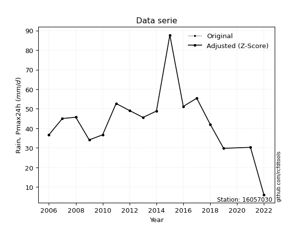</img>

</div>


> The initial value (value_initial) correspond to the initial obtained or null completed value, and value (value) is adjusted only when the initial value is outside the valid range (outlier) definite through the Z-Score value. If Z-Score is active, values out of range or outliers are replaced with the station mean value. A Z-Score (or standard score) measures how many standard deviations a data point is from the mean of a dataset, indicating its relative position; positive scores mean above the mean, negative mean below, and a score of zero is exactly at the mean, allowing for comparison of values from different distributions. It´s calculated using the formula $z=(x–μ)/σ$, where $x$ is the data point, $μ$ is the mean, and $σ$ is the standard deviation, helping identify outliers and understand probability.
>
> <sub>**Note**: In this study, "completing" (filling gaps in) and "extending" (forecasting or lengthening the historical record) rainfall data series are avoided for certain critical analyses because they introduce artificial bias and uncertainty, which can distort the statistics of rare events (extremes), alter day-to-day variability, and compromise the integrity and homogeneity of the original data. Some reasons against Completing/Extending rainfall data are: **Distortion of Extremes and Variability**: The primary issue is that most gap-filling or extension methods rely on averaging or regression with nearby stations, which inherently smooths the data. Rainfall is highly variable in space and time, with a large percentage of zero values and occasional large storms. Infilling methods often underestimate the highest values and overestimate the lowest (zero) values, which severely distorts analyses focused on flood frequency, drought severity, and intensity-duration-frequency (IDF) curves, **Loss of Data Homogeneity**: Infilled or extended data are synthetic estimates, not actual measurements. Combining these estimates with observed data can violate the assumption of data homogeneity, which requires that the data properties do not change over time. Inhomogeneity can lead to incorrect conclusions about long-term trends or changes in climate patterns, **Propagation of Errors**: Errors and biases from the original data (e.g., wind-induced undercatch, instrument errors, site changes) or the data used for imputation can propagate through the analysis, leading to unreliable hydrological models and inaccurate predictions, **Compromised Statistical Integrity**: For statistical analyses, especially those involving the frequency of events, using artificial data can introduce time bias or autocorrelation that doesn´t exist in reality, making it difficult to assess the true probability of events, **Difficulty in Validation**: It is difficult to accurately validate the quality of filled or extended data, especially for past periods where ground-truth measurements are unavailable. The reliability of imputation techniques heavily depends on the density of the surrounding station network and the complexity of the local topography.</sub>


### 4. Active continuous probability distributions from SciPy (44 of 104 available)

A Probability Density Function (PDF) describes the relative likelihood of a continuous random variable falling within a specific range, where the total area under its curve equals 1, and the area over any interval gives the actual probability for that range. Unlike discrete probabilities (like rolling a die), a PDF shows density, not direct probability for a single point (which is zero), with higher points indicating higher likelihood, often visualized as a bell curve for normal distributions.

A log of a probability density function (log-PDF) is simply the logarithm of the PDF´s value, denoted as $log(f(x))$, useful for converting multiplication of probabilities into addition, improving numerical stability with tiny numbers, and connecting to information theory concepts like entropy. Instead of dealing with very small probabilities (e.g., 0.000001), log-PDFs use negative numbers (e.g., $log(0.00001) ≈ -11.51$ that are easier for computers to handle, preventing underflow errors and simplifying complex calculations. In this study, each active probability distribution from SciPy is also evaluated in the $log$ form.

[scipy.stats](https://docs.scipy.org/doc/scipy/reference/stats.html) is a Python´s powerful submodule within the SciPy library for comprehensive statistical analysis, offering over 130 probability distributions (like Normal, Poisson), functions for descriptive stats (mean, variance), hypothesis testing (t-tests, chi-square), random variable generation, and statistical tests, making it essential for data science, modeling, and research. It provides tools to explore, model, and draw conclusions from data efficiently, working seamlessly with NumPy.

<div align="center">

|   id | p_dist             |   n_parameter | fit_method   | label                                                                       | active   | ref                                                                                                        |
|-----:|:-------------------|--------------:|:-------------|:----------------------------------------------------------------------------|:---------|:-----------------------------------------------------------------------------------------------------------|
|    0 | alpha              |             3 | MLE          | Alpha                                                                       | True     | [:mortar_board:](https://docs.scipy.org/doc/scipy/reference/generated/scipy.stats.alpha.html)              |
|    1 | betaprime          |             4 | MLE          | Beta prime                                                                  | True     | [:mortar_board:](https://docs.scipy.org/doc/scipy/reference/generated/scipy.stats.betaprime.html)          |
|    2 | chi2               |             3 | MLE          | Chi²                                                                        | True     | [:mortar_board:](https://docs.scipy.org/doc/scipy/reference/generated/scipy.stats.chi2.html)               |
|    3 | crystalball        |             4 | MLE          | Crystalball                                                                 | True     | [:mortar_board:](https://docs.scipy.org/doc/scipy/reference/generated/scipy.stats.crystalball.html)        |
|    4 | erlang             |             3 | MLE          | Erlang                                                                      | True     | [:mortar_board:](https://docs.scipy.org/doc/scipy/reference/generated/scipy.stats.erlang.html)             |
|    5 | expon              |             2 | MLE          | Exponential                                                                 | True     | [:mortar_board:](https://docs.scipy.org/doc/scipy/reference/generated/scipy.stats.expon.html)              |
|    6 | exponnorm          |             3 | MLE          | Exponentially modified Normal                                               | True     | [:mortar_board:](https://docs.scipy.org/doc/scipy/reference/generated/scipy.stats.exponnorm.html)          |
|    7 | f                  |             4 | MLE          | F                                                                           | True     | [:mortar_board:](https://docs.scipy.org/doc/scipy/reference/generated/scipy.stats.f.html)                  |
|    8 | fatiguelife        |             3 | MLE          | Fatigue-life (Birnbaum-Saunders)                                            | True     | [:mortar_board:](https://docs.scipy.org/doc/scipy/reference/generated/scipy.stats.fatiguelife.html)        |
|    9 | fisk               |             3 | MLE          | Fisk                                                                        | True     | [:mortar_board:](https://docs.scipy.org/doc/scipy/reference/generated/scipy.stats.fisk.html)               |
|   10 | gamma              |             3 | MLE          | Gamma                                                                       | True     | [:mortar_board:](https://docs.scipy.org/doc/scipy/reference/generated/scipy.stats.gamma.html)              |
|   11 | genexpon           |             5 | MLE          | Generalized exponential                                                     | True     | [:mortar_board:](https://docs.scipy.org/doc/scipy/reference/generated/scipy.stats.genexpon.html)           |
|   12 | genlogistic        |             3 | MLE          | Generalized logistic                                                        | True     | [:mortar_board:](https://docs.scipy.org/doc/scipy/reference/generated/scipy.stats.genlogistic.html)        |
|   13 | gibrat             |             2 | MM           | Gibrat                                                                      | True     | [:mortar_board:](https://docs.scipy.org/doc/scipy/reference/generated/scipy.stats.gibrat.html)             |
|   14 | gompertz           |             3 | MLE          | Gompertz (or truncated Gumbel)                                              | True     | [:mortar_board:](https://docs.scipy.org/doc/scipy/reference/generated/scipy.stats.gompertz.html)           |
|   15 | gumbel_l           |             2 | MM           | Gumbel Left Skew                                                            | True     | [:mortar_board:](https://docs.scipy.org/doc/scipy/reference/generated/scipy.stats.gumbel_l.html)           |
|   16 | gumbel_r           |             2 | MM           | Gumbel Right Skew                                                           | True     | [:mortar_board:](https://docs.scipy.org/doc/scipy/reference/generated/scipy.stats.gumbel_r.html)           |
|   17 | halflogistic       |             2 | MM           | Half-logistic                                                               | True     | [:mortar_board:](https://docs.scipy.org/doc/scipy/reference/generated/scipy.stats.halflogistic.html)       |
|   18 | halfnorm           |             2 | MM           | Half Normal                                                                 | True     | [:mortar_board:](https://docs.scipy.org/doc/scipy/reference/generated/scipy.stats.halfnorm.html)           |
|   19 | hypsecant          |             2 | MM           | hyperbolic secant                                                           | True     | [:mortar_board:](https://docs.scipy.org/doc/scipy/reference/generated/scipy.stats.hypsecant.html)          |
|   20 | invgamma           |             3 | MLE          | Inverted gamma                                                              | True     | [:mortar_board:](https://docs.scipy.org/doc/scipy/reference/generated/scipy.stats.invgamma.html)           |
|   21 | invgauss           |             3 | MLE          | Inverse Gaussian                                                            | True     | [:mortar_board:](https://docs.scipy.org/doc/scipy/reference/generated/scipy.stats.invgauss.html)           |
|   22 | invweibull         |             3 | MLE          | Inverted Weibull                                                            | True     | [:mortar_board:](https://docs.scipy.org/doc/scipy/reference/generated/scipy.stats.invweibull.html)         |
|   23 | johnsonsu          |             4 | MLE          | Johnson Su                                                                  | True     | [:mortar_board:](https://docs.scipy.org/doc/scipy/reference/generated/scipy.stats.johnsonsu.html)          |
|   24 | kstwobign          |             2 | MLE          | Limiting distribution of scaled Kolmogorov-Smirnov two-sided test statistic | True     | [:mortar_board:](https://docs.scipy.org/doc/scipy/reference/generated/scipy.stats.kstwobign.html)          |
|   25 | laplace            |             2 | MM           | Laplace                                                                     | True     | [:mortar_board:](https://docs.scipy.org/doc/scipy/reference/generated/scipy.stats.laplace.html)            |
|   26 | laplace_asymmetric |             3 | MLE          | Asymmetric Laplace                                                          | True     | [:mortar_board:](https://docs.scipy.org/doc/scipy/reference/generated/scipy.stats.laplace_asymmetric.html) |
|   27 | loggamma           |             3 | MLE          | Log gamma                                                                   | True     | [:mortar_board:](https://docs.scipy.org/doc/scipy/reference/generated/scipy.stats.loggamma.html)           |
|   28 | logistic           |             2 | MM           | Logistic (or Sech-squared)                                                  | True     | [:mortar_board:](https://docs.scipy.org/doc/scipy/reference/generated/scipy.stats.logistic.html)           |
|   29 | lognorm            |             3 | MLE          | Log Normal                                                                  | True     | [:mortar_board:](https://docs.scipy.org/doc/scipy/reference/generated/scipy.stats.lognorm.html)            |
|   30 | maxwell            |             2 | MM           | Maxwell                                                                     | True     | [:mortar_board:](https://docs.scipy.org/doc/scipy/reference/generated/scipy.stats.maxwell.html)            |
|   31 | mielke             |             4 | MLE          | Mielke Beta-Kappa / Dagum                                                   | True     | [:mortar_board:](https://docs.scipy.org/doc/scipy/reference/generated/scipy.stats.mielke.html)             |
|   32 | moyal              |             2 | MM           | Moyal                                                                       | True     | [:mortar_board:](https://docs.scipy.org/doc/scipy/reference/generated/scipy.stats.moyal.html)              |
|   33 | nakagami           |             3 | MLE          | Nakagami                                                                    | True     | [:mortar_board:](https://docs.scipy.org/doc/scipy/reference/generated/scipy.stats.nakagami.html)           |
|   34 | ncf                |             5 | MLE          | Non-central F distribution                                                  | True     | [:mortar_board:](https://docs.scipy.org/doc/scipy/reference/generated/scipy.stats.ncf.html)                |
|   35 | nct                |             4 | MLE          | Non-central Student’s t                                                     | True     | [:mortar_board:](https://docs.scipy.org/doc/scipy/reference/generated/scipy.stats.nct.html)                |
|   36 | norm               |             2 | MM           | Normal                                                                      | True     | [:mortar_board:](https://docs.scipy.org/doc/scipy/reference/generated/scipy.stats.norm.html)               |
|   37 | pearson3           |             3 | MM           | Pearson type III                                                            | True     | [:mortar_board:](https://docs.scipy.org/doc/scipy/reference/generated/scipy.stats.pearson3.html)           |
|   38 | rayleigh           |             2 | MM           | Rayleigh                                                                    | True     | [:mortar_board:](https://docs.scipy.org/doc/scipy/reference/generated/scipy.stats.rayleigh.html)           |
|   39 | rice               |             3 | MLE          | Rice                                                                        | True     | [:mortar_board:](https://docs.scipy.org/doc/scipy/reference/generated/scipy.stats.rice.html)               |
|   40 | t                  |             3 | MLE          | Student’s t                                                                 | True     | [:mortar_board:](https://docs.scipy.org/doc/scipy/reference/generated/scipy.stats.t.html)                  |
|   41 | truncnorm          |             4 | MLE          | Truncated normal                                                            | True     | [:mortar_board:](https://docs.scipy.org/doc/scipy/reference/generated/scipy.stats.truncnorm.html)          |
|   42 | wald               |             2 | MM           | Wald                                                                        | True     | [:mortar_board:](https://docs.scipy.org/doc/scipy/reference/generated/scipy.stats.wald.html)               |
|   43 | weibull_min        |             3 | MLE          | Weibull minimum                                                             | True     | [:mortar_board:](https://docs.scipy.org/doc/scipy/reference/generated/scipy.stats.weibull_min.html)        |

</div>

> **n_parameter:** # arguments & localization & scale.
>
> **Fit methods:** (MLE) maximum likelihood, (MM) L-moments.
>
>**Inactive** (With the only purpose of prevent loops, zero divisions, infinite values, over high estimated values or horizontal trending for recurrence intervals estimations, the follow distributions were disabled.)**:** foldnorm, gennorm, norminvgauss, powernorm, powerlognorm, skewnorm, genextreme, anglit, arcsine, argus, beta, bradford, burr, burr12, cauchy, cosine, halfcauchy, foldcauchy, skewcauchy, wrapcauchy, dgamma, gengamma, exponweib, exponpow, truncexpon, gausshyper, genhalflogistic, genhyperbolic, geninvgauss, halfgennorm, johnsonsb, kappa4, kappa3, ksone, kstwo, loglaplace, levy, levy_l, levy_stable, ncx2, pareto, genpareto, truncpareto, lomax, powerlaw, rdist, rel_breitwigner, recipinvgauss, semicircular, studentized_range, trapezoid, triang, truncweibull_min, tukeylambda, uniform, loguniform, vonmises, vonmises_line, weibull_max, dweibull, 


## B. Probability (PDF) vs. Empirical (EDF) distributions functions

A continuous probability distribution (CPD) describes probabilities for variables that can take any value within a range (like rain any time), unlike discrete variables with specific outcomes (like temperature). It uses a Probability Density Function (PDF), a curve where the total area under it equals 1, and the probability of the variable falling within an interval (a to b) is found by calculating the area under the curve between those points. A key feature is that the probability of hitting any single exact value is zero, so probabilities are always expressed for ranges, e.g., $P(a ≤ X ≤ b)$.

<div align="center">

Distributions parameters from station values
|    |   station | p_dist                |   n |              loc |           scale | shape                  | shape1                | shape2               | shape3   |
|---:|----------:|:----------------------|----:|-----------------:|----------------:|:-----------------------|:----------------------|:---------------------|:---------|
|  0 |  16057030 | alpha                 |  16 |   -588.439       | 23456.6         | 37.158066545750145     |                       |                      |          |
|  1 |  16057030 | betaprime             |  16 |   -147.884       | 14705.4         | 140.45610981155465     | 10790.07864816805     |                      |          |
|  2 |  16057030 | chi2                  |  16 |      6           |     6.72583     | 1.3896000922669782     |                       |                      |          |
|  3 |  16057030 | crystalball           |  16 |     43.5562      |    16.3192      | 1874.9618619466005     | 5689.133357719931     |                      |          |
|  4 |  16057030 | erlang                |  16 |   -144.408       |     1.40717     | 133.5823579471476      |                       |                      |          |
|  5 |  16057030 | expon                 |  16 |      6           |    37.5562      |                        |                       |                      |          |
|  6 |  16057030 | exponnorm             |  16 |     33.3947      |    12.3881      | 0.8202718914014138     |                       |                      |          |
|  7 |  16057030 | f                     |  16 |   -147.508       |   191.055       | 277.94331476241496     | 44085.15944736339     |                      |          |
|  8 |  16057030 | fatiguelife           |  16 |      5.94226     |     2.63322     | 3.89420610773362       |                       |                      |          |
|  9 |  16057030 | fisk                  |  16 |   -261.484       |   304.65        | 37.73309233404838      |                       |                      |          |
| 10 |  16057030 | gamma                 |  16 |   -146.759       |     1.38911     | 137.0053163479629      |                       |                      |          |
| 11 |  16057030 | genexpon              |  16 |      5.99999     |     1.56251     | 0.041611454361514685   | 1.003492687583937e-06 | 1.330556152875682    |          |
| 12 |  16057030 | genlogistic           |  16 |     43.8009      |     7.93732     | 0.9536462080923653     |                       |                      |          |
| 13 |  16057030 | gibrat                |  16 |     31.1067      |     7.55101     |                        |                       |                      |          |
| 14 |  16057030 | gompertz              |  16 |      0.0943116   |     3.00482     | 3.4788023228499607e-12 |                       |                      |          |
| 15 |  16057030 | gumbel_l              |  16 |     50.9008      |    12.724       |                        |                       |                      |          |
| 16 |  16057030 | gumbel_r              |  16 |     36.2117      |    12.724       |                        |                       |                      |          |
| 17 |  16057030 | halflogistic          |  16 |     24.2142      |    13.9523      |                        |                       |                      |          |
| 18 |  16057030 | halfnorm              |  16 |     21.956       |    27.0719      |                        |                       |                      |          |
| 19 |  16057030 | hypsecant             |  16 |     43.5562      |    10.3891      |                        |                       |                      |          |
| 20 |  16057030 | invgamma              |  16 |   -148.464       | 26630.8         | 139.7443164792685      |                       |                      |          |
| 21 |  16057030 | invgauss              |  16 |    -69.4303      |  4871.48        | 0.02310514085604977    |                       |                      |          |
| 22 |  16057030 | invweibull            |  16 |     -2.70253e+09 |     2.70253e+09 | 162919000.4542946      |                       |                      |          |
| 23 |  16057030 | johnsonsu             |  16 |     46.0866      |     8.15302     | 0.2076323842709477     | 0.9031226142593016    |                      |          |
| 24 |  16057030 | kstwobign             |  16 |    -27.5943      |    82.2427      |                        |                       |                      |          |
| 25 |  16057030 | laplace               |  16 |     43.5562      |    11.5394      |                        |                       |                      |          |
| 26 |  16057030 | laplace_asymmetric    |  16 |     45.6         |    10.8247      | 1.0988482638958277     |                       |                      |          |
| 27 |  16057030 | loggamma              |  16 |  -3673.3         |   533.573       | 1060.3069348084412     |                       |                      |          |
| 28 |  16057030 | logistic              |  16 |     43.5562      |     8.99725     |                        |                       |                      |          |
| 29 |  16057030 | lognorm               |  16 |   -209.976       |   253.012       | 0.0640580908776822     |                       |                      |          |
| 30 |  16057030 | maxwell               |  16 |      4.8866      |    24.2326      |                        |                       |                      |          |
| 31 |  16057030 | mielke                |  16 |     -0.272037    |    53.6906      | 2.7300432864350617     | 8.205888765548108     |                      |          |
| 32 |  16057030 | moyal                 |  16 |     34.2239      |     7.34622     |                        |                       |                      |          |
| 33 |  16057030 | nakagami              |  16 |     29.8         |    18.8187      | 0.1319533034303878     |                       |                      |          |
| 34 |  16057030 | ncf                   |  16 |     -0.128131    |     4.32613     | 3.297640389725534      | 22.680361630899576    | 27.92575303955094    |          |
| 35 |  16057030 | nct                   |  16 |     46.8669      |     8.26828     | 2.00139309311447       | -0.3203582827972117   |                      |          |
| 36 |  16057030 | norm                  |  16 |     43.5562      |    16.3192      |                        |                       |                      |          |
| 37 |  16057030 | pearson3              |  16 |     43.5562      |    16.3193      | 0.4289617723792919     |                       |                      |          |
| 38 |  16057030 | rayleigh              |  16 |     12.3366      |    24.9096      |                        |                       |                      |          |
| 39 |  16057030 | rice                  |  16 |      5.8873      |    13.9053      | 1.23380507796801e-08   |                       |                      |          |
| 40 |  16057030 | t                     |  16 |     41.2242      |    15.3232      | 5.934733949909777      |                       |                      |          |
| 41 |  16057030 | truncnorm             |  16 |     43.5563      |    16.3192      | -81.34431475686634     | 425.5412857834875     |                      |          |
| 42 |  16057030 | wald                  |  16 |     27.2371      |    16.3192      |                        |                       |                      |          |
| 43 |  16057030 | weibull_min           |  16 |     29.8         |    27.6121      | 0.36795898753289996    |                       |                      |          |
| 44 |  16057030 | logalpha              |  16 |    -17.725       |   764.253       | 35.745236191203304     |                       |                      |          |
| 45 |  16057030 | logbetaprime          |  16 |    -14.9231      |    29.9442      | 1623.6428831016747     | 2617.646490758304     |                      |          |
| 46 |  16057030 | logchi2               |  16 |     -7.08819     |     0.0164253   | 654.9910068090401      |                       |                      |          |
| 47 |  16057030 | logcrystalball        |  16 |      3.78827     |     0.272052    | 1.7716415118383213     | 1.8355237975326912    |                      |          |
| 48 |  16057030 | logerlang             |  16 |     -2.72901     |     0.0629588   | 101.49238722910358     |                       |                      |          |
| 49 |  16057030 | logexpon              |  16 |      1.79176     |     1.87645     |                        |                       |                      |          |
| 50 |  16057030 | logexponnorm          |  16 |      3.6679      |     0.547074    | 0.0005843002572330047  |                       |                      |          |
| 51 |  16057030 | logf                  |  16 |  -1769.09        |  1772.76        | 62003555.14894684      | 31798355.118955582    |                      |          |
| 52 |  16057030 | logfatiguelife        |  16 |   -725.654       |   729.322       | 0.0007491426347878928  |                       |                      |          |
| 53 |  16057030 | logfisk               |  16 |     -4.11583e+07 |     4.11583e+07 | 179324701.68583488     |                       |                      |          |
| 54 |  16057030 | loggamma              |  16 |     -8.09135     |     0.029397    | 399.73887730849265     |                       |                      |          |
| 55 |  16057030 | loggenexpon           |  16 |      1.79048     |     0.00519919  | 0.0003552831618341541  | 1.5983758042361162    | 7.68484855667735e-06 |          |
| 56 |  16057030 | loggenlogistic        |  16 |      3.97966     |     0.122243    | 0.32928209355089466    |                       |                      |          |
| 57 |  16057030 | loggibrat             |  16 |      3.25089     |     0.25312     |                        |                       |                      |          |
| 58 |  16057030 | loggompertz           |  16 |      1.79174     |     0.370672    | 0.003589033088033816   |                       |                      |          |
| 59 |  16057030 | loggumbel_l           |  16 |      3.91443     |     0.426551    |                        |                       |                      |          |
| 60 |  16057030 | loggumbel_r           |  16 |      3.422       |     0.426551    |                        |                       |                      |          |
| 61 |  16057030 | loghalflogistic       |  16 |      3.01986     |     0.467697    |                        |                       |                      |          |
| 62 |  16057030 | loghalfnorm           |  16 |      2.94413     |     0.907506    |                        |                       |                      |          |
| 63 |  16057030 | loghypsecant          |  16 |      3.66821     |     0.348277    |                        |                       |                      |          |
| 64 |  16057030 | loginvgamma           |  16 |    -14.3738      | 17054.6         | 946.9648551689797      |                       |                      |          |
| 65 |  16057030 | loginvgauss           |  16 |     -4.69223     |  1464.7         | 0.00569145686702038    |                       |                      |          |
| 66 |  16057030 | loginvweibull         |  16 |     -1.20614e+08 |     1.20614e+08 | 154769474.5397836      |                       |                      |          |
| 67 |  16057030 | logjohnsonsu          |  16 |      3.8906      |     0.113545    | 0.5209259571297072     | 0.7073169599283167    |                      |          |
| 68 |  16057030 | logkstwobign          |  16 |      0.239368    |     3.96567     |                        |                       |                      |          |
| 69 |  16057030 | loglaplace            |  16 |      3.66821     |     0.386839    |                        |                       |                      |          |
| 70 |  16057030 | loglaplace_asymmetric |  16 |      3.89386     |     0.25896     | 1.5255603208136335     |                       |                      |          |
| 71 |  16057030 | logloggamma           |  16 |      3.90553     |     0.355227    | 0.9469413293129018     |                       |                      |          |
| 72 |  16057030 | loglogistic           |  16 |      3.66821     |     0.301617    |                        |                       |                      |          |
| 73 |  16057030 | loglognorm            |  16 | -65534.2         | 65537.9         | 8.34751242610266e-06   |                       |                      |          |
| 74 |  16057030 | logmaxwell            |  16 |      2.37186     |     0.812368    |                        |                       |                      |          |
| 75 |  16057030 | logmielke             |  16 |     -3.15321e+07 |     3.15321e+07 | 85466767.14498797      | 256728591.1099625     |                      |          |
| 76 |  16057030 | logmoyal              |  16 |      3.35536     |     0.246269    |                        |                       |                      |          |
| 77 |  16057030 | lognakagami           |  16 |      3.39451     |     0.451728    | 0.42520283973476625    |                       |                      |          |
| 78 |  16057030 | logncf                |  16 |    -67.919       |    63.4834      | 47825.017642516716     | 96744.48932616596     | 6109.2406718191305   |          |
| 79 |  16057030 | lognct                |  16 |    -35.6833      |     0.496977    | 12544.485239102654     | 79.17676049052076     |                      |          |
| 80 |  16057030 | lognorm               |  16 |      3.66821     |     0.547073    |                        |                       |                      |          |
| 81 |  16057030 | logpearson3           |  16 |      3.66821     |     0.547074    | -2.292594547988007     |                       |                      |          |
| 82 |  16057030 | lograyleigh           |  16 |      2.6216      |     0.835073    |                        |                       |                      |          |
| 83 |  16057030 | logrice               |  16 |   -159.04        |     0.546818    | 297.5524575228701      |                       |                      |          |
| 84 |  16057030 | logt                  |  16 |      3.79549     |     0.184475    | 1.5750015367210786     |                       |                      |          |
| 85 |  16057030 | logtruncnorm          |  16 |     -0.233917    |     1.58471     | 2.2896451805265237     | 2.9707931239509304    |                      |          |
| 86 |  16057030 | logwald               |  16 |      3.12112     |     0.547088    |                        |                       |                      |          |
| 87 |  16057030 | logweibull_min        |  16 |     -2.21394e+07 |     2.21394e+07 | 60350104.48599096      |                       |                      |          |

</div>

> **loc** (Location parameter): This shifts the distribution along the x-axis. For many common distributions, like the normal (Gaussian) distribution, loc represents the mean $μ$. For others, like the uniform distribution, it might represent the minimum value, or for the beta distribution, the left end of the support interval.
>
> **scale** (Scale parameter): This determines the width or spread of the distribution. For the normal distribution, scale represents the standard deviation $σ$. For a uniform distribution, it defines the length of the interval (from $loc$ to $loc + scale$).
>
> **shape** (Shape parameters): Refers to parameters that define the specific form of a probability distribution, distinct from its location (loc) and scale (scale). These parameters are required arguments for most distribution functions. For example, a normal (Gaussian) distribution is fully defined by its location (mean) and scale (standard deviation), so it has no specific shape parameters beyond loc and scale. However, other distributions have intrinsic properties that need specification, as Gamma distribution that takes a shape parameter, often named $a$ or $alpha$.


### 0. Cumulative distribution values - CDF (88 evaluated)

Cumulative Distribution Function (CDF), denoted as $F$<sub>$X$</sub>$(x)$, is a function that gives the probability that a random variable $X$ will take a value less than or equal to a specific value, $x$ (i.e., $(P(X≥x)$. It essentially "accumulates" probabilities from a given point up to the far right (positive infinity), providing a complete picture of the distribution´s probabilities for both discrete (like rain) and continuous (like temperature) variables, helping to find probabilities over ranges or above certain values. Each station is evaluated separately ordering the $x$ values ascending, calculating the CDF and PDF values for the activated distributions and their logarithmic forms.

<div align="center">

CDF ordered by x ascending and calculating $log(f(x))$ separately
|   id |   Station |   date |    x |   count |    mean |     std |     zscore |   Value_initial |   station |   m |     alpha |   alpha_pdf |   betaprime |   betaprime_pdf |        chi2 |       chi2_pdf |   crystalball |   crystalball_pdf |     erlang |   erlang_pdf |    expon |   expon_pdf |   exponnorm |   exponnorm_pdf |          f |       f_pdf |   fatiguelife |   fatiguelife_pdf |       fisk |    fisk_pdf |      gamma |   gamma_pdf |    genexpon |   genexpon_pdf |   genlogistic |   genlogistic_pdf |   gibrat |   gibrat_pdf |    gompertz |   gompertz_pdf |   gumbel_l |   gumbel_l_pdf |    gumbel_r |   gumbel_r_pdf |   halflogistic |   halflogistic_pdf |   halfnorm |   halfnorm_pdf |   hypsecant |   hypsecant_pdf |   invgamma |   invgamma_pdf |   invgauss |   invgauss_pdf |   invweibull |   invweibull_pdf |   johnsonsu |   johnsonsu_pdf |   kstwobign |   kstwobign_pdf |   laplace |   laplace_pdf |   laplace_asymmetric |   laplace_asymmetric_pdf |    loggamma |   loggamma_pdf |   logistic |   logistic_pdf |     lognorm |   lognorm_pdf |     maxwell |   maxwell_pdf |     mielke |   mielke_pdf |       moyal |   moyal_pdf |    nakagami |   nakagami_pdf |         ncf |     ncf_pdf |       nct |     nct_pdf |      norm |    norm_pdf |   pearson3 |   pearson3_pdf |   rayleigh |   rayleigh_pdf |        rice |    rice_pdf |         t |       t_pdf |   truncnorm |   truncnorm_pdf |      wald |   wald_pdf |   weibull_min |   weibull_min_pdf |    logalpha |   logalpha_pdf |   logbetaprime |   logbetaprime_pdf |     logchi2 |   logchi2_pdf |   logcrystalball |   logcrystalball_pdf |   logerlang |   logerlang_pdf |   logexpon |   logexpon_pdf |   logexponnorm |   logexponnorm_pdf |       logf |   logf_pdf |   logfatiguelife |   logfatiguelife_pdf |     logfisk |   logfisk_pdf |   loggenexpon |   loggenexpon_pdf |   loggenlogistic |   loggenlogistic_pdf |   loggibrat |   loggibrat_pdf |   loggompertz |   loggompertz_pdf |   loggumbel_l |   loggumbel_l_pdf |   loggumbel_r |   loggumbel_r_pdf |   loghalflogistic |   loghalflogistic_pdf |   loghalfnorm |   loghalfnorm_pdf |   loghypsecant |   loghypsecant_pdf |   loginvgamma |   loginvgamma_pdf |   loginvgauss |   loginvgauss_pdf |   loginvweibull |   loginvweibull_pdf |   logjohnsonsu |   logjohnsonsu_pdf |   logkstwobign |   logkstwobign_pdf |   loglaplace |   loglaplace_pdf |   loglaplace_asymmetric |   loglaplace_asymmetric_pdf |   logloggamma |   logloggamma_pdf |   loglogistic |   loglogistic_pdf |   loglognorm |   loglognorm_pdf |   logmaxwell |   logmaxwell_pdf |   logmielke |   logmielke_pdf |     logmoyal |   logmoyal_pdf |   lognakagami |   lognakagami_pdf |      logncf |   logncf_pdf |      lognct |   lognct_pdf |   logpearson3 |   logpearson3_pdf |   lograyleigh |   lograyleigh_pdf |     logrice |   logrice_pdf |       logt |   logt_pdf |   logtruncnorm |   logtruncnorm_pdf |   logwald |   logwald_pdf |   logweibull_min |   logweibull_min_pdf |
|-----:|----------:|-------:|-----:|--------:|--------:|--------:|-----------:|----------------:|----------:|----:|----------:|------------:|------------:|----------------:|------------:|---------------:|--------------:|------------------:|-----------:|-------------:|---------:|------------:|------------:|----------------:|-----------:|------------:|--------------:|------------------:|-----------:|------------:|-----------:|------------:|------------:|---------------:|--------------:|------------------:|---------:|-------------:|------------:|---------------:|-----------:|---------------:|------------:|---------------:|---------------:|-------------------:|-----------:|---------------:|------------:|----------------:|-----------:|---------------:|-----------:|---------------:|-------------:|-----------------:|------------:|----------------:|------------:|----------------:|----------:|--------------:|---------------------:|-------------------------:|------------:|---------------:|-----------:|---------------:|------------:|--------------:|------------:|--------------:|-----------:|-------------:|------------:|------------:|------------:|---------------:|------------:|------------:|----------:|------------:|----------:|------------:|-----------:|---------------:|-----------:|---------------:|------------:|------------:|----------:|------------:|------------:|----------------:|----------:|-----------:|--------------:|------------------:|------------:|---------------:|---------------:|-------------------:|------------:|--------------:|-----------------:|---------------------:|------------:|----------------:|-----------:|---------------:|---------------:|-------------------:|-----------:|-----------:|-----------------:|---------------------:|------------:|--------------:|--------------:|------------------:|-----------------:|---------------------:|------------:|----------------:|--------------:|------------------:|--------------:|------------------:|--------------:|------------------:|------------------:|----------------------:|--------------:|------------------:|---------------:|-------------------:|--------------:|------------------:|--------------:|------------------:|----------------:|--------------------:|---------------:|-------------------:|---------------:|-------------------:|-------------:|-----------------:|------------------------:|----------------------------:|--------------:|------------------:|--------------:|------------------:|-------------:|-----------------:|-------------:|-----------------:|------------:|----------------:|-------------:|---------------:|--------------:|------------------:|------------:|-------------:|------------:|-------------:|--------------:|------------------:|--------------:|------------------:|------------:|--------------:|-----------:|-----------:|---------------:|-------------------:|----------:|--------------:|-----------------:|---------------------:|
|    0 |  16057030 |   2022 |  6   |      16 | 43.5562 | 16.8544 | -2.22828   |             6   |  16057030 |   1 | 0.0106672 | 0.00187171  |   0.0070617 |     0.00140116  | 1.02135e-11 | 3994.88        |     0.0106858 |       0.00173041  | 0.00704208 |  0.00139921  | 0        |  0.0266267  |  0.00411891 |     0.000923659 | 0.00707444 | 0.00140261  |     0.0449257 |        1.45282    | 0.00732379 | 0.00102558  | 0.00708177 | 0.00140357  | 2.45417e-07 |     0.0266311  |     0.0105694 |       0.00125913  | 0        |  0           | 2.13522e-11 |    8.26375e-12 |  0.0289134 |    0.00223917  | 2.15657e-05 |    1.82105e-05 |       0        |         0          |   0        |     0          |   0.0171324 |     0.00164828  | 0.00465043 |    0.00111375  | 0.00489698 |     0.0012667  |   0.00262816 |      0.000941342 |    0.031026 |     0.00154461  |  0.00377402 |      0.00154893 |  0.019298 |   0.00167236  |            0.0195939 |              0.00164728  | 0.000407991 |     0.00281283 |  0.0151544 |    0.00165881  | 0.000301802 |    0.00203313 | 2.57806e-05 |   6.94354e-05 | 0.00284618 |  0.00123886  | 8.63185e-12 | 2.79521e-11 | 0           |    0           | 0.000497505 | 0.000359121 | 0.0309246 | 0.00141255  | 0.0106858 | 0.00173041  | 0.00276094 |    0.000828507 |   0        |     0          | 3.28418e-05 | 0.000582826 | 0.0308396 | 0.00274436  |   0.0106858 |     0.00173041  | 0         | 0          |   0           |        0          | 0.000320561 |     0.00236047 |    0.000449256 |         0.00302102 | 0.000409473 |    0.00282594 |        0.0205805 |           0.00957226 | 0.000553075 |      0.00388618 |   0        |       0.53292  |    0.000301808 |         0.00203316 | 0.00029843 | 0.00201519 |      0.000293345 |           0.00198772 | 0.000199751 |   0.000870134 |   8.75313e-05 |         0.0689079 |       0.00275736 |           0.00742743 |    0        |       0         |    1.5782e-07 |        0.00968293 |    0.00687546 |         0.0160632 |    1.4333e-20 |       1.53534e-18 |          0        |              0        |      0        |          0        |     0.00291057 |         0.00835694 |   0.000341806 |        0.00246508 |   0.000475949 |        0.00350106 |     0.000722693 |          0.00670704 |      0.0210229 |          0.0169966 |     0.00204162 |          0.0198609 |    0.0039113 |        0.0101109 |              0.00341895 |                  0.00865427 |    0.00364462 |         0.0097026 |     0.0019827 |        0.00656052 |  0.000301789 |       0.00203308 |     0        |         0        |  0.00266936 |       0.0072352 | 2.05027e-126 |   2.38523e-123 |   0           |          0        | 0.000364434 |   0.00240815 | 0.000330675 |   0.00221913 |     0.0134087 |         0.0225022 |      0        |          0        | 0.000300012 |    0.00202285 | 0.00906379 | 0.00705677 |    0           |           0        |  0        |      0        |       0.00335519 |           0.00913061 |
|    1 |  16057030 |   2019 | 29.8 |      16 | 43.5562 | 16.8544 | -0.816182  |            29.8 |  16057030 |   2 | 0.216831  | 0.0180199   |   0.200818  |     0.0181526   | 0.902462    |    0.00814955  |     0.199629  |       0.0171362   | 0.200759   |  0.0181495   | 0.469384 |  0.0141286  |  0.189345   |     0.0193372   | 0.200814   | 0.0181479   |     0.75416   |        0.00566492 | 0.155389   | 0.0170013   | 0.200824   | 0.0181455   | 0.469447    |     0.0141296  |     0.159931  |       0.0164041   | 0        |  0           | 6.83679e-08 |    2.27539e-08 |  0.173417  |    0.0123724   | 0.191058    |    0.0248534   |       0.197542 |         0.0344379  |   0.22799  |     0.0282612  |   0.165533  |     0.0152248   | 0.204427   |    0.0192318   | 0.224732   |     0.0199687  |   0.242902   |      0.0207214   |    0.136718 |     0.0108596   |  0.285215   |      0.0202073  |  0.15179  |   0.0131541   |            0.14491   |              0.0121827   | 0.330681    |     0.626096   |  0.178149  |    0.016273    | 0.308429    |    0.643444   | 0.212531    |   0.0205157   | 0.204887   |  0.0184418   | 0.176585    | 0.0294492   | 5.77415e-05 |    4.28922e+09 | 0.259166    | 0.0222144   | 0.135248  | 0.0113664   | 0.199629  | 0.0171362   | 0.204069   |    0.0198293   |   0.217881 |     0.0220123  | 0.772057    | 0.02819     | 0.242204  | 0.0183034   |   0.199628  |     0.0171362   | 0.0296525 | 0.0408961  |   1.42211e-06 |        1.4729e+08 | 0.3293      |     0.619993   |    0.331303    |         0.626112   | 0.326602    |    0.617183   |        0.130222  |           0.483186   | 0.347291    |      0.598947   |   0.57435  |       0.226838 |    0.308428    |         0.643442   | 0.308487   | 0.64388    |      0.308575    |           0.644652   | 0.177244    |   0.635368    |   0.500284    |         0.397947  |       0.206195   |           0.550827   |    0.285449 |       2.36574   |    0.234582   |        0.55944    |    0.255884   |         0.5156    |    0.344184   |       0.860622    |          0.380402 |              0.914369 |      0.380302 |          0.777336 |     0.272217   |         0.689761   |   0.334657    |        0.633527   |   0.357367    |        0.612176   |     0.396554    |          0.470656   |      0.153529  |          0.329103  |     0.448704   |          0.412128  |    0.246426  |        0.637026  |              0.197614   |                  0.500215   |    0.233693   |         0.550177  |     0.28752   |        0.679179   |  0.308431    |       0.643443   |     0.337134 |         0.704726 |  0.205033   |       0.550973  | 0.355695     |   0.976672     |   2.44439e-13 |        234.044    | 0.310063    |   0.628278   | 0.311953    |   0.638384   |     0.211441  |         0.380839  |      0.348401 |          0.722201 | 0.308344    |    0.643668   | 0.0975368  | 0.312142   |    1.75991e-06 |           1.91961  |  0.36472  |      1.60699  |       0.233082   |           0.554781   |
|    2 |  16057030 |   2021 | 30.3 |      16 | 43.5562 | 16.8544 | -0.786516  |            30.3 |  16057030 |   3 | 0.225941  | 0.0184192   |   0.210008  |     0.018606    | 0.906449    |    0.00780252  |     0.208307  |       0.0175763   | 0.209947   |  0.0186026   | 0.476401 |  0.0139417  |  0.199154   |     0.0198996   | 0.210002   | 0.0186012   |     0.756966  |        0.00556053 | 0.164073   | 0.0177364   | 0.210011   | 0.0185987   | 0.476465    |     0.0139427  |     0.168306  |       0.0171005   | 0        |  0           | 8.07462e-08 |    2.68734e-08 |  0.179702  |    0.0127704   | 0.203641    |    0.0254694   |       0.214699 |         0.0341844  |   0.242082 |     0.0281056  |   0.173306  |     0.0158695   | 0.214158   |    0.0196916   | 0.234814   |     0.0203597  |   0.253326   |      0.0209689   |    0.142291 |     0.0114387   |  0.295342   |      0.0202996  |  0.158512 |   0.0137365   |            0.151131  |              0.0127057   | 0.341158    |     0.63315    |  0.186431  |    0.0168579   | 0.319215    |    0.653008   | 0.222885    |   0.0208949   | 0.214233   |  0.0189443   | 0.191508    | 0.0302263   | 0.312854    |    0.165115    | 0.270318    | 0.0223866   | 0.141092  | 0.0120181   | 0.208307  | 0.0175763   | 0.214098   |    0.0202875   |   0.228965 |     0.0223217  | 0.785864    | 0.0270363   | 0.251475  | 0.0187764   |   0.208307  |     0.0175763   | 0.052993  | 0.0518368  |   0.204308    |        0.133827   | 0.339672    |     0.626604   |    0.341781    |         0.633214   | 0.33693     |    0.624211   |        0.138623  |           0.526923   | 0.357299    |      0.604003   |   0.578107 |       0.224835 |    0.319215    |         0.653006   | 0.319281   | 0.653446   |      0.319382    |           0.654227   | 0.188064    |   0.66529     |   0.506893    |         0.396404  |       0.215561   |           0.575155   |    0.323798 |       2.24249   |    0.244044   |        0.577892   |    0.264582   |         0.529845  |    0.358519   |       0.86217     |          0.395512 |              0.901834 |      0.393177 |          0.770165 |     0.283873   |         0.711251   |   0.345256    |        0.640334   |   0.367592    |        0.6168     |     0.404378    |          0.469804   |      0.159161  |          0.34809   |     0.455547   |          0.41036   |    0.257257  |        0.665024  |              0.206115   |                  0.521733   |    0.243      |         0.568623  |     0.298952  |        0.694853   |  0.319218    |       0.653007   |     0.348898 |         0.70917  |  0.214403   |       0.575438  | 0.371901     |   0.970911     |   0.0473392   |          2.41844  | 0.320592    |   0.637161   | 0.322651    |   0.647454   |     0.21788   |         0.393179  |      0.360434 |          0.724124 | 0.319134    |    0.653245   | 0.102946   | 0.338467   |    0.0315614   |           1.87391  |  0.390852 |      1.53409  |       0.242468   |           0.573419   |
|    3 |  16057030 |   2009 | 34.1 |      16 | 43.5562 | 16.8544 | -0.561055  |            34.1 |  16057030 |   4 | 0.301227  | 0.0210827   |   0.286776  |     0.0216698   | 0.931727    |    0.00562719  |     0.281141  |       0.0206681   | 0.286699   |  0.0216645   | 0.526788 |  0.0126001  |  0.282257   |     0.0236621   | 0.286751   | 0.021665    |     0.77673   |        0.00486883 | 0.242322   | 0.0234379   | 0.286749   | 0.021662    | 0.526854    |     0.0126007  |     0.243714  |       0.0226185   | 0.177401 |  0.0868642   | 2.85996e-07 |    9.51802e-08 |  0.234349  |    0.0160681   | 0.307115    |    0.0284941   |       0.340157 |         0.0316898  |   0.346268 |     0.0266517  |   0.243576  |     0.0212233   | 0.294949   |    0.0226583   | 0.31703    |     0.0227215  |   0.335557   |      0.022089    |    0.1959   |     0.0172245   |  0.373086   |      0.0204686  |  0.220332 |   0.0190938   |            0.208016  |              0.0174882   | 0.418354    |     0.66942    |  0.25903   |    0.0213325   | 0.399776    |    0.706095   | 0.306917    |   0.0231376   | 0.293452   |  0.022723    | 0.31323     | 0.0329358   | 0.551593    |    0.0336478   | 0.356729    | 0.0228566   | 0.198145  | 0.0184879   | 0.281141  | 0.0206681   | 0.297008   |    0.0231528   |   0.317279 |     0.0239461  | 0.872324    | 0.0186292   | 0.329275  | 0.0220535   |   0.281141  |     0.0206681   | 0.291025  | 0.0601341  |   0.396167    |        0.0260659  | 0.415914    |     0.659875   |    0.419007    |         0.66986    | 0.413081    |    0.660805   |        0.221016  |           0.875473   | 0.430283    |      0.627835   |   0.603852 |       0.211115 |    0.399775    |         0.706093   | 0.399884   | 0.70651    |      0.400087    |           0.707287   | 0.279315    |   0.877046    |   0.552989    |         0.383287  |       0.294849   |           0.774765   |    0.537926 |       1.42648   |    0.320328   |        0.714625   |    0.333287   |         0.633647  |    0.459507   |       0.83768     |          0.496483 |              0.805548 |      0.480947 |          0.714178 |     0.376275   |         0.845778   |   0.423173    |        0.674282   |   0.441874    |        0.636829   |     0.459306    |          0.458553   |      0.210432  |          0.538908  |     0.503186   |          0.395385  |    0.34915   |        0.902571  |              0.277968   |                  0.70361    |    0.318227   |         0.706314  |     0.38685   |        0.786418   |  0.399778    |       0.706091   |     0.433788 |         0.722561 |  0.29379    |       0.77621   | 0.48238      |   0.889152     |   0.277349    |          1.70387  | 0.399033    |   0.686376   | 0.40236     |   0.697334   |     0.270087  |         0.495015  |      0.446086 |          0.720997 | 0.399727    |    0.706404   | 0.157997   | 0.628677   |    0.234839    |           1.57422  |  0.544104 |      1.08369  |       0.318327   |           0.712064   |
|    4 |  16057030 |   2010 | 36.7 |      16 | 43.5562 | 16.8544 | -0.406793  |            36.7 |  16057030 |   5 | 0.357867  | 0.0224091   |   0.345257  |     0.0232298   | 0.944856    |    0.0045146   |     0.337194  |       0.0223811   | 0.345164   |  0.0232231   | 0.55844  |  0.0117573  |  0.346299   |     0.0254778   | 0.34522    | 0.0232256   |     0.788868  |        0.00447786 | 0.307989   | 0.0269703   | 0.345211   | 0.0232226   | 0.558508    |     0.0117577  |     0.307284  |       0.026207    | 0.382044 |  0.0681845   | 6.79435e-07 |    2.26116e-07 |  0.279326  |    0.0185531   | 0.381993    |    0.0288912   |       0.419796 |         0.0295209  |   0.413988 |     0.0254104  |   0.303706  |     0.0249953   | 0.355753   |    0.0240109   | 0.377421   |     0.0236317  |   0.393156   |      0.022126    |    0.247802 |     0.0229747   |  0.425923   |      0.0201207  |  0.276013 |   0.0239192   |            0.258838  |              0.0217608   | 0.467949    |     0.678722   |  0.318204  |    0.024113    | 0.452395    |    0.724032   | 0.368286    |   0.0239717   | 0.355675   |  0.0250886   | 0.398163    | 0.03211     | 0.624128    |    0.0234999   | 0.41573     | 0.0224422   | 0.25394   | 0.0246698   | 0.337194  | 0.0223811   | 0.358923   |    0.0243645   |   0.38017  |     0.0243374  | 0.914146    | 0.0136814   | 0.388929  | 0.0237351   |   0.337194  |     0.0223811   | 0.43101   | 0.0475468  |   0.451374    |        0.017564   | 0.464749    |     0.667662   |    0.468643    |         0.679399   | 0.462065    |    0.670779   |        0.293433  |           1.09159    | 0.476605    |      0.631559   |   0.619065 |       0.203008 |    0.452394    |         0.724031   | 0.451631   | 0.724401   |      0.45279     |           0.72512    | 0.348028    |   0.988613    |   0.580797    |         0.373403  |       0.357026   |           0.919578   |    0.629087 |       1.07385   |    0.375993   |        0.799945   |    0.38221    |         0.69753   |    0.519675   |       0.797452    |          0.55334  |              0.741736 |      0.532022 |          0.67563  |     0.440542   |         0.898056   |   0.47306     |        0.681761   |   0.488755    |        0.637704   |     0.492613    |          0.447553   |      0.256785  |          0.736748  |     0.531838   |          0.384272  |    0.422187  |        1.09138   |              0.334789   |                  0.84744    |    0.373338   |         0.793339  |     0.445973  |        0.819188   |  0.452397    |       0.724027   |     0.48669  |         0.715471 |  0.356102   |       0.92179   | 0.545097     |   0.816262     |   0.395409    |          1.5148   | 0.450149    |   0.703028   | 0.454275    |   0.713735   |     0.309268  |         0.573699  |      0.498554 |          0.705539 | 0.45237     |    0.724366   | 0.215016   | 0.944316   |    0.344333    |           1.40857  |  0.615773 |      0.875605 |       0.373863   |           0.799099   |
|    5 |  16057030 |   2006 | 36.7 |      16 | 43.5562 | 16.8544 | -0.406793  |            36.7 |  16057030 |   6 | 0.357867  | 0.0224091   |   0.345257  |     0.0232298   | 0.944856    |    0.0045146   |     0.337194  |       0.0223811   | 0.345164   |  0.0232231   | 0.55844  |  0.0117573  |  0.346299   |     0.0254778   | 0.34522    | 0.0232256   |     0.788868  |        0.00447786 | 0.307989   | 0.0269703   | 0.345211   | 0.0232226   | 0.558508    |     0.0117577  |     0.307284  |       0.026207    | 0.382044 |  0.0681845   | 6.79435e-07 |    2.26116e-07 |  0.279326  |    0.0185531   | 0.381993    |    0.0288912   |       0.419796 |         0.0295209  |   0.413988 |     0.0254104  |   0.303706  |     0.0249953   | 0.355753   |    0.0240109   | 0.377421   |     0.0236317  |   0.393156   |      0.022126    |    0.247802 |     0.0229747   |  0.425923   |      0.0201207  |  0.276013 |   0.0239192   |            0.258838  |              0.0217608   | 0.467949    |     0.678722   |  0.318204  |    0.024113    | 0.452395    |    0.724032   | 0.368286    |   0.0239717   | 0.355675   |  0.0250886   | 0.398163    | 0.03211     | 0.624128    |    0.0234999   | 0.41573     | 0.0224422   | 0.25394   | 0.0246698   | 0.337194  | 0.0223811   | 0.358923   |    0.0243645   |   0.38017  |     0.0243374  | 0.914146    | 0.0136814   | 0.388929  | 0.0237351   |   0.337194  |     0.0223811   | 0.43101   | 0.0475468  |   0.451374    |        0.017564   | 0.464749    |     0.667662   |    0.468643    |         0.679399   | 0.462065    |    0.670779   |        0.293433  |           1.09159    | 0.476605    |      0.631559   |   0.619065 |       0.203008 |    0.452394    |         0.724031   | 0.451631   | 0.724401   |      0.45279     |           0.72512    | 0.348028    |   0.988613    |   0.580797    |         0.373403  |       0.357026   |           0.919578   |    0.629087 |       1.07385   |    0.375993   |        0.799945   |    0.38221    |         0.69753   |    0.519675   |       0.797452    |          0.55334  |              0.741736 |      0.532022 |          0.67563  |     0.440542   |         0.898056   |   0.47306     |        0.681761   |   0.488755    |        0.637704   |     0.492613    |          0.447553   |      0.256785  |          0.736748  |     0.531838   |          0.384272  |    0.422187  |        1.09138   |              0.334789   |                  0.84744    |    0.373338   |         0.793339  |     0.445973  |        0.819188   |  0.452397    |       0.724027   |     0.48669  |         0.715471 |  0.356102   |       0.92179   | 0.545097     |   0.816262     |   0.395409    |          1.5148   | 0.450149    |   0.703028   | 0.454275    |   0.713735   |     0.309268  |         0.573699  |      0.498554 |          0.705539 | 0.45237     |    0.724366   | 0.215016   | 0.944316   |    0.344333    |           1.40857  |  0.615773 |      0.875605 |       0.373863   |           0.799099   |
|    6 |  16057030 |   2018 | 42.1 |      16 | 43.5562 | 16.8544 | -0.0864018 |            42.1 |  16057030 |   7 | 0.482921  | 0.0235154   |   0.475639  |     0.0246144   | 0.964467    |    0.00287608  |     0.464447  |       0.0243491   | 0.475506   |  0.0246063   | 0.617576 |  0.0101827  |  0.488602   |     0.0265984   | 0.475587   | 0.0246129   |     0.811183  |        0.00381611 | 0.466968   | 0.0309374   | 0.475563   | 0.0246108   | 0.617645    |     0.0101828  |     0.463632  |       0.030825    | 0.646393 |  0.0338181   | 4.09851e-06 |    1.36398e-06 |  0.393919  |    0.0238517   | 0.532837    |    0.0263629   |       0.565553 |         0.0243741  |   0.54318  |     0.0223456  |   0.455528  |     0.0303402   | 0.488653   |    0.024733    | 0.506078   |     0.0235973  |   0.509587   |      0.02071     |    0.4137   |     0.038767    |  0.530758   |      0.0185508  |  0.44072  |   0.0381926   |            0.407559  |              0.0342639   | 0.560785    |     0.667786   |  0.459624  |    0.0276051   | 0.552233    |    0.722971   | 0.498555    |   0.0238804   | 0.501127   |  0.0282406   | 0.558517    | 0.0267739   | 0.723774    |    0.0147736   | 0.531699    | 0.0202774   | 0.42762   | 0.0392572   | 0.464447  | 0.0243491   | 0.49277    |    0.0247278   |   0.510238 |     0.0234926  | 0.966326    | 0.00630654  | 0.521851  | 0.0249184   |   0.464447  |     0.0243491   | 0.629983  | 0.028003   |   0.524141    |        0.0105718  | 0.55594     |     0.655219   |    0.561597    |         0.668798   | 0.553946    |    0.662003   |        0.464347  |           1.35577    | 0.562557    |      0.615983   |   0.645937 |       0.188687 |    0.552232    |         0.72297    | 0.552715   | 0.7232     |      0.552756    |           0.723708   | 0.492592    |   1.089       |   0.630625    |         0.351996  |       0.502169   |           1.18568    |    0.744993 |       0.65647   |    0.495696   |        0.936258   |    0.485439   |         0.801534  |    0.622234   |       0.692091    |          0.646892 |              0.621697 |      0.619533 |          0.598498 |     0.565192   |         0.894853   |   0.56606     |        0.667129   |   0.575159    |        0.616407   |     0.55229     |          0.420734   |      0.400143  |          1.44931   |     0.583011   |          0.360813  |    0.584736  |        1.07348   |              0.473888   |                  1.19954    |    0.492494   |         0.935441  |     0.55926   |        0.817222   |  0.552234    |       0.722963   |     0.582475 |         0.674576 |  0.501608   |       1.18845   | 0.646998     |   0.667987     |   0.581418    |          1.19858  | 0.547092    |   0.70243    | 0.552579    |   0.711251   |     0.400406  |         0.76562   |      0.592173 |          0.654096 | 0.552255    |    0.723305   | 0.399337   | 1.73098    |    0.518553    |           1.13781  |  0.715714 |      0.601413 |       0.493715   |           0.939365   |
|    7 |  16057030 |   2007 | 45   |      16 | 43.5562 | 16.8544 |  0.0856602 |            45   |  16057030 |   8 | 0.550724  | 0.0231332   |   0.546667  |     0.0242422   | 0.971884    |    0.00226429  |     0.535248  |       0.0243507   | 0.54651    |  0.0242345   | 0.645994 |  0.00942601 |  0.564643   |     0.0256781   | 0.546612   | 0.0242424   |     0.821817  |        0.00352355 | 0.556364   | 0.0303879   | 0.546584   | 0.0242413   | 0.646064    |     0.00942595 |     0.553384  |       0.0307375   | 0.728977 |  0.023844    | 1.07589e-05 |    3.58054e-06 |  0.466833  |    0.0263533   | 0.605783    |    0.0238634   |       0.632088 |         0.0215185  |   0.60535  |     0.0205156  |   0.544093  |     0.0303453   | 0.559465   |    0.02398     | 0.573227   |     0.0226134  |   0.567778   |      0.0193738   |    0.53491  |     0.0436363   |  0.582923   |      0.0174002  |  0.558802 |   0.038234    |            0.520085  |              0.0437241   | 0.604714    |     0.6498     |  0.540031  |    0.0276082   | 0.599893    |    0.706249   | 0.566557    |   0.0229243   | 0.583349   |  0.0282162   | 0.631049    | 0.0232397   | 0.76279     |    0.0122718   | 0.588238    | 0.0186843   | 0.54764   | 0.0424276   | 0.535248  | 0.0243507   | 0.563314   |    0.0238069   |   0.576719 |     0.022282   | 0.980859    | 0.00387192  | 0.593167  | 0.0241003   |   0.535248  |     0.0243507   | 0.701175  | 0.0214499  |   0.551925    |        0.00870785 | 0.59903     |     0.637279   |    0.605596    |         0.650887   | 0.597535    |    0.64541    |        0.555725  |           1.37409    | 0.603046    |      0.598648   |   0.658286 |       0.182106 |    0.599892    |         0.706248   | 0.600097   | 0.706395   |      0.600458    |           0.706766   | 0.564785    |   1.07095     |   0.653693    |         0.340465  |       0.584155   |           1.26603    |    0.78421  |       0.526861  |    0.559594   |        0.978599   |    0.540101   |         0.837475  |    0.666416   |       0.634061    |          0.686418 |              0.565356 |      0.658111 |          0.559672 |     0.623329   |         0.846209   |   0.609886    |        0.647423   |   0.615585    |        0.596355   |     0.579816    |          0.405516   |      0.514666  |          1.99709   |     0.606639   |          0.34851   |    0.650427  |        0.903665  |              0.560927   |                  1.41985    |    0.556461   |         0.98156   |     0.612782  |        0.786694   |  0.599894    |       0.70624    |     0.626426 |         0.644    |  0.583761   |       1.26815   | 0.689151     |   0.598167     |   0.656319    |          1.05084  | 0.593432    |   0.687309   | 0.599459    |   0.694621   |     0.455371  |         0.88874   |      0.634663 |          0.620848 | 0.599937    |    0.70656    | 0.520766   | 1.85425    |    0.590469    |           1.02307  |  0.752513 |      0.506748 |       0.557885   |           0.98364    |
|    8 |  16057030 |   2013 | 45.6 |      16 | 43.5562 | 16.8544 |  0.121259  |            45.6 |  16057030 |   9 | 0.564557  | 0.0229724   |   0.561163  |     0.0240715   | 0.973209    |    0.00215544  |     0.549832  |       0.0242552   | 0.561001   |  0.0240639   | 0.651605 |  0.00927662 |  0.579959   |     0.0253691   | 0.561108   | 0.024072    |     0.823914  |        0.00346742 | 0.574495   | 0.030037    | 0.561079   | 0.0240711   | 0.651674    |     0.00927653 |     0.57175   |       0.0304712   | 0.7428   |  0.0222553   | 1.31368e-05 |    4.37187e-06 |  0.482781  |    0.0267994   | 0.619931    |    0.0232959   |       0.644824 |         0.0209357  |   0.617543 |     0.0201272  |   0.562218  |     0.0300553   | 0.573781   |    0.0237359   | 0.586714   |     0.0223398  |   0.57931    |      0.0190651   |    0.5611   |     0.0435945   |  0.593287   |      0.0171454  |  0.581156 |   0.0362968   |            0.546992  |              0.0459863   | 0.613291    |     0.645316   |  0.556545  |    0.0274309   | 0.609218    |    0.701729   | 0.580234    |   0.02266     | 0.600223   |  0.0280201   | 0.644774    | 0.0225125   | 0.770024    |    0.0118446   | 0.599344    | 0.0183352   | 0.573043  | 0.0421909   | 0.549832  | 0.0242552   | 0.577517   |    0.0235335   |   0.589998 |     0.0219794  | 0.983062    | 0.00347875  | 0.607542  | 0.0238122   |   0.549832  |     0.0242552   | 0.713708  | 0.0203385  |   0.557056    |        0.00840005 | 0.607442    |     0.632871   |    0.614188    |         0.646411   | 0.606056    |    0.641224   |        0.573888  |           1.36795    | 0.610948    |      0.594515   |   0.66069  |       0.180825 |    0.609217    |         0.701728   | 0.609422   | 0.701858   |      0.609789    |           0.7022     | 0.578913    |   1.06211     |   0.658187    |         0.338098  |       0.60098    |           1.274      |    0.791042 |       0.505012  |    0.572594   |        0.984262   |    0.55123    |         0.842982  |    0.674736   |       0.622349    |          0.693834 |              0.554414 |      0.665473 |          0.551903 |     0.634455   |         0.833625   |   0.61843     |        0.642616   |   0.623453    |        0.591701   |     0.585167    |          0.402361   |      0.541801  |          2.09814   |     0.611239   |          0.346011  |    0.662194  |        0.873247  |              0.580052   |                  1.46827    |    0.569506   |         0.988008  |     0.623149  |        0.778585   |  0.609219    |       0.70172    |     0.634912 |         0.63724  |  0.600613   |       1.27592   | 0.696985     |   0.58474      |   0.670046    |          1.02198  | 0.602509    |   0.683207   | 0.60863     |   0.690182   |     0.467324  |         0.916402  |      0.642839 |          0.613737 | 0.609266    |    0.702034   | 0.545205   | 1.8335     |    0.603876    |           1.00146  |  0.759115 |      0.490177 |       0.570955   |           0.989657   |
|    9 |  16057030 |   2008 | 45.7 |      16 | 43.5562 | 16.8544 |  0.127192  |            45.7 |  16057030 |  10 | 0.566852  | 0.022943    |   0.563568  |     0.0240401   | 0.973424    |    0.00213783  |     0.552256  |       0.0242362   | 0.563406   |  0.0240325   | 0.652531 |  0.00925195 |  0.582493   |     0.025314    | 0.563514   | 0.0240407   |     0.82426   |        0.0034582  | 0.577495   | 0.0299712   | 0.563485   | 0.0240397   | 0.652601    |     0.00925186 |     0.574795  |       0.0304188   | 0.745013 |  0.0220034   | 1.35813e-05 |    4.51982e-06 |  0.485464  |    0.0268707   | 0.622256    |    0.0232003   |       0.646913 |         0.020839   |   0.619553 |     0.0200623  |   0.565221  |     0.0299979   | 0.576153   |    0.0236925   | 0.588946   |     0.0222921  |   0.581214   |      0.0190128   |    0.565457 |     0.0435463   |  0.595      |      0.0171025  |  0.58477  |   0.0359836   |            0.551568  |              0.0455218   | 0.614704    |     0.644547   |  0.559287  |    0.0273956   | 0.610755    |    0.700945   | 0.582497    |   0.0226139   | 0.603023   |  0.0279808   | 0.647019    | 0.022392    | 0.771205    |    0.0117758   | 0.601175    | 0.0182766   | 0.577258  | 0.0421192   | 0.552256  | 0.0242362   | 0.579868   |    0.0234855   |   0.592194 |     0.0219275  | 0.983407    | 0.00341653  | 0.609921  | 0.0237605   |   0.552256  |     0.0242362   | 0.715733  | 0.0201603  |   0.557894    |        0.0083508  | 0.608828    |     0.632116   |    0.615603    |         0.645643   | 0.60746     |    0.640505   |        0.576884  |           1.36662    | 0.61225     |      0.593811   |   0.661086 |       0.180614 |    0.610754    |         0.700944   | 0.610958   | 0.701071   |      0.611327    |           0.701408   | 0.581238    |   1.06048     |   0.658927    |         0.337705  |       0.603772   |           1.27501    |    0.792144 |       0.501509  |    0.574751   |        0.985099   |    0.553078   |         0.843834  |    0.676097   |       0.62041     |          0.695046 |              0.552613 |      0.66668  |          0.550618 |     0.636278   |         0.831464   |   0.619837    |        0.641794   |   0.624749    |        0.590912   |     0.586047    |          0.401836   |      0.546414  |          2.11353   |     0.611997   |          0.345597  |    0.664101  |        0.868316  |              0.583277   |                  1.47643    |    0.571672   |         0.988975  |     0.624853  |        0.777183   |  0.610755    |       0.700936   |     0.636307 |         0.636102 |  0.603409   |       1.27689   | 0.698263     |   0.582537     |   0.67228     |          1.01723  | 0.604005    |   0.682495   | 0.610141    |   0.689413   |     0.469337  |         0.921093  |      0.644182 |          0.612547 | 0.610803    |    0.701248   | 0.549216   | 1.82864    |    0.606066    |           0.997927 |  0.760186 |      0.487501 |       0.573124   |           0.990551   |
|   10 |  16057030 |   2014 | 48.8 |      16 | 43.5562 | 16.8544 |  0.311121  |            48.8 |  16057030 |  11 | 0.636197  | 0.0216883   |   0.636163  |     0.0226732   | 0.979277    |    0.00165929  |     0.626018  |       0.0232162   | 0.635979   |  0.0226672   | 0.680061 |  0.00851894 |  0.657835   |     0.0231592   | 0.636113   | 0.0226754   |     0.834557  |        0.00319008 | 0.666274   | 0.02704     | 0.636083   | 0.0226756   | 0.680129    |     0.00851872 |     0.665491  |       0.0277892   | 0.802755 |  0.0156913   | 3.81055e-05 |    1.26812e-05 |  0.571647  |    0.0285414   | 0.689474    |    0.0201481   |       0.706952 |         0.017926   |   0.678599 |     0.0180266  |   0.654245  |     0.0271114   | 0.647144   |    0.0220036   | 0.655479   |     0.0205546  |   0.637539   |      0.0173004   |    0.692485 |     0.0369495   |  0.645903   |      0.0157251  |  0.682592 |   0.0275064   |            0.672638  |              0.0332316   | 0.656173    |     0.618061   |  0.641715  |    0.0255541   | 0.655884    |    0.672826   | 0.650114    |   0.0209333   | 0.686912   |  0.0258558   | 0.710784    | 0.0187989   | 0.804707    |    0.0099207   | 0.654971    | 0.0164222   | 0.700003  | 0.0359158   | 0.626018  | 0.0232162   | 0.650028   |    0.021685    |   0.657469 |     0.020129   | 0.991451    | 0.00189735  | 0.680605  | 0.0217056   |   0.626018  |     0.0232162   | 0.770579  | 0.0154785  |   0.581673    |        0.00706033 | 0.649502    |     0.606335   |    0.657144    |         0.619145   | 0.648714    |    0.615567   |        0.664402  |           1.2882     | 0.650472    |      0.570133   |   0.672735 |       0.174406 |    0.655883    |         0.672825   | 0.656091   | 0.672867   |      0.656479    |           0.673056   | 0.64881     |   0.992757    |   0.680698    |         0.325642  |       0.687427   |           1.25845    |    0.821905 |       0.409287  |    0.639913   |        0.995729   |    0.609111   |         0.860798  |    0.714912   |       0.562469    |          0.729575 |              0.500026 |      0.701553 |          0.512068 |     0.688528   |         0.758282   |   0.661076    |        0.613831   |   0.662699    |        0.56479    |     0.611895    |          0.385671   |      0.692544  |          2.18908   |     0.634267   |          0.333002  |    0.716518  |        0.732815  |              0.688692   |                  1.74326    |    0.637215   |         1.00342   |     0.674322  |        0.728115   |  0.655884    |       0.672817   |     0.676883 |         0.599678 |  0.687148   |       1.25907   | 0.734382     |   0.518904     |   0.734436    |          0.877911 | 0.648003    |   0.656909   | 0.654534    |   0.662      |     0.53479   |         1.07969   |      0.683177 |          0.575235 | 0.655951    |    0.673092   | 0.661002   | 1.53844    |    0.668193    |           0.896789 |  0.789726 |      0.415078 |       0.638695   |           1.00265    |
|   11 |  16057030 |   2012 | 49.1 |      16 | 43.5562 | 16.8544 |  0.32892   |            49.1 |  16057030 |  12 | 0.64268   | 0.0215343   |   0.64294   |     0.0225039   | 0.979769    |    0.00161924  |     0.632962  |       0.0230756   | 0.642754   |  0.0224981   | 0.682606 |  0.00845116 |  0.664746   |     0.0229113   | 0.64289    | 0.0225063   |     0.83551   |        0.00316583 | 0.674332   | 0.0266804   | 0.64286    | 0.0225065   | 0.682675    |     0.00845093 |     0.673777  |       0.0274454   | 0.807389 |  0.0152082   | 4.21063e-05 |    1.40126e-05 |  0.580224  |    0.0286372   | 0.695474    |    0.0198498   |       0.712289 |         0.0176546  |   0.683977 |     0.0178285  |   0.662323  |     0.0267405   | 0.653716   |    0.021809    | 0.661617   |     0.0203636  |   0.642703   |      0.017128    |    0.703419 |     0.0359379   |  0.6506     |      0.0155882  |  0.690738 |   0.0268005   |            0.682457  |              0.0322348   | 0.659952    |     0.615267   |  0.649345  |    0.0253073   | 0.659998    |    0.669766   | 0.656367    |   0.0207479   | 0.694625   |  0.0255633   | 0.716374    | 0.0184697   | 0.80766     |    0.00976506  | 0.659871    | 0.0162411   | 0.710643  | 0.035008    | 0.632962  | 0.0230756   | 0.656503   |    0.0214831   |   0.663479 |     0.0199385  | 0.992003    | 0.00178713  | 0.687081  | 0.0214669   |   0.632961  |     0.0230756   | 0.775166  | 0.0151005  |   0.583775    |        0.00695563 | 0.653209    |     0.603633   |    0.66093     |         0.616346   | 0.652479    |    0.612921   |        0.672264  |           1.2773     | 0.653959    |      0.567682   |   0.673802 |       0.173837 |    0.659997    |         0.669766   | 0.660206   | 0.669799   |      0.660594    |           0.669974   | 0.65487     |   0.984739    |   0.682691    |         0.324491  |       0.69512    |           1.25191    |    0.824391 |       0.401801  |    0.646014   |        0.995178   |    0.614389   |         0.861465  |    0.718342   |       0.557106    |          0.732625 |              0.495258 |      0.70468  |          0.508474 |     0.693152   |         0.75079    |   0.664829    |        0.61091    |   0.666153    |        0.562125   |     0.614253    |          0.384125   |      0.705832  |          2.14567   |     0.636304   |          0.331812  |    0.720974  |        0.721297  |              0.699459   |                  1.77052    |    0.643364   |         1.00321   |     0.678768  |        0.72291    |  0.659998    |       0.669758   |     0.680548 |         0.596069 |  0.694844   |       1.25241   | 0.737545     |   0.513213     |   0.739777    |          0.865253 | 0.65202     |   0.65412    | 0.658582    |   0.65903    |     0.541458  |         1.09658   |      0.686691 |          0.571608 | 0.660067    |    0.670028   | 0.67032    | 1.50197    |    0.673662    |           0.887807 |  0.792251 |      0.409015 |       0.644838   |           1.0022     |
|   12 |  16057030 |   2016 | 51.2 |      16 | 43.5562 | 16.8544 |  0.453517  |            51.2 |  16057030 |  13 | 0.686667  | 0.0203201   |   0.688836  |     0.0211647   | 0.982895    |    0.00136523  |     0.680247  |       0.0219064   | 0.68864    |  0.0211606   | 0.699867 |  0.00799157 |  0.710929   |     0.0210355   | 0.688793   | 0.021168    |     0.841986  |        0.00300352 | 0.727528   | 0.0239215   | 0.688764   | 0.0211688   | 0.699935    |     0.00799127 |     0.728644  |       0.0247297   | 0.836137 |  0.0122988   | 8.46947e-05 |    2.81851e-05 |  0.640772  |    0.0289041   | 0.734982    |    0.0177859   |       0.747414 |         0.0158171  |   0.719962 |     0.0164449  |   0.715541  |     0.0238788   | 0.697992   |    0.0203263   | 0.702911   |     0.0189422  |   0.677392   |      0.0159058   |    0.771038 |     0.0284229   |  0.682323   |      0.0146221  |  0.742195 |   0.0223413   |            0.743421  |              0.0260461   | 0.6853      |     0.594848   |  0.700476  |    0.0233193   | 0.687583    |    0.64705    | 0.698508    |   0.0193634   | 0.745894   |  0.023172    | 0.752821    | 0.0162747   | 0.827092    |    0.00876649  | 0.69265     | 0.0149805   | 0.777019  | 0.0281218   | 0.680247  | 0.0219064   | 0.700054   |    0.0199664   |   0.703904 |     0.0185455  | 0.995055    | 0.00115874  | 0.730298  | 0.0196551   |   0.680247  |     0.0219064   | 0.804323  | 0.0127499  |   0.59767     |        0.00629854 | 0.678085    |     0.583959   |    0.686322    |         0.595879   | 0.67775     |    0.593532   |        0.72399   |           1.18905    | 0.677368    |      0.549952   |   0.681002 |       0.170001 |    0.687582    |         0.647049   | 0.687791   | 0.64703    |      0.688185    |           0.64711    | 0.69487     |   0.923787    |   0.696114    |         0.316529  |       0.746264   |           1.18373    |    0.840212 |       0.354971  |    0.687499   |        0.983637   |    0.650494   |         0.861357  |    0.740913   |       0.520874    |          0.752695 |              0.463389 |      0.725462 |          0.483984 |     0.723495   |         0.697775   |   0.689977    |        0.589691   |   0.6893      |        0.542994   |     0.630118    |          0.373429   |      0.786756  |          1.68334   |     0.65003    |          0.323626  |    0.749605  |        0.647285  |              0.76517    |                  1.38341    |    0.685231   |         0.99378   |     0.708264  |        0.68506    |  0.687583    |       0.647042   |     0.704983 |         0.570624 |  0.745994   |       1.1835    | 0.758242     |   0.475535     |   0.774231    |          0.780679 | 0.678991    |   0.633381   | 0.685732    |   0.637023   |     0.58998   |         1.22445   |      0.710104 |          0.546304 | 0.687662    |    0.647283   | 0.727827   | 1.24355    |    0.709588    |           0.828459 |  0.808555 |      0.370371 |       0.68663    |           0.991211   |
|   13 |  16057030 |   2011 | 52.7 |      16 | 43.5562 | 16.8544 |  0.542514  |            52.7 |  16057030 |  14 | 0.716414  | 0.0193272   |   0.719774  |     0.020068    | 0.984823    |    0.00120906  |     0.712365  |       0.0208949   | 0.719572   |  0.0200651   | 0.711618 |  0.00767868 |  0.741404   |     0.019586    | 0.719735   | 0.0200717   |     0.846409  |        0.00289504 | 0.761822   | 0.0217918   | 0.719708   | 0.0200729   | 0.711685    |     0.00767833 |     0.764132  |       0.022566    | 0.853302 |  0.0106382   | 0.000139522 |    4.64296e-05 |  0.683961  |    0.0286106   | 0.760584    |    0.0163587   |       0.770203 |         0.0145778  |   0.743894 |     0.0154657  |   0.749719  |     0.021684    | 0.727619   |    0.0191644   | 0.730517   |     0.0178581  |   0.700592   |      0.0150283   |    0.809802 |     0.0233599   |  0.703736   |      0.0139289  |  0.77362  |   0.019618    |            0.779661  |              0.0223673   | 0.702258    |     0.57953    |  0.734248  |    0.0216875   | 0.70602     |    0.629685   | 0.726762    |   0.0183002   | 0.779185   |  0.0211875   | 0.776137    | 0.0148304   | 0.839761    |    0.00813609  | 0.714456    | 0.0140962   | 0.815521  | 0.0232768   | 0.712365  | 0.0208949   | 0.729134   |    0.0187975   |   0.730943 |     0.0175023  | 0.996541    | 0.000837412 | 0.758738  | 0.0182543   |   0.712365  |     0.0208949   | 0.822367  | 0.0113424  |   0.606811    |        0.00589744 | 0.694737    |     0.569264   |    0.703309    |         0.580511   | 0.69468     |    0.57893    |        0.757295  |           1.11626    | 0.69306     |      0.536807   |   0.685873 |       0.167404 |    0.706019    |         0.629684   | 0.706227   | 0.62963    |      0.706622    |           0.629645   | 0.720873    |   0.876685    |   0.705174    |         0.310949  |       0.779484   |           1.11435    |    0.850046 |       0.326614  |    0.715685   |        0.967421   |    0.675304   |         0.856262  |    0.755599   |       0.496429    |          0.765767 |              0.442167 |      0.739195 |          0.46721  |     0.743101   |         0.660117   |   0.706779    |        0.573887   |   0.704778    |        0.52896    |     0.640793    |          0.365942   |      0.830054  |          1.32029   |     0.659293   |          0.317939  |    0.767615  |        0.600728  |              0.801904   |                  1.167      |    0.713728   |         0.978764  |     0.727645  |        0.657051   |  0.706019    |       0.629677   |     0.721198 |         0.552394 |  0.779202   |       1.11378   | 0.771614     |   0.450814     |   0.795959    |          0.724527 | 0.697054    |   0.617496   | 0.703887    |   0.620239   |     0.626801  |         1.32834   |      0.725621 |          0.528423 | 0.706105    |    0.629895   | 0.761232   | 1.07234    |    0.732945    |           0.789545 |  0.818898 |      0.346319 |       0.715038   |           0.975172   |
|   14 |  16057030 |   2017 | 55.4 |      16 | 43.5562 | 16.8544 |  0.70271   |            55.4 |  16057030 |  15 | 0.765973  | 0.0173492   |   0.771061  |     0.0178866   | 0.987756    |    0.000972363 |     0.766006  |       0.018786    | 0.770855   |  0.0178863   | 0.731622 |  0.00714602 |  0.790644   |     0.016879    | 0.771033   | 0.0178908   |     0.853977  |        0.00271369 | 0.815414   | 0.0179225   | 0.77101    | 0.0178925   | 0.731689    |     0.00714559 |     0.819622  |       0.0185393   | 0.878701 |  0.00829706  | 0.00034264  |    0.000114011 |  0.759296  |    0.0269417   | 0.80144     |    0.0139417   |       0.806727 |         0.0125138  |   0.78331  |     0.0137411  |   0.802944  |     0.017779    | 0.776391   |    0.0169433   | 0.77601    |     0.0158303  |   0.739057   |      0.013472    |    0.862441 |     0.0160464   |  0.739669   |      0.012692   |  0.820848 |   0.0155252   |            0.832484  |              0.0170051   | 0.730511    |     0.55097    |  0.788578  |    0.0185304   | 0.736674    |    0.596791   | 0.773482    |   0.0162929   | 0.831269   |  0.0173735   | 0.81295     | 0.0124952   | 0.860346    |    0.00713831  | 0.750425    | 0.0125618   | 0.868019  | 0.0159683   | 0.766006  | 0.018786    | 0.776933   |    0.0165949   |   0.775604 |     0.0155735  | 0.998235    | 0.000452078 | 0.804515  | 0.0156491   |   0.766006  |     0.018786    | 0.85006   | 0.00925692 |   0.62188     |        0.00528565 | 0.722507    |     0.541973   |    0.731608    |         0.551835   | 0.722933    |    0.551599   |        0.80959   |           0.974403   | 0.719283    |      0.512536   |   0.694127 |       0.163006 |    0.736673    |         0.596791   | 0.736877   | 0.59668    |      0.73727     |           0.596588   | 0.76251     |   0.788995    |   0.720466    |         0.301146  |       0.831474   |           0.96098    |    0.865267 |       0.283917  |    0.762995   |        0.922813   |    0.717663   |         0.837083  |    0.779372   |       0.455448    |          0.786972 |              0.406967 |      0.76182  |          0.438497 |     0.774448   |         0.59477    |   0.734731    |        0.544623   |   0.730573    |        0.50331    |     0.65875     |          0.352835   |      0.882834  |          0.827517  |     0.674931   |          0.308046  |    0.795772  |        0.527939  |              0.852415   |                  0.86944    |    0.761643   |         0.93554   |     0.759211  |        0.606098   |  0.736673    |       0.596783   |     0.74799  |         0.51986  |  0.831157   |       0.960213  | 0.793118     |   0.410489     |   0.829824    |          0.632095 | 0.727166    |   0.587331   | 0.734098    |   0.588503   |     0.698512  |         1.55406   |      0.751239 |          0.49691  | 0.736769    |    0.596961   | 0.808175   | 0.816349   |    0.770785    |           0.725911 |  0.835249 |      0.309052 |       0.762734   |           0.930422   |
|   15 |  16057030 |   2015 | 87.7 |      16 | 43.5562 | 16.8544 |  2.61912   |            87.7 |  16057030 |  16 | 0.99317   | 0.000978415 |   0.994713  |     0.000813091 | 0.999026    |    7.55648e-05 |     0.996585  |       0.000629965 | 0.994686   |  0.000816315 | 0.886438 |  0.00302379 |  0.989961   |     0.000987376 | 0.994724   | 0.000812212 |     0.916942  |        0.00138137 | 0.994223   | 0.000620662 | 0.994729   | 0.000811894 | 0.886484    |     0.00302312 |     0.996235  |       0.000472497 | 0.978006 |  0.000927196 | 1           |    6.16004e-07 |  1         |    2.09183e-08 | 0.982669    |    0.00135019  |       0.979091 |         0.00148296 |   0.984838 |     0.00154445 |   0.990911  |     0.000874743 | 0.992233   |    0.000996339 | 0.988889   |     0.00124322 |   0.957775   |      0.00249099  |    0.989674 |     0.000583733 |  0.960734   |      0.0026772  |  0.989096 |   0.000944938 |            0.99369   |              0.000640592 | 0.91482     |     0.253606   |  0.992655  |    0.000810365 | 0.929592    |    0.246529   | 0.991432    |   0.0011192   | 0.994281   |  0.000527383 | 0.97905     | 0.00142559  | 0.977642    |    0.00143306  | 0.954221    | 0.00240864  | 0.988657  | 0.000528906 | 0.996585  | 0.000629965 | 0.99129    |    0.00107161  |   0.989712 |     0.00124961 | 1           | 1.28702e-08 | 0.988338  | 0.000972034 |   0.996585  |     0.000629965 | 0.973647  | 0.00127696 |   0.73104     |        0.00224459 | 0.906204    |     0.259671   |    0.915916    |         0.252708   | 0.909548    |    0.261335   |        0.994494  |           0.0575041  | 0.896892    |      0.261248   |   0.760542 |       0.127612 |    0.929592    |         0.24653    | 0.929683   | 0.246264   |      0.929895    |           0.245759   | 0.959605    |   0.168889    |   0.837529    |         0.208821  |       0.994291   |           0.0461663  |    0.942397 |       0.0943323 |    0.993125   |        0.0924304  |    0.975581   |         0.212527  |    0.91859    |       0.182867    |          0.914524 |              0.174948 |      0.908148 |          0.212346 |     0.937227   |         0.179071   |   0.915915    |        0.248224   |   0.902672    |        0.24926    |     0.793329    |          0.23568    |      0.985199  |          0.0445606 |     0.795733   |          0.219299  |    0.937709  |        0.161025  |              0.990141   |                  0.0580797  |    0.993783   |         0.0874861 |     0.935311  |        0.200599   |  0.92959     |       0.24653    |     0.917737 |         0.231237 |  0.994193   |       0.0467315 | 0.917798     |   0.166303     |   0.978523    |          0.114372 | 0.921272    |   0.258079   | 0.926089    |   0.249935   |     1         |         0         |      0.914574 |          0.226913 | 0.929684    |    0.246396   | 0.952787   | 0.101281   |    0.999997    |           0.320002 |  0.926052 |      0.120954 |       0.993473   |           0.0895263  |


</div>

An Empirical Distribution Function (EDF) is a step-function estimate of a true cumulative distribution function (CDF) based on observed sample data, representing the proportion of data points less than or equal to a given value. It is calculated by ordering your data and jumping up by $1/n$ (where $n$ is sample size) at each unique data point, allowing analysis without assuming an underlying population distribution, and it gets closer to the true CDF as the sample size grows. For the empirical probability calculations, the parameter $m$ correspond to the order number which means the position of the $x$ values in an ascending order list.

The Kolmogorov-Smirnov (K-S) test is a non-parametric statistical test used to determine if a sample data set comes from a specific theoretical distribution (one-sample) or if two different samples come from the same underlying distribution (two-sample), by comparing their cumulative distribution functions (CDFs). It calculates the maximum vertical difference (D statistic) between these functions, with a small p-value indicating a significant difference and rejection of the null hypothesis (that the data/samples match).


### 1. EDF California (1923)

California´s estimates the true probability distribution of water-related data (like rainfall, streamflow) using observed samples, crucial for risk assessment.

<div align="center">


$P=m/n$


</div>


**1.1. Empirical values**

<div align="center">

|                | 0                  | 1                  | 2                  | 3                  | 4                  | 5              | 6                  | 7              | 8                  | 9                  | 10             | 11             | 12                | 13             | 14             | 15             |
|:---------------|:-------------------|:-------------------|:-------------------|:-------------------|:-------------------|:---------------|:-------------------|:---------------|:-------------------|:-------------------|:---------------|:---------------|:------------------|:---------------|:---------------|:---------------|
| date           | 2022               | 2019               | 2021               | 2009               | 2010               | 2006           | 2018               | 2007           | 2013               | 2008               | 2014           | 2012           | 2016              | 2011           | 2017           | 2015           |
| x              | 6.0                | 29.8               | 30.3               | 34.1               | 36.7               | 36.7           | 42.1               | 45.0           | 45.6               | 45.7               | 48.8           | 49.1           | 51.2              | 52.7           | 55.4           | 87.7           |
| m              | 1                  | 2                  | 3                  | 4                  | 5                  | 6              | 7                  | 8              | 9                  | 10                 | 11             | 12             | 13                | 14             | 15             | 16             |
| empirical_dist | edf_california     | edf_california     | edf_california     | edf_california     | edf_california     | edf_california | edf_california     | edf_california | edf_california     | edf_california     | edf_california | edf_california | edf_california    | edf_california | edf_california | edf_california |
| empirical      | 0.0625             | 0.125              | 0.1875             | 0.25               | 0.3125             | 0.375          | 0.4375             | 0.5            | 0.5625             | 0.625              | 0.6875         | 0.75           | 0.8125            | 0.875          | 0.9375         | 1.0            |
| empirical_tr   | 1.0666666666666667 | 1.1428571428571428 | 1.2307692307692308 | 1.3333333333333333 | 1.4545454545454546 | 1.6            | 1.7777777777777777 | 2.0            | 2.2857142857142856 | 2.6666666666666665 | 3.2            | 4.0            | 5.333333333333333 | 8.0            | 16.0           | inf            |

</div>


**1.2. Kolmogorov-Smirnov fit test (sorted by Δ)**


<div align="center">

|                | 0                     | 1                   | 2                   | 3                  | 4                   | 5                   | 6                   | 7                   | 8                   | 9                   | 10                  | 11                  | 12                  | 13                  | 14                  | 15                 | 16                  | 17                  | 18                 | 19                 | 20                  | 21                  | 22                  | 23                 | 24                  | 25                  | 26                  | 27                  | 28                  | 29                  | 30                  | 31                  | 32                  | 33                  | 34                | 35                 | 36                  | 37                  | 38                 | 39                  | 40                 | 41                | 42                 | 43                  | 44                  | 45                  | 46                  | 47                 | 48                 | 49                  | 50                  | 51                  | 52                  | 53                  | 54                 | 55                 | 56                 | 57                  | 58                  | 59                  | 60                  | 61                 | 62                  | 63                  | 64                 | 65                 | 66                 | 67                 | 68                  | 69                  | 70                  | 71                 | 72                 | 73                 | 74                 | 75                  | 76                 | 77                 | 78                 | 79                  | 80                 | 81                 | 82                | 83                  | 84                | 85                 | 86               | 87                |
|:---------------|:----------------------|:--------------------|:--------------------|:-------------------|:--------------------|:--------------------|:--------------------|:--------------------|:--------------------|:--------------------|:--------------------|:--------------------|:--------------------|:--------------------|:--------------------|:-------------------|:--------------------|:--------------------|:-------------------|:-------------------|:--------------------|:--------------------|:--------------------|:-------------------|:--------------------|:--------------------|:--------------------|:--------------------|:--------------------|:--------------------|:--------------------|:--------------------|:--------------------|:--------------------|:------------------|:-------------------|:--------------------|:--------------------|:-------------------|:--------------------|:-------------------|:------------------|:-------------------|:--------------------|:--------------------|:--------------------|:--------------------|:-------------------|:-------------------|:--------------------|:--------------------|:--------------------|:--------------------|:--------------------|:-------------------|:-------------------|:-------------------|:--------------------|:--------------------|:--------------------|:--------------------|:-------------------|:--------------------|:--------------------|:-------------------|:-------------------|:-------------------|:-------------------|:--------------------|:--------------------|:--------------------|:-------------------|:-------------------|:-------------------|:-------------------|:--------------------|:-------------------|:-------------------|:-------------------|:--------------------|:-------------------|:-------------------|:------------------|:--------------------|:------------------|:-------------------|:-----------------|:------------------|
| station        | 16057030              | 16057030            | 16057030            | 16057030           | 16057030            | 16057030            | 16057030            | 16057030            | 16057030            | 16057030            | 16057030            | 16057030            | 16057030            | 16057030            | 16057030            | 16057030           | 16057030            | 16057030            | 16057030           | 16057030           | 16057030            | 16057030            | 16057030            | 16057030           | 16057030            | 16057030            | 16057030            | 16057030            | 16057030            | 16057030            | 16057030            | 16057030            | 16057030            | 16057030            | 16057030          | 16057030           | 16057030            | 16057030            | 16057030           | 16057030            | 16057030           | 16057030          | 16057030           | 16057030            | 16057030            | 16057030            | 16057030            | 16057030           | 16057030           | 16057030            | 16057030            | 16057030            | 16057030            | 16057030            | 16057030           | 16057030           | 16057030           | 16057030            | 16057030            | 16057030            | 16057030            | 16057030           | 16057030            | 16057030            | 16057030           | 16057030           | 16057030           | 16057030           | 16057030            | 16057030            | 16057030            | 16057030           | 16057030           | 16057030           | 16057030           | 16057030            | 16057030           | 16057030           | 16057030           | 16057030            | 16057030           | 16057030           | 16057030          | 16057030            | 16057030          | 16057030           | 16057030         | 16057030          |
| empirical_dist | edf_california        | edf_california      | edf_california      | edf_california     | edf_california      | edf_california      | edf_california      | edf_california      | edf_california      | edf_california      | edf_california      | edf_california      | edf_california      | edf_california      | edf_california      | edf_california     | edf_california      | edf_california      | edf_california     | edf_california     | edf_california      | edf_california      | edf_california      | edf_california     | edf_california      | edf_california      | edf_california      | edf_california      | edf_california      | edf_california      | edf_california      | edf_california      | edf_california      | edf_california      | edf_california    | edf_california     | edf_california      | edf_california      | edf_california     | edf_california      | edf_california     | edf_california    | edf_california     | edf_california      | edf_california      | edf_california      | edf_california      | edf_california     | edf_california     | edf_california      | edf_california      | edf_california      | edf_california      | edf_california      | edf_california     | edf_california     | edf_california     | edf_california      | edf_california      | edf_california      | edf_california      | edf_california     | edf_california      | edf_california      | edf_california     | edf_california     | edf_california     | edf_california     | edf_california      | edf_california      | edf_california      | edf_california     | edf_california     | edf_california     | edf_california     | edf_california      | edf_california     | edf_california     | edf_california     | edf_california      | edf_california     | edf_california     | edf_california    | edf_california      | edf_california    | edf_california     | edf_california   | edf_california    |
| p_dist         | loglaplace_asymmetric | loggenlogistic      | mielke              | logmielke          | laplace_asymmetric  | laplace             | genlogistic         | logjohnsonsu        | nct                 | fisk                | johnsonsu           | logcrystalball      | moyal               | halflogistic        | t                   | hypsecant          | gumbel_r            | exponnorm           | logistic           | loglaplace         | halfnorm            | lognakagami         | logt                | pearson3           | invgamma            | invgauss            | rayleigh            | loghypsecant        | maxwell             | betaprime           | f                   | gamma               | erlang              | logtruncnorm        | crystalball       | norm               | truncnorm           | alpha               | loggompertz        | logweibull_min      | logfisk            | logloggamma       | loglogistic        | ncf                 | gumbel_l            | kstwobign           | invweibull          | logfatiguelife     | logf               | logrice             | lognorm             | lognorm             | logexponnorm        | loglognorm          | wald               | lognct             | logbetaprime       | loggamma            | loggamma            | loginvgamma         | logncf              | logmaxwell         | logchi2             | logalpha            | loggumbel_r        | loggumbel_l        | logerlang          | lograyleigh        | gibrat              | loginvgauss         | logmoyal            | logpearson3        | loghalfnorm        | loghalflogistic    | loginvweibull      | logwald             | nakagami           | weibull_min        | loggibrat          | logkstwobign        | expon              | genexpon           | loggenexpon       | logexpon            | fatiguelife       | rice               | chi2             | gompertz          |
| delta          | 0.08508525136831524   | 0.10602553476635668 | 0.10623120907026029 | 0.1063432536042127 | 0.11616227016455033 | 0.11665199945015825 | 0.11787758431905604 | 0.11821502443223353 | 0.12106031063208927 | 0.12208632538870845 | 0.12719810825969263 | 0.12790986265695647 | 0.13104887535254983 | 0.13208797961201035 | 0.13298533149553193 | 0.1345558550848308 | 0.13605973092797619 | 0.14685648129068385 | 0.1489220061683023 | 0.1504271668227839 | 0.15419012585531944 | 0.15631899067460664 | 0.15998419373484796 | 0.1605673818812472 | 0.16110862708039042 | 0.16148968821435095 | 0.16189557807411115 | 0.16305195324342803 | 0.16401780554419187 | 0.16643923864360388 | 0.16646672418712083 | 0.16649023214380598 | 0.16664482859082574 | 0.16671462324392972 | 0.171494278120647 | 0.1714942874266756 | 0.17149431175626761 | 0.17152725852296535 | 0.1745051028621143 | 0.17476626633517167 | 0.1749903299181067 | 0.175857276714253 | 0.1782886213136452 | 0.18707517168292898 | 0.19103850030934733 | 0.19783089386595942 | 0.19844268117225583 | 0.2002302624353106 | 0.2006234631389816 | 0.20073128904619997 | 0.20082617919971213 | 0.20082617919971213 | 0.20082727247310972 | 0.20082734063407215 | 0.2011753272966902 | 0.2034024278771298 | 0.2063031846096352 | 0.20698944125176189 | 0.20698944125176189 | 0.20965699777152208 | 0.21033365075081756 | 0.2121343991131665 | 0.21456651063557097 | 0.21499264850024336 | 0.2191839470916822 | 0.2198371605472209 | 0.2222906077855315 | 0.2234005495133618 | 0.22897722569526113 | 0.23236687129267636 | 0.23259737819604887 | 0.2481993108432039 | 0.2553019282152266 | 0.2554018360896323 | 0.2787500251770979 | 0.30327344976824444 | 0.3116276567031844 | 0.3156200885932945 | 0.3165869067306629 | 0.32370443622825756 | 0.3443836865845449 | 0.3444470025044718 | 0.375284359720516 | 0.44934950367559656 | 0.629159844923621 | 0.6470573975859796 | 0.77746193745201 | 0.937157360190832 |
| deltao         | 0.331107277296        | 0.331107277296      | 0.331107277296      | 0.331107277296     | 0.331107277296      | 0.331107277296      | 0.331107277296      | 0.331107277296      | 0.331107277296      | 0.331107277296      | 0.331107277296      | 0.331107277296      | 0.331107277296      | 0.331107277296      | 0.331107277296      | 0.331107277296     | 0.331107277296      | 0.331107277296      | 0.331107277296     | 0.331107277296     | 0.331107277296      | 0.331107277296      | 0.331107277296      | 0.331107277296     | 0.331107277296      | 0.331107277296      | 0.331107277296      | 0.331107277296      | 0.331107277296      | 0.331107277296      | 0.331107277296      | 0.331107277296      | 0.331107277296      | 0.331107277296      | 0.331107277296    | 0.331107277296     | 0.331107277296      | 0.331107277296      | 0.331107277296     | 0.331107277296      | 0.331107277296     | 0.331107277296    | 0.331107277296     | 0.331107277296      | 0.331107277296      | 0.331107277296      | 0.331107277296      | 0.331107277296     | 0.331107277296     | 0.331107277296      | 0.331107277296      | 0.331107277296      | 0.331107277296      | 0.331107277296      | 0.331107277296     | 0.331107277296     | 0.331107277296     | 0.331107277296      | 0.331107277296      | 0.331107277296      | 0.331107277296      | 0.331107277296     | 0.331107277296      | 0.331107277296      | 0.331107277296     | 0.331107277296     | 0.331107277296     | 0.331107277296     | 0.331107277296      | 0.331107277296      | 0.331107277296      | 0.331107277296     | 0.331107277296     | 0.331107277296     | 0.331107277296     | 0.331107277296      | 0.331107277296     | 0.331107277296     | 0.331107277296     | 0.331107277296      | 0.331107277296     | 0.331107277296     | 0.331107277296    | 0.331107277296      | 0.331107277296    | 0.331107277296     | 0.331107277296   | 0.331107277296    |
| eval           | Δo > Δ                | Δo > Δ              | Δo > Δ              | Δo > Δ             | Δo > Δ              | Δo > Δ              | Δo > Δ              | Δo > Δ              | Δo > Δ              | Δo > Δ              | Δo > Δ              | Δo > Δ              | Δo > Δ              | Δo > Δ              | Δo > Δ              | Δo > Δ             | Δo > Δ              | Δo > Δ              | Δo > Δ             | Δo > Δ             | Δo > Δ              | Δo > Δ              | Δo > Δ              | Δo > Δ             | Δo > Δ              | Δo > Δ              | Δo > Δ              | Δo > Δ              | Δo > Δ              | Δo > Δ              | Δo > Δ              | Δo > Δ              | Δo > Δ              | Δo > Δ              | Δo > Δ            | Δo > Δ             | Δo > Δ              | Δo > Δ              | Δo > Δ             | Δo > Δ              | Δo > Δ             | Δo > Δ            | Δo > Δ             | Δo > Δ              | Δo > Δ              | Δo > Δ              | Δo > Δ              | Δo > Δ             | Δo > Δ             | Δo > Δ              | Δo > Δ              | Δo > Δ              | Δo > Δ              | Δo > Δ              | Δo > Δ             | Δo > Δ             | Δo > Δ             | Δo > Δ              | Δo > Δ              | Δo > Δ              | Δo > Δ              | Δo > Δ             | Δo > Δ              | Δo > Δ              | Δo > Δ             | Δo > Δ             | Δo > Δ             | Δo > Δ             | Δo > Δ              | Δo > Δ              | Δo > Δ              | Δo > Δ             | Δo > Δ             | Δo > Δ             | Δo > Δ             | Δo > Δ              | Δo > Δ             | Δo > Δ             | Δo > Δ             | Δo > Δ              | Δo <= Δ            | Δo <= Δ            | Δo <= Δ           | Δo <= Δ             | Δo <= Δ           | Δo <= Δ            | Δo <= Δ          | Δo <= Δ           |
| fit            | 1                     | 1                   | 1                   | 1                  | 1                   | 1                   | 1                   | 1                   | 1                   | 1                   | 1                   | 1                   | 1                   | 1                   | 1                   | 1                  | 1                   | 1                   | 1                  | 1                  | 1                   | 1                   | 1                   | 1                  | 1                   | 1                   | 1                   | 1                   | 1                   | 1                   | 1                   | 1                   | 1                   | 1                   | 1                 | 1                  | 1                   | 1                   | 1                  | 1                   | 1                  | 1                 | 1                  | 1                   | 1                   | 1                   | 1                   | 1                  | 1                  | 1                   | 1                   | 1                   | 1                   | 1                   | 1                  | 1                  | 1                  | 1                   | 1                   | 1                   | 1                   | 1                  | 1                   | 1                   | 1                  | 1                  | 1                  | 1                  | 1                   | 1                   | 1                   | 1                  | 1                  | 1                  | 1                  | 1                   | 1                  | 1                  | 1                  | 1                   | 0                  | 0                  | 0                 | 0                   | 0                 | 0                  | 0                | 0                 |
| n              | 16                    | 16                  | 16                  | 16                 | 16                  | 16                  | 16                  | 16                  | 16                  | 16                  | 16                  | 16                  | 16                  | 16                  | 16                  | 16                 | 16                  | 16                  | 16                 | 16                 | 16                  | 16                  | 16                  | 16                 | 16                  | 16                  | 16                  | 16                  | 16                  | 16                  | 16                  | 16                  | 16                  | 16                  | 16                | 16                 | 16                  | 16                  | 16                 | 16                  | 16                 | 16                | 16                 | 16                  | 16                  | 16                  | 16                  | 16                 | 16                 | 16                  | 16                  | 16                  | 16                  | 16                  | 16                 | 16                 | 16                 | 16                  | 16                  | 16                  | 16                  | 16                 | 16                  | 16                  | 16                 | 16                 | 16                 | 16                 | 16                  | 16                  | 16                  | 16                 | 16                 | 16                 | 16                 | 16                  | 16                 | 16                 | 16                 | 16                  | 16                 | 16                 | 16                | 16                  | 16                | 16                 | 16               | 16                |
| best_fit       | 1                     | 0                   | 0                   | 0                  | 0                   | 0                   | 0                   | 0                   | 0                   | 0                   | 0                   | 0                   | 0                   | 0                   | 0                   | 0                  | 0                   | 0                   | 0                  | 0                  | 0                   | 0                   | 0                   | 0                  | 0                   | 0                   | 0                   | 0                   | 0                   | 0                   | 0                   | 0                   | 0                   | 0                   | 0                 | 0                  | 0                   | 0                   | 0                  | 0                   | 0                  | 0                 | 0                  | 0                   | 0                   | 0                   | 0                   | 0                  | 0                  | 0                   | 0                   | 0                   | 0                   | 0                   | 0                  | 0                  | 0                  | 0                   | 0                   | 0                   | 0                   | 0                  | 0                   | 0                   | 0                  | 0                  | 0                  | 0                  | 0                   | 0                   | 0                   | 0                  | 0                  | 0                  | 0                  | 0                   | 0                  | 0                  | 0                  | 0                   | 0                  | 0                  | 0                 | 0                   | 0                 | 0                  | 0                | 0                 |
| best_fit_sort  | 1                     | 2                   | 3                   | 4                  | 5                   | 6                   | 7                   | 8                   | 9                   | 10                  | 11                  | 12                  | 13                  | 14                  | 15                  | 16                 | 17                  | 18                  | 19                 | 20                 | 21                  | 22                  | 23                  | 24                 | 25                  | 26                  | 27                  | 28                  | 29                  | 30                  | 31                  | 32                  | 33                  | 34                  | 35                | 36                 | 37                  | 38                  | 39                 | 40                  | 41                 | 42                | 43                 | 44                  | 45                  | 46                  | 47                  | 48                 | 49                 | 50                  | 51                  | 52                  | 53                  | 54                  | 55                 | 56                 | 57                 | 58                  | 59                  | 60                  | 61                  | 62                 | 63                  | 64                  | 65                 | 66                 | 67                 | 68                 | 69                  | 70                  | 71                  | 72                 | 73                 | 74                 | 75                 | 76                  | 77                 | 78                 | 79                 | 80                  | 81                 | 82                 | 83                | 84                  | 85                | 86                 | 87               | 88                |

</div>


**1.3. Best fit**

<div align="center">

|   id |   station | empirical_dist   | p_dist                |     delta |   deltao | eval   |   fit |   n |   best_fit |   best_fit_sort |
|-----:|----------:|:-----------------|:----------------------|----------:|---------:|:-------|------:|----:|-----------:|----------------:|
|    0 |  16057030 | edf_california   | loglaplace_asymmetric | 0.0850853 | 0.331107 | Δo > Δ |     1 |  16 |          1 |               1 |

</div>


<div align="center">

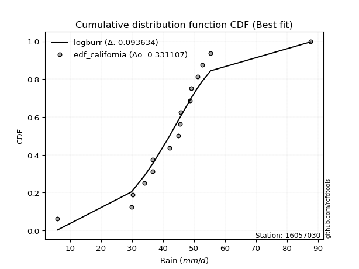</img>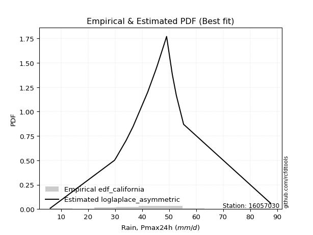</img>

</div>


### 2. EDF Hazen (1930)

Hazen method for plotting positions is a formula used to estimate the empirical cumulative probability distribution of flood events or other hydrological data. This formula often results in biased estimations, particularly when extrapolating to extreme events (high return periods).

<div align="center">


$P=(m-0.5)/n$


</div>


**2.1. Empirical values**

<div align="center">

|                | 0                 | 1                 | 2                  | 3         | 4                 | 5                  | 6                  | 7                  | 8                  | 9                  | 10                | 11                 | 12                | 13        | 14                 | 15        |
|:---------------|:------------------|:------------------|:-------------------|:----------|:------------------|:-------------------|:-------------------|:-------------------|:-------------------|:-------------------|:------------------|:-------------------|:------------------|:----------|:-------------------|:----------|
| date           | 2022              | 2019              | 2021               | 2009      | 2010              | 2006               | 2018               | 2007               | 2013               | 2008               | 2014              | 2012               | 2016              | 2011      | 2017               | 2015      |
| x              | 6.0               | 29.8              | 30.3               | 34.1      | 36.7              | 36.7               | 42.1               | 45.0               | 45.6               | 45.7               | 48.8              | 49.1               | 51.2              | 52.7      | 55.4               | 87.7      |
| m              | 1                 | 2                 | 3                  | 4         | 5                 | 6                  | 7                  | 8                  | 9                  | 10                 | 11                | 12                 | 13                | 14        | 15                 | 16        |
| empirical_dist | edf_hazen         | edf_hazen         | edf_hazen          | edf_hazen | edf_hazen         | edf_hazen          | edf_hazen          | edf_hazen          | edf_hazen          | edf_hazen          | edf_hazen         | edf_hazen          | edf_hazen         | edf_hazen | edf_hazen          | edf_hazen |
| empirical      | 0.03125           | 0.09375           | 0.15625            | 0.21875   | 0.28125           | 0.34375            | 0.40625            | 0.46875            | 0.53125            | 0.59375            | 0.65625           | 0.71875            | 0.78125           | 0.84375   | 0.90625            | 0.96875   |
| empirical_tr   | 1.032258064516129 | 1.103448275862069 | 1.1851851851851851 | 1.28      | 1.391304347826087 | 1.5238095238095237 | 1.6842105263157894 | 1.8823529411764706 | 2.1333333333333333 | 2.4615384615384617 | 2.909090909090909 | 3.5555555555555554 | 4.571428571428571 | 6.4       | 10.666666666666666 | 32.0      |

</div>


**2.2. Kolmogorov-Smirnov fit test (sorted by Δ)**


<div align="center">

|                | 0                   | 1                   | 2                   | 3                   | 4                   | 5                   | 6                   | 7                   | 8                   | 9                     | 10                  | 11                  | 12                  | 13                  | 14                  | 15                  | 16                 | 17                  | 18                  | 19                  | 20                  | 21                  | 22                  | 23                  | 24                  | 25                  | 26                | 27                 | 28                | 29                 | 30                  | 31                  | 32                 | 33                  | 34                 | 35                | 36                  | 37                  | 38                  | 39                  | 40                  | 41                  | 42                  | 43                 | 44                  | 45                 | 46                 | 47                  | 48                  | 49                  | 50                 | 51                 | 52                  | 53                 | 54                  | 55                  | 56                 | 57                  | 58                 | 59                  | 60                  | 61                  | 62                  | 63                 | 64                  | 65                 | 66                 | 67                 | 68                 | 69                  | 70                  | 71                  | 72                 | 73                 | 74                 | 75                  | 76                  | 77                 | 78                 | 79                  | 80                 | 81                 | 82                | 83                  | 84                | 85                 | 86               | 87                |
|:---------------|:--------------------|:--------------------|:--------------------|:--------------------|:--------------------|:--------------------|:--------------------|:--------------------|:--------------------|:----------------------|:--------------------|:--------------------|:--------------------|:--------------------|:--------------------|:--------------------|:-------------------|:--------------------|:--------------------|:--------------------|:--------------------|:--------------------|:--------------------|:--------------------|:--------------------|:--------------------|:------------------|:-------------------|:------------------|:-------------------|:--------------------|:--------------------|:-------------------|:--------------------|:-------------------|:------------------|:--------------------|:--------------------|:--------------------|:--------------------|:--------------------|:--------------------|:--------------------|:-------------------|:--------------------|:-------------------|:-------------------|:--------------------|:--------------------|:--------------------|:-------------------|:-------------------|:--------------------|:-------------------|:--------------------|:--------------------|:-------------------|:--------------------|:-------------------|:--------------------|:--------------------|:--------------------|:--------------------|:-------------------|:--------------------|:-------------------|:-------------------|:-------------------|:-------------------|:--------------------|:--------------------|:--------------------|:-------------------|:-------------------|:-------------------|:--------------------|:--------------------|:-------------------|:-------------------|:--------------------|:-------------------|:-------------------|:------------------|:--------------------|:------------------|:-------------------|:-----------------|:------------------|
| station        | 16057030            | 16057030            | 16057030            | 16057030            | 16057030            | 16057030            | 16057030            | 16057030            | 16057030            | 16057030              | 16057030            | 16057030            | 16057030            | 16057030            | 16057030            | 16057030            | 16057030           | 16057030            | 16057030            | 16057030            | 16057030            | 16057030            | 16057030            | 16057030            | 16057030            | 16057030            | 16057030          | 16057030           | 16057030          | 16057030           | 16057030            | 16057030            | 16057030           | 16057030            | 16057030           | 16057030          | 16057030            | 16057030            | 16057030            | 16057030            | 16057030            | 16057030            | 16057030            | 16057030           | 16057030            | 16057030           | 16057030           | 16057030            | 16057030            | 16057030            | 16057030           | 16057030           | 16057030            | 16057030           | 16057030            | 16057030            | 16057030           | 16057030            | 16057030           | 16057030            | 16057030            | 16057030            | 16057030            | 16057030           | 16057030            | 16057030           | 16057030           | 16057030           | 16057030           | 16057030            | 16057030            | 16057030            | 16057030           | 16057030           | 16057030           | 16057030            | 16057030            | 16057030           | 16057030           | 16057030            | 16057030           | 16057030           | 16057030          | 16057030            | 16057030          | 16057030           | 16057030         | 16057030          |
| empirical_dist | edf_hazen           | edf_hazen           | edf_hazen           | edf_hazen           | edf_hazen           | edf_hazen           | edf_hazen           | edf_hazen           | edf_hazen           | edf_hazen             | edf_hazen           | edf_hazen           | edf_hazen           | edf_hazen           | edf_hazen           | edf_hazen           | edf_hazen          | edf_hazen           | edf_hazen           | edf_hazen           | edf_hazen           | edf_hazen           | edf_hazen           | edf_hazen           | edf_hazen           | edf_hazen           | edf_hazen         | edf_hazen          | edf_hazen         | edf_hazen          | edf_hazen           | edf_hazen           | edf_hazen          | edf_hazen           | edf_hazen          | edf_hazen         | edf_hazen           | edf_hazen           | edf_hazen           | edf_hazen           | edf_hazen           | edf_hazen           | edf_hazen           | edf_hazen          | edf_hazen           | edf_hazen          | edf_hazen          | edf_hazen           | edf_hazen           | edf_hazen           | edf_hazen          | edf_hazen          | edf_hazen           | edf_hazen          | edf_hazen           | edf_hazen           | edf_hazen          | edf_hazen           | edf_hazen          | edf_hazen           | edf_hazen           | edf_hazen           | edf_hazen           | edf_hazen          | edf_hazen           | edf_hazen          | edf_hazen          | edf_hazen          | edf_hazen          | edf_hazen           | edf_hazen           | edf_hazen           | edf_hazen          | edf_hazen          | edf_hazen          | edf_hazen           | edf_hazen           | edf_hazen          | edf_hazen          | edf_hazen           | edf_hazen          | edf_hazen          | edf_hazen         | edf_hazen           | edf_hazen         | edf_hazen          | edf_hazen        | edf_hazen         |
| p_dist         | laplace_asymmetric  | genlogistic         | logjohnsonsu        | nct                 | laplace             | fisk                | johnsonsu           | logcrystalball      | hypsecant           | loglaplace_asymmetric | mielke              | logmielke           | loggenlogistic      | exponnorm           | logistic            | logt                | pearson3           | invgamma            | rayleigh            | invgauss            | maxwell             | betaprime           | f                   | gamma               | erlang              | logtruncnorm        | halfnorm          | gumbel_r           | crystalball       | norm               | truncnorm           | alpha               | loggompertz        | logweibull_min      | logfisk            | logloggamma       | t                   | gumbel_l            | moyal               | halflogistic        | ncf                 | invweibull          | loghypsecant        | loglaplace         | lognakagami         | loggumbel_l        | kstwobign          | loglogistic         | logrice             | logexponnorm        | lognorm            | lognorm            | loglognorm          | logf               | logfatiguelife      | logncf              | logpearson3        | lognct              | wald               | logchi2             | logalpha            | loggamma            | loggamma            | logbetaprime       | loginvgamma         | logmaxwell         | loggumbel_r        | logerlang          | lograyleigh        | gibrat              | loginvgauss         | logmoyal            | weibull_min        | loghalfnorm        | loghalflogistic    | loginvweibull       | logwald             | nakagami           | loggibrat          | logkstwobign        | expon              | genexpon           | loggenexpon       | logexpon            | fatiguelife       | rice               | chi2             | gompertz          |
| delta          | 0.08491227016455033 | 0.08662758431905604 | 0.08696502443223353 | 0.08981031063208927 | 0.09005213851838434 | 0.09083632538870845 | 0.09594810825969263 | 0.09665986265695647 | 0.10330585508483081 | 0.10386448025282141   | 0.11459856203269014 | 0.11501140848950442 | 0.11540472607318619 | 0.11560648129068385 | 0.11767200616830231 | 0.12873419373484796 | 0.1293173818812472 | 0.12985862708039042 | 0.13064557807411115 | 0.13098160295698497 | 0.13276780554419187 | 0.13518923864360388 | 0.13521672418712083 | 0.13524023214380598 | 0.13539482859082574 | 0.13546462324392972 | 0.136929732613997 | 0.1370326283266503 | 0.140244278120647 | 0.1402442874266756 | 0.14024431175626761 | 0.14027725852296535 | 0.1432551028621143 | 0.14351626633517167 | 0.1437403299181067 | 0.144607276714253 | 0.14845449211119943 | 0.15978850030934733 | 0.16229887535254983 | 0.16333797961201035 | 0.16541613263698768 | 0.16719268117225583 | 0.17846704325513285 | 0.1816771668227839 | 0.18756899067460664 | 0.1885871605472209 | 0.1914649941676893 | 0.19376961784778307 | 0.21459385516508755 | 0.21467824132436925 | 0.2146785381048052 | 0.2146785381048052 | 0.21468132475164436 | 0.2147368099412736 | 0.21482537375129251 | 0.21631341581985064 | 0.2169493108432039 | 0.21820295406199453 | 0.2324253272966902 | 0.23285163053342628 | 0.23554992242104966 | 0.23693059043308157 | 0.23693059043308157 | 0.2375531846096352 | 0.24090699777152208 | 0.2433843991131665 | 0.2504339470916822 | 0.2535406077855315 | 0.2546505495133618 | 0.26022722569526113 | 0.26361687129267636 | 0.26384737819604887 | 0.2843700885932945 | 0.2865519282152266 | 0.2866518360896323 | 0.30280370349969216 | 0.33452344976824444 | 0.3428776567031844 | 0.3478369067306629 | 0.35495443622825756 | 0.3756336865845449 | 0.3756970025044718 | 0.406534359720516 | 0.48059950367559656 | 0.660409844923621 | 0.6783073975859796 | 0.80871193745201 | 0.905907360190832 |
| deltao         | 0.331107277296      | 0.331107277296      | 0.331107277296      | 0.331107277296      | 0.331107277296      | 0.331107277296      | 0.331107277296      | 0.331107277296      | 0.331107277296      | 0.331107277296        | 0.331107277296      | 0.331107277296      | 0.331107277296      | 0.331107277296      | 0.331107277296      | 0.331107277296      | 0.331107277296     | 0.331107277296      | 0.331107277296      | 0.331107277296      | 0.331107277296      | 0.331107277296      | 0.331107277296      | 0.331107277296      | 0.331107277296      | 0.331107277296      | 0.331107277296    | 0.331107277296     | 0.331107277296    | 0.331107277296     | 0.331107277296      | 0.331107277296      | 0.331107277296     | 0.331107277296      | 0.331107277296     | 0.331107277296    | 0.331107277296      | 0.331107277296      | 0.331107277296      | 0.331107277296      | 0.331107277296      | 0.331107277296      | 0.331107277296      | 0.331107277296     | 0.331107277296      | 0.331107277296     | 0.331107277296     | 0.331107277296      | 0.331107277296      | 0.331107277296      | 0.331107277296     | 0.331107277296     | 0.331107277296      | 0.331107277296     | 0.331107277296      | 0.331107277296      | 0.331107277296     | 0.331107277296      | 0.331107277296     | 0.331107277296      | 0.331107277296      | 0.331107277296      | 0.331107277296      | 0.331107277296     | 0.331107277296      | 0.331107277296     | 0.331107277296     | 0.331107277296     | 0.331107277296     | 0.331107277296      | 0.331107277296      | 0.331107277296      | 0.331107277296     | 0.331107277296     | 0.331107277296     | 0.331107277296      | 0.331107277296      | 0.331107277296     | 0.331107277296     | 0.331107277296      | 0.331107277296     | 0.331107277296     | 0.331107277296    | 0.331107277296      | 0.331107277296    | 0.331107277296     | 0.331107277296   | 0.331107277296    |
| eval           | Δo > Δ              | Δo > Δ              | Δo > Δ              | Δo > Δ              | Δo > Δ              | Δo > Δ              | Δo > Δ              | Δo > Δ              | Δo > Δ              | Δo > Δ                | Δo > Δ              | Δo > Δ              | Δo > Δ              | Δo > Δ              | Δo > Δ              | Δo > Δ              | Δo > Δ             | Δo > Δ              | Δo > Δ              | Δo > Δ              | Δo > Δ              | Δo > Δ              | Δo > Δ              | Δo > Δ              | Δo > Δ              | Δo > Δ              | Δo > Δ            | Δo > Δ             | Δo > Δ            | Δo > Δ             | Δo > Δ              | Δo > Δ              | Δo > Δ             | Δo > Δ              | Δo > Δ             | Δo > Δ            | Δo > Δ              | Δo > Δ              | Δo > Δ              | Δo > Δ              | Δo > Δ              | Δo > Δ              | Δo > Δ              | Δo > Δ             | Δo > Δ              | Δo > Δ             | Δo > Δ             | Δo > Δ              | Δo > Δ              | Δo > Δ              | Δo > Δ             | Δo > Δ             | Δo > Δ              | Δo > Δ             | Δo > Δ              | Δo > Δ              | Δo > Δ             | Δo > Δ              | Δo > Δ             | Δo > Δ              | Δo > Δ              | Δo > Δ              | Δo > Δ              | Δo > Δ             | Δo > Δ              | Δo > Δ             | Δo > Δ             | Δo > Δ             | Δo > Δ             | Δo > Δ              | Δo > Δ              | Δo > Δ              | Δo > Δ             | Δo > Δ             | Δo > Δ             | Δo > Δ              | Δo <= Δ             | Δo <= Δ            | Δo <= Δ            | Δo <= Δ             | Δo <= Δ            | Δo <= Δ            | Δo <= Δ           | Δo <= Δ             | Δo <= Δ           | Δo <= Δ            | Δo <= Δ          | Δo <= Δ           |
| fit            | 1                   | 1                   | 1                   | 1                   | 1                   | 1                   | 1                   | 1                   | 1                   | 1                     | 1                   | 1                   | 1                   | 1                   | 1                   | 1                   | 1                  | 1                   | 1                   | 1                   | 1                   | 1                   | 1                   | 1                   | 1                   | 1                   | 1                 | 1                  | 1                 | 1                  | 1                   | 1                   | 1                  | 1                   | 1                  | 1                 | 1                   | 1                   | 1                   | 1                   | 1                   | 1                   | 1                   | 1                  | 1                   | 1                  | 1                  | 1                   | 1                   | 1                   | 1                  | 1                  | 1                   | 1                  | 1                   | 1                   | 1                  | 1                   | 1                  | 1                   | 1                   | 1                   | 1                   | 1                  | 1                   | 1                  | 1                  | 1                  | 1                  | 1                   | 1                   | 1                   | 1                  | 1                  | 1                  | 1                   | 0                   | 0                  | 0                  | 0                   | 0                  | 0                  | 0                 | 0                   | 0                 | 0                  | 0                | 0                 |
| n              | 16                  | 16                  | 16                  | 16                  | 16                  | 16                  | 16                  | 16                  | 16                  | 16                    | 16                  | 16                  | 16                  | 16                  | 16                  | 16                  | 16                 | 16                  | 16                  | 16                  | 16                  | 16                  | 16                  | 16                  | 16                  | 16                  | 16                | 16                 | 16                | 16                 | 16                  | 16                  | 16                 | 16                  | 16                 | 16                | 16                  | 16                  | 16                  | 16                  | 16                  | 16                  | 16                  | 16                 | 16                  | 16                 | 16                 | 16                  | 16                  | 16                  | 16                 | 16                 | 16                  | 16                 | 16                  | 16                  | 16                 | 16                  | 16                 | 16                  | 16                  | 16                  | 16                  | 16                 | 16                  | 16                 | 16                 | 16                 | 16                 | 16                  | 16                  | 16                  | 16                 | 16                 | 16                 | 16                  | 16                  | 16                 | 16                 | 16                  | 16                 | 16                 | 16                | 16                  | 16                | 16                 | 16               | 16                |
| best_fit       | 1                   | 0                   | 0                   | 0                   | 0                   | 0                   | 0                   | 0                   | 0                   | 0                     | 0                   | 0                   | 0                   | 0                   | 0                   | 0                   | 0                  | 0                   | 0                   | 0                   | 0                   | 0                   | 0                   | 0                   | 0                   | 0                   | 0                 | 0                  | 0                 | 0                  | 0                   | 0                   | 0                  | 0                   | 0                  | 0                 | 0                   | 0                   | 0                   | 0                   | 0                   | 0                   | 0                   | 0                  | 0                   | 0                  | 0                  | 0                   | 0                   | 0                   | 0                  | 0                  | 0                   | 0                  | 0                   | 0                   | 0                  | 0                   | 0                  | 0                   | 0                   | 0                   | 0                   | 0                  | 0                   | 0                  | 0                  | 0                  | 0                  | 0                   | 0                   | 0                   | 0                  | 0                  | 0                  | 0                   | 0                   | 0                  | 0                  | 0                   | 0                  | 0                  | 0                 | 0                   | 0                 | 0                  | 0                | 0                 |
| best_fit_sort  | 1                   | 2                   | 3                   | 4                   | 5                   | 6                   | 7                   | 8                   | 9                   | 10                    | 11                  | 12                  | 13                  | 14                  | 15                  | 16                  | 17                 | 18                  | 19                  | 20                  | 21                  | 22                  | 23                  | 24                  | 25                  | 26                  | 27                | 28                 | 29                | 30                 | 31                  | 32                  | 33                 | 34                  | 35                 | 36                | 37                  | 38                  | 39                  | 40                  | 41                  | 42                  | 43                  | 44                 | 45                  | 46                 | 47                 | 48                  | 49                  | 50                  | 51                 | 52                 | 53                  | 54                 | 55                  | 56                  | 57                 | 58                  | 59                 | 60                  | 61                  | 62                  | 63                  | 64                 | 65                  | 66                 | 67                 | 68                 | 69                 | 70                  | 71                  | 72                  | 73                 | 74                 | 75                 | 76                  | 77                  | 78                 | 79                 | 80                  | 81                 | 82                 | 83                | 84                  | 85                | 86                 | 87               | 88                |

</div>


**2.3. Best fit**

<div align="center">

|   id |   station | empirical_dist   | p_dist             |     delta |   deltao | eval   |   fit |   n |   best_fit |   best_fit_sort |
|-----:|----------:|:-----------------|:-------------------|----------:|---------:|:-------|------:|----:|-----------:|----------------:|
|    0 |  16057030 | edf_hazen        | laplace_asymmetric | 0.0849123 | 0.331107 | Δo > Δ |     1 |  16 |          1 |               1 |

</div>


<div align="center">

</img>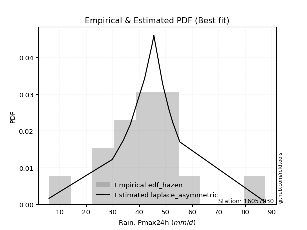</img>

</div>


### 3. EDF Weibull (1939)

Weibull plotting position formula is an empirical method used to estimate the non-exceedance probability or plotting position for a set of observed data, is often recommended or widely used in practice, particularly in flood frequency analysis.

<div align="center">


$P=m/(n+1)$


</div>


**3.1. Empirical values**

<div align="center">

|                | 0                    | 1                   | 2                   | 3                   | 4                   | 5                   | 6                  | 7                   | 8                  | 9                  | 10                 | 11                 | 12                 | 13                 | 14                 | 15                 |
|:---------------|:---------------------|:--------------------|:--------------------|:--------------------|:--------------------|:--------------------|:-------------------|:--------------------|:-------------------|:-------------------|:-------------------|:-------------------|:-------------------|:-------------------|:-------------------|:-------------------|
| date           | 2022                 | 2019                | 2021                | 2009                | 2010                | 2006                | 2018               | 2007                | 2013               | 2008               | 2014               | 2012               | 2016               | 2011               | 2017               | 2015               |
| x              | 6.0                  | 29.8                | 30.3                | 34.1                | 36.7                | 36.7                | 42.1               | 45.0                | 45.6               | 45.7               | 48.8               | 49.1               | 51.2               | 52.7               | 55.4               | 87.7               |
| m              | 1                    | 2                   | 3                   | 4                   | 5                   | 6                   | 7                  | 8                   | 9                  | 10                 | 11                 | 12                 | 13                 | 14                 | 15                 | 16                 |
| empirical_dist | edf_weibull          | edf_weibull         | edf_weibull         | edf_weibull         | edf_weibull         | edf_weibull         | edf_weibull        | edf_weibull         | edf_weibull        | edf_weibull        | edf_weibull        | edf_weibull        | edf_weibull        | edf_weibull        | edf_weibull        | edf_weibull        |
| empirical      | 0.058823529411764705 | 0.11764705882352941 | 0.17647058823529413 | 0.23529411764705882 | 0.29411764705882354 | 0.35294117647058826 | 0.4117647058823529 | 0.47058823529411764 | 0.5294117647058824 | 0.5882352941176471 | 0.6470588235294118 | 0.7058823529411765 | 0.7647058823529411 | 0.8235294117647058 | 0.8823529411764706 | 0.9411764705882353 |
| empirical_tr   | 1.0625               | 1.1333333333333333  | 1.2142857142857144  | 1.3076923076923077  | 1.4166666666666667  | 1.5454545454545456  | 1.7                | 1.8888888888888888  | 2.125              | 2.428571428571429  | 2.8333333333333335 | 3.4000000000000004 | 4.249999999999999  | 5.666666666666665  | 8.499999999999998  | 16.999999999999996 |

</div>


**3.2. Kolmogorov-Smirnov fit test (sorted by Δ)**


<div align="center">

|                | 0                   | 1                   | 2                   | 3                   | 4                  | 5                     | 6                   | 7                   | 8                   | 9                   | 10                  | 11                  | 12                  | 13                  | 14                  | 15                  | 16                  | 17                  | 18                  | 19                  | 20                 | 21                 | 22                  | 23                  | 24                  | 25                  | 26                  | 27                  | 28                  | 29                  | 30                  | 31                  | 32                  | 33                  | 34                  | 35                  | 36                  | 37                  | 38                 | 39                  | 40                  | 41                 | 42                 | 43                  | 44                 | 45                  | 46                  | 47                | 48                  | 49                  | 50                  | 51                  | 52                  | 53                  | 54                 | 55                  | 56                  | 57                  | 58                  | 59                  | 60                  | 61                  | 62                 | 63                  | 64                 | 65                 | 66                 | 67                  | 68                 | 69                  | 70                 | 71                 | 72                  | 73                  | 74                  | 75                 | 76                 | 77                  | 78                 | 79                 | 80                  | 81                  | 82                  | 83                 | 84                 | 85                 | 86                 | 87                 |
|:---------------|:--------------------|:--------------------|:--------------------|:--------------------|:-------------------|:----------------------|:--------------------|:--------------------|:--------------------|:--------------------|:--------------------|:--------------------|:--------------------|:--------------------|:--------------------|:--------------------|:--------------------|:--------------------|:--------------------|:--------------------|:-------------------|:-------------------|:--------------------|:--------------------|:--------------------|:--------------------|:--------------------|:--------------------|:--------------------|:--------------------|:--------------------|:--------------------|:--------------------|:--------------------|:--------------------|:--------------------|:--------------------|:--------------------|:-------------------|:--------------------|:--------------------|:-------------------|:-------------------|:--------------------|:-------------------|:--------------------|:--------------------|:------------------|:--------------------|:--------------------|:--------------------|:--------------------|:--------------------|:--------------------|:-------------------|:--------------------|:--------------------|:--------------------|:--------------------|:--------------------|:--------------------|:--------------------|:-------------------|:--------------------|:-------------------|:-------------------|:-------------------|:--------------------|:-------------------|:--------------------|:-------------------|:-------------------|:--------------------|:--------------------|:--------------------|:-------------------|:-------------------|:--------------------|:-------------------|:-------------------|:--------------------|:--------------------|:--------------------|:-------------------|:-------------------|:-------------------|:-------------------|:-------------------|
| station        | 16057030            | 16057030            | 16057030            | 16057030            | 16057030           | 16057030              | 16057030            | 16057030            | 16057030            | 16057030            | 16057030            | 16057030            | 16057030            | 16057030            | 16057030            | 16057030            | 16057030            | 16057030            | 16057030            | 16057030            | 16057030           | 16057030           | 16057030            | 16057030            | 16057030            | 16057030            | 16057030            | 16057030            | 16057030            | 16057030            | 16057030            | 16057030            | 16057030            | 16057030            | 16057030            | 16057030            | 16057030            | 16057030            | 16057030           | 16057030            | 16057030            | 16057030           | 16057030           | 16057030            | 16057030           | 16057030            | 16057030            | 16057030          | 16057030            | 16057030            | 16057030            | 16057030            | 16057030            | 16057030            | 16057030           | 16057030            | 16057030            | 16057030            | 16057030            | 16057030            | 16057030            | 16057030            | 16057030           | 16057030            | 16057030           | 16057030           | 16057030           | 16057030            | 16057030           | 16057030            | 16057030           | 16057030           | 16057030            | 16057030            | 16057030            | 16057030           | 16057030           | 16057030            | 16057030           | 16057030           | 16057030            | 16057030            | 16057030            | 16057030           | 16057030           | 16057030           | 16057030           | 16057030           |
| empirical_dist | edf_weibull         | edf_weibull         | edf_weibull         | edf_weibull         | edf_weibull        | edf_weibull           | edf_weibull         | edf_weibull         | edf_weibull         | edf_weibull         | edf_weibull         | edf_weibull         | edf_weibull         | edf_weibull         | edf_weibull         | edf_weibull         | edf_weibull         | edf_weibull         | edf_weibull         | edf_weibull         | edf_weibull        | edf_weibull        | edf_weibull         | edf_weibull         | edf_weibull         | edf_weibull         | edf_weibull         | edf_weibull         | edf_weibull         | edf_weibull         | edf_weibull         | edf_weibull         | edf_weibull         | edf_weibull         | edf_weibull         | edf_weibull         | edf_weibull         | edf_weibull         | edf_weibull        | edf_weibull         | edf_weibull         | edf_weibull        | edf_weibull        | edf_weibull         | edf_weibull        | edf_weibull         | edf_weibull         | edf_weibull       | edf_weibull         | edf_weibull         | edf_weibull         | edf_weibull         | edf_weibull         | edf_weibull         | edf_weibull        | edf_weibull         | edf_weibull         | edf_weibull         | edf_weibull         | edf_weibull         | edf_weibull         | edf_weibull         | edf_weibull        | edf_weibull         | edf_weibull        | edf_weibull        | edf_weibull        | edf_weibull         | edf_weibull        | edf_weibull         | edf_weibull        | edf_weibull        | edf_weibull         | edf_weibull         | edf_weibull         | edf_weibull        | edf_weibull        | edf_weibull         | edf_weibull        | edf_weibull        | edf_weibull         | edf_weibull         | edf_weibull         | edf_weibull        | edf_weibull        | edf_weibull        | edf_weibull        | edf_weibull        |
| p_dist         | hypsecant           | genlogistic         | logcrystalball      | fisk                | laplace            | loglaplace_asymmetric | logistic            | exponnorm           | laplace_asymmetric  | logjohnsonsu        | nct                 | johnsonsu           | pearson3            | invgamma            | rayleigh            | invgauss            | maxwell             | betaprime           | f                   | gamma               | erlang             | mielke             | logmielke           | loggenlogistic      | crystalball         | norm                | truncnorm           | alpha               | loggompertz         | logweibull_min      | logfisk             | logloggamma         | t                   | halfnorm            | gumbel_r            | logt                | gumbel_l            | ncf                 | invweibull         | logtruncnorm        | loghypsecant        | moyal              | halflogistic       | loggumbel_l         | kstwobign          | loglogistic         | loglaplace          | lognakagami       | logrice             | logexponnorm        | lognorm             | lognorm             | loglognorm          | logf                | logfatiguelife     | logncf              | lognct              | logpearson3         | logchi2             | logalpha            | loggamma            | loggamma            | logbetaprime       | loginvgamma         | logmaxwell         | loggumbel_r        | logerlang          | wald                | lograyleigh        | loginvgauss         | logmoyal           | gibrat             | weibull_min         | loghalfnorm         | loghalflogistic     | loginvweibull      | logwald            | nakagami            | logkstwobign       | loggibrat          | expon               | genexpon            | loggenexpon         | logexpon           | fatiguelife        | rice               | chi2               | gompertz           |
| delta          | 0.07940879626130137 | 0.08279542830838327 | 0.08513721261088125 | 0.08577527772831484 | 0.0882139032242667 | 0.0903382709937014    | 0.09377494734477287 | 0.09405450646964675 | 0.09410344663513859 | 0.09615620090282179 | 0.09900148710267753 | 0.10513928473028089 | 0.10542032305771776 | 0.10596156825686098 | 0.10674851925058171 | 0.10708454413345556 | 0.10887074672066244 | 0.11129217982007444 | 0.11131966536359139 | 0.11134317332027655 | 0.1114977697672963 | 0.1127603267385725 | 0.11317317319538678 | 0.11356649077906855 | 0.11634721929711755 | 0.11634722860314617 | 0.11634725293273818 | 0.11638019969943592 | 0.11935804403858485 | 0.11961920751164223 | 0.11984327109457726 | 0.12071021789072356 | 0.12455743328767002 | 0.13476186967513482 | 0.13519439303253267 | 0.13792537020543622 | 0.13956791207405317 | 0.14151907381345827 | 0.1432956223487264 | 0.14490922138120232 | 0.15456998443160344 | 0.1604606400584322 | 0.1614997443178927 | 0.16469010172369147 | 0.1675679353441599 | 0.16987255902425366 | 0.17983893152866626 | 0.185730755380489 | 0.19069679634155814 | 0.19078118250083984 | 0.19078147928127578 | 0.19078147928127578 | 0.19078426592811495 | 0.19083975111774418 | 0.1909283149277631 | 0.19241635699632123 | 0.19430589523846512 | 0.19672872260790975 | 0.20895457170989687 | 0.21165286359752025 | 0.21303353160955216 | 0.21303353160955216 | 0.2136561257861058 | 0.21700993894799267 | 0.2194873402896371 | 0.2265368882681528 | 0.2296435489620021 | 0.23058709200257255 | 0.2307534906898324 | 0.23971981246914695 | 0.2509797311372253 | 0.2583889904011435 | 0.26047302976976505 | 0.26265486939169724 | 0.26275477726610286 | 0.2789066446761628 | 0.3216558027094209 | 0.33001000964436084 | 0.3310573774047282 | 0.3349692596718394 | 0.35173662776101544 | 0.35179994368094236 | 0.38263730089698655 | 0.4567024448520671 | 0.6365127861000915 | 0.6544103387624501 | 0.7848148786284805 | 0.8820103013673025 |
| deltao         | 0.331107277296      | 0.331107277296      | 0.331107277296      | 0.331107277296      | 0.331107277296     | 0.331107277296        | 0.331107277296      | 0.331107277296      | 0.331107277296      | 0.331107277296      | 0.331107277296      | 0.331107277296      | 0.331107277296      | 0.331107277296      | 0.331107277296      | 0.331107277296      | 0.331107277296      | 0.331107277296      | 0.331107277296      | 0.331107277296      | 0.331107277296     | 0.331107277296     | 0.331107277296      | 0.331107277296      | 0.331107277296      | 0.331107277296      | 0.331107277296      | 0.331107277296      | 0.331107277296      | 0.331107277296      | 0.331107277296      | 0.331107277296      | 0.331107277296      | 0.331107277296      | 0.331107277296      | 0.331107277296      | 0.331107277296      | 0.331107277296      | 0.331107277296     | 0.331107277296      | 0.331107277296      | 0.331107277296     | 0.331107277296     | 0.331107277296      | 0.331107277296     | 0.331107277296      | 0.331107277296      | 0.331107277296    | 0.331107277296      | 0.331107277296      | 0.331107277296      | 0.331107277296      | 0.331107277296      | 0.331107277296      | 0.331107277296     | 0.331107277296      | 0.331107277296      | 0.331107277296      | 0.331107277296      | 0.331107277296      | 0.331107277296      | 0.331107277296      | 0.331107277296     | 0.331107277296      | 0.331107277296     | 0.331107277296     | 0.331107277296     | 0.331107277296      | 0.331107277296     | 0.331107277296      | 0.331107277296     | 0.331107277296     | 0.331107277296      | 0.331107277296      | 0.331107277296      | 0.331107277296     | 0.331107277296     | 0.331107277296      | 0.331107277296     | 0.331107277296     | 0.331107277296      | 0.331107277296      | 0.331107277296      | 0.331107277296     | 0.331107277296     | 0.331107277296     | 0.331107277296     | 0.331107277296     |
| eval           | Δo > Δ              | Δo > Δ              | Δo > Δ              | Δo > Δ              | Δo > Δ             | Δo > Δ                | Δo > Δ              | Δo > Δ              | Δo > Δ              | Δo > Δ              | Δo > Δ              | Δo > Δ              | Δo > Δ              | Δo > Δ              | Δo > Δ              | Δo > Δ              | Δo > Δ              | Δo > Δ              | Δo > Δ              | Δo > Δ              | Δo > Δ             | Δo > Δ             | Δo > Δ              | Δo > Δ              | Δo > Δ              | Δo > Δ              | Δo > Δ              | Δo > Δ              | Δo > Δ              | Δo > Δ              | Δo > Δ              | Δo > Δ              | Δo > Δ              | Δo > Δ              | Δo > Δ              | Δo > Δ              | Δo > Δ              | Δo > Δ              | Δo > Δ             | Δo > Δ              | Δo > Δ              | Δo > Δ             | Δo > Δ             | Δo > Δ              | Δo > Δ             | Δo > Δ              | Δo > Δ              | Δo > Δ            | Δo > Δ              | Δo > Δ              | Δo > Δ              | Δo > Δ              | Δo > Δ              | Δo > Δ              | Δo > Δ             | Δo > Δ              | Δo > Δ              | Δo > Δ              | Δo > Δ              | Δo > Δ              | Δo > Δ              | Δo > Δ              | Δo > Δ             | Δo > Δ              | Δo > Δ             | Δo > Δ             | Δo > Δ             | Δo > Δ              | Δo > Δ             | Δo > Δ              | Δo > Δ             | Δo > Δ             | Δo > Δ              | Δo > Δ              | Δo > Δ              | Δo > Δ             | Δo > Δ             | Δo > Δ              | Δo > Δ             | Δo <= Δ            | Δo <= Δ             | Δo <= Δ             | Δo <= Δ             | Δo <= Δ            | Δo <= Δ            | Δo <= Δ            | Δo <= Δ            | Δo <= Δ            |
| fit            | 1                   | 1                   | 1                   | 1                   | 1                  | 1                     | 1                   | 1                   | 1                   | 1                   | 1                   | 1                   | 1                   | 1                   | 1                   | 1                   | 1                   | 1                   | 1                   | 1                   | 1                  | 1                  | 1                   | 1                   | 1                   | 1                   | 1                   | 1                   | 1                   | 1                   | 1                   | 1                   | 1                   | 1                   | 1                   | 1                   | 1                   | 1                   | 1                  | 1                   | 1                   | 1                  | 1                  | 1                   | 1                  | 1                   | 1                   | 1                 | 1                   | 1                   | 1                   | 1                   | 1                   | 1                   | 1                  | 1                   | 1                   | 1                   | 1                   | 1                   | 1                   | 1                   | 1                  | 1                   | 1                  | 1                  | 1                  | 1                   | 1                  | 1                   | 1                  | 1                  | 1                   | 1                   | 1                   | 1                  | 1                  | 1                   | 1                  | 0                  | 0                   | 0                   | 0                   | 0                  | 0                  | 0                  | 0                  | 0                  |
| n              | 16                  | 16                  | 16                  | 16                  | 16                 | 16                    | 16                  | 16                  | 16                  | 16                  | 16                  | 16                  | 16                  | 16                  | 16                  | 16                  | 16                  | 16                  | 16                  | 16                  | 16                 | 16                 | 16                  | 16                  | 16                  | 16                  | 16                  | 16                  | 16                  | 16                  | 16                  | 16                  | 16                  | 16                  | 16                  | 16                  | 16                  | 16                  | 16                 | 16                  | 16                  | 16                 | 16                 | 16                  | 16                 | 16                  | 16                  | 16                | 16                  | 16                  | 16                  | 16                  | 16                  | 16                  | 16                 | 16                  | 16                  | 16                  | 16                  | 16                  | 16                  | 16                  | 16                 | 16                  | 16                 | 16                 | 16                 | 16                  | 16                 | 16                  | 16                 | 16                 | 16                  | 16                  | 16                  | 16                 | 16                 | 16                  | 16                 | 16                 | 16                  | 16                  | 16                  | 16                 | 16                 | 16                 | 16                 | 16                 |
| best_fit       | 1                   | 0                   | 0                   | 0                   | 0                  | 0                     | 0                   | 0                   | 0                   | 0                   | 0                   | 0                   | 0                   | 0                   | 0                   | 0                   | 0                   | 0                   | 0                   | 0                   | 0                  | 0                  | 0                   | 0                   | 0                   | 0                   | 0                   | 0                   | 0                   | 0                   | 0                   | 0                   | 0                   | 0                   | 0                   | 0                   | 0                   | 0                   | 0                  | 0                   | 0                   | 0                  | 0                  | 0                   | 0                  | 0                   | 0                   | 0                 | 0                   | 0                   | 0                   | 0                   | 0                   | 0                   | 0                  | 0                   | 0                   | 0                   | 0                   | 0                   | 0                   | 0                   | 0                  | 0                   | 0                  | 0                  | 0                  | 0                   | 0                  | 0                   | 0                  | 0                  | 0                   | 0                   | 0                   | 0                  | 0                  | 0                   | 0                  | 0                  | 0                   | 0                   | 0                   | 0                  | 0                  | 0                  | 0                  | 0                  |
| best_fit_sort  | 1                   | 2                   | 3                   | 4                   | 5                  | 6                     | 7                   | 8                   | 9                   | 10                  | 11                  | 12                  | 13                  | 14                  | 15                  | 16                  | 17                  | 18                  | 19                  | 20                  | 21                 | 22                 | 23                  | 24                  | 25                  | 26                  | 27                  | 28                  | 29                  | 30                  | 31                  | 32                  | 33                  | 34                  | 35                  | 36                  | 37                  | 38                  | 39                 | 40                  | 41                  | 42                 | 43                 | 44                  | 45                 | 46                  | 47                  | 48                | 49                  | 50                  | 51                  | 52                  | 53                  | 54                  | 55                 | 56                  | 57                  | 58                  | 59                  | 60                  | 61                  | 62                  | 63                 | 64                  | 65                 | 66                 | 67                 | 68                  | 69                 | 70                  | 71                 | 72                 | 73                  | 74                  | 75                  | 76                 | 77                 | 78                  | 79                 | 80                 | 81                  | 82                  | 83                  | 84                 | 85                 | 86                 | 87                 | 88                 |

</div>


**3.3. Best fit**

<div align="center">

|   id |   station | empirical_dist   | p_dist    |     delta |   deltao | eval   |   fit |   n |   best_fit |   best_fit_sort |
|-----:|----------:|:-----------------|:----------|----------:|---------:|:-------|------:|----:|-----------:|----------------:|
|    0 |  16057030 | edf_weibull      | hypsecant | 0.0794088 | 0.331107 | Δo > Δ |     1 |  16 |          1 |               1 |

</div>


<div align="center">

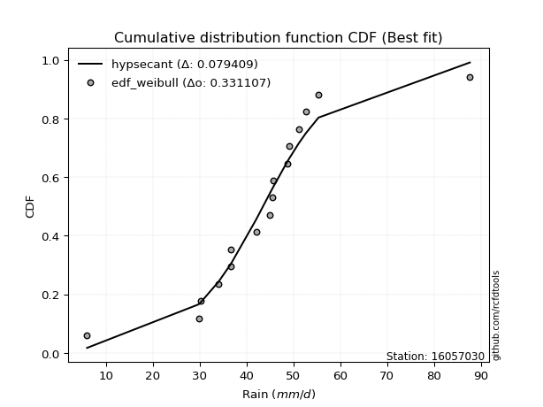</img></img>

</div>


### 4. EDF Beard (1943)

The Beard formula (or Beard´s plotting position formula) in hydrology is used to estimate the empirical non-exceedance probability _(P)_ of a flood event (or other extreme hydrological data point) within a given dataset.

<div align="center">


$P=(m-0.31)/(n+0.38)$


</div>


**4.1. Empirical values**

<div align="center">

|                | 0                   | 1                   | 2                   | 3                   | 4                   | 5                  | 6                  | 7                   | 8                  | 9                  | 10                 | 11                 | 12                 | 13                 | 14                 | 15                 |
|:---------------|:--------------------|:--------------------|:--------------------|:--------------------|:--------------------|:-------------------|:-------------------|:--------------------|:-------------------|:-------------------|:-------------------|:-------------------|:-------------------|:-------------------|:-------------------|:-------------------|
| date           | 2022                | 2019                | 2021                | 2009                | 2010                | 2006               | 2018               | 2007                | 2013               | 2008               | 2014               | 2012               | 2016               | 2011               | 2017               | 2015               |
| x              | 6.0                 | 29.8                | 30.3                | 34.1                | 36.7                | 36.7               | 42.1               | 45.0                | 45.6               | 45.7               | 48.8               | 49.1               | 51.2               | 52.7               | 55.4               | 87.7               |
| m              | 1                   | 2                   | 3                   | 4                   | 5                   | 6                  | 7                  | 8                   | 9                  | 10                 | 11                 | 12                 | 13                 | 14                 | 15                 | 16                 |
| empirical_dist | edf_beard           | edf_beard           | edf_beard           | edf_beard           | edf_beard           | edf_beard          | edf_beard          | edf_beard           | edf_beard          | edf_beard          | edf_beard          | edf_beard          | edf_beard          | edf_beard          | edf_beard          | edf_beard          |
| empirical      | 0.04212454212454212 | 0.10317460317460318 | 0.16422466422466422 | 0.22527472527472528 | 0.28632478632478636 | 0.3473748473748474 | 0.4084249084249085 | 0.46947496947496953 | 0.5305250305250305 | 0.5915750915750916 | 0.6526251526251526 | 0.7136752136752137 | 0.7747252747252747 | 0.8357753357753358 | 0.8968253968253969 | 0.9578754578754579 |
| empirical_tr   | 1.0439770554493308  | 1.1150442477876106  | 1.1964937910883857  | 1.2907801418439715  | 1.4011976047904193  | 1.5322731524789526 | 1.690402476780186  | 1.884925201380898   | 2.130039011703511  | 2.4484304932735426 | 2.878734622144113  | 3.492537313432836  | 4.439024390243903  | 6.08921933085502   | 9.692307692307695  | 23.73913043478263  |

</div>


**4.2. Kolmogorov-Smirnov fit test (sorted by Δ)**


<div align="center">

|                | 0                   | 1                   | 2                   | 3                   | 4                   | 5                   | 6                   | 7                   | 8                     | 9                   | 10                  | 11                  | 12                  | 13                  | 14                  | 15                  | 16                  | 17                | 18                  | 19                  | 20                  | 21                 | 22                  | 23                 | 24                  | 25                  | 26                  | 27                 | 28                  | 29                  | 30                  | 31                  | 32                  | 33                  | 34                  | 35                  | 36                  | 37                  | 38                  | 39                 | 40                 | 41                  | 42                  | 43                  | 44                  | 45                 | 46                  | 47                 | 48                  | 49                  | 50                | 51                | 52                  | 53                 | 54                  | 55                  | 56                  | 57                 | 58                  | 59                  | 60                  | 61                  | 62                | 63                  | 64                  | 65                 | 66                | 67                 | 68                 | 69                  | 70                 | 71                 | 72                  | 73                  | 74                 | 75                  | 76                 | 77                | 78                  | 79                  | 80                 | 81                 | 82                 | 83                  | 84                 | 85                 | 86                 | 87                 |
|:---------------|:--------------------|:--------------------|:--------------------|:--------------------|:--------------------|:--------------------|:--------------------|:--------------------|:----------------------|:--------------------|:--------------------|:--------------------|:--------------------|:--------------------|:--------------------|:--------------------|:--------------------|:------------------|:--------------------|:--------------------|:--------------------|:-------------------|:--------------------|:-------------------|:--------------------|:--------------------|:--------------------|:-------------------|:--------------------|:--------------------|:--------------------|:--------------------|:--------------------|:--------------------|:--------------------|:--------------------|:--------------------|:--------------------|:--------------------|:-------------------|:-------------------|:--------------------|:--------------------|:--------------------|:--------------------|:-------------------|:--------------------|:-------------------|:--------------------|:--------------------|:------------------|:------------------|:--------------------|:-------------------|:--------------------|:--------------------|:--------------------|:-------------------|:--------------------|:--------------------|:--------------------|:--------------------|:------------------|:--------------------|:--------------------|:-------------------|:------------------|:-------------------|:-------------------|:--------------------|:-------------------|:-------------------|:--------------------|:--------------------|:-------------------|:--------------------|:-------------------|:------------------|:--------------------|:--------------------|:-------------------|:-------------------|:-------------------|:--------------------|:-------------------|:-------------------|:-------------------|:-------------------|
| station        | 16057030            | 16057030            | 16057030            | 16057030            | 16057030            | 16057030            | 16057030            | 16057030            | 16057030              | 16057030            | 16057030            | 16057030            | 16057030            | 16057030            | 16057030            | 16057030            | 16057030            | 16057030          | 16057030            | 16057030            | 16057030            | 16057030           | 16057030            | 16057030           | 16057030            | 16057030            | 16057030            | 16057030           | 16057030            | 16057030            | 16057030            | 16057030            | 16057030            | 16057030            | 16057030            | 16057030            | 16057030            | 16057030            | 16057030            | 16057030           | 16057030           | 16057030            | 16057030            | 16057030            | 16057030            | 16057030           | 16057030            | 16057030           | 16057030            | 16057030            | 16057030          | 16057030          | 16057030            | 16057030           | 16057030            | 16057030            | 16057030            | 16057030           | 16057030            | 16057030            | 16057030            | 16057030            | 16057030          | 16057030            | 16057030            | 16057030           | 16057030          | 16057030           | 16057030           | 16057030            | 16057030           | 16057030           | 16057030            | 16057030            | 16057030           | 16057030            | 16057030           | 16057030          | 16057030            | 16057030            | 16057030           | 16057030           | 16057030           | 16057030            | 16057030           | 16057030           | 16057030           | 16057030           |
| empirical_dist | edf_beard           | edf_beard           | edf_beard           | edf_beard           | edf_beard           | edf_beard           | edf_beard           | edf_beard           | edf_beard             | edf_beard           | edf_beard           | edf_beard           | edf_beard           | edf_beard           | edf_beard           | edf_beard           | edf_beard           | edf_beard         | edf_beard           | edf_beard           | edf_beard           | edf_beard          | edf_beard           | edf_beard          | edf_beard           | edf_beard           | edf_beard           | edf_beard          | edf_beard           | edf_beard           | edf_beard           | edf_beard           | edf_beard           | edf_beard           | edf_beard           | edf_beard           | edf_beard           | edf_beard           | edf_beard           | edf_beard          | edf_beard          | edf_beard           | edf_beard           | edf_beard           | edf_beard           | edf_beard          | edf_beard           | edf_beard          | edf_beard           | edf_beard           | edf_beard         | edf_beard         | edf_beard           | edf_beard          | edf_beard           | edf_beard           | edf_beard           | edf_beard          | edf_beard           | edf_beard           | edf_beard           | edf_beard           | edf_beard         | edf_beard           | edf_beard           | edf_beard          | edf_beard         | edf_beard          | edf_beard          | edf_beard           | edf_beard          | edf_beard          | edf_beard           | edf_beard           | edf_beard          | edf_beard           | edf_beard          | edf_beard         | edf_beard           | edf_beard           | edf_beard          | edf_beard          | edf_beard          | edf_beard           | edf_beard          | edf_beard          | edf_beard          | edf_beard          |
| p_dist         | genlogistic         | fisk                | logcrystalball      | laplace_asymmetric  | laplace             | logjohnsonsu        | nct                 | hypsecant           | loglaplace_asymmetric | johnsonsu           | exponnorm           | logistic            | mielke              | logmielke           | loggenlogistic      | pearson3            | invgamma            | rayleigh          | invgauss            | maxwell             | betaprime           | f                  | gamma               | erlang             | crystalball         | norm                | truncnorm           | alpha              | logt                | logtruncnorm        | loggompertz         | logweibull_min      | logfisk             | logloggamma         | halfnorm            | gumbel_r            | t                   | gumbel_l            | ncf                 | invweibull         | moyal              | halflogistic        | loghypsecant        | loggumbel_l         | loglaplace          | kstwobign          | loglogistic         | lognakagami        | logrice             | logexponnorm        | lognorm           | lognorm           | loglognorm          | logf               | logfatiguelife      | logncf              | lognct              | logpearson3        | logchi2             | logalpha            | loggamma            | loggamma            | logbetaprime      | loginvgamma         | wald                | logmaxwell         | loggumbel_r       | logerlang          | lograyleigh        | loginvgauss         | logmoyal           | gibrat             | weibull_min         | loghalfnorm         | loghalflogistic    | loginvweibull       | logwald            | nakagami          | loggibrat           | logkstwobign        | expon              | genexpon           | loggenexpon        | logexpon            | fatiguelife        | rice               | chi2               | gompertz           |
| delta          | 0.08390869412753138 | 0.08688854354746295 | 0.08723525948235333 | 0.08853711753939775 | 0.08932716904341481 | 0.09058987180708095 | 0.09343515800693669 | 0.09388125191022767 | 0.09443987707821823   | 0.09957295563454005 | 0.10618187811608071 | 0.10824740299369917 | 0.11387359255772062 | 0.11428643901453489 | 0.11467975659821666 | 0.11989277870664405 | 0.12043402390578728 | 0.121220974899508 | 0.12155699978238178 | 0.12334320236958873 | 0.12576463546900074 | 0.1257921210125177 | 0.12581562896920284 | 0.1259702254162226 | 0.13081967494604385 | 0.13081968425207247 | 0.13081970858166447 | 0.1308526553483622 | 0.13235904110969537 | 0.13266329737057242 | 0.13383049968751115 | 0.13409166316056853 | 0.13431572674350356 | 0.13518267353964986 | 0.13587513549428293 | 0.13630765885168078 | 0.13902988893659624 | 0.15181383608468313 | 0.15599152946238448 | 0.1577680779976527 | 0.1615739058775803 | 0.16261301013704083 | 0.16904244008052965 | 0.17916255737261777 | 0.18095219734781437 | 0.1820403909930861 | 0.18434501467317987 | 0.1868440211996371 | 0.20516925199048436 | 0.20525363814976605 | 0.205253934930202 | 0.205253934930202 | 0.20525672157704117 | 0.2053122067666704 | 0.20540077057668932 | 0.20688881264524744 | 0.20877835088739133 | 0.2089746466185397 | 0.22342702735882308 | 0.22612531924644647 | 0.22750598725847837 | 0.22750598725847837 | 0.228128581435032 | 0.23148239459691888 | 0.23170035782172066 | 0.2339597959385633 | 0.241009343917079 | 0.2441160046109283 | 0.2452259463387586 | 0.25419226811807316 | 0.2587725918712625 | 0.2595022562202916 | 0.27494548541869135 | 0.27712732504062343 | 0.2772272329150291 | 0.29337910032508896 | 0.3294486634434581 | 0.337802870378398 | 0.34276212040587656 | 0.34552983305365437 | 0.3662090834099417 | 0.3662723993298686 | 0.3971097565459128 | 0.47117490050099337 | 0.6509852417490178 | 0.6688827944113764 | 0.7992873342774068 | 0.8964827570162288 |
| deltao         | 0.331107277296      | 0.331107277296      | 0.331107277296      | 0.331107277296      | 0.331107277296      | 0.331107277296      | 0.331107277296      | 0.331107277296      | 0.331107277296        | 0.331107277296      | 0.331107277296      | 0.331107277296      | 0.331107277296      | 0.331107277296      | 0.331107277296      | 0.331107277296      | 0.331107277296      | 0.331107277296    | 0.331107277296      | 0.331107277296      | 0.331107277296      | 0.331107277296     | 0.331107277296      | 0.331107277296     | 0.331107277296      | 0.331107277296      | 0.331107277296      | 0.331107277296     | 0.331107277296      | 0.331107277296      | 0.331107277296      | 0.331107277296      | 0.331107277296      | 0.331107277296      | 0.331107277296      | 0.331107277296      | 0.331107277296      | 0.331107277296      | 0.331107277296      | 0.331107277296     | 0.331107277296     | 0.331107277296      | 0.331107277296      | 0.331107277296      | 0.331107277296      | 0.331107277296     | 0.331107277296      | 0.331107277296     | 0.331107277296      | 0.331107277296      | 0.331107277296    | 0.331107277296    | 0.331107277296      | 0.331107277296     | 0.331107277296      | 0.331107277296      | 0.331107277296      | 0.331107277296     | 0.331107277296      | 0.331107277296      | 0.331107277296      | 0.331107277296      | 0.331107277296    | 0.331107277296      | 0.331107277296      | 0.331107277296     | 0.331107277296    | 0.331107277296     | 0.331107277296     | 0.331107277296      | 0.331107277296     | 0.331107277296     | 0.331107277296      | 0.331107277296      | 0.331107277296     | 0.331107277296      | 0.331107277296     | 0.331107277296    | 0.331107277296      | 0.331107277296      | 0.331107277296     | 0.331107277296     | 0.331107277296     | 0.331107277296      | 0.331107277296     | 0.331107277296     | 0.331107277296     | 0.331107277296     |
| eval           | Δo > Δ              | Δo > Δ              | Δo > Δ              | Δo > Δ              | Δo > Δ              | Δo > Δ              | Δo > Δ              | Δo > Δ              | Δo > Δ                | Δo > Δ              | Δo > Δ              | Δo > Δ              | Δo > Δ              | Δo > Δ              | Δo > Δ              | Δo > Δ              | Δo > Δ              | Δo > Δ            | Δo > Δ              | Δo > Δ              | Δo > Δ              | Δo > Δ             | Δo > Δ              | Δo > Δ             | Δo > Δ              | Δo > Δ              | Δo > Δ              | Δo > Δ             | Δo > Δ              | Δo > Δ              | Δo > Δ              | Δo > Δ              | Δo > Δ              | Δo > Δ              | Δo > Δ              | Δo > Δ              | Δo > Δ              | Δo > Δ              | Δo > Δ              | Δo > Δ             | Δo > Δ             | Δo > Δ              | Δo > Δ              | Δo > Δ              | Δo > Δ              | Δo > Δ             | Δo > Δ              | Δo > Δ             | Δo > Δ              | Δo > Δ              | Δo > Δ            | Δo > Δ            | Δo > Δ              | Δo > Δ             | Δo > Δ              | Δo > Δ              | Δo > Δ              | Δo > Δ             | Δo > Δ              | Δo > Δ              | Δo > Δ              | Δo > Δ              | Δo > Δ            | Δo > Δ              | Δo > Δ              | Δo > Δ             | Δo > Δ            | Δo > Δ             | Δo > Δ             | Δo > Δ              | Δo > Δ             | Δo > Δ             | Δo > Δ              | Δo > Δ              | Δo > Δ             | Δo > Δ              | Δo > Δ             | Δo <= Δ           | Δo <= Δ             | Δo <= Δ             | Δo <= Δ            | Δo <= Δ            | Δo <= Δ            | Δo <= Δ             | Δo <= Δ            | Δo <= Δ            | Δo <= Δ            | Δo <= Δ            |
| fit            | 1                   | 1                   | 1                   | 1                   | 1                   | 1                   | 1                   | 1                   | 1                     | 1                   | 1                   | 1                   | 1                   | 1                   | 1                   | 1                   | 1                   | 1                 | 1                   | 1                   | 1                   | 1                  | 1                   | 1                  | 1                   | 1                   | 1                   | 1                  | 1                   | 1                   | 1                   | 1                   | 1                   | 1                   | 1                   | 1                   | 1                   | 1                   | 1                   | 1                  | 1                  | 1                   | 1                   | 1                   | 1                   | 1                  | 1                   | 1                  | 1                   | 1                   | 1                 | 1                 | 1                   | 1                  | 1                   | 1                   | 1                   | 1                  | 1                   | 1                   | 1                   | 1                   | 1                 | 1                   | 1                   | 1                  | 1                 | 1                  | 1                  | 1                   | 1                  | 1                  | 1                   | 1                   | 1                  | 1                   | 1                  | 0                 | 0                   | 0                   | 0                  | 0                  | 0                  | 0                   | 0                  | 0                  | 0                  | 0                  |
| n              | 16                  | 16                  | 16                  | 16                  | 16                  | 16                  | 16                  | 16                  | 16                    | 16                  | 16                  | 16                  | 16                  | 16                  | 16                  | 16                  | 16                  | 16                | 16                  | 16                  | 16                  | 16                 | 16                  | 16                 | 16                  | 16                  | 16                  | 16                 | 16                  | 16                  | 16                  | 16                  | 16                  | 16                  | 16                  | 16                  | 16                  | 16                  | 16                  | 16                 | 16                 | 16                  | 16                  | 16                  | 16                  | 16                 | 16                  | 16                 | 16                  | 16                  | 16                | 16                | 16                  | 16                 | 16                  | 16                  | 16                  | 16                 | 16                  | 16                  | 16                  | 16                  | 16                | 16                  | 16                  | 16                 | 16                | 16                 | 16                 | 16                  | 16                 | 16                 | 16                  | 16                  | 16                 | 16                  | 16                 | 16                | 16                  | 16                  | 16                 | 16                 | 16                 | 16                  | 16                 | 16                 | 16                 | 16                 |
| best_fit       | 1                   | 0                   | 0                   | 0                   | 0                   | 0                   | 0                   | 0                   | 0                     | 0                   | 0                   | 0                   | 0                   | 0                   | 0                   | 0                   | 0                   | 0                 | 0                   | 0                   | 0                   | 0                  | 0                   | 0                  | 0                   | 0                   | 0                   | 0                  | 0                   | 0                   | 0                   | 0                   | 0                   | 0                   | 0                   | 0                   | 0                   | 0                   | 0                   | 0                  | 0                  | 0                   | 0                   | 0                   | 0                   | 0                  | 0                   | 0                  | 0                   | 0                   | 0                 | 0                 | 0                   | 0                  | 0                   | 0                   | 0                   | 0                  | 0                   | 0                   | 0                   | 0                   | 0                 | 0                   | 0                   | 0                  | 0                 | 0                  | 0                  | 0                   | 0                  | 0                  | 0                   | 0                   | 0                  | 0                   | 0                  | 0                 | 0                   | 0                   | 0                  | 0                  | 0                  | 0                   | 0                  | 0                  | 0                  | 0                  |
| best_fit_sort  | 1                   | 2                   | 3                   | 4                   | 5                   | 6                   | 7                   | 8                   | 9                     | 10                  | 11                  | 12                  | 13                  | 14                  | 15                  | 16                  | 17                  | 18                | 19                  | 20                  | 21                  | 22                 | 23                  | 24                 | 25                  | 26                  | 27                  | 28                 | 29                  | 30                  | 31                  | 32                  | 33                  | 34                  | 35                  | 36                  | 37                  | 38                  | 39                  | 40                 | 41                 | 42                  | 43                  | 44                  | 45                  | 46                 | 47                  | 48                 | 49                  | 50                  | 51                | 52                | 53                  | 54                 | 55                  | 56                  | 57                  | 58                 | 59                  | 60                  | 61                  | 62                  | 63                | 64                  | 65                  | 66                 | 67                | 68                 | 69                 | 70                  | 71                 | 72                 | 73                  | 74                  | 75                 | 76                  | 77                 | 78                | 79                  | 80                  | 81                 | 82                 | 83                 | 84                  | 85                 | 86                 | 87                 | 88                 |

</div>


**4.3. Best fit**

<div align="center">

|   id |   station | empirical_dist   | p_dist      |     delta |   deltao | eval   |   fit |   n |   best_fit |   best_fit_sort |
|-----:|----------:|:-----------------|:------------|----------:|---------:|:-------|------:|----:|-----------:|----------------:|
|    0 |  16057030 | edf_beard        | genlogistic | 0.0839087 | 0.331107 | Δo > Δ |     1 |  16 |          1 |               1 |

</div>


<div align="center">

</img></img>

</div>


### 5. EDF Chegodayev (1955)

The Chegodayev formula is an empirical plotting position formula used in hydrological frequency analysis to estimate the exceedance probability or return period of a specific event from a set of observed data. It is primarily used for plotting observed data points on probability paper to fit a theoretical distribution, particularly for analyzing extreme events like maximum flood flows or rainfall intensities. The constant _b_ value in the generalized plotting position formula is 0.3.

<div align="center">


$P=(m-b)/(n+1-2b)$


</div>


**5.1. Empirical values**

<div align="center">

|                | 0                    | 1                   | 2                   | 3                  | 4                   | 5                   | 6                  | 7                   | 8                  | 9                  | 10                 | 11                 | 12                 | 13                 | 14                 | 15                 |
|:---------------|:---------------------|:--------------------|:--------------------|:-------------------|:--------------------|:--------------------|:-------------------|:--------------------|:-------------------|:-------------------|:-------------------|:-------------------|:-------------------|:-------------------|:-------------------|:-------------------|
| date           | 2022                 | 2019                | 2021                | 2009               | 2010                | 2006                | 2018               | 2007                | 2013               | 2008               | 2014               | 2012               | 2016               | 2011               | 2017               | 2015               |
| x              | 6.0                  | 29.8                | 30.3                | 34.1               | 36.7                | 36.7                | 42.1               | 45.0                | 45.6               | 45.7               | 48.8               | 49.1               | 51.2               | 52.7               | 55.4               | 87.7               |
| m              | 1                    | 2                   | 3                   | 4                  | 5                   | 6                   | 7                  | 8                   | 9                  | 10                 | 11                 | 12                 | 13                 | 14                 | 15                 | 16                 |
| empirical_dist | edf_chegodayev       | edf_chegodayev      | edf_chegodayev      | edf_chegodayev     | edf_chegodayev      | edf_chegodayev      | edf_chegodayev     | edf_chegodayev      | edf_chegodayev     | edf_chegodayev     | edf_chegodayev     | edf_chegodayev     | edf_chegodayev     | edf_chegodayev     | edf_chegodayev     | edf_chegodayev     |
| empirical      | 0.042682926829268296 | 0.10365853658536586 | 0.16463414634146345 | 0.225609756097561  | 0.28658536585365857 | 0.34756097560975613 | 0.4085365853658537 | 0.46951219512195125 | 0.5304878048780488 | 0.5914634146341463 | 0.6524390243902439 | 0.7134146341463414 | 0.774390243902439  | 0.8353658536585367 | 0.8963414634146342 | 0.9573170731707318 |
| empirical_tr   | 1.0445859872611465   | 1.1156462585034013  | 1.197080291970803   | 1.2913385826771653 | 1.4017094017094018  | 1.532710280373832   | 1.690721649484536  | 1.8850574712643677  | 2.12987012987013   | 2.4477611940298507 | 2.8771929824561404 | 3.4893617021276593 | 4.4324324324324325 | 6.074074074074077  | 9.647058823529413  | 23.42857142857147  |

</div>


**5.2. Kolmogorov-Smirnov fit test (sorted by Δ)**


<div align="center">

|                | 0                   | 1                   | 2                   | 3                   | 4                   | 5                   | 6                   | 7                  | 8                     | 9                   | 10                  | 11                  | 12                 | 13                  | 14                  | 15                  | 16                  | 17                  | 18                 | 19                  | 20                  | 21                | 22                  | 23                 | 24                  | 25                  | 26                  | 27                  | 28                  | 29                  | 30                  | 31                  | 32                  | 33                  | 34                 | 35                  | 36                  | 37                | 38                  | 39               | 40                  | 41                 | 42                | 43                  | 44                  | 45                  | 46                 | 47                 | 48                 | 49                  | 50                  | 51                  | 52                 | 53                  | 54                  | 55                  | 56                  | 57                  | 58                  | 59                 | 60                 | 61                 | 62                  | 63                  | 64                  | 65                  | 66                  | 67                  | 68                  | 69                  | 70                 | 71                 | 72                  | 73                  | 74                  | 75                  | 76                  | 77                 | 78                  | 79                 | 80                  | 81                  | 82                  | 83                 | 84                 | 85                 | 86                 | 87                 |
|:---------------|:--------------------|:--------------------|:--------------------|:--------------------|:--------------------|:--------------------|:--------------------|:-------------------|:----------------------|:--------------------|:--------------------|:--------------------|:-------------------|:--------------------|:--------------------|:--------------------|:--------------------|:--------------------|:-------------------|:--------------------|:--------------------|:------------------|:--------------------|:-------------------|:--------------------|:--------------------|:--------------------|:--------------------|:--------------------|:--------------------|:--------------------|:--------------------|:--------------------|:--------------------|:-------------------|:--------------------|:--------------------|:------------------|:--------------------|:-----------------|:--------------------|:-------------------|:------------------|:--------------------|:--------------------|:--------------------|:-------------------|:-------------------|:-------------------|:--------------------|:--------------------|:--------------------|:-------------------|:--------------------|:--------------------|:--------------------|:--------------------|:--------------------|:--------------------|:-------------------|:-------------------|:-------------------|:--------------------|:--------------------|:--------------------|:--------------------|:--------------------|:--------------------|:--------------------|:--------------------|:-------------------|:-------------------|:--------------------|:--------------------|:--------------------|:--------------------|:--------------------|:-------------------|:--------------------|:-------------------|:--------------------|:--------------------|:--------------------|:-------------------|:-------------------|:-------------------|:-------------------|:-------------------|
| station        | 16057030            | 16057030            | 16057030            | 16057030            | 16057030            | 16057030            | 16057030            | 16057030           | 16057030              | 16057030            | 16057030            | 16057030            | 16057030           | 16057030            | 16057030            | 16057030            | 16057030            | 16057030            | 16057030           | 16057030            | 16057030            | 16057030          | 16057030            | 16057030           | 16057030            | 16057030            | 16057030            | 16057030            | 16057030            | 16057030            | 16057030            | 16057030            | 16057030            | 16057030            | 16057030           | 16057030            | 16057030            | 16057030          | 16057030            | 16057030         | 16057030            | 16057030           | 16057030          | 16057030            | 16057030            | 16057030            | 16057030           | 16057030           | 16057030           | 16057030            | 16057030            | 16057030            | 16057030           | 16057030            | 16057030            | 16057030            | 16057030            | 16057030            | 16057030            | 16057030           | 16057030           | 16057030           | 16057030            | 16057030            | 16057030            | 16057030            | 16057030            | 16057030            | 16057030            | 16057030            | 16057030           | 16057030           | 16057030            | 16057030            | 16057030            | 16057030            | 16057030            | 16057030           | 16057030            | 16057030           | 16057030            | 16057030            | 16057030            | 16057030           | 16057030           | 16057030           | 16057030           | 16057030           |
| empirical_dist | edf_chegodayev      | edf_chegodayev      | edf_chegodayev      | edf_chegodayev      | edf_chegodayev      | edf_chegodayev      | edf_chegodayev      | edf_chegodayev     | edf_chegodayev        | edf_chegodayev      | edf_chegodayev      | edf_chegodayev      | edf_chegodayev     | edf_chegodayev      | edf_chegodayev      | edf_chegodayev      | edf_chegodayev      | edf_chegodayev      | edf_chegodayev     | edf_chegodayev      | edf_chegodayev      | edf_chegodayev    | edf_chegodayev      | edf_chegodayev     | edf_chegodayev      | edf_chegodayev      | edf_chegodayev      | edf_chegodayev      | edf_chegodayev      | edf_chegodayev      | edf_chegodayev      | edf_chegodayev      | edf_chegodayev      | edf_chegodayev      | edf_chegodayev     | edf_chegodayev      | edf_chegodayev      | edf_chegodayev    | edf_chegodayev      | edf_chegodayev   | edf_chegodayev      | edf_chegodayev     | edf_chegodayev    | edf_chegodayev      | edf_chegodayev      | edf_chegodayev      | edf_chegodayev     | edf_chegodayev     | edf_chegodayev     | edf_chegodayev      | edf_chegodayev      | edf_chegodayev      | edf_chegodayev     | edf_chegodayev      | edf_chegodayev      | edf_chegodayev      | edf_chegodayev      | edf_chegodayev      | edf_chegodayev      | edf_chegodayev     | edf_chegodayev     | edf_chegodayev     | edf_chegodayev      | edf_chegodayev      | edf_chegodayev      | edf_chegodayev      | edf_chegodayev      | edf_chegodayev      | edf_chegodayev      | edf_chegodayev      | edf_chegodayev     | edf_chegodayev     | edf_chegodayev      | edf_chegodayev      | edf_chegodayev      | edf_chegodayev      | edf_chegodayev      | edf_chegodayev     | edf_chegodayev      | edf_chegodayev     | edf_chegodayev      | edf_chegodayev      | edf_chegodayev      | edf_chegodayev     | edf_chegodayev     | edf_chegodayev     | edf_chegodayev     | edf_chegodayev     |
| p_dist         | genlogistic         | logcrystalball      | fisk                | laplace_asymmetric  | laplace             | logjohnsonsu        | hypsecant           | nct                | loglaplace_asymmetric | johnsonsu           | exponnorm           | logistic            | mielke             | logmielke           | loggenlogistic      | pearson3            | invgamma            | rayleigh            | invgauss           | maxwell             | betaprime           | f                 | gamma               | erlang             | crystalball         | norm                | truncnorm           | alpha               | logt                | logtruncnorm        | loggompertz         | logweibull_min      | logfisk             | logloggamma         | halfnorm           | gumbel_r            | t                   | gumbel_l          | ncf                 | invweibull       | moyal               | halflogistic       | loghypsecant      | loggumbel_l         | loglaplace          | kstwobign           | loglogistic        | lognakagami        | logrice            | logexponnorm        | lognorm             | lognorm             | loglognorm         | logf                | logfatiguelife      | logncf              | lognct              | logpearson3         | logchi2             | logalpha           | loggamma           | loggamma           | logbetaprime        | loginvgamma         | wald                | logmaxwell          | loggumbel_r         | logerlang           | lograyleigh         | loginvgauss         | logmoyal           | gibrat             | weibull_min         | loghalfnorm         | loghalflogistic     | loginvweibull       | logwald             | nakagami           | loggibrat           | logkstwobign       | expon               | genexpon            | loggenexpon         | logexpon           | fatiguelife        | rice               | chi2               | gompertz           |
| delta          | 0.08387146848054966 | 0.08675132607159064 | 0.08685131790048123 | 0.08872324577430646 | 0.08928994339643309 | 0.09077600004198966 | 0.09339731849946498 | 0.0936212862418454 | 0.09395594366745555   | 0.09975908386944876 | 0.10569794470531801 | 0.10776346958293648 | 0.1138363669107389 | 0.11424921336755317 | 0.11464253095123494 | 0.11940884529588136 | 0.11995009049502459 | 0.12073704148874531 | 0.1210730663716191 | 0.12285926895882604 | 0.12528070205823805 | 0.125308187601755 | 0.12533169555844015 | 0.1254862920054599 | 0.13033574153528116 | 0.13033575084130977 | 0.13033577517090178 | 0.13036872193759952 | 0.13254516934460409 | 0.13307277948737165 | 0.13334656627674846 | 0.13360772974980584 | 0.13383179333274087 | 0.13469874012888716 | 0.1358379098473012 | 0.13627043320469906 | 0.13854595552583357 | 0.151404353967884 | 0.15550759605162182 | 0.15728414458689 | 0.16153668023059858 | 0.1625757844900591 | 0.168558506669767 | 0.17867862396185508 | 0.18091497170083265 | 0.18155645758232344 | 0.1838610812624172 | 0.1868067955526554 | 0.2046853185797217 | 0.20476970473900338 | 0.20477000151943933 | 0.20477000151943933 | 0.2047727881662785 | 0.20482827335590773 | 0.20491683716592665 | 0.20640487923448478 | 0.20829441747662866 | 0.20856516450174056 | 0.22294309394806042 | 0.2256413858356838 | 0.2270220538477157 | 0.2270220538477157 | 0.22764464802426934 | 0.23099846118615622 | 0.23166313217473894 | 0.23347586252780064 | 0.24052541050631635 | 0.24363207120016564 | 0.24474201292799594 | 0.25370833470731047 | 0.2585120123423903 | 0.2594650305733099 | 0.27446155200792866 | 0.27664339162986074 | 0.27674329950426646 | 0.29289516691432627 | 0.32918808391458587 | 0.3375422908495258 | 0.34250154087700435 | 0.3450458996428917 | 0.36572514999917904 | 0.36578846591910597 | 0.39662582313515016 | 0.4706909670902307 | 0.6505013083382551 | 0.6683988610006137 | 0.7988034008666441 | 0.8959988236054661 |
| deltao         | 0.331107277296      | 0.331107277296      | 0.331107277296      | 0.331107277296      | 0.331107277296      | 0.331107277296      | 0.331107277296      | 0.331107277296     | 0.331107277296        | 0.331107277296      | 0.331107277296      | 0.331107277296      | 0.331107277296     | 0.331107277296      | 0.331107277296      | 0.331107277296      | 0.331107277296      | 0.331107277296      | 0.331107277296     | 0.331107277296      | 0.331107277296      | 0.331107277296    | 0.331107277296      | 0.331107277296     | 0.331107277296      | 0.331107277296      | 0.331107277296      | 0.331107277296      | 0.331107277296      | 0.331107277296      | 0.331107277296      | 0.331107277296      | 0.331107277296      | 0.331107277296      | 0.331107277296     | 0.331107277296      | 0.331107277296      | 0.331107277296    | 0.331107277296      | 0.331107277296   | 0.331107277296      | 0.331107277296     | 0.331107277296    | 0.331107277296      | 0.331107277296      | 0.331107277296      | 0.331107277296     | 0.331107277296     | 0.331107277296     | 0.331107277296      | 0.331107277296      | 0.331107277296      | 0.331107277296     | 0.331107277296      | 0.331107277296      | 0.331107277296      | 0.331107277296      | 0.331107277296      | 0.331107277296      | 0.331107277296     | 0.331107277296     | 0.331107277296     | 0.331107277296      | 0.331107277296      | 0.331107277296      | 0.331107277296      | 0.331107277296      | 0.331107277296      | 0.331107277296      | 0.331107277296      | 0.331107277296     | 0.331107277296     | 0.331107277296      | 0.331107277296      | 0.331107277296      | 0.331107277296      | 0.331107277296      | 0.331107277296     | 0.331107277296      | 0.331107277296     | 0.331107277296      | 0.331107277296      | 0.331107277296      | 0.331107277296     | 0.331107277296     | 0.331107277296     | 0.331107277296     | 0.331107277296     |
| eval           | Δo > Δ              | Δo > Δ              | Δo > Δ              | Δo > Δ              | Δo > Δ              | Δo > Δ              | Δo > Δ              | Δo > Δ             | Δo > Δ                | Δo > Δ              | Δo > Δ              | Δo > Δ              | Δo > Δ             | Δo > Δ              | Δo > Δ              | Δo > Δ              | Δo > Δ              | Δo > Δ              | Δo > Δ             | Δo > Δ              | Δo > Δ              | Δo > Δ            | Δo > Δ              | Δo > Δ             | Δo > Δ              | Δo > Δ              | Δo > Δ              | Δo > Δ              | Δo > Δ              | Δo > Δ              | Δo > Δ              | Δo > Δ              | Δo > Δ              | Δo > Δ              | Δo > Δ             | Δo > Δ              | Δo > Δ              | Δo > Δ            | Δo > Δ              | Δo > Δ           | Δo > Δ              | Δo > Δ             | Δo > Δ            | Δo > Δ              | Δo > Δ              | Δo > Δ              | Δo > Δ             | Δo > Δ             | Δo > Δ             | Δo > Δ              | Δo > Δ              | Δo > Δ              | Δo > Δ             | Δo > Δ              | Δo > Δ              | Δo > Δ              | Δo > Δ              | Δo > Δ              | Δo > Δ              | Δo > Δ             | Δo > Δ             | Δo > Δ             | Δo > Δ              | Δo > Δ              | Δo > Δ              | Δo > Δ              | Δo > Δ              | Δo > Δ              | Δo > Δ              | Δo > Δ              | Δo > Δ             | Δo > Δ             | Δo > Δ              | Δo > Δ              | Δo > Δ              | Δo > Δ              | Δo > Δ              | Δo <= Δ            | Δo <= Δ             | Δo <= Δ            | Δo <= Δ             | Δo <= Δ             | Δo <= Δ             | Δo <= Δ            | Δo <= Δ            | Δo <= Δ            | Δo <= Δ            | Δo <= Δ            |
| fit            | 1                   | 1                   | 1                   | 1                   | 1                   | 1                   | 1                   | 1                  | 1                     | 1                   | 1                   | 1                   | 1                  | 1                   | 1                   | 1                   | 1                   | 1                   | 1                  | 1                   | 1                   | 1                 | 1                   | 1                  | 1                   | 1                   | 1                   | 1                   | 1                   | 1                   | 1                   | 1                   | 1                   | 1                   | 1                  | 1                   | 1                   | 1                 | 1                   | 1                | 1                   | 1                  | 1                 | 1                   | 1                   | 1                   | 1                  | 1                  | 1                  | 1                   | 1                   | 1                   | 1                  | 1                   | 1                   | 1                   | 1                   | 1                   | 1                   | 1                  | 1                  | 1                  | 1                   | 1                   | 1                   | 1                   | 1                   | 1                   | 1                   | 1                   | 1                  | 1                  | 1                   | 1                   | 1                   | 1                   | 1                   | 0                  | 0                   | 0                  | 0                   | 0                   | 0                   | 0                  | 0                  | 0                  | 0                  | 0                  |
| n              | 16                  | 16                  | 16                  | 16                  | 16                  | 16                  | 16                  | 16                 | 16                    | 16                  | 16                  | 16                  | 16                 | 16                  | 16                  | 16                  | 16                  | 16                  | 16                 | 16                  | 16                  | 16                | 16                  | 16                 | 16                  | 16                  | 16                  | 16                  | 16                  | 16                  | 16                  | 16                  | 16                  | 16                  | 16                 | 16                  | 16                  | 16                | 16                  | 16               | 16                  | 16                 | 16                | 16                  | 16                  | 16                  | 16                 | 16                 | 16                 | 16                  | 16                  | 16                  | 16                 | 16                  | 16                  | 16                  | 16                  | 16                  | 16                  | 16                 | 16                 | 16                 | 16                  | 16                  | 16                  | 16                  | 16                  | 16                  | 16                  | 16                  | 16                 | 16                 | 16                  | 16                  | 16                  | 16                  | 16                  | 16                 | 16                  | 16                 | 16                  | 16                  | 16                  | 16                 | 16                 | 16                 | 16                 | 16                 |
| best_fit       | 1                   | 0                   | 0                   | 0                   | 0                   | 0                   | 0                   | 0                  | 0                     | 0                   | 0                   | 0                   | 0                  | 0                   | 0                   | 0                   | 0                   | 0                   | 0                  | 0                   | 0                   | 0                 | 0                   | 0                  | 0                   | 0                   | 0                   | 0                   | 0                   | 0                   | 0                   | 0                   | 0                   | 0                   | 0                  | 0                   | 0                   | 0                 | 0                   | 0                | 0                   | 0                  | 0                 | 0                   | 0                   | 0                   | 0                  | 0                  | 0                  | 0                   | 0                   | 0                   | 0                  | 0                   | 0                   | 0                   | 0                   | 0                   | 0                   | 0                  | 0                  | 0                  | 0                   | 0                   | 0                   | 0                   | 0                   | 0                   | 0                   | 0                   | 0                  | 0                  | 0                   | 0                   | 0                   | 0                   | 0                   | 0                  | 0                   | 0                  | 0                   | 0                   | 0                   | 0                  | 0                  | 0                  | 0                  | 0                  |
| best_fit_sort  | 1                   | 2                   | 3                   | 4                   | 5                   | 6                   | 7                   | 8                  | 9                     | 10                  | 11                  | 12                  | 13                 | 14                  | 15                  | 16                  | 17                  | 18                  | 19                 | 20                  | 21                  | 22                | 23                  | 24                 | 25                  | 26                  | 27                  | 28                  | 29                  | 30                  | 31                  | 32                  | 33                  | 34                  | 35                 | 36                  | 37                  | 38                | 39                  | 40               | 41                  | 42                 | 43                | 44                  | 45                  | 46                  | 47                 | 48                 | 49                 | 50                  | 51                  | 52                  | 53                 | 54                  | 55                  | 56                  | 57                  | 58                  | 59                  | 60                 | 61                 | 62                 | 63                  | 64                  | 65                  | 66                  | 67                  | 68                  | 69                  | 70                  | 71                 | 72                 | 73                  | 74                  | 75                  | 76                  | 77                  | 78                 | 79                  | 80                 | 81                  | 82                  | 83                  | 84                 | 85                 | 86                 | 87                 | 88                 |

</div>


**5.3. Best fit**

<div align="center">

|   id |   station | empirical_dist   | p_dist      |     delta |   deltao | eval   |   fit |   n |   best_fit |   best_fit_sort |
|-----:|----------:|:-----------------|:------------|----------:|---------:|:-------|------:|----:|-----------:|----------------:|
|    0 |  16057030 | edf_chegodayev   | genlogistic | 0.0838715 | 0.331107 | Δo > Δ |     1 |  16 |          1 |               1 |

</div>


<div align="center">

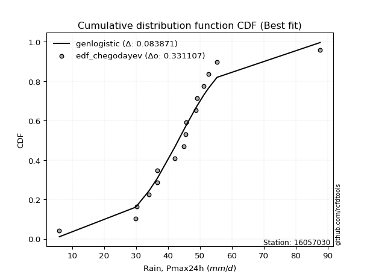</img>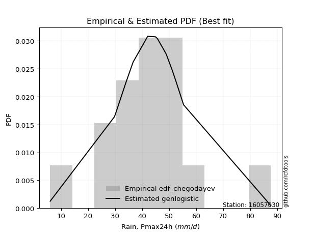</img>

</div>


### 6. EDF Blom (1958)

The Blom formula is a specific "plotting position" formula used in hydrology and statistical analysis to estimate the empirical cumulative probability (or non-exceedance probability) of a data series. It is particularly recommended for data that are approximately normally distributed. The constant _a_ is set to 0.375 (or 3/8).

<div align="center">


$P=(m-a)/(n+1-2a)$


</div>


**6.1. Empirical values**

<div align="center">

|                | 0                    | 1                  | 2                   | 3                  | 4                  | 5                   | 6                  | 7                   | 8                  | 9                  | 10                 | 11                 | 12                 | 13                 | 14                 | 15                 |
|:---------------|:---------------------|:-------------------|:--------------------|:-------------------|:-------------------|:--------------------|:-------------------|:--------------------|:-------------------|:-------------------|:-------------------|:-------------------|:-------------------|:-------------------|:-------------------|:-------------------|
| date           | 2022                 | 2019               | 2021                | 2009               | 2010               | 2006                | 2018               | 2007                | 2013               | 2008               | 2014               | 2012               | 2016               | 2011               | 2017               | 2015               |
| x              | 6.0                  | 29.8               | 30.3                | 34.1               | 36.7               | 36.7                | 42.1               | 45.0                | 45.6               | 45.7               | 48.8               | 49.1               | 51.2               | 52.7               | 55.4               | 87.7               |
| m              | 1                    | 2                  | 3                   | 4                  | 5                  | 6                   | 7                  | 8                   | 9                  | 10                 | 11                 | 12                 | 13                 | 14                 | 15                 | 16                 |
| empirical_dist | edf_blom             | edf_blom           | edf_blom            | edf_blom           | edf_blom           | edf_blom            | edf_blom           | edf_blom            | edf_blom           | edf_blom           | edf_blom           | edf_blom           | edf_blom           | edf_blom           | edf_blom           | edf_blom           |
| empirical      | 0.038461538461538464 | 0.1                | 0.16153846153846155 | 0.2230769230769231 | 0.2846153846153846 | 0.34615384615384615 | 0.4076923076923077 | 0.46923076923076923 | 0.5307692307692308 | 0.5923076923076923 | 0.6538461538461539 | 0.7153846153846154 | 0.7769230769230769 | 0.8384615384615385 | 0.9                | 0.9615384615384616 |
| empirical_tr   | 1.04                 | 1.1111111111111112 | 1.1926605504587156  | 1.2871287128712872 | 1.3978494623655913 | 1.5294117647058822  | 1.6883116883116882 | 1.8840579710144927  | 2.1311475409836067 | 2.452830188679245  | 2.888888888888889  | 3.5135135135135136 | 4.482758620689656  | 6.190476190476192  | 10.000000000000002 | 26.000000000000018 |

</div>


**6.2. Kolmogorov-Smirnov fit test (sorted by Δ)**


<div align="center">

|                | 0                   | 1                   | 2                   | 3                   | 4                   | 5                  | 6                   | 7                   | 8                     | 9                   | 10                  | 11                  | 12                  | 13                  | 14                  | 15                  | 16                  | 17                  | 18                  | 19                 | 20                 | 21                  | 22                | 23                  | 24                  | 25                 | 26                  | 27                  | 28                  | 29                  | 30                  | 31                  | 32                  | 33                 | 34                  | 35                  | 36                  | 37                 | 38                  | 39                  | 40                 | 41                  | 42                  | 43                  | 44                  | 45                 | 46                 | 47                  | 48                  | 49                  | 50                 | 51                 | 52                  | 53                  | 54                 | 55                  | 56                  | 57                  | 58                  | 59                  | 60                  | 61                  | 62                 | 63                  | 64                  | 65                 | 66                 | 67                 | 68                 | 69                 | 70                 | 71                  | 72                 | 73                 | 74                 | 75                 | 76                  | 77                  | 78                 | 79                  | 80                 | 81                 | 82                | 83                 | 84                | 85                 | 86               | 87                |
|:---------------|:--------------------|:--------------------|:--------------------|:--------------------|:--------------------|:-------------------|:--------------------|:--------------------|:----------------------|:--------------------|:--------------------|:--------------------|:--------------------|:--------------------|:--------------------|:--------------------|:--------------------|:--------------------|:--------------------|:-------------------|:-------------------|:--------------------|:------------------|:--------------------|:--------------------|:-------------------|:--------------------|:--------------------|:--------------------|:--------------------|:--------------------|:--------------------|:--------------------|:-------------------|:--------------------|:--------------------|:--------------------|:-------------------|:--------------------|:--------------------|:-------------------|:--------------------|:--------------------|:--------------------|:--------------------|:-------------------|:-------------------|:--------------------|:--------------------|:--------------------|:-------------------|:-------------------|:--------------------|:--------------------|:-------------------|:--------------------|:--------------------|:--------------------|:--------------------|:--------------------|:--------------------|:--------------------|:-------------------|:--------------------|:--------------------|:-------------------|:-------------------|:-------------------|:-------------------|:-------------------|:-------------------|:--------------------|:-------------------|:-------------------|:-------------------|:-------------------|:--------------------|:--------------------|:-------------------|:--------------------|:-------------------|:-------------------|:------------------|:-------------------|:------------------|:-------------------|:-----------------|:------------------|
| station        | 16057030            | 16057030            | 16057030            | 16057030            | 16057030            | 16057030           | 16057030            | 16057030            | 16057030              | 16057030            | 16057030            | 16057030            | 16057030            | 16057030            | 16057030            | 16057030            | 16057030            | 16057030            | 16057030            | 16057030           | 16057030           | 16057030            | 16057030          | 16057030            | 16057030            | 16057030           | 16057030            | 16057030            | 16057030            | 16057030            | 16057030            | 16057030            | 16057030            | 16057030           | 16057030            | 16057030            | 16057030            | 16057030           | 16057030            | 16057030            | 16057030           | 16057030            | 16057030            | 16057030            | 16057030            | 16057030           | 16057030           | 16057030            | 16057030            | 16057030            | 16057030           | 16057030           | 16057030            | 16057030            | 16057030           | 16057030            | 16057030            | 16057030            | 16057030            | 16057030            | 16057030            | 16057030            | 16057030           | 16057030            | 16057030            | 16057030           | 16057030           | 16057030           | 16057030           | 16057030           | 16057030           | 16057030            | 16057030           | 16057030           | 16057030           | 16057030           | 16057030            | 16057030            | 16057030           | 16057030            | 16057030           | 16057030           | 16057030          | 16057030           | 16057030          | 16057030           | 16057030         | 16057030          |
| empirical_dist | edf_blom            | edf_blom            | edf_blom            | edf_blom            | edf_blom            | edf_blom           | edf_blom            | edf_blom            | edf_blom              | edf_blom            | edf_blom            | edf_blom            | edf_blom            | edf_blom            | edf_blom            | edf_blom            | edf_blom            | edf_blom            | edf_blom            | edf_blom           | edf_blom           | edf_blom            | edf_blom          | edf_blom            | edf_blom            | edf_blom           | edf_blom            | edf_blom            | edf_blom            | edf_blom            | edf_blom            | edf_blom            | edf_blom            | edf_blom           | edf_blom            | edf_blom            | edf_blom            | edf_blom           | edf_blom            | edf_blom            | edf_blom           | edf_blom            | edf_blom            | edf_blom            | edf_blom            | edf_blom           | edf_blom           | edf_blom            | edf_blom            | edf_blom            | edf_blom           | edf_blom           | edf_blom            | edf_blom            | edf_blom           | edf_blom            | edf_blom            | edf_blom            | edf_blom            | edf_blom            | edf_blom            | edf_blom            | edf_blom           | edf_blom            | edf_blom            | edf_blom           | edf_blom           | edf_blom           | edf_blom           | edf_blom           | edf_blom           | edf_blom            | edf_blom           | edf_blom           | edf_blom           | edf_blom           | edf_blom            | edf_blom            | edf_blom           | edf_blom            | edf_blom           | edf_blom           | edf_blom          | edf_blom           | edf_blom          | edf_blom           | edf_blom         | edf_blom          |
| p_dist         | genlogistic         | fisk                | laplace_asymmetric  | logjohnsonsu        | laplace             | logcrystalball     | nct                 | hypsecant           | loglaplace_asymmetric | johnsonsu           | exponnorm           | logistic            | mielke              | logmielke           | loggenlogistic      | pearson3            | invgamma            | rayleigh            | invgauss            | maxwell            | betaprime          | f                   | gamma             | erlang              | logtruncnorm        | logt               | crystalball         | norm                | truncnorm           | alpha               | halfnorm            | gumbel_r            | loggompertz         | logweibull_min     | logfisk             | logloggamma         | t                   | gumbel_l           | ncf                 | invweibull          | moyal              | halflogistic        | loghypsecant        | loglaplace          | loggumbel_l         | kstwobign          | lognakagami        | loglogistic         | logrice             | logexponnorm        | lognorm            | lognorm            | loglognorm          | logf                | logfatiguelife     | logncf              | logpearson3         | lognct              | logchi2             | logalpha            | loggamma            | loggamma            | logbetaprime       | wald                | loginvgamma         | logmaxwell         | loggumbel_r        | logerlang          | lograyleigh        | loginvgauss        | gibrat             | logmoyal            | weibull_min        | loghalfnorm        | loghalflogistic    | loginvweibull      | logwald             | nakagami            | loggibrat          | logkstwobign        | expon              | genexpon           | loggenexpon       | logexpon           | fatiguelife       | rice               | chi2             | gompertz          |
| delta          | 0.08415289437173168 | 0.08713274379166325 | 0.08731611631839648 | 0.08936887058607967 | 0.08957136928761511 | 0.0904098626569565 | 0.09221415678593542 | 0.09705585508483083 | 0.0976144802528214    | 0.09835195441353878 | 0.10935648129068387 | 0.11142200616830233 | 0.11411779280192091 | 0.11453063925873519 | 0.11492395684241696 | 0.12306738188124722 | 0.12360862708039044 | 0.12439557807411117 | 0.12473160295698496 | 0.1265178055441919 | 0.1289392386436039 | 0.12896672418712085 | 0.128990232143806 | 0.12914482859082577 | 0.12997709468436974 | 0.1311380398886941 | 0.13399427812064701 | 0.13399428742667563 | 0.13399431175626764 | 0.13402725852296538 | 0.13611933573848323 | 0.13655185909588108 | 0.13700510286211431 | 0.1372662663351717 | 0.13749032991810672 | 0.13835727671425302 | 0.14220449211119943 | 0.1545000387708858 | 0.15916613263698767 | 0.16094268117225585 | 0.1618181061217806 | 0.16285721038124112 | 0.17221704325513285 | 0.18119639759201467 | 0.18233716054722093 | 0.1852149941676893 | 0.1870882214438374 | 0.18751961784778307 | 0.20834385516508755 | 0.20842824132436924 | 0.2084285381048052 | 0.2084285381048052 | 0.20843132475164436 | 0.20848680994127358 | 0.2085753737512925 | 0.21006341581985064 | 0.21166084930474238 | 0.21195295406199452 | 0.22660163053342627 | 0.22929992242104966 | 0.23068059043308156 | 0.23068059043308156 | 0.2313031846096352 | 0.23194455806592096 | 0.23465699777152207 | 0.2371343991131665 | 0.2441839470916822 | 0.2472906077855315 | 0.2484005495133618 | 0.2573668712926763 | 0.2597464564644919 | 0.26048199358066426 | 0.2781200885932945 | 0.2803019282152266 | 0.2804018360896323 | 0.2965537034996921 | 0.33115806515285984 | 0.33951227208779977 | 0.3444715221152783 | 0.34870443622825753 | 0.3693836865845449 | 0.3694470025044718 | 0.400284359720516 | 0.4743495036755966 | 0.654159844923621 | 0.6720573975859796 | 0.80246193745201 | 0.899657360190832 |
| deltao         | 0.331107277296      | 0.331107277296      | 0.331107277296      | 0.331107277296      | 0.331107277296      | 0.331107277296     | 0.331107277296      | 0.331107277296      | 0.331107277296        | 0.331107277296      | 0.331107277296      | 0.331107277296      | 0.331107277296      | 0.331107277296      | 0.331107277296      | 0.331107277296      | 0.331107277296      | 0.331107277296      | 0.331107277296      | 0.331107277296     | 0.331107277296     | 0.331107277296      | 0.331107277296    | 0.331107277296      | 0.331107277296      | 0.331107277296     | 0.331107277296      | 0.331107277296      | 0.331107277296      | 0.331107277296      | 0.331107277296      | 0.331107277296      | 0.331107277296      | 0.331107277296     | 0.331107277296      | 0.331107277296      | 0.331107277296      | 0.331107277296     | 0.331107277296      | 0.331107277296      | 0.331107277296     | 0.331107277296      | 0.331107277296      | 0.331107277296      | 0.331107277296      | 0.331107277296     | 0.331107277296     | 0.331107277296      | 0.331107277296      | 0.331107277296      | 0.331107277296     | 0.331107277296     | 0.331107277296      | 0.331107277296      | 0.331107277296     | 0.331107277296      | 0.331107277296      | 0.331107277296      | 0.331107277296      | 0.331107277296      | 0.331107277296      | 0.331107277296      | 0.331107277296     | 0.331107277296      | 0.331107277296      | 0.331107277296     | 0.331107277296     | 0.331107277296     | 0.331107277296     | 0.331107277296     | 0.331107277296     | 0.331107277296      | 0.331107277296     | 0.331107277296     | 0.331107277296     | 0.331107277296     | 0.331107277296      | 0.331107277296      | 0.331107277296     | 0.331107277296      | 0.331107277296     | 0.331107277296     | 0.331107277296    | 0.331107277296     | 0.331107277296    | 0.331107277296     | 0.331107277296   | 0.331107277296    |
| eval           | Δo > Δ              | Δo > Δ              | Δo > Δ              | Δo > Δ              | Δo > Δ              | Δo > Δ             | Δo > Δ              | Δo > Δ              | Δo > Δ                | Δo > Δ              | Δo > Δ              | Δo > Δ              | Δo > Δ              | Δo > Δ              | Δo > Δ              | Δo > Δ              | Δo > Δ              | Δo > Δ              | Δo > Δ              | Δo > Δ             | Δo > Δ             | Δo > Δ              | Δo > Δ            | Δo > Δ              | Δo > Δ              | Δo > Δ             | Δo > Δ              | Δo > Δ              | Δo > Δ              | Δo > Δ              | Δo > Δ              | Δo > Δ              | Δo > Δ              | Δo > Δ             | Δo > Δ              | Δo > Δ              | Δo > Δ              | Δo > Δ             | Δo > Δ              | Δo > Δ              | Δo > Δ             | Δo > Δ              | Δo > Δ              | Δo > Δ              | Δo > Δ              | Δo > Δ             | Δo > Δ             | Δo > Δ              | Δo > Δ              | Δo > Δ              | Δo > Δ             | Δo > Δ             | Δo > Δ              | Δo > Δ              | Δo > Δ             | Δo > Δ              | Δo > Δ              | Δo > Δ              | Δo > Δ              | Δo > Δ              | Δo > Δ              | Δo > Δ              | Δo > Δ             | Δo > Δ              | Δo > Δ              | Δo > Δ             | Δo > Δ             | Δo > Δ             | Δo > Δ             | Δo > Δ             | Δo > Δ             | Δo > Δ              | Δo > Δ             | Δo > Δ             | Δo > Δ             | Δo > Δ             | Δo <= Δ             | Δo <= Δ             | Δo <= Δ            | Δo <= Δ             | Δo <= Δ            | Δo <= Δ            | Δo <= Δ           | Δo <= Δ            | Δo <= Δ           | Δo <= Δ            | Δo <= Δ          | Δo <= Δ           |
| fit            | 1                   | 1                   | 1                   | 1                   | 1                   | 1                  | 1                   | 1                   | 1                     | 1                   | 1                   | 1                   | 1                   | 1                   | 1                   | 1                   | 1                   | 1                   | 1                   | 1                  | 1                  | 1                   | 1                 | 1                   | 1                   | 1                  | 1                   | 1                   | 1                   | 1                   | 1                   | 1                   | 1                   | 1                  | 1                   | 1                   | 1                   | 1                  | 1                   | 1                   | 1                  | 1                   | 1                   | 1                   | 1                   | 1                  | 1                  | 1                   | 1                   | 1                   | 1                  | 1                  | 1                   | 1                   | 1                  | 1                   | 1                   | 1                   | 1                   | 1                   | 1                   | 1                   | 1                  | 1                   | 1                   | 1                  | 1                  | 1                  | 1                  | 1                  | 1                  | 1                   | 1                  | 1                  | 1                  | 1                  | 0                   | 0                   | 0                  | 0                   | 0                  | 0                  | 0                 | 0                  | 0                 | 0                  | 0                | 0                 |
| n              | 16                  | 16                  | 16                  | 16                  | 16                  | 16                 | 16                  | 16                  | 16                    | 16                  | 16                  | 16                  | 16                  | 16                  | 16                  | 16                  | 16                  | 16                  | 16                  | 16                 | 16                 | 16                  | 16                | 16                  | 16                  | 16                 | 16                  | 16                  | 16                  | 16                  | 16                  | 16                  | 16                  | 16                 | 16                  | 16                  | 16                  | 16                 | 16                  | 16                  | 16                 | 16                  | 16                  | 16                  | 16                  | 16                 | 16                 | 16                  | 16                  | 16                  | 16                 | 16                 | 16                  | 16                  | 16                 | 16                  | 16                  | 16                  | 16                  | 16                  | 16                  | 16                  | 16                 | 16                  | 16                  | 16                 | 16                 | 16                 | 16                 | 16                 | 16                 | 16                  | 16                 | 16                 | 16                 | 16                 | 16                  | 16                  | 16                 | 16                  | 16                 | 16                 | 16                | 16                 | 16                | 16                 | 16               | 16                |
| best_fit       | 1                   | 0                   | 0                   | 0                   | 0                   | 0                  | 0                   | 0                   | 0                     | 0                   | 0                   | 0                   | 0                   | 0                   | 0                   | 0                   | 0                   | 0                   | 0                   | 0                  | 0                  | 0                   | 0                 | 0                   | 0                   | 0                  | 0                   | 0                   | 0                   | 0                   | 0                   | 0                   | 0                   | 0                  | 0                   | 0                   | 0                   | 0                  | 0                   | 0                   | 0                  | 0                   | 0                   | 0                   | 0                   | 0                  | 0                  | 0                   | 0                   | 0                   | 0                  | 0                  | 0                   | 0                   | 0                  | 0                   | 0                   | 0                   | 0                   | 0                   | 0                   | 0                   | 0                  | 0                   | 0                   | 0                  | 0                  | 0                  | 0                  | 0                  | 0                  | 0                   | 0                  | 0                  | 0                  | 0                  | 0                   | 0                   | 0                  | 0                   | 0                  | 0                  | 0                 | 0                  | 0                 | 0                  | 0                | 0                 |
| best_fit_sort  | 1                   | 2                   | 3                   | 4                   | 5                   | 6                  | 7                   | 8                   | 9                     | 10                  | 11                  | 12                  | 13                  | 14                  | 15                  | 16                  | 17                  | 18                  | 19                  | 20                 | 21                 | 22                  | 23                | 24                  | 25                  | 26                 | 27                  | 28                  | 29                  | 30                  | 31                  | 32                  | 33                  | 34                 | 35                  | 36                  | 37                  | 38                 | 39                  | 40                  | 41                 | 42                  | 43                  | 44                  | 45                  | 46                 | 47                 | 48                  | 49                  | 50                  | 51                 | 52                 | 53                  | 54                  | 55                 | 56                  | 57                  | 58                  | 59                  | 60                  | 61                  | 62                  | 63                 | 64                  | 65                  | 66                 | 67                 | 68                 | 69                 | 70                 | 71                 | 72                  | 73                 | 74                 | 75                 | 76                 | 77                  | 78                  | 79                 | 80                  | 81                 | 82                 | 83                | 84                 | 85                | 86                 | 87               | 88                |

</div>


**6.3. Best fit**

<div align="center">

|   id |   station | empirical_dist   | p_dist      |     delta |   deltao | eval   |   fit |   n |   best_fit |   best_fit_sort |
|-----:|----------:|:-----------------|:------------|----------:|---------:|:-------|------:|----:|-----------:|----------------:|
|    0 |  16057030 | edf_blom         | genlogistic | 0.0841529 | 0.331107 | Δo > Δ |     1 |  16 |          1 |               1 |

</div>


<div align="center">

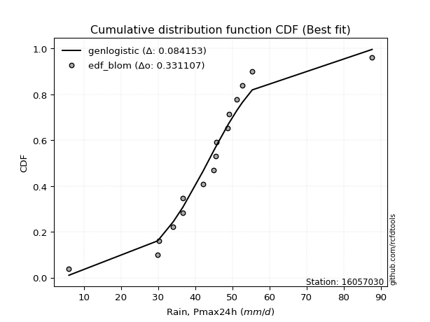</img></img>

</div>


### 7. EDF Tukey (1962)

In hydrology, the Tukey formula is used as a plotting position formula to estimate the empirical probability or frequency of a flood event (or other hydrological data). The formula parameter is given as _c=0.333_ (or 1/3).

<div align="center">


$P=(m-c)/(n+1-2c)$


</div>


**7.1. Empirical values**

<div align="center">

|                | 0                   | 1                   | 2                   | 3                   | 4                  | 5                  | 6                   | 7                   | 8                  | 9                  | 10                 | 11                 | 12                 | 13                 | 14                 | 15                 |
|:---------------|:--------------------|:--------------------|:--------------------|:--------------------|:-------------------|:-------------------|:--------------------|:--------------------|:-------------------|:-------------------|:-------------------|:-------------------|:-------------------|:-------------------|:-------------------|:-------------------|
| date           | 2022                | 2019                | 2021                | 2009                | 2010               | 2006               | 2018                | 2007                | 2013               | 2008               | 2014               | 2012               | 2016               | 2011               | 2017               | 2015               |
| x              | 6.0                 | 29.8                | 30.3                | 34.1                | 36.7               | 36.7               | 42.1                | 45.0                | 45.6               | 45.7               | 48.8               | 49.1               | 51.2               | 52.7               | 55.4               | 87.7               |
| m              | 1                   | 2                   | 3                   | 4                   | 5                  | 6                  | 7                   | 8                   | 9                  | 10                 | 11                 | 12                 | 13                 | 14                 | 15                 | 16                 |
| empirical_dist | edf_tukey           | edf_tukey           | edf_tukey           | edf_tukey           | edf_tukey          | edf_tukey          | edf_tukey           | edf_tukey           | edf_tukey          | edf_tukey          | edf_tukey          | edf_tukey          | edf_tukey          | edf_tukey          | edf_tukey          | edf_tukey          |
| empirical      | 0.04081632653061224 | 0.10204081632653061 | 0.16326530612244897 | 0.22448979591836735 | 0.2857142857142857 | 0.3469387755102041 | 0.40816326530612246 | 0.46938775510204084 | 0.5306122448979592 | 0.5918367346938775 | 0.6530612244897959 | 0.7142857142857143 | 0.7755102040816326 | 0.8367346938775511 | 0.8979591836734694 | 0.9591836734693877 |
| empirical_tr   | 1.0425531914893618  | 1.1136363636363635  | 1.1951219512195121  | 1.2894736842105263  | 1.4                | 1.5312499999999998 | 1.6896551724137931  | 1.8846153846153848  | 2.130434782608696  | 2.4499999999999997 | 2.88235294117647   | 3.5                | 4.454545454545454  | 6.125000000000002  | 9.799999999999999  | 24.49999999999997  |

</div>


**7.2. Kolmogorov-Smirnov fit test (sorted by Δ)**


<div align="center">

|                | 0                   | 1                   | 2                   | 3                   | 4                  | 5                  | 6                   | 7                  | 8                     | 9                   | 10                  | 11                 | 12                 | 13                  | 14                  | 15                  | 16                 | 17                  | 18                  | 19                  | 20                  | 21                  | 22                  | 23                  | 24                  | 25                  | 26                  | 27                | 28                | 29                  | 30                  | 31                  | 32                 | 33                  | 34                  | 35                  | 36                  | 37                 | 38                  | 39                  | 40                | 41                  | 42                  | 43                 | 44                  | 45                 | 46                  | 47                 | 48                  | 49                  | 50                  | 51                  | 52                  | 53                  | 54                 | 55                  | 56                 | 57                  | 58                  | 59                  | 60                  | 61                  | 62                 | 63                  | 64                  | 65                 | 66                 | 67                 | 68                 | 69                  | 70                  | 71                 | 72                 | 73                | 74                 | 75                  | 76                  | 77                 | 78                 | 79                  | 80                  | 81                 | 82                 | 83                  | 84                 | 85                | 86                 | 87                 |
|:---------------|:--------------------|:--------------------|:--------------------|:--------------------|:-------------------|:-------------------|:--------------------|:-------------------|:----------------------|:--------------------|:--------------------|:-------------------|:-------------------|:--------------------|:--------------------|:--------------------|:-------------------|:--------------------|:--------------------|:--------------------|:--------------------|:--------------------|:--------------------|:--------------------|:--------------------|:--------------------|:--------------------|:------------------|:------------------|:--------------------|:--------------------|:--------------------|:-------------------|:--------------------|:--------------------|:--------------------|:--------------------|:-------------------|:--------------------|:--------------------|:------------------|:--------------------|:--------------------|:-------------------|:--------------------|:-------------------|:--------------------|:-------------------|:--------------------|:--------------------|:--------------------|:--------------------|:--------------------|:--------------------|:-------------------|:--------------------|:-------------------|:--------------------|:--------------------|:--------------------|:--------------------|:--------------------|:-------------------|:--------------------|:--------------------|:-------------------|:-------------------|:-------------------|:-------------------|:--------------------|:--------------------|:-------------------|:-------------------|:------------------|:-------------------|:--------------------|:--------------------|:-------------------|:-------------------|:--------------------|:--------------------|:-------------------|:-------------------|:--------------------|:-------------------|:------------------|:-------------------|:-------------------|
| station        | 16057030            | 16057030            | 16057030            | 16057030            | 16057030           | 16057030           | 16057030            | 16057030           | 16057030              | 16057030            | 16057030            | 16057030           | 16057030           | 16057030            | 16057030            | 16057030            | 16057030           | 16057030            | 16057030            | 16057030            | 16057030            | 16057030            | 16057030            | 16057030            | 16057030            | 16057030            | 16057030            | 16057030          | 16057030          | 16057030            | 16057030            | 16057030            | 16057030           | 16057030            | 16057030            | 16057030            | 16057030            | 16057030           | 16057030            | 16057030            | 16057030          | 16057030            | 16057030            | 16057030           | 16057030            | 16057030           | 16057030            | 16057030           | 16057030            | 16057030            | 16057030            | 16057030            | 16057030            | 16057030            | 16057030           | 16057030            | 16057030           | 16057030            | 16057030            | 16057030            | 16057030            | 16057030            | 16057030           | 16057030            | 16057030            | 16057030           | 16057030           | 16057030           | 16057030           | 16057030            | 16057030            | 16057030           | 16057030           | 16057030          | 16057030           | 16057030            | 16057030            | 16057030           | 16057030           | 16057030            | 16057030            | 16057030           | 16057030           | 16057030            | 16057030           | 16057030          | 16057030           | 16057030           |
| empirical_dist | edf_tukey           | edf_tukey           | edf_tukey           | edf_tukey           | edf_tukey          | edf_tukey          | edf_tukey           | edf_tukey          | edf_tukey             | edf_tukey           | edf_tukey           | edf_tukey          | edf_tukey          | edf_tukey           | edf_tukey           | edf_tukey           | edf_tukey          | edf_tukey           | edf_tukey           | edf_tukey           | edf_tukey           | edf_tukey           | edf_tukey           | edf_tukey           | edf_tukey           | edf_tukey           | edf_tukey           | edf_tukey         | edf_tukey         | edf_tukey           | edf_tukey           | edf_tukey           | edf_tukey          | edf_tukey           | edf_tukey           | edf_tukey           | edf_tukey           | edf_tukey          | edf_tukey           | edf_tukey           | edf_tukey         | edf_tukey           | edf_tukey           | edf_tukey          | edf_tukey           | edf_tukey          | edf_tukey           | edf_tukey          | edf_tukey           | edf_tukey           | edf_tukey           | edf_tukey           | edf_tukey           | edf_tukey           | edf_tukey          | edf_tukey           | edf_tukey          | edf_tukey           | edf_tukey           | edf_tukey           | edf_tukey           | edf_tukey           | edf_tukey          | edf_tukey           | edf_tukey           | edf_tukey          | edf_tukey          | edf_tukey          | edf_tukey          | edf_tukey           | edf_tukey           | edf_tukey          | edf_tukey          | edf_tukey         | edf_tukey          | edf_tukey           | edf_tukey           | edf_tukey          | edf_tukey          | edf_tukey           | edf_tukey           | edf_tukey          | edf_tukey          | edf_tukey           | edf_tukey          | edf_tukey         | edf_tukey          | edf_tukey          |
| p_dist         | genlogistic         | fisk                | laplace_asymmetric  | logcrystalball      | laplace            | logjohnsonsu       | nct                 | hypsecant          | loglaplace_asymmetric | johnsonsu           | exponnorm           | logistic           | mielke             | logmielke           | loggenlogistic      | pearson3            | invgamma           | rayleigh            | invgauss            | maxwell             | betaprime           | f                   | gamma               | erlang              | logtruncnorm        | logt                | crystalball         | norm              | truncnorm         | alpha               | loggompertz         | logweibull_min      | logfisk            | halfnorm            | logloggamma         | gumbel_r            | t                   | gumbel_l           | ncf                 | invweibull          | moyal             | halflogistic        | loghypsecant        | loggumbel_l        | loglaplace          | kstwobign          | loglogistic         | lognakagami        | logrice             | logexponnorm        | lognorm             | lognorm             | loglognorm          | logf                | logfatiguelife     | logncf              | lognct             | logpearson3         | logchi2             | logalpha            | loggamma            | loggamma            | logbetaprime       | wald                | loginvgamma         | logmaxwell         | loggumbel_r        | logerlang          | lograyleigh        | loginvgauss         | logmoyal            | gibrat             | weibull_min        | loghalfnorm       | loghalflogistic    | loginvweibull       | logwald             | nakagami           | loggibrat          | logkstwobign        | expon               | genexpon           | loggenexpon        | logexpon            | fatiguelife        | rice              | chi2               | gompertz           |
| delta          | 0.08399590850046007 | 0.08697575792039164 | 0.08810104567475441 | 0.08836904633042586 | 0.0894143834163435 | 0.0901537999424376 | 0.09299908614229335 | 0.0950150387583002 | 0.0955736639262908    | 0.09913688376989671 | 0.10731566496415323 | 0.1093811898417717 | 0.1139608069306493 | 0.11437365338746358 | 0.11476697097114535 | 0.12102656555471658 | 0.1215678107538598 | 0.12235476174758053 | 0.12269078663045435 | 0.12447698921766126 | 0.12689842231707327 | 0.12692590786059021 | 0.12694941581727537 | 0.12710401226429513 | 0.13170393926835716 | 0.13192296924505204 | 0.13195346179411638 | 0.131953471100145 | 0.131953495429737 | 0.13198644219643474 | 0.13496428653558368 | 0.13522545000864106 | 0.1354495135915761 | 0.13596234986721162 | 0.13631646038772238 | 0.13639487322460947 | 0.14016367578466882 | 0.1527731941868984 | 0.15712531631045706 | 0.15890186484572522 | 0.161661120250509 | 0.16270022450996952 | 0.17017622692860224 | 0.1802963442206903 | 0.18103941172074306 | 0.1831741778411587 | 0.18547880152125246 | 0.1869312355725658 | 0.20630303883855694 | 0.20638742499783863 | 0.20638772177827458 | 0.20638772177827458 | 0.20639050842511375 | 0.20644599361474297 | 0.2065345574247619 | 0.20802259949332003 | 0.2099121377354639 | 0.20993400472075496 | 0.22456081420689566 | 0.22725910609451905 | 0.22863977410655095 | 0.22863977410655095 | 0.2292623682831046 | 0.23178757219464935 | 0.23261618144499147 | 0.2350935827866359 | 0.2421431307651516 | 0.2452497914590009 | 0.2463597331868312 | 0.25532605496614574 | 0.25938309248176317 | 0.2595894705932203 | 0.2760792722667639 | 0.278261111888696 | 0.2783610197631017 | 0.29451288717316154 | 0.33005916405395874 | 0.3384133709888987 | 0.3433726210163772 | 0.34666361990172695 | 0.36734287025801426 | 0.3674061861779412 | 0.3982435433939854 | 0.47230868734906595 | 0.6521190285970904 | 0.670016581259449 | 0.8004211211254794 | 0.8976165438643013 |
| deltao         | 0.331107277296      | 0.331107277296      | 0.331107277296      | 0.331107277296      | 0.331107277296     | 0.331107277296     | 0.331107277296      | 0.331107277296     | 0.331107277296        | 0.331107277296      | 0.331107277296      | 0.331107277296     | 0.331107277296     | 0.331107277296      | 0.331107277296      | 0.331107277296      | 0.331107277296     | 0.331107277296      | 0.331107277296      | 0.331107277296      | 0.331107277296      | 0.331107277296      | 0.331107277296      | 0.331107277296      | 0.331107277296      | 0.331107277296      | 0.331107277296      | 0.331107277296    | 0.331107277296    | 0.331107277296      | 0.331107277296      | 0.331107277296      | 0.331107277296     | 0.331107277296      | 0.331107277296      | 0.331107277296      | 0.331107277296      | 0.331107277296     | 0.331107277296      | 0.331107277296      | 0.331107277296    | 0.331107277296      | 0.331107277296      | 0.331107277296     | 0.331107277296      | 0.331107277296     | 0.331107277296      | 0.331107277296     | 0.331107277296      | 0.331107277296      | 0.331107277296      | 0.331107277296      | 0.331107277296      | 0.331107277296      | 0.331107277296     | 0.331107277296      | 0.331107277296     | 0.331107277296      | 0.331107277296      | 0.331107277296      | 0.331107277296      | 0.331107277296      | 0.331107277296     | 0.331107277296      | 0.331107277296      | 0.331107277296     | 0.331107277296     | 0.331107277296     | 0.331107277296     | 0.331107277296      | 0.331107277296      | 0.331107277296     | 0.331107277296     | 0.331107277296    | 0.331107277296     | 0.331107277296      | 0.331107277296      | 0.331107277296     | 0.331107277296     | 0.331107277296      | 0.331107277296      | 0.331107277296     | 0.331107277296     | 0.331107277296      | 0.331107277296     | 0.331107277296    | 0.331107277296     | 0.331107277296     |
| eval           | Δo > Δ              | Δo > Δ              | Δo > Δ              | Δo > Δ              | Δo > Δ             | Δo > Δ             | Δo > Δ              | Δo > Δ             | Δo > Δ                | Δo > Δ              | Δo > Δ              | Δo > Δ             | Δo > Δ             | Δo > Δ              | Δo > Δ              | Δo > Δ              | Δo > Δ             | Δo > Δ              | Δo > Δ              | Δo > Δ              | Δo > Δ              | Δo > Δ              | Δo > Δ              | Δo > Δ              | Δo > Δ              | Δo > Δ              | Δo > Δ              | Δo > Δ            | Δo > Δ            | Δo > Δ              | Δo > Δ              | Δo > Δ              | Δo > Δ             | Δo > Δ              | Δo > Δ              | Δo > Δ              | Δo > Δ              | Δo > Δ             | Δo > Δ              | Δo > Δ              | Δo > Δ            | Δo > Δ              | Δo > Δ              | Δo > Δ             | Δo > Δ              | Δo > Δ             | Δo > Δ              | Δo > Δ             | Δo > Δ              | Δo > Δ              | Δo > Δ              | Δo > Δ              | Δo > Δ              | Δo > Δ              | Δo > Δ             | Δo > Δ              | Δo > Δ             | Δo > Δ              | Δo > Δ              | Δo > Δ              | Δo > Δ              | Δo > Δ              | Δo > Δ             | Δo > Δ              | Δo > Δ              | Δo > Δ             | Δo > Δ             | Δo > Δ             | Δo > Δ             | Δo > Δ              | Δo > Δ              | Δo > Δ             | Δo > Δ             | Δo > Δ            | Δo > Δ             | Δo > Δ              | Δo > Δ              | Δo <= Δ            | Δo <= Δ            | Δo <= Δ             | Δo <= Δ             | Δo <= Δ            | Δo <= Δ            | Δo <= Δ             | Δo <= Δ            | Δo <= Δ           | Δo <= Δ            | Δo <= Δ            |
| fit            | 1                   | 1                   | 1                   | 1                   | 1                  | 1                  | 1                   | 1                  | 1                     | 1                   | 1                   | 1                  | 1                  | 1                   | 1                   | 1                   | 1                  | 1                   | 1                   | 1                   | 1                   | 1                   | 1                   | 1                   | 1                   | 1                   | 1                   | 1                 | 1                 | 1                   | 1                   | 1                   | 1                  | 1                   | 1                   | 1                   | 1                   | 1                  | 1                   | 1                   | 1                 | 1                   | 1                   | 1                  | 1                   | 1                  | 1                   | 1                  | 1                   | 1                   | 1                   | 1                   | 1                   | 1                   | 1                  | 1                   | 1                  | 1                   | 1                   | 1                   | 1                   | 1                   | 1                  | 1                   | 1                   | 1                  | 1                  | 1                  | 1                  | 1                   | 1                   | 1                  | 1                  | 1                 | 1                  | 1                   | 1                   | 0                  | 0                  | 0                   | 0                   | 0                  | 0                  | 0                   | 0                  | 0                 | 0                  | 0                  |
| n              | 16                  | 16                  | 16                  | 16                  | 16                 | 16                 | 16                  | 16                 | 16                    | 16                  | 16                  | 16                 | 16                 | 16                  | 16                  | 16                  | 16                 | 16                  | 16                  | 16                  | 16                  | 16                  | 16                  | 16                  | 16                  | 16                  | 16                  | 16                | 16                | 16                  | 16                  | 16                  | 16                 | 16                  | 16                  | 16                  | 16                  | 16                 | 16                  | 16                  | 16                | 16                  | 16                  | 16                 | 16                  | 16                 | 16                  | 16                 | 16                  | 16                  | 16                  | 16                  | 16                  | 16                  | 16                 | 16                  | 16                 | 16                  | 16                  | 16                  | 16                  | 16                  | 16                 | 16                  | 16                  | 16                 | 16                 | 16                 | 16                 | 16                  | 16                  | 16                 | 16                 | 16                | 16                 | 16                  | 16                  | 16                 | 16                 | 16                  | 16                  | 16                 | 16                 | 16                  | 16                 | 16                | 16                 | 16                 |
| best_fit       | 1                   | 0                   | 0                   | 0                   | 0                  | 0                  | 0                   | 0                  | 0                     | 0                   | 0                   | 0                  | 0                  | 0                   | 0                   | 0                   | 0                  | 0                   | 0                   | 0                   | 0                   | 0                   | 0                   | 0                   | 0                   | 0                   | 0                   | 0                 | 0                 | 0                   | 0                   | 0                   | 0                  | 0                   | 0                   | 0                   | 0                   | 0                  | 0                   | 0                   | 0                 | 0                   | 0                   | 0                  | 0                   | 0                  | 0                   | 0                  | 0                   | 0                   | 0                   | 0                   | 0                   | 0                   | 0                  | 0                   | 0                  | 0                   | 0                   | 0                   | 0                   | 0                   | 0                  | 0                   | 0                   | 0                  | 0                  | 0                  | 0                  | 0                   | 0                   | 0                  | 0                  | 0                 | 0                  | 0                   | 0                   | 0                  | 0                  | 0                   | 0                   | 0                  | 0                  | 0                   | 0                  | 0                 | 0                  | 0                  |
| best_fit_sort  | 1                   | 2                   | 3                   | 4                   | 5                  | 6                  | 7                   | 8                  | 9                     | 10                  | 11                  | 12                 | 13                 | 14                  | 15                  | 16                  | 17                 | 18                  | 19                  | 20                  | 21                  | 22                  | 23                  | 24                  | 25                  | 26                  | 27                  | 28                | 29                | 30                  | 31                  | 32                  | 33                 | 34                  | 35                  | 36                  | 37                  | 38                 | 39                  | 40                  | 41                | 42                  | 43                  | 44                 | 45                  | 46                 | 47                  | 48                 | 49                  | 50                  | 51                  | 52                  | 53                  | 54                  | 55                 | 56                  | 57                 | 58                  | 59                  | 60                  | 61                  | 62                  | 63                 | 64                  | 65                  | 66                 | 67                 | 68                 | 69                 | 70                  | 71                  | 72                 | 73                 | 74                | 75                 | 76                  | 77                  | 78                 | 79                 | 80                  | 81                  | 82                 | 83                 | 84                  | 85                 | 86                | 87                 | 88                 |

</div>


**7.3. Best fit**

<div align="center">

|   id |   station | empirical_dist   | p_dist      |     delta |   deltao | eval   |   fit |   n |   best_fit |   best_fit_sort |
|-----:|----------:|:-----------------|:------------|----------:|---------:|:-------|------:|----:|-----------:|----------------:|
|    0 |  16057030 | edf_tukey        | genlogistic | 0.0839959 | 0.331107 | Δo > Δ |     1 |  16 |          1 |               1 |

</div>


<div align="center">

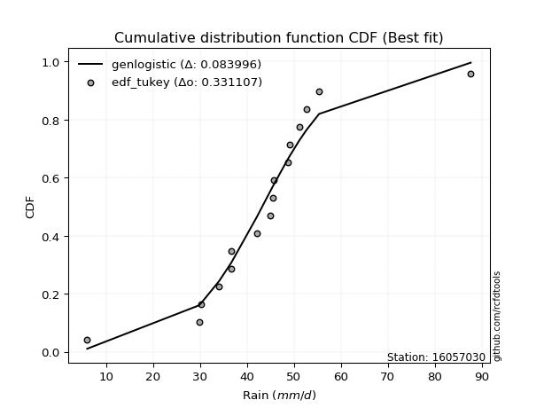</img>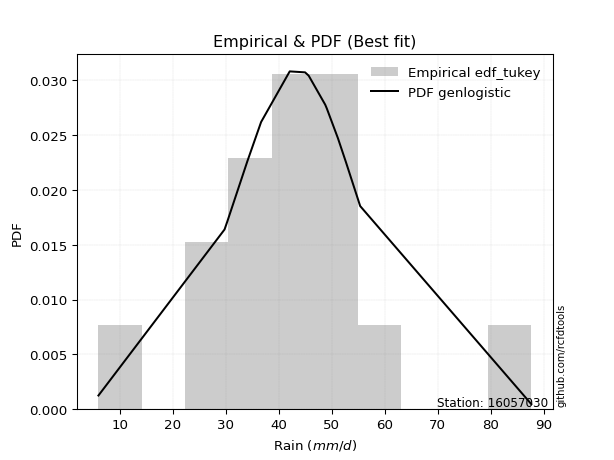</img>

</div>


### 8. EDF Gringorten (1963)

Gringorten plotting position formula is essential for estimating the probability and return periods of extreme events like floods and heavy rainfall. The constant _a=0.44_.

<div align="center">


$P=(m-a)/(n+1-2a)$


</div>


**8.1. Empirical values**

<div align="center">

|                | 0                    | 1                  | 2                  | 3                   | 4                  | 5                   | 6                  | 7                  | 8                  | 9                  | 10                 | 11                 | 12                 | 13                 | 14                 | 15                 |
|:---------------|:---------------------|:-------------------|:-------------------|:--------------------|:-------------------|:--------------------|:-------------------|:-------------------|:-------------------|:-------------------|:-------------------|:-------------------|:-------------------|:-------------------|:-------------------|:-------------------|
| date           | 2022                 | 2019               | 2021               | 2009                | 2010               | 2006                | 2018               | 2007               | 2013               | 2008               | 2014               | 2012               | 2016               | 2011               | 2017               | 2015               |
| x              | 6.0                  | 29.8               | 30.3               | 34.1                | 36.7               | 36.7                | 42.1               | 45.0               | 45.6               | 45.7               | 48.8               | 49.1               | 51.2               | 52.7               | 55.4               | 87.7               |
| m              | 1                    | 2                  | 3                  | 4                   | 5                  | 6                   | 7                  | 8                  | 9                  | 10                 | 11                 | 12                 | 13                 | 14                 | 15                 | 16                 |
| empirical_dist | edf_gringorten       | edf_gringorten     | edf_gringorten     | edf_gringorten      | edf_gringorten     | edf_gringorten      | edf_gringorten     | edf_gringorten     | edf_gringorten     | edf_gringorten     | edf_gringorten     | edf_gringorten     | edf_gringorten     | edf_gringorten     | edf_gringorten     | edf_gringorten     |
| empirical      | 0.034739454094292806 | 0.0967741935483871 | 0.1588089330024814 | 0.22084367245657568 | 0.2828784119106699 | 0.34491315136476425 | 0.4069478908188585 | 0.4689826302729528 | 0.5310173697270472 | 0.5930521091811415 | 0.6550868486352357 | 0.71712158808933   | 0.7791563275434243 | 0.8411910669975186 | 0.9032258064516129 | 0.9652605459057072 |
| empirical_tr   | 1.0359897172236503   | 1.1071428571428572 | 1.1887905604719764 | 1.28343949044586    | 1.3944636678200693 | 1.5265151515151516  | 1.6861924686192467 | 1.8831775700934574 | 2.1322751322751325 | 2.457317073170732  | 2.899280575539568  | 3.5350877192982457 | 4.52808988764045   | 6.296874999999998  | 10.33333333333333  | 28.785714285714292 |

</div>


**8.2. Kolmogorov-Smirnov fit test (sorted by Δ)**


<div align="center">

|                | 0                   | 1                   | 2                   | 3                   | 4                   | 5                   | 6                   | 7                   | 8                   | 9                     | 10                  | 11                  | 12                  | 13                  | 14                  | 15                  | 16                 | 17                  | 18                  | 19                  | 20                 | 21                  | 22                 | 23                  | 24                  | 25                 | 26                  | 27                  | 28                  | 29                  | 30                 | 31                  | 32                  | 33                  | 34                  | 35                  | 36                  | 37                  | 38                  | 39                  | 40                  | 41                 | 42                  | 43                  | 44                 | 45                  | 46                 | 47                  | 48                  | 49                  | 50                 | 51                 | 52                  | 53                 | 54                  | 55                  | 56                  | 57                  | 58                  | 59                 | 60                  | 61                  | 62                  | 63                 | 64                  | 65                 | 66                 | 67                  | 68                  | 69                  | 70                 | 71                  | 72                  | 73                  | 74                 | 75                 | 76                 | 77                  | 78                | 79                 | 80                  | 81                 | 82                  | 83                  | 84                 | 85                 | 86                 | 87                 |
|:---------------|:--------------------|:--------------------|:--------------------|:--------------------|:--------------------|:--------------------|:--------------------|:--------------------|:--------------------|:----------------------|:--------------------|:--------------------|:--------------------|:--------------------|:--------------------|:--------------------|:-------------------|:--------------------|:--------------------|:--------------------|:-------------------|:--------------------|:-------------------|:--------------------|:--------------------|:-------------------|:--------------------|:--------------------|:--------------------|:--------------------|:-------------------|:--------------------|:--------------------|:--------------------|:--------------------|:--------------------|:--------------------|:--------------------|:--------------------|:--------------------|:--------------------|:-------------------|:--------------------|:--------------------|:-------------------|:--------------------|:-------------------|:--------------------|:--------------------|:--------------------|:-------------------|:-------------------|:--------------------|:-------------------|:--------------------|:--------------------|:--------------------|:--------------------|:--------------------|:-------------------|:--------------------|:--------------------|:--------------------|:-------------------|:--------------------|:-------------------|:-------------------|:--------------------|:--------------------|:--------------------|:-------------------|:--------------------|:--------------------|:--------------------|:-------------------|:-------------------|:-------------------|:--------------------|:------------------|:-------------------|:--------------------|:-------------------|:--------------------|:--------------------|:-------------------|:-------------------|:-------------------|:-------------------|
| station        | 16057030            | 16057030            | 16057030            | 16057030            | 16057030            | 16057030            | 16057030            | 16057030            | 16057030            | 16057030              | 16057030            | 16057030            | 16057030            | 16057030            | 16057030            | 16057030            | 16057030           | 16057030            | 16057030            | 16057030            | 16057030           | 16057030            | 16057030           | 16057030            | 16057030            | 16057030           | 16057030            | 16057030            | 16057030            | 16057030            | 16057030           | 16057030            | 16057030            | 16057030            | 16057030            | 16057030            | 16057030            | 16057030            | 16057030            | 16057030            | 16057030            | 16057030           | 16057030            | 16057030            | 16057030           | 16057030            | 16057030           | 16057030            | 16057030            | 16057030            | 16057030           | 16057030           | 16057030            | 16057030           | 16057030            | 16057030            | 16057030            | 16057030            | 16057030            | 16057030           | 16057030            | 16057030            | 16057030            | 16057030           | 16057030            | 16057030           | 16057030           | 16057030            | 16057030            | 16057030            | 16057030           | 16057030            | 16057030            | 16057030            | 16057030           | 16057030           | 16057030           | 16057030            | 16057030          | 16057030           | 16057030            | 16057030           | 16057030            | 16057030            | 16057030           | 16057030           | 16057030           | 16057030           |
| empirical_dist | edf_gringorten      | edf_gringorten      | edf_gringorten      | edf_gringorten      | edf_gringorten      | edf_gringorten      | edf_gringorten      | edf_gringorten      | edf_gringorten      | edf_gringorten        | edf_gringorten      | edf_gringorten      | edf_gringorten      | edf_gringorten      | edf_gringorten      | edf_gringorten      | edf_gringorten     | edf_gringorten      | edf_gringorten      | edf_gringorten      | edf_gringorten     | edf_gringorten      | edf_gringorten     | edf_gringorten      | edf_gringorten      | edf_gringorten     | edf_gringorten      | edf_gringorten      | edf_gringorten      | edf_gringorten      | edf_gringorten     | edf_gringorten      | edf_gringorten      | edf_gringorten      | edf_gringorten      | edf_gringorten      | edf_gringorten      | edf_gringorten      | edf_gringorten      | edf_gringorten      | edf_gringorten      | edf_gringorten     | edf_gringorten      | edf_gringorten      | edf_gringorten     | edf_gringorten      | edf_gringorten     | edf_gringorten      | edf_gringorten      | edf_gringorten      | edf_gringorten     | edf_gringorten     | edf_gringorten      | edf_gringorten     | edf_gringorten      | edf_gringorten      | edf_gringorten      | edf_gringorten      | edf_gringorten      | edf_gringorten     | edf_gringorten      | edf_gringorten      | edf_gringorten      | edf_gringorten     | edf_gringorten      | edf_gringorten     | edf_gringorten     | edf_gringorten      | edf_gringorten      | edf_gringorten      | edf_gringorten     | edf_gringorten      | edf_gringorten      | edf_gringorten      | edf_gringorten     | edf_gringorten     | edf_gringorten     | edf_gringorten      | edf_gringorten    | edf_gringorten     | edf_gringorten      | edf_gringorten     | edf_gringorten      | edf_gringorten      | edf_gringorten     | edf_gringorten     | edf_gringorten     | edf_gringorten     |
| p_dist         | genlogistic         | laplace_asymmetric  | fisk                | logjohnsonsu        | laplace             | nct                 | logcrystalball      | johnsonsu           | hypsecant           | loglaplace_asymmetric | exponnorm           | mielke              | logistic            | logmielke           | loggenlogistic      | pearson3            | invgamma           | rayleigh            | invgauss            | maxwell             | logt               | betaprime           | f                  | gamma               | erlang              | logtruncnorm       | halfnorm            | gumbel_r            | crystalball         | norm                | truncnorm          | alpha               | loggompertz         | logweibull_min      | logfisk             | logloggamma         | t                   | gumbel_l            | moyal               | ncf                 | halflogistic        | invweibull         | loghypsecant        | loglaplace          | loggumbel_l        | lognakagami         | kstwobign          | loglogistic         | logrice             | logexponnorm        | lognorm            | lognorm            | loglognorm          | logf               | logfatiguelife      | logncf              | logpearson3         | lognct              | logchi2             | wald               | logalpha            | loggamma            | loggamma            | logbetaprime       | loginvgamma         | logmaxwell         | loggumbel_r        | logerlang           | lograyleigh         | gibrat              | loginvgauss        | logmoyal            | weibull_min         | loghalfnorm         | loghalflogistic    | loginvweibull      | logwald            | nakagami            | loggibrat         | logkstwobign       | expon               | genexpon           | loggenexpon         | logexpon            | fatiguelife        | rice               | chi2               | gompertz           |
| delta          | 0.08440103332954813 | 0.08607542152931458 | 0.08781213184032133 | 0.08812817579699778 | 0.08981950824543156 | 0.09097346199685352 | 0.09363566910856935 | 0.09711125962445688 | 0.10028166153644369 | 0.10084028670443432   | 0.11258228774229673 | 0.11436593175973736 | 0.11464781261991519 | 0.11477877821655164 | 0.11517209580023341 | 0.12629318833286007 | 0.1268344335320033 | 0.12762138452572402 | 0.12795740940859787 | 0.12974361199580475 | 0.1298973450996122 | 0.13216504509521676 | 0.1321925306387337 | 0.13221603859541886 | 0.13237063504243862 | 0.1324404296955426 | 0.13636747469629967 | 0.13679999805369752 | 0.13722008457225987 | 0.13722009387828848 | 0.1372201182078805 | 0.13725306497457823 | 0.14023090931372717 | 0.14049207278678455 | 0.14071613636971958 | 0.14158308316586588 | 0.14543029856281234 | 0.15722956730686588 | 0.16206624507959705 | 0.16239193908860058 | 0.16310534933905757 | 0.1641684876238687 | 0.17544284970674576 | 0.18144453654983111 | 0.1855629669988338 | 0.18733636040165386 | 0.1884408006193022 | 0.19074542429939598 | 0.21156966161670046 | 0.21165404777598215 | 0.2116543445564181 | 0.2116543445564181 | 0.21165713120325727 | 0.2117126163928865 | 0.21180118020290542 | 0.21328922227146355 | 0.21439037784072246 | 0.21517876051360743 | 0.22982743698503919 | 0.2321926970237374 | 0.23252572887266257 | 0.23390639688469447 | 0.23390639688469447 | 0.2345289910612481 | 0.23788280422313499 | 0.2403602055647794 | 0.2474097535432951 | 0.25051641423714444 | 0.25162635596497474 | 0.25999459542230835 | 0.2605926777442893 | 0.26221896628537894 | 0.28134589504490737 | 0.28352773466683956 | 0.2836276425412452 | 0.2997795099513051 | 0.3328950378575745 | 0.34124924479251445 | 0.346208494819993 | 0.3519302426798705 | 0.37260949303615776 | 0.3726728089560847 | 0.40351016617212887 | 0.47757531012720944 | 0.6573856513752339 | 0.6752832040375925 | 0.8056877439036229 | 0.9028831666424448 |
| deltao         | 0.331107277296      | 0.331107277296      | 0.331107277296      | 0.331107277296      | 0.331107277296      | 0.331107277296      | 0.331107277296      | 0.331107277296      | 0.331107277296      | 0.331107277296        | 0.331107277296      | 0.331107277296      | 0.331107277296      | 0.331107277296      | 0.331107277296      | 0.331107277296      | 0.331107277296     | 0.331107277296      | 0.331107277296      | 0.331107277296      | 0.331107277296     | 0.331107277296      | 0.331107277296     | 0.331107277296      | 0.331107277296      | 0.331107277296     | 0.331107277296      | 0.331107277296      | 0.331107277296      | 0.331107277296      | 0.331107277296     | 0.331107277296      | 0.331107277296      | 0.331107277296      | 0.331107277296      | 0.331107277296      | 0.331107277296      | 0.331107277296      | 0.331107277296      | 0.331107277296      | 0.331107277296      | 0.331107277296     | 0.331107277296      | 0.331107277296      | 0.331107277296     | 0.331107277296      | 0.331107277296     | 0.331107277296      | 0.331107277296      | 0.331107277296      | 0.331107277296     | 0.331107277296     | 0.331107277296      | 0.331107277296     | 0.331107277296      | 0.331107277296      | 0.331107277296      | 0.331107277296      | 0.331107277296      | 0.331107277296     | 0.331107277296      | 0.331107277296      | 0.331107277296      | 0.331107277296     | 0.331107277296      | 0.331107277296     | 0.331107277296     | 0.331107277296      | 0.331107277296      | 0.331107277296      | 0.331107277296     | 0.331107277296      | 0.331107277296      | 0.331107277296      | 0.331107277296     | 0.331107277296     | 0.331107277296     | 0.331107277296      | 0.331107277296    | 0.331107277296     | 0.331107277296      | 0.331107277296     | 0.331107277296      | 0.331107277296      | 0.331107277296     | 0.331107277296     | 0.331107277296     | 0.331107277296     |
| eval           | Δo > Δ              | Δo > Δ              | Δo > Δ              | Δo > Δ              | Δo > Δ              | Δo > Δ              | Δo > Δ              | Δo > Δ              | Δo > Δ              | Δo > Δ                | Δo > Δ              | Δo > Δ              | Δo > Δ              | Δo > Δ              | Δo > Δ              | Δo > Δ              | Δo > Δ             | Δo > Δ              | Δo > Δ              | Δo > Δ              | Δo > Δ             | Δo > Δ              | Δo > Δ             | Δo > Δ              | Δo > Δ              | Δo > Δ             | Δo > Δ              | Δo > Δ              | Δo > Δ              | Δo > Δ              | Δo > Δ             | Δo > Δ              | Δo > Δ              | Δo > Δ              | Δo > Δ              | Δo > Δ              | Δo > Δ              | Δo > Δ              | Δo > Δ              | Δo > Δ              | Δo > Δ              | Δo > Δ             | Δo > Δ              | Δo > Δ              | Δo > Δ             | Δo > Δ              | Δo > Δ             | Δo > Δ              | Δo > Δ              | Δo > Δ              | Δo > Δ             | Δo > Δ             | Δo > Δ              | Δo > Δ             | Δo > Δ              | Δo > Δ              | Δo > Δ              | Δo > Δ              | Δo > Δ              | Δo > Δ             | Δo > Δ              | Δo > Δ              | Δo > Δ              | Δo > Δ             | Δo > Δ              | Δo > Δ             | Δo > Δ             | Δo > Δ              | Δo > Δ              | Δo > Δ              | Δo > Δ             | Δo > Δ              | Δo > Δ              | Δo > Δ              | Δo > Δ             | Δo > Δ             | Δo <= Δ            | Δo <= Δ             | Δo <= Δ           | Δo <= Δ            | Δo <= Δ             | Δo <= Δ            | Δo <= Δ             | Δo <= Δ             | Δo <= Δ            | Δo <= Δ            | Δo <= Δ            | Δo <= Δ            |
| fit            | 1                   | 1                   | 1                   | 1                   | 1                   | 1                   | 1                   | 1                   | 1                   | 1                     | 1                   | 1                   | 1                   | 1                   | 1                   | 1                   | 1                  | 1                   | 1                   | 1                   | 1                  | 1                   | 1                  | 1                   | 1                   | 1                  | 1                   | 1                   | 1                   | 1                   | 1                  | 1                   | 1                   | 1                   | 1                   | 1                   | 1                   | 1                   | 1                   | 1                   | 1                   | 1                  | 1                   | 1                   | 1                  | 1                   | 1                  | 1                   | 1                   | 1                   | 1                  | 1                  | 1                   | 1                  | 1                   | 1                   | 1                   | 1                   | 1                   | 1                  | 1                   | 1                   | 1                   | 1                  | 1                   | 1                  | 1                  | 1                   | 1                   | 1                   | 1                  | 1                   | 1                   | 1                   | 1                  | 1                  | 0                  | 0                   | 0                 | 0                  | 0                   | 0                  | 0                   | 0                   | 0                  | 0                  | 0                  | 0                  |
| n              | 16                  | 16                  | 16                  | 16                  | 16                  | 16                  | 16                  | 16                  | 16                  | 16                    | 16                  | 16                  | 16                  | 16                  | 16                  | 16                  | 16                 | 16                  | 16                  | 16                  | 16                 | 16                  | 16                 | 16                  | 16                  | 16                 | 16                  | 16                  | 16                  | 16                  | 16                 | 16                  | 16                  | 16                  | 16                  | 16                  | 16                  | 16                  | 16                  | 16                  | 16                  | 16                 | 16                  | 16                  | 16                 | 16                  | 16                 | 16                  | 16                  | 16                  | 16                 | 16                 | 16                  | 16                 | 16                  | 16                  | 16                  | 16                  | 16                  | 16                 | 16                  | 16                  | 16                  | 16                 | 16                  | 16                 | 16                 | 16                  | 16                  | 16                  | 16                 | 16                  | 16                  | 16                  | 16                 | 16                 | 16                 | 16                  | 16                | 16                 | 16                  | 16                 | 16                  | 16                  | 16                 | 16                 | 16                 | 16                 |
| best_fit       | 1                   | 0                   | 0                   | 0                   | 0                   | 0                   | 0                   | 0                   | 0                   | 0                     | 0                   | 0                   | 0                   | 0                   | 0                   | 0                   | 0                  | 0                   | 0                   | 0                   | 0                  | 0                   | 0                  | 0                   | 0                   | 0                  | 0                   | 0                   | 0                   | 0                   | 0                  | 0                   | 0                   | 0                   | 0                   | 0                   | 0                   | 0                   | 0                   | 0                   | 0                   | 0                  | 0                   | 0                   | 0                  | 0                   | 0                  | 0                   | 0                   | 0                   | 0                  | 0                  | 0                   | 0                  | 0                   | 0                   | 0                   | 0                   | 0                   | 0                  | 0                   | 0                   | 0                   | 0                  | 0                   | 0                  | 0                  | 0                   | 0                   | 0                   | 0                  | 0                   | 0                   | 0                   | 0                  | 0                  | 0                  | 0                   | 0                 | 0                  | 0                   | 0                  | 0                   | 0                   | 0                  | 0                  | 0                  | 0                  |
| best_fit_sort  | 1                   | 2                   | 3                   | 4                   | 5                   | 6                   | 7                   | 8                   | 9                   | 10                    | 11                  | 12                  | 13                  | 14                  | 15                  | 16                  | 17                 | 18                  | 19                  | 20                  | 21                 | 22                  | 23                 | 24                  | 25                  | 26                 | 27                  | 28                  | 29                  | 30                  | 31                 | 32                  | 33                  | 34                  | 35                  | 36                  | 37                  | 38                  | 39                  | 40                  | 41                  | 42                 | 43                  | 44                  | 45                 | 46                  | 47                 | 48                  | 49                  | 50                  | 51                 | 52                 | 53                  | 54                 | 55                  | 56                  | 57                  | 58                  | 59                  | 60                 | 61                  | 62                  | 63                  | 64                 | 65                  | 66                 | 67                 | 68                  | 69                  | 70                  | 71                 | 72                  | 73                  | 74                  | 75                 | 76                 | 77                 | 78                  | 79                | 80                 | 81                  | 82                 | 83                  | 84                  | 85                 | 86                 | 87                 | 88                 |

</div>


**8.3. Best fit**

<div align="center">

|   id |   station | empirical_dist   | p_dist      |    delta |   deltao | eval   |   fit |   n |   best_fit |   best_fit_sort |
|-----:|----------:|:-----------------|:------------|---------:|---------:|:-------|------:|----:|-----------:|----------------:|
|    0 |  16057030 | edf_gringorten   | genlogistic | 0.084401 | 0.331107 | Δo > Δ |     1 |  16 |          1 |               1 |

</div>


<div align="center">

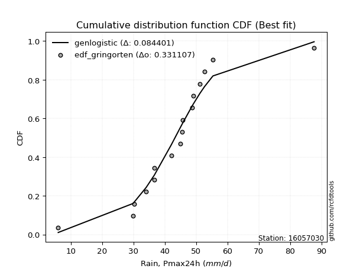</img></img>

</div>


### 9. EDF Filliben (1975)

The specific values of the constants (0.3175) (often denoted as $alpha$) and (0.365) are derived from a method proposed by James J. Filliben in a 1975 paper. This particular formula is the mean value of the $i$-th order statistic of the normal distribution and is considered a robust and effective plotting position formula for the normal probability plot correlation coefficient test for normality.

<div align="center">


$P=(m-0.3175)/(n+0.365)$


</div>


**9.1. Empirical values**

<div align="center">

|                | 0                    | 1                   | 2                  | 3                  | 4                  | 5                  | 6                   | 7                   | 8                  | 9                  | 10                 | 11                 | 12                 | 13                 | 14                 | 15                 |
|:---------------|:---------------------|:--------------------|:-------------------|:-------------------|:-------------------|:-------------------|:--------------------|:--------------------|:-------------------|:-------------------|:-------------------|:-------------------|:-------------------|:-------------------|:-------------------|:-------------------|
| date           | 2022                 | 2019                | 2021               | 2009               | 2010               | 2006               | 2018                | 2007                | 2013               | 2008               | 2014               | 2012               | 2016               | 2011               | 2017               | 2015               |
| x              | 6.0                  | 29.8                | 30.3               | 34.1               | 36.7               | 36.7               | 42.1                | 45.0                | 45.6               | 45.7               | 48.8               | 49.1               | 51.2               | 52.7               | 55.4               | 87.7               |
| m              | 1                    | 2                   | 3                  | 4                  | 5                  | 6                  | 7                   | 8                   | 9                  | 10                 | 11                 | 12                 | 13                 | 14                 | 15                 | 16                 |
| empirical_dist | edf_filliben         | edf_filliben        | edf_filliben       | edf_filliben       | edf_filliben       | edf_filliben       | edf_filliben        | edf_filliben        | edf_filliben       | edf_filliben       | edf_filliben       | edf_filliben       | edf_filliben       | edf_filliben       | edf_filliben       | edf_filliben       |
| empirical      | 0.041704857928505965 | 0.10281087687137185 | 0.1639168958142377 | 0.2250229147571036 | 0.2861289336999695 | 0.3472349526428354 | 0.40834097158570126 | 0.46944699052856714 | 0.5305530094714329 | 0.5916590284142988 | 0.6527650473571647 | 0.7138710663000306 | 0.7749770852428964 | 0.8360831041857624 | 0.8971891231286282 | 0.9582951420714941 |
| empirical_tr   | 1.0435198469631755   | 1.1145922016005447  | 1.1960533528229491 | 1.2903607332939089 | 1.4008131821099936 | 1.531944769482799  | 1.6901626646010846  | 1.8848257990210198  | 2.1301659616010413 | 2.4489337822671158 | 2.8798944126704793 | 3.4949279231179933 | 4.443991853360489  | 6.100652376514448  | 9.72659732540862   | 23.97802197802203  |

</div>


**9.2. Kolmogorov-Smirnov fit test (sorted by Δ)**


<div align="center">

|                | 0                   | 1                   | 2                   | 3                   | 4                  | 5                   | 6                   | 7                   | 8                     | 9                   | 10                  | 11                  | 12                | 13                  | 14                  | 15                  | 16                  | 17                  | 18                  | 19                  | 20                  | 21                  | 22                  | 23                  | 24                 | 25                 | 26                 | 27                  | 28                  | 29                 | 30                 | 31                  | 32                 | 33                 | 34                 | 35                  | 36                  | 37                 | 38                  | 39                  | 40                 | 41                 | 42                | 43                 | 44                  | 45                  | 46                 | 47                 | 48                 | 49                 | 50                  | 51                  | 52                 | 53                  | 54                  | 55                  | 56                  | 57                  | 58                  | 59                 | 60                 | 61                 | 62                  | 63                  | 64                  | 65                  | 66                  | 67                  | 68                  | 69                 | 70                  | 71                | 72                 | 73                  | 74                  | 75                 | 76                  | 77                 | 78                 | 79                 | 80                | 81                  | 82                  | 83                 | 84                 | 85                 | 86                 | 87                 |
|:---------------|:--------------------|:--------------------|:--------------------|:--------------------|:-------------------|:--------------------|:--------------------|:--------------------|:----------------------|:--------------------|:--------------------|:--------------------|:------------------|:--------------------|:--------------------|:--------------------|:--------------------|:--------------------|:--------------------|:--------------------|:--------------------|:--------------------|:--------------------|:--------------------|:-------------------|:-------------------|:-------------------|:--------------------|:--------------------|:-------------------|:-------------------|:--------------------|:-------------------|:-------------------|:-------------------|:--------------------|:--------------------|:-------------------|:--------------------|:--------------------|:-------------------|:-------------------|:------------------|:-------------------|:--------------------|:--------------------|:-------------------|:-------------------|:-------------------|:-------------------|:--------------------|:--------------------|:-------------------|:--------------------|:--------------------|:--------------------|:--------------------|:--------------------|:--------------------|:-------------------|:-------------------|:-------------------|:--------------------|:--------------------|:--------------------|:--------------------|:--------------------|:--------------------|:--------------------|:-------------------|:--------------------|:------------------|:-------------------|:--------------------|:--------------------|:-------------------|:--------------------|:-------------------|:-------------------|:-------------------|:------------------|:--------------------|:--------------------|:-------------------|:-------------------|:-------------------|:-------------------|:-------------------|
| station        | 16057030            | 16057030            | 16057030            | 16057030            | 16057030           | 16057030            | 16057030            | 16057030            | 16057030              | 16057030            | 16057030            | 16057030            | 16057030          | 16057030            | 16057030            | 16057030            | 16057030            | 16057030            | 16057030            | 16057030            | 16057030            | 16057030            | 16057030            | 16057030            | 16057030           | 16057030           | 16057030           | 16057030            | 16057030            | 16057030           | 16057030           | 16057030            | 16057030           | 16057030           | 16057030           | 16057030            | 16057030            | 16057030           | 16057030            | 16057030            | 16057030           | 16057030           | 16057030          | 16057030           | 16057030            | 16057030            | 16057030           | 16057030           | 16057030           | 16057030           | 16057030            | 16057030            | 16057030           | 16057030            | 16057030            | 16057030            | 16057030            | 16057030            | 16057030            | 16057030           | 16057030           | 16057030           | 16057030            | 16057030            | 16057030            | 16057030            | 16057030            | 16057030            | 16057030            | 16057030           | 16057030            | 16057030          | 16057030           | 16057030            | 16057030            | 16057030           | 16057030            | 16057030           | 16057030           | 16057030           | 16057030          | 16057030            | 16057030            | 16057030           | 16057030           | 16057030           | 16057030           | 16057030           |
| empirical_dist | edf_filliben        | edf_filliben        | edf_filliben        | edf_filliben        | edf_filliben       | edf_filliben        | edf_filliben        | edf_filliben        | edf_filliben          | edf_filliben        | edf_filliben        | edf_filliben        | edf_filliben      | edf_filliben        | edf_filliben        | edf_filliben        | edf_filliben        | edf_filliben        | edf_filliben        | edf_filliben        | edf_filliben        | edf_filliben        | edf_filliben        | edf_filliben        | edf_filliben       | edf_filliben       | edf_filliben       | edf_filliben        | edf_filliben        | edf_filliben       | edf_filliben       | edf_filliben        | edf_filliben       | edf_filliben       | edf_filliben       | edf_filliben        | edf_filliben        | edf_filliben       | edf_filliben        | edf_filliben        | edf_filliben       | edf_filliben       | edf_filliben      | edf_filliben       | edf_filliben        | edf_filliben        | edf_filliben       | edf_filliben       | edf_filliben       | edf_filliben       | edf_filliben        | edf_filliben        | edf_filliben       | edf_filliben        | edf_filliben        | edf_filliben        | edf_filliben        | edf_filliben        | edf_filliben        | edf_filliben       | edf_filliben       | edf_filliben       | edf_filliben        | edf_filliben        | edf_filliben        | edf_filliben        | edf_filliben        | edf_filliben        | edf_filliben        | edf_filliben       | edf_filliben        | edf_filliben      | edf_filliben       | edf_filliben        | edf_filliben        | edf_filliben       | edf_filliben        | edf_filliben       | edf_filliben       | edf_filliben       | edf_filliben      | edf_filliben        | edf_filliben        | edf_filliben       | edf_filliben       | edf_filliben       | edf_filliben       | edf_filliben       |
| p_dist         | genlogistic         | fisk                | logcrystalball      | laplace_asymmetric  | laplace            | logjohnsonsu        | nct                 | hypsecant           | loglaplace_asymmetric | johnsonsu           | exponnorm           | logistic            | mielke            | logmielke           | loggenlogistic      | pearson3            | invgamma            | rayleigh            | invgauss            | maxwell             | betaprime           | f                   | gamma               | erlang              | crystalball        | norm               | truncnorm          | alpha               | logt                | logtruncnorm       | loggompertz        | logweibull_min      | logfisk            | logloggamma        | halfnorm           | gumbel_r            | t                   | gumbel_l           | ncf                 | invweibull          | moyal              | halflogistic       | loghypsecant      | loggumbel_l        | loglaplace          | kstwobign           | loglogistic        | lognakagami        | logrice            | logexponnorm       | lognorm             | lognorm             | loglognorm         | logf                | logfatiguelife      | logncf              | lognct              | logpearson3         | logchi2             | logalpha           | loggamma           | loggamma           | logbetaprime        | wald                | loginvgamma         | logmaxwell          | loggumbel_r         | logerlang           | lograyleigh         | loginvgauss        | logmoyal            | gibrat            | weibull_min        | loghalfnorm         | loghalflogistic     | loginvweibull      | logwald             | nakagami           | loggibrat          | logkstwobign       | expon             | genexpon            | loggenexpon         | logexpon           | fatiguelife        | rice               | chi2               | gompertz           |
| delta          | 0.08393667307393377 | 0.08691652249386533 | 0.08759898578558467 | 0.08839722280738571 | 0.0893551479898172 | 0.09044997707506891 | 0.09329526327492466 | 0.09424497821345901 | 0.09480360338144957   | 0.09943306090252801 | 0.10654560441931205 | 0.10861112929693051 | 0.113901571504123 | 0.11431441796093728 | 0.11470773554461905 | 0.12025650500987539 | 0.12079775020901862 | 0.12158470120273934 | 0.12192072608561312 | 0.12370692867282007 | 0.12612836177223208 | 0.12615584731574903 | 0.12617935527243418 | 0.12633395171945394 | 0.1311834012492752 | 0.1311834105553038 | 0.1311834348848958 | 0.13121638165159355 | 0.13221914637768334 | 0.1323555289601459 | 0.1341942259907425 | 0.13445538946379987 | 0.1346794530467349 | 0.1355463998428812 | 0.1359031144406853 | 0.13633563779808316 | 0.13939361523982757 | 0.1521216044951097 | 0.15635525576561582 | 0.15813180430088403 | 0.1616018848239827 | 0.1626409890834432 | 0.169406166383761 | 0.1795262836758491 | 0.18098017629421675 | 0.18240411729631745 | 0.1847087409764112 | 0.1868720001460395 | 0.2055329782937157 | 0.2056173644529974 | 0.20561766123343334 | 0.20561766123343334 | 0.2056204478802725 | 0.20567593306990173 | 0.20576449687992066 | 0.20725253894847878 | 0.20914207719062267 | 0.20928241502896627 | 0.22379075366205442 | 0.2264890455496778 | 0.2278697135617097 | 0.2278697135617097 | 0.22849230773826334 | 0.23172833676812304 | 0.23184612090015022 | 0.23432352224179465 | 0.24137307022031035 | 0.24447973091415964 | 0.24558967264198994 | 0.2545559944213045 | 0.25896844449607936 | 0.259530235166694 | 0.2753092117219227 | 0.27749105134385477 | 0.27759095921826044 | 0.2937428266283203 | 0.32964451606827494 | 0.3379987230032149 | 0.3429579730306934 | 0.3458935593568857 | 0.366572809713173 | 0.36663612563309994 | 0.39747348284914413 | 0.4715386268042247 | 0.6513489680522492 | 0.6692465207146078 | 0.7996510605806382 | 0.8968464833194602 |
| deltao         | 0.331107277296      | 0.331107277296      | 0.331107277296      | 0.331107277296      | 0.331107277296     | 0.331107277296      | 0.331107277296      | 0.331107277296      | 0.331107277296        | 0.331107277296      | 0.331107277296      | 0.331107277296      | 0.331107277296    | 0.331107277296      | 0.331107277296      | 0.331107277296      | 0.331107277296      | 0.331107277296      | 0.331107277296      | 0.331107277296      | 0.331107277296      | 0.331107277296      | 0.331107277296      | 0.331107277296      | 0.331107277296     | 0.331107277296     | 0.331107277296     | 0.331107277296      | 0.331107277296      | 0.331107277296     | 0.331107277296     | 0.331107277296      | 0.331107277296     | 0.331107277296     | 0.331107277296     | 0.331107277296      | 0.331107277296      | 0.331107277296     | 0.331107277296      | 0.331107277296      | 0.331107277296     | 0.331107277296     | 0.331107277296    | 0.331107277296     | 0.331107277296      | 0.331107277296      | 0.331107277296     | 0.331107277296     | 0.331107277296     | 0.331107277296     | 0.331107277296      | 0.331107277296      | 0.331107277296     | 0.331107277296      | 0.331107277296      | 0.331107277296      | 0.331107277296      | 0.331107277296      | 0.331107277296      | 0.331107277296     | 0.331107277296     | 0.331107277296     | 0.331107277296      | 0.331107277296      | 0.331107277296      | 0.331107277296      | 0.331107277296      | 0.331107277296      | 0.331107277296      | 0.331107277296     | 0.331107277296      | 0.331107277296    | 0.331107277296     | 0.331107277296      | 0.331107277296      | 0.331107277296     | 0.331107277296      | 0.331107277296     | 0.331107277296     | 0.331107277296     | 0.331107277296    | 0.331107277296      | 0.331107277296      | 0.331107277296     | 0.331107277296     | 0.331107277296     | 0.331107277296     | 0.331107277296     |
| eval           | Δo > Δ              | Δo > Δ              | Δo > Δ              | Δo > Δ              | Δo > Δ             | Δo > Δ              | Δo > Δ              | Δo > Δ              | Δo > Δ                | Δo > Δ              | Δo > Δ              | Δo > Δ              | Δo > Δ            | Δo > Δ              | Δo > Δ              | Δo > Δ              | Δo > Δ              | Δo > Δ              | Δo > Δ              | Δo > Δ              | Δo > Δ              | Δo > Δ              | Δo > Δ              | Δo > Δ              | Δo > Δ             | Δo > Δ             | Δo > Δ             | Δo > Δ              | Δo > Δ              | Δo > Δ             | Δo > Δ             | Δo > Δ              | Δo > Δ             | Δo > Δ             | Δo > Δ             | Δo > Δ              | Δo > Δ              | Δo > Δ             | Δo > Δ              | Δo > Δ              | Δo > Δ             | Δo > Δ             | Δo > Δ            | Δo > Δ             | Δo > Δ              | Δo > Δ              | Δo > Δ             | Δo > Δ             | Δo > Δ             | Δo > Δ             | Δo > Δ              | Δo > Δ              | Δo > Δ             | Δo > Δ              | Δo > Δ              | Δo > Δ              | Δo > Δ              | Δo > Δ              | Δo > Δ              | Δo > Δ             | Δo > Δ             | Δo > Δ             | Δo > Δ              | Δo > Δ              | Δo > Δ              | Δo > Δ              | Δo > Δ              | Δo > Δ              | Δo > Δ              | Δo > Δ             | Δo > Δ              | Δo > Δ            | Δo > Δ             | Δo > Δ              | Δo > Δ              | Δo > Δ             | Δo > Δ              | Δo <= Δ            | Δo <= Δ            | Δo <= Δ            | Δo <= Δ           | Δo <= Δ             | Δo <= Δ             | Δo <= Δ            | Δo <= Δ            | Δo <= Δ            | Δo <= Δ            | Δo <= Δ            |
| fit            | 1                   | 1                   | 1                   | 1                   | 1                  | 1                   | 1                   | 1                   | 1                     | 1                   | 1                   | 1                   | 1                 | 1                   | 1                   | 1                   | 1                   | 1                   | 1                   | 1                   | 1                   | 1                   | 1                   | 1                   | 1                  | 1                  | 1                  | 1                   | 1                   | 1                  | 1                  | 1                   | 1                  | 1                  | 1                  | 1                   | 1                   | 1                  | 1                   | 1                   | 1                  | 1                  | 1                 | 1                  | 1                   | 1                   | 1                  | 1                  | 1                  | 1                  | 1                   | 1                   | 1                  | 1                   | 1                   | 1                   | 1                   | 1                   | 1                   | 1                  | 1                  | 1                  | 1                   | 1                   | 1                   | 1                   | 1                   | 1                   | 1                   | 1                  | 1                   | 1                 | 1                  | 1                   | 1                   | 1                  | 1                   | 0                  | 0                  | 0                  | 0                 | 0                   | 0                   | 0                  | 0                  | 0                  | 0                  | 0                  |
| n              | 16                  | 16                  | 16                  | 16                  | 16                 | 16                  | 16                  | 16                  | 16                    | 16                  | 16                  | 16                  | 16                | 16                  | 16                  | 16                  | 16                  | 16                  | 16                  | 16                  | 16                  | 16                  | 16                  | 16                  | 16                 | 16                 | 16                 | 16                  | 16                  | 16                 | 16                 | 16                  | 16                 | 16                 | 16                 | 16                  | 16                  | 16                 | 16                  | 16                  | 16                 | 16                 | 16                | 16                 | 16                  | 16                  | 16                 | 16                 | 16                 | 16                 | 16                  | 16                  | 16                 | 16                  | 16                  | 16                  | 16                  | 16                  | 16                  | 16                 | 16                 | 16                 | 16                  | 16                  | 16                  | 16                  | 16                  | 16                  | 16                  | 16                 | 16                  | 16                | 16                 | 16                  | 16                  | 16                 | 16                  | 16                 | 16                 | 16                 | 16                | 16                  | 16                  | 16                 | 16                 | 16                 | 16                 | 16                 |
| best_fit       | 1                   | 0                   | 0                   | 0                   | 0                  | 0                   | 0                   | 0                   | 0                     | 0                   | 0                   | 0                   | 0                 | 0                   | 0                   | 0                   | 0                   | 0                   | 0                   | 0                   | 0                   | 0                   | 0                   | 0                   | 0                  | 0                  | 0                  | 0                   | 0                   | 0                  | 0                  | 0                   | 0                  | 0                  | 0                  | 0                   | 0                   | 0                  | 0                   | 0                   | 0                  | 0                  | 0                 | 0                  | 0                   | 0                   | 0                  | 0                  | 0                  | 0                  | 0                   | 0                   | 0                  | 0                   | 0                   | 0                   | 0                   | 0                   | 0                   | 0                  | 0                  | 0                  | 0                   | 0                   | 0                   | 0                   | 0                   | 0                   | 0                   | 0                  | 0                   | 0                 | 0                  | 0                   | 0                   | 0                  | 0                   | 0                  | 0                  | 0                  | 0                 | 0                   | 0                   | 0                  | 0                  | 0                  | 0                  | 0                  |
| best_fit_sort  | 1                   | 2                   | 3                   | 4                   | 5                  | 6                   | 7                   | 8                   | 9                     | 10                  | 11                  | 12                  | 13                | 14                  | 15                  | 16                  | 17                  | 18                  | 19                  | 20                  | 21                  | 22                  | 23                  | 24                  | 25                 | 26                 | 27                 | 28                  | 29                  | 30                 | 31                 | 32                  | 33                 | 34                 | 35                 | 36                  | 37                  | 38                 | 39                  | 40                  | 41                 | 42                 | 43                | 44                 | 45                  | 46                  | 47                 | 48                 | 49                 | 50                 | 51                  | 52                  | 53                 | 54                  | 55                  | 56                  | 57                  | 58                  | 59                  | 60                 | 61                 | 62                 | 63                  | 64                  | 65                  | 66                  | 67                  | 68                  | 69                  | 70                 | 71                  | 72                | 73                 | 74                  | 75                  | 76                 | 77                  | 78                 | 79                 | 80                 | 81                | 82                  | 83                  | 84                 | 85                 | 86                 | 87                 | 88                 |

</div>


**9.3. Best fit**

<div align="center">

|   id |   station | empirical_dist   | p_dist      |     delta |   deltao | eval   |   fit |   n |   best_fit |   best_fit_sort |
|-----:|----------:|:-----------------|:------------|----------:|---------:|:-------|------:|----:|-----------:|----------------:|
|    0 |  16057030 | edf_filliben     | genlogistic | 0.0839367 | 0.331107 | Δo > Δ |     1 |  16 |          1 |               1 |

</div>


<div align="center">

</img>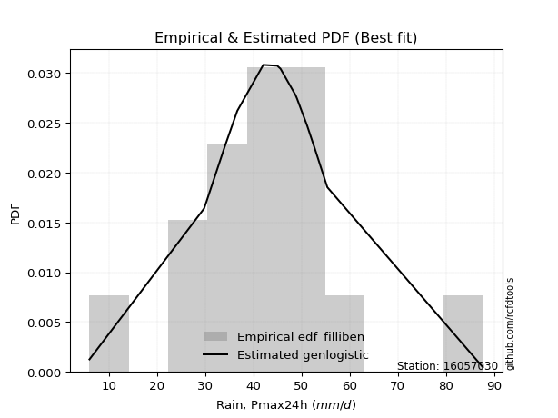</img>

</div>


### 10. EDF Jenkinson (1977)

The Jenkinson formula in hydrology is an empirical plotting position formula used to estimate the non-exceedance probability _(P)_ or return period _(T)_ of a given ordered observation within a sample. It is a widely used method in the frequency analysis of extreme events such as floods and rainfall, as it provides a distribution-free way to plot data. _a≈0.31_ and _b≈0.38_ are constants derived to approximate the median of the probability distribution for the given rank.

<div align="center">


$P=(m-a)/(n+b)$


</div>


**10.1. Empirical values**

<div align="center">

|                | 0                   | 1                   | 2                   | 3                   | 4                   | 5                  | 6                  | 7                   | 8                  | 9                  | 10                 | 11                 | 12                 | 13                 | 14                 | 15                 |
|:---------------|:--------------------|:--------------------|:--------------------|:--------------------|:--------------------|:-------------------|:-------------------|:--------------------|:-------------------|:-------------------|:-------------------|:-------------------|:-------------------|:-------------------|:-------------------|:-------------------|
| date           | 2022                | 2019                | 2021                | 2009                | 2010                | 2006               | 2018               | 2007                | 2013               | 2008               | 2014               | 2012               | 2016               | 2011               | 2017               | 2015               |
| x              | 6.0                 | 29.8                | 30.3                | 34.1                | 36.7                | 36.7               | 42.1               | 45.0                | 45.6               | 45.7               | 48.8               | 49.1               | 51.2               | 52.7               | 55.4               | 87.7               |
| m              | 1                   | 2                   | 3                   | 4                   | 5                   | 6                  | 7                  | 8                   | 9                  | 10                 | 11                 | 12                 | 13                 | 14                 | 15                 | 16                 |
| empirical_dist | edf_jenkinson       | edf_jenkinson       | edf_jenkinson       | edf_jenkinson       | edf_jenkinson       | edf_jenkinson      | edf_jenkinson      | edf_jenkinson       | edf_jenkinson      | edf_jenkinson      | edf_jenkinson      | edf_jenkinson      | edf_jenkinson      | edf_jenkinson      | edf_jenkinson      | edf_jenkinson      |
| empirical      | 0.04212454212454212 | 0.10317460317460318 | 0.16422466422466422 | 0.22527472527472528 | 0.28632478632478636 | 0.3473748473748474 | 0.4084249084249085 | 0.46947496947496953 | 0.5305250305250305 | 0.5915750915750916 | 0.6526251526251526 | 0.7136752136752137 | 0.7747252747252747 | 0.8357753357753358 | 0.8968253968253969 | 0.9578754578754579 |
| empirical_tr   | 1.0439770554493308  | 1.1150442477876106  | 1.1964937910883857  | 1.2907801418439715  | 1.4011976047904193  | 1.5322731524789526 | 1.690402476780186  | 1.884925201380898   | 2.130039011703511  | 2.4484304932735426 | 2.878734622144113  | 3.492537313432836  | 4.439024390243903  | 6.08921933085502   | 9.692307692307695  | 23.73913043478263  |

</div>


**10.2. Kolmogorov-Smirnov fit test (sorted by Δ)**


<div align="center">

|                | 0                   | 1                   | 2                   | 3                   | 4                   | 5                   | 6                   | 7                   | 8                     | 9                   | 10                  | 11                  | 12                  | 13                  | 14                  | 15                  | 16                  | 17                | 18                  | 19                  | 20                  | 21                 | 22                  | 23                 | 24                  | 25                  | 26                  | 27                 | 28                  | 29                  | 30                  | 31                  | 32                  | 33                  | 34                  | 35                  | 36                  | 37                  | 38                  | 39                 | 40                 | 41                  | 42                  | 43                  | 44                  | 45                 | 46                  | 47                 | 48                  | 49                  | 50                | 51                | 52                  | 53                 | 54                  | 55                  | 56                  | 57                 | 58                  | 59                  | 60                  | 61                  | 62                | 63                  | 64                  | 65                 | 66                | 67                 | 68                 | 69                  | 70                 | 71                 | 72                  | 73                  | 74                 | 75                  | 76                 | 77                | 78                  | 79                  | 80                 | 81                 | 82                 | 83                  | 84                 | 85                 | 86                 | 87                 |
|:---------------|:--------------------|:--------------------|:--------------------|:--------------------|:--------------------|:--------------------|:--------------------|:--------------------|:----------------------|:--------------------|:--------------------|:--------------------|:--------------------|:--------------------|:--------------------|:--------------------|:--------------------|:------------------|:--------------------|:--------------------|:--------------------|:-------------------|:--------------------|:-------------------|:--------------------|:--------------------|:--------------------|:-------------------|:--------------------|:--------------------|:--------------------|:--------------------|:--------------------|:--------------------|:--------------------|:--------------------|:--------------------|:--------------------|:--------------------|:-------------------|:-------------------|:--------------------|:--------------------|:--------------------|:--------------------|:-------------------|:--------------------|:-------------------|:--------------------|:--------------------|:------------------|:------------------|:--------------------|:-------------------|:--------------------|:--------------------|:--------------------|:-------------------|:--------------------|:--------------------|:--------------------|:--------------------|:------------------|:--------------------|:--------------------|:-------------------|:------------------|:-------------------|:-------------------|:--------------------|:-------------------|:-------------------|:--------------------|:--------------------|:-------------------|:--------------------|:-------------------|:------------------|:--------------------|:--------------------|:-------------------|:-------------------|:-------------------|:--------------------|:-------------------|:-------------------|:-------------------|:-------------------|
| station        | 16057030            | 16057030            | 16057030            | 16057030            | 16057030            | 16057030            | 16057030            | 16057030            | 16057030              | 16057030            | 16057030            | 16057030            | 16057030            | 16057030            | 16057030            | 16057030            | 16057030            | 16057030          | 16057030            | 16057030            | 16057030            | 16057030           | 16057030            | 16057030           | 16057030            | 16057030            | 16057030            | 16057030           | 16057030            | 16057030            | 16057030            | 16057030            | 16057030            | 16057030            | 16057030            | 16057030            | 16057030            | 16057030            | 16057030            | 16057030           | 16057030           | 16057030            | 16057030            | 16057030            | 16057030            | 16057030           | 16057030            | 16057030           | 16057030            | 16057030            | 16057030          | 16057030          | 16057030            | 16057030           | 16057030            | 16057030            | 16057030            | 16057030           | 16057030            | 16057030            | 16057030            | 16057030            | 16057030          | 16057030            | 16057030            | 16057030           | 16057030          | 16057030           | 16057030           | 16057030            | 16057030           | 16057030           | 16057030            | 16057030            | 16057030           | 16057030            | 16057030           | 16057030          | 16057030            | 16057030            | 16057030           | 16057030           | 16057030           | 16057030            | 16057030           | 16057030           | 16057030           | 16057030           |
| empirical_dist | edf_jenkinson       | edf_jenkinson       | edf_jenkinson       | edf_jenkinson       | edf_jenkinson       | edf_jenkinson       | edf_jenkinson       | edf_jenkinson       | edf_jenkinson         | edf_jenkinson       | edf_jenkinson       | edf_jenkinson       | edf_jenkinson       | edf_jenkinson       | edf_jenkinson       | edf_jenkinson       | edf_jenkinson       | edf_jenkinson     | edf_jenkinson       | edf_jenkinson       | edf_jenkinson       | edf_jenkinson      | edf_jenkinson       | edf_jenkinson      | edf_jenkinson       | edf_jenkinson       | edf_jenkinson       | edf_jenkinson      | edf_jenkinson       | edf_jenkinson       | edf_jenkinson       | edf_jenkinson       | edf_jenkinson       | edf_jenkinson       | edf_jenkinson       | edf_jenkinson       | edf_jenkinson       | edf_jenkinson       | edf_jenkinson       | edf_jenkinson      | edf_jenkinson      | edf_jenkinson       | edf_jenkinson       | edf_jenkinson       | edf_jenkinson       | edf_jenkinson      | edf_jenkinson       | edf_jenkinson      | edf_jenkinson       | edf_jenkinson       | edf_jenkinson     | edf_jenkinson     | edf_jenkinson       | edf_jenkinson      | edf_jenkinson       | edf_jenkinson       | edf_jenkinson       | edf_jenkinson      | edf_jenkinson       | edf_jenkinson       | edf_jenkinson       | edf_jenkinson       | edf_jenkinson     | edf_jenkinson       | edf_jenkinson       | edf_jenkinson      | edf_jenkinson     | edf_jenkinson      | edf_jenkinson      | edf_jenkinson       | edf_jenkinson      | edf_jenkinson      | edf_jenkinson       | edf_jenkinson       | edf_jenkinson      | edf_jenkinson       | edf_jenkinson      | edf_jenkinson     | edf_jenkinson       | edf_jenkinson       | edf_jenkinson      | edf_jenkinson      | edf_jenkinson      | edf_jenkinson       | edf_jenkinson      | edf_jenkinson      | edf_jenkinson      | edf_jenkinson      |
| p_dist         | genlogistic         | fisk                | logcrystalball      | laplace_asymmetric  | laplace             | logjohnsonsu        | nct                 | hypsecant           | loglaplace_asymmetric | johnsonsu           | exponnorm           | logistic            | mielke              | logmielke           | loggenlogistic      | pearson3            | invgamma            | rayleigh          | invgauss            | maxwell             | betaprime           | f                  | gamma               | erlang             | crystalball         | norm                | truncnorm           | alpha              | logt                | logtruncnorm        | loggompertz         | logweibull_min      | logfisk             | logloggamma         | halfnorm            | gumbel_r            | t                   | gumbel_l            | ncf                 | invweibull         | moyal              | halflogistic        | loghypsecant        | loggumbel_l         | loglaplace          | kstwobign          | loglogistic         | lognakagami        | logrice             | logexponnorm        | lognorm           | lognorm           | loglognorm          | logf               | logfatiguelife      | logncf              | lognct              | logpearson3        | logchi2             | logalpha            | loggamma            | loggamma            | logbetaprime      | loginvgamma         | wald                | logmaxwell         | loggumbel_r       | logerlang          | lograyleigh        | loginvgauss         | logmoyal           | gibrat             | weibull_min         | loghalfnorm         | loghalflogistic    | loginvweibull       | logwald            | nakagami          | loggibrat           | logkstwobign        | expon              | genexpon           | loggenexpon        | logexpon            | fatiguelife        | rice               | chi2               | gompertz           |
| delta          | 0.08390869412753138 | 0.08688854354746295 | 0.08723525948235333 | 0.08853711753939775 | 0.08932716904341481 | 0.09058987180708095 | 0.09343515800693669 | 0.09388125191022767 | 0.09443987707821823   | 0.09957295563454005 | 0.10618187811608071 | 0.10824740299369917 | 0.11387359255772062 | 0.11428643901453489 | 0.11467975659821666 | 0.11989277870664405 | 0.12043402390578728 | 0.121220974899508 | 0.12155699978238178 | 0.12334320236958873 | 0.12576463546900074 | 0.1257921210125177 | 0.12581562896920284 | 0.1259702254162226 | 0.13081967494604385 | 0.13081968425207247 | 0.13081970858166447 | 0.1308526553483622 | 0.13235904110969537 | 0.13266329737057242 | 0.13383049968751115 | 0.13409166316056853 | 0.13431572674350356 | 0.13518267353964986 | 0.13587513549428293 | 0.13630765885168078 | 0.13902988893659624 | 0.15181383608468313 | 0.15599152946238448 | 0.1577680779976527 | 0.1615739058775803 | 0.16261301013704083 | 0.16904244008052965 | 0.17916255737261777 | 0.18095219734781437 | 0.1820403909930861 | 0.18434501467317987 | 0.1868440211996371 | 0.20516925199048436 | 0.20525363814976605 | 0.205253934930202 | 0.205253934930202 | 0.20525672157704117 | 0.2053122067666704 | 0.20540077057668932 | 0.20688881264524744 | 0.20877835088739133 | 0.2089746466185397 | 0.22342702735882308 | 0.22612531924644647 | 0.22750598725847837 | 0.22750598725847837 | 0.228128581435032 | 0.23148239459691888 | 0.23170035782172066 | 0.2339597959385633 | 0.241009343917079 | 0.2441160046109283 | 0.2452259463387586 | 0.25419226811807316 | 0.2587725918712625 | 0.2595022562202916 | 0.27494548541869135 | 0.27712732504062343 | 0.2772272329150291 | 0.29337910032508896 | 0.3294486634434581 | 0.337802870378398 | 0.34276212040587656 | 0.34552983305365437 | 0.3662090834099417 | 0.3662723993298686 | 0.3971097565459128 | 0.47117490050099337 | 0.6509852417490178 | 0.6688827944113764 | 0.7992873342774068 | 0.8964827570162288 |
| deltao         | 0.331107277296      | 0.331107277296      | 0.331107277296      | 0.331107277296      | 0.331107277296      | 0.331107277296      | 0.331107277296      | 0.331107277296      | 0.331107277296        | 0.331107277296      | 0.331107277296      | 0.331107277296      | 0.331107277296      | 0.331107277296      | 0.331107277296      | 0.331107277296      | 0.331107277296      | 0.331107277296    | 0.331107277296      | 0.331107277296      | 0.331107277296      | 0.331107277296     | 0.331107277296      | 0.331107277296     | 0.331107277296      | 0.331107277296      | 0.331107277296      | 0.331107277296     | 0.331107277296      | 0.331107277296      | 0.331107277296      | 0.331107277296      | 0.331107277296      | 0.331107277296      | 0.331107277296      | 0.331107277296      | 0.331107277296      | 0.331107277296      | 0.331107277296      | 0.331107277296     | 0.331107277296     | 0.331107277296      | 0.331107277296      | 0.331107277296      | 0.331107277296      | 0.331107277296     | 0.331107277296      | 0.331107277296     | 0.331107277296      | 0.331107277296      | 0.331107277296    | 0.331107277296    | 0.331107277296      | 0.331107277296     | 0.331107277296      | 0.331107277296      | 0.331107277296      | 0.331107277296     | 0.331107277296      | 0.331107277296      | 0.331107277296      | 0.331107277296      | 0.331107277296    | 0.331107277296      | 0.331107277296      | 0.331107277296     | 0.331107277296    | 0.331107277296     | 0.331107277296     | 0.331107277296      | 0.331107277296     | 0.331107277296     | 0.331107277296      | 0.331107277296      | 0.331107277296     | 0.331107277296      | 0.331107277296     | 0.331107277296    | 0.331107277296      | 0.331107277296      | 0.331107277296     | 0.331107277296     | 0.331107277296     | 0.331107277296      | 0.331107277296     | 0.331107277296     | 0.331107277296     | 0.331107277296     |
| eval           | Δo > Δ              | Δo > Δ              | Δo > Δ              | Δo > Δ              | Δo > Δ              | Δo > Δ              | Δo > Δ              | Δo > Δ              | Δo > Δ                | Δo > Δ              | Δo > Δ              | Δo > Δ              | Δo > Δ              | Δo > Δ              | Δo > Δ              | Δo > Δ              | Δo > Δ              | Δo > Δ            | Δo > Δ              | Δo > Δ              | Δo > Δ              | Δo > Δ             | Δo > Δ              | Δo > Δ             | Δo > Δ              | Δo > Δ              | Δo > Δ              | Δo > Δ             | Δo > Δ              | Δo > Δ              | Δo > Δ              | Δo > Δ              | Δo > Δ              | Δo > Δ              | Δo > Δ              | Δo > Δ              | Δo > Δ              | Δo > Δ              | Δo > Δ              | Δo > Δ             | Δo > Δ             | Δo > Δ              | Δo > Δ              | Δo > Δ              | Δo > Δ              | Δo > Δ             | Δo > Δ              | Δo > Δ             | Δo > Δ              | Δo > Δ              | Δo > Δ            | Δo > Δ            | Δo > Δ              | Δo > Δ             | Δo > Δ              | Δo > Δ              | Δo > Δ              | Δo > Δ             | Δo > Δ              | Δo > Δ              | Δo > Δ              | Δo > Δ              | Δo > Δ            | Δo > Δ              | Δo > Δ              | Δo > Δ             | Δo > Δ            | Δo > Δ             | Δo > Δ             | Δo > Δ              | Δo > Δ             | Δo > Δ             | Δo > Δ              | Δo > Δ              | Δo > Δ             | Δo > Δ              | Δo > Δ             | Δo <= Δ           | Δo <= Δ             | Δo <= Δ             | Δo <= Δ            | Δo <= Δ            | Δo <= Δ            | Δo <= Δ             | Δo <= Δ            | Δo <= Δ            | Δo <= Δ            | Δo <= Δ            |
| fit            | 1                   | 1                   | 1                   | 1                   | 1                   | 1                   | 1                   | 1                   | 1                     | 1                   | 1                   | 1                   | 1                   | 1                   | 1                   | 1                   | 1                   | 1                 | 1                   | 1                   | 1                   | 1                  | 1                   | 1                  | 1                   | 1                   | 1                   | 1                  | 1                   | 1                   | 1                   | 1                   | 1                   | 1                   | 1                   | 1                   | 1                   | 1                   | 1                   | 1                  | 1                  | 1                   | 1                   | 1                   | 1                   | 1                  | 1                   | 1                  | 1                   | 1                   | 1                 | 1                 | 1                   | 1                  | 1                   | 1                   | 1                   | 1                  | 1                   | 1                   | 1                   | 1                   | 1                 | 1                   | 1                   | 1                  | 1                 | 1                  | 1                  | 1                   | 1                  | 1                  | 1                   | 1                   | 1                  | 1                   | 1                  | 0                 | 0                   | 0                   | 0                  | 0                  | 0                  | 0                   | 0                  | 0                  | 0                  | 0                  |
| n              | 16                  | 16                  | 16                  | 16                  | 16                  | 16                  | 16                  | 16                  | 16                    | 16                  | 16                  | 16                  | 16                  | 16                  | 16                  | 16                  | 16                  | 16                | 16                  | 16                  | 16                  | 16                 | 16                  | 16                 | 16                  | 16                  | 16                  | 16                 | 16                  | 16                  | 16                  | 16                  | 16                  | 16                  | 16                  | 16                  | 16                  | 16                  | 16                  | 16                 | 16                 | 16                  | 16                  | 16                  | 16                  | 16                 | 16                  | 16                 | 16                  | 16                  | 16                | 16                | 16                  | 16                 | 16                  | 16                  | 16                  | 16                 | 16                  | 16                  | 16                  | 16                  | 16                | 16                  | 16                  | 16                 | 16                | 16                 | 16                 | 16                  | 16                 | 16                 | 16                  | 16                  | 16                 | 16                  | 16                 | 16                | 16                  | 16                  | 16                 | 16                 | 16                 | 16                  | 16                 | 16                 | 16                 | 16                 |
| best_fit       | 1                   | 0                   | 0                   | 0                   | 0                   | 0                   | 0                   | 0                   | 0                     | 0                   | 0                   | 0                   | 0                   | 0                   | 0                   | 0                   | 0                   | 0                 | 0                   | 0                   | 0                   | 0                  | 0                   | 0                  | 0                   | 0                   | 0                   | 0                  | 0                   | 0                   | 0                   | 0                   | 0                   | 0                   | 0                   | 0                   | 0                   | 0                   | 0                   | 0                  | 0                  | 0                   | 0                   | 0                   | 0                   | 0                  | 0                   | 0                  | 0                   | 0                   | 0                 | 0                 | 0                   | 0                  | 0                   | 0                   | 0                   | 0                  | 0                   | 0                   | 0                   | 0                   | 0                 | 0                   | 0                   | 0                  | 0                 | 0                  | 0                  | 0                   | 0                  | 0                  | 0                   | 0                   | 0                  | 0                   | 0                  | 0                 | 0                   | 0                   | 0                  | 0                  | 0                  | 0                   | 0                  | 0                  | 0                  | 0                  |
| best_fit_sort  | 1                   | 2                   | 3                   | 4                   | 5                   | 6                   | 7                   | 8                   | 9                     | 10                  | 11                  | 12                  | 13                  | 14                  | 15                  | 16                  | 17                  | 18                | 19                  | 20                  | 21                  | 22                 | 23                  | 24                 | 25                  | 26                  | 27                  | 28                 | 29                  | 30                  | 31                  | 32                  | 33                  | 34                  | 35                  | 36                  | 37                  | 38                  | 39                  | 40                 | 41                 | 42                  | 43                  | 44                  | 45                  | 46                 | 47                  | 48                 | 49                  | 50                  | 51                | 52                | 53                  | 54                 | 55                  | 56                  | 57                  | 58                 | 59                  | 60                  | 61                  | 62                  | 63                | 64                  | 65                  | 66                 | 67                | 68                 | 69                 | 70                  | 71                 | 72                 | 73                  | 74                  | 75                 | 76                  | 77                 | 78                | 79                  | 80                  | 81                 | 82                 | 83                 | 84                  | 85                 | 86                 | 87                 | 88                 |

</div>


**10.3. Best fit**

<div align="center">

|   id |   station | empirical_dist   | p_dist      |     delta |   deltao | eval   |   fit |   n |   best_fit |   best_fit_sort |
|-----:|----------:|:-----------------|:------------|----------:|---------:|:-------|------:|----:|-----------:|----------------:|
|    0 |  16057030 | edf_jenkinson    | genlogistic | 0.0839087 | 0.331107 | Δo > Δ |     1 |  16 |          1 |               1 |

</div>


<div align="center">

</img>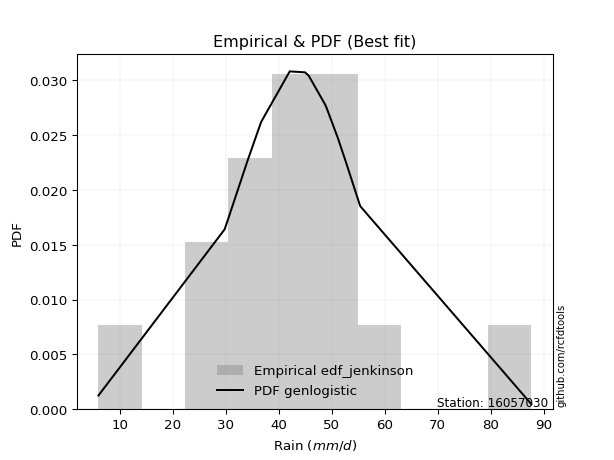</img>

</div>


### 11. EDF Cunnane (1978)

Cunnane´s work in statistical hydrology has focused on the performance and evaluation of different probability distributions (such as GEV, Gumbel, Lognormal) for flood frequency estimation. _b_ is a constant, typically set to 0.4.

<div align="center">


$P=(m-b)/(n+1-2b)$


</div>


**11.1. Empirical values**

<div align="center">

|                | 0                    | 1                   | 2                   | 3                   | 4                  | 5                  | 6                  | 7                  | 8                  | 9                  | 10                 | 11                 | 12                 | 13                 | 14                 | 15                 |
|:---------------|:---------------------|:--------------------|:--------------------|:--------------------|:-------------------|:-------------------|:-------------------|:-------------------|:-------------------|:-------------------|:-------------------|:-------------------|:-------------------|:-------------------|:-------------------|:-------------------|
| date           | 2022                 | 2019                | 2021                | 2009                | 2010               | 2006               | 2018               | 2007               | 2013               | 2008               | 2014               | 2012               | 2016               | 2011               | 2017               | 2015               |
| x              | 6.0                  | 29.8                | 30.3                | 34.1                | 36.7               | 36.7               | 42.1               | 45.0               | 45.6               | 45.7               | 48.8               | 49.1               | 51.2               | 52.7               | 55.4               | 87.7               |
| m              | 1                    | 2                   | 3                   | 4                   | 5                  | 6                  | 7                  | 8                  | 9                  | 10                 | 11                 | 12                 | 13                 | 14                 | 15                 | 16                 |
| empirical_dist | edf_cunnane          | edf_cunnane         | edf_cunnane         | edf_cunnane         | edf_cunnane        | edf_cunnane        | edf_cunnane        | edf_cunnane        | edf_cunnane        | edf_cunnane        | edf_cunnane        | edf_cunnane        | edf_cunnane        | edf_cunnane        | edf_cunnane        | edf_cunnane        |
| empirical      | 0.037037037037037035 | 0.09876543209876544 | 0.16049382716049385 | 0.22222222222222224 | 0.2839506172839506 | 0.345679012345679  | 0.4074074074074074 | 0.4691358024691358 | 0.5308641975308642 | 0.5925925925925926 | 0.654320987654321  | 0.7160493827160493 | 0.7777777777777778 | 0.8395061728395062 | 0.9012345679012346 | 0.962962962962963  |
| empirical_tr   | 1.0384615384615383   | 1.1095890410958904  | 1.1911764705882353  | 1.2857142857142856  | 1.3965517241379308 | 1.5283018867924527 | 1.6875             | 1.8837209302325582 | 2.1315789473684212 | 2.454545454545454  | 2.8928571428571432 | 3.5217391304347823 | 4.5                | 6.2307692307692335 | 10.125             | 27.000000000000043 |

</div>


**11.2. Kolmogorov-Smirnov fit test (sorted by Δ)**


<div align="center">

|                | 0                   | 1                   | 2                  | 3                   | 4                   | 5                   | 6                   | 7                   | 8                   | 9                     | 10                  | 11                  | 12                  | 13                  | 14                  | 15                  | 16                | 17                  | 18                  | 19                  | 20                  | 21                 | 22                  | 23                  | 24                 | 25                  | 26                  | 27                  | 28                 | 29                  | 30                  | 31                  | 32                  | 33                  | 34                  | 35                  | 36                | 37                  | 38                  | 39                  | 40                 | 41                  | 42                  | 43                  | 44                  | 45                  | 46                  | 47                  | 48                  | 49                  | 50                  | 51                  | 52                  | 53                  | 54                 | 55                  | 56                  | 57                 | 58                  | 59                  | 60                  | 61                  | 62                 | 63                  | 64                  | 65                  | 66                  | 67                  | 68                  | 69                  | 70                  | 71                  | 72                  | 73                 | 74                  | 75                  | 76                  | 77                 | 78                 | 79                  | 80                  | 81                 | 82                  | 83                  | 84                 | 85                 | 86                 | 87                 |
|:---------------|:--------------------|:--------------------|:-------------------|:--------------------|:--------------------|:--------------------|:--------------------|:--------------------|:--------------------|:----------------------|:--------------------|:--------------------|:--------------------|:--------------------|:--------------------|:--------------------|:------------------|:--------------------|:--------------------|:--------------------|:--------------------|:-------------------|:--------------------|:--------------------|:-------------------|:--------------------|:--------------------|:--------------------|:-------------------|:--------------------|:--------------------|:--------------------|:--------------------|:--------------------|:--------------------|:--------------------|:------------------|:--------------------|:--------------------|:--------------------|:-------------------|:--------------------|:--------------------|:--------------------|:--------------------|:--------------------|:--------------------|:--------------------|:--------------------|:--------------------|:--------------------|:--------------------|:--------------------|:--------------------|:-------------------|:--------------------|:--------------------|:-------------------|:--------------------|:--------------------|:--------------------|:--------------------|:-------------------|:--------------------|:--------------------|:--------------------|:--------------------|:--------------------|:--------------------|:--------------------|:--------------------|:--------------------|:--------------------|:-------------------|:--------------------|:--------------------|:--------------------|:-------------------|:-------------------|:--------------------|:--------------------|:-------------------|:--------------------|:--------------------|:-------------------|:-------------------|:-------------------|:-------------------|
| station        | 16057030            | 16057030            | 16057030           | 16057030            | 16057030            | 16057030            | 16057030            | 16057030            | 16057030            | 16057030              | 16057030            | 16057030            | 16057030            | 16057030            | 16057030            | 16057030            | 16057030          | 16057030            | 16057030            | 16057030            | 16057030            | 16057030           | 16057030            | 16057030            | 16057030           | 16057030            | 16057030            | 16057030            | 16057030           | 16057030            | 16057030            | 16057030            | 16057030            | 16057030            | 16057030            | 16057030            | 16057030          | 16057030            | 16057030            | 16057030            | 16057030           | 16057030            | 16057030            | 16057030            | 16057030            | 16057030            | 16057030            | 16057030            | 16057030            | 16057030            | 16057030            | 16057030            | 16057030            | 16057030            | 16057030           | 16057030            | 16057030            | 16057030           | 16057030            | 16057030            | 16057030            | 16057030            | 16057030           | 16057030            | 16057030            | 16057030            | 16057030            | 16057030            | 16057030            | 16057030            | 16057030            | 16057030            | 16057030            | 16057030           | 16057030            | 16057030            | 16057030            | 16057030           | 16057030           | 16057030            | 16057030            | 16057030           | 16057030            | 16057030            | 16057030           | 16057030           | 16057030           | 16057030           |
| empirical_dist | edf_cunnane         | edf_cunnane         | edf_cunnane        | edf_cunnane         | edf_cunnane         | edf_cunnane         | edf_cunnane         | edf_cunnane         | edf_cunnane         | edf_cunnane           | edf_cunnane         | edf_cunnane         | edf_cunnane         | edf_cunnane         | edf_cunnane         | edf_cunnane         | edf_cunnane       | edf_cunnane         | edf_cunnane         | edf_cunnane         | edf_cunnane         | edf_cunnane        | edf_cunnane         | edf_cunnane         | edf_cunnane        | edf_cunnane         | edf_cunnane         | edf_cunnane         | edf_cunnane        | edf_cunnane         | edf_cunnane         | edf_cunnane         | edf_cunnane         | edf_cunnane         | edf_cunnane         | edf_cunnane         | edf_cunnane       | edf_cunnane         | edf_cunnane         | edf_cunnane         | edf_cunnane        | edf_cunnane         | edf_cunnane         | edf_cunnane         | edf_cunnane         | edf_cunnane         | edf_cunnane         | edf_cunnane         | edf_cunnane         | edf_cunnane         | edf_cunnane         | edf_cunnane         | edf_cunnane         | edf_cunnane         | edf_cunnane        | edf_cunnane         | edf_cunnane         | edf_cunnane        | edf_cunnane         | edf_cunnane         | edf_cunnane         | edf_cunnane         | edf_cunnane        | edf_cunnane         | edf_cunnane         | edf_cunnane         | edf_cunnane         | edf_cunnane         | edf_cunnane         | edf_cunnane         | edf_cunnane         | edf_cunnane         | edf_cunnane         | edf_cunnane        | edf_cunnane         | edf_cunnane         | edf_cunnane         | edf_cunnane        | edf_cunnane        | edf_cunnane         | edf_cunnane         | edf_cunnane        | edf_cunnane         | edf_cunnane         | edf_cunnane        | edf_cunnane        | edf_cunnane        | edf_cunnane        |
| p_dist         | genlogistic         | laplace_asymmetric  | fisk               | logjohnsonsu        | laplace             | logcrystalball      | nct                 | johnsonsu           | hypsecant           | loglaplace_asymmetric | exponnorm           | logistic            | mielke              | logmielke           | loggenlogistic      | pearson3            | invgamma          | rayleigh            | invgauss            | maxwell             | betaprime           | f                  | gamma               | erlang              | logtruncnorm       | logt                | crystalball         | norm                | truncnorm          | alpha               | halfnorm            | gumbel_r            | loggompertz         | logweibull_min      | logfisk             | logloggamma         | t                 | gumbel_l            | ncf                 | moyal               | invweibull         | halflogistic        | loghypsecant        | loglaplace          | loggumbel_l         | kstwobign           | lognakagami         | loglogistic         | logrice             | logexponnorm        | lognorm             | lognorm             | loglognorm          | logf                | logfatiguelife     | logncf              | logpearson3         | lognct             | logchi2             | logalpha            | loggamma            | loggamma            | wald               | logbetaprime        | loginvgamma         | logmaxwell          | loggumbel_r         | logerlang           | lograyleigh         | loginvgauss         | gibrat              | logmoyal            | weibull_min         | loghalfnorm        | loghalflogistic     | loginvweibull       | logwald             | nakagami           | loggibrat          | logkstwobign        | expon               | genexpon           | loggenexpon         | logexpon            | fatiguelife        | rice               | chi2               | gompertz           |
| delta          | 0.08424786113336513 | 0.08684128251022932 | 0.0872277105532967 | 0.08889403677791252 | 0.08966633604924856 | 0.09164443055819105 | 0.09173932297776827 | 0.09787712060537163 | 0.09829042298606538 | 0.09884904815405597   | 0.11059104919191842 | 0.11265657406953689 | 0.11421275956355437 | 0.11462560602036864 | 0.11501892360405042 | 0.12430194978248177 | 0.124843194981625 | 0.12563014597534572 | 0.12596617085821954 | 0.12775237344542645 | 0.13017380654483846 | 0.1302012920883554 | 0.13022480004504056 | 0.13037939649206032 | 0.1304491911451643 | 0.13066320608052695 | 0.13522884602188157 | 0.13522885532791018 | 0.1352288796575022 | 0.13526182642419993 | 0.13621430250011668 | 0.13664682585751453 | 0.13823967076334887 | 0.13850083423640625 | 0.13872489781934128 | 0.13959184461548757 | 0.143439060012434 | 0.15554467314885356 | 0.16040070053822225 | 0.16191307288341406 | 0.1621772490734904 | 0.16295217714287458 | 0.17345161115636742 | 0.18129136435364812 | 0.18357172844845548 | 0.18644956206892388 | 0.18718318820547086 | 0.18875418574901764 | 0.20957842306632213 | 0.20966280922560382 | 0.20966310600603977 | 0.20966310600603977 | 0.20966589265287894 | 0.20972137784250816 | 0.2098099416525271 | 0.21129798372108521 | 0.21270548368271014 | 0.2131875219632291 | 0.22783619843466085 | 0.23053449032228424 | 0.23191515833431614 | 0.23191515833431614 | 0.2320395248275544 | 0.23253775251086978 | 0.23589156567275665 | 0.23836896701440108 | 0.24541851499291678 | 0.24852517568676608 | 0.24963511741459637 | 0.25860143919391093 | 0.25984142322612536 | 0.26114676091209826 | 0.27935465649452906 | 0.2815364961164612 | 0.28163640399086687 | 0.29778827140092673 | 0.33182283248429384 | 0.3401770394192338 | 0.3451362894467123 | 0.34993900412949214 | 0.37061825448577945 | 0.3706815704057064 | 0.40151892762175057 | 0.47558407157683114 | 0.6553944128248556 | 0.6732919654872142 | 0.8036965053532446 | 0.9008919280920665 |
| deltao         | 0.331107277296      | 0.331107277296      | 0.331107277296     | 0.331107277296      | 0.331107277296      | 0.331107277296      | 0.331107277296      | 0.331107277296      | 0.331107277296      | 0.331107277296        | 0.331107277296      | 0.331107277296      | 0.331107277296      | 0.331107277296      | 0.331107277296      | 0.331107277296      | 0.331107277296    | 0.331107277296      | 0.331107277296      | 0.331107277296      | 0.331107277296      | 0.331107277296     | 0.331107277296      | 0.331107277296      | 0.331107277296     | 0.331107277296      | 0.331107277296      | 0.331107277296      | 0.331107277296     | 0.331107277296      | 0.331107277296      | 0.331107277296      | 0.331107277296      | 0.331107277296      | 0.331107277296      | 0.331107277296      | 0.331107277296    | 0.331107277296      | 0.331107277296      | 0.331107277296      | 0.331107277296     | 0.331107277296      | 0.331107277296      | 0.331107277296      | 0.331107277296      | 0.331107277296      | 0.331107277296      | 0.331107277296      | 0.331107277296      | 0.331107277296      | 0.331107277296      | 0.331107277296      | 0.331107277296      | 0.331107277296      | 0.331107277296     | 0.331107277296      | 0.331107277296      | 0.331107277296     | 0.331107277296      | 0.331107277296      | 0.331107277296      | 0.331107277296      | 0.331107277296     | 0.331107277296      | 0.331107277296      | 0.331107277296      | 0.331107277296      | 0.331107277296      | 0.331107277296      | 0.331107277296      | 0.331107277296      | 0.331107277296      | 0.331107277296      | 0.331107277296     | 0.331107277296      | 0.331107277296      | 0.331107277296      | 0.331107277296     | 0.331107277296     | 0.331107277296      | 0.331107277296      | 0.331107277296     | 0.331107277296      | 0.331107277296      | 0.331107277296     | 0.331107277296     | 0.331107277296     | 0.331107277296     |
| eval           | Δo > Δ              | Δo > Δ              | Δo > Δ             | Δo > Δ              | Δo > Δ              | Δo > Δ              | Δo > Δ              | Δo > Δ              | Δo > Δ              | Δo > Δ                | Δo > Δ              | Δo > Δ              | Δo > Δ              | Δo > Δ              | Δo > Δ              | Δo > Δ              | Δo > Δ            | Δo > Δ              | Δo > Δ              | Δo > Δ              | Δo > Δ              | Δo > Δ             | Δo > Δ              | Δo > Δ              | Δo > Δ             | Δo > Δ              | Δo > Δ              | Δo > Δ              | Δo > Δ             | Δo > Δ              | Δo > Δ              | Δo > Δ              | Δo > Δ              | Δo > Δ              | Δo > Δ              | Δo > Δ              | Δo > Δ            | Δo > Δ              | Δo > Δ              | Δo > Δ              | Δo > Δ             | Δo > Δ              | Δo > Δ              | Δo > Δ              | Δo > Δ              | Δo > Δ              | Δo > Δ              | Δo > Δ              | Δo > Δ              | Δo > Δ              | Δo > Δ              | Δo > Δ              | Δo > Δ              | Δo > Δ              | Δo > Δ             | Δo > Δ              | Δo > Δ              | Δo > Δ             | Δo > Δ              | Δo > Δ              | Δo > Δ              | Δo > Δ              | Δo > Δ             | Δo > Δ              | Δo > Δ              | Δo > Δ              | Δo > Δ              | Δo > Δ              | Δo > Δ              | Δo > Δ              | Δo > Δ              | Δo > Δ              | Δo > Δ              | Δo > Δ             | Δo > Δ              | Δo > Δ              | Δo <= Δ             | Δo <= Δ            | Δo <= Δ            | Δo <= Δ             | Δo <= Δ             | Δo <= Δ            | Δo <= Δ             | Δo <= Δ             | Δo <= Δ            | Δo <= Δ            | Δo <= Δ            | Δo <= Δ            |
| fit            | 1                   | 1                   | 1                  | 1                   | 1                   | 1                   | 1                   | 1                   | 1                   | 1                     | 1                   | 1                   | 1                   | 1                   | 1                   | 1                   | 1                 | 1                   | 1                   | 1                   | 1                   | 1                  | 1                   | 1                   | 1                  | 1                   | 1                   | 1                   | 1                  | 1                   | 1                   | 1                   | 1                   | 1                   | 1                   | 1                   | 1                 | 1                   | 1                   | 1                   | 1                  | 1                   | 1                   | 1                   | 1                   | 1                   | 1                   | 1                   | 1                   | 1                   | 1                   | 1                   | 1                   | 1                   | 1                  | 1                   | 1                   | 1                  | 1                   | 1                   | 1                   | 1                   | 1                  | 1                   | 1                   | 1                   | 1                   | 1                   | 1                   | 1                   | 1                   | 1                   | 1                   | 1                  | 1                   | 1                   | 0                   | 0                  | 0                  | 0                   | 0                   | 0                  | 0                   | 0                   | 0                  | 0                  | 0                  | 0                  |
| n              | 16                  | 16                  | 16                 | 16                  | 16                  | 16                  | 16                  | 16                  | 16                  | 16                    | 16                  | 16                  | 16                  | 16                  | 16                  | 16                  | 16                | 16                  | 16                  | 16                  | 16                  | 16                 | 16                  | 16                  | 16                 | 16                  | 16                  | 16                  | 16                 | 16                  | 16                  | 16                  | 16                  | 16                  | 16                  | 16                  | 16                | 16                  | 16                  | 16                  | 16                 | 16                  | 16                  | 16                  | 16                  | 16                  | 16                  | 16                  | 16                  | 16                  | 16                  | 16                  | 16                  | 16                  | 16                 | 16                  | 16                  | 16                 | 16                  | 16                  | 16                  | 16                  | 16                 | 16                  | 16                  | 16                  | 16                  | 16                  | 16                  | 16                  | 16                  | 16                  | 16                  | 16                 | 16                  | 16                  | 16                  | 16                 | 16                 | 16                  | 16                  | 16                 | 16                  | 16                  | 16                 | 16                 | 16                 | 16                 |
| best_fit       | 1                   | 0                   | 0                  | 0                   | 0                   | 0                   | 0                   | 0                   | 0                   | 0                     | 0                   | 0                   | 0                   | 0                   | 0                   | 0                   | 0                 | 0                   | 0                   | 0                   | 0                   | 0                  | 0                   | 0                   | 0                  | 0                   | 0                   | 0                   | 0                  | 0                   | 0                   | 0                   | 0                   | 0                   | 0                   | 0                   | 0                 | 0                   | 0                   | 0                   | 0                  | 0                   | 0                   | 0                   | 0                   | 0                   | 0                   | 0                   | 0                   | 0                   | 0                   | 0                   | 0                   | 0                   | 0                  | 0                   | 0                   | 0                  | 0                   | 0                   | 0                   | 0                   | 0                  | 0                   | 0                   | 0                   | 0                   | 0                   | 0                   | 0                   | 0                   | 0                   | 0                   | 0                  | 0                   | 0                   | 0                   | 0                  | 0                  | 0                   | 0                   | 0                  | 0                   | 0                   | 0                  | 0                  | 0                  | 0                  |
| best_fit_sort  | 1                   | 2                   | 3                  | 4                   | 5                   | 6                   | 7                   | 8                   | 9                   | 10                    | 11                  | 12                  | 13                  | 14                  | 15                  | 16                  | 17                | 18                  | 19                  | 20                  | 21                  | 22                 | 23                  | 24                  | 25                 | 26                  | 27                  | 28                  | 29                 | 30                  | 31                  | 32                  | 33                  | 34                  | 35                  | 36                  | 37                | 38                  | 39                  | 40                  | 41                 | 42                  | 43                  | 44                  | 45                  | 46                  | 47                  | 48                  | 49                  | 50                  | 51                  | 52                  | 53                  | 54                  | 55                 | 56                  | 57                  | 58                 | 59                  | 60                  | 61                  | 62                  | 63                 | 64                  | 65                  | 66                  | 67                  | 68                  | 69                  | 70                  | 71                  | 72                  | 73                  | 74                 | 75                  | 76                  | 77                  | 78                 | 79                 | 80                  | 81                  | 82                 | 83                  | 84                  | 85                 | 86                 | 87                 | 88                 |

</div>


**11.3. Best fit**

<div align="center">

|   id |   station | empirical_dist   | p_dist      |     delta |   deltao | eval   |   fit |   n |   best_fit |   best_fit_sort |
|-----:|----------:|:-----------------|:------------|----------:|---------:|:-------|------:|----:|-----------:|----------------:|
|    0 |  16057030 | edf_cunnane      | genlogistic | 0.0842479 | 0.331107 | Δo > Δ |     1 |  16 |          1 |               1 |

</div>


<div align="center">

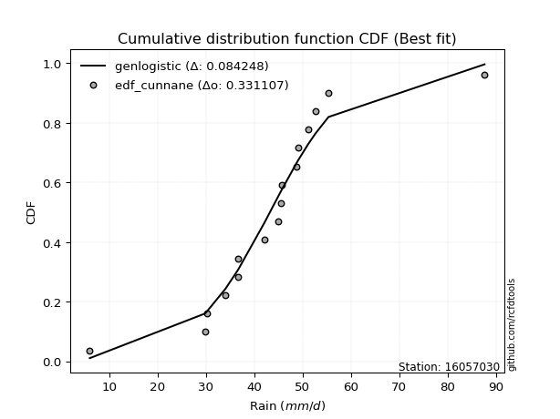</img></img>

</div>


### 12. EDF Adamowski (1981)

The Adamowski formula in hydrology refers to a specific plotting position formula used for estimating the non-parametric empirical distribution of hydrological events (like flood peaks) to calculate their return periods. This formula provides an alternative to traditional parametric methods (like the Gumbel or Log Pearson Type III distributions). 

<div align="center">


$P=(m-0.25)/(n+0.5)$


</div>


**12.1. Empirical values**

<div align="center">

|                | 0                    | 1                   | 2                   | 3                   | 4                  | 5                  | 6                  | 7                  | 8                  | 9                  | 10                 | 11                 | 12                 | 13                 | 14                 | 15                 |
|:---------------|:---------------------|:--------------------|:--------------------|:--------------------|:-------------------|:-------------------|:-------------------|:-------------------|:-------------------|:-------------------|:-------------------|:-------------------|:-------------------|:-------------------|:-------------------|:-------------------|
| date           | 2022                 | 2019                | 2021                | 2009                | 2010               | 2006               | 2018               | 2007               | 2013               | 2008               | 2014               | 2012               | 2016               | 2011               | 2017               | 2015               |
| x              | 6.0                  | 29.8                | 30.3                | 34.1                | 36.7               | 36.7               | 42.1               | 45.0               | 45.6               | 45.7               | 48.8               | 49.1               | 51.2               | 52.7               | 55.4               | 87.7               |
| m              | 1                    | 2                   | 3                   | 4                   | 5                  | 6                  | 7                  | 8                  | 9                  | 10                 | 11                 | 12                 | 13                 | 14                 | 15                 | 16                 |
| empirical_dist | edf_adamowski        | edf_adamowski       | edf_adamowski       | edf_adamowski       | edf_adamowski      | edf_adamowski      | edf_adamowski      | edf_adamowski      | edf_adamowski      | edf_adamowski      | edf_adamowski      | edf_adamowski      | edf_adamowski      | edf_adamowski      | edf_adamowski      | edf_adamowski      |
| empirical      | 0.045454545454545456 | 0.10606060606060606 | 0.16666666666666666 | 0.22727272727272727 | 0.2878787878787879 | 0.3484848484848485 | 0.4090909090909091 | 0.4696969696969697 | 0.5303030303030303 | 0.5909090909090909 | 0.6515151515151515 | 0.7121212121212122 | 0.7727272727272727 | 0.8333333333333334 | 0.8939393939393939 | 0.9545454545454546 |
| empirical_tr   | 1.0476190476190477   | 1.1186440677966103  | 1.2                 | 1.2941176470588236  | 1.4042553191489362 | 1.5348837209302326 | 1.6923076923076925 | 1.885714285714286  | 2.129032258064516  | 2.4444444444444446 | 2.869565217391304  | 3.4736842105263164 | 4.3999999999999995 | 6.000000000000002  | 9.428571428571427  | 22.00000000000002  |

</div>


**12.2. Kolmogorov-Smirnov fit test (sorted by Δ)**


<div align="center">

|                | 0                   | 1                   | 2                   | 3                   | 4                   | 5                   | 6                     | 7                   | 8                   | 9                   | 10                  | 11                  | 12                  | 13                 | 14                  | 15                  | 16                  | 17                  | 18                 | 19                 | 20                 | 21                  | 22                 | 23                  | 24                  | 25                  | 26                  | 27                  | 28                  | 29                 | 30                  | 31                  | 32                  | 33                  | 34                  | 35                  | 36                  | 37                 | 38                 | 39                  | 40                 | 41                  | 42                  | 43                  | 44                  | 45                  | 46                | 47                  | 48                  | 49                  | 50                  | 51                  | 52                 | 53                 | 54                  | 55                  | 56                  | 57                  | 58                 | 59                  | 60                 | 61                 | 62                  | 63                | 64                  | 65                  | 66                  | 67                  | 68                  | 69                 | 70                  | 71                 | 72                 | 73                  | 74                 | 75                 | 76                  | 77                 | 78                | 79                 | 80                 | 81                 | 82                 | 83                 | 84                 | 85                 | 86                 | 87                 |
|:---------------|:--------------------|:--------------------|:--------------------|:--------------------|:--------------------|:--------------------|:----------------------|:--------------------|:--------------------|:--------------------|:--------------------|:--------------------|:--------------------|:-------------------|:--------------------|:--------------------|:--------------------|:--------------------|:-------------------|:-------------------|:-------------------|:--------------------|:-------------------|:--------------------|:--------------------|:--------------------|:--------------------|:--------------------|:--------------------|:-------------------|:--------------------|:--------------------|:--------------------|:--------------------|:--------------------|:--------------------|:--------------------|:-------------------|:-------------------|:--------------------|:-------------------|:--------------------|:--------------------|:--------------------|:--------------------|:--------------------|:------------------|:--------------------|:--------------------|:--------------------|:--------------------|:--------------------|:-------------------|:-------------------|:--------------------|:--------------------|:--------------------|:--------------------|:-------------------|:--------------------|:-------------------|:-------------------|:--------------------|:------------------|:--------------------|:--------------------|:--------------------|:--------------------|:--------------------|:-------------------|:--------------------|:-------------------|:-------------------|:--------------------|:-------------------|:-------------------|:--------------------|:-------------------|:------------------|:-------------------|:-------------------|:-------------------|:-------------------|:-------------------|:-------------------|:-------------------|:-------------------|:-------------------|
| station        | 16057030            | 16057030            | 16057030            | 16057030            | 16057030            | 16057030            | 16057030              | 16057030            | 16057030            | 16057030            | 16057030            | 16057030            | 16057030            | 16057030           | 16057030            | 16057030            | 16057030            | 16057030            | 16057030           | 16057030           | 16057030           | 16057030            | 16057030           | 16057030            | 16057030            | 16057030            | 16057030            | 16057030            | 16057030            | 16057030           | 16057030            | 16057030            | 16057030            | 16057030            | 16057030            | 16057030            | 16057030            | 16057030           | 16057030           | 16057030            | 16057030           | 16057030            | 16057030            | 16057030            | 16057030            | 16057030            | 16057030          | 16057030            | 16057030            | 16057030            | 16057030            | 16057030            | 16057030           | 16057030           | 16057030            | 16057030            | 16057030            | 16057030            | 16057030           | 16057030            | 16057030           | 16057030           | 16057030            | 16057030          | 16057030            | 16057030            | 16057030            | 16057030            | 16057030            | 16057030           | 16057030            | 16057030           | 16057030           | 16057030            | 16057030           | 16057030           | 16057030            | 16057030           | 16057030          | 16057030           | 16057030           | 16057030           | 16057030           | 16057030           | 16057030           | 16057030           | 16057030           | 16057030           |
| empirical_dist | edf_adamowski       | edf_adamowski       | edf_adamowski       | edf_adamowski       | edf_adamowski       | edf_adamowski       | edf_adamowski         | edf_adamowski       | edf_adamowski       | edf_adamowski       | edf_adamowski       | edf_adamowski       | edf_adamowski       | edf_adamowski      | edf_adamowski       | edf_adamowski       | edf_adamowski       | edf_adamowski       | edf_adamowski      | edf_adamowski      | edf_adamowski      | edf_adamowski       | edf_adamowski      | edf_adamowski       | edf_adamowski       | edf_adamowski       | edf_adamowski       | edf_adamowski       | edf_adamowski       | edf_adamowski      | edf_adamowski       | edf_adamowski       | edf_adamowski       | edf_adamowski       | edf_adamowski       | edf_adamowski       | edf_adamowski       | edf_adamowski      | edf_adamowski      | edf_adamowski       | edf_adamowski      | edf_adamowski       | edf_adamowski       | edf_adamowski       | edf_adamowski       | edf_adamowski       | edf_adamowski     | edf_adamowski       | edf_adamowski       | edf_adamowski       | edf_adamowski       | edf_adamowski       | edf_adamowski      | edf_adamowski      | edf_adamowski       | edf_adamowski       | edf_adamowski       | edf_adamowski       | edf_adamowski      | edf_adamowski       | edf_adamowski      | edf_adamowski      | edf_adamowski       | edf_adamowski     | edf_adamowski       | edf_adamowski       | edf_adamowski       | edf_adamowski       | edf_adamowski       | edf_adamowski      | edf_adamowski       | edf_adamowski      | edf_adamowski      | edf_adamowski       | edf_adamowski      | edf_adamowski      | edf_adamowski       | edf_adamowski      | edf_adamowski     | edf_adamowski      | edf_adamowski      | edf_adamowski      | edf_adamowski      | edf_adamowski      | edf_adamowski      | edf_adamowski      | edf_adamowski      | edf_adamowski      |
| p_dist         | genlogistic         | logcrystalball      | fisk                | laplace             | laplace_asymmetric  | hypsecant           | loglaplace_asymmetric | logjohnsonsu        | nct                 | johnsonsu           | exponnorm           | logistic            | mielke              | logmielke          | loggenlogistic      | pearson3            | invgamma            | rayleigh            | invgauss           | maxwell            | betaprime          | f                   | gamma              | erlang              | crystalball         | norm                | truncnorm           | alpha               | loggompertz         | logweibull_min     | logfisk             | logloggamma         | logt                | logtruncnorm        | halfnorm            | gumbel_r            | t                   | gumbel_l           | ncf                | invweibull          | moyal              | halflogistic        | loghypsecant        | loggumbel_l         | kstwobign           | loglaplace          | loglogistic       | lognakagami         | logrice             | logexponnorm        | lognorm             | lognorm             | loglognorm         | logf               | logfatiguelife      | logncf              | lognct              | logpearson3         | logchi2            | logalpha            | loggamma           | loggamma           | logbetaprime        | loginvgamma       | logmaxwell          | wald                | loggumbel_r         | logerlang           | lograyleigh         | loginvgauss        | logmoyal            | gibrat             | weibull_min        | loghalfnorm         | loghalflogistic    | loginvweibull      | logwald             | nakagami           | loggibrat         | logkstwobign       | expon              | genexpon           | loggenexpon        | logexpon           | fatiguelife        | rice               | chi2               | gompertz           |
| delta          | 0.08368669390553118 | 0.08602847820802917 | 0.08666654332546275 | 0.08910516882141462 | 0.08964711864939884 | 0.09099524902422473 | 0.09155387419221535   | 0.09169987291708204 | 0.09454515911693778 | 0.10068295674454114 | 0.10329587523007777 | 0.10536140010769623 | 0.11365159233572042 | 0.1140644387925347 | 0.11445775637621647 | 0.11700677582064112 | 0.11754802101978434 | 0.11833497201350507 | 0.1186709968963789 | 0.1204571994835858 | 0.1228786325829978 | 0.12290611812651475 | 0.1229296260831999 | 0.12308422253021967 | 0.12793367206004091 | 0.12793368136606953 | 0.12793370569566154 | 0.12796665246235928 | 0.13094449680150821 | 0.1312056602745656 | 0.13142972385750062 | 0.13229667065364692 | 0.13346904221969647 | 0.13510529981257485 | 0.13565313527228273 | 0.13608565862968058 | 0.13614388605059335 | 0.1493718336426807 | 0.1531055265763816 | 0.15488207511164975 | 0.1613519056555801 | 0.16239100991504063 | 0.16615643719452677 | 0.17627655448661483 | 0.17915438810708323 | 0.18073019712581417 | 0.181459011787177 | 0.18662202097763692 | 0.20228324910448148 | 0.20236763526376317 | 0.20236793204419912 | 0.20236793204419912 | 0.2023707186910383 | 0.2024262038806675 | 0.20251476769068644 | 0.20400280975924456 | 0.20589234800138845 | 0.20653264417653727 | 0.2205410244728202 | 0.22323931636044358 | 0.2246199843724755 | 0.2246199843724755 | 0.22524257854902913 | 0.228596391710916 | 0.23107379305256043 | 0.23147835759972046 | 0.23812334103107613 | 0.24123000172492542 | 0.24233994345275572 | 0.2513062652320703 | 0.25721859031726096 | 0.2592802559982914 | 0.2720594825326884 | 0.27424132215462055 | 0.2743412300290262 | 0.2904930974390861 | 0.32789466188945654 | 0.3362488688243965 | 0.341208118851875 | 0.3426438301676515 | 0.3633230805239388 | 0.3633863964438657 | 0.3942237536599099 | 0.4682888976149905 | 0.6480992388630149 | 0.6659967915253735 | 0.7964013313914039 | 0.8935967541302259 |
| deltao         | 0.331107277296      | 0.331107277296      | 0.331107277296      | 0.331107277296      | 0.331107277296      | 0.331107277296      | 0.331107277296        | 0.331107277296      | 0.331107277296      | 0.331107277296      | 0.331107277296      | 0.331107277296      | 0.331107277296      | 0.331107277296     | 0.331107277296      | 0.331107277296      | 0.331107277296      | 0.331107277296      | 0.331107277296     | 0.331107277296     | 0.331107277296     | 0.331107277296      | 0.331107277296     | 0.331107277296      | 0.331107277296      | 0.331107277296      | 0.331107277296      | 0.331107277296      | 0.331107277296      | 0.331107277296     | 0.331107277296      | 0.331107277296      | 0.331107277296      | 0.331107277296      | 0.331107277296      | 0.331107277296      | 0.331107277296      | 0.331107277296     | 0.331107277296     | 0.331107277296      | 0.331107277296     | 0.331107277296      | 0.331107277296      | 0.331107277296      | 0.331107277296      | 0.331107277296      | 0.331107277296    | 0.331107277296      | 0.331107277296      | 0.331107277296      | 0.331107277296      | 0.331107277296      | 0.331107277296     | 0.331107277296     | 0.331107277296      | 0.331107277296      | 0.331107277296      | 0.331107277296      | 0.331107277296     | 0.331107277296      | 0.331107277296     | 0.331107277296     | 0.331107277296      | 0.331107277296    | 0.331107277296      | 0.331107277296      | 0.331107277296      | 0.331107277296      | 0.331107277296      | 0.331107277296     | 0.331107277296      | 0.331107277296     | 0.331107277296     | 0.331107277296      | 0.331107277296     | 0.331107277296     | 0.331107277296      | 0.331107277296     | 0.331107277296    | 0.331107277296     | 0.331107277296     | 0.331107277296     | 0.331107277296     | 0.331107277296     | 0.331107277296     | 0.331107277296     | 0.331107277296     | 0.331107277296     |
| eval           | Δo > Δ              | Δo > Δ              | Δo > Δ              | Δo > Δ              | Δo > Δ              | Δo > Δ              | Δo > Δ                | Δo > Δ              | Δo > Δ              | Δo > Δ              | Δo > Δ              | Δo > Δ              | Δo > Δ              | Δo > Δ             | Δo > Δ              | Δo > Δ              | Δo > Δ              | Δo > Δ              | Δo > Δ             | Δo > Δ             | Δo > Δ             | Δo > Δ              | Δo > Δ             | Δo > Δ              | Δo > Δ              | Δo > Δ              | Δo > Δ              | Δo > Δ              | Δo > Δ              | Δo > Δ             | Δo > Δ              | Δo > Δ              | Δo > Δ              | Δo > Δ              | Δo > Δ              | Δo > Δ              | Δo > Δ              | Δo > Δ             | Δo > Δ             | Δo > Δ              | Δo > Δ             | Δo > Δ              | Δo > Δ              | Δo > Δ              | Δo > Δ              | Δo > Δ              | Δo > Δ            | Δo > Δ              | Δo > Δ              | Δo > Δ              | Δo > Δ              | Δo > Δ              | Δo > Δ             | Δo > Δ             | Δo > Δ              | Δo > Δ              | Δo > Δ              | Δo > Δ              | Δo > Δ             | Δo > Δ              | Δo > Δ             | Δo > Δ             | Δo > Δ              | Δo > Δ            | Δo > Δ              | Δo > Δ              | Δo > Δ              | Δo > Δ              | Δo > Δ              | Δo > Δ             | Δo > Δ              | Δo > Δ             | Δo > Δ             | Δo > Δ              | Δo > Δ             | Δo > Δ             | Δo > Δ              | Δo <= Δ            | Δo <= Δ           | Δo <= Δ            | Δo <= Δ            | Δo <= Δ            | Δo <= Δ            | Δo <= Δ            | Δo <= Δ            | Δo <= Δ            | Δo <= Δ            | Δo <= Δ            |
| fit            | 1                   | 1                   | 1                   | 1                   | 1                   | 1                   | 1                     | 1                   | 1                   | 1                   | 1                   | 1                   | 1                   | 1                  | 1                   | 1                   | 1                   | 1                   | 1                  | 1                  | 1                  | 1                   | 1                  | 1                   | 1                   | 1                   | 1                   | 1                   | 1                   | 1                  | 1                   | 1                   | 1                   | 1                   | 1                   | 1                   | 1                   | 1                  | 1                  | 1                   | 1                  | 1                   | 1                   | 1                   | 1                   | 1                   | 1                 | 1                   | 1                   | 1                   | 1                   | 1                   | 1                  | 1                  | 1                   | 1                   | 1                   | 1                   | 1                  | 1                   | 1                  | 1                  | 1                   | 1                 | 1                   | 1                   | 1                   | 1                   | 1                   | 1                  | 1                   | 1                  | 1                  | 1                   | 1                  | 1                  | 1                   | 0                  | 0                 | 0                  | 0                  | 0                  | 0                  | 0                  | 0                  | 0                  | 0                  | 0                  |
| n              | 16                  | 16                  | 16                  | 16                  | 16                  | 16                  | 16                    | 16                  | 16                  | 16                  | 16                  | 16                  | 16                  | 16                 | 16                  | 16                  | 16                  | 16                  | 16                 | 16                 | 16                 | 16                  | 16                 | 16                  | 16                  | 16                  | 16                  | 16                  | 16                  | 16                 | 16                  | 16                  | 16                  | 16                  | 16                  | 16                  | 16                  | 16                 | 16                 | 16                  | 16                 | 16                  | 16                  | 16                  | 16                  | 16                  | 16                | 16                  | 16                  | 16                  | 16                  | 16                  | 16                 | 16                 | 16                  | 16                  | 16                  | 16                  | 16                 | 16                  | 16                 | 16                 | 16                  | 16                | 16                  | 16                  | 16                  | 16                  | 16                  | 16                 | 16                  | 16                 | 16                 | 16                  | 16                 | 16                 | 16                  | 16                 | 16                | 16                 | 16                 | 16                 | 16                 | 16                 | 16                 | 16                 | 16                 | 16                 |
| best_fit       | 1                   | 0                   | 0                   | 0                   | 0                   | 0                   | 0                     | 0                   | 0                   | 0                   | 0                   | 0                   | 0                   | 0                  | 0                   | 0                   | 0                   | 0                   | 0                  | 0                  | 0                  | 0                   | 0                  | 0                   | 0                   | 0                   | 0                   | 0                   | 0                   | 0                  | 0                   | 0                   | 0                   | 0                   | 0                   | 0                   | 0                   | 0                  | 0                  | 0                   | 0                  | 0                   | 0                   | 0                   | 0                   | 0                   | 0                 | 0                   | 0                   | 0                   | 0                   | 0                   | 0                  | 0                  | 0                   | 0                   | 0                   | 0                   | 0                  | 0                   | 0                  | 0                  | 0                   | 0                 | 0                   | 0                   | 0                   | 0                   | 0                   | 0                  | 0                   | 0                  | 0                  | 0                   | 0                  | 0                  | 0                   | 0                  | 0                 | 0                  | 0                  | 0                  | 0                  | 0                  | 0                  | 0                  | 0                  | 0                  |
| best_fit_sort  | 1                   | 2                   | 3                   | 4                   | 5                   | 6                   | 7                     | 8                   | 9                   | 10                  | 11                  | 12                  | 13                  | 14                 | 15                  | 16                  | 17                  | 18                  | 19                 | 20                 | 21                 | 22                  | 23                 | 24                  | 25                  | 26                  | 27                  | 28                  | 29                  | 30                 | 31                  | 32                  | 33                  | 34                  | 35                  | 36                  | 37                  | 38                 | 39                 | 40                  | 41                 | 42                  | 43                  | 44                  | 45                  | 46                  | 47                | 48                  | 49                  | 50                  | 51                  | 52                  | 53                 | 54                 | 55                  | 56                  | 57                  | 58                  | 59                 | 60                  | 61                 | 62                 | 63                  | 64                | 65                  | 66                  | 67                  | 68                  | 69                  | 70                 | 71                  | 72                 | 73                 | 74                  | 75                 | 76                 | 77                  | 78                 | 79                | 80                 | 81                 | 82                 | 83                 | 84                 | 85                 | 86                 | 87                 | 88                 |

</div>


**12.3. Best fit**

<div align="center">

|   id |   station | empirical_dist   | p_dist      |     delta |   deltao | eval   |   fit |   n |   best_fit |   best_fit_sort |
|-----:|----------:|:-----------------|:------------|----------:|---------:|:-------|------:|----:|-----------:|----------------:|
|    0 |  16057030 | edf_adamowski    | genlogistic | 0.0836867 | 0.331107 | Δo > Δ |     1 |  16 |          1 |               1 |

</div>


<div align="center">

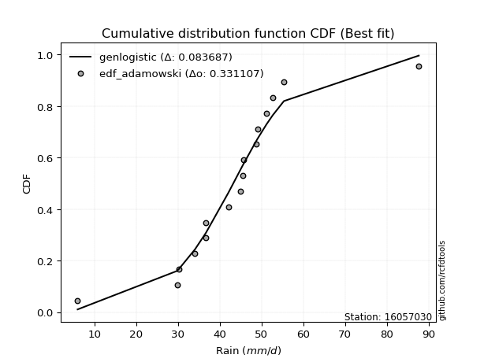</img>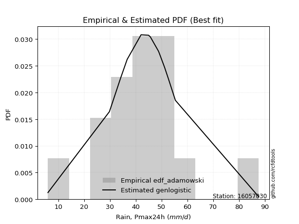</img>

</div>


## C. Best fit & Estimate extreme values for specific return periods - Tr

Best fit in probability distribution analysis means finding the theoretical distribution (like Normal, Poisson, Exponential) that most accurately mirrors your real-world data´s patterns (shape, center, spread) for better predictions, using methods like visual checks (Q-Q plots), goodness-of-fit tests (Kolmogorov-Smirnov, Chi-Squared), and information criteria (AIC) to score and select the simplest, most representative model.


### 1. Best fit (ordered by delta Δ)

<div align="center">

|   id |   station | empirical_dist   | p_dist                |     delta |   deltao | eval   |   fit |   n |   best_fit |   best_fit_sort |
|-----:|----------:|:-----------------|:----------------------|----------:|---------:|:-------|------:|----:|-----------:|----------------:|
|    0 |  16057030 | edf_weibull      | hypsecant             | 0.0794088 | 0.331107 | Δo > Δ |     1 |  16 |          1 |               1 |
|    1 |  16057030 | edf_adamowski    | genlogistic           | 0.0836867 | 0.331107 | Δo > Δ |     1 |  16 |          1 |               2 |
|    2 |  16057030 | edf_chegodayev   | genlogistic           | 0.0838715 | 0.331107 | Δo > Δ |     1 |  16 |          1 |               3 |
|    3 |  16057030 | edf_jenkinson    | genlogistic           | 0.0839087 | 0.331107 | Δo > Δ |     1 |  16 |          1 |               4 |
|    4 |  16057030 | edf_beard        | genlogistic           | 0.0839087 | 0.331107 | Δo > Δ |     1 |  16 |          1 |               5 |
|    5 |  16057030 | edf_filliben     | genlogistic           | 0.0839367 | 0.331107 | Δo > Δ |     1 |  16 |          1 |               6 |
|    6 |  16057030 | edf_tukey        | genlogistic           | 0.0839959 | 0.331107 | Δo > Δ |     1 |  16 |          1 |               7 |
|    7 |  16057030 | edf_blom         | genlogistic           | 0.0841529 | 0.331107 | Δo > Δ |     1 |  16 |          1 |               8 |
|    8 |  16057030 | edf_cunnane      | genlogistic           | 0.0842479 | 0.331107 | Δo > Δ |     1 |  16 |          1 |               9 |
|    9 |  16057030 | edf_gringorten   | genlogistic           | 0.084401  | 0.331107 | Δo > Δ |     1 |  16 |          1 |              10 |
|   10 |  16057030 | edf_hazen        | laplace_asymmetric    | 0.0849123 | 0.331107 | Δo > Δ |     1 |  16 |          1 |              11 |
|   11 |  16057030 | edf_california   | loglaplace_asymmetric | 0.0850853 | 0.331107 | Δo > Δ |     1 |  16 |          1 |              12 |

</div>

:file_folder:Tables: [bestfit_16057030.csv](table/bestfit_16057030.csv) | [extreme_16057030.csv](table/extreme_16057030.csv)


### 2. Extreme values

In hydrology, a return period (or recurrence interval $Tr$) is the statistical average time between extreme events like floods or droughts of a specific magnitude, indicating how rare an event is, with a 100-year flood, for example, having a 1% chance of occurring in any given year, not that it happens exactly every century. It is a key tool for infrastructure design (like bridges or dams) and risk assessment, calculated from historical data to determine the probability of future events, although it is important to remember it is statistical average, and events can cluster or be missed.

> risk_rate: assuming the return period as the project useful life.

|   id |      tr |   prob_l |     prob_g |    alpha |   betaprime |    chi2 |   crystalball |   erlang |    expon |   exponnorm |       f |   fatiguelife |     fisk |   gamma |   genexpon |   genlogistic |   gibrat |   gompertz |   gumbel_l |   gumbel_r |   halflogistic |   halfnorm |   hypsecant |   invgamma |   invgauss |   invweibull |   johnsonsu |   kstwobign |   laplace |   laplace_asymmetric |   loggamma |   logistic |   lognorm |   maxwell |   mielke |    moyal |   nakagami |      ncf |      nct |    norm |   pearson3 |   rayleigh |    rice |        t |   truncnorm |     wald |   weibull_min |   logalpha |   logbetaprime |   logchi2 |   logcrystalball |   logerlang |         logexpon |   logexponnorm |     logf |   logfatiguelife |   logfisk |   loggenexpon |   loggenlogistic |   loggibrat |   loggompertz |   loggumbel_l |   loggumbel_r |   loghalflogistic |   loghalfnorm |   loghypsecant |   loginvgamma |   loginvgauss |   loginvweibull |   logjohnsonsu |   logkstwobign |   loglaplace |   loglaplace_asymmetric |   logloggamma |   loglogistic |   loglognorm |   logmaxwell |   logmielke |   logmoyal |   lognakagami |   logncf |   lognct |   logpearson3 |   lograyleigh |   logrice |        logt |   logtruncnorm |   logwald |   logweibull_min |   station |   n |   risk_rate |
|-----:|--------:|---------:|-----------:|---------:|------------:|--------:|--------------:|---------:|---------:|------------:|--------:|--------------:|---------:|--------:|-----------:|--------------:|---------:|-----------:|-----------:|-----------:|---------------:|-----------:|------------:|-----------:|-----------:|-------------:|------------:|------------:|----------:|---------------------:|-----------:|-----------:|----------:|----------:|---------:|---------:|-----------:|---------:|---------:|--------:|-----------:|-----------:|--------:|---------:|------------:|---------:|--------------:|-----------:|---------------:|----------:|-----------------:|------------:|-----------------:|---------------:|---------:|-----------------:|----------:|--------------:|-----------------:|------------:|--------------:|--------------:|--------------:|------------------:|--------------:|---------------:|--------------:|--------------:|----------------:|---------------:|---------------:|-------------:|------------------------:|--------------:|--------------:|-------------:|-------------:|------------:|-----------:|--------------:|---------:|---------:|--------------:|--------------:|----------:|------------:|---------------:|----------:|-----------------:|----------:|----:|------------:|
|    0 |    2    | 0.5      | 0.5        |  42.8267 |     43.0902 | 11.4155 |       43.5562 |  43.096  |  32.032  |     42.5291 | 43.0924 |       8.57549 |  43.1665 | 43.0934 |    32.0271 |       43.2748 |  38.6577 |    78.2731 |    46.2372 |    40.8753 |        39.5424 |    40.2157 |     43.5562 |    42.5594 |    41.8427 |      41.6392 |     44.1957 |     40.4675 |   43.5562 |              44.5315 |    38.4731 |    43.5562 |   39.1819 |   42.1605 |  42.0601 |  40.0098 |    32.7592 |  40.5656 |  43.8738 | 43.5562 |    42.3927 |    41.6655 | 22.2595 |  41.2242 |     43.5563 |  38.2663 |       39.9979 |    38.6894 |        38.4319 |   38.8325 |          43.2139 |     38.0861 |     22.0303      |        39.1819 |  39.1722 |          39.1571 |   42.3873 |       29.7787 |          42.023  |     33.2486 |       42.2936 |       42.8665 |       35.814  |           34.2495 |       35.0311 |        39.1819 |       38.1792 |       37.3534 |         37.3127 |        44.6657 |        33.8267 |      39.1819 |                 43.0016 |       42.438  |       39.1819 |      39.1818 |      37.3908 |     42.043  |    34.7898 |       39.4876 |  39.3835 |  39.1179 |       47.1883 |       36.7753 |   39.182  |     44.4998 |        41.4276 |   32.8144 |          42.3818 |  16057030 |  16 |    0.75     |
|    1 |    2.33 | 0.570815 | 0.429185   |  45.8729 |     46.0021 | 12.968  |       46.4684 |  46.009  |  37.7676 |     45.2409 | 46.0044 |      11.1485  |  45.4777 | 46.0056 |    37.7617 |       45.5693 |  40.1329 |    78.8714 |    48.7709 |    43.5737 |        42.3169 |    43.3587 |     45.8869 |    45.4752 |    44.8935 |      45.1571 |     45.8231 |     44.3099 |   45.3186 |              46.1322 |    42.7387 |    46.1221 |   43.2    |   45.1861 |  44.5567 |  42.5642 |    34.7004 |  44.0805 |  45.5472 | 46.4684 |    45.316  |    44.7358 | 23.9734 |  44.0799 |     46.4684 |  40.1758 |       47.3199 |    43.0706 |        42.6856 |   43.191  |          45.4977 |     42.6696 |     29.3412      |        43.2    |  43.1848 |          43.1675 |   45.2545 |       35.7367 |          44.5268 |     34.9341 |       45.5176 |       46.6664 |       39.2048 |           37.5876 |       38.9234 |        42.3659 |       42.4016 |       41.8048 |         44.0184 |        46.2215 |        40.7122 |      41.5664 |                 45.3118 |       45.6605 |       42.7013 |      43.1999 |      41.3823 |     44.5415 |    37.9002 |       41.7322 |  43.5526 |  43.1973 |       50.3877 |       40.7622 |   43.1981 |     46.2477 |        44.1566 |   34.9838 |          45.5936 |  16057030 |  16 |    0.729209 |
|    2 |    5    | 0.8      | 0.2        |  57.456  |     57.0857 | 21.3668 |       57.2908 |  57.0981 |  66.4445 |     55.9638 | 57.0869 |      39.2859  |  54.5673 | 57.0881 |    66.433  |       54.383  |  48.626  |    80.8044 |    56.9559 |    55.297  |        54.8706 |    56.65   |     55.2355 |    56.8454 |    56.9749 |      60.4406 |     52.2918 |     60.6314 |   54.1297 |              53.654  |    63.5194 |    56.0291 |   62.0936 |   57.0944 |  53.7163 |  54.3965 |    48.3314 |  59.7454 |  52.0607 | 57.2908 |    56.8419 |    57.0276 | 30.835  |  55.114  |     57.2908 |  50.8654 |      130.441  |    64.7873 |        63.3576 |   64.5269 |          54.8653 |     65.8648 |    122.952       |        62.0937 |  62.0713 |          62.0264 |   58.2666 |       74.243  |          53.7032 |     46.4401 |       57.7314 |       61.4003 |       58.079  |           57.2536 |       60.7732 |        57.9592 |       63.0682 |       64.3839 |         90.2543 |        51.6174 |        89.4372 |      55.8501 |                 52.6145 |       57.7849 |       59.5219 |      62.0938 |      61.6864 |     53.7181 |    56.3519 |       52.997  |  63.3713 |  62.5073 |       58.7294 |       61.5485 |   62.0804 |     54.8627 |        57.7582 |   50.0612 |          57.7286 |  16057030 |  16 |    0.67232  |
|    3 |   10    | 0.9      | 0.1        |  65.3762 |     64.6685 | 29.5018 |       64.4701 |  64.6857 |  92.4765 |     63.9217 | 64.6678 |      76.6947  |  61.4331 | 64.6683 |    92.4601 |       60.8436 |  58.3072 |    81.8805 |    61.513  |    64.8455 |        65.296  |    66.4853 |     62.7006 |    64.8812 |    65.667  |      72.8888 |     58.2334 |     73.0582 |   62.1282 |              60.4822 |    83.0133 |    63.3252 |   78.9896 |   65.4749 |  60.2832 |  64.6984 |    61.8446 |  72.9482 |  57.7647 | 64.4701 |    65.0758 |    65.7919 | 35.7275 |  63.3157 |     64.4701 |  62.2096 |      296.174  |    85.6796 |        82.684  |   84.6703 |          61.9982 |     88.7619 |    451.446       |        78.9898 |  78.9601 |          78.8947 |   70.1862 |      125.122  |          60.2727 |     64.244  |       65.9111 |       71.5348 |       79.9898 |           81.2037 |       84.5081 |        74.4402 |       82.5999 |       86.7747 |        161.976  |        56.6919 |       162.836  |      73.0254 |                 59.184  |       65.8381 |       76.0153 |      78.9903 |      81.6963 |     60.3056 |    79.5964 |       63.4026 |  81.3501 |  79.9301 |       61.4012 |       82.5696 |   78.964  |     65.9382 |        68.5161 |   73.2261 |          65.8341 |  16057030 |  16 |    0.651322 |
|    4 |   15    | 0.933333 | 0.0666667  |  69.4017 |     68.5219 | 34.3889 |       68.0528 |  68.5416 | 107.704  |     68.2651 | 68.5198 |     101.114   |  65.2365 | 68.5197 |   107.685  |       64.3578 |  64.9848 |    82.3679 |    63.5768 |    70.2326 |        71.1958 |    71.6035 |     66.9609 |    69.0477 |    70.216  |      79.912  |     62.1853 |     79.6553 |   66.8071 |              64.4764 |    95.0122 |    67.3005 |   89.0696 |   69.7748 |  63.9344 |  70.6772 |    69.3562 |  80.5868 |  61.5656 | 68.0528 |    69.3637 |    70.3076 | 38.2483 |  67.8633 |     68.0528 |  69.4944 |      443.731  |    98.7685 |        94.5535 |   97.1203 |          65.8761 |    103.334  |    966.125       |        89.0698 |  89.0368 |          88.9599 |   77.6771 |      163.753  |          63.9232 |     80.3611 |       69.9893 |       76.6591 |       95.8222 |           98.9613 |      100.326  |        85.8683 |       94.6891 |      101.079  |        225.293  |        60.5434 |       223.822  |      85.4266 |                 63.4009 |       69.8351 |       86.8515 |      89.0705 |      94.3638 |     63.9709 |    97.2609 |       69.6237 |  92.1742 |  90.3843 |       62.1271 |       96.0653 |   89.0356 |     75.7977 |        73.532  |   93.4819 |          69.8703 |  16057030 |  16 |    0.644736 |
|    5 |   20    | 0.95     | 0.05       |  72.0648 |     71.0705 | 37.8978 |       70.3989 |  71.0921 | 118.508  |     71.2756 | 71.0673 |     119.186   |  67.8915 | 71.0668 |   118.487  |       66.7852 |  70.2229 |    82.6713 |    64.8614 |    74.0046 |        75.3294 |    75.0159 |     69.9663 |    71.8349 |    73.2734 |      84.8294 |     65.2745 |     84.0993 |   70.1267 |              67.3103 |   103.849  |    70.0481 |   96.3579 |   72.6285 |  66.5189 |  74.9114 |    74.4513 |  86.0257 |  64.6007 | 70.3989 |    72.2371 |    73.3091 | 39.9239 |  71.0587 |     70.3989 |  74.923  |      574.414  |   108.513  |       103.283  |  106.312  |          68.5404 |    114.28   |   1657.58        |        96.3582 |  96.3233 |          96.2383 |   83.3169 |      195.829  |          66.5069 |     95.7861 |       72.6547 |       80.0325 |      108.738  |          113.669  |      112.484  |        94.9706 |      103.624  |      111.852  |        283.844  |        63.8877 |       277.311  |      95.4826 |                 66.5738 |       72.4413 |       95.2312 |      96.3591 |     103.837  |     66.5665 |   112.095  |       74.1113 | 100.042  |  97.9688 |       62.4497 |      106.235  |   96.3176 |     85.4242 |        76.4571 |  112.141  |          72.5066 |  16057030 |  16 |    0.641514 |
|    6 |   25    | 0.96     | 0.04       |  74.039  |     72.9595 | 40.6392 |       72.126  |  72.9823 | 126.889  |     73.5853 | 72.9554 |     133.543   |  69.9371 | 72.9544 |   126.866  |       68.6415 |  74.5896 |    82.8871 |    65.7756 |    76.91   |        78.5142 |    77.5549 |     72.2923 |    73.9169 |    75.5642 |      88.6172 |     67.8551 |     87.428  |   72.7017 |              69.5085 |   110.904  |    72.15   |  102.101  |   74.747  |  68.5384 |  78.1934 |    78.2691 |  90.2698 |  67.1977 | 72.126  |    74.3855 |    75.5392 | 41.1687 |  73.5396 |     72.126  |  79.2711 |      691.84   |   116.355  |       110.247  |  113.662  |          70.5678 |    123.142  |   2519.55        |       102.102  | 102.066  |         101.975  |   87.9062 |      223.669  |          68.5256 |    110.885  |       74.6132 |       82.5231 |      119.862  |          126.475  |      122.477  |       102.672  |      110.775  |      120.591  |        339.126  |        66.9286 |       325.593  |     104.091  |                 69.1439 |       74.3533 |      102.183  |     102.103  |     111.48   |     68.5952 |   125.132  |       77.6383 | 106.265  | 103.96   |       62.6275 |      114.481  |  102.056  |     95.1165 |        78.3775 |  129.739  |          74.443  |  16057030 |  16 |    0.639603 |
|    7 |   50    | 0.98     | 0.02       |  79.7584 |     78.4289 | 49.2435 |       77.0718 |  78.4557 | 152.921  |     80.6848 | 78.4219 |     179.599   |  76.266  | 78.4194 |   152.893  |       74.3109 |  89.9826 |    83.4731 |    68.257  |    85.8601 |        88.3268 |    84.9346 |     79.5038 |    80.0251 |    82.3162 |     100.285  |     77.0399 |     97.2029 |   80.7002 |              76.3367 |   134.04   |    78.5719 |  120.514  |   80.8913 |  74.985  |  88.3821 |    89.4264 | 103.674  |  77.022  | 77.0718 |    80.6951 |    82.0126 | 44.7824 |  81.3687 |     77.0718 |  93.4679 |     1154.57   |   142.433  |       133.045  |  137.838  |          76.7005 |    152.924  |   9251.06        |       120.514  | 120.476  |         120.367  |  103.554  |      329.02   |          74.9694 |    185.766  |       80.2009 |       89.6816 |      161.803  |          175.735  |      156.853  |       130.751  |      134.338  |      150.063  |        586.719  |        79.8286 |       521.642  |     136.102  |                 77.7773 |       79.795  |      126.729  |     120.516  |     136.979  |     75.0743 |   176.077  |       88.8756 | 126.343  | 123.246  |       62.9385 |      142.227  |  120.451  |    148.069  |        82.6665 |  208.818  |          79.964  |  16057030 |  16 |    0.63583  |
|    8 |   75    | 0.986667 | 0.0133333  |  82.8681 |     81.4005 | 54.3271 |       79.7255 |  81.4294 | 168.149  |     84.8139 | 81.3917 |     207.333   |  79.9762 | 81.3882 |   168.118  |       77.5844 | 100.379  |    83.7695 |    69.5119 |    91.0623 |        94.0309 |    88.9519 |     83.7181 |    83.3943 |    86.0584 |     107.067  |     83.3377 |    102.581  |   85.379  |              80.3309 |   148.496  |    82.281  |  131.726  |   84.2319 |  78.9286 |  94.3402 |    95.5084 | 111.718  |  84.3627 | 79.7255 |    84.1774 |    85.5344 | 46.7484 |  86.1027 |     79.7255 | 102.204  |     1500.3    |   158.997  |       147.264  |  152.996  |          80.2023 |    172.057  |  19797.9         |       131.727  | 131.689  |         131.569  |  113.83   |      405.914  |          78.9116 |    263.22   |       83.1842 |       93.5346 |      192.63   |          212.764  |      179.464  |       150.592  |      149.142  |      169.08   |        806.873  |        90.8643 |       676.077  |     159.214  |                 83.319  |       82.6927 |      143.508  |     131.729  |     153.211  |     79.0401 |   215.005  |       95.6626 | 138.658  | 135.045  |       63.0248 |      160.051  |  131.652  |    212.501  |        84.2515 |  279.872  |          82.91   |  16057030 |  16 |    0.634587 |
|    9 |  100    | 0.99     | 0.01       |  84.9878 |     83.4251 | 57.9523 |       81.5204 |  83.4555 | 178.953  |     87.7397 | 83.4149 |     227.287   |  82.6202 | 83.4107 |   178.92   |       79.8952 | 108.433  |    83.9633 |    70.3326 |    94.7442 |        98.0681 |    91.6886 |     86.7075 |    85.7104 |    88.6375 |     111.867  |     88.2697 |    106.266  |   88.6987 |              83.1648 |   159.196  |    84.8997 |  139.896  |   86.5072 |  81.8223 |  98.5673 |    99.6471 | 117.534  |  90.486  | 81.5204 |    86.5713 |    87.9338 | 48.0877 |  89.5579 |     81.5204 | 108.573  |     1782.06   |   171.384  |       157.776  |  164.237  |          82.659  |    186.461  |  33967.3         |       139.896  | 139.859  |         139.732  |  121.694  |      468.364  |          81.8043 |    344.798  |       85.1955 |       96.1439 |      217.936  |          243.597  |      196.707  |       166.465  |      160.139  |      183.437  |       1010.98   |       100.996  |       807.534  |     177.956  |                 87.4887 |       84.6433 |      156.676  |     139.899  |     165.355  |     81.951  |   247.736  |      100.58   | 147.67   | 143.667  |       63.0633 |      173.457  |  139.813  |    292.007  |        85.0772 |  346.493  |          84.8954 |  16057030 |  16 |    0.633968 |
|   10 |  200    | 0.995    | 0.005      |  89.846  |     88.0616 | 66.7392 |       85.5917 |  88.0953 | 204.985  |     94.7849 | 88.048  |     276.13    |  89.0466 | 88.0419 |   204.947  |       85.4379 | 130.344  |    84.3846 |    72.1167 |   103.596  |       107.774  |    97.9477 |     93.9094 |    91.0785 |    94.6336 |     123.407  |    101.909  |    114.753  |   96.6972 |              89.993  |   186.58   |    91.1814 |  160.354  |   91.7129 |  89.1683 | 108.752  |   109.087  | 131.972  | 109.23   | 85.5917 |    92.1177 |    93.4237 | 51.1524 |  98.2914 |     85.5917 | 124.439  |     2594.79   |   203.55   |       184.64   |  193.089  |          88.5089 |    224.206  | 124718           |       160.354  | 160.32   |         160.178  |  142.845  |      649.847  |          89.149  |    718.702  |       89.737  |      102.069  |      293.224  |          337.266  |      242.629  |       211.921  |      188.424  |      221.216  |       1738.56   |       137.644  |      1215.88   |     232.682  |                 98.4127 |       89.0394 |      193.401  |     160.358  |     196.883  |     89.3443 |   348.548  |      112.795  | 170.373  | 165.343  |       63.1134 |      208.507  |  160.248  |    833.928  |        86.3604 |  589.776  |          89.3763 |  16057030 |  16 |    0.633042 |
|   11 |  250    | 0.996    | 0.004      |  91.3447 |     89.4907 | 69.5815 |       86.8359 |  89.5255 | 213.365  |     97.0525 | 89.476  |     292.048   |  91.135  | 89.4692 |   213.326  |       87.2172 | 138.206  |    84.5086 |    72.6416 |   106.441  |       110.895  |    99.8733 |     96.2277 |    92.7513 |    96.5069 |     127.117  |    106.877  |    117.379  |   99.2722 |              92.1911 |   195.902  |    93.1981 |  167.183  |   93.3154 |  91.6564 | 112.03   |   111.982  | 136.76   | 116.739  | 86.8359 |    93.845  |    95.1136 | 52.0957 | 101.246  |     86.8359 | 129.688  |     2899.1    |   214.647  |       193.773  |  202.935  |          90.3766 |    237.33   | 189573           |       167.184  | 167.152  |         167.005  |  150.386  |      718.785  |          91.637  |    935.409  |       91.1188 |      103.881  |      322.574  |          374.455  |      258.807  |       229.049  |      198.098  |      234.402  |       2069.59   |       154.939  |      1380.04   |     253.66   |                102.212  |       90.3748 |      206.928  |     167.188  |     207.749  |     91.8496 |   389.04   |      116.843  | 177.993  | 172.605  |       63.122  |      220.66   |  167.07   |   1305.16   |        86.6237 |  703.244  |          90.7391 |  16057030 |  16 |    0.632858 |
|   12 |  500    | 0.998    | 0.002      |  95.8282 |     93.7627 | 78.4457 |       90.5255 |  93.8004 | 239.397  |    104.096  | 93.7442 |     341.981   |  97.6915 | 93.7354 |   239.353  |       92.7353 | 165.375  |    84.8639 |    74.1463 |   115.274  |       120.579  |   105.614  |    103.429  |    97.8038 |   102.176  |     138.632  |    124.307  |    125.25   |  107.271  |              99.0193 |   226.534  |    99.4526 |  189.195  |   98.0972 |  99.808  | 122.214  |   120.583  | 152.112  | 146.093  | 90.5255 |    99.057  |   100.156  | 54.9104 | 110.945  |     90.5255 | 146.377  |     3986.7    |   251.604  |       223.742  |  235.371  |          96.1468 |    281.37   | 696060           |       189.196  | 189.172  |         189.011  |  176.4    |      971.105  |          99.7895 |   2325.65   |       95.1993 |      109.256  |      433.73   |          518.076  |      313.732  |       291.589  |      230.037  |      278.829  |       3554.84   |       239.582  |      2017.09   |     331.667  |                114.974  |       94.3124 |      255.199  |     189.201  |     243.869  |    100.061  |   547.349  |      129.789  | 202.681  | 196.091  |       63.137  |      261.298  |  189.056  |   8494.13   |        87.1574 | 1230.53   |          94.7624 |  16057030 |  16 |    0.632489 |
|   13 |  750    | 0.998667 | 0.00133333 |  98.3444 |     96.1578 | 83.6524 |       92.5752 |  96.1971 | 254.625  |    108.216  | 96.1371 |     371.483   | 101.578  | 96.1269 |   254.578  |       95.959  | 183.344  |    85.0538 |    74.9505 |   120.437  |       126.241  |   108.822  |    107.641  |   100.671  |   105.401  |     145.363  |    136.037  |    129.672  |  111.95   |             103.014  |   245.684  |   103.107  |  202.652  |  100.772  | 104.894  | 128.171  |   125.369  | 161.454  | 168.554  | 92.5752 |   102.011  |   102.975  | 56.4844 | 117.03   |     92.5752 | 156.384  |     4728.24   |   275.078  |       242.449  |  255.707  |          99.508  |    309.581  |      1.48961e+06 |       202.653  | 202.635  |         202.468  |  193.634  |     1149.07   |         104.877  |   4247.5    |       97.4547 |      112.242  |      515.696  |          626.352  |      349.343  |       335.815  |      250.117  |      307.423  |       4877.13   |       326.439  |      2496.45   |     387.99   |                123.166  |       96.4851 |      288.455  |     202.659  |     266.744  |    105.188  |   668.338  |      137.633  | 217.865  | 210.508  |       63.1412 |      287.201  |  202.497  |  39774.7    |        87.3374 | 1721.01   |          96.9852 |  16057030 |  16 |    0.632366 |
|   14 | 1000    | 0.999    | 0.001      | 100.088  |     97.8159 | 87.3551 |       93.9864 |  97.8564 | 265.429  |    111.14   | 97.7936 |     392.527   | 104.36   | 97.7825 |   265.38   |       98.2452 | 197.094  |    85.1817 |    75.4918 |   124.1    |       130.257  |   111.037  |    110.63   |   102.671  |   107.652  |     150.138  |    145.111  |    132.736  |  115.269  |             105.847  |   259.85   |   105.698  |  212.469  |  102.62   | 108.656  | 132.398  |   128.665  | 168.256  | 187.468  | 93.9864 |   104.068  |   104.924  | 57.5721 | 121.554  |     93.9864 | 163.582  |     5304.05   |   292.618  |       256.274  |  270.778  |         101.889  |    330.767  |      2.55573e+06 |       212.47   | 212.457  |         212.286  |  206.867  |     1290.78   |         108.64   |   6734.63   |       99.0027 |      114.297  |      583.065  |          716.615  |      376.27   |       371.205  |      265.024  |      328.964  |       6103.62   |       417.981  |      2893.84   |     433.663  |                129.33   |       97.9749 |      314.634  |     212.477  |     283.797  |    108.98   |   770.076  |      143.325  | 228.984  | 221.051  |       63.143  |      306.588  |  212.302  | 155414      |        87.4279 | 2190.69   |          98.5106 |  16057030 |  16 |    0.632305 |

<div align="center">

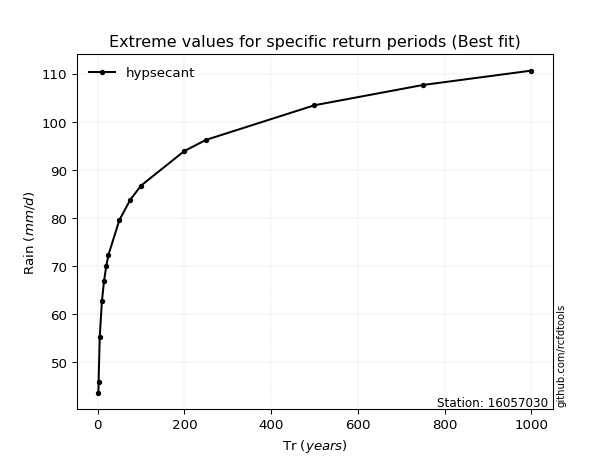</img>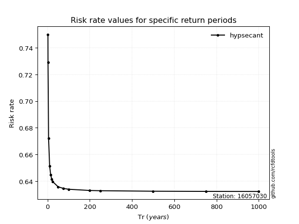</img>

</div>


<sub>**APP DISCLAIMER**: NO WARRANTY - This software is provided by [github.com/rcfdtools](https://github.com/rcfdtools) "as is", without any express or implied warranty, including warranties of merchantability, fitness for a particular purpose, or non-infringement. There is no guarantee that the software will be error-free or operate without interruption. LIMITATION OF LIABILITY - Neither the authors nor copyright holders will be liable for claims or damages arising from the software or its use. You are responsible for determining if the software is appropriate for your use and assume all associated risks, including errors, legal compliance, and data loss. NO PROFESSIONAL ADVICE - The software provides general information and does not offer professional advice. It should not replace consultation with professional advisors.</sub>