<div align="center">


</div>

# PMax24h Station (Rain): 17015010

Maximum Precipitation in 24 hours (PMax24h) is the greatest amount of rainfall for a specific duration that is meteorologically possible for a given location, acting as a "worst-case" scenario for extreme storms, crucial for designing safety-critical infrastructure like bridges, river deviations, dams, spillways, and nuclear plants to prevent catastrophic failure. The PMax24h is related with the Probable Maximum Precipitation (PMP) and it is calculated by hydrologists using meteorological data to determine the upper limit of extreme rainfall, often leading to the Probable Maximum Flood (PMF) for flood control design, and is increasingly being studied for climate change impacts. Probable Maximum Precipitation (PMP) is the theoretical upper limit of rainfall, a deterministic estimate for extreme events, while probability distributions (like GEV, Gumbel) describe the likelihood and frequency of various precipitation amounts, including rare ones, showing how often events occur, with PMP representing the extreme end of these distributions, used for critical infrastructure design to ensure safety against the worst conceivable weather, unlike standard statistical forecasts which cover typical probabilities.

The most common probability distributions in hydrology, used for analyzing floods, rainfall, and streamflow, include the Normal, Log-Normal, Gumbel, Gamma (including Log-Pearson Type III), and Generalized Extreme Value (GEV) distributions, often chosen based on the data´s skewness and whether modeling extremes or general conditions, with Gumbel and GEV popular for extreme events like floods, while the Normal distribution serves as a baseline, though often requiring transformations for skewed hydrological data. These distributions help in designing water infrastructure, managing water resources, and forecasting hydrologic events.

> Hydrological data often isn´t perfectly normal (it´s skewed), so different distributions are needed for different applications, such as: **Flood Frequency Analysis**: Using Gumbel, GEV, or Log-Pearson Type III for predicting extreme flood magnitudes and their return periods, **Rainfall Analysis**: Normal for annual totals, but Log-Normal, Weibull, or GEV for intensity or extreme daily rainfall, **Streamflow Modeling**: Gamma and Log-Normal for maximum flows, GEV for minimum flows, and Kappa for daily flows.

<div align="center">

</img>

</div>


## A. General information


### 1. General running parameters

• app_version: _v20260312_. • runtime: _2026-03-12 07:15:23.203550_. • Python version: _3.14.0_. • SciPy version: _1.16.3_. • Pandas version: _2.3.3_. • NumPy version: _2.3.5_. • Stations dataset (station_dataset_file): _dataset/pmax24h_in/automatic_colombia_2003_2025.csv_. • Stations catalog (station_catalog_file): _dataset/CNE.xls_. • Minimum year to eval til year_max (date_min): _1900_. • Maximum year to eval since year_min (date_max): _2025_. • Creates, save and include plots into reports (create_plot): _True_. • Plot only fit distributions with Δo > Δ (plot_only_fit): _True_. • Plot only simple graphs avoiding multiple CDFs and multiple Extreme values plots (plot_only_simple): _True_. • Eval low extreme values, if False, evaluates high extreme values (low_extreme): _False_. • Eval every SciPy distribution as logarithmic (pdist_logarithmic_on): _True_. • Standard deviation normalized (ddof): _1.0_. • Return periods to eval in years (Tr): _[2, 2.33, 5, 10, 15, 20, 25, 50, 75, 100, 200, 250, 500, 750, 1000]_. • Minimum data sample per station, 0 means any (minimum_sample): _5_. • Z-Score maximum threshold to adjust a value, 0 means disable (zscore_max): _3.5_. • Z-Score minimum threshold to adjust a value, 0 means disable (zscore_min): _-2.5_. • Avoid zeros, e.g. rain = 0 (avoid_zeros): _True_. • Avoid null values (avoid_nans): _True_. 

:file_folder:Table: [dataset.csv](../../dataset/pmax24h_in/automatic_colombia_2003_2025.csv)

> Delta Degrees of Freedom (DDOF): is a parameter used in the formulas for calculating variance and standard deviation. When ddof=0, the divisor is $N$ (the total number of observations) and this is used when your data set is the entire population. When ddof=1, the divisor is $N-1$ and this is used when your data set is a sample drawn from a larger population. Using $N-1$ provides an unbiased estimate of the population variance (known as Bessel´s correction).


### 2. Station info and location

|   id |   CODIGO | NOMBRE                                 | CATEGORIA           | TECNOLOGIA                              | ESTADO   | FECHA_INSTALACION   |   FECHA_SUSPENSION |   ALTITUD |   LATITUD |   LONGITUD | DEPARTAMENTO                                             | MUNICIPIO   | AREA_OPERATIVA                                         | ENTIDAD                                                     | AREA_HIDROGRAFICA   | ZONA_HIDROGRAFICA   | SUBZONA_HIDROGRAFICA   |   CORRIENTE | Catalogo   |   Version |
|-----:|---------:|:---------------------------------------|:--------------------|:----------------------------------------|:---------|:--------------------|-------------------:|----------:|----------:|-----------:|:---------------------------------------------------------|:------------|:-------------------------------------------------------|:------------------------------------------------------------|:--------------------|:--------------------|:-----------------------|------------:|:-----------|----------:|
|    0 | 17015010 | AEROPUERTO SESQUICENTENARIO [17015010] | Sinóptica Principal | Automática con Telemetría, Convencional | Activa   | 15/01/1958          |                nan |         3 |   12.5878 |   -81.7011 | Archipielago De San Andres, Providencia Y Santa Catalina | San Andrés  | Area Operativa 05 - Magdalena-Cesar-Guajira-San Andrés | INSTITUTO DE HIDROLOGIA METEOROLOGIA Y ESTUDIOS AMBIENTALES | Caribe              | Islas Caribe        | San Andres             |         nan | CNE_IDEAM  |  20251226 |

<div align="center">

Dynamic map: [:earth_americas:Google](http://maps.google.com/maps?q=12.587849,-81.701117) [:earth_americas:OSM](https://www.openstreetmap.org/#map=18/12.587849/-81.701117&layers=P) [:earth_americas:Bing](https://www.bing.com/maps?cp=12.587849~-81.701117&lvl=18) [:earth_americas:Apple](https://maps.apple.com/frame?center=12.587849%2C-81.701117&span=0.003%2C0.006)

</div>


<div align="center">

```geojson
{
  "type": "Feature",
  "geometry": {
    "type": "Point", 
    "coordinates": [-81.701117, 12.587849]
  }, 
  "properties": {
    "Name": "17015010"
  }
}
```

</div>


### 3. Discrete values table and plot

<div align="center">

|               |          0 |           1 |           2 |           3 |           4 |          5 |           6 |          7 |           8 |           9 |         10 |        11 |
|:--------------|-----------:|------------:|------------:|------------:|------------:|-----------:|------------:|-----------:|------------:|------------:|-----------:|----------:|
| Date          | 2014       | 2015        | 2016        | 2017        | 2018        | 2019       | 2020        | 2021       | 2022        | 2023        | 2024       | 2025      |
| Value         |  176.4     |   68.86     |  298.01     |   68.95     |   78.91     |   73.56    |   72.1      |   43       |  104        |  153.3      | 2537.4     | 2763      |
| Value_initial |  176.4     |   68.86     |  298.01     |   68.95     |   78.91     |   73.56    |   72.1      |   43       |  104        |  153.3      | 2537.4     | 2763      |
| count         |   12       |   12        |   12        |   12        |   12        |   12       |   12        |   12       |   12        |   12        |   12       |   12      |
| mean          |  536.457   |  536.457    |  536.457    |  536.457    |  536.457    |  536.457   |  536.457    |  536.457   |  536.457    |  536.457    |  536.457   |  536.457  |
| std           |  990.939   |  990.939    |  990.939    |  990.939    |  990.939    |  990.939   |  990.939    |  990.939   |  990.939    |  990.939    |  990.939   |  990.939  |
| zscore        |   -0.36335 |   -0.471873 |   -0.240628 |   -0.471783 |   -0.461731 |   -0.46713 |   -0.468604 |   -0.49797 |   -0.436412 |   -0.386661 |    2.01924 |    2.2469 |


</div>


<div align="center">

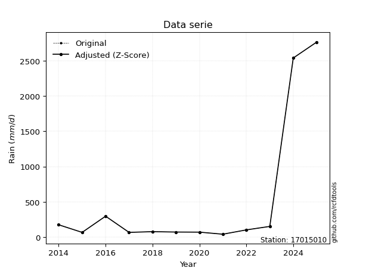</img>

</div>


> The initial value (value_initial) correspond to the initial obtained or null completed value, and value (value) is adjusted only when the initial value is outside the valid range (outlier) definite through the Z-Score value. If Z-Score is active, values out of range or outliers are replaced with the station mean value. A Z-Score (or standard score) measures how many standard deviations a data point is from the mean of a dataset, indicating its relative position; positive scores mean above the mean, negative mean below, and a score of zero is exactly at the mean, allowing for comparison of values from different distributions. It´s calculated using the formula $z=(x–μ)/σ$, where $x$ is the data point, $μ$ is the mean, and $σ$ is the standard deviation, helping identify outliers and understand probability.
>
> <sub>**Note**: In this study, "completing" (filling gaps in) and "extending" (forecasting or lengthening the historical record) rainfall data series are avoided for certain critical analyses because they introduce artificial bias and uncertainty, which can distort the statistics of rare events (extremes), alter day-to-day variability, and compromise the integrity and homogeneity of the original data. Some reasons against Completing/Extending rainfall data are: **Distortion of Extremes and Variability**: The primary issue is that most gap-filling or extension methods rely on averaging or regression with nearby stations, which inherently smooths the data. Rainfall is highly variable in space and time, with a large percentage of zero values and occasional large storms. Infilling methods often underestimate the highest values and overestimate the lowest (zero) values, which severely distorts analyses focused on flood frequency, drought severity, and intensity-duration-frequency (IDF) curves, **Loss of Data Homogeneity**: Infilled or extended data are synthetic estimates, not actual measurements. Combining these estimates with observed data can violate the assumption of data homogeneity, which requires that the data properties do not change over time. Inhomogeneity can lead to incorrect conclusions about long-term trends or changes in climate patterns, **Propagation of Errors**: Errors and biases from the original data (e.g., wind-induced undercatch, instrument errors, site changes) or the data used for imputation can propagate through the analysis, leading to unreliable hydrological models and inaccurate predictions, **Compromised Statistical Integrity**: For statistical analyses, especially those involving the frequency of events, using artificial data can introduce time bias or autocorrelation that doesn´t exist in reality, making it difficult to assess the true probability of events, **Difficulty in Validation**: It is difficult to accurately validate the quality of filled or extended data, especially for past periods where ground-truth measurements are unavailable. The reliability of imputation techniques heavily depends on the density of the surrounding station network and the complexity of the local topography.</sub>


### 4. Active continuous probability distributions from SciPy (80 of 104 available)

A Probability Density Function (PDF) describes the relative likelihood of a continuous random variable falling within a specific range, where the total area under its curve equals 1, and the area over any interval gives the actual probability for that range. Unlike discrete probabilities (like rolling a die), a PDF shows density, not direct probability for a single point (which is zero), with higher points indicating higher likelihood, often visualized as a bell curve for normal distributions.

A log of a probability density function (log-PDF) is simply the logarithm of the PDF´s value, denoted as $log(f(x))$, useful for converting multiplication of probabilities into addition, improving numerical stability with tiny numbers, and connecting to information theory concepts like entropy. Instead of dealing with very small probabilities (e.g., 0.000001), log-PDFs use negative numbers (e.g., $log(0.00001) ≈ -11.51$ that are easier for computers to handle, preventing underflow errors and simplifying complex calculations. In this study, each active probability distribution from SciPy is also evaluated in the $log$ form.

[scipy.stats](https://docs.scipy.org/doc/scipy/reference/stats.html) is a Python´s powerful submodule within the SciPy library for comprehensive statistical analysis, offering over 130 probability distributions (like Normal, Poisson, etc.), functions for descriptive stats (mean, variance), hypothesis testing (t-tests, chi-square), random variable generation, and statistical tests, making it essential for data science, modeling, and research. It provides tools to explore, model, and draw conclusions from data efficiently, working seamlessly with [NumPy](https://numpy.org/).

<div align="center">

|   id | p_dist           |   n_parameter | fit_method   | label                                                                       | active   | ref                                                                                                      |
|-----:|:-----------------|--------------:|:-------------|:----------------------------------------------------------------------------|:---------|:---------------------------------------------------------------------------------------------------------|
|    0 | alpha            |             3 | MLE          | Alpha                                                                       | True     | [:mortar_board:](https://docs.scipy.org/doc/scipy/reference/generated/scipy.stats.alpha.html)            |
|    1 | anglit           |             2 | MM           | Anglit                                                                      | True     | [:mortar_board:](https://docs.scipy.org/doc/scipy/reference/generated/scipy.stats.anglit.html)           |
|    2 | arcsine          |             2 | MM           | Arcsine                                                                     | True     | [:mortar_board:](https://docs.scipy.org/doc/scipy/reference/generated/scipy.stats.arcsine.html)          |
|    3 | argus            |             3 | MLE          | Argus                                                                       | True     | [:mortar_board:](https://docs.scipy.org/doc/scipy/reference/generated/scipy.stats.argus.html)            |
|    4 | beta             |             4 | MLE          | Beta                                                                        | True     | [:mortar_board:](https://docs.scipy.org/doc/scipy/reference/generated/scipy.stats.beta.html)             |
|    5 | betaprime        |             4 | MLE          | Beta prime                                                                  | True     | [:mortar_board:](https://docs.scipy.org/doc/scipy/reference/generated/scipy.stats.betaprime.html)        |
|    6 | bradford         |             3 | MLE          | Bradford                                                                    | True     | [:mortar_board:](https://docs.scipy.org/doc/scipy/reference/generated/scipy.stats.bradford.html)         |
|    7 | burr             |             4 | MLE          | Burr (Type III)                                                             | True     | [:mortar_board:](https://docs.scipy.org/doc/scipy/reference/generated/scipy.stats.burr.html)             |
|    8 | burr12           |             4 | MLE          | Burr (Type III) 12                                                          | True     | [:mortar_board:](https://docs.scipy.org/doc/scipy/reference/generated/scipy.stats.burr12.html)           |
|    9 | cosine           |             2 | MLE          | Cosine                                                                      | True     | [:mortar_board:](https://docs.scipy.org/doc/scipy/reference/generated/scipy.stats.cosine.html)           |
|   10 | crystalball      |             4 | MLE          | Crystalball                                                                 | True     | [:mortar_board:](https://docs.scipy.org/doc/scipy/reference/generated/scipy.stats.crystalball.html)      |
|   11 | dgamma           |             3 | MLE          | Double gamma                                                                | True     | [:mortar_board:](https://docs.scipy.org/doc/scipy/reference/generated/scipy.stats.dgamma.html)           |
|   12 | dweibull         |             3 | MLE          | Double Weibull                                                              | True     | [:mortar_board:](https://docs.scipy.org/doc/scipy/reference/generated/scipy.stats.dweibull.html)         |
|   13 | erlang           |             3 | MLE          | Erlang                                                                      | True     | [:mortar_board:](https://docs.scipy.org/doc/scipy/reference/generated/scipy.stats.erlang.html)           |
|   14 | exponnorm        |             3 | MLE          | Exponentially modified Normal                                               | True     | [:mortar_board:](https://docs.scipy.org/doc/scipy/reference/generated/scipy.stats.exponnorm.html)        |
|   15 | exponpow         |             3 | MLE          | Exponential power                                                           | True     | [:mortar_board:](https://docs.scipy.org/doc/scipy/reference/generated/scipy.stats.exponpow.html)         |
|   16 | exponweib        |             4 | MLE          | Exponentiated Weibull                                                       | True     | [:mortar_board:](https://docs.scipy.org/doc/scipy/reference/generated/scipy.stats.exponweib.html)        |
|   17 | f                |             4 | MLE          | F                                                                           | True     | [:mortar_board:](https://docs.scipy.org/doc/scipy/reference/generated/scipy.stats.f.html)                |
|   18 | fatiguelife      |             3 | MLE          | Fatigue-life (Birnbaum-Saunders)                                            | True     | [:mortar_board:](https://docs.scipy.org/doc/scipy/reference/generated/scipy.stats.fatiguelife.html)      |
|   19 | foldnorm         |             3 | MM           | Fold Normal                                                                 | True     | [:mortar_board:](https://docs.scipy.org/doc/scipy/reference/generated/scipy.stats.foldnorm.html)         |
|   20 | gamma            |             3 | MLE          | Gamma                                                                       | True     | [:mortar_board:](https://docs.scipy.org/doc/scipy/reference/generated/scipy.stats.gamma.html)            |
|   21 | gausshyper       |             6 | MLE          | Gauss hypergeometric                                                        | True     | [:mortar_board:](https://docs.scipy.org/doc/scipy/reference/generated/scipy.stats.gausshyper.html)       |
|   22 | genexpon         |             5 | MLE          | Generalized exponential                                                     | True     | [:mortar_board:](https://docs.scipy.org/doc/scipy/reference/generated/scipy.stats.genexpon.html)         |
|   23 | genextreme       |             3 | MLE          | Generalized exponential                                                     | True     | [:mortar_board:](https://docs.scipy.org/doc/scipy/reference/generated/scipy.stats.genextreme.html)       |
|   24 | gengamma         |             4 | MLE          | Generalized gamma                                                           | True     | [:mortar_board:](https://docs.scipy.org/doc/scipy/reference/generated/scipy.stats.gengamma.html)         |
|   25 | genhalflogistic  |             3 | MLE          | Generalized half-logistic                                                   | True     | [:mortar_board:](https://docs.scipy.org/doc/scipy/reference/generated/scipy.stats.genhalflogistic.html)  |
|   26 | genlogistic      |             3 | MLE          | Generalized logistic                                                        | True     | [:mortar_board:](https://docs.scipy.org/doc/scipy/reference/generated/scipy.stats.genlogistic.html)      |
|   27 | gennorm          |             3 | MLE          | Generalized Normal                                                          | True     | [:mortar_board:](https://docs.scipy.org/doc/scipy/reference/generated/scipy.stats.gennorm.html)          |
|   28 | genpareto        |             3 | MLE          | Generalized Pareto                                                          | True     | [:mortar_board:](https://docs.scipy.org/doc/scipy/reference/generated/scipy.stats.genpareto.html)        |
|   29 | gompertz         |             3 | MLE          | Gompertz (or truncated Gumbel)                                              | True     | [:mortar_board:](https://docs.scipy.org/doc/scipy/reference/generated/scipy.stats.gompertz.html)         |
|   30 | gumbel_l         |             2 | MM           | Gumbel Left Skew                                                            | True     | [:mortar_board:](https://docs.scipy.org/doc/scipy/reference/generated/scipy.stats.gumbel_l.html)         |
|   31 | gumbel_r         |             2 | MM           | Gumbel Right Skew                                                           | True     | [:mortar_board:](https://docs.scipy.org/doc/scipy/reference/generated/scipy.stats.gumbel_r.html)         |
|   32 | halfgennorm      |             3 | MLE          | Upper half of a generalized normal                                          | True     | [:mortar_board:](https://docs.scipy.org/doc/scipy/reference/generated/scipy.stats.halfgennorm.html)      |
|   33 | halflogistic     |             2 | MM           | Half-logistic                                                               | True     | [:mortar_board:](https://docs.scipy.org/doc/scipy/reference/generated/scipy.stats.halflogistic.html)     |
|   34 | halfnorm         |             2 | MM           | Half Normal                                                                 | True     | [:mortar_board:](https://docs.scipy.org/doc/scipy/reference/generated/scipy.stats.halfnorm.html)         |
|   35 | hypsecant        |             2 | MM           | hyperbolic secant                                                           | True     | [:mortar_board:](https://docs.scipy.org/doc/scipy/reference/generated/scipy.stats.hypsecant.html)        |
|   36 | invgamma         |             3 | MLE          | Inverted gamma                                                              | True     | [:mortar_board:](https://docs.scipy.org/doc/scipy/reference/generated/scipy.stats.invgamma.html)         |
|   37 | invgauss         |             3 | MLE          | Inverse Gaussian                                                            | True     | [:mortar_board:](https://docs.scipy.org/doc/scipy/reference/generated/scipy.stats.invgauss.html)         |
|   38 | invweibull       |             3 | MLE          | Inverted Weibull                                                            | True     | [:mortar_board:](https://docs.scipy.org/doc/scipy/reference/generated/scipy.stats.invweibull.html)       |
|   39 | johnsonsb        |             4 | MLE          | Johnson SB                                                                  | True     | [:mortar_board:](https://docs.scipy.org/doc/scipy/reference/generated/scipy.stats.johnsonsb.html)        |
|   40 | johnsonsu        |             4 | MLE          | Johnson Su                                                                  | True     | [:mortar_board:](https://docs.scipy.org/doc/scipy/reference/generated/scipy.stats.johnsonsu.html)        |
|   41 | kappa3           |             3 | MLE          | Kappa 3                                                                     | True     | [:mortar_board:](https://docs.scipy.org/doc/scipy/reference/generated/scipy.stats.kappa3.html)           |
|   42 | kappa4           |             4 | MLE          | Kappa 4                                                                     | True     | [:mortar_board:](https://docs.scipy.org/doc/scipy/reference/generated/scipy.stats.kappa4.html)           |
|   43 | ksone            |             3 | MLE          | Kolmogorov-Smirnov one-sided test statistic distribution                    | True     | [:mortar_board:](https://docs.scipy.org/doc/scipy/reference/generated/scipy.stats.ksone.html)            |
|   44 | kstwobign        |             2 | MLE          | Limiting distribution of scaled Kolmogorov-Smirnov two-sided test statistic | True     | [:mortar_board:](https://docs.scipy.org/doc/scipy/reference/generated/scipy.stats.kstwobign.html)        |
|   45 | laplace          |             2 | MM           | Laplace                                                                     | True     | [:mortar_board:](https://docs.scipy.org/doc/scipy/reference/generated/scipy.stats.laplace.html)          |
|   46 | levy_l           |             2 | MLE          | Left-skewed Levy                                                            | True     | [:mortar_board:](https://docs.scipy.org/doc/scipy/reference/generated/scipy.stats.levy_l.html)           |
|   47 | loggamma         |             3 | MLE          | Log gamma                                                                   | True     | [:mortar_board:](https://docs.scipy.org/doc/scipy/reference/generated/scipy.stats.loggamma.html)         |
|   48 | logistic         |             2 | MM           | Logistic (or Sech-squared)                                                  | True     | [:mortar_board:](https://docs.scipy.org/doc/scipy/reference/generated/scipy.stats.logistic.html)         |
|   49 | loglaplace       |             3 | MLE          | Log-Laplace                                                                 | True     | [:mortar_board:](https://docs.scipy.org/doc/scipy/reference/generated/scipy.stats.loglaplace.html)       |
|   50 | lomax            |             3 | MLE          | Lomax (Pareto of the second kind)                                           | True     | [:mortar_board:](https://docs.scipy.org/doc/scipy/reference/generated/scipy.stats.lomax.html)            |
|   51 | maxwell          |             2 | MM           | Maxwell                                                                     | True     | [:mortar_board:](https://docs.scipy.org/doc/scipy/reference/generated/scipy.stats.maxwell.html)          |
|   52 | mielke           |             4 | MLE          | Mielke Beta-Kappa / Dagum                                                   | True     | [:mortar_board:](https://docs.scipy.org/doc/scipy/reference/generated/scipy.stats.mielke.html)           |
|   53 | moyal            |             2 | MM           | Moyal                                                                       | True     | [:mortar_board:](https://docs.scipy.org/doc/scipy/reference/generated/scipy.stats.moyal.html)            |
|   54 | nakagami         |             3 | MLE          | Nakagami                                                                    | True     | [:mortar_board:](https://docs.scipy.org/doc/scipy/reference/generated/scipy.stats.nakagami.html)         |
|   55 | ncf              |             5 | MLE          | Non-central F distribution                                                  | True     | [:mortar_board:](https://docs.scipy.org/doc/scipy/reference/generated/scipy.stats.ncf.html)              |
|   56 | nct              |             4 | MLE          | Non-central Student’s t                                                     | True     | [:mortar_board:](https://docs.scipy.org/doc/scipy/reference/generated/scipy.stats.nct.html)              |
|   57 | norm             |             2 | MM           | Normal                                                                      | True     | [:mortar_board:](https://docs.scipy.org/doc/scipy/reference/generated/scipy.stats.norm.html)             |
|   58 | pearson3         |             3 | MM           | Pearson type III                                                            | True     | [:mortar_board:](https://docs.scipy.org/doc/scipy/reference/generated/scipy.stats.pearson3.html)         |
|   59 | powerlaw         |             3 | MLE          | Power-function                                                              | True     | [:mortar_board:](https://docs.scipy.org/doc/scipy/reference/generated/scipy.stats.powerlaw.html)         |
|   60 | rayleigh         |             2 | MM           | Rayleigh                                                                    | True     | [:mortar_board:](https://docs.scipy.org/doc/scipy/reference/generated/scipy.stats.rayleigh.html)         |
|   61 | rdist            |             3 | MLE          | R-distributed (symmetric beta)                                              | True     | [:mortar_board:](https://docs.scipy.org/doc/scipy/reference/generated/scipy.stats.rdist.html)            |
|   62 | rice             |             3 | MLE          | Rice                                                                        | True     | [:mortar_board:](https://docs.scipy.org/doc/scipy/reference/generated/scipy.stats.rice.html)             |
|   63 | semicircular     |             2 | MM           | Semicircular                                                                | True     | [:mortar_board:](https://docs.scipy.org/doc/scipy/reference/generated/scipy.stats.semicircular.html)     |
|   64 | skewnorm         |             3 | MLE          | Skew normal                                                                 | True     | [:mortar_board:](https://docs.scipy.org/doc/scipy/reference/generated/scipy.stats.skewnorm.html)         |
|   65 | t                |             3 | MLE          | Student’s t                                                                 | True     | [:mortar_board:](https://docs.scipy.org/doc/scipy/reference/generated/scipy.stats.t.html)                |
|   66 | trapezoid        |             4 | MLE          | Trapezoid                                                                   | True     | [:mortar_board:](https://docs.scipy.org/doc/scipy/reference/generated/scipy.stats.trapezoid.html)        |
|   67 | triang           |             3 | MLE          | Triangular                                                                  | True     | [:mortar_board:](https://docs.scipy.org/doc/scipy/reference/generated/scipy.stats.triang.html)           |
|   68 | truncexpon       |             3 | MLE          | Truncated exponential                                                       | True     | [:mortar_board:](https://docs.scipy.org/doc/scipy/reference/generated/scipy.stats.truncexpon.html)       |
|   69 | truncnorm        |             4 | MLE          | Truncated normal                                                            | True     | [:mortar_board:](https://docs.scipy.org/doc/scipy/reference/generated/scipy.stats.truncnorm.html)        |
|   70 | truncpareto      |             4 | MLE          | Upper truncated Pareto                                                      | True     | [:mortar_board:](https://docs.scipy.org/doc/scipy/reference/generated/scipy.stats.truncpareto.html)      |
|   71 | truncweibull_min |             5 | MLE          | Doubly truncated Weibull minimum                                            | True     | [:mortar_board:](https://docs.scipy.org/doc/scipy/reference/generated/scipy.stats.truncweibull_min.html) |
|   72 | tukeylambda      |             3 | MLE          | Tukey-Lamdba                                                                | True     | [:mortar_board:](https://docs.scipy.org/doc/scipy/reference/generated/scipy.stats.tukeylambda.html)      |
|   73 | uniform          |             2 | MLE          | Uniform                                                                     | True     | [:mortar_board:](https://docs.scipy.org/doc/scipy/reference/generated/scipy.stats.uniform.html)          |
|   74 | vonmises         |             3 | MLE          | Von Mises                                                                   | True     | [:mortar_board:](https://docs.scipy.org/doc/scipy/reference/generated/scipy.stats.vonmises.html)         |
|   75 | vonmises_line    |             3 | MLE          | Von Mises line                                                              | True     | [:mortar_board:](https://docs.scipy.org/doc/scipy/reference/generated/scipy.stats.vonmises_line.html)    |
|   76 | wald             |             2 | MM           | Wald                                                                        | True     | [:mortar_board:](https://docs.scipy.org/doc/scipy/reference/generated/scipy.stats.wald.html)             |
|   77 | weibull_max      |             3 | MLE          | Weibull maximum                                                             | True     | [:mortar_board:](https://docs.scipy.org/doc/scipy/reference/generated/scipy.stats.weibull_max.html)      |
|   78 | weibull_min      |             3 | MLE          | Weibull minimum                                                             | True     | [:mortar_board:](https://docs.scipy.org/doc/scipy/reference/generated/scipy.stats.weibull_min.html)      |
|   79 | wrapcauchy       |             3 | MLE          | Wrapped  Cauchy                                                             | True     | [:mortar_board:](https://docs.scipy.org/doc/scipy/reference/generated/scipy.stats.wrapcauchy.html)       |

</div>

> **n_parameter:** # arguments & localization & scale.
>
> **Fit methods:** (MLE) maximum likelihood, (MM) L-moments.
>
>**Inactive** (With the only purpose of prevent loops, zero divisions, infinite values, over high estimated values or horizontal trending for recurrence intervals estimations, the follow distributions were disabled.)**:** lognorm, norminvgauss, powernorm, powerlognorm, cauchy, halfcauchy, foldcauchy, skewcauchy, chi2, expon, fisk, genhyperbolic, geninvgauss, gibrat, kstwo, laplace_asymmetric, levy, levy_stable, ncx2, pareto, rel_breitwigner, recipinvgauss, studentized_range, loguniform, 


## B. Probability (PDF) vs. Empirical (EDF) distributions functions

A continuous probability distribution (CPD) describes probabilities for variables that can take any value within a range (like rain any time), unlike discrete variables with specific outcomes (like temperature). It uses a Probability Density Function (PDF), a curve where the total area under it equals 1, and the probability of the variable falling within an interval (a to b) is found by calculating the area under the curve between those points. A key feature is that the probability of hitting any single exact value is zero, so probabilities are always expressed for ranges, e.g., $P(a ≤ X ≤ b)$.

<div align="center">

Distributions parameters from station values
|     |   station | p_dist              |   n |               loc |           scale | shape                  | shape1                 | shape2                 | shape3             |
|----:|----------:|:--------------------|----:|------------------:|----------------:|:-----------------------|:-----------------------|:-----------------------|:-------------------|
|   0 |  17015010 | alpha               |  12 |      16.7904      |    60.068       | 1.3436025964599726e-10 |                        |                        |                    |
|   1 |  17015010 | anglit              |  12 |     536.458       |  2775.48        |                        |                        |                        |                    |
|   2 |  17015010 | arcsine             |  12 |    -805.28        |  2683.47        |                        |                        |                        |                    |
|   3 |  17015010 | argus               |  12 |   -1666.41        |  4561.22        | 2.527004301390892e-07  |                        |                        |                    |
|   4 |  17015010 | beta                |  12 |      43           |  2721.54        | 0.018579890460574698   | 0.07263580720882457    |                        |                    |
|   5 |  17015010 | betaprime           |  12 |      16.6122      |     0.144863    | 671.0550425800122      | 1.2069540245553072     |                        |                    |
|   6 |  17015010 | bradford            |  12 |      43           |  2990           | 456.6262124316295      |                        |                        |                    |
|   7 |  17015010 | burr                |  12 |      29.7374      |    20.7548      | 1.129016050852956      | 3.2590286890804663     |                        |                    |
|   8 |  17015010 | burr12              |  12 |      -0.879712    |    43.1356      | 170.61911692953169     | 0.004285690269091397   |                        |                    |
|   9 |  17015010 | cosine              |  12 |     766.045       |   856.714       |                        |                        |                        |                    |
|  10 |  17015010 | crystalball         |  12 |      -0.601525    |  1090.14        | 4.818441909141081      | 2.371904538903407      |                        |                    |
|  11 |  17015010 | dgamma              |  12 |      72.1         |   984.083       | 0.30036393688308505    |                        |                        |                    |
|  12 |  17015010 | dweibull            |  12 |      68.95        |  1021.81        | 0.5105233972982676     |                        |                        |                    |
|  13 |  17015010 | erlang              |  12 |      43           |   510.091       | 0.7974046490976443     |                        |                        |                    |
|  14 |  17015010 | exponnorm           |  12 |      42.3546      |     0.211772    | 2305.525758305384      |                        |                        |                    |
|  15 |  17015010 | exponpow            |  12 |      43           |  2204.01        | 0.34283770867130525    |                        |                        |                    |
|  16 |  17015010 | exponweib           |  12 |      43           |    91.4867      | 2.150015664659257      | 0.38743460654157824    |                        |                    |
|  17 |  17015010 | f                   |  12 |      35.4179      |    46.3414      | 13.857606558579818     | 1.4164187358945552     |                        |                    |
|  18 |  17015010 | fatiguelife         |  12 |      37.8352      |   148.014       | 2.4485930923679398     |                        |                        |                    |
|  19 |  17015010 | foldnorm            |  12 |    -796.751       |  1676.64        | 0.0005299464252338839  |                        |                        |                    |
|  20 |  17015010 | gamma               |  12 |      43           |   947.453       | 0.3172859754041809     |                        |                        |                    |
|  21 |  17015010 | gausshyper          |  12 |      43           |  3349.4         | 0.36952033498864273    | 0.7380962536931344     | 1.5353558539072836     | 1.86195979726119   |
|  22 |  17015010 | genexpon            |  12 |      43           |   870.129       | 1.7633301053907742     | 2.4814584612086924e-10 | 2.205340019359163      |                    |
|  23 |  17015010 | genextreme          |  12 |      82.3227      |    61.5719      | -1.3044423235367666    |                        |                        |                    |
|  24 |  17015010 | gengamma            |  12 |      43           |   435.15        | 1.0729676643117498     | 0.4668219818509547     |                        |                    |
|  25 |  17015010 | genhalflogistic     |  12 |    -236.373       |  3129.37        | 1.0433418159577046     |                        |                        |                    |
|  26 |  17015010 | genlogistic         |  12 |   -3101.09        |   430.343       | 2078.3542160869956     |                        |                        |                    |
|  27 |  17015010 | gennorm             |  12 |      68.95        |     0.0287528   | 0.2075446329166153     |                        |                        |                    |
|  28 |  17015010 | genpareto           |  12 |      43           |    56.1834      | 1.3613363873647968     |                        |                        |                    |
|  29 |  17015010 | gompertz            |  12 |      43           |  2184.91        | 2.0040266567813037     |                        |                        |                    |
|  30 |  17015010 | gumbel_l            |  12 |     963.446       |   739.739       |                        |                        |                        |                    |
|  31 |  17015010 | gumbel_r            |  12 |     109.469       |   739.739       |                        |                        |                        |                    |
|  32 |  17015010 | halfgennorm         |  12 |      43           |     3.97361     | 0.32341835416211695    |                        |                        |                    |
|  33 |  17015010 | halflogistic        |  12 |    -588.033       |   811.149       |                        |                        |                        |                    |
|  34 |  17015010 | halfnorm            |  12 |    -719.318       |  1573.88        |                        |                        |                        |                    |
|  35 |  17015010 | hypsecant           |  12 |     536.457       |   603.994       |                        |                        |                        |                    |
|  36 |  17015010 | invgamma            |  12 |      33.0874      |    32.6293      | 0.7146430111783013     |                        |                        |                    |
|  37 |  17015010 | invgauss            |  12 |      35.2121      |    43.7073      | 11.468234889939978     |                        |                        |                    |
|  38 |  17015010 | invweibull          |  12 |      43           |     2.76987     | 0.06788048804762678    |                        |                        |                    |
|  39 |  17015010 | johnsonsb           |  12 |      43           | 13721.3         | 0.8179120159327873     | 0.1185203572560687     |                        |                    |
|  40 |  17015010 | johnsonsu           |  12 |      68.8692      |     0.0505617   | -1.084302219304492     | 0.19691496396251923    |                        |                    |
|  41 |  17015010 | kappa3              |  12 |      43           |    62.0974      | 0.8034517979385847     |                        |                        |                    |
|  42 |  17015010 | kappa4              |  12 |    -222.19        |  3049.79        | 1.0953195463672305     | 1.0182028240281862     |                        |                    |
|  43 |  17015010 | ksone               |  12 |    -229           |  3264           | 1.0                    |                        |                        |                    |
|  44 |  17015010 | kstwobign           |  12 |   -1666.49        |  2598.4         |                        |                        |                        |                    |
|  45 |  17015010 | laplace             |  12 |     536.457       |   670.869       |                        |                        |                        |                    |
|  46 |  17015010 | levy_l              |  12 |    2990.44        |  1190.18        |                        |                        |                        |                    |
|  47 |  17015010 | loggamma            |  12 | -327877           | 43368.3         | 1944.797005418934      |                        |                        |                    |
|  48 |  17015010 | logistic            |  12 |     536.457       |   523.074       |                        |                        |                        |                    |
|  49 |  17015010 | loglaplace          |  12 |      -0.202017    |    79.112       | 1.0787098626007938     |                        |                        |                    |
|  50 |  17015010 | lomax               |  12 |      42.9954      |    41.2704      | 0.7261514885696023     |                        |                        |                    |
|  51 |  17015010 | maxwell             |  12 |   -1711.69        |  1408.81        |                        |                        |                        |                    |
|  52 |  17015010 | mielke              |  12 |      29.1437      |     0.286174    | 127.71845410486691     | 0.9451832659815853     |                        |                    |
|  53 |  17015010 | moyal               |  12 |      -6.09951     |   427.088       |                        |                        |                        |                    |
|  54 |  17015010 | nakagami            |  12 |      43           |  1470.58        | 0.1662400881579918     |                        |                        |                    |
|  55 |  17015010 | ncf                 |  12 |      -0.545723    |   102.91        | 170.8390728589029      | 2.2681433829642206     | 6.0272685053905904e-05 |                    |
|  56 |  17015010 | nct                 |  12 |       0.455288    |     1.76978     | 0.8846834833840913     | 46.79768968714788      |                        |                    |
|  57 |  17015010 | norm                |  12 |     536.457       |   948.751       |                        |                        |                        |                    |
|  58 |  17015010 | pearson3            |  12 |     536.457       |   948.752       | 1.7791131211959015     |                        |                        |                    |
|  59 |  17015010 | powerlaw            |  12 |      43           |  2720           | 0.1586895939618429     |                        |                        |                    |
|  60 |  17015010 | rayleigh            |  12 |   -1278.56        |  1448.17        |                        |                        |                        |                    |
|  61 |  17015010 | rdist               |  12 |    -252.299       |   550.309       | 1.3980812404814515     |                        |                        |                    |
|  62 |  17015010 | rice                |  12 |    -764.563       |  1138.59        | 0.00041841290959284295 |                        |                        |                    |
|  63 |  17015010 | semicircular        |  12 |     536.457       |  1897.5         |                        |                        |                        |                    |
|  64 |  17015010 | skewnorm            |  12 |      42.9994      |  1069.36        | 9855639.437234813      |                        |                        |                    |
|  65 |  17015010 | t                   |  12 |      71.7131      |     5.23526     | 0.32317995309225206    |                        |                        |                    |
|  66 |  17015010 | trapezoid           |  12 |    -240.45        |  3264           | 1.0                    | 1.0                    |                        |                    |
|  67 |  17015010 | triang              |  12 |      43           |  3081.93        | 2.0904781827537001e-10 |                        |                        |                    |
|  68 |  17015010 | truncexpon          |  12 |    -176.472       |  2104.89        | 1.3964975928397374     |                        |                        |                    |
|  69 |  17015010 | truncnorm           |  12 |      -1.74942e+06 | 40557.9         | 43.13504166610373      | 466340.21402738104     |                        |                    |
|  70 |  17015010 | truncpareto         |  12 |       0.485053    |    42.5149      | 0.7305984871487421     | 64.97749979527634      |                        |                    |
|  71 |  17015010 | truncweibull_min    |  12 |      20.861       |  6285.71        | 0.027627519686506744   | 0.003522118280190784   | 0.43624975115052833    |                    |
|  72 |  17015010 | tukeylambda         |  12 |     205.76        |   244.863       | 1.504439439882065      |                        |                        |                    |
|  73 |  17015010 | uniform             |  12 |      43           |  2720           |                        |                        |                        |                    |
|  74 |  17015010 | vonmises            |  12 |      -1.86281     |     1           | 0.5620839906828042     |                        |                        |                    |
|  75 |  17015010 | vonmises_line       |  12 |     278.902       |   790.726       | 1.7316243297100202     |                        |                        |                    |
|  76 |  17015010 | wald                |  12 |    -412.294       |   948.751       |                        |                        |                        |                    |
|  77 |  17015010 | weibull_max         |  12 |    2763           |     1.71519     | 0.11897386430653403    |                        |                        |                    |
|  78 |  17015010 | weibull_min         |  12 |      43           |   286.867       | 0.43579845582018206    |                        |                        |                    |
|  79 |  17015010 | wrapcauchy          |  12 |      42.9311      |   432.912       | 0.9054562599597213     |                        |                        |                    |
|  80 |  17015010 | logalpha            |  12 |       2.69999     |     4.697       | 2.39331104663878       |                        |                        |                    |
|  81 |  17015010 | loganglit           |  12 |       5.1234      |     3.88787     |                        |                        |                        |                    |
|  82 |  17015010 | logarcsine          |  12 |       3.24388     |     3.75903     |                        |                        |                        |                    |
|  83 |  17015010 | logargus            |  12 |       2.12164     |     6.02568     | 4.291009669030963e-05  |                        |                        |                    |
|  84 |  17015010 | logbeta             |  12 |       3.7612      |     4.16482     | 0.17806337865492397    | 0.6234490861146834     |                        |                    |
|  85 |  17015010 | logbetaprime        |  12 |       2.64379     |     0.0936889   | 138.50153954992484     | 6.054363891028268      |                        |                    |
|  86 |  17015010 | logbradford         |  12 |       3.7612      |     4.1629      | 1.0265739091761725     |                        |                        |                    |
|  87 |  17015010 | logburr             |  12 |       2.93767     |     0.296958    | 2.3817021609223374     | 45.91037515237488      |                        |                    |
|  88 |  17015010 | logburr12           |  12 |       1.57042     |     2.48393     | 17.381029959847453     | 0.18198973349873893    |                        |                    |
|  89 |  17015010 | logcosine           |  12 |       5.36897     |     1.16037     |                        |                        |                        |                    |
|  90 |  17015010 | logcrystalball      |  12 |       5.1234      |     1.329       | 6.08318085619856       | 40.208619154945055     |                        |                    |
|  91 |  17015010 | logdgamma           |  12 |       4.23338     |     1.01747     | 0.7934080717728047     |                        |                        |                    |
|  92 |  17015010 | logdweibull         |  12 |       4.2981      |     0.945459    | 0.8598214289655458     |                        |                        |                    |
|  93 |  17015010 | logerlang           |  12 |       3.7612      |     2.12344     | 0.271748339165227      |                        |                        |                    |
|  94 |  17015010 | logexponnorm        |  12 |       3.91217     |     0.20807     | 5.8212379253128415     |                        |                        |                    |
|  95 |  17015010 | logexponpow         |  12 |       3.7612      |     3.22951     | 0.7174938877267377     |                        |                        |                    |
|  96 |  17015010 | logexponweib        |  12 |       3.7612      |     1.46727     | 0.241730785895061      | 1.1162234818244303     |                        |                    |
|  97 |  17015010 | logf                |  12 |       3.7612      |     1.68991     | 1.3041590192070123     | 95.57553882916642      |                        |                    |
|  98 |  17015010 | logfatiguelife      |  12 |       3.5088      |     1.19897     | 0.834421070414131      |                        |                        |                    |
|  99 |  17015010 | logfoldnorm         |  12 |       3.3316      |     2.17443     | 0.24860122716280353    |                        |                        |                    |
| 100 |  17015010 | loggamma            |  12 |       3.7612      |     1.3391      | 0.3381871881670715     |                        |                        |                    |
| 101 |  17015010 | loggausshyper       |  12 |       3.7612      |     4.93798     | 0.24884899485935075    | 1.0233059941472797     | 0.7566415307812819     | 1.4223854983061994 |
| 102 |  17015010 | loggenexpon         |  12 |       3.7612      |     2.41574     | 1.773459916958478      | 6.921144171841497e-06  | 1.41510792526821       |                    |
| 103 |  17015010 | loggenextreme       |  12 |       4.41281     |     0.627185    | -0.41370161351533796   |                        |                        |                    |
| 104 |  17015010 | loggengamma         |  12 |       3.7612      |     2.26597     | 0.4881072704806254     | 0.5550440506073474     |                        |                    |
| 105 |  17015010 | loggenhalflogistic  |  12 |       3.76119     |     0.96839     | 2.139302722853911e-06  |                        |                        |                    |
| 106 |  17015010 | loggenlogistic      |  12 |      -1.67525     |     0.82014     | 2016.2618255338436     |                        |                        |                    |
| 107 |  17015010 | loggennorm          |  12 |       4.27805     |     0.0124395   | 0.3247000078124697     |                        |                        |                    |
| 108 |  17015010 | loggenpareto        |  12 |      -0.0317403   |    14.2247      | -1.7879644177709382    |                        |                        |                    |
| 109 |  17015010 | loggompertz         |  12 |       3.7612      |    54.3582      | 39.26046663008415      |                        |                        |                    |
| 110 |  17015010 | loggumbel_l         |  12 |       5.72152     |     1.03622     |                        |                        |                        |                    |
| 111 |  17015010 | loggumbel_r         |  12 |       4.52527     |     1.03622     |                        |                        |                        |                    |
| 112 |  17015010 | loghalfgennorm      |  12 |       3.7612      |     1.37158     | 1.00478720462973       |                        |                        |                    |
| 113 |  17015010 | loghalflogistic     |  12 |       3.54822     |     1.13625     |                        |                        |                        |                    |
| 114 |  17015010 | loghalfnorm         |  12 |       3.36431     |     2.20468     |                        |                        |                        |                    |
| 115 |  17015010 | loghypsecant        |  12 |       5.1234      |     0.846071    |                        |                        |                        |                    |
| 116 |  17015010 | loginvgamma         |  12 |       3.27812     |     3.50307     | 2.843497235273755      |                        |                        |                    |
| 117 |  17015010 | loginvgauss         |  12 |       3.46707     |     2.26881     | 0.730041787958196      |                        |                        |                    |
| 118 |  17015010 | loginvweibull       |  12 |       2.89669     |     1.51614     | 2.4172950456507563     |                        |                        |                    |
| 119 |  17015010 | logjohnsonsb        |  12 |       3.76108     |     4.163       | -0.48485659883581045   | 0.1562131825416458     |                        |                    |
| 120 |  17015010 | logjohnsonsu        |  12 |       4.23896     |     0.0350791   | -0.8863809011808921    | 0.39936901631148014    |                        |                    |
| 121 |  17015010 | logkappa3           |  12 |       3.7612      |     4.53341     | 66.39120242022716      |                        |                        |                    |
| 122 |  17015010 | logkappa4           |  12 |       3.30576     |     4.95594     | 1.0984903663718564     | 1.0731072046209933     |                        |                    |
| 123 |  17015010 | logksone            |  12 |       3.34491     |     4.99545     | 1.0                    |                        |                        |                    |
| 124 |  17015010 | logkstwobign        |  12 |       1.51326     |     4.19103     |                        |                        |                        |                    |
| 125 |  17015010 | loglaplace          |  12 |       5.1234      |     0.939749    |                        |                        |                        |                    |
| 126 |  17015010 | loglevy_l           |  12 |       8.21021     |     1.33213     |                        |                        |                        |                    |
| 127 |  17015010 | logloggamma         |  12 |    -348.862       |    49.3027      | 1313.3397667421486     |                        |                        |                    |
| 128 |  17015010 | loglogistic         |  12 |       5.1234      |     0.732719    |                        |                        |                        |                    |
| 129 |  17015010 | logloglaplace       |  12 |       3.7612      |     0.786413    | 0.969453722789785      |                        |                        |                    |
| 130 |  17015010 | loglomax            |  12 |       3.7612      |    33.154       | 25.21888226557335      |                        |                        |                    |
| 131 |  17015010 | logmaxwell          |  12 |       1.97421     |     1.97346     |                        |                        |                        |                    |
| 132 |  17015010 | logmielke           |  12 |       2.93987     |     0.30244     | 104.37454916904588     | 2.3818728823790334     |                        |                    |
| 133 |  17015010 | logmoyal            |  12 |       4.36339     |     0.598263    |                        |                        |                        |                    |
| 134 |  17015010 | lognakagami         |  12 |       3.7612      |     3.08817     | 0.10974293987958467    |                        |                        |                    |
| 135 |  17015010 | logncf              |  12 |       2.46266     |     8.15117e-06 | 6.080979195655664e-05  | 215.28657390134765     | 19.522443481091152     |                    |
| 136 |  17015010 | lognct              |  12 |      -0.0739318   |     0.0998352   | 11.786173590320857     | 48.47322129739467      |                        |                    |
| 137 |  17015010 | lognorm             |  12 |       5.1234      |     1.32901     |                        |                        |                        |                    |
| 138 |  17015010 | logpearson3         |  12 |       5.1234      |     1.329       | 1.296987393390029      |                        |                        |                    |
| 139 |  17015010 | logpowerlaw         |  12 |       3.7612      |     4.16287     | 0.2316747730227538     |                        |                        |                    |
| 140 |  17015010 | lograyleigh         |  12 |       2.58093     |     2.02859     |                        |                        |                        |                    |
| 141 |  17015010 | logrdist            |  12 |       4.74335     |     0.982154    | 1.411640302848378      |                        |                        |                    |
| 142 |  17015010 | logrice             |  12 |       3.11547     |     1.70265     | 0.0003819451555931514  |                        |                        |                    |
| 143 |  17015010 | logsemicircular     |  12 |       5.1234      |     2.65802     |                        |                        |                        |                    |
| 144 |  17015010 | logskewnorm         |  12 |       3.7612      |     1.90311     | 6037256.4500584975     |                        |                        |                    |
| 145 |  17015010 | logt                |  12 |       4.28605     |     0.116359    | 0.4941815263200767     |                        |                        |                    |
| 146 |  17015010 | logtrapezoid        |  12 |       3.34491     |     4.99545     | 1.0                    | 1.0                    |                        |                    |
| 147 |  17015010 | logtriang           |  12 |       1.60806     |     6.31601     | 0.9999999995022726     |                        |                        |                    |
| 148 |  17015010 | logtruncexpon       |  12 |       3.7612      |     4.2769      | 0.973339666878446      |                        |                        |                    |
| 149 |  17015010 | logtruncnorm        |  12 |     -18.3315      |     5.86724     | 3.765429188568825      | 4.474949698520083      |                        |                    |
| 150 |  17015010 | logtruncpareto      |  12 |       3.76119     |     6.53652e-06 | 0.09091772240038419    | 636864.5909912298      |                        |                    |
| 151 |  17015010 | logtruncweibull_min |  12 |       3.7612      |     3.42967     | 0.5875334350728094     | 8.59639606890536e-17   | 1.3744702149193149     |                    |
| 152 |  17015010 | logtukeylambda      |  12 |       4.72916     |     1.29342     | 1.3362238407368219     |                        |                        |                    |
| 153 |  17015010 | loguniform          |  12 |       3.7612      |     4.16287     |                        |                        |                        |                    |
| 154 |  17015010 | logvonmises         |  12 |      -1.78659     |     1           | 1.3471475512880047     |                        |                        |                    |
| 155 |  17015010 | logvonmises_line    |  12 |       4.83562     |     0.983084    | 1.0987678576151536     |                        |                        |                    |
| 156 |  17015010 | logwald             |  12 |       3.79439     |     1.32901     |                        |                        |                        |                    |
| 157 |  17015010 | logweibull_max      |  12 |       7.92407     |     1.50556     | 0.6626402038784267     |                        |                        |                    |
| 158 |  17015010 | logweibull_min      |  12 |       3.7612      |     1.27341     | 0.8860232455732144     |                        |                        |                    |
| 159 |  17015010 | logwrapcauchy       |  12 |       3.7612      |     0.662542    | 0.5                    |                        |                        |                    |

</div>

> **loc** (Location parameter): This shifts the distribution along the x-axis. For many common distributions, like the normal (Gaussian) distribution, loc represents the mean $μ$. For others, like the uniform distribution, it might represent the minimum value, or for the beta distribution, the left end of the support interval.
>
> **scale** (Scale parameter): This determines the width or spread of the distribution. For the normal distribution, scale represents the standard deviation $σ$. For a uniform distribution, it defines the length of the interval (from $loc$ to $loc + scale$).
>
> **shape** (Shape parameters): Refers to parameters that define the specific form of a probability distribution, distinct from its location (loc) and scale (scale). These parameters are required arguments for most distribution functions. For example, a normal (Gaussian) distribution is fully defined by its location (mean) and scale (standard deviation), so it has no specific shape parameters beyond loc and scale. However, other distributions have intrinsic properties that need specification, as Gamma distribution that takes a shape parameter, often named $a$ or $alpha$.


### 0. Cumulative distribution values - CDF (160 evaluated)

Cumulative Distribution Function (CDF), denoted as $F$<sub>$X$</sub>$(x)$, is a function that gives the probability that a random variable $X$ will take a value less than or equal to a specific value, $x$ (i.e., $(P(X≥x)$. It essentially "accumulates" probabilities from a given point up to the far right (positive infinity), providing a complete picture of the distribution´s probabilities for both discrete (like rain) and continuous (like temperature) variables, helping to find probabilities over ranges or above certain values. Each station is evaluated separately ordering the $x$ values ascending, calculating the CDF and PDF values for the activated distributions and their logarithmic forms.

<div align="center">

CDF ordered by x ascending and calculating $log(f(x))$ separately
|   id |   Station |   date |       x |   count |    mean |     std |    zscore |   Value_initial |   station |   m |    alpha |   alpha_pdf |   anglit |   anglit_pdf |   arcsine |   arcsine_pdf |    argus |   argus_pdf |     beta |    beta_pdf |   betaprime |   betaprime_pdf |    bradford |   bradford_pdf |      burr |    burr_pdf |    burr12 |   burr12_pdf |   cosine |   cosine_pdf |   crystalball |   crystalball_pdf |   dgamma |   dgamma_pdf |   dweibull |    dweibull_pdf |      erlang |   erlang_pdf |   exponnorm |   exponnorm_pdf |    exponpow |   exponpow_pdf |   exponweib |   exponweib_pdf |        f |       f_pdf |   fatiguelife |   fatiguelife_pdf |   foldnorm |   foldnorm_pdf |       gamma |   gamma_pdf |   gausshyper |   gausshyper_pdf |    genexpon |   genexpon_pdf |   genextreme |   genextreme_pdf |    gengamma |     gengamma_pdf |   genhalflogistic |   genhalflogistic_pdf |   genlogistic |   genlogistic_pdf |   gennorm |   gennorm_pdf |   genpareto |   genpareto_pdf |    gompertz |   gompertz_pdf |   gumbel_l |   gumbel_l_pdf |   gumbel_r |   gumbel_r_pdf |   halfgennorm |   halfgennorm_pdf |   halflogistic |   halflogistic_pdf |   halfnorm |   halfnorm_pdf |   hypsecant |   hypsecant_pdf |   invgamma |   invgamma_pdf |   invgauss |   invgauss_pdf |   invweibull |   invweibull_pdf |   johnsonsb |   johnsonsb_pdf |   johnsonsu |   johnsonsu_pdf |     kappa3 |   kappa3_pdf |     kappa4 |   kappa4_pdf |     ksone |   ksone_pdf |   kstwobign |   kstwobign_pdf |   laplace |   laplace_pdf |   levy_l |   levy_l_pdf |    loggamma |   loggamma_pdf |   logistic |   logistic_pdf |   loglaplace |   loglaplace_pdf |       lomax |   lomax_pdf |   maxwell |   maxwell_pdf |      mielke |   mielke_pdf |    moyal |   moyal_pdf |    nakagami |   nakagami_pdf |       ncf |     ncf_pdf |       nct |     nct_pdf |     norm |    norm_pdf |   pearson3 |   pearson3_pdf |   powerlaw |   powerlaw_pdf |   rayleigh |   rayleigh_pdf |    rdist |    rdist_pdf |     rice |    rice_pdf |   semicircular |   semicircular_pdf |   skewnorm |   skewnorm_pdf |        t |       t_pdf |   trapezoid |   trapezoid_pdf |      triang |   triang_pdf |   truncexpon |   truncexpon_pdf |   truncnorm |   truncnorm_pdf |   truncpareto |   truncpareto_pdf |   truncweibull_min |   truncweibull_min_pdf |   tukeylambda |   tukeylambda_pdf |    uniform |   uniform_pdf |   vonmises |   vonmises_pdf |   vonmises_line |   vonmises_line_pdf |     wald |    wald_pdf |   weibull_max |   weibull_max_pdf |   weibull_min |   weibull_min_pdf |   wrapcauchy |   wrapcauchy_pdf |   logalpha |   logalpha_pdf |   loganglit |   loganglit_pdf |   logarcsine |   logarcsine_pdf |   logargus |   logargus_pdf |    logbeta |   logbeta_pdf |   logbetaprime |   logbetaprime_pdf |   logbradford |   logbradford_pdf |   logburr |   logburr_pdf |   logburr12 |   logburr12_pdf |   logcosine |   logcosine_pdf |   logcrystalball |   logcrystalball_pdf |   logdgamma |   logdgamma_pdf |   logdweibull |   logdweibull_pdf |   logerlang |   logerlang_pdf |   logexponnorm |   logexponnorm_pdf |   logexponpow |   logexponpow_pdf |   logexponweib |   logexponweib_pdf |        logf |      logf_pdf |   logfatiguelife |   logfatiguelife_pdf |   logfoldnorm |   logfoldnorm_pdf |   loggausshyper |   loggausshyper_pdf |   loggenexpon |   loggenexpon_pdf |   loggenextreme |   loggenextreme_pdf |   loggengamma |   loggengamma_pdf |   loggenhalflogistic |   loggenhalflogistic_pdf |   loggenlogistic |   loggenlogistic_pdf |   loggennorm |   loggennorm_pdf |   loggenpareto |   loggenpareto_pdf |   loggompertz |   loggompertz_pdf |   loggumbel_l |   loggumbel_l_pdf |   loggumbel_r |   loggumbel_r_pdf |   loghalfgennorm |   loghalfgennorm_pdf |   loghalflogistic |   loghalflogistic_pdf |   loghalfnorm |   loghalfnorm_pdf |   loghypsecant |   loghypsecant_pdf |   loginvgamma |   loginvgamma_pdf |   loginvgauss |   loginvgauss_pdf |   loginvweibull |   loginvweibull_pdf |   logjohnsonsb |   logjohnsonsb_pdf |   logjohnsonsu |   logjohnsonsu_pdf |   logkappa3 |   logkappa3_pdf |   logkappa4 |   logkappa4_pdf |   logksone |   logksone_pdf |   logkstwobign |   logkstwobign_pdf |   loglevy_l |   loglevy_l_pdf |   logloggamma |   logloggamma_pdf |   loglogistic |   loglogistic_pdf |   logloglaplace |   logloglaplace_pdf |    loglomax |   loglomax_pdf |   logmaxwell |   logmaxwell_pdf |   logmielke |   logmielke_pdf |   logmoyal |   logmoyal_pdf |   lognakagami |   lognakagami_pdf |   logncf |   logncf_pdf |    lognct |   lognct_pdf |   lognorm |   lognorm_pdf |   logpearson3 |   logpearson3_pdf |   logpowerlaw |   logpowerlaw_pdf |   lograyleigh |   lograyleigh_pdf |    logrdist |   logrdist_pdf |   logrice |   logrice_pdf |   logsemicircular |   logsemicircular_pdf |   logskewnorm |   logskewnorm_pdf |     logt |   logt_pdf |   logtrapezoid |   logtrapezoid_pdf |   logtriang |   logtriang_pdf |   logtruncexpon |   logtruncexpon_pdf |   logtruncnorm |   logtruncnorm_pdf |   logtruncpareto |   logtruncpareto_pdf |   logtruncweibull_min |   logtruncweibull_min_pdf |   logtukeylambda |   logtukeylambda_pdf |   loguniform |   loguniform_pdf |   logvonmises |   logvonmises_pdf |   logvonmises_line |   logvonmises_line_pdf |   logwald |   logwald_pdf |   logweibull_max |   logweibull_max_pdf |   logweibull_min |   logweibull_min_pdf |   logwrapcauchy |   logwrapcauchy_pdf |
|-----:|----------:|-------:|--------:|--------:|--------:|--------:|----------:|----------------:|----------:|----:|---------:|------------:|---------:|-------------:|----------:|--------------:|---------:|------------:|---------:|------------:|------------:|----------------:|------------:|---------------:|----------:|------------:|----------:|-------------:|---------:|-------------:|--------------:|------------------:|---------:|-------------:|-----------:|----------------:|------------:|-------------:|------------:|----------------:|------------:|---------------:|------------:|----------------:|---------:|------------:|--------------:|------------------:|-----------:|---------------:|------------:|------------:|-------------:|-----------------:|------------:|---------------:|-------------:|-----------------:|------------:|-----------------:|------------------:|----------------------:|--------------:|------------------:|----------:|--------------:|------------:|----------------:|------------:|---------------:|-----------:|---------------:|-----------:|---------------:|--------------:|------------------:|---------------:|-------------------:|-----------:|---------------:|------------:|----------------:|-----------:|---------------:|-----------:|---------------:|-------------:|-----------------:|------------:|----------------:|------------:|----------------:|-----------:|-------------:|-----------:|-------------:|----------:|------------:|------------:|----------------:|----------:|--------------:|---------:|-------------:|------------:|---------------:|-----------:|---------------:|-------------:|-----------------:|------------:|------------:|----------:|--------------:|------------:|-------------:|---------:|------------:|------------:|---------------:|----------:|------------:|----------:|------------:|---------:|------------:|-----------:|---------------:|-----------:|---------------:|-----------:|---------------:|---------:|-------------:|---------:|------------:|---------------:|-------------------:|-----------:|---------------:|---------:|------------:|------------:|----------------:|------------:|-------------:|-------------:|-----------------:|------------:|----------------:|--------------:|------------------:|-------------------:|-----------------------:|--------------:|------------------:|-----------:|--------------:|-----------:|---------------:|----------------:|--------------------:|---------:|------------:|--------------:|------------------:|--------------:|------------------:|-------------:|-----------------:|-----------:|---------------:|------------:|----------------:|-------------:|-----------------:|-----------:|---------------:|-----------:|--------------:|---------------:|-------------------:|--------------:|------------------:|----------:|--------------:|------------:|----------------:|------------:|----------------:|-----------------:|---------------------:|------------:|----------------:|--------------:|------------------:|------------:|----------------:|---------------:|-------------------:|--------------:|------------------:|---------------:|-------------------:|------------:|--------------:|-----------------:|---------------------:|--------------:|------------------:|----------------:|--------------------:|--------------:|------------------:|----------------:|--------------------:|--------------:|------------------:|---------------------:|-------------------------:|-----------------:|---------------------:|-------------:|-----------------:|---------------:|-------------------:|--------------:|------------------:|--------------:|------------------:|--------------:|------------------:|-----------------:|---------------------:|------------------:|----------------------:|--------------:|------------------:|---------------:|-------------------:|--------------:|------------------:|--------------:|------------------:|----------------:|--------------------:|---------------:|-------------------:|---------------:|-------------------:|------------:|----------------:|------------:|----------------:|-----------:|---------------:|---------------:|-------------------:|------------:|----------------:|--------------:|------------------:|--------------:|------------------:|----------------:|--------------------:|------------:|---------------:|-------------:|-----------------:|------------:|----------------:|-----------:|---------------:|--------------:|------------------:|---------:|-------------:|----------:|-------------:|----------:|--------------:|--------------:|------------------:|--------------:|------------------:|--------------:|------------------:|------------:|---------------:|----------:|--------------:|------------------:|----------------------:|--------------:|------------------:|---------:|-----------:|---------------:|-------------------:|------------:|----------------:|----------------:|--------------------:|---------------:|-------------------:|-----------------:|---------------------:|----------------------:|--------------------------:|-----------------:|---------------------:|-------------:|-----------------:|--------------:|------------------:|-------------------:|-----------------------:|----------:|--------------:|-----------------:|---------------------:|-----------------:|---------------------:|----------------:|--------------------:|
|    0 |  17015010 |   2021 |   43    |      12 | 536.457 | 990.939 | -0.49797  |           43    |  17015010 |   1 | 0.021915 | 0.00504771  | 0.325931 |  0.000337759 |  0.38012  |   0.000255117 | 0.203098 | 0.000228528 | 0.376089 | 9.83431e+11 |   0.0379641 |     0.00503174  | 7.29001e-09 |    0.0249293   | 0.0413398 | 0.0071541   | 0.0126513 |  0.01561     | 0.246743 |  0.00030922  |      0.515952 |       0.000365663 | 0.307812 |  0.00193906  |   0.428928 |     0.00129377  | 3.89129e-14 |  4.36699     |  0.00132102 |     0.00204308  | 1.27766e-06 |    3.08237e+07 | 3.80817e-14 |     4.46443     | 0.01898  | 0.00701084  |     0.0174287 |       0.00943331  |   0.383527 |    0.000419787 | 5.13071e-06 | 1.14553e+08 |  4.18764e-07 |      2.1778e+07  | 8.13363e-12 |    0.00202652  |    0.0193537 |      0.00742856  | 3.77997e-09 | 266462           |         0.0468207 |           0.000175801 |      0.247801 |       0.000803076 |  0.287221 |   0.00324622  | 4.21696e-12 |     0.0177988   | 3.57794e-15 |    0.000917213 |   0.250348 |    0.000292008 |   0.334869 |    0.000495245 |    7.9557e-16 |       0.037322    |       0.370476 |        0.000531806 |   0.371866 |    0.000450843 |    0.264821 |     0.000389592 |  0.0193971 |    0.00689211  |  0.0194506 |    0.00799757  |  8.84946e-05 |      3.94496e+09 | 1.50742e-05 |     1.10387e+09 |  0.00716122 |     0.000151344 | 3.3366e-10 |  0.0211454   | 2.7155e-15 |  0.0080332   | 0.0833333 | 0.000306373 |    0.220328 |     0.00060583  |  0.239621 |   0.00035718  | 0.474867 |  7.02852e-05 | 6.52403e-06 |    4.96824e+09 |   0.280218 |    0.000385597 |     0.11734  |        0.124863  | 8.05256e-05 | 0.0175916   |  0.329514 |   0.000404502 |   0.0330821 |   0.00759612 | 0.345099 | 0.00056476  | 1.39889e-06 |    6.54574e+07 | 0.0900098 | 0.00516752  | 0.0566362 | 0.00552122  | 0.301493 | 0.000367295 |   0.374023 |    0.000600376 | 0.00162093 |    3.62012e+10 |   0.340578 |    0.000415536 | 0.720964 |  0.000802504 | 0.222388 | 0.000484399 |       0.336329 |        0.00032396  |  0         |    0.000746135 | 0.198722 | 0.00222315  |  0.00754141 |     5.32116e-05 | 4.53706e-10 |  0.000648943 |     0.131576 |      0.0005688   |  0.00029988 |     0.0010638   |   1.16544e-16 |       0.0180392   |        1.21822e-13 |            0.00930736  |   1.73589e-09 |        0.00408377 | 0          |   0.000367647 |    7.71256 |      0.210674  |        0.36251  |         0.000553747 | 0.347034 | 0.000954202 |     0.0904496 |       9.50684e-06 |   5.79551e-08 |       3.55457e+06 |  0.000510619 |      0.00740944  |  0.0212156 |      0.212565  |    0.177608 |       0.196602  |     0.241951 |         0.245801 |   0.108972 |       0.130357 | 0.00125273 |     5.023e+11 |      0.0317531 |          0.187213  |   1.33071e-06 |          0.349121 | 0.0207309 |     0.222855  |   0.0192501 |       0.143449  |    0.123049 |       0.16242   |         0.152688 |            0.177523  |    0.259543 |      0.309002   |      0.270387 |         0.266195  | 6.07867e-05 |     3.71967e+10 |      0.0216496 |          0.175363  |   4.16247e-12 |      6725.1       |     6.4948e-05 |         3.9462e+10 | 2.93416e-10 | 35903.2       |        0.0195966 |            0.298076  |      0.151913 |         0.349319  |     0.000117976 |         6.61089e+10 |   6.02944e-09 |         0.734127  |        0.020481 |           0.222686  |   6.26679e-05 |       3.82312e+10 |          7.15484e-06 |                0.516321  |        0.0697016 |            0.226217  |     0.183151 |        0.211611  |       0.303895 |          0.093524  |   1.60373e-15 |         0.722254  |      0.139981 |        0.125158   |      0.123635 |         0.249415  |      6.68901e-10 |            0.73055   |         0.0934489 |             0.4362    |      0.142863 |         0.356087  |       0.125594 |          0.144622  |      0.020171 |         0.235961  |     0.0194898 |         0.27738   |       0.0204828 |           0.222687  |      0.0173635 |       53.6365      |      0.0136679 |          0.0291418 | 2.43695e-14 |        0.207076 |   0.0047576 |        0.344113 |  0.0833333 |       0.200182 |      0.0641589 |          0.216243  |    0.415755 |       0.0422444 |      0.157535 |         0.175385  |      0.134808 |         0.159181  |     6.31439e-07 |           0.945595  | 9.06993e-13 |      0.760658  |     0.155311 |        0.220014  |   0.0206446 |       0.222325  |  0.0981001 |      0.280827  |   0.000276036 |       1.36427e+11 | 0.12278  |    0.237662  | 0.0890666 |    0.236339  |  0.152688 |     0.177523  |      0.116149 |         0.312463  |   0.000199392 |        1.0402e+11 |      0.155707 |         0.24215   | 2.54141e-12 |   16450.5      | 0.0693897 |     0.207285  |          0.188647 |              0.205665 |      0        |         0.419252  | 0.152037 | 0.141111   |     0.00694444 |          0.0333637 |    0.116214 |        0.107948 |     1.09072e-08 |            0.375798 |    3.72059e-05 |          0.715023  |         0        |       19776.9        |           4.73458e-10 |            656774         |      1.09297e-06 |             0.765567 |     0        |         0.240219 |       1.23329 |         0.286633  |           0.174524 |              0.202465  |  0        |     0         |         0.140586 |            0.0439048 |       2.0151e-14 |           40.2043    |        0        |            0.720656 |
|    1 |  17015010 |   2015 |   68.86 |      12 | 536.457 | 990.939 | -0.471873 |           68.86 |  17015010 |   2 | 0.248659 | 0.00908724  | 0.334695 |  0.000340038 |  0.386691 |   0.000253105 | 0.209045 | 0.000231407 | 0.731954 | 0.000530485 |   0.209783  |     0.00687117  | 0.261056    |    0.00503694  | 0.273324  | 0.00844034  | 0.296223  |  0.0073791   | 0.254793 |  0.000313354 |      0.525403 |       0.000365214 | 0.400001 |  0.00924698  |   0.495765 |     0.0239227   | 0.0974583   |  0.00292126  |  0.0528395  |     0.00193992  | 0.216026    |    0.00281506  | 0.18678     |     0.00435985  | 0.27314  | 0.00822601  |     0.240388  |       0.00541068  |   0.39434  |    0.000416507 | 0.354096    | 0.00425532  |  0.234292    |      0.00329961  | 0.0510562   |    0.00192305  |    0.274288  |      0.008062    | 0.205524    |      0.00348835  |         0.0513877 |           0.000177409 |      0.2688   |       0.000820356 |  0.493679 |   0.0554783   | 0.30048     |     0.00765443  | 0.0235777   |    0.000906251 |   0.257994 |    0.000299313 |   0.347695 |    0.000496547 |    0.258431   |       0.00597117  |       0.384147 |        0.000525447 |   0.383478 |    0.000447209 |    0.275041 |     0.000400784 |  0.27184   |    0.00824339  |  0.277121  |    0.0076786   |  0.423459    |      0.000955151 | 0.529709    |     0.00182678  |  0.131372   |     0.816477    | 0.300962   |  0.00720314  | 0.0139776  |  0.000493514 | 0.0912561 | 0.000306373 |    0.236138 |     0.000616682 |  0.249038 |   0.000371217 | 0.476695 |  7.10933e-05 | 0.723478    |    0.397616    |   0.290297 |    0.000393873 |     0.193667 |        0.206084  | 0.297645    | 0.00759688  |  0.340008 |   0.000407029 |   0.280842  |   0.00844813 | 0.359675 | 0.000562455 | 0.208697    |    0.00268309  | 0.228092  | 0.00512559  | 0.22273   | 0.00630016  | 0.311057 | 0.000372401 |   0.389403 |    0.000589076 | 0.477682   |    0.00293129  |   0.35134  |    0.000416753 | 0.741952 |  0.00082127  | 0.235012 | 0.000491795 |       0.344722 |        0.000325157 |  0.0192936 |    0.000745916 | 0.390114 | 0.0291962   |  0.00898023 |     5.80662e-05 | 0.0167113   |  0.000643498 |     0.146195 |      0.000561855 |  0.0274348  |     0.00103494  |   0.307884    |       0.00792683  |        0.15969     |            0.00430535  |   0.0899429   |        0.00326639 | 0.00950735 |   0.000367647 |   11.8411  |      0.144261  |        0.376946 |         0.000562542 | 0.37122  | 0.000916333 |     0.0906969 |       9.6134e-06  |   0.295596    |       0.00415956  |  0.172895    |      0.00543502  |  0.252762  |      0.642119  |    0.278692 |       0.230643  |     0.342727 |         0.192364 |   0.178238 |       0.163329 | 0.597378   |     0.234762  |      0.18967   |          0.448336  |   0.155529    |          0.312799 | 0.257353  |     0.633318  |   0.233908  |       0.699872  |    0.211909 |       0.213585  |         0.251216 |            0.239724  |    0.49727  |      1.65743    |      0.451778 |         0.596661  | 0.703293    |     0.340331    |      0.225649  |          0.588053  |   0.248406    |         0.369825  |     0.711865   |         0.353249   | 0.339371    |     0.419867  |        0.270205  |            0.56567   |      0.311978 |         0.328271  |     0.634231    |         0.309798    |   0.292263    |         0.519569  |        0.256884 |           0.632023  |   0.647832    |       0.279329    |          0.23845     |                0.486964  |        0.223018  |            0.407875  |     0.408055 |        1.3127    |       0.349094 |          0.0986047 |   0.289346    |         0.517739  |      0.211442 |        0.180773   |      0.265262 |         0.339708  |      0.291526    |            0.519175  |         0.292161  |             0.402482  |      0.306123 |         0.334929  |       0.213608 |          0.233944  |      0.259376 |         0.618832  |     0.268505  |         0.584547  |       0.256876  |           0.632001  |      0.209975  |        0.107772    |      0.167467  |          2.79995   | 0.097507    |        0.207076 |   0.132233  |        0.250056 |  0.177594  |       0.200182 |      0.206012  |          0.368483  |    0.43719  |       0.049085  |      0.254241 |         0.234208  |      0.228561 |         0.240639  |     0.304109    |           0.626109  | 0.299286    |      0.52554   |     0.273003 |        0.275046  |   0.257331  |       0.633981  |  0.264426  |      0.399242  |   0.547932    |       0.254817    | 0.256625 |    0.321758  | 0.235631  |    0.371339  |  0.251216 |     0.239724  |      0.281832 |         0.371389  |   0.603563    |        0.296958   |      0.281971 |         0.288096  | 0.284892    |       0.44833  | 0.19349   |     0.310641  |          0.290592 |              0.225641 |      0.19542  |         0.406614  | 0.386426 | 1.76323    |     0.0315397  |          0.0711024 |    0.172602 |        0.131556 |     0.167561    |            0.33662  |    0.290323    |          0.526841  |         0.907556 |           0.099301   |           0.382028    |                 0.406298  |      0.255093    |             0.50288  |     0.113113 |         0.240219 |       1.39426 |         0.387415  |           0.292915 |              0.299874  |  0.19714  |     0.802334  |         0.16334  |            0.0531188 |       0.339114   |            0.515049  |        0.267053 |            0.366112 |
|    2 |  17015010 |   2017 |   68.95 |      12 | 536.457 | 990.939 | -0.471783 |           68.95 |  17015010 |   3 | 0.249477 | 0.00907671  | 0.334726 |  0.000340046 |  0.386713 |   0.000253098 | 0.209066 | 0.000231417 | 0.732001 | 0.000528696 |   0.210401  |     0.00686703  | 0.261509    |    0.00502299  | 0.274083  | 0.00842965  | 0.296887  |  0.00736264  | 0.254821 |  0.000313368 |      0.525436 |       0.000365212 | 0.400841 |  0.0094319   |   0.5      | 44524.5         | 0.0977211   |  0.00291869  |  0.0530141  |     0.00193956  | 0.216279    |    0.00280847  | 0.187172    |     0.00435187  | 0.273879 | 0.00820919  |     0.240874  |       0.00539586  |   0.394377 |    0.000416495 | 0.354479    | 0.00424484  |  0.234589    |      0.00329217  | 0.0512293   |    0.0019227   |    0.275013  |      0.00804536  | 0.205838    |      0.00348079  |         0.0514036 |           0.000177414 |      0.268874 |       0.00082041  |  0.5      |   0.197001    | 0.301168    |     0.00763667  | 0.0236592   |    0.000906212 |   0.258021 |    0.000299338 |   0.347739 |    0.000496551 |    0.258968   |       0.00595888  |       0.384194 |        0.000525424 |   0.383519 |    0.000447196 |    0.275077 |     0.000400823 |  0.272581  |    0.00822676  |  0.277812  |    0.0076611   |  0.423545    |      0.000951807 | 0.529873    |     0.0018204   |  0.200859   |     0.579856    | 0.30161    |  0.00718595  | 0.014022   |  0.000493366 | 0.0912837 | 0.000306373 |    0.236194 |     0.000616717 |  0.249071 |   0.000371267 | 0.476701 |  7.10961e-05 | 0.723996    |    0.3965      |   0.290333 |    0.000393901 |     0.193937 |        0.206371  | 0.298328    | 0.00757933  |  0.340044 |   0.000407038 |   0.281601  |   0.00843394 | 0.359726 | 0.000562446 | 0.208939    |    0.00267687  | 0.228553  | 0.00512251  | 0.223297  | 0.00629528  | 0.311091 | 0.000372419 |   0.389456 |    0.000589037 | 0.477946   |    0.00292274  |   0.351378 |    0.000416756 | 0.742026 |  0.000821341 | 0.235056 | 0.000491819 |       0.344751 |        0.000325161 |  0.0193607 |    0.000745915 | 0.392768 | 0.0297852   |  0.00898546 |     5.80831e-05 | 0.0167692   |  0.000643479 |     0.146246 |      0.000561831 |  0.0275279  |     0.00103484  |   0.308597    |       0.0079088   |        0.160077    |            0.00429732  |   0.0902368   |        0.00326552 | 0.00954044 |   0.000367647 |   11.8538  |      0.13717   |        0.376997 |         0.000562571 | 0.371303 | 0.000916201 |     0.0906977 |       9.61377e-06 |   0.29597     |       0.00414921  |  0.173384    |      0.00542497  |  0.2536    |      0.64215   |    0.278994 |       0.23072   |     0.342978 |         0.192282 |   0.178452 |       0.163416 | 0.597684   |     0.234259  |      0.190256  |          0.448703  |   0.155938    |          0.312709 | 0.25818   |     0.633234  |   0.234822  |       0.700068  |    0.212188 |       0.213714  |         0.251529 |            0.239882  |    0.5      |    469.361      |      0.452559 |         0.599369  | 0.703737    |     0.339436    |      0.226417  |          0.58805   |   0.248889    |         0.369483  |     0.712326   |         0.35234    | 0.339919    |     0.419249  |        0.270944  |            0.565295  |      0.312407 |         0.328194  |     0.634635    |         0.309074    |   0.292941    |         0.519071  |        0.257709 |           0.631939  |   0.648196    |       0.278586    |          0.239086    |                0.486808  |        0.223551  |            0.408199  |     0.409782 |        1.33153   |       0.349223 |          0.0986201 |   0.290021    |         0.517259  |      0.211678 |        0.180947   |      0.265706 |         0.339847  |      0.292204    |            0.518681  |         0.292687  |             0.402346  |      0.306561 |         0.334851  |       0.213914 |          0.234226  |      0.260184 |         0.618684  |     0.269269  |         0.584213  |       0.257701  |           0.631917  |      0.210115  |        0.107554    |      0.171162  |          2.8577    | 0.0977774   |        0.207076 |   0.132559  |        0.250001 |  0.177856  |       0.200182 |      0.206493  |          0.36874   |    0.437254 |       0.0491065 |      0.254547 |         0.234358  |      0.228875 |         0.240872  |     0.304927    |           0.626056  | 0.299972    |      0.525005  |     0.273362 |        0.275156  |   0.258159  |       0.633898  |  0.264948  |      0.399348  |   0.548264    |       0.254263    | 0.257046 |    0.32191   | 0.236117  |    0.371572  |  0.251529 |     0.239882  |      0.282317 |         0.371403  |   0.603951    |        0.296327   |      0.282347 |         0.288172  | 0.285477    |       0.44808  | 0.193896  |     0.310848  |          0.290887 |              0.225683 |      0.195951 |         0.406544  | 0.388742 | 1.78258    |     0.0316327  |          0.0712071 |    0.172774 |        0.131621 |     0.168       |            0.336517 |    0.29101     |          0.52639   |         0.907686 |           0.0990014  |           0.382558    |                 0.405628  |      0.255749    |             0.502789 |     0.113427 |         0.240219 |       1.39477 |         0.387593  |           0.293307 |              0.300126  |  0.198188 |     0.801978  |         0.163409 |            0.0531477 |       0.339786   |            0.514363  |        0.267531 |            0.365156 |
|    3 |  17015010 |   2020 |   72.1  |      12 | 536.457 | 990.939 | -0.468604 |           72.1  |  17015010 |   4 | 0.277464 | 0.0086869   | 0.335797 |  0.000340315 |  0.38751  |   0.000252863 | 0.209795 | 0.000231766 | 0.733576 | 0.000472983 |   0.231787  |     0.00670663  | 0.276611    |    0.00457914  | 0.300039  | 0.00804859  | 0.319209  |  0.00682119  | 0.255809 |  0.000313863 |      0.526586 |       0.000365143 | 0.500005 |  1.0298e+08  |   0.525452 |     0.00401818  | 0.106779    |  0.00283417  |  0.0591041  |     0.00192709  | 0.224785    |    0.00259912  | 0.200463    |     0.00409293  | 0.298832 | 0.00764069  |     0.257099  |       0.00491901  |   0.395689 |    0.000416091 | 0.36731     | 0.00391245  |  0.244575    |      0.00305541  | 0.0572665   |    0.00191047  |    0.299462  |      0.0074856   | 0.216411    |      0.00323927  |         0.0519628 |           0.000177612 |      0.271461 |       0.000822267 |  0.575251 |   0.0139126   | 0.324286    |     0.00705351  | 0.0265117   |    0.000904868 |   0.258965 |    0.000300233 |   0.349304 |    0.000496665 |    0.277095   |       0.00556015  |       0.385848 |        0.000524639 |   0.384927 |    0.000446747 |    0.276341 |     0.000402179 |  0.297599  |    0.00766374  |  0.301013  |    0.0070802   |  0.426373    |      0.000847824 | 0.535283    |     0.00162192  |  0.448613   |     0.0241103   | 0.323343   |  0.00662597  | 0.0155682  |  0.000488481 | 0.0922488 | 0.000306373 |    0.238139 |     0.000617925 |  0.250244 |   0.000373014 | 0.476925 |  7.11956e-05 | 0.740901    |    0.361221    |   0.291575 |    0.000394894 |     0.203378 |        0.216418  | 0.321277    | 0.00700329  |  0.341327 |   0.000407325 |   0.307392  |   0.0079439  | 0.361497 | 0.000562105 | 0.21705     |    0.00247976  | 0.244514  | 0.00501     | 0.242847  | 0.00611465  | 0.312265 | 0.000373026 |   0.391309 |    0.000587654 | 0.486714   |    0.00265418  |   0.352691 |    0.000416885 | 0.744618 |  0.000823876 | 0.236607 | 0.000492677 |       0.345776 |        0.000325303 |  0.0217103 |    0.000745858 | 0.517323 | 0.0444413   |  0.00916935 |     5.86745e-05 | 0.0187951   |  0.000642816 |     0.148014 |      0.000560991 |  0.0307822  |     0.00103138  |   0.332558    |       0.00731649  |        0.17319     |            0.00403402  |   0.100477    |        0.00323671 | 0.0106985  |   0.000367647 |   12.185   |      0.158898  |        0.37877  |         0.000563583 | 0.374182 | 0.000911599 |     0.090728  |       9.6269e-06  |   0.308506    |       0.00382024  |  0.189921    |      0.005076    |  0.282264  |      0.640155  |    0.289358 |       0.233271  |     0.351507 |         0.189619 |   0.185818 |       0.166372 | 0.607787   |     0.218484  |      0.21056   |          0.45987   |   0.169839    |          0.309653 | 0.286363  |     0.627708  |   0.266154  |       0.700757  |    0.221832 |       0.218037  |         0.262365 |            0.245205  |    0.544179 |      0.765601   |      0.482131 |         0.752543  | 0.718253    |     0.311194    |      0.252632  |          0.58456   |   0.265142    |         0.358367  |     0.727407   |         0.323576   | 0.358193    |     0.399259  |        0.295897  |            0.551596  |      0.327009 |         0.325516  |     0.647919    |         0.286267    |   0.315753    |         0.502325  |        0.285835 |           0.626427  |   0.660106    |       0.255258    |          0.26071     |                0.481227  |        0.242022  |            0.418517  |     0.5      |        6.05166   |       0.353641 |          0.0991508 |   0.312766    |         0.5011    |      0.219895 |        0.186949   |      0.280988 |         0.34423   |      0.315001    |            0.502062  |         0.310556  |             0.397603  |      0.321459 |         0.332119  |       0.224595 |          0.243972  |      0.287675 |         0.611407  |     0.295092  |         0.571547  |       0.285826  |           0.626407  |      0.214763  |        0.100744    |      0.307502  |          2.6728    | 0.107028    |        0.207076 |   0.143687  |        0.24823  |  0.186798  |       0.200182 |      0.223152  |          0.376896  |    0.439465 |       0.0498508 |      0.265129 |         0.239408  |      0.239813 |         0.248803  |     0.332855    |           0.62433   | 0.323022    |      0.507044  |     0.285736 |        0.278754  |   0.286372  |       0.628382  |  0.282858  |      0.402303  |   0.559223    |       0.236821    | 0.271538 |    0.326802  | 0.252885  |    0.378962  |  0.262365 |     0.245204  |      0.298913 |         0.371501  |   0.616732    |        0.276444   |      0.295277 |         0.290631  | 0.305314    |       0.440241 | 0.207936  |     0.317639  |          0.301    |              0.227073 |      0.214058 |         0.404072  | 0.481571 | 2.29351    |     0.0348936  |          0.0747874 |    0.178704 |        0.133861 |     0.182955    |            0.333021 |    0.314184    |          0.511185  |         0.911894 |           0.0897044  |           0.400189    |                 0.38419   |      0.278144    |             0.499913 |     0.124158 |         0.240219 |       1.41221 |         0.393197  |           0.306904 |              0.308578  |  0.233655 |     0.784242  |         0.165806 |            0.0541492 |       0.362253   |            0.491766  |        0.283139 |            0.334156 |
|    4 |  17015010 |   2019 |   73.56 |      12 | 536.457 | 990.939 | -0.46713  |           73.56 |  17015010 |   5 | 0.290008 | 0.00849647  | 0.336294 |  0.000340439 |  0.387879 |   0.000252756 | 0.210134 | 0.000231927 | 0.73425  | 0.000451023 |   0.241518  |     0.00662373  | 0.283163    |    0.00439897  | 0.311659  | 0.00786966  | 0.328999  |  0.00659124  | 0.256267 |  0.000314092 |      0.527119 |       0.00036511  | 0.57874  |  0.0161806   |   0.530743 |     0.00329766  | 0.110891    |  0.00279818  |  0.0619134  |     0.00192134  | 0.228517    |    0.00251435  | 0.206358    |     0.00398483  | 0.309805 | 0.00739143  |     0.264136  |       0.00472276  |   0.396296 |    0.000415903 | 0.372923    | 0.00377802  |  0.248965    |      0.00295926  | 0.0600516   |    0.00190482  |    0.310212  |      0.00724159  | 0.221067    |      0.00314047  |         0.0522222 |           0.000177703 |      0.272662 |       0.00082311  |  0.593402 |   0.0111876   | 0.334402    |     0.00680669  | 0.0278323   |    0.000904245 |   0.259404 |    0.000300648 |   0.350029 |    0.000496715 |    0.28509    |       0.00539375  |       0.386614 |        0.000524275 |   0.385579 |    0.000446539 |    0.276929 |     0.000402807 |  0.308606  |    0.00741626  |  0.311167  |    0.00683124  |  0.42758     |      0.00080692  | 0.537593    |     0.00154378  |  0.477771   |     0.0167202   | 0.332844   |  0.0063913   | 0.0162799  |  0.000486409 | 0.0926961 | 0.000306373 |    0.239041 |     0.000618477 |  0.250789 |   0.000373827 | 0.477029 |  7.12418e-05 | 0.747999    |    0.347004    |   0.292152 |    0.000395353 |     0.207763 |        0.221084  | 0.331322    | 0.00675941  |  0.341922 |   0.000407457 |   0.318829  |   0.00772289 | 0.362318 | 0.000561943 | 0.220612    |    0.00240002  | 0.251789  | 0.00495529  | 0.25171   | 0.00602578  | 0.31281  | 0.000373307 |   0.392167 |    0.000587013 | 0.49051    |    0.00254708  |   0.353299 |    0.000416943 | 0.745821 |  0.000825071 | 0.237326 | 0.000493072 |       0.346251 |        0.000325368 |  0.0227992 |    0.00074583  | 0.57704  | 0.0362243   |  0.00925522 |     5.89486e-05 | 0.0197334   |  0.000642509 |     0.148833 |      0.000560602 |  0.0322868  |     0.00102978  |   0.343055    |       0.00706536  |        0.178998    |            0.00392264  |   0.105194    |        0.00322436 | 0.0112353  |   0.000367647 |   12.5064  |      0.25835   |        0.379593 |         0.000564047 | 0.375511 | 0.000909467 |     0.0907421 |       9.633e-06   |   0.313985    |       0.00368672  |  0.197216    |      0.00491716  |  0.295072  |      0.63749   |    0.294045 |       0.234376  |     0.355298 |         0.188502 |   0.189166 |       0.167689 | 0.612103   |     0.212196  |      0.219821  |          0.464029  |   0.176033    |          0.308301 | 0.298908  |     0.623707  |   0.280174  |       0.697648  |    0.226222 |       0.219939  |         0.267304 |            0.24754   |    0.558777 |      0.69532    |      0.5      |        52.7255    | 0.724377    |     0.299844    |      0.264318  |          0.581122  |   0.27228     |         0.353711  |     0.733776   |         0.31199    | 0.366113    |     0.390943  |        0.306889  |            0.544997  |      0.333522 |         0.32428   |     0.653565    |         0.277117    |   0.32575     |         0.494986  |        0.298355 |           0.622448  |   0.665129    |       0.245951    |          0.270331    |                0.478589  |        0.250454  |            0.422647  |     0.551626 |        1.88378   |       0.355631 |          0.099392  |   0.32274     |         0.494009  |      0.22367  |        0.189679   |      0.287907 |         0.345947  |      0.324993    |            0.494776  |         0.318505  |             0.395403  |      0.328104 |         0.330856  |       0.22953  |          0.248382  |      0.299888 |         0.606876  |     0.306487  |         0.565196  |       0.298345  |           0.62243   |      0.216756  |        0.0980429   |      0.355801  |          2.16388   | 0.111179    |        0.207076 |   0.148656  |        0.247493 |  0.190811  |       0.200182 |      0.230741  |          0.380169  |    0.440467 |       0.0501909 |      0.269951 |         0.241626  |      0.244836 |         0.252336  |     0.345364    |           0.623605  | 0.333108    |      0.499193  |     0.291339 |        0.280268  |   0.298931  |       0.62438   |  0.290933  |      0.403208  |   0.5639      |       0.229835    | 0.278109 |    0.328807  | 0.260512  |    0.381923  |  0.267304 |     0.24754   |      0.306359 |         0.371312  |   0.622194    |        0.268479   |      0.301113 |         0.291628  | 0.314108    |       0.43713  | 0.214333  |     0.320507  |          0.305558 |              0.227671 |      0.222147 |         0.402896  | 0.527685 | 2.27312    |     0.036409   |          0.0763942 |    0.181398 |        0.134866 |     0.189616    |            0.331463 |    0.324365    |          0.504496  |         0.913655 |           0.0860567  |           0.407802    |                 0.375404  |      0.288154    |             0.498759 |     0.128974 |         0.240219 |       1.42012 |         0.395401  |           0.313127 |              0.312255  |  0.249272 |     0.773508  |         0.166896 |            0.0546067 |       0.372015   |            0.482143  |        0.289707 |            0.321282 |
|    5 |  17015010 |   2018 |   78.91 |      12 | 536.457 | 990.939 | -0.461731 |           78.91 |  17015010 |   6 | 0.333557 | 0.0077819   | 0.338117 |  0.000340892 |  0.389231 |   0.000252364 | 0.211376 | 0.000232518 | 0.736479 | 0.000385691 |   0.27608   |     0.00629022  | 0.305148    |    0.00384467  | 0.352017  | 0.00722041  | 0.362202  |  0.005845    | 0.25795  |  0.000314929 |      0.529072 |       0.000364984 | 0.624891 |  0.00547924  |   0.544874 |     0.00219365  | 0.125536    |  0.00267995  |  0.0721365  |     0.0019004   | 0.24124     |    0.00225351  | 0.226721    |     0.00363946  | 0.347063 | 0.00655736  |     0.287699  |       0.00411139  |   0.398519 |    0.000415212 | 0.391981    | 0.00336496  |  0.263968    |      0.00266224  | 0.0701874   |    0.00188428  |    0.346726  |      0.0064296   | 0.237011    |      0.00283266  |         0.0531738 |           0.00017804  |      0.277074 |       0.0008261   |  0.63939  |   0.00680396  | 0.368615    |     0.00600924  | 0.0326639   |    0.000901957 |   0.261016 |    0.000302171 |   0.352687 |    0.00049688  |    0.312476   |       0.0048629   |       0.389415 |        0.000522935 |   0.387966 |    0.000445772 |    0.27909  |     0.000405105 |  0.346008  |    0.00658587  |  0.345474  |    0.00601895  |  0.431555    |      0.000685538 | 0.545198    |     0.00131168  |  0.537489   |     0.00778918  | 0.36496    |  0.00564135  | 0.0188636  |  0.000479644 | 0.0943352 | 0.000306373 |    0.242355 |     0.000620453 |  0.252797 |   0.00037682  | 0.477411 |  7.14115e-05 | 0.770783    |    0.303559    |   0.294271 |    0.000397029 |     0.22388  |        0.238233  | 0.365307    | 0.00597115  |  0.344103 |   0.000407932 |   0.358066  |   0.00695794 | 0.365322 | 0.000561326 | 0.232767    |    0.00215494  | 0.277744  | 0.00474582  | 0.283043  | 0.00568453  | 0.31481  | 0.00037433  |   0.395301 |    0.000584663 | 0.50323    |    0.00222382  |   0.35553  |    0.000417149 | 0.750247 |  0.000829562 | 0.239968 | 0.0004945   |       0.347992 |        0.000325604 |  0.0267891 |    0.000745714 | 0.693469 | 0.0125841   |  0.00957328 |     5.99529e-05 | 0.0231678   |  0.000641382 |     0.151828 |      0.000559179 |  0.0377805  |     0.00102393  |   0.378609    |       0.00625215  |        0.198989    |            0.00356228  |   0.122332    |        0.00318358 | 0.0132022  |   0.000367647 |   13.2816  |      0.208095  |        0.382616 |         0.000565725 | 0.380356 | 0.000901668 |     0.0907937 |       9.6554e-06  |   0.332558    |       0.00327485  |  0.222013    |      0.00436036  |  0.33931   |      0.621047  |    0.310631 |       0.238049  |     0.368404 |         0.184939 |   0.2011   |       0.172244 | 0.626309   |     0.193225  |      0.252806  |          0.474621  |   0.197514    |          0.303659 | 0.342047  |     0.603813  |   0.328427  |       0.67408   |    0.241892 |       0.2264    |         0.284963 |            0.255439  |    0.602177 |      0.557574   |      0.550698 |         0.588305  | 0.744171    |     0.265258    |      0.304514  |          0.562492  |   0.296576    |         0.338744  |     0.754394   |         0.27657    | 0.392608    |     0.36448   |        0.344301  |            0.520462  |      0.356132 |         0.319785  |     0.672009    |         0.24929     |   0.359621    |         0.47012   |        0.341409 |           0.602692  |   0.681372    |       0.217847    |          0.30359     |                0.468734  |        0.28057   |            0.434649  |     0.639747 |        0.902849  |       0.362639 |          0.100252  |   0.356571    |         0.469938  |      0.237327 |        0.199405   |      0.312374 |         0.350759  |      0.358855    |            0.470073  |         0.345985  |             0.387367  |      0.351173 |         0.326258  |       0.247514 |          0.263942  |      0.341808 |         0.586196  |     0.345325  |         0.54068   |       0.341398  |           0.602678  |      0.223344  |        0.0899513   |      0.467617  |          1.18486   | 0.125717    |        0.207076 |   0.165948  |        0.245152 |  0.204866  |       0.200182 |      0.257785  |          0.389773  |    0.444034 |       0.0514127 |      0.287181 |         0.249138  |      0.262982 |         0.264525  |     0.389062    |           0.621268  | 0.367215    |      0.472678  |     0.311189 |        0.285074  |   0.342116  |       0.604459  |  0.319301  |      0.404449  |   0.579264    |       0.208621    | 0.301416 |    0.334895  | 0.287644  |    0.390559  |  0.284963 |     0.255439  |      0.332377 |         0.369602  |   0.640163    |        0.244289   |      0.321697 |         0.294611  | 0.344459    |       0.427911 | 0.237164  |     0.329667  |          0.321612 |              0.229641 |      0.25028  |         0.398453  | 0.657727 | 1.37048    |     0.0419699  |          0.0820209 |    0.19099  |        0.138386 |     0.212697    |            0.326067 |    0.358978    |          0.481707  |         0.919302 |           0.0752595  |           0.433167    |                 0.347974  |      0.323044    |             0.495296 |     0.145839 |         0.240219 |       1.44811 |         0.40153   |           0.335485 |              0.324469  |  0.302033 |     0.727909  |         0.170787 |            0.0562496 |       0.40474    |            0.450661  |        0.310806 |            0.280951 |
|    6 |  17015010 |   2022 |  104    |      12 | 536.457 | 990.939 | -0.436412 |          104    |  17015010 |   7 | 0.490963 | 0.00497093  | 0.346696 |  0.000342945 |  0.39554  |   0.000250611 | 0.217245 | 0.000235274 | 0.743883 | 0.000231303 |   0.413065  |     0.00466471  | 0.380943    |    0.00241661  | 0.499871  | 0.00474671  | 0.477779  |  0.00364092  | 0.2659   |  0.000318784 |      0.538221 |       0.000364275 | 0.697437 |  0.00181318  |   0.581842 |     0.00108871  | 0.187484    |  0.00229163  |  0.118613   |     0.00180521  | 0.287922    |    0.00156729  | 0.303806    |     0.0026253   | 0.475438 | 0.00398297  |     0.367765  |       0.00251694  |   0.408896 |    0.000411934 | 0.460842    | 0.00228232  |  0.319425    |      0.00187056  | 0.116282    |    0.00179087  |    0.473088  |      0.00394101  | 0.296105    |      0.00199209  |         0.0576607 |           0.00017963  |      0.297958 |       0.000838083 |  0.738602 |   0.00249224  | 0.486549    |     0.00368792  | 0.0551588   |    0.000891157 |   0.268688 |    0.00030935  |   0.36516  |    0.000497296 |    0.412792   |       0.0033224   |       0.402456 |        0.000516569 |   0.399104 |    0.000442126 |    0.289389 |     0.000415797 |  0.47508   |    0.00400738  |  0.462887  |    0.00364935  |  0.444559    |      0.000401042 | 0.570071    |     0.000766548 |  0.633346   |     0.00211004  | 0.476191   |  0.00350546  | 0.0306017  |  0.000458103 | 0.102022  | 0.000306373 |    0.25803  |     0.000628794 |  0.26243  |   0.00039118  | 0.479212 |  7.22162e-05 | 0.837619    |    0.192739    |   0.30433  |    0.000404748 |     0.300333 |        0.319588  | 0.48263     | 0.00367332  |  0.354364 |   0.000409992 | nan         | nan          | 0.379366 | 0.000557971 | 0.277599    |    0.00151268  | 0.384197  | 0.0037565   | 0.40581   | 0.00415725  | 0.324261 | 0.000379002 |   0.409832 |    0.000573613 | 0.547372   |    0.00142397  |   0.366007 |    0.000417952 | 0.771349 |  0.000853251 | 0.252456 | 0.000500843 |       0.356175 |        0.000326674 |  0.04549   |    0.000744922 | 0.808631 | 0.00190632  |  0.0111366  |     6.4663e-05  | 0.0391938   |  0.000636099 |     0.165775 |      0.000552553 |  0.0631312  |     0.00099697  |   0.501798    |       0.0038673   |        0.273316    |            0.00249013  |   0.200404    |        0.00305273 | 0.0224265  |   0.000367647 |   17.2727  |      0.204127  |        0.396904 |         0.000573072 | 0.402523 | 0.000865433 |     0.0910373 |       9.76174e-06 |   0.399096    |       0.00218651  |  0.305109    |      0.00245962  |  0.495222  |      0.499678  |    0.378038 |       0.249441  |     0.417972 |         0.175141 |   0.25104  |       0.189294 | 0.672435   |     0.146377  |      0.384363  |          0.467097  |   0.27896     |          0.286683 | 0.492865  |     0.482893  |   0.492661  |       0.509519  |    0.30757  |       0.248434  |         0.359265 |            0.281303  |    0.720697 |      0.337691   |      0.672015 |         0.343373  | 0.803934    |     0.177277    |      0.445558  |          0.457574  |   0.38342     |         0.293124  |     0.816835   |         0.18541    | 0.481802    |     0.287356  |        0.47405   |            0.420285  |      0.441745 |         0.299845  |     0.730029    |         0.178746    |   0.477105    |         0.383872  |        0.492037 |           0.482653  |   0.7308      |       0.14829     |          0.426833    |                0.422255  |        0.403432  |            0.446426  |     0.77888  |        0.301692  |       0.390809 |          0.103887  |   0.474339    |         0.38588   |      0.297872 |        0.239621   |      0.410078 |         0.352769  |      0.476389    |            0.384226  |         0.448135  |             0.351671  |      0.438502 |         0.305766  |       0.328709 |          0.32305   |      0.488385 |         0.471232  |     0.479896  |         0.433979  |       0.492025  |           0.482652  |      0.245166  |        0.0705941   |      0.643781  |          0.3658    | 0.182888    |        0.207076 |   0.232629  |        0.23844  |  0.260132  |       0.200182 |      0.367954  |          0.401968  |    0.458942 |       0.0567311 |      0.359579 |         0.273948  |      0.342148 |         0.307188  |     0.553208    |           0.490431  | 0.484704    |      0.381793  |     0.39173  |        0.296345  |   0.493081  |       0.483288  |  0.429126  |      0.385714  |   0.628642    |       0.154968    | 0.395773 |    0.345059  | 0.397595  |    0.399631  |  0.359265 |     0.281303  |      0.432143 |         0.3502    |   0.69824     |        0.183159   |      0.403893 |         0.298903  | 0.459531    |       0.409751 | 0.331802  |     0.352404  |          0.385898 |              0.235588 |      0.357408 |         0.376451  | 0.817139 | 0.244632   |     0.0676689  |          0.104148  |    0.231107 |        0.152228 |     0.299874    |            0.305683 |    0.480523    |          0.401086  |         0.93614  |           0.0500005  |           0.51792     |                 0.27272   |      0.458618    |             0.488403 |     0.212159 |         0.240219 |       1.55971 |         0.400081  |           0.430394 |              0.358988  |  0.475184 |     0.530198  |         0.187275 |            0.0633851 |       0.514755   |            0.352007  |        0.372414 |            0.177594 |
|    7 |  17015010 |   2023 |  153.3  |      12 | 536.457 | 990.939 | -0.386661 |          153.3  |  17015010 |   8 | 0.659917 | 0.0023346   | 0.363696 |  0.000346652 |  0.407818 |   0.000247545 | 0.228976 | 0.000240612 | 0.752353 | 0.000131598 |   0.585914  |     0.00259648  | 0.470403    |    0.001397    | 0.664841  | 0.00233076  | 0.606001  |  0.0018686   | 0.281796 |  0.000326022 |      0.556135 |       0.000362327 | 0.758449 |  0.000897007 |   0.622059 |     0.000640193 | 0.288462    |  0.00184524  |  0.203264   |     0.00163183  | 0.349954    |    0.00103538  | 0.407613    |     0.00171447  | 0.61243  | 0.00194633  |     0.459504  |       0.00141462  |   0.429042 |    0.000405302 | 0.5494      | 0.00144595  |  0.393704    |      0.00124182  | 0.200305    |    0.0016206   |    0.609684  |      0.00195696  | 0.37477     |      0.00130507  |         0.0665947 |           0.000182819 |      0.339671 |       0.00085205  |  0.816516 |   0.00104026  | 0.61542     |     0.00186383  | 0.0985636   |    0.000869621 |   0.28429  |    0.000323615 |   0.389665 |    0.000496455 |    0.538894   |       0.00199358  |       0.427608 |        0.0005037   |   0.42072  |    0.000434727 |    0.310395 |     0.000436246 |  0.612919  |    0.00195782  |  0.590141  |    0.00184466  |  0.458992    |      0.000219967 | 0.597618    |     0.000419146 |  0.696163   |     0.000815555 | 0.600522   |  0.00183024  | 0.0525618  |  0.000435226 | 0.117126  | 0.000306373 |    0.28935  |     0.00064085  |  0.282442 |   0.000421009 | 0.482812 |  7.38416e-05 | 0.895224    |    0.11336     |   0.324644 |    0.000419157 |     0.453853 |        0.482952  | 0.611195    | 0.00186265  |  0.374661 |   0.00041323  | nan         | nan          | 0.406671 | 0.000549338 | 0.337993    |    0.001018    | 0.531711  | 0.00235746  | 0.559898  | 0.00232607  | 0.34316  | 0.000387562 |   0.437574 |    0.000551856 | 0.601319   |    0.000865123 |   0.386637 |    0.000418771 | 0.814875 |  0.000917225 | 0.277422 | 0.000511595 |       0.372328 |        0.000328593 |  0.0821534 |    0.000742176 | 0.858079 | 0.000561747 |  0.0145526  |     7.3918e-05  | 0.0702976   |  0.000625718 |     0.192699 |      0.000539761 |  0.111015   |     0.000946041 |   0.637504    |       0.00197086  |        0.369777    |            0.00156534  |   0.347438    |        0.00293183 | 0.0405515  |   0.000367647 |   25.1179  |      0.121725  |        0.425462 |         0.000584876 | 0.443479 | 0.000796747 |     0.0915238 |       9.97707e-06 |   0.482799    |       0.00134731  |  0.382428    |      0.00098158  |  0.653301  |      0.323211  |    0.476603 |       0.256928  |     0.484583 |         0.169557 |   0.328726 |       0.210579 | 0.722162   |     0.113777  |      0.550925  |          0.383891  |   0.386041    |          0.265799 | 0.646843  |     0.318889  |   0.650315  |       0.318511  |    0.408317 |       0.268587  |         0.472705 |            0.299478  |    0.822155 |      0.20103    |      0.776381 |         0.210698  | 0.858933    |     0.11327     |      0.597522  |          0.332289  |   0.487788    |         0.247164  |     0.874223   |         0.117602   | 0.578803    |     0.217797  |        0.613268  |            0.303231  |      0.551863 |         0.266982  |     0.788299    |         0.127166    |   0.606715    |         0.288722  |        0.6461   |           0.319428  |   0.777795    |       0.0995714   |          0.575932    |                0.34506   |        0.567998  |            0.391684  |     0.857165 |        0.136547  |       0.432233 |          0.109815  |   0.60503     |         0.292018  |      0.402055 |        0.296748   |      0.541725 |         0.320468  |      0.606182    |            0.289259  |         0.573755  |             0.295183  |      0.550716 |         0.271823  |       0.46583  |          0.374055  |      0.640077 |         0.317881  |     0.622217  |         0.306162  |       0.646089  |           0.319434  |      0.269862  |        0.058475    |      0.737669  |          0.163856  | 0.263234    |        0.207076 |   0.323946  |        0.232777 |  0.337804  |       0.200182 |      0.518875  |          0.368543  |    0.482662 |       0.0659117 |      0.470116 |         0.292188  |      0.468991 |         0.339882  |     0.686109    |           0.239383  | 0.612821    |      0.283635  |     0.506633 |        0.292225  |   0.647148  |       0.318982  |  0.56752   |      0.323756  |   0.680309    |       0.11551     | 0.527208 |    0.326934  | 0.54655   |    0.360324  |  0.472705 |     0.299478  |      0.559281 |         0.30264   |   0.759706    |        0.138456   |      0.518179 |         0.287026  | 0.619119    |       0.419557 | 0.469411  |     0.350844  |          0.478209 |              0.239369 |      0.495839 |         0.335422  | 0.872013 | 0.0841407  |     0.114112   |          0.135245  |    0.293946 |        0.17168  |     0.41326     |            0.279172 |    0.617535    |          0.308902  |         0.951958 |           0.0336076  |           0.610652    |                 0.210761  |      0.648484    |             0.493047 |     0.305365 |         0.240219 |       1.70447 |         0.336152  |           0.571594 |              0.358552  |  0.639322 |     0.333039  |         0.214149 |            0.0756259 |       0.631554   |            0.256411  |        0.426923 |            0.113247 |
|    8 |  17015010 |   2014 |  176.4  |      12 | 536.457 | 990.939 | -0.36335  |          176.4  |  17015010 |   9 | 0.706661 | 0.00175271  | 0.371722 |  0.000348239 |  0.413521 |   0.00024627  | 0.234563 | 0.000243076 | 0.755129 | 0.000110098 |   0.639098  |     0.00203897  | 0.49985     |    0.00116641  | 0.711771  | 0.00176905  | 0.644238  |  0.0014674   | 0.289365 |  0.000329256 |      0.564492 |       0.000361164 | 0.777173 |  0.000735413 |   0.635719 |     0.000548112 | 0.329325    |  0.0016969   |  0.240082   |     0.00155642  | 0.372274    |    0.000903936 | 0.44428     |     0.00147182  | 0.65195  | 0.00150495  |     0.489251  |       0.00117603  |   0.438368 |    0.000402112 | 0.58029     | 0.00123933  |  0.420467    |      0.0010834   | 0.236878    |    0.00154648  |    0.649521  |      0.00152087  | 0.402795    |      0.00113025  |         0.0708354 |           0.000184344 |      0.359386 |       0.000854411 |  0.837483 |   0.000793989 | 0.653476    |     0.0014573   | 0.118534    |    0.000859393 |   0.291843 |    0.000330357 |   0.401121 |    0.000495338 |    0.580837   |       0.00165551  |       0.439172 |        0.000497522 |   0.430721 |    0.000431158 |    0.32058  |     0.000445481 |  0.652664  |    0.00151317  |  0.627913  |    0.00145146  |  0.463598    |      0.000181346 | 0.60639     |     0.000345119 |  0.712607   |     0.000624181 | 0.638126   |  0.00144927  | 0.0625309  |  0.000428148 | 0.124203  | 0.000306373 |    0.304199 |     0.000644607 |  0.292336 |   0.000435758 | 0.484527 |  7.46241e-05 | 0.909818    |    0.0952439   |   0.3344   |    0.000425517 |     0.525583 |        0.504833  | 0.649249    | 0.00145813  |  0.384221 |   0.00041438  | nan         | nan          | 0.419306 | 0.000544461 | 0.360028    |    0.000896267 | 0.581034  | 0.00193202  | 0.607726  | 0.00184193  | 0.352156 | 0.000391276 |   0.450205 |    0.000541684 | 0.61974    |    0.000737229 |   0.396311 |    0.000418815 | 0.836532 |  0.000959591 | 0.28929  | 0.000515856 |       0.379928 |        0.000329408 |  0.0992772 |    0.000740351 | 0.869059 | 0.000404043 |  0.0163102  |     7.82545e-05 | 0.0846955   |  0.000620854 |     0.205099 |      0.00053387  |  0.132603   |     0.00092308  |   0.677794    |       0.00154473  |        0.403115    |            0.00133345  |   0.41485     |        0.0029073  | 0.0490441  |   0.000367647 |   28.9279  |      0.0998852 |        0.439023 |         0.000589144 | 0.461527 | 0.000766036 |     0.0917555 |       1.0081e-05  |   0.511437    |       0.00114324  |  0.401615    |      0.000702148 |  0.695086  |      0.27356   |    0.512694 |       0.257127  |     0.50836  |         0.169416 |   0.358767 |       0.21739  | 0.737592   |     0.106365  |      0.602256  |          0.347471  |   0.422865    |          0.258974 | 0.688287  |     0.272864  |   0.691536  |       0.270436  |    0.446303 |       0.27236   |         0.514813 |            0.299974  |    0.848074 |      0.169368   |      0.803758 |         0.180425  | 0.873742    |     0.0982393   |      0.641561  |          0.29593   |   0.521494    |         0.23331   |     0.889558   |         0.10142    | 0.608017    |     0.198903  |        0.653405  |            0.269395  |      0.588437 |         0.254122  |     0.805258    |         0.114875    |   0.645221    |         0.260453  |        0.687627 |           0.273502  |   0.790955    |       0.0883309   |          0.622345    |                0.316344  |        0.620844  |            0.3608    |     0.874366 |        0.110018  |       0.447815 |          0.11225   |   0.64401     |         0.263879  |      0.445035 |        0.315368   |      0.585469 |         0.30247   |      0.644765    |            0.260998  |         0.61372   |             0.2743    |      0.587939 |         0.258516  |       0.518559 |          0.375582  |      0.681551 |         0.274178  |     0.662565  |         0.269591  |       0.687617  |           0.273509  |      0.277898  |        0.0561564   |      0.758402  |          0.133342  | 0.292299    |        0.207076 |   0.356516  |        0.231374 |  0.365901  |       0.200182 |      0.569184  |          0.347824  |    0.492185 |       0.0698528 |      0.511232 |         0.293172  |      0.516834 |         0.340808  |     0.716415    |           0.194766  | 0.65058     |      0.254935  |     0.547212 |        0.285581  |   0.688599  |       0.272893  |  0.611153  |      0.29793   |   0.695833    |       0.105983    | 0.572173 |    0.313284  | 0.595525  |    0.337027  |  0.514813 |     0.299974  |      0.60038  |         0.282891  |   0.778365    |        0.127751   |      0.557886 |         0.278451  | 0.678981    |       0.43483  | 0.518079  |     0.341996  |          0.511821 |              0.239468 |      0.541736 |         0.318431  | 0.882401 | 0.0652092  |     0.133884   |          0.146494  |    0.318536 |        0.178717 |     0.451808    |            0.270159 |    0.658887    |          0.280754  |         0.956412 |           0.029979   |           0.639087    |                 0.194825  |      0.718099    |             0.499471 |     0.339082 |         0.240219 |       1.74928 |         0.301858  |           0.620965 |              0.343791  |  0.682514 |     0.284013  |         0.225125 |            0.0808476 |       0.665643   |            0.229926  |        0.441923 |            0.101162 |
|    9 |  17015010 |   2016 |  298.01 |      12 | 536.457 | 990.939 | -0.240628 |          298.01 |  17015010 |  10 | 0.83086  | 0.000592359 | 0.41451  |  0.000354993 |  0.443129 |   0.000241075 | 0.264895 | 0.000255648 | 0.764895 | 6.09525e-05 |   0.791538  |     0.000760851 | 0.601936    |    0.000624096 | 0.838306  | 0.000605701 | 0.757182  |  0.000594044 | 0.330364 |  0.000344507 |      0.607928 |       0.000352481 | 0.840289 |  0.000378468 |   0.686269 |     0.000325895 | 0.500621    |  0.00117248  |  0.407627   |     0.00121326  | 0.457665    |    0.000561059 | 0.576626    |     0.000817746 | 0.765294 | 0.000584    |     0.592283  |       0.000633788 |   0.486212 |    0.000384522 | 0.692429    | 0.000700367 |  0.522207    |      0.000662301 | 0.403563    |    0.00120869  |    0.764853  |      0.000597903 | 0.507188    |      0.000667409 |         0.0937561 |           0.000192705 |      0.462326 |       0.000828667 |  0.897283 |   0.000310775 | 0.764949    |     0.000582764 | 0.219714    |    0.00080429  |   0.33419  |    0.0003661   |   0.460698 |    0.000482666 |    0.720227   |       0.000800741 |       0.497641 |        0.000463758 |   0.481968 |    0.000411379 |    0.377479 |     0.000488448 |  0.766509  |    0.000585801 |  0.741066  |    0.000607549 |  0.47919     |      9.38364e-05 | 0.635999    |     0.00017784  |  0.761147   |     0.000266455 | 0.751317   |  0.000604716 | 0.113025   |  0.000405006 | 0.161461  | 0.000306373 |    0.382998 |     0.00064661  |  0.350436 |   0.000522361 | 0.493863 |  7.89787e-05 | 0.947158    |    0.052237    |   0.387969 |    0.000453949 |     0.728464 |        0.288945  | 0.761019    | 0.000585707 |  0.434815 |   0.000416635 | nan         | nan          | 0.483644 | 0.000511955 | 0.446347    |    0.000579455 | 0.73568   | 0.000829251 | 0.74878   | 0.000729327 | 0.40078  | 0.000407419 |   0.512859 |    0.000489056 | 0.686855   |    0.000427422 |   0.447107 |    0.000415636 | 1        | 30.2376      | 0.353035 | 0.000530278 |       0.420211 |        0.000332844 |  0.188484  |    0.000725218 | 0.897928 | 0.000145756 |  0.0272149  |     0.000101084 | 0.158641    |  0.000595248 |     0.268184 |      0.0005039   |  0.237902   |     0.000811078 |   0.796377    |       0.000622148 |        0.523012    |            0.000749421 |   0.770729    |        0.00301931 | 0.0937537  |   0.000367647 |   48.1432  |      0.135476  |        0.51142  |         0.000597464 | 0.545635 | 0.000622299 |     0.0930162 |       1.06624e-05 |   0.613257    |       0.000627874 |  0.448407    |      0.00021072  |  0.802339  |      0.149537  |    0.645436 |       0.246089  |     0.598742 |         0.177846 |   0.478483 |       0.237794 | 0.788216   |     0.0888359 |      0.750665  |          0.223864  |   0.55254     |          0.236307 | 0.797328  |     0.155481  |   0.799263  |       0.153844  |    0.589422 |       0.268868  |         0.66702  |            0.273473  |    0.914423 |      0.0923025  |      0.876781 |         0.106069  | 0.914464    |     0.0609717   |      0.767513  |          0.191943  |   0.631783    |         0.188974  |     0.931014   |         0.0608376  | 0.697337    |     0.145554  |        0.767915  |            0.174753  |      0.70865  |         0.204115  |     0.8565      |         0.0835657   |   0.75858     |         0.177233  |        0.797012 |           0.156089  |   0.829233    |       0.0605463   |          0.761413    |                0.216985  |        0.777618  |            0.238465  |     0.916127 |        0.0575733 |       0.509404 |          0.123213  |   0.759113    |         0.180289  |      0.623461 |        0.354922   |      0.724158 |         0.225549  |      0.758391    |            0.177685  |         0.737791  |             0.200512  |      0.709998 |         0.206763  |       0.700987 |          0.303682  |      0.792421 |         0.160051  |     0.775521  |         0.169757  |       0.797005  |           0.156095  |      0.306174  |        0.0529238   |      0.810321  |          0.0742238 | 0.400884    |        0.207076 |   0.476865  |        0.228102 |  0.470872  |       0.200182 |      0.728164  |          0.257032  |    0.533426 |       0.0886681 |      0.660689 |         0.27012   |      0.68633  |         0.293811  |     0.791223    |           0.104549  | 0.760975    |      0.171785  |     0.686791 |        0.242788  |   0.79762   |       0.155404  |  0.742896  |      0.207279  |   0.744323    |       0.0811679   | 0.719258 |    0.244521  | 0.746573  |    0.23845   |  0.66702  |     0.273473  |      0.729203 |         0.209335  |   0.837466    |        0.100221   |      0.692677 |         0.232718  | 0.961934    |       0.949094 | 0.683211  |     0.28211   |          0.636339 |              0.233863 |      0.690962 |         0.249905  | 0.906455 | 0.0326953  |     0.22172    |          0.18852   |    0.419143 |        0.205007 |     0.585132    |            0.238986 |    0.782485    |          0.195479  |         0.969589 |           0.02124    |           0.728993    |                 0.151526  |      1           |             0.773023 |     0.465046 |         0.240219 |       1.87252 |         0.171861  |           0.777693 |              0.246763  |  0.796504 |     0.164187  |         0.273583 |            0.105515  |       0.765287   |            0.155697  |        0.488307 |            0.080937 |
|   10 |  17015010 |   2024 | 2537.4  |      12 | 536.457 | 990.939 |  2.01924  |         2537.4  |  17015010 |  11 | 0.980988 | 7.54135e-06 | 0.99585  |  4.63223e-05 |  1        |   0           | 0.94157  | 0.000235224 | 0.828585 | 5.93668e-05 |   0.982592  |     8.19007e-06 | 0.970488    |    6.52701e-05 | 0.985605  | 6.41963e-06 | 0.949189  |  1.46374e-05 | 0.968985 |  9.72282e-05 |      0.990048 |       2.43461e-05 | 0.994105 |  7.30412e-06 |   0.895849 |     3.3792e-05  | 0.995488    |  9.15844e-06 |  0.993965   |     1.23601e-05 | 0.840976    |    6.47341e-05 | 0.942129    |     3.18364e-05 | 0.950009 | 1.40311e-05 |     0.94282   |       4.07881e-05 |   0.953254 |    6.58855e-05 | 0.98908     | 1.38888e-05 |  0.936952    |      7.10038e-05 | 0.993622    |    1.29246e-05 |    0.953466  |      1.39193e-05 | 0.8821      |      4.86637e-05 |         0.845443  |           0.00060589  |      0.995768 |       9.81295e-06 |  0.991579 |   5.07066e-06 | 0.951443    |     1.40668e-05 | 0.986052    |    4.00666e-05 |   0.999774 |    2.5632e-06  |   0.963149 |    4.88873e-05 |    0.984916   |       1.21194e-05 |       0.958453 |        5.01554e-05 |   0.961475 |    5.95948e-05 |    0.97683  |     3.83282e-05 |  0.95094   |    1.3894e-05  |  0.956123  |    1.83342e-05 |  0.53251     |      9.13173e-06 | 0.738792    |     1.88813e-05 |  0.880616   |     1.58995e-05 | 0.950839   |  1.51307e-05 | 0.917323   |  0.000345972 | 0.847549  | 0.000306373 |    0.989347 |     2.65321e-05 |  0.97467  |   3.77572e-05 | 0.894945 |  0.000383748 | 0.992658    |    0.00644541  |   0.978655 |    3.99362e-05 |     0.972201 |        0.0295815 | 0.94973     | 1.43961e-05 |  0.971967 |   5.45317e-05 | nan         | nan          | 0.959398 | 4.74921e-05 | 0.895929    |    7.8769e-05  | 0.97208   | 1.22056e-05 | 0.961882  | 1.3288e-05  | 0.982529 | 4.54871e-05 |   0.956401 |    4.86385e-05 | 0.986354   |    6.27502e-05 |   0.968934 |    5.65254e-05 | 1        |  0           | 0.985081 | 3.79994e-05 |       1        |        0           |  0.980332  |    4.91244e-05 | 0.952827 | 6.18296e-06 |  0.724298   |     0.000521481 | 0.963657    |  0.000123713 |     0.962798 |      0.0001739   |  0.929808   |     7.4799e-05  |   0.996806    |       1.52434e-05 |        0.982109    |            8.2807e-05  |   1           |        0          | 0.917059   |   0.000367647 |  404.707   |      0.212906  |        0.995673 |         2.00851e-05 | 0.957273 | 3.75107e-05 |     0.167473  |       0.000157821 |   0.923195    |       3.44387e-05 |  0.558566    |      0.000265644 |  0.938304  |      0.0239573 |    0.99246  |       0.044501  |     1        |         0        |   0.968495 |       0.149195 | 0.97743    |     0.16324   |      0.958937  |          0.0314043 |   0.985245    |          0.174076 | 0.943873  |     0.0264777 |   0.946502  |       0.026996  |    0.973804 |       0.0645617 |         0.979487 |            0.0372234 |    0.990932 |      0.00933566 |      0.977749 |         0.0168161 | 0.978635    |     0.0129264   |      0.960331  |          0.0327511 |   0.895787    |         0.0706942 |     0.989248   |         0.00936913 | 0.884947    |     0.0495751 |        0.950209  |            0.0345178 |      0.955813 |         0.0471435 |     0.972926    |         0.0360345   |   0.949891    |         0.0367866 |        0.944145 |           0.0265412 |   0.907094    |       0.0220004   |          0.970766    |                0.0297476 |        0.9817    |            0.0221076 |     0.972369 |        0.0113849 |       0.920935 |          0.519164  |   0.953038    |         0.0365609 |      0.999555 |        0.0033169  |      0.959971 |         0.0378461 |      0.950102    |            0.0367914 |         0.955206  |             0.03854   |      0.957601 |         0.0461447 |       0.97431  |          0.0303306 |      0.945251 |         0.0276119 |     0.948903  |         0.0327277 |       0.944144  |           0.0265421 |      0.547547  |        0.741624    |      0.892504  |          0.0205167 | 0.844392    |        0.207073 |   0.975762  |        0.265501 |  0.899616  |       0.200182 |      0.978995  |          0.0302584 |    0.941787 |       0.33848   |      0.977574 |         0.0399316 |      0.976015 |         0.0319489 |     0.8986      |           0.0241075 | 0.946352    |      0.0363384 |     0.968382 |        0.0431535 |   0.944007  |       0.0264293 |  0.956324  |      0.0364658 |   0.864397    |       0.0391291   | 0.972369 |    0.0345698 | 0.971349  |    0.0296024 |  0.979486 |     0.0372234 |      0.956728 |         0.0396989 |   0.995222    |        0.0565437  |      0.965231 |         0.0444238 | 1           |       0        | 0.978678  |     0.0347412 |          1        |              0        |      0.967858 |         0.0422249 | 0.940704 | 0.00824511 |     0.809308   |          0.360174  |    0.97321  |        0.312385 |     0.987785    |            0.14484  |    0.996617    |          0.0410114 |         0.999206 |           0.00942355 |           0.955757    |                 0.0752701 |      1           |             0        |     0.979539 |         0.240219 |       2.00556 |         0.0281938 |           0.996528 |              0.0408782 |  0.954858 |     0.0284763 |         0.861495 |            0.999185  |       0.939456   |            0.0368926 |        0.939279 |            0.697627 |
|   11 |  17015010 |   2025 | 2763    |      12 | 536.457 | 990.939 |  2.2469   |         2763    |  17015010 |  12 | 0.982549 | 6.35349e-06 | 1        |  0           |  1        |   0           | 0.986405 | 0.000152439 | 0.881424 | 0.00560056  |   0.984275  |     6.80003e-06 | 0.984587    |    5.98696e-05 | 0.986928  | 5.35328e-06 | 0.952256  |  1.26312e-05 | 0.986326 |  5.777e-05   |      0.994379 |       1.47193e-05 | 0.995534 |  5.46262e-06 |   0.903048 |     3.0138e-05  | 0.997144    |  5.78264e-06 |  0.996198   |     7.78669e-06 | 0.854758    |    5.76374e-05 | 0.948721    |     2.68031e-05 | 0.952951 | 1.21217e-05 |     0.951261  |       3.42555e-05 |   0.966259 |    4.99634e-05 | 0.99179     | 1.03177e-05 |  0.952511    |      6.73392e-05 | 0.995962    |    8.1821e-06  |    0.95638   |      1.19871e-05 | 0.892356    |      4.24583e-05 |         1         |           0.00294     |      0.997493 |       5.81943e-06 |  0.992618 |   4.17833e-06 | 0.95439     |     1.21336e-05 | 0.992953    |    2.24454e-05 |   0.999989 |    1.74197e-07 |   0.972702 |    3.63944e-05 |    0.987358   |       9.64743e-06 |       0.968381 |        3.83639e-05 |   0.973073 |    4.38464e-05 |    0.984048 |     2.64002e-05 |  0.953852  |    1.19968e-05 |  0.959963  |    1.58059e-05 |  0.53448     |      8.35606e-06 | 0.742894    |     1.75264e-05 |  0.884013   |     1.42734e-05 | 0.954005   |  1.30211e-05 | 0.996273   |  0.000363157 | 0.916667  | 0.000306373 |    0.994017 |     1.57003e-05 |  0.981904 |   2.69746e-05 | 0.977836 |  0.000293159 | 0.993187    |    0.00596601  |   0.986028 |    2.63376e-05 |     0.97461  |        0.0270183 | 0.952747    | 1.24265e-05 |  0.98217  |   3.6835e-05  | nan         | nan          | 0.968817 | 3.64879e-05 | 0.912449    |    6.79177e-05 | 0.974599  | 1.0216e-05  | 0.964649  | 1.13178e-05 | 0.990533 | 2.67801e-05 |   0.966117 |    3.7933e-05  | 1          |    5.83418e-05 |   0.979642 |    3.92325e-05 | 1        |  0           | 0.991765 | 2.2408e-05  |       1        |        0           |  0.989028  |    2.93707e-05 | 0.954143 | 5.50663e-06 |  0.846721   |     0.000563832 | 0.986209    |  7.62099e-05 |     1        |      0.000156225 |  0.944808   |     5.88217e-05 |   1           |       1.31538e-05 |        1           |            7.59987e-05 |   1           |        0          | 1          |   0.000367647 |  440.567   |      0.253511  |        0.999999 |         1.87267e-05 | 0.964872 | 3.01628e-05 |     0.965956  |       4.37667e+09 |   0.930413    |       2.97146e-05 |  0.999998    |      0.00740946  |  0.940289  |      0.0226745 |    0.995776 |       0.0333616 |     1        |         0        |   0.980387 |       0.12929  | 0.9979     |     0.670863  |      0.961516  |          0.0291816 |   0.999995    |          0.172272 | 0.946066  |     0.0250383 |   0.948738  |       0.0255209 |    0.978946 |       0.0562227 |         0.982456 |            0.0325875 |    0.991693 |      0.00854463 |      0.979134 |         0.015717  | 0.979707    |     0.0122326   |      0.963025  |          0.030527  |   0.901672    |         0.0674958 |     0.990018   |         0.00870871 | 0.889088    |     0.0476582 |        0.953061  |            0.0324715 |      0.959678 |         0.0436361 |     0.975955    |         0.035094    |   0.952928    |         0.0345567 |        0.946344 |           0.025094  |   0.908939    |       0.0213275   |          0.973194    |                0.02731   |        0.98349   |            0.0199631 |     0.973315 |        0.0108475 |       1        |     755475         |   0.956053    |         0.034267  |      0.99977  |        0.00185919 |      0.963071 |         0.0349722 |      0.953139    |            0.0345544 |         0.958373  |             0.0358725 |      0.96138  |         0.0426328 |       0.976768 |          0.0274339 |      0.947537 |         0.0260811 |     0.95161   |         0.0308463 |       0.946343  |           0.0250949 |      1         |        1.20018e+08 |      0.894221  |          0.0198109 | 0.86203     |        0.207065 |   1         |        2.46494  |  0.916667  |       0.200182 |      0.981436  |          0.0271025 |    0.969046 |       0.293349  |      0.980765 |         0.0350847 |      0.978591 |         0.028593  |     0.900612    |           0.0231456 | 0.949356    |      0.0342251 |     0.97188  |        0.0390329 |   0.946196  |       0.0249918 |  0.959322  |      0.0339669 |   0.86769     |       0.0381931   | 0.975173 |    0.0313197 | 0.97376   |    0.0270576 |  0.982456 |     0.0325876 |      0.959987 |         0.0368519 |   1           |        0.0556526  |      0.968844 |         0.0404527 | 1           |       0        | 0.981464  |     0.0307462 |          1        |              0        |      0.971287 |         0.0383253 | 0.941394 | 0.00795849 |     0.840278   |          0.367001  |    1        |        0.316655 |     1           |            0.141984 |    1           |          0.0384359 |         1        |           0.0092134  |           0.962098    |                 0.0736281 |      1           |             0        |     1        |         0.240219 |       2.00799 |         0.0289837 |           1        |              0.0407101 |  0.957213 |     0.0268201 |         1        |        60436.3       |       0.942515   |            0.0349463 |        1        |            0.720656 |


</div>

An Empirical Distribution Function (EDF) is a step-function estimate of a true cumulative distribution function (CDF) based on observed sample data, representing the proportion of data points less than or equal to a given value. It is calculated by ordering your data and jumping up by $1/n$ (where $n$ is sample size) at each unique data point, allowing analysis without assuming an underlying population distribution, and it gets closer to the true CDF as the sample size grows. For the empirical probability calculations, the parameter $m$ correspond to the order number which means the position of the $x$ values in an ascending order list.

The Kolmogorov-Smirnov (K-S) test is a non-parametric statistical test used to determine if a sample data set comes from a specific theoretical distribution (one-sample) or if two different samples come from the same underlying distribution (two-sample), by comparing their cumulative distribution functions (CDFs). It calculates the maximum vertical difference (D statistic) between these functions, with a small p-value indicating a significant difference and rejection of the null hypothesis (that the data/samples match).


### 1. EDF California (1923)

California´s estimates the true probability distribution of water-related data (like rainfall, streamflow) using observed samples, crucial for risk assessment.

<div align="center">


$P=m/n$


</div>


**1.1. Empirical values**

<div align="center">

|                | 0                   | 1                   | 2                  | 3                  | 4                  | 5              | 6                  | 7                  | 8              | 9                  | 10                 | 11             |
|:---------------|:--------------------|:--------------------|:-------------------|:-------------------|:-------------------|:---------------|:-------------------|:-------------------|:---------------|:-------------------|:-------------------|:---------------|
| date           | 2021                | 2015                | 2017               | 2020               | 2019               | 2018           | 2022               | 2023               | 2014           | 2016               | 2024               | 2025           |
| x              | 43.0                | 68.86               | 68.95              | 72.1               | 73.56              | 78.91          | 104.0              | 153.3              | 176.4          | 298.01             | 2537.4             | 2763.0         |
| m              | 1                   | 2                   | 3                  | 4                  | 5                  | 6              | 7                  | 8                  | 9              | 10                 | 11                 | 12             |
| empirical_dist | edf_california      | edf_california      | edf_california     | edf_california     | edf_california     | edf_california | edf_california     | edf_california     | edf_california | edf_california     | edf_california     | edf_california |
| empirical      | 0.08333333333333333 | 0.16666666666666666 | 0.25               | 0.3333333333333333 | 0.4166666666666667 | 0.5            | 0.5833333333333334 | 0.6666666666666666 | 0.75           | 0.8333333333333334 | 0.9166666666666666 | 1.0            |
| empirical_tr   | 1.090909090909091   | 1.2                 | 1.3333333333333333 | 1.4999999999999998 | 1.7142857142857144 | 2.0            | 2.4000000000000004 | 2.9999999999999996 | 4.0            | 6.000000000000002  | 11.999999999999995 | inf            |

</div>


**1.2. Kolmogorov-Smirnov fit test (sorted by Δ)**


<div align="center">

|                | 0                   | 1                   | 2                   | 3                   | 4                   | 5                   | 6                   | 7                   | 8                   | 9                   | 10                  | 11                  | 12                  | 13                  | 14                  | 15                  | 16                  | 17                  | 18                  | 19                  | 20                  | 21                  | 22                  | 23                  | 24                  | 25                  | 26                  | 27                  | 28                  | 29                  | 30                  | 31                  | 32                  | 33                  | 34                  | 35                  | 36                  | 37                  | 38                  | 39                  | 40                  | 41                  | 42                  | 43                  | 44                  | 45                  | 46                  | 47                  | 48                  | 49                  | 50                  | 51                  | 52                  | 53                  | 54                  | 55                  | 56                  | 57                  | 58                  | 59                  | 60                  | 61                  | 62                  | 63                  | 64                  | 65                  | 66                  | 67                  | 68                  | 69                  | 70                  | 71                  | 72                  | 73                  | 74                  | 75                  | 76                  | 77                  | 78                  | 79                  | 80                  | 81                  | 82                  | 83                  | 84                  | 85                  | 86                  | 87                  | 88                  | 89                  | 90                  | 91                  | 92                  | 93                  | 94                  | 95                  | 96                  | 97                  | 98                  | 99                  | 100                 | 101                 | 102                 | 103                 | 104                 | 105                 | 106                 | 107                 | 108                 | 109                 | 110                 | 111                 | 112                 | 113                 | 114                 | 115                 | 116                 | 117                 | 118                 | 119                 | 120                 | 121                 | 122                 | 123                 | 124                 | 125                 | 126                 | 127                 | 128                 | 129                 | 130                 | 131                 | 132                 | 133                 | 134                 | 135                 | 136                 | 137                 | 138                 | 139                 | 140                 | 141                 | 142                 | 143                 | 144                 | 145                 | 146                 | 147                 | 148                 | 149                 | 150                 | 151                 | 152                 | 153                 | 154                 | 155                 | 156                 | 157                 | 158                 | 159                 |
|:---------------|:--------------------|:--------------------|:--------------------|:--------------------|:--------------------|:--------------------|:--------------------|:--------------------|:--------------------|:--------------------|:--------------------|:--------------------|:--------------------|:--------------------|:--------------------|:--------------------|:--------------------|:--------------------|:--------------------|:--------------------|:--------------------|:--------------------|:--------------------|:--------------------|:--------------------|:--------------------|:--------------------|:--------------------|:--------------------|:--------------------|:--------------------|:--------------------|:--------------------|:--------------------|:--------------------|:--------------------|:--------------------|:--------------------|:--------------------|:--------------------|:--------------------|:--------------------|:--------------------|:--------------------|:--------------------|:--------------------|:--------------------|:--------------------|:--------------------|:--------------------|:--------------------|:--------------------|:--------------------|:--------------------|:--------------------|:--------------------|:--------------------|:--------------------|:--------------------|:--------------------|:--------------------|:--------------------|:--------------------|:--------------------|:--------------------|:--------------------|:--------------------|:--------------------|:--------------------|:--------------------|:--------------------|:--------------------|:--------------------|:--------------------|:--------------------|:--------------------|:--------------------|:--------------------|:--------------------|:--------------------|:--------------------|:--------------------|:--------------------|:--------------------|:--------------------|:--------------------|:--------------------|:--------------------|:--------------------|:--------------------|:--------------------|:--------------------|:--------------------|:--------------------|:--------------------|:--------------------|:--------------------|:--------------------|:--------------------|:--------------------|:--------------------|:--------------------|:--------------------|:--------------------|:--------------------|:--------------------|:--------------------|:--------------------|:--------------------|:--------------------|:--------------------|:--------------------|:--------------------|:--------------------|:--------------------|:--------------------|:--------------------|:--------------------|:--------------------|:--------------------|:--------------------|:--------------------|:--------------------|:--------------------|:--------------------|:--------------------|:--------------------|:--------------------|:--------------------|:--------------------|:--------------------|:--------------------|:--------------------|:--------------------|:--------------------|:--------------------|:--------------------|:--------------------|:--------------------|:--------------------|:--------------------|:--------------------|:--------------------|:--------------------|:--------------------|:--------------------|:--------------------|:--------------------|:--------------------|:--------------------|:--------------------|:--------------------|:--------------------|:--------------------|:--------------------|:--------------------|:--------------------|:--------------------|:--------------------|:--------------------|
| station        | 17015010            | 17015010            | 17015010            | 17015010            | 17015010            | 17015010            | 17015010            | 17015010            | 17015010            | 17015010            | 17015010            | 17015010            | 17015010            | 17015010            | 17015010            | 17015010            | 17015010            | 17015010            | 17015010            | 17015010            | 17015010            | 17015010            | 17015010            | 17015010            | 17015010            | 17015010            | 17015010            | 17015010            | 17015010            | 17015010            | 17015010            | 17015010            | 17015010            | 17015010            | 17015010            | 17015010            | 17015010            | 17015010            | 17015010            | 17015010            | 17015010            | 17015010            | 17015010            | 17015010            | 17015010            | 17015010            | 17015010            | 17015010            | 17015010            | 17015010            | 17015010            | 17015010            | 17015010            | 17015010            | 17015010            | 17015010            | 17015010            | 17015010            | 17015010            | 17015010            | 17015010            | 17015010            | 17015010            | 17015010            | 17015010            | 17015010            | 17015010            | 17015010            | 17015010            | 17015010            | 17015010            | 17015010            | 17015010            | 17015010            | 17015010            | 17015010            | 17015010            | 17015010            | 17015010            | 17015010            | 17015010            | 17015010            | 17015010            | 17015010            | 17015010            | 17015010            | 17015010            | 17015010            | 17015010            | 17015010            | 17015010            | 17015010            | 17015010            | 17015010            | 17015010            | 17015010            | 17015010            | 17015010            | 17015010            | 17015010            | 17015010            | 17015010            | 17015010            | 17015010            | 17015010            | 17015010            | 17015010            | 17015010            | 17015010            | 17015010            | 17015010            | 17015010            | 17015010            | 17015010            | 17015010            | 17015010            | 17015010            | 17015010            | 17015010            | 17015010            | 17015010            | 17015010            | 17015010            | 17015010            | 17015010            | 17015010            | 17015010            | 17015010            | 17015010            | 17015010            | 17015010            | 17015010            | 17015010            | 17015010            | 17015010            | 17015010            | 17015010            | 17015010            | 17015010            | 17015010            | 17015010            | 17015010            | 17015010            | 17015010            | 17015010            | 17015010            | 17015010            | 17015010            | 17015010            | 17015010            | 17015010            | 17015010            | 17015010            | 17015010            | 17015010            | 17015010            | 17015010            | 17015010            | 17015010            | 17015010            |
| empirical_dist | edf_california      | edf_california      | edf_california      | edf_california      | edf_california      | edf_california      | edf_california      | edf_california      | edf_california      | edf_california      | edf_california      | edf_california      | edf_california      | edf_california      | edf_california      | edf_california      | edf_california      | edf_california      | edf_california      | edf_california      | edf_california      | edf_california      | edf_california      | edf_california      | edf_california      | edf_california      | edf_california      | edf_california      | edf_california      | edf_california      | edf_california      | edf_california      | edf_california      | edf_california      | edf_california      | edf_california      | edf_california      | edf_california      | edf_california      | edf_california      | edf_california      | edf_california      | edf_california      | edf_california      | edf_california      | edf_california      | edf_california      | edf_california      | edf_california      | edf_california      | edf_california      | edf_california      | edf_california      | edf_california      | edf_california      | edf_california      | edf_california      | edf_california      | edf_california      | edf_california      | edf_california      | edf_california      | edf_california      | edf_california      | edf_california      | edf_california      | edf_california      | edf_california      | edf_california      | edf_california      | edf_california      | edf_california      | edf_california      | edf_california      | edf_california      | edf_california      | edf_california      | edf_california      | edf_california      | edf_california      | edf_california      | edf_california      | edf_california      | edf_california      | edf_california      | edf_california      | edf_california      | edf_california      | edf_california      | edf_california      | edf_california      | edf_california      | edf_california      | edf_california      | edf_california      | edf_california      | edf_california      | edf_california      | edf_california      | edf_california      | edf_california      | edf_california      | edf_california      | edf_california      | edf_california      | edf_california      | edf_california      | edf_california      | edf_california      | edf_california      | edf_california      | edf_california      | edf_california      | edf_california      | edf_california      | edf_california      | edf_california      | edf_california      | edf_california      | edf_california      | edf_california      | edf_california      | edf_california      | edf_california      | edf_california      | edf_california      | edf_california      | edf_california      | edf_california      | edf_california      | edf_california      | edf_california      | edf_california      | edf_california      | edf_california      | edf_california      | edf_california      | edf_california      | edf_california      | edf_california      | edf_california      | edf_california      | edf_california      | edf_california      | edf_california      | edf_california      | edf_california      | edf_california      | edf_california      | edf_california      | edf_california      | edf_california      | edf_california      | edf_california      | edf_california      | edf_california      | edf_california      | edf_california      | edf_california      | edf_california      |
| p_dist         | logjohnsonsu        | johnsonsu           | loglomax            | genpareto           | lomax               | kappa3              | logloglaplace       | burr12              | loggenexpon         | logtruncnorm        | loghalfgennorm      | truncpareto         | mielke              | loggompertz         | burr                | f                   | genextreme          | invgamma            | loghalflogistic     | invgauss            | loginvgauss         | logrdist            | logfatiguelife      | logmielke           | logburr             | loginvgamma         | loggenextreme       | loginvweibull       | logalpha            | logfoldnorm         | loghalfnorm         | logvonmises_line    | alpha               | logpearson3         | logburr12           | logweibull_min      | logf                | logtukeylambda      | logmoyal            | gamma               | halfgennorm         | loggumbel_r         | lograyleigh         | logexponnorm        | loggenhalflogistic  | logwald             | logncf              | logmaxwell          | lognct              | logtruncweibull_min | nct                 | loggenlogistic      | ncf                 | betaprime           | t                   | logexponpow         | dgamma              | logt                | lognorm             | logcrystalball      | loganglit           | logsemicircular     | weibull_min         | logloggamma         | loglogistic         | loggennorm          | logarcsine          | logkstwobign        | logbetaprime        | logskewnorm         | bradford            | loghypsecant        | fatiguelife         | logrice             | loglaplace          | loglaplace          | logdweibull         | wald                | logtruncexpon       | logcosine           | loggumbel_l         | exponweib           | powerlaw            | pearson3            | vonmises_line       | loggenpareto        | gennorm             | logbradford         | gausshyper          | logdgamma           | loglevy_l           | halflogistic        | logwrapcauchy       | dweibull            | truncweibull_min    | foldnorm            | gengamma            | moyal               | halfnorm            | johnsonsb           | gumbel_r            | exponpow            | lognakagami         | tukeylambda         | logksone            | wrapcauchy          | rayleigh            | nakagami            | arcsine             | genlogistic         | logargus            | levy_l              | logkappa4           | maxwell             | loguniform          | semicircular        | anglit              | erlang              | logbeta             | logtriang           | norm                | crystalball         | logpowerlaw         | logistic            | kstwobign           | hypsecant           | logkappa3           | invweibull          | loggausshyper       | rice                | loggengamma         | laplace             | gumbel_l            | cosine              | exponnorm           | genexpon            | logjohnsonsb        | logerlang           | logexponweib        | loggamma            | loggamma            | logweibull_max      | truncexpon          | beta                | argus               | logtrapezoid        | truncnorm           | gompertz            | rdist               | skewnorm            | ksone               | triang              | kappa4              | genhalflogistic     | uniform             | logtruncpareto      | weibull_max         | trapezoid           | logvonmises         | vonmises            |
| delta          | 0.10577886801613501 | 0.11598655624965881 | 0.13278525926685597 | 0.13381301630127793 | 0.13469282394285637 | 0.13503974670636426 | 0.13744265343060955 | 0.13779754979507786 | 0.1403793724034189  | 0.14102168450442376 | 0.14114492752283525 | 0.14121775501625364 | 0.1419337607439603  | 0.14342878326275654 | 0.14798339095882518 | 0.15293747582112738 | 0.15327391442998445 | 0.1539917873511929  | 0.15401471806664574 | 0.15452568972994407 | 0.15467519607258767 | 0.15554064145548285 | 0.15569905054296818 | 0.15788428902374346 | 0.15795347867365828 | 0.15819184669169511 | 0.15859130554032425 | 0.1586015967981323  | 0.1606898472018815  | 0.161562513109053   | 0.16206093377445174 | 0.1645153137774596  | 0.16644333813638434 | 0.16762294455156096 | 0.17157292740754848 | 0.1724473585765499  | 0.17270389292459967 | 0.1769559516392647  | 0.18069858318820964 | 0.187429704794126   | 0.18752382210262147 | 0.18762566230751743 | 0.1921135420683885  | 0.19548635388010627 | 0.19640950646335997 | 0.19796715769898549 | 0.19858401242888857 | 0.2027883658941424  | 0.21235565015519148 | 0.21536086789768774 | 0.21695726979815982 | 0.21942958685872377 | 0.2222555232527132  | 0.2239200167079189  | 0.2252980212833483  | 0.2285055023333179  | 0.2333340688284212  | 0.2338053288287455  | 0.2351871553825573  | 0.23518723220598958 | 0.23730606022282275 | 0.23817898715108043 | 0.23856342124172492 | 0.23876809244937336 | 0.24118534743415837 | 0.24138846360887214 | 0.24163959427518666 | 0.24221456934442853 | 0.2471936748399879  | 0.24972010780362064 | 0.25014984904743137 | 0.2546242880295267  | 0.26074867299143506 | 0.26283594700918655 | 0.2830003746516299  | 0.2830003746516299  | 0.2851116786492044  | 0.2884725310956952  | 0.2981920602776603  | 0.30369677428976727 | 0.304964953589395   | 0.30571982912480733 | 0.31101558082267544 | 0.3204741589259995  | 0.3219133064223554  | 0.3239290029852867  | 0.3270125268202022  | 0.32713496576436085 | 0.3295325616600935  | 0.33060284282202757 | 0.33242132384396966 | 0.33569227021991976 | 0.34502647506734635 | 0.34559477775053715 | 0.3468850203654028  | 0.34712132644948757 | 0.3472046636555234  | 0.3496895149297262  | 0.3513655474401728  | 0.3630422668126141  | 0.3726355652446809  | 0.3777261034980702  | 0.3812652587636982  | 0.3829297364288612  | 0.3840985348310209  | 0.38492592069998816 | 0.3862264587440365  | 0.38997158699823903 | 0.3902040119120675  | 0.39061430381619466 | 0.3912334165147261  | 0.391533212945778   | 0.3934837567301501  | 0.39851876649622525 | 0.4109182417972252  | 0.41312235617934656 | 0.41882348383544704 | 0.42067473064481675 | 0.43071102133737693 | 0.43146393476724    | 0.4325529399825631  | 0.4326189392251936  | 0.436896611802686   | 0.445364444082172   | 0.45033579634667975 | 0.45585464396386693 | 0.4577011127291528  | 0.4655200715667904  | 0.4675638806968907  | 0.4802983751853138  | 0.48116491564657005 | 0.48289768014276174 | 0.499143789745242   | 0.5029693036012083  | 0.5099184574637319  | 0.5131220376628247  | 0.5271588500842719  | 0.5366263529946523  | 0.5451983405013996  | 0.5568110671870078  | 0.5568110671870078  | 0.5597506355770763  | 0.5651497836261337  | 0.5652871045973042  | 0.5684388317994078  | 0.6161161177871943  | 0.6173972520575448  | 0.6314661303323068  | 0.6376311388495386  | 0.6507227814607448  | 0.6718719362745098  | 0.6746927557429602  | 0.7203086961788707  | 0.739577228554578   | 0.7395796568627452  | 0.7408895251463863  | 0.7491940343814583  | 0.8061184426888096  | 1.2275957673945956  | 439.5670829094208   |
| deltao         | 0.36218414519599995 | 0.36218414519599995 | 0.36218414519599995 | 0.36218414519599995 | 0.36218414519599995 | 0.36218414519599995 | 0.36218414519599995 | 0.36218414519599995 | 0.36218414519599995 | 0.36218414519599995 | 0.36218414519599995 | 0.36218414519599995 | 0.36218414519599995 | 0.36218414519599995 | 0.36218414519599995 | 0.36218414519599995 | 0.36218414519599995 | 0.36218414519599995 | 0.36218414519599995 | 0.36218414519599995 | 0.36218414519599995 | 0.36218414519599995 | 0.36218414519599995 | 0.36218414519599995 | 0.36218414519599995 | 0.36218414519599995 | 0.36218414519599995 | 0.36218414519599995 | 0.36218414519599995 | 0.36218414519599995 | 0.36218414519599995 | 0.36218414519599995 | 0.36218414519599995 | 0.36218414519599995 | 0.36218414519599995 | 0.36218414519599995 | 0.36218414519599995 | 0.36218414519599995 | 0.36218414519599995 | 0.36218414519599995 | 0.36218414519599995 | 0.36218414519599995 | 0.36218414519599995 | 0.36218414519599995 | 0.36218414519599995 | 0.36218414519599995 | 0.36218414519599995 | 0.36218414519599995 | 0.36218414519599995 | 0.36218414519599995 | 0.36218414519599995 | 0.36218414519599995 | 0.36218414519599995 | 0.36218414519599995 | 0.36218414519599995 | 0.36218414519599995 | 0.36218414519599995 | 0.36218414519599995 | 0.36218414519599995 | 0.36218414519599995 | 0.36218414519599995 | 0.36218414519599995 | 0.36218414519599995 | 0.36218414519599995 | 0.36218414519599995 | 0.36218414519599995 | 0.36218414519599995 | 0.36218414519599995 | 0.36218414519599995 | 0.36218414519599995 | 0.36218414519599995 | 0.36218414519599995 | 0.36218414519599995 | 0.36218414519599995 | 0.36218414519599995 | 0.36218414519599995 | 0.36218414519599995 | 0.36218414519599995 | 0.36218414519599995 | 0.36218414519599995 | 0.36218414519599995 | 0.36218414519599995 | 0.36218414519599995 | 0.36218414519599995 | 0.36218414519599995 | 0.36218414519599995 | 0.36218414519599995 | 0.36218414519599995 | 0.36218414519599995 | 0.36218414519599995 | 0.36218414519599995 | 0.36218414519599995 | 0.36218414519599995 | 0.36218414519599995 | 0.36218414519599995 | 0.36218414519599995 | 0.36218414519599995 | 0.36218414519599995 | 0.36218414519599995 | 0.36218414519599995 | 0.36218414519599995 | 0.36218414519599995 | 0.36218414519599995 | 0.36218414519599995 | 0.36218414519599995 | 0.36218414519599995 | 0.36218414519599995 | 0.36218414519599995 | 0.36218414519599995 | 0.36218414519599995 | 0.36218414519599995 | 0.36218414519599995 | 0.36218414519599995 | 0.36218414519599995 | 0.36218414519599995 | 0.36218414519599995 | 0.36218414519599995 | 0.36218414519599995 | 0.36218414519599995 | 0.36218414519599995 | 0.36218414519599995 | 0.36218414519599995 | 0.36218414519599995 | 0.36218414519599995 | 0.36218414519599995 | 0.36218414519599995 | 0.36218414519599995 | 0.36218414519599995 | 0.36218414519599995 | 0.36218414519599995 | 0.36218414519599995 | 0.36218414519599995 | 0.36218414519599995 | 0.36218414519599995 | 0.36218414519599995 | 0.36218414519599995 | 0.36218414519599995 | 0.36218414519599995 | 0.36218414519599995 | 0.36218414519599995 | 0.36218414519599995 | 0.36218414519599995 | 0.36218414519599995 | 0.36218414519599995 | 0.36218414519599995 | 0.36218414519599995 | 0.36218414519599995 | 0.36218414519599995 | 0.36218414519599995 | 0.36218414519599995 | 0.36218414519599995 | 0.36218414519599995 | 0.36218414519599995 | 0.36218414519599995 | 0.36218414519599995 | 0.36218414519599995 | 0.36218414519599995 | 0.36218414519599995 | 0.36218414519599995 | 0.36218414519599995 |
| eval           | Δo > Δ              | Δo > Δ              | Δo > Δ              | Δo > Δ              | Δo > Δ              | Δo > Δ              | Δo > Δ              | Δo > Δ              | Δo > Δ              | Δo > Δ              | Δo > Δ              | Δo > Δ              | Δo > Δ              | Δo > Δ              | Δo > Δ              | Δo > Δ              | Δo > Δ              | Δo > Δ              | Δo > Δ              | Δo > Δ              | Δo > Δ              | Δo > Δ              | Δo > Δ              | Δo > Δ              | Δo > Δ              | Δo > Δ              | Δo > Δ              | Δo > Δ              | Δo > Δ              | Δo > Δ              | Δo > Δ              | Δo > Δ              | Δo > Δ              | Δo > Δ              | Δo > Δ              | Δo > Δ              | Δo > Δ              | Δo > Δ              | Δo > Δ              | Δo > Δ              | Δo > Δ              | Δo > Δ              | Δo > Δ              | Δo > Δ              | Δo > Δ              | Δo > Δ              | Δo > Δ              | Δo > Δ              | Δo > Δ              | Δo > Δ              | Δo > Δ              | Δo > Δ              | Δo > Δ              | Δo > Δ              | Δo > Δ              | Δo > Δ              | Δo > Δ              | Δo > Δ              | Δo > Δ              | Δo > Δ              | Δo > Δ              | Δo > Δ              | Δo > Δ              | Δo > Δ              | Δo > Δ              | Δo > Δ              | Δo > Δ              | Δo > Δ              | Δo > Δ              | Δo > Δ              | Δo > Δ              | Δo > Δ              | Δo > Δ              | Δo > Δ              | Δo > Δ              | Δo > Δ              | Δo > Δ              | Δo > Δ              | Δo > Δ              | Δo > Δ              | Δo > Δ              | Δo > Δ              | Δo > Δ              | Δo > Δ              | Δo > Δ              | Δo > Δ              | Δo > Δ              | Δo > Δ              | Δo > Δ              | Δo > Δ              | Δo > Δ              | Δo > Δ              | Δo > Δ              | Δo > Δ              | Δo > Δ              | Δo > Δ              | Δo > Δ              | Δo > Δ              | Δo > Δ              | Δo <= Δ             | Δo <= Δ             | Δo <= Δ             | Δo <= Δ             | Δo <= Δ             | Δo <= Δ             | Δo <= Δ             | Δo <= Δ             | Δo <= Δ             | Δo <= Δ             | Δo <= Δ             | Δo <= Δ             | Δo <= Δ             | Δo <= Δ             | Δo <= Δ             | Δo <= Δ             | Δo <= Δ             | Δo <= Δ             | Δo <= Δ             | Δo <= Δ             | Δo <= Δ             | Δo <= Δ             | Δo <= Δ             | Δo <= Δ             | Δo <= Δ             | Δo <= Δ             | Δo <= Δ             | Δo <= Δ             | Δo <= Δ             | Δo <= Δ             | Δo <= Δ             | Δo <= Δ             | Δo <= Δ             | Δo <= Δ             | Δo <= Δ             | Δo <= Δ             | Δo <= Δ             | Δo <= Δ             | Δo <= Δ             | Δo <= Δ             | Δo <= Δ             | Δo <= Δ             | Δo <= Δ             | Δo <= Δ             | Δo <= Δ             | Δo <= Δ             | Δo <= Δ             | Δo <= Δ             | Δo <= Δ             | Δo <= Δ             | Δo <= Δ             | Δo <= Δ             | Δo <= Δ             | Δo <= Δ             | Δo <= Δ             | Δo <= Δ             | Δo <= Δ             | Δo <= Δ             | Δo <= Δ             | Δo <= Δ             | Δo <= Δ             |
| fit            | 1                   | 1                   | 1                   | 1                   | 1                   | 1                   | 1                   | 1                   | 1                   | 1                   | 1                   | 1                   | 1                   | 1                   | 1                   | 1                   | 1                   | 1                   | 1                   | 1                   | 1                   | 1                   | 1                   | 1                   | 1                   | 1                   | 1                   | 1                   | 1                   | 1                   | 1                   | 1                   | 1                   | 1                   | 1                   | 1                   | 1                   | 1                   | 1                   | 1                   | 1                   | 1                   | 1                   | 1                   | 1                   | 1                   | 1                   | 1                   | 1                   | 1                   | 1                   | 1                   | 1                   | 1                   | 1                   | 1                   | 1                   | 1                   | 1                   | 1                   | 1                   | 1                   | 1                   | 1                   | 1                   | 1                   | 1                   | 1                   | 1                   | 1                   | 1                   | 1                   | 1                   | 1                   | 1                   | 1                   | 1                   | 1                   | 1                   | 1                   | 1                   | 1                   | 1                   | 1                   | 1                   | 1                   | 1                   | 1                   | 1                   | 1                   | 1                   | 1                   | 1                   | 1                   | 1                   | 1                   | 1                   | 1                   | 1                   | 0                   | 0                   | 0                   | 0                   | 0                   | 0                   | 0                   | 0                   | 0                   | 0                   | 0                   | 0                   | 0                   | 0                   | 0                   | 0                   | 0                   | 0                   | 0                   | 0                   | 0                   | 0                   | 0                   | 0                   | 0                   | 0                   | 0                   | 0                   | 0                   | 0                   | 0                   | 0                   | 0                   | 0                   | 0                   | 0                   | 0                   | 0                   | 0                   | 0                   | 0                   | 0                   | 0                   | 0                   | 0                   | 0                   | 0                   | 0                   | 0                   | 0                   | 0                   | 0                   | 0                   | 0                   | 0                   | 0                   | 0                   | 0                   | 0                   | 0                   | 0                   |
| n              | 12                  | 12                  | 12                  | 12                  | 12                  | 12                  | 12                  | 12                  | 12                  | 12                  | 12                  | 12                  | 12                  | 12                  | 12                  | 12                  | 12                  | 12                  | 12                  | 12                  | 12                  | 12                  | 12                  | 12                  | 12                  | 12                  | 12                  | 12                  | 12                  | 12                  | 12                  | 12                  | 12                  | 12                  | 12                  | 12                  | 12                  | 12                  | 12                  | 12                  | 12                  | 12                  | 12                  | 12                  | 12                  | 12                  | 12                  | 12                  | 12                  | 12                  | 12                  | 12                  | 12                  | 12                  | 12                  | 12                  | 12                  | 12                  | 12                  | 12                  | 12                  | 12                  | 12                  | 12                  | 12                  | 12                  | 12                  | 12                  | 12                  | 12                  | 12                  | 12                  | 12                  | 12                  | 12                  | 12                  | 12                  | 12                  | 12                  | 12                  | 12                  | 12                  | 12                  | 12                  | 12                  | 12                  | 12                  | 12                  | 12                  | 12                  | 12                  | 12                  | 12                  | 12                  | 12                  | 12                  | 12                  | 12                  | 12                  | 12                  | 12                  | 12                  | 12                  | 12                  | 12                  | 12                  | 12                  | 12                  | 12                  | 12                  | 12                  | 12                  | 12                  | 12                  | 12                  | 12                  | 12                  | 12                  | 12                  | 12                  | 12                  | 12                  | 12                  | 12                  | 12                  | 12                  | 12                  | 12                  | 12                  | 12                  | 12                  | 12                  | 12                  | 12                  | 12                  | 12                  | 12                  | 12                  | 12                  | 12                  | 12                  | 12                  | 12                  | 12                  | 12                  | 12                  | 12                  | 12                  | 12                  | 12                  | 12                  | 12                  | 12                  | 12                  | 12                  | 12                  | 12                  | 12                  | 12                  | 12                  |
| best_fit       | 1                   | 0                   | 0                   | 0                   | 0                   | 0                   | 0                   | 0                   | 0                   | 0                   | 0                   | 0                   | 0                   | 0                   | 0                   | 0                   | 0                   | 0                   | 0                   | 0                   | 0                   | 0                   | 0                   | 0                   | 0                   | 0                   | 0                   | 0                   | 0                   | 0                   | 0                   | 0                   | 0                   | 0                   | 0                   | 0                   | 0                   | 0                   | 0                   | 0                   | 0                   | 0                   | 0                   | 0                   | 0                   | 0                   | 0                   | 0                   | 0                   | 0                   | 0                   | 0                   | 0                   | 0                   | 0                   | 0                   | 0                   | 0                   | 0                   | 0                   | 0                   | 0                   | 0                   | 0                   | 0                   | 0                   | 0                   | 0                   | 0                   | 0                   | 0                   | 0                   | 0                   | 0                   | 0                   | 0                   | 0                   | 0                   | 0                   | 0                   | 0                   | 0                   | 0                   | 0                   | 0                   | 0                   | 0                   | 0                   | 0                   | 0                   | 0                   | 0                   | 0                   | 0                   | 0                   | 0                   | 0                   | 0                   | 0                   | 0                   | 0                   | 0                   | 0                   | 0                   | 0                   | 0                   | 0                   | 0                   | 0                   | 0                   | 0                   | 0                   | 0                   | 0                   | 0                   | 0                   | 0                   | 0                   | 0                   | 0                   | 0                   | 0                   | 0                   | 0                   | 0                   | 0                   | 0                   | 0                   | 0                   | 0                   | 0                   | 0                   | 0                   | 0                   | 0                   | 0                   | 0                   | 0                   | 0                   | 0                   | 0                   | 0                   | 0                   | 0                   | 0                   | 0                   | 0                   | 0                   | 0                   | 0                   | 0                   | 0                   | 0                   | 0                   | 0                   | 0                   | 0                   | 0                   | 0                   | 0                   |
| best_fit_sort  | 1                   | 2                   | 3                   | 4                   | 5                   | 6                   | 7                   | 8                   | 9                   | 10                  | 11                  | 12                  | 13                  | 14                  | 15                  | 16                  | 17                  | 18                  | 19                  | 20                  | 21                  | 22                  | 23                  | 24                  | 25                  | 26                  | 27                  | 28                  | 29                  | 30                  | 31                  | 32                  | 33                  | 34                  | 35                  | 36                  | 37                  | 38                  | 39                  | 40                  | 41                  | 42                  | 43                  | 44                  | 45                  | 46                  | 47                  | 48                  | 49                  | 50                  | 51                  | 52                  | 53                  | 54                  | 55                  | 56                  | 57                  | 58                  | 59                  | 60                  | 61                  | 62                  | 63                  | 64                  | 65                  | 66                  | 67                  | 68                  | 69                  | 70                  | 71                  | 72                  | 73                  | 74                  | 75                  | 76                  | 77                  | 78                  | 79                  | 80                  | 81                  | 82                  | 83                  | 84                  | 85                  | 86                  | 87                  | 88                  | 89                  | 90                  | 91                  | 92                  | 93                  | 94                  | 95                  | 96                  | 97                  | 98                  | 99                  | 100                 | 101                 | 102                 | 103                 | 104                 | 105                 | 106                 | 107                 | 108                 | 109                 | 110                 | 111                 | 112                 | 113                 | 114                 | 115                 | 116                 | 117                 | 118                 | 119                 | 120                 | 121                 | 122                 | 123                 | 124                 | 125                 | 126                 | 127                 | 128                 | 129                 | 130                 | 131                 | 132                 | 133                 | 134                 | 135                 | 136                 | 137                 | 138                 | 139                 | 140                 | 141                 | 142                 | 143                 | 144                 | 145                 | 146                 | 147                 | 148                 | 149                 | 150                 | 151                 | 152                 | 153                 | 154                 | 155                 | 156                 | 157                 | 158                 | 159                 | 160                 |

</div>


**1.3. Best fit**

<div align="center">

|   id |   station | empirical_dist   | p_dist       |    delta |   deltao | eval   |   fit |   n |   best_fit |   best_fit_sort |
|-----:|----------:|:-----------------|:-------------|---------:|---------:|:-------|------:|----:|-----------:|----------------:|
|    0 |  17015010 | edf_california   | logjohnsonsu | 0.105779 | 0.362184 | Δo > Δ |     1 |  12 |          1 |               1 |

</div>


<div align="center">

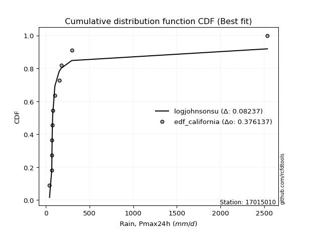</img></img>

</div>


### 2. EDF Hazen (1930)

Hazen method for plotting positions is a formula used to estimate the empirical cumulative probability distribution of flood events or other hydrological data. This formula often results in biased estimations, particularly when extrapolating to extreme events (high return periods).

<div align="center">


$P=(m-0.5)/n$


</div>


**2.1. Empirical values**

<div align="center">

|                | 0                    | 1                  | 2                   | 3                  | 4         | 5                  | 6                  | 7                  | 8                  | 9                  | 10        | 11                 |
|:---------------|:---------------------|:-------------------|:--------------------|:-------------------|:----------|:-------------------|:-------------------|:-------------------|:-------------------|:-------------------|:----------|:-------------------|
| date           | 2021                 | 2015               | 2017                | 2020               | 2019      | 2018               | 2022               | 2023               | 2014               | 2016               | 2024      | 2025               |
| x              | 43.0                 | 68.86              | 68.95               | 72.1               | 73.56     | 78.91              | 104.0              | 153.3              | 176.4              | 298.01             | 2537.4    | 2763.0             |
| m              | 1                    | 2                  | 3                   | 4                  | 5         | 6                  | 7                  | 8                  | 9                  | 10                 | 11        | 12                 |
| empirical_dist | edf_hazen            | edf_hazen          | edf_hazen           | edf_hazen          | edf_hazen | edf_hazen          | edf_hazen          | edf_hazen          | edf_hazen          | edf_hazen          | edf_hazen | edf_hazen          |
| empirical      | 0.041666666666666664 | 0.125              | 0.20833333333333334 | 0.2916666666666667 | 0.375     | 0.4583333333333333 | 0.5416666666666666 | 0.625              | 0.7083333333333334 | 0.7916666666666666 | 0.875     | 0.9583333333333334 |
| empirical_tr   | 1.0434782608695652   | 1.1428571428571428 | 1.2631578947368423  | 1.411764705882353  | 1.6       | 1.8461538461538458 | 2.1818181818181817 | 2.6666666666666665 | 3.428571428571429  | 4.799999999999999  | 8.0       | 24.00000000000002  |

</div>


**2.2. Kolmogorov-Smirnov fit test (sorted by Δ)**


<div align="center">

|                | 0                   | 1                   | 2                   | 3                   | 4                   | 5                   | 6                   | 7                   | 8                   | 9                   | 10                  | 11                  | 12                  | 13                  | 14                  | 15                  | 16                  | 17                  | 18                  | 19                  | 20                  | 21                  | 22                  | 23                  | 24                  | 25                  | 26                  | 27                  | 28                  | 29                  | 30                  | 31                  | 32                  | 33                  | 34                  | 35                  | 36                  | 37                  | 38                  | 39                  | 40                  | 41                  | 42                  | 43                  | 44                  | 45                  | 46                  | 47                  | 48                  | 49                  | 50                  | 51                  | 52                  | 53                  | 54                  | 55                  | 56                  | 57                  | 58                  | 59                  | 60                  | 61                  | 62                  | 63                  | 64                  | 65                  | 66                  | 67                  | 68                  | 69                  | 70                  | 71                  | 72                  | 73                  | 74                  | 75                  | 76                  | 77                  | 78                  | 79                  | 80                  | 81                  | 82                  | 83                  | 84                  | 85                  | 86                  | 87                  | 88                  | 89                  | 90                  | 91                  | 92                  | 93                  | 94                  | 95                  | 96                  | 97                  | 98                  | 99                  | 100                 | 101                 | 102                 | 103                 | 104                 | 105                 | 106                 | 107                 | 108                 | 109                 | 110                 | 111                 | 112                 | 113                 | 114                 | 115                 | 116                 | 117                 | 118                 | 119                 | 120                 | 121                 | 122                 | 123                 | 124                 | 125                 | 126                 | 127                 | 128                 | 129                 | 130                 | 131                 | 132                 | 133                 | 134                 | 135                 | 136                 | 137                 | 138                 | 139                 | 140                 | 141                 | 142                 | 143                 | 144                 | 145                 | 146                 | 147                 | 148                 | 149                 | 150                 | 151                 | 152                 | 153                 | 154                 | 155                 | 156                 | 157                 | 158                 | 159                 |
|:---------------|:--------------------|:--------------------|:--------------------|:--------------------|:--------------------|:--------------------|:--------------------|:--------------------|:--------------------|:--------------------|:--------------------|:--------------------|:--------------------|:--------------------|:--------------------|:--------------------|:--------------------|:--------------------|:--------------------|:--------------------|:--------------------|:--------------------|:--------------------|:--------------------|:--------------------|:--------------------|:--------------------|:--------------------|:--------------------|:--------------------|:--------------------|:--------------------|:--------------------|:--------------------|:--------------------|:--------------------|:--------------------|:--------------------|:--------------------|:--------------------|:--------------------|:--------------------|:--------------------|:--------------------|:--------------------|:--------------------|:--------------------|:--------------------|:--------------------|:--------------------|:--------------------|:--------------------|:--------------------|:--------------------|:--------------------|:--------------------|:--------------------|:--------------------|:--------------------|:--------------------|:--------------------|:--------------------|:--------------------|:--------------------|:--------------------|:--------------------|:--------------------|:--------------------|:--------------------|:--------------------|:--------------------|:--------------------|:--------------------|:--------------------|:--------------------|:--------------------|:--------------------|:--------------------|:--------------------|:--------------------|:--------------------|:--------------------|:--------------------|:--------------------|:--------------------|:--------------------|:--------------------|:--------------------|:--------------------|:--------------------|:--------------------|:--------------------|:--------------------|:--------------------|:--------------------|:--------------------|:--------------------|:--------------------|:--------------------|:--------------------|:--------------------|:--------------------|:--------------------|:--------------------|:--------------------|:--------------------|:--------------------|:--------------------|:--------------------|:--------------------|:--------------------|:--------------------|:--------------------|:--------------------|:--------------------|:--------------------|:--------------------|:--------------------|:--------------------|:--------------------|:--------------------|:--------------------|:--------------------|:--------------------|:--------------------|:--------------------|:--------------------|:--------------------|:--------------------|:--------------------|:--------------------|:--------------------|:--------------------|:--------------------|:--------------------|:--------------------|:--------------------|:--------------------|:--------------------|:--------------------|:--------------------|:--------------------|:--------------------|:--------------------|:--------------------|:--------------------|:--------------------|:--------------------|:--------------------|:--------------------|:--------------------|:--------------------|:--------------------|:--------------------|:--------------------|:--------------------|:--------------------|:--------------------|:--------------------|:--------------------|
| station        | 17015010            | 17015010            | 17015010            | 17015010            | 17015010            | 17015010            | 17015010            | 17015010            | 17015010            | 17015010            | 17015010            | 17015010            | 17015010            | 17015010            | 17015010            | 17015010            | 17015010            | 17015010            | 17015010            | 17015010            | 17015010            | 17015010            | 17015010            | 17015010            | 17015010            | 17015010            | 17015010            | 17015010            | 17015010            | 17015010            | 17015010            | 17015010            | 17015010            | 17015010            | 17015010            | 17015010            | 17015010            | 17015010            | 17015010            | 17015010            | 17015010            | 17015010            | 17015010            | 17015010            | 17015010            | 17015010            | 17015010            | 17015010            | 17015010            | 17015010            | 17015010            | 17015010            | 17015010            | 17015010            | 17015010            | 17015010            | 17015010            | 17015010            | 17015010            | 17015010            | 17015010            | 17015010            | 17015010            | 17015010            | 17015010            | 17015010            | 17015010            | 17015010            | 17015010            | 17015010            | 17015010            | 17015010            | 17015010            | 17015010            | 17015010            | 17015010            | 17015010            | 17015010            | 17015010            | 17015010            | 17015010            | 17015010            | 17015010            | 17015010            | 17015010            | 17015010            | 17015010            | 17015010            | 17015010            | 17015010            | 17015010            | 17015010            | 17015010            | 17015010            | 17015010            | 17015010            | 17015010            | 17015010            | 17015010            | 17015010            | 17015010            | 17015010            | 17015010            | 17015010            | 17015010            | 17015010            | 17015010            | 17015010            | 17015010            | 17015010            | 17015010            | 17015010            | 17015010            | 17015010            | 17015010            | 17015010            | 17015010            | 17015010            | 17015010            | 17015010            | 17015010            | 17015010            | 17015010            | 17015010            | 17015010            | 17015010            | 17015010            | 17015010            | 17015010            | 17015010            | 17015010            | 17015010            | 17015010            | 17015010            | 17015010            | 17015010            | 17015010            | 17015010            | 17015010            | 17015010            | 17015010            | 17015010            | 17015010            | 17015010            | 17015010            | 17015010            | 17015010            | 17015010            | 17015010            | 17015010            | 17015010            | 17015010            | 17015010            | 17015010            | 17015010            | 17015010            | 17015010            | 17015010            | 17015010            | 17015010            |
| empirical_dist | edf_hazen           | edf_hazen           | edf_hazen           | edf_hazen           | edf_hazen           | edf_hazen           | edf_hazen           | edf_hazen           | edf_hazen           | edf_hazen           | edf_hazen           | edf_hazen           | edf_hazen           | edf_hazen           | edf_hazen           | edf_hazen           | edf_hazen           | edf_hazen           | edf_hazen           | edf_hazen           | edf_hazen           | edf_hazen           | edf_hazen           | edf_hazen           | edf_hazen           | edf_hazen           | edf_hazen           | edf_hazen           | edf_hazen           | edf_hazen           | edf_hazen           | edf_hazen           | edf_hazen           | edf_hazen           | edf_hazen           | edf_hazen           | edf_hazen           | edf_hazen           | edf_hazen           | edf_hazen           | edf_hazen           | edf_hazen           | edf_hazen           | edf_hazen           | edf_hazen           | edf_hazen           | edf_hazen           | edf_hazen           | edf_hazen           | edf_hazen           | edf_hazen           | edf_hazen           | edf_hazen           | edf_hazen           | edf_hazen           | edf_hazen           | edf_hazen           | edf_hazen           | edf_hazen           | edf_hazen           | edf_hazen           | edf_hazen           | edf_hazen           | edf_hazen           | edf_hazen           | edf_hazen           | edf_hazen           | edf_hazen           | edf_hazen           | edf_hazen           | edf_hazen           | edf_hazen           | edf_hazen           | edf_hazen           | edf_hazen           | edf_hazen           | edf_hazen           | edf_hazen           | edf_hazen           | edf_hazen           | edf_hazen           | edf_hazen           | edf_hazen           | edf_hazen           | edf_hazen           | edf_hazen           | edf_hazen           | edf_hazen           | edf_hazen           | edf_hazen           | edf_hazen           | edf_hazen           | edf_hazen           | edf_hazen           | edf_hazen           | edf_hazen           | edf_hazen           | edf_hazen           | edf_hazen           | edf_hazen           | edf_hazen           | edf_hazen           | edf_hazen           | edf_hazen           | edf_hazen           | edf_hazen           | edf_hazen           | edf_hazen           | edf_hazen           | edf_hazen           | edf_hazen           | edf_hazen           | edf_hazen           | edf_hazen           | edf_hazen           | edf_hazen           | edf_hazen           | edf_hazen           | edf_hazen           | edf_hazen           | edf_hazen           | edf_hazen           | edf_hazen           | edf_hazen           | edf_hazen           | edf_hazen           | edf_hazen           | edf_hazen           | edf_hazen           | edf_hazen           | edf_hazen           | edf_hazen           | edf_hazen           | edf_hazen           | edf_hazen           | edf_hazen           | edf_hazen           | edf_hazen           | edf_hazen           | edf_hazen           | edf_hazen           | edf_hazen           | edf_hazen           | edf_hazen           | edf_hazen           | edf_hazen           | edf_hazen           | edf_hazen           | edf_hazen           | edf_hazen           | edf_hazen           | edf_hazen           | edf_hazen           | edf_hazen           | edf_hazen           | edf_hazen           | edf_hazen           | edf_hazen           | edf_hazen           | edf_hazen           |
| p_dist         | logjohnsonsu        | alpha               | logalpha            | logburr12           | loginvweibull       | loggenextreme       | logmielke           | logburr             | loginvgamma         | logmoyal            | loginvgauss         | logfatiguelife      | halfgennorm         | loggumbel_r         | invgamma            | f                   | burr                | genextreme          | invgauss            | logexponnorm        | loggenhalflogistic  | mielke              | logwald             | logpearson3         | logncf              | johnsonsu           | lograyleigh         | logmaxwell          | loggompertz         | logtruncnorm        | loghalfgennorm      | loghalflogistic     | loggenexpon         | logvonmises_line    | logrdist            | lognct              | burr12              | lomax               | loglomax            | nct                 | genpareto           | kappa3              | loggenlogistic      | logloglaplace       | ncf                 | loghalfnorm         | betaprime           | truncpareto         | logexponpow         | logfoldnorm         | lognorm             | logcrystalball      | loganglit           | logsemicircular     | weibull_min         | logloggamma         | loglogistic         | logkstwobign        | logbetaprime        | logskewnorm         | logtukeylambda      | bradford            | loghypsecant        | logweibull_min      | logf                | logarcsine          | fatiguelife         | logrice             | gamma               | loglaplace          | loglaplace          | logtruncexpon       | logtruncweibull_min | logcosine           | loggumbel_l         | exponweib           | t                   | dgamma              | logt                | loggenpareto        | loggennorm          | logbradford         | gausshyper          | logwrapcauchy       | truncweibull_min    | wald                | gengamma            | moyal               | vonmises_line       | logdweibull         | halflogistic        | halfnorm            | gumbel_r            | pearson3            | exponpow            | tukeylambda         | foldnorm            | logksone            | wrapcauchy          | rayleigh            | nakagami            | arcsine             | genlogistic         | logargus            | logkappa4           | powerlaw            | maxwell             | gennorm             | loguniform          | semicircular        | logdgamma           | loglevy_l           | anglit              | erlang              | dweibull            | logtriang           | norm                | logistic            | johnsonsb           | kstwobign           | hypsecant           | logkappa3           | lognakagami         | invweibull          | levy_l              | rice                | laplace             | gumbel_l            | cosine              | exponnorm           | genexpon            | logbeta             | crystalball         | logpowerlaw         | logjohnsonsb        | loggausshyper       | logweibull_max      | loggengamma         | truncexpon          | argus               | logtrapezoid        | truncnorm           | logerlang           | logexponweib        | gompertz            | loggamma            | loggamma            | beta                | skewnorm            | ksone               | triang              | kappa4              | rdist               | genhalflogistic     | uniform             | weibull_max         | trapezoid           | logtruncpareto      | logvonmises         | vonmises            |
| delta          | 0.11266946704043834 | 0.12477667146971766 | 0.1277617592618816  | 0.1299062607408818  | 0.13187591052051256 | 0.1318837641040797  | 0.13233103200317708 | 0.1323526614923694  | 0.1343760203169052  | 0.1394260069654386  | 0.14350536621801302 | 0.1452054654119096  | 0.1458571554359548  | 0.14595899564085074 | 0.14683999934006975 | 0.14813991473719906 | 0.14832375401222547 | 0.1492881525964529  | 0.15212128368618644 | 0.15381968721343958 | 0.1547428397966933  | 0.15584159827198557 | 0.1563004910323188  | 0.15683185504556163 | 0.15691734576222188 | 0.15694643052810386 | 0.15697114572026583 | 0.16112169922747577 | 0.1643455182024366  | 0.16532260542659283 | 0.16652587859945012 | 0.16716136633822637 | 0.16726280749374728 | 0.16791480435283712 | 0.1702668904328012  | 0.1706889834885248  | 0.17122320657211443 | 0.1726449320520515  | 0.1742859550045377  | 0.17529060313149314 | 0.17547968296794458 | 0.1759622386480319  | 0.17776292019205708 | 0.1791093200972762  | 0.1805888565860465  | 0.18112314959763204 | 0.1822533500412522  | 0.1828844216829203  | 0.18683883566665127 | 0.18697807587816018 | 0.19352048871589067 | 0.19352056553932295 | 0.19563939355615612 | 0.1965123204844138  | 0.19689675457505829 | 0.19710142578270673 | 0.19951868076749163 | 0.20054790267776185 | 0.2055270081733212  | 0.20805344113695395 | 0.208333333328253   | 0.20848318238076474 | 0.21295762136285995 | 0.21411402524321654 | 0.21437055959126633 | 0.21772696256902724 | 0.21908200632476843 | 0.2211692803425199  | 0.22909637146079265 | 0.24133370798496317 | 0.24133370798496317 | 0.2565253936109937  | 0.2570275345643544  | 0.26203010762310064 | 0.2632982869227284  | 0.2640531624581407  | 0.26696468795001504 | 0.27500073549508786 | 0.27547199549541224 | 0.28226233631861997 | 0.2830551302755388  | 0.2854682990976942  | 0.28786589499342685 | 0.3033598084006796  | 0.3052183536987362  | 0.30536766007836974 | 0.30553799698885675 | 0.3080228482630595  | 0.32084382738832984 | 0.3267783453158711  | 0.328809736578795   | 0.3301996754615737  | 0.33096889857801415 | 0.3323565629294072  | 0.33605943683140355 | 0.34126306976219445 | 0.3418599044697173  | 0.3424318681643543  | 0.3432592540333214  | 0.34455979207736975 | 0.3483049203315724  | 0.34853734524540075 | 0.34894763714952803 | 0.34956674984805947 | 0.3518170900634835  | 0.35268224748934207 | 0.3568520998295585  | 0.3686791934868689  | 0.36925157513055856 | 0.3714556895126798  | 0.3722695094886942  | 0.3740879905106363  | 0.3771568171687803  | 0.3790080639781501  | 0.3872614444172038  | 0.38979726810057336 | 0.39088627331589637 | 0.4036977774155053  | 0.4047089334792807  | 0.408669129680013   | 0.4141879772972002  | 0.4160344460624862  | 0.42293192543036484 | 0.4238534049001238  | 0.4331998796124446  | 0.4386317085186471  | 0.441231013476095   | 0.45747712307857524 | 0.46130263693454154 | 0.46825179079706525 | 0.4714553709961581  | 0.47237768800404356 | 0.47428560589186025 | 0.47856327846935265 | 0.4854921834176051  | 0.5092305473635573  | 0.5180839689104095  | 0.5228315823132367  | 0.5234831169594669  | 0.526772165132741   | 0.5744494511205278  | 0.5757305853908782  | 0.578293019661319   | 0.5868650071680662  | 0.5897994636656402  | 0.5984777338536744  | 0.5984777338536744  | 0.6069537712639709  | 0.6090561147940782  | 0.6302052696078431  | 0.6330260890762934  | 0.678642029512204   | 0.6792978055162053  | 0.6979105618879112  | 0.6979129901960784  | 0.7075273677147915  | 0.7644517760221429  | 0.7825561918130529  | 1.2692624340612624  | 439.60874957608746  |
| deltao         | 0.36218414519599995 | 0.36218414519599995 | 0.36218414519599995 | 0.36218414519599995 | 0.36218414519599995 | 0.36218414519599995 | 0.36218414519599995 | 0.36218414519599995 | 0.36218414519599995 | 0.36218414519599995 | 0.36218414519599995 | 0.36218414519599995 | 0.36218414519599995 | 0.36218414519599995 | 0.36218414519599995 | 0.36218414519599995 | 0.36218414519599995 | 0.36218414519599995 | 0.36218414519599995 | 0.36218414519599995 | 0.36218414519599995 | 0.36218414519599995 | 0.36218414519599995 | 0.36218414519599995 | 0.36218414519599995 | 0.36218414519599995 | 0.36218414519599995 | 0.36218414519599995 | 0.36218414519599995 | 0.36218414519599995 | 0.36218414519599995 | 0.36218414519599995 | 0.36218414519599995 | 0.36218414519599995 | 0.36218414519599995 | 0.36218414519599995 | 0.36218414519599995 | 0.36218414519599995 | 0.36218414519599995 | 0.36218414519599995 | 0.36218414519599995 | 0.36218414519599995 | 0.36218414519599995 | 0.36218414519599995 | 0.36218414519599995 | 0.36218414519599995 | 0.36218414519599995 | 0.36218414519599995 | 0.36218414519599995 | 0.36218414519599995 | 0.36218414519599995 | 0.36218414519599995 | 0.36218414519599995 | 0.36218414519599995 | 0.36218414519599995 | 0.36218414519599995 | 0.36218414519599995 | 0.36218414519599995 | 0.36218414519599995 | 0.36218414519599995 | 0.36218414519599995 | 0.36218414519599995 | 0.36218414519599995 | 0.36218414519599995 | 0.36218414519599995 | 0.36218414519599995 | 0.36218414519599995 | 0.36218414519599995 | 0.36218414519599995 | 0.36218414519599995 | 0.36218414519599995 | 0.36218414519599995 | 0.36218414519599995 | 0.36218414519599995 | 0.36218414519599995 | 0.36218414519599995 | 0.36218414519599995 | 0.36218414519599995 | 0.36218414519599995 | 0.36218414519599995 | 0.36218414519599995 | 0.36218414519599995 | 0.36218414519599995 | 0.36218414519599995 | 0.36218414519599995 | 0.36218414519599995 | 0.36218414519599995 | 0.36218414519599995 | 0.36218414519599995 | 0.36218414519599995 | 0.36218414519599995 | 0.36218414519599995 | 0.36218414519599995 | 0.36218414519599995 | 0.36218414519599995 | 0.36218414519599995 | 0.36218414519599995 | 0.36218414519599995 | 0.36218414519599995 | 0.36218414519599995 | 0.36218414519599995 | 0.36218414519599995 | 0.36218414519599995 | 0.36218414519599995 | 0.36218414519599995 | 0.36218414519599995 | 0.36218414519599995 | 0.36218414519599995 | 0.36218414519599995 | 0.36218414519599995 | 0.36218414519599995 | 0.36218414519599995 | 0.36218414519599995 | 0.36218414519599995 | 0.36218414519599995 | 0.36218414519599995 | 0.36218414519599995 | 0.36218414519599995 | 0.36218414519599995 | 0.36218414519599995 | 0.36218414519599995 | 0.36218414519599995 | 0.36218414519599995 | 0.36218414519599995 | 0.36218414519599995 | 0.36218414519599995 | 0.36218414519599995 | 0.36218414519599995 | 0.36218414519599995 | 0.36218414519599995 | 0.36218414519599995 | 0.36218414519599995 | 0.36218414519599995 | 0.36218414519599995 | 0.36218414519599995 | 0.36218414519599995 | 0.36218414519599995 | 0.36218414519599995 | 0.36218414519599995 | 0.36218414519599995 | 0.36218414519599995 | 0.36218414519599995 | 0.36218414519599995 | 0.36218414519599995 | 0.36218414519599995 | 0.36218414519599995 | 0.36218414519599995 | 0.36218414519599995 | 0.36218414519599995 | 0.36218414519599995 | 0.36218414519599995 | 0.36218414519599995 | 0.36218414519599995 | 0.36218414519599995 | 0.36218414519599995 | 0.36218414519599995 | 0.36218414519599995 | 0.36218414519599995 | 0.36218414519599995 | 0.36218414519599995 |
| eval           | Δo > Δ              | Δo > Δ              | Δo > Δ              | Δo > Δ              | Δo > Δ              | Δo > Δ              | Δo > Δ              | Δo > Δ              | Δo > Δ              | Δo > Δ              | Δo > Δ              | Δo > Δ              | Δo > Δ              | Δo > Δ              | Δo > Δ              | Δo > Δ              | Δo > Δ              | Δo > Δ              | Δo > Δ              | Δo > Δ              | Δo > Δ              | Δo > Δ              | Δo > Δ              | Δo > Δ              | Δo > Δ              | Δo > Δ              | Δo > Δ              | Δo > Δ              | Δo > Δ              | Δo > Δ              | Δo > Δ              | Δo > Δ              | Δo > Δ              | Δo > Δ              | Δo > Δ              | Δo > Δ              | Δo > Δ              | Δo > Δ              | Δo > Δ              | Δo > Δ              | Δo > Δ              | Δo > Δ              | Δo > Δ              | Δo > Δ              | Δo > Δ              | Δo > Δ              | Δo > Δ              | Δo > Δ              | Δo > Δ              | Δo > Δ              | Δo > Δ              | Δo > Δ              | Δo > Δ              | Δo > Δ              | Δo > Δ              | Δo > Δ              | Δo > Δ              | Δo > Δ              | Δo > Δ              | Δo > Δ              | Δo > Δ              | Δo > Δ              | Δo > Δ              | Δo > Δ              | Δo > Δ              | Δo > Δ              | Δo > Δ              | Δo > Δ              | Δo > Δ              | Δo > Δ              | Δo > Δ              | Δo > Δ              | Δo > Δ              | Δo > Δ              | Δo > Δ              | Δo > Δ              | Δo > Δ              | Δo > Δ              | Δo > Δ              | Δo > Δ              | Δo > Δ              | Δo > Δ              | Δo > Δ              | Δo > Δ              | Δo > Δ              | Δo > Δ              | Δo > Δ              | Δo > Δ              | Δo > Δ              | Δo > Δ              | Δo > Δ              | Δo > Δ              | Δo > Δ              | Δo > Δ              | Δo > Δ              | Δo > Δ              | Δo > Δ              | Δo > Δ              | Δo > Δ              | Δo > Δ              | Δo > Δ              | Δo > Δ              | Δo > Δ              | Δo > Δ              | Δo > Δ              | Δo > Δ              | Δo > Δ              | Δo <= Δ             | Δo <= Δ             | Δo <= Δ             | Δo <= Δ             | Δo <= Δ             | Δo <= Δ             | Δo <= Δ             | Δo <= Δ             | Δo <= Δ             | Δo <= Δ             | Δo <= Δ             | Δo <= Δ             | Δo <= Δ             | Δo <= Δ             | Δo <= Δ             | Δo <= Δ             | Δo <= Δ             | Δo <= Δ             | Δo <= Δ             | Δo <= Δ             | Δo <= Δ             | Δo <= Δ             | Δo <= Δ             | Δo <= Δ             | Δo <= Δ             | Δo <= Δ             | Δo <= Δ             | Δo <= Δ             | Δo <= Δ             | Δo <= Δ             | Δo <= Δ             | Δo <= Δ             | Δo <= Δ             | Δo <= Δ             | Δo <= Δ             | Δo <= Δ             | Δo <= Δ             | Δo <= Δ             | Δo <= Δ             | Δo <= Δ             | Δo <= Δ             | Δo <= Δ             | Δo <= Δ             | Δo <= Δ             | Δo <= Δ             | Δo <= Δ             | Δo <= Δ             | Δo <= Δ             | Δo <= Δ             | Δo <= Δ             | Δo <= Δ             | Δo <= Δ             | Δo <= Δ             |
| fit            | 1                   | 1                   | 1                   | 1                   | 1                   | 1                   | 1                   | 1                   | 1                   | 1                   | 1                   | 1                   | 1                   | 1                   | 1                   | 1                   | 1                   | 1                   | 1                   | 1                   | 1                   | 1                   | 1                   | 1                   | 1                   | 1                   | 1                   | 1                   | 1                   | 1                   | 1                   | 1                   | 1                   | 1                   | 1                   | 1                   | 1                   | 1                   | 1                   | 1                   | 1                   | 1                   | 1                   | 1                   | 1                   | 1                   | 1                   | 1                   | 1                   | 1                   | 1                   | 1                   | 1                   | 1                   | 1                   | 1                   | 1                   | 1                   | 1                   | 1                   | 1                   | 1                   | 1                   | 1                   | 1                   | 1                   | 1                   | 1                   | 1                   | 1                   | 1                   | 1                   | 1                   | 1                   | 1                   | 1                   | 1                   | 1                   | 1                   | 1                   | 1                   | 1                   | 1                   | 1                   | 1                   | 1                   | 1                   | 1                   | 1                   | 1                   | 1                   | 1                   | 1                   | 1                   | 1                   | 1                   | 1                   | 1                   | 1                   | 1                   | 1                   | 1                   | 1                   | 1                   | 1                   | 1                   | 1                   | 0                   | 0                   | 0                   | 0                   | 0                   | 0                   | 0                   | 0                   | 0                   | 0                   | 0                   | 0                   | 0                   | 0                   | 0                   | 0                   | 0                   | 0                   | 0                   | 0                   | 0                   | 0                   | 0                   | 0                   | 0                   | 0                   | 0                   | 0                   | 0                   | 0                   | 0                   | 0                   | 0                   | 0                   | 0                   | 0                   | 0                   | 0                   | 0                   | 0                   | 0                   | 0                   | 0                   | 0                   | 0                   | 0                   | 0                   | 0                   | 0                   | 0                   | 0                   | 0                   | 0                   |
| n              | 12                  | 12                  | 12                  | 12                  | 12                  | 12                  | 12                  | 12                  | 12                  | 12                  | 12                  | 12                  | 12                  | 12                  | 12                  | 12                  | 12                  | 12                  | 12                  | 12                  | 12                  | 12                  | 12                  | 12                  | 12                  | 12                  | 12                  | 12                  | 12                  | 12                  | 12                  | 12                  | 12                  | 12                  | 12                  | 12                  | 12                  | 12                  | 12                  | 12                  | 12                  | 12                  | 12                  | 12                  | 12                  | 12                  | 12                  | 12                  | 12                  | 12                  | 12                  | 12                  | 12                  | 12                  | 12                  | 12                  | 12                  | 12                  | 12                  | 12                  | 12                  | 12                  | 12                  | 12                  | 12                  | 12                  | 12                  | 12                  | 12                  | 12                  | 12                  | 12                  | 12                  | 12                  | 12                  | 12                  | 12                  | 12                  | 12                  | 12                  | 12                  | 12                  | 12                  | 12                  | 12                  | 12                  | 12                  | 12                  | 12                  | 12                  | 12                  | 12                  | 12                  | 12                  | 12                  | 12                  | 12                  | 12                  | 12                  | 12                  | 12                  | 12                  | 12                  | 12                  | 12                  | 12                  | 12                  | 12                  | 12                  | 12                  | 12                  | 12                  | 12                  | 12                  | 12                  | 12                  | 12                  | 12                  | 12                  | 12                  | 12                  | 12                  | 12                  | 12                  | 12                  | 12                  | 12                  | 12                  | 12                  | 12                  | 12                  | 12                  | 12                  | 12                  | 12                  | 12                  | 12                  | 12                  | 12                  | 12                  | 12                  | 12                  | 12                  | 12                  | 12                  | 12                  | 12                  | 12                  | 12                  | 12                  | 12                  | 12                  | 12                  | 12                  | 12                  | 12                  | 12                  | 12                  | 12                  | 12                  |
| best_fit       | 1                   | 0                   | 0                   | 0                   | 0                   | 0                   | 0                   | 0                   | 0                   | 0                   | 0                   | 0                   | 0                   | 0                   | 0                   | 0                   | 0                   | 0                   | 0                   | 0                   | 0                   | 0                   | 0                   | 0                   | 0                   | 0                   | 0                   | 0                   | 0                   | 0                   | 0                   | 0                   | 0                   | 0                   | 0                   | 0                   | 0                   | 0                   | 0                   | 0                   | 0                   | 0                   | 0                   | 0                   | 0                   | 0                   | 0                   | 0                   | 0                   | 0                   | 0                   | 0                   | 0                   | 0                   | 0                   | 0                   | 0                   | 0                   | 0                   | 0                   | 0                   | 0                   | 0                   | 0                   | 0                   | 0                   | 0                   | 0                   | 0                   | 0                   | 0                   | 0                   | 0                   | 0                   | 0                   | 0                   | 0                   | 0                   | 0                   | 0                   | 0                   | 0                   | 0                   | 0                   | 0                   | 0                   | 0                   | 0                   | 0                   | 0                   | 0                   | 0                   | 0                   | 0                   | 0                   | 0                   | 0                   | 0                   | 0                   | 0                   | 0                   | 0                   | 0                   | 0                   | 0                   | 0                   | 0                   | 0                   | 0                   | 0                   | 0                   | 0                   | 0                   | 0                   | 0                   | 0                   | 0                   | 0                   | 0                   | 0                   | 0                   | 0                   | 0                   | 0                   | 0                   | 0                   | 0                   | 0                   | 0                   | 0                   | 0                   | 0                   | 0                   | 0                   | 0                   | 0                   | 0                   | 0                   | 0                   | 0                   | 0                   | 0                   | 0                   | 0                   | 0                   | 0                   | 0                   | 0                   | 0                   | 0                   | 0                   | 0                   | 0                   | 0                   | 0                   | 0                   | 0                   | 0                   | 0                   | 0                   |
| best_fit_sort  | 1                   | 2                   | 3                   | 4                   | 5                   | 6                   | 7                   | 8                   | 9                   | 10                  | 11                  | 12                  | 13                  | 14                  | 15                  | 16                  | 17                  | 18                  | 19                  | 20                  | 21                  | 22                  | 23                  | 24                  | 25                  | 26                  | 27                  | 28                  | 29                  | 30                  | 31                  | 32                  | 33                  | 34                  | 35                  | 36                  | 37                  | 38                  | 39                  | 40                  | 41                  | 42                  | 43                  | 44                  | 45                  | 46                  | 47                  | 48                  | 49                  | 50                  | 51                  | 52                  | 53                  | 54                  | 55                  | 56                  | 57                  | 58                  | 59                  | 60                  | 61                  | 62                  | 63                  | 64                  | 65                  | 66                  | 67                  | 68                  | 69                  | 70                  | 71                  | 72                  | 73                  | 74                  | 75                  | 76                  | 77                  | 78                  | 79                  | 80                  | 81                  | 82                  | 83                  | 84                  | 85                  | 86                  | 87                  | 88                  | 89                  | 90                  | 91                  | 92                  | 93                  | 94                  | 95                  | 96                  | 97                  | 98                  | 99                  | 100                 | 101                 | 102                 | 103                 | 104                 | 105                 | 106                 | 107                 | 108                 | 109                 | 110                 | 111                 | 112                 | 113                 | 114                 | 115                 | 116                 | 117                 | 118                 | 119                 | 120                 | 121                 | 122                 | 123                 | 124                 | 125                 | 126                 | 127                 | 128                 | 129                 | 130                 | 131                 | 132                 | 133                 | 134                 | 135                 | 136                 | 137                 | 138                 | 139                 | 140                 | 141                 | 142                 | 143                 | 144                 | 145                 | 146                 | 147                 | 148                 | 149                 | 150                 | 151                 | 152                 | 153                 | 154                 | 155                 | 156                 | 157                 | 158                 | 159                 | 160                 |

</div>


**2.3. Best fit**

<div align="center">

|   id |   station | empirical_dist   | p_dist       |    delta |   deltao | eval   |   fit |   n |   best_fit |   best_fit_sort |
|-----:|----------:|:-----------------|:-------------|---------:|---------:|:-------|------:|----:|-----------:|----------------:|
|    0 |  17015010 | edf_hazen        | logjohnsonsu | 0.112669 | 0.362184 | Δo > Δ |     1 |  12 |          1 |               1 |

</div>


<div align="center">

</img></img>

</div>


### 3. EDF Weibull (1939)

Weibull plotting position formula is an empirical method used to estimate the non-exceedance probability or plotting position for a set of observed data, is often recommended or widely used in practice, particularly in flood frequency analysis.

<div align="center">


$P=m/(n+1)$


</div>


**3.1. Empirical values**

<div align="center">

|                | 0                   | 1                   | 2                   | 3                  | 4                   | 5                   | 6                  | 7                  | 8                  | 9                  | 10                 | 11                 |
|:---------------|:--------------------|:--------------------|:--------------------|:-------------------|:--------------------|:--------------------|:-------------------|:-------------------|:-------------------|:-------------------|:-------------------|:-------------------|
| date           | 2021                | 2015                | 2017                | 2020               | 2019                | 2018                | 2022               | 2023               | 2014               | 2016               | 2024               | 2025               |
| x              | 43.0                | 68.86               | 68.95               | 72.1               | 73.56               | 78.91               | 104.0              | 153.3              | 176.4              | 298.01             | 2537.4             | 2763.0             |
| m              | 1                   | 2                   | 3                   | 4                  | 5                   | 6                   | 7                  | 8                  | 9                  | 10                 | 11                 | 12                 |
| empirical_dist | edf_weibull         | edf_weibull         | edf_weibull         | edf_weibull        | edf_weibull         | edf_weibull         | edf_weibull        | edf_weibull        | edf_weibull        | edf_weibull        | edf_weibull        | edf_weibull        |
| empirical      | 0.07692307692307693 | 0.15384615384615385 | 0.23076923076923078 | 0.3076923076923077 | 0.38461538461538464 | 0.46153846153846156 | 0.5384615384615384 | 0.6153846153846154 | 0.6923076923076923 | 0.7692307692307693 | 0.8461538461538461 | 0.9230769230769231 |
| empirical_tr   | 1.0833333333333333  | 1.1818181818181819  | 1.3                 | 1.4444444444444444 | 1.625               | 1.8571428571428572  | 2.1666666666666665 | 2.6                | 3.25               | 4.333333333333334  | 6.5                | 13.000000000000009 |

</div>


**3.2. Kolmogorov-Smirnov fit test (sorted by Δ)**


<div align="center">

|                | 0                   | 1                   | 2                   | 3                   | 4                   | 5                   | 6                   | 7                   | 8                   | 9                   | 10                  | 11                  | 12                  | 13                  | 14                  | 15                  | 16                  | 17                  | 18                  | 19                  | 20                  | 21                  | 22                  | 23                  | 24                  | 25                  | 26                  | 27                  | 28                  | 29                  | 30                  | 31                  | 32                  | 33                  | 34                  | 35                  | 36                  | 37                  | 38                  | 39                  | 40                  | 41                  | 42                  | 43                  | 44                  | 45                  | 46                  | 47                  | 48                  | 49                  | 50                  | 51                  | 52                  | 53                  | 54                  | 55                  | 56                  | 57                  | 58                  | 59                  | 60                  | 61                  | 62                  | 63                  | 64                  | 65                  | 66                  | 67                  | 68                  | 69                  | 70                  | 71                  | 72                  | 73                  | 74                  | 75                  | 76                  | 77                  | 78                  | 79                  | 80                  | 81                  | 82                  | 83                  | 84                  | 85                  | 86                  | 87                  | 88                  | 89                  | 90                  | 91                  | 92                  | 93                  | 94                  | 95                  | 96                  | 97                  | 98                  | 99                  | 100                 | 101                 | 102                 | 103                 | 104                 | 105                 | 106                 | 107                 | 108                 | 109                 | 110                 | 111                 | 112                 | 113                 | 114                 | 115                 | 116                 | 117                 | 118                 | 119                 | 120                 | 121                 | 122                 | 123                 | 124                 | 125                 | 126                 | 127                 | 128                 | 129                 | 130                 | 131                 | 132                 | 133                 | 134                 | 135                 | 136                 | 137                 | 138                 | 139                 | 140                 | 141                 | 142                 | 143                 | 144                 | 145                 | 146                 | 147                 | 148                 | 149                 | 150                 | 151                 | 152                 | 153                 | 154                 | 155                 | 156                 | 157                 | 158                 | 159                 |
|:---------------|:--------------------|:--------------------|:--------------------|:--------------------|:--------------------|:--------------------|:--------------------|:--------------------|:--------------------|:--------------------|:--------------------|:--------------------|:--------------------|:--------------------|:--------------------|:--------------------|:--------------------|:--------------------|:--------------------|:--------------------|:--------------------|:--------------------|:--------------------|:--------------------|:--------------------|:--------------------|:--------------------|:--------------------|:--------------------|:--------------------|:--------------------|:--------------------|:--------------------|:--------------------|:--------------------|:--------------------|:--------------------|:--------------------|:--------------------|:--------------------|:--------------------|:--------------------|:--------------------|:--------------------|:--------------------|:--------------------|:--------------------|:--------------------|:--------------------|:--------------------|:--------------------|:--------------------|:--------------------|:--------------------|:--------------------|:--------------------|:--------------------|:--------------------|:--------------------|:--------------------|:--------------------|:--------------------|:--------------------|:--------------------|:--------------------|:--------------------|:--------------------|:--------------------|:--------------------|:--------------------|:--------------------|:--------------------|:--------------------|:--------------------|:--------------------|:--------------------|:--------------------|:--------------------|:--------------------|:--------------------|:--------------------|:--------------------|:--------------------|:--------------------|:--------------------|:--------------------|:--------------------|:--------------------|:--------------------|:--------------------|:--------------------|:--------------------|:--------------------|:--------------------|:--------------------|:--------------------|:--------------------|:--------------------|:--------------------|:--------------------|:--------------------|:--------------------|:--------------------|:--------------------|:--------------------|:--------------------|:--------------------|:--------------------|:--------------------|:--------------------|:--------------------|:--------------------|:--------------------|:--------------------|:--------------------|:--------------------|:--------------------|:--------------------|:--------------------|:--------------------|:--------------------|:--------------------|:--------------------|:--------------------|:--------------------|:--------------------|:--------------------|:--------------------|:--------------------|:--------------------|:--------------------|:--------------------|:--------------------|:--------------------|:--------------------|:--------------------|:--------------------|:--------------------|:--------------------|:--------------------|:--------------------|:--------------------|:--------------------|:--------------------|:--------------------|:--------------------|:--------------------|:--------------------|:--------------------|:--------------------|:--------------------|:--------------------|:--------------------|:--------------------|:--------------------|:--------------------|:--------------------|:--------------------|:--------------------|:--------------------|
| station        | 17015010            | 17015010            | 17015010            | 17015010            | 17015010            | 17015010            | 17015010            | 17015010            | 17015010            | 17015010            | 17015010            | 17015010            | 17015010            | 17015010            | 17015010            | 17015010            | 17015010            | 17015010            | 17015010            | 17015010            | 17015010            | 17015010            | 17015010            | 17015010            | 17015010            | 17015010            | 17015010            | 17015010            | 17015010            | 17015010            | 17015010            | 17015010            | 17015010            | 17015010            | 17015010            | 17015010            | 17015010            | 17015010            | 17015010            | 17015010            | 17015010            | 17015010            | 17015010            | 17015010            | 17015010            | 17015010            | 17015010            | 17015010            | 17015010            | 17015010            | 17015010            | 17015010            | 17015010            | 17015010            | 17015010            | 17015010            | 17015010            | 17015010            | 17015010            | 17015010            | 17015010            | 17015010            | 17015010            | 17015010            | 17015010            | 17015010            | 17015010            | 17015010            | 17015010            | 17015010            | 17015010            | 17015010            | 17015010            | 17015010            | 17015010            | 17015010            | 17015010            | 17015010            | 17015010            | 17015010            | 17015010            | 17015010            | 17015010            | 17015010            | 17015010            | 17015010            | 17015010            | 17015010            | 17015010            | 17015010            | 17015010            | 17015010            | 17015010            | 17015010            | 17015010            | 17015010            | 17015010            | 17015010            | 17015010            | 17015010            | 17015010            | 17015010            | 17015010            | 17015010            | 17015010            | 17015010            | 17015010            | 17015010            | 17015010            | 17015010            | 17015010            | 17015010            | 17015010            | 17015010            | 17015010            | 17015010            | 17015010            | 17015010            | 17015010            | 17015010            | 17015010            | 17015010            | 17015010            | 17015010            | 17015010            | 17015010            | 17015010            | 17015010            | 17015010            | 17015010            | 17015010            | 17015010            | 17015010            | 17015010            | 17015010            | 17015010            | 17015010            | 17015010            | 17015010            | 17015010            | 17015010            | 17015010            | 17015010            | 17015010            | 17015010            | 17015010            | 17015010            | 17015010            | 17015010            | 17015010            | 17015010            | 17015010            | 17015010            | 17015010            | 17015010            | 17015010            | 17015010            | 17015010            | 17015010            | 17015010            |
| empirical_dist | edf_weibull         | edf_weibull         | edf_weibull         | edf_weibull         | edf_weibull         | edf_weibull         | edf_weibull         | edf_weibull         | edf_weibull         | edf_weibull         | edf_weibull         | edf_weibull         | edf_weibull         | edf_weibull         | edf_weibull         | edf_weibull         | edf_weibull         | edf_weibull         | edf_weibull         | edf_weibull         | edf_weibull         | edf_weibull         | edf_weibull         | edf_weibull         | edf_weibull         | edf_weibull         | edf_weibull         | edf_weibull         | edf_weibull         | edf_weibull         | edf_weibull         | edf_weibull         | edf_weibull         | edf_weibull         | edf_weibull         | edf_weibull         | edf_weibull         | edf_weibull         | edf_weibull         | edf_weibull         | edf_weibull         | edf_weibull         | edf_weibull         | edf_weibull         | edf_weibull         | edf_weibull         | edf_weibull         | edf_weibull         | edf_weibull         | edf_weibull         | edf_weibull         | edf_weibull         | edf_weibull         | edf_weibull         | edf_weibull         | edf_weibull         | edf_weibull         | edf_weibull         | edf_weibull         | edf_weibull         | edf_weibull         | edf_weibull         | edf_weibull         | edf_weibull         | edf_weibull         | edf_weibull         | edf_weibull         | edf_weibull         | edf_weibull         | edf_weibull         | edf_weibull         | edf_weibull         | edf_weibull         | edf_weibull         | edf_weibull         | edf_weibull         | edf_weibull         | edf_weibull         | edf_weibull         | edf_weibull         | edf_weibull         | edf_weibull         | edf_weibull         | edf_weibull         | edf_weibull         | edf_weibull         | edf_weibull         | edf_weibull         | edf_weibull         | edf_weibull         | edf_weibull         | edf_weibull         | edf_weibull         | edf_weibull         | edf_weibull         | edf_weibull         | edf_weibull         | edf_weibull         | edf_weibull         | edf_weibull         | edf_weibull         | edf_weibull         | edf_weibull         | edf_weibull         | edf_weibull         | edf_weibull         | edf_weibull         | edf_weibull         | edf_weibull         | edf_weibull         | edf_weibull         | edf_weibull         | edf_weibull         | edf_weibull         | edf_weibull         | edf_weibull         | edf_weibull         | edf_weibull         | edf_weibull         | edf_weibull         | edf_weibull         | edf_weibull         | edf_weibull         | edf_weibull         | edf_weibull         | edf_weibull         | edf_weibull         | edf_weibull         | edf_weibull         | edf_weibull         | edf_weibull         | edf_weibull         | edf_weibull         | edf_weibull         | edf_weibull         | edf_weibull         | edf_weibull         | edf_weibull         | edf_weibull         | edf_weibull         | edf_weibull         | edf_weibull         | edf_weibull         | edf_weibull         | edf_weibull         | edf_weibull         | edf_weibull         | edf_weibull         | edf_weibull         | edf_weibull         | edf_weibull         | edf_weibull         | edf_weibull         | edf_weibull         | edf_weibull         | edf_weibull         | edf_weibull         | edf_weibull         | edf_weibull         | edf_weibull         |
| p_dist         | loginvgauss         | logfatiguelife      | invgamma            | f                   | logmielke           | logburr             | loginvgamma         | loggenextreme       | loginvweibull       | genextreme          | logalpha            | logjohnsonsu        | invgauss            | mielke              | logpearson3         | logburr12           | alpha               | loggompertz         | loghalfgennorm      | loghalflogistic     | loggenexpon         | burr                | lograyleigh         | johnsonsu           | logmoyal            | burr12              | lomax               | loglomax            | genpareto           | kappa3              | halfgennorm         | loggumbel_r         | logloglaplace       | logmaxwell          | logvonmises_line    | logtruncnorm        | loghalfnorm         | truncpareto         | logexponnorm        | loggenhalflogistic  | logfoldnorm         | logwald             | logncf              | logexponpow         | lognct              | nct                 | lognorm             | logcrystalball      | loganglit           | logsemicircular     | weibull_min         | loggenlogistic      | logloggamma         | ncf                 | logweibull_min      | betaprime           | logf                | logarcsine          | bradford            | logrdist            | loglogistic         | gamma               | fatiguelife         | logkstwobign        | logbetaprime        | logskewnorm         | loghypsecant        | logrice             | logtruncweibull_min | logtukeylambda      | loglaplace          | loglaplace          | logcosine           | dgamma              | loggumbel_l         | exponweib           | logtruncexpon       | loggennorm          | loggenpareto        | logbradford         | wald                | t                   | gausshyper          | logt                | logwrapcauchy       | moyal               | vonmises_line       | truncweibull_min    | gengamma            | halflogistic        | halfnorm            | pearson3            | logdweibull         | foldnorm            | gumbel_r            | exponpow            | wrapcauchy          | rayleigh            | powerlaw            | arcsine             | logksone            | nakagami            | genlogistic         | logargus            | maxwell             | logkappa4           | loglevy_l           | tukeylambda         | gennorm             | logdgamma           | semicircular        | dweibull            | loguniform          | anglit              | erlang              | norm                | logtriang           | johnsonsb           | logistic            | kstwobign           | invweibull          | hypsecant           | lognakagami         | levy_l              | logkappa3           | rice                | laplace             | gumbel_l            | cosine              | crystalball         | logbeta             | logpowerlaw         | exponnorm           | genexpon            | logjohnsonsb        | loggausshyper       | loggengamma         | logweibull_max      | truncexpon          | argus               | logerlang           | logexponweib        | logtrapezoid        | truncnorm           | loggamma            | loggamma            | gompertz            | beta                | skewnorm            | ksone               | triang              | rdist               | kappa4              | genhalflogistic     | uniform             | weibull_max         | trapezoid           | logtruncpareto      | logvonmises         | vonmises            |
| delta          | 0.11621365761104924 | 0.11723751208142974 | 0.1179938454939159  | 0.11929376089104521 | 0.11942275056220503 | 0.11949194021211984 | 0.11973030823015668 | 0.12012976707878581 | 0.12014005833659386 | 0.12044199875029904 | 0.12222830874034307 | 0.12228485165582292 | 0.12327512984003258 | 0.12699544442583172 | 0.12916140609002252 | 0.13311138894601005 | 0.13483375887335347 | 0.13549936435628274 | 0.13767972475329626 | 0.13831521249207251 | 0.13841665364759342 | 0.13945164494728124 | 0.13984142704064267 | 0.14092078950246284 | 0.1422370447266712  | 0.14237705272596057 | 0.14379877820589765 | 0.14543980115838384 | 0.14663352912179073 | 0.14711608480187804 | 0.14906228364108304 | 0.149164123845979   | 0.15026316625112235 | 0.1503494482295728  | 0.1503738153421338  | 0.1504635935490367  | 0.15227699575147818 | 0.15403826783676644 | 0.15702481541856783 | 0.15794796800182154 | 0.15813192203200632 | 0.15950561923744705 | 0.16012247396735013 | 0.1708131946410102  | 0.17389411169365304 | 0.1784957313366214  | 0.1791964627593492  | 0.17919666874565615 | 0.17961375253051504 | 0.18048667945877273 | 0.1808711135494172  | 0.18096804839718533 | 0.18107578475706565 | 0.18379398479117476 | 0.1852678713970627  | 0.18545847824638045 | 0.18552440574511248 | 0.18888080872287338 | 0.19245754135512366 | 0.19270278786869854 | 0.19855687050827514 | 0.2002502176146388  | 0.20305636529912735 | 0.2037530308828901  | 0.20873213637844945 | 0.2112585693420822  | 0.2140249277494777  | 0.22437440854764815 | 0.22818138071820054 | 0.23076923076415035 | 0.23812857977983498 | 0.23812857977983498 | 0.24600446659745956 | 0.246154581648934   | 0.2472726458970873  | 0.24802752143249962 | 0.24884167834750234 | 0.25420897642938495 | 0.2598264388827226  | 0.26944265807205314 | 0.2701112498219595  | 0.27016981615514324 | 0.27184025396778577 | 0.27867712370054043 | 0.28092391096478225 | 0.2855869508271621  | 0.2855874171319196  | 0.2891927126730951  | 0.2895123559632157  | 0.29355332632238473 | 0.29494326520516345 | 0.29710015267299694 | 0.2979321914697172  | 0.30660349421330707 | 0.3085330011421168  | 0.32003379580576247 | 0.32082335659742406 | 0.3221238946414724  | 0.3238360936431882  | 0.3261014478095034  | 0.3264062271387132  | 0.3322792793059313  | 0.33292199612388695 | 0.3335411088224184  | 0.33441620239366115 | 0.3357914490378424  | 0.33883158025422605 | 0.33920660358193    | 0.33983303964071504 | 0.34342335564254034 | 0.34901979207678246 | 0.35200503416079354 | 0.3532259341049175  | 0.35472091973288294 | 0.36298242295250904 | 0.368450375879999   | 0.3737716270749323  | 0.37586277963312686 | 0.3812618799796079  | 0.38810834248228    | 0.38859699464371356 | 0.39175207986130284 | 0.394085771584211   | 0.39794346935603436 | 0.4000088050368451  | 0.4161958110827497  | 0.41879511604019765 | 0.4350412256426779  | 0.4388667394986442  | 0.43902919563545    | 0.4435315341578897  | 0.4497171246231988  | 0.45222614977142417 | 0.455429729970517   | 0.4630562859817077  | 0.4803843935174035  | 0.4939854284670828  | 0.4956480714745122  | 0.5010472195235696  | 0.5043362676968437  | 0.5494468658151651  | 0.5580188533219124  | 0.5584238100948866  | 0.5597049443652371  | 0.5696315800075206  | 0.5696315800075206  | 0.5737738226399991  | 0.578107617417817   | 0.5930304737684371  | 0.6077693721719457  | 0.6105901916403961  | 0.644041395259795   | 0.6562061320763066  | 0.6754746644520139  | 0.6754770927601811  | 0.6786812138686378  | 0.7420158785862455  | 0.7537100379668991  | 1.2404162802151086  | 439.64400598634387  |
| deltao         | 0.36218414519599995 | 0.36218414519599995 | 0.36218414519599995 | 0.36218414519599995 | 0.36218414519599995 | 0.36218414519599995 | 0.36218414519599995 | 0.36218414519599995 | 0.36218414519599995 | 0.36218414519599995 | 0.36218414519599995 | 0.36218414519599995 | 0.36218414519599995 | 0.36218414519599995 | 0.36218414519599995 | 0.36218414519599995 | 0.36218414519599995 | 0.36218414519599995 | 0.36218414519599995 | 0.36218414519599995 | 0.36218414519599995 | 0.36218414519599995 | 0.36218414519599995 | 0.36218414519599995 | 0.36218414519599995 | 0.36218414519599995 | 0.36218414519599995 | 0.36218414519599995 | 0.36218414519599995 | 0.36218414519599995 | 0.36218414519599995 | 0.36218414519599995 | 0.36218414519599995 | 0.36218414519599995 | 0.36218414519599995 | 0.36218414519599995 | 0.36218414519599995 | 0.36218414519599995 | 0.36218414519599995 | 0.36218414519599995 | 0.36218414519599995 | 0.36218414519599995 | 0.36218414519599995 | 0.36218414519599995 | 0.36218414519599995 | 0.36218414519599995 | 0.36218414519599995 | 0.36218414519599995 | 0.36218414519599995 | 0.36218414519599995 | 0.36218414519599995 | 0.36218414519599995 | 0.36218414519599995 | 0.36218414519599995 | 0.36218414519599995 | 0.36218414519599995 | 0.36218414519599995 | 0.36218414519599995 | 0.36218414519599995 | 0.36218414519599995 | 0.36218414519599995 | 0.36218414519599995 | 0.36218414519599995 | 0.36218414519599995 | 0.36218414519599995 | 0.36218414519599995 | 0.36218414519599995 | 0.36218414519599995 | 0.36218414519599995 | 0.36218414519599995 | 0.36218414519599995 | 0.36218414519599995 | 0.36218414519599995 | 0.36218414519599995 | 0.36218414519599995 | 0.36218414519599995 | 0.36218414519599995 | 0.36218414519599995 | 0.36218414519599995 | 0.36218414519599995 | 0.36218414519599995 | 0.36218414519599995 | 0.36218414519599995 | 0.36218414519599995 | 0.36218414519599995 | 0.36218414519599995 | 0.36218414519599995 | 0.36218414519599995 | 0.36218414519599995 | 0.36218414519599995 | 0.36218414519599995 | 0.36218414519599995 | 0.36218414519599995 | 0.36218414519599995 | 0.36218414519599995 | 0.36218414519599995 | 0.36218414519599995 | 0.36218414519599995 | 0.36218414519599995 | 0.36218414519599995 | 0.36218414519599995 | 0.36218414519599995 | 0.36218414519599995 | 0.36218414519599995 | 0.36218414519599995 | 0.36218414519599995 | 0.36218414519599995 | 0.36218414519599995 | 0.36218414519599995 | 0.36218414519599995 | 0.36218414519599995 | 0.36218414519599995 | 0.36218414519599995 | 0.36218414519599995 | 0.36218414519599995 | 0.36218414519599995 | 0.36218414519599995 | 0.36218414519599995 | 0.36218414519599995 | 0.36218414519599995 | 0.36218414519599995 | 0.36218414519599995 | 0.36218414519599995 | 0.36218414519599995 | 0.36218414519599995 | 0.36218414519599995 | 0.36218414519599995 | 0.36218414519599995 | 0.36218414519599995 | 0.36218414519599995 | 0.36218414519599995 | 0.36218414519599995 | 0.36218414519599995 | 0.36218414519599995 | 0.36218414519599995 | 0.36218414519599995 | 0.36218414519599995 | 0.36218414519599995 | 0.36218414519599995 | 0.36218414519599995 | 0.36218414519599995 | 0.36218414519599995 | 0.36218414519599995 | 0.36218414519599995 | 0.36218414519599995 | 0.36218414519599995 | 0.36218414519599995 | 0.36218414519599995 | 0.36218414519599995 | 0.36218414519599995 | 0.36218414519599995 | 0.36218414519599995 | 0.36218414519599995 | 0.36218414519599995 | 0.36218414519599995 | 0.36218414519599995 | 0.36218414519599995 | 0.36218414519599995 | 0.36218414519599995 | 0.36218414519599995 |
| eval           | Δo > Δ              | Δo > Δ              | Δo > Δ              | Δo > Δ              | Δo > Δ              | Δo > Δ              | Δo > Δ              | Δo > Δ              | Δo > Δ              | Δo > Δ              | Δo > Δ              | Δo > Δ              | Δo > Δ              | Δo > Δ              | Δo > Δ              | Δo > Δ              | Δo > Δ              | Δo > Δ              | Δo > Δ              | Δo > Δ              | Δo > Δ              | Δo > Δ              | Δo > Δ              | Δo > Δ              | Δo > Δ              | Δo > Δ              | Δo > Δ              | Δo > Δ              | Δo > Δ              | Δo > Δ              | Δo > Δ              | Δo > Δ              | Δo > Δ              | Δo > Δ              | Δo > Δ              | Δo > Δ              | Δo > Δ              | Δo > Δ              | Δo > Δ              | Δo > Δ              | Δo > Δ              | Δo > Δ              | Δo > Δ              | Δo > Δ              | Δo > Δ              | Δo > Δ              | Δo > Δ              | Δo > Δ              | Δo > Δ              | Δo > Δ              | Δo > Δ              | Δo > Δ              | Δo > Δ              | Δo > Δ              | Δo > Δ              | Δo > Δ              | Δo > Δ              | Δo > Δ              | Δo > Δ              | Δo > Δ              | Δo > Δ              | Δo > Δ              | Δo > Δ              | Δo > Δ              | Δo > Δ              | Δo > Δ              | Δo > Δ              | Δo > Δ              | Δo > Δ              | Δo > Δ              | Δo > Δ              | Δo > Δ              | Δo > Δ              | Δo > Δ              | Δo > Δ              | Δo > Δ              | Δo > Δ              | Δo > Δ              | Δo > Δ              | Δo > Δ              | Δo > Δ              | Δo > Δ              | Δo > Δ              | Δo > Δ              | Δo > Δ              | Δo > Δ              | Δo > Δ              | Δo > Δ              | Δo > Δ              | Δo > Δ              | Δo > Δ              | Δo > Δ              | Δo > Δ              | Δo > Δ              | Δo > Δ              | Δo > Δ              | Δo > Δ              | Δo > Δ              | Δo > Δ              | Δo > Δ              | Δo > Δ              | Δo > Δ              | Δo > Δ              | Δo > Δ              | Δo > Δ              | Δo > Δ              | Δo > Δ              | Δo > Δ              | Δo > Δ              | Δo > Δ              | Δo > Δ              | Δo > Δ              | Δo > Δ              | Δo > Δ              | Δo <= Δ             | Δo <= Δ             | Δo <= Δ             | Δo <= Δ             | Δo <= Δ             | Δo <= Δ             | Δo <= Δ             | Δo <= Δ             | Δo <= Δ             | Δo <= Δ             | Δo <= Δ             | Δo <= Δ             | Δo <= Δ             | Δo <= Δ             | Δo <= Δ             | Δo <= Δ             | Δo <= Δ             | Δo <= Δ             | Δo <= Δ             | Δo <= Δ             | Δo <= Δ             | Δo <= Δ             | Δo <= Δ             | Δo <= Δ             | Δo <= Δ             | Δo <= Δ             | Δo <= Δ             | Δo <= Δ             | Δo <= Δ             | Δo <= Δ             | Δo <= Δ             | Δo <= Δ             | Δo <= Δ             | Δo <= Δ             | Δo <= Δ             | Δo <= Δ             | Δo <= Δ             | Δo <= Δ             | Δo <= Δ             | Δo <= Δ             | Δo <= Δ             | Δo <= Δ             | Δo <= Δ             | Δo <= Δ             | Δo <= Δ             | Δo <= Δ             |
| fit            | 1                   | 1                   | 1                   | 1                   | 1                   | 1                   | 1                   | 1                   | 1                   | 1                   | 1                   | 1                   | 1                   | 1                   | 1                   | 1                   | 1                   | 1                   | 1                   | 1                   | 1                   | 1                   | 1                   | 1                   | 1                   | 1                   | 1                   | 1                   | 1                   | 1                   | 1                   | 1                   | 1                   | 1                   | 1                   | 1                   | 1                   | 1                   | 1                   | 1                   | 1                   | 1                   | 1                   | 1                   | 1                   | 1                   | 1                   | 1                   | 1                   | 1                   | 1                   | 1                   | 1                   | 1                   | 1                   | 1                   | 1                   | 1                   | 1                   | 1                   | 1                   | 1                   | 1                   | 1                   | 1                   | 1                   | 1                   | 1                   | 1                   | 1                   | 1                   | 1                   | 1                   | 1                   | 1                   | 1                   | 1                   | 1                   | 1                   | 1                   | 1                   | 1                   | 1                   | 1                   | 1                   | 1                   | 1                   | 1                   | 1                   | 1                   | 1                   | 1                   | 1                   | 1                   | 1                   | 1                   | 1                   | 1                   | 1                   | 1                   | 1                   | 1                   | 1                   | 1                   | 1                   | 1                   | 1                   | 1                   | 1                   | 1                   | 1                   | 1                   | 1                   | 1                   | 0                   | 0                   | 0                   | 0                   | 0                   | 0                   | 0                   | 0                   | 0                   | 0                   | 0                   | 0                   | 0                   | 0                   | 0                   | 0                   | 0                   | 0                   | 0                   | 0                   | 0                   | 0                   | 0                   | 0                   | 0                   | 0                   | 0                   | 0                   | 0                   | 0                   | 0                   | 0                   | 0                   | 0                   | 0                   | 0                   | 0                   | 0                   | 0                   | 0                   | 0                   | 0                   | 0                   | 0                   | 0                   | 0                   |
| n              | 12                  | 12                  | 12                  | 12                  | 12                  | 12                  | 12                  | 12                  | 12                  | 12                  | 12                  | 12                  | 12                  | 12                  | 12                  | 12                  | 12                  | 12                  | 12                  | 12                  | 12                  | 12                  | 12                  | 12                  | 12                  | 12                  | 12                  | 12                  | 12                  | 12                  | 12                  | 12                  | 12                  | 12                  | 12                  | 12                  | 12                  | 12                  | 12                  | 12                  | 12                  | 12                  | 12                  | 12                  | 12                  | 12                  | 12                  | 12                  | 12                  | 12                  | 12                  | 12                  | 12                  | 12                  | 12                  | 12                  | 12                  | 12                  | 12                  | 12                  | 12                  | 12                  | 12                  | 12                  | 12                  | 12                  | 12                  | 12                  | 12                  | 12                  | 12                  | 12                  | 12                  | 12                  | 12                  | 12                  | 12                  | 12                  | 12                  | 12                  | 12                  | 12                  | 12                  | 12                  | 12                  | 12                  | 12                  | 12                  | 12                  | 12                  | 12                  | 12                  | 12                  | 12                  | 12                  | 12                  | 12                  | 12                  | 12                  | 12                  | 12                  | 12                  | 12                  | 12                  | 12                  | 12                  | 12                  | 12                  | 12                  | 12                  | 12                  | 12                  | 12                  | 12                  | 12                  | 12                  | 12                  | 12                  | 12                  | 12                  | 12                  | 12                  | 12                  | 12                  | 12                  | 12                  | 12                  | 12                  | 12                  | 12                  | 12                  | 12                  | 12                  | 12                  | 12                  | 12                  | 12                  | 12                  | 12                  | 12                  | 12                  | 12                  | 12                  | 12                  | 12                  | 12                  | 12                  | 12                  | 12                  | 12                  | 12                  | 12                  | 12                  | 12                  | 12                  | 12                  | 12                  | 12                  | 12                  | 12                  |
| best_fit       | 1                   | 0                   | 0                   | 0                   | 0                   | 0                   | 0                   | 0                   | 0                   | 0                   | 0                   | 0                   | 0                   | 0                   | 0                   | 0                   | 0                   | 0                   | 0                   | 0                   | 0                   | 0                   | 0                   | 0                   | 0                   | 0                   | 0                   | 0                   | 0                   | 0                   | 0                   | 0                   | 0                   | 0                   | 0                   | 0                   | 0                   | 0                   | 0                   | 0                   | 0                   | 0                   | 0                   | 0                   | 0                   | 0                   | 0                   | 0                   | 0                   | 0                   | 0                   | 0                   | 0                   | 0                   | 0                   | 0                   | 0                   | 0                   | 0                   | 0                   | 0                   | 0                   | 0                   | 0                   | 0                   | 0                   | 0                   | 0                   | 0                   | 0                   | 0                   | 0                   | 0                   | 0                   | 0                   | 0                   | 0                   | 0                   | 0                   | 0                   | 0                   | 0                   | 0                   | 0                   | 0                   | 0                   | 0                   | 0                   | 0                   | 0                   | 0                   | 0                   | 0                   | 0                   | 0                   | 0                   | 0                   | 0                   | 0                   | 0                   | 0                   | 0                   | 0                   | 0                   | 0                   | 0                   | 0                   | 0                   | 0                   | 0                   | 0                   | 0                   | 0                   | 0                   | 0                   | 0                   | 0                   | 0                   | 0                   | 0                   | 0                   | 0                   | 0                   | 0                   | 0                   | 0                   | 0                   | 0                   | 0                   | 0                   | 0                   | 0                   | 0                   | 0                   | 0                   | 0                   | 0                   | 0                   | 0                   | 0                   | 0                   | 0                   | 0                   | 0                   | 0                   | 0                   | 0                   | 0                   | 0                   | 0                   | 0                   | 0                   | 0                   | 0                   | 0                   | 0                   | 0                   | 0                   | 0                   | 0                   |
| best_fit_sort  | 1                   | 2                   | 3                   | 4                   | 5                   | 6                   | 7                   | 8                   | 9                   | 10                  | 11                  | 12                  | 13                  | 14                  | 15                  | 16                  | 17                  | 18                  | 19                  | 20                  | 21                  | 22                  | 23                  | 24                  | 25                  | 26                  | 27                  | 28                  | 29                  | 30                  | 31                  | 32                  | 33                  | 34                  | 35                  | 36                  | 37                  | 38                  | 39                  | 40                  | 41                  | 42                  | 43                  | 44                  | 45                  | 46                  | 47                  | 48                  | 49                  | 50                  | 51                  | 52                  | 53                  | 54                  | 55                  | 56                  | 57                  | 58                  | 59                  | 60                  | 61                  | 62                  | 63                  | 64                  | 65                  | 66                  | 67                  | 68                  | 69                  | 70                  | 71                  | 72                  | 73                  | 74                  | 75                  | 76                  | 77                  | 78                  | 79                  | 80                  | 81                  | 82                  | 83                  | 84                  | 85                  | 86                  | 87                  | 88                  | 89                  | 90                  | 91                  | 92                  | 93                  | 94                  | 95                  | 96                  | 97                  | 98                  | 99                  | 100                 | 101                 | 102                 | 103                 | 104                 | 105                 | 106                 | 107                 | 108                 | 109                 | 110                 | 111                 | 112                 | 113                 | 114                 | 115                 | 116                 | 117                 | 118                 | 119                 | 120                 | 121                 | 122                 | 123                 | 124                 | 125                 | 126                 | 127                 | 128                 | 129                 | 130                 | 131                 | 132                 | 133                 | 134                 | 135                 | 136                 | 137                 | 138                 | 139                 | 140                 | 141                 | 142                 | 143                 | 144                 | 145                 | 146                 | 147                 | 148                 | 149                 | 150                 | 151                 | 152                 | 153                 | 154                 | 155                 | 156                 | 157                 | 158                 | 159                 | 160                 |

</div>


**3.3. Best fit**

<div align="center">

|   id |   station | empirical_dist   | p_dist      |    delta |   deltao | eval   |   fit |   n |   best_fit |   best_fit_sort |
|-----:|----------:|:-----------------|:------------|---------:|---------:|:-------|------:|----:|-----------:|----------------:|
|    0 |  17015010 | edf_weibull      | loginvgauss | 0.116214 | 0.362184 | Δo > Δ |     1 |  12 |          1 |               1 |

</div>


<div align="center">

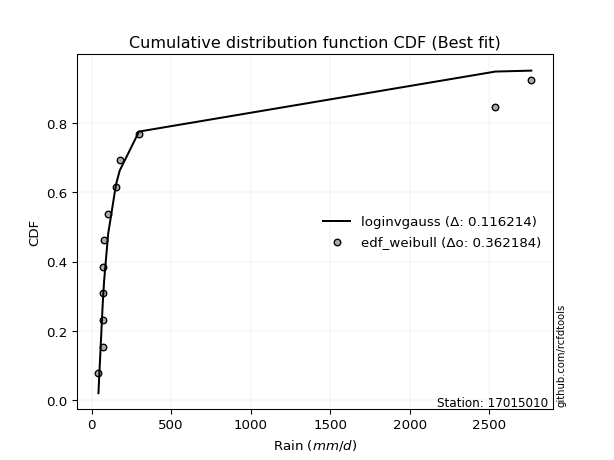</img>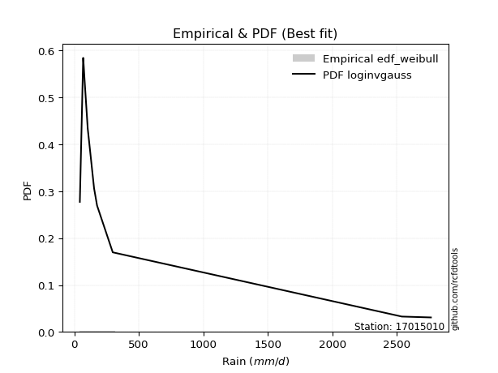</img>

</div>


### 4. EDF Beard (1943)

The Beard formula (or Beard´s plotting position formula) in hydrology is used to estimate the empirical non-exceedance probability _(P)_ of a flood event (or other extreme hydrological data point) within a given dataset.

<div align="center">


$P=(m-0.31)/(n+0.38)$


</div>


**4.1. Empirical values**

<div align="center">

|                | 0                    | 1                   | 2                   | 3                  | 4                  | 5                  | 6                  | 7                  | 8                  | 9                  | 10                 | 11                 |
|:---------------|:---------------------|:--------------------|:--------------------|:-------------------|:-------------------|:-------------------|:-------------------|:-------------------|:-------------------|:-------------------|:-------------------|:-------------------|
| date           | 2021                 | 2015                | 2017                | 2020               | 2019               | 2018               | 2022               | 2023               | 2014               | 2016               | 2024               | 2025               |
| x              | 43.0                 | 68.86               | 68.95               | 72.1               | 73.56              | 78.91              | 104.0              | 153.3              | 176.4              | 298.01             | 2537.4             | 2763.0             |
| m              | 1                    | 2                   | 3                   | 4                  | 5                  | 6                  | 7                  | 8                  | 9                  | 10                 | 11                 | 12                 |
| empirical_dist | edf_beard            | edf_beard           | edf_beard           | edf_beard          | edf_beard          | edf_beard          | edf_beard          | edf_beard          | edf_beard          | edf_beard          | edf_beard          | edf_beard          |
| empirical      | 0.055735056542810975 | 0.13651050080775443 | 0.21728594507269788 | 0.2980613893376413 | 0.3788368336025848 | 0.4596122778675283 | 0.5403877221324718 | 0.6211631663974152 | 0.7019386106623585 | 0.7827140549273021 | 0.8634894991922455 | 0.9442649434571889 |
| empirical_tr   | 1.0590248075278015   | 1.1580916744621141  | 1.2776057791537667  | 1.424626006904488  | 1.6098829648894668 | 1.850523168908819  | 2.1757469244288226 | 2.6396588486140726 | 3.3550135501355    | 4.6022304832713745 | 7.325443786982245  | 17.942028985507218 |

</div>


**4.2. Kolmogorov-Smirnov fit test (sorted by Δ)**


<div align="center">

|                | 0                   | 1                   | 2                   | 3                   | 4                   | 5                   | 6                   | 7                   | 8                   | 9                   | 10                  | 11                  | 12                  | 13                  | 14                  | 15                  | 16                  | 17                  | 18                  | 19                  | 20                  | 21                  | 22                  | 23                  | 24                  | 25                  | 26                  | 27                  | 28                  | 29                  | 30                  | 31                  | 32                  | 33                  | 34                  | 35                  | 36                  | 37                  | 38                  | 39                  | 40                  | 41                  | 42                  | 43                  | 44                  | 45                  | 46                  | 47                  | 48                  | 49                  | 50                  | 51                  | 52                  | 53                  | 54                  | 55                  | 56                  | 57                  | 58                  | 59                  | 60                  | 61                  | 62                  | 63                  | 64                  | 65                  | 66                  | 67                  | 68                  | 69                  | 70                  | 71                  | 72                  | 73                  | 74                  | 75                  | 76                  | 77                  | 78                  | 79                  | 80                  | 81                  | 82                  | 83                  | 84                  | 85                  | 86                  | 87                  | 88                  | 89                  | 90                  | 91                  | 92                  | 93                  | 94                  | 95                  | 96                  | 97                  | 98                  | 99                  | 100                 | 101                 | 102                 | 103                 | 104                 | 105                 | 106                 | 107                 | 108                 | 109                 | 110                 | 111                 | 112                 | 113                 | 114                 | 115                 | 116                 | 117                 | 118                 | 119                 | 120                 | 121                 | 122                 | 123                 | 124                 | 125                 | 126                 | 127                 | 128                 | 129                 | 130                 | 131                 | 132                 | 133                 | 134                 | 135                 | 136                 | 137                 | 138                 | 139                 | 140                 | 141                 | 142                 | 143                 | 144                 | 145                 | 146                 | 147                 | 148                 | 149                 | 150                 | 151                 | 152                 | 153                 | 154                 | 155                 | 156                 | 157                 | 158                 | 159                 |
|:---------------|:--------------------|:--------------------|:--------------------|:--------------------|:--------------------|:--------------------|:--------------------|:--------------------|:--------------------|:--------------------|:--------------------|:--------------------|:--------------------|:--------------------|:--------------------|:--------------------|:--------------------|:--------------------|:--------------------|:--------------------|:--------------------|:--------------------|:--------------------|:--------------------|:--------------------|:--------------------|:--------------------|:--------------------|:--------------------|:--------------------|:--------------------|:--------------------|:--------------------|:--------------------|:--------------------|:--------------------|:--------------------|:--------------------|:--------------------|:--------------------|:--------------------|:--------------------|:--------------------|:--------------------|:--------------------|:--------------------|:--------------------|:--------------------|:--------------------|:--------------------|:--------------------|:--------------------|:--------------------|:--------------------|:--------------------|:--------------------|:--------------------|:--------------------|:--------------------|:--------------------|:--------------------|:--------------------|:--------------------|:--------------------|:--------------------|:--------------------|:--------------------|:--------------------|:--------------------|:--------------------|:--------------------|:--------------------|:--------------------|:--------------------|:--------------------|:--------------------|:--------------------|:--------------------|:--------------------|:--------------------|:--------------------|:--------------------|:--------------------|:--------------------|:--------------------|:--------------------|:--------------------|:--------------------|:--------------------|:--------------------|:--------------------|:--------------------|:--------------------|:--------------------|:--------------------|:--------------------|:--------------------|:--------------------|:--------------------|:--------------------|:--------------------|:--------------------|:--------------------|:--------------------|:--------------------|:--------------------|:--------------------|:--------------------|:--------------------|:--------------------|:--------------------|:--------------------|:--------------------|:--------------------|:--------------------|:--------------------|:--------------------|:--------------------|:--------------------|:--------------------|:--------------------|:--------------------|:--------------------|:--------------------|:--------------------|:--------------------|:--------------------|:--------------------|:--------------------|:--------------------|:--------------------|:--------------------|:--------------------|:--------------------|:--------------------|:--------------------|:--------------------|:--------------------|:--------------------|:--------------------|:--------------------|:--------------------|:--------------------|:--------------------|:--------------------|:--------------------|:--------------------|:--------------------|:--------------------|:--------------------|:--------------------|:--------------------|:--------------------|:--------------------|:--------------------|:--------------------|:--------------------|:--------------------|:--------------------|:--------------------|
| station        | 17015010            | 17015010            | 17015010            | 17015010            | 17015010            | 17015010            | 17015010            | 17015010            | 17015010            | 17015010            | 17015010            | 17015010            | 17015010            | 17015010            | 17015010            | 17015010            | 17015010            | 17015010            | 17015010            | 17015010            | 17015010            | 17015010            | 17015010            | 17015010            | 17015010            | 17015010            | 17015010            | 17015010            | 17015010            | 17015010            | 17015010            | 17015010            | 17015010            | 17015010            | 17015010            | 17015010            | 17015010            | 17015010            | 17015010            | 17015010            | 17015010            | 17015010            | 17015010            | 17015010            | 17015010            | 17015010            | 17015010            | 17015010            | 17015010            | 17015010            | 17015010            | 17015010            | 17015010            | 17015010            | 17015010            | 17015010            | 17015010            | 17015010            | 17015010            | 17015010            | 17015010            | 17015010            | 17015010            | 17015010            | 17015010            | 17015010            | 17015010            | 17015010            | 17015010            | 17015010            | 17015010            | 17015010            | 17015010            | 17015010            | 17015010            | 17015010            | 17015010            | 17015010            | 17015010            | 17015010            | 17015010            | 17015010            | 17015010            | 17015010            | 17015010            | 17015010            | 17015010            | 17015010            | 17015010            | 17015010            | 17015010            | 17015010            | 17015010            | 17015010            | 17015010            | 17015010            | 17015010            | 17015010            | 17015010            | 17015010            | 17015010            | 17015010            | 17015010            | 17015010            | 17015010            | 17015010            | 17015010            | 17015010            | 17015010            | 17015010            | 17015010            | 17015010            | 17015010            | 17015010            | 17015010            | 17015010            | 17015010            | 17015010            | 17015010            | 17015010            | 17015010            | 17015010            | 17015010            | 17015010            | 17015010            | 17015010            | 17015010            | 17015010            | 17015010            | 17015010            | 17015010            | 17015010            | 17015010            | 17015010            | 17015010            | 17015010            | 17015010            | 17015010            | 17015010            | 17015010            | 17015010            | 17015010            | 17015010            | 17015010            | 17015010            | 17015010            | 17015010            | 17015010            | 17015010            | 17015010            | 17015010            | 17015010            | 17015010            | 17015010            | 17015010            | 17015010            | 17015010            | 17015010            | 17015010            | 17015010            |
| empirical_dist | edf_beard           | edf_beard           | edf_beard           | edf_beard           | edf_beard           | edf_beard           | edf_beard           | edf_beard           | edf_beard           | edf_beard           | edf_beard           | edf_beard           | edf_beard           | edf_beard           | edf_beard           | edf_beard           | edf_beard           | edf_beard           | edf_beard           | edf_beard           | edf_beard           | edf_beard           | edf_beard           | edf_beard           | edf_beard           | edf_beard           | edf_beard           | edf_beard           | edf_beard           | edf_beard           | edf_beard           | edf_beard           | edf_beard           | edf_beard           | edf_beard           | edf_beard           | edf_beard           | edf_beard           | edf_beard           | edf_beard           | edf_beard           | edf_beard           | edf_beard           | edf_beard           | edf_beard           | edf_beard           | edf_beard           | edf_beard           | edf_beard           | edf_beard           | edf_beard           | edf_beard           | edf_beard           | edf_beard           | edf_beard           | edf_beard           | edf_beard           | edf_beard           | edf_beard           | edf_beard           | edf_beard           | edf_beard           | edf_beard           | edf_beard           | edf_beard           | edf_beard           | edf_beard           | edf_beard           | edf_beard           | edf_beard           | edf_beard           | edf_beard           | edf_beard           | edf_beard           | edf_beard           | edf_beard           | edf_beard           | edf_beard           | edf_beard           | edf_beard           | edf_beard           | edf_beard           | edf_beard           | edf_beard           | edf_beard           | edf_beard           | edf_beard           | edf_beard           | edf_beard           | edf_beard           | edf_beard           | edf_beard           | edf_beard           | edf_beard           | edf_beard           | edf_beard           | edf_beard           | edf_beard           | edf_beard           | edf_beard           | edf_beard           | edf_beard           | edf_beard           | edf_beard           | edf_beard           | edf_beard           | edf_beard           | edf_beard           | edf_beard           | edf_beard           | edf_beard           | edf_beard           | edf_beard           | edf_beard           | edf_beard           | edf_beard           | edf_beard           | edf_beard           | edf_beard           | edf_beard           | edf_beard           | edf_beard           | edf_beard           | edf_beard           | edf_beard           | edf_beard           | edf_beard           | edf_beard           | edf_beard           | edf_beard           | edf_beard           | edf_beard           | edf_beard           | edf_beard           | edf_beard           | edf_beard           | edf_beard           | edf_beard           | edf_beard           | edf_beard           | edf_beard           | edf_beard           | edf_beard           | edf_beard           | edf_beard           | edf_beard           | edf_beard           | edf_beard           | edf_beard           | edf_beard           | edf_beard           | edf_beard           | edf_beard           | edf_beard           | edf_beard           | edf_beard           | edf_beard           | edf_beard           | edf_beard           | edf_beard           |
| p_dist         | logjohnsonsu        | logalpha            | loginvweibull       | loggenextreme       | logmielke           | logburr             | loginvgamma         | alpha               | logburr12           | loginvgauss         | logfatiguelife      | invgamma            | f                   | burr                | genextreme          | logmoyal            | invgauss            | mielke              | logpearson3         | lograyleigh         | halfgennorm         | loggumbel_r         | johnsonsu           | loggompertz         | logtruncnorm        | logmaxwell          | loghalfgennorm      | logexponnorm        | loghalflogistic     | loggenexpon         | loggenhalflogistic  | logvonmises_line    | logwald             | logncf              | burr12              | lomax               | loglomax            | genpareto           | kappa3              | logloglaplace       | loghalfnorm         | truncpareto         | lognct              | logfoldnorm         | nct                 | loggenlogistic      | logrdist            | logexponpow         | ncf                 | betaprime           | lognorm             | logcrystalball      | loganglit           | logsemicircular     | weibull_min         | logloggamma         | loglogistic         | logkstwobign        | bradford            | logweibull_min      | logf                | logarcsine          | logbetaprime        | logskewnorm         | loghypsecant        | fatiguelife         | logtukeylambda      | gamma               | logrice             | loglaplace          | loglaplace          | logtruncweibull_min | logtruncexpon       | logcosine           | loggumbel_l         | exponweib           | dgamma              | t                   | loggennorm          | loggenpareto        | logt                | logbradford         | gausshyper          | wald                | logwrapcauchy       | truncweibull_min    | moyal               | gengamma            | vonmises_line       | halflogistic        | logdweibull         | halfnorm            | pearson3            | gumbel_r            | foldnorm            | exponpow            | wrapcauchy          | rayleigh            | logksone            | arcsine             | tukeylambda         | powerlaw            | nakagami            | genlogistic         | logargus            | logkappa4           | maxwell             | gennorm             | loglevy_l           | logdgamma           | semicircular        | loguniform          | anglit              | erlang              | dweibull            | norm                | logtriang           | johnsonsb           | logistic            | kstwobign           | hypsecant           | logkappa3           | invweibull          | lognakagami         | levy_l              | rice                | laplace             | gumbel_l            | cosine              | crystalball         | logbeta             | exponnorm           | genexpon            | logpowerlaw         | logjohnsonsb        | loggausshyper       | logweibull_max      | loggengamma         | truncexpon          | argus               | logerlang           | logtrapezoid        | truncnorm           | logexponweib        | gompertz            | loggamma            | loggamma            | beta                | skewnorm            | ksone               | triang              | rdist               | kappa4              | genhalflogistic     | uniform             | weibull_max         | trapezoid           | logtruncpareto      | logvonmises         | vonmises            |
| delta          | 0.11650630064302314 | 0.1203021250694098  | 0.12036540971275814 | 0.12037326329632528 | 0.12082053119542266 | 0.12084216068461498 | 0.12286551950915078 | 0.12605561600391263 | 0.13118520527507677 | 0.1319948654102586  | 0.13369496460415517 | 0.13532949853231532 | 0.13662941392944464 | 0.13681325320447105 | 0.13777765178869847 | 0.14031086105573792 | 0.140610782878432   | 0.14433109746423115 | 0.1453213542378072  | 0.1454606449125114  | 0.14713609997014976 | 0.1472379401750457  | 0.15055170785712924 | 0.15283501739468217 | 0.1538121046188384  | 0.15472697655650092 | 0.1550153777916957  | 0.15509863174763455 | 0.15565086553047194 | 0.15575230668599285 | 0.15602178433088826 | 0.1564043035450827  | 0.15757943556651377 | 0.15819629029641685 | 0.15971270576436    | 0.16113443124429708 | 0.16277545419678327 | 0.16396918216019016 | 0.16445173784027747 | 0.16759881928952178 | 0.1696126487898776  | 0.17137392087516587 | 0.17196792802271976 | 0.17546757507040575 | 0.1765695476656881  | 0.17904186472625205 | 0.17921950217216576 | 0.18044411299567642 | 0.18186780112024148 | 0.18353229457544717 | 0.18712576604491582 | 0.1871258428683481  | 0.18924467088518127 | 0.19011759781343895 | 0.19050203190408344 | 0.19070670311173188 | 0.19823973623329677 | 0.20182684721195682 | 0.2020884597097899  | 0.20260352443546212 | 0.2028600587835119  | 0.2062164617612728  | 0.20680595270751617 | 0.20933238567114892 | 0.21209874407854443 | 0.21268728365379358 | 0.21728594506761756 | 0.21758587065303822 | 0.22244822487671487 | 0.24005476345076832 | 0.24005476345076832 | 0.24551703375659997 | 0.25013067094001884 | 0.2556353849521258  | 0.25690356425175354 | 0.25765843978716585 | 0.26349023468733346 | 0.2682436324842099  | 0.27154462946778435 | 0.2733097245792554  | 0.2767509400296071  | 0.27907357642671937 | 0.281471172322452   | 0.29129927020222546 | 0.29440719666131504 | 0.2988236310277613  | 0.2990702365236949  | 0.2991432743178819  | 0.30677543751218556 | 0.3147413467026507  | 0.3152678445081166  | 0.3161312855854294  | 0.3182881730532629  | 0.3220162868386496  | 0.32779151459357303 | 0.3296647141604287  | 0.33430664229395685 | 0.3356071803380052  | 0.33603714549337943 | 0.3395847335060362  | 0.3399841252279996  | 0.3411717466815877  | 0.34191019766059755 | 0.3425529144785532  | 0.3431720271770846  | 0.34542236739250864 | 0.34789948809019394 | 0.35716869267911444 | 0.360019600634492   | 0.3607590086809398  | 0.36250307777331525 | 0.3628568524595837  | 0.36820420542941573 | 0.37261334130717527 | 0.3731930545410595  | 0.3819336615765318  | 0.3834025454295985  | 0.3931984326715263  | 0.3947451656761407  | 0.39971651794064844 | 0.4052353655578356  | 0.40963972339151133 | 0.40978501502397935 | 0.41142142462261044 | 0.4191314897363003  | 0.4296790967792825  | 0.43227840173673043 | 0.4485245113392107  | 0.452350025195177   | 0.46021721601571597 | 0.46086718719628916 | 0.4618570681260904  | 0.46506064832518323 | 0.46705277766159825 | 0.4765395716782405  | 0.49772004655580293 | 0.509131357171045   | 0.5113210815054823  | 0.5145305052201024  | 0.5178195533933765  | 0.5667825188535646  | 0.568054728449553   | 0.5693358627199033  | 0.5753545063603118  | 0.5834047409946653  | 0.58696723304592    | 0.58696723304592    | 0.5954432704562165  | 0.6026613921231033  | 0.6212526578684785  | 0.6240734773369289  | 0.665229415640061   | 0.6696894177728394  | 0.6889579501485467  | 0.6889603784567139  | 0.696016866907037   | 0.7554991642827783  | 0.7710456910052985  | 1.2577519332535079  | 439.6228179659636   |
| deltao         | 0.36218414519599995 | 0.36218414519599995 | 0.36218414519599995 | 0.36218414519599995 | 0.36218414519599995 | 0.36218414519599995 | 0.36218414519599995 | 0.36218414519599995 | 0.36218414519599995 | 0.36218414519599995 | 0.36218414519599995 | 0.36218414519599995 | 0.36218414519599995 | 0.36218414519599995 | 0.36218414519599995 | 0.36218414519599995 | 0.36218414519599995 | 0.36218414519599995 | 0.36218414519599995 | 0.36218414519599995 | 0.36218414519599995 | 0.36218414519599995 | 0.36218414519599995 | 0.36218414519599995 | 0.36218414519599995 | 0.36218414519599995 | 0.36218414519599995 | 0.36218414519599995 | 0.36218414519599995 | 0.36218414519599995 | 0.36218414519599995 | 0.36218414519599995 | 0.36218414519599995 | 0.36218414519599995 | 0.36218414519599995 | 0.36218414519599995 | 0.36218414519599995 | 0.36218414519599995 | 0.36218414519599995 | 0.36218414519599995 | 0.36218414519599995 | 0.36218414519599995 | 0.36218414519599995 | 0.36218414519599995 | 0.36218414519599995 | 0.36218414519599995 | 0.36218414519599995 | 0.36218414519599995 | 0.36218414519599995 | 0.36218414519599995 | 0.36218414519599995 | 0.36218414519599995 | 0.36218414519599995 | 0.36218414519599995 | 0.36218414519599995 | 0.36218414519599995 | 0.36218414519599995 | 0.36218414519599995 | 0.36218414519599995 | 0.36218414519599995 | 0.36218414519599995 | 0.36218414519599995 | 0.36218414519599995 | 0.36218414519599995 | 0.36218414519599995 | 0.36218414519599995 | 0.36218414519599995 | 0.36218414519599995 | 0.36218414519599995 | 0.36218414519599995 | 0.36218414519599995 | 0.36218414519599995 | 0.36218414519599995 | 0.36218414519599995 | 0.36218414519599995 | 0.36218414519599995 | 0.36218414519599995 | 0.36218414519599995 | 0.36218414519599995 | 0.36218414519599995 | 0.36218414519599995 | 0.36218414519599995 | 0.36218414519599995 | 0.36218414519599995 | 0.36218414519599995 | 0.36218414519599995 | 0.36218414519599995 | 0.36218414519599995 | 0.36218414519599995 | 0.36218414519599995 | 0.36218414519599995 | 0.36218414519599995 | 0.36218414519599995 | 0.36218414519599995 | 0.36218414519599995 | 0.36218414519599995 | 0.36218414519599995 | 0.36218414519599995 | 0.36218414519599995 | 0.36218414519599995 | 0.36218414519599995 | 0.36218414519599995 | 0.36218414519599995 | 0.36218414519599995 | 0.36218414519599995 | 0.36218414519599995 | 0.36218414519599995 | 0.36218414519599995 | 0.36218414519599995 | 0.36218414519599995 | 0.36218414519599995 | 0.36218414519599995 | 0.36218414519599995 | 0.36218414519599995 | 0.36218414519599995 | 0.36218414519599995 | 0.36218414519599995 | 0.36218414519599995 | 0.36218414519599995 | 0.36218414519599995 | 0.36218414519599995 | 0.36218414519599995 | 0.36218414519599995 | 0.36218414519599995 | 0.36218414519599995 | 0.36218414519599995 | 0.36218414519599995 | 0.36218414519599995 | 0.36218414519599995 | 0.36218414519599995 | 0.36218414519599995 | 0.36218414519599995 | 0.36218414519599995 | 0.36218414519599995 | 0.36218414519599995 | 0.36218414519599995 | 0.36218414519599995 | 0.36218414519599995 | 0.36218414519599995 | 0.36218414519599995 | 0.36218414519599995 | 0.36218414519599995 | 0.36218414519599995 | 0.36218414519599995 | 0.36218414519599995 | 0.36218414519599995 | 0.36218414519599995 | 0.36218414519599995 | 0.36218414519599995 | 0.36218414519599995 | 0.36218414519599995 | 0.36218414519599995 | 0.36218414519599995 | 0.36218414519599995 | 0.36218414519599995 | 0.36218414519599995 | 0.36218414519599995 | 0.36218414519599995 | 0.36218414519599995 | 0.36218414519599995 |
| eval           | Δo > Δ              | Δo > Δ              | Δo > Δ              | Δo > Δ              | Δo > Δ              | Δo > Δ              | Δo > Δ              | Δo > Δ              | Δo > Δ              | Δo > Δ              | Δo > Δ              | Δo > Δ              | Δo > Δ              | Δo > Δ              | Δo > Δ              | Δo > Δ              | Δo > Δ              | Δo > Δ              | Δo > Δ              | Δo > Δ              | Δo > Δ              | Δo > Δ              | Δo > Δ              | Δo > Δ              | Δo > Δ              | Δo > Δ              | Δo > Δ              | Δo > Δ              | Δo > Δ              | Δo > Δ              | Δo > Δ              | Δo > Δ              | Δo > Δ              | Δo > Δ              | Δo > Δ              | Δo > Δ              | Δo > Δ              | Δo > Δ              | Δo > Δ              | Δo > Δ              | Δo > Δ              | Δo > Δ              | Δo > Δ              | Δo > Δ              | Δo > Δ              | Δo > Δ              | Δo > Δ              | Δo > Δ              | Δo > Δ              | Δo > Δ              | Δo > Δ              | Δo > Δ              | Δo > Δ              | Δo > Δ              | Δo > Δ              | Δo > Δ              | Δo > Δ              | Δo > Δ              | Δo > Δ              | Δo > Δ              | Δo > Δ              | Δo > Δ              | Δo > Δ              | Δo > Δ              | Δo > Δ              | Δo > Δ              | Δo > Δ              | Δo > Δ              | Δo > Δ              | Δo > Δ              | Δo > Δ              | Δo > Δ              | Δo > Δ              | Δo > Δ              | Δo > Δ              | Δo > Δ              | Δo > Δ              | Δo > Δ              | Δo > Δ              | Δo > Δ              | Δo > Δ              | Δo > Δ              | Δo > Δ              | Δo > Δ              | Δo > Δ              | Δo > Δ              | Δo > Δ              | Δo > Δ              | Δo > Δ              | Δo > Δ              | Δo > Δ              | Δo > Δ              | Δo > Δ              | Δo > Δ              | Δo > Δ              | Δo > Δ              | Δo > Δ              | Δo > Δ              | Δo > Δ              | Δo > Δ              | Δo > Δ              | Δo > Δ              | Δo > Δ              | Δo > Δ              | Δo > Δ              | Δo > Δ              | Δo > Δ              | Δo > Δ              | Δo > Δ              | Δo > Δ              | Δo <= Δ             | Δo <= Δ             | Δo <= Δ             | Δo <= Δ             | Δo <= Δ             | Δo <= Δ             | Δo <= Δ             | Δo <= Δ             | Δo <= Δ             | Δo <= Δ             | Δo <= Δ             | Δo <= Δ             | Δo <= Δ             | Δo <= Δ             | Δo <= Δ             | Δo <= Δ             | Δo <= Δ             | Δo <= Δ             | Δo <= Δ             | Δo <= Δ             | Δo <= Δ             | Δo <= Δ             | Δo <= Δ             | Δo <= Δ             | Δo <= Δ             | Δo <= Δ             | Δo <= Δ             | Δo <= Δ             | Δo <= Δ             | Δo <= Δ             | Δo <= Δ             | Δo <= Δ             | Δo <= Δ             | Δo <= Δ             | Δo <= Δ             | Δo <= Δ             | Δo <= Δ             | Δo <= Δ             | Δo <= Δ             | Δo <= Δ             | Δo <= Δ             | Δo <= Δ             | Δo <= Δ             | Δo <= Δ             | Δo <= Δ             | Δo <= Δ             | Δo <= Δ             | Δo <= Δ             | Δo <= Δ             | Δo <= Δ             |
| fit            | 1                   | 1                   | 1                   | 1                   | 1                   | 1                   | 1                   | 1                   | 1                   | 1                   | 1                   | 1                   | 1                   | 1                   | 1                   | 1                   | 1                   | 1                   | 1                   | 1                   | 1                   | 1                   | 1                   | 1                   | 1                   | 1                   | 1                   | 1                   | 1                   | 1                   | 1                   | 1                   | 1                   | 1                   | 1                   | 1                   | 1                   | 1                   | 1                   | 1                   | 1                   | 1                   | 1                   | 1                   | 1                   | 1                   | 1                   | 1                   | 1                   | 1                   | 1                   | 1                   | 1                   | 1                   | 1                   | 1                   | 1                   | 1                   | 1                   | 1                   | 1                   | 1                   | 1                   | 1                   | 1                   | 1                   | 1                   | 1                   | 1                   | 1                   | 1                   | 1                   | 1                   | 1                   | 1                   | 1                   | 1                   | 1                   | 1                   | 1                   | 1                   | 1                   | 1                   | 1                   | 1                   | 1                   | 1                   | 1                   | 1                   | 1                   | 1                   | 1                   | 1                   | 1                   | 1                   | 1                   | 1                   | 1                   | 1                   | 1                   | 1                   | 1                   | 1                   | 1                   | 1                   | 1                   | 1                   | 1                   | 1                   | 1                   | 0                   | 0                   | 0                   | 0                   | 0                   | 0                   | 0                   | 0                   | 0                   | 0                   | 0                   | 0                   | 0                   | 0                   | 0                   | 0                   | 0                   | 0                   | 0                   | 0                   | 0                   | 0                   | 0                   | 0                   | 0                   | 0                   | 0                   | 0                   | 0                   | 0                   | 0                   | 0                   | 0                   | 0                   | 0                   | 0                   | 0                   | 0                   | 0                   | 0                   | 0                   | 0                   | 0                   | 0                   | 0                   | 0                   | 0                   | 0                   | 0                   | 0                   |
| n              | 12                  | 12                  | 12                  | 12                  | 12                  | 12                  | 12                  | 12                  | 12                  | 12                  | 12                  | 12                  | 12                  | 12                  | 12                  | 12                  | 12                  | 12                  | 12                  | 12                  | 12                  | 12                  | 12                  | 12                  | 12                  | 12                  | 12                  | 12                  | 12                  | 12                  | 12                  | 12                  | 12                  | 12                  | 12                  | 12                  | 12                  | 12                  | 12                  | 12                  | 12                  | 12                  | 12                  | 12                  | 12                  | 12                  | 12                  | 12                  | 12                  | 12                  | 12                  | 12                  | 12                  | 12                  | 12                  | 12                  | 12                  | 12                  | 12                  | 12                  | 12                  | 12                  | 12                  | 12                  | 12                  | 12                  | 12                  | 12                  | 12                  | 12                  | 12                  | 12                  | 12                  | 12                  | 12                  | 12                  | 12                  | 12                  | 12                  | 12                  | 12                  | 12                  | 12                  | 12                  | 12                  | 12                  | 12                  | 12                  | 12                  | 12                  | 12                  | 12                  | 12                  | 12                  | 12                  | 12                  | 12                  | 12                  | 12                  | 12                  | 12                  | 12                  | 12                  | 12                  | 12                  | 12                  | 12                  | 12                  | 12                  | 12                  | 12                  | 12                  | 12                  | 12                  | 12                  | 12                  | 12                  | 12                  | 12                  | 12                  | 12                  | 12                  | 12                  | 12                  | 12                  | 12                  | 12                  | 12                  | 12                  | 12                  | 12                  | 12                  | 12                  | 12                  | 12                  | 12                  | 12                  | 12                  | 12                  | 12                  | 12                  | 12                  | 12                  | 12                  | 12                  | 12                  | 12                  | 12                  | 12                  | 12                  | 12                  | 12                  | 12                  | 12                  | 12                  | 12                  | 12                  | 12                  | 12                  | 12                  |
| best_fit       | 1                   | 0                   | 0                   | 0                   | 0                   | 0                   | 0                   | 0                   | 0                   | 0                   | 0                   | 0                   | 0                   | 0                   | 0                   | 0                   | 0                   | 0                   | 0                   | 0                   | 0                   | 0                   | 0                   | 0                   | 0                   | 0                   | 0                   | 0                   | 0                   | 0                   | 0                   | 0                   | 0                   | 0                   | 0                   | 0                   | 0                   | 0                   | 0                   | 0                   | 0                   | 0                   | 0                   | 0                   | 0                   | 0                   | 0                   | 0                   | 0                   | 0                   | 0                   | 0                   | 0                   | 0                   | 0                   | 0                   | 0                   | 0                   | 0                   | 0                   | 0                   | 0                   | 0                   | 0                   | 0                   | 0                   | 0                   | 0                   | 0                   | 0                   | 0                   | 0                   | 0                   | 0                   | 0                   | 0                   | 0                   | 0                   | 0                   | 0                   | 0                   | 0                   | 0                   | 0                   | 0                   | 0                   | 0                   | 0                   | 0                   | 0                   | 0                   | 0                   | 0                   | 0                   | 0                   | 0                   | 0                   | 0                   | 0                   | 0                   | 0                   | 0                   | 0                   | 0                   | 0                   | 0                   | 0                   | 0                   | 0                   | 0                   | 0                   | 0                   | 0                   | 0                   | 0                   | 0                   | 0                   | 0                   | 0                   | 0                   | 0                   | 0                   | 0                   | 0                   | 0                   | 0                   | 0                   | 0                   | 0                   | 0                   | 0                   | 0                   | 0                   | 0                   | 0                   | 0                   | 0                   | 0                   | 0                   | 0                   | 0                   | 0                   | 0                   | 0                   | 0                   | 0                   | 0                   | 0                   | 0                   | 0                   | 0                   | 0                   | 0                   | 0                   | 0                   | 0                   | 0                   | 0                   | 0                   | 0                   |
| best_fit_sort  | 1                   | 2                   | 3                   | 4                   | 5                   | 6                   | 7                   | 8                   | 9                   | 10                  | 11                  | 12                  | 13                  | 14                  | 15                  | 16                  | 17                  | 18                  | 19                  | 20                  | 21                  | 22                  | 23                  | 24                  | 25                  | 26                  | 27                  | 28                  | 29                  | 30                  | 31                  | 32                  | 33                  | 34                  | 35                  | 36                  | 37                  | 38                  | 39                  | 40                  | 41                  | 42                  | 43                  | 44                  | 45                  | 46                  | 47                  | 48                  | 49                  | 50                  | 51                  | 52                  | 53                  | 54                  | 55                  | 56                  | 57                  | 58                  | 59                  | 60                  | 61                  | 62                  | 63                  | 64                  | 65                  | 66                  | 67                  | 68                  | 69                  | 70                  | 71                  | 72                  | 73                  | 74                  | 75                  | 76                  | 77                  | 78                  | 79                  | 80                  | 81                  | 82                  | 83                  | 84                  | 85                  | 86                  | 87                  | 88                  | 89                  | 90                  | 91                  | 92                  | 93                  | 94                  | 95                  | 96                  | 97                  | 98                  | 99                  | 100                 | 101                 | 102                 | 103                 | 104                 | 105                 | 106                 | 107                 | 108                 | 109                 | 110                 | 111                 | 112                 | 113                 | 114                 | 115                 | 116                 | 117                 | 118                 | 119                 | 120                 | 121                 | 122                 | 123                 | 124                 | 125                 | 126                 | 127                 | 128                 | 129                 | 130                 | 131                 | 132                 | 133                 | 134                 | 135                 | 136                 | 137                 | 138                 | 139                 | 140                 | 141                 | 142                 | 143                 | 144                 | 145                 | 146                 | 147                 | 148                 | 149                 | 150                 | 151                 | 152                 | 153                 | 154                 | 155                 | 156                 | 157                 | 158                 | 159                 | 160                 |

</div>


**4.3. Best fit**

<div align="center">

|   id |   station | empirical_dist   | p_dist       |    delta |   deltao | eval   |   fit |   n |   best_fit |   best_fit_sort |
|-----:|----------:|:-----------------|:-------------|---------:|---------:|:-------|------:|----:|-----------:|----------------:|
|    0 |  17015010 | edf_beard        | logjohnsonsu | 0.116506 | 0.362184 | Δo > Δ |     1 |  12 |          1 |               1 |

</div>


<div align="center">

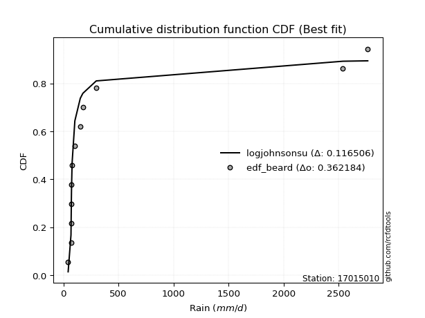</img></img>

</div>


### 5. EDF Chegodayev (1955)

The Chegodayev formula is an empirical plotting position formula used in hydrological frequency analysis to estimate the exceedance probability or return period of a specific event from a set of observed data. It is primarily used for plotting observed data points on probability paper to fit a theoretical distribution, particularly for analyzing extreme events like maximum flood flows or rainfall intensities. The constant _b_ value in the generalized plotting position formula is 0.3.

<div align="center">


$P=(m-b)/(n+1-2b)$


</div>


**5.1. Empirical values**

<div align="center">

|                | 0                  | 1                   | 2                   | 3                   | 4                  | 5                  | 6                  | 7                  | 8                  | 9                 | 10                 | 11                 |
|:---------------|:-------------------|:--------------------|:--------------------|:--------------------|:-------------------|:-------------------|:-------------------|:-------------------|:-------------------|:------------------|:-------------------|:-------------------|
| date           | 2021               | 2015                | 2017                | 2020                | 2019               | 2018               | 2022               | 2023               | 2014               | 2016              | 2024               | 2025               |
| x              | 43.0               | 68.86               | 68.95               | 72.1                | 73.56              | 78.91              | 104.0              | 153.3              | 176.4              | 298.01            | 2537.4             | 2763.0             |
| m              | 1                  | 2                   | 3                   | 4                   | 5                  | 6                  | 7                  | 8                  | 9                  | 10                | 11                 | 12                 |
| empirical_dist | edf_chegodayev     | edf_chegodayev      | edf_chegodayev      | edf_chegodayev      | edf_chegodayev     | edf_chegodayev     | edf_chegodayev     | edf_chegodayev     | edf_chegodayev     | edf_chegodayev    | edf_chegodayev     | edf_chegodayev     |
| empirical      | 0.0564516129032258 | 0.13709677419354838 | 0.21774193548387097 | 0.29838709677419356 | 0.3790322580645161 | 0.4596774193548387 | 0.5403225806451613 | 0.6209677419354839 | 0.7016129032258064 | 0.782258064516129 | 0.8629032258064515 | 0.9435483870967741 |
| empirical_tr   | 1.0598290598290598 | 1.158878504672897   | 1.2783505154639176  | 1.425287356321839   | 1.6103896103896105 | 1.8507462686567164 | 2.1754385964912277 | 2.6382978723404253 | 3.3513513513513504 | 4.592592592592592 | 7.294117647058818  | 17.714285714285694 |

</div>


**5.2. Kolmogorov-Smirnov fit test (sorted by Δ)**


<div align="center">

|                | 0                   | 1                   | 2                   | 3                   | 4                   | 5                   | 6                   | 7                   | 8                   | 9                   | 10                  | 11                  | 12                  | 13                  | 14                  | 15                  | 16                  | 17                  | 18                  | 19                  | 20                  | 21                  | 22                  | 23                  | 24                  | 25                  | 26                  | 27                  | 28                  | 29                  | 30                  | 31                  | 32                  | 33                  | 34                  | 35                  | 36                  | 37                  | 38                  | 39                  | 40                  | 41                  | 42                  | 43                  | 44                  | 45                  | 46                  | 47                  | 48                  | 49                  | 50                  | 51                  | 52                  | 53                  | 54                  | 55                  | 56                  | 57                  | 58                  | 59                  | 60                  | 61                  | 62                  | 63                  | 64                  | 65                  | 66                  | 67                  | 68                  | 69                  | 70                  | 71                  | 72                  | 73                  | 74                  | 75                  | 76                  | 77                  | 78                  | 79                  | 80                  | 81                  | 82                  | 83                  | 84                  | 85                  | 86                  | 87                  | 88                  | 89                  | 90                  | 91                  | 92                  | 93                  | 94                  | 95                  | 96                  | 97                  | 98                  | 99                  | 100                 | 101                 | 102                 | 103                 | 104                 | 105                 | 106                 | 107                 | 108                 | 109                 | 110                 | 111                 | 112                 | 113                 | 114                 | 115                 | 116                 | 117                 | 118                 | 119                 | 120                 | 121                 | 122                 | 123                 | 124                 | 125                 | 126                 | 127                 | 128                 | 129                 | 130                 | 131                 | 132                 | 133                 | 134                 | 135                 | 136                 | 137                 | 138                 | 139                 | 140                 | 141                 | 142                 | 143                 | 144                 | 145                 | 146                 | 147                 | 148                 | 149                 | 150                 | 151                 | 152                 | 153                 | 154                 | 155                 | 156                 | 157                 | 158                 | 159                 |
|:---------------|:--------------------|:--------------------|:--------------------|:--------------------|:--------------------|:--------------------|:--------------------|:--------------------|:--------------------|:--------------------|:--------------------|:--------------------|:--------------------|:--------------------|:--------------------|:--------------------|:--------------------|:--------------------|:--------------------|:--------------------|:--------------------|:--------------------|:--------------------|:--------------------|:--------------------|:--------------------|:--------------------|:--------------------|:--------------------|:--------------------|:--------------------|:--------------------|:--------------------|:--------------------|:--------------------|:--------------------|:--------------------|:--------------------|:--------------------|:--------------------|:--------------------|:--------------------|:--------------------|:--------------------|:--------------------|:--------------------|:--------------------|:--------------------|:--------------------|:--------------------|:--------------------|:--------------------|:--------------------|:--------------------|:--------------------|:--------------------|:--------------------|:--------------------|:--------------------|:--------------------|:--------------------|:--------------------|:--------------------|:--------------------|:--------------------|:--------------------|:--------------------|:--------------------|:--------------------|:--------------------|:--------------------|:--------------------|:--------------------|:--------------------|:--------------------|:--------------------|:--------------------|:--------------------|:--------------------|:--------------------|:--------------------|:--------------------|:--------------------|:--------------------|:--------------------|:--------------------|:--------------------|:--------------------|:--------------------|:--------------------|:--------------------|:--------------------|:--------------------|:--------------------|:--------------------|:--------------------|:--------------------|:--------------------|:--------------------|:--------------------|:--------------------|:--------------------|:--------------------|:--------------------|:--------------------|:--------------------|:--------------------|:--------------------|:--------------------|:--------------------|:--------------------|:--------------------|:--------------------|:--------------------|:--------------------|:--------------------|:--------------------|:--------------------|:--------------------|:--------------------|:--------------------|:--------------------|:--------------------|:--------------------|:--------------------|:--------------------|:--------------------|:--------------------|:--------------------|:--------------------|:--------------------|:--------------------|:--------------------|:--------------------|:--------------------|:--------------------|:--------------------|:--------------------|:--------------------|:--------------------|:--------------------|:--------------------|:--------------------|:--------------------|:--------------------|:--------------------|:--------------------|:--------------------|:--------------------|:--------------------|:--------------------|:--------------------|:--------------------|:--------------------|:--------------------|:--------------------|:--------------------|:--------------------|:--------------------|:--------------------|
| station        | 17015010            | 17015010            | 17015010            | 17015010            | 17015010            | 17015010            | 17015010            | 17015010            | 17015010            | 17015010            | 17015010            | 17015010            | 17015010            | 17015010            | 17015010            | 17015010            | 17015010            | 17015010            | 17015010            | 17015010            | 17015010            | 17015010            | 17015010            | 17015010            | 17015010            | 17015010            | 17015010            | 17015010            | 17015010            | 17015010            | 17015010            | 17015010            | 17015010            | 17015010            | 17015010            | 17015010            | 17015010            | 17015010            | 17015010            | 17015010            | 17015010            | 17015010            | 17015010            | 17015010            | 17015010            | 17015010            | 17015010            | 17015010            | 17015010            | 17015010            | 17015010            | 17015010            | 17015010            | 17015010            | 17015010            | 17015010            | 17015010            | 17015010            | 17015010            | 17015010            | 17015010            | 17015010            | 17015010            | 17015010            | 17015010            | 17015010            | 17015010            | 17015010            | 17015010            | 17015010            | 17015010            | 17015010            | 17015010            | 17015010            | 17015010            | 17015010            | 17015010            | 17015010            | 17015010            | 17015010            | 17015010            | 17015010            | 17015010            | 17015010            | 17015010            | 17015010            | 17015010            | 17015010            | 17015010            | 17015010            | 17015010            | 17015010            | 17015010            | 17015010            | 17015010            | 17015010            | 17015010            | 17015010            | 17015010            | 17015010            | 17015010            | 17015010            | 17015010            | 17015010            | 17015010            | 17015010            | 17015010            | 17015010            | 17015010            | 17015010            | 17015010            | 17015010            | 17015010            | 17015010            | 17015010            | 17015010            | 17015010            | 17015010            | 17015010            | 17015010            | 17015010            | 17015010            | 17015010            | 17015010            | 17015010            | 17015010            | 17015010            | 17015010            | 17015010            | 17015010            | 17015010            | 17015010            | 17015010            | 17015010            | 17015010            | 17015010            | 17015010            | 17015010            | 17015010            | 17015010            | 17015010            | 17015010            | 17015010            | 17015010            | 17015010            | 17015010            | 17015010            | 17015010            | 17015010            | 17015010            | 17015010            | 17015010            | 17015010            | 17015010            | 17015010            | 17015010            | 17015010            | 17015010            | 17015010            | 17015010            |
| empirical_dist | edf_chegodayev      | edf_chegodayev      | edf_chegodayev      | edf_chegodayev      | edf_chegodayev      | edf_chegodayev      | edf_chegodayev      | edf_chegodayev      | edf_chegodayev      | edf_chegodayev      | edf_chegodayev      | edf_chegodayev      | edf_chegodayev      | edf_chegodayev      | edf_chegodayev      | edf_chegodayev      | edf_chegodayev      | edf_chegodayev      | edf_chegodayev      | edf_chegodayev      | edf_chegodayev      | edf_chegodayev      | edf_chegodayev      | edf_chegodayev      | edf_chegodayev      | edf_chegodayev      | edf_chegodayev      | edf_chegodayev      | edf_chegodayev      | edf_chegodayev      | edf_chegodayev      | edf_chegodayev      | edf_chegodayev      | edf_chegodayev      | edf_chegodayev      | edf_chegodayev      | edf_chegodayev      | edf_chegodayev      | edf_chegodayev      | edf_chegodayev      | edf_chegodayev      | edf_chegodayev      | edf_chegodayev      | edf_chegodayev      | edf_chegodayev      | edf_chegodayev      | edf_chegodayev      | edf_chegodayev      | edf_chegodayev      | edf_chegodayev      | edf_chegodayev      | edf_chegodayev      | edf_chegodayev      | edf_chegodayev      | edf_chegodayev      | edf_chegodayev      | edf_chegodayev      | edf_chegodayev      | edf_chegodayev      | edf_chegodayev      | edf_chegodayev      | edf_chegodayev      | edf_chegodayev      | edf_chegodayev      | edf_chegodayev      | edf_chegodayev      | edf_chegodayev      | edf_chegodayev      | edf_chegodayev      | edf_chegodayev      | edf_chegodayev      | edf_chegodayev      | edf_chegodayev      | edf_chegodayev      | edf_chegodayev      | edf_chegodayev      | edf_chegodayev      | edf_chegodayev      | edf_chegodayev      | edf_chegodayev      | edf_chegodayev      | edf_chegodayev      | edf_chegodayev      | edf_chegodayev      | edf_chegodayev      | edf_chegodayev      | edf_chegodayev      | edf_chegodayev      | edf_chegodayev      | edf_chegodayev      | edf_chegodayev      | edf_chegodayev      | edf_chegodayev      | edf_chegodayev      | edf_chegodayev      | edf_chegodayev      | edf_chegodayev      | edf_chegodayev      | edf_chegodayev      | edf_chegodayev      | edf_chegodayev      | edf_chegodayev      | edf_chegodayev      | edf_chegodayev      | edf_chegodayev      | edf_chegodayev      | edf_chegodayev      | edf_chegodayev      | edf_chegodayev      | edf_chegodayev      | edf_chegodayev      | edf_chegodayev      | edf_chegodayev      | edf_chegodayev      | edf_chegodayev      | edf_chegodayev      | edf_chegodayev      | edf_chegodayev      | edf_chegodayev      | edf_chegodayev      | edf_chegodayev      | edf_chegodayev      | edf_chegodayev      | edf_chegodayev      | edf_chegodayev      | edf_chegodayev      | edf_chegodayev      | edf_chegodayev      | edf_chegodayev      | edf_chegodayev      | edf_chegodayev      | edf_chegodayev      | edf_chegodayev      | edf_chegodayev      | edf_chegodayev      | edf_chegodayev      | edf_chegodayev      | edf_chegodayev      | edf_chegodayev      | edf_chegodayev      | edf_chegodayev      | edf_chegodayev      | edf_chegodayev      | edf_chegodayev      | edf_chegodayev      | edf_chegodayev      | edf_chegodayev      | edf_chegodayev      | edf_chegodayev      | edf_chegodayev      | edf_chegodayev      | edf_chegodayev      | edf_chegodayev      | edf_chegodayev      | edf_chegodayev      | edf_chegodayev      | edf_chegodayev      | edf_chegodayev      | edf_chegodayev      | edf_chegodayev      |
| p_dist         | logjohnsonsu        | loginvweibull       | loggenextreme       | logmielke           | logburr             | logalpha            | loginvgamma         | alpha               | logburr12           | loginvgauss         | logfatiguelife      | invgamma            | f                   | burr                | genextreme          | invgauss            | logmoyal            | mielke              | logpearson3         | lograyleigh         | halfgennorm         | loggumbel_r         | johnsonsu           | loggompertz         | logtruncnorm        | logmaxwell          | loghalfgennorm      | loghalflogistic     | logexponnorm        | loggenexpon         | logvonmises_line    | loggenhalflogistic  | logwald             | logncf              | burr12              | lomax               | loglomax            | genpareto           | kappa3              | logloglaplace       | loghalfnorm         | truncpareto         | lognct              | logfoldnorm         | nct                 | loggenlogistic      | logrdist            | logexponpow         | ncf                 | betaprime           | lognorm             | logcrystalball      | loganglit           | logsemicircular     | weibull_min         | logloggamma         | loglogistic         | bradford            | logkstwobign        | logweibull_min      | logf                | logarcsine          | logbetaprime        | logskewnorm         | loghypsecant        | fatiguelife         | gamma               | logtukeylambda      | logrice             | loglaplace          | loglaplace          | logtruncweibull_min | logtruncexpon       | logcosine           | loggumbel_l         | exponweib           | dgamma              | t                   | loggennorm          | loggenpareto        | logt                | logbradford         | gausshyper          | wald                | logwrapcauchy       | truncweibull_min    | moyal               | gengamma            | vonmises_line       | halflogistic        | logdweibull         | halfnorm            | pearson3            | gumbel_r            | foldnorm            | exponpow            | wrapcauchy          | rayleigh            | logksone            | arcsine             | tukeylambda         | powerlaw            | nakagami            | genlogistic         | logargus            | logkappa4           | maxwell             | gennorm             | loglevy_l           | logdgamma           | semicircular        | loguniform          | anglit              | erlang              | dweibull            | norm                | logtriang           | johnsonsb           | logistic            | kstwobign           | hypsecant           | invweibull          | logkappa3           | lognakagami         | levy_l              | rice                | laplace             | gumbel_l            | cosine              | crystalball         | logbeta             | exponnorm           | genexpon            | logpowerlaw         | logjohnsonsb        | loggausshyper       | logweibull_max      | loggengamma         | truncexpon          | argus               | logerlang           | logtrapezoid        | truncnorm           | logexponweib        | gompertz            | loggamma            | loggamma            | beta                | skewnorm            | ksone               | triang              | rdist               | kappa4              | genhalflogistic     | uniform             | weibull_max         | trapezoid           | logtruncpareto      | logvonmises         | vonmises            |
| delta          | 0.11670172510495447 | 0.11977913632696419 | 0.11978698991053133 | 0.12023425780962871 | 0.12025588729882103 | 0.1203672665567202  | 0.12227924612335683 | 0.12612075749122303 | 0.13125034676238717 | 0.13140859202446464 | 0.13310869121836122 | 0.13474322514652137 | 0.1360431405436507  | 0.1362269798186771  | 0.13719137840290452 | 0.14002450949263806 | 0.14037600254304833 | 0.1437448240784372  | 0.14473508085201325 | 0.14487437152671745 | 0.14720124145746016 | 0.14730308166235612 | 0.150226000420577   | 0.15224874400888821 | 0.15322583123304445 | 0.15440126911994878 | 0.15442910440590174 | 0.155064592144678   | 0.15516377323494496 | 0.1551660333001989  | 0.15581803015928875 | 0.15608692581819866 | 0.15764457705382418 | 0.15826143178372726 | 0.15912643237856605 | 0.16054815785850313 | 0.16218918081098932 | 0.1633829087743962  | 0.16386546445448352 | 0.16701254590372783 | 0.16902637540408366 | 0.17078764748937192 | 0.17203306951003017 | 0.1748813016846118  | 0.17663468915299851 | 0.17910700621356246 | 0.17967549258333881 | 0.18011840555912428 | 0.18193294260755188 | 0.18359743606275758 | 0.18680005860836368 | 0.18680013543179597 | 0.18891896344862913 | 0.18979189037688682 | 0.1901763244675313  | 0.19038099567517974 | 0.19817459474598625 | 0.20176275227323776 | 0.20189198869926722 | 0.20201725104966817 | 0.20227378539771795 | 0.20563018837547886 | 0.20687109419482658 | 0.20939752715845933 | 0.21216388556585483 | 0.21236157621724144 | 0.21699959726724427 | 0.21774193547879062 | 0.22251336636402527 | 0.2399896219634578  | 0.2399896219634578  | 0.24493076037080602 | 0.2498049635034667  | 0.25530967751557365 | 0.2565778568152014  | 0.2573327323506137  | 0.2629039613015395  | 0.2683087739715204  | 0.2709583560819904  | 0.27285373416808234 | 0.2768160815169176  | 0.27874786899016724 | 0.28114546488589987 | 0.2905827138418106  | 0.293951206250142   | 0.2984979235912092  | 0.29861424611252185 | 0.29881756688132977 | 0.3060588811517707  | 0.31402479034223585 | 0.3146815711223227  | 0.31541472922501457 | 0.31757161669284806 | 0.3215602964274765  | 0.3270749582331582  | 0.32933900672387656 | 0.3338506518827838  | 0.3351511899268321  | 0.3357114380568273  | 0.3391287430948631  | 0.3399189837406891  | 0.3405854732957937  | 0.3415844902240454  | 0.34222720704200105 | 0.3428463197405325  | 0.3450966599559565  | 0.3474434976790209  | 0.3565824192933205  | 0.35930304427407717 | 0.3601727352951458  | 0.3620470873621422  | 0.3625311450230316  | 0.3677482150182427  | 0.37228763387062314 | 0.37247649818064466 | 0.38147767116535874 | 0.38307683799304637 | 0.39261215928573234 | 0.39428917526496765 | 0.3992605275294754  | 0.40477937514666257 | 0.40906845866356456 | 0.4093140159549592  | 0.41083515123681646 | 0.4184149333758855  | 0.42922310636810945 | 0.4318224113255574  | 0.4480685209280376  | 0.4518940347840039  | 0.4595006596553011  | 0.4602809138104952  | 0.46153136068953826 | 0.4647349408886311  | 0.4664665042758043  | 0.47608358126706746 | 0.49713377317000895 | 0.5086753667598719  | 0.5107348081196883  | 0.5140745148089294  | 0.5173635629822034  | 0.5661962454677706  | 0.5677290210130008  | 0.5690101552833512  | 0.5747682329745178  | 0.5830790335581132  | 0.586380959660126   | 0.586380959660126   | 0.5948569970704225  | 0.6023356846865512  | 0.6207966674573054  | 0.6236174869257558  | 0.6645128592796462  | 0.6692334273616664  | 0.6885019597373736  | 0.6885043880455408  | 0.695430593521243   | 0.7550431738716052  | 0.7704594176195045  | 1.257165659867714   | 439.623534522324    |
| deltao         | 0.36218414519599995 | 0.36218414519599995 | 0.36218414519599995 | 0.36218414519599995 | 0.36218414519599995 | 0.36218414519599995 | 0.36218414519599995 | 0.36218414519599995 | 0.36218414519599995 | 0.36218414519599995 | 0.36218414519599995 | 0.36218414519599995 | 0.36218414519599995 | 0.36218414519599995 | 0.36218414519599995 | 0.36218414519599995 | 0.36218414519599995 | 0.36218414519599995 | 0.36218414519599995 | 0.36218414519599995 | 0.36218414519599995 | 0.36218414519599995 | 0.36218414519599995 | 0.36218414519599995 | 0.36218414519599995 | 0.36218414519599995 | 0.36218414519599995 | 0.36218414519599995 | 0.36218414519599995 | 0.36218414519599995 | 0.36218414519599995 | 0.36218414519599995 | 0.36218414519599995 | 0.36218414519599995 | 0.36218414519599995 | 0.36218414519599995 | 0.36218414519599995 | 0.36218414519599995 | 0.36218414519599995 | 0.36218414519599995 | 0.36218414519599995 | 0.36218414519599995 | 0.36218414519599995 | 0.36218414519599995 | 0.36218414519599995 | 0.36218414519599995 | 0.36218414519599995 | 0.36218414519599995 | 0.36218414519599995 | 0.36218414519599995 | 0.36218414519599995 | 0.36218414519599995 | 0.36218414519599995 | 0.36218414519599995 | 0.36218414519599995 | 0.36218414519599995 | 0.36218414519599995 | 0.36218414519599995 | 0.36218414519599995 | 0.36218414519599995 | 0.36218414519599995 | 0.36218414519599995 | 0.36218414519599995 | 0.36218414519599995 | 0.36218414519599995 | 0.36218414519599995 | 0.36218414519599995 | 0.36218414519599995 | 0.36218414519599995 | 0.36218414519599995 | 0.36218414519599995 | 0.36218414519599995 | 0.36218414519599995 | 0.36218414519599995 | 0.36218414519599995 | 0.36218414519599995 | 0.36218414519599995 | 0.36218414519599995 | 0.36218414519599995 | 0.36218414519599995 | 0.36218414519599995 | 0.36218414519599995 | 0.36218414519599995 | 0.36218414519599995 | 0.36218414519599995 | 0.36218414519599995 | 0.36218414519599995 | 0.36218414519599995 | 0.36218414519599995 | 0.36218414519599995 | 0.36218414519599995 | 0.36218414519599995 | 0.36218414519599995 | 0.36218414519599995 | 0.36218414519599995 | 0.36218414519599995 | 0.36218414519599995 | 0.36218414519599995 | 0.36218414519599995 | 0.36218414519599995 | 0.36218414519599995 | 0.36218414519599995 | 0.36218414519599995 | 0.36218414519599995 | 0.36218414519599995 | 0.36218414519599995 | 0.36218414519599995 | 0.36218414519599995 | 0.36218414519599995 | 0.36218414519599995 | 0.36218414519599995 | 0.36218414519599995 | 0.36218414519599995 | 0.36218414519599995 | 0.36218414519599995 | 0.36218414519599995 | 0.36218414519599995 | 0.36218414519599995 | 0.36218414519599995 | 0.36218414519599995 | 0.36218414519599995 | 0.36218414519599995 | 0.36218414519599995 | 0.36218414519599995 | 0.36218414519599995 | 0.36218414519599995 | 0.36218414519599995 | 0.36218414519599995 | 0.36218414519599995 | 0.36218414519599995 | 0.36218414519599995 | 0.36218414519599995 | 0.36218414519599995 | 0.36218414519599995 | 0.36218414519599995 | 0.36218414519599995 | 0.36218414519599995 | 0.36218414519599995 | 0.36218414519599995 | 0.36218414519599995 | 0.36218414519599995 | 0.36218414519599995 | 0.36218414519599995 | 0.36218414519599995 | 0.36218414519599995 | 0.36218414519599995 | 0.36218414519599995 | 0.36218414519599995 | 0.36218414519599995 | 0.36218414519599995 | 0.36218414519599995 | 0.36218414519599995 | 0.36218414519599995 | 0.36218414519599995 | 0.36218414519599995 | 0.36218414519599995 | 0.36218414519599995 | 0.36218414519599995 | 0.36218414519599995 | 0.36218414519599995 |
| eval           | Δo > Δ              | Δo > Δ              | Δo > Δ              | Δo > Δ              | Δo > Δ              | Δo > Δ              | Δo > Δ              | Δo > Δ              | Δo > Δ              | Δo > Δ              | Δo > Δ              | Δo > Δ              | Δo > Δ              | Δo > Δ              | Δo > Δ              | Δo > Δ              | Δo > Δ              | Δo > Δ              | Δo > Δ              | Δo > Δ              | Δo > Δ              | Δo > Δ              | Δo > Δ              | Δo > Δ              | Δo > Δ              | Δo > Δ              | Δo > Δ              | Δo > Δ              | Δo > Δ              | Δo > Δ              | Δo > Δ              | Δo > Δ              | Δo > Δ              | Δo > Δ              | Δo > Δ              | Δo > Δ              | Δo > Δ              | Δo > Δ              | Δo > Δ              | Δo > Δ              | Δo > Δ              | Δo > Δ              | Δo > Δ              | Δo > Δ              | Δo > Δ              | Δo > Δ              | Δo > Δ              | Δo > Δ              | Δo > Δ              | Δo > Δ              | Δo > Δ              | Δo > Δ              | Δo > Δ              | Δo > Δ              | Δo > Δ              | Δo > Δ              | Δo > Δ              | Δo > Δ              | Δo > Δ              | Δo > Δ              | Δo > Δ              | Δo > Δ              | Δo > Δ              | Δo > Δ              | Δo > Δ              | Δo > Δ              | Δo > Δ              | Δo > Δ              | Δo > Δ              | Δo > Δ              | Δo > Δ              | Δo > Δ              | Δo > Δ              | Δo > Δ              | Δo > Δ              | Δo > Δ              | Δo > Δ              | Δo > Δ              | Δo > Δ              | Δo > Δ              | Δo > Δ              | Δo > Δ              | Δo > Δ              | Δo > Δ              | Δo > Δ              | Δo > Δ              | Δo > Δ              | Δo > Δ              | Δo > Δ              | Δo > Δ              | Δo > Δ              | Δo > Δ              | Δo > Δ              | Δo > Δ              | Δo > Δ              | Δo > Δ              | Δo > Δ              | Δo > Δ              | Δo > Δ              | Δo > Δ              | Δo > Δ              | Δo > Δ              | Δo > Δ              | Δo > Δ              | Δo > Δ              | Δo > Δ              | Δo > Δ              | Δo > Δ              | Δo > Δ              | Δo > Δ              | Δo > Δ              | Δo <= Δ             | Δo <= Δ             | Δo <= Δ             | Δo <= Δ             | Δo <= Δ             | Δo <= Δ             | Δo <= Δ             | Δo <= Δ             | Δo <= Δ             | Δo <= Δ             | Δo <= Δ             | Δo <= Δ             | Δo <= Δ             | Δo <= Δ             | Δo <= Δ             | Δo <= Δ             | Δo <= Δ             | Δo <= Δ             | Δo <= Δ             | Δo <= Δ             | Δo <= Δ             | Δo <= Δ             | Δo <= Δ             | Δo <= Δ             | Δo <= Δ             | Δo <= Δ             | Δo <= Δ             | Δo <= Δ             | Δo <= Δ             | Δo <= Δ             | Δo <= Δ             | Δo <= Δ             | Δo <= Δ             | Δo <= Δ             | Δo <= Δ             | Δo <= Δ             | Δo <= Δ             | Δo <= Δ             | Δo <= Δ             | Δo <= Δ             | Δo <= Δ             | Δo <= Δ             | Δo <= Δ             | Δo <= Δ             | Δo <= Δ             | Δo <= Δ             | Δo <= Δ             | Δo <= Δ             | Δo <= Δ             |
| fit            | 1                   | 1                   | 1                   | 1                   | 1                   | 1                   | 1                   | 1                   | 1                   | 1                   | 1                   | 1                   | 1                   | 1                   | 1                   | 1                   | 1                   | 1                   | 1                   | 1                   | 1                   | 1                   | 1                   | 1                   | 1                   | 1                   | 1                   | 1                   | 1                   | 1                   | 1                   | 1                   | 1                   | 1                   | 1                   | 1                   | 1                   | 1                   | 1                   | 1                   | 1                   | 1                   | 1                   | 1                   | 1                   | 1                   | 1                   | 1                   | 1                   | 1                   | 1                   | 1                   | 1                   | 1                   | 1                   | 1                   | 1                   | 1                   | 1                   | 1                   | 1                   | 1                   | 1                   | 1                   | 1                   | 1                   | 1                   | 1                   | 1                   | 1                   | 1                   | 1                   | 1                   | 1                   | 1                   | 1                   | 1                   | 1                   | 1                   | 1                   | 1                   | 1                   | 1                   | 1                   | 1                   | 1                   | 1                   | 1                   | 1                   | 1                   | 1                   | 1                   | 1                   | 1                   | 1                   | 1                   | 1                   | 1                   | 1                   | 1                   | 1                   | 1                   | 1                   | 1                   | 1                   | 1                   | 1                   | 1                   | 1                   | 1                   | 1                   | 0                   | 0                   | 0                   | 0                   | 0                   | 0                   | 0                   | 0                   | 0                   | 0                   | 0                   | 0                   | 0                   | 0                   | 0                   | 0                   | 0                   | 0                   | 0                   | 0                   | 0                   | 0                   | 0                   | 0                   | 0                   | 0                   | 0                   | 0                   | 0                   | 0                   | 0                   | 0                   | 0                   | 0                   | 0                   | 0                   | 0                   | 0                   | 0                   | 0                   | 0                   | 0                   | 0                   | 0                   | 0                   | 0                   | 0                   | 0                   | 0                   |
| n              | 12                  | 12                  | 12                  | 12                  | 12                  | 12                  | 12                  | 12                  | 12                  | 12                  | 12                  | 12                  | 12                  | 12                  | 12                  | 12                  | 12                  | 12                  | 12                  | 12                  | 12                  | 12                  | 12                  | 12                  | 12                  | 12                  | 12                  | 12                  | 12                  | 12                  | 12                  | 12                  | 12                  | 12                  | 12                  | 12                  | 12                  | 12                  | 12                  | 12                  | 12                  | 12                  | 12                  | 12                  | 12                  | 12                  | 12                  | 12                  | 12                  | 12                  | 12                  | 12                  | 12                  | 12                  | 12                  | 12                  | 12                  | 12                  | 12                  | 12                  | 12                  | 12                  | 12                  | 12                  | 12                  | 12                  | 12                  | 12                  | 12                  | 12                  | 12                  | 12                  | 12                  | 12                  | 12                  | 12                  | 12                  | 12                  | 12                  | 12                  | 12                  | 12                  | 12                  | 12                  | 12                  | 12                  | 12                  | 12                  | 12                  | 12                  | 12                  | 12                  | 12                  | 12                  | 12                  | 12                  | 12                  | 12                  | 12                  | 12                  | 12                  | 12                  | 12                  | 12                  | 12                  | 12                  | 12                  | 12                  | 12                  | 12                  | 12                  | 12                  | 12                  | 12                  | 12                  | 12                  | 12                  | 12                  | 12                  | 12                  | 12                  | 12                  | 12                  | 12                  | 12                  | 12                  | 12                  | 12                  | 12                  | 12                  | 12                  | 12                  | 12                  | 12                  | 12                  | 12                  | 12                  | 12                  | 12                  | 12                  | 12                  | 12                  | 12                  | 12                  | 12                  | 12                  | 12                  | 12                  | 12                  | 12                  | 12                  | 12                  | 12                  | 12                  | 12                  | 12                  | 12                  | 12                  | 12                  | 12                  |
| best_fit       | 1                   | 0                   | 0                   | 0                   | 0                   | 0                   | 0                   | 0                   | 0                   | 0                   | 0                   | 0                   | 0                   | 0                   | 0                   | 0                   | 0                   | 0                   | 0                   | 0                   | 0                   | 0                   | 0                   | 0                   | 0                   | 0                   | 0                   | 0                   | 0                   | 0                   | 0                   | 0                   | 0                   | 0                   | 0                   | 0                   | 0                   | 0                   | 0                   | 0                   | 0                   | 0                   | 0                   | 0                   | 0                   | 0                   | 0                   | 0                   | 0                   | 0                   | 0                   | 0                   | 0                   | 0                   | 0                   | 0                   | 0                   | 0                   | 0                   | 0                   | 0                   | 0                   | 0                   | 0                   | 0                   | 0                   | 0                   | 0                   | 0                   | 0                   | 0                   | 0                   | 0                   | 0                   | 0                   | 0                   | 0                   | 0                   | 0                   | 0                   | 0                   | 0                   | 0                   | 0                   | 0                   | 0                   | 0                   | 0                   | 0                   | 0                   | 0                   | 0                   | 0                   | 0                   | 0                   | 0                   | 0                   | 0                   | 0                   | 0                   | 0                   | 0                   | 0                   | 0                   | 0                   | 0                   | 0                   | 0                   | 0                   | 0                   | 0                   | 0                   | 0                   | 0                   | 0                   | 0                   | 0                   | 0                   | 0                   | 0                   | 0                   | 0                   | 0                   | 0                   | 0                   | 0                   | 0                   | 0                   | 0                   | 0                   | 0                   | 0                   | 0                   | 0                   | 0                   | 0                   | 0                   | 0                   | 0                   | 0                   | 0                   | 0                   | 0                   | 0                   | 0                   | 0                   | 0                   | 0                   | 0                   | 0                   | 0                   | 0                   | 0                   | 0                   | 0                   | 0                   | 0                   | 0                   | 0                   | 0                   |
| best_fit_sort  | 1                   | 2                   | 3                   | 4                   | 5                   | 6                   | 7                   | 8                   | 9                   | 10                  | 11                  | 12                  | 13                  | 14                  | 15                  | 16                  | 17                  | 18                  | 19                  | 20                  | 21                  | 22                  | 23                  | 24                  | 25                  | 26                  | 27                  | 28                  | 29                  | 30                  | 31                  | 32                  | 33                  | 34                  | 35                  | 36                  | 37                  | 38                  | 39                  | 40                  | 41                  | 42                  | 43                  | 44                  | 45                  | 46                  | 47                  | 48                  | 49                  | 50                  | 51                  | 52                  | 53                  | 54                  | 55                  | 56                  | 57                  | 58                  | 59                  | 60                  | 61                  | 62                  | 63                  | 64                  | 65                  | 66                  | 67                  | 68                  | 69                  | 70                  | 71                  | 72                  | 73                  | 74                  | 75                  | 76                  | 77                  | 78                  | 79                  | 80                  | 81                  | 82                  | 83                  | 84                  | 85                  | 86                  | 87                  | 88                  | 89                  | 90                  | 91                  | 92                  | 93                  | 94                  | 95                  | 96                  | 97                  | 98                  | 99                  | 100                 | 101                 | 102                 | 103                 | 104                 | 105                 | 106                 | 107                 | 108                 | 109                 | 110                 | 111                 | 112                 | 113                 | 114                 | 115                 | 116                 | 117                 | 118                 | 119                 | 120                 | 121                 | 122                 | 123                 | 124                 | 125                 | 126                 | 127                 | 128                 | 129                 | 130                 | 131                 | 132                 | 133                 | 134                 | 135                 | 136                 | 137                 | 138                 | 139                 | 140                 | 141                 | 142                 | 143                 | 144                 | 145                 | 146                 | 147                 | 148                 | 149                 | 150                 | 151                 | 152                 | 153                 | 154                 | 155                 | 156                 | 157                 | 158                 | 159                 | 160                 |

</div>


**5.3. Best fit**

<div align="center">

|   id |   station | empirical_dist   | p_dist       |    delta |   deltao | eval   |   fit |   n |   best_fit |   best_fit_sort |
|-----:|----------:|:-----------------|:-------------|---------:|---------:|:-------|------:|----:|-----------:|----------------:|
|    0 |  17015010 | edf_chegodayev   | logjohnsonsu | 0.116702 | 0.362184 | Δo > Δ |     1 |  12 |          1 |               1 |

</div>


<div align="center">

</img>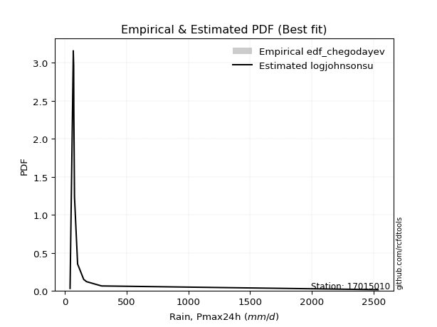</img>

</div>


### 6. EDF Blom (1958)

The Blom formula is a specific "plotting position" formula used in hydrology and statistical analysis to estimate the empirical cumulative probability (or non-exceedance probability) of a data series. It is particularly recommended for data that are approximately normally distributed. The constant _a_ is set to 0.375 (or 3/8).

<div align="center">


$P=(m-a)/(n+1-2a)$


</div>


**6.1. Empirical values**

<div align="center">

|                | 0                   | 1                  | 2                   | 3                   | 4                   | 5                   | 6                  | 7                  | 8                  | 9                  | 10                 | 11                 |
|:---------------|:--------------------|:-------------------|:--------------------|:--------------------|:--------------------|:--------------------|:-------------------|:-------------------|:-------------------|:-------------------|:-------------------|:-------------------|
| date           | 2021                | 2015               | 2017                | 2020                | 2019                | 2018                | 2022               | 2023               | 2014               | 2016               | 2024               | 2025               |
| x              | 43.0                | 68.86              | 68.95               | 72.1                | 73.56               | 78.91               | 104.0              | 153.3              | 176.4              | 298.01             | 2537.4             | 2763.0             |
| m              | 1                   | 2                  | 3                   | 4                   | 5                   | 6                   | 7                  | 8                  | 9                  | 10                 | 11                 | 12                 |
| empirical_dist | edf_blom            | edf_blom           | edf_blom            | edf_blom            | edf_blom            | edf_blom            | edf_blom           | edf_blom           | edf_blom           | edf_blom           | edf_blom           | edf_blom           |
| empirical      | 0.05102040816326531 | 0.1326530612244898 | 0.21428571428571427 | 0.29591836734693877 | 0.37755102040816324 | 0.45918367346938777 | 0.5408163265306123 | 0.6224489795918368 | 0.7040816326530612 | 0.7857142857142857 | 0.8673469387755102 | 0.9489795918367347 |
| empirical_tr   | 1.053763440860215   | 1.1529411764705884 | 1.2727272727272727  | 1.4202898550724639  | 1.6065573770491803  | 1.8490566037735847  | 2.177777777777778  | 2.6486486486486487 | 3.3793103448275863 | 4.666666666666666  | 7.5384615384615365 | 19.60000000000002  |

</div>


**6.2. Kolmogorov-Smirnov fit test (sorted by Δ)**


<div align="center">

|                | 0                   | 1                   | 2                   | 3                   | 4                   | 5                   | 6                   | 7                   | 8                   | 9                   | 10                  | 11                  | 12                  | 13                  | 14                  | 15                  | 16                  | 17                  | 18                  | 19                  | 20                  | 21                  | 22                  | 23                  | 24                  | 25                  | 26                  | 27                  | 28                  | 29                  | 30                  | 31                  | 32                  | 33                  | 34                  | 35                  | 36                  | 37                  | 38                  | 39                  | 40                  | 41                  | 42                  | 43                  | 44                  | 45                  | 46                  | 47                  | 48                  | 49                  | 50                  | 51                  | 52                  | 53                  | 54                  | 55                  | 56                  | 57                  | 58                  | 59                  | 60                  | 61                  | 62                  | 63                  | 64                  | 65                  | 66                  | 67                  | 68                  | 69                  | 70                  | 71                  | 72                  | 73                  | 74                  | 75                  | 76                  | 77                  | 78                  | 79                  | 80                  | 81                  | 82                  | 83                  | 84                  | 85                  | 86                  | 87                  | 88                  | 89                  | 90                  | 91                  | 92                  | 93                  | 94                  | 95                  | 96                  | 97                  | 98                  | 99                  | 100                 | 101                 | 102                 | 103                 | 104                 | 105                 | 106                 | 107                 | 108                 | 109                 | 110                 | 111                 | 112                 | 113                 | 114                 | 115                 | 116                 | 117                 | 118                 | 119                 | 120                 | 121                 | 122                 | 123                 | 124                 | 125                 | 126                 | 127                 | 128                 | 129                 | 130                 | 131                 | 132                 | 133                 | 134                 | 135                 | 136                 | 137                 | 138                 | 139                 | 140                 | 141                 | 142                 | 143                 | 144                 | 145                 | 146                 | 147                 | 148                 | 149                 | 150                 | 151                 | 152                 | 153                 | 154                 | 155                 | 156                 | 157                 | 158                 | 159                 |
|:---------------|:--------------------|:--------------------|:--------------------|:--------------------|:--------------------|:--------------------|:--------------------|:--------------------|:--------------------|:--------------------|:--------------------|:--------------------|:--------------------|:--------------------|:--------------------|:--------------------|:--------------------|:--------------------|:--------------------|:--------------------|:--------------------|:--------------------|:--------------------|:--------------------|:--------------------|:--------------------|:--------------------|:--------------------|:--------------------|:--------------------|:--------------------|:--------------------|:--------------------|:--------------------|:--------------------|:--------------------|:--------------------|:--------------------|:--------------------|:--------------------|:--------------------|:--------------------|:--------------------|:--------------------|:--------------------|:--------------------|:--------------------|:--------------------|:--------------------|:--------------------|:--------------------|:--------------------|:--------------------|:--------------------|:--------------------|:--------------------|:--------------------|:--------------------|:--------------------|:--------------------|:--------------------|:--------------------|:--------------------|:--------------------|:--------------------|:--------------------|:--------------------|:--------------------|:--------------------|:--------------------|:--------------------|:--------------------|:--------------------|:--------------------|:--------------------|:--------------------|:--------------------|:--------------------|:--------------------|:--------------------|:--------------------|:--------------------|:--------------------|:--------------------|:--------------------|:--------------------|:--------------------|:--------------------|:--------------------|:--------------------|:--------------------|:--------------------|:--------------------|:--------------------|:--------------------|:--------------------|:--------------------|:--------------------|:--------------------|:--------------------|:--------------------|:--------------------|:--------------------|:--------------------|:--------------------|:--------------------|:--------------------|:--------------------|:--------------------|:--------------------|:--------------------|:--------------------|:--------------------|:--------------------|:--------------------|:--------------------|:--------------------|:--------------------|:--------------------|:--------------------|:--------------------|:--------------------|:--------------------|:--------------------|:--------------------|:--------------------|:--------------------|:--------------------|:--------------------|:--------------------|:--------------------|:--------------------|:--------------------|:--------------------|:--------------------|:--------------------|:--------------------|:--------------------|:--------------------|:--------------------|:--------------------|:--------------------|:--------------------|:--------------------|:--------------------|:--------------------|:--------------------|:--------------------|:--------------------|:--------------------|:--------------------|:--------------------|:--------------------|:--------------------|:--------------------|:--------------------|:--------------------|:--------------------|:--------------------|:--------------------|
| station        | 17015010            | 17015010            | 17015010            | 17015010            | 17015010            | 17015010            | 17015010            | 17015010            | 17015010            | 17015010            | 17015010            | 17015010            | 17015010            | 17015010            | 17015010            | 17015010            | 17015010            | 17015010            | 17015010            | 17015010            | 17015010            | 17015010            | 17015010            | 17015010            | 17015010            | 17015010            | 17015010            | 17015010            | 17015010            | 17015010            | 17015010            | 17015010            | 17015010            | 17015010            | 17015010            | 17015010            | 17015010            | 17015010            | 17015010            | 17015010            | 17015010            | 17015010            | 17015010            | 17015010            | 17015010            | 17015010            | 17015010            | 17015010            | 17015010            | 17015010            | 17015010            | 17015010            | 17015010            | 17015010            | 17015010            | 17015010            | 17015010            | 17015010            | 17015010            | 17015010            | 17015010            | 17015010            | 17015010            | 17015010            | 17015010            | 17015010            | 17015010            | 17015010            | 17015010            | 17015010            | 17015010            | 17015010            | 17015010            | 17015010            | 17015010            | 17015010            | 17015010            | 17015010            | 17015010            | 17015010            | 17015010            | 17015010            | 17015010            | 17015010            | 17015010            | 17015010            | 17015010            | 17015010            | 17015010            | 17015010            | 17015010            | 17015010            | 17015010            | 17015010            | 17015010            | 17015010            | 17015010            | 17015010            | 17015010            | 17015010            | 17015010            | 17015010            | 17015010            | 17015010            | 17015010            | 17015010            | 17015010            | 17015010            | 17015010            | 17015010            | 17015010            | 17015010            | 17015010            | 17015010            | 17015010            | 17015010            | 17015010            | 17015010            | 17015010            | 17015010            | 17015010            | 17015010            | 17015010            | 17015010            | 17015010            | 17015010            | 17015010            | 17015010            | 17015010            | 17015010            | 17015010            | 17015010            | 17015010            | 17015010            | 17015010            | 17015010            | 17015010            | 17015010            | 17015010            | 17015010            | 17015010            | 17015010            | 17015010            | 17015010            | 17015010            | 17015010            | 17015010            | 17015010            | 17015010            | 17015010            | 17015010            | 17015010            | 17015010            | 17015010            | 17015010            | 17015010            | 17015010            | 17015010            | 17015010            | 17015010            |
| empirical_dist | edf_blom            | edf_blom            | edf_blom            | edf_blom            | edf_blom            | edf_blom            | edf_blom            | edf_blom            | edf_blom            | edf_blom            | edf_blom            | edf_blom            | edf_blom            | edf_blom            | edf_blom            | edf_blom            | edf_blom            | edf_blom            | edf_blom            | edf_blom            | edf_blom            | edf_blom            | edf_blom            | edf_blom            | edf_blom            | edf_blom            | edf_blom            | edf_blom            | edf_blom            | edf_blom            | edf_blom            | edf_blom            | edf_blom            | edf_blom            | edf_blom            | edf_blom            | edf_blom            | edf_blom            | edf_blom            | edf_blom            | edf_blom            | edf_blom            | edf_blom            | edf_blom            | edf_blom            | edf_blom            | edf_blom            | edf_blom            | edf_blom            | edf_blom            | edf_blom            | edf_blom            | edf_blom            | edf_blom            | edf_blom            | edf_blom            | edf_blom            | edf_blom            | edf_blom            | edf_blom            | edf_blom            | edf_blom            | edf_blom            | edf_blom            | edf_blom            | edf_blom            | edf_blom            | edf_blom            | edf_blom            | edf_blom            | edf_blom            | edf_blom            | edf_blom            | edf_blom            | edf_blom            | edf_blom            | edf_blom            | edf_blom            | edf_blom            | edf_blom            | edf_blom            | edf_blom            | edf_blom            | edf_blom            | edf_blom            | edf_blom            | edf_blom            | edf_blom            | edf_blom            | edf_blom            | edf_blom            | edf_blom            | edf_blom            | edf_blom            | edf_blom            | edf_blom            | edf_blom            | edf_blom            | edf_blom            | edf_blom            | edf_blom            | edf_blom            | edf_blom            | edf_blom            | edf_blom            | edf_blom            | edf_blom            | edf_blom            | edf_blom            | edf_blom            | edf_blom            | edf_blom            | edf_blom            | edf_blom            | edf_blom            | edf_blom            | edf_blom            | edf_blom            | edf_blom            | edf_blom            | edf_blom            | edf_blom            | edf_blom            | edf_blom            | edf_blom            | edf_blom            | edf_blom            | edf_blom            | edf_blom            | edf_blom            | edf_blom            | edf_blom            | edf_blom            | edf_blom            | edf_blom            | edf_blom            | edf_blom            | edf_blom            | edf_blom            | edf_blom            | edf_blom            | edf_blom            | edf_blom            | edf_blom            | edf_blom            | edf_blom            | edf_blom            | edf_blom            | edf_blom            | edf_blom            | edf_blom            | edf_blom            | edf_blom            | edf_blom            | edf_blom            | edf_blom            | edf_blom            | edf_blom            | edf_blom            | edf_blom            |
| p_dist         | logjohnsonsu        | logalpha            | loginvweibull       | loggenextreme       | logmielke           | logburr             | alpha               | loginvgamma         | logburr12           | loginvgauss         | logfatiguelife      | invgamma            | logmoyal            | f                   | burr                | genextreme          | invgauss            | halfgennorm         | loggumbel_r         | mielke              | logpearson3         | lograyleigh         | johnsonsu           | logexponnorm        | loggenhalflogistic  | loggompertz         | logmaxwell          | logwald             | logtruncnorm        | logncf              | loghalfgennorm      | loghalflogistic     | loggenexpon         | logvonmises_line    | burr12              | lomax               | loglomax            | genpareto           | kappa3              | logloglaplace       | lognct              | loghalfnorm         | truncpareto         | nct                 | logrdist            | loggenlogistic      | logfoldnorm         | ncf                 | logexponpow         | betaprime           | lognorm             | logcrystalball      | loganglit           | logsemicircular     | weibull_min         | logloggamma         | loglogistic         | logkstwobign        | bradford            | logbetaprime        | logweibull_min      | logf                | logskewnorm         | logarcsine          | loghypsecant        | logtukeylambda      | fatiguelife         | gamma               | logrice             | loglaplace          | loglaplace          | logtruncweibull_min | logtruncexpon       | logcosine           | loggumbel_l         | exponweib           | dgamma              | t                   | loggennorm          | loggenpareto        | logt                | logbradford         | gausshyper          | wald                | logwrapcauchy       | truncweibull_min    | gengamma            | moyal               | vonmises_line       | logdweibull         | halflogistic        | halfnorm            | pearson3            | gumbel_r            | exponpow            | foldnorm            | wrapcauchy          | logksone            | rayleigh            | tukeylambda         | arcsine             | nakagami            | genlogistic         | powerlaw            | logargus            | logkappa4           | maxwell             | gennorm             | logdgamma           | loglevy_l           | loguniform          | semicircular        | anglit              | erlang              | dweibull            | norm                | logtriang           | johnsonsb           | logistic            | kstwobign           | hypsecant           | logkappa3           | invweibull          | lognakagami         | levy_l              | rice                | laplace             | gumbel_l            | cosine              | exponnorm           | logbeta             | crystalball         | genexpon            | logpowerlaw         | logjohnsonsb        | loggausshyper       | logweibull_max      | loggengamma         | truncexpon          | argus               | logtrapezoid        | logerlang           | truncnorm           | logexponweib        | gompertz            | loggamma            | loggamma            | beta                | skewnorm            | ksone               | triang              | rdist               | kappa4              | genhalflogistic     | uniform             | weibull_max         | trapezoid           | logtruncpareto      | logvonmises         | vonmises            |
| delta          | 0.11522048744860158 | 0.1201086980373918  | 0.12422284929602276 | 0.1242307028795899  | 0.12467797077868728 | 0.1246996002678796  | 0.1256270116057721  | 0.1267229590924154  | 0.13075660087693625 | 0.13585230499352322 | 0.1375524041874198  | 0.13918693811557994 | 0.1398822566575974  | 0.14048685351270926 | 0.14067069278773567 | 0.1416350913719631  | 0.14446822246169663 | 0.14670749557200924 | 0.1468093357769052  | 0.14818853704749577 | 0.14917879382107183 | 0.14931808449577602 | 0.15269472984783178 | 0.15467002734949403 | 0.15559317993274774 | 0.1566924569779468  | 0.15686999854720363 | 0.15715083116837325 | 0.15766954420210302 | 0.15776768589827633 | 0.1588728173749603  | 0.15950830511373656 | 0.15960974626925747 | 0.16026174312834732 | 0.16357014534762462 | 0.1649918708275617  | 0.1666328937800479  | 0.16782662174345478 | 0.1683091774235421  | 0.1714562588727864  | 0.17153932362457924 | 0.17347008837314223 | 0.1752313604584305  | 0.1761409432675476  | 0.17621927138518212 | 0.17861326032811153 | 0.17932501465367037 | 0.18143919672210096 | 0.18258713498637913 | 0.18310369017730665 | 0.18926878803561853 | 0.1892688648590508  | 0.19138769287588397 | 0.19226061980414166 | 0.19264505389478614 | 0.1928497251024346  | 0.1986683406314373  | 0.2013982428138163  | 0.2042314817004926  | 0.20637734830937565 | 0.20646096401872674 | 0.20671749836677653 | 0.2089037812730084  | 0.21007390134453743 | 0.2121072812268056  | 0.21428571428063392 | 0.2148303056444963  | 0.22144331023630284 | 0.22201962047857435 | 0.24048336784890884 | 0.24048336784890884 | 0.2493744733398646  | 0.25227369293072155 | 0.2577784069428285  | 0.25904658624245624 | 0.25980146177786856 | 0.267347674270598   | 0.2678150280860694  | 0.275402069051049   | 0.27630995536623904 | 0.2763223356314666  | 0.2812165984174221  | 0.2836141943131547  | 0.2960139185817711  | 0.2974074274482987  | 0.30096665301846404 | 0.3012862963085846  | 0.30207046731067855 | 0.3114900858917312  | 0.3191252840913813  | 0.31945599508219635 | 0.32084593396497507 | 0.32300282143280856 | 0.3250165176256332  | 0.3318077361511314  | 0.3325061629731187  | 0.3373068730809405  | 0.33818016748408214 | 0.3386074111249888  | 0.3404127296261401  | 0.3425849642930198  | 0.34405321965130026 | 0.3446959364692559  | 0.34502918626485224 | 0.3453150491677873  | 0.34756538938321135 | 0.3508997188771776  | 0.3610261322623791  | 0.36461644826420436 | 0.36473424901403767 | 0.3649998744502864  | 0.3655033085602989  | 0.37120443621639937 | 0.374756363297878   | 0.37790770292060516 | 0.38493389236351544 | 0.3855455674203012  | 0.3970558722547909  | 0.39774539646312435 | 0.4027167487276321  | 0.40823559634481926 | 0.41178274538221404 | 0.4144996634035252  | 0.415278864205875   | 0.423846138115846   | 0.43267932756626615 | 0.43527863252371407 | 0.4515247421261943  | 0.4553502559821606  | 0.4640000901167931  | 0.46472462677955373 | 0.46493186439526163 | 0.46720367031588594 | 0.4709102172448628  | 0.47953980246522415 | 0.5015774861390675  | 0.5121315879580286  | 0.5151785210887468  | 0.517530736007086   | 0.5208197841803601  | 0.5701977504402556  | 0.5706399584368291  | 0.571478884710606   | 0.5792119459435764  | 0.585547762985368   | 0.5908246726291846  | 0.5908246726291846  | 0.599300710039481   | 0.604804414113806   | 0.6242528886554621  | 0.6270737081239125  | 0.6699440640196066  | 0.672689648559823   | 0.6919581809355303  | 0.6919606092436975  | 0.6998743064903017  | 0.7584993950697619  | 0.7749031305885631  | 1.2616093728367725  | 439.61810331758403  |
| deltao         | 0.36218414519599995 | 0.36218414519599995 | 0.36218414519599995 | 0.36218414519599995 | 0.36218414519599995 | 0.36218414519599995 | 0.36218414519599995 | 0.36218414519599995 | 0.36218414519599995 | 0.36218414519599995 | 0.36218414519599995 | 0.36218414519599995 | 0.36218414519599995 | 0.36218414519599995 | 0.36218414519599995 | 0.36218414519599995 | 0.36218414519599995 | 0.36218414519599995 | 0.36218414519599995 | 0.36218414519599995 | 0.36218414519599995 | 0.36218414519599995 | 0.36218414519599995 | 0.36218414519599995 | 0.36218414519599995 | 0.36218414519599995 | 0.36218414519599995 | 0.36218414519599995 | 0.36218414519599995 | 0.36218414519599995 | 0.36218414519599995 | 0.36218414519599995 | 0.36218414519599995 | 0.36218414519599995 | 0.36218414519599995 | 0.36218414519599995 | 0.36218414519599995 | 0.36218414519599995 | 0.36218414519599995 | 0.36218414519599995 | 0.36218414519599995 | 0.36218414519599995 | 0.36218414519599995 | 0.36218414519599995 | 0.36218414519599995 | 0.36218414519599995 | 0.36218414519599995 | 0.36218414519599995 | 0.36218414519599995 | 0.36218414519599995 | 0.36218414519599995 | 0.36218414519599995 | 0.36218414519599995 | 0.36218414519599995 | 0.36218414519599995 | 0.36218414519599995 | 0.36218414519599995 | 0.36218414519599995 | 0.36218414519599995 | 0.36218414519599995 | 0.36218414519599995 | 0.36218414519599995 | 0.36218414519599995 | 0.36218414519599995 | 0.36218414519599995 | 0.36218414519599995 | 0.36218414519599995 | 0.36218414519599995 | 0.36218414519599995 | 0.36218414519599995 | 0.36218414519599995 | 0.36218414519599995 | 0.36218414519599995 | 0.36218414519599995 | 0.36218414519599995 | 0.36218414519599995 | 0.36218414519599995 | 0.36218414519599995 | 0.36218414519599995 | 0.36218414519599995 | 0.36218414519599995 | 0.36218414519599995 | 0.36218414519599995 | 0.36218414519599995 | 0.36218414519599995 | 0.36218414519599995 | 0.36218414519599995 | 0.36218414519599995 | 0.36218414519599995 | 0.36218414519599995 | 0.36218414519599995 | 0.36218414519599995 | 0.36218414519599995 | 0.36218414519599995 | 0.36218414519599995 | 0.36218414519599995 | 0.36218414519599995 | 0.36218414519599995 | 0.36218414519599995 | 0.36218414519599995 | 0.36218414519599995 | 0.36218414519599995 | 0.36218414519599995 | 0.36218414519599995 | 0.36218414519599995 | 0.36218414519599995 | 0.36218414519599995 | 0.36218414519599995 | 0.36218414519599995 | 0.36218414519599995 | 0.36218414519599995 | 0.36218414519599995 | 0.36218414519599995 | 0.36218414519599995 | 0.36218414519599995 | 0.36218414519599995 | 0.36218414519599995 | 0.36218414519599995 | 0.36218414519599995 | 0.36218414519599995 | 0.36218414519599995 | 0.36218414519599995 | 0.36218414519599995 | 0.36218414519599995 | 0.36218414519599995 | 0.36218414519599995 | 0.36218414519599995 | 0.36218414519599995 | 0.36218414519599995 | 0.36218414519599995 | 0.36218414519599995 | 0.36218414519599995 | 0.36218414519599995 | 0.36218414519599995 | 0.36218414519599995 | 0.36218414519599995 | 0.36218414519599995 | 0.36218414519599995 | 0.36218414519599995 | 0.36218414519599995 | 0.36218414519599995 | 0.36218414519599995 | 0.36218414519599995 | 0.36218414519599995 | 0.36218414519599995 | 0.36218414519599995 | 0.36218414519599995 | 0.36218414519599995 | 0.36218414519599995 | 0.36218414519599995 | 0.36218414519599995 | 0.36218414519599995 | 0.36218414519599995 | 0.36218414519599995 | 0.36218414519599995 | 0.36218414519599995 | 0.36218414519599995 | 0.36218414519599995 | 0.36218414519599995 | 0.36218414519599995 |
| eval           | Δo > Δ              | Δo > Δ              | Δo > Δ              | Δo > Δ              | Δo > Δ              | Δo > Δ              | Δo > Δ              | Δo > Δ              | Δo > Δ              | Δo > Δ              | Δo > Δ              | Δo > Δ              | Δo > Δ              | Δo > Δ              | Δo > Δ              | Δo > Δ              | Δo > Δ              | Δo > Δ              | Δo > Δ              | Δo > Δ              | Δo > Δ              | Δo > Δ              | Δo > Δ              | Δo > Δ              | Δo > Δ              | Δo > Δ              | Δo > Δ              | Δo > Δ              | Δo > Δ              | Δo > Δ              | Δo > Δ              | Δo > Δ              | Δo > Δ              | Δo > Δ              | Δo > Δ              | Δo > Δ              | Δo > Δ              | Δo > Δ              | Δo > Δ              | Δo > Δ              | Δo > Δ              | Δo > Δ              | Δo > Δ              | Δo > Δ              | Δo > Δ              | Δo > Δ              | Δo > Δ              | Δo > Δ              | Δo > Δ              | Δo > Δ              | Δo > Δ              | Δo > Δ              | Δo > Δ              | Δo > Δ              | Δo > Δ              | Δo > Δ              | Δo > Δ              | Δo > Δ              | Δo > Δ              | Δo > Δ              | Δo > Δ              | Δo > Δ              | Δo > Δ              | Δo > Δ              | Δo > Δ              | Δo > Δ              | Δo > Δ              | Δo > Δ              | Δo > Δ              | Δo > Δ              | Δo > Δ              | Δo > Δ              | Δo > Δ              | Δo > Δ              | Δo > Δ              | Δo > Δ              | Δo > Δ              | Δo > Δ              | Δo > Δ              | Δo > Δ              | Δo > Δ              | Δo > Δ              | Δo > Δ              | Δo > Δ              | Δo > Δ              | Δo > Δ              | Δo > Δ              | Δo > Δ              | Δo > Δ              | Δo > Δ              | Δo > Δ              | Δo > Δ              | Δo > Δ              | Δo > Δ              | Δo > Δ              | Δo > Δ              | Δo > Δ              | Δo > Δ              | Δo > Δ              | Δo > Δ              | Δo > Δ              | Δo > Δ              | Δo > Δ              | Δo > Δ              | Δo > Δ              | Δo > Δ              | Δo > Δ              | Δo > Δ              | Δo <= Δ             | Δo <= Δ             | Δo <= Δ             | Δo <= Δ             | Δo <= Δ             | Δo <= Δ             | Δo <= Δ             | Δo <= Δ             | Δo <= Δ             | Δo <= Δ             | Δo <= Δ             | Δo <= Δ             | Δo <= Δ             | Δo <= Δ             | Δo <= Δ             | Δo <= Δ             | Δo <= Δ             | Δo <= Δ             | Δo <= Δ             | Δo <= Δ             | Δo <= Δ             | Δo <= Δ             | Δo <= Δ             | Δo <= Δ             | Δo <= Δ             | Δo <= Δ             | Δo <= Δ             | Δo <= Δ             | Δo <= Δ             | Δo <= Δ             | Δo <= Δ             | Δo <= Δ             | Δo <= Δ             | Δo <= Δ             | Δo <= Δ             | Δo <= Δ             | Δo <= Δ             | Δo <= Δ             | Δo <= Δ             | Δo <= Δ             | Δo <= Δ             | Δo <= Δ             | Δo <= Δ             | Δo <= Δ             | Δo <= Δ             | Δo <= Δ             | Δo <= Δ             | Δo <= Δ             | Δo <= Δ             | Δo <= Δ             | Δo <= Δ             | Δo <= Δ             |
| fit            | 1                   | 1                   | 1                   | 1                   | 1                   | 1                   | 1                   | 1                   | 1                   | 1                   | 1                   | 1                   | 1                   | 1                   | 1                   | 1                   | 1                   | 1                   | 1                   | 1                   | 1                   | 1                   | 1                   | 1                   | 1                   | 1                   | 1                   | 1                   | 1                   | 1                   | 1                   | 1                   | 1                   | 1                   | 1                   | 1                   | 1                   | 1                   | 1                   | 1                   | 1                   | 1                   | 1                   | 1                   | 1                   | 1                   | 1                   | 1                   | 1                   | 1                   | 1                   | 1                   | 1                   | 1                   | 1                   | 1                   | 1                   | 1                   | 1                   | 1                   | 1                   | 1                   | 1                   | 1                   | 1                   | 1                   | 1                   | 1                   | 1                   | 1                   | 1                   | 1                   | 1                   | 1                   | 1                   | 1                   | 1                   | 1                   | 1                   | 1                   | 1                   | 1                   | 1                   | 1                   | 1                   | 1                   | 1                   | 1                   | 1                   | 1                   | 1                   | 1                   | 1                   | 1                   | 1                   | 1                   | 1                   | 1                   | 1                   | 1                   | 1                   | 1                   | 1                   | 1                   | 1                   | 1                   | 1                   | 1                   | 0                   | 0                   | 0                   | 0                   | 0                   | 0                   | 0                   | 0                   | 0                   | 0                   | 0                   | 0                   | 0                   | 0                   | 0                   | 0                   | 0                   | 0                   | 0                   | 0                   | 0                   | 0                   | 0                   | 0                   | 0                   | 0                   | 0                   | 0                   | 0                   | 0                   | 0                   | 0                   | 0                   | 0                   | 0                   | 0                   | 0                   | 0                   | 0                   | 0                   | 0                   | 0                   | 0                   | 0                   | 0                   | 0                   | 0                   | 0                   | 0                   | 0                   | 0                   | 0                   |
| n              | 12                  | 12                  | 12                  | 12                  | 12                  | 12                  | 12                  | 12                  | 12                  | 12                  | 12                  | 12                  | 12                  | 12                  | 12                  | 12                  | 12                  | 12                  | 12                  | 12                  | 12                  | 12                  | 12                  | 12                  | 12                  | 12                  | 12                  | 12                  | 12                  | 12                  | 12                  | 12                  | 12                  | 12                  | 12                  | 12                  | 12                  | 12                  | 12                  | 12                  | 12                  | 12                  | 12                  | 12                  | 12                  | 12                  | 12                  | 12                  | 12                  | 12                  | 12                  | 12                  | 12                  | 12                  | 12                  | 12                  | 12                  | 12                  | 12                  | 12                  | 12                  | 12                  | 12                  | 12                  | 12                  | 12                  | 12                  | 12                  | 12                  | 12                  | 12                  | 12                  | 12                  | 12                  | 12                  | 12                  | 12                  | 12                  | 12                  | 12                  | 12                  | 12                  | 12                  | 12                  | 12                  | 12                  | 12                  | 12                  | 12                  | 12                  | 12                  | 12                  | 12                  | 12                  | 12                  | 12                  | 12                  | 12                  | 12                  | 12                  | 12                  | 12                  | 12                  | 12                  | 12                  | 12                  | 12                  | 12                  | 12                  | 12                  | 12                  | 12                  | 12                  | 12                  | 12                  | 12                  | 12                  | 12                  | 12                  | 12                  | 12                  | 12                  | 12                  | 12                  | 12                  | 12                  | 12                  | 12                  | 12                  | 12                  | 12                  | 12                  | 12                  | 12                  | 12                  | 12                  | 12                  | 12                  | 12                  | 12                  | 12                  | 12                  | 12                  | 12                  | 12                  | 12                  | 12                  | 12                  | 12                  | 12                  | 12                  | 12                  | 12                  | 12                  | 12                  | 12                  | 12                  | 12                  | 12                  | 12                  |
| best_fit       | 1                   | 0                   | 0                   | 0                   | 0                   | 0                   | 0                   | 0                   | 0                   | 0                   | 0                   | 0                   | 0                   | 0                   | 0                   | 0                   | 0                   | 0                   | 0                   | 0                   | 0                   | 0                   | 0                   | 0                   | 0                   | 0                   | 0                   | 0                   | 0                   | 0                   | 0                   | 0                   | 0                   | 0                   | 0                   | 0                   | 0                   | 0                   | 0                   | 0                   | 0                   | 0                   | 0                   | 0                   | 0                   | 0                   | 0                   | 0                   | 0                   | 0                   | 0                   | 0                   | 0                   | 0                   | 0                   | 0                   | 0                   | 0                   | 0                   | 0                   | 0                   | 0                   | 0                   | 0                   | 0                   | 0                   | 0                   | 0                   | 0                   | 0                   | 0                   | 0                   | 0                   | 0                   | 0                   | 0                   | 0                   | 0                   | 0                   | 0                   | 0                   | 0                   | 0                   | 0                   | 0                   | 0                   | 0                   | 0                   | 0                   | 0                   | 0                   | 0                   | 0                   | 0                   | 0                   | 0                   | 0                   | 0                   | 0                   | 0                   | 0                   | 0                   | 0                   | 0                   | 0                   | 0                   | 0                   | 0                   | 0                   | 0                   | 0                   | 0                   | 0                   | 0                   | 0                   | 0                   | 0                   | 0                   | 0                   | 0                   | 0                   | 0                   | 0                   | 0                   | 0                   | 0                   | 0                   | 0                   | 0                   | 0                   | 0                   | 0                   | 0                   | 0                   | 0                   | 0                   | 0                   | 0                   | 0                   | 0                   | 0                   | 0                   | 0                   | 0                   | 0                   | 0                   | 0                   | 0                   | 0                   | 0                   | 0                   | 0                   | 0                   | 0                   | 0                   | 0                   | 0                   | 0                   | 0                   | 0                   |
| best_fit_sort  | 1                   | 2                   | 3                   | 4                   | 5                   | 6                   | 7                   | 8                   | 9                   | 10                  | 11                  | 12                  | 13                  | 14                  | 15                  | 16                  | 17                  | 18                  | 19                  | 20                  | 21                  | 22                  | 23                  | 24                  | 25                  | 26                  | 27                  | 28                  | 29                  | 30                  | 31                  | 32                  | 33                  | 34                  | 35                  | 36                  | 37                  | 38                  | 39                  | 40                  | 41                  | 42                  | 43                  | 44                  | 45                  | 46                  | 47                  | 48                  | 49                  | 50                  | 51                  | 52                  | 53                  | 54                  | 55                  | 56                  | 57                  | 58                  | 59                  | 60                  | 61                  | 62                  | 63                  | 64                  | 65                  | 66                  | 67                  | 68                  | 69                  | 70                  | 71                  | 72                  | 73                  | 74                  | 75                  | 76                  | 77                  | 78                  | 79                  | 80                  | 81                  | 82                  | 83                  | 84                  | 85                  | 86                  | 87                  | 88                  | 89                  | 90                  | 91                  | 92                  | 93                  | 94                  | 95                  | 96                  | 97                  | 98                  | 99                  | 100                 | 101                 | 102                 | 103                 | 104                 | 105                 | 106                 | 107                 | 108                 | 109                 | 110                 | 111                 | 112                 | 113                 | 114                 | 115                 | 116                 | 117                 | 118                 | 119                 | 120                 | 121                 | 122                 | 123                 | 124                 | 125                 | 126                 | 127                 | 128                 | 129                 | 130                 | 131                 | 132                 | 133                 | 134                 | 135                 | 136                 | 137                 | 138                 | 139                 | 140                 | 141                 | 142                 | 143                 | 144                 | 145                 | 146                 | 147                 | 148                 | 149                 | 150                 | 151                 | 152                 | 153                 | 154                 | 155                 | 156                 | 157                 | 158                 | 159                 | 160                 |

</div>


**6.3. Best fit**

<div align="center">

|   id |   station | empirical_dist   | p_dist       |   delta |   deltao | eval   |   fit |   n |   best_fit |   best_fit_sort |
|-----:|----------:|:-----------------|:-------------|--------:|---------:|:-------|------:|----:|-----------:|----------------:|
|    0 |  17015010 | edf_blom         | logjohnsonsu | 0.11522 | 0.362184 | Δo > Δ |     1 |  12 |          1 |               1 |

</div>


<div align="center">

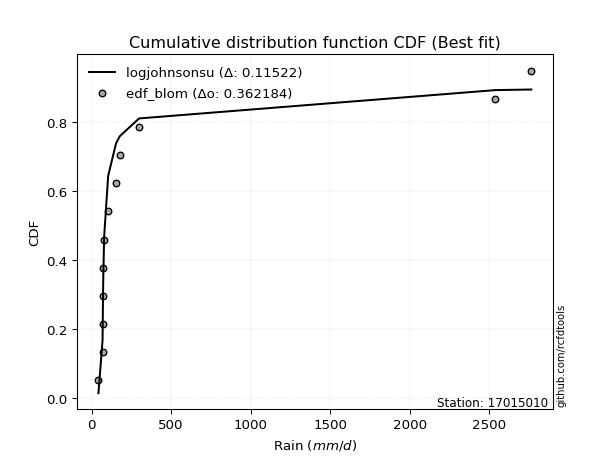</img>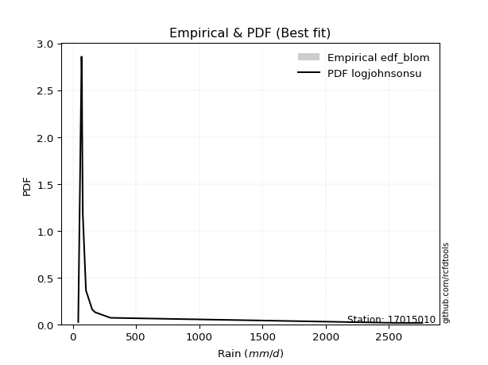</img>

</div>


### 7. EDF Tukey (1962)

In hydrology, the Tukey formula is used as a plotting position formula to estimate the empirical probability or frequency of a flood event (or other hydrological data). The formula parameter is given as _c=0.333_ (or 1/3).

<div align="center">


$P=(m-c)/(n+1-2c)$


</div>


**7.1. Empirical values**

<div align="center">

|                | 0                   | 1                   | 2                   | 3                  | 4                  | 5                  | 6                  | 7                  | 8                  | 9                  | 10                 | 11                 |
|:---------------|:--------------------|:--------------------|:--------------------|:-------------------|:-------------------|:-------------------|:-------------------|:-------------------|:-------------------|:-------------------|:-------------------|:-------------------|
| date           | 2021                | 2015                | 2017                | 2020               | 2019               | 2018               | 2022               | 2023               | 2014               | 2016               | 2024               | 2025               |
| x              | 43.0                | 68.86               | 68.95               | 72.1               | 73.56              | 78.91              | 104.0              | 153.3              | 176.4              | 298.01             | 2537.4             | 2763.0             |
| m              | 1                   | 2                   | 3                   | 4                  | 5                  | 6                  | 7                  | 8                  | 9                  | 10                 | 11                 | 12                 |
| empirical_dist | edf_tukey           | edf_tukey           | edf_tukey           | edf_tukey          | edf_tukey          | edf_tukey          | edf_tukey          | edf_tukey          | edf_tukey          | edf_tukey          | edf_tukey          | edf_tukey          |
| empirical      | 0.05405405405405406 | 0.13513513513513514 | 0.21621621621621623 | 0.2972972972972973 | 0.3783783783783784 | 0.4594594594594595 | 0.5405405405405406 | 0.6216216216216216 | 0.7027027027027027 | 0.7837837837837838 | 0.8648648648648649 | 0.9459459459459459 |
| empirical_tr   | 1.0571428571428572  | 1.15625             | 1.2758620689655173  | 1.4230769230769231 | 1.608695652173913  | 1.8499999999999999 | 2.1764705882352944 | 2.642857142857143  | 3.363636363636364  | 4.625              | 7.400000000000003  | 18.5               |

</div>


**7.2. Kolmogorov-Smirnov fit test (sorted by Δ)**


<div align="center">

|                | 0                   | 1                   | 2                   | 3                   | 4                   | 5                   | 6                   | 7                   | 8                   | 9                   | 10                  | 11                  | 12                  | 13                  | 14                  | 15                  | 16                  | 17                  | 18                  | 19                  | 20                  | 21                  | 22                  | 23                  | 24                  | 25                  | 26                  | 27                  | 28                  | 29                  | 30                  | 31                  | 32                  | 33                  | 34                  | 35                  | 36                  | 37                  | 38                  | 39                  | 40                  | 41                  | 42                  | 43                  | 44                  | 45                  | 46                  | 47                  | 48                  | 49                  | 50                  | 51                  | 52                  | 53                  | 54                  | 55                  | 56                  | 57                  | 58                  | 59                  | 60                  | 61                  | 62                  | 63                  | 64                  | 65                  | 66                  | 67                  | 68                  | 69                  | 70                  | 71                  | 72                  | 73                  | 74                  | 75                  | 76                  | 77                  | 78                  | 79                  | 80                  | 81                  | 82                  | 83                  | 84                  | 85                  | 86                  | 87                  | 88                  | 89                  | 90                  | 91                  | 92                  | 93                  | 94                  | 95                  | 96                  | 97                  | 98                  | 99                  | 100                 | 101                 | 102                 | 103                 | 104                 | 105                 | 106                 | 107                 | 108                 | 109                 | 110                 | 111                 | 112                 | 113                 | 114                 | 115                 | 116                 | 117                 | 118                 | 119                 | 120                 | 121                 | 122                 | 123                 | 124                 | 125                 | 126                 | 127                 | 128                 | 129                 | 130                 | 131                 | 132                 | 133                 | 134                 | 135                 | 136                 | 137                 | 138                 | 139                 | 140                 | 141                 | 142                 | 143                 | 144                 | 145                 | 146                 | 147                 | 148                 | 149                 | 150                 | 151                 | 152                 | 153                 | 154                 | 155                 | 156                 | 157                 | 158                 | 159                 |
|:---------------|:--------------------|:--------------------|:--------------------|:--------------------|:--------------------|:--------------------|:--------------------|:--------------------|:--------------------|:--------------------|:--------------------|:--------------------|:--------------------|:--------------------|:--------------------|:--------------------|:--------------------|:--------------------|:--------------------|:--------------------|:--------------------|:--------------------|:--------------------|:--------------------|:--------------------|:--------------------|:--------------------|:--------------------|:--------------------|:--------------------|:--------------------|:--------------------|:--------------------|:--------------------|:--------------------|:--------------------|:--------------------|:--------------------|:--------------------|:--------------------|:--------------------|:--------------------|:--------------------|:--------------------|:--------------------|:--------------------|:--------------------|:--------------------|:--------------------|:--------------------|:--------------------|:--------------------|:--------------------|:--------------------|:--------------------|:--------------------|:--------------------|:--------------------|:--------------------|:--------------------|:--------------------|:--------------------|:--------------------|:--------------------|:--------------------|:--------------------|:--------------------|:--------------------|:--------------------|:--------------------|:--------------------|:--------------------|:--------------------|:--------------------|:--------------------|:--------------------|:--------------------|:--------------------|:--------------------|:--------------------|:--------------------|:--------------------|:--------------------|:--------------------|:--------------------|:--------------------|:--------------------|:--------------------|:--------------------|:--------------------|:--------------------|:--------------------|:--------------------|:--------------------|:--------------------|:--------------------|:--------------------|:--------------------|:--------------------|:--------------------|:--------------------|:--------------------|:--------------------|:--------------------|:--------------------|:--------------------|:--------------------|:--------------------|:--------------------|:--------------------|:--------------------|:--------------------|:--------------------|:--------------------|:--------------------|:--------------------|:--------------------|:--------------------|:--------------------|:--------------------|:--------------------|:--------------------|:--------------------|:--------------------|:--------------------|:--------------------|:--------------------|:--------------------|:--------------------|:--------------------|:--------------------|:--------------------|:--------------------|:--------------------|:--------------------|:--------------------|:--------------------|:--------------------|:--------------------|:--------------------|:--------------------|:--------------------|:--------------------|:--------------------|:--------------------|:--------------------|:--------------------|:--------------------|:--------------------|:--------------------|:--------------------|:--------------------|:--------------------|:--------------------|:--------------------|:--------------------|:--------------------|:--------------------|:--------------------|:--------------------|
| station        | 17015010            | 17015010            | 17015010            | 17015010            | 17015010            | 17015010            | 17015010            | 17015010            | 17015010            | 17015010            | 17015010            | 17015010            | 17015010            | 17015010            | 17015010            | 17015010            | 17015010            | 17015010            | 17015010            | 17015010            | 17015010            | 17015010            | 17015010            | 17015010            | 17015010            | 17015010            | 17015010            | 17015010            | 17015010            | 17015010            | 17015010            | 17015010            | 17015010            | 17015010            | 17015010            | 17015010            | 17015010            | 17015010            | 17015010            | 17015010            | 17015010            | 17015010            | 17015010            | 17015010            | 17015010            | 17015010            | 17015010            | 17015010            | 17015010            | 17015010            | 17015010            | 17015010            | 17015010            | 17015010            | 17015010            | 17015010            | 17015010            | 17015010            | 17015010            | 17015010            | 17015010            | 17015010            | 17015010            | 17015010            | 17015010            | 17015010            | 17015010            | 17015010            | 17015010            | 17015010            | 17015010            | 17015010            | 17015010            | 17015010            | 17015010            | 17015010            | 17015010            | 17015010            | 17015010            | 17015010            | 17015010            | 17015010            | 17015010            | 17015010            | 17015010            | 17015010            | 17015010            | 17015010            | 17015010            | 17015010            | 17015010            | 17015010            | 17015010            | 17015010            | 17015010            | 17015010            | 17015010            | 17015010            | 17015010            | 17015010            | 17015010            | 17015010            | 17015010            | 17015010            | 17015010            | 17015010            | 17015010            | 17015010            | 17015010            | 17015010            | 17015010            | 17015010            | 17015010            | 17015010            | 17015010            | 17015010            | 17015010            | 17015010            | 17015010            | 17015010            | 17015010            | 17015010            | 17015010            | 17015010            | 17015010            | 17015010            | 17015010            | 17015010            | 17015010            | 17015010            | 17015010            | 17015010            | 17015010            | 17015010            | 17015010            | 17015010            | 17015010            | 17015010            | 17015010            | 17015010            | 17015010            | 17015010            | 17015010            | 17015010            | 17015010            | 17015010            | 17015010            | 17015010            | 17015010            | 17015010            | 17015010            | 17015010            | 17015010            | 17015010            | 17015010            | 17015010            | 17015010            | 17015010            | 17015010            | 17015010            |
| empirical_dist | edf_tukey           | edf_tukey           | edf_tukey           | edf_tukey           | edf_tukey           | edf_tukey           | edf_tukey           | edf_tukey           | edf_tukey           | edf_tukey           | edf_tukey           | edf_tukey           | edf_tukey           | edf_tukey           | edf_tukey           | edf_tukey           | edf_tukey           | edf_tukey           | edf_tukey           | edf_tukey           | edf_tukey           | edf_tukey           | edf_tukey           | edf_tukey           | edf_tukey           | edf_tukey           | edf_tukey           | edf_tukey           | edf_tukey           | edf_tukey           | edf_tukey           | edf_tukey           | edf_tukey           | edf_tukey           | edf_tukey           | edf_tukey           | edf_tukey           | edf_tukey           | edf_tukey           | edf_tukey           | edf_tukey           | edf_tukey           | edf_tukey           | edf_tukey           | edf_tukey           | edf_tukey           | edf_tukey           | edf_tukey           | edf_tukey           | edf_tukey           | edf_tukey           | edf_tukey           | edf_tukey           | edf_tukey           | edf_tukey           | edf_tukey           | edf_tukey           | edf_tukey           | edf_tukey           | edf_tukey           | edf_tukey           | edf_tukey           | edf_tukey           | edf_tukey           | edf_tukey           | edf_tukey           | edf_tukey           | edf_tukey           | edf_tukey           | edf_tukey           | edf_tukey           | edf_tukey           | edf_tukey           | edf_tukey           | edf_tukey           | edf_tukey           | edf_tukey           | edf_tukey           | edf_tukey           | edf_tukey           | edf_tukey           | edf_tukey           | edf_tukey           | edf_tukey           | edf_tukey           | edf_tukey           | edf_tukey           | edf_tukey           | edf_tukey           | edf_tukey           | edf_tukey           | edf_tukey           | edf_tukey           | edf_tukey           | edf_tukey           | edf_tukey           | edf_tukey           | edf_tukey           | edf_tukey           | edf_tukey           | edf_tukey           | edf_tukey           | edf_tukey           | edf_tukey           | edf_tukey           | edf_tukey           | edf_tukey           | edf_tukey           | edf_tukey           | edf_tukey           | edf_tukey           | edf_tukey           | edf_tukey           | edf_tukey           | edf_tukey           | edf_tukey           | edf_tukey           | edf_tukey           | edf_tukey           | edf_tukey           | edf_tukey           | edf_tukey           | edf_tukey           | edf_tukey           | edf_tukey           | edf_tukey           | edf_tukey           | edf_tukey           | edf_tukey           | edf_tukey           | edf_tukey           | edf_tukey           | edf_tukey           | edf_tukey           | edf_tukey           | edf_tukey           | edf_tukey           | edf_tukey           | edf_tukey           | edf_tukey           | edf_tukey           | edf_tukey           | edf_tukey           | edf_tukey           | edf_tukey           | edf_tukey           | edf_tukey           | edf_tukey           | edf_tukey           | edf_tukey           | edf_tukey           | edf_tukey           | edf_tukey           | edf_tukey           | edf_tukey           | edf_tukey           | edf_tukey           | edf_tukey           | edf_tukey           | edf_tukey           |
| p_dist         | logjohnsonsu        | logalpha            | loginvweibull       | loggenextreme       | logmielke           | logburr             | loginvgamma         | alpha               | logburr12           | loginvgauss         | logfatiguelife      | invgamma            | f                   | burr                | genextreme          | logmoyal            | invgauss            | mielke              | logpearson3         | lograyleigh         | halfgennorm         | loggumbel_r         | johnsonsu           | loggompertz         | logexponnorm        | logtruncnorm        | logmaxwell          | loggenhalflogistic  | loghalfgennorm      | loghalflogistic     | loggenexpon         | logwald             | logvonmises_line    | logncf              | burr12              | lomax               | loglomax            | genpareto           | kappa3              | logloglaplace       | loghalfnorm         | lognct              | truncpareto         | nct                 | logfoldnorm         | logrdist            | loggenlogistic      | logexponpow         | ncf                 | betaprime           | lognorm             | logcrystalball      | loganglit           | logsemicircular     | weibull_min         | logloggamma         | loglogistic         | logkstwobign        | bradford            | logweibull_min      | logf                | logbetaprime        | logarcsine          | logskewnorm         | loghypsecant        | fatiguelife         | logtukeylambda      | gamma               | logrice             | loglaplace          | loglaplace          | logtruncweibull_min | logtruncexpon       | logcosine           | loggumbel_l         | exponweib           | dgamma              | t                   | loggennorm          | loggenpareto        | logt                | logbradford         | gausshyper          | wald                | logwrapcauchy       | truncweibull_min    | gengamma            | moyal               | vonmises_line       | halflogistic        | logdweibull         | halfnorm            | pearson3            | gumbel_r            | foldnorm            | exponpow            | wrapcauchy          | rayleigh            | logksone            | tukeylambda         | arcsine             | powerlaw            | nakagami            | genlogistic         | logargus            | logkappa4           | maxwell             | gennorm             | loglevy_l           | logdgamma           | semicircular        | loguniform          | anglit              | erlang              | dweibull            | norm                | logtriang           | johnsonsb           | logistic            | kstwobign           | hypsecant           | logkappa3           | invweibull          | lognakagami         | levy_l              | rice                | laplace             | gumbel_l            | cosine              | crystalball         | logbeta             | exponnorm           | genexpon            | logpowerlaw         | logjohnsonsb        | loggausshyper       | logweibull_max      | loggengamma         | truncexpon          | argus               | logerlang           | logtrapezoid        | truncnorm           | logexponweib        | gompertz            | loggamma            | loggamma            | beta                | skewnorm            | ksone               | triang              | rdist               | kappa4              | genhalflogistic     | uniform             | weibull_max         | trapezoid           | logtruncpareto      | logvonmises         | vonmises            |
| delta          | 0.11604784541881674 | 0.120149306661341   | 0.12174077538537742 | 0.12174862896894456 | 0.12219589686804194 | 0.12221752635723426 | 0.12424088518177007 | 0.12590279759584383 | 0.13103238686700797 | 0.13337023108287788 | 0.13507033027677445 | 0.1367048642049346  | 0.13800477960206392 | 0.13818861887709033 | 0.13915301746131775 | 0.14015804264766912 | 0.1419861485510513  | 0.14570646313685043 | 0.1466967199104265  | 0.14683601058513068 | 0.14698328156208096 | 0.1470851217669769  | 0.15131579989747324 | 0.15421038306730145 | 0.15494581333956575 | 0.15518747029145769 | 0.15549106859684514 | 0.15586896592281946 | 0.15639074346431497 | 0.15702623120309123 | 0.15712767235861214 | 0.15742661715844497 | 0.15777966921770198 | 0.15804347188834805 | 0.16108807143697929 | 0.16250979691691636 | 0.16415081986940255 | 0.16534454783280944 | 0.16582710351289676 | 0.16897418496214106 | 0.1709880144624969  | 0.17181510961465096 | 0.17274928654778515 | 0.1764167292576193  | 0.17684294074302503 | 0.17814977331568405 | 0.17888904631818325 | 0.18120820503602064 | 0.18171498271217268 | 0.18337947616737837 | 0.18788985808526004 | 0.18788993490869232 | 0.1900087629255255  | 0.19088168985378318 | 0.19126612394442766 | 0.1914707951520761  | 0.19839255464136557 | 0.20167402880388802 | 0.2028525517501341  | 0.2039788901080814  | 0.2042354244561312  | 0.20665313429944737 | 0.2075918274338921  | 0.20917956726308012 | 0.21194592567047563 | 0.2134513756941378  | 0.21621621621113585 | 0.2189612363256575  | 0.22229540646864607 | 0.24020758185883712 | 0.24020758185883712 | 0.24689239942921926 | 0.25089476298036306 | 0.25639947699247    | 0.25766765629209776 | 0.25842253182751007 | 0.2648656003599527  | 0.2680908140761411  | 0.27291999514040366 | 0.2743794534357371  | 0.2765981216215383  | 0.2798376684670636  | 0.2822352643627962  | 0.29298027269098237 | 0.29547692551779675 | 0.29958772306810555 | 0.2999073663582261  | 0.3001399653801766  | 0.30845644000094247 | 0.3164223491914076  | 0.31664321018073593 | 0.3178122880741863  | 0.3199691755420198  | 0.3230860156951313  | 0.32947251708232994 | 0.3304288062007729  | 0.33537637115043856 | 0.3366769091944869  | 0.33680123753372365 | 0.3401369436360684  | 0.3406544623625179  | 0.34254711235420693 | 0.34267428970094177 | 0.3433170065188974  | 0.34393611921742884 | 0.34618645943285287 | 0.34896921694667565 | 0.35854405835173375 | 0.3617006031232489  | 0.36213437435355905 | 0.36357280662979696 | 0.36362094449992793 | 0.36927393428589744 | 0.3733774333475195  | 0.3748740570298164  | 0.3830033904330135  | 0.38416663746994273 | 0.3945737983441456  | 0.3958148945326224  | 0.40078624679713015 | 0.40630509441431734 | 0.41040381543185556 | 0.41146601751273637 | 0.4127967902952297  | 0.42081249222505723 | 0.4307488256357642  | 0.43334813059321214 | 0.4495942401956924  | 0.4534197540516587  | 0.4618982185044729  | 0.4622425528689084  | 0.4626211601664346  | 0.46582474036552746 | 0.4684281433342175  | 0.4776093005347222  | 0.4990954122284222  | 0.5102010860275267  | 0.5126964471781015  | 0.5156002340765842  | 0.5188892822498582  | 0.5681578845261839  | 0.5688188204898972  | 0.5700999547602476  | 0.576729872032931   | 0.5841688330350095  | 0.5883425987185393  | 0.5883425987185393  | 0.5968186361288357  | 0.6034254841634475  | 0.6223223867249602  | 0.6251432061934106  | 0.6669104181288179  | 0.6707591466293211  | 0.6900276790050284  | 0.6900301073131956  | 0.6973922325796564  | 0.75656889313926    | 0.7724210566779177  | 1.2591272989261273  | 439.62113696347484  |
| deltao         | 0.36218414519599995 | 0.36218414519599995 | 0.36218414519599995 | 0.36218414519599995 | 0.36218414519599995 | 0.36218414519599995 | 0.36218414519599995 | 0.36218414519599995 | 0.36218414519599995 | 0.36218414519599995 | 0.36218414519599995 | 0.36218414519599995 | 0.36218414519599995 | 0.36218414519599995 | 0.36218414519599995 | 0.36218414519599995 | 0.36218414519599995 | 0.36218414519599995 | 0.36218414519599995 | 0.36218414519599995 | 0.36218414519599995 | 0.36218414519599995 | 0.36218414519599995 | 0.36218414519599995 | 0.36218414519599995 | 0.36218414519599995 | 0.36218414519599995 | 0.36218414519599995 | 0.36218414519599995 | 0.36218414519599995 | 0.36218414519599995 | 0.36218414519599995 | 0.36218414519599995 | 0.36218414519599995 | 0.36218414519599995 | 0.36218414519599995 | 0.36218414519599995 | 0.36218414519599995 | 0.36218414519599995 | 0.36218414519599995 | 0.36218414519599995 | 0.36218414519599995 | 0.36218414519599995 | 0.36218414519599995 | 0.36218414519599995 | 0.36218414519599995 | 0.36218414519599995 | 0.36218414519599995 | 0.36218414519599995 | 0.36218414519599995 | 0.36218414519599995 | 0.36218414519599995 | 0.36218414519599995 | 0.36218414519599995 | 0.36218414519599995 | 0.36218414519599995 | 0.36218414519599995 | 0.36218414519599995 | 0.36218414519599995 | 0.36218414519599995 | 0.36218414519599995 | 0.36218414519599995 | 0.36218414519599995 | 0.36218414519599995 | 0.36218414519599995 | 0.36218414519599995 | 0.36218414519599995 | 0.36218414519599995 | 0.36218414519599995 | 0.36218414519599995 | 0.36218414519599995 | 0.36218414519599995 | 0.36218414519599995 | 0.36218414519599995 | 0.36218414519599995 | 0.36218414519599995 | 0.36218414519599995 | 0.36218414519599995 | 0.36218414519599995 | 0.36218414519599995 | 0.36218414519599995 | 0.36218414519599995 | 0.36218414519599995 | 0.36218414519599995 | 0.36218414519599995 | 0.36218414519599995 | 0.36218414519599995 | 0.36218414519599995 | 0.36218414519599995 | 0.36218414519599995 | 0.36218414519599995 | 0.36218414519599995 | 0.36218414519599995 | 0.36218414519599995 | 0.36218414519599995 | 0.36218414519599995 | 0.36218414519599995 | 0.36218414519599995 | 0.36218414519599995 | 0.36218414519599995 | 0.36218414519599995 | 0.36218414519599995 | 0.36218414519599995 | 0.36218414519599995 | 0.36218414519599995 | 0.36218414519599995 | 0.36218414519599995 | 0.36218414519599995 | 0.36218414519599995 | 0.36218414519599995 | 0.36218414519599995 | 0.36218414519599995 | 0.36218414519599995 | 0.36218414519599995 | 0.36218414519599995 | 0.36218414519599995 | 0.36218414519599995 | 0.36218414519599995 | 0.36218414519599995 | 0.36218414519599995 | 0.36218414519599995 | 0.36218414519599995 | 0.36218414519599995 | 0.36218414519599995 | 0.36218414519599995 | 0.36218414519599995 | 0.36218414519599995 | 0.36218414519599995 | 0.36218414519599995 | 0.36218414519599995 | 0.36218414519599995 | 0.36218414519599995 | 0.36218414519599995 | 0.36218414519599995 | 0.36218414519599995 | 0.36218414519599995 | 0.36218414519599995 | 0.36218414519599995 | 0.36218414519599995 | 0.36218414519599995 | 0.36218414519599995 | 0.36218414519599995 | 0.36218414519599995 | 0.36218414519599995 | 0.36218414519599995 | 0.36218414519599995 | 0.36218414519599995 | 0.36218414519599995 | 0.36218414519599995 | 0.36218414519599995 | 0.36218414519599995 | 0.36218414519599995 | 0.36218414519599995 | 0.36218414519599995 | 0.36218414519599995 | 0.36218414519599995 | 0.36218414519599995 | 0.36218414519599995 | 0.36218414519599995 | 0.36218414519599995 |
| eval           | Δo > Δ              | Δo > Δ              | Δo > Δ              | Δo > Δ              | Δo > Δ              | Δo > Δ              | Δo > Δ              | Δo > Δ              | Δo > Δ              | Δo > Δ              | Δo > Δ              | Δo > Δ              | Δo > Δ              | Δo > Δ              | Δo > Δ              | Δo > Δ              | Δo > Δ              | Δo > Δ              | Δo > Δ              | Δo > Δ              | Δo > Δ              | Δo > Δ              | Δo > Δ              | Δo > Δ              | Δo > Δ              | Δo > Δ              | Δo > Δ              | Δo > Δ              | Δo > Δ              | Δo > Δ              | Δo > Δ              | Δo > Δ              | Δo > Δ              | Δo > Δ              | Δo > Δ              | Δo > Δ              | Δo > Δ              | Δo > Δ              | Δo > Δ              | Δo > Δ              | Δo > Δ              | Δo > Δ              | Δo > Δ              | Δo > Δ              | Δo > Δ              | Δo > Δ              | Δo > Δ              | Δo > Δ              | Δo > Δ              | Δo > Δ              | Δo > Δ              | Δo > Δ              | Δo > Δ              | Δo > Δ              | Δo > Δ              | Δo > Δ              | Δo > Δ              | Δo > Δ              | Δo > Δ              | Δo > Δ              | Δo > Δ              | Δo > Δ              | Δo > Δ              | Δo > Δ              | Δo > Δ              | Δo > Δ              | Δo > Δ              | Δo > Δ              | Δo > Δ              | Δo > Δ              | Δo > Δ              | Δo > Δ              | Δo > Δ              | Δo > Δ              | Δo > Δ              | Δo > Δ              | Δo > Δ              | Δo > Δ              | Δo > Δ              | Δo > Δ              | Δo > Δ              | Δo > Δ              | Δo > Δ              | Δo > Δ              | Δo > Δ              | Δo > Δ              | Δo > Δ              | Δo > Δ              | Δo > Δ              | Δo > Δ              | Δo > Δ              | Δo > Δ              | Δo > Δ              | Δo > Δ              | Δo > Δ              | Δo > Δ              | Δo > Δ              | Δo > Δ              | Δo > Δ              | Δo > Δ              | Δo > Δ              | Δo > Δ              | Δo > Δ              | Δo > Δ              | Δo > Δ              | Δo > Δ              | Δo > Δ              | Δo > Δ              | Δo > Δ              | Δo > Δ              | Δo <= Δ             | Δo <= Δ             | Δo <= Δ             | Δo <= Δ             | Δo <= Δ             | Δo <= Δ             | Δo <= Δ             | Δo <= Δ             | Δo <= Δ             | Δo <= Δ             | Δo <= Δ             | Δo <= Δ             | Δo <= Δ             | Δo <= Δ             | Δo <= Δ             | Δo <= Δ             | Δo <= Δ             | Δo <= Δ             | Δo <= Δ             | Δo <= Δ             | Δo <= Δ             | Δo <= Δ             | Δo <= Δ             | Δo <= Δ             | Δo <= Δ             | Δo <= Δ             | Δo <= Δ             | Δo <= Δ             | Δo <= Δ             | Δo <= Δ             | Δo <= Δ             | Δo <= Δ             | Δo <= Δ             | Δo <= Δ             | Δo <= Δ             | Δo <= Δ             | Δo <= Δ             | Δo <= Δ             | Δo <= Δ             | Δo <= Δ             | Δo <= Δ             | Δo <= Δ             | Δo <= Δ             | Δo <= Δ             | Δo <= Δ             | Δo <= Δ             | Δo <= Δ             | Δo <= Δ             | Δo <= Δ             | Δo <= Δ             |
| fit            | 1                   | 1                   | 1                   | 1                   | 1                   | 1                   | 1                   | 1                   | 1                   | 1                   | 1                   | 1                   | 1                   | 1                   | 1                   | 1                   | 1                   | 1                   | 1                   | 1                   | 1                   | 1                   | 1                   | 1                   | 1                   | 1                   | 1                   | 1                   | 1                   | 1                   | 1                   | 1                   | 1                   | 1                   | 1                   | 1                   | 1                   | 1                   | 1                   | 1                   | 1                   | 1                   | 1                   | 1                   | 1                   | 1                   | 1                   | 1                   | 1                   | 1                   | 1                   | 1                   | 1                   | 1                   | 1                   | 1                   | 1                   | 1                   | 1                   | 1                   | 1                   | 1                   | 1                   | 1                   | 1                   | 1                   | 1                   | 1                   | 1                   | 1                   | 1                   | 1                   | 1                   | 1                   | 1                   | 1                   | 1                   | 1                   | 1                   | 1                   | 1                   | 1                   | 1                   | 1                   | 1                   | 1                   | 1                   | 1                   | 1                   | 1                   | 1                   | 1                   | 1                   | 1                   | 1                   | 1                   | 1                   | 1                   | 1                   | 1                   | 1                   | 1                   | 1                   | 1                   | 1                   | 1                   | 1                   | 1                   | 1                   | 1                   | 0                   | 0                   | 0                   | 0                   | 0                   | 0                   | 0                   | 0                   | 0                   | 0                   | 0                   | 0                   | 0                   | 0                   | 0                   | 0                   | 0                   | 0                   | 0                   | 0                   | 0                   | 0                   | 0                   | 0                   | 0                   | 0                   | 0                   | 0                   | 0                   | 0                   | 0                   | 0                   | 0                   | 0                   | 0                   | 0                   | 0                   | 0                   | 0                   | 0                   | 0                   | 0                   | 0                   | 0                   | 0                   | 0                   | 0                   | 0                   | 0                   | 0                   |
| n              | 12                  | 12                  | 12                  | 12                  | 12                  | 12                  | 12                  | 12                  | 12                  | 12                  | 12                  | 12                  | 12                  | 12                  | 12                  | 12                  | 12                  | 12                  | 12                  | 12                  | 12                  | 12                  | 12                  | 12                  | 12                  | 12                  | 12                  | 12                  | 12                  | 12                  | 12                  | 12                  | 12                  | 12                  | 12                  | 12                  | 12                  | 12                  | 12                  | 12                  | 12                  | 12                  | 12                  | 12                  | 12                  | 12                  | 12                  | 12                  | 12                  | 12                  | 12                  | 12                  | 12                  | 12                  | 12                  | 12                  | 12                  | 12                  | 12                  | 12                  | 12                  | 12                  | 12                  | 12                  | 12                  | 12                  | 12                  | 12                  | 12                  | 12                  | 12                  | 12                  | 12                  | 12                  | 12                  | 12                  | 12                  | 12                  | 12                  | 12                  | 12                  | 12                  | 12                  | 12                  | 12                  | 12                  | 12                  | 12                  | 12                  | 12                  | 12                  | 12                  | 12                  | 12                  | 12                  | 12                  | 12                  | 12                  | 12                  | 12                  | 12                  | 12                  | 12                  | 12                  | 12                  | 12                  | 12                  | 12                  | 12                  | 12                  | 12                  | 12                  | 12                  | 12                  | 12                  | 12                  | 12                  | 12                  | 12                  | 12                  | 12                  | 12                  | 12                  | 12                  | 12                  | 12                  | 12                  | 12                  | 12                  | 12                  | 12                  | 12                  | 12                  | 12                  | 12                  | 12                  | 12                  | 12                  | 12                  | 12                  | 12                  | 12                  | 12                  | 12                  | 12                  | 12                  | 12                  | 12                  | 12                  | 12                  | 12                  | 12                  | 12                  | 12                  | 12                  | 12                  | 12                  | 12                  | 12                  | 12                  |
| best_fit       | 1                   | 0                   | 0                   | 0                   | 0                   | 0                   | 0                   | 0                   | 0                   | 0                   | 0                   | 0                   | 0                   | 0                   | 0                   | 0                   | 0                   | 0                   | 0                   | 0                   | 0                   | 0                   | 0                   | 0                   | 0                   | 0                   | 0                   | 0                   | 0                   | 0                   | 0                   | 0                   | 0                   | 0                   | 0                   | 0                   | 0                   | 0                   | 0                   | 0                   | 0                   | 0                   | 0                   | 0                   | 0                   | 0                   | 0                   | 0                   | 0                   | 0                   | 0                   | 0                   | 0                   | 0                   | 0                   | 0                   | 0                   | 0                   | 0                   | 0                   | 0                   | 0                   | 0                   | 0                   | 0                   | 0                   | 0                   | 0                   | 0                   | 0                   | 0                   | 0                   | 0                   | 0                   | 0                   | 0                   | 0                   | 0                   | 0                   | 0                   | 0                   | 0                   | 0                   | 0                   | 0                   | 0                   | 0                   | 0                   | 0                   | 0                   | 0                   | 0                   | 0                   | 0                   | 0                   | 0                   | 0                   | 0                   | 0                   | 0                   | 0                   | 0                   | 0                   | 0                   | 0                   | 0                   | 0                   | 0                   | 0                   | 0                   | 0                   | 0                   | 0                   | 0                   | 0                   | 0                   | 0                   | 0                   | 0                   | 0                   | 0                   | 0                   | 0                   | 0                   | 0                   | 0                   | 0                   | 0                   | 0                   | 0                   | 0                   | 0                   | 0                   | 0                   | 0                   | 0                   | 0                   | 0                   | 0                   | 0                   | 0                   | 0                   | 0                   | 0                   | 0                   | 0                   | 0                   | 0                   | 0                   | 0                   | 0                   | 0                   | 0                   | 0                   | 0                   | 0                   | 0                   | 0                   | 0                   | 0                   |
| best_fit_sort  | 1                   | 2                   | 3                   | 4                   | 5                   | 6                   | 7                   | 8                   | 9                   | 10                  | 11                  | 12                  | 13                  | 14                  | 15                  | 16                  | 17                  | 18                  | 19                  | 20                  | 21                  | 22                  | 23                  | 24                  | 25                  | 26                  | 27                  | 28                  | 29                  | 30                  | 31                  | 32                  | 33                  | 34                  | 35                  | 36                  | 37                  | 38                  | 39                  | 40                  | 41                  | 42                  | 43                  | 44                  | 45                  | 46                  | 47                  | 48                  | 49                  | 50                  | 51                  | 52                  | 53                  | 54                  | 55                  | 56                  | 57                  | 58                  | 59                  | 60                  | 61                  | 62                  | 63                  | 64                  | 65                  | 66                  | 67                  | 68                  | 69                  | 70                  | 71                  | 72                  | 73                  | 74                  | 75                  | 76                  | 77                  | 78                  | 79                  | 80                  | 81                  | 82                  | 83                  | 84                  | 85                  | 86                  | 87                  | 88                  | 89                  | 90                  | 91                  | 92                  | 93                  | 94                  | 95                  | 96                  | 97                  | 98                  | 99                  | 100                 | 101                 | 102                 | 103                 | 104                 | 105                 | 106                 | 107                 | 108                 | 109                 | 110                 | 111                 | 112                 | 113                 | 114                 | 115                 | 116                 | 117                 | 118                 | 119                 | 120                 | 121                 | 122                 | 123                 | 124                 | 125                 | 126                 | 127                 | 128                 | 129                 | 130                 | 131                 | 132                 | 133                 | 134                 | 135                 | 136                 | 137                 | 138                 | 139                 | 140                 | 141                 | 142                 | 143                 | 144                 | 145                 | 146                 | 147                 | 148                 | 149                 | 150                 | 151                 | 152                 | 153                 | 154                 | 155                 | 156                 | 157                 | 158                 | 159                 | 160                 |

</div>


**7.3. Best fit**

<div align="center">

|   id |   station | empirical_dist   | p_dist       |    delta |   deltao | eval   |   fit |   n |   best_fit |   best_fit_sort |
|-----:|----------:|:-----------------|:-------------|---------:|---------:|:-------|------:|----:|-----------:|----------------:|
|    0 |  17015010 | edf_tukey        | logjohnsonsu | 0.116048 | 0.362184 | Δo > Δ |     1 |  12 |          1 |               1 |

</div>


<div align="center">

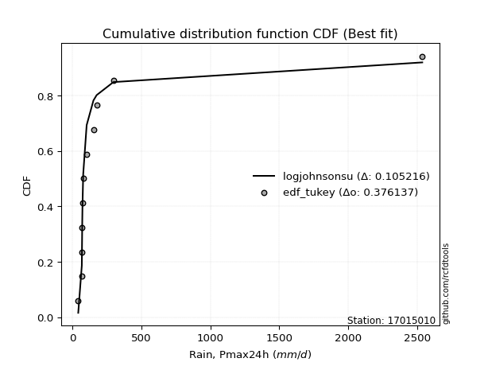</img>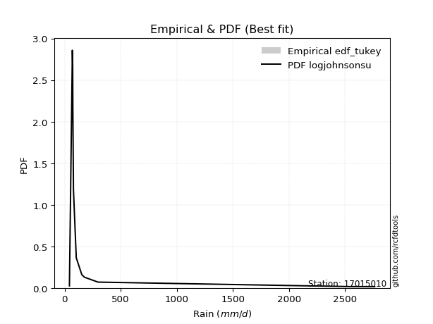</img>

</div>


### 8. EDF Gringorten (1963)

Gringorten plotting position formula is essential for estimating the probability and return periods of extreme events like floods and heavy rainfall. The constant _a=0.44_.

<div align="center">


$P=(m-a)/(n+1-2a)$


</div>


**8.1. Empirical values**

<div align="center">

|                | 0                   | 1                   | 2                   | 3                   | 4                   | 5                   | 6                  | 7                  | 8                  | 9                  | 10                 | 11                 |
|:---------------|:--------------------|:--------------------|:--------------------|:--------------------|:--------------------|:--------------------|:-------------------|:-------------------|:-------------------|:-------------------|:-------------------|:-------------------|
| date           | 2021                | 2015                | 2017                | 2020                | 2019                | 2018                | 2022               | 2023               | 2014               | 2016               | 2024               | 2025               |
| x              | 43.0                | 68.86               | 68.95               | 72.1                | 73.56               | 78.91               | 104.0              | 153.3              | 176.4              | 298.01             | 2537.4             | 2763.0             |
| m              | 1                   | 2                   | 3                   | 4                   | 5                   | 6                   | 7                  | 8                  | 9                  | 10                 | 11                 | 12                 |
| empirical_dist | edf_gringorten      | edf_gringorten      | edf_gringorten      | edf_gringorten      | edf_gringorten      | edf_gringorten      | edf_gringorten     | edf_gringorten     | edf_gringorten     | edf_gringorten     | edf_gringorten     | edf_gringorten     |
| empirical      | 0.04620462046204621 | 0.12871287128712872 | 0.21122112211221125 | 0.29372937293729373 | 0.37623762376237624 | 0.45874587458745875 | 0.5412541254125413 | 0.6237623762376238 | 0.7062706270627064 | 0.7887788778877889 | 0.8712871287128714 | 0.9537953795379539 |
| empirical_tr   | 1.0484429065743945  | 1.1477272727272727  | 1.2677824267782427  | 1.4158878504672898  | 1.6031746031746033  | 1.8475609756097562  | 2.179856115107914  | 2.6578947368421053 | 3.4044943820224733 | 4.734375000000003  | 7.769230769230775  | 21.642857142857192 |

</div>


**8.2. Kolmogorov-Smirnov fit test (sorted by Δ)**


<div align="center">

|                | 0                   | 1                   | 2                   | 3                   | 4                   | 5                   | 6                   | 7                   | 8                   | 9                   | 10                  | 11                  | 12                  | 13                  | 14                  | 15                  | 16                  | 17                  | 18                  | 19                  | 20                  | 21                  | 22                  | 23                  | 24                  | 25                  | 26                  | 27                  | 28                  | 29                  | 30                  | 31                  | 32                  | 33                  | 34                  | 35                  | 36                  | 37                  | 38                  | 39                  | 40                  | 41                  | 42                  | 43                  | 44                  | 45                  | 46                  | 47                  | 48                  | 49                  | 50                  | 51                  | 52                  | 53                  | 54                  | 55                  | 56                  | 57                  | 58                  | 59                  | 60                  | 61                  | 62                  | 63                  | 64                  | 65                  | 66                  | 67                  | 68                  | 69                  | 70                  | 71                  | 72                  | 73                  | 74                  | 75                  | 76                  | 77                  | 78                  | 79                  | 80                  | 81                  | 82                  | 83                  | 84                  | 85                  | 86                  | 87                  | 88                  | 89                  | 90                  | 91                  | 92                  | 93                  | 94                  | 95                  | 96                  | 97                  | 98                  | 99                  | 100                 | 101                 | 102                 | 103                 | 104                 | 105                 | 106                 | 107                 | 108                 | 109                 | 110                 | 111                 | 112                 | 113                 | 114                 | 115                 | 116                 | 117                 | 118                 | 119                 | 120                 | 121                 | 122                 | 123                 | 124                 | 125                 | 126                 | 127                 | 128                 | 129                 | 130                 | 131                 | 132                 | 133                 | 134                 | 135                 | 136                 | 137                 | 138                 | 139                 | 140                 | 141                 | 142                 | 143                 | 144                 | 145                 | 146                 | 147                 | 148                 | 149                 | 150                 | 151                 | 152                 | 153                 | 154                 | 155                 | 156                 | 157                 | 158                 | 159                 |
|:---------------|:--------------------|:--------------------|:--------------------|:--------------------|:--------------------|:--------------------|:--------------------|:--------------------|:--------------------|:--------------------|:--------------------|:--------------------|:--------------------|:--------------------|:--------------------|:--------------------|:--------------------|:--------------------|:--------------------|:--------------------|:--------------------|:--------------------|:--------------------|:--------------------|:--------------------|:--------------------|:--------------------|:--------------------|:--------------------|:--------------------|:--------------------|:--------------------|:--------------------|:--------------------|:--------------------|:--------------------|:--------------------|:--------------------|:--------------------|:--------------------|:--------------------|:--------------------|:--------------------|:--------------------|:--------------------|:--------------------|:--------------------|:--------------------|:--------------------|:--------------------|:--------------------|:--------------------|:--------------------|:--------------------|:--------------------|:--------------------|:--------------------|:--------------------|:--------------------|:--------------------|:--------------------|:--------------------|:--------------------|:--------------------|:--------------------|:--------------------|:--------------------|:--------------------|:--------------------|:--------------------|:--------------------|:--------------------|:--------------------|:--------------------|:--------------------|:--------------------|:--------------------|:--------------------|:--------------------|:--------------------|:--------------------|:--------------------|:--------------------|:--------------------|:--------------------|:--------------------|:--------------------|:--------------------|:--------------------|:--------------------|:--------------------|:--------------------|:--------------------|:--------------------|:--------------------|:--------------------|:--------------------|:--------------------|:--------------------|:--------------------|:--------------------|:--------------------|:--------------------|:--------------------|:--------------------|:--------------------|:--------------------|:--------------------|:--------------------|:--------------------|:--------------------|:--------------------|:--------------------|:--------------------|:--------------------|:--------------------|:--------------------|:--------------------|:--------------------|:--------------------|:--------------------|:--------------------|:--------------------|:--------------------|:--------------------|:--------------------|:--------------------|:--------------------|:--------------------|:--------------------|:--------------------|:--------------------|:--------------------|:--------------------|:--------------------|:--------------------|:--------------------|:--------------------|:--------------------|:--------------------|:--------------------|:--------------------|:--------------------|:--------------------|:--------------------|:--------------------|:--------------------|:--------------------|:--------------------|:--------------------|:--------------------|:--------------------|:--------------------|:--------------------|:--------------------|:--------------------|:--------------------|:--------------------|:--------------------|:--------------------|
| station        | 17015010            | 17015010            | 17015010            | 17015010            | 17015010            | 17015010            | 17015010            | 17015010            | 17015010            | 17015010            | 17015010            | 17015010            | 17015010            | 17015010            | 17015010            | 17015010            | 17015010            | 17015010            | 17015010            | 17015010            | 17015010            | 17015010            | 17015010            | 17015010            | 17015010            | 17015010            | 17015010            | 17015010            | 17015010            | 17015010            | 17015010            | 17015010            | 17015010            | 17015010            | 17015010            | 17015010            | 17015010            | 17015010            | 17015010            | 17015010            | 17015010            | 17015010            | 17015010            | 17015010            | 17015010            | 17015010            | 17015010            | 17015010            | 17015010            | 17015010            | 17015010            | 17015010            | 17015010            | 17015010            | 17015010            | 17015010            | 17015010            | 17015010            | 17015010            | 17015010            | 17015010            | 17015010            | 17015010            | 17015010            | 17015010            | 17015010            | 17015010            | 17015010            | 17015010            | 17015010            | 17015010            | 17015010            | 17015010            | 17015010            | 17015010            | 17015010            | 17015010            | 17015010            | 17015010            | 17015010            | 17015010            | 17015010            | 17015010            | 17015010            | 17015010            | 17015010            | 17015010            | 17015010            | 17015010            | 17015010            | 17015010            | 17015010            | 17015010            | 17015010            | 17015010            | 17015010            | 17015010            | 17015010            | 17015010            | 17015010            | 17015010            | 17015010            | 17015010            | 17015010            | 17015010            | 17015010            | 17015010            | 17015010            | 17015010            | 17015010            | 17015010            | 17015010            | 17015010            | 17015010            | 17015010            | 17015010            | 17015010            | 17015010            | 17015010            | 17015010            | 17015010            | 17015010            | 17015010            | 17015010            | 17015010            | 17015010            | 17015010            | 17015010            | 17015010            | 17015010            | 17015010            | 17015010            | 17015010            | 17015010            | 17015010            | 17015010            | 17015010            | 17015010            | 17015010            | 17015010            | 17015010            | 17015010            | 17015010            | 17015010            | 17015010            | 17015010            | 17015010            | 17015010            | 17015010            | 17015010            | 17015010            | 17015010            | 17015010            | 17015010            | 17015010            | 17015010            | 17015010            | 17015010            | 17015010            | 17015010            |
| empirical_dist | edf_gringorten      | edf_gringorten      | edf_gringorten      | edf_gringorten      | edf_gringorten      | edf_gringorten      | edf_gringorten      | edf_gringorten      | edf_gringorten      | edf_gringorten      | edf_gringorten      | edf_gringorten      | edf_gringorten      | edf_gringorten      | edf_gringorten      | edf_gringorten      | edf_gringorten      | edf_gringorten      | edf_gringorten      | edf_gringorten      | edf_gringorten      | edf_gringorten      | edf_gringorten      | edf_gringorten      | edf_gringorten      | edf_gringorten      | edf_gringorten      | edf_gringorten      | edf_gringorten      | edf_gringorten      | edf_gringorten      | edf_gringorten      | edf_gringorten      | edf_gringorten      | edf_gringorten      | edf_gringorten      | edf_gringorten      | edf_gringorten      | edf_gringorten      | edf_gringorten      | edf_gringorten      | edf_gringorten      | edf_gringorten      | edf_gringorten      | edf_gringorten      | edf_gringorten      | edf_gringorten      | edf_gringorten      | edf_gringorten      | edf_gringorten      | edf_gringorten      | edf_gringorten      | edf_gringorten      | edf_gringorten      | edf_gringorten      | edf_gringorten      | edf_gringorten      | edf_gringorten      | edf_gringorten      | edf_gringorten      | edf_gringorten      | edf_gringorten      | edf_gringorten      | edf_gringorten      | edf_gringorten      | edf_gringorten      | edf_gringorten      | edf_gringorten      | edf_gringorten      | edf_gringorten      | edf_gringorten      | edf_gringorten      | edf_gringorten      | edf_gringorten      | edf_gringorten      | edf_gringorten      | edf_gringorten      | edf_gringorten      | edf_gringorten      | edf_gringorten      | edf_gringorten      | edf_gringorten      | edf_gringorten      | edf_gringorten      | edf_gringorten      | edf_gringorten      | edf_gringorten      | edf_gringorten      | edf_gringorten      | edf_gringorten      | edf_gringorten      | edf_gringorten      | edf_gringorten      | edf_gringorten      | edf_gringorten      | edf_gringorten      | edf_gringorten      | edf_gringorten      | edf_gringorten      | edf_gringorten      | edf_gringorten      | edf_gringorten      | edf_gringorten      | edf_gringorten      | edf_gringorten      | edf_gringorten      | edf_gringorten      | edf_gringorten      | edf_gringorten      | edf_gringorten      | edf_gringorten      | edf_gringorten      | edf_gringorten      | edf_gringorten      | edf_gringorten      | edf_gringorten      | edf_gringorten      | edf_gringorten      | edf_gringorten      | edf_gringorten      | edf_gringorten      | edf_gringorten      | edf_gringorten      | edf_gringorten      | edf_gringorten      | edf_gringorten      | edf_gringorten      | edf_gringorten      | edf_gringorten      | edf_gringorten      | edf_gringorten      | edf_gringorten      | edf_gringorten      | edf_gringorten      | edf_gringorten      | edf_gringorten      | edf_gringorten      | edf_gringorten      | edf_gringorten      | edf_gringorten      | edf_gringorten      | edf_gringorten      | edf_gringorten      | edf_gringorten      | edf_gringorten      | edf_gringorten      | edf_gringorten      | edf_gringorten      | edf_gringorten      | edf_gringorten      | edf_gringorten      | edf_gringorten      | edf_gringorten      | edf_gringorten      | edf_gringorten      | edf_gringorten      | edf_gringorten      | edf_gringorten      | edf_gringorten      | edf_gringorten      |
| p_dist         | logjohnsonsu        | logalpha            | alpha               | loginvweibull       | loggenextreme       | logmielke           | logburr             | logburr12           | loginvgamma         | logmoyal            | loginvgauss         | logfatiguelife      | invgamma            | f                   | burr                | genextreme          | halfgennorm         | loggumbel_r         | invgauss            | mielke              | logpearson3         | lograyleigh         | logexponnorm        | johnsonsu           | loggenhalflogistic  | logwald             | logncf              | logmaxwell          | loggompertz         | logtruncnorm        | loghalfgennorm      | loghalflogistic     | loggenexpon         | logvonmises_line    | burr12              | lomax               | loglomax            | lognct              | genpareto           | kappa3              | logrdist            | logloglaplace       | nct                 | loghalfnorm         | loggenlogistic      | truncpareto         | ncf                 | betaprime           | logfoldnorm         | logexponpow         | lognorm             | logcrystalball      | loganglit           | logsemicircular     | weibull_min         | logloggamma         | loglogistic         | logkstwobign        | logbetaprime        | bradford            | logskewnorm         | logweibull_min      | logf                | logtukeylambda      | loghypsecant        | logarcsine          | fatiguelife         | logrice             | gamma               | loglaplace          | loglaplace          | logtruncweibull_min | logtruncexpon       | logcosine           | loggumbel_l         | exponweib           | t                   | dgamma              | logt                | loggennorm          | loggenpareto        | logbradford         | gausshyper          | logwrapcauchy       | wald                | truncweibull_min    | gengamma            | moyal               | vonmises_line       | logdweibull         | halflogistic        | halfnorm            | pearson3            | gumbel_r            | exponpow            | foldnorm            | logksone            | wrapcauchy          | tukeylambda         | rayleigh            | arcsine             | nakagami            | genlogistic         | logargus            | powerlaw            | logkappa4           | maxwell             | gennorm             | loguniform          | logdgamma           | semicircular        | loglevy_l           | anglit              | erlang              | dweibull            | logtriang           | norm                | logistic            | johnsonsb           | kstwobign           | hypsecant           | logkappa3           | lognakagami         | invweibull          | levy_l              | rice                | laplace             | gumbel_l            | cosine              | exponnorm           | logbeta             | genexpon            | crystalball         | logpowerlaw         | logjohnsonsb        | loggausshyper       | logweibull_max      | loggengamma         | truncexpon          | argus               | logtrapezoid        | truncnorm           | logerlang           | logexponweib        | gompertz            | loggamma            | loggamma            | beta                | skewnorm            | ksone               | triang              | rdist               | kappa4              | genhalflogistic     | uniform             | weibull_max         | trapezoid           | logtruncpareto      | logvonmises         | vonmises            |
| delta          | 0.11390709080281458 | 0.12404888797475289 | 0.1251892127238431  | 0.12816303923338385 | 0.128170892816951   | 0.12861816071604837 | 0.1286397902052407  | 0.13031880199500723 | 0.1306631490297765  | 0.13944445777566838 | 0.1397924949308843  | 0.14149259412478088 | 0.14312712805294103 | 0.14442704345007035 | 0.14461088272509676 | 0.14557528130932418 | 0.14626969669008022 | 0.14637153689497617 | 0.14840841239905772 | 0.15212872698485685 | 0.1531189837584329  | 0.1532582744331371  | 0.154232228467565   | 0.15488372425747682 | 0.15515538105081872 | 0.15671303228644423 | 0.15732988701634731 | 0.15905899295684878 | 0.16063264691530788 | 0.1616097341394641  | 0.1628130073123214  | 0.16344849505109765 | 0.16354993620661856 | 0.1642019330657084  | 0.1675103352849857  | 0.1689320607649228  | 0.17057308371740898 | 0.17110152474265022 | 0.17176681168081587 | 0.17224936736090318 | 0.17315467921167893 | 0.1753964488101475  | 0.17570314438561857 | 0.17741027831050332 | 0.17817546144618251 | 0.17917155039579158 | 0.18100139784017194 | 0.18266589129537764 | 0.18326520459103146 | 0.18477612939602428 | 0.19145778244526368 | 0.19145785926869596 | 0.19357668728552913 | 0.19444961421378681 | 0.1948340483044313  | 0.19503871951207974 | 0.19910613951336625 | 0.20096044393188728 | 0.20593954942744663 | 0.20642047611013775 | 0.20846598239107939 | 0.21040115395608783 | 0.2106576883041376  | 0.21122112210713073 | 0.21254508010873457 | 0.21401409128189852 | 0.21701930005414144 | 0.22158182159664533 | 0.22538350017366393 | 0.2409211667308378  | 0.2409211667308378  | 0.2533146632772257  | 0.2544626873403667  | 0.25996740135247365 | 0.2612355806521014  | 0.2619904561875137  | 0.2673772292041404  | 0.27128786420795914 | 0.2758845367495376  | 0.2793422589884101  | 0.2793745475397422  | 0.28340559282706723 | 0.28580318872279986 | 0.30047201962180187 | 0.3008297062829902  | 0.3031556474281092  | 0.30347529071822976 | 0.30513505948418174 | 0.3163058735929503  | 0.32306547402874236 | 0.32427178278341545 | 0.32566172166619417 | 0.32781860913402766 | 0.3280811097991364  | 0.33399673056077656 | 0.3373219506743378  | 0.3403691618937273  | 0.3403714652544437  | 0.3408505285080691  | 0.341672003298492   | 0.345649556466523   | 0.3462422140609454  | 0.34688493087890104 | 0.3475040435774325  | 0.34896937620221335 | 0.3497543837928565  | 0.35396431105068077 | 0.3649663221997402  | 0.36718886885993157 | 0.3685566382015655  | 0.3685679007338021  | 0.36955003671525677 | 0.37426902838990256 | 0.37694535770752313 | 0.38272349062182426 | 0.38773456182994637 | 0.38799848453701863 | 0.40080998863662753 | 0.400996062192152   | 0.40578134090113527 | 0.41130018851832245 | 0.4139717397918592  | 0.4192190541432361  | 0.41931545110474433 | 0.4286619258170651  | 0.43574391973976934 | 0.43834322469721726 | 0.4545893342996975  | 0.4584148481556638  | 0.46618908452643826 | 0.46866481671691484 | 0.4693926647255311  | 0.46974765209648073 | 0.47485040718222393 | 0.48260439463872734 | 0.5055176760764286  | 0.5151961801315318  | 0.519118711026108   | 0.5205953281805893  | 0.5238843763538633  | 0.5723867448499007  | 0.5736678791202512  | 0.5745801483741902  | 0.5831521358809375  | 0.5877367573950132  | 0.5947648625665457  | 0.5947648625665457  | 0.6032408999768422  | 0.6069934085234512  | 0.6273174808289653  | 0.6301383002974157  | 0.6747598517208258  | 0.6757542407333262  | 0.6950227731090335  | 0.6950252014172007  | 0.7038144964276629  | 0.7615639872432651  | 0.7788433205259242  | 1.2655495627741336  | 439.6132875298828   |
| deltao         | 0.36218414519599995 | 0.36218414519599995 | 0.36218414519599995 | 0.36218414519599995 | 0.36218414519599995 | 0.36218414519599995 | 0.36218414519599995 | 0.36218414519599995 | 0.36218414519599995 | 0.36218414519599995 | 0.36218414519599995 | 0.36218414519599995 | 0.36218414519599995 | 0.36218414519599995 | 0.36218414519599995 | 0.36218414519599995 | 0.36218414519599995 | 0.36218414519599995 | 0.36218414519599995 | 0.36218414519599995 | 0.36218414519599995 | 0.36218414519599995 | 0.36218414519599995 | 0.36218414519599995 | 0.36218414519599995 | 0.36218414519599995 | 0.36218414519599995 | 0.36218414519599995 | 0.36218414519599995 | 0.36218414519599995 | 0.36218414519599995 | 0.36218414519599995 | 0.36218414519599995 | 0.36218414519599995 | 0.36218414519599995 | 0.36218414519599995 | 0.36218414519599995 | 0.36218414519599995 | 0.36218414519599995 | 0.36218414519599995 | 0.36218414519599995 | 0.36218414519599995 | 0.36218414519599995 | 0.36218414519599995 | 0.36218414519599995 | 0.36218414519599995 | 0.36218414519599995 | 0.36218414519599995 | 0.36218414519599995 | 0.36218414519599995 | 0.36218414519599995 | 0.36218414519599995 | 0.36218414519599995 | 0.36218414519599995 | 0.36218414519599995 | 0.36218414519599995 | 0.36218414519599995 | 0.36218414519599995 | 0.36218414519599995 | 0.36218414519599995 | 0.36218414519599995 | 0.36218414519599995 | 0.36218414519599995 | 0.36218414519599995 | 0.36218414519599995 | 0.36218414519599995 | 0.36218414519599995 | 0.36218414519599995 | 0.36218414519599995 | 0.36218414519599995 | 0.36218414519599995 | 0.36218414519599995 | 0.36218414519599995 | 0.36218414519599995 | 0.36218414519599995 | 0.36218414519599995 | 0.36218414519599995 | 0.36218414519599995 | 0.36218414519599995 | 0.36218414519599995 | 0.36218414519599995 | 0.36218414519599995 | 0.36218414519599995 | 0.36218414519599995 | 0.36218414519599995 | 0.36218414519599995 | 0.36218414519599995 | 0.36218414519599995 | 0.36218414519599995 | 0.36218414519599995 | 0.36218414519599995 | 0.36218414519599995 | 0.36218414519599995 | 0.36218414519599995 | 0.36218414519599995 | 0.36218414519599995 | 0.36218414519599995 | 0.36218414519599995 | 0.36218414519599995 | 0.36218414519599995 | 0.36218414519599995 | 0.36218414519599995 | 0.36218414519599995 | 0.36218414519599995 | 0.36218414519599995 | 0.36218414519599995 | 0.36218414519599995 | 0.36218414519599995 | 0.36218414519599995 | 0.36218414519599995 | 0.36218414519599995 | 0.36218414519599995 | 0.36218414519599995 | 0.36218414519599995 | 0.36218414519599995 | 0.36218414519599995 | 0.36218414519599995 | 0.36218414519599995 | 0.36218414519599995 | 0.36218414519599995 | 0.36218414519599995 | 0.36218414519599995 | 0.36218414519599995 | 0.36218414519599995 | 0.36218414519599995 | 0.36218414519599995 | 0.36218414519599995 | 0.36218414519599995 | 0.36218414519599995 | 0.36218414519599995 | 0.36218414519599995 | 0.36218414519599995 | 0.36218414519599995 | 0.36218414519599995 | 0.36218414519599995 | 0.36218414519599995 | 0.36218414519599995 | 0.36218414519599995 | 0.36218414519599995 | 0.36218414519599995 | 0.36218414519599995 | 0.36218414519599995 | 0.36218414519599995 | 0.36218414519599995 | 0.36218414519599995 | 0.36218414519599995 | 0.36218414519599995 | 0.36218414519599995 | 0.36218414519599995 | 0.36218414519599995 | 0.36218414519599995 | 0.36218414519599995 | 0.36218414519599995 | 0.36218414519599995 | 0.36218414519599995 | 0.36218414519599995 | 0.36218414519599995 | 0.36218414519599995 | 0.36218414519599995 | 0.36218414519599995 |
| eval           | Δo > Δ              | Δo > Δ              | Δo > Δ              | Δo > Δ              | Δo > Δ              | Δo > Δ              | Δo > Δ              | Δo > Δ              | Δo > Δ              | Δo > Δ              | Δo > Δ              | Δo > Δ              | Δo > Δ              | Δo > Δ              | Δo > Δ              | Δo > Δ              | Δo > Δ              | Δo > Δ              | Δo > Δ              | Δo > Δ              | Δo > Δ              | Δo > Δ              | Δo > Δ              | Δo > Δ              | Δo > Δ              | Δo > Δ              | Δo > Δ              | Δo > Δ              | Δo > Δ              | Δo > Δ              | Δo > Δ              | Δo > Δ              | Δo > Δ              | Δo > Δ              | Δo > Δ              | Δo > Δ              | Δo > Δ              | Δo > Δ              | Δo > Δ              | Δo > Δ              | Δo > Δ              | Δo > Δ              | Δo > Δ              | Δo > Δ              | Δo > Δ              | Δo > Δ              | Δo > Δ              | Δo > Δ              | Δo > Δ              | Δo > Δ              | Δo > Δ              | Δo > Δ              | Δo > Δ              | Δo > Δ              | Δo > Δ              | Δo > Δ              | Δo > Δ              | Δo > Δ              | Δo > Δ              | Δo > Δ              | Δo > Δ              | Δo > Δ              | Δo > Δ              | Δo > Δ              | Δo > Δ              | Δo > Δ              | Δo > Δ              | Δo > Δ              | Δo > Δ              | Δo > Δ              | Δo > Δ              | Δo > Δ              | Δo > Δ              | Δo > Δ              | Δo > Δ              | Δo > Δ              | Δo > Δ              | Δo > Δ              | Δo > Δ              | Δo > Δ              | Δo > Δ              | Δo > Δ              | Δo > Δ              | Δo > Δ              | Δo > Δ              | Δo > Δ              | Δo > Δ              | Δo > Δ              | Δo > Δ              | Δo > Δ              | Δo > Δ              | Δo > Δ              | Δo > Δ              | Δo > Δ              | Δo > Δ              | Δo > Δ              | Δo > Δ              | Δo > Δ              | Δo > Δ              | Δo > Δ              | Δo > Δ              | Δo > Δ              | Δo > Δ              | Δo > Δ              | Δo > Δ              | Δo > Δ              | Δo > Δ              | Δo <= Δ             | Δo <= Δ             | Δo <= Δ             | Δo <= Δ             | Δo <= Δ             | Δo <= Δ             | Δo <= Δ             | Δo <= Δ             | Δo <= Δ             | Δo <= Δ             | Δo <= Δ             | Δo <= Δ             | Δo <= Δ             | Δo <= Δ             | Δo <= Δ             | Δo <= Δ             | Δo <= Δ             | Δo <= Δ             | Δo <= Δ             | Δo <= Δ             | Δo <= Δ             | Δo <= Δ             | Δo <= Δ             | Δo <= Δ             | Δo <= Δ             | Δo <= Δ             | Δo <= Δ             | Δo <= Δ             | Δo <= Δ             | Δo <= Δ             | Δo <= Δ             | Δo <= Δ             | Δo <= Δ             | Δo <= Δ             | Δo <= Δ             | Δo <= Δ             | Δo <= Δ             | Δo <= Δ             | Δo <= Δ             | Δo <= Δ             | Δo <= Δ             | Δo <= Δ             | Δo <= Δ             | Δo <= Δ             | Δo <= Δ             | Δo <= Δ             | Δo <= Δ             | Δo <= Δ             | Δo <= Δ             | Δo <= Δ             | Δo <= Δ             | Δo <= Δ             | Δo <= Δ             |
| fit            | 1                   | 1                   | 1                   | 1                   | 1                   | 1                   | 1                   | 1                   | 1                   | 1                   | 1                   | 1                   | 1                   | 1                   | 1                   | 1                   | 1                   | 1                   | 1                   | 1                   | 1                   | 1                   | 1                   | 1                   | 1                   | 1                   | 1                   | 1                   | 1                   | 1                   | 1                   | 1                   | 1                   | 1                   | 1                   | 1                   | 1                   | 1                   | 1                   | 1                   | 1                   | 1                   | 1                   | 1                   | 1                   | 1                   | 1                   | 1                   | 1                   | 1                   | 1                   | 1                   | 1                   | 1                   | 1                   | 1                   | 1                   | 1                   | 1                   | 1                   | 1                   | 1                   | 1                   | 1                   | 1                   | 1                   | 1                   | 1                   | 1                   | 1                   | 1                   | 1                   | 1                   | 1                   | 1                   | 1                   | 1                   | 1                   | 1                   | 1                   | 1                   | 1                   | 1                   | 1                   | 1                   | 1                   | 1                   | 1                   | 1                   | 1                   | 1                   | 1                   | 1                   | 1                   | 1                   | 1                   | 1                   | 1                   | 1                   | 1                   | 1                   | 1                   | 1                   | 1                   | 1                   | 1                   | 1                   | 0                   | 0                   | 0                   | 0                   | 0                   | 0                   | 0                   | 0                   | 0                   | 0                   | 0                   | 0                   | 0                   | 0                   | 0                   | 0                   | 0                   | 0                   | 0                   | 0                   | 0                   | 0                   | 0                   | 0                   | 0                   | 0                   | 0                   | 0                   | 0                   | 0                   | 0                   | 0                   | 0                   | 0                   | 0                   | 0                   | 0                   | 0                   | 0                   | 0                   | 0                   | 0                   | 0                   | 0                   | 0                   | 0                   | 0                   | 0                   | 0                   | 0                   | 0                   | 0                   | 0                   |
| n              | 12                  | 12                  | 12                  | 12                  | 12                  | 12                  | 12                  | 12                  | 12                  | 12                  | 12                  | 12                  | 12                  | 12                  | 12                  | 12                  | 12                  | 12                  | 12                  | 12                  | 12                  | 12                  | 12                  | 12                  | 12                  | 12                  | 12                  | 12                  | 12                  | 12                  | 12                  | 12                  | 12                  | 12                  | 12                  | 12                  | 12                  | 12                  | 12                  | 12                  | 12                  | 12                  | 12                  | 12                  | 12                  | 12                  | 12                  | 12                  | 12                  | 12                  | 12                  | 12                  | 12                  | 12                  | 12                  | 12                  | 12                  | 12                  | 12                  | 12                  | 12                  | 12                  | 12                  | 12                  | 12                  | 12                  | 12                  | 12                  | 12                  | 12                  | 12                  | 12                  | 12                  | 12                  | 12                  | 12                  | 12                  | 12                  | 12                  | 12                  | 12                  | 12                  | 12                  | 12                  | 12                  | 12                  | 12                  | 12                  | 12                  | 12                  | 12                  | 12                  | 12                  | 12                  | 12                  | 12                  | 12                  | 12                  | 12                  | 12                  | 12                  | 12                  | 12                  | 12                  | 12                  | 12                  | 12                  | 12                  | 12                  | 12                  | 12                  | 12                  | 12                  | 12                  | 12                  | 12                  | 12                  | 12                  | 12                  | 12                  | 12                  | 12                  | 12                  | 12                  | 12                  | 12                  | 12                  | 12                  | 12                  | 12                  | 12                  | 12                  | 12                  | 12                  | 12                  | 12                  | 12                  | 12                  | 12                  | 12                  | 12                  | 12                  | 12                  | 12                  | 12                  | 12                  | 12                  | 12                  | 12                  | 12                  | 12                  | 12                  | 12                  | 12                  | 12                  | 12                  | 12                  | 12                  | 12                  | 12                  |
| best_fit       | 1                   | 0                   | 0                   | 0                   | 0                   | 0                   | 0                   | 0                   | 0                   | 0                   | 0                   | 0                   | 0                   | 0                   | 0                   | 0                   | 0                   | 0                   | 0                   | 0                   | 0                   | 0                   | 0                   | 0                   | 0                   | 0                   | 0                   | 0                   | 0                   | 0                   | 0                   | 0                   | 0                   | 0                   | 0                   | 0                   | 0                   | 0                   | 0                   | 0                   | 0                   | 0                   | 0                   | 0                   | 0                   | 0                   | 0                   | 0                   | 0                   | 0                   | 0                   | 0                   | 0                   | 0                   | 0                   | 0                   | 0                   | 0                   | 0                   | 0                   | 0                   | 0                   | 0                   | 0                   | 0                   | 0                   | 0                   | 0                   | 0                   | 0                   | 0                   | 0                   | 0                   | 0                   | 0                   | 0                   | 0                   | 0                   | 0                   | 0                   | 0                   | 0                   | 0                   | 0                   | 0                   | 0                   | 0                   | 0                   | 0                   | 0                   | 0                   | 0                   | 0                   | 0                   | 0                   | 0                   | 0                   | 0                   | 0                   | 0                   | 0                   | 0                   | 0                   | 0                   | 0                   | 0                   | 0                   | 0                   | 0                   | 0                   | 0                   | 0                   | 0                   | 0                   | 0                   | 0                   | 0                   | 0                   | 0                   | 0                   | 0                   | 0                   | 0                   | 0                   | 0                   | 0                   | 0                   | 0                   | 0                   | 0                   | 0                   | 0                   | 0                   | 0                   | 0                   | 0                   | 0                   | 0                   | 0                   | 0                   | 0                   | 0                   | 0                   | 0                   | 0                   | 0                   | 0                   | 0                   | 0                   | 0                   | 0                   | 0                   | 0                   | 0                   | 0                   | 0                   | 0                   | 0                   | 0                   | 0                   |
| best_fit_sort  | 1                   | 2                   | 3                   | 4                   | 5                   | 6                   | 7                   | 8                   | 9                   | 10                  | 11                  | 12                  | 13                  | 14                  | 15                  | 16                  | 17                  | 18                  | 19                  | 20                  | 21                  | 22                  | 23                  | 24                  | 25                  | 26                  | 27                  | 28                  | 29                  | 30                  | 31                  | 32                  | 33                  | 34                  | 35                  | 36                  | 37                  | 38                  | 39                  | 40                  | 41                  | 42                  | 43                  | 44                  | 45                  | 46                  | 47                  | 48                  | 49                  | 50                  | 51                  | 52                  | 53                  | 54                  | 55                  | 56                  | 57                  | 58                  | 59                  | 60                  | 61                  | 62                  | 63                  | 64                  | 65                  | 66                  | 67                  | 68                  | 69                  | 70                  | 71                  | 72                  | 73                  | 74                  | 75                  | 76                  | 77                  | 78                  | 79                  | 80                  | 81                  | 82                  | 83                  | 84                  | 85                  | 86                  | 87                  | 88                  | 89                  | 90                  | 91                  | 92                  | 93                  | 94                  | 95                  | 96                  | 97                  | 98                  | 99                  | 100                 | 101                 | 102                 | 103                 | 104                 | 105                 | 106                 | 107                 | 108                 | 109                 | 110                 | 111                 | 112                 | 113                 | 114                 | 115                 | 116                 | 117                 | 118                 | 119                 | 120                 | 121                 | 122                 | 123                 | 124                 | 125                 | 126                 | 127                 | 128                 | 129                 | 130                 | 131                 | 132                 | 133                 | 134                 | 135                 | 136                 | 137                 | 138                 | 139                 | 140                 | 141                 | 142                 | 143                 | 144                 | 145                 | 146                 | 147                 | 148                 | 149                 | 150                 | 151                 | 152                 | 153                 | 154                 | 155                 | 156                 | 157                 | 158                 | 159                 | 160                 |

</div>


**8.3. Best fit**

<div align="center">

|   id |   station | empirical_dist   | p_dist       |    delta |   deltao | eval   |   fit |   n |   best_fit |   best_fit_sort |
|-----:|----------:|:-----------------|:-------------|---------:|---------:|:-------|------:|----:|-----------:|----------------:|
|    0 |  17015010 | edf_gringorten   | logjohnsonsu | 0.113907 | 0.362184 | Δo > Δ |     1 |  12 |          1 |               1 |

</div>


<div align="center">

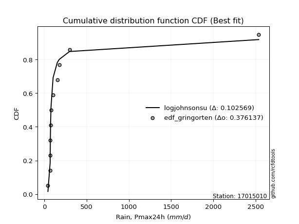</img>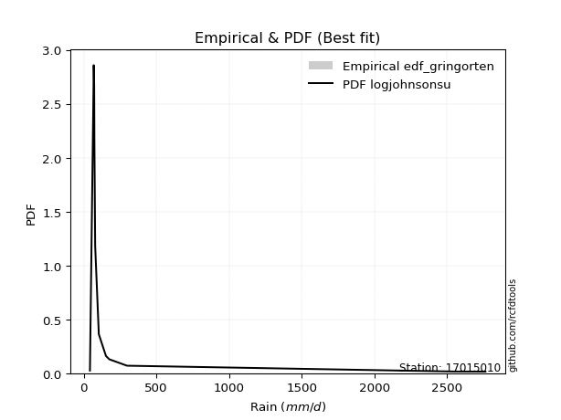</img>

</div>


### 9. EDF Filliben (1975)

The specific values of the constants (0.3175) (often denoted as $alpha$) and (0.365) are derived from a method proposed by James J. Filliben in a 1975 paper. This particular formula is the mean value of the $i$-th order statistic of the normal distribution and is considered a robust and effective plotting position formula for the normal probability plot correlation coefficient test for normality.

<div align="center">


$P=(m-0.3175)/(n+0.365)$


</div>


**9.1. Empirical values**

<div align="center">

|                | 0                   | 1                   | 2                   | 3                   | 4                  | 5                  | 6                  | 7                  | 8                  | 9                  | 10                 | 11                 |
|:---------------|:--------------------|:--------------------|:--------------------|:--------------------|:-------------------|:-------------------|:-------------------|:-------------------|:-------------------|:-------------------|:-------------------|:-------------------|
| date           | 2021                | 2015                | 2017                | 2020                | 2019               | 2018               | 2022               | 2023               | 2014               | 2016               | 2024               | 2025               |
| x              | 43.0                | 68.86               | 68.95               | 72.1                | 73.56              | 78.91              | 104.0              | 153.3              | 176.4              | 298.01             | 2537.4             | 2763.0             |
| m              | 1                   | 2                   | 3                   | 4                   | 5                  | 6                  | 7                  | 8                  | 9                  | 10                 | 11                 | 12                 |
| empirical_dist | edf_filliben        | edf_filliben        | edf_filliben        | edf_filliben        | edf_filliben       | edf_filliben       | edf_filliben       | edf_filliben       | edf_filliben       | edf_filliben       | edf_filliben       | edf_filliben       |
| empirical      | 0.05519611807521229 | 0.13606955115244643 | 0.21694298422968056 | 0.29781641730691466 | 0.3786898503841488 | 0.4595632834613829 | 0.540436716538617  | 0.6213101496158512 | 0.7021835826930852 | 0.7830570157703194 | 0.8639304488475535 | 0.9448038819247876 |
| empirical_tr   | 1.0584207147442757  | 1.1575005850690383  | 1.2770462174025305  | 1.4241289951050964  | 1.609502115196876  | 1.8503554059109617 | 2.1759788825340958 | 2.6406833956219966 | 3.357773251866937  | 4.6095060577819185 | 7.349182763744426  | 18.117216117216078 |

</div>


**9.2. Kolmogorov-Smirnov fit test (sorted by Δ)**


<div align="center">

|                | 0                   | 1                   | 2                   | 3                   | 4                   | 5                   | 6                   | 7                   | 8                   | 9                   | 10                  | 11                  | 12                  | 13                  | 14                  | 15                  | 16                  | 17                  | 18                  | 19                  | 20                  | 21                  | 22                  | 23                  | 24                  | 25                  | 26                  | 27                  | 28                  | 29                  | 30                  | 31                  | 32                  | 33                  | 34                  | 35                  | 36                  | 37                  | 38                  | 39                  | 40                  | 41                  | 42                  | 43                  | 44                  | 45                  | 46                  | 47                  | 48                  | 49                  | 50                  | 51                  | 52                  | 53                  | 54                  | 55                  | 56                  | 57                  | 58                  | 59                  | 60                  | 61                  | 62                  | 63                  | 64                  | 65                  | 66                  | 67                  | 68                  | 69                  | 70                  | 71                  | 72                  | 73                  | 74                  | 75                  | 76                  | 77                  | 78                  | 79                  | 80                  | 81                  | 82                  | 83                  | 84                  | 85                  | 86                  | 87                  | 88                  | 89                  | 90                  | 91                  | 92                  | 93                  | 94                  | 95                  | 96                  | 97                  | 98                  | 99                  | 100                 | 101                 | 102                 | 103                 | 104                 | 105                 | 106                 | 107                 | 108                 | 109                 | 110                 | 111                 | 112                 | 113                 | 114                 | 115                 | 116                 | 117                 | 118                 | 119                 | 120                 | 121                 | 122                 | 123                 | 124                 | 125                 | 126                 | 127                 | 128                 | 129                 | 130                 | 131                 | 132                 | 133                 | 134                 | 135                 | 136                 | 137                 | 138                 | 139                 | 140                 | 141                 | 142                 | 143                 | 144                 | 145                 | 146                 | 147                 | 148                 | 149                 | 150                 | 151                 | 152                 | 153                 | 154                 | 155                 | 156                 | 157                 | 158                 | 159                 |
|:---------------|:--------------------|:--------------------|:--------------------|:--------------------|:--------------------|:--------------------|:--------------------|:--------------------|:--------------------|:--------------------|:--------------------|:--------------------|:--------------------|:--------------------|:--------------------|:--------------------|:--------------------|:--------------------|:--------------------|:--------------------|:--------------------|:--------------------|:--------------------|:--------------------|:--------------------|:--------------------|:--------------------|:--------------------|:--------------------|:--------------------|:--------------------|:--------------------|:--------------------|:--------------------|:--------------------|:--------------------|:--------------------|:--------------------|:--------------------|:--------------------|:--------------------|:--------------------|:--------------------|:--------------------|:--------------------|:--------------------|:--------------------|:--------------------|:--------------------|:--------------------|:--------------------|:--------------------|:--------------------|:--------------------|:--------------------|:--------------------|:--------------------|:--------------------|:--------------------|:--------------------|:--------------------|:--------------------|:--------------------|:--------------------|:--------------------|:--------------------|:--------------------|:--------------------|:--------------------|:--------------------|:--------------------|:--------------------|:--------------------|:--------------------|:--------------------|:--------------------|:--------------------|:--------------------|:--------------------|:--------------------|:--------------------|:--------------------|:--------------------|:--------------------|:--------------------|:--------------------|:--------------------|:--------------------|:--------------------|:--------------------|:--------------------|:--------------------|:--------------------|:--------------------|:--------------------|:--------------------|:--------------------|:--------------------|:--------------------|:--------------------|:--------------------|:--------------------|:--------------------|:--------------------|:--------------------|:--------------------|:--------------------|:--------------------|:--------------------|:--------------------|:--------------------|:--------------------|:--------------------|:--------------------|:--------------------|:--------------------|:--------------------|:--------------------|:--------------------|:--------------------|:--------------------|:--------------------|:--------------------|:--------------------|:--------------------|:--------------------|:--------------------|:--------------------|:--------------------|:--------------------|:--------------------|:--------------------|:--------------------|:--------------------|:--------------------|:--------------------|:--------------------|:--------------------|:--------------------|:--------------------|:--------------------|:--------------------|:--------------------|:--------------------|:--------------------|:--------------------|:--------------------|:--------------------|:--------------------|:--------------------|:--------------------|:--------------------|:--------------------|:--------------------|:--------------------|:--------------------|:--------------------|:--------------------|:--------------------|:--------------------|
| station        | 17015010            | 17015010            | 17015010            | 17015010            | 17015010            | 17015010            | 17015010            | 17015010            | 17015010            | 17015010            | 17015010            | 17015010            | 17015010            | 17015010            | 17015010            | 17015010            | 17015010            | 17015010            | 17015010            | 17015010            | 17015010            | 17015010            | 17015010            | 17015010            | 17015010            | 17015010            | 17015010            | 17015010            | 17015010            | 17015010            | 17015010            | 17015010            | 17015010            | 17015010            | 17015010            | 17015010            | 17015010            | 17015010            | 17015010            | 17015010            | 17015010            | 17015010            | 17015010            | 17015010            | 17015010            | 17015010            | 17015010            | 17015010            | 17015010            | 17015010            | 17015010            | 17015010            | 17015010            | 17015010            | 17015010            | 17015010            | 17015010            | 17015010            | 17015010            | 17015010            | 17015010            | 17015010            | 17015010            | 17015010            | 17015010            | 17015010            | 17015010            | 17015010            | 17015010            | 17015010            | 17015010            | 17015010            | 17015010            | 17015010            | 17015010            | 17015010            | 17015010            | 17015010            | 17015010            | 17015010            | 17015010            | 17015010            | 17015010            | 17015010            | 17015010            | 17015010            | 17015010            | 17015010            | 17015010            | 17015010            | 17015010            | 17015010            | 17015010            | 17015010            | 17015010            | 17015010            | 17015010            | 17015010            | 17015010            | 17015010            | 17015010            | 17015010            | 17015010            | 17015010            | 17015010            | 17015010            | 17015010            | 17015010            | 17015010            | 17015010            | 17015010            | 17015010            | 17015010            | 17015010            | 17015010            | 17015010            | 17015010            | 17015010            | 17015010            | 17015010            | 17015010            | 17015010            | 17015010            | 17015010            | 17015010            | 17015010            | 17015010            | 17015010            | 17015010            | 17015010            | 17015010            | 17015010            | 17015010            | 17015010            | 17015010            | 17015010            | 17015010            | 17015010            | 17015010            | 17015010            | 17015010            | 17015010            | 17015010            | 17015010            | 17015010            | 17015010            | 17015010            | 17015010            | 17015010            | 17015010            | 17015010            | 17015010            | 17015010            | 17015010            | 17015010            | 17015010            | 17015010            | 17015010            | 17015010            | 17015010            |
| empirical_dist | edf_filliben        | edf_filliben        | edf_filliben        | edf_filliben        | edf_filliben        | edf_filliben        | edf_filliben        | edf_filliben        | edf_filliben        | edf_filliben        | edf_filliben        | edf_filliben        | edf_filliben        | edf_filliben        | edf_filliben        | edf_filliben        | edf_filliben        | edf_filliben        | edf_filliben        | edf_filliben        | edf_filliben        | edf_filliben        | edf_filliben        | edf_filliben        | edf_filliben        | edf_filliben        | edf_filliben        | edf_filliben        | edf_filliben        | edf_filliben        | edf_filliben        | edf_filliben        | edf_filliben        | edf_filliben        | edf_filliben        | edf_filliben        | edf_filliben        | edf_filliben        | edf_filliben        | edf_filliben        | edf_filliben        | edf_filliben        | edf_filliben        | edf_filliben        | edf_filliben        | edf_filliben        | edf_filliben        | edf_filliben        | edf_filliben        | edf_filliben        | edf_filliben        | edf_filliben        | edf_filliben        | edf_filliben        | edf_filliben        | edf_filliben        | edf_filliben        | edf_filliben        | edf_filliben        | edf_filliben        | edf_filliben        | edf_filliben        | edf_filliben        | edf_filliben        | edf_filliben        | edf_filliben        | edf_filliben        | edf_filliben        | edf_filliben        | edf_filliben        | edf_filliben        | edf_filliben        | edf_filliben        | edf_filliben        | edf_filliben        | edf_filliben        | edf_filliben        | edf_filliben        | edf_filliben        | edf_filliben        | edf_filliben        | edf_filliben        | edf_filliben        | edf_filliben        | edf_filliben        | edf_filliben        | edf_filliben        | edf_filliben        | edf_filliben        | edf_filliben        | edf_filliben        | edf_filliben        | edf_filliben        | edf_filliben        | edf_filliben        | edf_filliben        | edf_filliben        | edf_filliben        | edf_filliben        | edf_filliben        | edf_filliben        | edf_filliben        | edf_filliben        | edf_filliben        | edf_filliben        | edf_filliben        | edf_filliben        | edf_filliben        | edf_filliben        | edf_filliben        | edf_filliben        | edf_filliben        | edf_filliben        | edf_filliben        | edf_filliben        | edf_filliben        | edf_filliben        | edf_filliben        | edf_filliben        | edf_filliben        | edf_filliben        | edf_filliben        | edf_filliben        | edf_filliben        | edf_filliben        | edf_filliben        | edf_filliben        | edf_filliben        | edf_filliben        | edf_filliben        | edf_filliben        | edf_filliben        | edf_filliben        | edf_filliben        | edf_filliben        | edf_filliben        | edf_filliben        | edf_filliben        | edf_filliben        | edf_filliben        | edf_filliben        | edf_filliben        | edf_filliben        | edf_filliben        | edf_filliben        | edf_filliben        | edf_filliben        | edf_filliben        | edf_filliben        | edf_filliben        | edf_filliben        | edf_filliben        | edf_filliben        | edf_filliben        | edf_filliben        | edf_filliben        | edf_filliben        | edf_filliben        | edf_filliben        | edf_filliben        |
| p_dist         | logjohnsonsu        | logalpha            | loginvweibull       | loggenextreme       | logmielke           | logburr             | loginvgamma         | alpha               | logburr12           | loginvgauss         | logfatiguelife      | invgamma            | f                   | burr                | genextreme          | logmoyal            | invgauss            | mielke              | logpearson3         | lograyleigh         | halfgennorm         | loggumbel_r         | johnsonsu           | loggompertz         | logtruncnorm        | logmaxwell          | logexponnorm        | loghalfgennorm      | loggenhalflogistic  | loghalflogistic     | loggenexpon         | logvonmises_line    | logwald             | logncf              | burr12              | lomax               | loglomax            | genpareto           | kappa3              | logloglaplace       | loghalfnorm         | truncpareto         | lognct              | logfoldnorm         | nct                 | logrdist            | loggenlogistic      | logexponpow         | ncf                 | betaprime           | lognorm             | logcrystalball      | loganglit           | logsemicircular     | weibull_min         | logloggamma         | loglogistic         | logkstwobign        | bradford            | logweibull_min      | logf                | logarcsine          | logbetaprime        | logskewnorm         | loghypsecant        | fatiguelife         | logtukeylambda      | gamma               | logrice             | loglaplace          | loglaplace          | logtruncweibull_min | logtruncexpon       | logcosine           | loggumbel_l         | exponweib           | dgamma              | t                   | loggennorm          | loggenpareto        | logt                | logbradford         | gausshyper          | wald                | logwrapcauchy       | truncweibull_min    | gengamma            | moyal               | vonmises_line       | halflogistic        | logdweibull         | halfnorm            | pearson3            | gumbel_r            | foldnorm            | exponpow            | wrapcauchy          | rayleigh            | logksone            | arcsine             | tukeylambda         | powerlaw            | nakagami            | genlogistic         | logargus            | logkappa4           | maxwell             | gennorm             | loglevy_l           | logdgamma           | semicircular        | loguniform          | anglit              | erlang              | dweibull            | norm                | logtriang           | johnsonsb           | logistic            | kstwobign           | hypsecant           | logkappa3           | invweibull          | lognakagami         | levy_l              | rice                | laplace             | gumbel_l            | cosine              | crystalball         | logbeta             | exponnorm           | genexpon            | logpowerlaw         | logjohnsonsb        | loggausshyper       | logweibull_max      | loggengamma         | truncexpon          | argus               | logerlang           | logtrapezoid        | truncnorm           | logexponweib        | gompertz            | loggamma            | loggamma            | beta                | skewnorm            | ksone               | triang              | rdist               | kappa4              | genhalflogistic     | uniform             | weibull_max         | trapezoid           | logtruncpareto      | logvonmises         | vonmises            |
| delta          | 0.11635931742458716 | 0.12025313066326443 | 0.12080635936806614 | 0.12081421295163328 | 0.12126148085073066 | 0.12128311033992298 | 0.12330646916445878 | 0.12600662159776727 | 0.1311362108689314  | 0.1324358150655666  | 0.13413591425946317 | 0.13577044818762332 | 0.13707036358475264 | 0.13725420285977905 | 0.13821860144400647 | 0.14026186664959256 | 0.14105173253374    | 0.14477204711953914 | 0.1457623038931152  | 0.1459015945678194  | 0.1470871055640044  | 0.14718894576890035 | 0.1507966798878559  | 0.15327596704999016 | 0.1542530542741464  | 0.15497194858722763 | 0.1550496373414892  | 0.1554563274470037  | 0.1559727899247429  | 0.15609181518577994 | 0.15619325634130085 | 0.1568452532003907  | 0.1575304411603684  | 0.1581472958902715  | 0.160153655419668   | 0.16157538089960508 | 0.16321640385209127 | 0.16441013181549816 | 0.16489268749558547 | 0.16803976894482978 | 0.1700535984451856  | 0.17181487053047387 | 0.1719189336165744  | 0.17590852472571375 | 0.17652055325954275 | 0.17887654132914843 | 0.1789928703201067  | 0.18068908502640313 | 0.18181880671409612 | 0.1834833001693018  | 0.18737073807564253 | 0.1873708148990748  | 0.18948964291590797 | 0.19036256984416566 | 0.19074700393481014 | 0.1909516751424586  | 0.19828873063944202 | 0.20177785280581145 | 0.2023334317405166  | 0.20304447409077012 | 0.2033010084388199  | 0.2066574114165808  | 0.2067569583013708  | 0.20928339126500356 | 0.21204974967239906 | 0.2129322556845203  | 0.21694298422460023 | 0.21802682030834622 | 0.2223992304705695  | 0.24010375785691357 | 0.24010375785691357 | 0.24595798341190797 | 0.25037564297074555 | 0.2558803569828525  | 0.25714853628248024 | 0.25790341181789256 | 0.2639311843426414  | 0.26819463807806465 | 0.2719855791230924  | 0.2736526854222727  | 0.27670194562346184 | 0.2793185484574461  | 0.2817161443531787  | 0.29183820866982413 | 0.29475015750433237 | 0.29906860305848804 | 0.2993882463486086  | 0.29941319736671224 | 0.3073143759797842  | 0.31528028517024936 | 0.3157087941634247  | 0.3166702240530281  | 0.3188271115208616  | 0.3223592476816669  | 0.3283304530611717  | 0.3299096861911554  | 0.33464960313697417 | 0.3359501411810225  | 0.33628211752410614 | 0.3399276943490535  | 0.34003311963414484 | 0.3416126963368956  | 0.34215516969132426 | 0.3427978865092799  | 0.3434169992078113  | 0.34566733942323535 | 0.34824244893321127 | 0.3576096423344225  | 0.3605585391020907  | 0.36119995833624774 | 0.3628460386163326  | 0.3631018244903104  | 0.36854716627243306 | 0.372858313337902   | 0.37373199300865817 | 0.38227662241954913 | 0.3836475174603252  | 0.39363938232683426 | 0.39508812651915803 | 0.40005947878366577 | 0.40557832640085295 | 0.40988469542223804 | 0.410323953491578   | 0.4118623742779184  | 0.419670428203899   | 0.43002205762229984 | 0.43262136257974776 | 0.448867472182228   | 0.4526929860381943  | 0.46075615448331464 | 0.4613081368515971  | 0.4621020401568171  | 0.46530562035590994 | 0.4674937273169062  | 0.47688253252125784 | 0.4981609962111109  | 0.5094743180140623  | 0.5117620311607902  | 0.5148734660631198  | 0.5181625142363938  | 0.5672234685088725  | 0.5682997004802797  | 0.56958083475063    | 0.5757954560156198  | 0.583649713025392   | 0.587408182701228   | 0.587408182701228   | 0.5958842201115244  | 0.60290636415383    | 0.6215956187114958  | 0.6244164381799462  | 0.6657683541076597  | 0.6700323786158567  | 0.689300910991564   | 0.6893033392997312  | 0.6964578165623452  | 0.7558421251257956  | 0.7714866406606065  | 1.258192882908816   | 439.622279027496    |
| deltao         | 0.36218414519599995 | 0.36218414519599995 | 0.36218414519599995 | 0.36218414519599995 | 0.36218414519599995 | 0.36218414519599995 | 0.36218414519599995 | 0.36218414519599995 | 0.36218414519599995 | 0.36218414519599995 | 0.36218414519599995 | 0.36218414519599995 | 0.36218414519599995 | 0.36218414519599995 | 0.36218414519599995 | 0.36218414519599995 | 0.36218414519599995 | 0.36218414519599995 | 0.36218414519599995 | 0.36218414519599995 | 0.36218414519599995 | 0.36218414519599995 | 0.36218414519599995 | 0.36218414519599995 | 0.36218414519599995 | 0.36218414519599995 | 0.36218414519599995 | 0.36218414519599995 | 0.36218414519599995 | 0.36218414519599995 | 0.36218414519599995 | 0.36218414519599995 | 0.36218414519599995 | 0.36218414519599995 | 0.36218414519599995 | 0.36218414519599995 | 0.36218414519599995 | 0.36218414519599995 | 0.36218414519599995 | 0.36218414519599995 | 0.36218414519599995 | 0.36218414519599995 | 0.36218414519599995 | 0.36218414519599995 | 0.36218414519599995 | 0.36218414519599995 | 0.36218414519599995 | 0.36218414519599995 | 0.36218414519599995 | 0.36218414519599995 | 0.36218414519599995 | 0.36218414519599995 | 0.36218414519599995 | 0.36218414519599995 | 0.36218414519599995 | 0.36218414519599995 | 0.36218414519599995 | 0.36218414519599995 | 0.36218414519599995 | 0.36218414519599995 | 0.36218414519599995 | 0.36218414519599995 | 0.36218414519599995 | 0.36218414519599995 | 0.36218414519599995 | 0.36218414519599995 | 0.36218414519599995 | 0.36218414519599995 | 0.36218414519599995 | 0.36218414519599995 | 0.36218414519599995 | 0.36218414519599995 | 0.36218414519599995 | 0.36218414519599995 | 0.36218414519599995 | 0.36218414519599995 | 0.36218414519599995 | 0.36218414519599995 | 0.36218414519599995 | 0.36218414519599995 | 0.36218414519599995 | 0.36218414519599995 | 0.36218414519599995 | 0.36218414519599995 | 0.36218414519599995 | 0.36218414519599995 | 0.36218414519599995 | 0.36218414519599995 | 0.36218414519599995 | 0.36218414519599995 | 0.36218414519599995 | 0.36218414519599995 | 0.36218414519599995 | 0.36218414519599995 | 0.36218414519599995 | 0.36218414519599995 | 0.36218414519599995 | 0.36218414519599995 | 0.36218414519599995 | 0.36218414519599995 | 0.36218414519599995 | 0.36218414519599995 | 0.36218414519599995 | 0.36218414519599995 | 0.36218414519599995 | 0.36218414519599995 | 0.36218414519599995 | 0.36218414519599995 | 0.36218414519599995 | 0.36218414519599995 | 0.36218414519599995 | 0.36218414519599995 | 0.36218414519599995 | 0.36218414519599995 | 0.36218414519599995 | 0.36218414519599995 | 0.36218414519599995 | 0.36218414519599995 | 0.36218414519599995 | 0.36218414519599995 | 0.36218414519599995 | 0.36218414519599995 | 0.36218414519599995 | 0.36218414519599995 | 0.36218414519599995 | 0.36218414519599995 | 0.36218414519599995 | 0.36218414519599995 | 0.36218414519599995 | 0.36218414519599995 | 0.36218414519599995 | 0.36218414519599995 | 0.36218414519599995 | 0.36218414519599995 | 0.36218414519599995 | 0.36218414519599995 | 0.36218414519599995 | 0.36218414519599995 | 0.36218414519599995 | 0.36218414519599995 | 0.36218414519599995 | 0.36218414519599995 | 0.36218414519599995 | 0.36218414519599995 | 0.36218414519599995 | 0.36218414519599995 | 0.36218414519599995 | 0.36218414519599995 | 0.36218414519599995 | 0.36218414519599995 | 0.36218414519599995 | 0.36218414519599995 | 0.36218414519599995 | 0.36218414519599995 | 0.36218414519599995 | 0.36218414519599995 | 0.36218414519599995 | 0.36218414519599995 | 0.36218414519599995 | 0.36218414519599995 |
| eval           | Δo > Δ              | Δo > Δ              | Δo > Δ              | Δo > Δ              | Δo > Δ              | Δo > Δ              | Δo > Δ              | Δo > Δ              | Δo > Δ              | Δo > Δ              | Δo > Δ              | Δo > Δ              | Δo > Δ              | Δo > Δ              | Δo > Δ              | Δo > Δ              | Δo > Δ              | Δo > Δ              | Δo > Δ              | Δo > Δ              | Δo > Δ              | Δo > Δ              | Δo > Δ              | Δo > Δ              | Δo > Δ              | Δo > Δ              | Δo > Δ              | Δo > Δ              | Δo > Δ              | Δo > Δ              | Δo > Δ              | Δo > Δ              | Δo > Δ              | Δo > Δ              | Δo > Δ              | Δo > Δ              | Δo > Δ              | Δo > Δ              | Δo > Δ              | Δo > Δ              | Δo > Δ              | Δo > Δ              | Δo > Δ              | Δo > Δ              | Δo > Δ              | Δo > Δ              | Δo > Δ              | Δo > Δ              | Δo > Δ              | Δo > Δ              | Δo > Δ              | Δo > Δ              | Δo > Δ              | Δo > Δ              | Δo > Δ              | Δo > Δ              | Δo > Δ              | Δo > Δ              | Δo > Δ              | Δo > Δ              | Δo > Δ              | Δo > Δ              | Δo > Δ              | Δo > Δ              | Δo > Δ              | Δo > Δ              | Δo > Δ              | Δo > Δ              | Δo > Δ              | Δo > Δ              | Δo > Δ              | Δo > Δ              | Δo > Δ              | Δo > Δ              | Δo > Δ              | Δo > Δ              | Δo > Δ              | Δo > Δ              | Δo > Δ              | Δo > Δ              | Δo > Δ              | Δo > Δ              | Δo > Δ              | Δo > Δ              | Δo > Δ              | Δo > Δ              | Δo > Δ              | Δo > Δ              | Δo > Δ              | Δo > Δ              | Δo > Δ              | Δo > Δ              | Δo > Δ              | Δo > Δ              | Δo > Δ              | Δo > Δ              | Δo > Δ              | Δo > Δ              | Δo > Δ              | Δo > Δ              | Δo > Δ              | Δo > Δ              | Δo > Δ              | Δo > Δ              | Δo > Δ              | Δo > Δ              | Δo > Δ              | Δo > Δ              | Δo > Δ              | Δo > Δ              | Δo <= Δ             | Δo <= Δ             | Δo <= Δ             | Δo <= Δ             | Δo <= Δ             | Δo <= Δ             | Δo <= Δ             | Δo <= Δ             | Δo <= Δ             | Δo <= Δ             | Δo <= Δ             | Δo <= Δ             | Δo <= Δ             | Δo <= Δ             | Δo <= Δ             | Δo <= Δ             | Δo <= Δ             | Δo <= Δ             | Δo <= Δ             | Δo <= Δ             | Δo <= Δ             | Δo <= Δ             | Δo <= Δ             | Δo <= Δ             | Δo <= Δ             | Δo <= Δ             | Δo <= Δ             | Δo <= Δ             | Δo <= Δ             | Δo <= Δ             | Δo <= Δ             | Δo <= Δ             | Δo <= Δ             | Δo <= Δ             | Δo <= Δ             | Δo <= Δ             | Δo <= Δ             | Δo <= Δ             | Δo <= Δ             | Δo <= Δ             | Δo <= Δ             | Δo <= Δ             | Δo <= Δ             | Δo <= Δ             | Δo <= Δ             | Δo <= Δ             | Δo <= Δ             | Δo <= Δ             | Δo <= Δ             | Δo <= Δ             |
| fit            | 1                   | 1                   | 1                   | 1                   | 1                   | 1                   | 1                   | 1                   | 1                   | 1                   | 1                   | 1                   | 1                   | 1                   | 1                   | 1                   | 1                   | 1                   | 1                   | 1                   | 1                   | 1                   | 1                   | 1                   | 1                   | 1                   | 1                   | 1                   | 1                   | 1                   | 1                   | 1                   | 1                   | 1                   | 1                   | 1                   | 1                   | 1                   | 1                   | 1                   | 1                   | 1                   | 1                   | 1                   | 1                   | 1                   | 1                   | 1                   | 1                   | 1                   | 1                   | 1                   | 1                   | 1                   | 1                   | 1                   | 1                   | 1                   | 1                   | 1                   | 1                   | 1                   | 1                   | 1                   | 1                   | 1                   | 1                   | 1                   | 1                   | 1                   | 1                   | 1                   | 1                   | 1                   | 1                   | 1                   | 1                   | 1                   | 1                   | 1                   | 1                   | 1                   | 1                   | 1                   | 1                   | 1                   | 1                   | 1                   | 1                   | 1                   | 1                   | 1                   | 1                   | 1                   | 1                   | 1                   | 1                   | 1                   | 1                   | 1                   | 1                   | 1                   | 1                   | 1                   | 1                   | 1                   | 1                   | 1                   | 1                   | 1                   | 0                   | 0                   | 0                   | 0                   | 0                   | 0                   | 0                   | 0                   | 0                   | 0                   | 0                   | 0                   | 0                   | 0                   | 0                   | 0                   | 0                   | 0                   | 0                   | 0                   | 0                   | 0                   | 0                   | 0                   | 0                   | 0                   | 0                   | 0                   | 0                   | 0                   | 0                   | 0                   | 0                   | 0                   | 0                   | 0                   | 0                   | 0                   | 0                   | 0                   | 0                   | 0                   | 0                   | 0                   | 0                   | 0                   | 0                   | 0                   | 0                   | 0                   |
| n              | 12                  | 12                  | 12                  | 12                  | 12                  | 12                  | 12                  | 12                  | 12                  | 12                  | 12                  | 12                  | 12                  | 12                  | 12                  | 12                  | 12                  | 12                  | 12                  | 12                  | 12                  | 12                  | 12                  | 12                  | 12                  | 12                  | 12                  | 12                  | 12                  | 12                  | 12                  | 12                  | 12                  | 12                  | 12                  | 12                  | 12                  | 12                  | 12                  | 12                  | 12                  | 12                  | 12                  | 12                  | 12                  | 12                  | 12                  | 12                  | 12                  | 12                  | 12                  | 12                  | 12                  | 12                  | 12                  | 12                  | 12                  | 12                  | 12                  | 12                  | 12                  | 12                  | 12                  | 12                  | 12                  | 12                  | 12                  | 12                  | 12                  | 12                  | 12                  | 12                  | 12                  | 12                  | 12                  | 12                  | 12                  | 12                  | 12                  | 12                  | 12                  | 12                  | 12                  | 12                  | 12                  | 12                  | 12                  | 12                  | 12                  | 12                  | 12                  | 12                  | 12                  | 12                  | 12                  | 12                  | 12                  | 12                  | 12                  | 12                  | 12                  | 12                  | 12                  | 12                  | 12                  | 12                  | 12                  | 12                  | 12                  | 12                  | 12                  | 12                  | 12                  | 12                  | 12                  | 12                  | 12                  | 12                  | 12                  | 12                  | 12                  | 12                  | 12                  | 12                  | 12                  | 12                  | 12                  | 12                  | 12                  | 12                  | 12                  | 12                  | 12                  | 12                  | 12                  | 12                  | 12                  | 12                  | 12                  | 12                  | 12                  | 12                  | 12                  | 12                  | 12                  | 12                  | 12                  | 12                  | 12                  | 12                  | 12                  | 12                  | 12                  | 12                  | 12                  | 12                  | 12                  | 12                  | 12                  | 12                  |
| best_fit       | 1                   | 0                   | 0                   | 0                   | 0                   | 0                   | 0                   | 0                   | 0                   | 0                   | 0                   | 0                   | 0                   | 0                   | 0                   | 0                   | 0                   | 0                   | 0                   | 0                   | 0                   | 0                   | 0                   | 0                   | 0                   | 0                   | 0                   | 0                   | 0                   | 0                   | 0                   | 0                   | 0                   | 0                   | 0                   | 0                   | 0                   | 0                   | 0                   | 0                   | 0                   | 0                   | 0                   | 0                   | 0                   | 0                   | 0                   | 0                   | 0                   | 0                   | 0                   | 0                   | 0                   | 0                   | 0                   | 0                   | 0                   | 0                   | 0                   | 0                   | 0                   | 0                   | 0                   | 0                   | 0                   | 0                   | 0                   | 0                   | 0                   | 0                   | 0                   | 0                   | 0                   | 0                   | 0                   | 0                   | 0                   | 0                   | 0                   | 0                   | 0                   | 0                   | 0                   | 0                   | 0                   | 0                   | 0                   | 0                   | 0                   | 0                   | 0                   | 0                   | 0                   | 0                   | 0                   | 0                   | 0                   | 0                   | 0                   | 0                   | 0                   | 0                   | 0                   | 0                   | 0                   | 0                   | 0                   | 0                   | 0                   | 0                   | 0                   | 0                   | 0                   | 0                   | 0                   | 0                   | 0                   | 0                   | 0                   | 0                   | 0                   | 0                   | 0                   | 0                   | 0                   | 0                   | 0                   | 0                   | 0                   | 0                   | 0                   | 0                   | 0                   | 0                   | 0                   | 0                   | 0                   | 0                   | 0                   | 0                   | 0                   | 0                   | 0                   | 0                   | 0                   | 0                   | 0                   | 0                   | 0                   | 0                   | 0                   | 0                   | 0                   | 0                   | 0                   | 0                   | 0                   | 0                   | 0                   | 0                   |
| best_fit_sort  | 1                   | 2                   | 3                   | 4                   | 5                   | 6                   | 7                   | 8                   | 9                   | 10                  | 11                  | 12                  | 13                  | 14                  | 15                  | 16                  | 17                  | 18                  | 19                  | 20                  | 21                  | 22                  | 23                  | 24                  | 25                  | 26                  | 27                  | 28                  | 29                  | 30                  | 31                  | 32                  | 33                  | 34                  | 35                  | 36                  | 37                  | 38                  | 39                  | 40                  | 41                  | 42                  | 43                  | 44                  | 45                  | 46                  | 47                  | 48                  | 49                  | 50                  | 51                  | 52                  | 53                  | 54                  | 55                  | 56                  | 57                  | 58                  | 59                  | 60                  | 61                  | 62                  | 63                  | 64                  | 65                  | 66                  | 67                  | 68                  | 69                  | 70                  | 71                  | 72                  | 73                  | 74                  | 75                  | 76                  | 77                  | 78                  | 79                  | 80                  | 81                  | 82                  | 83                  | 84                  | 85                  | 86                  | 87                  | 88                  | 89                  | 90                  | 91                  | 92                  | 93                  | 94                  | 95                  | 96                  | 97                  | 98                  | 99                  | 100                 | 101                 | 102                 | 103                 | 104                 | 105                 | 106                 | 107                 | 108                 | 109                 | 110                 | 111                 | 112                 | 113                 | 114                 | 115                 | 116                 | 117                 | 118                 | 119                 | 120                 | 121                 | 122                 | 123                 | 124                 | 125                 | 126                 | 127                 | 128                 | 129                 | 130                 | 131                 | 132                 | 133                 | 134                 | 135                 | 136                 | 137                 | 138                 | 139                 | 140                 | 141                 | 142                 | 143                 | 144                 | 145                 | 146                 | 147                 | 148                 | 149                 | 150                 | 151                 | 152                 | 153                 | 154                 | 155                 | 156                 | 157                 | 158                 | 159                 | 160                 |

</div>


**9.3. Best fit**

<div align="center">

|   id |   station | empirical_dist   | p_dist       |    delta |   deltao | eval   |   fit |   n |   best_fit |   best_fit_sort |
|-----:|----------:|:-----------------|:-------------|---------:|---------:|:-------|------:|----:|-----------:|----------------:|
|    0 |  17015010 | edf_filliben     | logjohnsonsu | 0.116359 | 0.362184 | Δo > Δ |     1 |  12 |          1 |               1 |

</div>


<div align="center">

</img></img>

</div>


### 10. EDF Jenkinson (1977)

The Jenkinson formula in hydrology is an empirical plotting position formula used to estimate the non-exceedance probability _(P)_ or return period _(T)_ of a given ordered observation within a sample. It is a widely used method in the frequency analysis of extreme events such as floods and rainfall, as it provides a distribution-free way to plot data. _a≈0.31_ and _b≈0.38_ are constants derived to approximate the median of the probability distribution for the given rank.

<div align="center">


$P=(m-a)/(n+b)$


</div>


**10.1. Empirical values**

<div align="center">

|                | 0                    | 1                   | 2                   | 3                  | 4                  | 5                  | 6                  | 7                  | 8                  | 9                  | 10                 | 11                 |
|:---------------|:---------------------|:--------------------|:--------------------|:-------------------|:-------------------|:-------------------|:-------------------|:-------------------|:-------------------|:-------------------|:-------------------|:-------------------|
| date           | 2021                 | 2015                | 2017                | 2020               | 2019               | 2018               | 2022               | 2023               | 2014               | 2016               | 2024               | 2025               |
| x              | 43.0                 | 68.86               | 68.95               | 72.1               | 73.56              | 78.91              | 104.0              | 153.3              | 176.4              | 298.01             | 2537.4             | 2763.0             |
| m              | 1                    | 2                   | 3                   | 4                  | 5                  | 6                  | 7                  | 8                  | 9                  | 10                 | 11                 | 12                 |
| empirical_dist | edf_jenkinson        | edf_jenkinson       | edf_jenkinson       | edf_jenkinson      | edf_jenkinson      | edf_jenkinson      | edf_jenkinson      | edf_jenkinson      | edf_jenkinson      | edf_jenkinson      | edf_jenkinson      | edf_jenkinson      |
| empirical      | 0.055735056542810975 | 0.13651050080775443 | 0.21728594507269788 | 0.2980613893376413 | 0.3788368336025848 | 0.4596122778675283 | 0.5403877221324718 | 0.6211631663974152 | 0.7019386106623585 | 0.7827140549273021 | 0.8634894991922455 | 0.9442649434571889 |
| empirical_tr   | 1.0590248075278015   | 1.1580916744621141  | 1.2776057791537667  | 1.424626006904488  | 1.6098829648894668 | 1.850523168908819  | 2.1757469244288226 | 2.6396588486140726 | 3.3550135501355    | 4.6022304832713745 | 7.325443786982245  | 17.942028985507218 |

</div>


**10.2. Kolmogorov-Smirnov fit test (sorted by Δ)**


<div align="center">

|                | 0                   | 1                   | 2                   | 3                   | 4                   | 5                   | 6                   | 7                   | 8                   | 9                   | 10                  | 11                  | 12                  | 13                  | 14                  | 15                  | 16                  | 17                  | 18                  | 19                  | 20                  | 21                  | 22                  | 23                  | 24                  | 25                  | 26                  | 27                  | 28                  | 29                  | 30                  | 31                  | 32                  | 33                  | 34                  | 35                  | 36                  | 37                  | 38                  | 39                  | 40                  | 41                  | 42                  | 43                  | 44                  | 45                  | 46                  | 47                  | 48                  | 49                  | 50                  | 51                  | 52                  | 53                  | 54                  | 55                  | 56                  | 57                  | 58                  | 59                  | 60                  | 61                  | 62                  | 63                  | 64                  | 65                  | 66                  | 67                  | 68                  | 69                  | 70                  | 71                  | 72                  | 73                  | 74                  | 75                  | 76                  | 77                  | 78                  | 79                  | 80                  | 81                  | 82                  | 83                  | 84                  | 85                  | 86                  | 87                  | 88                  | 89                  | 90                  | 91                  | 92                  | 93                  | 94                  | 95                  | 96                  | 97                  | 98                  | 99                  | 100                 | 101                 | 102                 | 103                 | 104                 | 105                 | 106                 | 107                 | 108                 | 109                 | 110                 | 111                 | 112                 | 113                 | 114                 | 115                 | 116                 | 117                 | 118                 | 119                 | 120                 | 121                 | 122                 | 123                 | 124                 | 125                 | 126                 | 127                 | 128                 | 129                 | 130                 | 131                 | 132                 | 133                 | 134                 | 135                 | 136                 | 137                 | 138                 | 139                 | 140                 | 141                 | 142                 | 143                 | 144                 | 145                 | 146                 | 147                 | 148                 | 149                 | 150                 | 151                 | 152                 | 153                 | 154                 | 155                 | 156                 | 157                 | 158                 | 159                 |
|:---------------|:--------------------|:--------------------|:--------------------|:--------------------|:--------------------|:--------------------|:--------------------|:--------------------|:--------------------|:--------------------|:--------------------|:--------------------|:--------------------|:--------------------|:--------------------|:--------------------|:--------------------|:--------------------|:--------------------|:--------------------|:--------------------|:--------------------|:--------------------|:--------------------|:--------------------|:--------------------|:--------------------|:--------------------|:--------------------|:--------------------|:--------------------|:--------------------|:--------------------|:--------------------|:--------------------|:--------------------|:--------------------|:--------------------|:--------------------|:--------------------|:--------------------|:--------------------|:--------------------|:--------------------|:--------------------|:--------------------|:--------------------|:--------------------|:--------------------|:--------------------|:--------------------|:--------------------|:--------------------|:--------------------|:--------------------|:--------------------|:--------------------|:--------------------|:--------------------|:--------------------|:--------------------|:--------------------|:--------------------|:--------------------|:--------------------|:--------------------|:--------------------|:--------------------|:--------------------|:--------------------|:--------------------|:--------------------|:--------------------|:--------------------|:--------------------|:--------------------|:--------------------|:--------------------|:--------------------|:--------------------|:--------------------|:--------------------|:--------------------|:--------------------|:--------------------|:--------------------|:--------------------|:--------------------|:--------------------|:--------------------|:--------------------|:--------------------|:--------------------|:--------------------|:--------------------|:--------------------|:--------------------|:--------------------|:--------------------|:--------------------|:--------------------|:--------------------|:--------------------|:--------------------|:--------------------|:--------------------|:--------------------|:--------------------|:--------------------|:--------------------|:--------------------|:--------------------|:--------------------|:--------------------|:--------------------|:--------------------|:--------------------|:--------------------|:--------------------|:--------------------|:--------------------|:--------------------|:--------------------|:--------------------|:--------------------|:--------------------|:--------------------|:--------------------|:--------------------|:--------------------|:--------------------|:--------------------|:--------------------|:--------------------|:--------------------|:--------------------|:--------------------|:--------------------|:--------------------|:--------------------|:--------------------|:--------------------|:--------------------|:--------------------|:--------------------|:--------------------|:--------------------|:--------------------|:--------------------|:--------------------|:--------------------|:--------------------|:--------------------|:--------------------|:--------------------|:--------------------|:--------------------|:--------------------|:--------------------|:--------------------|
| station        | 17015010            | 17015010            | 17015010            | 17015010            | 17015010            | 17015010            | 17015010            | 17015010            | 17015010            | 17015010            | 17015010            | 17015010            | 17015010            | 17015010            | 17015010            | 17015010            | 17015010            | 17015010            | 17015010            | 17015010            | 17015010            | 17015010            | 17015010            | 17015010            | 17015010            | 17015010            | 17015010            | 17015010            | 17015010            | 17015010            | 17015010            | 17015010            | 17015010            | 17015010            | 17015010            | 17015010            | 17015010            | 17015010            | 17015010            | 17015010            | 17015010            | 17015010            | 17015010            | 17015010            | 17015010            | 17015010            | 17015010            | 17015010            | 17015010            | 17015010            | 17015010            | 17015010            | 17015010            | 17015010            | 17015010            | 17015010            | 17015010            | 17015010            | 17015010            | 17015010            | 17015010            | 17015010            | 17015010            | 17015010            | 17015010            | 17015010            | 17015010            | 17015010            | 17015010            | 17015010            | 17015010            | 17015010            | 17015010            | 17015010            | 17015010            | 17015010            | 17015010            | 17015010            | 17015010            | 17015010            | 17015010            | 17015010            | 17015010            | 17015010            | 17015010            | 17015010            | 17015010            | 17015010            | 17015010            | 17015010            | 17015010            | 17015010            | 17015010            | 17015010            | 17015010            | 17015010            | 17015010            | 17015010            | 17015010            | 17015010            | 17015010            | 17015010            | 17015010            | 17015010            | 17015010            | 17015010            | 17015010            | 17015010            | 17015010            | 17015010            | 17015010            | 17015010            | 17015010            | 17015010            | 17015010            | 17015010            | 17015010            | 17015010            | 17015010            | 17015010            | 17015010            | 17015010            | 17015010            | 17015010            | 17015010            | 17015010            | 17015010            | 17015010            | 17015010            | 17015010            | 17015010            | 17015010            | 17015010            | 17015010            | 17015010            | 17015010            | 17015010            | 17015010            | 17015010            | 17015010            | 17015010            | 17015010            | 17015010            | 17015010            | 17015010            | 17015010            | 17015010            | 17015010            | 17015010            | 17015010            | 17015010            | 17015010            | 17015010            | 17015010            | 17015010            | 17015010            | 17015010            | 17015010            | 17015010            | 17015010            |
| empirical_dist | edf_jenkinson       | edf_jenkinson       | edf_jenkinson       | edf_jenkinson       | edf_jenkinson       | edf_jenkinson       | edf_jenkinson       | edf_jenkinson       | edf_jenkinson       | edf_jenkinson       | edf_jenkinson       | edf_jenkinson       | edf_jenkinson       | edf_jenkinson       | edf_jenkinson       | edf_jenkinson       | edf_jenkinson       | edf_jenkinson       | edf_jenkinson       | edf_jenkinson       | edf_jenkinson       | edf_jenkinson       | edf_jenkinson       | edf_jenkinson       | edf_jenkinson       | edf_jenkinson       | edf_jenkinson       | edf_jenkinson       | edf_jenkinson       | edf_jenkinson       | edf_jenkinson       | edf_jenkinson       | edf_jenkinson       | edf_jenkinson       | edf_jenkinson       | edf_jenkinson       | edf_jenkinson       | edf_jenkinson       | edf_jenkinson       | edf_jenkinson       | edf_jenkinson       | edf_jenkinson       | edf_jenkinson       | edf_jenkinson       | edf_jenkinson       | edf_jenkinson       | edf_jenkinson       | edf_jenkinson       | edf_jenkinson       | edf_jenkinson       | edf_jenkinson       | edf_jenkinson       | edf_jenkinson       | edf_jenkinson       | edf_jenkinson       | edf_jenkinson       | edf_jenkinson       | edf_jenkinson       | edf_jenkinson       | edf_jenkinson       | edf_jenkinson       | edf_jenkinson       | edf_jenkinson       | edf_jenkinson       | edf_jenkinson       | edf_jenkinson       | edf_jenkinson       | edf_jenkinson       | edf_jenkinson       | edf_jenkinson       | edf_jenkinson       | edf_jenkinson       | edf_jenkinson       | edf_jenkinson       | edf_jenkinson       | edf_jenkinson       | edf_jenkinson       | edf_jenkinson       | edf_jenkinson       | edf_jenkinson       | edf_jenkinson       | edf_jenkinson       | edf_jenkinson       | edf_jenkinson       | edf_jenkinson       | edf_jenkinson       | edf_jenkinson       | edf_jenkinson       | edf_jenkinson       | edf_jenkinson       | edf_jenkinson       | edf_jenkinson       | edf_jenkinson       | edf_jenkinson       | edf_jenkinson       | edf_jenkinson       | edf_jenkinson       | edf_jenkinson       | edf_jenkinson       | edf_jenkinson       | edf_jenkinson       | edf_jenkinson       | edf_jenkinson       | edf_jenkinson       | edf_jenkinson       | edf_jenkinson       | edf_jenkinson       | edf_jenkinson       | edf_jenkinson       | edf_jenkinson       | edf_jenkinson       | edf_jenkinson       | edf_jenkinson       | edf_jenkinson       | edf_jenkinson       | edf_jenkinson       | edf_jenkinson       | edf_jenkinson       | edf_jenkinson       | edf_jenkinson       | edf_jenkinson       | edf_jenkinson       | edf_jenkinson       | edf_jenkinson       | edf_jenkinson       | edf_jenkinson       | edf_jenkinson       | edf_jenkinson       | edf_jenkinson       | edf_jenkinson       | edf_jenkinson       | edf_jenkinson       | edf_jenkinson       | edf_jenkinson       | edf_jenkinson       | edf_jenkinson       | edf_jenkinson       | edf_jenkinson       | edf_jenkinson       | edf_jenkinson       | edf_jenkinson       | edf_jenkinson       | edf_jenkinson       | edf_jenkinson       | edf_jenkinson       | edf_jenkinson       | edf_jenkinson       | edf_jenkinson       | edf_jenkinson       | edf_jenkinson       | edf_jenkinson       | edf_jenkinson       | edf_jenkinson       | edf_jenkinson       | edf_jenkinson       | edf_jenkinson       | edf_jenkinson       | edf_jenkinson       | edf_jenkinson       | edf_jenkinson       |
| p_dist         | logjohnsonsu        | logalpha            | loginvweibull       | loggenextreme       | logmielke           | logburr             | loginvgamma         | alpha               | logburr12           | loginvgauss         | logfatiguelife      | invgamma            | f                   | burr                | genextreme          | logmoyal            | invgauss            | mielke              | logpearson3         | lograyleigh         | halfgennorm         | loggumbel_r         | johnsonsu           | loggompertz         | logtruncnorm        | logmaxwell          | loghalfgennorm      | logexponnorm        | loghalflogistic     | loggenexpon         | loggenhalflogistic  | logvonmises_line    | logwald             | logncf              | burr12              | lomax               | loglomax            | genpareto           | kappa3              | logloglaplace       | loghalfnorm         | truncpareto         | lognct              | logfoldnorm         | nct                 | loggenlogistic      | logrdist            | logexponpow         | ncf                 | betaprime           | lognorm             | logcrystalball      | loganglit           | logsemicircular     | weibull_min         | logloggamma         | loglogistic         | logkstwobign        | bradford            | logweibull_min      | logf                | logarcsine          | logbetaprime        | logskewnorm         | loghypsecant        | fatiguelife         | logtukeylambda      | gamma               | logrice             | loglaplace          | loglaplace          | logtruncweibull_min | logtruncexpon       | logcosine           | loggumbel_l         | exponweib           | dgamma              | t                   | loggennorm          | loggenpareto        | logt                | logbradford         | gausshyper          | wald                | logwrapcauchy       | truncweibull_min    | moyal               | gengamma            | vonmises_line       | halflogistic        | logdweibull         | halfnorm            | pearson3            | gumbel_r            | foldnorm            | exponpow            | wrapcauchy          | rayleigh            | logksone            | arcsine             | tukeylambda         | powerlaw            | nakagami            | genlogistic         | logargus            | logkappa4           | maxwell             | gennorm             | loglevy_l           | logdgamma           | semicircular        | loguniform          | anglit              | erlang              | dweibull            | norm                | logtriang           | johnsonsb           | logistic            | kstwobign           | hypsecant           | logkappa3           | invweibull          | lognakagami         | levy_l              | rice                | laplace             | gumbel_l            | cosine              | crystalball         | logbeta             | exponnorm           | genexpon            | logpowerlaw         | logjohnsonsb        | loggausshyper       | logweibull_max      | loggengamma         | truncexpon          | argus               | logerlang           | logtrapezoid        | truncnorm           | logexponweib        | gompertz            | loggamma            | loggamma            | beta                | skewnorm            | ksone               | triang              | rdist               | kappa4              | genhalflogistic     | uniform             | weibull_max         | trapezoid           | logtruncpareto      | logvonmises         | vonmises            |
| delta          | 0.11650630064302314 | 0.1203021250694098  | 0.12036540971275814 | 0.12037326329632528 | 0.12082053119542266 | 0.12084216068461498 | 0.12286551950915078 | 0.12605561600391263 | 0.13118520527507677 | 0.1319948654102586  | 0.13369496460415517 | 0.13532949853231532 | 0.13662941392944464 | 0.13681325320447105 | 0.13777765178869847 | 0.14031086105573792 | 0.140610782878432   | 0.14433109746423115 | 0.1453213542378072  | 0.1454606449125114  | 0.14713609997014976 | 0.1472379401750457  | 0.15055170785712924 | 0.15283501739468217 | 0.1538121046188384  | 0.15472697655650092 | 0.1550153777916957  | 0.15509863174763455 | 0.15565086553047194 | 0.15575230668599285 | 0.15602178433088826 | 0.1564043035450827  | 0.15757943556651377 | 0.15819629029641685 | 0.15971270576436    | 0.16113443124429708 | 0.16277545419678327 | 0.16396918216019016 | 0.16445173784027747 | 0.16759881928952178 | 0.1696126487898776  | 0.17137392087516587 | 0.17196792802271976 | 0.17546757507040575 | 0.1765695476656881  | 0.17904186472625205 | 0.17921950217216576 | 0.18044411299567642 | 0.18186780112024148 | 0.18353229457544717 | 0.18712576604491582 | 0.1871258428683481  | 0.18924467088518127 | 0.19011759781343895 | 0.19050203190408344 | 0.19070670311173188 | 0.19823973623329677 | 0.20182684721195682 | 0.2020884597097899  | 0.20260352443546212 | 0.2028600587835119  | 0.2062164617612728  | 0.20680595270751617 | 0.20933238567114892 | 0.21209874407854443 | 0.21268728365379358 | 0.21728594506761756 | 0.21758587065303822 | 0.22244822487671487 | 0.24005476345076832 | 0.24005476345076832 | 0.24551703375659997 | 0.25013067094001884 | 0.2556353849521258  | 0.25690356425175354 | 0.25765843978716585 | 0.26349023468733346 | 0.2682436324842099  | 0.27154462946778435 | 0.2733097245792554  | 0.2767509400296071  | 0.27907357642671937 | 0.281471172322452   | 0.29129927020222546 | 0.29440719666131504 | 0.2988236310277613  | 0.2990702365236949  | 0.2991432743178819  | 0.30677543751218556 | 0.3147413467026507  | 0.3152678445081166  | 0.3161312855854294  | 0.3182881730532629  | 0.3220162868386496  | 0.32779151459357303 | 0.3296647141604287  | 0.33430664229395685 | 0.3356071803380052  | 0.33603714549337943 | 0.3395847335060362  | 0.3399841252279996  | 0.3411717466815877  | 0.34191019766059755 | 0.3425529144785532  | 0.3431720271770846  | 0.34542236739250864 | 0.34789948809019394 | 0.35716869267911444 | 0.360019600634492   | 0.3607590086809398  | 0.36250307777331525 | 0.3628568524595837  | 0.36820420542941573 | 0.37261334130717527 | 0.3731930545410595  | 0.3819336615765318  | 0.3834025454295985  | 0.3931984326715263  | 0.3947451656761407  | 0.39971651794064844 | 0.4052353655578356  | 0.40963972339151133 | 0.40978501502397935 | 0.41142142462261044 | 0.4191314897363003  | 0.4296790967792825  | 0.43227840173673043 | 0.4485245113392107  | 0.452350025195177   | 0.46021721601571597 | 0.46086718719628916 | 0.4618570681260904  | 0.46506064832518323 | 0.46705277766159825 | 0.4765395716782405  | 0.49772004655580293 | 0.509131357171045   | 0.5113210815054823  | 0.5145305052201024  | 0.5178195533933765  | 0.5667825188535646  | 0.568054728449553   | 0.5693358627199033  | 0.5753545063603118  | 0.5834047409946653  | 0.58696723304592    | 0.58696723304592    | 0.5954432704562165  | 0.6026613921231033  | 0.6212526578684785  | 0.6240734773369289  | 0.665229415640061   | 0.6696894177728394  | 0.6889579501485467  | 0.6889603784567139  | 0.696016866907037   | 0.7554991642827783  | 0.7710456910052985  | 1.2577519332535079  | 439.6228179659636   |
| deltao         | 0.36218414519599995 | 0.36218414519599995 | 0.36218414519599995 | 0.36218414519599995 | 0.36218414519599995 | 0.36218414519599995 | 0.36218414519599995 | 0.36218414519599995 | 0.36218414519599995 | 0.36218414519599995 | 0.36218414519599995 | 0.36218414519599995 | 0.36218414519599995 | 0.36218414519599995 | 0.36218414519599995 | 0.36218414519599995 | 0.36218414519599995 | 0.36218414519599995 | 0.36218414519599995 | 0.36218414519599995 | 0.36218414519599995 | 0.36218414519599995 | 0.36218414519599995 | 0.36218414519599995 | 0.36218414519599995 | 0.36218414519599995 | 0.36218414519599995 | 0.36218414519599995 | 0.36218414519599995 | 0.36218414519599995 | 0.36218414519599995 | 0.36218414519599995 | 0.36218414519599995 | 0.36218414519599995 | 0.36218414519599995 | 0.36218414519599995 | 0.36218414519599995 | 0.36218414519599995 | 0.36218414519599995 | 0.36218414519599995 | 0.36218414519599995 | 0.36218414519599995 | 0.36218414519599995 | 0.36218414519599995 | 0.36218414519599995 | 0.36218414519599995 | 0.36218414519599995 | 0.36218414519599995 | 0.36218414519599995 | 0.36218414519599995 | 0.36218414519599995 | 0.36218414519599995 | 0.36218414519599995 | 0.36218414519599995 | 0.36218414519599995 | 0.36218414519599995 | 0.36218414519599995 | 0.36218414519599995 | 0.36218414519599995 | 0.36218414519599995 | 0.36218414519599995 | 0.36218414519599995 | 0.36218414519599995 | 0.36218414519599995 | 0.36218414519599995 | 0.36218414519599995 | 0.36218414519599995 | 0.36218414519599995 | 0.36218414519599995 | 0.36218414519599995 | 0.36218414519599995 | 0.36218414519599995 | 0.36218414519599995 | 0.36218414519599995 | 0.36218414519599995 | 0.36218414519599995 | 0.36218414519599995 | 0.36218414519599995 | 0.36218414519599995 | 0.36218414519599995 | 0.36218414519599995 | 0.36218414519599995 | 0.36218414519599995 | 0.36218414519599995 | 0.36218414519599995 | 0.36218414519599995 | 0.36218414519599995 | 0.36218414519599995 | 0.36218414519599995 | 0.36218414519599995 | 0.36218414519599995 | 0.36218414519599995 | 0.36218414519599995 | 0.36218414519599995 | 0.36218414519599995 | 0.36218414519599995 | 0.36218414519599995 | 0.36218414519599995 | 0.36218414519599995 | 0.36218414519599995 | 0.36218414519599995 | 0.36218414519599995 | 0.36218414519599995 | 0.36218414519599995 | 0.36218414519599995 | 0.36218414519599995 | 0.36218414519599995 | 0.36218414519599995 | 0.36218414519599995 | 0.36218414519599995 | 0.36218414519599995 | 0.36218414519599995 | 0.36218414519599995 | 0.36218414519599995 | 0.36218414519599995 | 0.36218414519599995 | 0.36218414519599995 | 0.36218414519599995 | 0.36218414519599995 | 0.36218414519599995 | 0.36218414519599995 | 0.36218414519599995 | 0.36218414519599995 | 0.36218414519599995 | 0.36218414519599995 | 0.36218414519599995 | 0.36218414519599995 | 0.36218414519599995 | 0.36218414519599995 | 0.36218414519599995 | 0.36218414519599995 | 0.36218414519599995 | 0.36218414519599995 | 0.36218414519599995 | 0.36218414519599995 | 0.36218414519599995 | 0.36218414519599995 | 0.36218414519599995 | 0.36218414519599995 | 0.36218414519599995 | 0.36218414519599995 | 0.36218414519599995 | 0.36218414519599995 | 0.36218414519599995 | 0.36218414519599995 | 0.36218414519599995 | 0.36218414519599995 | 0.36218414519599995 | 0.36218414519599995 | 0.36218414519599995 | 0.36218414519599995 | 0.36218414519599995 | 0.36218414519599995 | 0.36218414519599995 | 0.36218414519599995 | 0.36218414519599995 | 0.36218414519599995 | 0.36218414519599995 | 0.36218414519599995 | 0.36218414519599995 |
| eval           | Δo > Δ              | Δo > Δ              | Δo > Δ              | Δo > Δ              | Δo > Δ              | Δo > Δ              | Δo > Δ              | Δo > Δ              | Δo > Δ              | Δo > Δ              | Δo > Δ              | Δo > Δ              | Δo > Δ              | Δo > Δ              | Δo > Δ              | Δo > Δ              | Δo > Δ              | Δo > Δ              | Δo > Δ              | Δo > Δ              | Δo > Δ              | Δo > Δ              | Δo > Δ              | Δo > Δ              | Δo > Δ              | Δo > Δ              | Δo > Δ              | Δo > Δ              | Δo > Δ              | Δo > Δ              | Δo > Δ              | Δo > Δ              | Δo > Δ              | Δo > Δ              | Δo > Δ              | Δo > Δ              | Δo > Δ              | Δo > Δ              | Δo > Δ              | Δo > Δ              | Δo > Δ              | Δo > Δ              | Δo > Δ              | Δo > Δ              | Δo > Δ              | Δo > Δ              | Δo > Δ              | Δo > Δ              | Δo > Δ              | Δo > Δ              | Δo > Δ              | Δo > Δ              | Δo > Δ              | Δo > Δ              | Δo > Δ              | Δo > Δ              | Δo > Δ              | Δo > Δ              | Δo > Δ              | Δo > Δ              | Δo > Δ              | Δo > Δ              | Δo > Δ              | Δo > Δ              | Δo > Δ              | Δo > Δ              | Δo > Δ              | Δo > Δ              | Δo > Δ              | Δo > Δ              | Δo > Δ              | Δo > Δ              | Δo > Δ              | Δo > Δ              | Δo > Δ              | Δo > Δ              | Δo > Δ              | Δo > Δ              | Δo > Δ              | Δo > Δ              | Δo > Δ              | Δo > Δ              | Δo > Δ              | Δo > Δ              | Δo > Δ              | Δo > Δ              | Δo > Δ              | Δo > Δ              | Δo > Δ              | Δo > Δ              | Δo > Δ              | Δo > Δ              | Δo > Δ              | Δo > Δ              | Δo > Δ              | Δo > Δ              | Δo > Δ              | Δo > Δ              | Δo > Δ              | Δo > Δ              | Δo > Δ              | Δo > Δ              | Δo > Δ              | Δo > Δ              | Δo > Δ              | Δo > Δ              | Δo > Δ              | Δo > Δ              | Δo > Δ              | Δo > Δ              | Δo <= Δ             | Δo <= Δ             | Δo <= Δ             | Δo <= Δ             | Δo <= Δ             | Δo <= Δ             | Δo <= Δ             | Δo <= Δ             | Δo <= Δ             | Δo <= Δ             | Δo <= Δ             | Δo <= Δ             | Δo <= Δ             | Δo <= Δ             | Δo <= Δ             | Δo <= Δ             | Δo <= Δ             | Δo <= Δ             | Δo <= Δ             | Δo <= Δ             | Δo <= Δ             | Δo <= Δ             | Δo <= Δ             | Δo <= Δ             | Δo <= Δ             | Δo <= Δ             | Δo <= Δ             | Δo <= Δ             | Δo <= Δ             | Δo <= Δ             | Δo <= Δ             | Δo <= Δ             | Δo <= Δ             | Δo <= Δ             | Δo <= Δ             | Δo <= Δ             | Δo <= Δ             | Δo <= Δ             | Δo <= Δ             | Δo <= Δ             | Δo <= Δ             | Δo <= Δ             | Δo <= Δ             | Δo <= Δ             | Δo <= Δ             | Δo <= Δ             | Δo <= Δ             | Δo <= Δ             | Δo <= Δ             | Δo <= Δ             |
| fit            | 1                   | 1                   | 1                   | 1                   | 1                   | 1                   | 1                   | 1                   | 1                   | 1                   | 1                   | 1                   | 1                   | 1                   | 1                   | 1                   | 1                   | 1                   | 1                   | 1                   | 1                   | 1                   | 1                   | 1                   | 1                   | 1                   | 1                   | 1                   | 1                   | 1                   | 1                   | 1                   | 1                   | 1                   | 1                   | 1                   | 1                   | 1                   | 1                   | 1                   | 1                   | 1                   | 1                   | 1                   | 1                   | 1                   | 1                   | 1                   | 1                   | 1                   | 1                   | 1                   | 1                   | 1                   | 1                   | 1                   | 1                   | 1                   | 1                   | 1                   | 1                   | 1                   | 1                   | 1                   | 1                   | 1                   | 1                   | 1                   | 1                   | 1                   | 1                   | 1                   | 1                   | 1                   | 1                   | 1                   | 1                   | 1                   | 1                   | 1                   | 1                   | 1                   | 1                   | 1                   | 1                   | 1                   | 1                   | 1                   | 1                   | 1                   | 1                   | 1                   | 1                   | 1                   | 1                   | 1                   | 1                   | 1                   | 1                   | 1                   | 1                   | 1                   | 1                   | 1                   | 1                   | 1                   | 1                   | 1                   | 1                   | 1                   | 0                   | 0                   | 0                   | 0                   | 0                   | 0                   | 0                   | 0                   | 0                   | 0                   | 0                   | 0                   | 0                   | 0                   | 0                   | 0                   | 0                   | 0                   | 0                   | 0                   | 0                   | 0                   | 0                   | 0                   | 0                   | 0                   | 0                   | 0                   | 0                   | 0                   | 0                   | 0                   | 0                   | 0                   | 0                   | 0                   | 0                   | 0                   | 0                   | 0                   | 0                   | 0                   | 0                   | 0                   | 0                   | 0                   | 0                   | 0                   | 0                   | 0                   |
| n              | 12                  | 12                  | 12                  | 12                  | 12                  | 12                  | 12                  | 12                  | 12                  | 12                  | 12                  | 12                  | 12                  | 12                  | 12                  | 12                  | 12                  | 12                  | 12                  | 12                  | 12                  | 12                  | 12                  | 12                  | 12                  | 12                  | 12                  | 12                  | 12                  | 12                  | 12                  | 12                  | 12                  | 12                  | 12                  | 12                  | 12                  | 12                  | 12                  | 12                  | 12                  | 12                  | 12                  | 12                  | 12                  | 12                  | 12                  | 12                  | 12                  | 12                  | 12                  | 12                  | 12                  | 12                  | 12                  | 12                  | 12                  | 12                  | 12                  | 12                  | 12                  | 12                  | 12                  | 12                  | 12                  | 12                  | 12                  | 12                  | 12                  | 12                  | 12                  | 12                  | 12                  | 12                  | 12                  | 12                  | 12                  | 12                  | 12                  | 12                  | 12                  | 12                  | 12                  | 12                  | 12                  | 12                  | 12                  | 12                  | 12                  | 12                  | 12                  | 12                  | 12                  | 12                  | 12                  | 12                  | 12                  | 12                  | 12                  | 12                  | 12                  | 12                  | 12                  | 12                  | 12                  | 12                  | 12                  | 12                  | 12                  | 12                  | 12                  | 12                  | 12                  | 12                  | 12                  | 12                  | 12                  | 12                  | 12                  | 12                  | 12                  | 12                  | 12                  | 12                  | 12                  | 12                  | 12                  | 12                  | 12                  | 12                  | 12                  | 12                  | 12                  | 12                  | 12                  | 12                  | 12                  | 12                  | 12                  | 12                  | 12                  | 12                  | 12                  | 12                  | 12                  | 12                  | 12                  | 12                  | 12                  | 12                  | 12                  | 12                  | 12                  | 12                  | 12                  | 12                  | 12                  | 12                  | 12                  | 12                  |
| best_fit       | 1                   | 0                   | 0                   | 0                   | 0                   | 0                   | 0                   | 0                   | 0                   | 0                   | 0                   | 0                   | 0                   | 0                   | 0                   | 0                   | 0                   | 0                   | 0                   | 0                   | 0                   | 0                   | 0                   | 0                   | 0                   | 0                   | 0                   | 0                   | 0                   | 0                   | 0                   | 0                   | 0                   | 0                   | 0                   | 0                   | 0                   | 0                   | 0                   | 0                   | 0                   | 0                   | 0                   | 0                   | 0                   | 0                   | 0                   | 0                   | 0                   | 0                   | 0                   | 0                   | 0                   | 0                   | 0                   | 0                   | 0                   | 0                   | 0                   | 0                   | 0                   | 0                   | 0                   | 0                   | 0                   | 0                   | 0                   | 0                   | 0                   | 0                   | 0                   | 0                   | 0                   | 0                   | 0                   | 0                   | 0                   | 0                   | 0                   | 0                   | 0                   | 0                   | 0                   | 0                   | 0                   | 0                   | 0                   | 0                   | 0                   | 0                   | 0                   | 0                   | 0                   | 0                   | 0                   | 0                   | 0                   | 0                   | 0                   | 0                   | 0                   | 0                   | 0                   | 0                   | 0                   | 0                   | 0                   | 0                   | 0                   | 0                   | 0                   | 0                   | 0                   | 0                   | 0                   | 0                   | 0                   | 0                   | 0                   | 0                   | 0                   | 0                   | 0                   | 0                   | 0                   | 0                   | 0                   | 0                   | 0                   | 0                   | 0                   | 0                   | 0                   | 0                   | 0                   | 0                   | 0                   | 0                   | 0                   | 0                   | 0                   | 0                   | 0                   | 0                   | 0                   | 0                   | 0                   | 0                   | 0                   | 0                   | 0                   | 0                   | 0                   | 0                   | 0                   | 0                   | 0                   | 0                   | 0                   | 0                   |
| best_fit_sort  | 1                   | 2                   | 3                   | 4                   | 5                   | 6                   | 7                   | 8                   | 9                   | 10                  | 11                  | 12                  | 13                  | 14                  | 15                  | 16                  | 17                  | 18                  | 19                  | 20                  | 21                  | 22                  | 23                  | 24                  | 25                  | 26                  | 27                  | 28                  | 29                  | 30                  | 31                  | 32                  | 33                  | 34                  | 35                  | 36                  | 37                  | 38                  | 39                  | 40                  | 41                  | 42                  | 43                  | 44                  | 45                  | 46                  | 47                  | 48                  | 49                  | 50                  | 51                  | 52                  | 53                  | 54                  | 55                  | 56                  | 57                  | 58                  | 59                  | 60                  | 61                  | 62                  | 63                  | 64                  | 65                  | 66                  | 67                  | 68                  | 69                  | 70                  | 71                  | 72                  | 73                  | 74                  | 75                  | 76                  | 77                  | 78                  | 79                  | 80                  | 81                  | 82                  | 83                  | 84                  | 85                  | 86                  | 87                  | 88                  | 89                  | 90                  | 91                  | 92                  | 93                  | 94                  | 95                  | 96                  | 97                  | 98                  | 99                  | 100                 | 101                 | 102                 | 103                 | 104                 | 105                 | 106                 | 107                 | 108                 | 109                 | 110                 | 111                 | 112                 | 113                 | 114                 | 115                 | 116                 | 117                 | 118                 | 119                 | 120                 | 121                 | 122                 | 123                 | 124                 | 125                 | 126                 | 127                 | 128                 | 129                 | 130                 | 131                 | 132                 | 133                 | 134                 | 135                 | 136                 | 137                 | 138                 | 139                 | 140                 | 141                 | 142                 | 143                 | 144                 | 145                 | 146                 | 147                 | 148                 | 149                 | 150                 | 151                 | 152                 | 153                 | 154                 | 155                 | 156                 | 157                 | 158                 | 159                 | 160                 |

</div>


**10.3. Best fit**

<div align="center">

|   id |   station | empirical_dist   | p_dist       |    delta |   deltao | eval   |   fit |   n |   best_fit |   best_fit_sort |
|-----:|----------:|:-----------------|:-------------|---------:|---------:|:-------|------:|----:|-----------:|----------------:|
|    0 |  17015010 | edf_jenkinson    | logjohnsonsu | 0.116506 | 0.362184 | Δo > Δ |     1 |  12 |          1 |               1 |

</div>


<div align="center">

</img></img>

</div>


### 11. EDF Cunnane (1978)

Cunnane´s work in statistical hydrology has focused on the performance and evaluation of different probability distributions (such as GEV, Gumbel, Lognormal) for flood frequency estimation. _b_ is a constant, typically set to 0.4.

<div align="center">


$P=(m-b)/(n+1-2b)$


</div>


**11.1. Empirical values**

<div align="center">

|                | 0                   | 1                   | 2                   | 3                  | 4                  | 5                   | 6                  | 7                  | 8                  | 9                  | 10                 | 11                 |
|:---------------|:--------------------|:--------------------|:--------------------|:-------------------|:-------------------|:--------------------|:-------------------|:-------------------|:-------------------|:-------------------|:-------------------|:-------------------|
| date           | 2021                | 2015                | 2017                | 2020               | 2019               | 2018                | 2022               | 2023               | 2014               | 2016               | 2024               | 2025               |
| x              | 43.0                | 68.86               | 68.95               | 72.1               | 73.56              | 78.91               | 104.0              | 153.3              | 176.4              | 298.01             | 2537.4             | 2763.0             |
| m              | 1                   | 2                   | 3                   | 4                  | 5                  | 6                   | 7                  | 8                  | 9                  | 10                 | 11                 | 12                 |
| empirical_dist | edf_cunnane         | edf_cunnane         | edf_cunnane         | edf_cunnane        | edf_cunnane        | edf_cunnane         | edf_cunnane        | edf_cunnane        | edf_cunnane        | edf_cunnane        | edf_cunnane        | edf_cunnane        |
| empirical      | 0.04918032786885246 | 0.13114754098360656 | 0.21311475409836067 | 0.2950819672131148 | 0.3770491803278688 | 0.45901639344262296 | 0.5409836065573771 | 0.6229508196721312 | 0.7049180327868853 | 0.7868852459016393 | 0.8688524590163935 | 0.9508196721311476 |
| empirical_tr   | 1.0517241379310345  | 1.150943396226415   | 1.2708333333333333  | 1.418604651162791  | 1.6052631578947367 | 1.8484848484848486  | 2.178571428571429  | 2.6521739130434785 | 3.388888888888889  | 4.692307692307692  | 7.625000000000004  | 20.333333333333357 |

</div>


**11.2. Kolmogorov-Smirnov fit test (sorted by Δ)**


<div align="center">

|                | 0                   | 1                   | 2                   | 3                   | 4                   | 5                   | 6                   | 7                   | 8                   | 9                   | 10                  | 11                  | 12                  | 13                  | 14                  | 15                  | 16                  | 17                  | 18                  | 19                  | 20                  | 21                  | 22                  | 23                  | 24                  | 25                  | 26                  | 27                  | 28                  | 29                  | 30                  | 31                  | 32                  | 33                  | 34                  | 35                  | 36                  | 37                  | 38                  | 39                  | 40                  | 41                  | 42                  | 43                  | 44                  | 45                  | 46                  | 47                  | 48                  | 49                  | 50                  | 51                  | 52                  | 53                  | 54                  | 55                  | 56                  | 57                  | 58                  | 59                  | 60                  | 61                  | 62                  | 63                  | 64                  | 65                  | 66                  | 67                  | 68                  | 69                  | 70                  | 71                  | 72                  | 73                  | 74                  | 75                  | 76                  | 77                  | 78                  | 79                  | 80                  | 81                  | 82                  | 83                  | 84                  | 85                  | 86                  | 87                  | 88                  | 89                  | 90                  | 91                  | 92                  | 93                  | 94                  | 95                  | 96                  | 97                  | 98                  | 99                  | 100                 | 101                 | 102                 | 103                 | 104                 | 105                 | 106                 | 107                 | 108                 | 109                 | 110                 | 111                 | 112                 | 113                 | 114                 | 115                 | 116                 | 117                 | 118                 | 119                 | 120                 | 121                 | 122                 | 123                 | 124                 | 125                 | 126                 | 127                 | 128                 | 129                 | 130                 | 131                 | 132                 | 133                 | 134                 | 135                 | 136                 | 137                 | 138                 | 139                 | 140                 | 141                 | 142                 | 143                 | 144                 | 145                 | 146                 | 147                 | 148                 | 149                 | 150                 | 151                 | 152                 | 153                 | 154                 | 155                 | 156                 | 157                 | 158                 | 159                 |
|:---------------|:--------------------|:--------------------|:--------------------|:--------------------|:--------------------|:--------------------|:--------------------|:--------------------|:--------------------|:--------------------|:--------------------|:--------------------|:--------------------|:--------------------|:--------------------|:--------------------|:--------------------|:--------------------|:--------------------|:--------------------|:--------------------|:--------------------|:--------------------|:--------------------|:--------------------|:--------------------|:--------------------|:--------------------|:--------------------|:--------------------|:--------------------|:--------------------|:--------------------|:--------------------|:--------------------|:--------------------|:--------------------|:--------------------|:--------------------|:--------------------|:--------------------|:--------------------|:--------------------|:--------------------|:--------------------|:--------------------|:--------------------|:--------------------|:--------------------|:--------------------|:--------------------|:--------------------|:--------------------|:--------------------|:--------------------|:--------------------|:--------------------|:--------------------|:--------------------|:--------------------|:--------------------|:--------------------|:--------------------|:--------------------|:--------------------|:--------------------|:--------------------|:--------------------|:--------------------|:--------------------|:--------------------|:--------------------|:--------------------|:--------------------|:--------------------|:--------------------|:--------------------|:--------------------|:--------------------|:--------------------|:--------------------|:--------------------|:--------------------|:--------------------|:--------------------|:--------------------|:--------------------|:--------------------|:--------------------|:--------------------|:--------------------|:--------------------|:--------------------|:--------------------|:--------------------|:--------------------|:--------------------|:--------------------|:--------------------|:--------------------|:--------------------|:--------------------|:--------------------|:--------------------|:--------------------|:--------------------|:--------------------|:--------------------|:--------------------|:--------------------|:--------------------|:--------------------|:--------------------|:--------------------|:--------------------|:--------------------|:--------------------|:--------------------|:--------------------|:--------------------|:--------------------|:--------------------|:--------------------|:--------------------|:--------------------|:--------------------|:--------------------|:--------------------|:--------------------|:--------------------|:--------------------|:--------------------|:--------------------|:--------------------|:--------------------|:--------------------|:--------------------|:--------------------|:--------------------|:--------------------|:--------------------|:--------------------|:--------------------|:--------------------|:--------------------|:--------------------|:--------------------|:--------------------|:--------------------|:--------------------|:--------------------|:--------------------|:--------------------|:--------------------|:--------------------|:--------------------|:--------------------|:--------------------|:--------------------|:--------------------|
| station        | 17015010            | 17015010            | 17015010            | 17015010            | 17015010            | 17015010            | 17015010            | 17015010            | 17015010            | 17015010            | 17015010            | 17015010            | 17015010            | 17015010            | 17015010            | 17015010            | 17015010            | 17015010            | 17015010            | 17015010            | 17015010            | 17015010            | 17015010            | 17015010            | 17015010            | 17015010            | 17015010            | 17015010            | 17015010            | 17015010            | 17015010            | 17015010            | 17015010            | 17015010            | 17015010            | 17015010            | 17015010            | 17015010            | 17015010            | 17015010            | 17015010            | 17015010            | 17015010            | 17015010            | 17015010            | 17015010            | 17015010            | 17015010            | 17015010            | 17015010            | 17015010            | 17015010            | 17015010            | 17015010            | 17015010            | 17015010            | 17015010            | 17015010            | 17015010            | 17015010            | 17015010            | 17015010            | 17015010            | 17015010            | 17015010            | 17015010            | 17015010            | 17015010            | 17015010            | 17015010            | 17015010            | 17015010            | 17015010            | 17015010            | 17015010            | 17015010            | 17015010            | 17015010            | 17015010            | 17015010            | 17015010            | 17015010            | 17015010            | 17015010            | 17015010            | 17015010            | 17015010            | 17015010            | 17015010            | 17015010            | 17015010            | 17015010            | 17015010            | 17015010            | 17015010            | 17015010            | 17015010            | 17015010            | 17015010            | 17015010            | 17015010            | 17015010            | 17015010            | 17015010            | 17015010            | 17015010            | 17015010            | 17015010            | 17015010            | 17015010            | 17015010            | 17015010            | 17015010            | 17015010            | 17015010            | 17015010            | 17015010            | 17015010            | 17015010            | 17015010            | 17015010            | 17015010            | 17015010            | 17015010            | 17015010            | 17015010            | 17015010            | 17015010            | 17015010            | 17015010            | 17015010            | 17015010            | 17015010            | 17015010            | 17015010            | 17015010            | 17015010            | 17015010            | 17015010            | 17015010            | 17015010            | 17015010            | 17015010            | 17015010            | 17015010            | 17015010            | 17015010            | 17015010            | 17015010            | 17015010            | 17015010            | 17015010            | 17015010            | 17015010            | 17015010            | 17015010            | 17015010            | 17015010            | 17015010            | 17015010            |
| empirical_dist | edf_cunnane         | edf_cunnane         | edf_cunnane         | edf_cunnane         | edf_cunnane         | edf_cunnane         | edf_cunnane         | edf_cunnane         | edf_cunnane         | edf_cunnane         | edf_cunnane         | edf_cunnane         | edf_cunnane         | edf_cunnane         | edf_cunnane         | edf_cunnane         | edf_cunnane         | edf_cunnane         | edf_cunnane         | edf_cunnane         | edf_cunnane         | edf_cunnane         | edf_cunnane         | edf_cunnane         | edf_cunnane         | edf_cunnane         | edf_cunnane         | edf_cunnane         | edf_cunnane         | edf_cunnane         | edf_cunnane         | edf_cunnane         | edf_cunnane         | edf_cunnane         | edf_cunnane         | edf_cunnane         | edf_cunnane         | edf_cunnane         | edf_cunnane         | edf_cunnane         | edf_cunnane         | edf_cunnane         | edf_cunnane         | edf_cunnane         | edf_cunnane         | edf_cunnane         | edf_cunnane         | edf_cunnane         | edf_cunnane         | edf_cunnane         | edf_cunnane         | edf_cunnane         | edf_cunnane         | edf_cunnane         | edf_cunnane         | edf_cunnane         | edf_cunnane         | edf_cunnane         | edf_cunnane         | edf_cunnane         | edf_cunnane         | edf_cunnane         | edf_cunnane         | edf_cunnane         | edf_cunnane         | edf_cunnane         | edf_cunnane         | edf_cunnane         | edf_cunnane         | edf_cunnane         | edf_cunnane         | edf_cunnane         | edf_cunnane         | edf_cunnane         | edf_cunnane         | edf_cunnane         | edf_cunnane         | edf_cunnane         | edf_cunnane         | edf_cunnane         | edf_cunnane         | edf_cunnane         | edf_cunnane         | edf_cunnane         | edf_cunnane         | edf_cunnane         | edf_cunnane         | edf_cunnane         | edf_cunnane         | edf_cunnane         | edf_cunnane         | edf_cunnane         | edf_cunnane         | edf_cunnane         | edf_cunnane         | edf_cunnane         | edf_cunnane         | edf_cunnane         | edf_cunnane         | edf_cunnane         | edf_cunnane         | edf_cunnane         | edf_cunnane         | edf_cunnane         | edf_cunnane         | edf_cunnane         | edf_cunnane         | edf_cunnane         | edf_cunnane         | edf_cunnane         | edf_cunnane         | edf_cunnane         | edf_cunnane         | edf_cunnane         | edf_cunnane         | edf_cunnane         | edf_cunnane         | edf_cunnane         | edf_cunnane         | edf_cunnane         | edf_cunnane         | edf_cunnane         | edf_cunnane         | edf_cunnane         | edf_cunnane         | edf_cunnane         | edf_cunnane         | edf_cunnane         | edf_cunnane         | edf_cunnane         | edf_cunnane         | edf_cunnane         | edf_cunnane         | edf_cunnane         | edf_cunnane         | edf_cunnane         | edf_cunnane         | edf_cunnane         | edf_cunnane         | edf_cunnane         | edf_cunnane         | edf_cunnane         | edf_cunnane         | edf_cunnane         | edf_cunnane         | edf_cunnane         | edf_cunnane         | edf_cunnane         | edf_cunnane         | edf_cunnane         | edf_cunnane         | edf_cunnane         | edf_cunnane         | edf_cunnane         | edf_cunnane         | edf_cunnane         | edf_cunnane         | edf_cunnane         | edf_cunnane         | edf_cunnane         |
| p_dist         | logjohnsonsu        | logalpha            | alpha               | loginvweibull       | loggenextreme       | logmielke           | logburr             | loginvgamma         | logburr12           | loginvgauss         | logfatiguelife      | logmoyal            | invgamma            | f                   | burr                | genextreme          | invgauss            | halfgennorm         | loggumbel_r         | mielke              | logpearson3         | lograyleigh         | johnsonsu           | logexponnorm        | loggenhalflogistic  | logwald             | logncf              | logmaxwell          | loggompertz         | logtruncnorm        | loghalfgennorm      | loghalflogistic     | loggenexpon         | logvonmises_line    | burr12              | lomax               | loglomax            | genpareto           | kappa3              | lognct              | logloglaplace       | loghalfnorm         | logrdist            | nct                 | truncpareto         | loggenlogistic      | logfoldnorm         | ncf                 | betaprime           | logexponpow         | lognorm             | logcrystalball      | loganglit           | logsemicircular     | weibull_min         | logloggamma         | loglogistic         | logkstwobign        | bradford            | logbetaprime        | logweibull_min      | logf                | logskewnorm         | logarcsine          | loghypsecant        | logtukeylambda      | fatiguelife         | logrice             | gamma               | loglaplace          | loglaplace          | logtruncweibull_min | logtruncexpon       | logcosine           | loggumbel_l         | exponweib           | t                   | dgamma              | logt                | loggennorm          | loggenpareto        | logbradford         | gausshyper          | wald                | logwrapcauchy       | truncweibull_min    | gengamma            | moyal               | vonmises_line       | logdweibull         | halflogistic        | halfnorm            | pearson3            | gumbel_r            | exponpow            | foldnorm            | wrapcauchy          | logksone            | rayleigh            | tukeylambda         | arcsine             | nakagami            | genlogistic         | logargus            | powerlaw            | logkappa4           | maxwell             | gennorm             | loguniform          | logdgamma           | loglevy_l           | semicircular        | anglit              | erlang              | dweibull            | norm                | logtriang           | johnsonsb           | logistic            | kstwobign           | hypsecant           | logkappa3           | invweibull          | lognakagami         | levy_l              | rice                | laplace             | gumbel_l            | cosine              | exponnorm           | logbeta             | crystalball         | genexpon            | logpowerlaw         | logjohnsonsb        | loggausshyper       | logweibull_max      | loggengamma         | truncexpon          | argus               | logtrapezoid        | logerlang           | truncnorm           | logexponweib        | gompertz            | loggamma            | loggamma            | beta                | skewnorm            | ksone               | triang              | rdist               | kappa4              | genhalflogistic     | uniform             | weibull_max         | trapezoid           | logtruncpareto      | logvonmises         | vonmises            |
| delta          | 0.11471864736830717 | 0.12161421827827504 | 0.1254597315790073  | 0.125728369536906   | 0.12573622312047314 | 0.12618349101957052 | 0.12620512050876284 | 0.12822847933329865 | 0.13058932085017144 | 0.13735782523440646 | 0.13905792442830303 | 0.1397149766308326  | 0.14069245835646318 | 0.1419923737535925  | 0.1421762130286189  | 0.14314061161284633 | 0.14597374270257987 | 0.14654021554524443 | 0.1466420557501404  | 0.149694057288379   | 0.15068431406195507 | 0.15082360473665926 | 0.15353112998165575 | 0.15450274732272923 | 0.15542589990598293 | 0.15698355114160845 | 0.15760040587151153 | 0.15770639868102765 | 0.15819797721883003 | 0.15917506444298626 | 0.16037833761584355 | 0.1610138253546198  | 0.16111526651014071 | 0.16176726336923056 | 0.16507566558850786 | 0.16649739106844494 | 0.16813841402093113 | 0.16933214198433802 | 0.16981469766442533 | 0.17137204359781444 | 0.17296177911366964 | 0.17497560861402547 | 0.1750483111978285  | 0.17597366324078278 | 0.17673688069931373 | 0.17844598030134673 | 0.1808305348945536  | 0.18127191669533615 | 0.18293641015054185 | 0.18342353512020315 | 0.19010518816944255 | 0.19010526499287483 | 0.192224093009708   | 0.19309701993796569 | 0.19348145402861017 | 0.1936861252362586  | 0.1988356206582021  | 0.2012309627870515  | 0.20506788183431662 | 0.20621006828261085 | 0.20796648425960998 | 0.20822301860765977 | 0.2087365012462436  | 0.21157942158542067 | 0.21227456125357042 | 0.2131147540932803  | 0.2156667057783203  | 0.22185234045180954 | 0.22294883047718608 | 0.24065064787567364 | 0.24065064787567364 | 0.25087999358074786 | 0.25311009306454557 | 0.2586148070766525  | 0.25988298637628027 | 0.2606378619116926  | 0.2676477480593046  | 0.26885319451148126 | 0.27615505560470177 | 0.27690758929193227 | 0.27748091555359267 | 0.2820529985512461  | 0.28445059444697873 | 0.29785399887618397 | 0.2985783876356523  | 0.30180305315228806 | 0.30212269644240863 | 0.3032414274980322  | 0.31333016618614407 | 0.32063080433226454 | 0.3212960753766092  | 0.3226860142593879  | 0.3248429017272214  | 0.32618747781298685 | 0.3326441362849554  | 0.33434624326753154 | 0.3384778332682941  | 0.33901656761790616 | 0.33977837131234245 | 0.3405800096529049  | 0.34375592448037345 | 0.3448896197851243  | 0.3455323366030799  | 0.34615144930161135 | 0.3465347065057355  | 0.3484017895170354  | 0.3520706790645312  | 0.36253165250326236 | 0.36583627458411044 | 0.3661219685050876  | 0.3665743293084505  | 0.3666742687476525  | 0.372375396403753   | 0.375592763431702   | 0.379747783215018   | 0.38610485255086907 | 0.38638196755412524 | 0.3985613924956741  | 0.398916356650478   | 0.4038877089149857  | 0.4094065565321729  | 0.41261914551603807 | 0.416339743697938   | 0.41678438444675825 | 0.42568621841025883 | 0.4338502877536198  | 0.4364495927110677  | 0.45269570231354794 | 0.45652121616951424 | 0.46483649025061713 | 0.46623014702043697 | 0.4667719446896745  | 0.46804007044970997 | 0.47241573748574606 | 0.4807107626525778  | 0.5030830063799507  | 0.5133025481453822  | 0.5166840413296301  | 0.5187016961944397  | 0.5219907443677138  | 0.5710341505740797  | 0.5721454786777124  | 0.5723152848444301  | 0.5807174661844596  | 0.5863841631191921  | 0.5923301928700678  | 0.5923301928700678  | 0.6008062302803643  | 0.60564081424763    | 0.6254238488428158  | 0.6282446683112661  | 0.6717841443140196  | 0.6738606087471767  | 0.6931291411228839  | 0.6931315694310511  | 0.701379826731185   | 0.7596703552571156  | 0.7764086508294463  | 1.263114893077656   | 439.6162632372896   |
| deltao         | 0.36218414519599995 | 0.36218414519599995 | 0.36218414519599995 | 0.36218414519599995 | 0.36218414519599995 | 0.36218414519599995 | 0.36218414519599995 | 0.36218414519599995 | 0.36218414519599995 | 0.36218414519599995 | 0.36218414519599995 | 0.36218414519599995 | 0.36218414519599995 | 0.36218414519599995 | 0.36218414519599995 | 0.36218414519599995 | 0.36218414519599995 | 0.36218414519599995 | 0.36218414519599995 | 0.36218414519599995 | 0.36218414519599995 | 0.36218414519599995 | 0.36218414519599995 | 0.36218414519599995 | 0.36218414519599995 | 0.36218414519599995 | 0.36218414519599995 | 0.36218414519599995 | 0.36218414519599995 | 0.36218414519599995 | 0.36218414519599995 | 0.36218414519599995 | 0.36218414519599995 | 0.36218414519599995 | 0.36218414519599995 | 0.36218414519599995 | 0.36218414519599995 | 0.36218414519599995 | 0.36218414519599995 | 0.36218414519599995 | 0.36218414519599995 | 0.36218414519599995 | 0.36218414519599995 | 0.36218414519599995 | 0.36218414519599995 | 0.36218414519599995 | 0.36218414519599995 | 0.36218414519599995 | 0.36218414519599995 | 0.36218414519599995 | 0.36218414519599995 | 0.36218414519599995 | 0.36218414519599995 | 0.36218414519599995 | 0.36218414519599995 | 0.36218414519599995 | 0.36218414519599995 | 0.36218414519599995 | 0.36218414519599995 | 0.36218414519599995 | 0.36218414519599995 | 0.36218414519599995 | 0.36218414519599995 | 0.36218414519599995 | 0.36218414519599995 | 0.36218414519599995 | 0.36218414519599995 | 0.36218414519599995 | 0.36218414519599995 | 0.36218414519599995 | 0.36218414519599995 | 0.36218414519599995 | 0.36218414519599995 | 0.36218414519599995 | 0.36218414519599995 | 0.36218414519599995 | 0.36218414519599995 | 0.36218414519599995 | 0.36218414519599995 | 0.36218414519599995 | 0.36218414519599995 | 0.36218414519599995 | 0.36218414519599995 | 0.36218414519599995 | 0.36218414519599995 | 0.36218414519599995 | 0.36218414519599995 | 0.36218414519599995 | 0.36218414519599995 | 0.36218414519599995 | 0.36218414519599995 | 0.36218414519599995 | 0.36218414519599995 | 0.36218414519599995 | 0.36218414519599995 | 0.36218414519599995 | 0.36218414519599995 | 0.36218414519599995 | 0.36218414519599995 | 0.36218414519599995 | 0.36218414519599995 | 0.36218414519599995 | 0.36218414519599995 | 0.36218414519599995 | 0.36218414519599995 | 0.36218414519599995 | 0.36218414519599995 | 0.36218414519599995 | 0.36218414519599995 | 0.36218414519599995 | 0.36218414519599995 | 0.36218414519599995 | 0.36218414519599995 | 0.36218414519599995 | 0.36218414519599995 | 0.36218414519599995 | 0.36218414519599995 | 0.36218414519599995 | 0.36218414519599995 | 0.36218414519599995 | 0.36218414519599995 | 0.36218414519599995 | 0.36218414519599995 | 0.36218414519599995 | 0.36218414519599995 | 0.36218414519599995 | 0.36218414519599995 | 0.36218414519599995 | 0.36218414519599995 | 0.36218414519599995 | 0.36218414519599995 | 0.36218414519599995 | 0.36218414519599995 | 0.36218414519599995 | 0.36218414519599995 | 0.36218414519599995 | 0.36218414519599995 | 0.36218414519599995 | 0.36218414519599995 | 0.36218414519599995 | 0.36218414519599995 | 0.36218414519599995 | 0.36218414519599995 | 0.36218414519599995 | 0.36218414519599995 | 0.36218414519599995 | 0.36218414519599995 | 0.36218414519599995 | 0.36218414519599995 | 0.36218414519599995 | 0.36218414519599995 | 0.36218414519599995 | 0.36218414519599995 | 0.36218414519599995 | 0.36218414519599995 | 0.36218414519599995 | 0.36218414519599995 | 0.36218414519599995 | 0.36218414519599995 | 0.36218414519599995 |
| eval           | Δo > Δ              | Δo > Δ              | Δo > Δ              | Δo > Δ              | Δo > Δ              | Δo > Δ              | Δo > Δ              | Δo > Δ              | Δo > Δ              | Δo > Δ              | Δo > Δ              | Δo > Δ              | Δo > Δ              | Δo > Δ              | Δo > Δ              | Δo > Δ              | Δo > Δ              | Δo > Δ              | Δo > Δ              | Δo > Δ              | Δo > Δ              | Δo > Δ              | Δo > Δ              | Δo > Δ              | Δo > Δ              | Δo > Δ              | Δo > Δ              | Δo > Δ              | Δo > Δ              | Δo > Δ              | Δo > Δ              | Δo > Δ              | Δo > Δ              | Δo > Δ              | Δo > Δ              | Δo > Δ              | Δo > Δ              | Δo > Δ              | Δo > Δ              | Δo > Δ              | Δo > Δ              | Δo > Δ              | Δo > Δ              | Δo > Δ              | Δo > Δ              | Δo > Δ              | Δo > Δ              | Δo > Δ              | Δo > Δ              | Δo > Δ              | Δo > Δ              | Δo > Δ              | Δo > Δ              | Δo > Δ              | Δo > Δ              | Δo > Δ              | Δo > Δ              | Δo > Δ              | Δo > Δ              | Δo > Δ              | Δo > Δ              | Δo > Δ              | Δo > Δ              | Δo > Δ              | Δo > Δ              | Δo > Δ              | Δo > Δ              | Δo > Δ              | Δo > Δ              | Δo > Δ              | Δo > Δ              | Δo > Δ              | Δo > Δ              | Δo > Δ              | Δo > Δ              | Δo > Δ              | Δo > Δ              | Δo > Δ              | Δo > Δ              | Δo > Δ              | Δo > Δ              | Δo > Δ              | Δo > Δ              | Δo > Δ              | Δo > Δ              | Δo > Δ              | Δo > Δ              | Δo > Δ              | Δo > Δ              | Δo > Δ              | Δo > Δ              | Δo > Δ              | Δo > Δ              | Δo > Δ              | Δo > Δ              | Δo > Δ              | Δo > Δ              | Δo > Δ              | Δo > Δ              | Δo > Δ              | Δo > Δ              | Δo > Δ              | Δo > Δ              | Δo > Δ              | Δo > Δ              | Δo > Δ              | Δo > Δ              | Δo <= Δ             | Δo <= Δ             | Δo <= Δ             | Δo <= Δ             | Δo <= Δ             | Δo <= Δ             | Δo <= Δ             | Δo <= Δ             | Δo <= Δ             | Δo <= Δ             | Δo <= Δ             | Δo <= Δ             | Δo <= Δ             | Δo <= Δ             | Δo <= Δ             | Δo <= Δ             | Δo <= Δ             | Δo <= Δ             | Δo <= Δ             | Δo <= Δ             | Δo <= Δ             | Δo <= Δ             | Δo <= Δ             | Δo <= Δ             | Δo <= Δ             | Δo <= Δ             | Δo <= Δ             | Δo <= Δ             | Δo <= Δ             | Δo <= Δ             | Δo <= Δ             | Δo <= Δ             | Δo <= Δ             | Δo <= Δ             | Δo <= Δ             | Δo <= Δ             | Δo <= Δ             | Δo <= Δ             | Δo <= Δ             | Δo <= Δ             | Δo <= Δ             | Δo <= Δ             | Δo <= Δ             | Δo <= Δ             | Δo <= Δ             | Δo <= Δ             | Δo <= Δ             | Δo <= Δ             | Δo <= Δ             | Δo <= Δ             | Δo <= Δ             | Δo <= Δ             | Δo <= Δ             |
| fit            | 1                   | 1                   | 1                   | 1                   | 1                   | 1                   | 1                   | 1                   | 1                   | 1                   | 1                   | 1                   | 1                   | 1                   | 1                   | 1                   | 1                   | 1                   | 1                   | 1                   | 1                   | 1                   | 1                   | 1                   | 1                   | 1                   | 1                   | 1                   | 1                   | 1                   | 1                   | 1                   | 1                   | 1                   | 1                   | 1                   | 1                   | 1                   | 1                   | 1                   | 1                   | 1                   | 1                   | 1                   | 1                   | 1                   | 1                   | 1                   | 1                   | 1                   | 1                   | 1                   | 1                   | 1                   | 1                   | 1                   | 1                   | 1                   | 1                   | 1                   | 1                   | 1                   | 1                   | 1                   | 1                   | 1                   | 1                   | 1                   | 1                   | 1                   | 1                   | 1                   | 1                   | 1                   | 1                   | 1                   | 1                   | 1                   | 1                   | 1                   | 1                   | 1                   | 1                   | 1                   | 1                   | 1                   | 1                   | 1                   | 1                   | 1                   | 1                   | 1                   | 1                   | 1                   | 1                   | 1                   | 1                   | 1                   | 1                   | 1                   | 1                   | 1                   | 1                   | 1                   | 1                   | 1                   | 1                   | 0                   | 0                   | 0                   | 0                   | 0                   | 0                   | 0                   | 0                   | 0                   | 0                   | 0                   | 0                   | 0                   | 0                   | 0                   | 0                   | 0                   | 0                   | 0                   | 0                   | 0                   | 0                   | 0                   | 0                   | 0                   | 0                   | 0                   | 0                   | 0                   | 0                   | 0                   | 0                   | 0                   | 0                   | 0                   | 0                   | 0                   | 0                   | 0                   | 0                   | 0                   | 0                   | 0                   | 0                   | 0                   | 0                   | 0                   | 0                   | 0                   | 0                   | 0                   | 0                   | 0                   |
| n              | 12                  | 12                  | 12                  | 12                  | 12                  | 12                  | 12                  | 12                  | 12                  | 12                  | 12                  | 12                  | 12                  | 12                  | 12                  | 12                  | 12                  | 12                  | 12                  | 12                  | 12                  | 12                  | 12                  | 12                  | 12                  | 12                  | 12                  | 12                  | 12                  | 12                  | 12                  | 12                  | 12                  | 12                  | 12                  | 12                  | 12                  | 12                  | 12                  | 12                  | 12                  | 12                  | 12                  | 12                  | 12                  | 12                  | 12                  | 12                  | 12                  | 12                  | 12                  | 12                  | 12                  | 12                  | 12                  | 12                  | 12                  | 12                  | 12                  | 12                  | 12                  | 12                  | 12                  | 12                  | 12                  | 12                  | 12                  | 12                  | 12                  | 12                  | 12                  | 12                  | 12                  | 12                  | 12                  | 12                  | 12                  | 12                  | 12                  | 12                  | 12                  | 12                  | 12                  | 12                  | 12                  | 12                  | 12                  | 12                  | 12                  | 12                  | 12                  | 12                  | 12                  | 12                  | 12                  | 12                  | 12                  | 12                  | 12                  | 12                  | 12                  | 12                  | 12                  | 12                  | 12                  | 12                  | 12                  | 12                  | 12                  | 12                  | 12                  | 12                  | 12                  | 12                  | 12                  | 12                  | 12                  | 12                  | 12                  | 12                  | 12                  | 12                  | 12                  | 12                  | 12                  | 12                  | 12                  | 12                  | 12                  | 12                  | 12                  | 12                  | 12                  | 12                  | 12                  | 12                  | 12                  | 12                  | 12                  | 12                  | 12                  | 12                  | 12                  | 12                  | 12                  | 12                  | 12                  | 12                  | 12                  | 12                  | 12                  | 12                  | 12                  | 12                  | 12                  | 12                  | 12                  | 12                  | 12                  | 12                  |
| best_fit       | 1                   | 0                   | 0                   | 0                   | 0                   | 0                   | 0                   | 0                   | 0                   | 0                   | 0                   | 0                   | 0                   | 0                   | 0                   | 0                   | 0                   | 0                   | 0                   | 0                   | 0                   | 0                   | 0                   | 0                   | 0                   | 0                   | 0                   | 0                   | 0                   | 0                   | 0                   | 0                   | 0                   | 0                   | 0                   | 0                   | 0                   | 0                   | 0                   | 0                   | 0                   | 0                   | 0                   | 0                   | 0                   | 0                   | 0                   | 0                   | 0                   | 0                   | 0                   | 0                   | 0                   | 0                   | 0                   | 0                   | 0                   | 0                   | 0                   | 0                   | 0                   | 0                   | 0                   | 0                   | 0                   | 0                   | 0                   | 0                   | 0                   | 0                   | 0                   | 0                   | 0                   | 0                   | 0                   | 0                   | 0                   | 0                   | 0                   | 0                   | 0                   | 0                   | 0                   | 0                   | 0                   | 0                   | 0                   | 0                   | 0                   | 0                   | 0                   | 0                   | 0                   | 0                   | 0                   | 0                   | 0                   | 0                   | 0                   | 0                   | 0                   | 0                   | 0                   | 0                   | 0                   | 0                   | 0                   | 0                   | 0                   | 0                   | 0                   | 0                   | 0                   | 0                   | 0                   | 0                   | 0                   | 0                   | 0                   | 0                   | 0                   | 0                   | 0                   | 0                   | 0                   | 0                   | 0                   | 0                   | 0                   | 0                   | 0                   | 0                   | 0                   | 0                   | 0                   | 0                   | 0                   | 0                   | 0                   | 0                   | 0                   | 0                   | 0                   | 0                   | 0                   | 0                   | 0                   | 0                   | 0                   | 0                   | 0                   | 0                   | 0                   | 0                   | 0                   | 0                   | 0                   | 0                   | 0                   | 0                   |
| best_fit_sort  | 1                   | 2                   | 3                   | 4                   | 5                   | 6                   | 7                   | 8                   | 9                   | 10                  | 11                  | 12                  | 13                  | 14                  | 15                  | 16                  | 17                  | 18                  | 19                  | 20                  | 21                  | 22                  | 23                  | 24                  | 25                  | 26                  | 27                  | 28                  | 29                  | 30                  | 31                  | 32                  | 33                  | 34                  | 35                  | 36                  | 37                  | 38                  | 39                  | 40                  | 41                  | 42                  | 43                  | 44                  | 45                  | 46                  | 47                  | 48                  | 49                  | 50                  | 51                  | 52                  | 53                  | 54                  | 55                  | 56                  | 57                  | 58                  | 59                  | 60                  | 61                  | 62                  | 63                  | 64                  | 65                  | 66                  | 67                  | 68                  | 69                  | 70                  | 71                  | 72                  | 73                  | 74                  | 75                  | 76                  | 77                  | 78                  | 79                  | 80                  | 81                  | 82                  | 83                  | 84                  | 85                  | 86                  | 87                  | 88                  | 89                  | 90                  | 91                  | 92                  | 93                  | 94                  | 95                  | 96                  | 97                  | 98                  | 99                  | 100                 | 101                 | 102                 | 103                 | 104                 | 105                 | 106                 | 107                 | 108                 | 109                 | 110                 | 111                 | 112                 | 113                 | 114                 | 115                 | 116                 | 117                 | 118                 | 119                 | 120                 | 121                 | 122                 | 123                 | 124                 | 125                 | 126                 | 127                 | 128                 | 129                 | 130                 | 131                 | 132                 | 133                 | 134                 | 135                 | 136                 | 137                 | 138                 | 139                 | 140                 | 141                 | 142                 | 143                 | 144                 | 145                 | 146                 | 147                 | 148                 | 149                 | 150                 | 151                 | 152                 | 153                 | 154                 | 155                 | 156                 | 157                 | 158                 | 159                 | 160                 |

</div>


**11.3. Best fit**

<div align="center">

|   id |   station | empirical_dist   | p_dist       |    delta |   deltao | eval   |   fit |   n |   best_fit |   best_fit_sort |
|-----:|----------:|:-----------------|:-------------|---------:|---------:|:-------|------:|----:|-----------:|----------------:|
|    0 |  17015010 | edf_cunnane      | logjohnsonsu | 0.114719 | 0.362184 | Δo > Δ |     1 |  12 |          1 |               1 |

</div>


<div align="center">

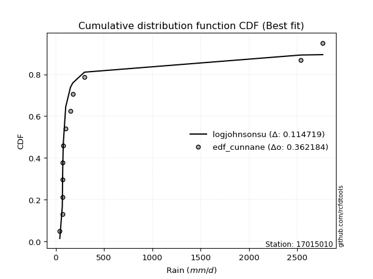</img>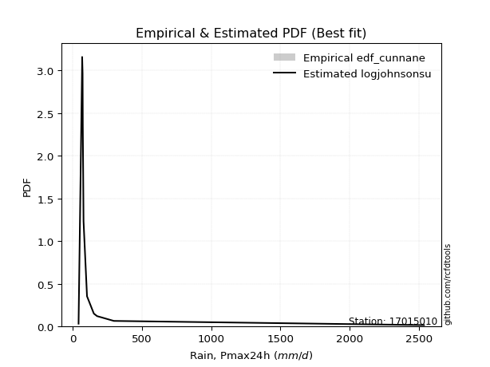</img>

</div>


### 12. EDF Adamowski (1981)

The Adamowski formula in hydrology refers to a specific plotting position formula used for estimating the non-parametric empirical distribution of hydrological events (like flood peaks) to calculate their return periods. This formula provides an alternative to traditional parametric methods (like the Gumbel or Log Pearson Type III distributions). 

<div align="center">


$P=(m-0.25)/(n+0.5)$


</div>


**12.1. Empirical values**

<div align="center">

|                | 0                  | 1                  | 2                 | 3                  | 4                  | 5                  | 6                 | 7                  | 8                 | 9                 | 10                | 11                 |
|:---------------|:-------------------|:-------------------|:------------------|:-------------------|:-------------------|:-------------------|:------------------|:-------------------|:------------------|:------------------|:------------------|:-------------------|
| date           | 2021               | 2015               | 2017              | 2020               | 2019               | 2018               | 2022              | 2023               | 2014              | 2016              | 2024              | 2025               |
| x              | 43.0               | 68.86              | 68.95             | 72.1               | 73.56              | 78.91              | 104.0             | 153.3              | 176.4             | 298.01            | 2537.4            | 2763.0             |
| m              | 1                  | 2                  | 3                 | 4                  | 5                  | 6                  | 7                 | 8                  | 9                 | 10                | 11                | 12                 |
| empirical_dist | edf_adamowski      | edf_adamowski      | edf_adamowski     | edf_adamowski      | edf_adamowski      | edf_adamowski      | edf_adamowski     | edf_adamowski      | edf_adamowski     | edf_adamowski     | edf_adamowski     | edf_adamowski      |
| empirical      | 0.06               | 0.14               | 0.22              | 0.3                | 0.38               | 0.46               | 0.54              | 0.62               | 0.7               | 0.78              | 0.86              | 0.94               |
| empirical_tr   | 1.0638297872340425 | 1.1627906976744187 | 1.282051282051282 | 1.4285714285714286 | 1.6129032258064517 | 1.8518518518518516 | 2.173913043478261 | 2.6315789473684212 | 3.333333333333333 | 4.545454545454546 | 7.142857142857142 | 16.666666666666654 |

</div>


**12.2. Kolmogorov-Smirnov fit test (sorted by Δ)**


<div align="center">

|                | 0                   | 1                   | 2                   | 3                   | 4                   | 5                   | 6                   | 7                   | 8                   | 9                   | 10                  | 11                  | 12                  | 13                  | 14                  | 15                  | 16                  | 17                  | 18                  | 19                  | 20                  | 21                  | 22                  | 23                  | 24                  | 25                  | 26                  | 27                  | 28                  | 29                  | 30                  | 31                  | 32                  | 33                  | 34                  | 35                  | 36                  | 37                  | 38                  | 39                  | 40                  | 41                  | 42                  | 43                  | 44                  | 45                  | 46                  | 47                  | 48                  | 49                  | 50                  | 51                  | 52                  | 53                  | 54                  | 55                  | 56                  | 57                  | 58                  | 59                  | 60                  | 61                  | 62                  | 63                  | 64                  | 65                  | 66                  | 67                  | 68                  | 69                  | 70                  | 71                  | 72                  | 73                  | 74                  | 75                  | 76                  | 77                  | 78                  | 79                  | 80                  | 81                  | 82                  | 83                  | 84                  | 85                  | 86                  | 87                  | 88                  | 89                  | 90                  | 91                  | 92                  | 93                  | 94                  | 95                  | 96                  | 97                  | 98                  | 99                  | 100                 | 101                 | 102                 | 103                 | 104                 | 105                 | 106                 | 107                 | 108                 | 109                 | 110                 | 111                 | 112                 | 113                 | 114                 | 115                 | 116                 | 117                 | 118                 | 119                 | 120                 | 121                 | 122                 | 123                 | 124                 | 125                 | 126                 | 127                 | 128                 | 129                 | 130                 | 131                 | 132                 | 133                 | 134                 | 135                 | 136                 | 137                 | 138                 | 139                 | 140                 | 141                 | 142                 | 143                 | 144                 | 145                 | 146                 | 147                 | 148                 | 149                 | 150                 | 151                 | 152                 | 153                 | 154                 | 155                 | 156                 | 157                 | 158                 | 159                 |
|:---------------|:--------------------|:--------------------|:--------------------|:--------------------|:--------------------|:--------------------|:--------------------|:--------------------|:--------------------|:--------------------|:--------------------|:--------------------|:--------------------|:--------------------|:--------------------|:--------------------|:--------------------|:--------------------|:--------------------|:--------------------|:--------------------|:--------------------|:--------------------|:--------------------|:--------------------|:--------------------|:--------------------|:--------------------|:--------------------|:--------------------|:--------------------|:--------------------|:--------------------|:--------------------|:--------------------|:--------------------|:--------------------|:--------------------|:--------------------|:--------------------|:--------------------|:--------------------|:--------------------|:--------------------|:--------------------|:--------------------|:--------------------|:--------------------|:--------------------|:--------------------|:--------------------|:--------------------|:--------------------|:--------------------|:--------------------|:--------------------|:--------------------|:--------------------|:--------------------|:--------------------|:--------------------|:--------------------|:--------------------|:--------------------|:--------------------|:--------------------|:--------------------|:--------------------|:--------------------|:--------------------|:--------------------|:--------------------|:--------------------|:--------------------|:--------------------|:--------------------|:--------------------|:--------------------|:--------------------|:--------------------|:--------------------|:--------------------|:--------------------|:--------------------|:--------------------|:--------------------|:--------------------|:--------------------|:--------------------|:--------------------|:--------------------|:--------------------|:--------------------|:--------------------|:--------------------|:--------------------|:--------------------|:--------------------|:--------------------|:--------------------|:--------------------|:--------------------|:--------------------|:--------------------|:--------------------|:--------------------|:--------------------|:--------------------|:--------------------|:--------------------|:--------------------|:--------------------|:--------------------|:--------------------|:--------------------|:--------------------|:--------------------|:--------------------|:--------------------|:--------------------|:--------------------|:--------------------|:--------------------|:--------------------|:--------------------|:--------------------|:--------------------|:--------------------|:--------------------|:--------------------|:--------------------|:--------------------|:--------------------|:--------------------|:--------------------|:--------------------|:--------------------|:--------------------|:--------------------|:--------------------|:--------------------|:--------------------|:--------------------|:--------------------|:--------------------|:--------------------|:--------------------|:--------------------|:--------------------|:--------------------|:--------------------|:--------------------|:--------------------|:--------------------|:--------------------|:--------------------|:--------------------|:--------------------|:--------------------|:--------------------|
| station        | 17015010            | 17015010            | 17015010            | 17015010            | 17015010            | 17015010            | 17015010            | 17015010            | 17015010            | 17015010            | 17015010            | 17015010            | 17015010            | 17015010            | 17015010            | 17015010            | 17015010            | 17015010            | 17015010            | 17015010            | 17015010            | 17015010            | 17015010            | 17015010            | 17015010            | 17015010            | 17015010            | 17015010            | 17015010            | 17015010            | 17015010            | 17015010            | 17015010            | 17015010            | 17015010            | 17015010            | 17015010            | 17015010            | 17015010            | 17015010            | 17015010            | 17015010            | 17015010            | 17015010            | 17015010            | 17015010            | 17015010            | 17015010            | 17015010            | 17015010            | 17015010            | 17015010            | 17015010            | 17015010            | 17015010            | 17015010            | 17015010            | 17015010            | 17015010            | 17015010            | 17015010            | 17015010            | 17015010            | 17015010            | 17015010            | 17015010            | 17015010            | 17015010            | 17015010            | 17015010            | 17015010            | 17015010            | 17015010            | 17015010            | 17015010            | 17015010            | 17015010            | 17015010            | 17015010            | 17015010            | 17015010            | 17015010            | 17015010            | 17015010            | 17015010            | 17015010            | 17015010            | 17015010            | 17015010            | 17015010            | 17015010            | 17015010            | 17015010            | 17015010            | 17015010            | 17015010            | 17015010            | 17015010            | 17015010            | 17015010            | 17015010            | 17015010            | 17015010            | 17015010            | 17015010            | 17015010            | 17015010            | 17015010            | 17015010            | 17015010            | 17015010            | 17015010            | 17015010            | 17015010            | 17015010            | 17015010            | 17015010            | 17015010            | 17015010            | 17015010            | 17015010            | 17015010            | 17015010            | 17015010            | 17015010            | 17015010            | 17015010            | 17015010            | 17015010            | 17015010            | 17015010            | 17015010            | 17015010            | 17015010            | 17015010            | 17015010            | 17015010            | 17015010            | 17015010            | 17015010            | 17015010            | 17015010            | 17015010            | 17015010            | 17015010            | 17015010            | 17015010            | 17015010            | 17015010            | 17015010            | 17015010            | 17015010            | 17015010            | 17015010            | 17015010            | 17015010            | 17015010            | 17015010            | 17015010            | 17015010            |
| empirical_dist | edf_adamowski       | edf_adamowski       | edf_adamowski       | edf_adamowski       | edf_adamowski       | edf_adamowski       | edf_adamowski       | edf_adamowski       | edf_adamowski       | edf_adamowski       | edf_adamowski       | edf_adamowski       | edf_adamowski       | edf_adamowski       | edf_adamowski       | edf_adamowski       | edf_adamowski       | edf_adamowski       | edf_adamowski       | edf_adamowski       | edf_adamowski       | edf_adamowski       | edf_adamowski       | edf_adamowski       | edf_adamowski       | edf_adamowski       | edf_adamowski       | edf_adamowski       | edf_adamowski       | edf_adamowski       | edf_adamowski       | edf_adamowski       | edf_adamowski       | edf_adamowski       | edf_adamowski       | edf_adamowski       | edf_adamowski       | edf_adamowski       | edf_adamowski       | edf_adamowski       | edf_adamowski       | edf_adamowski       | edf_adamowski       | edf_adamowski       | edf_adamowski       | edf_adamowski       | edf_adamowski       | edf_adamowski       | edf_adamowski       | edf_adamowski       | edf_adamowski       | edf_adamowski       | edf_adamowski       | edf_adamowski       | edf_adamowski       | edf_adamowski       | edf_adamowski       | edf_adamowski       | edf_adamowski       | edf_adamowski       | edf_adamowski       | edf_adamowski       | edf_adamowski       | edf_adamowski       | edf_adamowski       | edf_adamowski       | edf_adamowski       | edf_adamowski       | edf_adamowski       | edf_adamowski       | edf_adamowski       | edf_adamowski       | edf_adamowski       | edf_adamowski       | edf_adamowski       | edf_adamowski       | edf_adamowski       | edf_adamowski       | edf_adamowski       | edf_adamowski       | edf_adamowski       | edf_adamowski       | edf_adamowski       | edf_adamowski       | edf_adamowski       | edf_adamowski       | edf_adamowski       | edf_adamowski       | edf_adamowski       | edf_adamowski       | edf_adamowski       | edf_adamowski       | edf_adamowski       | edf_adamowski       | edf_adamowski       | edf_adamowski       | edf_adamowski       | edf_adamowski       | edf_adamowski       | edf_adamowski       | edf_adamowski       | edf_adamowski       | edf_adamowski       | edf_adamowski       | edf_adamowski       | edf_adamowski       | edf_adamowski       | edf_adamowski       | edf_adamowski       | edf_adamowski       | edf_adamowski       | edf_adamowski       | edf_adamowski       | edf_adamowski       | edf_adamowski       | edf_adamowski       | edf_adamowski       | edf_adamowski       | edf_adamowski       | edf_adamowski       | edf_adamowski       | edf_adamowski       | edf_adamowski       | edf_adamowski       | edf_adamowski       | edf_adamowski       | edf_adamowski       | edf_adamowski       | edf_adamowski       | edf_adamowski       | edf_adamowski       | edf_adamowski       | edf_adamowski       | edf_adamowski       | edf_adamowski       | edf_adamowski       | edf_adamowski       | edf_adamowski       | edf_adamowski       | edf_adamowski       | edf_adamowski       | edf_adamowski       | edf_adamowski       | edf_adamowski       | edf_adamowski       | edf_adamowski       | edf_adamowski       | edf_adamowski       | edf_adamowski       | edf_adamowski       | edf_adamowski       | edf_adamowski       | edf_adamowski       | edf_adamowski       | edf_adamowski       | edf_adamowski       | edf_adamowski       | edf_adamowski       | edf_adamowski       | edf_adamowski       |
| p_dist         | logjohnsonsu        | logmielke           | logburr             | loggenextreme       | loginvweibull       | loginvgamma         | logalpha            | alpha               | loginvgauss         | logfatiguelife      | logburr12           | invgamma            | f                   | burr                | genextreme          | invgauss            | logmoyal            | mielke              | logpearson3         | lograyleigh         | halfgennorm         | loggumbel_r         | johnsonsu           | loggompertz         | logtruncnorm        | loghalfgennorm      | loghalflogistic     | loggenexpon         | logmaxwell          | logvonmises_line    | logexponnorm        | burr12              | loggenhalflogistic  | lomax               | logwald             | logncf              | loglomax            | genpareto           | kappa3              | logloglaplace       | loghalfnorm         | truncpareto         | logfoldnorm         | lognct              | nct                 | logexponpow         | loggenlogistic      | logrdist            | ncf                 | betaprime           | lognorm             | logcrystalball      | loganglit           | logsemicircular     | weibull_min         | logloggamma         | loglogistic         | logweibull_min      | logf                | bradford            | logkstwobign        | logarcsine          | logbetaprime        | logskewnorm         | fatiguelife         | loghypsecant        | gamma               | logtukeylambda      | logrice             | loglaplace          | loglaplace          | logtruncweibull_min | logtruncexpon       | logcosine           | loggumbel_l         | exponweib           | dgamma              | loggennorm          | t                   | loggenpareto        | logbradford         | logt                | gausshyper          | wald                | logwrapcauchy       | moyal               | truncweibull_min    | gengamma            | vonmises_line       | halflogistic        | logdweibull         | halfnorm            | pearson3            | gumbel_r            | foldnorm            | exponpow            | wrapcauchy          | rayleigh            | logksone            | arcsine             | powerlaw            | tukeylambda         | nakagami            | genlogistic         | logargus            | logkappa4           | maxwell             | gennorm             | loglevy_l           | logdgamma           | semicircular        | loguniform          | anglit              | dweibull            | erlang              | norm                | logtriang           | johnsonsb           | logistic            | kstwobign           | hypsecant           | invweibull          | logkappa3           | lognakagami         | levy_l              | rice                | laplace             | gumbel_l            | cosine              | crystalball         | logbeta             | exponnorm           | genexpon            | logpowerlaw         | logjohnsonsb        | loggausshyper       | logweibull_max      | loggengamma         | truncexpon          | argus               | logerlang           | logtrapezoid        | truncnorm           | logexponweib        | gompertz            | loggamma            | loggamma            | beta                | skewnorm            | ksone               | triang              | rdist               | kappa4              | genhalflogistic     | uniform             | weibull_max         | trapezoid           | logtruncpareto      | logvonmises         | vonmises            |
| delta          | 0.11766946704043835 | 0.11788428902374348 | 0.1179534786736583  | 0.11859130554032427 | 0.11860159679813231 | 0.1193760203169052  | 0.12068984720188153 | 0.12644333813638436 | 0.128505366218013   | 0.13020546541190958 | 0.1315729274075485  | 0.13183999934006974 | 0.13313991473719905 | 0.13332375401222546 | 0.13428815259645288 | 0.13712128368618642 | 0.14069858318820966 | 0.14084159827198556 | 0.14183185504556162 | 0.14211354206838844 | 0.1475238221026215  | 0.14762566230751745 | 0.14861309719477056 | 0.14934551820243658 | 0.15032260542659281 | 0.1515258785994501  | 0.15216136633822636 | 0.15226280749374727 | 0.15278836589414235 | 0.1529148043528371  | 0.1554863538801063  | 0.15622320657211441 | 0.15640950646336    | 0.1576449320520515  | 0.1579671576989855  | 0.1585840124288886  | 0.15928595500453768 | 0.16047968296794457 | 0.16096223864803189 | 0.1641093200972762  | 0.16612314959763202 | 0.16788442168292028 | 0.17197807587816016 | 0.1723556501551915  | 0.17695726979815984 | 0.17850550233331786 | 0.1794295868587238  | 0.1819335570994678  | 0.18225552325271321 | 0.1839200167079189  | 0.18518715538255726 | 0.18518723220598954 | 0.1873060602228227  | 0.1881789871510804  | 0.18856342124172487 | 0.18876809244937331 | 0.19785201410082504 | 0.19911402524321653 | 0.19937055959126632 | 0.20014984904743133 | 0.20221456934442855 | 0.20272696256902722 | 0.2071936748399879  | 0.20972010780362066 | 0.21074867299143502 | 0.21248646621101616 | 0.21409637146079263 | 0.2199999999949196  | 0.2228359470091866  | 0.23966704131829658 | 0.23966704131829658 | 0.24202753456435439 | 0.24819206027766028 | 0.2536967742897672  | 0.25496495358939497 | 0.2557198291248073  | 0.26000073549508784 | 0.2680551302755388  | 0.26863135461668164 | 0.27059566965195336 | 0.2771349657643608  | 0.27713866216207883 | 0.27953256166009344 | 0.2870343267450364  | 0.291693141734013   | 0.2963561815963929  | 0.29688502036540276 | 0.29720466365552334 | 0.3025104940549965  | 0.31047640324546166 | 0.31177834531587106 | 0.3118663421282404  | 0.31402322959607387 | 0.31930223191134754 | 0.323526571136384   | 0.32772610349807013 | 0.3315925873666548  | 0.33289312541070315 | 0.33409853483102087 | 0.33687067857873415 | 0.33768224748934206 | 0.33959640309552785 | 0.339971586998239   | 0.3406143038161946  | 0.34123341651472605 | 0.3434837567301501  | 0.3451854331628919  | 0.3536791934868689  | 0.355754657177303   | 0.3572695094886942  | 0.3597890228460132  | 0.36091824179722515 | 0.3654901505021137  | 0.36892811108387047 | 0.3706747306448167  | 0.37921960664922977 | 0.38146393476723994 | 0.3897089334792807  | 0.3920311107488387  | 0.3970024630133464  | 0.4025213106305336  | 0.4055200715667904  | 0.40770111272915277 | 0.40793192543036483 | 0.4148665462791113  | 0.4269650418519805  | 0.4295643468094284  | 0.44581045641190864 | 0.44963597026787494 | 0.45595227255852694 | 0.45737768800404355 | 0.45991845746373183 | 0.46312203766282467 | 0.46356327846935264 | 0.4738255167509385  | 0.4942305473635573  | 0.5064173022437429  | 0.5078315823132367  | 0.5118164502928004  | 0.5151054984660745  | 0.563293019661319   | 0.5661161177871943  | 0.5673972520575448  | 0.5718650071680662  | 0.5814661303323068  | 0.5834777338536744  | 0.5834777338536744  | 0.5919537712639709  | 0.6007227814607448  | 0.6185386029411765  | 0.6213594224096268  | 0.660964472182872   | 0.6669753628455374  | 0.6862438952212446  | 0.6862463235294118  | 0.6925273677147916  | 0.7527851093554763  | 0.7675561918130529  | 1.2542624340612623  | 439.6270829094208   |
| deltao         | 0.36218414519599995 | 0.36218414519599995 | 0.36218414519599995 | 0.36218414519599995 | 0.36218414519599995 | 0.36218414519599995 | 0.36218414519599995 | 0.36218414519599995 | 0.36218414519599995 | 0.36218414519599995 | 0.36218414519599995 | 0.36218414519599995 | 0.36218414519599995 | 0.36218414519599995 | 0.36218414519599995 | 0.36218414519599995 | 0.36218414519599995 | 0.36218414519599995 | 0.36218414519599995 | 0.36218414519599995 | 0.36218414519599995 | 0.36218414519599995 | 0.36218414519599995 | 0.36218414519599995 | 0.36218414519599995 | 0.36218414519599995 | 0.36218414519599995 | 0.36218414519599995 | 0.36218414519599995 | 0.36218414519599995 | 0.36218414519599995 | 0.36218414519599995 | 0.36218414519599995 | 0.36218414519599995 | 0.36218414519599995 | 0.36218414519599995 | 0.36218414519599995 | 0.36218414519599995 | 0.36218414519599995 | 0.36218414519599995 | 0.36218414519599995 | 0.36218414519599995 | 0.36218414519599995 | 0.36218414519599995 | 0.36218414519599995 | 0.36218414519599995 | 0.36218414519599995 | 0.36218414519599995 | 0.36218414519599995 | 0.36218414519599995 | 0.36218414519599995 | 0.36218414519599995 | 0.36218414519599995 | 0.36218414519599995 | 0.36218414519599995 | 0.36218414519599995 | 0.36218414519599995 | 0.36218414519599995 | 0.36218414519599995 | 0.36218414519599995 | 0.36218414519599995 | 0.36218414519599995 | 0.36218414519599995 | 0.36218414519599995 | 0.36218414519599995 | 0.36218414519599995 | 0.36218414519599995 | 0.36218414519599995 | 0.36218414519599995 | 0.36218414519599995 | 0.36218414519599995 | 0.36218414519599995 | 0.36218414519599995 | 0.36218414519599995 | 0.36218414519599995 | 0.36218414519599995 | 0.36218414519599995 | 0.36218414519599995 | 0.36218414519599995 | 0.36218414519599995 | 0.36218414519599995 | 0.36218414519599995 | 0.36218414519599995 | 0.36218414519599995 | 0.36218414519599995 | 0.36218414519599995 | 0.36218414519599995 | 0.36218414519599995 | 0.36218414519599995 | 0.36218414519599995 | 0.36218414519599995 | 0.36218414519599995 | 0.36218414519599995 | 0.36218414519599995 | 0.36218414519599995 | 0.36218414519599995 | 0.36218414519599995 | 0.36218414519599995 | 0.36218414519599995 | 0.36218414519599995 | 0.36218414519599995 | 0.36218414519599995 | 0.36218414519599995 | 0.36218414519599995 | 0.36218414519599995 | 0.36218414519599995 | 0.36218414519599995 | 0.36218414519599995 | 0.36218414519599995 | 0.36218414519599995 | 0.36218414519599995 | 0.36218414519599995 | 0.36218414519599995 | 0.36218414519599995 | 0.36218414519599995 | 0.36218414519599995 | 0.36218414519599995 | 0.36218414519599995 | 0.36218414519599995 | 0.36218414519599995 | 0.36218414519599995 | 0.36218414519599995 | 0.36218414519599995 | 0.36218414519599995 | 0.36218414519599995 | 0.36218414519599995 | 0.36218414519599995 | 0.36218414519599995 | 0.36218414519599995 | 0.36218414519599995 | 0.36218414519599995 | 0.36218414519599995 | 0.36218414519599995 | 0.36218414519599995 | 0.36218414519599995 | 0.36218414519599995 | 0.36218414519599995 | 0.36218414519599995 | 0.36218414519599995 | 0.36218414519599995 | 0.36218414519599995 | 0.36218414519599995 | 0.36218414519599995 | 0.36218414519599995 | 0.36218414519599995 | 0.36218414519599995 | 0.36218414519599995 | 0.36218414519599995 | 0.36218414519599995 | 0.36218414519599995 | 0.36218414519599995 | 0.36218414519599995 | 0.36218414519599995 | 0.36218414519599995 | 0.36218414519599995 | 0.36218414519599995 | 0.36218414519599995 | 0.36218414519599995 | 0.36218414519599995 | 0.36218414519599995 |
| eval           | Δo > Δ              | Δo > Δ              | Δo > Δ              | Δo > Δ              | Δo > Δ              | Δo > Δ              | Δo > Δ              | Δo > Δ              | Δo > Δ              | Δo > Δ              | Δo > Δ              | Δo > Δ              | Δo > Δ              | Δo > Δ              | Δo > Δ              | Δo > Δ              | Δo > Δ              | Δo > Δ              | Δo > Δ              | Δo > Δ              | Δo > Δ              | Δo > Δ              | Δo > Δ              | Δo > Δ              | Δo > Δ              | Δo > Δ              | Δo > Δ              | Δo > Δ              | Δo > Δ              | Δo > Δ              | Δo > Δ              | Δo > Δ              | Δo > Δ              | Δo > Δ              | Δo > Δ              | Δo > Δ              | Δo > Δ              | Δo > Δ              | Δo > Δ              | Δo > Δ              | Δo > Δ              | Δo > Δ              | Δo > Δ              | Δo > Δ              | Δo > Δ              | Δo > Δ              | Δo > Δ              | Δo > Δ              | Δo > Δ              | Δo > Δ              | Δo > Δ              | Δo > Δ              | Δo > Δ              | Δo > Δ              | Δo > Δ              | Δo > Δ              | Δo > Δ              | Δo > Δ              | Δo > Δ              | Δo > Δ              | Δo > Δ              | Δo > Δ              | Δo > Δ              | Δo > Δ              | Δo > Δ              | Δo > Δ              | Δo > Δ              | Δo > Δ              | Δo > Δ              | Δo > Δ              | Δo > Δ              | Δo > Δ              | Δo > Δ              | Δo > Δ              | Δo > Δ              | Δo > Δ              | Δo > Δ              | Δo > Δ              | Δo > Δ              | Δo > Δ              | Δo > Δ              | Δo > Δ              | Δo > Δ              | Δo > Δ              | Δo > Δ              | Δo > Δ              | Δo > Δ              | Δo > Δ              | Δo > Δ              | Δo > Δ              | Δo > Δ              | Δo > Δ              | Δo > Δ              | Δo > Δ              | Δo > Δ              | Δo > Δ              | Δo > Δ              | Δo > Δ              | Δo > Δ              | Δo > Δ              | Δo > Δ              | Δo > Δ              | Δo > Δ              | Δo > Δ              | Δo > Δ              | Δo > Δ              | Δo > Δ              | Δo > Δ              | Δo > Δ              | Δo > Δ              | Δo > Δ              | Δo > Δ              | Δo <= Δ             | Δo <= Δ             | Δo <= Δ             | Δo <= Δ             | Δo <= Δ             | Δo <= Δ             | Δo <= Δ             | Δo <= Δ             | Δo <= Δ             | Δo <= Δ             | Δo <= Δ             | Δo <= Δ             | Δo <= Δ             | Δo <= Δ             | Δo <= Δ             | Δo <= Δ             | Δo <= Δ             | Δo <= Δ             | Δo <= Δ             | Δo <= Δ             | Δo <= Δ             | Δo <= Δ             | Δo <= Δ             | Δo <= Δ             | Δo <= Δ             | Δo <= Δ             | Δo <= Δ             | Δo <= Δ             | Δo <= Δ             | Δo <= Δ             | Δo <= Δ             | Δo <= Δ             | Δo <= Δ             | Δo <= Δ             | Δo <= Δ             | Δo <= Δ             | Δo <= Δ             | Δo <= Δ             | Δo <= Δ             | Δo <= Δ             | Δo <= Δ             | Δo <= Δ             | Δo <= Δ             | Δo <= Δ             | Δo <= Δ             | Δo <= Δ             | Δo <= Δ             | Δo <= Δ             |
| fit            | 1                   | 1                   | 1                   | 1                   | 1                   | 1                   | 1                   | 1                   | 1                   | 1                   | 1                   | 1                   | 1                   | 1                   | 1                   | 1                   | 1                   | 1                   | 1                   | 1                   | 1                   | 1                   | 1                   | 1                   | 1                   | 1                   | 1                   | 1                   | 1                   | 1                   | 1                   | 1                   | 1                   | 1                   | 1                   | 1                   | 1                   | 1                   | 1                   | 1                   | 1                   | 1                   | 1                   | 1                   | 1                   | 1                   | 1                   | 1                   | 1                   | 1                   | 1                   | 1                   | 1                   | 1                   | 1                   | 1                   | 1                   | 1                   | 1                   | 1                   | 1                   | 1                   | 1                   | 1                   | 1                   | 1                   | 1                   | 1                   | 1                   | 1                   | 1                   | 1                   | 1                   | 1                   | 1                   | 1                   | 1                   | 1                   | 1                   | 1                   | 1                   | 1                   | 1                   | 1                   | 1                   | 1                   | 1                   | 1                   | 1                   | 1                   | 1                   | 1                   | 1                   | 1                   | 1                   | 1                   | 1                   | 1                   | 1                   | 1                   | 1                   | 1                   | 1                   | 1                   | 1                   | 1                   | 1                   | 1                   | 1                   | 1                   | 1                   | 1                   | 0                   | 0                   | 0                   | 0                   | 0                   | 0                   | 0                   | 0                   | 0                   | 0                   | 0                   | 0                   | 0                   | 0                   | 0                   | 0                   | 0                   | 0                   | 0                   | 0                   | 0                   | 0                   | 0                   | 0                   | 0                   | 0                   | 0                   | 0                   | 0                   | 0                   | 0                   | 0                   | 0                   | 0                   | 0                   | 0                   | 0                   | 0                   | 0                   | 0                   | 0                   | 0                   | 0                   | 0                   | 0                   | 0                   | 0                   | 0                   |
| n              | 12                  | 12                  | 12                  | 12                  | 12                  | 12                  | 12                  | 12                  | 12                  | 12                  | 12                  | 12                  | 12                  | 12                  | 12                  | 12                  | 12                  | 12                  | 12                  | 12                  | 12                  | 12                  | 12                  | 12                  | 12                  | 12                  | 12                  | 12                  | 12                  | 12                  | 12                  | 12                  | 12                  | 12                  | 12                  | 12                  | 12                  | 12                  | 12                  | 12                  | 12                  | 12                  | 12                  | 12                  | 12                  | 12                  | 12                  | 12                  | 12                  | 12                  | 12                  | 12                  | 12                  | 12                  | 12                  | 12                  | 12                  | 12                  | 12                  | 12                  | 12                  | 12                  | 12                  | 12                  | 12                  | 12                  | 12                  | 12                  | 12                  | 12                  | 12                  | 12                  | 12                  | 12                  | 12                  | 12                  | 12                  | 12                  | 12                  | 12                  | 12                  | 12                  | 12                  | 12                  | 12                  | 12                  | 12                  | 12                  | 12                  | 12                  | 12                  | 12                  | 12                  | 12                  | 12                  | 12                  | 12                  | 12                  | 12                  | 12                  | 12                  | 12                  | 12                  | 12                  | 12                  | 12                  | 12                  | 12                  | 12                  | 12                  | 12                  | 12                  | 12                  | 12                  | 12                  | 12                  | 12                  | 12                  | 12                  | 12                  | 12                  | 12                  | 12                  | 12                  | 12                  | 12                  | 12                  | 12                  | 12                  | 12                  | 12                  | 12                  | 12                  | 12                  | 12                  | 12                  | 12                  | 12                  | 12                  | 12                  | 12                  | 12                  | 12                  | 12                  | 12                  | 12                  | 12                  | 12                  | 12                  | 12                  | 12                  | 12                  | 12                  | 12                  | 12                  | 12                  | 12                  | 12                  | 12                  | 12                  |
| best_fit       | 1                   | 0                   | 0                   | 0                   | 0                   | 0                   | 0                   | 0                   | 0                   | 0                   | 0                   | 0                   | 0                   | 0                   | 0                   | 0                   | 0                   | 0                   | 0                   | 0                   | 0                   | 0                   | 0                   | 0                   | 0                   | 0                   | 0                   | 0                   | 0                   | 0                   | 0                   | 0                   | 0                   | 0                   | 0                   | 0                   | 0                   | 0                   | 0                   | 0                   | 0                   | 0                   | 0                   | 0                   | 0                   | 0                   | 0                   | 0                   | 0                   | 0                   | 0                   | 0                   | 0                   | 0                   | 0                   | 0                   | 0                   | 0                   | 0                   | 0                   | 0                   | 0                   | 0                   | 0                   | 0                   | 0                   | 0                   | 0                   | 0                   | 0                   | 0                   | 0                   | 0                   | 0                   | 0                   | 0                   | 0                   | 0                   | 0                   | 0                   | 0                   | 0                   | 0                   | 0                   | 0                   | 0                   | 0                   | 0                   | 0                   | 0                   | 0                   | 0                   | 0                   | 0                   | 0                   | 0                   | 0                   | 0                   | 0                   | 0                   | 0                   | 0                   | 0                   | 0                   | 0                   | 0                   | 0                   | 0                   | 0                   | 0                   | 0                   | 0                   | 0                   | 0                   | 0                   | 0                   | 0                   | 0                   | 0                   | 0                   | 0                   | 0                   | 0                   | 0                   | 0                   | 0                   | 0                   | 0                   | 0                   | 0                   | 0                   | 0                   | 0                   | 0                   | 0                   | 0                   | 0                   | 0                   | 0                   | 0                   | 0                   | 0                   | 0                   | 0                   | 0                   | 0                   | 0                   | 0                   | 0                   | 0                   | 0                   | 0                   | 0                   | 0                   | 0                   | 0                   | 0                   | 0                   | 0                   | 0                   |
| best_fit_sort  | 1                   | 2                   | 3                   | 4                   | 5                   | 6                   | 7                   | 8                   | 9                   | 10                  | 11                  | 12                  | 13                  | 14                  | 15                  | 16                  | 17                  | 18                  | 19                  | 20                  | 21                  | 22                  | 23                  | 24                  | 25                  | 26                  | 27                  | 28                  | 29                  | 30                  | 31                  | 32                  | 33                  | 34                  | 35                  | 36                  | 37                  | 38                  | 39                  | 40                  | 41                  | 42                  | 43                  | 44                  | 45                  | 46                  | 47                  | 48                  | 49                  | 50                  | 51                  | 52                  | 53                  | 54                  | 55                  | 56                  | 57                  | 58                  | 59                  | 60                  | 61                  | 62                  | 63                  | 64                  | 65                  | 66                  | 67                  | 68                  | 69                  | 70                  | 71                  | 72                  | 73                  | 74                  | 75                  | 76                  | 77                  | 78                  | 79                  | 80                  | 81                  | 82                  | 83                  | 84                  | 85                  | 86                  | 87                  | 88                  | 89                  | 90                  | 91                  | 92                  | 93                  | 94                  | 95                  | 96                  | 97                  | 98                  | 99                  | 100                 | 101                 | 102                 | 103                 | 104                 | 105                 | 106                 | 107                 | 108                 | 109                 | 110                 | 111                 | 112                 | 113                 | 114                 | 115                 | 116                 | 117                 | 118                 | 119                 | 120                 | 121                 | 122                 | 123                 | 124                 | 125                 | 126                 | 127                 | 128                 | 129                 | 130                 | 131                 | 132                 | 133                 | 134                 | 135                 | 136                 | 137                 | 138                 | 139                 | 140                 | 141                 | 142                 | 143                 | 144                 | 145                 | 146                 | 147                 | 148                 | 149                 | 150                 | 151                 | 152                 | 153                 | 154                 | 155                 | 156                 | 157                 | 158                 | 159                 | 160                 |

</div>


**12.3. Best fit**

<div align="center">

|   id |   station | empirical_dist   | p_dist       |    delta |   deltao | eval   |   fit |   n |   best_fit |   best_fit_sort |
|-----:|----------:|:-----------------|:-------------|---------:|---------:|:-------|------:|----:|-----------:|----------------:|
|    0 |  17015010 | edf_adamowski    | logjohnsonsu | 0.117669 | 0.362184 | Δo > Δ |     1 |  12 |          1 |               1 |

</div>


<div align="center">

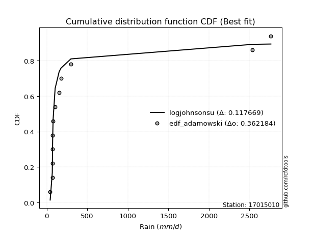</img></img>

</div>


## C. Best fit & Estimate extreme values for specific return periods - Tr

Best fit in probability distribution analysis means finding the theoretical distribution (like Normal, Poisson, Exponential, etc.) that most accurately mirrors your real-world data´s patterns (shape, center, spread) for better predictions, using methods like visual checks (Q-Q plots), goodness-of-fit tests (Kolmogorov-Smirnov, Chi-Squared), and information criteria (AIC) to score and select the simplest, most representative model.


### 1. Best fit (ordered by delta Δ)

:file_folder:Table: [bestfit_17015010.csv](table/bestfit_17015010.csv)

<div align="center">

|   id |   station | empirical_dist   | p_dist       |    delta |   deltao | eval   |   fit |   n |   best_fit |   best_fit_sort |
|-----:|----------:|:-----------------|:-------------|---------:|---------:|:-------|------:|----:|-----------:|----------------:|
|    0 |  17015010 | edf_california   | logjohnsonsu | 0.105779 | 0.362184 | Δo > Δ |     1 |  12 |          1 |               1 |
|    1 |  17015010 | edf_hazen        | logjohnsonsu | 0.112669 | 0.362184 | Δo > Δ |     1 |  12 |          1 |               2 |
|    2 |  17015010 | edf_gringorten   | logjohnsonsu | 0.113907 | 0.362184 | Δo > Δ |     1 |  12 |          1 |               3 |
|    3 |  17015010 | edf_cunnane      | logjohnsonsu | 0.114719 | 0.362184 | Δo > Δ |     1 |  12 |          1 |               4 |
|    4 |  17015010 | edf_blom         | logjohnsonsu | 0.11522  | 0.362184 | Δo > Δ |     1 |  12 |          1 |               5 |
|    5 |  17015010 | edf_tukey        | logjohnsonsu | 0.116048 | 0.362184 | Δo > Δ |     1 |  12 |          1 |               6 |
|    6 |  17015010 | edf_weibull      | loginvgauss  | 0.116214 | 0.362184 | Δo > Δ |     1 |  12 |          1 |               7 |
|    7 |  17015010 | edf_filliben     | logjohnsonsu | 0.116359 | 0.362184 | Δo > Δ |     1 |  12 |          1 |               8 |
|    8 |  17015010 | edf_jenkinson    | logjohnsonsu | 0.116506 | 0.362184 | Δo > Δ |     1 |  12 |          1 |               9 |
|    9 |  17015010 | edf_beard        | logjohnsonsu | 0.116506 | 0.362184 | Δo > Δ |     1 |  12 |          1 |              10 |
|   10 |  17015010 | edf_chegodayev   | logjohnsonsu | 0.116702 | 0.362184 | Δo > Δ |     1 |  12 |          1 |              11 |
|   11 |  17015010 | edf_adamowski    | logjohnsonsu | 0.117669 | 0.362184 | Δo > Δ |     1 |  12 |          1 |              12 |

</div>


### 2. Extreme values and % difference analysis

In hydrology, a return period (or recurrence interval $Tr$) is the statistical average time between extreme events like floods or droughts of a specific magnitude, indicating how rare an event is, with a 100-year flood, for example, having a 1% chance of occurring in any given year, not that it happens exactly every century. It is a key tool for infrastructure design (like bridges or dams) and risk assessment, calculated from historical data to determine the probability of future events, although it is important to remember it is statistical average, and events can cluster or be missed.

The extreme value porcentage difference is evaluated as $pdiff = 1 - (ETrBf / ETr) * 100$, where _ETrBf_ correspond to the bestfit extreme value for a specific recurrence interval and _ETr_ correspond to the extreme value for one of the most used PDFsused in hydrology.

> risk_rate: assuming the return period as the project useful life.

:file_folder:Table: [extreme_17015010.csv](table/extreme_17015010.csv), all PDFs.  
:file_folder:Table: [extremepdiff_17015010.csv](table/extremepdiff_17015010.csv), % difference between bestfit and most used PDFs in Hydrology.

<div align="center">

Extreme values table for only best fit PDFs
|   id |      tr |   prob_l |     prob_g |     alpha |   anglit |   arcsine |   argus |    beta |   betaprime |   bradford |      burr |   burr12 |   cosine |   crystalball |    dgamma |   dweibull |   erlang |   exponnorm |   exponpow |   exponweib |          f |   fatiguelife |   foldnorm |    gamma |   gausshyper |   genexpon |   genextreme |   gengamma |   genhalflogistic |   genlogistic |   gennorm |   genpareto |   gompertz |   gumbel_l |   gumbel_r |   halfgennorm |   halflogistic |   halfnorm |   hypsecant |   invgamma |   invgauss |      invweibull |   johnsonsb |        johnsonsu |     kappa3 |   kappa4 |   ksone |   kstwobign |   laplace |   levy_l |   loggamma |   logistic |   loglaplace |      lomax |   maxwell |    mielke |    moyal |   nakagami |       ncf |        nct |     norm |   pearson3 |   powerlaw |   rayleigh |    rdist |     rice |   semicircular |   skewnorm |                t |   trapezoid |   triang |   truncexpon |   truncnorm |   truncpareto |   truncweibull_min |   tukeylambda |   uniform |   vonmises |   vonmises_line |     wald |   weibull_max |   weibull_min |   wrapcauchy |         logalpha |   loganglit |   logarcsine |   logargus |   logbeta |     logbetaprime |   logbradford |          logburr |        logburr12 |   logcosine |   logcrystalball |   logdgamma |   logdweibull |   logerlang |   logexponnorm |   logexponpow |   logexponweib |             logf |   logfatiguelife |   logfoldnorm |   loggausshyper |   loggenexpon |    loggenextreme |      loggengamma |   loggenhalflogistic |   loggenlogistic |       loggennorm |   loggenpareto |   loggompertz |   loggumbel_l |   loggumbel_r |   loghalfgennorm |   loghalflogistic |   loghalfnorm |   loghypsecant |      loginvgamma |      loginvgauss |    loginvweibull |   logjohnsonsb |     logjohnsonsu |   logkappa3 |   logkappa4 |   logksone |   logkstwobign |   loglevy_l |   logloggamma |   loglogistic |     logloglaplace |         loglomax |   logmaxwell |        logmielke |   logmoyal |      lognakagami |    logncf |    lognct |   lognorm |   logpearson3 |   logpowerlaw |   lograyleigh |   logrdist |   logrice |   logsemicircular |   logskewnorm |              logt |   logtrapezoid |   logtriang |   logtruncexpon |   logtruncnorm |   logtruncpareto |   logtruncweibull_min |   logtukeylambda |   loguniform |   logvonmises |   logvonmises_line |          logwald |   logweibull_max |   logweibull_min |   logwrapcauchy |   station |   n |   risk_rate |
|-----:|--------:|---------:|-----------:|----------:|---------:|----------:|--------:|--------:|------------:|-----------:|----------:|---------:|---------:|--------------:|----------:|-----------:|---------:|------------:|-----------:|------------:|-----------:|--------------:|-----------:|---------:|-------------:|-----------:|-------------:|-----------:|------------------:|--------------:|----------:|------------:|-----------:|-----------:|-----------:|--------------:|---------------:|-----------:|------------:|-----------:|-----------:|----------------:|------------:|-----------------:|-----------:|---------:|--------:|------------:|----------:|---------:|-----------:|-----------:|-------------:|-----------:|----------:|----------:|---------:|-----------:|----------:|-----------:|---------:|-----------:|-----------:|-----------:|---------:|---------:|---------------:|-----------:|-----------------:|------------:|---------:|-------------:|------------:|--------------:|-------------------:|--------------:|----------:|-----------:|----------------:|---------:|--------------:|--------------:|-------------:|-----------------:|------------:|-------------:|-----------:|----------:|-----------------:|--------------:|-----------------:|-----------------:|------------:|-----------------:|------------:|--------------:|------------:|---------------:|--------------:|---------------:|-----------------:|-----------------:|--------------:|----------------:|--------------:|-----------------:|-----------------:|---------------------:|-----------------:|-----------------:|---------------:|--------------:|--------------:|--------------:|-----------------:|------------------:|--------------:|---------------:|-----------------:|-----------------:|-----------------:|---------------:|-----------------:|------------:|------------:|-----------:|---------------:|------------:|--------------:|--------------:|------------------:|-----------------:|-------------:|-----------------:|-----------:|-----------------:|----------:|----------:|----------:|--------------:|--------------:|--------------:|-----------:|----------:|------------------:|--------------:|------------------:|---------------:|------------:|----------------:|---------------:|-----------------:|----------------------:|-----------------:|-------------:|--------------:|-------------------:|-----------------:|-----------------:|-----------------:|----------------:|----------:|----:|------------:|
|    0 |    2    | 0.5      | 0.5        |   105.847 |  536.458 |   536.458 | 1108.22 |   43    |     125.203 |    176.529 |   104.027 |  110.426 |  766.045 |     -0.602314 |   72.1    |    68.95   |  297.48  |     380.782 |    382.464 |     219.119 |    110.523 |       185.849 |    334.123 |  123.063 |      266.184 |    385.039 |      111.257 |    287.433 |           1809.7  |       344.097 |    68.95  |     107.763 |    692.018 |    692.322 |    380.593 |       135.316 |        303.105 |    342.249 |     536.457 |    110.58  |    115.142 |   655.889       |       56.8  |     75.0951      |    111.187 |  1337.36 | 1403    |     483.873 |   536.457 |  374.305 |    49.0908 |    536.457 |      167.905 |    108.925 |   455.314 |   104.682 |  330.274 |    402.539 |   140.605 |    130.627 |  536.457 |    272.01  |    77.4822 |    426.535 | -252.299 |  576.027 |        536.457 |     764.27 |     71.7131      |     2067.55 |  945.677 |      817.111 |     693.981 |       103.537 |            268.94  |       205.76  |   1403    |  -1.86281  |         278.902 |  228.911 |       2762.92 |       166.718 |      1402.97 |    105.004       |     167.905 |      167.904 |    326.071 |   51.3528 |    134.973       |       239.575 |    105.559       |    105.522       |     214.641 |          167.905 |     68.95   |       73.56   |     48.4088 |        117.872 |       161.147 |        48.2597 |    110.977       |          110.805 |       126.98  |         51.0871 |       110.54  |    105.744       |     49.7014      |              124.595 |          129.755 |     72.1         |        275.952 |       111.333 |       208.874 |       134.971 |          110.749 |           121.088 |       127.913 |        167.905 |    106.626       |    109.036       |    105.747       |        2310.62 |    81.3251       |     480.955 |     329.848 |    344.687 |        145.714 |     196.772 |       169.771 |       167.905 |     94.4068       |    108.32        |      149.864 |    105.51        |    125.785 |     58.6326      |   141.177 |   135.153 |   167.905 |       127.024 |       52.9921 |       143.943 |    114.819 |   167.367 |           167.905 |       155.218 |     72.6789       |        969.933 |     434.482 |         211.657 |        109.263 |          43.0327 |               97.5451 |          113.201 |      344.687 |      0.167531 |            125.917 |    109.135       |          1162.28 |     99.8043      |         344.687 |  17015010 |  12 |    0.75     |
|    1 |    2.33 | 0.570815 | 0.429185   |   122.758 |  733.667 |   832.502 | 1328.13 |   43    |     147.664 |    252.61  |   121.059 |  136.279 |  957.435 |    193.933    |   73.1253 |    94.7022 |  363.301 |     455.347 |    571.649 |     291.002 |    134.359 |       266.18  |    528.777 |  168.933 |      380.53  |    460.4   |      135.521 |    410.715 |           1988.31 |       435.376 |    71.79  |     132.267 |    812.358 |    839.62  |    537.473 |       170.482 |        464.402 |    524.973 |     671.952 |    134.264 |    143.408 | 13981.8         |      104.98 |     84.2785      |    138.391 |  1537.91 | 1634.14 |     605.27  |   638.913 | 1086.25  |    52.7099 |    685.627 |      193.817 |    134.017 |   631.211 |   123.732 |  478.781 |    581.33  |   171.225 |    158.114 |  705.763 |    423.172 |   122.451  |    605.034 | -154.87  |  716.367 |        747.968 |     888.42 |     73.391       |     2225.58 | 1105.89  |     1005.1   |     837.441 |       124.945 |            369.715 |       230.187 |   1595.62 |  -1.5868   |         398.146 |  339.927 |       2762.99 |       238.374 |      2576.06 |    122.623       |     221.328 |      254.193 |    435.996 |   62.1186 |    161.603       |       322.134 |    124.058       |    123.234       |     278.16  |          212.844 |     74.8907 |       81.8093 |     52.4446 |        141.823 |       220.024 |        52.1184 |    147.845       |          134.301 |       164.723 |         58.0348 |       136.103 |    124.313       |     55.7304      |              151.054 |          154.409 |     74.3874      |        478.538 |       136.991 |       256.74  |       168.144 |          136.36  |           151.784 |       165.225 |        202.998 |    125.98        |    131.125       |    124.317       |        2605.3  |    89.1275       |     677.054 |     450.334 |    490.974 |        177.23  |     436.551 |       216.382 |       206.924 |    107.963        |    133.231       |      191.737 |    123.974       |    154.873 |     75.8579      |   175.638 |   164.148 |   212.844 |       159.309 |       62.2595 |       184.834 |    136.479 |   206.449 |           225.807 |       193.597 |     75.0246       |       1235.32  |     589.901 |         280.799 |        132.742 |          43.0793 |              128.178  |          130.864 |      462.863 |      0.199696 |            152.968 |    127.498       |          1473.36 |    123.395       |         759.549 |  17015010 |  12 |    0.729209 |
|    2 |    5    | 0.8      | 0.2        |   253.888 | 1429.47  |  1621.95  | 2033.54 | 1555.36 |     309.556 |    916.525 |   246.163 |  388.82  | 1647.14  |    916.88     |  211.456  |   929.952  |  707.83  |     828.158 |   1994.46  |     843.191 |    370.14  |       938.121 |   1351.95  |  510.032 |     1199.78  |    837.189 |      369.079 |   1427.66  |           2460.01 |       831.909 |   138.919 |     370.856 |   1331.02  |   1315.48  |   1219.03  |       429.362 |       1194.24  |   1297.69  |    1215.45  |    366.893 |    428.799 |     1.09387e+10 |     7587.57 |    515.966       |    401.646 |  2197.34 | 2382.2  |    1120.94  |  1151.17  | 2265.77  |    87.6965 |   1261.59  |      397.216 |    380.347 |  1323.53  |   280.192 | 1166.68  |   1638.49  |   398.481 |    387.351 | 1334.95  |   1150.1   |   709.622  |   1319.64  |  136.856 | 1278.21  |       1469.77  |    1413.44 |     99.8589      |     2678.96 | 1746.65  |     1762.93  |    1554.53  |       303.934 |           1070.71  |       307.652 |   2219    |  -0.519494 |         857.169 |  961.392 |       2763    |       897.915 |      2731.8  |    293.425       |     586.587 |      768.125 |   1107.13  |  341.027  |    381.128       |       935.815 |    303.222       |    299.444       |     707.94  |          513.842 |    138.264  |      172.804  |    101.749  |        357.607 |       905.302 |        95.4541 |    724.908       |          363.512 |       494.81  |        168.629  |       385.103 |    303.828       |    196.292       |              361.026 |          328.754 |    112.335       |       1765.89  |       381.874 |       500.017 |       436.83  |          385.321 |           421.921 |       487.714 |        434.645 |    312.819       |    347.581       |    303.84        |        2760.64 |   261.527        |    2047.79  |    1226.83  |   1542.67  |        407.151 |    1634.53  |       531.198 |       463.664 |    325.324        |    382.231       |      505.687 |    302.645       |    405.942 |    666.441       |   431.778 |   381.501 |   513.842 |       436.899 |      210.625  |       502.943 |    229.288 |   478.296 |           620.655 |       492.816 |     97.8033       |       2472.48  |    1418.38  |         817.679 |        326.901 |          45.5819 |              501.17   |          207.447 |     1201.71  |      0.395271 |            327.448 |    304.492       |          2362.62 |    379.957       |        2016.71  |  17015010 |  12 |    0.67232  |
|    3 |   10    | 0.9      | 0.1        |   494.806 | 1823.3   |  1812.53  | 2373.7  | 2764.39 |     573.934 |   1660.39  |   457.282 | 1004.69  | 2063.83  |   1396.46     |  525.535  |  2664.33   | 1032.81  |    1166.58  |   3746.14  |    1656.56  |    962.064 |      1778.78  |   1961.07  |  923.367 |     2062.7   |   1179.23  |      923.949 |   2953.12  |           2624.05 |      1154.86  |   306.981 |     950.102 |   1714.44  |   1580.41  |   1774.15  |       794.689 |       1800.34  |   1869.49  |    1649.46  |    945.52  |   1052.49  |     6.92066e+14 |    13495.2  |   4243.94        |   1012.25  |  2487.29 | 2708.6  |    1513.55  |  1616.18  | 2550.54  |   160.082  |   1685.77  |      761.937 |    985.196 |  1810.74  |   584.747 | 1765.6   |   2589.97  |   784.817 |    852.14  | 1752.33  |   1787.83  |  1443.31   |   1829.17  |  237.175 | 1678.82  |       1840.13  |    1801.94 |    312.834       |     2856.05 | 2150.34  |     2204.12  |    2205.23  |       611.647 |           1717.76  |       339.567 |   2491    |   0.207057 |        1198.49  | 1620.91  |       2763    |      1987.62  |      2749.04 |    873.157       |    1018.41  |     1003.17  |   1735.24  | 1176.69   |    842.502       |      1577.58  |    849.762       |    823.992       |    1244.82  |          922.037 |    258.066  |      380.892  |    240.157  |        827.984 |      2695.85  |       196.674  |   3519.34        |          941.212 |      1115.77  |        544.316  |       989.983 |    848.055       |   1871.47        |              744.373 |          608.374 |    233.513       |       2427.06  |       952.669 |       724.703 |       950.656 |          987.931 |           986.184 |      1086.48  |        798.295 |    859.885       |    919.132       |    848.091       |        2762.86 |  3767.22         |    3319.24  |    1874.17  |   2542.28  |        766.967 |    2248.11  |       960.927 |       839.953 |   2691.38         |   1023.31        |     1000.65  |    846.863       |    939.339 |   7247.38        |   848.978 |   760.057 |   922.038 |       995.321 |      603.601  |      1026.82  |    274.465 |   870.698 |          1042.72  |       983.917 |    249.266        |       3242.21  |    1998.11  |        1439.55  |        651.48  |          64.218  |             1291.78   |          250.981 |     1822.17  |      0.665561 |            587.345 |    767.011       |          2627.08 |   1124.86        |        2394.94  |  17015010 |  12 |    0.651322 |
|    4 |   15    | 0.933333 | 0.0666667  |   734.863 | 1991.48  |  1848.87  | 2503.02 | 2764.54 |     814.907 |   2028.29  |   654.909 | 1749.89  | 2253.64  |   1635.79     |  760.891  |  4099.25   | 1225.97  |    1364.55  |   4893.24  |    2287.97  |   1694.62  |      2323.9   |   2278.06  | 1193.03  |     2486.83  |   1379.31  |     1579.2   |   4121.1   |           2673.62 |      1337.07  |   471.765 |    1648.75  |   1911.03  |   1700.4   |   2087.35  |      1071.63  |       2143.34  |   2167.05  |    1897.14  |   1656.95  |   1666.05  |     3.53942e+17 |    13721.4  |  12799.4         |   1715.17  |  2583.63 | 2817.4  |    1721.98  |  1888.19  | 2636.56  |   236.26   |   1916.88  |     1115.32  |   1720.67  |  2060.73  |   898.833 | 2113.19  |   3107.41  |  1147.15  |   1348.49  | 1960.62  |   2155.42  |  1803.97   |   2091.71  |  263.799 | 1885.23  |       1984.57  |    2004.11 |    917.23        |     2912.87 | 2329.18  |     2374.44  |    2585.76  |       863.157 |           2012.19  |       349.705 |   2581.67 |   0.525516 |        1390.6   | 2044.43  |       2763    |      2864.44  |      2753.87 |   2089.1         |    1288.94  |     1055.57  |   2058.51  | 1728.24   |   1372.44        |      1893.32  |   1783.62        |   1665.07        |    1609.75  |         1234.41  |    376.069  |      622.413  |    426.053  |       1353.03  |      4764.69  |       309.806  |   9225.02        |         1669.39  |      1702.98  |        992.01   |      1719.86  |   1770.86        |  11718.4         |             1121.06  |          860.946 |    425.403       |       2594.85  |      1614.83  |       857.339 |      1474.2   |         1712.81  |          1594.5   |      1648.33  |       1129.38  |   1738.94        |   1683.48        |   1770.92        |        2762.97 | 70373.6          |    3901.45  |    2148.22  |   3002.89  |       1073.44  |    2475.33  |      1290.53  |      1161.06  |  23060.9          |   1843.68        |     1420.24  |   1775.56        |   1528.55  |  28206.3         |  1219.49  |  1124.97  |  1234.41  |      1575.35  |      945.697  |      1483.23  |    287.988 |  1185.55  |          1276.53  |      1410     |   1198.34         |       3536.78  |    2230.34  |        1769.7   |        910.16  |          98.5101 |             1904.82   |          266.645 |     2093.41  |      0.894836 |            811.401 |   1388.2         |          2690.4  |   2167.13        |        2515.79  |  17015010 |  12 |    0.644736 |
|    5 |   20    | 0.95     | 0.05       |   974.71  | 2090.4   |  1861.68  | 2574    | 2764.54 |    1042.06  |   2242.4   |   844.589 | 2593.86  | 2370.37  |   1792.51     |  943.757  |  5303.4    | 1364.01  |    1505.01  |   5744.72  |    2811.56  |   2536.74  |      2726.7   |   2489.4   | 1393.42  |     2725.83  |   1521.27  |     2308.17  |   5075.93  |           2697.38 |      1464.64  |   625.638 |    2438.32  |   2040.51  |   1775.08  |   2306.64  |      1298.4   |       2383.66  |   2365.43  |    2071.86  |   2471.29  |   2237.66  |     2.78968e+19 |    13751.5  |  26488.4         |   2483.02  |  2631.61 | 2871.8  |    1862.39  |  2081.19  | 2680.62  |   315.2    |   2076.62  |     1461.54  |   2556.29  |  2226.63  |  1219.3   | 2359.36  |   3456.41  |  1495     |   1867.03  | 2097.01  |   2414.47  |  2011.76   |   2266.2   |  275.298 | 2022.42  |       2064.68  |    2138.9  |   2130.99        |     2940.9  | 2435.79  |     2465.07  |    2855.69  |      1066.35  |           2178.02  |       354.637 |   2627    |   0.701476 |        1527.71  | 2360.03  |       2763    |      3599.99  |      2756.2  |   4543.94        |    1480.53  |     1074.67  |   2260.89  | 2043.44   |   1967.8         |      2077.51  |   3260.8         |   2905.46        |    1885.48  |         1494.3   |    492.863  |      890.859  |    654.898  |       1917.07  |      6955.23  |       430.433  |  18538.6         |         2522.11  |      2257.26  |       1421.78   |      2544.94  |   3219.95        |  54360           |             1493.58  |         1097.91  |    707.069       |       2661.2   |      2340.98  |       951.891 |      2004.31  |         2530.39  |          2232.66  |      2176.37  |       1442.58  |   3046.02        |   2624.91        |   3220.04        |        2762.99 |     1.41304e+06  |    4235.35  |    2296.34  |   3263.6   |       1346.27  |    2600.44  |      1564.96  |      1452.21  | 202217            |   2815.81        |     1791.82  |   3243.07        |   2157.94  |  71312.6         |  1560.15  |  1483.61  |  1494.31  |      2166.33  |     1208.7    |      1893.94  |    294.063 |  1455.52  |          1428.13  |      1792.26  |  10973.8          |       3691.81  |    2354.65  |        1969.76  |       1115.83  |         144.829  |             2352.33   |          274.604 |     2243.81  |      1.1017   |           1007.04  |   2159.98        |          2716.36 |   3478.19        |        2576.48  |  17015010 |  12 |    0.641514 |
|    6 |   25    | 0.96     | 0.04       |  1214.47  | 2157.45  |  1867.61  | 2619.78 | 2764.54 |    1259.51  |   2381.76  |  1028.66  |  inf     | 2452.22  |   1907.89     | 1092.87   |  6343.13   | 1471.54  |    1613.96  |   6421.97  |    3263.1   |   3471.03  |      3046.48  |   2646.64  | 1553.17  |     2874.98  |   1631.38  |     3096.84  |   5889.58  |           2711.29 |      1562.91  |   769.058 |    3303.22  |   2135.91  |   1828.22  |   2475.55  |      1492.34  |       2568.81  |   2513.04  |    2207.09  |   3371.87  |   2765.33  |     8.06215e+20 |    13759    |  45289.5         |   3302.17  |  2660.31 | 2904.44 |    1967.56  |  2230.89  | 2708.27  |   396.449  |   2198.82  |     1802.53  |   3475.28  |  2349.8   |  1544.59  | 2550.16  |   3717.3   |  1832.54  |   2402.83  | 2197.42  |   2614.58  |  2146.05   |   2395.85  |  281.488 | 2124.36  |       2116.65  |    2239.19 |   4179.23        |     2957.6  | 2508.55  |     2521.37  |    3065.04  |      1232.19  |           2284.08  |       357.541 |   2654.2  |   0.811959 |        1635.36  | 2612.82  |       2763    |      4237.48  |      2757.57 |   9358.09        |    1626.31  |     1083.65  |   2401.82  | 2233.48   |   2626.08        |      2197.68  |   5477.43        |   4639.78        |    2106.56  |         1719.98  |    608.807  |     1182.58   |    924.216  |       2511.99  |      9204.65  |       556.596  |  32088.6         |         3484.06  |      2783.55  |       1806.36   |      3448.93  |   5379.42        | 204189           |             1863.05  |         1324.03  |   1101.69        |       2694.27  |      3116.98  |      1025.46  |      2539.35  |         3424.55  |          2893.75  |      2676.27  |       1743.43  |   4892.78        |   3733.95        |   5379.52        |        2762.99 |     2.8688e+07   |    4455.92  |    2388.42  |   3430.78  |       1595.15  |    2682.18  |      1803.33  |      1723.34  |      1.80423e+06  |   3923.85        |     2129.23  |   5443.31        |   2819.14  | 143147           |  1879.22  |  1838.83  |  1719.98  |      2764.01  |     1410.29   |      2271.12  |    297.397 |  1695.19  |          1535.98  |      2142.47  | 192360            |       3787.38  |    2431.98  |        2103.25  |       1281.87  |         199.972  |             2685.64   |          279.394 |     2339.18  |      1.29042  |           1176.12  |   3077.78        |          2729.88 |   5040.8         |        2613.14  |  17015010 |  12 |    0.639603 |
|    7 |   50    | 0.98     | 0.02       |  2412.91  | 2322.48  |  1875.55  | 2723.56 | 2764.54 |    2258.75  |   2687.46  |  1897.52  |  inf     | 2666.57  |   2238.27     | 1587.41   | 10158      | 1807.69  |    1952.39  |   8593.61  |    4934.31  |   9213.12  |      4071.52  |   3103.69  | 2068.69  |     3170.76  |   1973.42  |     7699.07  |   8829.99  |           2738.17 |      1865.61  |  1371.83  |    8484.01  |   2408.19  |   1972.49  |   2995.88  |      2200.78  |       3139.29  |   2942.08  |    2626.34  |   8871.17  |   4894.58  |     2.55142e+25 |    13763.9  | 210805           |   7946.48  |  2717.35 | 2969.72 |    2276.39  |  2695.9   | 2770.52  |   829.397  |   2572.17  |     3457.61  |   9024.27  |  2707.01  |  3219.04  | 3142.5   |   4478.32  |  3424.61  |   5260.28  | 2484.95  |   3232.37  |  2437.85   |   2772.2   |  291.87  | 2420.25  |       2235.37  |    2530.7  |  35150.3         |     2990.75 | 2689.08  |     2638.72  |    3715.19  |      1739.87  |           2512.06  |       363.195 |   2708.6  |   1.04182  |        1974.24  | 3438.18  |       2763    |      6604.86  |      2760.3  | 238627           |    2049.29  |     1095.75  |   2754.76  | 2576.32   |   6815.73        |      2462.23  |  38462.8         |  24984.7         |    2816.18  |         2573.03  |   1181.02   |     2923.1    |   2830.61   |       5816.12  |     20617.2   |      1240.98   | 182910           |         9643.52  |      5116.76  |       3107.09   |      8866.15  |  36806           |      2.6093e+07  |             3681.34  |         2357.43  |   5845.16        |       2742.92  |      7513.38  |      1255.12  |      5263.47  |         8762.08  |          6434.53  |      4881.34  |       3136.61  |  27479.5         |  11613.2         |  36804.8         |        2763    |     6.87653e+13  |    4991.15  |    2577.96  |   3791.25  |       2625.02  |    2875.74  |      2704.34  |      2907.38  |      1.21134e+11  |  11209.2         |     3511.84  |  38107.7         |   6463.53  |      1.1018e+06  |  3275.11  |  3598.75  |  2573.03  |      5800.44  |     1951.66   |      3847.63  |    303.108 |  2638.67  |          1813.89  |      3599.33  |      5.99724e+15  |       3984.44  |    2593.06  |        2405.42  |       1781.97  |         524.428  |             3551.2    |          288.92  |     2542.28  |      2.00389  |           1725.22  |   9780.35        |          2751.5  |  16290.1         |        2687.29  |  17015010 |  12 |    0.63583  |
|    8 |   75    | 0.986667 | 0.0133333  |  3611.18  | 2395.11  |  1877.02  | 2764.72 | 2764.54 |    3171.76  |   2797.97  |  2715.06  |  inf     | 2768.94  |   2415.54     | 1893.69   | 12797.4    | 2005.52  |    2150.36  |   9896.69  |    6111.93  |  16321.4   |      4688.46  |   3352.49  | 2381.13  |     3261.02  |   2173.5   |    13098.9   |  10844     |           2746.79 |      2041.56  |  1853.87  |   14732.7   |   2553.02  |   2045.44  |   3298.32  |      2693.72  |       3470.91  |   3175.63  |    2871.35  |  15634.6   |   6481.94  |     1.05328e+28 |    13764.2  | 481333           |  13234.4   |  2736.19 | 2991.48 |    2446.3   |  2967.91  | 2796.11  |  1295.96   |   2787.8   |     5061.24  |  15771.6   |  2901.22  |  4945.52  | 3488.89  |   4892.88  |  4920.75  |   8318.59  | 2639.24  |   3591.6   |  2542.39   |   2976.95  |  294.571 | 2581.23  |       2282.8   |    2689.38 | 123074           |     3001.72 | 2769.06  |     2679.34  |    4095.38  |      1996.32  |           2593.05  |       365.02  |   2726.73 |   1.12035  |        2163.38  | 3946.07  |       2763    |      8271.22  |      2761.2  |      4.69213e+06 |    2268.76  |     1098.01  |   2908.7   | 2666.02   |  12456           |      2558.22  | 160287           |  80506.5         |    3234.99  |         3193.76  |   1746.23   |     5040.28   |   5601      |       9504.3   |     31784.9   |      1981.33   | 518073           |        17644     |      7125.55  |       3807.31   |     15402.8   | 149800           |      7.45635e+08 |             5469.44  |         3296.57  |  19268.9         |       2753.26  |     12488.7   |      1390.16  |      8040.13  |        15175.4   |         10239     |      6770.51  |       4420.93  |  92929.9         |  23129.4         | 149787           |        2763    |     7.3521e+19   |    5239.58  |    2641.74  |   3919.63  |       3452.68  |    2959.27  |      3359.62  |      3932.65  |      9.78177e+15  |  20994.5         |     4609.82  | 158451           |  10500.2   |      3.35492e+06 |  4475.26  |  5362.3   |  3193.76  |      8869.51  |     2185.79   |      5125.7   |    304.623 |  3356.84  |          1938.5   |      4773.85  |      2.97904e+33  |       4051.91  |    2648.7   |        2517.9   |       2030.76  |         826.774  |             3915.4    |          292.042 |     2613.82  |      2.44031  |           2004.01  |  19922           |          2756.79 |  32771.9         |        2712.32  |  17015010 |  12 |    0.634587 |
|    9 |  100    | 0.99     | 0.01       |  4809.4   | 2438.3   |  1877.53  | 2787.7  | 2764.54 |    4032.97  |   2854.94  |  3501.14  |  inf     | 2833.1   |   2535.44     | 2116.9    | 14851.6    | 2146.33  |    2290.81  |  10830.6   |    7042.31  |  24493.2   |      5132.26  |   3521.98  | 2606.73  |     3302.36  |   2315.46  |    19089.6   |  12406.4   |           2751.02 |      2166.09  |  2263.42  |   21794.7   |   2650.26  |   2093.16  |   3512.38  |      3080.57  |       3705.62  |   3334.73  |    3045.15  |  23376.8   |   7754.09  |     7.47968e+29 |    13764.2  | 841376           |  18985.4   |  2745.55 | 3002.36 |    2562.72  |  3160.91  | 2811.06  |  1788.08   |   2940.05  |     6632.36  |  23437.8   |  3033.5   |  6706.56  | 3734.64  |   5175.03  |  6357.88  |  11515.2   | 2743.58  |   3845.69  |  2596.08   |   3116.44  |  295.731 | 2690.9   |       2309.36  |    2797.48 | 299646           |     3007.19 | 2816.74  |     2699.94  |    4365.09  |      2150.31  |           2634.52  |       365.918 |   2735.8  |   1.15984  |        2283.89  | 4316.37  |       2763    |      9583.9   |      2761.65 |      8.31203e+07 |    2410.25  |     1098.81  |   2998.35  | 2703.3    |  19539.3         |      2607.79  | 515872           | 203229           |    3528.68  |         3696.43  |   2307.47   |     7464.52   |   9180.81   |      13466.3   |     42566.6   |      2757.28   |      1.09472e+06 |        27174     |      8927.97  |       4235.94   |     22792.1   | 471734           |      1.01138e+10 |             7238.29  |         4179.55  |  49785           |       2757.17  |     17858.7   |      1486.26  |     10851.4   |        22404     |         14224.9   |      8460.83  |       5639.55  | 246300           |  38093           | 471674           |        2763    |     3.81461e+25  |    5400.06  |    2673.41  |   3985.45  |       4165.88  |    3009.22  |      3889.94  |      4867.47  |      8.92019e+20  |  32971.7         |     5548.29  | 509016           |  14815     |      7.15718e+06 |  5559.25  |  7142.68  |  3696.44  |     11949.2   |     2315.41   |      6231.79  |    305.279 |  3955.08  |          2011.98  |      5786.57  |      2.77801e+58  |       4085.99  |    2676.9   |        2576.57  |       2179.12  |        1073.23   |             4114.94   |          293.582 |     2650.34  |      2.72036  |           2167.15  |  33466.4         |          2758.98 |  54094.2         |        2724.91  |  17015010 |  12 |    0.633968 |
|   10 |  200    | 0.995    | 0.005      |  9602.2   | 2519.89  |  1878.03  | 2827.63 | 2764.54 |    7183.61  |   2942.6   |  6462.54  |  inf     | 2963.55  |   2807.4      | 2670.9    | 20416.9    | 2486.84  |    2629.24  |  13099.8   |    9624.57  |  65154.7   |      6218.35  |   3909.62  | 3161.32  |     3356.65  |   2657.49  |    47252.2   |  16631.8   |           2757.2  |      2465.46  |  3515.98  |   55992.8   |   2868.17  |   2196.88  |   4026.99  |      4145.85  |       4269.91  |   3698.62  |    3463.84  |  61638.8   |  11276.6   |     2.11195e+34 |    13764.3  |      2.98672e+06 |  45182.9   |  2759.48 | 3018.68 |    2830.86  |  3625.92  | 2839.39  |  3941.23   |   3305.25  |    12722.2   |  60876.9   |  3336.15  | 13969.1   | 4326.73  |   5818.92  | 11762.7   |  25207.7   | 2980.28  |   4455.64  |  2678.43   |   3435.61  |  297.164 | 2941.84  |       2355.66  |    3044.72 |      2.55846e+06 |     3015.38 | 2907.01  |     2731.24  |    5014.75  |      2423.54  |           2697.99  |       367.241 |   2749.4  |   1.21925  |        2504.23  | 5238.75  |       2763    |     13204.8   |      2762.33 |      5.643e+12   |    2702.09  |     1099.57  |   3160.77  | 2746.77   |  62882.1         |      2684.17  |      1.65082e+07 |      2.76259e+06 |    4210.65  |         5149.66  |   4531.29   |    19595.3    |  31055.6    |      31179.2   |     82260.2   |      6074.05   |      6.84341e+06 |        77654.7   |     14948.8   |       5007.9    |     58591.6   |      1.40041e+07 |      1.17165e+13 |            14197.2   |         7394.57  | 710042           |       2761.31  |     41876.4   |      1718.67  |     22312.6   |        57252.9   |         31356.9   |     14086     |      10138.2   |      4.019e+06   | 130719           |      1.4e+07     |        2763    |     1.51443e+46  |    5758.39  |    2720.04  |   4086.25  |       6420.01  |    3106.18  |      5421.17  |      8118.52  |      1.31927e+41  |  99946.1         |     8477.66  |      1.61986e+07 |  33954.8   |      4.02662e+07 |  9253.32  | 14475     |  5149.68  |     24273.1   |     2527.46   |      9744.97  |    306.098 |  5756.06  |          2146.8   |      8984.92  |      8.22682e+231 |       4137.53  |    2719.66  |        2667.78  |       2440.69  |        1665.82   |             4438.55   |          295.849 |     2706.08  |      3.23534  |           2444.51  | 121828           |          2761.59 | 183910           |        2743.89  |  17015010 |  12 |    0.633042 |
|   11 |  250    | 0.996    | 0.004      | 11998.6   | 2540.66  |  1878.09  | 2836.98 | 2764.54 |    8648.05  |   2960.46  |  7872.85  |  inf     | 2999.31  |   2890.52     | 2853.31   | 22393      | 2596.78  |    2738.19  |  13833.5   |   10562.7   |  89280.9   |      6572.25  |   4028.88  | 3342.7   |     3365.91  |   2767.61  |    63246.7   |  18132.1   |           2758.41 |      2561.7   |  4008.98  |   75867.5   |   2933.93  |   2227.39  |   4192.42  |      4530.59  |       4451.31  |   3810.57  |    3598.63  |  84223.6   |  12536.5   |     5.69576e+35 |    13764.3  |      4.39885e+06 |  59700.8   |  2762.25 | 3021.94 |    2913.85  |  3775.62  | 2846.77  |  5102.51   |   3422.49  |    15690.3   |  82776.3   |  3429.31  | 17690.5   | 4517.33  |   6016.52  | 14332.7   |  32439.4   | 3052.61  |   4651.41  |  2695.16   |   3533.85  |  297.395 | 3019.08  |       2366.52  |    3120.78 |      5.10313e+06 |     3017.02 | 2930.01  |     2737.55  |    5223.84  |      2485.47  |           2710.87  |       367.501 |   2752.12 |   1.23115  |        2553.74  | 5543.9   |       2763    |     14511.6   |      2762.46 |      1.34653e+15 |    2781.85  |     1099.66  |   3200.04  | 2753.26   |  94149.2         |      2699.75  |      6.34917e+07 |      7.28242e+06 |    4419.62  |         5698.8   |   5635.67   |    26876.5    |  46307      |      40855     |    100471     |      7815.9    |      1.24534e+07 |       109159     |     17516     |       5184.86   |     79403.9   |      5.21246e+07 |      1.42949e+14 |            17630.2   |         8883.24  |      1.87712e+06 |       2761.87  |     54941     |      1793.73  |     28131.8   |        77433     |         40429.2   |     16477.5   |      12244.9   |      1.15165e+07 | 196068           |      5.21055e+07 |        2763    |     3.21097e+55  |    5869.52  |    2729.13  |   4106.71  |       7339.46  |    3131.92  |      5999     |      9567.63  |      2.18932e+51  | 143765           |     9659.44  |      6.21653e+07 |  44346.3   |      6.83714e+07 | 10865.9   | 18267.7   |  5698.81  |     30418.8   |     2572.6    |     11182.8   |    306.231 |  6460.87  |          2179.71  |     10287.3   |    inf            |       4147.9   |    2728.28  |        2686.5   |       2499.7   |        1832.87   |             4507.01   |          296.294 |     2717.37  |      3.35324  |           2504.88  | 186804           |          2762    | 273948           |        2747.71  |  17015010 |  12 |    0.632858 |
|   12 |  500    | 0.998    | 0.002      | 23980.4   | 2592.15  |  1878.17  | 2858.46 | 2764.54 |   15379.3   |   2996.51  | 14538.3   |  inf     | 3094.48  |   3136.99     | 3430.13   | 29101.7    | 2939.14  |    3076.62  |  16114     |   13826     | 237560     |      7682.33  |   4384.45  | 3913.41  |     3382     |   3109.65  |   156365     |  23232.9   |           2760.77 |      2860.43  |  5862.97  |  194918     |   3126.44  |   2314.88  |   4705.91  |      5862.64  |       5014.37  |   4144.34  |    4017.29  | 222137     |  16792     |     1.57279e+40 |    13764.3  |      1.38669e+07 | 141725     |  2767.73 | 3028.47 |    3162.53  |  4240.63  | 2865.81  | 11492.1    |   3786.11  |    30097.1   | 215009     |  3707.31  | 36840.1   | 5109.41  |   6604.12  | 26457.4   |  71013.1   | 3267.12  |   5257.99  |  2728.9    |   3826.99  |  297.782 | 3249.55  |       2391.53  |    3347.56 |      4.35807e+07 |     3020.28 | 2987.1   |     2750.24  |    5873.18  |      2617.88  |           2736.81  |       368.016 |   2757.56 |   1.25497  |        2656.8   | 6514.17  |       2763    |     19022.2   |      2762.73 |      8.25098e+26 |    2989.9   |     1099.79  |   3292.18  | 2763.41   | 362315           |      2731.21  |      1.02634e+10 |      2.37902e+08 |    5027.66  |         7696.24  |  11120.6    |    72790.6    | 163152      |      94593.5   |    180970     |     16990.1    |      8.20628e+07 |       316471     |     28089.4   |       5566.57   |    204123     |      7.33901e+09 |      6.86971e+17 |            34529.4   |        15697     |      5.64415e+07 |       2762.67  |    126620     |      2027.58  |     57754     |       197749     |         88968.3   |     26299.3   |      22011.6   |      5.4007e+08  | 707079           |      7.33402e+09 |        2763    |     2.33886e+96  |    6212.71  |    2746.85  |   4147.95  |      10961.3   |    3199.39  |      8097.34  |     15922.6   |      1.74683e+103 | 454043           |    14258.5   |      9.96597e+09 | 101636     |      3.29356e+08 | 17742.3   | 38356     |  7696.27  |     60926.3   |     2665.79   |     16861     |    306.455 |  9119.49  |          2257.44  |     15402.1   |    inf            |       4168.71  |    2745.6   |        2724.42  |       2625.55  |        2237.35   |             4647.91   |          297.169 |     2740.09  |      3.60459  |           2630.6   | 727211           |          2762.65 | 956910           |        2755.34  |  17015010 |  12 |    0.632489 |
|   13 |  750    | 0.998667 | 0.00133333 | 35962.3   | 2614.94  |  1878.18  | 2867.1  | 2764.54 |   21530.6   |   3008.62  | 20815.2   |  inf     | 3140.6   |   3273.91     | 3773.61   | 33424.7    | 3139.92  |    3274.59  |  17445.7   |   15989.7   | 421119     |      8338.15  |   4583.08  | 4251.68  |     3386.39  |   3309.73  |   265454     |  26528.5   |           2761.54 |      3035.06  |  7200.69  |  338509     |   3231.66  |   2361.63  |   5006.1   |      6742.03  |       5343.54  |   4330.8   |    4262.19  | 391753     |  19494.9   |     6.20788e+42 |    13764.3  |      2.6241e+07  | 234903     |  2769.54 | 3030.65 |    3302.23  |  4512.65  | 2874.84  | 18588.4    |   3998.55  |    44056.1   | 375797     |  3862.8   | 56579.5   | 5455.75  |   6931.33  | 37852.7   | 112301     | 3386.28  |   5611.87  |  2740.23   |   3990.91  |  297.882 | 3378.43  |       2401.6   |    3474.25 |      1.52814e+08 |     3021.37 | 3012.4   |     2754.48  |    6252.91  |      2664.76  |           2745.51  |       368.186 |   2759.37 |   1.26291  |        2692.01  | 7095.93  |       2763    |     21984.4   |      2762.82 |      4.47904e+38 |    3086.92  |     1099.81  |   3329.95  | 2765.79   | 855889           |      2741.79  |      4.30532e+11 |      2.68343e+09 |    5351.72  |         9094.33  |  16571.8    |   131645      | 344646      |     154578     |    250107     |     26635.2    |      2.51623e+08 |       592287     |     36564.2   |       5703.33   |    354614     |      2.74824e+11 |      1.59957e+20 |            51150.8   |        21895.5   |      5.47541e+08 |       2762.84  |    205143     |      2164.81  |     87943.1   |       342148     |        141086     |     34149.3   |      31019.7   |      8.23713e+09 |      1.51982e+06 |      2.74565e+11 |        2763    |     2.00761e+131 |    6415.96  |    2752.53  |   4161.78  |      13731.7   |    3231.91  |      9562.9   |     21441.3   |      1.01465e+156 | 902985           |    17728.3   |      4.15487e+11 | 165100     |      7.89268e+08 | 23511.7   | 60058.1   |  9094.36  |     91103.7   |     2697.73   |     21213.2   |    306.513 | 11057.8   |          2289.49  |     19297.5   |    inf            |       4175.66  |    2751.39  |        2737.2   |       2670.01  |        2397.21   |             4696.09   |          297.455 |     2747.71  |      3.69301  |           2673.99  |      1.64276e+06 |          2762.81 |      2.00594e+06 |        2757.89  |  17015010 |  12 |    0.632366 |
|   14 | 1000    | 0.999    | 0.001      | 47944.1   | 2628.53  |  1878.19  | 2871.95 | 2764.54 |   27333.2   |   3014.7   | 26852.6   |  inf     | 3169.69  |   3368.17     | 4019.62   | 36669.7    | 3282.58  |    3415.05  |  18388.3   |   17643.3   | 632142     |      8805.94  |   4720.27  | 4493.39  |     3388.33  |   3451.68  |   386403     |  29007.8   |           2761.92 |      3158.93  |  8276.51  |  500788     |   3303.35  |   2393.1   |   5219.03  |      7412.75  |       5577.02  |   4459.58  |    4435.95  | 585915     |  21496.8   |     4.31102e+44 |    13764.3  |      4.07096e+07 | 336148     |  2770.44 | 3031.74 |    3399.02  |  4705.64  | 2880.52  | 26207      |   4149.2   |    57732.1   | 558482     |  3970.26  | 76711.8   | 5701.48  |   7156.85  | 48798.8   | 155455     | 3468.32  |   5862.58  |  2745.9    |   4104.19  |  297.925 | 3467.5   |       2407.26  |    3561.75 |      3.72182e+08 |     3021.92 | 3027.47  |     2756.61  |    6522.28  |      2688.75  |           2749.87  |       368.27  |   2760.28 |   1.26688  |        2709.71  | 7514.4   |       2763    |     24234.1   |      2762.87 |      2.34834e+50 |    3146.23  |     1099.82  |   3351.35  | 2766.76   |      1.63057e+06 |      2747.09  |      9.21914e+12 |      1.82588e+10 |    5566.81  |        10201.9   |  22004.1    |   201255      | 588406      |     219017     |    312044     |     36570.9    |      5.61462e+08 |       925480     |     43864.3   |       5773.85   |    524738     |      5.32825e+12 |      9.50708e+21 |            67594.3   |        27725.6   |      3.13159e+09 |       2762.9   |    288151     |      2262.37  |    118506     |       504790     |        195672     |     40899.9   |      39568.1   |      7.30417e+10 |      2.63152e+06 |      5.32201e+12 |        2763    |     3.98704e+162 |    6562.6   |    2755.31  |   4168.72  |      16051.7   |    3252.51  |     10722.2   |     26479.1   |      2.17855e+209 |      1.48067e+06 |    20608.4   |      8.85187e+12 | 232938     |      1.44062e+09 | 28651.9   | 83137.2   | 10201.9   |    121012     |     2713.88   |     24861.1   |    306.539 | 12633.1   |          2307.7   |     22549     |    inf            |       4179.14  |    2754.29  |        2743.62  |       2692.74  |        2482.6    |             4720.41   |          297.597 |     2751.52  |      3.73809  |           2695.96  |      2.95227e+06 |          2762.88 |      3.40361e+06 |        2759.17  |  17015010 |  12 |    0.632305 |


</div>


<div align="center">

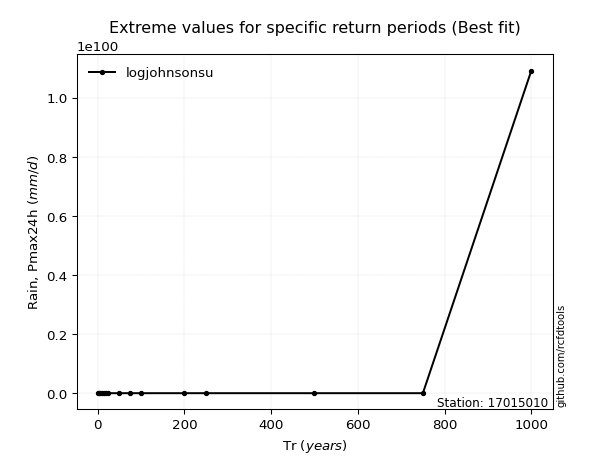</img>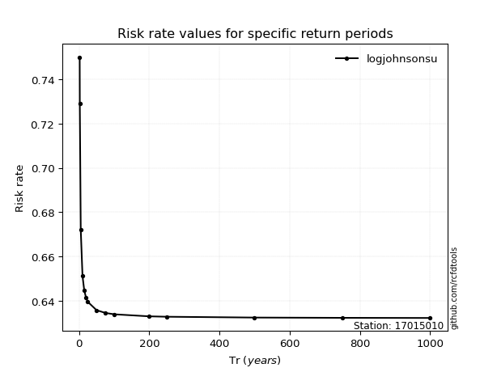</img>

</div>


<sub>**APP DISCLAIMER**: NO WARRANTY - This software is provided by [github.com/rcfdtools](https://github.com/rcfdtools) "as is", without any express or implied warranty, including warranties of merchantability, fitness for a particular purpose, or non-infringement. There is no guarantee that the software will be error-free or operate without interruption. LIMITATION OF LIABILITY - Neither the authors nor copyright holders will be liable for claims or damages arising from the software or its use. You are responsible for determining if the software is appropriate for your use and assume all associated risks, including errors, legal compliance, and data loss. NO PROFESSIONAL ADVICE - The software provides general information and does not offer professional advice. It should not replace consultation with professional advisors.</sub>