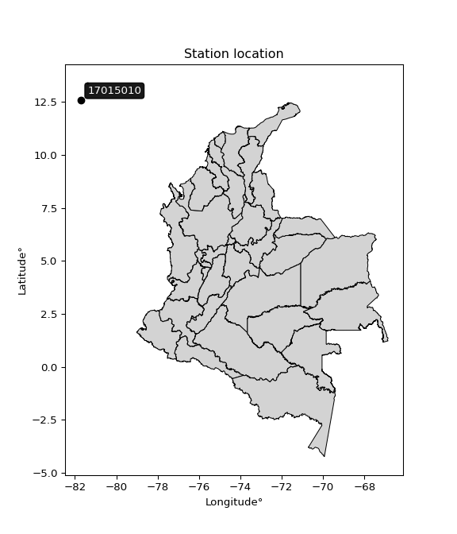

<div align="center">


</div>

# PMP Station (Rain, Pmax24h): 17015010

Probable Maximum Precipitation (PMP) is the greatest amount of rainfall for a specific duration that is meteorologically possible for a given location, acting as a "worst-case" scenario for extreme storms, crucial for designing safety-critical infrastructure like bridges, river deviations, dams, spillways, and nuclear plants to prevent catastrophic failure. PMP is calculated by hydrologists using meteorological data to determine the upper limit of extreme rainfall, often leading to the Probable Maximum Flood (PMF) for flood control design, and is increasingly being studied for climate change impacts. Probable Maximum Precipitation (PMP) is the theoretical upper limit of rainfall, a deterministic estimate for extreme events, while probability distributions (like GEV, Gumbel) describe the likelihood and frequency of various precipitation amounts, including rare ones, showing how often events occur, with PMP representing the extreme end of these distributions, used for critical infrastructure design to ensure safety against the worst conceivable weather, unlike standard statistical forecasts which cover typical probabilities.

The most common probability distributions in hydrology, used for analyzing floods, rainfall, and streamflow, include the Normal, Log-Normal, Gumbel, Gamma (including Log-Pearson Type III), and Generalized Extreme Value (GEV) distributions, often chosen based on the data´s skewness and whether modeling extremes or general conditions, with Gumbel and GEV popular for extreme events like floods, while the Normal distribution serves as a baseline, though often requiring transformations for skewed hydrological data. These distributions help in designing water infrastructure, managing water resources, and forecasting hydrologic events.

> Hydrological data often isn´t perfectly normal (it´s skewed), so different distributions are needed for different applications, such as: **Flood Frequency Analysis**: Using Gumbel, GEV, or Log-Pearson Type III for predicting extreme flood magnitudes and their return periods, **Rainfall Analysis**: Normal for annual totals, but Log-Normal, Weibull, or GEV for intensity or extreme daily rainfall, **Streamflow Modeling**: Gamma and Log-Normal for maximum flows, GEV for minimum flows, and Kappa for daily flows.

<div align="center">

</img>

</div>


## A. General information


### 1. General running parameters

• app_version: _v20260108_. • runtime: _2026-01-08 13:24:42.400241_. • Python version: _3.14.0_. • SciPy version: _1.16.3_. • Pandas version: _2.3.3_. • NumPy version: _2.3.5_. • Stations dataset (station_dataset_file): _dataset/pmax24h_in/automatic_colombia_2003_2024.csv_. • Stations catalog (station_catalog_file): _dataset/CNE.xls_. • Minimum year to eval til year_max (date_min): _1900_. • Maximum year to eval since year_min (date_max): _2024_. • Creates, save and include plots into reports (create_plot): _False_. • Plot only fit distributions with Δo > Δ (plot_only_fit): _True_. • Plot only simple graphs avoiding multiple CDFs and multiple Extreme values plots (plot_only_simple): _True_. • Eval low extreme values, if False, evaluates high extreme values (low_extreme): _False_. • Eval every SciPy distribution as logarithmic (pdist_logarithmic_on): _True_. • Standard deviation normalized (ddof): _1.0_. • Return periods to eval in years (Tr): _[2, 2.33, 5, 10, 15, 20, 25, 50, 75, 100, 200, 250, 500, 750, 1000]_. • Minimum data sample per station, 0 means any (minimum_sample): _5_. • Z-Score maximum threshold to adjust a value, 0 means disable (zscore_max): _3.5_. • Z-Score minimum threshold to adjust a value, 0 means disable (zscore_min): _-2.5_. • Avoid zeros, e.g. rain = 0 (avoid_zeros): _True_. • Avoid null values (avoid_nans): _True_. 

:file_folder:Table: [dataset.csv](../../dataset/pmax24h_in/automatic_colombia_2003_2024.csv)

> Delta Degrees of Freedom (DDOF): is a parameter used in the formulas for calculating variance and standard deviation. When ddof=0, the divisor is $N$ (the total number of observations) and this is used when your data set is the entire population. When ddof=1, the divisor is $N-1$ and this is used when your data set is a sample drawn from a larger population. Using $N-1$ provides an unbiased estimate of the population variance (known as Bessel´s correction).


### 2. Station info and location

|   id |   CODIGO | NOMBRE                                 | CATEGORIA           | TECNOLOGIA                              | ESTADO   | FECHA_INSTALACION   |   FECHA_SUSPENSION |   ALTITUD |   LATITUD |   LONGITUD | DEPARTAMENTO                                             | MUNICIPIO   | AREA_OPERATIVA                                         | ENTIDAD                                                     | AREA_HIDROGRAFICA   | ZONA_HIDROGRAFICA   | SUBZONA_HIDROGRAFICA   |   CORRIENTE | Catalogo   |   Version |
|-----:|---------:|:---------------------------------------|:--------------------|:----------------------------------------|:---------|:--------------------|-------------------:|----------:|----------:|-----------:|:---------------------------------------------------------|:------------|:-------------------------------------------------------|:------------------------------------------------------------|:--------------------|:--------------------|:-----------------------|------------:|:-----------|----------:|
|    0 | 17015010 | AEROPUERTO SESQUICENTENARIO [17015010] | Sinóptica Principal | Automática con Telemetría, Convencional | Activa   | 15/01/1958          |                nan |         3 |   12.5878 |   -81.7011 | Archipielago De San Andres, Providencia Y Santa Catalina | San Andrés  | Area Operativa 05 - Magdalena-Cesar-Guajira-San Andrés | INSTITUTO DE HIDROLOGIA METEOROLOGIA Y ESTUDIOS AMBIENTALES | Caribe              | Islas Caribe        | San Andres             |         nan | CNE_IDEAM  |  20251226 |

<div align="center">

Dynamic map: [:earth_americas:Google](http://maps.google.com/maps?q=12.587849,-81.701117) [:earth_americas:OSM](https://www.openstreetmap.org/#map=18/12.587849/-81.701117&layers=P) [:earth_americas:Bing](https://www.bing.com/maps?cp=12.587849~-81.701117&lvl=18) [:earth_americas:Apple](https://maps.apple.com/frame?center=12.587849%2C-81.701117&span=0.003%2C0.006)

</div>


<div align="center">

```geojson
{
  "type": "Feature",
  "geometry": {
    "type": "Point", 
    "coordinates": [-81.701117, 12.587849]
  }, 
  "properties": {
    "Name": "17015010"
  }
}
```

</div>


### 3. Discrete values table and plot

<div align="center">

|               |           0 |           1 |            2 |           3 |           4 |           5 |          6 |           7 |           8 |           9 |         10 |
|:--------------|------------:|------------:|-------------:|------------:|------------:|------------:|-----------:|------------:|------------:|------------:|-----------:|
| Date          | 2014        | 2015        | 2016         | 2017        | 2018        | 2019        | 2020       | 2021        | 2022        | 2023        | 2024       |
| Value         |  176.4      |   68.86     |  298.01      |   68.95     |   78.91     |   73.56     |   72.1     |   43        |  104        |  153.3      | 2537.4     |
| Value_initial |  176.4      |   68.86     |  298.01      |   68.95     |   78.91     |   73.56     |   72.1     |   43        |  104        |  153.3      | 2537.4     |
| count         |   11        |   11        |   11         |   11        |   11        |   11        |   11       |   11        |   11        |   11        |   11       |
| mean          |  334.045    |  334.045    |  334.045     |  334.045    |  334.045    |  334.045    |  334.045   |  334.045    |  334.045    |  334.045    |  334.045   |
| std           |  734.396    |  734.396    |  734.396     |  734.396    |  734.396    |  734.396    |  734.396   |  734.396    |  734.396    |  734.396    |  734.396   |
| zscore        |   -0.214659 |   -0.361092 |   -0.0490669 |   -0.360969 |   -0.347407 |   -0.354692 |   -0.35668 |   -0.396304 |   -0.313243 |   -0.246113 |    3.00023 |


</div>


> The initial value (value_initial) correspond to the initial obtained or null completed value, and value (value) is adjusted only when the initial value is outside the valid range (outlier) definite through the Z-Score value. If Z-Score is active, values out of range or outliers are replaced with the station mean value. A Z-Score (or standard score) measures how many standard deviations a data point is from the mean of a dataset, indicating its relative position; positive scores mean above the mean, negative mean below, and a score of zero is exactly at the mean, allowing for comparison of values from different distributions. It´s calculated using the formula $z=(x–μ)/σ$, where $x$ is the data point, $μ$ is the mean, and $σ$ is the standard deviation, helping identify outliers and understand probability.
>
> <sub>**Note**: In this study, "completing" (filling gaps in) and "extending" (forecasting or lengthening the historical record) rainfall data series are avoided for certain critical analyses because they introduce artificial bias and uncertainty, which can distort the statistics of rare events (extremes), alter day-to-day variability, and compromise the integrity and homogeneity of the original data. Some reasons against Completing/Extending rainfall data are: **Distortion of Extremes and Variability**: The primary issue is that most gap-filling or extension methods rely on averaging or regression with nearby stations, which inherently smooths the data. Rainfall is highly variable in space and time, with a large percentage of zero values and occasional large storms. Infilling methods often underestimate the highest values and overestimate the lowest (zero) values, which severely distorts analyses focused on flood frequency, drought severity, and intensity-duration-frequency (IDF) curves, **Loss of Data Homogeneity**: Infilled or extended data are synthetic estimates, not actual measurements. Combining these estimates with observed data can violate the assumption of data homogeneity, which requires that the data properties do not change over time. Inhomogeneity can lead to incorrect conclusions about long-term trends or changes in climate patterns, **Propagation of Errors**: Errors and biases from the original data (e.g., wind-induced undercatch, instrument errors, site changes) or the data used for imputation can propagate through the analysis, leading to unreliable hydrological models and inaccurate predictions, **Compromised Statistical Integrity**: For statistical analyses, especially those involving the frequency of events, using artificial data can introduce time bias or autocorrelation that doesn´t exist in reality, making it difficult to assess the true probability of events, **Difficulty in Validation**: It is difficult to accurately validate the quality of filled or extended data, especially for past periods where ground-truth measurements are unavailable. The reliability of imputation techniques heavily depends on the density of the surrounding station network and the complexity of the local topography.</sub>


### 4. Active continuous probability distributions from SciPy (43 of 104 available)

A Probability Density Function (PDF) describes the relative likelihood of a continuous random variable falling within a specific range, where the total area under its curve equals 1, and the area over any interval gives the actual probability for that range. Unlike discrete probabilities (like rolling a die), a PDF shows density, not direct probability for a single point (which is zero), with higher points indicating higher likelihood, often visualized as a bell curve for normal distributions.

A log of a probability density function (log-PDF) is simply the logarithm of the PDF´s value, denoted as $log(f(x))$, useful for converting multiplication of probabilities into addition, improving numerical stability with tiny numbers, and connecting to information theory concepts like entropy. Instead of dealing with very small probabilities (e.g., 0.000001), log-PDFs use negative numbers (e.g., $log(0.00001) ≈ -11.51$ that are easier for computers to handle, preventing underflow errors and simplifying complex calculations. In this study, each active probability distribution from SciPy is also evaluated in the $log$ form.

[scipy.stats](https://docs.scipy.org/doc/scipy/reference/stats.html) is a Python´s powerful submodule within the SciPy library for comprehensive statistical analysis, offering over 130 probability distributions (like Normal, Poisson), functions for descriptive stats (mean, variance), hypothesis testing (t-tests, chi-square), random variable generation, and statistical tests, making it essential for data science, modeling, and research. It provides tools to explore, model, and draw conclusions from data efficiently, working seamlessly with NumPy.

<div align="center">

|   id | p_dist             |   n_parameter | fit_method   | label                                                                       | active   | ref                                                                                                        |
|-----:|:-------------------|--------------:|:-------------|:----------------------------------------------------------------------------|:---------|:-----------------------------------------------------------------------------------------------------------|
|    0 | alpha              |             3 | MLE          | Alpha                                                                       | True     | [:mortar_board:](https://docs.scipy.org/doc/scipy/reference/generated/scipy.stats.alpha.html)              |
|    1 | betaprime          |             4 | MLE          | Beta prime                                                                  | True     | [:mortar_board:](https://docs.scipy.org/doc/scipy/reference/generated/scipy.stats.betaprime.html)          |
|    2 | chi2               |             3 | MLE          | Chi²                                                                        | True     | [:mortar_board:](https://docs.scipy.org/doc/scipy/reference/generated/scipy.stats.chi2.html)               |
|    3 | crystalball        |             4 | MLE          | Crystalball                                                                 | True     | [:mortar_board:](https://docs.scipy.org/doc/scipy/reference/generated/scipy.stats.crystalball.html)        |
|    4 | erlang             |             3 | MLE          | Erlang                                                                      | True     | [:mortar_board:](https://docs.scipy.org/doc/scipy/reference/generated/scipy.stats.erlang.html)             |
|    5 | expon              |             2 | MLE          | Exponential                                                                 | True     | [:mortar_board:](https://docs.scipy.org/doc/scipy/reference/generated/scipy.stats.expon.html)              |
|    6 | exponnorm          |             3 | MLE          | Exponentially modified Normal                                               | True     | [:mortar_board:](https://docs.scipy.org/doc/scipy/reference/generated/scipy.stats.exponnorm.html)          |
|    7 | f                  |             4 | MLE          | F                                                                           | True     | [:mortar_board:](https://docs.scipy.org/doc/scipy/reference/generated/scipy.stats.f.html)                  |
|    8 | fatiguelife        |             3 | MLE          | Fatigue-life (Birnbaum-Saunders)                                            | True     | [:mortar_board:](https://docs.scipy.org/doc/scipy/reference/generated/scipy.stats.fatiguelife.html)        |
|    9 | fisk               |             3 | MLE          | Fisk                                                                        | True     | [:mortar_board:](https://docs.scipy.org/doc/scipy/reference/generated/scipy.stats.fisk.html)               |
|   10 | gamma              |             3 | MLE          | Gamma                                                                       | True     | [:mortar_board:](https://docs.scipy.org/doc/scipy/reference/generated/scipy.stats.gamma.html)              |
|   11 | genexpon           |             5 | MLE          | Generalized exponential                                                     | True     | [:mortar_board:](https://docs.scipy.org/doc/scipy/reference/generated/scipy.stats.genexpon.html)           |
|   12 | genlogistic        |             3 | MLE          | Generalized logistic                                                        | True     | [:mortar_board:](https://docs.scipy.org/doc/scipy/reference/generated/scipy.stats.genlogistic.html)        |
|   13 | gibrat             |             2 | MM           | Gibrat                                                                      | True     | [:mortar_board:](https://docs.scipy.org/doc/scipy/reference/generated/scipy.stats.gibrat.html)             |
|   14 | gompertz           |             3 | MLE          | Gompertz (or truncated Gumbel)                                              | True     | [:mortar_board:](https://docs.scipy.org/doc/scipy/reference/generated/scipy.stats.gompertz.html)           |
|   15 | gumbel_l           |             2 | MM           | Gumbel Left Skew                                                            | True     | [:mortar_board:](https://docs.scipy.org/doc/scipy/reference/generated/scipy.stats.gumbel_l.html)           |
|   16 | gumbel_r           |             2 | MM           | Gumbel Right Skew                                                           | True     | [:mortar_board:](https://docs.scipy.org/doc/scipy/reference/generated/scipy.stats.gumbel_r.html)           |
|   17 | halflogistic       |             2 | MM           | Half-logistic                                                               | True     | [:mortar_board:](https://docs.scipy.org/doc/scipy/reference/generated/scipy.stats.halflogistic.html)       |
|   18 | halfnorm           |             2 | MM           | Half Normal                                                                 | True     | [:mortar_board:](https://docs.scipy.org/doc/scipy/reference/generated/scipy.stats.halfnorm.html)           |
|   19 | hypsecant          |             2 | MM           | hyperbolic secant                                                           | True     | [:mortar_board:](https://docs.scipy.org/doc/scipy/reference/generated/scipy.stats.hypsecant.html)          |
|   20 | invgamma           |             3 | MLE          | Inverted gamma                                                              | True     | [:mortar_board:](https://docs.scipy.org/doc/scipy/reference/generated/scipy.stats.invgamma.html)           |
|   21 | invgauss           |             3 | MLE          | Inverse Gaussian                                                            | True     | [:mortar_board:](https://docs.scipy.org/doc/scipy/reference/generated/scipy.stats.invgauss.html)           |
|   22 | invweibull         |             3 | MLE          | Inverted Weibull                                                            | True     | [:mortar_board:](https://docs.scipy.org/doc/scipy/reference/generated/scipy.stats.invweibull.html)         |
|   23 | kstwobign          |             2 | MLE          | Limiting distribution of scaled Kolmogorov-Smirnov two-sided test statistic | True     | [:mortar_board:](https://docs.scipy.org/doc/scipy/reference/generated/scipy.stats.kstwobign.html)          |
|   24 | laplace            |             2 | MM           | Laplace                                                                     | True     | [:mortar_board:](https://docs.scipy.org/doc/scipy/reference/generated/scipy.stats.laplace.html)            |
|   25 | laplace_asymmetric |             3 | MLE          | Asymmetric Laplace                                                          | True     | [:mortar_board:](https://docs.scipy.org/doc/scipy/reference/generated/scipy.stats.laplace_asymmetric.html) |
|   26 | loggamma           |             3 | MLE          | Log gamma                                                                   | True     | [:mortar_board:](https://docs.scipy.org/doc/scipy/reference/generated/scipy.stats.loggamma.html)           |
|   27 | logistic           |             2 | MM           | Logistic (or Sech-squared)                                                  | True     | [:mortar_board:](https://docs.scipy.org/doc/scipy/reference/generated/scipy.stats.logistic.html)           |
|   28 | lognorm            |             3 | MLE          | Log Normal                                                                  | True     | [:mortar_board:](https://docs.scipy.org/doc/scipy/reference/generated/scipy.stats.lognorm.html)            |
|   29 | maxwell            |             2 | MM           | Maxwell                                                                     | True     | [:mortar_board:](https://docs.scipy.org/doc/scipy/reference/generated/scipy.stats.maxwell.html)            |
|   30 | mielke             |             4 | MLE          | Mielke Beta-Kappa / Dagum                                                   | True     | [:mortar_board:](https://docs.scipy.org/doc/scipy/reference/generated/scipy.stats.mielke.html)             |
|   31 | moyal              |             2 | MM           | Moyal                                                                       | True     | [:mortar_board:](https://docs.scipy.org/doc/scipy/reference/generated/scipy.stats.moyal.html)              |
|   32 | nakagami           |             3 | MLE          | Nakagami                                                                    | True     | [:mortar_board:](https://docs.scipy.org/doc/scipy/reference/generated/scipy.stats.nakagami.html)           |
|   33 | ncf                |             5 | MLE          | Non-central F distribution                                                  | True     | [:mortar_board:](https://docs.scipy.org/doc/scipy/reference/generated/scipy.stats.ncf.html)                |
|   34 | nct                |             4 | MLE          | Non-central Student’s t                                                     | True     | [:mortar_board:](https://docs.scipy.org/doc/scipy/reference/generated/scipy.stats.nct.html)                |
|   35 | norm               |             2 | MM           | Normal                                                                      | True     | [:mortar_board:](https://docs.scipy.org/doc/scipy/reference/generated/scipy.stats.norm.html)               |
|   36 | pearson3           |             3 | MM           | Pearson type III                                                            | True     | [:mortar_board:](https://docs.scipy.org/doc/scipy/reference/generated/scipy.stats.pearson3.html)           |
|   37 | rayleigh           |             2 | MM           | Rayleigh                                                                    | True     | [:mortar_board:](https://docs.scipy.org/doc/scipy/reference/generated/scipy.stats.rayleigh.html)           |
|   38 | rice               |             3 | MLE          | Rice                                                                        | True     | [:mortar_board:](https://docs.scipy.org/doc/scipy/reference/generated/scipy.stats.rice.html)               |
|   39 | t                  |             3 | MLE          | Student’s t                                                                 | True     | [:mortar_board:](https://docs.scipy.org/doc/scipy/reference/generated/scipy.stats.t.html)                  |
|   40 | truncnorm          |             4 | MLE          | Truncated normal                                                            | True     | [:mortar_board:](https://docs.scipy.org/doc/scipy/reference/generated/scipy.stats.truncnorm.html)          |
|   41 | wald               |             2 | MM           | Wald                                                                        | True     | [:mortar_board:](https://docs.scipy.org/doc/scipy/reference/generated/scipy.stats.wald.html)               |
|   42 | weibull_min        |             3 | MLE          | Weibull minimum                                                             | True     | [:mortar_board:](https://docs.scipy.org/doc/scipy/reference/generated/scipy.stats.weibull_min.html)        |

</div>

> **n_parameter:** # arguments & localization & scale.
>
> **Fit methods:** (MLE) maximum likelihood, (MM) L-moments.
>
>**Inactive** (With the only purpose of prevent loops, zero divisions, infinite values, over high estimated values or horizontal trending for recurrence intervals estimations, the follow distributions were disabled.)**:** foldnorm, gennorm, norminvgauss, powernorm, powerlognorm, skewnorm, genextreme, anglit, arcsine, argus, beta, bradford, burr, burr12, cauchy, cosine, halfcauchy, foldcauchy, skewcauchy, wrapcauchy, dgamma, gengamma, exponweib, exponpow, truncexpon, gausshyper, genhalflogistic, genhyperbolic, geninvgauss, halfgennorm, johnsonsb, johnsonsu, kappa4, kappa3, ksone, kstwo, loglaplace, levy, levy_l, levy_stable, ncx2, pareto, genpareto, truncpareto, lomax, powerlaw, rdist, rel_breitwigner, recipinvgauss, semicircular, studentized_range, trapezoid, triang, truncweibull_min, tukeylambda, uniform, loguniform, vonmises, vonmises_line, weibull_max, dweibull, 


## B. Probability (PDF) vs. Empirical (EDF) distributions functions

A continuous probability distribution (CPD) describes probabilities for variables that can take any value within a range (like rain any time), unlike discrete variables with specific outcomes (like temperature). It uses a Probability Density Function (PDF), a curve where the total area under it equals 1, and the probability of the variable falling within an interval (a to b) is found by calculating the area under the curve between those points. A key feature is that the probability of hitting any single exact value is zero, so probabilities are always expressed for ranges, e.g., $P(a ≤ X ≤ b)$.

<div align="center">

Distributions parameters from station values
|    |   station | p_dist                |   n |               loc |           scale | shape                  | shape1                 | shape2              | shape3   |
|---:|----------:|:----------------------|----:|------------------:|----------------:|:-----------------------|:-----------------------|:--------------------|:---------|
|  0 |  17015010 | alpha                 |  11 |      14.58        |    79.5993      | 0.6557450272020002     |                        |                     |          |
|  1 |  17015010 | betaprime             |  11 |      -0.367522    |     0.731828    | 205.65111474916517     | 1.623512139385709      |                     |          |
|  2 |  17015010 | chi2                  |  11 |      43           |   731.589       | 0.6033883493914685     |                        |                     |          |
|  3 |  17015010 | crystalball           |  11 |      -0.455032    |   775.92        | 4.833360532445264      | 2.1659254321247183     |                     |          |
|  4 |  17015010 | erlang                |  11 |      43           |  1201.28        | 0.2999131349179387     |                        |                     |          |
|  5 |  17015010 | expon                 |  11 |      43           |   291.045       |                        |                        |                     |          |
|  6 |  17015010 | exponnorm             |  11 |      42.6235      |     0.129275    | 2231.954409025228      |                        |                     |          |
|  7 |  17015010 | f                     |  11 |      31.32        |    45.7011      | 1409.4329077778705     | 1.9667426994740762     |                     |          |
|  8 |  17015010 | fatiguelife           |  11 |      37.8466      |   107.065       | 2.1020715408987547     |                        |                     |          |
|  9 |  17015010 | fisk                  |  11 |      43           |    43.5081      | 0.6607177009843308     |                        |                     |          |
| 10 |  17015010 | gamma                 |  11 |      43           |  1291.22        | 0.7283467463533133     |                        |                     |          |
| 11 |  17015010 | genexpon              |  11 |      43           |   545.842       | 1.8754596069632026     | 1.6291229481383875e-14 | 1.9543446999915481  |          |
| 12 |  17015010 | genlogistic           |  11 |   -1767.76        |   238.421       | 2822.586668371965      |                        |                     |          |
| 13 |  17015010 | gibrat                |  11 |    -200.135       |   323.996       |                        |                        |                     |          |
| 14 |  17015010 | gompertz              |  11 |      43           |     3.06205e+10 | 85729394.68209936      |                        |                     |          |
| 15 |  17015010 | gumbel_l              |  11 |     649.181       |   545.959       |                        |                        |                     |          |
| 16 |  17015010 | gumbel_r              |  11 |      18.9085      |   545.959       |                        |                        |                     |          |
| 17 |  17015010 | halflogistic          |  11 |    -495.878       |   598.663       |                        |                        |                     |          |
| 18 |  17015010 | halfnorm              |  11 |    -592.772       |  1161.59        |                        |                        |                     |          |
| 19 |  17015010 | hypsecant             |  11 |     334.045       |   445.774       |                        |                        |                     |          |
| 20 |  17015010 | invgamma              |  11 |      31.2882      |    44.9406      | 0.9833722016469824     |                        |                     |          |
| 21 |  17015010 | invgauss              |  11 |      35.7519      |    40.2885      | 7.403925504026834      |                        |                     |          |
| 22 |  17015010 | invweibull            |  11 |      43           |     3.22505     | 0.06609449099414949    |                        |                     |          |
| 23 |  17015010 | kstwobign             |  11 |   -1135.09        |  1773.55        |                        |                        |                     |          |
| 24 |  17015010 | laplace               |  11 |     334.045       |   495.13        |                        |                        |                     |          |
| 25 |  17015010 | laplace_asymmetric    |  11 |      43           |     0.000530487 | 1.8226987695808372e-06 |                        |                     |          |
| 26 |  17015010 | loggamma              |  11 | -236042           | 31503.6         | 1814.089648507711      |                        |                     |          |
| 27 |  17015010 | logistic              |  11 |     334.045       |   386.051       |                        |                        |                     |          |
| 28 |  17015010 | lognorm               |  11 |      43           |     2.81202     | 10.708856514342605     |                        |                     |          |
| 29 |  17015010 | maxwell               |  11 |   -1325.18        |  1039.77        |                        |                        |                     |          |
| 30 |  17015010 | mielke                |  11 |      -0.317625    |     3.98675     | 213.31452110644432     | 1.5995817319255368     |                     |          |
| 31 |  17015010 | moyal                 |  11 |     -66.3859      |   315.21        |                        |                        |                     |          |
| 32 |  17015010 | nakagami              |  11 |      43           |  1086.81        | 0.1506261778208342     |                        |                     |          |
| 33 |  17015010 | ncf                   |  11 |      -0.0746541   |     1.5577e-05  | 2.5209871078965268e-06 | 3.668164043365111      | 16.701728622520683  |          |
| 34 |  17015010 | nct                   |  11 |      -0.20395     |     2.146       | 1.2888420691348568     | 37.89981153859409      |                     |          |
| 35 |  17015010 | norm                  |  11 |     334.045       |   700.219       |                        |                        |                     |          |
| 36 |  17015010 | pearson3              |  11 |     334.045       |   700.22        | 2.796351396550584      |                        |                     |          |
| 37 |  17015010 | rayleigh              |  11 |   -1005.52        |  1068.81        |                        |                        |                     |          |
| 38 |  17015010 | rice                  |  11 |    -563.589       |   805.001       | 0.00019663853262052148 |                        |                     |          |
| 39 |  17015010 | t                     |  11 |      71.7186      |     5.07612     | 0.37657242357693793    |                        |                     |          |
| 40 |  17015010 | truncnorm             |  11 |      -1.29693e+06 | 30162.4         | 42.99975175196195      | 1934.4231957925558     |                     |          |
| 41 |  17015010 | wald                  |  11 |    -366.175       |   700.219       |                        |                        |                     |          |
| 42 |  17015010 | weibull_min           |  11 |      43           |   683.116       | 0.48023389529184635    |                        |                     |          |
| 43 |  17015010 | logalpha              |  11 |       2.5956      |     5.82263     | 2.972695339385286      |                        |                     |          |
| 44 |  17015010 | logbetaprime          |  11 |       3.44751     |     0.605804    | 7.161443410782404      | 4.042266802708184      |                     |          |
| 45 |  17015010 | logchi2               |  11 |       3.7612      |     0.930059    | 1.114314999495088      |                        |                     |          |
| 46 |  17015010 | logcrystalball        |  11 |       4.86879     |     1.07188     | 8.422993099062717      | 1.1031875818675472     |                     |          |
| 47 |  17015010 | logerlang             |  11 |       3.7612      |     1.29497     | 0.2822155421944179     |                        |                     |          |
| 48 |  17015010 | logexpon              |  11 |       3.7612      |     1.10759     |                        |                        |                     |          |
| 49 |  17015010 | logexponnorm          |  11 |       3.94699     |     0.212932    | 4.329095007086844      |                        |                     |          |
| 50 |  17015010 | logf                  |  11 |       3.25671     |     1.19785     | 152.22671995767848     | 7.716657926104276      |                     |          |
| 51 |  17015010 | logfatiguelife        |  11 |       3.47248     |     1.11298     | 0.7152883312702321     |                        |                     |          |
| 52 |  17015010 | logfisk               |  11 |       3.57876     |     0.96702     | 2.3707951275328973     |                        |                     |          |
| 53 |  17015010 | loggamma              |  11 |       3.7612      |     1.23756     | 0.7815073014830551     |                        |                     |          |
| 54 |  17015010 | loggenexpon           |  11 |       3.7612      |     1.80955     | 1.5720095305127573     | 1.0258164575785207     | 0.10788346236309718 |          |
| 55 |  17015010 | loggenlogistic        |  11 |      -0.135121    |     0.6319      | 1400.9474485887654     |                        |                     |          |
| 56 |  17015010 | loggibrat             |  11 |       4.05105     |     0.495981    |                        |                        |                     |          |
| 57 |  17015010 | loggompertz           |  11 |       3.7612      |    31.2574      | 27.254004640786704     |                        |                     |          |
| 58 |  17015010 | loggumbel_l           |  11 |       5.35119     |     0.835742    |                        |                        |                     |          |
| 59 |  17015010 | loggumbel_r           |  11 |       4.38639     |     0.835742    |                        |                        |                     |          |
| 60 |  17015010 | loghalflogistic       |  11 |       3.59836     |     0.91642     |                        |                        |                     |          |
| 61 |  17015010 | loghalfnorm           |  11 |       3.45004     |     1.77814     |                        |                        |                     |          |
| 62 |  17015010 | loghypsecant          |  11 |       4.86879     |     0.682381    |                        |                        |                     |          |
| 63 |  17015010 | loginvgamma           |  11 |       3.22777     |     4.69849     | 3.85445714717374       |                        |                     |          |
| 64 |  17015010 | loginvgauss           |  11 |       3.44087     |     2.68923     | 0.5309794968249145     |                        |                     |          |
| 65 |  17015010 | loginvweibull         |  11 |       2.58337     |     1.76732     | 3.3312376000826682     |                        |                     |          |
| 66 |  17015010 | logkstwobign          |  11 |       2.0107      |     3.33854     |                        |                        |                     |          |
| 67 |  17015010 | loglaplace            |  11 |       4.86879     |     0.757935    |                        |                        |                     |          |
| 68 |  17015010 | loglaplace_asymmetric |  11 |       4.23338     |     0.426271    | 0.5018576851373582     |                        |                     |          |
| 69 |  17015010 | logloggamma           |  11 |    -294.204       |    41.127       | 1439.8140947467127     |                        |                     |          |
| 70 |  17015010 | loglogistic           |  11 |       4.86879     |     0.590959    |                        |                        |                     |          |
| 71 |  17015010 | loglognorm            |  11 |       3.7612      |     0.0375309   | 10.162025684985984     |                        |                     |          |
| 72 |  17015010 | logmaxwell            |  11 |       2.32888     |     1.59165     |                        |                        |                     |          |
| 73 |  17015010 | logmielke             |  11 |       2.91861     |     0.78701     | 19.53825773812467      | 2.9975103114136266     |                     |          |
| 74 |  17015010 | logmoyal              |  11 |       4.25582     |     0.482516    |                        |                        |                     |          |
| 75 |  17015010 | lognakagami           |  11 |       3.7612      |     1.77232     | 0.31653172251761164    |                        |                     |          |
| 76 |  17015010 | logncf                |  11 |      -0.358771    |     5.06494     | 139.83790317870825     | 104.62520020696425     | 1.187267676633482   |          |
| 77 |  17015010 | lognct                |  11 |      -0.198752    |     0.10396     | 16.518807796440868     | 46.58637176039571      |                     |          |
| 78 |  17015010 | lognorm               |  11 |       4.86879     |     1.07188     |                        |                        |                     |          |
| 79 |  17015010 | logpearson3           |  11 |       4.86879     |     1.07188     | 1.8011225410111367     |                        |                     |          |
| 80 |  17015010 | lograyleigh           |  11 |       2.81822     |     1.63612     |                        |                        |                     |          |
| 81 |  17015010 | logrice               |  11 |       3.27648     |     1.35727     | 0.00027595749334489105 |                        |                     |          |
| 82 |  17015010 | logt                  |  11 |       4.28294     |     0.100294    | 0.5305992806353567     |                        |                     |          |
| 83 |  17015010 | logtruncnorm          |  11 |     -14.0486      |     4.73428     | 3.761886104936826      | 4.623208997034368      |                     |          |
| 84 |  17015010 | logwald               |  11 |       3.79696     |     1.07184     |                        |                        |                     |          |
| 85 |  17015010 | logweibull_min        |  11 |       3.7612      |     1.25148     | 0.29613662294643883    |                        |                     |          |

</div>

> **loc** (Location parameter): This shifts the distribution along the x-axis. For many common distributions, like the normal (Gaussian) distribution, loc represents the mean $μ$. For others, like the uniform distribution, it might represent the minimum value, or for the beta distribution, the left end of the support interval.
>
> **scale** (Scale parameter): This determines the width or spread of the distribution. For the normal distribution, scale represents the standard deviation $σ$. For a uniform distribution, it defines the length of the interval (from $loc$ to $loc + scale$).
>
> **shape** (Shape parameters): Refers to parameters that define the specific form of a probability distribution, distinct from its location (loc) and scale (scale). These parameters are required arguments for most distribution functions. For example, a normal (Gaussian) distribution is fully defined by its location (mean) and scale (standard deviation), so it has no specific shape parameters beyond loc and scale. However, other distributions have intrinsic properties that need specification, as Gamma distribution that takes a shape parameter, often named $a$ or $alpha$.


### 0. Cumulative distribution values - CDF (86 evaluated)

Cumulative Distribution Function (CDF), denoted as $F$<sub>$X$</sub>$(x)$, is a function that gives the probability that a random variable $X$ will take a value less than or equal to a specific value, $x$ (i.e., $(P(X≥x)$. It essentially "accumulates" probabilities from a given point up to the far right (positive infinity), providing a complete picture of the distribution´s probabilities for both discrete (like rain) and continuous (like temperature) variables, helping to find probabilities over ranges or above certain values. Each station is evaluated separately ordering the $x$ values ascending, calculating the CDF and PDF values for the activated distributions and their logarithmic forms.

<div align="center">

CDF ordered by x ascending and calculating $log(f(x))$ separately
|   id |   Station |   date |       x |   count |    mean |     std |     zscore |   Value_initial |   station |   m |     alpha |   alpha_pdf |   betaprime |   betaprime_pdf |        chi2 |    chi2_pdf |   crystalball |   crystalball_pdf |      erlang |   erlang_pdf |     expon |   expon_pdf |   exponnorm |   exponnorm_pdf |         f |       f_pdf |   fatiguelife |   fatiguelife_pdf |        fisk |       fisk_pdf |       gamma |    gamma_pdf |    genexpon |   genexpon_pdf |   genlogistic |   genlogistic_pdf |   gibrat |   gibrat_pdf |    gompertz |   gompertz_pdf |   gumbel_l |   gumbel_l_pdf |   gumbel_r |   gumbel_r_pdf |   halflogistic |   halflogistic_pdf |   halfnorm |   halfnorm_pdf |   hypsecant |   hypsecant_pdf |   invgamma |   invgamma_pdf |   invgauss |   invgauss_pdf |   invweibull |   invweibull_pdf |   kstwobign |   kstwobign_pdf |   laplace |   laplace_pdf |   laplace_asymmetric |   laplace_asymmetric_pdf |    loggamma |   loggamma_pdf |   logistic |   logistic_pdf |   lognorm |   lognorm_pdf |   maxwell |   maxwell_pdf |     mielke |   mielke_pdf |    moyal |   moyal_pdf |    nakagami |   nakagami_pdf |      ncf |     ncf_pdf |       nct |     nct_pdf |     norm |    norm_pdf |   pearson3 |   pearson3_pdf |   rayleigh |   rayleigh_pdf |     rice |    rice_pdf |        t |       t_pdf |   truncnorm |   truncnorm_pdf |     wald |    wald_pdf |   weibull_min |   weibull_min_pdf |   logalpha |   logalpha_pdf |   logbetaprime |   logbetaprime_pdf |     logchi2 |   logchi2_pdf |   logcrystalball |   logcrystalball_pdf |   logerlang |   logerlang_pdf |   logexpon |   logexpon_pdf |   logexponnorm |   logexponnorm_pdf |      logf |   logf_pdf |   logfatiguelife |   logfatiguelife_pdf |   logfisk |   logfisk_pdf |   loggenexpon |   loggenexpon_pdf |   loggenlogistic |   loggenlogistic_pdf |   loggibrat |   loggibrat_pdf |   loggompertz |   loggompertz_pdf |   loggumbel_l |   loggumbel_l_pdf |   loggumbel_r |   loggumbel_r_pdf |   loghalflogistic |   loghalflogistic_pdf |   loghalfnorm |   loghalfnorm_pdf |   loghypsecant |   loghypsecant_pdf |   loginvgamma |   loginvgamma_pdf |   loginvgauss |   loginvgauss_pdf |   loginvweibull |   loginvweibull_pdf |   logkstwobign |   logkstwobign_pdf |   loglaplace |   loglaplace_pdf |   loglaplace_asymmetric |   loglaplace_asymmetric_pdf |   logloggamma |   logloggamma_pdf |   loglogistic |   loglogistic_pdf |   loglognorm |   loglognorm_pdf |   logmaxwell |   logmaxwell_pdf |   logmielke |   logmielke_pdf |   logmoyal |   logmoyal_pdf |   lognakagami |   lognakagami_pdf |   logncf |   logncf_pdf |    lognct |   lognct_pdf |   logpearson3 |   logpearson3_pdf |   lograyleigh |   lograyleigh_pdf |   logrice |   logrice_pdf |     logt |   logt_pdf |   logtruncnorm |   logtruncnorm_pdf |   logwald |   logwald_pdf |   logweibull_min |   logweibull_min_pdf |
|-----:|----------:|-------:|--------:|--------:|--------:|--------:|-----------:|----------------:|----------:|----:|----------:|------------:|------------:|----------------:|------------:|------------:|--------------:|------------------:|------------:|-------------:|----------:|------------:|------------:|----------------:|----------:|------------:|--------------:|------------------:|------------:|---------------:|------------:|-------------:|------------:|---------------:|--------------:|------------------:|---------:|-------------:|------------:|---------------:|-----------:|---------------:|-----------:|---------------:|---------------:|-------------------:|-----------:|---------------:|------------:|----------------:|-----------:|---------------:|-----------:|---------------:|-------------:|-----------------:|------------:|----------------:|----------:|--------------:|---------------------:|-------------------------:|------------:|---------------:|-----------:|---------------:|----------:|--------------:|----------:|--------------:|-----------:|-------------:|---------:|------------:|------------:|---------------:|---------:|------------:|----------:|------------:|---------:|------------:|-----------:|---------------:|-----------:|---------------:|---------:|------------:|---------:|------------:|------------:|----------------:|---------:|------------:|--------------:|------------------:|-----------:|---------------:|---------------:|-------------------:|------------:|--------------:|-----------------:|---------------------:|------------:|----------------:|-----------:|---------------:|---------------:|-------------------:|----------:|-----------:|-----------------:|---------------------:|----------:|--------------:|--------------:|------------------:|-----------------:|---------------------:|------------:|----------------:|--------------:|------------------:|--------------:|------------------:|--------------:|------------------:|------------------:|----------------------:|--------------:|------------------:|---------------:|-------------------:|--------------:|------------------:|--------------:|------------------:|----------------:|--------------------:|---------------:|-------------------:|-------------:|-----------------:|------------------------:|----------------------------:|--------------:|------------------:|--------------:|------------------:|-------------:|-----------------:|-------------:|-----------------:|------------:|----------------:|-----------:|---------------:|--------------:|------------------:|---------:|-------------:|----------:|-------------:|--------------:|------------------:|--------------:|------------------:|----------:|--------------:|---------:|-----------:|---------------:|-------------------:|----------:|--------------:|-----------------:|---------------------:|
|    0 |  17015010 |   2021 |   43    |      11 | 334.045 | 734.396 | -0.396304  |           43    |  17015010 |   1 | 0.0214693 | 0.00529448  |   0.0896335 |     0.00605804  | 6.66283e-06 | 2.82902e+08 |      0.522331 |       0.000513348 | 7.11356e-05 |  1.72363e+06 | 0         | 0.0034359   |  0.00130421 |     0.00345504  | 0.0207973 | 0.00683815  |     0.0195093 |       0.0104539   | 9.26947e-11 | 2154.87        | 2.93812e-13 | 30.1174      | 8.78887e-16 |    0.0034359   |      0.241829 |       0.00143946  | 0.387012 |  0.00157457  | 1.81159e-08 |    0.00279974  |   0.280687 |    0.000434069 |   0.384108 |    0.000673176 |       0.421955 |        0.000686492 |   0.415847 |    0.000591339 |    0.30554  |     0.000584905 |  0.0207973 |    0.00683814  |  0.0210235 |    0.00920658  |  0.000137914 |      5.70166e+09 |    0.230386 |     0.00089802  |  0.27777  |   0.000561004 |          5.18208e-12 |              0.0034359   | 9.17592e-13 |   1614.78      |   0.319972 |    0.000563629 |  0.150729 |    0.218226   |  0.370041 |   0.000559031 |   0.054789 |   0.00581234 | 0.400513 | 0.000747271 | 5.36384e-06 |    2.27413e+08 | 0.141848 | 0.00566599  | 0.0490519 | 0.00576501  | 0.338834 | 0.00052259  |   0.477949 |    0.00100946  |   0.381952 |    0.000567274 | 0.247159 | 0.000704702 | 0.174467 | 0.00227225  |   0         |     0.00142638  | 0.43448  | 0.00110018  |   6.98608e-09 |  472168           |  0.0215845 |       0.221392 |      0.0205082 |          0.25357   | 2.22302e-09 |   2.78902e+06 |         0.150729 |           0.218226   | 4.79944e-05 |     3.05001e+10 |   0        |      0.902862  |       0.021976 |           0.183866 | 0.0208274 |  0.245643  |         0.021035 |            0.302524  | 0.0188166 |     0.23992   |   1.11776e-10 |         0.86873   |        0.0529578 |           0.245989   |    0        |       0         |   1.93606e-15 |         0.871923  |      0.1386   |       0.153777    |      0.120887 |         0.305623  |         0.0886121 |             0.541317  |      0.138915 |         0.4419    |       0.124001 |          0.177156  |     0.0207737 |         0.245218  |     0.0207152 |         0.288745  |       0.0209767 |           0.229264  |       0.053779 |         0.245005   |     0.115964 |        0.153     |               0.0221324 |                   0.103458  |      0.153627 |        0.216584   |      0.133054 |         0.195192  |  0.000800672 |      6.08224e+11 |     0.152881 |        0.270787  |   0.0205399 |       0.213868  |  0.0950127 |      0.342556  |   1.03163e-10 |    147063         | 0.117577 |    0.263229  | 0.0903244 |    0.267157  |     0.0410566 |         0.589307  |      0.153031 |         0.29836   | 0.0617789 |    0.246866   | 0.132235 | 0.132911   |    2.75262e-06 |          0.864077  |  0        |     0         |      2.65887e-05 |          1.77302e+10 |
|    1 |  17015010 |   2015 |   68.86 |      11 | 334.045 | 734.396 | -0.361092  |           68.86 |  17015010 |   2 | 0.280596  | 0.010429    |   0.259807  |     0.00644504  | 0.328519    | 0.00378091  |      0.535592 |       0.000512106 | 0.350643    |  0.00399974  | 0.0850194 | 0.00314378  |  0.0869181  |     0.00316454  | 0.295918  | 0.00950347  |     0.265047  |       0.00602019  | 0.414902    |    0.00620242  | 0.0628411   |  0.0017495   | 0.0850194   |    0.00314378  |      0.279809 |       0.00149441  | 0.426207 |  0.00145764  | 0.0698425   |    0.0026042   |   0.292091 |    0.000447909 |   0.401492 |    0.000671092 |       0.439545 |        0.000673835 |   0.431045 |    0.000584032 |    0.320914 |     0.000603998 |  0.295918  |    0.00950348  |  0.307728  |    0.00821788  |  0.418343    |      0.00093178  |    0.253881 |     0.000918232 |  0.292663 |   0.000591084 |          0.0850193   |              0.00314378  | 0.431922    |      0.575335  |   0.33472  |    0.000576821 |  0.276251 |    0.311991   |  0.384531 |   0.000561503 |   0.251221 |   0.00798318 | 0.419714 | 0.000737483 | 0.261379    |    0.00304467  | 0.289051 | 0.00544473  | 0.245996  | 0.00788932  | 0.352449 | 0.000530312 |   0.502983 |    0.00092887  |   0.396625 |    0.000567464 | 0.265542 | 0.000716802 | 0.379994 | 0.0320124   |   0.0362145 |     0.00137475  | 0.462101 | 0.0010366   |   0.187446    |       0.00313219  |  0.279575  |       0.731903 |      0.288816  |          0.700094  | 0.479043    |   0.480409    |         0.276251 |           0.311991   | 0.77431     |     0.347824    |   0.346319 |      0.590184  |       0.256849 |           0.708226 | 0.287507  |  0.706296  |         0.295525 |            0.647186  | 0.282979  |     0.736305  |   0.338189    |         0.585321  |        0.247729  |           0.546786   |    0.15675  |       1.32611   |   0.338784    |         0.58528   |      0.230558 |       0.241298    |      0.300357 |         0.432268  |         0.332606  |             0.485243  |      0.339922 |         0.407353  |       0.238575 |          0.317795  |     0.287416  |         0.706511  |     0.295622  |         0.66304   |       0.283536  |           0.722079  |       0.232171 |         0.477982   |     0.215841 |        0.284776  |               0.199965  |                   0.934731  |      0.277707 |        0.307707   |      0.253994 |         0.320633  |  0.598285    |      0.0808296   |     0.301432 |        0.350662  |   0.280414  |       0.739234  |  0.305406  |      0.501168  |   0.333623    |         0.440979  | 0.276653 |    0.399712  | 0.26248   |    0.443257  |     0.331235  |         0.563572  |      0.311597 |         0.363596  | 0.21952   |    0.404857   | 0.374761 | 2.02059    |    0.338918    |          0.591437  |  0.276581 |     0.931755  |      0.527       |          0.222706    |
|    2 |  17015010 |   2017 |   68.95 |      11 | 334.045 | 734.396 | -0.360969  |           68.95 |  17015010 |   3 | 0.281534  | 0.0104149   |   0.260387  |     0.00644122  | 0.328858    | 0.00377152  |      0.535638 |       0.000512101 | 0.351002    |  0.00398972  | 0.0853023 | 0.00314281  |  0.0872029  |     0.00316355  | 0.296772  | 0.00948556  |     0.265589  |       0.00600419  | 0.415459    |    0.00618332  | 0.0629985   |  0.00174772  | 0.0853023   |    0.00314281  |      0.279944 |       0.00149456  | 0.426338 |  0.00145724  | 0.0700769   |    0.00260355  |   0.292131 |    0.000447957 |   0.401552 |    0.000671082 |       0.439605 |        0.000673791 |   0.431097 |    0.000584006 |    0.320968 |     0.000604063 |  0.296772  |    0.00948556  |  0.308466  |    0.00819783  |  0.418427    |      0.000928521 |    0.253964 |     0.000918294 |  0.292716 |   0.000591191 |          0.0853021   |              0.00314281  | 0.432673    |      0.574381  |   0.334772 |    0.000576865 |  0.276659 |    0.312217   |  0.384582 |   0.000561511 |   0.25194  |   0.00797916 | 0.41978  | 0.000737446 | 0.261652    |    0.00303728  | 0.289541 | 0.00544175  | 0.246706  | 0.00788414  | 0.352497 | 0.000530338 |   0.503067 |    0.000928611 |   0.396676 |    0.000567464 | 0.265607 | 0.000716841 | 0.382904 | 0.032652    |   0.0363382 |     0.00137457  | 0.462195 | 0.00103639  |   0.187728    |       0.00312545  |  0.280531  |       0.731947 |      0.289731  |          0.699904  | 0.479669    |   0.479483    |         0.276659 |           0.312217   | 0.774764    |     0.346783    |   0.347089 |      0.589488  |       0.257774 |           0.708302 | 0.288429  |  0.706131  |         0.29637  |            0.646818  | 0.283941  |     0.736344  |   0.338953    |         0.584673  |        0.248444  |           0.547231   |    0.158482 |       1.32615   |   0.339548    |         0.584628  |      0.230873 |       0.241576    |      0.300922 |         0.432404  |         0.333239  |             0.485013  |      0.340454 |         0.407222  |       0.238991 |          0.31824   |     0.288338  |         0.706346  |     0.296487  |         0.662685  |       0.284479  |           0.722     |       0.232795 |         0.4783     |     0.216214 |        0.285267  |               0.201189  |                   0.940456  |      0.278109 |        0.307928   |      0.254413 |         0.320981  |  0.59839     |      0.0806005   |     0.30189  |        0.350799  |   0.281379  |       0.739228  |  0.306061  |      0.501202  |   0.334198    |         0.440476  | 0.277175 |    0.399963  | 0.263059  |    0.44354   |     0.331971  |         0.563119  |      0.312072 |         0.36368   | 0.220049  |    0.405135   | 0.377417 | 2.04656    |    0.33969     |          0.590807  |  0.277797 |     0.930434  |      0.527291    |          0.222136    |
|    3 |  17015010 |   2020 |   72.1  |      11 | 334.045 | 734.396 | -0.35668   |           72.1  |  17015010 |   4 | 0.313536  | 0.0098966   |   0.280456  |     0.00629827  | 0.340255    | 0.00347405  |      0.53725  |       0.000511911 | 0.363054    |  0.00367258  | 0.0951487 | 0.00310898  |  0.0971139  |     0.0031292   | 0.325674  | 0.00886895  |     0.283669  |       0.00548923  | 0.433952    |    0.00557722  | 0.0684108   |  0.00169004  | 0.0951487   |    0.00310898  |      0.28466  |       0.0014998   | 0.430906 |  0.0014434   | 0.078242    |    0.00258069  |   0.293545 |    0.000449649 |   0.403666 |    0.000670733 |       0.441725 |        0.00067223  |   0.432935 |    0.000583103 |    0.322875 |     0.000606333 |  0.325675  |    0.00886896  |  0.333228  |    0.00753658  |  0.421186    |      0.000827184 |    0.256859 |     0.000920405 |  0.294585 |   0.000594964 |          0.0951486   |              0.00310897  | 0.457625    |      0.543182  |   0.336591 |    0.000578414 |  0.290776 |    0.319748   |  0.386351 |   0.000561762 |   0.276828 |   0.00781572 | 0.422101 | 0.000736149 | 0.27084     |    0.00280355  | 0.306513 | 0.00533298  | 0.271233  | 0.00768205  | 0.354169 | 0.000531236 |   0.505978 |    0.000919645 |   0.398464 |    0.000567441 | 0.267867 | 0.000718194 | 0.518527 | 0.0482497   |   0.0406584 |     0.00136841  | 0.465448 | 0.00102886  |   0.197224    |       0.00291035  |  0.313203  |       0.729542 |      0.320809  |          0.690633  | 0.500411    |   0.449736    |         0.290776 |           0.319748   | 0.789504    |     0.313976    |   0.372899 |      0.566185  |       0.289395 |           0.7058   | 0.319802  |  0.69751   |         0.324961 |            0.632761  | 0.316805  |     0.73379   |   0.364583    |         0.562936  |        0.273204  |           0.560734   |    0.217232 |       1.29489   |   0.365173    |         0.562749  |      0.241879 |       0.251193    |      0.320331 |         0.436337  |         0.354727  |             0.476947  |      0.358544 |         0.402612  |       0.253548 |          0.3335    |     0.319721  |         0.697733  |     0.325793  |         0.648797  |       0.316618  |           0.715769  |       0.254387 |         0.487997   |     0.22934  |        0.302586  |               0.242116  |                   0.892272  |      0.292031 |        0.315298   |      0.269016 |         0.332758  |  0.601827    |      0.0734681   |     0.317661 |        0.355174  |   0.314335  |       0.734938  |  0.328459  |      0.501215  |   0.353506    |         0.424212  | 0.295226 |    0.408021  | 0.283076  |    0.452366  |     0.356778  |         0.547443  |      0.328378 |         0.366268  | 0.238352  |    0.414098   | 0.486665 | 2.72487    |    0.365608    |          0.569642  |  0.318307 |     0.882409  |      0.536803    |          0.204247    |
|    4 |  17015010 |   2019 |   73.56 |      11 | 334.045 | 734.396 | -0.354692  |           73.56 |  17015010 |   5 | 0.327802  | 0.00964477  |   0.289599  |     0.00622688  | 0.345238    | 0.00335395  |      0.537998 |       0.00051182  | 0.368321    |  0.00354453  | 0.0996765 | 0.00309342  |  0.101671   |     0.00311341  | 0.33842   | 0.00859238  |     0.291526  |       0.00527707  | 0.441913    |    0.00533214  | 0.0708605   |  0.00166583  | 0.0996765   |    0.00309342  |      0.286851 |       0.00150213  | 0.433009 |  0.00143702  | 0.0820021   |    0.00257016  |   0.294202 |    0.000450434 |   0.404645 |    0.000670564 |       0.442706 |        0.000671506 |   0.433786 |    0.000582683 |    0.323761 |     0.00060738  |  0.338421  |    0.00859239  |  0.344024  |    0.00725555  |  0.422364    |      0.000787317 |    0.258204 |     0.000921358 |  0.295454 |   0.000596721 |          0.0996763   |              0.00309342  | 0.468382    |      0.530029  |   0.337436 |    0.000579128 |  0.297219 |    0.323005   |  0.387171 |   0.000561875 |   0.288175 |   0.007727   | 0.423175 | 0.000735541 | 0.274863    |    0.00270925  | 0.314261 | 0.00528003  | 0.282373  | 0.00757685  | 0.354945 | 0.00053165  |   0.507317 |    0.000915546 |   0.399292 |    0.000567428 | 0.268916 | 0.000718812 | 0.583609 | 0.0396605   |   0.0426542 |     0.00136557  | 0.466947 | 0.00102539  |   0.201409    |       0.00282244  |  0.327797  |       0.726172 |      0.334599  |          0.684901  | 0.509304    |   0.437481    |         0.297219 |           0.323005   | 0.795665    |     0.300823    |   0.384147 |      0.55603   |       0.303507 |           0.701792 | 0.333731  |  0.691952  |         0.337576 |            0.625654  | 0.331484  |     0.730355  |   0.375773    |         0.553432  |        0.284496  |           0.565693   |    0.242918 |       1.26663   |   0.376359    |         0.553188  |      0.246958 |       0.255568    |      0.329092 |         0.437645  |         0.364252  |             0.473211  |      0.366594 |         0.400479  |       0.260302 |          0.340345  |     0.333654  |         0.692176  |     0.338728  |         0.641599  |       0.330921  |           0.710952  |       0.264207 |         0.491609   |     0.235487 |        0.310696  |               0.259794  |                   0.871459  |      0.298384 |        0.318489   |      0.275739 |         0.337937  |  0.603271    |      0.0706561   |     0.324799 |        0.35694   |   0.329028  |       0.730668  |  0.338501  |      0.500543  |   0.361942    |         0.41744   | 0.303439 |    0.411288  | 0.29218   |    0.455792  |     0.367681  |         0.540316  |      0.335731 |         0.367233  | 0.24669   |    0.417762   | 0.541017 | 2.64733    |    0.376934    |          0.560375  |  0.33577  |     0.859738  |      0.540826    |          0.197123    |
|    5 |  17015010 |   2018 |   78.91 |      11 | 334.045 | 734.396 | -0.347407  |           78.91 |  17015010 |   6 | 0.376896  | 0.00870885  |   0.322173  |     0.00594606  | 0.362152    | 0.00298569  |      0.540735 |       0.000511471 | 0.386187    |  0.00315192  | 0.116075  | 0.00303708  |  0.118174   |     0.00305621  | 0.381805  | 0.00764424  |     0.317914  |       0.00461501  | 0.468339    |    0.00458137  | 0.0795572   |  0.00158781  | 0.116075    |    0.00303708  |      0.294909 |       0.00151007  | 0.440635 |  0.00141381  | 0.09565     |    0.00253195  |   0.296619 |    0.000453312 |   0.408231 |    0.00066991  |       0.446292 |        0.000668844 |   0.4369   |    0.000581139 |    0.32702  |     0.000611193 |  0.381805  |    0.00764425  |  0.380332  |    0.00634764  |  0.426242    |      0.000669001 |    0.263142 |     0.000924714 |  0.298664 |   0.000603204 |          0.116075    |              0.00303707  | 0.504071    |      0.487529  |   0.340541 |    0.000581718 |  0.320279 |    0.333751   |  0.390178 |   0.000562268 |   0.328542 |   0.00735258 | 0.427105 | 0.000733272 | 0.288549    |    0.00242032  | 0.341969 | 0.00507601  | 0.321792  | 0.00715105  | 0.357793 | 0.000533147 |   0.512176 |    0.000900816 |   0.402328 |    0.000567359 | 0.272768 | 0.000721029 | 0.711304 | 0.0136885   |   0.0499322 |     0.00135519  | 0.472399 | 0.00101277  |   0.215746    |       0.00254883  |  0.378117  |       0.705133 |      0.381817  |          0.658827  | 0.538628    |   0.398962    |         0.320279 |           0.333751   | 0.815332    |     0.26089     |   0.421973 |      0.521879  |       0.351993 |           0.677021 | 0.381453  |  0.666019  |         0.380551 |            0.597977  | 0.382086  |     0.708933  |   0.413491    |         0.521337  |        0.324683  |           0.577767   |    0.3275   |       1.13801   |   0.414053    |         0.520921  |      0.265446 |       0.27114     |      0.359922 |         0.440079  |         0.397001  |             0.459609  |      0.39444  |         0.392702  |       0.285033 |          0.364077  |     0.381392  |         0.666234  |     0.382795  |         0.612977  |       0.380031  |           0.686205  |       0.299075 |         0.500796   |     0.258342 |        0.34085   |               0.318516  |                   0.802324  |      0.32112  |        0.329044   |      0.300084 |         0.355411  |  0.607925    |      0.0622833   |     0.350051 |        0.36216   |   0.379553  |       0.706475  |  0.373481  |      0.495203  |   0.390472    |         0.395818  | 0.33267  |    0.420982  | 0.324533  |    0.465183  |     0.404732  |         0.51514   |      0.361607 |         0.369671  | 0.276425  |    0.428848   | 0.683976 | 1.41469    |    0.415166    |          0.529021  |  0.393307 |     0.779473  |      0.553882    |          0.175648    |
|    6 |  17015010 |   2022 |  104    |      11 | 334.045 | 734.396 | -0.313243  |          104    |  17015010 |   7 | 0.547477  | 0.00519326  |   0.453787  |     0.00456142  | 0.423261    | 0.00202725  |      0.553544 |       0.000509516 | 0.450554    |  0.00213012  | 0.189083  | 0.00278623  |  0.191615   |     0.00280168  | 0.530799  | 0.00457313  |     0.408556  |       0.0028745   | 0.555588    |    0.00267439  | 0.116079    |  0.00134849  | 0.189083    |    0.00278623  |      0.333157 |       0.00153559  | 0.474779 |  0.00130911  | 0.156997    |    0.00236019  |   0.308163 |    0.000466841 |   0.424993 |    0.000666092 |       0.462915 |        0.000656221 |   0.451388 |    0.000573792 |    0.342574 |     0.000628499 |  0.530799  |    0.00457313  |  0.502816  |    0.00376812  |  0.438937    |      0.000391605 |    0.286515 |     0.000937647 |  0.314189 |   0.000634558 |          0.189083    |              0.00278623  | 0.619784    |      0.359375  |   0.355284 |    0.000593334 |  0.417087 |    0.364122   |  0.404305 |   0.000563702 |   0.487783 |   0.00535503 | 0.445362 | 0.000721871 | 0.338474    |    0.00167089  | 0.456659 | 0.00407108  | 0.474587  | 0.00508123  | 0.371255 | 0.000539807 |   0.533962 |    0.000837293 |   0.416555 |    0.000566667 | 0.29098  | 0.000730424 | 0.833006 | 0.00193761  |   0.083333  |     0.00130757  | 0.497084 | 0.000955506 |   0.269072    |       0.00180365  |  0.552815  |       0.549496 |      0.544551  |          0.514797  | 0.632651    |   0.291329    |         0.417087 |           0.364122   | 0.871999    |     0.161072    |   0.549501 |      0.406738  |       0.51807  |           0.522239 | 0.545831  |  0.519021  |         0.528756 |            0.474842  | 0.557299  |     0.548891  |   0.541689    |         0.411475  |        0.483441  |           0.555921   |    0.571121 |       0.661654  |   0.542078    |         0.410715  |      0.349002 |       0.334362    |      0.479798 |         0.421612  |         0.515884  |             0.400397  |      0.498216 |         0.358101  |       0.397162 |          0.442336  |     0.545817  |         0.519138  |     0.534125  |         0.482013  |       0.54924   |           0.531951  |       0.437656 |         0.492682   |     0.371869 |        0.490635  |               0.507628  |                   0.579679  |      0.416589 |        0.3593     |      0.406195 |         0.408151  |  0.622024    |      0.0423545   |     0.451397 |        0.36823   |   0.553391  |       0.543673  |  0.503786  |      0.442053  |   0.490228    |         0.330945  | 0.45145  |    0.432487  | 0.45424   |    0.465185  |     0.533447  |         0.418586  |      0.463618 |         0.36592   | 0.398223  |    0.446848   | 0.839868 | 0.229447   |    0.545768    |          0.420933  |  0.569593 |     0.514965  |      0.594215    |          0.122718    |
|    7 |  17015010 |   2023 |  153.3  |      11 | 334.045 | 734.396 | -0.246113  |          153.3  |  17015010 |   8 | 0.715921  | 0.00221059  |   0.626151  |     0.00262801  | 0.502217    | 0.0012961   |      0.57854  |       0.000504157 | 0.533191    |  0.00135048  | 0.315441  | 0.00235208  |  0.318582   |     0.00236164  | 0.684051  | 0.00210289  |     0.514316  |       0.00164394  | 0.648998    |    0.00136456  | 0.175885    |  0.00110506  | 0.315441    |    0.00235208  |      0.409076 |       0.00153341  | 0.534651 |  0.0011245   | 0.265681    |    0.0020559   |   0.331834 |    0.000493475 |   0.457582 |    0.000655246 |       0.494644 |        0.000630845 |   0.479311 |    0.000558865 |    0.374335 |     0.000659135 |  0.684051  |    0.00210289  |  0.632864  |    0.00186574  |  0.453034    |      0.000214946 |    0.333121 |     0.000950341 |  0.347083 |   0.000700993 |          0.31544     |              0.00235208  | 0.734804    |      0.242565  |   0.385045 |    0.000613352 |  0.560657 |    0.367878   |  0.432127 |   0.000564565 | nan        | nan          | 0.480336 | 0.000696319 | 0.404538    |    0.00110339  | 0.616458 | 0.00253442  | 0.655308  | 0.00258815  | 0.398155 | 0.000551071 |   0.572587 |    0.000733708 |   0.444425 |    0.000563576 | 0.327353 | 0.000744126 | 0.882117 | 0.000543676 |   0.145583  |     0.00121882  | 0.5416   | 0.000852468 |   0.340699    |       0.00119579  |  0.721197  |       0.330495 |      0.705914  |          0.326954  | 0.726679    |   0.201258    |         0.560657 |           0.367878   | 0.919453    |     0.0919118   |   0.682639 |      0.286533  |       0.683619 |           0.34322  | 0.707935  |  0.327036  |         0.682326 |            0.324081  | 0.72439   |     0.325616  |   0.677276    |         0.293713  |        0.674772  |           0.420011   |    0.752503 |       0.322087  |   0.677365    |         0.29299   |      0.494834 |       0.412761    |      0.630252 |         0.34813   |         0.654089  |             0.312176  |      0.626478 |         0.302004  |       0.575597 |          0.453376  |     0.707943  |         0.32705   |     0.68853   |         0.322244  |       0.713682  |           0.327458  |       0.614266 |         0.409033   |     0.597076 |        0.531608  |               0.68818   |                   0.367112  |      0.558522 |        0.364543   |      0.568774 |         0.415037  |  0.635569    |      0.029082    |     0.590319 |        0.341791  |   0.719778  |       0.327293  |  0.65472   |      0.334568  |   0.605435    |         0.266158  | 0.612334 |    0.386774  | 0.62267   |    0.393035  |     0.672532  |         0.302966  |      0.599774 |         0.331046  | 0.566924  |    0.412795   | 0.89071  | 0.0769332  |    0.685157    |          0.30354   |  0.722626 |     0.297751  |      0.633823    |          0.0856999   |
|    8 |  17015010 |   2014 |  176.4  |      11 | 334.045 | 734.396 | -0.214659  |          176.4  |  17015010 |   9 | 0.759501  | 0.00160824  |   0.680079  |     0.00206937  | 0.529981    | 0.00111716  |      0.59015  |       0.00050097  | 0.562066    |  0.00115964  | 0.367673  | 0.00217261  |  0.371009   |     0.00217994  | 0.726176  | 0.00158099  |     0.548942  |       0.00137075  | 0.677055    |    0.00108296  | 0.200524    |  0.00103082  | 0.367673    |    0.00217261  |      0.444268 |       0.00151159  | 0.559728 |  0.00104761  | 0.311669    |    0.00192715  |   0.343377 |    0.000505909 |   0.472645 |    0.000648776 |       0.509077 |        0.000618746 |   0.492138 |    0.000551663 |    0.389708 |     0.000671625 |  0.726176  |    0.00158099  |  0.670946  |    0.00145857  |  0.457537    |      0.00017725  |    0.355087 |     0.000950962 |  0.363659 |   0.000734473 |          0.367673    |              0.00217261  | 0.766625    |      0.211658  |   0.399307 |    0.000621319 |  0.611634 |    0.35752    |  0.445164 |   0.000564097 | nan        | nan          | 0.49627  | 0.000683184 | 0.428348    |    0.000965416 | 0.669136 | 0.00204735  | 0.707426  | 0.00196287  | 0.410937 | 0.000555481 |   0.589054 |    0.000692617 |   0.457419 |    0.000561366 | 0.344594 | 0.000748415 | 0.892675 | 0.000385885 |   0.173279  |     0.00117934  | 0.560778 | 0.000808413 |   0.366444    |       0.00104096  |  0.763319  |       0.271571 |      0.74806   |          0.275033  | 0.753263    |   0.178173    |         0.611634 |           0.35752    | 0.931231    |     0.0764982   |   0.720412 |      0.252429  |       0.728304 |           0.294744 | 0.750034  |  0.274351  |         0.7247   |            0.280691  | 0.765823  |     0.266735  |   0.716063    |         0.259656  |        0.729763  |           0.363784   |    0.792769 |       0.254929  |   0.716056    |         0.259014  |      0.554137 |       0.430926    |      0.676875 |         0.316082  |         0.695737  |             0.281503  |      0.66737  |         0.280642  |       0.637321 |          0.423731  |     0.750043  |         0.274348  |     0.730516  |         0.277119  |       0.755659  |           0.272363  |       0.668987 |         0.370429   |     0.665189 |        0.441741  |               0.735674  |                   0.311196  |      0.609091 |        0.355054   |      0.625828 |         0.39625   |  0.639433    |      0.0260955   |     0.637106 |        0.324328  |   0.761576  |       0.270147  |  0.698994  |      0.296675  |   0.641401    |         0.246587  | 0.664664 |    0.358174  | 0.6753    |    0.356473  |     0.712563  |         0.268058  |      0.644952 |         0.312293  | 0.623174  |    0.387889   | 0.900181 | 0.0592808  |    0.725308    |          0.269235  |  0.760799 |     0.248049  |      0.64523     |          0.0771296   |
|    9 |  17015010 |   2016 |  298.01 |      11 | 334.045 | 734.396 | -0.0490669 |          298.01 |  17015010 |  10 | 0.868452  | 0.000495258 |   0.832982  |     0.000742579 | 0.632636    | 0.000653905 |      0.649755 |       0.000477489 | 0.667688    |  0.000665811 | 0.583633  | 0.00143059  |  0.587332   |     0.00143021  | 0.83905   | 0.000544426 |     0.668723  |       0.000729664 | 0.762853    |    0.000468724 | 0.309338    |  0.000786748 | 0.583633    |    0.00143059  |      0.614348 |       0.00125526  | 0.66646  |  0.000730087 | 0.5103      |    0.00137103  |   0.408798 |    0.000569154 |   0.548939 |    0.000603042 |       0.58039  |        0.000553857 |   0.556837 |    0.000511902 |    0.474297 |     0.000711735 |  0.83905   |    0.000544426 |  0.783365  |    0.000595553 |  0.472783    |      9.17954e-05 |    0.46888  |     0.00090923  |  0.464904 |   0.000938953 |          0.583633    |              0.00143059  | 0.854098    |      0.129313  |   0.476682 |    0.000646174 |  0.780176 |    0.27611    |  0.513229 |   0.000552929 | nan        | nan          | 0.574793 | 0.000606648 | 0.520269    |    0.000610197 | 0.825763 | 0.000784928 | 0.845898  | 0.000646762 | 0.479479 | 0.000568985 |   0.66251  |    0.000527469 |   0.524654 |    0.000542407 | 0.436044 | 0.00074982  | 0.91971  | 0.000133595 |   0.304953  |     0.000991594 | 0.646754 | 0.000615868 |   0.463668    |       0.000629244 |  0.864595  |       0.132735 |      0.854436  |          0.145305  | 0.829209    |   0.116858    |         0.780176 |           0.27611    | 0.960793    |     0.0406742   |   0.825856 |      0.157228  |       0.846173 |           0.166876 | 0.855748  |  0.143844  |         0.838348 |            0.163255  | 0.865196  |     0.13053   |   0.824964    |         0.162875  |        0.871619  |           0.189518   |    0.884855 |       0.118024  |   0.824716    |         0.162599  |      0.779695 |       0.398765    |      0.811892 |         0.202441  |         0.816121  |             0.182202  |      0.793673 |         0.201924  |       0.816184 |          0.254651  |     0.855749  |         0.143825  |     0.84159   |         0.157959  |       0.859356  |           0.139352  |       0.825538 |         0.230348   |     0.832377 |        0.221158  |               0.857431  |                   0.16785   |      0.777243 |        0.276957   |      0.802451 |         0.268248  |  0.651003    |      0.0188081   |     0.785764 |        0.239198  |   0.863362  |       0.135313  |  0.822308  |      0.181056  |   0.75367     |         0.183996  | 0.820223 |    0.234028  | 0.825433  |    0.219337  |     0.824749  |         0.167014  |      0.787346 |         0.228703  | 0.79615   |    0.26786    | 0.921885 | 0.0292613  |    0.838805    |          0.170674  |  0.856972 |     0.133239  |      0.679511    |          0.0557857   |
|   10 |  17015010 |   2024 | 2537.4  |      11 | 334.045 | 734.396 |  3.00023   |         2537.4  |  17015010 |  11 | 0.986215  | 5.51908e-06 |   0.993236  |     4.22924e-06 | 0.967604    | 2.87886e-05 |      0.999464 |       2.44381e-06 | 0.980005    |  2.09111e-05 | 0.99981   | 6.51502e-07 |  0.999824   |     6.09181e-07 | 0.980865  | 7.44083e-06 |     0.986101  |       1.70052e-05 | 0.935544    |    1.59726e-05 | 0.912479    |  7.47445e-05 | 0.99981     |    6.51502e-07 |      0.999959 |       1.70303e-07 | 0.983582 |  1.49484e-05 | 0.999073    |    2.59505e-06 |   1        |    9.27077e-16 |   0.990127 |    1.79947e-05 |       0.987473 |        2.07934e-05 |   0.992955 |    1.81996e-05 |    0.995458 |     1.01889e-05 |  0.980865  |    7.44081e-06 |  0.978728  |    1.30423e-05 |  0.525028    |      8.96339e-06 |    0.999623 |     1.76211e-06 |  0.994161 |   1.17928e-05 |          0.99981     |              6.51509e-07 | 0.977128    |      0.0194693 |   0.99669  |    8.54624e-06 |  0.997205 |    0.00800752 |  0.99681  |   1.06714e-05 | nan        | nan          | 0.987171 | 2.03475e-05 | 0.947006    |    5.65498e-05 | 0.994524 | 3.81326e-06 | 0.990061  | 5.04591e-06 | 0.999174 | 4.03268e-06 |   0.980538 |    2.26589e-05 |   0.995889 |    1.27512e-05 | 0.999401 | 2.86839e-06 | 0.967337 | 4.98853e-06 |   0.9716    |     4.05867e-05 | 0.98131  | 2.04465e-05 |   0.84473     |       5.56789e-05 |  0.970145  |       0.014943 |      0.97507   |          0.0169439 | 0.957139    |   0.0265664   |         0.997205 |           0.00800752 | 0.995021    |     0.00455842  |   0.974817 |      0.0227366 |       0.984935 |           0.016343 | 0.974855  |  0.0167873 |         0.980456 |            0.0188924 | 0.971126  |     0.0156048 |   0.977673    |         0.0221279 |        0.995376  |           0.00730048 |    0.978974 |       0.0133357 |   0.977579    |         0.0222732 |      1        |       7.06413e-08 |      0.984063 |         0.0189169 |         0.980627  |             0.0209353 |      0.986422 |         0.0213344 |       0.991805 |          0.0120085 |     0.974841  |         0.0167885 |     0.978789  |         0.0188965 |       0.973843  |           0.0163608 |       0.995493 |         0.00942787 |     0.990066 |        0.0131062 |               0.988547  |                   0.0134842 |      0.997193 |        0.00814389 |      0.993477 |         0.0109657 |  0.677722    |      0.00865564  |     0.992563 |        0.0150094 |   0.973613  |       0.0158289 |  0.980528  |      0.0201731 |   0.964151    |         0.0382315 | 0.994354 |    0.0103531 | 0.990856  |    0.0128853 |     0.978276  |         0.0214953 |      0.99098  |         0.0169177 | 0.996481  |    0.00871415 | 0.952091 | 0.00714682 |    0.999999    |          0.0233494 |  0.974984 |     0.0183625 |      0.757991    |          0.0249358   |


</div>

An Empirical Distribution Function (EDF) is a step-function estimate of a true cumulative distribution function (CDF) based on observed sample data, representing the proportion of data points less than or equal to a given value. It is calculated by ordering your data and jumping up by $1/n$ (where $n$ is sample size) at each unique data point, allowing analysis without assuming an underlying population distribution, and it gets closer to the true CDF as the sample size grows. For the empirical probability calculations, the parameter $m$ correspond to the order number which means the position of the $x$ values in an ascending order list.

The Kolmogorov-Smirnov (K-S) test is a non-parametric statistical test used to determine if a sample data set comes from a specific theoretical distribution (one-sample) or if two different samples come from the same underlying distribution (two-sample), by comparing their cumulative distribution functions (CDFs). It calculates the maximum vertical difference (D statistic) between these functions, with a small p-value indicating a significant difference and rejection of the null hypothesis (that the data/samples match).


### 1. EDF California (1923)

California´s estimates the true probability distribution of water-related data (like rainfall, streamflow) using observed samples, crucial for risk assessment.

<div align="center">


$P=m/n$


</div>


**1.1. Empirical values**

<div align="center">

|                | 0                   | 1                   | 2                  | 3                   | 4                   | 5                  | 6                  | 7                  | 8                  | 9                  | 10             |
|:---------------|:--------------------|:--------------------|:-------------------|:--------------------|:--------------------|:-------------------|:-------------------|:-------------------|:-------------------|:-------------------|:---------------|
| date           | 2021                | 2015                | 2017               | 2020                | 2019                | 2018               | 2022               | 2023               | 2014               | 2016               | 2024           |
| x              | 43.0                | 68.86               | 68.95              | 72.1                | 73.56               | 78.91              | 104.0              | 153.3              | 176.4              | 298.01             | 2537.4         |
| m              | 1                   | 2                   | 3                  | 4                   | 5                   | 6                  | 7                  | 8                  | 9                  | 10                 | 11             |
| empirical_dist | edf_california      | edf_california      | edf_california     | edf_california      | edf_california      | edf_california     | edf_california     | edf_california     | edf_california     | edf_california     | edf_california |
| empirical      | 0.09090909090909091 | 0.18181818181818182 | 0.2727272727272727 | 0.36363636363636365 | 0.45454545454545453 | 0.5454545454545454 | 0.6363636363636364 | 0.7272727272727273 | 0.8181818181818182 | 0.9090909090909091 | 1.0            |
| empirical_tr   | 1.1                 | 1.2222222222222223  | 1.375              | 1.5714285714285714  | 1.8333333333333335  | 2.1999999999999997 | 2.75               | 3.666666666666667  | 5.500000000000002  | 10.999999999999996 | inf            |

</div>


**1.2. Kolmogorov-Smirnov fit test (sorted by Δ)**


<div align="center">

|                | 0                   | 1                   | 2                   | 3                   | 4                   | 5                   | 6                   | 7                   | 8                   | 9                   | 10                  | 11                  | 12                  | 13                  | 14                  | 15                  | 16                  | 17                  | 18                  | 19                  | 20                  | 21                  | 22                  | 23                  | 24                  | 25                  | 26                  | 27                  | 28                  | 29                  | 30                  | 31                  | 32                  | 33                  | 34                  | 35                  | 36                  | 37                  | 38                  | 39                  | 40                  | 41                    | 42                  | 43                  | 44                  | 45                  | 46                  | 47                  | 48                  | 49                  | 50                  | 51                  | 52                  | 53                  | 54                  | 55                  | 56                  | 57                  | 58                  | 59                  | 60                  | 61                  | 62                  | 63                  | 64                  | 65                  | 66                  | 67                  | 68                  | 69                  | 70                  | 71                  | 72                  | 73                  | 74                  | 75                  | 76                  | 77                  | 78                  | 79                  | 80                  | 81                  | 82                  | 83                  | 84                  | 85                  |
|:---------------|:--------------------|:--------------------|:--------------------|:--------------------|:--------------------|:--------------------|:--------------------|:--------------------|:--------------------|:--------------------|:--------------------|:--------------------|:--------------------|:--------------------|:--------------------|:--------------------|:--------------------|:--------------------|:--------------------|:--------------------|:--------------------|:--------------------|:--------------------|:--------------------|:--------------------|:--------------------|:--------------------|:--------------------|:--------------------|:--------------------|:--------------------|:--------------------|:--------------------|:--------------------|:--------------------|:--------------------|:--------------------|:--------------------|:--------------------|:--------------------|:--------------------|:----------------------|:--------------------|:--------------------|:--------------------|:--------------------|:--------------------|:--------------------|:--------------------|:--------------------|:--------------------|:--------------------|:--------------------|:--------------------|:--------------------|:--------------------|:--------------------|:--------------------|:--------------------|:--------------------|:--------------------|:--------------------|:--------------------|:--------------------|:--------------------|:--------------------|:--------------------|:--------------------|:--------------------|:--------------------|:--------------------|:--------------------|:--------------------|:--------------------|:--------------------|:--------------------|:--------------------|:--------------------|:--------------------|:--------------------|:--------------------|:--------------------|:--------------------|:--------------------|:--------------------|:--------------------|
| station        | 17015010            | 17015010            | 17015010            | 17015010            | 17015010            | 17015010            | 17015010            | 17015010            | 17015010            | 17015010            | 17015010            | 17015010            | 17015010            | 17015010            | 17015010            | 17015010            | 17015010            | 17015010            | 17015010            | 17015010            | 17015010            | 17015010            | 17015010            | 17015010            | 17015010            | 17015010            | 17015010            | 17015010            | 17015010            | 17015010            | 17015010            | 17015010            | 17015010            | 17015010            | 17015010            | 17015010            | 17015010            | 17015010            | 17015010            | 17015010            | 17015010            | 17015010              | 17015010            | 17015010            | 17015010            | 17015010            | 17015010            | 17015010            | 17015010            | 17015010            | 17015010            | 17015010            | 17015010            | 17015010            | 17015010            | 17015010            | 17015010            | 17015010            | 17015010            | 17015010            | 17015010            | 17015010            | 17015010            | 17015010            | 17015010            | 17015010            | 17015010            | 17015010            | 17015010            | 17015010            | 17015010            | 17015010            | 17015010            | 17015010            | 17015010            | 17015010            | 17015010            | 17015010            | 17015010            | 17015010            | 17015010            | 17015010            | 17015010            | 17015010            | 17015010            | 17015010            |
| empirical_dist | edf_california      | edf_california      | edf_california      | edf_california      | edf_california      | edf_california      | edf_california      | edf_california      | edf_california      | edf_california      | edf_california      | edf_california      | edf_california      | edf_california      | edf_california      | edf_california      | edf_california      | edf_california      | edf_california      | edf_california      | edf_california      | edf_california      | edf_california      | edf_california      | edf_california      | edf_california      | edf_california      | edf_california      | edf_california      | edf_california      | edf_california      | edf_california      | edf_california      | edf_california      | edf_california      | edf_california      | edf_california      | edf_california      | edf_california      | edf_california      | edf_california      | edf_california        | edf_california      | edf_california      | edf_california      | edf_california      | edf_california      | edf_california      | edf_california      | edf_california      | edf_california      | edf_california      | edf_california      | edf_california      | edf_california      | edf_california      | edf_california      | edf_california      | edf_california      | edf_california      | edf_california      | edf_california      | edf_california      | edf_california      | edf_california      | edf_california      | edf_california      | edf_california      | edf_california      | edf_california      | edf_california      | edf_california      | edf_california      | edf_california      | edf_california      | edf_california      | edf_california      | edf_california      | edf_california      | edf_california      | edf_california      | edf_california      | edf_california      | edf_california      | edf_california      | edf_california      |
| p_dist         | logpearson3         | loghalflogistic     | logwald             | loggenexpon         | loggompertz         | logtruncnorm        | loghalfnorm         | loginvgauss         | logfisk             | logbetaprime        | invgamma            | f                   | logf                | loginvgamma         | logexpon            | logfatiguelife      | invgauss            | loginvweibull       | logmielke           | logalpha            | alpha               | logmoyal            | lognakagami         | lograyleigh         | loggumbel_r         | logexponnorm        | logmaxwell          | t                   | ncf                 | logt                | logncf              | mielke              | loggibrat           | loggenlogistic      | lognct              | betaprime           | nct                 | logloggamma         | lognorm             | lognorm             | logcrystalball      | loglaplace_asymmetric | fisk                | loglogistic         | logkstwobign        | loggamma            | loggamma            | erlang              | loghypsecant        | logrice             | fatiguelife         | loglaplace          | loggumbel_l         | chi2                | gibrat              | logchi2             | halflogistic        | moyal               | wald                | logweibull_min      | halfnorm            | gumbel_r            | genlogistic         | rayleigh            | pearson3            | nakagami            | maxwell             | loglognorm          | norm                | crystalball         | logistic            | hypsecant           | exponnorm           | genexpon            | expon               | laplace_asymmetric  | weibull_min         | laplace             | kstwobign           | rice                | invweibull          | gumbel_l            | gompertz            | logerlang           | gamma               | truncnorm           |
| delta          | 0.14941672782342252 | 0.15078756115784925 | 0.15214719212506478 | 0.15637087623203266 | 0.1569659905389611  | 0.15709988279425086 | 0.15810415557562518 | 0.1626595043690921  | 0.16336841259871704 | 0.16363777749154884 | 0.16364936844829925 | 0.16364957279701586 | 0.1640012893147217  | 0.16406263950101785 | 0.1645004765043237  | 0.16490338446491443 | 0.16512262287038104 | 0.16542384721932946 | 0.16590183796724933 | 0.16733711547493552 | 0.16855826446604955 | 0.17197375231520828 | 0.17678059469468277 | 0.183847649978583   | 0.18553207552425388 | 0.1934614932604315  | 0.1954040355935786  | 0.19817611510652577 | 0.203485102334586   | 0.20350481290514633 | 0.21278410236350365 | 0.21691268942316683 | 0.21795424470710545 | 0.2207716617874243  | 0.22092190776980286 | 0.22328127691699606 | 0.22366216096072866 | 0.22433441503771057 | 0.2251755649270002  | 0.2251755649270002  | 0.2251755659206558  | 0.22693827160526636   | 0.23308360211654422 | 0.24537036974758986 | 0.24637978243264858 | 0.2501038886691706  | 0.2501038886691706  | 0.2561157422215997  | 0.26042163504826715 | 0.26902951269917685 | 0.26923960676070413 | 0.28711231694562367 | 0.2873613574476283  | 0.288200971649471   | 0.2961026912337342  | 0.2972244309483451  | 0.3310460501774841  | 0.3342982003374456  | 0.34357057184589146 | 0.3451818326266601  | 0.352253962855967   | 0.36015160709979377 | 0.37391339819233527 | 0.3844372266959942  | 0.38703973655988555 | 0.389834093648226   | 0.3958617328308087  | 0.41646655610237054 | 0.42961213383052205 | 0.43142210367434974 | 0.43240932062949095 | 0.43479382570597225 | 0.44717235488855656 | 0.45050850887670957 | 0.45050852248730117 | 0.45050893249258384 | 0.4517383075910626  | 0.45452237157024517 | 0.46309505870050155 | 0.47358740435908153 | 0.4749720817532237  | 0.5002924286511651  | 0.5065126512006793  | 0.5924923119133032  | 0.6176576234016162  | 0.6449024071183888  |
| deltao         | 0.37613735880099997 | 0.37613735880099997 | 0.37613735880099997 | 0.37613735880099997 | 0.37613735880099997 | 0.37613735880099997 | 0.37613735880099997 | 0.37613735880099997 | 0.37613735880099997 | 0.37613735880099997 | 0.37613735880099997 | 0.37613735880099997 | 0.37613735880099997 | 0.37613735880099997 | 0.37613735880099997 | 0.37613735880099997 | 0.37613735880099997 | 0.37613735880099997 | 0.37613735880099997 | 0.37613735880099997 | 0.37613735880099997 | 0.37613735880099997 | 0.37613735880099997 | 0.37613735880099997 | 0.37613735880099997 | 0.37613735880099997 | 0.37613735880099997 | 0.37613735880099997 | 0.37613735880099997 | 0.37613735880099997 | 0.37613735880099997 | 0.37613735880099997 | 0.37613735880099997 | 0.37613735880099997 | 0.37613735880099997 | 0.37613735880099997 | 0.37613735880099997 | 0.37613735880099997 | 0.37613735880099997 | 0.37613735880099997 | 0.37613735880099997 | 0.37613735880099997   | 0.37613735880099997 | 0.37613735880099997 | 0.37613735880099997 | 0.37613735880099997 | 0.37613735880099997 | 0.37613735880099997 | 0.37613735880099997 | 0.37613735880099997 | 0.37613735880099997 | 0.37613735880099997 | 0.37613735880099997 | 0.37613735880099997 | 0.37613735880099997 | 0.37613735880099997 | 0.37613735880099997 | 0.37613735880099997 | 0.37613735880099997 | 0.37613735880099997 | 0.37613735880099997 | 0.37613735880099997 | 0.37613735880099997 | 0.37613735880099997 | 0.37613735880099997 | 0.37613735880099997 | 0.37613735880099997 | 0.37613735880099997 | 0.37613735880099997 | 0.37613735880099997 | 0.37613735880099997 | 0.37613735880099997 | 0.37613735880099997 | 0.37613735880099997 | 0.37613735880099997 | 0.37613735880099997 | 0.37613735880099997 | 0.37613735880099997 | 0.37613735880099997 | 0.37613735880099997 | 0.37613735880099997 | 0.37613735880099997 | 0.37613735880099997 | 0.37613735880099997 | 0.37613735880099997 | 0.37613735880099997 |
| eval           | Δo > Δ              | Δo > Δ              | Δo > Δ              | Δo > Δ              | Δo > Δ              | Δo > Δ              | Δo > Δ              | Δo > Δ              | Δo > Δ              | Δo > Δ              | Δo > Δ              | Δo > Δ              | Δo > Δ              | Δo > Δ              | Δo > Δ              | Δo > Δ              | Δo > Δ              | Δo > Δ              | Δo > Δ              | Δo > Δ              | Δo > Δ              | Δo > Δ              | Δo > Δ              | Δo > Δ              | Δo > Δ              | Δo > Δ              | Δo > Δ              | Δo > Δ              | Δo > Δ              | Δo > Δ              | Δo > Δ              | Δo > Δ              | Δo > Δ              | Δo > Δ              | Δo > Δ              | Δo > Δ              | Δo > Δ              | Δo > Δ              | Δo > Δ              | Δo > Δ              | Δo > Δ              | Δo > Δ                | Δo > Δ              | Δo > Δ              | Δo > Δ              | Δo > Δ              | Δo > Δ              | Δo > Δ              | Δo > Δ              | Δo > Δ              | Δo > Δ              | Δo > Δ              | Δo > Δ              | Δo > Δ              | Δo > Δ              | Δo > Δ              | Δo > Δ              | Δo > Δ              | Δo > Δ              | Δo > Δ              | Δo > Δ              | Δo > Δ              | Δo > Δ              | Δo <= Δ             | Δo <= Δ             | Δo <= Δ             | Δo <= Δ             | Δo <= Δ             | Δo <= Δ             | Δo <= Δ             | Δo <= Δ             | Δo <= Δ             | Δo <= Δ             | Δo <= Δ             | Δo <= Δ             | Δo <= Δ             | Δo <= Δ             | Δo <= Δ             | Δo <= Δ             | Δo <= Δ             | Δo <= Δ             | Δo <= Δ             | Δo <= Δ             | Δo <= Δ             | Δo <= Δ             | Δo <= Δ             |
| fit            | 1                   | 1                   | 1                   | 1                   | 1                   | 1                   | 1                   | 1                   | 1                   | 1                   | 1                   | 1                   | 1                   | 1                   | 1                   | 1                   | 1                   | 1                   | 1                   | 1                   | 1                   | 1                   | 1                   | 1                   | 1                   | 1                   | 1                   | 1                   | 1                   | 1                   | 1                   | 1                   | 1                   | 1                   | 1                   | 1                   | 1                   | 1                   | 1                   | 1                   | 1                   | 1                     | 1                   | 1                   | 1                   | 1                   | 1                   | 1                   | 1                   | 1                   | 1                   | 1                   | 1                   | 1                   | 1                   | 1                   | 1                   | 1                   | 1                   | 1                   | 1                   | 1                   | 1                   | 0                   | 0                   | 0                   | 0                   | 0                   | 0                   | 0                   | 0                   | 0                   | 0                   | 0                   | 0                   | 0                   | 0                   | 0                   | 0                   | 0                   | 0                   | 0                   | 0                   | 0                   | 0                   | 0                   |
| n              | 11                  | 11                  | 11                  | 11                  | 11                  | 11                  | 11                  | 11                  | 11                  | 11                  | 11                  | 11                  | 11                  | 11                  | 11                  | 11                  | 11                  | 11                  | 11                  | 11                  | 11                  | 11                  | 11                  | 11                  | 11                  | 11                  | 11                  | 11                  | 11                  | 11                  | 11                  | 11                  | 11                  | 11                  | 11                  | 11                  | 11                  | 11                  | 11                  | 11                  | 11                  | 11                    | 11                  | 11                  | 11                  | 11                  | 11                  | 11                  | 11                  | 11                  | 11                  | 11                  | 11                  | 11                  | 11                  | 11                  | 11                  | 11                  | 11                  | 11                  | 11                  | 11                  | 11                  | 11                  | 11                  | 11                  | 11                  | 11                  | 11                  | 11                  | 11                  | 11                  | 11                  | 11                  | 11                  | 11                  | 11                  | 11                  | 11                  | 11                  | 11                  | 11                  | 11                  | 11                  | 11                  | 11                  |
| best_fit       | 1                   | 0                   | 0                   | 0                   | 0                   | 0                   | 0                   | 0                   | 0                   | 0                   | 0                   | 0                   | 0                   | 0                   | 0                   | 0                   | 0                   | 0                   | 0                   | 0                   | 0                   | 0                   | 0                   | 0                   | 0                   | 0                   | 0                   | 0                   | 0                   | 0                   | 0                   | 0                   | 0                   | 0                   | 0                   | 0                   | 0                   | 0                   | 0                   | 0                   | 0                   | 0                     | 0                   | 0                   | 0                   | 0                   | 0                   | 0                   | 0                   | 0                   | 0                   | 0                   | 0                   | 0                   | 0                   | 0                   | 0                   | 0                   | 0                   | 0                   | 0                   | 0                   | 0                   | 0                   | 0                   | 0                   | 0                   | 0                   | 0                   | 0                   | 0                   | 0                   | 0                   | 0                   | 0                   | 0                   | 0                   | 0                   | 0                   | 0                   | 0                   | 0                   | 0                   | 0                   | 0                   | 0                   |
| best_fit_sort  | 1                   | 2                   | 3                   | 4                   | 5                   | 6                   | 7                   | 8                   | 9                   | 10                  | 11                  | 12                  | 13                  | 14                  | 15                  | 16                  | 17                  | 18                  | 19                  | 20                  | 21                  | 22                  | 23                  | 24                  | 25                  | 26                  | 27                  | 28                  | 29                  | 30                  | 31                  | 32                  | 33                  | 34                  | 35                  | 36                  | 37                  | 38                  | 39                  | 40                  | 41                  | 42                    | 43                  | 44                  | 45                  | 46                  | 47                  | 48                  | 49                  | 50                  | 51                  | 52                  | 53                  | 54                  | 55                  | 56                  | 57                  | 58                  | 59                  | 60                  | 61                  | 62                  | 63                  | 64                  | 65                  | 66                  | 67                  | 68                  | 69                  | 70                  | 71                  | 72                  | 73                  | 74                  | 75                  | 76                  | 77                  | 78                  | 79                  | 80                  | 81                  | 82                  | 83                  | 84                  | 85                  | 86                  |

</div>


<div align="center">

</img>

</div>


**1.3. Best fit**

<div align="center">

|   id |   station | empirical_dist   | p_dist      |    delta |   deltao | eval   |   fit |   n |   best_fit |   best_fit_sort |
|-----:|----------:|:-----------------|:------------|---------:|---------:|:-------|------:|----:|-----------:|----------------:|
|    0 |  17015010 | edf_california   | logpearson3 | 0.149417 | 0.376137 | Δo > Δ |     1 |  11 |          1 |               1 |

</div>


### 2. EDF Hazen (1930)

Hazen method for plotting positions is a formula used to estimate the empirical cumulative probability distribution of flood events or other hydrological data. This formula often results in biased estimations, particularly when extrapolating to extreme events (high return periods).

<div align="center">


$P=(m-0.5)/n$


</div>


**2.1. Empirical values**

<div align="center">

|                | 0                    | 1                   | 2                   | 3                  | 4                  | 5         | 6                  | 7                  | 8                  | 9                  | 10                 |
|:---------------|:---------------------|:--------------------|:--------------------|:-------------------|:-------------------|:----------|:-------------------|:-------------------|:-------------------|:-------------------|:-------------------|
| date           | 2021                 | 2015                | 2017                | 2020               | 2019               | 2018      | 2022               | 2023               | 2014               | 2016               | 2024               |
| x              | 43.0                 | 68.86               | 68.95               | 72.1               | 73.56              | 78.91     | 104.0              | 153.3              | 176.4              | 298.01             | 2537.4             |
| m              | 1                    | 2                   | 3                   | 4                  | 5                  | 6         | 7                  | 8                  | 9                  | 10                 | 11                 |
| empirical_dist | edf_hazen            | edf_hazen           | edf_hazen           | edf_hazen          | edf_hazen          | edf_hazen | edf_hazen          | edf_hazen          | edf_hazen          | edf_hazen          | edf_hazen          |
| empirical      | 0.045454545454545456 | 0.13636363636363635 | 0.22727272727272727 | 0.3181818181818182 | 0.4090909090909091 | 0.5       | 0.5909090909090909 | 0.6818181818181818 | 0.7727272727272727 | 0.8636363636363636 | 0.9545454545454546 |
| empirical_tr   | 1.0476190476190477   | 1.1578947368421053  | 1.2941176470588236  | 1.4666666666666666 | 1.6923076923076925 | 2.0       | 2.4444444444444446 | 3.1428571428571423 | 4.3999999999999995 | 7.333333333333334  | 22.00000000000002  |

</div>


**2.2. Kolmogorov-Smirnov fit test (sorted by Δ)**


<div align="center">

|                | 0                   | 1                   | 2                   | 3                   | 4                   | 5                   | 6                   | 7                   | 8                   | 9                   | 10                  | 11                  | 12                  | 13                  | 14                  | 15                  | 16                  | 17                  | 18                  | 19                  | 20                  | 21                  | 22                  | 23                  | 24                  | 25                  | 26                  | 27                  | 28                  | 29                  | 30                  | 31                    | 32                  | 33                  | 34                  | 35                  | 36                  | 37                  | 38                  | 39                  | 40                  | 41                  | 42                  | 43                  | 44                  | 45                  | 46                  | 47                  | 48                  | 49                  | 50                  | 51                  | 52                  | 53                  | 54                  | 55                  | 56                  | 57                  | 58                  | 59                  | 60                  | 61                  | 62                  | 63                  | 64                  | 65                  | 66                  | 67                  | 68                  | 69                  | 70                  | 71                  | 72                  | 73                  | 74                  | 75                  | 76                  | 77                  | 78                  | 79                  | 80                  | 81                  | 82                  | 83                  | 84                  | 85                  |
|:---------------|:--------------------|:--------------------|:--------------------|:--------------------|:--------------------|:--------------------|:--------------------|:--------------------|:--------------------|:--------------------|:--------------------|:--------------------|:--------------------|:--------------------|:--------------------|:--------------------|:--------------------|:--------------------|:--------------------|:--------------------|:--------------------|:--------------------|:--------------------|:--------------------|:--------------------|:--------------------|:--------------------|:--------------------|:--------------------|:--------------------|:--------------------|:----------------------|:--------------------|:--------------------|:--------------------|:--------------------|:--------------------|:--------------------|:--------------------|:--------------------|:--------------------|:--------------------|:--------------------|:--------------------|:--------------------|:--------------------|:--------------------|:--------------------|:--------------------|:--------------------|:--------------------|:--------------------|:--------------------|:--------------------|:--------------------|:--------------------|:--------------------|:--------------------|:--------------------|:--------------------|:--------------------|:--------------------|:--------------------|:--------------------|:--------------------|:--------------------|:--------------------|:--------------------|:--------------------|:--------------------|:--------------------|:--------------------|:--------------------|:--------------------|:--------------------|:--------------------|:--------------------|:--------------------|:--------------------|:--------------------|:--------------------|:--------------------|:--------------------|:--------------------|:--------------------|:--------------------|
| station        | 17015010            | 17015010            | 17015010            | 17015010            | 17015010            | 17015010            | 17015010            | 17015010            | 17015010            | 17015010            | 17015010            | 17015010            | 17015010            | 17015010            | 17015010            | 17015010            | 17015010            | 17015010            | 17015010            | 17015010            | 17015010            | 17015010            | 17015010            | 17015010            | 17015010            | 17015010            | 17015010            | 17015010            | 17015010            | 17015010            | 17015010            | 17015010              | 17015010            | 17015010            | 17015010            | 17015010            | 17015010            | 17015010            | 17015010            | 17015010            | 17015010            | 17015010            | 17015010            | 17015010            | 17015010            | 17015010            | 17015010            | 17015010            | 17015010            | 17015010            | 17015010            | 17015010            | 17015010            | 17015010            | 17015010            | 17015010            | 17015010            | 17015010            | 17015010            | 17015010            | 17015010            | 17015010            | 17015010            | 17015010            | 17015010            | 17015010            | 17015010            | 17015010            | 17015010            | 17015010            | 17015010            | 17015010            | 17015010            | 17015010            | 17015010            | 17015010            | 17015010            | 17015010            | 17015010            | 17015010            | 17015010            | 17015010            | 17015010            | 17015010            | 17015010            | 17015010            |
| empirical_dist | edf_hazen           | edf_hazen           | edf_hazen           | edf_hazen           | edf_hazen           | edf_hazen           | edf_hazen           | edf_hazen           | edf_hazen           | edf_hazen           | edf_hazen           | edf_hazen           | edf_hazen           | edf_hazen           | edf_hazen           | edf_hazen           | edf_hazen           | edf_hazen           | edf_hazen           | edf_hazen           | edf_hazen           | edf_hazen           | edf_hazen           | edf_hazen           | edf_hazen           | edf_hazen           | edf_hazen           | edf_hazen           | edf_hazen           | edf_hazen           | edf_hazen           | edf_hazen             | edf_hazen           | edf_hazen           | edf_hazen           | edf_hazen           | edf_hazen           | edf_hazen           | edf_hazen           | edf_hazen           | edf_hazen           | edf_hazen           | edf_hazen           | edf_hazen           | edf_hazen           | edf_hazen           | edf_hazen           | edf_hazen           | edf_hazen           | edf_hazen           | edf_hazen           | edf_hazen           | edf_hazen           | edf_hazen           | edf_hazen           | edf_hazen           | edf_hazen           | edf_hazen           | edf_hazen           | edf_hazen           | edf_hazen           | edf_hazen           | edf_hazen           | edf_hazen           | edf_hazen           | edf_hazen           | edf_hazen           | edf_hazen           | edf_hazen           | edf_hazen           | edf_hazen           | edf_hazen           | edf_hazen           | edf_hazen           | edf_hazen           | edf_hazen           | edf_hazen           | edf_hazen           | edf_hazen           | edf_hazen           | edf_hazen           | edf_hazen           | edf_hazen           | edf_hazen           | edf_hazen           | edf_hazen           |
| p_dist         | logwald             | logalpha            | logmielke           | alpha               | logfisk             | loginvweibull       | logexponnorm        | loginvgamma         | logf                | logbetaprime        | ncf                 | logfatiguelife      | loginvgauss         | f                   | invgamma            | loggumbel_r         | logmaxwell          | logncf              | logmoyal            | invgauss            | mielke              | loggibrat           | lograyleigh         | loggenlogistic      | lognct              | betaprime           | nct                 | logloggamma         | lognorm             | lognorm             | logcrystalball      | loglaplace_asymmetric | logpearson3         | loghalflogistic     | lognakagami         | loglogistic         | logkstwobign        | loggenexpon         | loggompertz         | logtruncnorm        | loghalfnorm         | logexpon            | erlang              | loghypsecant        | logrice             | fatiguelife         | loglaplace          | loggumbel_l         | chi2                | t                   | logt                | fisk                | loggamma            | loggamma            | genlogistic         | gumbel_r            | rayleigh            | gibrat              | logchi2             | nakagami            | maxwell             | moyal               | halfnorm            | halflogistic        | norm                | logistic            | wald                | hypsecant           | logweibull_min      | exponnorm           | genexpon            | expon               | laplace_asymmetric  | weibull_min         | laplace             | kstwobign           | rice                | invweibull          | pearson3            | gumbel_l            | gompertz            | loglognorm          | crystalball         | gamma               | truncnorm           | logerlang           |
| delta          | 0.14021745213095588 | 0.14321161389931952 | 0.14405010895633052 | 0.14423241239582574 | 0.14661513564959422 | 0.14717257798126882 | 0.14800694780588608 | 0.1510519132222657  | 0.15114331271814296 | 0.15245266843381167 | 0.15803055688004058 | 0.15916151434179798 | 0.15925795062363524 | 0.15955398065945153 | 0.15955411126129848 | 0.1639932599616553  | 0.16506798209524137 | 0.16732955690895823 | 0.16904247811612905 | 0.17136405670463628 | 0.1714581439686214  | 0.17249969925256003 | 0.1752329179956405  | 0.1753171163328789  | 0.17546736231525745 | 0.17782673146245065 | 0.17820761550618325 | 0.17887986958316515 | 0.17972101947245478 | 0.17972101947245478 | 0.17972102046611038 | 0.18148372615072095   | 0.194871273277968   | 0.19624210661239472 | 0.19725902992327715 | 0.19991582429304444 | 0.20092523697810316 | 0.20182542168657813 | 0.20242053599350657 | 0.20255442824879633 | 0.20355870103017065 | 0.20995502195886917 | 0.21427896172291488 | 0.21496708959372174 | 0.22357496724463144 | 0.2237850613061586  | 0.24165777149107825 | 0.2419068119930829  | 0.24274642619492548 | 0.24363066056107124 | 0.24895935835969174 | 0.2785381475710897  | 0.2955584341237161  | 0.2955584341237161  | 0.32845885273778974 | 0.33865306475921925 | 0.3389826812414488  | 0.34155723668827964 | 0.3426789764028906  | 0.3443795481936805  | 0.3504071873762633  | 0.35505799200562743 | 0.3703919836972587  | 0.37650059563202953 | 0.38415758837597663 | 0.38695477517494553 | 0.3890251173004369  | 0.38933928025142683 | 0.39063637808120555 | 0.40171780943401103 | 0.40505396342216404 | 0.40505397703275564 | 0.4050543870380383  | 0.40628376213651707 | 0.40906782611569964 | 0.417640513245956   | 0.428132858904536   | 0.4295175362986783  | 0.432494282014431   | 0.45483788319661966 | 0.4610581057461338  | 0.461921101556916   | 0.4768766491288952  | 0.5722030779470707  | 0.5994478616638432  | 0.6379468573678487  |
| deltao         | 0.37613735880099997 | 0.37613735880099997 | 0.37613735880099997 | 0.37613735880099997 | 0.37613735880099997 | 0.37613735880099997 | 0.37613735880099997 | 0.37613735880099997 | 0.37613735880099997 | 0.37613735880099997 | 0.37613735880099997 | 0.37613735880099997 | 0.37613735880099997 | 0.37613735880099997 | 0.37613735880099997 | 0.37613735880099997 | 0.37613735880099997 | 0.37613735880099997 | 0.37613735880099997 | 0.37613735880099997 | 0.37613735880099997 | 0.37613735880099997 | 0.37613735880099997 | 0.37613735880099997 | 0.37613735880099997 | 0.37613735880099997 | 0.37613735880099997 | 0.37613735880099997 | 0.37613735880099997 | 0.37613735880099997 | 0.37613735880099997 | 0.37613735880099997   | 0.37613735880099997 | 0.37613735880099997 | 0.37613735880099997 | 0.37613735880099997 | 0.37613735880099997 | 0.37613735880099997 | 0.37613735880099997 | 0.37613735880099997 | 0.37613735880099997 | 0.37613735880099997 | 0.37613735880099997 | 0.37613735880099997 | 0.37613735880099997 | 0.37613735880099997 | 0.37613735880099997 | 0.37613735880099997 | 0.37613735880099997 | 0.37613735880099997 | 0.37613735880099997 | 0.37613735880099997 | 0.37613735880099997 | 0.37613735880099997 | 0.37613735880099997 | 0.37613735880099997 | 0.37613735880099997 | 0.37613735880099997 | 0.37613735880099997 | 0.37613735880099997 | 0.37613735880099997 | 0.37613735880099997 | 0.37613735880099997 | 0.37613735880099997 | 0.37613735880099997 | 0.37613735880099997 | 0.37613735880099997 | 0.37613735880099997 | 0.37613735880099997 | 0.37613735880099997 | 0.37613735880099997 | 0.37613735880099997 | 0.37613735880099997 | 0.37613735880099997 | 0.37613735880099997 | 0.37613735880099997 | 0.37613735880099997 | 0.37613735880099997 | 0.37613735880099997 | 0.37613735880099997 | 0.37613735880099997 | 0.37613735880099997 | 0.37613735880099997 | 0.37613735880099997 | 0.37613735880099997 | 0.37613735880099997 |
| eval           | Δo > Δ              | Δo > Δ              | Δo > Δ              | Δo > Δ              | Δo > Δ              | Δo > Δ              | Δo > Δ              | Δo > Δ              | Δo > Δ              | Δo > Δ              | Δo > Δ              | Δo > Δ              | Δo > Δ              | Δo > Δ              | Δo > Δ              | Δo > Δ              | Δo > Δ              | Δo > Δ              | Δo > Δ              | Δo > Δ              | Δo > Δ              | Δo > Δ              | Δo > Δ              | Δo > Δ              | Δo > Δ              | Δo > Δ              | Δo > Δ              | Δo > Δ              | Δo > Δ              | Δo > Δ              | Δo > Δ              | Δo > Δ                | Δo > Δ              | Δo > Δ              | Δo > Δ              | Δo > Δ              | Δo > Δ              | Δo > Δ              | Δo > Δ              | Δo > Δ              | Δo > Δ              | Δo > Δ              | Δo > Δ              | Δo > Δ              | Δo > Δ              | Δo > Δ              | Δo > Δ              | Δo > Δ              | Δo > Δ              | Δo > Δ              | Δo > Δ              | Δo > Δ              | Δo > Δ              | Δo > Δ              | Δo > Δ              | Δo > Δ              | Δo > Δ              | Δo > Δ              | Δo > Δ              | Δo > Δ              | Δo > Δ              | Δo > Δ              | Δo > Δ              | Δo <= Δ             | Δo <= Δ             | Δo <= Δ             | Δo <= Δ             | Δo <= Δ             | Δo <= Δ             | Δo <= Δ             | Δo <= Δ             | Δo <= Δ             | Δo <= Δ             | Δo <= Δ             | Δo <= Δ             | Δo <= Δ             | Δo <= Δ             | Δo <= Δ             | Δo <= Δ             | Δo <= Δ             | Δo <= Δ             | Δo <= Δ             | Δo <= Δ             | Δo <= Δ             | Δo <= Δ             | Δo <= Δ             |
| fit            | 1                   | 1                   | 1                   | 1                   | 1                   | 1                   | 1                   | 1                   | 1                   | 1                   | 1                   | 1                   | 1                   | 1                   | 1                   | 1                   | 1                   | 1                   | 1                   | 1                   | 1                   | 1                   | 1                   | 1                   | 1                   | 1                   | 1                   | 1                   | 1                   | 1                   | 1                   | 1                     | 1                   | 1                   | 1                   | 1                   | 1                   | 1                   | 1                   | 1                   | 1                   | 1                   | 1                   | 1                   | 1                   | 1                   | 1                   | 1                   | 1                   | 1                   | 1                   | 1                   | 1                   | 1                   | 1                   | 1                   | 1                   | 1                   | 1                   | 1                   | 1                   | 1                   | 1                   | 0                   | 0                   | 0                   | 0                   | 0                   | 0                   | 0                   | 0                   | 0                   | 0                   | 0                   | 0                   | 0                   | 0                   | 0                   | 0                   | 0                   | 0                   | 0                   | 0                   | 0                   | 0                   | 0                   |
| n              | 11                  | 11                  | 11                  | 11                  | 11                  | 11                  | 11                  | 11                  | 11                  | 11                  | 11                  | 11                  | 11                  | 11                  | 11                  | 11                  | 11                  | 11                  | 11                  | 11                  | 11                  | 11                  | 11                  | 11                  | 11                  | 11                  | 11                  | 11                  | 11                  | 11                  | 11                  | 11                    | 11                  | 11                  | 11                  | 11                  | 11                  | 11                  | 11                  | 11                  | 11                  | 11                  | 11                  | 11                  | 11                  | 11                  | 11                  | 11                  | 11                  | 11                  | 11                  | 11                  | 11                  | 11                  | 11                  | 11                  | 11                  | 11                  | 11                  | 11                  | 11                  | 11                  | 11                  | 11                  | 11                  | 11                  | 11                  | 11                  | 11                  | 11                  | 11                  | 11                  | 11                  | 11                  | 11                  | 11                  | 11                  | 11                  | 11                  | 11                  | 11                  | 11                  | 11                  | 11                  | 11                  | 11                  |
| best_fit       | 1                   | 0                   | 0                   | 0                   | 0                   | 0                   | 0                   | 0                   | 0                   | 0                   | 0                   | 0                   | 0                   | 0                   | 0                   | 0                   | 0                   | 0                   | 0                   | 0                   | 0                   | 0                   | 0                   | 0                   | 0                   | 0                   | 0                   | 0                   | 0                   | 0                   | 0                   | 0                     | 0                   | 0                   | 0                   | 0                   | 0                   | 0                   | 0                   | 0                   | 0                   | 0                   | 0                   | 0                   | 0                   | 0                   | 0                   | 0                   | 0                   | 0                   | 0                   | 0                   | 0                   | 0                   | 0                   | 0                   | 0                   | 0                   | 0                   | 0                   | 0                   | 0                   | 0                   | 0                   | 0                   | 0                   | 0                   | 0                   | 0                   | 0                   | 0                   | 0                   | 0                   | 0                   | 0                   | 0                   | 0                   | 0                   | 0                   | 0                   | 0                   | 0                   | 0                   | 0                   | 0                   | 0                   |
| best_fit_sort  | 1                   | 2                   | 3                   | 4                   | 5                   | 6                   | 7                   | 8                   | 9                   | 10                  | 11                  | 12                  | 13                  | 14                  | 15                  | 16                  | 17                  | 18                  | 19                  | 20                  | 21                  | 22                  | 23                  | 24                  | 25                  | 26                  | 27                  | 28                  | 29                  | 30                  | 31                  | 32                    | 33                  | 34                  | 35                  | 36                  | 37                  | 38                  | 39                  | 40                  | 41                  | 42                  | 43                  | 44                  | 45                  | 46                  | 47                  | 48                  | 49                  | 50                  | 51                  | 52                  | 53                  | 54                  | 55                  | 56                  | 57                  | 58                  | 59                  | 60                  | 61                  | 62                  | 63                  | 64                  | 65                  | 66                  | 67                  | 68                  | 69                  | 70                  | 71                  | 72                  | 73                  | 74                  | 75                  | 76                  | 77                  | 78                  | 79                  | 80                  | 81                  | 82                  | 83                  | 84                  | 85                  | 86                  |

</div>


<div align="center">

</img>

</div>


**2.3. Best fit**

<div align="center">

|   id |   station | empirical_dist   | p_dist   |    delta |   deltao | eval   |   fit |   n |   best_fit |   best_fit_sort |
|-----:|----------:|:-----------------|:---------|---------:|---------:|:-------|------:|----:|-----------:|----------------:|
|    0 |  17015010 | edf_hazen        | logwald  | 0.140217 | 0.376137 | Δo > Δ |     1 |  11 |          1 |               1 |

</div>


### 3. EDF Weibull (1939)

Weibull plotting position formula is an empirical method used to estimate the non-exceedance probability or plotting position for a set of observed data, is often recommended or widely used in practice, particularly in flood frequency analysis.

<div align="center">


$P=m/(n+1)$


</div>


**3.1. Empirical values**

<div align="center">

|                | 0                   | 1                   | 2                  | 3                  | 4                  | 5           | 6                  | 7                  | 8           | 9                  | 10                 |
|:---------------|:--------------------|:--------------------|:-------------------|:-------------------|:-------------------|:------------|:-------------------|:-------------------|:------------|:-------------------|:-------------------|
| date           | 2021                | 2015                | 2017               | 2020               | 2019               | 2018        | 2022               | 2023               | 2014        | 2016               | 2024               |
| x              | 43.0                | 68.86               | 68.95              | 72.1               | 73.56              | 78.91       | 104.0              | 153.3              | 176.4       | 298.01             | 2537.4             |
| m              | 1                   | 2                   | 3                  | 4                  | 5                  | 6           | 7                  | 8                  | 9           | 10                 | 11                 |
| empirical_dist | edf_weibull         | edf_weibull         | edf_weibull        | edf_weibull        | edf_weibull        | edf_weibull | edf_weibull        | edf_weibull        | edf_weibull | edf_weibull        | edf_weibull        |
| empirical      | 0.08333333333333333 | 0.16666666666666666 | 0.25               | 0.3333333333333333 | 0.4166666666666667 | 0.5         | 0.5833333333333334 | 0.6666666666666666 | 0.75        | 0.8333333333333334 | 0.9166666666666666 |
| empirical_tr   | 1.090909090909091   | 1.2                 | 1.3333333333333333 | 1.4999999999999998 | 1.7142857142857144 | 2.0         | 2.4000000000000004 | 2.9999999999999996 | 4.0         | 6.000000000000002  | 11.999999999999995 |

</div>


**3.2. Kolmogorov-Smirnov fit test (sorted by Δ)**


<div align="center">

|                | 0                   | 1                   | 2                   | 3                   | 4                   | 5                   | 6                   | 7                   | 8                   | 9                   | 10                  | 11                  | 12                  | 13                  | 14                  | 15                  | 16                  | 17                  | 18                  | 19                  | 20                  | 21                  | 22                  | 23                  | 24                  | 25                  | 26                  | 27                  | 28                  | 29                  | 30                  | 31                  | 32                  | 33                  | 34                  | 35                  | 36                  | 37                  | 38                  | 39                    | 40                  | 41                  | 42                  | 43                  | 44                  | 45                  | 46                  | 47                  | 48                  | 49                  | 50                  | 51                  | 52                  | 53                  | 54                  | 55                  | 56                  | 57                  | 58                  | 59                  | 60                  | 61                  | 62                  | 63                  | 64                  | 65                  | 66                  | 67                  | 68                  | 69                  | 70                  | 71                  | 72                  | 73                  | 74                  | 75                  | 76                  | 77                  | 78                  | 79                  | 80                  | 81                  | 82                  | 83                  | 84                  | 85                  |
|:---------------|:--------------------|:--------------------|:--------------------|:--------------------|:--------------------|:--------------------|:--------------------|:--------------------|:--------------------|:--------------------|:--------------------|:--------------------|:--------------------|:--------------------|:--------------------|:--------------------|:--------------------|:--------------------|:--------------------|:--------------------|:--------------------|:--------------------|:--------------------|:--------------------|:--------------------|:--------------------|:--------------------|:--------------------|:--------------------|:--------------------|:--------------------|:--------------------|:--------------------|:--------------------|:--------------------|:--------------------|:--------------------|:--------------------|:--------------------|:----------------------|:--------------------|:--------------------|:--------------------|:--------------------|:--------------------|:--------------------|:--------------------|:--------------------|:--------------------|:--------------------|:--------------------|:--------------------|:--------------------|:--------------------|:--------------------|:--------------------|:--------------------|:--------------------|:--------------------|:--------------------|:--------------------|:--------------------|:--------------------|:--------------------|:--------------------|:--------------------|:--------------------|:--------------------|:--------------------|:--------------------|:--------------------|:--------------------|:--------------------|:--------------------|:--------------------|:--------------------|:--------------------|:--------------------|:--------------------|:--------------------|:--------------------|:--------------------|:--------------------|:--------------------|:--------------------|:--------------------|
| station        | 17015010            | 17015010            | 17015010            | 17015010            | 17015010            | 17015010            | 17015010            | 17015010            | 17015010            | 17015010            | 17015010            | 17015010            | 17015010            | 17015010            | 17015010            | 17015010            | 17015010            | 17015010            | 17015010            | 17015010            | 17015010            | 17015010            | 17015010            | 17015010            | 17015010            | 17015010            | 17015010            | 17015010            | 17015010            | 17015010            | 17015010            | 17015010            | 17015010            | 17015010            | 17015010            | 17015010            | 17015010            | 17015010            | 17015010            | 17015010              | 17015010            | 17015010            | 17015010            | 17015010            | 17015010            | 17015010            | 17015010            | 17015010            | 17015010            | 17015010            | 17015010            | 17015010            | 17015010            | 17015010            | 17015010            | 17015010            | 17015010            | 17015010            | 17015010            | 17015010            | 17015010            | 17015010            | 17015010            | 17015010            | 17015010            | 17015010            | 17015010            | 17015010            | 17015010            | 17015010            | 17015010            | 17015010            | 17015010            | 17015010            | 17015010            | 17015010            | 17015010            | 17015010            | 17015010            | 17015010            | 17015010            | 17015010            | 17015010            | 17015010            | 17015010            | 17015010            |
| empirical_dist | edf_weibull         | edf_weibull         | edf_weibull         | edf_weibull         | edf_weibull         | edf_weibull         | edf_weibull         | edf_weibull         | edf_weibull         | edf_weibull         | edf_weibull         | edf_weibull         | edf_weibull         | edf_weibull         | edf_weibull         | edf_weibull         | edf_weibull         | edf_weibull         | edf_weibull         | edf_weibull         | edf_weibull         | edf_weibull         | edf_weibull         | edf_weibull         | edf_weibull         | edf_weibull         | edf_weibull         | edf_weibull         | edf_weibull         | edf_weibull         | edf_weibull         | edf_weibull         | edf_weibull         | edf_weibull         | edf_weibull         | edf_weibull         | edf_weibull         | edf_weibull         | edf_weibull         | edf_weibull           | edf_weibull         | edf_weibull         | edf_weibull         | edf_weibull         | edf_weibull         | edf_weibull         | edf_weibull         | edf_weibull         | edf_weibull         | edf_weibull         | edf_weibull         | edf_weibull         | edf_weibull         | edf_weibull         | edf_weibull         | edf_weibull         | edf_weibull         | edf_weibull         | edf_weibull         | edf_weibull         | edf_weibull         | edf_weibull         | edf_weibull         | edf_weibull         | edf_weibull         | edf_weibull         | edf_weibull         | edf_weibull         | edf_weibull         | edf_weibull         | edf_weibull         | edf_weibull         | edf_weibull         | edf_weibull         | edf_weibull         | edf_weibull         | edf_weibull         | edf_weibull         | edf_weibull         | edf_weibull         | edf_weibull         | edf_weibull         | edf_weibull         | edf_weibull         | edf_weibull         | edf_weibull         |
| p_dist         | logwald             | logfisk             | loginvweibull       | logmielke           | loginvgamma         | logf                | logalpha            | logbetaprime        | alpha               | logfatiguelife      | loginvgauss         | f                   | invgamma            | logmoyal            | loggumbel_r         | invgauss            | lograyleigh         | logexponnorm        | logmaxwell          | ncf                 | logpearson3         | loghalflogistic     | lognakagami         | logncf              | mielke              | loggenexpon         | loggompertz         | logtruncnorm        | loghalfnorm         | loggibrat           | loggenlogistic      | lognct              | betaprime           | nct                 | logloggamma         | logexpon            | lognorm             | lognorm             | logcrystalball      | loglaplace_asymmetric | erlang              | loglogistic         | logkstwobign        | fatiguelife         | loghypsecant        | chi2                | logrice             | loggumbel_l         | loglaplace          | fisk                | t                   | logt                | loggamma            | loggamma            | gumbel_r            | gibrat              | genlogistic         | rayleigh            | logchi2             | moyal               | maxwell             | nakagami            | halfnorm            | halflogistic        | wald                | norm                | logistic            | hypsecant           | logweibull_min      | weibull_min         | laplace             | invweibull          | exponnorm           | genexpon            | expon               | laplace_asymmetric  | pearson3            | kstwobign           | rice                | gumbel_l            | loglognorm          | gompertz            | crystalball         | gamma               | truncnorm           | logerlang           |
| delta          | 0.10991442182792557 | 0.11791386714417162 | 0.11996930176478404 | 0.12044729251270392 | 0.12074888291923538 | 0.12084028241511266 | 0.1218825700203901  | 0.12214963813078136 | 0.12310371901150413 | 0.12885848403876768 | 0.12895492032060493 | 0.12925095035642123 | 0.12925108095826818 | 0.13873944781309874 | 0.14007753006970847 | 0.14106102640160598 | 0.1449298876926102  | 0.14800694780588608 | 0.1499494901390332  | 0.15803055688004058 | 0.1645682429749377  | 0.16593907630936441 | 0.16695599962024685 | 0.16732955690895823 | 0.1714581439686214  | 0.17152239138354783 | 0.17211750569047626 | 0.17225139794576602 | 0.17325567072714035 | 0.1737483969433879  | 0.1753171163328789  | 0.17546736231525745 | 0.17782673146245065 | 0.17820761550618325 | 0.17887986958316515 | 0.17965199165583887 | 0.17972101947245478 | 0.17972101947245478 | 0.17972102046611038 | 0.18148372615072095   | 0.18793392403978149 | 0.19991582429304444 | 0.20092523697810316 | 0.2010577885788859  | 0.21496708959372174 | 0.22001915346765277 | 0.22357496724463144 | 0.234554496664181   | 0.24165777149107825 | 0.24823511726805939 | 0.249672275308628   | 0.2565351159354493  | 0.2652554038206858  | 0.2652554038206858  | 0.3007742768804314  | 0.3036784488094918  | 0.30573158001051703 | 0.30867965093841854 | 0.3123759460998603  | 0.3171792041268396  | 0.32010415707323303 | 0.3216522754664078  | 0.33251319581847083 | 0.3386218077532417  | 0.35114632942164903 | 0.35385455807294636 | 0.35665174487191525 | 0.3602924004325411  | 0.3603333477781753  | 0.38355648940924436 | 0.38634055338842693 | 0.3916387484198903  | 0.3917181793447432  | 0.39425005222892173 | 0.39425006021044445 | 0.3942503006434013  | 0.3946154941356432  | 0.3949132405186833  | 0.4054055861772633  | 0.4245348528935894  | 0.43161807125388574 | 0.4383308330188611  | 0.43899786125010737 | 0.549475805219798   | 0.5767205889365705  | 0.6076438270648185  |
| deltao         | 0.37613735880099997 | 0.37613735880099997 | 0.37613735880099997 | 0.37613735880099997 | 0.37613735880099997 | 0.37613735880099997 | 0.37613735880099997 | 0.37613735880099997 | 0.37613735880099997 | 0.37613735880099997 | 0.37613735880099997 | 0.37613735880099997 | 0.37613735880099997 | 0.37613735880099997 | 0.37613735880099997 | 0.37613735880099997 | 0.37613735880099997 | 0.37613735880099997 | 0.37613735880099997 | 0.37613735880099997 | 0.37613735880099997 | 0.37613735880099997 | 0.37613735880099997 | 0.37613735880099997 | 0.37613735880099997 | 0.37613735880099997 | 0.37613735880099997 | 0.37613735880099997 | 0.37613735880099997 | 0.37613735880099997 | 0.37613735880099997 | 0.37613735880099997 | 0.37613735880099997 | 0.37613735880099997 | 0.37613735880099997 | 0.37613735880099997 | 0.37613735880099997 | 0.37613735880099997 | 0.37613735880099997 | 0.37613735880099997   | 0.37613735880099997 | 0.37613735880099997 | 0.37613735880099997 | 0.37613735880099997 | 0.37613735880099997 | 0.37613735880099997 | 0.37613735880099997 | 0.37613735880099997 | 0.37613735880099997 | 0.37613735880099997 | 0.37613735880099997 | 0.37613735880099997 | 0.37613735880099997 | 0.37613735880099997 | 0.37613735880099997 | 0.37613735880099997 | 0.37613735880099997 | 0.37613735880099997 | 0.37613735880099997 | 0.37613735880099997 | 0.37613735880099997 | 0.37613735880099997 | 0.37613735880099997 | 0.37613735880099997 | 0.37613735880099997 | 0.37613735880099997 | 0.37613735880099997 | 0.37613735880099997 | 0.37613735880099997 | 0.37613735880099997 | 0.37613735880099997 | 0.37613735880099997 | 0.37613735880099997 | 0.37613735880099997 | 0.37613735880099997 | 0.37613735880099997 | 0.37613735880099997 | 0.37613735880099997 | 0.37613735880099997 | 0.37613735880099997 | 0.37613735880099997 | 0.37613735880099997 | 0.37613735880099997 | 0.37613735880099997 | 0.37613735880099997 | 0.37613735880099997 |
| eval           | Δo > Δ              | Δo > Δ              | Δo > Δ              | Δo > Δ              | Δo > Δ              | Δo > Δ              | Δo > Δ              | Δo > Δ              | Δo > Δ              | Δo > Δ              | Δo > Δ              | Δo > Δ              | Δo > Δ              | Δo > Δ              | Δo > Δ              | Δo > Δ              | Δo > Δ              | Δo > Δ              | Δo > Δ              | Δo > Δ              | Δo > Δ              | Δo > Δ              | Δo > Δ              | Δo > Δ              | Δo > Δ              | Δo > Δ              | Δo > Δ              | Δo > Δ              | Δo > Δ              | Δo > Δ              | Δo > Δ              | Δo > Δ              | Δo > Δ              | Δo > Δ              | Δo > Δ              | Δo > Δ              | Δo > Δ              | Δo > Δ              | Δo > Δ              | Δo > Δ                | Δo > Δ              | Δo > Δ              | Δo > Δ              | Δo > Δ              | Δo > Δ              | Δo > Δ              | Δo > Δ              | Δo > Δ              | Δo > Δ              | Δo > Δ              | Δo > Δ              | Δo > Δ              | Δo > Δ              | Δo > Δ              | Δo > Δ              | Δo > Δ              | Δo > Δ              | Δo > Δ              | Δo > Δ              | Δo > Δ              | Δo > Δ              | Δo > Δ              | Δo > Δ              | Δo > Δ              | Δo > Δ              | Δo > Δ              | Δo > Δ              | Δo > Δ              | Δo > Δ              | Δo <= Δ             | Δo <= Δ             | Δo <= Δ             | Δo <= Δ             | Δo <= Δ             | Δo <= Δ             | Δo <= Δ             | Δo <= Δ             | Δo <= Δ             | Δo <= Δ             | Δo <= Δ             | Δo <= Δ             | Δo <= Δ             | Δo <= Δ             | Δo <= Δ             | Δo <= Δ             | Δo <= Δ             |
| fit            | 1                   | 1                   | 1                   | 1                   | 1                   | 1                   | 1                   | 1                   | 1                   | 1                   | 1                   | 1                   | 1                   | 1                   | 1                   | 1                   | 1                   | 1                   | 1                   | 1                   | 1                   | 1                   | 1                   | 1                   | 1                   | 1                   | 1                   | 1                   | 1                   | 1                   | 1                   | 1                   | 1                   | 1                   | 1                   | 1                   | 1                   | 1                   | 1                   | 1                     | 1                   | 1                   | 1                   | 1                   | 1                   | 1                   | 1                   | 1                   | 1                   | 1                   | 1                   | 1                   | 1                   | 1                   | 1                   | 1                   | 1                   | 1                   | 1                   | 1                   | 1                   | 1                   | 1                   | 1                   | 1                   | 1                   | 1                   | 1                   | 1                   | 0                   | 0                   | 0                   | 0                   | 0                   | 0                   | 0                   | 0                   | 0                   | 0                   | 0                   | 0                   | 0                   | 0                   | 0                   | 0                   | 0                   |
| n              | 11                  | 11                  | 11                  | 11                  | 11                  | 11                  | 11                  | 11                  | 11                  | 11                  | 11                  | 11                  | 11                  | 11                  | 11                  | 11                  | 11                  | 11                  | 11                  | 11                  | 11                  | 11                  | 11                  | 11                  | 11                  | 11                  | 11                  | 11                  | 11                  | 11                  | 11                  | 11                  | 11                  | 11                  | 11                  | 11                  | 11                  | 11                  | 11                  | 11                    | 11                  | 11                  | 11                  | 11                  | 11                  | 11                  | 11                  | 11                  | 11                  | 11                  | 11                  | 11                  | 11                  | 11                  | 11                  | 11                  | 11                  | 11                  | 11                  | 11                  | 11                  | 11                  | 11                  | 11                  | 11                  | 11                  | 11                  | 11                  | 11                  | 11                  | 11                  | 11                  | 11                  | 11                  | 11                  | 11                  | 11                  | 11                  | 11                  | 11                  | 11                  | 11                  | 11                  | 11                  | 11                  | 11                  |
| best_fit       | 1                   | 0                   | 0                   | 0                   | 0                   | 0                   | 0                   | 0                   | 0                   | 0                   | 0                   | 0                   | 0                   | 0                   | 0                   | 0                   | 0                   | 0                   | 0                   | 0                   | 0                   | 0                   | 0                   | 0                   | 0                   | 0                   | 0                   | 0                   | 0                   | 0                   | 0                   | 0                   | 0                   | 0                   | 0                   | 0                   | 0                   | 0                   | 0                   | 0                     | 0                   | 0                   | 0                   | 0                   | 0                   | 0                   | 0                   | 0                   | 0                   | 0                   | 0                   | 0                   | 0                   | 0                   | 0                   | 0                   | 0                   | 0                   | 0                   | 0                   | 0                   | 0                   | 0                   | 0                   | 0                   | 0                   | 0                   | 0                   | 0                   | 0                   | 0                   | 0                   | 0                   | 0                   | 0                   | 0                   | 0                   | 0                   | 0                   | 0                   | 0                   | 0                   | 0                   | 0                   | 0                   | 0                   |
| best_fit_sort  | 1                   | 2                   | 3                   | 4                   | 5                   | 6                   | 7                   | 8                   | 9                   | 10                  | 11                  | 12                  | 13                  | 14                  | 15                  | 16                  | 17                  | 18                  | 19                  | 20                  | 21                  | 22                  | 23                  | 24                  | 25                  | 26                  | 27                  | 28                  | 29                  | 30                  | 31                  | 32                  | 33                  | 34                  | 35                  | 36                  | 37                  | 38                  | 39                  | 40                    | 41                  | 42                  | 43                  | 44                  | 45                  | 46                  | 47                  | 48                  | 49                  | 50                  | 51                  | 52                  | 53                  | 54                  | 55                  | 56                  | 57                  | 58                  | 59                  | 60                  | 61                  | 62                  | 63                  | 64                  | 65                  | 66                  | 67                  | 68                  | 69                  | 70                  | 71                  | 72                  | 73                  | 74                  | 75                  | 76                  | 77                  | 78                  | 79                  | 80                  | 81                  | 82                  | 83                  | 84                  | 85                  | 86                  |

</div>


<div align="center">

</img>

</div>


**3.3. Best fit**

<div align="center">

|   id |   station | empirical_dist   | p_dist   |    delta |   deltao | eval   |   fit |   n |   best_fit |   best_fit_sort |
|-----:|----------:|:-----------------|:---------|---------:|---------:|:-------|------:|----:|-----------:|----------------:|
|    0 |  17015010 | edf_weibull      | logwald  | 0.109914 | 0.376137 | Δo > Δ |     1 |  11 |          1 |               1 |

</div>


### 4. EDF Beard (1943)

The Beard formula (or Beard´s plotting position formula) in hydrology is used to estimate the empirical non-exceedance probability _(P)_ of a flood event (or other extreme hydrological data point) within a given dataset.

<div align="center">


$P=(m-0.31)/(n+0.38)$


</div>


**4.1. Empirical values**

<div align="center">

|                | 0                    | 1                 | 2                   | 3                  | 4                  | 5         | 6                  | 7                  | 8                  | 9                  | 10                 |
|:---------------|:---------------------|:------------------|:--------------------|:-------------------|:-------------------|:----------|:-------------------|:-------------------|:-------------------|:-------------------|:-------------------|
| date           | 2021                 | 2015              | 2017                | 2020               | 2019               | 2018      | 2022               | 2023               | 2014               | 2016               | 2024               |
| x              | 43.0                 | 68.86             | 68.95               | 72.1               | 73.56              | 78.91     | 104.0              | 153.3              | 176.4              | 298.01             | 2537.4             |
| m              | 1                    | 2                 | 3                   | 4                  | 5                  | 6         | 7                  | 8                  | 9                  | 10                 | 11                 |
| empirical_dist | edf_beard            | edf_beard         | edf_beard           | edf_beard          | edf_beard          | edf_beard | edf_beard          | edf_beard          | edf_beard          | edf_beard          | edf_beard          |
| empirical      | 0.060632688927943754 | 0.148506151142355 | 0.23637961335676624 | 0.3242530755711775 | 0.4121265377855888 | 0.5       | 0.5878734622144113 | 0.6757469244288224 | 0.7636203866432336 | 0.8514938488576449 | 0.9393673110720562 |
| empirical_tr   | 1.0645463049579045   | 1.174406604747162 | 1.3095512082853855  | 1.4798439531859557 | 1.7010463378176381 | 2.0       | 2.4264392324093818 | 3.0840108401084008 | 4.230483271375462  | 6.733727810650883  | 16.49275362318839  |

</div>


**4.2. Kolmogorov-Smirnov fit test (sorted by Δ)**


<div align="center">

|                | 0                   | 1                   | 2                   | 3                   | 4                   | 5                   | 6                   | 7                   | 8                   | 9                   | 10                  | 11                  | 12                  | 13                  | 14                  | 15                  | 16                  | 17                  | 18                  | 19                  | 20                  | 21                  | 22                  | 23                  | 24                  | 25                  | 26                  | 27                  | 28                  | 29                  | 30                  | 31                    | 32                  | 33                  | 34                  | 35                  | 36                  | 37                  | 38                  | 39                  | 40                  | 41                  | 42                  | 43                  | 44                  | 45                  | 46                  | 47                  | 48                  | 49                  | 50                  | 51                  | 52                  | 53                  | 54                  | 55                  | 56                  | 57                  | 58                  | 59                  | 60                  | 61                  | 62                  | 63                  | 64                  | 65                  | 66                  | 67                  | 68                  | 69                  | 70                  | 71                  | 72                  | 73                  | 74                  | 75                  | 76                  | 77                  | 78                  | 79                  | 80                  | 81                  | 82                  | 83                  | 84                  | 85                  |
|:---------------|:--------------------|:--------------------|:--------------------|:--------------------|:--------------------|:--------------------|:--------------------|:--------------------|:--------------------|:--------------------|:--------------------|:--------------------|:--------------------|:--------------------|:--------------------|:--------------------|:--------------------|:--------------------|:--------------------|:--------------------|:--------------------|:--------------------|:--------------------|:--------------------|:--------------------|:--------------------|:--------------------|:--------------------|:--------------------|:--------------------|:--------------------|:----------------------|:--------------------|:--------------------|:--------------------|:--------------------|:--------------------|:--------------------|:--------------------|:--------------------|:--------------------|:--------------------|:--------------------|:--------------------|:--------------------|:--------------------|:--------------------|:--------------------|:--------------------|:--------------------|:--------------------|:--------------------|:--------------------|:--------------------|:--------------------|:--------------------|:--------------------|:--------------------|:--------------------|:--------------------|:--------------------|:--------------------|:--------------------|:--------------------|:--------------------|:--------------------|:--------------------|:--------------------|:--------------------|:--------------------|:--------------------|:--------------------|:--------------------|:--------------------|:--------------------|:--------------------|:--------------------|:--------------------|:--------------------|:--------------------|:--------------------|:--------------------|:--------------------|:--------------------|:--------------------|:--------------------|
| station        | 17015010            | 17015010            | 17015010            | 17015010            | 17015010            | 17015010            | 17015010            | 17015010            | 17015010            | 17015010            | 17015010            | 17015010            | 17015010            | 17015010            | 17015010            | 17015010            | 17015010            | 17015010            | 17015010            | 17015010            | 17015010            | 17015010            | 17015010            | 17015010            | 17015010            | 17015010            | 17015010            | 17015010            | 17015010            | 17015010            | 17015010            | 17015010              | 17015010            | 17015010            | 17015010            | 17015010            | 17015010            | 17015010            | 17015010            | 17015010            | 17015010            | 17015010            | 17015010            | 17015010            | 17015010            | 17015010            | 17015010            | 17015010            | 17015010            | 17015010            | 17015010            | 17015010            | 17015010            | 17015010            | 17015010            | 17015010            | 17015010            | 17015010            | 17015010            | 17015010            | 17015010            | 17015010            | 17015010            | 17015010            | 17015010            | 17015010            | 17015010            | 17015010            | 17015010            | 17015010            | 17015010            | 17015010            | 17015010            | 17015010            | 17015010            | 17015010            | 17015010            | 17015010            | 17015010            | 17015010            | 17015010            | 17015010            | 17015010            | 17015010            | 17015010            | 17015010            |
| empirical_dist | edf_beard           | edf_beard           | edf_beard           | edf_beard           | edf_beard           | edf_beard           | edf_beard           | edf_beard           | edf_beard           | edf_beard           | edf_beard           | edf_beard           | edf_beard           | edf_beard           | edf_beard           | edf_beard           | edf_beard           | edf_beard           | edf_beard           | edf_beard           | edf_beard           | edf_beard           | edf_beard           | edf_beard           | edf_beard           | edf_beard           | edf_beard           | edf_beard           | edf_beard           | edf_beard           | edf_beard           | edf_beard             | edf_beard           | edf_beard           | edf_beard           | edf_beard           | edf_beard           | edf_beard           | edf_beard           | edf_beard           | edf_beard           | edf_beard           | edf_beard           | edf_beard           | edf_beard           | edf_beard           | edf_beard           | edf_beard           | edf_beard           | edf_beard           | edf_beard           | edf_beard           | edf_beard           | edf_beard           | edf_beard           | edf_beard           | edf_beard           | edf_beard           | edf_beard           | edf_beard           | edf_beard           | edf_beard           | edf_beard           | edf_beard           | edf_beard           | edf_beard           | edf_beard           | edf_beard           | edf_beard           | edf_beard           | edf_beard           | edf_beard           | edf_beard           | edf_beard           | edf_beard           | edf_beard           | edf_beard           | edf_beard           | edf_beard           | edf_beard           | edf_beard           | edf_beard           | edf_beard           | edf_beard           | edf_beard           | edf_beard           |
| p_dist         | logwald             | logalpha            | logmielke           | alpha               | logfisk             | loginvweibull       | loginvgamma         | logf                | logbetaprime        | logfatiguelife      | loginvgauss         | f                   | invgamma            | logexponnorm        | loggumbel_r         | logmaxwell          | logmoyal            | ncf                 | invgauss            | lograyleigh         | logncf              | mielke              | loggibrat           | loggenlogistic      | lognct              | betaprime           | nct                 | logloggamma         | lognorm             | lognorm             | logcrystalball      | loglaplace_asymmetric | logpearson3         | loghalflogistic     | lognakagami         | loggenexpon         | loggompertz         | logtruncnorm        | loghalfnorm         | logexpon            | loglogistic         | logkstwobign        | erlang              | fatiguelife         | loghypsecant        | logrice             | chi2                | loggumbel_l         | loglaplace          | t                   | logt                | fisk                | loggamma            | loggamma            | genlogistic         | gumbel_r            | gibrat              | rayleigh            | logchi2             | nakagami            | maxwell             | moyal               | halfnorm            | halflogistic        | norm                | wald                | logistic            | hypsecant           | logweibull_min      | exponnorm           | weibull_min         | genexpon            | expon               | laplace_asymmetric  | laplace             | kstwobign           | invweibull          | pearson3            | rice                | gumbel_l            | loglognorm          | gompertz            | crystalball         | gamma               | truncnorm           | logerlang           |
| delta          | 0.12807493735223724 | 0.13106909912060088 | 0.1319075941776119  | 0.1320898976171071  | 0.13447262087087558 | 0.13503006320255018 | 0.13890939844354705 | 0.13900079793942433 | 0.14031015365509303 | 0.14701899956307934 | 0.1471154358449166  | 0.1474114658807329  | 0.14741159648257984 | 0.14800694780588608 | 0.15185074518293668 | 0.15292546731652273 | 0.1568999633374104  | 0.15803055688004058 | 0.15922154192591764 | 0.16309040321692186 | 0.16732955690895823 | 0.1714581439686214  | 0.17249969925256003 | 0.1753171163328789  | 0.17546736231525745 | 0.17782673146245065 | 0.17820761550618325 | 0.17887986958316515 | 0.17972101947245478 | 0.17972101947245478 | 0.17972102046611038 | 0.18148372615072095   | 0.18272875849924936 | 0.18409959183367608 | 0.1851165151445585  | 0.1896829069078595  | 0.19027802121478793 | 0.1904119134700777  | 0.19141618625145201 | 0.19781250718015053 | 0.19991582429304444 | 0.20092523697810316 | 0.20213644694419625 | 0.21467817522211952 | 0.21496708959372174 | 0.22357496724463144 | 0.2336395401108864  | 0.23887118329840323 | 0.24165777149107825 | 0.2451321464275501  | 0.2519949870543714  | 0.26639563279237105 | 0.28341591934499744 | 0.28341591934499744 | 0.31935196665375065 | 0.32347492128582095 | 0.32637909321488134 | 0.32684016646273006 | 0.33053646162417194 | 0.3352726621096414  | 0.33826467259754456 | 0.33987984853222913 | 0.3552138402238604  | 0.36132245215863124 | 0.3720150735972579  | 0.3738469738270386  | 0.3748122603962268  | 0.3771967654727081  | 0.3784938633024869  | 0.3962583082258211  | 0.397176876052478   | 0.39879018110999964 | 0.39879018909152236 | 0.3987904295244792  | 0.39996094003166055 | 0.40853362716191693 | 0.4143393928252799  | 0.4173161385410327  | 0.4190259728204969  | 0.4426953684179009  | 0.4497785867781974  | 0.4519512196620947  | 0.4616985056554969  | 0.5630961918630316  | 0.5903409755798041  | 0.6258043425891301  |
| deltao         | 0.37613735880099997 | 0.37613735880099997 | 0.37613735880099997 | 0.37613735880099997 | 0.37613735880099997 | 0.37613735880099997 | 0.37613735880099997 | 0.37613735880099997 | 0.37613735880099997 | 0.37613735880099997 | 0.37613735880099997 | 0.37613735880099997 | 0.37613735880099997 | 0.37613735880099997 | 0.37613735880099997 | 0.37613735880099997 | 0.37613735880099997 | 0.37613735880099997 | 0.37613735880099997 | 0.37613735880099997 | 0.37613735880099997 | 0.37613735880099997 | 0.37613735880099997 | 0.37613735880099997 | 0.37613735880099997 | 0.37613735880099997 | 0.37613735880099997 | 0.37613735880099997 | 0.37613735880099997 | 0.37613735880099997 | 0.37613735880099997 | 0.37613735880099997   | 0.37613735880099997 | 0.37613735880099997 | 0.37613735880099997 | 0.37613735880099997 | 0.37613735880099997 | 0.37613735880099997 | 0.37613735880099997 | 0.37613735880099997 | 0.37613735880099997 | 0.37613735880099997 | 0.37613735880099997 | 0.37613735880099997 | 0.37613735880099997 | 0.37613735880099997 | 0.37613735880099997 | 0.37613735880099997 | 0.37613735880099997 | 0.37613735880099997 | 0.37613735880099997 | 0.37613735880099997 | 0.37613735880099997 | 0.37613735880099997 | 0.37613735880099997 | 0.37613735880099997 | 0.37613735880099997 | 0.37613735880099997 | 0.37613735880099997 | 0.37613735880099997 | 0.37613735880099997 | 0.37613735880099997 | 0.37613735880099997 | 0.37613735880099997 | 0.37613735880099997 | 0.37613735880099997 | 0.37613735880099997 | 0.37613735880099997 | 0.37613735880099997 | 0.37613735880099997 | 0.37613735880099997 | 0.37613735880099997 | 0.37613735880099997 | 0.37613735880099997 | 0.37613735880099997 | 0.37613735880099997 | 0.37613735880099997 | 0.37613735880099997 | 0.37613735880099997 | 0.37613735880099997 | 0.37613735880099997 | 0.37613735880099997 | 0.37613735880099997 | 0.37613735880099997 | 0.37613735880099997 | 0.37613735880099997 |
| eval           | Δo > Δ              | Δo > Δ              | Δo > Δ              | Δo > Δ              | Δo > Δ              | Δo > Δ              | Δo > Δ              | Δo > Δ              | Δo > Δ              | Δo > Δ              | Δo > Δ              | Δo > Δ              | Δo > Δ              | Δo > Δ              | Δo > Δ              | Δo > Δ              | Δo > Δ              | Δo > Δ              | Δo > Δ              | Δo > Δ              | Δo > Δ              | Δo > Δ              | Δo > Δ              | Δo > Δ              | Δo > Δ              | Δo > Δ              | Δo > Δ              | Δo > Δ              | Δo > Δ              | Δo > Δ              | Δo > Δ              | Δo > Δ                | Δo > Δ              | Δo > Δ              | Δo > Δ              | Δo > Δ              | Δo > Δ              | Δo > Δ              | Δo > Δ              | Δo > Δ              | Δo > Δ              | Δo > Δ              | Δo > Δ              | Δo > Δ              | Δo > Δ              | Δo > Δ              | Δo > Δ              | Δo > Δ              | Δo > Δ              | Δo > Δ              | Δo > Δ              | Δo > Δ              | Δo > Δ              | Δo > Δ              | Δo > Δ              | Δo > Δ              | Δo > Δ              | Δo > Δ              | Δo > Δ              | Δo > Δ              | Δo > Δ              | Δo > Δ              | Δo > Δ              | Δo > Δ              | Δo > Δ              | Δo > Δ              | Δo > Δ              | Δo <= Δ             | Δo <= Δ             | Δo <= Δ             | Δo <= Δ             | Δo <= Δ             | Δo <= Δ             | Δo <= Δ             | Δo <= Δ             | Δo <= Δ             | Δo <= Δ             | Δo <= Δ             | Δo <= Δ             | Δo <= Δ             | Δo <= Δ             | Δo <= Δ             | Δo <= Δ             | Δo <= Δ             | Δo <= Δ             | Δo <= Δ             |
| fit            | 1                   | 1                   | 1                   | 1                   | 1                   | 1                   | 1                   | 1                   | 1                   | 1                   | 1                   | 1                   | 1                   | 1                   | 1                   | 1                   | 1                   | 1                   | 1                   | 1                   | 1                   | 1                   | 1                   | 1                   | 1                   | 1                   | 1                   | 1                   | 1                   | 1                   | 1                   | 1                     | 1                   | 1                   | 1                   | 1                   | 1                   | 1                   | 1                   | 1                   | 1                   | 1                   | 1                   | 1                   | 1                   | 1                   | 1                   | 1                   | 1                   | 1                   | 1                   | 1                   | 1                   | 1                   | 1                   | 1                   | 1                   | 1                   | 1                   | 1                   | 1                   | 1                   | 1                   | 1                   | 1                   | 1                   | 1                   | 0                   | 0                   | 0                   | 0                   | 0                   | 0                   | 0                   | 0                   | 0                   | 0                   | 0                   | 0                   | 0                   | 0                   | 0                   | 0                   | 0                   | 0                   | 0                   |
| n              | 11                  | 11                  | 11                  | 11                  | 11                  | 11                  | 11                  | 11                  | 11                  | 11                  | 11                  | 11                  | 11                  | 11                  | 11                  | 11                  | 11                  | 11                  | 11                  | 11                  | 11                  | 11                  | 11                  | 11                  | 11                  | 11                  | 11                  | 11                  | 11                  | 11                  | 11                  | 11                    | 11                  | 11                  | 11                  | 11                  | 11                  | 11                  | 11                  | 11                  | 11                  | 11                  | 11                  | 11                  | 11                  | 11                  | 11                  | 11                  | 11                  | 11                  | 11                  | 11                  | 11                  | 11                  | 11                  | 11                  | 11                  | 11                  | 11                  | 11                  | 11                  | 11                  | 11                  | 11                  | 11                  | 11                  | 11                  | 11                  | 11                  | 11                  | 11                  | 11                  | 11                  | 11                  | 11                  | 11                  | 11                  | 11                  | 11                  | 11                  | 11                  | 11                  | 11                  | 11                  | 11                  | 11                  |
| best_fit       | 1                   | 0                   | 0                   | 0                   | 0                   | 0                   | 0                   | 0                   | 0                   | 0                   | 0                   | 0                   | 0                   | 0                   | 0                   | 0                   | 0                   | 0                   | 0                   | 0                   | 0                   | 0                   | 0                   | 0                   | 0                   | 0                   | 0                   | 0                   | 0                   | 0                   | 0                   | 0                     | 0                   | 0                   | 0                   | 0                   | 0                   | 0                   | 0                   | 0                   | 0                   | 0                   | 0                   | 0                   | 0                   | 0                   | 0                   | 0                   | 0                   | 0                   | 0                   | 0                   | 0                   | 0                   | 0                   | 0                   | 0                   | 0                   | 0                   | 0                   | 0                   | 0                   | 0                   | 0                   | 0                   | 0                   | 0                   | 0                   | 0                   | 0                   | 0                   | 0                   | 0                   | 0                   | 0                   | 0                   | 0                   | 0                   | 0                   | 0                   | 0                   | 0                   | 0                   | 0                   | 0                   | 0                   |
| best_fit_sort  | 1                   | 2                   | 3                   | 4                   | 5                   | 6                   | 7                   | 8                   | 9                   | 10                  | 11                  | 12                  | 13                  | 14                  | 15                  | 16                  | 17                  | 18                  | 19                  | 20                  | 21                  | 22                  | 23                  | 24                  | 25                  | 26                  | 27                  | 28                  | 29                  | 30                  | 31                  | 32                    | 33                  | 34                  | 35                  | 36                  | 37                  | 38                  | 39                  | 40                  | 41                  | 42                  | 43                  | 44                  | 45                  | 46                  | 47                  | 48                  | 49                  | 50                  | 51                  | 52                  | 53                  | 54                  | 55                  | 56                  | 57                  | 58                  | 59                  | 60                  | 61                  | 62                  | 63                  | 64                  | 65                  | 66                  | 67                  | 68                  | 69                  | 70                  | 71                  | 72                  | 73                  | 74                  | 75                  | 76                  | 77                  | 78                  | 79                  | 80                  | 81                  | 82                  | 83                  | 84                  | 85                  | 86                  |

</div>


<div align="center">

</img>

</div>


**4.3. Best fit**

<div align="center">

|   id |   station | empirical_dist   | p_dist   |    delta |   deltao | eval   |   fit |   n |   best_fit |   best_fit_sort |
|-----:|----------:|:-----------------|:---------|---------:|---------:|:-------|------:|----:|-----------:|----------------:|
|    0 |  17015010 | edf_beard        | logwald  | 0.128075 | 0.376137 | Δo > Δ |     1 |  11 |          1 |               1 |

</div>


### 5. EDF Chegodayev (1955)

The Chegodayev formula is an empirical plotting position formula used in hydrological frequency analysis to estimate the exceedance probability or return period of a specific event from a set of observed data. It is primarily used for plotting observed data points on probability paper to fit a theoretical distribution, particularly for analyzing extreme events like maximum flood flows or rainfall intensities. The constant _b_ value in the generalized plotting position formula is 0.3.

<div align="center">


$P=(m-b)/(n+1-2b)$


</div>


**5.1. Empirical values**

<div align="center">

|                | 0                   | 1                   | 2                  | 3                   | 4                   | 5              | 6                  | 7                  | 8                  | 9                 | 10                 |
|:---------------|:--------------------|:--------------------|:-------------------|:--------------------|:--------------------|:---------------|:-------------------|:-------------------|:-------------------|:------------------|:-------------------|
| date           | 2021                | 2015                | 2017               | 2020                | 2019                | 2018           | 2022               | 2023               | 2014               | 2016              | 2024               |
| x              | 43.0                | 68.86               | 68.95              | 72.1                | 73.56               | 78.91          | 104.0              | 153.3              | 176.4              | 298.01            | 2537.4             |
| m              | 1                   | 2                   | 3                  | 4                   | 5                   | 6              | 7                  | 8                  | 9                  | 10                | 11                 |
| empirical_dist | edf_chegodayev      | edf_chegodayev      | edf_chegodayev     | edf_chegodayev      | edf_chegodayev      | edf_chegodayev | edf_chegodayev     | edf_chegodayev     | edf_chegodayev     | edf_chegodayev    | edf_chegodayev     |
| empirical      | 0.06140350877192982 | 0.14912280701754385 | 0.2368421052631579 | 0.32456140350877194 | 0.41228070175438597 | 0.5            | 0.5877192982456141 | 0.6754385964912281 | 0.763157894736842  | 0.850877192982456 | 0.9385964912280701 |
| empirical_tr   | 1.0654205607476634  | 1.175257731958763   | 1.310344827586207  | 1.4805194805194806  | 1.7014925373134326  | 2.0            | 2.425531914893617  | 3.081081081081081  | 4.2222222222222205 | 6.70588235294117  | 16.285714285714263 |

</div>


**5.2. Kolmogorov-Smirnov fit test (sorted by Δ)**


<div align="center">

|                | 0                   | 1                   | 2                   | 3                   | 4                   | 5                   | 6                   | 7                   | 8                   | 9                   | 10                  | 11                  | 12                  | 13                  | 14                  | 15                  | 16                  | 17                  | 18                  | 19                  | 20                  | 21                  | 22                  | 23                  | 24                  | 25                  | 26                  | 27                  | 28                  | 29                  | 30                  | 31                    | 32                  | 33                  | 34                  | 35                  | 36                  | 37                  | 38                  | 39                  | 40                  | 41                  | 42                  | 43                  | 44                  | 45                  | 46                  | 47                  | 48                  | 49                  | 50                  | 51                  | 52                  | 53                  | 54                  | 55                  | 56                  | 57                  | 58                  | 59                  | 60                  | 61                  | 62                  | 63                  | 64                  | 65                  | 66                  | 67                  | 68                  | 69                  | 70                  | 71                  | 72                  | 73                  | 74                  | 75                  | 76                  | 77                  | 78                  | 79                  | 80                  | 81                  | 82                  | 83                  | 84                  | 85                  |
|:---------------|:--------------------|:--------------------|:--------------------|:--------------------|:--------------------|:--------------------|:--------------------|:--------------------|:--------------------|:--------------------|:--------------------|:--------------------|:--------------------|:--------------------|:--------------------|:--------------------|:--------------------|:--------------------|:--------------------|:--------------------|:--------------------|:--------------------|:--------------------|:--------------------|:--------------------|:--------------------|:--------------------|:--------------------|:--------------------|:--------------------|:--------------------|:----------------------|:--------------------|:--------------------|:--------------------|:--------------------|:--------------------|:--------------------|:--------------------|:--------------------|:--------------------|:--------------------|:--------------------|:--------------------|:--------------------|:--------------------|:--------------------|:--------------------|:--------------------|:--------------------|:--------------------|:--------------------|:--------------------|:--------------------|:--------------------|:--------------------|:--------------------|:--------------------|:--------------------|:--------------------|:--------------------|:--------------------|:--------------------|:--------------------|:--------------------|:--------------------|:--------------------|:--------------------|:--------------------|:--------------------|:--------------------|:--------------------|:--------------------|:--------------------|:--------------------|:--------------------|:--------------------|:--------------------|:--------------------|:--------------------|:--------------------|:--------------------|:--------------------|:--------------------|:--------------------|:--------------------|
| station        | 17015010            | 17015010            | 17015010            | 17015010            | 17015010            | 17015010            | 17015010            | 17015010            | 17015010            | 17015010            | 17015010            | 17015010            | 17015010            | 17015010            | 17015010            | 17015010            | 17015010            | 17015010            | 17015010            | 17015010            | 17015010            | 17015010            | 17015010            | 17015010            | 17015010            | 17015010            | 17015010            | 17015010            | 17015010            | 17015010            | 17015010            | 17015010              | 17015010            | 17015010            | 17015010            | 17015010            | 17015010            | 17015010            | 17015010            | 17015010            | 17015010            | 17015010            | 17015010            | 17015010            | 17015010            | 17015010            | 17015010            | 17015010            | 17015010            | 17015010            | 17015010            | 17015010            | 17015010            | 17015010            | 17015010            | 17015010            | 17015010            | 17015010            | 17015010            | 17015010            | 17015010            | 17015010            | 17015010            | 17015010            | 17015010            | 17015010            | 17015010            | 17015010            | 17015010            | 17015010            | 17015010            | 17015010            | 17015010            | 17015010            | 17015010            | 17015010            | 17015010            | 17015010            | 17015010            | 17015010            | 17015010            | 17015010            | 17015010            | 17015010            | 17015010            | 17015010            |
| empirical_dist | edf_chegodayev      | edf_chegodayev      | edf_chegodayev      | edf_chegodayev      | edf_chegodayev      | edf_chegodayev      | edf_chegodayev      | edf_chegodayev      | edf_chegodayev      | edf_chegodayev      | edf_chegodayev      | edf_chegodayev      | edf_chegodayev      | edf_chegodayev      | edf_chegodayev      | edf_chegodayev      | edf_chegodayev      | edf_chegodayev      | edf_chegodayev      | edf_chegodayev      | edf_chegodayev      | edf_chegodayev      | edf_chegodayev      | edf_chegodayev      | edf_chegodayev      | edf_chegodayev      | edf_chegodayev      | edf_chegodayev      | edf_chegodayev      | edf_chegodayev      | edf_chegodayev      | edf_chegodayev        | edf_chegodayev      | edf_chegodayev      | edf_chegodayev      | edf_chegodayev      | edf_chegodayev      | edf_chegodayev      | edf_chegodayev      | edf_chegodayev      | edf_chegodayev      | edf_chegodayev      | edf_chegodayev      | edf_chegodayev      | edf_chegodayev      | edf_chegodayev      | edf_chegodayev      | edf_chegodayev      | edf_chegodayev      | edf_chegodayev      | edf_chegodayev      | edf_chegodayev      | edf_chegodayev      | edf_chegodayev      | edf_chegodayev      | edf_chegodayev      | edf_chegodayev      | edf_chegodayev      | edf_chegodayev      | edf_chegodayev      | edf_chegodayev      | edf_chegodayev      | edf_chegodayev      | edf_chegodayev      | edf_chegodayev      | edf_chegodayev      | edf_chegodayev      | edf_chegodayev      | edf_chegodayev      | edf_chegodayev      | edf_chegodayev      | edf_chegodayev      | edf_chegodayev      | edf_chegodayev      | edf_chegodayev      | edf_chegodayev      | edf_chegodayev      | edf_chegodayev      | edf_chegodayev      | edf_chegodayev      | edf_chegodayev      | edf_chegodayev      | edf_chegodayev      | edf_chegodayev      | edf_chegodayev      | edf_chegodayev      |
| p_dist         | logwald             | logalpha            | logmielke           | alpha               | logfisk             | loginvweibull       | loginvgamma         | logf                | logbetaprime        | logfatiguelife      | loginvgauss         | f                   | invgamma            | logexponnorm        | loggumbel_r         | logmaxwell          | logmoyal            | ncf                 | invgauss            | lograyleigh         | logncf              | mielke              | loggibrat           | loggenlogistic      | lognct              | betaprime           | nct                 | logloggamma         | lognorm             | lognorm             | logcrystalball      | loglaplace_asymmetric | logpearson3         | loghalflogistic     | lognakagami         | loggenexpon         | loggompertz         | logtruncnorm        | loghalfnorm         | logexpon            | loglogistic         | logkstwobign        | erlang              | fatiguelife         | loghypsecant        | logrice             | chi2                | loggumbel_l         | loglaplace          | t                   | logt                | fisk                | loggamma            | loggamma            | genlogistic         | gumbel_r            | gibrat              | rayleigh            | logchi2             | nakagami            | maxwell             | moyal               | halfnorm            | halflogistic        | norm                | wald                | logistic            | hypsecant           | logweibull_min      | exponnorm           | weibull_min         | genexpon            | expon               | laplace_asymmetric  | laplace             | kstwobign           | invweibull          | pearson3            | rice                | gumbel_l            | loglognorm          | gompertz            | crystalball         | gamma               | truncnorm           | logerlang           |
| delta          | 0.12745828147704838 | 0.13045244324541203 | 0.13129093830242303 | 0.13147324174191824 | 0.13385596499568672 | 0.13441340732736132 | 0.1382927425683582  | 0.13838414206423547 | 0.13969349777990417 | 0.14640234368789048 | 0.14649877996972774 | 0.14679481000554404 | 0.14679494060739098 | 0.14800694780588608 | 0.15123408930774782 | 0.15230881144133387 | 0.15628330746222155 | 0.15803055688004058 | 0.15860488605072878 | 0.162473747341733   | 0.16732955690895823 | 0.1714581439686214  | 0.17249969925256003 | 0.1753171163328789  | 0.17546736231525745 | 0.17782673146245065 | 0.17820761550618325 | 0.17887986958316515 | 0.17972101947245478 | 0.17972101947245478 | 0.17972102046611038 | 0.18148372615072095   | 0.1821121026240605  | 0.18348293595848722 | 0.18449985926936965 | 0.18906625103267063 | 0.18966136533959907 | 0.18979525759488883 | 0.19079953037626315 | 0.19719585130496167 | 0.19991582429304444 | 0.20092523697810316 | 0.2015197910690074  | 0.21421568331572793 | 0.21496708959372174 | 0.22357496724463144 | 0.2331770482044948  | 0.23871701932960604 | 0.24165777149107825 | 0.2452863103963473  | 0.2521491510231686  | 0.2657789769171822  | 0.28279926346980855 | 0.28279926346980855 | 0.31888947474735907 | 0.3227041014418349  | 0.32560827337089526 | 0.3262235105875412  | 0.32991980574898305 | 0.3348101702032498  | 0.33764801672235567 | 0.3391090286882431  | 0.3544430203798743  | 0.36055163231464515 | 0.371398417722069   | 0.3730761539830525  | 0.3741956045210379  | 0.3765801095975192  | 0.377877207427298   | 0.3961041442570239  | 0.3967143841460864  | 0.39863601714120245 | 0.39863602512272517 | 0.398636265555682   | 0.39949844812526897 | 0.40807113525552535 | 0.4135685729812938  | 0.4165453186970467  | 0.41856348091410533 | 0.442078712542712   | 0.4491619309030085  | 0.45148872775570315 | 0.4609276858115109  | 0.56263369995664    | 0.5898784836734126  | 0.6251876867139412  |
| deltao         | 0.37613735880099997 | 0.37613735880099997 | 0.37613735880099997 | 0.37613735880099997 | 0.37613735880099997 | 0.37613735880099997 | 0.37613735880099997 | 0.37613735880099997 | 0.37613735880099997 | 0.37613735880099997 | 0.37613735880099997 | 0.37613735880099997 | 0.37613735880099997 | 0.37613735880099997 | 0.37613735880099997 | 0.37613735880099997 | 0.37613735880099997 | 0.37613735880099997 | 0.37613735880099997 | 0.37613735880099997 | 0.37613735880099997 | 0.37613735880099997 | 0.37613735880099997 | 0.37613735880099997 | 0.37613735880099997 | 0.37613735880099997 | 0.37613735880099997 | 0.37613735880099997 | 0.37613735880099997 | 0.37613735880099997 | 0.37613735880099997 | 0.37613735880099997   | 0.37613735880099997 | 0.37613735880099997 | 0.37613735880099997 | 0.37613735880099997 | 0.37613735880099997 | 0.37613735880099997 | 0.37613735880099997 | 0.37613735880099997 | 0.37613735880099997 | 0.37613735880099997 | 0.37613735880099997 | 0.37613735880099997 | 0.37613735880099997 | 0.37613735880099997 | 0.37613735880099997 | 0.37613735880099997 | 0.37613735880099997 | 0.37613735880099997 | 0.37613735880099997 | 0.37613735880099997 | 0.37613735880099997 | 0.37613735880099997 | 0.37613735880099997 | 0.37613735880099997 | 0.37613735880099997 | 0.37613735880099997 | 0.37613735880099997 | 0.37613735880099997 | 0.37613735880099997 | 0.37613735880099997 | 0.37613735880099997 | 0.37613735880099997 | 0.37613735880099997 | 0.37613735880099997 | 0.37613735880099997 | 0.37613735880099997 | 0.37613735880099997 | 0.37613735880099997 | 0.37613735880099997 | 0.37613735880099997 | 0.37613735880099997 | 0.37613735880099997 | 0.37613735880099997 | 0.37613735880099997 | 0.37613735880099997 | 0.37613735880099997 | 0.37613735880099997 | 0.37613735880099997 | 0.37613735880099997 | 0.37613735880099997 | 0.37613735880099997 | 0.37613735880099997 | 0.37613735880099997 | 0.37613735880099997 |
| eval           | Δo > Δ              | Δo > Δ              | Δo > Δ              | Δo > Δ              | Δo > Δ              | Δo > Δ              | Δo > Δ              | Δo > Δ              | Δo > Δ              | Δo > Δ              | Δo > Δ              | Δo > Δ              | Δo > Δ              | Δo > Δ              | Δo > Δ              | Δo > Δ              | Δo > Δ              | Δo > Δ              | Δo > Δ              | Δo > Δ              | Δo > Δ              | Δo > Δ              | Δo > Δ              | Δo > Δ              | Δo > Δ              | Δo > Δ              | Δo > Δ              | Δo > Δ              | Δo > Δ              | Δo > Δ              | Δo > Δ              | Δo > Δ                | Δo > Δ              | Δo > Δ              | Δo > Δ              | Δo > Δ              | Δo > Δ              | Δo > Δ              | Δo > Δ              | Δo > Δ              | Δo > Δ              | Δo > Δ              | Δo > Δ              | Δo > Δ              | Δo > Δ              | Δo > Δ              | Δo > Δ              | Δo > Δ              | Δo > Δ              | Δo > Δ              | Δo > Δ              | Δo > Δ              | Δo > Δ              | Δo > Δ              | Δo > Δ              | Δo > Δ              | Δo > Δ              | Δo > Δ              | Δo > Δ              | Δo > Δ              | Δo > Δ              | Δo > Δ              | Δo > Δ              | Δo > Δ              | Δo > Δ              | Δo > Δ              | Δo > Δ              | Δo <= Δ             | Δo <= Δ             | Δo <= Δ             | Δo <= Δ             | Δo <= Δ             | Δo <= Δ             | Δo <= Δ             | Δo <= Δ             | Δo <= Δ             | Δo <= Δ             | Δo <= Δ             | Δo <= Δ             | Δo <= Δ             | Δo <= Δ             | Δo <= Δ             | Δo <= Δ             | Δo <= Δ             | Δo <= Δ             | Δo <= Δ             |
| fit            | 1                   | 1                   | 1                   | 1                   | 1                   | 1                   | 1                   | 1                   | 1                   | 1                   | 1                   | 1                   | 1                   | 1                   | 1                   | 1                   | 1                   | 1                   | 1                   | 1                   | 1                   | 1                   | 1                   | 1                   | 1                   | 1                   | 1                   | 1                   | 1                   | 1                   | 1                   | 1                     | 1                   | 1                   | 1                   | 1                   | 1                   | 1                   | 1                   | 1                   | 1                   | 1                   | 1                   | 1                   | 1                   | 1                   | 1                   | 1                   | 1                   | 1                   | 1                   | 1                   | 1                   | 1                   | 1                   | 1                   | 1                   | 1                   | 1                   | 1                   | 1                   | 1                   | 1                   | 1                   | 1                   | 1                   | 1                   | 0                   | 0                   | 0                   | 0                   | 0                   | 0                   | 0                   | 0                   | 0                   | 0                   | 0                   | 0                   | 0                   | 0                   | 0                   | 0                   | 0                   | 0                   | 0                   |
| n              | 11                  | 11                  | 11                  | 11                  | 11                  | 11                  | 11                  | 11                  | 11                  | 11                  | 11                  | 11                  | 11                  | 11                  | 11                  | 11                  | 11                  | 11                  | 11                  | 11                  | 11                  | 11                  | 11                  | 11                  | 11                  | 11                  | 11                  | 11                  | 11                  | 11                  | 11                  | 11                    | 11                  | 11                  | 11                  | 11                  | 11                  | 11                  | 11                  | 11                  | 11                  | 11                  | 11                  | 11                  | 11                  | 11                  | 11                  | 11                  | 11                  | 11                  | 11                  | 11                  | 11                  | 11                  | 11                  | 11                  | 11                  | 11                  | 11                  | 11                  | 11                  | 11                  | 11                  | 11                  | 11                  | 11                  | 11                  | 11                  | 11                  | 11                  | 11                  | 11                  | 11                  | 11                  | 11                  | 11                  | 11                  | 11                  | 11                  | 11                  | 11                  | 11                  | 11                  | 11                  | 11                  | 11                  |
| best_fit       | 1                   | 0                   | 0                   | 0                   | 0                   | 0                   | 0                   | 0                   | 0                   | 0                   | 0                   | 0                   | 0                   | 0                   | 0                   | 0                   | 0                   | 0                   | 0                   | 0                   | 0                   | 0                   | 0                   | 0                   | 0                   | 0                   | 0                   | 0                   | 0                   | 0                   | 0                   | 0                     | 0                   | 0                   | 0                   | 0                   | 0                   | 0                   | 0                   | 0                   | 0                   | 0                   | 0                   | 0                   | 0                   | 0                   | 0                   | 0                   | 0                   | 0                   | 0                   | 0                   | 0                   | 0                   | 0                   | 0                   | 0                   | 0                   | 0                   | 0                   | 0                   | 0                   | 0                   | 0                   | 0                   | 0                   | 0                   | 0                   | 0                   | 0                   | 0                   | 0                   | 0                   | 0                   | 0                   | 0                   | 0                   | 0                   | 0                   | 0                   | 0                   | 0                   | 0                   | 0                   | 0                   | 0                   |
| best_fit_sort  | 1                   | 2                   | 3                   | 4                   | 5                   | 6                   | 7                   | 8                   | 9                   | 10                  | 11                  | 12                  | 13                  | 14                  | 15                  | 16                  | 17                  | 18                  | 19                  | 20                  | 21                  | 22                  | 23                  | 24                  | 25                  | 26                  | 27                  | 28                  | 29                  | 30                  | 31                  | 32                    | 33                  | 34                  | 35                  | 36                  | 37                  | 38                  | 39                  | 40                  | 41                  | 42                  | 43                  | 44                  | 45                  | 46                  | 47                  | 48                  | 49                  | 50                  | 51                  | 52                  | 53                  | 54                  | 55                  | 56                  | 57                  | 58                  | 59                  | 60                  | 61                  | 62                  | 63                  | 64                  | 65                  | 66                  | 67                  | 68                  | 69                  | 70                  | 71                  | 72                  | 73                  | 74                  | 75                  | 76                  | 77                  | 78                  | 79                  | 80                  | 81                  | 82                  | 83                  | 84                  | 85                  | 86                  |

</div>


<div align="center">

</img>

</div>


**5.3. Best fit**

<div align="center">

|   id |   station | empirical_dist   | p_dist   |    delta |   deltao | eval   |   fit |   n |   best_fit |   best_fit_sort |
|-----:|----------:|:-----------------|:---------|---------:|---------:|:-------|------:|----:|-----------:|----------------:|
|    0 |  17015010 | edf_chegodayev   | logwald  | 0.127458 | 0.376137 | Δo > Δ |     1 |  11 |          1 |               1 |

</div>


### 6. EDF Blom (1958)

The Blom formula is a specific "plotting position" formula used in hydrology and statistical analysis to estimate the empirical cumulative probability (or non-exceedance probability) of a data series. It is particularly recommended for data that are approximately normally distributed. The constant _a_ is set to 0.375 (or 3/8).

<div align="center">


$P=(m-a)/(n+1-2a)$


</div>


**6.1. Empirical values**

<div align="center">

|                | 0                   | 1                   | 2                   | 3                   | 4                  | 5        | 6                  | 7                  | 8                  | 9                  | 10                 |
|:---------------|:--------------------|:--------------------|:--------------------|:--------------------|:-------------------|:---------|:-------------------|:-------------------|:-------------------|:-------------------|:-------------------|
| date           | 2021                | 2015                | 2017                | 2020                | 2019               | 2018     | 2022               | 2023               | 2014               | 2016               | 2024               |
| x              | 43.0                | 68.86               | 68.95               | 72.1                | 73.56              | 78.91    | 104.0              | 153.3              | 176.4              | 298.01             | 2537.4             |
| m              | 1                   | 2                   | 3                   | 4                   | 5                  | 6        | 7                  | 8                  | 9                  | 10                 | 11                 |
| empirical_dist | edf_blom            | edf_blom            | edf_blom            | edf_blom            | edf_blom           | edf_blom | edf_blom           | edf_blom           | edf_blom           | edf_blom           | edf_blom           |
| empirical      | 0.05555555555555555 | 0.14444444444444443 | 0.23333333333333334 | 0.32222222222222224 | 0.4111111111111111 | 0.5      | 0.5888888888888889 | 0.6777777777777778 | 0.7666666666666667 | 0.8555555555555555 | 0.9444444444444444 |
| empirical_tr   | 1.0588235294117647  | 1.1688311688311688  | 1.3043478260869565  | 1.4754098360655736  | 1.6981132075471697 | 2.0      | 2.4324324324324325 | 3.1034482758620694 | 4.2857142857142865 | 6.923076923076921  | 17.999999999999993 |

</div>


**6.2. Kolmogorov-Smirnov fit test (sorted by Δ)**


<div align="center">

|                | 0                   | 1                   | 2                   | 3                   | 4                   | 5                   | 6                   | 7                   | 8                   | 9                   | 10                  | 11                  | 12                  | 13                  | 14                  | 15                  | 16                  | 17                  | 18                  | 19                  | 20                  | 21                  | 22                  | 23                  | 24                  | 25                  | 26                  | 27                  | 28                  | 29                  | 30                  | 31                    | 32                  | 33                  | 34                  | 35                  | 36                  | 37                  | 38                  | 39                  | 40                  | 41                  | 42                  | 43                  | 44                  | 45                  | 46                  | 47                  | 48                  | 49                  | 50                  | 51                  | 52                  | 53                  | 54                  | 55                  | 56                  | 57                  | 58                  | 59                  | 60                  | 61                  | 62                  | 63                  | 64                  | 65                  | 66                  | 67                  | 68                  | 69                  | 70                  | 71                  | 72                  | 73                  | 74                  | 75                  | 76                  | 77                  | 78                  | 79                  | 80                  | 81                  | 82                  | 83                  | 84                  | 85                  |
|:---------------|:--------------------|:--------------------|:--------------------|:--------------------|:--------------------|:--------------------|:--------------------|:--------------------|:--------------------|:--------------------|:--------------------|:--------------------|:--------------------|:--------------------|:--------------------|:--------------------|:--------------------|:--------------------|:--------------------|:--------------------|:--------------------|:--------------------|:--------------------|:--------------------|:--------------------|:--------------------|:--------------------|:--------------------|:--------------------|:--------------------|:--------------------|:----------------------|:--------------------|:--------------------|:--------------------|:--------------------|:--------------------|:--------------------|:--------------------|:--------------------|:--------------------|:--------------------|:--------------------|:--------------------|:--------------------|:--------------------|:--------------------|:--------------------|:--------------------|:--------------------|:--------------------|:--------------------|:--------------------|:--------------------|:--------------------|:--------------------|:--------------------|:--------------------|:--------------------|:--------------------|:--------------------|:--------------------|:--------------------|:--------------------|:--------------------|:--------------------|:--------------------|:--------------------|:--------------------|:--------------------|:--------------------|:--------------------|:--------------------|:--------------------|:--------------------|:--------------------|:--------------------|:--------------------|:--------------------|:--------------------|:--------------------|:--------------------|:--------------------|:--------------------|:--------------------|:--------------------|
| station        | 17015010            | 17015010            | 17015010            | 17015010            | 17015010            | 17015010            | 17015010            | 17015010            | 17015010            | 17015010            | 17015010            | 17015010            | 17015010            | 17015010            | 17015010            | 17015010            | 17015010            | 17015010            | 17015010            | 17015010            | 17015010            | 17015010            | 17015010            | 17015010            | 17015010            | 17015010            | 17015010            | 17015010            | 17015010            | 17015010            | 17015010            | 17015010              | 17015010            | 17015010            | 17015010            | 17015010            | 17015010            | 17015010            | 17015010            | 17015010            | 17015010            | 17015010            | 17015010            | 17015010            | 17015010            | 17015010            | 17015010            | 17015010            | 17015010            | 17015010            | 17015010            | 17015010            | 17015010            | 17015010            | 17015010            | 17015010            | 17015010            | 17015010            | 17015010            | 17015010            | 17015010            | 17015010            | 17015010            | 17015010            | 17015010            | 17015010            | 17015010            | 17015010            | 17015010            | 17015010            | 17015010            | 17015010            | 17015010            | 17015010            | 17015010            | 17015010            | 17015010            | 17015010            | 17015010            | 17015010            | 17015010            | 17015010            | 17015010            | 17015010            | 17015010            | 17015010            |
| empirical_dist | edf_blom            | edf_blom            | edf_blom            | edf_blom            | edf_blom            | edf_blom            | edf_blom            | edf_blom            | edf_blom            | edf_blom            | edf_blom            | edf_blom            | edf_blom            | edf_blom            | edf_blom            | edf_blom            | edf_blom            | edf_blom            | edf_blom            | edf_blom            | edf_blom            | edf_blom            | edf_blom            | edf_blom            | edf_blom            | edf_blom            | edf_blom            | edf_blom            | edf_blom            | edf_blom            | edf_blom            | edf_blom              | edf_blom            | edf_blom            | edf_blom            | edf_blom            | edf_blom            | edf_blom            | edf_blom            | edf_blom            | edf_blom            | edf_blom            | edf_blom            | edf_blom            | edf_blom            | edf_blom            | edf_blom            | edf_blom            | edf_blom            | edf_blom            | edf_blom            | edf_blom            | edf_blom            | edf_blom            | edf_blom            | edf_blom            | edf_blom            | edf_blom            | edf_blom            | edf_blom            | edf_blom            | edf_blom            | edf_blom            | edf_blom            | edf_blom            | edf_blom            | edf_blom            | edf_blom            | edf_blom            | edf_blom            | edf_blom            | edf_blom            | edf_blom            | edf_blom            | edf_blom            | edf_blom            | edf_blom            | edf_blom            | edf_blom            | edf_blom            | edf_blom            | edf_blom            | edf_blom            | edf_blom            | edf_blom            | edf_blom            |
| p_dist         | logwald             | logalpha            | logmielke           | alpha               | logfisk             | loginvweibull       | loginvgamma         | logf                | logbetaprime        | logexponnorm        | logfatiguelife      | loginvgauss         | f                   | invgamma            | loggumbel_r         | logmaxwell          | ncf                 | logmoyal            | invgauss            | lograyleigh         | logncf              | mielke              | loggibrat           | loggenlogistic      | lognct              | betaprime           | nct                 | logloggamma         | lognorm             | lognorm             | logcrystalball      | loglaplace_asymmetric | logpearson3         | loghalflogistic     | lognakagami         | loggenexpon         | loggompertz         | logtruncnorm        | loghalfnorm         | loglogistic         | logkstwobign        | logexpon            | erlang              | loghypsecant        | fatiguelife         | logrice             | chi2                | loggumbel_l         | loglaplace          | t                   | logt                | fisk                | loggamma            | loggamma            | genlogistic         | gumbel_r            | rayleigh            | gibrat              | logchi2             | nakagami            | maxwell             | moyal               | halfnorm            | halflogistic        | norm                | logistic            | wald                | hypsecant           | logweibull_min      | exponnorm           | genexpon            | expon               | laplace_asymmetric  | weibull_min         | laplace             | kstwobign           | invweibull          | rice                | pearson3            | gumbel_l            | loglognorm          | gompertz            | crystalball         | gamma               | truncnorm           | logerlang           |
| delta          | 0.1321366440501478  | 0.13513080581851145 | 0.13596930087552245 | 0.13615160431501766 | 0.13853432756878614 | 0.13909176990046074 | 0.1429711051414576  | 0.1430625046373349  | 0.1443718603530036  | 0.14800694780588608 | 0.1510807062609899  | 0.15117714254282716 | 0.15147317257864346 | 0.1514733031804904  | 0.15591245188084724 | 0.1569871740144333  | 0.15803055688004058 | 0.16096167003532097 | 0.1632832486238282  | 0.16715210991483243 | 0.16732955690895823 | 0.1714581439686214  | 0.17249969925256003 | 0.1753171163328789  | 0.17546736231525745 | 0.17782673146245065 | 0.17820761550618325 | 0.17887986958316515 | 0.17972101947245478 | 0.17972101947245478 | 0.17972102046611038 | 0.18148372615072095   | 0.18679046519715992 | 0.18816129853158664 | 0.18917822184246907 | 0.19374461360577006 | 0.1943397279126985  | 0.19447362016798825 | 0.19547789294936257 | 0.19991582429304444 | 0.20092523697810316 | 0.2018742138780611  | 0.2061981536421068  | 0.21496708959372174 | 0.21772445524555262 | 0.22357496724463144 | 0.2366858201343195  | 0.23988660997288086 | 0.24165777149107825 | 0.24411671975307248 | 0.2509795603798938  | 0.2704573394902816  | 0.287477626042908   | 0.287477626042908   | 0.32239824667718375 | 0.32855205465820914 | 0.3309018731606407  | 0.3314562265872696  | 0.3345981683220825  | 0.3383189421330745  | 0.3423263792954552  | 0.3449569819046173  | 0.3602909735962486  | 0.3663995855310195  | 0.3760767802951685  | 0.3788739670941374  | 0.3789241071994268  | 0.3812584721706187  | 0.38255557000039747 | 0.3972737349002987  | 0.39980560778447727 | 0.399805615766      | 0.3998058561989568  | 0.4002231560759111  | 0.40300722005509365 | 0.41157990718535004 | 0.4194165261976681  | 0.42207225284393    | 0.4223932719134209  | 0.44675707511581153 | 0.45384029347610794 | 0.45499749968552783 | 0.4667756390278851  | 0.5661424718864647  | 0.5933872556032372  | 0.6298660492870407  |
| deltao         | 0.37613735880099997 | 0.37613735880099997 | 0.37613735880099997 | 0.37613735880099997 | 0.37613735880099997 | 0.37613735880099997 | 0.37613735880099997 | 0.37613735880099997 | 0.37613735880099997 | 0.37613735880099997 | 0.37613735880099997 | 0.37613735880099997 | 0.37613735880099997 | 0.37613735880099997 | 0.37613735880099997 | 0.37613735880099997 | 0.37613735880099997 | 0.37613735880099997 | 0.37613735880099997 | 0.37613735880099997 | 0.37613735880099997 | 0.37613735880099997 | 0.37613735880099997 | 0.37613735880099997 | 0.37613735880099997 | 0.37613735880099997 | 0.37613735880099997 | 0.37613735880099997 | 0.37613735880099997 | 0.37613735880099997 | 0.37613735880099997 | 0.37613735880099997   | 0.37613735880099997 | 0.37613735880099997 | 0.37613735880099997 | 0.37613735880099997 | 0.37613735880099997 | 0.37613735880099997 | 0.37613735880099997 | 0.37613735880099997 | 0.37613735880099997 | 0.37613735880099997 | 0.37613735880099997 | 0.37613735880099997 | 0.37613735880099997 | 0.37613735880099997 | 0.37613735880099997 | 0.37613735880099997 | 0.37613735880099997 | 0.37613735880099997 | 0.37613735880099997 | 0.37613735880099997 | 0.37613735880099997 | 0.37613735880099997 | 0.37613735880099997 | 0.37613735880099997 | 0.37613735880099997 | 0.37613735880099997 | 0.37613735880099997 | 0.37613735880099997 | 0.37613735880099997 | 0.37613735880099997 | 0.37613735880099997 | 0.37613735880099997 | 0.37613735880099997 | 0.37613735880099997 | 0.37613735880099997 | 0.37613735880099997 | 0.37613735880099997 | 0.37613735880099997 | 0.37613735880099997 | 0.37613735880099997 | 0.37613735880099997 | 0.37613735880099997 | 0.37613735880099997 | 0.37613735880099997 | 0.37613735880099997 | 0.37613735880099997 | 0.37613735880099997 | 0.37613735880099997 | 0.37613735880099997 | 0.37613735880099997 | 0.37613735880099997 | 0.37613735880099997 | 0.37613735880099997 | 0.37613735880099997 |
| eval           | Δo > Δ              | Δo > Δ              | Δo > Δ              | Δo > Δ              | Δo > Δ              | Δo > Δ              | Δo > Δ              | Δo > Δ              | Δo > Δ              | Δo > Δ              | Δo > Δ              | Δo > Δ              | Δo > Δ              | Δo > Δ              | Δo > Δ              | Δo > Δ              | Δo > Δ              | Δo > Δ              | Δo > Δ              | Δo > Δ              | Δo > Δ              | Δo > Δ              | Δo > Δ              | Δo > Δ              | Δo > Δ              | Δo > Δ              | Δo > Δ              | Δo > Δ              | Δo > Δ              | Δo > Δ              | Δo > Δ              | Δo > Δ                | Δo > Δ              | Δo > Δ              | Δo > Δ              | Δo > Δ              | Δo > Δ              | Δo > Δ              | Δo > Δ              | Δo > Δ              | Δo > Δ              | Δo > Δ              | Δo > Δ              | Δo > Δ              | Δo > Δ              | Δo > Δ              | Δo > Δ              | Δo > Δ              | Δo > Δ              | Δo > Δ              | Δo > Δ              | Δo > Δ              | Δo > Δ              | Δo > Δ              | Δo > Δ              | Δo > Δ              | Δo > Δ              | Δo > Δ              | Δo > Δ              | Δo > Δ              | Δo > Δ              | Δo > Δ              | Δo > Δ              | Δo > Δ              | Δo > Δ              | Δo <= Δ             | Δo <= Δ             | Δo <= Δ             | Δo <= Δ             | Δo <= Δ             | Δo <= Δ             | Δo <= Δ             | Δo <= Δ             | Δo <= Δ             | Δo <= Δ             | Δo <= Δ             | Δo <= Δ             | Δo <= Δ             | Δo <= Δ             | Δo <= Δ             | Δo <= Δ             | Δo <= Δ             | Δo <= Δ             | Δo <= Δ             | Δo <= Δ             | Δo <= Δ             |
| fit            | 1                   | 1                   | 1                   | 1                   | 1                   | 1                   | 1                   | 1                   | 1                   | 1                   | 1                   | 1                   | 1                   | 1                   | 1                   | 1                   | 1                   | 1                   | 1                   | 1                   | 1                   | 1                   | 1                   | 1                   | 1                   | 1                   | 1                   | 1                   | 1                   | 1                   | 1                   | 1                     | 1                   | 1                   | 1                   | 1                   | 1                   | 1                   | 1                   | 1                   | 1                   | 1                   | 1                   | 1                   | 1                   | 1                   | 1                   | 1                   | 1                   | 1                   | 1                   | 1                   | 1                   | 1                   | 1                   | 1                   | 1                   | 1                   | 1                   | 1                   | 1                   | 1                   | 1                   | 1                   | 1                   | 0                   | 0                   | 0                   | 0                   | 0                   | 0                   | 0                   | 0                   | 0                   | 0                   | 0                   | 0                   | 0                   | 0                   | 0                   | 0                   | 0                   | 0                   | 0                   | 0                   | 0                   |
| n              | 11                  | 11                  | 11                  | 11                  | 11                  | 11                  | 11                  | 11                  | 11                  | 11                  | 11                  | 11                  | 11                  | 11                  | 11                  | 11                  | 11                  | 11                  | 11                  | 11                  | 11                  | 11                  | 11                  | 11                  | 11                  | 11                  | 11                  | 11                  | 11                  | 11                  | 11                  | 11                    | 11                  | 11                  | 11                  | 11                  | 11                  | 11                  | 11                  | 11                  | 11                  | 11                  | 11                  | 11                  | 11                  | 11                  | 11                  | 11                  | 11                  | 11                  | 11                  | 11                  | 11                  | 11                  | 11                  | 11                  | 11                  | 11                  | 11                  | 11                  | 11                  | 11                  | 11                  | 11                  | 11                  | 11                  | 11                  | 11                  | 11                  | 11                  | 11                  | 11                  | 11                  | 11                  | 11                  | 11                  | 11                  | 11                  | 11                  | 11                  | 11                  | 11                  | 11                  | 11                  | 11                  | 11                  |
| best_fit       | 1                   | 0                   | 0                   | 0                   | 0                   | 0                   | 0                   | 0                   | 0                   | 0                   | 0                   | 0                   | 0                   | 0                   | 0                   | 0                   | 0                   | 0                   | 0                   | 0                   | 0                   | 0                   | 0                   | 0                   | 0                   | 0                   | 0                   | 0                   | 0                   | 0                   | 0                   | 0                     | 0                   | 0                   | 0                   | 0                   | 0                   | 0                   | 0                   | 0                   | 0                   | 0                   | 0                   | 0                   | 0                   | 0                   | 0                   | 0                   | 0                   | 0                   | 0                   | 0                   | 0                   | 0                   | 0                   | 0                   | 0                   | 0                   | 0                   | 0                   | 0                   | 0                   | 0                   | 0                   | 0                   | 0                   | 0                   | 0                   | 0                   | 0                   | 0                   | 0                   | 0                   | 0                   | 0                   | 0                   | 0                   | 0                   | 0                   | 0                   | 0                   | 0                   | 0                   | 0                   | 0                   | 0                   |
| best_fit_sort  | 1                   | 2                   | 3                   | 4                   | 5                   | 6                   | 7                   | 8                   | 9                   | 10                  | 11                  | 12                  | 13                  | 14                  | 15                  | 16                  | 17                  | 18                  | 19                  | 20                  | 21                  | 22                  | 23                  | 24                  | 25                  | 26                  | 27                  | 28                  | 29                  | 30                  | 31                  | 32                    | 33                  | 34                  | 35                  | 36                  | 37                  | 38                  | 39                  | 40                  | 41                  | 42                  | 43                  | 44                  | 45                  | 46                  | 47                  | 48                  | 49                  | 50                  | 51                  | 52                  | 53                  | 54                  | 55                  | 56                  | 57                  | 58                  | 59                  | 60                  | 61                  | 62                  | 63                  | 64                  | 65                  | 66                  | 67                  | 68                  | 69                  | 70                  | 71                  | 72                  | 73                  | 74                  | 75                  | 76                  | 77                  | 78                  | 79                  | 80                  | 81                  | 82                  | 83                  | 84                  | 85                  | 86                  |

</div>


<div align="center">

</img>

</div>


**6.3. Best fit**

<div align="center">

|   id |   station | empirical_dist   | p_dist   |    delta |   deltao | eval   |   fit |   n |   best_fit |   best_fit_sort |
|-----:|----------:|:-----------------|:---------|---------:|---------:|:-------|------:|----:|-----------:|----------------:|
|    0 |  17015010 | edf_blom         | logwald  | 0.132137 | 0.376137 | Δo > Δ |     1 |  11 |          1 |               1 |

</div>


### 7. EDF Tukey (1962)

In hydrology, the Tukey formula is used as a plotting position formula to estimate the empirical probability or frequency of a flood event (or other hydrological data). The formula parameter is given as _c=0.333_ (or 1/3).

<div align="center">


$P=(m-c)/(n+1-2c)$


</div>


**7.1. Empirical values**

<div align="center">

|                | 0                    | 1                   | 2                   | 3                  | 4                  | 5         | 6                  | 7                  | 8                  | 9                  | 10                 |
|:---------------|:---------------------|:--------------------|:--------------------|:-------------------|:-------------------|:----------|:-------------------|:-------------------|:-------------------|:-------------------|:-------------------|
| date           | 2021                 | 2015                | 2017                | 2020               | 2019               | 2018      | 2022               | 2023               | 2014               | 2016               | 2024               |
| x              | 43.0                 | 68.86               | 68.95               | 72.1               | 73.56              | 78.91     | 104.0              | 153.3              | 176.4              | 298.01             | 2537.4             |
| m              | 1                    | 2                   | 3                   | 4                  | 5                  | 6         | 7                  | 8                  | 9                  | 10                 | 11                 |
| empirical_dist | edf_tukey            | edf_tukey           | edf_tukey           | edf_tukey          | edf_tukey          | edf_tukey | edf_tukey          | edf_tukey          | edf_tukey          | edf_tukey          | edf_tukey          |
| empirical      | 0.058823529411764705 | 0.14705882352941177 | 0.23529411764705882 | 0.3235294117647059 | 0.4117647058823529 | 0.5       | 0.5882352941176471 | 0.6764705882352942 | 0.7647058823529411 | 0.8529411764705882 | 0.9411764705882353 |
| empirical_tr   | 1.0625               | 1.1724137931034484  | 1.3076923076923077  | 1.4782608695652173 | 1.7                | 2.0       | 2.428571428571429  | 3.0909090909090913 | 4.249999999999999  | 6.799999999999999  | 16.999999999999996 |

</div>


**7.2. Kolmogorov-Smirnov fit test (sorted by Δ)**


<div align="center">

|                | 0                   | 1                   | 2                   | 3                   | 4                   | 5                   | 6                   | 7                   | 8                   | 9                   | 10                  | 11                  | 12                  | 13                  | 14                  | 15                  | 16                  | 17                  | 18                  | 19                  | 20                  | 21                  | 22                  | 23                  | 24                  | 25                  | 26                  | 27                  | 28                  | 29                  | 30                  | 31                    | 32                  | 33                  | 34                  | 35                  | 36                  | 37                  | 38                  | 39                  | 40                  | 41                  | 42                  | 43                  | 44                  | 45                  | 46                  | 47                  | 48                  | 49                  | 50                  | 51                  | 52                  | 53                  | 54                  | 55                  | 56                  | 57                  | 58                  | 59                  | 60                  | 61                  | 62                  | 63                  | 64                  | 65                  | 66                  | 67                  | 68                  | 69                  | 70                  | 71                  | 72                  | 73                  | 74                  | 75                  | 76                  | 77                  | 78                  | 79                  | 80                  | 81                  | 82                  | 83                  | 84                  | 85                  |
|:---------------|:--------------------|:--------------------|:--------------------|:--------------------|:--------------------|:--------------------|:--------------------|:--------------------|:--------------------|:--------------------|:--------------------|:--------------------|:--------------------|:--------------------|:--------------------|:--------------------|:--------------------|:--------------------|:--------------------|:--------------------|:--------------------|:--------------------|:--------------------|:--------------------|:--------------------|:--------------------|:--------------------|:--------------------|:--------------------|:--------------------|:--------------------|:----------------------|:--------------------|:--------------------|:--------------------|:--------------------|:--------------------|:--------------------|:--------------------|:--------------------|:--------------------|:--------------------|:--------------------|:--------------------|:--------------------|:--------------------|:--------------------|:--------------------|:--------------------|:--------------------|:--------------------|:--------------------|:--------------------|:--------------------|:--------------------|:--------------------|:--------------------|:--------------------|:--------------------|:--------------------|:--------------------|:--------------------|:--------------------|:--------------------|:--------------------|:--------------------|:--------------------|:--------------------|:--------------------|:--------------------|:--------------------|:--------------------|:--------------------|:--------------------|:--------------------|:--------------------|:--------------------|:--------------------|:--------------------|:--------------------|:--------------------|:--------------------|:--------------------|:--------------------|:--------------------|:--------------------|
| station        | 17015010            | 17015010            | 17015010            | 17015010            | 17015010            | 17015010            | 17015010            | 17015010            | 17015010            | 17015010            | 17015010            | 17015010            | 17015010            | 17015010            | 17015010            | 17015010            | 17015010            | 17015010            | 17015010            | 17015010            | 17015010            | 17015010            | 17015010            | 17015010            | 17015010            | 17015010            | 17015010            | 17015010            | 17015010            | 17015010            | 17015010            | 17015010              | 17015010            | 17015010            | 17015010            | 17015010            | 17015010            | 17015010            | 17015010            | 17015010            | 17015010            | 17015010            | 17015010            | 17015010            | 17015010            | 17015010            | 17015010            | 17015010            | 17015010            | 17015010            | 17015010            | 17015010            | 17015010            | 17015010            | 17015010            | 17015010            | 17015010            | 17015010            | 17015010            | 17015010            | 17015010            | 17015010            | 17015010            | 17015010            | 17015010            | 17015010            | 17015010            | 17015010            | 17015010            | 17015010            | 17015010            | 17015010            | 17015010            | 17015010            | 17015010            | 17015010            | 17015010            | 17015010            | 17015010            | 17015010            | 17015010            | 17015010            | 17015010            | 17015010            | 17015010            | 17015010            |
| empirical_dist | edf_tukey           | edf_tukey           | edf_tukey           | edf_tukey           | edf_tukey           | edf_tukey           | edf_tukey           | edf_tukey           | edf_tukey           | edf_tukey           | edf_tukey           | edf_tukey           | edf_tukey           | edf_tukey           | edf_tukey           | edf_tukey           | edf_tukey           | edf_tukey           | edf_tukey           | edf_tukey           | edf_tukey           | edf_tukey           | edf_tukey           | edf_tukey           | edf_tukey           | edf_tukey           | edf_tukey           | edf_tukey           | edf_tukey           | edf_tukey           | edf_tukey           | edf_tukey             | edf_tukey           | edf_tukey           | edf_tukey           | edf_tukey           | edf_tukey           | edf_tukey           | edf_tukey           | edf_tukey           | edf_tukey           | edf_tukey           | edf_tukey           | edf_tukey           | edf_tukey           | edf_tukey           | edf_tukey           | edf_tukey           | edf_tukey           | edf_tukey           | edf_tukey           | edf_tukey           | edf_tukey           | edf_tukey           | edf_tukey           | edf_tukey           | edf_tukey           | edf_tukey           | edf_tukey           | edf_tukey           | edf_tukey           | edf_tukey           | edf_tukey           | edf_tukey           | edf_tukey           | edf_tukey           | edf_tukey           | edf_tukey           | edf_tukey           | edf_tukey           | edf_tukey           | edf_tukey           | edf_tukey           | edf_tukey           | edf_tukey           | edf_tukey           | edf_tukey           | edf_tukey           | edf_tukey           | edf_tukey           | edf_tukey           | edf_tukey           | edf_tukey           | edf_tukey           | edf_tukey           | edf_tukey           |
| p_dist         | logwald             | logalpha            | logmielke           | alpha               | logfisk             | loginvweibull       | loginvgamma         | logf                | logbetaprime        | logexponnorm        | logfatiguelife      | loginvgauss         | f                   | invgamma            | loggumbel_r         | logmaxwell          | ncf                 | logmoyal            | invgauss            | lograyleigh         | logncf              | mielke              | loggibrat           | loggenlogistic      | lognct              | betaprime           | nct                 | logloggamma         | lognorm             | lognorm             | logcrystalball      | loglaplace_asymmetric | logpearson3         | loghalflogistic     | lognakagami         | loggenexpon         | loggompertz         | logtruncnorm        | loghalfnorm         | logexpon            | loglogistic         | logkstwobign        | erlang              | loghypsecant        | fatiguelife         | logrice             | chi2                | loggumbel_l         | loglaplace          | t                   | logt                | fisk                | loggamma            | loggamma            | genlogistic         | gumbel_r            | gibrat              | rayleigh            | logchi2             | nakagami            | maxwell             | moyal               | halfnorm            | halflogistic        | norm                | wald                | logistic            | hypsecant           | logweibull_min      | exponnorm           | weibull_min         | genexpon            | expon               | laplace_asymmetric  | laplace             | kstwobign           | invweibull          | pearson3            | rice                | gumbel_l            | loglognorm          | gompertz            | crystalball         | gamma               | truncnorm           | logerlang           |
| delta          | 0.12952226496518046 | 0.1325164267335441  | 0.1333549217905551  | 0.13353722523005032 | 0.1359199484838188  | 0.1364773908154934  | 0.14035672605649027 | 0.14044812555236755 | 0.14175748126803625 | 0.14800694780588608 | 0.14846632717602257 | 0.14856276345785982 | 0.14885879349367612 | 0.14885892409552307 | 0.1532980727958799  | 0.15437279492946596 | 0.15803055688004058 | 0.15834729095035363 | 0.16066886953886086 | 0.1645377308298651  | 0.16732955690895823 | 0.1714581439686214  | 0.17249969925256003 | 0.1753171163328789  | 0.17546736231525745 | 0.17782673146245065 | 0.17820761550618325 | 0.17887986958316515 | 0.17972101947245478 | 0.17972101947245478 | 0.17972102046611038 | 0.18148372615072095   | 0.18417608611219258 | 0.1855469194466193  | 0.18656384275750174 | 0.19113023452080272 | 0.19172534882773115 | 0.1918592410830209  | 0.19286351386439524 | 0.19925983479309375 | 0.19991582429304444 | 0.20092523697810316 | 0.20358377455713947 | 0.21496708959372174 | 0.21576367093182702 | 0.22357496724463144 | 0.2347250358205939  | 0.23923301520163903 | 0.24165777149107825 | 0.2447703145243143  | 0.2516331551511356  | 0.2678429604053143  | 0.28486324695794063 | 0.28486324695794063 | 0.32043746236345816 | 0.325284080802      | 0.3281882527310604  | 0.32828749407567337 | 0.33198378923711513 | 0.3363581578193489  | 0.33971200021048786 | 0.3416890080484082  | 0.3570229997400394  | 0.3631316116748103  | 0.3734624012102012  | 0.3756561333432176  | 0.3762595880091701  | 0.3786440930856514  | 0.3799411909154301  | 0.3966201401290569  | 0.3982623717621855  | 0.39915201301323544 | 0.39915202099475816 | 0.399152261427715   | 0.40104643574136806 | 0.40961912287162444 | 0.416148552341459   | 0.41912529805721177 | 0.4201114685302044  | 0.4441426960308442  | 0.45122591439114057 | 0.45303671537180223 | 0.46350766517167596 | 0.5641816875727391  | 0.5914264712895116  | 0.6272516702020733  |
| deltao         | 0.37613735880099997 | 0.37613735880099997 | 0.37613735880099997 | 0.37613735880099997 | 0.37613735880099997 | 0.37613735880099997 | 0.37613735880099997 | 0.37613735880099997 | 0.37613735880099997 | 0.37613735880099997 | 0.37613735880099997 | 0.37613735880099997 | 0.37613735880099997 | 0.37613735880099997 | 0.37613735880099997 | 0.37613735880099997 | 0.37613735880099997 | 0.37613735880099997 | 0.37613735880099997 | 0.37613735880099997 | 0.37613735880099997 | 0.37613735880099997 | 0.37613735880099997 | 0.37613735880099997 | 0.37613735880099997 | 0.37613735880099997 | 0.37613735880099997 | 0.37613735880099997 | 0.37613735880099997 | 0.37613735880099997 | 0.37613735880099997 | 0.37613735880099997   | 0.37613735880099997 | 0.37613735880099997 | 0.37613735880099997 | 0.37613735880099997 | 0.37613735880099997 | 0.37613735880099997 | 0.37613735880099997 | 0.37613735880099997 | 0.37613735880099997 | 0.37613735880099997 | 0.37613735880099997 | 0.37613735880099997 | 0.37613735880099997 | 0.37613735880099997 | 0.37613735880099997 | 0.37613735880099997 | 0.37613735880099997 | 0.37613735880099997 | 0.37613735880099997 | 0.37613735880099997 | 0.37613735880099997 | 0.37613735880099997 | 0.37613735880099997 | 0.37613735880099997 | 0.37613735880099997 | 0.37613735880099997 | 0.37613735880099997 | 0.37613735880099997 | 0.37613735880099997 | 0.37613735880099997 | 0.37613735880099997 | 0.37613735880099997 | 0.37613735880099997 | 0.37613735880099997 | 0.37613735880099997 | 0.37613735880099997 | 0.37613735880099997 | 0.37613735880099997 | 0.37613735880099997 | 0.37613735880099997 | 0.37613735880099997 | 0.37613735880099997 | 0.37613735880099997 | 0.37613735880099997 | 0.37613735880099997 | 0.37613735880099997 | 0.37613735880099997 | 0.37613735880099997 | 0.37613735880099997 | 0.37613735880099997 | 0.37613735880099997 | 0.37613735880099997 | 0.37613735880099997 | 0.37613735880099997 |
| eval           | Δo > Δ              | Δo > Δ              | Δo > Δ              | Δo > Δ              | Δo > Δ              | Δo > Δ              | Δo > Δ              | Δo > Δ              | Δo > Δ              | Δo > Δ              | Δo > Δ              | Δo > Δ              | Δo > Δ              | Δo > Δ              | Δo > Δ              | Δo > Δ              | Δo > Δ              | Δo > Δ              | Δo > Δ              | Δo > Δ              | Δo > Δ              | Δo > Δ              | Δo > Δ              | Δo > Δ              | Δo > Δ              | Δo > Δ              | Δo > Δ              | Δo > Δ              | Δo > Δ              | Δo > Δ              | Δo > Δ              | Δo > Δ                | Δo > Δ              | Δo > Δ              | Δo > Δ              | Δo > Δ              | Δo > Δ              | Δo > Δ              | Δo > Δ              | Δo > Δ              | Δo > Δ              | Δo > Δ              | Δo > Δ              | Δo > Δ              | Δo > Δ              | Δo > Δ              | Δo > Δ              | Δo > Δ              | Δo > Δ              | Δo > Δ              | Δo > Δ              | Δo > Δ              | Δo > Δ              | Δo > Δ              | Δo > Δ              | Δo > Δ              | Δo > Δ              | Δo > Δ              | Δo > Δ              | Δo > Δ              | Δo > Δ              | Δo > Δ              | Δo > Δ              | Δo > Δ              | Δo > Δ              | Δo > Δ              | Δo <= Δ             | Δo <= Δ             | Δo <= Δ             | Δo <= Δ             | Δo <= Δ             | Δo <= Δ             | Δo <= Δ             | Δo <= Δ             | Δo <= Δ             | Δo <= Δ             | Δo <= Δ             | Δo <= Δ             | Δo <= Δ             | Δo <= Δ             | Δo <= Δ             | Δo <= Δ             | Δo <= Δ             | Δo <= Δ             | Δo <= Δ             | Δo <= Δ             |
| fit            | 1                   | 1                   | 1                   | 1                   | 1                   | 1                   | 1                   | 1                   | 1                   | 1                   | 1                   | 1                   | 1                   | 1                   | 1                   | 1                   | 1                   | 1                   | 1                   | 1                   | 1                   | 1                   | 1                   | 1                   | 1                   | 1                   | 1                   | 1                   | 1                   | 1                   | 1                   | 1                     | 1                   | 1                   | 1                   | 1                   | 1                   | 1                   | 1                   | 1                   | 1                   | 1                   | 1                   | 1                   | 1                   | 1                   | 1                   | 1                   | 1                   | 1                   | 1                   | 1                   | 1                   | 1                   | 1                   | 1                   | 1                   | 1                   | 1                   | 1                   | 1                   | 1                   | 1                   | 1                   | 1                   | 1                   | 0                   | 0                   | 0                   | 0                   | 0                   | 0                   | 0                   | 0                   | 0                   | 0                   | 0                   | 0                   | 0                   | 0                   | 0                   | 0                   | 0                   | 0                   | 0                   | 0                   |
| n              | 11                  | 11                  | 11                  | 11                  | 11                  | 11                  | 11                  | 11                  | 11                  | 11                  | 11                  | 11                  | 11                  | 11                  | 11                  | 11                  | 11                  | 11                  | 11                  | 11                  | 11                  | 11                  | 11                  | 11                  | 11                  | 11                  | 11                  | 11                  | 11                  | 11                  | 11                  | 11                    | 11                  | 11                  | 11                  | 11                  | 11                  | 11                  | 11                  | 11                  | 11                  | 11                  | 11                  | 11                  | 11                  | 11                  | 11                  | 11                  | 11                  | 11                  | 11                  | 11                  | 11                  | 11                  | 11                  | 11                  | 11                  | 11                  | 11                  | 11                  | 11                  | 11                  | 11                  | 11                  | 11                  | 11                  | 11                  | 11                  | 11                  | 11                  | 11                  | 11                  | 11                  | 11                  | 11                  | 11                  | 11                  | 11                  | 11                  | 11                  | 11                  | 11                  | 11                  | 11                  | 11                  | 11                  |
| best_fit       | 1                   | 0                   | 0                   | 0                   | 0                   | 0                   | 0                   | 0                   | 0                   | 0                   | 0                   | 0                   | 0                   | 0                   | 0                   | 0                   | 0                   | 0                   | 0                   | 0                   | 0                   | 0                   | 0                   | 0                   | 0                   | 0                   | 0                   | 0                   | 0                   | 0                   | 0                   | 0                     | 0                   | 0                   | 0                   | 0                   | 0                   | 0                   | 0                   | 0                   | 0                   | 0                   | 0                   | 0                   | 0                   | 0                   | 0                   | 0                   | 0                   | 0                   | 0                   | 0                   | 0                   | 0                   | 0                   | 0                   | 0                   | 0                   | 0                   | 0                   | 0                   | 0                   | 0                   | 0                   | 0                   | 0                   | 0                   | 0                   | 0                   | 0                   | 0                   | 0                   | 0                   | 0                   | 0                   | 0                   | 0                   | 0                   | 0                   | 0                   | 0                   | 0                   | 0                   | 0                   | 0                   | 0                   |
| best_fit_sort  | 1                   | 2                   | 3                   | 4                   | 5                   | 6                   | 7                   | 8                   | 9                   | 10                  | 11                  | 12                  | 13                  | 14                  | 15                  | 16                  | 17                  | 18                  | 19                  | 20                  | 21                  | 22                  | 23                  | 24                  | 25                  | 26                  | 27                  | 28                  | 29                  | 30                  | 31                  | 32                    | 33                  | 34                  | 35                  | 36                  | 37                  | 38                  | 39                  | 40                  | 41                  | 42                  | 43                  | 44                  | 45                  | 46                  | 47                  | 48                  | 49                  | 50                  | 51                  | 52                  | 53                  | 54                  | 55                  | 56                  | 57                  | 58                  | 59                  | 60                  | 61                  | 62                  | 63                  | 64                  | 65                  | 66                  | 67                  | 68                  | 69                  | 70                  | 71                  | 72                  | 73                  | 74                  | 75                  | 76                  | 77                  | 78                  | 79                  | 80                  | 81                  | 82                  | 83                  | 84                  | 85                  | 86                  |

</div>


<div align="center">

</img>

</div>


**7.3. Best fit**

<div align="center">

|   id |   station | empirical_dist   | p_dist   |    delta |   deltao | eval   |   fit |   n |   best_fit |   best_fit_sort |
|-----:|----------:|:-----------------|:---------|---------:|---------:|:-------|------:|----:|-----------:|----------------:|
|    0 |  17015010 | edf_tukey        | logwald  | 0.129522 | 0.376137 | Δo > Δ |     1 |  11 |          1 |               1 |

</div>


### 8. EDF Gringorten (1963)

Gringorten plotting position formula is essential for estimating the probability and return periods of extreme events like floods and heavy rainfall. The constant _a=0.44_.

<div align="center">


$P=(m-a)/(n+1-2a)$


</div>


**8.1. Empirical values**

<div align="center">

|                | 0                   | 1                   | 2                  | 3                   | 4                   | 5              | 6                  | 7                  | 8                  | 9                  | 10                 |
|:---------------|:--------------------|:--------------------|:-------------------|:--------------------|:--------------------|:---------------|:-------------------|:-------------------|:-------------------|:-------------------|:-------------------|
| date           | 2021                | 2015                | 2017               | 2020                | 2019                | 2018           | 2022               | 2023               | 2014               | 2016               | 2024               |
| x              | 43.0                | 68.86               | 68.95              | 72.1                | 73.56               | 78.91          | 104.0              | 153.3              | 176.4              | 298.01             | 2537.4             |
| m              | 1                   | 2                   | 3                  | 4                   | 5                   | 6              | 7                  | 8                  | 9                  | 10                 | 11                 |
| empirical_dist | edf_gringorten      | edf_gringorten      | edf_gringorten     | edf_gringorten      | edf_gringorten      | edf_gringorten | edf_gringorten     | edf_gringorten     | edf_gringorten     | edf_gringorten     | edf_gringorten     |
| empirical      | 0.05035971223021583 | 0.14028776978417268 | 0.2302158273381295 | 0.32014388489208634 | 0.41007194244604317 | 0.5            | 0.5899280575539568 | 0.6798561151079137 | 0.7697841726618706 | 0.8597122302158274 | 0.9496402877697843 |
| empirical_tr   | 1.053030303030303   | 1.1631799163179917  | 1.2990654205607477 | 1.470899470899471   | 1.6951219512195121  | 2.0            | 2.43859649122807   | 3.1235955056179776 | 4.343750000000002  | 7.128205128205133  | 19.857142857142893 |

</div>


**8.2. Kolmogorov-Smirnov fit test (sorted by Δ)**


<div align="center">

|                | 0                   | 1                   | 2                   | 3                   | 4                   | 5                   | 6                   | 7                   | 8                   | 9                   | 10                  | 11                  | 12                  | 13                  | 14                  | 15                  | 16                  | 17                  | 18                  | 19                  | 20                  | 21                  | 22                  | 23                  | 24                  | 25                  | 26                  | 27                  | 28                  | 29                  | 30                  | 31                    | 32                  | 33                  | 34                  | 35                  | 36                  | 37                  | 38                  | 39                  | 40                  | 41                  | 42                  | 43                  | 44                  | 45                  | 46                  | 47                  | 48                  | 49                  | 50                  | 51                  | 52                  | 53                  | 54                  | 55                  | 56                  | 57                  | 58                  | 59                  | 60                  | 61                  | 62                  | 63                  | 64                  | 65                  | 66                  | 67                  | 68                  | 69                  | 70                  | 71                  | 72                  | 73                  | 74                  | 75                  | 76                  | 77                  | 78                  | 79                  | 80                  | 81                  | 82                  | 83                  | 84                  | 85                  |
|:---------------|:--------------------|:--------------------|:--------------------|:--------------------|:--------------------|:--------------------|:--------------------|:--------------------|:--------------------|:--------------------|:--------------------|:--------------------|:--------------------|:--------------------|:--------------------|:--------------------|:--------------------|:--------------------|:--------------------|:--------------------|:--------------------|:--------------------|:--------------------|:--------------------|:--------------------|:--------------------|:--------------------|:--------------------|:--------------------|:--------------------|:--------------------|:----------------------|:--------------------|:--------------------|:--------------------|:--------------------|:--------------------|:--------------------|:--------------------|:--------------------|:--------------------|:--------------------|:--------------------|:--------------------|:--------------------|:--------------------|:--------------------|:--------------------|:--------------------|:--------------------|:--------------------|:--------------------|:--------------------|:--------------------|:--------------------|:--------------------|:--------------------|:--------------------|:--------------------|:--------------------|:--------------------|:--------------------|:--------------------|:--------------------|:--------------------|:--------------------|:--------------------|:--------------------|:--------------------|:--------------------|:--------------------|:--------------------|:--------------------|:--------------------|:--------------------|:--------------------|:--------------------|:--------------------|:--------------------|:--------------------|:--------------------|:--------------------|:--------------------|:--------------------|:--------------------|:--------------------|
| station        | 17015010            | 17015010            | 17015010            | 17015010            | 17015010            | 17015010            | 17015010            | 17015010            | 17015010            | 17015010            | 17015010            | 17015010            | 17015010            | 17015010            | 17015010            | 17015010            | 17015010            | 17015010            | 17015010            | 17015010            | 17015010            | 17015010            | 17015010            | 17015010            | 17015010            | 17015010            | 17015010            | 17015010            | 17015010            | 17015010            | 17015010            | 17015010              | 17015010            | 17015010            | 17015010            | 17015010            | 17015010            | 17015010            | 17015010            | 17015010            | 17015010            | 17015010            | 17015010            | 17015010            | 17015010            | 17015010            | 17015010            | 17015010            | 17015010            | 17015010            | 17015010            | 17015010            | 17015010            | 17015010            | 17015010            | 17015010            | 17015010            | 17015010            | 17015010            | 17015010            | 17015010            | 17015010            | 17015010            | 17015010            | 17015010            | 17015010            | 17015010            | 17015010            | 17015010            | 17015010            | 17015010            | 17015010            | 17015010            | 17015010            | 17015010            | 17015010            | 17015010            | 17015010            | 17015010            | 17015010            | 17015010            | 17015010            | 17015010            | 17015010            | 17015010            | 17015010            |
| empirical_dist | edf_gringorten      | edf_gringorten      | edf_gringorten      | edf_gringorten      | edf_gringorten      | edf_gringorten      | edf_gringorten      | edf_gringorten      | edf_gringorten      | edf_gringorten      | edf_gringorten      | edf_gringorten      | edf_gringorten      | edf_gringorten      | edf_gringorten      | edf_gringorten      | edf_gringorten      | edf_gringorten      | edf_gringorten      | edf_gringorten      | edf_gringorten      | edf_gringorten      | edf_gringorten      | edf_gringorten      | edf_gringorten      | edf_gringorten      | edf_gringorten      | edf_gringorten      | edf_gringorten      | edf_gringorten      | edf_gringorten      | edf_gringorten        | edf_gringorten      | edf_gringorten      | edf_gringorten      | edf_gringorten      | edf_gringorten      | edf_gringorten      | edf_gringorten      | edf_gringorten      | edf_gringorten      | edf_gringorten      | edf_gringorten      | edf_gringorten      | edf_gringorten      | edf_gringorten      | edf_gringorten      | edf_gringorten      | edf_gringorten      | edf_gringorten      | edf_gringorten      | edf_gringorten      | edf_gringorten      | edf_gringorten      | edf_gringorten      | edf_gringorten      | edf_gringorten      | edf_gringorten      | edf_gringorten      | edf_gringorten      | edf_gringorten      | edf_gringorten      | edf_gringorten      | edf_gringorten      | edf_gringorten      | edf_gringorten      | edf_gringorten      | edf_gringorten      | edf_gringorten      | edf_gringorten      | edf_gringorten      | edf_gringorten      | edf_gringorten      | edf_gringorten      | edf_gringorten      | edf_gringorten      | edf_gringorten      | edf_gringorten      | edf_gringorten      | edf_gringorten      | edf_gringorten      | edf_gringorten      | edf_gringorten      | edf_gringorten      | edf_gringorten      | edf_gringorten      |
| p_dist         | logwald             | logalpha            | logmielke           | alpha               | logfisk             | loginvweibull       | loginvgamma         | logf                | logexponnorm        | logbetaprime        | logfatiguelife      | loginvgauss         | f                   | invgamma            | ncf                 | loggumbel_r         | logmaxwell          | logmoyal            | logncf              | invgauss            | lograyleigh         | mielke              | loggibrat           | loggenlogistic      | lognct              | betaprime           | nct                 | logloggamma         | lognorm             | lognorm             | logcrystalball      | loglaplace_asymmetric | logpearson3         | loghalflogistic     | lognakagami         | loggenexpon         | loggompertz         | logtruncnorm        | loghalfnorm         | loglogistic         | logkstwobign        | logexpon            | erlang              | loghypsecant        | fatiguelife         | logrice             | chi2                | loggumbel_l         | loglaplace          | t                   | logt                | fisk                | loggamma            | loggamma            | genlogistic         | gumbel_r            | rayleigh            | gibrat              | logchi2             | nakagami            | maxwell             | moyal               | halfnorm            | halflogistic        | norm                | logistic            | wald                | hypsecant           | logweibull_min      | exponnorm           | genexpon            | expon               | laplace_asymmetric  | weibull_min         | laplace             | kstwobign           | invweibull          | rice                | pearson3            | gumbel_l            | loglognorm          | gompertz            | crystalball         | gamma               | truncnorm           | logerlang           |
| delta          | 0.13629331871041955 | 0.1392874804787832  | 0.1401259755357942  | 0.1403082789752894  | 0.1426910022290579  | 0.1432484445607325  | 0.14712777980172936 | 0.14721917929760664 | 0.14800694780588608 | 0.14852853501327534 | 0.15523738092126166 | 0.1553338172030989  | 0.1556298472389152  | 0.15562997784076216 | 0.15803055688004058 | 0.160069126541119   | 0.16114384867470505 | 0.16511834469559272 | 0.16732955690895823 | 0.16743992328409996 | 0.17130878457510418 | 0.1714581439686214  | 0.17249969925256003 | 0.1753171163328789  | 0.17546736231525745 | 0.17782673146245065 | 0.17820761550618325 | 0.17887986958316515 | 0.17972101947245478 | 0.17972101947245478 | 0.17972102046611038 | 0.18148372615072095   | 0.19094713985743167 | 0.1923179731918584  | 0.19333489650274083 | 0.1979012882660418  | 0.19849640257297024 | 0.19863029482826    | 0.19963456760963433 | 0.19991582429304444 | 0.20092523697810316 | 0.20603088853833285 | 0.21035482830237856 | 0.21496708959372174 | 0.2208419612407565  | 0.22357496724463144 | 0.23980332612952338 | 0.24092577863794878 | 0.24165777149107825 | 0.24307755108800455 | 0.24994039171482585 | 0.27461401415055336 | 0.29163430070317975 | 0.29163430070317975 | 0.32551575267238764 | 0.33374789798354887 | 0.3350585478209126  | 0.33665206991260926 | 0.33875484298235425 | 0.3414364481282784  | 0.3464830539557271  | 0.35015282522995705 | 0.3654868169215883  | 0.37159542885635916 | 0.3802334549554404  | 0.3830306417544093  | 0.3841199505247665  | 0.3854151468308906  | 0.3867122446606692  | 0.3987747093686089  | 0.40211086335676194 | 0.40211087696735354 | 0.4021112869726362  | 0.40334066207111496 | 0.40612472605029754 | 0.4146974131805539  | 0.42461236952300796 | 0.4251897588391339  | 0.42758911523876064 | 0.45091374977608345 | 0.4579969681363797  | 0.4581150056807317  | 0.47197148235322484 | 0.5692599778816686  | 0.5965047615984411  | 0.6340227239473124  |
| deltao         | 0.37613735880099997 | 0.37613735880099997 | 0.37613735880099997 | 0.37613735880099997 | 0.37613735880099997 | 0.37613735880099997 | 0.37613735880099997 | 0.37613735880099997 | 0.37613735880099997 | 0.37613735880099997 | 0.37613735880099997 | 0.37613735880099997 | 0.37613735880099997 | 0.37613735880099997 | 0.37613735880099997 | 0.37613735880099997 | 0.37613735880099997 | 0.37613735880099997 | 0.37613735880099997 | 0.37613735880099997 | 0.37613735880099997 | 0.37613735880099997 | 0.37613735880099997 | 0.37613735880099997 | 0.37613735880099997 | 0.37613735880099997 | 0.37613735880099997 | 0.37613735880099997 | 0.37613735880099997 | 0.37613735880099997 | 0.37613735880099997 | 0.37613735880099997   | 0.37613735880099997 | 0.37613735880099997 | 0.37613735880099997 | 0.37613735880099997 | 0.37613735880099997 | 0.37613735880099997 | 0.37613735880099997 | 0.37613735880099997 | 0.37613735880099997 | 0.37613735880099997 | 0.37613735880099997 | 0.37613735880099997 | 0.37613735880099997 | 0.37613735880099997 | 0.37613735880099997 | 0.37613735880099997 | 0.37613735880099997 | 0.37613735880099997 | 0.37613735880099997 | 0.37613735880099997 | 0.37613735880099997 | 0.37613735880099997 | 0.37613735880099997 | 0.37613735880099997 | 0.37613735880099997 | 0.37613735880099997 | 0.37613735880099997 | 0.37613735880099997 | 0.37613735880099997 | 0.37613735880099997 | 0.37613735880099997 | 0.37613735880099997 | 0.37613735880099997 | 0.37613735880099997 | 0.37613735880099997 | 0.37613735880099997 | 0.37613735880099997 | 0.37613735880099997 | 0.37613735880099997 | 0.37613735880099997 | 0.37613735880099997 | 0.37613735880099997 | 0.37613735880099997 | 0.37613735880099997 | 0.37613735880099997 | 0.37613735880099997 | 0.37613735880099997 | 0.37613735880099997 | 0.37613735880099997 | 0.37613735880099997 | 0.37613735880099997 | 0.37613735880099997 | 0.37613735880099997 | 0.37613735880099997 |
| eval           | Δo > Δ              | Δo > Δ              | Δo > Δ              | Δo > Δ              | Δo > Δ              | Δo > Δ              | Δo > Δ              | Δo > Δ              | Δo > Δ              | Δo > Δ              | Δo > Δ              | Δo > Δ              | Δo > Δ              | Δo > Δ              | Δo > Δ              | Δo > Δ              | Δo > Δ              | Δo > Δ              | Δo > Δ              | Δo > Δ              | Δo > Δ              | Δo > Δ              | Δo > Δ              | Δo > Δ              | Δo > Δ              | Δo > Δ              | Δo > Δ              | Δo > Δ              | Δo > Δ              | Δo > Δ              | Δo > Δ              | Δo > Δ                | Δo > Δ              | Δo > Δ              | Δo > Δ              | Δo > Δ              | Δo > Δ              | Δo > Δ              | Δo > Δ              | Δo > Δ              | Δo > Δ              | Δo > Δ              | Δo > Δ              | Δo > Δ              | Δo > Δ              | Δo > Δ              | Δo > Δ              | Δo > Δ              | Δo > Δ              | Δo > Δ              | Δo > Δ              | Δo > Δ              | Δo > Δ              | Δo > Δ              | Δo > Δ              | Δo > Δ              | Δo > Δ              | Δo > Δ              | Δo > Δ              | Δo > Δ              | Δo > Δ              | Δo > Δ              | Δo > Δ              | Δo > Δ              | Δo <= Δ             | Δo <= Δ             | Δo <= Δ             | Δo <= Δ             | Δo <= Δ             | Δo <= Δ             | Δo <= Δ             | Δo <= Δ             | Δo <= Δ             | Δo <= Δ             | Δo <= Δ             | Δo <= Δ             | Δo <= Δ             | Δo <= Δ             | Δo <= Δ             | Δo <= Δ             | Δo <= Δ             | Δo <= Δ             | Δo <= Δ             | Δo <= Δ             | Δo <= Δ             | Δo <= Δ             |
| fit            | 1                   | 1                   | 1                   | 1                   | 1                   | 1                   | 1                   | 1                   | 1                   | 1                   | 1                   | 1                   | 1                   | 1                   | 1                   | 1                   | 1                   | 1                   | 1                   | 1                   | 1                   | 1                   | 1                   | 1                   | 1                   | 1                   | 1                   | 1                   | 1                   | 1                   | 1                   | 1                     | 1                   | 1                   | 1                   | 1                   | 1                   | 1                   | 1                   | 1                   | 1                   | 1                   | 1                   | 1                   | 1                   | 1                   | 1                   | 1                   | 1                   | 1                   | 1                   | 1                   | 1                   | 1                   | 1                   | 1                   | 1                   | 1                   | 1                   | 1                   | 1                   | 1                   | 1                   | 1                   | 0                   | 0                   | 0                   | 0                   | 0                   | 0                   | 0                   | 0                   | 0                   | 0                   | 0                   | 0                   | 0                   | 0                   | 0                   | 0                   | 0                   | 0                   | 0                   | 0                   | 0                   | 0                   |
| n              | 11                  | 11                  | 11                  | 11                  | 11                  | 11                  | 11                  | 11                  | 11                  | 11                  | 11                  | 11                  | 11                  | 11                  | 11                  | 11                  | 11                  | 11                  | 11                  | 11                  | 11                  | 11                  | 11                  | 11                  | 11                  | 11                  | 11                  | 11                  | 11                  | 11                  | 11                  | 11                    | 11                  | 11                  | 11                  | 11                  | 11                  | 11                  | 11                  | 11                  | 11                  | 11                  | 11                  | 11                  | 11                  | 11                  | 11                  | 11                  | 11                  | 11                  | 11                  | 11                  | 11                  | 11                  | 11                  | 11                  | 11                  | 11                  | 11                  | 11                  | 11                  | 11                  | 11                  | 11                  | 11                  | 11                  | 11                  | 11                  | 11                  | 11                  | 11                  | 11                  | 11                  | 11                  | 11                  | 11                  | 11                  | 11                  | 11                  | 11                  | 11                  | 11                  | 11                  | 11                  | 11                  | 11                  |
| best_fit       | 1                   | 0                   | 0                   | 0                   | 0                   | 0                   | 0                   | 0                   | 0                   | 0                   | 0                   | 0                   | 0                   | 0                   | 0                   | 0                   | 0                   | 0                   | 0                   | 0                   | 0                   | 0                   | 0                   | 0                   | 0                   | 0                   | 0                   | 0                   | 0                   | 0                   | 0                   | 0                     | 0                   | 0                   | 0                   | 0                   | 0                   | 0                   | 0                   | 0                   | 0                   | 0                   | 0                   | 0                   | 0                   | 0                   | 0                   | 0                   | 0                   | 0                   | 0                   | 0                   | 0                   | 0                   | 0                   | 0                   | 0                   | 0                   | 0                   | 0                   | 0                   | 0                   | 0                   | 0                   | 0                   | 0                   | 0                   | 0                   | 0                   | 0                   | 0                   | 0                   | 0                   | 0                   | 0                   | 0                   | 0                   | 0                   | 0                   | 0                   | 0                   | 0                   | 0                   | 0                   | 0                   | 0                   |
| best_fit_sort  | 1                   | 2                   | 3                   | 4                   | 5                   | 6                   | 7                   | 8                   | 9                   | 10                  | 11                  | 12                  | 13                  | 14                  | 15                  | 16                  | 17                  | 18                  | 19                  | 20                  | 21                  | 22                  | 23                  | 24                  | 25                  | 26                  | 27                  | 28                  | 29                  | 30                  | 31                  | 32                    | 33                  | 34                  | 35                  | 36                  | 37                  | 38                  | 39                  | 40                  | 41                  | 42                  | 43                  | 44                  | 45                  | 46                  | 47                  | 48                  | 49                  | 50                  | 51                  | 52                  | 53                  | 54                  | 55                  | 56                  | 57                  | 58                  | 59                  | 60                  | 61                  | 62                  | 63                  | 64                  | 65                  | 66                  | 67                  | 68                  | 69                  | 70                  | 71                  | 72                  | 73                  | 74                  | 75                  | 76                  | 77                  | 78                  | 79                  | 80                  | 81                  | 82                  | 83                  | 84                  | 85                  | 86                  |

</div>


<div align="center">

</img>

</div>


**8.3. Best fit**

<div align="center">

|   id |   station | empirical_dist   | p_dist   |    delta |   deltao | eval   |   fit |   n |   best_fit |   best_fit_sort |
|-----:|----------:|:-----------------|:---------|---------:|---------:|:-------|------:|----:|-----------:|----------------:|
|    0 |  17015010 | edf_gringorten   | logwald  | 0.136293 | 0.376137 | Δo > Δ |     1 |  11 |          1 |               1 |

</div>


### 9. EDF Filliben (1975)

The specific values of the constants (0.3175) (often denoted as $alpha$) and (0.365) are derived from a method proposed by James J. Filliben in a 1975 paper. This particular formula is the mean value of the $i$-th order statistic of the normal distribution and is considered a robust and effective plotting position formula for the normal probability plot correlation coefficient test for normality.

<div align="center">


$P=(m-0.3175)/(n+0.365)$


</div>


**9.1. Empirical values**

<div align="center">

|                | 0                    | 1                   | 2                   | 3                  | 4                   | 5            | 6                  | 7                  | 8                  | 9                  | 10                 |
|:---------------|:---------------------|:--------------------|:--------------------|:-------------------|:--------------------|:-------------|:-------------------|:-------------------|:-------------------|:-------------------|:-------------------|
| date           | 2021                 | 2015                | 2017                | 2020               | 2019                | 2018         | 2022               | 2023               | 2014               | 2016               | 2024               |
| x              | 43.0                 | 68.86               | 68.95               | 72.1               | 73.56               | 78.91        | 104.0              | 153.3              | 176.4              | 298.01             | 2537.4             |
| m              | 1                    | 2                   | 3                   | 4                  | 5                   | 6            | 7                  | 8                  | 9                  | 10                 | 11                 |
| empirical_dist | edf_filliben         | edf_filliben        | edf_filliben        | edf_filliben       | edf_filliben        | edf_filliben | edf_filliben       | edf_filliben       | edf_filliben       | edf_filliben       | edf_filliben       |
| empirical      | 0.060052793664760226 | 0.14804223493180818 | 0.23603167619885615 | 0.3240211174659041 | 0.41201055873295206 | 0.5          | 0.587989441267048  | 0.6759788825340959 | 0.7639683238011438 | 0.8519577650681918 | 0.9399472063352396 |
| empirical_tr   | 1.063889538965598    | 1.173767105602892   | 1.3089547941261157  | 1.4793361535958347 | 1.7007108118219232  | 2.0          | 2.4271222637479983 | 3.08621860149355   | 4.236719478098787  | 6.754829123328378  | 16.652014652014618 |

</div>


**9.2. Kolmogorov-Smirnov fit test (sorted by Δ)**


<div align="center">

|                | 0                   | 1                   | 2                   | 3                   | 4                   | 5                   | 6                   | 7                   | 8                   | 9                   | 10                  | 11                  | 12                  | 13                  | 14                  | 15                  | 16                  | 17                  | 18                  | 19                  | 20                  | 21                  | 22                  | 23                  | 24                  | 25                  | 26                  | 27                  | 28                  | 29                  | 30                  | 31                    | 32                  | 33                  | 34                  | 35                  | 36                  | 37                  | 38                  | 39                  | 40                  | 41                  | 42                  | 43                  | 44                  | 45                  | 46                  | 47                  | 48                  | 49                  | 50                  | 51                  | 52                  | 53                  | 54                  | 55                  | 56                  | 57                  | 58                  | 59                  | 60                  | 61                  | 62                  | 63                  | 64                  | 65                  | 66                  | 67                  | 68                  | 69                  | 70                  | 71                  | 72                  | 73                  | 74                  | 75                  | 76                  | 77                  | 78                  | 79                  | 80                  | 81                  | 82                  | 83                  | 84                  | 85                  |
|:---------------|:--------------------|:--------------------|:--------------------|:--------------------|:--------------------|:--------------------|:--------------------|:--------------------|:--------------------|:--------------------|:--------------------|:--------------------|:--------------------|:--------------------|:--------------------|:--------------------|:--------------------|:--------------------|:--------------------|:--------------------|:--------------------|:--------------------|:--------------------|:--------------------|:--------------------|:--------------------|:--------------------|:--------------------|:--------------------|:--------------------|:--------------------|:----------------------|:--------------------|:--------------------|:--------------------|:--------------------|:--------------------|:--------------------|:--------------------|:--------------------|:--------------------|:--------------------|:--------------------|:--------------------|:--------------------|:--------------------|:--------------------|:--------------------|:--------------------|:--------------------|:--------------------|:--------------------|:--------------------|:--------------------|:--------------------|:--------------------|:--------------------|:--------------------|:--------------------|:--------------------|:--------------------|:--------------------|:--------------------|:--------------------|:--------------------|:--------------------|:--------------------|:--------------------|:--------------------|:--------------------|:--------------------|:--------------------|:--------------------|:--------------------|:--------------------|:--------------------|:--------------------|:--------------------|:--------------------|:--------------------|:--------------------|:--------------------|:--------------------|:--------------------|:--------------------|:--------------------|
| station        | 17015010            | 17015010            | 17015010            | 17015010            | 17015010            | 17015010            | 17015010            | 17015010            | 17015010            | 17015010            | 17015010            | 17015010            | 17015010            | 17015010            | 17015010            | 17015010            | 17015010            | 17015010            | 17015010            | 17015010            | 17015010            | 17015010            | 17015010            | 17015010            | 17015010            | 17015010            | 17015010            | 17015010            | 17015010            | 17015010            | 17015010            | 17015010              | 17015010            | 17015010            | 17015010            | 17015010            | 17015010            | 17015010            | 17015010            | 17015010            | 17015010            | 17015010            | 17015010            | 17015010            | 17015010            | 17015010            | 17015010            | 17015010            | 17015010            | 17015010            | 17015010            | 17015010            | 17015010            | 17015010            | 17015010            | 17015010            | 17015010            | 17015010            | 17015010            | 17015010            | 17015010            | 17015010            | 17015010            | 17015010            | 17015010            | 17015010            | 17015010            | 17015010            | 17015010            | 17015010            | 17015010            | 17015010            | 17015010            | 17015010            | 17015010            | 17015010            | 17015010            | 17015010            | 17015010            | 17015010            | 17015010            | 17015010            | 17015010            | 17015010            | 17015010            | 17015010            |
| empirical_dist | edf_filliben        | edf_filliben        | edf_filliben        | edf_filliben        | edf_filliben        | edf_filliben        | edf_filliben        | edf_filliben        | edf_filliben        | edf_filliben        | edf_filliben        | edf_filliben        | edf_filliben        | edf_filliben        | edf_filliben        | edf_filliben        | edf_filliben        | edf_filliben        | edf_filliben        | edf_filliben        | edf_filliben        | edf_filliben        | edf_filliben        | edf_filliben        | edf_filliben        | edf_filliben        | edf_filliben        | edf_filliben        | edf_filliben        | edf_filliben        | edf_filliben        | edf_filliben          | edf_filliben        | edf_filliben        | edf_filliben        | edf_filliben        | edf_filliben        | edf_filliben        | edf_filliben        | edf_filliben        | edf_filliben        | edf_filliben        | edf_filliben        | edf_filliben        | edf_filliben        | edf_filliben        | edf_filliben        | edf_filliben        | edf_filliben        | edf_filliben        | edf_filliben        | edf_filliben        | edf_filliben        | edf_filliben        | edf_filliben        | edf_filliben        | edf_filliben        | edf_filliben        | edf_filliben        | edf_filliben        | edf_filliben        | edf_filliben        | edf_filliben        | edf_filliben        | edf_filliben        | edf_filliben        | edf_filliben        | edf_filliben        | edf_filliben        | edf_filliben        | edf_filliben        | edf_filliben        | edf_filliben        | edf_filliben        | edf_filliben        | edf_filliben        | edf_filliben        | edf_filliben        | edf_filliben        | edf_filliben        | edf_filliben        | edf_filliben        | edf_filliben        | edf_filliben        | edf_filliben        | edf_filliben        |
| p_dist         | logwald             | logalpha            | logmielke           | alpha               | logfisk             | loginvweibull       | loginvgamma         | logf                | logbetaprime        | logfatiguelife      | loginvgauss         | f                   | invgamma            | logexponnorm        | loggumbel_r         | logmaxwell          | logmoyal            | ncf                 | invgauss            | lograyleigh         | logncf              | mielke              | loggibrat           | loggenlogistic      | lognct              | betaprime           | nct                 | logloggamma         | lognorm             | lognorm             | logcrystalball      | loglaplace_asymmetric | logpearson3         | loghalflogistic     | lognakagami         | loggenexpon         | loggompertz         | logtruncnorm        | loghalfnorm         | logexpon            | loglogistic         | logkstwobign        | erlang              | loghypsecant        | fatiguelife         | logrice             | chi2                | loggumbel_l         | loglaplace          | t                   | logt                | fisk                | loggamma            | loggamma            | genlogistic         | gumbel_r            | gibrat              | rayleigh            | logchi2             | nakagami            | maxwell             | moyal               | halfnorm            | halflogistic        | norm                | wald                | logistic            | hypsecant           | logweibull_min      | exponnorm           | weibull_min         | genexpon            | expon               | laplace_asymmetric  | laplace             | kstwobign           | invweibull          | pearson3            | rice                | gumbel_l            | loglognorm          | gompertz            | crystalball         | gamma               | truncnorm           | logerlang           |
| delta          | 0.12853885356278405 | 0.1315330153311477  | 0.1323715103881587  | 0.1325538138276539  | 0.1349365370814224  | 0.135493979413097   | 0.13937331465409386 | 0.13946471414997114 | 0.14077406986563984 | 0.14748291577362616 | 0.1475793520554634  | 0.1478753820912797  | 0.14787551269312665 | 0.14800694780588608 | 0.15231466139348349 | 0.15338938352706954 | 0.15736387954795722 | 0.15803055688004058 | 0.15968545813646445 | 0.16355431942746868 | 0.16732955690895823 | 0.1714581439686214  | 0.17249969925256003 | 0.1753171163328789  | 0.17546736231525745 | 0.17782673146245065 | 0.17820761550618325 | 0.17887986958316515 | 0.17972101947245478 | 0.17972101947245478 | 0.17972102046611038 | 0.18148372615072095   | 0.18319267470979617 | 0.1845635080442229  | 0.18558043135510532 | 0.1901468231184063  | 0.19074193742533474 | 0.1908758296806245  | 0.19188010246199882 | 0.19827642339069734 | 0.19991582429304444 | 0.20092523697810316 | 0.20260036315474306 | 0.21496708959372174 | 0.21502611238002967 | 0.22357496724463144 | 0.23398747726879654 | 0.23898716235103995 | 0.24165777149107825 | 0.24501616737491339 | 0.2518790080017347  | 0.26685954900291786 | 0.28387983555554425 | 0.28387983555554425 | 0.3196999038116608  | 0.3240548165490045  | 0.32695898847806487 | 0.32730408267327693 | 0.33100037783471875 | 0.33562059926755156 | 0.3387285888080914  | 0.34045974379541266 | 0.3557937354870439  | 0.36190234742181476 | 0.37247898980780475 | 0.3744268690902221  | 0.37527617660677365 | 0.37766068168325495 | 0.3789577795130337  | 0.3963742872784578  | 0.39752481321038813 | 0.39890616016263636 | 0.3989061681441591  | 0.3989064085771159  | 0.4003088771895707  | 0.4088815643198271  | 0.41491928808846334 | 0.41789603380421625 | 0.41937390997840707 | 0.4431592846284478  | 0.4502425029887442  | 0.4522991568200049  | 0.46227840091868044 | 0.5634441290209418  | 0.5906889127377143  | 0.6262682587996768  |
| deltao         | 0.37613735880099997 | 0.37613735880099997 | 0.37613735880099997 | 0.37613735880099997 | 0.37613735880099997 | 0.37613735880099997 | 0.37613735880099997 | 0.37613735880099997 | 0.37613735880099997 | 0.37613735880099997 | 0.37613735880099997 | 0.37613735880099997 | 0.37613735880099997 | 0.37613735880099997 | 0.37613735880099997 | 0.37613735880099997 | 0.37613735880099997 | 0.37613735880099997 | 0.37613735880099997 | 0.37613735880099997 | 0.37613735880099997 | 0.37613735880099997 | 0.37613735880099997 | 0.37613735880099997 | 0.37613735880099997 | 0.37613735880099997 | 0.37613735880099997 | 0.37613735880099997 | 0.37613735880099997 | 0.37613735880099997 | 0.37613735880099997 | 0.37613735880099997   | 0.37613735880099997 | 0.37613735880099997 | 0.37613735880099997 | 0.37613735880099997 | 0.37613735880099997 | 0.37613735880099997 | 0.37613735880099997 | 0.37613735880099997 | 0.37613735880099997 | 0.37613735880099997 | 0.37613735880099997 | 0.37613735880099997 | 0.37613735880099997 | 0.37613735880099997 | 0.37613735880099997 | 0.37613735880099997 | 0.37613735880099997 | 0.37613735880099997 | 0.37613735880099997 | 0.37613735880099997 | 0.37613735880099997 | 0.37613735880099997 | 0.37613735880099997 | 0.37613735880099997 | 0.37613735880099997 | 0.37613735880099997 | 0.37613735880099997 | 0.37613735880099997 | 0.37613735880099997 | 0.37613735880099997 | 0.37613735880099997 | 0.37613735880099997 | 0.37613735880099997 | 0.37613735880099997 | 0.37613735880099997 | 0.37613735880099997 | 0.37613735880099997 | 0.37613735880099997 | 0.37613735880099997 | 0.37613735880099997 | 0.37613735880099997 | 0.37613735880099997 | 0.37613735880099997 | 0.37613735880099997 | 0.37613735880099997 | 0.37613735880099997 | 0.37613735880099997 | 0.37613735880099997 | 0.37613735880099997 | 0.37613735880099997 | 0.37613735880099997 | 0.37613735880099997 | 0.37613735880099997 | 0.37613735880099997 |
| eval           | Δo > Δ              | Δo > Δ              | Δo > Δ              | Δo > Δ              | Δo > Δ              | Δo > Δ              | Δo > Δ              | Δo > Δ              | Δo > Δ              | Δo > Δ              | Δo > Δ              | Δo > Δ              | Δo > Δ              | Δo > Δ              | Δo > Δ              | Δo > Δ              | Δo > Δ              | Δo > Δ              | Δo > Δ              | Δo > Δ              | Δo > Δ              | Δo > Δ              | Δo > Δ              | Δo > Δ              | Δo > Δ              | Δo > Δ              | Δo > Δ              | Δo > Δ              | Δo > Δ              | Δo > Δ              | Δo > Δ              | Δo > Δ                | Δo > Δ              | Δo > Δ              | Δo > Δ              | Δo > Δ              | Δo > Δ              | Δo > Δ              | Δo > Δ              | Δo > Δ              | Δo > Δ              | Δo > Δ              | Δo > Δ              | Δo > Δ              | Δo > Δ              | Δo > Δ              | Δo > Δ              | Δo > Δ              | Δo > Δ              | Δo > Δ              | Δo > Δ              | Δo > Δ              | Δo > Δ              | Δo > Δ              | Δo > Δ              | Δo > Δ              | Δo > Δ              | Δo > Δ              | Δo > Δ              | Δo > Δ              | Δo > Δ              | Δo > Δ              | Δo > Δ              | Δo > Δ              | Δo > Δ              | Δo > Δ              | Δo > Δ              | Δo <= Δ             | Δo <= Δ             | Δo <= Δ             | Δo <= Δ             | Δo <= Δ             | Δo <= Δ             | Δo <= Δ             | Δo <= Δ             | Δo <= Δ             | Δo <= Δ             | Δo <= Δ             | Δo <= Δ             | Δo <= Δ             | Δo <= Δ             | Δo <= Δ             | Δo <= Δ             | Δo <= Δ             | Δo <= Δ             | Δo <= Δ             |
| fit            | 1                   | 1                   | 1                   | 1                   | 1                   | 1                   | 1                   | 1                   | 1                   | 1                   | 1                   | 1                   | 1                   | 1                   | 1                   | 1                   | 1                   | 1                   | 1                   | 1                   | 1                   | 1                   | 1                   | 1                   | 1                   | 1                   | 1                   | 1                   | 1                   | 1                   | 1                   | 1                     | 1                   | 1                   | 1                   | 1                   | 1                   | 1                   | 1                   | 1                   | 1                   | 1                   | 1                   | 1                   | 1                   | 1                   | 1                   | 1                   | 1                   | 1                   | 1                   | 1                   | 1                   | 1                   | 1                   | 1                   | 1                   | 1                   | 1                   | 1                   | 1                   | 1                   | 1                   | 1                   | 1                   | 1                   | 1                   | 0                   | 0                   | 0                   | 0                   | 0                   | 0                   | 0                   | 0                   | 0                   | 0                   | 0                   | 0                   | 0                   | 0                   | 0                   | 0                   | 0                   | 0                   | 0                   |
| n              | 11                  | 11                  | 11                  | 11                  | 11                  | 11                  | 11                  | 11                  | 11                  | 11                  | 11                  | 11                  | 11                  | 11                  | 11                  | 11                  | 11                  | 11                  | 11                  | 11                  | 11                  | 11                  | 11                  | 11                  | 11                  | 11                  | 11                  | 11                  | 11                  | 11                  | 11                  | 11                    | 11                  | 11                  | 11                  | 11                  | 11                  | 11                  | 11                  | 11                  | 11                  | 11                  | 11                  | 11                  | 11                  | 11                  | 11                  | 11                  | 11                  | 11                  | 11                  | 11                  | 11                  | 11                  | 11                  | 11                  | 11                  | 11                  | 11                  | 11                  | 11                  | 11                  | 11                  | 11                  | 11                  | 11                  | 11                  | 11                  | 11                  | 11                  | 11                  | 11                  | 11                  | 11                  | 11                  | 11                  | 11                  | 11                  | 11                  | 11                  | 11                  | 11                  | 11                  | 11                  | 11                  | 11                  |
| best_fit       | 1                   | 0                   | 0                   | 0                   | 0                   | 0                   | 0                   | 0                   | 0                   | 0                   | 0                   | 0                   | 0                   | 0                   | 0                   | 0                   | 0                   | 0                   | 0                   | 0                   | 0                   | 0                   | 0                   | 0                   | 0                   | 0                   | 0                   | 0                   | 0                   | 0                   | 0                   | 0                     | 0                   | 0                   | 0                   | 0                   | 0                   | 0                   | 0                   | 0                   | 0                   | 0                   | 0                   | 0                   | 0                   | 0                   | 0                   | 0                   | 0                   | 0                   | 0                   | 0                   | 0                   | 0                   | 0                   | 0                   | 0                   | 0                   | 0                   | 0                   | 0                   | 0                   | 0                   | 0                   | 0                   | 0                   | 0                   | 0                   | 0                   | 0                   | 0                   | 0                   | 0                   | 0                   | 0                   | 0                   | 0                   | 0                   | 0                   | 0                   | 0                   | 0                   | 0                   | 0                   | 0                   | 0                   |
| best_fit_sort  | 1                   | 2                   | 3                   | 4                   | 5                   | 6                   | 7                   | 8                   | 9                   | 10                  | 11                  | 12                  | 13                  | 14                  | 15                  | 16                  | 17                  | 18                  | 19                  | 20                  | 21                  | 22                  | 23                  | 24                  | 25                  | 26                  | 27                  | 28                  | 29                  | 30                  | 31                  | 32                    | 33                  | 34                  | 35                  | 36                  | 37                  | 38                  | 39                  | 40                  | 41                  | 42                  | 43                  | 44                  | 45                  | 46                  | 47                  | 48                  | 49                  | 50                  | 51                  | 52                  | 53                  | 54                  | 55                  | 56                  | 57                  | 58                  | 59                  | 60                  | 61                  | 62                  | 63                  | 64                  | 65                  | 66                  | 67                  | 68                  | 69                  | 70                  | 71                  | 72                  | 73                  | 74                  | 75                  | 76                  | 77                  | 78                  | 79                  | 80                  | 81                  | 82                  | 83                  | 84                  | 85                  | 86                  |

</div>


<div align="center">

</img>

</div>


**9.3. Best fit**

<div align="center">

|   id |   station | empirical_dist   | p_dist   |    delta |   deltao | eval   |   fit |   n |   best_fit |   best_fit_sort |
|-----:|----------:|:-----------------|:---------|---------:|---------:|:-------|------:|----:|-----------:|----------------:|
|    0 |  17015010 | edf_filliben     | logwald  | 0.128539 | 0.376137 | Δo > Δ |     1 |  11 |          1 |               1 |

</div>


### 10. EDF Jenkinson (1977)

The Jenkinson formula in hydrology is an empirical plotting position formula used to estimate the non-exceedance probability _(P)_ or return period _(T)_ of a given ordered observation within a sample. It is a widely used method in the frequency analysis of extreme events such as floods and rainfall, as it provides a distribution-free way to plot data. _a≈0.31_ and _b≈0.38_ are constants derived to approximate the median of the probability distribution for the given rank.

<div align="center">


$P=(m-a)/(n+b)$


</div>


**10.1. Empirical values**

<div align="center">

|                | 0                    | 1                 | 2                   | 3                  | 4                  | 5             | 6                  | 7                  | 8                  | 9                  | 10                 |
|:---------------|:---------------------|:------------------|:--------------------|:-------------------|:-------------------|:--------------|:-------------------|:-------------------|:-------------------|:-------------------|:-------------------|
| date           | 2021                 | 2015              | 2017                | 2020               | 2019               | 2018          | 2022               | 2023               | 2014               | 2016               | 2024               |
| x              | 43.0                 | 68.86             | 68.95               | 72.1               | 73.56              | 78.91         | 104.0              | 153.3              | 176.4              | 298.01             | 2537.4             |
| m              | 1                    | 2                 | 3                   | 4                  | 5                  | 6             | 7                  | 8                  | 9                  | 10                 | 11                 |
| empirical_dist | edf_jenkinson        | edf_jenkinson     | edf_jenkinson       | edf_jenkinson      | edf_jenkinson      | edf_jenkinson | edf_jenkinson      | edf_jenkinson      | edf_jenkinson      | edf_jenkinson      | edf_jenkinson      |
| empirical      | 0.060632688927943754 | 0.148506151142355 | 0.23637961335676624 | 0.3242530755711775 | 0.4121265377855888 | 0.5           | 0.5878734622144113 | 0.6757469244288224 | 0.7636203866432336 | 0.8514938488576449 | 0.9393673110720562 |
| empirical_tr   | 1.0645463049579045   | 1.174406604747162 | 1.3095512082853855  | 1.4798439531859557 | 1.7010463378176381 | 2.0           | 2.4264392324093818 | 3.0840108401084008 | 4.230483271375462  | 6.733727810650883  | 16.49275362318839  |

</div>


**10.2. Kolmogorov-Smirnov fit test (sorted by Δ)**


<div align="center">

|                | 0                   | 1                   | 2                   | 3                   | 4                   | 5                   | 6                   | 7                   | 8                   | 9                   | 10                  | 11                  | 12                  | 13                  | 14                  | 15                  | 16                  | 17                  | 18                  | 19                  | 20                  | 21                  | 22                  | 23                  | 24                  | 25                  | 26                  | 27                  | 28                  | 29                  | 30                  | 31                    | 32                  | 33                  | 34                  | 35                  | 36                  | 37                  | 38                  | 39                  | 40                  | 41                  | 42                  | 43                  | 44                  | 45                  | 46                  | 47                  | 48                  | 49                  | 50                  | 51                  | 52                  | 53                  | 54                  | 55                  | 56                  | 57                  | 58                  | 59                  | 60                  | 61                  | 62                  | 63                  | 64                  | 65                  | 66                  | 67                  | 68                  | 69                  | 70                  | 71                  | 72                  | 73                  | 74                  | 75                  | 76                  | 77                  | 78                  | 79                  | 80                  | 81                  | 82                  | 83                  | 84                  | 85                  |
|:---------------|:--------------------|:--------------------|:--------------------|:--------------------|:--------------------|:--------------------|:--------------------|:--------------------|:--------------------|:--------------------|:--------------------|:--------------------|:--------------------|:--------------------|:--------------------|:--------------------|:--------------------|:--------------------|:--------------------|:--------------------|:--------------------|:--------------------|:--------------------|:--------------------|:--------------------|:--------------------|:--------------------|:--------------------|:--------------------|:--------------------|:--------------------|:----------------------|:--------------------|:--------------------|:--------------------|:--------------------|:--------------------|:--------------------|:--------------------|:--------------------|:--------------------|:--------------------|:--------------------|:--------------------|:--------------------|:--------------------|:--------------------|:--------------------|:--------------------|:--------------------|:--------------------|:--------------------|:--------------------|:--------------------|:--------------------|:--------------------|:--------------------|:--------------------|:--------------------|:--------------------|:--------------------|:--------------------|:--------------------|:--------------------|:--------------------|:--------------------|:--------------------|:--------------------|:--------------------|:--------------------|:--------------------|:--------------------|:--------------------|:--------------------|:--------------------|:--------------------|:--------------------|:--------------------|:--------------------|:--------------------|:--------------------|:--------------------|:--------------------|:--------------------|:--------------------|:--------------------|
| station        | 17015010            | 17015010            | 17015010            | 17015010            | 17015010            | 17015010            | 17015010            | 17015010            | 17015010            | 17015010            | 17015010            | 17015010            | 17015010            | 17015010            | 17015010            | 17015010            | 17015010            | 17015010            | 17015010            | 17015010            | 17015010            | 17015010            | 17015010            | 17015010            | 17015010            | 17015010            | 17015010            | 17015010            | 17015010            | 17015010            | 17015010            | 17015010              | 17015010            | 17015010            | 17015010            | 17015010            | 17015010            | 17015010            | 17015010            | 17015010            | 17015010            | 17015010            | 17015010            | 17015010            | 17015010            | 17015010            | 17015010            | 17015010            | 17015010            | 17015010            | 17015010            | 17015010            | 17015010            | 17015010            | 17015010            | 17015010            | 17015010            | 17015010            | 17015010            | 17015010            | 17015010            | 17015010            | 17015010            | 17015010            | 17015010            | 17015010            | 17015010            | 17015010            | 17015010            | 17015010            | 17015010            | 17015010            | 17015010            | 17015010            | 17015010            | 17015010            | 17015010            | 17015010            | 17015010            | 17015010            | 17015010            | 17015010            | 17015010            | 17015010            | 17015010            | 17015010            |
| empirical_dist | edf_jenkinson       | edf_jenkinson       | edf_jenkinson       | edf_jenkinson       | edf_jenkinson       | edf_jenkinson       | edf_jenkinson       | edf_jenkinson       | edf_jenkinson       | edf_jenkinson       | edf_jenkinson       | edf_jenkinson       | edf_jenkinson       | edf_jenkinson       | edf_jenkinson       | edf_jenkinson       | edf_jenkinson       | edf_jenkinson       | edf_jenkinson       | edf_jenkinson       | edf_jenkinson       | edf_jenkinson       | edf_jenkinson       | edf_jenkinson       | edf_jenkinson       | edf_jenkinson       | edf_jenkinson       | edf_jenkinson       | edf_jenkinson       | edf_jenkinson       | edf_jenkinson       | edf_jenkinson         | edf_jenkinson       | edf_jenkinson       | edf_jenkinson       | edf_jenkinson       | edf_jenkinson       | edf_jenkinson       | edf_jenkinson       | edf_jenkinson       | edf_jenkinson       | edf_jenkinson       | edf_jenkinson       | edf_jenkinson       | edf_jenkinson       | edf_jenkinson       | edf_jenkinson       | edf_jenkinson       | edf_jenkinson       | edf_jenkinson       | edf_jenkinson       | edf_jenkinson       | edf_jenkinson       | edf_jenkinson       | edf_jenkinson       | edf_jenkinson       | edf_jenkinson       | edf_jenkinson       | edf_jenkinson       | edf_jenkinson       | edf_jenkinson       | edf_jenkinson       | edf_jenkinson       | edf_jenkinson       | edf_jenkinson       | edf_jenkinson       | edf_jenkinson       | edf_jenkinson       | edf_jenkinson       | edf_jenkinson       | edf_jenkinson       | edf_jenkinson       | edf_jenkinson       | edf_jenkinson       | edf_jenkinson       | edf_jenkinson       | edf_jenkinson       | edf_jenkinson       | edf_jenkinson       | edf_jenkinson       | edf_jenkinson       | edf_jenkinson       | edf_jenkinson       | edf_jenkinson       | edf_jenkinson       | edf_jenkinson       |
| p_dist         | logwald             | logalpha            | logmielke           | alpha               | logfisk             | loginvweibull       | loginvgamma         | logf                | logbetaprime        | logfatiguelife      | loginvgauss         | f                   | invgamma            | logexponnorm        | loggumbel_r         | logmaxwell          | logmoyal            | ncf                 | invgauss            | lograyleigh         | logncf              | mielke              | loggibrat           | loggenlogistic      | lognct              | betaprime           | nct                 | logloggamma         | lognorm             | lognorm             | logcrystalball      | loglaplace_asymmetric | logpearson3         | loghalflogistic     | lognakagami         | loggenexpon         | loggompertz         | logtruncnorm        | loghalfnorm         | logexpon            | loglogistic         | logkstwobign        | erlang              | fatiguelife         | loghypsecant        | logrice             | chi2                | loggumbel_l         | loglaplace          | t                   | logt                | fisk                | loggamma            | loggamma            | genlogistic         | gumbel_r            | gibrat              | rayleigh            | logchi2             | nakagami            | maxwell             | moyal               | halfnorm            | halflogistic        | norm                | wald                | logistic            | hypsecant           | logweibull_min      | exponnorm           | weibull_min         | genexpon            | expon               | laplace_asymmetric  | laplace             | kstwobign           | invweibull          | pearson3            | rice                | gumbel_l            | loglognorm          | gompertz            | crystalball         | gamma               | truncnorm           | logerlang           |
| delta          | 0.12807493735223724 | 0.13106909912060088 | 0.1319075941776119  | 0.1320898976171071  | 0.13447262087087558 | 0.13503006320255018 | 0.13890939844354705 | 0.13900079793942433 | 0.14031015365509303 | 0.14701899956307934 | 0.1471154358449166  | 0.1474114658807329  | 0.14741159648257984 | 0.14800694780588608 | 0.15185074518293668 | 0.15292546731652273 | 0.1568999633374104  | 0.15803055688004058 | 0.15922154192591764 | 0.16309040321692186 | 0.16732955690895823 | 0.1714581439686214  | 0.17249969925256003 | 0.1753171163328789  | 0.17546736231525745 | 0.17782673146245065 | 0.17820761550618325 | 0.17887986958316515 | 0.17972101947245478 | 0.17972101947245478 | 0.17972102046611038 | 0.18148372615072095   | 0.18272875849924936 | 0.18409959183367608 | 0.1851165151445585  | 0.1896829069078595  | 0.19027802121478793 | 0.1904119134700777  | 0.19141618625145201 | 0.19781250718015053 | 0.19991582429304444 | 0.20092523697810316 | 0.20213644694419625 | 0.21467817522211952 | 0.21496708959372174 | 0.22357496724463144 | 0.2336395401108864  | 0.23887118329840323 | 0.24165777149107825 | 0.2451321464275501  | 0.2519949870543714  | 0.26639563279237105 | 0.28341591934499744 | 0.28341591934499744 | 0.31935196665375065 | 0.32347492128582095 | 0.32637909321488134 | 0.32684016646273006 | 0.33053646162417194 | 0.3352726621096414  | 0.33826467259754456 | 0.33987984853222913 | 0.3552138402238604  | 0.36132245215863124 | 0.3720150735972579  | 0.3738469738270386  | 0.3748122603962268  | 0.3771967654727081  | 0.3784938633024869  | 0.3962583082258211  | 0.397176876052478   | 0.39879018110999964 | 0.39879018909152236 | 0.3987904295244792  | 0.39996094003166055 | 0.40853362716191693 | 0.4143393928252799  | 0.4173161385410327  | 0.4190259728204969  | 0.4426953684179009  | 0.4497785867781974  | 0.4519512196620947  | 0.4616985056554969  | 0.5630961918630316  | 0.5903409755798041  | 0.6258043425891301  |
| deltao         | 0.37613735880099997 | 0.37613735880099997 | 0.37613735880099997 | 0.37613735880099997 | 0.37613735880099997 | 0.37613735880099997 | 0.37613735880099997 | 0.37613735880099997 | 0.37613735880099997 | 0.37613735880099997 | 0.37613735880099997 | 0.37613735880099997 | 0.37613735880099997 | 0.37613735880099997 | 0.37613735880099997 | 0.37613735880099997 | 0.37613735880099997 | 0.37613735880099997 | 0.37613735880099997 | 0.37613735880099997 | 0.37613735880099997 | 0.37613735880099997 | 0.37613735880099997 | 0.37613735880099997 | 0.37613735880099997 | 0.37613735880099997 | 0.37613735880099997 | 0.37613735880099997 | 0.37613735880099997 | 0.37613735880099997 | 0.37613735880099997 | 0.37613735880099997   | 0.37613735880099997 | 0.37613735880099997 | 0.37613735880099997 | 0.37613735880099997 | 0.37613735880099997 | 0.37613735880099997 | 0.37613735880099997 | 0.37613735880099997 | 0.37613735880099997 | 0.37613735880099997 | 0.37613735880099997 | 0.37613735880099997 | 0.37613735880099997 | 0.37613735880099997 | 0.37613735880099997 | 0.37613735880099997 | 0.37613735880099997 | 0.37613735880099997 | 0.37613735880099997 | 0.37613735880099997 | 0.37613735880099997 | 0.37613735880099997 | 0.37613735880099997 | 0.37613735880099997 | 0.37613735880099997 | 0.37613735880099997 | 0.37613735880099997 | 0.37613735880099997 | 0.37613735880099997 | 0.37613735880099997 | 0.37613735880099997 | 0.37613735880099997 | 0.37613735880099997 | 0.37613735880099997 | 0.37613735880099997 | 0.37613735880099997 | 0.37613735880099997 | 0.37613735880099997 | 0.37613735880099997 | 0.37613735880099997 | 0.37613735880099997 | 0.37613735880099997 | 0.37613735880099997 | 0.37613735880099997 | 0.37613735880099997 | 0.37613735880099997 | 0.37613735880099997 | 0.37613735880099997 | 0.37613735880099997 | 0.37613735880099997 | 0.37613735880099997 | 0.37613735880099997 | 0.37613735880099997 | 0.37613735880099997 |
| eval           | Δo > Δ              | Δo > Δ              | Δo > Δ              | Δo > Δ              | Δo > Δ              | Δo > Δ              | Δo > Δ              | Δo > Δ              | Δo > Δ              | Δo > Δ              | Δo > Δ              | Δo > Δ              | Δo > Δ              | Δo > Δ              | Δo > Δ              | Δo > Δ              | Δo > Δ              | Δo > Δ              | Δo > Δ              | Δo > Δ              | Δo > Δ              | Δo > Δ              | Δo > Δ              | Δo > Δ              | Δo > Δ              | Δo > Δ              | Δo > Δ              | Δo > Δ              | Δo > Δ              | Δo > Δ              | Δo > Δ              | Δo > Δ                | Δo > Δ              | Δo > Δ              | Δo > Δ              | Δo > Δ              | Δo > Δ              | Δo > Δ              | Δo > Δ              | Δo > Δ              | Δo > Δ              | Δo > Δ              | Δo > Δ              | Δo > Δ              | Δo > Δ              | Δo > Δ              | Δo > Δ              | Δo > Δ              | Δo > Δ              | Δo > Δ              | Δo > Δ              | Δo > Δ              | Δo > Δ              | Δo > Δ              | Δo > Δ              | Δo > Δ              | Δo > Δ              | Δo > Δ              | Δo > Δ              | Δo > Δ              | Δo > Δ              | Δo > Δ              | Δo > Δ              | Δo > Δ              | Δo > Δ              | Δo > Δ              | Δo > Δ              | Δo <= Δ             | Δo <= Δ             | Δo <= Δ             | Δo <= Δ             | Δo <= Δ             | Δo <= Δ             | Δo <= Δ             | Δo <= Δ             | Δo <= Δ             | Δo <= Δ             | Δo <= Δ             | Δo <= Δ             | Δo <= Δ             | Δo <= Δ             | Δo <= Δ             | Δo <= Δ             | Δo <= Δ             | Δo <= Δ             | Δo <= Δ             |
| fit            | 1                   | 1                   | 1                   | 1                   | 1                   | 1                   | 1                   | 1                   | 1                   | 1                   | 1                   | 1                   | 1                   | 1                   | 1                   | 1                   | 1                   | 1                   | 1                   | 1                   | 1                   | 1                   | 1                   | 1                   | 1                   | 1                   | 1                   | 1                   | 1                   | 1                   | 1                   | 1                     | 1                   | 1                   | 1                   | 1                   | 1                   | 1                   | 1                   | 1                   | 1                   | 1                   | 1                   | 1                   | 1                   | 1                   | 1                   | 1                   | 1                   | 1                   | 1                   | 1                   | 1                   | 1                   | 1                   | 1                   | 1                   | 1                   | 1                   | 1                   | 1                   | 1                   | 1                   | 1                   | 1                   | 1                   | 1                   | 0                   | 0                   | 0                   | 0                   | 0                   | 0                   | 0                   | 0                   | 0                   | 0                   | 0                   | 0                   | 0                   | 0                   | 0                   | 0                   | 0                   | 0                   | 0                   |
| n              | 11                  | 11                  | 11                  | 11                  | 11                  | 11                  | 11                  | 11                  | 11                  | 11                  | 11                  | 11                  | 11                  | 11                  | 11                  | 11                  | 11                  | 11                  | 11                  | 11                  | 11                  | 11                  | 11                  | 11                  | 11                  | 11                  | 11                  | 11                  | 11                  | 11                  | 11                  | 11                    | 11                  | 11                  | 11                  | 11                  | 11                  | 11                  | 11                  | 11                  | 11                  | 11                  | 11                  | 11                  | 11                  | 11                  | 11                  | 11                  | 11                  | 11                  | 11                  | 11                  | 11                  | 11                  | 11                  | 11                  | 11                  | 11                  | 11                  | 11                  | 11                  | 11                  | 11                  | 11                  | 11                  | 11                  | 11                  | 11                  | 11                  | 11                  | 11                  | 11                  | 11                  | 11                  | 11                  | 11                  | 11                  | 11                  | 11                  | 11                  | 11                  | 11                  | 11                  | 11                  | 11                  | 11                  |
| best_fit       | 1                   | 0                   | 0                   | 0                   | 0                   | 0                   | 0                   | 0                   | 0                   | 0                   | 0                   | 0                   | 0                   | 0                   | 0                   | 0                   | 0                   | 0                   | 0                   | 0                   | 0                   | 0                   | 0                   | 0                   | 0                   | 0                   | 0                   | 0                   | 0                   | 0                   | 0                   | 0                     | 0                   | 0                   | 0                   | 0                   | 0                   | 0                   | 0                   | 0                   | 0                   | 0                   | 0                   | 0                   | 0                   | 0                   | 0                   | 0                   | 0                   | 0                   | 0                   | 0                   | 0                   | 0                   | 0                   | 0                   | 0                   | 0                   | 0                   | 0                   | 0                   | 0                   | 0                   | 0                   | 0                   | 0                   | 0                   | 0                   | 0                   | 0                   | 0                   | 0                   | 0                   | 0                   | 0                   | 0                   | 0                   | 0                   | 0                   | 0                   | 0                   | 0                   | 0                   | 0                   | 0                   | 0                   |
| best_fit_sort  | 1                   | 2                   | 3                   | 4                   | 5                   | 6                   | 7                   | 8                   | 9                   | 10                  | 11                  | 12                  | 13                  | 14                  | 15                  | 16                  | 17                  | 18                  | 19                  | 20                  | 21                  | 22                  | 23                  | 24                  | 25                  | 26                  | 27                  | 28                  | 29                  | 30                  | 31                  | 32                    | 33                  | 34                  | 35                  | 36                  | 37                  | 38                  | 39                  | 40                  | 41                  | 42                  | 43                  | 44                  | 45                  | 46                  | 47                  | 48                  | 49                  | 50                  | 51                  | 52                  | 53                  | 54                  | 55                  | 56                  | 57                  | 58                  | 59                  | 60                  | 61                  | 62                  | 63                  | 64                  | 65                  | 66                  | 67                  | 68                  | 69                  | 70                  | 71                  | 72                  | 73                  | 74                  | 75                  | 76                  | 77                  | 78                  | 79                  | 80                  | 81                  | 82                  | 83                  | 84                  | 85                  | 86                  |

</div>


<div align="center">

</img>

</div>


**10.3. Best fit**

<div align="center">

|   id |   station | empirical_dist   | p_dist   |    delta |   deltao | eval   |   fit |   n |   best_fit |   best_fit_sort |
|-----:|----------:|:-----------------|:---------|---------:|---------:|:-------|------:|----:|-----------:|----------------:|
|    0 |  17015010 | edf_jenkinson    | logwald  | 0.128075 | 0.376137 | Δo > Δ |     1 |  11 |          1 |               1 |

</div>


### 11. EDF Cunnane (1978)

Cunnane´s work in statistical hydrology has focused on the performance and evaluation of different probability distributions (such as GEV, Gumbel, Lognormal) for flood frequency estimation. _b_ is a constant, typically set to 0.4.

<div align="center">


$P=(m-b)/(n+1-2b)$


</div>


**11.1. Empirical values**

<div align="center">

|                | 0                    | 1                   | 2                   | 3                   | 4                  | 5           | 6                  | 7                  | 8                  | 9                  | 10                 |
|:---------------|:---------------------|:--------------------|:--------------------|:--------------------|:-------------------|:------------|:-------------------|:-------------------|:-------------------|:-------------------|:-------------------|
| date           | 2021                 | 2015                | 2017                | 2020                | 2019               | 2018        | 2022               | 2023               | 2014               | 2016               | 2024               |
| x              | 43.0                 | 68.86               | 68.95               | 72.1                | 73.56              | 78.91       | 104.0              | 153.3              | 176.4              | 298.01             | 2537.4             |
| m              | 1                    | 2                   | 3                   | 4                   | 5                  | 6           | 7                  | 8                  | 9                  | 10                 | 11                 |
| empirical_dist | edf_cunnane          | edf_cunnane         | edf_cunnane         | edf_cunnane         | edf_cunnane        | edf_cunnane | edf_cunnane        | edf_cunnane        | edf_cunnane        | edf_cunnane        | edf_cunnane        |
| empirical      | 0.053571428571428575 | 0.14285714285714288 | 0.23214285714285718 | 0.32142857142857145 | 0.4107142857142857 | 0.5         | 0.5892857142857143 | 0.6785714285714286 | 0.7678571428571429 | 0.8571428571428572 | 0.9464285714285715 |
| empirical_tr   | 1.0566037735849056   | 1.1666666666666667  | 1.302325581395349   | 1.4736842105263157  | 1.696969696969697  | 2.0         | 2.4347826086956523 | 3.1111111111111116 | 4.307692307692308  | 7.0000000000000036 | 18.666666666666693 |

</div>


**11.2. Kolmogorov-Smirnov fit test (sorted by Δ)**


<div align="center">

|                | 0                   | 1                   | 2                   | 3                   | 4                   | 5                   | 6                   | 7                   | 8                   | 9                   | 10                  | 11                  | 12                  | 13                  | 14                  | 15                  | 16                  | 17                  | 18                  | 19                  | 20                  | 21                  | 22                  | 23                  | 24                  | 25                  | 26                  | 27                  | 28                  | 29                  | 30                  | 31                    | 32                  | 33                  | 34                  | 35                  | 36                  | 37                  | 38                  | 39                  | 40                  | 41                  | 42                  | 43                  | 44                  | 45                  | 46                  | 47                  | 48                  | 49                  | 50                  | 51                  | 52                  | 53                  | 54                  | 55                  | 56                  | 57                  | 58                  | 59                  | 60                  | 61                  | 62                  | 63                  | 64                  | 65                  | 66                  | 67                  | 68                  | 69                  | 70                  | 71                  | 72                  | 73                  | 74                  | 75                  | 76                  | 77                  | 78                  | 79                  | 80                  | 81                  | 82                  | 83                  | 84                  | 85                  |
|:---------------|:--------------------|:--------------------|:--------------------|:--------------------|:--------------------|:--------------------|:--------------------|:--------------------|:--------------------|:--------------------|:--------------------|:--------------------|:--------------------|:--------------------|:--------------------|:--------------------|:--------------------|:--------------------|:--------------------|:--------------------|:--------------------|:--------------------|:--------------------|:--------------------|:--------------------|:--------------------|:--------------------|:--------------------|:--------------------|:--------------------|:--------------------|:----------------------|:--------------------|:--------------------|:--------------------|:--------------------|:--------------------|:--------------------|:--------------------|:--------------------|:--------------------|:--------------------|:--------------------|:--------------------|:--------------------|:--------------------|:--------------------|:--------------------|:--------------------|:--------------------|:--------------------|:--------------------|:--------------------|:--------------------|:--------------------|:--------------------|:--------------------|:--------------------|:--------------------|:--------------------|:--------------------|:--------------------|:--------------------|:--------------------|:--------------------|:--------------------|:--------------------|:--------------------|:--------------------|:--------------------|:--------------------|:--------------------|:--------------------|:--------------------|:--------------------|:--------------------|:--------------------|:--------------------|:--------------------|:--------------------|:--------------------|:--------------------|:--------------------|:--------------------|:--------------------|:--------------------|
| station        | 17015010            | 17015010            | 17015010            | 17015010            | 17015010            | 17015010            | 17015010            | 17015010            | 17015010            | 17015010            | 17015010            | 17015010            | 17015010            | 17015010            | 17015010            | 17015010            | 17015010            | 17015010            | 17015010            | 17015010            | 17015010            | 17015010            | 17015010            | 17015010            | 17015010            | 17015010            | 17015010            | 17015010            | 17015010            | 17015010            | 17015010            | 17015010              | 17015010            | 17015010            | 17015010            | 17015010            | 17015010            | 17015010            | 17015010            | 17015010            | 17015010            | 17015010            | 17015010            | 17015010            | 17015010            | 17015010            | 17015010            | 17015010            | 17015010            | 17015010            | 17015010            | 17015010            | 17015010            | 17015010            | 17015010            | 17015010            | 17015010            | 17015010            | 17015010            | 17015010            | 17015010            | 17015010            | 17015010            | 17015010            | 17015010            | 17015010            | 17015010            | 17015010            | 17015010            | 17015010            | 17015010            | 17015010            | 17015010            | 17015010            | 17015010            | 17015010            | 17015010            | 17015010            | 17015010            | 17015010            | 17015010            | 17015010            | 17015010            | 17015010            | 17015010            | 17015010            |
| empirical_dist | edf_cunnane         | edf_cunnane         | edf_cunnane         | edf_cunnane         | edf_cunnane         | edf_cunnane         | edf_cunnane         | edf_cunnane         | edf_cunnane         | edf_cunnane         | edf_cunnane         | edf_cunnane         | edf_cunnane         | edf_cunnane         | edf_cunnane         | edf_cunnane         | edf_cunnane         | edf_cunnane         | edf_cunnane         | edf_cunnane         | edf_cunnane         | edf_cunnane         | edf_cunnane         | edf_cunnane         | edf_cunnane         | edf_cunnane         | edf_cunnane         | edf_cunnane         | edf_cunnane         | edf_cunnane         | edf_cunnane         | edf_cunnane           | edf_cunnane         | edf_cunnane         | edf_cunnane         | edf_cunnane         | edf_cunnane         | edf_cunnane         | edf_cunnane         | edf_cunnane         | edf_cunnane         | edf_cunnane         | edf_cunnane         | edf_cunnane         | edf_cunnane         | edf_cunnane         | edf_cunnane         | edf_cunnane         | edf_cunnane         | edf_cunnane         | edf_cunnane         | edf_cunnane         | edf_cunnane         | edf_cunnane         | edf_cunnane         | edf_cunnane         | edf_cunnane         | edf_cunnane         | edf_cunnane         | edf_cunnane         | edf_cunnane         | edf_cunnane         | edf_cunnane         | edf_cunnane         | edf_cunnane         | edf_cunnane         | edf_cunnane         | edf_cunnane         | edf_cunnane         | edf_cunnane         | edf_cunnane         | edf_cunnane         | edf_cunnane         | edf_cunnane         | edf_cunnane         | edf_cunnane         | edf_cunnane         | edf_cunnane         | edf_cunnane         | edf_cunnane         | edf_cunnane         | edf_cunnane         | edf_cunnane         | edf_cunnane         | edf_cunnane         | edf_cunnane         |
| p_dist         | logwald             | logalpha            | logmielke           | alpha               | logfisk             | loginvweibull       | loginvgamma         | logf                | logbetaprime        | logexponnorm        | logfatiguelife      | loginvgauss         | f                   | invgamma            | loggumbel_r         | ncf                 | logmaxwell          | logmoyal            | invgauss            | logncf              | lograyleigh         | mielke              | loggibrat           | loggenlogistic      | lognct              | betaprime           | nct                 | logloggamma         | lognorm             | lognorm             | logcrystalball      | loglaplace_asymmetric | logpearson3         | loghalflogistic     | lognakagami         | loggenexpon         | loggompertz         | logtruncnorm        | loghalfnorm         | loglogistic         | logkstwobign        | logexpon            | erlang              | loghypsecant        | fatiguelife         | logrice             | chi2                | loggumbel_l         | loglaplace          | t                   | logt                | fisk                | loggamma            | loggamma            | genlogistic         | gumbel_r            | rayleigh            | gibrat              | logchi2             | nakagami            | maxwell             | moyal               | halfnorm            | halflogistic        | norm                | logistic            | wald                | hypsecant           | logweibull_min      | exponnorm           | genexpon            | expon               | laplace_asymmetric  | weibull_min         | laplace             | kstwobign           | invweibull          | rice                | pearson3            | gumbel_l            | loglognorm          | gompertz            | crystalball         | gamma               | truncnorm           | logerlang           |
| delta          | 0.13372394563744935 | 0.136718107405813   | 0.137556602462824   | 0.13773890590231921 | 0.1401216291560877  | 0.1406790714877623  | 0.14455840672875916 | 0.14464980622463644 | 0.14595916194030514 | 0.14800694780588608 | 0.15266800784829146 | 0.1527644441301287  | 0.153060474165945   | 0.15306060476779196 | 0.1574997534681488  | 0.15803055688004058 | 0.15857447560173485 | 0.16254897162262252 | 0.16487055021112976 | 0.16732955690895823 | 0.16873941150213398 | 0.1714581439686214  | 0.17249969925256003 | 0.1753171163328789  | 0.17546736231525745 | 0.17782673146245065 | 0.17820761550618325 | 0.17887986958316515 | 0.17972101947245478 | 0.17972101947245478 | 0.17972102046611038 | 0.18148372615072095   | 0.18837776678446147 | 0.1897486001188882  | 0.19076552342977063 | 0.1953319151930716  | 0.19592702950000004 | 0.1960609217552898  | 0.19706519453666413 | 0.19991582429304444 | 0.20092523697810316 | 0.20346151546536265 | 0.20778545522940836 | 0.21496708959372174 | 0.2189149314360288  | 0.22357496724463144 | 0.23787629632479568 | 0.24028343536970626 | 0.24165777149107825 | 0.24371989435624708 | 0.2505827349830684  | 0.2720446410775832  | 0.2890649276302095  | 0.2890649276302095  | 0.32358872286765994 | 0.3305361816423361  | 0.3324891747479424  | 0.33344035357139656 | 0.336185469909384   | 0.3395094183235507  | 0.34391368088275687 | 0.3469411088887443  | 0.3622751005803756  | 0.36838371251514646 | 0.3776640818824702  | 0.3804612686814391  | 0.3809082341835538  | 0.3828457737579204  | 0.384142871587699   | 0.3976705602971241  | 0.40020243318130266 | 0.4002024411628254  | 0.4002026815957822  | 0.40141363226638727 | 0.40419769624556984 | 0.4127703833758262  | 0.4214006531817952  | 0.4232627290344062  | 0.4243773988975479  | 0.4483443767031132  | 0.45542759506340946 | 0.456187975876004   | 0.4687597660120121  | 0.5673329480769409  | 0.5945777317937134  | 0.6314533508743422  |
| deltao         | 0.37613735880099997 | 0.37613735880099997 | 0.37613735880099997 | 0.37613735880099997 | 0.37613735880099997 | 0.37613735880099997 | 0.37613735880099997 | 0.37613735880099997 | 0.37613735880099997 | 0.37613735880099997 | 0.37613735880099997 | 0.37613735880099997 | 0.37613735880099997 | 0.37613735880099997 | 0.37613735880099997 | 0.37613735880099997 | 0.37613735880099997 | 0.37613735880099997 | 0.37613735880099997 | 0.37613735880099997 | 0.37613735880099997 | 0.37613735880099997 | 0.37613735880099997 | 0.37613735880099997 | 0.37613735880099997 | 0.37613735880099997 | 0.37613735880099997 | 0.37613735880099997 | 0.37613735880099997 | 0.37613735880099997 | 0.37613735880099997 | 0.37613735880099997   | 0.37613735880099997 | 0.37613735880099997 | 0.37613735880099997 | 0.37613735880099997 | 0.37613735880099997 | 0.37613735880099997 | 0.37613735880099997 | 0.37613735880099997 | 0.37613735880099997 | 0.37613735880099997 | 0.37613735880099997 | 0.37613735880099997 | 0.37613735880099997 | 0.37613735880099997 | 0.37613735880099997 | 0.37613735880099997 | 0.37613735880099997 | 0.37613735880099997 | 0.37613735880099997 | 0.37613735880099997 | 0.37613735880099997 | 0.37613735880099997 | 0.37613735880099997 | 0.37613735880099997 | 0.37613735880099997 | 0.37613735880099997 | 0.37613735880099997 | 0.37613735880099997 | 0.37613735880099997 | 0.37613735880099997 | 0.37613735880099997 | 0.37613735880099997 | 0.37613735880099997 | 0.37613735880099997 | 0.37613735880099997 | 0.37613735880099997 | 0.37613735880099997 | 0.37613735880099997 | 0.37613735880099997 | 0.37613735880099997 | 0.37613735880099997 | 0.37613735880099997 | 0.37613735880099997 | 0.37613735880099997 | 0.37613735880099997 | 0.37613735880099997 | 0.37613735880099997 | 0.37613735880099997 | 0.37613735880099997 | 0.37613735880099997 | 0.37613735880099997 | 0.37613735880099997 | 0.37613735880099997 | 0.37613735880099997 |
| eval           | Δo > Δ              | Δo > Δ              | Δo > Δ              | Δo > Δ              | Δo > Δ              | Δo > Δ              | Δo > Δ              | Δo > Δ              | Δo > Δ              | Δo > Δ              | Δo > Δ              | Δo > Δ              | Δo > Δ              | Δo > Δ              | Δo > Δ              | Δo > Δ              | Δo > Δ              | Δo > Δ              | Δo > Δ              | Δo > Δ              | Δo > Δ              | Δo > Δ              | Δo > Δ              | Δo > Δ              | Δo > Δ              | Δo > Δ              | Δo > Δ              | Δo > Δ              | Δo > Δ              | Δo > Δ              | Δo > Δ              | Δo > Δ                | Δo > Δ              | Δo > Δ              | Δo > Δ              | Δo > Δ              | Δo > Δ              | Δo > Δ              | Δo > Δ              | Δo > Δ              | Δo > Δ              | Δo > Δ              | Δo > Δ              | Δo > Δ              | Δo > Δ              | Δo > Δ              | Δo > Δ              | Δo > Δ              | Δo > Δ              | Δo > Δ              | Δo > Δ              | Δo > Δ              | Δo > Δ              | Δo > Δ              | Δo > Δ              | Δo > Δ              | Δo > Δ              | Δo > Δ              | Δo > Δ              | Δo > Δ              | Δo > Δ              | Δo > Δ              | Δo > Δ              | Δo > Δ              | Δo <= Δ             | Δo <= Δ             | Δo <= Δ             | Δo <= Δ             | Δo <= Δ             | Δo <= Δ             | Δo <= Δ             | Δo <= Δ             | Δo <= Δ             | Δo <= Δ             | Δo <= Δ             | Δo <= Δ             | Δo <= Δ             | Δo <= Δ             | Δo <= Δ             | Δo <= Δ             | Δo <= Δ             | Δo <= Δ             | Δo <= Δ             | Δo <= Δ             | Δo <= Δ             | Δo <= Δ             |
| fit            | 1                   | 1                   | 1                   | 1                   | 1                   | 1                   | 1                   | 1                   | 1                   | 1                   | 1                   | 1                   | 1                   | 1                   | 1                   | 1                   | 1                   | 1                   | 1                   | 1                   | 1                   | 1                   | 1                   | 1                   | 1                   | 1                   | 1                   | 1                   | 1                   | 1                   | 1                   | 1                     | 1                   | 1                   | 1                   | 1                   | 1                   | 1                   | 1                   | 1                   | 1                   | 1                   | 1                   | 1                   | 1                   | 1                   | 1                   | 1                   | 1                   | 1                   | 1                   | 1                   | 1                   | 1                   | 1                   | 1                   | 1                   | 1                   | 1                   | 1                   | 1                   | 1                   | 1                   | 1                   | 0                   | 0                   | 0                   | 0                   | 0                   | 0                   | 0                   | 0                   | 0                   | 0                   | 0                   | 0                   | 0                   | 0                   | 0                   | 0                   | 0                   | 0                   | 0                   | 0                   | 0                   | 0                   |
| n              | 11                  | 11                  | 11                  | 11                  | 11                  | 11                  | 11                  | 11                  | 11                  | 11                  | 11                  | 11                  | 11                  | 11                  | 11                  | 11                  | 11                  | 11                  | 11                  | 11                  | 11                  | 11                  | 11                  | 11                  | 11                  | 11                  | 11                  | 11                  | 11                  | 11                  | 11                  | 11                    | 11                  | 11                  | 11                  | 11                  | 11                  | 11                  | 11                  | 11                  | 11                  | 11                  | 11                  | 11                  | 11                  | 11                  | 11                  | 11                  | 11                  | 11                  | 11                  | 11                  | 11                  | 11                  | 11                  | 11                  | 11                  | 11                  | 11                  | 11                  | 11                  | 11                  | 11                  | 11                  | 11                  | 11                  | 11                  | 11                  | 11                  | 11                  | 11                  | 11                  | 11                  | 11                  | 11                  | 11                  | 11                  | 11                  | 11                  | 11                  | 11                  | 11                  | 11                  | 11                  | 11                  | 11                  |
| best_fit       | 1                   | 0                   | 0                   | 0                   | 0                   | 0                   | 0                   | 0                   | 0                   | 0                   | 0                   | 0                   | 0                   | 0                   | 0                   | 0                   | 0                   | 0                   | 0                   | 0                   | 0                   | 0                   | 0                   | 0                   | 0                   | 0                   | 0                   | 0                   | 0                   | 0                   | 0                   | 0                     | 0                   | 0                   | 0                   | 0                   | 0                   | 0                   | 0                   | 0                   | 0                   | 0                   | 0                   | 0                   | 0                   | 0                   | 0                   | 0                   | 0                   | 0                   | 0                   | 0                   | 0                   | 0                   | 0                   | 0                   | 0                   | 0                   | 0                   | 0                   | 0                   | 0                   | 0                   | 0                   | 0                   | 0                   | 0                   | 0                   | 0                   | 0                   | 0                   | 0                   | 0                   | 0                   | 0                   | 0                   | 0                   | 0                   | 0                   | 0                   | 0                   | 0                   | 0                   | 0                   | 0                   | 0                   |
| best_fit_sort  | 1                   | 2                   | 3                   | 4                   | 5                   | 6                   | 7                   | 8                   | 9                   | 10                  | 11                  | 12                  | 13                  | 14                  | 15                  | 16                  | 17                  | 18                  | 19                  | 20                  | 21                  | 22                  | 23                  | 24                  | 25                  | 26                  | 27                  | 28                  | 29                  | 30                  | 31                  | 32                    | 33                  | 34                  | 35                  | 36                  | 37                  | 38                  | 39                  | 40                  | 41                  | 42                  | 43                  | 44                  | 45                  | 46                  | 47                  | 48                  | 49                  | 50                  | 51                  | 52                  | 53                  | 54                  | 55                  | 56                  | 57                  | 58                  | 59                  | 60                  | 61                  | 62                  | 63                  | 64                  | 65                  | 66                  | 67                  | 68                  | 69                  | 70                  | 71                  | 72                  | 73                  | 74                  | 75                  | 76                  | 77                  | 78                  | 79                  | 80                  | 81                  | 82                  | 83                  | 84                  | 85                  | 86                  |

</div>


<div align="center">

</img>

</div>


**11.3. Best fit**

<div align="center">

|   id |   station | empirical_dist   | p_dist   |    delta |   deltao | eval   |   fit |   n |   best_fit |   best_fit_sort |
|-----:|----------:|:-----------------|:---------|---------:|---------:|:-------|------:|----:|-----------:|----------------:|
|    0 |  17015010 | edf_cunnane      | logwald  | 0.133724 | 0.376137 | Δo > Δ |     1 |  11 |          1 |               1 |

</div>


### 12. EDF Adamowski (1981)

The Adamowski formula in hydrology refers to a specific plotting position formula used for estimating the non-parametric empirical distribution of hydrological events (like flood peaks) to calculate their return periods. This formula provides an alternative to traditional parametric methods (like the Gumbel or Log Pearson Type III distributions). 

<div align="center">


$P=(m-0.25)/(n+0.5)$


</div>


**12.1. Empirical values**

<div align="center">

|                | 0                   | 1                   | 2                  | 3                   | 4                   | 5             | 6                  | 7                  | 8                  | 9                  | 10                 |
|:---------------|:--------------------|:--------------------|:-------------------|:--------------------|:--------------------|:--------------|:-------------------|:-------------------|:-------------------|:-------------------|:-------------------|
| date           | 2021                | 2015                | 2017               | 2020                | 2019                | 2018          | 2022               | 2023               | 2014               | 2016               | 2024               |
| x              | 43.0                | 68.86               | 68.95              | 72.1                | 73.56               | 78.91         | 104.0              | 153.3              | 176.4              | 298.01             | 2537.4             |
| m              | 1                   | 2                   | 3                  | 4                   | 5                   | 6             | 7                  | 8                  | 9                  | 10                 | 11                 |
| empirical_dist | edf_adamowski       | edf_adamowski       | edf_adamowski      | edf_adamowski       | edf_adamowski       | edf_adamowski | edf_adamowski      | edf_adamowski      | edf_adamowski      | edf_adamowski      | edf_adamowski      |
| empirical      | 0.06521739130434782 | 0.15217391304347827 | 0.2391304347826087 | 0.32608695652173914 | 0.41304347826086957 | 0.5           | 0.5869565217391305 | 0.6739130434782609 | 0.7608695652173914 | 0.8478260869565217 | 0.9347826086956522 |
| empirical_tr   | 1.069767441860465   | 1.1794871794871795  | 1.3142857142857143 | 1.4838709677419355  | 1.703703703703704   | 2.0           | 2.421052631578948  | 3.0666666666666664 | 4.1818181818181825 | 6.571428571428571  | 15.333333333333343 |

</div>


**12.2. Kolmogorov-Smirnov fit test (sorted by Δ)**


<div align="center">

|                | 0                   | 1                   | 2                   | 3                   | 4                   | 5                   | 6                   | 7                   | 8                   | 9                   | 10                  | 11                  | 12                  | 13                  | 14                  | 15                  | 16                  | 17                  | 18                  | 19                  | 20                  | 21                  | 22                  | 23                  | 24                  | 25                  | 26                  | 27                  | 28                  | 29                  | 30                  | 31                  | 32                  | 33                  | 34                    | 35                  | 36                  | 37                  | 38                  | 39                  | 40                  | 41                  | 42                  | 43                  | 44                  | 45                  | 46                  | 47                  | 48                  | 49                  | 50                  | 51                  | 52                  | 53                  | 54                  | 55                  | 56                  | 57                  | 58                  | 59                  | 60                  | 61                  | 62                  | 63                  | 64                  | 65                  | 66                  | 67                  | 68                  | 69                  | 70                  | 71                  | 72                  | 73                  | 74                  | 75                  | 76                  | 77                  | 78                  | 79                  | 80                  | 81                  | 82                  | 83                  | 84                  | 85                  |
|:---------------|:--------------------|:--------------------|:--------------------|:--------------------|:--------------------|:--------------------|:--------------------|:--------------------|:--------------------|:--------------------|:--------------------|:--------------------|:--------------------|:--------------------|:--------------------|:--------------------|:--------------------|:--------------------|:--------------------|:--------------------|:--------------------|:--------------------|:--------------------|:--------------------|:--------------------|:--------------------|:--------------------|:--------------------|:--------------------|:--------------------|:--------------------|:--------------------|:--------------------|:--------------------|:----------------------|:--------------------|:--------------------|:--------------------|:--------------------|:--------------------|:--------------------|:--------------------|:--------------------|:--------------------|:--------------------|:--------------------|:--------------------|:--------------------|:--------------------|:--------------------|:--------------------|:--------------------|:--------------------|:--------------------|:--------------------|:--------------------|:--------------------|:--------------------|:--------------------|:--------------------|:--------------------|:--------------------|:--------------------|:--------------------|:--------------------|:--------------------|:--------------------|:--------------------|:--------------------|:--------------------|:--------------------|:--------------------|:--------------------|:--------------------|:--------------------|:--------------------|:--------------------|:--------------------|:--------------------|:--------------------|:--------------------|:--------------------|:--------------------|:--------------------|:--------------------|:--------------------|
| station        | 17015010            | 17015010            | 17015010            | 17015010            | 17015010            | 17015010            | 17015010            | 17015010            | 17015010            | 17015010            | 17015010            | 17015010            | 17015010            | 17015010            | 17015010            | 17015010            | 17015010            | 17015010            | 17015010            | 17015010            | 17015010            | 17015010            | 17015010            | 17015010            | 17015010            | 17015010            | 17015010            | 17015010            | 17015010            | 17015010            | 17015010            | 17015010            | 17015010            | 17015010            | 17015010              | 17015010            | 17015010            | 17015010            | 17015010            | 17015010            | 17015010            | 17015010            | 17015010            | 17015010            | 17015010            | 17015010            | 17015010            | 17015010            | 17015010            | 17015010            | 17015010            | 17015010            | 17015010            | 17015010            | 17015010            | 17015010            | 17015010            | 17015010            | 17015010            | 17015010            | 17015010            | 17015010            | 17015010            | 17015010            | 17015010            | 17015010            | 17015010            | 17015010            | 17015010            | 17015010            | 17015010            | 17015010            | 17015010            | 17015010            | 17015010            | 17015010            | 17015010            | 17015010            | 17015010            | 17015010            | 17015010            | 17015010            | 17015010            | 17015010            | 17015010            | 17015010            |
| empirical_dist | edf_adamowski       | edf_adamowski       | edf_adamowski       | edf_adamowski       | edf_adamowski       | edf_adamowski       | edf_adamowski       | edf_adamowski       | edf_adamowski       | edf_adamowski       | edf_adamowski       | edf_adamowski       | edf_adamowski       | edf_adamowski       | edf_adamowski       | edf_adamowski       | edf_adamowski       | edf_adamowski       | edf_adamowski       | edf_adamowski       | edf_adamowski       | edf_adamowski       | edf_adamowski       | edf_adamowski       | edf_adamowski       | edf_adamowski       | edf_adamowski       | edf_adamowski       | edf_adamowski       | edf_adamowski       | edf_adamowski       | edf_adamowski       | edf_adamowski       | edf_adamowski       | edf_adamowski         | edf_adamowski       | edf_adamowski       | edf_adamowski       | edf_adamowski       | edf_adamowski       | edf_adamowski       | edf_adamowski       | edf_adamowski       | edf_adamowski       | edf_adamowski       | edf_adamowski       | edf_adamowski       | edf_adamowski       | edf_adamowski       | edf_adamowski       | edf_adamowski       | edf_adamowski       | edf_adamowski       | edf_adamowski       | edf_adamowski       | edf_adamowski       | edf_adamowski       | edf_adamowski       | edf_adamowski       | edf_adamowski       | edf_adamowski       | edf_adamowski       | edf_adamowski       | edf_adamowski       | edf_adamowski       | edf_adamowski       | edf_adamowski       | edf_adamowski       | edf_adamowski       | edf_adamowski       | edf_adamowski       | edf_adamowski       | edf_adamowski       | edf_adamowski       | edf_adamowski       | edf_adamowski       | edf_adamowski       | edf_adamowski       | edf_adamowski       | edf_adamowski       | edf_adamowski       | edf_adamowski       | edf_adamowski       | edf_adamowski       | edf_adamowski       | edf_adamowski       |
| p_dist         | logwald             | logalpha            | logmielke           | alpha               | logfisk             | loginvweibull       | loginvgamma         | logf                | logbetaprime        | logfatiguelife      | loginvgauss         | f                   | invgamma            | logexponnorm        | loggumbel_r         | logmaxwell          | logmoyal            | invgauss            | ncf                 | lograyleigh         | logncf              | mielke              | loggibrat           | loggenlogistic      | lognct              | betaprime           | nct                 | logloggamma         | logpearson3         | lognorm             | lognorm             | logcrystalball      | loghalflogistic     | lognakagami         | loglaplace_asymmetric | loggenexpon         | loggompertz         | logtruncnorm        | loghalfnorm         | logexpon            | erlang              | loglogistic         | logkstwobign        | fatiguelife         | loghypsecant        | logrice             | chi2                | loggumbel_l         | loglaplace          | t                   | logt                | fisk                | loggamma            | loggamma            | genlogistic         | gumbel_r            | gibrat              | rayleigh            | logchi2             | nakagami            | maxwell             | moyal               | halfnorm            | halflogistic        | norm                | wald                | logistic            | hypsecant           | logweibull_min      | weibull_min         | exponnorm           | laplace             | genexpon            | expon               | laplace_asymmetric  | kstwobign           | invweibull          | pearson3            | rice                | gumbel_l            | loglognorm          | gompertz            | crystalball         | gamma               | truncnorm           | logerlang           |
| delta          | 0.12440717545111396 | 0.1274013372194776  | 0.1282398322764886  | 0.12842213571598382 | 0.1308048589697523  | 0.1313623013014269  | 0.13524163654242377 | 0.13533303603830105 | 0.13664239175396975 | 0.14335123766195607 | 0.14344767394379332 | 0.14374370397960962 | 0.14374383458145656 | 0.14800694780588608 | 0.1481829832818134  | 0.1499494901390332  | 0.15323220143628713 | 0.15555378002479436 | 0.15803055688004058 | 0.15942264131579859 | 0.16732955690895823 | 0.1714581439686214  | 0.17249969925256003 | 0.1753171163328789  | 0.17546736231525745 | 0.17782673146245065 | 0.17820761550618325 | 0.17887986958316515 | 0.17906099659812608 | 0.17972101947245478 | 0.17972101947245478 | 0.17972102046611038 | 0.1804318299325528  | 0.18144875324343523 | 0.18148372615072095   | 0.18601514500673622 | 0.18661025931366465 | 0.1867441515689544  | 0.18774842435032874 | 0.19414474527902725 | 0.19880348925717284 | 0.19991582429304444 | 0.20092523697810316 | 0.21192735379627725 | 0.21496708959372174 | 0.22357496724463144 | 0.23088871868504413 | 0.23795424282312244 | 0.24165777149107825 | 0.2460490869028309  | 0.2529119275296522  | 0.2627278708912478  | 0.27974815744387416 | 0.27974815744387416 | 0.3166011452279084  | 0.3188902189094169  | 0.3217943908384773  | 0.3231724045616069  | 0.32686869972304866 | 0.33252184068379914 | 0.3345969106964214  | 0.33529514615582506 | 0.3506291378474563  | 0.35673774978222716 | 0.3683473116961347  | 0.3692622714506345  | 0.3711444984951036  | 0.3735290035715849  | 0.37482610140136363 | 0.3944260546266357  | 0.3953413677505403  | 0.3972101186058183  | 0.39787324063471885 | 0.39787324861624157 | 0.3978734890491984  | 0.40578280573607467 | 0.4097546904488759  | 0.41273143616462865 | 0.41627515139465465 | 0.43902760651677775 | 0.4461108248770741  | 0.44920039823625246 | 0.45711380327909285 | 0.5603453704371893  | 0.5875901541539619  | 0.6221365806880068  |
| deltao         | 0.37613735880099997 | 0.37613735880099997 | 0.37613735880099997 | 0.37613735880099997 | 0.37613735880099997 | 0.37613735880099997 | 0.37613735880099997 | 0.37613735880099997 | 0.37613735880099997 | 0.37613735880099997 | 0.37613735880099997 | 0.37613735880099997 | 0.37613735880099997 | 0.37613735880099997 | 0.37613735880099997 | 0.37613735880099997 | 0.37613735880099997 | 0.37613735880099997 | 0.37613735880099997 | 0.37613735880099997 | 0.37613735880099997 | 0.37613735880099997 | 0.37613735880099997 | 0.37613735880099997 | 0.37613735880099997 | 0.37613735880099997 | 0.37613735880099997 | 0.37613735880099997 | 0.37613735880099997 | 0.37613735880099997 | 0.37613735880099997 | 0.37613735880099997 | 0.37613735880099997 | 0.37613735880099997 | 0.37613735880099997   | 0.37613735880099997 | 0.37613735880099997 | 0.37613735880099997 | 0.37613735880099997 | 0.37613735880099997 | 0.37613735880099997 | 0.37613735880099997 | 0.37613735880099997 | 0.37613735880099997 | 0.37613735880099997 | 0.37613735880099997 | 0.37613735880099997 | 0.37613735880099997 | 0.37613735880099997 | 0.37613735880099997 | 0.37613735880099997 | 0.37613735880099997 | 0.37613735880099997 | 0.37613735880099997 | 0.37613735880099997 | 0.37613735880099997 | 0.37613735880099997 | 0.37613735880099997 | 0.37613735880099997 | 0.37613735880099997 | 0.37613735880099997 | 0.37613735880099997 | 0.37613735880099997 | 0.37613735880099997 | 0.37613735880099997 | 0.37613735880099997 | 0.37613735880099997 | 0.37613735880099997 | 0.37613735880099997 | 0.37613735880099997 | 0.37613735880099997 | 0.37613735880099997 | 0.37613735880099997 | 0.37613735880099997 | 0.37613735880099997 | 0.37613735880099997 | 0.37613735880099997 | 0.37613735880099997 | 0.37613735880099997 | 0.37613735880099997 | 0.37613735880099997 | 0.37613735880099997 | 0.37613735880099997 | 0.37613735880099997 | 0.37613735880099997 | 0.37613735880099997 |
| eval           | Δo > Δ              | Δo > Δ              | Δo > Δ              | Δo > Δ              | Δo > Δ              | Δo > Δ              | Δo > Δ              | Δo > Δ              | Δo > Δ              | Δo > Δ              | Δo > Δ              | Δo > Δ              | Δo > Δ              | Δo > Δ              | Δo > Δ              | Δo > Δ              | Δo > Δ              | Δo > Δ              | Δo > Δ              | Δo > Δ              | Δo > Δ              | Δo > Δ              | Δo > Δ              | Δo > Δ              | Δo > Δ              | Δo > Δ              | Δo > Δ              | Δo > Δ              | Δo > Δ              | Δo > Δ              | Δo > Δ              | Δo > Δ              | Δo > Δ              | Δo > Δ              | Δo > Δ                | Δo > Δ              | Δo > Δ              | Δo > Δ              | Δo > Δ              | Δo > Δ              | Δo > Δ              | Δo > Δ              | Δo > Δ              | Δo > Δ              | Δo > Δ              | Δo > Δ              | Δo > Δ              | Δo > Δ              | Δo > Δ              | Δo > Δ              | Δo > Δ              | Δo > Δ              | Δo > Δ              | Δo > Δ              | Δo > Δ              | Δo > Δ              | Δo > Δ              | Δo > Δ              | Δo > Δ              | Δo > Δ              | Δo > Δ              | Δo > Δ              | Δo > Δ              | Δo > Δ              | Δo > Δ              | Δo > Δ              | Δo > Δ              | Δo > Δ              | Δo > Δ              | Δo <= Δ             | Δo <= Δ             | Δo <= Δ             | Δo <= Δ             | Δo <= Δ             | Δo <= Δ             | Δo <= Δ             | Δo <= Δ             | Δo <= Δ             | Δo <= Δ             | Δo <= Δ             | Δo <= Δ             | Δo <= Δ             | Δo <= Δ             | Δo <= Δ             | Δo <= Δ             | Δo <= Δ             |
| fit            | 1                   | 1                   | 1                   | 1                   | 1                   | 1                   | 1                   | 1                   | 1                   | 1                   | 1                   | 1                   | 1                   | 1                   | 1                   | 1                   | 1                   | 1                   | 1                   | 1                   | 1                   | 1                   | 1                   | 1                   | 1                   | 1                   | 1                   | 1                   | 1                   | 1                   | 1                   | 1                   | 1                   | 1                   | 1                     | 1                   | 1                   | 1                   | 1                   | 1                   | 1                   | 1                   | 1                   | 1                   | 1                   | 1                   | 1                   | 1                   | 1                   | 1                   | 1                   | 1                   | 1                   | 1                   | 1                   | 1                   | 1                   | 1                   | 1                   | 1                   | 1                   | 1                   | 1                   | 1                   | 1                   | 1                   | 1                   | 1                   | 1                   | 0                   | 0                   | 0                   | 0                   | 0                   | 0                   | 0                   | 0                   | 0                   | 0                   | 0                   | 0                   | 0                   | 0                   | 0                   | 0                   | 0                   |
| n              | 11                  | 11                  | 11                  | 11                  | 11                  | 11                  | 11                  | 11                  | 11                  | 11                  | 11                  | 11                  | 11                  | 11                  | 11                  | 11                  | 11                  | 11                  | 11                  | 11                  | 11                  | 11                  | 11                  | 11                  | 11                  | 11                  | 11                  | 11                  | 11                  | 11                  | 11                  | 11                  | 11                  | 11                  | 11                    | 11                  | 11                  | 11                  | 11                  | 11                  | 11                  | 11                  | 11                  | 11                  | 11                  | 11                  | 11                  | 11                  | 11                  | 11                  | 11                  | 11                  | 11                  | 11                  | 11                  | 11                  | 11                  | 11                  | 11                  | 11                  | 11                  | 11                  | 11                  | 11                  | 11                  | 11                  | 11                  | 11                  | 11                  | 11                  | 11                  | 11                  | 11                  | 11                  | 11                  | 11                  | 11                  | 11                  | 11                  | 11                  | 11                  | 11                  | 11                  | 11                  | 11                  | 11                  |
| best_fit       | 1                   | 0                   | 0                   | 0                   | 0                   | 0                   | 0                   | 0                   | 0                   | 0                   | 0                   | 0                   | 0                   | 0                   | 0                   | 0                   | 0                   | 0                   | 0                   | 0                   | 0                   | 0                   | 0                   | 0                   | 0                   | 0                   | 0                   | 0                   | 0                   | 0                   | 0                   | 0                   | 0                   | 0                   | 0                     | 0                   | 0                   | 0                   | 0                   | 0                   | 0                   | 0                   | 0                   | 0                   | 0                   | 0                   | 0                   | 0                   | 0                   | 0                   | 0                   | 0                   | 0                   | 0                   | 0                   | 0                   | 0                   | 0                   | 0                   | 0                   | 0                   | 0                   | 0                   | 0                   | 0                   | 0                   | 0                   | 0                   | 0                   | 0                   | 0                   | 0                   | 0                   | 0                   | 0                   | 0                   | 0                   | 0                   | 0                   | 0                   | 0                   | 0                   | 0                   | 0                   | 0                   | 0                   |
| best_fit_sort  | 1                   | 2                   | 3                   | 4                   | 5                   | 6                   | 7                   | 8                   | 9                   | 10                  | 11                  | 12                  | 13                  | 14                  | 15                  | 16                  | 17                  | 18                  | 19                  | 20                  | 21                  | 22                  | 23                  | 24                  | 25                  | 26                  | 27                  | 28                  | 29                  | 30                  | 31                  | 32                  | 33                  | 34                  | 35                    | 36                  | 37                  | 38                  | 39                  | 40                  | 41                  | 42                  | 43                  | 44                  | 45                  | 46                  | 47                  | 48                  | 49                  | 50                  | 51                  | 52                  | 53                  | 54                  | 55                  | 56                  | 57                  | 58                  | 59                  | 60                  | 61                  | 62                  | 63                  | 64                  | 65                  | 66                  | 67                  | 68                  | 69                  | 70                  | 71                  | 72                  | 73                  | 74                  | 75                  | 76                  | 77                  | 78                  | 79                  | 80                  | 81                  | 82                  | 83                  | 84                  | 85                  | 86                  |

</div>


<div align="center">

</img>

</div>


**12.3. Best fit**

<div align="center">

|   id |   station | empirical_dist   | p_dist   |    delta |   deltao | eval   |   fit |   n |   best_fit |   best_fit_sort |
|-----:|----------:|:-----------------|:---------|---------:|---------:|:-------|------:|----:|-----------:|----------------:|
|    0 |  17015010 | edf_adamowski    | logwald  | 0.124407 | 0.376137 | Δo > Δ |     1 |  11 |          1 |               1 |

</div>


## C. Best fit & Estimate extreme values for specific return periods - Tr

Best fit in probability distribution analysis means finding the theoretical distribution (like Normal, Poisson, Exponential) that most accurately mirrors your real-world data´s patterns (shape, center, spread) for better predictions, using methods like visual checks (Q-Q plots), goodness-of-fit tests (Kolmogorov-Smirnov, Chi-Squared), and information criteria (AIC) to score and select the simplest, most representative model.


### 1. Best fit (ordered by delta Δ)

:file_folder:Table: [bestfit_17015010.csv](table/bestfit_17015010.csv)

<div align="center">

|   id |   station | empirical_dist   | p_dist      |    delta |   deltao | eval   |   fit |   n |   best_fit |   best_fit_sort |
|-----:|----------:|:-----------------|:------------|---------:|---------:|:-------|------:|----:|-----------:|----------------:|
|    0 |  17015010 | edf_weibull      | logwald     | 0.109914 | 0.376137 | Δo > Δ |     1 |  11 |          1 |               1 |
|    1 |  17015010 | edf_adamowski    | logwald     | 0.124407 | 0.376137 | Δo > Δ |     1 |  11 |          1 |               2 |
|    2 |  17015010 | edf_chegodayev   | logwald     | 0.127458 | 0.376137 | Δo > Δ |     1 |  11 |          1 |               3 |
|    3 |  17015010 | edf_jenkinson    | logwald     | 0.128075 | 0.376137 | Δo > Δ |     1 |  11 |          1 |               4 |
|    4 |  17015010 | edf_beard        | logwald     | 0.128075 | 0.376137 | Δo > Δ |     1 |  11 |          1 |               5 |
|    5 |  17015010 | edf_filliben     | logwald     | 0.128539 | 0.376137 | Δo > Δ |     1 |  11 |          1 |               6 |
|    6 |  17015010 | edf_tukey        | logwald     | 0.129522 | 0.376137 | Δo > Δ |     1 |  11 |          1 |               7 |
|    7 |  17015010 | edf_blom         | logwald     | 0.132137 | 0.376137 | Δo > Δ |     1 |  11 |          1 |               8 |
|    8 |  17015010 | edf_cunnane      | logwald     | 0.133724 | 0.376137 | Δo > Δ |     1 |  11 |          1 |               9 |
|    9 |  17015010 | edf_gringorten   | logwald     | 0.136293 | 0.376137 | Δo > Δ |     1 |  11 |          1 |              10 |
|   10 |  17015010 | edf_hazen        | logwald     | 0.140217 | 0.376137 | Δo > Δ |     1 |  11 |          1 |              11 |
|   11 |  17015010 | edf_california   | logpearson3 | 0.149417 | 0.376137 | Δo > Δ |     1 |  11 |          1 |              12 |

</div>


### 2. Extreme values and % difference analysis

In hydrology, a return period (or recurrence interval $Tr$) is the statistical average time between extreme events like floods or droughts of a specific magnitude, indicating how rare an event is, with a 100-year flood, for example, having a 1% chance of occurring in any given year, not that it happens exactly every century. It is a key tool for infrastructure design (like bridges or dams) and risk assessment, calculated from historical data to determine the probability of future events, although it is important to remember it is statistical average, and events can cluster or be missed.

> risk_rate: assuming the return period as the project useful life.

:file_folder:Table: [extreme_17015010.csv](table/extreme_17015010.csv), all PDFs.  
:file_folder:Table: [extremepdiff_17015010.csv](table/extremepdiff_17015010.csv), % difference between bestfit and most used PDFs in Hydrology.

<div align="center">

Extreme values table for only best fit PDFs
|   id |      tr |   prob_l |     prob_g |      alpha |   betaprime |     chi2 |   crystalball |   erlang |    expon |   exponnorm |          f |   fatiguelife |             fisk |    gamma |   genexpon |   genlogistic |   gibrat |   gompertz |   gumbel_l |   gumbel_r |   halflogistic |   halfnorm |   hypsecant |   invgamma |   invgauss |      invweibull |   kstwobign |   laplace |   laplace_asymmetric |    loggamma |   logistic |   lognorm |   maxwell |   mielke |    moyal |   nakagami |      ncf |       nct |     norm |   pearson3 |   rayleigh |     rice |                t |   truncnorm |     wald |   weibull_min |        logalpha |     logbetaprime |         logchi2 |   logcrystalball |   logerlang |   logexpon |   logexponnorm |             logf |   logfatiguelife |          logfisk |   loggenexpon |   loggenlogistic |        loggibrat |   loggompertz |   loggumbel_l |   loggumbel_r |   loghalflogistic |   loghalfnorm |   loghypsecant |      loginvgamma |   loginvgauss |    loginvweibull |   logkstwobign |   loglaplace |   loglaplace_asymmetric |   logloggamma |   loglogistic |    loglognorm |   logmaxwell |        logmielke |   logmoyal |   lognakagami |   logncf |    lognct |   logpearson3 |   lograyleigh |   logrice |             logt |   logtruncnorm |     logwald |   logweibull_min |   station |   n |   risk_rate |
|-----:|--------:|---------:|-----------:|-----------:|------------:|---------:|--------------:|---------:|---------:|------------:|-----------:|--------------:|-----------------:|---------:|-----------:|--------------:|---------:|-----------:|-----------:|-----------:|---------------:|-----------:|------------:|-----------:|-----------:|----------------:|------------:|----------:|---------------------:|------------:|-----------:|----------:|----------:|---------:|---------:|-----------:|---------:|----------:|---------:|-----------:|-----------:|---------:|-----------------:|------------:|---------:|--------------:|----------------:|-----------------:|----------------:|-----------------:|------------:|-----------:|---------------:|-----------------:|-----------------:|-----------------:|--------------:|-----------------:|-----------------:|--------------:|--------------:|--------------:|------------------:|--------------:|---------------:|-----------------:|--------------:|-----------------:|---------------:|-------------:|------------------------:|--------------:|--------------:|--------------:|-------------:|-----------------:|-----------:|--------------:|---------:|----------:|--------------:|--------------:|----------:|-----------------:|---------------:|------------:|-----------------:|----------:|----:|------------:|
|    0 |    2    | 0.5      | 0.5        |    95.6138 |     114.764 |  151.599 |      -0.45564 |  130.784 |  244.737 |     242.621 |    97.6642 |       144.912 |     86.5081      |  603.213 |    244.737 |       213.939 |  123.861 |    290.575 |    449.08  |    219.01  |        161.82  |    190.71  |     334.045 |    97.6641 |    103.258 |   868.703       |     332.656 |   334.045 |              244.737 |     78.2571 |    334.045 |   130.163 |   274.157 |  106.318 |  181.872 |    266.31  |  115.226 |   109.191 |  334.045 |    65.6643 |    252.917 |  384.227 |     71.7186      |     528.858 |  107.062 |       361.451 |    94.9247      |     95.7298      |     72.0341     |          130.163 |     46.5962 |    92.6587 |        100.525 |     95.5807      |           98.048 |     94.234       |       94.3728 |          107.166 |     94.352       |       94.2757 |       155.226 |       109.147 |           99.9982 |       104.52  |        130.163 |     95.5851      |       97.1162 |     95.2248      |        118.343 |      130.163 |                 102.651 |       130.701 |       130.163 |  44.6445      |      118.761 |     94.7578      |    103.115 |       107.145 |  116.444 |   114.891 |       96.2453 |       114.962 |   130.915 |    72.4529       |        93.7193 |     91.9597 |    61.8191       |  17015010 |  11 |    0.75     |
|    1 |    2.33 | 0.570815 | 0.429185   |   108.708  |     134.336 |  217.173 |     138.008   |  184.121 |  289.185 |     286.687 |   113.538  |       193.307 |    109.992       |  758.173 |    289.185 |       264.508 |  187.159 |    345.124 |    557.792 |    334.794 |        280.865 |    325.569 |     434.046 |   113.538  |    125.462 | 20476           |     415.516 |   409.661 |              289.186 |     91.577  |    444.138 |   157.601 |   403.977 |  121.474 |  291.477 |    390.992 |  136.677 |   126.096 |  458.999 |   150.892  |    384.657 |  483.45  |     73.2468      |     635.883 |  188.996 |       525.076 |   107.533       |    109.604       |     85.9095     |          157.601 |     49.0875 |   109.736  |        115.734 |    109.273       |          114.077 |    106.632       |      111.88   |          122.538 |    103.952       |      111.784  |       183.332 |       130.313 |          119.987  |       128.485 |        151.695 |    109.275       |      112.565  |    108.41        |        138.319 |      146.137 |                 116.869 |       158.57  |       154.056 |  54.1261      |      144.87  |    107.455       |    121.952 |       135.198 |  138.043 |   135.016 |      114.094  |       140.649 |   154.755 |    74.4176       |       110.545  |    104.248  |    87.559        |  17015010 |  11 |    0.729209 |
|    2 |    5    | 0.8      | 0.2        |   206.482  |     259.567 |  720.905 |     652.575   |  595.476 |  511.418 |     507.004 |   240.352  |       565.348 |    397.643       | 1586.68  |    511.418 |       484.191 |  551.577 |    617.852 |    908.994 |    837.814 |        819.518 |    895.868 |     835.173 |   240.351  |    328.32  |     2.31398e+10 |     767.487 |   787.728 |              511.419 |    209.283  |    869.225 |   320.829 |   914.935 |  216.51  |  799.176 |   1178.86  |  268.461 |   241.575 |  923.364 |   656.51   |    912.069 |  880.682 |     91.6284      |    1170.85  |  647.664 |      1883.16  |   204.888       |    218.711       |    237.146      |          320.829 |     74.6444 |   255.647  |        233.963 |    216.901       |          241.493 |    203.181       |      258.143  |          219.357 |    181.597       |      258.424  |       313.849 |       281.448 |          273.675  |       307.605 |        280.313 |    216.894       |      236.282  |    211.838       |        268.302 |      260.676 |                 223.546 |       324.357 |       295.312 |   1.16442e+86 |      316.716 |    206.604       |    265.285 |       391.389 |  274.285 |   267.127 |      259.353  |       315.329 |   302.353 |    91.5458       |       242.214  |    210.368  | 22097.7          |  17015010 |  11 |    0.67232  |
|    3 |   10    | 0.9      | 0.1        |   381.53   |     433.105 | 1344.06  |     993.926   | 1105.63  |  713.155 |     707.002 |   478.807  |      1017.26  |   1253.1         | 2381.69  |    713.155 |       663.113 |  966.972 |    865.427 |   1104.53  |   1247.52  |       1266.85  |   1317.88  |    1155.48  |   478.806  |    712.186 |     1.97368e+15 |    1035.47  |  1130.93  |              713.156 |    457.695  |   1182.29  |   514.122 |  1274.52  |  346.402 | 1241.21  |   1915.04  |  441.072 |   419.911 | 1231.41  |  1181.77   |   1288.12  | 1163.92  |    198.028       |    1656.29  | 1134.42  |      3922.21  |   412.957       |    440.223       |    665.984      |          514.122 |    127.295  |   550.881  |        443.239 |    436.486       |          480.763 |    412.329       |      540.81   |          352.454 |    342.985       |      542.597  |       423.363 |       526.954 |          542.781  |       586.879 |        457.709 |    436.513       |      475.921  |    426.797       |        444.328 |      440.821 |                 402.771 |       520.244 |       476.877 | inf           |      549.194 |    414.223       |    521.889 |       893.059 |  455.608 |   457.506 |      534.335  |       560.75  |   487.427 |   175.863        |       458.83   |    443.166  |     5.23482e+10  |  17015010 |  11 |    0.651322 |
|    4 |   15    | 0.933333 | 0.0666667  |   554.72   |     573.949 | 1753.52  |    1164.27    | 1441.13  |  831.163 |     823.993 |   719.075  |      1308.95  |   2404.79        | 2857.5   |    831.163 |       764.059 | 1253.49  |   1010.25  |   1193.08  |   1478.67  |       1520     |   1537.49  |    1338.28  |   719.074  |   1053.96  |     1.1947e+18  |    1177.73  |  1331.68  |              831.164 |    729.242  |   1352.86  |   650.522 |  1459.02  |  451.504 | 1497.74  |   2318.77  |  575.724 |   577.219 | 1385.13  |  1505.98   |   1481.88  | 1309.85  |    442.5         |    1940.17  | 1446.99  |      5480.81  |   681.314       |    695.004       |   1253.24       |          650.522 |    181.405  |   863.167  |        644.11  |    690.974       |          722.949 |    680.149       |      827.13   |          460.57  |    531.816       |      830.684  |       484.823 |       750.661 |          799.686  |       821.389 |        605.503 |    691.108       |      727.129  |    683.331       |        580.775 |      599.415 |                 568.366 |       658.118 |       619.161 | inf           |      728.421 |    665.954       |    772.903 |      1378.51  |  597.065 |   616.983 |      811.015  |       754.367 |   623.404 |   487.878        |       639.556  |    715.086  |     2.21195e+17  |  17015010 |  11 |    0.644736 |
|    5 |   20    | 0.95     | 0.05       |   727.398  |     697.274 | 2058.68  |    1275.82    | 1691.25  |  914.892 |     907     |   960.659  |      1524.23  |   3792.48        | 3198.56  |    914.891 |       834.737 | 1478.25  |   1113     |   1248.2   |   1640.51  |       1697.36  |   1683.91  |    1467.24  |   960.656  |   1354.63  |     1.05957e+20 |    1273.57  |  1474.12  |              914.893 |   1017.49   |   1470.75  |   758.906 |  1581.47  |  543.522 | 1679.42  |   2591.67  |  690.724 |   722.639 | 1485.8   |  1741.49   |   1610.67  | 1406.85  |    867.701       |    2141.54  | 1679.92  |      6753.05  |  1029.34        |    985.567       |   1980.63       |          758.906 |    236.456  |  1187.07   |        839.709 |    983.293       |          967.797 |   1019.4         |     1114.56   |          555.457 |    750.213       |     1119.84   |       527.506 |       961.701 |         1049.14   |      1027.75  |        737.645 |    983.617       |      988.324  |    986.345       |        695.592 |      745.458 |                 725.687 |       767.464 |       741.617 | inf           |      878.589 |    968.197       |   1020.73  |      1842.84  |  717.437 |   759.782 |     1088.49   |       918.759 |   734.169 |  1926.96         |       791.764  |   1021.42   |     5.33845e+23  |  17015010 |  11 |    0.641514 |
|    6 |   25    | 0.96     | 0.04       |   899.863  |     809.073 | 2302.33  |    1357.94    | 1890.99  |  979.836 |     971.385 |  1203.25   |      1695.03  |   5382.83        | 3464.76  |    979.836 |       889.179 | 1665.61  |   1192.7   |   1287.42  |   1765.18  |       1834.01  |   1792.85  |    1567.04  |  1203.25   |   1621.88  |     3.35355e+21 |    1345.35  |  1584.61  |              979.838 |   1319.09   |   1560.94  |   850.069 |  1672.37  |  626.984 | 1820.25  |   2795.86  |  793.083 |   859.902 | 1559.91  |  1926.77   |   1706.36  | 1478.92  |   1511.35        |    2297.72  | 1866.49  |      7835.86  |  1477.36        |   1313.07        |   2837          |          850.069 |    292.318  |  1519.89   |       1031.48  |   1314.97        |         1214.96  |   1441.88        |     1402.22   |          641.675 |    999.428       |     1409.05   |       560.149 |      1163.91  |         1293.24   |      1214.26  |        859.403 |   1315.58        |     1258.21   |   1339.22        |        796.231 |      882.825 |                 877.128 |       859.301 |       851.406 | inf           |     1009.76  |   1325.81        |   1266.28  |      2287.76  |  824.14  |   891.56  |     1366.4    |      1063.69  |   829.024 | 10713.9          |       921.507  |   1359.04   |     6.21684e+29  |  17015010 |  11 |    0.639603 |
|    7 |   50    | 0.98     | 0.02       |  1761.18   |    1272.27  | 3090.32  |    1593.09    | 2537.15  | 1181.57  |    1171.38  |  2426.26   |      2242.21  |  15771.6         | 4299.09  |   1181.57  |      1056.89  | 2326.09  |   1440.28  |   1393.9   |   2149.21  |       2255.05  |   2109.49  |    1876.47  |  2426.25   |   2639.01  |     1.40424e+26 |    1556.14  |  1927.81  |             1181.57  |   2971.04   |   1836.49  |  1176.34  |  1936.01  |  973.495 | 2257.42  |   3391.89  | 1202.85  |  1474.22  | 1772.12  |  2514.01   |   1984.12  | 1688.12  |   9142.56        |    2782.74  | 2475.64  |     11739.7   |  6235.25        |   3538.98        |   8832.29       |         1176.34  |    581.595  |  3275.14   |       1954.12  |   3610.71        |         2477.52  |   5280.28        |     2835      |         1000.81  |   2746.97        |     2846.07   |       659.308 |      2095.19  |         2463.71   |      1971.62  |       1380.09  |   3614.5         |     2710.79   |   3964.69        |       1184.04  |     1492.92  |                1580.35  |      1187.03  |      1298.15  | inf           |     1511.78  |   4114.52        |   2472.66  |      4292.09  | 1246.8   |  1458.29  |     2758.45   |      1627.32  |  1179.65  |     7.46828e+09  |      1359.57   |   3452.93   |     1.09341e+56  |  17015010 |  11 |    0.63583  |
|    8 |   75    | 0.986667 | 0.0133333  |  2622.04   |    1650.2   | 3568.8   |    1719.27    | 2929.59  | 1299.58  |    1288.37  |  3660.09   |      2571.39  |  29396.7         | 4791.37  |   1299.58  |      1154.36  | 2772.17  |   1585.1   |   1447.74  |   2372.42  |       2499.8   |   2281.87  |    2057.3   |  3660.07   |   3358.47  |     6.82164e+28 |    1672.12  |  2128.56  |             1299.58  |   4792.51   |   1995.63  |  1400.34  |  2079.34  | 1257.12  | 2513.07  |   3716.65  | 1524.69  |  2019.88  | 1885.98  |  2864.15   |   2135.23  | 1801.93  |  26695.1         |    3066.37  | 2850.49  |     14406.1   | 19952.9         |   6843.91        |  17353.2        |         1400.34  |    884.112  |  5131.76   |       2839.7   |   7100.75        |         3772.95  |  13629.5         |     4253.71   |         1295.85  |   5437.81        |     4262.98   |       715.951 |      2948.62  |         3583.44   |      2566.95  |       1820.21  |   7111.74        |     4295.54   |   8347.58        |       1472.92  |     2030.02  |                2230.1   |      1411.23  |      1656.26  | inf           |     1882.68  |   9072.61        |   3656.98  |      6045.58  | 1573.9   |  1942.45  |     4151.19   |      2050.85  |  1429.2   |     1.16408e+19  |      1610.79   |   6128.84   |     3.45416e+77  |  17015010 |  11 |    0.634587 |
|    9 |  100    | 0.99     | 0.01       |  3482.77   |    1981.67  | 3914.6   |    1804.6     | 3213.25  | 1383.31  |    1371.38  |  4901.01   |      2808.15  |  45644.1         | 5142.19  |   1383.31  |      1223.35  | 3117.74  |   1687.85  |   1482.96  |   2530.4   |       2673.03  |   2399.29  |    2185.57  |  4900.99   |   3920.24  |     5.43567e+30 |    1751.58  |  2271     |             1383.31  |   6735.93   |   2108     |  1575.55  |  2176.97  | 1506.47  | 2694.44  |   3937.67  | 1800.16  |  2525.36  | 1963     |  3114.99   |   2238.18  | 1879.47  |  57225.2         |    3267.57  | 3123.79  |     16471     | 56264.9         |  11376.7         |  28133.5        |         1575.55  |   1197.07   |  7057.44   |       3702.05  |  11983.1         |         5092.51  |  29615           |     5658.35   |         1555.84  |   9229.22        |     5660.42   |       755.607 |      3755.31  |         4671.58   |      3072.43  |       2215.12  |  12006.8         |     5982.47   |  14983.8         |       1710.57  |     2524.62  |                2847.38  |      1586.19  |      1967.1   | inf           |     2186.17  |  17007.3         |   4827.27  |      7634     | 1850.81  |  2381.28  |     5543.27   |      2400.91  |  1628.81  |     2.81902e+31  |      1773.68   |   9312.4    |     1.02621e+96  |  17015010 |  11 |    0.633968 |
|   10 |  200    | 0.995    | 0.005      |  6925.42   |    3068.56  | 4765.55  |    1998.18    | 3911.36  | 1585.05  |    1571.38  |  9908.81   |      3387.45  | 131232           | 5991.84  |   1585.05  |      1389.21  | 4057.89  |   1935.43  |   1559.51  |   2910.2   |       3089.49  |   2667.86  |    2494.58  |  9908.76   |   5431.33  |     2.02452e+35 |    1934.6   |  2614.2   |             1585.05  |  15347      |   2377.53  |  2058.58  |  2400.34  | 2327.42  | 3131.43  |   4441.92  | 2671.35  |  4324.76  | 2137.69  |  3726.18   |   2473.74  | 2056.89  | 360183           |    3752.23  | 3804.54  |     22040.9   |     2.07766e+06 |  45196.3         |  91153.3        |         2058.58  |   2526      | 15207.7    |       7013.46  |  50020.7         |        10537.3   | 295478           |    11161.7    |         2414.77  |  38922.8         |    11092.4    |       849.545 |      6716.49  |         8837.57   |      4634.76  |       3554.94  |  50188.4         |    13482.7    |  76699.8         |       2414.15  |     4269.31  |                5130.22  |      2066.87  |      2971.78  | inf           |     3077.36  | 101191           |   9423.52  |     13010.8   | 2710.86  |  3901.69  |    11101.3    |      3443.32  |  2196.75  |     1.33701e+111 |      2088.98   |  26400.7    |     1.44925e+153 |  17015010 |  11 |    0.633042 |
|   11 |  250    | 0.996    | 0.004      |  8646.69   |    3529.36  | 5044.07  |    2057.34    | 4139.87  | 1649.99  |    1635.76  | 12430.7    |      3576.2   | 184218           | 6266.51  |   1649.99  |      1442.54  | 4395.22  |   2015.13  |   1582.03  |   3032.31  |       3223.38  |   2750.48  |    2594.06  | 12430.6    |   5960.63  |     5.96836e+36 |    1991.25  |  2724.69  |             1649.99  |  20022.8    |   2464.06  |  2233.88  |  2469.1   | 2676.73  | 3272.1   |   4596.63  | 3029.43  |  5142.4   | 2191.08  |  3924.71   |   2546.25  | 2111.5   | 651377           |    3908.21  | 4029.75  |     24014.1   |     1.08208e+07 |  74199.6         | 133479          |         2233.88  |   3226.2    | 19471.6    |       8615.18  |  83825.5         |        13333     | 722538           |    13858.1    |         2781.32  |  65233.5         |    13732.9    |       879.346 |      8096.85  |        10847.8    |      5259.62  |       4139.66  |  84153.6         |    17584.3    | 139988           |       2685.77  |     5056.02  |                6200.83  |      2240.75  |      3392.69  | inf           |     3418.92  | 197140           |  11687.9   |     15327.8   | 3058.47  |  4580.05  |    13874.3    |      3847.54  |  2408.64  |     1.77961e+168 |      2165.71   |  37267.7    |     6.46574e+175 |  17015010 |  11 |    0.632858 |
|   12 |  500    | 0.998    | 0.002      | 17252.9    |    5440.26  | 5920.95  |    2232.77    | 4859.36  | 1851.73  |    1835.76  | 25145.6    |      4168.19  | 527468           | 7122.65  |   1851.73  |      1608.04  | 5561.02  |   2262.71  |   1646.59  |   3411.28  |       3638.94  |   2996.82  |    2903.05  | 25145.5    |   7720.25  |     2.17261e+41 |    2160.99  |  3067.89  |             1851.73  |  45842.5    |   2732.43  |  2846.48  |  2674.27  | 4131.33  | 3709.08  |   5056.52  | 4464.83  |  8805.49  | 2349.39  |  4545.95   |   2762.6   | 2274.45  |      4.10381e+06 |    4392.63  | 4745.86  |     30707.4   |     2.40244e+10 | 415953           | 439794          |         2846.48  |   6974.18   | 41958.4    |      16321.3   | 509838           |        27787.1   |      2.11632e+07 |    26957.2    |         4312.68  | 388622           |    26415.3    |       970.696 |     14463.2   |        20493.3    |      7668.73  |       6643.31  | 512948           |    40579.5    |      1.19781e+06 |       3696.87  |     8550.08  |               11172.3   |      2846.36  |      5116.3   | inf           |     4680.5   |      2.21041e+06 |  22816     |     24975.3   | 4425.09  |  7578.59  |    27690.3    |      5358.14  |  3170.22  |   inf            |      2337.12   | 111528      |     2.01681e+261 |  17015010 |  11 |    0.632489 |
|   13 |  750    | 0.998667 | 0.00133333 | 25859.1    |    7000.27  | 6440.99  |    2330.22    | 5286.1   | 1969.74  |    1952.75  | 37973.5    |      4517.9   | 975290           | 7625.27  |   1969.74  |      1704.79  | 6332.01  |   2407.53  |   1681.1   |   3632.83  |       3881.88  |   3134.44  |    3083.79  | 37973.3    |   8821.43  |     1.00788e+44 |    2256.34  |  3268.64  |             1969.74  |  74524      |   2889.22  |  3256.68  |  2789.03  | 5324.45  | 3964.69  |   5312.51  | 5593.19  | 12061.1   | 2437.33  |  4912.13   |   2883.58  | 2365.57  |      1.20448e+07 |    4675.91  | 5175.21  |     35020.8   |     3.7193e+13  |      1.317e+06   | 887539          |         3256.68  |  11020.7    | 65744      |      23717.9   |      1.71814e+06 |        42787.5   |      2.53503e+08 |    39606.2    |         5573.29  |      1.26503e+06 |    38488      |      1023.35  |     20302.6   |        29724.7    |      9467.03  |       8760.85  |      1.73146e+06 |    66665.2    |      5.25386e+06 |       4423.73  |    11626.1   |               15765.6   |      3250.26  |      6504.14  | inf           |     5579.34  |      1.20386e+07 |  33742.3   |     32796.9   | 5475.26  | 10223     |    41444.4    |      6448.27  |  3696.67  |   inf            |      2400.35   | 215187      |   inf            |  17015010 |  11 |    0.632366 |
|   14 | 1000    | 0.999    | 0.001      | 34465.3    |    8368.73  | 6812.72  |    2397.32    | 5591.13  | 2053.46  |    2035.76  | 50875.3    |      4767.34  |      1.50814e+06 | 7982.59  |   2053.46  |      1773.42  | 6922.01  |   2510.28  |   1704.33  |   3789.99  |       4054.2   |   3229.48  |    3212.04  | 50875      |   9631.09  |     7.84895e+45 |    2322.4   |  3411.08  |             2053.47  | 105258      |   3000.41  |  3572.97  |  2868.34  | 6374.29  | 4146.05  |   5488.91  | 6559.29  | 15077.5   | 2497.89  |  5173.03   |   2967.19  | 2428.54  |      2.58568e+07 |    4876.87  | 5484.06  |     38260.4   |     5.03426e+16 |      3.20749e+06 |      1.4633e+06 |         3572.97  |  15286.6    | 90414.2    |      30920.4   |      4.40796e+06 |        58170.4   |      1.94438e+09 |    51938.3    |         6685.07  |      3.1214e+06  |    50133.2    |      1060.38  |     25824.3   |        38697.3    |     10949.6   |      10661.1   |      4.44815e+06 |    95094.5    |      1.68174e+07 |       5009.51  |    14458.8   |               20129.4   |      3560.89  |      7710.97  | inf           |     6299.58  |      4.6402e+07  |  44539.4   |     39581.5   | 6361.05  | 12672.4   |    55152.4    |      7328.65  |  4110.72  |   inf            |      2433.25   | 345250      |   inf            |  17015010 |  11 |    0.632305 |


</div>


<div align="center">

</img>

</div>


<sub>**APP DISCLAIMER**: NO WARRANTY - This software is provided by [github.com/rcfdtools](https://github.com/rcfdtools) "as is", without any express or implied warranty, including warranties of merchantability, fitness for a particular purpose, or non-infringement. There is no guarantee that the software will be error-free or operate without interruption. LIMITATION OF LIABILITY - Neither the authors nor copyright holders will be liable for claims or damages arising from the software or its use. You are responsible for determining if the software is appropriate for your use and assume all associated risks, including errors, legal compliance, and data loss. NO PROFESSIONAL ADVICE - The software provides general information and does not offer professional advice. It should not replace consultation with professional advisors.</sub>