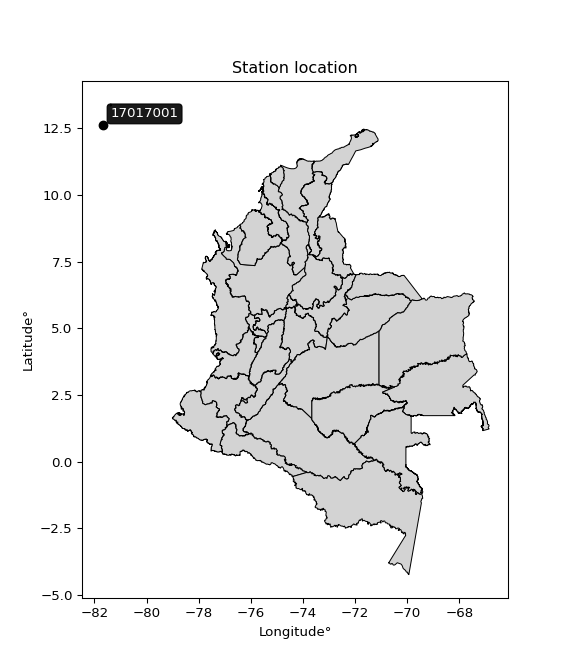

<div align="center">


</div>

# PMP Station (Rain, Pmax24h): 17017001

Probable Maximum Precipitation (PMP) is the greatest amount of rainfall for a specific duration that is meteorologically possible for a given location, acting as a "worst-case" scenario for extreme storms, crucial for designing safety-critical infrastructure like bridges, river deviations, dams, spillways, and nuclear plants to prevent catastrophic failure. PMP is calculated by hydrologists using meteorological data to determine the upper limit of extreme rainfall, often leading to the Probable Maximum Flood (PMF) for flood control design, and is increasingly being studied for climate change impacts. Probable Maximum Precipitation (PMP) is the theoretical upper limit of rainfall, a deterministic estimate for extreme events, while probability distributions (like GEV, Gumbel) describe the likelihood and frequency of various precipitation amounts, including rare ones, showing how often events occur, with PMP representing the extreme end of these distributions, used for critical infrastructure design to ensure safety against the worst conceivable weather, unlike standard statistical forecasts which cover typical probabilities.

The most common probability distributions in hydrology, used for analyzing floods, rainfall, and streamflow, include the Normal, Log-Normal, Gumbel, Gamma (including Log-Pearson Type III), and Generalized Extreme Value (GEV) distributions, often chosen based on the data´s skewness and whether modeling extremes or general conditions, with Gumbel and GEV popular for extreme events like floods, while the Normal distribution serves as a baseline, though often requiring transformations for skewed hydrological data. These distributions help in designing water infrastructure, managing water resources, and forecasting hydrologic events.

> Hydrological data often isn´t perfectly normal (it´s skewed), so different distributions are needed for different applications, such as: **Flood Frequency Analysis**: Using Gumbel, GEV, or Log-Pearson Type III for predicting extreme flood magnitudes and their return periods, **Rainfall Analysis**: Normal for annual totals, but Log-Normal, Weibull, or GEV for intensity or extreme daily rainfall, **Streamflow Modeling**: Gamma and Log-Normal for maximum flows, GEV for minimum flows, and Kappa for daily flows.

<div align="center">

</img>

</div>


## A. General information


### 1. General running parameters

• app_version: _v20260113_. • runtime: _2026-01-17 18:24:04.630693_. • Python version: _3.14.0_. • SciPy version: _1.16.3_. • Pandas version: _2.3.3_. • NumPy version: _2.3.5_. • Stations dataset (station_dataset_file): _dataset/pmax24h_in/automatic_colombia_2003_2025.csv_. • Stations catalog (station_catalog_file): _dataset/CNE.xls_. • Minimum year to eval til year_max (date_min): _1900_. • Maximum year to eval since year_min (date_max): _2025_. • Creates, save and include plots into reports (create_plot): _False_. • Plot only fit distributions with Δo > Δ (plot_only_fit): _True_. • Plot only simple graphs avoiding multiple CDFs and multiple Extreme values plots (plot_only_simple): _True_. • Eval low extreme values, if False, evaluates high extreme values (low_extreme): _False_. • Eval every SciPy distribution as logarithmic (pdist_logarithmic_on): _True_. • Standard deviation normalized (ddof): _1.0_. • Return periods to eval in years (Tr): _[2, 2.33, 5, 10, 15, 20, 25, 50, 75, 100, 200, 250, 500, 750, 1000]_. • Minimum data sample per station, 0 means any (minimum_sample): _5_. • Z-Score maximum threshold to adjust a value, 0 means disable (zscore_max): _3.5_. • Z-Score minimum threshold to adjust a value, 0 means disable (zscore_min): _-2.5_. • Avoid zeros, e.g. rain = 0 (avoid_zeros): _True_. • Avoid null values (avoid_nans): _True_. 

:file_folder:Table: [dataset.csv](../../dataset/pmax24h_in/automatic_colombia_2003_2025.csv)

> Delta Degrees of Freedom (DDOF): is a parameter used in the formulas for calculating variance and standard deviation. When ddof=0, the divisor is $N$ (the total number of observations) and this is used when your data set is the entire population. When ddof=1, the divisor is $N-1$ and this is used when your data set is a sample drawn from a larger population. Using $N-1$ provides an unbiased estimate of the population variance (known as Bessel´s correction).


### 2. Station info and location

|   id |   CODIGO | NOMBRE                        | CATEGORIA    | TECNOLOGIA                | ESTADO   | FECHA_INSTALACION   |   FECHA_SUSPENSION |   ALTITUD |   LATITUD |   LONGITUD | DEPARTAMENTO                                             | MUNICIPIO   | AREA_OPERATIVA                                         | ENTIDAD                                                                      | AREA_HIDROGRAFICA   | ZONA_HIDROGRAFICA   | SUBZONA_HIDROGRAFICA                   | CORRIENTE   | Catalogo   |   Version |
|-----:|---------:|:------------------------------|:-------------|:--------------------------|:---------|:--------------------|-------------------:|----------:|----------:|-----------:|:---------------------------------------------------------|:------------|:-------------------------------------------------------|:-----------------------------------------------------------------------------|:--------------------|:--------------------|:---------------------------------------|:------------|:-----------|----------:|
|    0 | 17017001 | JHONNY CAY  - AUT  [17017001] | Limnigráfica | Automática con Telemetría | Activa   | 06/08/2012          |                nan |         0 |   12.5993 |   -81.6894 | Archipielago De San Andres, Providencia Y Santa Catalina | San Andrés  | Area Operativa 05 - Magdalena-Cesar-Guajira-San Andrés | INSTITUTO DE INVESTIGACIONES MARINAS Y COSTERAS JOSE BENITO VIVES DE ANDREIS | Caribe              | Islas Caribe        | OTRAS ISLAS DEL CARIBE Y ZONA MARITIMA | Mar Caribe  | CNE_OE     |  20251226 |

<div align="center">

Dynamic map: [:earth_americas:Google](http://maps.google.com/maps?q=12.599305556,-81.689360833) [:earth_americas:OSM](https://www.openstreetmap.org/#map=18/12.599305556/-81.689360833&layers=P) [:earth_americas:Bing](https://www.bing.com/maps?cp=12.599305556~-81.689360833&lvl=18) [:earth_americas:Apple](https://maps.apple.com/frame?center=12.599305556%2C-81.689360833&span=0.003%2C0.006)

</div>


<div align="center">

```geojson
{
  "type": "Feature",
  "geometry": {
    "type": "Point", 
    "coordinates": [-81.689360833, 12.599305556]
  }, 
  "properties": {
    "Name": "17017001"
  }
}
```

</div>


### 3. Discrete values table and plot

<div align="center">

|               |           0 |          1 |           2 |         3 |         4 |           5 |           6 |           7 |           8 |
|:--------------|------------:|-----------:|------------:|----------:|----------:|------------:|------------:|------------:|------------:|
| Date          | 2012        | 2013       | 2014        | 2015      | 2016      | 2017        | 2018        | 2019        | 2020        |
| Value         |   24.2      |   86.1     |   69.5      |    7.5    |  104.2    |   24.6      |   24        |   10.1      |   10.1      |
| Value_initial |   24.2      |   86.1     |   69.5      |    7.5    |  104.2    |   24.6      |   24        |   10.1      |   10.1      |
| count         |    9        |    9       |    9        |    9      |    9      |    9        |    9        |    9        |    9        |
| mean          |   40.0333   |   40.0333  |   40.0333   |   40.0333 |   40.0333 |   40.0333   |   40.0333   |   40.0333   |   40.0333   |
| std           |   36.579    |   36.579   |   36.579    |   36.579  |   36.579  |   36.579    |   36.579    |   36.579    |   36.579    |
| zscore        |   -0.432854 |    1.25938 |    0.805563 |   -0.8894 |    1.7542 |   -0.421918 |   -0.438321 |   -0.818321 |   -0.818321 |


</div>


> The initial value (value_initial) correspond to the initial obtained or null completed value, and value (value) is adjusted only when the initial value is outside the valid range (outlier) definite through the Z-Score value. If Z-Score is active, values out of range or outliers are replaced with the station mean value. A Z-Score (or standard score) measures how many standard deviations a data point is from the mean of a dataset, indicating its relative position; positive scores mean above the mean, negative mean below, and a score of zero is exactly at the mean, allowing for comparison of values from different distributions. It´s calculated using the formula $z=(x–μ)/σ$, where $x$ is the data point, $μ$ is the mean, and $σ$ is the standard deviation, helping identify outliers and understand probability.
>
> <sub>**Note**: In this study, "completing" (filling gaps in) and "extending" (forecasting or lengthening the historical record) rainfall data series are avoided for certain critical analyses because they introduce artificial bias and uncertainty, which can distort the statistics of rare events (extremes), alter day-to-day variability, and compromise the integrity and homogeneity of the original data. Some reasons against Completing/Extending rainfall data are: **Distortion of Extremes and Variability**: The primary issue is that most gap-filling or extension methods rely on averaging or regression with nearby stations, which inherently smooths the data. Rainfall is highly variable in space and time, with a large percentage of zero values and occasional large storms. Infilling methods often underestimate the highest values and overestimate the lowest (zero) values, which severely distorts analyses focused on flood frequency, drought severity, and intensity-duration-frequency (IDF) curves, **Loss of Data Homogeneity**: Infilled or extended data are synthetic estimates, not actual measurements. Combining these estimates with observed data can violate the assumption of data homogeneity, which requires that the data properties do not change over time. Inhomogeneity can lead to incorrect conclusions about long-term trends or changes in climate patterns, **Propagation of Errors**: Errors and biases from the original data (e.g., wind-induced undercatch, instrument errors, site changes) or the data used for imputation can propagate through the analysis, leading to unreliable hydrological models and inaccurate predictions, **Compromised Statistical Integrity**: For statistical analyses, especially those involving the frequency of events, using artificial data can introduce time bias or autocorrelation that doesn´t exist in reality, making it difficult to assess the true probability of events, **Difficulty in Validation**: It is difficult to accurately validate the quality of filled or extended data, especially for past periods where ground-truth measurements are unavailable. The reliability of imputation techniques heavily depends on the density of the surrounding station network and the complexity of the local topography.</sub>


### 4. Active continuous probability distributions from SciPy (80 of 104 available)

A Probability Density Function (PDF) describes the relative likelihood of a continuous random variable falling within a specific range, where the total area under its curve equals 1, and the area over any interval gives the actual probability for that range. Unlike discrete probabilities (like rolling a die), a PDF shows density, not direct probability for a single point (which is zero), with higher points indicating higher likelihood, often visualized as a bell curve for normal distributions.

A log of a probability density function (log-PDF) is simply the logarithm of the PDF´s value, denoted as $log(f(x))$, useful for converting multiplication of probabilities into addition, improving numerical stability with tiny numbers, and connecting to information theory concepts like entropy. Instead of dealing with very small probabilities (e.g., 0.000001), log-PDFs use negative numbers (e.g., $log(0.00001) ≈ -11.51$ that are easier for computers to handle, preventing underflow errors and simplifying complex calculations. In this study, each active probability distribution from SciPy is also evaluated in the $log$ form.

[scipy.stats](https://docs.scipy.org/doc/scipy/reference/stats.html) is a Python´s powerful submodule within the SciPy library for comprehensive statistical analysis, offering over 130 probability distributions (like Normal, Poisson), functions for descriptive stats (mean, variance), hypothesis testing (t-tests, chi-square), random variable generation, and statistical tests, making it essential for data science, modeling, and research. It provides tools to explore, model, and draw conclusions from data efficiently, working seamlessly with NumPy.

<div align="center">

|   id | p_dist           |   n_parameter | fit_method   | label                                                                       | active   | ref                                                                                                      |
|-----:|:-----------------|--------------:|:-------------|:----------------------------------------------------------------------------|:---------|:---------------------------------------------------------------------------------------------------------|
|    0 | alpha            |             3 | MLE          | Alpha                                                                       | True     | [:mortar_board:](https://docs.scipy.org/doc/scipy/reference/generated/scipy.stats.alpha.html)            |
|    1 | anglit           |             2 | MM           | Anglit                                                                      | True     | [:mortar_board:](https://docs.scipy.org/doc/scipy/reference/generated/scipy.stats.anglit.html)           |
|    2 | arcsine          |             2 | MM           | Arcsine                                                                     | True     | [:mortar_board:](https://docs.scipy.org/doc/scipy/reference/generated/scipy.stats.arcsine.html)          |
|    3 | argus            |             3 | MLE          | Argus                                                                       | True     | [:mortar_board:](https://docs.scipy.org/doc/scipy/reference/generated/scipy.stats.argus.html)            |
|    4 | beta             |             4 | MLE          | Beta                                                                        | True     | [:mortar_board:](https://docs.scipy.org/doc/scipy/reference/generated/scipy.stats.beta.html)             |
|    5 | betaprime        |             4 | MLE          | Beta prime                                                                  | True     | [:mortar_board:](https://docs.scipy.org/doc/scipy/reference/generated/scipy.stats.betaprime.html)        |
|    6 | bradford         |             3 | MLE          | Bradford                                                                    | True     | [:mortar_board:](https://docs.scipy.org/doc/scipy/reference/generated/scipy.stats.bradford.html)         |
|    7 | burr             |             4 | MLE          | Burr (Type III)                                                             | True     | [:mortar_board:](https://docs.scipy.org/doc/scipy/reference/generated/scipy.stats.burr.html)             |
|    8 | burr12           |             4 | MLE          | Burr (Type III) 12                                                          | True     | [:mortar_board:](https://docs.scipy.org/doc/scipy/reference/generated/scipy.stats.burr12.html)           |
|    9 | cosine           |             2 | MLE          | Cosine                                                                      | True     | [:mortar_board:](https://docs.scipy.org/doc/scipy/reference/generated/scipy.stats.cosine.html)           |
|   10 | crystalball      |             4 | MLE          | Crystalball                                                                 | True     | [:mortar_board:](https://docs.scipy.org/doc/scipy/reference/generated/scipy.stats.crystalball.html)      |
|   11 | dgamma           |             3 | MLE          | Double gamma                                                                | True     | [:mortar_board:](https://docs.scipy.org/doc/scipy/reference/generated/scipy.stats.dgamma.html)           |
|   12 | dweibull         |             3 | MLE          | Double Weibull                                                              | True     | [:mortar_board:](https://docs.scipy.org/doc/scipy/reference/generated/scipy.stats.dweibull.html)         |
|   13 | erlang           |             3 | MLE          | Erlang                                                                      | True     | [:mortar_board:](https://docs.scipy.org/doc/scipy/reference/generated/scipy.stats.erlang.html)           |
|   14 | exponnorm        |             3 | MLE          | Exponentially modified Normal                                               | True     | [:mortar_board:](https://docs.scipy.org/doc/scipy/reference/generated/scipy.stats.exponnorm.html)        |
|   15 | exponpow         |             3 | MLE          | Exponential power                                                           | True     | [:mortar_board:](https://docs.scipy.org/doc/scipy/reference/generated/scipy.stats.exponpow.html)         |
|   16 | exponweib        |             4 | MLE          | Exponentiated Weibull                                                       | True     | [:mortar_board:](https://docs.scipy.org/doc/scipy/reference/generated/scipy.stats.exponweib.html)        |
|   17 | f                |             4 | MLE          | F                                                                           | True     | [:mortar_board:](https://docs.scipy.org/doc/scipy/reference/generated/scipy.stats.f.html)                |
|   18 | fatiguelife      |             3 | MLE          | Fatigue-life (Birnbaum-Saunders)                                            | True     | [:mortar_board:](https://docs.scipy.org/doc/scipy/reference/generated/scipy.stats.fatiguelife.html)      |
|   19 | foldnorm         |             3 | MM           | Fold Normal                                                                 | True     | [:mortar_board:](https://docs.scipy.org/doc/scipy/reference/generated/scipy.stats.foldnorm.html)         |
|   20 | gamma            |             3 | MLE          | Gamma                                                                       | True     | [:mortar_board:](https://docs.scipy.org/doc/scipy/reference/generated/scipy.stats.gamma.html)            |
|   21 | gausshyper       |             6 | MLE          | Gauss hypergeometric                                                        | True     | [:mortar_board:](https://docs.scipy.org/doc/scipy/reference/generated/scipy.stats.gausshyper.html)       |
|   22 | genexpon         |             5 | MLE          | Generalized exponential                                                     | True     | [:mortar_board:](https://docs.scipy.org/doc/scipy/reference/generated/scipy.stats.genexpon.html)         |
|   23 | genextreme       |             3 | MLE          | Generalized exponential                                                     | True     | [:mortar_board:](https://docs.scipy.org/doc/scipy/reference/generated/scipy.stats.genextreme.html)       |
|   24 | gengamma         |             4 | MLE          | Generalized gamma                                                           | True     | [:mortar_board:](https://docs.scipy.org/doc/scipy/reference/generated/scipy.stats.gengamma.html)         |
|   25 | genhalflogistic  |             3 | MLE          | Generalized half-logistic                                                   | True     | [:mortar_board:](https://docs.scipy.org/doc/scipy/reference/generated/scipy.stats.genhalflogistic.html)  |
|   26 | genlogistic      |             3 | MLE          | Generalized logistic                                                        | True     | [:mortar_board:](https://docs.scipy.org/doc/scipy/reference/generated/scipy.stats.genlogistic.html)      |
|   27 | gennorm          |             3 | MLE          | Generalized Normal                                                          | True     | [:mortar_board:](https://docs.scipy.org/doc/scipy/reference/generated/scipy.stats.gennorm.html)          |
|   28 | genpareto        |             3 | MLE          | Generalized Pareto                                                          | True     | [:mortar_board:](https://docs.scipy.org/doc/scipy/reference/generated/scipy.stats.genpareto.html)        |
|   29 | gompertz         |             3 | MLE          | Gompertz (or truncated Gumbel)                                              | True     | [:mortar_board:](https://docs.scipy.org/doc/scipy/reference/generated/scipy.stats.gompertz.html)         |
|   30 | gumbel_l         |             2 | MM           | Gumbel Left Skew                                                            | True     | [:mortar_board:](https://docs.scipy.org/doc/scipy/reference/generated/scipy.stats.gumbel_l.html)         |
|   31 | gumbel_r         |             2 | MM           | Gumbel Right Skew                                                           | True     | [:mortar_board:](https://docs.scipy.org/doc/scipy/reference/generated/scipy.stats.gumbel_r.html)         |
|   32 | halfgennorm      |             3 | MLE          | Upper half of a generalized normal                                          | True     | [:mortar_board:](https://docs.scipy.org/doc/scipy/reference/generated/scipy.stats.halfgennorm.html)      |
|   33 | halflogistic     |             2 | MM           | Half-logistic                                                               | True     | [:mortar_board:](https://docs.scipy.org/doc/scipy/reference/generated/scipy.stats.halflogistic.html)     |
|   34 | halfnorm         |             2 | MM           | Half Normal                                                                 | True     | [:mortar_board:](https://docs.scipy.org/doc/scipy/reference/generated/scipy.stats.halfnorm.html)         |
|   35 | hypsecant        |             2 | MM           | hyperbolic secant                                                           | True     | [:mortar_board:](https://docs.scipy.org/doc/scipy/reference/generated/scipy.stats.hypsecant.html)        |
|   36 | invgamma         |             3 | MLE          | Inverted gamma                                                              | True     | [:mortar_board:](https://docs.scipy.org/doc/scipy/reference/generated/scipy.stats.invgamma.html)         |
|   37 | invgauss         |             3 | MLE          | Inverse Gaussian                                                            | True     | [:mortar_board:](https://docs.scipy.org/doc/scipy/reference/generated/scipy.stats.invgauss.html)         |
|   38 | invweibull       |             3 | MLE          | Inverted Weibull                                                            | True     | [:mortar_board:](https://docs.scipy.org/doc/scipy/reference/generated/scipy.stats.invweibull.html)       |
|   39 | johnsonsb        |             4 | MLE          | Johnson SB                                                                  | True     | [:mortar_board:](https://docs.scipy.org/doc/scipy/reference/generated/scipy.stats.johnsonsb.html)        |
|   40 | johnsonsu        |             4 | MLE          | Johnson Su                                                                  | True     | [:mortar_board:](https://docs.scipy.org/doc/scipy/reference/generated/scipy.stats.johnsonsu.html)        |
|   41 | kappa3           |             3 | MLE          | Kappa 3                                                                     | True     | [:mortar_board:](https://docs.scipy.org/doc/scipy/reference/generated/scipy.stats.kappa3.html)           |
|   42 | kappa4           |             4 | MLE          | Kappa 4                                                                     | True     | [:mortar_board:](https://docs.scipy.org/doc/scipy/reference/generated/scipy.stats.kappa4.html)           |
|   43 | ksone            |             3 | MLE          | Kolmogorov-Smirnov one-sided test statistic distribution                    | True     | [:mortar_board:](https://docs.scipy.org/doc/scipy/reference/generated/scipy.stats.ksone.html)            |
|   44 | kstwobign        |             2 | MLE          | Limiting distribution of scaled Kolmogorov-Smirnov two-sided test statistic | True     | [:mortar_board:](https://docs.scipy.org/doc/scipy/reference/generated/scipy.stats.kstwobign.html)        |
|   45 | laplace          |             2 | MM           | Laplace                                                                     | True     | [:mortar_board:](https://docs.scipy.org/doc/scipy/reference/generated/scipy.stats.laplace.html)          |
|   46 | levy_l           |             2 | MLE          | Left-skewed Levy                                                            | True     | [:mortar_board:](https://docs.scipy.org/doc/scipy/reference/generated/scipy.stats.levy_l.html)           |
|   47 | loggamma         |             3 | MLE          | Log gamma                                                                   | True     | [:mortar_board:](https://docs.scipy.org/doc/scipy/reference/generated/scipy.stats.loggamma.html)         |
|   48 | logistic         |             2 | MM           | Logistic (or Sech-squared)                                                  | True     | [:mortar_board:](https://docs.scipy.org/doc/scipy/reference/generated/scipy.stats.logistic.html)         |
|   49 | loglaplace       |             3 | MLE          | Log-Laplace                                                                 | True     | [:mortar_board:](https://docs.scipy.org/doc/scipy/reference/generated/scipy.stats.loglaplace.html)       |
|   50 | lomax            |             3 | MLE          | Lomax (Pareto of the second kind)                                           | True     | [:mortar_board:](https://docs.scipy.org/doc/scipy/reference/generated/scipy.stats.lomax.html)            |
|   51 | maxwell          |             2 | MM           | Maxwell                                                                     | True     | [:mortar_board:](https://docs.scipy.org/doc/scipy/reference/generated/scipy.stats.maxwell.html)          |
|   52 | mielke           |             4 | MLE          | Mielke Beta-Kappa / Dagum                                                   | True     | [:mortar_board:](https://docs.scipy.org/doc/scipy/reference/generated/scipy.stats.mielke.html)           |
|   53 | moyal            |             2 | MM           | Moyal                                                                       | True     | [:mortar_board:](https://docs.scipy.org/doc/scipy/reference/generated/scipy.stats.moyal.html)            |
|   54 | nakagami         |             3 | MLE          | Nakagami                                                                    | True     | [:mortar_board:](https://docs.scipy.org/doc/scipy/reference/generated/scipy.stats.nakagami.html)         |
|   55 | ncf              |             5 | MLE          | Non-central F distribution                                                  | True     | [:mortar_board:](https://docs.scipy.org/doc/scipy/reference/generated/scipy.stats.ncf.html)              |
|   56 | nct              |             4 | MLE          | Non-central Student’s t                                                     | True     | [:mortar_board:](https://docs.scipy.org/doc/scipy/reference/generated/scipy.stats.nct.html)              |
|   57 | norm             |             2 | MM           | Normal                                                                      | True     | [:mortar_board:](https://docs.scipy.org/doc/scipy/reference/generated/scipy.stats.norm.html)             |
|   58 | pearson3         |             3 | MM           | Pearson type III                                                            | True     | [:mortar_board:](https://docs.scipy.org/doc/scipy/reference/generated/scipy.stats.pearson3.html)         |
|   59 | powerlaw         |             3 | MLE          | Power-function                                                              | True     | [:mortar_board:](https://docs.scipy.org/doc/scipy/reference/generated/scipy.stats.powerlaw.html)         |
|   60 | rayleigh         |             2 | MM           | Rayleigh                                                                    | True     | [:mortar_board:](https://docs.scipy.org/doc/scipy/reference/generated/scipy.stats.rayleigh.html)         |
|   61 | rdist            |             3 | MLE          | R-distributed (symmetric beta)                                              | True     | [:mortar_board:](https://docs.scipy.org/doc/scipy/reference/generated/scipy.stats.rdist.html)            |
|   62 | rice             |             3 | MLE          | Rice                                                                        | True     | [:mortar_board:](https://docs.scipy.org/doc/scipy/reference/generated/scipy.stats.rice.html)             |
|   63 | semicircular     |             2 | MM           | Semicircular                                                                | True     | [:mortar_board:](https://docs.scipy.org/doc/scipy/reference/generated/scipy.stats.semicircular.html)     |
|   64 | skewnorm         |             3 | MLE          | Skew normal                                                                 | True     | [:mortar_board:](https://docs.scipy.org/doc/scipy/reference/generated/scipy.stats.skewnorm.html)         |
|   65 | t                |             3 | MLE          | Student’s t                                                                 | True     | [:mortar_board:](https://docs.scipy.org/doc/scipy/reference/generated/scipy.stats.t.html)                |
|   66 | trapezoid        |             4 | MLE          | Trapezoid                                                                   | True     | [:mortar_board:](https://docs.scipy.org/doc/scipy/reference/generated/scipy.stats.trapezoid.html)        |
|   67 | triang           |             3 | MLE          | Triangular                                                                  | True     | [:mortar_board:](https://docs.scipy.org/doc/scipy/reference/generated/scipy.stats.triang.html)           |
|   68 | truncexpon       |             3 | MLE          | Truncated exponential                                                       | True     | [:mortar_board:](https://docs.scipy.org/doc/scipy/reference/generated/scipy.stats.truncexpon.html)       |
|   69 | truncnorm        |             4 | MLE          | Truncated normal                                                            | True     | [:mortar_board:](https://docs.scipy.org/doc/scipy/reference/generated/scipy.stats.truncnorm.html)        |
|   70 | truncpareto      |             4 | MLE          | Upper truncated Pareto                                                      | True     | [:mortar_board:](https://docs.scipy.org/doc/scipy/reference/generated/scipy.stats.truncpareto.html)      |
|   71 | truncweibull_min |             5 | MLE          | Doubly truncated Weibull minimum                                            | True     | [:mortar_board:](https://docs.scipy.org/doc/scipy/reference/generated/scipy.stats.truncweibull_min.html) |
|   72 | tukeylambda      |             3 | MLE          | Tukey-Lamdba                                                                | True     | [:mortar_board:](https://docs.scipy.org/doc/scipy/reference/generated/scipy.stats.tukeylambda.html)      |
|   73 | uniform          |             2 | MLE          | Uniform                                                                     | True     | [:mortar_board:](https://docs.scipy.org/doc/scipy/reference/generated/scipy.stats.uniform.html)          |
|   74 | vonmises         |             3 | MLE          | Von Mises                                                                   | True     | [:mortar_board:](https://docs.scipy.org/doc/scipy/reference/generated/scipy.stats.vonmises.html)         |
|   75 | vonmises_line    |             3 | MLE          | Von Mises line                                                              | True     | [:mortar_board:](https://docs.scipy.org/doc/scipy/reference/generated/scipy.stats.vonmises_line.html)    |
|   76 | wald             |             2 | MM           | Wald                                                                        | True     | [:mortar_board:](https://docs.scipy.org/doc/scipy/reference/generated/scipy.stats.wald.html)             |
|   77 | weibull_max      |             3 | MLE          | Weibull maximum                                                             | True     | [:mortar_board:](https://docs.scipy.org/doc/scipy/reference/generated/scipy.stats.weibull_max.html)      |
|   78 | weibull_min      |             3 | MLE          | Weibull minimum                                                             | True     | [:mortar_board:](https://docs.scipy.org/doc/scipy/reference/generated/scipy.stats.weibull_min.html)      |
|   79 | wrapcauchy       |             3 | MLE          | Wrapped  Cauchy                                                             | True     | [:mortar_board:](https://docs.scipy.org/doc/scipy/reference/generated/scipy.stats.wrapcauchy.html)       |

</div>

> **n_parameter:** # arguments & localization & scale.
>
> **Fit methods:** (MLE) maximum likelihood, (MM) L-moments.
>
>**Inactive** (With the only purpose of prevent loops, zero divisions, infinite values, over high estimated values or horizontal trending for recurrence intervals estimations, the follow distributions were disabled.)**:** lognorm, norminvgauss, powernorm, powerlognorm, cauchy, halfcauchy, foldcauchy, skewcauchy, chi2, expon, fisk, genhyperbolic, geninvgauss, gibrat, kstwo, laplace_asymmetric, levy, levy_stable, ncx2, pareto, rel_breitwigner, recipinvgauss, studentized_range, loguniform, 


## B. Probability (PDF) vs. Empirical (EDF) distributions functions

A continuous probability distribution (CPD) describes probabilities for variables that can take any value within a range (like rain any time), unlike discrete variables with specific outcomes (like temperature). It uses a Probability Density Function (PDF), a curve where the total area under it equals 1, and the probability of the variable falling within an interval (a to b) is found by calculating the area under the curve between those points. A key feature is that the probability of hitting any single exact value is zero, so probabilities are always expressed for ranges, e.g., $P(a ≤ X ≤ b)$.

<div align="center">

Distributions parameters from station values
|     |   station | p_dist              |   n |              loc |          scale | shape                  | shape1                | shape2                | shape3             |
|----:|----------:|:--------------------|----:|-----------------:|---------------:|:-----------------------|:----------------------|:----------------------|:-------------------|
|   0 |  17017001 | alpha               |   9 |     -0.033602    |   14.5318      | 5.779289777722297e-09  |                       |                       |                    |
|   1 |  17017001 | anglit              |   9 |     40.0333      |  100.888       |                        |                       |                       |                    |
|   2 |  17017001 | arcsine             |   9 |     -8.73859     |   97.5439      |                        |                       |                       |                    |
|   3 |  17017001 | argus               |   9 |    -33.9899      |  143.167       | 0.00023410205941402755 |                       |                       |                    |
|   4 |  17017001 | beta                |   9 |     -2.20449     |  106.404       | 0.19174127225419074    | 0.4115529785375147    |                       |                    |
|   5 |  17017001 | betaprime           |   9 |      2.35728     |    0.110758    | 163.44752006266182     | 1.2691131394178583    |                       |                    |
|   6 |  17017001 | bradford            |   9 |      7.49997     |   96.7001      | 1.9671321997083293     |                       |                       |                    |
|   7 |  17017001 | burr                |   9 |      0.0322786   |    0.754922    | 1.289986674018952      | 55.15382380549863     |                       |                    |
|   8 |  17017001 | burr12              |   9 |     -1.32629     |    8.71559     | 284.61355378323765     | 0.0029607915470793045 |                       |                    |
|   9 |  17017001 | cosine              |   9 |     43.9836      |   28.3002      |                        |                       |                       |                    |
|  10 |  17017001 | crystalball         |   9 |     40.0333      |   34.487       | 34474.771544276504     | 17013.046175424424    |                       |                    |
|  11 |  17017001 | dgamma              |   9 |     49.6342      |    3.15947     | 10.838754406743032     |                       |                       |                    |
|  12 |  17017001 | dweibull            |   9 |     52.1456      |   38.8613      | 3.880255335883973      |                       |                       |                    |
|  13 |  17017001 | erlang              |   9 |      7.5         |   32.0392      | 0.4663817000478244     |                       |                       |                    |
|  14 |  17017001 | exponnorm           |   9 |      7.46224     |    0.0122274   | 2653.409744687093      |                       |                       |                    |
|  15 |  17017001 | exponpow            |   9 |      7.5         |   46.9612      | 0.40207081759864394    |                       |                       |                    |
|  16 |  17017001 | exponweib           |   9 |      7.5         |   40.8402      | 0.7023949946971362     | 0.7820768398993623    |                       |                    |
|  17 |  17017001 | f                   |   9 |      4.0376      |   11.2788      | 201.2303640651548      | 1.9674382623806197    |                       |                    |
|  18 |  17017001 | fatiguelife         |   9 |      6.73197     |   11.1244      | 1.8964103077374486     |                       |                       |                    |
|  19 |  17017001 | foldnorm            |   9 |     -8.73956     |   45.0351      | 0.8713792595074639     |                       |                       |                    |
|  20 |  17017001 | gamma               |   9 |      7.5         |   33.477       | 0.5924810945758814     |                       |                       |                    |
|  21 |  17017001 | gausshyper          |   9 |    -14.1097      |  118.31        | 1.1766662893227156     | 0.4640856293725888    | 1.0021921818859292    | 1.14363856100255   |
|  22 |  17017001 | genexpon            |   9 |      7.5         |  479.805       | 14.74798533201863      | 0.0520220888143102    | 0.5198467468106607    |                    |
|  23 |  17017001 | genextreme          |   9 |     14.683       |   11.1717      | -1.1807406597485952    |                       |                       |                    |
|  24 |  17017001 | gengamma            |   9 |      7.5         |   40.9114      | 0.7015446831479359     | 0.7806724098771033    |                       |                    |
|  25 |  17017001 | genhalflogistic     |   9 |     -2.2389      |  111.738       | 1.0497883702284625     |                       |                       |                    |
|  26 |  17017001 | genlogistic         |   9 |   -149.579       |   23.7686      | 1515.9012644506083     |                       |                       |                    |
|  27 |  17017001 | gennorm             |   9 |     24           |    1.41589     | 0.3970618822771905     |                       |                       |                    |
|  28 |  17017001 | genpareto           |   9 |      1.09767     |  119.2         | -1.1561332264194497    |                       |                       |                    |
|  29 |  17017001 | gompertz            |   9 |      7.5         |   85.1389      | 1.544071513682225      |                       |                       |                    |
|  30 |  17017001 | gumbel_l            |   9 |     55.5543      |   26.8894      |                        |                       |                       |                    |
|  31 |  17017001 | gumbel_r            |   9 |     24.5124      |   26.8894      |                        |                       |                       |                    |
|  32 |  17017001 | halfgennorm         |   9 |      7.5         |    0.178948    | 0.2849446867870511     |                       |                       |                    |
|  33 |  17017001 | halflogistic        |   9 |     -0.84174     |   29.4851      |                        |                       |                       |                    |
|  34 |  17017001 | halfnorm            |   9 |     -5.6139      |   57.2103      |                        |                       |                       |                    |
|  35 |  17017001 | hypsecant           |   9 |     40.0333      |   21.9551      |                        |                       |                       |                    |
|  36 |  17017001 | invgamma            |   9 |      3.99776     |   11.0724      | 0.9826659727200979     |                       |                       |                    |
|  37 |  17017001 | invgauss            |   9 |      5.0626      |   12.0946      | 2.891436004348127      |                       |                       |                    |
|  38 |  17017001 | invweibull          |   9 |      5.22154     |    9.4614      | 0.8469173959787272     |                       |                       |                    |
|  39 |  17017001 | johnsonsb           |   9 |      7.5         |  457.235       | 0.5426076858913749     | 0.11474894192731372   |                       |                    |
|  40 |  17017001 | johnsonsu           |   9 |      7.28979     |    0.0166383   | -3.867193662245353     | 0.5341531745823862    |                       |                    |
|  41 |  17017001 | kappa3              |   9 |      7.5         |   96.6754      | 8639.174251792112      |                       |                       |                    |
|  42 |  17017001 | kappa4              |   9 |     -2.13377     |  105.496       | 1.1003658804760117     | 0.97497432567326      |                       |                    |
|  43 |  17017001 | ksone               |   9 |     -2.17        |  116.04        | 1.0                    |                       |                       |                    |
|  44 |  17017001 | kstwobign           |   9 |    -59.0257      |  113.877       |                        |                       |                       |                    |
|  45 |  17017001 | laplace             |   9 |     40.0333      |   24.386       |                        |                       |                       |                    |
|  46 |  17017001 | levy_l              |   9 |    110.659       |   31.673       |                        |                       |                       |                    |
|  47 |  17017001 | loggamma            |   9 | -11544.9         | 1531.38        | 1929.5562653766456     |                       |                       |                    |
|  48 |  17017001 | logistic            |   9 |     40.0333      |   19.0137      |                        |                       |                       |                    |
|  49 |  17017001 | loglaplace          |   9 |     -0.0460898   |   24.2461      | 1.3404573318819222     |                       |                       |                    |
|  50 |  17017001 | lomax               |   9 |      7.5         |   58.4285      | 2.64738110277185       |                       |                       |                    |
|  51 |  17017001 | maxwell             |   9 |    -41.6863      |   51.2102      |                        |                       |                       |                    |
|  52 |  17017001 | mielke              |   9 |      5.48813     |    0.213748    | 19.567716731069993     | 0.8356867930611965    |                       |                    |
|  53 |  17017001 | moyal               |   9 |     20.3115      |   15.5246      |                        |                       |                       |                    |
|  54 |  17017001 | nakagami            |   9 |      7.5         |   45.3996      | 0.1729301286509939     |                       |                       |                    |
|  55 |  17017001 | ncf                 |   9 |      2.21029     |    2.25839e-06 | 1.641817168953659e-05  | 2.493338428671135     | 110.0744191406119     |                    |
|  56 |  17017001 | nct                 |   9 |      0.445428    |    0.291099    | 1.0015970549185709     | 46.82368273608165     |                       |                    |
|  57 |  17017001 | norm                |   9 |     40.0333      |   34.487       |                        |                       |                       |                    |
|  58 |  17017001 | pearson3            |   9 |     40.0334      |   34.487       | 0.7793530097215239     |                       |                       |                    |
|  59 |  17017001 | powerlaw            |   9 |      7.5         |   96.7         | 0.17185447687513555    |                       |                       |                    |
|  60 |  17017001 | rayleigh            |   9 |    -25.9423      |   52.6409      |                        |                       |                       |                    |
|  61 |  17017001 | rdist               |   9 |     -1.2799      |   25.8799      | 1.3592581834705886     |                       |                       |                    |
|  62 |  17017001 | rice                |   9 |    -14.2686      |   45.4865      | 0.0007354587799748887  |                       |                       |                    |
|  63 |  17017001 | semicircular        |   9 |     40.0333      |   68.9739      |                        |                       |                       |                    |
|  64 |  17017001 | skewnorm            |   9 |      7.49999     |   47.4073      | 22776949.117682435     |                       |                       |                    |
|  65 |  17017001 | t                   |   9 |     40.0336      |   34.4868      | 2381894096.83669       |                       |                       |                    |
|  66 |  17017001 | trapezoid           |   9 |     -2.2785      |  116.04        | 0.9999999999999999     | 1.0                   |                       |                    |
|  67 |  17017001 | triang              |   9 |     -1.93508     |  106.135       | 0.9999999475762993     |                       |                       |                    |
|  68 |  17017001 | truncexpon          |   9 |      7.49996     |   95.2647      | 1.0150671500015351     |                       |                       |                    |
|  69 |  17017001 | truncnorm           |   9 |  -2031.87        |  271.761       | 7.5042865511819565     | 7.860119206379299     |                       |                    |
|  70 |  17017001 | truncpareto         |   9 |    -51.4516      |   58.9516      | 1.453532357201127      | 2.6403300086280774    |                       |                    |
|  71 |  17017001 | truncweibull_min    |   9 |      7.45583     |   80.6074      | 0.46849573727164984    | 0.0005479684140371687 | 1.2001897036335984    |                    |
|  72 |  17017001 | tukeylambda         |   9 |     -1.36154     |   31.6309      | 1.2183740139345334     |                       |                       |                    |
|  73 |  17017001 | uniform             |   9 |      7.5         |   96.7         |                        |                       |                       |                    |
|  74 |  17017001 | vonmises            |   9 |     -1.44968     |    1           | 0.8858869559650743     |                       |                       |                    |
|  75 |  17017001 | vonmises_line       |   9 |     55.8359      |   15.3956      | 2.7077823878008437e-07 |                       |                       |                    |
|  76 |  17017001 | wald                |   9 |      5.54636     |   34.487       |                        |                       |                       |                    |
|  77 |  17017001 | weibull_max         |   9 |    104.2         |    1.72262     | 0.2343441184686042     |                       |                       |                    |
|  78 |  17017001 | weibull_min         |   9 |      7.5         |   36.1801      | 0.5682915601430714     |                       |                       |                    |
|  79 |  17017001 | wrapcauchy          |   9 |      7.5         |   15.3903      | 0.5689921914434486     |                       |                       |                    |
|  80 |  17017001 | logalpha            |   9 |     -7.02825     |  115.105       | 11.252112821427552     |                       |                       |                    |
|  81 |  17017001 | loganglit           |   9 |      3.28336     |    2.70065     |                        |                       |                       |                    |
|  82 |  17017001 | logarcsine          |   9 |      1.97778     |    2.61116     |                        |                       |                       |                    |
|  83 |  17017001 | logargus            |   9 |      1.32552     |    3.48238     | 2.0055101802329367e-05 |                       |                       |                    |
|  84 |  17017001 | logbeta             |   9 |      2.0149      |    2.64522     | 0.5788573199634017     | 0.6539283517484158    |                       |                    |
|  85 |  17017001 | logbetaprime        |   9 |     -0.401161    |   19.6372      | 18.522674519022004     | 99.71272807817451     |                       |                    |
|  86 |  17017001 | logbradford         |   9 |      2.01489     |    2.63142     | 1.006760451270332      |                       |                       |                    |
|  87 |  17017001 | logburr             |   9 |     -1.32805     |    1.02733     | 5.38264002161457       | 1680.8596657325343    |                       |                    |
|  88 |  17017001 | logburr12           |   9 |      1.87381     |  824.688       | 1.4937427066473545     | 12045.512730169818    |                       |                    |
|  89 |  17017001 | logcosine           |   9 |      3.30321     |    0.740325    |                        |                       |                       |                    |
|  90 |  17017001 | logcrystalball      |   9 |      3.28336     |    0.923174    | 7.6163531600729        | 191.55065985550124    |                       |                    |
|  91 |  17017001 | logdgamma           |   9 |      3.18635     |    0.811117    | 0.6217726496778011     |                       |                       |                    |
|  92 |  17017001 | logdweibull         |   9 |      3.20275     |    0.735549    | 0.9712488822304646     |                       |                       |                    |
|  93 |  17017001 | logerlang           |   9 |     -0.918845    |    0.203932    | 20.50445428335796      |                       |                       |                    |
|  94 |  17017001 | logexponnorm        |   9 |      3.17424     |    0.916707    | 0.11904359686643087    |                       |                       |                    |
|  95 |  17017001 | logexponpow         |   9 |      2.0149      |    2.16802     | 0.9246448824249397     |                       |                       |                    |
|  96 |  17017001 | logexponweib        |   9 |      2.0149      |    0.127242    | 1.0830494114820302     | 0.239175327318356     |                       |                    |
|  97 |  17017001 | logf                |   9 |      2.0149      |    1.23065     | 1.0794877754842662     | 156.81717696052266    |                       |                    |
|  98 |  17017001 | logfatiguelife      |   9 |      1.25126     |    1.79287     | 0.5153592097043453     |                       |                       |                    |
|  99 |  17017001 | logfoldnorm         |   9 |      1.29654     |    0.950995    | 2.075363049668025      |                       |                       |                    |
| 100 |  17017001 | loggamma            |   9 |     -0.0088307   |    0.250155    | 13.075038081861138     |                       |                       |                    |
| 101 |  17017001 | loggausshyper       |   9 |      2.0036      |    2.64272     | 0.9480163916502359     | 0.7996667107208179    | 1.0148541422735176    | 0.7667758212906872 |
| 102 |  17017001 | loggenexpon         |   9 |      2.01433     |    0.0103574   | 0.005090088085533021   | 0.8054730022605925    | 4.094067026568708e-05 |                    |
| 103 |  17017001 | loggenextreme       |   9 |      3.03929     |    0.977644    | 0.4614011904216455     |                       |                       |                    |
| 104 |  17017001 | loggengamma         |   9 |      2.0149      |    1.08675     | 0.6096091685521781     | 0.3807362970387588    |                       |                    |
| 105 |  17017001 | loggenhalflogistic  |   9 |      1.85771     |    2.89886     | 1.039536844953618      |                       |                       |                    |
| 106 |  17017001 | loggenlogistic      |   9 |     -2.45233     |    0.785703    | 832.6540101156065      |                       |                       |                    |
| 107 |  17017001 | loggennorm          |   9 |      3.18636     |    0.703562    | 0.9651499485771392     |                       |                       |                    |
| 108 |  17017001 | loggenpareto        |   9 |     -0.00285612  |    8.49339     | -1.8268630849894145    |                       |                       |                    |
| 109 |  17017001 | loggompertz         |   9 |      2.0149      |    1.73918     | 0.7215769634230776     |                       |                       |                    |
| 110 |  17017001 | loggumbel_l         |   9 |      3.69884     |    0.719796    |                        |                       |                       |                    |
| 111 |  17017001 | loggumbel_r         |   9 |      2.86789     |    0.719796    |                        |                       |                       |                    |
| 112 |  17017001 | loghalfgennorm      |   9 |      2.0149      |    0.995727    | 0.8734876408993839     |                       |                       |                    |
| 113 |  17017001 | loghalflogistic     |   9 |      2.18917     |    0.789288    |                        |                       |                       |                    |
| 114 |  17017001 | loghalfnorm         |   9 |      2.06144     |    1.53145     |                        |                       |                       |                    |
| 115 |  17017001 | loghypsecant        |   9 |      3.28336     |    0.587711    |                        |                       |                       |                    |
| 116 |  17017001 | loginvgamma         |   9 |     -1.76538     |  145.673       | 29.84186813841385      |                       |                       |                    |
| 117 |  17017001 | loginvgauss         |   9 |      0.917297    |   12.6233      | 0.18743656467091835    |                       |                       |                    |
| 118 |  17017001 | loginvweibull       |   9 |     -4.70607e+07 |    4.70607e+07 | 59804942.35273066      |                       |                       |                    |
| 119 |  17017001 | logjohnsonsb        |   9 |      2.01471     |    2.6316      | -0.07909567400454054   | 0.1024450259632979    |                       |                    |
| 120 |  17017001 | logjohnsonsu        |   9 |      2.08333e+07 |    1.88911e+06 | 70009743.08635265      | 22615574.70161887     |                       |                    |
| 121 |  17017001 | logkappa3           |   9 |      2.01489     |    2.63135     | 54581.419113596494     |                       |                       |                    |
| 122 |  17017001 | logkappa4           |   9 |      1.70476     |    3.05429     | 1.1132589658120187     | 1.0359185279180154    |                       |                    |
| 123 |  17017001 | logksone            |   9 |      1.68438     |    3.19797     | 1.0                    |                       |                       |                    |
| 124 |  17017001 | logkstwobign        |   9 |      0.125986    |    3.60518     |                        |                       |                       |                    |
| 125 |  17017001 | loglaplace          |   9 |      3.28336     |    0.652783    |                        |                       |                       |                    |
| 126 |  17017001 | loglevy_l           |   9 |      4.75135     |    0.500859    |                        |                       |                       |                    |
| 127 |  17017001 | logloggamma         |   9 |   -233.912       |   33.1874      | 1270.9383436551052     |                       |                       |                    |
| 128 |  17017001 | loglogistic         |   9 |      3.28336     |    0.508973    |                        |                       |                       |                    |
| 129 |  17017001 | logloglaplace       |   9 |     -0.0174059   |    3.20376     | 4.298037641923036      |                       |                       |                    |
| 130 |  17017001 | loglomax            |   9 |      2.0149      |   17.3799      | 14.129556071006967     |                       |                       |                    |
| 131 |  17017001 | logmaxwell          |   9 |      1.09583     |    1.37083     |                        |                       |                       |                    |
| 132 |  17017001 | logmielke           |   9 |  -1679.51        | 1678.53        | 282355.5779889829      | 2151.427512768395     |                       |                    |
| 133 |  17017001 | logmoyal            |   9 |      2.75543     |    0.415574    |                        |                       |                       |                    |
| 134 |  17017001 | lognakagami         |   9 |      2.0149      |    1.73582     | 0.09475286385406781    |                       |                       |                    |
| 135 |  17017001 | logncf              |   9 |     -0.523776    |    3.70763     | 59.63548650892888      | 75.08680897763969     | 4.002346257389671e-09 |                    |
| 136 |  17017001 | lognct              |   9 |     -2.79157     |    0.389972    | 27.285894290470466     | 15.142877975677052    |                       |                    |
| 137 |  17017001 | lognorm             |   9 |      3.28336     |    0.923174    |                        |                       |                       |                    |
| 138 |  17017001 | logpearson3         |   9 |      3.28336     |    0.923175    | 0.16207887749870595    |                       |                       |                    |
| 139 |  17017001 | logpowerlaw         |   9 |      2.0149      |    2.63141     | 0.20765893568221763    |                       |                       |                    |
| 140 |  17017001 | lograyleigh         |   9 |      1.51728     |    1.40913     |                        |                       |                       |                    |
| 141 |  17017001 | logrdist            |   9 |      3.23258     |    1.22293     | 1.103816949821701      |                       |                       |                    |
| 142 |  17017001 | logrice             |   9 |      1.59092     |    1.18449     | 0.8056231431758701     |                       |                       |                    |
| 143 |  17017001 | logsemicircular     |   9 |      3.28336     |    1.84635     |                        |                       |                       |                    |
| 144 |  17017001 | logskewnorm         |   9 |      2.0149      |    1.56881     | 15395816.547425695     |                       |                       |                    |
| 145 |  17017001 | logt                |   9 |      3.28336     |    0.923175    | 29888501080.02359      |                       |                       |                    |
| 146 |  17017001 | logtrapezoid        |   9 |      1.75176     |    3.15769     | 1.0                    | 1.0                   |                       |                    |
| 147 |  17017001 | logtriang           |   9 |      1.58783     |    3.0585      | 0.999995385895297      |                       |                       |                    |
| 148 |  17017001 | logtruncexpon       |   9 |      2.01477     |    2.29242     | 1.147937229693666      |                       |                       |                    |
| 149 |  17017001 | logtruncnorm        |   9 |     -0.367954    |    2.14706     | 1.2484478309064952     | 2.335428117082922     |                       |                    |
| 150 |  17017001 | logtruncpareto      |   9 |      2.01477     |    0.000137    | 0.12520252632737236    | 19208.29850728937     |                       |                    |
| 151 |  17017001 | logtruncweibull_min |   9 |      2.01232     |    2.60876     | 0.8945040920545495     | 0.0009882324285790068 | 1.009669881089506     |                    |
| 152 |  17017001 | logtukeylambda      |   9 |      3.32746     |    1.44611     | 1.0964917735616533     |                       |                       |                    |
| 153 |  17017001 | loguniform          |   9 |      2.0149      |    2.63141     |                        |                       |                       |                    |
| 154 |  17017001 | logvonmises         |   9 |     -3.03022     |    1           | 1.6032667896150052     |                       |                       |                    |
| 155 |  17017001 | logvonmises_line    |   9 |      3.33062     |    0.418805    | 0.021582323118366074   |                       |                       |                    |
| 156 |  17017001 | logwald             |   9 |      2.36016     |    0.923202    |                        |                       |                       |                    |
| 157 |  17017001 | logweibull_max      |   9 |      4.64631     |    1.28284     | 0.9590013988284373     |                       |                       |                    |
| 158 |  17017001 | logweibull_min      |   9 |      2.0149      |    1.24013     | 0.8993142496665772     |                       |                       |                    |
| 159 |  17017001 | logwrapcauchy       |   9 |      2.0149      |    0.418802    | 0.5                    |                       |                       |                    |

</div>

> **loc** (Location parameter): This shifts the distribution along the x-axis. For many common distributions, like the normal (Gaussian) distribution, loc represents the mean $μ$. For others, like the uniform distribution, it might represent the minimum value, or for the beta distribution, the left end of the support interval.
>
> **scale** (Scale parameter): This determines the width or spread of the distribution. For the normal distribution, scale represents the standard deviation $σ$. For a uniform distribution, it defines the length of the interval (from $loc$ to $loc + scale$).
>
> **shape** (Shape parameters): Refers to parameters that define the specific form of a probability distribution, distinct from its location (loc) and scale (scale). These parameters are required arguments for most distribution functions. For example, a normal (Gaussian) distribution is fully defined by its location (mean) and scale (standard deviation), so it has no specific shape parameters beyond loc and scale. However, other distributions have intrinsic properties that need specification, as Gamma distribution that takes a shape parameter, often named $a$ or $alpha$.


### 0. Cumulative distribution values - CDF (160 evaluated)

Cumulative Distribution Function (CDF), denoted as $F$<sub>$X$</sub>$(x)$, is a function that gives the probability that a random variable $X$ will take a value less than or equal to a specific value, $x$ (i.e., $(P(X≥x)$. It essentially "accumulates" probabilities from a given point up to the far right (positive infinity), providing a complete picture of the distribution´s probabilities for both discrete (like rain) and continuous (like temperature) variables, helping to find probabilities over ranges or above certain values. Each station is evaluated separately ordering the $x$ values ascending, calculating the CDF and PDF values for the activated distributions and their logarithmic forms.

<div align="center">

CDF ordered by x ascending and calculating $log(f(x))$ separately
|   id |   Station |   date |     x |   count |    mean |    std |    zscore |   Value_initial |   station |   m |     alpha |   alpha_pdf |   anglit |   anglit_pdf |   arcsine |   arcsine_pdf |    argus |   argus_pdf |     beta |    beta_pdf |   betaprime |   betaprime_pdf |   bradford |   bradford_pdf |      burr |   burr_pdf |    burr12 |   burr12_pdf |   cosine |   cosine_pdf |   crystalball |   crystalball_pdf |   dgamma |   dgamma_pdf |   dweibull |   dweibull_pdf |      erlang |   erlang_pdf |   exponnorm |   exponnorm_pdf |    exponpow |   exponpow_pdf |   exponweib |   exponweib_pdf |         f |      f_pdf |   fatiguelife |   fatiguelife_pdf |   foldnorm |   foldnorm_pdf |       gamma |       gamma_pdf |   gausshyper |   gausshyper_pdf |    genexpon |   genexpon_pdf |   genextreme |   genextreme_pdf |    gengamma |    gengamma_pdf |   genhalflogistic |   genhalflogistic_pdf |   genlogistic |   genlogistic_pdf |   gennorm |   gennorm_pdf |   genpareto |   genpareto_pdf |    gompertz |   gompertz_pdf |   gumbel_l |   gumbel_l_pdf |   gumbel_r |   gumbel_r_pdf |   halfgennorm |   halfgennorm_pdf |   halflogistic |   halflogistic_pdf |   halfnorm |   halfnorm_pdf |   hypsecant |   hypsecant_pdf |   invgamma |   invgamma_pdf |   invgauss |   invgauss_pdf |   invweibull |   invweibull_pdf |   johnsonsb |   johnsonsb_pdf |   johnsonsu |   johnsonsu_pdf |      kappa3 |   kappa3_pdf |      kappa4 |   kappa4_pdf |     ksone |   ksone_pdf |   kstwobign |   kstwobign_pdf |   laplace |   laplace_pdf |   levy_l |   levy_l_pdf |   loggamma |   loggamma_pdf |   logistic |   logistic_pdf |   loglaplace |   loglaplace_pdf |       lomax |   lomax_pdf |   maxwell |   maxwell_pdf |    mielke |   mielke_pdf |    moyal |   moyal_pdf |    nakagami |   nakagami_pdf |       ncf |    ncf_pdf |       nct |    nct_pdf |     norm |   norm_pdf |   pearson3 |   pearson3_pdf |   powerlaw |   powerlaw_pdf |   rayleigh |   rayleigh_pdf |    rdist |    rdist_pdf |     rice |   rice_pdf |   semicircular |   semicircular_pdf |   skewnorm |   skewnorm_pdf |        t |      t_pdf |   trapezoid |   trapezoid_pdf |     triang |   triang_pdf |   truncexpon |   truncexpon_pdf |   truncnorm |   truncnorm_pdf |   truncpareto |   truncpareto_pdf |   truncweibull_min |   truncweibull_min_pdf |   tukeylambda |   tukeylambda_pdf |   uniform |   uniform_pdf |   vonmises |   vonmises_pdf |   vonmises_line |   vonmises_line_pdf |        wald |    wald_pdf |   weibull_max |   weibull_max_pdf |   weibull_min |   weibull_min_pdf |   wrapcauchy |   wrapcauchy_pdf |   logalpha |   logalpha_pdf |   loganglit |   loganglit_pdf |   logarcsine |   logarcsine_pdf |   logargus |   logargus_pdf |     logbeta |   logbeta_pdf |   logbetaprime |   logbetaprime_pdf |   logbradford |   logbradford_pdf |   logburr |   logburr_pdf |   logburr12 |   logburr12_pdf |   logcosine |   logcosine_pdf |   logcrystalball |   logcrystalball_pdf |   logdgamma |   logdgamma_pdf |   logdweibull |   logdweibull_pdf |   logerlang |   logerlang_pdf |   logexponnorm |   logexponnorm_pdf |   logexponpow |   logexponpow_pdf |   logexponweib |   logexponweib_pdf |        logf |    logf_pdf |   logfatiguelife |   logfatiguelife_pdf |   logfoldnorm |   logfoldnorm_pdf |   loggausshyper |   loggausshyper_pdf |   loggenexpon |   loggenexpon_pdf |   loggenextreme |   loggenextreme_pdf |   loggengamma |   loggengamma_pdf |   loggenhalflogistic |   loggenhalflogistic_pdf |   loggenlogistic |   loggenlogistic_pdf |   loggennorm |   loggennorm_pdf |   loggenpareto |   loggenpareto_pdf |   loggompertz |   loggompertz_pdf |   loggumbel_l |   loggumbel_l_pdf |   loggumbel_r |   loggumbel_r_pdf |   loghalfgennorm |   loghalfgennorm_pdf |   loghalflogistic |   loghalflogistic_pdf |   loghalfnorm |   loghalfnorm_pdf |   loghypsecant |   loghypsecant_pdf |   loginvgamma |   loginvgamma_pdf |   loginvgauss |   loginvgauss_pdf |   loginvweibull |   loginvweibull_pdf |   logjohnsonsb |   logjohnsonsb_pdf |   logjohnsonsu |   logjohnsonsu_pdf |   logkappa3 |   logkappa3_pdf |   logkappa4 |   logkappa4_pdf |   logksone |   logksone_pdf |   logkstwobign |   logkstwobign_pdf |   loglevy_l |   loglevy_l_pdf |   logloggamma |   logloggamma_pdf |   loglogistic |   loglogistic_pdf |   logloglaplace |   logloglaplace_pdf |    loglomax |   loglomax_pdf |   logmaxwell |   logmaxwell_pdf |   logmielke |   logmielke_pdf |   logmoyal |   logmoyal_pdf |   lognakagami |   lognakagami_pdf |    logncf |   logncf_pdf |   lognct |   lognct_pdf |   lognorm |   lognorm_pdf |   logpearson3 |   logpearson3_pdf |   logpowerlaw |   logpowerlaw_pdf |   lograyleigh |   lograyleigh_pdf |   logrdist |   logrdist_pdf |   logrice |   logrice_pdf |   logsemicircular |   logsemicircular_pdf |   logskewnorm |   logskewnorm_pdf |      logt |   logt_pdf |   logtrapezoid |   logtrapezoid_pdf |   logtriang |   logtriang_pdf |   logtruncexpon |   logtruncexpon_pdf |   logtruncnorm |   logtruncnorm_pdf |   logtruncpareto |   logtruncpareto_pdf |   logtruncweibull_min |   logtruncweibull_min_pdf |   logtukeylambda |   logtukeylambda_pdf |   loguniform |   loguniform_pdf |   logvonmises |   logvonmises_pdf |   logvonmises_line |   logvonmises_line_pdf |   logwald |   logwald_pdf |   logweibull_max |   logweibull_max_pdf |   logweibull_min |   logweibull_min_pdf |   logwrapcauchy |   logwrapcauchy_pdf |
|-----:|----------:|-------:|------:|--------:|--------:|-------:|----------:|----------------:|----------:|----:|----------:|------------:|---------:|-------------:|----------:|--------------:|---------:|------------:|---------:|------------:|------------:|----------------:|-----------:|---------------:|----------:|-----------:|----------:|-------------:|---------:|-------------:|--------------:|------------------:|---------:|-------------:|-----------:|---------------:|------------:|-------------:|------------:|----------------:|------------:|---------------:|------------:|----------------:|----------:|-----------:|--------------:|------------------:|-----------:|---------------:|------------:|----------------:|-------------:|-----------------:|------------:|---------------:|-------------:|-----------------:|------------:|----------------:|------------------:|----------------------:|--------------:|------------------:|----------:|--------------:|------------:|----------------:|------------:|---------------:|-----------:|---------------:|-----------:|---------------:|--------------:|------------------:|---------------:|-------------------:|-----------:|---------------:|------------:|----------------:|-----------:|---------------:|-----------:|---------------:|-------------:|-----------------:|------------:|----------------:|------------:|----------------:|------------:|-------------:|------------:|-------------:|----------:|------------:|------------:|----------------:|----------:|--------------:|---------:|-------------:|-----------:|---------------:|-----------:|---------------:|-------------:|-----------------:|------------:|------------:|----------:|--------------:|----------:|-------------:|---------:|------------:|------------:|---------------:|----------:|-----------:|----------:|-----------:|---------:|-----------:|-----------:|---------------:|-----------:|---------------:|-----------:|---------------:|---------:|-------------:|---------:|-----------:|---------------:|-------------------:|-----------:|---------------:|---------:|-----------:|------------:|----------------:|-----------:|-------------:|-------------:|-----------------:|------------:|----------------:|--------------:|------------------:|-------------------:|-----------------------:|--------------:|------------------:|----------:|--------------:|-----------:|---------------:|----------------:|--------------------:|------------:|------------:|--------------:|------------------:|--------------:|------------------:|-------------:|-----------------:|-----------:|---------------:|------------:|----------------:|-------------:|-----------------:|-----------:|---------------:|------------:|--------------:|---------------:|-------------------:|--------------:|------------------:|----------:|--------------:|------------:|----------------:|------------:|----------------:|-----------------:|---------------------:|------------:|----------------:|--------------:|------------------:|------------:|----------------:|---------------:|-------------------:|--------------:|------------------:|---------------:|-------------------:|------------:|------------:|-----------------:|---------------------:|--------------:|------------------:|----------------:|--------------------:|--------------:|------------------:|----------------:|--------------------:|--------------:|------------------:|---------------------:|-------------------------:|-----------------:|---------------------:|-------------:|-----------------:|---------------:|-------------------:|--------------:|------------------:|--------------:|------------------:|--------------:|------------------:|-----------------:|---------------------:|------------------:|----------------------:|--------------:|------------------:|---------------:|-------------------:|--------------:|------------------:|--------------:|------------------:|----------------:|--------------------:|---------------:|-------------------:|---------------:|-------------------:|------------:|----------------:|------------:|----------------:|-----------:|---------------:|---------------:|-------------------:|------------:|----------------:|--------------:|------------------:|--------------:|------------------:|----------------:|--------------------:|------------:|---------------:|-------------:|-----------------:|------------:|----------------:|-----------:|---------------:|--------------:|------------------:|----------:|-------------:|---------:|-------------:|----------:|--------------:|--------------:|------------------:|--------------:|------------------:|--------------:|------------------:|-----------:|---------------:|----------:|--------------:|------------------:|----------------------:|--------------:|------------------:|----------:|-----------:|---------------:|-------------------:|------------:|----------------:|----------------:|--------------------:|---------------:|-------------------:|-----------------:|---------------------:|----------------------:|--------------------------:|-----------------:|---------------------:|-------------:|-----------------:|--------------:|------------------:|-------------------:|-----------------------:|----------:|--------------:|-----------------:|---------------------:|-----------------:|---------------------:|----------------:|--------------------:|
|    0 |  17017001 |   2015 |   7.5 |       9 | 40.0333 | 36.579 | -0.8894   |             7.5 |  17017001 |   1 | 0.0537389 |  0.0317904  | 0.199425 |   0.00792102 |  0.267557 |    0.00876025 | 0.123293 |  0.00581202 | 0.476331 | 0.00986741  |   0.0506165 |      0.0318481  | 6.4155e-07 |     0.0187042  | 0.0610238 | 0.0287439  | 0.0106595 |  0.0919254   | 0.141938 |   0.00718681 |      0.172751 |        0.00741333 | 0.104966 |   0.0120464  |  0.0901373 |     0.0134219  | 2.14185e-08 |  1.12469e+07 |  0.00116334 |      0.0307553  | 2.49522e-07 |    5.64782e+07 | 7.02737e-10 | 434634          | 0.0413103 | 0.0372015  |     0.0308596 |        0.0972851  |   0.195773 |     0.0119225  | 2.55001e-10 | 85052.2         |    0.0978338 |      0.00515408  | 6.13581e-12 |     0.0307375  |    0.0354604 |       0.0440143  | 8.22896e-10 | 507422          |         0.0456716 |            0.00491513 |      0.129633 |        0.0111352  |  0.192379 |   0.00734615  |   0.0539415 |      0.00846221 | 5.81866e-12 |     0.0181359  |   0.154175 |    0.00526705  |   0.152187 |     0.0106553  |      0        |        0.474156   |       0.140521 |         0.0166229  |   0.181304 |     0.0135849  |    0.142241 |      0.00626525 |  0.0409221 |     0.037102   |   0.036273 |     0.042587   |    0.0354602 |       0.0440152  | 1.75825e-05 |     9.89621e+09 |   0.0161257 |      0.102076   | 2.71929e-10 |    0.010333  | 3.16702e-15 |   0.269752   | 0.0833333 |  0.00861772 |    0.115497 |      0.010816   |  0.131698 |    0.00540054 | 0.420493 |   0.00183791 |  0.0652881 |       0.194577 |   0.153028 |     0.00681668 |    0.0716253 |        0.109723  | 1.44506e-08 |  0.0453098  |  0.18001  |    0.00906226 | 0.0352592 |   0.0456525  | 0.130847 |  0.0124013  | 1.68644e-06 |    3.28353e+08 | 0.0544948 | 0.0306778  | 0.0534819 | 0.0338136  | 0.172751 | 0.00741333 |   0.169074 |     0.00994381 | 0.00118067 |    2.28449e+11 |   0.182739 |     0.00986301 | 0.634513 |    0.0157298 | 0.108202 | 0.00938277 |       0.211261 |         0.00813863 |  0         |     0.0168304  | 0.172748 | 0.00741328 |  0.00710116 |      0.0014524  | 0.00790266 |   0.00167516 |   6.0306e-07 |       0.0164628  | 1.68125e-05 |      0.0299482  |   5.89278e-10 |        0.0326074  |        4.14085e-09 |             0.481409   |      0.66348  |         0.018568  | 0         |     0.0103413 |    1.97327 |      0.0600254 |     0.000318721 |           0.0103377 | 7.02386e-05 | 0.000332835 |     0.0765401 |       0.000476694 |   3.63659e-10 |   232684          |  1.26908e-08 |       0.0376452  |  0.0699341 |       0.188848 |   0.0964058 |        0.218574 |     0.076093 |         1.02966  |  0.0582036 |       0.167165 | 5.47701e-10 | 713912        |      0.0681149 |           0.194659 |   4.41318e-06 |          0.549288 | 0.0533572 |      0.25157  |    0.028057 |        0.292836 |   0.0661631 |        0.178737 |        0.0847176 |             0.168138 |   0.0603208 |       0.0878071 |      0.101677 |         0.132421  |   0.0749902 |        0.194553 |      0.0846338 |           0.168243 |   3.11618e-15 |          6.48825  |    0.000179868 |        1.04899e+11 | 9.21641e-05 | 811.968     |        0.0439287 |             0.258058 |     0.0910986 |          0.183177 |      0.00632106 |            0.529299 |   0.000281926 |          0.491482 |       0.0952967 |            0.154465 |   0.000299669 |        1.5662e+11 |            0.0279004 |                 0.182643 |        0.0595152 |             0.213362 |     0.102688 |        0.136293  |       0.267693 |        0.152335    |    1.1937e-10 |          0.414896 |     0.0918803 |          0.121595 |      0.037976 |          0.172565 |      7.82897e-09 |            0.938455  |         0         |              0        |      0        |          0        |      0.0732181 |           0.123486 |     0.0644532 |          0.198393 |     0.0493565 |          0.236083 |       0.0592281 |            0.212733 |       0.146149 |      120.084       |      0.0851295 |           0.168423 | 5.35607e-06 |        0.379957 | 4.66201e-15 |       13.8015   |   0.103354 |       0.312698 |      0.0534641 |           0.226096 |    0.33122  |       0.0569171 |     0.0872997 |          0.168352 |     0.0764069 |          0.13865  |        0.070693 |           0.149506  | 3.80497e-11 |      0.812983  |     0.070163 |         0.208967 |   0.0598277 |        0.21328  |  0.0147893 |       0.119963 |   0.000930967 |       3.97271e+11 | 0.0650821 |     0.198439 | 0.067658 |     0.193919 | 0.0847176 |      0.168138 |     0.0805569 |          0.175176 |   0.000530462 |       2.48047e+11 |     0.0604507 |          0.235461 |  0.0223342 |    2.35165     | 0.0453199 |      0.209175 |          0.100018 |              0.250548 |      0        |          0.508591 | 0.0847176 |   0.168138 |     0.00694444 |          0.0527812 |   0.0194979 |       0.0913098 |     8.72288e-05 |            0.638917 |    0           |           0        |         0        |         1288.74      |           4.85806e-07 |                  1.12127  |       0.00286286 |             0.441    |     0        |         0.380025 |       1.09821 |          0.153227 |        2.46632e-08 |               0.371864 |  0        |     0         |         0.136463 |            0.0990535 |      1.28586e-14 |           26.0397    |        0        |            1.14007  |
|    1 |  17017001 |   2019 |  10.1 |       9 | 40.0333 | 36.579 | -0.818321 |            10.1 |  17017001 |   2 | 0.151565  |  0.0403818  | 0.22041  |   0.00821748 |  0.289664 |    0.00826654 | 0.138831 |  0.00613953 | 0.499768 | 0.00827646  |   0.148801  |      0.0405606  | 0.0473891  |     0.0177646  | 0.146976  | 0.0354899  | 0.204036  |  0.0587018   | 0.161263 |   0.00767584 |      0.192708 |        0.00793717 | 0.139687 |   0.0146586  |  0.128662  |     0.0161177  | 0.341182    |  0.0578888   |  0.0780843  |      0.0284154  | 0.30697     |    0.0457551   | 0.211552    |      0.0421538  | 0.158945  | 0.0474213  |     0.252006  |        0.0591474  |   0.226681 |     0.0118507  | 0.239523    |     0.0519698   |    0.111331  |      0.00522704  | 0.0768078   |     0.0283769  |    0.173354  |       0.0527385  | 0.231956    |      0.0456043  |         0.0586174 |            0.0050441  |      0.160176 |        0.0123348  |  0.213216 |   0.00874671  |   0.0759836 |      0.00849341 | 0.0467525   |     0.0178241  |   0.168432 |    0.00570397  |   0.181022 |     0.0115061  |      0.252053 |        0.0555775  |       0.183446 |         0.016387   |   0.216429 |     0.0134302  |    0.159424 |      0.00696158 |  0.158531  |     0.0474574  |   0.168537 |     0.0509233  |    0.173356  |       0.0527391  | 0.48008     |     0.0176856   |   0.224493  |      0.0569322  | 0.0268659   |    0.010333  | 0.0375922   |   0.0131352  | 0.105739  |  0.00861772 |    0.145145 |      0.0119607  |  0.146515 |    0.00600816 | 0.425354 |   0.00190209 |  0.140506  |       0.310403 |   0.171603 |     0.0074765  |    0.113001  |        0.173106  | 0.108865    |  0.0386569  |  0.204223 |    0.00955521 | 0.176929  |   0.0535244  | 0.164708 |  0.0135996  | 0.296523    |    0.0394254   | 0.146897  | 0.0378677  | 0.158179  | 0.0430827  | 0.192708 | 0.00793717 |   0.195747 |     0.0105604  | 0.537169   |    0.0355057   |   0.20895  |     0.0102889  | 0.675987 |    0.0162034 | 0.133683 | 0.0102033  |       0.232655 |         0.00831539 |  0.0437373 |     0.0168051  | 0.192705 | 0.00793713 |  0.0113794  |      0.00183858 | 0.0128582  |   0.00213679 |   0.0422252  |       0.0160196  | 0.0751516   |      0.0278722  |   0.0804142   |        0.0293311  |        0.241902    |             0.0460498  |      0.71192  |         0.0187012 | 0.0268873 |     0.0103413 |    2.21631 |      0.21033   |     0.0271967   |           0.0103377 | 0.0152431   | 0.0139078   |     0.0778027 |       0.000494776 |   0.200649    |        0.0391288  |  0.0951699   |       0.0346255  |  0.142151  |       0.296685 |   0.170699  |        0.278633 |     0.23312  |         0.364635 |  0.118045  |       0.234156 | 0.212453    |      0.424263 |      0.142628  |           0.30547  |   0.154833    |          0.493134 | 0.156857  |      0.429368 |    0.143532 |        0.451808 |   0.132157  |        0.264542 |        0.146487  |             0.248589 |   0.0937336 |       0.141592  |      0.150049 |         0.197047  |   0.148254  |        0.297652 |      0.146455  |           0.248828 |   0.158741    |          0.488732 |    0.686249    |        0.304258    | 0.357995    |   0.595684  |        0.151706  |             0.444367 |     0.15613   |          0.255652 |      0.141155   |            0.419833 |   0.148039    |          0.496744 |       0.150341  |            0.216969 |   0.667481    |        0.350401   |            0.0854321 |                 0.204592 |        0.144734  |             0.355638 |     0.15263  |        0.203948  |       0.314262 |        0.16084     |    0.126006   |          0.430299 |     0.135613  |          0.175009 |      0.114969 |          0.345499 |      0.233053    |            0.662477  |         0.0779889 |              0.629629 |      0.130236 |          0.514042 |      0.12057   |           0.200282 |     0.141621  |          0.319058 |     0.146006  |          0.401575 |       0.144243  |            0.354925 |       0.385907 |        0.148366    |      0.146952  |           0.248633 | 0.113093    |        0.379957 | 0.136711    |        0.41347  |   0.196423 |       0.312698 |      0.144442  |           0.377049 |    0.349579 |       0.0668967 |     0.14883   |          0.246708 |     0.12927   |          0.22115  |        0.1272   |           0.234646  | 0.21331     |      0.628797  |     0.147611 |         0.309239 |   0.145005  |        0.355564 |  0.0884141 |       0.383093 |   0.600456    |       0.381345    | 0.14197   |     0.317113 | 0.142431 |     0.308231 | 0.146487  |      0.248589 |     0.145516  |          0.262633 |   0.635988    |       0.443731    |     0.147218  |          0.34154  |  0.2138    |    0.404905    | 0.126044  |      0.327706 |          0.181397 |              0.293287 |      0.15047  |          0.499521 | 0.146487  |   0.248589 |     0.0315381  |          0.112481  |   0.0561446 |       0.154945  |     0.178422    |            0.561123 |    2.40139e-06 |           0.886263 |         0.871344 |            0.226561  |           0.209321    |                  0.588653 |       0.120939   |             0.383484 |     0.113108 |         0.380025 |       1.15523 |          0.233522 |        0.110875    |               0.373812 |  0        |     0         |         0.16946  |            0.123612  |      0.242012    |            0.634616  |        0.267045 |            0.579213 |
|    2 |  17017001 |   2020 |  10.1 |       9 | 40.0333 | 36.579 | -0.818321 |            10.1 |  17017001 |   3 | 0.151565  |  0.0403818  | 0.22041  |   0.00821748 |  0.289664 |    0.00826654 | 0.138831 |  0.00613953 | 0.499768 | 0.00827646  |   0.148801  |      0.0405606  | 0.0473891  |     0.0177646  | 0.146976  | 0.0354899  | 0.204036  |  0.0587018   | 0.161263 |   0.00767584 |      0.192708 |        0.00793717 | 0.139687 |   0.0146586  |  0.128662  |     0.0161177  | 0.341182    |  0.0578888   |  0.0780843  |      0.0284154  | 0.30697     |    0.0457551   | 0.211552    |      0.0421538  | 0.158945  | 0.0474213  |     0.252006  |        0.0591474  |   0.226681 |     0.0118507  | 0.239523    |     0.0519698   |    0.111331  |      0.00522704  | 0.0768078   |     0.0283769  |    0.173354  |       0.0527385  | 0.231956    |      0.0456043  |         0.0586174 |            0.0050441  |      0.160176 |        0.0123348  |  0.213216 |   0.00874671  |   0.0759836 |      0.00849341 | 0.0467525   |     0.0178241  |   0.168432 |    0.00570397  |   0.181022 |     0.0115061  |      0.252053 |        0.0555775  |       0.183446 |         0.016387   |   0.216429 |     0.0134302  |    0.159424 |      0.00696158 |  0.158531  |     0.0474574  |   0.168537 |     0.0509233  |    0.173356  |       0.0527391  | 0.48008     |     0.0176856   |   0.224493  |      0.0569322  | 0.0268659   |    0.010333  | 0.0375922   |   0.0131352  | 0.105739  |  0.00861772 |    0.145145 |      0.0119607  |  0.146515 |    0.00600816 | 0.425354 |   0.00190209 |  0.140506  |       0.310403 |   0.171603 |     0.0074765  |    0.113001  |        0.173106  | 0.108865    |  0.0386569  |  0.204223 |    0.00955521 | 0.176929  |   0.0535244  | 0.164708 |  0.0135996  | 0.296523    |    0.0394254   | 0.146897  | 0.0378677  | 0.158179  | 0.0430827  | 0.192708 | 0.00793717 |   0.195747 |     0.0105604  | 0.537169   |    0.0355057   |   0.20895  |     0.0102889  | 0.675987 |    0.0162034 | 0.133683 | 0.0102033  |       0.232655 |         0.00831539 |  0.0437373 |     0.0168051  | 0.192705 | 0.00793713 |  0.0113794  |      0.00183858 | 0.0128582  |   0.00213679 |   0.0422252  |       0.0160196  | 0.0751516   |      0.0278722  |   0.0804142   |        0.0293311  |        0.241902    |             0.0460498  |      0.71192  |         0.0187012 | 0.0268873 |     0.0103413 |    2.21631 |      0.21033   |     0.0271967   |           0.0103377 | 0.0152431   | 0.0139078   |     0.0778027 |       0.000494776 |   0.200649    |        0.0391288  |  0.0951699   |       0.0346255  |  0.142151  |       0.296685 |   0.170699  |        0.278633 |     0.23312  |         0.364635 |  0.118045  |       0.234156 | 0.212453    |      0.424263 |      0.142628  |           0.30547  |   0.154833    |          0.493134 | 0.156857  |      0.429368 |    0.143532 |        0.451808 |   0.132157  |        0.264542 |        0.146487  |             0.248589 |   0.0937336 |       0.141592  |      0.150049 |         0.197047  |   0.148254  |        0.297652 |      0.146455  |           0.248828 |   0.158741    |          0.488732 |    0.686249    |        0.304258    | 0.357995    |   0.595684  |        0.151706  |             0.444367 |     0.15613   |          0.255652 |      0.141155   |            0.419833 |   0.148039    |          0.496744 |       0.150341  |            0.216969 |   0.667481    |        0.350401   |            0.0854321 |                 0.204592 |        0.144734  |             0.355638 |     0.15263  |        0.203948  |       0.314262 |        0.16084     |    0.126006   |          0.430299 |     0.135613  |          0.175009 |      0.114969 |          0.345499 |      0.233053    |            0.662477  |         0.0779889 |              0.629629 |      0.130236 |          0.514042 |      0.12057   |           0.200282 |     0.141621  |          0.319058 |     0.146006  |          0.401575 |       0.144243  |            0.354925 |       0.385907 |        0.148366    |      0.146952  |           0.248633 | 0.113093    |        0.379957 | 0.136711    |        0.41347  |   0.196423 |       0.312698 |      0.144442  |           0.377049 |    0.349579 |       0.0668967 |     0.14883   |          0.246708 |     0.12927   |          0.22115  |        0.1272   |           0.234646  | 0.21331     |      0.628797  |     0.147611 |         0.309239 |   0.145005  |        0.355564 |  0.0884141 |       0.383093 |   0.600456    |       0.381345    | 0.14197   |     0.317113 | 0.142431 |     0.308231 | 0.146487  |      0.248589 |     0.145516  |          0.262633 |   0.635988    |       0.443731    |     0.147218  |          0.34154  |  0.2138    |    0.404905    | 0.126044  |      0.327706 |          0.181397 |              0.293287 |      0.15047  |          0.499521 | 0.146487  |   0.248589 |     0.0315381  |          0.112481  |   0.0561446 |       0.154945  |     0.178422    |            0.561123 |    2.40139e-06 |           0.886263 |         0.871344 |            0.226561  |           0.209321    |                  0.588653 |       0.120939   |             0.383484 |     0.113108 |         0.380025 |       1.15523 |          0.233522 |        0.110875    |               0.373812 |  0        |     0         |         0.16946  |            0.123612  |      0.242012    |            0.634616  |        0.267045 |            0.579213 |
|    3 |  17017001 |   2018 |  24   |       9 | 40.0333 | 36.579 | -0.438321 |            24   |  17017001 |   4 | 0.545414  |  0.0167199  | 0.34374  |   0.00941549 |  0.393376 |    0.00691059 | 0.23571  |  0.00776018 | 0.586116 | 0.00493549  |   0.553007  |      0.017621   | 0.266111   |     0.0140038  | 0.530633  | 0.0179942  | 0.592988  |  0.0135425   | 0.284342 |   0.00990286 |      0.320998 |        0.0103829  | 0.394913 |   0.0168099  |  0.375636  |     0.0148103  | 0.711356    |  0.0139941   |  0.399342   |      0.0185136  | 0.60481     |    0.0121948   | 0.514966    |      0.0132698  | 0.566468  | 0.0159066  |     0.592407  |        0.0121418  |   0.38761  |     0.0112361  | 0.619795    |     0.0161581   |    0.186369  |      0.00556267  | 0.397811    |     0.0185109  |    0.571442  |       0.0144221  | 0.552066    |      0.013576   |         0.134001  |            0.0058321  |      0.360306 |        0.015469   |  0.5      |   0.104031    |   0.195291  |      0.00867874 | 0.281225    |     0.0158234  |   0.26603  |    0.00844227  |   0.36087  |     0.0136787  |      0.595557 |        0.0125791  |       0.39799  |         0.0142717  |   0.395285 |     0.0121978  |    0.285818 |      0.0113381  |  0.566327  |     0.0159102  |   0.574694 |     0.0157425  |    0.571444  |       0.0144219  | 0.565783    |     0.00283909  |   0.577365  |      0.0125119  | 0.170495    |    0.010333  | 0.201208    |   0.0110554  | 0.225526  |  0.00861772 |    0.337561 |      0.0148068  |  0.259077 |    0.010624   | 0.454528 |   0.00231831 |  0.499595  |       0.447813 |   0.30085  |     0.0110625  |    0.425508  |        0.651837  | 0.482365    |  0.0182891  |  0.350831 |    0.0112604  | 0.573446  |   0.0142261  | 0.374547 |  0.0153841  | 0.56001     |    0.0115119   | 0.533726  | 0.0174393  | 0.563193  | 0.0165876  | 0.320998 | 0.0103829  |   0.357924 |     0.0123328  | 0.737948   |    0.00768604  |   0.362403 |     0.0114913  | 0.964227 |    0.0406105 | 0.29806  | 0.0129831  |       0.353358 |         0.00897703 |  0.272196  |     0.0158413  | 0.320995 | 0.0103829  |  0.0512845  |      0.00390315 | 0.0597114  |   0.00460468 |   0.249415   |       0.0138447  | 0.396688    |      0.0189538  |   0.39861     |        0.0177977  |        0.551225    |             0.0132051  |      0.985665 |         0.0227021 | 0.170631  |     0.0103413 |    4.59995 |      0.306221  |     0.170891    |           0.0103377 | 0.395004    | 0.0241491   |     0.0854606 |       0.000614225 |   0.472739    |        0.0116234  |  0.362133    |       0.00897169 |  0.489747  |       0.44068  |   0.461045  |        0.369155 |     0.474298 |         0.244604 |  0.392867  |       0.388056 | 0.492753    |      0.280199 |      0.49337   |           0.437268 |   0.528512    |          0.380127 | 0.555489  |      0.390034 |    0.545588 |        0.410481 |   0.446316  |        0.426895 |        0.45459   |             0.429339 |   0.467825  |       2.39547   |      0.481833 |         0.701448  |   0.492646  |        0.437286 |      0.454792  |           0.429472 |   0.529832    |          0.368754 |    0.80328     |        0.0680772   | 0.660625    |   0.217393  |        0.555594  |             0.39811  |     0.46138   |          0.417649 |      0.467717   |            0.348207 |   0.541473    |          0.388992 |       0.421698  |            0.39855  |   0.805259    |        0.0812022  |            0.299103  |                 0.298281 |        0.52578   |             0.430034 |     0.494227 |        0.69003   |       0.4679   |        0.198374    |    0.496845   |          0.407469 |     0.384328  |          0.414876 |      0.522089 |          0.471404 |      0.623922    |            0.29852   |         0.555595  |              0.437935 |      0.534072 |          0.39939  |      0.443266  |           0.533029 |     0.503027  |          0.438588 |     0.540422  |          0.414681 |       0.52488   |            0.429951 |       0.459004 |        0.0626338   |      0.454668  |           0.428514 | 0.441953    |        0.379957 | 0.468059    |        0.365477 |   0.46707  |       0.312698 |      0.529468  |           0.423769 |    0.427399 |       0.122018  |     0.453489  |          0.42512  |     0.448457  |          0.485966 |        0.494457 |           0.665067  | 0.599613    |      0.30509   |     0.488857 |         0.42368  |   0.526505  |      inf        |  0.547566  |       0.481827 |   0.774784    |       0.121415    | 0.501215  |     0.437667 | 0.497685 |     0.440305 | 0.45459   |      0.429339 |     0.465181  |          0.433091 |   0.844061    |       0.150691    |     0.500689  |          0.417617 |  0.484806  |    0.278804    | 0.483912  |      0.437612 |          0.463709 |              0.344238 |      0.541562 |          0.386369 | 0.45459   |   0.429339 |     0.204022   |          0.286088  |   0.270335  |       0.339996  |     0.582929    |            0.384669 |    0.588754    |           0.493976 |         0.955861 |            0.048897  |           0.605093    |                  0.362417 |       0.444757   |             0.36987  |     0.442026 |         0.380025 |       1.46626 |          0.448998 |        0.440793    |               0.387718 |  0.618415 |     0.514426  |         0.320388 |            0.238188  |      0.610931    |            0.283971  |        0.480483 |            0.13048  |
|    4 |  17017001 |   2012 |  24.2 |       9 | 40.0333 | 36.579 | -0.432854 |            24.2 |  17017001 |   5 | 0.548735  |  0.0164946  | 0.345625 |   0.0094277  |  0.394757 |    0.00690023 | 0.237264 |  0.00778166 | 0.587101 | 0.00491247  |   0.556508  |      0.01739    | 0.268907   |     0.0139613  | 0.53421   | 0.0177762  | 0.595677  |  0.0133476   | 0.286325 |   0.00992855 |      0.323077 |        0.0104108  | 0.398252 |   0.0165801  |  0.37858   |     0.0146229  | 0.714137    |  0.0138179   |  0.403033   |      0.0183998  | 0.607237    |    0.0120714   | 0.517608    |      0.0131449  | 0.569626  | 0.0156817  |     0.594821  |        0.0120003  |   0.389856 |     0.0112241  | 0.623009    |     0.0159831   |    0.187482  |      0.00556739  | 0.401502    |     0.0183975  |    0.574306  |       0.0142135  | 0.554767    |      0.0134395  |         0.135169  |            0.00584481 |      0.3634   |        0.0154712  |  0.515056 |   0.0657387   |   0.197027  |      0.00868166 | 0.284386    |     0.0157908  |   0.267723 |    0.00848568  |   0.363606 |     0.0136803  |      0.598057 |        0.0124231  |       0.400841 |         0.014233   |   0.397722 |     0.0121757  |    0.288092 |      0.0114024  |  0.569487  |     0.0156852  |   0.577821 |     0.0155328  |    0.574307  |       0.0142134  | 0.566347    |     0.00280569  |   0.579851  |      0.0123484  | 0.172562    |    0.010333  | 0.203418    |   0.0110425  | 0.227249  |  0.00861772 |    0.340523 |      0.0148096  |  0.261211 |    0.0107115  | 0.454992 |   0.00232537 |  0.503308  |       0.447021 |   0.303067 |     0.0111087  |    0.430952  |        0.660176  | 0.486005    |  0.0181122  |  0.353084 |    0.0112724  | 0.576271  |   0.0140198  | 0.377622 |  0.0153626  | 0.562302    |    0.0114152   | 0.537192  | 0.017222   | 0.566487  | 0.0163553  | 0.323077 | 0.0104108  |   0.360391 |     0.0123391  | 0.739477   |    0.00760973  |   0.364702 |     0.0114957  | 0.972857 |    0.0461859 | 0.300658 | 0.0130026  |       0.355154 |         0.00898338 |  0.275362  |     0.0158179  | 0.323074 | 0.0104108  |  0.0520681  |      0.00393285 | 0.0606359  |   0.00464019 |   0.252181   |       0.0138157  | 0.400468    |      0.0188485  |   0.402158    |        0.0176825  |        0.553854    |             0.0130859  |      0.990254 |         0.0232184 | 0.172699  |     0.0103413 |    4.65921 |      0.285053  |     0.172958    |           0.0103377 | 0.399812    | 0.0239316   |     0.0855836 |       0.000616287 |   0.475053    |        0.0115124  |  0.363913    |       0.00882415 |  0.493402  |       0.440049 |   0.464109  |        0.369326 |     0.476328 |         0.244483 |  0.396091  |       0.389103 | 0.495077    |      0.279905 |      0.496995  |           0.436537 |   0.531663    |          0.379294 | 0.558716  |      0.387721 |    0.548987 |        0.408689 |   0.44986   |        0.427287 |        0.458154  |             0.429762 |   0.5       |  253219         |      0.487721 |         0.718432  |   0.496273  |        0.436751 |      0.458358  |           0.429889 |   0.532887    |          0.367523 |    0.803843    |        0.0675182   | 0.662423    |   0.215895  |        0.558889  |             0.395958 |     0.464848  |          0.417982 |      0.470605   |            0.347841 |   0.544695    |          0.387415 |       0.425011  |            0.399716 |   0.805931    |        0.0805357  |            0.301583  |                 0.299486 |        0.529342  |             0.428402 |     0.499992 |        0.699593  |       0.469548 |        0.198884    |    0.500223   |          0.406669 |     0.387781  |          0.417333 |      0.525993 |          0.469485 |      0.62639     |            0.296397  |         0.559218  |              0.435376 |      0.53738  |          0.397809 |      0.447695  |           0.534314 |     0.506663  |          0.43756  |     0.543856  |          0.41276  |       0.528442  |            0.428328 |       0.459524 |        0.0625521   |      0.458226  |           0.428935 | 0.445106    |        0.379957 | 0.471091    |        0.365281 |   0.469665 |       0.312698 |      0.532978  |           0.422175 |    0.428416 |       0.122886  |     0.457019  |          0.425581 |     0.452493  |          0.486751 |        0.5      |           0.67078   | 0.602136    |      0.303031  |     0.492371 |         0.423147 |   0.530074  |      inf        |  0.551552  |       0.478749 |   0.775788    |       0.120644    | 0.504843  |     0.436695 | 0.501335 |     0.439454 | 0.458154  |      0.429762 |     0.468776  |          0.433203 |   0.845308    |       0.149845    |     0.504151  |          0.416794 |  0.487119  |    0.278734    | 0.487541  |      0.436949 |          0.466566 |              0.344323 |      0.544762 |          0.384851 | 0.458154  |   0.429762 |     0.206403   |          0.287752  |   0.273164  |       0.341771  |     0.586115    |            0.383279 |    0.59284     |           0.490829 |         0.956265 |            0.0485075 |           0.608094    |                  0.361026 |       0.447826   |             0.369849 |     0.44518  |         0.380025 |       1.46999 |          0.44942  |        0.44401     |               0.387775 |  0.622654 |     0.50729   |         0.322371 |            0.239718  |      0.61328     |            0.282054  |        0.481564 |            0.13007  |
|    5 |  17017001 |   2017 |  24.6 |       9 | 40.0333 | 36.579 | -0.421918 |            24.6 |  17017001 |   6 | 0.555245  |  0.016056   | 0.349401 |   0.00945167 |  0.397513 |    0.00688004 | 0.240385 |  0.00782445 | 0.589057 | 0.00486747  |   0.563374  |      0.0169398  | 0.274475   |     0.013877   | 0.541234  | 0.0173496  | 0.60094   |  0.0129706   | 0.290306 |   0.00997927 |      0.327253 |        0.0104657  | 0.404789 |   0.0161004  |  0.384353  |     0.0142421  | 0.719595    |  0.0134752   |  0.410348   |      0.0181743  | 0.612017    |    0.0118313   | 0.522817    |      0.0129016  | 0.575811  | 0.0152454  |     0.599566  |        0.0117264  |   0.394341 |     0.0111999  | 0.629333    |     0.0156417   |    0.189711  |      0.00557685  | 0.408816    |     0.0181727  |    0.57991   |       0.0138098  | 0.560089    |      0.0131738  |         0.137512  |            0.00587035 |      0.369589 |        0.0154723  |  0.537992 |   0.0511258   |   0.200501  |      0.00868754 | 0.29069     |     0.0157254  |   0.271134 |    0.00857273  |   0.369078 |     0.0136811  |      0.602965 |        0.0121206  |       0.406518 |         0.0141553  |   0.402584 |     0.0121311  |    0.292678 |      0.0115302  |  0.575673  |     0.0152486  |   0.583953 |     0.015126   |    0.579911  |       0.0138097  | 0.567457    |     0.00274124  |   0.584726  |      0.0120318  | 0.176695    |    0.010333  | 0.20783     |   0.0110174  | 0.230696  |  0.00861772 |    0.346447 |      0.0148126  |  0.265531 |    0.0108887  | 0.455925 |   0.00233961 |  0.510623  |       0.445353 |   0.307529 |     0.0112001  |    0.441912  |        0.676966  | 0.49318     |  0.0177648  |  0.357597 |    0.0112953  | 0.581798  |   0.0136208  | 0.383758 |  0.0153169  | 0.566831    |    0.0112271   | 0.543995  | 0.0167977  | 0.572938  | 0.0159036  | 0.327253 | 0.0104657  |   0.365329 |     0.0123502  | 0.742491   |    0.00746202  |   0.369302 |     0.0115035  | 1        | 1253.76      | 0.305867 | 0.0130399  |       0.35875  |         0.00899584 |  0.281679  |     0.0157704  | 0.327249 | 0.0104657  |  0.0536531  |      0.00399227 | 0.0625061  |   0.00471121 |   0.257695   |       0.0137578  | 0.407966    |      0.0186398  |   0.409185    |        0.0174552  |        0.559042    |             0.012854   |      1        |         0.031589  | 0.176836  |     0.0103413 |    4.76192 |      0.226192  |     0.177093    |           0.0103377 | 0.409298    | 0.0234995   |     0.0858309 |       0.000620444 |   0.479614    |        0.0112963  |  0.367385    |       0.00854038 |  0.500605  |       0.4387   |   0.470167  |        0.369621 |     0.480334 |         0.244273 |  0.402487  |       0.391141 | 0.499661    |      0.279351 |      0.504139  |           0.434994 |   0.537867    |          0.377658 | 0.565035  |      0.383141 |    0.555658 |        0.405119 |   0.456871  |        0.427983 |        0.465206  |             0.430497 |   0.548944  |       1.83328   |      0.5      |         1.80824   |   0.503424  |        0.435593 |      0.465412  |           0.430613 |   0.538892    |          0.365081 |    0.804941    |        0.0664378   | 0.665939    |   0.212982  |        0.565345  |             0.391694 |     0.471705  |          0.418548 |      0.476302   |            0.347132 |   0.55102     |          0.384285 |       0.431582  |            0.40196  |   0.80724     |        0.079247   |            0.306512  |                 0.301888 |        0.536338  |             0.425108 |     0.511308 |        0.681283  |       0.472817 |        0.199903    |    0.506877   |          0.405055 |     0.394663  |          0.422149 |      0.533658 |          0.4656   |      0.631215    |            0.292254  |         0.566314  |              0.430317 |      0.543876 |          0.394671 |      0.456473  |           0.536554 |     0.513819  |          0.435437 |     0.550591  |          0.408928 |       0.535437  |            0.425049 |       0.460548 |        0.0624056   |      0.465264  |           0.429666 | 0.451335    |        0.379957 | 0.477076    |        0.364901 |   0.474791 |       0.312698 |      0.539873  |           0.418973 |    0.430444 |       0.124631  |     0.464003  |          0.426394 |     0.460484  |          0.488118 |        0.510849 |           0.652885  | 0.607071    |      0.299009  |     0.499299 |         0.422012 |   0.537082  |      inf        |  0.559351  |       0.472628 |   0.777754    |       0.119148    | 0.511985  |     0.434682 | 0.508525 |     0.437673 | 0.465206  |      0.430497 |     0.475879  |          0.43332  |   0.847751    |       0.148204    |     0.51097   |          0.415099 |  0.491688  |    0.27863     | 0.494693  |      0.435557 |          0.472212 |              0.344471 |      0.551047 |          0.381839 | 0.465206  |   0.430497 |     0.211148   |          0.291041  |   0.278796  |       0.345276  |     0.592376    |            0.380548 |    0.600836    |           0.48465  |         0.957054 |            0.047755  |           0.613991    |                  0.358303 |       0.453889   |             0.36981  |     0.45141  |         0.380025 |       1.47737 |          0.45011  |        0.450368    |               0.38788  |  0.630857 |     0.49354   |         0.326326 |            0.242771  |      0.617873    |            0.278315  |        0.483691 |            0.129333 |
|    6 |  17017001 |   2014 |  69.5 |       9 | 40.0333 | 36.579 |  0.805563 |            69.5 |  17017001 |   7 | 0.834456  |  0.00234632 | 0.775743 |   0.0082684  |  0.706496 |    0.00819034 | 0.670068 |  0.0104666  | 0.759883 | 0.00358168  |   0.85736   |      0.00238553 | 0.7502     |     0.00827165 | 0.85106   | 0.002545   | 0.828902  |  0.00203571  | 0.768332 |   0.00911243 |      0.803566 |        0.00803021 | 0.530997 |   0.00849561 |  0.521428  |     0.00468697 | 0.955627    |  0.00166881  |  0.852236   |      0.00455441 | 0.872453    |    0.00282949  | 0.817003    |      0.00334541 | 0.838452  | 0.00222445 |     0.848629  |        0.00275534 |   0.802189 |     0.00638374 | 0.930204    |     0.00242011  |    0.474476  |      0.00757268  | 0.851318    |     0.00457116 |    0.820891  |       0.00213469 | 0.846759    |      0.0030597  |         0.488309  |            0.010453   |      0.860228 |        0.00544866 |  0.918599 |   0.0019725   |   0.610121  |      0.00971836 | 0.808776    |     0.00718365 |   0.813575 |    0.0116456   |   0.828887 |     0.00578512 |      0.841047 |        0.00238453 |       0.831456 |         0.00523453 |   0.810798 |     0.00589038 |    0.837297 |      0.00709222 |  0.838325  |     0.00222457 |   0.860273 |     0.00250935 |    0.82089   |       0.00213468 | 0.62932     |     0.000808903 |   0.815221  |      0.00229023 | 0.640649    |    0.010333  | 0.664997    |   0.00960405 | 0.617632  |  0.00861772 |    0.843539 |      0.00619376 |  0.850654 |    0.00612424 | 0.619639 |   0.00578709 |  0.860058  |       0.206535 |   0.824879 |     0.00759734 |    0.88475   |        0.176551  | 0.852618    |  0.00323991 |  0.806022 |    0.0069557  | 0.819798  |   0.00211759 | 0.837487 |  0.00516107 | 0.849346    |    0.00358865  | 0.844475  | 0.00252292 | 0.843902  | 0.00223479 | 0.803566 | 0.00803021 |   0.816395 |     0.0063483  | 0.926459   |    0.002568    |   0.806723 |     0.00665692 | 1        |    0         | 0.816542 | 0.00742767 |       0.763457 |         0.00834518 |  0.809064  |     0.00715633 | 0.803565 | 0.00803027 |  0.382625   |      0.0106613  | 0.453007   |   0.012683   |   0.750259   |       0.00858732 | 0.884101    |      0.00526671 |   0.857191    |        0.00559151 |        0.879533    |             0.00434783 |      1        |         0         | 0.641158  |     0.0103413 |   11.9085  |      0.104743  |     0.641256    |           0.0103377 | 0.868084    | 0.0037623   |     0.132491  |       0.00180855  |   0.742855    |        0.00320106 |  0.541302    |       0.00342348 |  0.850446  |       0.210896 |   0.825701  |        0.280944 |     0.762231 |         0.358845 |  0.836564  |       0.394375 | 0.797805    |      0.330114 |      0.849545  |           0.209279 |   0.884633    |          0.296622 | 0.828626  |      0.15054  |    0.853652 |        0.177434 |   0.853551  |        0.279255 |        0.850291  |             0.252235 |   0.928459  |       0.105462  |      0.87646  |         0.161517  |   0.855247  |        0.214257 |      0.850303  |           0.251939 |   0.8325      |          0.198682 |    0.85178     |        0.0313736   | 0.819627    |   0.101265  |        0.842146  |             0.161651 |     0.846413  |          0.249054 |      0.828778   |            0.353238 |   0.843468    |          0.183616 |       0.849813  |            0.326929 |   0.862905    |        0.0369879  |            0.729675  |                 0.555318 |        0.84691   |             0.179087 |     0.880118 |        0.159507  |       0.737091 |        0.355353    |    0.846506   |          0.229086 |     0.88054   |          0.352635 |      0.862119 |          0.177698 |      0.834289    |            0.124547  |         0.861724  |              0.163079 |      0.845383 |          0.18918  |      0.876826  |           0.20439  |     0.849238  |          0.198605 |     0.844781  |          0.171325 |       0.846284  |            0.179495 |       0.538045 |        0.118729    |      0.849816  |           0.252277 | 0.845951    |        0.379957 | 0.849107    |        0.357089 |   0.799553 |       0.312698 |      0.852413  |           0.186697 |    0.678303 |       0.474394  |     0.848513  |          0.254518 |     0.867858  |          0.225318 |        0.852889 |           0.148468  | 0.81789     |      0.13124   |     0.846619 |         0.220321 | nan         |      nan        |  0.867107  |       0.158404 |   0.86803     |       0.0640495   | 0.848985  |     0.200761 | 0.850445 |     0.203491 | 0.850291  |      0.252235 |     0.85008   |          0.23924  |   0.965891    |       0.0900888   |     0.845647  |          0.211751 |  0.824517  |    0.464398    | 0.849531  |      0.222648 |          0.814821 |              0.294759 |      0.844153 |          0.185789 | 0.850291  |   0.252235 |     0.621595   |          0.49936   |   0.752702  |       0.567329  |     0.910195    |            0.241909 |    0.936111    |           0.192861 |         0.991327 |            0.0235524 |           0.913505    |                  0.230943 |       0.840504   |             0.379735 |     0.846096 |         0.380025 |       1.85561 |          0.219234 |        0.848908    |               0.37535  |  0.889526 |     0.11407   |         0.718222 |            0.562906  |      0.815959    |            0.125827  |        0.680048 |            0.417771 |
|    7 |  17017001 |   2013 |  86.1 |       9 | 40.0333 | 36.579 |  1.25938  |            86.1 |  17017001 |   8 | 0.866023  |  0.00154076 | 0.895739 |   0.00605818 |  0.893484 |    0.0198725  | 0.838631 |  0.00956929 | 0.824658 | 0.00443932  |   0.889055  |      0.00152484 | 0.878175   |     0.00719688 | 0.884822  | 0.00162103 | 0.85672   |  0.00138104  | 0.895468 |   0.00608777 |      0.909188 |        0.00474027 | 0.810863 |   0.0174845  |  0.723471  |     0.0187172  | 0.975994    |  0.000875815 |  0.911414   |      0.0027304  | 0.911215    |    0.00191152  | 0.863547    |      0.00233927 | 0.868477  | 0.00147071 |     0.887066  |        0.0019385  |   0.890042 |     0.00423975 | 0.960458    |     0.00133813  |    0.617987  |      0.0101769   | 0.91075     |     0.0027441  |    0.850041  |       0.00144619 | 0.888701    |      0.00207412 |         0.687826  |            0.0138648  |      0.927849 |        0.00292324 |  0.943909 |   0.00117111  |   0.77795   |      0.0106112  | 0.903947    |     0.00438519 |   0.955587 |    0.00514378  |   0.903729 |     0.00340209 |      0.873958 |        0.00164684 |       0.900401 |         0.00320973 |   0.891088 |     0.00385844 |    0.922291 |      0.00350438 |  0.868352  |     0.00147093 |   0.8943   |     0.00167086 |    0.85004   |       0.00144619 | 0.641398    |     0.00065867  |   0.846997  |      0.00160125 | 0.812177    |    0.010333  | 0.821583    |   0.00925749 | 0.760686  |  0.00861772 |    0.922317 |      0.00347681 |  0.924393 |    0.00310041 | 0.743894 |   0.00968044 |  0.899058  |       0.158847 |   0.918551 |     0.00393481 |    0.916987  |        0.127168  | 0.895293    |  0.00202293 |  0.898912 |    0.00431256 | 0.848746  |   0.00143791 | 0.904349 |  0.00306584 | 0.899624    |    0.00252633  | 0.878153  | 0.0016283  | 0.873911  | 0.00146198 | 0.909188 | 0.00474027 |   0.9      |     0.00385097 | 0.965011   |    0.00210994  |   0.89618  |     0.00419774 | 1        |    0         | 0.912354 | 0.00425174 |       0.891027 |         0.00686946 |  0.902677  |     0.0042578  | 0.909188 | 0.0047403  |  0.580067   |      0.0131269  | 0.688008   |   0.0156303  |   0.88108    |       0.00721409 | 0.953744    |      0.00327795 |   0.936524    |        0.00407839 |        0.94378     |             0.00345473 |      1        |         0         | 0.812823  |     0.0103413 |   14.3705  |      0.29686   |     0.812861    |           0.0103377 | 0.916317    | 0.00221173  |     0.176344  |       0.00396201  |   0.788627    |        0.00237512 |  0.624406    |       0.0078919  |  0.890435  |       0.163656 |   0.881534  |        0.239319 |     0.854835 |         0.553599 |  0.915772  |       0.339413 | 0.875278    |      0.406929 |      0.889329  |           0.163294 |   0.946799    |          0.284053 | 0.857758  |      0.12248  |    0.887765 |        0.142017 |   0.90686   |        0.218058 |        0.897903  |             0.193001 |   0.947642  |       0.0755189 |      0.90656  |         0.121507  |   0.895822  |        0.165692 |      0.897859  |           0.192782 |   0.871496    |          0.165771 |    0.858128    |        0.0280114   | 0.839903    |   0.0884204 |        0.873397  |             0.131109 |     0.893689  |          0.192929 |      0.907934   |            0.393715 |   0.879091    |          0.149716 |       0.912632  |            0.257359 |   0.870375    |        0.0328941  |            0.859133  |                 0.660184 |        0.881159  |             0.141877 |     0.909787 |        0.119504  |       0.825864 |        0.499573    |    0.890767   |          0.184393 |     0.942797  |          0.227378 |      0.895675 |          0.1371   |      0.858832    |            0.105212  |         0.892825  |              0.12851  |      0.88201  |          0.153522 |      0.91389   |           0.144737 |     0.88702   |          0.155355 |     0.87774   |          0.137464 |       0.880619  |            0.142271 |       0.572217 |        0.227149    |      0.897458  |           0.193236 | 0.927331    |        0.379957 | 0.926067    |        0.362714 |   0.866528 |       0.312698 |      0.888243  |           0.14883  |    0.806796 |       0.752579  |     0.896633  |          0.195387 |     0.909122  |          0.162325 |        0.880862 |           0.11448   | 0.843807    |      0.111346  |     0.888709 |         0.173489 | nan         |      nan        |  0.897103  |       0.123112 |   0.881042    |       0.0576147   | 0.887186  |     0.157093 | 0.889078 |     0.158433 | 0.897903  |      0.193001 |     0.895329  |          0.184115 |   0.98449     |       0.0837653   |     0.886266  |          0.168295 |  1         |    2.10985e+06 | 0.891954  |      0.174311 |          0.875069 |              0.266406 |      0.880222 |          0.151644 | 0.897902  |   0.193001 |     0.73315    |          0.542322  |   0.879118  |       0.613122  |     0.959661    |            0.220331 |    0.973237    |           0.154909 |         0.996116 |            0.0212399 |           0.960943    |                  0.21234  |       0.922773   |             0.389953 |     0.92749  |         0.380025 |       1.8962  |          0.161645 |        0.928987    |               0.372684 |  0.911094 |     0.0886022 |         0.851444 |            0.68823   |      0.840919    |            0.10776   |        0.806572 |            0.809713 |
|    8 |  17017001 |   2016 | 104.2 |       9 | 40.0333 | 36.579 |  1.7542   |           104.2 |  17017001 |   9 | 0.889121  |  0.00105688 | 0.977851 |   0.00291745 |  1        |    0          | 0.982141 |  0.00528686 | 1        | 3.29318e+06 |   0.911611  |      0.00101668 | 1          |     0.0063038  | 0.90875   | 0.00107588 | 0.877729  |  0.000976393 | 0.973746 |   0.00265092 |      0.9686   |        0.00204891 | 0.980395 |   0.00299768 |  0.977668  |     0.00517486 | 0.987496    |  0.000445694 |  0.949292   |      0.00156294 | 0.939646    |    0.00127747  | 0.899086    |      0.00163882 | 0.890592  | 0.00101512 |     0.916622  |        0.00136823 |   0.948762 |     0.00235134 | 0.97844     |     0.000716158 |    1         |      1.24922e+06 | 0.948842    |     0.00157301 |    0.872033  |       0.00102172 | 0.91976     |      0.00140977 |         1         |            0.0989077  |      0.965635 |        0.00142067 |  0.960643 |   0.000724891 |   1         |      1.19772    | 0.96175     |     0.00215994 |   0.997768 |    0.000506694 |   0.949674 |     0.00182367 |      0.899067 |        0.00116695 |       0.944831 |         0.00181946 |   0.945076 |     0.00221009 |    0.965788 |      0.00155527 |  0.890472  |     0.00101538 |   0.919364 |     0.00114462 |    0.872032  |       0.00102171 | 0.652323    |     0.000556064 |   0.871618  |      0.00115592 | 0.999205    |    0.0103223 | 0.984414    |   0.00855484 | 0.916667  |  0.00861772 |    0.96715  |      0.00165386 |  0.964007 |    0.00147596 | 0.973205 |   0.0117804  |  0.925828  |       0.1228   |   0.966907 |     0.00168291 |    0.938027  |        0.0949371 | 0.924607    |  0.00128664 |  0.956316 |    0.00218594 | 0.870635  |   0.00101807 | 0.946514 |  0.00172004 | 0.937365    |    0.00169044  | 0.902332  | 0.00109422 | 0.895799  | 0.00100012 | 0.9686   | 0.00204891 |   0.951819 |     0.00202657 | 1          |    0.00177719  |   0.952927 |     0.00221079 | 1        |    0         | 0.966347 | 0.00192692 |       0.989072 |         0.00338544 |  0.958627  |     0.00210193 | 0.9686   | 0.00204892 |  0.841993   |      0.0158153  | 0.999999   |   0.0188439  |   1          |       0.00596577 | 0.999998    |      0.00194631 |   1           |        0.00301137 |        1           |             0.00279802 |      1        |         0         | 1         |     0.0103413 |   17.1869  |      0.187293  |     0.999974    |           0.0103377 | 0.947313    | 0.00130551  |     0.999499  |       8.25305e+09 |   0.825945    |        0.00178842 |  1           |       0.0376452  |  0.918138  |       0.127751 |   0.923242  |        0.197142 |     1        |         0        |  0.972705  |       0.247344 | 0.978869    |      1.00219  |      0.917043  |           0.128165 |   0.999999    |          0.27372  | 0.879116  |      0.102042 |    0.912222 |        0.115048 |   0.943203  |        0.163167 |        0.930078  |             0.145317 |   0.960153  |       0.0566094 |      0.927054 |         0.0944715 |   0.923781  |        0.128375 |      0.93      |           0.145184 |   0.900477    |          0.13835  |    0.863227    |        0.0255076   | 0.855815    |   0.0786004 |        0.896182  |             0.108374 |     0.926055  |          0.147249 |      1          |          306.7      |   0.905061    |          0.123071 |       0.955035  |            0.186054 |   0.876352    |        0.0298424  |            1         |                 2.79001  |        0.905524  |             0.114369 |     0.929904 |        0.0925333 |       1        |        1.43197e+06 |    0.922284   |          0.146402 |     0.975998  |          0.124367 |      0.918951 |          0.107909 |      0.877483    |            0.0906731 |         0.91486   |              0.103277 |      0.908561 |          0.125376 |      0.93758   |           0.105529 |     0.913469  |          0.122833 |     0.901493  |          0.112251 |       0.905057  |            0.114736 |       0.999849 |        1.02218e+11 |      0.929689  |           0.145655 | 0.999828    |        0.379925 | 0.99714     |        0.4042   |   0.926192 |       0.312698 |      0.913807  |           0.119878 |    0.971014 |       0.764372  |     0.929242  |          0.147422 |     0.935706  |          0.118199 |        0.900442 |           0.0917521 | 0.863582    |      0.0963219 |     0.918196 |         0.136426 | nan         |      nan        |  0.918126  |       0.098161 |   0.891546    |       0.0525801   | 0.913924  |     0.124121 | 0.915971 |     0.124455 | 0.930078  |      0.145317 |     0.926198  |          0.140494 |   1           |       0.0789155   |     0.915025  |          0.133905 |  1         |    0           | 0.921488  |      0.136128 |          0.922829 |              0.232601 |      0.906521 |          0.124578 | 0.930078  |   0.145317 |     0.840278   |          0.580593  |   0.999995  |       0.653916  |     0.999998    |            0.202735 |    0.999997    |           0.126374 |         1        |            0.0195151 |           1           |                  0.197283 |       1          |             0.66292  |     1        |         0.380025 |       1.92296 |          0.120453 |        0.999992    |               0.371864 |  0.92629  |     0.0714131 |         1        |            3.12732   |      0.860138    |            0.0940264 |        1        |            1.14007  |


</div>

An Empirical Distribution Function (EDF) is a step-function estimate of a true cumulative distribution function (CDF) based on observed sample data, representing the proportion of data points less than or equal to a given value. It is calculated by ordering your data and jumping up by $1/n$ (where $n$ is sample size) at each unique data point, allowing analysis without assuming an underlying population distribution, and it gets closer to the true CDF as the sample size grows. For the empirical probability calculations, the parameter $m$ correspond to the order number which means the position of the $x$ values in an ascending order list.

The Kolmogorov-Smirnov (K-S) test is a non-parametric statistical test used to determine if a sample data set comes from a specific theoretical distribution (one-sample) or if two different samples come from the same underlying distribution (two-sample), by comparing their cumulative distribution functions (CDFs). It calculates the maximum vertical difference (D statistic) between these functions, with a small p-value indicating a significant difference and rejection of the null hypothesis (that the data/samples match).


### 1. EDF California (1923)

California´s estimates the true probability distribution of water-related data (like rainfall, streamflow) using observed samples, crucial for risk assessment.

<div align="center">


$P=m/n$


</div>


**1.1. Empirical values**

<div align="center">

|                | 0                  | 1                  | 2                  | 3                  | 4                  | 5                  | 6                  | 7                  | 8              |
|:---------------|:-------------------|:-------------------|:-------------------|:-------------------|:-------------------|:-------------------|:-------------------|:-------------------|:---------------|
| date           | 2015               | 2019               | 2020               | 2018               | 2012               | 2017               | 2014               | 2013               | 2016           |
| x              | 7.5                | 10.1               | 10.1               | 24.0               | 24.2               | 24.6               | 69.5               | 86.1               | 104.2          |
| m              | 1                  | 2                  | 3                  | 4                  | 5                  | 6                  | 7                  | 8                  | 9              |
| empirical_dist | edf_california     | edf_california     | edf_california     | edf_california     | edf_california     | edf_california     | edf_california     | edf_california     | edf_california |
| empirical      | 0.1111111111111111 | 0.2222222222222222 | 0.3333333333333333 | 0.4444444444444444 | 0.5555555555555556 | 0.6666666666666666 | 0.7777777777777778 | 0.8888888888888888 | 1.0            |
| empirical_tr   | 1.125              | 1.2857142857142856 | 1.4999999999999998 | 1.7999999999999998 | 2.25               | 2.9999999999999996 | 4.5                | 8.999999999999996  | inf            |

</div>


**1.2. Kolmogorov-Smirnov fit test (sorted by Δ)**


<div align="center">

|                | 0                   | 1                   | 2                   | 3                   | 4                   | 5                   | 6                   | 7                   | 8                   | 9                   | 10                  | 11                  | 12                  | 13                  | 14                  | 15                  | 16                  | 17                  | 18                  | 19                  | 20                  | 21                  | 22                  | 23                  | 24                  | 25                  | 26                  | 27                  | 28                  | 29                  | 30                  | 31                  | 32                  | 33                  | 34                  | 35                  | 36                  | 37                  | 38                  | 39                  | 40                  | 41                  | 42                  | 43                  | 44                  | 45                  | 46                  | 47                  | 48                  | 49                  | 50                  | 51                  | 52                  | 53                  | 54                  | 55                  | 56                  | 57                  | 58                  | 59                  | 60                  | 61                  | 62                  | 63                  | 64                  | 65                  | 66                  | 67                  | 68                  | 69                  | 70                  | 71                  | 72                  | 73                  | 74                  | 75                  | 76                  | 77                  | 78                  | 79                  | 80                  | 81                  | 82                  | 83                  | 84                  | 85                  | 86                  | 87                  | 88                  | 89                  | 90                  | 91                  | 92                  | 93                  | 94                  | 95                  | 96                  | 97                  | 98                  | 99                  | 100                 | 101                 | 102                 | 103                 | 104                 | 105                 | 106                 | 107                 | 108                 | 109                 | 110                 | 111                 | 112                 | 113                 | 114                 | 115                 | 116                 | 117                 | 118                 | 119                 | 120                 | 121                 | 122                 | 123                 | 124                 | 125                 | 126                 | 127                 | 128                 | 129                 | 130                 | 131                 | 132                 | 133                 | 134                 | 135                 | 136                 | 137                 | 138                 | 139                 | 140                 | 141                 | 142                 | 143                 | 144                 | 145                 | 146                 | 147                 | 148                 | 149                 | 150                 | 151                 | 152                 | 153                 | 154                 | 155                 | 156                 | 157                 | 158                 | 159                 |
|:---------------|:--------------------|:--------------------|:--------------------|:--------------------|:--------------------|:--------------------|:--------------------|:--------------------|:--------------------|:--------------------|:--------------------|:--------------------|:--------------------|:--------------------|:--------------------|:--------------------|:--------------------|:--------------------|:--------------------|:--------------------|:--------------------|:--------------------|:--------------------|:--------------------|:--------------------|:--------------------|:--------------------|:--------------------|:--------------------|:--------------------|:--------------------|:--------------------|:--------------------|:--------------------|:--------------------|:--------------------|:--------------------|:--------------------|:--------------------|:--------------------|:--------------------|:--------------------|:--------------------|:--------------------|:--------------------|:--------------------|:--------------------|:--------------------|:--------------------|:--------------------|:--------------------|:--------------------|:--------------------|:--------------------|:--------------------|:--------------------|:--------------------|:--------------------|:--------------------|:--------------------|:--------------------|:--------------------|:--------------------|:--------------------|:--------------------|:--------------------|:--------------------|:--------------------|:--------------------|:--------------------|:--------------------|:--------------------|:--------------------|:--------------------|:--------------------|:--------------------|:--------------------|:--------------------|:--------------------|:--------------------|:--------------------|:--------------------|:--------------------|:--------------------|:--------------------|:--------------------|:--------------------|:--------------------|:--------------------|:--------------------|:--------------------|:--------------------|:--------------------|:--------------------|:--------------------|:--------------------|:--------------------|:--------------------|:--------------------|:--------------------|:--------------------|:--------------------|:--------------------|:--------------------|:--------------------|:--------------------|:--------------------|:--------------------|:--------------------|:--------------------|:--------------------|:--------------------|:--------------------|:--------------------|:--------------------|:--------------------|:--------------------|:--------------------|:--------------------|:--------------------|:--------------------|:--------------------|:--------------------|:--------------------|:--------------------|:--------------------|:--------------------|:--------------------|:--------------------|:--------------------|:--------------------|:--------------------|:--------------------|:--------------------|:--------------------|:--------------------|:--------------------|:--------------------|:--------------------|:--------------------|:--------------------|:--------------------|:--------------------|:--------------------|:--------------------|:--------------------|:--------------------|:--------------------|:--------------------|:--------------------|:--------------------|:--------------------|:--------------------|:--------------------|:--------------------|:--------------------|:--------------------|:--------------------|:--------------------|:--------------------|
| station        | 17017001            | 17017001            | 17017001            | 17017001            | 17017001            | 17017001            | 17017001            | 17017001            | 17017001            | 17017001            | 17017001            | 17017001            | 17017001            | 17017001            | 17017001            | 17017001            | 17017001            | 17017001            | 17017001            | 17017001            | 17017001            | 17017001            | 17017001            | 17017001            | 17017001            | 17017001            | 17017001            | 17017001            | 17017001            | 17017001            | 17017001            | 17017001            | 17017001            | 17017001            | 17017001            | 17017001            | 17017001            | 17017001            | 17017001            | 17017001            | 17017001            | 17017001            | 17017001            | 17017001            | 17017001            | 17017001            | 17017001            | 17017001            | 17017001            | 17017001            | 17017001            | 17017001            | 17017001            | 17017001            | 17017001            | 17017001            | 17017001            | 17017001            | 17017001            | 17017001            | 17017001            | 17017001            | 17017001            | 17017001            | 17017001            | 17017001            | 17017001            | 17017001            | 17017001            | 17017001            | 17017001            | 17017001            | 17017001            | 17017001            | 17017001            | 17017001            | 17017001            | 17017001            | 17017001            | 17017001            | 17017001            | 17017001            | 17017001            | 17017001            | 17017001            | 17017001            | 17017001            | 17017001            | 17017001            | 17017001            | 17017001            | 17017001            | 17017001            | 17017001            | 17017001            | 17017001            | 17017001            | 17017001            | 17017001            | 17017001            | 17017001            | 17017001            | 17017001            | 17017001            | 17017001            | 17017001            | 17017001            | 17017001            | 17017001            | 17017001            | 17017001            | 17017001            | 17017001            | 17017001            | 17017001            | 17017001            | 17017001            | 17017001            | 17017001            | 17017001            | 17017001            | 17017001            | 17017001            | 17017001            | 17017001            | 17017001            | 17017001            | 17017001            | 17017001            | 17017001            | 17017001            | 17017001            | 17017001            | 17017001            | 17017001            | 17017001            | 17017001            | 17017001            | 17017001            | 17017001            | 17017001            | 17017001            | 17017001            | 17017001            | 17017001            | 17017001            | 17017001            | 17017001            | 17017001            | 17017001            | 17017001            | 17017001            | 17017001            | 17017001            | 17017001            | 17017001            | 17017001            | 17017001            | 17017001            | 17017001            |
| empirical_dist | edf_california      | edf_california      | edf_california      | edf_california      | edf_california      | edf_california      | edf_california      | edf_california      | edf_california      | edf_california      | edf_california      | edf_california      | edf_california      | edf_california      | edf_california      | edf_california      | edf_california      | edf_california      | edf_california      | edf_california      | edf_california      | edf_california      | edf_california      | edf_california      | edf_california      | edf_california      | edf_california      | edf_california      | edf_california      | edf_california      | edf_california      | edf_california      | edf_california      | edf_california      | edf_california      | edf_california      | edf_california      | edf_california      | edf_california      | edf_california      | edf_california      | edf_california      | edf_california      | edf_california      | edf_california      | edf_california      | edf_california      | edf_california      | edf_california      | edf_california      | edf_california      | edf_california      | edf_california      | edf_california      | edf_california      | edf_california      | edf_california      | edf_california      | edf_california      | edf_california      | edf_california      | edf_california      | edf_california      | edf_california      | edf_california      | edf_california      | edf_california      | edf_california      | edf_california      | edf_california      | edf_california      | edf_california      | edf_california      | edf_california      | edf_california      | edf_california      | edf_california      | edf_california      | edf_california      | edf_california      | edf_california      | edf_california      | edf_california      | edf_california      | edf_california      | edf_california      | edf_california      | edf_california      | edf_california      | edf_california      | edf_california      | edf_california      | edf_california      | edf_california      | edf_california      | edf_california      | edf_california      | edf_california      | edf_california      | edf_california      | edf_california      | edf_california      | edf_california      | edf_california      | edf_california      | edf_california      | edf_california      | edf_california      | edf_california      | edf_california      | edf_california      | edf_california      | edf_california      | edf_california      | edf_california      | edf_california      | edf_california      | edf_california      | edf_california      | edf_california      | edf_california      | edf_california      | edf_california      | edf_california      | edf_california      | edf_california      | edf_california      | edf_california      | edf_california      | edf_california      | edf_california      | edf_california      | edf_california      | edf_california      | edf_california      | edf_california      | edf_california      | edf_california      | edf_california      | edf_california      | edf_california      | edf_california      | edf_california      | edf_california      | edf_california      | edf_california      | edf_california      | edf_california      | edf_california      | edf_california      | edf_california      | edf_california      | edf_california      | edf_california      | edf_california      | edf_california      | edf_california      | edf_california      | edf_california      | edf_california      |
| p_dist         | truncweibull_min    | gengamma            | nakagami            | johnsonsu           | gennorm             | exponweib           | fatiguelife         | burr12              | halfgennorm         | logtruncexpon       | loglomax            | mielke              | invweibull          | genextreme          | exponpow            | logtruncweibull_min | invgauss            | logweibull_min      | logbeta             | f                   | logexponpow         | invgamma            | logrdist            | nct                 | gamma               | logburr             | logbradford         | loghalfgennorm      | loggennorm          | logfatiguelife      | alpha               | logskewnorm         | logwrapcauchy       | logdweibull         | betaprime           | logerlang           | loggenexpon         | logmaxwell          | lograyleigh         | logarcsine          | burr                | ncf                 | weibull_min         | loginvgauss         | logmielke           | loggenlogistic      | logkstwobign        | loginvweibull       | logburr12           | logbetaprime        | logpearson3         | lognct              | logalpha            | logncf              | loginvgamma         | logksone            | loggausshyper       | loggamma            | loggamma            | loggenpareto        | logsemicircular     | logfoldnorm         | loganglit           | logkappa4           | logexponnorm        | logjohnsonsu        | logcrystalball      | lognorm             | logt                | logloggamma         | loghalfnorm         | logloglaplace       | loglogistic         | logrice             | loggompertz         | logcosine           | loghypsecant        | logtukeylambda      | logf                | loggumbel_r         | loguniform          | logkappa3           | logvonmises_line    | lomax               | loglaplace          | loglaplace          | loggenextreme       | loglevy_l           | logdgamma           | logmoyal            | loghalflogistic     | exponnorm           | truncpareto         | genexpon            | truncnorm           | halflogistic        | dgamma              | halfnorm            | logargus            | erlang              | arcsine             | loggumbel_l         | foldnorm            | dweibull            | moyal               | genlogistic         | rayleigh            | gumbel_r            | wrapcauchy          | pearson3            | semicircular        | maxwell             | levy_l              | powerlaw            | logjohnsonsb        | anglit              | wald                | kstwobign           | logtruncnorm        | logwald             | crystalball         | norm                | t                   | logweibull_max      | johnsonsb           | logistic            | loggenhalflogistic  | rice                | beta                | hypsecant           | gompertz            | cosine              | lognakagami         | skewnorm            | logtriang           | bradford            | gumbel_l            | laplace             | truncexpon          | logpowerlaw         | argus               | ksone               | loggengamma         | logtrapezoid        | kappa4              | logexponweib        | genpareto           | gausshyper          | vonmises_line       | uniform             | kappa3              | rdist               | genhalflogistic     | tukeylambda         | triang              | trapezoid           | logtruncpareto      | weibull_max         | logvonmises         | vonmises            |
| delta          | 0.11111110697025851 | 0.11111111028821483 | 0.11556516377172676 | 0.1329201475386369  | 0.14082152481742116 | 0.14384974270190787 | 0.14796232568675471 | 0.14854396723412755 | 0.15111244485448694 | 0.15491118189623765 | 0.15516857017958974 | 0.1564046093613254  | 0.15997728414119183 | 0.1599794148784473  | 0.1603657024534404  | 0.16064809046100792 | 0.164796404113128   | 0.16648675432201165 | 0.16700578015495837 | 0.17438821846821267 | 0.17459213382473668 | 0.1748018404477823  | 0.1749787701526192  | 0.17515431564087094 | 0.17535013429561097 | 0.17647606056559384 | 0.178500017058904   | 0.17947711799410682 | 0.1807032557868743  | 0.1816275149001217  | 0.18176789664183604 | 0.18286289665394118 | 0.18297615954081592 | 0.18328425305522558 | 0.1845323477788526  | 0.18507883503233408 | 0.18529439959323993 | 0.18572229041576407 | 0.1861157218099674  | 0.1863327901388261  | 0.18635726383549767 | 0.18643604562283572 | 0.18705229366313958 | 0.18732684454549872 | 0.18832803302372697 | 0.18859957581199221 | 0.188891200205949   | 0.18909047714040486 | 0.18980091913108088 | 0.19070566674233583 | 0.19078796836596523 | 0.19090232527646073 | 0.1911827829670235  | 0.19136301702382139 | 0.19171237162857543 | 0.19187561914613288 | 0.19217819800936103 | 0.19282707251605843 | 0.19282707251605843 | 0.19384949818867908 | 0.19445467966236296 | 0.19496169915522288 | 0.1965000332819728  | 0.19662282684983062 | 0.20125473464656385 | 0.20140228991472886 | 0.201460620171366   | 0.2014606209316927  | 0.20146073091158512 | 0.20266358730054046 | 0.203096867242998   | 0.20613311344094276 | 0.20618221667726688 | 0.20728933817143622 | 0.20732688027285814 | 0.20979548565135736 | 0.2127628867628919  | 0.21277737044190081 | 0.21618100280117025 | 0.21836443422050755 | 0.22022572026313325 | 0.2202404026861277  | 0.22245804487459137 | 0.22446817724926138 | 0.2247550245535328  | 0.2247550245535328  | 0.2350847913471258  | 0.23622227180877886 | 0.23959975121120602 | 0.2449192391384672  | 0.2553444384478173  | 0.25631863085956585 | 0.25748120748138675 | 0.2578506524609915  | 0.2587006173672322  | 0.2601481702958752  | 0.26187739690541745 | 0.26408290912962157 | 0.2641796374847206  | 0.26691165897033764 | 0.2691538935180552  | 0.27200399197682146 | 0.2723254092962645  | 0.2823139066200892  | 0.282909064567911   | 0.2970781423926378  | 0.2973651062369707  | 0.2975882302997143  | 0.299281607647463   | 0.30133783791706686 | 0.30791642603040237 | 0.309069284714545   | 0.30938170878834065 | 0.31494635470552157 | 0.316672207572382   | 0.3172659623491002  | 0.3180902641664952  | 0.32021936848280474 | 0.33333093194109087 | 0.3333333333333333  | 0.3394139497545087  | 0.3394139574699752  | 0.33941732168188476 | 0.34034058691139013 | 0.3476765127684083  | 0.35913767323542084 | 0.36015424861566164 | 0.3607996960259635  | 0.36521987783928384 | 0.37398840270305184 | 0.37597713394453797 | 0.37636041613685467 | 0.37823402430524056 | 0.3849874715909908  | 0.3878711229623533  | 0.3921918892915357  | 0.3955323211186679  | 0.40113594547088666 | 0.40897118115187536 | 0.4137660721594485  | 0.4262816460048505  | 0.4359703550499827  | 0.44525868024845006 | 0.4555190386515522  | 0.4588364192608733  | 0.46402701841985516 | 0.4661656768477629  | 0.47695602358962563 | 0.4895734222107775  | 0.48983109272664593 | 0.4899715990348519  | 0.5234015007384929  | 0.5291550264029234  | 0.5523689597359538  | 0.6041605211278368  | 0.6130135917655075  | 0.6491221509955785  | 0.712545233016602   | 1.0778362799480337  | 16.18693954049593   |
| deltao         | 0.41761268023100007 | 0.41761268023100007 | 0.41761268023100007 | 0.41761268023100007 | 0.41761268023100007 | 0.41761268023100007 | 0.41761268023100007 | 0.41761268023100007 | 0.41761268023100007 | 0.41761268023100007 | 0.41761268023100007 | 0.41761268023100007 | 0.41761268023100007 | 0.41761268023100007 | 0.41761268023100007 | 0.41761268023100007 | 0.41761268023100007 | 0.41761268023100007 | 0.41761268023100007 | 0.41761268023100007 | 0.41761268023100007 | 0.41761268023100007 | 0.41761268023100007 | 0.41761268023100007 | 0.41761268023100007 | 0.41761268023100007 | 0.41761268023100007 | 0.41761268023100007 | 0.41761268023100007 | 0.41761268023100007 | 0.41761268023100007 | 0.41761268023100007 | 0.41761268023100007 | 0.41761268023100007 | 0.41761268023100007 | 0.41761268023100007 | 0.41761268023100007 | 0.41761268023100007 | 0.41761268023100007 | 0.41761268023100007 | 0.41761268023100007 | 0.41761268023100007 | 0.41761268023100007 | 0.41761268023100007 | 0.41761268023100007 | 0.41761268023100007 | 0.41761268023100007 | 0.41761268023100007 | 0.41761268023100007 | 0.41761268023100007 | 0.41761268023100007 | 0.41761268023100007 | 0.41761268023100007 | 0.41761268023100007 | 0.41761268023100007 | 0.41761268023100007 | 0.41761268023100007 | 0.41761268023100007 | 0.41761268023100007 | 0.41761268023100007 | 0.41761268023100007 | 0.41761268023100007 | 0.41761268023100007 | 0.41761268023100007 | 0.41761268023100007 | 0.41761268023100007 | 0.41761268023100007 | 0.41761268023100007 | 0.41761268023100007 | 0.41761268023100007 | 0.41761268023100007 | 0.41761268023100007 | 0.41761268023100007 | 0.41761268023100007 | 0.41761268023100007 | 0.41761268023100007 | 0.41761268023100007 | 0.41761268023100007 | 0.41761268023100007 | 0.41761268023100007 | 0.41761268023100007 | 0.41761268023100007 | 0.41761268023100007 | 0.41761268023100007 | 0.41761268023100007 | 0.41761268023100007 | 0.41761268023100007 | 0.41761268023100007 | 0.41761268023100007 | 0.41761268023100007 | 0.41761268023100007 | 0.41761268023100007 | 0.41761268023100007 | 0.41761268023100007 | 0.41761268023100007 | 0.41761268023100007 | 0.41761268023100007 | 0.41761268023100007 | 0.41761268023100007 | 0.41761268023100007 | 0.41761268023100007 | 0.41761268023100007 | 0.41761268023100007 | 0.41761268023100007 | 0.41761268023100007 | 0.41761268023100007 | 0.41761268023100007 | 0.41761268023100007 | 0.41761268023100007 | 0.41761268023100007 | 0.41761268023100007 | 0.41761268023100007 | 0.41761268023100007 | 0.41761268023100007 | 0.41761268023100007 | 0.41761268023100007 | 0.41761268023100007 | 0.41761268023100007 | 0.41761268023100007 | 0.41761268023100007 | 0.41761268023100007 | 0.41761268023100007 | 0.41761268023100007 | 0.41761268023100007 | 0.41761268023100007 | 0.41761268023100007 | 0.41761268023100007 | 0.41761268023100007 | 0.41761268023100007 | 0.41761268023100007 | 0.41761268023100007 | 0.41761268023100007 | 0.41761268023100007 | 0.41761268023100007 | 0.41761268023100007 | 0.41761268023100007 | 0.41761268023100007 | 0.41761268023100007 | 0.41761268023100007 | 0.41761268023100007 | 0.41761268023100007 | 0.41761268023100007 | 0.41761268023100007 | 0.41761268023100007 | 0.41761268023100007 | 0.41761268023100007 | 0.41761268023100007 | 0.41761268023100007 | 0.41761268023100007 | 0.41761268023100007 | 0.41761268023100007 | 0.41761268023100007 | 0.41761268023100007 | 0.41761268023100007 | 0.41761268023100007 | 0.41761268023100007 | 0.41761268023100007 | 0.41761268023100007 | 0.41761268023100007 | 0.41761268023100007 |
| eval           | Δo > Δ              | Δo > Δ              | Δo > Δ              | Δo > Δ              | Δo > Δ              | Δo > Δ              | Δo > Δ              | Δo > Δ              | Δo > Δ              | Δo > Δ              | Δo > Δ              | Δo > Δ              | Δo > Δ              | Δo > Δ              | Δo > Δ              | Δo > Δ              | Δo > Δ              | Δo > Δ              | Δo > Δ              | Δo > Δ              | Δo > Δ              | Δo > Δ              | Δo > Δ              | Δo > Δ              | Δo > Δ              | Δo > Δ              | Δo > Δ              | Δo > Δ              | Δo > Δ              | Δo > Δ              | Δo > Δ              | Δo > Δ              | Δo > Δ              | Δo > Δ              | Δo > Δ              | Δo > Δ              | Δo > Δ              | Δo > Δ              | Δo > Δ              | Δo > Δ              | Δo > Δ              | Δo > Δ              | Δo > Δ              | Δo > Δ              | Δo > Δ              | Δo > Δ              | Δo > Δ              | Δo > Δ              | Δo > Δ              | Δo > Δ              | Δo > Δ              | Δo > Δ              | Δo > Δ              | Δo > Δ              | Δo > Δ              | Δo > Δ              | Δo > Δ              | Δo > Δ              | Δo > Δ              | Δo > Δ              | Δo > Δ              | Δo > Δ              | Δo > Δ              | Δo > Δ              | Δo > Δ              | Δo > Δ              | Δo > Δ              | Δo > Δ              | Δo > Δ              | Δo > Δ              | Δo > Δ              | Δo > Δ              | Δo > Δ              | Δo > Δ              | Δo > Δ              | Δo > Δ              | Δo > Δ              | Δo > Δ              | Δo > Δ              | Δo > Δ              | Δo > Δ              | Δo > Δ              | Δo > Δ              | Δo > Δ              | Δo > Δ              | Δo > Δ              | Δo > Δ              | Δo > Δ              | Δo > Δ              | Δo > Δ              | Δo > Δ              | Δo > Δ              | Δo > Δ              | Δo > Δ              | Δo > Δ              | Δo > Δ              | Δo > Δ              | Δo > Δ              | Δo > Δ              | Δo > Δ              | Δo > Δ              | Δo > Δ              | Δo > Δ              | Δo > Δ              | Δo > Δ              | Δo > Δ              | Δo > Δ              | Δo > Δ              | Δo > Δ              | Δo > Δ              | Δo > Δ              | Δo > Δ              | Δo > Δ              | Δo > Δ              | Δo > Δ              | Δo > Δ              | Δo > Δ              | Δo > Δ              | Δo > Δ              | Δo > Δ              | Δo > Δ              | Δo > Δ              | Δo > Δ              | Δo > Δ              | Δo > Δ              | Δo > Δ              | Δo > Δ              | Δo > Δ              | Δo > Δ              | Δo > Δ              | Δo > Δ              | Δo > Δ              | Δo > Δ              | Δo > Δ              | Δo > Δ              | Δo > Δ              | Δo > Δ              | Δo > Δ              | Δo > Δ              | Δo > Δ              | Δo <= Δ             | Δo <= Δ             | Δo <= Δ             | Δo <= Δ             | Δo <= Δ             | Δo <= Δ             | Δo <= Δ             | Δo <= Δ             | Δo <= Δ             | Δo <= Δ             | Δo <= Δ             | Δo <= Δ             | Δo <= Δ             | Δo <= Δ             | Δo <= Δ             | Δo <= Δ             | Δo <= Δ             | Δo <= Δ             | Δo <= Δ             | Δo <= Δ             |
| fit            | 1                   | 1                   | 1                   | 1                   | 1                   | 1                   | 1                   | 1                   | 1                   | 1                   | 1                   | 1                   | 1                   | 1                   | 1                   | 1                   | 1                   | 1                   | 1                   | 1                   | 1                   | 1                   | 1                   | 1                   | 1                   | 1                   | 1                   | 1                   | 1                   | 1                   | 1                   | 1                   | 1                   | 1                   | 1                   | 1                   | 1                   | 1                   | 1                   | 1                   | 1                   | 1                   | 1                   | 1                   | 1                   | 1                   | 1                   | 1                   | 1                   | 1                   | 1                   | 1                   | 1                   | 1                   | 1                   | 1                   | 1                   | 1                   | 1                   | 1                   | 1                   | 1                   | 1                   | 1                   | 1                   | 1                   | 1                   | 1                   | 1                   | 1                   | 1                   | 1                   | 1                   | 1                   | 1                   | 1                   | 1                   | 1                   | 1                   | 1                   | 1                   | 1                   | 1                   | 1                   | 1                   | 1                   | 1                   | 1                   | 1                   | 1                   | 1                   | 1                   | 1                   | 1                   | 1                   | 1                   | 1                   | 1                   | 1                   | 1                   | 1                   | 1                   | 1                   | 1                   | 1                   | 1                   | 1                   | 1                   | 1                   | 1                   | 1                   | 1                   | 1                   | 1                   | 1                   | 1                   | 1                   | 1                   | 1                   | 1                   | 1                   | 1                   | 1                   | 1                   | 1                   | 1                   | 1                   | 1                   | 1                   | 1                   | 1                   | 1                   | 1                   | 1                   | 1                   | 1                   | 1                   | 1                   | 1                   | 1                   | 0                   | 0                   | 0                   | 0                   | 0                   | 0                   | 0                   | 0                   | 0                   | 0                   | 0                   | 0                   | 0                   | 0                   | 0                   | 0                   | 0                   | 0                   | 0                   | 0                   |
| n              | 9                   | 9                   | 9                   | 9                   | 9                   | 9                   | 9                   | 9                   | 9                   | 9                   | 9                   | 9                   | 9                   | 9                   | 9                   | 9                   | 9                   | 9                   | 9                   | 9                   | 9                   | 9                   | 9                   | 9                   | 9                   | 9                   | 9                   | 9                   | 9                   | 9                   | 9                   | 9                   | 9                   | 9                   | 9                   | 9                   | 9                   | 9                   | 9                   | 9                   | 9                   | 9                   | 9                   | 9                   | 9                   | 9                   | 9                   | 9                   | 9                   | 9                   | 9                   | 9                   | 9                   | 9                   | 9                   | 9                   | 9                   | 9                   | 9                   | 9                   | 9                   | 9                   | 9                   | 9                   | 9                   | 9                   | 9                   | 9                   | 9                   | 9                   | 9                   | 9                   | 9                   | 9                   | 9                   | 9                   | 9                   | 9                   | 9                   | 9                   | 9                   | 9                   | 9                   | 9                   | 9                   | 9                   | 9                   | 9                   | 9                   | 9                   | 9                   | 9                   | 9                   | 9                   | 9                   | 9                   | 9                   | 9                   | 9                   | 9                   | 9                   | 9                   | 9                   | 9                   | 9                   | 9                   | 9                   | 9                   | 9                   | 9                   | 9                   | 9                   | 9                   | 9                   | 9                   | 9                   | 9                   | 9                   | 9                   | 9                   | 9                   | 9                   | 9                   | 9                   | 9                   | 9                   | 9                   | 9                   | 9                   | 9                   | 9                   | 9                   | 9                   | 9                   | 9                   | 9                   | 9                   | 9                   | 9                   | 9                   | 9                   | 9                   | 9                   | 9                   | 9                   | 9                   | 9                   | 9                   | 9                   | 9                   | 9                   | 9                   | 9                   | 9                   | 9                   | 9                   | 9                   | 9                   | 9                   | 9                   |
| best_fit       | 1                   | 0                   | 0                   | 0                   | 0                   | 0                   | 0                   | 0                   | 0                   | 0                   | 0                   | 0                   | 0                   | 0                   | 0                   | 0                   | 0                   | 0                   | 0                   | 0                   | 0                   | 0                   | 0                   | 0                   | 0                   | 0                   | 0                   | 0                   | 0                   | 0                   | 0                   | 0                   | 0                   | 0                   | 0                   | 0                   | 0                   | 0                   | 0                   | 0                   | 0                   | 0                   | 0                   | 0                   | 0                   | 0                   | 0                   | 0                   | 0                   | 0                   | 0                   | 0                   | 0                   | 0                   | 0                   | 0                   | 0                   | 0                   | 0                   | 0                   | 0                   | 0                   | 0                   | 0                   | 0                   | 0                   | 0                   | 0                   | 0                   | 0                   | 0                   | 0                   | 0                   | 0                   | 0                   | 0                   | 0                   | 0                   | 0                   | 0                   | 0                   | 0                   | 0                   | 0                   | 0                   | 0                   | 0                   | 0                   | 0                   | 0                   | 0                   | 0                   | 0                   | 0                   | 0                   | 0                   | 0                   | 0                   | 0                   | 0                   | 0                   | 0                   | 0                   | 0                   | 0                   | 0                   | 0                   | 0                   | 0                   | 0                   | 0                   | 0                   | 0                   | 0                   | 0                   | 0                   | 0                   | 0                   | 0                   | 0                   | 0                   | 0                   | 0                   | 0                   | 0                   | 0                   | 0                   | 0                   | 0                   | 0                   | 0                   | 0                   | 0                   | 0                   | 0                   | 0                   | 0                   | 0                   | 0                   | 0                   | 0                   | 0                   | 0                   | 0                   | 0                   | 0                   | 0                   | 0                   | 0                   | 0                   | 0                   | 0                   | 0                   | 0                   | 0                   | 0                   | 0                   | 0                   | 0                   | 0                   |
| best_fit_sort  | 1                   | 2                   | 3                   | 4                   | 5                   | 6                   | 7                   | 8                   | 9                   | 10                  | 11                  | 12                  | 13                  | 14                  | 15                  | 16                  | 17                  | 18                  | 19                  | 20                  | 21                  | 22                  | 23                  | 24                  | 25                  | 26                  | 27                  | 28                  | 29                  | 30                  | 31                  | 32                  | 33                  | 34                  | 35                  | 36                  | 37                  | 38                  | 39                  | 40                  | 41                  | 42                  | 43                  | 44                  | 45                  | 46                  | 47                  | 48                  | 49                  | 50                  | 51                  | 52                  | 53                  | 54                  | 55                  | 56                  | 57                  | 58                  | 59                  | 60                  | 61                  | 62                  | 63                  | 64                  | 65                  | 66                  | 67                  | 68                  | 69                  | 70                  | 71                  | 72                  | 73                  | 74                  | 75                  | 76                  | 77                  | 78                  | 79                  | 80                  | 81                  | 82                  | 83                  | 84                  | 85                  | 86                  | 87                  | 88                  | 89                  | 90                  | 91                  | 92                  | 93                  | 94                  | 95                  | 96                  | 97                  | 98                  | 99                  | 100                 | 101                 | 102                 | 103                 | 104                 | 105                 | 106                 | 107                 | 108                 | 109                 | 110                 | 111                 | 112                 | 113                 | 114                 | 115                 | 116                 | 117                 | 118                 | 119                 | 120                 | 121                 | 122                 | 123                 | 124                 | 125                 | 126                 | 127                 | 128                 | 129                 | 130                 | 131                 | 132                 | 133                 | 134                 | 135                 | 136                 | 137                 | 138                 | 139                 | 140                 | 141                 | 142                 | 143                 | 144                 | 145                 | 146                 | 147                 | 148                 | 149                 | 150                 | 151                 | 152                 | 153                 | 154                 | 155                 | 156                 | 157                 | 158                 | 159                 | 160                 |

</div>


**1.3. Best fit**

<div align="center">

|   id |   station | empirical_dist   | p_dist           |    delta |   deltao | eval   |   fit |   n |   best_fit |   best_fit_sort |
|-----:|----------:|:-----------------|:-----------------|---------:|---------:|:-------|------:|----:|-----------:|----------------:|
|    0 |  17017001 | edf_california   | truncweibull_min | 0.111111 | 0.417613 | Δo > Δ |     1 |   9 |          1 |               1 |

</div>


### 2. EDF Hazen (1930)

Hazen method for plotting positions is a formula used to estimate the empirical cumulative probability distribution of flood events or other hydrological data. This formula often results in biased estimations, particularly when extrapolating to extreme events (high return periods).

<div align="center">


$P=(m-0.5)/n$


</div>


**2.1. Empirical values**

<div align="center">

|                | 0                   | 1                   | 2                  | 3                  | 4         | 5                  | 6                  | 7                  | 8                  |
|:---------------|:--------------------|:--------------------|:-------------------|:-------------------|:----------|:-------------------|:-------------------|:-------------------|:-------------------|
| date           | 2015                | 2019                | 2020               | 2018               | 2012      | 2017               | 2014               | 2013               | 2016               |
| x              | 7.5                 | 10.1                | 10.1               | 24.0               | 24.2      | 24.6               | 69.5               | 86.1               | 104.2              |
| m              | 1                   | 2                   | 3                  | 4                  | 5         | 6                  | 7                  | 8                  | 9                  |
| empirical_dist | edf_hazen           | edf_hazen           | edf_hazen          | edf_hazen          | edf_hazen | edf_hazen          | edf_hazen          | edf_hazen          | edf_hazen          |
| empirical      | 0.05555555555555555 | 0.16666666666666666 | 0.2777777777777778 | 0.3888888888888889 | 0.5       | 0.6111111111111112 | 0.7222222222222222 | 0.8333333333333334 | 0.9444444444444444 |
| empirical_tr   | 1.0588235294117647  | 1.2                 | 1.3846153846153846 | 1.6363636363636362 | 2.0       | 2.5714285714285716 | 3.5999999999999996 | 6.000000000000002  | 17.999999999999993 |

</div>


**2.2. Kolmogorov-Smirnov fit test (sorted by Δ)**


<div align="center">

|                | 0                   | 1                   | 2                   | 3                   | 4                   | 5                   | 6                   | 7                   | 8                   | 9                   | 10                  | 11                  | 12                  | 13                  | 14                  | 15                  | 16                  | 17                  | 18                  | 19                  | 20                  | 21                  | 22                  | 23                  | 24                  | 25                  | 26                  | 27                  | 28                  | 29                  | 30                  | 31                  | 32                  | 33                  | 34                  | 35                  | 36                  | 37                  | 38                  | 39                  | 40                  | 41                  | 42                  | 43                  | 44                  | 45                  | 46                  | 47                  | 48                  | 49                  | 50                  | 51                  | 52                  | 53                  | 54                  | 55                  | 56                  | 57                  | 58                  | 59                  | 60                  | 61                  | 62                  | 63                  | 64                  | 65                  | 66                  | 67                  | 68                  | 69                  | 70                  | 71                  | 72                  | 73                  | 74                  | 75                  | 76                  | 77                  | 78                  | 79                  | 80                  | 81                  | 82                  | 83                  | 84                  | 85                  | 86                  | 87                  | 88                  | 89                  | 90                  | 91                  | 92                  | 93                  | 94                  | 95                  | 96                  | 97                  | 98                  | 99                  | 100                 | 101                 | 102                 | 103                 | 104                 | 105                 | 106                 | 107                 | 108                 | 109                 | 110                 | 111                 | 112                 | 113                 | 114                 | 115                 | 116                 | 117                 | 118                 | 119                 | 120                 | 121                 | 122                 | 123                 | 124                 | 125                 | 126                 | 127                 | 128                 | 129                 | 130                 | 131                 | 132                 | 133                 | 134                 | 135                 | 136                 | 137                 | 138                 | 139                 | 140                 | 141                 | 142                 | 143                 | 144                 | 145                 | 146                 | 147                 | 148                 | 149                 | 150                 | 151                 | 152                 | 153                 | 154                 | 155                 | 156                 | 157                 | 158                 | 159                 |
|:---------------|:--------------------|:--------------------|:--------------------|:--------------------|:--------------------|:--------------------|:--------------------|:--------------------|:--------------------|:--------------------|:--------------------|:--------------------|:--------------------|:--------------------|:--------------------|:--------------------|:--------------------|:--------------------|:--------------------|:--------------------|:--------------------|:--------------------|:--------------------|:--------------------|:--------------------|:--------------------|:--------------------|:--------------------|:--------------------|:--------------------|:--------------------|:--------------------|:--------------------|:--------------------|:--------------------|:--------------------|:--------------------|:--------------------|:--------------------|:--------------------|:--------------------|:--------------------|:--------------------|:--------------------|:--------------------|:--------------------|:--------------------|:--------------------|:--------------------|:--------------------|:--------------------|:--------------------|:--------------------|:--------------------|:--------------------|:--------------------|:--------------------|:--------------------|:--------------------|:--------------------|:--------------------|:--------------------|:--------------------|:--------------------|:--------------------|:--------------------|:--------------------|:--------------------|:--------------------|:--------------------|:--------------------|:--------------------|:--------------------|:--------------------|:--------------------|:--------------------|:--------------------|:--------------------|:--------------------|:--------------------|:--------------------|:--------------------|:--------------------|:--------------------|:--------------------|:--------------------|:--------------------|:--------------------|:--------------------|:--------------------|:--------------------|:--------------------|:--------------------|:--------------------|:--------------------|:--------------------|:--------------------|:--------------------|:--------------------|:--------------------|:--------------------|:--------------------|:--------------------|:--------------------|:--------------------|:--------------------|:--------------------|:--------------------|:--------------------|:--------------------|:--------------------|:--------------------|:--------------------|:--------------------|:--------------------|:--------------------|:--------------------|:--------------------|:--------------------|:--------------------|:--------------------|:--------------------|:--------------------|:--------------------|:--------------------|:--------------------|:--------------------|:--------------------|:--------------------|:--------------------|:--------------------|:--------------------|:--------------------|:--------------------|:--------------------|:--------------------|:--------------------|:--------------------|:--------------------|:--------------------|:--------------------|:--------------------|:--------------------|:--------------------|:--------------------|:--------------------|:--------------------|:--------------------|:--------------------|:--------------------|:--------------------|:--------------------|:--------------------|:--------------------|:--------------------|:--------------------|:--------------------|:--------------------|:--------------------|:--------------------|
| station        | 17017001            | 17017001            | 17017001            | 17017001            | 17017001            | 17017001            | 17017001            | 17017001            | 17017001            | 17017001            | 17017001            | 17017001            | 17017001            | 17017001            | 17017001            | 17017001            | 17017001            | 17017001            | 17017001            | 17017001            | 17017001            | 17017001            | 17017001            | 17017001            | 17017001            | 17017001            | 17017001            | 17017001            | 17017001            | 17017001            | 17017001            | 17017001            | 17017001            | 17017001            | 17017001            | 17017001            | 17017001            | 17017001            | 17017001            | 17017001            | 17017001            | 17017001            | 17017001            | 17017001            | 17017001            | 17017001            | 17017001            | 17017001            | 17017001            | 17017001            | 17017001            | 17017001            | 17017001            | 17017001            | 17017001            | 17017001            | 17017001            | 17017001            | 17017001            | 17017001            | 17017001            | 17017001            | 17017001            | 17017001            | 17017001            | 17017001            | 17017001            | 17017001            | 17017001            | 17017001            | 17017001            | 17017001            | 17017001            | 17017001            | 17017001            | 17017001            | 17017001            | 17017001            | 17017001            | 17017001            | 17017001            | 17017001            | 17017001            | 17017001            | 17017001            | 17017001            | 17017001            | 17017001            | 17017001            | 17017001            | 17017001            | 17017001            | 17017001            | 17017001            | 17017001            | 17017001            | 17017001            | 17017001            | 17017001            | 17017001            | 17017001            | 17017001            | 17017001            | 17017001            | 17017001            | 17017001            | 17017001            | 17017001            | 17017001            | 17017001            | 17017001            | 17017001            | 17017001            | 17017001            | 17017001            | 17017001            | 17017001            | 17017001            | 17017001            | 17017001            | 17017001            | 17017001            | 17017001            | 17017001            | 17017001            | 17017001            | 17017001            | 17017001            | 17017001            | 17017001            | 17017001            | 17017001            | 17017001            | 17017001            | 17017001            | 17017001            | 17017001            | 17017001            | 17017001            | 17017001            | 17017001            | 17017001            | 17017001            | 17017001            | 17017001            | 17017001            | 17017001            | 17017001            | 17017001            | 17017001            | 17017001            | 17017001            | 17017001            | 17017001            | 17017001            | 17017001            | 17017001            | 17017001            | 17017001            | 17017001            |
| empirical_dist | edf_hazen           | edf_hazen           | edf_hazen           | edf_hazen           | edf_hazen           | edf_hazen           | edf_hazen           | edf_hazen           | edf_hazen           | edf_hazen           | edf_hazen           | edf_hazen           | edf_hazen           | edf_hazen           | edf_hazen           | edf_hazen           | edf_hazen           | edf_hazen           | edf_hazen           | edf_hazen           | edf_hazen           | edf_hazen           | edf_hazen           | edf_hazen           | edf_hazen           | edf_hazen           | edf_hazen           | edf_hazen           | edf_hazen           | edf_hazen           | edf_hazen           | edf_hazen           | edf_hazen           | edf_hazen           | edf_hazen           | edf_hazen           | edf_hazen           | edf_hazen           | edf_hazen           | edf_hazen           | edf_hazen           | edf_hazen           | edf_hazen           | edf_hazen           | edf_hazen           | edf_hazen           | edf_hazen           | edf_hazen           | edf_hazen           | edf_hazen           | edf_hazen           | edf_hazen           | edf_hazen           | edf_hazen           | edf_hazen           | edf_hazen           | edf_hazen           | edf_hazen           | edf_hazen           | edf_hazen           | edf_hazen           | edf_hazen           | edf_hazen           | edf_hazen           | edf_hazen           | edf_hazen           | edf_hazen           | edf_hazen           | edf_hazen           | edf_hazen           | edf_hazen           | edf_hazen           | edf_hazen           | edf_hazen           | edf_hazen           | edf_hazen           | edf_hazen           | edf_hazen           | edf_hazen           | edf_hazen           | edf_hazen           | edf_hazen           | edf_hazen           | edf_hazen           | edf_hazen           | edf_hazen           | edf_hazen           | edf_hazen           | edf_hazen           | edf_hazen           | edf_hazen           | edf_hazen           | edf_hazen           | edf_hazen           | edf_hazen           | edf_hazen           | edf_hazen           | edf_hazen           | edf_hazen           | edf_hazen           | edf_hazen           | edf_hazen           | edf_hazen           | edf_hazen           | edf_hazen           | edf_hazen           | edf_hazen           | edf_hazen           | edf_hazen           | edf_hazen           | edf_hazen           | edf_hazen           | edf_hazen           | edf_hazen           | edf_hazen           | edf_hazen           | edf_hazen           | edf_hazen           | edf_hazen           | edf_hazen           | edf_hazen           | edf_hazen           | edf_hazen           | edf_hazen           | edf_hazen           | edf_hazen           | edf_hazen           | edf_hazen           | edf_hazen           | edf_hazen           | edf_hazen           | edf_hazen           | edf_hazen           | edf_hazen           | edf_hazen           | edf_hazen           | edf_hazen           | edf_hazen           | edf_hazen           | edf_hazen           | edf_hazen           | edf_hazen           | edf_hazen           | edf_hazen           | edf_hazen           | edf_hazen           | edf_hazen           | edf_hazen           | edf_hazen           | edf_hazen           | edf_hazen           | edf_hazen           | edf_hazen           | edf_hazen           | edf_hazen           | edf_hazen           | edf_hazen           | edf_hazen           | edf_hazen           | edf_hazen           |
| p_dist         | logbeta             | exponweib           | logwrapcauchy       | logmaxwell          | lograyleigh         | logarcsine          | weibull_min         | logerlang           | logbetaprime        | logpearson3         | lognct              | logalpha            | logncf              | loginvweibull       | loginvgamma         | logksone            | loggausshyper       | loggenlogistic      | logmielke           | loggamma            | loggamma            | logsemicircular     | logfoldnorm         | logkstwobign        | logexponpow         | loganglit           | logkappa4           | burr                | ncf                 | logexponnorm        | logjohnsonsu        | logcrystalball      | lognorm             | logt                | logloggamma         | loghalfnorm         | logloglaplace       | loglogistic         | loginvgauss         | logrice             | loggompertz         | loggenexpon         | logskewnorm         | logdweibull         | logcosine           | alpha               | logburr12           | loghypsecant        | logtukeylambda      | loggennorm          | truncweibull_min    | logbradford         | loggumbel_r         | gengamma            | betaprime           | loguniform          | logkappa3           | logburr             | logrdist            | logfatiguelife      | logvonmises_line    | lomax               | loglaplace          | loglaplace          | nakagami            | nct                 | invgamma            | f                   | loggenextreme       | genextreme          | invweibull          | mielke              | invgauss            | johnsonsu           | logmoyal            | logtruncexpon       | gennorm             | loghalflogistic     | exponnorm           | truncpareto         | genexpon            | truncnorm           | fatiguelife         | burr12              | halflogistic        | logdgamma           | dgamma              | halfgennorm         | halfnorm            | logargus            | loglomax            | loggenpareto        | arcsine             | exponpow            | logtruncweibull_min | loggumbel_l         | foldnorm            | logweibull_min      | dweibull            | moyal               | gamma               | loghalfgennorm      | genlogistic         | rayleigh            | gumbel_r            | wrapcauchy          | pearson3            | semicircular        | maxwell             | logjohnsonsb        | anglit              | wald                | kstwobign           | logf                | loglevy_l           | logtruncnorm        | logwald             | crystalball         | norm                | t                   | logweibull_max      | logistic            | loggenhalflogistic  | rice                | johnsonsb           | hypsecant           | gompertz            | cosine              | erlang              | skewnorm            | logtriang           | bradford            | gumbel_l            | laplace             | truncexpon          | levy_l              | powerlaw            | argus               | ksone               | logtrapezoid        | kappa4              | genpareto           | beta                | gausshyper          | lognakagami         | vonmises_line       | uniform             | kappa3              | logpowerlaw         | genhalflogistic     | loggengamma         | logexponweib        | triang              | trapezoid           | rdist               | tukeylambda         | weibull_max         | logtruncpareto      | logvonmises         | vonmises            |
| delta          | 0.1114502245994029  | 0.12607758612133707 | 0.12742060398526045 | 0.13016673486020855 | 0.13056016625441189 | 0.13077723458327062 | 0.1314967381075841  | 0.13302437186881888 | 0.1351501111867803  | 0.13523241281040976 | 0.1353467697209052  | 0.135627227411468   | 0.13580746146826586 | 0.13599132963107102 | 0.1361568160730199  | 0.1363200635905774  | 0.1366226424538055  | 0.1368912832740869  | 0.1376165662162097  | 0.13783532127186648 | 0.13783532127186648 | 0.1388991241068075  | 0.1394061435996674  | 0.14057906623802013 | 0.14094291074065818 | 0.14094447772641733 | 0.1410672712942751  | 0.1417436383336234  | 0.14483687669355477 | 0.14569917909100838 | 0.1458467343591734  | 0.14590506461581054 | 0.14590506537613723 | 0.14590517535602965 | 0.147108031744985   | 0.14754131168744247 | 0.15057755788538724 | 0.1506266611217114  | 0.15153342537003028 | 0.1517337826158807  | 0.15177132471730262 | 0.1525842852938039  | 0.15267346003567867 | 0.15423793853689938 | 0.1542399300958019  | 0.15652517027490348 | 0.15669905263478817 | 0.15720733120733638 | 0.15722181488634535 | 0.15789555463361926 | 0.1623360273521655  | 0.16241080928449458 | 0.16280887866495203 | 0.16317664854405484 | 0.16411813270286152 | 0.16467016470757773 | 0.1646848471305722  | 0.16660004206208429 | 0.1666666656286031  | 0.16670521638990582 | 0.16690248931903584 | 0.16891262169370586 | 0.16919946899797733 | 0.16919946899797733 | 0.1711207193272823  | 0.1743036401385884  | 0.17743841031509383 | 0.1775788413249157  | 0.17952923579157032 | 0.18255354905377336 | 0.18255512726242235 | 0.1845574690889164  | 0.18580505777146344 | 0.18847570309419243 | 0.18936368358291167 | 0.19403986744863572 | 0.19637708037297674 | 0.19978888289226174 | 0.20076307530401039 | 0.20192565192583128 | 0.202295096905436   | 0.20314506181167674 | 0.20351788124231024 | 0.20409952278968307 | 0.20459261474031976 | 0.20623671572504365 | 0.20632184134986198 | 0.20666800041004246 | 0.2085273535740661  | 0.20862408192916515 | 0.21072412573514526 | 0.2121373201413134  | 0.21359833796249972 | 0.21592125800899592 | 0.21620364601656344 | 0.216448436421266   | 0.216769853740709   | 0.22204230987756718 | 0.22675835106453374 | 0.22735350901235551 | 0.2309056898511665  | 0.23503267354966234 | 0.24152258683708233 | 0.24180955068141524 | 0.24203267474415885 | 0.2437260520919075  | 0.2457822823615114  | 0.2523608704748469  | 0.2535137291589895  | 0.26111665201682654 | 0.26171040679354474 | 0.2625347086109397  | 0.2646638129272493  | 0.2717365583567258  | 0.27566464032018656 | 0.27777537638553534 | 0.2777777777777778  | 0.28385839419895326 | 0.28385840191441974 | 0.2838617661263293  | 0.28478503135583466 | 0.30358211767986537 | 0.3045986930601062  | 0.30524414047040804 | 0.31341292503998675 | 0.31843284714749637 | 0.3204215783889825  | 0.3208048605812992  | 0.32246721452589316 | 0.3294319160354353  | 0.33231556740679785 | 0.33663633373598023 | 0.3399767655631124  | 0.3455803899153312  | 0.3534156255963199  | 0.3649372643438962  | 0.37050191026107715 | 0.37072609044929505 | 0.38041479949442725 | 0.3999634830959967  | 0.40328086370531785 | 0.4106101212922074  | 0.42077543339483936 | 0.42140046803407016 | 0.43378957986079614 | 0.434017866655222   | 0.43427553717109046 | 0.4344160434792964  | 0.4693216277150041  | 0.473599470847368   | 0.5008142358040056  | 0.5195825739754107  | 0.5486049655722813  | 0.5574580362099519  | 0.5789570562940485  | 0.6079245152915094  | 0.6569896774610465  | 0.704677706551134   | 1.1333918355035895  | 16.24249509605149   |
| deltao         | 0.41761268023100007 | 0.41761268023100007 | 0.41761268023100007 | 0.41761268023100007 | 0.41761268023100007 | 0.41761268023100007 | 0.41761268023100007 | 0.41761268023100007 | 0.41761268023100007 | 0.41761268023100007 | 0.41761268023100007 | 0.41761268023100007 | 0.41761268023100007 | 0.41761268023100007 | 0.41761268023100007 | 0.41761268023100007 | 0.41761268023100007 | 0.41761268023100007 | 0.41761268023100007 | 0.41761268023100007 | 0.41761268023100007 | 0.41761268023100007 | 0.41761268023100007 | 0.41761268023100007 | 0.41761268023100007 | 0.41761268023100007 | 0.41761268023100007 | 0.41761268023100007 | 0.41761268023100007 | 0.41761268023100007 | 0.41761268023100007 | 0.41761268023100007 | 0.41761268023100007 | 0.41761268023100007 | 0.41761268023100007 | 0.41761268023100007 | 0.41761268023100007 | 0.41761268023100007 | 0.41761268023100007 | 0.41761268023100007 | 0.41761268023100007 | 0.41761268023100007 | 0.41761268023100007 | 0.41761268023100007 | 0.41761268023100007 | 0.41761268023100007 | 0.41761268023100007 | 0.41761268023100007 | 0.41761268023100007 | 0.41761268023100007 | 0.41761268023100007 | 0.41761268023100007 | 0.41761268023100007 | 0.41761268023100007 | 0.41761268023100007 | 0.41761268023100007 | 0.41761268023100007 | 0.41761268023100007 | 0.41761268023100007 | 0.41761268023100007 | 0.41761268023100007 | 0.41761268023100007 | 0.41761268023100007 | 0.41761268023100007 | 0.41761268023100007 | 0.41761268023100007 | 0.41761268023100007 | 0.41761268023100007 | 0.41761268023100007 | 0.41761268023100007 | 0.41761268023100007 | 0.41761268023100007 | 0.41761268023100007 | 0.41761268023100007 | 0.41761268023100007 | 0.41761268023100007 | 0.41761268023100007 | 0.41761268023100007 | 0.41761268023100007 | 0.41761268023100007 | 0.41761268023100007 | 0.41761268023100007 | 0.41761268023100007 | 0.41761268023100007 | 0.41761268023100007 | 0.41761268023100007 | 0.41761268023100007 | 0.41761268023100007 | 0.41761268023100007 | 0.41761268023100007 | 0.41761268023100007 | 0.41761268023100007 | 0.41761268023100007 | 0.41761268023100007 | 0.41761268023100007 | 0.41761268023100007 | 0.41761268023100007 | 0.41761268023100007 | 0.41761268023100007 | 0.41761268023100007 | 0.41761268023100007 | 0.41761268023100007 | 0.41761268023100007 | 0.41761268023100007 | 0.41761268023100007 | 0.41761268023100007 | 0.41761268023100007 | 0.41761268023100007 | 0.41761268023100007 | 0.41761268023100007 | 0.41761268023100007 | 0.41761268023100007 | 0.41761268023100007 | 0.41761268023100007 | 0.41761268023100007 | 0.41761268023100007 | 0.41761268023100007 | 0.41761268023100007 | 0.41761268023100007 | 0.41761268023100007 | 0.41761268023100007 | 0.41761268023100007 | 0.41761268023100007 | 0.41761268023100007 | 0.41761268023100007 | 0.41761268023100007 | 0.41761268023100007 | 0.41761268023100007 | 0.41761268023100007 | 0.41761268023100007 | 0.41761268023100007 | 0.41761268023100007 | 0.41761268023100007 | 0.41761268023100007 | 0.41761268023100007 | 0.41761268023100007 | 0.41761268023100007 | 0.41761268023100007 | 0.41761268023100007 | 0.41761268023100007 | 0.41761268023100007 | 0.41761268023100007 | 0.41761268023100007 | 0.41761268023100007 | 0.41761268023100007 | 0.41761268023100007 | 0.41761268023100007 | 0.41761268023100007 | 0.41761268023100007 | 0.41761268023100007 | 0.41761268023100007 | 0.41761268023100007 | 0.41761268023100007 | 0.41761268023100007 | 0.41761268023100007 | 0.41761268023100007 | 0.41761268023100007 | 0.41761268023100007 | 0.41761268023100007 | 0.41761268023100007 |
| eval           | Δo > Δ              | Δo > Δ              | Δo > Δ              | Δo > Δ              | Δo > Δ              | Δo > Δ              | Δo > Δ              | Δo > Δ              | Δo > Δ              | Δo > Δ              | Δo > Δ              | Δo > Δ              | Δo > Δ              | Δo > Δ              | Δo > Δ              | Δo > Δ              | Δo > Δ              | Δo > Δ              | Δo > Δ              | Δo > Δ              | Δo > Δ              | Δo > Δ              | Δo > Δ              | Δo > Δ              | Δo > Δ              | Δo > Δ              | Δo > Δ              | Δo > Δ              | Δo > Δ              | Δo > Δ              | Δo > Δ              | Δo > Δ              | Δo > Δ              | Δo > Δ              | Δo > Δ              | Δo > Δ              | Δo > Δ              | Δo > Δ              | Δo > Δ              | Δo > Δ              | Δo > Δ              | Δo > Δ              | Δo > Δ              | Δo > Δ              | Δo > Δ              | Δo > Δ              | Δo > Δ              | Δo > Δ              | Δo > Δ              | Δo > Δ              | Δo > Δ              | Δo > Δ              | Δo > Δ              | Δo > Δ              | Δo > Δ              | Δo > Δ              | Δo > Δ              | Δo > Δ              | Δo > Δ              | Δo > Δ              | Δo > Δ              | Δo > Δ              | Δo > Δ              | Δo > Δ              | Δo > Δ              | Δo > Δ              | Δo > Δ              | Δo > Δ              | Δo > Δ              | Δo > Δ              | Δo > Δ              | Δo > Δ              | Δo > Δ              | Δo > Δ              | Δo > Δ              | Δo > Δ              | Δo > Δ              | Δo > Δ              | Δo > Δ              | Δo > Δ              | Δo > Δ              | Δo > Δ              | Δo > Δ              | Δo > Δ              | Δo > Δ              | Δo > Δ              | Δo > Δ              | Δo > Δ              | Δo > Δ              | Δo > Δ              | Δo > Δ              | Δo > Δ              | Δo > Δ              | Δo > Δ              | Δo > Δ              | Δo > Δ              | Δo > Δ              | Δo > Δ              | Δo > Δ              | Δo > Δ              | Δo > Δ              | Δo > Δ              | Δo > Δ              | Δo > Δ              | Δo > Δ              | Δo > Δ              | Δo > Δ              | Δo > Δ              | Δo > Δ              | Δo > Δ              | Δo > Δ              | Δo > Δ              | Δo > Δ              | Δo > Δ              | Δo > Δ              | Δo > Δ              | Δo > Δ              | Δo > Δ              | Δo > Δ              | Δo > Δ              | Δo > Δ              | Δo > Δ              | Δo > Δ              | Δo > Δ              | Δo > Δ              | Δo > Δ              | Δo > Δ              | Δo > Δ              | Δo > Δ              | Δo > Δ              | Δo > Δ              | Δo > Δ              | Δo > Δ              | Δo > Δ              | Δo > Δ              | Δo > Δ              | Δo > Δ              | Δo > Δ              | Δo > Δ              | Δo > Δ              | Δo > Δ              | Δo > Δ              | Δo <= Δ             | Δo <= Δ             | Δo <= Δ             | Δo <= Δ             | Δo <= Δ             | Δo <= Δ             | Δo <= Δ             | Δo <= Δ             | Δo <= Δ             | Δo <= Δ             | Δo <= Δ             | Δo <= Δ             | Δo <= Δ             | Δo <= Δ             | Δo <= Δ             | Δo <= Δ             | Δo <= Δ             | Δo <= Δ             |
| fit            | 1                   | 1                   | 1                   | 1                   | 1                   | 1                   | 1                   | 1                   | 1                   | 1                   | 1                   | 1                   | 1                   | 1                   | 1                   | 1                   | 1                   | 1                   | 1                   | 1                   | 1                   | 1                   | 1                   | 1                   | 1                   | 1                   | 1                   | 1                   | 1                   | 1                   | 1                   | 1                   | 1                   | 1                   | 1                   | 1                   | 1                   | 1                   | 1                   | 1                   | 1                   | 1                   | 1                   | 1                   | 1                   | 1                   | 1                   | 1                   | 1                   | 1                   | 1                   | 1                   | 1                   | 1                   | 1                   | 1                   | 1                   | 1                   | 1                   | 1                   | 1                   | 1                   | 1                   | 1                   | 1                   | 1                   | 1                   | 1                   | 1                   | 1                   | 1                   | 1                   | 1                   | 1                   | 1                   | 1                   | 1                   | 1                   | 1                   | 1                   | 1                   | 1                   | 1                   | 1                   | 1                   | 1                   | 1                   | 1                   | 1                   | 1                   | 1                   | 1                   | 1                   | 1                   | 1                   | 1                   | 1                   | 1                   | 1                   | 1                   | 1                   | 1                   | 1                   | 1                   | 1                   | 1                   | 1                   | 1                   | 1                   | 1                   | 1                   | 1                   | 1                   | 1                   | 1                   | 1                   | 1                   | 1                   | 1                   | 1                   | 1                   | 1                   | 1                   | 1                   | 1                   | 1                   | 1                   | 1                   | 1                   | 1                   | 1                   | 1                   | 1                   | 1                   | 1                   | 1                   | 1                   | 1                   | 1                   | 1                   | 1                   | 1                   | 0                   | 0                   | 0                   | 0                   | 0                   | 0                   | 0                   | 0                   | 0                   | 0                   | 0                   | 0                   | 0                   | 0                   | 0                   | 0                   | 0                   | 0                   |
| n              | 9                   | 9                   | 9                   | 9                   | 9                   | 9                   | 9                   | 9                   | 9                   | 9                   | 9                   | 9                   | 9                   | 9                   | 9                   | 9                   | 9                   | 9                   | 9                   | 9                   | 9                   | 9                   | 9                   | 9                   | 9                   | 9                   | 9                   | 9                   | 9                   | 9                   | 9                   | 9                   | 9                   | 9                   | 9                   | 9                   | 9                   | 9                   | 9                   | 9                   | 9                   | 9                   | 9                   | 9                   | 9                   | 9                   | 9                   | 9                   | 9                   | 9                   | 9                   | 9                   | 9                   | 9                   | 9                   | 9                   | 9                   | 9                   | 9                   | 9                   | 9                   | 9                   | 9                   | 9                   | 9                   | 9                   | 9                   | 9                   | 9                   | 9                   | 9                   | 9                   | 9                   | 9                   | 9                   | 9                   | 9                   | 9                   | 9                   | 9                   | 9                   | 9                   | 9                   | 9                   | 9                   | 9                   | 9                   | 9                   | 9                   | 9                   | 9                   | 9                   | 9                   | 9                   | 9                   | 9                   | 9                   | 9                   | 9                   | 9                   | 9                   | 9                   | 9                   | 9                   | 9                   | 9                   | 9                   | 9                   | 9                   | 9                   | 9                   | 9                   | 9                   | 9                   | 9                   | 9                   | 9                   | 9                   | 9                   | 9                   | 9                   | 9                   | 9                   | 9                   | 9                   | 9                   | 9                   | 9                   | 9                   | 9                   | 9                   | 9                   | 9                   | 9                   | 9                   | 9                   | 9                   | 9                   | 9                   | 9                   | 9                   | 9                   | 9                   | 9                   | 9                   | 9                   | 9                   | 9                   | 9                   | 9                   | 9                   | 9                   | 9                   | 9                   | 9                   | 9                   | 9                   | 9                   | 9                   | 9                   |
| best_fit       | 1                   | 0                   | 0                   | 0                   | 0                   | 0                   | 0                   | 0                   | 0                   | 0                   | 0                   | 0                   | 0                   | 0                   | 0                   | 0                   | 0                   | 0                   | 0                   | 0                   | 0                   | 0                   | 0                   | 0                   | 0                   | 0                   | 0                   | 0                   | 0                   | 0                   | 0                   | 0                   | 0                   | 0                   | 0                   | 0                   | 0                   | 0                   | 0                   | 0                   | 0                   | 0                   | 0                   | 0                   | 0                   | 0                   | 0                   | 0                   | 0                   | 0                   | 0                   | 0                   | 0                   | 0                   | 0                   | 0                   | 0                   | 0                   | 0                   | 0                   | 0                   | 0                   | 0                   | 0                   | 0                   | 0                   | 0                   | 0                   | 0                   | 0                   | 0                   | 0                   | 0                   | 0                   | 0                   | 0                   | 0                   | 0                   | 0                   | 0                   | 0                   | 0                   | 0                   | 0                   | 0                   | 0                   | 0                   | 0                   | 0                   | 0                   | 0                   | 0                   | 0                   | 0                   | 0                   | 0                   | 0                   | 0                   | 0                   | 0                   | 0                   | 0                   | 0                   | 0                   | 0                   | 0                   | 0                   | 0                   | 0                   | 0                   | 0                   | 0                   | 0                   | 0                   | 0                   | 0                   | 0                   | 0                   | 0                   | 0                   | 0                   | 0                   | 0                   | 0                   | 0                   | 0                   | 0                   | 0                   | 0                   | 0                   | 0                   | 0                   | 0                   | 0                   | 0                   | 0                   | 0                   | 0                   | 0                   | 0                   | 0                   | 0                   | 0                   | 0                   | 0                   | 0                   | 0                   | 0                   | 0                   | 0                   | 0                   | 0                   | 0                   | 0                   | 0                   | 0                   | 0                   | 0                   | 0                   | 0                   |
| best_fit_sort  | 1                   | 2                   | 3                   | 4                   | 5                   | 6                   | 7                   | 8                   | 9                   | 10                  | 11                  | 12                  | 13                  | 14                  | 15                  | 16                  | 17                  | 18                  | 19                  | 20                  | 21                  | 22                  | 23                  | 24                  | 25                  | 26                  | 27                  | 28                  | 29                  | 30                  | 31                  | 32                  | 33                  | 34                  | 35                  | 36                  | 37                  | 38                  | 39                  | 40                  | 41                  | 42                  | 43                  | 44                  | 45                  | 46                  | 47                  | 48                  | 49                  | 50                  | 51                  | 52                  | 53                  | 54                  | 55                  | 56                  | 57                  | 58                  | 59                  | 60                  | 61                  | 62                  | 63                  | 64                  | 65                  | 66                  | 67                  | 68                  | 69                  | 70                  | 71                  | 72                  | 73                  | 74                  | 75                  | 76                  | 77                  | 78                  | 79                  | 80                  | 81                  | 82                  | 83                  | 84                  | 85                  | 86                  | 87                  | 88                  | 89                  | 90                  | 91                  | 92                  | 93                  | 94                  | 95                  | 96                  | 97                  | 98                  | 99                  | 100                 | 101                 | 102                 | 103                 | 104                 | 105                 | 106                 | 107                 | 108                 | 109                 | 110                 | 111                 | 112                 | 113                 | 114                 | 115                 | 116                 | 117                 | 118                 | 119                 | 120                 | 121                 | 122                 | 123                 | 124                 | 125                 | 126                 | 127                 | 128                 | 129                 | 130                 | 131                 | 132                 | 133                 | 134                 | 135                 | 136                 | 137                 | 138                 | 139                 | 140                 | 141                 | 142                 | 143                 | 144                 | 145                 | 146                 | 147                 | 148                 | 149                 | 150                 | 151                 | 152                 | 153                 | 154                 | 155                 | 156                 | 157                 | 158                 | 159                 | 160                 |

</div>


**2.3. Best fit**

<div align="center">

|   id |   station | empirical_dist   | p_dist   |   delta |   deltao | eval   |   fit |   n |   best_fit |   best_fit_sort |
|-----:|----------:|:-----------------|:---------|--------:|---------:|:-------|------:|----:|-----------:|----------------:|
|    0 |  17017001 | edf_hazen        | logbeta  | 0.11145 | 0.417613 | Δo > Δ |     1 |   9 |          1 |               1 |

</div>


### 3. EDF Weibull (1939)

Weibull plotting position formula is an empirical method used to estimate the non-exceedance probability or plotting position for a set of observed data, is often recommended or widely used in practice, particularly in flood frequency analysis.

<div align="center">


$P=m/(n+1)$


</div>


**3.1. Empirical values**

<div align="center">

|                | 0                  | 1           | 2                  | 3                  | 4           | 5           | 6                 | 7                 | 8                  |
|:---------------|:-------------------|:------------|:-------------------|:-------------------|:------------|:------------|:------------------|:------------------|:-------------------|
| date           | 2015               | 2019        | 2020               | 2018               | 2012        | 2017        | 2014              | 2013              | 2016               |
| x              | 7.5                | 10.1        | 10.1               | 24.0               | 24.2        | 24.6        | 69.5              | 86.1              | 104.2              |
| m              | 1                  | 2           | 3                  | 4                  | 5           | 6           | 7                 | 8                 | 9                  |
| empirical_dist | edf_weibull        | edf_weibull | edf_weibull        | edf_weibull        | edf_weibull | edf_weibull | edf_weibull       | edf_weibull       | edf_weibull        |
| empirical      | 0.1                | 0.2         | 0.3                | 0.4                | 0.5         | 0.6         | 0.7               | 0.8               | 0.9                |
| empirical_tr   | 1.1111111111111112 | 1.25        | 1.4285714285714286 | 1.6666666666666667 | 2.0         | 2.5         | 3.333333333333333 | 5.000000000000001 | 10.000000000000002 |

</div>


**3.2. Kolmogorov-Smirnov fit test (sorted by Δ)**


<div align="center">

|                | 0                   | 1                   | 2                   | 3                   | 4                   | 5                   | 6                   | 7                   | 8                   | 9                   | 10                  | 11                  | 12                  | 13                  | 14                  | 15                  | 16                  | 17                  | 18                  | 19                  | 20                  | 21                  | 22                  | 23                  | 24                  | 25                  | 26                  | 27                  | 28                  | 29                  | 30                  | 31                  | 32                  | 33                  | 34                  | 35                  | 36                  | 37                  | 38                  | 39                  | 40                  | 41                  | 42                  | 43                  | 44                  | 45                  | 46                  | 47                  | 48                  | 49                  | 50                  | 51                  | 52                  | 53                  | 54                  | 55                  | 56                  | 57                  | 58                  | 59                  | 60                  | 61                  | 62                  | 63                  | 64                  | 65                  | 66                  | 67                  | 68                  | 69                  | 70                  | 71                  | 72                  | 73                  | 74                  | 75                  | 76                  | 77                  | 78                  | 79                  | 80                  | 81                  | 82                  | 83                  | 84                  | 85                  | 86                  | 87                  | 88                  | 89                  | 90                  | 91                  | 92                  | 93                  | 94                  | 95                  | 96                  | 97                  | 98                  | 99                  | 100                 | 101                 | 102                 | 103                 | 104                 | 105                 | 106                 | 107                 | 108                 | 109                 | 110                 | 111                 | 112                 | 113                 | 114                 | 115                 | 116                 | 117                 | 118                 | 119                 | 120                 | 121                 | 122                 | 123                 | 124                 | 125                 | 126                 | 127                 | 128                 | 129                 | 130                 | 131                 | 132                 | 133                 | 134                 | 135                 | 136                 | 137                 | 138                 | 139                 | 140                 | 141                 | 142                 | 143                 | 144                 | 145                 | 146                 | 147                 | 148                 | 149                 | 150                 | 151                 | 152                 | 153                 | 154                 | 155                 | 156                 | 157                 | 158                 | 159                 |
|:---------------|:--------------------|:--------------------|:--------------------|:--------------------|:--------------------|:--------------------|:--------------------|:--------------------|:--------------------|:--------------------|:--------------------|:--------------------|:--------------------|:--------------------|:--------------------|:--------------------|:--------------------|:--------------------|:--------------------|:--------------------|:--------------------|:--------------------|:--------------------|:--------------------|:--------------------|:--------------------|:--------------------|:--------------------|:--------------------|:--------------------|:--------------------|:--------------------|:--------------------|:--------------------|:--------------------|:--------------------|:--------------------|:--------------------|:--------------------|:--------------------|:--------------------|:--------------------|:--------------------|:--------------------|:--------------------|:--------------------|:--------------------|:--------------------|:--------------------|:--------------------|:--------------------|:--------------------|:--------------------|:--------------------|:--------------------|:--------------------|:--------------------|:--------------------|:--------------------|:--------------------|:--------------------|:--------------------|:--------------------|:--------------------|:--------------------|:--------------------|:--------------------|:--------------------|:--------------------|:--------------------|:--------------------|:--------------------|:--------------------|:--------------------|:--------------------|:--------------------|:--------------------|:--------------------|:--------------------|:--------------------|:--------------------|:--------------------|:--------------------|:--------------------|:--------------------|:--------------------|:--------------------|:--------------------|:--------------------|:--------------------|:--------------------|:--------------------|:--------------------|:--------------------|:--------------------|:--------------------|:--------------------|:--------------------|:--------------------|:--------------------|:--------------------|:--------------------|:--------------------|:--------------------|:--------------------|:--------------------|:--------------------|:--------------------|:--------------------|:--------------------|:--------------------|:--------------------|:--------------------|:--------------------|:--------------------|:--------------------|:--------------------|:--------------------|:--------------------|:--------------------|:--------------------|:--------------------|:--------------------|:--------------------|:--------------------|:--------------------|:--------------------|:--------------------|:--------------------|:--------------------|:--------------------|:--------------------|:--------------------|:--------------------|:--------------------|:--------------------|:--------------------|:--------------------|:--------------------|:--------------------|:--------------------|:--------------------|:--------------------|:--------------------|:--------------------|:--------------------|:--------------------|:--------------------|:--------------------|:--------------------|:--------------------|:--------------------|:--------------------|:--------------------|:--------------------|:--------------------|:--------------------|:--------------------|:--------------------|:--------------------|
| station        | 17017001            | 17017001            | 17017001            | 17017001            | 17017001            | 17017001            | 17017001            | 17017001            | 17017001            | 17017001            | 17017001            | 17017001            | 17017001            | 17017001            | 17017001            | 17017001            | 17017001            | 17017001            | 17017001            | 17017001            | 17017001            | 17017001            | 17017001            | 17017001            | 17017001            | 17017001            | 17017001            | 17017001            | 17017001            | 17017001            | 17017001            | 17017001            | 17017001            | 17017001            | 17017001            | 17017001            | 17017001            | 17017001            | 17017001            | 17017001            | 17017001            | 17017001            | 17017001            | 17017001            | 17017001            | 17017001            | 17017001            | 17017001            | 17017001            | 17017001            | 17017001            | 17017001            | 17017001            | 17017001            | 17017001            | 17017001            | 17017001            | 17017001            | 17017001            | 17017001            | 17017001            | 17017001            | 17017001            | 17017001            | 17017001            | 17017001            | 17017001            | 17017001            | 17017001            | 17017001            | 17017001            | 17017001            | 17017001            | 17017001            | 17017001            | 17017001            | 17017001            | 17017001            | 17017001            | 17017001            | 17017001            | 17017001            | 17017001            | 17017001            | 17017001            | 17017001            | 17017001            | 17017001            | 17017001            | 17017001            | 17017001            | 17017001            | 17017001            | 17017001            | 17017001            | 17017001            | 17017001            | 17017001            | 17017001            | 17017001            | 17017001            | 17017001            | 17017001            | 17017001            | 17017001            | 17017001            | 17017001            | 17017001            | 17017001            | 17017001            | 17017001            | 17017001            | 17017001            | 17017001            | 17017001            | 17017001            | 17017001            | 17017001            | 17017001            | 17017001            | 17017001            | 17017001            | 17017001            | 17017001            | 17017001            | 17017001            | 17017001            | 17017001            | 17017001            | 17017001            | 17017001            | 17017001            | 17017001            | 17017001            | 17017001            | 17017001            | 17017001            | 17017001            | 17017001            | 17017001            | 17017001            | 17017001            | 17017001            | 17017001            | 17017001            | 17017001            | 17017001            | 17017001            | 17017001            | 17017001            | 17017001            | 17017001            | 17017001            | 17017001            | 17017001            | 17017001            | 17017001            | 17017001            | 17017001            | 17017001            |
| empirical_dist | edf_weibull         | edf_weibull         | edf_weibull         | edf_weibull         | edf_weibull         | edf_weibull         | edf_weibull         | edf_weibull         | edf_weibull         | edf_weibull         | edf_weibull         | edf_weibull         | edf_weibull         | edf_weibull         | edf_weibull         | edf_weibull         | edf_weibull         | edf_weibull         | edf_weibull         | edf_weibull         | edf_weibull         | edf_weibull         | edf_weibull         | edf_weibull         | edf_weibull         | edf_weibull         | edf_weibull         | edf_weibull         | edf_weibull         | edf_weibull         | edf_weibull         | edf_weibull         | edf_weibull         | edf_weibull         | edf_weibull         | edf_weibull         | edf_weibull         | edf_weibull         | edf_weibull         | edf_weibull         | edf_weibull         | edf_weibull         | edf_weibull         | edf_weibull         | edf_weibull         | edf_weibull         | edf_weibull         | edf_weibull         | edf_weibull         | edf_weibull         | edf_weibull         | edf_weibull         | edf_weibull         | edf_weibull         | edf_weibull         | edf_weibull         | edf_weibull         | edf_weibull         | edf_weibull         | edf_weibull         | edf_weibull         | edf_weibull         | edf_weibull         | edf_weibull         | edf_weibull         | edf_weibull         | edf_weibull         | edf_weibull         | edf_weibull         | edf_weibull         | edf_weibull         | edf_weibull         | edf_weibull         | edf_weibull         | edf_weibull         | edf_weibull         | edf_weibull         | edf_weibull         | edf_weibull         | edf_weibull         | edf_weibull         | edf_weibull         | edf_weibull         | edf_weibull         | edf_weibull         | edf_weibull         | edf_weibull         | edf_weibull         | edf_weibull         | edf_weibull         | edf_weibull         | edf_weibull         | edf_weibull         | edf_weibull         | edf_weibull         | edf_weibull         | edf_weibull         | edf_weibull         | edf_weibull         | edf_weibull         | edf_weibull         | edf_weibull         | edf_weibull         | edf_weibull         | edf_weibull         | edf_weibull         | edf_weibull         | edf_weibull         | edf_weibull         | edf_weibull         | edf_weibull         | edf_weibull         | edf_weibull         | edf_weibull         | edf_weibull         | edf_weibull         | edf_weibull         | edf_weibull         | edf_weibull         | edf_weibull         | edf_weibull         | edf_weibull         | edf_weibull         | edf_weibull         | edf_weibull         | edf_weibull         | edf_weibull         | edf_weibull         | edf_weibull         | edf_weibull         | edf_weibull         | edf_weibull         | edf_weibull         | edf_weibull         | edf_weibull         | edf_weibull         | edf_weibull         | edf_weibull         | edf_weibull         | edf_weibull         | edf_weibull         | edf_weibull         | edf_weibull         | edf_weibull         | edf_weibull         | edf_weibull         | edf_weibull         | edf_weibull         | edf_weibull         | edf_weibull         | edf_weibull         | edf_weibull         | edf_weibull         | edf_weibull         | edf_weibull         | edf_weibull         | edf_weibull         | edf_weibull         | edf_weibull         | edf_weibull         |
| p_dist         | logbeta             | logwrapcauchy       | exponweib           | logarcsine          | weibull_min         | logksone            | logsemicircular     | loganglit           | logexponpow         | logfoldnorm         | alpha               | logskewnorm         | logloggamma         | loggenexpon         | gengamma            | logmaxwell          | lograyleigh         | burr                | logjohnsonsu        | ncf                 | logt                | lognorm             | logcrystalball      | logexponnorm        | loginvgauss         | logpearson3         | logmielke           | logerlang           | loggenlogistic      | logburr             | logkstwobign        | logfatiguelife      | loginvweibull       | logburr12           | betaprime           | logbetaprime        | lognct              | logalpha            | logncf              | loginvgamma         | loggausshyper       | nakagami            | loggamma            | loggamma            | nct                 | logkappa4           | invgamma            | f                   | loggenpareto        | logcosine           | loggenextreme       | loghalfnorm         | loglogistic         | genextreme          | invweibull          | logloglaplace       | mielke              | logrice             | loggompertz         | invgauss            | logdweibull         | johnsonsu           | logtukeylambda      | loghypsecant        | truncweibull_min    | loggennorm          | logbradford         | loggumbel_r         | loguniform          | logkappa3           | loglaplace          | loglaplace          | logvonmises_line    | lomax               | fatiguelife         | burr12              | halflogistic        | dgamma              | halfgennorm         | halfnorm            | logargus            | loglomax            | logrdist            | arcsine             | exponpow            | loggumbel_l         | foldnorm            | logtruncexpon       | logweibull_min      | logmoyal            | logtruncweibull_min | dweibull            | moyal               | gennorm             | truncpareto         | exponnorm           | loghalflogistic     | genexpon            | loghalfgennorm      | truncnorm           | logjohnsonsb        | logdgamma           | gamma               | genlogistic         | rayleigh            | gumbel_r            | loglevy_l           | wrapcauchy          | pearson3            | semicircular        | maxwell             | anglit              | kstwobign           | logf                | crystalball         | norm                | t                   | logweibull_max      | johnsonsb           | wald                | logistic            | loggenhalflogistic  | rice                | logtruncnorm        | logwald             | hypsecant           | gompertz            | cosine              | erlang              | skewnorm            | levy_l              | logtriang           | bradford            | gumbel_l            | laplace             | powerlaw            | truncexpon          | argus               | ksone               | beta                | logtrapezoid        | kappa4              | genpareto           | lognakagami         | gausshyper          | vonmises_line       | uniform             | kappa3              | logpowerlaw         | genhalflogistic     | loggengamma         | logexponweib        | triang              | trapezoid           | rdist               | tukeylambda         | weibull_max         | logtruncpareto      | logvonmises         | vonmises            |
| delta          | 0.10033911348829172 | 0.11630949287414927 | 0.11700257523550661 | 0.11966612347215944 | 0.12038562699647293 | 0.12520895247946623 | 0.1277880129956963  | 0.12983336661530614 | 0.14125880049140335 | 0.14641316236121615 | 0.14843456330850271 | 0.14952956332060785 | 0.15116985635494565 | 0.1519610662599066  | 0.1520655374329437  | 0.15238895708243075 | 0.15278238847663408 | 0.15302393050216434 | 0.1530484757335841  | 0.1531027122895024  | 0.1535130180674057  | 0.15351304411635547 | 0.1535130441679365  | 0.1535452844717898  | 0.1539935112121654  | 0.15448350701853536 | 0.15499469969039364 | 0.15524659409104113 | 0.1552662424786589  | 0.15548893095097316 | 0.15555786687261566 | 0.1555941052787947  | 0.15575714380707154 | 0.15646758579774755 | 0.15736044275064254 | 0.1573723334090025  | 0.1575689919431274  | 0.1578494496336902  | 0.15802968369048806 | 0.1583790382952421  | 0.1588448646760277  | 0.16000960821617116 | 0.16005754349408874 | 0.16005754349408874 | 0.16319252902747727 | 0.1632894935164973  | 0.1663272992039827  | 0.16646773021380457 | 0.16769287569686894 | 0.1678425850245296  | 0.16841812468045914 | 0.16976353390966467 | 0.17072989326912713 | 0.17144243794266223 | 0.17144401615131122 | 0.17279978010760944 | 0.17344635797780528 | 0.1739560048381029  | 0.17399354693952482 | 0.17469394666035232 | 0.17646016075912163 | 0.1773645919830813  | 0.17906121520978074 | 0.17942955342955857 | 0.1795332221006537  | 0.18011777685584152 | 0.18463303150671684 | 0.18503110088717423 | 0.18689238692979993 | 0.18690706935279439 | 0.1869994391709731  | 0.1869994391709731  | 0.18912471154125804 | 0.19113484391592805 | 0.1924067701311991  | 0.19298841167857195 | 0.19348150362920857 | 0.1952107302387508  | 0.19555688929893134 | 0.19741624246295492 | 0.19751297081805397 | 0.19961301462403414 | 0.19999999896193643 | 0.20248722685138854 | 0.2048101468978848  | 0.2053373253101548  | 0.20565874262959782 | 0.210194583297319   | 0.21093119876645605 | 0.21158590580513387 | 0.21350508727855533 | 0.21564723995342255 | 0.21624239790124433 | 0.218599302595199   | 0.2195857928917866  | 0.22191567155748743 | 0.22201110511448394 | 0.2231921856158834  | 0.2239215624385512  | 0.2248483655351951  | 0.22778331868349322 | 0.2284589379472659  | 0.23020393306769416 | 0.23041147572597115 | 0.23069843957030406 | 0.23092156363304767 | 0.23122019587574213 | 0.23261494098079633 | 0.2346711712504002  | 0.24124975936373572 | 0.24240261804787833 | 0.25059929568243355 | 0.2535527018161381  | 0.26062544724561465 | 0.2727472830878421  | 0.27274729080330856 | 0.2727506550152181  | 0.2736739202447235  | 0.28007959170665336 | 0.2847569308331619  | 0.2924710065687542  | 0.293487581948995   | 0.29413302935929686 | 0.29999759860775754 | 0.3                 | 0.3073217360363852  | 0.3093104672778713  | 0.309693749470188   | 0.31135610341478204 | 0.31832080492432413 | 0.3204928198994518  | 0.32120445629568667 | 0.32552522262486905 | 0.3288656544520012  | 0.33446927880422    | 0.33794779305500156 | 0.3423045144852087  | 0.35961497933818387 | 0.36930368838331606 | 0.37633098895039496 | 0.38885237198488554 | 0.39216975259420667 | 0.39949901018109624 | 0.40045624652746276 | 0.410289356922959   | 0.42290675554411084 | 0.4231644260599793  | 0.4233049323681852  | 0.4440613946295726  | 0.4624883597362568  | 0.46748090247067225 | 0.48624924064207736 | 0.5374938544611702  | 0.5463469250988409  | 0.5642274122660133  | 0.5856648303341799  | 0.6236563441277132  | 0.6713443732178006  | 1.1556140577258116  | 16.286939540495933  |
| deltao         | 0.41761268023100007 | 0.41761268023100007 | 0.41761268023100007 | 0.41761268023100007 | 0.41761268023100007 | 0.41761268023100007 | 0.41761268023100007 | 0.41761268023100007 | 0.41761268023100007 | 0.41761268023100007 | 0.41761268023100007 | 0.41761268023100007 | 0.41761268023100007 | 0.41761268023100007 | 0.41761268023100007 | 0.41761268023100007 | 0.41761268023100007 | 0.41761268023100007 | 0.41761268023100007 | 0.41761268023100007 | 0.41761268023100007 | 0.41761268023100007 | 0.41761268023100007 | 0.41761268023100007 | 0.41761268023100007 | 0.41761268023100007 | 0.41761268023100007 | 0.41761268023100007 | 0.41761268023100007 | 0.41761268023100007 | 0.41761268023100007 | 0.41761268023100007 | 0.41761268023100007 | 0.41761268023100007 | 0.41761268023100007 | 0.41761268023100007 | 0.41761268023100007 | 0.41761268023100007 | 0.41761268023100007 | 0.41761268023100007 | 0.41761268023100007 | 0.41761268023100007 | 0.41761268023100007 | 0.41761268023100007 | 0.41761268023100007 | 0.41761268023100007 | 0.41761268023100007 | 0.41761268023100007 | 0.41761268023100007 | 0.41761268023100007 | 0.41761268023100007 | 0.41761268023100007 | 0.41761268023100007 | 0.41761268023100007 | 0.41761268023100007 | 0.41761268023100007 | 0.41761268023100007 | 0.41761268023100007 | 0.41761268023100007 | 0.41761268023100007 | 0.41761268023100007 | 0.41761268023100007 | 0.41761268023100007 | 0.41761268023100007 | 0.41761268023100007 | 0.41761268023100007 | 0.41761268023100007 | 0.41761268023100007 | 0.41761268023100007 | 0.41761268023100007 | 0.41761268023100007 | 0.41761268023100007 | 0.41761268023100007 | 0.41761268023100007 | 0.41761268023100007 | 0.41761268023100007 | 0.41761268023100007 | 0.41761268023100007 | 0.41761268023100007 | 0.41761268023100007 | 0.41761268023100007 | 0.41761268023100007 | 0.41761268023100007 | 0.41761268023100007 | 0.41761268023100007 | 0.41761268023100007 | 0.41761268023100007 | 0.41761268023100007 | 0.41761268023100007 | 0.41761268023100007 | 0.41761268023100007 | 0.41761268023100007 | 0.41761268023100007 | 0.41761268023100007 | 0.41761268023100007 | 0.41761268023100007 | 0.41761268023100007 | 0.41761268023100007 | 0.41761268023100007 | 0.41761268023100007 | 0.41761268023100007 | 0.41761268023100007 | 0.41761268023100007 | 0.41761268023100007 | 0.41761268023100007 | 0.41761268023100007 | 0.41761268023100007 | 0.41761268023100007 | 0.41761268023100007 | 0.41761268023100007 | 0.41761268023100007 | 0.41761268023100007 | 0.41761268023100007 | 0.41761268023100007 | 0.41761268023100007 | 0.41761268023100007 | 0.41761268023100007 | 0.41761268023100007 | 0.41761268023100007 | 0.41761268023100007 | 0.41761268023100007 | 0.41761268023100007 | 0.41761268023100007 | 0.41761268023100007 | 0.41761268023100007 | 0.41761268023100007 | 0.41761268023100007 | 0.41761268023100007 | 0.41761268023100007 | 0.41761268023100007 | 0.41761268023100007 | 0.41761268023100007 | 0.41761268023100007 | 0.41761268023100007 | 0.41761268023100007 | 0.41761268023100007 | 0.41761268023100007 | 0.41761268023100007 | 0.41761268023100007 | 0.41761268023100007 | 0.41761268023100007 | 0.41761268023100007 | 0.41761268023100007 | 0.41761268023100007 | 0.41761268023100007 | 0.41761268023100007 | 0.41761268023100007 | 0.41761268023100007 | 0.41761268023100007 | 0.41761268023100007 | 0.41761268023100007 | 0.41761268023100007 | 0.41761268023100007 | 0.41761268023100007 | 0.41761268023100007 | 0.41761268023100007 | 0.41761268023100007 | 0.41761268023100007 | 0.41761268023100007 | 0.41761268023100007 |
| eval           | Δo > Δ              | Δo > Δ              | Δo > Δ              | Δo > Δ              | Δo > Δ              | Δo > Δ              | Δo > Δ              | Δo > Δ              | Δo > Δ              | Δo > Δ              | Δo > Δ              | Δo > Δ              | Δo > Δ              | Δo > Δ              | Δo > Δ              | Δo > Δ              | Δo > Δ              | Δo > Δ              | Δo > Δ              | Δo > Δ              | Δo > Δ              | Δo > Δ              | Δo > Δ              | Δo > Δ              | Δo > Δ              | Δo > Δ              | Δo > Δ              | Δo > Δ              | Δo > Δ              | Δo > Δ              | Δo > Δ              | Δo > Δ              | Δo > Δ              | Δo > Δ              | Δo > Δ              | Δo > Δ              | Δo > Δ              | Δo > Δ              | Δo > Δ              | Δo > Δ              | Δo > Δ              | Δo > Δ              | Δo > Δ              | Δo > Δ              | Δo > Δ              | Δo > Δ              | Δo > Δ              | Δo > Δ              | Δo > Δ              | Δo > Δ              | Δo > Δ              | Δo > Δ              | Δo > Δ              | Δo > Δ              | Δo > Δ              | Δo > Δ              | Δo > Δ              | Δo > Δ              | Δo > Δ              | Δo > Δ              | Δo > Δ              | Δo > Δ              | Δo > Δ              | Δo > Δ              | Δo > Δ              | Δo > Δ              | Δo > Δ              | Δo > Δ              | Δo > Δ              | Δo > Δ              | Δo > Δ              | Δo > Δ              | Δo > Δ              | Δo > Δ              | Δo > Δ              | Δo > Δ              | Δo > Δ              | Δo > Δ              | Δo > Δ              | Δo > Δ              | Δo > Δ              | Δo > Δ              | Δo > Δ              | Δo > Δ              | Δo > Δ              | Δo > Δ              | Δo > Δ              | Δo > Δ              | Δo > Δ              | Δo > Δ              | Δo > Δ              | Δo > Δ              | Δo > Δ              | Δo > Δ              | Δo > Δ              | Δo > Δ              | Δo > Δ              | Δo > Δ              | Δo > Δ              | Δo > Δ              | Δo > Δ              | Δo > Δ              | Δo > Δ              | Δo > Δ              | Δo > Δ              | Δo > Δ              | Δo > Δ              | Δo > Δ              | Δo > Δ              | Δo > Δ              | Δo > Δ              | Δo > Δ              | Δo > Δ              | Δo > Δ              | Δo > Δ              | Δo > Δ              | Δo > Δ              | Δo > Δ              | Δo > Δ              | Δo > Δ              | Δo > Δ              | Δo > Δ              | Δo > Δ              | Δo > Δ              | Δo > Δ              | Δo > Δ              | Δo > Δ              | Δo > Δ              | Δo > Δ              | Δo > Δ              | Δo > Δ              | Δo > Δ              | Δo > Δ              | Δo > Δ              | Δo > Δ              | Δo > Δ              | Δo > Δ              | Δo > Δ              | Δo > Δ              | Δo > Δ              | Δo > Δ              | Δo > Δ              | Δo > Δ              | Δo > Δ              | Δo > Δ              | Δo <= Δ             | Δo <= Δ             | Δo <= Δ             | Δo <= Δ             | Δo <= Δ             | Δo <= Δ             | Δo <= Δ             | Δo <= Δ             | Δo <= Δ             | Δo <= Δ             | Δo <= Δ             | Δo <= Δ             | Δo <= Δ             | Δo <= Δ             | Δo <= Δ             |
| fit            | 1                   | 1                   | 1                   | 1                   | 1                   | 1                   | 1                   | 1                   | 1                   | 1                   | 1                   | 1                   | 1                   | 1                   | 1                   | 1                   | 1                   | 1                   | 1                   | 1                   | 1                   | 1                   | 1                   | 1                   | 1                   | 1                   | 1                   | 1                   | 1                   | 1                   | 1                   | 1                   | 1                   | 1                   | 1                   | 1                   | 1                   | 1                   | 1                   | 1                   | 1                   | 1                   | 1                   | 1                   | 1                   | 1                   | 1                   | 1                   | 1                   | 1                   | 1                   | 1                   | 1                   | 1                   | 1                   | 1                   | 1                   | 1                   | 1                   | 1                   | 1                   | 1                   | 1                   | 1                   | 1                   | 1                   | 1                   | 1                   | 1                   | 1                   | 1                   | 1                   | 1                   | 1                   | 1                   | 1                   | 1                   | 1                   | 1                   | 1                   | 1                   | 1                   | 1                   | 1                   | 1                   | 1                   | 1                   | 1                   | 1                   | 1                   | 1                   | 1                   | 1                   | 1                   | 1                   | 1                   | 1                   | 1                   | 1                   | 1                   | 1                   | 1                   | 1                   | 1                   | 1                   | 1                   | 1                   | 1                   | 1                   | 1                   | 1                   | 1                   | 1                   | 1                   | 1                   | 1                   | 1                   | 1                   | 1                   | 1                   | 1                   | 1                   | 1                   | 1                   | 1                   | 1                   | 1                   | 1                   | 1                   | 1                   | 1                   | 1                   | 1                   | 1                   | 1                   | 1                   | 1                   | 1                   | 1                   | 1                   | 1                   | 1                   | 1                   | 1                   | 1                   | 0                   | 0                   | 0                   | 0                   | 0                   | 0                   | 0                   | 0                   | 0                   | 0                   | 0                   | 0                   | 0                   | 0                   | 0                   |
| n              | 9                   | 9                   | 9                   | 9                   | 9                   | 9                   | 9                   | 9                   | 9                   | 9                   | 9                   | 9                   | 9                   | 9                   | 9                   | 9                   | 9                   | 9                   | 9                   | 9                   | 9                   | 9                   | 9                   | 9                   | 9                   | 9                   | 9                   | 9                   | 9                   | 9                   | 9                   | 9                   | 9                   | 9                   | 9                   | 9                   | 9                   | 9                   | 9                   | 9                   | 9                   | 9                   | 9                   | 9                   | 9                   | 9                   | 9                   | 9                   | 9                   | 9                   | 9                   | 9                   | 9                   | 9                   | 9                   | 9                   | 9                   | 9                   | 9                   | 9                   | 9                   | 9                   | 9                   | 9                   | 9                   | 9                   | 9                   | 9                   | 9                   | 9                   | 9                   | 9                   | 9                   | 9                   | 9                   | 9                   | 9                   | 9                   | 9                   | 9                   | 9                   | 9                   | 9                   | 9                   | 9                   | 9                   | 9                   | 9                   | 9                   | 9                   | 9                   | 9                   | 9                   | 9                   | 9                   | 9                   | 9                   | 9                   | 9                   | 9                   | 9                   | 9                   | 9                   | 9                   | 9                   | 9                   | 9                   | 9                   | 9                   | 9                   | 9                   | 9                   | 9                   | 9                   | 9                   | 9                   | 9                   | 9                   | 9                   | 9                   | 9                   | 9                   | 9                   | 9                   | 9                   | 9                   | 9                   | 9                   | 9                   | 9                   | 9                   | 9                   | 9                   | 9                   | 9                   | 9                   | 9                   | 9                   | 9                   | 9                   | 9                   | 9                   | 9                   | 9                   | 9                   | 9                   | 9                   | 9                   | 9                   | 9                   | 9                   | 9                   | 9                   | 9                   | 9                   | 9                   | 9                   | 9                   | 9                   | 9                   |
| best_fit       | 1                   | 0                   | 0                   | 0                   | 0                   | 0                   | 0                   | 0                   | 0                   | 0                   | 0                   | 0                   | 0                   | 0                   | 0                   | 0                   | 0                   | 0                   | 0                   | 0                   | 0                   | 0                   | 0                   | 0                   | 0                   | 0                   | 0                   | 0                   | 0                   | 0                   | 0                   | 0                   | 0                   | 0                   | 0                   | 0                   | 0                   | 0                   | 0                   | 0                   | 0                   | 0                   | 0                   | 0                   | 0                   | 0                   | 0                   | 0                   | 0                   | 0                   | 0                   | 0                   | 0                   | 0                   | 0                   | 0                   | 0                   | 0                   | 0                   | 0                   | 0                   | 0                   | 0                   | 0                   | 0                   | 0                   | 0                   | 0                   | 0                   | 0                   | 0                   | 0                   | 0                   | 0                   | 0                   | 0                   | 0                   | 0                   | 0                   | 0                   | 0                   | 0                   | 0                   | 0                   | 0                   | 0                   | 0                   | 0                   | 0                   | 0                   | 0                   | 0                   | 0                   | 0                   | 0                   | 0                   | 0                   | 0                   | 0                   | 0                   | 0                   | 0                   | 0                   | 0                   | 0                   | 0                   | 0                   | 0                   | 0                   | 0                   | 0                   | 0                   | 0                   | 0                   | 0                   | 0                   | 0                   | 0                   | 0                   | 0                   | 0                   | 0                   | 0                   | 0                   | 0                   | 0                   | 0                   | 0                   | 0                   | 0                   | 0                   | 0                   | 0                   | 0                   | 0                   | 0                   | 0                   | 0                   | 0                   | 0                   | 0                   | 0                   | 0                   | 0                   | 0                   | 0                   | 0                   | 0                   | 0                   | 0                   | 0                   | 0                   | 0                   | 0                   | 0                   | 0                   | 0                   | 0                   | 0                   | 0                   |
| best_fit_sort  | 1                   | 2                   | 3                   | 4                   | 5                   | 6                   | 7                   | 8                   | 9                   | 10                  | 11                  | 12                  | 13                  | 14                  | 15                  | 16                  | 17                  | 18                  | 19                  | 20                  | 21                  | 22                  | 23                  | 24                  | 25                  | 26                  | 27                  | 28                  | 29                  | 30                  | 31                  | 32                  | 33                  | 34                  | 35                  | 36                  | 37                  | 38                  | 39                  | 40                  | 41                  | 42                  | 43                  | 44                  | 45                  | 46                  | 47                  | 48                  | 49                  | 50                  | 51                  | 52                  | 53                  | 54                  | 55                  | 56                  | 57                  | 58                  | 59                  | 60                  | 61                  | 62                  | 63                  | 64                  | 65                  | 66                  | 67                  | 68                  | 69                  | 70                  | 71                  | 72                  | 73                  | 74                  | 75                  | 76                  | 77                  | 78                  | 79                  | 80                  | 81                  | 82                  | 83                  | 84                  | 85                  | 86                  | 87                  | 88                  | 89                  | 90                  | 91                  | 92                  | 93                  | 94                  | 95                  | 96                  | 97                  | 98                  | 99                  | 100                 | 101                 | 102                 | 103                 | 104                 | 105                 | 106                 | 107                 | 108                 | 109                 | 110                 | 111                 | 112                 | 113                 | 114                 | 115                 | 116                 | 117                 | 118                 | 119                 | 120                 | 121                 | 122                 | 123                 | 124                 | 125                 | 126                 | 127                 | 128                 | 129                 | 130                 | 131                 | 132                 | 133                 | 134                 | 135                 | 136                 | 137                 | 138                 | 139                 | 140                 | 141                 | 142                 | 143                 | 144                 | 145                 | 146                 | 147                 | 148                 | 149                 | 150                 | 151                 | 152                 | 153                 | 154                 | 155                 | 156                 | 157                 | 158                 | 159                 | 160                 |

</div>


**3.3. Best fit**

<div align="center">

|   id |   station | empirical_dist   | p_dist   |    delta |   deltao | eval   |   fit |   n |   best_fit |   best_fit_sort |
|-----:|----------:|:-----------------|:---------|---------:|---------:|:-------|------:|----:|-----------:|----------------:|
|    0 |  17017001 | edf_weibull      | logbeta  | 0.100339 | 0.417613 | Δo > Δ |     1 |   9 |          1 |               1 |

</div>


### 4. EDF Beard (1943)

The Beard formula (or Beard´s plotting position formula) in hydrology is used to estimate the empirical non-exceedance probability _(P)_ of a flood event (or other extreme hydrological data point) within a given dataset.

<div align="center">


$P=(m-0.31)/(n+0.38)$


</div>


**4.1. Empirical values**

<div align="center">

|                | 0                   | 1                   | 2                  | 3                   | 4         | 5                  | 6                  | 7                  | 8                  |
|:---------------|:--------------------|:--------------------|:-------------------|:--------------------|:----------|:-------------------|:-------------------|:-------------------|:-------------------|
| date           | 2015                | 2019                | 2020               | 2018                | 2012      | 2017               | 2014               | 2013               | 2016               |
| x              | 7.5                 | 10.1                | 10.1               | 24.0                | 24.2      | 24.6               | 69.5               | 86.1               | 104.2              |
| m              | 1                   | 2                   | 3                  | 4                   | 5         | 6                  | 7                  | 8                  | 9                  |
| empirical_dist | edf_beard           | edf_beard           | edf_beard          | edf_beard           | edf_beard | edf_beard          | edf_beard          | edf_beard          | edf_beard          |
| empirical      | 0.07356076759061833 | 0.18017057569296374 | 0.2867803837953091 | 0.39339019189765456 | 0.5       | 0.6066098081023454 | 0.7132196162046908 | 0.8198294243070362 | 0.9264392324093815 |
| empirical_tr   | 1.0794016110471807  | 1.2197659297789336  | 1.4020926756352765 | 1.6485061511423549  | 2.0       | 2.542005420054201  | 3.486988847583642  | 5.550295857988164  | 13.5942028985507   |

</div>


**4.2. Kolmogorov-Smirnov fit test (sorted by Δ)**


<div align="center">

|                | 0                   | 1                   | 2                   | 3                   | 4                   | 5                   | 6                   | 7                   | 8                   | 9                   | 10                  | 11                  | 12                  | 13                  | 14                  | 15                  | 16                  | 17                  | 18                  | 19                  | 20                  | 21                  | 22                  | 23                  | 24                  | 25                  | 26                  | 27                  | 28                  | 29                  | 30                  | 31                  | 32                  | 33                  | 34                  | 35                  | 36                  | 37                  | 38                  | 39                  | 40                  | 41                  | 42                  | 43                  | 44                  | 45                  | 46                  | 47                  | 48                  | 49                  | 50                  | 51                  | 52                  | 53                  | 54                  | 55                  | 56                  | 57                  | 58                  | 59                  | 60                  | 61                  | 62                  | 63                  | 64                  | 65                  | 66                  | 67                  | 68                  | 69                  | 70                  | 71                  | 72                  | 73                  | 74                  | 75                  | 76                  | 77                  | 78                  | 79                  | 80                  | 81                  | 82                  | 83                  | 84                  | 85                  | 86                  | 87                  | 88                  | 89                  | 90                  | 91                  | 92                  | 93                  | 94                  | 95                  | 96                  | 97                  | 98                  | 99                  | 100                 | 101                 | 102                 | 103                 | 104                 | 105                 | 106                 | 107                 | 108                 | 109                 | 110                 | 111                 | 112                 | 113                 | 114                 | 115                 | 116                 | 117                 | 118                 | 119                 | 120                 | 121                 | 122                 | 123                 | 124                 | 125                 | 126                 | 127                 | 128                 | 129                 | 130                 | 131                 | 132                 | 133                 | 134                 | 135                 | 136                 | 137                 | 138                 | 139                 | 140                 | 141                 | 142                 | 143                 | 144                 | 145                 | 146                 | 147                 | 148                 | 149                 | 150                 | 151                 | 152                 | 153                 | 154                 | 155                 | 156                 | 157                 | 158                 | 159                 |
|:---------------|:--------------------|:--------------------|:--------------------|:--------------------|:--------------------|:--------------------|:--------------------|:--------------------|:--------------------|:--------------------|:--------------------|:--------------------|:--------------------|:--------------------|:--------------------|:--------------------|:--------------------|:--------------------|:--------------------|:--------------------|:--------------------|:--------------------|:--------------------|:--------------------|:--------------------|:--------------------|:--------------------|:--------------------|:--------------------|:--------------------|:--------------------|:--------------------|:--------------------|:--------------------|:--------------------|:--------------------|:--------------------|:--------------------|:--------------------|:--------------------|:--------------------|:--------------------|:--------------------|:--------------------|:--------------------|:--------------------|:--------------------|:--------------------|:--------------------|:--------------------|:--------------------|:--------------------|:--------------------|:--------------------|:--------------------|:--------------------|:--------------------|:--------------------|:--------------------|:--------------------|:--------------------|:--------------------|:--------------------|:--------------------|:--------------------|:--------------------|:--------------------|:--------------------|:--------------------|:--------------------|:--------------------|:--------------------|:--------------------|:--------------------|:--------------------|:--------------------|:--------------------|:--------------------|:--------------------|:--------------------|:--------------------|:--------------------|:--------------------|:--------------------|:--------------------|:--------------------|:--------------------|:--------------------|:--------------------|:--------------------|:--------------------|:--------------------|:--------------------|:--------------------|:--------------------|:--------------------|:--------------------|:--------------------|:--------------------|:--------------------|:--------------------|:--------------------|:--------------------|:--------------------|:--------------------|:--------------------|:--------------------|:--------------------|:--------------------|:--------------------|:--------------------|:--------------------|:--------------------|:--------------------|:--------------------|:--------------------|:--------------------|:--------------------|:--------------------|:--------------------|:--------------------|:--------------------|:--------------------|:--------------------|:--------------------|:--------------------|:--------------------|:--------------------|:--------------------|:--------------------|:--------------------|:--------------------|:--------------------|:--------------------|:--------------------|:--------------------|:--------------------|:--------------------|:--------------------|:--------------------|:--------------------|:--------------------|:--------------------|:--------------------|:--------------------|:--------------------|:--------------------|:--------------------|:--------------------|:--------------------|:--------------------|:--------------------|:--------------------|:--------------------|:--------------------|:--------------------|:--------------------|:--------------------|:--------------------|:--------------------|
| station        | 17017001            | 17017001            | 17017001            | 17017001            | 17017001            | 17017001            | 17017001            | 17017001            | 17017001            | 17017001            | 17017001            | 17017001            | 17017001            | 17017001            | 17017001            | 17017001            | 17017001            | 17017001            | 17017001            | 17017001            | 17017001            | 17017001            | 17017001            | 17017001            | 17017001            | 17017001            | 17017001            | 17017001            | 17017001            | 17017001            | 17017001            | 17017001            | 17017001            | 17017001            | 17017001            | 17017001            | 17017001            | 17017001            | 17017001            | 17017001            | 17017001            | 17017001            | 17017001            | 17017001            | 17017001            | 17017001            | 17017001            | 17017001            | 17017001            | 17017001            | 17017001            | 17017001            | 17017001            | 17017001            | 17017001            | 17017001            | 17017001            | 17017001            | 17017001            | 17017001            | 17017001            | 17017001            | 17017001            | 17017001            | 17017001            | 17017001            | 17017001            | 17017001            | 17017001            | 17017001            | 17017001            | 17017001            | 17017001            | 17017001            | 17017001            | 17017001            | 17017001            | 17017001            | 17017001            | 17017001            | 17017001            | 17017001            | 17017001            | 17017001            | 17017001            | 17017001            | 17017001            | 17017001            | 17017001            | 17017001            | 17017001            | 17017001            | 17017001            | 17017001            | 17017001            | 17017001            | 17017001            | 17017001            | 17017001            | 17017001            | 17017001            | 17017001            | 17017001            | 17017001            | 17017001            | 17017001            | 17017001            | 17017001            | 17017001            | 17017001            | 17017001            | 17017001            | 17017001            | 17017001            | 17017001            | 17017001            | 17017001            | 17017001            | 17017001            | 17017001            | 17017001            | 17017001            | 17017001            | 17017001            | 17017001            | 17017001            | 17017001            | 17017001            | 17017001            | 17017001            | 17017001            | 17017001            | 17017001            | 17017001            | 17017001            | 17017001            | 17017001            | 17017001            | 17017001            | 17017001            | 17017001            | 17017001            | 17017001            | 17017001            | 17017001            | 17017001            | 17017001            | 17017001            | 17017001            | 17017001            | 17017001            | 17017001            | 17017001            | 17017001            | 17017001            | 17017001            | 17017001            | 17017001            | 17017001            | 17017001            |
| empirical_dist | edf_beard           | edf_beard           | edf_beard           | edf_beard           | edf_beard           | edf_beard           | edf_beard           | edf_beard           | edf_beard           | edf_beard           | edf_beard           | edf_beard           | edf_beard           | edf_beard           | edf_beard           | edf_beard           | edf_beard           | edf_beard           | edf_beard           | edf_beard           | edf_beard           | edf_beard           | edf_beard           | edf_beard           | edf_beard           | edf_beard           | edf_beard           | edf_beard           | edf_beard           | edf_beard           | edf_beard           | edf_beard           | edf_beard           | edf_beard           | edf_beard           | edf_beard           | edf_beard           | edf_beard           | edf_beard           | edf_beard           | edf_beard           | edf_beard           | edf_beard           | edf_beard           | edf_beard           | edf_beard           | edf_beard           | edf_beard           | edf_beard           | edf_beard           | edf_beard           | edf_beard           | edf_beard           | edf_beard           | edf_beard           | edf_beard           | edf_beard           | edf_beard           | edf_beard           | edf_beard           | edf_beard           | edf_beard           | edf_beard           | edf_beard           | edf_beard           | edf_beard           | edf_beard           | edf_beard           | edf_beard           | edf_beard           | edf_beard           | edf_beard           | edf_beard           | edf_beard           | edf_beard           | edf_beard           | edf_beard           | edf_beard           | edf_beard           | edf_beard           | edf_beard           | edf_beard           | edf_beard           | edf_beard           | edf_beard           | edf_beard           | edf_beard           | edf_beard           | edf_beard           | edf_beard           | edf_beard           | edf_beard           | edf_beard           | edf_beard           | edf_beard           | edf_beard           | edf_beard           | edf_beard           | edf_beard           | edf_beard           | edf_beard           | edf_beard           | edf_beard           | edf_beard           | edf_beard           | edf_beard           | edf_beard           | edf_beard           | edf_beard           | edf_beard           | edf_beard           | edf_beard           | edf_beard           | edf_beard           | edf_beard           | edf_beard           | edf_beard           | edf_beard           | edf_beard           | edf_beard           | edf_beard           | edf_beard           | edf_beard           | edf_beard           | edf_beard           | edf_beard           | edf_beard           | edf_beard           | edf_beard           | edf_beard           | edf_beard           | edf_beard           | edf_beard           | edf_beard           | edf_beard           | edf_beard           | edf_beard           | edf_beard           | edf_beard           | edf_beard           | edf_beard           | edf_beard           | edf_beard           | edf_beard           | edf_beard           | edf_beard           | edf_beard           | edf_beard           | edf_beard           | edf_beard           | edf_beard           | edf_beard           | edf_beard           | edf_beard           | edf_beard           | edf_beard           | edf_beard           | edf_beard           | edf_beard           | edf_beard           |
| p_dist         | logbeta             | exponweib           | logwrapcauchy       | logarcsine          | weibull_min         | logksone            | logsemicircular     | logfoldnorm         | logexponpow         | loganglit           | logmaxwell          | lograyleigh         | burr                | ncf                 | logexponnorm        | logpearson3         | logjohnsonsu        | logcrystalball      | lognorm             | logt                | logmielke           | logerlang           | loggenlogistic      | logkstwobign        | loginvweibull       | logloggamma         | logbetaprime        | lognct              | logalpha            | logncf              | loginvgamma         | loggausshyper       | loggamma            | loggamma            | loginvgauss         | loggenexpon         | logskewnorm         | logkappa4           | alpha               | logburr12           | logcosine           | loghalfnorm         | loglogistic         | gengamma            | logloglaplace       | betaprime           | logrice             | loggompertz         | logburr             | logfatiguelife      | logdweibull         | logtukeylambda      | loghypsecant        | truncweibull_min    | nakagami            | loggennorm          | nct                 | logbradford         | loggumbel_r         | invgamma            | f                   | loguniform          | logkappa3           | loglaplace          | loglaplace          | loggenextreme       | logvonmises_line    | lomax               | genextreme          | invweibull          | mielke              | logrdist            | invgauss            | johnsonsu           | loggenpareto        | logtruncexpon       | logmoyal            | fatiguelife         | burr12              | halflogistic        | dgamma              | halfgennorm         | halfnorm            | logargus            | gennorm             | loglomax            | truncpareto         | exponnorm           | loghalflogistic     | arcsine             | genexpon            | exponpow            | truncnorm           | logtruncweibull_min | loggumbel_l         | foldnorm            | logdgamma           | logweibull_min      | dweibull            | moyal               | gamma               | loghalfgennorm      | genlogistic         | rayleigh            | gumbel_r            | wrapcauchy          | pearson3            | logjohnsonsb        | semicircular        | maxwell             | anglit              | loglevy_l           | kstwobign           | logf                | wald                | crystalball         | norm                | t                   | logweibull_max      | logtruncnorm        | logwald             | logistic            | johnsonsb           | loggenhalflogistic  | rice                | hypsecant           | gompertz            | cosine              | erlang              | skewnorm            | logtriang           | bradford            | gumbel_l            | laplace             | levy_l              | truncexpon          | powerlaw            | argus               | ksone               | logtrapezoid        | kappa4              | beta                | genpareto           | gausshyper          | lognakagami         | vonmises_line       | uniform             | kappa3              | logpowerlaw         | genhalflogistic     | loggengamma         | logexponweib        | triang              | trapezoid           | rdist               | tukeylambda         | weibull_max         | logtruncpareto      | logvonmises         | vonmises            |
| delta          | 0.10694892159063718 | 0.1215762831125714  | 0.12291930097649473 | 0.1262759315745049  | 0.1269954350988184  | 0.1318187605818117  | 0.13439782109804177 | 0.1349048405909017  | 0.1364416077318925  | 0.1364431747176516  | 0.13916934087773988 | 0.13956277227194322 | 0.13980431429747348 | 0.1403355736847891  | 0.14119787608224266 | 0.1412638908138445  | 0.14134543135040767 | 0.14140376160704482 | 0.1414037623673715  | 0.14140387234726393 | 0.14177508348570278 | 0.14202697788635033 | 0.14204662627396802 | 0.1423382506679248  | 0.14253752760238067 | 0.14260672873621927 | 0.14415271720431164 | 0.14434937573843654 | 0.14462983342899932 | 0.1448100674857972  | 0.14515942209055124 | 0.14562524847133684 | 0.14683792728939793 | 0.14683792728939793 | 0.14703212236126462 | 0.14808298228503824 | 0.148172157026913   | 0.15006987731180643 | 0.1520238672661378  | 0.1521977496260225  | 0.15462296881983872 | 0.1565439177049738  | 0.15751027706443627 | 0.15867534553528917 | 0.15958016390291857 | 0.15961682969409585 | 0.16073638863341203 | 0.16077393073483395 | 0.16209873905331862 | 0.16220391338114015 | 0.16324054455443082 | 0.16584159900508988 | 0.1662099372248677  | 0.1663136058959629  | 0.16661941631851662 | 0.1668981606511507  | 0.16980233712982273 | 0.17141341530202603 | 0.17181148468248336 | 0.17293710730632816 | 0.17307753831615003 | 0.17367277072510906 | 0.17368745314810352 | 0.17377982296628222 | 0.17377982296628222 | 0.1750279327828046  | 0.17590509533656717 | 0.1779152277112372  | 0.1780522460450077  | 0.17805382425365668 | 0.18005616608015074 | 0.18017057465490027 | 0.18130375476269778 | 0.18397440008542676 | 0.19413210810625062 | 0.19697496709262818 | 0.198366289600443   | 0.19901657823354457 | 0.1995982197809174  | 0.20009131173155403 | 0.20182053834109626 | 0.2021666974012768  | 0.20402605056530038 | 0.20412277892039943 | 0.2053796863905082  | 0.2062228227263796  | 0.20636617668709573 | 0.20869605535279656 | 0.20879148890979307 | 0.209097034953734   | 0.20997256941119252 | 0.21141995500023025 | 0.21162874933050424 | 0.21170234300779778 | 0.21194713341250027 | 0.21226855073194328 | 0.2152393217425751  | 0.2175410068688015  | 0.22225704805576801 | 0.2228522060035898  | 0.22640438684240083 | 0.23053137054089667 | 0.2370212838283166  | 0.23730824767264952 | 0.23753137173539313 | 0.23922474908314179 | 0.24128097935274567 | 0.24761274299052938 | 0.24785956746608118 | 0.2490124261502238  | 0.257209103784779   | 0.2576594282851238  | 0.26016250991848355 | 0.2672352553479601  | 0.271537314628471   | 0.27935709119018753 | 0.279357098905654   | 0.2793604631175636  | 0.28028372834706894 | 0.2867779824030667  | 0.2867803837953091  | 0.29908081467109965 | 0.29990901601368963 | 0.30009739005134045 | 0.3007428374616423  | 0.31393154413873064 | 0.3159202753802168  | 0.3163035575725335  | 0.3179659115171275  | 0.3249306130266696  | 0.32781426439803213 | 0.3321350307272145  | 0.3354754625543467  | 0.34107908690656547 | 0.3469320523088334  | 0.34891432258755417 | 0.35699800123478004 | 0.36622478744052933 | 0.3759134964856615  | 0.395462180087231   | 0.3987795606965521  | 0.4027702213597766  | 0.4061088182834417  | 0.41689916502530444 | 0.420285670834499   | 0.4295165636464563  | 0.42977423416232474 | 0.4299147404705307  | 0.45581771868870696 | 0.46909816783860225 | 0.4873103267777085  | 0.5060786649491136  | 0.5441036625635156  | 0.5529567332011862  | 0.5708372203683587  | 0.5922746384365254  | 0.6434857684347494  | 0.6911737975248369  | 1.142394441521121   | 16.26050030808655   |
| deltao         | 0.41761268023100007 | 0.41761268023100007 | 0.41761268023100007 | 0.41761268023100007 | 0.41761268023100007 | 0.41761268023100007 | 0.41761268023100007 | 0.41761268023100007 | 0.41761268023100007 | 0.41761268023100007 | 0.41761268023100007 | 0.41761268023100007 | 0.41761268023100007 | 0.41761268023100007 | 0.41761268023100007 | 0.41761268023100007 | 0.41761268023100007 | 0.41761268023100007 | 0.41761268023100007 | 0.41761268023100007 | 0.41761268023100007 | 0.41761268023100007 | 0.41761268023100007 | 0.41761268023100007 | 0.41761268023100007 | 0.41761268023100007 | 0.41761268023100007 | 0.41761268023100007 | 0.41761268023100007 | 0.41761268023100007 | 0.41761268023100007 | 0.41761268023100007 | 0.41761268023100007 | 0.41761268023100007 | 0.41761268023100007 | 0.41761268023100007 | 0.41761268023100007 | 0.41761268023100007 | 0.41761268023100007 | 0.41761268023100007 | 0.41761268023100007 | 0.41761268023100007 | 0.41761268023100007 | 0.41761268023100007 | 0.41761268023100007 | 0.41761268023100007 | 0.41761268023100007 | 0.41761268023100007 | 0.41761268023100007 | 0.41761268023100007 | 0.41761268023100007 | 0.41761268023100007 | 0.41761268023100007 | 0.41761268023100007 | 0.41761268023100007 | 0.41761268023100007 | 0.41761268023100007 | 0.41761268023100007 | 0.41761268023100007 | 0.41761268023100007 | 0.41761268023100007 | 0.41761268023100007 | 0.41761268023100007 | 0.41761268023100007 | 0.41761268023100007 | 0.41761268023100007 | 0.41761268023100007 | 0.41761268023100007 | 0.41761268023100007 | 0.41761268023100007 | 0.41761268023100007 | 0.41761268023100007 | 0.41761268023100007 | 0.41761268023100007 | 0.41761268023100007 | 0.41761268023100007 | 0.41761268023100007 | 0.41761268023100007 | 0.41761268023100007 | 0.41761268023100007 | 0.41761268023100007 | 0.41761268023100007 | 0.41761268023100007 | 0.41761268023100007 | 0.41761268023100007 | 0.41761268023100007 | 0.41761268023100007 | 0.41761268023100007 | 0.41761268023100007 | 0.41761268023100007 | 0.41761268023100007 | 0.41761268023100007 | 0.41761268023100007 | 0.41761268023100007 | 0.41761268023100007 | 0.41761268023100007 | 0.41761268023100007 | 0.41761268023100007 | 0.41761268023100007 | 0.41761268023100007 | 0.41761268023100007 | 0.41761268023100007 | 0.41761268023100007 | 0.41761268023100007 | 0.41761268023100007 | 0.41761268023100007 | 0.41761268023100007 | 0.41761268023100007 | 0.41761268023100007 | 0.41761268023100007 | 0.41761268023100007 | 0.41761268023100007 | 0.41761268023100007 | 0.41761268023100007 | 0.41761268023100007 | 0.41761268023100007 | 0.41761268023100007 | 0.41761268023100007 | 0.41761268023100007 | 0.41761268023100007 | 0.41761268023100007 | 0.41761268023100007 | 0.41761268023100007 | 0.41761268023100007 | 0.41761268023100007 | 0.41761268023100007 | 0.41761268023100007 | 0.41761268023100007 | 0.41761268023100007 | 0.41761268023100007 | 0.41761268023100007 | 0.41761268023100007 | 0.41761268023100007 | 0.41761268023100007 | 0.41761268023100007 | 0.41761268023100007 | 0.41761268023100007 | 0.41761268023100007 | 0.41761268023100007 | 0.41761268023100007 | 0.41761268023100007 | 0.41761268023100007 | 0.41761268023100007 | 0.41761268023100007 | 0.41761268023100007 | 0.41761268023100007 | 0.41761268023100007 | 0.41761268023100007 | 0.41761268023100007 | 0.41761268023100007 | 0.41761268023100007 | 0.41761268023100007 | 0.41761268023100007 | 0.41761268023100007 | 0.41761268023100007 | 0.41761268023100007 | 0.41761268023100007 | 0.41761268023100007 | 0.41761268023100007 | 0.41761268023100007 |
| eval           | Δo > Δ              | Δo > Δ              | Δo > Δ              | Δo > Δ              | Δo > Δ              | Δo > Δ              | Δo > Δ              | Δo > Δ              | Δo > Δ              | Δo > Δ              | Δo > Δ              | Δo > Δ              | Δo > Δ              | Δo > Δ              | Δo > Δ              | Δo > Δ              | Δo > Δ              | Δo > Δ              | Δo > Δ              | Δo > Δ              | Δo > Δ              | Δo > Δ              | Δo > Δ              | Δo > Δ              | Δo > Δ              | Δo > Δ              | Δo > Δ              | Δo > Δ              | Δo > Δ              | Δo > Δ              | Δo > Δ              | Δo > Δ              | Δo > Δ              | Δo > Δ              | Δo > Δ              | Δo > Δ              | Δo > Δ              | Δo > Δ              | Δo > Δ              | Δo > Δ              | Δo > Δ              | Δo > Δ              | Δo > Δ              | Δo > Δ              | Δo > Δ              | Δo > Δ              | Δo > Δ              | Δo > Δ              | Δo > Δ              | Δo > Δ              | Δo > Δ              | Δo > Δ              | Δo > Δ              | Δo > Δ              | Δo > Δ              | Δo > Δ              | Δo > Δ              | Δo > Δ              | Δo > Δ              | Δo > Δ              | Δo > Δ              | Δo > Δ              | Δo > Δ              | Δo > Δ              | Δo > Δ              | Δo > Δ              | Δo > Δ              | Δo > Δ              | Δo > Δ              | Δo > Δ              | Δo > Δ              | Δo > Δ              | Δo > Δ              | Δo > Δ              | Δo > Δ              | Δo > Δ              | Δo > Δ              | Δo > Δ              | Δo > Δ              | Δo > Δ              | Δo > Δ              | Δo > Δ              | Δo > Δ              | Δo > Δ              | Δo > Δ              | Δo > Δ              | Δo > Δ              | Δo > Δ              | Δo > Δ              | Δo > Δ              | Δo > Δ              | Δo > Δ              | Δo > Δ              | Δo > Δ              | Δo > Δ              | Δo > Δ              | Δo > Δ              | Δo > Δ              | Δo > Δ              | Δo > Δ              | Δo > Δ              | Δo > Δ              | Δo > Δ              | Δo > Δ              | Δo > Δ              | Δo > Δ              | Δo > Δ              | Δo > Δ              | Δo > Δ              | Δo > Δ              | Δo > Δ              | Δo > Δ              | Δo > Δ              | Δo > Δ              | Δo > Δ              | Δo > Δ              | Δo > Δ              | Δo > Δ              | Δo > Δ              | Δo > Δ              | Δo > Δ              | Δo > Δ              | Δo > Δ              | Δo > Δ              | Δo > Δ              | Δo > Δ              | Δo > Δ              | Δo > Δ              | Δo > Δ              | Δo > Δ              | Δo > Δ              | Δo > Δ              | Δo > Δ              | Δo > Δ              | Δo > Δ              | Δo > Δ              | Δo > Δ              | Δo > Δ              | Δo > Δ              | Δo > Δ              | Δo > Δ              | Δo > Δ              | Δo > Δ              | Δo > Δ              | Δo <= Δ             | Δo <= Δ             | Δo <= Δ             | Δo <= Δ             | Δo <= Δ             | Δo <= Δ             | Δo <= Δ             | Δo <= Δ             | Δo <= Δ             | Δo <= Δ             | Δo <= Δ             | Δo <= Δ             | Δo <= Δ             | Δo <= Δ             | Δo <= Δ             | Δo <= Δ             |
| fit            | 1                   | 1                   | 1                   | 1                   | 1                   | 1                   | 1                   | 1                   | 1                   | 1                   | 1                   | 1                   | 1                   | 1                   | 1                   | 1                   | 1                   | 1                   | 1                   | 1                   | 1                   | 1                   | 1                   | 1                   | 1                   | 1                   | 1                   | 1                   | 1                   | 1                   | 1                   | 1                   | 1                   | 1                   | 1                   | 1                   | 1                   | 1                   | 1                   | 1                   | 1                   | 1                   | 1                   | 1                   | 1                   | 1                   | 1                   | 1                   | 1                   | 1                   | 1                   | 1                   | 1                   | 1                   | 1                   | 1                   | 1                   | 1                   | 1                   | 1                   | 1                   | 1                   | 1                   | 1                   | 1                   | 1                   | 1                   | 1                   | 1                   | 1                   | 1                   | 1                   | 1                   | 1                   | 1                   | 1                   | 1                   | 1                   | 1                   | 1                   | 1                   | 1                   | 1                   | 1                   | 1                   | 1                   | 1                   | 1                   | 1                   | 1                   | 1                   | 1                   | 1                   | 1                   | 1                   | 1                   | 1                   | 1                   | 1                   | 1                   | 1                   | 1                   | 1                   | 1                   | 1                   | 1                   | 1                   | 1                   | 1                   | 1                   | 1                   | 1                   | 1                   | 1                   | 1                   | 1                   | 1                   | 1                   | 1                   | 1                   | 1                   | 1                   | 1                   | 1                   | 1                   | 1                   | 1                   | 1                   | 1                   | 1                   | 1                   | 1                   | 1                   | 1                   | 1                   | 1                   | 1                   | 1                   | 1                   | 1                   | 1                   | 1                   | 1                   | 1                   | 0                   | 0                   | 0                   | 0                   | 0                   | 0                   | 0                   | 0                   | 0                   | 0                   | 0                   | 0                   | 0                   | 0                   | 0                   | 0                   |
| n              | 9                   | 9                   | 9                   | 9                   | 9                   | 9                   | 9                   | 9                   | 9                   | 9                   | 9                   | 9                   | 9                   | 9                   | 9                   | 9                   | 9                   | 9                   | 9                   | 9                   | 9                   | 9                   | 9                   | 9                   | 9                   | 9                   | 9                   | 9                   | 9                   | 9                   | 9                   | 9                   | 9                   | 9                   | 9                   | 9                   | 9                   | 9                   | 9                   | 9                   | 9                   | 9                   | 9                   | 9                   | 9                   | 9                   | 9                   | 9                   | 9                   | 9                   | 9                   | 9                   | 9                   | 9                   | 9                   | 9                   | 9                   | 9                   | 9                   | 9                   | 9                   | 9                   | 9                   | 9                   | 9                   | 9                   | 9                   | 9                   | 9                   | 9                   | 9                   | 9                   | 9                   | 9                   | 9                   | 9                   | 9                   | 9                   | 9                   | 9                   | 9                   | 9                   | 9                   | 9                   | 9                   | 9                   | 9                   | 9                   | 9                   | 9                   | 9                   | 9                   | 9                   | 9                   | 9                   | 9                   | 9                   | 9                   | 9                   | 9                   | 9                   | 9                   | 9                   | 9                   | 9                   | 9                   | 9                   | 9                   | 9                   | 9                   | 9                   | 9                   | 9                   | 9                   | 9                   | 9                   | 9                   | 9                   | 9                   | 9                   | 9                   | 9                   | 9                   | 9                   | 9                   | 9                   | 9                   | 9                   | 9                   | 9                   | 9                   | 9                   | 9                   | 9                   | 9                   | 9                   | 9                   | 9                   | 9                   | 9                   | 9                   | 9                   | 9                   | 9                   | 9                   | 9                   | 9                   | 9                   | 9                   | 9                   | 9                   | 9                   | 9                   | 9                   | 9                   | 9                   | 9                   | 9                   | 9                   | 9                   |
| best_fit       | 1                   | 0                   | 0                   | 0                   | 0                   | 0                   | 0                   | 0                   | 0                   | 0                   | 0                   | 0                   | 0                   | 0                   | 0                   | 0                   | 0                   | 0                   | 0                   | 0                   | 0                   | 0                   | 0                   | 0                   | 0                   | 0                   | 0                   | 0                   | 0                   | 0                   | 0                   | 0                   | 0                   | 0                   | 0                   | 0                   | 0                   | 0                   | 0                   | 0                   | 0                   | 0                   | 0                   | 0                   | 0                   | 0                   | 0                   | 0                   | 0                   | 0                   | 0                   | 0                   | 0                   | 0                   | 0                   | 0                   | 0                   | 0                   | 0                   | 0                   | 0                   | 0                   | 0                   | 0                   | 0                   | 0                   | 0                   | 0                   | 0                   | 0                   | 0                   | 0                   | 0                   | 0                   | 0                   | 0                   | 0                   | 0                   | 0                   | 0                   | 0                   | 0                   | 0                   | 0                   | 0                   | 0                   | 0                   | 0                   | 0                   | 0                   | 0                   | 0                   | 0                   | 0                   | 0                   | 0                   | 0                   | 0                   | 0                   | 0                   | 0                   | 0                   | 0                   | 0                   | 0                   | 0                   | 0                   | 0                   | 0                   | 0                   | 0                   | 0                   | 0                   | 0                   | 0                   | 0                   | 0                   | 0                   | 0                   | 0                   | 0                   | 0                   | 0                   | 0                   | 0                   | 0                   | 0                   | 0                   | 0                   | 0                   | 0                   | 0                   | 0                   | 0                   | 0                   | 0                   | 0                   | 0                   | 0                   | 0                   | 0                   | 0                   | 0                   | 0                   | 0                   | 0                   | 0                   | 0                   | 0                   | 0                   | 0                   | 0                   | 0                   | 0                   | 0                   | 0                   | 0                   | 0                   | 0                   | 0                   |
| best_fit_sort  | 1                   | 2                   | 3                   | 4                   | 5                   | 6                   | 7                   | 8                   | 9                   | 10                  | 11                  | 12                  | 13                  | 14                  | 15                  | 16                  | 17                  | 18                  | 19                  | 20                  | 21                  | 22                  | 23                  | 24                  | 25                  | 26                  | 27                  | 28                  | 29                  | 30                  | 31                  | 32                  | 33                  | 34                  | 35                  | 36                  | 37                  | 38                  | 39                  | 40                  | 41                  | 42                  | 43                  | 44                  | 45                  | 46                  | 47                  | 48                  | 49                  | 50                  | 51                  | 52                  | 53                  | 54                  | 55                  | 56                  | 57                  | 58                  | 59                  | 60                  | 61                  | 62                  | 63                  | 64                  | 65                  | 66                  | 67                  | 68                  | 69                  | 70                  | 71                  | 72                  | 73                  | 74                  | 75                  | 76                  | 77                  | 78                  | 79                  | 80                  | 81                  | 82                  | 83                  | 84                  | 85                  | 86                  | 87                  | 88                  | 89                  | 90                  | 91                  | 92                  | 93                  | 94                  | 95                  | 96                  | 97                  | 98                  | 99                  | 100                 | 101                 | 102                 | 103                 | 104                 | 105                 | 106                 | 107                 | 108                 | 109                 | 110                 | 111                 | 112                 | 113                 | 114                 | 115                 | 116                 | 117                 | 118                 | 119                 | 120                 | 121                 | 122                 | 123                 | 124                 | 125                 | 126                 | 127                 | 128                 | 129                 | 130                 | 131                 | 132                 | 133                 | 134                 | 135                 | 136                 | 137                 | 138                 | 139                 | 140                 | 141                 | 142                 | 143                 | 144                 | 145                 | 146                 | 147                 | 148                 | 149                 | 150                 | 151                 | 152                 | 153                 | 154                 | 155                 | 156                 | 157                 | 158                 | 159                 | 160                 |

</div>


**4.3. Best fit**

<div align="center">

|   id |   station | empirical_dist   | p_dist   |    delta |   deltao | eval   |   fit |   n |   best_fit |   best_fit_sort |
|-----:|----------:|:-----------------|:---------|---------:|---------:|:-------|------:|----:|-----------:|----------------:|
|    0 |  17017001 | edf_beard        | logbeta  | 0.106949 | 0.417613 | Δo > Δ |     1 |   9 |          1 |               1 |

</div>


### 5. EDF Chegodayev (1955)

The Chegodayev formula is an empirical plotting position formula used in hydrological frequency analysis to estimate the exceedance probability or return period of a specific event from a set of observed data. It is primarily used for plotting observed data points on probability paper to fit a theoretical distribution, particularly for analyzing extreme events like maximum flood flows or rainfall intensities. The constant _b_ value in the generalized plotting position formula is 0.3.

<div align="center">


$P=(m-b)/(n+1-2b)$


</div>


**5.1. Empirical values**

<div align="center">

|                | 0                   | 1                   | 2                  | 3                   | 4              | 5                  | 6                  | 7                  | 8                  |
|:---------------|:--------------------|:--------------------|:-------------------|:--------------------|:---------------|:-------------------|:-------------------|:-------------------|:-------------------|
| date           | 2015                | 2019                | 2020               | 2018                | 2012           | 2017               | 2014               | 2013               | 2016               |
| x              | 7.5                 | 10.1                | 10.1               | 24.0                | 24.2           | 24.6               | 69.5               | 86.1               | 104.2              |
| m              | 1                   | 2                   | 3                  | 4                   | 5              | 6                  | 7                  | 8                  | 9                  |
| empirical_dist | edf_chegodayev      | edf_chegodayev      | edf_chegodayev     | edf_chegodayev      | edf_chegodayev | edf_chegodayev     | edf_chegodayev     | edf_chegodayev     | edf_chegodayev     |
| empirical      | 0.07446808510638298 | 0.18085106382978722 | 0.2872340425531915 | 0.39361702127659576 | 0.5            | 0.6063829787234043 | 0.7127659574468085 | 0.8191489361702128 | 0.9255319148936169 |
| empirical_tr   | 1.0804597701149425  | 1.2207792207792207  | 1.4029850746268657 | 1.6491228070175437  | 2.0            | 2.540540540540541  | 3.481481481481481  | 5.529411764705883  | 13.428571428571399 |

</div>


**5.2. Kolmogorov-Smirnov fit test (sorted by Δ)**


<div align="center">

|                | 0                   | 1                   | 2                   | 3                   | 4                   | 5                   | 6                   | 7                   | 8                   | 9                   | 10                  | 11                  | 12                  | 13                  | 14                  | 15                  | 16                  | 17                  | 18                  | 19                  | 20                  | 21                  | 22                  | 23                  | 24                  | 25                  | 26                  | 27                  | 28                  | 29                  | 30                  | 31                  | 32                  | 33                  | 34                  | 35                  | 36                  | 37                  | 38                  | 39                  | 40                  | 41                  | 42                  | 43                  | 44                  | 45                  | 46                  | 47                  | 48                  | 49                  | 50                  | 51                  | 52                  | 53                  | 54                  | 55                  | 56                  | 57                  | 58                  | 59                  | 60                  | 61                  | 62                  | 63                  | 64                  | 65                  | 66                  | 67                  | 68                  | 69                  | 70                  | 71                  | 72                  | 73                  | 74                  | 75                  | 76                  | 77                  | 78                  | 79                  | 80                  | 81                  | 82                  | 83                  | 84                  | 85                  | 86                  | 87                  | 88                  | 89                  | 90                  | 91                  | 92                  | 93                  | 94                  | 95                  | 96                  | 97                  | 98                  | 99                  | 100                 | 101                 | 102                 | 103                 | 104                 | 105                 | 106                 | 107                 | 108                 | 109                 | 110                 | 111                 | 112                 | 113                 | 114                 | 115                 | 116                 | 117                 | 118                 | 119                 | 120                 | 121                 | 122                 | 123                 | 124                 | 125                 | 126                 | 127                 | 128                 | 129                 | 130                 | 131                 | 132                 | 133                 | 134                 | 135                 | 136                 | 137                 | 138                 | 139                 | 140                 | 141                 | 142                 | 143                 | 144                 | 145                 | 146                 | 147                 | 148                 | 149                 | 150                 | 151                 | 152                 | 153                 | 154                 | 155                 | 156                 | 157                 | 158                 | 159                 |
|:---------------|:--------------------|:--------------------|:--------------------|:--------------------|:--------------------|:--------------------|:--------------------|:--------------------|:--------------------|:--------------------|:--------------------|:--------------------|:--------------------|:--------------------|:--------------------|:--------------------|:--------------------|:--------------------|:--------------------|:--------------------|:--------------------|:--------------------|:--------------------|:--------------------|:--------------------|:--------------------|:--------------------|:--------------------|:--------------------|:--------------------|:--------------------|:--------------------|:--------------------|:--------------------|:--------------------|:--------------------|:--------------------|:--------------------|:--------------------|:--------------------|:--------------------|:--------------------|:--------------------|:--------------------|:--------------------|:--------------------|:--------------------|:--------------------|:--------------------|:--------------------|:--------------------|:--------------------|:--------------------|:--------------------|:--------------------|:--------------------|:--------------------|:--------------------|:--------------------|:--------------------|:--------------------|:--------------------|:--------------------|:--------------------|:--------------------|:--------------------|:--------------------|:--------------------|:--------------------|:--------------------|:--------------------|:--------------------|:--------------------|:--------------------|:--------------------|:--------------------|:--------------------|:--------------------|:--------------------|:--------------------|:--------------------|:--------------------|:--------------------|:--------------------|:--------------------|:--------------------|:--------------------|:--------------------|:--------------------|:--------------------|:--------------------|:--------------------|:--------------------|:--------------------|:--------------------|:--------------------|:--------------------|:--------------------|:--------------------|:--------------------|:--------------------|:--------------------|:--------------------|:--------------------|:--------------------|:--------------------|:--------------------|:--------------------|:--------------------|:--------------------|:--------------------|:--------------------|:--------------------|:--------------------|:--------------------|:--------------------|:--------------------|:--------------------|:--------------------|:--------------------|:--------------------|:--------------------|:--------------------|:--------------------|:--------------------|:--------------------|:--------------------|:--------------------|:--------------------|:--------------------|:--------------------|:--------------------|:--------------------|:--------------------|:--------------------|:--------------------|:--------------------|:--------------------|:--------------------|:--------------------|:--------------------|:--------------------|:--------------------|:--------------------|:--------------------|:--------------------|:--------------------|:--------------------|:--------------------|:--------------------|:--------------------|:--------------------|:--------------------|:--------------------|:--------------------|:--------------------|:--------------------|:--------------------|:--------------------|:--------------------|
| station        | 17017001            | 17017001            | 17017001            | 17017001            | 17017001            | 17017001            | 17017001            | 17017001            | 17017001            | 17017001            | 17017001            | 17017001            | 17017001            | 17017001            | 17017001            | 17017001            | 17017001            | 17017001            | 17017001            | 17017001            | 17017001            | 17017001            | 17017001            | 17017001            | 17017001            | 17017001            | 17017001            | 17017001            | 17017001            | 17017001            | 17017001            | 17017001            | 17017001            | 17017001            | 17017001            | 17017001            | 17017001            | 17017001            | 17017001            | 17017001            | 17017001            | 17017001            | 17017001            | 17017001            | 17017001            | 17017001            | 17017001            | 17017001            | 17017001            | 17017001            | 17017001            | 17017001            | 17017001            | 17017001            | 17017001            | 17017001            | 17017001            | 17017001            | 17017001            | 17017001            | 17017001            | 17017001            | 17017001            | 17017001            | 17017001            | 17017001            | 17017001            | 17017001            | 17017001            | 17017001            | 17017001            | 17017001            | 17017001            | 17017001            | 17017001            | 17017001            | 17017001            | 17017001            | 17017001            | 17017001            | 17017001            | 17017001            | 17017001            | 17017001            | 17017001            | 17017001            | 17017001            | 17017001            | 17017001            | 17017001            | 17017001            | 17017001            | 17017001            | 17017001            | 17017001            | 17017001            | 17017001            | 17017001            | 17017001            | 17017001            | 17017001            | 17017001            | 17017001            | 17017001            | 17017001            | 17017001            | 17017001            | 17017001            | 17017001            | 17017001            | 17017001            | 17017001            | 17017001            | 17017001            | 17017001            | 17017001            | 17017001            | 17017001            | 17017001            | 17017001            | 17017001            | 17017001            | 17017001            | 17017001            | 17017001            | 17017001            | 17017001            | 17017001            | 17017001            | 17017001            | 17017001            | 17017001            | 17017001            | 17017001            | 17017001            | 17017001            | 17017001            | 17017001            | 17017001            | 17017001            | 17017001            | 17017001            | 17017001            | 17017001            | 17017001            | 17017001            | 17017001            | 17017001            | 17017001            | 17017001            | 17017001            | 17017001            | 17017001            | 17017001            | 17017001            | 17017001            | 17017001            | 17017001            | 17017001            | 17017001            |
| empirical_dist | edf_chegodayev      | edf_chegodayev      | edf_chegodayev      | edf_chegodayev      | edf_chegodayev      | edf_chegodayev      | edf_chegodayev      | edf_chegodayev      | edf_chegodayev      | edf_chegodayev      | edf_chegodayev      | edf_chegodayev      | edf_chegodayev      | edf_chegodayev      | edf_chegodayev      | edf_chegodayev      | edf_chegodayev      | edf_chegodayev      | edf_chegodayev      | edf_chegodayev      | edf_chegodayev      | edf_chegodayev      | edf_chegodayev      | edf_chegodayev      | edf_chegodayev      | edf_chegodayev      | edf_chegodayev      | edf_chegodayev      | edf_chegodayev      | edf_chegodayev      | edf_chegodayev      | edf_chegodayev      | edf_chegodayev      | edf_chegodayev      | edf_chegodayev      | edf_chegodayev      | edf_chegodayev      | edf_chegodayev      | edf_chegodayev      | edf_chegodayev      | edf_chegodayev      | edf_chegodayev      | edf_chegodayev      | edf_chegodayev      | edf_chegodayev      | edf_chegodayev      | edf_chegodayev      | edf_chegodayev      | edf_chegodayev      | edf_chegodayev      | edf_chegodayev      | edf_chegodayev      | edf_chegodayev      | edf_chegodayev      | edf_chegodayev      | edf_chegodayev      | edf_chegodayev      | edf_chegodayev      | edf_chegodayev      | edf_chegodayev      | edf_chegodayev      | edf_chegodayev      | edf_chegodayev      | edf_chegodayev      | edf_chegodayev      | edf_chegodayev      | edf_chegodayev      | edf_chegodayev      | edf_chegodayev      | edf_chegodayev      | edf_chegodayev      | edf_chegodayev      | edf_chegodayev      | edf_chegodayev      | edf_chegodayev      | edf_chegodayev      | edf_chegodayev      | edf_chegodayev      | edf_chegodayev      | edf_chegodayev      | edf_chegodayev      | edf_chegodayev      | edf_chegodayev      | edf_chegodayev      | edf_chegodayev      | edf_chegodayev      | edf_chegodayev      | edf_chegodayev      | edf_chegodayev      | edf_chegodayev      | edf_chegodayev      | edf_chegodayev      | edf_chegodayev      | edf_chegodayev      | edf_chegodayev      | edf_chegodayev      | edf_chegodayev      | edf_chegodayev      | edf_chegodayev      | edf_chegodayev      | edf_chegodayev      | edf_chegodayev      | edf_chegodayev      | edf_chegodayev      | edf_chegodayev      | edf_chegodayev      | edf_chegodayev      | edf_chegodayev      | edf_chegodayev      | edf_chegodayev      | edf_chegodayev      | edf_chegodayev      | edf_chegodayev      | edf_chegodayev      | edf_chegodayev      | edf_chegodayev      | edf_chegodayev      | edf_chegodayev      | edf_chegodayev      | edf_chegodayev      | edf_chegodayev      | edf_chegodayev      | edf_chegodayev      | edf_chegodayev      | edf_chegodayev      | edf_chegodayev      | edf_chegodayev      | edf_chegodayev      | edf_chegodayev      | edf_chegodayev      | edf_chegodayev      | edf_chegodayev      | edf_chegodayev      | edf_chegodayev      | edf_chegodayev      | edf_chegodayev      | edf_chegodayev      | edf_chegodayev      | edf_chegodayev      | edf_chegodayev      | edf_chegodayev      | edf_chegodayev      | edf_chegodayev      | edf_chegodayev      | edf_chegodayev      | edf_chegodayev      | edf_chegodayev      | edf_chegodayev      | edf_chegodayev      | edf_chegodayev      | edf_chegodayev      | edf_chegodayev      | edf_chegodayev      | edf_chegodayev      | edf_chegodayev      | edf_chegodayev      | edf_chegodayev      | edf_chegodayev      | edf_chegodayev      | edf_chegodayev      |
| p_dist         | logbeta             | exponweib           | logwrapcauchy       | logarcsine          | weibull_min         | logksone            | logsemicircular     | logfoldnorm         | logexponpow         | loganglit           | logmaxwell          | lograyleigh         | burr                | ncf                 | logexponnorm        | logjohnsonsu        | logcrystalball      | lognorm             | logt                | logpearson3         | logmielke           | logloggamma         | logerlang           | loggenlogistic      | logkstwobign        | loginvweibull       | logbetaprime        | lognct              | logalpha            | logncf              | loginvgamma         | loggausshyper       | loginvgauss         | loggamma            | loggamma            | loggenexpon         | logskewnorm         | logkappa4           | alpha               | logburr12           | logcosine           | loghalfnorm         | loglogistic         | gengamma            | betaprime           | logloglaplace       | logrice             | loggompertz         | logburr             | logfatiguelife      | logdweibull         | logtukeylambda      | nakagami            | loghypsecant        | truncweibull_min    | loggennorm          | nct                 | logbradford         | loggumbel_r         | invgamma            | f                   | loguniform          | logkappa3           | loglaplace          | loglaplace          | loggenextreme       | logvonmises_line    | genextreme          | invweibull          | lomax               | mielke              | logrdist            | invgauss            | johnsonsu           | loggenpareto        | logtruncexpon       | fatiguelife         | logmoyal            | burr12              | halflogistic        | dgamma              | halfgennorm         | halfnorm            | logargus            | gennorm             | loglomax            | truncpareto         | arcsine             | exponnorm           | loghalflogistic     | genexpon            | exponpow            | logtruncweibull_min | loggumbel_l         | foldnorm            | truncnorm           | logdgamma           | logweibull_min      | dweibull            | moyal               | gamma               | loghalfgennorm      | genlogistic         | rayleigh            | gumbel_r            | wrapcauchy          | pearson3            | logjohnsonsb        | semicircular        | maxwell             | loglevy_l           | anglit              | kstwobign           | logf                | wald                | crystalball         | norm                | t                   | logweibull_max      | logtruncnorm        | logwald             | logistic            | johnsonsb           | loggenhalflogistic  | rice                | hypsecant           | gompertz            | cosine              | erlang              | skewnorm            | logtriang           | bradford            | gumbel_l            | laplace             | levy_l              | truncexpon          | powerlaw            | argus               | ksone               | logtrapezoid        | kappa4              | beta                | genpareto           | gausshyper          | lognakagami         | vonmises_line       | uniform             | kappa3              | logpowerlaw         | genhalflogistic     | loggengamma         | logexponweib        | triang              | trapezoid           | rdist               | tukeylambda         | weibull_max         | logtruncpareto      | logvonmises         | vonmises            |
| delta          | 0.10672209221169604 | 0.12134945373363021 | 0.12269247159755359 | 0.12604910219556376 | 0.12676860571987725 | 0.13159193120287055 | 0.13417099171910063 | 0.13467801121196055 | 0.13621477835295132 | 0.13621634533871047 | 0.13962299963562227 | 0.1400164310298256  | 0.14025797305535587 | 0.14033675484269392 | 0.14097104670330152 | 0.14111860197146653 | 0.14117693222810368 | 0.14117693298843037 | 0.14117704296832279 | 0.1417175495717269  | 0.14222874224358517 | 0.14237989935727813 | 0.1424806366442326  | 0.14250028503185042 | 0.1427919094258072  | 0.14299118636026306 | 0.14460637596219403 | 0.14480303449631893 | 0.1450834921868817  | 0.1452637262436796  | 0.14561308084843363 | 0.14607890722921923 | 0.14680529298232342 | 0.1472915860472802  | 0.1472915860472802  | 0.14785615290609705 | 0.1479453276479718  | 0.15052353606968882 | 0.15179703788719662 | 0.1519709202470813  | 0.15507662757772112 | 0.1569975764628562  | 0.15796393582231866 | 0.15844851615634797 | 0.15939000031515466 | 0.16003382266080096 | 0.16119004739129442 | 0.16122758949271634 | 0.16187190967437742 | 0.16197708400219896 | 0.1636942033123131  | 0.16629525776297227 | 0.16639258693957543 | 0.1666635959827501  | 0.16676726465384517 | 0.167351819409033   | 0.16957550775088154 | 0.1718670740599083  | 0.17226514344036575 | 0.17271027792738697 | 0.17285070893720883 | 0.17412642948299145 | 0.1741411119059859  | 0.1742334817241646  | 0.1742334817241646  | 0.17480110340386346 | 0.17635875409444957 | 0.1778254166660665  | 0.17782699487471548 | 0.17836888646911958 | 0.17982933670120954 | 0.1808510627917237  | 0.18107692538375658 | 0.18374757070648556 | 0.19322479059048597 | 0.19742862585051046 | 0.19878974885460338 | 0.1988199483583254  | 0.1993713904019762  | 0.1998644823526129  | 0.20159370896215512 | 0.2019398680223356  | 0.20379922118635924 | 0.2038959495414583  | 0.20583334514839047 | 0.2059959933474384  | 0.20681983544497812 | 0.20887020557479286 | 0.20914971411067895 | 0.20924514766767546 | 0.2104262281690749  | 0.21119312562128906 | 0.21147551362885658 | 0.21172030403355913 | 0.21204172135300214 | 0.21208240808838663 | 0.21569298050045738 | 0.21731417748986032 | 0.22203021867682687 | 0.22262537662464865 | 0.22617755746345963 | 0.23030454116195548 | 0.23679445444937547 | 0.23708141829370838 | 0.237304542356452   | 0.23899791970420065 | 0.24105414997380453 | 0.24693225485370596 | 0.24763273808714004 | 0.24878559677128265 | 0.25675211076935917 | 0.2569822744058379  | 0.2599356805395424  | 0.2670084259690189  | 0.2719909733863534  | 0.2791302618112464  | 0.2791302695267129  | 0.27913363373862243 | 0.2800568989681278  | 0.28723164116094907 | 0.2872340425531915  | 0.2988539852921585  | 0.29922852787686616 | 0.2998705606723993  | 0.3005160080827012  | 0.3137047147597895  | 0.31569344600127563 | 0.31607672819359234 | 0.3177390821381863  | 0.32470378364772845 | 0.327587435019091   | 0.33190820134827337 | 0.33524863317540554 | 0.3408522575276243  | 0.3460247347930688  | 0.34868749320861303 | 0.35631751309795656 | 0.3659979580615882  | 0.3756866671067204  | 0.39523535070828986 | 0.398552731317611   | 0.40186290384401196 | 0.40588198890450056 | 0.4166723356463633  | 0.41960518269767555 | 0.42928973426751516 | 0.4295474047833836  | 0.42968791109158955 | 0.4551372305518835  | 0.4688713384596611  | 0.48662983864088505 | 0.5053981768122902  | 0.5438768331845745  | 0.5527299038222451  | 0.5706103909894176  | 0.5920478090575843  | 0.6428052802979259  | 0.6904933093880135  | 1.1428481002790032  | 16.261407625602313  |
| deltao         | 0.41761268023100007 | 0.41761268023100007 | 0.41761268023100007 | 0.41761268023100007 | 0.41761268023100007 | 0.41761268023100007 | 0.41761268023100007 | 0.41761268023100007 | 0.41761268023100007 | 0.41761268023100007 | 0.41761268023100007 | 0.41761268023100007 | 0.41761268023100007 | 0.41761268023100007 | 0.41761268023100007 | 0.41761268023100007 | 0.41761268023100007 | 0.41761268023100007 | 0.41761268023100007 | 0.41761268023100007 | 0.41761268023100007 | 0.41761268023100007 | 0.41761268023100007 | 0.41761268023100007 | 0.41761268023100007 | 0.41761268023100007 | 0.41761268023100007 | 0.41761268023100007 | 0.41761268023100007 | 0.41761268023100007 | 0.41761268023100007 | 0.41761268023100007 | 0.41761268023100007 | 0.41761268023100007 | 0.41761268023100007 | 0.41761268023100007 | 0.41761268023100007 | 0.41761268023100007 | 0.41761268023100007 | 0.41761268023100007 | 0.41761268023100007 | 0.41761268023100007 | 0.41761268023100007 | 0.41761268023100007 | 0.41761268023100007 | 0.41761268023100007 | 0.41761268023100007 | 0.41761268023100007 | 0.41761268023100007 | 0.41761268023100007 | 0.41761268023100007 | 0.41761268023100007 | 0.41761268023100007 | 0.41761268023100007 | 0.41761268023100007 | 0.41761268023100007 | 0.41761268023100007 | 0.41761268023100007 | 0.41761268023100007 | 0.41761268023100007 | 0.41761268023100007 | 0.41761268023100007 | 0.41761268023100007 | 0.41761268023100007 | 0.41761268023100007 | 0.41761268023100007 | 0.41761268023100007 | 0.41761268023100007 | 0.41761268023100007 | 0.41761268023100007 | 0.41761268023100007 | 0.41761268023100007 | 0.41761268023100007 | 0.41761268023100007 | 0.41761268023100007 | 0.41761268023100007 | 0.41761268023100007 | 0.41761268023100007 | 0.41761268023100007 | 0.41761268023100007 | 0.41761268023100007 | 0.41761268023100007 | 0.41761268023100007 | 0.41761268023100007 | 0.41761268023100007 | 0.41761268023100007 | 0.41761268023100007 | 0.41761268023100007 | 0.41761268023100007 | 0.41761268023100007 | 0.41761268023100007 | 0.41761268023100007 | 0.41761268023100007 | 0.41761268023100007 | 0.41761268023100007 | 0.41761268023100007 | 0.41761268023100007 | 0.41761268023100007 | 0.41761268023100007 | 0.41761268023100007 | 0.41761268023100007 | 0.41761268023100007 | 0.41761268023100007 | 0.41761268023100007 | 0.41761268023100007 | 0.41761268023100007 | 0.41761268023100007 | 0.41761268023100007 | 0.41761268023100007 | 0.41761268023100007 | 0.41761268023100007 | 0.41761268023100007 | 0.41761268023100007 | 0.41761268023100007 | 0.41761268023100007 | 0.41761268023100007 | 0.41761268023100007 | 0.41761268023100007 | 0.41761268023100007 | 0.41761268023100007 | 0.41761268023100007 | 0.41761268023100007 | 0.41761268023100007 | 0.41761268023100007 | 0.41761268023100007 | 0.41761268023100007 | 0.41761268023100007 | 0.41761268023100007 | 0.41761268023100007 | 0.41761268023100007 | 0.41761268023100007 | 0.41761268023100007 | 0.41761268023100007 | 0.41761268023100007 | 0.41761268023100007 | 0.41761268023100007 | 0.41761268023100007 | 0.41761268023100007 | 0.41761268023100007 | 0.41761268023100007 | 0.41761268023100007 | 0.41761268023100007 | 0.41761268023100007 | 0.41761268023100007 | 0.41761268023100007 | 0.41761268023100007 | 0.41761268023100007 | 0.41761268023100007 | 0.41761268023100007 | 0.41761268023100007 | 0.41761268023100007 | 0.41761268023100007 | 0.41761268023100007 | 0.41761268023100007 | 0.41761268023100007 | 0.41761268023100007 | 0.41761268023100007 | 0.41761268023100007 | 0.41761268023100007 | 0.41761268023100007 |
| eval           | Δo > Δ              | Δo > Δ              | Δo > Δ              | Δo > Δ              | Δo > Δ              | Δo > Δ              | Δo > Δ              | Δo > Δ              | Δo > Δ              | Δo > Δ              | Δo > Δ              | Δo > Δ              | Δo > Δ              | Δo > Δ              | Δo > Δ              | Δo > Δ              | Δo > Δ              | Δo > Δ              | Δo > Δ              | Δo > Δ              | Δo > Δ              | Δo > Δ              | Δo > Δ              | Δo > Δ              | Δo > Δ              | Δo > Δ              | Δo > Δ              | Δo > Δ              | Δo > Δ              | Δo > Δ              | Δo > Δ              | Δo > Δ              | Δo > Δ              | Δo > Δ              | Δo > Δ              | Δo > Δ              | Δo > Δ              | Δo > Δ              | Δo > Δ              | Δo > Δ              | Δo > Δ              | Δo > Δ              | Δo > Δ              | Δo > Δ              | Δo > Δ              | Δo > Δ              | Δo > Δ              | Δo > Δ              | Δo > Δ              | Δo > Δ              | Δo > Δ              | Δo > Δ              | Δo > Δ              | Δo > Δ              | Δo > Δ              | Δo > Δ              | Δo > Δ              | Δo > Δ              | Δo > Δ              | Δo > Δ              | Δo > Δ              | Δo > Δ              | Δo > Δ              | Δo > Δ              | Δo > Δ              | Δo > Δ              | Δo > Δ              | Δo > Δ              | Δo > Δ              | Δo > Δ              | Δo > Δ              | Δo > Δ              | Δo > Δ              | Δo > Δ              | Δo > Δ              | Δo > Δ              | Δo > Δ              | Δo > Δ              | Δo > Δ              | Δo > Δ              | Δo > Δ              | Δo > Δ              | Δo > Δ              | Δo > Δ              | Δo > Δ              | Δo > Δ              | Δo > Δ              | Δo > Δ              | Δo > Δ              | Δo > Δ              | Δo > Δ              | Δo > Δ              | Δo > Δ              | Δo > Δ              | Δo > Δ              | Δo > Δ              | Δo > Δ              | Δo > Δ              | Δo > Δ              | Δo > Δ              | Δo > Δ              | Δo > Δ              | Δo > Δ              | Δo > Δ              | Δo > Δ              | Δo > Δ              | Δo > Δ              | Δo > Δ              | Δo > Δ              | Δo > Δ              | Δo > Δ              | Δo > Δ              | Δo > Δ              | Δo > Δ              | Δo > Δ              | Δo > Δ              | Δo > Δ              | Δo > Δ              | Δo > Δ              | Δo > Δ              | Δo > Δ              | Δo > Δ              | Δo > Δ              | Δo > Δ              | Δo > Δ              | Δo > Δ              | Δo > Δ              | Δo > Δ              | Δo > Δ              | Δo > Δ              | Δo > Δ              | Δo > Δ              | Δo > Δ              | Δo > Δ              | Δo > Δ              | Δo > Δ              | Δo > Δ              | Δo > Δ              | Δo > Δ              | Δo > Δ              | Δo > Δ              | Δo > Δ              | Δo > Δ              | Δo > Δ              | Δo <= Δ             | Δo <= Δ             | Δo <= Δ             | Δo <= Δ             | Δo <= Δ             | Δo <= Δ             | Δo <= Δ             | Δo <= Δ             | Δo <= Δ             | Δo <= Δ             | Δo <= Δ             | Δo <= Δ             | Δo <= Δ             | Δo <= Δ             | Δo <= Δ             | Δo <= Δ             |
| fit            | 1                   | 1                   | 1                   | 1                   | 1                   | 1                   | 1                   | 1                   | 1                   | 1                   | 1                   | 1                   | 1                   | 1                   | 1                   | 1                   | 1                   | 1                   | 1                   | 1                   | 1                   | 1                   | 1                   | 1                   | 1                   | 1                   | 1                   | 1                   | 1                   | 1                   | 1                   | 1                   | 1                   | 1                   | 1                   | 1                   | 1                   | 1                   | 1                   | 1                   | 1                   | 1                   | 1                   | 1                   | 1                   | 1                   | 1                   | 1                   | 1                   | 1                   | 1                   | 1                   | 1                   | 1                   | 1                   | 1                   | 1                   | 1                   | 1                   | 1                   | 1                   | 1                   | 1                   | 1                   | 1                   | 1                   | 1                   | 1                   | 1                   | 1                   | 1                   | 1                   | 1                   | 1                   | 1                   | 1                   | 1                   | 1                   | 1                   | 1                   | 1                   | 1                   | 1                   | 1                   | 1                   | 1                   | 1                   | 1                   | 1                   | 1                   | 1                   | 1                   | 1                   | 1                   | 1                   | 1                   | 1                   | 1                   | 1                   | 1                   | 1                   | 1                   | 1                   | 1                   | 1                   | 1                   | 1                   | 1                   | 1                   | 1                   | 1                   | 1                   | 1                   | 1                   | 1                   | 1                   | 1                   | 1                   | 1                   | 1                   | 1                   | 1                   | 1                   | 1                   | 1                   | 1                   | 1                   | 1                   | 1                   | 1                   | 1                   | 1                   | 1                   | 1                   | 1                   | 1                   | 1                   | 1                   | 1                   | 1                   | 1                   | 1                   | 1                   | 1                   | 0                   | 0                   | 0                   | 0                   | 0                   | 0                   | 0                   | 0                   | 0                   | 0                   | 0                   | 0                   | 0                   | 0                   | 0                   | 0                   |
| n              | 9                   | 9                   | 9                   | 9                   | 9                   | 9                   | 9                   | 9                   | 9                   | 9                   | 9                   | 9                   | 9                   | 9                   | 9                   | 9                   | 9                   | 9                   | 9                   | 9                   | 9                   | 9                   | 9                   | 9                   | 9                   | 9                   | 9                   | 9                   | 9                   | 9                   | 9                   | 9                   | 9                   | 9                   | 9                   | 9                   | 9                   | 9                   | 9                   | 9                   | 9                   | 9                   | 9                   | 9                   | 9                   | 9                   | 9                   | 9                   | 9                   | 9                   | 9                   | 9                   | 9                   | 9                   | 9                   | 9                   | 9                   | 9                   | 9                   | 9                   | 9                   | 9                   | 9                   | 9                   | 9                   | 9                   | 9                   | 9                   | 9                   | 9                   | 9                   | 9                   | 9                   | 9                   | 9                   | 9                   | 9                   | 9                   | 9                   | 9                   | 9                   | 9                   | 9                   | 9                   | 9                   | 9                   | 9                   | 9                   | 9                   | 9                   | 9                   | 9                   | 9                   | 9                   | 9                   | 9                   | 9                   | 9                   | 9                   | 9                   | 9                   | 9                   | 9                   | 9                   | 9                   | 9                   | 9                   | 9                   | 9                   | 9                   | 9                   | 9                   | 9                   | 9                   | 9                   | 9                   | 9                   | 9                   | 9                   | 9                   | 9                   | 9                   | 9                   | 9                   | 9                   | 9                   | 9                   | 9                   | 9                   | 9                   | 9                   | 9                   | 9                   | 9                   | 9                   | 9                   | 9                   | 9                   | 9                   | 9                   | 9                   | 9                   | 9                   | 9                   | 9                   | 9                   | 9                   | 9                   | 9                   | 9                   | 9                   | 9                   | 9                   | 9                   | 9                   | 9                   | 9                   | 9                   | 9                   | 9                   |
| best_fit       | 1                   | 0                   | 0                   | 0                   | 0                   | 0                   | 0                   | 0                   | 0                   | 0                   | 0                   | 0                   | 0                   | 0                   | 0                   | 0                   | 0                   | 0                   | 0                   | 0                   | 0                   | 0                   | 0                   | 0                   | 0                   | 0                   | 0                   | 0                   | 0                   | 0                   | 0                   | 0                   | 0                   | 0                   | 0                   | 0                   | 0                   | 0                   | 0                   | 0                   | 0                   | 0                   | 0                   | 0                   | 0                   | 0                   | 0                   | 0                   | 0                   | 0                   | 0                   | 0                   | 0                   | 0                   | 0                   | 0                   | 0                   | 0                   | 0                   | 0                   | 0                   | 0                   | 0                   | 0                   | 0                   | 0                   | 0                   | 0                   | 0                   | 0                   | 0                   | 0                   | 0                   | 0                   | 0                   | 0                   | 0                   | 0                   | 0                   | 0                   | 0                   | 0                   | 0                   | 0                   | 0                   | 0                   | 0                   | 0                   | 0                   | 0                   | 0                   | 0                   | 0                   | 0                   | 0                   | 0                   | 0                   | 0                   | 0                   | 0                   | 0                   | 0                   | 0                   | 0                   | 0                   | 0                   | 0                   | 0                   | 0                   | 0                   | 0                   | 0                   | 0                   | 0                   | 0                   | 0                   | 0                   | 0                   | 0                   | 0                   | 0                   | 0                   | 0                   | 0                   | 0                   | 0                   | 0                   | 0                   | 0                   | 0                   | 0                   | 0                   | 0                   | 0                   | 0                   | 0                   | 0                   | 0                   | 0                   | 0                   | 0                   | 0                   | 0                   | 0                   | 0                   | 0                   | 0                   | 0                   | 0                   | 0                   | 0                   | 0                   | 0                   | 0                   | 0                   | 0                   | 0                   | 0                   | 0                   | 0                   |
| best_fit_sort  | 1                   | 2                   | 3                   | 4                   | 5                   | 6                   | 7                   | 8                   | 9                   | 10                  | 11                  | 12                  | 13                  | 14                  | 15                  | 16                  | 17                  | 18                  | 19                  | 20                  | 21                  | 22                  | 23                  | 24                  | 25                  | 26                  | 27                  | 28                  | 29                  | 30                  | 31                  | 32                  | 33                  | 34                  | 35                  | 36                  | 37                  | 38                  | 39                  | 40                  | 41                  | 42                  | 43                  | 44                  | 45                  | 46                  | 47                  | 48                  | 49                  | 50                  | 51                  | 52                  | 53                  | 54                  | 55                  | 56                  | 57                  | 58                  | 59                  | 60                  | 61                  | 62                  | 63                  | 64                  | 65                  | 66                  | 67                  | 68                  | 69                  | 70                  | 71                  | 72                  | 73                  | 74                  | 75                  | 76                  | 77                  | 78                  | 79                  | 80                  | 81                  | 82                  | 83                  | 84                  | 85                  | 86                  | 87                  | 88                  | 89                  | 90                  | 91                  | 92                  | 93                  | 94                  | 95                  | 96                  | 97                  | 98                  | 99                  | 100                 | 101                 | 102                 | 103                 | 104                 | 105                 | 106                 | 107                 | 108                 | 109                 | 110                 | 111                 | 112                 | 113                 | 114                 | 115                 | 116                 | 117                 | 118                 | 119                 | 120                 | 121                 | 122                 | 123                 | 124                 | 125                 | 126                 | 127                 | 128                 | 129                 | 130                 | 131                 | 132                 | 133                 | 134                 | 135                 | 136                 | 137                 | 138                 | 139                 | 140                 | 141                 | 142                 | 143                 | 144                 | 145                 | 146                 | 147                 | 148                 | 149                 | 150                 | 151                 | 152                 | 153                 | 154                 | 155                 | 156                 | 157                 | 158                 | 159                 | 160                 |

</div>


**5.3. Best fit**

<div align="center">

|   id |   station | empirical_dist   | p_dist   |    delta |   deltao | eval   |   fit |   n |   best_fit |   best_fit_sort |
|-----:|----------:|:-----------------|:---------|---------:|---------:|:-------|------:|----:|-----------:|----------------:|
|    0 |  17017001 | edf_chegodayev   | logbeta  | 0.106722 | 0.417613 | Δo > Δ |     1 |   9 |          1 |               1 |

</div>


### 6. EDF Blom (1958)

The Blom formula is a specific "plotting position" formula used in hydrology and statistical analysis to estimate the empirical cumulative probability (or non-exceedance probability) of a data series. It is particularly recommended for data that are approximately normally distributed. The constant _a_ is set to 0.375 (or 3/8).

<div align="center">


$P=(m-a)/(n+1-2a)$


</div>


**6.1. Empirical values**

<div align="center">

|                | 0                   | 1                   | 2                   | 3                  | 4        | 5                  | 6                  | 7                  | 8                  |
|:---------------|:--------------------|:--------------------|:--------------------|:-------------------|:---------|:-------------------|:-------------------|:-------------------|:-------------------|
| date           | 2015                | 2019                | 2020                | 2018               | 2012     | 2017               | 2014               | 2013               | 2016               |
| x              | 7.5                 | 10.1                | 10.1                | 24.0               | 24.2     | 24.6               | 69.5               | 86.1               | 104.2              |
| m              | 1                   | 2                   | 3                   | 4                  | 5        | 6                  | 7                  | 8                  | 9                  |
| empirical_dist | edf_blom            | edf_blom            | edf_blom            | edf_blom           | edf_blom | edf_blom           | edf_blom           | edf_blom           | edf_blom           |
| empirical      | 0.06756756756756757 | 0.17567567567567569 | 0.28378378378378377 | 0.3918918918918919 | 0.5      | 0.6081081081081081 | 0.7162162162162162 | 0.8243243243243243 | 0.9324324324324325 |
| empirical_tr   | 1.072463768115942   | 1.2131147540983607  | 1.3962264150943395  | 1.6444444444444444 | 2.0      | 2.5517241379310347 | 3.523809523809524  | 5.6923076923076925 | 14.800000000000006 |

</div>


**6.2. Kolmogorov-Smirnov fit test (sorted by Δ)**


<div align="center">

|                | 0                   | 1                   | 2                   | 3                   | 4                   | 5                   | 6                   | 7                   | 8                   | 9                   | 10                  | 11                  | 12                  | 13                  | 14                  | 15                  | 16                  | 17                  | 18                  | 19                  | 20                  | 21                  | 22                  | 23                  | 24                  | 25                  | 26                  | 27                  | 28                  | 29                  | 30                  | 31                  | 32                  | 33                  | 34                  | 35                  | 36                  | 37                  | 38                  | 39                  | 40                  | 41                  | 42                  | 43                  | 44                  | 45                  | 46                  | 47                  | 48                  | 49                  | 50                  | 51                  | 52                  | 53                  | 54                  | 55                  | 56                  | 57                  | 58                  | 59                  | 60                  | 61                  | 62                  | 63                  | 64                  | 65                  | 66                  | 67                  | 68                  | 69                  | 70                  | 71                  | 72                  | 73                  | 74                  | 75                  | 76                  | 77                  | 78                  | 79                  | 80                  | 81                  | 82                  | 83                  | 84                  | 85                  | 86                  | 87                  | 88                  | 89                  | 90                  | 91                  | 92                  | 93                  | 94                  | 95                  | 96                  | 97                  | 98                  | 99                  | 100                 | 101                 | 102                 | 103                 | 104                 | 105                 | 106                 | 107                 | 108                 | 109                 | 110                 | 111                 | 112                 | 113                 | 114                 | 115                 | 116                 | 117                 | 118                 | 119                 | 120                 | 121                 | 122                 | 123                 | 124                 | 125                 | 126                 | 127                 | 128                 | 129                 | 130                 | 131                 | 132                 | 133                 | 134                 | 135                 | 136                 | 137                 | 138                 | 139                 | 140                 | 141                 | 142                 | 143                 | 144                 | 145                 | 146                 | 147                 | 148                 | 149                 | 150                 | 151                 | 152                 | 153                 | 154                 | 155                 | 156                 | 157                 | 158                 | 159                 |
|:---------------|:--------------------|:--------------------|:--------------------|:--------------------|:--------------------|:--------------------|:--------------------|:--------------------|:--------------------|:--------------------|:--------------------|:--------------------|:--------------------|:--------------------|:--------------------|:--------------------|:--------------------|:--------------------|:--------------------|:--------------------|:--------------------|:--------------------|:--------------------|:--------------------|:--------------------|:--------------------|:--------------------|:--------------------|:--------------------|:--------------------|:--------------------|:--------------------|:--------------------|:--------------------|:--------------------|:--------------------|:--------------------|:--------------------|:--------------------|:--------------------|:--------------------|:--------------------|:--------------------|:--------------------|:--------------------|:--------------------|:--------------------|:--------------------|:--------------------|:--------------------|:--------------------|:--------------------|:--------------------|:--------------------|:--------------------|:--------------------|:--------------------|:--------------------|:--------------------|:--------------------|:--------------------|:--------------------|:--------------------|:--------------------|:--------------------|:--------------------|:--------------------|:--------------------|:--------------------|:--------------------|:--------------------|:--------------------|:--------------------|:--------------------|:--------------------|:--------------------|:--------------------|:--------------------|:--------------------|:--------------------|:--------------------|:--------------------|:--------------------|:--------------------|:--------------------|:--------------------|:--------------------|:--------------------|:--------------------|:--------------------|:--------------------|:--------------------|:--------------------|:--------------------|:--------------------|:--------------------|:--------------------|:--------------------|:--------------------|:--------------------|:--------------------|:--------------------|:--------------------|:--------------------|:--------------------|:--------------------|:--------------------|:--------------------|:--------------------|:--------------------|:--------------------|:--------------------|:--------------------|:--------------------|:--------------------|:--------------------|:--------------------|:--------------------|:--------------------|:--------------------|:--------------------|:--------------------|:--------------------|:--------------------|:--------------------|:--------------------|:--------------------|:--------------------|:--------------------|:--------------------|:--------------------|:--------------------|:--------------------|:--------------------|:--------------------|:--------------------|:--------------------|:--------------------|:--------------------|:--------------------|:--------------------|:--------------------|:--------------------|:--------------------|:--------------------|:--------------------|:--------------------|:--------------------|:--------------------|:--------------------|:--------------------|:--------------------|:--------------------|:--------------------|:--------------------|:--------------------|:--------------------|:--------------------|:--------------------|:--------------------|
| station        | 17017001            | 17017001            | 17017001            | 17017001            | 17017001            | 17017001            | 17017001            | 17017001            | 17017001            | 17017001            | 17017001            | 17017001            | 17017001            | 17017001            | 17017001            | 17017001            | 17017001            | 17017001            | 17017001            | 17017001            | 17017001            | 17017001            | 17017001            | 17017001            | 17017001            | 17017001            | 17017001            | 17017001            | 17017001            | 17017001            | 17017001            | 17017001            | 17017001            | 17017001            | 17017001            | 17017001            | 17017001            | 17017001            | 17017001            | 17017001            | 17017001            | 17017001            | 17017001            | 17017001            | 17017001            | 17017001            | 17017001            | 17017001            | 17017001            | 17017001            | 17017001            | 17017001            | 17017001            | 17017001            | 17017001            | 17017001            | 17017001            | 17017001            | 17017001            | 17017001            | 17017001            | 17017001            | 17017001            | 17017001            | 17017001            | 17017001            | 17017001            | 17017001            | 17017001            | 17017001            | 17017001            | 17017001            | 17017001            | 17017001            | 17017001            | 17017001            | 17017001            | 17017001            | 17017001            | 17017001            | 17017001            | 17017001            | 17017001            | 17017001            | 17017001            | 17017001            | 17017001            | 17017001            | 17017001            | 17017001            | 17017001            | 17017001            | 17017001            | 17017001            | 17017001            | 17017001            | 17017001            | 17017001            | 17017001            | 17017001            | 17017001            | 17017001            | 17017001            | 17017001            | 17017001            | 17017001            | 17017001            | 17017001            | 17017001            | 17017001            | 17017001            | 17017001            | 17017001            | 17017001            | 17017001            | 17017001            | 17017001            | 17017001            | 17017001            | 17017001            | 17017001            | 17017001            | 17017001            | 17017001            | 17017001            | 17017001            | 17017001            | 17017001            | 17017001            | 17017001            | 17017001            | 17017001            | 17017001            | 17017001            | 17017001            | 17017001            | 17017001            | 17017001            | 17017001            | 17017001            | 17017001            | 17017001            | 17017001            | 17017001            | 17017001            | 17017001            | 17017001            | 17017001            | 17017001            | 17017001            | 17017001            | 17017001            | 17017001            | 17017001            | 17017001            | 17017001            | 17017001            | 17017001            | 17017001            | 17017001            |
| empirical_dist | edf_blom            | edf_blom            | edf_blom            | edf_blom            | edf_blom            | edf_blom            | edf_blom            | edf_blom            | edf_blom            | edf_blom            | edf_blom            | edf_blom            | edf_blom            | edf_blom            | edf_blom            | edf_blom            | edf_blom            | edf_blom            | edf_blom            | edf_blom            | edf_blom            | edf_blom            | edf_blom            | edf_blom            | edf_blom            | edf_blom            | edf_blom            | edf_blom            | edf_blom            | edf_blom            | edf_blom            | edf_blom            | edf_blom            | edf_blom            | edf_blom            | edf_blom            | edf_blom            | edf_blom            | edf_blom            | edf_blom            | edf_blom            | edf_blom            | edf_blom            | edf_blom            | edf_blom            | edf_blom            | edf_blom            | edf_blom            | edf_blom            | edf_blom            | edf_blom            | edf_blom            | edf_blom            | edf_blom            | edf_blom            | edf_blom            | edf_blom            | edf_blom            | edf_blom            | edf_blom            | edf_blom            | edf_blom            | edf_blom            | edf_blom            | edf_blom            | edf_blom            | edf_blom            | edf_blom            | edf_blom            | edf_blom            | edf_blom            | edf_blom            | edf_blom            | edf_blom            | edf_blom            | edf_blom            | edf_blom            | edf_blom            | edf_blom            | edf_blom            | edf_blom            | edf_blom            | edf_blom            | edf_blom            | edf_blom            | edf_blom            | edf_blom            | edf_blom            | edf_blom            | edf_blom            | edf_blom            | edf_blom            | edf_blom            | edf_blom            | edf_blom            | edf_blom            | edf_blom            | edf_blom            | edf_blom            | edf_blom            | edf_blom            | edf_blom            | edf_blom            | edf_blom            | edf_blom            | edf_blom            | edf_blom            | edf_blom            | edf_blom            | edf_blom            | edf_blom            | edf_blom            | edf_blom            | edf_blom            | edf_blom            | edf_blom            | edf_blom            | edf_blom            | edf_blom            | edf_blom            | edf_blom            | edf_blom            | edf_blom            | edf_blom            | edf_blom            | edf_blom            | edf_blom            | edf_blom            | edf_blom            | edf_blom            | edf_blom            | edf_blom            | edf_blom            | edf_blom            | edf_blom            | edf_blom            | edf_blom            | edf_blom            | edf_blom            | edf_blom            | edf_blom            | edf_blom            | edf_blom            | edf_blom            | edf_blom            | edf_blom            | edf_blom            | edf_blom            | edf_blom            | edf_blom            | edf_blom            | edf_blom            | edf_blom            | edf_blom            | edf_blom            | edf_blom            | edf_blom            | edf_blom            | edf_blom            | edf_blom            |
| p_dist         | logbeta             | exponweib           | logwrapcauchy       | logarcsine          | weibull_min         | logksone            | logsemicircular     | logmaxwell          | logfoldnorm         | lograyleigh         | logexponpow         | loganglit           | logpearson3         | burr                | logmielke           | logerlang           | loggenlogistic      | logkstwobign        | loginvweibull       | logbetaprime        | lognct              | logalpha            | logncf              | ncf                 | loginvgamma         | loggausshyper       | logexponnorm        | logjohnsonsu        | logcrystalball      | lognorm             | logt                | loggamma            | loggamma            | logloggamma         | logkappa4           | loginvgauss         | loggenexpon         | logskewnorm         | logcosine           | alpha               | loghalfnorm         | logburr12           | loglogistic         | logloglaplace       | logrice             | loggompertz         | gengamma            | logdweibull         | betaprime           | logtukeylambda      | loghypsecant        | truncweibull_min    | logburr             | logfatiguelife      | loggennorm          | nakagami            | logbradford         | loggumbel_r         | loguniform          | logkappa3           | loglaplace          | loglaplace          | nct                 | logvonmises_line    | invgamma            | f                   | lomax               | logrdist            | loggenextreme       | genextreme          | invweibull          | mielke              | invgauss            | johnsonsu           | logtruncexpon       | logmoyal            | loggenpareto        | fatiguelife         | burr12              | halflogistic        | gennorm             | dgamma              | truncpareto         | halfgennorm         | halfnorm            | logargus            | exponnorm           | loghalflogistic     | genexpon            | loglomax            | truncnorm           | arcsine             | logdgamma           | exponpow            | logtruncweibull_min | loggumbel_l         | foldnorm            | logweibull_min      | dweibull            | moyal               | gamma               | loghalfgennorm      | genlogistic         | rayleigh            | gumbel_r            | wrapcauchy          | pearson3            | semicircular        | maxwell             | logjohnsonsb        | anglit              | kstwobign           | loglevy_l           | wald                | logf                | crystalball         | norm                | t                   | logweibull_max      | logtruncnorm        | logwald             | logistic            | loggenhalflogistic  | rice                | johnsonsb           | hypsecant           | gompertz            | cosine              | erlang              | skewnorm            | logtriang           | bradford            | gumbel_l            | laplace             | truncexpon          | levy_l              | powerlaw            | argus               | ksone               | logtrapezoid        | kappa4              | genpareto           | beta                | gausshyper          | lognakagami         | vonmises_line       | uniform             | kappa3              | logpowerlaw         | genhalflogistic     | loggengamma         | logexponweib        | triang              | trapezoid           | rdist               | tukeylambda         | weibull_max         | logtruncpareto      | logvonmises         | vonmises            |
| delta          | 0.10844722159639986 | 0.12307458311833408 | 0.1244176009822574  | 0.12777423158026757 | 0.12849373510458106 | 0.13331706058757437 | 0.13589612110380445 | 0.13617274086621453 | 0.13640314059666436 | 0.13656617226041787 | 0.1379399077376552  | 0.13794147472341428 | 0.13826729080231914 | 0.13874063533062042 | 0.13877848347417743 | 0.13903037787482486 | 0.13905002626244267 | 0.13934165065639945 | 0.13954092759085532 | 0.14115611719278628 | 0.14135277572691118 | 0.14163323341747397 | 0.14181346747427184 | 0.14183387369055178 | 0.1421628220790259  | 0.1426286484598115  | 0.14269617608800533 | 0.14284373135617034 | 0.1429020616128075  | 0.1429020623731342  | 0.1429021723530266  | 0.14384132727787247 | 0.14384132727787247 | 0.14410502874198194 | 0.14707327730028108 | 0.1485304223670273  | 0.14958128229080092 | 0.14967045703267567 | 0.15162636880831337 | 0.1535221672719005  | 0.15354731769344845 | 0.15369604963178518 | 0.1545136770529109  | 0.15658356389139322 | 0.15773978862188667 | 0.1577773307233086  | 0.16017364554105185 | 0.16024394454290536 | 0.16111512969985853 | 0.16284499899356453 | 0.16321333721334236 | 0.16331700588443743 | 0.1635970390590813  | 0.16370221338690283 | 0.16390156063962524 | 0.1681177163242793  | 0.16841681529050057 | 0.168814884670958   | 0.1706761707135837  | 0.17069085313657817 | 0.17078322295475687 | 0.17078322295475687 | 0.1713006371355854  | 0.17290849532504182 | 0.17443540731209084 | 0.1745758383219127  | 0.17491862769971184 | 0.17567567463761213 | 0.17652623278856727 | 0.17955054605077037 | 0.17955212425941935 | 0.1815544660859134  | 0.18280205476846045 | 0.18547270009118944 | 0.19397836708110272 | 0.19536968958891765 | 0.20012530812930138 | 0.20051487823930725 | 0.20109651978668008 | 0.2015896117373167  | 0.20238308637898272 | 0.20331883834685893 | 0.20336957667557037 | 0.20366499740703947 | 0.20552435057106305 | 0.2056210789261621  | 0.2056994553412712  | 0.20579488889826772 | 0.20697596939966717 | 0.20772112273214227 | 0.2086321493189789  | 0.21059533495949667 | 0.21224272173104963 | 0.21291825500599293 | 0.21320064301356045 | 0.21344543341826294 | 0.21376685073770596 | 0.2190393068745642  | 0.2237553480615307  | 0.22435050600935247 | 0.2279026868481635  | 0.23202967054665935 | 0.23851958383407929 | 0.2388065476784122  | 0.2390296717411558  | 0.24072304908890446 | 0.24277927935850835 | 0.24935786747184385 | 0.25051072615598646 | 0.2521076430078175  | 0.2587074037905417  | 0.26166080992424623 | 0.2636526283081746  | 0.2685407146169457  | 0.2687335553537228  | 0.2808553911959502  | 0.2808553989114167  | 0.28085876312332625 | 0.2817820283528316  | 0.2837813823915413  | 0.28378378378378377 | 0.3005791146768623  | 0.3015956900571031  | 0.302241137467405   | 0.3044039160309777  | 0.3154298441444933  | 0.31741857538597945 | 0.31780185757829615 | 0.3194642115228902  | 0.32642891303243227 | 0.3293125644037948  | 0.3336333307329772  | 0.33697376256010936 | 0.34257738691232814 | 0.35041262259331685 | 0.3529252523318842  | 0.3614929012520681  | 0.367723087446292   | 0.3774117964914242  | 0.3969604800929937  | 0.4002778607023148  | 0.4076071182892044  | 0.4087634213828274  | 0.4183974650310671  | 0.4247805708517871  | 0.43101486365221897 | 0.4312725341680874  | 0.43141304047629336 | 0.46031261870599505 | 0.47059646784436493 | 0.4918052267949966  | 0.5105735649664017  | 0.5456019625692783  | 0.5544550332069489  | 0.5723355203741214  | 0.5959125032794974  | 0.6479806684520375  | 0.695668697542125   | 1.1393978415095953  | 16.2545071080635    |
| deltao         | 0.41761268023100007 | 0.41761268023100007 | 0.41761268023100007 | 0.41761268023100007 | 0.41761268023100007 | 0.41761268023100007 | 0.41761268023100007 | 0.41761268023100007 | 0.41761268023100007 | 0.41761268023100007 | 0.41761268023100007 | 0.41761268023100007 | 0.41761268023100007 | 0.41761268023100007 | 0.41761268023100007 | 0.41761268023100007 | 0.41761268023100007 | 0.41761268023100007 | 0.41761268023100007 | 0.41761268023100007 | 0.41761268023100007 | 0.41761268023100007 | 0.41761268023100007 | 0.41761268023100007 | 0.41761268023100007 | 0.41761268023100007 | 0.41761268023100007 | 0.41761268023100007 | 0.41761268023100007 | 0.41761268023100007 | 0.41761268023100007 | 0.41761268023100007 | 0.41761268023100007 | 0.41761268023100007 | 0.41761268023100007 | 0.41761268023100007 | 0.41761268023100007 | 0.41761268023100007 | 0.41761268023100007 | 0.41761268023100007 | 0.41761268023100007 | 0.41761268023100007 | 0.41761268023100007 | 0.41761268023100007 | 0.41761268023100007 | 0.41761268023100007 | 0.41761268023100007 | 0.41761268023100007 | 0.41761268023100007 | 0.41761268023100007 | 0.41761268023100007 | 0.41761268023100007 | 0.41761268023100007 | 0.41761268023100007 | 0.41761268023100007 | 0.41761268023100007 | 0.41761268023100007 | 0.41761268023100007 | 0.41761268023100007 | 0.41761268023100007 | 0.41761268023100007 | 0.41761268023100007 | 0.41761268023100007 | 0.41761268023100007 | 0.41761268023100007 | 0.41761268023100007 | 0.41761268023100007 | 0.41761268023100007 | 0.41761268023100007 | 0.41761268023100007 | 0.41761268023100007 | 0.41761268023100007 | 0.41761268023100007 | 0.41761268023100007 | 0.41761268023100007 | 0.41761268023100007 | 0.41761268023100007 | 0.41761268023100007 | 0.41761268023100007 | 0.41761268023100007 | 0.41761268023100007 | 0.41761268023100007 | 0.41761268023100007 | 0.41761268023100007 | 0.41761268023100007 | 0.41761268023100007 | 0.41761268023100007 | 0.41761268023100007 | 0.41761268023100007 | 0.41761268023100007 | 0.41761268023100007 | 0.41761268023100007 | 0.41761268023100007 | 0.41761268023100007 | 0.41761268023100007 | 0.41761268023100007 | 0.41761268023100007 | 0.41761268023100007 | 0.41761268023100007 | 0.41761268023100007 | 0.41761268023100007 | 0.41761268023100007 | 0.41761268023100007 | 0.41761268023100007 | 0.41761268023100007 | 0.41761268023100007 | 0.41761268023100007 | 0.41761268023100007 | 0.41761268023100007 | 0.41761268023100007 | 0.41761268023100007 | 0.41761268023100007 | 0.41761268023100007 | 0.41761268023100007 | 0.41761268023100007 | 0.41761268023100007 | 0.41761268023100007 | 0.41761268023100007 | 0.41761268023100007 | 0.41761268023100007 | 0.41761268023100007 | 0.41761268023100007 | 0.41761268023100007 | 0.41761268023100007 | 0.41761268023100007 | 0.41761268023100007 | 0.41761268023100007 | 0.41761268023100007 | 0.41761268023100007 | 0.41761268023100007 | 0.41761268023100007 | 0.41761268023100007 | 0.41761268023100007 | 0.41761268023100007 | 0.41761268023100007 | 0.41761268023100007 | 0.41761268023100007 | 0.41761268023100007 | 0.41761268023100007 | 0.41761268023100007 | 0.41761268023100007 | 0.41761268023100007 | 0.41761268023100007 | 0.41761268023100007 | 0.41761268023100007 | 0.41761268023100007 | 0.41761268023100007 | 0.41761268023100007 | 0.41761268023100007 | 0.41761268023100007 | 0.41761268023100007 | 0.41761268023100007 | 0.41761268023100007 | 0.41761268023100007 | 0.41761268023100007 | 0.41761268023100007 | 0.41761268023100007 | 0.41761268023100007 | 0.41761268023100007 | 0.41761268023100007 |
| eval           | Δo > Δ              | Δo > Δ              | Δo > Δ              | Δo > Δ              | Δo > Δ              | Δo > Δ              | Δo > Δ              | Δo > Δ              | Δo > Δ              | Δo > Δ              | Δo > Δ              | Δo > Δ              | Δo > Δ              | Δo > Δ              | Δo > Δ              | Δo > Δ              | Δo > Δ              | Δo > Δ              | Δo > Δ              | Δo > Δ              | Δo > Δ              | Δo > Δ              | Δo > Δ              | Δo > Δ              | Δo > Δ              | Δo > Δ              | Δo > Δ              | Δo > Δ              | Δo > Δ              | Δo > Δ              | Δo > Δ              | Δo > Δ              | Δo > Δ              | Δo > Δ              | Δo > Δ              | Δo > Δ              | Δo > Δ              | Δo > Δ              | Δo > Δ              | Δo > Δ              | Δo > Δ              | Δo > Δ              | Δo > Δ              | Δo > Δ              | Δo > Δ              | Δo > Δ              | Δo > Δ              | Δo > Δ              | Δo > Δ              | Δo > Δ              | Δo > Δ              | Δo > Δ              | Δo > Δ              | Δo > Δ              | Δo > Δ              | Δo > Δ              | Δo > Δ              | Δo > Δ              | Δo > Δ              | Δo > Δ              | Δo > Δ              | Δo > Δ              | Δo > Δ              | Δo > Δ              | Δo > Δ              | Δo > Δ              | Δo > Δ              | Δo > Δ              | Δo > Δ              | Δo > Δ              | Δo > Δ              | Δo > Δ              | Δo > Δ              | Δo > Δ              | Δo > Δ              | Δo > Δ              | Δo > Δ              | Δo > Δ              | Δo > Δ              | Δo > Δ              | Δo > Δ              | Δo > Δ              | Δo > Δ              | Δo > Δ              | Δo > Δ              | Δo > Δ              | Δo > Δ              | Δo > Δ              | Δo > Δ              | Δo > Δ              | Δo > Δ              | Δo > Δ              | Δo > Δ              | Δo > Δ              | Δo > Δ              | Δo > Δ              | Δo > Δ              | Δo > Δ              | Δo > Δ              | Δo > Δ              | Δo > Δ              | Δo > Δ              | Δo > Δ              | Δo > Δ              | Δo > Δ              | Δo > Δ              | Δo > Δ              | Δo > Δ              | Δo > Δ              | Δo > Δ              | Δo > Δ              | Δo > Δ              | Δo > Δ              | Δo > Δ              | Δo > Δ              | Δo > Δ              | Δo > Δ              | Δo > Δ              | Δo > Δ              | Δo > Δ              | Δo > Δ              | Δo > Δ              | Δo > Δ              | Δo > Δ              | Δo > Δ              | Δo > Δ              | Δo > Δ              | Δo > Δ              | Δo > Δ              | Δo > Δ              | Δo > Δ              | Δo > Δ              | Δo > Δ              | Δo > Δ              | Δo > Δ              | Δo > Δ              | Δo > Δ              | Δo > Δ              | Δo > Δ              | Δo > Δ              | Δo > Δ              | Δo > Δ              | Δo > Δ              | Δo <= Δ             | Δo <= Δ             | Δo <= Δ             | Δo <= Δ             | Δo <= Δ             | Δo <= Δ             | Δo <= Δ             | Δo <= Δ             | Δo <= Δ             | Δo <= Δ             | Δo <= Δ             | Δo <= Δ             | Δo <= Δ             | Δo <= Δ             | Δo <= Δ             | Δo <= Δ             | Δo <= Δ             |
| fit            | 1                   | 1                   | 1                   | 1                   | 1                   | 1                   | 1                   | 1                   | 1                   | 1                   | 1                   | 1                   | 1                   | 1                   | 1                   | 1                   | 1                   | 1                   | 1                   | 1                   | 1                   | 1                   | 1                   | 1                   | 1                   | 1                   | 1                   | 1                   | 1                   | 1                   | 1                   | 1                   | 1                   | 1                   | 1                   | 1                   | 1                   | 1                   | 1                   | 1                   | 1                   | 1                   | 1                   | 1                   | 1                   | 1                   | 1                   | 1                   | 1                   | 1                   | 1                   | 1                   | 1                   | 1                   | 1                   | 1                   | 1                   | 1                   | 1                   | 1                   | 1                   | 1                   | 1                   | 1                   | 1                   | 1                   | 1                   | 1                   | 1                   | 1                   | 1                   | 1                   | 1                   | 1                   | 1                   | 1                   | 1                   | 1                   | 1                   | 1                   | 1                   | 1                   | 1                   | 1                   | 1                   | 1                   | 1                   | 1                   | 1                   | 1                   | 1                   | 1                   | 1                   | 1                   | 1                   | 1                   | 1                   | 1                   | 1                   | 1                   | 1                   | 1                   | 1                   | 1                   | 1                   | 1                   | 1                   | 1                   | 1                   | 1                   | 1                   | 1                   | 1                   | 1                   | 1                   | 1                   | 1                   | 1                   | 1                   | 1                   | 1                   | 1                   | 1                   | 1                   | 1                   | 1                   | 1                   | 1                   | 1                   | 1                   | 1                   | 1                   | 1                   | 1                   | 1                   | 1                   | 1                   | 1                   | 1                   | 1                   | 1                   | 1                   | 1                   | 0                   | 0                   | 0                   | 0                   | 0                   | 0                   | 0                   | 0                   | 0                   | 0                   | 0                   | 0                   | 0                   | 0                   | 0                   | 0                   | 0                   |
| n              | 9                   | 9                   | 9                   | 9                   | 9                   | 9                   | 9                   | 9                   | 9                   | 9                   | 9                   | 9                   | 9                   | 9                   | 9                   | 9                   | 9                   | 9                   | 9                   | 9                   | 9                   | 9                   | 9                   | 9                   | 9                   | 9                   | 9                   | 9                   | 9                   | 9                   | 9                   | 9                   | 9                   | 9                   | 9                   | 9                   | 9                   | 9                   | 9                   | 9                   | 9                   | 9                   | 9                   | 9                   | 9                   | 9                   | 9                   | 9                   | 9                   | 9                   | 9                   | 9                   | 9                   | 9                   | 9                   | 9                   | 9                   | 9                   | 9                   | 9                   | 9                   | 9                   | 9                   | 9                   | 9                   | 9                   | 9                   | 9                   | 9                   | 9                   | 9                   | 9                   | 9                   | 9                   | 9                   | 9                   | 9                   | 9                   | 9                   | 9                   | 9                   | 9                   | 9                   | 9                   | 9                   | 9                   | 9                   | 9                   | 9                   | 9                   | 9                   | 9                   | 9                   | 9                   | 9                   | 9                   | 9                   | 9                   | 9                   | 9                   | 9                   | 9                   | 9                   | 9                   | 9                   | 9                   | 9                   | 9                   | 9                   | 9                   | 9                   | 9                   | 9                   | 9                   | 9                   | 9                   | 9                   | 9                   | 9                   | 9                   | 9                   | 9                   | 9                   | 9                   | 9                   | 9                   | 9                   | 9                   | 9                   | 9                   | 9                   | 9                   | 9                   | 9                   | 9                   | 9                   | 9                   | 9                   | 9                   | 9                   | 9                   | 9                   | 9                   | 9                   | 9                   | 9                   | 9                   | 9                   | 9                   | 9                   | 9                   | 9                   | 9                   | 9                   | 9                   | 9                   | 9                   | 9                   | 9                   | 9                   |
| best_fit       | 1                   | 0                   | 0                   | 0                   | 0                   | 0                   | 0                   | 0                   | 0                   | 0                   | 0                   | 0                   | 0                   | 0                   | 0                   | 0                   | 0                   | 0                   | 0                   | 0                   | 0                   | 0                   | 0                   | 0                   | 0                   | 0                   | 0                   | 0                   | 0                   | 0                   | 0                   | 0                   | 0                   | 0                   | 0                   | 0                   | 0                   | 0                   | 0                   | 0                   | 0                   | 0                   | 0                   | 0                   | 0                   | 0                   | 0                   | 0                   | 0                   | 0                   | 0                   | 0                   | 0                   | 0                   | 0                   | 0                   | 0                   | 0                   | 0                   | 0                   | 0                   | 0                   | 0                   | 0                   | 0                   | 0                   | 0                   | 0                   | 0                   | 0                   | 0                   | 0                   | 0                   | 0                   | 0                   | 0                   | 0                   | 0                   | 0                   | 0                   | 0                   | 0                   | 0                   | 0                   | 0                   | 0                   | 0                   | 0                   | 0                   | 0                   | 0                   | 0                   | 0                   | 0                   | 0                   | 0                   | 0                   | 0                   | 0                   | 0                   | 0                   | 0                   | 0                   | 0                   | 0                   | 0                   | 0                   | 0                   | 0                   | 0                   | 0                   | 0                   | 0                   | 0                   | 0                   | 0                   | 0                   | 0                   | 0                   | 0                   | 0                   | 0                   | 0                   | 0                   | 0                   | 0                   | 0                   | 0                   | 0                   | 0                   | 0                   | 0                   | 0                   | 0                   | 0                   | 0                   | 0                   | 0                   | 0                   | 0                   | 0                   | 0                   | 0                   | 0                   | 0                   | 0                   | 0                   | 0                   | 0                   | 0                   | 0                   | 0                   | 0                   | 0                   | 0                   | 0                   | 0                   | 0                   | 0                   | 0                   |
| best_fit_sort  | 1                   | 2                   | 3                   | 4                   | 5                   | 6                   | 7                   | 8                   | 9                   | 10                  | 11                  | 12                  | 13                  | 14                  | 15                  | 16                  | 17                  | 18                  | 19                  | 20                  | 21                  | 22                  | 23                  | 24                  | 25                  | 26                  | 27                  | 28                  | 29                  | 30                  | 31                  | 32                  | 33                  | 34                  | 35                  | 36                  | 37                  | 38                  | 39                  | 40                  | 41                  | 42                  | 43                  | 44                  | 45                  | 46                  | 47                  | 48                  | 49                  | 50                  | 51                  | 52                  | 53                  | 54                  | 55                  | 56                  | 57                  | 58                  | 59                  | 60                  | 61                  | 62                  | 63                  | 64                  | 65                  | 66                  | 67                  | 68                  | 69                  | 70                  | 71                  | 72                  | 73                  | 74                  | 75                  | 76                  | 77                  | 78                  | 79                  | 80                  | 81                  | 82                  | 83                  | 84                  | 85                  | 86                  | 87                  | 88                  | 89                  | 90                  | 91                  | 92                  | 93                  | 94                  | 95                  | 96                  | 97                  | 98                  | 99                  | 100                 | 101                 | 102                 | 103                 | 104                 | 105                 | 106                 | 107                 | 108                 | 109                 | 110                 | 111                 | 112                 | 113                 | 114                 | 115                 | 116                 | 117                 | 118                 | 119                 | 120                 | 121                 | 122                 | 123                 | 124                 | 125                 | 126                 | 127                 | 128                 | 129                 | 130                 | 131                 | 132                 | 133                 | 134                 | 135                 | 136                 | 137                 | 138                 | 139                 | 140                 | 141                 | 142                 | 143                 | 144                 | 145                 | 146                 | 147                 | 148                 | 149                 | 150                 | 151                 | 152                 | 153                 | 154                 | 155                 | 156                 | 157                 | 158                 | 159                 | 160                 |

</div>


**6.3. Best fit**

<div align="center">

|   id |   station | empirical_dist   | p_dist   |    delta |   deltao | eval   |   fit |   n |   best_fit |   best_fit_sort |
|-----:|----------:|:-----------------|:---------|---------:|---------:|:-------|------:|----:|-----------:|----------------:|
|    0 |  17017001 | edf_blom         | logbeta  | 0.108447 | 0.417613 | Δo > Δ |     1 |   9 |          1 |               1 |

</div>


### 7. EDF Tukey (1962)

In hydrology, the Tukey formula is used as a plotting position formula to estimate the empirical probability or frequency of a flood event (or other hydrological data). The formula parameter is given as _c=0.333_ (or 1/3).

<div align="center">


$P=(m-c)/(n+1-2c)$


</div>


**7.1. Empirical values**

<div align="center">

|                | 0                   | 1                   | 2                  | 3                   | 4         | 5                  | 6                  | 7                  | 8                  |
|:---------------|:--------------------|:--------------------|:-------------------|:--------------------|:----------|:-------------------|:-------------------|:-------------------|:-------------------|
| date           | 2015                | 2019                | 2020               | 2018                | 2012      | 2017               | 2014               | 2013               | 2016               |
| x              | 7.5                 | 10.1                | 10.1               | 24.0                | 24.2      | 24.6               | 69.5               | 86.1               | 104.2              |
| m              | 1                   | 2                   | 3                  | 4                   | 5         | 6                  | 7                  | 8                  | 9                  |
| empirical_dist | edf_tukey           | edf_tukey           | edf_tukey          | edf_tukey           | edf_tukey | edf_tukey          | edf_tukey          | edf_tukey          | edf_tukey          |
| empirical      | 0.07142857142857142 | 0.17857142857142858 | 0.2857142857142857 | 0.39285714285714285 | 0.5       | 0.6071428571428571 | 0.7142857142857143 | 0.8214285714285714 | 0.9285714285714286 |
| empirical_tr   | 1.0769230769230769  | 1.2173913043478262  | 1.4                | 1.6470588235294117  | 2.0       | 2.545454545454545  | 3.5                | 5.599999999999999  | 14.000000000000007 |

</div>


**7.2. Kolmogorov-Smirnov fit test (sorted by Δ)**


<div align="center">

|                | 0                   | 1                   | 2                   | 3                   | 4                   | 5                   | 6                   | 7                   | 8                   | 9                   | 10                  | 11                  | 12                  | 13                  | 14                  | 15                  | 16                  | 17                  | 18                  | 19                  | 20                  | 21                  | 22                  | 23                  | 24                  | 25                  | 26                  | 27                  | 28                  | 29                  | 30                  | 31                  | 32                  | 33                  | 34                  | 35                  | 36                  | 37                  | 38                  | 39                  | 40                  | 41                  | 42                  | 43                  | 44                  | 45                  | 46                  | 47                  | 48                  | 49                  | 50                  | 51                  | 52                  | 53                  | 54                  | 55                  | 56                  | 57                  | 58                  | 59                  | 60                  | 61                  | 62                  | 63                  | 64                  | 65                  | 66                  | 67                  | 68                  | 69                  | 70                  | 71                  | 72                  | 73                  | 74                  | 75                  | 76                  | 77                  | 78                  | 79                  | 80                  | 81                  | 82                  | 83                  | 84                  | 85                  | 86                  | 87                  | 88                  | 89                  | 90                  | 91                  | 92                  | 93                  | 94                  | 95                  | 96                  | 97                  | 98                  | 99                  | 100                 | 101                 | 102                 | 103                 | 104                 | 105                 | 106                 | 107                 | 108                 | 109                 | 110                 | 111                 | 112                 | 113                 | 114                 | 115                 | 116                 | 117                 | 118                 | 119                 | 120                 | 121                 | 122                 | 123                 | 124                 | 125                 | 126                 | 127                 | 128                 | 129                 | 130                 | 131                 | 132                 | 133                 | 134                 | 135                 | 136                 | 137                 | 138                 | 139                 | 140                 | 141                 | 142                 | 143                 | 144                 | 145                 | 146                 | 147                 | 148                 | 149                 | 150                 | 151                 | 152                 | 153                 | 154                 | 155                 | 156                 | 157                 | 158                 | 159                 |
|:---------------|:--------------------|:--------------------|:--------------------|:--------------------|:--------------------|:--------------------|:--------------------|:--------------------|:--------------------|:--------------------|:--------------------|:--------------------|:--------------------|:--------------------|:--------------------|:--------------------|:--------------------|:--------------------|:--------------------|:--------------------|:--------------------|:--------------------|:--------------------|:--------------------|:--------------------|:--------------------|:--------------------|:--------------------|:--------------------|:--------------------|:--------------------|:--------------------|:--------------------|:--------------------|:--------------------|:--------------------|:--------------------|:--------------------|:--------------------|:--------------------|:--------------------|:--------------------|:--------------------|:--------------------|:--------------------|:--------------------|:--------------------|:--------------------|:--------------------|:--------------------|:--------------------|:--------------------|:--------------------|:--------------------|:--------------------|:--------------------|:--------------------|:--------------------|:--------------------|:--------------------|:--------------------|:--------------------|:--------------------|:--------------------|:--------------------|:--------------------|:--------------------|:--------------------|:--------------------|:--------------------|:--------------------|:--------------------|:--------------------|:--------------------|:--------------------|:--------------------|:--------------------|:--------------------|:--------------------|:--------------------|:--------------------|:--------------------|:--------------------|:--------------------|:--------------------|:--------------------|:--------------------|:--------------------|:--------------------|:--------------------|:--------------------|:--------------------|:--------------------|:--------------------|:--------------------|:--------------------|:--------------------|:--------------------|:--------------------|:--------------------|:--------------------|:--------------------|:--------------------|:--------------------|:--------------------|:--------------------|:--------------------|:--------------------|:--------------------|:--------------------|:--------------------|:--------------------|:--------------------|:--------------------|:--------------------|:--------------------|:--------------------|:--------------------|:--------------------|:--------------------|:--------------------|:--------------------|:--------------------|:--------------------|:--------------------|:--------------------|:--------------------|:--------------------|:--------------------|:--------------------|:--------------------|:--------------------|:--------------------|:--------------------|:--------------------|:--------------------|:--------------------|:--------------------|:--------------------|:--------------------|:--------------------|:--------------------|:--------------------|:--------------------|:--------------------|:--------------------|:--------------------|:--------------------|:--------------------|:--------------------|:--------------------|:--------------------|:--------------------|:--------------------|:--------------------|:--------------------|:--------------------|:--------------------|:--------------------|:--------------------|
| station        | 17017001            | 17017001            | 17017001            | 17017001            | 17017001            | 17017001            | 17017001            | 17017001            | 17017001            | 17017001            | 17017001            | 17017001            | 17017001            | 17017001            | 17017001            | 17017001            | 17017001            | 17017001            | 17017001            | 17017001            | 17017001            | 17017001            | 17017001            | 17017001            | 17017001            | 17017001            | 17017001            | 17017001            | 17017001            | 17017001            | 17017001            | 17017001            | 17017001            | 17017001            | 17017001            | 17017001            | 17017001            | 17017001            | 17017001            | 17017001            | 17017001            | 17017001            | 17017001            | 17017001            | 17017001            | 17017001            | 17017001            | 17017001            | 17017001            | 17017001            | 17017001            | 17017001            | 17017001            | 17017001            | 17017001            | 17017001            | 17017001            | 17017001            | 17017001            | 17017001            | 17017001            | 17017001            | 17017001            | 17017001            | 17017001            | 17017001            | 17017001            | 17017001            | 17017001            | 17017001            | 17017001            | 17017001            | 17017001            | 17017001            | 17017001            | 17017001            | 17017001            | 17017001            | 17017001            | 17017001            | 17017001            | 17017001            | 17017001            | 17017001            | 17017001            | 17017001            | 17017001            | 17017001            | 17017001            | 17017001            | 17017001            | 17017001            | 17017001            | 17017001            | 17017001            | 17017001            | 17017001            | 17017001            | 17017001            | 17017001            | 17017001            | 17017001            | 17017001            | 17017001            | 17017001            | 17017001            | 17017001            | 17017001            | 17017001            | 17017001            | 17017001            | 17017001            | 17017001            | 17017001            | 17017001            | 17017001            | 17017001            | 17017001            | 17017001            | 17017001            | 17017001            | 17017001            | 17017001            | 17017001            | 17017001            | 17017001            | 17017001            | 17017001            | 17017001            | 17017001            | 17017001            | 17017001            | 17017001            | 17017001            | 17017001            | 17017001            | 17017001            | 17017001            | 17017001            | 17017001            | 17017001            | 17017001            | 17017001            | 17017001            | 17017001            | 17017001            | 17017001            | 17017001            | 17017001            | 17017001            | 17017001            | 17017001            | 17017001            | 17017001            | 17017001            | 17017001            | 17017001            | 17017001            | 17017001            | 17017001            |
| empirical_dist | edf_tukey           | edf_tukey           | edf_tukey           | edf_tukey           | edf_tukey           | edf_tukey           | edf_tukey           | edf_tukey           | edf_tukey           | edf_tukey           | edf_tukey           | edf_tukey           | edf_tukey           | edf_tukey           | edf_tukey           | edf_tukey           | edf_tukey           | edf_tukey           | edf_tukey           | edf_tukey           | edf_tukey           | edf_tukey           | edf_tukey           | edf_tukey           | edf_tukey           | edf_tukey           | edf_tukey           | edf_tukey           | edf_tukey           | edf_tukey           | edf_tukey           | edf_tukey           | edf_tukey           | edf_tukey           | edf_tukey           | edf_tukey           | edf_tukey           | edf_tukey           | edf_tukey           | edf_tukey           | edf_tukey           | edf_tukey           | edf_tukey           | edf_tukey           | edf_tukey           | edf_tukey           | edf_tukey           | edf_tukey           | edf_tukey           | edf_tukey           | edf_tukey           | edf_tukey           | edf_tukey           | edf_tukey           | edf_tukey           | edf_tukey           | edf_tukey           | edf_tukey           | edf_tukey           | edf_tukey           | edf_tukey           | edf_tukey           | edf_tukey           | edf_tukey           | edf_tukey           | edf_tukey           | edf_tukey           | edf_tukey           | edf_tukey           | edf_tukey           | edf_tukey           | edf_tukey           | edf_tukey           | edf_tukey           | edf_tukey           | edf_tukey           | edf_tukey           | edf_tukey           | edf_tukey           | edf_tukey           | edf_tukey           | edf_tukey           | edf_tukey           | edf_tukey           | edf_tukey           | edf_tukey           | edf_tukey           | edf_tukey           | edf_tukey           | edf_tukey           | edf_tukey           | edf_tukey           | edf_tukey           | edf_tukey           | edf_tukey           | edf_tukey           | edf_tukey           | edf_tukey           | edf_tukey           | edf_tukey           | edf_tukey           | edf_tukey           | edf_tukey           | edf_tukey           | edf_tukey           | edf_tukey           | edf_tukey           | edf_tukey           | edf_tukey           | edf_tukey           | edf_tukey           | edf_tukey           | edf_tukey           | edf_tukey           | edf_tukey           | edf_tukey           | edf_tukey           | edf_tukey           | edf_tukey           | edf_tukey           | edf_tukey           | edf_tukey           | edf_tukey           | edf_tukey           | edf_tukey           | edf_tukey           | edf_tukey           | edf_tukey           | edf_tukey           | edf_tukey           | edf_tukey           | edf_tukey           | edf_tukey           | edf_tukey           | edf_tukey           | edf_tukey           | edf_tukey           | edf_tukey           | edf_tukey           | edf_tukey           | edf_tukey           | edf_tukey           | edf_tukey           | edf_tukey           | edf_tukey           | edf_tukey           | edf_tukey           | edf_tukey           | edf_tukey           | edf_tukey           | edf_tukey           | edf_tukey           | edf_tukey           | edf_tukey           | edf_tukey           | edf_tukey           | edf_tukey           | edf_tukey           | edf_tukey           | edf_tukey           |
| p_dist         | logbeta             | exponweib           | logwrapcauchy       | logarcsine          | weibull_min         | logksone            | logsemicircular     | logfoldnorm         | logexponpow         | loganglit           | logmaxwell          | lograyleigh         | burr                | logpearson3         | logmielke           | ncf                 | logerlang           | loggenlogistic      | logkstwobign        | loginvweibull       | logexponnorm        | logjohnsonsu        | logcrystalball      | lognorm             | logt                | logbetaprime        | logloggamma         | lognct              | logalpha            | logncf              | loginvgamma         | loggausshyper       | loggamma            | loggamma            | loginvgauss         | loggenexpon         | logskewnorm         | logkappa4           | alpha               | logburr12           | logcosine           | loghalfnorm         | loglogistic         | logloglaplace       | gengamma            | logrice             | loggompertz         | betaprime           | logdweibull         | logburr             | logfatiguelife      | logtukeylambda      | loghypsecant        | truncweibull_min    | loggennorm          | nakagami            | nct                 | logbradford         | loggumbel_r         | loguniform          | logkappa3           | loglaplace          | loglaplace          | invgamma            | f                   | logvonmises_line    | loggenextreme       | lomax               | logrdist            | genextreme          | invweibull          | mielke              | invgauss            | johnsonsu           | logtruncexpon       | loggenpareto        | logmoyal            | fatiguelife         | burr12              | halflogistic        | dgamma              | halfgennorm         | gennorm             | halfnorm            | logargus            | truncpareto         | loglomax            | exponnorm           | loghalflogistic     | genexpon            | arcsine             | truncnorm           | exponpow            | logtruncweibull_min | loggumbel_l         | foldnorm            | logdgamma           | logweibull_min      | dweibull            | moyal               | gamma               | loghalfgennorm      | genlogistic         | rayleigh            | gumbel_r            | wrapcauchy          | pearson3            | semicircular        | logjohnsonsb        | maxwell             | anglit              | loglevy_l           | kstwobign           | logf                | wald                | crystalball         | norm                | t                   | logweibull_max      | logtruncnorm        | logwald             | logistic            | loggenhalflogistic  | rice                | johnsonsb           | hypsecant           | gompertz            | cosine              | erlang              | skewnorm            | logtriang           | bradford            | gumbel_l            | laplace             | levy_l              | truncexpon          | powerlaw            | argus               | ksone               | logtrapezoid        | kappa4              | beta                | genpareto           | gausshyper          | lognakagami         | vonmises_line       | uniform             | kappa3              | logpowerlaw         | genhalflogistic     | loggengamma         | logexponweib        | triang              | trapezoid           | rdist               | tukeylambda         | weibull_max         | logtruncpareto      | logvonmises         | vonmises            |
| delta          | 0.10748197063114884 | 0.12210933215308312 | 0.12345235001700638 | 0.12680898061501655 | 0.12752848413933005 | 0.13235180962232335 | 0.13493087013855343 | 0.13543788963141334 | 0.13697465677240422 | 0.13697622375816326 | 0.13810324279671646 | 0.1384966741909198  | 0.13873821621645005 | 0.14019779273282107 | 0.14070898540467935 | 0.14086862272530082 | 0.1409608798053268  | 0.1409805281929446  | 0.14127215258690137 | 0.14147142952135724 | 0.14173092512275431 | 0.14187848039091933 | 0.14193681064755648 | 0.14193681140788317 | 0.14193692138777558 | 0.1430866191232882  | 0.14313977777673093 | 0.1432832776574131  | 0.1435637353479759  | 0.14374396940477377 | 0.14409332400952782 | 0.14455915039031342 | 0.1457718292083744  | 0.1457718292083744  | 0.14756517140177633 | 0.14861603132554996 | 0.1487052060674247  | 0.149003779230783   | 0.15255691630664953 | 0.15273079866653422 | 0.1535568707388153  | 0.15547781962395038 | 0.15644417898341284 | 0.15851406582189514 | 0.15920839457580088 | 0.1596702905523886  | 0.15970783265381053 | 0.16014987873460756 | 0.16217444647340729 | 0.16263178809383033 | 0.16273696242165187 | 0.16477550092406645 | 0.16514383914384428 | 0.16524750781493935 | 0.16583206257012717 | 0.16715246535902833 | 0.17033538617033445 | 0.1703473172210025  | 0.17074538660145994 | 0.17260667264408563 | 0.1726213550670801  | 0.1727137248852588  | 0.1727137248852588  | 0.17347015634683988 | 0.17361058735666174 | 0.17483899725554375 | 0.17556098182331625 | 0.17684912963021376 | 0.17857142753336508 | 0.1785852950855194  | 0.1785868732941684  | 0.18058921512066245 | 0.1818368038032095  | 0.18450744912593847 | 0.19590886901160465 | 0.19626430426829752 | 0.19730019151941958 | 0.19954962727405628 | 0.20013126882142912 | 0.2006243607720657  | 0.2023535873816079  | 0.2026997464417885  | 0.20431358830948465 | 0.20455909960581203 | 0.20465582796091109 | 0.2053000786060723  | 0.2067558717668913  | 0.20762995727177314 | 0.20772539082876965 | 0.2089064713301691  | 0.20963008399424565 | 0.21056265124948081 | 0.21195300404074197 | 0.2122353920483095  | 0.21248018245301192 | 0.21280159977245494 | 0.21417322366155156 | 0.21807405590931322 | 0.22279009709627967 | 0.22338525504410145 | 0.22693743588291254 | 0.2310644195814084  | 0.23755433286882827 | 0.23784129671316118 | 0.23806442077590478 | 0.23975779812365344 | 0.24181402839325733 | 0.24839261650659283 | 0.24921189011206457 | 0.24954547519073544 | 0.25774215282529067 | 0.25979162444717074 | 0.2606955589589952  | 0.2677683043884718  | 0.2704712165474476  | 0.2798901402306992  | 0.2798901479461657  | 0.27989351215807523 | 0.2808167773875806  | 0.28571188432204325 | 0.2857142857142857  | 0.2996138637116113  | 0.3006304390918521  | 0.301275886502154   | 0.30150816313522477 | 0.3144645931792423  | 0.31645332442072843 | 0.31683660661304514 | 0.3184989605576392  | 0.32546366206718125 | 0.3283473134385438  | 0.33266807976772617 | 0.33600851159485834 | 0.3416121359470771  | 0.34906424847088036 | 0.34944737162806583 | 0.3585971483563152  | 0.366757836481041   | 0.3764465455261732  | 0.39599522912774265 | 0.3993126097370638  | 0.40490241752182354 | 0.40664186732395335 | 0.4174322140658161  | 0.42188481795603416 | 0.43004961268696795 | 0.4303072832028364  | 0.43044778951104234 | 0.4574168658102421  | 0.4696312168791139  | 0.48890947389924366 | 0.5076778120706488  | 0.5446367116040273  | 0.553489782241698   | 0.5713702694088705  | 0.5928076874770372  | 0.6450849155562846  | 0.6927729446463721  | 1.1413283434400974  | 16.258368111924504  |
| deltao         | 0.41761268023100007 | 0.41761268023100007 | 0.41761268023100007 | 0.41761268023100007 | 0.41761268023100007 | 0.41761268023100007 | 0.41761268023100007 | 0.41761268023100007 | 0.41761268023100007 | 0.41761268023100007 | 0.41761268023100007 | 0.41761268023100007 | 0.41761268023100007 | 0.41761268023100007 | 0.41761268023100007 | 0.41761268023100007 | 0.41761268023100007 | 0.41761268023100007 | 0.41761268023100007 | 0.41761268023100007 | 0.41761268023100007 | 0.41761268023100007 | 0.41761268023100007 | 0.41761268023100007 | 0.41761268023100007 | 0.41761268023100007 | 0.41761268023100007 | 0.41761268023100007 | 0.41761268023100007 | 0.41761268023100007 | 0.41761268023100007 | 0.41761268023100007 | 0.41761268023100007 | 0.41761268023100007 | 0.41761268023100007 | 0.41761268023100007 | 0.41761268023100007 | 0.41761268023100007 | 0.41761268023100007 | 0.41761268023100007 | 0.41761268023100007 | 0.41761268023100007 | 0.41761268023100007 | 0.41761268023100007 | 0.41761268023100007 | 0.41761268023100007 | 0.41761268023100007 | 0.41761268023100007 | 0.41761268023100007 | 0.41761268023100007 | 0.41761268023100007 | 0.41761268023100007 | 0.41761268023100007 | 0.41761268023100007 | 0.41761268023100007 | 0.41761268023100007 | 0.41761268023100007 | 0.41761268023100007 | 0.41761268023100007 | 0.41761268023100007 | 0.41761268023100007 | 0.41761268023100007 | 0.41761268023100007 | 0.41761268023100007 | 0.41761268023100007 | 0.41761268023100007 | 0.41761268023100007 | 0.41761268023100007 | 0.41761268023100007 | 0.41761268023100007 | 0.41761268023100007 | 0.41761268023100007 | 0.41761268023100007 | 0.41761268023100007 | 0.41761268023100007 | 0.41761268023100007 | 0.41761268023100007 | 0.41761268023100007 | 0.41761268023100007 | 0.41761268023100007 | 0.41761268023100007 | 0.41761268023100007 | 0.41761268023100007 | 0.41761268023100007 | 0.41761268023100007 | 0.41761268023100007 | 0.41761268023100007 | 0.41761268023100007 | 0.41761268023100007 | 0.41761268023100007 | 0.41761268023100007 | 0.41761268023100007 | 0.41761268023100007 | 0.41761268023100007 | 0.41761268023100007 | 0.41761268023100007 | 0.41761268023100007 | 0.41761268023100007 | 0.41761268023100007 | 0.41761268023100007 | 0.41761268023100007 | 0.41761268023100007 | 0.41761268023100007 | 0.41761268023100007 | 0.41761268023100007 | 0.41761268023100007 | 0.41761268023100007 | 0.41761268023100007 | 0.41761268023100007 | 0.41761268023100007 | 0.41761268023100007 | 0.41761268023100007 | 0.41761268023100007 | 0.41761268023100007 | 0.41761268023100007 | 0.41761268023100007 | 0.41761268023100007 | 0.41761268023100007 | 0.41761268023100007 | 0.41761268023100007 | 0.41761268023100007 | 0.41761268023100007 | 0.41761268023100007 | 0.41761268023100007 | 0.41761268023100007 | 0.41761268023100007 | 0.41761268023100007 | 0.41761268023100007 | 0.41761268023100007 | 0.41761268023100007 | 0.41761268023100007 | 0.41761268023100007 | 0.41761268023100007 | 0.41761268023100007 | 0.41761268023100007 | 0.41761268023100007 | 0.41761268023100007 | 0.41761268023100007 | 0.41761268023100007 | 0.41761268023100007 | 0.41761268023100007 | 0.41761268023100007 | 0.41761268023100007 | 0.41761268023100007 | 0.41761268023100007 | 0.41761268023100007 | 0.41761268023100007 | 0.41761268023100007 | 0.41761268023100007 | 0.41761268023100007 | 0.41761268023100007 | 0.41761268023100007 | 0.41761268023100007 | 0.41761268023100007 | 0.41761268023100007 | 0.41761268023100007 | 0.41761268023100007 | 0.41761268023100007 | 0.41761268023100007 | 0.41761268023100007 |
| eval           | Δo > Δ              | Δo > Δ              | Δo > Δ              | Δo > Δ              | Δo > Δ              | Δo > Δ              | Δo > Δ              | Δo > Δ              | Δo > Δ              | Δo > Δ              | Δo > Δ              | Δo > Δ              | Δo > Δ              | Δo > Δ              | Δo > Δ              | Δo > Δ              | Δo > Δ              | Δo > Δ              | Δo > Δ              | Δo > Δ              | Δo > Δ              | Δo > Δ              | Δo > Δ              | Δo > Δ              | Δo > Δ              | Δo > Δ              | Δo > Δ              | Δo > Δ              | Δo > Δ              | Δo > Δ              | Δo > Δ              | Δo > Δ              | Δo > Δ              | Δo > Δ              | Δo > Δ              | Δo > Δ              | Δo > Δ              | Δo > Δ              | Δo > Δ              | Δo > Δ              | Δo > Δ              | Δo > Δ              | Δo > Δ              | Δo > Δ              | Δo > Δ              | Δo > Δ              | Δo > Δ              | Δo > Δ              | Δo > Δ              | Δo > Δ              | Δo > Δ              | Δo > Δ              | Δo > Δ              | Δo > Δ              | Δo > Δ              | Δo > Δ              | Δo > Δ              | Δo > Δ              | Δo > Δ              | Δo > Δ              | Δo > Δ              | Δo > Δ              | Δo > Δ              | Δo > Δ              | Δo > Δ              | Δo > Δ              | Δo > Δ              | Δo > Δ              | Δo > Δ              | Δo > Δ              | Δo > Δ              | Δo > Δ              | Δo > Δ              | Δo > Δ              | Δo > Δ              | Δo > Δ              | Δo > Δ              | Δo > Δ              | Δo > Δ              | Δo > Δ              | Δo > Δ              | Δo > Δ              | Δo > Δ              | Δo > Δ              | Δo > Δ              | Δo > Δ              | Δo > Δ              | Δo > Δ              | Δo > Δ              | Δo > Δ              | Δo > Δ              | Δo > Δ              | Δo > Δ              | Δo > Δ              | Δo > Δ              | Δo > Δ              | Δo > Δ              | Δo > Δ              | Δo > Δ              | Δo > Δ              | Δo > Δ              | Δo > Δ              | Δo > Δ              | Δo > Δ              | Δo > Δ              | Δo > Δ              | Δo > Δ              | Δo > Δ              | Δo > Δ              | Δo > Δ              | Δo > Δ              | Δo > Δ              | Δo > Δ              | Δo > Δ              | Δo > Δ              | Δo > Δ              | Δo > Δ              | Δo > Δ              | Δo > Δ              | Δo > Δ              | Δo > Δ              | Δo > Δ              | Δo > Δ              | Δo > Δ              | Δo > Δ              | Δo > Δ              | Δo > Δ              | Δo > Δ              | Δo > Δ              | Δo > Δ              | Δo > Δ              | Δo > Δ              | Δo > Δ              | Δo > Δ              | Δo > Δ              | Δo > Δ              | Δo > Δ              | Δo > Δ              | Δo > Δ              | Δo > Δ              | Δo > Δ              | Δo > Δ              | Δo > Δ              | Δo > Δ              | Δo <= Δ             | Δo <= Δ             | Δo <= Δ             | Δo <= Δ             | Δo <= Δ             | Δo <= Δ             | Δo <= Δ             | Δo <= Δ             | Δo <= Δ             | Δo <= Δ             | Δo <= Δ             | Δo <= Δ             | Δo <= Δ             | Δo <= Δ             | Δo <= Δ             | Δo <= Δ             |
| fit            | 1                   | 1                   | 1                   | 1                   | 1                   | 1                   | 1                   | 1                   | 1                   | 1                   | 1                   | 1                   | 1                   | 1                   | 1                   | 1                   | 1                   | 1                   | 1                   | 1                   | 1                   | 1                   | 1                   | 1                   | 1                   | 1                   | 1                   | 1                   | 1                   | 1                   | 1                   | 1                   | 1                   | 1                   | 1                   | 1                   | 1                   | 1                   | 1                   | 1                   | 1                   | 1                   | 1                   | 1                   | 1                   | 1                   | 1                   | 1                   | 1                   | 1                   | 1                   | 1                   | 1                   | 1                   | 1                   | 1                   | 1                   | 1                   | 1                   | 1                   | 1                   | 1                   | 1                   | 1                   | 1                   | 1                   | 1                   | 1                   | 1                   | 1                   | 1                   | 1                   | 1                   | 1                   | 1                   | 1                   | 1                   | 1                   | 1                   | 1                   | 1                   | 1                   | 1                   | 1                   | 1                   | 1                   | 1                   | 1                   | 1                   | 1                   | 1                   | 1                   | 1                   | 1                   | 1                   | 1                   | 1                   | 1                   | 1                   | 1                   | 1                   | 1                   | 1                   | 1                   | 1                   | 1                   | 1                   | 1                   | 1                   | 1                   | 1                   | 1                   | 1                   | 1                   | 1                   | 1                   | 1                   | 1                   | 1                   | 1                   | 1                   | 1                   | 1                   | 1                   | 1                   | 1                   | 1                   | 1                   | 1                   | 1                   | 1                   | 1                   | 1                   | 1                   | 1                   | 1                   | 1                   | 1                   | 1                   | 1                   | 1                   | 1                   | 1                   | 1                   | 0                   | 0                   | 0                   | 0                   | 0                   | 0                   | 0                   | 0                   | 0                   | 0                   | 0                   | 0                   | 0                   | 0                   | 0                   | 0                   |
| n              | 9                   | 9                   | 9                   | 9                   | 9                   | 9                   | 9                   | 9                   | 9                   | 9                   | 9                   | 9                   | 9                   | 9                   | 9                   | 9                   | 9                   | 9                   | 9                   | 9                   | 9                   | 9                   | 9                   | 9                   | 9                   | 9                   | 9                   | 9                   | 9                   | 9                   | 9                   | 9                   | 9                   | 9                   | 9                   | 9                   | 9                   | 9                   | 9                   | 9                   | 9                   | 9                   | 9                   | 9                   | 9                   | 9                   | 9                   | 9                   | 9                   | 9                   | 9                   | 9                   | 9                   | 9                   | 9                   | 9                   | 9                   | 9                   | 9                   | 9                   | 9                   | 9                   | 9                   | 9                   | 9                   | 9                   | 9                   | 9                   | 9                   | 9                   | 9                   | 9                   | 9                   | 9                   | 9                   | 9                   | 9                   | 9                   | 9                   | 9                   | 9                   | 9                   | 9                   | 9                   | 9                   | 9                   | 9                   | 9                   | 9                   | 9                   | 9                   | 9                   | 9                   | 9                   | 9                   | 9                   | 9                   | 9                   | 9                   | 9                   | 9                   | 9                   | 9                   | 9                   | 9                   | 9                   | 9                   | 9                   | 9                   | 9                   | 9                   | 9                   | 9                   | 9                   | 9                   | 9                   | 9                   | 9                   | 9                   | 9                   | 9                   | 9                   | 9                   | 9                   | 9                   | 9                   | 9                   | 9                   | 9                   | 9                   | 9                   | 9                   | 9                   | 9                   | 9                   | 9                   | 9                   | 9                   | 9                   | 9                   | 9                   | 9                   | 9                   | 9                   | 9                   | 9                   | 9                   | 9                   | 9                   | 9                   | 9                   | 9                   | 9                   | 9                   | 9                   | 9                   | 9                   | 9                   | 9                   | 9                   |
| best_fit       | 1                   | 0                   | 0                   | 0                   | 0                   | 0                   | 0                   | 0                   | 0                   | 0                   | 0                   | 0                   | 0                   | 0                   | 0                   | 0                   | 0                   | 0                   | 0                   | 0                   | 0                   | 0                   | 0                   | 0                   | 0                   | 0                   | 0                   | 0                   | 0                   | 0                   | 0                   | 0                   | 0                   | 0                   | 0                   | 0                   | 0                   | 0                   | 0                   | 0                   | 0                   | 0                   | 0                   | 0                   | 0                   | 0                   | 0                   | 0                   | 0                   | 0                   | 0                   | 0                   | 0                   | 0                   | 0                   | 0                   | 0                   | 0                   | 0                   | 0                   | 0                   | 0                   | 0                   | 0                   | 0                   | 0                   | 0                   | 0                   | 0                   | 0                   | 0                   | 0                   | 0                   | 0                   | 0                   | 0                   | 0                   | 0                   | 0                   | 0                   | 0                   | 0                   | 0                   | 0                   | 0                   | 0                   | 0                   | 0                   | 0                   | 0                   | 0                   | 0                   | 0                   | 0                   | 0                   | 0                   | 0                   | 0                   | 0                   | 0                   | 0                   | 0                   | 0                   | 0                   | 0                   | 0                   | 0                   | 0                   | 0                   | 0                   | 0                   | 0                   | 0                   | 0                   | 0                   | 0                   | 0                   | 0                   | 0                   | 0                   | 0                   | 0                   | 0                   | 0                   | 0                   | 0                   | 0                   | 0                   | 0                   | 0                   | 0                   | 0                   | 0                   | 0                   | 0                   | 0                   | 0                   | 0                   | 0                   | 0                   | 0                   | 0                   | 0                   | 0                   | 0                   | 0                   | 0                   | 0                   | 0                   | 0                   | 0                   | 0                   | 0                   | 0                   | 0                   | 0                   | 0                   | 0                   | 0                   | 0                   |
| best_fit_sort  | 1                   | 2                   | 3                   | 4                   | 5                   | 6                   | 7                   | 8                   | 9                   | 10                  | 11                  | 12                  | 13                  | 14                  | 15                  | 16                  | 17                  | 18                  | 19                  | 20                  | 21                  | 22                  | 23                  | 24                  | 25                  | 26                  | 27                  | 28                  | 29                  | 30                  | 31                  | 32                  | 33                  | 34                  | 35                  | 36                  | 37                  | 38                  | 39                  | 40                  | 41                  | 42                  | 43                  | 44                  | 45                  | 46                  | 47                  | 48                  | 49                  | 50                  | 51                  | 52                  | 53                  | 54                  | 55                  | 56                  | 57                  | 58                  | 59                  | 60                  | 61                  | 62                  | 63                  | 64                  | 65                  | 66                  | 67                  | 68                  | 69                  | 70                  | 71                  | 72                  | 73                  | 74                  | 75                  | 76                  | 77                  | 78                  | 79                  | 80                  | 81                  | 82                  | 83                  | 84                  | 85                  | 86                  | 87                  | 88                  | 89                  | 90                  | 91                  | 92                  | 93                  | 94                  | 95                  | 96                  | 97                  | 98                  | 99                  | 100                 | 101                 | 102                 | 103                 | 104                 | 105                 | 106                 | 107                 | 108                 | 109                 | 110                 | 111                 | 112                 | 113                 | 114                 | 115                 | 116                 | 117                 | 118                 | 119                 | 120                 | 121                 | 122                 | 123                 | 124                 | 125                 | 126                 | 127                 | 128                 | 129                 | 130                 | 131                 | 132                 | 133                 | 134                 | 135                 | 136                 | 137                 | 138                 | 139                 | 140                 | 141                 | 142                 | 143                 | 144                 | 145                 | 146                 | 147                 | 148                 | 149                 | 150                 | 151                 | 152                 | 153                 | 154                 | 155                 | 156                 | 157                 | 158                 | 159                 | 160                 |

</div>


**7.3. Best fit**

<div align="center">

|   id |   station | empirical_dist   | p_dist   |    delta |   deltao | eval   |   fit |   n |   best_fit |   best_fit_sort |
|-----:|----------:|:-----------------|:---------|---------:|---------:|:-------|------:|----:|-----------:|----------------:|
|    0 |  17017001 | edf_tukey        | logbeta  | 0.107482 | 0.417613 | Δo > Δ |     1 |   9 |          1 |               1 |

</div>


### 8. EDF Gringorten (1963)

Gringorten plotting position formula is essential for estimating the probability and return periods of extreme events like floods and heavy rainfall. The constant _a=0.44_.

<div align="center">


$P=(m-a)/(n+1-2a)$


</div>


**8.1. Empirical values**

<div align="center">

|                | 0                    | 1                  | 2                   | 3                  | 4              | 5                  | 6                  | 7                  | 8                  |
|:---------------|:---------------------|:-------------------|:--------------------|:-------------------|:---------------|:-------------------|:-------------------|:-------------------|:-------------------|
| date           | 2015                 | 2019               | 2020                | 2018               | 2012           | 2017               | 2014               | 2013               | 2016               |
| x              | 7.5                  | 10.1               | 10.1                | 24.0               | 24.2           | 24.6               | 69.5               | 86.1               | 104.2              |
| m              | 1                    | 2                  | 3                   | 4                  | 5              | 6                  | 7                  | 8                  | 9                  |
| empirical_dist | edf_gringorten       | edf_gringorten     | edf_gringorten      | edf_gringorten     | edf_gringorten | edf_gringorten     | edf_gringorten     | edf_gringorten     | edf_gringorten     |
| empirical      | 0.061403508771929835 | 0.1710526315789474 | 0.28070175438596495 | 0.3903508771929825 | 0.5            | 0.6096491228070176 | 0.7192982456140351 | 0.8289473684210527 | 0.9385964912280703 |
| empirical_tr   | 1.0654205607476634   | 1.2063492063492063 | 1.3902439024390243  | 1.6402877697841727 | 2.0            | 2.561797752808989  | 3.5625             | 5.846153846153847  | 16.285714285714324 |

</div>


**8.2. Kolmogorov-Smirnov fit test (sorted by Δ)**


<div align="center">

|                | 0                   | 1                   | 2                   | 3                   | 4                   | 5                   | 6                   | 7                   | 8                   | 9                   | 10                  | 11                  | 12                  | 13                  | 14                  | 15                  | 16                  | 17                  | 18                  | 19                  | 20                  | 21                  | 22                  | 23                  | 24                  | 25                  | 26                  | 27                  | 28                  | 29                  | 30                  | 31                  | 32                  | 33                  | 34                  | 35                  | 36                  | 37                  | 38                  | 39                  | 40                  | 41                  | 42                  | 43                  | 44                  | 45                  | 46                  | 47                  | 48                  | 49                  | 50                  | 51                  | 52                  | 53                  | 54                  | 55                  | 56                  | 57                  | 58                  | 59                  | 60                  | 61                  | 62                  | 63                  | 64                  | 65                  | 66                  | 67                  | 68                  | 69                  | 70                  | 71                  | 72                  | 73                  | 74                  | 75                  | 76                  | 77                  | 78                  | 79                  | 80                  | 81                  | 82                  | 83                  | 84                  | 85                  | 86                  | 87                  | 88                  | 89                  | 90                  | 91                  | 92                  | 93                  | 94                  | 95                  | 96                  | 97                  | 98                  | 99                  | 100                 | 101                 | 102                 | 103                 | 104                 | 105                 | 106                 | 107                 | 108                 | 109                 | 110                 | 111                 | 112                 | 113                 | 114                 | 115                 | 116                 | 117                 | 118                 | 119                 | 120                 | 121                 | 122                 | 123                 | 124                 | 125                 | 126                 | 127                 | 128                 | 129                 | 130                 | 131                 | 132                 | 133                 | 134                 | 135                 | 136                 | 137                 | 138                 | 139                 | 140                 | 141                 | 142                 | 143                 | 144                 | 145                 | 146                 | 147                 | 148                 | 149                 | 150                 | 151                 | 152                 | 153                 | 154                 | 155                 | 156                 | 157                 | 158                 | 159                 |
|:---------------|:--------------------|:--------------------|:--------------------|:--------------------|:--------------------|:--------------------|:--------------------|:--------------------|:--------------------|:--------------------|:--------------------|:--------------------|:--------------------|:--------------------|:--------------------|:--------------------|:--------------------|:--------------------|:--------------------|:--------------------|:--------------------|:--------------------|:--------------------|:--------------------|:--------------------|:--------------------|:--------------------|:--------------------|:--------------------|:--------------------|:--------------------|:--------------------|:--------------------|:--------------------|:--------------------|:--------------------|:--------------------|:--------------------|:--------------------|:--------------------|:--------------------|:--------------------|:--------------------|:--------------------|:--------------------|:--------------------|:--------------------|:--------------------|:--------------------|:--------------------|:--------------------|:--------------------|:--------------------|:--------------------|:--------------------|:--------------------|:--------------------|:--------------------|:--------------------|:--------------------|:--------------------|:--------------------|:--------------------|:--------------------|:--------------------|:--------------------|:--------------------|:--------------------|:--------------------|:--------------------|:--------------------|:--------------------|:--------------------|:--------------------|:--------------------|:--------------------|:--------------------|:--------------------|:--------------------|:--------------------|:--------------------|:--------------------|:--------------------|:--------------------|:--------------------|:--------------------|:--------------------|:--------------------|:--------------------|:--------------------|:--------------------|:--------------------|:--------------------|:--------------------|:--------------------|:--------------------|:--------------------|:--------------------|:--------------------|:--------------------|:--------------------|:--------------------|:--------------------|:--------------------|:--------------------|:--------------------|:--------------------|:--------------------|:--------------------|:--------------------|:--------------------|:--------------------|:--------------------|:--------------------|:--------------------|:--------------------|:--------------------|:--------------------|:--------------------|:--------------------|:--------------------|:--------------------|:--------------------|:--------------------|:--------------------|:--------------------|:--------------------|:--------------------|:--------------------|:--------------------|:--------------------|:--------------------|:--------------------|:--------------------|:--------------------|:--------------------|:--------------------|:--------------------|:--------------------|:--------------------|:--------------------|:--------------------|:--------------------|:--------------------|:--------------------|:--------------------|:--------------------|:--------------------|:--------------------|:--------------------|:--------------------|:--------------------|:--------------------|:--------------------|:--------------------|:--------------------|:--------------------|:--------------------|:--------------------|:--------------------|
| station        | 17017001            | 17017001            | 17017001            | 17017001            | 17017001            | 17017001            | 17017001            | 17017001            | 17017001            | 17017001            | 17017001            | 17017001            | 17017001            | 17017001            | 17017001            | 17017001            | 17017001            | 17017001            | 17017001            | 17017001            | 17017001            | 17017001            | 17017001            | 17017001            | 17017001            | 17017001            | 17017001            | 17017001            | 17017001            | 17017001            | 17017001            | 17017001            | 17017001            | 17017001            | 17017001            | 17017001            | 17017001            | 17017001            | 17017001            | 17017001            | 17017001            | 17017001            | 17017001            | 17017001            | 17017001            | 17017001            | 17017001            | 17017001            | 17017001            | 17017001            | 17017001            | 17017001            | 17017001            | 17017001            | 17017001            | 17017001            | 17017001            | 17017001            | 17017001            | 17017001            | 17017001            | 17017001            | 17017001            | 17017001            | 17017001            | 17017001            | 17017001            | 17017001            | 17017001            | 17017001            | 17017001            | 17017001            | 17017001            | 17017001            | 17017001            | 17017001            | 17017001            | 17017001            | 17017001            | 17017001            | 17017001            | 17017001            | 17017001            | 17017001            | 17017001            | 17017001            | 17017001            | 17017001            | 17017001            | 17017001            | 17017001            | 17017001            | 17017001            | 17017001            | 17017001            | 17017001            | 17017001            | 17017001            | 17017001            | 17017001            | 17017001            | 17017001            | 17017001            | 17017001            | 17017001            | 17017001            | 17017001            | 17017001            | 17017001            | 17017001            | 17017001            | 17017001            | 17017001            | 17017001            | 17017001            | 17017001            | 17017001            | 17017001            | 17017001            | 17017001            | 17017001            | 17017001            | 17017001            | 17017001            | 17017001            | 17017001            | 17017001            | 17017001            | 17017001            | 17017001            | 17017001            | 17017001            | 17017001            | 17017001            | 17017001            | 17017001            | 17017001            | 17017001            | 17017001            | 17017001            | 17017001            | 17017001            | 17017001            | 17017001            | 17017001            | 17017001            | 17017001            | 17017001            | 17017001            | 17017001            | 17017001            | 17017001            | 17017001            | 17017001            | 17017001            | 17017001            | 17017001            | 17017001            | 17017001            | 17017001            |
| empirical_dist | edf_gringorten      | edf_gringorten      | edf_gringorten      | edf_gringorten      | edf_gringorten      | edf_gringorten      | edf_gringorten      | edf_gringorten      | edf_gringorten      | edf_gringorten      | edf_gringorten      | edf_gringorten      | edf_gringorten      | edf_gringorten      | edf_gringorten      | edf_gringorten      | edf_gringorten      | edf_gringorten      | edf_gringorten      | edf_gringorten      | edf_gringorten      | edf_gringorten      | edf_gringorten      | edf_gringorten      | edf_gringorten      | edf_gringorten      | edf_gringorten      | edf_gringorten      | edf_gringorten      | edf_gringorten      | edf_gringorten      | edf_gringorten      | edf_gringorten      | edf_gringorten      | edf_gringorten      | edf_gringorten      | edf_gringorten      | edf_gringorten      | edf_gringorten      | edf_gringorten      | edf_gringorten      | edf_gringorten      | edf_gringorten      | edf_gringorten      | edf_gringorten      | edf_gringorten      | edf_gringorten      | edf_gringorten      | edf_gringorten      | edf_gringorten      | edf_gringorten      | edf_gringorten      | edf_gringorten      | edf_gringorten      | edf_gringorten      | edf_gringorten      | edf_gringorten      | edf_gringorten      | edf_gringorten      | edf_gringorten      | edf_gringorten      | edf_gringorten      | edf_gringorten      | edf_gringorten      | edf_gringorten      | edf_gringorten      | edf_gringorten      | edf_gringorten      | edf_gringorten      | edf_gringorten      | edf_gringorten      | edf_gringorten      | edf_gringorten      | edf_gringorten      | edf_gringorten      | edf_gringorten      | edf_gringorten      | edf_gringorten      | edf_gringorten      | edf_gringorten      | edf_gringorten      | edf_gringorten      | edf_gringorten      | edf_gringorten      | edf_gringorten      | edf_gringorten      | edf_gringorten      | edf_gringorten      | edf_gringorten      | edf_gringorten      | edf_gringorten      | edf_gringorten      | edf_gringorten      | edf_gringorten      | edf_gringorten      | edf_gringorten      | edf_gringorten      | edf_gringorten      | edf_gringorten      | edf_gringorten      | edf_gringorten      | edf_gringorten      | edf_gringorten      | edf_gringorten      | edf_gringorten      | edf_gringorten      | edf_gringorten      | edf_gringorten      | edf_gringorten      | edf_gringorten      | edf_gringorten      | edf_gringorten      | edf_gringorten      | edf_gringorten      | edf_gringorten      | edf_gringorten      | edf_gringorten      | edf_gringorten      | edf_gringorten      | edf_gringorten      | edf_gringorten      | edf_gringorten      | edf_gringorten      | edf_gringorten      | edf_gringorten      | edf_gringorten      | edf_gringorten      | edf_gringorten      | edf_gringorten      | edf_gringorten      | edf_gringorten      | edf_gringorten      | edf_gringorten      | edf_gringorten      | edf_gringorten      | edf_gringorten      | edf_gringorten      | edf_gringorten      | edf_gringorten      | edf_gringorten      | edf_gringorten      | edf_gringorten      | edf_gringorten      | edf_gringorten      | edf_gringorten      | edf_gringorten      | edf_gringorten      | edf_gringorten      | edf_gringorten      | edf_gringorten      | edf_gringorten      | edf_gringorten      | edf_gringorten      | edf_gringorten      | edf_gringorten      | edf_gringorten      | edf_gringorten      | edf_gringorten      | edf_gringorten      | edf_gringorten      |
| p_dist         | logbeta             | exponweib           | logwrapcauchy       | logarcsine          | weibull_min         | logmaxwell          | lograyleigh         | logksone            | logpearson3         | logerlang           | loggenlogistic      | logmielke           | loginvweibull       | logsemicircular     | logfoldnorm         | logbetaprime        | lognct              | logalpha            | logncf              | loginvgamma         | logkstwobign        | logexponpow         | loganglit           | loggausshyper       | burr                | loggamma            | loggamma            | ncf                 | logkappa4           | logexponnorm        | logjohnsonsu        | logcrystalball      | lognorm             | logt                | logloggamma         | loginvgauss         | loghalfnorm         | loggenexpon         | logskewnorm         | loglogistic         | logcosine           | logloglaplace       | logrice             | loggompertz         | alpha               | logburr12           | logdweibull         | logtukeylambda      | loghypsecant        | loggennorm          | truncweibull_min    | gengamma            | betaprime           | logburr             | logfatiguelife      | logbradford         | loggumbel_r         | loguniform          | logkappa3           | loglaplace          | loglaplace          | nakagami            | logvonmises_line    | logrdist            | lomax               | nct                 | invgamma            | f                   | loggenextreme       | genextreme          | invweibull          | mielke              | invgauss            | johnsonsu           | logmoyal            | logtruncexpon       | gennorm             | truncpareto         | fatiguelife         | exponnorm           | burr12              | loghalflogistic     | halflogistic        | genexpon            | dgamma              | halfgennorm         | truncnorm           | loggenpareto        | halfnorm            | logargus            | logdgamma           | loglomax            | arcsine             | exponpow            | logtruncweibull_min | loggumbel_l         | foldnorm            | logweibull_min      | dweibull            | moyal               | gamma               | loghalfgennorm      | genlogistic         | rayleigh            | gumbel_r            | wrapcauchy          | pearson3            | semicircular        | maxwell             | logjohnsonsb        | anglit              | kstwobign           | wald                | loglevy_l           | logf                | logtruncnorm        | logwald             | crystalball         | norm                | t                   | logweibull_max      | logistic            | loggenhalflogistic  | rice                | johnsonsb           | hypsecant           | gompertz            | cosine              | erlang              | skewnorm            | logtriang           | bradford            | gumbel_l            | laplace             | truncexpon          | levy_l              | powerlaw            | argus               | ksone               | logtrapezoid        | kappa4              | genpareto           | beta                | gausshyper          | lognakagami         | vonmises_line       | uniform             | kappa3              | logpowerlaw         | genhalflogistic     | loggengamma         | logexponweib        | triang              | trapezoid           | rdist               | tukeylambda         | weibull_max         | logtruncpareto      | logvonmises         | vonmises            |
| delta          | 0.1099882362953093  | 0.12461559781724346 | 0.12595861568116684 | 0.129315246279177   | 0.1300347498034905  | 0.1330907114683957  | 0.13348414286259905 | 0.1348580752864838  | 0.13518526140450032 | 0.135948348477006   | 0.13596799686462385 | 0.1361545779121161  | 0.1364588981930365  | 0.13743713580271388 | 0.1379441552955738  | 0.13807408779496746 | 0.13827074632909236 | 0.13855120401965515 | 0.13873143807645302 | 0.13908079268120707 | 0.13911707793392653 | 0.13948092243656457 | 0.13948248942232372 | 0.13954661906199267 | 0.1402816500295298  | 0.1407592978800536  | 0.1407592978800536  | 0.14337488838946116 | 0.14399124790246226 | 0.14423719078691477 | 0.14438474605507978 | 0.14444307631171693 | 0.14444307707204362 | 0.14444318705193604 | 0.14564604344089138 | 0.15007143706593667 | 0.15046528829562963 | 0.1511222969897103  | 0.15121147173158506 | 0.1514316476550921  | 0.15277794179170828 | 0.1535015344935744  | 0.15465775922406785 | 0.15469530132548978 | 0.15506318197080987 | 0.15523706433069456 | 0.15716191514508648 | 0.1597629695957457  | 0.16013130781552354 | 0.16081953124180637 | 0.1608740390480719  | 0.16171466023996123 | 0.1626561443987679  | 0.16513805375799068 | 0.1652432280858122  | 0.1653347858926817  | 0.1657328552731392  | 0.1675941413157649  | 0.16760882373875935 | 0.16773748069388372 | 0.16773748069388372 | 0.16965873102318868 | 0.169826465927223   | 0.17105263054088382 | 0.17183659830189302 | 0.1728416518344948  | 0.17597642201100022 | 0.17611685302082208 | 0.1780672474874767  | 0.18109156074967975 | 0.18109313895832874 | 0.1830954807848228  | 0.18434306946736984 | 0.18701371479009882 | 0.19228766019109883 | 0.1925778791445421  | 0.19930105698116385 | 0.20046366362173768 | 0.20205589293821663 | 0.2026174259434524  | 0.20263753448558947 | 0.2027128595004489  | 0.20313062643622615 | 0.20389394000184835 | 0.20485985304576837 | 0.20520601210594885 | 0.20555011992116007 | 0.2062893669249391  | 0.2070653652699725  | 0.20716209362507154 | 0.20916069233323076 | 0.20926213743105165 | 0.2121363496584061  | 0.2144592697049023  | 0.21474165771246984 | 0.21498644811717238 | 0.2153078654366154  | 0.22058032157347357 | 0.22529636276044013 | 0.2258915207082619  | 0.2294437015470729  | 0.23357068524556873 | 0.24006059853298872 | 0.24034756237732163 | 0.24057068644006524 | 0.2422640637878139  | 0.2443202940574178  | 0.2508988821707533  | 0.2520517408548959  | 0.25673068710454583 | 0.2602484184894511  | 0.26320182462315567 | 0.26545868521912686 | 0.2698166871038123  | 0.27027457005263217 | 0.2806993529937225  | 0.28070175438596495 | 0.28239640589485965 | 0.28239641361032614 | 0.2823997778222357  | 0.28332304305174105 | 0.30212012937577176 | 0.30313670475601256 | 0.30378215216631443 | 0.309026960127706   | 0.31697085884340276 | 0.3189595900848889  | 0.3193428722772056  | 0.32100522622179956 | 0.3279699277313417  | 0.33085357910270424 | 0.3351743454318866  | 0.3385147772590188  | 0.3441184016112376  | 0.3519536372922263  | 0.3590893111275219  | 0.3661159453487964  | 0.36926410214520144 | 0.37895281119033364 | 0.3985014947919031  | 0.40181887540122424 | 0.4091481329881138  | 0.4149274801784651  | 0.41993847972997655 | 0.42940361494851537 | 0.4325558783511284  | 0.43281354886699686 | 0.4329540551752028  | 0.4649356628027233  | 0.47213748254327437 | 0.49642827089172487 | 0.5151966090631299  | 0.5471429772681877  | 0.5559960479058583  | 0.5738765350730308  | 0.6020765620751352  | 0.6526037125487658  | 0.7002917416388532  | 1.1363158121117765  | 16.24834304926786   |
| deltao         | 0.41761268023100007 | 0.41761268023100007 | 0.41761268023100007 | 0.41761268023100007 | 0.41761268023100007 | 0.41761268023100007 | 0.41761268023100007 | 0.41761268023100007 | 0.41761268023100007 | 0.41761268023100007 | 0.41761268023100007 | 0.41761268023100007 | 0.41761268023100007 | 0.41761268023100007 | 0.41761268023100007 | 0.41761268023100007 | 0.41761268023100007 | 0.41761268023100007 | 0.41761268023100007 | 0.41761268023100007 | 0.41761268023100007 | 0.41761268023100007 | 0.41761268023100007 | 0.41761268023100007 | 0.41761268023100007 | 0.41761268023100007 | 0.41761268023100007 | 0.41761268023100007 | 0.41761268023100007 | 0.41761268023100007 | 0.41761268023100007 | 0.41761268023100007 | 0.41761268023100007 | 0.41761268023100007 | 0.41761268023100007 | 0.41761268023100007 | 0.41761268023100007 | 0.41761268023100007 | 0.41761268023100007 | 0.41761268023100007 | 0.41761268023100007 | 0.41761268023100007 | 0.41761268023100007 | 0.41761268023100007 | 0.41761268023100007 | 0.41761268023100007 | 0.41761268023100007 | 0.41761268023100007 | 0.41761268023100007 | 0.41761268023100007 | 0.41761268023100007 | 0.41761268023100007 | 0.41761268023100007 | 0.41761268023100007 | 0.41761268023100007 | 0.41761268023100007 | 0.41761268023100007 | 0.41761268023100007 | 0.41761268023100007 | 0.41761268023100007 | 0.41761268023100007 | 0.41761268023100007 | 0.41761268023100007 | 0.41761268023100007 | 0.41761268023100007 | 0.41761268023100007 | 0.41761268023100007 | 0.41761268023100007 | 0.41761268023100007 | 0.41761268023100007 | 0.41761268023100007 | 0.41761268023100007 | 0.41761268023100007 | 0.41761268023100007 | 0.41761268023100007 | 0.41761268023100007 | 0.41761268023100007 | 0.41761268023100007 | 0.41761268023100007 | 0.41761268023100007 | 0.41761268023100007 | 0.41761268023100007 | 0.41761268023100007 | 0.41761268023100007 | 0.41761268023100007 | 0.41761268023100007 | 0.41761268023100007 | 0.41761268023100007 | 0.41761268023100007 | 0.41761268023100007 | 0.41761268023100007 | 0.41761268023100007 | 0.41761268023100007 | 0.41761268023100007 | 0.41761268023100007 | 0.41761268023100007 | 0.41761268023100007 | 0.41761268023100007 | 0.41761268023100007 | 0.41761268023100007 | 0.41761268023100007 | 0.41761268023100007 | 0.41761268023100007 | 0.41761268023100007 | 0.41761268023100007 | 0.41761268023100007 | 0.41761268023100007 | 0.41761268023100007 | 0.41761268023100007 | 0.41761268023100007 | 0.41761268023100007 | 0.41761268023100007 | 0.41761268023100007 | 0.41761268023100007 | 0.41761268023100007 | 0.41761268023100007 | 0.41761268023100007 | 0.41761268023100007 | 0.41761268023100007 | 0.41761268023100007 | 0.41761268023100007 | 0.41761268023100007 | 0.41761268023100007 | 0.41761268023100007 | 0.41761268023100007 | 0.41761268023100007 | 0.41761268023100007 | 0.41761268023100007 | 0.41761268023100007 | 0.41761268023100007 | 0.41761268023100007 | 0.41761268023100007 | 0.41761268023100007 | 0.41761268023100007 | 0.41761268023100007 | 0.41761268023100007 | 0.41761268023100007 | 0.41761268023100007 | 0.41761268023100007 | 0.41761268023100007 | 0.41761268023100007 | 0.41761268023100007 | 0.41761268023100007 | 0.41761268023100007 | 0.41761268023100007 | 0.41761268023100007 | 0.41761268023100007 | 0.41761268023100007 | 0.41761268023100007 | 0.41761268023100007 | 0.41761268023100007 | 0.41761268023100007 | 0.41761268023100007 | 0.41761268023100007 | 0.41761268023100007 | 0.41761268023100007 | 0.41761268023100007 | 0.41761268023100007 | 0.41761268023100007 | 0.41761268023100007 |
| eval           | Δo > Δ              | Δo > Δ              | Δo > Δ              | Δo > Δ              | Δo > Δ              | Δo > Δ              | Δo > Δ              | Δo > Δ              | Δo > Δ              | Δo > Δ              | Δo > Δ              | Δo > Δ              | Δo > Δ              | Δo > Δ              | Δo > Δ              | Δo > Δ              | Δo > Δ              | Δo > Δ              | Δo > Δ              | Δo > Δ              | Δo > Δ              | Δo > Δ              | Δo > Δ              | Δo > Δ              | Δo > Δ              | Δo > Δ              | Δo > Δ              | Δo > Δ              | Δo > Δ              | Δo > Δ              | Δo > Δ              | Δo > Δ              | Δo > Δ              | Δo > Δ              | Δo > Δ              | Δo > Δ              | Δo > Δ              | Δo > Δ              | Δo > Δ              | Δo > Δ              | Δo > Δ              | Δo > Δ              | Δo > Δ              | Δo > Δ              | Δo > Δ              | Δo > Δ              | Δo > Δ              | Δo > Δ              | Δo > Δ              | Δo > Δ              | Δo > Δ              | Δo > Δ              | Δo > Δ              | Δo > Δ              | Δo > Δ              | Δo > Δ              | Δo > Δ              | Δo > Δ              | Δo > Δ              | Δo > Δ              | Δo > Δ              | Δo > Δ              | Δo > Δ              | Δo > Δ              | Δo > Δ              | Δo > Δ              | Δo > Δ              | Δo > Δ              | Δo > Δ              | Δo > Δ              | Δo > Δ              | Δo > Δ              | Δo > Δ              | Δo > Δ              | Δo > Δ              | Δo > Δ              | Δo > Δ              | Δo > Δ              | Δo > Δ              | Δo > Δ              | Δo > Δ              | Δo > Δ              | Δo > Δ              | Δo > Δ              | Δo > Δ              | Δo > Δ              | Δo > Δ              | Δo > Δ              | Δo > Δ              | Δo > Δ              | Δo > Δ              | Δo > Δ              | Δo > Δ              | Δo > Δ              | Δo > Δ              | Δo > Δ              | Δo > Δ              | Δo > Δ              | Δo > Δ              | Δo > Δ              | Δo > Δ              | Δo > Δ              | Δo > Δ              | Δo > Δ              | Δo > Δ              | Δo > Δ              | Δo > Δ              | Δo > Δ              | Δo > Δ              | Δo > Δ              | Δo > Δ              | Δo > Δ              | Δo > Δ              | Δo > Δ              | Δo > Δ              | Δo > Δ              | Δo > Δ              | Δo > Δ              | Δo > Δ              | Δo > Δ              | Δo > Δ              | Δo > Δ              | Δo > Δ              | Δo > Δ              | Δo > Δ              | Δo > Δ              | Δo > Δ              | Δo > Δ              | Δo > Δ              | Δo > Δ              | Δo > Δ              | Δo > Δ              | Δo > Δ              | Δo > Δ              | Δo > Δ              | Δo > Δ              | Δo > Δ              | Δo > Δ              | Δo > Δ              | Δo > Δ              | Δo > Δ              | Δo > Δ              | Δo > Δ              | Δo <= Δ             | Δo <= Δ             | Δo <= Δ             | Δo <= Δ             | Δo <= Δ             | Δo <= Δ             | Δo <= Δ             | Δo <= Δ             | Δo <= Δ             | Δo <= Δ             | Δo <= Δ             | Δo <= Δ             | Δo <= Δ             | Δo <= Δ             | Δo <= Δ             | Δo <= Δ             | Δo <= Δ             |
| fit            | 1                   | 1                   | 1                   | 1                   | 1                   | 1                   | 1                   | 1                   | 1                   | 1                   | 1                   | 1                   | 1                   | 1                   | 1                   | 1                   | 1                   | 1                   | 1                   | 1                   | 1                   | 1                   | 1                   | 1                   | 1                   | 1                   | 1                   | 1                   | 1                   | 1                   | 1                   | 1                   | 1                   | 1                   | 1                   | 1                   | 1                   | 1                   | 1                   | 1                   | 1                   | 1                   | 1                   | 1                   | 1                   | 1                   | 1                   | 1                   | 1                   | 1                   | 1                   | 1                   | 1                   | 1                   | 1                   | 1                   | 1                   | 1                   | 1                   | 1                   | 1                   | 1                   | 1                   | 1                   | 1                   | 1                   | 1                   | 1                   | 1                   | 1                   | 1                   | 1                   | 1                   | 1                   | 1                   | 1                   | 1                   | 1                   | 1                   | 1                   | 1                   | 1                   | 1                   | 1                   | 1                   | 1                   | 1                   | 1                   | 1                   | 1                   | 1                   | 1                   | 1                   | 1                   | 1                   | 1                   | 1                   | 1                   | 1                   | 1                   | 1                   | 1                   | 1                   | 1                   | 1                   | 1                   | 1                   | 1                   | 1                   | 1                   | 1                   | 1                   | 1                   | 1                   | 1                   | 1                   | 1                   | 1                   | 1                   | 1                   | 1                   | 1                   | 1                   | 1                   | 1                   | 1                   | 1                   | 1                   | 1                   | 1                   | 1                   | 1                   | 1                   | 1                   | 1                   | 1                   | 1                   | 1                   | 1                   | 1                   | 1                   | 1                   | 1                   | 0                   | 0                   | 0                   | 0                   | 0                   | 0                   | 0                   | 0                   | 0                   | 0                   | 0                   | 0                   | 0                   | 0                   | 0                   | 0                   | 0                   |
| n              | 9                   | 9                   | 9                   | 9                   | 9                   | 9                   | 9                   | 9                   | 9                   | 9                   | 9                   | 9                   | 9                   | 9                   | 9                   | 9                   | 9                   | 9                   | 9                   | 9                   | 9                   | 9                   | 9                   | 9                   | 9                   | 9                   | 9                   | 9                   | 9                   | 9                   | 9                   | 9                   | 9                   | 9                   | 9                   | 9                   | 9                   | 9                   | 9                   | 9                   | 9                   | 9                   | 9                   | 9                   | 9                   | 9                   | 9                   | 9                   | 9                   | 9                   | 9                   | 9                   | 9                   | 9                   | 9                   | 9                   | 9                   | 9                   | 9                   | 9                   | 9                   | 9                   | 9                   | 9                   | 9                   | 9                   | 9                   | 9                   | 9                   | 9                   | 9                   | 9                   | 9                   | 9                   | 9                   | 9                   | 9                   | 9                   | 9                   | 9                   | 9                   | 9                   | 9                   | 9                   | 9                   | 9                   | 9                   | 9                   | 9                   | 9                   | 9                   | 9                   | 9                   | 9                   | 9                   | 9                   | 9                   | 9                   | 9                   | 9                   | 9                   | 9                   | 9                   | 9                   | 9                   | 9                   | 9                   | 9                   | 9                   | 9                   | 9                   | 9                   | 9                   | 9                   | 9                   | 9                   | 9                   | 9                   | 9                   | 9                   | 9                   | 9                   | 9                   | 9                   | 9                   | 9                   | 9                   | 9                   | 9                   | 9                   | 9                   | 9                   | 9                   | 9                   | 9                   | 9                   | 9                   | 9                   | 9                   | 9                   | 9                   | 9                   | 9                   | 9                   | 9                   | 9                   | 9                   | 9                   | 9                   | 9                   | 9                   | 9                   | 9                   | 9                   | 9                   | 9                   | 9                   | 9                   | 9                   | 9                   |
| best_fit       | 1                   | 0                   | 0                   | 0                   | 0                   | 0                   | 0                   | 0                   | 0                   | 0                   | 0                   | 0                   | 0                   | 0                   | 0                   | 0                   | 0                   | 0                   | 0                   | 0                   | 0                   | 0                   | 0                   | 0                   | 0                   | 0                   | 0                   | 0                   | 0                   | 0                   | 0                   | 0                   | 0                   | 0                   | 0                   | 0                   | 0                   | 0                   | 0                   | 0                   | 0                   | 0                   | 0                   | 0                   | 0                   | 0                   | 0                   | 0                   | 0                   | 0                   | 0                   | 0                   | 0                   | 0                   | 0                   | 0                   | 0                   | 0                   | 0                   | 0                   | 0                   | 0                   | 0                   | 0                   | 0                   | 0                   | 0                   | 0                   | 0                   | 0                   | 0                   | 0                   | 0                   | 0                   | 0                   | 0                   | 0                   | 0                   | 0                   | 0                   | 0                   | 0                   | 0                   | 0                   | 0                   | 0                   | 0                   | 0                   | 0                   | 0                   | 0                   | 0                   | 0                   | 0                   | 0                   | 0                   | 0                   | 0                   | 0                   | 0                   | 0                   | 0                   | 0                   | 0                   | 0                   | 0                   | 0                   | 0                   | 0                   | 0                   | 0                   | 0                   | 0                   | 0                   | 0                   | 0                   | 0                   | 0                   | 0                   | 0                   | 0                   | 0                   | 0                   | 0                   | 0                   | 0                   | 0                   | 0                   | 0                   | 0                   | 0                   | 0                   | 0                   | 0                   | 0                   | 0                   | 0                   | 0                   | 0                   | 0                   | 0                   | 0                   | 0                   | 0                   | 0                   | 0                   | 0                   | 0                   | 0                   | 0                   | 0                   | 0                   | 0                   | 0                   | 0                   | 0                   | 0                   | 0                   | 0                   | 0                   |
| best_fit_sort  | 1                   | 2                   | 3                   | 4                   | 5                   | 6                   | 7                   | 8                   | 9                   | 10                  | 11                  | 12                  | 13                  | 14                  | 15                  | 16                  | 17                  | 18                  | 19                  | 20                  | 21                  | 22                  | 23                  | 24                  | 25                  | 26                  | 27                  | 28                  | 29                  | 30                  | 31                  | 32                  | 33                  | 34                  | 35                  | 36                  | 37                  | 38                  | 39                  | 40                  | 41                  | 42                  | 43                  | 44                  | 45                  | 46                  | 47                  | 48                  | 49                  | 50                  | 51                  | 52                  | 53                  | 54                  | 55                  | 56                  | 57                  | 58                  | 59                  | 60                  | 61                  | 62                  | 63                  | 64                  | 65                  | 66                  | 67                  | 68                  | 69                  | 70                  | 71                  | 72                  | 73                  | 74                  | 75                  | 76                  | 77                  | 78                  | 79                  | 80                  | 81                  | 82                  | 83                  | 84                  | 85                  | 86                  | 87                  | 88                  | 89                  | 90                  | 91                  | 92                  | 93                  | 94                  | 95                  | 96                  | 97                  | 98                  | 99                  | 100                 | 101                 | 102                 | 103                 | 104                 | 105                 | 106                 | 107                 | 108                 | 109                 | 110                 | 111                 | 112                 | 113                 | 114                 | 115                 | 116                 | 117                 | 118                 | 119                 | 120                 | 121                 | 122                 | 123                 | 124                 | 125                 | 126                 | 127                 | 128                 | 129                 | 130                 | 131                 | 132                 | 133                 | 134                 | 135                 | 136                 | 137                 | 138                 | 139                 | 140                 | 141                 | 142                 | 143                 | 144                 | 145                 | 146                 | 147                 | 148                 | 149                 | 150                 | 151                 | 152                 | 153                 | 154                 | 155                 | 156                 | 157                 | 158                 | 159                 | 160                 |

</div>


**8.3. Best fit**

<div align="center">

|   id |   station | empirical_dist   | p_dist   |    delta |   deltao | eval   |   fit |   n |   best_fit |   best_fit_sort |
|-----:|----------:|:-----------------|:---------|---------:|---------:|:-------|------:|----:|-----------:|----------------:|
|    0 |  17017001 | edf_gringorten   | logbeta  | 0.109988 | 0.417613 | Δo > Δ |     1 |   9 |          1 |               1 |

</div>


### 9. EDF Filliben (1975)

The specific values of the constants (0.3175) (often denoted as $alpha$) and (0.365) are derived from a method proposed by James J. Filliben in a 1975 paper. This particular formula is the mean value of the $i$-th order statistic of the normal distribution and is considered a robust and effective plotting position formula for the normal probability plot correlation coefficient test for normality.

<div align="center">


$P=(m-0.3175)/(n+0.365)$


</div>


**9.1. Empirical values**

<div align="center">

|                | 0                   | 1                  | 2                   | 3                   | 4            | 5                  | 6                  | 7                  | 8                  |
|:---------------|:--------------------|:-------------------|:--------------------|:--------------------|:-------------|:-------------------|:-------------------|:-------------------|:-------------------|
| date           | 2015                | 2019               | 2020                | 2018                | 2012         | 2017               | 2014               | 2013               | 2016               |
| x              | 7.5                 | 10.1               | 10.1                | 24.0                | 24.2         | 24.6               | 69.5               | 86.1               | 104.2              |
| m              | 1                   | 2                  | 3                   | 4                   | 5            | 6                  | 7                  | 8                  | 9                  |
| empirical_dist | edf_filliben        | edf_filliben       | edf_filliben        | edf_filliben        | edf_filliben | edf_filliben       | edf_filliben       | edf_filliben       | edf_filliben       |
| empirical      | 0.07287773625200214 | 0.1796583021890016 | 0.28643886812600106 | 0.39321943406300053 | 0.5          | 0.6067805659369995 | 0.7135611318739989 | 0.8203416978109984 | 0.9271222637479978 |
| empirical_tr   | 1.0786063921681543  | 1.219004230393752  | 1.401421623643846   | 1.6480422349318082  | 2.0          | 2.5431093007467753 | 3.491146318732526  | 5.566121842496286  | 13.721611721611705 |

</div>


**9.2. Kolmogorov-Smirnov fit test (sorted by Δ)**


<div align="center">

|                | 0                   | 1                   | 2                   | 3                   | 4                   | 5                   | 6                   | 7                   | 8                   | 9                   | 10                  | 11                  | 12                  | 13                  | 14                  | 15                  | 16                  | 17                  | 18                  | 19                  | 20                  | 21                  | 22                  | 23                  | 24                  | 25                  | 26                  | 27                  | 28                  | 29                  | 30                  | 31                  | 32                  | 33                  | 34                  | 35                  | 36                  | 37                  | 38                  | 39                  | 40                  | 41                  | 42                  | 43                  | 44                  | 45                  | 46                  | 47                  | 48                  | 49                  | 50                  | 51                  | 52                  | 53                  | 54                  | 55                  | 56                  | 57                  | 58                  | 59                  | 60                  | 61                  | 62                  | 63                  | 64                  | 65                  | 66                  | 67                  | 68                  | 69                  | 70                  | 71                  | 72                  | 73                  | 74                  | 75                  | 76                  | 77                  | 78                  | 79                  | 80                  | 81                  | 82                  | 83                  | 84                  | 85                  | 86                  | 87                  | 88                  | 89                  | 90                  | 91                  | 92                  | 93                  | 94                  | 95                  | 96                  | 97                  | 98                  | 99                  | 100                 | 101                 | 102                 | 103                 | 104                 | 105                 | 106                 | 107                 | 108                 | 109                 | 110                 | 111                 | 112                 | 113                 | 114                 | 115                 | 116                 | 117                 | 118                 | 119                 | 120                 | 121                 | 122                 | 123                 | 124                 | 125                 | 126                 | 127                 | 128                 | 129                 | 130                 | 131                 | 132                 | 133                 | 134                 | 135                 | 136                 | 137                 | 138                 | 139                 | 140                 | 141                 | 142                 | 143                 | 144                 | 145                 | 146                 | 147                 | 148                 | 149                 | 150                 | 151                 | 152                 | 153                 | 154                 | 155                 | 156                 | 157                 | 158                 | 159                 |
|:---------------|:--------------------|:--------------------|:--------------------|:--------------------|:--------------------|:--------------------|:--------------------|:--------------------|:--------------------|:--------------------|:--------------------|:--------------------|:--------------------|:--------------------|:--------------------|:--------------------|:--------------------|:--------------------|:--------------------|:--------------------|:--------------------|:--------------------|:--------------------|:--------------------|:--------------------|:--------------------|:--------------------|:--------------------|:--------------------|:--------------------|:--------------------|:--------------------|:--------------------|:--------------------|:--------------------|:--------------------|:--------------------|:--------------------|:--------------------|:--------------------|:--------------------|:--------------------|:--------------------|:--------------------|:--------------------|:--------------------|:--------------------|:--------------------|:--------------------|:--------------------|:--------------------|:--------------------|:--------------------|:--------------------|:--------------------|:--------------------|:--------------------|:--------------------|:--------------------|:--------------------|:--------------------|:--------------------|:--------------------|:--------------------|:--------------------|:--------------------|:--------------------|:--------------------|:--------------------|:--------------------|:--------------------|:--------------------|:--------------------|:--------------------|:--------------------|:--------------------|:--------------------|:--------------------|:--------------------|:--------------------|:--------------------|:--------------------|:--------------------|:--------------------|:--------------------|:--------------------|:--------------------|:--------------------|:--------------------|:--------------------|:--------------------|:--------------------|:--------------------|:--------------------|:--------------------|:--------------------|:--------------------|:--------------------|:--------------------|:--------------------|:--------------------|:--------------------|:--------------------|:--------------------|:--------------------|:--------------------|:--------------------|:--------------------|:--------------------|:--------------------|:--------------------|:--------------------|:--------------------|:--------------------|:--------------------|:--------------------|:--------------------|:--------------------|:--------------------|:--------------------|:--------------------|:--------------------|:--------------------|:--------------------|:--------------------|:--------------------|:--------------------|:--------------------|:--------------------|:--------------------|:--------------------|:--------------------|:--------------------|:--------------------|:--------------------|:--------------------|:--------------------|:--------------------|:--------------------|:--------------------|:--------------------|:--------------------|:--------------------|:--------------------|:--------------------|:--------------------|:--------------------|:--------------------|:--------------------|:--------------------|:--------------------|:--------------------|:--------------------|:--------------------|:--------------------|:--------------------|:--------------------|:--------------------|:--------------------|:--------------------|
| station        | 17017001            | 17017001            | 17017001            | 17017001            | 17017001            | 17017001            | 17017001            | 17017001            | 17017001            | 17017001            | 17017001            | 17017001            | 17017001            | 17017001            | 17017001            | 17017001            | 17017001            | 17017001            | 17017001            | 17017001            | 17017001            | 17017001            | 17017001            | 17017001            | 17017001            | 17017001            | 17017001            | 17017001            | 17017001            | 17017001            | 17017001            | 17017001            | 17017001            | 17017001            | 17017001            | 17017001            | 17017001            | 17017001            | 17017001            | 17017001            | 17017001            | 17017001            | 17017001            | 17017001            | 17017001            | 17017001            | 17017001            | 17017001            | 17017001            | 17017001            | 17017001            | 17017001            | 17017001            | 17017001            | 17017001            | 17017001            | 17017001            | 17017001            | 17017001            | 17017001            | 17017001            | 17017001            | 17017001            | 17017001            | 17017001            | 17017001            | 17017001            | 17017001            | 17017001            | 17017001            | 17017001            | 17017001            | 17017001            | 17017001            | 17017001            | 17017001            | 17017001            | 17017001            | 17017001            | 17017001            | 17017001            | 17017001            | 17017001            | 17017001            | 17017001            | 17017001            | 17017001            | 17017001            | 17017001            | 17017001            | 17017001            | 17017001            | 17017001            | 17017001            | 17017001            | 17017001            | 17017001            | 17017001            | 17017001            | 17017001            | 17017001            | 17017001            | 17017001            | 17017001            | 17017001            | 17017001            | 17017001            | 17017001            | 17017001            | 17017001            | 17017001            | 17017001            | 17017001            | 17017001            | 17017001            | 17017001            | 17017001            | 17017001            | 17017001            | 17017001            | 17017001            | 17017001            | 17017001            | 17017001            | 17017001            | 17017001            | 17017001            | 17017001            | 17017001            | 17017001            | 17017001            | 17017001            | 17017001            | 17017001            | 17017001            | 17017001            | 17017001            | 17017001            | 17017001            | 17017001            | 17017001            | 17017001            | 17017001            | 17017001            | 17017001            | 17017001            | 17017001            | 17017001            | 17017001            | 17017001            | 17017001            | 17017001            | 17017001            | 17017001            | 17017001            | 17017001            | 17017001            | 17017001            | 17017001            | 17017001            |
| empirical_dist | edf_filliben        | edf_filliben        | edf_filliben        | edf_filliben        | edf_filliben        | edf_filliben        | edf_filliben        | edf_filliben        | edf_filliben        | edf_filliben        | edf_filliben        | edf_filliben        | edf_filliben        | edf_filliben        | edf_filliben        | edf_filliben        | edf_filliben        | edf_filliben        | edf_filliben        | edf_filliben        | edf_filliben        | edf_filliben        | edf_filliben        | edf_filliben        | edf_filliben        | edf_filliben        | edf_filliben        | edf_filliben        | edf_filliben        | edf_filliben        | edf_filliben        | edf_filliben        | edf_filliben        | edf_filliben        | edf_filliben        | edf_filliben        | edf_filliben        | edf_filliben        | edf_filliben        | edf_filliben        | edf_filliben        | edf_filliben        | edf_filliben        | edf_filliben        | edf_filliben        | edf_filliben        | edf_filliben        | edf_filliben        | edf_filliben        | edf_filliben        | edf_filliben        | edf_filliben        | edf_filliben        | edf_filliben        | edf_filliben        | edf_filliben        | edf_filliben        | edf_filliben        | edf_filliben        | edf_filliben        | edf_filliben        | edf_filliben        | edf_filliben        | edf_filliben        | edf_filliben        | edf_filliben        | edf_filliben        | edf_filliben        | edf_filliben        | edf_filliben        | edf_filliben        | edf_filliben        | edf_filliben        | edf_filliben        | edf_filliben        | edf_filliben        | edf_filliben        | edf_filliben        | edf_filliben        | edf_filliben        | edf_filliben        | edf_filliben        | edf_filliben        | edf_filliben        | edf_filliben        | edf_filliben        | edf_filliben        | edf_filliben        | edf_filliben        | edf_filliben        | edf_filliben        | edf_filliben        | edf_filliben        | edf_filliben        | edf_filliben        | edf_filliben        | edf_filliben        | edf_filliben        | edf_filliben        | edf_filliben        | edf_filliben        | edf_filliben        | edf_filliben        | edf_filliben        | edf_filliben        | edf_filliben        | edf_filliben        | edf_filliben        | edf_filliben        | edf_filliben        | edf_filliben        | edf_filliben        | edf_filliben        | edf_filliben        | edf_filliben        | edf_filliben        | edf_filliben        | edf_filliben        | edf_filliben        | edf_filliben        | edf_filliben        | edf_filliben        | edf_filliben        | edf_filliben        | edf_filliben        | edf_filliben        | edf_filliben        | edf_filliben        | edf_filliben        | edf_filliben        | edf_filliben        | edf_filliben        | edf_filliben        | edf_filliben        | edf_filliben        | edf_filliben        | edf_filliben        | edf_filliben        | edf_filliben        | edf_filliben        | edf_filliben        | edf_filliben        | edf_filliben        | edf_filliben        | edf_filliben        | edf_filliben        | edf_filliben        | edf_filliben        | edf_filliben        | edf_filliben        | edf_filliben        | edf_filliben        | edf_filliben        | edf_filliben        | edf_filliben        | edf_filliben        | edf_filliben        | edf_filliben        | edf_filliben        | edf_filliben        |
| p_dist         | logbeta             | exponweib           | logwrapcauchy       | logarcsine          | weibull_min         | logksone            | logsemicircular     | logfoldnorm         | logexponpow         | loganglit           | logmaxwell          | lograyleigh         | burr                | ncf                 | logpearson3         | logexponnorm        | logmielke           | logjohnsonsu        | logcrystalball      | lognorm             | logt                | logerlang           | loggenlogistic      | logkstwobign        | loginvweibull       | logloggamma         | logbetaprime        | lognct              | logalpha            | logncf              | loginvgamma         | loggausshyper       | loggamma            | loggamma            | loginvgauss         | loggenexpon         | logskewnorm         | logkappa4           | alpha               | logburr12           | logcosine           | loghalfnorm         | loglogistic         | gengamma            | logloglaplace       | betaprime           | logrice             | loggompertz         | logburr             | logfatiguelife      | logdweibull         | logtukeylambda      | loghypsecant        | truncweibull_min    | loggennorm          | nakagami            | nct                 | logbradford         | loggumbel_r         | invgamma            | f                   | loguniform          | logkappa3           | loglaplace          | loglaplace          | loggenextreme       | logvonmises_line    | lomax               | genextreme          | invweibull          | logrdist            | mielke              | invgauss            | johnsonsu           | loggenpareto        | logtruncexpon       | logmoyal            | fatiguelife         | burr12              | halflogistic        | dgamma              | halfgennorm         | halfnorm            | logargus            | gennorm             | truncpareto         | loglomax            | exponnorm           | loghalflogistic     | arcsine             | genexpon            | truncnorm           | exponpow            | logtruncweibull_min | loggumbel_l         | foldnorm            | logdgamma           | logweibull_min      | dweibull            | moyal               | gamma               | loghalfgennorm      | genlogistic         | rayleigh            | gumbel_r            | wrapcauchy          | pearson3            | semicircular        | logjohnsonsb        | maxwell             | anglit              | loglevy_l           | kstwobign           | logf                | wald                | crystalball         | norm                | t                   | logweibull_max      | logtruncnorm        | logwald             | logistic            | loggenhalflogistic  | johnsonsb           | rice                | hypsecant           | gompertz            | cosine              | erlang              | skewnorm            | logtriang           | bradford            | gumbel_l            | laplace             | levy_l              | truncexpon          | powerlaw            | argus               | ksone               | logtrapezoid        | kappa4              | beta                | genpareto           | gausshyper          | lognakagami         | vonmises_line       | uniform             | kappa3              | logpowerlaw         | genhalflogistic     | loggengamma         | logexponweib        | triang              | trapezoid           | rdist               | tukeylambda         | weibull_max         | logtruncpareto      | logvonmises         | vonmises            |
| delta          | 0.10711967942529121 | 0.12174704094722544 | 0.12309005881114876 | 0.12644668940915893 | 0.12716619293347242 | 0.13198951841646572 | 0.1345685789326958  | 0.13507559842555572 | 0.13661236556654655 | 0.13661393255230564 | 0.13882782520843182 | 0.13922125660263515 | 0.1394627986281654  | 0.14050633151944314 | 0.14092237514453643 | 0.1413686339168967  | 0.1414335678163947  | 0.1415161891850617  | 0.14157451944169885 | 0.14157452020202554 | 0.14157463018191796 | 0.14168546221704215 | 0.14170511060465996 | 0.14199673499861673 | 0.1421960119330726  | 0.1427774865708733  | 0.14381120153500357 | 0.14400786006912847 | 0.14428831775969125 | 0.14446855181648913 | 0.14481790642124318 | 0.14528373280202878 | 0.14649641162008975 | 0.14649641162008975 | 0.14720288019591865 | 0.14825374011969228 | 0.14834291486156703 | 0.14972836164249836 | 0.15219462510079185 | 0.15236850746067654 | 0.15428145315053066 | 0.15620240203566574 | 0.1571687613951282  | 0.1588461033699432  | 0.1592386482336105  | 0.15978758752874989 | 0.16039487296410396 | 0.16043241506552589 | 0.16226949688797265 | 0.1623746712157942  | 0.16289902888512264 | 0.1655000833357818  | 0.16586842155555964 | 0.1659720902266547  | 0.16655664498184253 | 0.16679017415317066 | 0.16997309496447677 | 0.17107189963271785 | 0.1714699690131753  | 0.1731078651409822  | 0.17324829615080406 | 0.173331255055801   | 0.17334593747879545 | 0.17343830729697415 | 0.17343830729697415 | 0.17519869061745863 | 0.1755635796672591  | 0.17757371204192912 | 0.17822300387966172 | 0.1782245820883107  | 0.17965830115093806 | 0.18022692391480477 | 0.1814745125973518  | 0.1841451579200808  | 0.1948151394448668  | 0.19663345142332    | 0.19802477393113493 | 0.1991873360681986  | 0.19976897761557144 | 0.20026206956620807 | 0.2019912961757503  | 0.20233745523593083 | 0.2041968083999544  | 0.20429353675505346 | 0.2050381707212     | 0.20602466101778766 | 0.20639358056103363 | 0.2083545396834885  | 0.208449973240485   | 0.20926779278838803 | 0.20963105374188445 | 0.21128723366119617 | 0.2115907128348843  | 0.2118731008424518  | 0.2121178912471543  | 0.21243930856659732 | 0.21489780607326692 | 0.21771176470345555 | 0.22242780589042205 | 0.22302296383824383 | 0.22657514467705486 | 0.2307021283755507  | 0.23719204166297064 | 0.23747900550730355 | 0.23770212957004716 | 0.23939550691779582 | 0.2414517371873997  | 0.2480303253007352  | 0.2481250164944916  | 0.24918318398487782 | 0.25737986161943305 | 0.25834245962374003 | 0.2603332677531376  | 0.26740601318261414 | 0.27119579895916296 | 0.27952784902484157 | 0.27952785674030806 | 0.2795312209522176  | 0.280454486181723   | 0.2864364667337586  | 0.28643886812600106 | 0.2992515725057537  | 0.3002681478859945  | 0.3004212895176518  | 0.30091359529629635 | 0.3141023019733847  | 0.3160910332148708  | 0.3164743154071875  | 0.31813666935178153 | 0.3251013708613236  | 0.32798502223268616 | 0.33230578856186854 | 0.3356462203890007  | 0.3412498447412195  | 0.34761508364744964 | 0.3490850804222082  | 0.3575102747387422  | 0.36639554527518337 | 0.37608425432031556 | 0.39563293792188503 | 0.39895031853120616 | 0.40345325269839283 | 0.40627957611809573 | 0.4170699228599585  | 0.4207979443384612  | 0.42968732148111033 | 0.4299449919969788  | 0.4300854983051847  | 0.4563299921926691  | 0.4692689256732563  | 0.4878226002816707  | 0.5065909384530758  | 0.5442744203981696  | 0.5531274910358404  | 0.5710079782030127  | 0.5924453962711794  | 0.6439980419387116  | 0.6916860710287991  | 1.1420529258518126  | 16.259817276747935  |
| deltao         | 0.41761268023100007 | 0.41761268023100007 | 0.41761268023100007 | 0.41761268023100007 | 0.41761268023100007 | 0.41761268023100007 | 0.41761268023100007 | 0.41761268023100007 | 0.41761268023100007 | 0.41761268023100007 | 0.41761268023100007 | 0.41761268023100007 | 0.41761268023100007 | 0.41761268023100007 | 0.41761268023100007 | 0.41761268023100007 | 0.41761268023100007 | 0.41761268023100007 | 0.41761268023100007 | 0.41761268023100007 | 0.41761268023100007 | 0.41761268023100007 | 0.41761268023100007 | 0.41761268023100007 | 0.41761268023100007 | 0.41761268023100007 | 0.41761268023100007 | 0.41761268023100007 | 0.41761268023100007 | 0.41761268023100007 | 0.41761268023100007 | 0.41761268023100007 | 0.41761268023100007 | 0.41761268023100007 | 0.41761268023100007 | 0.41761268023100007 | 0.41761268023100007 | 0.41761268023100007 | 0.41761268023100007 | 0.41761268023100007 | 0.41761268023100007 | 0.41761268023100007 | 0.41761268023100007 | 0.41761268023100007 | 0.41761268023100007 | 0.41761268023100007 | 0.41761268023100007 | 0.41761268023100007 | 0.41761268023100007 | 0.41761268023100007 | 0.41761268023100007 | 0.41761268023100007 | 0.41761268023100007 | 0.41761268023100007 | 0.41761268023100007 | 0.41761268023100007 | 0.41761268023100007 | 0.41761268023100007 | 0.41761268023100007 | 0.41761268023100007 | 0.41761268023100007 | 0.41761268023100007 | 0.41761268023100007 | 0.41761268023100007 | 0.41761268023100007 | 0.41761268023100007 | 0.41761268023100007 | 0.41761268023100007 | 0.41761268023100007 | 0.41761268023100007 | 0.41761268023100007 | 0.41761268023100007 | 0.41761268023100007 | 0.41761268023100007 | 0.41761268023100007 | 0.41761268023100007 | 0.41761268023100007 | 0.41761268023100007 | 0.41761268023100007 | 0.41761268023100007 | 0.41761268023100007 | 0.41761268023100007 | 0.41761268023100007 | 0.41761268023100007 | 0.41761268023100007 | 0.41761268023100007 | 0.41761268023100007 | 0.41761268023100007 | 0.41761268023100007 | 0.41761268023100007 | 0.41761268023100007 | 0.41761268023100007 | 0.41761268023100007 | 0.41761268023100007 | 0.41761268023100007 | 0.41761268023100007 | 0.41761268023100007 | 0.41761268023100007 | 0.41761268023100007 | 0.41761268023100007 | 0.41761268023100007 | 0.41761268023100007 | 0.41761268023100007 | 0.41761268023100007 | 0.41761268023100007 | 0.41761268023100007 | 0.41761268023100007 | 0.41761268023100007 | 0.41761268023100007 | 0.41761268023100007 | 0.41761268023100007 | 0.41761268023100007 | 0.41761268023100007 | 0.41761268023100007 | 0.41761268023100007 | 0.41761268023100007 | 0.41761268023100007 | 0.41761268023100007 | 0.41761268023100007 | 0.41761268023100007 | 0.41761268023100007 | 0.41761268023100007 | 0.41761268023100007 | 0.41761268023100007 | 0.41761268023100007 | 0.41761268023100007 | 0.41761268023100007 | 0.41761268023100007 | 0.41761268023100007 | 0.41761268023100007 | 0.41761268023100007 | 0.41761268023100007 | 0.41761268023100007 | 0.41761268023100007 | 0.41761268023100007 | 0.41761268023100007 | 0.41761268023100007 | 0.41761268023100007 | 0.41761268023100007 | 0.41761268023100007 | 0.41761268023100007 | 0.41761268023100007 | 0.41761268023100007 | 0.41761268023100007 | 0.41761268023100007 | 0.41761268023100007 | 0.41761268023100007 | 0.41761268023100007 | 0.41761268023100007 | 0.41761268023100007 | 0.41761268023100007 | 0.41761268023100007 | 0.41761268023100007 | 0.41761268023100007 | 0.41761268023100007 | 0.41761268023100007 | 0.41761268023100007 | 0.41761268023100007 | 0.41761268023100007 | 0.41761268023100007 |
| eval           | Δo > Δ              | Δo > Δ              | Δo > Δ              | Δo > Δ              | Δo > Δ              | Δo > Δ              | Δo > Δ              | Δo > Δ              | Δo > Δ              | Δo > Δ              | Δo > Δ              | Δo > Δ              | Δo > Δ              | Δo > Δ              | Δo > Δ              | Δo > Δ              | Δo > Δ              | Δo > Δ              | Δo > Δ              | Δo > Δ              | Δo > Δ              | Δo > Δ              | Δo > Δ              | Δo > Δ              | Δo > Δ              | Δo > Δ              | Δo > Δ              | Δo > Δ              | Δo > Δ              | Δo > Δ              | Δo > Δ              | Δo > Δ              | Δo > Δ              | Δo > Δ              | Δo > Δ              | Δo > Δ              | Δo > Δ              | Δo > Δ              | Δo > Δ              | Δo > Δ              | Δo > Δ              | Δo > Δ              | Δo > Δ              | Δo > Δ              | Δo > Δ              | Δo > Δ              | Δo > Δ              | Δo > Δ              | Δo > Δ              | Δo > Δ              | Δo > Δ              | Δo > Δ              | Δo > Δ              | Δo > Δ              | Δo > Δ              | Δo > Δ              | Δo > Δ              | Δo > Δ              | Δo > Δ              | Δo > Δ              | Δo > Δ              | Δo > Δ              | Δo > Δ              | Δo > Δ              | Δo > Δ              | Δo > Δ              | Δo > Δ              | Δo > Δ              | Δo > Δ              | Δo > Δ              | Δo > Δ              | Δo > Δ              | Δo > Δ              | Δo > Δ              | Δo > Δ              | Δo > Δ              | Δo > Δ              | Δo > Δ              | Δo > Δ              | Δo > Δ              | Δo > Δ              | Δo > Δ              | Δo > Δ              | Δo > Δ              | Δo > Δ              | Δo > Δ              | Δo > Δ              | Δo > Δ              | Δo > Δ              | Δo > Δ              | Δo > Δ              | Δo > Δ              | Δo > Δ              | Δo > Δ              | Δo > Δ              | Δo > Δ              | Δo > Δ              | Δo > Δ              | Δo > Δ              | Δo > Δ              | Δo > Δ              | Δo > Δ              | Δo > Δ              | Δo > Δ              | Δo > Δ              | Δo > Δ              | Δo > Δ              | Δo > Δ              | Δo > Δ              | Δo > Δ              | Δo > Δ              | Δo > Δ              | Δo > Δ              | Δo > Δ              | Δo > Δ              | Δo > Δ              | Δo > Δ              | Δo > Δ              | Δo > Δ              | Δo > Δ              | Δo > Δ              | Δo > Δ              | Δo > Δ              | Δo > Δ              | Δo > Δ              | Δo > Δ              | Δo > Δ              | Δo > Δ              | Δo > Δ              | Δo > Δ              | Δo > Δ              | Δo > Δ              | Δo > Δ              | Δo > Δ              | Δo > Δ              | Δo > Δ              | Δo > Δ              | Δo > Δ              | Δo > Δ              | Δo > Δ              | Δo > Δ              | Δo > Δ              | Δo > Δ              | Δo > Δ              | Δo <= Δ             | Δo <= Δ             | Δo <= Δ             | Δo <= Δ             | Δo <= Δ             | Δo <= Δ             | Δo <= Δ             | Δo <= Δ             | Δo <= Δ             | Δo <= Δ             | Δo <= Δ             | Δo <= Δ             | Δo <= Δ             | Δo <= Δ             | Δo <= Δ             | Δo <= Δ             |
| fit            | 1                   | 1                   | 1                   | 1                   | 1                   | 1                   | 1                   | 1                   | 1                   | 1                   | 1                   | 1                   | 1                   | 1                   | 1                   | 1                   | 1                   | 1                   | 1                   | 1                   | 1                   | 1                   | 1                   | 1                   | 1                   | 1                   | 1                   | 1                   | 1                   | 1                   | 1                   | 1                   | 1                   | 1                   | 1                   | 1                   | 1                   | 1                   | 1                   | 1                   | 1                   | 1                   | 1                   | 1                   | 1                   | 1                   | 1                   | 1                   | 1                   | 1                   | 1                   | 1                   | 1                   | 1                   | 1                   | 1                   | 1                   | 1                   | 1                   | 1                   | 1                   | 1                   | 1                   | 1                   | 1                   | 1                   | 1                   | 1                   | 1                   | 1                   | 1                   | 1                   | 1                   | 1                   | 1                   | 1                   | 1                   | 1                   | 1                   | 1                   | 1                   | 1                   | 1                   | 1                   | 1                   | 1                   | 1                   | 1                   | 1                   | 1                   | 1                   | 1                   | 1                   | 1                   | 1                   | 1                   | 1                   | 1                   | 1                   | 1                   | 1                   | 1                   | 1                   | 1                   | 1                   | 1                   | 1                   | 1                   | 1                   | 1                   | 1                   | 1                   | 1                   | 1                   | 1                   | 1                   | 1                   | 1                   | 1                   | 1                   | 1                   | 1                   | 1                   | 1                   | 1                   | 1                   | 1                   | 1                   | 1                   | 1                   | 1                   | 1                   | 1                   | 1                   | 1                   | 1                   | 1                   | 1                   | 1                   | 1                   | 1                   | 1                   | 1                   | 1                   | 0                   | 0                   | 0                   | 0                   | 0                   | 0                   | 0                   | 0                   | 0                   | 0                   | 0                   | 0                   | 0                   | 0                   | 0                   | 0                   |
| n              | 9                   | 9                   | 9                   | 9                   | 9                   | 9                   | 9                   | 9                   | 9                   | 9                   | 9                   | 9                   | 9                   | 9                   | 9                   | 9                   | 9                   | 9                   | 9                   | 9                   | 9                   | 9                   | 9                   | 9                   | 9                   | 9                   | 9                   | 9                   | 9                   | 9                   | 9                   | 9                   | 9                   | 9                   | 9                   | 9                   | 9                   | 9                   | 9                   | 9                   | 9                   | 9                   | 9                   | 9                   | 9                   | 9                   | 9                   | 9                   | 9                   | 9                   | 9                   | 9                   | 9                   | 9                   | 9                   | 9                   | 9                   | 9                   | 9                   | 9                   | 9                   | 9                   | 9                   | 9                   | 9                   | 9                   | 9                   | 9                   | 9                   | 9                   | 9                   | 9                   | 9                   | 9                   | 9                   | 9                   | 9                   | 9                   | 9                   | 9                   | 9                   | 9                   | 9                   | 9                   | 9                   | 9                   | 9                   | 9                   | 9                   | 9                   | 9                   | 9                   | 9                   | 9                   | 9                   | 9                   | 9                   | 9                   | 9                   | 9                   | 9                   | 9                   | 9                   | 9                   | 9                   | 9                   | 9                   | 9                   | 9                   | 9                   | 9                   | 9                   | 9                   | 9                   | 9                   | 9                   | 9                   | 9                   | 9                   | 9                   | 9                   | 9                   | 9                   | 9                   | 9                   | 9                   | 9                   | 9                   | 9                   | 9                   | 9                   | 9                   | 9                   | 9                   | 9                   | 9                   | 9                   | 9                   | 9                   | 9                   | 9                   | 9                   | 9                   | 9                   | 9                   | 9                   | 9                   | 9                   | 9                   | 9                   | 9                   | 9                   | 9                   | 9                   | 9                   | 9                   | 9                   | 9                   | 9                   | 9                   |
| best_fit       | 1                   | 0                   | 0                   | 0                   | 0                   | 0                   | 0                   | 0                   | 0                   | 0                   | 0                   | 0                   | 0                   | 0                   | 0                   | 0                   | 0                   | 0                   | 0                   | 0                   | 0                   | 0                   | 0                   | 0                   | 0                   | 0                   | 0                   | 0                   | 0                   | 0                   | 0                   | 0                   | 0                   | 0                   | 0                   | 0                   | 0                   | 0                   | 0                   | 0                   | 0                   | 0                   | 0                   | 0                   | 0                   | 0                   | 0                   | 0                   | 0                   | 0                   | 0                   | 0                   | 0                   | 0                   | 0                   | 0                   | 0                   | 0                   | 0                   | 0                   | 0                   | 0                   | 0                   | 0                   | 0                   | 0                   | 0                   | 0                   | 0                   | 0                   | 0                   | 0                   | 0                   | 0                   | 0                   | 0                   | 0                   | 0                   | 0                   | 0                   | 0                   | 0                   | 0                   | 0                   | 0                   | 0                   | 0                   | 0                   | 0                   | 0                   | 0                   | 0                   | 0                   | 0                   | 0                   | 0                   | 0                   | 0                   | 0                   | 0                   | 0                   | 0                   | 0                   | 0                   | 0                   | 0                   | 0                   | 0                   | 0                   | 0                   | 0                   | 0                   | 0                   | 0                   | 0                   | 0                   | 0                   | 0                   | 0                   | 0                   | 0                   | 0                   | 0                   | 0                   | 0                   | 0                   | 0                   | 0                   | 0                   | 0                   | 0                   | 0                   | 0                   | 0                   | 0                   | 0                   | 0                   | 0                   | 0                   | 0                   | 0                   | 0                   | 0                   | 0                   | 0                   | 0                   | 0                   | 0                   | 0                   | 0                   | 0                   | 0                   | 0                   | 0                   | 0                   | 0                   | 0                   | 0                   | 0                   | 0                   |
| best_fit_sort  | 1                   | 2                   | 3                   | 4                   | 5                   | 6                   | 7                   | 8                   | 9                   | 10                  | 11                  | 12                  | 13                  | 14                  | 15                  | 16                  | 17                  | 18                  | 19                  | 20                  | 21                  | 22                  | 23                  | 24                  | 25                  | 26                  | 27                  | 28                  | 29                  | 30                  | 31                  | 32                  | 33                  | 34                  | 35                  | 36                  | 37                  | 38                  | 39                  | 40                  | 41                  | 42                  | 43                  | 44                  | 45                  | 46                  | 47                  | 48                  | 49                  | 50                  | 51                  | 52                  | 53                  | 54                  | 55                  | 56                  | 57                  | 58                  | 59                  | 60                  | 61                  | 62                  | 63                  | 64                  | 65                  | 66                  | 67                  | 68                  | 69                  | 70                  | 71                  | 72                  | 73                  | 74                  | 75                  | 76                  | 77                  | 78                  | 79                  | 80                  | 81                  | 82                  | 83                  | 84                  | 85                  | 86                  | 87                  | 88                  | 89                  | 90                  | 91                  | 92                  | 93                  | 94                  | 95                  | 96                  | 97                  | 98                  | 99                  | 100                 | 101                 | 102                 | 103                 | 104                 | 105                 | 106                 | 107                 | 108                 | 109                 | 110                 | 111                 | 112                 | 113                 | 114                 | 115                 | 116                 | 117                 | 118                 | 119                 | 120                 | 121                 | 122                 | 123                 | 124                 | 125                 | 126                 | 127                 | 128                 | 129                 | 130                 | 131                 | 132                 | 133                 | 134                 | 135                 | 136                 | 137                 | 138                 | 139                 | 140                 | 141                 | 142                 | 143                 | 144                 | 145                 | 146                 | 147                 | 148                 | 149                 | 150                 | 151                 | 152                 | 153                 | 154                 | 155                 | 156                 | 157                 | 158                 | 159                 | 160                 |

</div>


**9.3. Best fit**

<div align="center">

|   id |   station | empirical_dist   | p_dist   |   delta |   deltao | eval   |   fit |   n |   best_fit |   best_fit_sort |
|-----:|----------:|:-----------------|:---------|--------:|---------:|:-------|------:|----:|-----------:|----------------:|
|    0 |  17017001 | edf_filliben     | logbeta  | 0.10712 | 0.417613 | Δo > Δ |     1 |   9 |          1 |               1 |

</div>


### 10. EDF Jenkinson (1977)

The Jenkinson formula in hydrology is an empirical plotting position formula used to estimate the non-exceedance probability _(P)_ or return period _(T)_ of a given ordered observation within a sample. It is a widely used method in the frequency analysis of extreme events such as floods and rainfall, as it provides a distribution-free way to plot data. _a≈0.31_ and _b≈0.38_ are constants derived to approximate the median of the probability distribution for the given rank.

<div align="center">


$P=(m-a)/(n+b)$


</div>


**10.1. Empirical values**

<div align="center">

|                | 0                   | 1                   | 2                  | 3                   | 4             | 5                  | 6                  | 7                  | 8                  |
|:---------------|:--------------------|:--------------------|:-------------------|:--------------------|:--------------|:-------------------|:-------------------|:-------------------|:-------------------|
| date           | 2015                | 2019                | 2020               | 2018                | 2012          | 2017               | 2014               | 2013               | 2016               |
| x              | 7.5                 | 10.1                | 10.1               | 24.0                | 24.2          | 24.6               | 69.5               | 86.1               | 104.2              |
| m              | 1                   | 2                   | 3                  | 4                   | 5             | 6                  | 7                  | 8                  | 9                  |
| empirical_dist | edf_jenkinson       | edf_jenkinson       | edf_jenkinson      | edf_jenkinson       | edf_jenkinson | edf_jenkinson      | edf_jenkinson      | edf_jenkinson      | edf_jenkinson      |
| empirical      | 0.07356076759061833 | 0.18017057569296374 | 0.2867803837953091 | 0.39339019189765456 | 0.5           | 0.6066098081023454 | 0.7132196162046908 | 0.8198294243070362 | 0.9264392324093815 |
| empirical_tr   | 1.0794016110471807  | 1.2197659297789336  | 1.4020926756352765 | 1.6485061511423549  | 2.0           | 2.542005420054201  | 3.486988847583642  | 5.550295857988164  | 13.5942028985507   |

</div>


**10.2. Kolmogorov-Smirnov fit test (sorted by Δ)**


<div align="center">

|                | 0                   | 1                   | 2                   | 3                   | 4                   | 5                   | 6                   | 7                   | 8                   | 9                   | 10                  | 11                  | 12                  | 13                  | 14                  | 15                  | 16                  | 17                  | 18                  | 19                  | 20                  | 21                  | 22                  | 23                  | 24                  | 25                  | 26                  | 27                  | 28                  | 29                  | 30                  | 31                  | 32                  | 33                  | 34                  | 35                  | 36                  | 37                  | 38                  | 39                  | 40                  | 41                  | 42                  | 43                  | 44                  | 45                  | 46                  | 47                  | 48                  | 49                  | 50                  | 51                  | 52                  | 53                  | 54                  | 55                  | 56                  | 57                  | 58                  | 59                  | 60                  | 61                  | 62                  | 63                  | 64                  | 65                  | 66                  | 67                  | 68                  | 69                  | 70                  | 71                  | 72                  | 73                  | 74                  | 75                  | 76                  | 77                  | 78                  | 79                  | 80                  | 81                  | 82                  | 83                  | 84                  | 85                  | 86                  | 87                  | 88                  | 89                  | 90                  | 91                  | 92                  | 93                  | 94                  | 95                  | 96                  | 97                  | 98                  | 99                  | 100                 | 101                 | 102                 | 103                 | 104                 | 105                 | 106                 | 107                 | 108                 | 109                 | 110                 | 111                 | 112                 | 113                 | 114                 | 115                 | 116                 | 117                 | 118                 | 119                 | 120                 | 121                 | 122                 | 123                 | 124                 | 125                 | 126                 | 127                 | 128                 | 129                 | 130                 | 131                 | 132                 | 133                 | 134                 | 135                 | 136                 | 137                 | 138                 | 139                 | 140                 | 141                 | 142                 | 143                 | 144                 | 145                 | 146                 | 147                 | 148                 | 149                 | 150                 | 151                 | 152                 | 153                 | 154                 | 155                 | 156                 | 157                 | 158                 | 159                 |
|:---------------|:--------------------|:--------------------|:--------------------|:--------------------|:--------------------|:--------------------|:--------------------|:--------------------|:--------------------|:--------------------|:--------------------|:--------------------|:--------------------|:--------------------|:--------------------|:--------------------|:--------------------|:--------------------|:--------------------|:--------------------|:--------------------|:--------------------|:--------------------|:--------------------|:--------------------|:--------------------|:--------------------|:--------------------|:--------------------|:--------------------|:--------------------|:--------------------|:--------------------|:--------------------|:--------------------|:--------------------|:--------------------|:--------------------|:--------------------|:--------------------|:--------------------|:--------------------|:--------------------|:--------------------|:--------------------|:--------------------|:--------------------|:--------------------|:--------------------|:--------------------|:--------------------|:--------------------|:--------------------|:--------------------|:--------------------|:--------------------|:--------------------|:--------------------|:--------------------|:--------------------|:--------------------|:--------------------|:--------------------|:--------------------|:--------------------|:--------------------|:--------------------|:--------------------|:--------------------|:--------------------|:--------------------|:--------------------|:--------------------|:--------------------|:--------------------|:--------------------|:--------------------|:--------------------|:--------------------|:--------------------|:--------------------|:--------------------|:--------------------|:--------------------|:--------------------|:--------------------|:--------------------|:--------------------|:--------------------|:--------------------|:--------------------|:--------------------|:--------------------|:--------------------|:--------------------|:--------------------|:--------------------|:--------------------|:--------------------|:--------------------|:--------------------|:--------------------|:--------------------|:--------------------|:--------------------|:--------------------|:--------------------|:--------------------|:--------------------|:--------------------|:--------------------|:--------------------|:--------------------|:--------------------|:--------------------|:--------------------|:--------------------|:--------------------|:--------------------|:--------------------|:--------------------|:--------------------|:--------------------|:--------------------|:--------------------|:--------------------|:--------------------|:--------------------|:--------------------|:--------------------|:--------------------|:--------------------|:--------------------|:--------------------|:--------------------|:--------------------|:--------------------|:--------------------|:--------------------|:--------------------|:--------------------|:--------------------|:--------------------|:--------------------|:--------------------|:--------------------|:--------------------|:--------------------|:--------------------|:--------------------|:--------------------|:--------------------|:--------------------|:--------------------|:--------------------|:--------------------|:--------------------|:--------------------|:--------------------|:--------------------|
| station        | 17017001            | 17017001            | 17017001            | 17017001            | 17017001            | 17017001            | 17017001            | 17017001            | 17017001            | 17017001            | 17017001            | 17017001            | 17017001            | 17017001            | 17017001            | 17017001            | 17017001            | 17017001            | 17017001            | 17017001            | 17017001            | 17017001            | 17017001            | 17017001            | 17017001            | 17017001            | 17017001            | 17017001            | 17017001            | 17017001            | 17017001            | 17017001            | 17017001            | 17017001            | 17017001            | 17017001            | 17017001            | 17017001            | 17017001            | 17017001            | 17017001            | 17017001            | 17017001            | 17017001            | 17017001            | 17017001            | 17017001            | 17017001            | 17017001            | 17017001            | 17017001            | 17017001            | 17017001            | 17017001            | 17017001            | 17017001            | 17017001            | 17017001            | 17017001            | 17017001            | 17017001            | 17017001            | 17017001            | 17017001            | 17017001            | 17017001            | 17017001            | 17017001            | 17017001            | 17017001            | 17017001            | 17017001            | 17017001            | 17017001            | 17017001            | 17017001            | 17017001            | 17017001            | 17017001            | 17017001            | 17017001            | 17017001            | 17017001            | 17017001            | 17017001            | 17017001            | 17017001            | 17017001            | 17017001            | 17017001            | 17017001            | 17017001            | 17017001            | 17017001            | 17017001            | 17017001            | 17017001            | 17017001            | 17017001            | 17017001            | 17017001            | 17017001            | 17017001            | 17017001            | 17017001            | 17017001            | 17017001            | 17017001            | 17017001            | 17017001            | 17017001            | 17017001            | 17017001            | 17017001            | 17017001            | 17017001            | 17017001            | 17017001            | 17017001            | 17017001            | 17017001            | 17017001            | 17017001            | 17017001            | 17017001            | 17017001            | 17017001            | 17017001            | 17017001            | 17017001            | 17017001            | 17017001            | 17017001            | 17017001            | 17017001            | 17017001            | 17017001            | 17017001            | 17017001            | 17017001            | 17017001            | 17017001            | 17017001            | 17017001            | 17017001            | 17017001            | 17017001            | 17017001            | 17017001            | 17017001            | 17017001            | 17017001            | 17017001            | 17017001            | 17017001            | 17017001            | 17017001            | 17017001            | 17017001            | 17017001            |
| empirical_dist | edf_jenkinson       | edf_jenkinson       | edf_jenkinson       | edf_jenkinson       | edf_jenkinson       | edf_jenkinson       | edf_jenkinson       | edf_jenkinson       | edf_jenkinson       | edf_jenkinson       | edf_jenkinson       | edf_jenkinson       | edf_jenkinson       | edf_jenkinson       | edf_jenkinson       | edf_jenkinson       | edf_jenkinson       | edf_jenkinson       | edf_jenkinson       | edf_jenkinson       | edf_jenkinson       | edf_jenkinson       | edf_jenkinson       | edf_jenkinson       | edf_jenkinson       | edf_jenkinson       | edf_jenkinson       | edf_jenkinson       | edf_jenkinson       | edf_jenkinson       | edf_jenkinson       | edf_jenkinson       | edf_jenkinson       | edf_jenkinson       | edf_jenkinson       | edf_jenkinson       | edf_jenkinson       | edf_jenkinson       | edf_jenkinson       | edf_jenkinson       | edf_jenkinson       | edf_jenkinson       | edf_jenkinson       | edf_jenkinson       | edf_jenkinson       | edf_jenkinson       | edf_jenkinson       | edf_jenkinson       | edf_jenkinson       | edf_jenkinson       | edf_jenkinson       | edf_jenkinson       | edf_jenkinson       | edf_jenkinson       | edf_jenkinson       | edf_jenkinson       | edf_jenkinson       | edf_jenkinson       | edf_jenkinson       | edf_jenkinson       | edf_jenkinson       | edf_jenkinson       | edf_jenkinson       | edf_jenkinson       | edf_jenkinson       | edf_jenkinson       | edf_jenkinson       | edf_jenkinson       | edf_jenkinson       | edf_jenkinson       | edf_jenkinson       | edf_jenkinson       | edf_jenkinson       | edf_jenkinson       | edf_jenkinson       | edf_jenkinson       | edf_jenkinson       | edf_jenkinson       | edf_jenkinson       | edf_jenkinson       | edf_jenkinson       | edf_jenkinson       | edf_jenkinson       | edf_jenkinson       | edf_jenkinson       | edf_jenkinson       | edf_jenkinson       | edf_jenkinson       | edf_jenkinson       | edf_jenkinson       | edf_jenkinson       | edf_jenkinson       | edf_jenkinson       | edf_jenkinson       | edf_jenkinson       | edf_jenkinson       | edf_jenkinson       | edf_jenkinson       | edf_jenkinson       | edf_jenkinson       | edf_jenkinson       | edf_jenkinson       | edf_jenkinson       | edf_jenkinson       | edf_jenkinson       | edf_jenkinson       | edf_jenkinson       | edf_jenkinson       | edf_jenkinson       | edf_jenkinson       | edf_jenkinson       | edf_jenkinson       | edf_jenkinson       | edf_jenkinson       | edf_jenkinson       | edf_jenkinson       | edf_jenkinson       | edf_jenkinson       | edf_jenkinson       | edf_jenkinson       | edf_jenkinson       | edf_jenkinson       | edf_jenkinson       | edf_jenkinson       | edf_jenkinson       | edf_jenkinson       | edf_jenkinson       | edf_jenkinson       | edf_jenkinson       | edf_jenkinson       | edf_jenkinson       | edf_jenkinson       | edf_jenkinson       | edf_jenkinson       | edf_jenkinson       | edf_jenkinson       | edf_jenkinson       | edf_jenkinson       | edf_jenkinson       | edf_jenkinson       | edf_jenkinson       | edf_jenkinson       | edf_jenkinson       | edf_jenkinson       | edf_jenkinson       | edf_jenkinson       | edf_jenkinson       | edf_jenkinson       | edf_jenkinson       | edf_jenkinson       | edf_jenkinson       | edf_jenkinson       | edf_jenkinson       | edf_jenkinson       | edf_jenkinson       | edf_jenkinson       | edf_jenkinson       | edf_jenkinson       | edf_jenkinson       | edf_jenkinson       |
| p_dist         | logbeta             | exponweib           | logwrapcauchy       | logarcsine          | weibull_min         | logksone            | logsemicircular     | logfoldnorm         | logexponpow         | loganglit           | logmaxwell          | lograyleigh         | burr                | ncf                 | logexponnorm        | logpearson3         | logjohnsonsu        | logcrystalball      | lognorm             | logt                | logmielke           | logerlang           | loggenlogistic      | logkstwobign        | loginvweibull       | logloggamma         | logbetaprime        | lognct              | logalpha            | logncf              | loginvgamma         | loggausshyper       | loggamma            | loggamma            | loginvgauss         | loggenexpon         | logskewnorm         | logkappa4           | alpha               | logburr12           | logcosine           | loghalfnorm         | loglogistic         | gengamma            | logloglaplace       | betaprime           | logrice             | loggompertz         | logburr             | logfatiguelife      | logdweibull         | logtukeylambda      | loghypsecant        | truncweibull_min    | nakagami            | loggennorm          | nct                 | logbradford         | loggumbel_r         | invgamma            | f                   | loguniform          | logkappa3           | loglaplace          | loglaplace          | loggenextreme       | logvonmises_line    | lomax               | genextreme          | invweibull          | mielke              | logrdist            | invgauss            | johnsonsu           | loggenpareto        | logtruncexpon       | logmoyal            | fatiguelife         | burr12              | halflogistic        | dgamma              | halfgennorm         | halfnorm            | logargus            | gennorm             | loglomax            | truncpareto         | exponnorm           | loghalflogistic     | arcsine             | genexpon            | exponpow            | truncnorm           | logtruncweibull_min | loggumbel_l         | foldnorm            | logdgamma           | logweibull_min      | dweibull            | moyal               | gamma               | loghalfgennorm      | genlogistic         | rayleigh            | gumbel_r            | wrapcauchy          | pearson3            | logjohnsonsb        | semicircular        | maxwell             | anglit              | loglevy_l           | kstwobign           | logf                | wald                | crystalball         | norm                | t                   | logweibull_max      | logtruncnorm        | logwald             | logistic            | johnsonsb           | loggenhalflogistic  | rice                | hypsecant           | gompertz            | cosine              | erlang              | skewnorm            | logtriang           | bradford            | gumbel_l            | laplace             | levy_l              | truncexpon          | powerlaw            | argus               | ksone               | logtrapezoid        | kappa4              | beta                | genpareto           | gausshyper          | lognakagami         | vonmises_line       | uniform             | kappa3              | logpowerlaw         | genhalflogistic     | loggengamma         | logexponweib        | triang              | trapezoid           | rdist               | tukeylambda         | weibull_max         | logtruncpareto      | logvonmises         | vonmises            |
| delta          | 0.10694892159063718 | 0.1215762831125714  | 0.12291930097649473 | 0.1262759315745049  | 0.1269954350988184  | 0.1318187605818117  | 0.13439782109804177 | 0.1349048405909017  | 0.1364416077318925  | 0.1364431747176516  | 0.13916934087773988 | 0.13956277227194322 | 0.13980431429747348 | 0.1403355736847891  | 0.14119787608224266 | 0.1412638908138445  | 0.14134543135040767 | 0.14140376160704482 | 0.1414037623673715  | 0.14140387234726393 | 0.14177508348570278 | 0.14202697788635033 | 0.14204662627396802 | 0.1423382506679248  | 0.14253752760238067 | 0.14260672873621927 | 0.14415271720431164 | 0.14434937573843654 | 0.14462983342899932 | 0.1448100674857972  | 0.14515942209055124 | 0.14562524847133684 | 0.14683792728939793 | 0.14683792728939793 | 0.14703212236126462 | 0.14808298228503824 | 0.148172157026913   | 0.15006987731180643 | 0.1520238672661378  | 0.1521977496260225  | 0.15462296881983872 | 0.1565439177049738  | 0.15751027706443627 | 0.15867534553528917 | 0.15958016390291857 | 0.15961682969409585 | 0.16073638863341203 | 0.16077393073483395 | 0.16209873905331862 | 0.16220391338114015 | 0.16324054455443082 | 0.16584159900508988 | 0.1662099372248677  | 0.1663136058959629  | 0.16661941631851662 | 0.1668981606511507  | 0.16980233712982273 | 0.17141341530202603 | 0.17181148468248336 | 0.17293710730632816 | 0.17307753831615003 | 0.17367277072510906 | 0.17368745314810352 | 0.17377982296628222 | 0.17377982296628222 | 0.1750279327828046  | 0.17590509533656717 | 0.1779152277112372  | 0.1780522460450077  | 0.17805382425365668 | 0.18005616608015074 | 0.18017057465490027 | 0.18130375476269778 | 0.18397440008542676 | 0.19413210810625062 | 0.19697496709262818 | 0.198366289600443   | 0.19901657823354457 | 0.1995982197809174  | 0.20009131173155403 | 0.20182053834109626 | 0.2021666974012768  | 0.20402605056530038 | 0.20412277892039943 | 0.2053796863905082  | 0.2062228227263796  | 0.20636617668709573 | 0.20869605535279656 | 0.20879148890979307 | 0.209097034953734   | 0.20997256941119252 | 0.21141995500023025 | 0.21162874933050424 | 0.21170234300779778 | 0.21194713341250027 | 0.21226855073194328 | 0.2152393217425751  | 0.2175410068688015  | 0.22225704805576801 | 0.2228522060035898  | 0.22640438684240083 | 0.23053137054089667 | 0.2370212838283166  | 0.23730824767264952 | 0.23753137173539313 | 0.23922474908314179 | 0.24128097935274567 | 0.24761274299052938 | 0.24785956746608118 | 0.2490124261502238  | 0.257209103784779   | 0.2576594282851238  | 0.26016250991848355 | 0.2672352553479601  | 0.271537314628471   | 0.27935709119018753 | 0.279357098905654   | 0.2793604631175636  | 0.28028372834706894 | 0.2867779824030667  | 0.2867803837953091  | 0.29908081467109965 | 0.29990901601368963 | 0.30009739005134045 | 0.3007428374616423  | 0.31393154413873064 | 0.3159202753802168  | 0.3163035575725335  | 0.3179659115171275  | 0.3249306130266696  | 0.32781426439803213 | 0.3321350307272145  | 0.3354754625543467  | 0.34107908690656547 | 0.3469320523088334  | 0.34891432258755417 | 0.35699800123478004 | 0.36622478744052933 | 0.3759134964856615  | 0.395462180087231   | 0.3987795606965521  | 0.4027702213597766  | 0.4061088182834417  | 0.41689916502530444 | 0.420285670834499   | 0.4295165636464563  | 0.42977423416232474 | 0.4299147404705307  | 0.45581771868870696 | 0.46909816783860225 | 0.4873103267777085  | 0.5060786649491136  | 0.5441036625635156  | 0.5529567332011862  | 0.5708372203683587  | 0.5922746384365254  | 0.6434857684347494  | 0.6911737975248369  | 1.142394441521121   | 16.26050030808655   |
| deltao         | 0.41761268023100007 | 0.41761268023100007 | 0.41761268023100007 | 0.41761268023100007 | 0.41761268023100007 | 0.41761268023100007 | 0.41761268023100007 | 0.41761268023100007 | 0.41761268023100007 | 0.41761268023100007 | 0.41761268023100007 | 0.41761268023100007 | 0.41761268023100007 | 0.41761268023100007 | 0.41761268023100007 | 0.41761268023100007 | 0.41761268023100007 | 0.41761268023100007 | 0.41761268023100007 | 0.41761268023100007 | 0.41761268023100007 | 0.41761268023100007 | 0.41761268023100007 | 0.41761268023100007 | 0.41761268023100007 | 0.41761268023100007 | 0.41761268023100007 | 0.41761268023100007 | 0.41761268023100007 | 0.41761268023100007 | 0.41761268023100007 | 0.41761268023100007 | 0.41761268023100007 | 0.41761268023100007 | 0.41761268023100007 | 0.41761268023100007 | 0.41761268023100007 | 0.41761268023100007 | 0.41761268023100007 | 0.41761268023100007 | 0.41761268023100007 | 0.41761268023100007 | 0.41761268023100007 | 0.41761268023100007 | 0.41761268023100007 | 0.41761268023100007 | 0.41761268023100007 | 0.41761268023100007 | 0.41761268023100007 | 0.41761268023100007 | 0.41761268023100007 | 0.41761268023100007 | 0.41761268023100007 | 0.41761268023100007 | 0.41761268023100007 | 0.41761268023100007 | 0.41761268023100007 | 0.41761268023100007 | 0.41761268023100007 | 0.41761268023100007 | 0.41761268023100007 | 0.41761268023100007 | 0.41761268023100007 | 0.41761268023100007 | 0.41761268023100007 | 0.41761268023100007 | 0.41761268023100007 | 0.41761268023100007 | 0.41761268023100007 | 0.41761268023100007 | 0.41761268023100007 | 0.41761268023100007 | 0.41761268023100007 | 0.41761268023100007 | 0.41761268023100007 | 0.41761268023100007 | 0.41761268023100007 | 0.41761268023100007 | 0.41761268023100007 | 0.41761268023100007 | 0.41761268023100007 | 0.41761268023100007 | 0.41761268023100007 | 0.41761268023100007 | 0.41761268023100007 | 0.41761268023100007 | 0.41761268023100007 | 0.41761268023100007 | 0.41761268023100007 | 0.41761268023100007 | 0.41761268023100007 | 0.41761268023100007 | 0.41761268023100007 | 0.41761268023100007 | 0.41761268023100007 | 0.41761268023100007 | 0.41761268023100007 | 0.41761268023100007 | 0.41761268023100007 | 0.41761268023100007 | 0.41761268023100007 | 0.41761268023100007 | 0.41761268023100007 | 0.41761268023100007 | 0.41761268023100007 | 0.41761268023100007 | 0.41761268023100007 | 0.41761268023100007 | 0.41761268023100007 | 0.41761268023100007 | 0.41761268023100007 | 0.41761268023100007 | 0.41761268023100007 | 0.41761268023100007 | 0.41761268023100007 | 0.41761268023100007 | 0.41761268023100007 | 0.41761268023100007 | 0.41761268023100007 | 0.41761268023100007 | 0.41761268023100007 | 0.41761268023100007 | 0.41761268023100007 | 0.41761268023100007 | 0.41761268023100007 | 0.41761268023100007 | 0.41761268023100007 | 0.41761268023100007 | 0.41761268023100007 | 0.41761268023100007 | 0.41761268023100007 | 0.41761268023100007 | 0.41761268023100007 | 0.41761268023100007 | 0.41761268023100007 | 0.41761268023100007 | 0.41761268023100007 | 0.41761268023100007 | 0.41761268023100007 | 0.41761268023100007 | 0.41761268023100007 | 0.41761268023100007 | 0.41761268023100007 | 0.41761268023100007 | 0.41761268023100007 | 0.41761268023100007 | 0.41761268023100007 | 0.41761268023100007 | 0.41761268023100007 | 0.41761268023100007 | 0.41761268023100007 | 0.41761268023100007 | 0.41761268023100007 | 0.41761268023100007 | 0.41761268023100007 | 0.41761268023100007 | 0.41761268023100007 | 0.41761268023100007 | 0.41761268023100007 | 0.41761268023100007 |
| eval           | Δo > Δ              | Δo > Δ              | Δo > Δ              | Δo > Δ              | Δo > Δ              | Δo > Δ              | Δo > Δ              | Δo > Δ              | Δo > Δ              | Δo > Δ              | Δo > Δ              | Δo > Δ              | Δo > Δ              | Δo > Δ              | Δo > Δ              | Δo > Δ              | Δo > Δ              | Δo > Δ              | Δo > Δ              | Δo > Δ              | Δo > Δ              | Δo > Δ              | Δo > Δ              | Δo > Δ              | Δo > Δ              | Δo > Δ              | Δo > Δ              | Δo > Δ              | Δo > Δ              | Δo > Δ              | Δo > Δ              | Δo > Δ              | Δo > Δ              | Δo > Δ              | Δo > Δ              | Δo > Δ              | Δo > Δ              | Δo > Δ              | Δo > Δ              | Δo > Δ              | Δo > Δ              | Δo > Δ              | Δo > Δ              | Δo > Δ              | Δo > Δ              | Δo > Δ              | Δo > Δ              | Δo > Δ              | Δo > Δ              | Δo > Δ              | Δo > Δ              | Δo > Δ              | Δo > Δ              | Δo > Δ              | Δo > Δ              | Δo > Δ              | Δo > Δ              | Δo > Δ              | Δo > Δ              | Δo > Δ              | Δo > Δ              | Δo > Δ              | Δo > Δ              | Δo > Δ              | Δo > Δ              | Δo > Δ              | Δo > Δ              | Δo > Δ              | Δo > Δ              | Δo > Δ              | Δo > Δ              | Δo > Δ              | Δo > Δ              | Δo > Δ              | Δo > Δ              | Δo > Δ              | Δo > Δ              | Δo > Δ              | Δo > Δ              | Δo > Δ              | Δo > Δ              | Δo > Δ              | Δo > Δ              | Δo > Δ              | Δo > Δ              | Δo > Δ              | Δo > Δ              | Δo > Δ              | Δo > Δ              | Δo > Δ              | Δo > Δ              | Δo > Δ              | Δo > Δ              | Δo > Δ              | Δo > Δ              | Δo > Δ              | Δo > Δ              | Δo > Δ              | Δo > Δ              | Δo > Δ              | Δo > Δ              | Δo > Δ              | Δo > Δ              | Δo > Δ              | Δo > Δ              | Δo > Δ              | Δo > Δ              | Δo > Δ              | Δo > Δ              | Δo > Δ              | Δo > Δ              | Δo > Δ              | Δo > Δ              | Δo > Δ              | Δo > Δ              | Δo > Δ              | Δo > Δ              | Δo > Δ              | Δo > Δ              | Δo > Δ              | Δo > Δ              | Δo > Δ              | Δo > Δ              | Δo > Δ              | Δo > Δ              | Δo > Δ              | Δo > Δ              | Δo > Δ              | Δo > Δ              | Δo > Δ              | Δo > Δ              | Δo > Δ              | Δo > Δ              | Δo > Δ              | Δo > Δ              | Δo > Δ              | Δo > Δ              | Δo > Δ              | Δo > Δ              | Δo > Δ              | Δo > Δ              | Δo > Δ              | Δo > Δ              | Δo > Δ              | Δo <= Δ             | Δo <= Δ             | Δo <= Δ             | Δo <= Δ             | Δo <= Δ             | Δo <= Δ             | Δo <= Δ             | Δo <= Δ             | Δo <= Δ             | Δo <= Δ             | Δo <= Δ             | Δo <= Δ             | Δo <= Δ             | Δo <= Δ             | Δo <= Δ             | Δo <= Δ             |
| fit            | 1                   | 1                   | 1                   | 1                   | 1                   | 1                   | 1                   | 1                   | 1                   | 1                   | 1                   | 1                   | 1                   | 1                   | 1                   | 1                   | 1                   | 1                   | 1                   | 1                   | 1                   | 1                   | 1                   | 1                   | 1                   | 1                   | 1                   | 1                   | 1                   | 1                   | 1                   | 1                   | 1                   | 1                   | 1                   | 1                   | 1                   | 1                   | 1                   | 1                   | 1                   | 1                   | 1                   | 1                   | 1                   | 1                   | 1                   | 1                   | 1                   | 1                   | 1                   | 1                   | 1                   | 1                   | 1                   | 1                   | 1                   | 1                   | 1                   | 1                   | 1                   | 1                   | 1                   | 1                   | 1                   | 1                   | 1                   | 1                   | 1                   | 1                   | 1                   | 1                   | 1                   | 1                   | 1                   | 1                   | 1                   | 1                   | 1                   | 1                   | 1                   | 1                   | 1                   | 1                   | 1                   | 1                   | 1                   | 1                   | 1                   | 1                   | 1                   | 1                   | 1                   | 1                   | 1                   | 1                   | 1                   | 1                   | 1                   | 1                   | 1                   | 1                   | 1                   | 1                   | 1                   | 1                   | 1                   | 1                   | 1                   | 1                   | 1                   | 1                   | 1                   | 1                   | 1                   | 1                   | 1                   | 1                   | 1                   | 1                   | 1                   | 1                   | 1                   | 1                   | 1                   | 1                   | 1                   | 1                   | 1                   | 1                   | 1                   | 1                   | 1                   | 1                   | 1                   | 1                   | 1                   | 1                   | 1                   | 1                   | 1                   | 1                   | 1                   | 1                   | 0                   | 0                   | 0                   | 0                   | 0                   | 0                   | 0                   | 0                   | 0                   | 0                   | 0                   | 0                   | 0                   | 0                   | 0                   | 0                   |
| n              | 9                   | 9                   | 9                   | 9                   | 9                   | 9                   | 9                   | 9                   | 9                   | 9                   | 9                   | 9                   | 9                   | 9                   | 9                   | 9                   | 9                   | 9                   | 9                   | 9                   | 9                   | 9                   | 9                   | 9                   | 9                   | 9                   | 9                   | 9                   | 9                   | 9                   | 9                   | 9                   | 9                   | 9                   | 9                   | 9                   | 9                   | 9                   | 9                   | 9                   | 9                   | 9                   | 9                   | 9                   | 9                   | 9                   | 9                   | 9                   | 9                   | 9                   | 9                   | 9                   | 9                   | 9                   | 9                   | 9                   | 9                   | 9                   | 9                   | 9                   | 9                   | 9                   | 9                   | 9                   | 9                   | 9                   | 9                   | 9                   | 9                   | 9                   | 9                   | 9                   | 9                   | 9                   | 9                   | 9                   | 9                   | 9                   | 9                   | 9                   | 9                   | 9                   | 9                   | 9                   | 9                   | 9                   | 9                   | 9                   | 9                   | 9                   | 9                   | 9                   | 9                   | 9                   | 9                   | 9                   | 9                   | 9                   | 9                   | 9                   | 9                   | 9                   | 9                   | 9                   | 9                   | 9                   | 9                   | 9                   | 9                   | 9                   | 9                   | 9                   | 9                   | 9                   | 9                   | 9                   | 9                   | 9                   | 9                   | 9                   | 9                   | 9                   | 9                   | 9                   | 9                   | 9                   | 9                   | 9                   | 9                   | 9                   | 9                   | 9                   | 9                   | 9                   | 9                   | 9                   | 9                   | 9                   | 9                   | 9                   | 9                   | 9                   | 9                   | 9                   | 9                   | 9                   | 9                   | 9                   | 9                   | 9                   | 9                   | 9                   | 9                   | 9                   | 9                   | 9                   | 9                   | 9                   | 9                   | 9                   |
| best_fit       | 1                   | 0                   | 0                   | 0                   | 0                   | 0                   | 0                   | 0                   | 0                   | 0                   | 0                   | 0                   | 0                   | 0                   | 0                   | 0                   | 0                   | 0                   | 0                   | 0                   | 0                   | 0                   | 0                   | 0                   | 0                   | 0                   | 0                   | 0                   | 0                   | 0                   | 0                   | 0                   | 0                   | 0                   | 0                   | 0                   | 0                   | 0                   | 0                   | 0                   | 0                   | 0                   | 0                   | 0                   | 0                   | 0                   | 0                   | 0                   | 0                   | 0                   | 0                   | 0                   | 0                   | 0                   | 0                   | 0                   | 0                   | 0                   | 0                   | 0                   | 0                   | 0                   | 0                   | 0                   | 0                   | 0                   | 0                   | 0                   | 0                   | 0                   | 0                   | 0                   | 0                   | 0                   | 0                   | 0                   | 0                   | 0                   | 0                   | 0                   | 0                   | 0                   | 0                   | 0                   | 0                   | 0                   | 0                   | 0                   | 0                   | 0                   | 0                   | 0                   | 0                   | 0                   | 0                   | 0                   | 0                   | 0                   | 0                   | 0                   | 0                   | 0                   | 0                   | 0                   | 0                   | 0                   | 0                   | 0                   | 0                   | 0                   | 0                   | 0                   | 0                   | 0                   | 0                   | 0                   | 0                   | 0                   | 0                   | 0                   | 0                   | 0                   | 0                   | 0                   | 0                   | 0                   | 0                   | 0                   | 0                   | 0                   | 0                   | 0                   | 0                   | 0                   | 0                   | 0                   | 0                   | 0                   | 0                   | 0                   | 0                   | 0                   | 0                   | 0                   | 0                   | 0                   | 0                   | 0                   | 0                   | 0                   | 0                   | 0                   | 0                   | 0                   | 0                   | 0                   | 0                   | 0                   | 0                   | 0                   |
| best_fit_sort  | 1                   | 2                   | 3                   | 4                   | 5                   | 6                   | 7                   | 8                   | 9                   | 10                  | 11                  | 12                  | 13                  | 14                  | 15                  | 16                  | 17                  | 18                  | 19                  | 20                  | 21                  | 22                  | 23                  | 24                  | 25                  | 26                  | 27                  | 28                  | 29                  | 30                  | 31                  | 32                  | 33                  | 34                  | 35                  | 36                  | 37                  | 38                  | 39                  | 40                  | 41                  | 42                  | 43                  | 44                  | 45                  | 46                  | 47                  | 48                  | 49                  | 50                  | 51                  | 52                  | 53                  | 54                  | 55                  | 56                  | 57                  | 58                  | 59                  | 60                  | 61                  | 62                  | 63                  | 64                  | 65                  | 66                  | 67                  | 68                  | 69                  | 70                  | 71                  | 72                  | 73                  | 74                  | 75                  | 76                  | 77                  | 78                  | 79                  | 80                  | 81                  | 82                  | 83                  | 84                  | 85                  | 86                  | 87                  | 88                  | 89                  | 90                  | 91                  | 92                  | 93                  | 94                  | 95                  | 96                  | 97                  | 98                  | 99                  | 100                 | 101                 | 102                 | 103                 | 104                 | 105                 | 106                 | 107                 | 108                 | 109                 | 110                 | 111                 | 112                 | 113                 | 114                 | 115                 | 116                 | 117                 | 118                 | 119                 | 120                 | 121                 | 122                 | 123                 | 124                 | 125                 | 126                 | 127                 | 128                 | 129                 | 130                 | 131                 | 132                 | 133                 | 134                 | 135                 | 136                 | 137                 | 138                 | 139                 | 140                 | 141                 | 142                 | 143                 | 144                 | 145                 | 146                 | 147                 | 148                 | 149                 | 150                 | 151                 | 152                 | 153                 | 154                 | 155                 | 156                 | 157                 | 158                 | 159                 | 160                 |

</div>


**10.3. Best fit**

<div align="center">

|   id |   station | empirical_dist   | p_dist   |    delta |   deltao | eval   |   fit |   n |   best_fit |   best_fit_sort |
|-----:|----------:|:-----------------|:---------|---------:|---------:|:-------|------:|----:|-----------:|----------------:|
|    0 |  17017001 | edf_jenkinson    | logbeta  | 0.106949 | 0.417613 | Δo > Δ |     1 |   9 |          1 |               1 |

</div>


### 11. EDF Cunnane (1978)

Cunnane´s work in statistical hydrology has focused on the performance and evaluation of different probability distributions (such as GEV, Gumbel, Lognormal) for flood frequency estimation. _b_ is a constant, typically set to 0.4.

<div align="center">


$P=(m-b)/(n+1-2b)$


</div>


**11.1. Empirical values**

<div align="center">

|                | 0                   | 1                  | 2                   | 3                  | 4           | 5                  | 6                 | 7                  | 8                  |
|:---------------|:--------------------|:-------------------|:--------------------|:-------------------|:------------|:-------------------|:------------------|:-------------------|:-------------------|
| date           | 2015                | 2019               | 2020                | 2018               | 2012        | 2017               | 2014              | 2013               | 2016               |
| x              | 7.5                 | 10.1               | 10.1                | 24.0               | 24.2        | 24.6               | 69.5              | 86.1               | 104.2              |
| m              | 1                   | 2                  | 3                   | 4                  | 5           | 6                  | 7                 | 8                  | 9                  |
| empirical_dist | edf_cunnane         | edf_cunnane        | edf_cunnane         | edf_cunnane        | edf_cunnane | edf_cunnane        | edf_cunnane       | edf_cunnane        | edf_cunnane        |
| empirical      | 0.06521739130434782 | 0.1739130434782609 | 0.28260869565217395 | 0.391304347826087  | 0.5         | 0.6086956521739131 | 0.717391304347826 | 0.8260869565217391 | 0.9347826086956522 |
| empirical_tr   | 1.069767441860465   | 1.2105263157894737 | 1.393939393939394   | 1.6428571428571428 | 2.0         | 2.555555555555556  | 3.538461538461538 | 5.75               | 15.333333333333343 |

</div>


**11.2. Kolmogorov-Smirnov fit test (sorted by Δ)**


<div align="center">

|                | 0                   | 1                   | 2                   | 3                   | 4                   | 5                   | 6                   | 7                   | 8                   | 9                   | 10                  | 11                  | 12                  | 13                  | 14                  | 15                  | 16                  | 17                  | 18                  | 19                  | 20                  | 21                  | 22                  | 23                  | 24                  | 25                  | 26                  | 27                  | 28                  | 29                  | 30                  | 31                  | 32                  | 33                  | 34                  | 35                  | 36                  | 37                  | 38                  | 39                  | 40                  | 41                  | 42                  | 43                  | 44                  | 45                  | 46                  | 47                  | 48                  | 49                  | 50                  | 51                  | 52                  | 53                  | 54                  | 55                  | 56                  | 57                  | 58                  | 59                  | 60                  | 61                  | 62                  | 63                  | 64                  | 65                  | 66                  | 67                  | 68                  | 69                  | 70                  | 71                  | 72                  | 73                  | 74                  | 75                  | 76                  | 77                  | 78                  | 79                  | 80                  | 81                  | 82                  | 83                  | 84                  | 85                  | 86                  | 87                  | 88                  | 89                  | 90                  | 91                  | 92                  | 93                  | 94                  | 95                  | 96                  | 97                  | 98                  | 99                  | 100                 | 101                 | 102                 | 103                 | 104                 | 105                 | 106                 | 107                 | 108                 | 109                 | 110                 | 111                 | 112                 | 113                 | 114                 | 115                 | 116                 | 117                 | 118                 | 119                 | 120                 | 121                 | 122                 | 123                 | 124                 | 125                 | 126                 | 127                 | 128                 | 129                 | 130                 | 131                 | 132                 | 133                 | 134                 | 135                 | 136                 | 137                 | 138                 | 139                 | 140                 | 141                 | 142                 | 143                 | 144                 | 145                 | 146                 | 147                 | 148                 | 149                 | 150                 | 151                 | 152                 | 153                 | 154                 | 155                 | 156                 | 157                 | 158                 | 159                 |
|:---------------|:--------------------|:--------------------|:--------------------|:--------------------|:--------------------|:--------------------|:--------------------|:--------------------|:--------------------|:--------------------|:--------------------|:--------------------|:--------------------|:--------------------|:--------------------|:--------------------|:--------------------|:--------------------|:--------------------|:--------------------|:--------------------|:--------------------|:--------------------|:--------------------|:--------------------|:--------------------|:--------------------|:--------------------|:--------------------|:--------------------|:--------------------|:--------------------|:--------------------|:--------------------|:--------------------|:--------------------|:--------------------|:--------------------|:--------------------|:--------------------|:--------------------|:--------------------|:--------------------|:--------------------|:--------------------|:--------------------|:--------------------|:--------------------|:--------------------|:--------------------|:--------------------|:--------------------|:--------------------|:--------------------|:--------------------|:--------------------|:--------------------|:--------------------|:--------------------|:--------------------|:--------------------|:--------------------|:--------------------|:--------------------|:--------------------|:--------------------|:--------------------|:--------------------|:--------------------|:--------------------|:--------------------|:--------------------|:--------------------|:--------------------|:--------------------|:--------------------|:--------------------|:--------------------|:--------------------|:--------------------|:--------------------|:--------------------|:--------------------|:--------------------|:--------------------|:--------------------|:--------------------|:--------------------|:--------------------|:--------------------|:--------------------|:--------------------|:--------------------|:--------------------|:--------------------|:--------------------|:--------------------|:--------------------|:--------------------|:--------------------|:--------------------|:--------------------|:--------------------|:--------------------|:--------------------|:--------------------|:--------------------|:--------------------|:--------------------|:--------------------|:--------------------|:--------------------|:--------------------|:--------------------|:--------------------|:--------------------|:--------------------|:--------------------|:--------------------|:--------------------|:--------------------|:--------------------|:--------------------|:--------------------|:--------------------|:--------------------|:--------------------|:--------------------|:--------------------|:--------------------|:--------------------|:--------------------|:--------------------|:--------------------|:--------------------|:--------------------|:--------------------|:--------------------|:--------------------|:--------------------|:--------------------|:--------------------|:--------------------|:--------------------|:--------------------|:--------------------|:--------------------|:--------------------|:--------------------|:--------------------|:--------------------|:--------------------|:--------------------|:--------------------|:--------------------|:--------------------|:--------------------|:--------------------|:--------------------|:--------------------|
| station        | 17017001            | 17017001            | 17017001            | 17017001            | 17017001            | 17017001            | 17017001            | 17017001            | 17017001            | 17017001            | 17017001            | 17017001            | 17017001            | 17017001            | 17017001            | 17017001            | 17017001            | 17017001            | 17017001            | 17017001            | 17017001            | 17017001            | 17017001            | 17017001            | 17017001            | 17017001            | 17017001            | 17017001            | 17017001            | 17017001            | 17017001            | 17017001            | 17017001            | 17017001            | 17017001            | 17017001            | 17017001            | 17017001            | 17017001            | 17017001            | 17017001            | 17017001            | 17017001            | 17017001            | 17017001            | 17017001            | 17017001            | 17017001            | 17017001            | 17017001            | 17017001            | 17017001            | 17017001            | 17017001            | 17017001            | 17017001            | 17017001            | 17017001            | 17017001            | 17017001            | 17017001            | 17017001            | 17017001            | 17017001            | 17017001            | 17017001            | 17017001            | 17017001            | 17017001            | 17017001            | 17017001            | 17017001            | 17017001            | 17017001            | 17017001            | 17017001            | 17017001            | 17017001            | 17017001            | 17017001            | 17017001            | 17017001            | 17017001            | 17017001            | 17017001            | 17017001            | 17017001            | 17017001            | 17017001            | 17017001            | 17017001            | 17017001            | 17017001            | 17017001            | 17017001            | 17017001            | 17017001            | 17017001            | 17017001            | 17017001            | 17017001            | 17017001            | 17017001            | 17017001            | 17017001            | 17017001            | 17017001            | 17017001            | 17017001            | 17017001            | 17017001            | 17017001            | 17017001            | 17017001            | 17017001            | 17017001            | 17017001            | 17017001            | 17017001            | 17017001            | 17017001            | 17017001            | 17017001            | 17017001            | 17017001            | 17017001            | 17017001            | 17017001            | 17017001            | 17017001            | 17017001            | 17017001            | 17017001            | 17017001            | 17017001            | 17017001            | 17017001            | 17017001            | 17017001            | 17017001            | 17017001            | 17017001            | 17017001            | 17017001            | 17017001            | 17017001            | 17017001            | 17017001            | 17017001            | 17017001            | 17017001            | 17017001            | 17017001            | 17017001            | 17017001            | 17017001            | 17017001            | 17017001            | 17017001            | 17017001            |
| empirical_dist | edf_cunnane         | edf_cunnane         | edf_cunnane         | edf_cunnane         | edf_cunnane         | edf_cunnane         | edf_cunnane         | edf_cunnane         | edf_cunnane         | edf_cunnane         | edf_cunnane         | edf_cunnane         | edf_cunnane         | edf_cunnane         | edf_cunnane         | edf_cunnane         | edf_cunnane         | edf_cunnane         | edf_cunnane         | edf_cunnane         | edf_cunnane         | edf_cunnane         | edf_cunnane         | edf_cunnane         | edf_cunnane         | edf_cunnane         | edf_cunnane         | edf_cunnane         | edf_cunnane         | edf_cunnane         | edf_cunnane         | edf_cunnane         | edf_cunnane         | edf_cunnane         | edf_cunnane         | edf_cunnane         | edf_cunnane         | edf_cunnane         | edf_cunnane         | edf_cunnane         | edf_cunnane         | edf_cunnane         | edf_cunnane         | edf_cunnane         | edf_cunnane         | edf_cunnane         | edf_cunnane         | edf_cunnane         | edf_cunnane         | edf_cunnane         | edf_cunnane         | edf_cunnane         | edf_cunnane         | edf_cunnane         | edf_cunnane         | edf_cunnane         | edf_cunnane         | edf_cunnane         | edf_cunnane         | edf_cunnane         | edf_cunnane         | edf_cunnane         | edf_cunnane         | edf_cunnane         | edf_cunnane         | edf_cunnane         | edf_cunnane         | edf_cunnane         | edf_cunnane         | edf_cunnane         | edf_cunnane         | edf_cunnane         | edf_cunnane         | edf_cunnane         | edf_cunnane         | edf_cunnane         | edf_cunnane         | edf_cunnane         | edf_cunnane         | edf_cunnane         | edf_cunnane         | edf_cunnane         | edf_cunnane         | edf_cunnane         | edf_cunnane         | edf_cunnane         | edf_cunnane         | edf_cunnane         | edf_cunnane         | edf_cunnane         | edf_cunnane         | edf_cunnane         | edf_cunnane         | edf_cunnane         | edf_cunnane         | edf_cunnane         | edf_cunnane         | edf_cunnane         | edf_cunnane         | edf_cunnane         | edf_cunnane         | edf_cunnane         | edf_cunnane         | edf_cunnane         | edf_cunnane         | edf_cunnane         | edf_cunnane         | edf_cunnane         | edf_cunnane         | edf_cunnane         | edf_cunnane         | edf_cunnane         | edf_cunnane         | edf_cunnane         | edf_cunnane         | edf_cunnane         | edf_cunnane         | edf_cunnane         | edf_cunnane         | edf_cunnane         | edf_cunnane         | edf_cunnane         | edf_cunnane         | edf_cunnane         | edf_cunnane         | edf_cunnane         | edf_cunnane         | edf_cunnane         | edf_cunnane         | edf_cunnane         | edf_cunnane         | edf_cunnane         | edf_cunnane         | edf_cunnane         | edf_cunnane         | edf_cunnane         | edf_cunnane         | edf_cunnane         | edf_cunnane         | edf_cunnane         | edf_cunnane         | edf_cunnane         | edf_cunnane         | edf_cunnane         | edf_cunnane         | edf_cunnane         | edf_cunnane         | edf_cunnane         | edf_cunnane         | edf_cunnane         | edf_cunnane         | edf_cunnane         | edf_cunnane         | edf_cunnane         | edf_cunnane         | edf_cunnane         | edf_cunnane         | edf_cunnane         | edf_cunnane         | edf_cunnane         |
| p_dist         | logbeta             | exponweib           | logwrapcauchy       | logarcsine          | weibull_min         | logksone            | logmaxwell          | lograyleigh         | logsemicircular     | logfoldnorm         | logpearson3         | logmielke           | logerlang           | loggenlogistic      | logkstwobign        | loginvweibull       | logexponpow         | loganglit           | burr                | logbetaprime        | lognct              | logalpha            | logncf              | loginvgamma         | loggausshyper       | ncf                 | loggamma            | loggamma            | logexponnorm        | logjohnsonsu        | logcrystalball      | lognorm             | logt                | logloggamma         | logkappa4           | loginvgauss         | loggenexpon         | logskewnorm         | logcosine           | loghalfnorm         | loglogistic         | alpha               | logburr12           | logloglaplace       | logrice             | loggompertz         | logdweibull         | gengamma            | logtukeylambda      | betaprime           | loghypsecant        | truncweibull_min    | loggennorm          | logburr             | logfatiguelife      | logbradford         | loggumbel_r         | nakagami            | loguniform          | logkappa3           | loglaplace          | loglaplace          | logvonmises_line    | nct                 | lomax               | logrdist            | invgamma            | f                   | loggenextreme       | genextreme          | invweibull          | mielke              | invgauss            | johnsonsu           | logtruncexpon       | logmoyal            | fatiguelife         | gennorm             | burr12              | halflogistic        | truncpareto         | loggenpareto        | dgamma              | halfgennorm         | exponnorm           | loghalflogistic     | genexpon            | halfnorm            | logargus            | truncnorm           | loglomax            | logdgamma           | arcsine             | exponpow            | logtruncweibull_min | loggumbel_l         | foldnorm            | logweibull_min      | dweibull            | moyal               | gamma               | loghalfgennorm      | genlogistic         | rayleigh            | gumbel_r            | wrapcauchy          | pearson3            | semicircular        | maxwell             | logjohnsonsb        | anglit              | kstwobign           | loglevy_l           | wald                | logf                | crystalball         | norm                | t                   | logweibull_max      | logtruncnorm        | logwald             | logistic            | loggenhalflogistic  | rice                | johnsonsb           | hypsecant           | gompertz            | cosine              | erlang              | skewnorm            | logtriang           | bradford            | gumbel_l            | laplace             | truncexpon          | levy_l              | powerlaw            | argus               | ksone               | logtrapezoid        | kappa4              | genpareto           | beta                | gausshyper          | lognakagami         | vonmises_line       | uniform             | kappa3              | logpowerlaw         | genhalflogistic     | loggengamma         | logexponweib        | triang              | trapezoid           | rdist               | tukeylambda         | weibull_max         | logtruncpareto      | logvonmises         | vonmises            |
| delta          | 0.10903476566220482 | 0.12366212718413899 | 0.12500514504806237 | 0.12836177564607254 | 0.12908127917038603 | 0.13390460465337933 | 0.1349976527346047  | 0.13539108412880804 | 0.1364836651696094  | 0.13699068466246933 | 0.13709220267070932 | 0.1376033953425676  | 0.13785528974321504 | 0.13787493813083285 | 0.13816656252478962 | 0.1383658394592455  | 0.1385274518034601  | 0.13852901878921925 | 0.13932817939642533 | 0.13998102906117646 | 0.14017768759530136 | 0.14045814528586414 | 0.14063837934266202 | 0.14098773394741607 | 0.14145356032820167 | 0.1424214177563567  | 0.14266623914626264 | 0.14266623914626264 | 0.1432837201538103  | 0.1434312754219753  | 0.14348960567861246 | 0.14348960643893915 | 0.14348971641883157 | 0.1446925728077869  | 0.14589818916867126 | 0.1491179664328322  | 0.15016882635660583 | 0.1502580010984806  | 0.1518244711586038  | 0.15237222956183863 | 0.1533385889213011  | 0.1541097113377054  | 0.1542835936975901  | 0.1554084757597834  | 0.15656470049027685 | 0.15660224259169878 | 0.15906885641129553 | 0.16076118960685676 | 0.1616699108619547  | 0.16170267376566344 | 0.16203824908173253 | 0.1621419177528276  | 0.16272647250801542 | 0.1641845831248862  | 0.16428975745270774 | 0.16724172715889074 | 0.16763979653934818 | 0.1687052603900842  | 0.16950108258197388 | 0.16951576500496834 | 0.16960813482314704 | 0.16960813482314704 | 0.171733407193432   | 0.17188818120139032 | 0.173743539568102   | 0.17391304244019734 | 0.17502295137789575 | 0.17516338238771761 | 0.17711377685437224 | 0.18013809011657528 | 0.18013966832522427 | 0.18214201015171833 | 0.18338959883426537 | 0.18606024415699435 | 0.1928032789494929  | 0.19419460145730782 | 0.20110242230511216 | 0.2012079982473729  | 0.201684063852485   | 0.20217715580312168 | 0.20219448854396055 | 0.2024754843925211  | 0.2039063824126639  | 0.20425254147284438 | 0.20452436720966138 | 0.2046198007666579  | 0.20580088126805735 | 0.20611189463686802 | 0.20620862299196707 | 0.20745706118736906 | 0.20830866679794718 | 0.2110676335994398  | 0.21118287902530164 | 0.21350579907179784 | 0.21378818707936537 | 0.2140329774840679  | 0.21435439480351093 | 0.2196268509403691  | 0.22434289212733566 | 0.22493805007515744 | 0.22849023091396842 | 0.23261721461246426 | 0.23910712789988425 | 0.23939409174421716 | 0.23961721580696077 | 0.24131059315470943 | 0.24336682342431332 | 0.24994541153764882 | 0.25109827022179143 | 0.2538702752052323  | 0.25929494785634666 | 0.2622483539900512  | 0.2660028045713943  | 0.26736562648533585 | 0.2693210994195277  | 0.2814429352617552  | 0.28144294297722167 | 0.2814463071891312  | 0.2823695724186366  | 0.2826062942599315  | 0.28260869565217395 | 0.3011666587426673  | 0.3021832341229081  | 0.30282868153320996 | 0.3061665482283925  | 0.3160173882102983  | 0.3180061194517844  | 0.3183894016441011  | 0.3200517555886951  | 0.32701645709823723 | 0.3299001084695998  | 0.33422087479878215 | 0.3375613066259143  | 0.3431649309781331  | 0.3510001666591218  | 0.3552754285951039  | 0.3632555334494829  | 0.368310631512097   | 0.37799934055722917 | 0.39754802415879864 | 0.40086540476811977 | 0.40819466235500934 | 0.4111135976460471  | 0.4189850090968721  | 0.4265432030492019  | 0.43160240771802394 | 0.4318600782338924  | 0.43200058454209833 | 0.46207525090340984 | 0.4711840119101699  | 0.4935678589924114  | 0.5123361971638165  | 0.5461895066350833  | 0.5550425772727539  | 0.5729230644399264  | 0.5982626795427172  | 0.6497433006494523  | 0.6974313297395398  | 1.1382227533779856  | 16.25215693180028   |
| deltao         | 0.41761268023100007 | 0.41761268023100007 | 0.41761268023100007 | 0.41761268023100007 | 0.41761268023100007 | 0.41761268023100007 | 0.41761268023100007 | 0.41761268023100007 | 0.41761268023100007 | 0.41761268023100007 | 0.41761268023100007 | 0.41761268023100007 | 0.41761268023100007 | 0.41761268023100007 | 0.41761268023100007 | 0.41761268023100007 | 0.41761268023100007 | 0.41761268023100007 | 0.41761268023100007 | 0.41761268023100007 | 0.41761268023100007 | 0.41761268023100007 | 0.41761268023100007 | 0.41761268023100007 | 0.41761268023100007 | 0.41761268023100007 | 0.41761268023100007 | 0.41761268023100007 | 0.41761268023100007 | 0.41761268023100007 | 0.41761268023100007 | 0.41761268023100007 | 0.41761268023100007 | 0.41761268023100007 | 0.41761268023100007 | 0.41761268023100007 | 0.41761268023100007 | 0.41761268023100007 | 0.41761268023100007 | 0.41761268023100007 | 0.41761268023100007 | 0.41761268023100007 | 0.41761268023100007 | 0.41761268023100007 | 0.41761268023100007 | 0.41761268023100007 | 0.41761268023100007 | 0.41761268023100007 | 0.41761268023100007 | 0.41761268023100007 | 0.41761268023100007 | 0.41761268023100007 | 0.41761268023100007 | 0.41761268023100007 | 0.41761268023100007 | 0.41761268023100007 | 0.41761268023100007 | 0.41761268023100007 | 0.41761268023100007 | 0.41761268023100007 | 0.41761268023100007 | 0.41761268023100007 | 0.41761268023100007 | 0.41761268023100007 | 0.41761268023100007 | 0.41761268023100007 | 0.41761268023100007 | 0.41761268023100007 | 0.41761268023100007 | 0.41761268023100007 | 0.41761268023100007 | 0.41761268023100007 | 0.41761268023100007 | 0.41761268023100007 | 0.41761268023100007 | 0.41761268023100007 | 0.41761268023100007 | 0.41761268023100007 | 0.41761268023100007 | 0.41761268023100007 | 0.41761268023100007 | 0.41761268023100007 | 0.41761268023100007 | 0.41761268023100007 | 0.41761268023100007 | 0.41761268023100007 | 0.41761268023100007 | 0.41761268023100007 | 0.41761268023100007 | 0.41761268023100007 | 0.41761268023100007 | 0.41761268023100007 | 0.41761268023100007 | 0.41761268023100007 | 0.41761268023100007 | 0.41761268023100007 | 0.41761268023100007 | 0.41761268023100007 | 0.41761268023100007 | 0.41761268023100007 | 0.41761268023100007 | 0.41761268023100007 | 0.41761268023100007 | 0.41761268023100007 | 0.41761268023100007 | 0.41761268023100007 | 0.41761268023100007 | 0.41761268023100007 | 0.41761268023100007 | 0.41761268023100007 | 0.41761268023100007 | 0.41761268023100007 | 0.41761268023100007 | 0.41761268023100007 | 0.41761268023100007 | 0.41761268023100007 | 0.41761268023100007 | 0.41761268023100007 | 0.41761268023100007 | 0.41761268023100007 | 0.41761268023100007 | 0.41761268023100007 | 0.41761268023100007 | 0.41761268023100007 | 0.41761268023100007 | 0.41761268023100007 | 0.41761268023100007 | 0.41761268023100007 | 0.41761268023100007 | 0.41761268023100007 | 0.41761268023100007 | 0.41761268023100007 | 0.41761268023100007 | 0.41761268023100007 | 0.41761268023100007 | 0.41761268023100007 | 0.41761268023100007 | 0.41761268023100007 | 0.41761268023100007 | 0.41761268023100007 | 0.41761268023100007 | 0.41761268023100007 | 0.41761268023100007 | 0.41761268023100007 | 0.41761268023100007 | 0.41761268023100007 | 0.41761268023100007 | 0.41761268023100007 | 0.41761268023100007 | 0.41761268023100007 | 0.41761268023100007 | 0.41761268023100007 | 0.41761268023100007 | 0.41761268023100007 | 0.41761268023100007 | 0.41761268023100007 | 0.41761268023100007 | 0.41761268023100007 | 0.41761268023100007 | 0.41761268023100007 |
| eval           | Δo > Δ              | Δo > Δ              | Δo > Δ              | Δo > Δ              | Δo > Δ              | Δo > Δ              | Δo > Δ              | Δo > Δ              | Δo > Δ              | Δo > Δ              | Δo > Δ              | Δo > Δ              | Δo > Δ              | Δo > Δ              | Δo > Δ              | Δo > Δ              | Δo > Δ              | Δo > Δ              | Δo > Δ              | Δo > Δ              | Δo > Δ              | Δo > Δ              | Δo > Δ              | Δo > Δ              | Δo > Δ              | Δo > Δ              | Δo > Δ              | Δo > Δ              | Δo > Δ              | Δo > Δ              | Δo > Δ              | Δo > Δ              | Δo > Δ              | Δo > Δ              | Δo > Δ              | Δo > Δ              | Δo > Δ              | Δo > Δ              | Δo > Δ              | Δo > Δ              | Δo > Δ              | Δo > Δ              | Δo > Δ              | Δo > Δ              | Δo > Δ              | Δo > Δ              | Δo > Δ              | Δo > Δ              | Δo > Δ              | Δo > Δ              | Δo > Δ              | Δo > Δ              | Δo > Δ              | Δo > Δ              | Δo > Δ              | Δo > Δ              | Δo > Δ              | Δo > Δ              | Δo > Δ              | Δo > Δ              | Δo > Δ              | Δo > Δ              | Δo > Δ              | Δo > Δ              | Δo > Δ              | Δo > Δ              | Δo > Δ              | Δo > Δ              | Δo > Δ              | Δo > Δ              | Δo > Δ              | Δo > Δ              | Δo > Δ              | Δo > Δ              | Δo > Δ              | Δo > Δ              | Δo > Δ              | Δo > Δ              | Δo > Δ              | Δo > Δ              | Δo > Δ              | Δo > Δ              | Δo > Δ              | Δo > Δ              | Δo > Δ              | Δo > Δ              | Δo > Δ              | Δo > Δ              | Δo > Δ              | Δo > Δ              | Δo > Δ              | Δo > Δ              | Δo > Δ              | Δo > Δ              | Δo > Δ              | Δo > Δ              | Δo > Δ              | Δo > Δ              | Δo > Δ              | Δo > Δ              | Δo > Δ              | Δo > Δ              | Δo > Δ              | Δo > Δ              | Δo > Δ              | Δo > Δ              | Δo > Δ              | Δo > Δ              | Δo > Δ              | Δo > Δ              | Δo > Δ              | Δo > Δ              | Δo > Δ              | Δo > Δ              | Δo > Δ              | Δo > Δ              | Δo > Δ              | Δo > Δ              | Δo > Δ              | Δo > Δ              | Δo > Δ              | Δo > Δ              | Δo > Δ              | Δo > Δ              | Δo > Δ              | Δo > Δ              | Δo > Δ              | Δo > Δ              | Δo > Δ              | Δo > Δ              | Δo > Δ              | Δo > Δ              | Δo > Δ              | Δo > Δ              | Δo > Δ              | Δo > Δ              | Δo > Δ              | Δo > Δ              | Δo > Δ              | Δo > Δ              | Δo > Δ              | Δo > Δ              | Δo > Δ              | Δo <= Δ             | Δo <= Δ             | Δo <= Δ             | Δo <= Δ             | Δo <= Δ             | Δo <= Δ             | Δo <= Δ             | Δo <= Δ             | Δo <= Δ             | Δo <= Δ             | Δo <= Δ             | Δo <= Δ             | Δo <= Δ             | Δo <= Δ             | Δo <= Δ             | Δo <= Δ             | Δo <= Δ             |
| fit            | 1                   | 1                   | 1                   | 1                   | 1                   | 1                   | 1                   | 1                   | 1                   | 1                   | 1                   | 1                   | 1                   | 1                   | 1                   | 1                   | 1                   | 1                   | 1                   | 1                   | 1                   | 1                   | 1                   | 1                   | 1                   | 1                   | 1                   | 1                   | 1                   | 1                   | 1                   | 1                   | 1                   | 1                   | 1                   | 1                   | 1                   | 1                   | 1                   | 1                   | 1                   | 1                   | 1                   | 1                   | 1                   | 1                   | 1                   | 1                   | 1                   | 1                   | 1                   | 1                   | 1                   | 1                   | 1                   | 1                   | 1                   | 1                   | 1                   | 1                   | 1                   | 1                   | 1                   | 1                   | 1                   | 1                   | 1                   | 1                   | 1                   | 1                   | 1                   | 1                   | 1                   | 1                   | 1                   | 1                   | 1                   | 1                   | 1                   | 1                   | 1                   | 1                   | 1                   | 1                   | 1                   | 1                   | 1                   | 1                   | 1                   | 1                   | 1                   | 1                   | 1                   | 1                   | 1                   | 1                   | 1                   | 1                   | 1                   | 1                   | 1                   | 1                   | 1                   | 1                   | 1                   | 1                   | 1                   | 1                   | 1                   | 1                   | 1                   | 1                   | 1                   | 1                   | 1                   | 1                   | 1                   | 1                   | 1                   | 1                   | 1                   | 1                   | 1                   | 1                   | 1                   | 1                   | 1                   | 1                   | 1                   | 1                   | 1                   | 1                   | 1                   | 1                   | 1                   | 1                   | 1                   | 1                   | 1                   | 1                   | 1                   | 1                   | 1                   | 0                   | 0                   | 0                   | 0                   | 0                   | 0                   | 0                   | 0                   | 0                   | 0                   | 0                   | 0                   | 0                   | 0                   | 0                   | 0                   | 0                   |
| n              | 9                   | 9                   | 9                   | 9                   | 9                   | 9                   | 9                   | 9                   | 9                   | 9                   | 9                   | 9                   | 9                   | 9                   | 9                   | 9                   | 9                   | 9                   | 9                   | 9                   | 9                   | 9                   | 9                   | 9                   | 9                   | 9                   | 9                   | 9                   | 9                   | 9                   | 9                   | 9                   | 9                   | 9                   | 9                   | 9                   | 9                   | 9                   | 9                   | 9                   | 9                   | 9                   | 9                   | 9                   | 9                   | 9                   | 9                   | 9                   | 9                   | 9                   | 9                   | 9                   | 9                   | 9                   | 9                   | 9                   | 9                   | 9                   | 9                   | 9                   | 9                   | 9                   | 9                   | 9                   | 9                   | 9                   | 9                   | 9                   | 9                   | 9                   | 9                   | 9                   | 9                   | 9                   | 9                   | 9                   | 9                   | 9                   | 9                   | 9                   | 9                   | 9                   | 9                   | 9                   | 9                   | 9                   | 9                   | 9                   | 9                   | 9                   | 9                   | 9                   | 9                   | 9                   | 9                   | 9                   | 9                   | 9                   | 9                   | 9                   | 9                   | 9                   | 9                   | 9                   | 9                   | 9                   | 9                   | 9                   | 9                   | 9                   | 9                   | 9                   | 9                   | 9                   | 9                   | 9                   | 9                   | 9                   | 9                   | 9                   | 9                   | 9                   | 9                   | 9                   | 9                   | 9                   | 9                   | 9                   | 9                   | 9                   | 9                   | 9                   | 9                   | 9                   | 9                   | 9                   | 9                   | 9                   | 9                   | 9                   | 9                   | 9                   | 9                   | 9                   | 9                   | 9                   | 9                   | 9                   | 9                   | 9                   | 9                   | 9                   | 9                   | 9                   | 9                   | 9                   | 9                   | 9                   | 9                   | 9                   |
| best_fit       | 1                   | 0                   | 0                   | 0                   | 0                   | 0                   | 0                   | 0                   | 0                   | 0                   | 0                   | 0                   | 0                   | 0                   | 0                   | 0                   | 0                   | 0                   | 0                   | 0                   | 0                   | 0                   | 0                   | 0                   | 0                   | 0                   | 0                   | 0                   | 0                   | 0                   | 0                   | 0                   | 0                   | 0                   | 0                   | 0                   | 0                   | 0                   | 0                   | 0                   | 0                   | 0                   | 0                   | 0                   | 0                   | 0                   | 0                   | 0                   | 0                   | 0                   | 0                   | 0                   | 0                   | 0                   | 0                   | 0                   | 0                   | 0                   | 0                   | 0                   | 0                   | 0                   | 0                   | 0                   | 0                   | 0                   | 0                   | 0                   | 0                   | 0                   | 0                   | 0                   | 0                   | 0                   | 0                   | 0                   | 0                   | 0                   | 0                   | 0                   | 0                   | 0                   | 0                   | 0                   | 0                   | 0                   | 0                   | 0                   | 0                   | 0                   | 0                   | 0                   | 0                   | 0                   | 0                   | 0                   | 0                   | 0                   | 0                   | 0                   | 0                   | 0                   | 0                   | 0                   | 0                   | 0                   | 0                   | 0                   | 0                   | 0                   | 0                   | 0                   | 0                   | 0                   | 0                   | 0                   | 0                   | 0                   | 0                   | 0                   | 0                   | 0                   | 0                   | 0                   | 0                   | 0                   | 0                   | 0                   | 0                   | 0                   | 0                   | 0                   | 0                   | 0                   | 0                   | 0                   | 0                   | 0                   | 0                   | 0                   | 0                   | 0                   | 0                   | 0                   | 0                   | 0                   | 0                   | 0                   | 0                   | 0                   | 0                   | 0                   | 0                   | 0                   | 0                   | 0                   | 0                   | 0                   | 0                   | 0                   |
| best_fit_sort  | 1                   | 2                   | 3                   | 4                   | 5                   | 6                   | 7                   | 8                   | 9                   | 10                  | 11                  | 12                  | 13                  | 14                  | 15                  | 16                  | 17                  | 18                  | 19                  | 20                  | 21                  | 22                  | 23                  | 24                  | 25                  | 26                  | 27                  | 28                  | 29                  | 30                  | 31                  | 32                  | 33                  | 34                  | 35                  | 36                  | 37                  | 38                  | 39                  | 40                  | 41                  | 42                  | 43                  | 44                  | 45                  | 46                  | 47                  | 48                  | 49                  | 50                  | 51                  | 52                  | 53                  | 54                  | 55                  | 56                  | 57                  | 58                  | 59                  | 60                  | 61                  | 62                  | 63                  | 64                  | 65                  | 66                  | 67                  | 68                  | 69                  | 70                  | 71                  | 72                  | 73                  | 74                  | 75                  | 76                  | 77                  | 78                  | 79                  | 80                  | 81                  | 82                  | 83                  | 84                  | 85                  | 86                  | 87                  | 88                  | 89                  | 90                  | 91                  | 92                  | 93                  | 94                  | 95                  | 96                  | 97                  | 98                  | 99                  | 100                 | 101                 | 102                 | 103                 | 104                 | 105                 | 106                 | 107                 | 108                 | 109                 | 110                 | 111                 | 112                 | 113                 | 114                 | 115                 | 116                 | 117                 | 118                 | 119                 | 120                 | 121                 | 122                 | 123                 | 124                 | 125                 | 126                 | 127                 | 128                 | 129                 | 130                 | 131                 | 132                 | 133                 | 134                 | 135                 | 136                 | 137                 | 138                 | 139                 | 140                 | 141                 | 142                 | 143                 | 144                 | 145                 | 146                 | 147                 | 148                 | 149                 | 150                 | 151                 | 152                 | 153                 | 154                 | 155                 | 156                 | 157                 | 158                 | 159                 | 160                 |

</div>


**11.3. Best fit**

<div align="center">

|   id |   station | empirical_dist   | p_dist   |    delta |   deltao | eval   |   fit |   n |   best_fit |   best_fit_sort |
|-----:|----------:|:-----------------|:---------|---------:|---------:|:-------|------:|----:|-----------:|----------------:|
|    0 |  17017001 | edf_cunnane      | logbeta  | 0.109035 | 0.417613 | Δo > Δ |     1 |   9 |          1 |               1 |

</div>


### 12. EDF Adamowski (1981)

The Adamowski formula in hydrology refers to a specific plotting position formula used for estimating the non-parametric empirical distribution of hydrological events (like flood peaks) to calculate their return periods. This formula provides an alternative to traditional parametric methods (like the Gumbel or Log Pearson Type III distributions). 

<div align="center">


$P=(m-0.25)/(n+0.5)$


</div>


**12.1. Empirical values**

<div align="center">

|                | 0                   | 1                   | 2                  | 3                   | 4             | 5                  | 6                  | 7                  | 8                  |
|:---------------|:--------------------|:--------------------|:-------------------|:--------------------|:--------------|:-------------------|:-------------------|:-------------------|:-------------------|
| date           | 2015                | 2019                | 2020               | 2018                | 2012          | 2017               | 2014               | 2013               | 2016               |
| x              | 7.5                 | 10.1                | 10.1               | 24.0                | 24.2          | 24.6               | 69.5               | 86.1               | 104.2              |
| m              | 1                   | 2                   | 3                  | 4                   | 5             | 6                  | 7                  | 8                  | 9                  |
| empirical_dist | edf_adamowski       | edf_adamowski       | edf_adamowski      | edf_adamowski       | edf_adamowski | edf_adamowski      | edf_adamowski      | edf_adamowski      | edf_adamowski      |
| empirical      | 0.07894736842105263 | 0.18421052631578946 | 0.2894736842105263 | 0.39473684210526316 | 0.5           | 0.6052631578947368 | 0.7105263157894737 | 0.8157894736842105 | 0.9210526315789473 |
| empirical_tr   | 1.0857142857142856  | 1.2258064516129032  | 1.4074074074074074 | 1.6521739130434783  | 2.0           | 2.533333333333333  | 3.4545454545454546 | 5.428571428571428  | 12.666666666666663 |

</div>


**12.2. Kolmogorov-Smirnov fit test (sorted by Δ)**


<div align="center">

|                | 0                   | 1                   | 2                   | 3                   | 4                   | 5                   | 6                   | 7                   | 8                   | 9                   | 10                  | 11                  | 12                  | 13                  | 14                  | 15                  | 16                  | 17                  | 18                  | 19                  | 20                  | 21                  | 22                  | 23                  | 24                  | 25                  | 26                  | 27                  | 28                  | 29                  | 30                  | 31                  | 32                  | 33                  | 34                  | 35                  | 36                  | 37                  | 38                  | 39                  | 40                  | 41                  | 42                  | 43                  | 44                  | 45                  | 46                  | 47                  | 48                  | 49                  | 50                  | 51                  | 52                  | 53                  | 54                  | 55                  | 56                  | 57                  | 58                  | 59                  | 60                  | 61                  | 62                  | 63                  | 64                  | 65                  | 66                  | 67                  | 68                  | 69                  | 70                  | 71                  | 72                  | 73                  | 74                  | 75                  | 76                  | 77                  | 78                  | 79                  | 80                  | 81                  | 82                  | 83                  | 84                  | 85                  | 86                  | 87                  | 88                  | 89                  | 90                  | 91                  | 92                  | 93                  | 94                  | 95                  | 96                  | 97                  | 98                  | 99                  | 100                 | 101                 | 102                 | 103                 | 104                 | 105                 | 106                 | 107                 | 108                 | 109                 | 110                 | 111                 | 112                 | 113                 | 114                 | 115                 | 116                 | 117                 | 118                 | 119                 | 120                 | 121                 | 122                 | 123                 | 124                 | 125                 | 126                 | 127                 | 128                 | 129                 | 130                 | 131                 | 132                 | 133                 | 134                 | 135                 | 136                 | 137                 | 138                 | 139                 | 140                 | 141                 | 142                 | 143                 | 144                 | 145                 | 146                 | 147                 | 148                 | 149                 | 150                 | 151                 | 152                 | 153                 | 154                 | 155                 | 156                 | 157                 | 158                 | 159                 |
|:---------------|:--------------------|:--------------------|:--------------------|:--------------------|:--------------------|:--------------------|:--------------------|:--------------------|:--------------------|:--------------------|:--------------------|:--------------------|:--------------------|:--------------------|:--------------------|:--------------------|:--------------------|:--------------------|:--------------------|:--------------------|:--------------------|:--------------------|:--------------------|:--------------------|:--------------------|:--------------------|:--------------------|:--------------------|:--------------------|:--------------------|:--------------------|:--------------------|:--------------------|:--------------------|:--------------------|:--------------------|:--------------------|:--------------------|:--------------------|:--------------------|:--------------------|:--------------------|:--------------------|:--------------------|:--------------------|:--------------------|:--------------------|:--------------------|:--------------------|:--------------------|:--------------------|:--------------------|:--------------------|:--------------------|:--------------------|:--------------------|:--------------------|:--------------------|:--------------------|:--------------------|:--------------------|:--------------------|:--------------------|:--------------------|:--------------------|:--------------------|:--------------------|:--------------------|:--------------------|:--------------------|:--------------------|:--------------------|:--------------------|:--------------------|:--------------------|:--------------------|:--------------------|:--------------------|:--------------------|:--------------------|:--------------------|:--------------------|:--------------------|:--------------------|:--------------------|:--------------------|:--------------------|:--------------------|:--------------------|:--------------------|:--------------------|:--------------------|:--------------------|:--------------------|:--------------------|:--------------------|:--------------------|:--------------------|:--------------------|:--------------------|:--------------------|:--------------------|:--------------------|:--------------------|:--------------------|:--------------------|:--------------------|:--------------------|:--------------------|:--------------------|:--------------------|:--------------------|:--------------------|:--------------------|:--------------------|:--------------------|:--------------------|:--------------------|:--------------------|:--------------------|:--------------------|:--------------------|:--------------------|:--------------------|:--------------------|:--------------------|:--------------------|:--------------------|:--------------------|:--------------------|:--------------------|:--------------------|:--------------------|:--------------------|:--------------------|:--------------------|:--------------------|:--------------------|:--------------------|:--------------------|:--------------------|:--------------------|:--------------------|:--------------------|:--------------------|:--------------------|:--------------------|:--------------------|:--------------------|:--------------------|:--------------------|:--------------------|:--------------------|:--------------------|:--------------------|:--------------------|:--------------------|:--------------------|:--------------------|:--------------------|
| station        | 17017001            | 17017001            | 17017001            | 17017001            | 17017001            | 17017001            | 17017001            | 17017001            | 17017001            | 17017001            | 17017001            | 17017001            | 17017001            | 17017001            | 17017001            | 17017001            | 17017001            | 17017001            | 17017001            | 17017001            | 17017001            | 17017001            | 17017001            | 17017001            | 17017001            | 17017001            | 17017001            | 17017001            | 17017001            | 17017001            | 17017001            | 17017001            | 17017001            | 17017001            | 17017001            | 17017001            | 17017001            | 17017001            | 17017001            | 17017001            | 17017001            | 17017001            | 17017001            | 17017001            | 17017001            | 17017001            | 17017001            | 17017001            | 17017001            | 17017001            | 17017001            | 17017001            | 17017001            | 17017001            | 17017001            | 17017001            | 17017001            | 17017001            | 17017001            | 17017001            | 17017001            | 17017001            | 17017001            | 17017001            | 17017001            | 17017001            | 17017001            | 17017001            | 17017001            | 17017001            | 17017001            | 17017001            | 17017001            | 17017001            | 17017001            | 17017001            | 17017001            | 17017001            | 17017001            | 17017001            | 17017001            | 17017001            | 17017001            | 17017001            | 17017001            | 17017001            | 17017001            | 17017001            | 17017001            | 17017001            | 17017001            | 17017001            | 17017001            | 17017001            | 17017001            | 17017001            | 17017001            | 17017001            | 17017001            | 17017001            | 17017001            | 17017001            | 17017001            | 17017001            | 17017001            | 17017001            | 17017001            | 17017001            | 17017001            | 17017001            | 17017001            | 17017001            | 17017001            | 17017001            | 17017001            | 17017001            | 17017001            | 17017001            | 17017001            | 17017001            | 17017001            | 17017001            | 17017001            | 17017001            | 17017001            | 17017001            | 17017001            | 17017001            | 17017001            | 17017001            | 17017001            | 17017001            | 17017001            | 17017001            | 17017001            | 17017001            | 17017001            | 17017001            | 17017001            | 17017001            | 17017001            | 17017001            | 17017001            | 17017001            | 17017001            | 17017001            | 17017001            | 17017001            | 17017001            | 17017001            | 17017001            | 17017001            | 17017001            | 17017001            | 17017001            | 17017001            | 17017001            | 17017001            | 17017001            | 17017001            |
| empirical_dist | edf_adamowski       | edf_adamowski       | edf_adamowski       | edf_adamowski       | edf_adamowski       | edf_adamowski       | edf_adamowski       | edf_adamowski       | edf_adamowski       | edf_adamowski       | edf_adamowski       | edf_adamowski       | edf_adamowski       | edf_adamowski       | edf_adamowski       | edf_adamowski       | edf_adamowski       | edf_adamowski       | edf_adamowski       | edf_adamowski       | edf_adamowski       | edf_adamowski       | edf_adamowski       | edf_adamowski       | edf_adamowski       | edf_adamowski       | edf_adamowski       | edf_adamowski       | edf_adamowski       | edf_adamowski       | edf_adamowski       | edf_adamowski       | edf_adamowski       | edf_adamowski       | edf_adamowski       | edf_adamowski       | edf_adamowski       | edf_adamowski       | edf_adamowski       | edf_adamowski       | edf_adamowski       | edf_adamowski       | edf_adamowski       | edf_adamowski       | edf_adamowski       | edf_adamowski       | edf_adamowski       | edf_adamowski       | edf_adamowski       | edf_adamowski       | edf_adamowski       | edf_adamowski       | edf_adamowski       | edf_adamowski       | edf_adamowski       | edf_adamowski       | edf_adamowski       | edf_adamowski       | edf_adamowski       | edf_adamowski       | edf_adamowski       | edf_adamowski       | edf_adamowski       | edf_adamowski       | edf_adamowski       | edf_adamowski       | edf_adamowski       | edf_adamowski       | edf_adamowski       | edf_adamowski       | edf_adamowski       | edf_adamowski       | edf_adamowski       | edf_adamowski       | edf_adamowski       | edf_adamowski       | edf_adamowski       | edf_adamowski       | edf_adamowski       | edf_adamowski       | edf_adamowski       | edf_adamowski       | edf_adamowski       | edf_adamowski       | edf_adamowski       | edf_adamowski       | edf_adamowski       | edf_adamowski       | edf_adamowski       | edf_adamowski       | edf_adamowski       | edf_adamowski       | edf_adamowski       | edf_adamowski       | edf_adamowski       | edf_adamowski       | edf_adamowski       | edf_adamowski       | edf_adamowski       | edf_adamowski       | edf_adamowski       | edf_adamowski       | edf_adamowski       | edf_adamowski       | edf_adamowski       | edf_adamowski       | edf_adamowski       | edf_adamowski       | edf_adamowski       | edf_adamowski       | edf_adamowski       | edf_adamowski       | edf_adamowski       | edf_adamowski       | edf_adamowski       | edf_adamowski       | edf_adamowski       | edf_adamowski       | edf_adamowski       | edf_adamowski       | edf_adamowski       | edf_adamowski       | edf_adamowski       | edf_adamowski       | edf_adamowski       | edf_adamowski       | edf_adamowski       | edf_adamowski       | edf_adamowski       | edf_adamowski       | edf_adamowski       | edf_adamowski       | edf_adamowski       | edf_adamowski       | edf_adamowski       | edf_adamowski       | edf_adamowski       | edf_adamowski       | edf_adamowski       | edf_adamowski       | edf_adamowski       | edf_adamowski       | edf_adamowski       | edf_adamowski       | edf_adamowski       | edf_adamowski       | edf_adamowski       | edf_adamowski       | edf_adamowski       | edf_adamowski       | edf_adamowski       | edf_adamowski       | edf_adamowski       | edf_adamowski       | edf_adamowski       | edf_adamowski       | edf_adamowski       | edf_adamowski       | edf_adamowski       | edf_adamowski       |
| p_dist         | logbeta             | exponweib           | logwrapcauchy       | logarcsine          | weibull_min         | logksone            | logsemicircular     | logexponpow         | loganglit           | logfoldnorm         | logloggamma         | logmaxwell          | lograyleigh         | burr                | logjohnsonsu        | ncf                 | logt                | lognorm             | logcrystalball      | logexponnorm        | logpearson3         | logmielke           | logerlang           | loggenlogistic      | logkstwobign        | loginvweibull       | loginvgauss         | loggenexpon         | logskewnorm         | logbetaprime        | lognct              | logalpha            | logncf              | loginvgamma         | loggausshyper       | loggamma            | loggamma            | alpha               | logburr12           | logkappa4           | logcosine           | gengamma            | betaprime           | loghalfnorm         | loglogistic         | logburr             | logfatiguelife      | logloglaplace       | logrice             | loggompertz         | nakagami            | logdweibull         | nct                 | logtukeylambda      | loghypsecant        | truncweibull_min    | loggennorm          | invgamma            | f                   | loggenextreme       | logbradford         | loggumbel_r         | loguniform          | logkappa3           | loglaplace          | loglaplace          | genextreme          | invweibull          | logvonmises_line    | mielke              | invgauss            | lomax               | johnsonsu           | logrdist            | loggenpareto        | fatiguelife         | burr12              | halflogistic        | logtruncexpon       | dgamma              | halfgennorm         | logmoyal            | halfnorm            | logargus            | loglomax            | arcsine             | gennorm             | truncpareto         | exponpow            | logtruncweibull_min | loggumbel_l         | foldnorm            | exponnorm           | loghalflogistic     | genexpon            | truncnorm           | logweibull_min      | logdgamma           | dweibull            | moyal               | gamma               | loghalfgennorm      | genlogistic         | rayleigh            | gumbel_r            | wrapcauchy          | pearson3            | logjohnsonsb        | semicircular        | maxwell             | loglevy_l           | anglit              | kstwobign           | logf                | wald                | crystalball         | norm                | t                   | logweibull_max      | logtruncnorm        | logwald             | johnsonsb           | logistic            | loggenhalflogistic  | rice                | hypsecant           | gompertz            | cosine              | erlang              | skewnorm            | logtriang           | bradford            | gumbel_l            | laplace             | levy_l              | truncexpon          | powerlaw            | argus               | ksone               | logtrapezoid        | beta                | kappa4              | genpareto           | gausshyper          | lognakagami         | vonmises_line       | uniform             | kappa3              | logpowerlaw         | genhalflogistic     | loggengamma         | logexponweib        | triang              | trapezoid           | rdist               | tukeylambda         | weibull_max         | logtruncpareto      | logvonmises         | vonmises            |
| delta          | 0.10560227138302858 | 0.1202296329049628  | 0.12157265076888613 | 0.1249292813668963  | 0.12564878489120979 | 0.1304721103742031  | 0.13305117089043317 | 0.1350949575242839  | 0.135096524510043   | 0.13588684657174244 | 0.14126007852861067 | 0.1418626412929571  | 0.14225607268716042 | 0.14249761471269068 | 0.14252215994411044 | 0.14257639650002873 | 0.14298670227793203 | 0.1429867283268818  | 0.14298672837846285 | 0.14301896868231614 | 0.1439571912290617  | 0.14446838390091998 | 0.14472027830156742 | 0.14473992668918523 | 0.145031551083142   | 0.14523082801759787 | 0.14568547215365601 | 0.14673633207742964 | 0.1468255068193044  | 0.14684601761952884 | 0.14704267615365374 | 0.14732313384421653 | 0.1475033679010144  | 0.14785272250576845 | 0.14831854888655405 | 0.14953122770461502 | 0.14953122770461502 | 0.1506772170585292  | 0.1508510994184139  | 0.15276317772702364 | 0.15731626923505593 | 0.15732869532768057 | 0.15827017948648725 | 0.159237218120191   | 0.16020357747965347 | 0.16075208884571002 | 0.16085726317353155 | 0.16227346431813577 | 0.16342968904862923 | 0.16346723115005116 | 0.16527276611090802 | 0.16593384496964791 | 0.16845568692221413 | 0.16853489942030708 | 0.1689032376400849  | 0.16900690631117998 | 0.1695914610663678  | 0.17159045709871956 | 0.17173088810854142 | 0.173681282575196   | 0.17410671571724312 | 0.17450478509770057 | 0.17636607114032626 | 0.17638075356332072 | 0.17647312338149942 | 0.17647312338149942 | 0.1767055958373991  | 0.17670717404604808 | 0.17859839575178438 | 0.17870951587254214 | 0.17995710455508918 | 0.1806085281264544  | 0.18262774987781816 | 0.18421052527772597 | 0.18874550727581632 | 0.19766992802593597 | 0.1982515695733088  | 0.19874466152394543 | 0.19966826750784528 | 0.20047388813348765 | 0.2008200471936682  | 0.2010595900156602  | 0.20267940035769177 | 0.20277612871279083 | 0.204876172518771   | 0.2077503847461254  | 0.20807298680572528 | 0.20905947710231293 | 0.21007330479262165 | 0.21035569280018918 | 0.21060048320489166 | 0.21092190052433468 | 0.21138935576801376 | 0.21148478932501028 | 0.21266586982640973 | 0.21432204974572144 | 0.2161943566611929  | 0.2179326221577922  | 0.2209103978481594  | 0.2215055557959812  | 0.22505773663479223 | 0.22918472033328807 | 0.235674633620708   | 0.23596159746504092 | 0.23618472152778452 | 0.23787809887553318 | 0.23993432914513707 | 0.24357279236770368 | 0.24651291725847257 | 0.24766577594261519 | 0.2522728274546895  | 0.2558624535771704  | 0.25881585971087495 | 0.2658886051403515  | 0.27423061504368823 | 0.27801044098257893 | 0.2780104486980454  | 0.27801381290995497 | 0.27893707813946034 | 0.2894712828182839  | 0.2894736842105263  | 0.2958690653908639  | 0.29773416446349105 | 0.29875073984373185 | 0.2993961872540337  | 0.31258489393112204 | 0.3145736251726082  | 0.3149569073649249  | 0.3166192613095189  | 0.323583962819061   | 0.3264676141904235  | 0.3307883805196059  | 0.3341288123467381  | 0.33973243669895686 | 0.3415454514783991  | 0.34756767237994557 | 0.3529580506119543  | 0.36487813723292073 | 0.3745668462780529  | 0.3941155298796224  | 0.3973836205293423  | 0.3974329104889435  | 0.4047621680758331  | 0.41555251481769584 | 0.4162457202116733  | 0.4281699134388477  | 0.42842758395471614 | 0.4285680902629221  | 0.4517777680658812  | 0.46775151763099365 | 0.4832703761548828  | 0.5020387143262879  | 0.542757012355907   | 0.5516100829935777  | 0.5694905701607501  | 0.5909279882289168  | 0.6394458178119237  | 0.6871338469020112  | 1.1450877419363379  | 16.265886908916983  |
| deltao         | 0.41761268023100007 | 0.41761268023100007 | 0.41761268023100007 | 0.41761268023100007 | 0.41761268023100007 | 0.41761268023100007 | 0.41761268023100007 | 0.41761268023100007 | 0.41761268023100007 | 0.41761268023100007 | 0.41761268023100007 | 0.41761268023100007 | 0.41761268023100007 | 0.41761268023100007 | 0.41761268023100007 | 0.41761268023100007 | 0.41761268023100007 | 0.41761268023100007 | 0.41761268023100007 | 0.41761268023100007 | 0.41761268023100007 | 0.41761268023100007 | 0.41761268023100007 | 0.41761268023100007 | 0.41761268023100007 | 0.41761268023100007 | 0.41761268023100007 | 0.41761268023100007 | 0.41761268023100007 | 0.41761268023100007 | 0.41761268023100007 | 0.41761268023100007 | 0.41761268023100007 | 0.41761268023100007 | 0.41761268023100007 | 0.41761268023100007 | 0.41761268023100007 | 0.41761268023100007 | 0.41761268023100007 | 0.41761268023100007 | 0.41761268023100007 | 0.41761268023100007 | 0.41761268023100007 | 0.41761268023100007 | 0.41761268023100007 | 0.41761268023100007 | 0.41761268023100007 | 0.41761268023100007 | 0.41761268023100007 | 0.41761268023100007 | 0.41761268023100007 | 0.41761268023100007 | 0.41761268023100007 | 0.41761268023100007 | 0.41761268023100007 | 0.41761268023100007 | 0.41761268023100007 | 0.41761268023100007 | 0.41761268023100007 | 0.41761268023100007 | 0.41761268023100007 | 0.41761268023100007 | 0.41761268023100007 | 0.41761268023100007 | 0.41761268023100007 | 0.41761268023100007 | 0.41761268023100007 | 0.41761268023100007 | 0.41761268023100007 | 0.41761268023100007 | 0.41761268023100007 | 0.41761268023100007 | 0.41761268023100007 | 0.41761268023100007 | 0.41761268023100007 | 0.41761268023100007 | 0.41761268023100007 | 0.41761268023100007 | 0.41761268023100007 | 0.41761268023100007 | 0.41761268023100007 | 0.41761268023100007 | 0.41761268023100007 | 0.41761268023100007 | 0.41761268023100007 | 0.41761268023100007 | 0.41761268023100007 | 0.41761268023100007 | 0.41761268023100007 | 0.41761268023100007 | 0.41761268023100007 | 0.41761268023100007 | 0.41761268023100007 | 0.41761268023100007 | 0.41761268023100007 | 0.41761268023100007 | 0.41761268023100007 | 0.41761268023100007 | 0.41761268023100007 | 0.41761268023100007 | 0.41761268023100007 | 0.41761268023100007 | 0.41761268023100007 | 0.41761268023100007 | 0.41761268023100007 | 0.41761268023100007 | 0.41761268023100007 | 0.41761268023100007 | 0.41761268023100007 | 0.41761268023100007 | 0.41761268023100007 | 0.41761268023100007 | 0.41761268023100007 | 0.41761268023100007 | 0.41761268023100007 | 0.41761268023100007 | 0.41761268023100007 | 0.41761268023100007 | 0.41761268023100007 | 0.41761268023100007 | 0.41761268023100007 | 0.41761268023100007 | 0.41761268023100007 | 0.41761268023100007 | 0.41761268023100007 | 0.41761268023100007 | 0.41761268023100007 | 0.41761268023100007 | 0.41761268023100007 | 0.41761268023100007 | 0.41761268023100007 | 0.41761268023100007 | 0.41761268023100007 | 0.41761268023100007 | 0.41761268023100007 | 0.41761268023100007 | 0.41761268023100007 | 0.41761268023100007 | 0.41761268023100007 | 0.41761268023100007 | 0.41761268023100007 | 0.41761268023100007 | 0.41761268023100007 | 0.41761268023100007 | 0.41761268023100007 | 0.41761268023100007 | 0.41761268023100007 | 0.41761268023100007 | 0.41761268023100007 | 0.41761268023100007 | 0.41761268023100007 | 0.41761268023100007 | 0.41761268023100007 | 0.41761268023100007 | 0.41761268023100007 | 0.41761268023100007 | 0.41761268023100007 | 0.41761268023100007 | 0.41761268023100007 | 0.41761268023100007 |
| eval           | Δo > Δ              | Δo > Δ              | Δo > Δ              | Δo > Δ              | Δo > Δ              | Δo > Δ              | Δo > Δ              | Δo > Δ              | Δo > Δ              | Δo > Δ              | Δo > Δ              | Δo > Δ              | Δo > Δ              | Δo > Δ              | Δo > Δ              | Δo > Δ              | Δo > Δ              | Δo > Δ              | Δo > Δ              | Δo > Δ              | Δo > Δ              | Δo > Δ              | Δo > Δ              | Δo > Δ              | Δo > Δ              | Δo > Δ              | Δo > Δ              | Δo > Δ              | Δo > Δ              | Δo > Δ              | Δo > Δ              | Δo > Δ              | Δo > Δ              | Δo > Δ              | Δo > Δ              | Δo > Δ              | Δo > Δ              | Δo > Δ              | Δo > Δ              | Δo > Δ              | Δo > Δ              | Δo > Δ              | Δo > Δ              | Δo > Δ              | Δo > Δ              | Δo > Δ              | Δo > Δ              | Δo > Δ              | Δo > Δ              | Δo > Δ              | Δo > Δ              | Δo > Δ              | Δo > Δ              | Δo > Δ              | Δo > Δ              | Δo > Δ              | Δo > Δ              | Δo > Δ              | Δo > Δ              | Δo > Δ              | Δo > Δ              | Δo > Δ              | Δo > Δ              | Δo > Δ              | Δo > Δ              | Δo > Δ              | Δo > Δ              | Δo > Δ              | Δo > Δ              | Δo > Δ              | Δo > Δ              | Δo > Δ              | Δo > Δ              | Δo > Δ              | Δo > Δ              | Δo > Δ              | Δo > Δ              | Δo > Δ              | Δo > Δ              | Δo > Δ              | Δo > Δ              | Δo > Δ              | Δo > Δ              | Δo > Δ              | Δo > Δ              | Δo > Δ              | Δo > Δ              | Δo > Δ              | Δo > Δ              | Δo > Δ              | Δo > Δ              | Δo > Δ              | Δo > Δ              | Δo > Δ              | Δo > Δ              | Δo > Δ              | Δo > Δ              | Δo > Δ              | Δo > Δ              | Δo > Δ              | Δo > Δ              | Δo > Δ              | Δo > Δ              | Δo > Δ              | Δo > Δ              | Δo > Δ              | Δo > Δ              | Δo > Δ              | Δo > Δ              | Δo > Δ              | Δo > Δ              | Δo > Δ              | Δo > Δ              | Δo > Δ              | Δo > Δ              | Δo > Δ              | Δo > Δ              | Δo > Δ              | Δo > Δ              | Δo > Δ              | Δo > Δ              | Δo > Δ              | Δo > Δ              | Δo > Δ              | Δo > Δ              | Δo > Δ              | Δo > Δ              | Δo > Δ              | Δo > Δ              | Δo > Δ              | Δo > Δ              | Δo > Δ              | Δo > Δ              | Δo > Δ              | Δo > Δ              | Δo > Δ              | Δo > Δ              | Δo > Δ              | Δo > Δ              | Δo > Δ              | Δo > Δ              | Δo > Δ              | Δo > Δ              | Δo > Δ              | Δo > Δ              | Δo <= Δ             | Δo <= Δ             | Δo <= Δ             | Δo <= Δ             | Δo <= Δ             | Δo <= Δ             | Δo <= Δ             | Δo <= Δ             | Δo <= Δ             | Δo <= Δ             | Δo <= Δ             | Δo <= Δ             | Δo <= Δ             | Δo <= Δ             | Δo <= Δ             |
| fit            | 1                   | 1                   | 1                   | 1                   | 1                   | 1                   | 1                   | 1                   | 1                   | 1                   | 1                   | 1                   | 1                   | 1                   | 1                   | 1                   | 1                   | 1                   | 1                   | 1                   | 1                   | 1                   | 1                   | 1                   | 1                   | 1                   | 1                   | 1                   | 1                   | 1                   | 1                   | 1                   | 1                   | 1                   | 1                   | 1                   | 1                   | 1                   | 1                   | 1                   | 1                   | 1                   | 1                   | 1                   | 1                   | 1                   | 1                   | 1                   | 1                   | 1                   | 1                   | 1                   | 1                   | 1                   | 1                   | 1                   | 1                   | 1                   | 1                   | 1                   | 1                   | 1                   | 1                   | 1                   | 1                   | 1                   | 1                   | 1                   | 1                   | 1                   | 1                   | 1                   | 1                   | 1                   | 1                   | 1                   | 1                   | 1                   | 1                   | 1                   | 1                   | 1                   | 1                   | 1                   | 1                   | 1                   | 1                   | 1                   | 1                   | 1                   | 1                   | 1                   | 1                   | 1                   | 1                   | 1                   | 1                   | 1                   | 1                   | 1                   | 1                   | 1                   | 1                   | 1                   | 1                   | 1                   | 1                   | 1                   | 1                   | 1                   | 1                   | 1                   | 1                   | 1                   | 1                   | 1                   | 1                   | 1                   | 1                   | 1                   | 1                   | 1                   | 1                   | 1                   | 1                   | 1                   | 1                   | 1                   | 1                   | 1                   | 1                   | 1                   | 1                   | 1                   | 1                   | 1                   | 1                   | 1                   | 1                   | 1                   | 1                   | 1                   | 1                   | 1                   | 1                   | 0                   | 0                   | 0                   | 0                   | 0                   | 0                   | 0                   | 0                   | 0                   | 0                   | 0                   | 0                   | 0                   | 0                   | 0                   |
| n              | 9                   | 9                   | 9                   | 9                   | 9                   | 9                   | 9                   | 9                   | 9                   | 9                   | 9                   | 9                   | 9                   | 9                   | 9                   | 9                   | 9                   | 9                   | 9                   | 9                   | 9                   | 9                   | 9                   | 9                   | 9                   | 9                   | 9                   | 9                   | 9                   | 9                   | 9                   | 9                   | 9                   | 9                   | 9                   | 9                   | 9                   | 9                   | 9                   | 9                   | 9                   | 9                   | 9                   | 9                   | 9                   | 9                   | 9                   | 9                   | 9                   | 9                   | 9                   | 9                   | 9                   | 9                   | 9                   | 9                   | 9                   | 9                   | 9                   | 9                   | 9                   | 9                   | 9                   | 9                   | 9                   | 9                   | 9                   | 9                   | 9                   | 9                   | 9                   | 9                   | 9                   | 9                   | 9                   | 9                   | 9                   | 9                   | 9                   | 9                   | 9                   | 9                   | 9                   | 9                   | 9                   | 9                   | 9                   | 9                   | 9                   | 9                   | 9                   | 9                   | 9                   | 9                   | 9                   | 9                   | 9                   | 9                   | 9                   | 9                   | 9                   | 9                   | 9                   | 9                   | 9                   | 9                   | 9                   | 9                   | 9                   | 9                   | 9                   | 9                   | 9                   | 9                   | 9                   | 9                   | 9                   | 9                   | 9                   | 9                   | 9                   | 9                   | 9                   | 9                   | 9                   | 9                   | 9                   | 9                   | 9                   | 9                   | 9                   | 9                   | 9                   | 9                   | 9                   | 9                   | 9                   | 9                   | 9                   | 9                   | 9                   | 9                   | 9                   | 9                   | 9                   | 9                   | 9                   | 9                   | 9                   | 9                   | 9                   | 9                   | 9                   | 9                   | 9                   | 9                   | 9                   | 9                   | 9                   | 9                   |
| best_fit       | 1                   | 0                   | 0                   | 0                   | 0                   | 0                   | 0                   | 0                   | 0                   | 0                   | 0                   | 0                   | 0                   | 0                   | 0                   | 0                   | 0                   | 0                   | 0                   | 0                   | 0                   | 0                   | 0                   | 0                   | 0                   | 0                   | 0                   | 0                   | 0                   | 0                   | 0                   | 0                   | 0                   | 0                   | 0                   | 0                   | 0                   | 0                   | 0                   | 0                   | 0                   | 0                   | 0                   | 0                   | 0                   | 0                   | 0                   | 0                   | 0                   | 0                   | 0                   | 0                   | 0                   | 0                   | 0                   | 0                   | 0                   | 0                   | 0                   | 0                   | 0                   | 0                   | 0                   | 0                   | 0                   | 0                   | 0                   | 0                   | 0                   | 0                   | 0                   | 0                   | 0                   | 0                   | 0                   | 0                   | 0                   | 0                   | 0                   | 0                   | 0                   | 0                   | 0                   | 0                   | 0                   | 0                   | 0                   | 0                   | 0                   | 0                   | 0                   | 0                   | 0                   | 0                   | 0                   | 0                   | 0                   | 0                   | 0                   | 0                   | 0                   | 0                   | 0                   | 0                   | 0                   | 0                   | 0                   | 0                   | 0                   | 0                   | 0                   | 0                   | 0                   | 0                   | 0                   | 0                   | 0                   | 0                   | 0                   | 0                   | 0                   | 0                   | 0                   | 0                   | 0                   | 0                   | 0                   | 0                   | 0                   | 0                   | 0                   | 0                   | 0                   | 0                   | 0                   | 0                   | 0                   | 0                   | 0                   | 0                   | 0                   | 0                   | 0                   | 0                   | 0                   | 0                   | 0                   | 0                   | 0                   | 0                   | 0                   | 0                   | 0                   | 0                   | 0                   | 0                   | 0                   | 0                   | 0                   | 0                   |
| best_fit_sort  | 1                   | 2                   | 3                   | 4                   | 5                   | 6                   | 7                   | 8                   | 9                   | 10                  | 11                  | 12                  | 13                  | 14                  | 15                  | 16                  | 17                  | 18                  | 19                  | 20                  | 21                  | 22                  | 23                  | 24                  | 25                  | 26                  | 27                  | 28                  | 29                  | 30                  | 31                  | 32                  | 33                  | 34                  | 35                  | 36                  | 37                  | 38                  | 39                  | 40                  | 41                  | 42                  | 43                  | 44                  | 45                  | 46                  | 47                  | 48                  | 49                  | 50                  | 51                  | 52                  | 53                  | 54                  | 55                  | 56                  | 57                  | 58                  | 59                  | 60                  | 61                  | 62                  | 63                  | 64                  | 65                  | 66                  | 67                  | 68                  | 69                  | 70                  | 71                  | 72                  | 73                  | 74                  | 75                  | 76                  | 77                  | 78                  | 79                  | 80                  | 81                  | 82                  | 83                  | 84                  | 85                  | 86                  | 87                  | 88                  | 89                  | 90                  | 91                  | 92                  | 93                  | 94                  | 95                  | 96                  | 97                  | 98                  | 99                  | 100                 | 101                 | 102                 | 103                 | 104                 | 105                 | 106                 | 107                 | 108                 | 109                 | 110                 | 111                 | 112                 | 113                 | 114                 | 115                 | 116                 | 117                 | 118                 | 119                 | 120                 | 121                 | 122                 | 123                 | 124                 | 125                 | 126                 | 127                 | 128                 | 129                 | 130                 | 131                 | 132                 | 133                 | 134                 | 135                 | 136                 | 137                 | 138                 | 139                 | 140                 | 141                 | 142                 | 143                 | 144                 | 145                 | 146                 | 147                 | 148                 | 149                 | 150                 | 151                 | 152                 | 153                 | 154                 | 155                 | 156                 | 157                 | 158                 | 159                 | 160                 |

</div>


**12.3. Best fit**

<div align="center">

|   id |   station | empirical_dist   | p_dist   |    delta |   deltao | eval   |   fit |   n |   best_fit |   best_fit_sort |
|-----:|----------:|:-----------------|:---------|---------:|---------:|:-------|------:|----:|-----------:|----------------:|
|    0 |  17017001 | edf_adamowski    | logbeta  | 0.105602 | 0.417613 | Δo > Δ |     1 |   9 |          1 |               1 |

</div>


## C. Best fit & Estimate extreme values for specific return periods - Tr

Best fit in probability distribution analysis means finding the theoretical distribution (like Normal, Poisson, Exponential) that most accurately mirrors your real-world data´s patterns (shape, center, spread) for better predictions, using methods like visual checks (Q-Q plots), goodness-of-fit tests (Kolmogorov-Smirnov, Chi-Squared), and information criteria (AIC) to score and select the simplest, most representative model.


### 1. Best fit (ordered by delta Δ)

:file_folder:Table: [bestfit_17017001.csv](table/bestfit_17017001.csv)

<div align="center">

|   id |   station | empirical_dist   | p_dist           |    delta |   deltao | eval   |   fit |   n |   best_fit |   best_fit_sort |
|-----:|----------:|:-----------------|:-----------------|---------:|---------:|:-------|------:|----:|-----------:|----------------:|
|    0 |  17017001 | edf_weibull      | logbeta          | 0.100339 | 0.417613 | Δo > Δ |     1 |   9 |          1 |               1 |
|    1 |  17017001 | edf_adamowski    | logbeta          | 0.105602 | 0.417613 | Δo > Δ |     1 |   9 |          1 |               2 |
|    2 |  17017001 | edf_chegodayev   | logbeta          | 0.106722 | 0.417613 | Δo > Δ |     1 |   9 |          1 |               3 |
|    3 |  17017001 | edf_jenkinson    | logbeta          | 0.106949 | 0.417613 | Δo > Δ |     1 |   9 |          1 |               4 |
|    4 |  17017001 | edf_beard        | logbeta          | 0.106949 | 0.417613 | Δo > Δ |     1 |   9 |          1 |               5 |
|    5 |  17017001 | edf_filliben     | logbeta          | 0.10712  | 0.417613 | Δo > Δ |     1 |   9 |          1 |               6 |
|    6 |  17017001 | edf_tukey        | logbeta          | 0.107482 | 0.417613 | Δo > Δ |     1 |   9 |          1 |               7 |
|    7 |  17017001 | edf_blom         | logbeta          | 0.108447 | 0.417613 | Δo > Δ |     1 |   9 |          1 |               8 |
|    8 |  17017001 | edf_cunnane      | logbeta          | 0.109035 | 0.417613 | Δo > Δ |     1 |   9 |          1 |               9 |
|    9 |  17017001 | edf_gringorten   | logbeta          | 0.109988 | 0.417613 | Δo > Δ |     1 |   9 |          1 |              10 |
|   10 |  17017001 | edf_california   | truncweibull_min | 0.111111 | 0.417613 | Δo > Δ |     1 |   9 |          1 |              11 |
|   11 |  17017001 | edf_hazen        | logbeta          | 0.11145  | 0.417613 | Δo > Δ |     1 |   9 |          1 |              12 |

</div>


### 2. Extreme values and % difference analysis

In hydrology, a return period (or recurrence interval $Tr$) is the statistical average time between extreme events like floods or droughts of a specific magnitude, indicating how rare an event is, with a 100-year flood, for example, having a 1% chance of occurring in any given year, not that it happens exactly every century. It is a key tool for infrastructure design (like bridges or dams) and risk assessment, calculated from historical data to determine the probability of future events, although it is important to remember it is statistical average, and events can cluster or be missed.

The extreme value porcentage difference is evaluated as $pdiff = 1 - (ETrBf / ETr) * 100$, where _ETrBf_ correspond to the bestfit extreme value for a specific recurrence interval and _ETr_ correspond to the extreme value for one of the most used PDFsused in hydrology.

> risk_rate: assuming the return period as the project useful life.

:file_folder:Table: [extreme_17017001.csv](table/extreme_17017001.csv), all PDFs.  
:file_folder:Table: [extremepdiff_17017001.csv](table/extremepdiff_17017001.csv), % difference between bestfit and most used PDFs in Hydrology.

<div align="center">

Extreme values table for only best fit PDFs
|   id |      tr |   prob_l |     prob_g |      alpha |   anglit |   arcsine |    argus |     beta |   betaprime |   bradford |      burr |   burr12 |   cosine |   crystalball |   dgamma |   dweibull |   erlang |   exponnorm |   exponpow |   exponweib |          f |   fatiguelife |   foldnorm |    gamma |   gausshyper |   genexpon |   genextreme |   gengamma |   genhalflogistic |   genlogistic |   gennorm |   genpareto |   gompertz |   gumbel_l |   gumbel_r |   halfgennorm |   halflogistic |   halfnorm |   hypsecant |   invgamma |   invgauss |   invweibull |   johnsonsb |   johnsonsu |   kappa3 |   kappa4 |    ksone |   kstwobign |   laplace |   levy_l |   loggamma |   logistic |   loglaplace |    lomax |   maxwell |     mielke |    moyal |   nakagami |       ncf |        nct |     norm |   pearson3 |   powerlaw |   rayleigh |    rdist |     rice |   semicircular |   skewnorm |        t |   trapezoid |   triang |   truncexpon |   truncnorm |   truncpareto |   truncweibull_min |   tukeylambda |   uniform |   vonmises |   vonmises_line |     wald |   weibull_max |   weibull_min |   wrapcauchy |   logalpha |   loganglit |   logarcsine |   logargus |   logbeta |   logbetaprime |   logbradford |     logburr |   logburr12 |   logcosine |   logcrystalball |   logdgamma |   logdweibull |   logerlang |   logexponnorm |   logexponpow |     logexponweib |             logf |   logfatiguelife |   logfoldnorm |   loggausshyper |   loggenexpon |   loggenextreme |      loggengamma |   loggenhalflogistic |   loggenlogistic |   loggennorm |   loggenpareto |   loggompertz |   loggumbel_l |   loggumbel_r |   loghalfgennorm |   loghalflogistic |   loghalfnorm |   loghypsecant |   loginvgamma |   loginvgauss |   loginvweibull |   logjohnsonsb |   logjohnsonsu |   logkappa3 |   logkappa4 |   logksone |   logkstwobign |   loglevy_l |   logloggamma |   loglogistic |   logloglaplace |   loglomax |   logmaxwell |   logmielke |   logmoyal |   lognakagami |    logncf |    lognct |   lognorm |   logpearson3 |   logpowerlaw |   lograyleigh |   logrdist |   logrice |   logsemicircular |   logskewnorm |     logt |   logtrapezoid |   logtriang |   logtruncexpon |   logtruncnorm |   logtruncpareto |   logtruncweibull_min |   logtukeylambda |   loguniform |   logvonmises |   logvonmises_line |    logwald |   logweibull_max |   logweibull_min |   logwrapcauchy |   station |   n |   risk_rate |
|-----:|--------:|---------:|-----------:|-----------:|---------:|----------:|---------:|---------:|------------:|-----------:|----------:|---------:|---------:|--------------:|---------:|-----------:|---------:|------------:|-----------:|------------:|-----------:|--------------:|-----------:|---------:|-------------:|-----------:|-------------:|-----------:|------------------:|--------------:|----------:|------------:|-----------:|-----------:|-----------:|--------------:|---------------:|-----------:|------------:|-----------:|-----------:|-------------:|------------:|------------:|---------:|---------:|---------:|------------:|----------:|---------:|-----------:|-----------:|-------------:|---------:|----------:|-----------:|---------:|-----------:|----------:|-----------:|---------:|-----------:|-----------:|-----------:|---------:|---------:|---------------:|-----------:|---------:|------------:|---------:|-------------:|------------:|--------------:|-------------------:|--------------:|----------:|-----------:|----------------:|---------:|--------------:|--------------:|-------------:|-----------:|------------:|-------------:|-----------:|----------:|---------------:|--------------:|------------:|------------:|------------:|-----------------:|------------:|--------------:|------------:|---------------:|--------------:|-----------------:|-----------------:|-----------------:|--------------:|----------------:|--------------:|----------------:|-----------------:|---------------------:|-----------------:|-------------:|---------------:|--------------:|--------------:|--------------:|-----------------:|------------------:|--------------:|---------------:|--------------:|--------------:|----------------:|---------------:|---------------:|------------:|------------:|-----------:|---------------:|------------:|--------------:|--------------:|----------------:|-----------:|-------------:|------------:|-----------:|--------------:|----------:|----------:|----------:|--------------:|--------------:|--------------:|-----------:|----------:|------------------:|--------------:|---------:|---------------:|------------:|----------------:|---------------:|-----------------:|----------------------:|-----------------:|-------------:|--------------:|-------------------:|-----------:|-----------------:|-----------------:|----------------:|----------:|----:|------------:|
|    0 |    2    | 0.5      | 0.5        |    21.5113 |  40.0333 |   40.0333 |  53.1    |  10.1281 |     21.2604 |    43.0183 |   22.3808 |  18.513  |  43.9836 |       40.0333 |  49.6342 |    52.1456 |  13.8743 |     29.9508 |    17.0281 |     22.9017 |    20.3603 |       17.8564 |    34.3238 |  17.8419 |      72.8003 |    30.0496 |      19.8065 |    20.5105 |           70.6089 |       33.2035 |   24      |     57.9366 |    39.0704 |    45.699  |    34.3677 |       17.9014 |        31.551  |    32.9739 |     40.0333 |    20.368  |    19.9099 |      19.8064 |     11.5058 |     18.8858 |   7.5    |  52.6396 |  55.85   |     35.2163 |   40.0333 |  41.0379 |    24.0217 |    40.0333 |      26.6653 |  24.9875 |   37.0838 |    19.6601 |  32.5386 |    19.3336 |   22.1759 |    20.6374 |  40.0333 |    35.5963 |    9.21305 |    36.0377 | -1.2799  |  39.2877 |        40.0333 |    39.4758 |  40.0336 |     79.7742 |  73.1138 |      44.0735 |     29.912  |       30.2822 |            20.4474 |      -1.36154 |   55.85   |  -1.44968  |         55.8359 |  28.8541 |       103.839 |       26.4835 |      55.85   |    24.5661 |     26.6653 |      26.6652 |    31.3084 |   24.6299 |        24.3673 |       22.2822 |     20.9525 |     21.5414 |     27.1998 |          26.6653 |     24.2    |       24.6    |     24.4075 |        26.6522 |       22.1629 |     7.79099      |     13.6678      |          20.9919 |       26.3176 |         26.3454 |       21.629  |         29.0479 |      7.93585     |              42.7893 |          22.6208 |      24.2003 |        28.1014 |       24.1867 |       31.0322 |       22.9129 |          16.8407 |           21.2487 |       22.0738 |        26.6653 |       23.8351 |       21.824  |         22.6667 |        45.3608 |        26.6659 |     7.49989 |     26.1982 |    26.6653 |        22.4107 |     38.4903 |       26.7599 |       26.6653 |         24.2    |     17.971 |      24.6409 |     22.586  |    21.8181 |       8.39846 |   23.9335 |   24.1266 |   26.6653 |       26.0088 |       8.23462 |       23.9605 |    25.3451 |   24.902  |           26.6653 |       21.6077 |  26.6653 |        53.7631 |     42.5427 |         19.5312 |        20.2792 |          7.53297 |               18.2907 |          27.8676 |      27.9553 |     0.048305  |            27.9556 |    19.7686 |          43.4209 |          17.1147 |         27.9553 |  17017001 |   9 |    0.75     |
|    1 |    2.33 | 0.570815 | 0.429185   |    25.6025 |  47.2019 |   50.7945 |  60.0026 |  21.0135 |     25.0457 |    49.7977 |   26.3988 |  22.4549 |  50.3058 |       46.1876 |  73.0461 |    76.0895 |  16.4058 |     34.9058 |    21.4008 |     28.6646 |    24.276  |       22.3116 |    41.2788 |  21.2006 |      81.185  |    35.0177 |      23.9566 |    25.4309 |           76.9376 |       38.2452 |   25.3394 |     65.4246 |    44.6926 |    51.0532 |    40.0702 |       22.1482 |        37.4141 |    39.6159 |     44.9586 |    24.285  |    23.7557 |      23.9565 |     25.8693 |     23.4855 |   7.5    |  59.797  |  64.0674 |     40.5366 |   43.7576 |  59.9842 |    28.2367 |    45.4556 |      29.4607 |  29.4957 |   43.4776 |    23.8163 |  37.9368 |    24.9575 |   26.2806 |    24.4672 |  46.1876 |    41.7102 |   11.2026  |    42.5261 |  3.38554 |  44.8943 |        47.7217 |    44.9797 |  46.1878 |     85.3924 |  78.2525 |      50.6073 |     34.6133 |       35.505  |            25.5347 |       2.48688 |   62.6979 |  -1.22678  |         62.6861 |  32.8895 |       104.054 |       34.4493 |      77.0549 |    28.9687 |     32.3061 |      35.5672 |    37.0321 |   31.8184 |        28.7732 |       26.8697 |     24.9761 |     25.5478 |     32.0917 |          31.4408 |     24.9371 |       27.3578 |     28.7973 |        31.4251 |       26.8919 |     8.1592       |     16.8757      |          24.9476 |       31.1845 |         32.4281 |       25.9181 |         34.3201 |      8.42691     |              50.5265 |          26.7239 |      27.016  |        38.6626 |       28.9072 |       35.8145 |       26.6917 |          20.34   |           24.8596 |       26.369  |        30.4232 |       28.1284 |       25.8662 |         26.7833 |        85.5627 |        31.4515 |     7.49989 |     31.8644 |    33.4426 |        26.5219 |     51.9359 |       31.5921 |       30.8307 |         27.1734 |     21.914 |      29.2407 |     26.6716 |    25.21   |       9.41817 |   28.2561 |   28.4551 |   31.4408 |       30.6846 |       8.95077 |       28.5053 |    32.6279 |   29.4169 |           32.7588 |       25.9244 |  31.4408 |        62.6442 |     49.3329 |         23.261  |        23.1556 |          7.56403 |               21.8785 |          33.7497 |      33.6816 |     0.0565766 |            33.5531 |    22.0238 |          51.6563 |          20.9977 |         46.0641 |  17017001 |   9 |    0.729209 |
|    2 |    5    | 0.8      | 0.2        |    57.3258 |  72.4942 |   79.4907 |  82.1439 |  80.2097 |     51.7258 |    75.6866 |   54.0172 |  57.525  |  73.089  |       69.0583 |  85.4873 |    90.1411 |  31.9496 |     59.6792 |    49.8323 |     64.6935 |    55.552  |       54.7414 |    69.1583 |  40.1938 |      99.5814 |    59.8556 |      60.8267 |    56.6013 |           93.599  |       60.1472 |   39.4959 |     88.1614 |    68.2971 |    68.3506 |    64.8448 |       55.2607 |        63.9437 |    67.7041 |     64.7147 |    55.5895 |    51.2852 |      60.8269 |    433.292  |     63.3419 |   7.5    |  83.775  |  90.662  |     63.1363 |   62.378  |  91.3738 |    53.9979 |    66.3919 |      48.497  |  56.3834 |   68.6432 |    61.1668 |  62.9418 |    57.4229 |   55.4397 |    54.1357 |  69.0583 |    67.0026 |   33.8948  |    68.502  | 17.2456  |  67.3398 |        73.959  |    68.2549 |  69.0584 |    101.511  |  92.9951 |      75.476  |     56.3311 |       60.2279 |            53.5096 |      14.7663  |   84.86   |  -0.353049 |         84.8559 |  55.4796 |       104.197 |       91.0883 |      98.1364 |    56.1691 |     63.5801 |      76.6766 |    63.4559 |   69.9628 |        56.2549 |       52.6808 |     58.3653 |     53.3165 |     58.2416 |          57.9933 |     36.0213 |       48.1818 |     55.3409 |        57.9802 |       59.5769 |    22.897        |     57.9027      |          55.064  |       58.5908 |         64.006  |       56.0597 |         60.1944 |     22.5406      |              78.4332 |          55.1264 |      47.3919 |        81.4985 |       57.6445 |       56.9049 |       51.8076 |          54.1849 |           50.573  |       55.9286 |        51.6275 |       55.7669 |       55.0845 |         55.3012 |       104.166  |        58.0824 |     7.49989 |     60.5545 |    69.5993 |        54.2412 |     85.3182 |       58.4048 |       53.9981 |         51.812  |     61.052 |      57.3524 |     54.8947 |    49.2346 |      30.0658  |   55.9345 |   55.7809 |   57.9933 |       57.522  |      18.4191  |       57.136  |    65.7569 |   56.8619 |           66.1227 |       56.0036 |  57.9933 |        97.1335 |     75.4467 |         45.8713 |        40.5434 |          8.37342 |               44.3821 |          62.4421 |      61.5611 |     0.104161  |            61.0326 |    40.3202 |          79.6654 |          61.5615 |         85.3954 |  17017001 |   9 |    0.67232  |
|    3 |   10    | 0.9      | 0.1        |   115.609  |  86.8099 |   86.4182 |  92.8208 |  99.2023 |     93.9726 |    89.1688 |   96.6986 | inf      |  86.8538 |       84.2302 |  92.1879 |    96.0775 |  48.5034 |     82.1678 |    80.5966 |    104.761  |   114.347  |       93.2577 |    88.5318 |  59.2323 |     103.155  |    82.4009 |     140.095  |    91.904  |           99.3618 |       77.9847 |   61.3811 |     97.0033 |    85.2133 |    77.9809 |    85.0233 |      105.005  |        85.9754 |    88.4887 |     80.4906 |   114.485  |    89.6484 |     140.096  |    464.005  |    135.016  |   7.5    |  94.6657 | 102.266  |     80.343  |   79.281  |  98.952  |    86.6139 |    81.8106 |      76.2469 |  88.5016 |   86.3534 |   142.571  |  84.7126 |    86.249  |  102.113  |   108.576  |  84.2302 |    86.0999 |   59.8805  |    87.0233 | 21.8985  |  83.344  |        87.4218 |    85.4781 |  84.2302 |    107.807  |  98.7535 |      88.7595 |     72.6563 |       77.8041 |            74.3811 |      19.9022  |   94.53   |   0.306575 |         94.5292 |  79.4531 |       104.2   |      164.481  |     101.46   |    91.4888 |     93.2716 |      92.2997 |    82.2737 |   91.2235 |        92.1704 |       73.2158 |    130.821  |     94.2503 |     83.4863 |          87.048  |     55.5606 |       81.7251 |     88.3353 |        87.0692 |      103.842  |   878.283        |    206.66        |         108.006  |       89.0277 |         84.3681 |      100.089  |         82.1024 |    277.867       |              91.439  |          99.4144 |      79.664  |        97.2269 |       90.6545 |       73.639  |       88.916  |         137.281  |           91.2118 |       97.559  |        78.7562 |       94.0263 |      102.833  |         99.8139 |       104.2    |        87.2507 |     7.49989 |     80.106  |    95.8277 |        93.5203 |     96.1803 |       87.6145 |       81.5887 |        103.701  |    162.554 |      92.1387 |     98.7991 |    88.1794 |     123.163   |   93.8198 |   92.5321 |   87.048  |       88.3513 |      36.5693  |       93.806  |    79.5902 |   90.2908 |           94.8119 |       99.0246 |  87.048  |       115.285  |     89.0651 |         66.6575 |        58.5288 |         11.8875  |               65.5961 |          81.1916 |      80.0916 |     0.164677  |            79.6631 |    76.6012 |          92.1621 |         172.412  |         95.1968 |  17017001 |   9 |    0.651322 |
|    4 |   15    | 0.933333 | 0.0666667  |   173.685  |  92.923  |   87.7395 |  96.8799 | 102.302  |    131.646  |    93.9987 |  134.286  | inf      |  93.1238 |       91.8012 |  95.5091 |    98.6965 |  58.8163 |     95.3227 |    99.5079 |    130.547  |   173.577  |      118.016  |    98.3075 |  70.8245 |     103.763  |    95.5882 |     227.57   |   114.907  |          101.096  |       88.0483 |   78.0935 |     99.6965 |    93.7453 |    82.3423 |    96.4079 |      144.142  |        98.4434 |    99.3049 |     89.4938 |   173.852  |   118.071  |     227.573  |    464.627  |    199.941  |  97.8251 |  98.3764 | 106.134  |     89.4777 |   89.1687 | 101.241  |   111.079  |    90.2115 |      99.3509 | 111.578  |   95.4403 |   233.215  |  97.3474 |   101.878  |  144.055  |   162.776  |  91.8012 |    96.3452 |   72.2253  |    96.5664 | 23.1055  |  91.59   |        92.6718 |    94.441  |  91.8013 |    109.827  | 100.601  |      93.6334 |     80.3704 |       85.3232 |            83.133  |      21.5488  |   97.7533 |   0.649069 |         97.7537 |  94.8478 |       104.2   |      216.333  |     102.405  |   118.644  |    109.854  |      95.6227 |    90.8113 |   97.5748 |       119.78   |       82.1319 |    217.319  |    128.057  |     98.367  |         106.605  |     72.9174 |      111.705  |    112.724  |       106.666  |      136.922  | 75518.3          |    453.414       |         158.812  |      109.697  |         91.6551 |      135.751  |         93.7929 |   3357.07        |              95.7882 |         138.652  |     108.237  |       100.815  |      112.829  |       82.7582 |      120.596  |         239.832  |          127.35   |      130.32   |       100.219  |      124.915  |      146.294  |        139.278  |       104.2    |       106.895  |     7.49989 |     87.8399 |   106.607  |       124.882  |     99.726  |      107.201  |      102.163  |        164.42   |    294.867 |     117.512  |    137.641  |   123.667  |     280.521   |  124.092  |  121.58   |  106.605  |      109.856  |      49.5236  |      121.108  |    82.8982 |  114.327  |          109.118  |      133.216  | 106.605  |       121.8    |     93.9358 |         76.6332 |        68.5132 |         16.5289  |               75.8436 |          88.457  |      87.4341 |     0.213468  |            87.1101 |   115.668  |          96.2901 |         320.376  |         98.2058 |  17017001 |   9 |    0.644736 |
|    5 |   20    | 0.95     | 0.05       |   231.709  |  96.5191 |   88.2048 |  99.1079 | 103.252  |    166.667  |    96.4801 |  168.991  | inf      |  96.9797 |       96.7594 |  97.7014 |   100.325  |  66.337  |    104.656  |   113.114  |    149.715  |   233.124  |      136.267  |   104.732  |  79.1964 |     103.965  |   104.944  |     320.756  |   132.128  |          101.926  |       95.0945 |   91.7238 |    100.971  |    99.319  |    85.057  |   104.379  |      176.868  |       107.179  |   106.516  |     95.8452 |   233.558  |   140.782  |     320.762  |    464.704  |    259.442  |  99.4381 | 100.253  | 108.068  |     95.6311 |   96.1841 | 102.414  |   131.356  |    96.0179 |     119.875  | 130.233  |  101.471  |   330.327  | 106.296  |   112.411  |  183.233  |   216.899  |  96.7594 |   103.317  |   79.2469  |   102.909  | 23.6194  |  97.0709 |        95.5838 |   100.417  |  96.7594 |    110.823  | 101.513  |      96.1673 |     84.9761 |       89.5049 |            87.921  |      22.3524  |   99.365  |   0.862178 |         99.3659 | 106.32   |       104.2   |      256.932  |     102.862  |   141.567  |    120.955  |      96.8212 |    95.8685 |  100.361  |       143.04   |       87.0769 |    317.746  |    157.714  |    108.807  |         121.735  |     88.8997 |      139.595  |    132.743  |       121.837  |      163.846  |     8.2834e+06   |    803.075       |         208.3    |      125.769  |         95.2428 |      166.529  |        101.491  |  34243.3         |              97.9494 |         175.019  |     134.664  |       102.185  |      129.796  |       88.9962 |      149.28   |         358.278  |          160.899  |      158.069  |       118.792  |      151.842  |      187.199  |        175.869  |       104.2    |       122.099  |     7.49989 |     91.942  |   112.443  |       151.741  |    101.592  |      122.316  |      119.343  |        234.355  |    454.652 |     138.099  |    173.61   |   157.138  |     493.811   |  150.284  |  146.558  |  121.735  |      126.872  |      58.5797  |      143.521  |    84.1808 |  133.642  |          117.964  |      162.344  | 121.736  |       125.148  |     96.4357 |         82.4406 |        74.8946 |         21.4314  |               81.8171 |          92.2771 |      91.354  |     0.256914  |            91.0969 |   157.248  |          98.3328 |         500.48   |         99.6966 |  17017001 |   9 |    0.641514 |
|    6 |   25    | 0.96     | 0.04       |   289.713  |  98.9561 |   88.4207 | 100.545  | 103.647  |    199.846  |    97.9907 |  201.724  | inf      |  99.6838 |      100.409  |  99.3286 |   101.488  |  72.2673 |    111.896  |   123.721  |    165.032  |   292.914  |      150.74   |   109.469  |  85.7599 |     104.055  |   112.201  |     418.399  |   145.957  |          102.41   |      100.522  |  103.322  |    101.705  |   103.404  |    86.9889 |   110.519  |      205.263  |       113.909  |   111.882  |    100.761  |   293.524  |   159.777  |     418.408  |    464.722  |    314.694  | 100.406  | 101.388  | 109.228  |    100.24   |  101.626  | 103.149  |   148.973  |   100.46   |     138.673  | 146.164  |  105.948  |   432.509  | 113.231  |   120.282  |  220.487  |   270.98   | 100.409  |   108.584  |   83.7544  |   107.622  | 23.8931  | 101.143  |        97.4729 |   104.863  | 100.409  |    111.417  | 102.056  |      97.7205 |     88.0627 |       92.1689 |            90.9378 |      22.8262  |  100.332  |   1.00627  |        100.333  | 115.509  |       104.2   |      290.545  |     103.132  |   161.778  |    129.109  |      97.3824 |    99.2781 |  101.856  |       163.5    |       90.2152 |    432.017  |    184.534  |    116.782  |         134.23   |    103.92   |      166.036  |    150.009  |       134.369  |      186.788  |     9.54759e+08  |   1259.96        |         256.833  |      139.086  |         97.3352 |      193.989  |        107.103  | 294991           |              99.2377 |         209.412  |     159.61   |       102.855  |      143.646  |       93.7195 |      175.946  |         490.571  |          192.663  |      182.484  |       135.498  |      176.165  |      226.301  |        210.487  |       104.2    |       134.656  |     7.49989 |     94.475  |   116.097  |       175.58   |    102.781  |      134.773  |      134.412  |        313.737  |    640.035 |     155.683  |    207.609  |   189.196  |     756.07    |  173.803  |  168.891  |  134.23   |      141.156  |      65.1502  |      162.818  |    84.8131 |  150.019  |          124.083  |      188.076  | 134.23   |       127.187  |     97.9567 |         86.2328 |        79.3326 |         26.2137  |               85.719  |          94.6241 |      93.7898 |     0.296943  |            93.5777 |   201.101  |          99.5477 |         709.752  |        100.591  |  17017001 |   9 |    0.639603 |
|    7 |   50    | 0.98     | 0.02       |   579.642  | 104.955  |   88.709  | 103.802  | 104.097  |    349.318  |   101.062  |  348.019  | inf      | 106.764  |      110.861  | 104.069  |   104.67   |  91.1232 |    134.385  |   156.705  |    214.834  |   594.291  |      197.077  |   123.062  | 106.463  |     104.167  |   134.743  |     953.279  |   191.288  |          103.345  |      117.241  |  145.165  |    103.08   |   114.972  |    92.2329 |   129.433  |      311.559  |       134.646  |   127.477  |    116      |   595.952  |   225.837  |     953.308  |    464.734  |    549.435  | 102.341  | 103.686  | 111.549  |    113.775  |  118.529  | 104.806  |   216.073  |   114.031  |     218.021  | 205.154  |  118.933  |   996.839  | 134.763  |   143.238  |  389.479  |   541.089  | 110.861  |   124.303  |   93.475   |   121.302  | 24.3446  | 112.964  |       101.789  |   117.786  | 110.861  |    112.595  | 103.133  |     100.905  |     95.2023 |       97.8879 |            97.3186 |      23.7478  |  102.266  |   1.33137  |        102.268  | 145.511  |       104.2   |      406.428  |     103.668  |   241.138  |    151.599  |      98.1369 |   107.464  |  104.316  |       243.311  |       96.9073 |   1213.24   |    294.207  |    140.547  |         177.564  |    170.518  |      285.361  |    214.872  |       177.872  |      270.137  |     7.718e+18    |   5276.84        |         490.451  |      185.546  |        101.246  |      303.133  |        122.49   |      2.15652e+09 |             101.781  |         363.937  |     271.279  |       103.819  |      190.407  |      107.844  |      291.922  |        1321.75   |          335.643  |      277.032  |       203.753  |      276.223  |      405.412  |        366.11   |       104.2    |       178.225  |     7.49989 |     99.6802 |   123.766  |       269.504  |    105.509  |      177.825  |      193.29   |        860.586  |   1917.84  |     220.391  |    360.201  |   336.687  |    2640.41    |  269.382  |  258.994  |  177.564  |      192.208  |      81.6439  |      234.823  |    85.731  |  209.473  |          139.278  |      288.445  | 177.564  |       131.33   |    101.046  |         94.6071 |        90.0353 |         45.3282  |               94.3354 |          99.4181 |      98.8579 |     0.462603  |            98.7462 |   448.965  |         101.939  |        2136.18   |        102.386  |  17017001 |   9 |    0.63583  |
|    8 |   75    | 0.986667 | 0.0133333  |   869.53   | 107.595  |   88.7625 | 105.094  | 104.162  |    482.99   |   102.1    |  477.812  | inf      | 110.146  |      116.469  | 106.671  |   106.301  | 102.399  |    147.54   |   175.888  |    245.359  |   898.274  |      224.941  |   130.367  | 118.752  |     104.186  |   147.927  |    1541.56   |   219.314  |          103.643  |      126.959  |  173.803  |    103.499  |   121.075  |    94.8847 |   140.427  |      387.452  |       146.7    |   135.967  |    124.906  |   901.169  |   268.927  |    1541.61   |    464.734  |    742.36   | 102.987  | 104.464  | 112.323  |    121.222  |  128.416  | 105.487  |   265.658  |   121.869  |     284.084  | 247.538  |  125.992  |  1622.73   | 147.354  |   155.741  |  541.748  |   810.934  | 116.469  |   133.13   |   96.9345  |   128.745  | 24.4593  | 119.395  |       103.513  |   124.821  | 116.469  |    112.985  | 103.49   |     101.991  |     97.9502 |       99.9213 |            99.5544 |      24.044   |  102.911  |   1.44901  |        102.913  | 163.972  |       104.2   |      482.026  |     103.846  |   302.044  |    162.7    |      98.2775 |   110.895  |  104.929  |       303.962  |       99.2687 |   2359.59   |    381.608  |    153.546  |         206.325  |    229.091  |      392.37   |    262.042  |       206.774  |      327.82   |     7.50999e+27  |  12443.2         |         714.798  |      216.577  |        102.408  |      387.141  |        130.089  |      2.2171e+12  |             102.612  |         501.807  |     370.545  |       104.018  |      220.314  |      115.777  |      391.808  |        2382.99   |          463.464  |      347.717  |       258.608  |      357.225  |      568.437  |        505.049  |       104.2    |       207.154  |     7.49989 |    101.444  |   126.433  |       341.155  |    106.651  |      206.276  |      238.416  |       1682.22   |   3738.03  |     266.234  |    496.209  |   471.634  |    5227.68    |  345.624  |  330.357  |  206.325  |      227.281  |      88.3759  |      286.592  |    85.9228 |  250.938  |          145.857  |      364.054  | 206.325  |       132.732  |    102.091  |         97.6587 |        94.2944 |         57.5685  |               97.4742 |         101.033  |     100.607  |     0.583352  |           100.532  |   735.946  |         102.718  |        4112.64   |        102.988  |  17017001 |   9 |    0.634587 |
|    9 |  100    | 0.99     | 0.01       |  1159.41   | 109.165  |   88.7812 | 105.815  | 104.181  |    607.343  |   102.622  |  597.972  | inf      | 112.265  |      120.262  | 108.457  |   107.377  | 110.489  |    156.873  |   189.404  |    267.578  |  1203.97   |      244.977  |   135.31   | 127.536  |     104.193  |   157.282  |    2167.29   |   239.813  |          103.789  |      133.837  |  196.026  |    103.698  |   125.154  |    96.6192 |   148.208  |      447.925  |       155.232  |   141.75   |    131.224  |  1208.22   |   301.264  |    2167.37   |    464.734  |    910.425  | 103.309  | 104.856  | 112.71   |    126.324  |  135.432  | 105.885  |   306.361  |   127.403  |     342.772  | 281.799  |  130.801  |  2292.09   | 156.287  |   164.251  |  684.089  |  1080.62   | 120.262  |   139.258  |   98.707   |   133.815  | 24.5079  | 123.776  |       104.478  |   129.613  | 120.262  |    113.18   | 103.668  |     102.538  |     99.4103 |      100.964  |           100.694  |      24.1891  |  103.233  |   1.50905  |        103.235  | 177.433  |       104.2   |      539.065  |     103.934  |   353.379  |    169.683  |      98.3267 |   112.858  |  105.185  |       354.68   |      100.475  |   3899.19   |    456.717  |    162.299  |         228.375  |    283.036  |      492.157  |    300.364  |       228.945  |      372.951  |     1.18068e+36  |  23049.7         |         933.327  |      240.457  |        102.946  |      457.629  |        134.889  |      7.16629e+14 |             103.022  |         629.907  |     462.59   |       104.093  |      242.649  |      121.28   |      482.536  |        3634.62   |          582.376  |      405.939  |       306.257  |      427.934  |      721.807  |        634.196  |       104.2    |       229.337  |   101.539   |    102.327  |   127.788  |       400.96   |    107.325  |      228.03   |      276.484  |       2816.53   |   6072.73  |     302.806  |    622.504  |   599.039  |    8320.93    |  411.501  |  391.772  |  228.375  |      254.761  |      92.0185  |      328.255  |    85.9947 |  283.688  |          149.675  |      426.62   | 228.375  |       133.436  |    102.615  |         99.2377 |        96.584  |         65.7433  |               99.0981 |         101.84   |     101.494  |     0.671103  |           101.437  |  1055.2    |         103.102  |        6573.63   |        103.29   |  17017001 |   9 |    0.633968 |
|   10 |  200    | 0.995    | 0.005      |  2318.9    | 112.131  |   88.7992 | 107.069  | 104.196  |   1052.82   |   103.409  | 1025.4    | inf      | 116.575  |      128.866  | 112.591  |   109.749  | 130.232  |    179.362  |   221.562  |    322.861  |  2437.38   |      293.995  |   146.53   | 148.884  |     104.198  |   179.82   |    4921.06   |   291.134  |          104.002  |      150.372  |  256.198  |    103.975  |   134.248  |   100.389  |   166.913  |      617.903  |       175.744  |   154.977  |    146.443  |  2447.8    |   384.495  |    4921.29   |    464.734  |   1448.06   | 103.793  | 105.453  | 113.29   |    138.076  |  152.335  | 106.639  |   426.936  |   140.678  |     538.905  | 381.383  |  141.802  |  5262.9    | 177.809  |   183.674  | 1197.76   |  2158.46   | 128.866  |   153.634  |  101.42    |   145.417  | 24.5668  | 133.801  |       106.161  |   140.574  | 128.866  |    113.471  | 103.934  |     103.366  |    101.723  |      102.561  |           102.43   |      24.4011  |  103.716  |   1.60014  |        103.719  | 210.961  |       104.2   |      687.809  |     104.067  |   512.014  |    183.704  |      98.3742 |   116.352  |  105.488  |       509.213  |      102.318  |  14654.8    |    693.967  |    181.666  |         287.523  |    473.648  |      851.263  |    412.149  |       288.478  |      496.706  |     3.59534e+63  | 104261           |        1772.91   |      304.843  |        103.671  |      672.123  |        144.62   |      1.94478e+22 |             103.627  |        1088.07   |     791.027  |       104.17   |      300.175  |      134.158  |      796.152  |       10177.5    |         1008.47   |      578.409  |       460.278  |      658.382  |     1280.58   |       1096.39   |       104.2    |       288.865  |   102.884   |    103.644  |   129.847  |       581.667  |    108.612  |      286.149  |      394.457  |      11343.5    |  20376.3   |     406.498  |   1073.85   |  1065.77   |   24001.7     |  622.714  |  587.681  |  287.523  |      330.82   |      97.8617  |      447.803  |    86.07   |  375.208  |          156.573  |      613.15   | 287.523  |       134.498  |    103.406  |        101.676  |       100.243  |         81.7433  |              101.605  |         103.041  |     102.838  |     0.854591  |           102.81   |  2588.99   |         103.667  |       20620.5    |        103.744  |  17017001 |   9 |    0.633042 |
|   11 |  250    | 0.996    | 0.004      |  2898.63   | 112.886  |   88.8014 | 107.362  | 104.198  |   1256.31   |   103.567  | 1219.51   | inf      | 117.756  |      131.495  | 113.878  |   110.455  | 136.654  |    186.602  |   231.777  |    341.148  |  3058.41   |      309.964  |   149.96   | 155.805  |     104.199  |   187.075  |    6406.71   |   308.199  |          104.043  |      155.687  |  277.598  |    104.026  |   136.98   |   101.499  |   172.927  |      680.368  |       182.338  |   159.047  |    151.343  |  3072.23   |   412.723  |    6407.03   |    464.734  |   1669.1    | 103.89   | 105.573  | 113.406  |    141.712  |  157.776  | 106.835  |   473.628  |   144.94   |     623.41   | 419.402  |  145.188  |  6876.31   | 184.738  |   189.636  | 1433.83   |  2697.01   | 131.495  |   158.159  |  101.971   |   148.988  | 24.5761  | 136.887  |       106.556  |   143.946  | 131.495  |    113.529  | 103.988  |     103.532  |    102.204  |      102.885  |           102.781  |      24.4424  |  103.813  |   1.61847  |        103.816  | 222.053  |       104.2   |      739.03   |     104.094  |   575.917  |    187.454  |      98.3799 |   117.185  |  105.534  |       570.595  |      102.691  |  23291      |    790.911  |    187.368  |         308.489  |    559.808  |     1016.02   |    454.848  |       309.599  |      541.237  |     1.48385e+75  | 170610           |        2179.21   |      327.767  |        103.799  |      756.862  |        147.253  |      1.34534e+25 |             103.746  |        1297.09   |     940.656  |       104.18   |      319.791  |      138.202  |      935.209  |       14228      |         1203.16   |      644.974  |       524.78   |      755.66   |     1539.43   |       1307.36   |       104.2    |       309.971  |   103.155   |    103.905  |   130.263  |       652.646  |    108.95   |      306.676  |      442.127  |      18673.4    |  30474.5   |     445.069  |   1279.63   |  1282.95   |   33203.9     |  710.556  |  668.855  |  308.489  |      358.547  |      99.0882  |      492.725  |    86.08   |  408.817  |          158.237  |      685.533  | 308.489  |       134.711  |    103.565  |        102.174  |       101.01   |         85.6304  |              102.117  |         103.279  |     103.109  |     0.900415  |           103.087  |  3484.06   |         103.778  |       29904.6    |        103.835  |  17017001 |   9 |    0.632858 |
|   12 |  500    | 0.998    | 0.002      |  5797.32   | 114.757  |   88.8043 | 108.037  | 104.2    |   2173.32   |   103.883  | 2088.74   | inf      | 120.9    |      139.292  | 117.765  |   112.506  | 156.768  |    209.09   |   263.039  |    399.356  |  6189.05   |      360.045  |   160.135  | 177.425  |     104.2    |   209.611  |   14534.1    |   362.765  |          104.124  |      172.186  |  350.528  |    104.122  |   144.947  |   104.679  |   191.592  |      900.327  |       202.805  |   171.179  |    166.561  |  6221.68   |   504.257  |   14535      |    464.735  |   2544.79   | 104.083  | 105.817  | 113.638  |    152.611  |  174.68   | 107.342  |   648.578  |   158.158  |     980.123  | 560.17   |  155.293  | 15773.3    | 206.259  |   207.365  | 2505.06   |  5387.63   | 139.292  |   171.947  |  103.08    |   159.644  | 24.5914  | 146.095  |       107.465  |   154      | 139.292  |    113.645  | 104.094  |     103.865  |    103.188  |      103.539  |           103.488  |      24.5234  |  104.007  |   1.65517  |        104.009  | 257.322  |       104.2   |      908.258  |     104.147  |   826.607  |    197.085  |      98.3876 |   119.123  |  105.609  |       807.171  |      103.442  | 111610      |   1174.62   |    203.428  |         380.09   |    944.081  |     1762.96   |    612.491  |       381.797  |      694.841  |     7.79177e+121 | 802620           |        4135.34   |      406.391  |        104.031  |     1079.76   |        154.106  |      2.87096e+35 |             103.979  |        2237.86   |    1613.63   |       104.194  |      384.052  |      150.481  |     1541.35   |       40697.6    |         2080.98   |      892.465  |       788.676  |     1157.8    |     2724.74   |       2257.45   |       104.2    |       382.071  |   103.7     |    104.421  |   131.099  |       921.565  |    109.826  |      376.512  |      629.805  |     104718      | 110892     |     583.32   |   2205.3    |  2282.51   |   86998.1     | 1067.36   |  997.542  |  380.09   |      456.018  |     101.602   |      655.363  |    86.0943 |  527.68   |          162.135  |      956.131  | 380.091  |       135.138  |    103.882  |        103.18   |       102.58   |         94.2581  |              103.151  |         103.749  |     103.653  |     1.00222   |           103.643  |  8956.18   |         103.995  |       95889.4    |        104.017  |  17017001 |   9 |    0.632489 |
|   13 |  750    | 0.998667 | 0.00133333 |  8696      | 115.586  |   88.8048 | 108.308  | 104.2    |   2993.54   |   103.989  | 2860.91   | inf      | 122.423  |      143.624  | 119.971  |   113.619  | 168.638  |    222.245  |   280.988  |    434.33   |  9346.91   |      389.627  |   165.788  | 190.148  |     104.2    |   222.793  |   23464.9    |   395.713  |          104.151  |      181.832  |  397.801  |    104.151  |   149.284  |   106.378  |   202.504  |     1048.27   |       214.77   |   177.957  |    175.463  |  9400.32   |   560.206  |   23466.4    |    464.735  |   3217.42   | 104.148  | 105.9    | 113.715  |    158.734  |  184.567  | 107.582  |   775.639  |   165.88   |    1277.11   | 661.312  |  160.945  | 25630.6    | 218.849  |   217.239  | 3470.44   |  8076.01   | 143.624  |   179.846  |  103.452   |   165.602  | 24.5952  | 151.243  |       107.831  |   159.616  | 143.624  |    113.684  | 104.129  |     103.977  |    103.523  |      103.759  |           103.725  |      24.5497  |  104.071  |   1.66741  |        104.074  | 278.469  |       104.2   |     1014.22   |     104.165  |  1019.06   |    201.505  |      98.389  |   119.911  |  105.627  |       984.759  |      103.694  | 307699      |   1470.39   |    211.699  |         426.817  |   1284.35   |     2435.95   |    725.05   |       428.968  |      795.807  |     9.69822e+157 |      2.01024e+06 |        6014.58   |      457.949  |        104.098  |     1317.91   |        157.31   |      4.20719e+42 |             104.055  |        3078.24   |    2214.79   |       104.197  |      423.936  |      157.485  |     2064.22   |       75772.8    |         2866.61   |     1070.01   |      1000.9    |     1485.53   |     3803.74   |       3106.7    |       104.2    |       429.139  |   103.882   |    104.59   |   131.379  |      1118.68   |    110.245  |      421.885  |      774.425  |     329157      | 243237     |     678.599  |   3031.73   |  3197.21   |  148559       | 1352.17   | 1259.23   |  426.817  |      521.797  |     102.459   |      768.693  |    86.0973 |  608.353  |          163.731  |     1151.43   | 426.818  |       135.28   |    103.988  |        103.519  |       103.115  |         97.4146  |              103.499  |         103.903  |     103.835  |     1.03923   |           103.829  | 15775.1    |         104.066  |      190886      |        104.078  |  17017001 |   9 |    0.632366 |
|   14 | 1000    | 0.999    | 0.001      | 11594.7    | 116.08   |   88.805  | 108.46   | 104.2    |   3756.63   |   104.042  | 3576.13   | inf      | 123.384  |      146.606  | 121.51   |   114.374  | 177.099  |    231.579  |   293.569  |    459.535  | 12522.6    |      410.727  |   169.681  | 199.204  |     104.2    |   232.145  |   32960.8    |   419.524  |          104.164  |      188.673  |  433.446  |    104.165  |   152.233  |   107.522  |   210.244  |     1162.38   |       223.257  |   182.638  |    181.779  | 12598.1    |   600.857  |   32962.9    |    464.735  |   3781.54   | 104.18   | 105.941  | 113.754  |    162.976  |  191.583  | 107.733  |   878.878  |   171.356  |    1540.95   | 743.071  |  164.852  | 36168.1    | 227.781  |   224.045  | 4372.93   | 10762.9    | 146.606  |   185.384  |  103.639   |   169.72   | 24.5969  | 154.801  |       108.037  |   163.495  | 146.606  |    113.703  | 104.147  |     104.033  |    103.691  |      103.869  |           103.843  |      24.5626  |  104.103  |   1.67354  |        104.106  | 293.68   |       104.2   |     1092.47   |     104.173  |  1181.43   |    204.187  |      98.3895 |   120.356  |  105.635  |      1132.22   |      103.821  | 662656      |   1719.66   |    217.088  |         462.287  |   1599.1    |     3065.32   |    815.51   |       464.801  |      872.601  |     1.51859e+188 |      3.87628e+06 |        7845.8    |      497.2    |        104.129  |     1512.87   |        159.277  |      1.74517e+48 |             104.092  |        3859.44   |    2773.89   |       104.198  |      453.244  |      162.382  |     2539.44   |      118112      |         3597.81   |     1212.85   |      1185.27   |     1773.09   |     4819.21   |       3896.47   |       104.2    |       464.874  |   103.973   |    104.673  |   131.519  |      1279.46   |    110.508  |      456.229  |      896.692  |     794079      | 430597     |     753.402  |   3799.73   |  4060.82   |  214699       | 1598.58   | 1485.38   |  462.287  |      572.799  |     102.89    |      858.267  |    86.0984 |  671.08   |          164.634  |     1309.13   | 462.288  |       135.351  |    104.041  |        103.689  |       103.385  |         99.0502  |              103.674  |         103.979  |     103.926  |     1.0583    |           103.922  | 23703.7    |         104.101  |      312015      |        104.109  |  17017001 |   9 |    0.632305 |


</div>


<sub>**APP DISCLAIMER**: NO WARRANTY - This software is provided by [github.com/rcfdtools](https://github.com/rcfdtools) "as is", without any express or implied warranty, including warranties of merchantability, fitness for a particular purpose, or non-infringement. There is no guarantee that the software will be error-free or operate without interruption. LIMITATION OF LIABILITY - Neither the authors nor copyright holders will be liable for claims or damages arising from the software or its use. You are responsible for determining if the software is appropriate for your use and assume all associated risks, including errors, legal compliance, and data loss. NO PROFESSIONAL ADVICE - The software provides general information and does not offer professional advice. It should not replace consultation with professional advisors.</sub>