<div align="center">


</div>

# PMP Station (Rain, Pmax24h): 17019010

Probable Maximum Precipitation (PMP) is the greatest amount of rainfall for a specific duration that is meteorologically possible for a given location, acting as a "worst-case" scenario for extreme storms, crucial for designing safety-critical infrastructure like bridges, river deviations, dams, spillways, and nuclear plants to prevent catastrophic failure. PMP is calculated by hydrologists using meteorological data to determine the upper limit of extreme rainfall, often leading to the Probable Maximum Flood (PMF) for flood control design, and is increasingly being studied for climate change impacts. Probable Maximum Precipitation (PMP) is the theoretical upper limit of rainfall, a deterministic estimate for extreme events, while probability distributions (like GEV, Gumbel) describe the likelihood and frequency of various precipitation amounts, including rare ones, showing how often events occur, with PMP representing the extreme end of these distributions, used for critical infrastructure design to ensure safety against the worst conceivable weather, unlike standard statistical forecasts which cover typical probabilities.

The most common probability distributions in hydrology, used for analyzing floods, rainfall, and streamflow, include the Normal, Log-Normal, Gumbel, Gamma (including Log-Pearson Type III), and Generalized Extreme Value (GEV) distributions, often chosen based on the data´s skewness and whether modeling extremes or general conditions, with Gumbel and GEV popular for extreme events like floods, while the Normal distribution serves as a baseline, though often requiring transformations for skewed hydrological data. These distributions help in designing water infrastructure, managing water resources, and forecasting hydrologic events.

> Hydrological data often isn´t perfectly normal (it´s skewed), so different distributions are needed for different applications, such as: **Flood Frequency Analysis**: Using Gumbel, GEV, or Log-Pearson Type III for predicting extreme flood magnitudes and their return periods, **Rainfall Analysis**: Normal for annual totals, but Log-Normal, Weibull, or GEV for intensity or extreme daily rainfall, **Streamflow Modeling**: Gamma and Log-Normal for maximum flows, GEV for minimum flows, and Kappa for daily flows.

<div align="center">

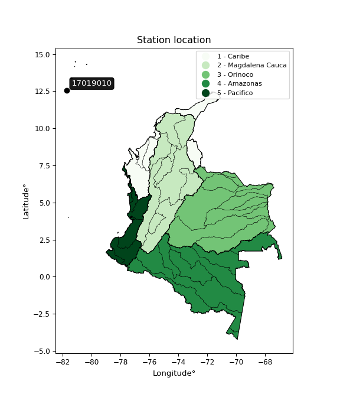</img>

</div>


## A. General information


### 1. General running parameters

• app_version: _v20260103_. • runtime: _2026-01-05 16:20:51.132608_. • Python version: _3.14.0_. • SciPy version: _1.16.3_. • Pandas version: _2.3.3_. • NumPy version: _2.3.5_. • Stations dataset (station_dataset_file): _dataset/pmax24h_in/automatic_colombia_2003_2024.csv_. • Stations catalog (station_catalog_file): _dataset/CNE.xls_. • Minimum year to eval til year_max (date_min): _1900_. • Maximum year to eval since year_min (date_max): _2024_. • Creates, save and include plots into reports (create_plot): _True_. • Plot only fit distributions with Δo > Δ (plot_only_fit): _True_. • Plot only simple graphs avoiding multiple CDFs and multiple Extreme values plots (plot_only_simple): _True_. • Eval low extreme values, if False, evaluates high extreme values (low_extreme): _False_. • Eval every SciPy distribution as logarithmic (pdist_logarithmic_on): _True_. • Standard deviation normalized (ddof): _1.0_. • Return periods to eval in years (Tr): _[2, 2.33, 5, 10, 15, 20, 25, 50, 75, 100, 200, 250, 500, 750, 1000]_. • Minimum data sample per station, 0 means any (minimum_sample): _5_. • Z-Score maximum threshold to adjust a value, 0 means disable (zscore_max): _3.5_. • Z-Score minimum threshold to adjust a value, 0 means disable (zscore_min): _-2.5_. • Avoid zeros, e.g. rain = 0 (avoid_zeros): _True_. • Avoid null values (avoid_nans): _True_. 

[:file_folder:Dataset file](../../dataset/pmax24h_in/automatic_colombia_2003_2024.csv)

> Delta Degrees of Freedom (DDOF): is a parameter used in the formulas for calculating variance and standard deviation. When ddof=0, the divisor is $N$ (the total number of observations) and this is used when your data set is the entire population. When ddof=1, the divisor is $N-1$ and this is used when your data set is a sample drawn from a larger population. Using $N-1$ provides an unbiased estimate of the population variance (known as Bessel´s correction).


### 2. Station info and location

|   id |   CODIGO | NOMBRE                      | CATEGORIA            | TECNOLOGIA                              | ESTADO   | FECHA_INSTALACION   |   FECHA_SUSPENSION |   ALTITUD |   LATITUD |   LONGITUD | DEPARTAMENTO                                             | MUNICIPIO   | AREA_OPERATIVA                                         | ENTIDAD                                                     | AREA_HIDROGRAFICA   | ZONA_HIDROGRAFICA   | SUBZONA_HIDROGRAFICA                   | CORRIENTE   | Catalogo   |   Version |
|-----:|---------:|:----------------------------|:---------------------|:----------------------------------------|:---------|:--------------------|-------------------:|----------:|----------:|-----------:|:---------------------------------------------------------|:------------|:-------------------------------------------------------|:------------------------------------------------------------|:--------------------|:--------------------|:---------------------------------------|:------------|:-----------|----------:|
|    0 | 17019010 | SAN ANDRES - AUT [17019010] | Meteorologica Marina | Automática con Telemetría, Convencional | Activa   | 15/12/1996          |                nan |         1 |   12.5561 |   -81.7034 | Archipielago De San Andres, Providencia Y Santa Catalina | San Andrés  | Area Operativa 05 - Magdalena-Cesar-Guajira-San Andrés | INSTITUTO DE HIDROLOGIA METEOROLOGIA Y ESTUDIOS AMBIENTALES | Caribe              | Islas Caribe        | OTRAS ISLAS DEL CARIBE Y ZONA MARITIMA | Mar Caribe  | CNE_IDEAM  |  20251226 |

<div align="center">

Dynamic map: [:earth_americas:Google](http://maps.google.com/maps?q=12.556111111,-81.703388889) [:earth_americas:OSM](https://www.openstreetmap.org/#map=18/12.556111111/-81.703388889&layers=P) [:earth_americas:Bing](https://www.bing.com/maps?cp=12.556111111~-81.703388889&lvl=18) [:earth_americas:Apple](https://maps.apple.com/frame?center=12.556111111%2C-81.703388889&span=0.003%2C0.006)

</div>


<div align="center">

```geojson
{
  "type": "Feature",
  "geometry": {
    "type": "Point", 
    "coordinates": [-81.703388889, 12.556111111]
  }, 
  "properties": {
    "Name": "17019010"
  }
}
```

</div>


### 3. Discrete values table and plot

<div align="center">

|               |           0 |           1 |          2 |           3 |          4 |           5 |
|:--------------|------------:|------------:|-----------:|------------:|-----------:|------------:|
| Date          | 2016        | 2017        | 2018       | 2019        | 2021       | 2022        |
| Value         |  253.2      |  224        |  418.9     |  174.4      |   55       |   98.6      |
| Value_initial |  253.2      |  224        |  418.9     |  174.4      |   55       |   98.6      |
| count         |    6        |    6        |    6       |    6        |    6       |    6        |
| mean          |  204.017    |  204.017    |  204.017   |  204.017    |  204.017   |  204.017    |
| std           |  128.988    |  128.988    |  128.988   |  128.988    |  128.988   |  128.988    |
| zscore        |    0.381303 |    0.154924 |    1.66592 |   -0.229609 |   -1.15528 |   -0.817262 |


</div>


<div align="center">

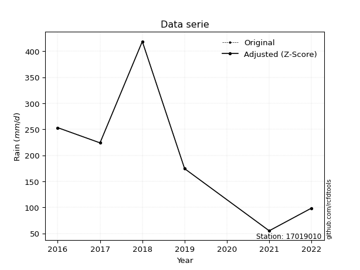</img>

</div>


> The initial value (value_initial) correspond to the initial obtained or null completed value, and value (value) is adjusted only when the initial value is outside the valid range (outlier) definite through the Z-Score value. If Z-Score is active, values out of range or outliers are replaced with the station mean value. A Z-Score (or standard score) measures how many standard deviations a data point is from the mean of a dataset, indicating its relative position; positive scores mean above the mean, negative mean below, and a score of zero is exactly at the mean, allowing for comparison of values from different distributions. It´s calculated using the formula $z=(x–μ)/σ$, where $x$ is the data point, $μ$ is the mean, and $σ$ is the standard deviation, helping identify outliers and understand probability.
>
> <sub>**Note**: In this study, "completing" (filling gaps in) and "extending" (forecasting or lengthening the historical record) rainfall data series are avoided for certain critical analyses because they introduce artificial bias and uncertainty, which can distort the statistics of rare events (extremes), alter day-to-day variability, and compromise the integrity and homogeneity of the original data. Some reasons against Completing/Extending rainfall data are: **Distortion of Extremes and Variability**: The primary issue is that most gap-filling or extension methods rely on averaging or regression with nearby stations, which inherently smooths the data. Rainfall is highly variable in space and time, with a large percentage of zero values and occasional large storms. Infilling methods often underestimate the highest values and overestimate the lowest (zero) values, which severely distorts analyses focused on flood frequency, drought severity, and intensity-duration-frequency (IDF) curves, **Loss of Data Homogeneity**: Infilled or extended data are synthetic estimates, not actual measurements. Combining these estimates with observed data can violate the assumption of data homogeneity, which requires that the data properties do not change over time. Inhomogeneity can lead to incorrect conclusions about long-term trends or changes in climate patterns, **Propagation of Errors**: Errors and biases from the original data (e.g., wind-induced undercatch, instrument errors, site changes) or the data used for imputation can propagate through the analysis, leading to unreliable hydrological models and inaccurate predictions, **Compromised Statistical Integrity**: For statistical analyses, especially those involving the frequency of events, using artificial data can introduce time bias or autocorrelation that doesn´t exist in reality, making it difficult to assess the true probability of events, **Difficulty in Validation**: It is difficult to accurately validate the quality of filled or extended data, especially for past periods where ground-truth measurements are unavailable. The reliability of imputation techniques heavily depends on the density of the surrounding station network and the complexity of the local topography.</sub>


### 4. Active continuous probability distributions from SciPy (44 of 104 available)

A Probability Density Function (PDF) describes the relative likelihood of a continuous random variable falling within a specific range, where the total area under its curve equals 1, and the area over any interval gives the actual probability for that range. Unlike discrete probabilities (like rolling a die), a PDF shows density, not direct probability for a single point (which is zero), with higher points indicating higher likelihood, often visualized as a bell curve for normal distributions.

A log of a probability density function (log-PDF) is simply the logarithm of the PDF´s value, denoted as $log(f(x))$, useful for converting multiplication of probabilities into addition, improving numerical stability with tiny numbers, and connecting to information theory concepts like entropy. Instead of dealing with very small probabilities (e.g., 0.000001), log-PDFs use negative numbers (e.g., $log(0.00001) ≈ -11.51$ that are easier for computers to handle, preventing underflow errors and simplifying complex calculations. In this study, each active probability distribution from SciPy is also evaluated in the $log$ form.

[scipy.stats](https://docs.scipy.org/doc/scipy/reference/stats.html) is a Python´s powerful submodule within the SciPy library for comprehensive statistical analysis, offering over 130 probability distributions (like Normal, Poisson), functions for descriptive stats (mean, variance), hypothesis testing (t-tests, chi-square), random variable generation, and statistical tests, making it essential for data science, modeling, and research. It provides tools to explore, model, and draw conclusions from data efficiently, working seamlessly with NumPy.

<div align="center">

|   id | p_dist             |   n_parameter | fit_method   | label                                                                       | active   | ref                                                                                                        |
|-----:|:-------------------|--------------:|:-------------|:----------------------------------------------------------------------------|:---------|:-----------------------------------------------------------------------------------------------------------|
|    0 | alpha              |             3 | MLE          | Alpha                                                                       | True     | [:mortar_board:](https://docs.scipy.org/doc/scipy/reference/generated/scipy.stats.alpha.html)              |
|    1 | betaprime          |             4 | MLE          | Beta prime                                                                  | True     | [:mortar_board:](https://docs.scipy.org/doc/scipy/reference/generated/scipy.stats.betaprime.html)          |
|    2 | chi2               |             3 | MLE          | Chi²                                                                        | True     | [:mortar_board:](https://docs.scipy.org/doc/scipy/reference/generated/scipy.stats.chi2.html)               |
|    3 | crystalball        |             4 | MLE          | Crystalball                                                                 | True     | [:mortar_board:](https://docs.scipy.org/doc/scipy/reference/generated/scipy.stats.crystalball.html)        |
|    4 | erlang             |             3 | MLE          | Erlang                                                                      | True     | [:mortar_board:](https://docs.scipy.org/doc/scipy/reference/generated/scipy.stats.erlang.html)             |
|    5 | expon              |             2 | MLE          | Exponential                                                                 | True     | [:mortar_board:](https://docs.scipy.org/doc/scipy/reference/generated/scipy.stats.expon.html)              |
|    6 | exponnorm          |             3 | MLE          | Exponentially modified Normal                                               | True     | [:mortar_board:](https://docs.scipy.org/doc/scipy/reference/generated/scipy.stats.exponnorm.html)          |
|    7 | f                  |             4 | MLE          | F                                                                           | True     | [:mortar_board:](https://docs.scipy.org/doc/scipy/reference/generated/scipy.stats.f.html)                  |
|    8 | fatiguelife        |             3 | MLE          | Fatigue-life (Birnbaum-Saunders)                                            | True     | [:mortar_board:](https://docs.scipy.org/doc/scipy/reference/generated/scipy.stats.fatiguelife.html)        |
|    9 | fisk               |             3 | MLE          | Fisk                                                                        | True     | [:mortar_board:](https://docs.scipy.org/doc/scipy/reference/generated/scipy.stats.fisk.html)               |
|   10 | gamma              |             3 | MLE          | Gamma                                                                       | True     | [:mortar_board:](https://docs.scipy.org/doc/scipy/reference/generated/scipy.stats.gamma.html)              |
|   11 | genexpon           |             5 | MLE          | Generalized exponential                                                     | True     | [:mortar_board:](https://docs.scipy.org/doc/scipy/reference/generated/scipy.stats.genexpon.html)           |
|   12 | genlogistic        |             3 | MLE          | Generalized logistic                                                        | True     | [:mortar_board:](https://docs.scipy.org/doc/scipy/reference/generated/scipy.stats.genlogistic.html)        |
|   13 | gibrat             |             2 | MM           | Gibrat                                                                      | True     | [:mortar_board:](https://docs.scipy.org/doc/scipy/reference/generated/scipy.stats.gibrat.html)             |
|   14 | gompertz           |             3 | MLE          | Gompertz (or truncated Gumbel)                                              | True     | [:mortar_board:](https://docs.scipy.org/doc/scipy/reference/generated/scipy.stats.gompertz.html)           |
|   15 | gumbel_l           |             2 | MM           | Gumbel Left Skew                                                            | True     | [:mortar_board:](https://docs.scipy.org/doc/scipy/reference/generated/scipy.stats.gumbel_l.html)           |
|   16 | gumbel_r           |             2 | MM           | Gumbel Right Skew                                                           | True     | [:mortar_board:](https://docs.scipy.org/doc/scipy/reference/generated/scipy.stats.gumbel_r.html)           |
|   17 | halflogistic       |             2 | MM           | Half-logistic                                                               | True     | [:mortar_board:](https://docs.scipy.org/doc/scipy/reference/generated/scipy.stats.halflogistic.html)       |
|   18 | halfnorm           |             2 | MM           | Half Normal                                                                 | True     | [:mortar_board:](https://docs.scipy.org/doc/scipy/reference/generated/scipy.stats.halfnorm.html)           |
|   19 | hypsecant          |             2 | MM           | hyperbolic secant                                                           | True     | [:mortar_board:](https://docs.scipy.org/doc/scipy/reference/generated/scipy.stats.hypsecant.html)          |
|   20 | invgamma           |             3 | MLE          | Inverted gamma                                                              | True     | [:mortar_board:](https://docs.scipy.org/doc/scipy/reference/generated/scipy.stats.invgamma.html)           |
|   21 | invgauss           |             3 | MLE          | Inverse Gaussian                                                            | True     | [:mortar_board:](https://docs.scipy.org/doc/scipy/reference/generated/scipy.stats.invgauss.html)           |
|   22 | invweibull         |             3 | MLE          | Inverted Weibull                                                            | True     | [:mortar_board:](https://docs.scipy.org/doc/scipy/reference/generated/scipy.stats.invweibull.html)         |
|   23 | johnsonsu          |             4 | MLE          | Johnson Su                                                                  | True     | [:mortar_board:](https://docs.scipy.org/doc/scipy/reference/generated/scipy.stats.johnsonsu.html)          |
|   24 | kstwobign          |             2 | MLE          | Limiting distribution of scaled Kolmogorov-Smirnov two-sided test statistic | True     | [:mortar_board:](https://docs.scipy.org/doc/scipy/reference/generated/scipy.stats.kstwobign.html)          |
|   25 | laplace            |             2 | MM           | Laplace                                                                     | True     | [:mortar_board:](https://docs.scipy.org/doc/scipy/reference/generated/scipy.stats.laplace.html)            |
|   26 | laplace_asymmetric |             3 | MLE          | Asymmetric Laplace                                                          | True     | [:mortar_board:](https://docs.scipy.org/doc/scipy/reference/generated/scipy.stats.laplace_asymmetric.html) |
|   27 | loggamma           |             3 | MLE          | Log gamma                                                                   | True     | [:mortar_board:](https://docs.scipy.org/doc/scipy/reference/generated/scipy.stats.loggamma.html)           |
|   28 | logistic           |             2 | MM           | Logistic (or Sech-squared)                                                  | True     | [:mortar_board:](https://docs.scipy.org/doc/scipy/reference/generated/scipy.stats.logistic.html)           |
|   29 | lognorm            |             3 | MLE          | Log Normal                                                                  | True     | [:mortar_board:](https://docs.scipy.org/doc/scipy/reference/generated/scipy.stats.lognorm.html)            |
|   30 | maxwell            |             2 | MM           | Maxwell                                                                     | True     | [:mortar_board:](https://docs.scipy.org/doc/scipy/reference/generated/scipy.stats.maxwell.html)            |
|   31 | mielke             |             4 | MLE          | Mielke Beta-Kappa / Dagum                                                   | True     | [:mortar_board:](https://docs.scipy.org/doc/scipy/reference/generated/scipy.stats.mielke.html)             |
|   32 | moyal              |             2 | MM           | Moyal                                                                       | True     | [:mortar_board:](https://docs.scipy.org/doc/scipy/reference/generated/scipy.stats.moyal.html)              |
|   33 | nakagami           |             3 | MLE          | Nakagami                                                                    | True     | [:mortar_board:](https://docs.scipy.org/doc/scipy/reference/generated/scipy.stats.nakagami.html)           |
|   34 | ncf                |             5 | MLE          | Non-central F distribution                                                  | True     | [:mortar_board:](https://docs.scipy.org/doc/scipy/reference/generated/scipy.stats.ncf.html)                |
|   35 | nct                |             4 | MLE          | Non-central Student’s t                                                     | True     | [:mortar_board:](https://docs.scipy.org/doc/scipy/reference/generated/scipy.stats.nct.html)                |
|   36 | norm               |             2 | MM           | Normal                                                                      | True     | [:mortar_board:](https://docs.scipy.org/doc/scipy/reference/generated/scipy.stats.norm.html)               |
|   37 | pearson3           |             3 | MM           | Pearson type III                                                            | True     | [:mortar_board:](https://docs.scipy.org/doc/scipy/reference/generated/scipy.stats.pearson3.html)           |
|   38 | rayleigh           |             2 | MM           | Rayleigh                                                                    | True     | [:mortar_board:](https://docs.scipy.org/doc/scipy/reference/generated/scipy.stats.rayleigh.html)           |
|   39 | rice               |             3 | MLE          | Rice                                                                        | True     | [:mortar_board:](https://docs.scipy.org/doc/scipy/reference/generated/scipy.stats.rice.html)               |
|   40 | t                  |             3 | MLE          | Student’s t                                                                 | True     | [:mortar_board:](https://docs.scipy.org/doc/scipy/reference/generated/scipy.stats.t.html)                  |
|   41 | truncnorm          |             4 | MLE          | Truncated normal                                                            | True     | [:mortar_board:](https://docs.scipy.org/doc/scipy/reference/generated/scipy.stats.truncnorm.html)          |
|   42 | wald               |             2 | MM           | Wald                                                                        | True     | [:mortar_board:](https://docs.scipy.org/doc/scipy/reference/generated/scipy.stats.wald.html)               |
|   43 | weibull_min        |             3 | MLE          | Weibull minimum                                                             | True     | [:mortar_board:](https://docs.scipy.org/doc/scipy/reference/generated/scipy.stats.weibull_min.html)        |

</div>

> **n_parameter:** # arguments & localization & scale.
>
> **Fit methods:** (MLE) maximum likelihood, (MM) L-moments.
>
>**Inactive** (With the only purpose of prevent loops, zero divisions, infinite values, over high estimated values or horizontal trending for recurrence intervals estimations, the follow distributions were disabled.)**:** foldnorm, gennorm, norminvgauss, powernorm, powerlognorm, skewnorm, genextreme, anglit, arcsine, argus, beta, bradford, burr, burr12, cauchy, cosine, halfcauchy, foldcauchy, skewcauchy, wrapcauchy, dgamma, gengamma, exponweib, exponpow, truncexpon, gausshyper, genhalflogistic, genhyperbolic, geninvgauss, halfgennorm, johnsonsb, kappa4, kappa3, ksone, kstwo, loglaplace, levy, levy_l, levy_stable, ncx2, pareto, genpareto, truncpareto, lomax, powerlaw, rdist, rel_breitwigner, recipinvgauss, semicircular, studentized_range, trapezoid, triang, truncweibull_min, tukeylambda, uniform, loguniform, vonmises, vonmises_line, weibull_max, dweibull, 


## B. Probability (PDF) vs. Empirical (EDF) distributions functions

A continuous probability distribution (CPD) describes probabilities for variables that can take any value within a range (like rain any time), unlike discrete variables with specific outcomes (like temperature). It uses a Probability Density Function (PDF), a curve where the total area under it equals 1, and the probability of the variable falling within an interval (a to b) is found by calculating the area under the curve between those points. A key feature is that the probability of hitting any single exact value is zero, so probabilities are always expressed for ranges, e.g., $P(a ≤ X ≤ b)$.

<div align="center">

Distributions parameters from station values
|    |   station | p_dist                |   n |              loc |            scale | shape                 | shape1                | shape2              | shape3   |
|---:|----------:|:----------------------|----:|-----------------:|-----------------:|:----------------------|:----------------------|:--------------------|:---------|
|  0 |  17019010 | alpha                 |   6 |   -436.501       |   3545.75        | 5.716497141969011     |                       |                     |          |
|  1 |  17019010 | betaprime             |   6 |     -9.71947     |   2280.13        | 3.3013381884316195    | 36.172196159186015    |                     |          |
|  2 |  17019010 | chi2                  |   6 |     55           |     69.2194      | 1.3072999172610307    |                       |                     |          |
|  3 |  17019010 | crystalball           |   6 |    204.311       |    116.703       | 12174.182117187125    | 18496.732637225025    |                     |          |
|  4 |  17019010 | erlang                |   6 |     55           |    122.309       | 0.6102395371352476    |                       |                     |          |
|  5 |  17019010 | expon                 |   6 |     55           |    149.017       |                       |                       |                     |          |
|  6 |  17019010 | exponnorm             |   6 |     93.8056      |     62.6727      | 1.7585177600841329    |                       |                     |          |
|  7 |  17019010 | f                     |   6 |     55           |    176.536       | 1.6418281950132307    | 170.93458467269824    |                     |          |
|  8 |  17019010 | fatiguelife           |   6 |     55           |      0.000185141 | 783.5137046217558     |                       |                     |          |
|  9 |  17019010 | fisk                  |   6 |    -35.5589      |    215.277       | 3.2034334480615687    |                       |                     |          |
| 10 |  17019010 | gamma                 |   6 |     55           |    126.534       | 0.8563087891374528    |                       |                     |          |
| 11 |  17019010 | genexpon              |   6 |     54.9999      |      2.32655     | 0.015620174013921434  | 3.138097394070827e-08 | 1.017666739763456   |          |
| 12 |  17019010 | genlogistic           |   6 |   -475.379       |     94.29        | 748.5623667132741     |                       |                     |          |
| 13 |  17019010 | gibrat                |   6 |    114.189       |     54.4832      |                       |                       |                     |          |
| 14 |  17019010 | gompertz              |   6 |     55           |    344.904       | 1.5669544966565931    |                       |                     |          |
| 15 |  17019010 | gumbel_l              |   6 |    257.01        |     91.8085      |                       |                       |                     |          |
| 16 |  17019010 | gumbel_r              |   6 |    151.023       |     91.8085      |                       |                       |                     |          |
| 17 |  17019010 | halflogistic          |   6 |     64.4567      |    100.671       |                       |                       |                     |          |
| 18 |  17019010 | halfnorm              |   6 |     48.1631      |    195.333       |                       |                       |                     |          |
| 19 |  17019010 | hypsecant             |   6 |    204.017       |     74.9613      |                       |                       |                     |          |
| 20 |  17019010 | invgamma              |   6 |   -170.233       |   3603.22        | 10.6036167828617      |                       |                     |          |
| 21 |  17019010 | invgauss              |   6 |    -43.7196      |    884.142       | 0.280199756405594     |                       |                     |          |
| 22 |  17019010 | invweibull            |   6 |     55           |      0.000182084 | 0.063964064785338     |                       |                     |          |
| 23 |  17019010 | johnsonsu             |   6 |    -48.9825      |      8.77327     | -8.071431884199079    | 2.048485500905697     |                     |          |
| 24 |  17019010 | kstwobign             |   6 |   -182.088       |    442.791       |                       |                       |                     |          |
| 25 |  17019010 | laplace               |   6 |    204.017       |     83.2611      |                       |                       |                     |          |
| 26 |  17019010 | laplace_asymmetric    |   6 |    174.4         |     91.1776      | 0.8518857021631212    |                       |                     |          |
| 27 |  17019010 | loggamma              |   6 | -42262.7         |   5535.16        | 2147.9383471690844    |                       |                     |          |
| 28 |  17019010 | logistic              |   6 |    204.017       |     64.9184      |                       |                       |                     |          |
| 29 |  17019010 | lognorm               |   6 |     55           |      0.276912    | 14.009619241538244    |                       |                     |          |
| 30 |  17019010 | maxwell               |   6 |    -74.999       |    174.847       |                       |                       |                     |          |
| 31 |  17019010 | mielke                |   6 |     -3.35637     |    288.45        | 1.6190533064665695    | 4.527761753540421     |                     |          |
| 32 |  17019010 | moyal                 |   6 |    136.68        |     53.0057      |                       |                       |                     |          |
| 33 |  17019010 | nakagami              |   6 |     98.6         |    165.369       | 0.28451786495243275   |                       |                     |          |
| 34 |  17019010 | ncf                   |   6 |     -2.00989     |    138.741       | 5.197404916010873     | 409.01401943364294    | 2.4851814465319846  |          |
| 35 |  17019010 | nct                   |   6 |     -0.243133    |     85.6503      | 6.336258674006045     | 2.085882046294713     |                     |          |
| 36 |  17019010 | norm                  |   6 |    204.017       |    117.749       |                       |                       |                     |          |
| 37 |  17019010 | pearson3              |   6 |    204.017       |    117.749       | 0.5658437623094903    |                       |                     |          |
| 38 |  17019010 | rayleigh              |   6 |    -21.2441      |    179.732       |                       |                       |                     |          |
| 39 |  17019010 | rice                  |   6 |     -1.91149     |    167.737       | 0.0006317349478114841 |                       |                     |          |
| 40 |  17019010 | t                     |   6 |    203.997       |    117.742       | 66626.29524831366     |                       |                     |          |
| 41 |  17019010 | truncnorm             |   6 |    204.017       |    117.749       | -4698.810456220634    | 41671.618069821765    |                     |          |
| 42 |  17019010 | wald                  |   6 |     86.2676      |    117.749       |                       |                       |                     |          |
| 43 |  17019010 | weibull_min           |   6 |     55           |    234.238       | 0.6349257444070584    |                       |                     |          |
| 44 |  17019010 | logalpha              |   6 |     -8.03771     |    257.473       | 19.60979164710706     |                       |                     |          |
| 45 |  17019010 | logbetaprime          |   6 |     -9.04494     |     44.6345      | 566.3712605103726     | 1785.2267480360797    |                     |          |
| 46 |  17019010 | logchi2               |   6 |      4.00733     |      0.99602     | 1.0169224987907712    |                       |                     |          |
| 47 |  17019010 | logcrystalball        |   6 |      5.12387     |      0.660564    | 8.374476588215916     | 196.29401737499205    |                     |          |
| 48 |  17019010 | logerlang             |   6 |     -6.22271     |      0.0400017   | 283.6303915540408     |                       |                     |          |
| 49 |  17019010 | logexpon              |   6 |      4.00733     |      1.11654     |                       |                       |                     |          |
| 50 |  17019010 | logexponnorm          |   6 |      5.12331     |      0.660565    | 0.000854065810896069  |                       |                     |          |
| 51 |  17019010 | logf                  |   6 |   -238.482       |    243.603       | 778004.1888571386     | 419970.2177112119     |                     |          |
| 52 |  17019010 | logfatiguelife        |   6 |   -216.286       |    221.409       | 0.0029749948478602654 |                       |                     |          |
| 53 |  17019010 | logfisk               |   6 |  -7330.07        |   7335.24        | 18677.11039034611     |                       |                     |          |
| 54 |  17019010 | loggamma              |   6 |     -5.92777     |      0.0404398   | 273.26455203860223    |                       |                     |          |
| 55 |  17019010 | loggenexpon           |   6 |      4.00733     | 557431           | 265360.3582360771     | 1048841.9364688743    | 186005.6357783315   |          |
| 56 |  17019010 | loggenlogistic        |   6 |      5.6696      |      0.21918     | 0.3410925719142467    |                       |                     |          |
| 57 |  17019010 | loggibrat             |   6 |      4.61997     |      0.305634    |                       |                       |                     |          |
| 58 |  17019010 | loggompertz           |   6 |      4.00733     |      1.22897     | 0.5564120601202163    |                       |                     |          |
| 59 |  17019010 | loggumbel_l           |   6 |      5.42116     |      0.515039    |                       |                       |                     |          |
| 60 |  17019010 | loggumbel_r           |   6 |      4.82658     |      0.515039    |                       |                       |                     |          |
| 61 |  17019010 | loghalflogistic       |   6 |      4.34095     |      0.564761    |                       |                       |                     |          |
| 62 |  17019010 | loghalfnorm           |   6 |      4.24951     |      1.09584     |                       |                       |                     |          |
| 63 |  17019010 | loghypsecant          |   6 |      5.12387     |      0.420528    |                       |                       |                     |          |
| 64 |  17019010 | loginvgamma           |   6 |     -9.24564     |   6538.15        | 456.1566240739403     |                       |                     |          |
| 65 |  17019010 | loginvgauss           |   6 |     -0.806689    |    426.582       | 0.013903947365264763  |                       |                     |          |
| 66 |  17019010 | loginvweibull         |   6 |     -3.00403e+07 |      3.00403e+07 | 45695529.60309325     |                       |                     |          |
| 67 |  17019010 | logjohnsonsu          |   6 |      7.18518     |      0.157724    | 9.892919424239935     | 3.0795112428745703    |                     |          |
| 68 |  17019010 | logkstwobign          |   6 |      2.48846     |      3.0071      |                       |                       |                     |          |
| 69 |  17019010 | loglaplace            |   6 |      5.12387     |      0.467089    |                       |                       |                     |          |
| 70 |  17019010 | loglaplace_asymmetric |   6 |      5.53418     |      0.447978    | 1.5577454210311874    |                       |                     |          |
| 71 |  17019010 | logloggamma           |   6 |      5.23705     |      0.644319    | 1.294313047676176     |                       |                     |          |
| 72 |  17019010 | loglogistic           |   6 |      5.12387     |      0.364188    |                       |                       |                     |          |
| 73 |  17019010 | loglognorm            |   6 |      4.00733     |      0.0037093   | 13.001834187656357    |                       |                     |          |
| 74 |  17019010 | logmaxwell            |   6 |      3.55861     |      0.98088     |                       |                       |                     |          |
| 75 |  17019010 | logmielke             |   6 |      4.00733     |      2.02078     | 0.749367773897014     | 25.41604232694391     |                     |          |
| 76 |  17019010 | logmoyal              |   6 |      4.74612     |      0.297358    |                       |                       |                     |          |
| 77 |  17019010 | lognakagami           |   6 |      4.59107     |      0.799501    | 0.061902298496644845  |                       |                     |          |
| 78 |  17019010 | logncf                |   6 |    -10.4261      |     15.5416      | 1439.2894658281693    | 3999.164373789903     | 0.02627990288204863 |          |
| 79 |  17019010 | lognct                |   6 |    -29.3576      |      0.59168     | 6588.138766208642     | 58.26965700930447     |                     |          |
| 80 |  17019010 | lognorm               |   6 |      5.12387     |      0.660563    |                       |                       |                     |          |
| 81 |  17019010 | logpearson3           |   6 |      5.12387     |      0.660563    | -0.3973963163473838   |                       |                     |          |
| 82 |  17019010 | lograyleigh           |   6 |      3.86017     |      1.00828     |                       |                       |                     |          |
| 83 |  17019010 | logrice               |   6 |      3.6173      |      0.738168    | 1.7222892827945926    |                       |                     |          |
| 84 |  17019010 | logt                  |   6 |      5.12387     |      0.660564    | 20749139337.7647      |                       |                     |          |
| 85 |  17019010 | logtruncnorm          |   6 |     -0.195129    |      1.33282     | 4.018900438031849     | 5.760079466263189     |                     |          |
| 86 |  17019010 | logwald               |   6 |      4.46328     |      0.660591    |                       |                       |                     |          |
| 87 |  17019010 | logweibull_min        |   6 |     -0.204159    |      5.61297     | 9.823541100095557     |                       |                     |          |

</div>

> **loc** (Location parameter): This shifts the distribution along the x-axis. For many common distributions, like the normal (Gaussian) distribution, loc represents the mean $μ$. For others, like the uniform distribution, it might represent the minimum value, or for the beta distribution, the left end of the support interval.
>
> **scale** (Scale parameter): This determines the width or spread of the distribution. For the normal distribution, scale represents the standard deviation $σ$. For a uniform distribution, it defines the length of the interval (from $loc$ to $loc + scale$).
>
> **shape** (Shape parameters): Refers to parameters that define the specific form of a probability distribution, distinct from its location (loc) and scale (scale). These parameters are required arguments for most distribution functions. For example, a normal (Gaussian) distribution is fully defined by its location (mean) and scale (standard deviation), so it has no specific shape parameters beyond loc and scale. However, other distributions have intrinsic properties that need specification, as Gamma distribution that takes a shape parameter, often named $a$ or $alpha$.


### 0. Cumulative distribution values - CDF (88 evaluated)

Cumulative Distribution Function (CDF), denoted as $F$<sub>$X$</sub>$(x)$, is a function that gives the probability that a random variable $X$ will take a value less than or equal to a specific value, $x$ (i.e., $(P(X≥x)$. It essentially "accumulates" probabilities from a given point up to the far right (positive infinity), providing a complete picture of the distribution´s probabilities for both discrete (like rain) and continuous (like temperature) variables, helping to find probabilities over ranges or above certain values. Each station is evaluated separately ordering the $x$ values ascending, calculating the CDF and PDF values for the activated distributions and their logarithmic forms.

<div align="center">

CDF ordered by x ascending and calculating $log(f(x))$ separately
|   id |   Station |   date |     x |   count |    mean |     std |    zscore |   Value_initial |   station |   m |     alpha |   alpha_pdf |   betaprime |   betaprime_pdf |        chi2 |       chi2_pdf |   crystalball |   crystalball_pdf |      erlang |      erlang_pdf |    expon |   expon_pdf |   exponnorm |   exponnorm_pdf |           f |       f_pdf |   fatiguelife |   fatiguelife_pdf |      fisk |    fisk_pdf |      gamma |   gamma_pdf |    genexpon |   genexpon_pdf |   genlogistic |   genlogistic_pdf |   gibrat |   gibrat_pdf |    gompertz |   gompertz_pdf |   gumbel_l |   gumbel_l_pdf |   gumbel_r |   gumbel_r_pdf |   halflogistic |   halflogistic_pdf |   halfnorm |   halfnorm_pdf |   hypsecant |   hypsecant_pdf |   invgamma |   invgamma_pdf |   invgauss |   invgauss_pdf |   invweibull |   invweibull_pdf |   johnsonsu |   johnsonsu_pdf |   kstwobign |   kstwobign_pdf |   laplace |   laplace_pdf |   laplace_asymmetric |   laplace_asymmetric_pdf |   loggamma |   loggamma_pdf |   logistic |   logistic_pdf |   lognorm |   lognorm_pdf |   maxwell |   maxwell_pdf |    mielke |   mielke_pdf |     moyal |   moyal_pdf |    nakagami |    nakagami_pdf |       ncf |     ncf_pdf |       nct |     nct_pdf |     norm |    norm_pdf |   pearson3 |   pearson3_pdf |   rayleigh |   rayleigh_pdf |      rice |    rice_pdf |        t |       t_pdf |   truncnorm |   truncnorm_pdf |       wald |   wald_pdf |   weibull_min |   weibull_min_pdf |   logalpha |   logalpha_pdf |   logbetaprime |   logbetaprime_pdf |     logchi2 |   logchi2_pdf |   logcrystalball |   logcrystalball_pdf |   logerlang |   logerlang_pdf |   logexpon |   logexpon_pdf |   logexponnorm |   logexponnorm_pdf |     logf |   logf_pdf |   logfatiguelife |   logfatiguelife_pdf |   logfisk |   logfisk_pdf |   loggenexpon |   loggenexpon_pdf |   loggenlogistic |   loggenlogistic_pdf |   loggibrat |   loggibrat_pdf |   loggompertz |   loggompertz_pdf |   loggumbel_l |   loggumbel_l_pdf |   loggumbel_r |   loggumbel_r_pdf |   loghalflogistic |   loghalflogistic_pdf |   loghalfnorm |   loghalfnorm_pdf |   loghypsecant |   loghypsecant_pdf |   loginvgamma |   loginvgamma_pdf |   loginvgauss |   loginvgauss_pdf |   loginvweibull |   loginvweibull_pdf |   logjohnsonsu |   logjohnsonsu_pdf |   logkstwobign |   logkstwobign_pdf |   loglaplace |   loglaplace_pdf |   loglaplace_asymmetric |   loglaplace_asymmetric_pdf |   logloggamma |   logloggamma_pdf |   loglogistic |   loglogistic_pdf |   loglognorm |   loglognorm_pdf |   logmaxwell |   logmaxwell_pdf |   logmielke |   logmielke_pdf |    logmoyal |   logmoyal_pdf |   lognakagami |   lognakagami_pdf |    logncf |   logncf_pdf |    lognct |   lognct_pdf |   logpearson3 |   logpearson3_pdf |   lograyleigh |   lograyleigh_pdf |   logrice |   logrice_pdf |      logt |   logt_pdf |   logtruncnorm |   logtruncnorm_pdf |   logwald |   logwald_pdf |   logweibull_min |   logweibull_min_pdf |
|-----:|----------:|-------:|------:|--------:|--------:|--------:|----------:|----------------:|----------:|----:|----------:|------------:|------------:|----------------:|------------:|---------------:|--------------:|------------------:|------------:|----------------:|---------:|------------:|------------:|----------------:|------------:|------------:|--------------:|------------------:|----------:|------------:|-----------:|------------:|------------:|---------------:|--------------:|------------------:|---------:|-------------:|------------:|---------------:|-----------:|---------------:|-----------:|---------------:|---------------:|-------------------:|-----------:|---------------:|------------:|----------------:|-----------:|---------------:|-----------:|---------------:|-------------:|-----------------:|------------:|----------------:|------------:|----------------:|----------:|--------------:|---------------------:|-------------------------:|-----------:|---------------:|-----------:|---------------:|----------:|--------------:|----------:|--------------:|----------:|-------------:|----------:|------------:|------------:|----------------:|----------:|------------:|----------:|------------:|---------:|------------:|-----------:|---------------:|-----------:|---------------:|----------:|------------:|---------:|------------:|------------:|----------------:|-----------:|-----------:|--------------:|------------------:|-----------:|---------------:|---------------:|-------------------:|------------:|--------------:|-----------------:|---------------------:|------------:|----------------:|-----------:|---------------:|---------------:|-------------------:|---------:|-----------:|-----------------:|---------------------:|----------:|--------------:|--------------:|------------------:|-----------------:|---------------------:|------------:|----------------:|--------------:|------------------:|--------------:|------------------:|--------------:|------------------:|------------------:|----------------------:|--------------:|------------------:|---------------:|-------------------:|--------------:|------------------:|--------------:|------------------:|----------------:|--------------------:|---------------:|-------------------:|---------------:|-------------------:|-------------:|-----------------:|------------------------:|----------------------------:|--------------:|------------------:|--------------:|------------------:|-------------:|-----------------:|-------------:|-----------------:|------------:|----------------:|------------:|---------------:|--------------:|------------------:|----------:|-------------:|----------:|-------------:|--------------:|------------------:|--------------:|------------------:|----------:|--------------:|----------:|-----------:|---------------:|-------------------:|----------:|--------------:|-----------------:|---------------------:|
|    0 |  17019010 |   2021 |  55   |       6 | 204.017 | 128.988 | -1.15528  |            55   |  17019010 |   1 | 0.0671147 | 0.00190779  |   0.0594908 |     0.00230214  | 2.49857e-11 | 2298.51        |      0.100376 |       0.00150793  | 1.38213e-10 | 11870.2         | 0        | 0.00671066  |   0.0715711 |     0.00178139  | 5.69232e-09 | 0.259593    |     0.0511891 |       7.59286e+08 | 0.0587489 | 0.0019561   | 1.2819e-14 | 1.54488     | 7.20538e-07 |    0.00671387  |     0.0675451 |       0.00192708  | 0        |  0           | 3.09898e-15 |    0.00454316  |   0.104851 |    0.00107998  |  0.0580771 |    0.00180034  |       0        |        0           |  0.0279211 |     0.00408223 |   0.0866654 |      0.0011419  |  0.0622132 |    0.00203614  |  0.0538488 |    0.00239279  |    0.0118996 |      2.37342e+11 |   0.0567121 |     0.0022372   |   0.0633194 |     0.00203144  | 0.0835009 |   0.00100288  |            0.0904046 |              0.00116391  |  0.0437927 |       0.148949 |  0.0915009 |    0.00128051  | 0.0454874 |      0.144743 | 0.0928511 |   0.00191341  | 0.0752132 |   0.00208523 | 0.0307096 | 0.00157514  | 0           |     0           | 0.0613618 | 0.00234022  | 0.0745184 | 0.00167     | 0.102838 | 0.00152114  |  0.0866991 |    0.00180849  |  0.0860477 |    0.00215714  | 0.0559338 | 0.00190962  | 0.102856 | 0.00152139  |    0.102838 |     0.00152114  | 0          | 0          |   3.25278e-11 |    2906.61        |  0.0386921 |       0.148848 |      0.0475292 |           0.155086 | 1.76612e-08 |   1.01106e+07 |        0.0454873 |             0.144743 |    0.04516  |        0.151213 |   0        |       0.895627 |      0.0454877 |           0.144743 | 0.04518  |   0.144881 |        0.0447356 |             0.143946 | 0.0490251 |      0.118728 |   1.07529e-08 |          0.476041 |        0.0752437 |             0.117036 |    0        |       0         |   6.16846e-09 |          0.452746 |      0.062223 |          0.116973 |     0.0073951 |         0.0704554 |          0        |              0        |      0        |          0        |      0.0446765 |           0.105891 |     0.0435345 |          0.152683 |      0.042952 |          0.161997 |       0.0387679 |            0.191667 |      0.0678953 |           0.126931 |      0.0394071 |           0.224983 |    0.0457959 |        0.0980453 |               0.0794159 |                    0.113803 |     0.0669447 |          0.125958 |     0.0445392 |          0.11685  |    0.0127053 |      2.84188e+12 |    0.0239222 |         0.153322 | 2.25087e-06 |       28.713    | 0.000533432 |      0.0115464 |     0         |       0           | 0.0459908 |     0.151916 | 0.0456534 |     0.146342 |      0.055264 |          0.139535 |     0.0105944 |          0.143219 | 0.0326581 |      0.172065 | 0.0454878 |   0.144744 |    0           |           0        | 0         |      0        |        0.0577556 |             0.130751 |
|    1 |  17019010 |   2022 |  98.6 |       6 | 204.017 | 128.988 | -0.817262 |            98.6 |  17019010 |   2 | 0.181458  | 0.00326586  |   0.193223  |     0.00363952  | 0.4627      |    0.00570862  |      0.182517 |       0.00226809  | 0.523266    |     0.00583642  | 0.253668 | 0.00500838  |   0.180133  |     0.00317896  | 0.262817    | 0.00441495  |     0.732161  |       0.00233906  | 0.180212  | 0.00352762  | 0.363386   | 0.00589749  | 0.253774    |    0.00501008  |     0.182989  |       0.00329221  | 0        |  0           | 0.190344    |    0.00417405  |   0.163137 |    0.00162339  |  0.170325  |    0.00328382  |       0.167971 |        0.00482653  |  0.203754  |     0.00395081 |   0.152991  |      0.00196325 |  0.185537  |    0.00349836  |  0.199169  |    0.00398121  |    0.635834  |      0.000422393 |   0.192832  |     0.00379423  |   0.183533  |     0.00336109  | 0.140965  |   0.00169305  |            0.158479  |              0.00204034  |  0.21518   |       0.451902 |  0.164677  |    0.00211894  | 0.209954  |      0.43624  | 0.195306  |   0.0027479   | 0.185076  |   0.00291273 | 0.152088  | 0.00386528  | 5.60318e-10 | 22436.4         | 0.193844  | 0.00355701  | 0.175978  | 0.00298137  | 0.185322 | 0.00226939  |  0.187314  |    0.00277621  |  0.19933   |    0.00297043  | 0.16434   | 0.00298531  | 0.185354 | 0.00226974  |    0.185322 |     0.00226939  | 0.00520292 | 0.002178   |   0.29098     |       0.00355051  |  0.21828   |       0.475858 |      0.220173  |           0.44745  | 0.549527    |   0.392674    |        0.209954  |             0.43624  |    0.216998 |        0.450221 |   0.407149 |       0.530974 |      0.209954  |           0.436239 | 0.210323 |   0.438336 |        0.209352  |             0.437794 | 0.185631  |      0.384947 |   0.314929    |          0.55426  |        0.186205  |             0.287678 |    0        |       0         |   0.287011    |          0.519062 |      0.1809   |          0.317356 |     0.206027  |         0.631934  |          0.217894 |              0.843296 |      0.24472  |          0.693583 |      0.174796  |           0.39508  |     0.21981   |          0.462198 |      0.229008 |          0.477298 |       0.262517  |            0.534073 |      0.192812  |           0.324456 |      0.287457  |           0.553262 |    0.159801  |        0.342122  |               0.183313  |                    0.262689 |     0.191977  |          0.32699  |     0.188013  |          0.41919  |    0.651387  |      0.0487323   |    0.224842  |         0.517909 | 0.394335    |        0.506223 | 0.194341    |      0.75005   |     0.0122456 |       1.70693e+12 | 0.217426  |     0.44802  | 0.211678  |     0.438989 |      0.202542 |          0.386566 |     0.231055  |          0.552824 | 0.220826  |      0.470841 | 0.209955  |   0.436241 |    0           |           0        | 0.0579499 |      1.32107  |        0.191787  |             0.352549 |
|    2 |  17019010 |   2019 | 174.4 |       6 | 204.017 | 128.988 | -0.229609 |           174.4 |  17019010 |   3 | 0.465083  | 0.0037758   |   0.481675  |     0.00359464  | 0.740226    |    0.00232919  |      0.39886  |       0.00330799  | 0.792482    |     0.00212065  | 0.551234 | 0.00301152  |   0.468867  |     0.00391887  | 0.518116    | 0.00258645  |     0.847307  |       0.00101266  | 0.479977  | 0.00380824  | 0.674932   | 0.00280309  | 0.551407    |    0.0030118   |     0.46738   |       0.00376832  | 0.539813 |  0.00659272  | 0.477008    |    0.00335891  |   0.334121 |    0.00294938  |  0.460608  |    0.00388926  |       0.497555 |        0.00373711  |  0.481891  |     0.0033149  |   0.377388  |      0.00393517 |  0.477302  |    0.00373606  |  0.501256  |    0.00357725  |    0.654058  |      0.00014876  |   0.492248  |     0.00365491  |   0.464121  |     0.00365412  | 0.350339  |   0.00420771  |            0.420528  |              0.00541409  |  0.530881  |       0.593552 |  0.387884  |    0.00365736  | 0.522625  |      0.602971 | 0.434737  |   0.00335701  | 0.439701  |   0.00360251 | 0.483549  | 0.00412549  | 0.492034    |     0.0035253   | 0.476077  | 0.00355243  | 0.45407   | 0.00390322  | 0.400705 | 0.00328258  |  0.435376  |    0.00350502  |  0.44703   |    0.00334902  | 0.424449  | 0.00360669  | 0.400763 | 0.00328289  |    0.400705 |     0.00328258  | 0.545519   | 0.0050157  |   0.47895     |       0.00180628  |  0.540963  |       0.586487 |      0.530011  |           0.580901 | 0.71318     |   0.210965    |        0.522625  |             0.602971 |    0.530561 |        0.589059 |   0.644265 |       0.318606 |      0.522624  |           0.602969 | 0.523987 |   0.603566 |        0.523155  |             0.604535 | 0.493365  |      0.636443 |   0.600907    |          0.42998  |        0.439132  |             0.622173 |    0.71625  |       0.625784  |   0.579615    |          0.486753 |      0.453294 |          0.640971 |     0.593303  |         0.601379  |          0.620815 |              0.544114 |      0.594642 |          0.515046 |      0.528334  |           0.753933 |     0.537474  |          0.587762 |      0.544361 |          0.56437  |       0.570217  |            0.487241 |      0.458224  |           0.601883 |      0.591704  |           0.469998 |    0.538556  |        0.987915  |               0.415055  |                    0.594775 |     0.460891  |          0.609899 |     0.525708  |          0.684645 |    0.67057   |      0.0241195   |    0.554633  |         0.571555 | 0.657164    |        0.426733 | 0.618853    |      0.589743  |     0.832597  |       0.175468    | 0.529606  |     0.58735  | 0.524397  |     0.599791 |      0.49625  |          0.607837 |     0.565118  |          0.5566   | 0.536621  |      0.580325 | 0.522626  |   0.60297  |    7.27914e-09 |           3.1844   | 0.689808  |      0.555087 |        0.473843  |             0.618604 |
|    3 |  17019010 |   2017 | 224   |       6 | 204.017 | 128.988 |  0.154924 |           224   |  17019010 |   4 | 0.636164  | 0.00305169  |   0.641899  |     0.00283424  | 0.831718    |    0.00144327  |      0.566988 |       0.00337014  | 0.873404    |     0.00123464  | 0.678289 | 0.00215889  |   0.644083  |     0.00305807  | 0.629099    | 0.00192904  |     0.888653  |       0.000684316 | 0.645479  | 0.00282426  | 0.787149   | 0.00180185  | 0.678465    |    0.00215875  |     0.637901  |       0.00304058  | 0.758307 |  0.00284183  | 0.628716    |    0.00275337  |   0.502415 |    0.00378297  |  0.636586  |    0.00313157  |       0.659765 |        0.00280472  |  0.63198   |     0.00272396 |   0.583868  |      0.00409978 |  0.643656  |    0.00292472  |  0.656514  |    0.00267907  |    0.660189  |      0.000103754 |   0.652128  |     0.00277188  |   0.630456  |     0.00300219  | 0.606689  |   0.00472382  |            0.635438  |              0.00340616  |  0.673003  |       0.530496 |  0.576354  |    0.00376118  | 0.668456  |      0.549265 | 0.596556  |   0.00309243  | 0.612564  |   0.00325439 | 0.660797  | 0.00299953  | 0.640895    |     0.0025579   | 0.636015  | 0.00286034  | 0.633403  | 0.00322018  | 0.567381 | 0.00333963  |  0.603024  |    0.00316686  |  0.605812  |    0.00299261  | 0.596252  | 0.00324185  | 0.56745  | 0.00333973  |    0.567381 |     0.00333963  | 0.72801    | 0.00264538 |   0.556388    |       0.00135465  |  0.679352  |       0.509456 |      0.669361  |           0.521633 | 0.760455    |   0.168942    |        0.668456  |             0.549265 |    0.671717 |        0.527487 |   0.715704 |       0.254623 |      0.668455  |           0.549265 | 0.669781 |   0.548419 |        0.669227  |             0.549599 | 0.648113  |      0.580678 |   0.699179    |          0.35496  |        0.610745  |             0.726516 |    0.829392 |       0.320375  |   0.695175    |          0.432676 |      0.625327 |          0.714154 |     0.725342  |         0.45223   |          0.738842 |              0.40204  |      0.711081 |          0.414934 |      0.70258   |           0.608743 |     0.677326  |          0.518991 |      0.677413 |          0.490323 |       0.68122   |            0.397778 |      0.618     |           0.65958  |      0.698878  |           0.385329 |    0.729979  |        0.578094  |               0.594121  |                    0.851377 |     0.62206   |          0.661159 |     0.687872  |          0.589543 |    0.676016  |      0.0196867   |    0.688066  |         0.487395 | 0.761302    |        0.406206 | 0.743983    |      0.415397  |     0.86929   |       0.123336    | 0.670509  |     0.527186 | 0.669184  |     0.544461 |      0.648813 |          0.595842 |     0.693899  |          0.467136 | 0.675263  |      0.517351 | 0.668457  |   0.549264 |    0.556891    |           1.47095  | 0.797362  |      0.328628 |        0.633946  |             0.643511 |
|    4 |  17019010 |   2016 | 253.2 |       6 | 204.017 | 128.988 |  0.381303 |           253.2 |  17019010 |   5 | 0.717524  | 0.00251986  |   0.717624  |     0.00235569  | 0.868693    |    0.00110604  |      0.662363 |       0.00313127  | 0.904512    |     0.000913862 | 0.735537 | 0.00177472  |   0.724427  |     0.00245059  | 0.681023    | 0.00163681  |     0.906674  |       0.000555725 | 0.719249  | 0.00224017  | 0.833606   | 0.00139814  | 0.735706    |    0.00177444  |     0.719018  |       0.00251489  | 0.825533 |  0.00185076  | 0.703812    |    0.00239053  |   0.616858 |    0.00400363  |  0.719935  |    0.00257674  |       0.734037 |        0.00229058  |  0.706133  |     0.00235454 |   0.695299  |      0.00347183 |  0.721303  |    0.00239736  |  0.72741   |    0.00218639  |    0.662976  |      8.79407e-05 |   0.725463  |     0.00225912  |   0.711392  |     0.00253961  | 0.723034  |   0.00332648  |            0.722484  |              0.00259287  |  0.734912  |       0.47823  |  0.680836  |    0.00334725  | 0.73275   |      0.497982 | 0.682255  |   0.00276153  | 0.701069  |   0.00278554 | 0.739012  | 0.00237214  | 0.7094      |     0.00214665  | 0.712872  | 0.0024046   | 0.719061  | 0.00264188  | 0.661915 | 0.00310504  |  0.690012  |    0.0027759   |  0.688329  |    0.00264789  | 0.685438  | 0.0028522   | 0.661985 | 0.00310497  |    0.661915 |     0.00310504  | 0.793421   | 0.00188736 |   0.59317     |       0.0011721   |  0.7385    |       0.454748 |      0.730357  |           0.472256 | 0.780124    |   0.152463    |        0.73275   |             0.497982 |    0.733321 |        0.476288 |   0.745253 |       0.228158 |      0.732749  |           0.497982 | 0.733938 |   0.496616 |        0.733526  |             0.49774  | 0.7156    |      0.518172 |   0.740432    |          0.318529 |        0.699197  |             0.706972 |    0.863389 |       0.23943   |   0.746124    |          0.398138 |      0.712169 |          0.695985 |     0.776371  |         0.38156   |          0.784285 |              0.340761 |      0.758928 |          0.366239 |      0.770525  |           0.49963  |     0.737765  |          0.465988 |      0.734446 |          0.439528 |       0.727172  |            0.352405 |      0.698388  |           0.647151 |      0.743512  |           0.343353 |    0.792285  |        0.444701  |               0.708163  |                    1.0148   |     0.702279  |          0.642577 |     0.755219  |          0.507604 |    0.678325  |      0.0180533   |    0.744574  |         0.434127 | 0.810539    |        0.397488 | 0.790413    |      0.344195  |     0.883357  |       0.106916    | 0.732115  |     0.476612 | 0.732887  |     0.493231 |      0.719623 |          0.556406 |     0.747974  |          0.41499  | 0.735705  |      0.467624 | 0.732751  |   0.497981 |    0.706178    |           0.994952 | 0.833208  |      0.259761 |        0.711294  |             0.614017 |
|    5 |  17019010 |   2018 | 418.9 |       6 | 204.017 | 128.988 |  1.66592  |           418.9 |  17019010 |   6 | 0.941951  | 0.000562473 |   0.937444  |     0.000600409 | 0.966008    |    0.000270746 |      0.967025 |       0.000630435 | 0.979395    |     0.000186065 | 0.913014 | 0.000583733 |   0.938459  |     0.000558389 | 0.860681    | 0.000682304 |     0.96322   |       0.000197852 | 0.916334  | 0.000540412 | 0.957887   | 0.000345871 | 0.913116    |    0.000583328 |     0.944676  |       0.000570185 | 0.957417 |  0.000297519 | 0.946797    |    0.000694237 |   0.997068 |    0.000186278 |  0.947381  |    0.000557786 |       0.942548 |        0.000554299 |  0.9423    |     0.00067443 |   0.96382   |      0.00048161 |  0.937583  |    0.000568698 |  0.931139  |    0.000580901 |    0.673445  |      4.6799e-05  |   0.932473  |     0.000571671 |   0.949775  |     0.000615781 | 0.962145  |   0.000454658 |            0.940989  |              0.000551345 |  0.911847  |       0.226865 |  0.964772  |    0.000523533 | 0.916715  |      0.231993 | 0.953556  |   0.000673876 | 0.943079  |   0.00054662 | 0.944355  | 0.000524042 | 0.928246    |     0.000691619 | 0.940048  | 0.000618068 | 0.945874  | 0.000533436 | 0.965994 | 0.000640877 |  0.95273   |    0.000636116 |  0.95014   |    0.000679357 | 0.957017  | 0.000642883 | 0.966013 | 0.000640599 |    0.965994 |     0.000640877 | 0.945678   | 0.00039577 |   0.733598    |       0.000614831 |  0.90613   |       0.217729 |      0.907138  |           0.230935 | 0.84339     |   0.102937    |        0.916715  |             0.231993 |    0.910282 |        0.228389 |   0.837713 |       0.145348 |      0.916714  |           0.231995 | 0.917078 |   0.230594 |        0.917059  |             0.230976 | 0.900655  |      0.227796 |   0.866251    |          0.187512 |        0.943329  |             0.23079  |    0.937532 |       0.0867171 |   0.904316    |          0.226028 |      0.963484 |          0.234679 |     0.909157  |         0.168116  |          0.905532 |              0.15937  |      0.897265 |          0.192321 |      0.927833  |           0.170144 |     0.909984  |          0.222172 |      0.899072 |          0.219848 |       0.862319  |            0.194304 |      0.948714  |           0.279793 |      0.876699  |           0.193442 |    0.929309  |        0.151343  |               0.949319  |                    0.176232 |     0.946133  |          0.269989 |     0.924773  |          0.191021 |    0.68614   |      0.0134363   |    0.905792  |         0.213124 | 0.981446    |        0.170319 | 0.909246    |      0.15194   |     0.925492  |       0.0654132   | 0.909594  |     0.229672 | 0.915348  |     0.231306 |      0.928859 |          0.255447 |     0.902886  |          0.208001 | 0.910453  |      0.227588 | 0.916715  |   0.231993 |    0.950196    |           0.182658 | 0.91985   |      0.109872 |        0.941464  |             0.261465 |


</div>

An Empirical Distribution Function (EDF) is a step-function estimate of a true cumulative distribution function (CDF) based on observed sample data, representing the proportion of data points less than or equal to a given value. It is calculated by ordering your data and jumping up by $1/n$ (where $n$ is sample size) at each unique data point, allowing analysis without assuming an underlying population distribution, and it gets closer to the true CDF as the sample size grows. For the empirical probability calculations, the parameter $m$ correspond to the order number which means the position of the $x$ values in an ascending order list.

The Kolmogorov-Smirnov (K-S) test is a non-parametric statistical test used to determine if a sample data set comes from a specific theoretical distribution (one-sample) or if two different samples come from the same underlying distribution (two-sample), by comparing their cumulative distribution functions (CDFs). It calculates the maximum vertical difference (D statistic) between these functions, with a small p-value indicating a significant difference and rejection of the null hypothesis (that the data/samples match).


### 1. EDF California (1923)

California´s estimates the true probability distribution of water-related data (like rainfall, streamflow) using observed samples, crucial for risk assessment.

<div align="center">


$P=m/n$


</div>


**1.1. Empirical values**

<div align="center">

|                | 0                   | 1                  | 2              | 3                  | 4                  | 5              |
|:---------------|:--------------------|:-------------------|:---------------|:-------------------|:-------------------|:---------------|
| date           | 2021                | 2022               | 2019           | 2017               | 2016               | 2018           |
| x              | 55.0                | 98.6               | 174.4          | 224.0              | 253.2              | 418.9          |
| m              | 1                   | 2                  | 3              | 4                  | 5                  | 6              |
| empirical_dist | edf_california      | edf_california     | edf_california | edf_california     | edf_california     | edf_california |
| empirical      | 0.16666666666666666 | 0.3333333333333333 | 0.5            | 0.6666666666666666 | 0.8333333333333334 | 1.0            |
| empirical_tr   | 1.2                 | 1.4999999999999998 | 2.0            | 2.9999999999999996 | 6.000000000000002  | inf            |

</div>


**1.2. Kolmogorov-Smirnov fit test (sorted by Δ)**


<div align="center">

|                | 0                   | 1                  | 2                   | 3                   | 4                  | 5                  | 6                  | 7                   | 8                   | 9                   | 10                  | 11                  | 12                  | 13                  | 14                  | 15                  | 16                 | 17                  | 18                 | 19                  | 20                  | 21                  | 22                  | 23                  | 24                | 25                 | 26                 | 27                 | 28                  | 29                 | 30                  | 31                 | 32                 | 33                 | 34                  | 35                  | 36                  | 37                    | 38                  | 39                  | 40                  | 41                  | 42                  | 43                  | 44                  | 45                | 46                  | 47                 | 48                  | 49                  | 50                 | 51                  | 52                  | 53                 | 54                  | 55                  | 56                  | 57                  | 58                  | 59                  | 60                  | 61                  | 62                 | 63                  | 64                  | 65                  | 66                  | 67                 | 68                  | 69                  | 70                  | 71                  | 72                  | 73                  | 74                 | 75                  | 76                 | 77                | 78                  | 79                 | 80                  | 81                 | 82                 | 83                  | 84                 | 85                 | 86                 | 87                  |
|:---------------|:--------------------|:-------------------|:--------------------|:--------------------|:-------------------|:-------------------|:-------------------|:--------------------|:--------------------|:--------------------|:--------------------|:--------------------|:--------------------|:--------------------|:--------------------|:--------------------|:-------------------|:--------------------|:-------------------|:--------------------|:--------------------|:--------------------|:--------------------|:--------------------|:------------------|:-------------------|:-------------------|:-------------------|:--------------------|:-------------------|:--------------------|:-------------------|:-------------------|:-------------------|:--------------------|:--------------------|:--------------------|:----------------------|:--------------------|:--------------------|:--------------------|:--------------------|:--------------------|:--------------------|:--------------------|:------------------|:--------------------|:-------------------|:--------------------|:--------------------|:-------------------|:--------------------|:--------------------|:-------------------|:--------------------|:--------------------|:--------------------|:--------------------|:--------------------|:--------------------|:--------------------|:--------------------|:-------------------|:--------------------|:--------------------|:--------------------|:--------------------|:-------------------|:--------------------|:--------------------|:--------------------|:--------------------|:--------------------|:--------------------|:-------------------|:--------------------|:-------------------|:------------------|:--------------------|:-------------------|:--------------------|:-------------------|:-------------------|:--------------------|:-------------------|:-------------------|:-------------------|:--------------------|
| station        | 17019010            | 17019010           | 17019010            | 17019010            | 17019010           | 17019010           | 17019010           | 17019010            | 17019010            | 17019010            | 17019010            | 17019010            | 17019010            | 17019010            | 17019010            | 17019010            | 17019010           | 17019010            | 17019010           | 17019010            | 17019010            | 17019010            | 17019010            | 17019010            | 17019010          | 17019010           | 17019010           | 17019010           | 17019010            | 17019010           | 17019010            | 17019010           | 17019010           | 17019010           | 17019010            | 17019010            | 17019010            | 17019010              | 17019010            | 17019010            | 17019010            | 17019010            | 17019010            | 17019010            | 17019010            | 17019010          | 17019010            | 17019010           | 17019010            | 17019010            | 17019010           | 17019010            | 17019010            | 17019010           | 17019010            | 17019010            | 17019010            | 17019010            | 17019010            | 17019010            | 17019010            | 17019010            | 17019010           | 17019010            | 17019010            | 17019010            | 17019010            | 17019010           | 17019010            | 17019010            | 17019010            | 17019010            | 17019010            | 17019010            | 17019010           | 17019010            | 17019010           | 17019010          | 17019010            | 17019010           | 17019010            | 17019010           | 17019010           | 17019010            | 17019010           | 17019010           | 17019010           | 17019010            |
| empirical_dist | edf_california      | edf_california     | edf_california      | edf_california      | edf_california     | edf_california     | edf_california     | edf_california      | edf_california      | edf_california      | edf_california      | edf_california      | edf_california      | edf_california      | edf_california      | edf_california      | edf_california     | edf_california      | edf_california     | edf_california      | edf_california      | edf_california      | edf_california      | edf_california      | edf_california    | edf_california     | edf_california     | edf_california     | edf_california      | edf_california     | edf_california      | edf_california     | edf_california     | edf_california     | edf_california      | edf_california      | edf_california      | edf_california        | edf_california      | edf_california      | edf_california      | edf_california      | edf_california      | edf_california      | edf_california      | edf_california    | edf_california      | edf_california     | edf_california      | edf_california      | edf_california     | edf_california      | edf_california      | edf_california     | edf_california      | edf_california      | edf_california      | edf_california      | edf_california      | edf_california      | edf_california      | edf_california      | edf_california     | edf_california      | edf_california      | edf_california      | edf_california      | edf_california     | edf_california      | edf_california      | edf_california      | edf_california      | edf_california      | edf_california      | edf_california     | edf_california      | edf_california     | edf_california    | edf_california      | edf_california     | edf_california      | edf_california     | edf_california     | edf_california      | edf_california     | edf_california     | edf_california     | edf_california      |
| p_dist         | logbetaprime        | logncf             | logerlang           | lognct              | loggamma           | loggamma           | logf               | loginvgamma         | logt                | logexponnorm        | lognorm             | lognorm             | logcrystalball      | loginvgauss         | logfatiguelife      | logkstwobign        | logalpha           | logpearson3         | logrice            | invgauss            | loginvweibull       | halfnorm            | ncf                 | betaprime           | johnsonsu         | logjohnsonsu       | logloggamma        | logweibull_min     | logmaxwell          | rayleigh           | loglogistic         | pearson3           | loggenlogistic     | logfisk            | invgamma            | mielke              | kstwobign           | loglaplace_asymmetric | genlogistic         | maxwell             | alpha               | loggumbel_l         | fisk                | exponnorm           | lograyleigh         | nct               | loghypsecant        | loggumbel_r        | gumbel_r            | logmoyal            | logmielke          | genexpon            | loggenexpon         | loggompertz        | f                   | gompertz            | expon               | halflogistic        | loghalfnorm         | logexpon            | loghalflogistic     | logistic            | rice               | crystalball         | t                   | norm                | truncnorm           | loglaplace         | laplace_asymmetric  | gamma               | hypsecant           | moyal               | laplace             | logchi2             | gumbel_l           | chi2                | weibull_min        | logwald           | erlang              | loglognorm         | invweibull          | wald               | lognakagami        | nakagami            | gibrat             | loggibrat          | fatiguelife        | logtruncnorm        |
| delta          | 0.11913746567045524 | 0.1206758306205524 | 0.12150663929405231 | 0.12165513466889649 | 0.1228739267909024 | 0.1228739267909024 | 0.1230102960730633 | 0.12313214040166864 | 0.12337832649196312 | 0.12337927664941206 | 0.12337928803178722 | 0.12337928803178722 | 0.12337953827964257 | 0.12371465769503193 | 0.12398152193981521 | 0.12725958718024322 | 0.1279745725482428 | 0.13079096673299628 | 0.1340085645313644 | 0.13416442133792422 | 0.13768119588478855 | 0.13874559656145066 | 0.13948960535353755 | 0.14011010520995185 | 0.140501722553541 | 0.1405209479199896 | 0.1413562538581139 | 0.1415466195508294 | 0.14274447906952012 | 0.1450044281782078 | 0.14532069355409216 | 0.1460191825226017 | 0.1471278989730525 | 0.1477027627104198 | 0.14779643105802523 | 0.14825702479034247 | 0.14979985627247583 | 0.15001991743813767   | 0.15034471302607538 | 0.15107793058696062 | 0.15187540409086894 | 0.15243344336469802 | 0.15312098996459242 | 0.15320057903198325 | 0.15607225613007056 | 0.157355472061079 | 0.15853766873333414 | 0.1592715652944937 | 0.16300875503273368 | 0.16613323451155793 | 0.1666644157978513 | 0.16666594612879843 | 0.16666665591373672 | 0.1666666604982114 | 0.16666666097434635 | 0.16666666666666355 | 0.16666666666666666 | 0.16666666666666666 | 0.16666666666666666 | 0.16666666666666666 | 0.16666666666666666 | 0.16865636025062028 | 0.1689934613594908 | 0.17097069621159755 | 0.17134864527298788 | 0.17141789172831845 | 0.17141789315562372 | 0.1735321052989781 | 0.17485408900694746 | 0.17493158783498852 | 0.18034254780265618 | 0.18124560849106672 | 0.19236843063673337 | 0.21619342214262655 | 0.2164751555871206 | 0.24022580120372194 | 0.2664022406586576 | 0.275383474386232 | 0.29248207672451854 | 0.3180540907202593 | 0.32655522204211196 | 0.3281304096313554 | 0.3325971939743936 | 0.33333333277301574 | 0.3333333333333333 | 0.3333333333333333 | 0.3988274885008119 | 0.49999999272086054 |
| deltao         | 0.530385761606      | 0.530385761606     | 0.530385761606      | 0.530385761606      | 0.530385761606     | 0.530385761606     | 0.530385761606     | 0.530385761606      | 0.530385761606      | 0.530385761606      | 0.530385761606      | 0.530385761606      | 0.530385761606      | 0.530385761606      | 0.530385761606      | 0.530385761606      | 0.530385761606     | 0.530385761606      | 0.530385761606     | 0.530385761606      | 0.530385761606      | 0.530385761606      | 0.530385761606      | 0.530385761606      | 0.530385761606    | 0.530385761606     | 0.530385761606     | 0.530385761606     | 0.530385761606      | 0.530385761606     | 0.530385761606      | 0.530385761606     | 0.530385761606     | 0.530385761606     | 0.530385761606      | 0.530385761606      | 0.530385761606      | 0.530385761606        | 0.530385761606      | 0.530385761606      | 0.530385761606      | 0.530385761606      | 0.530385761606      | 0.530385761606      | 0.530385761606      | 0.530385761606    | 0.530385761606      | 0.530385761606     | 0.530385761606      | 0.530385761606      | 0.530385761606     | 0.530385761606      | 0.530385761606      | 0.530385761606     | 0.530385761606      | 0.530385761606      | 0.530385761606      | 0.530385761606      | 0.530385761606      | 0.530385761606      | 0.530385761606      | 0.530385761606      | 0.530385761606     | 0.530385761606      | 0.530385761606      | 0.530385761606      | 0.530385761606      | 0.530385761606     | 0.530385761606      | 0.530385761606      | 0.530385761606      | 0.530385761606      | 0.530385761606      | 0.530385761606      | 0.530385761606     | 0.530385761606      | 0.530385761606     | 0.530385761606    | 0.530385761606      | 0.530385761606     | 0.530385761606      | 0.530385761606     | 0.530385761606     | 0.530385761606      | 0.530385761606     | 0.530385761606     | 0.530385761606     | 0.530385761606      |
| eval           | Δo > Δ              | Δo > Δ             | Δo > Δ              | Δo > Δ              | Δo > Δ             | Δo > Δ             | Δo > Δ             | Δo > Δ              | Δo > Δ              | Δo > Δ              | Δo > Δ              | Δo > Δ              | Δo > Δ              | Δo > Δ              | Δo > Δ              | Δo > Δ              | Δo > Δ             | Δo > Δ              | Δo > Δ             | Δo > Δ              | Δo > Δ              | Δo > Δ              | Δo > Δ              | Δo > Δ              | Δo > Δ            | Δo > Δ             | Δo > Δ             | Δo > Δ             | Δo > Δ              | Δo > Δ             | Δo > Δ              | Δo > Δ             | Δo > Δ             | Δo > Δ             | Δo > Δ              | Δo > Δ              | Δo > Δ              | Δo > Δ                | Δo > Δ              | Δo > Δ              | Δo > Δ              | Δo > Δ              | Δo > Δ              | Δo > Δ              | Δo > Δ              | Δo > Δ            | Δo > Δ              | Δo > Δ             | Δo > Δ              | Δo > Δ              | Δo > Δ             | Δo > Δ              | Δo > Δ              | Δo > Δ             | Δo > Δ              | Δo > Δ              | Δo > Δ              | Δo > Δ              | Δo > Δ              | Δo > Δ              | Δo > Δ              | Δo > Δ              | Δo > Δ             | Δo > Δ              | Δo > Δ              | Δo > Δ              | Δo > Δ              | Δo > Δ             | Δo > Δ              | Δo > Δ              | Δo > Δ              | Δo > Δ              | Δo > Δ              | Δo > Δ              | Δo > Δ             | Δo > Δ              | Δo > Δ             | Δo > Δ            | Δo > Δ              | Δo > Δ             | Δo > Δ              | Δo > Δ             | Δo > Δ             | Δo > Δ              | Δo > Δ             | Δo > Δ             | Δo > Δ             | Δo > Δ              |
| fit            | 1                   | 1                  | 1                   | 1                   | 1                  | 1                  | 1                  | 1                   | 1                   | 1                   | 1                   | 1                   | 1                   | 1                   | 1                   | 1                   | 1                  | 1                   | 1                  | 1                   | 1                   | 1                   | 1                   | 1                   | 1                 | 1                  | 1                  | 1                  | 1                   | 1                  | 1                   | 1                  | 1                  | 1                  | 1                   | 1                   | 1                   | 1                     | 1                   | 1                   | 1                   | 1                   | 1                   | 1                   | 1                   | 1                 | 1                   | 1                  | 1                   | 1                   | 1                  | 1                   | 1                   | 1                  | 1                   | 1                   | 1                   | 1                   | 1                   | 1                   | 1                   | 1                   | 1                  | 1                   | 1                   | 1                   | 1                   | 1                  | 1                   | 1                   | 1                   | 1                   | 1                   | 1                   | 1                  | 1                   | 1                  | 1                 | 1                   | 1                  | 1                   | 1                  | 1                  | 1                   | 1                  | 1                  | 1                  | 1                   |
| n              | 6                   | 6                  | 6                   | 6                   | 6                  | 6                  | 6                  | 6                   | 6                   | 6                   | 6                   | 6                   | 6                   | 6                   | 6                   | 6                   | 6                  | 6                   | 6                  | 6                   | 6                   | 6                   | 6                   | 6                   | 6                 | 6                  | 6                  | 6                  | 6                   | 6                  | 6                   | 6                  | 6                  | 6                  | 6                   | 6                   | 6                   | 6                     | 6                   | 6                   | 6                   | 6                   | 6                   | 6                   | 6                   | 6                 | 6                   | 6                  | 6                   | 6                   | 6                  | 6                   | 6                   | 6                  | 6                   | 6                   | 6                   | 6                   | 6                   | 6                   | 6                   | 6                   | 6                  | 6                   | 6                   | 6                   | 6                   | 6                  | 6                   | 6                   | 6                   | 6                   | 6                   | 6                   | 6                  | 6                   | 6                  | 6                 | 6                   | 6                  | 6                   | 6                  | 6                  | 6                   | 6                  | 6                  | 6                  | 6                   |
| best_fit       | 1                   | 0                  | 0                   | 0                   | 0                  | 0                  | 0                  | 0                   | 0                   | 0                   | 0                   | 0                   | 0                   | 0                   | 0                   | 0                   | 0                  | 0                   | 0                  | 0                   | 0                   | 0                   | 0                   | 0                   | 0                 | 0                  | 0                  | 0                  | 0                   | 0                  | 0                   | 0                  | 0                  | 0                  | 0                   | 0                   | 0                   | 0                     | 0                   | 0                   | 0                   | 0                   | 0                   | 0                   | 0                   | 0                 | 0                   | 0                  | 0                   | 0                   | 0                  | 0                   | 0                   | 0                  | 0                   | 0                   | 0                   | 0                   | 0                   | 0                   | 0                   | 0                   | 0                  | 0                   | 0                   | 0                   | 0                   | 0                  | 0                   | 0                   | 0                   | 0                   | 0                   | 0                   | 0                  | 0                   | 0                  | 0                 | 0                   | 0                  | 0                   | 0                  | 0                  | 0                   | 0                  | 0                  | 0                  | 0                   |
| best_fit_sort  | 1                   | 2                  | 3                   | 4                   | 5                  | 6                  | 7                  | 8                   | 9                   | 10                  | 11                  | 12                  | 13                  | 14                  | 15                  | 16                  | 17                 | 18                  | 19                 | 20                  | 21                  | 22                  | 23                  | 24                  | 25                | 26                 | 27                 | 28                 | 29                  | 30                 | 31                  | 32                 | 33                 | 34                 | 35                  | 36                  | 37                  | 38                    | 39                  | 40                  | 41                  | 42                  | 43                  | 44                  | 45                  | 46                | 47                  | 48                 | 49                  | 50                  | 51                 | 52                  | 53                  | 54                 | 55                  | 56                  | 57                  | 58                  | 59                  | 60                  | 61                  | 62                  | 63                 | 64                  | 65                  | 66                  | 67                  | 68                 | 69                  | 70                  | 71                  | 72                  | 73                  | 74                  | 75                 | 76                  | 77                 | 78                | 79                  | 80                 | 81                  | 82                 | 83                 | 84                  | 85                 | 86                 | 87                 | 88                  |

</div>


**1.3. Best fit**

<div align="center">

|   id |   station | empirical_dist   | p_dist       |    delta |   deltao | eval   |   fit |   n |   best_fit |   best_fit_sort |
|-----:|----------:|:-----------------|:-------------|---------:|---------:|:-------|------:|----:|-----------:|----------------:|
|    0 |  17019010 | edf_california   | logbetaprime | 0.119137 | 0.530386 | Δo > Δ |     1 |   6 |          1 |               1 |

</div>


<div align="center">

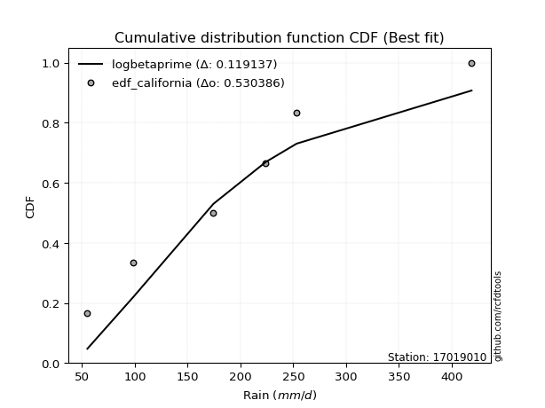</img>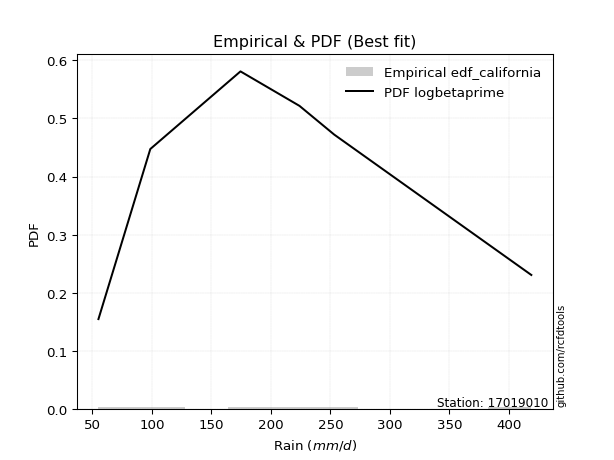</img>

</div>


### 2. EDF Hazen (1930)

Hazen method for plotting positions is a formula used to estimate the empirical cumulative probability distribution of flood events or other hydrological data. This formula often results in biased estimations, particularly when extrapolating to extreme events (high return periods).

<div align="center">


$P=(m-0.5)/n$


</div>


**2.1. Empirical values**

<div align="center">

|                | 0                   | 1                  | 2                  | 3                  | 4         | 5                  |
|:---------------|:--------------------|:-------------------|:-------------------|:-------------------|:----------|:-------------------|
| date           | 2021                | 2022               | 2019               | 2017               | 2016      | 2018               |
| x              | 55.0                | 98.6               | 174.4              | 224.0              | 253.2     | 418.9              |
| m              | 1                   | 2                  | 3                  | 4                  | 5         | 6                  |
| empirical_dist | edf_hazen           | edf_hazen          | edf_hazen          | edf_hazen          | edf_hazen | edf_hazen          |
| empirical      | 0.08333333333333333 | 0.25               | 0.4166666666666667 | 0.5833333333333334 | 0.75      | 0.9166666666666666 |
| empirical_tr   | 1.090909090909091   | 1.3333333333333333 | 1.7142857142857144 | 2.4000000000000004 | 4.0       | 11.999999999999995 |

</div>


**2.2. Kolmogorov-Smirnov fit test (sorted by Δ)**


<div align="center">

|                | 0                   | 1                    | 2                   | 3                    | 4                   | 5                  | 6                   | 7                   | 8                   | 9                   | 10                  | 11                  | 12                    | 13                  | 14                  | 15                  | 16                  | 17                 | 18                  | 19                  | 20                  | 21                  | 22                  | 23                  | 24                  | 25                  | 26                  | 27                  | 28                 | 29                  | 30                 | 31                  | 32                  | 33                  | 34                  | 35                 | 36                 | 37                 | 38                  | 39                  | 40                  | 41                  | 42                 | 43                  | 44                  | 45                  | 46                  | 47                  | 48                 | 49                  | 50                  | 51                  | 52                  | 53                  | 54                 | 55                  | 56                 | 57                  | 58                 | 59                 | 60                  | 61                 | 62                  | 63                  | 64                  | 65                  | 66                 | 67                  | 68                  | 69                  | 70                 | 71                 | 72                  | 73                  | 74                 | 75                  | 76             | 77                  | 78               | 79                  | 80                 | 81                  | 82                  | 83                  | 84                 | 85                 | 86                 | 87                 |
|:---------------|:--------------------|:---------------------|:--------------------|:---------------------|:--------------------|:-------------------|:--------------------|:--------------------|:--------------------|:--------------------|:--------------------|:--------------------|:----------------------|:--------------------|:--------------------|:--------------------|:--------------------|:-------------------|:--------------------|:--------------------|:--------------------|:--------------------|:--------------------|:--------------------|:--------------------|:--------------------|:--------------------|:--------------------|:-------------------|:--------------------|:-------------------|:--------------------|:--------------------|:--------------------|:--------------------|:-------------------|:-------------------|:-------------------|:--------------------|:--------------------|:--------------------|:--------------------|:-------------------|:--------------------|:--------------------|:--------------------|:--------------------|:--------------------|:-------------------|:--------------------|:--------------------|:--------------------|:--------------------|:--------------------|:-------------------|:--------------------|:-------------------|:--------------------|:-------------------|:-------------------|:--------------------|:-------------------|:--------------------|:--------------------|:--------------------|:--------------------|:-------------------|:--------------------|:--------------------|:--------------------|:-------------------|:-------------------|:--------------------|:--------------------|:-------------------|:--------------------|:---------------|:--------------------|:-----------------|:--------------------|:-------------------|:--------------------|:--------------------|:--------------------|:-------------------|:-------------------|:-------------------|:-------------------|
| station        | 17019010            | 17019010             | 17019010            | 17019010             | 17019010            | 17019010           | 17019010            | 17019010            | 17019010            | 17019010            | 17019010            | 17019010            | 17019010              | 17019010            | 17019010            | 17019010            | 17019010            | 17019010           | 17019010            | 17019010            | 17019010            | 17019010            | 17019010            | 17019010            | 17019010            | 17019010            | 17019010            | 17019010            | 17019010           | 17019010            | 17019010           | 17019010            | 17019010            | 17019010            | 17019010            | 17019010           | 17019010           | 17019010           | 17019010            | 17019010            | 17019010            | 17019010            | 17019010           | 17019010            | 17019010            | 17019010            | 17019010            | 17019010            | 17019010           | 17019010            | 17019010            | 17019010            | 17019010            | 17019010            | 17019010           | 17019010            | 17019010           | 17019010            | 17019010           | 17019010           | 17019010            | 17019010           | 17019010            | 17019010            | 17019010            | 17019010            | 17019010           | 17019010            | 17019010            | 17019010            | 17019010           | 17019010           | 17019010            | 17019010            | 17019010           | 17019010            | 17019010       | 17019010            | 17019010         | 17019010            | 17019010           | 17019010            | 17019010            | 17019010            | 17019010           | 17019010           | 17019010           | 17019010           |
| empirical_dist | edf_hazen           | edf_hazen            | edf_hazen           | edf_hazen            | edf_hazen           | edf_hazen          | edf_hazen           | edf_hazen           | edf_hazen           | edf_hazen           | edf_hazen           | edf_hazen           | edf_hazen             | edf_hazen           | edf_hazen           | edf_hazen           | edf_hazen           | edf_hazen          | edf_hazen           | edf_hazen           | edf_hazen           | edf_hazen           | edf_hazen           | edf_hazen           | edf_hazen           | edf_hazen           | edf_hazen           | edf_hazen           | edf_hazen          | edf_hazen           | edf_hazen          | edf_hazen           | edf_hazen           | edf_hazen           | edf_hazen           | edf_hazen          | edf_hazen          | edf_hazen          | edf_hazen           | edf_hazen           | edf_hazen           | edf_hazen           | edf_hazen          | edf_hazen           | edf_hazen           | edf_hazen           | edf_hazen           | edf_hazen           | edf_hazen          | edf_hazen           | edf_hazen           | edf_hazen           | edf_hazen           | edf_hazen           | edf_hazen          | edf_hazen           | edf_hazen          | edf_hazen           | edf_hazen          | edf_hazen          | edf_hazen           | edf_hazen          | edf_hazen           | edf_hazen           | edf_hazen           | edf_hazen           | edf_hazen          | edf_hazen           | edf_hazen           | edf_hazen           | edf_hazen          | edf_hazen          | edf_hazen           | edf_hazen           | edf_hazen          | edf_hazen           | edf_hazen      | edf_hazen           | edf_hazen        | edf_hazen           | edf_hazen          | edf_hazen           | edf_hazen           | edf_hazen           | edf_hazen          | edf_hazen          | edf_hazen          | edf_hazen          |
| p_dist         | logjohnsonsu        | logloggamma          | logweibull_min      | ncf                  | rayleigh            | pearson3           | loggenlogistic      | invgamma            | mielke              | betaprime           | halfnorm            | kstwobign           | loglaplace_asymmetric | genlogistic         | maxwell             | alpha               | loggumbel_l         | fisk               | exponnorm           | nct                 | johnsonsu           | logfisk             | logpearson3         | gumbel_r            | gompertz            | halflogistic        | invgauss            | logistic            | rice               | crystalball         | t                  | norm                | truncnorm           | laplace_asymmetric  | hypsecant           | moyal              | f                  | logexponnorm       | logcrystalball      | lognorm             | lognorm             | logt                | logfatiguelife     | logf                | lognct              | laplace             | loglogistic         | logncf              | logbetaprime       | logerlang           | loggamma            | loggamma            | loghypsecant        | logrice             | loginvgamma        | logalpha            | loginvgauss        | gumbel_l            | expon              | genexpon           | logmaxwell          | loglaplace         | lograyleigh         | loginvweibull       | loggompertz         | logkstwobign        | loggumbel_r        | loghalfnorm         | weibull_min         | loggenexpon         | logmoyal           | loghalflogistic    | logexpon            | logmielke           | wald               | nakagami            | gibrat         | gamma               | logwald          | logchi2             | loggibrat          | chi2                | erlang              | invweibull          | loglognorm         | lognakagami        | logtruncnorm       | fatiguelife        |
| delta          | 0.05718761458665628 | 0.058022920524780586 | 0.05821328621749608 | 0.059410447641909336 | 0.06167109484487443 | 0.0626858491892684 | 0.06379456563971919 | 0.06446309772469191 | 0.06492369145700916 | 0.06500876140938622 | 0.06522460052402523 | 0.06646652293914251 | 0.06668658410480435   | 0.06701137969274207 | 0.06774459725362725 | 0.06854207075753563 | 0.06910011003136471 | 0.0697876566312591 | 0.06986724569864994 | 0.07402213872774568 | 0.07558108422340815 | 0.07669856107969214 | 0.07958378663343513 | 0.07967542169940037 | 0.08333333333333023 | 0.08333333333333333 | 0.08458919640818868 | 0.08532302691728696 | 0.0856601280261575 | 0.08763736287826418 | 0.0880153119396545 | 0.08808455839498508 | 0.08808455982229035 | 0.09152075567361415 | 0.09700921446932287 | 0.0979122751577334 | 0.1014496100543823 | 0.1059573803198211 | 0.10595802396502346 | 0.10595847716550194 | 0.10595847716550194 | 0.10595933061288126 | 0.1064881851009783 | 0.10731985530701377 | 0.10773064470677524 | 0.10903509730340005 | 0.10904086724826684 | 0.11293936297404533 | 0.1133444547559202 | 0.11389411977138858 | 0.11421396037824488 | 0.11421396037824488 | 0.11924658772278063 | 0.11995448501720457 | 0.1208072343602829 | 0.12429667448697362 | 0.1276942089300725 | 0.13314182225378723 | 0.1345668715902501 | 0.1347401482237774 | 0.13796627390643973 | 0.1466454899387698 | 0.14845133699760577 | 0.15354998303101702 | 0.16294843951379284 | 0.17503746875405174 | 0.1766363050211473 | 0.17797560779540117 | 0.18306890732532421 | 0.18423995635557328 | 0.2021865371329658 | 0.2041485540137175 | 0.22759874801110663 | 0.24049761890890148 | 0.2447970762980221 | 0.24999999943968243 | 0.25           | 0.25826492116832184 | 0.27314159203686 | 0.29952675547595986 | 0.2995833263656103 | 0.32355913453705526 | 0.37581541005785185 | 0.38583393026819635 | 0.4013874240535926 | 0.4159305273077269 | 0.4166666593875272 | 0.4821608218341452 |
| deltao         | 0.530385761606      | 0.530385761606       | 0.530385761606      | 0.530385761606       | 0.530385761606      | 0.530385761606     | 0.530385761606      | 0.530385761606      | 0.530385761606      | 0.530385761606      | 0.530385761606      | 0.530385761606      | 0.530385761606        | 0.530385761606      | 0.530385761606      | 0.530385761606      | 0.530385761606      | 0.530385761606     | 0.530385761606      | 0.530385761606      | 0.530385761606      | 0.530385761606      | 0.530385761606      | 0.530385761606      | 0.530385761606      | 0.530385761606      | 0.530385761606      | 0.530385761606      | 0.530385761606     | 0.530385761606      | 0.530385761606     | 0.530385761606      | 0.530385761606      | 0.530385761606      | 0.530385761606      | 0.530385761606     | 0.530385761606     | 0.530385761606     | 0.530385761606      | 0.530385761606      | 0.530385761606      | 0.530385761606      | 0.530385761606     | 0.530385761606      | 0.530385761606      | 0.530385761606      | 0.530385761606      | 0.530385761606      | 0.530385761606     | 0.530385761606      | 0.530385761606      | 0.530385761606      | 0.530385761606      | 0.530385761606      | 0.530385761606     | 0.530385761606      | 0.530385761606     | 0.530385761606      | 0.530385761606     | 0.530385761606     | 0.530385761606      | 0.530385761606     | 0.530385761606      | 0.530385761606      | 0.530385761606      | 0.530385761606      | 0.530385761606     | 0.530385761606      | 0.530385761606      | 0.530385761606      | 0.530385761606     | 0.530385761606     | 0.530385761606      | 0.530385761606      | 0.530385761606     | 0.530385761606      | 0.530385761606 | 0.530385761606      | 0.530385761606   | 0.530385761606      | 0.530385761606     | 0.530385761606      | 0.530385761606      | 0.530385761606      | 0.530385761606     | 0.530385761606     | 0.530385761606     | 0.530385761606     |
| eval           | Δo > Δ              | Δo > Δ               | Δo > Δ              | Δo > Δ               | Δo > Δ              | Δo > Δ             | Δo > Δ              | Δo > Δ              | Δo > Δ              | Δo > Δ              | Δo > Δ              | Δo > Δ              | Δo > Δ                | Δo > Δ              | Δo > Δ              | Δo > Δ              | Δo > Δ              | Δo > Δ             | Δo > Δ              | Δo > Δ              | Δo > Δ              | Δo > Δ              | Δo > Δ              | Δo > Δ              | Δo > Δ              | Δo > Δ              | Δo > Δ              | Δo > Δ              | Δo > Δ             | Δo > Δ              | Δo > Δ             | Δo > Δ              | Δo > Δ              | Δo > Δ              | Δo > Δ              | Δo > Δ             | Δo > Δ             | Δo > Δ             | Δo > Δ              | Δo > Δ              | Δo > Δ              | Δo > Δ              | Δo > Δ             | Δo > Δ              | Δo > Δ              | Δo > Δ              | Δo > Δ              | Δo > Δ              | Δo > Δ             | Δo > Δ              | Δo > Δ              | Δo > Δ              | Δo > Δ              | Δo > Δ              | Δo > Δ             | Δo > Δ              | Δo > Δ             | Δo > Δ              | Δo > Δ             | Δo > Δ             | Δo > Δ              | Δo > Δ             | Δo > Δ              | Δo > Δ              | Δo > Δ              | Δo > Δ              | Δo > Δ             | Δo > Δ              | Δo > Δ              | Δo > Δ              | Δo > Δ             | Δo > Δ             | Δo > Δ              | Δo > Δ              | Δo > Δ             | Δo > Δ              | Δo > Δ         | Δo > Δ              | Δo > Δ           | Δo > Δ              | Δo > Δ             | Δo > Δ              | Δo > Δ              | Δo > Δ              | Δo > Δ             | Δo > Δ             | Δo > Δ             | Δo > Δ             |
| fit            | 1                   | 1                    | 1                   | 1                    | 1                   | 1                  | 1                   | 1                   | 1                   | 1                   | 1                   | 1                   | 1                     | 1                   | 1                   | 1                   | 1                   | 1                  | 1                   | 1                   | 1                   | 1                   | 1                   | 1                   | 1                   | 1                   | 1                   | 1                   | 1                  | 1                   | 1                  | 1                   | 1                   | 1                   | 1                   | 1                  | 1                  | 1                  | 1                   | 1                   | 1                   | 1                   | 1                  | 1                   | 1                   | 1                   | 1                   | 1                   | 1                  | 1                   | 1                   | 1                   | 1                   | 1                   | 1                  | 1                   | 1                  | 1                   | 1                  | 1                  | 1                   | 1                  | 1                   | 1                   | 1                   | 1                   | 1                  | 1                   | 1                   | 1                   | 1                  | 1                  | 1                   | 1                   | 1                  | 1                   | 1              | 1                   | 1                | 1                   | 1                  | 1                   | 1                   | 1                   | 1                  | 1                  | 1                  | 1                  |
| n              | 6                   | 6                    | 6                   | 6                    | 6                   | 6                  | 6                   | 6                   | 6                   | 6                   | 6                   | 6                   | 6                     | 6                   | 6                   | 6                   | 6                   | 6                  | 6                   | 6                   | 6                   | 6                   | 6                   | 6                   | 6                   | 6                   | 6                   | 6                   | 6                  | 6                   | 6                  | 6                   | 6                   | 6                   | 6                   | 6                  | 6                  | 6                  | 6                   | 6                   | 6                   | 6                   | 6                  | 6                   | 6                   | 6                   | 6                   | 6                   | 6                  | 6                   | 6                   | 6                   | 6                   | 6                   | 6                  | 6                   | 6                  | 6                   | 6                  | 6                  | 6                   | 6                  | 6                   | 6                   | 6                   | 6                   | 6                  | 6                   | 6                   | 6                   | 6                  | 6                  | 6                   | 6                   | 6                  | 6                   | 6              | 6                   | 6                | 6                   | 6                  | 6                   | 6                   | 6                   | 6                  | 6                  | 6                  | 6                  |
| best_fit       | 1                   | 0                    | 0                   | 0                    | 0                   | 0                  | 0                   | 0                   | 0                   | 0                   | 0                   | 0                   | 0                     | 0                   | 0                   | 0                   | 0                   | 0                  | 0                   | 0                   | 0                   | 0                   | 0                   | 0                   | 0                   | 0                   | 0                   | 0                   | 0                  | 0                   | 0                  | 0                   | 0                   | 0                   | 0                   | 0                  | 0                  | 0                  | 0                   | 0                   | 0                   | 0                   | 0                  | 0                   | 0                   | 0                   | 0                   | 0                   | 0                  | 0                   | 0                   | 0                   | 0                   | 0                   | 0                  | 0                   | 0                  | 0                   | 0                  | 0                  | 0                   | 0                  | 0                   | 0                   | 0                   | 0                   | 0                  | 0                   | 0                   | 0                   | 0                  | 0                  | 0                   | 0                   | 0                  | 0                   | 0              | 0                   | 0                | 0                   | 0                  | 0                   | 0                   | 0                   | 0                  | 0                  | 0                  | 0                  |
| best_fit_sort  | 1                   | 2                    | 3                   | 4                    | 5                   | 6                  | 7                   | 8                   | 9                   | 10                  | 11                  | 12                  | 13                    | 14                  | 15                  | 16                  | 17                  | 18                 | 19                  | 20                  | 21                  | 22                  | 23                  | 24                  | 25                  | 26                  | 27                  | 28                  | 29                 | 30                  | 31                 | 32                  | 33                  | 34                  | 35                  | 36                 | 37                 | 38                 | 39                  | 40                  | 41                  | 42                  | 43                 | 44                  | 45                  | 46                  | 47                  | 48                  | 49                 | 50                  | 51                  | 52                  | 53                  | 54                  | 55                 | 56                  | 57                 | 58                  | 59                 | 60                 | 61                  | 62                 | 63                  | 64                  | 65                  | 66                  | 67                 | 68                  | 69                  | 70                  | 71                 | 72                 | 73                  | 74                  | 75                 | 76                  | 77             | 78                  | 79               | 80                  | 81                 | 82                  | 83                  | 84                  | 85                 | 86                 | 87                 | 88                 |

</div>


**2.3. Best fit**

<div align="center">

|   id |   station | empirical_dist   | p_dist       |     delta |   deltao | eval   |   fit |   n |   best_fit |   best_fit_sort |
|-----:|----------:|:-----------------|:-------------|----------:|---------:|:-------|------:|----:|-----------:|----------------:|
|    0 |  17019010 | edf_hazen        | logjohnsonsu | 0.0571876 | 0.530386 | Δo > Δ |     1 |   6 |          1 |               1 |

</div>


<div align="center">

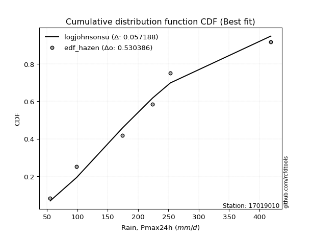</img>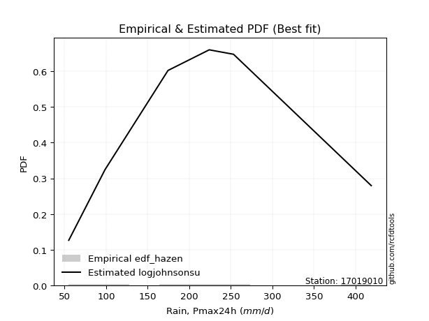</img>

</div>


### 3. EDF Weibull (1939)

Weibull plotting position formula is an empirical method used to estimate the non-exceedance probability or plotting position for a set of observed data, is often recommended or widely used in practice, particularly in flood frequency analysis.

<div align="center">


$P=m/(n+1)$


</div>


**3.1. Empirical values**

<div align="center">

|                | 0                   | 1                  | 2                   | 3                  | 4                  | 5                  |
|:---------------|:--------------------|:-------------------|:--------------------|:-------------------|:-------------------|:-------------------|
| date           | 2021                | 2022               | 2019                | 2017               | 2016               | 2018               |
| x              | 55.0                | 98.6               | 174.4               | 224.0              | 253.2              | 418.9              |
| m              | 1                   | 2                  | 3                   | 4                  | 5                  | 6                  |
| empirical_dist | edf_weibull         | edf_weibull        | edf_weibull         | edf_weibull        | edf_weibull        | edf_weibull        |
| empirical      | 0.14285714285714285 | 0.2857142857142857 | 0.42857142857142855 | 0.5714285714285714 | 0.7142857142857143 | 0.8571428571428571 |
| empirical_tr   | 1.1666666666666665  | 1.4                | 1.75                | 2.333333333333333  | 3.5                | 6.999999999999997  |

</div>


**3.2. Kolmogorov-Smirnov fit test (sorted by Δ)**


<div align="center">

|                | 0                   | 1                   | 2                   | 3                   | 4                   | 5                   | 6                   | 7                   | 8                   | 9                   | 10                  | 11                 | 12                | 13                | 14                  | 15                 | 16                  | 17                 | 18                  | 19                  | 20                  | 21                  | 22                  | 23                  | 24                  | 25                  | 26                  | 27                  | 28                  | 29                    | 30                  | 31                  | 32                 | 33                  | 34                  | 35                 | 36                  | 37                  | 38                  | 39                  | 40                  | 41                  | 42                  | 43                  | 44                  | 45                  | 46                  | 47                  | 48                 | 49                  | 50                  | 51                 | 52                  | 53                 | 54                 | 55                  | 56                  | 57                  | 58                  | 59                 | 60                  | 61                  | 62                  | 63                  | 64                  | 65                  | 66                  | 67                  | 68                 | 69                 | 70                  | 71                  | 72                  | 73                  | 74                  | 75                  | 76                 | 77                | 78                  | 79                 | 80                  | 81                 | 82                  | 83               | 84                 | 85                  | 86                 | 87                 |
|:---------------|:--------------------|:--------------------|:--------------------|:--------------------|:--------------------|:--------------------|:--------------------|:--------------------|:--------------------|:--------------------|:--------------------|:-------------------|:------------------|:------------------|:--------------------|:-------------------|:--------------------|:-------------------|:--------------------|:--------------------|:--------------------|:--------------------|:--------------------|:--------------------|:--------------------|:--------------------|:--------------------|:--------------------|:--------------------|:----------------------|:--------------------|:--------------------|:-------------------|:--------------------|:--------------------|:-------------------|:--------------------|:--------------------|:--------------------|:--------------------|:--------------------|:--------------------|:--------------------|:--------------------|:--------------------|:--------------------|:--------------------|:--------------------|:-------------------|:--------------------|:--------------------|:-------------------|:--------------------|:-------------------|:-------------------|:--------------------|:--------------------|:--------------------|:--------------------|:-------------------|:--------------------|:--------------------|:--------------------|:--------------------|:--------------------|:--------------------|:--------------------|:--------------------|:-------------------|:-------------------|:--------------------|:--------------------|:--------------------|:--------------------|:--------------------|:--------------------|:-------------------|:------------------|:--------------------|:-------------------|:--------------------|:-------------------|:--------------------|:-----------------|:-------------------|:--------------------|:-------------------|:-------------------|
| station        | 17019010            | 17019010            | 17019010            | 17019010            | 17019010            | 17019010            | 17019010            | 17019010            | 17019010            | 17019010            | 17019010            | 17019010           | 17019010          | 17019010          | 17019010            | 17019010           | 17019010            | 17019010           | 17019010            | 17019010            | 17019010            | 17019010            | 17019010            | 17019010            | 17019010            | 17019010            | 17019010            | 17019010            | 17019010            | 17019010              | 17019010            | 17019010            | 17019010           | 17019010            | 17019010            | 17019010           | 17019010            | 17019010            | 17019010            | 17019010            | 17019010            | 17019010            | 17019010            | 17019010            | 17019010            | 17019010            | 17019010            | 17019010            | 17019010           | 17019010            | 17019010            | 17019010           | 17019010            | 17019010           | 17019010           | 17019010            | 17019010            | 17019010            | 17019010            | 17019010           | 17019010            | 17019010            | 17019010            | 17019010            | 17019010            | 17019010            | 17019010            | 17019010            | 17019010           | 17019010           | 17019010            | 17019010            | 17019010            | 17019010            | 17019010            | 17019010            | 17019010           | 17019010          | 17019010            | 17019010           | 17019010            | 17019010           | 17019010            | 17019010         | 17019010           | 17019010            | 17019010           | 17019010           |
| empirical_dist | edf_weibull         | edf_weibull         | edf_weibull         | edf_weibull         | edf_weibull         | edf_weibull         | edf_weibull         | edf_weibull         | edf_weibull         | edf_weibull         | edf_weibull         | edf_weibull        | edf_weibull       | edf_weibull       | edf_weibull         | edf_weibull        | edf_weibull         | edf_weibull        | edf_weibull         | edf_weibull         | edf_weibull         | edf_weibull         | edf_weibull         | edf_weibull         | edf_weibull         | edf_weibull         | edf_weibull         | edf_weibull         | edf_weibull         | edf_weibull           | edf_weibull         | edf_weibull         | edf_weibull        | edf_weibull         | edf_weibull         | edf_weibull        | edf_weibull         | edf_weibull         | edf_weibull         | edf_weibull         | edf_weibull         | edf_weibull         | edf_weibull         | edf_weibull         | edf_weibull         | edf_weibull         | edf_weibull         | edf_weibull         | edf_weibull        | edf_weibull         | edf_weibull         | edf_weibull        | edf_weibull         | edf_weibull        | edf_weibull        | edf_weibull         | edf_weibull         | edf_weibull         | edf_weibull         | edf_weibull        | edf_weibull         | edf_weibull         | edf_weibull         | edf_weibull         | edf_weibull         | edf_weibull         | edf_weibull         | edf_weibull         | edf_weibull        | edf_weibull        | edf_weibull         | edf_weibull         | edf_weibull         | edf_weibull         | edf_weibull         | edf_weibull         | edf_weibull        | edf_weibull       | edf_weibull         | edf_weibull        | edf_weibull         | edf_weibull        | edf_weibull         | edf_weibull      | edf_weibull        | edf_weibull         | edf_weibull        | edf_weibull        |
| p_dist         | logpearson3         | invgauss            | ncf                 | betaprime           | johnsonsu           | logjohnsonsu        | rayleigh            | logloggamma         | logweibull_min      | maxwell             | logt                | logexponnorm       | lognorm           | lognorm           | logcrystalball      | lognct             | logfatiguelife      | logf               | pearson3            | loggenlogistic      | logfisk             | invgamma            | mielke              | logncf              | logbetaprime        | logerlang           | kstwobign           | loggamma            | loggamma            | loglaplace_asymmetric | genlogistic         | alpha               | fisk               | exponnorm           | loggumbel_l         | truncnorm          | norm                | t                   | loginvgamma         | nct                 | crystalball         | logrice             | logalpha            | halfnorm            | gumbel_r            | loginvgauss         | loglogistic         | logistic            | rice               | logmaxwell          | laplace_asymmetric  | loghypsecant       | hypsecant           | moyal              | lograyleigh        | gumbel_l            | loginvweibull       | genexpon            | f                   | weibull_min        | gompertz            | expon               | halflogistic        | laplace             | loggompertz         | loglaplace          | logkstwobign        | loggumbel_r         | loghalfnorm        | loggenexpon        | logmoyal            | loghalflogistic     | logexpon            | logmielke           | gamma               | logwald             | wald               | logchi2           | nakagami            | gibrat             | loggibrat           | chi2               | invweibull          | erlang           | loglognorm         | lognakagami         | logtruncnorm       | fatiguelife        |
| delta          | 0.08759318592408982 | 0.08900836751533905 | 0.09187055773448993 | 0.09249105759090423 | 0.09288267493449337 | 0.09290190030094198 | 0.09299691109198349 | 0.09373720623906628 | 0.09392757193178178 | 0.09641353763246019 | 0.09736930986814407 | 0.0973694686455817 | 0.097369745768811 | 0.097369745768811 | 0.09736980243309667 | 0.0977557584732085 | 0.09812158194480006 | 0.0983521356499415 | 0.09840013490355409 | 0.09950885135400489 | 0.10008371509137218 | 0.10017738343897761 | 0.10063797717129486 | 0.10103460106928347 | 0.10143969285115834 | 0.10198935786662672 | 0.10218080865342821 | 0.10230919847348302 | 0.10230919847348302 | 0.10240086981909005   | 0.10272566540702777 | 0.10425635647182133 | 0.1055019423455448 | 0.10558153141293564 | 0.10634080714217176 | 0.1088511163357836 | 0.10885111711569251 | 0.10886987383957525 | 0.10890247245552104 | 0.10973642444203138 | 0.10988238469041056 | 0.11019904072184057 | 0.11239191258221176 | 0.11493607275192685 | 0.11538970741368607 | 0.11578944702531063 | 0.11644330512077128 | 0.12103731263157266 | 0.1213744137404432 | 0.12606151200167787 | 0.12723504138789984 | 0.1311513496275426 | 0.13272350018360857 | 0.1336265608720191 | 0.1365465750928439 | 0.13992466440159534 | 0.14164522112625516 | 0.14285642231927462 | 0.14285713716482254 | 0.1428571428246151 | 0.14285714285713974 | 0.14285714285714285 | 0.14285714285714285 | 0.14474938301768575 | 0.15104367760903098 | 0.15855025184353178 | 0.16313270684928988 | 0.16473154311638544 | 0.1660708458906393 | 0.1723351944508114 | 0.19028177522820394 | 0.19224379210895565 | 0.21569398610634477 | 0.22859285700413962 | 0.24636015926355997 | 0.26123683013209814 | 0.2805113620123078 | 0.284608579701533 | 0.28571428515396813 | 0.2857142857142857 | 0.28767856446084844 | 0.3116543726322934 | 0.35011964455391065 | 0.36391064815309 | 0.3656731383393069 | 0.40402576540296503 | 0.4285714212922891 | 0.4464465361198595 |
| deltao         | 0.530385761606      | 0.530385761606      | 0.530385761606      | 0.530385761606      | 0.530385761606      | 0.530385761606      | 0.530385761606      | 0.530385761606      | 0.530385761606      | 0.530385761606      | 0.530385761606      | 0.530385761606     | 0.530385761606    | 0.530385761606    | 0.530385761606      | 0.530385761606     | 0.530385761606      | 0.530385761606     | 0.530385761606      | 0.530385761606      | 0.530385761606      | 0.530385761606      | 0.530385761606      | 0.530385761606      | 0.530385761606      | 0.530385761606      | 0.530385761606      | 0.530385761606      | 0.530385761606      | 0.530385761606        | 0.530385761606      | 0.530385761606      | 0.530385761606     | 0.530385761606      | 0.530385761606      | 0.530385761606     | 0.530385761606      | 0.530385761606      | 0.530385761606      | 0.530385761606      | 0.530385761606      | 0.530385761606      | 0.530385761606      | 0.530385761606      | 0.530385761606      | 0.530385761606      | 0.530385761606      | 0.530385761606      | 0.530385761606     | 0.530385761606      | 0.530385761606      | 0.530385761606     | 0.530385761606      | 0.530385761606     | 0.530385761606     | 0.530385761606      | 0.530385761606      | 0.530385761606      | 0.530385761606      | 0.530385761606     | 0.530385761606      | 0.530385761606      | 0.530385761606      | 0.530385761606      | 0.530385761606      | 0.530385761606      | 0.530385761606      | 0.530385761606      | 0.530385761606     | 0.530385761606     | 0.530385761606      | 0.530385761606      | 0.530385761606      | 0.530385761606      | 0.530385761606      | 0.530385761606      | 0.530385761606     | 0.530385761606    | 0.530385761606      | 0.530385761606     | 0.530385761606      | 0.530385761606     | 0.530385761606      | 0.530385761606   | 0.530385761606     | 0.530385761606      | 0.530385761606     | 0.530385761606     |
| eval           | Δo > Δ              | Δo > Δ              | Δo > Δ              | Δo > Δ              | Δo > Δ              | Δo > Δ              | Δo > Δ              | Δo > Δ              | Δo > Δ              | Δo > Δ              | Δo > Δ              | Δo > Δ             | Δo > Δ            | Δo > Δ            | Δo > Δ              | Δo > Δ             | Δo > Δ              | Δo > Δ             | Δo > Δ              | Δo > Δ              | Δo > Δ              | Δo > Δ              | Δo > Δ              | Δo > Δ              | Δo > Δ              | Δo > Δ              | Δo > Δ              | Δo > Δ              | Δo > Δ              | Δo > Δ                | Δo > Δ              | Δo > Δ              | Δo > Δ             | Δo > Δ              | Δo > Δ              | Δo > Δ             | Δo > Δ              | Δo > Δ              | Δo > Δ              | Δo > Δ              | Δo > Δ              | Δo > Δ              | Δo > Δ              | Δo > Δ              | Δo > Δ              | Δo > Δ              | Δo > Δ              | Δo > Δ              | Δo > Δ             | Δo > Δ              | Δo > Δ              | Δo > Δ             | Δo > Δ              | Δo > Δ             | Δo > Δ             | Δo > Δ              | Δo > Δ              | Δo > Δ              | Δo > Δ              | Δo > Δ             | Δo > Δ              | Δo > Δ              | Δo > Δ              | Δo > Δ              | Δo > Δ              | Δo > Δ              | Δo > Δ              | Δo > Δ              | Δo > Δ             | Δo > Δ             | Δo > Δ              | Δo > Δ              | Δo > Δ              | Δo > Δ              | Δo > Δ              | Δo > Δ              | Δo > Δ             | Δo > Δ            | Δo > Δ              | Δo > Δ             | Δo > Δ              | Δo > Δ             | Δo > Δ              | Δo > Δ           | Δo > Δ             | Δo > Δ              | Δo > Δ             | Δo > Δ             |
| fit            | 1                   | 1                   | 1                   | 1                   | 1                   | 1                   | 1                   | 1                   | 1                   | 1                   | 1                   | 1                  | 1                 | 1                 | 1                   | 1                  | 1                   | 1                  | 1                   | 1                   | 1                   | 1                   | 1                   | 1                   | 1                   | 1                   | 1                   | 1                   | 1                   | 1                     | 1                   | 1                   | 1                  | 1                   | 1                   | 1                  | 1                   | 1                   | 1                   | 1                   | 1                   | 1                   | 1                   | 1                   | 1                   | 1                   | 1                   | 1                   | 1                  | 1                   | 1                   | 1                  | 1                   | 1                  | 1                  | 1                   | 1                   | 1                   | 1                   | 1                  | 1                   | 1                   | 1                   | 1                   | 1                   | 1                   | 1                   | 1                   | 1                  | 1                  | 1                   | 1                   | 1                   | 1                   | 1                   | 1                   | 1                  | 1                 | 1                   | 1                  | 1                   | 1                  | 1                   | 1                | 1                  | 1                   | 1                  | 1                  |
| n              | 6                   | 6                   | 6                   | 6                   | 6                   | 6                   | 6                   | 6                   | 6                   | 6                   | 6                   | 6                  | 6                 | 6                 | 6                   | 6                  | 6                   | 6                  | 6                   | 6                   | 6                   | 6                   | 6                   | 6                   | 6                   | 6                   | 6                   | 6                   | 6                   | 6                     | 6                   | 6                   | 6                  | 6                   | 6                   | 6                  | 6                   | 6                   | 6                   | 6                   | 6                   | 6                   | 6                   | 6                   | 6                   | 6                   | 6                   | 6                   | 6                  | 6                   | 6                   | 6                  | 6                   | 6                  | 6                  | 6                   | 6                   | 6                   | 6                   | 6                  | 6                   | 6                   | 6                   | 6                   | 6                   | 6                   | 6                   | 6                   | 6                  | 6                  | 6                   | 6                   | 6                   | 6                   | 6                   | 6                   | 6                  | 6                 | 6                   | 6                  | 6                   | 6                  | 6                   | 6                | 6                  | 6                   | 6                  | 6                  |
| best_fit       | 1                   | 0                   | 0                   | 0                   | 0                   | 0                   | 0                   | 0                   | 0                   | 0                   | 0                   | 0                  | 0                 | 0                 | 0                   | 0                  | 0                   | 0                  | 0                   | 0                   | 0                   | 0                   | 0                   | 0                   | 0                   | 0                   | 0                   | 0                   | 0                   | 0                     | 0                   | 0                   | 0                  | 0                   | 0                   | 0                  | 0                   | 0                   | 0                   | 0                   | 0                   | 0                   | 0                   | 0                   | 0                   | 0                   | 0                   | 0                   | 0                  | 0                   | 0                   | 0                  | 0                   | 0                  | 0                  | 0                   | 0                   | 0                   | 0                   | 0                  | 0                   | 0                   | 0                   | 0                   | 0                   | 0                   | 0                   | 0                   | 0                  | 0                  | 0                   | 0                   | 0                   | 0                   | 0                   | 0                   | 0                  | 0                 | 0                   | 0                  | 0                   | 0                  | 0                   | 0                | 0                  | 0                   | 0                  | 0                  |
| best_fit_sort  | 1                   | 2                   | 3                   | 4                   | 5                   | 6                   | 7                   | 8                   | 9                   | 10                  | 11                  | 12                 | 13                | 14                | 15                  | 16                 | 17                  | 18                 | 19                  | 20                  | 21                  | 22                  | 23                  | 24                  | 25                  | 26                  | 27                  | 28                  | 29                  | 30                    | 31                  | 32                  | 33                 | 34                  | 35                  | 36                 | 37                  | 38                  | 39                  | 40                  | 41                  | 42                  | 43                  | 44                  | 45                  | 46                  | 47                  | 48                  | 49                 | 50                  | 51                  | 52                 | 53                  | 54                 | 55                 | 56                  | 57                  | 58                  | 59                  | 60                 | 61                  | 62                  | 63                  | 64                  | 65                  | 66                  | 67                  | 68                  | 69                 | 70                 | 71                  | 72                  | 73                  | 74                  | 75                  | 76                  | 77                 | 78                | 79                  | 80                 | 81                  | 82                 | 83                  | 84               | 85                 | 86                  | 87                 | 88                 |

</div>


**3.3. Best fit**

<div align="center">

|   id |   station | empirical_dist   | p_dist      |     delta |   deltao | eval   |   fit |   n |   best_fit |   best_fit_sort |
|-----:|----------:|:-----------------|:------------|----------:|---------:|:-------|------:|----:|-----------:|----------------:|
|    0 |  17019010 | edf_weibull      | logpearson3 | 0.0875932 | 0.530386 | Δo > Δ |     1 |   6 |          1 |               1 |

</div>


<div align="center">

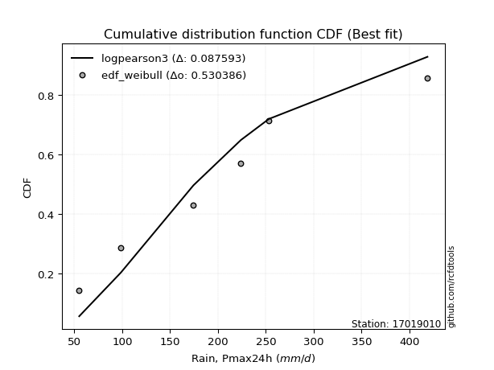</img>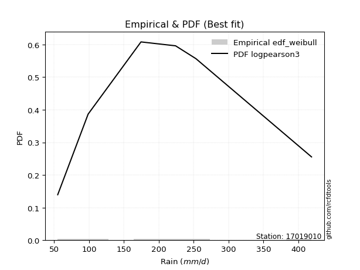</img>

</div>


### 4. EDF Beard (1943)

The Beard formula (or Beard´s plotting position formula) in hydrology is used to estimate the empirical non-exceedance probability _(P)_ of a flood event (or other extreme hydrological data point) within a given dataset.

<div align="center">


$P=(m-0.31)/(n+0.38)$


</div>


**4.1. Empirical values**

<div align="center">

|                | 0                   | 1                   | 2                  | 3                  | 4                  | 5                  |
|:---------------|:--------------------|:--------------------|:-------------------|:-------------------|:-------------------|:-------------------|
| date           | 2021                | 2022                | 2019               | 2017               | 2016               | 2018               |
| x              | 55.0                | 98.6                | 174.4              | 224.0              | 253.2              | 418.9              |
| m              | 1                   | 2                   | 3                  | 4                  | 5                  | 6                  |
| empirical_dist | edf_beard           | edf_beard           | edf_beard          | edf_beard          | edf_beard          | edf_beard          |
| empirical      | 0.10815047021943573 | 0.26489028213166144 | 0.4216300940438871 | 0.5783699059561128 | 0.7351097178683387 | 0.8918495297805643 |
| empirical_tr   | 1.1212653778558874  | 1.3603411513859276  | 1.7289972899728996 | 2.3717472118959106 | 3.7751479289940844 | 9.246376811594207  |

</div>


**4.2. Kolmogorov-Smirnov fit test (sorted by Δ)**


<div align="center">

|                | 0                   | 1                   | 2                   | 3                   | 4                   | 5                   | 6                   | 7                   | 8                   | 9                   | 10                  | 11                  | 12                  | 13                  | 14                  | 15                  | 16                  | 17                 | 18                  | 19                  | 20                    | 21                 | 22                  | 23                  | 24                  | 25                  | 26                  | 27                  | 28                 | 29                 | 30                  | 31                  | 32                  | 33                 | 34                 | 35                  | 36                  | 37                  | 38                 | 39                  | 40                  | 41                  | 42                  | 43                  | 44                  | 45                  | 46                  | 47                  | 48                  | 49                 | 50                  | 51                  | 52                  | 53                  | 54                  | 55                  | 56                  | 57                  | 58                  | 59                  | 60                 | 61                  | 62                  | 63                  | 64                 | 65                 | 66                 | 67                  | 68                  | 69                  | 70                  | 71                  | 72                 | 73                  | 74                 | 75                  | 76                  | 77                  | 78                  | 79                  | 80                  | 81                 | 82                 | 83                 | 84                 | 85                  | 86                  | 87                 |
|:---------------|:--------------------|:--------------------|:--------------------|:--------------------|:--------------------|:--------------------|:--------------------|:--------------------|:--------------------|:--------------------|:--------------------|:--------------------|:--------------------|:--------------------|:--------------------|:--------------------|:--------------------|:-------------------|:--------------------|:--------------------|:----------------------|:-------------------|:--------------------|:--------------------|:--------------------|:--------------------|:--------------------|:--------------------|:-------------------|:-------------------|:--------------------|:--------------------|:--------------------|:-------------------|:-------------------|:--------------------|:--------------------|:--------------------|:-------------------|:--------------------|:--------------------|:--------------------|:--------------------|:--------------------|:--------------------|:--------------------|:--------------------|:--------------------|:--------------------|:-------------------|:--------------------|:--------------------|:--------------------|:--------------------|:--------------------|:--------------------|:--------------------|:--------------------|:--------------------|:--------------------|:-------------------|:--------------------|:--------------------|:--------------------|:-------------------|:-------------------|:-------------------|:--------------------|:--------------------|:--------------------|:--------------------|:--------------------|:-------------------|:--------------------|:-------------------|:--------------------|:--------------------|:--------------------|:--------------------|:--------------------|:--------------------|:-------------------|:-------------------|:-------------------|:-------------------|:--------------------|:--------------------|:-------------------|
| station        | 17019010            | 17019010            | 17019010            | 17019010            | 17019010            | 17019010            | 17019010            | 17019010            | 17019010            | 17019010            | 17019010            | 17019010            | 17019010            | 17019010            | 17019010            | 17019010            | 17019010            | 17019010           | 17019010            | 17019010            | 17019010              | 17019010           | 17019010            | 17019010            | 17019010            | 17019010            | 17019010            | 17019010            | 17019010           | 17019010           | 17019010            | 17019010            | 17019010            | 17019010           | 17019010           | 17019010            | 17019010            | 17019010            | 17019010           | 17019010            | 17019010            | 17019010            | 17019010            | 17019010            | 17019010            | 17019010            | 17019010            | 17019010            | 17019010            | 17019010           | 17019010            | 17019010            | 17019010            | 17019010            | 17019010            | 17019010            | 17019010            | 17019010            | 17019010            | 17019010            | 17019010           | 17019010            | 17019010            | 17019010            | 17019010           | 17019010           | 17019010           | 17019010            | 17019010            | 17019010            | 17019010            | 17019010            | 17019010           | 17019010            | 17019010           | 17019010            | 17019010            | 17019010            | 17019010            | 17019010            | 17019010            | 17019010           | 17019010           | 17019010           | 17019010           | 17019010            | 17019010            | 17019010           |
| empirical_dist | edf_beard           | edf_beard           | edf_beard           | edf_beard           | edf_beard           | edf_beard           | edf_beard           | edf_beard           | edf_beard           | edf_beard           | edf_beard           | edf_beard           | edf_beard           | edf_beard           | edf_beard           | edf_beard           | edf_beard           | edf_beard          | edf_beard           | edf_beard           | edf_beard             | edf_beard          | edf_beard           | edf_beard           | edf_beard           | edf_beard           | edf_beard           | edf_beard           | edf_beard          | edf_beard          | edf_beard           | edf_beard           | edf_beard           | edf_beard          | edf_beard          | edf_beard           | edf_beard           | edf_beard           | edf_beard          | edf_beard           | edf_beard           | edf_beard           | edf_beard           | edf_beard           | edf_beard           | edf_beard           | edf_beard           | edf_beard           | edf_beard           | edf_beard          | edf_beard           | edf_beard           | edf_beard           | edf_beard           | edf_beard           | edf_beard           | edf_beard           | edf_beard           | edf_beard           | edf_beard           | edf_beard          | edf_beard           | edf_beard           | edf_beard           | edf_beard          | edf_beard          | edf_beard          | edf_beard           | edf_beard           | edf_beard           | edf_beard           | edf_beard           | edf_beard          | edf_beard           | edf_beard          | edf_beard           | edf_beard           | edf_beard           | edf_beard           | edf_beard           | edf_beard           | edf_beard          | edf_beard          | edf_beard          | edf_beard          | edf_beard           | edf_beard           | edf_beard          |
| p_dist         | rayleigh            | maxwell             | ncf                 | betaprime           | logjohnsonsu        | logloggamma         | logweibull_min      | johnsonsu           | logpearson3         | pearson3            | loggenlogistic      | logfisk             | invgamma            | t                   | truncnorm           | norm                | invgauss            | mielke             | halfnorm            | kstwobign           | loglaplace_asymmetric | genlogistic        | crystalball         | alpha               | loggumbel_l         | fisk                | exponnorm           | nct                 | gumbel_r           | logistic           | rice                | logexponnorm        | logcrystalball      | lognorm            | lognorm            | logt                | logfatiguelife      | logf                | lognct             | laplace_asymmetric  | logncf              | f                   | gompertz            | halflogistic        | logbetaprime        | logerlang           | loggamma            | loggamma            | loglogistic         | hypsecant          | moyal               | logrice             | loginvgamma         | gumbel_l            | logalpha            | loginvgauss         | laplace             | loghypsecant        | expon               | genexpon            | logmaxwell         | lograyleigh         | loginvweibull       | loglaplace          | loggompertz        | weibull_min        | logkstwobign       | loggumbel_r         | loghalfnorm         | loggenexpon         | logmoyal            | loghalflogistic     | logexpon           | logmielke           | gamma              | wald                | nakagami            | gibrat              | logwald             | logchi2             | loggibrat           | chi2               | erlang             | invweibull         | loglognorm         | lognakagami         | logtruncnorm        | fatiguelife        |
| delta          | 0.06556030105914545 | 0.06958441244716693 | 0.07104655415186567 | 0.07166705400827997 | 0.07207789671831771 | 0.07291320265644202 | 0.07310356834915752 | 0.07375836306242045 | 0.07462035925621469 | 0.07757613132092983 | 0.07868484777138063 | 0.07925971150874792 | 0.07935337985635335 | 0.07953677105533441 | 0.07956779531939184 | 0.07956779587962304 | 0.07962576903096824 | 0.0798139735886706 | 0.08022940011421974 | 0.08135680507080395 | 0.08157686623646579   | 0.0819016618244035 | 0.08237300361023053 | 0.08343235288919706 | 0.08399039216302615 | 0.08467793876292054 | 0.08475752783031137 | 0.08891242085940712 | 0.0945657038310618 | 0.1002133090489484 | 0.10055041015781893 | 0.10099395294260066 | 0.10099459658780302 | 0.1009950497882815 | 0.1009950497882815 | 0.10099590323566082 | 0.10152475772375785 | 0.10235642792979333 | 0.1027672173295548 | 0.10641103780527558 | 0.10797593559682489 | 0.10815046452711542 | 0.10815047021943264 | 0.10815047021943573 | 0.10838102737869976 | 0.10893069239416814 | 0.10925053300102444 | 0.10925053300102444 | 0.10950197059322986 | 0.1118994966009843 | 0.11280255728939484 | 0.11499105763998413 | 0.11584380698306246 | 0.11825154012212591 | 0.11933324710975318 | 0.12273078155285205 | 0.12392537943506149 | 0.12421001510000118 | 0.12960344421302966 | 0.12977672084655695 | 0.1330028465292193 | 0.14348790962038532 | 0.14858655565379658 | 0.15160891731599035 | 0.1579850121365724 | 0.1582517704392219 | 0.1700740413768313 | 0.17167287764392686 | 0.17301218041818073 | 0.17927652897835283 | 0.19722310975574536 | 0.19918512663649707 | 0.2226353206338862 | 0.23553419153168104 | 0.2533014937911014 | 0.25968735842968355 | 0.26489028157134387 | 0.26489028213166144 | 0.26817816465963956 | 0.29154991422907445 | 0.29461989898838986 | 0.3185957071598348 | 0.3708519826806314 | 0.3709436481365349 | 0.3864971419219312 | 0.41096709993050645 | 0.42163008676474767 | 0.4672705397024838 |
| deltao         | 0.530385761606      | 0.530385761606      | 0.530385761606      | 0.530385761606      | 0.530385761606      | 0.530385761606      | 0.530385761606      | 0.530385761606      | 0.530385761606      | 0.530385761606      | 0.530385761606      | 0.530385761606      | 0.530385761606      | 0.530385761606      | 0.530385761606      | 0.530385761606      | 0.530385761606      | 0.530385761606     | 0.530385761606      | 0.530385761606      | 0.530385761606        | 0.530385761606     | 0.530385761606      | 0.530385761606      | 0.530385761606      | 0.530385761606      | 0.530385761606      | 0.530385761606      | 0.530385761606     | 0.530385761606     | 0.530385761606      | 0.530385761606      | 0.530385761606      | 0.530385761606     | 0.530385761606     | 0.530385761606      | 0.530385761606      | 0.530385761606      | 0.530385761606     | 0.530385761606      | 0.530385761606      | 0.530385761606      | 0.530385761606      | 0.530385761606      | 0.530385761606      | 0.530385761606      | 0.530385761606      | 0.530385761606      | 0.530385761606      | 0.530385761606     | 0.530385761606      | 0.530385761606      | 0.530385761606      | 0.530385761606      | 0.530385761606      | 0.530385761606      | 0.530385761606      | 0.530385761606      | 0.530385761606      | 0.530385761606      | 0.530385761606     | 0.530385761606      | 0.530385761606      | 0.530385761606      | 0.530385761606     | 0.530385761606     | 0.530385761606     | 0.530385761606      | 0.530385761606      | 0.530385761606      | 0.530385761606      | 0.530385761606      | 0.530385761606     | 0.530385761606      | 0.530385761606     | 0.530385761606      | 0.530385761606      | 0.530385761606      | 0.530385761606      | 0.530385761606      | 0.530385761606      | 0.530385761606     | 0.530385761606     | 0.530385761606     | 0.530385761606     | 0.530385761606      | 0.530385761606      | 0.530385761606     |
| eval           | Δo > Δ              | Δo > Δ              | Δo > Δ              | Δo > Δ              | Δo > Δ              | Δo > Δ              | Δo > Δ              | Δo > Δ              | Δo > Δ              | Δo > Δ              | Δo > Δ              | Δo > Δ              | Δo > Δ              | Δo > Δ              | Δo > Δ              | Δo > Δ              | Δo > Δ              | Δo > Δ             | Δo > Δ              | Δo > Δ              | Δo > Δ                | Δo > Δ             | Δo > Δ              | Δo > Δ              | Δo > Δ              | Δo > Δ              | Δo > Δ              | Δo > Δ              | Δo > Δ             | Δo > Δ             | Δo > Δ              | Δo > Δ              | Δo > Δ              | Δo > Δ             | Δo > Δ             | Δo > Δ              | Δo > Δ              | Δo > Δ              | Δo > Δ             | Δo > Δ              | Δo > Δ              | Δo > Δ              | Δo > Δ              | Δo > Δ              | Δo > Δ              | Δo > Δ              | Δo > Δ              | Δo > Δ              | Δo > Δ              | Δo > Δ             | Δo > Δ              | Δo > Δ              | Δo > Δ              | Δo > Δ              | Δo > Δ              | Δo > Δ              | Δo > Δ              | Δo > Δ              | Δo > Δ              | Δo > Δ              | Δo > Δ             | Δo > Δ              | Δo > Δ              | Δo > Δ              | Δo > Δ             | Δo > Δ             | Δo > Δ             | Δo > Δ              | Δo > Δ              | Δo > Δ              | Δo > Δ              | Δo > Δ              | Δo > Δ             | Δo > Δ              | Δo > Δ             | Δo > Δ              | Δo > Δ              | Δo > Δ              | Δo > Δ              | Δo > Δ              | Δo > Δ              | Δo > Δ             | Δo > Δ             | Δo > Δ             | Δo > Δ             | Δo > Δ              | Δo > Δ              | Δo > Δ             |
| fit            | 1                   | 1                   | 1                   | 1                   | 1                   | 1                   | 1                   | 1                   | 1                   | 1                   | 1                   | 1                   | 1                   | 1                   | 1                   | 1                   | 1                   | 1                  | 1                   | 1                   | 1                     | 1                  | 1                   | 1                   | 1                   | 1                   | 1                   | 1                   | 1                  | 1                  | 1                   | 1                   | 1                   | 1                  | 1                  | 1                   | 1                   | 1                   | 1                  | 1                   | 1                   | 1                   | 1                   | 1                   | 1                   | 1                   | 1                   | 1                   | 1                   | 1                  | 1                   | 1                   | 1                   | 1                   | 1                   | 1                   | 1                   | 1                   | 1                   | 1                   | 1                  | 1                   | 1                   | 1                   | 1                  | 1                  | 1                  | 1                   | 1                   | 1                   | 1                   | 1                   | 1                  | 1                   | 1                  | 1                   | 1                   | 1                   | 1                   | 1                   | 1                   | 1                  | 1                  | 1                  | 1                  | 1                   | 1                   | 1                  |
| n              | 6                   | 6                   | 6                   | 6                   | 6                   | 6                   | 6                   | 6                   | 6                   | 6                   | 6                   | 6                   | 6                   | 6                   | 6                   | 6                   | 6                   | 6                  | 6                   | 6                   | 6                     | 6                  | 6                   | 6                   | 6                   | 6                   | 6                   | 6                   | 6                  | 6                  | 6                   | 6                   | 6                   | 6                  | 6                  | 6                   | 6                   | 6                   | 6                  | 6                   | 6                   | 6                   | 6                   | 6                   | 6                   | 6                   | 6                   | 6                   | 6                   | 6                  | 6                   | 6                   | 6                   | 6                   | 6                   | 6                   | 6                   | 6                   | 6                   | 6                   | 6                  | 6                   | 6                   | 6                   | 6                  | 6                  | 6                  | 6                   | 6                   | 6                   | 6                   | 6                   | 6                  | 6                   | 6                  | 6                   | 6                   | 6                   | 6                   | 6                   | 6                   | 6                  | 6                  | 6                  | 6                  | 6                   | 6                   | 6                  |
| best_fit       | 1                   | 0                   | 0                   | 0                   | 0                   | 0                   | 0                   | 0                   | 0                   | 0                   | 0                   | 0                   | 0                   | 0                   | 0                   | 0                   | 0                   | 0                  | 0                   | 0                   | 0                     | 0                  | 0                   | 0                   | 0                   | 0                   | 0                   | 0                   | 0                  | 0                  | 0                   | 0                   | 0                   | 0                  | 0                  | 0                   | 0                   | 0                   | 0                  | 0                   | 0                   | 0                   | 0                   | 0                   | 0                   | 0                   | 0                   | 0                   | 0                   | 0                  | 0                   | 0                   | 0                   | 0                   | 0                   | 0                   | 0                   | 0                   | 0                   | 0                   | 0                  | 0                   | 0                   | 0                   | 0                  | 0                  | 0                  | 0                   | 0                   | 0                   | 0                   | 0                   | 0                  | 0                   | 0                  | 0                   | 0                   | 0                   | 0                   | 0                   | 0                   | 0                  | 0                  | 0                  | 0                  | 0                   | 0                   | 0                  |
| best_fit_sort  | 1                   | 2                   | 3                   | 4                   | 5                   | 6                   | 7                   | 8                   | 9                   | 10                  | 11                  | 12                  | 13                  | 14                  | 15                  | 16                  | 17                  | 18                 | 19                  | 20                  | 21                    | 22                 | 23                  | 24                  | 25                  | 26                  | 27                  | 28                  | 29                 | 30                 | 31                  | 32                  | 33                  | 34                 | 35                 | 36                  | 37                  | 38                  | 39                 | 40                  | 41                  | 42                  | 43                  | 44                  | 45                  | 46                  | 47                  | 48                  | 49                  | 50                 | 51                  | 52                  | 53                  | 54                  | 55                  | 56                  | 57                  | 58                  | 59                  | 60                  | 61                 | 62                  | 63                  | 64                  | 65                 | 66                 | 67                 | 68                  | 69                  | 70                  | 71                  | 72                  | 73                 | 74                  | 75                 | 76                  | 77                  | 78                  | 79                  | 80                  | 81                  | 82                 | 83                 | 84                 | 85                 | 86                  | 87                  | 88                 |

</div>


**4.3. Best fit**

<div align="center">

|   id |   station | empirical_dist   | p_dist   |     delta |   deltao | eval   |   fit |   n |   best_fit |   best_fit_sort |
|-----:|----------:|:-----------------|:---------|----------:|---------:|:-------|------:|----:|-----------:|----------------:|
|    0 |  17019010 | edf_beard        | rayleigh | 0.0655603 | 0.530386 | Δo > Δ |     1 |   6 |          1 |               1 |

</div>


<div align="center">

</img>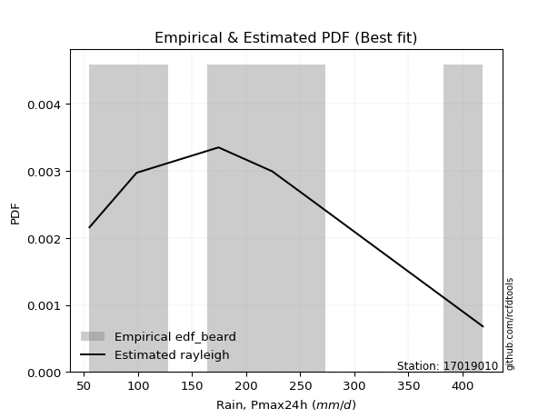</img>

</div>


### 5. EDF Chegodayev (1955)

The Chegodayev formula is an empirical plotting position formula used in hydrological frequency analysis to estimate the exceedance probability or return period of a specific event from a set of observed data. It is primarily used for plotting observed data points on probability paper to fit a theoretical distribution, particularly for analyzing extreme events like maximum flood flows or rainfall intensities. The constant _b_ value in the generalized plotting position formula is 0.3.

<div align="center">


$P=(m-b)/(n+1-2b)$


</div>


**5.1. Empirical values**

<div align="center">

|                | 0                   | 1                  | 2                  | 3                  | 4                 | 5                 |
|:---------------|:--------------------|:-------------------|:-------------------|:-------------------|:------------------|:------------------|
| date           | 2021                | 2022               | 2019               | 2017               | 2016              | 2018              |
| x              | 55.0                | 98.6               | 174.4              | 224.0              | 253.2             | 418.9             |
| m              | 1                   | 2                  | 3                  | 4                  | 5                 | 6                 |
| empirical_dist | edf_chegodayev      | edf_chegodayev     | edf_chegodayev     | edf_chegodayev     | edf_chegodayev    | edf_chegodayev    |
| empirical      | 0.10937499999999999 | 0.265625           | 0.421875           | 0.578125           | 0.734375          | 0.890625          |
| empirical_tr   | 1.1228070175438596  | 1.3617021276595744 | 1.7297297297297298 | 2.3703703703703702 | 3.764705882352941 | 9.142857142857142 |

</div>


**5.2. Kolmogorov-Smirnov fit test (sorted by Δ)**


<div align="center">

|                | 0                   | 1                   | 2                   | 3                   | 4                   | 5                   | 6                   | 7                   | 8                   | 9                  | 10                  | 11                  | 12                  | 13                  | 14                  | 15                 | 16                 | 17                  | 18                  | 19                  | 20                    | 21                  | 22                 | 23                  | 24                  | 25                 | 26                  | 27                  | 28                  | 29                  | 30                  | 31                  | 32                  | 33                  | 34                  | 35                  | 36                 | 37                  | 38                  | 39                  | 40                  | 41                  | 42                  | 43                  | 44                  | 45                  | 46                  | 47                  | 48                  | 49                  | 50                 | 51                  | 52                  | 53                  | 54                  | 55                  | 56                | 57                  | 58                 | 59                  | 60                  | 61                  | 62                 | 63                  | 64                  | 65                  | 66                  | 67                  | 68                  | 69                  | 70                 | 71                 | 72                  | 73                  | 74                 | 75                 | 76                  | 77             | 78                 | 79                 | 80                | 81                  | 82                  | 83                  | 84                 | 85                 | 86                  | 87                 |
|:---------------|:--------------------|:--------------------|:--------------------|:--------------------|:--------------------|:--------------------|:--------------------|:--------------------|:--------------------|:-------------------|:--------------------|:--------------------|:--------------------|:--------------------|:--------------------|:-------------------|:-------------------|:--------------------|:--------------------|:--------------------|:----------------------|:--------------------|:-------------------|:--------------------|:--------------------|:-------------------|:--------------------|:--------------------|:--------------------|:--------------------|:--------------------|:--------------------|:--------------------|:--------------------|:--------------------|:--------------------|:-------------------|:--------------------|:--------------------|:--------------------|:--------------------|:--------------------|:--------------------|:--------------------|:--------------------|:--------------------|:--------------------|:--------------------|:--------------------|:--------------------|:-------------------|:--------------------|:--------------------|:--------------------|:--------------------|:--------------------|:------------------|:--------------------|:-------------------|:--------------------|:--------------------|:--------------------|:-------------------|:--------------------|:--------------------|:--------------------|:--------------------|:--------------------|:--------------------|:--------------------|:-------------------|:-------------------|:--------------------|:--------------------|:-------------------|:-------------------|:--------------------|:---------------|:-------------------|:-------------------|:------------------|:--------------------|:--------------------|:--------------------|:-------------------|:-------------------|:--------------------|:-------------------|
| station        | 17019010            | 17019010            | 17019010            | 17019010            | 17019010            | 17019010            | 17019010            | 17019010            | 17019010            | 17019010           | 17019010            | 17019010            | 17019010            | 17019010            | 17019010            | 17019010           | 17019010           | 17019010            | 17019010            | 17019010            | 17019010              | 17019010            | 17019010           | 17019010            | 17019010            | 17019010           | 17019010            | 17019010            | 17019010            | 17019010            | 17019010            | 17019010            | 17019010            | 17019010            | 17019010            | 17019010            | 17019010           | 17019010            | 17019010            | 17019010            | 17019010            | 17019010            | 17019010            | 17019010            | 17019010            | 17019010            | 17019010            | 17019010            | 17019010            | 17019010            | 17019010           | 17019010            | 17019010            | 17019010            | 17019010            | 17019010            | 17019010          | 17019010            | 17019010           | 17019010            | 17019010            | 17019010            | 17019010           | 17019010            | 17019010            | 17019010            | 17019010            | 17019010            | 17019010            | 17019010            | 17019010           | 17019010           | 17019010            | 17019010            | 17019010           | 17019010           | 17019010            | 17019010       | 17019010           | 17019010           | 17019010          | 17019010            | 17019010            | 17019010            | 17019010           | 17019010           | 17019010            | 17019010           |
| empirical_dist | edf_chegodayev      | edf_chegodayev      | edf_chegodayev      | edf_chegodayev      | edf_chegodayev      | edf_chegodayev      | edf_chegodayev      | edf_chegodayev      | edf_chegodayev      | edf_chegodayev     | edf_chegodayev      | edf_chegodayev      | edf_chegodayev      | edf_chegodayev      | edf_chegodayev      | edf_chegodayev     | edf_chegodayev     | edf_chegodayev      | edf_chegodayev      | edf_chegodayev      | edf_chegodayev        | edf_chegodayev      | edf_chegodayev     | edf_chegodayev      | edf_chegodayev      | edf_chegodayev     | edf_chegodayev      | edf_chegodayev      | edf_chegodayev      | edf_chegodayev      | edf_chegodayev      | edf_chegodayev      | edf_chegodayev      | edf_chegodayev      | edf_chegodayev      | edf_chegodayev      | edf_chegodayev     | edf_chegodayev      | edf_chegodayev      | edf_chegodayev      | edf_chegodayev      | edf_chegodayev      | edf_chegodayev      | edf_chegodayev      | edf_chegodayev      | edf_chegodayev      | edf_chegodayev      | edf_chegodayev      | edf_chegodayev      | edf_chegodayev      | edf_chegodayev     | edf_chegodayev      | edf_chegodayev      | edf_chegodayev      | edf_chegodayev      | edf_chegodayev      | edf_chegodayev    | edf_chegodayev      | edf_chegodayev     | edf_chegodayev      | edf_chegodayev      | edf_chegodayev      | edf_chegodayev     | edf_chegodayev      | edf_chegodayev      | edf_chegodayev      | edf_chegodayev      | edf_chegodayev      | edf_chegodayev      | edf_chegodayev      | edf_chegodayev     | edf_chegodayev     | edf_chegodayev      | edf_chegodayev      | edf_chegodayev     | edf_chegodayev     | edf_chegodayev      | edf_chegodayev | edf_chegodayev     | edf_chegodayev     | edf_chegodayev    | edf_chegodayev      | edf_chegodayev      | edf_chegodayev      | edf_chegodayev     | edf_chegodayev     | edf_chegodayev      | edf_chegodayev     |
| p_dist         | rayleigh            | maxwell             | ncf                 | betaprime           | logjohnsonsu        | logloggamma         | logweibull_min      | johnsonsu           | logpearson3         | pearson3           | invgauss            | loggenlogistic      | logfisk             | invgamma            | t                   | truncnorm          | norm               | mielke              | halfnorm            | kstwobign           | loglaplace_asymmetric | genlogistic         | crystalball        | alpha               | loggumbel_l         | fisk               | exponnorm           | nct                 | gumbel_r            | logexponnorm        | logcrystalball      | lognorm             | lognorm             | logt                | logistic            | logfatiguelife      | rice               | logf                | lognct              | laplace_asymmetric  | logncf              | logbetaprime        | logerlang           | loggamma            | loggamma            | f                   | gompertz            | halflogistic        | loglogistic         | hypsecant           | moyal              | logrice             | loginvgamma         | gumbel_l            | logalpha            | loginvgauss         | loghypsecant      | laplace             | expon              | genexpon            | logmaxwell          | lograyleigh         | loginvweibull      | loglaplace          | weibull_min         | loggompertz         | logkstwobign        | loggumbel_r         | loghalfnorm         | loggenexpon         | logmoyal           | loghalflogistic    | logexpon            | logmielke           | gamma              | wald               | nakagami            | gibrat         | logwald            | logchi2            | loggibrat         | chi2                | invweibull          | erlang              | loglognorm         | lognakagami        | logtruncnorm        | fatiguelife        |
| delta          | 0.06629501892748402 | 0.07031913031550549 | 0.07178127202020423 | 0.07240177187661853 | 0.07281261458665628 | 0.07364792052478059 | 0.07383828621749608 | 0.07400326901853327 | 0.07437545330010181 | 0.0783108491892684 | 0.07938086307485537 | 0.07941956563971919 | 0.07999442937708648 | 0.08008809772469191 | 0.08027148892367297 | 0.0803025131877304 | 0.0803025137479616 | 0.08054869145700916 | 0.08145392989478399 | 0.08209152293914251 | 0.08231158410480435   | 0.08263637969274207 | 0.0831077214785691 | 0.08416707075753563 | 0.08472511003136471 | 0.0854126566312591 | 0.08549224569864994 | 0.08964713872774568 | 0.09530042169940037 | 0.10074904698648779 | 0.10074969063169015 | 0.10075014383216863 | 0.10075014383216863 | 0.10075099727954795 | 0.10094802691728696 | 0.10127985176764498 | 0.1012851280261575 | 0.10211152197368045 | 0.10252231137344192 | 0.10714575567361415 | 0.10773102964071202 | 0.10813612142258688 | 0.10868578643805527 | 0.10900562704491157 | 0.10900562704491157 | 0.10937499430767968 | 0.10937499999999689 | 0.10937499999999999 | 0.10974687654934268 | 0.11263421446932287 | 0.1135372751577334 | 0.11474615168387126 | 0.11559890102694959 | 0.11751682225378723 | 0.11908834115364031 | 0.12248587559673918 | 0.124454921056114 | 0.12466009730340005 | 0.1293585382569168 | 0.12953181489044407 | 0.13275794057310641 | 0.14324300366427245 | 0.1483416496976837 | 0.15185382327210317 | 0.15702724065865759 | 0.15774010618045953 | 0.16982913542071842 | 0.17142797168781398 | 0.17276727446206785 | 0.17903162302223996 | 0.1969782037996325 | 0.1989402206803842 | 0.22239041467777332 | 0.23528928557556816 | 0.2530565878349885 | 0.2604220762980221 | 0.26562499943968243 | 0.265625       | 0.2679332587035267 | 0.2913050082729616 | 0.294374993032277 | 0.31835080120372194 | 0.37020893026819635 | 0.37060707672451854 | 0.3857624240535926 | 0.4107221939743936 | 0.42187499272086054 | 0.4665358218341452 |
| deltao         | 0.530385761606      | 0.530385761606      | 0.530385761606      | 0.530385761606      | 0.530385761606      | 0.530385761606      | 0.530385761606      | 0.530385761606      | 0.530385761606      | 0.530385761606     | 0.530385761606      | 0.530385761606      | 0.530385761606      | 0.530385761606      | 0.530385761606      | 0.530385761606     | 0.530385761606     | 0.530385761606      | 0.530385761606      | 0.530385761606      | 0.530385761606        | 0.530385761606      | 0.530385761606     | 0.530385761606      | 0.530385761606      | 0.530385761606     | 0.530385761606      | 0.530385761606      | 0.530385761606      | 0.530385761606      | 0.530385761606      | 0.530385761606      | 0.530385761606      | 0.530385761606      | 0.530385761606      | 0.530385761606      | 0.530385761606     | 0.530385761606      | 0.530385761606      | 0.530385761606      | 0.530385761606      | 0.530385761606      | 0.530385761606      | 0.530385761606      | 0.530385761606      | 0.530385761606      | 0.530385761606      | 0.530385761606      | 0.530385761606      | 0.530385761606      | 0.530385761606     | 0.530385761606      | 0.530385761606      | 0.530385761606      | 0.530385761606      | 0.530385761606      | 0.530385761606    | 0.530385761606      | 0.530385761606     | 0.530385761606      | 0.530385761606      | 0.530385761606      | 0.530385761606     | 0.530385761606      | 0.530385761606      | 0.530385761606      | 0.530385761606      | 0.530385761606      | 0.530385761606      | 0.530385761606      | 0.530385761606     | 0.530385761606     | 0.530385761606      | 0.530385761606      | 0.530385761606     | 0.530385761606     | 0.530385761606      | 0.530385761606 | 0.530385761606     | 0.530385761606     | 0.530385761606    | 0.530385761606      | 0.530385761606      | 0.530385761606      | 0.530385761606     | 0.530385761606     | 0.530385761606      | 0.530385761606     |
| eval           | Δo > Δ              | Δo > Δ              | Δo > Δ              | Δo > Δ              | Δo > Δ              | Δo > Δ              | Δo > Δ              | Δo > Δ              | Δo > Δ              | Δo > Δ             | Δo > Δ              | Δo > Δ              | Δo > Δ              | Δo > Δ              | Δo > Δ              | Δo > Δ             | Δo > Δ             | Δo > Δ              | Δo > Δ              | Δo > Δ              | Δo > Δ                | Δo > Δ              | Δo > Δ             | Δo > Δ              | Δo > Δ              | Δo > Δ             | Δo > Δ              | Δo > Δ              | Δo > Δ              | Δo > Δ              | Δo > Δ              | Δo > Δ              | Δo > Δ              | Δo > Δ              | Δo > Δ              | Δo > Δ              | Δo > Δ             | Δo > Δ              | Δo > Δ              | Δo > Δ              | Δo > Δ              | Δo > Δ              | Δo > Δ              | Δo > Δ              | Δo > Δ              | Δo > Δ              | Δo > Δ              | Δo > Δ              | Δo > Δ              | Δo > Δ              | Δo > Δ             | Δo > Δ              | Δo > Δ              | Δo > Δ              | Δo > Δ              | Δo > Δ              | Δo > Δ            | Δo > Δ              | Δo > Δ             | Δo > Δ              | Δo > Δ              | Δo > Δ              | Δo > Δ             | Δo > Δ              | Δo > Δ              | Δo > Δ              | Δo > Δ              | Δo > Δ              | Δo > Δ              | Δo > Δ              | Δo > Δ             | Δo > Δ             | Δo > Δ              | Δo > Δ              | Δo > Δ             | Δo > Δ             | Δo > Δ              | Δo > Δ         | Δo > Δ             | Δo > Δ             | Δo > Δ            | Δo > Δ              | Δo > Δ              | Δo > Δ              | Δo > Δ             | Δo > Δ             | Δo > Δ              | Δo > Δ             |
| fit            | 1                   | 1                   | 1                   | 1                   | 1                   | 1                   | 1                   | 1                   | 1                   | 1                  | 1                   | 1                   | 1                   | 1                   | 1                   | 1                  | 1                  | 1                   | 1                   | 1                   | 1                     | 1                   | 1                  | 1                   | 1                   | 1                  | 1                   | 1                   | 1                   | 1                   | 1                   | 1                   | 1                   | 1                   | 1                   | 1                   | 1                  | 1                   | 1                   | 1                   | 1                   | 1                   | 1                   | 1                   | 1                   | 1                   | 1                   | 1                   | 1                   | 1                   | 1                  | 1                   | 1                   | 1                   | 1                   | 1                   | 1                 | 1                   | 1                  | 1                   | 1                   | 1                   | 1                  | 1                   | 1                   | 1                   | 1                   | 1                   | 1                   | 1                   | 1                  | 1                  | 1                   | 1                   | 1                  | 1                  | 1                   | 1              | 1                  | 1                  | 1                 | 1                   | 1                   | 1                   | 1                  | 1                  | 1                   | 1                  |
| n              | 6                   | 6                   | 6                   | 6                   | 6                   | 6                   | 6                   | 6                   | 6                   | 6                  | 6                   | 6                   | 6                   | 6                   | 6                   | 6                  | 6                  | 6                   | 6                   | 6                   | 6                     | 6                   | 6                  | 6                   | 6                   | 6                  | 6                   | 6                   | 6                   | 6                   | 6                   | 6                   | 6                   | 6                   | 6                   | 6                   | 6                  | 6                   | 6                   | 6                   | 6                   | 6                   | 6                   | 6                   | 6                   | 6                   | 6                   | 6                   | 6                   | 6                   | 6                  | 6                   | 6                   | 6                   | 6                   | 6                   | 6                 | 6                   | 6                  | 6                   | 6                   | 6                   | 6                  | 6                   | 6                   | 6                   | 6                   | 6                   | 6                   | 6                   | 6                  | 6                  | 6                   | 6                   | 6                  | 6                  | 6                   | 6              | 6                  | 6                  | 6                 | 6                   | 6                   | 6                   | 6                  | 6                  | 6                   | 6                  |
| best_fit       | 1                   | 0                   | 0                   | 0                   | 0                   | 0                   | 0                   | 0                   | 0                   | 0                  | 0                   | 0                   | 0                   | 0                   | 0                   | 0                  | 0                  | 0                   | 0                   | 0                   | 0                     | 0                   | 0                  | 0                   | 0                   | 0                  | 0                   | 0                   | 0                   | 0                   | 0                   | 0                   | 0                   | 0                   | 0                   | 0                   | 0                  | 0                   | 0                   | 0                   | 0                   | 0                   | 0                   | 0                   | 0                   | 0                   | 0                   | 0                   | 0                   | 0                   | 0                  | 0                   | 0                   | 0                   | 0                   | 0                   | 0                 | 0                   | 0                  | 0                   | 0                   | 0                   | 0                  | 0                   | 0                   | 0                   | 0                   | 0                   | 0                   | 0                   | 0                  | 0                  | 0                   | 0                   | 0                  | 0                  | 0                   | 0              | 0                  | 0                  | 0                 | 0                   | 0                   | 0                   | 0                  | 0                  | 0                   | 0                  |
| best_fit_sort  | 1                   | 2                   | 3                   | 4                   | 5                   | 6                   | 7                   | 8                   | 9                   | 10                 | 11                  | 12                  | 13                  | 14                  | 15                  | 16                 | 17                 | 18                  | 19                  | 20                  | 21                    | 22                  | 23                 | 24                  | 25                  | 26                 | 27                  | 28                  | 29                  | 30                  | 31                  | 32                  | 33                  | 34                  | 35                  | 36                  | 37                 | 38                  | 39                  | 40                  | 41                  | 42                  | 43                  | 44                  | 45                  | 46                  | 47                  | 48                  | 49                  | 50                  | 51                 | 52                  | 53                  | 54                  | 55                  | 56                  | 57                | 58                  | 59                 | 60                  | 61                  | 62                  | 63                 | 64                  | 65                  | 66                  | 67                  | 68                  | 69                  | 70                  | 71                 | 72                 | 73                  | 74                  | 75                 | 76                 | 77                  | 78             | 79                 | 80                 | 81                | 82                  | 83                  | 84                  | 85                 | 86                 | 87                  | 88                 |

</div>


**5.3. Best fit**

<div align="center">

|   id |   station | empirical_dist   | p_dist   |    delta |   deltao | eval   |   fit |   n |   best_fit |   best_fit_sort |
|-----:|----------:|:-----------------|:---------|---------:|---------:|:-------|------:|----:|-----------:|----------------:|
|    0 |  17019010 | edf_chegodayev   | rayleigh | 0.066295 | 0.530386 | Δo > Δ |     1 |   6 |          1 |               1 |

</div>


<div align="center">

</img></img>

</div>


### 6. EDF Blom (1958)

The Blom formula is a specific "plotting position" formula used in hydrology and statistical analysis to estimate the empirical cumulative probability (or non-exceedance probability) of a data series. It is particularly recommended for data that are approximately normally distributed. The constant _a_ is set to 0.375 (or 3/8).

<div align="center">


$P=(m-a)/(n+1-2a)$


</div>


**6.1. Empirical values**

<div align="center">

|                | 0                  | 1                  | 2                  | 3                 | 4                 | 5                  |
|:---------------|:-------------------|:-------------------|:-------------------|:------------------|:------------------|:-------------------|
| date           | 2021               | 2022               | 2019               | 2017              | 2016              | 2018               |
| x              | 55.0               | 98.6               | 174.4              | 224.0             | 253.2             | 418.9              |
| m              | 1                  | 2                  | 3                  | 4                 | 5                 | 6                  |
| empirical_dist | edf_blom           | edf_blom           | edf_blom           | edf_blom          | edf_blom          | edf_blom           |
| empirical      | 0.1                | 0.26               | 0.42               | 0.58              | 0.74              | 0.9                |
| empirical_tr   | 1.1111111111111112 | 1.3513513513513513 | 1.7241379310344827 | 2.380952380952381 | 3.846153846153846 | 10.000000000000002 |

</div>


**6.2. Kolmogorov-Smirnov fit test (sorted by Δ)**


<div align="center">

|                | 0                    | 1                  | 2                   | 3                   | 4                   | 5                  | 6                   | 7                   | 8                   | 9                  | 10                 | 11                  | 12                  | 13                  | 14                  | 15                  | 16                    | 17                  | 18                  | 19                 | 20                  | 21                  | 22                  | 23                  | 24                  | 25                  | 26                  | 27                 | 28                  | 29                  | 30                 | 31                 | 32                  | 33             | 34                  | 35                 | 36                  | 37                  | 38                  | 39                  | 40                | 41                  | 42                  | 43                  | 44                  | 45                  | 46                  | 47                 | 48                  | 49                  | 50                  | 51                  | 52                 | 53                  | 54                  | 55                  | 56                  | 57                 | 58                 | 59                 | 60                  | 61                  | 62                 | 63                  | 64                  | 65                 | 66                  | 67                | 68                  | 69                  | 70                 | 71                 | 72                  | 73                  | 74                 | 75                  | 76                  | 77             | 78                 | 79                 | 80                | 81                  | 82                  | 83                  | 84                 | 85                 | 86                 | 87                 |
|:---------------|:---------------------|:-------------------|:--------------------|:--------------------|:--------------------|:-------------------|:--------------------|:--------------------|:--------------------|:-------------------|:-------------------|:--------------------|:--------------------|:--------------------|:--------------------|:--------------------|:----------------------|:--------------------|:--------------------|:-------------------|:--------------------|:--------------------|:--------------------|:--------------------|:--------------------|:--------------------|:--------------------|:-------------------|:--------------------|:--------------------|:-------------------|:-------------------|:--------------------|:---------------|:--------------------|:-------------------|:--------------------|:--------------------|:--------------------|:--------------------|:------------------|:--------------------|:--------------------|:--------------------|:--------------------|:--------------------|:--------------------|:-------------------|:--------------------|:--------------------|:--------------------|:--------------------|:-------------------|:--------------------|:--------------------|:--------------------|:--------------------|:-------------------|:-------------------|:-------------------|:--------------------|:--------------------|:-------------------|:--------------------|:--------------------|:-------------------|:--------------------|:------------------|:--------------------|:--------------------|:-------------------|:-------------------|:--------------------|:--------------------|:-------------------|:--------------------|:--------------------|:---------------|:-------------------|:-------------------|:------------------|:--------------------|:--------------------|:--------------------|:-------------------|:-------------------|:-------------------|:-------------------|
| station        | 17019010             | 17019010           | 17019010            | 17019010            | 17019010            | 17019010           | 17019010            | 17019010            | 17019010            | 17019010           | 17019010           | 17019010            | 17019010            | 17019010            | 17019010            | 17019010            | 17019010              | 17019010            | 17019010            | 17019010           | 17019010            | 17019010            | 17019010            | 17019010            | 17019010            | 17019010            | 17019010            | 17019010           | 17019010            | 17019010            | 17019010           | 17019010           | 17019010            | 17019010       | 17019010            | 17019010           | 17019010            | 17019010            | 17019010            | 17019010            | 17019010          | 17019010            | 17019010            | 17019010            | 17019010            | 17019010            | 17019010            | 17019010           | 17019010            | 17019010            | 17019010            | 17019010            | 17019010           | 17019010            | 17019010            | 17019010            | 17019010            | 17019010           | 17019010           | 17019010           | 17019010            | 17019010            | 17019010           | 17019010            | 17019010            | 17019010           | 17019010            | 17019010          | 17019010            | 17019010            | 17019010           | 17019010           | 17019010            | 17019010            | 17019010           | 17019010            | 17019010            | 17019010       | 17019010           | 17019010           | 17019010          | 17019010            | 17019010            | 17019010            | 17019010           | 17019010           | 17019010           | 17019010           |
| empirical_dist | edf_blom             | edf_blom           | edf_blom            | edf_blom            | edf_blom            | edf_blom           | edf_blom            | edf_blom            | edf_blom            | edf_blom           | edf_blom           | edf_blom            | edf_blom            | edf_blom            | edf_blom            | edf_blom            | edf_blom              | edf_blom            | edf_blom            | edf_blom           | edf_blom            | edf_blom            | edf_blom            | edf_blom            | edf_blom            | edf_blom            | edf_blom            | edf_blom           | edf_blom            | edf_blom            | edf_blom           | edf_blom           | edf_blom            | edf_blom       | edf_blom            | edf_blom           | edf_blom            | edf_blom            | edf_blom            | edf_blom            | edf_blom          | edf_blom            | edf_blom            | edf_blom            | edf_blom            | edf_blom            | edf_blom            | edf_blom           | edf_blom            | edf_blom            | edf_blom            | edf_blom            | edf_blom           | edf_blom            | edf_blom            | edf_blom            | edf_blom            | edf_blom           | edf_blom           | edf_blom           | edf_blom            | edf_blom            | edf_blom           | edf_blom            | edf_blom            | edf_blom           | edf_blom            | edf_blom          | edf_blom            | edf_blom            | edf_blom           | edf_blom           | edf_blom            | edf_blom            | edf_blom           | edf_blom            | edf_blom            | edf_blom       | edf_blom           | edf_blom           | edf_blom          | edf_blom            | edf_blom            | edf_blom            | edf_blom           | edf_blom           | edf_blom           | edf_blom           |
| p_dist         | rayleigh             | maxwell            | ncf                 | betaprime           | logjohnsonsu        | logloggamma        | logweibull_min      | halfnorm            | johnsonsu           | pearson3           | loggenlogistic     | logfisk             | invgamma            | mielke              | logpearson3         | kstwobign           | loglaplace_asymmetric | genlogistic         | crystalball         | t                  | norm                | truncnorm           | alpha               | loggumbel_l         | fisk                | exponnorm           | invgauss            | nct                | gumbel_r            | logistic            | rice               | f                  | gompertz            | halflogistic   | laplace_asymmetric  | logexponnorm       | logcrystalball      | lognorm             | lognorm             | logt                | logfatiguelife    | logf                | lognct              | hypsecant           | loglogistic         | moyal               | logncf              | logbetaprime       | logerlang           | loggamma            | loggamma            | logrice             | loginvgamma        | laplace             | logalpha            | loghypsecant        | gumbel_l            | loginvgauss        | expon              | genexpon           | logmaxwell          | lograyleigh         | loglaplace         | loginvweibull       | loggompertz         | weibull_min        | logkstwobign        | loggumbel_r       | loghalfnorm         | loggenexpon         | logmoyal           | loghalflogistic    | logexpon            | logmielke           | wald               | gamma               | nakagami            | gibrat         | logwald            | logchi2            | loggibrat         | chi2                | erlang              | invweibull          | loglognorm         | lognakagami        | logtruncnorm       | fatiguelife        |
| delta          | 0.060670018927484026 | 0.0646941303155055 | 0.06615627202020424 | 0.06677677187661854 | 0.06718761458665629 | 0.0680229205247806 | 0.06821328621749609 | 0.07207892989478401 | 0.07224775089007485 | 0.0726858491892684 | 0.0737945656397192 | 0.07436942937708649 | 0.07446309772469192 | 0.07492369145700917 | 0.07625045330010183 | 0.07646652293914252 | 0.07668658410480436   | 0.07701137969274208 | 0.07763736287826417 | 0.0780153119396545 | 0.07808455839498507 | 0.07808455982229034 | 0.07854207075753564 | 0.07910011003136472 | 0.07978765663125911 | 0.07986724569864995 | 0.08125586307485538 | 0.0840221387277457 | 0.08967542169940038 | 0.09532302691728697 | 0.0956601280261575 | 0.0999999943076797 | 0.09999999999999691 | 0.1            | 0.10152075567361415 | 0.1026240469864878 | 0.10262469063169016 | 0.10262514383216864 | 0.10262514383216864 | 0.10262599727954796 | 0.103154851767645 | 0.10398652197368047 | 0.10439731137344194 | 0.10700921446932288 | 0.10787187654934272 | 0.10791227515773341 | 0.10960602964071203 | 0.1100111214225869 | 0.11056078643805528 | 0.11088062704491158 | 0.11088062704491158 | 0.11662115168387127 | 0.1174739010269496 | 0.11903509730340006 | 0.12096334115364032 | 0.12257992105611404 | 0.12314182225378723 | 0.1243608755967392 | 0.1312335382569168 | 0.1314068148904441 | 0.13463294057310643 | 0.14511800366427247 | 0.1499788232721032 | 0.15021664969768372 | 0.15961510618045954 | 0.1664022406586576 | 0.17170413542071844 | 0.173302971687814 | 0.17464227446206787 | 0.18090662302223998 | 0.1988532037996325 | 0.2008152206803842 | 0.22426541467777333 | 0.23716428557556818 | 0.2547970762980221 | 0.25493158783498854 | 0.25999999943968244 | 0.26           | 0.2698082587035267 | 0.2931800082729616 | 0.296249993032277 | 0.32022580120372196 | 0.37248207672451855 | 0.37583393026819634 | 0.3913874240535926 | 0.4125971939743936 | 0.4199999927208605 | 0.4721608218341452 |
| deltao         | 0.530385761606       | 0.530385761606     | 0.530385761606      | 0.530385761606      | 0.530385761606      | 0.530385761606     | 0.530385761606      | 0.530385761606      | 0.530385761606      | 0.530385761606     | 0.530385761606     | 0.530385761606      | 0.530385761606      | 0.530385761606      | 0.530385761606      | 0.530385761606      | 0.530385761606        | 0.530385761606      | 0.530385761606      | 0.530385761606     | 0.530385761606      | 0.530385761606      | 0.530385761606      | 0.530385761606      | 0.530385761606      | 0.530385761606      | 0.530385761606      | 0.530385761606     | 0.530385761606      | 0.530385761606      | 0.530385761606     | 0.530385761606     | 0.530385761606      | 0.530385761606 | 0.530385761606      | 0.530385761606     | 0.530385761606      | 0.530385761606      | 0.530385761606      | 0.530385761606      | 0.530385761606    | 0.530385761606      | 0.530385761606      | 0.530385761606      | 0.530385761606      | 0.530385761606      | 0.530385761606      | 0.530385761606     | 0.530385761606      | 0.530385761606      | 0.530385761606      | 0.530385761606      | 0.530385761606     | 0.530385761606      | 0.530385761606      | 0.530385761606      | 0.530385761606      | 0.530385761606     | 0.530385761606     | 0.530385761606     | 0.530385761606      | 0.530385761606      | 0.530385761606     | 0.530385761606      | 0.530385761606      | 0.530385761606     | 0.530385761606      | 0.530385761606    | 0.530385761606      | 0.530385761606      | 0.530385761606     | 0.530385761606     | 0.530385761606      | 0.530385761606      | 0.530385761606     | 0.530385761606      | 0.530385761606      | 0.530385761606 | 0.530385761606     | 0.530385761606     | 0.530385761606    | 0.530385761606      | 0.530385761606      | 0.530385761606      | 0.530385761606     | 0.530385761606     | 0.530385761606     | 0.530385761606     |
| eval           | Δo > Δ               | Δo > Δ             | Δo > Δ              | Δo > Δ              | Δo > Δ              | Δo > Δ             | Δo > Δ              | Δo > Δ              | Δo > Δ              | Δo > Δ             | Δo > Δ             | Δo > Δ              | Δo > Δ              | Δo > Δ              | Δo > Δ              | Δo > Δ              | Δo > Δ                | Δo > Δ              | Δo > Δ              | Δo > Δ             | Δo > Δ              | Δo > Δ              | Δo > Δ              | Δo > Δ              | Δo > Δ              | Δo > Δ              | Δo > Δ              | Δo > Δ             | Δo > Δ              | Δo > Δ              | Δo > Δ             | Δo > Δ             | Δo > Δ              | Δo > Δ         | Δo > Δ              | Δo > Δ             | Δo > Δ              | Δo > Δ              | Δo > Δ              | Δo > Δ              | Δo > Δ            | Δo > Δ              | Δo > Δ              | Δo > Δ              | Δo > Δ              | Δo > Δ              | Δo > Δ              | Δo > Δ             | Δo > Δ              | Δo > Δ              | Δo > Δ              | Δo > Δ              | Δo > Δ             | Δo > Δ              | Δo > Δ              | Δo > Δ              | Δo > Δ              | Δo > Δ             | Δo > Δ             | Δo > Δ             | Δo > Δ              | Δo > Δ              | Δo > Δ             | Δo > Δ              | Δo > Δ              | Δo > Δ             | Δo > Δ              | Δo > Δ            | Δo > Δ              | Δo > Δ              | Δo > Δ             | Δo > Δ             | Δo > Δ              | Δo > Δ              | Δo > Δ             | Δo > Δ              | Δo > Δ              | Δo > Δ         | Δo > Δ             | Δo > Δ             | Δo > Δ            | Δo > Δ              | Δo > Δ              | Δo > Δ              | Δo > Δ             | Δo > Δ             | Δo > Δ             | Δo > Δ             |
| fit            | 1                    | 1                  | 1                   | 1                   | 1                   | 1                  | 1                   | 1                   | 1                   | 1                  | 1                  | 1                   | 1                   | 1                   | 1                   | 1                   | 1                     | 1                   | 1                   | 1                  | 1                   | 1                   | 1                   | 1                   | 1                   | 1                   | 1                   | 1                  | 1                   | 1                   | 1                  | 1                  | 1                   | 1              | 1                   | 1                  | 1                   | 1                   | 1                   | 1                   | 1                 | 1                   | 1                   | 1                   | 1                   | 1                   | 1                   | 1                  | 1                   | 1                   | 1                   | 1                   | 1                  | 1                   | 1                   | 1                   | 1                   | 1                  | 1                  | 1                  | 1                   | 1                   | 1                  | 1                   | 1                   | 1                  | 1                   | 1                 | 1                   | 1                   | 1                  | 1                  | 1                   | 1                   | 1                  | 1                   | 1                   | 1              | 1                  | 1                  | 1                 | 1                   | 1                   | 1                   | 1                  | 1                  | 1                  | 1                  |
| n              | 6                    | 6                  | 6                   | 6                   | 6                   | 6                  | 6                   | 6                   | 6                   | 6                  | 6                  | 6                   | 6                   | 6                   | 6                   | 6                   | 6                     | 6                   | 6                   | 6                  | 6                   | 6                   | 6                   | 6                   | 6                   | 6                   | 6                   | 6                  | 6                   | 6                   | 6                  | 6                  | 6                   | 6              | 6                   | 6                  | 6                   | 6                   | 6                   | 6                   | 6                 | 6                   | 6                   | 6                   | 6                   | 6                   | 6                   | 6                  | 6                   | 6                   | 6                   | 6                   | 6                  | 6                   | 6                   | 6                   | 6                   | 6                  | 6                  | 6                  | 6                   | 6                   | 6                  | 6                   | 6                   | 6                  | 6                   | 6                 | 6                   | 6                   | 6                  | 6                  | 6                   | 6                   | 6                  | 6                   | 6                   | 6              | 6                  | 6                  | 6                 | 6                   | 6                   | 6                   | 6                  | 6                  | 6                  | 6                  |
| best_fit       | 1                    | 0                  | 0                   | 0                   | 0                   | 0                  | 0                   | 0                   | 0                   | 0                  | 0                  | 0                   | 0                   | 0                   | 0                   | 0                   | 0                     | 0                   | 0                   | 0                  | 0                   | 0                   | 0                   | 0                   | 0                   | 0                   | 0                   | 0                  | 0                   | 0                   | 0                  | 0                  | 0                   | 0              | 0                   | 0                  | 0                   | 0                   | 0                   | 0                   | 0                 | 0                   | 0                   | 0                   | 0                   | 0                   | 0                   | 0                  | 0                   | 0                   | 0                   | 0                   | 0                  | 0                   | 0                   | 0                   | 0                   | 0                  | 0                  | 0                  | 0                   | 0                   | 0                  | 0                   | 0                   | 0                  | 0                   | 0                 | 0                   | 0                   | 0                  | 0                  | 0                   | 0                   | 0                  | 0                   | 0                   | 0              | 0                  | 0                  | 0                 | 0                   | 0                   | 0                   | 0                  | 0                  | 0                  | 0                  |
| best_fit_sort  | 1                    | 2                  | 3                   | 4                   | 5                   | 6                  | 7                   | 8                   | 9                   | 10                 | 11                 | 12                  | 13                  | 14                  | 15                  | 16                  | 17                    | 18                  | 19                  | 20                 | 21                  | 22                  | 23                  | 24                  | 25                  | 26                  | 27                  | 28                 | 29                  | 30                  | 31                 | 32                 | 33                  | 34             | 35                  | 36                 | 37                  | 38                  | 39                  | 40                  | 41                | 42                  | 43                  | 44                  | 45                  | 46                  | 47                  | 48                 | 49                  | 50                  | 51                  | 52                  | 53                 | 54                  | 55                  | 56                  | 57                  | 58                 | 59                 | 60                 | 61                  | 62                  | 63                 | 64                  | 65                  | 66                 | 67                  | 68                | 69                  | 70                  | 71                 | 72                 | 73                  | 74                  | 75                 | 76                  | 77                  | 78             | 79                 | 80                 | 81                | 82                  | 83                  | 84                  | 85                 | 86                 | 87                 | 88                 |

</div>


**6.3. Best fit**

<div align="center">

|   id |   station | empirical_dist   | p_dist   |   delta |   deltao | eval   |   fit |   n |   best_fit |   best_fit_sort |
|-----:|----------:|:-----------------|:---------|--------:|---------:|:-------|------:|----:|-----------:|----------------:|
|    0 |  17019010 | edf_blom         | rayleigh | 0.06067 | 0.530386 | Δo > Δ |     1 |   6 |          1 |               1 |

</div>


<div align="center">

</img></img>

</div>


### 7. EDF Tukey (1962)

In hydrology, the Tukey formula is used as a plotting position formula to estimate the empirical probability or frequency of a flood event (or other hydrological data). The formula parameter is given as _c=0.333_ (or 1/3).

<div align="center">


$P=(m-c)/(n+1-2c)$


</div>


**7.1. Empirical values**

<div align="center">

|                | 0                   | 1                  | 2                   | 3                  | 4                  | 5                  |
|:---------------|:--------------------|:-------------------|:--------------------|:-------------------|:-------------------|:-------------------|
| date           | 2021                | 2022               | 2019                | 2017               | 2016               | 2018               |
| x              | 55.0                | 98.6               | 174.4               | 224.0              | 253.2              | 418.9              |
| m              | 1                   | 2                  | 3                   | 4                  | 5                  | 6                  |
| empirical_dist | edf_tukey           | edf_tukey          | edf_tukey           | edf_tukey          | edf_tukey          | edf_tukey          |
| empirical      | 0.10526315789473684 | 0.2631578947368421 | 0.42105263157894735 | 0.5789473684210527 | 0.7368421052631579 | 0.8947368421052632 |
| empirical_tr   | 1.1176470588235294  | 1.357142857142857  | 1.7272727272727273  | 2.375              | 3.7999999999999994 | 9.5                |

</div>


**7.2. Kolmogorov-Smirnov fit test (sorted by Δ)**


<div align="center">

|                | 0                   | 1                   | 2                   | 3                   | 4                   | 5                   | 6                   | 7                   | 8                   | 9                   | 10                  | 11                  | 12                  | 13                | 14                  | 15                 | 16                  | 17                  | 18                 | 19                    | 20                  | 21                  | 22                  | 23                  | 24                 | 25                 | 26                  | 27                  | 28                  | 29                  | 30                  | 31                  | 32                 | 33                  | 34                  | 35                 | 36                  | 37                  | 38                  | 39                  | 40                  | 41                  | 42                  | 43                  | 44                  | 45                  | 46                  | 47                  | 48                  | 49                  | 50                 | 51                  | 52                  | 53                  | 54                  | 55                  | 56                  | 57                  | 58                  | 59                  | 60                  | 61                 | 62                  | 63                  | 64                  | 65                  | 66                  | 67                  | 68                 | 69                  | 70                  | 71                  | 72                  | 73                  | 74                 | 75                 | 76                 | 77                 | 78                  | 79                  | 80                  | 81                 | 82                 | 83                  | 84                  | 85                  | 86                 | 87                 |
|:---------------|:--------------------|:--------------------|:--------------------|:--------------------|:--------------------|:--------------------|:--------------------|:--------------------|:--------------------|:--------------------|:--------------------|:--------------------|:--------------------|:------------------|:--------------------|:-------------------|:--------------------|:--------------------|:-------------------|:----------------------|:--------------------|:--------------------|:--------------------|:--------------------|:-------------------|:-------------------|:--------------------|:--------------------|:--------------------|:--------------------|:--------------------|:--------------------|:-------------------|:--------------------|:--------------------|:-------------------|:--------------------|:--------------------|:--------------------|:--------------------|:--------------------|:--------------------|:--------------------|:--------------------|:--------------------|:--------------------|:--------------------|:--------------------|:--------------------|:--------------------|:-------------------|:--------------------|:--------------------|:--------------------|:--------------------|:--------------------|:--------------------|:--------------------|:--------------------|:--------------------|:--------------------|:-------------------|:--------------------|:--------------------|:--------------------|:--------------------|:--------------------|:--------------------|:-------------------|:--------------------|:--------------------|:--------------------|:--------------------|:--------------------|:-------------------|:-------------------|:-------------------|:-------------------|:--------------------|:--------------------|:--------------------|:-------------------|:-------------------|:--------------------|:--------------------|:--------------------|:-------------------|:-------------------|
| station        | 17019010            | 17019010            | 17019010            | 17019010            | 17019010            | 17019010            | 17019010            | 17019010            | 17019010            | 17019010            | 17019010            | 17019010            | 17019010            | 17019010          | 17019010            | 17019010           | 17019010            | 17019010            | 17019010           | 17019010              | 17019010            | 17019010            | 17019010            | 17019010            | 17019010           | 17019010           | 17019010            | 17019010            | 17019010            | 17019010            | 17019010            | 17019010            | 17019010           | 17019010            | 17019010            | 17019010           | 17019010            | 17019010            | 17019010            | 17019010            | 17019010            | 17019010            | 17019010            | 17019010            | 17019010            | 17019010            | 17019010            | 17019010            | 17019010            | 17019010            | 17019010           | 17019010            | 17019010            | 17019010            | 17019010            | 17019010            | 17019010            | 17019010            | 17019010            | 17019010            | 17019010            | 17019010           | 17019010            | 17019010            | 17019010            | 17019010            | 17019010            | 17019010            | 17019010           | 17019010            | 17019010            | 17019010            | 17019010            | 17019010            | 17019010           | 17019010           | 17019010           | 17019010           | 17019010            | 17019010            | 17019010            | 17019010           | 17019010           | 17019010            | 17019010            | 17019010            | 17019010           | 17019010           |
| empirical_dist | edf_tukey           | edf_tukey           | edf_tukey           | edf_tukey           | edf_tukey           | edf_tukey           | edf_tukey           | edf_tukey           | edf_tukey           | edf_tukey           | edf_tukey           | edf_tukey           | edf_tukey           | edf_tukey         | edf_tukey           | edf_tukey          | edf_tukey           | edf_tukey           | edf_tukey          | edf_tukey             | edf_tukey           | edf_tukey           | edf_tukey           | edf_tukey           | edf_tukey          | edf_tukey          | edf_tukey           | edf_tukey           | edf_tukey           | edf_tukey           | edf_tukey           | edf_tukey           | edf_tukey          | edf_tukey           | edf_tukey           | edf_tukey          | edf_tukey           | edf_tukey           | edf_tukey           | edf_tukey           | edf_tukey           | edf_tukey           | edf_tukey           | edf_tukey           | edf_tukey           | edf_tukey           | edf_tukey           | edf_tukey           | edf_tukey           | edf_tukey           | edf_tukey          | edf_tukey           | edf_tukey           | edf_tukey           | edf_tukey           | edf_tukey           | edf_tukey           | edf_tukey           | edf_tukey           | edf_tukey           | edf_tukey           | edf_tukey          | edf_tukey           | edf_tukey           | edf_tukey           | edf_tukey           | edf_tukey           | edf_tukey           | edf_tukey          | edf_tukey           | edf_tukey           | edf_tukey           | edf_tukey           | edf_tukey           | edf_tukey          | edf_tukey          | edf_tukey          | edf_tukey          | edf_tukey           | edf_tukey           | edf_tukey           | edf_tukey          | edf_tukey          | edf_tukey           | edf_tukey           | edf_tukey           | edf_tukey          | edf_tukey          |
| p_dist         | rayleigh            | maxwell             | ncf                 | betaprime           | logjohnsonsu        | logloggamma         | logweibull_min      | johnsonsu           | logpearson3         | pearson3            | loggenlogistic      | halfnorm            | logfisk             | invgamma          | t                   | truncnorm          | norm                | mielke              | kstwobign          | loglaplace_asymmetric | genlogistic         | invgauss            | crystalball         | alpha               | loggumbel_l        | fisk               | exponnorm           | nct                 | gumbel_r            | logistic            | rice                | logexponnorm        | logcrystalball     | lognorm             | lognorm             | logt               | logfatiguelife      | logf                | lognct              | laplace_asymmetric  | f                   | gompertz            | halflogistic        | logncf              | loglogistic         | logbetaprime        | logerlang           | loggamma            | loggamma            | hypsecant           | moyal              | logrice             | loginvgamma         | logalpha            | gumbel_l            | laplace             | loginvgauss         | loghypsecant        | expon               | genexpon            | logmaxwell          | lograyleigh        | loginvweibull       | loglaplace          | loggompertz         | weibull_min         | logkstwobign        | loggumbel_r         | loghalfnorm        | loggenexpon         | logmoyal            | loghalflogistic     | logexpon            | logmielke           | gamma              | wald               | nakagami           | gibrat             | logwald             | logchi2             | loggibrat           | chi2               | erlang             | invweibull          | loglognorm          | lognakagami         | logtruncnorm       | fatiguelife        |
| delta          | 0.06382791366432611 | 0.06785202505234758 | 0.06931416675704632 | 0.06993466661346062 | 0.07034550932349837 | 0.07118081526162268 | 0.07137118095433817 | 0.07318090059748061 | 0.07519782172115447 | 0.07584374392611049 | 0.07695246037656128 | 0.07734208778952084 | 0.07752732411392857 | 0.077620992461534 | 0.07780438366051506 | 0.0778354079245725 | 0.07783540848480369 | 0.07808158619385125 | 0.0796244176759846 | 0.07984447884164644   | 0.08016927442958416 | 0.08020323149590802 | 0.08064061621541119 | 0.08169996549437772 | 0.0822580047682068 | 0.0829455513681012 | 0.08302514043549203 | 0.08718003346458778 | 0.09283331643624246 | 0.09848092165412906 | 0.09881802276299959 | 0.10157141540754044 | 0.1015720590527428 | 0.10157251225322128 | 0.10157251225322128 | 0.1015733657006006 | 0.10210222018869763 | 0.10293389039473311 | 0.10334467979449458 | 0.10467865041045624 | 0.10526315220241653 | 0.10526315789473374 | 0.10526315789473684 | 0.10855339806176467 | 0.10892450812829002 | 0.10895848984363954 | 0.10950815485910792 | 0.10982799546596422 | 0.10982799546596422 | 0.11016710920616496 | 0.1110701698945755 | 0.11556852010492391 | 0.11642126944800224 | 0.11991070957469296 | 0.11998392751694509 | 0.12219299204024214 | 0.12330824401779183 | 0.12363255263506134 | 0.13018090667796944 | 0.13035418331149673 | 0.13358030899415907 | 0.1440653720853251 | 0.14916401811873636 | 0.15103145485105052 | 0.15856247460151218 | 0.16113908276392075 | 0.17065150384177108 | 0.17225034010886664 | 0.1735896428831205 | 0.17985399144329262 | 0.19780057222068514 | 0.19976258910143685 | 0.22321278309882597 | 0.23611165399662082 | 0.2538789562560412 | 0.2579549710348642 | 0.2631578941765245 | 0.2631578947368421 | 0.26875562712457934 | 0.29212737669401423 | 0.29519736145332964 | 0.3191731696247746 | 0.3714294451455712 | 0.37267603553135425 | 0.38822952931675053 | 0.41154456239544623 | 0.4210526242998079 | 0.4690029270973031 |
| deltao         | 0.530385761606      | 0.530385761606      | 0.530385761606      | 0.530385761606      | 0.530385761606      | 0.530385761606      | 0.530385761606      | 0.530385761606      | 0.530385761606      | 0.530385761606      | 0.530385761606      | 0.530385761606      | 0.530385761606      | 0.530385761606    | 0.530385761606      | 0.530385761606     | 0.530385761606      | 0.530385761606      | 0.530385761606     | 0.530385761606        | 0.530385761606      | 0.530385761606      | 0.530385761606      | 0.530385761606      | 0.530385761606     | 0.530385761606     | 0.530385761606      | 0.530385761606      | 0.530385761606      | 0.530385761606      | 0.530385761606      | 0.530385761606      | 0.530385761606     | 0.530385761606      | 0.530385761606      | 0.530385761606     | 0.530385761606      | 0.530385761606      | 0.530385761606      | 0.530385761606      | 0.530385761606      | 0.530385761606      | 0.530385761606      | 0.530385761606      | 0.530385761606      | 0.530385761606      | 0.530385761606      | 0.530385761606      | 0.530385761606      | 0.530385761606      | 0.530385761606     | 0.530385761606      | 0.530385761606      | 0.530385761606      | 0.530385761606      | 0.530385761606      | 0.530385761606      | 0.530385761606      | 0.530385761606      | 0.530385761606      | 0.530385761606      | 0.530385761606     | 0.530385761606      | 0.530385761606      | 0.530385761606      | 0.530385761606      | 0.530385761606      | 0.530385761606      | 0.530385761606     | 0.530385761606      | 0.530385761606      | 0.530385761606      | 0.530385761606      | 0.530385761606      | 0.530385761606     | 0.530385761606     | 0.530385761606     | 0.530385761606     | 0.530385761606      | 0.530385761606      | 0.530385761606      | 0.530385761606     | 0.530385761606     | 0.530385761606      | 0.530385761606      | 0.530385761606      | 0.530385761606     | 0.530385761606     |
| eval           | Δo > Δ              | Δo > Δ              | Δo > Δ              | Δo > Δ              | Δo > Δ              | Δo > Δ              | Δo > Δ              | Δo > Δ              | Δo > Δ              | Δo > Δ              | Δo > Δ              | Δo > Δ              | Δo > Δ              | Δo > Δ            | Δo > Δ              | Δo > Δ             | Δo > Δ              | Δo > Δ              | Δo > Δ             | Δo > Δ                | Δo > Δ              | Δo > Δ              | Δo > Δ              | Δo > Δ              | Δo > Δ             | Δo > Δ             | Δo > Δ              | Δo > Δ              | Δo > Δ              | Δo > Δ              | Δo > Δ              | Δo > Δ              | Δo > Δ             | Δo > Δ              | Δo > Δ              | Δo > Δ             | Δo > Δ              | Δo > Δ              | Δo > Δ              | Δo > Δ              | Δo > Δ              | Δo > Δ              | Δo > Δ              | Δo > Δ              | Δo > Δ              | Δo > Δ              | Δo > Δ              | Δo > Δ              | Δo > Δ              | Δo > Δ              | Δo > Δ             | Δo > Δ              | Δo > Δ              | Δo > Δ              | Δo > Δ              | Δo > Δ              | Δo > Δ              | Δo > Δ              | Δo > Δ              | Δo > Δ              | Δo > Δ              | Δo > Δ             | Δo > Δ              | Δo > Δ              | Δo > Δ              | Δo > Δ              | Δo > Δ              | Δo > Δ              | Δo > Δ             | Δo > Δ              | Δo > Δ              | Δo > Δ              | Δo > Δ              | Δo > Δ              | Δo > Δ             | Δo > Δ             | Δo > Δ             | Δo > Δ             | Δo > Δ              | Δo > Δ              | Δo > Δ              | Δo > Δ             | Δo > Δ             | Δo > Δ              | Δo > Δ              | Δo > Δ              | Δo > Δ             | Δo > Δ             |
| fit            | 1                   | 1                   | 1                   | 1                   | 1                   | 1                   | 1                   | 1                   | 1                   | 1                   | 1                   | 1                   | 1                   | 1                 | 1                   | 1                  | 1                   | 1                   | 1                  | 1                     | 1                   | 1                   | 1                   | 1                   | 1                  | 1                  | 1                   | 1                   | 1                   | 1                   | 1                   | 1                   | 1                  | 1                   | 1                   | 1                  | 1                   | 1                   | 1                   | 1                   | 1                   | 1                   | 1                   | 1                   | 1                   | 1                   | 1                   | 1                   | 1                   | 1                   | 1                  | 1                   | 1                   | 1                   | 1                   | 1                   | 1                   | 1                   | 1                   | 1                   | 1                   | 1                  | 1                   | 1                   | 1                   | 1                   | 1                   | 1                   | 1                  | 1                   | 1                   | 1                   | 1                   | 1                   | 1                  | 1                  | 1                  | 1                  | 1                   | 1                   | 1                   | 1                  | 1                  | 1                   | 1                   | 1                   | 1                  | 1                  |
| n              | 6                   | 6                   | 6                   | 6                   | 6                   | 6                   | 6                   | 6                   | 6                   | 6                   | 6                   | 6                   | 6                   | 6                 | 6                   | 6                  | 6                   | 6                   | 6                  | 6                     | 6                   | 6                   | 6                   | 6                   | 6                  | 6                  | 6                   | 6                   | 6                   | 6                   | 6                   | 6                   | 6                  | 6                   | 6                   | 6                  | 6                   | 6                   | 6                   | 6                   | 6                   | 6                   | 6                   | 6                   | 6                   | 6                   | 6                   | 6                   | 6                   | 6                   | 6                  | 6                   | 6                   | 6                   | 6                   | 6                   | 6                   | 6                   | 6                   | 6                   | 6                   | 6                  | 6                   | 6                   | 6                   | 6                   | 6                   | 6                   | 6                  | 6                   | 6                   | 6                   | 6                   | 6                   | 6                  | 6                  | 6                  | 6                  | 6                   | 6                   | 6                   | 6                  | 6                  | 6                   | 6                   | 6                   | 6                  | 6                  |
| best_fit       | 1                   | 0                   | 0                   | 0                   | 0                   | 0                   | 0                   | 0                   | 0                   | 0                   | 0                   | 0                   | 0                   | 0                 | 0                   | 0                  | 0                   | 0                   | 0                  | 0                     | 0                   | 0                   | 0                   | 0                   | 0                  | 0                  | 0                   | 0                   | 0                   | 0                   | 0                   | 0                   | 0                  | 0                   | 0                   | 0                  | 0                   | 0                   | 0                   | 0                   | 0                   | 0                   | 0                   | 0                   | 0                   | 0                   | 0                   | 0                   | 0                   | 0                   | 0                  | 0                   | 0                   | 0                   | 0                   | 0                   | 0                   | 0                   | 0                   | 0                   | 0                   | 0                  | 0                   | 0                   | 0                   | 0                   | 0                   | 0                   | 0                  | 0                   | 0                   | 0                   | 0                   | 0                   | 0                  | 0                  | 0                  | 0                  | 0                   | 0                   | 0                   | 0                  | 0                  | 0                   | 0                   | 0                   | 0                  | 0                  |
| best_fit_sort  | 1                   | 2                   | 3                   | 4                   | 5                   | 6                   | 7                   | 8                   | 9                   | 10                  | 11                  | 12                  | 13                  | 14                | 15                  | 16                 | 17                  | 18                  | 19                 | 20                    | 21                  | 22                  | 23                  | 24                  | 25                 | 26                 | 27                  | 28                  | 29                  | 30                  | 31                  | 32                  | 33                 | 34                  | 35                  | 36                 | 37                  | 38                  | 39                  | 40                  | 41                  | 42                  | 43                  | 44                  | 45                  | 46                  | 47                  | 48                  | 49                  | 50                  | 51                 | 52                  | 53                  | 54                  | 55                  | 56                  | 57                  | 58                  | 59                  | 60                  | 61                  | 62                 | 63                  | 64                  | 65                  | 66                  | 67                  | 68                  | 69                 | 70                  | 71                  | 72                  | 73                  | 74                  | 75                 | 76                 | 77                 | 78                 | 79                  | 80                  | 81                  | 82                 | 83                 | 84                  | 85                  | 86                  | 87                 | 88                 |

</div>


**7.3. Best fit**

<div align="center">

|   id |   station | empirical_dist   | p_dist   |     delta |   deltao | eval   |   fit |   n |   best_fit |   best_fit_sort |
|-----:|----------:|:-----------------|:---------|----------:|---------:|:-------|------:|----:|-----------:|----------------:|
|    0 |  17019010 | edf_tukey        | rayleigh | 0.0638279 | 0.530386 | Δo > Δ |     1 |   6 |          1 |               1 |

</div>


<div align="center">

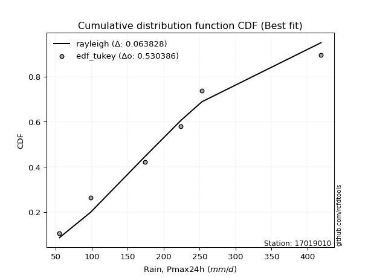</img></img>

</div>


### 8. EDF Gringorten (1963)

Gringorten plotting position formula is essential for estimating the probability and return periods of extreme events like floods and heavy rainfall. The constant _a=0.44_.

<div align="center">


$P=(m-a)/(n+1-2a)$


</div>


**8.1. Empirical values**

<div align="center">

|                | 0                   | 1                  | 2                   | 3                  | 4                  | 5                  |
|:---------------|:--------------------|:-------------------|:--------------------|:-------------------|:-------------------|:-------------------|
| date           | 2021                | 2022               | 2019                | 2017               | 2016               | 2018               |
| x              | 55.0                | 98.6               | 174.4               | 224.0              | 253.2              | 418.9              |
| m              | 1                   | 2                  | 3                   | 4                  | 5                  | 6                  |
| empirical_dist | edf_gringorten      | edf_gringorten     | edf_gringorten      | edf_gringorten     | edf_gringorten     | edf_gringorten     |
| empirical      | 0.09150326797385622 | 0.2549019607843137 | 0.41830065359477125 | 0.5816993464052288 | 0.7450980392156862 | 0.9084967320261437 |
| empirical_tr   | 1.1007194244604317  | 1.3421052631578947 | 1.7191011235955058  | 2.3906250000000004 | 3.9230769230769216 | 10.928571428571415 |

</div>


**8.2. Kolmogorov-Smirnov fit test (sorted by Δ)**


<div align="center">

|                | 0                   | 1                   | 2                    | 3                   | 4                  | 5                   | 6                   | 7                   | 8                  | 9                  | 10                  | 11                  | 12                  | 13                    | 14                  | 15                  | 16                  | 17                  | 18                  | 19                  | 20                  | 21                  | 22                  | 23                  | 24                  | 25                  | 26                  | 27                  | 28                  | 29                  | 30                 | 31                  | 32                  | 33                  | 34                  | 35                  | 36                  | 37                  | 38                  | 39                  | 40                  | 41                 | 42                  | 43                 | 44                  | 45                  | 46                  | 47                  | 48                  | 49                  | 50                  | 51                  | 52              | 53                  | 54                 | 55                  | 56                  | 57                  | 58                  | 59                  | 60                  | 61                 | 62                  | 63                  | 64                  | 65                  | 66                  | 67                  | 68                 | 69                 | 70                  | 71                  | 72                  | 73                 | 74                  | 75                  | 76                 | 77                  | 78                  | 79                 | 80                  | 81                 | 82                 | 83                  | 84                 | 85                 | 86                 | 87                 |
|:---------------|:--------------------|:--------------------|:---------------------|:--------------------|:-------------------|:--------------------|:--------------------|:--------------------|:-------------------|:-------------------|:--------------------|:--------------------|:--------------------|:----------------------|:--------------------|:--------------------|:--------------------|:--------------------|:--------------------|:--------------------|:--------------------|:--------------------|:--------------------|:--------------------|:--------------------|:--------------------|:--------------------|:--------------------|:--------------------|:--------------------|:-------------------|:--------------------|:--------------------|:--------------------|:--------------------|:--------------------|:--------------------|:--------------------|:--------------------|:--------------------|:--------------------|:-------------------|:--------------------|:-------------------|:--------------------|:--------------------|:--------------------|:--------------------|:--------------------|:--------------------|:--------------------|:--------------------|:----------------|:--------------------|:-------------------|:--------------------|:--------------------|:--------------------|:--------------------|:--------------------|:--------------------|:-------------------|:--------------------|:--------------------|:--------------------|:--------------------|:--------------------|:--------------------|:-------------------|:-------------------|:--------------------|:--------------------|:--------------------|:-------------------|:--------------------|:--------------------|:-------------------|:--------------------|:--------------------|:-------------------|:--------------------|:-------------------|:-------------------|:--------------------|:-------------------|:-------------------|:-------------------|:-------------------|
| station        | 17019010            | 17019010            | 17019010             | 17019010            | 17019010           | 17019010            | 17019010            | 17019010            | 17019010           | 17019010           | 17019010            | 17019010            | 17019010            | 17019010              | 17019010            | 17019010            | 17019010            | 17019010            | 17019010            | 17019010            | 17019010            | 17019010            | 17019010            | 17019010            | 17019010            | 17019010            | 17019010            | 17019010            | 17019010            | 17019010            | 17019010           | 17019010            | 17019010            | 17019010            | 17019010            | 17019010            | 17019010            | 17019010            | 17019010            | 17019010            | 17019010            | 17019010           | 17019010            | 17019010           | 17019010            | 17019010            | 17019010            | 17019010            | 17019010            | 17019010            | 17019010            | 17019010            | 17019010        | 17019010            | 17019010           | 17019010            | 17019010            | 17019010            | 17019010            | 17019010            | 17019010            | 17019010           | 17019010            | 17019010            | 17019010            | 17019010            | 17019010            | 17019010            | 17019010           | 17019010           | 17019010            | 17019010            | 17019010            | 17019010           | 17019010            | 17019010            | 17019010           | 17019010            | 17019010            | 17019010           | 17019010            | 17019010           | 17019010           | 17019010            | 17019010           | 17019010           | 17019010           | 17019010           |
| empirical_dist | edf_gringorten      | edf_gringorten      | edf_gringorten       | edf_gringorten      | edf_gringorten     | edf_gringorten      | edf_gringorten      | edf_gringorten      | edf_gringorten     | edf_gringorten     | edf_gringorten      | edf_gringorten      | edf_gringorten      | edf_gringorten        | edf_gringorten      | edf_gringorten      | edf_gringorten      | edf_gringorten      | edf_gringorten      | edf_gringorten      | edf_gringorten      | edf_gringorten      | edf_gringorten      | edf_gringorten      | edf_gringorten      | edf_gringorten      | edf_gringorten      | edf_gringorten      | edf_gringorten      | edf_gringorten      | edf_gringorten     | edf_gringorten      | edf_gringorten      | edf_gringorten      | edf_gringorten      | edf_gringorten      | edf_gringorten      | edf_gringorten      | edf_gringorten      | edf_gringorten      | edf_gringorten      | edf_gringorten     | edf_gringorten      | edf_gringorten     | edf_gringorten      | edf_gringorten      | edf_gringorten      | edf_gringorten      | edf_gringorten      | edf_gringorten      | edf_gringorten      | edf_gringorten      | edf_gringorten  | edf_gringorten      | edf_gringorten     | edf_gringorten      | edf_gringorten      | edf_gringorten      | edf_gringorten      | edf_gringorten      | edf_gringorten      | edf_gringorten     | edf_gringorten      | edf_gringorten      | edf_gringorten      | edf_gringorten      | edf_gringorten      | edf_gringorten      | edf_gringorten     | edf_gringorten     | edf_gringorten      | edf_gringorten      | edf_gringorten      | edf_gringorten     | edf_gringorten      | edf_gringorten      | edf_gringorten     | edf_gringorten      | edf_gringorten      | edf_gringorten     | edf_gringorten      | edf_gringorten     | edf_gringorten     | edf_gringorten      | edf_gringorten     | edf_gringorten     | edf_gringorten     | edf_gringorten     |
| p_dist         | rayleigh            | ncf                 | logjohnsonsu         | maxwell             | logloggamma        | logweibull_min      | betaprime           | halfnorm            | pearson3           | loggenlogistic     | invgamma            | mielke              | kstwobign           | loglaplace_asymmetric | genlogistic         | alpha               | johnsonsu           | loggumbel_l         | fisk                | exponnorm           | logfisk             | logpearson3         | nct                 | crystalball         | invgauss            | t                   | norm                | truncnorm           | gumbel_r            | logistic            | rice               | gompertz            | halflogistic        | laplace_asymmetric  | f                   | hypsecant           | moyal               | logexponnorm        | logcrystalball      | lognorm             | lognorm             | logt               | logfatiguelife      | logf               | lognct              | loglogistic         | logncf              | logbetaprime        | logerlang           | loggamma            | loggamma            | laplace             | logrice         | loginvgamma         | loghypsecant       | logalpha            | loginvgauss         | gumbel_l            | expon               | genexpon            | logmaxwell          | lograyleigh        | loglaplace          | loginvweibull       | loggompertz         | logkstwobign        | weibull_min         | loggumbel_r         | loghalfnorm        | loggenexpon        | logmoyal            | loghalflogistic     | logexpon            | logmielke          | wald                | nakagami            | gibrat             | gamma               | logwald             | logchi2            | loggibrat           | chi2               | erlang             | invweibull          | loglognorm         | lognakagami        | logtruncnorm       | fatiguelife        |
| delta          | 0.05676913406056061 | 0.06105823280451794 | 0.062089575370969985 | 0.06284263646931343 | 0.0629248813090943 | 0.06311524700180979 | 0.06337477448128165 | 0.06359061359592066 | 0.0675878099735821 | 0.0686965264240329 | 0.06936505850900562 | 0.06982565224132287 | 0.07136848372345622 | 0.07158854488911806   | 0.07191334047705578 | 0.07344403154184934 | 0.07394709729530358 | 0.07400207081567842 | 0.07468961741557281 | 0.07476920648296365 | 0.07506457415158757 | 0.07794979970533056 | 0.07892409951205939 | 0.08273540209395036 | 0.08295520948008411 | 0.08311335115534069 | 0.08318259761067126 | 0.08318259903797653 | 0.08457738248371408 | 0.09022498770160067 | 0.0905620888104712 | 0.09150326797385312 | 0.09150326797385622 | 0.09642271645792785 | 0.09981562312627773 | 0.10191117525363658 | 0.10281423594204711 | 0.10432339339171653 | 0.10432403703691889 | 0.10432449023739737 | 0.10432449023739737 | 0.1043253436847767 | 0.10485419817287372 | 0.1056858683789092 | 0.10609665777867067 | 0.10740688032016227 | 0.11130537604594076 | 0.11171046782781563 | 0.11226013284328401 | 0.11257997345014031 | 0.11257997345014031 | 0.11393705808771376 | 0.1183204980891 | 0.11917324743217833 | 0.1208805746508852 | 0.12266268755886905 | 0.12606022200196793 | 0.12823986146947342 | 0.13293288466214553 | 0.13310616129567282 | 0.13633228697833516 | 0.1468173500695012 | 0.14827947686687437 | 0.15191599610291245 | 0.16131445258568827 | 0.17340348182594717 | 0.17489897268480126 | 0.17500231809304273 | 0.1763416208672966 | 0.1826059694274687 | 0.20055255020486124 | 0.20251456708561294 | 0.22596476108300206 | 0.2388636319807969 | 0.24969903708233582 | 0.25490196022399614 | 0.2549019607843137 | 0.25663093424021727 | 0.27150760510875543 | 0.2948793546781903 | 0.29794933943750573 | 0.3219251476089507 | 0.3741814231297473 | 0.38093196948388264 | 0.3964854632692789 | 0.4142965403796223 | 0.4183006463156318 | 0.4772588610498315 |
| deltao         | 0.530385761606      | 0.530385761606      | 0.530385761606       | 0.530385761606      | 0.530385761606     | 0.530385761606      | 0.530385761606      | 0.530385761606      | 0.530385761606     | 0.530385761606     | 0.530385761606      | 0.530385761606      | 0.530385761606      | 0.530385761606        | 0.530385761606      | 0.530385761606      | 0.530385761606      | 0.530385761606      | 0.530385761606      | 0.530385761606      | 0.530385761606      | 0.530385761606      | 0.530385761606      | 0.530385761606      | 0.530385761606      | 0.530385761606      | 0.530385761606      | 0.530385761606      | 0.530385761606      | 0.530385761606      | 0.530385761606     | 0.530385761606      | 0.530385761606      | 0.530385761606      | 0.530385761606      | 0.530385761606      | 0.530385761606      | 0.530385761606      | 0.530385761606      | 0.530385761606      | 0.530385761606      | 0.530385761606     | 0.530385761606      | 0.530385761606     | 0.530385761606      | 0.530385761606      | 0.530385761606      | 0.530385761606      | 0.530385761606      | 0.530385761606      | 0.530385761606      | 0.530385761606      | 0.530385761606  | 0.530385761606      | 0.530385761606     | 0.530385761606      | 0.530385761606      | 0.530385761606      | 0.530385761606      | 0.530385761606      | 0.530385761606      | 0.530385761606     | 0.530385761606      | 0.530385761606      | 0.530385761606      | 0.530385761606      | 0.530385761606      | 0.530385761606      | 0.530385761606     | 0.530385761606     | 0.530385761606      | 0.530385761606      | 0.530385761606      | 0.530385761606     | 0.530385761606      | 0.530385761606      | 0.530385761606     | 0.530385761606      | 0.530385761606      | 0.530385761606     | 0.530385761606      | 0.530385761606     | 0.530385761606     | 0.530385761606      | 0.530385761606     | 0.530385761606     | 0.530385761606     | 0.530385761606     |
| eval           | Δo > Δ              | Δo > Δ              | Δo > Δ               | Δo > Δ              | Δo > Δ             | Δo > Δ              | Δo > Δ              | Δo > Δ              | Δo > Δ             | Δo > Δ             | Δo > Δ              | Δo > Δ              | Δo > Δ              | Δo > Δ                | Δo > Δ              | Δo > Δ              | Δo > Δ              | Δo > Δ              | Δo > Δ              | Δo > Δ              | Δo > Δ              | Δo > Δ              | Δo > Δ              | Δo > Δ              | Δo > Δ              | Δo > Δ              | Δo > Δ              | Δo > Δ              | Δo > Δ              | Δo > Δ              | Δo > Δ             | Δo > Δ              | Δo > Δ              | Δo > Δ              | Δo > Δ              | Δo > Δ              | Δo > Δ              | Δo > Δ              | Δo > Δ              | Δo > Δ              | Δo > Δ              | Δo > Δ             | Δo > Δ              | Δo > Δ             | Δo > Δ              | Δo > Δ              | Δo > Δ              | Δo > Δ              | Δo > Δ              | Δo > Δ              | Δo > Δ              | Δo > Δ              | Δo > Δ          | Δo > Δ              | Δo > Δ             | Δo > Δ              | Δo > Δ              | Δo > Δ              | Δo > Δ              | Δo > Δ              | Δo > Δ              | Δo > Δ             | Δo > Δ              | Δo > Δ              | Δo > Δ              | Δo > Δ              | Δo > Δ              | Δo > Δ              | Δo > Δ             | Δo > Δ             | Δo > Δ              | Δo > Δ              | Δo > Δ              | Δo > Δ             | Δo > Δ              | Δo > Δ              | Δo > Δ             | Δo > Δ              | Δo > Δ              | Δo > Δ             | Δo > Δ              | Δo > Δ             | Δo > Δ             | Δo > Δ              | Δo > Δ             | Δo > Δ             | Δo > Δ             | Δo > Δ             |
| fit            | 1                   | 1                   | 1                    | 1                   | 1                  | 1                   | 1                   | 1                   | 1                  | 1                  | 1                   | 1                   | 1                   | 1                     | 1                   | 1                   | 1                   | 1                   | 1                   | 1                   | 1                   | 1                   | 1                   | 1                   | 1                   | 1                   | 1                   | 1                   | 1                   | 1                   | 1                  | 1                   | 1                   | 1                   | 1                   | 1                   | 1                   | 1                   | 1                   | 1                   | 1                   | 1                  | 1                   | 1                  | 1                   | 1                   | 1                   | 1                   | 1                   | 1                   | 1                   | 1                   | 1               | 1                   | 1                  | 1                   | 1                   | 1                   | 1                   | 1                   | 1                   | 1                  | 1                   | 1                   | 1                   | 1                   | 1                   | 1                   | 1                  | 1                  | 1                   | 1                   | 1                   | 1                  | 1                   | 1                   | 1                  | 1                   | 1                   | 1                  | 1                   | 1                  | 1                  | 1                   | 1                  | 1                  | 1                  | 1                  |
| n              | 6                   | 6                   | 6                    | 6                   | 6                  | 6                   | 6                   | 6                   | 6                  | 6                  | 6                   | 6                   | 6                   | 6                     | 6                   | 6                   | 6                   | 6                   | 6                   | 6                   | 6                   | 6                   | 6                   | 6                   | 6                   | 6                   | 6                   | 6                   | 6                   | 6                   | 6                  | 6                   | 6                   | 6                   | 6                   | 6                   | 6                   | 6                   | 6                   | 6                   | 6                   | 6                  | 6                   | 6                  | 6                   | 6                   | 6                   | 6                   | 6                   | 6                   | 6                   | 6                   | 6               | 6                   | 6                  | 6                   | 6                   | 6                   | 6                   | 6                   | 6                   | 6                  | 6                   | 6                   | 6                   | 6                   | 6                   | 6                   | 6                  | 6                  | 6                   | 6                   | 6                   | 6                  | 6                   | 6                   | 6                  | 6                   | 6                   | 6                  | 6                   | 6                  | 6                  | 6                   | 6                  | 6                  | 6                  | 6                  |
| best_fit       | 1                   | 0                   | 0                    | 0                   | 0                  | 0                   | 0                   | 0                   | 0                  | 0                  | 0                   | 0                   | 0                   | 0                     | 0                   | 0                   | 0                   | 0                   | 0                   | 0                   | 0                   | 0                   | 0                   | 0                   | 0                   | 0                   | 0                   | 0                   | 0                   | 0                   | 0                  | 0                   | 0                   | 0                   | 0                   | 0                   | 0                   | 0                   | 0                   | 0                   | 0                   | 0                  | 0                   | 0                  | 0                   | 0                   | 0                   | 0                   | 0                   | 0                   | 0                   | 0                   | 0               | 0                   | 0                  | 0                   | 0                   | 0                   | 0                   | 0                   | 0                   | 0                  | 0                   | 0                   | 0                   | 0                   | 0                   | 0                   | 0                  | 0                  | 0                   | 0                   | 0                   | 0                  | 0                   | 0                   | 0                  | 0                   | 0                   | 0                  | 0                   | 0                  | 0                  | 0                   | 0                  | 0                  | 0                  | 0                  |
| best_fit_sort  | 1                   | 2                   | 3                    | 4                   | 5                  | 6                   | 7                   | 8                   | 9                  | 10                 | 11                  | 12                  | 13                  | 14                    | 15                  | 16                  | 17                  | 18                  | 19                  | 20                  | 21                  | 22                  | 23                  | 24                  | 25                  | 26                  | 27                  | 28                  | 29                  | 30                  | 31                 | 32                  | 33                  | 34                  | 35                  | 36                  | 37                  | 38                  | 39                  | 40                  | 41                  | 42                 | 43                  | 44                 | 45                  | 46                  | 47                  | 48                  | 49                  | 50                  | 51                  | 52                  | 53              | 54                  | 55                 | 56                  | 57                  | 58                  | 59                  | 60                  | 61                  | 62                 | 63                  | 64                  | 65                  | 66                  | 67                  | 68                  | 69                 | 70                 | 71                  | 72                  | 73                  | 74                 | 75                  | 76                  | 77                 | 78                  | 79                  | 80                 | 81                  | 82                 | 83                 | 84                  | 85                 | 86                 | 87                 | 88                 |

</div>


**8.3. Best fit**

<div align="center">

|   id |   station | empirical_dist   | p_dist   |     delta |   deltao | eval   |   fit |   n |   best_fit |   best_fit_sort |
|-----:|----------:|:-----------------|:---------|----------:|---------:|:-------|------:|----:|-----------:|----------------:|
|    0 |  17019010 | edf_gringorten   | rayleigh | 0.0567691 | 0.530386 | Δo > Δ |     1 |   6 |          1 |               1 |

</div>


<div align="center">

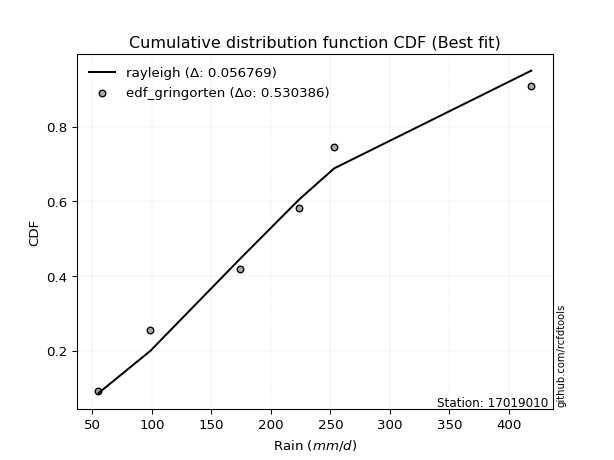</img></img>

</div>


### 9. EDF Filliben (1975)

The specific values of the constants (0.3175) (often denoted as $alpha$) and (0.365) are derived from a method proposed by James J. Filliben in a 1975 paper. This particular formula is the mean value of the $i$-th order statistic of the normal distribution and is considered a robust and effective plotting position formula for the normal probability plot correlation coefficient test for normality.

<div align="center">


$P=(m-0.3175)/(n+0.365)$


</div>


**9.1. Empirical values**

<div align="center">

|                | 0                   | 1                   | 2                  | 3                  | 4                  | 5                  |
|:---------------|:--------------------|:--------------------|:-------------------|:-------------------|:-------------------|:-------------------|
| date           | 2021                | 2022                | 2019               | 2017               | 2016               | 2018               |
| x              | 55.0                | 98.6                | 174.4              | 224.0              | 253.2              | 418.9              |
| m              | 1                   | 2                   | 3                  | 4                  | 5                  | 6                  |
| empirical_dist | edf_filliben        | edf_filliben        | edf_filliben       | edf_filliben       | edf_filliben       | edf_filliben       |
| empirical      | 0.10722702278083267 | 0.26433621366849963 | 0.4214454045561665 | 0.5785545954438335 | 0.7356637863315004 | 0.8927729772191673 |
| empirical_tr   | 1.1201055873295205  | 1.3593166043780034  | 1.7284453496266123 | 2.3727865796831313 | 3.783060921248143  | 9.326007326007321  |

</div>


**9.2. Kolmogorov-Smirnov fit test (sorted by Δ)**


<div align="center">

|                | 0                   | 1                   | 2                   | 3                   | 4                   | 5                   | 6                   | 7                  | 8                   | 9                   | 10                  | 11                  | 12                  | 13                 | 14                  | 15                  | 16                  | 17                  | 18                  | 19                  | 20                    | 21                 | 22                  | 23                  | 24                  | 25                  | 26                  | 27                  | 28              | 29                 | 30                  | 31                  | 32                  | 33                 | 34                 | 35                  | 36                  | 37                  | 38                 | 39                  | 40                  | 41                  | 42                  | 43                  | 44                  | 45                  | 46                 | 47                  | 48                  | 49                 | 50                  | 51                  | 52                  | 53                  | 54                  | 55                  | 56                  | 57                  | 58                  | 59                  | 60                 | 61                  | 62                  | 63                 | 64                | 65                  | 66                 | 67                  | 68                  | 69                  | 70                  | 71                  | 72                 | 73                  | 74                | 75                  | 76                  | 77                  | 78                  | 79                  | 80                  | 81                 | 82                | 83                 | 84                | 85                  | 86                  | 87                 |
|:---------------|:--------------------|:--------------------|:--------------------|:--------------------|:--------------------|:--------------------|:--------------------|:-------------------|:--------------------|:--------------------|:--------------------|:--------------------|:--------------------|:-------------------|:--------------------|:--------------------|:--------------------|:--------------------|:--------------------|:--------------------|:----------------------|:-------------------|:--------------------|:--------------------|:--------------------|:--------------------|:--------------------|:--------------------|:----------------|:-------------------|:--------------------|:--------------------|:--------------------|:-------------------|:-------------------|:--------------------|:--------------------|:--------------------|:-------------------|:--------------------|:--------------------|:--------------------|:--------------------|:--------------------|:--------------------|:--------------------|:-------------------|:--------------------|:--------------------|:-------------------|:--------------------|:--------------------|:--------------------|:--------------------|:--------------------|:--------------------|:--------------------|:--------------------|:--------------------|:--------------------|:-------------------|:--------------------|:--------------------|:-------------------|:------------------|:--------------------|:-------------------|:--------------------|:--------------------|:--------------------|:--------------------|:--------------------|:-------------------|:--------------------|:------------------|:--------------------|:--------------------|:--------------------|:--------------------|:--------------------|:--------------------|:-------------------|:------------------|:-------------------|:------------------|:--------------------|:--------------------|:-------------------|
| station        | 17019010            | 17019010            | 17019010            | 17019010            | 17019010            | 17019010            | 17019010            | 17019010           | 17019010            | 17019010            | 17019010            | 17019010            | 17019010            | 17019010           | 17019010            | 17019010            | 17019010            | 17019010            | 17019010            | 17019010            | 17019010              | 17019010           | 17019010            | 17019010            | 17019010            | 17019010            | 17019010            | 17019010            | 17019010        | 17019010           | 17019010            | 17019010            | 17019010            | 17019010           | 17019010           | 17019010            | 17019010            | 17019010            | 17019010           | 17019010            | 17019010            | 17019010            | 17019010            | 17019010            | 17019010            | 17019010            | 17019010           | 17019010            | 17019010            | 17019010           | 17019010            | 17019010            | 17019010            | 17019010            | 17019010            | 17019010            | 17019010            | 17019010            | 17019010            | 17019010            | 17019010           | 17019010            | 17019010            | 17019010           | 17019010          | 17019010            | 17019010           | 17019010            | 17019010            | 17019010            | 17019010            | 17019010            | 17019010           | 17019010            | 17019010          | 17019010            | 17019010            | 17019010            | 17019010            | 17019010            | 17019010            | 17019010           | 17019010          | 17019010           | 17019010          | 17019010            | 17019010            | 17019010           |
| empirical_dist | edf_filliben        | edf_filliben        | edf_filliben        | edf_filliben        | edf_filliben        | edf_filliben        | edf_filliben        | edf_filliben       | edf_filliben        | edf_filliben        | edf_filliben        | edf_filliben        | edf_filliben        | edf_filliben       | edf_filliben        | edf_filliben        | edf_filliben        | edf_filliben        | edf_filliben        | edf_filliben        | edf_filliben          | edf_filliben       | edf_filliben        | edf_filliben        | edf_filliben        | edf_filliben        | edf_filliben        | edf_filliben        | edf_filliben    | edf_filliben       | edf_filliben        | edf_filliben        | edf_filliben        | edf_filliben       | edf_filliben       | edf_filliben        | edf_filliben        | edf_filliben        | edf_filliben       | edf_filliben        | edf_filliben        | edf_filliben        | edf_filliben        | edf_filliben        | edf_filliben        | edf_filliben        | edf_filliben       | edf_filliben        | edf_filliben        | edf_filliben       | edf_filliben        | edf_filliben        | edf_filliben        | edf_filliben        | edf_filliben        | edf_filliben        | edf_filliben        | edf_filliben        | edf_filliben        | edf_filliben        | edf_filliben       | edf_filliben        | edf_filliben        | edf_filliben       | edf_filliben      | edf_filliben        | edf_filliben       | edf_filliben        | edf_filliben        | edf_filliben        | edf_filliben        | edf_filliben        | edf_filliben       | edf_filliben        | edf_filliben      | edf_filliben        | edf_filliben        | edf_filliben        | edf_filliben        | edf_filliben        | edf_filliben        | edf_filliben       | edf_filliben      | edf_filliben       | edf_filliben      | edf_filliben        | edf_filliben        | edf_filliben       |
| p_dist         | rayleigh            | maxwell             | ncf                 | betaprime           | logjohnsonsu        | logloggamma         | logweibull_min      | johnsonsu          | logpearson3         | pearson3            | loggenlogistic      | logfisk             | invgamma            | t                  | truncnorm           | norm                | mielke              | halfnorm            | invgauss            | kstwobign           | loglaplace_asymmetric | genlogistic        | crystalball         | alpha               | loggumbel_l         | fisk                | exponnorm           | nct                 | gumbel_r        | logistic           | rice                | logexponnorm        | logcrystalball      | lognorm            | lognorm            | logt                | logfatiguelife      | logf                | lognct             | laplace_asymmetric  | f                   | gompertz            | halflogistic        | logncf              | logbetaprime        | logerlang           | loglogistic        | loggamma            | loggamma            | hypsecant          | moyal               | logrice             | loginvgamma         | gumbel_l            | logalpha            | loginvgauss         | laplace             | loghypsecant        | expon               | genexpon            | logmaxwell         | lograyleigh         | loginvweibull       | loglaplace         | loggompertz       | weibull_min         | logkstwobign       | loggumbel_r         | loghalfnorm         | loggenexpon         | logmoyal            | loghalflogistic     | logexpon           | logmielke           | gamma             | wald                | nakagami            | gibrat              | logwald             | logchi2             | loggibrat           | chi2               | erlang            | invweibull         | loglognorm        | lognakagami         | logtruncnorm        | fatiguelife        |
| delta          | 0.06500623259598365 | 0.06903034398400512 | 0.07049248568870387 | 0.07111298554511816 | 0.07152382825515591 | 0.07235913419328022 | 0.07254949988599571 | 0.0735736735746998 | 0.07480504874393529 | 0.07702206285776803 | 0.07813077930821882 | 0.07870564304558611 | 0.07879931139319155 | 0.0789827025921726 | 0.07901372685623004 | 0.07901372741646123 | 0.07925990512550879 | 0.07930595267561667 | 0.07981045851868884 | 0.08080273660764214 | 0.08102279777330398   | 0.0813475933612417 | 0.08181893514706873 | 0.08287828442603526 | 0.08343632369986434 | 0.08412387029975874 | 0.08420345936714957 | 0.08835835239624532 | 0.0940116353679 | 0.0996592405857866 | 0.09999634169465713 | 0.10117864243032126 | 0.10117928607552362 | 0.1011797392760021 | 0.1011797392760021 | 0.10118059272338142 | 0.10170944721147845 | 0.10254111741751393 | 0.1029519068172754 | 0.10585696934211378 | 0.10722701708851236 | 0.10722702278082957 | 0.10722702278083267 | 0.10816062508454549 | 0.10856571686642036 | 0.10911538188188874 | 0.1093172811055092 | 0.10943522248874504 | 0.10943522248874504 | 0.1113454281378225 | 0.11224848882623303 | 0.11517574712770473 | 0.11602849647078306 | 0.11880560858528766 | 0.11951793659747378 | 0.12291547104057265 | 0.12337131097189968 | 0.12402532561228052 | 0.12978813370075026 | 0.12996141033427755 | 0.1331875360169399 | 0.14367259910810593 | 0.14877124514151718 | 0.1514242278282697 | 0.158169701624293 | 0.15917521787782485 | 0.1702587308645519 | 0.17185756713164746 | 0.17319686990590133 | 0.17946121846607344 | 0.19740779924346596 | 0.19936981612421767 | 0.2228200101216068 | 0.23571888101940164 | 0.253486183278822 | 0.25913328996652174 | 0.26433621310818206 | 0.26433621366849963 | 0.26836285414736016 | 0.29173460371679505 | 0.29480458847611046 | 0.3187803966475554 | 0.371036672168352 | 0.3714977165996967 | 0.387051210385093 | 0.41115178941822705 | 0.42144539727702707 | 0.4678246081656456 |
| deltao         | 0.530385761606      | 0.530385761606      | 0.530385761606      | 0.530385761606      | 0.530385761606      | 0.530385761606      | 0.530385761606      | 0.530385761606     | 0.530385761606      | 0.530385761606      | 0.530385761606      | 0.530385761606      | 0.530385761606      | 0.530385761606     | 0.530385761606      | 0.530385761606      | 0.530385761606      | 0.530385761606      | 0.530385761606      | 0.530385761606      | 0.530385761606        | 0.530385761606     | 0.530385761606      | 0.530385761606      | 0.530385761606      | 0.530385761606      | 0.530385761606      | 0.530385761606      | 0.530385761606  | 0.530385761606     | 0.530385761606      | 0.530385761606      | 0.530385761606      | 0.530385761606     | 0.530385761606     | 0.530385761606      | 0.530385761606      | 0.530385761606      | 0.530385761606     | 0.530385761606      | 0.530385761606      | 0.530385761606      | 0.530385761606      | 0.530385761606      | 0.530385761606      | 0.530385761606      | 0.530385761606     | 0.530385761606      | 0.530385761606      | 0.530385761606     | 0.530385761606      | 0.530385761606      | 0.530385761606      | 0.530385761606      | 0.530385761606      | 0.530385761606      | 0.530385761606      | 0.530385761606      | 0.530385761606      | 0.530385761606      | 0.530385761606     | 0.530385761606      | 0.530385761606      | 0.530385761606     | 0.530385761606    | 0.530385761606      | 0.530385761606     | 0.530385761606      | 0.530385761606      | 0.530385761606      | 0.530385761606      | 0.530385761606      | 0.530385761606     | 0.530385761606      | 0.530385761606    | 0.530385761606      | 0.530385761606      | 0.530385761606      | 0.530385761606      | 0.530385761606      | 0.530385761606      | 0.530385761606     | 0.530385761606    | 0.530385761606     | 0.530385761606    | 0.530385761606      | 0.530385761606      | 0.530385761606     |
| eval           | Δo > Δ              | Δo > Δ              | Δo > Δ              | Δo > Δ              | Δo > Δ              | Δo > Δ              | Δo > Δ              | Δo > Δ             | Δo > Δ              | Δo > Δ              | Δo > Δ              | Δo > Δ              | Δo > Δ              | Δo > Δ             | Δo > Δ              | Δo > Δ              | Δo > Δ              | Δo > Δ              | Δo > Δ              | Δo > Δ              | Δo > Δ                | Δo > Δ             | Δo > Δ              | Δo > Δ              | Δo > Δ              | Δo > Δ              | Δo > Δ              | Δo > Δ              | Δo > Δ          | Δo > Δ             | Δo > Δ              | Δo > Δ              | Δo > Δ              | Δo > Δ             | Δo > Δ             | Δo > Δ              | Δo > Δ              | Δo > Δ              | Δo > Δ             | Δo > Δ              | Δo > Δ              | Δo > Δ              | Δo > Δ              | Δo > Δ              | Δo > Δ              | Δo > Δ              | Δo > Δ             | Δo > Δ              | Δo > Δ              | Δo > Δ             | Δo > Δ              | Δo > Δ              | Δo > Δ              | Δo > Δ              | Δo > Δ              | Δo > Δ              | Δo > Δ              | Δo > Δ              | Δo > Δ              | Δo > Δ              | Δo > Δ             | Δo > Δ              | Δo > Δ              | Δo > Δ             | Δo > Δ            | Δo > Δ              | Δo > Δ             | Δo > Δ              | Δo > Δ              | Δo > Δ              | Δo > Δ              | Δo > Δ              | Δo > Δ             | Δo > Δ              | Δo > Δ            | Δo > Δ              | Δo > Δ              | Δo > Δ              | Δo > Δ              | Δo > Δ              | Δo > Δ              | Δo > Δ             | Δo > Δ            | Δo > Δ             | Δo > Δ            | Δo > Δ              | Δo > Δ              | Δo > Δ             |
| fit            | 1                   | 1                   | 1                   | 1                   | 1                   | 1                   | 1                   | 1                  | 1                   | 1                   | 1                   | 1                   | 1                   | 1                  | 1                   | 1                   | 1                   | 1                   | 1                   | 1                   | 1                     | 1                  | 1                   | 1                   | 1                   | 1                   | 1                   | 1                   | 1               | 1                  | 1                   | 1                   | 1                   | 1                  | 1                  | 1                   | 1                   | 1                   | 1                  | 1                   | 1                   | 1                   | 1                   | 1                   | 1                   | 1                   | 1                  | 1                   | 1                   | 1                  | 1                   | 1                   | 1                   | 1                   | 1                   | 1                   | 1                   | 1                   | 1                   | 1                   | 1                  | 1                   | 1                   | 1                  | 1                 | 1                   | 1                  | 1                   | 1                   | 1                   | 1                   | 1                   | 1                  | 1                   | 1                 | 1                   | 1                   | 1                   | 1                   | 1                   | 1                   | 1                  | 1                 | 1                  | 1                 | 1                   | 1                   | 1                  |
| n              | 6                   | 6                   | 6                   | 6                   | 6                   | 6                   | 6                   | 6                  | 6                   | 6                   | 6                   | 6                   | 6                   | 6                  | 6                   | 6                   | 6                   | 6                   | 6                   | 6                   | 6                     | 6                  | 6                   | 6                   | 6                   | 6                   | 6                   | 6                   | 6               | 6                  | 6                   | 6                   | 6                   | 6                  | 6                  | 6                   | 6                   | 6                   | 6                  | 6                   | 6                   | 6                   | 6                   | 6                   | 6                   | 6                   | 6                  | 6                   | 6                   | 6                  | 6                   | 6                   | 6                   | 6                   | 6                   | 6                   | 6                   | 6                   | 6                   | 6                   | 6                  | 6                   | 6                   | 6                  | 6                 | 6                   | 6                  | 6                   | 6                   | 6                   | 6                   | 6                   | 6                  | 6                   | 6                 | 6                   | 6                   | 6                   | 6                   | 6                   | 6                   | 6                  | 6                 | 6                  | 6                 | 6                   | 6                   | 6                  |
| best_fit       | 1                   | 0                   | 0                   | 0                   | 0                   | 0                   | 0                   | 0                  | 0                   | 0                   | 0                   | 0                   | 0                   | 0                  | 0                   | 0                   | 0                   | 0                   | 0                   | 0                   | 0                     | 0                  | 0                   | 0                   | 0                   | 0                   | 0                   | 0                   | 0               | 0                  | 0                   | 0                   | 0                   | 0                  | 0                  | 0                   | 0                   | 0                   | 0                  | 0                   | 0                   | 0                   | 0                   | 0                   | 0                   | 0                   | 0                  | 0                   | 0                   | 0                  | 0                   | 0                   | 0                   | 0                   | 0                   | 0                   | 0                   | 0                   | 0                   | 0                   | 0                  | 0                   | 0                   | 0                  | 0                 | 0                   | 0                  | 0                   | 0                   | 0                   | 0                   | 0                   | 0                  | 0                   | 0                 | 0                   | 0                   | 0                   | 0                   | 0                   | 0                   | 0                  | 0                 | 0                  | 0                 | 0                   | 0                   | 0                  |
| best_fit_sort  | 1                   | 2                   | 3                   | 4                   | 5                   | 6                   | 7                   | 8                  | 9                   | 10                  | 11                  | 12                  | 13                  | 14                 | 15                  | 16                  | 17                  | 18                  | 19                  | 20                  | 21                    | 22                 | 23                  | 24                  | 25                  | 26                  | 27                  | 28                  | 29              | 30                 | 31                  | 32                  | 33                  | 34                 | 35                 | 36                  | 37                  | 38                  | 39                 | 40                  | 41                  | 42                  | 43                  | 44                  | 45                  | 46                  | 47                 | 48                  | 49                  | 50                 | 51                  | 52                  | 53                  | 54                  | 55                  | 56                  | 57                  | 58                  | 59                  | 60                  | 61                 | 62                  | 63                  | 64                 | 65                | 66                  | 67                 | 68                  | 69                  | 70                  | 71                  | 72                  | 73                 | 74                  | 75                | 76                  | 77                  | 78                  | 79                  | 80                  | 81                  | 82                 | 83                | 84                 | 85                | 86                  | 87                  | 88                 |

</div>


**9.3. Best fit**

<div align="center">

|   id |   station | empirical_dist   | p_dist   |     delta |   deltao | eval   |   fit |   n |   best_fit |   best_fit_sort |
|-----:|----------:|:-----------------|:---------|----------:|---------:|:-------|------:|----:|-----------:|----------------:|
|    0 |  17019010 | edf_filliben     | rayleigh | 0.0650062 | 0.530386 | Δo > Δ |     1 |   6 |          1 |               1 |

</div>


<div align="center">

</img>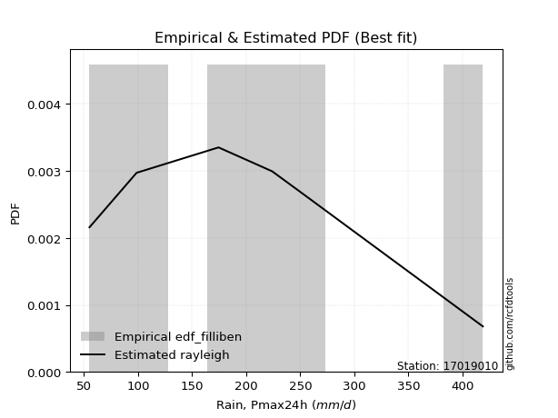</img>

</div>


### 10. EDF Jenkinson (1977)

The Jenkinson formula in hydrology is an empirical plotting position formula used to estimate the non-exceedance probability _(P)_ or return period _(T)_ of a given ordered observation within a sample. It is a widely used method in the frequency analysis of extreme events such as floods and rainfall, as it provides a distribution-free way to plot data. _a≈0.31_ and _b≈0.38_ are constants derived to approximate the median of the probability distribution for the given rank.

<div align="center">


$P=(m-a)/(n+b)$


</div>


**10.1. Empirical values**

<div align="center">

|                | 0                   | 1                   | 2                  | 3                  | 4                  | 5                  |
|:---------------|:--------------------|:--------------------|:-------------------|:-------------------|:-------------------|:-------------------|
| date           | 2021                | 2022                | 2019               | 2017               | 2016               | 2018               |
| x              | 55.0                | 98.6                | 174.4              | 224.0              | 253.2              | 418.9              |
| m              | 1                   | 2                   | 3                  | 4                  | 5                  | 6                  |
| empirical_dist | edf_jenkinson       | edf_jenkinson       | edf_jenkinson      | edf_jenkinson      | edf_jenkinson      | edf_jenkinson      |
| empirical      | 0.10815047021943573 | 0.26489028213166144 | 0.4216300940438871 | 0.5783699059561128 | 0.7351097178683387 | 0.8918495297805643 |
| empirical_tr   | 1.1212653778558874  | 1.3603411513859276  | 1.7289972899728996 | 2.3717472118959106 | 3.7751479289940844 | 9.246376811594207  |

</div>


**10.2. Kolmogorov-Smirnov fit test (sorted by Δ)**


<div align="center">

|                | 0                   | 1                   | 2                   | 3                   | 4                   | 5                   | 6                   | 7                   | 8                   | 9                   | 10                  | 11                  | 12                  | 13                  | 14                  | 15                  | 16                  | 17                 | 18                  | 19                  | 20                    | 21                 | 22                  | 23                  | 24                  | 25                  | 26                  | 27                  | 28                 | 29                 | 30                  | 31                  | 32                  | 33                 | 34                 | 35                  | 36                  | 37                  | 38                 | 39                  | 40                  | 41                  | 42                  | 43                  | 44                  | 45                  | 46                  | 47                  | 48                  | 49                 | 50                  | 51                  | 52                  | 53                  | 54                  | 55                  | 56                  | 57                  | 58                  | 59                  | 60                 | 61                  | 62                  | 63                  | 64                 | 65                 | 66                 | 67                  | 68                  | 69                  | 70                  | 71                  | 72                 | 73                  | 74                 | 75                  | 76                  | 77                  | 78                  | 79                  | 80                  | 81                 | 82                 | 83                 | 84                 | 85                  | 86                  | 87                 |
|:---------------|:--------------------|:--------------------|:--------------------|:--------------------|:--------------------|:--------------------|:--------------------|:--------------------|:--------------------|:--------------------|:--------------------|:--------------------|:--------------------|:--------------------|:--------------------|:--------------------|:--------------------|:-------------------|:--------------------|:--------------------|:----------------------|:-------------------|:--------------------|:--------------------|:--------------------|:--------------------|:--------------------|:--------------------|:-------------------|:-------------------|:--------------------|:--------------------|:--------------------|:-------------------|:-------------------|:--------------------|:--------------------|:--------------------|:-------------------|:--------------------|:--------------------|:--------------------|:--------------------|:--------------------|:--------------------|:--------------------|:--------------------|:--------------------|:--------------------|:-------------------|:--------------------|:--------------------|:--------------------|:--------------------|:--------------------|:--------------------|:--------------------|:--------------------|:--------------------|:--------------------|:-------------------|:--------------------|:--------------------|:--------------------|:-------------------|:-------------------|:-------------------|:--------------------|:--------------------|:--------------------|:--------------------|:--------------------|:-------------------|:--------------------|:-------------------|:--------------------|:--------------------|:--------------------|:--------------------|:--------------------|:--------------------|:-------------------|:-------------------|:-------------------|:-------------------|:--------------------|:--------------------|:-------------------|
| station        | 17019010            | 17019010            | 17019010            | 17019010            | 17019010            | 17019010            | 17019010            | 17019010            | 17019010            | 17019010            | 17019010            | 17019010            | 17019010            | 17019010            | 17019010            | 17019010            | 17019010            | 17019010           | 17019010            | 17019010            | 17019010              | 17019010           | 17019010            | 17019010            | 17019010            | 17019010            | 17019010            | 17019010            | 17019010           | 17019010           | 17019010            | 17019010            | 17019010            | 17019010           | 17019010           | 17019010            | 17019010            | 17019010            | 17019010           | 17019010            | 17019010            | 17019010            | 17019010            | 17019010            | 17019010            | 17019010            | 17019010            | 17019010            | 17019010            | 17019010           | 17019010            | 17019010            | 17019010            | 17019010            | 17019010            | 17019010            | 17019010            | 17019010            | 17019010            | 17019010            | 17019010           | 17019010            | 17019010            | 17019010            | 17019010           | 17019010           | 17019010           | 17019010            | 17019010            | 17019010            | 17019010            | 17019010            | 17019010           | 17019010            | 17019010           | 17019010            | 17019010            | 17019010            | 17019010            | 17019010            | 17019010            | 17019010           | 17019010           | 17019010           | 17019010           | 17019010            | 17019010            | 17019010           |
| empirical_dist | edf_jenkinson       | edf_jenkinson       | edf_jenkinson       | edf_jenkinson       | edf_jenkinson       | edf_jenkinson       | edf_jenkinson       | edf_jenkinson       | edf_jenkinson       | edf_jenkinson       | edf_jenkinson       | edf_jenkinson       | edf_jenkinson       | edf_jenkinson       | edf_jenkinson       | edf_jenkinson       | edf_jenkinson       | edf_jenkinson      | edf_jenkinson       | edf_jenkinson       | edf_jenkinson         | edf_jenkinson      | edf_jenkinson       | edf_jenkinson       | edf_jenkinson       | edf_jenkinson       | edf_jenkinson       | edf_jenkinson       | edf_jenkinson      | edf_jenkinson      | edf_jenkinson       | edf_jenkinson       | edf_jenkinson       | edf_jenkinson      | edf_jenkinson      | edf_jenkinson       | edf_jenkinson       | edf_jenkinson       | edf_jenkinson      | edf_jenkinson       | edf_jenkinson       | edf_jenkinson       | edf_jenkinson       | edf_jenkinson       | edf_jenkinson       | edf_jenkinson       | edf_jenkinson       | edf_jenkinson       | edf_jenkinson       | edf_jenkinson      | edf_jenkinson       | edf_jenkinson       | edf_jenkinson       | edf_jenkinson       | edf_jenkinson       | edf_jenkinson       | edf_jenkinson       | edf_jenkinson       | edf_jenkinson       | edf_jenkinson       | edf_jenkinson      | edf_jenkinson       | edf_jenkinson       | edf_jenkinson       | edf_jenkinson      | edf_jenkinson      | edf_jenkinson      | edf_jenkinson       | edf_jenkinson       | edf_jenkinson       | edf_jenkinson       | edf_jenkinson       | edf_jenkinson      | edf_jenkinson       | edf_jenkinson      | edf_jenkinson       | edf_jenkinson       | edf_jenkinson       | edf_jenkinson       | edf_jenkinson       | edf_jenkinson       | edf_jenkinson      | edf_jenkinson      | edf_jenkinson      | edf_jenkinson      | edf_jenkinson       | edf_jenkinson       | edf_jenkinson      |
| p_dist         | rayleigh            | maxwell             | ncf                 | betaprime           | logjohnsonsu        | logloggamma         | logweibull_min      | johnsonsu           | logpearson3         | pearson3            | loggenlogistic      | logfisk             | invgamma            | t                   | truncnorm           | norm                | invgauss            | mielke             | halfnorm            | kstwobign           | loglaplace_asymmetric | genlogistic        | crystalball         | alpha               | loggumbel_l         | fisk                | exponnorm           | nct                 | gumbel_r           | logistic           | rice                | logexponnorm        | logcrystalball      | lognorm            | lognorm            | logt                | logfatiguelife      | logf                | lognct             | laplace_asymmetric  | logncf              | f                   | gompertz            | halflogistic        | logbetaprime        | logerlang           | loggamma            | loggamma            | loglogistic         | hypsecant          | moyal               | logrice             | loginvgamma         | gumbel_l            | logalpha            | loginvgauss         | laplace             | loghypsecant        | expon               | genexpon            | logmaxwell         | lograyleigh         | loginvweibull       | loglaplace          | loggompertz        | weibull_min        | logkstwobign       | loggumbel_r         | loghalfnorm         | loggenexpon         | logmoyal            | loghalflogistic     | logexpon           | logmielke           | gamma              | wald                | nakagami            | gibrat              | logwald             | logchi2             | loggibrat           | chi2               | erlang             | invweibull         | loglognorm         | lognakagami         | logtruncnorm        | fatiguelife        |
| delta          | 0.06556030105914545 | 0.06958441244716693 | 0.07104655415186567 | 0.07166705400827997 | 0.07207789671831771 | 0.07291320265644202 | 0.07310356834915752 | 0.07375836306242045 | 0.07462035925621469 | 0.07757613132092983 | 0.07868484777138063 | 0.07925971150874792 | 0.07935337985635335 | 0.07953677105533441 | 0.07956779531939184 | 0.07956779587962304 | 0.07962576903096824 | 0.0798139735886706 | 0.08022940011421974 | 0.08135680507080395 | 0.08157686623646579   | 0.0819016618244035 | 0.08237300361023053 | 0.08343235288919706 | 0.08399039216302615 | 0.08467793876292054 | 0.08475752783031137 | 0.08891242085940712 | 0.0945657038310618 | 0.1002133090489484 | 0.10055041015781893 | 0.10099395294260066 | 0.10099459658780302 | 0.1009950497882815 | 0.1009950497882815 | 0.10099590323566082 | 0.10152475772375785 | 0.10235642792979333 | 0.1027672173295548 | 0.10641103780527558 | 0.10797593559682489 | 0.10815046452711542 | 0.10815047021943264 | 0.10815047021943573 | 0.10838102737869976 | 0.10893069239416814 | 0.10925053300102444 | 0.10925053300102444 | 0.10950197059322986 | 0.1118994966009843 | 0.11280255728939484 | 0.11499105763998413 | 0.11584380698306246 | 0.11825154012212591 | 0.11933324710975318 | 0.12273078155285205 | 0.12392537943506149 | 0.12421001510000118 | 0.12960344421302966 | 0.12977672084655695 | 0.1330028465292193 | 0.14348790962038532 | 0.14858655565379658 | 0.15160891731599035 | 0.1579850121365724 | 0.1582517704392219 | 0.1700740413768313 | 0.17167287764392686 | 0.17301218041818073 | 0.17927652897835283 | 0.19722310975574536 | 0.19918512663649707 | 0.2226353206338862 | 0.23553419153168104 | 0.2533014937911014 | 0.25968735842968355 | 0.26489028157134387 | 0.26489028213166144 | 0.26817816465963956 | 0.29154991422907445 | 0.29461989898838986 | 0.3185957071598348 | 0.3708519826806314 | 0.3709436481365349 | 0.3864971419219312 | 0.41096709993050645 | 0.42163008676474767 | 0.4672705397024838 |
| deltao         | 0.530385761606      | 0.530385761606      | 0.530385761606      | 0.530385761606      | 0.530385761606      | 0.530385761606      | 0.530385761606      | 0.530385761606      | 0.530385761606      | 0.530385761606      | 0.530385761606      | 0.530385761606      | 0.530385761606      | 0.530385761606      | 0.530385761606      | 0.530385761606      | 0.530385761606      | 0.530385761606     | 0.530385761606      | 0.530385761606      | 0.530385761606        | 0.530385761606     | 0.530385761606      | 0.530385761606      | 0.530385761606      | 0.530385761606      | 0.530385761606      | 0.530385761606      | 0.530385761606     | 0.530385761606     | 0.530385761606      | 0.530385761606      | 0.530385761606      | 0.530385761606     | 0.530385761606     | 0.530385761606      | 0.530385761606      | 0.530385761606      | 0.530385761606     | 0.530385761606      | 0.530385761606      | 0.530385761606      | 0.530385761606      | 0.530385761606      | 0.530385761606      | 0.530385761606      | 0.530385761606      | 0.530385761606      | 0.530385761606      | 0.530385761606     | 0.530385761606      | 0.530385761606      | 0.530385761606      | 0.530385761606      | 0.530385761606      | 0.530385761606      | 0.530385761606      | 0.530385761606      | 0.530385761606      | 0.530385761606      | 0.530385761606     | 0.530385761606      | 0.530385761606      | 0.530385761606      | 0.530385761606     | 0.530385761606     | 0.530385761606     | 0.530385761606      | 0.530385761606      | 0.530385761606      | 0.530385761606      | 0.530385761606      | 0.530385761606     | 0.530385761606      | 0.530385761606     | 0.530385761606      | 0.530385761606      | 0.530385761606      | 0.530385761606      | 0.530385761606      | 0.530385761606      | 0.530385761606     | 0.530385761606     | 0.530385761606     | 0.530385761606     | 0.530385761606      | 0.530385761606      | 0.530385761606     |
| eval           | Δo > Δ              | Δo > Δ              | Δo > Δ              | Δo > Δ              | Δo > Δ              | Δo > Δ              | Δo > Δ              | Δo > Δ              | Δo > Δ              | Δo > Δ              | Δo > Δ              | Δo > Δ              | Δo > Δ              | Δo > Δ              | Δo > Δ              | Δo > Δ              | Δo > Δ              | Δo > Δ             | Δo > Δ              | Δo > Δ              | Δo > Δ                | Δo > Δ             | Δo > Δ              | Δo > Δ              | Δo > Δ              | Δo > Δ              | Δo > Δ              | Δo > Δ              | Δo > Δ             | Δo > Δ             | Δo > Δ              | Δo > Δ              | Δo > Δ              | Δo > Δ             | Δo > Δ             | Δo > Δ              | Δo > Δ              | Δo > Δ              | Δo > Δ             | Δo > Δ              | Δo > Δ              | Δo > Δ              | Δo > Δ              | Δo > Δ              | Δo > Δ              | Δo > Δ              | Δo > Δ              | Δo > Δ              | Δo > Δ              | Δo > Δ             | Δo > Δ              | Δo > Δ              | Δo > Δ              | Δo > Δ              | Δo > Δ              | Δo > Δ              | Δo > Δ              | Δo > Δ              | Δo > Δ              | Δo > Δ              | Δo > Δ             | Δo > Δ              | Δo > Δ              | Δo > Δ              | Δo > Δ             | Δo > Δ             | Δo > Δ             | Δo > Δ              | Δo > Δ              | Δo > Δ              | Δo > Δ              | Δo > Δ              | Δo > Δ             | Δo > Δ              | Δo > Δ             | Δo > Δ              | Δo > Δ              | Δo > Δ              | Δo > Δ              | Δo > Δ              | Δo > Δ              | Δo > Δ             | Δo > Δ             | Δo > Δ             | Δo > Δ             | Δo > Δ              | Δo > Δ              | Δo > Δ             |
| fit            | 1                   | 1                   | 1                   | 1                   | 1                   | 1                   | 1                   | 1                   | 1                   | 1                   | 1                   | 1                   | 1                   | 1                   | 1                   | 1                   | 1                   | 1                  | 1                   | 1                   | 1                     | 1                  | 1                   | 1                   | 1                   | 1                   | 1                   | 1                   | 1                  | 1                  | 1                   | 1                   | 1                   | 1                  | 1                  | 1                   | 1                   | 1                   | 1                  | 1                   | 1                   | 1                   | 1                   | 1                   | 1                   | 1                   | 1                   | 1                   | 1                   | 1                  | 1                   | 1                   | 1                   | 1                   | 1                   | 1                   | 1                   | 1                   | 1                   | 1                   | 1                  | 1                   | 1                   | 1                   | 1                  | 1                  | 1                  | 1                   | 1                   | 1                   | 1                   | 1                   | 1                  | 1                   | 1                  | 1                   | 1                   | 1                   | 1                   | 1                   | 1                   | 1                  | 1                  | 1                  | 1                  | 1                   | 1                   | 1                  |
| n              | 6                   | 6                   | 6                   | 6                   | 6                   | 6                   | 6                   | 6                   | 6                   | 6                   | 6                   | 6                   | 6                   | 6                   | 6                   | 6                   | 6                   | 6                  | 6                   | 6                   | 6                     | 6                  | 6                   | 6                   | 6                   | 6                   | 6                   | 6                   | 6                  | 6                  | 6                   | 6                   | 6                   | 6                  | 6                  | 6                   | 6                   | 6                   | 6                  | 6                   | 6                   | 6                   | 6                   | 6                   | 6                   | 6                   | 6                   | 6                   | 6                   | 6                  | 6                   | 6                   | 6                   | 6                   | 6                   | 6                   | 6                   | 6                   | 6                   | 6                   | 6                  | 6                   | 6                   | 6                   | 6                  | 6                  | 6                  | 6                   | 6                   | 6                   | 6                   | 6                   | 6                  | 6                   | 6                  | 6                   | 6                   | 6                   | 6                   | 6                   | 6                   | 6                  | 6                  | 6                  | 6                  | 6                   | 6                   | 6                  |
| best_fit       | 1                   | 0                   | 0                   | 0                   | 0                   | 0                   | 0                   | 0                   | 0                   | 0                   | 0                   | 0                   | 0                   | 0                   | 0                   | 0                   | 0                   | 0                  | 0                   | 0                   | 0                     | 0                  | 0                   | 0                   | 0                   | 0                   | 0                   | 0                   | 0                  | 0                  | 0                   | 0                   | 0                   | 0                  | 0                  | 0                   | 0                   | 0                   | 0                  | 0                   | 0                   | 0                   | 0                   | 0                   | 0                   | 0                   | 0                   | 0                   | 0                   | 0                  | 0                   | 0                   | 0                   | 0                   | 0                   | 0                   | 0                   | 0                   | 0                   | 0                   | 0                  | 0                   | 0                   | 0                   | 0                  | 0                  | 0                  | 0                   | 0                   | 0                   | 0                   | 0                   | 0                  | 0                   | 0                  | 0                   | 0                   | 0                   | 0                   | 0                   | 0                   | 0                  | 0                  | 0                  | 0                  | 0                   | 0                   | 0                  |
| best_fit_sort  | 1                   | 2                   | 3                   | 4                   | 5                   | 6                   | 7                   | 8                   | 9                   | 10                  | 11                  | 12                  | 13                  | 14                  | 15                  | 16                  | 17                  | 18                 | 19                  | 20                  | 21                    | 22                 | 23                  | 24                  | 25                  | 26                  | 27                  | 28                  | 29                 | 30                 | 31                  | 32                  | 33                  | 34                 | 35                 | 36                  | 37                  | 38                  | 39                 | 40                  | 41                  | 42                  | 43                  | 44                  | 45                  | 46                  | 47                  | 48                  | 49                  | 50                 | 51                  | 52                  | 53                  | 54                  | 55                  | 56                  | 57                  | 58                  | 59                  | 60                  | 61                 | 62                  | 63                  | 64                  | 65                 | 66                 | 67                 | 68                  | 69                  | 70                  | 71                  | 72                  | 73                 | 74                  | 75                 | 76                  | 77                  | 78                  | 79                  | 80                  | 81                  | 82                 | 83                 | 84                 | 85                 | 86                  | 87                  | 88                 |

</div>


**10.3. Best fit**

<div align="center">

|   id |   station | empirical_dist   | p_dist   |     delta |   deltao | eval   |   fit |   n |   best_fit |   best_fit_sort |
|-----:|----------:|:-----------------|:---------|----------:|---------:|:-------|------:|----:|-----------:|----------------:|
|    0 |  17019010 | edf_jenkinson    | rayleigh | 0.0655603 | 0.530386 | Δo > Δ |     1 |   6 |          1 |               1 |

</div>


<div align="center">

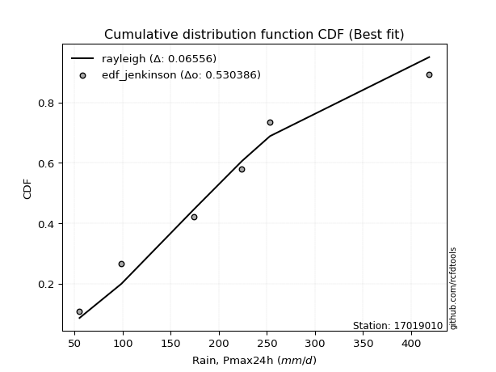</img></img>

</div>


### 11. EDF Cunnane (1978)

Cunnane´s work in statistical hydrology has focused on the performance and evaluation of different probability distributions (such as GEV, Gumbel, Lognormal) for flood frequency estimation. _b_ is a constant, typically set to 0.4.

<div align="center">


$P=(m-b)/(n+1-2b)$


</div>


**11.1. Empirical values**

<div align="center">

|                | 0                  | 1                   | 2                   | 3                  | 4                  | 5                  |
|:---------------|:-------------------|:--------------------|:--------------------|:-------------------|:-------------------|:-------------------|
| date           | 2021               | 2022                | 2019                | 2017               | 2016               | 2018               |
| x              | 55.0               | 98.6                | 174.4               | 224.0              | 253.2              | 418.9              |
| m              | 1                  | 2                   | 3                   | 4                  | 5                  | 6                  |
| empirical_dist | edf_cunnane        | edf_cunnane         | edf_cunnane         | edf_cunnane        | edf_cunnane        | edf_cunnane        |
| empirical      | 0.0967741935483871 | 0.25806451612903225 | 0.41935483870967744 | 0.5806451612903226 | 0.7419354838709676 | 0.9032258064516128 |
| empirical_tr   | 1.1071428571428572 | 1.3478260869565217  | 1.7222222222222225  | 2.384615384615385  | 3.8749999999999982 | 10.333333333333318 |

</div>


**11.2. Kolmogorov-Smirnov fit test (sorted by Δ)**


<div align="center">

|                | 0                   | 1                   | 2                   | 3                   | 4                   | 5                   | 6                   | 7                  | 8                   | 9                   | 10                  | 11                 | 12                  | 13                  | 14                  | 15                    | 16                  | 17                  | 18                  | 19                  | 20                  | 21                  | 22                  | 23                  | 24                  | 25                  | 26                  | 27                  | 28                  | 29                  | 30                  | 31                | 32                 | 33                  | 34                 | 35                  | 36                  | 37                  | 38                  | 39                  | 40                  | 41                  | 42                  | 43                  | 44                  | 45                  | 46                  | 47                  | 48                  | 49                  | 50                  | 51                 | 52                  | 53                  | 54                  | 55                  | 56                  | 57                  | 58                  | 59                  | 60                  | 61                  | 62                  | 63                  | 64                 | 65                  | 66                | 67                  | 68                  | 69                  | 70                  | 71                  | 72                  | 73                  | 74                  | 75                 | 76                 | 77                  | 78                  | 79                  | 80                  | 81                 | 82                 | 83                 | 84                  | 85                  | 86                | 87                  |
|:---------------|:--------------------|:--------------------|:--------------------|:--------------------|:--------------------|:--------------------|:--------------------|:-------------------|:--------------------|:--------------------|:--------------------|:-------------------|:--------------------|:--------------------|:--------------------|:----------------------|:--------------------|:--------------------|:--------------------|:--------------------|:--------------------|:--------------------|:--------------------|:--------------------|:--------------------|:--------------------|:--------------------|:--------------------|:--------------------|:--------------------|:--------------------|:------------------|:-------------------|:--------------------|:-------------------|:--------------------|:--------------------|:--------------------|:--------------------|:--------------------|:--------------------|:--------------------|:--------------------|:--------------------|:--------------------|:--------------------|:--------------------|:--------------------|:--------------------|:--------------------|:--------------------|:-------------------|:--------------------|:--------------------|:--------------------|:--------------------|:--------------------|:--------------------|:--------------------|:--------------------|:--------------------|:--------------------|:--------------------|:--------------------|:-------------------|:--------------------|:------------------|:--------------------|:--------------------|:--------------------|:--------------------|:--------------------|:--------------------|:--------------------|:--------------------|:-------------------|:-------------------|:--------------------|:--------------------|:--------------------|:--------------------|:-------------------|:-------------------|:-------------------|:--------------------|:--------------------|:------------------|:--------------------|
| station        | 17019010            | 17019010            | 17019010            | 17019010            | 17019010            | 17019010            | 17019010            | 17019010           | 17019010            | 17019010            | 17019010            | 17019010           | 17019010            | 17019010            | 17019010            | 17019010              | 17019010            | 17019010            | 17019010            | 17019010            | 17019010            | 17019010            | 17019010            | 17019010            | 17019010            | 17019010            | 17019010            | 17019010            | 17019010            | 17019010            | 17019010            | 17019010          | 17019010           | 17019010            | 17019010           | 17019010            | 17019010            | 17019010            | 17019010            | 17019010            | 17019010            | 17019010            | 17019010            | 17019010            | 17019010            | 17019010            | 17019010            | 17019010            | 17019010            | 17019010            | 17019010            | 17019010           | 17019010            | 17019010            | 17019010            | 17019010            | 17019010            | 17019010            | 17019010            | 17019010            | 17019010            | 17019010            | 17019010            | 17019010            | 17019010           | 17019010            | 17019010          | 17019010            | 17019010            | 17019010            | 17019010            | 17019010            | 17019010            | 17019010            | 17019010            | 17019010           | 17019010           | 17019010            | 17019010            | 17019010            | 17019010            | 17019010           | 17019010           | 17019010           | 17019010            | 17019010            | 17019010          | 17019010            |
| empirical_dist | edf_cunnane         | edf_cunnane         | edf_cunnane         | edf_cunnane         | edf_cunnane         | edf_cunnane         | edf_cunnane         | edf_cunnane        | edf_cunnane         | edf_cunnane         | edf_cunnane         | edf_cunnane        | edf_cunnane         | edf_cunnane         | edf_cunnane         | edf_cunnane           | edf_cunnane         | edf_cunnane         | edf_cunnane         | edf_cunnane         | edf_cunnane         | edf_cunnane         | edf_cunnane         | edf_cunnane         | edf_cunnane         | edf_cunnane         | edf_cunnane         | edf_cunnane         | edf_cunnane         | edf_cunnane         | edf_cunnane         | edf_cunnane       | edf_cunnane        | edf_cunnane         | edf_cunnane        | edf_cunnane         | edf_cunnane         | edf_cunnane         | edf_cunnane         | edf_cunnane         | edf_cunnane         | edf_cunnane         | edf_cunnane         | edf_cunnane         | edf_cunnane         | edf_cunnane         | edf_cunnane         | edf_cunnane         | edf_cunnane         | edf_cunnane         | edf_cunnane         | edf_cunnane        | edf_cunnane         | edf_cunnane         | edf_cunnane         | edf_cunnane         | edf_cunnane         | edf_cunnane         | edf_cunnane         | edf_cunnane         | edf_cunnane         | edf_cunnane         | edf_cunnane         | edf_cunnane         | edf_cunnane        | edf_cunnane         | edf_cunnane       | edf_cunnane         | edf_cunnane         | edf_cunnane         | edf_cunnane         | edf_cunnane         | edf_cunnane         | edf_cunnane         | edf_cunnane         | edf_cunnane        | edf_cunnane        | edf_cunnane         | edf_cunnane         | edf_cunnane         | edf_cunnane         | edf_cunnane        | edf_cunnane        | edf_cunnane        | edf_cunnane         | edf_cunnane         | edf_cunnane       | edf_cunnane         |
| p_dist         | rayleigh            | maxwell             | ncf                 | betaprime           | logjohnsonsu        | logloggamma         | logweibull_min      | halfnorm           | pearson3            | loggenlogistic      | invgamma            | johnsonsu          | mielke              | logfisk             | kstwobign           | loglaplace_asymmetric | genlogistic         | alpha               | logpearson3         | loggumbel_l         | fisk                | exponnorm           | crystalball         | t                   | norm                | truncnorm           | invgauss            | nct                 | gumbel_r            | logistic            | rice                | gompertz          | halflogistic       | f                   | laplace_asymmetric | logexponnorm        | logcrystalball      | lognorm             | lognorm             | logt                | logfatiguelife      | logf                | lognct              | hypsecant           | moyal               | loglogistic         | logncf              | logbetaprime        | logerlang           | loggamma            | loggamma            | laplace            | logrice             | loginvgamma         | logalpha            | loghypsecant        | loginvgauss         | gumbel_l            | expon               | genexpon            | logmaxwell          | lograyleigh         | loglaplace          | loginvweibull       | loggompertz        | weibull_min         | logkstwobign      | loggumbel_r         | loghalfnorm         | loggenexpon         | logmoyal            | loghalflogistic     | logexpon            | logmielke           | wald                | gamma              | nakagami           | gibrat              | logwald             | logchi2             | loggibrat           | chi2               | erlang             | invweibull         | loglognorm          | lognakagami         | logtruncnorm      | fatiguelife         |
| delta          | 0.05873453505651627 | 0.06275864644453774 | 0.06422078814923649 | 0.06484128800565078 | 0.06525213071568853 | 0.06608743665381284 | 0.06627780234652833 | 0.0688531234431711 | 0.07075036531830065 | 0.07185908176875144 | 0.07252761385372417 | 0.0728929121803974 | 0.07298820758604141 | 0.07401038903668139 | 0.07453103906817476 | 0.0747511002338366    | 0.07507589582177432 | 0.07660658688656788 | 0.07689561459042438 | 0.07716462616039696 | 0.07785217276029135 | 0.07793176182768219 | 0.07957284674923182 | 0.07995079581062214 | 0.08002004226595272 | 0.08002004369325799 | 0.08190102436517793 | 0.08208665485677794 | 0.08773993782843262 | 0.09338754304631922 | 0.09372464415518975 | 0.096774193548384 | 0.0967741935483871 | 0.09876143801137155 | 0.0995852718026464 | 0.10326920827681035 | 0.10326985192201271 | 0.10327030512249119 | 0.10327030512249119 | 0.10327115856987051 | 0.10380001305796754 | 0.10463168326400302 | 0.10504247266376449 | 0.10507373059835512 | 0.10597679128676565 | 0.10722671525902006 | 0.11025119093103458 | 0.11065628271290945 | 0.11120594772837783 | 0.11152578833523413 | 0.11152578833523413 | 0.1170996134324323 | 0.11726631297419382 | 0.11811906231727215 | 0.12160850244396287 | 0.12193475976579138 | 0.12500603688706174 | 0.12507730612475487 | 0.13187869954723935 | 0.13205197618076664 | 0.13527810186342898 | 0.14576316495459501 | 0.14933366198178055 | 0.15086181098800627 | 0.1602602674707821 | 0.16962804711027035 | 0.172349296711041 | 0.17394813297813655 | 0.17528743575239042 | 0.18155178431256253 | 0.19949836508995505 | 0.20146038197070676 | 0.22491057596809588 | 0.23780944686589073 | 0.25286159242705436 | 0.2555767491253111 | 0.2580645155687147 | 0.25806451612903225 | 0.27045341999384925 | 0.29382516956328414 | 0.29689515432259955 | 0.3208709624940445 | 0.3731272380148411 | 0.3777694141391641 | 0.39332290792456037 | 0.41324235526471614 | 0.419354831430538 | 0.47409630570511296 |
| deltao         | 0.530385761606      | 0.530385761606      | 0.530385761606      | 0.530385761606      | 0.530385761606      | 0.530385761606      | 0.530385761606      | 0.530385761606     | 0.530385761606      | 0.530385761606      | 0.530385761606      | 0.530385761606     | 0.530385761606      | 0.530385761606      | 0.530385761606      | 0.530385761606        | 0.530385761606      | 0.530385761606      | 0.530385761606      | 0.530385761606      | 0.530385761606      | 0.530385761606      | 0.530385761606      | 0.530385761606      | 0.530385761606      | 0.530385761606      | 0.530385761606      | 0.530385761606      | 0.530385761606      | 0.530385761606      | 0.530385761606      | 0.530385761606    | 0.530385761606     | 0.530385761606      | 0.530385761606     | 0.530385761606      | 0.530385761606      | 0.530385761606      | 0.530385761606      | 0.530385761606      | 0.530385761606      | 0.530385761606      | 0.530385761606      | 0.530385761606      | 0.530385761606      | 0.530385761606      | 0.530385761606      | 0.530385761606      | 0.530385761606      | 0.530385761606      | 0.530385761606      | 0.530385761606     | 0.530385761606      | 0.530385761606      | 0.530385761606      | 0.530385761606      | 0.530385761606      | 0.530385761606      | 0.530385761606      | 0.530385761606      | 0.530385761606      | 0.530385761606      | 0.530385761606      | 0.530385761606      | 0.530385761606     | 0.530385761606      | 0.530385761606    | 0.530385761606      | 0.530385761606      | 0.530385761606      | 0.530385761606      | 0.530385761606      | 0.530385761606      | 0.530385761606      | 0.530385761606      | 0.530385761606     | 0.530385761606     | 0.530385761606      | 0.530385761606      | 0.530385761606      | 0.530385761606      | 0.530385761606     | 0.530385761606     | 0.530385761606     | 0.530385761606      | 0.530385761606      | 0.530385761606    | 0.530385761606      |
| eval           | Δo > Δ              | Δo > Δ              | Δo > Δ              | Δo > Δ              | Δo > Δ              | Δo > Δ              | Δo > Δ              | Δo > Δ             | Δo > Δ              | Δo > Δ              | Δo > Δ              | Δo > Δ             | Δo > Δ              | Δo > Δ              | Δo > Δ              | Δo > Δ                | Δo > Δ              | Δo > Δ              | Δo > Δ              | Δo > Δ              | Δo > Δ              | Δo > Δ              | Δo > Δ              | Δo > Δ              | Δo > Δ              | Δo > Δ              | Δo > Δ              | Δo > Δ              | Δo > Δ              | Δo > Δ              | Δo > Δ              | Δo > Δ            | Δo > Δ             | Δo > Δ              | Δo > Δ             | Δo > Δ              | Δo > Δ              | Δo > Δ              | Δo > Δ              | Δo > Δ              | Δo > Δ              | Δo > Δ              | Δo > Δ              | Δo > Δ              | Δo > Δ              | Δo > Δ              | Δo > Δ              | Δo > Δ              | Δo > Δ              | Δo > Δ              | Δo > Δ              | Δo > Δ             | Δo > Δ              | Δo > Δ              | Δo > Δ              | Δo > Δ              | Δo > Δ              | Δo > Δ              | Δo > Δ              | Δo > Δ              | Δo > Δ              | Δo > Δ              | Δo > Δ              | Δo > Δ              | Δo > Δ             | Δo > Δ              | Δo > Δ            | Δo > Δ              | Δo > Δ              | Δo > Δ              | Δo > Δ              | Δo > Δ              | Δo > Δ              | Δo > Δ              | Δo > Δ              | Δo > Δ             | Δo > Δ             | Δo > Δ              | Δo > Δ              | Δo > Δ              | Δo > Δ              | Δo > Δ             | Δo > Δ             | Δo > Δ             | Δo > Δ              | Δo > Δ              | Δo > Δ            | Δo > Δ              |
| fit            | 1                   | 1                   | 1                   | 1                   | 1                   | 1                   | 1                   | 1                  | 1                   | 1                   | 1                   | 1                  | 1                   | 1                   | 1                   | 1                     | 1                   | 1                   | 1                   | 1                   | 1                   | 1                   | 1                   | 1                   | 1                   | 1                   | 1                   | 1                   | 1                   | 1                   | 1                   | 1                 | 1                  | 1                   | 1                  | 1                   | 1                   | 1                   | 1                   | 1                   | 1                   | 1                   | 1                   | 1                   | 1                   | 1                   | 1                   | 1                   | 1                   | 1                   | 1                   | 1                  | 1                   | 1                   | 1                   | 1                   | 1                   | 1                   | 1                   | 1                   | 1                   | 1                   | 1                   | 1                   | 1                  | 1                   | 1                 | 1                   | 1                   | 1                   | 1                   | 1                   | 1                   | 1                   | 1                   | 1                  | 1                  | 1                   | 1                   | 1                   | 1                   | 1                  | 1                  | 1                  | 1                   | 1                   | 1                 | 1                   |
| n              | 6                   | 6                   | 6                   | 6                   | 6                   | 6                   | 6                   | 6                  | 6                   | 6                   | 6                   | 6                  | 6                   | 6                   | 6                   | 6                     | 6                   | 6                   | 6                   | 6                   | 6                   | 6                   | 6                   | 6                   | 6                   | 6                   | 6                   | 6                   | 6                   | 6                   | 6                   | 6                 | 6                  | 6                   | 6                  | 6                   | 6                   | 6                   | 6                   | 6                   | 6                   | 6                   | 6                   | 6                   | 6                   | 6                   | 6                   | 6                   | 6                   | 6                   | 6                   | 6                  | 6                   | 6                   | 6                   | 6                   | 6                   | 6                   | 6                   | 6                   | 6                   | 6                   | 6                   | 6                   | 6                  | 6                   | 6                 | 6                   | 6                   | 6                   | 6                   | 6                   | 6                   | 6                   | 6                   | 6                  | 6                  | 6                   | 6                   | 6                   | 6                   | 6                  | 6                  | 6                  | 6                   | 6                   | 6                 | 6                   |
| best_fit       | 1                   | 0                   | 0                   | 0                   | 0                   | 0                   | 0                   | 0                  | 0                   | 0                   | 0                   | 0                  | 0                   | 0                   | 0                   | 0                     | 0                   | 0                   | 0                   | 0                   | 0                   | 0                   | 0                   | 0                   | 0                   | 0                   | 0                   | 0                   | 0                   | 0                   | 0                   | 0                 | 0                  | 0                   | 0                  | 0                   | 0                   | 0                   | 0                   | 0                   | 0                   | 0                   | 0                   | 0                   | 0                   | 0                   | 0                   | 0                   | 0                   | 0                   | 0                   | 0                  | 0                   | 0                   | 0                   | 0                   | 0                   | 0                   | 0                   | 0                   | 0                   | 0                   | 0                   | 0                   | 0                  | 0                   | 0                 | 0                   | 0                   | 0                   | 0                   | 0                   | 0                   | 0                   | 0                   | 0                  | 0                  | 0                   | 0                   | 0                   | 0                   | 0                  | 0                  | 0                  | 0                   | 0                   | 0                 | 0                   |
| best_fit_sort  | 1                   | 2                   | 3                   | 4                   | 5                   | 6                   | 7                   | 8                  | 9                   | 10                  | 11                  | 12                 | 13                  | 14                  | 15                  | 16                    | 17                  | 18                  | 19                  | 20                  | 21                  | 22                  | 23                  | 24                  | 25                  | 26                  | 27                  | 28                  | 29                  | 30                  | 31                  | 32                | 33                 | 34                  | 35                 | 36                  | 37                  | 38                  | 39                  | 40                  | 41                  | 42                  | 43                  | 44                  | 45                  | 46                  | 47                  | 48                  | 49                  | 50                  | 51                  | 52                 | 53                  | 54                  | 55                  | 56                  | 57                  | 58                  | 59                  | 60                  | 61                  | 62                  | 63                  | 64                  | 65                 | 66                  | 67                | 68                  | 69                  | 70                  | 71                  | 72                  | 73                  | 74                  | 75                  | 76                 | 77                 | 78                  | 79                  | 80                  | 81                  | 82                 | 83                 | 84                 | 85                  | 86                  | 87                | 88                  |

</div>


**11.3. Best fit**

<div align="center">

|   id |   station | empirical_dist   | p_dist   |     delta |   deltao | eval   |   fit |   n |   best_fit |   best_fit_sort |
|-----:|----------:|:-----------------|:---------|----------:|---------:|:-------|------:|----:|-----------:|----------------:|
|    0 |  17019010 | edf_cunnane      | rayleigh | 0.0587345 | 0.530386 | Δo > Δ |     1 |   6 |          1 |               1 |

</div>


<div align="center">

</img></img>

</div>


### 12. EDF Adamowski (1981)

The Adamowski formula in hydrology refers to a specific plotting position formula used for estimating the non-parametric empirical distribution of hydrological events (like flood peaks) to calculate their return periods. This formula provides an alternative to traditional parametric methods (like the Gumbel or Log Pearson Type III distributions). 

<div align="center">


$P=(m-0.25)/(n+0.5)$


</div>


**12.1. Empirical values**

<div align="center">

|                | 0                   | 1                  | 2                  | 3                  | 4                  | 5                  |
|:---------------|:--------------------|:-------------------|:-------------------|:-------------------|:-------------------|:-------------------|
| date           | 2021                | 2022               | 2019               | 2017               | 2016               | 2018               |
| x              | 55.0                | 98.6               | 174.4              | 224.0              | 253.2              | 418.9              |
| m              | 1                   | 2                  | 3                  | 4                  | 5                  | 6                  |
| empirical_dist | edf_adamowski       | edf_adamowski      | edf_adamowski      | edf_adamowski      | edf_adamowski      | edf_adamowski      |
| empirical      | 0.11538461538461539 | 0.2692307692307692 | 0.4230769230769231 | 0.5769230769230769 | 0.7307692307692307 | 0.8846153846153846 |
| empirical_tr   | 1.1304347826086958  | 1.3684210526315788 | 1.7333333333333334 | 2.3636363636363633 | 3.7142857142857135 | 8.666666666666664  |

</div>


**12.2. Kolmogorov-Smirnov fit test (sorted by Δ)**


<div align="center">

|                | 0                   | 1                   | 2                   | 3                   | 4                   | 5                   | 6                  | 7                  | 8                  | 9                   | 10                  | 11                  | 12                 | 13                  | 14                  | 15                  | 16                  | 17                  | 18                  | 19                    | 20                  | 21                  | 22                 | 23                  | 24                  | 25                  | 26                  | 27                 | 28                  | 29                  | 30                  | 31                  | 32                  | 33                  | 34                 | 35                  | 36                  | 37                  | 38                  | 39                  | 40                  | 41                  | 42                 | 43                 | 44                  | 45                 | 46                  | 47                  | 48                  | 49                  | 50                 | 51                  | 52                  | 53                  | 54                  | 55                  | 56                  | 57                  | 58                  | 59                | 60                  | 61                  | 62                  | 63                  | 64                 | 65                  | 66                  | 67                 | 68                  | 69                 | 70                  | 71                  | 72                  | 73                 | 74                  | 75                 | 76                 | 77                  | 78                 | 79                 | 80                 | 81                  | 82                 | 83                  | 84                 | 85                 | 86                 | 87                |
|:---------------|:--------------------|:--------------------|:--------------------|:--------------------|:--------------------|:--------------------|:-------------------|:-------------------|:-------------------|:--------------------|:--------------------|:--------------------|:-------------------|:--------------------|:--------------------|:--------------------|:--------------------|:--------------------|:--------------------|:----------------------|:--------------------|:--------------------|:-------------------|:--------------------|:--------------------|:--------------------|:--------------------|:-------------------|:--------------------|:--------------------|:--------------------|:--------------------|:--------------------|:--------------------|:-------------------|:--------------------|:--------------------|:--------------------|:--------------------|:--------------------|:--------------------|:--------------------|:-------------------|:-------------------|:--------------------|:-------------------|:--------------------|:--------------------|:--------------------|:--------------------|:-------------------|:--------------------|:--------------------|:--------------------|:--------------------|:--------------------|:--------------------|:--------------------|:--------------------|:------------------|:--------------------|:--------------------|:--------------------|:--------------------|:-------------------|:--------------------|:--------------------|:-------------------|:--------------------|:-------------------|:--------------------|:--------------------|:--------------------|:-------------------|:--------------------|:-------------------|:-------------------|:--------------------|:-------------------|:-------------------|:-------------------|:--------------------|:-------------------|:--------------------|:-------------------|:-------------------|:-------------------|:------------------|
| station        | 17019010            | 17019010            | 17019010            | 17019010            | 17019010            | 17019010            | 17019010           | 17019010           | 17019010           | 17019010            | 17019010            | 17019010            | 17019010           | 17019010            | 17019010            | 17019010            | 17019010            | 17019010            | 17019010            | 17019010              | 17019010            | 17019010            | 17019010           | 17019010            | 17019010            | 17019010            | 17019010            | 17019010           | 17019010            | 17019010            | 17019010            | 17019010            | 17019010            | 17019010            | 17019010           | 17019010            | 17019010            | 17019010            | 17019010            | 17019010            | 17019010            | 17019010            | 17019010           | 17019010           | 17019010            | 17019010           | 17019010            | 17019010            | 17019010            | 17019010            | 17019010           | 17019010            | 17019010            | 17019010            | 17019010            | 17019010            | 17019010            | 17019010            | 17019010            | 17019010          | 17019010            | 17019010            | 17019010            | 17019010            | 17019010           | 17019010            | 17019010            | 17019010           | 17019010            | 17019010           | 17019010            | 17019010            | 17019010            | 17019010           | 17019010            | 17019010           | 17019010           | 17019010            | 17019010           | 17019010           | 17019010           | 17019010            | 17019010           | 17019010            | 17019010           | 17019010           | 17019010           | 17019010          |
| empirical_dist | edf_adamowski       | edf_adamowski       | edf_adamowski       | edf_adamowski       | edf_adamowski       | edf_adamowski       | edf_adamowski      | edf_adamowski      | edf_adamowski      | edf_adamowski       | edf_adamowski       | edf_adamowski       | edf_adamowski      | edf_adamowski       | edf_adamowski       | edf_adamowski       | edf_adamowski       | edf_adamowski       | edf_adamowski       | edf_adamowski         | edf_adamowski       | edf_adamowski       | edf_adamowski      | edf_adamowski       | edf_adamowski       | edf_adamowski       | edf_adamowski       | edf_adamowski      | edf_adamowski       | edf_adamowski       | edf_adamowski       | edf_adamowski       | edf_adamowski       | edf_adamowski       | edf_adamowski      | edf_adamowski       | edf_adamowski       | edf_adamowski       | edf_adamowski       | edf_adamowski       | edf_adamowski       | edf_adamowski       | edf_adamowski      | edf_adamowski      | edf_adamowski       | edf_adamowski      | edf_adamowski       | edf_adamowski       | edf_adamowski       | edf_adamowski       | edf_adamowski      | edf_adamowski       | edf_adamowski       | edf_adamowski       | edf_adamowski       | edf_adamowski       | edf_adamowski       | edf_adamowski       | edf_adamowski       | edf_adamowski     | edf_adamowski       | edf_adamowski       | edf_adamowski       | edf_adamowski       | edf_adamowski      | edf_adamowski       | edf_adamowski       | edf_adamowski      | edf_adamowski       | edf_adamowski      | edf_adamowski       | edf_adamowski       | edf_adamowski       | edf_adamowski      | edf_adamowski       | edf_adamowski      | edf_adamowski      | edf_adamowski       | edf_adamowski      | edf_adamowski      | edf_adamowski      | edf_adamowski       | edf_adamowski      | edf_adamowski       | edf_adamowski      | edf_adamowski      | edf_adamowski      | edf_adamowski     |
| p_dist         | rayleigh            | logpearson3         | maxwell             | ncf                 | betaprime           | johnsonsu           | logjohnsonsu       | logloggamma        | logweibull_min     | invgauss            | pearson3            | loggenlogistic      | logfisk            | invgamma            | t                   | truncnorm           | norm                | mielke              | kstwobign           | loglaplace_asymmetric | genlogistic         | crystalball         | halfnorm           | alpha               | loggumbel_l         | fisk                | exponnorm           | nct                | gumbel_r            | logexponnorm        | logcrystalball      | lognorm             | lognorm             | logt                | logfatiguelife     | logf                | lognct              | logistic            | rice                | logncf              | logbetaprime        | logerlang           | loggamma           | loggamma           | laplace_asymmetric  | loglogistic        | logrice             | gumbel_l            | loginvgamma         | f                   | gompertz           | halflogistic        | hypsecant           | moyal               | logalpha            | loginvgauss         | loghypsecant        | expon               | laplace             | genexpon          | logmaxwell          | lograyleigh         | loginvweibull       | weibull_min         | loglaplace         | loggompertz         | logkstwobign        | loggumbel_r        | loghalfnorm         | loggenexpon        | logmoyal            | loghalflogistic     | logexpon            | logmielke          | gamma               | wald               | logwald            | nakagami            | gibrat             | logchi2            | loggibrat          | chi2                | invweibull         | erlang              | loglognorm         | lognakagami        | logtruncnorm       | fatiguelife       |
| delta          | 0.06990078815825324 | 0.07317353022317874 | 0.07392489954627471 | 0.07538704125097345 | 0.07600754110738775 | 0.07639915845097689 | 0.0764183838174255 | 0.0772536897555498 | 0.0774440554482653 | 0.07959062425631258 | 0.08191661842003761 | 0.08302533487048841 | 0.0836001986078557 | 0.08369386695546113 | 0.08387725815444219 | 0.08390828241849962 | 0.08390828297873082 | 0.08415446068777838 | 0.08569729216991173 | 0.08591735333557357   | 0.08624214892351129 | 0.08671349070933831 | 0.0874635452793994 | 0.08777283998830485 | 0.08833087926213393 | 0.08901842586202832 | 0.08909801492941916 | 0.0932529079585149 | 0.09890619093016959 | 0.09954712390956472 | 0.09954776755476707 | 0.09954822075524555 | 0.09954822075524555 | 0.09954907420262488 | 0.1000779286907219 | 0.10090959889675738 | 0.10132038829651885 | 0.10455379614805618 | 0.10489089725692671 | 0.10652910656378894 | 0.10693419834566381 | 0.10748386336113219 | 0.1078037039679885 | 0.1078037039679885 | 0.11075152490438336 | 0.1109487996262658 | 0.11354422860694818 | 0.11391105302301796 | 0.11439697795002651 | 0.11538460969229508 | 0.1153846153846123 | 0.11538461538461539 | 0.11623998370009209 | 0.11714304438850262 | 0.11788641807671724 | 0.12128395251981611 | 0.12565684413303713 | 0.12815661517999372 | 0.12826586653416927 | 0.128329891813521 | 0.13155601749618334 | 0.14204108058734938 | 0.14713972662076064 | 0.15101762527404217 | 0.1530557463490263 | 0.15653818310353645 | 0.16862721234379535 | 0.1702260486108909 | 0.17156535138514478 | 0.1778296999453169 | 0.19577628072270942 | 0.19773829760346112 | 0.22118849160085025 | 0.2340873624986451 | 0.25185466475806545 | 0.2640278455287913 | 0.2667313356266036 | 0.26923076867045165 | 0.2692307692307692 | 0.2901030851960385 | 0.2931730699553539 | 0.31714887812679887 | 0.3666031610374271 | 0.36940515364759546 | 0.3821566548228234 | 0.4095202708974705 | 0.4230769157977836 | 0.462930052603376 |
| deltao         | 0.530385761606      | 0.530385761606      | 0.530385761606      | 0.530385761606      | 0.530385761606      | 0.530385761606      | 0.530385761606     | 0.530385761606     | 0.530385761606     | 0.530385761606      | 0.530385761606      | 0.530385761606      | 0.530385761606     | 0.530385761606      | 0.530385761606      | 0.530385761606      | 0.530385761606      | 0.530385761606      | 0.530385761606      | 0.530385761606        | 0.530385761606      | 0.530385761606      | 0.530385761606     | 0.530385761606      | 0.530385761606      | 0.530385761606      | 0.530385761606      | 0.530385761606     | 0.530385761606      | 0.530385761606      | 0.530385761606      | 0.530385761606      | 0.530385761606      | 0.530385761606      | 0.530385761606     | 0.530385761606      | 0.530385761606      | 0.530385761606      | 0.530385761606      | 0.530385761606      | 0.530385761606      | 0.530385761606      | 0.530385761606     | 0.530385761606     | 0.530385761606      | 0.530385761606     | 0.530385761606      | 0.530385761606      | 0.530385761606      | 0.530385761606      | 0.530385761606     | 0.530385761606      | 0.530385761606      | 0.530385761606      | 0.530385761606      | 0.530385761606      | 0.530385761606      | 0.530385761606      | 0.530385761606      | 0.530385761606    | 0.530385761606      | 0.530385761606      | 0.530385761606      | 0.530385761606      | 0.530385761606     | 0.530385761606      | 0.530385761606      | 0.530385761606     | 0.530385761606      | 0.530385761606     | 0.530385761606      | 0.530385761606      | 0.530385761606      | 0.530385761606     | 0.530385761606      | 0.530385761606     | 0.530385761606     | 0.530385761606      | 0.530385761606     | 0.530385761606     | 0.530385761606     | 0.530385761606      | 0.530385761606     | 0.530385761606      | 0.530385761606     | 0.530385761606     | 0.530385761606     | 0.530385761606    |
| eval           | Δo > Δ              | Δo > Δ              | Δo > Δ              | Δo > Δ              | Δo > Δ              | Δo > Δ              | Δo > Δ             | Δo > Δ             | Δo > Δ             | Δo > Δ              | Δo > Δ              | Δo > Δ              | Δo > Δ             | Δo > Δ              | Δo > Δ              | Δo > Δ              | Δo > Δ              | Δo > Δ              | Δo > Δ              | Δo > Δ                | Δo > Δ              | Δo > Δ              | Δo > Δ             | Δo > Δ              | Δo > Δ              | Δo > Δ              | Δo > Δ              | Δo > Δ             | Δo > Δ              | Δo > Δ              | Δo > Δ              | Δo > Δ              | Δo > Δ              | Δo > Δ              | Δo > Δ             | Δo > Δ              | Δo > Δ              | Δo > Δ              | Δo > Δ              | Δo > Δ              | Δo > Δ              | Δo > Δ              | Δo > Δ             | Δo > Δ             | Δo > Δ              | Δo > Δ             | Δo > Δ              | Δo > Δ              | Δo > Δ              | Δo > Δ              | Δo > Δ             | Δo > Δ              | Δo > Δ              | Δo > Δ              | Δo > Δ              | Δo > Δ              | Δo > Δ              | Δo > Δ              | Δo > Δ              | Δo > Δ            | Δo > Δ              | Δo > Δ              | Δo > Δ              | Δo > Δ              | Δo > Δ             | Δo > Δ              | Δo > Δ              | Δo > Δ             | Δo > Δ              | Δo > Δ             | Δo > Δ              | Δo > Δ              | Δo > Δ              | Δo > Δ             | Δo > Δ              | Δo > Δ             | Δo > Δ             | Δo > Δ              | Δo > Δ             | Δo > Δ             | Δo > Δ             | Δo > Δ              | Δo > Δ             | Δo > Δ              | Δo > Δ             | Δo > Δ             | Δo > Δ             | Δo > Δ            |
| fit            | 1                   | 1                   | 1                   | 1                   | 1                   | 1                   | 1                  | 1                  | 1                  | 1                   | 1                   | 1                   | 1                  | 1                   | 1                   | 1                   | 1                   | 1                   | 1                   | 1                     | 1                   | 1                   | 1                  | 1                   | 1                   | 1                   | 1                   | 1                  | 1                   | 1                   | 1                   | 1                   | 1                   | 1                   | 1                  | 1                   | 1                   | 1                   | 1                   | 1                   | 1                   | 1                   | 1                  | 1                  | 1                   | 1                  | 1                   | 1                   | 1                   | 1                   | 1                  | 1                   | 1                   | 1                   | 1                   | 1                   | 1                   | 1                   | 1                   | 1                 | 1                   | 1                   | 1                   | 1                   | 1                  | 1                   | 1                   | 1                  | 1                   | 1                  | 1                   | 1                   | 1                   | 1                  | 1                   | 1                  | 1                  | 1                   | 1                  | 1                  | 1                  | 1                   | 1                  | 1                   | 1                  | 1                  | 1                  | 1                 |
| n              | 6                   | 6                   | 6                   | 6                   | 6                   | 6                   | 6                  | 6                  | 6                  | 6                   | 6                   | 6                   | 6                  | 6                   | 6                   | 6                   | 6                   | 6                   | 6                   | 6                     | 6                   | 6                   | 6                  | 6                   | 6                   | 6                   | 6                   | 6                  | 6                   | 6                   | 6                   | 6                   | 6                   | 6                   | 6                  | 6                   | 6                   | 6                   | 6                   | 6                   | 6                   | 6                   | 6                  | 6                  | 6                   | 6                  | 6                   | 6                   | 6                   | 6                   | 6                  | 6                   | 6                   | 6                   | 6                   | 6                   | 6                   | 6                   | 6                   | 6                 | 6                   | 6                   | 6                   | 6                   | 6                  | 6                   | 6                   | 6                  | 6                   | 6                  | 6                   | 6                   | 6                   | 6                  | 6                   | 6                  | 6                  | 6                   | 6                  | 6                  | 6                  | 6                   | 6                  | 6                   | 6                  | 6                  | 6                  | 6                 |
| best_fit       | 1                   | 0                   | 0                   | 0                   | 0                   | 0                   | 0                  | 0                  | 0                  | 0                   | 0                   | 0                   | 0                  | 0                   | 0                   | 0                   | 0                   | 0                   | 0                   | 0                     | 0                   | 0                   | 0                  | 0                   | 0                   | 0                   | 0                   | 0                  | 0                   | 0                   | 0                   | 0                   | 0                   | 0                   | 0                  | 0                   | 0                   | 0                   | 0                   | 0                   | 0                   | 0                   | 0                  | 0                  | 0                   | 0                  | 0                   | 0                   | 0                   | 0                   | 0                  | 0                   | 0                   | 0                   | 0                   | 0                   | 0                   | 0                   | 0                   | 0                 | 0                   | 0                   | 0                   | 0                   | 0                  | 0                   | 0                   | 0                  | 0                   | 0                  | 0                   | 0                   | 0                   | 0                  | 0                   | 0                  | 0                  | 0                   | 0                  | 0                  | 0                  | 0                   | 0                  | 0                   | 0                  | 0                  | 0                  | 0                 |
| best_fit_sort  | 1                   | 2                   | 3                   | 4                   | 5                   | 6                   | 7                  | 8                  | 9                  | 10                  | 11                  | 12                  | 13                 | 14                  | 15                  | 16                  | 17                  | 18                  | 19                  | 20                    | 21                  | 22                  | 23                 | 24                  | 25                  | 26                  | 27                  | 28                 | 29                  | 30                  | 31                  | 32                  | 33                  | 34                  | 35                 | 36                  | 37                  | 38                  | 39                  | 40                  | 41                  | 42                  | 43                 | 44                 | 45                  | 46                 | 47                  | 48                  | 49                  | 50                  | 51                 | 52                  | 53                  | 54                  | 55                  | 56                  | 57                  | 58                  | 59                  | 60                | 61                  | 62                  | 63                  | 64                  | 65                 | 66                  | 67                  | 68                 | 69                  | 70                 | 71                  | 72                  | 73                  | 74                 | 75                  | 76                 | 77                 | 78                  | 79                 | 80                 | 81                 | 82                  | 83                 | 84                  | 85                 | 86                 | 87                 | 88                |

</div>


**12.3. Best fit**

<div align="center">

|   id |   station | empirical_dist   | p_dist   |     delta |   deltao | eval   |   fit |   n |   best_fit |   best_fit_sort |
|-----:|----------:|:-----------------|:---------|----------:|---------:|:-------|------:|----:|-----------:|----------------:|
|    0 |  17019010 | edf_adamowski    | rayleigh | 0.0699008 | 0.530386 | Δo > Δ |     1 |   6 |          1 |               1 |

</div>


<div align="center">

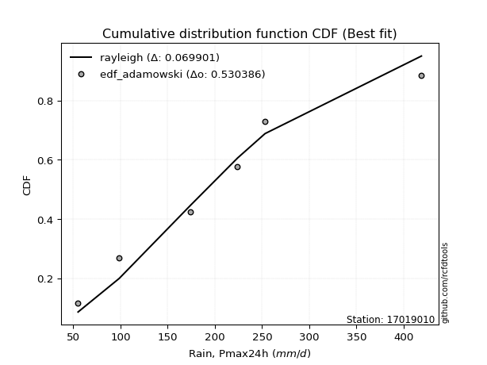</img>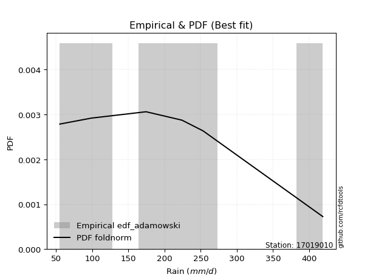</img>

</div>


## C. Best fit & Estimate extreme values for specific return periods - Tr

Best fit in probability distribution analysis means finding the theoretical distribution (like Normal, Poisson, Exponential) that most accurately mirrors your real-world data´s patterns (shape, center, spread) for better predictions, using methods like visual checks (Q-Q plots), goodness-of-fit tests (Kolmogorov-Smirnov, Chi-Squared), and information criteria (AIC) to score and select the simplest, most representative model.


### 1. Best fit (ordered by delta Δ)

<div align="center">

|   id |   station | empirical_dist   | p_dist       |     delta |   deltao | eval   |   fit |   n |   best_fit |   best_fit_sort |
|-----:|----------:|:-----------------|:-------------|----------:|---------:|:-------|------:|----:|-----------:|----------------:|
|    0 |  17019010 | edf_gringorten   | rayleigh     | 0.0567691 | 0.530386 | Δo > Δ |     1 |   6 |          1 |               1 |
|    1 |  17019010 | edf_hazen        | logjohnsonsu | 0.0571876 | 0.530386 | Δo > Δ |     1 |   6 |          1 |               2 |
|    2 |  17019010 | edf_cunnane      | rayleigh     | 0.0587345 | 0.530386 | Δo > Δ |     1 |   6 |          1 |               3 |
|    3 |  17019010 | edf_blom         | rayleigh     | 0.06067   | 0.530386 | Δo > Δ |     1 |   6 |          1 |               4 |
|    4 |  17019010 | edf_tukey        | rayleigh     | 0.0638279 | 0.530386 | Δo > Δ |     1 |   6 |          1 |               5 |
|    5 |  17019010 | edf_filliben     | rayleigh     | 0.0650062 | 0.530386 | Δo > Δ |     1 |   6 |          1 |               6 |
|    6 |  17019010 | edf_beard        | rayleigh     | 0.0655603 | 0.530386 | Δo > Δ |     1 |   6 |          1 |               7 |
|    7 |  17019010 | edf_jenkinson    | rayleigh     | 0.0655603 | 0.530386 | Δo > Δ |     1 |   6 |          1 |               8 |
|    8 |  17019010 | edf_chegodayev   | rayleigh     | 0.066295  | 0.530386 | Δo > Δ |     1 |   6 |          1 |               9 |
|    9 |  17019010 | edf_adamowski    | rayleigh     | 0.0699008 | 0.530386 | Δo > Δ |     1 |   6 |          1 |              10 |
|   10 |  17019010 | edf_weibull      | logpearson3  | 0.0875932 | 0.530386 | Δo > Δ |     1 |   6 |          1 |              11 |
|   11 |  17019010 | edf_california   | logbetaprime | 0.119137  | 0.530386 | Δo > Δ |     1 |   6 |          1 |              12 |

</div>

:file_folder:Tables: [bestfit_17019010.csv](table/bestfit_17019010.csv) | [extreme_17019010.csv](table/extreme_17019010.csv)


### 2. Extreme values

In hydrology, a return period (or recurrence interval $Tr$) is the statistical average time between extreme events like floods or droughts of a specific magnitude, indicating how rare an event is, with a 100-year flood, for example, having a 1% chance of occurring in any given year, not that it happens exactly every century. It is a key tool for infrastructure design (like bridges or dams) and risk assessment, calculated from historical data to determine the probability of future events, although it is important to remember it is statistical average, and events can cluster or be missed.

> risk_rate: assuming the return period as the project useful life.

|   id |      tr |   prob_l |     prob_g |   alpha |   betaprime |    chi2 |   crystalball |   erlang |    expon |   exponnorm |        f |   fatiguelife |     fisk |   gamma |   genexpon |   genlogistic |   gibrat |   gompertz |   gumbel_l |   gumbel_r |   halflogistic |   halfnorm |   hypsecant |   invgamma |   invgauss |   invweibull |   johnsonsu |   kstwobign |   laplace |   laplace_asymmetric |   loggamma |   logistic |   lognorm |   maxwell |   mielke |   moyal |   nakagami |     ncf |     nct |    norm |   pearson3 |   rayleigh |    rice |       t |   truncnorm |     wald |   weibull_min |   logalpha |   logbetaprime |          logchi2 |   logcrystalball |   logerlang |   logexpon |   logexponnorm |     logf |   logfatiguelife |   logfisk |   loggenexpon |   loggenlogistic |   loggibrat |   loggompertz |   loggumbel_l |   loggumbel_r |   loghalflogistic |   loghalfnorm |   loghypsecant |   loginvgamma |   loginvgauss |   loginvweibull |   logjohnsonsu |   logkstwobign |   loglaplace |   loglaplace_asymmetric |   logloggamma |   loglogistic |    loglognorm |   logmaxwell |   logmielke |   logmoyal |   lognakagami |   logncf |   lognct |   logpearson3 |   lograyleigh |   logrice |     logt |   logtruncnorm |   logwald |   logweibull_min |   station |   n |   risk_rate |
|-----:|--------:|---------:|-----------:|--------:|------------:|--------:|--------------:|---------:|---------:|------------:|---------:|--------------:|---------:|--------:|-----------:|--------------:|---------:|-----------:|-----------:|-----------:|---------------:|-----------:|------------:|-----------:|-----------:|-------------:|------------:|------------:|----------:|---------------------:|-----------:|-----------:|----------:|----------:|---------:|--------:|-----------:|--------:|--------:|--------:|-----------:|-----------:|--------:|--------:|------------:|---------:|--------------:|-----------:|---------------:|-----------------:|-----------------:|------------:|-----------:|---------------:|---------:|-----------------:|----------:|--------------:|-----------------:|------------:|--------------:|--------------:|--------------:|------------------:|--------------:|---------------:|--------------:|--------------:|----------------:|---------------:|---------------:|-------------:|------------------------:|--------------:|--------------:|--------------:|-------------:|------------:|-----------:|--------------:|---------:|---------:|--------------:|--------------:|----------:|---------:|---------------:|----------:|-----------------:|----------:|----:|------------:|
|    0 |    2    | 0.5      | 0.5        | 183.765 |     179.545 | 105.471 |       204.311 |  94.7457 |  158.29  |     182.438 |  167.543 |       55.0002 |  179.718 | 125.216 |    158.241 |       183.162 |  168.672 |    181.33  |    223.361 |    184.672 |        175.055 |    179.914 |     204.017 |    180.541 |    174.049 | 55.0561      |     176.531 |     184.354 |   204.017 |              190.188 |    165.589 |    204.017 |   167.984 |   193.946 |  191.201 | 178.427 |    176.678 | 181.209 | 186.304 | 204.017 |    192.966 |    190.374 | 195.583 | 203.997 |     204.017 |  165.847 |       186.51  |    162.734 |        165.648 |     87.7917      |          167.984 |     165.613 |    119.254 |        167.984 |  167.614 |          167.854 |   176.227 |       140.105 |          191.519 |     137.772 |       148.653 |       187.24  |       150.709 |           142.793 |       146.738 |        167.984 |       163.689 |       161.351 |         151.891 |        186.67  |        145.047 |      167.984 |                 198.599 |       185.732 |       167.984 |  55.2044      |      158.757 |     122.567 |    145.52  |       99.5052 |  165.854 |  167.458 |       175.478 |       155.607 |   163.79  |  167.984 |        215.972 |   135.603 |          181.862 |  17019010 |   6 |    0.75     |
|    1 |    2.33 | 0.570815 | 0.429185   | 203.752 |     200.52  | 120.637 |       225.137 | 107.352  |  181.048 |     201.713 |  196.152 |       58.6197 |  199.762 | 142.465 |    180.988 |       203.167 |  179.316 |    203.883 |    241.642 |    204.143 |        195.074 |    202.591 |     220.833 |    200.76  |    194.883 | 56.5442      |     197.072 |     205.041 |   216.732 |              206.534 |    186.634 |    222.53  |   189     |   215.776 |  211.474 | 196.859 |    198.674 | 202.449 | 205.525 | 225.029 |    214.005 |    212.528 | 216.258 | 225.008 |     225.029 |  179.625 |       234.953 |    183.589 |        187.193 |    104.305       |          189     |     186.832 |    141.426 |        189     |  188.559 |          188.797 |   197.113 |       162.869 |          211.955 |     146.249 |       171.285 |       207.461 |       168.103 |           159.765 |       166.646 |        184.603 |       184.661 |       182.842 |         174.615 |        208.477 |        166.926 |      180.405 |                 217.831 |       207.261 |       186.369 |  57.116       |      179.44  |     143.106 |    161.372 |      101.262  |  187.176 |  188.525 |       196.979 |       176.199 |   185.066 |  189     |        226.163 |   146.5   |          203.156 |  17019010 |   6 |    0.729209 |
|    2 |    5    | 0.8      | 0.2        | 290.851 |     293.391 | 204.015 |       302.53  | 178.019  |  294.833 |     288.91  |  345.658 |      135.506  |  296.29  | 231.364 |    294.718 |       290.063 |  240.597 |    298.714 |    300.7   |    288.731 |        285.654 |    298.493 |     288.287 |    290.993 |    291.321 |  2.78207e+06 |     291.186 |     292.916 |   280.308 |              288.259 |    293.336 |    294.013 |   292.895 |   301.699 |  294.373 | 282.233 |    301.98  | 294.788 | 288.394 | 303.117 |    298.52  |    301.217 | 299.029 | 303.092 |     303.117 |  256.755 |       550.64  |    293.213 |        297.151 |    290.617       |          292.895 |     294.633 |    331.732 |        292.896 |  292.231 |          292.41  |   303.763 |       311.14  |          295.013 |     206.248 |       292.241 |       288.951 |       270.185 |           265.563 |       285.399 |        269.513 |       292.523 |       297.917 |         319.987 |        298.511 |        303.18  |      257.716 |                 282.266 |       297.242 |       278.311 |   6.52477e+92 |      290.575 |     246.59  |    260.514 |      148.59   |  295.446 |  293.25  |       295.501 |       289.79  |   293.695 |  292.895 |        283.369 |   225.82  |          295.13  |  17019010 |   6 |    0.67232  |
|    3 |   10    | 0.9      | 0.1        | 363.002 |     369.473 | 285.803 |       353.871 | 248.382  |  398.124 |     365.395 |  487.038 |      241.667  |  391.885 | 314.16  |    397.958 |       360.828 |  310.45  |    366.794 |    333.581 |    357.626 |        360.877 |    369.458 |     342.15  |    367.345 |    374.596 |  3.46345e+11 |     372.703 |     359.821 |   338.02  |              362.447 |    398.574 |    346.657 |   391.668 |   362.167 |  362.073 | 356.565 |    383.454 | 368.179 | 357.481 | 354.918 |    360.242 |    364.455 | 358.046 | 354.891 |     354.918 |  338.608 |       926.249 |    407.558 |        406.5   |    844.001       |          391.669 |     401.196 |    719.281 |        391.67  |  390.985 |          391.057 |   417.7   |       513.104 |          362.26  |     305.189 |       411.09  |       347.483 |       397.664 |           404.985 |       424.966 |        364.595 |       401.218 |       420.679 |         524.063 |        364.262 |        477.563 |      356.245 |                 344.532 |       364.9   |       373.931 | inf           |      407.925 |     318.949 |    395.304 |      300.212  |  402.399 |  393.608 |       378.933 |       413.193 |   400.848 |  391.668 |        345.383 |   357.432 |          367.298 |  17019010 |   6 |    0.651322 |
|    4 |   15    | 0.933333 | 0.0666667  | 404.639 |     412.261 | 335.183 |       379.492 | 291.114  |  458.545 |     410.083 |  571.394 |      311.098  |  455.099 | 363.115 |    458.35  |       400.751 |  358.631 |    401.164 |    348.472 |    396.497 |        403.446 |    406.388 |     372.89  |    411.675 |    422.739 |  2.59507e+14 |     420.414 |     395.339 |   371.78  |              405.844 |    465.386 |    375.34  |   452.791 |   393.193 |  402.609 | 399.704 |    426.482 | 408.56  | 397.876 | 380.768 |    392.774 |    397.038 | 388.454 | 380.74  |     380.768 |  391.17  |      1179.83  |    483.228 |        476.281 |   1630.45        |          452.792 |     468.939 |   1131.13  |        452.794 |  452.184 |          452.17  |   496.861 |       671.932 |          402.358 |     399.9   |       483.864 |       377.758 |       494.559 |           514.226 |       522.795 |        433.215 |       471.306 |       503.013 |         692.249 |        398.273 |        607.84  |      430.526 |                 387.141 |       400.829 |       439.212 | inf           |      485.478 |     349.93  |    503.54  |      475.466  |  470.355 |  456.054 |       426.471 |       496.063 |   468.604 |  452.791 |        386.688 |   480.02  |          406.628 |  17019010 |   6 |    0.644736 |
|    5 |   20    | 0.95     | 0.05       | 434.339 |     442.143 | 370.715 |       396.27  | 321.941  |  501.414 |     441.788 |  631.849 |      362.503  |  504.176 | 398.017 |    501.199 |       428.704 |  396.426 |    423.626 |    357.741 |    423.713 |        433.272 |    431.01  |     394.575 |    443.313 |    456.814 |  2.67238e+16 |     454.547 |     419.266 |   395.732 |              436.634 |    515.468 |    395.165 |   497.9   |   413.783 |  432.52  | 430.256 |    455.284 | 436.388 | 426.964 | 397.697 |    414.713 |    418.695 | 408.666 | 397.668 |     397.697 |  430.339 |      1373.69  |    541.462 |        528.746 |   2630.8         |          497.9   |     519.756 |   1559.59  |        497.903 |  497.389 |          497.303 |   560.183 |       807.446 |          431.89  |     494.343 |       536.785 |       397.921 |       576.138 |           607.883 |       600.233 |        489.257 |       524.357 |       566.847 |         841.199 |        420.845 |        715.086 |      492.444 |                 420.533 |       425.096 |       490.879 | inf           |      544.923 |     368.268 |    597.68  |      658.517  |  521.317 |  502.292 |       459.822 |       560.145 |   519.216 |  497.9   |        418.453 |   597.99  |          433.578 |  17019010 |   6 |    0.641514 |
|    6 |   25    | 0.96     | 0.04       | 457.579 |     465.12  | 398.511 |       408.621 | 346.092  |  534.666 |     466.381 |  679.053 |      403.347  |  545.007 | 425.17  |    534.435 |       450.235 |  427.934 |    440.094 |    364.337 |    444.676 |        456.251 |    449.329 |     411.358 |    468.044 |    483.233 |  9.4895e+17  |     481.249 |     437.188 |   414.312 |              460.517 |    555.95  |    410.331 |   533.953 |   429.07  |  456.582 | 453.937 |    476.749 | 457.583 | 449.889 | 410.158 |    431.186 |    434.785 | 423.682 | 410.129 |     410.158 |  461.713 |      1531.67  |    589.458 |        571.243 |   3833.31        |          533.954 |     560.853 |   2000.84  |        533.956 |  533.543 |          533.396 |   614.021 |       927.69  |          455.62  |     589.914 |       578.52  |       412.92  |       648.039 |           691.521 |       665.203 |        537.559 |       567.545 |       619.724 |         977.441 |        437.575 |        807.638 |      546.541 |                 448.404 |       443.321 |       534.471 | inf           |      593.715 |     381.002 |    682.596 |      844.299  |  562.522 |  539.338 |       485.517 |       613.06  |   560.006 |  533.953 |        444.578 |   713.074 |          454.019 |  17019010 |   6 |    0.639603 |
|    7 |   50    | 0.98     | 0.02       | 531.556 |     535.739 | 485.918 |       443.989 | 422.202  |  637.957 |     542.774 |  827.247 |      534.391  |  689.909 | 509.874 |    637.676 |       516.56  |  538.999 |    486.746 |    382.242 |    509.255 |        527.053 |    502.577 |     463.391 |    546.398 |    565.399 |  5.66399e+22 |     565.805 |     489.815 |   472.024 |              534.705 |    691.52  |    456.668 |   652.297 |   473.403 |  537.366 | 527.452 |    539.215 | 521.643 | 523.796 | 445.844 |    479.888 |    481.493 | 467.273 | 445.814 |     445.844 |  564.148 |      2062.62  |    756.027 |        714.081 |  12643.1         |          652.298 |     698.596 |   4338.34  |        652.301 |  652.359 |          651.984 |   812.736 |      1403.88  |          535.154 |    1099.95  |       711.682 |       456.55  |       930.974 |          1028.74  |       896.785 |        719.777 |       714.052 |       804.761 |        1552.09  |        485.811 |       1154.61  |      755.493 |                 547.318 |       497.141 |       693.133 | inf           |      761.36  |     415.458 |   1031.03  |     1765.94   |  700.578 |  661.459 |       564.564 |       796.712 |   695.794 |  652.298 |        534.61  |  1266.82  |          515.382 |  17019010 |   6 |    0.63583  |
|    8 |   75    | 0.986667 | 0.0133333  | 576.532 |     576.728 | 537.651 |       462.966 | 467.339  |  698.378 |     587.461 |  914.933 |      613.312  |  789.542 | 559.628 |    698.068 |       555.111 |  614.013 |    511.37  |    391.296 |    546.79  |        568.21  |    531.563 |     493.799 |    593.593 |    613.611 |  3.381e+25   |     616.602 |     518.77  |   505.783 |              578.102 |    778.235 |    483.43  |   726.267 |   497.506 |  589.714 | 570.442 |    573.225 | 558.104 | 569.372 | 464.991 |    506.963 |    506.905 | 490.988 | 464.961 |     464.991 |  627.182 |      2399.97  |    867.131 |        805.817 |  25759.4         |          726.267 |     786.78  |   6822.38  |        726.271 |  726.726 |          726.192 |   955.607 |      1771.47  |          586.611 |    1675.43  |       791.853 |       480.339 |      1149.18  |          1295.92  |      1055.14  |        853.656 |       809.183 |       929.253 |        2030.7   |        511.77  |       1405.52  |      913.021 |                 615.007 |       526.976 |       805.414 | inf           |      871.594 |     433.708 |   1312.23  |     2648.72   |  788.927 |  738.166 |       610.36  |       918.781 |   781.987 |  726.267 |        593.954 |  1804.24  |          550.032 |  17019010 |   6 |    0.634587 |
|    9 |  100    | 0.99     | 0.01       | 609.397 |     605.74  | 574.575 |       475.802 | 499.589  |  741.247 |     619.166 |  977.56  |      670.098  |  868.019 | 595.004 |    740.917 |       582.395 |  672.123 |    527.832 |    397.218 |    573.356 |        597.34  |    551.309 |     515.369 |    627.8   |    647.908 |  3.117e+27   |     653.318 |     538.609 |   529.736 |              608.893 |    843.322 |    502.325 |   780.995 |   513.924 |  629.516 | 600.941 |    596.384 | 583.603 | 602.948 | 477.942 |    525.652 |    524.217 | 507.145 | 477.912 |     477.942 |  673.14  |      2650.74  |    952.785 |        874.843 |  42892.1         |          780.996 |     853.004 |   9406.64  |        781.001 |  781.797 |          781.138 |  1071.36  |      2081.72  |          625.702 |    2321.12  |       849.676 |       496.565 |      1333.87  |          1525.99  |      1178.75  |        963.462 |       881.268 |      1025.7   |        2456.18  |        529.312 |       1608.23  |     1044.33  |                 668.052 |       547.521 |       895.476 | inf           |      955.682 |     446.319 |   1557.11  |     3490.98   |  855.258 |  795.093 |       642.685 |      1012.49  |   846.348 |  780.996 |        639.243 |  2334.91  |          574.151 |  17019010 |   6 |    0.633968 |
|   10 |  200    | 0.995    | 0.005      | 692.479 |     675.592 | 664.166 |       504.917 | 577.928  |  844.538 |     695.559 | 1129.78  |      809.1    | 1088.06  | 680.455 |    844.158 |       647.989 |  830.219 |    564.542 |    410.091 |    637.224 |        667.373 |    596.471 |     567.333 |    713.003 |    730.885 |  1.64837e+32 |     744.283 |     584.303 |   587.448 |              683.081 |   1013.12  |    547.65  |   920.915 |   551.485 |  735.774 | 674.425 |    649.302 | 643.982 | 688.676 | 507.318 |    569.182 |    563.828 | 544.113 | 507.288 |     507.318 |  787.616 |      3292.17  |   1185.09  |       1055.54  | 148595           |          920.916 |    1025.89  |  20396     |        920.922 |  922.766 |          921.759 |  1409.46  |      3039.19  |          729.949 |    5634.55  |       991.991 |       533.751 |      1908.61  |          2260.36  |      1518.64  |       1289.55  |      1071.91  |      1288.91  |        3880.4   |        568.937 |       2193.4   |     1443.6   |                 815.418 |       595.176 |      1154.73  | inf           |     1179.85  |     476.604 |   2351.54  |     6548.03   | 1028.37  |  941.259 |       720.049 |      1264.44  |  1012.94  |  920.916 |        759.694 |  4437.98  |          630.902 |  17019010 |   6 |    0.633042 |
|   11 |  250    | 0.996    | 0.004      | 720.567 |     698.101 | 693.169 |       513.815 | 603.313  |  877.79  |     720.152 | 1179.17  |      854.401  | 1169.5   | 708.019 |    877.394 |       669.077 |  886.945 |    575.574 |    413.878 |    657.757 |        689.887 |    610.364 |     584.061 |    741.345 |    757.706 |  5.43916e+33 |     774.365 |     598.444 |   606.027 |              706.964 |   1071.91  |    562.201 |   968.481 |   563.047 |  773.441 | 698.081 |    665.564 | 663.144 | 717.88  | 516.295 |    582.801 |    576.022 | 555.493 | 516.266 |     516.295 |  825.487 |      3509.48  |   1268.43  |       1118.29  | 222484           |          968.483 |    1085.78  |  26166.7   |        968.489 |  970.743 |          969.611 |  1539.2   |      3423.51  |          766.87  |    7745.63  |      1038.66  |       545.212 |      2141.62  |          2564.67  |      1641.74  |       1416.42  |      1138.73  |      1383.81  |        4494.99  |        580.975 |       2414.49  |     1602.18  |                 869.461 |       610.023 |      1252.95  | inf           |     1258.91  |     486.515 |   2685.26  |     7937.76   | 1088.32  |  991.142 |       744.807 |      1353.96  |  1070.2   |  968.482 |        801.931 |  5488.56  |          648.811 |  17019010 |   6 |    0.632858 |
|   12 |  500    | 0.998    | 0.002      | 812.735 |     768.223 | 783.682 |       540.2   | 682.592  |  981.08  |     796.544 | 1333.71  |      996.511  | 1461.54  | 793.786 |    980.635 |       734.528 | 1082.99  |    607.752 |    424.735 |    721.485 |        759.768 |    651.789 |     636.021 |    832.509 |    841.367 |  2.80915e+38 |     870.448 |     640.822 |   663.74  |              781.151 |   1268.29  |    607.329 |  1124.48  |   597.55  |  902.707 | 771.563 |    713.997 | 721.953 | 814.222 | 542.917 |    624.065 |    612.403 | 589.446 | 542.889 |     542.917 |  945.908 |      4216.73  |   1557.29  |       1328.54  | 786826           |         1124.48  |    1285.97  |  56736.1   |       1124.49  | 1128.27  |         1126.7   |  2022.56  |      4920.27  |          893.465 |   23262.8   |      1186.08  |       579.453 |      3062.02  |          3795.65  |      2071.25  |       1895.77  |      1364.83  |      1714.27  |        7094.34  |        616.397 |       3219.7   |     2214.72  |                1061.26  |       654.805 |      1613.92  | inf           |     1527.76  |     518.364 |   4055.22  |    14040.8    | 1288.67  | 1155.38  |       821.274 |      1660.52  |  1259.95  | 1124.48  |        943.469 | 10785.9   |          703.477 |  17019010 |   6 |    0.632489 |
|   13 |  750    | 0.998667 | 0.00133333 | 870.573 |     809.441 | 836.886 |       554.858 | 729.229  | 1041.5   |     841.231 | 1424.88  |     1080.47   | 1663.9   | 844.046 |   1041.03  |       772.791 | 1212.64  |    625.271 |    430.538 |    758.741 |        800.62  |    674.931 |     666.415 |    888.188 |    890.547 |  1.59887e+41 |     928.587 |     664.629 |   697.499 |              824.549 |   1393.4   |    633.695 |  1221.75  |   616.847 |  987.867 | 814.547 |    741.017 | 755.917 | 874.902 | 557.706 |    647.559 |    632.747 | 608.432 | 557.678 |     557.706 | 1018.11  |      4652.33  |   1749.51  |       1462.95  |      1.65675e+06 |         1221.75  |    1413.58  |  89221.9   |       1221.76  | 1226.62  |         1224.76  |  2372.45  |      6056.33  |          976.783 |   48141.7   |      1273.96  |       598.626 |      3773.79  |          4773.29  |      2358.4   |       2248.21  |      1511.04  |      1935.18  |        9263.4   |        635.858 |       3784.7   |     2676.51  |                1192.51  |       680.157 |      1871.19  | inf           |     1702.44  |     537.973 |   5161.06  |    19262.4    | 1416.34  | 1258.25  |       865.699 |      1861.27  |  1379.69  | 1221.75  |       1032.66  | 16172.3   |          734.853 |  17019010 |   6 |    0.632366 |
|   14 | 1000    | 0.999    | 0.001      | 913.61  |     838.799 | 874.735 |       564.949 | 762.42   | 1084.37  |     872.937 | 1489.91  |     1140.37   | 1823.78  | 879.74  |   1083.88  |       799.933 | 1311.85  |    637.182 |    434.443 |    785.168 |        829.598 |    690.913 |     687.98  |    928.818 |    925.547 |  1.43949e+43 |     970.738 |     681.122 |   721.452 |              855.339 |   1487.02  |    652.392 |  1293.57  |   630.184 | 1053.04  | 845.044 |    759.66  | 779.845 | 920.072 | 567.888 |    663.972 |    646.806 | 621.553 | 567.861 |     567.888 | 1070.04  |      4970.89  |   1897.42  |       1563.75  |      2.8162e+06  |         1293.57  |    1509.11  | 123018     |       1293.58  | 1299.3   |         1297.22  |  2656.68  |      7005.95  |         1040.51  |   83991.1   |      1337     |       611.886 |      4376.86  |          5615.9   |      2579.63  |       2537.33  |      1621.5   |      2105.6   |       11193.2   |        649.153 |       4233.27  |     3061.45  |                1295.36  |       697.803 |      2078.13  | inf           |     1834.71  |     552.415 |   6124.1   |    23938.4    | 1511.9   | 1334.42  |       897.08  |      2014.01  |  1468.74  | 1293.57  |       1098.05  | 21642.8   |          756.874 |  17019010 |   6 |    0.632305 |

<div align="center">

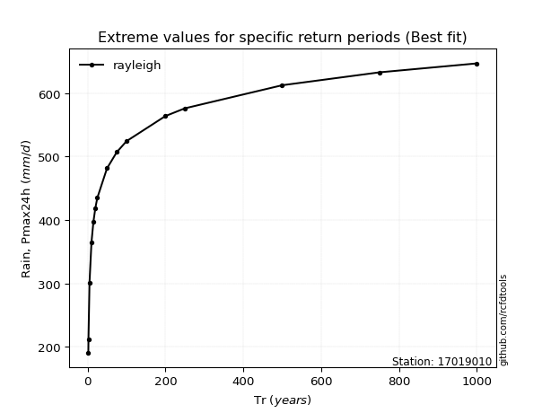</img>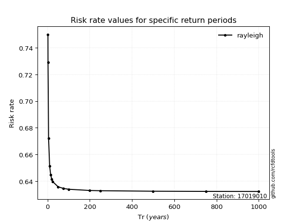</img>

</div>


<sub>**APP DISCLAIMER**: NO WARRANTY - This software is provided by [github.com/rcfdtools](https://github.com/rcfdtools) "as is", without any express or implied warranty, including warranties of merchantability, fitness for a particular purpose, or non-infringement. There is no guarantee that the software will be error-free or operate without interruption. LIMITATION OF LIABILITY - Neither the authors nor copyright holders will be liable for claims or damages arising from the software or its use. You are responsible for determining if the software is appropriate for your use and assume all associated risks, including errors, legal compliance, and data loss. NO PROFESSIONAL ADVICE - The software provides general information and does not offer professional advice. It should not replace consultation with professional advisors.</sub>