<div align="center">


</div>

# PMax24h Station (Rain): 17025020

Maximum Precipitation in 24 hours (PMax24h) is the greatest amount of rainfall for a specific duration that is meteorologically possible for a given location, acting as a "worst-case" scenario for extreme storms, crucial for designing safety-critical infrastructure like bridges, river deviations, dams, spillways, and nuclear plants to prevent catastrophic failure. The PMax24h is related with the Probable Maximum Precipitation (PMP) and it is calculated by hydrologists using meteorological data to determine the upper limit of extreme rainfall, often leading to the Probable Maximum Flood (PMF) for flood control design, and is increasingly being studied for climate change impacts. Probable Maximum Precipitation (PMP) is the theoretical upper limit of rainfall, a deterministic estimate for extreme events, while probability distributions (like GEV, Gumbel) describe the likelihood and frequency of various precipitation amounts, including rare ones, showing how often events occur, with PMP representing the extreme end of these distributions, used for critical infrastructure design to ensure safety against the worst conceivable weather, unlike standard statistical forecasts which cover typical probabilities.

The most common probability distributions in hydrology, used for analyzing floods, rainfall, and streamflow, include the Normal, Log-Normal, Gumbel, Gamma (including Log-Pearson Type III), and Generalized Extreme Value (GEV) distributions, often chosen based on the data´s skewness and whether modeling extremes or general conditions, with Gumbel and GEV popular for extreme events like floods, while the Normal distribution serves as a baseline, though often requiring transformations for skewed hydrological data. These distributions help in designing water infrastructure, managing water resources, and forecasting hydrologic events.

> Hydrological data often isn´t perfectly normal (it´s skewed), so different distributions are needed for different applications, such as: **Flood Frequency Analysis**: Using Gumbel, GEV, or Log-Pearson Type III for predicting extreme flood magnitudes and their return periods, **Rainfall Analysis**: Normal for annual totals, but Log-Normal, Weibull, or GEV for intensity or extreme daily rainfall, **Streamflow Modeling**: Gamma and Log-Normal for maximum flows, GEV for minimum flows, and Kappa for daily flows.

<div align="center">

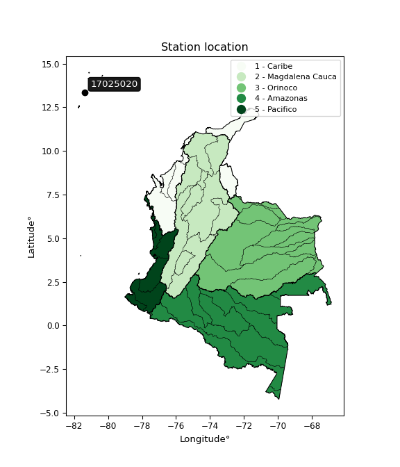</img>

</div>


## A. General information


### 1. General running parameters

• app_version: _v20260312_. • runtime: _2026-03-12 07:15:23.203550_. • Python version: _3.14.0_. • SciPy version: _1.16.3_. • Pandas version: _2.3.3_. • NumPy version: _2.3.5_. • Stations dataset (station_dataset_file): _dataset/pmax24h_in/automatic_colombia_2003_2025.csv_. • Stations catalog (station_catalog_file): _dataset/CNE.xls_. • Minimum year to eval til year_max (date_min): _1900_. • Maximum year to eval since year_min (date_max): _2025_. • Creates, save and include plots into reports (create_plot): _True_. • Plot only fit distributions with Δo > Δ (plot_only_fit): _True_. • Plot only simple graphs avoiding multiple CDFs and multiple Extreme values plots (plot_only_simple): _True_. • Eval low extreme values, if False, evaluates high extreme values (low_extreme): _False_. • Eval every SciPy distribution as logarithmic (pdist_logarithmic_on): _True_. • Standard deviation normalized (ddof): _1.0_. • Return periods to eval in years (Tr): _[2, 2.33, 5, 10, 15, 20, 25, 50, 75, 100, 200, 250, 500, 750, 1000]_. • Minimum data sample per station, 0 means any (minimum_sample): _5_. • Z-Score maximum threshold to adjust a value, 0 means disable (zscore_max): _3.5_. • Z-Score minimum threshold to adjust a value, 0 means disable (zscore_min): _-2.5_. • Avoid zeros, e.g. rain = 0 (avoid_zeros): _True_. • Avoid null values (avoid_nans): _True_. 

:file_folder:Table: [dataset.csv](../../dataset/pmax24h_in/automatic_colombia_2003_2025.csv)

> Delta Degrees of Freedom (DDOF): is a parameter used in the formulas for calculating variance and standard deviation. When ddof=0, the divisor is $N$ (the total number of observations) and this is used when your data set is the entire population. When ddof=1, the divisor is $N-1$ and this is used when your data set is a sample drawn from a larger population. Using $N-1$ provides an unbiased estimate of the population variance (known as Bessel´s correction).


### 2. Station info and location

|   id |   CODIGO | NOMBRE                               | CATEGORIA           | TECNOLOGIA                              | ESTADO   | FECHA_INSTALACION   |   FECHA_SUSPENSION |   ALTITUD |   LATITUD |   LONGITUD | DEPARTAMENTO                                             | MUNICIPIO                                | AREA_OPERATIVA                                         | ENTIDAD                                                     | AREA_HIDROGRAFICA   | ZONA_HIDROGRAFICA   | SUBZONA_HIDROGRAFICA   |   CORRIENTE | Catalogo   |   Version |
|-----:|---------:|:-------------------------------------|:--------------------|:----------------------------------------|:---------|:--------------------|-------------------:|----------:|----------:|-----------:|:---------------------------------------------------------|:-----------------------------------------|:-------------------------------------------------------|:------------------------------------------------------------|:--------------------|:--------------------|:-----------------------|------------:|:-----------|----------:|
|    0 | 17025020 | AEROPUERTO EL EMBRUJO AUT [17025020] | Sinóptica Principal | Automática con Telemetría, Convencional | Activa   | 15/01/1973          |                nan |         7 |   13.3595 |   -81.3577 | Archipielago De San Andres, Providencia Y Santa Catalina | San Andres Y  Providencia (Santa Isabel) | Area Operativa 05 - Magdalena-Cesar-Guajira-San Andrés | INSTITUTO DE HIDROLOGIA METEOROLOGIA Y ESTUDIOS AMBIENTALES | Caribe              | Islas Caribe        | Providencia            |         nan | CNE_IDEAM  |  20251226 |

<div align="center">

Dynamic map: [:earth_americas:Google](http://maps.google.com/maps?q=13.3595,-81.357721944) [:earth_americas:OSM](https://www.openstreetmap.org/#map=18/13.3595/-81.357721944&layers=P) [:earth_americas:Bing](https://www.bing.com/maps?cp=13.3595~-81.357721944&lvl=18) [:earth_americas:Apple](https://maps.apple.com/frame?center=13.3595%2C-81.357721944&span=0.003%2C0.006)

</div>


<div align="center">

```geojson
{
  "type": "Feature",
  "geometry": {
    "type": "Point", 
    "coordinates": [-81.357721944, 13.3595]
  }, 
  "properties": {
    "Name": "17025020"
  }
}
```

</div>


### 3. Discrete values table and plot

<div align="center">

|               |           0 |           1 |           2 |           3 |          4 |
|:--------------|------------:|------------:|------------:|------------:|-----------:|
| Date          | 2021        | 2022        | 2023        | 2024        | 2025       |
| Value         |   78        |   67.4      |   98.7      |  178.6      |  344.8     |
| Value_initial |   78        |   67.4      |   98.7      |  178.6      |  344.8     |
| count         |    5        |    5        |    5        |    5        |    5       |
| mean          |  153.5      |  153.5      |  153.5      |  153.5      |  153.5     |
| std           |  115.48     |  115.48     |  115.48     |  115.48     |  115.48    |
| zscore        |   -0.653795 |   -0.745586 |   -0.474542 |    0.217354 |    1.65657 |


</div>


<div align="center">

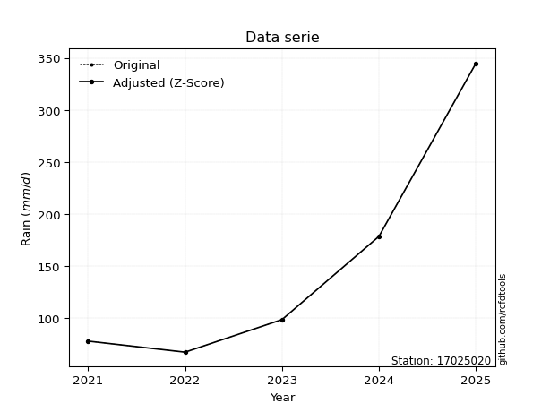</img>

</div>


> The initial value (value_initial) correspond to the initial obtained or null completed value, and value (value) is adjusted only when the initial value is outside the valid range (outlier) definite through the Z-Score value. If Z-Score is active, values out of range or outliers are replaced with the station mean value. A Z-Score (or standard score) measures how many standard deviations a data point is from the mean of a dataset, indicating its relative position; positive scores mean above the mean, negative mean below, and a score of zero is exactly at the mean, allowing for comparison of values from different distributions. It´s calculated using the formula $z=(x–μ)/σ$, where $x$ is the data point, $μ$ is the mean, and $σ$ is the standard deviation, helping identify outliers and understand probability.
>
> <sub>**Note**: In this study, "completing" (filling gaps in) and "extending" (forecasting or lengthening the historical record) rainfall data series are avoided for certain critical analyses because they introduce artificial bias and uncertainty, which can distort the statistics of rare events (extremes), alter day-to-day variability, and compromise the integrity and homogeneity of the original data. Some reasons against Completing/Extending rainfall data are: **Distortion of Extremes and Variability**: The primary issue is that most gap-filling or extension methods rely on averaging or regression with nearby stations, which inherently smooths the data. Rainfall is highly variable in space and time, with a large percentage of zero values and occasional large storms. Infilling methods often underestimate the highest values and overestimate the lowest (zero) values, which severely distorts analyses focused on flood frequency, drought severity, and intensity-duration-frequency (IDF) curves, **Loss of Data Homogeneity**: Infilled or extended data are synthetic estimates, not actual measurements. Combining these estimates with observed data can violate the assumption of data homogeneity, which requires that the data properties do not change over time. Inhomogeneity can lead to incorrect conclusions about long-term trends or changes in climate patterns, **Propagation of Errors**: Errors and biases from the original data (e.g., wind-induced undercatch, instrument errors, site changes) or the data used for imputation can propagate through the analysis, leading to unreliable hydrological models and inaccurate predictions, **Compromised Statistical Integrity**: For statistical analyses, especially those involving the frequency of events, using artificial data can introduce time bias or autocorrelation that doesn´t exist in reality, making it difficult to assess the true probability of events, **Difficulty in Validation**: It is difficult to accurately validate the quality of filled or extended data, especially for past periods where ground-truth measurements are unavailable. The reliability of imputation techniques heavily depends on the density of the surrounding station network and the complexity of the local topography.</sub>


### 4. Active continuous probability distributions from SciPy (80 of 104 available)

A Probability Density Function (PDF) describes the relative likelihood of a continuous random variable falling within a specific range, where the total area under its curve equals 1, and the area over any interval gives the actual probability for that range. Unlike discrete probabilities (like rolling a die), a PDF shows density, not direct probability for a single point (which is zero), with higher points indicating higher likelihood, often visualized as a bell curve for normal distributions.

A log of a probability density function (log-PDF) is simply the logarithm of the PDF´s value, denoted as $log(f(x))$, useful for converting multiplication of probabilities into addition, improving numerical stability with tiny numbers, and connecting to information theory concepts like entropy. Instead of dealing with very small probabilities (e.g., 0.000001), log-PDFs use negative numbers (e.g., $log(0.00001) ≈ -11.51$ that are easier for computers to handle, preventing underflow errors and simplifying complex calculations. In this study, each active probability distribution from SciPy is also evaluated in the $log$ form.

[scipy.stats](https://docs.scipy.org/doc/scipy/reference/stats.html) is a Python´s powerful submodule within the SciPy library for comprehensive statistical analysis, offering over 130 probability distributions (like Normal, Poisson, etc.), functions for descriptive stats (mean, variance), hypothesis testing (t-tests, chi-square), random variable generation, and statistical tests, making it essential for data science, modeling, and research. It provides tools to explore, model, and draw conclusions from data efficiently, working seamlessly with [NumPy](https://numpy.org/).

<div align="center">

|   id | p_dist           |   n_parameter | fit_method   | label                                                                       | active   | ref                                                                                                      |
|-----:|:-----------------|--------------:|:-------------|:----------------------------------------------------------------------------|:---------|:---------------------------------------------------------------------------------------------------------|
|    0 | alpha            |             3 | MLE          | Alpha                                                                       | True     | [:mortar_board:](https://docs.scipy.org/doc/scipy/reference/generated/scipy.stats.alpha.html)            |
|    1 | anglit           |             2 | MM           | Anglit                                                                      | True     | [:mortar_board:](https://docs.scipy.org/doc/scipy/reference/generated/scipy.stats.anglit.html)           |
|    2 | arcsine          |             2 | MM           | Arcsine                                                                     | True     | [:mortar_board:](https://docs.scipy.org/doc/scipy/reference/generated/scipy.stats.arcsine.html)          |
|    3 | argus            |             3 | MLE          | Argus                                                                       | True     | [:mortar_board:](https://docs.scipy.org/doc/scipy/reference/generated/scipy.stats.argus.html)            |
|    4 | beta             |             4 | MLE          | Beta                                                                        | True     | [:mortar_board:](https://docs.scipy.org/doc/scipy/reference/generated/scipy.stats.beta.html)             |
|    5 | betaprime        |             4 | MLE          | Beta prime                                                                  | True     | [:mortar_board:](https://docs.scipy.org/doc/scipy/reference/generated/scipy.stats.betaprime.html)        |
|    6 | bradford         |             3 | MLE          | Bradford                                                                    | True     | [:mortar_board:](https://docs.scipy.org/doc/scipy/reference/generated/scipy.stats.bradford.html)         |
|    7 | burr             |             4 | MLE          | Burr (Type III)                                                             | True     | [:mortar_board:](https://docs.scipy.org/doc/scipy/reference/generated/scipy.stats.burr.html)             |
|    8 | burr12           |             4 | MLE          | Burr (Type III) 12                                                          | True     | [:mortar_board:](https://docs.scipy.org/doc/scipy/reference/generated/scipy.stats.burr12.html)           |
|    9 | cosine           |             2 | MLE          | Cosine                                                                      | True     | [:mortar_board:](https://docs.scipy.org/doc/scipy/reference/generated/scipy.stats.cosine.html)           |
|   10 | crystalball      |             4 | MLE          | Crystalball                                                                 | True     | [:mortar_board:](https://docs.scipy.org/doc/scipy/reference/generated/scipy.stats.crystalball.html)      |
|   11 | dgamma           |             3 | MLE          | Double gamma                                                                | True     | [:mortar_board:](https://docs.scipy.org/doc/scipy/reference/generated/scipy.stats.dgamma.html)           |
|   12 | dweibull         |             3 | MLE          | Double Weibull                                                              | True     | [:mortar_board:](https://docs.scipy.org/doc/scipy/reference/generated/scipy.stats.dweibull.html)         |
|   13 | erlang           |             3 | MLE          | Erlang                                                                      | True     | [:mortar_board:](https://docs.scipy.org/doc/scipy/reference/generated/scipy.stats.erlang.html)           |
|   14 | exponnorm        |             3 | MLE          | Exponentially modified Normal                                               | True     | [:mortar_board:](https://docs.scipy.org/doc/scipy/reference/generated/scipy.stats.exponnorm.html)        |
|   15 | exponpow         |             3 | MLE          | Exponential power                                                           | True     | [:mortar_board:](https://docs.scipy.org/doc/scipy/reference/generated/scipy.stats.exponpow.html)         |
|   16 | exponweib        |             4 | MLE          | Exponentiated Weibull                                                       | True     | [:mortar_board:](https://docs.scipy.org/doc/scipy/reference/generated/scipy.stats.exponweib.html)        |
|   17 | f                |             4 | MLE          | F                                                                           | True     | [:mortar_board:](https://docs.scipy.org/doc/scipy/reference/generated/scipy.stats.f.html)                |
|   18 | fatiguelife      |             3 | MLE          | Fatigue-life (Birnbaum-Saunders)                                            | True     | [:mortar_board:](https://docs.scipy.org/doc/scipy/reference/generated/scipy.stats.fatiguelife.html)      |
|   19 | foldnorm         |             3 | MM           | Fold Normal                                                                 | True     | [:mortar_board:](https://docs.scipy.org/doc/scipy/reference/generated/scipy.stats.foldnorm.html)         |
|   20 | gamma            |             3 | MLE          | Gamma                                                                       | True     | [:mortar_board:](https://docs.scipy.org/doc/scipy/reference/generated/scipy.stats.gamma.html)            |
|   21 | gausshyper       |             6 | MLE          | Gauss hypergeometric                                                        | True     | [:mortar_board:](https://docs.scipy.org/doc/scipy/reference/generated/scipy.stats.gausshyper.html)       |
|   22 | genexpon         |             5 | MLE          | Generalized exponential                                                     | True     | [:mortar_board:](https://docs.scipy.org/doc/scipy/reference/generated/scipy.stats.genexpon.html)         |
|   23 | genextreme       |             3 | MLE          | Generalized exponential                                                     | True     | [:mortar_board:](https://docs.scipy.org/doc/scipy/reference/generated/scipy.stats.genextreme.html)       |
|   24 | gengamma         |             4 | MLE          | Generalized gamma                                                           | True     | [:mortar_board:](https://docs.scipy.org/doc/scipy/reference/generated/scipy.stats.gengamma.html)         |
|   25 | genhalflogistic  |             3 | MLE          | Generalized half-logistic                                                   | True     | [:mortar_board:](https://docs.scipy.org/doc/scipy/reference/generated/scipy.stats.genhalflogistic.html)  |
|   26 | genlogistic      |             3 | MLE          | Generalized logistic                                                        | True     | [:mortar_board:](https://docs.scipy.org/doc/scipy/reference/generated/scipy.stats.genlogistic.html)      |
|   27 | gennorm          |             3 | MLE          | Generalized Normal                                                          | True     | [:mortar_board:](https://docs.scipy.org/doc/scipy/reference/generated/scipy.stats.gennorm.html)          |
|   28 | genpareto        |             3 | MLE          | Generalized Pareto                                                          | True     | [:mortar_board:](https://docs.scipy.org/doc/scipy/reference/generated/scipy.stats.genpareto.html)        |
|   29 | gompertz         |             3 | MLE          | Gompertz (or truncated Gumbel)                                              | True     | [:mortar_board:](https://docs.scipy.org/doc/scipy/reference/generated/scipy.stats.gompertz.html)         |
|   30 | gumbel_l         |             2 | MM           | Gumbel Left Skew                                                            | True     | [:mortar_board:](https://docs.scipy.org/doc/scipy/reference/generated/scipy.stats.gumbel_l.html)         |
|   31 | gumbel_r         |             2 | MM           | Gumbel Right Skew                                                           | True     | [:mortar_board:](https://docs.scipy.org/doc/scipy/reference/generated/scipy.stats.gumbel_r.html)         |
|   32 | halfgennorm      |             3 | MLE          | Upper half of a generalized normal                                          | True     | [:mortar_board:](https://docs.scipy.org/doc/scipy/reference/generated/scipy.stats.halfgennorm.html)      |
|   33 | halflogistic     |             2 | MM           | Half-logistic                                                               | True     | [:mortar_board:](https://docs.scipy.org/doc/scipy/reference/generated/scipy.stats.halflogistic.html)     |
|   34 | halfnorm         |             2 | MM           | Half Normal                                                                 | True     | [:mortar_board:](https://docs.scipy.org/doc/scipy/reference/generated/scipy.stats.halfnorm.html)         |
|   35 | hypsecant        |             2 | MM           | hyperbolic secant                                                           | True     | [:mortar_board:](https://docs.scipy.org/doc/scipy/reference/generated/scipy.stats.hypsecant.html)        |
|   36 | invgamma         |             3 | MLE          | Inverted gamma                                                              | True     | [:mortar_board:](https://docs.scipy.org/doc/scipy/reference/generated/scipy.stats.invgamma.html)         |
|   37 | invgauss         |             3 | MLE          | Inverse Gaussian                                                            | True     | [:mortar_board:](https://docs.scipy.org/doc/scipy/reference/generated/scipy.stats.invgauss.html)         |
|   38 | invweibull       |             3 | MLE          | Inverted Weibull                                                            | True     | [:mortar_board:](https://docs.scipy.org/doc/scipy/reference/generated/scipy.stats.invweibull.html)       |
|   39 | johnsonsb        |             4 | MLE          | Johnson SB                                                                  | True     | [:mortar_board:](https://docs.scipy.org/doc/scipy/reference/generated/scipy.stats.johnsonsb.html)        |
|   40 | johnsonsu        |             4 | MLE          | Johnson Su                                                                  | True     | [:mortar_board:](https://docs.scipy.org/doc/scipy/reference/generated/scipy.stats.johnsonsu.html)        |
|   41 | kappa3           |             3 | MLE          | Kappa 3                                                                     | True     | [:mortar_board:](https://docs.scipy.org/doc/scipy/reference/generated/scipy.stats.kappa3.html)           |
|   42 | kappa4           |             4 | MLE          | Kappa 4                                                                     | True     | [:mortar_board:](https://docs.scipy.org/doc/scipy/reference/generated/scipy.stats.kappa4.html)           |
|   43 | ksone            |             3 | MLE          | Kolmogorov-Smirnov one-sided test statistic distribution                    | True     | [:mortar_board:](https://docs.scipy.org/doc/scipy/reference/generated/scipy.stats.ksone.html)            |
|   44 | kstwobign        |             2 | MLE          | Limiting distribution of scaled Kolmogorov-Smirnov two-sided test statistic | True     | [:mortar_board:](https://docs.scipy.org/doc/scipy/reference/generated/scipy.stats.kstwobign.html)        |
|   45 | laplace          |             2 | MM           | Laplace                                                                     | True     | [:mortar_board:](https://docs.scipy.org/doc/scipy/reference/generated/scipy.stats.laplace.html)          |
|   46 | levy_l           |             2 | MLE          | Left-skewed Levy                                                            | True     | [:mortar_board:](https://docs.scipy.org/doc/scipy/reference/generated/scipy.stats.levy_l.html)           |
|   47 | loggamma         |             3 | MLE          | Log gamma                                                                   | True     | [:mortar_board:](https://docs.scipy.org/doc/scipy/reference/generated/scipy.stats.loggamma.html)         |
|   48 | logistic         |             2 | MM           | Logistic (or Sech-squared)                                                  | True     | [:mortar_board:](https://docs.scipy.org/doc/scipy/reference/generated/scipy.stats.logistic.html)         |
|   49 | loglaplace       |             3 | MLE          | Log-Laplace                                                                 | True     | [:mortar_board:](https://docs.scipy.org/doc/scipy/reference/generated/scipy.stats.loglaplace.html)       |
|   50 | lomax            |             3 | MLE          | Lomax (Pareto of the second kind)                                           | True     | [:mortar_board:](https://docs.scipy.org/doc/scipy/reference/generated/scipy.stats.lomax.html)            |
|   51 | maxwell          |             2 | MM           | Maxwell                                                                     | True     | [:mortar_board:](https://docs.scipy.org/doc/scipy/reference/generated/scipy.stats.maxwell.html)          |
|   52 | mielke           |             4 | MLE          | Mielke Beta-Kappa / Dagum                                                   | True     | [:mortar_board:](https://docs.scipy.org/doc/scipy/reference/generated/scipy.stats.mielke.html)           |
|   53 | moyal            |             2 | MM           | Moyal                                                                       | True     | [:mortar_board:](https://docs.scipy.org/doc/scipy/reference/generated/scipy.stats.moyal.html)            |
|   54 | nakagami         |             3 | MLE          | Nakagami                                                                    | True     | [:mortar_board:](https://docs.scipy.org/doc/scipy/reference/generated/scipy.stats.nakagami.html)         |
|   55 | ncf              |             5 | MLE          | Non-central F distribution                                                  | True     | [:mortar_board:](https://docs.scipy.org/doc/scipy/reference/generated/scipy.stats.ncf.html)              |
|   56 | nct              |             4 | MLE          | Non-central Student’s t                                                     | True     | [:mortar_board:](https://docs.scipy.org/doc/scipy/reference/generated/scipy.stats.nct.html)              |
|   57 | norm             |             2 | MM           | Normal                                                                      | True     | [:mortar_board:](https://docs.scipy.org/doc/scipy/reference/generated/scipy.stats.norm.html)             |
|   58 | pearson3         |             3 | MM           | Pearson type III                                                            | True     | [:mortar_board:](https://docs.scipy.org/doc/scipy/reference/generated/scipy.stats.pearson3.html)         |
|   59 | powerlaw         |             3 | MLE          | Power-function                                                              | True     | [:mortar_board:](https://docs.scipy.org/doc/scipy/reference/generated/scipy.stats.powerlaw.html)         |
|   60 | rayleigh         |             2 | MM           | Rayleigh                                                                    | True     | [:mortar_board:](https://docs.scipy.org/doc/scipy/reference/generated/scipy.stats.rayleigh.html)         |
|   61 | rdist            |             3 | MLE          | R-distributed (symmetric beta)                                              | True     | [:mortar_board:](https://docs.scipy.org/doc/scipy/reference/generated/scipy.stats.rdist.html)            |
|   62 | rice             |             3 | MLE          | Rice                                                                        | True     | [:mortar_board:](https://docs.scipy.org/doc/scipy/reference/generated/scipy.stats.rice.html)             |
|   63 | semicircular     |             2 | MM           | Semicircular                                                                | True     | [:mortar_board:](https://docs.scipy.org/doc/scipy/reference/generated/scipy.stats.semicircular.html)     |
|   64 | skewnorm         |             3 | MLE          | Skew normal                                                                 | True     | [:mortar_board:](https://docs.scipy.org/doc/scipy/reference/generated/scipy.stats.skewnorm.html)         |
|   65 | t                |             3 | MLE          | Student’s t                                                                 | True     | [:mortar_board:](https://docs.scipy.org/doc/scipy/reference/generated/scipy.stats.t.html)                |
|   66 | trapezoid        |             4 | MLE          | Trapezoid                                                                   | True     | [:mortar_board:](https://docs.scipy.org/doc/scipy/reference/generated/scipy.stats.trapezoid.html)        |
|   67 | triang           |             3 | MLE          | Triangular                                                                  | True     | [:mortar_board:](https://docs.scipy.org/doc/scipy/reference/generated/scipy.stats.triang.html)           |
|   68 | truncexpon       |             3 | MLE          | Truncated exponential                                                       | True     | [:mortar_board:](https://docs.scipy.org/doc/scipy/reference/generated/scipy.stats.truncexpon.html)       |
|   69 | truncnorm        |             4 | MLE          | Truncated normal                                                            | True     | [:mortar_board:](https://docs.scipy.org/doc/scipy/reference/generated/scipy.stats.truncnorm.html)        |
|   70 | truncpareto      |             4 | MLE          | Upper truncated Pareto                                                      | True     | [:mortar_board:](https://docs.scipy.org/doc/scipy/reference/generated/scipy.stats.truncpareto.html)      |
|   71 | truncweibull_min |             5 | MLE          | Doubly truncated Weibull minimum                                            | True     | [:mortar_board:](https://docs.scipy.org/doc/scipy/reference/generated/scipy.stats.truncweibull_min.html) |
|   72 | tukeylambda      |             3 | MLE          | Tukey-Lamdba                                                                | True     | [:mortar_board:](https://docs.scipy.org/doc/scipy/reference/generated/scipy.stats.tukeylambda.html)      |
|   73 | uniform          |             2 | MLE          | Uniform                                                                     | True     | [:mortar_board:](https://docs.scipy.org/doc/scipy/reference/generated/scipy.stats.uniform.html)          |
|   74 | vonmises         |             3 | MLE          | Von Mises                                                                   | True     | [:mortar_board:](https://docs.scipy.org/doc/scipy/reference/generated/scipy.stats.vonmises.html)         |
|   75 | vonmises_line    |             3 | MLE          | Von Mises line                                                              | True     | [:mortar_board:](https://docs.scipy.org/doc/scipy/reference/generated/scipy.stats.vonmises_line.html)    |
|   76 | wald             |             2 | MM           | Wald                                                                        | True     | [:mortar_board:](https://docs.scipy.org/doc/scipy/reference/generated/scipy.stats.wald.html)             |
|   77 | weibull_max      |             3 | MLE          | Weibull maximum                                                             | True     | [:mortar_board:](https://docs.scipy.org/doc/scipy/reference/generated/scipy.stats.weibull_max.html)      |
|   78 | weibull_min      |             3 | MLE          | Weibull minimum                                                             | True     | [:mortar_board:](https://docs.scipy.org/doc/scipy/reference/generated/scipy.stats.weibull_min.html)      |
|   79 | wrapcauchy       |             3 | MLE          | Wrapped  Cauchy                                                             | True     | [:mortar_board:](https://docs.scipy.org/doc/scipy/reference/generated/scipy.stats.wrapcauchy.html)       |

</div>

> **n_parameter:** # arguments & localization & scale.
>
> **Fit methods:** (MLE) maximum likelihood, (MM) L-moments.
>
>**Inactive** (With the only purpose of prevent loops, zero divisions, infinite values, over high estimated values or horizontal trending for recurrence intervals estimations, the follow distributions were disabled.)**:** lognorm, norminvgauss, powernorm, powerlognorm, cauchy, halfcauchy, foldcauchy, skewcauchy, chi2, expon, fisk, genhyperbolic, geninvgauss, gibrat, kstwo, laplace_asymmetric, levy, levy_stable, ncx2, pareto, rel_breitwigner, recipinvgauss, studentized_range, loguniform, 


## B. Probability (PDF) vs. Empirical (EDF) distributions functions

A continuous probability distribution (CPD) describes probabilities for variables that can take any value within a range (like rain any time), unlike discrete variables with specific outcomes (like temperature). It uses a Probability Density Function (PDF), a curve where the total area under it equals 1, and the probability of the variable falling within an interval (a to b) is found by calculating the area under the curve between those points. A key feature is that the probability of hitting any single exact value is zero, so probabilities are always expressed for ranges, e.g., $P(a ≤ X ≤ b)$.

<div align="center">

Distributions parameters from station values
|     |   station | p_dist              |   n |              loc |          scale | shape                  | shape1                 | shape2                | shape3             |
|----:|----------:|:--------------------|----:|-----------------:|---------------:|:-----------------------|:-----------------------|:----------------------|:-------------------|
|   0 |  17025020 | alpha               |   5 |      51.7445     |   28.7288      | 1.4016934133837947e-11 |                        |                       |                    |
|   1 |  17025020 | anglit              |   5 |     153.5        |  302.159       |                        |                        |                       |                    |
|   2 |  17025020 | arcsine             |   5 |       7.4285     |  292.143       |                        |                        |                       |                    |
|   3 |  17025020 | argus               |   5 |     -68.0106     |  434.856       | 2.1908719250823555e-06 |                        |                       |                    |
|   4 |  17025020 | beta                |   5 |      42.8401     |  301.96        | 0.16952136373671478    | 0.44673093227340777    |                       |                    |
|   5 |  17025020 | betaprime           |   5 |      -0.260814   |    1.10698     | 335.1056926530471      | 3.4183438544133864     |                       |                    |
|   6 |  17025020 | bradford            |   5 |      67.3162     |  277.615       | 552.4009881134202      |                        |                       |                    |
|   7 |  17025020 | burr                |   5 |      -1.0554     |   10.1149      | 2.2760953182607424     | 170.4674951526164      |                       |                    |
|   8 |  17025020 | burr12              |   5 |      -0.431635   |   67.2111      | 433.75240661485657     | 0.0036383276473005394  |                       |                    |
|   9 |  17025020 | cosine              |   5 |     168.787      |   86.699       |                        |                        |                       |                    |
|  10 |  17025020 | crystalball         |   5 |      -0.421938   |  185.2         | 4.460595496379891      | 1.831653286430924      |                       |                    |
|  11 |  17025020 | dgamma              |   5 |     142.396      |   32.2202      | 2.6175843887105743     |                        |                       |                    |
|  12 |  17025020 | dweibull            |   5 |     147.851      |   96.2785      | 1.6042465158670751     |                        |                       |                    |
|  13 |  17025020 | erlang              |   5 |      67.4        |   62.7293      | 0.6068010522002263     |                        |                       |                    |
|  14 |  17025020 | exponnorm           |   5 |      67.3425     |    0.0162404   | 5278.085066041416      |                        |                       |                    |
|  15 |  17025020 | exponpow            |   5 |      67.4        |  140.2         | 0.42752151058759225    |                        |                       |                    |
|  16 |  17025020 | exponweib           |   5 |      67.4        |  107.651       | 0.63324337411845       | 0.5975555739846836     |                       |                    |
|  17 |  17025020 | f                   |   5 |      62.4223     |   16.4245      | 1606.215799059773      | 1.3907077875879048     |                       |                    |
|  18 |  17025020 | fatiguelife         |   5 |      67.4        |    3.01987e-05 | 1568.8052581576057     |                        |                       |                    |
|  19 |  17025020 | foldnorm            |   5 |      15.8898     |  171.532       | 0.09181804195210264    |                        |                       |                    |
|  20 |  17025020 | gamma               |   5 |      67.4        |   63.4649      | 0.7337273372293822     |                        |                       |                    |
|  21 |  17025020 | gausshyper          |   5 |      -5.53512    |  350.335       | 1.0554311475268943     | 0.872733329768373      | 1.0418576709095484    | 1.0340314009561866 |
|  22 |  17025020 | genexpon            |   5 |      67.4        |  163.212       | 1.8956088806483715     | 0.2621110915287724     | 2.406547179002904e-12 |                    |
|  23 |  17025020 | genextreme          |   5 |      69.728      |   13.6658      | -5.87010688129385      |                        |                       |                    |
|  24 |  17025020 | gengamma            |   5 |      67.4        |  107.456       | 0.635658155989458      | 0.5996439742943327     |                       |                    |
|  25 |  17025020 | genhalflogistic     |   5 |      39.259      |  323.08        | 1.0574016318247772     |                        |                       |                    |
|  26 |  17025020 | genlogistic         |   5 |    -389.096      |   66.1563      | 1852.2841324810915     |                        |                       |                    |
|  27 |  17025020 | gennorm             |   5 |      98.7        |    7.01793e-09 | 0.10476796077540879    |                        |                       |                    |
|  28 |  17025020 | genpareto           |   5 |      -0.161741   |  545.038       | -1.579995402329942     |                        |                       |                    |
|  29 |  17025020 | gompertz            |   5 |      67.4        |  770.93        | 4.45810879355937       |                        |                       |                    |
|  30 |  17025020 | gumbel_l            |   5 |     199.985      |   80.5334      |                        |                        |                       |                    |
|  31 |  17025020 | gumbel_r            |   5 |     107.015      |   80.5334      |                        |                        |                       |                    |
|  32 |  17025020 | halfgennorm         |   5 |      67.3682     |    2.59327e-06 | 0.12855775050071477    |                        |                       |                    |
|  33 |  17025020 | halflogistic        |   5 |      31.0796     |   88.3077      |                        |                        |                       |                    |
|  34 |  17025020 | halfnorm            |   5 |      16.787      |  171.344       |                        |                        |                       |                    |
|  35 |  17025020 | hypsecant           |   5 |     153.5        |   65.7553      |                        |                        |                       |                    |
|  36 |  17025020 | invgamma            |   5 |      62.4151     |   11.4188      | 0.6953558860034466     |                        |                       |                    |
|  37 |  17025020 | invgauss            |   5 |      62.8543     |   18.4544      | 4.911877428157686      |                        |                       |                    |
|  38 |  17025020 | invweibull          |   5 |      67.4        |    1.15732     | 0.07915987342341696    |                        |                       |                    |
|  39 |  17025020 | johnsonsb           |   5 |      67.4        |  825.097       | 1.678346804047027      | 0.11030503619020696    |                       |                    |
|  40 |  17025020 | johnsonsu           |   5 |      67.4        |    2.30457e-13 | -1.2579876707009068    | 0.09568899449738041    |                       |                    |
|  41 |  17025020 | kappa3              |   5 |      67.2038     |  273.529       | 116.3641183514433      |                        |                       |                    |
|  42 |  17025020 | kappa4              |   5 |      39.1721     |  306.913       | 1.1011838902245938     | 0.9800194970235806     |                       |                    |
|  43 |  17025020 | ksone               |   5 |      39.66       |  332.88        | 1.0                    |                        |                       |                    |
|  44 |  17025020 | kstwobign           |   5 |    -130.118      |  327.692       |                        |                        |                       |                    |
|  45 |  17025020 | laplace             |   5 |     153.5        |   73.0357      |                        |                        |                       |                    |
|  46 |  17025020 | levy_l              |   5 |     363.926      |   73.1837      |                        |                        |                       |                    |
|  47 |  17025020 | loggamma            |   5 |  -34187.3        | 4550.66        | 1894.499452314702      |                        |                       |                    |
|  48 |  17025020 | logistic            |   5 |     153.5        |   56.9457      |                        |                        |                       |                    |
|  49 |  17025020 | loglaplace          |   5 |      -0.262896   |   98.9629      | 2.0361242866429654     |                        |                       |                    |
|  50 |  17025020 | lomax               |   5 |      67.4        |    6.68833e+08 | 6309733.892128747      |                        |                       |                    |
|  51 |  17025020 | maxwell             |   5 |     -91.2495     |  153.374       |                        |                        |                       |                    |
|  52 |  17025020 | mielke              |   5 |      -0.52228    |    8.35922     | 568.4663270610363      | 2.2622265140572955     |                       |                    |
|  53 |  17025020 | moyal               |   5 |      94.4332     |   46.496       |                        |                        |                       |                    |
|  54 |  17025020 | nakagami            |   5 |      67.4        |  154.462       | 0.1491865997622548     |                        |                       |                    |
|  55 |  17025020 | ncf                 |   5 |      -0.376777   |  108.969       | 382.42116914243076     | 6.8535482475794325     | 7.855008474069898e-05 |                    |
|  56 |  17025020 | nct                 |   5 |      -0.294358   |    1.80364     | 2.213987621961791      | 54.221063199593516     |                       |                    |
|  57 |  17025020 | norm                |   5 |     153.5        |  103.288       |                        |                        |                       |                    |
|  58 |  17025020 | pearson3            |   5 |     153.5        |  103.288       | 1.0496867161263266     |                        |                       |                    |
|  59 |  17025020 | powerlaw            |   5 |      67.4        |  277.4         | 0.1139709984000904     |                        |                       |                    |
|  60 |  17025020 | rayleigh            |   5 |     -44.0962     |  157.659       |                        |                        |                       |                    |
|  61 |  17025020 | rdist               |   5 |      42.2087     |  136.391       | 1.1649311985674973     |                        |                       |                    |
|  62 |  17025020 | rice                |   5 |      -3.68266    |  132.994       | 0.0002787628789875637  |                        |                       |                    |
|  63 |  17025020 | semicircular        |   5 |     153.5        |  206.576       |                        |                        |                       |                    |
|  64 |  17025020 | skewnorm            |   5 |      67.3999     |  134.469       | 12258186.821655989     |                        |                       |                    |
|  65 |  17025020 | t                   |   5 |     153.5        |  103.286       | 1517061.8914602245     |                        |                       |                    |
|  66 |  17025020 | trapezoid           |   5 |      39.66       |  332.88        | 1.0                    | 1.0                    |                       |                    |
|  67 |  17025020 | triang              |   5 |     -99.7708     |  444.571       | 0.9999999459518356     |                        |                       |                    |
|  68 |  17025020 | truncexpon          |   5 |       0.209385   |  347.319       | 0.9921451128753077     |                        |                       |                    |
|  69 |  17025020 | truncnorm           |   5 | -469461          | 6966.32        | 67.39978948163         | 356.0414497503899      |                       |                    |
|  70 |  17025020 | truncpareto         |   5 |      66.7681     |    0.631859    | 0.27680212435814167    | 440.02182068743434     |                       |                    |
|  71 |  17025020 | truncweibull_min    |   5 |       0.172876   |  343.301       | 1.2428821864368884     | 3.555573307756339e-10  | 1.0038616736923562    |                    |
|  72 |  17025020 | tukeylambda         |   5 |     122.993      |   59.3045      | 1.0664850177203697     |                        |                       |                    |
|  73 |  17025020 | uniform             |   5 |      67.4        |  277.4         |                        |                        |                       |                    |
|  74 |  17025020 | vonmises            |   5 |      -2.27553    |    1           | 0.9911277466326962     |                        |                       |                    |
|  75 |  17025020 | vonmises_line       |   5 |     128.597      |   68.8194      | 0.8878587271978635     |                        |                       |                    |
|  76 |  17025020 | wald                |   5 |      50.2119     |  103.288       |                        |                        |                       |                    |
|  77 |  17025020 | weibull_max         |   5 |     344.8        |    1.84591     | 0.19242706056711645    |                        |                       |                    |
|  78 |  17025020 | weibull_min         |   5 |      67.4        |   50.98        | 0.6152457220642797     |                        |                       |                    |
|  79 |  17025020 | wrapcauchy          |   5 |      67.4        |   45.2533      | 0.5124999999999998     |                        |                       |                    |
|  80 |  17025020 | logalpha            |   5 |       4.00664    |    0.40574     | 0.24905121305468403    |                        |                       |                    |
|  81 |  17025020 | loganglit           |   5 |       4.83751    |    1.7631      |                        |                        |                       |                    |
|  82 |  17025020 | logarcsine          |   5 |       3.98518    |    1.70465     |                        |                        |                       |                    |
|  83 |  17025020 | logargus            |   5 |       3.56554    |    2.40409     | 2.4537891262585204e-05 |                        |                       |                    |
|  84 |  17025020 | logbeta             |   5 |       3.85019    |    1.99277     | 0.31516784980133394    | 0.5838603749369213     |                       |                    |
|  85 |  17025020 | logbetaprime        |   5 |      -1.94303    |    4.86858     | 306.0130487228082      | 220.70661716299344     |                       |                    |
|  86 |  17025020 | logbradford         |   5 |       4.21064    |    1.63233     | 1.0247995908092324     |                        |                       |                    |
|  87 |  17025020 | logburr             |   5 |       0.00823124 |    2.7982      | 11.107380837184493     | 208.73939710622324     |                       |                    |
|  88 |  17025020 | logburr12           |   5 |     -14.0096     |   18.2114      | 8186.505919085342      | 0.0035811316585846256  |                       |                    |
|  89 |  17025020 | logcosine           |   5 |       4.89292    |    0.491211    |                        |                        |                       |                    |
|  90 |  17025020 | logcrystalball      |   5 |       4.83751    |    0.602686    | 23.95783249523349      | 1478.9492764116658     |                       |                    |
|  91 |  17025020 | logdgamma           |   5 |       4.88985    |    0.111321    | 4.956005042051558      |                        |                       |                    |
|  92 |  17025020 | logdweibull         |   5 |       4.92868    |    0.633252    | 2.5506449957867288     |                        |                       |                    |
|  93 |  17025020 | logerlang           |   5 |       4.21065    |    0.762419    | 0.14228965702469235    |                        |                       |                    |
|  94 |  17025020 | logexponnorm        |   5 |       4.21011    |    0.000156531 | 4008.0012443332525     |                        |                       |                    |
|  95 |  17025020 | logexponpow         |   5 |       4.21065    |    1.98132     | 0.13956914852824476    |                        |                       |                    |
|  96 |  17025020 | logexponweib        |   5 |       4.21065    |    0.597931    | 0.7858875628655811     | 0.18340482361712754    |                       |                    |
|  97 |  17025020 | logf                |   5 |       4.21065    |    0.510832    | 0.8786498669140984     | 128.45338136019825     |                       |                    |
|  98 |  17025020 | logfatiguelife      |   5 |       4.21065    |    5.52345e-07 | 931.7183885280297      |                        |                       |                    |
|  99 |  17025020 | logfoldnorm         |   5 |       3.92724    |    0.726994    | 1.120283194408324      |                        |                       |                    |
| 100 |  17025020 | loggamma            |   5 |       4.21065    |    0.966699    | 0.13066498487631317    |                        |                       |                    |
| 101 |  17025020 | loggausshyper       |   5 |       4.18365    |    1.65932     | 1.0431986520983023     | 0.8946969825619355     | 0.956034662503823     | 0.9056769128723741 |
| 102 |  17025020 | loggenexpon         |   5 |       4.21065    |    0.972415    | 1.5515571763041998     | 2.660444130475387e-06  | 0.6791006443235985    |                    |
| 103 |  17025020 | loggenextreme       |   5 |       4.4152     |    0.287459    | -0.761941923030758     |                        |                       |                    |
| 104 |  17025020 | loggengamma         |   5 |       4.21065    |    1.59864     | 0.1080624130107032     | 1.2067179129723322     |                       |                    |
| 105 |  17025020 | loggenhalflogistic  |   5 |       4.07924    |    1.88396     | 1.0681716331741318     |                        |                       |                    |
| 106 |  17025020 | loggenlogistic      |   5 |       1.28804    |    0.4445      | 1569.1191174374835     |                        |                       |                    |
| 107 |  17025020 | loggennorm          |   5 |       4.59207    |    0.465406    | 0.9722165708632384     |                        |                       |                    |
| 108 |  17025020 | loggenpareto        |   5 |      -0.0332191  |   14.0252      | -2.3867796686737863    |                        |                       |                    |
| 109 |  17025020 | loggompertz         |   5 |       4.21065    |    8.70112     | 12.933258298679881     |                        |                       |                    |
| 110 |  17025020 | loggumbel_l         |   5 |       5.10875    |    0.469913    |                        |                        |                       |                    |
| 111 |  17025020 | loggumbel_r         |   5 |       4.56627    |    0.469913    |                        |                        |                       |                    |
| 112 |  17025020 | loghalfgennorm      |   5 |       4.21064    |    0.806902    | 1.1816071525853782     |                        |                       |                    |
| 113 |  17025020 | loghalflogistic     |   5 |       4.12319    |    0.515275    |                        |                        |                       |                    |
| 114 |  17025020 | loghalfnorm         |   5 |       4.03979    |    0.999794    |                        |                        |                       |                    |
| 115 |  17025020 | loghypsecant        |   5 |       4.83751    |    0.383682    |                        |                        |                       |                    |
| 116 |  17025020 | loginvgamma         |   5 |       4.03516    |    0.687163    | 1.6528533038894344     |                        |                       |                    |
| 117 |  17025020 | loginvgauss         |   5 |       4.11855    |    0.426161    | 1.6870386680220413     |                        |                       |                    |
| 118 |  17025020 | loginvweibull       |   5 |       4.03795    |    0.377247    | 1.3123560007803334     |                        |                       |                    |
| 119 |  17025020 | logjohnsonsb        |   5 |       4.21065    |    3.75766     | 1.221188351728107      | 0.08489897150139569    |                       |                    |
| 120 |  17025020 | logjohnsonsu        |   5 |       4.21065    |    1.68979e-12 | -2.391677991602406     | 0.1481595994427113     |                       |                    |
| 121 |  17025020 | logkappa3           |   5 |       4.21064    |    1.63232     | 257604.77958629193     |                        |                       |                    |
| 122 |  17025020 | logkappa4           |   5 |       4.02568    |    1.86993     | 1.109942911833281      | 1.026813066092317      |                       |                    |
| 123 |  17025020 | logksone            |   5 |       3.79363    |    2.08777     | 1.0                    |                        |                       |                    |
| 124 |  17025020 | logkstwobign        |   5 |       3.01679    |    2.08772     |                        |                        |                       |                    |
| 125 |  17025020 | loglaplace          |   5 |       4.83751    |    0.426164    |                        |                        |                       |                    |
| 126 |  17025020 | loglevy_l           |   5 |       5.93676    |    0.358458    |                        |                        |                       |                    |
| 127 |  17025020 | logloggamma         |   5 |    -178.552      |   24.7926      | 1631.3850086091884     |                        |                       |                    |
| 128 |  17025020 | loglogistic         |   5 |       4.83751    |    0.332278    |                        |                        |                       |                    |
| 129 |  17025020 | logloglaplace       |   5 |      -0.0182145  |    4.6103      | 10.002481027266843     |                        |                       |                    |
| 130 |  17025020 | loglomax            |   5 |       4.21065    |   12.2566      | 20.438809707127866     |                        |                       |                    |
| 131 |  17025020 | logmaxwell          |   5 |       3.4094     |    0.894938    |                        |                        |                       |                    |
| 132 |  17025020 | logmielke           |   5 |       3.2428     |    0.389744    | 166.59208140520963     | 3.3574222995472907     |                       |                    |
| 133 |  17025020 | logmoyal            |   5 |       4.49286    |    0.271304    |                        |                        |                       |                    |
| 134 |  17025020 | lognakagami         |   5 |       4.21065    |    1.28152     | 0.058443447271725096   |                        |                       |                    |
| 135 |  17025020 | logncf              |   5 |      -0.348768   |    5.16581     | 220.77161915612794     | 522.4282585326667      | 3.903068049637697e-11 |                    |
| 136 |  17025020 | lognct              |   5 |       0.129515   |    0.072202    | 35.018282597297215     | 63.696739056321874     |                       |                    |
| 137 |  17025020 | lognorm             |   5 |       4.83751    |    0.602686    |                        |                        |                       |                    |
| 138 |  17025020 | logpearson3         |   5 |       4.83751    |    0.602687    | 0.626847030482976      |                        |                       |                    |
| 139 |  17025020 | logpowerlaw         |   5 |       4.21065    |    1.63232     | 0.1264839484530986     |                        |                       |                    |
| 140 |  17025020 | lograyleigh         |   5 |       3.68454    |    0.91994     |                        |                        |                       |                    |
| 141 |  17025020 | logrdist            |   5 |       5.12796    |    0.917314    | 1.0522043383765642     |                        |                       |                    |
| 142 |  17025020 | logrice             |   5 |       3.85309    |    0.816187    | 0.0008294923757056055  |                        |                       |                    |
| 143 |  17025020 | logsemicircular     |   5 |       4.83751    |    1.20537     |                        |                        |                       |                    |
| 144 |  17025020 | logskewnorm         |   5 |       4.21064    |    0.869643    | 24045077.897234663     |                        |                       |                    |
| 145 |  17025020 | logt                |   5 |       4.8375     |    0.602692    | 376994289.2173499      |                        |                       |                    |
| 146 |  17025020 | logtrapezoid        |   5 |       4.04741    |    1.95878     | 1.0                    | 1.0                    |                       |                    |
| 147 |  17025020 | logtriang           |   5 |       3.40161    |    2.44135     | 0.9999999941431033     |                        |                       |                    |
| 148 |  17025020 | logtruncexpon       |   5 |       4.2106     |    1.75189     | 0.9317703222677671     |                        |                       |                    |
| 149 |  17025020 | logtruncnorm        |   5 |      -8.08364    |    2.91988     | 4.210505837372748      | 4.769578219854257      |                       |                    |
| 150 |  17025020 | logtruncpareto      |   5 |       4.20544    |    0.00520533  | 6.568466839937702e-09  | 314.5861255980101      |                       |                    |
| 151 |  17025020 | logtruncweibull_min |   5 |       4.21065    |    2.89492     | 0.20905477976301673    | 3.0580648883585023e-16 | 0.7704436579703837    |                    |
| 152 |  17025020 | logtukeylambda      |   5 |       5.03721    |    0.972015    | 1.175973201653464      |                        |                       |                    |
| 153 |  17025020 | loguniform          |   5 |       4.21065    |    1.63232     |                        |                        |                       |                    |
| 154 |  17025020 | logvonmises         |   5 |      -1.4715     |    1           | 3.2804885003080924     |                        |                       |                    |
| 155 |  17025020 | logvonmises_line    |   5 |       5.04475    |    0.265507    | 5.146306896504921e-06  |                        |                       |                    |
| 156 |  17025020 | logwald             |   5 |       4.2348     |    0.602712    |                        |                        |                       |                    |
| 157 |  17025020 | logweibull_max      |   5 |       5.84296    |    1.01089     | 0.852818462039064      |                        |                       |                    |
| 158 |  17025020 | logweibull_min      |   5 |       4.21065    |    0.622337    | 0.6247385510176726     |                        |                       |                    |
| 159 |  17025020 | logwrapcauchy       |   5 |       4.21065    |    0.259792    | 0.5249999999999999     |                        |                       |                    |

</div>

> **loc** (Location parameter): This shifts the distribution along the x-axis. For many common distributions, like the normal (Gaussian) distribution, loc represents the mean $μ$. For others, like the uniform distribution, it might represent the minimum value, or for the beta distribution, the left end of the support interval.
>
> **scale** (Scale parameter): This determines the width or spread of the distribution. For the normal distribution, scale represents the standard deviation $σ$. For a uniform distribution, it defines the length of the interval (from $loc$ to $loc + scale$).
>
> **shape** (Shape parameters): Refers to parameters that define the specific form of a probability distribution, distinct from its location (loc) and scale (scale). These parameters are required arguments for most distribution functions. For example, a normal (Gaussian) distribution is fully defined by its location (mean) and scale (standard deviation), so it has no specific shape parameters beyond loc and scale. However, other distributions have intrinsic properties that need specification, as Gamma distribution that takes a shape parameter, often named $a$ or $alpha$.


### 0. Cumulative distribution values - CDF (160 evaluated)

Cumulative Distribution Function (CDF), denoted as $F$<sub>$X$</sub>$(x)$, is a function that gives the probability that a random variable $X$ will take a value less than or equal to a specific value, $x$ (i.e., $(P(X≥x)$. It essentially "accumulates" probabilities from a given point up to the far right (positive infinity), providing a complete picture of the distribution´s probabilities for both discrete (like rain) and continuous (like temperature) variables, helping to find probabilities over ranges or above certain values. Each station is evaluated separately ordering the $x$ values ascending, calculating the CDF and PDF values for the activated distributions and their logarithmic forms.

<div align="center">

CDF ordered by x ascending and calculating $log(f(x))$ separately
|   id |   Station |   date |     x |   count |   mean |    std |    zscore |   Value_initial |   station |   m |     alpha |   alpha_pdf |   anglit |   anglit_pdf |   arcsine |   arcsine_pdf |    argus |   argus_pdf |     beta |        beta_pdf |   betaprime |   betaprime_pdf |   bradford |   bradford_pdf |     burr |    burr_pdf |    burr12 |   burr12_pdf |   cosine |   cosine_pdf |   crystalball |   crystalball_pdf |   dgamma |   dgamma_pdf |   dweibull |   dweibull_pdf |      erlang |      erlang_pdf |   exponnorm |   exponnorm_pdf |    exponpow |   exponpow_pdf |   exponweib |   exponweib_pdf |         f |       f_pdf |   fatiguelife |   fatiguelife_pdf |   foldnorm |   foldnorm_pdf |      gamma |     gamma_pdf |   gausshyper |   gausshyper_pdf |    genexpon |   genexpon_pdf |   genextreme |   genextreme_pdf |    gengamma |   gengamma_pdf |   genhalflogistic |   genhalflogistic_pdf |   genlogistic |   genlogistic_pdf |   gennorm |   gennorm_pdf |   genpareto |   genpareto_pdf |    gompertz |   gompertz_pdf |   gumbel_l |   gumbel_l_pdf |   gumbel_r |   gumbel_r_pdf |   halfgennorm |   halfgennorm_pdf |   halflogistic |   halflogistic_pdf |   halfnorm |   halfnorm_pdf |   hypsecant |   hypsecant_pdf |   invgamma |   invgamma_pdf |   invgauss |   invgauss_pdf |   invweibull |   invweibull_pdf |   johnsonsb |   johnsonsb_pdf |   johnsonsu |   johnsonsu_pdf |      kappa3 |   kappa3_pdf |      kappa4 |   kappa4_pdf |     ksone |   ksone_pdf |   kstwobign |   kstwobign_pdf |   laplace |   laplace_pdf |   levy_l |   levy_l_pdf |   loggamma |   loggamma_pdf |   logistic |   logistic_pdf |   loglaplace |   loglaplace_pdf |       lomax |   lomax_pdf |   maxwell |   maxwell_pdf |   mielke |   mielke_pdf |    moyal |   moyal_pdf |    nakagami |   nakagami_pdf |      ncf |     ncf_pdf |      nct |     nct_pdf |     norm |   norm_pdf |   pearson3 |   pearson3_pdf |   powerlaw |   powerlaw_pdf |   rayleigh |   rayleigh_pdf |    rdist |     rdist_pdf |     rice |    rice_pdf |   semicircular |   semicircular_pdf |   skewnorm |   skewnorm_pdf |        t |       t_pdf |   trapezoid |   trapezoid_pdf |   triang |   triang_pdf |   truncexpon |   truncexpon_pdf |   truncnorm |   truncnorm_pdf |   truncpareto |   truncpareto_pdf |   truncweibull_min |   truncweibull_min_pdf |   tukeylambda |   tukeylambda_pdf |   uniform |   uniform_pdf |   vonmises |   vonmises_pdf |   vonmises_line |   vonmises_line_pdf |      wald |    wald_pdf |   weibull_max |   weibull_max_pdf |   weibull_min |   weibull_min_pdf |   wrapcauchy |   wrapcauchy_pdf |   logalpha |   logalpha_pdf |   loganglit |   loganglit_pdf |   logarcsine |   logarcsine_pdf |   logargus |   logargus_pdf |   logbeta |   logbeta_pdf |   logbetaprime |   logbetaprime_pdf |   logbradford |   logbradford_pdf |   logburr |   logburr_pdf |   logburr12 |   logburr12_pdf |   logcosine |   logcosine_pdf |   logcrystalball |   logcrystalball_pdf |   logdgamma |   logdgamma_pdf |   logdweibull |   logdweibull_pdf |   logerlang |   logerlang_pdf |   logexponnorm |   logexponnorm_pdf |   logexponpow |   logexponpow_pdf |   logexponweib |   logexponweib_pdf |        logf |    logf_pdf |   logfatiguelife |   logfatiguelife_pdf |   logfoldnorm |   logfoldnorm_pdf |   loggausshyper |   loggausshyper_pdf |   loggenexpon |   loggenexpon_pdf |   loggenextreme |   loggenextreme_pdf |   loggengamma |   loggengamma_pdf |   loggenhalflogistic |   loggenhalflogistic_pdf |   loggenlogistic |   loggenlogistic_pdf |   loggennorm |   loggennorm_pdf |   loggenpareto |   loggenpareto_pdf |   loggompertz |   loggompertz_pdf |   loggumbel_l |   loggumbel_l_pdf |   loggumbel_r |   loggumbel_r_pdf |   loghalfgennorm |   loghalfgennorm_pdf |   loghalflogistic |   loghalflogistic_pdf |   loghalfnorm |   loghalfnorm_pdf |   loghypsecant |   loghypsecant_pdf |   loginvgamma |   loginvgamma_pdf |   loginvgauss |   loginvgauss_pdf |   loginvweibull |   loginvweibull_pdf |   logjohnsonsb |   logjohnsonsb_pdf |   logjohnsonsu |   logjohnsonsu_pdf |   logkappa3 |   logkappa3_pdf |   logkappa4 |   logkappa4_pdf |   logksone |   logksone_pdf |   logkstwobign |   logkstwobign_pdf |   loglevy_l |   loglevy_l_pdf |   logloggamma |   logloggamma_pdf |   loglogistic |   loglogistic_pdf |   logloglaplace |   logloglaplace_pdf |    loglomax |   loglomax_pdf |   logmaxwell |   logmaxwell_pdf |   logmielke |   logmielke_pdf |   logmoyal |   logmoyal_pdf |   lognakagami |   lognakagami_pdf |   logncf |   logncf_pdf |   lognct |   lognct_pdf |   lognorm |   lognorm_pdf |   logpearson3 |   logpearson3_pdf |   logpowerlaw |   logpowerlaw_pdf |   lograyleigh |   lograyleigh_pdf |    logrdist |   logrdist_pdf |   logrice |   logrice_pdf |   logsemicircular |   logsemicircular_pdf |   logskewnorm |   logskewnorm_pdf |     logt |   logt_pdf |   logtrapezoid |   logtrapezoid_pdf |   logtriang |   logtriang_pdf |   logtruncexpon |   logtruncexpon_pdf |   logtruncnorm |   logtruncnorm_pdf |   logtruncpareto |   logtruncpareto_pdf |   logtruncweibull_min |   logtruncweibull_min_pdf |   logtukeylambda |   logtukeylambda_pdf |   loguniform |   loguniform_pdf |   logvonmises |   logvonmises_pdf |   logvonmises_line |   logvonmises_line_pdf |   logwald |   logwald_pdf |   logweibull_max |   logweibull_max_pdf |   logweibull_min |   logweibull_min_pdf |   logwrapcauchy |   logwrapcauchy_pdf |
|-----:|----------:|-------:|------:|--------:|-------:|-------:|----------:|----------------:|----------:|----:|----------:|------------:|---------:|-------------:|----------:|--------------:|---------:|------------:|---------:|----------------:|------------:|----------------:|-----------:|---------------:|---------:|------------:|----------:|-------------:|---------:|-------------:|--------------:|------------------:|---------:|-------------:|-----------:|---------------:|------------:|----------------:|------------:|----------------:|------------:|---------------:|------------:|----------------:|----------:|------------:|--------------:|------------------:|-----------:|---------------:|-----------:|--------------:|-------------:|-----------------:|------------:|---------------:|-------------:|-----------------:|------------:|---------------:|------------------:|----------------------:|--------------:|------------------:|----------:|--------------:|------------:|----------------:|------------:|---------------:|-----------:|---------------:|-----------:|---------------:|--------------:|------------------:|---------------:|-------------------:|-----------:|---------------:|------------:|----------------:|-----------:|---------------:|-----------:|---------------:|-------------:|-----------------:|------------:|----------------:|------------:|----------------:|------------:|-------------:|------------:|-------------:|----------:|------------:|------------:|----------------:|----------:|--------------:|---------:|-------------:|-----------:|---------------:|-----------:|---------------:|-------------:|-----------------:|------------:|------------:|----------:|--------------:|---------:|-------------:|---------:|------------:|------------:|---------------:|---------:|------------:|---------:|------------:|---------:|-----------:|-----------:|---------------:|-----------:|---------------:|-----------:|---------------:|---------:|--------------:|---------:|------------:|---------------:|-------------------:|-----------:|---------------:|---------:|------------:|------------:|----------------:|---------:|-------------:|-------------:|-----------------:|------------:|----------------:|--------------:|------------------:|-------------------:|-----------------------:|--------------:|------------------:|----------:|--------------:|-----------:|---------------:|----------------:|--------------------:|----------:|------------:|--------------:|------------------:|--------------:|------------------:|-------------:|-----------------:|-----------:|---------------:|------------:|----------------:|-------------:|-----------------:|-----------:|---------------:|----------:|--------------:|---------------:|-------------------:|--------------:|------------------:|----------:|--------------:|------------:|----------------:|------------:|----------------:|-----------------:|---------------------:|------------:|----------------:|--------------:|------------------:|------------:|----------------:|---------------:|-------------------:|--------------:|------------------:|---------------:|-------------------:|------------:|------------:|-----------------:|---------------------:|--------------:|------------------:|----------------:|--------------------:|--------------:|------------------:|----------------:|--------------------:|--------------:|------------------:|---------------------:|-------------------------:|-----------------:|---------------------:|-------------:|-----------------:|---------------:|-------------------:|--------------:|------------------:|--------------:|------------------:|--------------:|------------------:|-----------------:|---------------------:|------------------:|----------------------:|--------------:|------------------:|---------------:|-------------------:|--------------:|------------------:|--------------:|------------------:|----------------:|--------------------:|---------------:|-------------------:|---------------:|-------------------:|------------:|----------------:|------------:|----------------:|-----------:|---------------:|---------------:|-------------------:|------------:|----------------:|--------------:|------------------:|--------------:|------------------:|----------------:|--------------------:|------------:|---------------:|-------------:|-----------------:|------------:|----------------:|-----------:|---------------:|--------------:|------------------:|---------:|-------------:|---------:|-------------:|----------:|--------------:|--------------:|------------------:|--------------:|------------------:|--------------:|------------------:|------------:|---------------:|----------:|--------------:|------------------:|----------------------:|--------------:|------------------:|---------:|-----------:|---------------:|-------------------:|------------:|----------------:|----------------:|--------------------:|---------------:|-------------------:|-----------------:|---------------------:|----------------------:|--------------------------:|-----------------:|---------------------:|-------------:|-----------------:|--------------:|------------------:|-------------------:|-----------------------:|----------:|--------------:|-----------------:|---------------------:|-----------------:|---------------------:|----------------:|--------------------:|
|    0 |  17025020 |   2022 |  67.4 |       5 |  153.5 | 115.48 | -0.745586 |            67.4 |  17025020 |   1 | 0.0664956 | 0.0173656   | 0.230227 |  0.00278647  |  0.299349 |    0.00269757 | 0.141862 |  0.00204143 | 0.520269 |      0.0037384  |    0.133052 |     0.00679665  |  0.0244106 |    0.270026    | 0.112909 | 0.00813628  | 0.0144654 |  0.022511    | 0.167377 |   0.00255293 |      0.642897 |       0.0020144   | 0.245389 |  0.00409726  |   0.236261 |     0.00353186 | 3.59092e-10 | 15333.2         |   0.0006706 |     0.011656    | 1.45267e-07 |    4.37023e+06 | 9.80091e-07 |     2.60973e+07 | 0.0547061 | 0.0276729   |      0.043825 |       1.88372e+10 |   0.235084 |    0.00442942  | 3.5941e-12 | 185.569       |     0.231245 |       0.00308381 | 7.09717e-14 |    0.0116144   |  0.000931515 |     42.6948      | 9.86923e-07 |    2.64716e+07 |         0.0456573 |            0.00170105 |      0.154854 |       0.0043639   |  0.184987 |   0.00199399  |    0.128865 |      0.00198757 | 1.64356e-16 |     0.00578277 |   0.175316 |    0.00197386  |   0.194869 |    0.00395729  |     0.0266884 |       0.535271    |       0.202796 |        0.00542916  |   0.232302 |    0.00445783  |    0.167873 |     0.00243629  |   0.054706 |    0.0276727   |  0.0536276 |    0.0283267   |  3.29368e-06 |      2.31604e+08 |  0.00494778 |     1.11192e+11 |    0.106342 |     7.56245e+10 | 0.000688443 |   0.00350949 | 3.24654e-15 |   0.0950953  | 0.0833333 |  0.00300409 |    0.139387 |     0.00408692  |  0.153812 |   0.00210599  | 0.380665 |  0.000590787 |  0.0115407 |    1.69782e+12 |   0.180648 |    0.00259921  |     0.114854 |         0.269506 | 2.83546e-09 | 0.00943395  |  0.215673 |   0.00326002  |      nan |          nan | 0.181102 | 0.00469208  | 1.32414e-05 |    2.78018e+08 | 0.133306 | 0.00675886  | 0.118789 | 0.00780822  | 0.202256 | 0.00272879 |   0.20685  |    0.00406848  |   0.013911 |    1.11566e+11 |   0.22125  |    0.00349318  | 0.565571 |    0.00262825 | 0.133102 | 0.00348391  |       0.242556 |         0.00280133 |  0         |     0.00593359 | 0.202249 | 0.0027288   |  0.00694444 |     0.000500681 | 0.141397 |   0.00169164 |     0.279542 |       0.00377097 |   0         |     0.00967722  |   1.36303e-16 |       0.537828    |           0.194789 |             0.00336913 |   0.000164267 |        0.0108073  |  0        |     0.0036049 |    11.6813 |       0.292185 |        0.244164 |         0.00335216  | 0.0361895 | 0.0070527   |     0.072543  |       0.000132023 |   2.69146e-10 |   11652.4         |     0        |       0.0109117  |  0.0684305 |      1.43096   |    0.173668 |        0.429725 |     0.236959 |         0.551191 |   0.106039 |       0.32257  |  0.465122 |      0.433443 |       0.145787 |           0.422628 |   5.36961e-07 |          0.889922 |  0.103619 |      0.617525 |   0.0141086 |        1.55633  |    0.122406 |        0.382592 |         0.149142 |             0.385388 |    0.132631 |        0.573106 |      0.126067 |          0.617008 |  0.00801651 |     1.28428e+12 |    0.000845627 |           1.59203  |    0.00720818 |       1.13268e+12 |     0.00728468 |        1.18105e+12 | 2.57366e-07 | 1.27302e+08 |         0.065158 |          3.45653e+11 |      0.167053 |          0.595724 |       0.0171019 |            0.656895 |   2.43909e-09 |          1.59557  |        0.061527 |           1.3036    |      0.01081  |        1.5871e+12 |            0.0362264 |                 0.286387 |         0.112248 |             0.551902 |     0.225941 |        0.465451  |       0.415306 |        0.150076    |   4.21269e-12 |          1.48639  |      0.137483 |         0.271468  |      0.118669 |          0.538255 |      5.00259e-08 |             1.31214  |         0.0846622 |              0.9634   |      0.13569  |          0.78648  |       0.122715 |           0.311971 |     0.0623165 |         1.20362   |     0.0552811 |         1.60489   |       0.0615206 |           1.30362   |      0.0333586 |        7.10009e+12 |     0.00965676 |        2.13262e+09 | 1.07997e-06 |        0.612595 | 4.22432e-15 |       20.405    |   0.199744 |       0.478981 |       0.100774 |           0.552501 |    0.351399 |       0.0949361 |      0.154224 |          0.383638 |      0.131636 |          0.344014 |        0.210775 |           0.498543  | 8.23048e-12 |       1.66757  |     0.150912 |         0.478668 |    0.101539 |        0.787382 |  0.0925309 |       0.600967 |     0.0147731 |       1.94419e+12 | 0.141348 |     0.424959 | 0.133951 |     0.473961 |  0.149142 |      0.385388 |      0.141567 |          0.484906 |     0.0117303 |        1.6705e+12 |      0.15086  |          0.52788  | 1.82232e-09 |    9.41383e+06 | 0.0914991 |      0.487634 |          0.184517 |              0.45111  |      0        |          0.917485 | 0.149147 |   0.385394 |     0.00694444 |          0.0850868 |    0.109818 |        0.271479 |     3.80283e-05 |            0.941688 |    0.000159626 |           1.63424  |      3.82056e-08 |            33.4032   |           6.36467e-07 |               2.19795e+11 |      7.10543e-15 |             1.02547  |    0         |         0.612625 |       1.15403 |          0.387698 |        6.87727e-06 |               0.599435 | 0         |     0         |         0.222066 |             0.174585 |      5.31408e-10 |        373789        |        0        |            1.96685  |
|    1 |  17025020 |   2021 |  78   |       5 |  153.5 | 115.48 | -0.653795 |            78   |  17025020 |   2 | 0.273865  | 0.0182739   | 0.260403 |  0.00290479  |  0.327097 |    0.00254553 | 0.16425  |  0.00218193 | 0.554582 |      0.00283558 |    0.20942  |     0.00748031  |  0.491243  |    0.0141535   | 0.207102 | 0.00934532  | 0.216236  |  0.0157702   | 0.195513 |   0.00275366 |      0.664016 |       0.00196939  | 0.290804 |  0.00444959  |   0.275056 |     0.00377534 | 0.357114    |     0.0183789   |   0.116913  |     0.0103022   | 0.325064    |    0.0125738   | 0.384914    |     0.0120928   | 0.327407  | 0.0190282   |      0.647154 |       0.00661753  |   0.281577 |    0.00434044  | 0.274111   |   0.0172099   |     0.263707 |       0.00304093 | 0.115836    |    0.010269    |  0.461895    |      0.0057338   | 0.419183    |    0.0129064   |         0.0640245 |            0.00176506 |      0.204081 |       0.00490043  |  0.211111 |   0.00307992  |    0.150083 |      0.0020162  | 0.0598546   |     0.00551191 |   0.197378 |    0.00219131  |   0.238417 |    0.00424453  |     0.445481  |       0.0128755   |       0.259586 |        0.00528049  |   0.279096 |    0.00436874  |    0.195549 |     0.00279033  |   0.327406 |    0.0190282   |  0.327435  |    0.0190534   |  0.432061    |      0.00270772  |  0.88482    |     0.00204842  |    0.965519 |     0.000689027 | 0.037889    |   0.00350949 | 0.0512513   |   0.00438904 | 0.115177  |  0.00300409 |    0.185318 |     0.00455657  |  0.177837 |   0.00243493  | 0.387086 |  0.000621094 |  0.817371  |    0.639392    |   0.209851 |    0.00291178  |     0.161806 |         0.379681 | 0.0951625   | 0.00853619  |  0.251245 |   0.00344598  |      nan |          nan | 0.232755 | 0.00502383  | 0.362664    |    0.0102022   | 0.209223 | 0.00743528  | 0.207876 | 0.00876121  | 0.2324   | 0.00295689 |   0.251042 |    0.0042557   |   0.689306 |    0.0074114   |   0.259088 |    0.00363942  | 0.593631 |    0.00266877 | 0.171891 | 0.00382431  |       0.272616 |         0.00286856 |  0.0628313 |     0.00591518 | 0.232394 | 0.00295691  |  0.0132657  |     0.000692001 | 0.159896 |   0.00179891 |     0.31891  |       0.00365762 |   0.0974938 |     0.00873395  |   0.67418     |       0.0136413   |           0.230686 |             0.00340047 |   0.0993928   |        0.00911087 |  0.038212 |     0.0036049 |    13.1333 |       0.148506 |        0.281563 |         0.0037016   | 0.132653  | 0.0102539   |     0.0739786 |       0.000138939 |   0.316475    |       0.0150953   |     0.111411 |       0.0097619  |  0.3032    |      1.45913   |    0.240618 |        0.484895 |     0.309221 |         0.452294 |   0.157972 |       0.387792 |  0.522275 |      0.35702  |       0.215317 |           0.527215 |   0.124367    |          0.81517  |  0.21145  |      0.83609  |   0.219816  |        1.24536  |    0.185033 |        0.473387 |         0.212504 |             0.481527 |    0.235047 |        0.816704 |      0.231193 |          0.795253 |  0.825678   |     0.679532    |    0.208371    |           1.26181  |    0.633442   |       0.487697    |     0.614372   |        0.402012    | 0.436069    | 1.20055     |         0.7095   |          0.647251    |      0.254681 |          0.603924 |       0.115004  |            0.668709 |   0.20789     |          1.26387  |        0.287238 |           1.47519   |      0.767852 |        0.651854   |            0.079951  |                 0.312932 |         0.207044 |             0.73317  |     0.305562 |        0.633792  |       0.437825 |        0.158477    |   0.19663     |          1.21434  |      0.182757 |         0.35099   |      0.20972  |          0.697105 |      0.180483    |             1.14906  |         0.222799  |              0.922187 |      0.248744 |          0.758946 |       0.17711  |           0.438155 |     0.273722  |         1.42979   |     0.308128  |         1.50186   |       0.287237  |           1.47522   |      0.82865   |        0.153812    |     0.92536    |        0.143061    | 0.089479    |        0.612595 | 0.11086     |        0.684654 |   0.269705 |       0.478981 |       0.195419 |           0.727766 |    0.366142 |       0.107364  |      0.217015 |          0.47547  |      0.190466 |          0.464035 |        0.296024 |           0.676806  | 0.215047    |       1.29355  |     0.227865 |         0.570481 |    0.237125 |        1.01382  |  0.198724  |       0.827474 |     0.677835  |       0.542045    | 0.211585 |     0.534501 | 0.212846 |     0.601351 |  0.212504 |      0.481526 |      0.220949 |          0.596453 |     0.736905  |        0.638123   |      0.23428  |          0.608179 | 0.173929    |    0.642916    | 0.173348  |      0.624955 |          0.252968 |              0.484316 |      0.133384 |          0.904635 | 0.212509 |   0.48153  |     0.024933   |          0.161225  |    0.153051 |        0.320492 |     0.132007    |            0.866358 |    0.215315    |           1.3222   |      0.58585     |             1.14944  |           0.677197    |               0.733752    |      0.096641    |             0.625358 |    0.0894824 |         0.612625 |       1.2184  |          0.49345  |        0.0875627   |               0.599436 | 0.0658093 |     1.50913   |         0.249284 |             0.198706 |      0.332577    |             1.15424  |        0.237962 |            1.14594  |
|    2 |  17025020 |   2023 |  98.7 |       5 |  153.5 | 115.48 | -0.474542 |            98.7 |  17025020 |   3 | 0.540649  | 0.00862183  | 0.322589 |  0.00309418  |  0.377588 |    0.00235084 | 0.212148 |  0.00244273 | 0.6036   |      0.00201872 |    0.36339  |     0.00713105  |  0.657087  |    0.00496532  | 0.394894 | 0.00834895  | 0.458428  |  0.00862159  | 0.256244 |   0.00310358 |      0.703751 |       0.00186665  | 0.385512 |  0.00451756  |   0.355862 |     0.00394988 | 0.614084    |     0.00863198  |   0.306373  |     0.00809196  | 0.500128    |    0.00609017  | 0.541857    |     0.00510936  | 0.564754  | 0.00689751  |      0.741813 |       0.00335041  |   0.369297 |    0.00412649  | 0.53347    |   0.00930927  |     0.3258   |       0.00295903 | 0.304783    |    0.00807453  |  0.526075    |      0.00183909  | 0.583893    |    0.00525792  |         0.101945  |            0.00190143 |      0.312739 |       0.0054932   |  0.499955 |   7.84018     |    0.192435 |      0.00207687 | 0.168667    |     0.0050066  |   0.247469 |    0.00265672  |   0.329966 |    0.0045429   |     0.597156  |       0.00448069  |       0.365196 |        0.00490689  |   0.367393 |    0.00415377  |    0.260982 |     0.00353902  |   0.564753 |    0.00689752  |  0.57016   |    0.00726852  |  0.462894    |      0.000901733 |  0.906867   |     0.000610126 |    0.972715 |     0.000192235 | 0.110535    |   0.00350949 | 0.136908    |   0.00396733 | 0.177361  |  0.00300409 |    0.285891 |     0.00507323  |  0.236108 |   0.00323278  | 0.400618 |  0.000688297 |  0.903567  |    0.217577    |   0.276414 |    0.00351228  |     0.281101 |         0.659608 | 0.255679    | 0.00702189  |  0.325512 |   0.00370593  |      nan |          nan | 0.3395   | 0.0051935   | 0.500617    |    0.00474685  | 0.362355 | 0.00709841  | 0.383864 | 0.00787034  | 0.297864 | 0.00335533 |   0.341074 |    0.00439666  |   0.77984  |    0.00283959  |   0.336464 |    0.00381192  | 0.650114 |    0.0028022  | 0.256449 | 0.004304    |       0.333121 |         0.00297135 |  0.184058  |     0.005775   | 0.297858 | 0.00335538  |  0.031457   |     0.00106562  | 0.199302 |   0.00200837 |     0.392411 |       0.003446   |   0.261332  |     0.00714873  |   0.813198    |       0.00359318  |           0.301294 |             0.00341217 |   0.285094    |        0.00888469 |  0.112833 |     0.0036049 |    16.6464 |       0.308801 |        0.364561 |         0.00428723  | 0.337509  | 0.00889767  |     0.0770096 |       0.000154379 |   0.523232    |       0.00694174  |     0.2677   |       0.00548001 |  0.549058  |      0.715208  |    0.36259  |        0.545344 |     0.407027 |         0.389977 |   0.260619 |       0.481823 |  0.598112 |      0.295354 |       0.354997 |           0.645864 |   0.304317    |          0.717984 |  0.420383 |      0.880923 |   0.462891  |        0.846505 |    0.311033 |        0.589121 |         0.341924 |             0.60927  |    0.430876 |        0.675447 |      0.409574 |          0.619156 |  0.915358   |     0.219062    |    0.456017    |           0.867074 |    0.702844   |       0.191232    |     0.670947   |        0.154466    | 0.627252    | 0.572061    |         0.81378  |          0.313354    |      0.397552 |          0.606492 |       0.268679  |            0.635549 |   0.455896    |          0.868157 |        0.546761 |           0.7818    |      0.860465 |        0.250477   |            0.159454  |                 0.364694 |         0.395511 |             0.825102 |     0.500013 |        1.06111   |       0.477003 |        0.175175    |   0.439866    |          0.869888 |      0.283258 |         0.507974  |      0.38808  |          0.781709 |      0.417324    |             0.868555 |         0.425998  |              0.79426  |      0.419332 |          0.685118 |       0.309005 |           0.6847   |     0.536285  |         0.821644  |     0.562181  |         0.758406  |       0.546761  |           0.781787  |      0.849913  |        0.0577806   |     0.943437   |        0.0441747   | 0.233669    |        0.612595 | 0.26375     |        0.625225 |   0.382446 |       0.478981 |       0.380491 |           0.805217 |    0.394363 |       0.134066  |      0.344299 |          0.597746 |      0.323307 |          0.658423 |        0.5      |           1.0848    | 0.465477    |       0.864452 |     0.373342 |         0.650229 |    0.467047 |        0.878021 |  0.404917  |       0.865769 |     0.758134  |       0.231186    | 0.353694 |     0.658348 | 0.370431 |     0.714918 |  0.341924 |      0.60927  |      0.374444 |          0.68733  |     0.832033  |        0.275899   |      0.3853   |          0.659195 | 0.295046    |    0.438016    | 0.336284  |      0.736286 |          0.371279 |              0.517088 |      0.339061 |          0.833342 | 0.34193  |   0.609269 |     0.0773209  |          0.283917  |    0.237782 |        0.399474 |     0.322821    |            0.757439 |    0.478452    |           0.934819 |      0.749023    |             0.449702 |           0.784605    |               0.304878    |      0.239482    |             0.594474 |    0.23368   |         0.612625 |       1.35259 |          0.63674  |        0.228656    |               0.599438 | 0.440943  |     1.26096   |         0.301431 |             0.246448 |      0.52122     |             0.577549 |        0.394204 |            0.379894 |
|    3 |  17025020 |   2024 | 178.6 |       5 |  153.5 | 115.48 |  0.217354 |           178.6 |  17025020 |   4 | 0.820837  | 0.00138836  | 0.582687 |  0.00326395  |  0.554969 |    0.00221204 | 0.44125  |  0.00322241 | 0.721902 |      0.00119979 |    0.746736 |     0.00279084  |  0.855693  |    0.00141633  | 0.783482 | 0.00242031  | 0.78693   |  0.00187817  | 0.535991 |   0.00365969 |      0.833139 |       0.0013501   | 0.581673 |  0.00420491  |   0.574032 |     0.0035612  | 0.920693    |     0.00146709  |   0.726908  |     0.00318593  | 0.770902    |    0.00197323  | 0.753256    |     0.00147482  | 0.789082  | 0.00119071  |      0.889368 |       0.00103843  |   0.655129 |    0.00296499  | 0.892029   |   0.00188606  |     0.551191 |       0.00270098 | 0.725148    |    0.00319224  |  0.595977    |      0.000472535 | 0.793405    |    0.00139344  |         0.280218  |            0.00262171 |      0.706467 |       0.00371029  |  0.870587 |   0.000692227 |    0.370091 |      0.00239878 | 0.499293    |     0.00334475 |   0.535498 |    0.0044227   |   0.662912 |    0.00338408  |     0.763762  |       0.00106224  |       0.683292 |        0.00301849  |   0.655021 |    0.00298133  |    0.618657 |     0.00450836  |   0.789082 |    0.00119072  |  0.816935  |    0.00136788  |  0.49822     |      0.000247102 |  0.929657   |     0.000154512 |    0.979503 |     4.25408e-05 | 0.390943    |   0.00350949 | 0.431552    |   0.00350507 | 0.417388  |  0.00300409 |    0.662717 |     0.00382181  |  0.645418 |   0.00485492  | 0.470261 |  0.00111036  |  0.968039  |    0.0521249   |   0.608443 |    0.00418364  |     0.778844 |         0.518947 | 0.649731    | 0.00330442  |  0.622875 |   0.00342559  |      nan |          nan | 0.685843 | 0.00319805  | 0.724154    |    0.00181634  | 0.74521  | 0.00279805  | 0.763694 | 0.00248796  | 0.596001 | 0.00375004 |   0.658217 |    0.00325803  |   0.901059 |    0.000923513 |   0.631238 |    0.00330386  | 1        | 6661.66       | 0.609092 | 0.00402861  |       0.577162 |         0.00305893 |  0.591738  |     0.00421522 | 0.596001 | 0.00375013  |  0.174212   |     0.00250774  | 0.392072 |   0.0028169  |     0.638371 |       0.00273783 |   0.659123  |     0.00329952  |   0.934713    |       0.000725208 |           0.564967 |             0.00312728 |   1           |        0.0151278  |  0.400865 |     0.0036049 |    29.1439 |       0.158805 |        0.716229 |         0.00372061  | 0.749705  | 0.00272165  |     0.0928012 |       0.00025543  |   0.801268    |       0.00177664  |     0.463618 |       0.00126075 |  0.772246  |      0.193899  |    0.692104 |        0.52365  |     0.633729 |         0.40903  |   0.596393 |       0.621275 |  0.756548 |      0.258092 |       0.729294 |           0.524055 |   0.676649    |          0.552127 |  0.798773 |      0.384851 |   0.785974  |        0.326892 |    0.683877 |        0.592347 |         0.717968 |             0.560493 |    0.567467 |        0.668229 |      0.547453 |          0.448793 |  0.976662   |     0.045014    |    0.788629    |           0.336911 |    0.77092    |       0.0735065   |     0.725728   |        0.0591329   | 0.830079    | 0.203248    |         0.92301  |          0.105627    |      0.726891 |          0.46503  |       0.622384  |            0.564762 |   0.788788    |          0.337005 |        0.792685 |           0.210686  |      0.942508 |        0.0763129  |            0.431434  |                 0.579131 |         0.78322  |             0.430502 |     0.853659 |        0.299269  |       0.600461 |        0.254473    |   0.784053    |          0.359021 |      0.691656 |         0.772013  |      0.764957 |          0.436164 |      0.770257    |             0.376002 |         0.774101  |              0.388887 |      0.748037 |          0.414046 |       0.755507 |           0.576392 |     0.800005  |         0.226807  |     0.810596  |         0.225637  |       0.79268   |           0.210682  |      0.871203  |        0.0247232   |     0.95758    |        0.0137406   | 0.596977    |        0.612595 | 0.617801    |        0.578966 |   0.666512 |       0.478981 |       0.769125 |           0.4573   |    0.51018  |       0.288788  |      0.714301 |          0.556279 |      0.740049 |          0.578961 |        0.850965 |           0.286492  | 0.790637    |       0.323414 |     0.731666 |         0.49022  |    0.798303 |        0.31014  |  0.780099  |       0.394846 |     0.844658  |       0.0981274   | 0.7337   |     0.527056 | 0.752426 |     0.487753 |  0.717968 |      0.560493 |      0.741685 |          0.479204 |     0.936839  |        0.121595   |      0.735633 |          0.468766 | 0.520567    |    0.360064    | 0.735999  |      0.527898 |          0.681028 |              0.505709 |      0.737533 |          0.489697 | 0.71797  |   0.560486 |     0.337373   |          0.59306   |    0.533708 |        0.598482 |     0.703896    |            0.539917 |    0.844882    |           0.379168 |      0.910683    |             0.177476 |           0.896959    |               0.125991    |      0.586035    |             0.582392 |    0.597005  |         0.612625 |       1.73906 |          0.549509 |        0.584162    |               0.599441 | 0.825387  |     0.300831  |         0.499968 |             0.449324 |      0.733756    |             0.225874 |        0.531087 |            0.207704 |
|    4 |  17025020 |   2025 | 344.8 |       5 |  153.5 | 115.48 |  1.65657  |           344.8 |  17025020 |   5 | 0.921907  | 0.000265627 | 0.976987 |  0.000992485 |  1        |    0          | 0.968934 |  0.00205877 | 1        | 203208          |    0.945003 |     0.000417867 |  0.999925  |    0.000569546 | 0.946505 | 0.000342411 | 0.924409  |  0.000345542 | 0.965767 |   0.00102179 |      0.968843 |       0.000379097 | 0.983838 |  0.000391415 |   0.978625 |     0.00054886 | 0.995776    |     7.23941e-05 |   0.960713  |     0.000458328 | 0.940052    |    0.000471779 | 0.88738     |     0.000442534 | 0.883569  | 0.000279927 |      0.973316 |       0.000214931 |   0.943797 |    0.000748282 | 0.993494   |   0.000107777 |     1        |       0.204835   | 0.960118    |    0.000463203 |  0.64216     |      0.000174668 | 0.914342    |    0.000375642 |         1         |            0.0454804  |      0.972215 |       0.000414099 |  0.925349 |   0.00016814  |    1        |   1319.14       | 0.854955    |     0.00120201 |   0.997615 |    0.000178805 |   0.949137 |    0.000615238 |     0.859055  |       0.000321877 |       0.944295 |        0.000613237 |   0.944425 |    0.000745218 |    0.965329 |     0.000526235 |   0.883569 |    0.000279927 |  0.925488  |    0.000312902 |  0.52305     |      9.67318e-05 |  0.945567   |     6.60943e-05 |    0.983458 |     1.42072e-05 | 0.973828    |   0.00334781 | 0.977653    |   0.00302681 | 0.916667  |  0.00300409 |    0.970034 |     0.000530114 |  0.963572 |   0.000498772 | 0.94955  |  0.00602266  |  0.9882    |    0.0168565   |   0.966409 |    0.000570058 |     0.952758 |         0.110855 | 0.926977    | 0.000688898 |  0.955671 |   0.000738879 |      nan |          nan | 0.946007 | 0.000579731 | 0.907615    |    0.000638646 | 0.944507 | 0.000421299 | 0.937591 | 0.000383695 | 0.967994 | 0.000695   |   0.947767 |    0.000660807 |   1        |    0.000410854 |   0.952274 |    0.000746704 | 1        |    0          | 0.967709 | 0.000636215 |       0.988065 |         0.00116306 |  0.96088   |     0.00070666 | 0.967997 | 0.000694968 |  0.840278   |     0.00550749  | 1        |   0.00449872 |     1        |       0.00169663 |   0.931796  |     0.000660414 |   1           |       0.000226699 |           1        |             0.00209301 |   1           |        0          |  1        |     0.0036049 |    55.8801 |       0.135326 |        1        |         0.000788516 | 0.946928  | 0.000439486 |     0.997491  |       8.48224e+09 |   0.941315    |       0.000369071 |     0.925566 |       0.0103866  |  0.854379  |      0.0801937 |    0.954432 |        0.236567 |     1        |         0        |   0.967137 |       0.378646 |  1        | 539072        |       0.945625 |           0.158833 |   0.999996    |          0.439513 |  0.942211 |      0.106754 |   0.920304  |        0.11769  |    0.956586 |        0.208872 |         0.952371 |             0.164611 |    0.965409 |        0.186954 |      0.961028 |          0.277434 |  0.99289    |     0.0122037   |    0.925924    |           0.118073 |    0.807318   |       0.0424412   |     0.755112   |        0.0344402   | 0.919034    | 0.0869541   |         0.967486 |          0.0411015   |      0.935009 |          0.174685 |       1         |           20.5312   |   0.926059    |          0.117979 |        0.879709 |           0.0819778 |      0.974785 |        0.0302984  |            1         |                10.5921   |         0.945889 |             0.118378 |     0.961472 |        0.0776485 |       1        |        1.32774e+08 |   0.930663    |          0.124329 |      0.991524 |         0.0860504 |      0.936055 |          0.131631 |      0.924668    |             0.131675 |         0.931392  |              0.12858  |      0.928697 |          0.156927 |       0.953759 |           0.120096 |     0.892329  |         0.0849006 |     0.905645  |         0.0903184 |       0.879703  |           0.0819779 |      0.884693  |        0.017883    |     0.964045   |        0.00716997  | 0.999951    |        0.612592 | 0.997542    |        0.628434 |   0.981593 |       0.478981 |       0.948796 |           0.132798 |    0.949411 |       1.23021   |      0.95026  |          0.169594 |      0.953732 |          0.132801 |        0.954694 |           0.0773171 | 0.922338    |       0.114286 |     0.939665 |         0.163448 |    0.918764 |        0.100428 |  0.933803  |       0.121717 |     0.894221  |       0.0585399   | 0.948318 |     0.154018 | 0.945316 |     0.140225 |  0.952371 |      0.164611 |      0.938683 |          0.152206 |     1         |        0.0774872  |      0.936231 |          0.16264  | 0.792443    |    0.559867    | 0.948797  |      0.152946 |          0.960482 |              0.291301 |      0.939482 |          0.157602 | 0.952371 |   0.16461  |     0.840278   |          0.935955  |    1        |        0.819217 |     1           |            0.370898 |    0.999999    |           0.132798 |      1           |             0.106182 |           0.96089     |               0.0765186   |      0.984775    |             0.696952 |    1         |         0.612625 |       1.95416 |          0.13976  |        0.978482    |               0.599435 | 0.937787  |     0.0901538 |         1        |           138.723    |      0.839029    |             0.11253  |        1        |            1.96685  |


</div>

An Empirical Distribution Function (EDF) is a step-function estimate of a true cumulative distribution function (CDF) based on observed sample data, representing the proportion of data points less than or equal to a given value. It is calculated by ordering your data and jumping up by $1/n$ (where $n$ is sample size) at each unique data point, allowing analysis without assuming an underlying population distribution, and it gets closer to the true CDF as the sample size grows. For the empirical probability calculations, the parameter $m$ correspond to the order number which means the position of the $x$ values in an ascending order list.

The Kolmogorov-Smirnov (K-S) test is a non-parametric statistical test used to determine if a sample data set comes from a specific theoretical distribution (one-sample) or if two different samples come from the same underlying distribution (two-sample), by comparing their cumulative distribution functions (CDFs). It calculates the maximum vertical difference (D statistic) between these functions, with a small p-value indicating a significant difference and rejection of the null hypothesis (that the data/samples match).


### 1. EDF California (1923)

California´s estimates the true probability distribution of water-related data (like rainfall, streamflow) using observed samples, crucial for risk assessment.

<div align="center">


$P=m/n$


</div>


**1.1. Empirical values**

<div align="center">

|                | 0              | 1                  | 2              | 3                 | 4              |
|:---------------|:---------------|:-------------------|:---------------|:------------------|:---------------|
| date           | 2022           | 2021               | 2023           | 2024              | 2025           |
| x              | 67.4           | 78.0               | 98.7           | 178.6             | 344.8          |
| m              | 1              | 2                  | 3              | 4                 | 5              |
| empirical_dist | edf_california | edf_california     | edf_california | edf_california    | edf_california |
| empirical      | 0.2            | 0.4                | 0.6            | 0.8               | 1.0            |
| empirical_tr   | 1.25           | 1.6666666666666667 | 2.5            | 5.000000000000001 | inf            |

</div>


**1.2. Kolmogorov-Smirnov fit test (sorted by Δ)**


<div align="center">

|                | 0                   | 1                   | 2                   | 3                   | 4                   | 5                   | 6                   | 7                  | 8                   | 9                   | 10                  | 11                  | 12                  | 13                  | 14                 | 15                  | 16                  | 17                  | 18                 | 19                  | 20                  | 21                  | 22                  | 23                 | 24                  | 25                  | 26                  | 27                 | 28                  | 29                 | 30                  | 31                  | 32                  | 33                  | 34                 | 35                  | 36                 | 37                 | 38                  | 39                 | 40                  | 41                 | 42                  | 43                  | 44                 | 45                 | 46                  | 47                  | 48                 | 49                  | 50                  | 51                 | 52                  | 53                  | 54                  | 55                  | 56                 | 57                  | 58                 | 59                 | 60                  | 61                  | 62                  | 63                  | 64                 | 65                  | 66                  | 67                  | 68                  | 69                 | 70                  | 71                  | 72                  | 73                 | 74                 | 75                 | 76                 | 77                  | 78                 | 79                 | 80                  | 81                 | 82                 | 83                  | 84                 | 85                  | 86                  | 87                  | 88                  | 89                 | 90                  | 91                 | 92                 | 93                  | 94                 | 95                  | 96                  | 97                  | 98                  | 99                  | 100                 | 101                 | 102                | 103                 | 104                | 105                | 106                 | 107                | 108                | 109                | 110                | 111                | 112                 | 113                 | 114                 | 115                 | 116                 | 117                | 118                 | 119                 | 120                | 121                 | 122                 | 123                | 124                | 125                | 126                 | 127                | 128                 | 129                | 130                | 131                | 132                 | 133                 | 134                | 135                 | 136                | 137                 | 138                 | 139                 | 140                | 141                 | 142                 | 143                 | 144                 | 145                | 146                | 147                 | 148                | 149                | 150                | 151                | 152                | 153                | 154                | 155                | 156                | 157                | 158                | 159                |
|:---------------|:--------------------|:--------------------|:--------------------|:--------------------|:--------------------|:--------------------|:--------------------|:-------------------|:--------------------|:--------------------|:--------------------|:--------------------|:--------------------|:--------------------|:-------------------|:--------------------|:--------------------|:--------------------|:-------------------|:--------------------|:--------------------|:--------------------|:--------------------|:-------------------|:--------------------|:--------------------|:--------------------|:-------------------|:--------------------|:-------------------|:--------------------|:--------------------|:--------------------|:--------------------|:-------------------|:--------------------|:-------------------|:-------------------|:--------------------|:-------------------|:--------------------|:-------------------|:--------------------|:--------------------|:-------------------|:-------------------|:--------------------|:--------------------|:-------------------|:--------------------|:--------------------|:-------------------|:--------------------|:--------------------|:--------------------|:--------------------|:-------------------|:--------------------|:-------------------|:-------------------|:--------------------|:--------------------|:--------------------|:--------------------|:-------------------|:--------------------|:--------------------|:--------------------|:--------------------|:-------------------|:--------------------|:--------------------|:--------------------|:-------------------|:-------------------|:-------------------|:-------------------|:--------------------|:-------------------|:-------------------|:--------------------|:-------------------|:-------------------|:--------------------|:-------------------|:--------------------|:--------------------|:--------------------|:--------------------|:-------------------|:--------------------|:-------------------|:-------------------|:--------------------|:-------------------|:--------------------|:--------------------|:--------------------|:--------------------|:--------------------|:--------------------|:--------------------|:-------------------|:--------------------|:-------------------|:-------------------|:--------------------|:-------------------|:-------------------|:-------------------|:-------------------|:-------------------|:--------------------|:--------------------|:--------------------|:--------------------|:--------------------|:-------------------|:--------------------|:--------------------|:-------------------|:--------------------|:--------------------|:-------------------|:-------------------|:-------------------|:--------------------|:-------------------|:--------------------|:-------------------|:-------------------|:-------------------|:--------------------|:--------------------|:-------------------|:--------------------|:-------------------|:--------------------|:--------------------|:--------------------|:-------------------|:--------------------|:--------------------|:--------------------|:--------------------|:-------------------|:-------------------|:--------------------|:-------------------|:-------------------|:-------------------|:-------------------|:-------------------|:-------------------|:-------------------|:-------------------|:-------------------|:-------------------|:-------------------|:-------------------|
| station        | 17025020            | 17025020            | 17025020            | 17025020            | 17025020            | 17025020            | 17025020            | 17025020           | 17025020            | 17025020            | 17025020            | 17025020            | 17025020            | 17025020            | 17025020           | 17025020            | 17025020            | 17025020            | 17025020           | 17025020            | 17025020            | 17025020            | 17025020            | 17025020           | 17025020            | 17025020            | 17025020            | 17025020           | 17025020            | 17025020           | 17025020            | 17025020            | 17025020            | 17025020            | 17025020           | 17025020            | 17025020           | 17025020           | 17025020            | 17025020           | 17025020            | 17025020           | 17025020            | 17025020            | 17025020           | 17025020           | 17025020            | 17025020            | 17025020           | 17025020            | 17025020            | 17025020           | 17025020            | 17025020            | 17025020            | 17025020            | 17025020           | 17025020            | 17025020           | 17025020           | 17025020            | 17025020            | 17025020            | 17025020            | 17025020           | 17025020            | 17025020            | 17025020            | 17025020            | 17025020           | 17025020            | 17025020            | 17025020            | 17025020           | 17025020           | 17025020           | 17025020           | 17025020            | 17025020           | 17025020           | 17025020            | 17025020           | 17025020           | 17025020            | 17025020           | 17025020            | 17025020            | 17025020            | 17025020            | 17025020           | 17025020            | 17025020           | 17025020           | 17025020            | 17025020           | 17025020            | 17025020            | 17025020            | 17025020            | 17025020            | 17025020            | 17025020            | 17025020           | 17025020            | 17025020           | 17025020           | 17025020            | 17025020           | 17025020           | 17025020           | 17025020           | 17025020           | 17025020            | 17025020            | 17025020            | 17025020            | 17025020            | 17025020           | 17025020            | 17025020            | 17025020           | 17025020            | 17025020            | 17025020           | 17025020           | 17025020           | 17025020            | 17025020           | 17025020            | 17025020           | 17025020           | 17025020           | 17025020            | 17025020            | 17025020           | 17025020            | 17025020           | 17025020            | 17025020            | 17025020            | 17025020           | 17025020            | 17025020            | 17025020            | 17025020            | 17025020           | 17025020           | 17025020            | 17025020           | 17025020           | 17025020           | 17025020           | 17025020           | 17025020           | 17025020           | 17025020           | 17025020           | 17025020           | 17025020           | 17025020           |
| empirical_dist | edf_california      | edf_california      | edf_california      | edf_california      | edf_california      | edf_california      | edf_california      | edf_california     | edf_california      | edf_california      | edf_california      | edf_california      | edf_california      | edf_california      | edf_california     | edf_california      | edf_california      | edf_california      | edf_california     | edf_california      | edf_california      | edf_california      | edf_california      | edf_california     | edf_california      | edf_california      | edf_california      | edf_california     | edf_california      | edf_california     | edf_california      | edf_california      | edf_california      | edf_california      | edf_california     | edf_california      | edf_california     | edf_california     | edf_california      | edf_california     | edf_california      | edf_california     | edf_california      | edf_california      | edf_california     | edf_california     | edf_california      | edf_california      | edf_california     | edf_california      | edf_california      | edf_california     | edf_california      | edf_california      | edf_california      | edf_california      | edf_california     | edf_california      | edf_california     | edf_california     | edf_california      | edf_california      | edf_california      | edf_california      | edf_california     | edf_california      | edf_california      | edf_california      | edf_california      | edf_california     | edf_california      | edf_california      | edf_california      | edf_california     | edf_california     | edf_california     | edf_california     | edf_california      | edf_california     | edf_california     | edf_california      | edf_california     | edf_california     | edf_california      | edf_california     | edf_california      | edf_california      | edf_california      | edf_california      | edf_california     | edf_california      | edf_california     | edf_california     | edf_california      | edf_california     | edf_california      | edf_california      | edf_california      | edf_california      | edf_california      | edf_california      | edf_california      | edf_california     | edf_california      | edf_california     | edf_california     | edf_california      | edf_california     | edf_california     | edf_california     | edf_california     | edf_california     | edf_california      | edf_california      | edf_california      | edf_california      | edf_california      | edf_california     | edf_california      | edf_california      | edf_california     | edf_california      | edf_california      | edf_california     | edf_california     | edf_california     | edf_california      | edf_california     | edf_california      | edf_california     | edf_california     | edf_california     | edf_california      | edf_california      | edf_california     | edf_california      | edf_california     | edf_california      | edf_california      | edf_california      | edf_california     | edf_california      | edf_california      | edf_california      | edf_california      | edf_california     | edf_california     | edf_california      | edf_california     | edf_california     | edf_california     | edf_california     | edf_california     | edf_california     | edf_california     | edf_california     | edf_california     | edf_california     | edf_california     | edf_california     |
| p_dist         | loggennorm          | logloglaplace       | alpha               | loginvgamma         | loggenextreme       | loginvweibull       | loginvgauss         | f                  | invgamma            | logalpha            | invgauss            | logmielke           | halfgennorm         | bradford            | loghalflogistic    | loghalfnorm         | burr12              | logburr12           | logburr            | gennorm             | logarcsine          | logexponnorm        | logtruncnorm        | nakagami           | gengamma            | exponweib           | logf                | exponpow           | logtruncpareto      | loggenexpon        | logweibull_min      | erlang              | weibull_min         | loglomax            | gamma              | logmoyal            | logfoldnorm        | loggompertz        | loggenlogistic      | burr               | truncexpon          | loggumbel_r        | lograyleigh         | loggenpareto        | nct                | logksone           | dgamma              | logkstwobign        | loghalfgennorm     | logpearson3         | logmaxwell          | logsemicircular    | lognct              | foldnorm            | logdgamma           | halfnorm            | logexponpow        | halflogistic        | vonmises_line      | betaprime          | loganglit           | ncf                 | dweibull            | logexponweib        | logbetaprime       | arcsine             | logncf              | fatiguelife         | logdweibull         | logloggamma        | logt                | lognorm             | logcrystalball      | pearson3           | moyal              | rayleigh           | logrice            | logbeta             | logskewnorm        | semicircular       | wald                | logwrapcauchy      | gumbel_r           | truncpareto         | gausshyper         | maxwell             | loglogistic         | logtruncexpon       | logtruncweibull_min | anglit             | lognakagami         | genlogistic        | logcosine          | powerlaw            | loglevy_l          | loghypsecant        | exponnorm           | genexpon            | logbradford         | truncweibull_min    | logweibull_max      | norm                | t                  | logrdist            | logfatiguelife     | kstwobign          | tukeylambda         | loggumbel_l        | loglaplace         | loglaplace         | beta               | logistic           | levy_l              | loggausshyper       | logwald             | logkappa4           | wrapcauchy          | logpowerlaw        | truncnorm           | hypsecant           | logargus           | rice                | cosine              | lomax              | gumbel_l           | genextreme         | logtukeylambda      | logtriang          | laplace             | rdist              | loguniform         | logkappa3          | loggengamma         | logvonmises_line    | argus              | triang              | skewnorm           | loggamma            | loggamma            | ksone               | logerlang          | logjohnsonsb        | genpareto           | gompertz            | loggenhalflogistic  | crystalball        | kappa4             | invweibull          | johnsonsb          | uniform            | kappa3             | genhalflogistic    | logtrapezoid       | logjohnsonsu       | johnsonsu          | trapezoid          | weibull_max        | logvonmises        | vonmises           | mielke             |
| delta          | 0.09998698758410252 | 0.10397618030337041 | 0.13350437067989185 | 0.13768350222091125 | 0.13847300256159503 | 0.13847937827312368 | 0.14471885943934154 | 0.1452939352308834 | 0.14529400085190514 | 0.14562144438124425 | 0.14637239886712541 | 0.16287496569056353 | 0.17331157152868507 | 0.17558942182575143 | 0.1772013160069915 | 0.18066840010344837 | 0.18553463875997636 | 0.18589136997461883 | 0.1885495044750658 | 0.18888949339524988 | 0.19297282595319087 | 0.19915437328215285 | 0.19984037368999952 | 0.1999867586230379 | 0.19999901307733062 | 0.19999901990949037 | 0.19999974263412248 | 0.1999998547331579 | 0.19999996179442522 | 0.1999999975609052 | 0.19999999946859226 | 0.19999999964090825 | 0.19999999973085358 | 0.19999999999176954 | 0.1999999999964059 | 0.20127641755921544 | 0.2024481163489108 | 0.2033696128558727 | 0.20448856419336053 | 0.2051063739477319 | 0.20758893952180352 | 0.2119204697584603 | 0.21470010637079973 | 0.21530611070975325 | 0.2161362032760875 | 0.2175540501484946 | 0.21832696605391222 | 0.21950932030682552 | 0.2195171812372459 | 0.22555625001926083 | 0.22665768024871358 | 0.2287206161332897 | 0.22956912029562676 | 0.23070302233533202 | 0.23253272032829242 | 0.23260694166468676 | 0.233441923178494  | 0.23480407141754167 | 0.2354393937075514 | 0.2366098317849925 | 0.23740999110716843 | 0.23764450266404097 | 0.24413792532497774 | 0.24488801731856025 | 0.2450025601049941 | 0.24503083054798436 | 0.24630616286974166 | 0.24715436442300176 | 0.25254687337033643 | 0.2557006135479617 | 0.25807041511277695 | 0.25807649025529245 | 0.25807649739448735 | 0.2589255973241592 | 0.2604998314455146 | 0.2635360696098712 | 0.2637161017754137 | 0.26512226334016575 | 0.2666158730790736 | 0.2668785796249311 | 0.26734731268292733 | 0.2689129110127073 | 0.2700338871397084 | 0.27417971971924504 | 0.2742003014770232 | 0.27448824977449676 | 0.27669267577720835 | 0.27717876274213665 | 0.2771969915511401  | 0.2774106345962448 | 0.27783467996028344 | 0.287260877383017  | 0.2889671951324573 | 0.28930567029566423 | 0.2898201087658021 | 0.29099535470706245 | 0.29362655866753995 | 0.29521736135809207 | 0.29568272867690737 | 0.29870581932787343 | 0.30003160133854095 | 0.30213627446696883 | 0.3021419183347198 | 0.30495435377501917 | 0.3095000448011951 | 0.3141094429213919 | 0.31490589052329054 | 0.3167419708988653 | 0.3188992296761612 | 0.3188992296761612 | 0.3202689143433886 | 0.3235859929738137 | 0.32973912978280384 | 0.33132060606278657 | 0.33419065949815185 | 0.33625006695774523 | 0.33638184423358153 | 0.3369051866009658 | 0.33866770922642037 | 0.33901750416901083 | 0.3393805660485505 | 0.34355071749817706 | 0.34375633182585663 | 0.3443212021385059 | 0.3525308227715709 | 0.3578404338067319 | 0.36051763858590247 | 0.36221811948213   | 0.36389170847057395 | 0.3655708078413497 | 0.366320304545782  | 0.3663308323510057 | 0.36785190338454343 | 0.37134420588104167 | 0.3878522150222782 | 0.40792838002616355 | 0.415941875597854  | 0.41737139715630356 | 0.41737139715630356 | 0.42263878875270366 | 0.4256777020881325 | 0.42865009146188604 | 0.42990920190476933 | 0.43133261585557725 | 0.44054570020309347 | 0.4428973374130298 | 0.463092495268865  | 0.47694973639907956 | 0.4848203032200381 | 0.4871665465032444 | 0.4894646603772657 | 0.5197816541305386 | 0.5226790700288751 | 0.5253598478584484 | 0.5655193371531019 | 0.6257875519646878 | 0.7071988102028846 | 0.954164662416344  | 54.88007612375737  | nan                |
| deltao         | 0.5865427407550001  | 0.5865427407550001  | 0.5865427407550001  | 0.5865427407550001  | 0.5865427407550001  | 0.5865427407550001  | 0.5865427407550001  | 0.5865427407550001 | 0.5865427407550001  | 0.5865427407550001  | 0.5865427407550001  | 0.5865427407550001  | 0.5865427407550001  | 0.5865427407550001  | 0.5865427407550001 | 0.5865427407550001  | 0.5865427407550001  | 0.5865427407550001  | 0.5865427407550001 | 0.5865427407550001  | 0.5865427407550001  | 0.5865427407550001  | 0.5865427407550001  | 0.5865427407550001 | 0.5865427407550001  | 0.5865427407550001  | 0.5865427407550001  | 0.5865427407550001 | 0.5865427407550001  | 0.5865427407550001 | 0.5865427407550001  | 0.5865427407550001  | 0.5865427407550001  | 0.5865427407550001  | 0.5865427407550001 | 0.5865427407550001  | 0.5865427407550001 | 0.5865427407550001 | 0.5865427407550001  | 0.5865427407550001 | 0.5865427407550001  | 0.5865427407550001 | 0.5865427407550001  | 0.5865427407550001  | 0.5865427407550001 | 0.5865427407550001 | 0.5865427407550001  | 0.5865427407550001  | 0.5865427407550001 | 0.5865427407550001  | 0.5865427407550001  | 0.5865427407550001 | 0.5865427407550001  | 0.5865427407550001  | 0.5865427407550001  | 0.5865427407550001  | 0.5865427407550001 | 0.5865427407550001  | 0.5865427407550001 | 0.5865427407550001 | 0.5865427407550001  | 0.5865427407550001  | 0.5865427407550001  | 0.5865427407550001  | 0.5865427407550001 | 0.5865427407550001  | 0.5865427407550001  | 0.5865427407550001  | 0.5865427407550001  | 0.5865427407550001 | 0.5865427407550001  | 0.5865427407550001  | 0.5865427407550001  | 0.5865427407550001 | 0.5865427407550001 | 0.5865427407550001 | 0.5865427407550001 | 0.5865427407550001  | 0.5865427407550001 | 0.5865427407550001 | 0.5865427407550001  | 0.5865427407550001 | 0.5865427407550001 | 0.5865427407550001  | 0.5865427407550001 | 0.5865427407550001  | 0.5865427407550001  | 0.5865427407550001  | 0.5865427407550001  | 0.5865427407550001 | 0.5865427407550001  | 0.5865427407550001 | 0.5865427407550001 | 0.5865427407550001  | 0.5865427407550001 | 0.5865427407550001  | 0.5865427407550001  | 0.5865427407550001  | 0.5865427407550001  | 0.5865427407550001  | 0.5865427407550001  | 0.5865427407550001  | 0.5865427407550001 | 0.5865427407550001  | 0.5865427407550001 | 0.5865427407550001 | 0.5865427407550001  | 0.5865427407550001 | 0.5865427407550001 | 0.5865427407550001 | 0.5865427407550001 | 0.5865427407550001 | 0.5865427407550001  | 0.5865427407550001  | 0.5865427407550001  | 0.5865427407550001  | 0.5865427407550001  | 0.5865427407550001 | 0.5865427407550001  | 0.5865427407550001  | 0.5865427407550001 | 0.5865427407550001  | 0.5865427407550001  | 0.5865427407550001 | 0.5865427407550001 | 0.5865427407550001 | 0.5865427407550001  | 0.5865427407550001 | 0.5865427407550001  | 0.5865427407550001 | 0.5865427407550001 | 0.5865427407550001 | 0.5865427407550001  | 0.5865427407550001  | 0.5865427407550001 | 0.5865427407550001  | 0.5865427407550001 | 0.5865427407550001  | 0.5865427407550001  | 0.5865427407550001  | 0.5865427407550001 | 0.5865427407550001  | 0.5865427407550001  | 0.5865427407550001  | 0.5865427407550001  | 0.5865427407550001 | 0.5865427407550001 | 0.5865427407550001  | 0.5865427407550001 | 0.5865427407550001 | 0.5865427407550001 | 0.5865427407550001 | 0.5865427407550001 | 0.5865427407550001 | 0.5865427407550001 | 0.5865427407550001 | 0.5865427407550001 | 0.5865427407550001 | 0.5865427407550001 | 0.5865427407550001 |
| eval           | Δo > Δ              | Δo > Δ              | Δo > Δ              | Δo > Δ              | Δo > Δ              | Δo > Δ              | Δo > Δ              | Δo > Δ             | Δo > Δ              | Δo > Δ              | Δo > Δ              | Δo > Δ              | Δo > Δ              | Δo > Δ              | Δo > Δ             | Δo > Δ              | Δo > Δ              | Δo > Δ              | Δo > Δ             | Δo > Δ              | Δo > Δ              | Δo > Δ              | Δo > Δ              | Δo > Δ             | Δo > Δ              | Δo > Δ              | Δo > Δ              | Δo > Δ             | Δo > Δ              | Δo > Δ             | Δo > Δ              | Δo > Δ              | Δo > Δ              | Δo > Δ              | Δo > Δ             | Δo > Δ              | Δo > Δ             | Δo > Δ             | Δo > Δ              | Δo > Δ             | Δo > Δ              | Δo > Δ             | Δo > Δ              | Δo > Δ              | Δo > Δ             | Δo > Δ             | Δo > Δ              | Δo > Δ              | Δo > Δ             | Δo > Δ              | Δo > Δ              | Δo > Δ             | Δo > Δ              | Δo > Δ              | Δo > Δ              | Δo > Δ              | Δo > Δ             | Δo > Δ              | Δo > Δ             | Δo > Δ             | Δo > Δ              | Δo > Δ              | Δo > Δ              | Δo > Δ              | Δo > Δ             | Δo > Δ              | Δo > Δ              | Δo > Δ              | Δo > Δ              | Δo > Δ             | Δo > Δ              | Δo > Δ              | Δo > Δ              | Δo > Δ             | Δo > Δ             | Δo > Δ             | Δo > Δ             | Δo > Δ              | Δo > Δ             | Δo > Δ             | Δo > Δ              | Δo > Δ             | Δo > Δ             | Δo > Δ              | Δo > Δ             | Δo > Δ              | Δo > Δ              | Δo > Δ              | Δo > Δ              | Δo > Δ             | Δo > Δ              | Δo > Δ             | Δo > Δ             | Δo > Δ              | Δo > Δ             | Δo > Δ              | Δo > Δ              | Δo > Δ              | Δo > Δ              | Δo > Δ              | Δo > Δ              | Δo > Δ              | Δo > Δ             | Δo > Δ              | Δo > Δ             | Δo > Δ             | Δo > Δ              | Δo > Δ             | Δo > Δ             | Δo > Δ             | Δo > Δ             | Δo > Δ             | Δo > Δ              | Δo > Δ              | Δo > Δ              | Δo > Δ              | Δo > Δ              | Δo > Δ             | Δo > Δ              | Δo > Δ              | Δo > Δ             | Δo > Δ              | Δo > Δ              | Δo > Δ             | Δo > Δ             | Δo > Δ             | Δo > Δ              | Δo > Δ             | Δo > Δ              | Δo > Δ             | Δo > Δ             | Δo > Δ             | Δo > Δ              | Δo > Δ              | Δo > Δ             | Δo > Δ              | Δo > Δ             | Δo > Δ              | Δo > Δ              | Δo > Δ              | Δo > Δ             | Δo > Δ              | Δo > Δ              | Δo > Δ              | Δo > Δ              | Δo > Δ             | Δo > Δ             | Δo > Δ              | Δo > Δ             | Δo > Δ             | Δo > Δ             | Δo > Δ             | Δo > Δ             | Δo > Δ             | Δo > Δ             | Δo <= Δ            | Δo <= Δ            | Δo <= Δ            | Δo <= Δ            | Δo <= Δ            |
| fit            | 1                   | 1                   | 1                   | 1                   | 1                   | 1                   | 1                   | 1                  | 1                   | 1                   | 1                   | 1                   | 1                   | 1                   | 1                  | 1                   | 1                   | 1                   | 1                  | 1                   | 1                   | 1                   | 1                   | 1                  | 1                   | 1                   | 1                   | 1                  | 1                   | 1                  | 1                   | 1                   | 1                   | 1                   | 1                  | 1                   | 1                  | 1                  | 1                   | 1                  | 1                   | 1                  | 1                   | 1                   | 1                  | 1                  | 1                   | 1                   | 1                  | 1                   | 1                   | 1                  | 1                   | 1                   | 1                   | 1                   | 1                  | 1                   | 1                  | 1                  | 1                   | 1                   | 1                   | 1                   | 1                  | 1                   | 1                   | 1                   | 1                   | 1                  | 1                   | 1                   | 1                   | 1                  | 1                  | 1                  | 1                  | 1                   | 1                  | 1                  | 1                   | 1                  | 1                  | 1                   | 1                  | 1                   | 1                   | 1                   | 1                   | 1                  | 1                   | 1                  | 1                  | 1                   | 1                  | 1                   | 1                   | 1                   | 1                   | 1                   | 1                   | 1                   | 1                  | 1                   | 1                  | 1                  | 1                   | 1                  | 1                  | 1                  | 1                  | 1                  | 1                   | 1                   | 1                   | 1                   | 1                   | 1                  | 1                   | 1                   | 1                  | 1                   | 1                   | 1                  | 1                  | 1                  | 1                   | 1                  | 1                   | 1                  | 1                  | 1                  | 1                   | 1                   | 1                  | 1                   | 1                  | 1                   | 1                   | 1                   | 1                  | 1                   | 1                   | 1                   | 1                   | 1                  | 1                  | 1                   | 1                  | 1                  | 1                  | 1                  | 1                  | 1                  | 1                  | 0                  | 0                  | 0                  | 0                  | 0                  |
| n              | 5                   | 5                   | 5                   | 5                   | 5                   | 5                   | 5                   | 5                  | 5                   | 5                   | 5                   | 5                   | 5                   | 5                   | 5                  | 5                   | 5                   | 5                   | 5                  | 5                   | 5                   | 5                   | 5                   | 5                  | 5                   | 5                   | 5                   | 5                  | 5                   | 5                  | 5                   | 5                   | 5                   | 5                   | 5                  | 5                   | 5                  | 5                  | 5                   | 5                  | 5                   | 5                  | 5                   | 5                   | 5                  | 5                  | 5                   | 5                   | 5                  | 5                   | 5                   | 5                  | 5                   | 5                   | 5                   | 5                   | 5                  | 5                   | 5                  | 5                  | 5                   | 5                   | 5                   | 5                   | 5                  | 5                   | 5                   | 5                   | 5                   | 5                  | 5                   | 5                   | 5                   | 5                  | 5                  | 5                  | 5                  | 5                   | 5                  | 5                  | 5                   | 5                  | 5                  | 5                   | 5                  | 5                   | 5                   | 5                   | 5                   | 5                  | 5                   | 5                  | 5                  | 5                   | 5                  | 5                   | 5                   | 5                   | 5                   | 5                   | 5                   | 5                   | 5                  | 5                   | 5                  | 5                  | 5                   | 5                  | 5                  | 5                  | 5                  | 5                  | 5                   | 5                   | 5                   | 5                   | 5                   | 5                  | 5                   | 5                   | 5                  | 5                   | 5                   | 5                  | 5                  | 5                  | 5                   | 5                  | 5                   | 5                  | 5                  | 5                  | 5                   | 5                   | 5                  | 5                   | 5                  | 5                   | 5                   | 5                   | 5                  | 5                   | 5                   | 5                   | 5                   | 5                  | 5                  | 5                   | 5                  | 5                  | 5                  | 5                  | 5                  | 5                  | 5                  | 5                  | 5                  | 5                  | 5                  | 5                  |
| best_fit       | 1                   | 0                   | 0                   | 0                   | 0                   | 0                   | 0                   | 0                  | 0                   | 0                   | 0                   | 0                   | 0                   | 0                   | 0                  | 0                   | 0                   | 0                   | 0                  | 0                   | 0                   | 0                   | 0                   | 0                  | 0                   | 0                   | 0                   | 0                  | 0                   | 0                  | 0                   | 0                   | 0                   | 0                   | 0                  | 0                   | 0                  | 0                  | 0                   | 0                  | 0                   | 0                  | 0                   | 0                   | 0                  | 0                  | 0                   | 0                   | 0                  | 0                   | 0                   | 0                  | 0                   | 0                   | 0                   | 0                   | 0                  | 0                   | 0                  | 0                  | 0                   | 0                   | 0                   | 0                   | 0                  | 0                   | 0                   | 0                   | 0                   | 0                  | 0                   | 0                   | 0                   | 0                  | 0                  | 0                  | 0                  | 0                   | 0                  | 0                  | 0                   | 0                  | 0                  | 0                   | 0                  | 0                   | 0                   | 0                   | 0                   | 0                  | 0                   | 0                  | 0                  | 0                   | 0                  | 0                   | 0                   | 0                   | 0                   | 0                   | 0                   | 0                   | 0                  | 0                   | 0                  | 0                  | 0                   | 0                  | 0                  | 0                  | 0                  | 0                  | 0                   | 0                   | 0                   | 0                   | 0                   | 0                  | 0                   | 0                   | 0                  | 0                   | 0                   | 0                  | 0                  | 0                  | 0                   | 0                  | 0                   | 0                  | 0                  | 0                  | 0                   | 0                   | 0                  | 0                   | 0                  | 0                   | 0                   | 0                   | 0                  | 0                   | 0                   | 0                   | 0                   | 0                  | 0                  | 0                   | 0                  | 0                  | 0                  | 0                  | 0                  | 0                  | 0                  | 0                  | 0                  | 0                  | 0                  | 0                  |
| best_fit_sort  | 1                   | 2                   | 3                   | 4                   | 5                   | 6                   | 7                   | 8                  | 9                   | 10                  | 11                  | 12                  | 13                  | 14                  | 15                 | 16                  | 17                  | 18                  | 19                 | 20                  | 21                  | 22                  | 23                  | 24                 | 25                  | 26                  | 27                  | 28                 | 29                  | 30                 | 31                  | 32                  | 33                  | 34                  | 35                 | 36                  | 37                 | 38                 | 39                  | 40                 | 41                  | 42                 | 43                  | 44                  | 45                 | 46                 | 47                  | 48                  | 49                 | 50                  | 51                  | 52                 | 53                  | 54                  | 55                  | 56                  | 57                 | 58                  | 59                 | 60                 | 61                  | 62                  | 63                  | 64                  | 65                 | 66                  | 67                  | 68                  | 69                  | 70                 | 71                  | 72                  | 73                  | 74                 | 75                 | 76                 | 77                 | 78                  | 79                 | 80                 | 81                  | 82                 | 83                 | 84                  | 85                 | 86                  | 87                  | 88                  | 89                  | 90                 | 91                  | 92                 | 93                 | 94                  | 95                 | 96                  | 97                  | 98                  | 99                  | 100                 | 101                 | 102                 | 103                | 104                 | 105                | 106                | 107                 | 108                | 109                | 110                | 111                | 112                | 113                 | 114                 | 115                 | 116                 | 117                 | 118                | 119                 | 120                 | 121                | 122                 | 123                 | 124                | 125                | 126                | 127                 | 128                | 129                 | 130                | 131                | 132                | 133                 | 134                 | 135                | 136                 | 137                | 138                 | 139                 | 140                 | 141                | 142                 | 143                 | 144                 | 145                 | 146                | 147                | 148                 | 149                | 150                | 151                | 152                | 153                | 154                | 155                | 156                | 157                | 158                | 159                | 160                |

</div>


**1.3. Best fit**

<div align="center">

|   id |   station | empirical_dist   | p_dist     |    delta |   deltao | eval   |   fit |   n |   best_fit |   best_fit_sort |
|-----:|----------:|:-----------------|:-----------|---------:|---------:|:-------|------:|----:|-----------:|----------------:|
|    0 |  17025020 | edf_california   | loggennorm | 0.099987 | 0.586543 | Δo > Δ |     1 |   5 |          1 |               1 |

</div>


<div align="center">

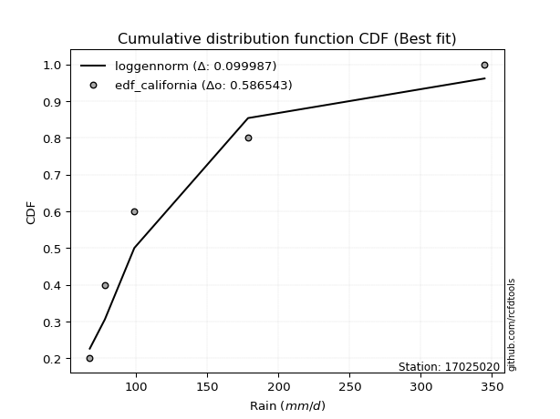</img>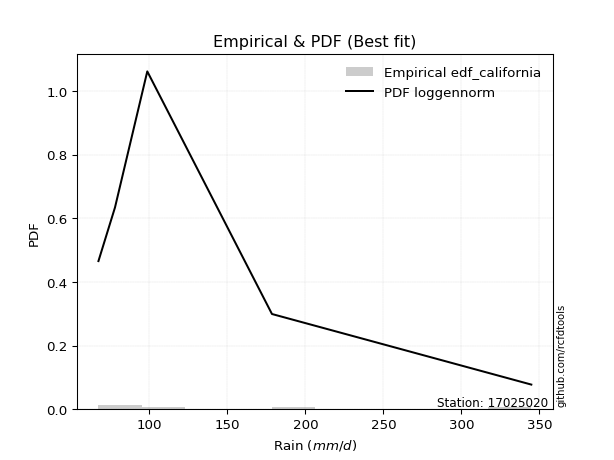</img>

</div>


### 2. EDF Hazen (1930)

Hazen method for plotting positions is a formula used to estimate the empirical cumulative probability distribution of flood events or other hydrological data. This formula often results in biased estimations, particularly when extrapolating to extreme events (high return periods).

<div align="center">


$P=(m-0.5)/n$


</div>


**2.1. Empirical values**

<div align="center">

|                | 0                  | 1                  | 2         | 3                 | 4                  |
|:---------------|:-------------------|:-------------------|:----------|:------------------|:-------------------|
| date           | 2022               | 2021               | 2023      | 2024              | 2025               |
| x              | 67.4               | 78.0               | 98.7      | 178.6             | 344.8              |
| m              | 1                  | 2                  | 3         | 4                 | 5                  |
| empirical_dist | edf_hazen          | edf_hazen          | edf_hazen | edf_hazen         | edf_hazen          |
| empirical      | 0.1                | 0.3                | 0.5       | 0.7               | 0.9                |
| empirical_tr   | 1.1111111111111112 | 1.4285714285714286 | 2.0       | 3.333333333333333 | 10.000000000000002 |

</div>


**2.2. Kolmogorov-Smirnov fit test (sorted by Δ)**


<div align="center">

|                | 0                   | 1                   | 2                   | 3                   | 4                  | 5                  | 6                  | 7                   | 8                   | 9                   | 10                  | 11                  | 12                  | 13                  | 14                  | 15                  | 16                  | 17                  | 18                  | 19                  | 20                 | 21                  | 22                  | 23                  | 24                  | 25                  | 26                  | 27                  | 28                  | 29                 | 30                  | 31                  | 32                  | 33                  | 34                  | 35                  | 36                 | 37                  | 38                  | 39                  | 40                  | 41                 | 42                  | 43                 | 44                  | 45                  | 46                  | 47                 | 48                  | 49                 | 50                  | 51                  | 52                  | 53                  | 54                  | 55                  | 56                  | 57                  | 58                  | 59                  | 60                  | 61                  | 62                  | 63                 | 64                  | 65                  | 66                  | 67                  | 68                  | 69                  | 70                 | 71                 | 72                 | 73                  | 74                  | 75                  | 76                  | 77                  | 78                 | 79                 | 80                  | 81                 | 82                  | 83                  | 84                 | 85                 | 86                  | 87                 | 88                  | 89                  | 90                  | 91                 | 92                  | 93                  | 94                 | 95                 | 96                 | 97                 | 98                 | 99                  | 100                 | 101                 | 102                | 103                 | 104                | 105                 | 106                 | 107                 | 108                 | 109                | 110                 | 111                | 112                 | 113                 | 114                 | 115                 | 116                | 117                 | 118                 | 119                | 120                 | 121                 | 122                 | 123                 | 124                | 125                | 126                 | 127                | 128                | 129                | 130                | 131                | 132                 | 133                | 134                | 135                 | 136                 | 137                 | 138                 | 139                 | 140                | 141                | 142                 | 143                 | 144                 | 145                 | 146                 | 147                | 148                | 149                | 150                | 151                | 152                | 153                | 154                | 155                | 156                | 157                | 158                | 159                |
|:---------------|:--------------------|:--------------------|:--------------------|:--------------------|:-------------------|:-------------------|:-------------------|:--------------------|:--------------------|:--------------------|:--------------------|:--------------------|:--------------------|:--------------------|:--------------------|:--------------------|:--------------------|:--------------------|:--------------------|:--------------------|:-------------------|:--------------------|:--------------------|:--------------------|:--------------------|:--------------------|:--------------------|:--------------------|:--------------------|:-------------------|:--------------------|:--------------------|:--------------------|:--------------------|:--------------------|:--------------------|:-------------------|:--------------------|:--------------------|:--------------------|:--------------------|:-------------------|:--------------------|:-------------------|:--------------------|:--------------------|:--------------------|:-------------------|:--------------------|:-------------------|:--------------------|:--------------------|:--------------------|:--------------------|:--------------------|:--------------------|:--------------------|:--------------------|:--------------------|:--------------------|:--------------------|:--------------------|:--------------------|:-------------------|:--------------------|:--------------------|:--------------------|:--------------------|:--------------------|:--------------------|:-------------------|:-------------------|:-------------------|:--------------------|:--------------------|:--------------------|:--------------------|:--------------------|:-------------------|:-------------------|:--------------------|:-------------------|:--------------------|:--------------------|:-------------------|:-------------------|:--------------------|:-------------------|:--------------------|:--------------------|:--------------------|:-------------------|:--------------------|:--------------------|:-------------------|:-------------------|:-------------------|:-------------------|:-------------------|:--------------------|:--------------------|:--------------------|:-------------------|:--------------------|:-------------------|:--------------------|:--------------------|:--------------------|:--------------------|:-------------------|:--------------------|:-------------------|:--------------------|:--------------------|:--------------------|:--------------------|:-------------------|:--------------------|:--------------------|:-------------------|:--------------------|:--------------------|:--------------------|:--------------------|:-------------------|:-------------------|:--------------------|:-------------------|:-------------------|:-------------------|:-------------------|:-------------------|:--------------------|:-------------------|:-------------------|:--------------------|:--------------------|:--------------------|:--------------------|:--------------------|:-------------------|:-------------------|:--------------------|:--------------------|:--------------------|:--------------------|:--------------------|:-------------------|:-------------------|:-------------------|:-------------------|:-------------------|:-------------------|:-------------------|:-------------------|:-------------------|:-------------------|:-------------------|:-------------------|:-------------------|
| station        | 17025020            | 17025020            | 17025020            | 17025020            | 17025020           | 17025020           | 17025020           | 17025020            | 17025020            | 17025020            | 17025020            | 17025020            | 17025020            | 17025020            | 17025020            | 17025020            | 17025020            | 17025020            | 17025020            | 17025020            | 17025020           | 17025020            | 17025020            | 17025020            | 17025020            | 17025020            | 17025020            | 17025020            | 17025020            | 17025020           | 17025020            | 17025020            | 17025020            | 17025020            | 17025020            | 17025020            | 17025020           | 17025020            | 17025020            | 17025020            | 17025020            | 17025020           | 17025020            | 17025020           | 17025020            | 17025020            | 17025020            | 17025020           | 17025020            | 17025020           | 17025020            | 17025020            | 17025020            | 17025020            | 17025020            | 17025020            | 17025020            | 17025020            | 17025020            | 17025020            | 17025020            | 17025020            | 17025020            | 17025020           | 17025020            | 17025020            | 17025020            | 17025020            | 17025020            | 17025020            | 17025020           | 17025020           | 17025020           | 17025020            | 17025020            | 17025020            | 17025020            | 17025020            | 17025020           | 17025020           | 17025020            | 17025020           | 17025020            | 17025020            | 17025020           | 17025020           | 17025020            | 17025020           | 17025020            | 17025020            | 17025020            | 17025020           | 17025020            | 17025020            | 17025020           | 17025020           | 17025020           | 17025020           | 17025020           | 17025020            | 17025020            | 17025020            | 17025020           | 17025020            | 17025020           | 17025020            | 17025020            | 17025020            | 17025020            | 17025020           | 17025020            | 17025020           | 17025020            | 17025020            | 17025020            | 17025020            | 17025020           | 17025020            | 17025020            | 17025020           | 17025020            | 17025020            | 17025020            | 17025020            | 17025020           | 17025020           | 17025020            | 17025020           | 17025020           | 17025020           | 17025020           | 17025020           | 17025020            | 17025020           | 17025020           | 17025020            | 17025020            | 17025020            | 17025020            | 17025020            | 17025020           | 17025020           | 17025020            | 17025020            | 17025020            | 17025020            | 17025020            | 17025020           | 17025020           | 17025020           | 17025020           | 17025020           | 17025020           | 17025020           | 17025020           | 17025020           | 17025020           | 17025020           | 17025020           | 17025020           |
| empirical_dist | edf_hazen           | edf_hazen           | edf_hazen           | edf_hazen           | edf_hazen          | edf_hazen          | edf_hazen          | edf_hazen           | edf_hazen           | edf_hazen           | edf_hazen           | edf_hazen           | edf_hazen           | edf_hazen           | edf_hazen           | edf_hazen           | edf_hazen           | edf_hazen           | edf_hazen           | edf_hazen           | edf_hazen          | edf_hazen           | edf_hazen           | edf_hazen           | edf_hazen           | edf_hazen           | edf_hazen           | edf_hazen           | edf_hazen           | edf_hazen          | edf_hazen           | edf_hazen           | edf_hazen           | edf_hazen           | edf_hazen           | edf_hazen           | edf_hazen          | edf_hazen           | edf_hazen           | edf_hazen           | edf_hazen           | edf_hazen          | edf_hazen           | edf_hazen          | edf_hazen           | edf_hazen           | edf_hazen           | edf_hazen          | edf_hazen           | edf_hazen          | edf_hazen           | edf_hazen           | edf_hazen           | edf_hazen           | edf_hazen           | edf_hazen           | edf_hazen           | edf_hazen           | edf_hazen           | edf_hazen           | edf_hazen           | edf_hazen           | edf_hazen           | edf_hazen          | edf_hazen           | edf_hazen           | edf_hazen           | edf_hazen           | edf_hazen           | edf_hazen           | edf_hazen          | edf_hazen          | edf_hazen          | edf_hazen           | edf_hazen           | edf_hazen           | edf_hazen           | edf_hazen           | edf_hazen          | edf_hazen          | edf_hazen           | edf_hazen          | edf_hazen           | edf_hazen           | edf_hazen          | edf_hazen          | edf_hazen           | edf_hazen          | edf_hazen           | edf_hazen           | edf_hazen           | edf_hazen          | edf_hazen           | edf_hazen           | edf_hazen          | edf_hazen          | edf_hazen          | edf_hazen          | edf_hazen          | edf_hazen           | edf_hazen           | edf_hazen           | edf_hazen          | edf_hazen           | edf_hazen          | edf_hazen           | edf_hazen           | edf_hazen           | edf_hazen           | edf_hazen          | edf_hazen           | edf_hazen          | edf_hazen           | edf_hazen           | edf_hazen           | edf_hazen           | edf_hazen          | edf_hazen           | edf_hazen           | edf_hazen          | edf_hazen           | edf_hazen           | edf_hazen           | edf_hazen           | edf_hazen          | edf_hazen          | edf_hazen           | edf_hazen          | edf_hazen          | edf_hazen          | edf_hazen          | edf_hazen          | edf_hazen           | edf_hazen          | edf_hazen          | edf_hazen           | edf_hazen           | edf_hazen           | edf_hazen           | edf_hazen           | edf_hazen          | edf_hazen          | edf_hazen           | edf_hazen           | edf_hazen           | edf_hazen           | edf_hazen           | edf_hazen          | edf_hazen          | edf_hazen          | edf_hazen          | edf_hazen          | edf_hazen          | edf_hazen          | edf_hazen          | edf_hazen          | edf_hazen          | edf_hazen          | edf_hazen          | edf_hazen          |
| p_dist         | logalpha            | loghalflogistic     | loghalfnorm         | logburr12           | burr12             | f                  | invgamma           | loginvweibull       | loggenextreme       | logmielke           | logburr             | logexponnorm        | nakagami            | exponweib           | exponpow            | loggenexpon         | logweibull_min      | loglomax            | loginvgamma         | weibull_min         | logmoyal           | logfoldnorm         | loggompertz         | loggenlogistic      | burr                | loginvgauss         | loggumbel_r         | lograyleigh         | nct                 | invgauss           | logksone            | gengamma            | logkstwobign        | loghalfgennorm      | alpha               | logpearson3         | logmaxwell         | logsemicircular     | lognct              | logdgamma           | halfnorm            | halflogistic       | foldnorm            | logf               | betaprime           | logarcsine          | loganglit           | ncf                | dweibull            | vonmises_line      | logtruncnorm        | logbetaprime        | dgamma              | halfgennorm         | logncf              | logloglaplace       | logdweibull         | loggennorm          | logloggamma         | logt                | lognorm             | logcrystalball      | pearson3            | moyal              | rayleigh            | logrice             | logskewnorm         | semicircular        | wald                | logwrapcauchy       | gumbel_r           | gennorm            | gausshyper         | maxwell             | loglogistic         | logtruncexpon       | anglit              | truncexpon          | genlogistic        | logcosine          | loghypsecant        | bradford           | gamma               | exponnorm           | genexpon           | logbradford        | truncweibull_min    | arcsine            | logweibull_max      | norm                | t                   | logrdist           | kstwobign           | loggumbel_l         | loglaplace         | loglaplace         | erlang             | logistic           | loggausshyper      | logwald             | logkappa4           | wrapcauchy          | truncnorm          | hypsecant           | logargus           | rice                | cosine              | lomax               | loglevy_l           | gumbel_l           | genextreme          | logtukeylambda     | logtriang           | laplace             | loguniform          | logkappa3           | logvonmises_line   | levy_l              | logtruncpareto      | argus              | tukeylambda         | triang              | logexponweib        | loggenpareto        | skewnorm           | ksone              | genpareto           | gompertz           | logexponpow        | loggenhalflogistic | fatiguelife        | kappa4             | logbeta             | truncpareto        | invweibull         | logtruncweibull_min | lognakagami         | uniform             | powerlaw            | kappa3              | logfatiguelife     | genhalflogistic    | beta                | logtrapezoid        | logpowerlaw         | rdist               | loggengamma         | loggamma           | loggamma           | logerlang          | trapezoid          | logjohnsonsb       | crystalball        | johnsonsb          | weibull_max        | logjohnsonsu       | johnsonsu          | logvonmises        | vonmises           | mielke             |
| delta          | 0.07224639191830717 | 0.07720131600699146 | 0.08066840010344839 | 0.08597374695218962 | 0.0869302984832151 | 0.0890815295861831 | 0.0890816653583002 | 0.09267977763623125 | 0.09268521791888706 | 0.09830299944761955 | 0.09877263559279847 | 0.09915437328215285 | 0.09998675862303791 | 0.09999901990949035 | 0.09999985473315791 | 0.09999999756090518 | 0.09999999946859224 | 0.09999999999176953 | 0.10000514692798124 | 0.10126795810312605 | 0.1012764175592154 | 0.10244811634891082 | 0.10336961285587268 | 0.10448856419336056 | 0.10510637394773192 | 0.11059597702000534 | 0.11192046975846032 | 0.11470010637079975 | 0.11613620327608754 | 0.1169346992418685 | 0.11755405014849463 | 0.11918297903062541 | 0.11950932030682554 | 0.11951718123724586 | 0.12083667067718129 | 0.12555625001926085 | 0.1266576802487136 | 0.12872061613328972 | 0.12956912029562678 | 0.13253272032829233 | 0.13260694166468678 | 0.1348040714175417 | 0.13508409615776812 | 0.1360691688239411 | 0.13660983178499253 | 0.13695880457130763 | 0.13740999110716845 | 0.137644502664041  | 0.14413792532497777 | 0.1441638609002864 | 0.14488178649519956 | 0.14500256010499413 | 0.14538949453538422 | 0.14548121946181236 | 0.14630616286974168 | 0.15096455371251405 | 0.15254687337033634 | 0.15365869230231333 | 0.15570061354796172 | 0.15807041511277697 | 0.15807649025529247 | 0.15807649739448737 | 0.15892559732415923 | 0.1604998314455146 | 0.16353606960987122 | 0.16371610177541374 | 0.16661587307907355 | 0.16687857962493113 | 0.16734731268292727 | 0.16891291101270722 | 0.1700338871397084 | 0.1705870015044293 | 0.1742003014770232 | 0.17448824977449678 | 0.17669267577720837 | 0.17717876274213668 | 0.17741063459624484 | 0.17954191124606753 | 0.187260877383017  | 0.1889671951324573 | 0.19099535470706247 | 0.1912432826060902 | 0.19202928920174644 | 0.19362655866753997 | 0.1952173613580921 | 0.1956827286769074 | 0.19870581932787346 | 0.1993494891716829 | 0.20003160133854087 | 0.20213627446696886 | 0.20214191833471984 | 0.2049543537750192 | 0.21410944292139195 | 0.21674197089886532 | 0.2188992296761612 | 0.2188992296761612 | 0.2206932188152002 | 0.2235859929738137 | 0.2313206060627866 | 0.23419065949815182 | 0.23625006695774525 | 0.23638184423358144 | 0.2386677092264204 | 0.23901750416901085 | 0.2393805660485505 | 0.24355071749817708 | 0.24375633182585665 | 0.24432120213850594 | 0.25139859236546414 | 0.2525308227715709 | 0.25784043380673194 | 0.2605176385859025 | 0.26221811948213003 | 0.26389170847057397 | 0.26632030454578204 | 0.26633083235100574 | 0.2713442058810417 | 0.28066529401890883 | 0.28585038786843225 | 0.2878522150222782 | 0.29999999999999294 | 0.30792838002616346 | 0.31437197633791764 | 0.31530611070975323 | 0.315941875597854  | 0.3226387887527037 | 0.32990920190476924 | 0.3313326158555773 | 0.333441923178494  | 0.3405457002030935 | 0.3471543644230018 | 0.363092495268865  | 0.36512226334016573 | 0.3741797197192451 | 0.3769497363990796 | 0.3771969915511401  | 0.37783467996028347 | 0.38716654650324445 | 0.38930567029566426 | 0.38946466037726574 | 0.4095000448011951 | 0.4197816541305385 | 0.42026891434338864 | 0.42267907002887517 | 0.43690518660096583 | 0.46557080784134974 | 0.46785190338454347 | 0.5173713971563036 | 0.5173713971563036 | 0.5256777020881325 | 0.5257875519646877 | 0.5286500914618861 | 0.5428973374130298 | 0.5848203032200381 | 0.6071988102028845 | 0.6253598478584483 | 0.6655193371531019 | 1.054164662416344  | 54.98007612375737  | nan                |
| deltao         | 0.5865427407550001  | 0.5865427407550001  | 0.5865427407550001  | 0.5865427407550001  | 0.5865427407550001 | 0.5865427407550001 | 0.5865427407550001 | 0.5865427407550001  | 0.5865427407550001  | 0.5865427407550001  | 0.5865427407550001  | 0.5865427407550001  | 0.5865427407550001  | 0.5865427407550001  | 0.5865427407550001  | 0.5865427407550001  | 0.5865427407550001  | 0.5865427407550001  | 0.5865427407550001  | 0.5865427407550001  | 0.5865427407550001 | 0.5865427407550001  | 0.5865427407550001  | 0.5865427407550001  | 0.5865427407550001  | 0.5865427407550001  | 0.5865427407550001  | 0.5865427407550001  | 0.5865427407550001  | 0.5865427407550001 | 0.5865427407550001  | 0.5865427407550001  | 0.5865427407550001  | 0.5865427407550001  | 0.5865427407550001  | 0.5865427407550001  | 0.5865427407550001 | 0.5865427407550001  | 0.5865427407550001  | 0.5865427407550001  | 0.5865427407550001  | 0.5865427407550001 | 0.5865427407550001  | 0.5865427407550001 | 0.5865427407550001  | 0.5865427407550001  | 0.5865427407550001  | 0.5865427407550001 | 0.5865427407550001  | 0.5865427407550001 | 0.5865427407550001  | 0.5865427407550001  | 0.5865427407550001  | 0.5865427407550001  | 0.5865427407550001  | 0.5865427407550001  | 0.5865427407550001  | 0.5865427407550001  | 0.5865427407550001  | 0.5865427407550001  | 0.5865427407550001  | 0.5865427407550001  | 0.5865427407550001  | 0.5865427407550001 | 0.5865427407550001  | 0.5865427407550001  | 0.5865427407550001  | 0.5865427407550001  | 0.5865427407550001  | 0.5865427407550001  | 0.5865427407550001 | 0.5865427407550001 | 0.5865427407550001 | 0.5865427407550001  | 0.5865427407550001  | 0.5865427407550001  | 0.5865427407550001  | 0.5865427407550001  | 0.5865427407550001 | 0.5865427407550001 | 0.5865427407550001  | 0.5865427407550001 | 0.5865427407550001  | 0.5865427407550001  | 0.5865427407550001 | 0.5865427407550001 | 0.5865427407550001  | 0.5865427407550001 | 0.5865427407550001  | 0.5865427407550001  | 0.5865427407550001  | 0.5865427407550001 | 0.5865427407550001  | 0.5865427407550001  | 0.5865427407550001 | 0.5865427407550001 | 0.5865427407550001 | 0.5865427407550001 | 0.5865427407550001 | 0.5865427407550001  | 0.5865427407550001  | 0.5865427407550001  | 0.5865427407550001 | 0.5865427407550001  | 0.5865427407550001 | 0.5865427407550001  | 0.5865427407550001  | 0.5865427407550001  | 0.5865427407550001  | 0.5865427407550001 | 0.5865427407550001  | 0.5865427407550001 | 0.5865427407550001  | 0.5865427407550001  | 0.5865427407550001  | 0.5865427407550001  | 0.5865427407550001 | 0.5865427407550001  | 0.5865427407550001  | 0.5865427407550001 | 0.5865427407550001  | 0.5865427407550001  | 0.5865427407550001  | 0.5865427407550001  | 0.5865427407550001 | 0.5865427407550001 | 0.5865427407550001  | 0.5865427407550001 | 0.5865427407550001 | 0.5865427407550001 | 0.5865427407550001 | 0.5865427407550001 | 0.5865427407550001  | 0.5865427407550001 | 0.5865427407550001 | 0.5865427407550001  | 0.5865427407550001  | 0.5865427407550001  | 0.5865427407550001  | 0.5865427407550001  | 0.5865427407550001 | 0.5865427407550001 | 0.5865427407550001  | 0.5865427407550001  | 0.5865427407550001  | 0.5865427407550001  | 0.5865427407550001  | 0.5865427407550001 | 0.5865427407550001 | 0.5865427407550001 | 0.5865427407550001 | 0.5865427407550001 | 0.5865427407550001 | 0.5865427407550001 | 0.5865427407550001 | 0.5865427407550001 | 0.5865427407550001 | 0.5865427407550001 | 0.5865427407550001 | 0.5865427407550001 |
| eval           | Δo > Δ              | Δo > Δ              | Δo > Δ              | Δo > Δ              | Δo > Δ             | Δo > Δ             | Δo > Δ             | Δo > Δ              | Δo > Δ              | Δo > Δ              | Δo > Δ              | Δo > Δ              | Δo > Δ              | Δo > Δ              | Δo > Δ              | Δo > Δ              | Δo > Δ              | Δo > Δ              | Δo > Δ              | Δo > Δ              | Δo > Δ             | Δo > Δ              | Δo > Δ              | Δo > Δ              | Δo > Δ              | Δo > Δ              | Δo > Δ              | Δo > Δ              | Δo > Δ              | Δo > Δ             | Δo > Δ              | Δo > Δ              | Δo > Δ              | Δo > Δ              | Δo > Δ              | Δo > Δ              | Δo > Δ             | Δo > Δ              | Δo > Δ              | Δo > Δ              | Δo > Δ              | Δo > Δ             | Δo > Δ              | Δo > Δ             | Δo > Δ              | Δo > Δ              | Δo > Δ              | Δo > Δ             | Δo > Δ              | Δo > Δ             | Δo > Δ              | Δo > Δ              | Δo > Δ              | Δo > Δ              | Δo > Δ              | Δo > Δ              | Δo > Δ              | Δo > Δ              | Δo > Δ              | Δo > Δ              | Δo > Δ              | Δo > Δ              | Δo > Δ              | Δo > Δ             | Δo > Δ              | Δo > Δ              | Δo > Δ              | Δo > Δ              | Δo > Δ              | Δo > Δ              | Δo > Δ             | Δo > Δ             | Δo > Δ             | Δo > Δ              | Δo > Δ              | Δo > Δ              | Δo > Δ              | Δo > Δ              | Δo > Δ             | Δo > Δ             | Δo > Δ              | Δo > Δ             | Δo > Δ              | Δo > Δ              | Δo > Δ             | Δo > Δ             | Δo > Δ              | Δo > Δ             | Δo > Δ              | Δo > Δ              | Δo > Δ              | Δo > Δ             | Δo > Δ              | Δo > Δ              | Δo > Δ             | Δo > Δ             | Δo > Δ             | Δo > Δ             | Δo > Δ             | Δo > Δ              | Δo > Δ              | Δo > Δ              | Δo > Δ             | Δo > Δ              | Δo > Δ             | Δo > Δ              | Δo > Δ              | Δo > Δ              | Δo > Δ              | Δo > Δ             | Δo > Δ              | Δo > Δ             | Δo > Δ              | Δo > Δ              | Δo > Δ              | Δo > Δ              | Δo > Δ             | Δo > Δ              | Δo > Δ              | Δo > Δ             | Δo > Δ              | Δo > Δ              | Δo > Δ              | Δo > Δ              | Δo > Δ             | Δo > Δ             | Δo > Δ              | Δo > Δ             | Δo > Δ             | Δo > Δ             | Δo > Δ             | Δo > Δ             | Δo > Δ              | Δo > Δ             | Δo > Δ             | Δo > Δ              | Δo > Δ              | Δo > Δ              | Δo > Δ              | Δo > Δ              | Δo > Δ             | Δo > Δ             | Δo > Δ              | Δo > Δ              | Δo > Δ              | Δo > Δ              | Δo > Δ              | Δo > Δ             | Δo > Δ             | Δo > Δ             | Δo > Δ             | Δo > Δ             | Δo > Δ             | Δo > Δ             | Δo <= Δ            | Δo <= Δ            | Δo <= Δ            | Δo <= Δ            | Δo <= Δ            | Δo <= Δ            |
| fit            | 1                   | 1                   | 1                   | 1                   | 1                  | 1                  | 1                  | 1                   | 1                   | 1                   | 1                   | 1                   | 1                   | 1                   | 1                   | 1                   | 1                   | 1                   | 1                   | 1                   | 1                  | 1                   | 1                   | 1                   | 1                   | 1                   | 1                   | 1                   | 1                   | 1                  | 1                   | 1                   | 1                   | 1                   | 1                   | 1                   | 1                  | 1                   | 1                   | 1                   | 1                   | 1                  | 1                   | 1                  | 1                   | 1                   | 1                   | 1                  | 1                   | 1                  | 1                   | 1                   | 1                   | 1                   | 1                   | 1                   | 1                   | 1                   | 1                   | 1                   | 1                   | 1                   | 1                   | 1                  | 1                   | 1                   | 1                   | 1                   | 1                   | 1                   | 1                  | 1                  | 1                  | 1                   | 1                   | 1                   | 1                   | 1                   | 1                  | 1                  | 1                   | 1                  | 1                   | 1                   | 1                  | 1                  | 1                   | 1                  | 1                   | 1                   | 1                   | 1                  | 1                   | 1                   | 1                  | 1                  | 1                  | 1                  | 1                  | 1                   | 1                   | 1                   | 1                  | 1                   | 1                  | 1                   | 1                   | 1                   | 1                   | 1                  | 1                   | 1                  | 1                   | 1                   | 1                   | 1                   | 1                  | 1                   | 1                   | 1                  | 1                   | 1                   | 1                   | 1                   | 1                  | 1                  | 1                   | 1                  | 1                  | 1                  | 1                  | 1                  | 1                   | 1                  | 1                  | 1                   | 1                   | 1                   | 1                   | 1                   | 1                  | 1                  | 1                   | 1                   | 1                   | 1                   | 1                   | 1                  | 1                  | 1                  | 1                  | 1                  | 1                  | 1                  | 0                  | 0                  | 0                  | 0                  | 0                  | 0                  |
| n              | 5                   | 5                   | 5                   | 5                   | 5                  | 5                  | 5                  | 5                   | 5                   | 5                   | 5                   | 5                   | 5                   | 5                   | 5                   | 5                   | 5                   | 5                   | 5                   | 5                   | 5                  | 5                   | 5                   | 5                   | 5                   | 5                   | 5                   | 5                   | 5                   | 5                  | 5                   | 5                   | 5                   | 5                   | 5                   | 5                   | 5                  | 5                   | 5                   | 5                   | 5                   | 5                  | 5                   | 5                  | 5                   | 5                   | 5                   | 5                  | 5                   | 5                  | 5                   | 5                   | 5                   | 5                   | 5                   | 5                   | 5                   | 5                   | 5                   | 5                   | 5                   | 5                   | 5                   | 5                  | 5                   | 5                   | 5                   | 5                   | 5                   | 5                   | 5                  | 5                  | 5                  | 5                   | 5                   | 5                   | 5                   | 5                   | 5                  | 5                  | 5                   | 5                  | 5                   | 5                   | 5                  | 5                  | 5                   | 5                  | 5                   | 5                   | 5                   | 5                  | 5                   | 5                   | 5                  | 5                  | 5                  | 5                  | 5                  | 5                   | 5                   | 5                   | 5                  | 5                   | 5                  | 5                   | 5                   | 5                   | 5                   | 5                  | 5                   | 5                  | 5                   | 5                   | 5                   | 5                   | 5                  | 5                   | 5                   | 5                  | 5                   | 5                   | 5                   | 5                   | 5                  | 5                  | 5                   | 5                  | 5                  | 5                  | 5                  | 5                  | 5                   | 5                  | 5                  | 5                   | 5                   | 5                   | 5                   | 5                   | 5                  | 5                  | 5                   | 5                   | 5                   | 5                   | 5                   | 5                  | 5                  | 5                  | 5                  | 5                  | 5                  | 5                  | 5                  | 5                  | 5                  | 5                  | 5                  | 5                  |
| best_fit       | 1                   | 0                   | 0                   | 0                   | 0                  | 0                  | 0                  | 0                   | 0                   | 0                   | 0                   | 0                   | 0                   | 0                   | 0                   | 0                   | 0                   | 0                   | 0                   | 0                   | 0                  | 0                   | 0                   | 0                   | 0                   | 0                   | 0                   | 0                   | 0                   | 0                  | 0                   | 0                   | 0                   | 0                   | 0                   | 0                   | 0                  | 0                   | 0                   | 0                   | 0                   | 0                  | 0                   | 0                  | 0                   | 0                   | 0                   | 0                  | 0                   | 0                  | 0                   | 0                   | 0                   | 0                   | 0                   | 0                   | 0                   | 0                   | 0                   | 0                   | 0                   | 0                   | 0                   | 0                  | 0                   | 0                   | 0                   | 0                   | 0                   | 0                   | 0                  | 0                  | 0                  | 0                   | 0                   | 0                   | 0                   | 0                   | 0                  | 0                  | 0                   | 0                  | 0                   | 0                   | 0                  | 0                  | 0                   | 0                  | 0                   | 0                   | 0                   | 0                  | 0                   | 0                   | 0                  | 0                  | 0                  | 0                  | 0                  | 0                   | 0                   | 0                   | 0                  | 0                   | 0                  | 0                   | 0                   | 0                   | 0                   | 0                  | 0                   | 0                  | 0                   | 0                   | 0                   | 0                   | 0                  | 0                   | 0                   | 0                  | 0                   | 0                   | 0                   | 0                   | 0                  | 0                  | 0                   | 0                  | 0                  | 0                  | 0                  | 0                  | 0                   | 0                  | 0                  | 0                   | 0                   | 0                   | 0                   | 0                   | 0                  | 0                  | 0                   | 0                   | 0                   | 0                   | 0                   | 0                  | 0                  | 0                  | 0                  | 0                  | 0                  | 0                  | 0                  | 0                  | 0                  | 0                  | 0                  | 0                  |
| best_fit_sort  | 1                   | 2                   | 3                   | 4                   | 5                  | 6                  | 7                  | 8                   | 9                   | 10                  | 11                  | 12                  | 13                  | 14                  | 15                  | 16                  | 17                  | 18                  | 19                  | 20                  | 21                 | 22                  | 23                  | 24                  | 25                  | 26                  | 27                  | 28                  | 29                  | 30                 | 31                  | 32                  | 33                  | 34                  | 35                  | 36                  | 37                 | 38                  | 39                  | 40                  | 41                  | 42                 | 43                  | 44                 | 45                  | 46                  | 47                  | 48                 | 49                  | 50                 | 51                  | 52                  | 53                  | 54                  | 55                  | 56                  | 57                  | 58                  | 59                  | 60                  | 61                  | 62                  | 63                  | 64                 | 65                  | 66                  | 67                  | 68                  | 69                  | 70                  | 71                 | 72                 | 73                 | 74                  | 75                  | 76                  | 77                  | 78                  | 79                 | 80                 | 81                  | 82                 | 83                  | 84                  | 85                 | 86                 | 87                  | 88                 | 89                  | 90                  | 91                  | 92                 | 93                  | 94                  | 95                 | 96                 | 97                 | 98                 | 99                 | 100                 | 101                 | 102                 | 103                | 104                 | 105                | 106                 | 107                 | 108                 | 109                 | 110                | 111                 | 112                | 113                 | 114                 | 115                 | 116                 | 117                | 118                 | 119                 | 120                | 121                 | 122                 | 123                 | 124                 | 125                | 126                | 127                 | 128                | 129                | 130                | 131                | 132                | 133                 | 134                | 135                | 136                 | 137                 | 138                 | 139                 | 140                 | 141                | 142                | 143                 | 144                 | 145                 | 146                 | 147                 | 148                | 149                | 150                | 151                | 152                | 153                | 154                | 155                | 156                | 157                | 158                | 159                | 160                |

</div>


**2.3. Best fit**

<div align="center">

|   id |   station | empirical_dist   | p_dist   |     delta |   deltao | eval   |   fit |   n |   best_fit |   best_fit_sort |
|-----:|----------:|:-----------------|:---------|----------:|---------:|:-------|------:|----:|-----------:|----------------:|
|    0 |  17025020 | edf_hazen        | logalpha | 0.0722464 | 0.586543 | Δo > Δ |     1 |   5 |          1 |               1 |

</div>


<div align="center">

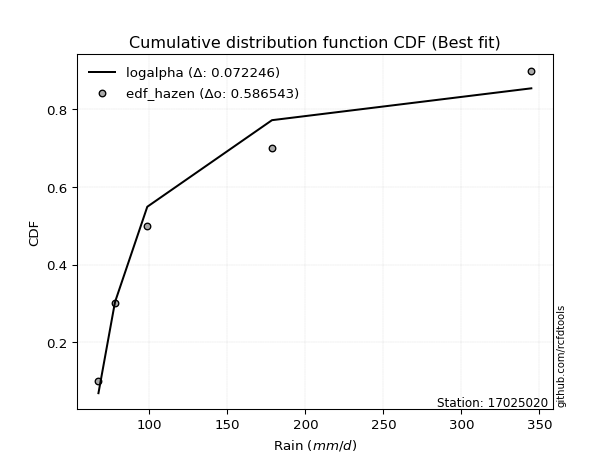</img>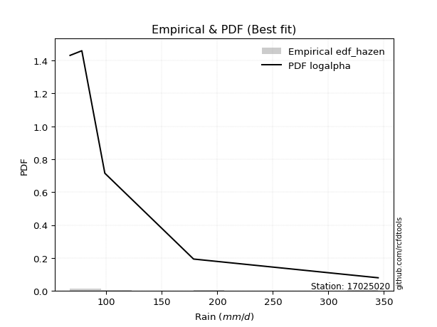</img>

</div>


### 3. EDF Weibull (1939)

Weibull plotting position formula is an empirical method used to estimate the non-exceedance probability or plotting position for a set of observed data, is often recommended or widely used in practice, particularly in flood frequency analysis.

<div align="center">


$P=m/(n+1)$


</div>


**3.1. Empirical values**

<div align="center">

|                | 0                   | 1                  | 2           | 3                  | 4                  |
|:---------------|:--------------------|:-------------------|:------------|:-------------------|:-------------------|
| date           | 2022                | 2021               | 2023        | 2024               | 2025               |
| x              | 67.4                | 78.0               | 98.7        | 178.6              | 344.8              |
| m              | 1                   | 2                  | 3           | 4                  | 5                  |
| empirical_dist | edf_weibull         | edf_weibull        | edf_weibull | edf_weibull        | edf_weibull        |
| empirical      | 0.16666666666666666 | 0.3333333333333333 | 0.5         | 0.6666666666666666 | 0.8333333333333334 |
| empirical_tr   | 1.2                 | 1.4999999999999998 | 2.0         | 2.9999999999999996 | 6.000000000000002  |

</div>


**3.2. Kolmogorov-Smirnov fit test (sorted by Δ)**


<div align="center">

|                | 0                  | 1                   | 2                  | 3                   | 4                   | 5                   | 6                   | 7                   | 8                   | 9                   | 10                  | 11                 | 12                  | 13                 | 14                 | 15                  | 16                  | 17                  | 18                  | 19                  | 20                  | 21                 | 22                  | 23                  | 24                  | 25                 | 26                  | 27                  | 28                 | 29                  | 30                 | 31                  | 32                  | 33                  | 34                  | 35                 | 36                  | 37                  | 38                 | 39                  | 40                  | 41                  | 42                  | 43                  | 44                  | 45                  | 46                 | 47                  | 48                  | 49                 | 50                  | 51                  | 52                  | 53                  | 54                  | 55                  | 56                  | 57                 | 58                  | 59                  | 60                  | 61                 | 62                 | 63                  | 64                  | 65                  | 66                  | 67                 | 68                 | 69                  | 70                  | 71                  | 72                 | 73                  | 74                  | 75                  | 76                 | 77                 | 78                  | 79                  | 80                 | 81                  | 82                  | 83                  | 84                 | 85                 | 86                  | 87                  | 88                  | 89                 | 90                  | 91                  | 92                  | 93                 | 94                  | 95                  | 96                 | 97                 | 98                 | 99                  | 100                | 101                 | 102                 | 103                | 104                 | 105                | 106                 | 107                 | 108                 | 109                | 110                 | 111                | 112                 | 113                | 114                 | 115                 | 116                 | 117                 | 118                 | 119                | 120                | 121                | 122                | 123                | 124                | 125                 | 126                 | 127                 | 128                | 129                | 130                | 131                 | 132                | 133                 | 134                 | 135                 | 136                | 137                 | 138                | 139                | 140                 | 141                 | 142                | 143                | 144                | 145                 | 146                 | 147                 | 148                 | 149                 | 150                | 151                | 152                 | 153                | 154                | 155                | 156                | 157                | 158                | 159                |
|:---------------|:-------------------|:--------------------|:-------------------|:--------------------|:--------------------|:--------------------|:--------------------|:--------------------|:--------------------|:--------------------|:--------------------|:-------------------|:--------------------|:-------------------|:-------------------|:--------------------|:--------------------|:--------------------|:--------------------|:--------------------|:--------------------|:-------------------|:--------------------|:--------------------|:--------------------|:-------------------|:--------------------|:--------------------|:-------------------|:--------------------|:-------------------|:--------------------|:--------------------|:--------------------|:--------------------|:-------------------|:--------------------|:--------------------|:-------------------|:--------------------|:--------------------|:--------------------|:--------------------|:--------------------|:--------------------|:--------------------|:-------------------|:--------------------|:--------------------|:-------------------|:--------------------|:--------------------|:--------------------|:--------------------|:--------------------|:--------------------|:--------------------|:-------------------|:--------------------|:--------------------|:--------------------|:-------------------|:-------------------|:--------------------|:--------------------|:--------------------|:--------------------|:-------------------|:-------------------|:--------------------|:--------------------|:--------------------|:-------------------|:--------------------|:--------------------|:--------------------|:-------------------|:-------------------|:--------------------|:--------------------|:-------------------|:--------------------|:--------------------|:--------------------|:-------------------|:-------------------|:--------------------|:--------------------|:--------------------|:-------------------|:--------------------|:--------------------|:--------------------|:-------------------|:--------------------|:--------------------|:-------------------|:-------------------|:-------------------|:--------------------|:-------------------|:--------------------|:--------------------|:-------------------|:--------------------|:-------------------|:--------------------|:--------------------|:--------------------|:-------------------|:--------------------|:-------------------|:--------------------|:-------------------|:--------------------|:--------------------|:--------------------|:--------------------|:--------------------|:-------------------|:-------------------|:-------------------|:-------------------|:-------------------|:-------------------|:--------------------|:--------------------|:--------------------|:-------------------|:-------------------|:-------------------|:--------------------|:-------------------|:--------------------|:--------------------|:--------------------|:-------------------|:--------------------|:-------------------|:-------------------|:--------------------|:--------------------|:-------------------|:-------------------|:-------------------|:--------------------|:--------------------|:--------------------|:--------------------|:--------------------|:-------------------|:-------------------|:--------------------|:-------------------|:-------------------|:-------------------|:-------------------|:-------------------|:-------------------|:-------------------|
| station        | 17025020           | 17025020            | 17025020           | 17025020            | 17025020            | 17025020            | 17025020            | 17025020            | 17025020            | 17025020            | 17025020            | 17025020           | 17025020            | 17025020           | 17025020           | 17025020            | 17025020            | 17025020            | 17025020            | 17025020            | 17025020            | 17025020           | 17025020            | 17025020            | 17025020            | 17025020           | 17025020            | 17025020            | 17025020           | 17025020            | 17025020           | 17025020            | 17025020            | 17025020            | 17025020            | 17025020           | 17025020            | 17025020            | 17025020           | 17025020            | 17025020            | 17025020            | 17025020            | 17025020            | 17025020            | 17025020            | 17025020           | 17025020            | 17025020            | 17025020           | 17025020            | 17025020            | 17025020            | 17025020            | 17025020            | 17025020            | 17025020            | 17025020           | 17025020            | 17025020            | 17025020            | 17025020           | 17025020           | 17025020            | 17025020            | 17025020            | 17025020            | 17025020           | 17025020           | 17025020            | 17025020            | 17025020            | 17025020           | 17025020            | 17025020            | 17025020            | 17025020           | 17025020           | 17025020            | 17025020            | 17025020           | 17025020            | 17025020            | 17025020            | 17025020           | 17025020           | 17025020            | 17025020            | 17025020            | 17025020           | 17025020            | 17025020            | 17025020            | 17025020           | 17025020            | 17025020            | 17025020           | 17025020           | 17025020           | 17025020            | 17025020           | 17025020            | 17025020            | 17025020           | 17025020            | 17025020           | 17025020            | 17025020            | 17025020            | 17025020           | 17025020            | 17025020           | 17025020            | 17025020           | 17025020            | 17025020            | 17025020            | 17025020            | 17025020            | 17025020           | 17025020           | 17025020           | 17025020           | 17025020           | 17025020           | 17025020            | 17025020            | 17025020            | 17025020           | 17025020           | 17025020           | 17025020            | 17025020           | 17025020            | 17025020            | 17025020            | 17025020           | 17025020            | 17025020           | 17025020           | 17025020            | 17025020            | 17025020           | 17025020           | 17025020           | 17025020            | 17025020            | 17025020            | 17025020            | 17025020            | 17025020           | 17025020           | 17025020            | 17025020           | 17025020           | 17025020           | 17025020           | 17025020           | 17025020           | 17025020           |
| empirical_dist | edf_weibull        | edf_weibull         | edf_weibull        | edf_weibull         | edf_weibull         | edf_weibull         | edf_weibull         | edf_weibull         | edf_weibull         | edf_weibull         | edf_weibull         | edf_weibull        | edf_weibull         | edf_weibull        | edf_weibull        | edf_weibull         | edf_weibull         | edf_weibull         | edf_weibull         | edf_weibull         | edf_weibull         | edf_weibull        | edf_weibull         | edf_weibull         | edf_weibull         | edf_weibull        | edf_weibull         | edf_weibull         | edf_weibull        | edf_weibull         | edf_weibull        | edf_weibull         | edf_weibull         | edf_weibull         | edf_weibull         | edf_weibull        | edf_weibull         | edf_weibull         | edf_weibull        | edf_weibull         | edf_weibull         | edf_weibull         | edf_weibull         | edf_weibull         | edf_weibull         | edf_weibull         | edf_weibull        | edf_weibull         | edf_weibull         | edf_weibull        | edf_weibull         | edf_weibull         | edf_weibull         | edf_weibull         | edf_weibull         | edf_weibull         | edf_weibull         | edf_weibull        | edf_weibull         | edf_weibull         | edf_weibull         | edf_weibull        | edf_weibull        | edf_weibull         | edf_weibull         | edf_weibull         | edf_weibull         | edf_weibull        | edf_weibull        | edf_weibull         | edf_weibull         | edf_weibull         | edf_weibull        | edf_weibull         | edf_weibull         | edf_weibull         | edf_weibull        | edf_weibull        | edf_weibull         | edf_weibull         | edf_weibull        | edf_weibull         | edf_weibull         | edf_weibull         | edf_weibull        | edf_weibull        | edf_weibull         | edf_weibull         | edf_weibull         | edf_weibull        | edf_weibull         | edf_weibull         | edf_weibull         | edf_weibull        | edf_weibull         | edf_weibull         | edf_weibull        | edf_weibull        | edf_weibull        | edf_weibull         | edf_weibull        | edf_weibull         | edf_weibull         | edf_weibull        | edf_weibull         | edf_weibull        | edf_weibull         | edf_weibull         | edf_weibull         | edf_weibull        | edf_weibull         | edf_weibull        | edf_weibull         | edf_weibull        | edf_weibull         | edf_weibull         | edf_weibull         | edf_weibull         | edf_weibull         | edf_weibull        | edf_weibull        | edf_weibull        | edf_weibull        | edf_weibull        | edf_weibull        | edf_weibull         | edf_weibull         | edf_weibull         | edf_weibull        | edf_weibull        | edf_weibull        | edf_weibull         | edf_weibull        | edf_weibull         | edf_weibull         | edf_weibull         | edf_weibull        | edf_weibull         | edf_weibull        | edf_weibull        | edf_weibull         | edf_weibull         | edf_weibull        | edf_weibull        | edf_weibull        | edf_weibull         | edf_weibull         | edf_weibull         | edf_weibull         | edf_weibull         | edf_weibull        | edf_weibull        | edf_weibull         | edf_weibull        | edf_weibull        | edf_weibull        | edf_weibull        | edf_weibull        | edf_weibull        | edf_weibull        |
| p_dist         | loghalfnorm        | logfoldnorm         | logalpha           | loghalflogistic     | lograyleigh         | f                   | invgamma            | loggumbel_r         | nct                 | logpearson3         | loginvweibull       | loggenextreme      | burr                | loggenlogistic     | logmaxwell         | logdweibull         | logsemicircular     | lognct              | foldnorm            | logmielke           | logdgamma           | logburr            | halfnorm            | loginvgamma         | logmoyal            | halflogistic       | betaprime           | loganglit           | ncf                | logkstwobign        | halfgennorm        | loginvgauss         | logbetaprime        | dweibull            | logncf              | logksone           | invgauss            | dgamma              | burr12             | logburr12           | alpha               | logloggamma         | logt                | lognorm             | logcrystalball      | pearson3            | moyal              | rayleigh            | logrice             | logexponnorm       | nakagami            | gengamma            | exponweib           | logf                | exponpow            | loghalfgennorm      | loggenexpon         | logweibull_min     | weibull_min         | loglomax            | loggompertz         | vonmises_line      | truncexpon         | arcsine             | logarcsine          | logwrapcauchy       | semicircular        | gumbel_r           | gausshyper         | maxwell             | loglogistic         | anglit              | logtruncnorm       | logloglaplace       | loglevy_l           | loggennorm          | genlogistic        | logcosine          | bradford            | loghypsecant        | genextreme         | logweibull_max      | truncweibull_min    | logskewnorm         | wald               | logtruncexpon      | norm                | t                   | gennorm             | logrdist           | logbradford         | levy_l              | kstwobign           | exponnorm          | loggumbel_l         | genexpon            | loglaplace         | loglaplace         | logistic           | gamma               | loggausshyper      | wrapcauchy          | logkappa4           | truncnorm          | hypsecant           | logargus           | rice                | cosine              | lomax               | loggenpareto       | logtruncpareto      | gumbel_l           | erlang              | logtukeylambda     | logtriang           | laplace             | loguniform          | logkappa3           | logwald             | logvonmises_line   | logexponweib       | argus              | logbeta            | logexponpow        | triang             | genpareto           | invweibull          | fatiguelife         | skewnorm           | ksone              | gompertz           | tukeylambda         | loggenhalflogistic | truncpareto         | logtruncweibull_min | lognakagami         | beta               | powerlaw            | kappa4             | logfatiguelife     | uniform             | kappa3              | genhalflogistic    | rdist              | logpowerlaw        | logtrapezoid        | loggengamma         | crystalball         | loggamma            | loggamma            | logerlang          | trapezoid          | logjohnsonsb        | johnsonsb          | weibull_max        | logjohnsonsu       | johnsonsu          | logvonmises        | vonmises           | mielke             |
| delta          | 0.0953640615643212 | 0.10244811634891082 | 0.1055797252516405 | 0.11053464934032478 | 0.11470010637079975 | 0.12241486291951642 | 0.12241499869163353 | 0.12361367993484099 | 0.12545710689889072 | 0.12555625001926085 | 0.12601311096956458 | 0.1260185512522204 | 0.12623090474674148 | 0.1262889354158955 | 0.1266576802487136 | 0.12769483073267307 | 0.12872061613328972 | 0.12956912029562678 | 0.13070302233533204 | 0.13163633278095288 | 0.13207614139837054 | 0.1321059689261318 | 0.13260694166468678 | 0.13333848026131456 | 0.13460975089254873 | 0.1348040714175417 | 0.13660983178499253 | 0.13740999110716845 | 0.137644502664041  | 0.13791411485927552 | 0.1399782381953517 | 0.14392931035333867 | 0.14500256010499413 | 0.14529170993724694 | 0.14630616286974168 | 0.1482597726168977 | 0.15026803257520183 | 0.15050470538072147 | 0.152201305426643  | 0.15255803664128548 | 0.15417000401051462 | 0.15570061354796172 | 0.15807041511277697 | 0.15807649025529247 | 0.15807649739448737 | 0.15892559732415923 | 0.1604998314455146 | 0.16353606960987122 | 0.16371610177541374 | 0.1658210399488195 | 0.16665342528970456 | 0.16666567974399726 | 0.16666568657615702 | 0.16666640930078913 | 0.16666652139982455 | 0.16666661664075375 | 0.16666666422757184 | 0.1666666661352589 | 0.16666666639752023 | 0.16666666665843619 | 0.16666666666245397 | 0.1666666666666098 | 0.16666666666662   | 0.16666666666666663 | 0.16666666666666663 | 0.16666666666666666 | 0.16687857962493113 | 0.1700338871397084 | 0.1742003014770232 | 0.17448824977449678 | 0.17669267577720837 | 0.17741063459624484 | 0.1782151198285329 | 0.18429788704584738 | 0.18473192569879746 | 0.18699202563564665 | 0.187260877383017  | 0.1889671951324573 | 0.18902659102184882 | 0.19099535470706247 | 0.1911737671400653 | 0.19856855757048508 | 0.19870581932787346 | 0.19994920641240688 | 0.2006806460162606 | 0.2013267137045367 | 0.20213627446696886 | 0.20214191833471984 | 0.20392033483776262 | 0.2049543537750192 | 0.20896627531598627 | 0.21399862735224215 | 0.21410944292139195 | 0.2164198600500064 | 0.21674197089886532 | 0.21749739440417248 | 0.2188992296761612 | 0.2188992296761612 | 0.2235859929738137 | 0.22536262253507977 | 0.2313206060627866 | 0.23230013479827344 | 0.23625006695774525 | 0.2386677092264204 | 0.23901750416901085 | 0.2393805660485505 | 0.24355071749817708 | 0.24375633182585665 | 0.24432120213850594 | 0.2486394440430866 | 0.25251705453509893 | 0.2525308227715709 | 0.25402655214853354 | 0.2605176385859025 | 0.26221811948213003 | 0.26389170847057397 | 0.26632030454578204 | 0.26633083235100574 | 0.26752399283148515 | 0.2713442058810417 | 0.2810386430045843 | 0.2878522150222782 | 0.2984555966734991 | 0.3001085898451607 | 0.3006981946342473 | 0.30756479300727235 | 0.31028306973241293 | 0.31382103108966847 | 0.315941875597854  | 0.3226387887527037 | 0.3313326158555773 | 0.33333333333332626 | 0.3405457002030935 | 0.34084638638591175 | 0.3438636582178068  | 0.34450134662695014 | 0.353602247676722  | 0.35597233696233094 | 0.363092495268865  | 0.3761667114678618 | 0.38716654650324445 | 0.38946466037726574 | 0.3980546253159853 | 0.3989041411746831 | 0.4035718532676325 | 0.42267907002887517 | 0.43451857005121014 | 0.47623067074636316 | 0.48403806382297027 | 0.48403806382297027 | 0.4923443687547992 | 0.4924542186313544 | 0.49531675812855275 | 0.5514869698867049 | 0.5738654768695511 | 0.5920265145251151 | 0.6321860038197686 | 1.1208313290830105 | 55.046742790424034 | nan                |
| deltao         | 0.5865427407550001 | 0.5865427407550001  | 0.5865427407550001 | 0.5865427407550001  | 0.5865427407550001  | 0.5865427407550001  | 0.5865427407550001  | 0.5865427407550001  | 0.5865427407550001  | 0.5865427407550001  | 0.5865427407550001  | 0.5865427407550001 | 0.5865427407550001  | 0.5865427407550001 | 0.5865427407550001 | 0.5865427407550001  | 0.5865427407550001  | 0.5865427407550001  | 0.5865427407550001  | 0.5865427407550001  | 0.5865427407550001  | 0.5865427407550001 | 0.5865427407550001  | 0.5865427407550001  | 0.5865427407550001  | 0.5865427407550001 | 0.5865427407550001  | 0.5865427407550001  | 0.5865427407550001 | 0.5865427407550001  | 0.5865427407550001 | 0.5865427407550001  | 0.5865427407550001  | 0.5865427407550001  | 0.5865427407550001  | 0.5865427407550001 | 0.5865427407550001  | 0.5865427407550001  | 0.5865427407550001 | 0.5865427407550001  | 0.5865427407550001  | 0.5865427407550001  | 0.5865427407550001  | 0.5865427407550001  | 0.5865427407550001  | 0.5865427407550001  | 0.5865427407550001 | 0.5865427407550001  | 0.5865427407550001  | 0.5865427407550001 | 0.5865427407550001  | 0.5865427407550001  | 0.5865427407550001  | 0.5865427407550001  | 0.5865427407550001  | 0.5865427407550001  | 0.5865427407550001  | 0.5865427407550001 | 0.5865427407550001  | 0.5865427407550001  | 0.5865427407550001  | 0.5865427407550001 | 0.5865427407550001 | 0.5865427407550001  | 0.5865427407550001  | 0.5865427407550001  | 0.5865427407550001  | 0.5865427407550001 | 0.5865427407550001 | 0.5865427407550001  | 0.5865427407550001  | 0.5865427407550001  | 0.5865427407550001 | 0.5865427407550001  | 0.5865427407550001  | 0.5865427407550001  | 0.5865427407550001 | 0.5865427407550001 | 0.5865427407550001  | 0.5865427407550001  | 0.5865427407550001 | 0.5865427407550001  | 0.5865427407550001  | 0.5865427407550001  | 0.5865427407550001 | 0.5865427407550001 | 0.5865427407550001  | 0.5865427407550001  | 0.5865427407550001  | 0.5865427407550001 | 0.5865427407550001  | 0.5865427407550001  | 0.5865427407550001  | 0.5865427407550001 | 0.5865427407550001  | 0.5865427407550001  | 0.5865427407550001 | 0.5865427407550001 | 0.5865427407550001 | 0.5865427407550001  | 0.5865427407550001 | 0.5865427407550001  | 0.5865427407550001  | 0.5865427407550001 | 0.5865427407550001  | 0.5865427407550001 | 0.5865427407550001  | 0.5865427407550001  | 0.5865427407550001  | 0.5865427407550001 | 0.5865427407550001  | 0.5865427407550001 | 0.5865427407550001  | 0.5865427407550001 | 0.5865427407550001  | 0.5865427407550001  | 0.5865427407550001  | 0.5865427407550001  | 0.5865427407550001  | 0.5865427407550001 | 0.5865427407550001 | 0.5865427407550001 | 0.5865427407550001 | 0.5865427407550001 | 0.5865427407550001 | 0.5865427407550001  | 0.5865427407550001  | 0.5865427407550001  | 0.5865427407550001 | 0.5865427407550001 | 0.5865427407550001 | 0.5865427407550001  | 0.5865427407550001 | 0.5865427407550001  | 0.5865427407550001  | 0.5865427407550001  | 0.5865427407550001 | 0.5865427407550001  | 0.5865427407550001 | 0.5865427407550001 | 0.5865427407550001  | 0.5865427407550001  | 0.5865427407550001 | 0.5865427407550001 | 0.5865427407550001 | 0.5865427407550001  | 0.5865427407550001  | 0.5865427407550001  | 0.5865427407550001  | 0.5865427407550001  | 0.5865427407550001 | 0.5865427407550001 | 0.5865427407550001  | 0.5865427407550001 | 0.5865427407550001 | 0.5865427407550001 | 0.5865427407550001 | 0.5865427407550001 | 0.5865427407550001 | 0.5865427407550001 |
| eval           | Δo > Δ             | Δo > Δ              | Δo > Δ             | Δo > Δ              | Δo > Δ              | Δo > Δ              | Δo > Δ              | Δo > Δ              | Δo > Δ              | Δo > Δ              | Δo > Δ              | Δo > Δ             | Δo > Δ              | Δo > Δ             | Δo > Δ             | Δo > Δ              | Δo > Δ              | Δo > Δ              | Δo > Δ              | Δo > Δ              | Δo > Δ              | Δo > Δ             | Δo > Δ              | Δo > Δ              | Δo > Δ              | Δo > Δ             | Δo > Δ              | Δo > Δ              | Δo > Δ             | Δo > Δ              | Δo > Δ             | Δo > Δ              | Δo > Δ              | Δo > Δ              | Δo > Δ              | Δo > Δ             | Δo > Δ              | Δo > Δ              | Δo > Δ             | Δo > Δ              | Δo > Δ              | Δo > Δ              | Δo > Δ              | Δo > Δ              | Δo > Δ              | Δo > Δ              | Δo > Δ             | Δo > Δ              | Δo > Δ              | Δo > Δ             | Δo > Δ              | Δo > Δ              | Δo > Δ              | Δo > Δ              | Δo > Δ              | Δo > Δ              | Δo > Δ              | Δo > Δ             | Δo > Δ              | Δo > Δ              | Δo > Δ              | Δo > Δ             | Δo > Δ             | Δo > Δ              | Δo > Δ              | Δo > Δ              | Δo > Δ              | Δo > Δ             | Δo > Δ             | Δo > Δ              | Δo > Δ              | Δo > Δ              | Δo > Δ             | Δo > Δ              | Δo > Δ              | Δo > Δ              | Δo > Δ             | Δo > Δ             | Δo > Δ              | Δo > Δ              | Δo > Δ             | Δo > Δ              | Δo > Δ              | Δo > Δ              | Δo > Δ             | Δo > Δ             | Δo > Δ              | Δo > Δ              | Δo > Δ              | Δo > Δ             | Δo > Δ              | Δo > Δ              | Δo > Δ              | Δo > Δ             | Δo > Δ              | Δo > Δ              | Δo > Δ             | Δo > Δ             | Δo > Δ             | Δo > Δ              | Δo > Δ             | Δo > Δ              | Δo > Δ              | Δo > Δ             | Δo > Δ              | Δo > Δ             | Δo > Δ              | Δo > Δ              | Δo > Δ              | Δo > Δ             | Δo > Δ              | Δo > Δ             | Δo > Δ              | Δo > Δ             | Δo > Δ              | Δo > Δ              | Δo > Δ              | Δo > Δ              | Δo > Δ              | Δo > Δ             | Δo > Δ             | Δo > Δ             | Δo > Δ             | Δo > Δ             | Δo > Δ             | Δo > Δ              | Δo > Δ              | Δo > Δ              | Δo > Δ             | Δo > Δ             | Δo > Δ             | Δo > Δ              | Δo > Δ             | Δo > Δ              | Δo > Δ              | Δo > Δ              | Δo > Δ             | Δo > Δ              | Δo > Δ             | Δo > Δ             | Δo > Δ              | Δo > Δ              | Δo > Δ             | Δo > Δ             | Δo > Δ             | Δo > Δ              | Δo > Δ              | Δo > Δ              | Δo > Δ              | Δo > Δ              | Δo > Δ             | Δo > Δ             | Δo > Δ              | Δo > Δ             | Δo > Δ             | Δo <= Δ            | Δo <= Δ            | Δo <= Δ            | Δo <= Δ            | Δo <= Δ            |
| fit            | 1                  | 1                   | 1                  | 1                   | 1                   | 1                   | 1                   | 1                   | 1                   | 1                   | 1                   | 1                  | 1                   | 1                  | 1                  | 1                   | 1                   | 1                   | 1                   | 1                   | 1                   | 1                  | 1                   | 1                   | 1                   | 1                  | 1                   | 1                   | 1                  | 1                   | 1                  | 1                   | 1                   | 1                   | 1                   | 1                  | 1                   | 1                   | 1                  | 1                   | 1                   | 1                   | 1                   | 1                   | 1                   | 1                   | 1                  | 1                   | 1                   | 1                  | 1                   | 1                   | 1                   | 1                   | 1                   | 1                   | 1                   | 1                  | 1                   | 1                   | 1                   | 1                  | 1                  | 1                   | 1                   | 1                   | 1                   | 1                  | 1                  | 1                   | 1                   | 1                   | 1                  | 1                   | 1                   | 1                   | 1                  | 1                  | 1                   | 1                   | 1                  | 1                   | 1                   | 1                   | 1                  | 1                  | 1                   | 1                   | 1                   | 1                  | 1                   | 1                   | 1                   | 1                  | 1                   | 1                   | 1                  | 1                  | 1                  | 1                   | 1                  | 1                   | 1                   | 1                  | 1                   | 1                  | 1                   | 1                   | 1                   | 1                  | 1                   | 1                  | 1                   | 1                  | 1                   | 1                   | 1                   | 1                   | 1                   | 1                  | 1                  | 1                  | 1                  | 1                  | 1                  | 1                   | 1                   | 1                   | 1                  | 1                  | 1                  | 1                   | 1                  | 1                   | 1                   | 1                   | 1                  | 1                   | 1                  | 1                  | 1                   | 1                   | 1                  | 1                  | 1                  | 1                   | 1                   | 1                   | 1                   | 1                   | 1                  | 1                  | 1                   | 1                  | 1                  | 0                  | 0                  | 0                  | 0                  | 0                  |
| n              | 5                  | 5                   | 5                  | 5                   | 5                   | 5                   | 5                   | 5                   | 5                   | 5                   | 5                   | 5                  | 5                   | 5                  | 5                  | 5                   | 5                   | 5                   | 5                   | 5                   | 5                   | 5                  | 5                   | 5                   | 5                   | 5                  | 5                   | 5                   | 5                  | 5                   | 5                  | 5                   | 5                   | 5                   | 5                   | 5                  | 5                   | 5                   | 5                  | 5                   | 5                   | 5                   | 5                   | 5                   | 5                   | 5                   | 5                  | 5                   | 5                   | 5                  | 5                   | 5                   | 5                   | 5                   | 5                   | 5                   | 5                   | 5                  | 5                   | 5                   | 5                   | 5                  | 5                  | 5                   | 5                   | 5                   | 5                   | 5                  | 5                  | 5                   | 5                   | 5                   | 5                  | 5                   | 5                   | 5                   | 5                  | 5                  | 5                   | 5                   | 5                  | 5                   | 5                   | 5                   | 5                  | 5                  | 5                   | 5                   | 5                   | 5                  | 5                   | 5                   | 5                   | 5                  | 5                   | 5                   | 5                  | 5                  | 5                  | 5                   | 5                  | 5                   | 5                   | 5                  | 5                   | 5                  | 5                   | 5                   | 5                   | 5                  | 5                   | 5                  | 5                   | 5                  | 5                   | 5                   | 5                   | 5                   | 5                   | 5                  | 5                  | 5                  | 5                  | 5                  | 5                  | 5                   | 5                   | 5                   | 5                  | 5                  | 5                  | 5                   | 5                  | 5                   | 5                   | 5                   | 5                  | 5                   | 5                  | 5                  | 5                   | 5                   | 5                  | 5                  | 5                  | 5                   | 5                   | 5                   | 5                   | 5                   | 5                  | 5                  | 5                   | 5                  | 5                  | 5                  | 5                  | 5                  | 5                  | 5                  |
| best_fit       | 1                  | 0                   | 0                  | 0                   | 0                   | 0                   | 0                   | 0                   | 0                   | 0                   | 0                   | 0                  | 0                   | 0                  | 0                  | 0                   | 0                   | 0                   | 0                   | 0                   | 0                   | 0                  | 0                   | 0                   | 0                   | 0                  | 0                   | 0                   | 0                  | 0                   | 0                  | 0                   | 0                   | 0                   | 0                   | 0                  | 0                   | 0                   | 0                  | 0                   | 0                   | 0                   | 0                   | 0                   | 0                   | 0                   | 0                  | 0                   | 0                   | 0                  | 0                   | 0                   | 0                   | 0                   | 0                   | 0                   | 0                   | 0                  | 0                   | 0                   | 0                   | 0                  | 0                  | 0                   | 0                   | 0                   | 0                   | 0                  | 0                  | 0                   | 0                   | 0                   | 0                  | 0                   | 0                   | 0                   | 0                  | 0                  | 0                   | 0                   | 0                  | 0                   | 0                   | 0                   | 0                  | 0                  | 0                   | 0                   | 0                   | 0                  | 0                   | 0                   | 0                   | 0                  | 0                   | 0                   | 0                  | 0                  | 0                  | 0                   | 0                  | 0                   | 0                   | 0                  | 0                   | 0                  | 0                   | 0                   | 0                   | 0                  | 0                   | 0                  | 0                   | 0                  | 0                   | 0                   | 0                   | 0                   | 0                   | 0                  | 0                  | 0                  | 0                  | 0                  | 0                  | 0                   | 0                   | 0                   | 0                  | 0                  | 0                  | 0                   | 0                  | 0                   | 0                   | 0                   | 0                  | 0                   | 0                  | 0                  | 0                   | 0                   | 0                  | 0                  | 0                  | 0                   | 0                   | 0                   | 0                   | 0                   | 0                  | 0                  | 0                   | 0                  | 0                  | 0                  | 0                  | 0                  | 0                  | 0                  |
| best_fit_sort  | 1                  | 2                   | 3                  | 4                   | 5                   | 6                   | 7                   | 8                   | 9                   | 10                  | 11                  | 12                 | 13                  | 14                 | 15                 | 16                  | 17                  | 18                  | 19                  | 20                  | 21                  | 22                 | 23                  | 24                  | 25                  | 26                 | 27                  | 28                  | 29                 | 30                  | 31                 | 32                  | 33                  | 34                  | 35                  | 36                 | 37                  | 38                  | 39                 | 40                  | 41                  | 42                  | 43                  | 44                  | 45                  | 46                  | 47                 | 48                  | 49                  | 50                 | 51                  | 52                  | 53                  | 54                  | 55                  | 56                  | 57                  | 58                 | 59                  | 60                  | 61                  | 62                 | 63                 | 64                  | 65                  | 66                  | 67                  | 68                 | 69                 | 70                  | 71                  | 72                  | 73                 | 74                  | 75                  | 76                  | 77                 | 78                 | 79                  | 80                  | 81                 | 82                  | 83                  | 84                  | 85                 | 86                 | 87                  | 88                  | 89                  | 90                 | 91                  | 92                  | 93                  | 94                 | 95                  | 96                  | 97                 | 98                 | 99                 | 100                 | 101                | 102                 | 103                 | 104                | 105                 | 106                | 107                 | 108                 | 109                 | 110                | 111                 | 112                | 113                 | 114                | 115                 | 116                 | 117                 | 118                 | 119                 | 120                | 121                | 122                | 123                | 124                | 125                | 126                 | 127                 | 128                 | 129                | 130                | 131                | 132                 | 133                | 134                 | 135                 | 136                 | 137                | 138                 | 139                | 140                | 141                 | 142                 | 143                | 144                | 145                | 146                 | 147                 | 148                 | 149                 | 150                 | 151                | 152                | 153                 | 154                | 155                | 156                | 157                | 158                | 159                | 160                |

</div>


**3.3. Best fit**

<div align="center">

|   id |   station | empirical_dist   | p_dist      |     delta |   deltao | eval   |   fit |   n |   best_fit |   best_fit_sort |
|-----:|----------:|:-----------------|:------------|----------:|---------:|:-------|------:|----:|-----------:|----------------:|
|    0 |  17025020 | edf_weibull      | loghalfnorm | 0.0953641 | 0.586543 | Δo > Δ |     1 |   5 |          1 |               1 |

</div>


<div align="center">

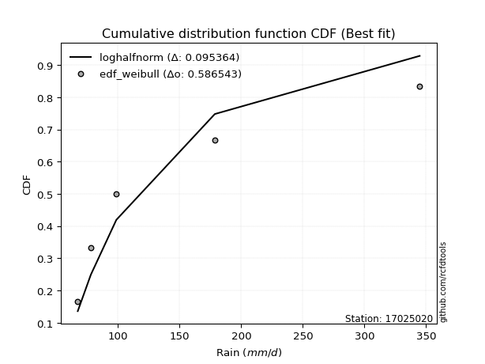</img></img>

</div>


### 4. EDF Beard (1943)

The Beard formula (or Beard´s plotting position formula) in hydrology is used to estimate the empirical non-exceedance probability _(P)_ of a flood event (or other extreme hydrological data point) within a given dataset.

<div align="center">


$P=(m-0.31)/(n+0.38)$


</div>


**4.1. Empirical values**

<div align="center">

|                | 0                   | 1                  | 2         | 3                  | 4                  |
|:---------------|:--------------------|:-------------------|:----------|:-------------------|:-------------------|
| date           | 2022                | 2021               | 2023      | 2024               | 2025               |
| x              | 67.4                | 78.0               | 98.7      | 178.6              | 344.8              |
| m              | 1                   | 2                  | 3         | 4                  | 5                  |
| empirical_dist | edf_beard           | edf_beard          | edf_beard | edf_beard          | edf_beard          |
| empirical      | 0.12825278810408922 | 0.3141263940520446 | 0.5       | 0.6858736059479554 | 0.8717472118959109 |
| empirical_tr   | 1.1471215351812367  | 1.4579945799457996 | 2.0       | 3.183431952662722  | 7.797101449275368  |

</div>


**4.2. Kolmogorov-Smirnov fit test (sorted by Δ)**


<div align="center">

|                | 0                   | 1                  | 2                   | 3                   | 4                   | 5                   | 6                   | 7                   | 8                   | 9                   | 10                  | 11                  | 12                 | 13                  | 14                  | 15                  | 16                  | 17                  | 18                  | 19                 | 20                  | 21                  | 22                  | 23                  | 24                  | 25                 | 26                  | 27                  | 28                  | 29                  | 30                 | 31                 | 32                  | 33                 | 34                  | 35                  | 36                  | 37                  | 38                  | 39                  | 40                  | 41                  | 42                  | 43                 | 44                 | 45                 | 46                  | 47                  | 48                  | 49                 | 50                  | 51                  | 52                  | 53                  | 54                  | 55                  | 56                 | 57                  | 58                  | 59                  | 60                  | 61                  | 62                  | 63                 | 64                  | 65                  | 66                  | 67                  | 68                  | 69                 | 70                 | 71                 | 72                  | 73                  | 74                  | 75                  | 76                  | 77                 | 78                 | 79                  | 80                 | 81                 | 82                  | 83                 | 84                  | 85                 | 86                  | 87                  | 88                  | 89                  | 90                 | 91                  | 92                  | 93                  | 94                 | 95                 | 96                 | 97                 | 98                  | 99                 | 100                 | 101                 | 102                 | 103                | 104                 | 105                | 106                 | 107                 | 108                 | 109                 | 110                 | 111                | 112                | 113                 | 114                 | 115                 | 116                 | 117                | 118                | 119                | 120                | 121                | 122                | 123                 | 124                | 125                | 126                | 127                | 128                | 129                 | 130                | 131                | 132                | 133                 | 134                 | 135                | 136                 | 137                 | 138                 | 139                 | 140                | 141                | 142                 | 143                 | 144                | 145                | 146                 | 147                | 148                | 149                | 150                | 151                | 152                | 153                | 154                | 155                | 156                | 157                | 158                | 159                |
|:---------------|:--------------------|:-------------------|:--------------------|:--------------------|:--------------------|:--------------------|:--------------------|:--------------------|:--------------------|:--------------------|:--------------------|:--------------------|:-------------------|:--------------------|:--------------------|:--------------------|:--------------------|:--------------------|:--------------------|:-------------------|:--------------------|:--------------------|:--------------------|:--------------------|:--------------------|:-------------------|:--------------------|:--------------------|:--------------------|:--------------------|:-------------------|:-------------------|:--------------------|:-------------------|:--------------------|:--------------------|:--------------------|:--------------------|:--------------------|:--------------------|:--------------------|:--------------------|:--------------------|:-------------------|:-------------------|:-------------------|:--------------------|:--------------------|:--------------------|:-------------------|:--------------------|:--------------------|:--------------------|:--------------------|:--------------------|:--------------------|:-------------------|:--------------------|:--------------------|:--------------------|:--------------------|:--------------------|:--------------------|:-------------------|:--------------------|:--------------------|:--------------------|:--------------------|:--------------------|:-------------------|:-------------------|:-------------------|:--------------------|:--------------------|:--------------------|:--------------------|:--------------------|:-------------------|:-------------------|:--------------------|:-------------------|:-------------------|:--------------------|:-------------------|:--------------------|:-------------------|:--------------------|:--------------------|:--------------------|:--------------------|:-------------------|:--------------------|:--------------------|:--------------------|:-------------------|:-------------------|:-------------------|:-------------------|:--------------------|:-------------------|:--------------------|:--------------------|:--------------------|:-------------------|:--------------------|:-------------------|:--------------------|:--------------------|:--------------------|:--------------------|:--------------------|:-------------------|:-------------------|:--------------------|:--------------------|:--------------------|:--------------------|:-------------------|:-------------------|:-------------------|:-------------------|:-------------------|:-------------------|:--------------------|:-------------------|:-------------------|:-------------------|:-------------------|:-------------------|:--------------------|:-------------------|:-------------------|:-------------------|:--------------------|:--------------------|:-------------------|:--------------------|:--------------------|:--------------------|:--------------------|:-------------------|:-------------------|:--------------------|:--------------------|:-------------------|:-------------------|:--------------------|:-------------------|:-------------------|:-------------------|:-------------------|:-------------------|:-------------------|:-------------------|:-------------------|:-------------------|:-------------------|:-------------------|:-------------------|:-------------------|
| station        | 17025020            | 17025020           | 17025020            | 17025020            | 17025020            | 17025020            | 17025020            | 17025020            | 17025020            | 17025020            | 17025020            | 17025020            | 17025020           | 17025020            | 17025020            | 17025020            | 17025020            | 17025020            | 17025020            | 17025020           | 17025020            | 17025020            | 17025020            | 17025020            | 17025020            | 17025020           | 17025020            | 17025020            | 17025020            | 17025020            | 17025020           | 17025020           | 17025020            | 17025020           | 17025020            | 17025020            | 17025020            | 17025020            | 17025020            | 17025020            | 17025020            | 17025020            | 17025020            | 17025020           | 17025020           | 17025020           | 17025020            | 17025020            | 17025020            | 17025020           | 17025020            | 17025020            | 17025020            | 17025020            | 17025020            | 17025020            | 17025020           | 17025020            | 17025020            | 17025020            | 17025020            | 17025020            | 17025020            | 17025020           | 17025020            | 17025020            | 17025020            | 17025020            | 17025020            | 17025020           | 17025020           | 17025020           | 17025020            | 17025020            | 17025020            | 17025020            | 17025020            | 17025020           | 17025020           | 17025020            | 17025020           | 17025020           | 17025020            | 17025020           | 17025020            | 17025020           | 17025020            | 17025020            | 17025020            | 17025020            | 17025020           | 17025020            | 17025020            | 17025020            | 17025020           | 17025020           | 17025020           | 17025020           | 17025020            | 17025020           | 17025020            | 17025020            | 17025020            | 17025020           | 17025020            | 17025020           | 17025020            | 17025020            | 17025020            | 17025020            | 17025020            | 17025020           | 17025020           | 17025020            | 17025020            | 17025020            | 17025020            | 17025020           | 17025020           | 17025020           | 17025020           | 17025020           | 17025020           | 17025020            | 17025020           | 17025020           | 17025020           | 17025020           | 17025020           | 17025020            | 17025020           | 17025020           | 17025020           | 17025020            | 17025020            | 17025020           | 17025020            | 17025020            | 17025020            | 17025020            | 17025020           | 17025020           | 17025020            | 17025020            | 17025020           | 17025020           | 17025020            | 17025020           | 17025020           | 17025020           | 17025020           | 17025020           | 17025020           | 17025020           | 17025020           | 17025020           | 17025020           | 17025020           | 17025020           | 17025020           |
| empirical_dist | edf_beard           | edf_beard          | edf_beard           | edf_beard           | edf_beard           | edf_beard           | edf_beard           | edf_beard           | edf_beard           | edf_beard           | edf_beard           | edf_beard           | edf_beard          | edf_beard           | edf_beard           | edf_beard           | edf_beard           | edf_beard           | edf_beard           | edf_beard          | edf_beard           | edf_beard           | edf_beard           | edf_beard           | edf_beard           | edf_beard          | edf_beard           | edf_beard           | edf_beard           | edf_beard           | edf_beard          | edf_beard          | edf_beard           | edf_beard          | edf_beard           | edf_beard           | edf_beard           | edf_beard           | edf_beard           | edf_beard           | edf_beard           | edf_beard           | edf_beard           | edf_beard          | edf_beard          | edf_beard          | edf_beard           | edf_beard           | edf_beard           | edf_beard          | edf_beard           | edf_beard           | edf_beard           | edf_beard           | edf_beard           | edf_beard           | edf_beard          | edf_beard           | edf_beard           | edf_beard           | edf_beard           | edf_beard           | edf_beard           | edf_beard          | edf_beard           | edf_beard           | edf_beard           | edf_beard           | edf_beard           | edf_beard          | edf_beard          | edf_beard          | edf_beard           | edf_beard           | edf_beard           | edf_beard           | edf_beard           | edf_beard          | edf_beard          | edf_beard           | edf_beard          | edf_beard          | edf_beard           | edf_beard          | edf_beard           | edf_beard          | edf_beard           | edf_beard           | edf_beard           | edf_beard           | edf_beard          | edf_beard           | edf_beard           | edf_beard           | edf_beard          | edf_beard          | edf_beard          | edf_beard          | edf_beard           | edf_beard          | edf_beard           | edf_beard           | edf_beard           | edf_beard          | edf_beard           | edf_beard          | edf_beard           | edf_beard           | edf_beard           | edf_beard           | edf_beard           | edf_beard          | edf_beard          | edf_beard           | edf_beard           | edf_beard           | edf_beard           | edf_beard          | edf_beard          | edf_beard          | edf_beard          | edf_beard          | edf_beard          | edf_beard           | edf_beard          | edf_beard          | edf_beard          | edf_beard          | edf_beard          | edf_beard           | edf_beard          | edf_beard          | edf_beard          | edf_beard           | edf_beard           | edf_beard          | edf_beard           | edf_beard           | edf_beard           | edf_beard           | edf_beard          | edf_beard          | edf_beard           | edf_beard           | edf_beard          | edf_beard          | edf_beard           | edf_beard          | edf_beard          | edf_beard          | edf_beard          | edf_beard          | edf_beard          | edf_beard          | edf_beard          | edf_beard          | edf_beard          | edf_beard          | edf_beard          | edf_beard          |
| p_dist         | loghalfnorm         | logalpha           | loghalflogistic     | logfoldnorm         | f                   | invgamma            | loginvweibull       | loggenextreme       | burr                | loggenlogistic      | loggumbel_r         | logmielke           | logburr            | burr12              | loginvgamma         | logburr12           | lograyleigh         | logmoyal            | nct                 | dgamma             | logksone            | logdgamma           | logkstwobign        | loginvgauss         | logpearson3         | logmaxwell         | logexponnorm        | nakagami            | gengamma            | exponweib           | exponpow           | loggenexpon        | logweibull_min      | weibull_min        | loglomax            | loggompertz         | logarcsine          | logsemicircular     | lognct              | foldnorm            | invgauss            | halfgennorm         | halfnorm            | loghalfgennorm     | halflogistic       | alpha              | vonmises_line       | betaprime           | loganglit           | ncf                | logdweibull         | dweibull            | logf                | logbetaprime        | logncf              | truncexpon          | logwrapcauchy      | logloggamma         | logt                | lognorm             | logcrystalball      | pearson3            | logtruncnorm        | moyal              | rayleigh            | logrice             | logloglaplace       | semicircular        | loggennorm          | gumbel_r           | arcsine            | gausshyper         | maxwell             | loglogistic         | bradford            | anglit              | logskewnorm         | wald               | logtruncexpon      | gennorm             | genlogistic        | logcosine          | loghypsecant        | logbradford        | exponnorm           | genexpon           | logweibull_max      | truncweibull_min    | norm                | t                   | logrdist           | gamma               | kstwobign           | loggumbel_l         | loglaplace         | loglaplace         | loglevy_l          | logistic           | genextreme          | loggausshyper      | wrapcauchy          | erlang              | logkappa4           | truncnorm          | hypsecant           | logargus           | rice                | cosine              | lomax               | logwald             | levy_l              | gumbel_l           | logtukeylambda     | logtriang           | laplace             | loguniform          | logkappa3           | logvonmises_line   | logtruncpareto     | loggenpareto       | argus              | logexponweib       | triang             | tukeylambda         | genpareto          | skewnorm           | logexponpow        | ksone              | gompertz           | fatiguelife         | logbeta            | loggenhalflogistic | invweibull         | truncpareto         | logtruncweibull_min | kappa4             | lognakagami         | powerlaw            | uniform             | kappa3              | beta               | logfatiguelife     | genhalflogistic     | logtrapezoid        | logpowerlaw        | rdist              | loggengamma         | loggamma           | loggamma           | logerlang          | trapezoid          | logjohnsonsb       | crystalball        | johnsonsb          | weibull_max        | logjohnsonsu       | johnsonsu          | logvonmises        | vonmises           | mielke             |
| delta          | 0.08066840010344839 | 0.0863727859703517 | 0.09132771005903609 | 0.10244811634891082 | 0.10320792363822762 | 0.10320805941034472 | 0.10680617168827578 | 0.10681161197093159 | 0.10702396546545279 | 0.10708199613460681 | 0.11192046975846032 | 0.11242939349966408 | 0.112899029644843  | 0.11378742686406555 | 0.11413154098002576 | 0.11414415807870802 | 0.11470010637079975 | 0.11540281161126004 | 0.11613620327608754 | 0.117136706431295  | 0.11755405014849463 | 0.11840632627624781 | 0.11950932030682554 | 0.12472237107204986 | 0.12555625001926085 | 0.1266576802487136 | 0.12740716138624206 | 0.12823954672712712 | 0.12825180118141982 | 0.12825180801357958 | 0.1282526428372471 | 0.1282527856649944 | 0.12825278757268146 | 0.1282527878349428 | 0.12825278809585874 | 0.12825278809987653 | 0.12825278810408913 | 0.12872061613328972 | 0.12956912029562678 | 0.13070302233533204 | 0.13106109329391302 | 0.13135482540976773 | 0.13260694166468678 | 0.1336435752892905 | 0.1348040714175417 | 0.1349630647292258 | 0.13543939370755143 | 0.13660983178499253 | 0.13740999110716845 | 0.137644502664041  | 0.13842047931829182 | 0.14413792532497777 | 0.14420496295800422 | 0.14500256010499413 | 0.14630616286974168 | 0.15128912314197832 | 0.1547865169606627 | 0.15570061354796172 | 0.15807041511277697 | 0.15807649025529247 | 0.15807649739448737 | 0.15892559732415923 | 0.15900818054724408 | 0.1604998314455146 | 0.16353606960987122 | 0.16371610177541374 | 0.16509094776455857 | 0.16687857962493113 | 0.16778508635435785 | 0.1700338871397084 | 0.1710967010675937 | 0.1742003014770232 | 0.17448824977449678 | 0.17669267577720837 | 0.17711688855404556 | 0.17741063459624484 | 0.18074226713111818 | 0.1814737067349719 | 0.182119774423248  | 0.18471339555647381 | 0.187260877383017  | 0.1889671951324573 | 0.19099535470706247 | 0.1956827286769074 | 0.19721292076871771 | 0.1982904551228838 | 0.19856855757048508 | 0.19870581932787346 | 0.20213627446696886 | 0.20214191833471984 | 0.2049543537750192 | 0.20615568325379097 | 0.21410944292139195 | 0.21674197089886532 | 0.2188992296761612 | 0.2188992296761612 | 0.2231458042613749 | 0.2235859929738137 | 0.22958764570264278 | 0.2313206060627866 | 0.23230013479827344 | 0.23481961286724473 | 0.23625006695774525 | 0.2386677092264204 | 0.23901750416901085 | 0.2393805660485505 | 0.24355071749817708 | 0.24375633182585665 | 0.24432120213850594 | 0.24831705355019645 | 0.25241250591481956 | 0.2525308227715709 | 0.2605176385859025 | 0.26221811948213003 | 0.26389170847057397 | 0.26632030454578204 | 0.26633083235100574 | 0.2713442058810417 | 0.2717239938163876 | 0.2870533226056641 | 0.2878522150222782 | 0.300245582285873  | 0.3006981946342473 | 0.31412639405203746 | 0.3157828078527247 | 0.315941875597854  | 0.3193155291264494 | 0.3226387887527037 | 0.3313326158555773 | 0.33302797037095716 | 0.3368694752360766 | 0.3405457002030935 | 0.3486969482949904 | 0.36005332566720044 | 0.3630705974990955  | 0.363092495268865  | 0.36370828590823884 | 0.37517927624361963 | 0.38716654650324445 | 0.38946466037726574 | 0.3920161262392994 | 0.3953736507491505 | 0.40565526007849395 | 0.42267907002887517 | 0.4227787925489212 | 0.4373180197372605 | 0.45372550933249883 | 0.503245003104259  | 0.503245003104259  | 0.5115513080360878 | 0.5116611579126432 | 0.5145236974098415 | 0.5146445493089405 | 0.5706939091679935 | 0.5930724161508399 | 0.6112334538064037 | 0.6513929431010572 | 1.0824174505204331 | 55.00832891186146  | nan                |
| deltao         | 0.5865427407550001  | 0.5865427407550001 | 0.5865427407550001  | 0.5865427407550001  | 0.5865427407550001  | 0.5865427407550001  | 0.5865427407550001  | 0.5865427407550001  | 0.5865427407550001  | 0.5865427407550001  | 0.5865427407550001  | 0.5865427407550001  | 0.5865427407550001 | 0.5865427407550001  | 0.5865427407550001  | 0.5865427407550001  | 0.5865427407550001  | 0.5865427407550001  | 0.5865427407550001  | 0.5865427407550001 | 0.5865427407550001  | 0.5865427407550001  | 0.5865427407550001  | 0.5865427407550001  | 0.5865427407550001  | 0.5865427407550001 | 0.5865427407550001  | 0.5865427407550001  | 0.5865427407550001  | 0.5865427407550001  | 0.5865427407550001 | 0.5865427407550001 | 0.5865427407550001  | 0.5865427407550001 | 0.5865427407550001  | 0.5865427407550001  | 0.5865427407550001  | 0.5865427407550001  | 0.5865427407550001  | 0.5865427407550001  | 0.5865427407550001  | 0.5865427407550001  | 0.5865427407550001  | 0.5865427407550001 | 0.5865427407550001 | 0.5865427407550001 | 0.5865427407550001  | 0.5865427407550001  | 0.5865427407550001  | 0.5865427407550001 | 0.5865427407550001  | 0.5865427407550001  | 0.5865427407550001  | 0.5865427407550001  | 0.5865427407550001  | 0.5865427407550001  | 0.5865427407550001 | 0.5865427407550001  | 0.5865427407550001  | 0.5865427407550001  | 0.5865427407550001  | 0.5865427407550001  | 0.5865427407550001  | 0.5865427407550001 | 0.5865427407550001  | 0.5865427407550001  | 0.5865427407550001  | 0.5865427407550001  | 0.5865427407550001  | 0.5865427407550001 | 0.5865427407550001 | 0.5865427407550001 | 0.5865427407550001  | 0.5865427407550001  | 0.5865427407550001  | 0.5865427407550001  | 0.5865427407550001  | 0.5865427407550001 | 0.5865427407550001 | 0.5865427407550001  | 0.5865427407550001 | 0.5865427407550001 | 0.5865427407550001  | 0.5865427407550001 | 0.5865427407550001  | 0.5865427407550001 | 0.5865427407550001  | 0.5865427407550001  | 0.5865427407550001  | 0.5865427407550001  | 0.5865427407550001 | 0.5865427407550001  | 0.5865427407550001  | 0.5865427407550001  | 0.5865427407550001 | 0.5865427407550001 | 0.5865427407550001 | 0.5865427407550001 | 0.5865427407550001  | 0.5865427407550001 | 0.5865427407550001  | 0.5865427407550001  | 0.5865427407550001  | 0.5865427407550001 | 0.5865427407550001  | 0.5865427407550001 | 0.5865427407550001  | 0.5865427407550001  | 0.5865427407550001  | 0.5865427407550001  | 0.5865427407550001  | 0.5865427407550001 | 0.5865427407550001 | 0.5865427407550001  | 0.5865427407550001  | 0.5865427407550001  | 0.5865427407550001  | 0.5865427407550001 | 0.5865427407550001 | 0.5865427407550001 | 0.5865427407550001 | 0.5865427407550001 | 0.5865427407550001 | 0.5865427407550001  | 0.5865427407550001 | 0.5865427407550001 | 0.5865427407550001 | 0.5865427407550001 | 0.5865427407550001 | 0.5865427407550001  | 0.5865427407550001 | 0.5865427407550001 | 0.5865427407550001 | 0.5865427407550001  | 0.5865427407550001  | 0.5865427407550001 | 0.5865427407550001  | 0.5865427407550001  | 0.5865427407550001  | 0.5865427407550001  | 0.5865427407550001 | 0.5865427407550001 | 0.5865427407550001  | 0.5865427407550001  | 0.5865427407550001 | 0.5865427407550001 | 0.5865427407550001  | 0.5865427407550001 | 0.5865427407550001 | 0.5865427407550001 | 0.5865427407550001 | 0.5865427407550001 | 0.5865427407550001 | 0.5865427407550001 | 0.5865427407550001 | 0.5865427407550001 | 0.5865427407550001 | 0.5865427407550001 | 0.5865427407550001 | 0.5865427407550001 |
| eval           | Δo > Δ              | Δo > Δ             | Δo > Δ              | Δo > Δ              | Δo > Δ              | Δo > Δ              | Δo > Δ              | Δo > Δ              | Δo > Δ              | Δo > Δ              | Δo > Δ              | Δo > Δ              | Δo > Δ             | Δo > Δ              | Δo > Δ              | Δo > Δ              | Δo > Δ              | Δo > Δ              | Δo > Δ              | Δo > Δ             | Δo > Δ              | Δo > Δ              | Δo > Δ              | Δo > Δ              | Δo > Δ              | Δo > Δ             | Δo > Δ              | Δo > Δ              | Δo > Δ              | Δo > Δ              | Δo > Δ             | Δo > Δ             | Δo > Δ              | Δo > Δ             | Δo > Δ              | Δo > Δ              | Δo > Δ              | Δo > Δ              | Δo > Δ              | Δo > Δ              | Δo > Δ              | Δo > Δ              | Δo > Δ              | Δo > Δ             | Δo > Δ             | Δo > Δ             | Δo > Δ              | Δo > Δ              | Δo > Δ              | Δo > Δ             | Δo > Δ              | Δo > Δ              | Δo > Δ              | Δo > Δ              | Δo > Δ              | Δo > Δ              | Δo > Δ             | Δo > Δ              | Δo > Δ              | Δo > Δ              | Δo > Δ              | Δo > Δ              | Δo > Δ              | Δo > Δ             | Δo > Δ              | Δo > Δ              | Δo > Δ              | Δo > Δ              | Δo > Δ              | Δo > Δ             | Δo > Δ             | Δo > Δ             | Δo > Δ              | Δo > Δ              | Δo > Δ              | Δo > Δ              | Δo > Δ              | Δo > Δ             | Δo > Δ             | Δo > Δ              | Δo > Δ             | Δo > Δ             | Δo > Δ              | Δo > Δ             | Δo > Δ              | Δo > Δ             | Δo > Δ              | Δo > Δ              | Δo > Δ              | Δo > Δ              | Δo > Δ             | Δo > Δ              | Δo > Δ              | Δo > Δ              | Δo > Δ             | Δo > Δ             | Δo > Δ             | Δo > Δ             | Δo > Δ              | Δo > Δ             | Δo > Δ              | Δo > Δ              | Δo > Δ              | Δo > Δ             | Δo > Δ              | Δo > Δ             | Δo > Δ              | Δo > Δ              | Δo > Δ              | Δo > Δ              | Δo > Δ              | Δo > Δ             | Δo > Δ             | Δo > Δ              | Δo > Δ              | Δo > Δ              | Δo > Δ              | Δo > Δ             | Δo > Δ             | Δo > Δ             | Δo > Δ             | Δo > Δ             | Δo > Δ             | Δo > Δ              | Δo > Δ             | Δo > Δ             | Δo > Δ             | Δo > Δ             | Δo > Δ             | Δo > Δ              | Δo > Δ             | Δo > Δ             | Δo > Δ             | Δo > Δ              | Δo > Δ              | Δo > Δ             | Δo > Δ              | Δo > Δ              | Δo > Δ              | Δo > Δ              | Δo > Δ             | Δo > Δ             | Δo > Δ              | Δo > Δ              | Δo > Δ             | Δo > Δ             | Δo > Δ              | Δo > Δ             | Δo > Δ             | Δo > Δ             | Δo > Δ             | Δo > Δ             | Δo > Δ             | Δo > Δ             | Δo <= Δ            | Δo <= Δ            | Δo <= Δ            | Δo <= Δ            | Δo <= Δ            | Δo <= Δ            |
| fit            | 1                   | 1                  | 1                   | 1                   | 1                   | 1                   | 1                   | 1                   | 1                   | 1                   | 1                   | 1                   | 1                  | 1                   | 1                   | 1                   | 1                   | 1                   | 1                   | 1                  | 1                   | 1                   | 1                   | 1                   | 1                   | 1                  | 1                   | 1                   | 1                   | 1                   | 1                  | 1                  | 1                   | 1                  | 1                   | 1                   | 1                   | 1                   | 1                   | 1                   | 1                   | 1                   | 1                   | 1                  | 1                  | 1                  | 1                   | 1                   | 1                   | 1                  | 1                   | 1                   | 1                   | 1                   | 1                   | 1                   | 1                  | 1                   | 1                   | 1                   | 1                   | 1                   | 1                   | 1                  | 1                   | 1                   | 1                   | 1                   | 1                   | 1                  | 1                  | 1                  | 1                   | 1                   | 1                   | 1                   | 1                   | 1                  | 1                  | 1                   | 1                  | 1                  | 1                   | 1                  | 1                   | 1                  | 1                   | 1                   | 1                   | 1                   | 1                  | 1                   | 1                   | 1                   | 1                  | 1                  | 1                  | 1                  | 1                   | 1                  | 1                   | 1                   | 1                   | 1                  | 1                   | 1                  | 1                   | 1                   | 1                   | 1                   | 1                   | 1                  | 1                  | 1                   | 1                   | 1                   | 1                   | 1                  | 1                  | 1                  | 1                  | 1                  | 1                  | 1                   | 1                  | 1                  | 1                  | 1                  | 1                  | 1                   | 1                  | 1                  | 1                  | 1                   | 1                   | 1                  | 1                   | 1                   | 1                   | 1                   | 1                  | 1                  | 1                   | 1                   | 1                  | 1                  | 1                   | 1                  | 1                  | 1                  | 1                  | 1                  | 1                  | 1                  | 0                  | 0                  | 0                  | 0                  | 0                  | 0                  |
| n              | 5                   | 5                  | 5                   | 5                   | 5                   | 5                   | 5                   | 5                   | 5                   | 5                   | 5                   | 5                   | 5                  | 5                   | 5                   | 5                   | 5                   | 5                   | 5                   | 5                  | 5                   | 5                   | 5                   | 5                   | 5                   | 5                  | 5                   | 5                   | 5                   | 5                   | 5                  | 5                  | 5                   | 5                  | 5                   | 5                   | 5                   | 5                   | 5                   | 5                   | 5                   | 5                   | 5                   | 5                  | 5                  | 5                  | 5                   | 5                   | 5                   | 5                  | 5                   | 5                   | 5                   | 5                   | 5                   | 5                   | 5                  | 5                   | 5                   | 5                   | 5                   | 5                   | 5                   | 5                  | 5                   | 5                   | 5                   | 5                   | 5                   | 5                  | 5                  | 5                  | 5                   | 5                   | 5                   | 5                   | 5                   | 5                  | 5                  | 5                   | 5                  | 5                  | 5                   | 5                  | 5                   | 5                  | 5                   | 5                   | 5                   | 5                   | 5                  | 5                   | 5                   | 5                   | 5                  | 5                  | 5                  | 5                  | 5                   | 5                  | 5                   | 5                   | 5                   | 5                  | 5                   | 5                  | 5                   | 5                   | 5                   | 5                   | 5                   | 5                  | 5                  | 5                   | 5                   | 5                   | 5                   | 5                  | 5                  | 5                  | 5                  | 5                  | 5                  | 5                   | 5                  | 5                  | 5                  | 5                  | 5                  | 5                   | 5                  | 5                  | 5                  | 5                   | 5                   | 5                  | 5                   | 5                   | 5                   | 5                   | 5                  | 5                  | 5                   | 5                   | 5                  | 5                  | 5                   | 5                  | 5                  | 5                  | 5                  | 5                  | 5                  | 5                  | 5                  | 5                  | 5                  | 5                  | 5                  | 5                  |
| best_fit       | 1                   | 0                  | 0                   | 0                   | 0                   | 0                   | 0                   | 0                   | 0                   | 0                   | 0                   | 0                   | 0                  | 0                   | 0                   | 0                   | 0                   | 0                   | 0                   | 0                  | 0                   | 0                   | 0                   | 0                   | 0                   | 0                  | 0                   | 0                   | 0                   | 0                   | 0                  | 0                  | 0                   | 0                  | 0                   | 0                   | 0                   | 0                   | 0                   | 0                   | 0                   | 0                   | 0                   | 0                  | 0                  | 0                  | 0                   | 0                   | 0                   | 0                  | 0                   | 0                   | 0                   | 0                   | 0                   | 0                   | 0                  | 0                   | 0                   | 0                   | 0                   | 0                   | 0                   | 0                  | 0                   | 0                   | 0                   | 0                   | 0                   | 0                  | 0                  | 0                  | 0                   | 0                   | 0                   | 0                   | 0                   | 0                  | 0                  | 0                   | 0                  | 0                  | 0                   | 0                  | 0                   | 0                  | 0                   | 0                   | 0                   | 0                   | 0                  | 0                   | 0                   | 0                   | 0                  | 0                  | 0                  | 0                  | 0                   | 0                  | 0                   | 0                   | 0                   | 0                  | 0                   | 0                  | 0                   | 0                   | 0                   | 0                   | 0                   | 0                  | 0                  | 0                   | 0                   | 0                   | 0                   | 0                  | 0                  | 0                  | 0                  | 0                  | 0                  | 0                   | 0                  | 0                  | 0                  | 0                  | 0                  | 0                   | 0                  | 0                  | 0                  | 0                   | 0                   | 0                  | 0                   | 0                   | 0                   | 0                   | 0                  | 0                  | 0                   | 0                   | 0                  | 0                  | 0                   | 0                  | 0                  | 0                  | 0                  | 0                  | 0                  | 0                  | 0                  | 0                  | 0                  | 0                  | 0                  | 0                  |
| best_fit_sort  | 1                   | 2                  | 3                   | 4                   | 5                   | 6                   | 7                   | 8                   | 9                   | 10                  | 11                  | 12                  | 13                 | 14                  | 15                  | 16                  | 17                  | 18                  | 19                  | 20                 | 21                  | 22                  | 23                  | 24                  | 25                  | 26                 | 27                  | 28                  | 29                  | 30                  | 31                 | 32                 | 33                  | 34                 | 35                  | 36                  | 37                  | 38                  | 39                  | 40                  | 41                  | 42                  | 43                  | 44                 | 45                 | 46                 | 47                  | 48                  | 49                  | 50                 | 51                  | 52                  | 53                  | 54                  | 55                  | 56                  | 57                 | 58                  | 59                  | 60                  | 61                  | 62                  | 63                  | 64                 | 65                  | 66                  | 67                  | 68                  | 69                  | 70                 | 71                 | 72                 | 73                  | 74                  | 75                  | 76                  | 77                  | 78                 | 79                 | 80                  | 81                 | 82                 | 83                  | 84                 | 85                  | 86                 | 87                  | 88                  | 89                  | 90                  | 91                 | 92                  | 93                  | 94                  | 95                 | 96                 | 97                 | 98                 | 99                  | 100                | 101                 | 102                 | 103                 | 104                | 105                 | 106                | 107                 | 108                 | 109                 | 110                 | 111                 | 112                | 113                | 114                 | 115                 | 116                 | 117                 | 118                | 119                | 120                | 121                | 122                | 123                | 124                 | 125                | 126                | 127                | 128                | 129                | 130                 | 131                | 132                | 133                | 134                 | 135                 | 136                | 137                 | 138                 | 139                 | 140                 | 141                | 142                | 143                 | 144                 | 145                | 146                | 147                 | 148                | 149                | 150                | 151                | 152                | 153                | 154                | 155                | 156                | 157                | 158                | 159                | 160                |

</div>


**4.3. Best fit**

<div align="center">

|   id |   station | empirical_dist   | p_dist      |     delta |   deltao | eval   |   fit |   n |   best_fit |   best_fit_sort |
|-----:|----------:|:-----------------|:------------|----------:|---------:|:-------|------:|----:|-----------:|----------------:|
|    0 |  17025020 | edf_beard        | loghalfnorm | 0.0806684 | 0.586543 | Δo > Δ |     1 |   5 |          1 |               1 |

</div>


<div align="center">

</img></img>

</div>


### 5. EDF Chegodayev (1955)

The Chegodayev formula is an empirical plotting position formula used in hydrological frequency analysis to estimate the exceedance probability or return period of a specific event from a set of observed data. It is primarily used for plotting observed data points on probability paper to fit a theoretical distribution, particularly for analyzing extreme events like maximum flood flows or rainfall intensities. The constant _b_ value in the generalized plotting position formula is 0.3.

<div align="center">


$P=(m-b)/(n+1-2b)$


</div>


**5.1. Empirical values**

<div align="center">

|                | 0                   | 1                   | 2              | 3                  | 4                  |
|:---------------|:--------------------|:--------------------|:---------------|:-------------------|:-------------------|
| date           | 2022                | 2021                | 2023           | 2024               | 2025               |
| x              | 67.4                | 78.0                | 98.7           | 178.6              | 344.8              |
| m              | 1                   | 2                   | 3              | 4                  | 5                  |
| empirical_dist | edf_chegodayev      | edf_chegodayev      | edf_chegodayev | edf_chegodayev     | edf_chegodayev     |
| empirical      | 0.12962962962962962 | 0.31481481481481477 | 0.5            | 0.6851851851851851 | 0.8703703703703703 |
| empirical_tr   | 1.148936170212766   | 1.4594594594594594  | 2.0            | 3.1764705882352935 | 7.714285714285713  |

</div>


**5.2. Kolmogorov-Smirnov fit test (sorted by Δ)**


<div align="center">

|                | 0                   | 1                   | 2                   | 3                   | 4                   | 5                   | 6                   | 7                  | 8                   | 9                   | 10                  | 11                  | 12                  | 13                  | 14                  | 15                  | 16                  | 17                 | 18                  | 19                  | 20                  | 21                 | 22                  | 23                  | 24                  | 25                 | 26                  | 27                  | 28                  | 29                  | 30                  | 31                  | 32                 | 33                 | 34                  | 35                 | 36                  | 37                  | 38                  | 39                  | 40                  | 41                  | 42                  | 43                  | 44                 | 45                  | 46                  | 47                  | 48                  | 49                 | 50                 | 51                  | 52                  | 53                  | 54                  | 55                 | 56                 | 57                  | 58                  | 59                  | 60                  | 61                  | 62                 | 63                 | 64                  | 65                  | 66                  | 67                  | 68                  | 69                 | 70                 | 71                 | 72                  | 73                 | 74                  | 75                  | 76                  | 77                  | 78                  | 79                  | 80                 | 81                 | 82                  | 83                 | 84                  | 85                  | 86                  | 87                  | 88                  | 89                  | 90                 | 91                  | 92                  | 93                  | 94                 | 95                 | 96                 | 97                 | 98                  | 99                 | 100                 | 101                 | 102                 | 103                | 104                 | 105                | 106                 | 107                 | 108                 | 109                | 110                 | 111                | 112                | 113                 | 114                 | 115                 | 116                 | 117                | 118                | 119                 | 120                | 121                 | 122                | 123                | 124                | 125                | 126                 | 127                | 128                | 129                | 130                 | 131                | 132                | 133                | 134                 | 135                | 136                | 137                | 138                 | 139                 | 140                 | 141                 | 142                 | 143                 | 144                 | 145                 | 146                | 147                | 148                | 149                | 150                | 151                | 152                | 153                | 154                | 155                | 156                | 157                | 158                | 159                |
|:---------------|:--------------------|:--------------------|:--------------------|:--------------------|:--------------------|:--------------------|:--------------------|:-------------------|:--------------------|:--------------------|:--------------------|:--------------------|:--------------------|:--------------------|:--------------------|:--------------------|:--------------------|:-------------------|:--------------------|:--------------------|:--------------------|:-------------------|:--------------------|:--------------------|:--------------------|:-------------------|:--------------------|:--------------------|:--------------------|:--------------------|:--------------------|:--------------------|:-------------------|:-------------------|:--------------------|:-------------------|:--------------------|:--------------------|:--------------------|:--------------------|:--------------------|:--------------------|:--------------------|:--------------------|:-------------------|:--------------------|:--------------------|:--------------------|:--------------------|:-------------------|:-------------------|:--------------------|:--------------------|:--------------------|:--------------------|:-------------------|:-------------------|:--------------------|:--------------------|:--------------------|:--------------------|:--------------------|:-------------------|:-------------------|:--------------------|:--------------------|:--------------------|:--------------------|:--------------------|:-------------------|:-------------------|:-------------------|:--------------------|:-------------------|:--------------------|:--------------------|:--------------------|:--------------------|:--------------------|:--------------------|:-------------------|:-------------------|:--------------------|:-------------------|:--------------------|:--------------------|:--------------------|:--------------------|:--------------------|:--------------------|:-------------------|:--------------------|:--------------------|:--------------------|:-------------------|:-------------------|:-------------------|:-------------------|:--------------------|:-------------------|:--------------------|:--------------------|:--------------------|:-------------------|:--------------------|:-------------------|:--------------------|:--------------------|:--------------------|:-------------------|:--------------------|:-------------------|:-------------------|:--------------------|:--------------------|:--------------------|:--------------------|:-------------------|:-------------------|:--------------------|:-------------------|:--------------------|:-------------------|:-------------------|:-------------------|:-------------------|:--------------------|:-------------------|:-------------------|:-------------------|:--------------------|:-------------------|:-------------------|:-------------------|:--------------------|:-------------------|:-------------------|:-------------------|:--------------------|:--------------------|:--------------------|:--------------------|:--------------------|:--------------------|:--------------------|:--------------------|:-------------------|:-------------------|:-------------------|:-------------------|:-------------------|:-------------------|:-------------------|:-------------------|:-------------------|:-------------------|:-------------------|:-------------------|:-------------------|:-------------------|
| station        | 17025020            | 17025020            | 17025020            | 17025020            | 17025020            | 17025020            | 17025020            | 17025020           | 17025020            | 17025020            | 17025020            | 17025020            | 17025020            | 17025020            | 17025020            | 17025020            | 17025020            | 17025020           | 17025020            | 17025020            | 17025020            | 17025020           | 17025020            | 17025020            | 17025020            | 17025020           | 17025020            | 17025020            | 17025020            | 17025020            | 17025020            | 17025020            | 17025020           | 17025020           | 17025020            | 17025020           | 17025020            | 17025020            | 17025020            | 17025020            | 17025020            | 17025020            | 17025020            | 17025020            | 17025020           | 17025020            | 17025020            | 17025020            | 17025020            | 17025020           | 17025020           | 17025020            | 17025020            | 17025020            | 17025020            | 17025020           | 17025020           | 17025020            | 17025020            | 17025020            | 17025020            | 17025020            | 17025020           | 17025020           | 17025020            | 17025020            | 17025020            | 17025020            | 17025020            | 17025020           | 17025020           | 17025020           | 17025020            | 17025020           | 17025020            | 17025020            | 17025020            | 17025020            | 17025020            | 17025020            | 17025020           | 17025020           | 17025020            | 17025020           | 17025020            | 17025020            | 17025020            | 17025020            | 17025020            | 17025020            | 17025020           | 17025020            | 17025020            | 17025020            | 17025020           | 17025020           | 17025020           | 17025020           | 17025020            | 17025020           | 17025020            | 17025020            | 17025020            | 17025020           | 17025020            | 17025020           | 17025020            | 17025020            | 17025020            | 17025020           | 17025020            | 17025020           | 17025020           | 17025020            | 17025020            | 17025020            | 17025020            | 17025020           | 17025020           | 17025020            | 17025020           | 17025020            | 17025020           | 17025020           | 17025020           | 17025020           | 17025020            | 17025020           | 17025020           | 17025020           | 17025020            | 17025020           | 17025020           | 17025020           | 17025020            | 17025020           | 17025020           | 17025020           | 17025020            | 17025020            | 17025020            | 17025020            | 17025020            | 17025020            | 17025020            | 17025020            | 17025020           | 17025020           | 17025020           | 17025020           | 17025020           | 17025020           | 17025020           | 17025020           | 17025020           | 17025020           | 17025020           | 17025020           | 17025020           | 17025020           |
| empirical_dist | edf_chegodayev      | edf_chegodayev      | edf_chegodayev      | edf_chegodayev      | edf_chegodayev      | edf_chegodayev      | edf_chegodayev      | edf_chegodayev     | edf_chegodayev      | edf_chegodayev      | edf_chegodayev      | edf_chegodayev      | edf_chegodayev      | edf_chegodayev      | edf_chegodayev      | edf_chegodayev      | edf_chegodayev      | edf_chegodayev     | edf_chegodayev      | edf_chegodayev      | edf_chegodayev      | edf_chegodayev     | edf_chegodayev      | edf_chegodayev      | edf_chegodayev      | edf_chegodayev     | edf_chegodayev      | edf_chegodayev      | edf_chegodayev      | edf_chegodayev      | edf_chegodayev      | edf_chegodayev      | edf_chegodayev     | edf_chegodayev     | edf_chegodayev      | edf_chegodayev     | edf_chegodayev      | edf_chegodayev      | edf_chegodayev      | edf_chegodayev      | edf_chegodayev      | edf_chegodayev      | edf_chegodayev      | edf_chegodayev      | edf_chegodayev     | edf_chegodayev      | edf_chegodayev      | edf_chegodayev      | edf_chegodayev      | edf_chegodayev     | edf_chegodayev     | edf_chegodayev      | edf_chegodayev      | edf_chegodayev      | edf_chegodayev      | edf_chegodayev     | edf_chegodayev     | edf_chegodayev      | edf_chegodayev      | edf_chegodayev      | edf_chegodayev      | edf_chegodayev      | edf_chegodayev     | edf_chegodayev     | edf_chegodayev      | edf_chegodayev      | edf_chegodayev      | edf_chegodayev      | edf_chegodayev      | edf_chegodayev     | edf_chegodayev     | edf_chegodayev     | edf_chegodayev      | edf_chegodayev     | edf_chegodayev      | edf_chegodayev      | edf_chegodayev      | edf_chegodayev      | edf_chegodayev      | edf_chegodayev      | edf_chegodayev     | edf_chegodayev     | edf_chegodayev      | edf_chegodayev     | edf_chegodayev      | edf_chegodayev      | edf_chegodayev      | edf_chegodayev      | edf_chegodayev      | edf_chegodayev      | edf_chegodayev     | edf_chegodayev      | edf_chegodayev      | edf_chegodayev      | edf_chegodayev     | edf_chegodayev     | edf_chegodayev     | edf_chegodayev     | edf_chegodayev      | edf_chegodayev     | edf_chegodayev      | edf_chegodayev      | edf_chegodayev      | edf_chegodayev     | edf_chegodayev      | edf_chegodayev     | edf_chegodayev      | edf_chegodayev      | edf_chegodayev      | edf_chegodayev     | edf_chegodayev      | edf_chegodayev     | edf_chegodayev     | edf_chegodayev      | edf_chegodayev      | edf_chegodayev      | edf_chegodayev      | edf_chegodayev     | edf_chegodayev     | edf_chegodayev      | edf_chegodayev     | edf_chegodayev      | edf_chegodayev     | edf_chegodayev     | edf_chegodayev     | edf_chegodayev     | edf_chegodayev      | edf_chegodayev     | edf_chegodayev     | edf_chegodayev     | edf_chegodayev      | edf_chegodayev     | edf_chegodayev     | edf_chegodayev     | edf_chegodayev      | edf_chegodayev     | edf_chegodayev     | edf_chegodayev     | edf_chegodayev      | edf_chegodayev      | edf_chegodayev      | edf_chegodayev      | edf_chegodayev      | edf_chegodayev      | edf_chegodayev      | edf_chegodayev      | edf_chegodayev     | edf_chegodayev     | edf_chegodayev     | edf_chegodayev     | edf_chegodayev     | edf_chegodayev     | edf_chegodayev     | edf_chegodayev     | edf_chegodayev     | edf_chegodayev     | edf_chegodayev     | edf_chegodayev     | edf_chegodayev     | edf_chegodayev     |
| p_dist         | loghalfnorm         | logalpha            | loghalflogistic     | logfoldnorm         | f                   | invgamma            | loginvweibull       | loggenextreme      | burr                | loggenlogistic      | loggumbel_r         | logmielke           | logburr             | lograyleigh         | loginvgamma         | burr12              | logburr12           | dgamma             | logmoyal            | nct                 | logksone            | logdgamma          | logkstwobign        | loginvgauss         | logpearson3         | logmaxwell         | logsemicircular     | logexponnorm        | lognct              | nakagami            | gengamma            | exponweib           | exponpow           | loggenexpon        | logweibull_min      | weibull_min        | loglomax            | loggompertz         | logarcsine          | halfgennorm         | foldnorm            | invgauss            | halfnorm            | loghalfgennorm      | halflogistic       | vonmises_line       | alpha               | betaprime           | loganglit           | ncf                | logdweibull        | dweibull            | logf                | logbetaprime        | logncf              | truncexpon         | logwrapcauchy      | logloggamma         | logt                | lognorm             | logcrystalball      | pearson3            | logtruncnorm       | moyal              | rayleigh            | logrice             | logloglaplace       | semicircular        | loggennorm          | arcsine            | gumbel_r           | gausshyper         | maxwell             | bradford           | loglogistic         | anglit              | logskewnorm         | wald                | logtruncexpon       | gennorm             | genlogistic        | logcosine          | loghypsecant        | logbradford        | exponnorm           | logweibull_max      | truncweibull_min    | genexpon            | norm                | t                   | logrdist           | gamma               | kstwobign           | loggumbel_l         | loglaplace         | loglaplace         | loglevy_l          | logistic           | genextreme          | loggausshyper      | wrapcauchy          | erlang              | logkappa4           | truncnorm          | hypsecant           | logargus           | rice                | cosine              | lomax               | logwald            | levy_l              | gumbel_l           | logtukeylambda     | logtriang           | laplace             | loguniform          | logkappa3           | logtruncpareto     | logvonmises_line   | loggenpareto        | argus              | logexponweib        | triang             | tukeylambda        | genpareto          | skewnorm           | logexponpow         | ksone              | gompertz           | fatiguelife        | logbeta             | loggenhalflogistic | invweibull         | truncpareto        | logtruncweibull_min | lognakagami        | kappa4             | powerlaw           | uniform             | kappa3              | beta                | logfatiguelife      | genhalflogistic     | logpowerlaw         | logtrapezoid        | rdist               | loggengamma        | loggamma           | loggamma           | logerlang          | trapezoid          | crystalball        | logjohnsonsb       | johnsonsb          | weibull_max        | logjohnsonsu       | johnsonsu          | logvonmises        | vonmises           | mielke             |
| delta          | 0.08066840010344839 | 0.08706120673312201 | 0.09201613082180624 | 0.10244811634891082 | 0.10389634440099793 | 0.10389648017311504 | 0.10749459245104609 | 0.1075000327337019 | 0.10771238622822293 | 0.10777041689737696 | 0.11192046975846032 | 0.11311781426243439 | 0.11358745040761331 | 0.11470010637079975 | 0.11481996174279607 | 0.11516426838960596 | 0.11552099960424843 | 0.1157598649057546 | 0.11609123237403018 | 0.11613620327608754 | 0.11755405014849463 | 0.1177179055134775 | 0.11950932030682554 | 0.12541079183482018 | 0.12555625001926085 | 0.1266576802487136 | 0.12872061613328972 | 0.12878400291178246 | 0.12956912029562678 | 0.12961638825266752 | 0.12962864270696023 | 0.12962864953911998 | 0.1296294843627875 | 0.1296296271905348 | 0.12962962909822187 | 0.1296296293604832 | 0.12962962962139915 | 0.12962962962541694 | 0.12962962962962965 | 0.13066640464699758 | 0.13070302233533204 | 0.13174951405668334 | 0.13260694166468678 | 0.13433199605206064 | 0.1348040714175417 | 0.13543939370755143 | 0.13565148549199613 | 0.13660983178499253 | 0.13740999110716845 | 0.137644502664041  | 0.1377320585555215 | 0.14413792532497777 | 0.14489338372077454 | 0.14500256010499413 | 0.14630616286974168 | 0.1499122816164379 | 0.1540980961978924 | 0.15570061354796172 | 0.15807041511277697 | 0.15807649025529247 | 0.15807649739448737 | 0.15892559732415923 | 0.1596966013100144 | 0.1604998314455146 | 0.16353606960987122 | 0.16371610177541374 | 0.16577936852732889 | 0.16687857962493113 | 0.16847350711712816 | 0.1697198595420533 | 0.1700338871397084 | 0.1742003014770232 | 0.17448824977449678 | 0.1764284677912754 | 0.17669267577720837 | 0.17741063459624484 | 0.18143068789388833 | 0.18216212749774205 | 0.18280819518601815 | 0.18540181631924413 | 0.187260877383017  | 0.1889671951324573 | 0.19099535470706247 | 0.1956827286769074 | 0.19790134153148786 | 0.19856855757048508 | 0.19870581932787346 | 0.19897887588565394 | 0.20213627446696886 | 0.20214191833471984 | 0.2049543537750192 | 0.20684410401656128 | 0.21410944292139195 | 0.21674197089886532 | 0.2188992296761612 | 0.2188992296761612 | 0.2217689627358345 | 0.2235859929738137 | 0.22821080417710227 | 0.2313206060627866 | 0.23230013479827344 | 0.23550803363001505 | 0.23625006695774525 | 0.2386677092264204 | 0.23901750416901085 | 0.2393805660485505 | 0.24355071749817708 | 0.24375633182585665 | 0.24432120213850594 | 0.2490054743129666 | 0.25103566438927916 | 0.2525308227715709 | 0.2605176385859025 | 0.26221811948213003 | 0.26389170847057397 | 0.26632030454578204 | 0.26633083235100574 | 0.2710355730536175 | 0.2713442058810417 | 0.28567648108012367 | 0.2878522150222782 | 0.29955716152310286 | 0.3006981946342473 | 0.3148148148148078 | 0.3150943870899544 | 0.315941875597854  | 0.31862710836367925 | 0.3226387887527037 | 0.3313326158555773 | 0.332339549608187  | 0.33549263371053617 | 0.3405457002030935 | 0.3473201067694499 | 0.3593649049044303 | 0.36238217673632533 | 0.3630198651454687 | 0.363092495268865  | 0.3744908554808495 | 0.38716654650324445 | 0.38946466037726574 | 0.39063928471375897 | 0.39468522998638034 | 0.40496683931572364 | 0.42209037178615105 | 0.42267907002887517 | 0.43594117821172007 | 0.4530370885697287 | 0.5025565823414888 | 0.5025565823414888 | 0.5108628872733177 | 0.5109727371498729 | 0.5132677077834001 | 0.5138352766470713 | 0.5700054884052234 | 0.5923839953880696 | 0.6105450330436336 | 0.6507045223382871 | 1.0837942920459738 | 55.009705753386996 | nan                |
| deltao         | 0.5865427407550001  | 0.5865427407550001  | 0.5865427407550001  | 0.5865427407550001  | 0.5865427407550001  | 0.5865427407550001  | 0.5865427407550001  | 0.5865427407550001 | 0.5865427407550001  | 0.5865427407550001  | 0.5865427407550001  | 0.5865427407550001  | 0.5865427407550001  | 0.5865427407550001  | 0.5865427407550001  | 0.5865427407550001  | 0.5865427407550001  | 0.5865427407550001 | 0.5865427407550001  | 0.5865427407550001  | 0.5865427407550001  | 0.5865427407550001 | 0.5865427407550001  | 0.5865427407550001  | 0.5865427407550001  | 0.5865427407550001 | 0.5865427407550001  | 0.5865427407550001  | 0.5865427407550001  | 0.5865427407550001  | 0.5865427407550001  | 0.5865427407550001  | 0.5865427407550001 | 0.5865427407550001 | 0.5865427407550001  | 0.5865427407550001 | 0.5865427407550001  | 0.5865427407550001  | 0.5865427407550001  | 0.5865427407550001  | 0.5865427407550001  | 0.5865427407550001  | 0.5865427407550001  | 0.5865427407550001  | 0.5865427407550001 | 0.5865427407550001  | 0.5865427407550001  | 0.5865427407550001  | 0.5865427407550001  | 0.5865427407550001 | 0.5865427407550001 | 0.5865427407550001  | 0.5865427407550001  | 0.5865427407550001  | 0.5865427407550001  | 0.5865427407550001 | 0.5865427407550001 | 0.5865427407550001  | 0.5865427407550001  | 0.5865427407550001  | 0.5865427407550001  | 0.5865427407550001  | 0.5865427407550001 | 0.5865427407550001 | 0.5865427407550001  | 0.5865427407550001  | 0.5865427407550001  | 0.5865427407550001  | 0.5865427407550001  | 0.5865427407550001 | 0.5865427407550001 | 0.5865427407550001 | 0.5865427407550001  | 0.5865427407550001 | 0.5865427407550001  | 0.5865427407550001  | 0.5865427407550001  | 0.5865427407550001  | 0.5865427407550001  | 0.5865427407550001  | 0.5865427407550001 | 0.5865427407550001 | 0.5865427407550001  | 0.5865427407550001 | 0.5865427407550001  | 0.5865427407550001  | 0.5865427407550001  | 0.5865427407550001  | 0.5865427407550001  | 0.5865427407550001  | 0.5865427407550001 | 0.5865427407550001  | 0.5865427407550001  | 0.5865427407550001  | 0.5865427407550001 | 0.5865427407550001 | 0.5865427407550001 | 0.5865427407550001 | 0.5865427407550001  | 0.5865427407550001 | 0.5865427407550001  | 0.5865427407550001  | 0.5865427407550001  | 0.5865427407550001 | 0.5865427407550001  | 0.5865427407550001 | 0.5865427407550001  | 0.5865427407550001  | 0.5865427407550001  | 0.5865427407550001 | 0.5865427407550001  | 0.5865427407550001 | 0.5865427407550001 | 0.5865427407550001  | 0.5865427407550001  | 0.5865427407550001  | 0.5865427407550001  | 0.5865427407550001 | 0.5865427407550001 | 0.5865427407550001  | 0.5865427407550001 | 0.5865427407550001  | 0.5865427407550001 | 0.5865427407550001 | 0.5865427407550001 | 0.5865427407550001 | 0.5865427407550001  | 0.5865427407550001 | 0.5865427407550001 | 0.5865427407550001 | 0.5865427407550001  | 0.5865427407550001 | 0.5865427407550001 | 0.5865427407550001 | 0.5865427407550001  | 0.5865427407550001 | 0.5865427407550001 | 0.5865427407550001 | 0.5865427407550001  | 0.5865427407550001  | 0.5865427407550001  | 0.5865427407550001  | 0.5865427407550001  | 0.5865427407550001  | 0.5865427407550001  | 0.5865427407550001  | 0.5865427407550001 | 0.5865427407550001 | 0.5865427407550001 | 0.5865427407550001 | 0.5865427407550001 | 0.5865427407550001 | 0.5865427407550001 | 0.5865427407550001 | 0.5865427407550001 | 0.5865427407550001 | 0.5865427407550001 | 0.5865427407550001 | 0.5865427407550001 | 0.5865427407550001 |
| eval           | Δo > Δ              | Δo > Δ              | Δo > Δ              | Δo > Δ              | Δo > Δ              | Δo > Δ              | Δo > Δ              | Δo > Δ             | Δo > Δ              | Δo > Δ              | Δo > Δ              | Δo > Δ              | Δo > Δ              | Δo > Δ              | Δo > Δ              | Δo > Δ              | Δo > Δ              | Δo > Δ             | Δo > Δ              | Δo > Δ              | Δo > Δ              | Δo > Δ             | Δo > Δ              | Δo > Δ              | Δo > Δ              | Δo > Δ             | Δo > Δ              | Δo > Δ              | Δo > Δ              | Δo > Δ              | Δo > Δ              | Δo > Δ              | Δo > Δ             | Δo > Δ             | Δo > Δ              | Δo > Δ             | Δo > Δ              | Δo > Δ              | Δo > Δ              | Δo > Δ              | Δo > Δ              | Δo > Δ              | Δo > Δ              | Δo > Δ              | Δo > Δ             | Δo > Δ              | Δo > Δ              | Δo > Δ              | Δo > Δ              | Δo > Δ             | Δo > Δ             | Δo > Δ              | Δo > Δ              | Δo > Δ              | Δo > Δ              | Δo > Δ             | Δo > Δ             | Δo > Δ              | Δo > Δ              | Δo > Δ              | Δo > Δ              | Δo > Δ              | Δo > Δ             | Δo > Δ             | Δo > Δ              | Δo > Δ              | Δo > Δ              | Δo > Δ              | Δo > Δ              | Δo > Δ             | Δo > Δ             | Δo > Δ             | Δo > Δ              | Δo > Δ             | Δo > Δ              | Δo > Δ              | Δo > Δ              | Δo > Δ              | Δo > Δ              | Δo > Δ              | Δo > Δ             | Δo > Δ             | Δo > Δ              | Δo > Δ             | Δo > Δ              | Δo > Δ              | Δo > Δ              | Δo > Δ              | Δo > Δ              | Δo > Δ              | Δo > Δ             | Δo > Δ              | Δo > Δ              | Δo > Δ              | Δo > Δ             | Δo > Δ             | Δo > Δ             | Δo > Δ             | Δo > Δ              | Δo > Δ             | Δo > Δ              | Δo > Δ              | Δo > Δ              | Δo > Δ             | Δo > Δ              | Δo > Δ             | Δo > Δ              | Δo > Δ              | Δo > Δ              | Δo > Δ             | Δo > Δ              | Δo > Δ             | Δo > Δ             | Δo > Δ              | Δo > Δ              | Δo > Δ              | Δo > Δ              | Δo > Δ             | Δo > Δ             | Δo > Δ              | Δo > Δ             | Δo > Δ              | Δo > Δ             | Δo > Δ             | Δo > Δ             | Δo > Δ             | Δo > Δ              | Δo > Δ             | Δo > Δ             | Δo > Δ             | Δo > Δ              | Δo > Δ             | Δo > Δ             | Δo > Δ             | Δo > Δ              | Δo > Δ             | Δo > Δ             | Δo > Δ             | Δo > Δ              | Δo > Δ              | Δo > Δ              | Δo > Δ              | Δo > Δ              | Δo > Δ              | Δo > Δ              | Δo > Δ              | Δo > Δ             | Δo > Δ             | Δo > Δ             | Δo > Δ             | Δo > Δ             | Δo > Δ             | Δo > Δ             | Δo > Δ             | Δo <= Δ            | Δo <= Δ            | Δo <= Δ            | Δo <= Δ            | Δo <= Δ            | Δo <= Δ            |
| fit            | 1                   | 1                   | 1                   | 1                   | 1                   | 1                   | 1                   | 1                  | 1                   | 1                   | 1                   | 1                   | 1                   | 1                   | 1                   | 1                   | 1                   | 1                  | 1                   | 1                   | 1                   | 1                  | 1                   | 1                   | 1                   | 1                  | 1                   | 1                   | 1                   | 1                   | 1                   | 1                   | 1                  | 1                  | 1                   | 1                  | 1                   | 1                   | 1                   | 1                   | 1                   | 1                   | 1                   | 1                   | 1                  | 1                   | 1                   | 1                   | 1                   | 1                  | 1                  | 1                   | 1                   | 1                   | 1                   | 1                  | 1                  | 1                   | 1                   | 1                   | 1                   | 1                   | 1                  | 1                  | 1                   | 1                   | 1                   | 1                   | 1                   | 1                  | 1                  | 1                  | 1                   | 1                  | 1                   | 1                   | 1                   | 1                   | 1                   | 1                   | 1                  | 1                  | 1                   | 1                  | 1                   | 1                   | 1                   | 1                   | 1                   | 1                   | 1                  | 1                   | 1                   | 1                   | 1                  | 1                  | 1                  | 1                  | 1                   | 1                  | 1                   | 1                   | 1                   | 1                  | 1                   | 1                  | 1                   | 1                   | 1                   | 1                  | 1                   | 1                  | 1                  | 1                   | 1                   | 1                   | 1                   | 1                  | 1                  | 1                   | 1                  | 1                   | 1                  | 1                  | 1                  | 1                  | 1                   | 1                  | 1                  | 1                  | 1                   | 1                  | 1                  | 1                  | 1                   | 1                  | 1                  | 1                  | 1                   | 1                   | 1                   | 1                   | 1                   | 1                   | 1                   | 1                   | 1                  | 1                  | 1                  | 1                  | 1                  | 1                  | 1                  | 1                  | 0                  | 0                  | 0                  | 0                  | 0                  | 0                  |
| n              | 5                   | 5                   | 5                   | 5                   | 5                   | 5                   | 5                   | 5                  | 5                   | 5                   | 5                   | 5                   | 5                   | 5                   | 5                   | 5                   | 5                   | 5                  | 5                   | 5                   | 5                   | 5                  | 5                   | 5                   | 5                   | 5                  | 5                   | 5                   | 5                   | 5                   | 5                   | 5                   | 5                  | 5                  | 5                   | 5                  | 5                   | 5                   | 5                   | 5                   | 5                   | 5                   | 5                   | 5                   | 5                  | 5                   | 5                   | 5                   | 5                   | 5                  | 5                  | 5                   | 5                   | 5                   | 5                   | 5                  | 5                  | 5                   | 5                   | 5                   | 5                   | 5                   | 5                  | 5                  | 5                   | 5                   | 5                   | 5                   | 5                   | 5                  | 5                  | 5                  | 5                   | 5                  | 5                   | 5                   | 5                   | 5                   | 5                   | 5                   | 5                  | 5                  | 5                   | 5                  | 5                   | 5                   | 5                   | 5                   | 5                   | 5                   | 5                  | 5                   | 5                   | 5                   | 5                  | 5                  | 5                  | 5                  | 5                   | 5                  | 5                   | 5                   | 5                   | 5                  | 5                   | 5                  | 5                   | 5                   | 5                   | 5                  | 5                   | 5                  | 5                  | 5                   | 5                   | 5                   | 5                   | 5                  | 5                  | 5                   | 5                  | 5                   | 5                  | 5                  | 5                  | 5                  | 5                   | 5                  | 5                  | 5                  | 5                   | 5                  | 5                  | 5                  | 5                   | 5                  | 5                  | 5                  | 5                   | 5                   | 5                   | 5                   | 5                   | 5                   | 5                   | 5                   | 5                  | 5                  | 5                  | 5                  | 5                  | 5                  | 5                  | 5                  | 5                  | 5                  | 5                  | 5                  | 5                  | 5                  |
| best_fit       | 1                   | 0                   | 0                   | 0                   | 0                   | 0                   | 0                   | 0                  | 0                   | 0                   | 0                   | 0                   | 0                   | 0                   | 0                   | 0                   | 0                   | 0                  | 0                   | 0                   | 0                   | 0                  | 0                   | 0                   | 0                   | 0                  | 0                   | 0                   | 0                   | 0                   | 0                   | 0                   | 0                  | 0                  | 0                   | 0                  | 0                   | 0                   | 0                   | 0                   | 0                   | 0                   | 0                   | 0                   | 0                  | 0                   | 0                   | 0                   | 0                   | 0                  | 0                  | 0                   | 0                   | 0                   | 0                   | 0                  | 0                  | 0                   | 0                   | 0                   | 0                   | 0                   | 0                  | 0                  | 0                   | 0                   | 0                   | 0                   | 0                   | 0                  | 0                  | 0                  | 0                   | 0                  | 0                   | 0                   | 0                   | 0                   | 0                   | 0                   | 0                  | 0                  | 0                   | 0                  | 0                   | 0                   | 0                   | 0                   | 0                   | 0                   | 0                  | 0                   | 0                   | 0                   | 0                  | 0                  | 0                  | 0                  | 0                   | 0                  | 0                   | 0                   | 0                   | 0                  | 0                   | 0                  | 0                   | 0                   | 0                   | 0                  | 0                   | 0                  | 0                  | 0                   | 0                   | 0                   | 0                   | 0                  | 0                  | 0                   | 0                  | 0                   | 0                  | 0                  | 0                  | 0                  | 0                   | 0                  | 0                  | 0                  | 0                   | 0                  | 0                  | 0                  | 0                   | 0                  | 0                  | 0                  | 0                   | 0                   | 0                   | 0                   | 0                   | 0                   | 0                   | 0                   | 0                  | 0                  | 0                  | 0                  | 0                  | 0                  | 0                  | 0                  | 0                  | 0                  | 0                  | 0                  | 0                  | 0                  |
| best_fit_sort  | 1                   | 2                   | 3                   | 4                   | 5                   | 6                   | 7                   | 8                  | 9                   | 10                  | 11                  | 12                  | 13                  | 14                  | 15                  | 16                  | 17                  | 18                 | 19                  | 20                  | 21                  | 22                 | 23                  | 24                  | 25                  | 26                 | 27                  | 28                  | 29                  | 30                  | 31                  | 32                  | 33                 | 34                 | 35                  | 36                 | 37                  | 38                  | 39                  | 40                  | 41                  | 42                  | 43                  | 44                  | 45                 | 46                  | 47                  | 48                  | 49                  | 50                 | 51                 | 52                  | 53                  | 54                  | 55                  | 56                 | 57                 | 58                  | 59                  | 60                  | 61                  | 62                  | 63                 | 64                 | 65                  | 66                  | 67                  | 68                  | 69                  | 70                 | 71                 | 72                 | 73                  | 74                 | 75                  | 76                  | 77                  | 78                  | 79                  | 80                  | 81                 | 82                 | 83                  | 84                 | 85                  | 86                  | 87                  | 88                  | 89                  | 90                  | 91                 | 92                  | 93                  | 94                  | 95                 | 96                 | 97                 | 98                 | 99                  | 100                | 101                 | 102                 | 103                 | 104                | 105                 | 106                | 107                 | 108                 | 109                 | 110                | 111                 | 112                | 113                | 114                 | 115                 | 116                 | 117                 | 118                | 119                | 120                 | 121                | 122                 | 123                | 124                | 125                | 126                | 127                 | 128                | 129                | 130                | 131                 | 132                | 133                | 134                | 135                 | 136                | 137                | 138                | 139                 | 140                 | 141                 | 142                 | 143                 | 144                 | 145                 | 146                 | 147                | 148                | 149                | 150                | 151                | 152                | 153                | 154                | 155                | 156                | 157                | 158                | 159                | 160                |

</div>


**5.3. Best fit**

<div align="center">

|   id |   station | empirical_dist   | p_dist      |     delta |   deltao | eval   |   fit |   n |   best_fit |   best_fit_sort |
|-----:|----------:|:-----------------|:------------|----------:|---------:|:-------|------:|----:|-----------:|----------------:|
|    0 |  17025020 | edf_chegodayev   | loghalfnorm | 0.0806684 | 0.586543 | Δo > Δ |     1 |   5 |          1 |               1 |

</div>


<div align="center">

</img>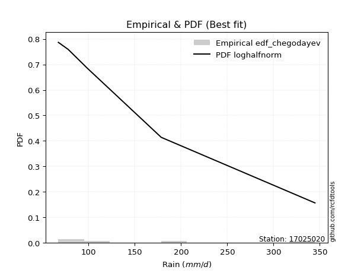</img>

</div>


### 6. EDF Blom (1958)

The Blom formula is a specific "plotting position" formula used in hydrology and statistical analysis to estimate the empirical cumulative probability (or non-exceedance probability) of a data series. It is particularly recommended for data that are approximately normally distributed. The constant _a_ is set to 0.375 (or 3/8).

<div align="center">


$P=(m-a)/(n+1-2a)$


</div>


**6.1. Empirical values**

<div align="center">

|                | 0                   | 1                   | 2        | 3                  | 4                  |
|:---------------|:--------------------|:--------------------|:---------|:-------------------|:-------------------|
| date           | 2022                | 2021                | 2023     | 2024               | 2025               |
| x              | 67.4                | 78.0                | 98.7     | 178.6              | 344.8              |
| m              | 1                   | 2                   | 3        | 4                  | 5                  |
| empirical_dist | edf_blom            | edf_blom            | edf_blom | edf_blom           | edf_blom           |
| empirical      | 0.11904761904761904 | 0.30952380952380953 | 0.5      | 0.6904761904761905 | 0.8809523809523809 |
| empirical_tr   | 1.135135135135135   | 1.4482758620689655  | 2.0      | 3.230769230769231  | 8.399999999999999  |

</div>


**6.2. Kolmogorov-Smirnov fit test (sorted by Δ)**


<div align="center">

|                | 0                   | 1                   | 2                  | 3                   | 4                   | 5                   | 6                   | 7                   | 8                   | 9                   | 10                  | 11                  | 12                  | 13                  | 14                  | 15                  | 16                  | 17                  | 18                  | 19                  | 20                  | 21                  | 22                  | 23                  | 24                  | 25                  | 26                  | 27                 | 28                  | 29                  | 30                  | 31                  | 32                  | 33                  | 34                  | 35                  | 36                 | 37                 | 38                  | 39                 | 40                  | 41                  | 42                  | 43                  | 44                 | 45                  | 46                  | 47                  | 48                  | 49                 | 50                 | 51                  | 52                  | 53                  | 54                  | 55                  | 56                  | 57                  | 58                  | 59                  | 60                  | 61                  | 62                  | 63                 | 64                 | 65                  | 66                  | 67                  | 68                  | 69                 | 70                 | 71                  | 72                 | 73                  | 74                 | 75                  | 76                  | 77                  | 78                  | 79                  | 80                 | 81                 | 82                  | 83                  | 84                 | 85                 | 86                  | 87                  | 88                  | 89                  | 90                  | 91                 | 92                  | 93                  | 94                 | 95                 | 96                 | 97                 | 98                 | 99                  | 100                 | 101                 | 102                | 103                 | 104                 | 105                | 106                 | 107                 | 108                 | 109                 | 110                | 111                | 112                 | 113                 | 114                 | 115                 | 116                 | 117                | 118                | 119                | 120                 | 121                | 122                | 123                 | 124                | 125                 | 126                | 127                | 128                | 129                 | 130                | 131                 | 132                | 133                | 134                 | 135                 | 136                | 137                | 138                 | 139                 | 140                | 141                 | 142                | 143                 | 144                | 145                 | 146                | 147                | 148                | 149                | 150                | 151                | 152                | 153                | 154                | 155                | 156                | 157                | 158                | 159                |
|:---------------|:--------------------|:--------------------|:-------------------|:--------------------|:--------------------|:--------------------|:--------------------|:--------------------|:--------------------|:--------------------|:--------------------|:--------------------|:--------------------|:--------------------|:--------------------|:--------------------|:--------------------|:--------------------|:--------------------|:--------------------|:--------------------|:--------------------|:--------------------|:--------------------|:--------------------|:--------------------|:--------------------|:-------------------|:--------------------|:--------------------|:--------------------|:--------------------|:--------------------|:--------------------|:--------------------|:--------------------|:-------------------|:-------------------|:--------------------|:-------------------|:--------------------|:--------------------|:--------------------|:--------------------|:-------------------|:--------------------|:--------------------|:--------------------|:--------------------|:-------------------|:-------------------|:--------------------|:--------------------|:--------------------|:--------------------|:--------------------|:--------------------|:--------------------|:--------------------|:--------------------|:--------------------|:--------------------|:--------------------|:-------------------|:-------------------|:--------------------|:--------------------|:--------------------|:--------------------|:-------------------|:-------------------|:--------------------|:-------------------|:--------------------|:-------------------|:--------------------|:--------------------|:--------------------|:--------------------|:--------------------|:-------------------|:-------------------|:--------------------|:--------------------|:-------------------|:-------------------|:--------------------|:--------------------|:--------------------|:--------------------|:--------------------|:-------------------|:--------------------|:--------------------|:-------------------|:-------------------|:-------------------|:-------------------|:-------------------|:--------------------|:--------------------|:--------------------|:-------------------|:--------------------|:--------------------|:-------------------|:--------------------|:--------------------|:--------------------|:--------------------|:-------------------|:-------------------|:--------------------|:--------------------|:--------------------|:--------------------|:--------------------|:-------------------|:-------------------|:-------------------|:--------------------|:-------------------|:-------------------|:--------------------|:-------------------|:--------------------|:-------------------|:-------------------|:-------------------|:--------------------|:-------------------|:--------------------|:-------------------|:-------------------|:--------------------|:--------------------|:-------------------|:-------------------|:--------------------|:--------------------|:-------------------|:--------------------|:-------------------|:--------------------|:-------------------|:--------------------|:-------------------|:-------------------|:-------------------|:-------------------|:-------------------|:-------------------|:-------------------|:-------------------|:-------------------|:-------------------|:-------------------|:-------------------|:-------------------|:-------------------|
| station        | 17025020            | 17025020            | 17025020           | 17025020            | 17025020            | 17025020            | 17025020            | 17025020            | 17025020            | 17025020            | 17025020            | 17025020            | 17025020            | 17025020            | 17025020            | 17025020            | 17025020            | 17025020            | 17025020            | 17025020            | 17025020            | 17025020            | 17025020            | 17025020            | 17025020            | 17025020            | 17025020            | 17025020           | 17025020            | 17025020            | 17025020            | 17025020            | 17025020            | 17025020            | 17025020            | 17025020            | 17025020           | 17025020           | 17025020            | 17025020           | 17025020            | 17025020            | 17025020            | 17025020            | 17025020           | 17025020            | 17025020            | 17025020            | 17025020            | 17025020           | 17025020           | 17025020            | 17025020            | 17025020            | 17025020            | 17025020            | 17025020            | 17025020            | 17025020            | 17025020            | 17025020            | 17025020            | 17025020            | 17025020           | 17025020           | 17025020            | 17025020            | 17025020            | 17025020            | 17025020           | 17025020           | 17025020            | 17025020           | 17025020            | 17025020           | 17025020            | 17025020            | 17025020            | 17025020            | 17025020            | 17025020           | 17025020           | 17025020            | 17025020            | 17025020           | 17025020           | 17025020            | 17025020            | 17025020            | 17025020            | 17025020            | 17025020           | 17025020            | 17025020            | 17025020           | 17025020           | 17025020           | 17025020           | 17025020           | 17025020            | 17025020            | 17025020            | 17025020           | 17025020            | 17025020            | 17025020           | 17025020            | 17025020            | 17025020            | 17025020            | 17025020           | 17025020           | 17025020            | 17025020            | 17025020            | 17025020            | 17025020            | 17025020           | 17025020           | 17025020           | 17025020            | 17025020           | 17025020           | 17025020            | 17025020           | 17025020            | 17025020           | 17025020           | 17025020           | 17025020            | 17025020           | 17025020            | 17025020           | 17025020           | 17025020            | 17025020            | 17025020           | 17025020           | 17025020            | 17025020            | 17025020           | 17025020            | 17025020           | 17025020            | 17025020           | 17025020            | 17025020           | 17025020           | 17025020           | 17025020           | 17025020           | 17025020           | 17025020           | 17025020           | 17025020           | 17025020           | 17025020           | 17025020           | 17025020           | 17025020           |
| empirical_dist | edf_blom            | edf_blom            | edf_blom           | edf_blom            | edf_blom            | edf_blom            | edf_blom            | edf_blom            | edf_blom            | edf_blom            | edf_blom            | edf_blom            | edf_blom            | edf_blom            | edf_blom            | edf_blom            | edf_blom            | edf_blom            | edf_blom            | edf_blom            | edf_blom            | edf_blom            | edf_blom            | edf_blom            | edf_blom            | edf_blom            | edf_blom            | edf_blom           | edf_blom            | edf_blom            | edf_blom            | edf_blom            | edf_blom            | edf_blom            | edf_blom            | edf_blom            | edf_blom           | edf_blom           | edf_blom            | edf_blom           | edf_blom            | edf_blom            | edf_blom            | edf_blom            | edf_blom           | edf_blom            | edf_blom            | edf_blom            | edf_blom            | edf_blom           | edf_blom           | edf_blom            | edf_blom            | edf_blom            | edf_blom            | edf_blom            | edf_blom            | edf_blom            | edf_blom            | edf_blom            | edf_blom            | edf_blom            | edf_blom            | edf_blom           | edf_blom           | edf_blom            | edf_blom            | edf_blom            | edf_blom            | edf_blom           | edf_blom           | edf_blom            | edf_blom           | edf_blom            | edf_blom           | edf_blom            | edf_blom            | edf_blom            | edf_blom            | edf_blom            | edf_blom           | edf_blom           | edf_blom            | edf_blom            | edf_blom           | edf_blom           | edf_blom            | edf_blom            | edf_blom            | edf_blom            | edf_blom            | edf_blom           | edf_blom            | edf_blom            | edf_blom           | edf_blom           | edf_blom           | edf_blom           | edf_blom           | edf_blom            | edf_blom            | edf_blom            | edf_blom           | edf_blom            | edf_blom            | edf_blom           | edf_blom            | edf_blom            | edf_blom            | edf_blom            | edf_blom           | edf_blom           | edf_blom            | edf_blom            | edf_blom            | edf_blom            | edf_blom            | edf_blom           | edf_blom           | edf_blom           | edf_blom            | edf_blom           | edf_blom           | edf_blom            | edf_blom           | edf_blom            | edf_blom           | edf_blom           | edf_blom           | edf_blom            | edf_blom           | edf_blom            | edf_blom           | edf_blom           | edf_blom            | edf_blom            | edf_blom           | edf_blom           | edf_blom            | edf_blom            | edf_blom           | edf_blom            | edf_blom           | edf_blom            | edf_blom           | edf_blom            | edf_blom           | edf_blom           | edf_blom           | edf_blom           | edf_blom           | edf_blom           | edf_blom           | edf_blom           | edf_blom           | edf_blom           | edf_blom           | edf_blom           | edf_blom           | edf_blom           |
| p_dist         | loghalfnorm         | logalpha            | loghalflogistic    | f                   | invgamma            | loginvweibull       | loggenextreme       | logfoldnorm         | loggenlogistic      | burr12              | logburr12           | burr                | logmielke           | logburr             | loginvgamma         | logmoyal            | loggumbel_r         | lograyleigh         | nct                 | logksone            | logexponnorm        | nakagami            | gengamma            | exponweib           | exponpow            | loggenexpon         | logweibull_min      | weibull_min        | loglomax            | loggompertz         | logarcsine          | logkstwobign        | loginvgauss         | logdgamma           | logpearson3         | dgamma              | invgauss           | logmaxwell         | logsemicircular     | loghalfgennorm     | lognct              | alpha               | foldnorm            | halfnorm            | halflogistic       | vonmises_line       | halfgennorm         | betaprime           | loganglit           | ncf                | logf               | logdweibull         | dweibull            | logbetaprime        | logncf              | logtruncnorm        | logloggamma         | logt                | lognorm             | logcrystalball      | pearson3            | logwrapcauchy       | logloglaplace       | truncexpon         | moyal              | loggennorm          | rayleigh            | logrice             | semicircular        | gumbel_r           | gausshyper         | maxwell             | logskewnorm        | loglogistic         | wald               | anglit              | logtruncexpon       | gennorm             | arcsine             | bradford            | genlogistic        | logcosine          | loghypsecant        | exponnorm           | genexpon           | logbradford        | logweibull_max      | truncweibull_min    | gamma               | norm                | t                   | logrdist           | kstwobign           | loggumbel_l         | loglaplace         | loglaplace         | logistic           | erlang             | loggausshyper      | wrapcauchy          | loglevy_l           | logkappa4           | truncnorm          | genextreme          | hypsecant           | logargus           | rice                | logwald             | cosine              | lomax               | gumbel_l           | logtukeylambda     | levy_l              | logtriang           | laplace             | loguniform          | logkappa3           | logvonmises_line   | logtruncpareto     | argus              | loggenpareto        | triang             | logexponweib       | tukeylambda         | skewnorm           | genpareto           | ksone              | logexponpow        | gompertz           | fatiguelife         | loggenhalflogistic | logbeta             | invweibull         | kappa4             | truncpareto         | logtruncweibull_min | lognakagami        | powerlaw           | uniform             | kappa3              | logfatiguelife     | beta                | genhalflogistic    | logtrapezoid        | logpowerlaw        | rdist               | loggengamma        | loggamma           | loggamma           | logerlang          | trapezoid          | logjohnsonsb       | crystalball        | johnsonsb          | weibull_max        | logjohnsonsu       | johnsonsu          | logvonmises        | vonmises           | mielke             |
| delta          | 0.08066840010344839 | 0.08177020144211666 | 0.086725125530801  | 0.09860533910999258 | 0.09860547488210969 | 0.10220358716004074 | 0.10220902744269655 | 0.10244811634891082 | 0.10448856419336056 | 0.10458225780759538 | 0.10493898902223785 | 0.10510637394773192 | 0.10782680897142904 | 0.10829644511660796 | 0.10952895645179073 | 0.11080022708302495 | 0.11192046975846032 | 0.11470010637079975 | 0.11613620327608754 | 0.11755405014849463 | 0.11820199232977188 | 0.11903437767065694 | 0.11904663212494963 | 0.11904663895710939 | 0.11904747378077694 | 0.11904761660852421 | 0.11904761851621128 | 0.1190476187784726 | 0.11904761903938857 | 0.11904761904340634 | 0.11904761904761907 | 0.11950932030682554 | 0.12011978654381483 | 0.12300891080448284 | 0.12555625001926085 | 0.12634187548776518 | 0.126458508765678  | 0.1266576802487136 | 0.12872061613328972 | 0.1290409907610554 | 0.12956912029562678 | 0.13036048020099078 | 0.13070302233533204 | 0.13260694166468678 | 0.1348040714175417 | 0.13543939370755143 | 0.13595740993800282 | 0.13660983178499253 | 0.13740999110716845 | 0.137644502664041  | 0.1396023784297692 | 0.14302306384652685 | 0.14413792532497777 | 0.14500256010499413 | 0.14630616286974168 | 0.15440559601900905 | 0.15570061354796172 | 0.15807041511277697 | 0.15807649025529247 | 0.15807649739448737 | 0.15892559732415923 | 0.15938910148889773 | 0.16048836323632354 | 0.1604942921984485 | 0.1604998314455146 | 0.16318250182612282 | 0.16353606960987122 | 0.16371610177541374 | 0.16687857962493113 | 0.1700338871397084 | 0.1742003014770232 | 0.17448824977449678 | 0.1761396826028831 | 0.17669267577720837 | 0.1768711222067368 | 0.17741063459624484 | 0.17751718989501292 | 0.18011081102823878 | 0.18030187012406387 | 0.18171947308228065 | 0.187260877383017  | 0.1889671951324573 | 0.19099535470706247 | 0.19362655866753997 | 0.1952173613580921 | 0.1956827286769074 | 0.19856855757048508 | 0.19870581932787346 | 0.20155309872555593 | 0.20213627446696886 | 0.20214191833471984 | 0.2049543537750192 | 0.21410944292139195 | 0.21674197089886532 | 0.2188992296761612 | 0.2188992296761612 | 0.2235859929738137 | 0.2302170283390097 | 0.2313206060627866 | 0.23230013479827344 | 0.23235097331784507 | 0.23625006695774525 | 0.2386677092264204 | 0.23879281475911285 | 0.23901750416901085 | 0.2393805660485505 | 0.24355071749817708 | 0.24371446902196137 | 0.24375633182585665 | 0.24432120213850594 | 0.2525308227715709 | 0.2605176385859025 | 0.26161767497128974 | 0.26221811948213003 | 0.26389170847057397 | 0.26632030454578204 | 0.26633083235100574 | 0.2713442058810417 | 0.2763265783446227 | 0.2878522150222782 | 0.29625849166213425 | 0.3006981946342473 | 0.3048481668141081 | 0.30952380952380243 | 0.315941875597854  | 0.32038539238095975 | 0.3226387887527037 | 0.3239181136546845 | 0.3313326158555773 | 0.33763055489919225 | 0.3405457002030935 | 0.34607464429254675 | 0.3579021173514605 | 0.363092495268865  | 0.36465591019543553 | 0.36767318202733057 | 0.3683108704364739 | 0.3797818607718547 | 0.38716654650324445 | 0.38946466037726574 | 0.3999762352773856 | 0.40122129529576955 | 0.410257844606729  | 0.42267907002887517 | 0.4273813770771563 | 0.44652318879373065 | 0.4583280938607339 | 0.507847587632494  | 0.507847587632494  | 0.516153892564323  | 0.5162637424408782 | 0.5191262819380765 | 0.5238497183654107 | 0.5752964936962286 | 0.597675000679075  | 0.6158360383346388 | 0.6559955276292924 | 1.073212281463963  | 54.99912374280499  | nan                |
| deltao         | 0.5865427407550001  | 0.5865427407550001  | 0.5865427407550001 | 0.5865427407550001  | 0.5865427407550001  | 0.5865427407550001  | 0.5865427407550001  | 0.5865427407550001  | 0.5865427407550001  | 0.5865427407550001  | 0.5865427407550001  | 0.5865427407550001  | 0.5865427407550001  | 0.5865427407550001  | 0.5865427407550001  | 0.5865427407550001  | 0.5865427407550001  | 0.5865427407550001  | 0.5865427407550001  | 0.5865427407550001  | 0.5865427407550001  | 0.5865427407550001  | 0.5865427407550001  | 0.5865427407550001  | 0.5865427407550001  | 0.5865427407550001  | 0.5865427407550001  | 0.5865427407550001 | 0.5865427407550001  | 0.5865427407550001  | 0.5865427407550001  | 0.5865427407550001  | 0.5865427407550001  | 0.5865427407550001  | 0.5865427407550001  | 0.5865427407550001  | 0.5865427407550001 | 0.5865427407550001 | 0.5865427407550001  | 0.5865427407550001 | 0.5865427407550001  | 0.5865427407550001  | 0.5865427407550001  | 0.5865427407550001  | 0.5865427407550001 | 0.5865427407550001  | 0.5865427407550001  | 0.5865427407550001  | 0.5865427407550001  | 0.5865427407550001 | 0.5865427407550001 | 0.5865427407550001  | 0.5865427407550001  | 0.5865427407550001  | 0.5865427407550001  | 0.5865427407550001  | 0.5865427407550001  | 0.5865427407550001  | 0.5865427407550001  | 0.5865427407550001  | 0.5865427407550001  | 0.5865427407550001  | 0.5865427407550001  | 0.5865427407550001 | 0.5865427407550001 | 0.5865427407550001  | 0.5865427407550001  | 0.5865427407550001  | 0.5865427407550001  | 0.5865427407550001 | 0.5865427407550001 | 0.5865427407550001  | 0.5865427407550001 | 0.5865427407550001  | 0.5865427407550001 | 0.5865427407550001  | 0.5865427407550001  | 0.5865427407550001  | 0.5865427407550001  | 0.5865427407550001  | 0.5865427407550001 | 0.5865427407550001 | 0.5865427407550001  | 0.5865427407550001  | 0.5865427407550001 | 0.5865427407550001 | 0.5865427407550001  | 0.5865427407550001  | 0.5865427407550001  | 0.5865427407550001  | 0.5865427407550001  | 0.5865427407550001 | 0.5865427407550001  | 0.5865427407550001  | 0.5865427407550001 | 0.5865427407550001 | 0.5865427407550001 | 0.5865427407550001 | 0.5865427407550001 | 0.5865427407550001  | 0.5865427407550001  | 0.5865427407550001  | 0.5865427407550001 | 0.5865427407550001  | 0.5865427407550001  | 0.5865427407550001 | 0.5865427407550001  | 0.5865427407550001  | 0.5865427407550001  | 0.5865427407550001  | 0.5865427407550001 | 0.5865427407550001 | 0.5865427407550001  | 0.5865427407550001  | 0.5865427407550001  | 0.5865427407550001  | 0.5865427407550001  | 0.5865427407550001 | 0.5865427407550001 | 0.5865427407550001 | 0.5865427407550001  | 0.5865427407550001 | 0.5865427407550001 | 0.5865427407550001  | 0.5865427407550001 | 0.5865427407550001  | 0.5865427407550001 | 0.5865427407550001 | 0.5865427407550001 | 0.5865427407550001  | 0.5865427407550001 | 0.5865427407550001  | 0.5865427407550001 | 0.5865427407550001 | 0.5865427407550001  | 0.5865427407550001  | 0.5865427407550001 | 0.5865427407550001 | 0.5865427407550001  | 0.5865427407550001  | 0.5865427407550001 | 0.5865427407550001  | 0.5865427407550001 | 0.5865427407550001  | 0.5865427407550001 | 0.5865427407550001  | 0.5865427407550001 | 0.5865427407550001 | 0.5865427407550001 | 0.5865427407550001 | 0.5865427407550001 | 0.5865427407550001 | 0.5865427407550001 | 0.5865427407550001 | 0.5865427407550001 | 0.5865427407550001 | 0.5865427407550001 | 0.5865427407550001 | 0.5865427407550001 | 0.5865427407550001 |
| eval           | Δo > Δ              | Δo > Δ              | Δo > Δ             | Δo > Δ              | Δo > Δ              | Δo > Δ              | Δo > Δ              | Δo > Δ              | Δo > Δ              | Δo > Δ              | Δo > Δ              | Δo > Δ              | Δo > Δ              | Δo > Δ              | Δo > Δ              | Δo > Δ              | Δo > Δ              | Δo > Δ              | Δo > Δ              | Δo > Δ              | Δo > Δ              | Δo > Δ              | Δo > Δ              | Δo > Δ              | Δo > Δ              | Δo > Δ              | Δo > Δ              | Δo > Δ             | Δo > Δ              | Δo > Δ              | Δo > Δ              | Δo > Δ              | Δo > Δ              | Δo > Δ              | Δo > Δ              | Δo > Δ              | Δo > Δ             | Δo > Δ             | Δo > Δ              | Δo > Δ             | Δo > Δ              | Δo > Δ              | Δo > Δ              | Δo > Δ              | Δo > Δ             | Δo > Δ              | Δo > Δ              | Δo > Δ              | Δo > Δ              | Δo > Δ             | Δo > Δ             | Δo > Δ              | Δo > Δ              | Δo > Δ              | Δo > Δ              | Δo > Δ              | Δo > Δ              | Δo > Δ              | Δo > Δ              | Δo > Δ              | Δo > Δ              | Δo > Δ              | Δo > Δ              | Δo > Δ             | Δo > Δ             | Δo > Δ              | Δo > Δ              | Δo > Δ              | Δo > Δ              | Δo > Δ             | Δo > Δ             | Δo > Δ              | Δo > Δ             | Δo > Δ              | Δo > Δ             | Δo > Δ              | Δo > Δ              | Δo > Δ              | Δo > Δ              | Δo > Δ              | Δo > Δ             | Δo > Δ             | Δo > Δ              | Δo > Δ              | Δo > Δ             | Δo > Δ             | Δo > Δ              | Δo > Δ              | Δo > Δ              | Δo > Δ              | Δo > Δ              | Δo > Δ             | Δo > Δ              | Δo > Δ              | Δo > Δ             | Δo > Δ             | Δo > Δ             | Δo > Δ             | Δo > Δ             | Δo > Δ              | Δo > Δ              | Δo > Δ              | Δo > Δ             | Δo > Δ              | Δo > Δ              | Δo > Δ             | Δo > Δ              | Δo > Δ              | Δo > Δ              | Δo > Δ              | Δo > Δ             | Δo > Δ             | Δo > Δ              | Δo > Δ              | Δo > Δ              | Δo > Δ              | Δo > Δ              | Δo > Δ             | Δo > Δ             | Δo > Δ             | Δo > Δ              | Δo > Δ             | Δo > Δ             | Δo > Δ              | Δo > Δ             | Δo > Δ              | Δo > Δ             | Δo > Δ             | Δo > Δ             | Δo > Δ              | Δo > Δ             | Δo > Δ              | Δo > Δ             | Δo > Δ             | Δo > Δ              | Δo > Δ              | Δo > Δ             | Δo > Δ             | Δo > Δ              | Δo > Δ              | Δo > Δ             | Δo > Δ              | Δo > Δ             | Δo > Δ              | Δo > Δ             | Δo > Δ              | Δo > Δ             | Δo > Δ             | Δo > Δ             | Δo > Δ             | Δo > Δ             | Δo > Δ             | Δo > Δ             | Δo > Δ             | Δo <= Δ            | Δo <= Δ            | Δo <= Δ            | Δo <= Δ            | Δo <= Δ            | Δo <= Δ            |
| fit            | 1                   | 1                   | 1                  | 1                   | 1                   | 1                   | 1                   | 1                   | 1                   | 1                   | 1                   | 1                   | 1                   | 1                   | 1                   | 1                   | 1                   | 1                   | 1                   | 1                   | 1                   | 1                   | 1                   | 1                   | 1                   | 1                   | 1                   | 1                  | 1                   | 1                   | 1                   | 1                   | 1                   | 1                   | 1                   | 1                   | 1                  | 1                  | 1                   | 1                  | 1                   | 1                   | 1                   | 1                   | 1                  | 1                   | 1                   | 1                   | 1                   | 1                  | 1                  | 1                   | 1                   | 1                   | 1                   | 1                   | 1                   | 1                   | 1                   | 1                   | 1                   | 1                   | 1                   | 1                  | 1                  | 1                   | 1                   | 1                   | 1                   | 1                  | 1                  | 1                   | 1                  | 1                   | 1                  | 1                   | 1                   | 1                   | 1                   | 1                   | 1                  | 1                  | 1                   | 1                   | 1                  | 1                  | 1                   | 1                   | 1                   | 1                   | 1                   | 1                  | 1                   | 1                   | 1                  | 1                  | 1                  | 1                  | 1                  | 1                   | 1                   | 1                   | 1                  | 1                   | 1                   | 1                  | 1                   | 1                   | 1                   | 1                   | 1                  | 1                  | 1                   | 1                   | 1                   | 1                   | 1                   | 1                  | 1                  | 1                  | 1                   | 1                  | 1                  | 1                   | 1                  | 1                   | 1                  | 1                  | 1                  | 1                   | 1                  | 1                   | 1                  | 1                  | 1                   | 1                   | 1                  | 1                  | 1                   | 1                   | 1                  | 1                   | 1                  | 1                   | 1                  | 1                   | 1                  | 1                  | 1                  | 1                  | 1                  | 1                  | 1                  | 1                  | 0                  | 0                  | 0                  | 0                  | 0                  | 0                  |
| n              | 5                   | 5                   | 5                  | 5                   | 5                   | 5                   | 5                   | 5                   | 5                   | 5                   | 5                   | 5                   | 5                   | 5                   | 5                   | 5                   | 5                   | 5                   | 5                   | 5                   | 5                   | 5                   | 5                   | 5                   | 5                   | 5                   | 5                   | 5                  | 5                   | 5                   | 5                   | 5                   | 5                   | 5                   | 5                   | 5                   | 5                  | 5                  | 5                   | 5                  | 5                   | 5                   | 5                   | 5                   | 5                  | 5                   | 5                   | 5                   | 5                   | 5                  | 5                  | 5                   | 5                   | 5                   | 5                   | 5                   | 5                   | 5                   | 5                   | 5                   | 5                   | 5                   | 5                   | 5                  | 5                  | 5                   | 5                   | 5                   | 5                   | 5                  | 5                  | 5                   | 5                  | 5                   | 5                  | 5                   | 5                   | 5                   | 5                   | 5                   | 5                  | 5                  | 5                   | 5                   | 5                  | 5                  | 5                   | 5                   | 5                   | 5                   | 5                   | 5                  | 5                   | 5                   | 5                  | 5                  | 5                  | 5                  | 5                  | 5                   | 5                   | 5                   | 5                  | 5                   | 5                   | 5                  | 5                   | 5                   | 5                   | 5                   | 5                  | 5                  | 5                   | 5                   | 5                   | 5                   | 5                   | 5                  | 5                  | 5                  | 5                   | 5                  | 5                  | 5                   | 5                  | 5                   | 5                  | 5                  | 5                  | 5                   | 5                  | 5                   | 5                  | 5                  | 5                   | 5                   | 5                  | 5                  | 5                   | 5                   | 5                  | 5                   | 5                  | 5                   | 5                  | 5                   | 5                  | 5                  | 5                  | 5                  | 5                  | 5                  | 5                  | 5                  | 5                  | 5                  | 5                  | 5                  | 5                  | 5                  |
| best_fit       | 1                   | 0                   | 0                  | 0                   | 0                   | 0                   | 0                   | 0                   | 0                   | 0                   | 0                   | 0                   | 0                   | 0                   | 0                   | 0                   | 0                   | 0                   | 0                   | 0                   | 0                   | 0                   | 0                   | 0                   | 0                   | 0                   | 0                   | 0                  | 0                   | 0                   | 0                   | 0                   | 0                   | 0                   | 0                   | 0                   | 0                  | 0                  | 0                   | 0                  | 0                   | 0                   | 0                   | 0                   | 0                  | 0                   | 0                   | 0                   | 0                   | 0                  | 0                  | 0                   | 0                   | 0                   | 0                   | 0                   | 0                   | 0                   | 0                   | 0                   | 0                   | 0                   | 0                   | 0                  | 0                  | 0                   | 0                   | 0                   | 0                   | 0                  | 0                  | 0                   | 0                  | 0                   | 0                  | 0                   | 0                   | 0                   | 0                   | 0                   | 0                  | 0                  | 0                   | 0                   | 0                  | 0                  | 0                   | 0                   | 0                   | 0                   | 0                   | 0                  | 0                   | 0                   | 0                  | 0                  | 0                  | 0                  | 0                  | 0                   | 0                   | 0                   | 0                  | 0                   | 0                   | 0                  | 0                   | 0                   | 0                   | 0                   | 0                  | 0                  | 0                   | 0                   | 0                   | 0                   | 0                   | 0                  | 0                  | 0                  | 0                   | 0                  | 0                  | 0                   | 0                  | 0                   | 0                  | 0                  | 0                  | 0                   | 0                  | 0                   | 0                  | 0                  | 0                   | 0                   | 0                  | 0                  | 0                   | 0                   | 0                  | 0                   | 0                  | 0                   | 0                  | 0                   | 0                  | 0                  | 0                  | 0                  | 0                  | 0                  | 0                  | 0                  | 0                  | 0                  | 0                  | 0                  | 0                  | 0                  |
| best_fit_sort  | 1                   | 2                   | 3                  | 4                   | 5                   | 6                   | 7                   | 8                   | 9                   | 10                  | 11                  | 12                  | 13                  | 14                  | 15                  | 16                  | 17                  | 18                  | 19                  | 20                  | 21                  | 22                  | 23                  | 24                  | 25                  | 26                  | 27                  | 28                 | 29                  | 30                  | 31                  | 32                  | 33                  | 34                  | 35                  | 36                  | 37                 | 38                 | 39                  | 40                 | 41                  | 42                  | 43                  | 44                  | 45                 | 46                  | 47                  | 48                  | 49                  | 50                 | 51                 | 52                  | 53                  | 54                  | 55                  | 56                  | 57                  | 58                  | 59                  | 60                  | 61                  | 62                  | 63                  | 64                 | 65                 | 66                  | 67                  | 68                  | 69                  | 70                 | 71                 | 72                  | 73                 | 74                  | 75                 | 76                  | 77                  | 78                  | 79                  | 80                  | 81                 | 82                 | 83                  | 84                  | 85                 | 86                 | 87                  | 88                  | 89                  | 90                  | 91                  | 92                 | 93                  | 94                  | 95                 | 96                 | 97                 | 98                 | 99                 | 100                 | 101                 | 102                 | 103                | 104                 | 105                 | 106                | 107                 | 108                 | 109                 | 110                 | 111                | 112                | 113                 | 114                 | 115                 | 116                 | 117                 | 118                | 119                | 120                | 121                 | 122                | 123                | 124                 | 125                | 126                 | 127                | 128                | 129                | 130                 | 131                | 132                 | 133                | 134                | 135                 | 136                 | 137                | 138                | 139                 | 140                 | 141                | 142                 | 143                | 144                 | 145                | 146                 | 147                | 148                | 149                | 150                | 151                | 152                | 153                | 154                | 155                | 156                | 157                | 158                | 159                | 160                |

</div>


**6.3. Best fit**

<div align="center">

|   id |   station | empirical_dist   | p_dist      |     delta |   deltao | eval   |   fit |   n |   best_fit |   best_fit_sort |
|-----:|----------:|:-----------------|:------------|----------:|---------:|:-------|------:|----:|-----------:|----------------:|
|    0 |  17025020 | edf_blom         | loghalfnorm | 0.0806684 | 0.586543 | Δo > Δ |     1 |   5 |          1 |               1 |

</div>


<div align="center">

</img></img>

</div>


### 7. EDF Tukey (1962)

In hydrology, the Tukey formula is used as a plotting position formula to estimate the empirical probability or frequency of a flood event (or other hydrological data). The formula parameter is given as _c=0.333_ (or 1/3).

<div align="center">


$P=(m-c)/(n+1-2c)$


</div>


**7.1. Empirical values**

<div align="center">

|                | 0                  | 1                  | 2         | 3         | 4         |
|:---------------|:-------------------|:-------------------|:----------|:----------|:----------|
| date           | 2022               | 2021               | 2023      | 2024      | 2025      |
| x              | 67.4               | 78.0               | 98.7      | 178.6     | 344.8     |
| m              | 1                  | 2                  | 3         | 4         | 5         |
| empirical_dist | edf_tukey          | edf_tukey          | edf_tukey | edf_tukey | edf_tukey |
| empirical      | 0.125              | 0.3125             | 0.5       | 0.6875    | 0.875     |
| empirical_tr   | 1.1428571428571428 | 1.4545454545454546 | 2.0       | 3.2       | 8.0       |

</div>


**7.2. Kolmogorov-Smirnov fit test (sorted by Δ)**


<div align="center">

|                | 0                   | 1                   | 2                   | 3                   | 4                   | 5                   | 6                   | 7                   | 8                   | 9                   | 10                  | 11                  | 12                 | 13                  | 14                  | 15                  | 16                  | 17                  | 18                  | 19                  | 20                  | 21                  | 22                  | 23                 | 24                  | 25                 | 26                  | 27                  | 28                 | 29                  | 30                  | 31                  | 32                  | 33                 | 34                 | 35                  | 36                 | 37                  | 38                  | 39                  | 40                  | 41                  | 42                  | 43                  | 44                  | 45                 | 46                  | 47                  | 48                  | 49                 | 50                 | 51                  | 52                  | 53                  | 54                  | 55                  | 56                  | 57                  | 58                  | 59                  | 60                  | 61                  | 62                  | 63                 | 64                 | 65                  | 66                  | 67                  | 68                  | 69                 | 70                 | 71                  | 72                  | 73                  | 74                  | 75                  | 76                  | 77                  | 78                  | 79                  | 80                 | 81                 | 82                  | 83                 | 84                 | 85                  | 86                  | 87                  | 88                  | 89                  | 90                 | 91                 | 92                  | 93                  | 94                 | 95                 | 96                 | 97                 | 98                 | 99                  | 100                 | 101                 | 102                 | 103                | 104                 | 105                | 106                 | 107                 | 108                 | 109                 | 110                | 111                | 112                | 113                 | 114                 | 115                 | 116                 | 117                | 118                 | 119                | 120                 | 121                | 122                | 123                | 124                | 125                | 126                | 127                | 128                | 129                | 130                 | 131                | 132                 | 133                 | 134                | 135                 | 136                 | 137                 | 138                 | 139                 | 140                | 141                | 142                | 143                 | 144                | 145                | 146                 | 147                | 148                | 149                | 150                | 151                | 152                | 153                | 154                | 155                | 156                | 157                | 158                | 159                |
|:---------------|:--------------------|:--------------------|:--------------------|:--------------------|:--------------------|:--------------------|:--------------------|:--------------------|:--------------------|:--------------------|:--------------------|:--------------------|:-------------------|:--------------------|:--------------------|:--------------------|:--------------------|:--------------------|:--------------------|:--------------------|:--------------------|:--------------------|:--------------------|:-------------------|:--------------------|:-------------------|:--------------------|:--------------------|:-------------------|:--------------------|:--------------------|:--------------------|:--------------------|:-------------------|:-------------------|:--------------------|:-------------------|:--------------------|:--------------------|:--------------------|:--------------------|:--------------------|:--------------------|:--------------------|:--------------------|:-------------------|:--------------------|:--------------------|:--------------------|:-------------------|:-------------------|:--------------------|:--------------------|:--------------------|:--------------------|:--------------------|:--------------------|:--------------------|:--------------------|:--------------------|:--------------------|:--------------------|:--------------------|:-------------------|:-------------------|:--------------------|:--------------------|:--------------------|:--------------------|:-------------------|:-------------------|:--------------------|:--------------------|:--------------------|:--------------------|:--------------------|:--------------------|:--------------------|:--------------------|:--------------------|:-------------------|:-------------------|:--------------------|:-------------------|:-------------------|:--------------------|:--------------------|:--------------------|:--------------------|:--------------------|:-------------------|:-------------------|:--------------------|:--------------------|:-------------------|:-------------------|:-------------------|:-------------------|:-------------------|:--------------------|:--------------------|:--------------------|:--------------------|:-------------------|:--------------------|:-------------------|:--------------------|:--------------------|:--------------------|:--------------------|:-------------------|:-------------------|:-------------------|:--------------------|:--------------------|:--------------------|:--------------------|:-------------------|:--------------------|:-------------------|:--------------------|:-------------------|:-------------------|:-------------------|:-------------------|:-------------------|:-------------------|:-------------------|:-------------------|:-------------------|:--------------------|:-------------------|:--------------------|:--------------------|:-------------------|:--------------------|:--------------------|:--------------------|:--------------------|:--------------------|:-------------------|:-------------------|:-------------------|:--------------------|:-------------------|:-------------------|:--------------------|:-------------------|:-------------------|:-------------------|:-------------------|:-------------------|:-------------------|:-------------------|:-------------------|:-------------------|:-------------------|:-------------------|:-------------------|:-------------------|
| station        | 17025020            | 17025020            | 17025020            | 17025020            | 17025020            | 17025020            | 17025020            | 17025020            | 17025020            | 17025020            | 17025020            | 17025020            | 17025020           | 17025020            | 17025020            | 17025020            | 17025020            | 17025020            | 17025020            | 17025020            | 17025020            | 17025020            | 17025020            | 17025020           | 17025020            | 17025020           | 17025020            | 17025020            | 17025020           | 17025020            | 17025020            | 17025020            | 17025020            | 17025020           | 17025020           | 17025020            | 17025020           | 17025020            | 17025020            | 17025020            | 17025020            | 17025020            | 17025020            | 17025020            | 17025020            | 17025020           | 17025020            | 17025020            | 17025020            | 17025020           | 17025020           | 17025020            | 17025020            | 17025020            | 17025020            | 17025020            | 17025020            | 17025020            | 17025020            | 17025020            | 17025020            | 17025020            | 17025020            | 17025020           | 17025020           | 17025020            | 17025020            | 17025020            | 17025020            | 17025020           | 17025020           | 17025020            | 17025020            | 17025020            | 17025020            | 17025020            | 17025020            | 17025020            | 17025020            | 17025020            | 17025020           | 17025020           | 17025020            | 17025020           | 17025020           | 17025020            | 17025020            | 17025020            | 17025020            | 17025020            | 17025020           | 17025020           | 17025020            | 17025020            | 17025020           | 17025020           | 17025020           | 17025020           | 17025020           | 17025020            | 17025020            | 17025020            | 17025020            | 17025020           | 17025020            | 17025020           | 17025020            | 17025020            | 17025020            | 17025020            | 17025020           | 17025020           | 17025020           | 17025020            | 17025020            | 17025020            | 17025020            | 17025020           | 17025020            | 17025020           | 17025020            | 17025020           | 17025020           | 17025020           | 17025020           | 17025020           | 17025020           | 17025020           | 17025020           | 17025020           | 17025020            | 17025020           | 17025020            | 17025020            | 17025020           | 17025020            | 17025020            | 17025020            | 17025020            | 17025020            | 17025020           | 17025020           | 17025020           | 17025020            | 17025020           | 17025020           | 17025020            | 17025020           | 17025020           | 17025020           | 17025020           | 17025020           | 17025020           | 17025020           | 17025020           | 17025020           | 17025020           | 17025020           | 17025020           | 17025020           |
| empirical_dist | edf_tukey           | edf_tukey           | edf_tukey           | edf_tukey           | edf_tukey           | edf_tukey           | edf_tukey           | edf_tukey           | edf_tukey           | edf_tukey           | edf_tukey           | edf_tukey           | edf_tukey          | edf_tukey           | edf_tukey           | edf_tukey           | edf_tukey           | edf_tukey           | edf_tukey           | edf_tukey           | edf_tukey           | edf_tukey           | edf_tukey           | edf_tukey          | edf_tukey           | edf_tukey          | edf_tukey           | edf_tukey           | edf_tukey          | edf_tukey           | edf_tukey           | edf_tukey           | edf_tukey           | edf_tukey          | edf_tukey          | edf_tukey           | edf_tukey          | edf_tukey           | edf_tukey           | edf_tukey           | edf_tukey           | edf_tukey           | edf_tukey           | edf_tukey           | edf_tukey           | edf_tukey          | edf_tukey           | edf_tukey           | edf_tukey           | edf_tukey          | edf_tukey          | edf_tukey           | edf_tukey           | edf_tukey           | edf_tukey           | edf_tukey           | edf_tukey           | edf_tukey           | edf_tukey           | edf_tukey           | edf_tukey           | edf_tukey           | edf_tukey           | edf_tukey          | edf_tukey          | edf_tukey           | edf_tukey           | edf_tukey           | edf_tukey           | edf_tukey          | edf_tukey          | edf_tukey           | edf_tukey           | edf_tukey           | edf_tukey           | edf_tukey           | edf_tukey           | edf_tukey           | edf_tukey           | edf_tukey           | edf_tukey          | edf_tukey          | edf_tukey           | edf_tukey          | edf_tukey          | edf_tukey           | edf_tukey           | edf_tukey           | edf_tukey           | edf_tukey           | edf_tukey          | edf_tukey          | edf_tukey           | edf_tukey           | edf_tukey          | edf_tukey          | edf_tukey          | edf_tukey          | edf_tukey          | edf_tukey           | edf_tukey           | edf_tukey           | edf_tukey           | edf_tukey          | edf_tukey           | edf_tukey          | edf_tukey           | edf_tukey           | edf_tukey           | edf_tukey           | edf_tukey          | edf_tukey          | edf_tukey          | edf_tukey           | edf_tukey           | edf_tukey           | edf_tukey           | edf_tukey          | edf_tukey           | edf_tukey          | edf_tukey           | edf_tukey          | edf_tukey          | edf_tukey          | edf_tukey          | edf_tukey          | edf_tukey          | edf_tukey          | edf_tukey          | edf_tukey          | edf_tukey           | edf_tukey          | edf_tukey           | edf_tukey           | edf_tukey          | edf_tukey           | edf_tukey           | edf_tukey           | edf_tukey           | edf_tukey           | edf_tukey          | edf_tukey          | edf_tukey          | edf_tukey           | edf_tukey          | edf_tukey          | edf_tukey           | edf_tukey          | edf_tukey          | edf_tukey          | edf_tukey          | edf_tukey          | edf_tukey          | edf_tukey          | edf_tukey          | edf_tukey          | edf_tukey          | edf_tukey          | edf_tukey          | edf_tukey          |
| p_dist         | loghalfnorm         | logalpha            | loghalflogistic     | f                   | invgamma            | logfoldnorm         | loginvweibull       | loggenextreme       | burr                | loggenlogistic      | burr12              | logmielke           | logburr12          | logburr             | loggumbel_r         | loginvgamma         | logmoyal            | lograyleigh         | nct                 | logksone            | logkstwobign        | logdgamma           | dgamma              | loginvgauss        | logexponnorm        | nakagami           | gengamma            | exponweib           | exponpow           | loggenexpon         | logweibull_min      | weibull_min         | loglomax            | loggompertz        | logarcsine         | logpearson3         | logmaxwell         | logsemicircular     | invgauss            | lognct              | foldnorm            | loghalfgennorm      | halfnorm            | halfgennorm         | alpha               | halflogistic       | vonmises_line       | betaprime           | loganglit           | ncf                | logdweibull        | logf                | dweibull            | logbetaprime        | logncf              | truncexpon          | logloggamma         | logwrapcauchy       | logtruncnorm        | logt                | lognorm             | logcrystalball      | pearson3            | moyal              | logloglaplace      | rayleigh            | logrice             | loggennorm          | semicircular        | gumbel_r           | gausshyper         | arcsine             | maxwell             | loglogistic         | anglit              | bradford            | logskewnorm         | wald                | logtruncexpon       | gennorm             | genlogistic        | logcosine          | loghypsecant        | exponnorm          | logbradford        | genexpon            | logweibull_max      | truncweibull_min    | norm                | t                   | gamma              | logrdist           | kstwobign           | loggumbel_l         | loglaplace         | loglaplace         | logistic           | loglevy_l          | loggausshyper      | wrapcauchy          | genextreme          | erlang              | logkappa4           | truncnorm          | hypsecant           | logargus           | rice                | cosine              | lomax               | logwald             | gumbel_l           | levy_l             | logtukeylambda     | logtriang           | laplace             | loguniform          | logkappa3           | logvonmises_line   | logtruncpareto      | argus              | loggenpareto        | triang             | logexponweib       | tukeylambda        | skewnorm           | genpareto          | logexponpow        | ksone              | gompertz           | fatiguelife        | logbeta             | loggenhalflogistic | invweibull          | truncpareto         | kappa4             | logtruncweibull_min | lognakagami         | powerlaw            | uniform             | kappa3              | beta               | logfatiguelife     | genhalflogistic    | logtrapezoid        | logpowerlaw        | rdist              | loggengamma         | loggamma           | loggamma           | logerlang          | trapezoid          | logjohnsonsb       | crystalball        | johnsonsb          | weibull_max        | logjohnsonsu       | johnsonsu          | logvonmises        | vonmises           | mielke             |
| delta          | 0.08066840010344839 | 0.08474639191830713 | 0.08970131600699147 | 0.10158152958618305 | 0.10158166535830015 | 0.10244811634891082 | 0.10517977763623121 | 0.10518521791888702 | 0.10539757141340816 | 0.10545560208256219 | 0.11053463875997634 | 0.11080299944761951 | 0.1108913699746188 | 0.11127263559279843 | 0.11192046975846032 | 0.11250514692798119 | 0.11377641755921541 | 0.11470010637079975 | 0.11613620327608754 | 0.11755405014849463 | 0.11950932030682554 | 0.12003272032829237 | 0.12038949453538422 | 0.1230959770200053 | 0.12415437328215284 | 0.1249867586230379 | 0.12499901307733059 | 0.12499901990949035 | 0.1249998547331579 | 0.12499999756090517 | 0.12499999946859223 | 0.12499999973085356 | 0.12499999999176953 | 0.1249999999957873 | 0.125              | 0.12555625001926085 | 0.1266576802487136 | 0.12872061613328972 | 0.12943469924186846 | 0.12956912029562678 | 0.13070302233533204 | 0.13201718123724587 | 0.13260694166468678 | 0.13298121946181235 | 0.13333667067718125 | 0.1348040714175417 | 0.13543939370755143 | 0.13660983178499253 | 0.13740999110716845 | 0.137644502664041  | 0.1400468733703364 | 0.14257856890595966 | 0.14413792532497777 | 0.14500256010499413 | 0.14630616286974168 | 0.15454191124606753 | 0.15570061354796172 | 0.15641291101270727 | 0.15738178649519952 | 0.15807041511277697 | 0.15807649025529247 | 0.15807649739448737 | 0.15892559732415923 | 0.1604998314455146 | 0.163464553712514  | 0.16353606960987122 | 0.16371610177541374 | 0.16615869230231328 | 0.16687857962493113 | 0.1700338871397084 | 0.1742003014770232 | 0.17434948917168291 | 0.17448824977449678 | 0.17669267577720837 | 0.17741063459624484 | 0.17874328260609018 | 0.17911587307907356 | 0.17984731268292728 | 0.18049338037120338 | 0.18308700150442925 | 0.187260877383017  | 0.1889671951324573 | 0.19099535470706247 | 0.1955865267166731 | 0.1956827286769074 | 0.19666406107083917 | 0.19856855757048508 | 0.19870581932787346 | 0.20213627446696886 | 0.20214191833471984 | 0.2045292892017464 | 0.2049543537750192 | 0.21410944292139195 | 0.21674197089886532 | 0.2188992296761612 | 0.2188992296761612 | 0.2235859929738137 | 0.2263985923654641 | 0.2313206060627866 | 0.23230013479827344 | 0.23284043380673192 | 0.23319321881520017 | 0.23625006695774525 | 0.2386677092264204 | 0.23901750416901085 | 0.2393805660485505 | 0.24355071749817708 | 0.24375633182585665 | 0.24432120213850594 | 0.24669065949815183 | 0.2525308227715709 | 0.2556652940189088 | 0.2605176385859025 | 0.26221811948213003 | 0.26389170847057397 | 0.26632030454578204 | 0.26633083235100574 | 0.2713442058810417 | 0.27335038786843224 | 0.2878522150222782 | 0.29030611070975326 | 0.3006981946342473 | 0.3018719763379176 | 0.3124999999999929 | 0.315941875597854  | 0.3174092019047693 | 0.320941923178494  | 0.3226387887527037 | 0.3313326158555773 | 0.3346543644230018 | 0.34012226334016576 | 0.3405457002030935 | 0.35194973639907956 | 0.36167971971924506 | 0.363092495268865  | 0.3646969915511401  | 0.36533467996028346 | 0.37680567029566425 | 0.38716654650324445 | 0.38946466037726574 | 0.3952689143433886 | 0.3970000448011951 | 0.4072816541305385 | 0.42267907002887517 | 0.4244051866009658 | 0.4405708078413497 | 0.45535190338454345 | 0.5048713971563036 | 0.5048713971563036 | 0.5131777020881325 | 0.5132875519646878 | 0.5161500914618861 | 0.5178973374130298 | 0.5723203032200381 | 0.5946988102028845 | 0.6128598478584484 | 0.6530193371531019 | 1.079164662416344  | 55.00507612375737  | nan                |
| deltao         | 0.5865427407550001  | 0.5865427407550001  | 0.5865427407550001  | 0.5865427407550001  | 0.5865427407550001  | 0.5865427407550001  | 0.5865427407550001  | 0.5865427407550001  | 0.5865427407550001  | 0.5865427407550001  | 0.5865427407550001  | 0.5865427407550001  | 0.5865427407550001 | 0.5865427407550001  | 0.5865427407550001  | 0.5865427407550001  | 0.5865427407550001  | 0.5865427407550001  | 0.5865427407550001  | 0.5865427407550001  | 0.5865427407550001  | 0.5865427407550001  | 0.5865427407550001  | 0.5865427407550001 | 0.5865427407550001  | 0.5865427407550001 | 0.5865427407550001  | 0.5865427407550001  | 0.5865427407550001 | 0.5865427407550001  | 0.5865427407550001  | 0.5865427407550001  | 0.5865427407550001  | 0.5865427407550001 | 0.5865427407550001 | 0.5865427407550001  | 0.5865427407550001 | 0.5865427407550001  | 0.5865427407550001  | 0.5865427407550001  | 0.5865427407550001  | 0.5865427407550001  | 0.5865427407550001  | 0.5865427407550001  | 0.5865427407550001  | 0.5865427407550001 | 0.5865427407550001  | 0.5865427407550001  | 0.5865427407550001  | 0.5865427407550001 | 0.5865427407550001 | 0.5865427407550001  | 0.5865427407550001  | 0.5865427407550001  | 0.5865427407550001  | 0.5865427407550001  | 0.5865427407550001  | 0.5865427407550001  | 0.5865427407550001  | 0.5865427407550001  | 0.5865427407550001  | 0.5865427407550001  | 0.5865427407550001  | 0.5865427407550001 | 0.5865427407550001 | 0.5865427407550001  | 0.5865427407550001  | 0.5865427407550001  | 0.5865427407550001  | 0.5865427407550001 | 0.5865427407550001 | 0.5865427407550001  | 0.5865427407550001  | 0.5865427407550001  | 0.5865427407550001  | 0.5865427407550001  | 0.5865427407550001  | 0.5865427407550001  | 0.5865427407550001  | 0.5865427407550001  | 0.5865427407550001 | 0.5865427407550001 | 0.5865427407550001  | 0.5865427407550001 | 0.5865427407550001 | 0.5865427407550001  | 0.5865427407550001  | 0.5865427407550001  | 0.5865427407550001  | 0.5865427407550001  | 0.5865427407550001 | 0.5865427407550001 | 0.5865427407550001  | 0.5865427407550001  | 0.5865427407550001 | 0.5865427407550001 | 0.5865427407550001 | 0.5865427407550001 | 0.5865427407550001 | 0.5865427407550001  | 0.5865427407550001  | 0.5865427407550001  | 0.5865427407550001  | 0.5865427407550001 | 0.5865427407550001  | 0.5865427407550001 | 0.5865427407550001  | 0.5865427407550001  | 0.5865427407550001  | 0.5865427407550001  | 0.5865427407550001 | 0.5865427407550001 | 0.5865427407550001 | 0.5865427407550001  | 0.5865427407550001  | 0.5865427407550001  | 0.5865427407550001  | 0.5865427407550001 | 0.5865427407550001  | 0.5865427407550001 | 0.5865427407550001  | 0.5865427407550001 | 0.5865427407550001 | 0.5865427407550001 | 0.5865427407550001 | 0.5865427407550001 | 0.5865427407550001 | 0.5865427407550001 | 0.5865427407550001 | 0.5865427407550001 | 0.5865427407550001  | 0.5865427407550001 | 0.5865427407550001  | 0.5865427407550001  | 0.5865427407550001 | 0.5865427407550001  | 0.5865427407550001  | 0.5865427407550001  | 0.5865427407550001  | 0.5865427407550001  | 0.5865427407550001 | 0.5865427407550001 | 0.5865427407550001 | 0.5865427407550001  | 0.5865427407550001 | 0.5865427407550001 | 0.5865427407550001  | 0.5865427407550001 | 0.5865427407550001 | 0.5865427407550001 | 0.5865427407550001 | 0.5865427407550001 | 0.5865427407550001 | 0.5865427407550001 | 0.5865427407550001 | 0.5865427407550001 | 0.5865427407550001 | 0.5865427407550001 | 0.5865427407550001 | 0.5865427407550001 |
| eval           | Δo > Δ              | Δo > Δ              | Δo > Δ              | Δo > Δ              | Δo > Δ              | Δo > Δ              | Δo > Δ              | Δo > Δ              | Δo > Δ              | Δo > Δ              | Δo > Δ              | Δo > Δ              | Δo > Δ             | Δo > Δ              | Δo > Δ              | Δo > Δ              | Δo > Δ              | Δo > Δ              | Δo > Δ              | Δo > Δ              | Δo > Δ              | Δo > Δ              | Δo > Δ              | Δo > Δ             | Δo > Δ              | Δo > Δ             | Δo > Δ              | Δo > Δ              | Δo > Δ             | Δo > Δ              | Δo > Δ              | Δo > Δ              | Δo > Δ              | Δo > Δ             | Δo > Δ             | Δo > Δ              | Δo > Δ             | Δo > Δ              | Δo > Δ              | Δo > Δ              | Δo > Δ              | Δo > Δ              | Δo > Δ              | Δo > Δ              | Δo > Δ              | Δo > Δ             | Δo > Δ              | Δo > Δ              | Δo > Δ              | Δo > Δ             | Δo > Δ             | Δo > Δ              | Δo > Δ              | Δo > Δ              | Δo > Δ              | Δo > Δ              | Δo > Δ              | Δo > Δ              | Δo > Δ              | Δo > Δ              | Δo > Δ              | Δo > Δ              | Δo > Δ              | Δo > Δ             | Δo > Δ             | Δo > Δ              | Δo > Δ              | Δo > Δ              | Δo > Δ              | Δo > Δ             | Δo > Δ             | Δo > Δ              | Δo > Δ              | Δo > Δ              | Δo > Δ              | Δo > Δ              | Δo > Δ              | Δo > Δ              | Δo > Δ              | Δo > Δ              | Δo > Δ             | Δo > Δ             | Δo > Δ              | Δo > Δ             | Δo > Δ             | Δo > Δ              | Δo > Δ              | Δo > Δ              | Δo > Δ              | Δo > Δ              | Δo > Δ             | Δo > Δ             | Δo > Δ              | Δo > Δ              | Δo > Δ             | Δo > Δ             | Δo > Δ             | Δo > Δ             | Δo > Δ             | Δo > Δ              | Δo > Δ              | Δo > Δ              | Δo > Δ              | Δo > Δ             | Δo > Δ              | Δo > Δ             | Δo > Δ              | Δo > Δ              | Δo > Δ              | Δo > Δ              | Δo > Δ             | Δo > Δ             | Δo > Δ             | Δo > Δ              | Δo > Δ              | Δo > Δ              | Δo > Δ              | Δo > Δ             | Δo > Δ              | Δo > Δ             | Δo > Δ              | Δo > Δ             | Δo > Δ             | Δo > Δ             | Δo > Δ             | Δo > Δ             | Δo > Δ             | Δo > Δ             | Δo > Δ             | Δo > Δ             | Δo > Δ              | Δo > Δ             | Δo > Δ              | Δo > Δ              | Δo > Δ             | Δo > Δ              | Δo > Δ              | Δo > Δ              | Δo > Δ              | Δo > Δ              | Δo > Δ             | Δo > Δ             | Δo > Δ             | Δo > Δ              | Δo > Δ             | Δo > Δ             | Δo > Δ              | Δo > Δ             | Δo > Δ             | Δo > Δ             | Δo > Δ             | Δo > Δ             | Δo > Δ             | Δo > Δ             | Δo <= Δ            | Δo <= Δ            | Δo <= Δ            | Δo <= Δ            | Δo <= Δ            | Δo <= Δ            |
| fit            | 1                   | 1                   | 1                   | 1                   | 1                   | 1                   | 1                   | 1                   | 1                   | 1                   | 1                   | 1                   | 1                  | 1                   | 1                   | 1                   | 1                   | 1                   | 1                   | 1                   | 1                   | 1                   | 1                   | 1                  | 1                   | 1                  | 1                   | 1                   | 1                  | 1                   | 1                   | 1                   | 1                   | 1                  | 1                  | 1                   | 1                  | 1                   | 1                   | 1                   | 1                   | 1                   | 1                   | 1                   | 1                   | 1                  | 1                   | 1                   | 1                   | 1                  | 1                  | 1                   | 1                   | 1                   | 1                   | 1                   | 1                   | 1                   | 1                   | 1                   | 1                   | 1                   | 1                   | 1                  | 1                  | 1                   | 1                   | 1                   | 1                   | 1                  | 1                  | 1                   | 1                   | 1                   | 1                   | 1                   | 1                   | 1                   | 1                   | 1                   | 1                  | 1                  | 1                   | 1                  | 1                  | 1                   | 1                   | 1                   | 1                   | 1                   | 1                  | 1                  | 1                   | 1                   | 1                  | 1                  | 1                  | 1                  | 1                  | 1                   | 1                   | 1                   | 1                   | 1                  | 1                   | 1                  | 1                   | 1                   | 1                   | 1                   | 1                  | 1                  | 1                  | 1                   | 1                   | 1                   | 1                   | 1                  | 1                   | 1                  | 1                   | 1                  | 1                  | 1                  | 1                  | 1                  | 1                  | 1                  | 1                  | 1                  | 1                   | 1                  | 1                   | 1                   | 1                  | 1                   | 1                   | 1                   | 1                   | 1                   | 1                  | 1                  | 1                  | 1                   | 1                  | 1                  | 1                   | 1                  | 1                  | 1                  | 1                  | 1                  | 1                  | 1                  | 0                  | 0                  | 0                  | 0                  | 0                  | 0                  |
| n              | 5                   | 5                   | 5                   | 5                   | 5                   | 5                   | 5                   | 5                   | 5                   | 5                   | 5                   | 5                   | 5                  | 5                   | 5                   | 5                   | 5                   | 5                   | 5                   | 5                   | 5                   | 5                   | 5                   | 5                  | 5                   | 5                  | 5                   | 5                   | 5                  | 5                   | 5                   | 5                   | 5                   | 5                  | 5                  | 5                   | 5                  | 5                   | 5                   | 5                   | 5                   | 5                   | 5                   | 5                   | 5                   | 5                  | 5                   | 5                   | 5                   | 5                  | 5                  | 5                   | 5                   | 5                   | 5                   | 5                   | 5                   | 5                   | 5                   | 5                   | 5                   | 5                   | 5                   | 5                  | 5                  | 5                   | 5                   | 5                   | 5                   | 5                  | 5                  | 5                   | 5                   | 5                   | 5                   | 5                   | 5                   | 5                   | 5                   | 5                   | 5                  | 5                  | 5                   | 5                  | 5                  | 5                   | 5                   | 5                   | 5                   | 5                   | 5                  | 5                  | 5                   | 5                   | 5                  | 5                  | 5                  | 5                  | 5                  | 5                   | 5                   | 5                   | 5                   | 5                  | 5                   | 5                  | 5                   | 5                   | 5                   | 5                   | 5                  | 5                  | 5                  | 5                   | 5                   | 5                   | 5                   | 5                  | 5                   | 5                  | 5                   | 5                  | 5                  | 5                  | 5                  | 5                  | 5                  | 5                  | 5                  | 5                  | 5                   | 5                  | 5                   | 5                   | 5                  | 5                   | 5                   | 5                   | 5                   | 5                   | 5                  | 5                  | 5                  | 5                   | 5                  | 5                  | 5                   | 5                  | 5                  | 5                  | 5                  | 5                  | 5                  | 5                  | 5                  | 5                  | 5                  | 5                  | 5                  | 5                  |
| best_fit       | 1                   | 0                   | 0                   | 0                   | 0                   | 0                   | 0                   | 0                   | 0                   | 0                   | 0                   | 0                   | 0                  | 0                   | 0                   | 0                   | 0                   | 0                   | 0                   | 0                   | 0                   | 0                   | 0                   | 0                  | 0                   | 0                  | 0                   | 0                   | 0                  | 0                   | 0                   | 0                   | 0                   | 0                  | 0                  | 0                   | 0                  | 0                   | 0                   | 0                   | 0                   | 0                   | 0                   | 0                   | 0                   | 0                  | 0                   | 0                   | 0                   | 0                  | 0                  | 0                   | 0                   | 0                   | 0                   | 0                   | 0                   | 0                   | 0                   | 0                   | 0                   | 0                   | 0                   | 0                  | 0                  | 0                   | 0                   | 0                   | 0                   | 0                  | 0                  | 0                   | 0                   | 0                   | 0                   | 0                   | 0                   | 0                   | 0                   | 0                   | 0                  | 0                  | 0                   | 0                  | 0                  | 0                   | 0                   | 0                   | 0                   | 0                   | 0                  | 0                  | 0                   | 0                   | 0                  | 0                  | 0                  | 0                  | 0                  | 0                   | 0                   | 0                   | 0                   | 0                  | 0                   | 0                  | 0                   | 0                   | 0                   | 0                   | 0                  | 0                  | 0                  | 0                   | 0                   | 0                   | 0                   | 0                  | 0                   | 0                  | 0                   | 0                  | 0                  | 0                  | 0                  | 0                  | 0                  | 0                  | 0                  | 0                  | 0                   | 0                  | 0                   | 0                   | 0                  | 0                   | 0                   | 0                   | 0                   | 0                   | 0                  | 0                  | 0                  | 0                   | 0                  | 0                  | 0                   | 0                  | 0                  | 0                  | 0                  | 0                  | 0                  | 0                  | 0                  | 0                  | 0                  | 0                  | 0                  | 0                  |
| best_fit_sort  | 1                   | 2                   | 3                   | 4                   | 5                   | 6                   | 7                   | 8                   | 9                   | 10                  | 11                  | 12                  | 13                 | 14                  | 15                  | 16                  | 17                  | 18                  | 19                  | 20                  | 21                  | 22                  | 23                  | 24                 | 25                  | 26                 | 27                  | 28                  | 29                 | 30                  | 31                  | 32                  | 33                  | 34                 | 35                 | 36                  | 37                 | 38                  | 39                  | 40                  | 41                  | 42                  | 43                  | 44                  | 45                  | 46                 | 47                  | 48                  | 49                  | 50                 | 51                 | 52                  | 53                  | 54                  | 55                  | 56                  | 57                  | 58                  | 59                  | 60                  | 61                  | 62                  | 63                  | 64                 | 65                 | 66                  | 67                  | 68                  | 69                  | 70                 | 71                 | 72                  | 73                  | 74                  | 75                  | 76                  | 77                  | 78                  | 79                  | 80                  | 81                 | 82                 | 83                  | 84                 | 85                 | 86                  | 87                  | 88                  | 89                  | 90                  | 91                 | 92                 | 93                  | 94                  | 95                 | 96                 | 97                 | 98                 | 99                 | 100                 | 101                 | 102                 | 103                 | 104                | 105                 | 106                | 107                 | 108                 | 109                 | 110                 | 111                | 112                | 113                | 114                 | 115                 | 116                 | 117                 | 118                | 119                 | 120                | 121                 | 122                | 123                | 124                | 125                | 126                | 127                | 128                | 129                | 130                | 131                 | 132                | 133                 | 134                 | 135                | 136                 | 137                 | 138                 | 139                 | 140                 | 141                | 142                | 143                | 144                 | 145                | 146                | 147                 | 148                | 149                | 150                | 151                | 152                | 153                | 154                | 155                | 156                | 157                | 158                | 159                | 160                |

</div>


**7.3. Best fit**

<div align="center">

|   id |   station | empirical_dist   | p_dist      |     delta |   deltao | eval   |   fit |   n |   best_fit |   best_fit_sort |
|-----:|----------:|:-----------------|:------------|----------:|---------:|:-------|------:|----:|-----------:|----------------:|
|    0 |  17025020 | edf_tukey        | loghalfnorm | 0.0806684 | 0.586543 | Δo > Δ |     1 |   5 |          1 |               1 |

</div>


<div align="center">

</img>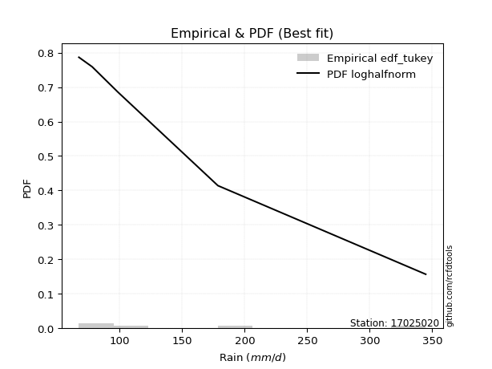</img>

</div>


### 8. EDF Gringorten (1963)

Gringorten plotting position formula is essential for estimating the probability and return periods of extreme events like floods and heavy rainfall. The constant _a=0.44_.

<div align="center">


$P=(m-a)/(n+1-2a)$


</div>


**8.1. Empirical values**

<div align="center">

|                | 0                   | 1                  | 2              | 3                 | 4                  |
|:---------------|:--------------------|:-------------------|:---------------|:------------------|:-------------------|
| date           | 2022                | 2021               | 2023           | 2024              | 2025               |
| x              | 67.4                | 78.0               | 98.7           | 178.6             | 344.8              |
| m              | 1                   | 2                  | 3              | 4                 | 5                  |
| empirical_dist | edf_gringorten      | edf_gringorten     | edf_gringorten | edf_gringorten    | edf_gringorten     |
| empirical      | 0.10937500000000001 | 0.3046875          | 0.5            | 0.6953125         | 0.8906249999999999 |
| empirical_tr   | 1.1228070175438596  | 1.4382022471910112 | 2.0            | 3.282051282051282 | 9.142857142857133  |

</div>


**8.2. Kolmogorov-Smirnov fit test (sorted by Δ)**


<div align="center">

|                | 0                   | 1                   | 2                   | 3                   | 4                   | 5                   | 6                   | 7                   | 8                   | 9                   | 10                  | 11                  | 12                  | 13                  | 14                  | 15                  | 16                  | 17                  | 18                  | 19                  | 20                  | 21                  | 22                  | 23                  | 24                  | 25                  | 26                 | 27                  | 28                 | 29                  | 30                  | 31                  | 32                  | 33                  | 34                  | 35                  | 36                 | 37                  | 38                  | 39                  | 40                  | 41                  | 42                  | 43                  | 44                 | 45                  | 46                  | 47                  | 48                  | 49                 | 50                  | 51                  | 52                  | 53                  | 54                 | 55                  | 56                 | 57                  | 58                  | 59                  | 60                  | 61                  | 62                  | 63                 | 64                  | 65                  | 66                  | 67                  | 68                 | 69                  | 70                  | 71                  | 72                 | 73                  | 74                  | 75                  | 76                  | 77                  | 78                  | 79                 | 80                 | 81                  | 82                  | 83                  | 84                 | 85                 | 86                 | 87                  | 88                  | 89                  | 90                  | 91                 | 92                  | 93                  | 94                 | 95                 | 96                 | 97                  | 98                 | 99                  | 100                 | 101                | 102                 | 103                 | 104                | 105                | 106                 | 107                 | 108                 | 109                | 110                | 111                | 112                 | 113                 | 114                 | 115                 | 116                | 117                | 118                 | 119                | 120                | 121                | 122                 | 123                | 124                | 125                | 126                | 127                | 128                | 129                | 130                | 131                 | 132                | 133                 | 134                 | 135                 | 136                 | 137                 | 138                 | 139                 | 140                | 141                | 142                | 143                 | 144                | 145                | 146                 | 147                | 148                | 149                | 150                | 151                | 152                | 153                | 154                | 155                | 156                | 157                | 158                | 159                |
|:---------------|:--------------------|:--------------------|:--------------------|:--------------------|:--------------------|:--------------------|:--------------------|:--------------------|:--------------------|:--------------------|:--------------------|:--------------------|:--------------------|:--------------------|:--------------------|:--------------------|:--------------------|:--------------------|:--------------------|:--------------------|:--------------------|:--------------------|:--------------------|:--------------------|:--------------------|:--------------------|:-------------------|:--------------------|:-------------------|:--------------------|:--------------------|:--------------------|:--------------------|:--------------------|:--------------------|:--------------------|:-------------------|:--------------------|:--------------------|:--------------------|:--------------------|:--------------------|:--------------------|:--------------------|:-------------------|:--------------------|:--------------------|:--------------------|:--------------------|:-------------------|:--------------------|:--------------------|:--------------------|:--------------------|:-------------------|:--------------------|:-------------------|:--------------------|:--------------------|:--------------------|:--------------------|:--------------------|:--------------------|:-------------------|:--------------------|:--------------------|:--------------------|:--------------------|:-------------------|:--------------------|:--------------------|:--------------------|:-------------------|:--------------------|:--------------------|:--------------------|:--------------------|:--------------------|:--------------------|:-------------------|:-------------------|:--------------------|:--------------------|:--------------------|:-------------------|:-------------------|:-------------------|:--------------------|:--------------------|:--------------------|:--------------------|:-------------------|:--------------------|:--------------------|:-------------------|:-------------------|:-------------------|:--------------------|:-------------------|:--------------------|:--------------------|:-------------------|:--------------------|:--------------------|:-------------------|:-------------------|:--------------------|:--------------------|:--------------------|:-------------------|:-------------------|:-------------------|:--------------------|:--------------------|:--------------------|:--------------------|:-------------------|:-------------------|:--------------------|:-------------------|:-------------------|:-------------------|:--------------------|:-------------------|:-------------------|:-------------------|:-------------------|:-------------------|:-------------------|:-------------------|:-------------------|:--------------------|:-------------------|:--------------------|:--------------------|:--------------------|:--------------------|:--------------------|:--------------------|:--------------------|:-------------------|:-------------------|:-------------------|:--------------------|:-------------------|:-------------------|:--------------------|:-------------------|:-------------------|:-------------------|:-------------------|:-------------------|:-------------------|:-------------------|:-------------------|:-------------------|:-------------------|:-------------------|:-------------------|:-------------------|
| station        | 17025020            | 17025020            | 17025020            | 17025020            | 17025020            | 17025020            | 17025020            | 17025020            | 17025020            | 17025020            | 17025020            | 17025020            | 17025020            | 17025020            | 17025020            | 17025020            | 17025020            | 17025020            | 17025020            | 17025020            | 17025020            | 17025020            | 17025020            | 17025020            | 17025020            | 17025020            | 17025020           | 17025020            | 17025020           | 17025020            | 17025020            | 17025020            | 17025020            | 17025020            | 17025020            | 17025020            | 17025020           | 17025020            | 17025020            | 17025020            | 17025020            | 17025020            | 17025020            | 17025020            | 17025020           | 17025020            | 17025020            | 17025020            | 17025020            | 17025020           | 17025020            | 17025020            | 17025020            | 17025020            | 17025020           | 17025020            | 17025020           | 17025020            | 17025020            | 17025020            | 17025020            | 17025020            | 17025020            | 17025020           | 17025020            | 17025020            | 17025020            | 17025020            | 17025020           | 17025020            | 17025020            | 17025020            | 17025020           | 17025020            | 17025020            | 17025020            | 17025020            | 17025020            | 17025020            | 17025020           | 17025020           | 17025020            | 17025020            | 17025020            | 17025020           | 17025020           | 17025020           | 17025020            | 17025020            | 17025020            | 17025020            | 17025020           | 17025020            | 17025020            | 17025020           | 17025020           | 17025020           | 17025020            | 17025020           | 17025020            | 17025020            | 17025020           | 17025020            | 17025020            | 17025020           | 17025020           | 17025020            | 17025020            | 17025020            | 17025020           | 17025020           | 17025020           | 17025020            | 17025020            | 17025020            | 17025020            | 17025020           | 17025020           | 17025020            | 17025020           | 17025020           | 17025020           | 17025020            | 17025020           | 17025020           | 17025020           | 17025020           | 17025020           | 17025020           | 17025020           | 17025020           | 17025020            | 17025020           | 17025020            | 17025020            | 17025020            | 17025020            | 17025020            | 17025020            | 17025020            | 17025020           | 17025020           | 17025020           | 17025020            | 17025020           | 17025020           | 17025020            | 17025020           | 17025020           | 17025020           | 17025020           | 17025020           | 17025020           | 17025020           | 17025020           | 17025020           | 17025020           | 17025020           | 17025020           | 17025020           |
| empirical_dist | edf_gringorten      | edf_gringorten      | edf_gringorten      | edf_gringorten      | edf_gringorten      | edf_gringorten      | edf_gringorten      | edf_gringorten      | edf_gringorten      | edf_gringorten      | edf_gringorten      | edf_gringorten      | edf_gringorten      | edf_gringorten      | edf_gringorten      | edf_gringorten      | edf_gringorten      | edf_gringorten      | edf_gringorten      | edf_gringorten      | edf_gringorten      | edf_gringorten      | edf_gringorten      | edf_gringorten      | edf_gringorten      | edf_gringorten      | edf_gringorten     | edf_gringorten      | edf_gringorten     | edf_gringorten      | edf_gringorten      | edf_gringorten      | edf_gringorten      | edf_gringorten      | edf_gringorten      | edf_gringorten      | edf_gringorten     | edf_gringorten      | edf_gringorten      | edf_gringorten      | edf_gringorten      | edf_gringorten      | edf_gringorten      | edf_gringorten      | edf_gringorten     | edf_gringorten      | edf_gringorten      | edf_gringorten      | edf_gringorten      | edf_gringorten     | edf_gringorten      | edf_gringorten      | edf_gringorten      | edf_gringorten      | edf_gringorten     | edf_gringorten      | edf_gringorten     | edf_gringorten      | edf_gringorten      | edf_gringorten      | edf_gringorten      | edf_gringorten      | edf_gringorten      | edf_gringorten     | edf_gringorten      | edf_gringorten      | edf_gringorten      | edf_gringorten      | edf_gringorten     | edf_gringorten      | edf_gringorten      | edf_gringorten      | edf_gringorten     | edf_gringorten      | edf_gringorten      | edf_gringorten      | edf_gringorten      | edf_gringorten      | edf_gringorten      | edf_gringorten     | edf_gringorten     | edf_gringorten      | edf_gringorten      | edf_gringorten      | edf_gringorten     | edf_gringorten     | edf_gringorten     | edf_gringorten      | edf_gringorten      | edf_gringorten      | edf_gringorten      | edf_gringorten     | edf_gringorten      | edf_gringorten      | edf_gringorten     | edf_gringorten     | edf_gringorten     | edf_gringorten      | edf_gringorten     | edf_gringorten      | edf_gringorten      | edf_gringorten     | edf_gringorten      | edf_gringorten      | edf_gringorten     | edf_gringorten     | edf_gringorten      | edf_gringorten      | edf_gringorten      | edf_gringorten     | edf_gringorten     | edf_gringorten     | edf_gringorten      | edf_gringorten      | edf_gringorten      | edf_gringorten      | edf_gringorten     | edf_gringorten     | edf_gringorten      | edf_gringorten     | edf_gringorten     | edf_gringorten     | edf_gringorten      | edf_gringorten     | edf_gringorten     | edf_gringorten     | edf_gringorten     | edf_gringorten     | edf_gringorten     | edf_gringorten     | edf_gringorten     | edf_gringorten      | edf_gringorten     | edf_gringorten      | edf_gringorten      | edf_gringorten      | edf_gringorten      | edf_gringorten      | edf_gringorten      | edf_gringorten      | edf_gringorten     | edf_gringorten     | edf_gringorten     | edf_gringorten      | edf_gringorten     | edf_gringorten     | edf_gringorten      | edf_gringorten     | edf_gringorten     | edf_gringorten     | edf_gringorten     | edf_gringorten     | edf_gringorten     | edf_gringorten     | edf_gringorten     | edf_gringorten     | edf_gringorten     | edf_gringorten     | edf_gringorten     | edf_gringorten     |
| p_dist         | logalpha            | loghalfnorm         | loghalflogistic     | f                   | invgamma            | burr12              | logburr12           | loginvweibull       | loggenextreme       | logfoldnorm         | logmielke           | logburr             | loggenlogistic      | loginvgamma         | burr                | logmoyal            | logexponnorm        | nakagami            | exponweib           | exponpow            | loggenexpon         | logweibull_min      | weibull_min         | loglomax            | loggompertz         | loggumbel_r         | gengamma           | lograyleigh         | loginvgauss        | nct                 | logksone            | logkstwobign        | invgauss            | loghalfgennorm      | alpha               | logpearson3         | logmaxwell         | logarcsine          | logdgamma           | logsemicircular     | lognct              | foldnorm            | halfnorm            | logf                | halflogistic       | vonmises_line       | dgamma              | betaprime           | loganglit           | ncf                | halfgennorm         | dweibull            | logbetaprime        | logncf              | logdweibull        | logtruncnorm        | logloglaplace      | logloggamma         | logt                | lognorm             | logcrystalball      | loggennorm          | pearson3            | moyal              | rayleigh            | logrice             | logwrapcauchy       | semicircular        | gumbel_r           | truncexpon          | logskewnorm         | wald                | gausshyper         | maxwell             | gennorm             | loglogistic         | logtruncexpon       | anglit              | bradford            | genlogistic        | logcosine          | arcsine             | loghypsecant        | exponnorm           | genexpon           | logbradford        | gamma              | logweibull_max      | truncweibull_min    | norm                | t                   | logrdist           | kstwobign           | loggumbel_l         | loglaplace         | loglaplace         | logistic           | erlang              | loggausshyper      | wrapcauchy          | logkappa4           | truncnorm          | logwald             | hypsecant           | logargus           | loglevy_l          | rice                | cosine              | lomax               | genextreme         | gumbel_l           | logtukeylambda     | logtriang           | laplace             | loguniform          | logkappa3           | levy_l             | logvonmises_line   | logtruncpareto      | argus              | triang             | tukeylambda        | loggenpareto        | logexponweib       | skewnorm           | ksone              | genpareto          | logexponpow        | gompertz           | loggenhalflogistic | fatiguelife        | logbeta             | kappa4             | invweibull          | truncpareto         | logtruncweibull_min | lognakagami         | powerlaw            | uniform             | kappa3              | logfatiguelife     | beta               | genhalflogistic    | logtrapezoid        | logpowerlaw        | rdist              | loggengamma         | loggamma           | loggamma           | logerlang          | trapezoid          | logjohnsonsb       | crystalball        | johnsonsb          | weibull_max        | logjohnsonsu       | johnsonsu          | logvonmises        | vonmises           | mielke             |
| delta          | 0.07693389191830713 | 0.08066840010344839 | 0.08188881600699147 | 0.09376902958618305 | 0.09376916535830015 | 0.09490963875997635 | 0.09526636997461882 | 0.09736727763623121 | 0.09737271791888702 | 0.10244811634891082 | 0.10299049944761951 | 0.10346013559279843 | 0.10448856419336056 | 0.10469264692798119 | 0.10510637394773192 | 0.10596391755921541 | 0.10852937328215286 | 0.10936175862303792 | 0.10937401990949036 | 0.10937485473315792 | 0.10937499756090518 | 0.10937499946859225 | 0.10937499973085357 | 0.10937499999176954 | 0.10937499999578731 | 0.11192046975846032 | 0.1144954790306254 | 0.11470010637079975 | 0.1152834770200053 | 0.11613620327608754 | 0.11755405014849463 | 0.11950932030682554 | 0.12162219924186846 | 0.12420468123724587 | 0.12552417067718125 | 0.12555625001926085 | 0.1266576802487136 | 0.12758380457130764 | 0.12784522032829237 | 0.12872061613328972 | 0.12956912029562678 | 0.13070302233533204 | 0.13260694166468678 | 0.13476606890595966 | 0.1348040714175417 | 0.13543939370755143 | 0.13601449453538422 | 0.13660983178499253 | 0.13740999110716845 | 0.137644502664041  | 0.14079371946181235 | 0.14413792532497777 | 0.14500256010499413 | 0.14630616286974168 | 0.1478593733703364 | 0.14956928649519952 | 0.155652053712514  | 0.15570061354796172 | 0.15807041511277697 | 0.15807649025529247 | 0.15807649739448737 | 0.15834619230231328 | 0.15892559732415923 | 0.1604998314455146 | 0.16353606960987122 | 0.16371610177541374 | 0.16422541101270727 | 0.16687857962493113 | 0.1700338871397084 | 0.17016691124606753 | 0.17130337307907356 | 0.17203481268292728 | 0.1742003014770232 | 0.17448824977449678 | 0.17527450150442925 | 0.17669267577720837 | 0.17717876274213668 | 0.17741063459624484 | 0.18655578260609018 | 0.187260877383017  | 0.1889671951324573 | 0.18997448917168291 | 0.19099535470706247 | 0.19362655866753997 | 0.1952173613580921 | 0.1956827286769074 | 0.1967167892017464 | 0.19856855757048508 | 0.19870581932787346 | 0.20213627446696886 | 0.20214191833471984 | 0.2049543537750192 | 0.21410944292139195 | 0.21674197089886532 | 0.2188992296761612 | 0.2188992296761612 | 0.2235859929738137 | 0.22538071881520017 | 0.2313206060627866 | 0.23230013479827344 | 0.23625006695774525 | 0.2386677092264204 | 0.23887815949815183 | 0.23901750416901085 | 0.2393805660485505 | 0.2420235923654641 | 0.24355071749817708 | 0.24375633182585665 | 0.24432120213850594 | 0.2484654338067318 | 0.2525308227715709 | 0.2605176385859025 | 0.26221811948213003 | 0.26389170847057397 | 0.26632030454578204 | 0.26633083235100574 | 0.2712902940189088 | 0.2713442058810417 | 0.28116288786843224 | 0.2878522150222782 | 0.3032408800261635 | 0.3046874999999929 | 0.30593111070975326 | 0.3096844763379176 | 0.315941875597854  | 0.3226387887527037 | 0.3252217019047693 | 0.328754423178494  | 0.3313326158555773 | 0.3405457002030935 | 0.3424668644230018 | 0.35574726334016576 | 0.363092495268865  | 0.36757473639907945 | 0.36949221971924506 | 0.3725094915511401  | 0.37314717996028346 | 0.38461817029566425 | 0.38716654650324445 | 0.38946466037726574 | 0.4048125448011951 | 0.4108939143433886 | 0.4150941541305385 | 0.42267907002887517 | 0.4322176866009658 | 0.4561958078413497 | 0.46316440338454345 | 0.5126838971563036 | 0.5126838971563036 | 0.5209902020881325 | 0.5211000519646878 | 0.5239625914618861 | 0.5335223374130298 | 0.5801328032200381 | 0.6025113102028845 | 0.6206723478584484 | 0.6608318371531019 | 1.063539662416344  | 54.98945112375737  | nan                |
| deltao         | 0.5865427407550001  | 0.5865427407550001  | 0.5865427407550001  | 0.5865427407550001  | 0.5865427407550001  | 0.5865427407550001  | 0.5865427407550001  | 0.5865427407550001  | 0.5865427407550001  | 0.5865427407550001  | 0.5865427407550001  | 0.5865427407550001  | 0.5865427407550001  | 0.5865427407550001  | 0.5865427407550001  | 0.5865427407550001  | 0.5865427407550001  | 0.5865427407550001  | 0.5865427407550001  | 0.5865427407550001  | 0.5865427407550001  | 0.5865427407550001  | 0.5865427407550001  | 0.5865427407550001  | 0.5865427407550001  | 0.5865427407550001  | 0.5865427407550001 | 0.5865427407550001  | 0.5865427407550001 | 0.5865427407550001  | 0.5865427407550001  | 0.5865427407550001  | 0.5865427407550001  | 0.5865427407550001  | 0.5865427407550001  | 0.5865427407550001  | 0.5865427407550001 | 0.5865427407550001  | 0.5865427407550001  | 0.5865427407550001  | 0.5865427407550001  | 0.5865427407550001  | 0.5865427407550001  | 0.5865427407550001  | 0.5865427407550001 | 0.5865427407550001  | 0.5865427407550001  | 0.5865427407550001  | 0.5865427407550001  | 0.5865427407550001 | 0.5865427407550001  | 0.5865427407550001  | 0.5865427407550001  | 0.5865427407550001  | 0.5865427407550001 | 0.5865427407550001  | 0.5865427407550001 | 0.5865427407550001  | 0.5865427407550001  | 0.5865427407550001  | 0.5865427407550001  | 0.5865427407550001  | 0.5865427407550001  | 0.5865427407550001 | 0.5865427407550001  | 0.5865427407550001  | 0.5865427407550001  | 0.5865427407550001  | 0.5865427407550001 | 0.5865427407550001  | 0.5865427407550001  | 0.5865427407550001  | 0.5865427407550001 | 0.5865427407550001  | 0.5865427407550001  | 0.5865427407550001  | 0.5865427407550001  | 0.5865427407550001  | 0.5865427407550001  | 0.5865427407550001 | 0.5865427407550001 | 0.5865427407550001  | 0.5865427407550001  | 0.5865427407550001  | 0.5865427407550001 | 0.5865427407550001 | 0.5865427407550001 | 0.5865427407550001  | 0.5865427407550001  | 0.5865427407550001  | 0.5865427407550001  | 0.5865427407550001 | 0.5865427407550001  | 0.5865427407550001  | 0.5865427407550001 | 0.5865427407550001 | 0.5865427407550001 | 0.5865427407550001  | 0.5865427407550001 | 0.5865427407550001  | 0.5865427407550001  | 0.5865427407550001 | 0.5865427407550001  | 0.5865427407550001  | 0.5865427407550001 | 0.5865427407550001 | 0.5865427407550001  | 0.5865427407550001  | 0.5865427407550001  | 0.5865427407550001 | 0.5865427407550001 | 0.5865427407550001 | 0.5865427407550001  | 0.5865427407550001  | 0.5865427407550001  | 0.5865427407550001  | 0.5865427407550001 | 0.5865427407550001 | 0.5865427407550001  | 0.5865427407550001 | 0.5865427407550001 | 0.5865427407550001 | 0.5865427407550001  | 0.5865427407550001 | 0.5865427407550001 | 0.5865427407550001 | 0.5865427407550001 | 0.5865427407550001 | 0.5865427407550001 | 0.5865427407550001 | 0.5865427407550001 | 0.5865427407550001  | 0.5865427407550001 | 0.5865427407550001  | 0.5865427407550001  | 0.5865427407550001  | 0.5865427407550001  | 0.5865427407550001  | 0.5865427407550001  | 0.5865427407550001  | 0.5865427407550001 | 0.5865427407550001 | 0.5865427407550001 | 0.5865427407550001  | 0.5865427407550001 | 0.5865427407550001 | 0.5865427407550001  | 0.5865427407550001 | 0.5865427407550001 | 0.5865427407550001 | 0.5865427407550001 | 0.5865427407550001 | 0.5865427407550001 | 0.5865427407550001 | 0.5865427407550001 | 0.5865427407550001 | 0.5865427407550001 | 0.5865427407550001 | 0.5865427407550001 | 0.5865427407550001 |
| eval           | Δo > Δ              | Δo > Δ              | Δo > Δ              | Δo > Δ              | Δo > Δ              | Δo > Δ              | Δo > Δ              | Δo > Δ              | Δo > Δ              | Δo > Δ              | Δo > Δ              | Δo > Δ              | Δo > Δ              | Δo > Δ              | Δo > Δ              | Δo > Δ              | Δo > Δ              | Δo > Δ              | Δo > Δ              | Δo > Δ              | Δo > Δ              | Δo > Δ              | Δo > Δ              | Δo > Δ              | Δo > Δ              | Δo > Δ              | Δo > Δ             | Δo > Δ              | Δo > Δ             | Δo > Δ              | Δo > Δ              | Δo > Δ              | Δo > Δ              | Δo > Δ              | Δo > Δ              | Δo > Δ              | Δo > Δ             | Δo > Δ              | Δo > Δ              | Δo > Δ              | Δo > Δ              | Δo > Δ              | Δo > Δ              | Δo > Δ              | Δo > Δ             | Δo > Δ              | Δo > Δ              | Δo > Δ              | Δo > Δ              | Δo > Δ             | Δo > Δ              | Δo > Δ              | Δo > Δ              | Δo > Δ              | Δo > Δ             | Δo > Δ              | Δo > Δ             | Δo > Δ              | Δo > Δ              | Δo > Δ              | Δo > Δ              | Δo > Δ              | Δo > Δ              | Δo > Δ             | Δo > Δ              | Δo > Δ              | Δo > Δ              | Δo > Δ              | Δo > Δ             | Δo > Δ              | Δo > Δ              | Δo > Δ              | Δo > Δ             | Δo > Δ              | Δo > Δ              | Δo > Δ              | Δo > Δ              | Δo > Δ              | Δo > Δ              | Δo > Δ             | Δo > Δ             | Δo > Δ              | Δo > Δ              | Δo > Δ              | Δo > Δ             | Δo > Δ             | Δo > Δ             | Δo > Δ              | Δo > Δ              | Δo > Δ              | Δo > Δ              | Δo > Δ             | Δo > Δ              | Δo > Δ              | Δo > Δ             | Δo > Δ             | Δo > Δ             | Δo > Δ              | Δo > Δ             | Δo > Δ              | Δo > Δ              | Δo > Δ             | Δo > Δ              | Δo > Δ              | Δo > Δ             | Δo > Δ             | Δo > Δ              | Δo > Δ              | Δo > Δ              | Δo > Δ             | Δo > Δ             | Δo > Δ             | Δo > Δ              | Δo > Δ              | Δo > Δ              | Δo > Δ              | Δo > Δ             | Δo > Δ             | Δo > Δ              | Δo > Δ             | Δo > Δ             | Δo > Δ             | Δo > Δ              | Δo > Δ             | Δo > Δ             | Δo > Δ             | Δo > Δ             | Δo > Δ             | Δo > Δ             | Δo > Δ             | Δo > Δ             | Δo > Δ              | Δo > Δ             | Δo > Δ              | Δo > Δ              | Δo > Δ              | Δo > Δ              | Δo > Δ              | Δo > Δ              | Δo > Δ              | Δo > Δ             | Δo > Δ             | Δo > Δ             | Δo > Δ              | Δo > Δ             | Δo > Δ             | Δo > Δ              | Δo > Δ             | Δo > Δ             | Δo > Δ             | Δo > Δ             | Δo > Δ             | Δo > Δ             | Δo > Δ             | Δo <= Δ            | Δo <= Δ            | Δo <= Δ            | Δo <= Δ            | Δo <= Δ            | Δo <= Δ            |
| fit            | 1                   | 1                   | 1                   | 1                   | 1                   | 1                   | 1                   | 1                   | 1                   | 1                   | 1                   | 1                   | 1                   | 1                   | 1                   | 1                   | 1                   | 1                   | 1                   | 1                   | 1                   | 1                   | 1                   | 1                   | 1                   | 1                   | 1                  | 1                   | 1                  | 1                   | 1                   | 1                   | 1                   | 1                   | 1                   | 1                   | 1                  | 1                   | 1                   | 1                   | 1                   | 1                   | 1                   | 1                   | 1                  | 1                   | 1                   | 1                   | 1                   | 1                  | 1                   | 1                   | 1                   | 1                   | 1                  | 1                   | 1                  | 1                   | 1                   | 1                   | 1                   | 1                   | 1                   | 1                  | 1                   | 1                   | 1                   | 1                   | 1                  | 1                   | 1                   | 1                   | 1                  | 1                   | 1                   | 1                   | 1                   | 1                   | 1                   | 1                  | 1                  | 1                   | 1                   | 1                   | 1                  | 1                  | 1                  | 1                   | 1                   | 1                   | 1                   | 1                  | 1                   | 1                   | 1                  | 1                  | 1                  | 1                   | 1                  | 1                   | 1                   | 1                  | 1                   | 1                   | 1                  | 1                  | 1                   | 1                   | 1                   | 1                  | 1                  | 1                  | 1                   | 1                   | 1                   | 1                   | 1                  | 1                  | 1                   | 1                  | 1                  | 1                  | 1                   | 1                  | 1                  | 1                  | 1                  | 1                  | 1                  | 1                  | 1                  | 1                   | 1                  | 1                   | 1                   | 1                   | 1                   | 1                   | 1                   | 1                   | 1                  | 1                  | 1                  | 1                   | 1                  | 1                  | 1                   | 1                  | 1                  | 1                  | 1                  | 1                  | 1                  | 1                  | 0                  | 0                  | 0                  | 0                  | 0                  | 0                  |
| n              | 5                   | 5                   | 5                   | 5                   | 5                   | 5                   | 5                   | 5                   | 5                   | 5                   | 5                   | 5                   | 5                   | 5                   | 5                   | 5                   | 5                   | 5                   | 5                   | 5                   | 5                   | 5                   | 5                   | 5                   | 5                   | 5                   | 5                  | 5                   | 5                  | 5                   | 5                   | 5                   | 5                   | 5                   | 5                   | 5                   | 5                  | 5                   | 5                   | 5                   | 5                   | 5                   | 5                   | 5                   | 5                  | 5                   | 5                   | 5                   | 5                   | 5                  | 5                   | 5                   | 5                   | 5                   | 5                  | 5                   | 5                  | 5                   | 5                   | 5                   | 5                   | 5                   | 5                   | 5                  | 5                   | 5                   | 5                   | 5                   | 5                  | 5                   | 5                   | 5                   | 5                  | 5                   | 5                   | 5                   | 5                   | 5                   | 5                   | 5                  | 5                  | 5                   | 5                   | 5                   | 5                  | 5                  | 5                  | 5                   | 5                   | 5                   | 5                   | 5                  | 5                   | 5                   | 5                  | 5                  | 5                  | 5                   | 5                  | 5                   | 5                   | 5                  | 5                   | 5                   | 5                  | 5                  | 5                   | 5                   | 5                   | 5                  | 5                  | 5                  | 5                   | 5                   | 5                   | 5                   | 5                  | 5                  | 5                   | 5                  | 5                  | 5                  | 5                   | 5                  | 5                  | 5                  | 5                  | 5                  | 5                  | 5                  | 5                  | 5                   | 5                  | 5                   | 5                   | 5                   | 5                   | 5                   | 5                   | 5                   | 5                  | 5                  | 5                  | 5                   | 5                  | 5                  | 5                   | 5                  | 5                  | 5                  | 5                  | 5                  | 5                  | 5                  | 5                  | 5                  | 5                  | 5                  | 5                  | 5                  |
| best_fit       | 1                   | 0                   | 0                   | 0                   | 0                   | 0                   | 0                   | 0                   | 0                   | 0                   | 0                   | 0                   | 0                   | 0                   | 0                   | 0                   | 0                   | 0                   | 0                   | 0                   | 0                   | 0                   | 0                   | 0                   | 0                   | 0                   | 0                  | 0                   | 0                  | 0                   | 0                   | 0                   | 0                   | 0                   | 0                   | 0                   | 0                  | 0                   | 0                   | 0                   | 0                   | 0                   | 0                   | 0                   | 0                  | 0                   | 0                   | 0                   | 0                   | 0                  | 0                   | 0                   | 0                   | 0                   | 0                  | 0                   | 0                  | 0                   | 0                   | 0                   | 0                   | 0                   | 0                   | 0                  | 0                   | 0                   | 0                   | 0                   | 0                  | 0                   | 0                   | 0                   | 0                  | 0                   | 0                   | 0                   | 0                   | 0                   | 0                   | 0                  | 0                  | 0                   | 0                   | 0                   | 0                  | 0                  | 0                  | 0                   | 0                   | 0                   | 0                   | 0                  | 0                   | 0                   | 0                  | 0                  | 0                  | 0                   | 0                  | 0                   | 0                   | 0                  | 0                   | 0                   | 0                  | 0                  | 0                   | 0                   | 0                   | 0                  | 0                  | 0                  | 0                   | 0                   | 0                   | 0                   | 0                  | 0                  | 0                   | 0                  | 0                  | 0                  | 0                   | 0                  | 0                  | 0                  | 0                  | 0                  | 0                  | 0                  | 0                  | 0                   | 0                  | 0                   | 0                   | 0                   | 0                   | 0                   | 0                   | 0                   | 0                  | 0                  | 0                  | 0                   | 0                  | 0                  | 0                   | 0                  | 0                  | 0                  | 0                  | 0                  | 0                  | 0                  | 0                  | 0                  | 0                  | 0                  | 0                  | 0                  |
| best_fit_sort  | 1                   | 2                   | 3                   | 4                   | 5                   | 6                   | 7                   | 8                   | 9                   | 10                  | 11                  | 12                  | 13                  | 14                  | 15                  | 16                  | 17                  | 18                  | 19                  | 20                  | 21                  | 22                  | 23                  | 24                  | 25                  | 26                  | 27                 | 28                  | 29                 | 30                  | 31                  | 32                  | 33                  | 34                  | 35                  | 36                  | 37                 | 38                  | 39                  | 40                  | 41                  | 42                  | 43                  | 44                  | 45                 | 46                  | 47                  | 48                  | 49                  | 50                 | 51                  | 52                  | 53                  | 54                  | 55                 | 56                  | 57                 | 58                  | 59                  | 60                  | 61                  | 62                  | 63                  | 64                 | 65                  | 66                  | 67                  | 68                  | 69                 | 70                  | 71                  | 72                  | 73                 | 74                  | 75                  | 76                  | 77                  | 78                  | 79                  | 80                 | 81                 | 82                  | 83                  | 84                  | 85                 | 86                 | 87                 | 88                  | 89                  | 90                  | 91                  | 92                 | 93                  | 94                  | 95                 | 96                 | 97                 | 98                  | 99                 | 100                 | 101                 | 102                | 103                 | 104                 | 105                | 106                | 107                 | 108                 | 109                 | 110                | 111                | 112                | 113                 | 114                 | 115                 | 116                 | 117                | 118                | 119                 | 120                | 121                | 122                | 123                 | 124                | 125                | 126                | 127                | 128                | 129                | 130                | 131                | 132                 | 133                | 134                 | 135                 | 136                 | 137                 | 138                 | 139                 | 140                 | 141                | 142                | 143                | 144                 | 145                | 146                | 147                 | 148                | 149                | 150                | 151                | 152                | 153                | 154                | 155                | 156                | 157                | 158                | 159                | 160                |

</div>


**8.3. Best fit**

<div align="center">

|   id |   station | empirical_dist   | p_dist   |     delta |   deltao | eval   |   fit |   n |   best_fit |   best_fit_sort |
|-----:|----------:|:-----------------|:---------|----------:|---------:|:-------|------:|----:|-----------:|----------------:|
|    0 |  17025020 | edf_gringorten   | logalpha | 0.0769339 | 0.586543 | Δo > Δ |     1 |   5 |          1 |               1 |

</div>


<div align="center">

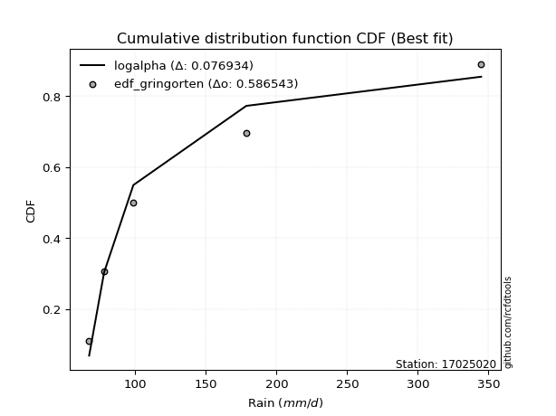</img>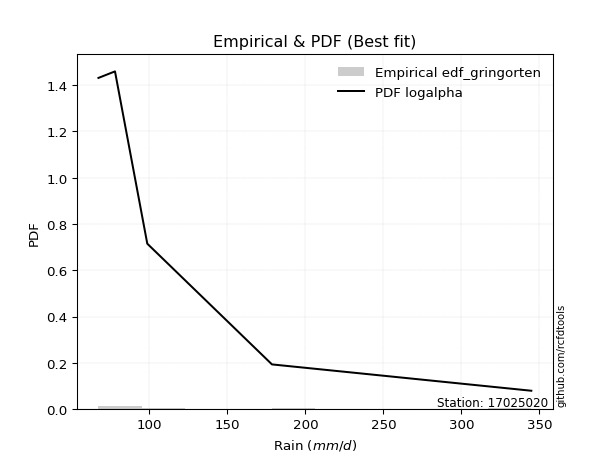</img>

</div>


### 9. EDF Filliben (1975)

The specific values of the constants (0.3175) (often denoted as $alpha$) and (0.365) are derived from a method proposed by James J. Filliben in a 1975 paper. This particular formula is the mean value of the $i$-th order statistic of the normal distribution and is considered a robust and effective plotting position formula for the normal probability plot correlation coefficient test for normality.

<div align="center">


$P=(m-0.3175)/(n+0.365)$


</div>


**9.1. Empirical values**

<div align="center">

|                | 0                   | 1                  | 2            | 3                  | 4                  |
|:---------------|:--------------------|:-------------------|:-------------|:-------------------|:-------------------|
| date           | 2022                | 2021               | 2023         | 2024               | 2025               |
| x              | 67.4                | 78.0               | 98.7         | 178.6              | 344.8              |
| m              | 1                   | 2                  | 3            | 4                  | 5                  |
| empirical_dist | edf_filliben        | edf_filliben       | edf_filliben | edf_filliben       | edf_filliben       |
| empirical      | 0.12721342031686858 | 0.3136067101584343 | 0.5          | 0.6863932898415657 | 0.8727865796831314 |
| empirical_tr   | 1.1457554725040042  | 1.456890699253225  | 2.0          | 3.188707280832095  | 7.860805860805863  |

</div>


**9.2. Kolmogorov-Smirnov fit test (sorted by Δ)**


<div align="center">

|                | 0                   | 1                   | 2                   | 3                   | 4                   | 5                   | 6                   | 7                   | 8                   | 9                   | 10                  | 11                  | 12                  | 13                  | 14                  | 15                  | 16                  | 17                  | 18                  | 19                  | 20                  | 21                  | 22                  | 23                  | 24                  | 25                  | 26                 | 27                  | 28                 | 29                  | 30                  | 31                  | 32                  | 33                  | 34                 | 35                 | 36                  | 37                  | 38                  | 39                 | 40                  | 41                  | 42                  | 43                  | 44                  | 45                 | 46                  | 47                  | 48                  | 49                 | 50                  | 51                 | 52                  | 53                  | 54                  | 55                  | 56                  | 57                  | 58                  | 59                  | 60                  | 61                  | 62                  | 63                 | 64                  | 65                  | 66                  | 67                  | 68                  | 69                 | 70                  | 71                 | 72                  | 73                  | 74                  | 75                 | 76                  | 77                  | 78                  | 79                  | 80                 | 81                 | 82                  | 83                 | 84                  | 85                  | 86                  | 87                  | 88                  | 89                  | 90                 | 91                  | 92                  | 93                  | 94                 | 95                 | 96                 | 97                  | 98                  | 99                 | 100                 | 101                | 102                 | 103                | 104                 | 105                | 106                 | 107                 | 108                 | 109                | 110                | 111                 | 112                | 113                 | 114                 | 115                 | 116                 | 117                | 118                 | 119                | 120                 | 121                | 122                 | 123                | 124                | 125                 | 126                 | 127                | 128                | 129                | 130                 | 131                | 132                | 133                | 134                | 135                 | 136                | 137                | 138                 | 139                 | 140                 | 141                 | 142                | 143                 | 144                 | 145                 | 146                | 147                | 148                | 149                | 150                | 151                | 152                | 153                | 154                | 155                | 156                | 157                | 158                | 159                |
|:---------------|:--------------------|:--------------------|:--------------------|:--------------------|:--------------------|:--------------------|:--------------------|:--------------------|:--------------------|:--------------------|:--------------------|:--------------------|:--------------------|:--------------------|:--------------------|:--------------------|:--------------------|:--------------------|:--------------------|:--------------------|:--------------------|:--------------------|:--------------------|:--------------------|:--------------------|:--------------------|:-------------------|:--------------------|:-------------------|:--------------------|:--------------------|:--------------------|:--------------------|:--------------------|:-------------------|:-------------------|:--------------------|:--------------------|:--------------------|:-------------------|:--------------------|:--------------------|:--------------------|:--------------------|:--------------------|:-------------------|:--------------------|:--------------------|:--------------------|:-------------------|:--------------------|:-------------------|:--------------------|:--------------------|:--------------------|:--------------------|:--------------------|:--------------------|:--------------------|:--------------------|:--------------------|:--------------------|:--------------------|:-------------------|:--------------------|:--------------------|:--------------------|:--------------------|:--------------------|:-------------------|:--------------------|:-------------------|:--------------------|:--------------------|:--------------------|:-------------------|:--------------------|:--------------------|:--------------------|:--------------------|:-------------------|:-------------------|:--------------------|:-------------------|:--------------------|:--------------------|:--------------------|:--------------------|:--------------------|:--------------------|:-------------------|:--------------------|:--------------------|:--------------------|:-------------------|:-------------------|:-------------------|:--------------------|:--------------------|:-------------------|:--------------------|:-------------------|:--------------------|:-------------------|:--------------------|:-------------------|:--------------------|:--------------------|:--------------------|:-------------------|:-------------------|:--------------------|:-------------------|:--------------------|:--------------------|:--------------------|:--------------------|:-------------------|:--------------------|:-------------------|:--------------------|:-------------------|:--------------------|:-------------------|:-------------------|:--------------------|:--------------------|:-------------------|:-------------------|:-------------------|:--------------------|:-------------------|:-------------------|:-------------------|:-------------------|:--------------------|:-------------------|:-------------------|:--------------------|:--------------------|:--------------------|:--------------------|:-------------------|:--------------------|:--------------------|:--------------------|:-------------------|:-------------------|:-------------------|:-------------------|:-------------------|:-------------------|:-------------------|:-------------------|:-------------------|:-------------------|:-------------------|:-------------------|:-------------------|:-------------------|
| station        | 17025020            | 17025020            | 17025020            | 17025020            | 17025020            | 17025020            | 17025020            | 17025020            | 17025020            | 17025020            | 17025020            | 17025020            | 17025020            | 17025020            | 17025020            | 17025020            | 17025020            | 17025020            | 17025020            | 17025020            | 17025020            | 17025020            | 17025020            | 17025020            | 17025020            | 17025020            | 17025020           | 17025020            | 17025020           | 17025020            | 17025020            | 17025020            | 17025020            | 17025020            | 17025020           | 17025020           | 17025020            | 17025020            | 17025020            | 17025020           | 17025020            | 17025020            | 17025020            | 17025020            | 17025020            | 17025020           | 17025020            | 17025020            | 17025020            | 17025020           | 17025020            | 17025020           | 17025020            | 17025020            | 17025020            | 17025020            | 17025020            | 17025020            | 17025020            | 17025020            | 17025020            | 17025020            | 17025020            | 17025020           | 17025020            | 17025020            | 17025020            | 17025020            | 17025020            | 17025020           | 17025020            | 17025020           | 17025020            | 17025020            | 17025020            | 17025020           | 17025020            | 17025020            | 17025020            | 17025020            | 17025020           | 17025020           | 17025020            | 17025020           | 17025020            | 17025020            | 17025020            | 17025020            | 17025020            | 17025020            | 17025020           | 17025020            | 17025020            | 17025020            | 17025020           | 17025020           | 17025020           | 17025020            | 17025020            | 17025020           | 17025020            | 17025020           | 17025020            | 17025020           | 17025020            | 17025020           | 17025020            | 17025020            | 17025020            | 17025020           | 17025020           | 17025020            | 17025020           | 17025020            | 17025020            | 17025020            | 17025020            | 17025020           | 17025020            | 17025020           | 17025020            | 17025020           | 17025020            | 17025020           | 17025020           | 17025020            | 17025020            | 17025020           | 17025020           | 17025020           | 17025020            | 17025020           | 17025020           | 17025020           | 17025020           | 17025020            | 17025020           | 17025020           | 17025020            | 17025020            | 17025020            | 17025020            | 17025020           | 17025020            | 17025020            | 17025020            | 17025020           | 17025020           | 17025020           | 17025020           | 17025020           | 17025020           | 17025020           | 17025020           | 17025020           | 17025020           | 17025020           | 17025020           | 17025020           | 17025020           |
| empirical_dist | edf_filliben        | edf_filliben        | edf_filliben        | edf_filliben        | edf_filliben        | edf_filliben        | edf_filliben        | edf_filliben        | edf_filliben        | edf_filliben        | edf_filliben        | edf_filliben        | edf_filliben        | edf_filliben        | edf_filliben        | edf_filliben        | edf_filliben        | edf_filliben        | edf_filliben        | edf_filliben        | edf_filliben        | edf_filliben        | edf_filliben        | edf_filliben        | edf_filliben        | edf_filliben        | edf_filliben       | edf_filliben        | edf_filliben       | edf_filliben        | edf_filliben        | edf_filliben        | edf_filliben        | edf_filliben        | edf_filliben       | edf_filliben       | edf_filliben        | edf_filliben        | edf_filliben        | edf_filliben       | edf_filliben        | edf_filliben        | edf_filliben        | edf_filliben        | edf_filliben        | edf_filliben       | edf_filliben        | edf_filliben        | edf_filliben        | edf_filliben       | edf_filliben        | edf_filliben       | edf_filliben        | edf_filliben        | edf_filliben        | edf_filliben        | edf_filliben        | edf_filliben        | edf_filliben        | edf_filliben        | edf_filliben        | edf_filliben        | edf_filliben        | edf_filliben       | edf_filliben        | edf_filliben        | edf_filliben        | edf_filliben        | edf_filliben        | edf_filliben       | edf_filliben        | edf_filliben       | edf_filliben        | edf_filliben        | edf_filliben        | edf_filliben       | edf_filliben        | edf_filliben        | edf_filliben        | edf_filliben        | edf_filliben       | edf_filliben       | edf_filliben        | edf_filliben       | edf_filliben        | edf_filliben        | edf_filliben        | edf_filliben        | edf_filliben        | edf_filliben        | edf_filliben       | edf_filliben        | edf_filliben        | edf_filliben        | edf_filliben       | edf_filliben       | edf_filliben       | edf_filliben        | edf_filliben        | edf_filliben       | edf_filliben        | edf_filliben       | edf_filliben        | edf_filliben       | edf_filliben        | edf_filliben       | edf_filliben        | edf_filliben        | edf_filliben        | edf_filliben       | edf_filliben       | edf_filliben        | edf_filliben       | edf_filliben        | edf_filliben        | edf_filliben        | edf_filliben        | edf_filliben       | edf_filliben        | edf_filliben       | edf_filliben        | edf_filliben       | edf_filliben        | edf_filliben       | edf_filliben       | edf_filliben        | edf_filliben        | edf_filliben       | edf_filliben       | edf_filliben       | edf_filliben        | edf_filliben       | edf_filliben       | edf_filliben       | edf_filliben       | edf_filliben        | edf_filliben       | edf_filliben       | edf_filliben        | edf_filliben        | edf_filliben        | edf_filliben        | edf_filliben       | edf_filliben        | edf_filliben        | edf_filliben        | edf_filliben       | edf_filliben       | edf_filliben       | edf_filliben       | edf_filliben       | edf_filliben       | edf_filliben       | edf_filliben       | edf_filliben       | edf_filliben       | edf_filliben       | edf_filliben       | edf_filliben       | edf_filliben       |
| p_dist         | loghalfnorm         | logalpha            | loghalflogistic     | logfoldnorm         | f                   | invgamma            | loginvweibull       | loggenextreme       | burr                | loggenlogistic      | logmielke           | loggumbel_r         | logburr             | burr12              | logburr12           | loginvgamma         | lograyleigh         | logmoyal            | nct                 | logksone            | dgamma              | logdgamma           | logkstwobign        | loginvgauss         | logpearson3         | logexponnorm        | logmaxwell         | nakagami            | gengamma           | exponweib           | exponpow            | loggenexpon         | logweibull_min      | weibull_min         | loglomax           | loggompertz        | logarcsine          | logsemicircular     | lognct              | invgauss           | foldnorm            | halfgennorm         | halfnorm            | loghalfgennorm      | alpha               | halflogistic       | vonmises_line       | betaprime           | loganglit           | ncf                | logdweibull         | logf               | dweibull            | logbetaprime        | logncf              | truncexpon          | logwrapcauchy       | logloggamma         | logt                | lognorm             | logcrystalball      | logtruncnorm        | pearson3            | moyal              | rayleigh            | logrice             | logloglaplace       | semicircular        | loggennorm          | gumbel_r           | arcsine             | gausshyper         | maxwell             | loglogistic         | anglit              | bradford           | logskewnorm         | wald                | logtruncexpon       | gennorm             | genlogistic        | logcosine          | loghypsecant        | logbradford        | exponnorm           | genexpon            | logweibull_max      | truncweibull_min    | norm                | t                   | logrdist           | gamma               | kstwobign           | loggumbel_l         | loglaplace         | loglaplace         | logistic           | loglevy_l           | genextreme          | loggausshyper      | wrapcauchy          | erlang             | logkappa4           | truncnorm          | hypsecant           | logargus           | rice                | cosine              | lomax               | logwald            | gumbel_l           | levy_l              | logtukeylambda     | logtriang           | laplace             | loguniform          | logkappa3           | logvonmises_line   | logtruncpareto      | argus              | loggenpareto        | triang             | logexponweib        | tukeylambda        | skewnorm           | genpareto           | logexponpow         | ksone              | gompertz           | fatiguelife        | logbeta             | loggenhalflogistic | invweibull         | truncpareto        | kappa4             | logtruncweibull_min | lognakagami        | powerlaw           | uniform             | kappa3              | beta                | logfatiguelife      | genhalflogistic    | logtrapezoid        | logpowerlaw         | rdist               | loggengamma        | loggamma           | loggamma           | logerlang          | trapezoid          | logjohnsonsb       | crystalball        | johnsonsb          | weibull_max        | logjohnsonsu       | johnsonsu          | logvonmises        | vonmises           | mielke             |
| delta          | 0.08066840010344839 | 0.08585310207674146 | 0.09080802616542574 | 0.10244811634891082 | 0.10268823974461738 | 0.10268837551673449 | 0.10628648779466554 | 0.10629192807732135 | 0.10650428157184244 | 0.10656231224099647 | 0.11190970960605384 | 0.11192046975846032 | 0.11237934575123276 | 0.11274805907684492 | 0.11310479029148739 | 0.11361185708641552 | 0.11470010637079975 | 0.11488312771764969 | 0.11613620327608754 | 0.11755405014849463 | 0.11817607421851564 | 0.11892601016985804 | 0.11950932030682554 | 0.12420268717843963 | 0.12555625001926085 | 0.12636779359902142 | 0.1266576802487136 | 0.12720017893990648 | 0.1272124333941992 | 0.12721244022635894 | 0.12721327505002647 | 0.12721341787777377 | 0.12721341978546083 | 0.12721342004772215 | 0.1272134203086381 | 0.1272134203126559 | 0.12721342031686855 | 0.12872061613328972 | 0.12956912029562678 | 0.1305414094003028 | 0.13070302233533204 | 0.13187450930337807 | 0.13260694166468678 | 0.13312389139568015 | 0.13444338083561558 | 0.1348040714175417 | 0.13543939370755143 | 0.13660983178499253 | 0.13740999110716845 | 0.137644502664041  | 0.13894016321190206 | 0.143685279064394  | 0.14413792532497777 | 0.14500256010499413 | 0.14630616286974168 | 0.15232849092919895 | 0.15530620085427294 | 0.15570061354796172 | 0.15807041511277697 | 0.15807649025529247 | 0.15807649739448737 | 0.15848849665363385 | 0.15892559732415923 | 0.1604998314455146 | 0.16353606960987122 | 0.16371610177541374 | 0.16457126387094834 | 0.16687857962493113 | 0.16726540246074761 | 0.1700338871397084 | 0.17213606885481433 | 0.1742003014770232 | 0.17448824977449678 | 0.17669267577720837 | 0.17741063459624484 | 0.1776365724476559 | 0.18022258323750784 | 0.18095402284136156 | 0.18160009052963766 | 0.18419371166286358 | 0.187260877383017  | 0.1889671951324573 | 0.19099535470706247 | 0.1956827286769074 | 0.19669323687510737 | 0.19777077122927345 | 0.19856855757048508 | 0.19870581932787346 | 0.20213627446696886 | 0.20214191833471984 | 0.2049543537750192 | 0.20563599936018073 | 0.21410944292139195 | 0.21674197089886532 | 0.2188992296761612 | 0.2188992296761612 | 0.2235859929738137 | 0.22418517204859553 | 0.23062701348986336 | 0.2313206060627866 | 0.23230013479827344 | 0.2342999289736345 | 0.23625006695774525 | 0.2386677092264204 | 0.23901750416901085 | 0.2393805660485505 | 0.24355071749817708 | 0.24375633182585665 | 0.24432120213850594 | 0.2477973696565861 | 0.2525308227715709 | 0.25345187370204025 | 0.2605176385859025 | 0.26221811948213003 | 0.26389170847057397 | 0.26632030454578204 | 0.26633083235100574 | 0.2713442058810417 | 0.27224367770999797 | 0.2878522150222782 | 0.28809269039288465 | 0.3006981946342473 | 0.30076526617948335 | 0.3136067101584272 | 0.315941875597854  | 0.31630249174633496 | 0.31983521302005974 | 0.3226387887527037 | 0.3313326158555773 | 0.3335476542645675 | 0.33790884302329716 | 0.3405457002030935 | 0.349736316082211  | 0.3605730095608108 | 0.363092495268865  | 0.3635902813927058  | 0.3642279698018492 | 0.37569896013723   | 0.38716654650324445 | 0.38946466037726574 | 0.39305549402652007 | 0.39589333464276083 | 0.4061749439721042 | 0.42267907002887517 | 0.42329847644253155 | 0.43835738752448117 | 0.4542451932261092 | 0.5037646869978694 | 0.5037646869978694 | 0.5120709919296982 | 0.5121808418062535 | 0.5150433813034518 | 0.5156839170961612 | 0.5712135930616038 | 0.5935921000444502 | 0.611753137700014  | 0.6519126269946676 | 1.0813780827332127 | 55.00728954407424  | nan                |
| deltao         | 0.5865427407550001  | 0.5865427407550001  | 0.5865427407550001  | 0.5865427407550001  | 0.5865427407550001  | 0.5865427407550001  | 0.5865427407550001  | 0.5865427407550001  | 0.5865427407550001  | 0.5865427407550001  | 0.5865427407550001  | 0.5865427407550001  | 0.5865427407550001  | 0.5865427407550001  | 0.5865427407550001  | 0.5865427407550001  | 0.5865427407550001  | 0.5865427407550001  | 0.5865427407550001  | 0.5865427407550001  | 0.5865427407550001  | 0.5865427407550001  | 0.5865427407550001  | 0.5865427407550001  | 0.5865427407550001  | 0.5865427407550001  | 0.5865427407550001 | 0.5865427407550001  | 0.5865427407550001 | 0.5865427407550001  | 0.5865427407550001  | 0.5865427407550001  | 0.5865427407550001  | 0.5865427407550001  | 0.5865427407550001 | 0.5865427407550001 | 0.5865427407550001  | 0.5865427407550001  | 0.5865427407550001  | 0.5865427407550001 | 0.5865427407550001  | 0.5865427407550001  | 0.5865427407550001  | 0.5865427407550001  | 0.5865427407550001  | 0.5865427407550001 | 0.5865427407550001  | 0.5865427407550001  | 0.5865427407550001  | 0.5865427407550001 | 0.5865427407550001  | 0.5865427407550001 | 0.5865427407550001  | 0.5865427407550001  | 0.5865427407550001  | 0.5865427407550001  | 0.5865427407550001  | 0.5865427407550001  | 0.5865427407550001  | 0.5865427407550001  | 0.5865427407550001  | 0.5865427407550001  | 0.5865427407550001  | 0.5865427407550001 | 0.5865427407550001  | 0.5865427407550001  | 0.5865427407550001  | 0.5865427407550001  | 0.5865427407550001  | 0.5865427407550001 | 0.5865427407550001  | 0.5865427407550001 | 0.5865427407550001  | 0.5865427407550001  | 0.5865427407550001  | 0.5865427407550001 | 0.5865427407550001  | 0.5865427407550001  | 0.5865427407550001  | 0.5865427407550001  | 0.5865427407550001 | 0.5865427407550001 | 0.5865427407550001  | 0.5865427407550001 | 0.5865427407550001  | 0.5865427407550001  | 0.5865427407550001  | 0.5865427407550001  | 0.5865427407550001  | 0.5865427407550001  | 0.5865427407550001 | 0.5865427407550001  | 0.5865427407550001  | 0.5865427407550001  | 0.5865427407550001 | 0.5865427407550001 | 0.5865427407550001 | 0.5865427407550001  | 0.5865427407550001  | 0.5865427407550001 | 0.5865427407550001  | 0.5865427407550001 | 0.5865427407550001  | 0.5865427407550001 | 0.5865427407550001  | 0.5865427407550001 | 0.5865427407550001  | 0.5865427407550001  | 0.5865427407550001  | 0.5865427407550001 | 0.5865427407550001 | 0.5865427407550001  | 0.5865427407550001 | 0.5865427407550001  | 0.5865427407550001  | 0.5865427407550001  | 0.5865427407550001  | 0.5865427407550001 | 0.5865427407550001  | 0.5865427407550001 | 0.5865427407550001  | 0.5865427407550001 | 0.5865427407550001  | 0.5865427407550001 | 0.5865427407550001 | 0.5865427407550001  | 0.5865427407550001  | 0.5865427407550001 | 0.5865427407550001 | 0.5865427407550001 | 0.5865427407550001  | 0.5865427407550001 | 0.5865427407550001 | 0.5865427407550001 | 0.5865427407550001 | 0.5865427407550001  | 0.5865427407550001 | 0.5865427407550001 | 0.5865427407550001  | 0.5865427407550001  | 0.5865427407550001  | 0.5865427407550001  | 0.5865427407550001 | 0.5865427407550001  | 0.5865427407550001  | 0.5865427407550001  | 0.5865427407550001 | 0.5865427407550001 | 0.5865427407550001 | 0.5865427407550001 | 0.5865427407550001 | 0.5865427407550001 | 0.5865427407550001 | 0.5865427407550001 | 0.5865427407550001 | 0.5865427407550001 | 0.5865427407550001 | 0.5865427407550001 | 0.5865427407550001 | 0.5865427407550001 |
| eval           | Δo > Δ              | Δo > Δ              | Δo > Δ              | Δo > Δ              | Δo > Δ              | Δo > Δ              | Δo > Δ              | Δo > Δ              | Δo > Δ              | Δo > Δ              | Δo > Δ              | Δo > Δ              | Δo > Δ              | Δo > Δ              | Δo > Δ              | Δo > Δ              | Δo > Δ              | Δo > Δ              | Δo > Δ              | Δo > Δ              | Δo > Δ              | Δo > Δ              | Δo > Δ              | Δo > Δ              | Δo > Δ              | Δo > Δ              | Δo > Δ             | Δo > Δ              | Δo > Δ             | Δo > Δ              | Δo > Δ              | Δo > Δ              | Δo > Δ              | Δo > Δ              | Δo > Δ             | Δo > Δ             | Δo > Δ              | Δo > Δ              | Δo > Δ              | Δo > Δ             | Δo > Δ              | Δo > Δ              | Δo > Δ              | Δo > Δ              | Δo > Δ              | Δo > Δ             | Δo > Δ              | Δo > Δ              | Δo > Δ              | Δo > Δ             | Δo > Δ              | Δo > Δ             | Δo > Δ              | Δo > Δ              | Δo > Δ              | Δo > Δ              | Δo > Δ              | Δo > Δ              | Δo > Δ              | Δo > Δ              | Δo > Δ              | Δo > Δ              | Δo > Δ              | Δo > Δ             | Δo > Δ              | Δo > Δ              | Δo > Δ              | Δo > Δ              | Δo > Δ              | Δo > Δ             | Δo > Δ              | Δo > Δ             | Δo > Δ              | Δo > Δ              | Δo > Δ              | Δo > Δ             | Δo > Δ              | Δo > Δ              | Δo > Δ              | Δo > Δ              | Δo > Δ             | Δo > Δ             | Δo > Δ              | Δo > Δ             | Δo > Δ              | Δo > Δ              | Δo > Δ              | Δo > Δ              | Δo > Δ              | Δo > Δ              | Δo > Δ             | Δo > Δ              | Δo > Δ              | Δo > Δ              | Δo > Δ             | Δo > Δ             | Δo > Δ             | Δo > Δ              | Δo > Δ              | Δo > Δ             | Δo > Δ              | Δo > Δ             | Δo > Δ              | Δo > Δ             | Δo > Δ              | Δo > Δ             | Δo > Δ              | Δo > Δ              | Δo > Δ              | Δo > Δ             | Δo > Δ             | Δo > Δ              | Δo > Δ             | Δo > Δ              | Δo > Δ              | Δo > Δ              | Δo > Δ              | Δo > Δ             | Δo > Δ              | Δo > Δ             | Δo > Δ              | Δo > Δ             | Δo > Δ              | Δo > Δ             | Δo > Δ             | Δo > Δ              | Δo > Δ              | Δo > Δ             | Δo > Δ             | Δo > Δ             | Δo > Δ              | Δo > Δ             | Δo > Δ             | Δo > Δ             | Δo > Δ             | Δo > Δ              | Δo > Δ             | Δo > Δ             | Δo > Δ              | Δo > Δ              | Δo > Δ              | Δo > Δ              | Δo > Δ             | Δo > Δ              | Δo > Δ              | Δo > Δ              | Δo > Δ             | Δo > Δ             | Δo > Δ             | Δo > Δ             | Δo > Δ             | Δo > Δ             | Δo > Δ             | Δo > Δ             | Δo <= Δ            | Δo <= Δ            | Δo <= Δ            | Δo <= Δ            | Δo <= Δ            | Δo <= Δ            |
| fit            | 1                   | 1                   | 1                   | 1                   | 1                   | 1                   | 1                   | 1                   | 1                   | 1                   | 1                   | 1                   | 1                   | 1                   | 1                   | 1                   | 1                   | 1                   | 1                   | 1                   | 1                   | 1                   | 1                   | 1                   | 1                   | 1                   | 1                  | 1                   | 1                  | 1                   | 1                   | 1                   | 1                   | 1                   | 1                  | 1                  | 1                   | 1                   | 1                   | 1                  | 1                   | 1                   | 1                   | 1                   | 1                   | 1                  | 1                   | 1                   | 1                   | 1                  | 1                   | 1                  | 1                   | 1                   | 1                   | 1                   | 1                   | 1                   | 1                   | 1                   | 1                   | 1                   | 1                   | 1                  | 1                   | 1                   | 1                   | 1                   | 1                   | 1                  | 1                   | 1                  | 1                   | 1                   | 1                   | 1                  | 1                   | 1                   | 1                   | 1                   | 1                  | 1                  | 1                   | 1                  | 1                   | 1                   | 1                   | 1                   | 1                   | 1                   | 1                  | 1                   | 1                   | 1                   | 1                  | 1                  | 1                  | 1                   | 1                   | 1                  | 1                   | 1                  | 1                   | 1                  | 1                   | 1                  | 1                   | 1                   | 1                   | 1                  | 1                  | 1                   | 1                  | 1                   | 1                   | 1                   | 1                   | 1                  | 1                   | 1                  | 1                   | 1                  | 1                   | 1                  | 1                  | 1                   | 1                   | 1                  | 1                  | 1                  | 1                   | 1                  | 1                  | 1                  | 1                  | 1                   | 1                  | 1                  | 1                   | 1                   | 1                   | 1                   | 1                  | 1                   | 1                   | 1                   | 1                  | 1                  | 1                  | 1                  | 1                  | 1                  | 1                  | 1                  | 0                  | 0                  | 0                  | 0                  | 0                  | 0                  |
| n              | 5                   | 5                   | 5                   | 5                   | 5                   | 5                   | 5                   | 5                   | 5                   | 5                   | 5                   | 5                   | 5                   | 5                   | 5                   | 5                   | 5                   | 5                   | 5                   | 5                   | 5                   | 5                   | 5                   | 5                   | 5                   | 5                   | 5                  | 5                   | 5                  | 5                   | 5                   | 5                   | 5                   | 5                   | 5                  | 5                  | 5                   | 5                   | 5                   | 5                  | 5                   | 5                   | 5                   | 5                   | 5                   | 5                  | 5                   | 5                   | 5                   | 5                  | 5                   | 5                  | 5                   | 5                   | 5                   | 5                   | 5                   | 5                   | 5                   | 5                   | 5                   | 5                   | 5                   | 5                  | 5                   | 5                   | 5                   | 5                   | 5                   | 5                  | 5                   | 5                  | 5                   | 5                   | 5                   | 5                  | 5                   | 5                   | 5                   | 5                   | 5                  | 5                  | 5                   | 5                  | 5                   | 5                   | 5                   | 5                   | 5                   | 5                   | 5                  | 5                   | 5                   | 5                   | 5                  | 5                  | 5                  | 5                   | 5                   | 5                  | 5                   | 5                  | 5                   | 5                  | 5                   | 5                  | 5                   | 5                   | 5                   | 5                  | 5                  | 5                   | 5                  | 5                   | 5                   | 5                   | 5                   | 5                  | 5                   | 5                  | 5                   | 5                  | 5                   | 5                  | 5                  | 5                   | 5                   | 5                  | 5                  | 5                  | 5                   | 5                  | 5                  | 5                  | 5                  | 5                   | 5                  | 5                  | 5                   | 5                   | 5                   | 5                   | 5                  | 5                   | 5                   | 5                   | 5                  | 5                  | 5                  | 5                  | 5                  | 5                  | 5                  | 5                  | 5                  | 5                  | 5                  | 5                  | 5                  | 5                  |
| best_fit       | 1                   | 0                   | 0                   | 0                   | 0                   | 0                   | 0                   | 0                   | 0                   | 0                   | 0                   | 0                   | 0                   | 0                   | 0                   | 0                   | 0                   | 0                   | 0                   | 0                   | 0                   | 0                   | 0                   | 0                   | 0                   | 0                   | 0                  | 0                   | 0                  | 0                   | 0                   | 0                   | 0                   | 0                   | 0                  | 0                  | 0                   | 0                   | 0                   | 0                  | 0                   | 0                   | 0                   | 0                   | 0                   | 0                  | 0                   | 0                   | 0                   | 0                  | 0                   | 0                  | 0                   | 0                   | 0                   | 0                   | 0                   | 0                   | 0                   | 0                   | 0                   | 0                   | 0                   | 0                  | 0                   | 0                   | 0                   | 0                   | 0                   | 0                  | 0                   | 0                  | 0                   | 0                   | 0                   | 0                  | 0                   | 0                   | 0                   | 0                   | 0                  | 0                  | 0                   | 0                  | 0                   | 0                   | 0                   | 0                   | 0                   | 0                   | 0                  | 0                   | 0                   | 0                   | 0                  | 0                  | 0                  | 0                   | 0                   | 0                  | 0                   | 0                  | 0                   | 0                  | 0                   | 0                  | 0                   | 0                   | 0                   | 0                  | 0                  | 0                   | 0                  | 0                   | 0                   | 0                   | 0                   | 0                  | 0                   | 0                  | 0                   | 0                  | 0                   | 0                  | 0                  | 0                   | 0                   | 0                  | 0                  | 0                  | 0                   | 0                  | 0                  | 0                  | 0                  | 0                   | 0                  | 0                  | 0                   | 0                   | 0                   | 0                   | 0                  | 0                   | 0                   | 0                   | 0                  | 0                  | 0                  | 0                  | 0                  | 0                  | 0                  | 0                  | 0                  | 0                  | 0                  | 0                  | 0                  | 0                  |
| best_fit_sort  | 1                   | 2                   | 3                   | 4                   | 5                   | 6                   | 7                   | 8                   | 9                   | 10                  | 11                  | 12                  | 13                  | 14                  | 15                  | 16                  | 17                  | 18                  | 19                  | 20                  | 21                  | 22                  | 23                  | 24                  | 25                  | 26                  | 27                 | 28                  | 29                 | 30                  | 31                  | 32                  | 33                  | 34                  | 35                 | 36                 | 37                  | 38                  | 39                  | 40                 | 41                  | 42                  | 43                  | 44                  | 45                  | 46                 | 47                  | 48                  | 49                  | 50                 | 51                  | 52                 | 53                  | 54                  | 55                  | 56                  | 57                  | 58                  | 59                  | 60                  | 61                  | 62                  | 63                  | 64                 | 65                  | 66                  | 67                  | 68                  | 69                  | 70                 | 71                  | 72                 | 73                  | 74                  | 75                  | 76                 | 77                  | 78                  | 79                  | 80                  | 81                 | 82                 | 83                  | 84                 | 85                  | 86                  | 87                  | 88                  | 89                  | 90                  | 91                 | 92                  | 93                  | 94                  | 95                 | 96                 | 97                 | 98                  | 99                  | 100                | 101                 | 102                | 103                 | 104                | 105                 | 106                | 107                 | 108                 | 109                 | 110                | 111                | 112                 | 113                | 114                 | 115                 | 116                 | 117                 | 118                | 119                 | 120                | 121                 | 122                | 123                 | 124                | 125                | 126                 | 127                 | 128                | 129                | 130                | 131                 | 132                | 133                | 134                | 135                | 136                 | 137                | 138                | 139                 | 140                 | 141                 | 142                 | 143                | 144                 | 145                 | 146                 | 147                | 148                | 149                | 150                | 151                | 152                | 153                | 154                | 155                | 156                | 157                | 158                | 159                | 160                |

</div>


**9.3. Best fit**

<div align="center">

|   id |   station | empirical_dist   | p_dist      |     delta |   deltao | eval   |   fit |   n |   best_fit |   best_fit_sort |
|-----:|----------:|:-----------------|:------------|----------:|---------:|:-------|------:|----:|-----------:|----------------:|
|    0 |  17025020 | edf_filliben     | loghalfnorm | 0.0806684 | 0.586543 | Δo > Δ |     1 |   5 |          1 |               1 |

</div>


<div align="center">

</img>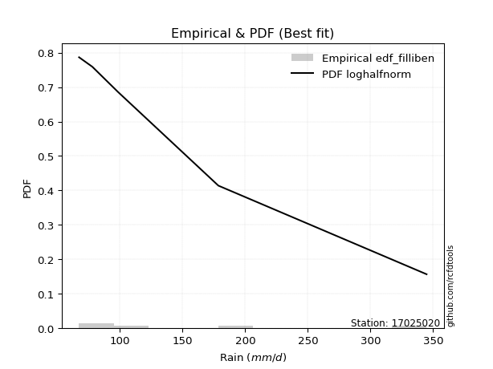</img>

</div>


### 10. EDF Jenkinson (1977)

The Jenkinson formula in hydrology is an empirical plotting position formula used to estimate the non-exceedance probability _(P)_ or return period _(T)_ of a given ordered observation within a sample. It is a widely used method in the frequency analysis of extreme events such as floods and rainfall, as it provides a distribution-free way to plot data. _a≈0.31_ and _b≈0.38_ are constants derived to approximate the median of the probability distribution for the given rank.

<div align="center">


$P=(m-a)/(n+b)$


</div>


**10.1. Empirical values**

<div align="center">

|                | 0                   | 1                  | 2             | 3                  | 4                  |
|:---------------|:--------------------|:-------------------|:--------------|:-------------------|:-------------------|
| date           | 2022                | 2021               | 2023          | 2024               | 2025               |
| x              | 67.4                | 78.0               | 98.7          | 178.6              | 344.8              |
| m              | 1                   | 2                  | 3             | 4                  | 5                  |
| empirical_dist | edf_jenkinson       | edf_jenkinson      | edf_jenkinson | edf_jenkinson      | edf_jenkinson      |
| empirical      | 0.12825278810408922 | 0.3141263940520446 | 0.5           | 0.6858736059479554 | 0.8717472118959109 |
| empirical_tr   | 1.1471215351812367  | 1.4579945799457996 | 2.0           | 3.183431952662722  | 7.797101449275368  |

</div>


**10.2. Kolmogorov-Smirnov fit test (sorted by Δ)**


<div align="center">

|                | 0                   | 1                  | 2                   | 3                   | 4                   | 5                   | 6                   | 7                   | 8                   | 9                   | 10                  | 11                  | 12                 | 13                  | 14                  | 15                  | 16                  | 17                  | 18                  | 19                 | 20                  | 21                  | 22                  | 23                  | 24                  | 25                 | 26                  | 27                  | 28                  | 29                  | 30                 | 31                 | 32                  | 33                 | 34                  | 35                  | 36                  | 37                  | 38                  | 39                  | 40                  | 41                  | 42                  | 43                 | 44                 | 45                 | 46                  | 47                  | 48                  | 49                 | 50                  | 51                  | 52                  | 53                  | 54                  | 55                  | 56                 | 57                  | 58                  | 59                  | 60                  | 61                  | 62                  | 63                 | 64                  | 65                  | 66                  | 67                  | 68                  | 69                 | 70                 | 71                 | 72                  | 73                  | 74                  | 75                  | 76                  | 77                 | 78                 | 79                  | 80                 | 81                 | 82                  | 83                 | 84                  | 85                 | 86                  | 87                  | 88                  | 89                  | 90                 | 91                  | 92                  | 93                  | 94                 | 95                 | 96                 | 97                 | 98                  | 99                 | 100                 | 101                 | 102                 | 103                | 104                 | 105                | 106                 | 107                 | 108                 | 109                 | 110                 | 111                | 112                | 113                 | 114                 | 115                 | 116                 | 117                | 118                | 119                | 120                | 121                | 122                | 123                 | 124                | 125                | 126                | 127                | 128                | 129                 | 130                | 131                | 132                | 133                 | 134                 | 135                | 136                 | 137                 | 138                 | 139                 | 140                | 141                | 142                 | 143                 | 144                | 145                | 146                 | 147                | 148                | 149                | 150                | 151                | 152                | 153                | 154                | 155                | 156                | 157                | 158                | 159                |
|:---------------|:--------------------|:-------------------|:--------------------|:--------------------|:--------------------|:--------------------|:--------------------|:--------------------|:--------------------|:--------------------|:--------------------|:--------------------|:-------------------|:--------------------|:--------------------|:--------------------|:--------------------|:--------------------|:--------------------|:-------------------|:--------------------|:--------------------|:--------------------|:--------------------|:--------------------|:-------------------|:--------------------|:--------------------|:--------------------|:--------------------|:-------------------|:-------------------|:--------------------|:-------------------|:--------------------|:--------------------|:--------------------|:--------------------|:--------------------|:--------------------|:--------------------|:--------------------|:--------------------|:-------------------|:-------------------|:-------------------|:--------------------|:--------------------|:--------------------|:-------------------|:--------------------|:--------------------|:--------------------|:--------------------|:--------------------|:--------------------|:-------------------|:--------------------|:--------------------|:--------------------|:--------------------|:--------------------|:--------------------|:-------------------|:--------------------|:--------------------|:--------------------|:--------------------|:--------------------|:-------------------|:-------------------|:-------------------|:--------------------|:--------------------|:--------------------|:--------------------|:--------------------|:-------------------|:-------------------|:--------------------|:-------------------|:-------------------|:--------------------|:-------------------|:--------------------|:-------------------|:--------------------|:--------------------|:--------------------|:--------------------|:-------------------|:--------------------|:--------------------|:--------------------|:-------------------|:-------------------|:-------------------|:-------------------|:--------------------|:-------------------|:--------------------|:--------------------|:--------------------|:-------------------|:--------------------|:-------------------|:--------------------|:--------------------|:--------------------|:--------------------|:--------------------|:-------------------|:-------------------|:--------------------|:--------------------|:--------------------|:--------------------|:-------------------|:-------------------|:-------------------|:-------------------|:-------------------|:-------------------|:--------------------|:-------------------|:-------------------|:-------------------|:-------------------|:-------------------|:--------------------|:-------------------|:-------------------|:-------------------|:--------------------|:--------------------|:-------------------|:--------------------|:--------------------|:--------------------|:--------------------|:-------------------|:-------------------|:--------------------|:--------------------|:-------------------|:-------------------|:--------------------|:-------------------|:-------------------|:-------------------|:-------------------|:-------------------|:-------------------|:-------------------|:-------------------|:-------------------|:-------------------|:-------------------|:-------------------|:-------------------|
| station        | 17025020            | 17025020           | 17025020            | 17025020            | 17025020            | 17025020            | 17025020            | 17025020            | 17025020            | 17025020            | 17025020            | 17025020            | 17025020           | 17025020            | 17025020            | 17025020            | 17025020            | 17025020            | 17025020            | 17025020           | 17025020            | 17025020            | 17025020            | 17025020            | 17025020            | 17025020           | 17025020            | 17025020            | 17025020            | 17025020            | 17025020           | 17025020           | 17025020            | 17025020           | 17025020            | 17025020            | 17025020            | 17025020            | 17025020            | 17025020            | 17025020            | 17025020            | 17025020            | 17025020           | 17025020           | 17025020           | 17025020            | 17025020            | 17025020            | 17025020           | 17025020            | 17025020            | 17025020            | 17025020            | 17025020            | 17025020            | 17025020           | 17025020            | 17025020            | 17025020            | 17025020            | 17025020            | 17025020            | 17025020           | 17025020            | 17025020            | 17025020            | 17025020            | 17025020            | 17025020           | 17025020           | 17025020           | 17025020            | 17025020            | 17025020            | 17025020            | 17025020            | 17025020           | 17025020           | 17025020            | 17025020           | 17025020           | 17025020            | 17025020           | 17025020            | 17025020           | 17025020            | 17025020            | 17025020            | 17025020            | 17025020           | 17025020            | 17025020            | 17025020            | 17025020           | 17025020           | 17025020           | 17025020           | 17025020            | 17025020           | 17025020            | 17025020            | 17025020            | 17025020           | 17025020            | 17025020           | 17025020            | 17025020            | 17025020            | 17025020            | 17025020            | 17025020           | 17025020           | 17025020            | 17025020            | 17025020            | 17025020            | 17025020           | 17025020           | 17025020           | 17025020           | 17025020           | 17025020           | 17025020            | 17025020           | 17025020           | 17025020           | 17025020           | 17025020           | 17025020            | 17025020           | 17025020           | 17025020           | 17025020            | 17025020            | 17025020           | 17025020            | 17025020            | 17025020            | 17025020            | 17025020           | 17025020           | 17025020            | 17025020            | 17025020           | 17025020           | 17025020            | 17025020           | 17025020           | 17025020           | 17025020           | 17025020           | 17025020           | 17025020           | 17025020           | 17025020           | 17025020           | 17025020           | 17025020           | 17025020           |
| empirical_dist | edf_jenkinson       | edf_jenkinson      | edf_jenkinson       | edf_jenkinson       | edf_jenkinson       | edf_jenkinson       | edf_jenkinson       | edf_jenkinson       | edf_jenkinson       | edf_jenkinson       | edf_jenkinson       | edf_jenkinson       | edf_jenkinson      | edf_jenkinson       | edf_jenkinson       | edf_jenkinson       | edf_jenkinson       | edf_jenkinson       | edf_jenkinson       | edf_jenkinson      | edf_jenkinson       | edf_jenkinson       | edf_jenkinson       | edf_jenkinson       | edf_jenkinson       | edf_jenkinson      | edf_jenkinson       | edf_jenkinson       | edf_jenkinson       | edf_jenkinson       | edf_jenkinson      | edf_jenkinson      | edf_jenkinson       | edf_jenkinson      | edf_jenkinson       | edf_jenkinson       | edf_jenkinson       | edf_jenkinson       | edf_jenkinson       | edf_jenkinson       | edf_jenkinson       | edf_jenkinson       | edf_jenkinson       | edf_jenkinson      | edf_jenkinson      | edf_jenkinson      | edf_jenkinson       | edf_jenkinson       | edf_jenkinson       | edf_jenkinson      | edf_jenkinson       | edf_jenkinson       | edf_jenkinson       | edf_jenkinson       | edf_jenkinson       | edf_jenkinson       | edf_jenkinson      | edf_jenkinson       | edf_jenkinson       | edf_jenkinson       | edf_jenkinson       | edf_jenkinson       | edf_jenkinson       | edf_jenkinson      | edf_jenkinson       | edf_jenkinson       | edf_jenkinson       | edf_jenkinson       | edf_jenkinson       | edf_jenkinson      | edf_jenkinson      | edf_jenkinson      | edf_jenkinson       | edf_jenkinson       | edf_jenkinson       | edf_jenkinson       | edf_jenkinson       | edf_jenkinson      | edf_jenkinson      | edf_jenkinson       | edf_jenkinson      | edf_jenkinson      | edf_jenkinson       | edf_jenkinson      | edf_jenkinson       | edf_jenkinson      | edf_jenkinson       | edf_jenkinson       | edf_jenkinson       | edf_jenkinson       | edf_jenkinson      | edf_jenkinson       | edf_jenkinson       | edf_jenkinson       | edf_jenkinson      | edf_jenkinson      | edf_jenkinson      | edf_jenkinson      | edf_jenkinson       | edf_jenkinson      | edf_jenkinson       | edf_jenkinson       | edf_jenkinson       | edf_jenkinson      | edf_jenkinson       | edf_jenkinson      | edf_jenkinson       | edf_jenkinson       | edf_jenkinson       | edf_jenkinson       | edf_jenkinson       | edf_jenkinson      | edf_jenkinson      | edf_jenkinson       | edf_jenkinson       | edf_jenkinson       | edf_jenkinson       | edf_jenkinson      | edf_jenkinson      | edf_jenkinson      | edf_jenkinson      | edf_jenkinson      | edf_jenkinson      | edf_jenkinson       | edf_jenkinson      | edf_jenkinson      | edf_jenkinson      | edf_jenkinson      | edf_jenkinson      | edf_jenkinson       | edf_jenkinson      | edf_jenkinson      | edf_jenkinson      | edf_jenkinson       | edf_jenkinson       | edf_jenkinson      | edf_jenkinson       | edf_jenkinson       | edf_jenkinson       | edf_jenkinson       | edf_jenkinson      | edf_jenkinson      | edf_jenkinson       | edf_jenkinson       | edf_jenkinson      | edf_jenkinson      | edf_jenkinson       | edf_jenkinson      | edf_jenkinson      | edf_jenkinson      | edf_jenkinson      | edf_jenkinson      | edf_jenkinson      | edf_jenkinson      | edf_jenkinson      | edf_jenkinson      | edf_jenkinson      | edf_jenkinson      | edf_jenkinson      | edf_jenkinson      |
| p_dist         | loghalfnorm         | logalpha           | loghalflogistic     | logfoldnorm         | f                   | invgamma            | loginvweibull       | loggenextreme       | burr                | loggenlogistic      | loggumbel_r         | logmielke           | logburr            | burr12              | loginvgamma         | logburr12           | lograyleigh         | logmoyal            | nct                 | dgamma             | logksone            | logdgamma           | logkstwobign        | loginvgauss         | logpearson3         | logmaxwell         | logexponnorm        | nakagami            | gengamma            | exponweib           | exponpow           | loggenexpon        | logweibull_min      | weibull_min        | loglomax            | loggompertz         | logarcsine          | logsemicircular     | lognct              | foldnorm            | invgauss            | halfgennorm         | halfnorm            | loghalfgennorm     | halflogistic       | alpha              | vonmises_line       | betaprime           | loganglit           | ncf                | logdweibull         | dweibull            | logf                | logbetaprime        | logncf              | truncexpon          | logwrapcauchy      | logloggamma         | logt                | lognorm             | logcrystalball      | pearson3            | logtruncnorm        | moyal              | rayleigh            | logrice             | logloglaplace       | semicircular        | loggennorm          | gumbel_r           | arcsine            | gausshyper         | maxwell             | loglogistic         | bradford            | anglit              | logskewnorm         | wald               | logtruncexpon      | gennorm             | genlogistic        | logcosine          | loghypsecant        | logbradford        | exponnorm           | genexpon           | logweibull_max      | truncweibull_min    | norm                | t                   | logrdist           | gamma               | kstwobign           | loggumbel_l         | loglaplace         | loglaplace         | loglevy_l          | logistic           | genextreme          | loggausshyper      | wrapcauchy          | erlang              | logkappa4           | truncnorm          | hypsecant           | logargus           | rice                | cosine              | lomax               | logwald             | levy_l              | gumbel_l           | logtukeylambda     | logtriang           | laplace             | loguniform          | logkappa3           | logvonmises_line   | logtruncpareto     | loggenpareto       | argus              | logexponweib       | triang             | tukeylambda         | genpareto          | skewnorm           | logexponpow        | ksone              | gompertz           | fatiguelife         | logbeta            | loggenhalflogistic | invweibull         | truncpareto         | logtruncweibull_min | kappa4             | lognakagami         | powerlaw            | uniform             | kappa3              | beta               | logfatiguelife     | genhalflogistic     | logtrapezoid        | logpowerlaw        | rdist              | loggengamma         | loggamma           | loggamma           | logerlang          | trapezoid          | logjohnsonsb       | crystalball        | johnsonsb          | weibull_max        | logjohnsonsu       | johnsonsu          | logvonmises        | vonmises           | mielke             |
| delta          | 0.08066840010344839 | 0.0863727859703517 | 0.09132771005903609 | 0.10244811634891082 | 0.10320792363822762 | 0.10320805941034472 | 0.10680617168827578 | 0.10681161197093159 | 0.10702396546545279 | 0.10708199613460681 | 0.11192046975846032 | 0.11242939349966408 | 0.112899029644843  | 0.11378742686406555 | 0.11413154098002576 | 0.11414415807870802 | 0.11470010637079975 | 0.11540281161126004 | 0.11613620327608754 | 0.117136706431295  | 0.11755405014849463 | 0.11840632627624781 | 0.11950932030682554 | 0.12472237107204986 | 0.12555625001926085 | 0.1266576802487136 | 0.12740716138624206 | 0.12823954672712712 | 0.12825180118141982 | 0.12825180801357958 | 0.1282526428372471 | 0.1282527856649944 | 0.12825278757268146 | 0.1282527878349428 | 0.12825278809585874 | 0.12825278809987653 | 0.12825278810408913 | 0.12872061613328972 | 0.12956912029562678 | 0.13070302233533204 | 0.13106109329391302 | 0.13135482540976773 | 0.13260694166468678 | 0.1336435752892905 | 0.1348040714175417 | 0.1349630647292258 | 0.13543939370755143 | 0.13660983178499253 | 0.13740999110716845 | 0.137644502664041  | 0.13842047931829182 | 0.14413792532497777 | 0.14420496295800422 | 0.14500256010499413 | 0.14630616286974168 | 0.15128912314197832 | 0.1547865169606627 | 0.15570061354796172 | 0.15807041511277697 | 0.15807649025529247 | 0.15807649739448737 | 0.15892559732415923 | 0.15900818054724408 | 0.1604998314455146 | 0.16353606960987122 | 0.16371610177541374 | 0.16509094776455857 | 0.16687857962493113 | 0.16778508635435785 | 0.1700338871397084 | 0.1710967010675937 | 0.1742003014770232 | 0.17448824977449678 | 0.17669267577720837 | 0.17711688855404556 | 0.17741063459624484 | 0.18074226713111818 | 0.1814737067349719 | 0.182119774423248  | 0.18471339555647381 | 0.187260877383017  | 0.1889671951324573 | 0.19099535470706247 | 0.1956827286769074 | 0.19721292076871771 | 0.1982904551228838 | 0.19856855757048508 | 0.19870581932787346 | 0.20213627446696886 | 0.20214191833471984 | 0.2049543537750192 | 0.20615568325379097 | 0.21410944292139195 | 0.21674197089886532 | 0.2188992296761612 | 0.2188992296761612 | 0.2231458042613749 | 0.2235859929738137 | 0.22958764570264278 | 0.2313206060627866 | 0.23230013479827344 | 0.23481961286724473 | 0.23625006695774525 | 0.2386677092264204 | 0.23901750416901085 | 0.2393805660485505 | 0.24355071749817708 | 0.24375633182585665 | 0.24432120213850594 | 0.24831705355019645 | 0.25241250591481956 | 0.2525308227715709 | 0.2605176385859025 | 0.26221811948213003 | 0.26389170847057397 | 0.26632030454578204 | 0.26633083235100574 | 0.2713442058810417 | 0.2717239938163876 | 0.2870533226056641 | 0.2878522150222782 | 0.300245582285873  | 0.3006981946342473 | 0.31412639405203746 | 0.3157828078527247 | 0.315941875597854  | 0.3193155291264494 | 0.3226387887527037 | 0.3313326158555773 | 0.33302797037095716 | 0.3368694752360766 | 0.3405457002030935 | 0.3486969482949904 | 0.36005332566720044 | 0.3630705974990955  | 0.363092495268865  | 0.36370828590823884 | 0.37517927624361963 | 0.38716654650324445 | 0.38946466037726574 | 0.3920161262392994 | 0.3953736507491505 | 0.40565526007849395 | 0.42267907002887517 | 0.4227787925489212 | 0.4373180197372605 | 0.45372550933249883 | 0.503245003104259  | 0.503245003104259  | 0.5115513080360878 | 0.5116611579126432 | 0.5145236974098415 | 0.5146445493089405 | 0.5706939091679935 | 0.5930724161508399 | 0.6112334538064037 | 0.6513929431010572 | 1.0824174505204331 | 55.00832891186146  | nan                |
| deltao         | 0.5865427407550001  | 0.5865427407550001 | 0.5865427407550001  | 0.5865427407550001  | 0.5865427407550001  | 0.5865427407550001  | 0.5865427407550001  | 0.5865427407550001  | 0.5865427407550001  | 0.5865427407550001  | 0.5865427407550001  | 0.5865427407550001  | 0.5865427407550001 | 0.5865427407550001  | 0.5865427407550001  | 0.5865427407550001  | 0.5865427407550001  | 0.5865427407550001  | 0.5865427407550001  | 0.5865427407550001 | 0.5865427407550001  | 0.5865427407550001  | 0.5865427407550001  | 0.5865427407550001  | 0.5865427407550001  | 0.5865427407550001 | 0.5865427407550001  | 0.5865427407550001  | 0.5865427407550001  | 0.5865427407550001  | 0.5865427407550001 | 0.5865427407550001 | 0.5865427407550001  | 0.5865427407550001 | 0.5865427407550001  | 0.5865427407550001  | 0.5865427407550001  | 0.5865427407550001  | 0.5865427407550001  | 0.5865427407550001  | 0.5865427407550001  | 0.5865427407550001  | 0.5865427407550001  | 0.5865427407550001 | 0.5865427407550001 | 0.5865427407550001 | 0.5865427407550001  | 0.5865427407550001  | 0.5865427407550001  | 0.5865427407550001 | 0.5865427407550001  | 0.5865427407550001  | 0.5865427407550001  | 0.5865427407550001  | 0.5865427407550001  | 0.5865427407550001  | 0.5865427407550001 | 0.5865427407550001  | 0.5865427407550001  | 0.5865427407550001  | 0.5865427407550001  | 0.5865427407550001  | 0.5865427407550001  | 0.5865427407550001 | 0.5865427407550001  | 0.5865427407550001  | 0.5865427407550001  | 0.5865427407550001  | 0.5865427407550001  | 0.5865427407550001 | 0.5865427407550001 | 0.5865427407550001 | 0.5865427407550001  | 0.5865427407550001  | 0.5865427407550001  | 0.5865427407550001  | 0.5865427407550001  | 0.5865427407550001 | 0.5865427407550001 | 0.5865427407550001  | 0.5865427407550001 | 0.5865427407550001 | 0.5865427407550001  | 0.5865427407550001 | 0.5865427407550001  | 0.5865427407550001 | 0.5865427407550001  | 0.5865427407550001  | 0.5865427407550001  | 0.5865427407550001  | 0.5865427407550001 | 0.5865427407550001  | 0.5865427407550001  | 0.5865427407550001  | 0.5865427407550001 | 0.5865427407550001 | 0.5865427407550001 | 0.5865427407550001 | 0.5865427407550001  | 0.5865427407550001 | 0.5865427407550001  | 0.5865427407550001  | 0.5865427407550001  | 0.5865427407550001 | 0.5865427407550001  | 0.5865427407550001 | 0.5865427407550001  | 0.5865427407550001  | 0.5865427407550001  | 0.5865427407550001  | 0.5865427407550001  | 0.5865427407550001 | 0.5865427407550001 | 0.5865427407550001  | 0.5865427407550001  | 0.5865427407550001  | 0.5865427407550001  | 0.5865427407550001 | 0.5865427407550001 | 0.5865427407550001 | 0.5865427407550001 | 0.5865427407550001 | 0.5865427407550001 | 0.5865427407550001  | 0.5865427407550001 | 0.5865427407550001 | 0.5865427407550001 | 0.5865427407550001 | 0.5865427407550001 | 0.5865427407550001  | 0.5865427407550001 | 0.5865427407550001 | 0.5865427407550001 | 0.5865427407550001  | 0.5865427407550001  | 0.5865427407550001 | 0.5865427407550001  | 0.5865427407550001  | 0.5865427407550001  | 0.5865427407550001  | 0.5865427407550001 | 0.5865427407550001 | 0.5865427407550001  | 0.5865427407550001  | 0.5865427407550001 | 0.5865427407550001 | 0.5865427407550001  | 0.5865427407550001 | 0.5865427407550001 | 0.5865427407550001 | 0.5865427407550001 | 0.5865427407550001 | 0.5865427407550001 | 0.5865427407550001 | 0.5865427407550001 | 0.5865427407550001 | 0.5865427407550001 | 0.5865427407550001 | 0.5865427407550001 | 0.5865427407550001 |
| eval           | Δo > Δ              | Δo > Δ             | Δo > Δ              | Δo > Δ              | Δo > Δ              | Δo > Δ              | Δo > Δ              | Δo > Δ              | Δo > Δ              | Δo > Δ              | Δo > Δ              | Δo > Δ              | Δo > Δ             | Δo > Δ              | Δo > Δ              | Δo > Δ              | Δo > Δ              | Δo > Δ              | Δo > Δ              | Δo > Δ             | Δo > Δ              | Δo > Δ              | Δo > Δ              | Δo > Δ              | Δo > Δ              | Δo > Δ             | Δo > Δ              | Δo > Δ              | Δo > Δ              | Δo > Δ              | Δo > Δ             | Δo > Δ             | Δo > Δ              | Δo > Δ             | Δo > Δ              | Δo > Δ              | Δo > Δ              | Δo > Δ              | Δo > Δ              | Δo > Δ              | Δo > Δ              | Δo > Δ              | Δo > Δ              | Δo > Δ             | Δo > Δ             | Δo > Δ             | Δo > Δ              | Δo > Δ              | Δo > Δ              | Δo > Δ             | Δo > Δ              | Δo > Δ              | Δo > Δ              | Δo > Δ              | Δo > Δ              | Δo > Δ              | Δo > Δ             | Δo > Δ              | Δo > Δ              | Δo > Δ              | Δo > Δ              | Δo > Δ              | Δo > Δ              | Δo > Δ             | Δo > Δ              | Δo > Δ              | Δo > Δ              | Δo > Δ              | Δo > Δ              | Δo > Δ             | Δo > Δ             | Δo > Δ             | Δo > Δ              | Δo > Δ              | Δo > Δ              | Δo > Δ              | Δo > Δ              | Δo > Δ             | Δo > Δ             | Δo > Δ              | Δo > Δ             | Δo > Δ             | Δo > Δ              | Δo > Δ             | Δo > Δ              | Δo > Δ             | Δo > Δ              | Δo > Δ              | Δo > Δ              | Δo > Δ              | Δo > Δ             | Δo > Δ              | Δo > Δ              | Δo > Δ              | Δo > Δ             | Δo > Δ             | Δo > Δ             | Δo > Δ             | Δo > Δ              | Δo > Δ             | Δo > Δ              | Δo > Δ              | Δo > Δ              | Δo > Δ             | Δo > Δ              | Δo > Δ             | Δo > Δ              | Δo > Δ              | Δo > Δ              | Δo > Δ              | Δo > Δ              | Δo > Δ             | Δo > Δ             | Δo > Δ              | Δo > Δ              | Δo > Δ              | Δo > Δ              | Δo > Δ             | Δo > Δ             | Δo > Δ             | Δo > Δ             | Δo > Δ             | Δo > Δ             | Δo > Δ              | Δo > Δ             | Δo > Δ             | Δo > Δ             | Δo > Δ             | Δo > Δ             | Δo > Δ              | Δo > Δ             | Δo > Δ             | Δo > Δ             | Δo > Δ              | Δo > Δ              | Δo > Δ             | Δo > Δ              | Δo > Δ              | Δo > Δ              | Δo > Δ              | Δo > Δ             | Δo > Δ             | Δo > Δ              | Δo > Δ              | Δo > Δ             | Δo > Δ             | Δo > Δ              | Δo > Δ             | Δo > Δ             | Δo > Δ             | Δo > Δ             | Δo > Δ             | Δo > Δ             | Δo > Δ             | Δo <= Δ            | Δo <= Δ            | Δo <= Δ            | Δo <= Δ            | Δo <= Δ            | Δo <= Δ            |
| fit            | 1                   | 1                  | 1                   | 1                   | 1                   | 1                   | 1                   | 1                   | 1                   | 1                   | 1                   | 1                   | 1                  | 1                   | 1                   | 1                   | 1                   | 1                   | 1                   | 1                  | 1                   | 1                   | 1                   | 1                   | 1                   | 1                  | 1                   | 1                   | 1                   | 1                   | 1                  | 1                  | 1                   | 1                  | 1                   | 1                   | 1                   | 1                   | 1                   | 1                   | 1                   | 1                   | 1                   | 1                  | 1                  | 1                  | 1                   | 1                   | 1                   | 1                  | 1                   | 1                   | 1                   | 1                   | 1                   | 1                   | 1                  | 1                   | 1                   | 1                   | 1                   | 1                   | 1                   | 1                  | 1                   | 1                   | 1                   | 1                   | 1                   | 1                  | 1                  | 1                  | 1                   | 1                   | 1                   | 1                   | 1                   | 1                  | 1                  | 1                   | 1                  | 1                  | 1                   | 1                  | 1                   | 1                  | 1                   | 1                   | 1                   | 1                   | 1                  | 1                   | 1                   | 1                   | 1                  | 1                  | 1                  | 1                  | 1                   | 1                  | 1                   | 1                   | 1                   | 1                  | 1                   | 1                  | 1                   | 1                   | 1                   | 1                   | 1                   | 1                  | 1                  | 1                   | 1                   | 1                   | 1                   | 1                  | 1                  | 1                  | 1                  | 1                  | 1                  | 1                   | 1                  | 1                  | 1                  | 1                  | 1                  | 1                   | 1                  | 1                  | 1                  | 1                   | 1                   | 1                  | 1                   | 1                   | 1                   | 1                   | 1                  | 1                  | 1                   | 1                   | 1                  | 1                  | 1                   | 1                  | 1                  | 1                  | 1                  | 1                  | 1                  | 1                  | 0                  | 0                  | 0                  | 0                  | 0                  | 0                  |
| n              | 5                   | 5                  | 5                   | 5                   | 5                   | 5                   | 5                   | 5                   | 5                   | 5                   | 5                   | 5                   | 5                  | 5                   | 5                   | 5                   | 5                   | 5                   | 5                   | 5                  | 5                   | 5                   | 5                   | 5                   | 5                   | 5                  | 5                   | 5                   | 5                   | 5                   | 5                  | 5                  | 5                   | 5                  | 5                   | 5                   | 5                   | 5                   | 5                   | 5                   | 5                   | 5                   | 5                   | 5                  | 5                  | 5                  | 5                   | 5                   | 5                   | 5                  | 5                   | 5                   | 5                   | 5                   | 5                   | 5                   | 5                  | 5                   | 5                   | 5                   | 5                   | 5                   | 5                   | 5                  | 5                   | 5                   | 5                   | 5                   | 5                   | 5                  | 5                  | 5                  | 5                   | 5                   | 5                   | 5                   | 5                   | 5                  | 5                  | 5                   | 5                  | 5                  | 5                   | 5                  | 5                   | 5                  | 5                   | 5                   | 5                   | 5                   | 5                  | 5                   | 5                   | 5                   | 5                  | 5                  | 5                  | 5                  | 5                   | 5                  | 5                   | 5                   | 5                   | 5                  | 5                   | 5                  | 5                   | 5                   | 5                   | 5                   | 5                   | 5                  | 5                  | 5                   | 5                   | 5                   | 5                   | 5                  | 5                  | 5                  | 5                  | 5                  | 5                  | 5                   | 5                  | 5                  | 5                  | 5                  | 5                  | 5                   | 5                  | 5                  | 5                  | 5                   | 5                   | 5                  | 5                   | 5                   | 5                   | 5                   | 5                  | 5                  | 5                   | 5                   | 5                  | 5                  | 5                   | 5                  | 5                  | 5                  | 5                  | 5                  | 5                  | 5                  | 5                  | 5                  | 5                  | 5                  | 5                  | 5                  |
| best_fit       | 1                   | 0                  | 0                   | 0                   | 0                   | 0                   | 0                   | 0                   | 0                   | 0                   | 0                   | 0                   | 0                  | 0                   | 0                   | 0                   | 0                   | 0                   | 0                   | 0                  | 0                   | 0                   | 0                   | 0                   | 0                   | 0                  | 0                   | 0                   | 0                   | 0                   | 0                  | 0                  | 0                   | 0                  | 0                   | 0                   | 0                   | 0                   | 0                   | 0                   | 0                   | 0                   | 0                   | 0                  | 0                  | 0                  | 0                   | 0                   | 0                   | 0                  | 0                   | 0                   | 0                   | 0                   | 0                   | 0                   | 0                  | 0                   | 0                   | 0                   | 0                   | 0                   | 0                   | 0                  | 0                   | 0                   | 0                   | 0                   | 0                   | 0                  | 0                  | 0                  | 0                   | 0                   | 0                   | 0                   | 0                   | 0                  | 0                  | 0                   | 0                  | 0                  | 0                   | 0                  | 0                   | 0                  | 0                   | 0                   | 0                   | 0                   | 0                  | 0                   | 0                   | 0                   | 0                  | 0                  | 0                  | 0                  | 0                   | 0                  | 0                   | 0                   | 0                   | 0                  | 0                   | 0                  | 0                   | 0                   | 0                   | 0                   | 0                   | 0                  | 0                  | 0                   | 0                   | 0                   | 0                   | 0                  | 0                  | 0                  | 0                  | 0                  | 0                  | 0                   | 0                  | 0                  | 0                  | 0                  | 0                  | 0                   | 0                  | 0                  | 0                  | 0                   | 0                   | 0                  | 0                   | 0                   | 0                   | 0                   | 0                  | 0                  | 0                   | 0                   | 0                  | 0                  | 0                   | 0                  | 0                  | 0                  | 0                  | 0                  | 0                  | 0                  | 0                  | 0                  | 0                  | 0                  | 0                  | 0                  |
| best_fit_sort  | 1                   | 2                  | 3                   | 4                   | 5                   | 6                   | 7                   | 8                   | 9                   | 10                  | 11                  | 12                  | 13                 | 14                  | 15                  | 16                  | 17                  | 18                  | 19                  | 20                 | 21                  | 22                  | 23                  | 24                  | 25                  | 26                 | 27                  | 28                  | 29                  | 30                  | 31                 | 32                 | 33                  | 34                 | 35                  | 36                  | 37                  | 38                  | 39                  | 40                  | 41                  | 42                  | 43                  | 44                 | 45                 | 46                 | 47                  | 48                  | 49                  | 50                 | 51                  | 52                  | 53                  | 54                  | 55                  | 56                  | 57                 | 58                  | 59                  | 60                  | 61                  | 62                  | 63                  | 64                 | 65                  | 66                  | 67                  | 68                  | 69                  | 70                 | 71                 | 72                 | 73                  | 74                  | 75                  | 76                  | 77                  | 78                 | 79                 | 80                  | 81                 | 82                 | 83                  | 84                 | 85                  | 86                 | 87                  | 88                  | 89                  | 90                  | 91                 | 92                  | 93                  | 94                  | 95                 | 96                 | 97                 | 98                 | 99                  | 100                | 101                 | 102                 | 103                 | 104                | 105                 | 106                | 107                 | 108                 | 109                 | 110                 | 111                 | 112                | 113                | 114                 | 115                 | 116                 | 117                 | 118                | 119                | 120                | 121                | 122                | 123                | 124                 | 125                | 126                | 127                | 128                | 129                | 130                 | 131                | 132                | 133                | 134                 | 135                 | 136                | 137                 | 138                 | 139                 | 140                 | 141                | 142                | 143                 | 144                 | 145                | 146                | 147                 | 148                | 149                | 150                | 151                | 152                | 153                | 154                | 155                | 156                | 157                | 158                | 159                | 160                |

</div>


**10.3. Best fit**

<div align="center">

|   id |   station | empirical_dist   | p_dist      |     delta |   deltao | eval   |   fit |   n |   best_fit |   best_fit_sort |
|-----:|----------:|:-----------------|:------------|----------:|---------:|:-------|------:|----:|-----------:|----------------:|
|    0 |  17025020 | edf_jenkinson    | loghalfnorm | 0.0806684 | 0.586543 | Δo > Δ |     1 |   5 |          1 |               1 |

</div>


<div align="center">

</img>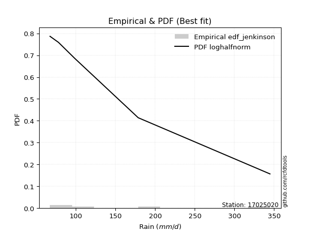</img>

</div>


### 11. EDF Cunnane (1978)

Cunnane´s work in statistical hydrology has focused on the performance and evaluation of different probability distributions (such as GEV, Gumbel, Lognormal) for flood frequency estimation. _b_ is a constant, typically set to 0.4.

<div align="center">


$P=(m-b)/(n+1-2b)$


</div>


**11.1. Empirical values**

<div align="center">

|                | 0                   | 1                  | 2           | 3                  | 4                  |
|:---------------|:--------------------|:-------------------|:------------|:-------------------|:-------------------|
| date           | 2022                | 2021               | 2023        | 2024               | 2025               |
| x              | 67.4                | 78.0               | 98.7        | 178.6              | 344.8              |
| m              | 1                   | 2                  | 3           | 4                  | 5                  |
| empirical_dist | edf_cunnane         | edf_cunnane        | edf_cunnane | edf_cunnane        | edf_cunnane        |
| empirical      | 0.11538461538461538 | 0.3076923076923077 | 0.5         | 0.6923076923076923 | 0.8846153846153845 |
| empirical_tr   | 1.1304347826086958  | 1.4444444444444444 | 2.0         | 3.25               | 8.666666666666655  |

</div>


**11.2. Kolmogorov-Smirnov fit test (sorted by Δ)**


<div align="center">

|                | 0                   | 1                   | 2                   | 3                   | 4                   | 5                   | 6                   | 7                   | 8                   | 9                   | 10                  | 11                  | 12                  | 13                  | 14                 | 15                  | 16                  | 17                  | 18                  | 19                  | 20                  | 21                  | 22                  | 23                  | 24                  | 25                  | 26                 | 27                  | 28                  | 29                  | 30                  | 31                  | 32                  | 33                  | 34                  | 35                  | 36                 | 37                  | 38                  | 39                  | 40                  | 41                  | 42                  | 43                  | 44                 | 45                  | 46                  | 47                  | 48                 | 49                  | 50                  | 51                  | 52                  | 53                  | 54                  | 55                  | 56                  | 57                  | 58                  | 59                  | 60                  | 61                  | 62                 | 63                  | 64                 | 65                  | 66                  | 67                  | 68                  | 69                 | 70                 | 71                  | 72                  | 73                 | 74                  | 75                  | 76                  | 77                  | 78                  | 79                  | 80                 | 81                 | 82                  | 83                  | 84                 | 85                 | 86                  | 87                  | 88                 | 89                  | 90                  | 91                 | 92                  | 93                  | 94                 | 95                 | 96                 | 97                  | 98                 | 99                  | 100                 | 101                 | 102                | 103                 | 104                | 105                 | 106                | 107                 | 108                 | 109                 | 110                | 111                | 112                 | 113                 | 114                 | 115                 | 116                 | 117                | 118                 | 119                | 120                | 121                | 122                | 123                | 124                | 125                | 126                | 127                | 128                | 129                | 130                | 131                | 132                 | 133                | 134                 | 135                 | 136                 | 137                 | 138                 | 139                 | 140                | 141                 | 142                | 143                 | 144                | 145                 | 146                 | 147                | 148                | 149                | 150                | 151                | 152                | 153                | 154                | 155                | 156                | 157                | 158                | 159                |
|:---------------|:--------------------|:--------------------|:--------------------|:--------------------|:--------------------|:--------------------|:--------------------|:--------------------|:--------------------|:--------------------|:--------------------|:--------------------|:--------------------|:--------------------|:-------------------|:--------------------|:--------------------|:--------------------|:--------------------|:--------------------|:--------------------|:--------------------|:--------------------|:--------------------|:--------------------|:--------------------|:-------------------|:--------------------|:--------------------|:--------------------|:--------------------|:--------------------|:--------------------|:--------------------|:--------------------|:--------------------|:-------------------|:--------------------|:--------------------|:--------------------|:--------------------|:--------------------|:--------------------|:--------------------|:-------------------|:--------------------|:--------------------|:--------------------|:-------------------|:--------------------|:--------------------|:--------------------|:--------------------|:--------------------|:--------------------|:--------------------|:--------------------|:--------------------|:--------------------|:--------------------|:--------------------|:--------------------|:-------------------|:--------------------|:-------------------|:--------------------|:--------------------|:--------------------|:--------------------|:-------------------|:-------------------|:--------------------|:--------------------|:-------------------|:--------------------|:--------------------|:--------------------|:--------------------|:--------------------|:--------------------|:-------------------|:-------------------|:--------------------|:--------------------|:-------------------|:-------------------|:--------------------|:--------------------|:-------------------|:--------------------|:--------------------|:-------------------|:--------------------|:--------------------|:-------------------|:-------------------|:-------------------|:--------------------|:-------------------|:--------------------|:--------------------|:--------------------|:-------------------|:--------------------|:-------------------|:--------------------|:-------------------|:--------------------|:--------------------|:--------------------|:-------------------|:-------------------|:--------------------|:--------------------|:--------------------|:--------------------|:--------------------|:-------------------|:--------------------|:-------------------|:-------------------|:-------------------|:-------------------|:-------------------|:-------------------|:-------------------|:-------------------|:-------------------|:-------------------|:-------------------|:-------------------|:-------------------|:--------------------|:-------------------|:--------------------|:--------------------|:--------------------|:--------------------|:--------------------|:--------------------|:-------------------|:--------------------|:-------------------|:--------------------|:-------------------|:--------------------|:--------------------|:-------------------|:-------------------|:-------------------|:-------------------|:-------------------|:-------------------|:-------------------|:-------------------|:-------------------|:-------------------|:-------------------|:-------------------|:-------------------|
| station        | 17025020            | 17025020            | 17025020            | 17025020            | 17025020            | 17025020            | 17025020            | 17025020            | 17025020            | 17025020            | 17025020            | 17025020            | 17025020            | 17025020            | 17025020           | 17025020            | 17025020            | 17025020            | 17025020            | 17025020            | 17025020            | 17025020            | 17025020            | 17025020            | 17025020            | 17025020            | 17025020           | 17025020            | 17025020            | 17025020            | 17025020            | 17025020            | 17025020            | 17025020            | 17025020            | 17025020            | 17025020           | 17025020            | 17025020            | 17025020            | 17025020            | 17025020            | 17025020            | 17025020            | 17025020           | 17025020            | 17025020            | 17025020            | 17025020           | 17025020            | 17025020            | 17025020            | 17025020            | 17025020            | 17025020            | 17025020            | 17025020            | 17025020            | 17025020            | 17025020            | 17025020            | 17025020            | 17025020           | 17025020            | 17025020           | 17025020            | 17025020            | 17025020            | 17025020            | 17025020           | 17025020           | 17025020            | 17025020            | 17025020           | 17025020            | 17025020            | 17025020            | 17025020            | 17025020            | 17025020            | 17025020           | 17025020           | 17025020            | 17025020            | 17025020           | 17025020           | 17025020            | 17025020            | 17025020           | 17025020            | 17025020            | 17025020           | 17025020            | 17025020            | 17025020           | 17025020           | 17025020           | 17025020            | 17025020           | 17025020            | 17025020            | 17025020            | 17025020           | 17025020            | 17025020           | 17025020            | 17025020           | 17025020            | 17025020            | 17025020            | 17025020           | 17025020           | 17025020            | 17025020            | 17025020            | 17025020            | 17025020            | 17025020           | 17025020            | 17025020           | 17025020           | 17025020           | 17025020           | 17025020           | 17025020           | 17025020           | 17025020           | 17025020           | 17025020           | 17025020           | 17025020           | 17025020           | 17025020            | 17025020           | 17025020            | 17025020            | 17025020            | 17025020            | 17025020            | 17025020            | 17025020           | 17025020            | 17025020           | 17025020            | 17025020           | 17025020            | 17025020            | 17025020           | 17025020           | 17025020           | 17025020           | 17025020           | 17025020           | 17025020           | 17025020           | 17025020           | 17025020           | 17025020           | 17025020           | 17025020           |
| empirical_dist | edf_cunnane         | edf_cunnane         | edf_cunnane         | edf_cunnane         | edf_cunnane         | edf_cunnane         | edf_cunnane         | edf_cunnane         | edf_cunnane         | edf_cunnane         | edf_cunnane         | edf_cunnane         | edf_cunnane         | edf_cunnane         | edf_cunnane        | edf_cunnane         | edf_cunnane         | edf_cunnane         | edf_cunnane         | edf_cunnane         | edf_cunnane         | edf_cunnane         | edf_cunnane         | edf_cunnane         | edf_cunnane         | edf_cunnane         | edf_cunnane        | edf_cunnane         | edf_cunnane         | edf_cunnane         | edf_cunnane         | edf_cunnane         | edf_cunnane         | edf_cunnane         | edf_cunnane         | edf_cunnane         | edf_cunnane        | edf_cunnane         | edf_cunnane         | edf_cunnane         | edf_cunnane         | edf_cunnane         | edf_cunnane         | edf_cunnane         | edf_cunnane        | edf_cunnane         | edf_cunnane         | edf_cunnane         | edf_cunnane        | edf_cunnane         | edf_cunnane         | edf_cunnane         | edf_cunnane         | edf_cunnane         | edf_cunnane         | edf_cunnane         | edf_cunnane         | edf_cunnane         | edf_cunnane         | edf_cunnane         | edf_cunnane         | edf_cunnane         | edf_cunnane        | edf_cunnane         | edf_cunnane        | edf_cunnane         | edf_cunnane         | edf_cunnane         | edf_cunnane         | edf_cunnane        | edf_cunnane        | edf_cunnane         | edf_cunnane         | edf_cunnane        | edf_cunnane         | edf_cunnane         | edf_cunnane         | edf_cunnane         | edf_cunnane         | edf_cunnane         | edf_cunnane        | edf_cunnane        | edf_cunnane         | edf_cunnane         | edf_cunnane        | edf_cunnane        | edf_cunnane         | edf_cunnane         | edf_cunnane        | edf_cunnane         | edf_cunnane         | edf_cunnane        | edf_cunnane         | edf_cunnane         | edf_cunnane        | edf_cunnane        | edf_cunnane        | edf_cunnane         | edf_cunnane        | edf_cunnane         | edf_cunnane         | edf_cunnane         | edf_cunnane        | edf_cunnane         | edf_cunnane        | edf_cunnane         | edf_cunnane        | edf_cunnane         | edf_cunnane         | edf_cunnane         | edf_cunnane        | edf_cunnane        | edf_cunnane         | edf_cunnane         | edf_cunnane         | edf_cunnane         | edf_cunnane         | edf_cunnane        | edf_cunnane         | edf_cunnane        | edf_cunnane        | edf_cunnane        | edf_cunnane        | edf_cunnane        | edf_cunnane        | edf_cunnane        | edf_cunnane        | edf_cunnane        | edf_cunnane        | edf_cunnane        | edf_cunnane        | edf_cunnane        | edf_cunnane         | edf_cunnane        | edf_cunnane         | edf_cunnane         | edf_cunnane         | edf_cunnane         | edf_cunnane         | edf_cunnane         | edf_cunnane        | edf_cunnane         | edf_cunnane        | edf_cunnane         | edf_cunnane        | edf_cunnane         | edf_cunnane         | edf_cunnane        | edf_cunnane        | edf_cunnane        | edf_cunnane        | edf_cunnane        | edf_cunnane        | edf_cunnane        | edf_cunnane        | edf_cunnane        | edf_cunnane        | edf_cunnane        | edf_cunnane        | edf_cunnane        |
| p_dist         | logalpha            | loghalfnorm         | loghalflogistic     | f                   | invgamma            | loginvweibull       | loggenextreme       | burr12              | logburr12           | logfoldnorm         | loggenlogistic      | burr                | logmielke           | logburr             | loginvgamma        | logmoyal            | loggumbel_r         | logexponnorm        | lograyleigh         | nakagami            | gengamma            | exponweib           | exponpow            | loggenexpon         | logweibull_min      | weibull_min         | loglomax           | loggompertz         | nct                 | logksone            | loginvgauss         | logkstwobign        | logarcsine          | invgauss            | logdgamma           | logpearson3         | logmaxwell         | loghalfgennorm      | alpha               | logsemicircular     | lognct              | dgamma              | foldnorm            | halfnorm            | halflogistic       | vonmises_line       | betaprime           | loganglit           | ncf                | logf                | halfgennorm         | dweibull            | logdweibull         | logbetaprime        | logncf              | logtruncnorm        | logloggamma         | logt                | lognorm             | logcrystalball      | logloglaplace       | pearson3            | moyal              | logwrapcauchy       | loggennorm         | rayleigh            | logrice             | truncexpon          | semicircular        | gumbel_r           | gausshyper         | logskewnorm         | maxwell             | wald               | loglogistic         | logtruncexpon       | anglit              | gennorm             | bradford            | arcsine             | genlogistic        | logcosine          | loghypsecant        | exponnorm           | genexpon           | logbradford        | logweibull_max      | truncweibull_min    | gamma              | norm                | t                   | logrdist           | kstwobign           | loggumbel_l         | loglaplace         | loglaplace         | logistic           | erlang              | loggausshyper      | wrapcauchy          | loglevy_l           | logkappa4           | truncnorm          | hypsecant           | logargus           | logwald             | genextreme         | rice                | cosine              | lomax               | gumbel_l           | logtukeylambda     | logtriang           | laplace             | levy_l              | loguniform          | logkappa3           | logvonmises_line   | logtruncpareto      | argus              | loggenpareto       | triang             | logexponweib       | tukeylambda        | skewnorm           | genpareto          | ksone              | logexponpow        | gompertz           | fatiguelife        | loggenhalflogistic | logbeta            | invweibull          | kappa4             | truncpareto         | logtruncweibull_min | lognakagami         | powerlaw            | uniform             | kappa3              | logfatiguelife     | beta                | genhalflogistic    | logtrapezoid        | logpowerlaw        | rdist               | loggengamma         | loggamma           | loggamma           | logerlang          | trapezoid          | logjohnsonsb       | crystalball        | johnsonsb          | weibull_max        | logjohnsonsu       | johnsonsu          | logvonmises        | vonmises           | mielke             |
| delta          | 0.07993869961061484 | 0.08066840010344839 | 0.08489362369929918 | 0.09677383727849076 | 0.09677397305060786 | 0.10037208532853892 | 0.10037752561119473 | 0.10091925414459171 | 0.10127598535923418 | 0.10244811634891082 | 0.10448856419336056 | 0.10510637394773192 | 0.10599530713992722 | 0.10646494328510614 | 0.1076974546202889 | 0.10896872525152312 | 0.11192046975846032 | 0.11453898866676822 | 0.11470010637079975 | 0.11537137400765328 | 0.11538362846194597 | 0.11538363529410572 | 0.11538447011777328 | 0.11538461294552055 | 0.11538461485320761 | 0.11538461511546894 | 0.1153846153763849 | 0.11538461538040268 | 0.11613620327608754 | 0.11755405014849463 | 0.11828828471231301 | 0.11950932030682554 | 0.12157418918669226 | 0.12462700693417617 | 0.12484041263598467 | 0.12555625001926085 | 0.1266576802487136 | 0.12720948892955358 | 0.12852897836948896 | 0.12872061613328972 | 0.12956912029562678 | 0.13000487915076886 | 0.13070302233533204 | 0.13260694166468678 | 0.1348040714175417 | 0.13543939370755143 | 0.13660983178499253 | 0.13740999110716845 | 0.137644502664041  | 0.13777087659826737 | 0.13778891176950464 | 0.14413792532497777 | 0.14485456567802868 | 0.14500256010499413 | 0.14630616286974168 | 0.15257409418750723 | 0.15570061354796172 | 0.15807041511277697 | 0.15807649025529247 | 0.15807649739448737 | 0.15865686140482171 | 0.15892559732415923 | 0.1604998314455146 | 0.16122060332039956 | 0.161350999994621  | 0.16353606960987122 | 0.16371610177541374 | 0.16415729586145217 | 0.16687857962493113 | 0.1700338871397084 | 0.1742003014770232 | 0.17430818077138127 | 0.17448824977449678 | 0.175039620375235  | 0.17669267577720837 | 0.17717876274213668 | 0.17741063459624484 | 0.17827930919673696 | 0.18355097491378247 | 0.18396487378706755 | 0.187260877383017  | 0.1889671951324573 | 0.19099535470706247 | 0.19362655866753997 | 0.1952173613580921 | 0.1956827286769074 | 0.19856855757048508 | 0.19870581932787346 | 0.1997215968940541 | 0.20213627446696886 | 0.20214191833471984 | 0.2049543537750192 | 0.21410944292139195 | 0.21674197089886532 | 0.2188992296761612 | 0.2188992296761612 | 0.2235859929738137 | 0.22838552650750787 | 0.2313206060627866 | 0.23230013479827344 | 0.23601397698084875 | 0.23625006695774525 | 0.2386677092264204 | 0.23901750416901085 | 0.2393805660485505 | 0.24188296719045954 | 0.2424558184221164 | 0.24355071749817708 | 0.24375633182585665 | 0.24432120213850594 | 0.2525308227715709 | 0.2605176385859025 | 0.26221811948213003 | 0.26389170847057397 | 0.26528067863429344 | 0.26632030454578204 | 0.26633083235100574 | 0.2713442058810417 | 0.27815808017612453 | 0.2878522150222782 | 0.2999214953251379 | 0.3006981946342473 | 0.3066796686456099 | 0.3076923076923006 | 0.315941875597854  | 0.3222168942124616 | 0.3226387887527037 | 0.3257496154861863 | 0.3313326158555773 | 0.3394620567306941 | 0.3405457002030935 | 0.3497376479555504 | 0.36156512101446403 | 0.363092495268865  | 0.36648741202693735 | 0.3695046838588324  | 0.37014237226797575 | 0.38161336260335654 | 0.38716654650324445 | 0.38946466037726574 | 0.4018077371088874 | 0.40488429895877326 | 0.4120893464382308 | 0.42267907002887517 | 0.4292128789086581 | 0.45018619245673436 | 0.46015959569223575 | 0.5096790894639959 | 0.5096790894639959 | 0.5179853943958248 | 0.5180952442723801 | 0.5209577837695784 | 0.5275127220284144 | 0.5771279955277304 | 0.5995065025105768 | 0.6176675401661407 | 0.6578270294607942 | 1.0695492778009594 | 54.99546073914198  | nan                |
| deltao         | 0.5865427407550001  | 0.5865427407550001  | 0.5865427407550001  | 0.5865427407550001  | 0.5865427407550001  | 0.5865427407550001  | 0.5865427407550001  | 0.5865427407550001  | 0.5865427407550001  | 0.5865427407550001  | 0.5865427407550001  | 0.5865427407550001  | 0.5865427407550001  | 0.5865427407550001  | 0.5865427407550001 | 0.5865427407550001  | 0.5865427407550001  | 0.5865427407550001  | 0.5865427407550001  | 0.5865427407550001  | 0.5865427407550001  | 0.5865427407550001  | 0.5865427407550001  | 0.5865427407550001  | 0.5865427407550001  | 0.5865427407550001  | 0.5865427407550001 | 0.5865427407550001  | 0.5865427407550001  | 0.5865427407550001  | 0.5865427407550001  | 0.5865427407550001  | 0.5865427407550001  | 0.5865427407550001  | 0.5865427407550001  | 0.5865427407550001  | 0.5865427407550001 | 0.5865427407550001  | 0.5865427407550001  | 0.5865427407550001  | 0.5865427407550001  | 0.5865427407550001  | 0.5865427407550001  | 0.5865427407550001  | 0.5865427407550001 | 0.5865427407550001  | 0.5865427407550001  | 0.5865427407550001  | 0.5865427407550001 | 0.5865427407550001  | 0.5865427407550001  | 0.5865427407550001  | 0.5865427407550001  | 0.5865427407550001  | 0.5865427407550001  | 0.5865427407550001  | 0.5865427407550001  | 0.5865427407550001  | 0.5865427407550001  | 0.5865427407550001  | 0.5865427407550001  | 0.5865427407550001  | 0.5865427407550001 | 0.5865427407550001  | 0.5865427407550001 | 0.5865427407550001  | 0.5865427407550001  | 0.5865427407550001  | 0.5865427407550001  | 0.5865427407550001 | 0.5865427407550001 | 0.5865427407550001  | 0.5865427407550001  | 0.5865427407550001 | 0.5865427407550001  | 0.5865427407550001  | 0.5865427407550001  | 0.5865427407550001  | 0.5865427407550001  | 0.5865427407550001  | 0.5865427407550001 | 0.5865427407550001 | 0.5865427407550001  | 0.5865427407550001  | 0.5865427407550001 | 0.5865427407550001 | 0.5865427407550001  | 0.5865427407550001  | 0.5865427407550001 | 0.5865427407550001  | 0.5865427407550001  | 0.5865427407550001 | 0.5865427407550001  | 0.5865427407550001  | 0.5865427407550001 | 0.5865427407550001 | 0.5865427407550001 | 0.5865427407550001  | 0.5865427407550001 | 0.5865427407550001  | 0.5865427407550001  | 0.5865427407550001  | 0.5865427407550001 | 0.5865427407550001  | 0.5865427407550001 | 0.5865427407550001  | 0.5865427407550001 | 0.5865427407550001  | 0.5865427407550001  | 0.5865427407550001  | 0.5865427407550001 | 0.5865427407550001 | 0.5865427407550001  | 0.5865427407550001  | 0.5865427407550001  | 0.5865427407550001  | 0.5865427407550001  | 0.5865427407550001 | 0.5865427407550001  | 0.5865427407550001 | 0.5865427407550001 | 0.5865427407550001 | 0.5865427407550001 | 0.5865427407550001 | 0.5865427407550001 | 0.5865427407550001 | 0.5865427407550001 | 0.5865427407550001 | 0.5865427407550001 | 0.5865427407550001 | 0.5865427407550001 | 0.5865427407550001 | 0.5865427407550001  | 0.5865427407550001 | 0.5865427407550001  | 0.5865427407550001  | 0.5865427407550001  | 0.5865427407550001  | 0.5865427407550001  | 0.5865427407550001  | 0.5865427407550001 | 0.5865427407550001  | 0.5865427407550001 | 0.5865427407550001  | 0.5865427407550001 | 0.5865427407550001  | 0.5865427407550001  | 0.5865427407550001 | 0.5865427407550001 | 0.5865427407550001 | 0.5865427407550001 | 0.5865427407550001 | 0.5865427407550001 | 0.5865427407550001 | 0.5865427407550001 | 0.5865427407550001 | 0.5865427407550001 | 0.5865427407550001 | 0.5865427407550001 | 0.5865427407550001 |
| eval           | Δo > Δ              | Δo > Δ              | Δo > Δ              | Δo > Δ              | Δo > Δ              | Δo > Δ              | Δo > Δ              | Δo > Δ              | Δo > Δ              | Δo > Δ              | Δo > Δ              | Δo > Δ              | Δo > Δ              | Δo > Δ              | Δo > Δ             | Δo > Δ              | Δo > Δ              | Δo > Δ              | Δo > Δ              | Δo > Δ              | Δo > Δ              | Δo > Δ              | Δo > Δ              | Δo > Δ              | Δo > Δ              | Δo > Δ              | Δo > Δ             | Δo > Δ              | Δo > Δ              | Δo > Δ              | Δo > Δ              | Δo > Δ              | Δo > Δ              | Δo > Δ              | Δo > Δ              | Δo > Δ              | Δo > Δ             | Δo > Δ              | Δo > Δ              | Δo > Δ              | Δo > Δ              | Δo > Δ              | Δo > Δ              | Δo > Δ              | Δo > Δ             | Δo > Δ              | Δo > Δ              | Δo > Δ              | Δo > Δ             | Δo > Δ              | Δo > Δ              | Δo > Δ              | Δo > Δ              | Δo > Δ              | Δo > Δ              | Δo > Δ              | Δo > Δ              | Δo > Δ              | Δo > Δ              | Δo > Δ              | Δo > Δ              | Δo > Δ              | Δo > Δ             | Δo > Δ              | Δo > Δ             | Δo > Δ              | Δo > Δ              | Δo > Δ              | Δo > Δ              | Δo > Δ             | Δo > Δ             | Δo > Δ              | Δo > Δ              | Δo > Δ             | Δo > Δ              | Δo > Δ              | Δo > Δ              | Δo > Δ              | Δo > Δ              | Δo > Δ              | Δo > Δ             | Δo > Δ             | Δo > Δ              | Δo > Δ              | Δo > Δ             | Δo > Δ             | Δo > Δ              | Δo > Δ              | Δo > Δ             | Δo > Δ              | Δo > Δ              | Δo > Δ             | Δo > Δ              | Δo > Δ              | Δo > Δ             | Δo > Δ             | Δo > Δ             | Δo > Δ              | Δo > Δ             | Δo > Δ              | Δo > Δ              | Δo > Δ              | Δo > Δ             | Δo > Δ              | Δo > Δ             | Δo > Δ              | Δo > Δ             | Δo > Δ              | Δo > Δ              | Δo > Δ              | Δo > Δ             | Δo > Δ             | Δo > Δ              | Δo > Δ              | Δo > Δ              | Δo > Δ              | Δo > Δ              | Δo > Δ             | Δo > Δ              | Δo > Δ             | Δo > Δ             | Δo > Δ             | Δo > Δ             | Δo > Δ             | Δo > Δ             | Δo > Δ             | Δo > Δ             | Δo > Δ             | Δo > Δ             | Δo > Δ             | Δo > Δ             | Δo > Δ             | Δo > Δ              | Δo > Δ             | Δo > Δ              | Δo > Δ              | Δo > Δ              | Δo > Δ              | Δo > Δ              | Δo > Δ              | Δo > Δ             | Δo > Δ              | Δo > Δ             | Δo > Δ              | Δo > Δ             | Δo > Δ              | Δo > Δ              | Δo > Δ             | Δo > Δ             | Δo > Δ             | Δo > Δ             | Δo > Δ             | Δo > Δ             | Δo > Δ             | Δo <= Δ            | Δo <= Δ            | Δo <= Δ            | Δo <= Δ            | Δo <= Δ            | Δo <= Δ            |
| fit            | 1                   | 1                   | 1                   | 1                   | 1                   | 1                   | 1                   | 1                   | 1                   | 1                   | 1                   | 1                   | 1                   | 1                   | 1                  | 1                   | 1                   | 1                   | 1                   | 1                   | 1                   | 1                   | 1                   | 1                   | 1                   | 1                   | 1                  | 1                   | 1                   | 1                   | 1                   | 1                   | 1                   | 1                   | 1                   | 1                   | 1                  | 1                   | 1                   | 1                   | 1                   | 1                   | 1                   | 1                   | 1                  | 1                   | 1                   | 1                   | 1                  | 1                   | 1                   | 1                   | 1                   | 1                   | 1                   | 1                   | 1                   | 1                   | 1                   | 1                   | 1                   | 1                   | 1                  | 1                   | 1                  | 1                   | 1                   | 1                   | 1                   | 1                  | 1                  | 1                   | 1                   | 1                  | 1                   | 1                   | 1                   | 1                   | 1                   | 1                   | 1                  | 1                  | 1                   | 1                   | 1                  | 1                  | 1                   | 1                   | 1                  | 1                   | 1                   | 1                  | 1                   | 1                   | 1                  | 1                  | 1                  | 1                   | 1                  | 1                   | 1                   | 1                   | 1                  | 1                   | 1                  | 1                   | 1                  | 1                   | 1                   | 1                   | 1                  | 1                  | 1                   | 1                   | 1                   | 1                   | 1                   | 1                  | 1                   | 1                  | 1                  | 1                  | 1                  | 1                  | 1                  | 1                  | 1                  | 1                  | 1                  | 1                  | 1                  | 1                  | 1                   | 1                  | 1                   | 1                   | 1                   | 1                   | 1                   | 1                   | 1                  | 1                   | 1                  | 1                   | 1                  | 1                   | 1                   | 1                  | 1                  | 1                  | 1                  | 1                  | 1                  | 1                  | 0                  | 0                  | 0                  | 0                  | 0                  | 0                  |
| n              | 5                   | 5                   | 5                   | 5                   | 5                   | 5                   | 5                   | 5                   | 5                   | 5                   | 5                   | 5                   | 5                   | 5                   | 5                  | 5                   | 5                   | 5                   | 5                   | 5                   | 5                   | 5                   | 5                   | 5                   | 5                   | 5                   | 5                  | 5                   | 5                   | 5                   | 5                   | 5                   | 5                   | 5                   | 5                   | 5                   | 5                  | 5                   | 5                   | 5                   | 5                   | 5                   | 5                   | 5                   | 5                  | 5                   | 5                   | 5                   | 5                  | 5                   | 5                   | 5                   | 5                   | 5                   | 5                   | 5                   | 5                   | 5                   | 5                   | 5                   | 5                   | 5                   | 5                  | 5                   | 5                  | 5                   | 5                   | 5                   | 5                   | 5                  | 5                  | 5                   | 5                   | 5                  | 5                   | 5                   | 5                   | 5                   | 5                   | 5                   | 5                  | 5                  | 5                   | 5                   | 5                  | 5                  | 5                   | 5                   | 5                  | 5                   | 5                   | 5                  | 5                   | 5                   | 5                  | 5                  | 5                  | 5                   | 5                  | 5                   | 5                   | 5                   | 5                  | 5                   | 5                  | 5                   | 5                  | 5                   | 5                   | 5                   | 5                  | 5                  | 5                   | 5                   | 5                   | 5                   | 5                   | 5                  | 5                   | 5                  | 5                  | 5                  | 5                  | 5                  | 5                  | 5                  | 5                  | 5                  | 5                  | 5                  | 5                  | 5                  | 5                   | 5                  | 5                   | 5                   | 5                   | 5                   | 5                   | 5                   | 5                  | 5                   | 5                  | 5                   | 5                  | 5                   | 5                   | 5                  | 5                  | 5                  | 5                  | 5                  | 5                  | 5                  | 5                  | 5                  | 5                  | 5                  | 5                  | 5                  |
| best_fit       | 1                   | 0                   | 0                   | 0                   | 0                   | 0                   | 0                   | 0                   | 0                   | 0                   | 0                   | 0                   | 0                   | 0                   | 0                  | 0                   | 0                   | 0                   | 0                   | 0                   | 0                   | 0                   | 0                   | 0                   | 0                   | 0                   | 0                  | 0                   | 0                   | 0                   | 0                   | 0                   | 0                   | 0                   | 0                   | 0                   | 0                  | 0                   | 0                   | 0                   | 0                   | 0                   | 0                   | 0                   | 0                  | 0                   | 0                   | 0                   | 0                  | 0                   | 0                   | 0                   | 0                   | 0                   | 0                   | 0                   | 0                   | 0                   | 0                   | 0                   | 0                   | 0                   | 0                  | 0                   | 0                  | 0                   | 0                   | 0                   | 0                   | 0                  | 0                  | 0                   | 0                   | 0                  | 0                   | 0                   | 0                   | 0                   | 0                   | 0                   | 0                  | 0                  | 0                   | 0                   | 0                  | 0                  | 0                   | 0                   | 0                  | 0                   | 0                   | 0                  | 0                   | 0                   | 0                  | 0                  | 0                  | 0                   | 0                  | 0                   | 0                   | 0                   | 0                  | 0                   | 0                  | 0                   | 0                  | 0                   | 0                   | 0                   | 0                  | 0                  | 0                   | 0                   | 0                   | 0                   | 0                   | 0                  | 0                   | 0                  | 0                  | 0                  | 0                  | 0                  | 0                  | 0                  | 0                  | 0                  | 0                  | 0                  | 0                  | 0                  | 0                   | 0                  | 0                   | 0                   | 0                   | 0                   | 0                   | 0                   | 0                  | 0                   | 0                  | 0                   | 0                  | 0                   | 0                   | 0                  | 0                  | 0                  | 0                  | 0                  | 0                  | 0                  | 0                  | 0                  | 0                  | 0                  | 0                  | 0                  |
| best_fit_sort  | 1                   | 2                   | 3                   | 4                   | 5                   | 6                   | 7                   | 8                   | 9                   | 10                  | 11                  | 12                  | 13                  | 14                  | 15                 | 16                  | 17                  | 18                  | 19                  | 20                  | 21                  | 22                  | 23                  | 24                  | 25                  | 26                  | 27                 | 28                  | 29                  | 30                  | 31                  | 32                  | 33                  | 34                  | 35                  | 36                  | 37                 | 38                  | 39                  | 40                  | 41                  | 42                  | 43                  | 44                  | 45                 | 46                  | 47                  | 48                  | 49                 | 50                  | 51                  | 52                  | 53                  | 54                  | 55                  | 56                  | 57                  | 58                  | 59                  | 60                  | 61                  | 62                  | 63                 | 64                  | 65                 | 66                  | 67                  | 68                  | 69                  | 70                 | 71                 | 72                  | 73                  | 74                 | 75                  | 76                  | 77                  | 78                  | 79                  | 80                  | 81                 | 82                 | 83                  | 84                  | 85                 | 86                 | 87                  | 88                  | 89                 | 90                  | 91                  | 92                 | 93                  | 94                  | 95                 | 96                 | 97                 | 98                  | 99                 | 100                 | 101                 | 102                 | 103                | 104                 | 105                | 106                 | 107                | 108                 | 109                 | 110                 | 111                | 112                | 113                 | 114                 | 115                 | 116                 | 117                 | 118                | 119                 | 120                | 121                | 122                | 123                | 124                | 125                | 126                | 127                | 128                | 129                | 130                | 131                | 132                | 133                 | 134                | 135                 | 136                 | 137                 | 138                 | 139                 | 140                 | 141                | 142                 | 143                | 144                 | 145                | 146                 | 147                 | 148                | 149                | 150                | 151                | 152                | 153                | 154                | 155                | 156                | 157                | 158                | 159                | 160                |

</div>


**11.3. Best fit**

<div align="center">

|   id |   station | empirical_dist   | p_dist   |     delta |   deltao | eval   |   fit |   n |   best_fit |   best_fit_sort |
|-----:|----------:|:-----------------|:---------|----------:|---------:|:-------|------:|----:|-----------:|----------------:|
|    0 |  17025020 | edf_cunnane      | logalpha | 0.0799387 | 0.586543 | Δo > Δ |     1 |   5 |          1 |               1 |

</div>


<div align="center">

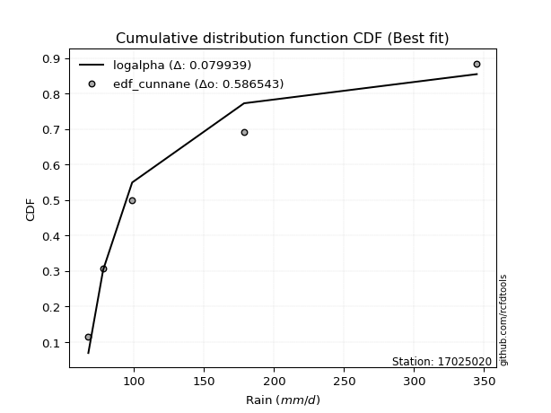</img>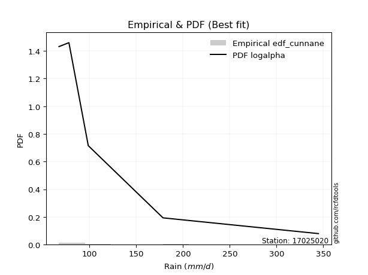</img>

</div>


### 12. EDF Adamowski (1981)

The Adamowski formula in hydrology refers to a specific plotting position formula used for estimating the non-parametric empirical distribution of hydrological events (like flood peaks) to calculate their return periods. This formula provides an alternative to traditional parametric methods (like the Gumbel or Log Pearson Type III distributions). 

<div align="center">


$P=(m-0.25)/(n+0.5)$


</div>


**12.1. Empirical values**

<div align="center">

|                | 0                   | 1                  | 2             | 3                  | 4                  |
|:---------------|:--------------------|:-------------------|:--------------|:-------------------|:-------------------|
| date           | 2022                | 2021               | 2023          | 2024               | 2025               |
| x              | 67.4                | 78.0               | 98.7          | 178.6              | 344.8              |
| m              | 1                   | 2                  | 3             | 4                  | 5                  |
| empirical_dist | edf_adamowski       | edf_adamowski      | edf_adamowski | edf_adamowski      | edf_adamowski      |
| empirical      | 0.13636363636363635 | 0.3181818181818182 | 0.5           | 0.6818181818181818 | 0.8636363636363636 |
| empirical_tr   | 1.1578947368421053  | 1.4666666666666666 | 2.0           | 3.1428571428571423 | 7.333333333333334  |

</div>


**12.2. Kolmogorov-Smirnov fit test (sorted by Δ)**


<div align="center">

|                | 0                   | 1                   | 2                   | 3                   | 4                   | 5                   | 6                   | 7                   | 8                   | 9                   | 10                  | 11                  | 12                  | 13                  | 14                  | 15                  | 16                  | 17                  | 18                  | 19                 | 20                  | 21                  | 22                  | 23                  | 24                 | 25                  | 26                  | 27                  | 28                  | 29                  | 30                  | 31                  | 32                 | 33                 | 34                 | 35                  | 36                  | 37                  | 38                  | 39                  | 40                 | 41                  | 42                  | 43                  | 44                 | 45                  | 46                  | 47                  | 48                 | 49                  | 50                  | 51                  | 52                  | 53                  | 54                  | 55                 | 56                  | 57                  | 58                  | 59                  | 60                  | 61                  | 62                 | 63                  | 64                  | 65                  | 66                  | 67                  | 68                  | 69                 | 70                  | 71                  | 72                 | 73                  | 74                  | 75                  | 76                  | 77                  | 78                  | 79                 | 80                  | 81                 | 82                  | 83                 | 84                  | 85                  | 86                  | 87                  | 88                  | 89                  | 90                 | 91                  | 92                  | 93                  | 94                  | 95                 | 96                 | 97                  | 98                 | 99                 | 100                 | 101                 | 102                | 103                | 104                 | 105                | 106                 | 107                 | 108                 | 109                 | 110                | 111                | 112                | 113                 | 114                 | 115                 | 116                 | 117                 | 118                | 119                | 120                | 121                 | 122                | 123                 | 124                 | 125                | 126                | 127                | 128                | 129                | 130                | 131                | 132                | 133                | 134                 | 135                | 136                | 137                | 138                 | 139                 | 140                 | 141                 | 142                | 143                 | 144                 | 145                 | 146                | 147                | 148                | 149                | 150                | 151                | 152                | 153                | 154                | 155                | 156                | 157                | 158                | 159                |
|:---------------|:--------------------|:--------------------|:--------------------|:--------------------|:--------------------|:--------------------|:--------------------|:--------------------|:--------------------|:--------------------|:--------------------|:--------------------|:--------------------|:--------------------|:--------------------|:--------------------|:--------------------|:--------------------|:--------------------|:-------------------|:--------------------|:--------------------|:--------------------|:--------------------|:-------------------|:--------------------|:--------------------|:--------------------|:--------------------|:--------------------|:--------------------|:--------------------|:-------------------|:-------------------|:-------------------|:--------------------|:--------------------|:--------------------|:--------------------|:--------------------|:-------------------|:--------------------|:--------------------|:--------------------|:-------------------|:--------------------|:--------------------|:--------------------|:-------------------|:--------------------|:--------------------|:--------------------|:--------------------|:--------------------|:--------------------|:-------------------|:--------------------|:--------------------|:--------------------|:--------------------|:--------------------|:--------------------|:-------------------|:--------------------|:--------------------|:--------------------|:--------------------|:--------------------|:--------------------|:-------------------|:--------------------|:--------------------|:-------------------|:--------------------|:--------------------|:--------------------|:--------------------|:--------------------|:--------------------|:-------------------|:--------------------|:-------------------|:--------------------|:-------------------|:--------------------|:--------------------|:--------------------|:--------------------|:--------------------|:--------------------|:-------------------|:--------------------|:--------------------|:--------------------|:--------------------|:-------------------|:-------------------|:--------------------|:-------------------|:-------------------|:--------------------|:--------------------|:-------------------|:-------------------|:--------------------|:-------------------|:--------------------|:--------------------|:--------------------|:--------------------|:-------------------|:-------------------|:-------------------|:--------------------|:--------------------|:--------------------|:--------------------|:--------------------|:-------------------|:-------------------|:-------------------|:--------------------|:-------------------|:--------------------|:--------------------|:-------------------|:-------------------|:-------------------|:-------------------|:-------------------|:-------------------|:-------------------|:-------------------|:-------------------|:--------------------|:-------------------|:-------------------|:-------------------|:--------------------|:--------------------|:--------------------|:--------------------|:-------------------|:--------------------|:--------------------|:--------------------|:-------------------|:-------------------|:-------------------|:-------------------|:-------------------|:-------------------|:-------------------|:-------------------|:-------------------|:-------------------|:-------------------|:-------------------|:-------------------|:-------------------|
| station        | 17025020            | 17025020            | 17025020            | 17025020            | 17025020            | 17025020            | 17025020            | 17025020            | 17025020            | 17025020            | 17025020            | 17025020            | 17025020            | 17025020            | 17025020            | 17025020            | 17025020            | 17025020            | 17025020            | 17025020           | 17025020            | 17025020            | 17025020            | 17025020            | 17025020           | 17025020            | 17025020            | 17025020            | 17025020            | 17025020            | 17025020            | 17025020            | 17025020           | 17025020           | 17025020           | 17025020            | 17025020            | 17025020            | 17025020            | 17025020            | 17025020           | 17025020            | 17025020            | 17025020            | 17025020           | 17025020            | 17025020            | 17025020            | 17025020           | 17025020            | 17025020            | 17025020            | 17025020            | 17025020            | 17025020            | 17025020           | 17025020            | 17025020            | 17025020            | 17025020            | 17025020            | 17025020            | 17025020           | 17025020            | 17025020            | 17025020            | 17025020            | 17025020            | 17025020            | 17025020           | 17025020            | 17025020            | 17025020           | 17025020            | 17025020            | 17025020            | 17025020            | 17025020            | 17025020            | 17025020           | 17025020            | 17025020           | 17025020            | 17025020           | 17025020            | 17025020            | 17025020            | 17025020            | 17025020            | 17025020            | 17025020           | 17025020            | 17025020            | 17025020            | 17025020            | 17025020           | 17025020           | 17025020            | 17025020           | 17025020           | 17025020            | 17025020            | 17025020           | 17025020           | 17025020            | 17025020           | 17025020            | 17025020            | 17025020            | 17025020            | 17025020           | 17025020           | 17025020           | 17025020            | 17025020            | 17025020            | 17025020            | 17025020            | 17025020           | 17025020           | 17025020           | 17025020            | 17025020           | 17025020            | 17025020            | 17025020           | 17025020           | 17025020           | 17025020           | 17025020           | 17025020           | 17025020           | 17025020           | 17025020           | 17025020            | 17025020           | 17025020           | 17025020           | 17025020            | 17025020            | 17025020            | 17025020            | 17025020           | 17025020            | 17025020            | 17025020            | 17025020           | 17025020           | 17025020           | 17025020           | 17025020           | 17025020           | 17025020           | 17025020           | 17025020           | 17025020           | 17025020           | 17025020           | 17025020           | 17025020           |
| empirical_dist | edf_adamowski       | edf_adamowski       | edf_adamowski       | edf_adamowski       | edf_adamowski       | edf_adamowski       | edf_adamowski       | edf_adamowski       | edf_adamowski       | edf_adamowski       | edf_adamowski       | edf_adamowski       | edf_adamowski       | edf_adamowski       | edf_adamowski       | edf_adamowski       | edf_adamowski       | edf_adamowski       | edf_adamowski       | edf_adamowski      | edf_adamowski       | edf_adamowski       | edf_adamowski       | edf_adamowski       | edf_adamowski      | edf_adamowski       | edf_adamowski       | edf_adamowski       | edf_adamowski       | edf_adamowski       | edf_adamowski       | edf_adamowski       | edf_adamowski      | edf_adamowski      | edf_adamowski      | edf_adamowski       | edf_adamowski       | edf_adamowski       | edf_adamowski       | edf_adamowski       | edf_adamowski      | edf_adamowski       | edf_adamowski       | edf_adamowski       | edf_adamowski      | edf_adamowski       | edf_adamowski       | edf_adamowski       | edf_adamowski      | edf_adamowski       | edf_adamowski       | edf_adamowski       | edf_adamowski       | edf_adamowski       | edf_adamowski       | edf_adamowski      | edf_adamowski       | edf_adamowski       | edf_adamowski       | edf_adamowski       | edf_adamowski       | edf_adamowski       | edf_adamowski      | edf_adamowski       | edf_adamowski       | edf_adamowski       | edf_adamowski       | edf_adamowski       | edf_adamowski       | edf_adamowski      | edf_adamowski       | edf_adamowski       | edf_adamowski      | edf_adamowski       | edf_adamowski       | edf_adamowski       | edf_adamowski       | edf_adamowski       | edf_adamowski       | edf_adamowski      | edf_adamowski       | edf_adamowski      | edf_adamowski       | edf_adamowski      | edf_adamowski       | edf_adamowski       | edf_adamowski       | edf_adamowski       | edf_adamowski       | edf_adamowski       | edf_adamowski      | edf_adamowski       | edf_adamowski       | edf_adamowski       | edf_adamowski       | edf_adamowski      | edf_adamowski      | edf_adamowski       | edf_adamowski      | edf_adamowski      | edf_adamowski       | edf_adamowski       | edf_adamowski      | edf_adamowski      | edf_adamowski       | edf_adamowski      | edf_adamowski       | edf_adamowski       | edf_adamowski       | edf_adamowski       | edf_adamowski      | edf_adamowski      | edf_adamowski      | edf_adamowski       | edf_adamowski       | edf_adamowski       | edf_adamowski       | edf_adamowski       | edf_adamowski      | edf_adamowski      | edf_adamowski      | edf_adamowski       | edf_adamowski      | edf_adamowski       | edf_adamowski       | edf_adamowski      | edf_adamowski      | edf_adamowski      | edf_adamowski      | edf_adamowski      | edf_adamowski      | edf_adamowski      | edf_adamowski      | edf_adamowski      | edf_adamowski       | edf_adamowski      | edf_adamowski      | edf_adamowski      | edf_adamowski       | edf_adamowski       | edf_adamowski       | edf_adamowski       | edf_adamowski      | edf_adamowski       | edf_adamowski       | edf_adamowski       | edf_adamowski      | edf_adamowski      | edf_adamowski      | edf_adamowski      | edf_adamowski      | edf_adamowski      | edf_adamowski      | edf_adamowski      | edf_adamowski      | edf_adamowski      | edf_adamowski      | edf_adamowski      | edf_adamowski      | edf_adamowski      |
| p_dist         | loghalfnorm         | logalpha            | loghalflogistic     | logfoldnorm         | f                   | invgamma            | loginvweibull       | loggenextreme       | burr                | loggenlogistic      | loggumbel_r         | logdgamma           | lograyleigh         | nct                 | logmielke           | logburr             | logksone            | loginvgamma         | logmoyal            | dgamma             | burr12              | logburr12           | logkstwobign        | logpearson3         | logmaxwell         | halfgennorm         | logsemicircular     | loginvgauss         | lognct              | foldnorm            | halfnorm            | logdweibull         | halflogistic       | invgauss           | logexponnorm       | nakagami            | gengamma            | exponweib           | exponpow            | loggenexpon         | logweibull_min     | weibull_min         | loglomax            | loggompertz         | vonmises_line      | logarcsine          | betaprime           | loganglit           | ncf                | loghalfgennorm      | alpha               | truncexpon          | dweibull            | logbetaprime        | logncf              | logf               | logwrapcauchy       | logloggamma         | logt                | lognorm             | logcrystalball      | pearson3            | moyal              | arcsine             | logtruncnorm        | rayleigh            | logrice             | semicircular        | logloglaplace       | gumbel_r           | loggennorm          | bradford            | gausshyper         | maxwell             | loglogistic         | anglit              | logskewnorm         | wald                | logtruncexpon       | genlogistic        | gennorm             | logcosine          | loghypsecant        | logbradford        | logweibull_max      | truncweibull_min    | exponnorm           | norm                | t                   | genexpon            | logrdist           | gamma               | kstwobign           | loglevy_l           | loggumbel_l         | loglaplace         | loglaplace         | genextreme          | logistic           | loggausshyper      | wrapcauchy          | logkappa4           | truncnorm          | erlang             | hypsecant           | logargus           | rice                | cosine              | levy_l              | lomax               | logwald            | gumbel_l           | logtukeylambda     | logtriang           | laplace             | loguniform          | logkappa3           | logtruncpareto      | logvonmises_line   | loggenpareto       | argus              | logexponweib        | triang             | genpareto           | logexponpow         | skewnorm           | tukeylambda        | ksone              | logbeta            | fatiguelife        | gompertz           | loggenhalflogistic | invweibull         | truncpareto        | logtruncweibull_min | lognakagami        | kappa4             | powerlaw           | beta                | uniform             | kappa3              | logfatiguelife      | genhalflogistic    | logpowerlaw         | logtrapezoid        | rdist               | loggengamma        | loggamma           | loggamma           | crystalball        | logerlang          | trapezoid          | logjohnsonsb       | johnsonsb          | weibull_max        | logjohnsonsu       | johnsonsu          | logvonmises        | vonmises           | mielke             |
| delta          | 0.08066840010344839 | 0.09042821010012536 | 0.09538313418880964 | 0.10244811634891082 | 0.10726334776800128 | 0.10726348354011839 | 0.11086159581804944 | 0.11086703610070525 | 0.11107938959522634 | 0.11113742026438037 | 0.11192046975846032 | 0.11435090214647414 | 0.11470010637079975 | 0.11613620327608754 | 0.11648481762943774 | 0.11695445377461666 | 0.11795674231386744 | 0.11818696510979942 | 0.11945823574103359 | 0.1202016750776912 | 0.12189827512361269 | 0.12225500633825516 | 0.12276259970776038 | 0.12555625001926085 | 0.1266576802487136 | 0.12729940127999417 | 0.12872061613328972 | 0.12877779520182353 | 0.12956912029562678 | 0.13070302233533204 | 0.13260694166468678 | 0.13436505518851816 | 0.1348040714175417 | 0.1351165174236867 | 0.1355180096457892 | 0.13635039498667426 | 0.13636264944096696 | 0.13636265627312671 | 0.13636349109679424 | 0.13636363392454154 | 0.1363636358322286 | 0.13636363609448993 | 0.13636363635540588 | 0.13636363635942367 | 0.1363636363635795 | 0.13636363636363635 | 0.13660983178499253 | 0.13740999110716845 | 0.137644502664041  | 0.13769899941906405 | 0.13901848885899948 | 0.14317827488243118 | 0.14413792532497777 | 0.14500256010499413 | 0.14630616286974168 | 0.1482603870877779 | 0.15073109283088904 | 0.15570061354796172 | 0.15807041511277697 | 0.15807649025529247 | 0.15807649739448737 | 0.15892559732415923 | 0.1604998314455146 | 0.16298585280804656 | 0.16306360467701775 | 0.16353606960987122 | 0.16371610177541374 | 0.16687857962493113 | 0.16914637189433224 | 0.1700338871397084 | 0.17184051048413151 | 0.17387507587033368 | 0.1742003014770232 | 0.17448824977449678 | 0.17669267577720837 | 0.17741063459624484 | 0.18479769126089174 | 0.18552913086474546 | 0.18617519855302156 | 0.187260877383017  | 0.18876881968624748 | 0.1889671951324573 | 0.19099535470706247 | 0.1956827286769074 | 0.19856855757048508 | 0.19870581932787346 | 0.20126834489849127 | 0.20213627446696886 | 0.20214191833471984 | 0.20234587925265735 | 0.2049543537750192 | 0.21021110738356463 | 0.21410944292139195 | 0.21503495600182776 | 0.21674197089886532 | 0.2188992296761612 | 0.2188992296761612 | 0.22147679744309556 | 0.2235859929738137 | 0.2313206060627866 | 0.23230013479827344 | 0.23625006695774525 | 0.2386677092264204 | 0.2388750369970184 | 0.23901750416901085 | 0.2393805660485505 | 0.24355071749817708 | 0.24375633182585665 | 0.24430165765527245 | 0.24432120213850594 | 0.25237247767997   | 0.2525308227715709 | 0.2605176385859025 | 0.26221811948213003 | 0.26389170847057397 | 0.26632030454578204 | 0.26633083235100574 | 0.26766856968661407 | 0.2713442058810417 | 0.2789424743461169 | 0.2878522150222782 | 0.29619015815609945 | 0.3006981946342473 | 0.31172738372295106 | 0.31526010499667584 | 0.315941875597854  | 0.3181818181818111 | 0.3226387887527037 | 0.3287586269765294 | 0.3289725462411836 | 0.3313326158555773 | 0.3405457002030935 | 0.3405861000354432 | 0.3559979015374269 | 0.3590151733693219  | 0.3596528617784653 | 0.363092495268865  | 0.3711238521138461 | 0.38390527797975227 | 0.38716654650324445 | 0.38946466037726574 | 0.39131822661937693 | 0.4015998359487203 | 0.41872336841914765 | 0.42267907002887517 | 0.42920717147771337 | 0.4496700852027253 | 0.4991895789744854 | 0.4991895789744854 | 0.5065337010493934 | 0.5074958839063144 | 0.5076057337828696 | 0.5104682732800678 | 0.56663848503822   | 0.5890169920210663 | 0.6071780296766303 | 0.6473375189712838 | 1.0905282987799803 | 55.016439760121    | nan                |
| deltao         | 0.5865427407550001  | 0.5865427407550001  | 0.5865427407550001  | 0.5865427407550001  | 0.5865427407550001  | 0.5865427407550001  | 0.5865427407550001  | 0.5865427407550001  | 0.5865427407550001  | 0.5865427407550001  | 0.5865427407550001  | 0.5865427407550001  | 0.5865427407550001  | 0.5865427407550001  | 0.5865427407550001  | 0.5865427407550001  | 0.5865427407550001  | 0.5865427407550001  | 0.5865427407550001  | 0.5865427407550001 | 0.5865427407550001  | 0.5865427407550001  | 0.5865427407550001  | 0.5865427407550001  | 0.5865427407550001 | 0.5865427407550001  | 0.5865427407550001  | 0.5865427407550001  | 0.5865427407550001  | 0.5865427407550001  | 0.5865427407550001  | 0.5865427407550001  | 0.5865427407550001 | 0.5865427407550001 | 0.5865427407550001 | 0.5865427407550001  | 0.5865427407550001  | 0.5865427407550001  | 0.5865427407550001  | 0.5865427407550001  | 0.5865427407550001 | 0.5865427407550001  | 0.5865427407550001  | 0.5865427407550001  | 0.5865427407550001 | 0.5865427407550001  | 0.5865427407550001  | 0.5865427407550001  | 0.5865427407550001 | 0.5865427407550001  | 0.5865427407550001  | 0.5865427407550001  | 0.5865427407550001  | 0.5865427407550001  | 0.5865427407550001  | 0.5865427407550001 | 0.5865427407550001  | 0.5865427407550001  | 0.5865427407550001  | 0.5865427407550001  | 0.5865427407550001  | 0.5865427407550001  | 0.5865427407550001 | 0.5865427407550001  | 0.5865427407550001  | 0.5865427407550001  | 0.5865427407550001  | 0.5865427407550001  | 0.5865427407550001  | 0.5865427407550001 | 0.5865427407550001  | 0.5865427407550001  | 0.5865427407550001 | 0.5865427407550001  | 0.5865427407550001  | 0.5865427407550001  | 0.5865427407550001  | 0.5865427407550001  | 0.5865427407550001  | 0.5865427407550001 | 0.5865427407550001  | 0.5865427407550001 | 0.5865427407550001  | 0.5865427407550001 | 0.5865427407550001  | 0.5865427407550001  | 0.5865427407550001  | 0.5865427407550001  | 0.5865427407550001  | 0.5865427407550001  | 0.5865427407550001 | 0.5865427407550001  | 0.5865427407550001  | 0.5865427407550001  | 0.5865427407550001  | 0.5865427407550001 | 0.5865427407550001 | 0.5865427407550001  | 0.5865427407550001 | 0.5865427407550001 | 0.5865427407550001  | 0.5865427407550001  | 0.5865427407550001 | 0.5865427407550001 | 0.5865427407550001  | 0.5865427407550001 | 0.5865427407550001  | 0.5865427407550001  | 0.5865427407550001  | 0.5865427407550001  | 0.5865427407550001 | 0.5865427407550001 | 0.5865427407550001 | 0.5865427407550001  | 0.5865427407550001  | 0.5865427407550001  | 0.5865427407550001  | 0.5865427407550001  | 0.5865427407550001 | 0.5865427407550001 | 0.5865427407550001 | 0.5865427407550001  | 0.5865427407550001 | 0.5865427407550001  | 0.5865427407550001  | 0.5865427407550001 | 0.5865427407550001 | 0.5865427407550001 | 0.5865427407550001 | 0.5865427407550001 | 0.5865427407550001 | 0.5865427407550001 | 0.5865427407550001 | 0.5865427407550001 | 0.5865427407550001  | 0.5865427407550001 | 0.5865427407550001 | 0.5865427407550001 | 0.5865427407550001  | 0.5865427407550001  | 0.5865427407550001  | 0.5865427407550001  | 0.5865427407550001 | 0.5865427407550001  | 0.5865427407550001  | 0.5865427407550001  | 0.5865427407550001 | 0.5865427407550001 | 0.5865427407550001 | 0.5865427407550001 | 0.5865427407550001 | 0.5865427407550001 | 0.5865427407550001 | 0.5865427407550001 | 0.5865427407550001 | 0.5865427407550001 | 0.5865427407550001 | 0.5865427407550001 | 0.5865427407550001 | 0.5865427407550001 |
| eval           | Δo > Δ              | Δo > Δ              | Δo > Δ              | Δo > Δ              | Δo > Δ              | Δo > Δ              | Δo > Δ              | Δo > Δ              | Δo > Δ              | Δo > Δ              | Δo > Δ              | Δo > Δ              | Δo > Δ              | Δo > Δ              | Δo > Δ              | Δo > Δ              | Δo > Δ              | Δo > Δ              | Δo > Δ              | Δo > Δ             | Δo > Δ              | Δo > Δ              | Δo > Δ              | Δo > Δ              | Δo > Δ             | Δo > Δ              | Δo > Δ              | Δo > Δ              | Δo > Δ              | Δo > Δ              | Δo > Δ              | Δo > Δ              | Δo > Δ             | Δo > Δ             | Δo > Δ             | Δo > Δ              | Δo > Δ              | Δo > Δ              | Δo > Δ              | Δo > Δ              | Δo > Δ             | Δo > Δ              | Δo > Δ              | Δo > Δ              | Δo > Δ             | Δo > Δ              | Δo > Δ              | Δo > Δ              | Δo > Δ             | Δo > Δ              | Δo > Δ              | Δo > Δ              | Δo > Δ              | Δo > Δ              | Δo > Δ              | Δo > Δ             | Δo > Δ              | Δo > Δ              | Δo > Δ              | Δo > Δ              | Δo > Δ              | Δo > Δ              | Δo > Δ             | Δo > Δ              | Δo > Δ              | Δo > Δ              | Δo > Δ              | Δo > Δ              | Δo > Δ              | Δo > Δ             | Δo > Δ              | Δo > Δ              | Δo > Δ             | Δo > Δ              | Δo > Δ              | Δo > Δ              | Δo > Δ              | Δo > Δ              | Δo > Δ              | Δo > Δ             | Δo > Δ              | Δo > Δ             | Δo > Δ              | Δo > Δ             | Δo > Δ              | Δo > Δ              | Δo > Δ              | Δo > Δ              | Δo > Δ              | Δo > Δ              | Δo > Δ             | Δo > Δ              | Δo > Δ              | Δo > Δ              | Δo > Δ              | Δo > Δ             | Δo > Δ             | Δo > Δ              | Δo > Δ             | Δo > Δ             | Δo > Δ              | Δo > Δ              | Δo > Δ             | Δo > Δ             | Δo > Δ              | Δo > Δ             | Δo > Δ              | Δo > Δ              | Δo > Δ              | Δo > Δ              | Δo > Δ             | Δo > Δ             | Δo > Δ             | Δo > Δ              | Δo > Δ              | Δo > Δ              | Δo > Δ              | Δo > Δ              | Δo > Δ             | Δo > Δ             | Δo > Δ             | Δo > Δ              | Δo > Δ             | Δo > Δ              | Δo > Δ              | Δo > Δ             | Δo > Δ             | Δo > Δ             | Δo > Δ             | Δo > Δ             | Δo > Δ             | Δo > Δ             | Δo > Δ             | Δo > Δ             | Δo > Δ              | Δo > Δ             | Δo > Δ             | Δo > Δ             | Δo > Δ              | Δo > Δ              | Δo > Δ              | Δo > Δ              | Δo > Δ             | Δo > Δ              | Δo > Δ              | Δo > Δ              | Δo > Δ             | Δo > Δ             | Δo > Δ             | Δo > Δ             | Δo > Δ             | Δo > Δ             | Δo > Δ             | Δo > Δ             | Δo <= Δ            | Δo <= Δ            | Δo <= Δ            | Δo <= Δ            | Δo <= Δ            | Δo <= Δ            |
| fit            | 1                   | 1                   | 1                   | 1                   | 1                   | 1                   | 1                   | 1                   | 1                   | 1                   | 1                   | 1                   | 1                   | 1                   | 1                   | 1                   | 1                   | 1                   | 1                   | 1                  | 1                   | 1                   | 1                   | 1                   | 1                  | 1                   | 1                   | 1                   | 1                   | 1                   | 1                   | 1                   | 1                  | 1                  | 1                  | 1                   | 1                   | 1                   | 1                   | 1                   | 1                  | 1                   | 1                   | 1                   | 1                  | 1                   | 1                   | 1                   | 1                  | 1                   | 1                   | 1                   | 1                   | 1                   | 1                   | 1                  | 1                   | 1                   | 1                   | 1                   | 1                   | 1                   | 1                  | 1                   | 1                   | 1                   | 1                   | 1                   | 1                   | 1                  | 1                   | 1                   | 1                  | 1                   | 1                   | 1                   | 1                   | 1                   | 1                   | 1                  | 1                   | 1                  | 1                   | 1                  | 1                   | 1                   | 1                   | 1                   | 1                   | 1                   | 1                  | 1                   | 1                   | 1                   | 1                   | 1                  | 1                  | 1                   | 1                  | 1                  | 1                   | 1                   | 1                  | 1                  | 1                   | 1                  | 1                   | 1                   | 1                   | 1                   | 1                  | 1                  | 1                  | 1                   | 1                   | 1                   | 1                   | 1                   | 1                  | 1                  | 1                  | 1                   | 1                  | 1                   | 1                   | 1                  | 1                  | 1                  | 1                  | 1                  | 1                  | 1                  | 1                  | 1                  | 1                   | 1                  | 1                  | 1                  | 1                   | 1                   | 1                   | 1                   | 1                  | 1                   | 1                   | 1                   | 1                  | 1                  | 1                  | 1                  | 1                  | 1                  | 1                  | 1                  | 0                  | 0                  | 0                  | 0                  | 0                  | 0                  |
| n              | 5                   | 5                   | 5                   | 5                   | 5                   | 5                   | 5                   | 5                   | 5                   | 5                   | 5                   | 5                   | 5                   | 5                   | 5                   | 5                   | 5                   | 5                   | 5                   | 5                  | 5                   | 5                   | 5                   | 5                   | 5                  | 5                   | 5                   | 5                   | 5                   | 5                   | 5                   | 5                   | 5                  | 5                  | 5                  | 5                   | 5                   | 5                   | 5                   | 5                   | 5                  | 5                   | 5                   | 5                   | 5                  | 5                   | 5                   | 5                   | 5                  | 5                   | 5                   | 5                   | 5                   | 5                   | 5                   | 5                  | 5                   | 5                   | 5                   | 5                   | 5                   | 5                   | 5                  | 5                   | 5                   | 5                   | 5                   | 5                   | 5                   | 5                  | 5                   | 5                   | 5                  | 5                   | 5                   | 5                   | 5                   | 5                   | 5                   | 5                  | 5                   | 5                  | 5                   | 5                  | 5                   | 5                   | 5                   | 5                   | 5                   | 5                   | 5                  | 5                   | 5                   | 5                   | 5                   | 5                  | 5                  | 5                   | 5                  | 5                  | 5                   | 5                   | 5                  | 5                  | 5                   | 5                  | 5                   | 5                   | 5                   | 5                   | 5                  | 5                  | 5                  | 5                   | 5                   | 5                   | 5                   | 5                   | 5                  | 5                  | 5                  | 5                   | 5                  | 5                   | 5                   | 5                  | 5                  | 5                  | 5                  | 5                  | 5                  | 5                  | 5                  | 5                  | 5                   | 5                  | 5                  | 5                  | 5                   | 5                   | 5                   | 5                   | 5                  | 5                   | 5                   | 5                   | 5                  | 5                  | 5                  | 5                  | 5                  | 5                  | 5                  | 5                  | 5                  | 5                  | 5                  | 5                  | 5                  | 5                  |
| best_fit       | 1                   | 0                   | 0                   | 0                   | 0                   | 0                   | 0                   | 0                   | 0                   | 0                   | 0                   | 0                   | 0                   | 0                   | 0                   | 0                   | 0                   | 0                   | 0                   | 0                  | 0                   | 0                   | 0                   | 0                   | 0                  | 0                   | 0                   | 0                   | 0                   | 0                   | 0                   | 0                   | 0                  | 0                  | 0                  | 0                   | 0                   | 0                   | 0                   | 0                   | 0                  | 0                   | 0                   | 0                   | 0                  | 0                   | 0                   | 0                   | 0                  | 0                   | 0                   | 0                   | 0                   | 0                   | 0                   | 0                  | 0                   | 0                   | 0                   | 0                   | 0                   | 0                   | 0                  | 0                   | 0                   | 0                   | 0                   | 0                   | 0                   | 0                  | 0                   | 0                   | 0                  | 0                   | 0                   | 0                   | 0                   | 0                   | 0                   | 0                  | 0                   | 0                  | 0                   | 0                  | 0                   | 0                   | 0                   | 0                   | 0                   | 0                   | 0                  | 0                   | 0                   | 0                   | 0                   | 0                  | 0                  | 0                   | 0                  | 0                  | 0                   | 0                   | 0                  | 0                  | 0                   | 0                  | 0                   | 0                   | 0                   | 0                   | 0                  | 0                  | 0                  | 0                   | 0                   | 0                   | 0                   | 0                   | 0                  | 0                  | 0                  | 0                   | 0                  | 0                   | 0                   | 0                  | 0                  | 0                  | 0                  | 0                  | 0                  | 0                  | 0                  | 0                  | 0                   | 0                  | 0                  | 0                  | 0                   | 0                   | 0                   | 0                   | 0                  | 0                   | 0                   | 0                   | 0                  | 0                  | 0                  | 0                  | 0                  | 0                  | 0                  | 0                  | 0                  | 0                  | 0                  | 0                  | 0                  | 0                  |
| best_fit_sort  | 1                   | 2                   | 3                   | 4                   | 5                   | 6                   | 7                   | 8                   | 9                   | 10                  | 11                  | 12                  | 13                  | 14                  | 15                  | 16                  | 17                  | 18                  | 19                  | 20                 | 21                  | 22                  | 23                  | 24                  | 25                 | 26                  | 27                  | 28                  | 29                  | 30                  | 31                  | 32                  | 33                 | 34                 | 35                 | 36                  | 37                  | 38                  | 39                  | 40                  | 41                 | 42                  | 43                  | 44                  | 45                 | 46                  | 47                  | 48                  | 49                 | 50                  | 51                  | 52                  | 53                  | 54                  | 55                  | 56                 | 57                  | 58                  | 59                  | 60                  | 61                  | 62                  | 63                 | 64                  | 65                  | 66                  | 67                  | 68                  | 69                  | 70                 | 71                  | 72                  | 73                 | 74                  | 75                  | 76                  | 77                  | 78                  | 79                  | 80                 | 81                  | 82                 | 83                  | 84                 | 85                  | 86                  | 87                  | 88                  | 89                  | 90                  | 91                 | 92                  | 93                  | 94                  | 95                  | 96                 | 97                 | 98                  | 99                 | 100                | 101                 | 102                 | 103                | 104                | 105                 | 106                | 107                 | 108                 | 109                 | 110                 | 111                | 112                | 113                | 114                 | 115                 | 116                 | 117                 | 118                 | 119                | 120                | 121                | 122                 | 123                | 124                 | 125                 | 126                | 127                | 128                | 129                | 130                | 131                | 132                | 133                | 134                | 135                 | 136                | 137                | 138                | 139                 | 140                 | 141                 | 142                 | 143                | 144                 | 145                 | 146                 | 147                | 148                | 149                | 150                | 151                | 152                | 153                | 154                | 155                | 156                | 157                | 158                | 159                | 160                |

</div>


**12.3. Best fit**

<div align="center">

|   id |   station | empirical_dist   | p_dist      |     delta |   deltao | eval   |   fit |   n |   best_fit |   best_fit_sort |
|-----:|----------:|:-----------------|:------------|----------:|---------:|:-------|------:|----:|-----------:|----------------:|
|    0 |  17025020 | edf_adamowski    | loghalfnorm | 0.0806684 | 0.586543 | Δo > Δ |     1 |   5 |          1 |               1 |

</div>


<div align="center">

</img>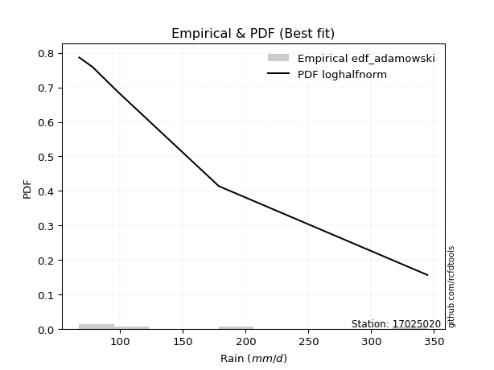</img>

</div>


## C. Best fit & Estimate extreme values for specific return periods - Tr

Best fit in probability distribution analysis means finding the theoretical distribution (like Normal, Poisson, Exponential, etc.) that most accurately mirrors your real-world data´s patterns (shape, center, spread) for better predictions, using methods like visual checks (Q-Q plots), goodness-of-fit tests (Kolmogorov-Smirnov, Chi-Squared), and information criteria (AIC) to score and select the simplest, most representative model.


### 1. Best fit (ordered by delta Δ)

:file_folder:Table: [bestfit_17025020.csv](table/bestfit_17025020.csv)

<div align="center">

|   id |   station | empirical_dist   | p_dist      |     delta |   deltao | eval   |   fit |   n |   best_fit |   best_fit_sort |
|-----:|----------:|:-----------------|:------------|----------:|---------:|:-------|------:|----:|-----------:|----------------:|
|    0 |  17025020 | edf_hazen        | logalpha    | 0.0722464 | 0.586543 | Δo > Δ |     1 |   5 |          1 |               1 |
|    1 |  17025020 | edf_gringorten   | logalpha    | 0.0769339 | 0.586543 | Δo > Δ |     1 |   5 |          1 |               2 |
|    2 |  17025020 | edf_cunnane      | logalpha    | 0.0799387 | 0.586543 | Δo > Δ |     1 |   5 |          1 |               3 |
|    3 |  17025020 | edf_jenkinson    | loghalfnorm | 0.0806684 | 0.586543 | Δo > Δ |     1 |   5 |          1 |               4 |
|    4 |  17025020 | edf_filliben     | loghalfnorm | 0.0806684 | 0.586543 | Δo > Δ |     1 |   5 |          1 |               5 |
|    5 |  17025020 | edf_tukey        | loghalfnorm | 0.0806684 | 0.586543 | Δo > Δ |     1 |   5 |          1 |               6 |
|    6 |  17025020 | edf_blom         | loghalfnorm | 0.0806684 | 0.586543 | Δo > Δ |     1 |   5 |          1 |               7 |
|    7 |  17025020 | edf_adamowski    | loghalfnorm | 0.0806684 | 0.586543 | Δo > Δ |     1 |   5 |          1 |               8 |
|    8 |  17025020 | edf_chegodayev   | loghalfnorm | 0.0806684 | 0.586543 | Δo > Δ |     1 |   5 |          1 |               9 |
|    9 |  17025020 | edf_beard        | loghalfnorm | 0.0806684 | 0.586543 | Δo > Δ |     1 |   5 |          1 |              10 |
|   10 |  17025020 | edf_weibull      | loghalfnorm | 0.0953641 | 0.586543 | Δo > Δ |     1 |   5 |          1 |              11 |
|   11 |  17025020 | edf_california   | loggennorm  | 0.099987  | 0.586543 | Δo > Δ |     1 |   5 |          1 |              12 |

</div>


### 2. Extreme values and % difference analysis

In hydrology, a return period (or recurrence interval $Tr$) is the statistical average time between extreme events like floods or droughts of a specific magnitude, indicating how rare an event is, with a 100-year flood, for example, having a 1% chance of occurring in any given year, not that it happens exactly every century. It is a key tool for infrastructure design (like bridges or dams) and risk assessment, calculated from historical data to determine the probability of future events, although it is important to remember it is statistical average, and events can cluster or be missed.

The extreme value porcentage difference is evaluated as $pdiff = 1 - (ETrBf / ETr) * 100$, where _ETrBf_ correspond to the bestfit extreme value for a specific recurrence interval and _ETr_ correspond to the extreme value for one of the most used PDFsused in hydrology.

> risk_rate: assuming the return period as the project useful life.

:file_folder:Table: [extreme_17025020.csv](table/extreme_17025020.csv), all PDFs.  
:file_folder:Table: [extremepdiff_17025020.csv](table/extremepdiff_17025020.csv), % difference between bestfit and most used PDFs in Hydrology.

<div align="center">

Extreme values table for only best fit PDFs
|   id |      tr |   prob_l |     prob_g |     alpha |   anglit |   arcsine |   argus |     beta |   betaprime |   bradford |     burr |   burr12 |   cosine |   crystalball |   dgamma |   dweibull |   erlang |   exponnorm |   exponpow |   exponweib |           f |   fatiguelife |   foldnorm |    gamma |   gausshyper |   genexpon |      genextreme |   gengamma |   genhalflogistic |   genlogistic |    gennorm |   genpareto |   gompertz |   gumbel_l |   gumbel_r |   halfgennorm |   halflogistic |   halfnorm |   hypsecant |    invgamma |   invgauss |     invweibull |   johnsonsb |        johnsonsu |   kappa3 |   kappa4 |   ksone |   kstwobign |   laplace |   levy_l |   loggamma |   logistic |   loglaplace |   lomax |   maxwell |   mielke |   moyal |   nakagami |      ncf |      nct |    norm |   pearson3 |   powerlaw |   rayleigh |    rdist |    rice |   semicircular |   skewnorm |       t |   trapezoid |   triang |   truncexpon |   truncnorm |   truncpareto |   truncweibull_min |   tukeylambda |   uniform |   vonmises |   vonmises_line |    wald |   weibull_max |   weibull_min |   wrapcauchy |         logalpha |   loganglit |   logarcsine |   logargus |   logbeta |   logbetaprime |   logbradford |   logburr |   logburr12 |   logcosine |   logcrystalball |   logdgamma |   logdweibull |   logerlang |   logexponnorm |      logexponpow |   logexponweib |       logf |   logfatiguelife |   logfoldnorm |   loggausshyper |   loggenexpon |   loggenextreme |   loggengamma |   loggenhalflogistic |   loggenlogistic |   loggennorm |   loggenpareto |   loggompertz |   loggumbel_l |   loggumbel_r |   loghalfgennorm |   loghalflogistic |   loghalfnorm |   loghypsecant |      loginvgamma |   loginvgauss |   loginvweibull |   logjohnsonsb |      logjohnsonsu |   logkappa3 |   logkappa4 |   logksone |   logkstwobign |   loglevy_l |   logloggamma |   loglogistic |   logloglaplace |   loglomax |   logmaxwell |   logmielke |   logmoyal |   lognakagami |   logncf |   lognct |   lognorm |   logpearson3 |   logpowerlaw |   lograyleigh |   logrdist |   logrice |   logsemicircular |   logskewnorm |    logt |   logtrapezoid |   logtriang |   logtruncexpon |   logtruncnorm |   logtruncpareto |   logtruncweibull_min |   logtukeylambda |   loguniform |   logvonmises |   logvonmises_line |   logwald |   logweibull_max |   logweibull_min |   logwrapcauchy |   station |   n |   risk_rate |
|-----:|--------:|---------:|-----------:|----------:|---------:|----------:|--------:|---------:|------------:|-----------:|---------:|---------:|---------:|--------------:|---------:|-----------:|---------:|------------:|-----------:|------------:|------------:|--------------:|-----------:|---------:|-------------:|-----------:|----------------:|-----------:|------------------:|--------------:|-----------:|------------:|-----------:|-----------:|-----------:|--------------:|---------------:|-----------:|------------:|------------:|-----------:|---------------:|------------:|-----------------:|---------:|---------:|--------:|------------:|----------:|---------:|-----------:|-----------:|-------------:|--------:|----------:|---------:|--------:|-----------:|---------:|---------:|--------:|-----------:|-----------:|-----------:|---------:|--------:|---------------:|-----------:|--------:|------------:|---------:|-------------:|------------:|--------------:|-------------------:|--------------:|----------:|-----------:|----------------:|--------:|--------------:|--------------:|-------------:|-----------------:|------------:|-------------:|-----------:|----------:|---------------:|--------------:|----------:|------------:|------------:|-----------------:|------------:|--------------:|------------:|---------------:|-----------------:|---------------:|-----------:|-----------------:|--------------:|----------------:|--------------:|----------------:|--------------:|---------------------:|-----------------:|-------------:|---------------:|--------------:|--------------:|--------------:|-----------------:|------------------:|--------------:|---------------:|-----------------:|--------------:|----------------:|---------------:|------------------:|------------:|------------:|-----------:|---------------:|------------:|--------------:|--------------:|----------------:|-----------:|-------------:|------------:|-----------:|--------------:|---------:|---------:|----------:|--------------:|--------------:|--------------:|-----------:|----------:|------------------:|--------------:|--------:|---------------:|------------:|----------------:|---------------:|-----------------:|----------------------:|-----------------:|-------------:|--------------:|-------------------:|----------:|-----------------:|-----------------:|----------------:|----------:|----:|------------:|
|    0 |    2    | 0.5      | 0.5        |    94.338 |  153.5   |   153.5   | 196.516 |  62.4288 |     119.614 |    78.6361 |  112.44  |  103.846 |  168.787 |     -0.423175 |  142.396 |    147.851 |  87.5893 |     126.758 |     98.679 |     91.3625 |     90.7419 |       67.4    |    132.075 |  95.2548 |      159.819 |    127.081 |    87.4152      |    85.8898 |           249.177 |       132.91  |    98.7    |     229.416 |    178.812 |    170.469 |    136.531 |       83.1105 |        128.095 |    132.357 |     153.5   |     90.7419 |    90.4815 |  186.046       |     67.4002 |     67.4         |  209.675 |  198.302 | 206.1   |     141.071 |   153.5   |  203.06  |    67.6019 |    153.5   |      126.155 | 140.874 |   144.666 |  112.52  | 131.053 |    98.5702 |  119.873 |  114.947 | 153.5   |    135.755 |    68.0336 |    141.533 |  42.2087 | 152.906 |        153.5   |    158.098 | 153.5   |     275.042 |  214.588 |      131.415 |     139.021 |       70.9484 |            158.172 |       122.993 |   206.1   | -2.27553   |         128.597 | 120.018 |       344.525 |       95.4985 |      209.567 |    92.7222       |     126.155 |      126.155 |    152.623 |   73.4367 |        122.753 |       132.203 |   108.349 |     103.293 |     133.343 |          126.155 |     132.934 |       138.197 |     67.6482 |        104.061 |    68.7625       |   68.7354      |    82.8576 |          67.4    |       117.078 |         144.315 |       104.07  |    93.3858      |       67.7532 |              199.832 |          112.35  |      98.6988 |        112.1   |       106.156 |       139.285 |       114.263 |          109.255 |           108.774 |       111.513 |        126.155 |     94.6553      |       91.6534 |    93.3858      |        67.4001 |     67.4006       |     67.3999 |     145.943 |    126.155 |        114.954 |     172.229 |       126.281 |       126.155 |          98.7   |    102.867 |      119.817 |     102.576 |    110.668 |       68.1325 |  122.491 |  118.228 |   126.155 |       118.501 |       67.8602 |       117.646 |    168.672 |   123.232 |           126.155 |       121.172 | 126.154 |        228.716 |     168.664 |         126.87  |        101.042 |          73.5352 |               69.0067 |          154.039 |      152.445 |      0.229582 |            155.205 |   103.766 |          178.613 |     95.2758      |         152.445 |  17025020 |   5 |    0.75     |
|    1 |    2.33 | 0.570815 | 0.429185   |   102.426 |  174.97  |   185.73  | 217.482 |  84.0857 |     132.578 |    85.3045 |  123.544 |  114.442 |  188.155 |     32.6261   |  175.967 |    177.692 |  94.0219 |     139.849 |    112.019 |    104.833  |     99.5938 |       69.7669 |    152.073 | 102.917  |      185.89  |    140.229 |   136.905       |    96.3    |           267.31  |       146.943 |    99.0165 |     254.154 |    201.335 |    186.505 |    153.611 |       93.357  |        145.656 |    152.25  |     168.251 |     99.5938 |    98.7903 | 1796.27        |     67.401  |     67.4         |  229.853 |  219.03  | 229.673 |     156.381 |   164.654 |  246.837 |    67.9607 |    169.74  |      134.639 | 157.062 |   163.816 |  123.644 | 147.221 |   116.175  |  132.904 |  126.979 | 171.932 |    153.76  |    69.4256 |    160.966 |  69.3931 | 169.298 |        176.527 |    173.71  | 171.932 |     291.159 |  236.113 |      154.762 |     154.8   |       72.8192 |            180.473 |       131.012 |   225.744 | -2.06576   |         143.919 | 132.104 |       344.709 |      106.236  |      264.955 |   101.892        |     142.992 |      152.257 |    171.379 |   90.2233 |        136.667 |       148.479 |   118.587 |     113.859 |     148.809 |          140.479 |     179.487 |       187.13  |     68.0356 |        114.525 |    71.5257       |   72.2257      |    90.3573 |          68.4371 |       132.305 |         163.111 |       114.523 |   101.923       |       68.3817 |              221.82  |          123.458 |     106.114  |        158.001 |       116.966 |       152.947 |       126.236 |          120.686 |           120.511 |       125.238 |        137.494 |    103.185       |       99.8474 |   101.923       |        67.4012 |     67.4019       |     67.3999 |     164.715 |    146.256 |        126.732 |     213.418 |       140.889 |       138.694 |         105.955 |    113.13  |      133.981 |     112.357 |    121.616 |       69.7009 |  136.118 |  130.984 |   140.479 |       131.949 |       68.7198 |       131.772 |    205.113 |   136.275 |           144.297 |       134.045 | 140.478 |        251.469 |     189.826 |         141.816 |        109.834 |          77.0287 |               70.9415 |          173.992 |      171.126 |      0.254589 |            174.667 |   111.348 |          206.445 |    108.495       |         211.279 |  17025020 |   5 |    0.729209 |
|    2 |    5    | 0.8      | 0.2        |   165.142 |  250.72  |   271.674 | 284.734 | 246.824  |     200.531 |   145.449  |  185.8   |  185.927 |  257.952 |    155.446    |  229.169 |    239.023 | 130.14   |     205.3   |    194.564 |    216.334  |    188.384  |      120.045  |    236.644 | 143.812  |      273.575 |    205.973 | 15586.6         |   183.46   |           314.874 |       207.902 |   123.354  |     317.673 |    305.023 |    238.31  |    227.81  |      220.395  |        225.111 |    236.374 |     227.421 |    188.384  |   167.17   |    1.96142e+08 |     67.8187 |     67.4004      |  295.157 |  288.345 | 305.964 |     221.413 |   220.422 |  319.366 |    76.0919 |    232.444 |      186.42  | 238.001 |   239.186 |  186.12  | 222.111 |   228.197  |  201.175 |  194.931 | 240.429 |    231.128 |   106.556  |    238.763 | 146.306  | 234.925 |        255.107 |    239.729 | 240.428 |     337.397 |  297.865 |      243.305 |     233.683 |       95.2814 |            260.039 |       156.83  |   289.32  | -1.24392   |         203.978 | 199.762 |       344.799 |      177.889  |      330.916 |   210.136        |     222.469 |      251.403 |    248.558 |  210.761  |        206.985 |       225.556 |   179.172 |     186.714 |     220.989 |          209.504 |     236.893 |       254.829 |     75.4553 |        184.905 |   292.947        | 2753.16        |   156.203  |          94.6591 |       211.911 |         245.734 |       184.811 |   185.111       |       82.6622 |              291.272 |          185.952 |     153.357  |        303.942 |       187.012 |       206.929 |       194.632 |          194.307 |           191.591 |       204.604 |        194.19  |    178.596       |      170.701  |   185.117       |        70.3258 |     67.5713       |     67.3999 |     245.215 |    236.002 |        191.788 |     304.448 |       211.319 |       199.966 |         153.602 |    183.975 |      207.99  |     179.585 |    188.266 |      123.598  |  204.825 |  198.394 |   209.504 |       203.948 |       89.1481 |       207.477 |    349.42  |   203.858 |           228.238 |       205.437 | 209.504 |        330.102 |     266.46  |         215.476 |        160.209 |         112.596  |              104.147  |          256.841 |      248.763 |      0.376    |            256.01  |   165.25  |          289.698 |    255.618       |         307.148 |  17025020 |   5 |    0.67232  |
|    3 |   10    | 0.9      | 0.1        |   280.366 |  293.595 |   292.422 | 317.164 | 320.213  |     272.093 |   214.699  |  258.817 |  288.703 |  300.122 |    236.921    |  264.674 |    277.377 | 166.148  |     264.716 |    279.952 |    375.773  |    415.53   |      189.467  |    299.223 | 182.997  |      311.658 |    265.652 |     1.27057e+06 |   310.541  |           331.22  |       257.55  |   239.095  |     335.726 |    388.416 |    267.153 |    288.245 |      528.709  |        291.096 |    298.623 |     274.669 |    415.529  |   279.954  |    2.56824e+12 |     89.4038 |     67.4387      |  323.652 |  319.719 | 339.252 |     270.927 |   271.046 |  336.876 |    97.1371 |    278.623 |      250.484 | 311.474 |   292.228 |  259.565 | 287.314 |   333.283  |  273.023 |  275.343 | 285.869 |    291.986 |   177.458  |    294.235 | 168.549  | 281.718 |        295.428 |    288.582 | 285.867 |     355.458 |  321.986 |      290.358 |     305.278 |      141.395  |            300.003 |       167.918 |   317.06  | -0.616058  |         249.334 | 271.562 |       344.8   |      265.157  |      342.291 |   787.838        |     285.707 |      283.758 |    297.367 |  292.923  |        276.629 |       276.798 |   257.381 |     295.856 |     280.628 |          273.113 |     279.27  |       296.433 |     92.735  |        285.632 | 80709.1          |    5.65655e+15 |   283.925  |         148.139  |       291.266 |         293.823 |       285.361 |   461.08        |      120.788  |              319.584 |          259.582 |     215.256  |        336.584 |       280.426 |       244.857 |       276.925 |          292.881 |           281.571 |       294.213 |        255.835 |    379.474       |      324.646  |   461.128       |       837.661  |     70.8153       |     67.3999 |     291.945 |    290.795 |        262.918 |     331.712 |       276.188 |       261.805 |         220.724 |    290.682 |      283.437 |     292.766 |    275.425 |      381.833  |  272.673 |  270.244 |   273.113 |       281.17  |      137.042  |       286.775 |    400.778 |   271.672 |           288.779 |       281.767 | 273.112 |        367.116 |     304.199 |         268.322 |        210.618 |         168.472  |              183.016  |          302.575 |      292.871 |      0.493039 |            302.487 |   251.245 |          320.774 |    717.339       |         327.196 |  17025020 |   5 |    0.651322 |
|    4 |   15    | 0.933333 | 0.0666667  |   395.178 |  311.904 |   296.379 | 329.493 | 334.591  |     320.124 |   249.354  |  311.959 |  inf     |  319.33  |    277.579    |  283.638 |    296.85  | 188.027  |     299.471 |    331.303 |    492.105  |    700.436  |      234.87   |    331.788 | 206.435  |      323.785 |    300.563 |     1.52523e+07 |   404.652  |           336.116 |       285.56  |   399.176  |     340.019 |    433.318 |    280.215 |    322.341 |      851.667  |        328.438 |    331.018 |     301.634 |    700.432  |   372.039  |    5.4007e+14  |    205.195  |     67.7836      |  333.15  |  330.378 | 350.348 |     297.213 |   300.66  |  342.166 |   117.789  |    303.783 |      297.731 | 354.454 |   319.443 |  313.105 | 325.155 |   390.966  |  321.225 |  334.216 | 308.544 |    325.322 |   218.827  |    322.816 | 173.565  | 305.828 |        311.152 |    314.005 | 308.541 |     361.253 |  329.725 |      307.574 |     347.154 |      176.719  |            314.321 |       171.559 |   326.307 | -0.277905  |         272.902 | 317.669 |       344.8   |      324.81   |      345.544 |  2933.88         |     317.92  |      290.386 |    318.342 |  317.362  |        321.179 |       297.318 |   319.238 |     inf     |     312.893 |          311.748 |     303.89  |       318.014 |    108.665  |        368.369 |     6.33097e+07  |    1.89912e+38 |   413.952  |         198.554  |       341.541 |         311.216 |       367.923 |  1023.92        |      160.007  |              328.528 |          313.335 |     262.845  |        341.655 |       352.427 |       264.249 |       337.883 |          369.692 |           350.119 |       355.43  |        299.427 |    696.972       |      503.769  |  1024.12        |      2525.59   |     83.778        |     67.3999 |     309.298 |    311.752 |        310.85  |     340.419 |       315.55  |       303.206 |         276.147 |    382.638 |      332.217 |     406.324 |    343.476 |      811.183  |  315.998 |  318.906 |   311.748 |       333.311 |      173.589  |       338.82  |    412.057 |   314.996 |           316.527 |       332.12  | 311.748 |        379.85  |     317.406 |         290.573 |        238.774 |         204.683  |              249.372  |          318.984 |      309.248 |      0.568239 |            319.784 |   328.809 |          329.969 |   1446.07        |         333.157 |  17025020 |   5 |    0.644736 |
|    5 |   20    | 0.95     | 0.05       |   509.89  |  322.674 |   297.773 | 336.26  | 339.388  |     357.503 |   269.617  |  355.509 |  inf     |  331.143 |    304.205    |  296.591 |    309.776 | 203.813  |     324.131 |    367.851 |    584.244  |   1030.85   |      268.486  |    353.499 | 223.232  |      329.621 |    325.331 |     8.69104e+07 |   479.871  |           338.451 |       305.172 |   580.437  |     341.765 |    463.662 |    288.346 |    346.215 |     1169.95   |        354.6   |    352.616 |     320.656 |   1030.84   |   449.36   |    2.28468e+16 |    417.792  |     69.1235      |  337.905 |  335.76  | 355.896 |     314.92  |   321.671 |  344.875 |   137.394  |    321.173 |      336.564 | 384.948 |   337.505 |  357.022 | 351.955 |   429.964  |  358.725 |  382.641 | 323.394 |    348.248 |   244.268  |    341.813 | 175.521  | 321.853 |        319.873 |    330.955 | 323.391 |     364.111 |  333.543 |      316.514 |     376.863 |      202.488  |            321.698 |       173.362 |   330.93  | -0.0593434 |         287.578 | 352.028 |       344.8   |      370.713  |      347.119 | 10907            |     338.54  |      292.757 |    330.478 |  327.648  |        354.777 |       308.337 |   373.044 |     inf     |     334.551 |          339.964 |     321.614 |       332.575 |    123.182  |        441.232 |     5.18797e+10  |    7.69688e+67 |   545.998  |         246.639  |       379.113 |         320.022 |       440.616 |  2131.63        |      198.67   |              332.865 |          357.467 |     303.016  |        343.214 |       412.99  |       277.088 |       388.387 |          434.963 |           407.863 |       403.167 |        334.576 |   1184.46        |      705.985  |  2132.24        |      2815.53   |    119.662        |     67.3999 |     318.298 |    322.791 |        347.972 |     344.965 |       344.274 |       335.588 |         325.537 |    466.584 |      369.141 |     524.522 |    401.615 |     1387.75   |  348.639 |  356.999 |   339.965 |       373.945 |      200.094  |       378.538 |    416.253 |   347.549 |           333.052 |       370.597 | 339.965 |        386.294 |     324.131 |         302.806 |        257     |         229.002  |              300.825  |          327.337 |      317.777 |      0.625726 |            328.8   |   401.806 |          334.257 |   2475.88        |         336.081 |  17025020 |   5 |    0.641514 |
|    6 |   25    | 0.96     | 0.04       |   624.562 |  329.973 |   298.42  | 340.624 | 341.502  |     388.591 |   282.84   |  393.141 |  inf     |  339.427 |    323.805    |  306.413 |    319.387 | 216.183  |     343.258 |    396.148 |    660.966  |   1399.84   |      295.194  |    369.653 | 236.339  |      333.016 |    344.545 |     3.32039e+08 |   542.908  |           339.813 |       320.278 |   773.047  |     342.667 |    486.402 |    294.131 |    364.604 |     1479.36   |        374.757 |    368.685 |     335.378 |   1399.83   |   516.069  |    4.08846e+17 |    610.577  |     72.6088      |  340.769 |  339.01  | 359.225 |     328.183 |   337.968 |  346.575 |   156.1    |    334.477 |      370.141 | 408.601 |   350.914 |  394.999 | 372.727 |   459.146  |  389.909 |  424.602 | 334.325 |    365.684 |   261.288  |    355.928 | 176.499  | 333.759 |        325.531 |    343.566 | 334.322 |     365.814 |  335.818 |      321.99  |     399.906 |      221.715  |            326.198 |       174.435 |   333.704 |  0.0929715 |         297.506 | 379.548 |       344.8   |      408.283  |      348.052 | 40519.5          |     353.269 |      293.863 |    338.548 |  332.961  |        382.072 |       315.209 |   421.801 |     inf     |     350.627 |          362.355 |     335.582 |       343.537 |    136.604  |        507.535 |     3.43576e+13  |    2.9928e+102 |   679.919  |         293.019  |       409.399 |         325.292 |       506.753 |  4246.45        |      236.666  |              335.411 |          395.655 |     338.446  |        343.868 |       466.132 |       286.602 |       432.378 |          492.752 |           458.769 |       442.799 |        364.587 |   1912.99        |      929.848  |  4248.06        |      2866.84   |    217.729        |     67.3999 |     323.794 |    329.601 |        378.653 |     347.85  |       367.052 |       362.676 |         371.076 |    545.239 |      399.184 |     648.787 |    453.367 |     2092.67   |  375.138 |  388.825 |   362.355 |       407.742 |      219.797  |       411.034 |    418.266 |   373.895 |           344.231 |       402.089 | 362.356 |        390.185 |     328.205 |         310.539 |        269.82  |         246.274  |              340.825  |          332.374 |      323.006 |      0.673155 |            334.331 |   471.801 |          336.704 |   3841.2         |         337.826 |  17025020 |   5 |    0.639603 |
|    7 |   50    | 0.98     | 0.02       |  1197.74  |  347.94  |   299.283 | 350.519 | 344.098  |     498.481 |   311.927  |  535.9   |  inf     |  361.119 |    379.932    |  335.955 |    347.379 | 255.172  |     402.673 |    483.219 |    927.11   |   3697.94   |      380.888  |    416.606 | 277.413  |      339.449 |    404.225 |     2.06261e+10 |   763.982  |           342.429 |       366.813 |  1789.63   |     344.086 |    553.043 |    309.837 |    421.251 |     2890.62   |        436.864 |    415.394 |     381.021 |   3697.9    |   758.869  |    2.95559e+21 |    865.935  |    191.058       |  346.687 |  345.576 | 365.882 |     367.13  |   388.593 |  350.403 |   240.777  |    375.123 |      497.342 | 482.075 |   389.803 |  539.256 | 437.214 |   544.338  |  500.096 |  584.617 | 365.628 |    418.274 |   299.739  |    396.9   | 177.96   | 368.322 |        338.456 |    380.222 | 365.624 |     369.194 |  340.332 |      333.208 |     471.477 |      271.888  |            335.375 |       176.557 |   339.252 |  0.451099  |         319.922 | 469.403 |       344.8   |      535.425  |      349.9   |     2.85824e+07  |     392.315 |      295.348 |    357.583 |  341.125  |        474.403 |       329.57  |   625.9   |     inf     |     396.479 |          434.97  |     380.574 |       376.2   |    193.636  |        784.018 |     7.47885e+25  |  inf           |  1373.51   |         509.322  |       510.234 |         335.632 |       782.46  | 90594.8         |      418.769  |              340.338 |          540.886 |     477.773  |        344.622 |       671.877 |       314.108 |       601.749 |          721.072 |           659.142 |       581.528 |        475.845 |  13794.8         |     2343.19   | 90673.5         |      2887.35   | 584549            |     67.3999 |     334.962 |    343.655 |        485.294 |     354.434 |       440.831 |       459.748 |         568.07  |    894.379 |      500.865 |    1378.44  |    660.488 |     7105.8    |  464.667 |  502.309 |   434.97  |       526.983 |      270.967  |       522.041 |    421.078 |   462.24  |           371.196 |       509.657 | 434.971 |        398.023 |     336.443 |         326.966 |        301.352 |         288.599  |              451.393  |          342.427 |      333.725 |      0.840647 |            345.674 |   797.024 |          341.228 |  16895.2         |         341.308 |  17025020 |   5 |    0.63583  |
|    8 |   75    | 0.986667 | 0.0133333  |  1770.84  |  355.847 |   299.443 | 354.443 | 344.516  |     573.5   |   322.469  |  641.562 |  inf     |  371.478 |    410.048    |  352.708 |    362.694 | 278.298  |     437.429 |    533.312 |   1101.36   |   6581.13   |      432.497  |    442.165 | 301.643  |      341.433 |    439.137 |     2.27357e+11 |   910.411  |           343.261 |       393.861 |  2805.23   |     344.424 |    589.512 |    317.779 |    454.177 |     4124.81   |        472.966 |    440.82  |     407.694 |   6581.05   |   923.883  |    5.1724e+23  |    886.261  |    743.891       |  348.916 |  347.794 | 368.102 |     388.559 |   418.206 |  351.976 |   316.696  |    398.598 |      591.152 | 525.055 |   410.946 |  646.183 | 474.924 |   590.756  |  575.285 |  703.769 | 382.424 |    448.138 |   313.98   |    419.19  | 178.281  | 387.125 |        343.62  |    400.176 | 382.419 |     370.313 |  341.826 |      337.029 |     513.338 |      293.135  |            338.488 |       177.253 |   341.101 |  0.585109  |         328.038 | 524.696 |       344.8   |      616.793  |      350.512 |     2.01336e+10  |     410.84  |      295.624 |    365.425 |  342.958  |        534.227 |       334.548 |   796.577 |     inf     |     420.446 |          479.758 |     408.246 |       394.572 |    241.167  |       1011.12  |     7.88176e+35  |  inf           |  2099.6    |         710.542  |       574.239 |         338.937 |      1008.85  |     1.3426e+06  |      591.967  |              341.91  |          648.682 |     585.001  |        344.732 |       826.36  |       329.007 |       729.21  |          897.17  |           813.705 |       674.533 |        555.98  |  68496.9         |     4199.73   |     1.34444e+06 |      2887.86   |      4.2727e+13   |     67.3999 |     338.717 |    348.472 |        556.282 |     357.175 |       486.263 |       527.241 |         739.055 |   1204.12  |      566.63  |    2309.91  |    823.052 |    13919.8    |  522.597 |  580.613 |   479.758 |       608.027 |      292.543  |       594.554 |    421.633 |   518.779 |           382.55  |       579.859 | 479.76  |        400.652 |     339.215 |         332.746 |        314.186 |         305.542  |              500.804  |          345.734 |      337.377 |      0.957176 |            349.54  |  1100.51  |          342.584 |  43451.6         |         342.469 |  17025020 |   5 |    0.634587 |
|    9 |  100    | 0.99     | 0.01       |  2343.91  |  360.549 |   299.499 | 356.634 | 344.651  |     632.256 |   327.908  |  728.683 |  inf     |  377.971 |    430.418    |  364.409 |    373.171 | 294.823  |     462.089 |    568.403 |   1232.91   |   9925      |      469.631  |    459.577 | 318.908  |      342.377 |    463.908 |     1.2428e+12  |  1021.71   |           343.667 |       413.004 |  3789.99   |     344.561 |    614.379 |    322.974 |    477.481 |     5234.66   |        498.519 |    458.141 |     426.615 |   9924.87   |  1050.23   |    2.00094e+25 |    890.185  |   2202.61        |  350.199 |  348.91  | 369.211 |     403.241 |   439.218 |  352.896 |   387.499  |    415.172 |      668.257 | 555.549 |   425.347 |  734.43  | 501.678 |   622.346  |  634.159 |  802.4   | 393.784 |    468.997 |   321.386  |    434.376 | 178.405  | 399.935 |        346.511 |    413.769 | 393.779 |     370.871 |  342.572 |      338.955 |     543.037 |      304.814  |            340.055 |       177.598 |   342.026 |  0.654157  |         332.181 | 565.01  |       344.8   |      677.522  |      350.818 |     1.41772e+13  |     422.268 |      295.721 |    369.877 |  343.673  |        579.525 |       337.074 |   949.972 |     inf     |     436.2   |          512.637 |     428.575 |       407.359 |    283.361  |       1211.12  |     2.4164e+44   |  inf           |  2851.71   |         902.885  |       622.027 |         340.536 |      1208.17  |     1.61055e+07 |      759.309  |              342.676 |          737.721 |     675.595  |        344.766 |       954.261 |       339.133 |       835.423 |         1045.87  |           944.539 |       746.272 |        620.879 | 277819           |     6461.98   |     1.61356e+07 |      2887.92   |      4.19739e+26  |     67.3999 |     340.593 |    350.905 |        610.827 |     358.788 |       519.579 |       580.779 |         896.627 |   1492.35  |      616.303 |    3464.26  |    962.11  |    22007.6    |  566.426 |  642.389 |   512.637 |       671.243 |      304.381  |       649.642 |    421.835 |   561.21  |           389.059 |       633.143 | 512.639 |        401.97  |     340.606 |         335.697 |        321.162 |         314.645  |              528.597  |          347.367 |      339.217 |      1.05097  |            351.489 |  1392.38  |          343.22  |  87817.8         |         343.051 |  17025020 |   5 |    0.633968 |
|   10 |  200    | 0.995    | 0.005      |  4636.17  |  369.431 |   299.553 | 360.441 | 344.768  |     795.514 |   336.285  |  989.565 |  inf     |  391.173 |    476.622    |  392.081 |    397.288 | 334.967  |     521.504 |    651.288 |   1575.83   |  26798.3    |      560.529  |    499.398 | 360.717  |      343.704 |    523.586 |     7.37725e+13 |  1314.33   |           344.257 |       459.027 |  7405.92   |     344.72  |    671.193 |    334.266 |    533.505 |     8919.63   |        559.951 |    497.756 |     472.197 |  26797.8    |  1382.77   |    1.31174e+29 |    892.256  |  29023.4         |  352.718 |  350.602 | 370.876 |     437.057 |   489.842 |  354.638 |   643.004  |    454.931 |      897.907 | 629.023 |   458.295 |  999.045 | 566.137 |   694.419  |  797.686 | 1099.49  | 419.553 |    518.302 |   332.864  |    469.123 | 178.541  | 429.246 |        351.552 |    444.859 | 419.547 |     371.707 |  343.687 |      341.865 |     614.585 |      323.817  |            342.419 |       178.108 |   343.413 |  0.75952   |         338.467 | 665.427 |       344.8   |      833.683  |      351.277 |     3.48237e+24  |     444.731 |      295.814 |    377.745 |  344.456  |        699.287 |       340.91  |  1478.91  |     inf     |     470.078 |          595.813 |     480.194 |       437.506 |    424.304  |       1870.88  |     6.99406e+69  |  inf           |  6055.91   |        1622.97   |       745.701 |         342.827 |      1865.49  |     1.04468e+11 |     1393.01   |              343.788 |         1005.05  |     956.703  |        344.793 |      1337.02  |       362.23  |      1158.45  |         1505.59  |          1351.75  |       940.345 |        810.059 |      2.6706e+07  |    19204.2    |     1.04871e+11 |      2887.95   |      2.39743e+135 |     67.3999 |     343.394 |    354.587 |        757.676 |     361.862 |       603.724 |       732.425 |        1462.33  |   2534.48  |      746.945 |   10723.5   |   1401.43  |    62483.6    |  682.169 |  815.981 |   595.813 |       845.567 |      323.611  |       795.658 |    422.038 |   671.811 |           400.672 |       774.147 | 595.817 |        403.951 |     342.699 |         340.201 |        332.431 |         329.161  |              574.756  |          349.773 |      341.997 |      1.32967  |            354.433 |  2501.71  |          344.1   | 533731           |         343.925 |  17025020 |   5 |    0.633042 |
|   11 |  250    | 0.996    | 0.004      |  5782.29  |  371.692 |   299.56  | 361.332 | 344.781  |     855.424 |   337.992  | 1091.85  |  inf     |  394.792 |    490.741    |  400.856 |    404.754 | 347.976  |     540.631 |    677.454 |   1693.79   |  36917      |      590.153  |    511.649 | 374.232  |      343.951 |    542.797 |     2.74187e+14 |  1415.71   |           344.371 |       473.822 |  9053.69   |     344.744 |    688.627 |    337.588 |    551.516 |    10474      |        579.7   |    509.944 |     486.87  |  36916.4    |  1497.43   |    2.21224e+30 |    892.376  |  64301.3         |  353.423 |  350.944 | 371.208 |     447.522 |   506.139 |  355.091 |   760.776  |    467.695 |      987.486 | 652.676 |   468.438 | 1102.91  | 586.888 |   716.53   |  857.674 | 1216.58  | 427.427 |    533.926 |   335.214  |    479.819 | 178.56   | 438.268 |        352.734 |    454.424 | 427.422 |     371.874 |  343.91  |      342.45  |     637.617 |      327.848  |            342.894 |       178.209 |   343.69  |  0.780771  |         339.731 | 698.647 |       344.8   |      886.825  |      351.368 |     1.72563e+30  |     450.637 |      295.825 |    379.61  |  344.565  |        741.282 |       341.684 |  1715.32  |     inf     |     479.816 |          623.829 |     497.67  |       447.049 |    485.074  |       2152.01  |     4.16788e+79  |  inf           |  7750.34   |        1964.76   |       788.194 |         343.261 |      2145.51  |     5.49975e+12 |     1695.67   |              344.003 |         1110.09  |    1070.38   |        344.796 |      1486.3   |       369.32  |      1286.82  |         1690.54  |          1516.85  |      1009.65  |        882.472 |      1.83336e+08 |    27647.6    |     5.52633e+12 |      2887.95   |      1.78588e+225 |     67.3999 |     343.949 |    355.329 |        809.915 |     362.667 |       632.023 |       789.059 |        1724.35  |   3017.27  |      792.484 |   16253.7   |   1581.81  |    85985.5    |  722.713 |  880.367 |   623.829 |       909.029 |      327.684  |       846.898 |    422.064 |   710.06  |           403.446 |       823.545 | 623.833 |        404.348 |     343.119 |         341.113 |        334.812 |         332.196  |              584.693  |          350.244 |      342.556 |      1.44068  |            355.025 |  3036.87  |          344.262 | 985036           |         344.099 |  17025020 |   5 |    0.632858 |
|   12 |  500    | 0.998    | 0.002      | 11512.9   |  377.298 |   299.569 | 363.38  | 344.796  |    1068.3   |   341.44   | 1481.57  |  inf     |  404.423 |    532.614    |  427.775 |    427.16  | 388.608  |     600.046 |    757.112 |   2082.78   |  99937.7    |      683.083  |    548.174 | 416.353  |      344.416 |    602.477 |     1.61317e+16 |  1752.24   |           344.594 |       519.745 | 16248.5    |     344.781 |    740.395 |    347.112 |    607.418 |    16758      |        640.999 |    546.281 |     532.449 |  99935.8    |  1874      |    1.4228e+34  |    892.481  | 682258           |  355.442 |  351.633 | 371.874 |     478.884 |   556.764 |  356.262 |  1299.53   |    507.281 |     1326.84  | 726.15  |   498.703 | 1499.19  | 651.345 |   782.258  | 1070.75  | 1665.25  | 450.78  |    581.802 |   339.97   |    511.732 | 178.588  | 465.189 |        355.457 |    482.941 | 450.774 |     372.207 |  344.355 |      343.623 |     709.151 |      336.154  |            343.846 |       178.408 |   344.245 |  0.823378  |         342.264 | 804.279 |       344.8   |     1060.49   |      351.552 |     5.15433e+58  |     465.62  |      295.84  |    383.934 |  344.728  |        883.497 |       343.239 |  2771.36  |     inf     |     506.725 |          714.897 |     554.889 |       476.307 |    742.386  |       3324.33  |     1.31652e+115 |  inf           | 16878.5    |        3578.34   |       928.991 |         344.09  |      3312.81  |     2.50501e+20 |     3127.91   |              344.42  |         1511.34  |    1518.22   |        344.799 |      2048.51  |       390.425 |      1783.12  |         2413.2   |          2169.1   |      1248.11  |       1151.34  |      5.18272e+11 |    89003.4    |     2.52904e+20 |      2887.95   |    inf            |    343.703  |     345.051 |    356.815 |        989.043 |     364.753 |       723.865 |       994.088 |        2947.38  |   5250.25  |      945.552 |   71559.4   |   2304.08  |   221423      |  859.875 | 1111.93  |   714.898 |      1132.32  |      336.074  |      1020.24  |    422.1   |   837.618 |           409.908 |       990.336 | 714.903 |        405.142 |     343.959 |         342.949 |        339.711 |         338.403  |              605.333  |          351.17  |      343.676 |      1.88439  |            356.212 |  5624.94  |          344.561 |      7.26752e+06 |         344.45  |  17025020 |   5 |    0.632489 |
|   13 |  750    | 0.998667 | 0.00133333 | 17243.5   |  379.779 |   299.57  | 364.204 | 344.798  |    1214.22  |   342.599  | 1770.93  |  inf     |  409.09  |    555.874    |  443.314 |    439.774 | 412.512  |     634.802 |    802.58  |   2325.73   | 179004      |      737.989  |    568.578 | 441.08   |      344.559 |    637.39  |     1.74665e+17 |  1963.89   |           344.666 |       546.591 | 22328.6    |     344.79  |    769.141 |    352.202 |    640.098 |    21666.6    |        676.834 |    566.581 |     559.111 | 179000      |  2106.99   |    2.39594e+36 |    892.492  |      2.53485e+06 |  356.548 |  351.866 | 372.096 |     496.503 |   586.377 |  356.818 |  1791.37   |    530.409 |     1577.11  | 769.129 |   515.63  | 1793.85  | 689.05  |   818.844  | 1216.76  | 2000.55  | 463.753 |    609.402 |   341.571  |    529.578 | 178.594  | 480.243 |        356.553 |    498.872 | 463.747 |     372.318 |  344.504 |      344.015 |     750.991 |      338.997  |            344.164 |       178.473 |   344.43  |  0.837601  |         343.109 | 867.612 |       344.8   |     1167.93   |      351.613 |     1.53934e+87  |     472.412 |      295.843 |    385.685 |  344.764  |        975.614 |       343.759 |  3721.03  |     inf     |     520.303 |          771.113 |     590.566 |       493.204 |    957.841  |       4287.26  |     3.88036e+139 |  inf           | 26820.9    |        5099.39   |      1017.8   |         344.348 |      4271.28  |     1.42718e+27 |     4476      |              344.554 |         1810.08  |    1863.6    |        344.8   |      2458.23  |       402.195 |      2157.73  |         2964.02  |          2673.56  |      1405.06  |       1345.13  |      3.27893e+14 |   180534      |     1.44744e+27 |      2887.95   |    inf            |    344.078  |     345.413 |    357.312 |       1106.53  |     365.747 |       780.448 |      1137.71  |        4104.79  |   7323.7   |     1043.71  |  198353     |   2871.09  |   374026      |  948.614 | 1273.06  |   771.113 |      1283.46  |      338.945  |      1132.21  |    422.107 |   918.689 |           412.537 |      1097.81  | 771.119 |        405.406 |     344.239 |         343.564 |        341.386 |         340.514  |              612.448  |          351.472 |      344.05  |      2.23606  |            356.608 |  8139.92  |          344.652 |      2.49566e+07 |         344.566 |  17025020 |   5 |    0.632366 |
|   14 | 1000    | 0.999    | 0.001      | 22974     |  381.258 |   299.571 | 364.666 | 344.799  |    1328.72  |   343.18   | 2009.81  |  inf     |  412.034 |    571.889    |  454.259 |    448.528 | 429.525  |     659.462 |    834.344 |   2504.83   | 270703      |      777.155  |    582.67  | 458.657  |      344.627 |    662.157 |     9.46313e+17 |  2120.54   |           344.701 |       565.634 | 27712.3    |     344.794 |    788.905 |    355.628 |    663.28  |    25813.6    |        702.254 |    580.6   |     578.027 | 270697      |  2277.33   |    9.09284e+37 |    892.495  |      6.2577e+06  |  357.314 |  351.983 | 372.207 |     508.709 |   607.389 |  357.167 |  2256.2    |    546.81  |     1782.82  | 799.623 |   527.33  | 2037.33  | 715.802 |   844.052  | 1331.3   | 2278.52  | 472.684 |    628.825 |   342.375  |    541.91  | 178.596  | 490.646 |        357.169 |    509.874 | 472.678 |     372.374 |  344.578 |      344.211 |     780.674 |      340.433  |            344.323 |       178.506 |   344.523 |  0.844715  |         343.532 | 913.17  |       344.8   |     1246.72   |      351.643 |     4.59705e+115 |     476.506 |      295.844 |    386.672 |  344.778  |       1045.3   |       344.02  |  4616.5   |     inf     |     529.055 |          812.366 |     616.937 |       505.114 |   1150.23   |       5135.27  |     4.42621e+158 |  inf           | 37378.6    |        6565.3    |      1083.84  |         344.472 |      5115.19  |     2.41905e+33 |     5770.59   |              344.619 |         2057.15  |    2155.77   |        344.8   |      2791.35  |       410.315 |      2470.25  |         3425.81  |          3101.02  |      1524.83  |       1502.11  |      9.19953e+16 |   300977      |     2.46429e+33 |      2887.95   |    inf            |    344.265  |     345.593 |    357.561 |       1196.01  |     366.373 |       821.919 |      1251.97  |        5235.44  |   9312.01  |     1117.45  |  442168     |   3356.13  |   536246      | 1015.7   | 1400.77  |   812.366 |      1401     |      340.394  |      1216.68  |    422.109 |   979.253 |           414.022 |      1178.77  | 812.373 |        405.539 |     344.379 |         343.873 |        342.232 |         341.578  |              616.051  |          351.62  |      344.238 |      2.53372  |            356.806 | 10618.8   |          344.694 |      6.15958e+07 |         344.625 |  17025020 |   5 |    0.632305 |


</div>


<div align="center">

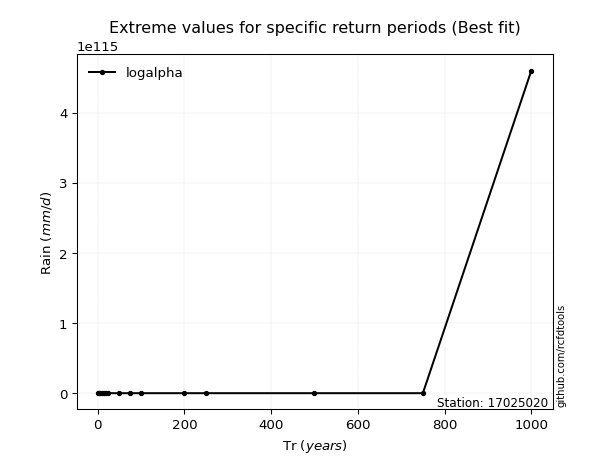</img>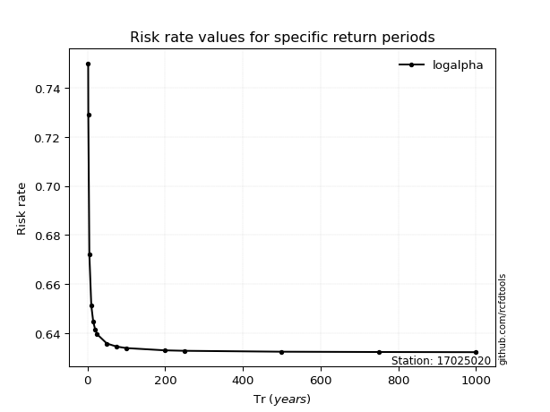</img>

</div>


<sub>**APP DISCLAIMER**: NO WARRANTY - This software is provided by [github.com/rcfdtools](https://github.com/rcfdtools) "as is", without any express or implied warranty, including warranties of merchantability, fitness for a particular purpose, or non-infringement. There is no guarantee that the software will be error-free or operate without interruption. LIMITATION OF LIABILITY - Neither the authors nor copyright holders will be liable for claims or damages arising from the software or its use. You are responsible for determining if the software is appropriate for your use and assume all associated risks, including errors, legal compliance, and data loss. NO PROFESSIONAL ADVICE - The software provides general information and does not offer professional advice. It should not replace consultation with professional advisors.</sub>