<div align="center">


</div>

# PMax24h Station (Rain): 17035010

Maximum Precipitation in 24 hours (PMax24h) is the greatest amount of rainfall for a specific duration that is meteorologically possible for a given location, acting as a "worst-case" scenario for extreme storms, crucial for designing safety-critical infrastructure like bridges, river deviations, dams, spillways, and nuclear plants to prevent catastrophic failure. The PMax24h is related with the Probable Maximum Precipitation (PMP) and it is calculated by hydrologists using meteorological data to determine the upper limit of extreme rainfall, often leading to the Probable Maximum Flood (PMF) for flood control design, and is increasingly being studied for climate change impacts. Probable Maximum Precipitation (PMP) is the theoretical upper limit of rainfall, a deterministic estimate for extreme events, while probability distributions (like GEV, Gumbel) describe the likelihood and frequency of various precipitation amounts, including rare ones, showing how often events occur, with PMP representing the extreme end of these distributions, used for critical infrastructure design to ensure safety against the worst conceivable weather, unlike standard statistical forecasts which cover typical probabilities.

The most common probability distributions in hydrology, used for analyzing floods, rainfall, and streamflow, include the Normal, Log-Normal, Gumbel, Gamma (including Log-Pearson Type III), and Generalized Extreme Value (GEV) distributions, often chosen based on the data´s skewness and whether modeling extremes or general conditions, with Gumbel and GEV popular for extreme events like floods, while the Normal distribution serves as a baseline, though often requiring transformations for skewed hydrological data. These distributions help in designing water infrastructure, managing water resources, and forecasting hydrologic events.

> Hydrological data often isn´t perfectly normal (it´s skewed), so different distributions are needed for different applications, such as: **Flood Frequency Analysis**: Using Gumbel, GEV, or Log-Pearson Type III for predicting extreme flood magnitudes and their return periods, **Rainfall Analysis**: Normal for annual totals, but Log-Normal, Weibull, or GEV for intensity or extreme daily rainfall, **Streamflow Modeling**: Gamma and Log-Normal for maximum flows, GEV for minimum flows, and Kappa for daily flows.

<div align="center">

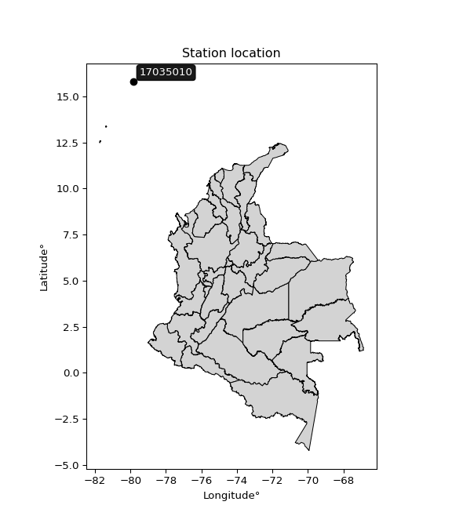</img>

</div>


## A. General information


### 1. General running parameters

• app_version: _v20260312_. • runtime: _2026-03-12 07:15:23.203550_. • Python version: _3.14.0_. • SciPy version: _1.16.3_. • Pandas version: _2.3.3_. • NumPy version: _2.3.5_. • Stations dataset (station_dataset_file): _dataset/pmax24h_in/automatic_colombia_2003_2025.csv_. • Stations catalog (station_catalog_file): _dataset/CNE.xls_. • Minimum year to eval til year_max (date_min): _1900_. • Maximum year to eval since year_min (date_max): _2025_. • Creates, save and include plots into reports (create_plot): _True_. • Plot only fit distributions with Δo > Δ (plot_only_fit): _True_. • Plot only simple graphs avoiding multiple CDFs and multiple Extreme values plots (plot_only_simple): _True_. • Eval low extreme values, if False, evaluates high extreme values (low_extreme): _False_. • Eval every SciPy distribution as logarithmic (pdist_logarithmic_on): _True_. • Standard deviation normalized (ddof): _1.0_. • Return periods to eval in years (Tr): _[2, 2.33, 5, 10, 15, 20, 25, 50, 75, 100, 200, 250, 500, 750, 1000]_. • Minimum data sample per station, 0 means any (minimum_sample): _5_. • Z-Score maximum threshold to adjust a value, 0 means disable (zscore_max): _3.5_. • Z-Score minimum threshold to adjust a value, 0 means disable (zscore_min): _-2.5_. • Avoid zeros, e.g. rain = 0 (avoid_zeros): _True_. • Avoid null values (avoid_nans): _True_. 

:file_folder:Table: [dataset.csv](../../dataset/pmax24h_in/automatic_colombia_2003_2025.csv)

> Delta Degrees of Freedom (DDOF): is a parameter used in the formulas for calculating variance and standard deviation. When ddof=0, the divisor is $N$ (the total number of observations) and this is used when your data set is the entire population. When ddof=1, the divisor is $N-1$ and this is used when your data set is a sample drawn from a larger population. Using $N-1$ provides an unbiased estimate of the population variance (known as Bessel´s correction).


### 2. Station info and location

|   id |   CODIGO | NOMBRE                      | CATEGORIA               | TECNOLOGIA                | ESTADO     | FECHA_INSTALACION   | FECHA_SUSPENSION   |   ALTITUD |   LATITUD |   LONGITUD | DEPARTAMENTO                                             | MUNICIPIO   | AREA_OPERATIVA                                         | ENTIDAD                                                     | AREA_HIDROGRAFICA   | ZONA_HIDROGRAFICA   | SUBZONA_HIDROGRAFICA                   |   CORRIENTE | Catalogo   |   Version |
|-----:|---------:|:----------------------------|:------------------------|:--------------------------|:-----------|:--------------------|:-------------------|----------:|----------:|-----------:|:---------------------------------------------------------|:------------|:-------------------------------------------------------|:------------------------------------------------------------|:--------------------|:--------------------|:---------------------------------------|------------:|:-----------|----------:|
|    0 | 17035010 | SERRANILLA - AUT [17035010] | Climatológica Ordinaria | Automática con Telemetría | Suspendida | 15/12/1998          | 14/09/2022         |         3 |   15.7975 |   -79.8522 | Archipielago De San Andres, Providencia Y Santa Catalina | San Andrés  | Area Operativa 05 - Magdalena-Cesar-Guajira-San Andrés | INSTITUTO DE HIDROLOGIA METEOROLOGIA Y ESTUDIOS AMBIENTALES | Caribe              | Islas Caribe        | OTRAS ISLAS DEL CARIBE Y ZONA MARITIMA |         nan | CNE_IDEAM  |  20251226 |

<div align="center">

Dynamic map: [:earth_americas:Google](http://maps.google.com/maps?q=15.7975,-79.852221944) [:earth_americas:OSM](https://www.openstreetmap.org/#map=18/15.7975/-79.852221944&layers=P) [:earth_americas:Bing](https://www.bing.com/maps?cp=15.7975~-79.852221944&lvl=18) [:earth_americas:Apple](https://maps.apple.com/frame?center=15.7975%2C-79.852221944&span=0.003%2C0.006)

</div>


<div align="center">

```geojson
{
  "type": "Feature",
  "geometry": {
    "type": "Point", 
    "coordinates": [-79.852221944, 15.7975]
  }, 
  "properties": {
    "Name": "17035010"
  }
}
```

</div>


### 3. Discrete values table and plot

<div align="center">

|               |          0 |           1 |           2 |          3 |           4 |
|:--------------|-----------:|------------:|------------:|-----------:|------------:|
| Date          | 2007       | 2017        | 2018        | 2019       | 2020        |
| Value         |   60.7     |  419.2      |  557.8      | 1543.5     |  575.9      |
| Value_initial |   60.7     |  419.2      |  557.8      | 1543.5     |  575.9      |
| count         |    5       |    5        |    5        |    5       |    5        |
| mean          |  631.42    |  631.42     |  631.42     |  631.42    |  631.42     |
| std           |  550.262   |  550.262    |  550.262    |  550.262   |  550.262    |
| zscore        |   -1.03718 |   -0.385671 |   -0.133791 |    1.65754 |   -0.100897 |


</div>


<div align="center">

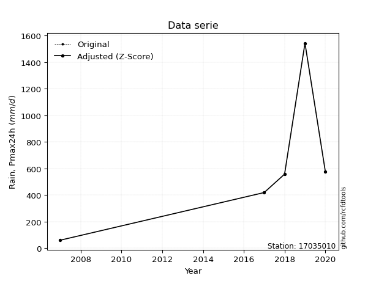</img>

</div>


> The initial value (value_initial) correspond to the initial obtained or null completed value, and value (value) is adjusted only when the initial value is outside the valid range (outlier) definite through the Z-Score value. If Z-Score is active, values out of range or outliers are replaced with the station mean value. A Z-Score (or standard score) measures how many standard deviations a data point is from the mean of a dataset, indicating its relative position; positive scores mean above the mean, negative mean below, and a score of zero is exactly at the mean, allowing for comparison of values from different distributions. It´s calculated using the formula $z=(x–μ)/σ$, where $x$ is the data point, $μ$ is the mean, and $σ$ is the standard deviation, helping identify outliers and understand probability.
>
> <sub>**Note**: In this study, "completing" (filling gaps in) and "extending" (forecasting or lengthening the historical record) rainfall data series are avoided for certain critical analyses because they introduce artificial bias and uncertainty, which can distort the statistics of rare events (extremes), alter day-to-day variability, and compromise the integrity and homogeneity of the original data. Some reasons against Completing/Extending rainfall data are: **Distortion of Extremes and Variability**: The primary issue is that most gap-filling or extension methods rely on averaging or regression with nearby stations, which inherently smooths the data. Rainfall is highly variable in space and time, with a large percentage of zero values and occasional large storms. Infilling methods often underestimate the highest values and overestimate the lowest (zero) values, which severely distorts analyses focused on flood frequency, drought severity, and intensity-duration-frequency (IDF) curves, **Loss of Data Homogeneity**: Infilled or extended data are synthetic estimates, not actual measurements. Combining these estimates with observed data can violate the assumption of data homogeneity, which requires that the data properties do not change over time. Inhomogeneity can lead to incorrect conclusions about long-term trends or changes in climate patterns, **Propagation of Errors**: Errors and biases from the original data (e.g., wind-induced undercatch, instrument errors, site changes) or the data used for imputation can propagate through the analysis, leading to unreliable hydrological models and inaccurate predictions, **Compromised Statistical Integrity**: For statistical analyses, especially those involving the frequency of events, using artificial data can introduce time bias or autocorrelation that doesn´t exist in reality, making it difficult to assess the true probability of events, **Difficulty in Validation**: It is difficult to accurately validate the quality of filled or extended data, especially for past periods where ground-truth measurements are unavailable. The reliability of imputation techniques heavily depends on the density of the surrounding station network and the complexity of the local topography.</sub>


### 4. Active continuous probability distributions from SciPy (80 of 104 available)

A Probability Density Function (PDF) describes the relative likelihood of a continuous random variable falling within a specific range, where the total area under its curve equals 1, and the area over any interval gives the actual probability for that range. Unlike discrete probabilities (like rolling a die), a PDF shows density, not direct probability for a single point (which is zero), with higher points indicating higher likelihood, often visualized as a bell curve for normal distributions.

A log of a probability density function (log-PDF) is simply the logarithm of the PDF´s value, denoted as $log(f(x))$, useful for converting multiplication of probabilities into addition, improving numerical stability with tiny numbers, and connecting to information theory concepts like entropy. Instead of dealing with very small probabilities (e.g., 0.000001), log-PDFs use negative numbers (e.g., $log(0.00001) ≈ -11.51$ that are easier for computers to handle, preventing underflow errors and simplifying complex calculations. In this study, each active probability distribution from SciPy is also evaluated in the $log$ form.

[scipy.stats](https://docs.scipy.org/doc/scipy/reference/stats.html) is a Python´s powerful submodule within the SciPy library for comprehensive statistical analysis, offering over 130 probability distributions (like Normal, Poisson, etc.), functions for descriptive stats (mean, variance), hypothesis testing (t-tests, chi-square), random variable generation, and statistical tests, making it essential for data science, modeling, and research. It provides tools to explore, model, and draw conclusions from data efficiently, working seamlessly with [NumPy](https://numpy.org/).

<div align="center">

|   id | p_dist           |   n_parameter | fit_method   | label                                                                       | active   | ref                                                                                                      |
|-----:|:-----------------|--------------:|:-------------|:----------------------------------------------------------------------------|:---------|:---------------------------------------------------------------------------------------------------------|
|    0 | alpha            |             3 | MLE          | Alpha                                                                       | True     | [:mortar_board:](https://docs.scipy.org/doc/scipy/reference/generated/scipy.stats.alpha.html)            |
|    1 | anglit           |             2 | MM           | Anglit                                                                      | True     | [:mortar_board:](https://docs.scipy.org/doc/scipy/reference/generated/scipy.stats.anglit.html)           |
|    2 | arcsine          |             2 | MM           | Arcsine                                                                     | True     | [:mortar_board:](https://docs.scipy.org/doc/scipy/reference/generated/scipy.stats.arcsine.html)          |
|    3 | argus            |             3 | MLE          | Argus                                                                       | True     | [:mortar_board:](https://docs.scipy.org/doc/scipy/reference/generated/scipy.stats.argus.html)            |
|    4 | beta             |             4 | MLE          | Beta                                                                        | True     | [:mortar_board:](https://docs.scipy.org/doc/scipy/reference/generated/scipy.stats.beta.html)             |
|    5 | betaprime        |             4 | MLE          | Beta prime                                                                  | True     | [:mortar_board:](https://docs.scipy.org/doc/scipy/reference/generated/scipy.stats.betaprime.html)        |
|    6 | bradford         |             3 | MLE          | Bradford                                                                    | True     | [:mortar_board:](https://docs.scipy.org/doc/scipy/reference/generated/scipy.stats.bradford.html)         |
|    7 | burr             |             4 | MLE          | Burr (Type III)                                                             | True     | [:mortar_board:](https://docs.scipy.org/doc/scipy/reference/generated/scipy.stats.burr.html)             |
|    8 | burr12           |             4 | MLE          | Burr (Type III) 12                                                          | True     | [:mortar_board:](https://docs.scipy.org/doc/scipy/reference/generated/scipy.stats.burr12.html)           |
|    9 | cosine           |             2 | MLE          | Cosine                                                                      | True     | [:mortar_board:](https://docs.scipy.org/doc/scipy/reference/generated/scipy.stats.cosine.html)           |
|   10 | crystalball      |             4 | MLE          | Crystalball                                                                 | True     | [:mortar_board:](https://docs.scipy.org/doc/scipy/reference/generated/scipy.stats.crystalball.html)      |
|   11 | dgamma           |             3 | MLE          | Double gamma                                                                | True     | [:mortar_board:](https://docs.scipy.org/doc/scipy/reference/generated/scipy.stats.dgamma.html)           |
|   12 | dweibull         |             3 | MLE          | Double Weibull                                                              | True     | [:mortar_board:](https://docs.scipy.org/doc/scipy/reference/generated/scipy.stats.dweibull.html)         |
|   13 | erlang           |             3 | MLE          | Erlang                                                                      | True     | [:mortar_board:](https://docs.scipy.org/doc/scipy/reference/generated/scipy.stats.erlang.html)           |
|   14 | exponnorm        |             3 | MLE          | Exponentially modified Normal                                               | True     | [:mortar_board:](https://docs.scipy.org/doc/scipy/reference/generated/scipy.stats.exponnorm.html)        |
|   15 | exponpow         |             3 | MLE          | Exponential power                                                           | True     | [:mortar_board:](https://docs.scipy.org/doc/scipy/reference/generated/scipy.stats.exponpow.html)         |
|   16 | exponweib        |             4 | MLE          | Exponentiated Weibull                                                       | True     | [:mortar_board:](https://docs.scipy.org/doc/scipy/reference/generated/scipy.stats.exponweib.html)        |
|   17 | f                |             4 | MLE          | F                                                                           | True     | [:mortar_board:](https://docs.scipy.org/doc/scipy/reference/generated/scipy.stats.f.html)                |
|   18 | fatiguelife      |             3 | MLE          | Fatigue-life (Birnbaum-Saunders)                                            | True     | [:mortar_board:](https://docs.scipy.org/doc/scipy/reference/generated/scipy.stats.fatiguelife.html)      |
|   19 | foldnorm         |             3 | MM           | Fold Normal                                                                 | True     | [:mortar_board:](https://docs.scipy.org/doc/scipy/reference/generated/scipy.stats.foldnorm.html)         |
|   20 | gamma            |             3 | MLE          | Gamma                                                                       | True     | [:mortar_board:](https://docs.scipy.org/doc/scipy/reference/generated/scipy.stats.gamma.html)            |
|   21 | gausshyper       |             6 | MLE          | Gauss hypergeometric                                                        | True     | [:mortar_board:](https://docs.scipy.org/doc/scipy/reference/generated/scipy.stats.gausshyper.html)       |
|   22 | genexpon         |             5 | MLE          | Generalized exponential                                                     | True     | [:mortar_board:](https://docs.scipy.org/doc/scipy/reference/generated/scipy.stats.genexpon.html)         |
|   23 | genextreme       |             3 | MLE          | Generalized exponential                                                     | True     | [:mortar_board:](https://docs.scipy.org/doc/scipy/reference/generated/scipy.stats.genextreme.html)       |
|   24 | gengamma         |             4 | MLE          | Generalized gamma                                                           | True     | [:mortar_board:](https://docs.scipy.org/doc/scipy/reference/generated/scipy.stats.gengamma.html)         |
|   25 | genhalflogistic  |             3 | MLE          | Generalized half-logistic                                                   | True     | [:mortar_board:](https://docs.scipy.org/doc/scipy/reference/generated/scipy.stats.genhalflogistic.html)  |
|   26 | genlogistic      |             3 | MLE          | Generalized logistic                                                        | True     | [:mortar_board:](https://docs.scipy.org/doc/scipy/reference/generated/scipy.stats.genlogistic.html)      |
|   27 | gennorm          |             3 | MLE          | Generalized Normal                                                          | True     | [:mortar_board:](https://docs.scipy.org/doc/scipy/reference/generated/scipy.stats.gennorm.html)          |
|   28 | genpareto        |             3 | MLE          | Generalized Pareto                                                          | True     | [:mortar_board:](https://docs.scipy.org/doc/scipy/reference/generated/scipy.stats.genpareto.html)        |
|   29 | gompertz         |             3 | MLE          | Gompertz (or truncated Gumbel)                                              | True     | [:mortar_board:](https://docs.scipy.org/doc/scipy/reference/generated/scipy.stats.gompertz.html)         |
|   30 | gumbel_l         |             2 | MM           | Gumbel Left Skew                                                            | True     | [:mortar_board:](https://docs.scipy.org/doc/scipy/reference/generated/scipy.stats.gumbel_l.html)         |
|   31 | gumbel_r         |             2 | MM           | Gumbel Right Skew                                                           | True     | [:mortar_board:](https://docs.scipy.org/doc/scipy/reference/generated/scipy.stats.gumbel_r.html)         |
|   32 | halfgennorm      |             3 | MLE          | Upper half of a generalized normal                                          | True     | [:mortar_board:](https://docs.scipy.org/doc/scipy/reference/generated/scipy.stats.halfgennorm.html)      |
|   33 | halflogistic     |             2 | MM           | Half-logistic                                                               | True     | [:mortar_board:](https://docs.scipy.org/doc/scipy/reference/generated/scipy.stats.halflogistic.html)     |
|   34 | halfnorm         |             2 | MM           | Half Normal                                                                 | True     | [:mortar_board:](https://docs.scipy.org/doc/scipy/reference/generated/scipy.stats.halfnorm.html)         |
|   35 | hypsecant        |             2 | MM           | hyperbolic secant                                                           | True     | [:mortar_board:](https://docs.scipy.org/doc/scipy/reference/generated/scipy.stats.hypsecant.html)        |
|   36 | invgamma         |             3 | MLE          | Inverted gamma                                                              | True     | [:mortar_board:](https://docs.scipy.org/doc/scipy/reference/generated/scipy.stats.invgamma.html)         |
|   37 | invgauss         |             3 | MLE          | Inverse Gaussian                                                            | True     | [:mortar_board:](https://docs.scipy.org/doc/scipy/reference/generated/scipy.stats.invgauss.html)         |
|   38 | invweibull       |             3 | MLE          | Inverted Weibull                                                            | True     | [:mortar_board:](https://docs.scipy.org/doc/scipy/reference/generated/scipy.stats.invweibull.html)       |
|   39 | johnsonsb        |             4 | MLE          | Johnson SB                                                                  | True     | [:mortar_board:](https://docs.scipy.org/doc/scipy/reference/generated/scipy.stats.johnsonsb.html)        |
|   40 | johnsonsu        |             4 | MLE          | Johnson Su                                                                  | True     | [:mortar_board:](https://docs.scipy.org/doc/scipy/reference/generated/scipy.stats.johnsonsu.html)        |
|   41 | kappa3           |             3 | MLE          | Kappa 3                                                                     | True     | [:mortar_board:](https://docs.scipy.org/doc/scipy/reference/generated/scipy.stats.kappa3.html)           |
|   42 | kappa4           |             4 | MLE          | Kappa 4                                                                     | True     | [:mortar_board:](https://docs.scipy.org/doc/scipy/reference/generated/scipy.stats.kappa4.html)           |
|   43 | ksone            |             3 | MLE          | Kolmogorov-Smirnov one-sided test statistic distribution                    | True     | [:mortar_board:](https://docs.scipy.org/doc/scipy/reference/generated/scipy.stats.ksone.html)            |
|   44 | kstwobign        |             2 | MLE          | Limiting distribution of scaled Kolmogorov-Smirnov two-sided test statistic | True     | [:mortar_board:](https://docs.scipy.org/doc/scipy/reference/generated/scipy.stats.kstwobign.html)        |
|   45 | laplace          |             2 | MM           | Laplace                                                                     | True     | [:mortar_board:](https://docs.scipy.org/doc/scipy/reference/generated/scipy.stats.laplace.html)          |
|   46 | levy_l           |             2 | MLE          | Left-skewed Levy                                                            | True     | [:mortar_board:](https://docs.scipy.org/doc/scipy/reference/generated/scipy.stats.levy_l.html)           |
|   47 | loggamma         |             3 | MLE          | Log gamma                                                                   | True     | [:mortar_board:](https://docs.scipy.org/doc/scipy/reference/generated/scipy.stats.loggamma.html)         |
|   48 | logistic         |             2 | MM           | Logistic (or Sech-squared)                                                  | True     | [:mortar_board:](https://docs.scipy.org/doc/scipy/reference/generated/scipy.stats.logistic.html)         |
|   49 | loglaplace       |             3 | MLE          | Log-Laplace                                                                 | True     | [:mortar_board:](https://docs.scipy.org/doc/scipy/reference/generated/scipy.stats.loglaplace.html)       |
|   50 | lomax            |             3 | MLE          | Lomax (Pareto of the second kind)                                           | True     | [:mortar_board:](https://docs.scipy.org/doc/scipy/reference/generated/scipy.stats.lomax.html)            |
|   51 | maxwell          |             2 | MM           | Maxwell                                                                     | True     | [:mortar_board:](https://docs.scipy.org/doc/scipy/reference/generated/scipy.stats.maxwell.html)          |
|   52 | mielke           |             4 | MLE          | Mielke Beta-Kappa / Dagum                                                   | True     | [:mortar_board:](https://docs.scipy.org/doc/scipy/reference/generated/scipy.stats.mielke.html)           |
|   53 | moyal            |             2 | MM           | Moyal                                                                       | True     | [:mortar_board:](https://docs.scipy.org/doc/scipy/reference/generated/scipy.stats.moyal.html)            |
|   54 | nakagami         |             3 | MLE          | Nakagami                                                                    | True     | [:mortar_board:](https://docs.scipy.org/doc/scipy/reference/generated/scipy.stats.nakagami.html)         |
|   55 | ncf              |             5 | MLE          | Non-central F distribution                                                  | True     | [:mortar_board:](https://docs.scipy.org/doc/scipy/reference/generated/scipy.stats.ncf.html)              |
|   56 | nct              |             4 | MLE          | Non-central Student’s t                                                     | True     | [:mortar_board:](https://docs.scipy.org/doc/scipy/reference/generated/scipy.stats.nct.html)              |
|   57 | norm             |             2 | MM           | Normal                                                                      | True     | [:mortar_board:](https://docs.scipy.org/doc/scipy/reference/generated/scipy.stats.norm.html)             |
|   58 | pearson3         |             3 | MM           | Pearson type III                                                            | True     | [:mortar_board:](https://docs.scipy.org/doc/scipy/reference/generated/scipy.stats.pearson3.html)         |
|   59 | powerlaw         |             3 | MLE          | Power-function                                                              | True     | [:mortar_board:](https://docs.scipy.org/doc/scipy/reference/generated/scipy.stats.powerlaw.html)         |
|   60 | rayleigh         |             2 | MM           | Rayleigh                                                                    | True     | [:mortar_board:](https://docs.scipy.org/doc/scipy/reference/generated/scipy.stats.rayleigh.html)         |
|   61 | rdist            |             3 | MLE          | R-distributed (symmetric beta)                                              | True     | [:mortar_board:](https://docs.scipy.org/doc/scipy/reference/generated/scipy.stats.rdist.html)            |
|   62 | rice             |             3 | MLE          | Rice                                                                        | True     | [:mortar_board:](https://docs.scipy.org/doc/scipy/reference/generated/scipy.stats.rice.html)             |
|   63 | semicircular     |             2 | MM           | Semicircular                                                                | True     | [:mortar_board:](https://docs.scipy.org/doc/scipy/reference/generated/scipy.stats.semicircular.html)     |
|   64 | skewnorm         |             3 | MLE          | Skew normal                                                                 | True     | [:mortar_board:](https://docs.scipy.org/doc/scipy/reference/generated/scipy.stats.skewnorm.html)         |
|   65 | t                |             3 | MLE          | Student’s t                                                                 | True     | [:mortar_board:](https://docs.scipy.org/doc/scipy/reference/generated/scipy.stats.t.html)                |
|   66 | trapezoid        |             4 | MLE          | Trapezoid                                                                   | True     | [:mortar_board:](https://docs.scipy.org/doc/scipy/reference/generated/scipy.stats.trapezoid.html)        |
|   67 | triang           |             3 | MLE          | Triangular                                                                  | True     | [:mortar_board:](https://docs.scipy.org/doc/scipy/reference/generated/scipy.stats.triang.html)           |
|   68 | truncexpon       |             3 | MLE          | Truncated exponential                                                       | True     | [:mortar_board:](https://docs.scipy.org/doc/scipy/reference/generated/scipy.stats.truncexpon.html)       |
|   69 | truncnorm        |             4 | MLE          | Truncated normal                                                            | True     | [:mortar_board:](https://docs.scipy.org/doc/scipy/reference/generated/scipy.stats.truncnorm.html)        |
|   70 | truncpareto      |             4 | MLE          | Upper truncated Pareto                                                      | True     | [:mortar_board:](https://docs.scipy.org/doc/scipy/reference/generated/scipy.stats.truncpareto.html)      |
|   71 | truncweibull_min |             5 | MLE          | Doubly truncated Weibull minimum                                            | True     | [:mortar_board:](https://docs.scipy.org/doc/scipy/reference/generated/scipy.stats.truncweibull_min.html) |
|   72 | tukeylambda      |             3 | MLE          | Tukey-Lamdba                                                                | True     | [:mortar_board:](https://docs.scipy.org/doc/scipy/reference/generated/scipy.stats.tukeylambda.html)      |
|   73 | uniform          |             2 | MLE          | Uniform                                                                     | True     | [:mortar_board:](https://docs.scipy.org/doc/scipy/reference/generated/scipy.stats.uniform.html)          |
|   74 | vonmises         |             3 | MLE          | Von Mises                                                                   | True     | [:mortar_board:](https://docs.scipy.org/doc/scipy/reference/generated/scipy.stats.vonmises.html)         |
|   75 | vonmises_line    |             3 | MLE          | Von Mises line                                                              | True     | [:mortar_board:](https://docs.scipy.org/doc/scipy/reference/generated/scipy.stats.vonmises_line.html)    |
|   76 | wald             |             2 | MM           | Wald                                                                        | True     | [:mortar_board:](https://docs.scipy.org/doc/scipy/reference/generated/scipy.stats.wald.html)             |
|   77 | weibull_max      |             3 | MLE          | Weibull maximum                                                             | True     | [:mortar_board:](https://docs.scipy.org/doc/scipy/reference/generated/scipy.stats.weibull_max.html)      |
|   78 | weibull_min      |             3 | MLE          | Weibull minimum                                                             | True     | [:mortar_board:](https://docs.scipy.org/doc/scipy/reference/generated/scipy.stats.weibull_min.html)      |
|   79 | wrapcauchy       |             3 | MLE          | Wrapped  Cauchy                                                             | True     | [:mortar_board:](https://docs.scipy.org/doc/scipy/reference/generated/scipy.stats.wrapcauchy.html)       |

</div>

> **n_parameter:** # arguments & localization & scale.
>
> **Fit methods:** (MLE) maximum likelihood, (MM) L-moments.
>
>**Inactive** (With the only purpose of prevent loops, zero divisions, infinite values, over high estimated values or horizontal trending for recurrence intervals estimations, the follow distributions were disabled.)**:** lognorm, norminvgauss, powernorm, powerlognorm, cauchy, halfcauchy, foldcauchy, skewcauchy, chi2, expon, fisk, genhyperbolic, geninvgauss, gibrat, kstwo, laplace_asymmetric, levy, levy_stable, ncx2, pareto, rel_breitwigner, recipinvgauss, studentized_range, loguniform, 


## B. Probability (PDF) vs. Empirical (EDF) distributions functions

A continuous probability distribution (CPD) describes probabilities for variables that can take any value within a range (like rain any time), unlike discrete variables with specific outcomes (like temperature). It uses a Probability Density Function (PDF), a curve where the total area under it equals 1, and the probability of the variable falling within an interval (a to b) is found by calculating the area under the curve between those points. A key feature is that the probability of hitting any single exact value is zero, so probabilities are always expressed for ranges, e.g., $P(a ≤ X ≤ b)$.

<div align="center">

Distributions parameters from station values
|     |   station | p_dist              |   n |               loc |            scale | shape                  | shape1                | shape2                 | shape3             |
|----:|----------:|:--------------------|----:|------------------:|-----------------:|:-----------------------|:----------------------|:-----------------------|:-------------------|
|   0 |  17035010 | alpha               |   5 |      -0.364042    |    133.674       | 2.1619764791192593e-12 |                       |                        |                    |
|   1 |  17035010 | anglit              |   5 |     631.42        |   1439.79        |                        |                       |                        |                    |
|   2 |  17035010 | arcsine             |   5 |     -64.6119      |   1392.06        |                        |                       |                        |                    |
|   3 |  17035010 | argus               |   5 |    -458.504       |   2109.06        | 2.5432830932225774e-07 |                       |                        |                    |
|   4 |  17035010 | beta                |   5 |     -62.371       |   1605.87        | 0.6275168489229428     | 0.657370368746309     |                        |                    |
|   5 |  17035010 | betaprime           |   5 |     -26.1074      |   5997.04        | 1.6837185746016798     | 16.2455315053858      |                        |                    |
|   6 |  17035010 | bradford            |   5 |      60.7         |   1527.11        | 3.916498824255387      |                       |                        |                    |
|   7 |  17035010 | burr                |   5 |      -5.78572     |    893.986       | 3.053885624783642      | 0.36616197959044694   |                        |                    |
|   8 |  17035010 | burr12              |   5 |      -0.461094    |     59.9349      | 218.4721650172727      | 0.0023568994629975565 |                        |                    |
|   9 |  17035010 | cosine              |   5 |     695.759       |    418.699       |                        |                       |                        |                    |
|  10 |  17035010 | crystalball         |   5 |      -0.474181    |    800.771       | 4.694575155663994      | 2.247003735359235     |                        |                    |
|  11 |  17035010 | dgamma              |   5 |     557.8         |    336.102       | 0.8180703870060146     |                       |                        |                    |
|  12 |  17035010 | dweibull            |   5 |     575.9         |    425.119       | 0.7061157618887428     |                       |                        |                    |
|  13 |  17035010 | erlang              |   5 |      60.7         |    587.27        | 0.5581245473390577     |                       |                        |                    |
|  14 |  17035010 | exponnorm           |   5 |     173.71        |    192.345       | 2.379632873540692      |                       |                        |                    |
|  15 |  17035010 | exponpow            |   5 |      60.7         |   1112.37        | 0.8023770643239989     |                       |                        |                    |
|  16 |  17035010 | exponweib           |   5 |      60.7         |      0.00163849  | 3.9372958059802734     | 0.08888179917472327   |                        |                    |
|  17 |  17035010 | f                   |   5 |      60.7         |    449.898       | 1.210081166801926      | 7434.923768610041     |                        |                    |
|  18 |  17035010 | fatiguelife         |   5 |      60.7         |      0.00266819  | 376.6955794210148      |                       |                        |                    |
|  19 |  17035010 | foldnorm            |   5 |     -28.2255      |    730.333       | 0.5195466692812476     |                       |                        |                    |
|  20 |  17035010 | gamma               |   5 |      60.7         |    496.925       | 0.6986077139237732     |                       |                        |                    |
|  21 |  17035010 | gausshyper          |   5 |    -135.487       |   1678.99        | 1.0705129218541596     | 0.7538553958021037    | 1.1071555575086003     | 1.0127540250784186 |
|  22 |  17035010 | genexpon            |   5 |      60.4387      |      6.77798     | 0.009788242672269116   | 1.3684760240549982    | 2.0678480270052634e-05 |                    |
|  23 |  17035010 | genextreme          |   5 |      63.6906      |     20.2028      | -6.755364701122035     |                       |                        |                    |
|  24 |  17035010 | gengamma            |   5 |      -1.68831e+06 |      1.68837e+06 | 0.0001662217582771104  | -17808882.800840266   |                        |                    |
|  25 |  17035010 | genhalflogistic     |   5 |     -89.7762      |   1790.89        | 1.0965008881263996     |                       |                        |                    |
|  26 |  17035010 | genlogistic         |   5 |   -1992           |    356.696       | 847.437492188667       |                       |                        |                    |
|  27 |  17035010 | gennorm             |   5 |     575.9         |     12.968       | 0.37902015436098924    |                       |                        |                    |
|  28 |  17035010 | genpareto           |   5 |       2.90426     |   1733.1         | -1.1249514400306555    |                       |                        |                    |
|  29 |  17035010 | gompertz            |   5 |      60.7         |   1374.4         | 1.5460229069036875     |                       |                        |                    |
|  30 |  17035010 | gumbel_l            |   5 |     852.922       |    383.742       |                        |                       |                        |                    |
|  31 |  17035010 | gumbel_r            |   5 |     409.918       |    383.742       |                        |                       |                        |                    |
|  32 |  17035010 | halfgennorm         |   5 |      60.7         |      6.18615     | 0.29570456939415957    |                       |                        |                    |
|  33 |  17035010 | halflogistic        |   5 |      48.0855      |    420.787       |                        |                       |                        |                    |
|  34 |  17035010 | halfnorm            |   5 |     -20.0187      |    816.457       |                        |                       |                        |                    |
|  35 |  17035010 | hypsecant           |   5 |     631.42        |    313.324       |                        |                       |                        |                    |
|  36 |  17035010 | invgamma            |   5 |    -502.176       |   6000.13        | 6.266241442566284      |                       |                        |                    |
|  37 |  17035010 | invgauss            |   5 |      11.9912      |    213.79        | 2.7020553361215125     |                       |                        |                    |
|  38 |  17035010 | invweibull          |   5 |      60.7         |      3.07592     | 0.047644307148533634   |                       |                        |                    |
|  39 |  17035010 | johnsonsb           |   5 |      60.7         |   1509.35        | 1.1938443060235298     | 0.10190967402662737   |                        |                    |
|  40 |  17035010 | johnsonsu           |   5 |    -217.966       |     20.0729      | -7.245365972024739     | 1.6960011810745872    |                        |                    |
|  41 |  17035010 | kappa3              |   5 |      60.7         |    580.841       | 2.842172755193385      |                       |                        |                    |
|  42 |  17035010 | kappa4              |   5 |     -86.9936      |   1639.45        | 1.0990198591580036     | 1.0026593475915613    |                        |                    |
|  43 |  17035010 | ksone               |   5 |     -87.58        |   1779.36        | 1.0                    |                       |                        |                    |
|  44 |  17035010 | kstwobign           |   5 |    -875.782       |   1739.13        |                        |                       |                        |                    |
|  45 |  17035010 | laplace             |   5 |     631.42        |    348.016       |                        |                       |                        |                    |
|  46 |  17035010 | levy_l              |   5 |    1635.54        |    352.28        |                        |                       |                        |                    |
|  47 |  17035010 | loggamma            |   5 | -202826           |  25789.5         | 2668.7719221632888     |                       |                        |                    |
|  48 |  17035010 | logistic            |   5 |     631.42        |    271.347       |                        |                       |                        |                    |
|  49 |  17035010 | loglaplace          |   5 |      -1.1382      |    558.938       | 1.414444033449643      |                       |                        |                    |
|  50 |  17035010 | lomax               |   5 |      60.7         |      4.82455e+09 | 7896680.9145139605     |                       |                        |                    |
|  51 |  17035010 | maxwell             |   5 |    -534.814       |    730.829       |                        |                       |                        |                    |
|  52 |  17035010 | mielke              |   5 |      -6.94402     |    888.309       | 1.1296558515428412     | 3.0320310053005386    |                        |                    |
|  53 |  17035010 | moyal               |   5 |     349.966       |    221.554       |                        |                       |                        |                    |
|  54 |  17035010 | nakagami            |   5 |     419.2         |    531.336       | 0.22886595507320318    |                       |                        |                    |
|  55 |  17035010 | ncf                 |   5 |      60.7         |    245.319       | 1.139388145458069      | 45491.77218702181     | 1.372516263970951      |                    |
|  56 |  17035010 | nct                 |   5 |      -2.17095     |    274.265       | 3.3016377617048054     | 1.7428267264181478    |                        |                    |
|  57 |  17035010 | norm                |   5 |     631.42        |    492.169       |                        |                       |                        |                    |
|  58 |  17035010 | pearson3            |   5 |     631.42        |    492.169       | 0.9440270663681816     |                       |                        |                    |
|  59 |  17035010 | powerlaw            |   5 |      60.7         |   1482.8         | 0.11507640803750611    |                       |                        |                    |
|  60 |  17035010 | rayleigh            |   5 |    -310.128       |    751.246       |                        |                       |                        |                    |
|  61 |  17035010 | rdist               |   5 |     -93.1726      |    669.073       | 1.190533220569339      |                       |                        |                    |
|  62 |  17035010 | rice                |   5 |    -183.915       |    673.425       | 0.00042716261485462276 |                       |                        |                    |
|  63 |  17035010 | semicircular        |   5 |     631.42        |    984.338       |                        |                       |                        |                    |
|  64 |  17035010 | skewnorm            |   5 |      60.6997      |    753.565       | 13445105.230831161     |                       |                        |                    |
|  65 |  17035010 | t                   |   5 |     631.423       |    492.145       | 1471362.5874181166     |                       |                        |                    |
|  66 |  17035010 | trapezoid           |   5 |     -91.959       |   1779.36        | 1.0                    | 1.0                   |                        |                    |
|  67 |  17035010 | triang              |   5 |    -595.9         |   2139.75        | 0.9998347480506073     |                       |                        |                    |
|  68 |  17035010 | truncexpon          |   5 |    -104.347       |   1699.92        | 0.9693684531976263     |                       |                        |                    |
|  69 |  17035010 | truncnorm           |   5 |     631.42        |    492.169       | -23555.1325765367      | 106944.80367522697    |                        |                    |
|  70 |  17035010 | truncpareto         |   5 |    -178.66        |    239.36        | 4.226368245629613e-10  | 7.194859785893737     |                        |                    |
|  71 |  17035010 | truncweibull_min    |   5 |     -87.321       |   1577.15        | 1.2114638190265437     | 0.0037768183765800444 | 1.0340299960502368     |                    |
|  72 |  17035010 | tukeylambda         |   5 |     -94.2929      |    734.802       | 1.0964031922174509     |                       |                        |                    |
|  73 |  17035010 | uniform             |   5 |      60.7         |   1482.8         |                        |                       |                        |                    |
|  74 |  17035010 | vonmises            |   5 |      -1.92889     |      1           | 11.637654306830253     |                       |                        |                    |
|  75 |  17035010 | vonmises_line       |   5 |     560.89        |    312.774       | 0.8071175026411163     |                       |                        |                    |
|  76 |  17035010 | wald                |   5 |     139.251       |    492.169       |                        |                       |                        |                    |
|  77 |  17035010 | weibull_max         |   5 |    1543.5         |      1.7509      | 0.12838859891468013    |                       |                        |                    |
|  78 |  17035010 | weibull_min         |   5 |      60.7         |    453.05        | 0.7530786538842449     |                       |                        |                    |
|  79 |  17035010 | wrapcauchy          |   5 |      60.5078      |    236.026       | 0.23564719697766828    |                       |                        |                    |
|  80 |  17035010 | logalpha            |   5 |     -19.6479      |    605.302       | 23.630590405058967     |                       |                        |                    |
|  81 |  17035010 | loganglit           |   5 |       6.03321     |      3.10024     |                        |                       |                        |                    |
|  82 |  17035010 | logarcsine          |   5 |       4.53447     |      2.99748     |                        |                       |                        |                    |
|  83 |  17035010 | logargus            |   5 |       3.06143     |      4.42664     | 1.7413227736098023     |                       |                        |                    |
|  84 |  17035010 | logbeta             |   5 |       3.51749     |      3.82432     | 1.6095563691446673     | 0.6633687247449859    |                        |                    |
|  85 |  17035010 | logbetaprime        |   5 |     -20.0049      |    228.671       | 630.242388850181       | 5537.702643937835     |                        |                    |
|  86 |  17035010 | logbradford         |   5 |       4.10378     |      3.23804     | 0.014884290913737254   |                       |                        |                    |
|  87 |  17035010 | logburr             |   5 |       0.128432    |      6.88337     | 23.06684321844846      | 0.23356793866943226   |                        |                    |
|  88 |  17035010 | logburr12           |   5 |    -549.387       |    566.203       | 690.2114247337845      | 319295.5255884582     |                        |                    |
|  89 |  17035010 | logcosine           |   5 |       5.91303     |      0.900498    |                        |                       |                        |                    |
|  90 |  17035010 | logcrystalball      |   5 |       6.03321     |      1.05977     | 4872.495225638499      | 4665.102135986654     |                        |                    |
|  91 |  17035010 | logdgamma           |   5 |       6.324       |      1.02407     | 0.6492555540709926     |                       |                        |                    |
|  92 |  17035010 | logdweibull         |   5 |       6.324       |      1.25652     | 0.42340046370853035    |                       |                        |                    |
|  93 |  17035010 | logerlang           |   5 |     -11.0966      |      0.0715681   | 239.44062450710157     |                       |                        |                    |
|  94 |  17035010 | logexponnorm        |   5 |       6.03259     |      1.05976     | 0.000579115089484962   |                       |                        |                    |
|  95 |  17035010 | logexponpow         |   5 |       4.10594     |      1.50676     | 0.41158566968393084    |                       |                        |                    |
|  96 |  17035010 | logexponweib        |   5 |       4.10594     |      1.51655     | 1.2578841683854787     | 0.6489430166888317    |                        |                    |
|  97 |  17035010 | logf                |   5 |    -260.074       |    266.102       | 246254.8756731705      | 245241.90164760262    |                        |                    |
|  98 |  17035010 | logfatiguelife      |   5 |    -395.005       |    401.031       | 0.00263941906319935    |                       |                        |                    |
|  99 |  17035010 | logfoldnorm         |   5 |       2.47093     |      1.02377     | 3.4834353774749554     |                       |                        |                    |
| 100 |  17035010 | loggamma            |   5 |     -12.4488      |      0.0643726   | 286.96128521374817     |                       |                        |                    |
| 101 |  17035010 | loggausshyper       |   5 |       3.92156     |      3.42025     | 1.0637256146847325     | 0.7008253426421307    | 1.322482576696064      | 0.9159352505263768 |
| 102 |  17035010 | loggenexpon         |   5 |       4.10489     |      0.028129    | 0.0062995990708627665  | 3.713217020438951     | 5.037175140280614e-05  |                    |
| 103 |  17035010 | loggenextreme       |   5 |       6.15509     |      1.51342     | 1.2753033504581897     |                       |                        |                    |
| 104 |  17035010 | loggengamma         |   5 |       4.10594     |      1.84611     | 1.1561889309159268     | 0.44392098869253255   |                        |                    |
| 105 |  17035010 | loggenhalflogistic  |   5 |       4.03947     |      3.46319     | 1.0487070023446174     |                       |                        |                    |
| 106 |  17035010 | loggenlogistic      |   5 |       6.81829     |      0.325005    | 0.34789449955671614    |                       |                        |                    |
| 107 |  17035010 | loggennorm          |   5 |       6.324       |      0.00800351  | 0.3239041081648766     |                       |                        |                    |
| 108 |  17035010 | loggenpareto        |   5 |      -0.0281179   |     13.0219      | -1.7669035883780353    |                       |                        |                    |
| 109 |  17035010 | loggompertz         |   5 |       4.10594     |      0.991665    | 0.10376569779188358    |                       |                        |                    |
| 110 |  17035010 | loggumbel_l         |   5 |       6.51016     |      0.826296    |                        |                       |                        |                    |
| 111 |  17035010 | loggumbel_r         |   5 |       5.55626     |      0.826296    |                        |                       |                        |                    |
| 112 |  17035010 | loghalfgennorm      |   5 |       4.10593     |      3.23714     | 21393.799205199735     |                       |                        |                    |
| 113 |  17035010 | loghalflogistic     |   5 |       4.77714     |      0.90606     |                        |                       |                        |                    |
| 114 |  17035010 | loghalfnorm         |   5 |       4.63045     |      1.75809     |                        |                       |                        |                    |
| 115 |  17035010 | loghypsecant        |   5 |       6.03321     |      0.674668    |                        |                       |                        |                    |
| 116 |  17035010 | loginvgamma         |   5 |     -14.8151      |   7579.1         | 364.76758182718777     |                       |                        |                    |
| 117 |  17035010 | loginvgauss         |   5 |      -4.50208     |    920.588       | 0.011421668554873834   |                       |                        |                    |
| 118 |  17035010 | loginvweibull       |   5 | -521442           | 521448           | 453835.5795359114      |                       |                        |                    |
| 119 |  17035010 | logjohnsonsb        |   5 |       3.01745     |      4.32436     | -0.1742404386276929    | 0.14300382387375973   |                        |                    |
| 120 |  17035010 | logjohnsonsu        |   5 |       6.35593     |      3.79177e-12 | 0.007078648110601645   | 0.06326842622863886   |                        |                    |
| 121 |  17035010 | logkappa3           |   5 |       4.10594     |      3.17383     | 56.141830050036646     |                       |                        |                    |
| 122 |  17035010 | logkappa4           |   5 |       3.93177     |      3.58293     | 1.0483002078377428     | 1.0507028455304739    |                        |                    |
| 123 |  17035010 | logksone            |   5 |       3.78236     |      3.88304     | 1.0                    |                       |                        |                    |
| 124 |  17035010 | logkstwobign        |   5 |       1.43668     |      5.24382     |                        |                       |                        |                    |
| 125 |  17035010 | loglaplace          |   5 |       6.03321     |      0.749368    |                        |                       |                        |                    |
| 126 |  17035010 | loglevy_l           |   5 |       7.4516      |      0.419694    |                        |                       |                        |                    |
| 127 |  17035010 | logloggamma         |   5 |       6.95393     |      0.561313    | 0.5735846169047841     |                       |                        |                    |
| 128 |  17035010 | loglogistic         |   5 |       6.03321     |      0.58428     |                        |                       |                        |                    |
| 129 |  17035010 | logloglaplace       |   5 |      -0.045667    |      6.36967     | 7.976607811930217      |                       |                        |                    |
| 130 |  17035010 | loglomax            |   5 |       4.10594     |      2.23801e+12 | 407663570238.9904      |                       |                        |                    |
| 131 |  17035010 | logmaxwell          |   5 |       3.52201     |      1.57366     |                        |                       |                        |                    |
| 132 |  17035010 | logmielke           |   5 |       0.333118    |      6.68813     | 5.163002603500962      | 22.527037245522223    |                        |                    |
| 133 |  17035010 | logmoyal            |   5 |       5.42716     |      0.477062    |                        |                       |                        |                    |
| 134 |  17035010 | lognakagami         |   5 |       6.03835     |      0.895091    | 0.049692074034195455   |                       |                        |                    |
| 135 |  17035010 | logncf              |   5 |     -13.1996      |     19.1847      | 986.285584959511       | 1345.623762214465     | 1.1174390325850525     |                    |
| 136 |  17035010 | lognct              |   5 |     -75.5419      |      1.02574     | 43339.036414987        | 79.52594586461228     |                        |                    |
| 137 |  17035010 | lognorm             |   5 |       6.03321     |      1.05977     |                        |                       |                        |                    |
| 138 |  17035010 | logpearson3         |   5 |       6.03321     |      1.05977     | -0.8166389579546875    |                       |                        |                    |
| 139 |  17035010 | logpowerlaw         |   5 |       4.10594     |      3.23586     | 0.13481369325038428    |                       |                        |                    |
| 140 |  17035010 | lograyleigh         |   5 |       4.00581     |      1.61763     |                        |                       |                        |                    |
| 141 |  17035010 | logrdist            |   5 |       4.5297      |      1.82623     | 1.0998479641893453     |                       |                        |                    |
| 142 |  17035010 | logrice             |   5 |       3.35375     |      1.15293     | 2.0605738630825003     |                       |                        |                    |
| 143 |  17035010 | logsemicircular     |   5 |       6.03321     |      2.11953     |                        |                       |                        |                    |
| 144 |  17035010 | logskewnorm         |   5 |       7.34181     |      1.68414     | -8827672.434711881     |                       |                        |                    |
| 145 |  17035010 | logt                |   5 |       6.03321     |      1.05976     | 641120656.1904714      |                       |                        |                    |
| 146 |  17035010 | logtrapezoid        |   5 |       3.03574     |      4.49621     | 1.0                    | 1.0                   |                        |                    |
| 147 |  17035010 | logtriang           |   5 |       3.26881     |      4.073       | 0.9999999920669058     |                       |                        |                    |
| 148 |  17035010 | logtruncexpon       |   5 |       4.10594     |      3.40965     | 0.9490468106706885     |                       |                        |                    |
| 149 |  17035010 | logtruncnorm        |   5 |      -0.302324    |      1.57625     | 4.0226276532136005     | 4.849606392448219     |                        |                    |
| 150 |  17035010 | logtruncpareto      |   5 |       4.08627     |      0.0196768   | 0.2605846796523875     | 165.451121649555      |                        |                    |
| 151 |  17035010 | logtruncweibull_min |   5 |       4.09771     |      4.10512     | 0.7674457793621047     | 0.002005016761683025  | 0.790256254961095      |                    |
| 152 |  17035010 | logtukeylambda      |   5 |       5.23094     |      1.38659     | 1.2325237178191188     |                       |                        |                    |
| 153 |  17035010 | loguniform          |   5 |       4.10594     |      3.23586     |                        |                       |                        |                    |
| 154 |  17035010 | logvonmises         |   5 |      -0.027327    |      1           | 1.4270681851603142     |                       |                        |                    |
| 155 |  17035010 | logvonmises_line    |   5 |       5.72374     |      0.515054    | 2.180492033898186e-05  |                       |                        |                    |
| 156 |  17035010 | logwald             |   5 |       4.97347     |      1.05973     |                        |                       |                        |                    |
| 157 |  17035010 | logweibull_max      |   5 |       7.34181     |      1.75194     | 0.34588106534607954    |                       |                        |                    |
| 158 |  17035010 | logweibull_min      |   5 |      -4.42258e+07 |      4.42258e+07 | 54311315.67875174      |                       |                        |                    |
| 159 |  17035010 | logwrapcauchy       |   5 |       4.10594     |      0.515004    | 0.5                    |                       |                        |                    |

</div>

> **loc** (Location parameter): This shifts the distribution along the x-axis. For many common distributions, like the normal (Gaussian) distribution, loc represents the mean $μ$. For others, like the uniform distribution, it might represent the minimum value, or for the beta distribution, the left end of the support interval.
>
> **scale** (Scale parameter): This determines the width or spread of the distribution. For the normal distribution, scale represents the standard deviation $σ$. For a uniform distribution, it defines the length of the interval (from $loc$ to $loc + scale$).
>
> **shape** (Shape parameters): Refers to parameters that define the specific form of a probability distribution, distinct from its location (loc) and scale (scale). These parameters are required arguments for most distribution functions. For example, a normal (Gaussian) distribution is fully defined by its location (mean) and scale (standard deviation), so it has no specific shape parameters beyond loc and scale. However, other distributions have intrinsic properties that need specification, as Gamma distribution that takes a shape parameter, often named $a$ or $alpha$.


### 0. Cumulative distribution values - CDF (160 evaluated)

Cumulative Distribution Function (CDF), denoted as $F$<sub>$X$</sub>$(x)$, is a function that gives the probability that a random variable $X$ will take a value less than or equal to a specific value, $x$ (i.e., $(P(X≥x)$. It essentially "accumulates" probabilities from a given point up to the far right (positive infinity), providing a complete picture of the distribution´s probabilities for both discrete (like rain) and continuous (like temperature) variables, helping to find probabilities over ranges or above certain values. Each station is evaluated separately ordering the $x$ values ascending, calculating the CDF and PDF values for the activated distributions and their logarithmic forms.

<div align="center">

CDF ordered by x ascending and calculating $log(f(x))$ separately
|   id |   Station |   date |      x |   count |   mean |     std |    zscore |   Value_initial |   station |   m |     alpha |   alpha_pdf |   anglit |   anglit_pdf |   arcsine |   arcsine_pdf |    argus |   argus_pdf |     beta |     beta_pdf |   betaprime |   betaprime_pdf |    bradford |   bradford_pdf |      burr |    burr_pdf |    burr12 |   burr12_pdf |    cosine |   cosine_pdf |   crystalball |   crystalball_pdf |    dgamma |   dgamma_pdf |   dweibull |   dweibull_pdf |      erlang |      erlang_pdf |   exponnorm |   exponnorm_pdf |    exponpow |   exponpow_pdf |   exponweib |   exponweib_pdf |           f |       f_pdf |   fatiguelife |   fatiguelife_pdf |   foldnorm |   foldnorm_pdf |       gamma |     gamma_pdf |   gausshyper |   gausshyper_pdf |    genexpon |   genexpon_pdf |   genextreme |   genextreme_pdf |   gengamma |   gengamma_pdf |   genhalflogistic |   genhalflogistic_pdf |   genlogistic |   genlogistic_pdf |   gennorm |   gennorm_pdf |   genpareto |   genpareto_pdf |    gompertz |   gompertz_pdf |   gumbel_l |   gumbel_l_pdf |   gumbel_r |   gumbel_r_pdf |   halfgennorm |   halfgennorm_pdf |   halflogistic |   halflogistic_pdf |   halfnorm |   halfnorm_pdf |   hypsecant |   hypsecant_pdf |   invgamma |   invgamma_pdf |   invgauss |   invgauss_pdf |   invweibull |   invweibull_pdf |   johnsonsb |   johnsonsb_pdf |   johnsonsu |   johnsonsu_pdf |      kappa3 |   kappa3_pdf |      kappa4 |   kappa4_pdf |     ksone |   ksone_pdf |   kstwobign |   kstwobign_pdf |   laplace |   laplace_pdf |   levy_l |   levy_l_pdf |   loggamma |   loggamma_pdf |   logistic |   logistic_pdf |   loglaplace |   loglaplace_pdf |       lomax |   lomax_pdf |   maxwell |   maxwell_pdf |    mielke |   mielke_pdf |     moyal |   moyal_pdf |    nakagami |     nakagami_pdf |         ncf |     ncf_pdf |       nct |     nct_pdf |     norm |    norm_pdf |   pearson3 |   pearson3_pdf |   powerlaw |   powerlaw_pdf |   rayleigh |   rayleigh_pdf |    rdist |     rdist_pdf |      rice |    rice_pdf |   semicircular |   semicircular_pdf |   skewnorm |   skewnorm_pdf |        t |       t_pdf |   trapezoid |   trapezoid_pdf |    triang |   triang_pdf |   truncexpon |   truncexpon_pdf |   truncnorm |   truncnorm_pdf |   truncpareto |   truncpareto_pdf |   truncweibull_min |   truncweibull_min_pdf |   tukeylambda |   tukeylambda_pdf |   uniform |   uniform_pdf |   vonmises |   vonmises_pdf |   vonmises_line |   vonmises_line_pdf |     wald |    wald_pdf |   weibull_max |   weibull_max_pdf |   weibull_min |   weibull_min_pdf |   wrapcauchy |   wrapcauchy_pdf |   logalpha |   logalpha_pdf |   loganglit |   loganglit_pdf |   logarcsine |   logarcsine_pdf |   logargus |   logargus_pdf |   logbeta |   logbeta_pdf |   logbetaprime |   logbetaprime_pdf |   logbradford |   logbradford_pdf |   logburr |   logburr_pdf |   logburr12 |   logburr12_pdf |   logcosine |   logcosine_pdf |   logcrystalball |   logcrystalball_pdf |   logdgamma |   logdgamma_pdf |   logdweibull |   logdweibull_pdf |   logerlang |   logerlang_pdf |   logexponnorm |   logexponnorm_pdf |   logexponpow |   logexponpow_pdf |   logexponweib |   logexponweib_pdf |      logf |   logf_pdf |   logfatiguelife |   logfatiguelife_pdf |   logfoldnorm |   logfoldnorm_pdf |   loggausshyper |   loggausshyper_pdf |   loggenexpon |   loggenexpon_pdf |   loggenextreme |   loggenextreme_pdf |   loggengamma |   loggengamma_pdf |   loggenhalflogistic |   loggenhalflogistic_pdf |   loggenlogistic |   loggenlogistic_pdf |   loggennorm |   loggennorm_pdf |   loggenpareto |   loggenpareto_pdf |   loggompertz |   loggompertz_pdf |   loggumbel_l |   loggumbel_l_pdf |   loggumbel_r |   loggumbel_r_pdf |   loghalfgennorm |   loghalfgennorm_pdf |   loghalflogistic |   loghalflogistic_pdf |   loghalfnorm |   loghalfnorm_pdf |   loghypsecant |   loghypsecant_pdf |   loginvgamma |   loginvgamma_pdf |   loginvgauss |   loginvgauss_pdf |   loginvweibull |   loginvweibull_pdf |   logjohnsonsb |   logjohnsonsb_pdf |   logjohnsonsu |   logjohnsonsu_pdf |   logkappa3 |   logkappa3_pdf |   logkappa4 |   logkappa4_pdf |   logksone |   logksone_pdf |   logkstwobign |   logkstwobign_pdf |   loglevy_l |   loglevy_l_pdf |   logloggamma |   logloggamma_pdf |   loglogistic |   loglogistic_pdf |   logloglaplace |   logloglaplace_pdf |   loglomax |   loglomax_pdf |   logmaxwell |   logmaxwell_pdf |   logmielke |   logmielke_pdf |    logmoyal |   logmoyal_pdf |   lognakagami |   lognakagami_pdf |    logncf |   logncf_pdf |    lognct |   lognct_pdf |   lognorm |   lognorm_pdf |   logpearson3 |   logpearson3_pdf |   logpowerlaw |   logpowerlaw_pdf |   lograyleigh |   lograyleigh_pdf |   logrdist |   logrdist_pdf |   logrice |   logrice_pdf |   logsemicircular |   logsemicircular_pdf |   logskewnorm |   logskewnorm_pdf |      logt |   logt_pdf |   logtrapezoid |   logtrapezoid_pdf |   logtriang |   logtriang_pdf |   logtruncexpon |   logtruncexpon_pdf |   logtruncnorm |   logtruncnorm_pdf |   logtruncpareto |   logtruncpareto_pdf |   logtruncweibull_min |   logtruncweibull_min_pdf |   logtukeylambda |   logtukeylambda_pdf |   loguniform |   loguniform_pdf |   logvonmises |   logvonmises_pdf |   logvonmises_line |   logvonmises_line_pdf |   logwald |   logwald_pdf |   logweibull_max |   logweibull_max_pdf |   logweibull_min |   logweibull_min_pdf |   logwrapcauchy |   logwrapcauchy_pdf |
|-----:|----------:|-------:|-------:|--------:|-------:|--------:|----------:|----------------:|----------:|----:|----------:|------------:|---------:|-------------:|----------:|--------------:|---------:|------------:|---------:|-------------:|------------:|----------------:|------------:|---------------:|----------:|------------:|----------:|-------------:|----------:|-------------:|--------------:|------------------:|----------:|-------------:|-----------:|---------------:|------------:|----------------:|------------:|----------------:|------------:|---------------:|------------:|----------------:|------------:|------------:|--------------:|------------------:|-----------:|---------------:|------------:|--------------:|-------------:|-----------------:|------------:|---------------:|-------------:|-----------------:|-----------:|---------------:|------------------:|----------------------:|--------------:|------------------:|----------:|--------------:|------------:|----------------:|------------:|---------------:|-----------:|---------------:|-----------:|---------------:|--------------:|------------------:|---------------:|-------------------:|-----------:|---------------:|------------:|----------------:|-----------:|---------------:|-----------:|---------------:|-------------:|-----------------:|------------:|----------------:|------------:|----------------:|------------:|-------------:|------------:|-------------:|----------:|------------:|------------:|----------------:|----------:|--------------:|---------:|-------------:|-----------:|---------------:|-----------:|---------------:|-------------:|-----------------:|------------:|------------:|----------:|--------------:|----------:|-------------:|----------:|------------:|------------:|-----------------:|------------:|------------:|----------:|------------:|---------:|------------:|-----------:|---------------:|-----------:|---------------:|-----------:|---------------:|---------:|--------------:|----------:|------------:|---------------:|-------------------:|-----------:|---------------:|---------:|------------:|------------:|----------------:|----------:|-------------:|-------------:|-----------------:|------------:|----------------:|--------------:|------------------:|-------------------:|-----------------------:|--------------:|------------------:|----------:|--------------:|-----------:|---------------:|----------------:|--------------------:|---------:|------------:|--------------:|------------------:|--------------:|------------------:|-------------:|-----------------:|-----------:|---------------:|------------:|----------------:|-------------:|-----------------:|-----------:|---------------:|----------:|--------------:|---------------:|-------------------:|--------------:|------------------:|----------:|--------------:|------------:|----------------:|------------:|----------------:|-----------------:|---------------------:|------------:|----------------:|--------------:|------------------:|------------:|----------------:|---------------:|-------------------:|--------------:|------------------:|---------------:|-------------------:|----------:|-----------:|-----------------:|---------------------:|--------------:|------------------:|----------------:|--------------------:|--------------:|------------------:|----------------:|--------------------:|--------------:|------------------:|---------------------:|-------------------------:|-----------------:|---------------------:|-------------:|-----------------:|---------------:|-------------------:|--------------:|------------------:|--------------:|------------------:|--------------:|------------------:|-----------------:|---------------------:|------------------:|----------------------:|--------------:|------------------:|---------------:|-------------------:|--------------:|------------------:|--------------:|------------------:|----------------:|--------------------:|---------------:|-------------------:|---------------:|-------------------:|------------:|----------------:|------------:|----------------:|-----------:|---------------:|---------------:|-------------------:|------------:|----------------:|--------------:|------------------:|--------------:|------------------:|----------------:|--------------------:|-----------:|---------------:|-------------:|-----------------:|------------:|----------------:|------------:|---------------:|--------------:|------------------:|----------:|-------------:|----------:|-------------:|----------:|--------------:|--------------:|------------------:|--------------:|------------------:|--------------:|------------------:|-----------:|---------------:|----------:|--------------:|------------------:|----------------------:|--------------:|------------------:|----------:|-----------:|---------------:|-------------------:|------------:|----------------:|----------------:|--------------------:|---------------:|-------------------:|-----------------:|---------------------:|----------------------:|--------------------------:|-----------------:|---------------------:|-------------:|-----------------:|--------------:|------------------:|-------------------:|-----------------------:|----------:|--------------:|-----------------:|---------------------:|-----------------:|---------------------:|----------------:|--------------------:|
|    0 |  17035010 |   2007 |   60.7 |       5 | 631.42 | 550.262 | -1.03718  |            60.7 |  17035010 |   1 | 0.0285907 | 0.00260512  | 0.143846 |  0.000487478 |  0.193994 |   0.000798929 | 0.089514 | 0.000339396 | 0.147534 |  0.00076508  |   0.0505716 |     0.000889485 | 1.89712e-14 |    0.00161035  | 0.0546916 | 0.000919524 | 0.0104017 |  0.00823283  | 0.0996802 |  0.000400654 |      0.530448 |       0.000496746 | 0.0855309 |  0.000275817 |   0.159057 |    0.000249683 | 4.06376e-10 | 31920.5         |   0.0592049 |     0.000478941 | 1.59735e-14 |    1.8038      | 8.72257e-05 |     4.08949e+09 | 1.58379e-05 | 1.33148     |     0.0381995 |       1.22801e+07 |  0.0847322 |    0.00094941  | 1.87887e-12 | 184.731       |     0.114074 |      0.000595718 | 0.000377266 |    0.00144374  |   0.00131324 |    153.723       | 0.00102318 |    0.00174943  |         0.0440461 |           0.000306927 |     0.0685512 |       0.000514273 | 0.0864368 |   0.000175181 |   0.0334187 |     0.000579458 | 4.15619e-16 |    0.00112487  |   0.119166 |    0.000291252 |  0.0833755 |    0.000539784 |    2.2998e-14 |       0.0163462   |       0.014988 |        0.00118798  |  0.0787542 |    0.000972488 |    0.10211  |     0.00032033  |  0.0563468 |    0.000603979 |  0.0517504 |    0.00272493  |   0.00686531 |      2.29309e+11 |  0.00203889 |     9.25378e+10 |   0.0541353 |     0.000666874 | 1.83357e-13 |  0.00119214  | 3.04013e-15 |  0.0167068   | 0.0833333 |    0.000562 |   0.0660845 |     0.000529924 | 0.0969973 |   0.000278715 | 0.363759 |  0.000107133 |  0.0356444 |       0.077399 |   0.108778 |    0.000357274 |     0.038197 |        0.0509722 | 3.79998e-08 | 0.00163677  |  0.118357 |   0.000520111 | 0.0545257 |  0.000910209 | 0.0547398 | 0.000546602 | 0           |      0           | 3.81586e-05 | 1.05726     | 0.0636948 | 0.000443007 | 0.123105 | 0.000413812 |  0.0938733 |    0.000584593 |   0.010161 |    1.64563e+11 |   0.1147   |    0.000581698 | 0.583053 |   0.000547755 | 0.0638428 | 0.000504957 |       0.152761 |        0.000526944 |   0        |    0.00105881  | 0.123093 | 0.000413802 |  0.00736067 |     9.64328e-05 | 0.0941772 |  0.000286863 |     0.149073 |      0.000860082 |    0.123105 |     0.000413812 |      0        |       0.0021171   |          0.0838517 |            0.000681222 |      0.612839 |       0.000729135 |  0        |     0.0006744 |    10.2472 |       1.05977  |        0.12819  |         0.000425198 | 0        | 0           |     0.0928949 |       1.91133e-05 |   2.21232e-13 |      23.4476      |  0.000209496 |      0.00109009  |   0.032033 |      0.0770631 |   0.0265747 |        0.103758 |     0        |         0        |  0.0431854 |      0.0850056 | 0.0298223 |     0.0834068 |       0.036926 |          0.0780481 |   0.000674098 |          0.311119 | 0.0520848 |     0.0705505 |   0.0487202 |        0.05925  |   0.0363461 |        0.102106 |        0.0344882 |            0.0720357 |   0.0281121 |       0.0307922 |      0.140131 |        0.034026   |   0.0363454 |       0.0779668 |      0.0344878 |          0.0720354 |   5.39185e-07 |       2.49861e+08 |    3.68046e-13 |        338.259     | 0.0362108 |  0.0745474 |        0.0344927 |            0.0724776 |     0.0296216 |         0.0657675 |       0.0512634 |            0.289128 |   0.000236687 |          0.22415  |        0.111266 |           0.0592048 |   1.27665e-08 |       7.37745e+06 |           0.00969536 |                 0.147328 |        0.0548337 |            0.0586816 |    0.0297829 |        0.0192395 |       0.372398 |           0.109769 |   6.69074e-09 |          0.104638 |     0.0530377 |         0.0624542 |    0.00307459 |          0.021524 |         0        |             0.308923 |          0        |              0        |      0        |          0        |      0.0365421 |          0.0540441 |     0.0333584 |         0.0773654 |     0.0340274 |          0.082605 |       0.0382473 |            0.108642 |       0.370684 |        0.0663299   |      0.0398932 |        0.0024179   | 1.02625e-13 |        0.293263 |  0.00357406 |        0.367319 |  0.0833333 |        0.25753 |      0.0421262 |           0.134503 |    0.276797 |       0.0396656 |      0.060998 |         0.0620841 |     0.0356217 |         0.0587951 |       0.0164482 |           0.0316023 |   2.24e-10 |       0.182155 |    0.0130411 |        0.0651687 |   0.0520334 |        0.071206 | 6.50189e-05 |     0.00114843 |     0         |       0           | 0.0400925 |    0.0836366 | 0.0347348 |    0.0724976 | 0.0344882 |     0.0720358 |     0.0517292 |         0.0693179 |    0.00798175 |       1.21152e+12 |    0.00191397 |         0.0381927 |   0.420497 |    0.190769    | 0.0283248 |     0.0824089 |         0.0161736 |              0.125    |     0.0546845 |         0.0748038 | 0.0344875 |  0.0720347 |      0.0566557 |           0.105878 |   0.0422437 |        0.100925 |     3.91137e-06 |            0.478526 |    0           |          0         |      1.50876e-16 |           17.9972    |           1.82852e-08 |                  1.4098   |      7.10543e-15 |             0.720825 |     0        |         0.309036 |       1.03059 |         0.0461955 |        9.21787e-05 |               0.309    |  0        |     0         |         0.290421 |          0.0383824   |        0.0507476 |            0.0607116 |        0        |            0.927109 |
|    1 |  17035010 |   2017 |  419.2 |       5 | 631.42 | 550.262 | -0.385671 |           419.2 |  17035010 |   2 | 0.750028  | 0.000575903 | 0.354729 |  0.000664584 |  0.401377 |   0.000480185 | 0.248187 | 0.000538264 | 0.359374 |  0.00050605  |   0.435567  |     0.000974594 | 0.40941     |    0.000838977 | 0.419995  | 0.0010017   | 0.632902  |  0.000450423 | 0.297229  |  0.000680286 |      0.699892 |       0.000434268 | 0.283497  |  0.00101104  |   0.305016 |    0.000679313 | 0.697075    |     0.000721693 |   0.385407  |     0.00112226  | 0.391324    |    0.000821798 | 0.814939    |     0.000126594 | 0.605908    | 0.000749536 |     0.83474   |       0.000337235 |  0.408303  |    0.000831654 | 0.666306    |   0.00083004  |     0.322317 |      0.00056423  | 0.427488    |    0.000953225 |   0.611181   |      0.000124256 | 1          |    0.000934048 |         0.168654  |           0.000394046 |     0.374565  |       0.00103059  | 0.217123  |   0.000758775 |   0.244231  |     0.000597548 | 0.369187    |    0.000921051 |   0.275993 |    0.000609319 |  0.376777  |    0.000958384 |    0.559507   |       0.000590124 |       0.414454 |        0.000984142 |  0.409393  |    0.0008456   |    0.299217 |     0.000820419 |  0.408974  |    0.00106454  |  0.642485  |    0.000693826 |   0.450609   |      4.7738e-05  |  0.858809   |     8.34592e-05 |   0.41872   |     0.00103927  | 0.414716    |  0.001062    | 0.273415    |  0.000694215 | 0.28481   |    0.000562 |   0.36376   |     0.000969154 | 0.27173   |   0.000780797 | 0.409538 |  0.000152714 |  0.513205  |       0.365416 |   0.313868 |    0.000793651 |     0.503419 |        0.662667  | 0.443886    | 0.000910231 |  0.363963 |   0.000793554 | 0.419818  |  0.00100456  | 0.392358  | 0.00106833  | 3.83363e-08 | 308703           | 0.514106    | 0.000774282 | 0.388229  | 0.00116283  | 0.333164 | 0.000738622 |  0.3807    |    0.000896858 |   0.849268 |    0.00027261  |   0.375778 |    0.000806672 | 0.80469  |   0.000766012 | 0.33038   | 0.000890535 |       0.363818 |        0.000631539 |   0.36574  |    0.000945525 | 0.333154 | 0.000738649 |  0.0825248  |     0.000322893 | 0.225093  |  0.000443489 |     0.42707  |      0.000696547 |    0.333164 |     0.000738622 |      0.463872 |       0.000847604 |          0.343804  |            0.000726581 |      0.877361 |       0.000754254 |  0.241772 |     0.0006744 |    67.6998 |       1.16948  |        0.365515 |         0.000898913 | 0.422353 | 0.00160461  |     0.10093   |       2.6432e-05  |   0.567592    |       0.000761533 |  0.316307    |      0.000617439 |   0.52605  |      0.36522   |   0.501658  |        0.322554 |     0.501092 |         0.212386 |  0.422268  |      0.336628  | 0.363895  |     0.274963  |       0.511161 |          0.364287  |   0.599227    |          0.308379 | 0.436779  |     0.386704  |   0.42514   |        0.395491 |   0.544227  |        0.351773 |        0.501935  |            0.376439  |   0.281961  |       0.417018  |      0.293102 |        0.232031   |   0.508112  |       0.360142  |      0.501937  |          0.376441  |   0.868373    |       0.0940384   |    0.62672     |          0.139376  | 0.50399   |  0.371567  |        0.504575  |            0.376862  |     0.500464  |         0.38968   |       0.577623  |            0.260935 |   0.582863    |          0.283742 |        0.340837 |           0.220693  |   0.573369    |       0.0910415   |           0.416308   |                 0.302385 |        0.421016  |            0.413176  |    0.201701  |        0.386307  |       0.624863 |           0.162884 |   0.464516    |          0.393298 |     0.431619  |         0.388619  |    0.572366   |          0.386504 |         0        |             0.308923 |          0.601812 |              0.351976 |      0.57676  |          0.329338 |      0.502426  |          0.471789  |     0.52067   |         0.364417  |     0.530394  |          0.353623 |       0.544905  |            0.287938 |       0.478451 |        0.0625621   |      0.051757  |        0.0211191   | 0.566703    |        0.293263 |  0.594996   |        0.299783 |  0.580986  |        0.25753 |      0.575525  |           0.275672 |    0.414211 |       0.132605  |      0.410815 |         0.370071  |     0.5022    |         0.427869  |       0.346756  |           0.454624  |   0.296718 |       0.128102 |    0.534907  |        0.361009  |   0.437377  |        0.385082 | 0.598199    |     0.383559   |     0.0285571 |       3.19545e+12 | 0.512228  |    0.349609  | 0.502478  |    0.375459  | 0.501935  |     0.376439  |     0.447581  |         0.371985  |    0.93286    |       0.0650807   |    0.545877   |         0.352741  |   0.824647 |    0.311821    | 0.512307  |     0.365578  |         0.501544  |              0.300358 |     0.438953  |         0.351145  | 0.501934  |  0.37644   |      0.44597   |           0.297055 |   0.462367  |        0.333894 |     0.705888    |            0.271501 |    8.73869e-07 |          2.75367   |      0.948822    |            0.054751  |           0.756669    |                  0.227369 |      0.847836    |             0.448559 |     0.597183 |         0.309036 |       1.4096  |         0.406401  |        0.597219    |               0.309012 |  0.670029 |     0.373729  |         0.405442 |          0.0971267   |        0.42813   |            0.392466  |        0.533318 |            0.112008 |
|    2 |  17035010 |   2018 |  557.8 |       5 | 631.42 | 550.262 | -0.133791 |           557.8 |  17035010 |   3 | 0.810726  | 0.000332667 | 0.448957 |  0.000690917 |  0.466269 |   0.000459901 | 0.327227 | 0.000600607 | 0.427648 |  0.000481784 |   0.558641  |     0.000800836 | 0.516093    |    0.000707883 | 0.551026  | 0.000878578 | 0.683069  |  0.000292324 | 0.396062  |  0.000739787 |      0.757152 |       0.000390713 | 0.5       |  0.747645    |   0.448969 |    0.00188559  | 0.779948    |     0.000493321 |   0.532228  |     0.00097191  | 0.497798    |    0.000717303 | 0.829443    |     8.72175e-05 | 0.694689    | 0.000546733 |     0.874067  |       0.000238486 |  0.518267  |    0.000752813 | 0.761875    |   0.000569093 |     0.399744 |      0.000553523 | 0.548147    |    0.000790855 |   0.625561   |      8.73873e-05 | 1          |    0.000732527 |         0.226288  |           0.000438923 |     0.51379   |       0.000958854 | 0.418732  |   0.00319206  |   0.327646  |     0.000606344 | 0.490167    |    0.000823392 |   0.370889 |    0.00075978  |  0.506516  |    0.000897821 |    0.628493   |       0.000421263 |       0.541071 |        0.000840381 |  0.520877  |    0.000760758 |    0.425887 |     0.000988499 |  0.545968  |    0.00090106  |  0.720528  |    0.000457176 |   0.456194   |      3.4316e-05  |  0.868935   |     6.50319e-05 |   0.551124  |     0.000864718 | 0.551611    |  0.000905077 | 0.36817     |  0.000674293 | 0.362703  |    0.000562 |   0.494854  |     0.00090829  | 0.404668  |   0.00116278  | 0.432491 |  0.000179723 |  0.615453  |       0.346638 |   0.432585 |    0.000904581 |     0.660811 |        0.452633  | 0.556758    | 0.000725486 |  0.474937 |   0.000798133 | 0.551132  |  0.00087965  | 0.531574  | 0.000926282 | 0.422195    |      0.00137675  | 0.609891    | 0.00061617  | 0.541345  | 0.00101756  | 0.440547 | 0.000801562 |  0.502296  |    0.000846146 |   0.881821 |    0.000204138 |   0.486948 |    0.000789005 | 0.946839 |   0.00175441  | 0.454771  | 0.000891739 |       0.452431 |        0.000644938 |   0.490531 |    0.000851778 | 0.440541 | 0.0008016   |  0.133345   |     0.000410445 | 0.290757  |  0.000504042 |     0.51978  |      0.000642009 |    0.440547 |     0.000801562 |      0.569528 |       0.000688087 |          0.442912  |            0.000701695 |      0.98469  |       0.000816433 |  0.335244 |     0.0006744 |    89.96   |       0.280075 |        0.496987 |         0.000975117 | 0.601071 | 0.00102008  |     0.104882  |       3.08045e-05 |   0.657806    |       0.000555926 |  0.392271    |      0.000491305 |   0.627231 |      0.33963   |   0.593248  |        0.316897 |     0.562154 |         0.216499 |  0.525593  |      0.386724  | 0.448484  |     0.319048  |       0.613279 |          0.346846  |   0.687259    |          0.307979 | 0.556037  |     0.444346  |   0.54592   |        0.445253 |   0.642776  |        0.335393 |        0.608109  |            0.362536  |   0.5       |   67555.9       |      0.5      |        9.1711e+07 |   0.609048  |       0.342877  |      0.608111  |          0.362537  |   0.892482    |       0.0755617   |    0.66373     |          0.120423  | 0.608697  |  0.357322  |        0.610734  |            0.362015  |     0.610331  |         0.374682  |       0.652747  |            0.26595  |   0.659811    |          0.254287 |        0.412067 |           0.28145   |   0.597709    |       0.0798223   |           0.508836   |                 0.347151 |        0.549989  |            0.483145  |    0.5       |        9.31619   |       0.673873 |           0.181346 |   0.580096    |          0.411363 |     0.549899  |         0.434842  |    0.673752   |          0.321991 |         0        |             0.308923 |          0.692954 |              0.286854 |      0.664599 |          0.285365 |      0.633136  |          0.431131  |     0.622008  |         0.341458  |     0.628101  |          0.327368 |       0.622818  |            0.256666 |       0.497708 |        0.0733046   |      0.0690747 |        0.263307    | 0.650474    |        0.293263 |  0.680836   |        0.301415 |  0.65455   |        0.25753 |      0.64993   |           0.24479  |    0.458192 |       0.179192  |      0.526206 |         0.435176  |     0.621918  |         0.402438  |       0.5       |           0.62614   |   0.332376 |       0.121616 |    0.633906  |        0.329382  |   0.556076  |        0.442204 | 0.69606     |     0.302677   |     0.789605  |       0.273398    | 0.610013  |    0.331712  | 0.608338  |    0.361365  | 0.608109  |     0.362536  |     0.558619  |         0.401415  |    0.95036    |       0.057763    |    0.64187    |         0.317273  |   0.951058 |    0.844974    | 0.614736  |     0.347811  |         0.587068  |              0.297518 |     0.545612  |         0.394686  | 0.608108  |  0.362537  |      0.534861  |           0.325315 |   0.562663  |        0.368332 |     0.780284    |            0.249682 |    0.555998    |          1.30672   |      0.963161    |            0.0460921 |           0.818611    |                  0.206872 |      0.98248     |             0.520207 |     0.68546  |         0.309036 |       1.52861 |         0.418909  |        0.685489    |               0.309009 |  0.758341 |     0.254053  |         0.436596 |          0.12296     |        0.547817  |            0.440725  |        0.568824 |            0.140942 |
|    3 |  17035010 |   2020 |  575.9 |       5 | 631.42 | 550.262 | -0.100897 |           575.9 |  17035010 |   4 | 0.816563  | 0.000312652 | 0.461477 |  0.000692481 |  0.474583 |   0.000458783 | 0.338165 | 0.000607972 | 0.436349 |  0.000479686 |   0.572933  |     0.000778434 | 0.528777    |    0.000693728 | 0.566747  | 0.000858439 | 0.688234  |  0.00027853  | 0.409498  |  0.000744766 |      0.764168 |       0.000384506 | 0.547766  |  0.00209563  |   0.5      |   31.3282      | 0.788672    |     0.000470848 |   0.54957   |     0.00094419  | 0.510666    |    0.000704668 | 0.830989    |     8.37162e-05 | 0.704396    | 0.000526102 |     0.878295  |       0.000228726 |  0.531792  |    0.00074157  | 0.771935    |   0.000542854 |     0.409752 |      0.000552355 | 0.562281    |    0.00077099  |   0.627112   |      8.408e-05   | 1          |    0.000709644 |         0.234291  |           0.000445396 |     0.530994  |       0.000941968 | 0.5       |   0.00992454  |   0.338632  |     0.000607594 | 0.504951    |    0.000810116 |   0.384814 |    0.000778845 |  0.52264   |    0.000883721 |    0.63597    |       0.000405191 |       0.556104 |        0.000820781 |  0.534539  |    0.000748731 |    0.443889 |     0.00100017  |  0.562052  |    0.000876187 |  0.728605  |    0.000435555 |   0.456804   |      3.30982e-05 |  0.870098   |     6.3497e-05  |   0.566553  |     0.000840137 | 0.56778     |  0.00088149  | 0.380355    |  0.000672156 | 0.372876  |    0.000562 |   0.511174  |     0.000894862 | 0.426271  |   0.00122486  | 0.435781 |  0.000183833 |  0.626468  |       0.343172 |   0.449025 |    0.000911754 |     0.674962 |        0.43375   | 0.569697    | 0.000704308 |  0.489353 |   0.000794571 | 0.56687   |  0.000859243 | 0.54813   | 0.000902964 | 0.446236    |      0.00128253  | 0.620885    | 0.00059875  | 0.559502  | 0.000988565 | 0.455092 | 0.000805439 |  0.51751   |    0.000834917 |   0.885457 |    0.000197778 |   0.501177 |    0.000783121 | 1        | 876.428       | 0.470866  | 0.000886534 |       0.464112 |        0.00064572  |   0.505826 |    0.000838146 | 0.455087 | 0.000805477 |  0.140878   |     0.000421878 | 0.299952  |  0.00051195  |     0.531339 |      0.000635209 |    0.455092 |     0.000805439 |      0.581831 |       0.000671581 |          0.455577  |            0.000697713 |      1        |       0.00130448  |  0.347451 |     0.0006744 |    92.2253 |       1.00579  |        0.514632 |         0.00097425  | 0.619013 | 0.000963062 |     0.105446  |       3.14744e-05 |   0.667678    |       0.00053514  |  0.40106     |      0.000480071 |   0.638011 |      0.335527  |   0.603347  |        0.31559  |     0.569083 |         0.217487 |  0.53803   |      0.392217  | 0.458762  |     0.324722  |       0.624303 |          0.343519  |   0.697093    |          0.307934 | 0.570299  |     0.448828  |   0.560194  |        0.448678 |   0.653441  |        0.332532 |        0.619637  |            0.359387  |   0.557754  |       1.15217   |      0.595197 |        1.13359    |   0.619946  |       0.33963   |      0.619638  |          0.359388  |   0.894866    |       0.0737759   |    0.667546    |          0.118539  | 0.620058  |  0.354206  |        0.622243  |            0.358767  |     0.622242  |         0.371241  |       0.661254  |            0.266886 |   0.667875    |          0.250756 |        0.421185 |           0.289664  |   0.60024     |       0.0787233   |           0.520012   |                 0.352835 |        0.565493  |            0.487734  |    0.595752  |        1.94777   |       0.679704 |           0.183873 |   0.593236    |          0.411532 |     0.563837  |         0.43798   |    0.683914   |          0.314457 |         0        |             0.308923 |          0.702003 |              0.279889 |      0.673632 |          0.280369 |      0.646768  |          0.422532  |     0.632851  |         0.337612  |     0.638491  |          0.323358 |       0.630955  |            0.252892 |       0.500075 |        0.0749564   |      0.494835  |        6.33602e+09 | 0.659839    |        0.293263 |  0.690465   |        0.301674 |  0.662774  |        0.25753 |      0.65769   |           0.241195 |    0.464023 |       0.186071  |      0.540199 |         0.441123  |     0.634681  |         0.396832  |       0.519553  |           0.598654  |   0.336248 |       0.120902 |    0.644353  |        0.324909  |   0.57027   |        0.446696 | 0.705589    |     0.294164   |     0.79792   |       0.248214    | 0.620555  |    0.328529  | 0.619828  |    0.358211  | 0.619637  |     0.359387  |     0.571465  |         0.403048  |    0.952193   |       0.057053    |    0.651927   |         0.312611  |   1        |    1.10665e+06 | 0.62579   |     0.344473  |         0.596558  |              0.296856 |     0.558287  |         0.399163  | 0.619636  |  0.359389  |      0.5453    |           0.328474 |   0.574486  |        0.372182 |     0.78822     |            0.247355 |    0.595996    |          1.1998    |      0.96462     |            0.0452761 |           0.825183    |                  0.204776 |      0.999996    |             0.68287  |     0.695329 |         0.309036 |       1.54196 |         0.417309  |        0.695357    |               0.309009 |  0.766289 |     0.243833  |         0.440581 |          0.126697    |        0.561945  |            0.444031  |        0.573405 |            0.146067 |
|    4 |  17035010 |   2019 | 1543.5 |       5 | 631.42 | 550.262 |  1.65754  |          1543.5 |  17035010 |   5 | 0.931002  | 4.45802e-05 | 0.977098 |  0.000207795 |  1        |   0           | 0.968877 | 0.000424718 | 1        | 83.7206      |   0.931337  |     0.000128938 | 0.985315    |    0.000335291 | 0.939297  | 0.000106574 | 0.812296  |  6.26002e-05 | 0.96528   |  0.000213444 |      0.973079 |       7.76485e-05 | 0.981765  |  5.691e-05   |   0.9163   |    0.000109174 | 0.970628    |     5.68145e-05 |   0.945219  |     0.000119686 | 0.919805    |    0.000192555 | 0.872992    |     2.44728e-05 | 0.938793    | 9.43453e-05 |     0.976091  |       3.75676e-05 |  0.944941  |    0.000159499 | 0.974093    |   5.63202e-05 |     1        |      2.96533     | 0.940281    |    0.000140673 |   0.670968   |      2.67289e-05 | 1          |    0.000130152 |         1         |           0.02832     |     0.95885   |       0.000112954 | 0.960173  |   5.8935e-05  |   1         |     0.0341427   | 0.950281    |    0.000164502 |   0.997635 |    3.72622e-05 |  0.949206  |    0.000128946 |    0.833498   |       0.000104318 |       0.944364 |        0.000128542 |  0.944508  |    0.000156198 |    0.965388 |     0.00011025  |  0.93904   |    0.000116012 |  0.912179  |    8.04601e-05 |   0.474727   |      1.13642e-05 |  0.94562    |     0.00043075  |   0.935629  |     0.000121156 | 0.938397    |  0.000104626 | 0.997136    |  0.000619709 | 0.916667  |    0.000562 |   0.958294  |     0.000133436 | 0.963628  |   0.000104513 | 0.949578 |  0.00125104  |  0.885068  |       0.16994  |   0.966473 |    0.000119415 |     0.912789 |        0.11638   | 0.911699    | 0.000144528 |  0.955754 |   0.000154821 | 0.938791  |  0.000106662 | 0.946072  | 0.000121518 | 0.940993    |      0.000161287 | 0.920845    | 0.000132022 | 0.944809  | 9.89799e-05 | 0.968072 | 0.000145562 |  0.94907   |    0.000140529 |   1        |    7.76075e-05 |   0.952358 |    0.000156476 | 1        |   0           | 0.962743  | 0.000141914 |       0.988195 |        0.000243221 |   0.950899 |    0.000152773 | 0.968078 | 0.000145547 |  0.844796   |     0.0010331   | 0.999835  |  0.000934687 |     1        |      0.000359513 |    0.968072 |     0.000145562 |      1        |       0.000294252 |          1         |            0.000422769 |      1        |       0           |  1        |     0.0006744 |   246.215  |       0.978132 |        1        |         0.000194098 | 0.946977 | 9.21356e-05 |     0.978086  |       1.22372e+10 |   0.913034    |       0.000107869 |  1           |      0.00109009  |   0.885594 |      0.160697  |   0.873718  |        0.214285 |     0.837915 |         0.435677 |  0.964231  |      0.346624  | 1         | 57951         |       0.884422 |          0.171668  |   0.999998    |          0.306559 | 0.934002  |     0.176822  |   0.938676  |        0.212234 |   0.911659  |        0.173938 |        0.891548  |            0.175634  |   0.890404  |       0.130649  |      0.799673 |        0.0762226  |   0.878734  |       0.173308  |      0.891549  |          0.175633  |   0.946825    |       0.0364466   |    0.761325    |          0.0760287 | 0.888978  |  0.175446  |        0.892673  |            0.17396   |     0.898732  |         0.173006  |       1         |         9165.64     |   0.859273    |          0.138885 |        1        |        1837.39      |   0.66462     |       0.0544867   |           1          |                 3.18099  |        0.938615  |            0.167262  |    0.923342  |        0.0763839 |       1        |      645989        |   0.926287    |          0.201541 |     0.935168  |         0.214666  |    0.89117    |          0.124266 |         0.999634 |             0.308853 |          0.888611 |              0.116091 |      0.87698  |          0.138174 |      0.909103  |          0.132904  |     0.884298  |         0.164483  |     0.878879  |          0.159574 |       0.822623  |            0.139796 |       1        |        2.44486e+08 |      0.956724  |        0.0058943   | 0.94809     |        0.2783   |  1          |        1.64312  |  0.916667  |        0.25753 |      0.841754  |           0.135731 |    0.949431 |       1.05064   |      0.943749 |         0.231741  |     0.903757  |         0.148868  |       0.846735  |           0.165487  |   0.445356 |       0.101028 |    0.883013  |        0.156988  |   0.933798  |        0.177705 | 0.893061    |     0.111407   |     0.913943  |       0.0630215   | 0.872476  |    0.171932  | 0.890959  |    0.17548   | 0.891548  |     0.175634  |     0.918552  |         0.229205  |    1          |       0.0416623   |    0.880745   |         0.152035  |   1        |    0           | 0.886652  |     0.171854  |         0.86641   |              0.236277 |     1         |         0.473764  | 0.891548  |  0.175634  |      0.917213  |           0.426009 |   1         |        0.491039 |     0.999991    |            0.185245 |    0.999995    |          0.0702682 |      1           |            0.0287332 |           1           |                  0.153711 |      1           |             0        |     1        |         0.309036 |       1.85936 |         0.196177  |        0.999994    |               0.309    |  0.908192 |     0.0801098 |         0.999995 |          1.99603e+09 |        0.937334  |            0.213166  |        1        |            0.927109 |


</div>

An Empirical Distribution Function (EDF) is a step-function estimate of a true cumulative distribution function (CDF) based on observed sample data, representing the proportion of data points less than or equal to a given value. It is calculated by ordering your data and jumping up by $1/n$ (where $n$ is sample size) at each unique data point, allowing analysis without assuming an underlying population distribution, and it gets closer to the true CDF as the sample size grows. For the empirical probability calculations, the parameter $m$ correspond to the order number which means the position of the $x$ values in an ascending order list.

The Kolmogorov-Smirnov (K-S) test is a non-parametric statistical test used to determine if a sample data set comes from a specific theoretical distribution (one-sample) or if two different samples come from the same underlying distribution (two-sample), by comparing their cumulative distribution functions (CDFs). It calculates the maximum vertical difference (D statistic) between these functions, with a small p-value indicating a significant difference and rejection of the null hypothesis (that the data/samples match).


### 1. EDF California (1923)

California´s estimates the true probability distribution of water-related data (like rainfall, streamflow) using observed samples, crucial for risk assessment.

<div align="center">


$P=m/n$


</div>


**1.1. Empirical values**

<div align="center">

|                | 0              | 1                  | 2              | 3                 | 4              |
|:---------------|:---------------|:-------------------|:---------------|:------------------|:---------------|
| date           | 2007           | 2017               | 2018           | 2020              | 2019           |
| x              | 60.7           | 419.2              | 557.8          | 575.9             | 1543.5         |
| m              | 1              | 2                  | 3              | 4                 | 5              |
| empirical_dist | edf_california | edf_california     | edf_california | edf_california    | edf_california |
| empirical      | 0.2            | 0.4                | 0.6            | 0.8               | 1.0            |
| empirical_tr   | 1.25           | 1.6666666666666667 | 2.5            | 5.000000000000001 | inf            |

</div>


**1.2. Kolmogorov-Smirnov fit test (sorted by Δ)**


<div align="center">

|                | 0                   | 1                   | 2                   | 3                   | 4                   | 5                  | 6                   | 7                   | 8                   | 9                   | 10                  | 11                  | 12                 | 13                 | 14                  | 15                  | 16                  | 17                 | 18                  | 19                  | 20                  | 21                  | 22                  | 23                  | 24                  | 25                 | 26                 | 27                  | 28                  | 29                  | 30                  | 31                 | 32                  | 33                 | 34                  | 35                  | 36                  | 37                 | 38                 | 39                 | 40                 | 41                 | 42                 | 43                  | 44                  | 45                  | 46                  | 47                  | 48                  | 49                  | 50                 | 51                  | 52                 | 53                  | 54                  | 55                 | 56                  | 57                  | 58                  | 59                  | 60                  | 61                 | 62                  | 63                 | 64                  | 65                 | 66                 | 67                  | 68                  | 69                  | 70                 | 71                  | 72                 | 73                  | 74                 | 75                  | 76                 | 77                 | 78                 | 79                  | 80                 | 81                  | 82                  | 83                  | 84                  | 85                  | 86                 | 87                 | 88                 | 89                 | 90                  | 91                 | 92                 | 93                 | 94                 | 95                 | 96                 | 97                 | 98                  | 99                 | 100                | 101                | 102                | 103                | 104                | 105                | 106                | 107                | 108                 | 109                | 110                 | 111                | 112                | 113                | 114                | 115                | 116                 | 117                 | 118                | 119                 | 120                 | 121                | 122                | 123                 | 124                 | 125                 | 126                | 127                | 128                | 129                 | 130                 | 131                 | 132                 | 133                | 134                | 135                 | 136                | 137                 | 138                | 139                | 140                | 141                | 142                | 143                | 144                | 145                | 146                | 147                | 148                | 149                | 150                | 151                | 152                | 153                | 154                | 155                | 156                | 157                | 158                | 159                |
|:---------------|:--------------------|:--------------------|:--------------------|:--------------------|:--------------------|:-------------------|:--------------------|:--------------------|:--------------------|:--------------------|:--------------------|:--------------------|:-------------------|:-------------------|:--------------------|:--------------------|:--------------------|:-------------------|:--------------------|:--------------------|:--------------------|:--------------------|:--------------------|:--------------------|:--------------------|:-------------------|:-------------------|:--------------------|:--------------------|:--------------------|:--------------------|:-------------------|:--------------------|:-------------------|:--------------------|:--------------------|:--------------------|:-------------------|:-------------------|:-------------------|:-------------------|:-------------------|:-------------------|:--------------------|:--------------------|:--------------------|:--------------------|:--------------------|:--------------------|:--------------------|:-------------------|:--------------------|:-------------------|:--------------------|:--------------------|:-------------------|:--------------------|:--------------------|:--------------------|:--------------------|:--------------------|:-------------------|:--------------------|:-------------------|:--------------------|:-------------------|:-------------------|:--------------------|:--------------------|:--------------------|:-------------------|:--------------------|:-------------------|:--------------------|:-------------------|:--------------------|:-------------------|:-------------------|:-------------------|:--------------------|:-------------------|:--------------------|:--------------------|:--------------------|:--------------------|:--------------------|:-------------------|:-------------------|:-------------------|:-------------------|:--------------------|:-------------------|:-------------------|:-------------------|:-------------------|:-------------------|:-------------------|:-------------------|:--------------------|:-------------------|:-------------------|:-------------------|:-------------------|:-------------------|:-------------------|:-------------------|:-------------------|:-------------------|:--------------------|:-------------------|:--------------------|:-------------------|:-------------------|:-------------------|:-------------------|:-------------------|:--------------------|:--------------------|:-------------------|:--------------------|:--------------------|:-------------------|:-------------------|:--------------------|:--------------------|:--------------------|:-------------------|:-------------------|:-------------------|:--------------------|:--------------------|:--------------------|:--------------------|:-------------------|:-------------------|:--------------------|:-------------------|:--------------------|:-------------------|:-------------------|:-------------------|:-------------------|:-------------------|:-------------------|:-------------------|:-------------------|:-------------------|:-------------------|:-------------------|:-------------------|:-------------------|:-------------------|:-------------------|:-------------------|:-------------------|:-------------------|:-------------------|:-------------------|:-------------------|:-------------------|
| station        | 17035010            | 17035010            | 17035010            | 17035010            | 17035010            | 17035010           | 17035010            | 17035010            | 17035010            | 17035010            | 17035010            | 17035010            | 17035010           | 17035010           | 17035010            | 17035010            | 17035010            | 17035010           | 17035010            | 17035010            | 17035010            | 17035010            | 17035010            | 17035010            | 17035010            | 17035010           | 17035010           | 17035010            | 17035010            | 17035010            | 17035010            | 17035010           | 17035010            | 17035010           | 17035010            | 17035010            | 17035010            | 17035010           | 17035010           | 17035010           | 17035010           | 17035010           | 17035010           | 17035010            | 17035010            | 17035010            | 17035010            | 17035010            | 17035010            | 17035010            | 17035010           | 17035010            | 17035010           | 17035010            | 17035010            | 17035010           | 17035010            | 17035010            | 17035010            | 17035010            | 17035010            | 17035010           | 17035010            | 17035010           | 17035010            | 17035010           | 17035010           | 17035010            | 17035010            | 17035010            | 17035010           | 17035010            | 17035010           | 17035010            | 17035010           | 17035010            | 17035010           | 17035010           | 17035010           | 17035010            | 17035010           | 17035010            | 17035010            | 17035010            | 17035010            | 17035010            | 17035010           | 17035010           | 17035010           | 17035010           | 17035010            | 17035010           | 17035010           | 17035010           | 17035010           | 17035010           | 17035010           | 17035010           | 17035010            | 17035010           | 17035010           | 17035010           | 17035010           | 17035010           | 17035010           | 17035010           | 17035010           | 17035010           | 17035010            | 17035010           | 17035010            | 17035010           | 17035010           | 17035010           | 17035010           | 17035010           | 17035010            | 17035010            | 17035010           | 17035010            | 17035010            | 17035010           | 17035010           | 17035010            | 17035010            | 17035010            | 17035010           | 17035010           | 17035010           | 17035010            | 17035010            | 17035010            | 17035010            | 17035010           | 17035010           | 17035010            | 17035010           | 17035010            | 17035010           | 17035010           | 17035010           | 17035010           | 17035010           | 17035010           | 17035010           | 17035010           | 17035010           | 17035010           | 17035010           | 17035010           | 17035010           | 17035010           | 17035010           | 17035010           | 17035010           | 17035010           | 17035010           | 17035010           | 17035010           | 17035010           |
| empirical_dist | edf_california      | edf_california      | edf_california      | edf_california      | edf_california      | edf_california     | edf_california      | edf_california      | edf_california      | edf_california      | edf_california      | edf_california      | edf_california     | edf_california     | edf_california      | edf_california      | edf_california      | edf_california     | edf_california      | edf_california      | edf_california      | edf_california      | edf_california      | edf_california      | edf_california      | edf_california     | edf_california     | edf_california      | edf_california      | edf_california      | edf_california      | edf_california     | edf_california      | edf_california     | edf_california      | edf_california      | edf_california      | edf_california     | edf_california     | edf_california     | edf_california     | edf_california     | edf_california     | edf_california      | edf_california      | edf_california      | edf_california      | edf_california      | edf_california      | edf_california      | edf_california     | edf_california      | edf_california     | edf_california      | edf_california      | edf_california     | edf_california      | edf_california      | edf_california      | edf_california      | edf_california      | edf_california     | edf_california      | edf_california     | edf_california      | edf_california     | edf_california     | edf_california      | edf_california      | edf_california      | edf_california     | edf_california      | edf_california     | edf_california      | edf_california     | edf_california      | edf_california     | edf_california     | edf_california     | edf_california      | edf_california     | edf_california      | edf_california      | edf_california      | edf_california      | edf_california      | edf_california     | edf_california     | edf_california     | edf_california     | edf_california      | edf_california     | edf_california     | edf_california     | edf_california     | edf_california     | edf_california     | edf_california     | edf_california      | edf_california     | edf_california     | edf_california     | edf_california     | edf_california     | edf_california     | edf_california     | edf_california     | edf_california     | edf_california      | edf_california     | edf_california      | edf_california     | edf_california     | edf_california     | edf_california     | edf_california     | edf_california      | edf_california      | edf_california     | edf_california      | edf_california      | edf_california     | edf_california     | edf_california      | edf_california      | edf_california      | edf_california     | edf_california     | edf_california     | edf_california      | edf_california      | edf_california      | edf_california      | edf_california     | edf_california     | edf_california      | edf_california     | edf_california      | edf_california     | edf_california     | edf_california     | edf_california     | edf_california     | edf_california     | edf_california     | edf_california     | edf_california     | edf_california     | edf_california     | edf_california     | edf_california     | edf_california     | edf_california     | edf_california     | edf_california     | edf_california     | edf_california     | edf_california     | edf_california     | edf_california     |
| p_dist         | loglaplace          | loglaplace          | loghypsecant        | logcosine           | loglogistic         | loginvgauss        | loginvgamma         | logalpha            | loggamma            | loggamma            | logrice             | logkstwobign        | logbetaprime       | loginvweibull      | loggausshyper       | logfatiguelife      | logfoldnorm         | logncf             | logf                | logerlang           | lognct              | logexponnorm        | lognorm             | logcrystalball      | logt                | logksone           | logmaxwell         | logkappa4           | loganglit           | loggumbel_r         | lograyleigh         | logbradford        | loggenexpon         | logvonmises_line   | logmoyal            | ncf                 | weibull_min         | logkappa3          | halfgennorm        | loguniform         | loghalfnorm        | wald               | loghalflogistic    | logsemicircular     | loggennorm          | logdweibull         | f                   | loggompertz         | truncpareto         | loggenpareto        | logtriang          | logwrapcauchy       | betaprime          | logpearson3         | logburr             | logmielke          | lomax               | logarcsine          | kappa3              | burr12              | mielke              | burr               | johnsonsu           | loggenlogistic     | loggumbel_l         | genexpon           | invgamma           | logweibull_min      | logexponweib        | logburr12           | nct                | logskewnorm         | logdgamma          | invgauss            | halflogistic       | exponnorm           | moyal              | dgamma             | logtrapezoid       | logloggamma         | logargus           | halfnorm            | gamma               | foldnorm            | truncexpon          | genlogistic         | logwald            | bradford           | gumbel_r           | loggenhalflogistic | logloglaplace       | pearson3           | vonmises_line      | kstwobign          | exponpow           | skewnorm           | gompertz           | erlang             | rayleigh            | logjohnsonsb       | gennorm            | dweibull           | logtruncexpon      | maxwell            | arcsine            | genextreme         | rice               | crystalball        | loggengamma         | semicircular       | loglevy_l           | anglit             | logbeta            | truncweibull_min   | norm               | truncnorm          | t                   | alpha               | logistic           | hypsecant           | logtruncweibull_min | logweibull_max     | beta               | levy_l              | lognakagami         | laplace             | loggenextreme      | gausshyper         | cosine             | wrapcauchy          | logtruncnorm        | nakagami            | rdist               | exponweib          | gumbel_l           | kappa4              | logrdist           | ksone               | fatiguelife        | logtukeylambda     | powerlaw           | uniform            | johnsonsb          | genpareto          | argus              | logexponpow        | tukeylambda        | triang             | invweibull         | logjohnsonsu       | logpowerlaw        | logtruncpareto     | loglomax           | genhalflogistic    | gengamma           | trapezoid          | weibull_max        | loghalfgennorm     | logvonmises        | vonmises           |
| delta          | 0.16180304541609697 | 0.16180304541609697 | 0.16345794515879666 | 0.16365394917058573 | 0.16531922566788082 | 0.165972586802632  | 0.16714913042616897 | 0.16796702493493038 | 0.17353226016418744 | 0.17353226016418744 | 0.17421016440964898 | 0.17552507515444815 | 0.1756973004194351 | 0.1773771208130912 | 0.17762288648015867 | 0.17775696765134963 | 0.17775770091952903 | 0.1794447560075636 | 0.17994192243564866 | 0.18005362744194586 | 0.18017164669094643 | 0.18036152392610938 | 0.18036327306064903 | 0.18036328916353062 | 0.18036445427090242 | 0.1809861878790836 | 0.1869588891711663 | 0.19642594066199076 | 0.19665285736920501 | 0.19692540959055319 | 0.19808602784269716 | 0.1993259019333697 | 0.19976331339433406 | 0.1999078212611127 | 0.19993498111713784 | 0.19996184140230655 | 0.19999999999977877 | 0.1999999999998974 | 0.199999999999977  | 0.2                | 0.2                | 0.2                | 0.2018116510608473 | 0.20344196402604298 | 0.20424769952044808 | 0.20480292140214873 | 0.20590757407539706 | 0.20676416990351387 | 0.21816856452243716 | 0.22486305326882416 | 0.2255135165754979 | 0.22659490426268092 | 0.2270666703998958 | 0.22853512622622718 | 0.22970054894430958 | 0.2297300596889078 | 0.23030332041883594 | 0.23091665713722787 | 0.23221998573492975 | 0.23290157798797917 | 0.23313014439618562 | 0.2332532021159811 | 0.23344712217793395 | 0.2345065113754834 | 0.23616337413652777 | 0.2377191225739883 | 0.2379477630454343 | 0.23805518314500884 | 0.23867475206607802 | 0.23980583845950476 | 0.2404975315910045 | 0.24171276631941274 | 0.2422462763500982 | 0.24248491304398778 | 0.2438957090882936 | 0.25042983313260203 | 0.251870181113672  | 0.2522335949352329 | 0.2546999689625845 | 0.25980105990952396 | 0.2619698609808736 | 0.26546142576500253 | 0.26630618976519826 | 0.26820833511926045 | 0.26866094487334813 | 0.26900586073894106 | 0.2700294082805682 | 0.2712227920836815 | 0.2773597669238731 | 0.2799875857158952 | 0.28044747597029474 | 0.2824895290219791 | 0.2853676918898974 | 0.2888256393908051 | 0.2893336022477955 | 0.2941744835178679 | 0.2950494510337097 | 0.2970752595205023 | 0.29882281919831233 | 0.2999251352434861 | 0.2999999998896874 | 0.300000000005044  | 0.3058884092452566 | 0.3106472907433795 | 0.32541745207145   | 0.3290324474829609 | 0.3291338294495069 | 0.3304477717665875 | 0.33538022898801345 | 0.3358884751098593 | 0.33597673988652765 | 0.3385229544282012 | 0.3412377867837202 | 0.3444234134074662 | 0.3449081408746836 | 0.3449081497455747 | 0.34491286534284016 | 0.35002754014204984 | 0.3509745180276026 | 0.35611053688071376 | 0.35666881477659373 | 0.3594187077885018 | 0.3636510514169825 | 0.36421871725056487 | 0.37144287571461354 | 0.37372905037089654 | 0.3788153854736741 | 0.3902478856028242 | 0.3905016378371371 | 0.39894000406169716 | 0.39999912613121363 | 0.39999996166370066 | 0.40469013704618284 | 0.4149385145434257 | 0.4151862339433816 | 0.41964509601098887 | 0.4246472641349801 | 0.42712435932020504 | 0.4347397161460408 | 0.4478361688018694 | 0.4492677730052207 | 0.4525492311842461 | 0.458809099759633  | 0.4613678269384275 | 0.4618352213866429 | 0.4683732553344767 | 0.4773608905460648 | 0.5000484534752159 | 0.5252729875091673 | 0.5309253367065687 | 0.5328595422233989 | 0.5488219379715482 | 0.5546444450153769 | 0.5657088747252396 | 0.6                | 0.6591224082557227 | 0.6945542037679201 | 0.8                | 1.0095967358628055 | 245.21482139563986 |
| deltao         | 0.5865427407550001  | 0.5865427407550001  | 0.5865427407550001  | 0.5865427407550001  | 0.5865427407550001  | 0.5865427407550001 | 0.5865427407550001  | 0.5865427407550001  | 0.5865427407550001  | 0.5865427407550001  | 0.5865427407550001  | 0.5865427407550001  | 0.5865427407550001 | 0.5865427407550001 | 0.5865427407550001  | 0.5865427407550001  | 0.5865427407550001  | 0.5865427407550001 | 0.5865427407550001  | 0.5865427407550001  | 0.5865427407550001  | 0.5865427407550001  | 0.5865427407550001  | 0.5865427407550001  | 0.5865427407550001  | 0.5865427407550001 | 0.5865427407550001 | 0.5865427407550001  | 0.5865427407550001  | 0.5865427407550001  | 0.5865427407550001  | 0.5865427407550001 | 0.5865427407550001  | 0.5865427407550001 | 0.5865427407550001  | 0.5865427407550001  | 0.5865427407550001  | 0.5865427407550001 | 0.5865427407550001 | 0.5865427407550001 | 0.5865427407550001 | 0.5865427407550001 | 0.5865427407550001 | 0.5865427407550001  | 0.5865427407550001  | 0.5865427407550001  | 0.5865427407550001  | 0.5865427407550001  | 0.5865427407550001  | 0.5865427407550001  | 0.5865427407550001 | 0.5865427407550001  | 0.5865427407550001 | 0.5865427407550001  | 0.5865427407550001  | 0.5865427407550001 | 0.5865427407550001  | 0.5865427407550001  | 0.5865427407550001  | 0.5865427407550001  | 0.5865427407550001  | 0.5865427407550001 | 0.5865427407550001  | 0.5865427407550001 | 0.5865427407550001  | 0.5865427407550001 | 0.5865427407550001 | 0.5865427407550001  | 0.5865427407550001  | 0.5865427407550001  | 0.5865427407550001 | 0.5865427407550001  | 0.5865427407550001 | 0.5865427407550001  | 0.5865427407550001 | 0.5865427407550001  | 0.5865427407550001 | 0.5865427407550001 | 0.5865427407550001 | 0.5865427407550001  | 0.5865427407550001 | 0.5865427407550001  | 0.5865427407550001  | 0.5865427407550001  | 0.5865427407550001  | 0.5865427407550001  | 0.5865427407550001 | 0.5865427407550001 | 0.5865427407550001 | 0.5865427407550001 | 0.5865427407550001  | 0.5865427407550001 | 0.5865427407550001 | 0.5865427407550001 | 0.5865427407550001 | 0.5865427407550001 | 0.5865427407550001 | 0.5865427407550001 | 0.5865427407550001  | 0.5865427407550001 | 0.5865427407550001 | 0.5865427407550001 | 0.5865427407550001 | 0.5865427407550001 | 0.5865427407550001 | 0.5865427407550001 | 0.5865427407550001 | 0.5865427407550001 | 0.5865427407550001  | 0.5865427407550001 | 0.5865427407550001  | 0.5865427407550001 | 0.5865427407550001 | 0.5865427407550001 | 0.5865427407550001 | 0.5865427407550001 | 0.5865427407550001  | 0.5865427407550001  | 0.5865427407550001 | 0.5865427407550001  | 0.5865427407550001  | 0.5865427407550001 | 0.5865427407550001 | 0.5865427407550001  | 0.5865427407550001  | 0.5865427407550001  | 0.5865427407550001 | 0.5865427407550001 | 0.5865427407550001 | 0.5865427407550001  | 0.5865427407550001  | 0.5865427407550001  | 0.5865427407550001  | 0.5865427407550001 | 0.5865427407550001 | 0.5865427407550001  | 0.5865427407550001 | 0.5865427407550001  | 0.5865427407550001 | 0.5865427407550001 | 0.5865427407550001 | 0.5865427407550001 | 0.5865427407550001 | 0.5865427407550001 | 0.5865427407550001 | 0.5865427407550001 | 0.5865427407550001 | 0.5865427407550001 | 0.5865427407550001 | 0.5865427407550001 | 0.5865427407550001 | 0.5865427407550001 | 0.5865427407550001 | 0.5865427407550001 | 0.5865427407550001 | 0.5865427407550001 | 0.5865427407550001 | 0.5865427407550001 | 0.5865427407550001 | 0.5865427407550001 |
| eval           | Δo > Δ              | Δo > Δ              | Δo > Δ              | Δo > Δ              | Δo > Δ              | Δo > Δ             | Δo > Δ              | Δo > Δ              | Δo > Δ              | Δo > Δ              | Δo > Δ              | Δo > Δ              | Δo > Δ             | Δo > Δ             | Δo > Δ              | Δo > Δ              | Δo > Δ              | Δo > Δ             | Δo > Δ              | Δo > Δ              | Δo > Δ              | Δo > Δ              | Δo > Δ              | Δo > Δ              | Δo > Δ              | Δo > Δ             | Δo > Δ             | Δo > Δ              | Δo > Δ              | Δo > Δ              | Δo > Δ              | Δo > Δ             | Δo > Δ              | Δo > Δ             | Δo > Δ              | Δo > Δ              | Δo > Δ              | Δo > Δ             | Δo > Δ             | Δo > Δ             | Δo > Δ             | Δo > Δ             | Δo > Δ             | Δo > Δ              | Δo > Δ              | Δo > Δ              | Δo > Δ              | Δo > Δ              | Δo > Δ              | Δo > Δ              | Δo > Δ             | Δo > Δ              | Δo > Δ             | Δo > Δ              | Δo > Δ              | Δo > Δ             | Δo > Δ              | Δo > Δ              | Δo > Δ              | Δo > Δ              | Δo > Δ              | Δo > Δ             | Δo > Δ              | Δo > Δ             | Δo > Δ              | Δo > Δ             | Δo > Δ             | Δo > Δ              | Δo > Δ              | Δo > Δ              | Δo > Δ             | Δo > Δ              | Δo > Δ             | Δo > Δ              | Δo > Δ             | Δo > Δ              | Δo > Δ             | Δo > Δ             | Δo > Δ             | Δo > Δ              | Δo > Δ             | Δo > Δ              | Δo > Δ              | Δo > Δ              | Δo > Δ              | Δo > Δ              | Δo > Δ             | Δo > Δ             | Δo > Δ             | Δo > Δ             | Δo > Δ              | Δo > Δ             | Δo > Δ             | Δo > Δ             | Δo > Δ             | Δo > Δ             | Δo > Δ             | Δo > Δ             | Δo > Δ              | Δo > Δ             | Δo > Δ             | Δo > Δ             | Δo > Δ             | Δo > Δ             | Δo > Δ             | Δo > Δ             | Δo > Δ             | Δo > Δ             | Δo > Δ              | Δo > Δ             | Δo > Δ              | Δo > Δ             | Δo > Δ             | Δo > Δ             | Δo > Δ             | Δo > Δ             | Δo > Δ              | Δo > Δ              | Δo > Δ             | Δo > Δ              | Δo > Δ              | Δo > Δ             | Δo > Δ             | Δo > Δ              | Δo > Δ              | Δo > Δ              | Δo > Δ             | Δo > Δ             | Δo > Δ             | Δo > Δ              | Δo > Δ              | Δo > Δ              | Δo > Δ              | Δo > Δ             | Δo > Δ             | Δo > Δ              | Δo > Δ             | Δo > Δ              | Δo > Δ             | Δo > Δ             | Δo > Δ             | Δo > Δ             | Δo > Δ             | Δo > Δ             | Δo > Δ             | Δo > Δ             | Δo > Δ             | Δo > Δ             | Δo > Δ             | Δo > Δ             | Δo > Δ             | Δo > Δ             | Δo > Δ             | Δo > Δ             | Δo <= Δ            | Δo <= Δ            | Δo <= Δ            | Δo <= Δ            | Δo <= Δ            | Δo <= Δ            |
| fit            | 1                   | 1                   | 1                   | 1                   | 1                   | 1                  | 1                   | 1                   | 1                   | 1                   | 1                   | 1                   | 1                  | 1                  | 1                   | 1                   | 1                   | 1                  | 1                   | 1                   | 1                   | 1                   | 1                   | 1                   | 1                   | 1                  | 1                  | 1                   | 1                   | 1                   | 1                   | 1                  | 1                   | 1                  | 1                   | 1                   | 1                   | 1                  | 1                  | 1                  | 1                  | 1                  | 1                  | 1                   | 1                   | 1                   | 1                   | 1                   | 1                   | 1                   | 1                  | 1                   | 1                  | 1                   | 1                   | 1                  | 1                   | 1                   | 1                   | 1                   | 1                   | 1                  | 1                   | 1                  | 1                   | 1                  | 1                  | 1                   | 1                   | 1                   | 1                  | 1                   | 1                  | 1                   | 1                  | 1                   | 1                  | 1                  | 1                  | 1                   | 1                  | 1                   | 1                   | 1                   | 1                   | 1                   | 1                  | 1                  | 1                  | 1                  | 1                   | 1                  | 1                  | 1                  | 1                  | 1                  | 1                  | 1                  | 1                   | 1                  | 1                  | 1                  | 1                  | 1                  | 1                  | 1                  | 1                  | 1                  | 1                   | 1                  | 1                   | 1                  | 1                  | 1                  | 1                  | 1                  | 1                   | 1                   | 1                  | 1                   | 1                   | 1                  | 1                  | 1                   | 1                   | 1                   | 1                  | 1                  | 1                  | 1                   | 1                   | 1                   | 1                   | 1                  | 1                  | 1                   | 1                  | 1                   | 1                  | 1                  | 1                  | 1                  | 1                  | 1                  | 1                  | 1                  | 1                  | 1                  | 1                  | 1                  | 1                  | 1                  | 1                  | 1                  | 0                  | 0                  | 0                  | 0                  | 0                  | 0                  |
| n              | 5                   | 5                   | 5                   | 5                   | 5                   | 5                  | 5                   | 5                   | 5                   | 5                   | 5                   | 5                   | 5                  | 5                  | 5                   | 5                   | 5                   | 5                  | 5                   | 5                   | 5                   | 5                   | 5                   | 5                   | 5                   | 5                  | 5                  | 5                   | 5                   | 5                   | 5                   | 5                  | 5                   | 5                  | 5                   | 5                   | 5                   | 5                  | 5                  | 5                  | 5                  | 5                  | 5                  | 5                   | 5                   | 5                   | 5                   | 5                   | 5                   | 5                   | 5                  | 5                   | 5                  | 5                   | 5                   | 5                  | 5                   | 5                   | 5                   | 5                   | 5                   | 5                  | 5                   | 5                  | 5                   | 5                  | 5                  | 5                   | 5                   | 5                   | 5                  | 5                   | 5                  | 5                   | 5                  | 5                   | 5                  | 5                  | 5                  | 5                   | 5                  | 5                   | 5                   | 5                   | 5                   | 5                   | 5                  | 5                  | 5                  | 5                  | 5                   | 5                  | 5                  | 5                  | 5                  | 5                  | 5                  | 5                  | 5                   | 5                  | 5                  | 5                  | 5                  | 5                  | 5                  | 5                  | 5                  | 5                  | 5                   | 5                  | 5                   | 5                  | 5                  | 5                  | 5                  | 5                  | 5                   | 5                   | 5                  | 5                   | 5                   | 5                  | 5                  | 5                   | 5                   | 5                   | 5                  | 5                  | 5                  | 5                   | 5                   | 5                   | 5                   | 5                  | 5                  | 5                   | 5                  | 5                   | 5                  | 5                  | 5                  | 5                  | 5                  | 5                  | 5                  | 5                  | 5                  | 5                  | 5                  | 5                  | 5                  | 5                  | 5                  | 5                  | 5                  | 5                  | 5                  | 5                  | 5                  | 5                  |
| best_fit       | 1                   | 1                   | 0                   | 0                   | 0                   | 0                  | 0                   | 0                   | 0                   | 0                   | 0                   | 0                   | 0                  | 0                  | 0                   | 0                   | 0                   | 0                  | 0                   | 0                   | 0                   | 0                   | 0                   | 0                   | 0                   | 0                  | 0                  | 0                   | 0                   | 0                   | 0                   | 0                  | 0                   | 0                  | 0                   | 0                   | 0                   | 0                  | 0                  | 0                  | 0                  | 0                  | 0                  | 0                   | 0                   | 0                   | 0                   | 0                   | 0                   | 0                   | 0                  | 0                   | 0                  | 0                   | 0                   | 0                  | 0                   | 0                   | 0                   | 0                   | 0                   | 0                  | 0                   | 0                  | 0                   | 0                  | 0                  | 0                   | 0                   | 0                   | 0                  | 0                   | 0                  | 0                   | 0                  | 0                   | 0                  | 0                  | 0                  | 0                   | 0                  | 0                   | 0                   | 0                   | 0                   | 0                   | 0                  | 0                  | 0                  | 0                  | 0                   | 0                  | 0                  | 0                  | 0                  | 0                  | 0                  | 0                  | 0                   | 0                  | 0                  | 0                  | 0                  | 0                  | 0                  | 0                  | 0                  | 0                  | 0                   | 0                  | 0                   | 0                  | 0                  | 0                  | 0                  | 0                  | 0                   | 0                   | 0                  | 0                   | 0                   | 0                  | 0                  | 0                   | 0                   | 0                   | 0                  | 0                  | 0                  | 0                   | 0                   | 0                   | 0                   | 0                  | 0                  | 0                   | 0                  | 0                   | 0                  | 0                  | 0                  | 0                  | 0                  | 0                  | 0                  | 0                  | 0                  | 0                  | 0                  | 0                  | 0                  | 0                  | 0                  | 0                  | 0                  | 0                  | 0                  | 0                  | 0                  | 0                  |
| best_fit_sort  | 1                   | 2                   | 3                   | 4                   | 5                   | 6                  | 7                   | 8                   | 9                   | 10                  | 11                  | 12                  | 13                 | 14                 | 15                  | 16                  | 17                  | 18                 | 19                  | 20                  | 21                  | 22                  | 23                  | 24                  | 25                  | 26                 | 27                 | 28                  | 29                  | 30                  | 31                  | 32                 | 33                  | 34                 | 35                  | 36                  | 37                  | 38                 | 39                 | 40                 | 41                 | 42                 | 43                 | 44                  | 45                  | 46                  | 47                  | 48                  | 49                  | 50                  | 51                 | 52                  | 53                 | 54                  | 55                  | 56                 | 57                  | 58                  | 59                  | 60                  | 61                  | 62                 | 63                  | 64                 | 65                  | 66                 | 67                 | 68                  | 69                  | 70                  | 71                 | 72                  | 73                 | 74                  | 75                 | 76                  | 77                 | 78                 | 79                 | 80                  | 81                 | 82                  | 83                  | 84                  | 85                  | 86                  | 87                 | 88                 | 89                 | 90                 | 91                  | 92                 | 93                 | 94                 | 95                 | 96                 | 97                 | 98                 | 99                  | 100                | 101                | 102                | 103                | 104                | 105                | 106                | 107                | 108                | 109                 | 110                | 111                 | 112                | 113                | 114                | 115                | 116                | 117                 | 118                 | 119                | 120                 | 121                 | 122                | 123                | 124                 | 125                 | 126                 | 127                | 128                | 129                | 130                 | 131                 | 132                 | 133                 | 134                | 135                | 136                 | 137                | 138                 | 139                | 140                | 141                | 142                | 143                | 144                | 145                | 146                | 147                | 148                | 149                | 150                | 151                | 152                | 153                | 154                | 155                | 156                | 157                | 158                | 159                | 160                |

</div>


**1.3. Best fit**

<div align="center">

|   id |   station | empirical_dist   | p_dist     |    delta |   deltao | eval   |   fit |   n |   best_fit |   best_fit_sort |
|-----:|----------:|:-----------------|:-----------|---------:|---------:|:-------|------:|----:|-----------:|----------------:|
|    0 |  17035010 | edf_california   | loglaplace | 0.161803 | 0.586543 | Δo > Δ |     1 |   5 |          1 |               1 |
|    1 |  17035010 | edf_california   | loglaplace | 0.161803 | 0.586543 | Δo > Δ |     1 |   5 |          1 |               2 |

</div>


<div align="center">

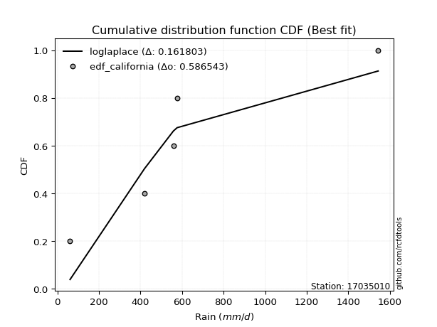</img>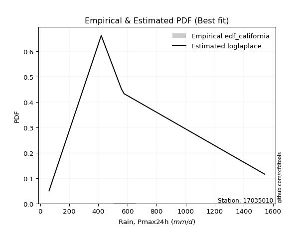</img>

</div>


### 2. EDF Hazen (1930)

Hazen method for plotting positions is a formula used to estimate the empirical cumulative probability distribution of flood events or other hydrological data. This formula often results in biased estimations, particularly when extrapolating to extreme events (high return periods).

<div align="center">


$P=(m-0.5)/n$


</div>


**2.1. Empirical values**

<div align="center">

|                | 0                  | 1                  | 2         | 3                 | 4                  |
|:---------------|:-------------------|:-------------------|:----------|:------------------|:-------------------|
| date           | 2007               | 2017               | 2018      | 2020              | 2019               |
| x              | 60.7               | 419.2              | 557.8     | 575.9             | 1543.5             |
| m              | 1                  | 2                  | 3         | 4                 | 5                  |
| empirical_dist | edf_hazen          | edf_hazen          | edf_hazen | edf_hazen         | edf_hazen          |
| empirical      | 0.1                | 0.3                | 0.5       | 0.7               | 0.9                |
| empirical_tr   | 1.1111111111111112 | 1.4285714285714286 | 2.0       | 3.333333333333333 | 10.000000000000002 |

</div>


**2.2. Kolmogorov-Smirnov fit test (sorted by Δ)**


<div align="center">

|                | 0                   | 1                   | 2                   | 3                   | 4                   | 5                   | 6                   | 7                  | 8                  | 9                   | 10                  | 11                  | 12                  | 13                 | 14                  | 15                  | 16                  | 17                  | 18                  | 19                  | 20                  | 21                  | 22                  | 23                 | 24                 | 25                  | 26                  | 27                  | 28                  | 29                  | 30                  | 31                  | 32                  | 33                  | 34                  | 35                 | 36                 | 37                  | 38                  | 39                 | 40                  | 41                 | 42                  | 43                 | 44                  | 45                  | 46                 | 47                  | 48                  | 49                  | 50                  | 51                  | 52                  | 53                  | 54                  | 55                 | 56                  | 57                 | 58                 | 59                  | 60                  | 61                  | 62                 | 63                  | 64                 | 65                  | 66                  | 67                  | 68                 | 69                 | 70                  | 71                  | 72                  | 73                  | 74                  | 75                 | 76                  | 77                 | 78                  | 79                  | 80                 | 81                 | 82                 | 83                 | 84                 | 85                 | 86                  | 87                  | 88                  | 89                 | 90                  | 91                  | 92                  | 93                 | 94                 | 95                 | 96                  | 97                 | 98                  | 99                 | 100                 | 101                | 102                | 103                | 104                | 105                 | 106                 | 107                 | 108                | 109                | 110                | 111                 | 112                 | 113                 | 114                | 115                 | 116                | 117                 | 118                 | 119                | 120                 | 121                | 122                | 123                | 124                | 125                 | 126                | 127                | 128                | 129                | 130                | 131                | 132                 | 133                | 134                 | 135                 | 136                 | 137                 | 138                 | 139                | 140                 | 141                 | 142                | 143                | 144                | 145                | 146                | 147                | 148                | 149                | 150                | 151                | 152                | 153                | 154                | 155                | 156                | 157                | 158                | 159                |
|:---------------|:--------------------|:--------------------|:--------------------|:--------------------|:--------------------|:--------------------|:--------------------|:-------------------|:-------------------|:--------------------|:--------------------|:--------------------|:--------------------|:-------------------|:--------------------|:--------------------|:--------------------|:--------------------|:--------------------|:--------------------|:--------------------|:--------------------|:--------------------|:-------------------|:-------------------|:--------------------|:--------------------|:--------------------|:--------------------|:--------------------|:--------------------|:--------------------|:--------------------|:--------------------|:--------------------|:-------------------|:-------------------|:--------------------|:--------------------|:-------------------|:--------------------|:-------------------|:--------------------|:-------------------|:--------------------|:--------------------|:-------------------|:--------------------|:--------------------|:--------------------|:--------------------|:--------------------|:--------------------|:--------------------|:--------------------|:-------------------|:--------------------|:-------------------|:-------------------|:--------------------|:--------------------|:--------------------|:-------------------|:--------------------|:-------------------|:--------------------|:--------------------|:--------------------|:-------------------|:-------------------|:--------------------|:--------------------|:--------------------|:--------------------|:--------------------|:-------------------|:--------------------|:-------------------|:--------------------|:--------------------|:-------------------|:-------------------|:-------------------|:-------------------|:-------------------|:-------------------|:--------------------|:--------------------|:--------------------|:-------------------|:--------------------|:--------------------|:--------------------|:-------------------|:-------------------|:-------------------|:--------------------|:-------------------|:--------------------|:-------------------|:--------------------|:-------------------|:-------------------|:-------------------|:-------------------|:--------------------|:--------------------|:--------------------|:-------------------|:-------------------|:-------------------|:--------------------|:--------------------|:--------------------|:-------------------|:--------------------|:-------------------|:--------------------|:--------------------|:-------------------|:--------------------|:-------------------|:-------------------|:-------------------|:-------------------|:--------------------|:-------------------|:-------------------|:-------------------|:-------------------|:-------------------|:-------------------|:--------------------|:-------------------|:--------------------|:--------------------|:--------------------|:--------------------|:--------------------|:-------------------|:--------------------|:--------------------|:-------------------|:-------------------|:-------------------|:-------------------|:-------------------|:-------------------|:-------------------|:-------------------|:-------------------|:-------------------|:-------------------|:-------------------|:-------------------|:-------------------|:-------------------|:-------------------|:-------------------|:-------------------|
| station        | 17035010            | 17035010            | 17035010            | 17035010            | 17035010            | 17035010            | 17035010            | 17035010           | 17035010           | 17035010            | 17035010            | 17035010            | 17035010            | 17035010           | 17035010            | 17035010            | 17035010            | 17035010            | 17035010            | 17035010            | 17035010            | 17035010            | 17035010            | 17035010           | 17035010           | 17035010            | 17035010            | 17035010            | 17035010            | 17035010            | 17035010            | 17035010            | 17035010            | 17035010            | 17035010            | 17035010           | 17035010           | 17035010            | 17035010            | 17035010           | 17035010            | 17035010           | 17035010            | 17035010           | 17035010            | 17035010            | 17035010           | 17035010            | 17035010            | 17035010            | 17035010            | 17035010            | 17035010            | 17035010            | 17035010            | 17035010           | 17035010            | 17035010           | 17035010           | 17035010            | 17035010            | 17035010            | 17035010           | 17035010            | 17035010           | 17035010            | 17035010            | 17035010            | 17035010           | 17035010           | 17035010            | 17035010            | 17035010            | 17035010            | 17035010            | 17035010           | 17035010            | 17035010           | 17035010            | 17035010            | 17035010           | 17035010           | 17035010           | 17035010           | 17035010           | 17035010           | 17035010            | 17035010            | 17035010            | 17035010           | 17035010            | 17035010            | 17035010            | 17035010           | 17035010           | 17035010           | 17035010            | 17035010           | 17035010            | 17035010           | 17035010            | 17035010           | 17035010           | 17035010           | 17035010           | 17035010            | 17035010            | 17035010            | 17035010           | 17035010           | 17035010           | 17035010            | 17035010            | 17035010            | 17035010           | 17035010            | 17035010           | 17035010            | 17035010            | 17035010           | 17035010            | 17035010           | 17035010           | 17035010           | 17035010           | 17035010            | 17035010           | 17035010           | 17035010           | 17035010           | 17035010           | 17035010           | 17035010            | 17035010           | 17035010            | 17035010            | 17035010            | 17035010            | 17035010            | 17035010           | 17035010            | 17035010            | 17035010           | 17035010           | 17035010           | 17035010           | 17035010           | 17035010           | 17035010           | 17035010           | 17035010           | 17035010           | 17035010           | 17035010           | 17035010           | 17035010           | 17035010           | 17035010           | 17035010           | 17035010           |
| empirical_dist | edf_hazen           | edf_hazen           | edf_hazen           | edf_hazen           | edf_hazen           | edf_hazen           | edf_hazen           | edf_hazen          | edf_hazen          | edf_hazen           | edf_hazen           | edf_hazen           | edf_hazen           | edf_hazen          | edf_hazen           | edf_hazen           | edf_hazen           | edf_hazen           | edf_hazen           | edf_hazen           | edf_hazen           | edf_hazen           | edf_hazen           | edf_hazen          | edf_hazen          | edf_hazen           | edf_hazen           | edf_hazen           | edf_hazen           | edf_hazen           | edf_hazen           | edf_hazen           | edf_hazen           | edf_hazen           | edf_hazen           | edf_hazen          | edf_hazen          | edf_hazen           | edf_hazen           | edf_hazen          | edf_hazen           | edf_hazen          | edf_hazen           | edf_hazen          | edf_hazen           | edf_hazen           | edf_hazen          | edf_hazen           | edf_hazen           | edf_hazen           | edf_hazen           | edf_hazen           | edf_hazen           | edf_hazen           | edf_hazen           | edf_hazen          | edf_hazen           | edf_hazen          | edf_hazen          | edf_hazen           | edf_hazen           | edf_hazen           | edf_hazen          | edf_hazen           | edf_hazen          | edf_hazen           | edf_hazen           | edf_hazen           | edf_hazen          | edf_hazen          | edf_hazen           | edf_hazen           | edf_hazen           | edf_hazen           | edf_hazen           | edf_hazen          | edf_hazen           | edf_hazen          | edf_hazen           | edf_hazen           | edf_hazen          | edf_hazen          | edf_hazen          | edf_hazen          | edf_hazen          | edf_hazen          | edf_hazen           | edf_hazen           | edf_hazen           | edf_hazen          | edf_hazen           | edf_hazen           | edf_hazen           | edf_hazen          | edf_hazen          | edf_hazen          | edf_hazen           | edf_hazen          | edf_hazen           | edf_hazen          | edf_hazen           | edf_hazen          | edf_hazen          | edf_hazen          | edf_hazen          | edf_hazen           | edf_hazen           | edf_hazen           | edf_hazen          | edf_hazen          | edf_hazen          | edf_hazen           | edf_hazen           | edf_hazen           | edf_hazen          | edf_hazen           | edf_hazen          | edf_hazen           | edf_hazen           | edf_hazen          | edf_hazen           | edf_hazen          | edf_hazen          | edf_hazen          | edf_hazen          | edf_hazen           | edf_hazen          | edf_hazen          | edf_hazen          | edf_hazen          | edf_hazen          | edf_hazen          | edf_hazen           | edf_hazen          | edf_hazen           | edf_hazen           | edf_hazen           | edf_hazen           | edf_hazen           | edf_hazen          | edf_hazen           | edf_hazen           | edf_hazen          | edf_hazen          | edf_hazen          | edf_hazen          | edf_hazen          | edf_hazen          | edf_hazen          | edf_hazen          | edf_hazen          | edf_hazen          | edf_hazen          | edf_hazen          | edf_hazen          | edf_hazen          | edf_hazen          | edf_hazen          | edf_hazen          | edf_hazen          |
| p_dist         | loggennorm          | logdweibull         | wald                | kappa3              | mielke              | burr                | johnsonsu           | loggenlogistic     | betaprime          | loggumbel_l         | logburr             | logmielke           | genexpon            | invgamma           | logweibull_min      | logburr12           | nct                 | logskewnorm         | logdgamma           | lomax               | halflogistic        | logpearson3         | exponnorm           | moyal              | dgamma             | logtrapezoid        | logloggamma         | logargus            | logtriang           | truncpareto         | loggompertz         | halfnorm            | foldnorm            | truncexpon          | genlogistic         | bradford           | gumbel_r           | loggenhalflogistic  | logloglaplace       | pearson3           | vonmises_line       | kstwobign          | exponpow            | skewnorm           | gompertz            | rayleigh            | gennorm            | dweibull            | logfoldnorm         | logarcsine          | logsemicircular     | loganglit           | logt                | logcrystalball      | lognorm             | logexponnorm       | loglogistic         | loghypsecant       | lognct             | loglaplace          | loglaplace          | logf                | logfatiguelife     | logerlang           | maxwell            | logbetaprime        | logncf              | logrice             | loggamma           | loggamma           | ncf                 | loginvgamma         | arcsine             | logalpha            | rice                | loginvgauss        | logwrapcauchy       | logmaxwell         | semicircular        | loglevy_l           | anglit             | logbeta            | logcosine          | truncweibull_min   | loginvweibull      | norm               | truncnorm           | t                   | lograyleigh         | logistic           | hypsecant           | logweibull_max      | halfgennorm         | beta               | levy_l             | logkappa3          | weibull_min         | logjohnsonsb       | loggumbel_r         | loggengamma        | laplace             | logkstwobign       | loghalfnorm        | loggausshyper      | loggenextreme      | logksone            | loggenexpon         | lognakagami         | gausshyper         | cosine             | logkappa4          | loguniform          | logvonmises_line    | logmoyal            | wrapcauchy         | logbradford         | logtruncnorm       | nakagami            | loghalflogistic     | f                  | genextreme          | gumbel_l           | kappa4             | loggenpareto       | logexponweib       | ksone               | burr12             | invgauss           | uniform            | genpareto          | argus              | gamma              | logwald             | erlang             | triang              | logtruncexpon       | invweibull          | crystalball         | logjohnsonsu        | alpha              | loglomax            | logtruncweibull_min | genhalflogistic    | rdist              | exponweib          | logrdist           | fatiguelife        | logtukeylambda     | powerlaw           | johnsonsb          | trapezoid          | logexponpow        | tukeylambda        | weibull_max        | logpowerlaw        | logtruncpareto     | gengamma           | loghalfgennorm     | logvonmises        | vonmises           |
| delta          | 0.10424769952044799 | 0.10480292140214864 | 0.12235346583652407 | 0.13221998573492966 | 0.13313014439618553 | 0.13325320211598102 | 0.13344712217793386 | 0.1345065113754833 | 0.1355667880206574 | 0.13616337413652768 | 0.13677946884967962 | 0.13737726552736662 | 0.13771912257398822 | 0.1379477630454342 | 0.13805518314500875 | 0.13980583845950467 | 0.14049753159100442 | 0.14171276631941265 | 0.14224627635009812 | 0.14388644774456755 | 0.14389570908829352 | 0.14758081596455913 | 0.15042983313260194 | 0.1518701811136719 | 0.1522335949352328 | 0.15469996896258442 | 0.15980105990952387 | 0.16196986098087351 | 0.16236652245468697 | 0.16387151927767268 | 0.16451614774374163 | 0.16546142576500245 | 0.16820833511926037 | 0.16866094487334804 | 0.16900586073894097 | 0.1712227920836814 | 0.177359766923873  | 0.17998758571589513 | 0.18044747597029465 | 0.182489529021979  | 0.18536769188989732 | 0.188825639390805  | 0.18933360224779539 | 0.1941744835178678 | 0.19504945103370963 | 0.19882281919831224 | 0.1999999998896873 | 0.20000000000504392 | 0.20046362294669245 | 0.20109188359955094 | 0.20154423121570347 | 0.20165835192441223 | 0.20193378805095336 | 0.20193538474141243 | 0.20193540112007818 | 0.2019366966423501 | 0.20219982978298728 | 0.2024256516232255 | 0.2024776785671571 | 0.20341868169132754 | 0.20341868169132754 | 0.20399018519196727 | 0.2045749785860363 | 0.20811196243059887 | 0.2106472907433794 | 0.21116123734065845 | 0.21222758506402967 | 0.21230665230699902 | 0.2132051311513829 | 0.2132051311513829 | 0.21410600055175816 | 0.22067038238579734 | 0.22541745207144992 | 0.22605024220233022 | 0.22913382944950683 | 0.2303936003235057 | 0.23331781075042796 | 0.2349073046706937 | 0.23588847510985922 | 0.23597673988652756 | 0.2385229544282011 | 0.2412377867837201 | 0.244227315819121  | 0.2444234134074661 | 0.2449048811835693 | 0.2449081408746835 | 0.24490814974557462 | 0.24491286534284007 | 0.24587673886141187 | 0.2509745180276025 | 0.25611053688071367 | 0.25941870778850173 | 0.25950651237975214 | 0.2636510514169824 | 0.2642187172505648 | 0.2667028516295766 | 0.26759240114575517 | 0.2706837217504535 | 0.27236586197489315 | 0.2733689951425869 | 0.27372905037089645 | 0.2755250751544482 | 0.2767604611279672 | 0.2776228864801587 | 0.278815385473674  | 0.28098618787908364 | 0.28286308590219017 | 0.28960507394970914 | 0.2902478856028241 | 0.290501637837137  | 0.2949964744206193 | 0.29718342545490034 | 0.29721922178017485 | 0.29819914659516217 | 0.2989400040616971 | 0.29922651606560796 | 0.2999991261312136 | 0.29999996166370063 | 0.30181165106084734 | 0.3059075740753971 | 0.31118069838256773 | 0.3151862339433815 | 0.3196450960109888 | 0.3248630532688242 | 0.3267197276050718 | 0.32712435932020495 | 0.3329015779879792 | 0.3424849130439878 | 0.352549231184246  | 0.3613678269384274 | 0.3618352213866428 | 0.3663061897651983 | 0.37002940828056824 | 0.3970752595205023 | 0.40004845347521584 | 0.40588840924525665 | 0.42527298750916726 | 0.43044777176658755 | 0.43092533670656874 | 0.4500275401420499 | 0.45464444501537693 | 0.45666881477659377 | 0.4657088747252395 | 0.5046901370461829 | 0.5149385145434258 | 0.5246472641349802 | 0.5347397161460408 | 0.5478361688018694 | 0.5492677730052207 | 0.5588090997596331 | 0.5591224082557226 | 0.5683732553344767 | 0.5773608905460648 | 0.59455420376792   | 0.6328595422233989 | 0.6488219379715483 | 0.7                | 0.7                | 1.1095967358628056 | 245.31482139563985 |
| deltao         | 0.5865427407550001  | 0.5865427407550001  | 0.5865427407550001  | 0.5865427407550001  | 0.5865427407550001  | 0.5865427407550001  | 0.5865427407550001  | 0.5865427407550001 | 0.5865427407550001 | 0.5865427407550001  | 0.5865427407550001  | 0.5865427407550001  | 0.5865427407550001  | 0.5865427407550001 | 0.5865427407550001  | 0.5865427407550001  | 0.5865427407550001  | 0.5865427407550001  | 0.5865427407550001  | 0.5865427407550001  | 0.5865427407550001  | 0.5865427407550001  | 0.5865427407550001  | 0.5865427407550001 | 0.5865427407550001 | 0.5865427407550001  | 0.5865427407550001  | 0.5865427407550001  | 0.5865427407550001  | 0.5865427407550001  | 0.5865427407550001  | 0.5865427407550001  | 0.5865427407550001  | 0.5865427407550001  | 0.5865427407550001  | 0.5865427407550001 | 0.5865427407550001 | 0.5865427407550001  | 0.5865427407550001  | 0.5865427407550001 | 0.5865427407550001  | 0.5865427407550001 | 0.5865427407550001  | 0.5865427407550001 | 0.5865427407550001  | 0.5865427407550001  | 0.5865427407550001 | 0.5865427407550001  | 0.5865427407550001  | 0.5865427407550001  | 0.5865427407550001  | 0.5865427407550001  | 0.5865427407550001  | 0.5865427407550001  | 0.5865427407550001  | 0.5865427407550001 | 0.5865427407550001  | 0.5865427407550001 | 0.5865427407550001 | 0.5865427407550001  | 0.5865427407550001  | 0.5865427407550001  | 0.5865427407550001 | 0.5865427407550001  | 0.5865427407550001 | 0.5865427407550001  | 0.5865427407550001  | 0.5865427407550001  | 0.5865427407550001 | 0.5865427407550001 | 0.5865427407550001  | 0.5865427407550001  | 0.5865427407550001  | 0.5865427407550001  | 0.5865427407550001  | 0.5865427407550001 | 0.5865427407550001  | 0.5865427407550001 | 0.5865427407550001  | 0.5865427407550001  | 0.5865427407550001 | 0.5865427407550001 | 0.5865427407550001 | 0.5865427407550001 | 0.5865427407550001 | 0.5865427407550001 | 0.5865427407550001  | 0.5865427407550001  | 0.5865427407550001  | 0.5865427407550001 | 0.5865427407550001  | 0.5865427407550001  | 0.5865427407550001  | 0.5865427407550001 | 0.5865427407550001 | 0.5865427407550001 | 0.5865427407550001  | 0.5865427407550001 | 0.5865427407550001  | 0.5865427407550001 | 0.5865427407550001  | 0.5865427407550001 | 0.5865427407550001 | 0.5865427407550001 | 0.5865427407550001 | 0.5865427407550001  | 0.5865427407550001  | 0.5865427407550001  | 0.5865427407550001 | 0.5865427407550001 | 0.5865427407550001 | 0.5865427407550001  | 0.5865427407550001  | 0.5865427407550001  | 0.5865427407550001 | 0.5865427407550001  | 0.5865427407550001 | 0.5865427407550001  | 0.5865427407550001  | 0.5865427407550001 | 0.5865427407550001  | 0.5865427407550001 | 0.5865427407550001 | 0.5865427407550001 | 0.5865427407550001 | 0.5865427407550001  | 0.5865427407550001 | 0.5865427407550001 | 0.5865427407550001 | 0.5865427407550001 | 0.5865427407550001 | 0.5865427407550001 | 0.5865427407550001  | 0.5865427407550001 | 0.5865427407550001  | 0.5865427407550001  | 0.5865427407550001  | 0.5865427407550001  | 0.5865427407550001  | 0.5865427407550001 | 0.5865427407550001  | 0.5865427407550001  | 0.5865427407550001 | 0.5865427407550001 | 0.5865427407550001 | 0.5865427407550001 | 0.5865427407550001 | 0.5865427407550001 | 0.5865427407550001 | 0.5865427407550001 | 0.5865427407550001 | 0.5865427407550001 | 0.5865427407550001 | 0.5865427407550001 | 0.5865427407550001 | 0.5865427407550001 | 0.5865427407550001 | 0.5865427407550001 | 0.5865427407550001 | 0.5865427407550001 |
| eval           | Δo > Δ              | Δo > Δ              | Δo > Δ              | Δo > Δ              | Δo > Δ              | Δo > Δ              | Δo > Δ              | Δo > Δ             | Δo > Δ             | Δo > Δ              | Δo > Δ              | Δo > Δ              | Δo > Δ              | Δo > Δ             | Δo > Δ              | Δo > Δ              | Δo > Δ              | Δo > Δ              | Δo > Δ              | Δo > Δ              | Δo > Δ              | Δo > Δ              | Δo > Δ              | Δo > Δ             | Δo > Δ             | Δo > Δ              | Δo > Δ              | Δo > Δ              | Δo > Δ              | Δo > Δ              | Δo > Δ              | Δo > Δ              | Δo > Δ              | Δo > Δ              | Δo > Δ              | Δo > Δ             | Δo > Δ             | Δo > Δ              | Δo > Δ              | Δo > Δ             | Δo > Δ              | Δo > Δ             | Δo > Δ              | Δo > Δ             | Δo > Δ              | Δo > Δ              | Δo > Δ             | Δo > Δ              | Δo > Δ              | Δo > Δ              | Δo > Δ              | Δo > Δ              | Δo > Δ              | Δo > Δ              | Δo > Δ              | Δo > Δ             | Δo > Δ              | Δo > Δ             | Δo > Δ             | Δo > Δ              | Δo > Δ              | Δo > Δ              | Δo > Δ             | Δo > Δ              | Δo > Δ             | Δo > Δ              | Δo > Δ              | Δo > Δ              | Δo > Δ             | Δo > Δ             | Δo > Δ              | Δo > Δ              | Δo > Δ              | Δo > Δ              | Δo > Δ              | Δo > Δ             | Δo > Δ              | Δo > Δ             | Δo > Δ              | Δo > Δ              | Δo > Δ             | Δo > Δ             | Δo > Δ             | Δo > Δ             | Δo > Δ             | Δo > Δ             | Δo > Δ              | Δo > Δ              | Δo > Δ              | Δo > Δ             | Δo > Δ              | Δo > Δ              | Δo > Δ              | Δo > Δ             | Δo > Δ             | Δo > Δ             | Δo > Δ              | Δo > Δ             | Δo > Δ              | Δo > Δ             | Δo > Δ              | Δo > Δ             | Δo > Δ             | Δo > Δ             | Δo > Δ             | Δo > Δ              | Δo > Δ              | Δo > Δ              | Δo > Δ             | Δo > Δ             | Δo > Δ             | Δo > Δ              | Δo > Δ              | Δo > Δ              | Δo > Δ             | Δo > Δ              | Δo > Δ             | Δo > Δ              | Δo > Δ              | Δo > Δ             | Δo > Δ              | Δo > Δ             | Δo > Δ             | Δo > Δ             | Δo > Δ             | Δo > Δ              | Δo > Δ             | Δo > Δ             | Δo > Δ             | Δo > Δ             | Δo > Δ             | Δo > Δ             | Δo > Δ              | Δo > Δ             | Δo > Δ              | Δo > Δ              | Δo > Δ              | Δo > Δ              | Δo > Δ              | Δo > Δ             | Δo > Δ              | Δo > Δ              | Δo > Δ             | Δo > Δ             | Δo > Δ             | Δo > Δ             | Δo > Δ             | Δo > Δ             | Δo > Δ             | Δo > Δ             | Δo > Δ             | Δo > Δ             | Δo > Δ             | Δo <= Δ            | Δo <= Δ            | Δo <= Δ            | Δo <= Δ            | Δo <= Δ            | Δo <= Δ            | Δo <= Δ            |
| fit            | 1                   | 1                   | 1                   | 1                   | 1                   | 1                   | 1                   | 1                  | 1                  | 1                   | 1                   | 1                   | 1                   | 1                  | 1                   | 1                   | 1                   | 1                   | 1                   | 1                   | 1                   | 1                   | 1                   | 1                  | 1                  | 1                   | 1                   | 1                   | 1                   | 1                   | 1                   | 1                   | 1                   | 1                   | 1                   | 1                  | 1                  | 1                   | 1                   | 1                  | 1                   | 1                  | 1                   | 1                  | 1                   | 1                   | 1                  | 1                   | 1                   | 1                   | 1                   | 1                   | 1                   | 1                   | 1                   | 1                  | 1                   | 1                  | 1                  | 1                   | 1                   | 1                   | 1                  | 1                   | 1                  | 1                   | 1                   | 1                   | 1                  | 1                  | 1                   | 1                   | 1                   | 1                   | 1                   | 1                  | 1                   | 1                  | 1                   | 1                   | 1                  | 1                  | 1                  | 1                  | 1                  | 1                  | 1                   | 1                   | 1                   | 1                  | 1                   | 1                   | 1                   | 1                  | 1                  | 1                  | 1                   | 1                  | 1                   | 1                  | 1                   | 1                  | 1                  | 1                  | 1                  | 1                   | 1                   | 1                   | 1                  | 1                  | 1                  | 1                   | 1                   | 1                   | 1                  | 1                   | 1                  | 1                   | 1                   | 1                  | 1                   | 1                  | 1                  | 1                  | 1                  | 1                   | 1                  | 1                  | 1                  | 1                  | 1                  | 1                  | 1                   | 1                  | 1                   | 1                   | 1                   | 1                   | 1                   | 1                  | 1                   | 1                   | 1                  | 1                  | 1                  | 1                  | 1                  | 1                  | 1                  | 1                  | 1                  | 1                  | 1                  | 0                  | 0                  | 0                  | 0                  | 0                  | 0                  | 0                  |
| n              | 5                   | 5                   | 5                   | 5                   | 5                   | 5                   | 5                   | 5                  | 5                  | 5                   | 5                   | 5                   | 5                   | 5                  | 5                   | 5                   | 5                   | 5                   | 5                   | 5                   | 5                   | 5                   | 5                   | 5                  | 5                  | 5                   | 5                   | 5                   | 5                   | 5                   | 5                   | 5                   | 5                   | 5                   | 5                   | 5                  | 5                  | 5                   | 5                   | 5                  | 5                   | 5                  | 5                   | 5                  | 5                   | 5                   | 5                  | 5                   | 5                   | 5                   | 5                   | 5                   | 5                   | 5                   | 5                   | 5                  | 5                   | 5                  | 5                  | 5                   | 5                   | 5                   | 5                  | 5                   | 5                  | 5                   | 5                   | 5                   | 5                  | 5                  | 5                   | 5                   | 5                   | 5                   | 5                   | 5                  | 5                   | 5                  | 5                   | 5                   | 5                  | 5                  | 5                  | 5                  | 5                  | 5                  | 5                   | 5                   | 5                   | 5                  | 5                   | 5                   | 5                   | 5                  | 5                  | 5                  | 5                   | 5                  | 5                   | 5                  | 5                   | 5                  | 5                  | 5                  | 5                  | 5                   | 5                   | 5                   | 5                  | 5                  | 5                  | 5                   | 5                   | 5                   | 5                  | 5                   | 5                  | 5                   | 5                   | 5                  | 5                   | 5                  | 5                  | 5                  | 5                  | 5                   | 5                  | 5                  | 5                  | 5                  | 5                  | 5                  | 5                   | 5                  | 5                   | 5                   | 5                   | 5                   | 5                   | 5                  | 5                   | 5                   | 5                  | 5                  | 5                  | 5                  | 5                  | 5                  | 5                  | 5                  | 5                  | 5                  | 5                  | 5                  | 5                  | 5                  | 5                  | 5                  | 5                  | 5                  |
| best_fit       | 1                   | 0                   | 0                   | 0                   | 0                   | 0                   | 0                   | 0                  | 0                  | 0                   | 0                   | 0                   | 0                   | 0                  | 0                   | 0                   | 0                   | 0                   | 0                   | 0                   | 0                   | 0                   | 0                   | 0                  | 0                  | 0                   | 0                   | 0                   | 0                   | 0                   | 0                   | 0                   | 0                   | 0                   | 0                   | 0                  | 0                  | 0                   | 0                   | 0                  | 0                   | 0                  | 0                   | 0                  | 0                   | 0                   | 0                  | 0                   | 0                   | 0                   | 0                   | 0                   | 0                   | 0                   | 0                   | 0                  | 0                   | 0                  | 0                  | 0                   | 0                   | 0                   | 0                  | 0                   | 0                  | 0                   | 0                   | 0                   | 0                  | 0                  | 0                   | 0                   | 0                   | 0                   | 0                   | 0                  | 0                   | 0                  | 0                   | 0                   | 0                  | 0                  | 0                  | 0                  | 0                  | 0                  | 0                   | 0                   | 0                   | 0                  | 0                   | 0                   | 0                   | 0                  | 0                  | 0                  | 0                   | 0                  | 0                   | 0                  | 0                   | 0                  | 0                  | 0                  | 0                  | 0                   | 0                   | 0                   | 0                  | 0                  | 0                  | 0                   | 0                   | 0                   | 0                  | 0                   | 0                  | 0                   | 0                   | 0                  | 0                   | 0                  | 0                  | 0                  | 0                  | 0                   | 0                  | 0                  | 0                  | 0                  | 0                  | 0                  | 0                   | 0                  | 0                   | 0                   | 0                   | 0                   | 0                   | 0                  | 0                   | 0                   | 0                  | 0                  | 0                  | 0                  | 0                  | 0                  | 0                  | 0                  | 0                  | 0                  | 0                  | 0                  | 0                  | 0                  | 0                  | 0                  | 0                  | 0                  |
| best_fit_sort  | 1                   | 2                   | 3                   | 4                   | 5                   | 6                   | 7                   | 8                  | 9                  | 10                  | 11                  | 12                  | 13                  | 14                 | 15                  | 16                  | 17                  | 18                  | 19                  | 20                  | 21                  | 22                  | 23                  | 24                 | 25                 | 26                  | 27                  | 28                  | 29                  | 30                  | 31                  | 32                  | 33                  | 34                  | 35                  | 36                 | 37                 | 38                  | 39                  | 40                 | 41                  | 42                 | 43                  | 44                 | 45                  | 46                  | 47                 | 48                  | 49                  | 50                  | 51                  | 52                  | 53                  | 54                  | 55                  | 56                 | 57                  | 58                 | 59                 | 60                  | 61                  | 62                  | 63                 | 64                  | 65                 | 66                  | 67                  | 68                  | 69                 | 70                 | 71                  | 72                  | 73                  | 74                  | 75                  | 76                 | 77                  | 78                 | 79                  | 80                  | 81                 | 82                 | 83                 | 84                 | 85                 | 86                 | 87                  | 88                  | 89                  | 90                 | 91                  | 92                  | 93                  | 94                 | 95                 | 96                 | 97                  | 98                 | 99                  | 100                | 101                 | 102                | 103                | 104                | 105                | 106                 | 107                 | 108                 | 109                | 110                | 111                | 112                 | 113                 | 114                 | 115                | 116                 | 117                | 118                 | 119                 | 120                | 121                 | 122                | 123                | 124                | 125                | 126                 | 127                | 128                | 129                | 130                | 131                | 132                | 133                 | 134                | 135                 | 136                 | 137                 | 138                 | 139                 | 140                | 141                 | 142                 | 143                | 144                | 145                | 146                | 147                | 148                | 149                | 150                | 151                | 152                | 153                | 154                | 155                | 156                | 157                | 158                | 159                | 160                |

</div>


**2.3. Best fit**

<div align="center">

|   id |   station | empirical_dist   | p_dist     |    delta |   deltao | eval   |   fit |   n |   best_fit |   best_fit_sort |
|-----:|----------:|:-----------------|:-----------|---------:|---------:|:-------|------:|----:|-----------:|----------------:|
|    0 |  17035010 | edf_hazen        | loggennorm | 0.104248 | 0.586543 | Δo > Δ |     1 |   5 |          1 |               1 |

</div>


<div align="center">

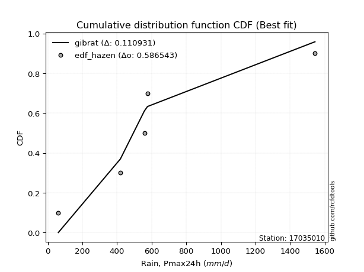</img>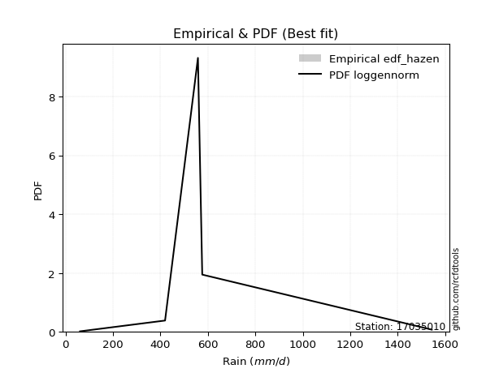</img>

</div>


### 3. EDF Weibull (1939)

Weibull plotting position formula is an empirical method used to estimate the non-exceedance probability or plotting position for a set of observed data, is often recommended or widely used in practice, particularly in flood frequency analysis.

<div align="center">


$P=m/(n+1)$


</div>


**3.1. Empirical values**

<div align="center">

|                | 0                   | 1                  | 2           | 3                  | 4                  |
|:---------------|:--------------------|:-------------------|:------------|:-------------------|:-------------------|
| date           | 2007                | 2017               | 2018        | 2020               | 2019               |
| x              | 60.7                | 419.2              | 557.8       | 575.9              | 1543.5             |
| m              | 1                   | 2                  | 3           | 4                  | 5                  |
| empirical_dist | edf_weibull         | edf_weibull        | edf_weibull | edf_weibull        | edf_weibull        |
| empirical      | 0.16666666666666666 | 0.3333333333333333 | 0.5         | 0.6666666666666666 | 0.8333333333333334 |
| empirical_tr   | 1.2                 | 1.4999999999999998 | 2.0         | 2.9999999999999996 | 6.000000000000002  |

</div>


**3.2. Kolmogorov-Smirnov fit test (sorted by Δ)**


<div align="center">

|                | 0                   | 1                  | 2                   | 3                  | 4                   | 5                   | 6                   | 7                   | 8                   | 9                  | 10                  | 11                  | 12                 | 13                  | 14                  | 15                  | 16                 | 17                  | 18                  | 19                  | 20                  | 21                  | 22                  | 23                 | 24                  | 25                  | 26                 | 27                  | 28                  | 29                  | 30                 | 31                  | 32                  | 33                  | 34                  | 35                  | 36                  | 37                 | 38                  | 39                  | 40                  | 41                 | 42                  | 43                  | 44                  | 45                  | 46                  | 47                 | 48                  | 49                 | 50                  | 51                 | 52                  | 53                 | 54                  | 55                  | 56                  | 57                  | 58                  | 59                  | 60                  | 61                  | 62                  | 63                  | 64                  | 65                  | 66                  | 67                 | 68                  | 69                  | 70                  | 71                 | 72                 | 73                 | 74                 | 75                  | 76                  | 77                  | 78                 | 79                  | 80                  | 81                  | 82                  | 83                  | 84                  | 85                  | 86                  | 87                 | 88                  | 89                  | 90                  | 91                  | 92                 | 93                  | 94                 | 95                  | 96                  | 97                  | 98                  | 99                  | 100                 | 101                 | 102                 | 103                 | 104                | 105                | 106                 | 107                | 108                | 109                | 110                | 111                | 112                 | 113                 | 114                 | 115                | 116                 | 117                | 118                | 119                 | 120                 | 121                 | 122                | 123                | 124                 | 125                | 126                | 127                 | 128                | 129                 | 130                | 131                 | 132                | 133                | 134                | 135                 | 136                | 137                 | 138                | 139                 | 140                 | 141                 | 142                 | 143                 | 144                | 145                | 146                | 147                | 148                | 149                | 150                | 151                | 152                | 153                | 154                | 155                | 156                | 157                | 158                | 159                |
|:---------------|:--------------------|:-------------------|:--------------------|:-------------------|:--------------------|:--------------------|:--------------------|:--------------------|:--------------------|:-------------------|:--------------------|:--------------------|:-------------------|:--------------------|:--------------------|:--------------------|:-------------------|:--------------------|:--------------------|:--------------------|:--------------------|:--------------------|:--------------------|:-------------------|:--------------------|:--------------------|:-------------------|:--------------------|:--------------------|:--------------------|:-------------------|:--------------------|:--------------------|:--------------------|:--------------------|:--------------------|:--------------------|:-------------------|:--------------------|:--------------------|:--------------------|:-------------------|:--------------------|:--------------------|:--------------------|:--------------------|:--------------------|:-------------------|:--------------------|:-------------------|:--------------------|:-------------------|:--------------------|:-------------------|:--------------------|:--------------------|:--------------------|:--------------------|:--------------------|:--------------------|:--------------------|:--------------------|:--------------------|:--------------------|:--------------------|:--------------------|:--------------------|:-------------------|:--------------------|:--------------------|:--------------------|:-------------------|:-------------------|:-------------------|:-------------------|:--------------------|:--------------------|:--------------------|:-------------------|:--------------------|:--------------------|:--------------------|:--------------------|:--------------------|:--------------------|:--------------------|:--------------------|:-------------------|:--------------------|:--------------------|:--------------------|:--------------------|:-------------------|:--------------------|:-------------------|:--------------------|:--------------------|:--------------------|:--------------------|:--------------------|:--------------------|:--------------------|:--------------------|:--------------------|:-------------------|:-------------------|:--------------------|:-------------------|:-------------------|:-------------------|:-------------------|:-------------------|:--------------------|:--------------------|:--------------------|:-------------------|:--------------------|:-------------------|:-------------------|:--------------------|:--------------------|:--------------------|:-------------------|:-------------------|:--------------------|:-------------------|:-------------------|:--------------------|:-------------------|:--------------------|:-------------------|:--------------------|:-------------------|:-------------------|:-------------------|:--------------------|:-------------------|:--------------------|:-------------------|:--------------------|:--------------------|:--------------------|:--------------------|:--------------------|:-------------------|:-------------------|:-------------------|:-------------------|:-------------------|:-------------------|:-------------------|:-------------------|:-------------------|:-------------------|:-------------------|:-------------------|:-------------------|:-------------------|:-------------------|:-------------------|
| station        | 17035010            | 17035010           | 17035010            | 17035010           | 17035010            | 17035010            | 17035010            | 17035010            | 17035010            | 17035010           | 17035010            | 17035010            | 17035010           | 17035010            | 17035010            | 17035010            | 17035010           | 17035010            | 17035010            | 17035010            | 17035010            | 17035010            | 17035010            | 17035010           | 17035010            | 17035010            | 17035010           | 17035010            | 17035010            | 17035010            | 17035010           | 17035010            | 17035010            | 17035010            | 17035010            | 17035010            | 17035010            | 17035010           | 17035010            | 17035010            | 17035010            | 17035010           | 17035010            | 17035010            | 17035010            | 17035010            | 17035010            | 17035010           | 17035010            | 17035010           | 17035010            | 17035010           | 17035010            | 17035010           | 17035010            | 17035010            | 17035010            | 17035010            | 17035010            | 17035010            | 17035010            | 17035010            | 17035010            | 17035010            | 17035010            | 17035010            | 17035010            | 17035010           | 17035010            | 17035010            | 17035010            | 17035010           | 17035010           | 17035010           | 17035010           | 17035010            | 17035010            | 17035010            | 17035010           | 17035010            | 17035010            | 17035010            | 17035010            | 17035010            | 17035010            | 17035010            | 17035010            | 17035010           | 17035010            | 17035010            | 17035010            | 17035010            | 17035010           | 17035010            | 17035010           | 17035010            | 17035010            | 17035010            | 17035010            | 17035010            | 17035010            | 17035010            | 17035010            | 17035010            | 17035010           | 17035010           | 17035010            | 17035010           | 17035010           | 17035010           | 17035010           | 17035010           | 17035010            | 17035010            | 17035010            | 17035010           | 17035010            | 17035010           | 17035010           | 17035010            | 17035010            | 17035010            | 17035010           | 17035010           | 17035010            | 17035010           | 17035010           | 17035010            | 17035010           | 17035010            | 17035010           | 17035010            | 17035010           | 17035010           | 17035010           | 17035010            | 17035010           | 17035010            | 17035010           | 17035010            | 17035010            | 17035010            | 17035010            | 17035010            | 17035010           | 17035010           | 17035010           | 17035010           | 17035010           | 17035010           | 17035010           | 17035010           | 17035010           | 17035010           | 17035010           | 17035010           | 17035010           | 17035010           | 17035010           | 17035010           |
| empirical_dist | edf_weibull         | edf_weibull        | edf_weibull         | edf_weibull        | edf_weibull         | edf_weibull         | edf_weibull         | edf_weibull         | edf_weibull         | edf_weibull        | edf_weibull         | edf_weibull         | edf_weibull        | edf_weibull         | edf_weibull         | edf_weibull         | edf_weibull        | edf_weibull         | edf_weibull         | edf_weibull         | edf_weibull         | edf_weibull         | edf_weibull         | edf_weibull        | edf_weibull         | edf_weibull         | edf_weibull        | edf_weibull         | edf_weibull         | edf_weibull         | edf_weibull        | edf_weibull         | edf_weibull         | edf_weibull         | edf_weibull         | edf_weibull         | edf_weibull         | edf_weibull        | edf_weibull         | edf_weibull         | edf_weibull         | edf_weibull        | edf_weibull         | edf_weibull         | edf_weibull         | edf_weibull         | edf_weibull         | edf_weibull        | edf_weibull         | edf_weibull        | edf_weibull         | edf_weibull        | edf_weibull         | edf_weibull        | edf_weibull         | edf_weibull         | edf_weibull         | edf_weibull         | edf_weibull         | edf_weibull         | edf_weibull         | edf_weibull         | edf_weibull         | edf_weibull         | edf_weibull         | edf_weibull         | edf_weibull         | edf_weibull        | edf_weibull         | edf_weibull         | edf_weibull         | edf_weibull        | edf_weibull        | edf_weibull        | edf_weibull        | edf_weibull         | edf_weibull         | edf_weibull         | edf_weibull        | edf_weibull         | edf_weibull         | edf_weibull         | edf_weibull         | edf_weibull         | edf_weibull         | edf_weibull         | edf_weibull         | edf_weibull        | edf_weibull         | edf_weibull         | edf_weibull         | edf_weibull         | edf_weibull        | edf_weibull         | edf_weibull        | edf_weibull         | edf_weibull         | edf_weibull         | edf_weibull         | edf_weibull         | edf_weibull         | edf_weibull         | edf_weibull         | edf_weibull         | edf_weibull        | edf_weibull        | edf_weibull         | edf_weibull        | edf_weibull        | edf_weibull        | edf_weibull        | edf_weibull        | edf_weibull         | edf_weibull         | edf_weibull         | edf_weibull        | edf_weibull         | edf_weibull        | edf_weibull        | edf_weibull         | edf_weibull         | edf_weibull         | edf_weibull        | edf_weibull        | edf_weibull         | edf_weibull        | edf_weibull        | edf_weibull         | edf_weibull        | edf_weibull         | edf_weibull        | edf_weibull         | edf_weibull        | edf_weibull        | edf_weibull        | edf_weibull         | edf_weibull        | edf_weibull         | edf_weibull        | edf_weibull         | edf_weibull         | edf_weibull         | edf_weibull         | edf_weibull         | edf_weibull        | edf_weibull        | edf_weibull        | edf_weibull        | edf_weibull        | edf_weibull        | edf_weibull        | edf_weibull        | edf_weibull        | edf_weibull        | edf_weibull        | edf_weibull        | edf_weibull        | edf_weibull        | edf_weibull        | edf_weibull        |
| p_dist         | logdweibull         | invgamma           | nct                 | loggenlogistic     | burr                | mielke              | johnsonsu           | loggumbel_l         | logburr             | logmielke          | logpearson3         | logweibull_min      | betaprime          | exponnorm           | logburr12           | moyal               | logtrapezoid       | logloggamma         | logargus            | halfnorm            | foldnorm            | genlogistic         | loggennorm          | logdgamma          | gumbel_r            | dgamma              | pearson3           | logloglaplace       | halflogistic        | kstwobign           | rayleigh           | genexpon            | logskewnorm         | logtriang           | lomax               | loggompertz         | gennorm             | kappa3             | bradford            | exponpow            | vonmises_line       | loggenhalflogistic | gompertz            | truncexpon          | skewnorm            | truncpareto         | wald                | dweibull           | logfoldnorm         | logarcsine         | logsemicircular     | loganglit          | logt                | logcrystalball     | lognorm             | logexponnorm        | loglogistic         | loghypsecant        | lognct              | loglaplace          | loglaplace          | logf                | logfatiguelife      | logerlang           | maxwell             | logbetaprime        | logncf              | logrice            | loggamma            | loggamma            | ncf                 | loginvgamma        | arcsine            | logalpha           | rice               | loginvgauss         | logwrapcauchy       | logmaxwell          | semicircular       | loglevy_l           | logjohnsonsb        | anglit              | logbeta             | logcosine           | truncweibull_min    | loginvweibull       | norm                | truncnorm          | t                   | lograyleigh         | logistic            | hypsecant           | logweibull_max     | halfgennorm         | beta               | levy_l              | logkappa3           | weibull_min         | loggumbel_r         | loggengamma         | laplace             | logkstwobign        | loghalfnorm         | loggausshyper       | loggenextreme      | logksone           | loggenexpon         | gausshyper         | cosine             | logkappa4          | loguniform         | logvonmises_line   | logmoyal            | wrapcauchy          | logbradford         | loghalflogistic    | f                   | genextreme         | gumbel_l           | kappa4              | loggenpareto        | logexponweib        | ksone              | burr12             | lognakagami         | invgauss           | uniform            | genpareto           | argus              | gamma               | logtruncnorm       | nakagami            | logwald            | invweibull         | erlang             | crystalball         | triang             | logtruncexpon       | loglomax           | alpha               | logtruncweibull_min | logjohnsonsu        | genhalflogistic     | rdist               | exponweib          | logrdist           | fatiguelife        | logtukeylambda     | powerlaw           | johnsonsb          | trapezoid          | logexponpow        | tukeylambda        | weibull_max        | logpowerlaw        | logtruncpareto     | loghalfgennorm     | gengamma           | logvonmises        | vonmises           |
| delta          | 0.07146958806881532 | 0.1103198961061573 | 0.11147603959012908 | 0.1118329805414972 | 0.11197504264547972 | 0.11214099812317724 | 0.11253140713984036 | 0.11362894952615271 | 0.11458182075011906 | 0.1146332480994582 | 0.11493748611014129 | 0.11591903989696598 | 0.1160950305828361 | 0.11709649979926862 | 0.11794647279403273 | 0.11853684778033857 | 0.1213666356292511 | 0.12646772657619054 | 0.13089792599796513 | 0.13212809243166912 | 0.13487500178592704 | 0.13567252740560765 | 0.13688375976860107 | 0.1385545970625326 | 0.14402643359053968 | 0.14843152583908303 | 0.1491561956886457 | 0.15021849408850185 | 0.15167864353201949 | 0.15549230605747166 | 0.1654894858649789 | 0.16628940072165285 | 0.16666617689085672 | 0.16666658086856267 | 0.16666662866689372 | 0.16666665997592314 | 0.16666666655635398 | 0.1666666666664833 | 0.16666666666664767 | 0.16666666666665067 | 0.16666666666666208 | 0.1666666666666653 | 0.16666666666666624 | 0.16666666666666663 | 0.16666666666666666 | 0.16666666666666666 | 0.16666666666666666 | 0.1666666666717106 | 0.16713028961335913 | 0.1677585502662176 | 0.16821089788237015 | 0.1683250185910789 | 0.16860045471762003 | 0.1686020514080791 | 0.16860206778674486 | 0.16860336330901676 | 0.16886649644965396 | 0.16909231828989219 | 0.16914434523382377 | 0.17008534835799421 | 0.17008534835799421 | 0.17065685185863394 | 0.17124164525270297 | 0.17477862909726555 | 0.17731395741004607 | 0.17782790400732512 | 0.17889425173069634 | 0.1789733189736657 | 0.17987179781804957 | 0.17987179781804957 | 0.18077266721842483 | 0.187337049052464  | 0.1920841187381166 | 0.1927169088689969 | 0.1958004961161735 | 0.19706026699017237 | 0.19998447741709463 | 0.20157397133736038 | 0.2025551417765259 | 0.20264340655319424 | 0.20401705508378684 | 0.20518962109486777 | 0.20790445345038677 | 0.21089398248578767 | 0.21109008007413277 | 0.21157154785023596 | 0.21157480754135016 | 0.2115748164122413 | 0.21157953200950674 | 0.21254340552807854 | 0.21764118469426919 | 0.22277720354738034 | 0.2260853744551684 | 0.22617317904641882 | 0.2303177180836491 | 0.23088538391723146 | 0.23336951829624325 | 0.23425906781242184 | 0.23903252864155983 | 0.24003566180925356 | 0.24039571703756313 | 0.24219174182111486 | 0.24342712779463388 | 0.24428955314682538 | 0.2454820521403407 | 0.2476528545457503 | 0.24952975256885684 | 0.2569145522694908 | 0.2571683045038037 | 0.261663141087286  | 0.263850092121567  | 0.2638858884468415 | 0.26486581326182884 | 0.26560667072836375 | 0.26589318273227464 | 0.268478317727514  | 0.27257424074206377 | 0.2778473650492344 | 0.2818529006100482 | 0.28631176267765546 | 0.29152971993549087 | 0.29338639427173846 | 0.2937910259868716 | 0.2995682446546459 | 0.30477620904794683 | 0.3091515797106545 | 0.3192158978509127 | 0.32803449360509407 | 0.3285018880533095 | 0.33297285643186497 | 0.3333324594645469 | 0.33333329499703396 | 0.3366960749472349 | 0.3586063208425006 | 0.363741926187169  | 0.36655824003846754 | 0.3667151201418825 | 0.37255507591192333 | 0.3879777783487103 | 0.41669420680871655 | 0.42333548144326044 | 0.43092533670656874 | 0.43237554139190615 | 0.47135680371284955 | 0.4816051812100924 | 0.4913139308016468 | 0.5014063828127076 | 0.5145028354685361 | 0.5159344396718875 | 0.5254757664262997 | 0.5257890749223892 | 0.5350399220011435 | 0.5440275572127315 | 0.5612208704345867 | 0.5995262088900657 | 0.6154886046382149 | 0.6666666666666666 | 0.6666666666666667 | 1.0762634025294724 | 245.38148806230652 |
| deltao         | 0.5865427407550001  | 0.5865427407550001 | 0.5865427407550001  | 0.5865427407550001 | 0.5865427407550001  | 0.5865427407550001  | 0.5865427407550001  | 0.5865427407550001  | 0.5865427407550001  | 0.5865427407550001 | 0.5865427407550001  | 0.5865427407550001  | 0.5865427407550001 | 0.5865427407550001  | 0.5865427407550001  | 0.5865427407550001  | 0.5865427407550001 | 0.5865427407550001  | 0.5865427407550001  | 0.5865427407550001  | 0.5865427407550001  | 0.5865427407550001  | 0.5865427407550001  | 0.5865427407550001 | 0.5865427407550001  | 0.5865427407550001  | 0.5865427407550001 | 0.5865427407550001  | 0.5865427407550001  | 0.5865427407550001  | 0.5865427407550001 | 0.5865427407550001  | 0.5865427407550001  | 0.5865427407550001  | 0.5865427407550001  | 0.5865427407550001  | 0.5865427407550001  | 0.5865427407550001 | 0.5865427407550001  | 0.5865427407550001  | 0.5865427407550001  | 0.5865427407550001 | 0.5865427407550001  | 0.5865427407550001  | 0.5865427407550001  | 0.5865427407550001  | 0.5865427407550001  | 0.5865427407550001 | 0.5865427407550001  | 0.5865427407550001 | 0.5865427407550001  | 0.5865427407550001 | 0.5865427407550001  | 0.5865427407550001 | 0.5865427407550001  | 0.5865427407550001  | 0.5865427407550001  | 0.5865427407550001  | 0.5865427407550001  | 0.5865427407550001  | 0.5865427407550001  | 0.5865427407550001  | 0.5865427407550001  | 0.5865427407550001  | 0.5865427407550001  | 0.5865427407550001  | 0.5865427407550001  | 0.5865427407550001 | 0.5865427407550001  | 0.5865427407550001  | 0.5865427407550001  | 0.5865427407550001 | 0.5865427407550001 | 0.5865427407550001 | 0.5865427407550001 | 0.5865427407550001  | 0.5865427407550001  | 0.5865427407550001  | 0.5865427407550001 | 0.5865427407550001  | 0.5865427407550001  | 0.5865427407550001  | 0.5865427407550001  | 0.5865427407550001  | 0.5865427407550001  | 0.5865427407550001  | 0.5865427407550001  | 0.5865427407550001 | 0.5865427407550001  | 0.5865427407550001  | 0.5865427407550001  | 0.5865427407550001  | 0.5865427407550001 | 0.5865427407550001  | 0.5865427407550001 | 0.5865427407550001  | 0.5865427407550001  | 0.5865427407550001  | 0.5865427407550001  | 0.5865427407550001  | 0.5865427407550001  | 0.5865427407550001  | 0.5865427407550001  | 0.5865427407550001  | 0.5865427407550001 | 0.5865427407550001 | 0.5865427407550001  | 0.5865427407550001 | 0.5865427407550001 | 0.5865427407550001 | 0.5865427407550001 | 0.5865427407550001 | 0.5865427407550001  | 0.5865427407550001  | 0.5865427407550001  | 0.5865427407550001 | 0.5865427407550001  | 0.5865427407550001 | 0.5865427407550001 | 0.5865427407550001  | 0.5865427407550001  | 0.5865427407550001  | 0.5865427407550001 | 0.5865427407550001 | 0.5865427407550001  | 0.5865427407550001 | 0.5865427407550001 | 0.5865427407550001  | 0.5865427407550001 | 0.5865427407550001  | 0.5865427407550001 | 0.5865427407550001  | 0.5865427407550001 | 0.5865427407550001 | 0.5865427407550001 | 0.5865427407550001  | 0.5865427407550001 | 0.5865427407550001  | 0.5865427407550001 | 0.5865427407550001  | 0.5865427407550001  | 0.5865427407550001  | 0.5865427407550001  | 0.5865427407550001  | 0.5865427407550001 | 0.5865427407550001 | 0.5865427407550001 | 0.5865427407550001 | 0.5865427407550001 | 0.5865427407550001 | 0.5865427407550001 | 0.5865427407550001 | 0.5865427407550001 | 0.5865427407550001 | 0.5865427407550001 | 0.5865427407550001 | 0.5865427407550001 | 0.5865427407550001 | 0.5865427407550001 | 0.5865427407550001 |
| eval           | Δo > Δ              | Δo > Δ             | Δo > Δ              | Δo > Δ             | Δo > Δ              | Δo > Δ              | Δo > Δ              | Δo > Δ              | Δo > Δ              | Δo > Δ             | Δo > Δ              | Δo > Δ              | Δo > Δ             | Δo > Δ              | Δo > Δ              | Δo > Δ              | Δo > Δ             | Δo > Δ              | Δo > Δ              | Δo > Δ              | Δo > Δ              | Δo > Δ              | Δo > Δ              | Δo > Δ             | Δo > Δ              | Δo > Δ              | Δo > Δ             | Δo > Δ              | Δo > Δ              | Δo > Δ              | Δo > Δ             | Δo > Δ              | Δo > Δ              | Δo > Δ              | Δo > Δ              | Δo > Δ              | Δo > Δ              | Δo > Δ             | Δo > Δ              | Δo > Δ              | Δo > Δ              | Δo > Δ             | Δo > Δ              | Δo > Δ              | Δo > Δ              | Δo > Δ              | Δo > Δ              | Δo > Δ             | Δo > Δ              | Δo > Δ             | Δo > Δ              | Δo > Δ             | Δo > Δ              | Δo > Δ             | Δo > Δ              | Δo > Δ              | Δo > Δ              | Δo > Δ              | Δo > Δ              | Δo > Δ              | Δo > Δ              | Δo > Δ              | Δo > Δ              | Δo > Δ              | Δo > Δ              | Δo > Δ              | Δo > Δ              | Δo > Δ             | Δo > Δ              | Δo > Δ              | Δo > Δ              | Δo > Δ             | Δo > Δ             | Δo > Δ             | Δo > Δ             | Δo > Δ              | Δo > Δ              | Δo > Δ              | Δo > Δ             | Δo > Δ              | Δo > Δ              | Δo > Δ              | Δo > Δ              | Δo > Δ              | Δo > Δ              | Δo > Δ              | Δo > Δ              | Δo > Δ             | Δo > Δ              | Δo > Δ              | Δo > Δ              | Δo > Δ              | Δo > Δ             | Δo > Δ              | Δo > Δ             | Δo > Δ              | Δo > Δ              | Δo > Δ              | Δo > Δ              | Δo > Δ              | Δo > Δ              | Δo > Δ              | Δo > Δ              | Δo > Δ              | Δo > Δ             | Δo > Δ             | Δo > Δ              | Δo > Δ             | Δo > Δ             | Δo > Δ             | Δo > Δ             | Δo > Δ             | Δo > Δ              | Δo > Δ              | Δo > Δ              | Δo > Δ             | Δo > Δ              | Δo > Δ             | Δo > Δ             | Δo > Δ              | Δo > Δ              | Δo > Δ              | Δo > Δ             | Δo > Δ             | Δo > Δ              | Δo > Δ             | Δo > Δ             | Δo > Δ              | Δo > Δ             | Δo > Δ              | Δo > Δ             | Δo > Δ              | Δo > Δ             | Δo > Δ             | Δo > Δ             | Δo > Δ              | Δo > Δ             | Δo > Δ              | Δo > Δ             | Δo > Δ              | Δo > Δ              | Δo > Δ              | Δo > Δ              | Δo > Δ              | Δo > Δ             | Δo > Δ             | Δo > Δ             | Δo > Δ             | Δo > Δ             | Δo > Δ             | Δo > Δ             | Δo > Δ             | Δo > Δ             | Δo > Δ             | Δo <= Δ            | Δo <= Δ            | Δo <= Δ            | Δo <= Δ            | Δo <= Δ            | Δo <= Δ            |
| fit            | 1                   | 1                  | 1                   | 1                  | 1                   | 1                   | 1                   | 1                   | 1                   | 1                  | 1                   | 1                   | 1                  | 1                   | 1                   | 1                   | 1                  | 1                   | 1                   | 1                   | 1                   | 1                   | 1                   | 1                  | 1                   | 1                   | 1                  | 1                   | 1                   | 1                   | 1                  | 1                   | 1                   | 1                   | 1                   | 1                   | 1                   | 1                  | 1                   | 1                   | 1                   | 1                  | 1                   | 1                   | 1                   | 1                   | 1                   | 1                  | 1                   | 1                  | 1                   | 1                  | 1                   | 1                  | 1                   | 1                   | 1                   | 1                   | 1                   | 1                   | 1                   | 1                   | 1                   | 1                   | 1                   | 1                   | 1                   | 1                  | 1                   | 1                   | 1                   | 1                  | 1                  | 1                  | 1                  | 1                   | 1                   | 1                   | 1                  | 1                   | 1                   | 1                   | 1                   | 1                   | 1                   | 1                   | 1                   | 1                  | 1                   | 1                   | 1                   | 1                   | 1                  | 1                   | 1                  | 1                   | 1                   | 1                   | 1                   | 1                   | 1                   | 1                   | 1                   | 1                   | 1                  | 1                  | 1                   | 1                  | 1                  | 1                  | 1                  | 1                  | 1                   | 1                   | 1                   | 1                  | 1                   | 1                  | 1                  | 1                   | 1                   | 1                   | 1                  | 1                  | 1                   | 1                  | 1                  | 1                   | 1                  | 1                   | 1                  | 1                   | 1                  | 1                  | 1                  | 1                   | 1                  | 1                   | 1                  | 1                   | 1                   | 1                   | 1                   | 1                   | 1                  | 1                  | 1                  | 1                  | 1                  | 1                  | 1                  | 1                  | 1                  | 1                  | 0                  | 0                  | 0                  | 0                  | 0                  | 0                  |
| n              | 5                   | 5                  | 5                   | 5                  | 5                   | 5                   | 5                   | 5                   | 5                   | 5                  | 5                   | 5                   | 5                  | 5                   | 5                   | 5                   | 5                  | 5                   | 5                   | 5                   | 5                   | 5                   | 5                   | 5                  | 5                   | 5                   | 5                  | 5                   | 5                   | 5                   | 5                  | 5                   | 5                   | 5                   | 5                   | 5                   | 5                   | 5                  | 5                   | 5                   | 5                   | 5                  | 5                   | 5                   | 5                   | 5                   | 5                   | 5                  | 5                   | 5                  | 5                   | 5                  | 5                   | 5                  | 5                   | 5                   | 5                   | 5                   | 5                   | 5                   | 5                   | 5                   | 5                   | 5                   | 5                   | 5                   | 5                   | 5                  | 5                   | 5                   | 5                   | 5                  | 5                  | 5                  | 5                  | 5                   | 5                   | 5                   | 5                  | 5                   | 5                   | 5                   | 5                   | 5                   | 5                   | 5                   | 5                   | 5                  | 5                   | 5                   | 5                   | 5                   | 5                  | 5                   | 5                  | 5                   | 5                   | 5                   | 5                   | 5                   | 5                   | 5                   | 5                   | 5                   | 5                  | 5                  | 5                   | 5                  | 5                  | 5                  | 5                  | 5                  | 5                   | 5                   | 5                   | 5                  | 5                   | 5                  | 5                  | 5                   | 5                   | 5                   | 5                  | 5                  | 5                   | 5                  | 5                  | 5                   | 5                  | 5                   | 5                  | 5                   | 5                  | 5                  | 5                  | 5                   | 5                  | 5                   | 5                  | 5                   | 5                   | 5                   | 5                   | 5                   | 5                  | 5                  | 5                  | 5                  | 5                  | 5                  | 5                  | 5                  | 5                  | 5                  | 5                  | 5                  | 5                  | 5                  | 5                  | 5                  |
| best_fit       | 1                   | 0                  | 0                   | 0                  | 0                   | 0                   | 0                   | 0                   | 0                   | 0                  | 0                   | 0                   | 0                  | 0                   | 0                   | 0                   | 0                  | 0                   | 0                   | 0                   | 0                   | 0                   | 0                   | 0                  | 0                   | 0                   | 0                  | 0                   | 0                   | 0                   | 0                  | 0                   | 0                   | 0                   | 0                   | 0                   | 0                   | 0                  | 0                   | 0                   | 0                   | 0                  | 0                   | 0                   | 0                   | 0                   | 0                   | 0                  | 0                   | 0                  | 0                   | 0                  | 0                   | 0                  | 0                   | 0                   | 0                   | 0                   | 0                   | 0                   | 0                   | 0                   | 0                   | 0                   | 0                   | 0                   | 0                   | 0                  | 0                   | 0                   | 0                   | 0                  | 0                  | 0                  | 0                  | 0                   | 0                   | 0                   | 0                  | 0                   | 0                   | 0                   | 0                   | 0                   | 0                   | 0                   | 0                   | 0                  | 0                   | 0                   | 0                   | 0                   | 0                  | 0                   | 0                  | 0                   | 0                   | 0                   | 0                   | 0                   | 0                   | 0                   | 0                   | 0                   | 0                  | 0                  | 0                   | 0                  | 0                  | 0                  | 0                  | 0                  | 0                   | 0                   | 0                   | 0                  | 0                   | 0                  | 0                  | 0                   | 0                   | 0                   | 0                  | 0                  | 0                   | 0                  | 0                  | 0                   | 0                  | 0                   | 0                  | 0                   | 0                  | 0                  | 0                  | 0                   | 0                  | 0                   | 0                  | 0                   | 0                   | 0                   | 0                   | 0                   | 0                  | 0                  | 0                  | 0                  | 0                  | 0                  | 0                  | 0                  | 0                  | 0                  | 0                  | 0                  | 0                  | 0                  | 0                  | 0                  |
| best_fit_sort  | 1                   | 2                  | 3                   | 4                  | 5                   | 6                   | 7                   | 8                   | 9                   | 10                 | 11                  | 12                  | 13                 | 14                  | 15                  | 16                  | 17                 | 18                  | 19                  | 20                  | 21                  | 22                  | 23                  | 24                 | 25                  | 26                  | 27                 | 28                  | 29                  | 30                  | 31                 | 32                  | 33                  | 34                  | 35                  | 36                  | 37                  | 38                 | 39                  | 40                  | 41                  | 42                 | 43                  | 44                  | 45                  | 46                  | 47                  | 48                 | 49                  | 50                 | 51                  | 52                 | 53                  | 54                 | 55                  | 56                  | 57                  | 58                  | 59                  | 60                  | 61                  | 62                  | 63                  | 64                  | 65                  | 66                  | 67                  | 68                 | 69                  | 70                  | 71                  | 72                 | 73                 | 74                 | 75                 | 76                  | 77                  | 78                  | 79                 | 80                  | 81                  | 82                  | 83                  | 84                  | 85                  | 86                  | 87                  | 88                 | 89                  | 90                  | 91                  | 92                  | 93                 | 94                  | 95                 | 96                  | 97                  | 98                  | 99                  | 100                 | 101                 | 102                 | 103                 | 104                 | 105                | 106                | 107                 | 108                | 109                | 110                | 111                | 112                | 113                 | 114                 | 115                 | 116                | 117                 | 118                | 119                | 120                 | 121                 | 122                 | 123                | 124                | 125                 | 126                | 127                | 128                 | 129                | 130                 | 131                | 132                 | 133                | 134                | 135                | 136                 | 137                | 138                 | 139                | 140                 | 141                 | 142                 | 143                 | 144                 | 145                | 146                | 147                | 148                | 149                | 150                | 151                | 152                | 153                | 154                | 155                | 156                | 157                | 158                | 159                | 160                |

</div>


**3.3. Best fit**

<div align="center">

|   id |   station | empirical_dist   | p_dist      |     delta |   deltao | eval   |   fit |   n |   best_fit |   best_fit_sort |
|-----:|----------:|:-----------------|:------------|----------:|---------:|:-------|------:|----:|-----------:|----------------:|
|    0 |  17035010 | edf_weibull      | logdweibull | 0.0714696 | 0.586543 | Δo > Δ |     1 |   5 |          1 |               1 |

</div>


<div align="center">

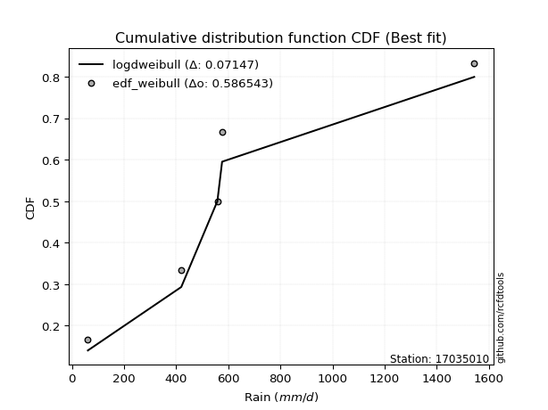</img>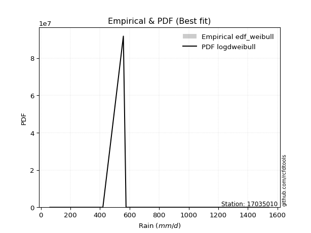</img>

</div>


### 4. EDF Beard (1943)

The Beard formula (or Beard´s plotting position formula) in hydrology is used to estimate the empirical non-exceedance probability _(P)_ of a flood event (or other extreme hydrological data point) within a given dataset.

<div align="center">


$P=(m-0.31)/(n+0.38)$


</div>


**4.1. Empirical values**

<div align="center">

|                | 0                   | 1                  | 2         | 3                  | 4                  |
|:---------------|:--------------------|:-------------------|:----------|:-------------------|:-------------------|
| date           | 2007                | 2017               | 2018      | 2020               | 2019               |
| x              | 60.7                | 419.2              | 557.8     | 575.9              | 1543.5             |
| m              | 1                   | 2                  | 3         | 4                  | 5                  |
| empirical_dist | edf_beard           | edf_beard          | edf_beard | edf_beard          | edf_beard          |
| empirical      | 0.12825278810408922 | 0.3141263940520446 | 0.5       | 0.6858736059479554 | 0.8717472118959109 |
| empirical_tr   | 1.1471215351812367  | 1.4579945799457996 | 2.0       | 3.183431952662722  | 7.797101449275368  |

</div>


**4.2. Kolmogorov-Smirnov fit test (sorted by Δ)**


<div align="center">

|                | 0                   | 1                   | 2                   | 3                  | 4                   | 5                   | 6                   | 7                   | 8                   | 9                   | 10                  | 11                  | 12                  | 13                 | 14                 | 15                 | 16                  | 17                  | 18                  | 19                  | 20                 | 21                 | 22                  | 23                  | 24                  | 25                 | 26                  | 27                 | 28                  | 29                  | 30                 | 31                  | 32                  | 33                  | 34                  | 35                  | 36                  | 37                 | 38                  | 39                 | 40                 | 41                  | 42                  | 43                 | 44                 | 45                  | 46                  | 47                 | 48                  | 49                 | 50                  | 51                 | 52                  | 53                 | 54                  | 55                  | 56                  | 57                  | 58                  | 59                 | 60                 | 61                  | 62                  | 63                  | 64                  | 65                  | 66                  | 67                 | 68                  | 69                  | 70                  | 71                 | 72                 | 73                 | 74                 | 75                  | 76                  | 77                  | 78                 | 79                  | 80                  | 81                  | 82                  | 83                  | 84                  | 85                  | 86                 | 87                  | 88                  | 89                 | 90                  | 91                  | 92                 | 93                 | 94                 | 95                  | 96                  | 97                  | 98                 | 99                  | 100                 | 101                 | 102                | 103                 | 104                | 105                | 106                 | 107                | 108                | 109                | 110                | 111                | 112                 | 113                 | 114                 | 115                | 116                 | 117                 | 118                | 119                | 120                 | 121                 | 122                 | 123                | 124                 | 125                 | 126                 | 127                | 128                | 129                | 130                | 131                 | 132                | 133                | 134                | 135                | 136                | 137                | 138                | 139                 | 140                 | 141                 | 142                 | 143                 | 144                | 145                | 146                | 147                | 148                | 149                | 150                | 151                | 152                | 153                | 154                | 155                | 156                | 157                | 158                | 159                |
|:---------------|:--------------------|:--------------------|:--------------------|:-------------------|:--------------------|:--------------------|:--------------------|:--------------------|:--------------------|:--------------------|:--------------------|:--------------------|:--------------------|:-------------------|:-------------------|:-------------------|:--------------------|:--------------------|:--------------------|:--------------------|:-------------------|:-------------------|:--------------------|:--------------------|:--------------------|:-------------------|:--------------------|:-------------------|:--------------------|:--------------------|:-------------------|:--------------------|:--------------------|:--------------------|:--------------------|:--------------------|:--------------------|:-------------------|:--------------------|:-------------------|:-------------------|:--------------------|:--------------------|:-------------------|:-------------------|:--------------------|:--------------------|:-------------------|:--------------------|:-------------------|:--------------------|:-------------------|:--------------------|:-------------------|:--------------------|:--------------------|:--------------------|:--------------------|:--------------------|:-------------------|:-------------------|:--------------------|:--------------------|:--------------------|:--------------------|:--------------------|:--------------------|:-------------------|:--------------------|:--------------------|:--------------------|:-------------------|:-------------------|:-------------------|:-------------------|:--------------------|:--------------------|:--------------------|:-------------------|:--------------------|:--------------------|:--------------------|:--------------------|:--------------------|:--------------------|:--------------------|:-------------------|:--------------------|:--------------------|:-------------------|:--------------------|:--------------------|:-------------------|:-------------------|:-------------------|:--------------------|:--------------------|:--------------------|:-------------------|:--------------------|:--------------------|:--------------------|:-------------------|:--------------------|:-------------------|:-------------------|:--------------------|:-------------------|:-------------------|:-------------------|:-------------------|:-------------------|:--------------------|:--------------------|:--------------------|:-------------------|:--------------------|:--------------------|:-------------------|:-------------------|:--------------------|:--------------------|:--------------------|:-------------------|:--------------------|:--------------------|:--------------------|:-------------------|:-------------------|:-------------------|:-------------------|:--------------------|:-------------------|:-------------------|:-------------------|:-------------------|:-------------------|:-------------------|:-------------------|:--------------------|:--------------------|:--------------------|:--------------------|:--------------------|:-------------------|:-------------------|:-------------------|:-------------------|:-------------------|:-------------------|:-------------------|:-------------------|:-------------------|:-------------------|:-------------------|:-------------------|:-------------------|:-------------------|:-------------------|:-------------------|
| station        | 17035010            | 17035010            | 17035010            | 17035010           | 17035010            | 17035010            | 17035010            | 17035010            | 17035010            | 17035010            | 17035010            | 17035010            | 17035010            | 17035010           | 17035010           | 17035010           | 17035010            | 17035010            | 17035010            | 17035010            | 17035010           | 17035010           | 17035010            | 17035010            | 17035010            | 17035010           | 17035010            | 17035010           | 17035010            | 17035010            | 17035010           | 17035010            | 17035010            | 17035010            | 17035010            | 17035010            | 17035010            | 17035010           | 17035010            | 17035010           | 17035010           | 17035010            | 17035010            | 17035010           | 17035010           | 17035010            | 17035010            | 17035010           | 17035010            | 17035010           | 17035010            | 17035010           | 17035010            | 17035010           | 17035010            | 17035010            | 17035010            | 17035010            | 17035010            | 17035010           | 17035010           | 17035010            | 17035010            | 17035010            | 17035010            | 17035010            | 17035010            | 17035010           | 17035010            | 17035010            | 17035010            | 17035010           | 17035010           | 17035010           | 17035010           | 17035010            | 17035010            | 17035010            | 17035010           | 17035010            | 17035010            | 17035010            | 17035010            | 17035010            | 17035010            | 17035010            | 17035010           | 17035010            | 17035010            | 17035010           | 17035010            | 17035010            | 17035010           | 17035010           | 17035010           | 17035010            | 17035010            | 17035010            | 17035010           | 17035010            | 17035010            | 17035010            | 17035010           | 17035010            | 17035010           | 17035010           | 17035010            | 17035010           | 17035010           | 17035010           | 17035010           | 17035010           | 17035010            | 17035010            | 17035010            | 17035010           | 17035010            | 17035010            | 17035010           | 17035010           | 17035010            | 17035010            | 17035010            | 17035010           | 17035010            | 17035010            | 17035010            | 17035010           | 17035010           | 17035010           | 17035010           | 17035010            | 17035010           | 17035010           | 17035010           | 17035010           | 17035010           | 17035010           | 17035010           | 17035010            | 17035010            | 17035010            | 17035010            | 17035010            | 17035010           | 17035010           | 17035010           | 17035010           | 17035010           | 17035010           | 17035010           | 17035010           | 17035010           | 17035010           | 17035010           | 17035010           | 17035010           | 17035010           | 17035010           | 17035010           |
| empirical_dist | edf_beard           | edf_beard           | edf_beard           | edf_beard          | edf_beard           | edf_beard           | edf_beard           | edf_beard           | edf_beard           | edf_beard           | edf_beard           | edf_beard           | edf_beard           | edf_beard          | edf_beard          | edf_beard          | edf_beard           | edf_beard           | edf_beard           | edf_beard           | edf_beard          | edf_beard          | edf_beard           | edf_beard           | edf_beard           | edf_beard          | edf_beard           | edf_beard          | edf_beard           | edf_beard           | edf_beard          | edf_beard           | edf_beard           | edf_beard           | edf_beard           | edf_beard           | edf_beard           | edf_beard          | edf_beard           | edf_beard          | edf_beard          | edf_beard           | edf_beard           | edf_beard          | edf_beard          | edf_beard           | edf_beard           | edf_beard          | edf_beard           | edf_beard          | edf_beard           | edf_beard          | edf_beard           | edf_beard          | edf_beard           | edf_beard           | edf_beard           | edf_beard           | edf_beard           | edf_beard          | edf_beard          | edf_beard           | edf_beard           | edf_beard           | edf_beard           | edf_beard           | edf_beard           | edf_beard          | edf_beard           | edf_beard           | edf_beard           | edf_beard          | edf_beard          | edf_beard          | edf_beard          | edf_beard           | edf_beard           | edf_beard           | edf_beard          | edf_beard           | edf_beard           | edf_beard           | edf_beard           | edf_beard           | edf_beard           | edf_beard           | edf_beard          | edf_beard           | edf_beard           | edf_beard          | edf_beard           | edf_beard           | edf_beard          | edf_beard          | edf_beard          | edf_beard           | edf_beard           | edf_beard           | edf_beard          | edf_beard           | edf_beard           | edf_beard           | edf_beard          | edf_beard           | edf_beard          | edf_beard          | edf_beard           | edf_beard          | edf_beard          | edf_beard          | edf_beard          | edf_beard          | edf_beard           | edf_beard           | edf_beard           | edf_beard          | edf_beard           | edf_beard           | edf_beard          | edf_beard          | edf_beard           | edf_beard           | edf_beard           | edf_beard          | edf_beard           | edf_beard           | edf_beard           | edf_beard          | edf_beard          | edf_beard          | edf_beard          | edf_beard           | edf_beard          | edf_beard          | edf_beard          | edf_beard          | edf_beard          | edf_beard          | edf_beard          | edf_beard           | edf_beard           | edf_beard           | edf_beard           | edf_beard           | edf_beard          | edf_beard          | edf_beard          | edf_beard          | edf_beard          | edf_beard          | edf_beard          | edf_beard          | edf_beard          | edf_beard          | edf_beard          | edf_beard          | edf_beard          | edf_beard          | edf_beard          | edf_beard          |
| p_dist         | logdweibull         | loggennorm          | mielke              | burr               | johnsonsu           | loggenlogistic      | betaprime           | loggumbel_l         | logburr             | logmielke           | invgamma            | logweibull_min      | logburr12           | nct                | genexpon           | logdgamma          | logskewnorm         | kappa3              | wald                | lomax               | halflogistic       | logpearson3        | exponnorm           | moyal               | dgamma              | logtrapezoid       | logloggamma         | logargus           | logtriang           | truncpareto         | loggompertz        | halfnorm            | foldnorm            | truncexpon          | genlogistic         | bradford            | gumbel_r            | loggenhalflogistic | logloglaplace       | pearson3           | vonmises_line      | kstwobign           | exponpow            | skewnorm           | gompertz           | rayleigh            | gennorm             | dweibull           | logfoldnorm         | logarcsine         | logsemicircular     | loganglit          | logt                | logcrystalball     | lognorm             | logexponnorm        | loglogistic         | loghypsecant        | lognct              | loglaplace         | loglaplace         | logf                | logfatiguelife      | logerlang           | maxwell             | logbetaprime        | logncf              | logrice            | loggamma            | loggamma            | ncf                 | loginvgamma        | arcsine            | logalpha           | rice               | loginvgauss         | logwrapcauchy       | logmaxwell          | semicircular       | loglevy_l           | anglit              | logbeta             | logcosine           | truncweibull_min    | loginvweibull       | norm                | truncnorm          | t                   | lograyleigh         | logistic           | hypsecant           | logjohnsonsb        | logweibull_max     | halfgennorm        | beta               | levy_l              | logkappa3           | weibull_min         | loggumbel_r        | loggengamma         | laplace             | logkstwobign        | loghalfnorm        | loggausshyper       | loggenextreme      | logksone           | loggenexpon         | gausshyper         | cosine             | logkappa4          | loguniform         | logvonmises_line   | logmoyal            | wrapcauchy          | logbradford         | loghalflogistic    | lognakagami         | f                   | genextreme         | gumbel_l           | kappa4              | loggenpareto        | logexponweib        | ksone              | logtruncnorm        | nakagami            | burr12              | invgauss           | uniform            | genpareto          | argus              | gamma               | logwald            | erlang             | triang             | logtruncexpon      | invweibull         | crystalball        | loglomax           | logjohnsonsu        | alpha               | logtruncweibull_min | genhalflogistic     | rdist               | exponweib          | logrdist           | fatiguelife        | logtukeylambda     | powerlaw           | johnsonsb          | trapezoid          | logexponpow        | tukeylambda        | weibull_max        | logpowerlaw        | logtruncpareto     | gengamma           | loghalfgennorm     | logvonmises        | vonmises           |
| delta          | 0.09067652735010412 | 0.11242580305460187 | 0.11900375034414101 | 0.1191268080639365 | 0.11932072812588934 | 0.12038011732343878 | 0.12144039396861278 | 0.12203698008448316 | 0.12265307479763499 | 0.12325087147532199 | 0.12382136899338969 | 0.12392878909296423 | 0.12567944440746015 | 0.1263711375389599 | 0.1278755221590754 | 0.1281198822980536 | 0.12825229832827922 | 0.12825278810390586 | 0.12825278810408922 | 0.12976005369252291 | 0.129769315036249  | 0.1334544219125145 | 0.13630343908055742 | 0.13774378706162738 | 0.13810720088318829 | 0.1405735749105399 | 0.14567466585747935 | 0.147843466928829  | 0.14824012840264233 | 0.14974512522562805 | 0.150389753691697  | 0.15133503171295792 | 0.15408194106721584 | 0.15453455082130352 | 0.15487946668689645 | 0.15709639803163689 | 0.16323337287182849 | 0.1658611916638506 | 0.16632108191825012 | 0.1683631349699345 | 0.1712412978378528 | 0.17469924533876047 | 0.17520720819575086 | 0.1800480894658233 | 0.1809230569816651 | 0.18469642514626772 | 0.18587360583764279 | 0.1858736059529994 | 0.18633722889464782 | 0.1869654895475063 | 0.18741783716365884 | 0.1875319578723676 | 0.18780739399890872 | 0.1878089906893678 | 0.18780900706803355 | 0.18781030259030546 | 0.18807343573094265 | 0.18829925757118088 | 0.18835128451511246 | 0.1892922876392829 | 0.1892922876392829 | 0.18986379113992263 | 0.19044858453399166 | 0.19398556837855424 | 0.19652089669133488 | 0.19703484328861381 | 0.19810119101198503 | 0.1981802582549544 | 0.19907873709933827 | 0.19907873709933827 | 0.19997960649971352 | 0.2065439883337527 | 0.2112910580194054 | 0.2119238481502856 | 0.2150074353974623 | 0.21626720627146107 | 0.21919141669838332 | 0.22078091061864907 | 0.2217620810578147 | 0.22185034583448304 | 0.22439656037615657 | 0.22711139273167558 | 0.23010092176707636 | 0.23029701935542157 | 0.23077848713152466 | 0.23078174682263897 | 0.2307817556935301 | 0.23078647129079555 | 0.23175034480936724 | 0.236848123975558  | 0.24198414282866915 | 0.24243093364636428 | 0.2452923137364572 | 0.2453801183277075 | 0.2495246573649379 | 0.25009232319852026 | 0.25257645757753194 | 0.25346600709371053 | 0.2582394679228485 | 0.25924260109054226 | 0.25960265631885193 | 0.26139868110240355 | 0.2626340670759226 | 0.26349649242811407 | 0.2646889914216295 | 0.266859793827039  | 0.26873669185014554 | 0.2761214915507796 | 0.2763752437850925 | 0.2808700803685747 | 0.2830570314028557 | 0.2830928277281302 | 0.28407275254311753 | 0.28481361000965255 | 0.28510012201356333 | 0.2876852570088027 | 0.28960507394970914 | 0.29178118002335246 | 0.2970543043305231 | 0.301059839891337  | 0.30551870195894426 | 0.31073665921677956 | 0.31259333355302715 | 0.3129979652681604 | 0.31412552018325823 | 0.31412635571574526 | 0.31877518393593457 | 0.3283585189919432 | 0.3384228371322015 | 0.3472414328863829 | 0.3477088273345983 | 0.35217979571315366 | 0.3559030142285236 | 0.3829488654684577 | 0.3859220594231713 | 0.391762015193212  | 0.3970201994050781 | 0.4021949836624983 | 0.4263916569112878 | 0.43092533670656874 | 0.43590114609000524 | 0.44254242072454913 | 0.45158248067319495 | 0.49056374299413824 | 0.5008121204913811 | 0.5105208700829356 | 0.5206133220939961 | 0.5337097747498247 | 0.535141378953176  | 0.5446827057075885 | 0.544996014203678  | 0.5542468612824321 | 0.5632344964940201 | 0.5804278097158755 | 0.6187331481713543 | 0.6346955439195037 | 0.6858736059479553 | 0.6858736059479554 | 1.095470341810761  | 245.34307418374394 |
| deltao         | 0.5865427407550001  | 0.5865427407550001  | 0.5865427407550001  | 0.5865427407550001 | 0.5865427407550001  | 0.5865427407550001  | 0.5865427407550001  | 0.5865427407550001  | 0.5865427407550001  | 0.5865427407550001  | 0.5865427407550001  | 0.5865427407550001  | 0.5865427407550001  | 0.5865427407550001 | 0.5865427407550001 | 0.5865427407550001 | 0.5865427407550001  | 0.5865427407550001  | 0.5865427407550001  | 0.5865427407550001  | 0.5865427407550001 | 0.5865427407550001 | 0.5865427407550001  | 0.5865427407550001  | 0.5865427407550001  | 0.5865427407550001 | 0.5865427407550001  | 0.5865427407550001 | 0.5865427407550001  | 0.5865427407550001  | 0.5865427407550001 | 0.5865427407550001  | 0.5865427407550001  | 0.5865427407550001  | 0.5865427407550001  | 0.5865427407550001  | 0.5865427407550001  | 0.5865427407550001 | 0.5865427407550001  | 0.5865427407550001 | 0.5865427407550001 | 0.5865427407550001  | 0.5865427407550001  | 0.5865427407550001 | 0.5865427407550001 | 0.5865427407550001  | 0.5865427407550001  | 0.5865427407550001 | 0.5865427407550001  | 0.5865427407550001 | 0.5865427407550001  | 0.5865427407550001 | 0.5865427407550001  | 0.5865427407550001 | 0.5865427407550001  | 0.5865427407550001  | 0.5865427407550001  | 0.5865427407550001  | 0.5865427407550001  | 0.5865427407550001 | 0.5865427407550001 | 0.5865427407550001  | 0.5865427407550001  | 0.5865427407550001  | 0.5865427407550001  | 0.5865427407550001  | 0.5865427407550001  | 0.5865427407550001 | 0.5865427407550001  | 0.5865427407550001  | 0.5865427407550001  | 0.5865427407550001 | 0.5865427407550001 | 0.5865427407550001 | 0.5865427407550001 | 0.5865427407550001  | 0.5865427407550001  | 0.5865427407550001  | 0.5865427407550001 | 0.5865427407550001  | 0.5865427407550001  | 0.5865427407550001  | 0.5865427407550001  | 0.5865427407550001  | 0.5865427407550001  | 0.5865427407550001  | 0.5865427407550001 | 0.5865427407550001  | 0.5865427407550001  | 0.5865427407550001 | 0.5865427407550001  | 0.5865427407550001  | 0.5865427407550001 | 0.5865427407550001 | 0.5865427407550001 | 0.5865427407550001  | 0.5865427407550001  | 0.5865427407550001  | 0.5865427407550001 | 0.5865427407550001  | 0.5865427407550001  | 0.5865427407550001  | 0.5865427407550001 | 0.5865427407550001  | 0.5865427407550001 | 0.5865427407550001 | 0.5865427407550001  | 0.5865427407550001 | 0.5865427407550001 | 0.5865427407550001 | 0.5865427407550001 | 0.5865427407550001 | 0.5865427407550001  | 0.5865427407550001  | 0.5865427407550001  | 0.5865427407550001 | 0.5865427407550001  | 0.5865427407550001  | 0.5865427407550001 | 0.5865427407550001 | 0.5865427407550001  | 0.5865427407550001  | 0.5865427407550001  | 0.5865427407550001 | 0.5865427407550001  | 0.5865427407550001  | 0.5865427407550001  | 0.5865427407550001 | 0.5865427407550001 | 0.5865427407550001 | 0.5865427407550001 | 0.5865427407550001  | 0.5865427407550001 | 0.5865427407550001 | 0.5865427407550001 | 0.5865427407550001 | 0.5865427407550001 | 0.5865427407550001 | 0.5865427407550001 | 0.5865427407550001  | 0.5865427407550001  | 0.5865427407550001  | 0.5865427407550001  | 0.5865427407550001  | 0.5865427407550001 | 0.5865427407550001 | 0.5865427407550001 | 0.5865427407550001 | 0.5865427407550001 | 0.5865427407550001 | 0.5865427407550001 | 0.5865427407550001 | 0.5865427407550001 | 0.5865427407550001 | 0.5865427407550001 | 0.5865427407550001 | 0.5865427407550001 | 0.5865427407550001 | 0.5865427407550001 | 0.5865427407550001 |
| eval           | Δo > Δ              | Δo > Δ              | Δo > Δ              | Δo > Δ             | Δo > Δ              | Δo > Δ              | Δo > Δ              | Δo > Δ              | Δo > Δ              | Δo > Δ              | Δo > Δ              | Δo > Δ              | Δo > Δ              | Δo > Δ             | Δo > Δ             | Δo > Δ             | Δo > Δ              | Δo > Δ              | Δo > Δ              | Δo > Δ              | Δo > Δ             | Δo > Δ             | Δo > Δ              | Δo > Δ              | Δo > Δ              | Δo > Δ             | Δo > Δ              | Δo > Δ             | Δo > Δ              | Δo > Δ              | Δo > Δ             | Δo > Δ              | Δo > Δ              | Δo > Δ              | Δo > Δ              | Δo > Δ              | Δo > Δ              | Δo > Δ             | Δo > Δ              | Δo > Δ             | Δo > Δ             | Δo > Δ              | Δo > Δ              | Δo > Δ             | Δo > Δ             | Δo > Δ              | Δo > Δ              | Δo > Δ             | Δo > Δ              | Δo > Δ             | Δo > Δ              | Δo > Δ             | Δo > Δ              | Δo > Δ             | Δo > Δ              | Δo > Δ              | Δo > Δ              | Δo > Δ              | Δo > Δ              | Δo > Δ             | Δo > Δ             | Δo > Δ              | Δo > Δ              | Δo > Δ              | Δo > Δ              | Δo > Δ              | Δo > Δ              | Δo > Δ             | Δo > Δ              | Δo > Δ              | Δo > Δ              | Δo > Δ             | Δo > Δ             | Δo > Δ             | Δo > Δ             | Δo > Δ              | Δo > Δ              | Δo > Δ              | Δo > Δ             | Δo > Δ              | Δo > Δ              | Δo > Δ              | Δo > Δ              | Δo > Δ              | Δo > Δ              | Δo > Δ              | Δo > Δ             | Δo > Δ              | Δo > Δ              | Δo > Δ             | Δo > Δ              | Δo > Δ              | Δo > Δ             | Δo > Δ             | Δo > Δ             | Δo > Δ              | Δo > Δ              | Δo > Δ              | Δo > Δ             | Δo > Δ              | Δo > Δ              | Δo > Δ              | Δo > Δ             | Δo > Δ              | Δo > Δ             | Δo > Δ             | Δo > Δ              | Δo > Δ             | Δo > Δ             | Δo > Δ             | Δo > Δ             | Δo > Δ             | Δo > Δ              | Δo > Δ              | Δo > Δ              | Δo > Δ             | Δo > Δ              | Δo > Δ              | Δo > Δ             | Δo > Δ             | Δo > Δ              | Δo > Δ              | Δo > Δ              | Δo > Δ             | Δo > Δ              | Δo > Δ              | Δo > Δ              | Δo > Δ             | Δo > Δ             | Δo > Δ             | Δo > Δ             | Δo > Δ              | Δo > Δ             | Δo > Δ             | Δo > Δ             | Δo > Δ             | Δo > Δ             | Δo > Δ             | Δo > Δ             | Δo > Δ              | Δo > Δ              | Δo > Δ              | Δo > Δ              | Δo > Δ              | Δo > Δ             | Δo > Δ             | Δo > Δ             | Δo > Δ             | Δo > Δ             | Δo > Δ             | Δo > Δ             | Δo > Δ             | Δo > Δ             | Δo > Δ             | Δo <= Δ            | Δo <= Δ            | Δo <= Δ            | Δo <= Δ            | Δo <= Δ            | Δo <= Δ            |
| fit            | 1                   | 1                   | 1                   | 1                  | 1                   | 1                   | 1                   | 1                   | 1                   | 1                   | 1                   | 1                   | 1                   | 1                  | 1                  | 1                  | 1                   | 1                   | 1                   | 1                   | 1                  | 1                  | 1                   | 1                   | 1                   | 1                  | 1                   | 1                  | 1                   | 1                   | 1                  | 1                   | 1                   | 1                   | 1                   | 1                   | 1                   | 1                  | 1                   | 1                  | 1                  | 1                   | 1                   | 1                  | 1                  | 1                   | 1                   | 1                  | 1                   | 1                  | 1                   | 1                  | 1                   | 1                  | 1                   | 1                   | 1                   | 1                   | 1                   | 1                  | 1                  | 1                   | 1                   | 1                   | 1                   | 1                   | 1                   | 1                  | 1                   | 1                   | 1                   | 1                  | 1                  | 1                  | 1                  | 1                   | 1                   | 1                   | 1                  | 1                   | 1                   | 1                   | 1                   | 1                   | 1                   | 1                   | 1                  | 1                   | 1                   | 1                  | 1                   | 1                   | 1                  | 1                  | 1                  | 1                   | 1                   | 1                   | 1                  | 1                   | 1                   | 1                   | 1                  | 1                   | 1                  | 1                  | 1                   | 1                  | 1                  | 1                  | 1                  | 1                  | 1                   | 1                   | 1                   | 1                  | 1                   | 1                   | 1                  | 1                  | 1                   | 1                   | 1                   | 1                  | 1                   | 1                   | 1                   | 1                  | 1                  | 1                  | 1                  | 1                   | 1                  | 1                  | 1                  | 1                  | 1                  | 1                  | 1                  | 1                   | 1                   | 1                   | 1                   | 1                   | 1                  | 1                  | 1                  | 1                  | 1                  | 1                  | 1                  | 1                  | 1                  | 1                  | 0                  | 0                  | 0                  | 0                  | 0                  | 0                  |
| n              | 5                   | 5                   | 5                   | 5                  | 5                   | 5                   | 5                   | 5                   | 5                   | 5                   | 5                   | 5                   | 5                   | 5                  | 5                  | 5                  | 5                   | 5                   | 5                   | 5                   | 5                  | 5                  | 5                   | 5                   | 5                   | 5                  | 5                   | 5                  | 5                   | 5                   | 5                  | 5                   | 5                   | 5                   | 5                   | 5                   | 5                   | 5                  | 5                   | 5                  | 5                  | 5                   | 5                   | 5                  | 5                  | 5                   | 5                   | 5                  | 5                   | 5                  | 5                   | 5                  | 5                   | 5                  | 5                   | 5                   | 5                   | 5                   | 5                   | 5                  | 5                  | 5                   | 5                   | 5                   | 5                   | 5                   | 5                   | 5                  | 5                   | 5                   | 5                   | 5                  | 5                  | 5                  | 5                  | 5                   | 5                   | 5                   | 5                  | 5                   | 5                   | 5                   | 5                   | 5                   | 5                   | 5                   | 5                  | 5                   | 5                   | 5                  | 5                   | 5                   | 5                  | 5                  | 5                  | 5                   | 5                   | 5                   | 5                  | 5                   | 5                   | 5                   | 5                  | 5                   | 5                  | 5                  | 5                   | 5                  | 5                  | 5                  | 5                  | 5                  | 5                   | 5                   | 5                   | 5                  | 5                   | 5                   | 5                  | 5                  | 5                   | 5                   | 5                   | 5                  | 5                   | 5                   | 5                   | 5                  | 5                  | 5                  | 5                  | 5                   | 5                  | 5                  | 5                  | 5                  | 5                  | 5                  | 5                  | 5                   | 5                   | 5                   | 5                   | 5                   | 5                  | 5                  | 5                  | 5                  | 5                  | 5                  | 5                  | 5                  | 5                  | 5                  | 5                  | 5                  | 5                  | 5                  | 5                  | 5                  |
| best_fit       | 1                   | 0                   | 0                   | 0                  | 0                   | 0                   | 0                   | 0                   | 0                   | 0                   | 0                   | 0                   | 0                   | 0                  | 0                  | 0                  | 0                   | 0                   | 0                   | 0                   | 0                  | 0                  | 0                   | 0                   | 0                   | 0                  | 0                   | 0                  | 0                   | 0                   | 0                  | 0                   | 0                   | 0                   | 0                   | 0                   | 0                   | 0                  | 0                   | 0                  | 0                  | 0                   | 0                   | 0                  | 0                  | 0                   | 0                   | 0                  | 0                   | 0                  | 0                   | 0                  | 0                   | 0                  | 0                   | 0                   | 0                   | 0                   | 0                   | 0                  | 0                  | 0                   | 0                   | 0                   | 0                   | 0                   | 0                   | 0                  | 0                   | 0                   | 0                   | 0                  | 0                  | 0                  | 0                  | 0                   | 0                   | 0                   | 0                  | 0                   | 0                   | 0                   | 0                   | 0                   | 0                   | 0                   | 0                  | 0                   | 0                   | 0                  | 0                   | 0                   | 0                  | 0                  | 0                  | 0                   | 0                   | 0                   | 0                  | 0                   | 0                   | 0                   | 0                  | 0                   | 0                  | 0                  | 0                   | 0                  | 0                  | 0                  | 0                  | 0                  | 0                   | 0                   | 0                   | 0                  | 0                   | 0                   | 0                  | 0                  | 0                   | 0                   | 0                   | 0                  | 0                   | 0                   | 0                   | 0                  | 0                  | 0                  | 0                  | 0                   | 0                  | 0                  | 0                  | 0                  | 0                  | 0                  | 0                  | 0                   | 0                   | 0                   | 0                   | 0                   | 0                  | 0                  | 0                  | 0                  | 0                  | 0                  | 0                  | 0                  | 0                  | 0                  | 0                  | 0                  | 0                  | 0                  | 0                  | 0                  |
| best_fit_sort  | 1                   | 2                   | 3                   | 4                  | 5                   | 6                   | 7                   | 8                   | 9                   | 10                  | 11                  | 12                  | 13                  | 14                 | 15                 | 16                 | 17                  | 18                  | 19                  | 20                  | 21                 | 22                 | 23                  | 24                  | 25                  | 26                 | 27                  | 28                 | 29                  | 30                  | 31                 | 32                  | 33                  | 34                  | 35                  | 36                  | 37                  | 38                 | 39                  | 40                 | 41                 | 42                  | 43                  | 44                 | 45                 | 46                  | 47                  | 48                 | 49                  | 50                 | 51                  | 52                 | 53                  | 54                 | 55                  | 56                  | 57                  | 58                  | 59                  | 60                 | 61                 | 62                  | 63                  | 64                  | 65                  | 66                  | 67                  | 68                 | 69                  | 70                  | 71                  | 72                 | 73                 | 74                 | 75                 | 76                  | 77                  | 78                  | 79                 | 80                  | 81                  | 82                  | 83                  | 84                  | 85                  | 86                  | 87                 | 88                  | 89                  | 90                 | 91                  | 92                  | 93                 | 94                 | 95                 | 96                  | 97                  | 98                  | 99                 | 100                 | 101                 | 102                 | 103                | 104                 | 105                | 106                | 107                 | 108                | 109                | 110                | 111                | 112                | 113                 | 114                 | 115                 | 116                | 117                 | 118                 | 119                | 120                | 121                 | 122                 | 123                 | 124                | 125                 | 126                 | 127                 | 128                | 129                | 130                | 131                | 132                 | 133                | 134                | 135                | 136                | 137                | 138                | 139                | 140                 | 141                 | 142                 | 143                 | 144                 | 145                | 146                | 147                | 148                | 149                | 150                | 151                | 152                | 153                | 154                | 155                | 156                | 157                | 158                | 159                | 160                |

</div>


**4.3. Best fit**

<div align="center">

|   id |   station | empirical_dist   | p_dist      |     delta |   deltao | eval   |   fit |   n |   best_fit |   best_fit_sort |
|-----:|----------:|:-----------------|:------------|----------:|---------:|:-------|------:|----:|-----------:|----------------:|
|    0 |  17035010 | edf_beard        | logdweibull | 0.0906765 | 0.586543 | Δo > Δ |     1 |   5 |          1 |               1 |

</div>


<div align="center">

</img>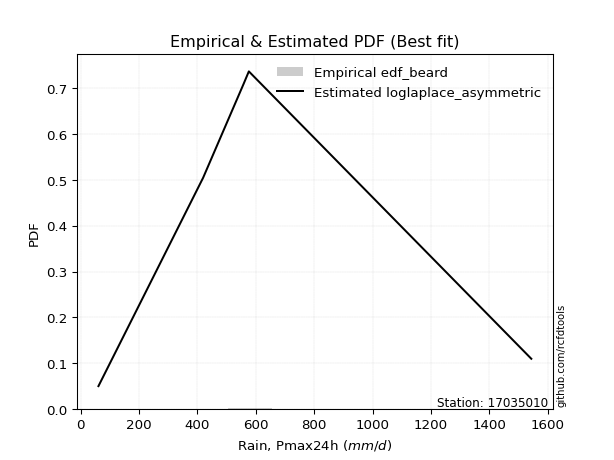</img>

</div>


### 5. EDF Chegodayev (1955)

The Chegodayev formula is an empirical plotting position formula used in hydrological frequency analysis to estimate the exceedance probability or return period of a specific event from a set of observed data. It is primarily used for plotting observed data points on probability paper to fit a theoretical distribution, particularly for analyzing extreme events like maximum flood flows or rainfall intensities. The constant _b_ value in the generalized plotting position formula is 0.3.

<div align="center">


$P=(m-b)/(n+1-2b)$


</div>


**5.1. Empirical values**

<div align="center">

|                | 0                   | 1                   | 2              | 3                  | 4                  |
|:---------------|:--------------------|:--------------------|:---------------|:-------------------|:-------------------|
| date           | 2007                | 2017                | 2018           | 2020               | 2019               |
| x              | 60.7                | 419.2               | 557.8          | 575.9              | 1543.5             |
| m              | 1                   | 2                   | 3              | 4                  | 5                  |
| empirical_dist | edf_chegodayev      | edf_chegodayev      | edf_chegodayev | edf_chegodayev     | edf_chegodayev     |
| empirical      | 0.12962962962962962 | 0.31481481481481477 | 0.5            | 0.6851851851851851 | 0.8703703703703703 |
| empirical_tr   | 1.148936170212766   | 1.4594594594594594  | 2.0            | 3.1764705882352935 | 7.714285714285713  |

</div>


**5.2. Kolmogorov-Smirnov fit test (sorted by Δ)**


<div align="center">

|                | 0                  | 1                   | 2                  | 3                   | 4                   | 5                   | 6                   | 7                   | 8                   | 9                   | 10                  | 11                  | 12                  | 13                  | 14                  | 15                  | 16                  | 17                  | 18                  | 19                  | 20                  | 21                  | 22                 | 23                  | 24                  | 25                  | 26                  | 27                  | 28                 | 29                 | 30                  | 31                 | 32                  | 33                 | 34                  | 35                  | 36                  | 37                 | 38                 | 39                  | 40                 | 41                  | 42                  | 43                  | 44                 | 45                 | 46                  | 47                  | 48                  | 49                  | 50                 | 51                  | 52                  | 53                  | 54                 | 55                 | 56                 | 57                  | 58                 | 59                  | 60                  | 61                  | 62                 | 63                 | 64                  | 65                  | 66                 | 67                  | 68                  | 69                  | 70                  | 71                  | 72                  | 73                  | 74                 | 75                  | 76                  | 77                  | 78                  | 79                  | 80                  | 81                  | 82                 | 83                  | 84                 | 85                  | 86                  | 87                  | 88                 | 89                  | 90                  | 91                  | 92                 | 93                  | 94                  | 95                  | 96                 | 97                 | 98                 | 99                 | 100                | 101                | 102                | 103                | 104                | 105                 | 106                | 107                 | 108                 | 109                 | 110                 | 111                 | 112                | 113                 | 114                | 115                 | 116                 | 117                | 118                 | 119                | 120                 | 121                | 122                | 123                | 124                | 125                | 126                | 127                 | 128                | 129                 | 130                | 131                | 132                 | 133                 | 134                | 135                | 136                | 137                | 138                 | 139                 | 140                | 141                 | 142                 | 143                | 144                | 145                | 146                | 147                | 148                | 149                | 150                | 151                | 152                | 153                | 154                | 155                | 156                | 157                | 158                | 159                |
|:---------------|:-------------------|:--------------------|:-------------------|:--------------------|:--------------------|:--------------------|:--------------------|:--------------------|:--------------------|:--------------------|:--------------------|:--------------------|:--------------------|:--------------------|:--------------------|:--------------------|:--------------------|:--------------------|:--------------------|:--------------------|:--------------------|:--------------------|:-------------------|:--------------------|:--------------------|:--------------------|:--------------------|:--------------------|:-------------------|:-------------------|:--------------------|:-------------------|:--------------------|:-------------------|:--------------------|:--------------------|:--------------------|:-------------------|:-------------------|:--------------------|:-------------------|:--------------------|:--------------------|:--------------------|:-------------------|:-------------------|:--------------------|:--------------------|:--------------------|:--------------------|:-------------------|:--------------------|:--------------------|:--------------------|:-------------------|:-------------------|:-------------------|:--------------------|:-------------------|:--------------------|:--------------------|:--------------------|:-------------------|:-------------------|:--------------------|:--------------------|:-------------------|:--------------------|:--------------------|:--------------------|:--------------------|:--------------------|:--------------------|:--------------------|:-------------------|:--------------------|:--------------------|:--------------------|:--------------------|:--------------------|:--------------------|:--------------------|:-------------------|:--------------------|:-------------------|:--------------------|:--------------------|:--------------------|:-------------------|:--------------------|:--------------------|:--------------------|:-------------------|:--------------------|:--------------------|:--------------------|:-------------------|:-------------------|:-------------------|:-------------------|:-------------------|:-------------------|:-------------------|:-------------------|:-------------------|:--------------------|:-------------------|:--------------------|:--------------------|:--------------------|:--------------------|:--------------------|:-------------------|:--------------------|:-------------------|:--------------------|:--------------------|:-------------------|:--------------------|:-------------------|:--------------------|:-------------------|:-------------------|:-------------------|:-------------------|:-------------------|:-------------------|:--------------------|:-------------------|:--------------------|:-------------------|:-------------------|:--------------------|:--------------------|:-------------------|:-------------------|:-------------------|:-------------------|:--------------------|:--------------------|:-------------------|:--------------------|:--------------------|:-------------------|:-------------------|:-------------------|:-------------------|:-------------------|:-------------------|:-------------------|:-------------------|:-------------------|:-------------------|:-------------------|:-------------------|:-------------------|:-------------------|:-------------------|:-------------------|:-------------------|
| station        | 17035010           | 17035010            | 17035010           | 17035010            | 17035010            | 17035010            | 17035010            | 17035010            | 17035010            | 17035010            | 17035010            | 17035010            | 17035010            | 17035010            | 17035010            | 17035010            | 17035010            | 17035010            | 17035010            | 17035010            | 17035010            | 17035010            | 17035010           | 17035010            | 17035010            | 17035010            | 17035010            | 17035010            | 17035010           | 17035010           | 17035010            | 17035010           | 17035010            | 17035010           | 17035010            | 17035010            | 17035010            | 17035010           | 17035010           | 17035010            | 17035010           | 17035010            | 17035010            | 17035010            | 17035010           | 17035010           | 17035010            | 17035010            | 17035010            | 17035010            | 17035010           | 17035010            | 17035010            | 17035010            | 17035010           | 17035010           | 17035010           | 17035010            | 17035010           | 17035010            | 17035010            | 17035010            | 17035010           | 17035010           | 17035010            | 17035010            | 17035010           | 17035010            | 17035010            | 17035010            | 17035010            | 17035010            | 17035010            | 17035010            | 17035010           | 17035010            | 17035010            | 17035010            | 17035010            | 17035010            | 17035010            | 17035010            | 17035010           | 17035010            | 17035010           | 17035010            | 17035010            | 17035010            | 17035010           | 17035010            | 17035010            | 17035010            | 17035010           | 17035010            | 17035010            | 17035010            | 17035010           | 17035010           | 17035010           | 17035010           | 17035010           | 17035010           | 17035010           | 17035010           | 17035010           | 17035010            | 17035010           | 17035010            | 17035010            | 17035010            | 17035010            | 17035010            | 17035010           | 17035010            | 17035010           | 17035010            | 17035010            | 17035010           | 17035010            | 17035010           | 17035010            | 17035010           | 17035010           | 17035010           | 17035010           | 17035010           | 17035010           | 17035010            | 17035010           | 17035010            | 17035010           | 17035010           | 17035010            | 17035010            | 17035010           | 17035010           | 17035010           | 17035010           | 17035010            | 17035010            | 17035010           | 17035010            | 17035010            | 17035010           | 17035010           | 17035010           | 17035010           | 17035010           | 17035010           | 17035010           | 17035010           | 17035010           | 17035010           | 17035010           | 17035010           | 17035010           | 17035010           | 17035010           | 17035010           | 17035010           |
| empirical_dist | edf_chegodayev     | edf_chegodayev      | edf_chegodayev     | edf_chegodayev      | edf_chegodayev      | edf_chegodayev      | edf_chegodayev      | edf_chegodayev      | edf_chegodayev      | edf_chegodayev      | edf_chegodayev      | edf_chegodayev      | edf_chegodayev      | edf_chegodayev      | edf_chegodayev      | edf_chegodayev      | edf_chegodayev      | edf_chegodayev      | edf_chegodayev      | edf_chegodayev      | edf_chegodayev      | edf_chegodayev      | edf_chegodayev     | edf_chegodayev      | edf_chegodayev      | edf_chegodayev      | edf_chegodayev      | edf_chegodayev      | edf_chegodayev     | edf_chegodayev     | edf_chegodayev      | edf_chegodayev     | edf_chegodayev      | edf_chegodayev     | edf_chegodayev      | edf_chegodayev      | edf_chegodayev      | edf_chegodayev     | edf_chegodayev     | edf_chegodayev      | edf_chegodayev     | edf_chegodayev      | edf_chegodayev      | edf_chegodayev      | edf_chegodayev     | edf_chegodayev     | edf_chegodayev      | edf_chegodayev      | edf_chegodayev      | edf_chegodayev      | edf_chegodayev     | edf_chegodayev      | edf_chegodayev      | edf_chegodayev      | edf_chegodayev     | edf_chegodayev     | edf_chegodayev     | edf_chegodayev      | edf_chegodayev     | edf_chegodayev      | edf_chegodayev      | edf_chegodayev      | edf_chegodayev     | edf_chegodayev     | edf_chegodayev      | edf_chegodayev      | edf_chegodayev     | edf_chegodayev      | edf_chegodayev      | edf_chegodayev      | edf_chegodayev      | edf_chegodayev      | edf_chegodayev      | edf_chegodayev      | edf_chegodayev     | edf_chegodayev      | edf_chegodayev      | edf_chegodayev      | edf_chegodayev      | edf_chegodayev      | edf_chegodayev      | edf_chegodayev      | edf_chegodayev     | edf_chegodayev      | edf_chegodayev     | edf_chegodayev      | edf_chegodayev      | edf_chegodayev      | edf_chegodayev     | edf_chegodayev      | edf_chegodayev      | edf_chegodayev      | edf_chegodayev     | edf_chegodayev      | edf_chegodayev      | edf_chegodayev      | edf_chegodayev     | edf_chegodayev     | edf_chegodayev     | edf_chegodayev     | edf_chegodayev     | edf_chegodayev     | edf_chegodayev     | edf_chegodayev     | edf_chegodayev     | edf_chegodayev      | edf_chegodayev     | edf_chegodayev      | edf_chegodayev      | edf_chegodayev      | edf_chegodayev      | edf_chegodayev      | edf_chegodayev     | edf_chegodayev      | edf_chegodayev     | edf_chegodayev      | edf_chegodayev      | edf_chegodayev     | edf_chegodayev      | edf_chegodayev     | edf_chegodayev      | edf_chegodayev     | edf_chegodayev     | edf_chegodayev     | edf_chegodayev     | edf_chegodayev     | edf_chegodayev     | edf_chegodayev      | edf_chegodayev     | edf_chegodayev      | edf_chegodayev     | edf_chegodayev     | edf_chegodayev      | edf_chegodayev      | edf_chegodayev     | edf_chegodayev     | edf_chegodayev     | edf_chegodayev     | edf_chegodayev      | edf_chegodayev      | edf_chegodayev     | edf_chegodayev      | edf_chegodayev      | edf_chegodayev     | edf_chegodayev     | edf_chegodayev     | edf_chegodayev     | edf_chegodayev     | edf_chegodayev     | edf_chegodayev     | edf_chegodayev     | edf_chegodayev     | edf_chegodayev     | edf_chegodayev     | edf_chegodayev     | edf_chegodayev     | edf_chegodayev     | edf_chegodayev     | edf_chegodayev     | edf_chegodayev     |
| p_dist         | logdweibull        | loggennorm          | mielke             | burr                | johnsonsu           | loggenlogistic      | betaprime           | loggumbel_l         | logburr             | logmielke           | invgamma            | logweibull_min      | logburr12           | nct                 | logdgamma           | halflogistic        | genexpon            | logskewnorm         | lomax               | kappa3              | wald                | logpearson3         | exponnorm          | moyal               | dgamma              | logtrapezoid        | logloggamma         | logargus            | logtriang          | truncpareto        | loggompertz         | halfnorm           | foldnorm            | truncexpon         | genlogistic         | bradford            | gumbel_r            | loggenhalflogistic | logloglaplace      | pearson3            | vonmises_line      | kstwobign           | exponpow            | skewnorm            | gompertz           | rayleigh           | gennorm             | dweibull            | logfoldnorm         | logarcsine          | logsemicircular    | loganglit           | logt                | logcrystalball      | lognorm            | logexponnorm       | loglogistic        | loghypsecant        | lognct             | loglaplace          | loglaplace          | logf                | logfatiguelife     | logerlang          | maxwell             | logbetaprime        | logncf             | logrice             | loggamma            | loggamma            | ncf                 | loginvgamma         | arcsine             | logalpha            | rice               | loginvgauss         | logwrapcauchy       | logmaxwell          | semicircular        | loglevy_l           | anglit              | logbeta             | logcosine          | truncweibull_min    | loginvweibull      | norm                | truncnorm           | t                   | lograyleigh        | logistic            | logjohnsonsb        | hypsecant           | logweibull_max     | halfgennorm         | beta                | levy_l              | logkappa3          | weibull_min        | loggumbel_r        | loggengamma        | laplace            | logkstwobign       | loghalfnorm        | loggausshyper      | loggenextreme      | logksone            | loggenexpon        | gausshyper          | cosine              | logkappa4           | loguniform          | logvonmises_line    | logmoyal           | wrapcauchy          | logbradford        | loghalflogistic     | lognakagami         | f                  | genextreme          | gumbel_l           | kappa4              | loggenpareto       | logexponweib       | ksone              | logtruncnorm       | nakagami           | burr12             | invgauss            | uniform            | genpareto           | argus              | gamma              | logwald             | erlang              | triang             | logtruncexpon      | invweibull         | crystalball        | loglomax            | logjohnsonsu        | alpha              | logtruncweibull_min | genhalflogistic     | rdist              | exponweib          | logrdist           | fatiguelife        | logtukeylambda     | powerlaw           | johnsonsb          | trapezoid          | logexponpow        | tukeylambda        | weibull_max        | logpowerlaw        | logtruncpareto     | loghalfgennorm     | gengamma           | logvonmises        | vonmises           |
| delta          | 0.0899881065873338 | 0.11311422381737202 | 0.1183153295813707 | 0.11843838730116618 | 0.11863230736311903 | 0.11969169656066847 | 0.12075197320584263 | 0.12134855932171285 | 0.12196465403486484 | 0.12256245071255184 | 0.12313294823061938 | 0.12324036833019392 | 0.12499102364468984 | 0.12568271677618958 | 0.12743146153528329 | 0.12908089427347869 | 0.12925236368461582 | 0.12962913985381974 | 0.12962959162985668 | 0.12962962962944627 | 0.12962962962962962 | 0.13276600114974435 | 0.1356150183177871 | 0.13705536629885706 | 0.13741878012041797 | 0.13988515414776959 | 0.14498624509470903 | 0.14715504616605868 | 0.1475517076398722 | 0.1490567044628579 | 0.14970133292892684 | 0.1506466109501876 | 0.15339352030444553 | 0.1538461300585332 | 0.15419104592412614 | 0.15640797726886657 | 0.16254495210905817 | 0.1651727709010803 | 0.1656326611554798 | 0.16767471420716418 | 0.1705528770750825 | 0.17401082457599015 | 0.17451878743298055 | 0.17935966870305298 | 0.1802346362188948 | 0.1840080043834974 | 0.18518518507487247 | 0.18518518519022908 | 0.18564880813187767 | 0.18627706878473616 | 0.1867294164008887 | 0.18684353710959745 | 0.18711897323613857 | 0.18712056992659765 | 0.1871205863052634 | 0.1871218818275353 | 0.1873850149681725 | 0.18761083680841073 | 0.1876628637523423 | 0.18860386687651276 | 0.18860386687651276 | 0.18917537037715249 | 0.1897601637712215 | 0.1932971476157841 | 0.19583247592856456 | 0.19634642252584367 | 0.1974127702492149 | 0.19749183749218424 | 0.19839031633656812 | 0.19839031633656812 | 0.19929118573694338 | 0.20585556757098256 | 0.21060263725663508 | 0.21123542738751544 | 0.214319014634692  | 0.21557878550869092 | 0.21850299593561318 | 0.22009248985587893 | 0.22107366029504438 | 0.22116192507171273 | 0.22370813961338626 | 0.22642297196890526 | 0.2294125010043062 | 0.22960859859265126 | 0.2300900663687545 | 0.23009332605986865 | 0.23009333493075979 | 0.23009805052802523 | 0.2310619240465971 | 0.23615970321278767 | 0.24105409212082388 | 0.24129572206589883 | 0.2446038929736869 | 0.24469169756493736 | 0.24883623660216758 | 0.24940390243574995 | 0.2518880368147618 | 0.2527775863309404 | 0.2575510471600784 | 0.2585541803277721 | 0.2589142355560816 | 0.2607102603396334 | 0.2619456463131524 | 0.2628080716653439 | 0.2640005706588592 | 0.26617137306426886 | 0.2680482710873754 | 0.27543307078800927 | 0.27568682302232217 | 0.28018165960580454 | 0.28236861064008556 | 0.28240440696536007 | 0.2833843317803474 | 0.28412518924688224 | 0.2844117012507932 | 0.28699683624603256 | 0.28960507394970914 | 0.2910927592605823 | 0.29636588356775295 | 0.3003714191285667 | 0.30483028119617395 | 0.3100482384540094 | 0.311904912790257  | 0.3123095445053901 | 0.3148139409460284 | 0.3148147764785154 | 0.3180867631731644 | 0.32767009822917303 | 0.3377344163694312 | 0.34655301212361256 | 0.347020406571828  | 0.3514913749503835 | 0.35521459346575346 | 0.38226044470568754 | 0.385233638660401  | 0.3910735944304419 | 0.3956433578795376 | 0.4008181421369579 | 0.42501481538574726 | 0.43092533670656874 | 0.4352127253272351 | 0.441853999961779   | 0.45089405991042464 | 0.4898753222313681 | 0.5001236997286109 | 0.5098324493201654 | 0.519924901331226  | 0.5330213539870546 | 0.534452958190406  | 0.5439942849448183 | 0.5443075934409077 | 0.553558440519662  | 0.56254607573125   | 0.5797393889531052 | 0.6180447274085842 | 0.6340071231567335 | 0.6851851851851851 | 0.6851851851851852 | 1.094781921047991  | 245.34445102526948 |
| deltao         | 0.5865427407550001 | 0.5865427407550001  | 0.5865427407550001 | 0.5865427407550001  | 0.5865427407550001  | 0.5865427407550001  | 0.5865427407550001  | 0.5865427407550001  | 0.5865427407550001  | 0.5865427407550001  | 0.5865427407550001  | 0.5865427407550001  | 0.5865427407550001  | 0.5865427407550001  | 0.5865427407550001  | 0.5865427407550001  | 0.5865427407550001  | 0.5865427407550001  | 0.5865427407550001  | 0.5865427407550001  | 0.5865427407550001  | 0.5865427407550001  | 0.5865427407550001 | 0.5865427407550001  | 0.5865427407550001  | 0.5865427407550001  | 0.5865427407550001  | 0.5865427407550001  | 0.5865427407550001 | 0.5865427407550001 | 0.5865427407550001  | 0.5865427407550001 | 0.5865427407550001  | 0.5865427407550001 | 0.5865427407550001  | 0.5865427407550001  | 0.5865427407550001  | 0.5865427407550001 | 0.5865427407550001 | 0.5865427407550001  | 0.5865427407550001 | 0.5865427407550001  | 0.5865427407550001  | 0.5865427407550001  | 0.5865427407550001 | 0.5865427407550001 | 0.5865427407550001  | 0.5865427407550001  | 0.5865427407550001  | 0.5865427407550001  | 0.5865427407550001 | 0.5865427407550001  | 0.5865427407550001  | 0.5865427407550001  | 0.5865427407550001 | 0.5865427407550001 | 0.5865427407550001 | 0.5865427407550001  | 0.5865427407550001 | 0.5865427407550001  | 0.5865427407550001  | 0.5865427407550001  | 0.5865427407550001 | 0.5865427407550001 | 0.5865427407550001  | 0.5865427407550001  | 0.5865427407550001 | 0.5865427407550001  | 0.5865427407550001  | 0.5865427407550001  | 0.5865427407550001  | 0.5865427407550001  | 0.5865427407550001  | 0.5865427407550001  | 0.5865427407550001 | 0.5865427407550001  | 0.5865427407550001  | 0.5865427407550001  | 0.5865427407550001  | 0.5865427407550001  | 0.5865427407550001  | 0.5865427407550001  | 0.5865427407550001 | 0.5865427407550001  | 0.5865427407550001 | 0.5865427407550001  | 0.5865427407550001  | 0.5865427407550001  | 0.5865427407550001 | 0.5865427407550001  | 0.5865427407550001  | 0.5865427407550001  | 0.5865427407550001 | 0.5865427407550001  | 0.5865427407550001  | 0.5865427407550001  | 0.5865427407550001 | 0.5865427407550001 | 0.5865427407550001 | 0.5865427407550001 | 0.5865427407550001 | 0.5865427407550001 | 0.5865427407550001 | 0.5865427407550001 | 0.5865427407550001 | 0.5865427407550001  | 0.5865427407550001 | 0.5865427407550001  | 0.5865427407550001  | 0.5865427407550001  | 0.5865427407550001  | 0.5865427407550001  | 0.5865427407550001 | 0.5865427407550001  | 0.5865427407550001 | 0.5865427407550001  | 0.5865427407550001  | 0.5865427407550001 | 0.5865427407550001  | 0.5865427407550001 | 0.5865427407550001  | 0.5865427407550001 | 0.5865427407550001 | 0.5865427407550001 | 0.5865427407550001 | 0.5865427407550001 | 0.5865427407550001 | 0.5865427407550001  | 0.5865427407550001 | 0.5865427407550001  | 0.5865427407550001 | 0.5865427407550001 | 0.5865427407550001  | 0.5865427407550001  | 0.5865427407550001 | 0.5865427407550001 | 0.5865427407550001 | 0.5865427407550001 | 0.5865427407550001  | 0.5865427407550001  | 0.5865427407550001 | 0.5865427407550001  | 0.5865427407550001  | 0.5865427407550001 | 0.5865427407550001 | 0.5865427407550001 | 0.5865427407550001 | 0.5865427407550001 | 0.5865427407550001 | 0.5865427407550001 | 0.5865427407550001 | 0.5865427407550001 | 0.5865427407550001 | 0.5865427407550001 | 0.5865427407550001 | 0.5865427407550001 | 0.5865427407550001 | 0.5865427407550001 | 0.5865427407550001 | 0.5865427407550001 |
| eval           | Δo > Δ             | Δo > Δ              | Δo > Δ             | Δo > Δ              | Δo > Δ              | Δo > Δ              | Δo > Δ              | Δo > Δ              | Δo > Δ              | Δo > Δ              | Δo > Δ              | Δo > Δ              | Δo > Δ              | Δo > Δ              | Δo > Δ              | Δo > Δ              | Δo > Δ              | Δo > Δ              | Δo > Δ              | Δo > Δ              | Δo > Δ              | Δo > Δ              | Δo > Δ             | Δo > Δ              | Δo > Δ              | Δo > Δ              | Δo > Δ              | Δo > Δ              | Δo > Δ             | Δo > Δ             | Δo > Δ              | Δo > Δ             | Δo > Δ              | Δo > Δ             | Δo > Δ              | Δo > Δ              | Δo > Δ              | Δo > Δ             | Δo > Δ             | Δo > Δ              | Δo > Δ             | Δo > Δ              | Δo > Δ              | Δo > Δ              | Δo > Δ             | Δo > Δ             | Δo > Δ              | Δo > Δ              | Δo > Δ              | Δo > Δ              | Δo > Δ             | Δo > Δ              | Δo > Δ              | Δo > Δ              | Δo > Δ             | Δo > Δ             | Δo > Δ             | Δo > Δ              | Δo > Δ             | Δo > Δ              | Δo > Δ              | Δo > Δ              | Δo > Δ             | Δo > Δ             | Δo > Δ              | Δo > Δ              | Δo > Δ             | Δo > Δ              | Δo > Δ              | Δo > Δ              | Δo > Δ              | Δo > Δ              | Δo > Δ              | Δo > Δ              | Δo > Δ             | Δo > Δ              | Δo > Δ              | Δo > Δ              | Δo > Δ              | Δo > Δ              | Δo > Δ              | Δo > Δ              | Δo > Δ             | Δo > Δ              | Δo > Δ             | Δo > Δ              | Δo > Δ              | Δo > Δ              | Δo > Δ             | Δo > Δ              | Δo > Δ              | Δo > Δ              | Δo > Δ             | Δo > Δ              | Δo > Δ              | Δo > Δ              | Δo > Δ             | Δo > Δ             | Δo > Δ             | Δo > Δ             | Δo > Δ             | Δo > Δ             | Δo > Δ             | Δo > Δ             | Δo > Δ             | Δo > Δ              | Δo > Δ             | Δo > Δ              | Δo > Δ              | Δo > Δ              | Δo > Δ              | Δo > Δ              | Δo > Δ             | Δo > Δ              | Δo > Δ             | Δo > Δ              | Δo > Δ              | Δo > Δ             | Δo > Δ              | Δo > Δ             | Δo > Δ              | Δo > Δ             | Δo > Δ             | Δo > Δ             | Δo > Δ             | Δo > Δ             | Δo > Δ             | Δo > Δ              | Δo > Δ             | Δo > Δ              | Δo > Δ             | Δo > Δ             | Δo > Δ              | Δo > Δ              | Δo > Δ             | Δo > Δ             | Δo > Δ             | Δo > Δ             | Δo > Δ              | Δo > Δ              | Δo > Δ             | Δo > Δ              | Δo > Δ              | Δo > Δ             | Δo > Δ             | Δo > Δ             | Δo > Δ             | Δo > Δ             | Δo > Δ             | Δo > Δ             | Δo > Δ             | Δo > Δ             | Δo > Δ             | Δo > Δ             | Δo <= Δ            | Δo <= Δ            | Δo <= Δ            | Δo <= Δ            | Δo <= Δ            | Δo <= Δ            |
| fit            | 1                  | 1                   | 1                  | 1                   | 1                   | 1                   | 1                   | 1                   | 1                   | 1                   | 1                   | 1                   | 1                   | 1                   | 1                   | 1                   | 1                   | 1                   | 1                   | 1                   | 1                   | 1                   | 1                  | 1                   | 1                   | 1                   | 1                   | 1                   | 1                  | 1                  | 1                   | 1                  | 1                   | 1                  | 1                   | 1                   | 1                   | 1                  | 1                  | 1                   | 1                  | 1                   | 1                   | 1                   | 1                  | 1                  | 1                   | 1                   | 1                   | 1                   | 1                  | 1                   | 1                   | 1                   | 1                  | 1                  | 1                  | 1                   | 1                  | 1                   | 1                   | 1                   | 1                  | 1                  | 1                   | 1                   | 1                  | 1                   | 1                   | 1                   | 1                   | 1                   | 1                   | 1                   | 1                  | 1                   | 1                   | 1                   | 1                   | 1                   | 1                   | 1                   | 1                  | 1                   | 1                  | 1                   | 1                   | 1                   | 1                  | 1                   | 1                   | 1                   | 1                  | 1                   | 1                   | 1                   | 1                  | 1                  | 1                  | 1                  | 1                  | 1                  | 1                  | 1                  | 1                  | 1                   | 1                  | 1                   | 1                   | 1                   | 1                   | 1                   | 1                  | 1                   | 1                  | 1                   | 1                   | 1                  | 1                   | 1                  | 1                   | 1                  | 1                  | 1                  | 1                  | 1                  | 1                  | 1                   | 1                  | 1                   | 1                  | 1                  | 1                   | 1                   | 1                  | 1                  | 1                  | 1                  | 1                   | 1                   | 1                  | 1                   | 1                   | 1                  | 1                  | 1                  | 1                  | 1                  | 1                  | 1                  | 1                  | 1                  | 1                  | 1                  | 0                  | 0                  | 0                  | 0                  | 0                  | 0                  |
| n              | 5                  | 5                   | 5                  | 5                   | 5                   | 5                   | 5                   | 5                   | 5                   | 5                   | 5                   | 5                   | 5                   | 5                   | 5                   | 5                   | 5                   | 5                   | 5                   | 5                   | 5                   | 5                   | 5                  | 5                   | 5                   | 5                   | 5                   | 5                   | 5                  | 5                  | 5                   | 5                  | 5                   | 5                  | 5                   | 5                   | 5                   | 5                  | 5                  | 5                   | 5                  | 5                   | 5                   | 5                   | 5                  | 5                  | 5                   | 5                   | 5                   | 5                   | 5                  | 5                   | 5                   | 5                   | 5                  | 5                  | 5                  | 5                   | 5                  | 5                   | 5                   | 5                   | 5                  | 5                  | 5                   | 5                   | 5                  | 5                   | 5                   | 5                   | 5                   | 5                   | 5                   | 5                   | 5                  | 5                   | 5                   | 5                   | 5                   | 5                   | 5                   | 5                   | 5                  | 5                   | 5                  | 5                   | 5                   | 5                   | 5                  | 5                   | 5                   | 5                   | 5                  | 5                   | 5                   | 5                   | 5                  | 5                  | 5                  | 5                  | 5                  | 5                  | 5                  | 5                  | 5                  | 5                   | 5                  | 5                   | 5                   | 5                   | 5                   | 5                   | 5                  | 5                   | 5                  | 5                   | 5                   | 5                  | 5                   | 5                  | 5                   | 5                  | 5                  | 5                  | 5                  | 5                  | 5                  | 5                   | 5                  | 5                   | 5                  | 5                  | 5                   | 5                   | 5                  | 5                  | 5                  | 5                  | 5                   | 5                   | 5                  | 5                   | 5                   | 5                  | 5                  | 5                  | 5                  | 5                  | 5                  | 5                  | 5                  | 5                  | 5                  | 5                  | 5                  | 5                  | 5                  | 5                  | 5                  | 5                  |
| best_fit       | 1                  | 0                   | 0                  | 0                   | 0                   | 0                   | 0                   | 0                   | 0                   | 0                   | 0                   | 0                   | 0                   | 0                   | 0                   | 0                   | 0                   | 0                   | 0                   | 0                   | 0                   | 0                   | 0                  | 0                   | 0                   | 0                   | 0                   | 0                   | 0                  | 0                  | 0                   | 0                  | 0                   | 0                  | 0                   | 0                   | 0                   | 0                  | 0                  | 0                   | 0                  | 0                   | 0                   | 0                   | 0                  | 0                  | 0                   | 0                   | 0                   | 0                   | 0                  | 0                   | 0                   | 0                   | 0                  | 0                  | 0                  | 0                   | 0                  | 0                   | 0                   | 0                   | 0                  | 0                  | 0                   | 0                   | 0                  | 0                   | 0                   | 0                   | 0                   | 0                   | 0                   | 0                   | 0                  | 0                   | 0                   | 0                   | 0                   | 0                   | 0                   | 0                   | 0                  | 0                   | 0                  | 0                   | 0                   | 0                   | 0                  | 0                   | 0                   | 0                   | 0                  | 0                   | 0                   | 0                   | 0                  | 0                  | 0                  | 0                  | 0                  | 0                  | 0                  | 0                  | 0                  | 0                   | 0                  | 0                   | 0                   | 0                   | 0                   | 0                   | 0                  | 0                   | 0                  | 0                   | 0                   | 0                  | 0                   | 0                  | 0                   | 0                  | 0                  | 0                  | 0                  | 0                  | 0                  | 0                   | 0                  | 0                   | 0                  | 0                  | 0                   | 0                   | 0                  | 0                  | 0                  | 0                  | 0                   | 0                   | 0                  | 0                   | 0                   | 0                  | 0                  | 0                  | 0                  | 0                  | 0                  | 0                  | 0                  | 0                  | 0                  | 0                  | 0                  | 0                  | 0                  | 0                  | 0                  | 0                  |
| best_fit_sort  | 1                  | 2                   | 3                  | 4                   | 5                   | 6                   | 7                   | 8                   | 9                   | 10                  | 11                  | 12                  | 13                  | 14                  | 15                  | 16                  | 17                  | 18                  | 19                  | 20                  | 21                  | 22                  | 23                 | 24                  | 25                  | 26                  | 27                  | 28                  | 29                 | 30                 | 31                  | 32                 | 33                  | 34                 | 35                  | 36                  | 37                  | 38                 | 39                 | 40                  | 41                 | 42                  | 43                  | 44                  | 45                 | 46                 | 47                  | 48                  | 49                  | 50                  | 51                 | 52                  | 53                  | 54                  | 55                 | 56                 | 57                 | 58                  | 59                 | 60                  | 61                  | 62                  | 63                 | 64                 | 65                  | 66                  | 67                 | 68                  | 69                  | 70                  | 71                  | 72                  | 73                  | 74                  | 75                 | 76                  | 77                  | 78                  | 79                  | 80                  | 81                  | 82                  | 83                 | 84                  | 85                 | 86                  | 87                  | 88                  | 89                 | 90                  | 91                  | 92                  | 93                 | 94                  | 95                  | 96                  | 97                 | 98                 | 99                 | 100                | 101                | 102                | 103                | 104                | 105                | 106                 | 107                | 108                 | 109                 | 110                 | 111                 | 112                 | 113                | 114                 | 115                | 116                 | 117                 | 118                | 119                 | 120                | 121                 | 122                | 123                | 124                | 125                | 126                | 127                | 128                 | 129                | 130                 | 131                | 132                | 133                 | 134                 | 135                | 136                | 137                | 138                | 139                 | 140                 | 141                | 142                 | 143                 | 144                | 145                | 146                | 147                | 148                | 149                | 150                | 151                | 152                | 153                | 154                | 155                | 156                | 157                | 158                | 159                | 160                |

</div>


**5.3. Best fit**

<div align="center">

|   id |   station | empirical_dist   | p_dist      |     delta |   deltao | eval   |   fit |   n |   best_fit |   best_fit_sort |
|-----:|----------:|:-----------------|:------------|----------:|---------:|:-------|------:|----:|-----------:|----------------:|
|    0 |  17035010 | edf_chegodayev   | logdweibull | 0.0899881 | 0.586543 | Δo > Δ |     1 |   5 |          1 |               1 |

</div>


<div align="center">

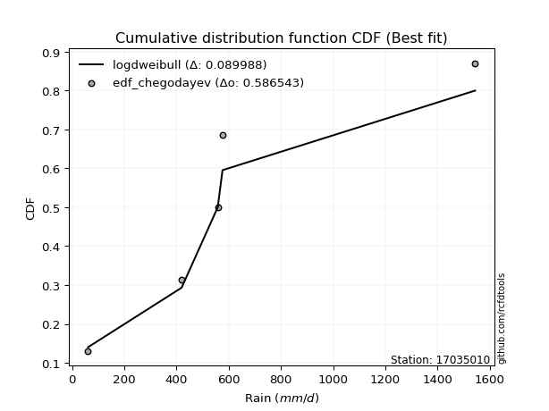</img>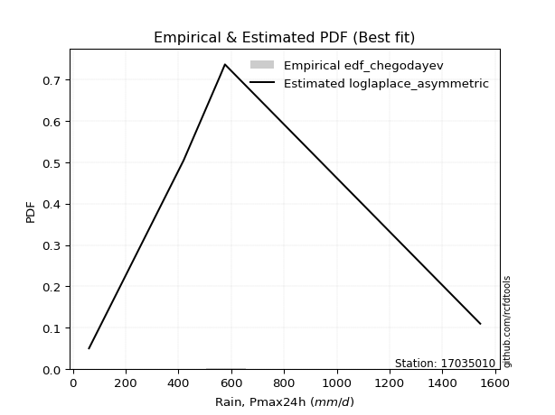</img>

</div>


### 6. EDF Blom (1958)

The Blom formula is a specific "plotting position" formula used in hydrology and statistical analysis to estimate the empirical cumulative probability (or non-exceedance probability) of a data series. It is particularly recommended for data that are approximately normally distributed. The constant _a_ is set to 0.375 (or 3/8).

<div align="center">


$P=(m-a)/(n+1-2a)$


</div>


**6.1. Empirical values**

<div align="center">

|                | 0                   | 1                   | 2        | 3                  | 4                  |
|:---------------|:--------------------|:--------------------|:---------|:-------------------|:-------------------|
| date           | 2007                | 2017                | 2018     | 2020               | 2019               |
| x              | 60.7                | 419.2               | 557.8    | 575.9              | 1543.5             |
| m              | 1                   | 2                   | 3        | 4                  | 5                  |
| empirical_dist | edf_blom            | edf_blom            | edf_blom | edf_blom           | edf_blom           |
| empirical      | 0.11904761904761904 | 0.30952380952380953 | 0.5      | 0.6904761904761905 | 0.8809523809523809 |
| empirical_tr   | 1.135135135135135   | 1.4482758620689655  | 2.0      | 3.230769230769231  | 8.399999999999999  |

</div>


**6.2. Kolmogorov-Smirnov fit test (sorted by Δ)**


<div align="center">

|                | 0                   | 1                   | 2                   | 3                   | 4                   | 5                   | 6                   | 7                   | 8                   | 9                  | 10                  | 11                  | 12                  | 13                  | 14                  | 15                  | 16                  | 17                  | 18                  | 19                 | 20                  | 21                  | 22                  | 23                 | 24                  | 25                  | 26                  | 27                  | 28                  | 29                  | 30                  | 31                  | 32                  | 33                  | 34                  | 35                  | 36                  | 37                  | 38                  | 39                  | 40                  | 41                 | 42                 | 43                  | 44                  | 45                  | 46                  | 47                  | 48                 | 49                 | 50                  | 51                  | 52                 | 53                  | 54                  | 55                  | 56                  | 57                  | 58                  | 59                 | 60                 | 61                  | 62                  | 63                  | 64                 | 65                 | 66                  | 67                  | 68                  | 69                  | 70                 | 71                 | 72                  | 73                  | 74                  | 75                  | 76                 | 77                  | 78                  | 79                  | 80                 | 81                 | 82                  | 83                 | 84                  | 85                 | 86                  | 87                  | 88                  | 89                  | 90                  | 91                  | 92                 | 93                  | 94                  | 95                 | 96                  | 97                 | 98                 | 99                  | 100                 | 101                 | 102                 | 103                 | 104                | 105                | 106                | 107                | 108                | 109                | 110                | 111                | 112                | 113                | 114                 | 115                | 116                | 117                 | 118                | 119                 | 120                 | 121                | 122                | 123                 | 124                 | 125                 | 126                 | 127                 | 128                 | 129                | 130                | 131                 | 132                | 133                | 134                 | 135                | 136                 | 137                 | 138                 | 139                 | 140                 | 141                 | 142                | 143                 | 144                | 145                | 146                | 147                | 148                | 149                | 150                | 151                | 152                | 153                | 154                | 155                | 156                | 157                | 158                | 159                |
|:---------------|:--------------------|:--------------------|:--------------------|:--------------------|:--------------------|:--------------------|:--------------------|:--------------------|:--------------------|:-------------------|:--------------------|:--------------------|:--------------------|:--------------------|:--------------------|:--------------------|:--------------------|:--------------------|:--------------------|:-------------------|:--------------------|:--------------------|:--------------------|:-------------------|:--------------------|:--------------------|:--------------------|:--------------------|:--------------------|:--------------------|:--------------------|:--------------------|:--------------------|:--------------------|:--------------------|:--------------------|:--------------------|:--------------------|:--------------------|:--------------------|:--------------------|:-------------------|:-------------------|:--------------------|:--------------------|:--------------------|:--------------------|:--------------------|:-------------------|:-------------------|:--------------------|:--------------------|:-------------------|:--------------------|:--------------------|:--------------------|:--------------------|:--------------------|:--------------------|:-------------------|:-------------------|:--------------------|:--------------------|:--------------------|:-------------------|:-------------------|:--------------------|:--------------------|:--------------------|:--------------------|:-------------------|:-------------------|:--------------------|:--------------------|:--------------------|:--------------------|:-------------------|:--------------------|:--------------------|:--------------------|:-------------------|:-------------------|:--------------------|:-------------------|:--------------------|:-------------------|:--------------------|:--------------------|:--------------------|:--------------------|:--------------------|:--------------------|:-------------------|:--------------------|:--------------------|:-------------------|:--------------------|:-------------------|:-------------------|:--------------------|:--------------------|:--------------------|:--------------------|:--------------------|:-------------------|:-------------------|:-------------------|:-------------------|:-------------------|:-------------------|:-------------------|:-------------------|:-------------------|:-------------------|:--------------------|:-------------------|:-------------------|:--------------------|:-------------------|:--------------------|:--------------------|:-------------------|:-------------------|:--------------------|:--------------------|:--------------------|:--------------------|:--------------------|:--------------------|:-------------------|:-------------------|:--------------------|:-------------------|:-------------------|:--------------------|:-------------------|:--------------------|:--------------------|:--------------------|:--------------------|:--------------------|:--------------------|:-------------------|:--------------------|:-------------------|:-------------------|:-------------------|:-------------------|:-------------------|:-------------------|:-------------------|:-------------------|:-------------------|:-------------------|:-------------------|:-------------------|:-------------------|:-------------------|:-------------------|:-------------------|
| station        | 17035010            | 17035010            | 17035010            | 17035010            | 17035010            | 17035010            | 17035010            | 17035010            | 17035010            | 17035010           | 17035010            | 17035010            | 17035010            | 17035010            | 17035010            | 17035010            | 17035010            | 17035010            | 17035010            | 17035010           | 17035010            | 17035010            | 17035010            | 17035010           | 17035010            | 17035010            | 17035010            | 17035010            | 17035010            | 17035010            | 17035010            | 17035010            | 17035010            | 17035010            | 17035010            | 17035010            | 17035010            | 17035010            | 17035010            | 17035010            | 17035010            | 17035010           | 17035010           | 17035010            | 17035010            | 17035010            | 17035010            | 17035010            | 17035010           | 17035010           | 17035010            | 17035010            | 17035010           | 17035010            | 17035010            | 17035010            | 17035010            | 17035010            | 17035010            | 17035010           | 17035010           | 17035010            | 17035010            | 17035010            | 17035010           | 17035010           | 17035010            | 17035010            | 17035010            | 17035010            | 17035010           | 17035010           | 17035010            | 17035010            | 17035010            | 17035010            | 17035010           | 17035010            | 17035010            | 17035010            | 17035010           | 17035010           | 17035010            | 17035010           | 17035010            | 17035010           | 17035010            | 17035010            | 17035010            | 17035010            | 17035010            | 17035010            | 17035010           | 17035010            | 17035010            | 17035010           | 17035010            | 17035010           | 17035010           | 17035010            | 17035010            | 17035010            | 17035010            | 17035010            | 17035010           | 17035010           | 17035010           | 17035010           | 17035010           | 17035010           | 17035010           | 17035010           | 17035010           | 17035010           | 17035010            | 17035010           | 17035010           | 17035010            | 17035010           | 17035010            | 17035010            | 17035010           | 17035010           | 17035010            | 17035010            | 17035010            | 17035010            | 17035010            | 17035010            | 17035010           | 17035010           | 17035010            | 17035010           | 17035010           | 17035010            | 17035010           | 17035010            | 17035010            | 17035010            | 17035010            | 17035010            | 17035010            | 17035010           | 17035010            | 17035010           | 17035010           | 17035010           | 17035010           | 17035010           | 17035010           | 17035010           | 17035010           | 17035010           | 17035010           | 17035010           | 17035010           | 17035010           | 17035010           | 17035010           | 17035010           |
| empirical_dist | edf_blom            | edf_blom            | edf_blom            | edf_blom            | edf_blom            | edf_blom            | edf_blom            | edf_blom            | edf_blom            | edf_blom           | edf_blom            | edf_blom            | edf_blom            | edf_blom            | edf_blom            | edf_blom            | edf_blom            | edf_blom            | edf_blom            | edf_blom           | edf_blom            | edf_blom            | edf_blom            | edf_blom           | edf_blom            | edf_blom            | edf_blom            | edf_blom            | edf_blom            | edf_blom            | edf_blom            | edf_blom            | edf_blom            | edf_blom            | edf_blom            | edf_blom            | edf_blom            | edf_blom            | edf_blom            | edf_blom            | edf_blom            | edf_blom           | edf_blom           | edf_blom            | edf_blom            | edf_blom            | edf_blom            | edf_blom            | edf_blom           | edf_blom           | edf_blom            | edf_blom            | edf_blom           | edf_blom            | edf_blom            | edf_blom            | edf_blom            | edf_blom            | edf_blom            | edf_blom           | edf_blom           | edf_blom            | edf_blom            | edf_blom            | edf_blom           | edf_blom           | edf_blom            | edf_blom            | edf_blom            | edf_blom            | edf_blom           | edf_blom           | edf_blom            | edf_blom            | edf_blom            | edf_blom            | edf_blom           | edf_blom            | edf_blom            | edf_blom            | edf_blom           | edf_blom           | edf_blom            | edf_blom           | edf_blom            | edf_blom           | edf_blom            | edf_blom            | edf_blom            | edf_blom            | edf_blom            | edf_blom            | edf_blom           | edf_blom            | edf_blom            | edf_blom           | edf_blom            | edf_blom           | edf_blom           | edf_blom            | edf_blom            | edf_blom            | edf_blom            | edf_blom            | edf_blom           | edf_blom           | edf_blom           | edf_blom           | edf_blom           | edf_blom           | edf_blom           | edf_blom           | edf_blom           | edf_blom           | edf_blom            | edf_blom           | edf_blom           | edf_blom            | edf_blom           | edf_blom            | edf_blom            | edf_blom           | edf_blom           | edf_blom            | edf_blom            | edf_blom            | edf_blom            | edf_blom            | edf_blom            | edf_blom           | edf_blom           | edf_blom            | edf_blom           | edf_blom           | edf_blom            | edf_blom           | edf_blom            | edf_blom            | edf_blom            | edf_blom            | edf_blom            | edf_blom            | edf_blom           | edf_blom            | edf_blom           | edf_blom           | edf_blom           | edf_blom           | edf_blom           | edf_blom           | edf_blom           | edf_blom           | edf_blom           | edf_blom           | edf_blom           | edf_blom           | edf_blom           | edf_blom           | edf_blom           | edf_blom           |
| p_dist         | logdweibull         | loggennorm          | wald                | kappa3              | mielke              | burr                | johnsonsu           | loggenlogistic      | betaprime           | loggumbel_l        | logburr             | logmielke           | genexpon            | invgamma            | logweibull_min      | logburr12           | nct                 | logskewnorm         | logdgamma           | lomax              | halflogistic        | logpearson3         | exponnorm           | moyal              | dgamma              | logtrapezoid        | logloggamma         | logargus            | logtriang           | truncpareto         | loggompertz         | halfnorm            | foldnorm            | truncexpon          | genlogistic         | bradford            | gumbel_r            | loggenhalflogistic  | logloglaplace       | pearson3            | vonmises_line       | kstwobign          | exponpow           | skewnorm            | gompertz            | rayleigh            | gennorm             | dweibull            | logfoldnorm        | logarcsine         | logsemicircular     | loganglit           | logt               | logcrystalball      | lognorm             | logexponnorm        | loglogistic         | loghypsecant        | lognct              | loglaplace         | loglaplace         | logf                | logfatiguelife      | logerlang           | maxwell            | logbetaprime       | logncf              | logrice             | loggamma            | loggamma            | ncf                | loginvgamma        | arcsine             | logalpha            | rice                | loginvgauss         | logwrapcauchy      | logmaxwell          | semicircular        | loglevy_l           | anglit             | logbeta            | logcosine           | truncweibull_min   | loginvweibull       | norm               | truncnorm           | t                   | lograyleigh         | logistic            | hypsecant           | logweibull_max      | halfgennorm        | logjohnsonsb        | beta                | levy_l             | logkappa3           | weibull_min        | loggumbel_r        | loggengamma         | laplace             | logkstwobign        | loghalfnorm         | loggausshyper       | loggenextreme      | logksone           | loggenexpon        | gausshyper         | cosine             | logkappa4          | loguniform         | logvonmises_line   | logmoyal           | wrapcauchy         | lognakagami         | logbradford        | loghalflogistic    | f                   | genextreme         | gumbel_l            | logtruncnorm        | nakagami           | kappa4             | loggenpareto        | logexponweib        | ksone               | burr12              | invgauss            | uniform             | genpareto          | argus              | gamma               | logwald            | erlang             | triang              | logtruncexpon      | invweibull          | crystalball         | logjohnsonsu        | loglomax            | alpha               | logtruncweibull_min | genhalflogistic    | rdist               | exponweib          | logrdist           | fatiguelife        | logtukeylambda     | powerlaw           | johnsonsb          | trapezoid          | logexponpow        | tukeylambda        | weibull_max        | logpowerlaw        | logtruncpareto     | gengamma           | loghalfgennorm     | logvonmises        | vonmises           |
| delta          | 0.09527911187833915 | 0.10782321852636678 | 0.11904761904761904 | 0.12269617621112017 | 0.12360633487237604 | 0.12372939259217153 | 0.12392331265412437 | 0.12498270185167382 | 0.12604297849684787 | 0.1266395646127182 | 0.12725565932587007 | 0.12785345600355708 | 0.12819531305017873 | 0.12842395352162472 | 0.12853137362119926 | 0.13028202893569518 | 0.13097372206719493 | 0.13218895679560316 | 0.13272246682628863 | 0.134362638220758  | 0.13437189956448403 | 0.13805700644074959 | 0.14090602360879245 | 0.1423463715898624 | 0.14270978541142332 | 0.14517615943877493 | 0.15027725038571438 | 0.15244605145706402 | 0.15284271293087742 | 0.15434770975386314 | 0.15499233821993208 | 0.15593761624119296 | 0.15868452559545088 | 0.15913713534953855 | 0.15948205121513148 | 0.16169898255987192 | 0.16783595740006352 | 0.17046377619208564 | 0.17092366644648516 | 0.17296571949816952 | 0.17584388236608783 | 0.1793018298669955 | 0.1798097927239859 | 0.18465067399405832 | 0.18552564150990014 | 0.18929900967450275 | 0.19047619036587782 | 0.19047619048123443 | 0.1909398134228829 | 0.1915680740757414 | 0.19202042169189393 | 0.19213454240060268 | 0.1924099785271438 | 0.19241157521760288 | 0.19241159159626864 | 0.19241288711854054 | 0.19267602025917774 | 0.19290184209941597 | 0.19295386904334755 | 0.193894872167518  | 0.193894872167518  | 0.19446637566815772 | 0.19505116906222675 | 0.19858815290678933 | 0.2011234812195699 | 0.2016374278168489 | 0.20270377554022012 | 0.20278284278318948 | 0.20368132162757335 | 0.20368132162757335 | 0.2045821910279486 | 0.2111465728619878 | 0.21589364254764043 | 0.21652643267852067 | 0.21961001992569734 | 0.22086979079969615 | 0.2237940012266184 | 0.22538349514688416 | 0.22636466558604973 | 0.22645293036271807 | 0.2289991449043916 | 0.2317139772599106 | 0.23470350629531145 | 0.2348996038836566 | 0.23538107165975974 | 0.235384331350874  | 0.23538434022176513 | 0.23538905581903058 | 0.23635292933760232 | 0.24145070850379302 | 0.24658672735690418 | 0.24989489826469224 | 0.2499827028559426 | 0.25163610270283443 | 0.25412724189317293 | 0.2546949077267553 | 0.25717904210576703 | 0.2580685916219456 | 0.2628420524510836 | 0.26384518561877734 | 0.26420524084708696 | 0.26600126563063864 | 0.26723665160415766 | 0.26809907695634916 | 0.2692915759498645 | 0.2714623783552741 | 0.2733392763783806 | 0.2807240760790146 | 0.2809778283133275 | 0.2854726648968098 | 0.2876596159310908 | 0.2876954122563653 | 0.2886753370713526 | 0.2894161945378876 | 0.28960507394970914 | 0.2897027065417984 | 0.2922878415370378 | 0.29638376455158755 | 0.3016568888587582 | 0.30566242441957203 | 0.30952293565502315 | 0.3095237711875102 | 0.3101212864871793 | 0.31533924374501465 | 0.31719591808126224 | 0.31760054979639546 | 0.32337776846416966 | 0.33296110352017827 | 0.34302542166043654 | 0.3518440174146179 | 0.3523114118628333 | 0.35678238024138875 | 0.3605055987567587 | 0.3875514499966928 | 0.39052464395140635 | 0.3963645997214471 | 0.40622536846154816 | 0.41140015271896846 | 0.43092533670656874 | 0.43559682596775784 | 0.44050373061824033 | 0.4471450052527842  | 0.45618506520143   | 0.49516632752237333 | 0.5054147050196162 | 0.5151234546111706 | 0.5252159066222313 | 0.5383123592780599 | 0.5397439634814112 | 0.5492852902358235 | 0.5495985987319131 | 0.5588494458106672 | 0.5678370810222553 | 0.5850303942441105 | 0.6233357326995894 | 0.6392981284477387 | 0.6904761904761905 | 0.6904761904761905 | 1.1000729263389961 | 245.33386901468748 |
| deltao         | 0.5865427407550001  | 0.5865427407550001  | 0.5865427407550001  | 0.5865427407550001  | 0.5865427407550001  | 0.5865427407550001  | 0.5865427407550001  | 0.5865427407550001  | 0.5865427407550001  | 0.5865427407550001 | 0.5865427407550001  | 0.5865427407550001  | 0.5865427407550001  | 0.5865427407550001  | 0.5865427407550001  | 0.5865427407550001  | 0.5865427407550001  | 0.5865427407550001  | 0.5865427407550001  | 0.5865427407550001 | 0.5865427407550001  | 0.5865427407550001  | 0.5865427407550001  | 0.5865427407550001 | 0.5865427407550001  | 0.5865427407550001  | 0.5865427407550001  | 0.5865427407550001  | 0.5865427407550001  | 0.5865427407550001  | 0.5865427407550001  | 0.5865427407550001  | 0.5865427407550001  | 0.5865427407550001  | 0.5865427407550001  | 0.5865427407550001  | 0.5865427407550001  | 0.5865427407550001  | 0.5865427407550001  | 0.5865427407550001  | 0.5865427407550001  | 0.5865427407550001 | 0.5865427407550001 | 0.5865427407550001  | 0.5865427407550001  | 0.5865427407550001  | 0.5865427407550001  | 0.5865427407550001  | 0.5865427407550001 | 0.5865427407550001 | 0.5865427407550001  | 0.5865427407550001  | 0.5865427407550001 | 0.5865427407550001  | 0.5865427407550001  | 0.5865427407550001  | 0.5865427407550001  | 0.5865427407550001  | 0.5865427407550001  | 0.5865427407550001 | 0.5865427407550001 | 0.5865427407550001  | 0.5865427407550001  | 0.5865427407550001  | 0.5865427407550001 | 0.5865427407550001 | 0.5865427407550001  | 0.5865427407550001  | 0.5865427407550001  | 0.5865427407550001  | 0.5865427407550001 | 0.5865427407550001 | 0.5865427407550001  | 0.5865427407550001  | 0.5865427407550001  | 0.5865427407550001  | 0.5865427407550001 | 0.5865427407550001  | 0.5865427407550001  | 0.5865427407550001  | 0.5865427407550001 | 0.5865427407550001 | 0.5865427407550001  | 0.5865427407550001 | 0.5865427407550001  | 0.5865427407550001 | 0.5865427407550001  | 0.5865427407550001  | 0.5865427407550001  | 0.5865427407550001  | 0.5865427407550001  | 0.5865427407550001  | 0.5865427407550001 | 0.5865427407550001  | 0.5865427407550001  | 0.5865427407550001 | 0.5865427407550001  | 0.5865427407550001 | 0.5865427407550001 | 0.5865427407550001  | 0.5865427407550001  | 0.5865427407550001  | 0.5865427407550001  | 0.5865427407550001  | 0.5865427407550001 | 0.5865427407550001 | 0.5865427407550001 | 0.5865427407550001 | 0.5865427407550001 | 0.5865427407550001 | 0.5865427407550001 | 0.5865427407550001 | 0.5865427407550001 | 0.5865427407550001 | 0.5865427407550001  | 0.5865427407550001 | 0.5865427407550001 | 0.5865427407550001  | 0.5865427407550001 | 0.5865427407550001  | 0.5865427407550001  | 0.5865427407550001 | 0.5865427407550001 | 0.5865427407550001  | 0.5865427407550001  | 0.5865427407550001  | 0.5865427407550001  | 0.5865427407550001  | 0.5865427407550001  | 0.5865427407550001 | 0.5865427407550001 | 0.5865427407550001  | 0.5865427407550001 | 0.5865427407550001 | 0.5865427407550001  | 0.5865427407550001 | 0.5865427407550001  | 0.5865427407550001  | 0.5865427407550001  | 0.5865427407550001  | 0.5865427407550001  | 0.5865427407550001  | 0.5865427407550001 | 0.5865427407550001  | 0.5865427407550001 | 0.5865427407550001 | 0.5865427407550001 | 0.5865427407550001 | 0.5865427407550001 | 0.5865427407550001 | 0.5865427407550001 | 0.5865427407550001 | 0.5865427407550001 | 0.5865427407550001 | 0.5865427407550001 | 0.5865427407550001 | 0.5865427407550001 | 0.5865427407550001 | 0.5865427407550001 | 0.5865427407550001 |
| eval           | Δo > Δ              | Δo > Δ              | Δo > Δ              | Δo > Δ              | Δo > Δ              | Δo > Δ              | Δo > Δ              | Δo > Δ              | Δo > Δ              | Δo > Δ             | Δo > Δ              | Δo > Δ              | Δo > Δ              | Δo > Δ              | Δo > Δ              | Δo > Δ              | Δo > Δ              | Δo > Δ              | Δo > Δ              | Δo > Δ             | Δo > Δ              | Δo > Δ              | Δo > Δ              | Δo > Δ             | Δo > Δ              | Δo > Δ              | Δo > Δ              | Δo > Δ              | Δo > Δ              | Δo > Δ              | Δo > Δ              | Δo > Δ              | Δo > Δ              | Δo > Δ              | Δo > Δ              | Δo > Δ              | Δo > Δ              | Δo > Δ              | Δo > Δ              | Δo > Δ              | Δo > Δ              | Δo > Δ             | Δo > Δ             | Δo > Δ              | Δo > Δ              | Δo > Δ              | Δo > Δ              | Δo > Δ              | Δo > Δ             | Δo > Δ             | Δo > Δ              | Δo > Δ              | Δo > Δ             | Δo > Δ              | Δo > Δ              | Δo > Δ              | Δo > Δ              | Δo > Δ              | Δo > Δ              | Δo > Δ             | Δo > Δ             | Δo > Δ              | Δo > Δ              | Δo > Δ              | Δo > Δ             | Δo > Δ             | Δo > Δ              | Δo > Δ              | Δo > Δ              | Δo > Δ              | Δo > Δ             | Δo > Δ             | Δo > Δ              | Δo > Δ              | Δo > Δ              | Δo > Δ              | Δo > Δ             | Δo > Δ              | Δo > Δ              | Δo > Δ              | Δo > Δ             | Δo > Δ             | Δo > Δ              | Δo > Δ             | Δo > Δ              | Δo > Δ             | Δo > Δ              | Δo > Δ              | Δo > Δ              | Δo > Δ              | Δo > Δ              | Δo > Δ              | Δo > Δ             | Δo > Δ              | Δo > Δ              | Δo > Δ             | Δo > Δ              | Δo > Δ             | Δo > Δ             | Δo > Δ              | Δo > Δ              | Δo > Δ              | Δo > Δ              | Δo > Δ              | Δo > Δ             | Δo > Δ             | Δo > Δ             | Δo > Δ             | Δo > Δ             | Δo > Δ             | Δo > Δ             | Δo > Δ             | Δo > Δ             | Δo > Δ             | Δo > Δ              | Δo > Δ             | Δo > Δ             | Δo > Δ              | Δo > Δ             | Δo > Δ              | Δo > Δ              | Δo > Δ             | Δo > Δ             | Δo > Δ              | Δo > Δ              | Δo > Δ              | Δo > Δ              | Δo > Δ              | Δo > Δ              | Δo > Δ             | Δo > Δ             | Δo > Δ              | Δo > Δ             | Δo > Δ             | Δo > Δ              | Δo > Δ             | Δo > Δ              | Δo > Δ              | Δo > Δ              | Δo > Δ              | Δo > Δ              | Δo > Δ              | Δo > Δ             | Δo > Δ              | Δo > Δ             | Δo > Δ             | Δo > Δ             | Δo > Δ             | Δo > Δ             | Δo > Δ             | Δo > Δ             | Δo > Δ             | Δo > Δ             | Δo > Δ             | Δo <= Δ            | Δo <= Δ            | Δo <= Δ            | Δo <= Δ            | Δo <= Δ            | Δo <= Δ            |
| fit            | 1                   | 1                   | 1                   | 1                   | 1                   | 1                   | 1                   | 1                   | 1                   | 1                  | 1                   | 1                   | 1                   | 1                   | 1                   | 1                   | 1                   | 1                   | 1                   | 1                  | 1                   | 1                   | 1                   | 1                  | 1                   | 1                   | 1                   | 1                   | 1                   | 1                   | 1                   | 1                   | 1                   | 1                   | 1                   | 1                   | 1                   | 1                   | 1                   | 1                   | 1                   | 1                  | 1                  | 1                   | 1                   | 1                   | 1                   | 1                   | 1                  | 1                  | 1                   | 1                   | 1                  | 1                   | 1                   | 1                   | 1                   | 1                   | 1                   | 1                  | 1                  | 1                   | 1                   | 1                   | 1                  | 1                  | 1                   | 1                   | 1                   | 1                   | 1                  | 1                  | 1                   | 1                   | 1                   | 1                   | 1                  | 1                   | 1                   | 1                   | 1                  | 1                  | 1                   | 1                  | 1                   | 1                  | 1                   | 1                   | 1                   | 1                   | 1                   | 1                   | 1                  | 1                   | 1                   | 1                  | 1                   | 1                  | 1                  | 1                   | 1                   | 1                   | 1                   | 1                   | 1                  | 1                  | 1                  | 1                  | 1                  | 1                  | 1                  | 1                  | 1                  | 1                  | 1                   | 1                  | 1                  | 1                   | 1                  | 1                   | 1                   | 1                  | 1                  | 1                   | 1                   | 1                   | 1                   | 1                   | 1                   | 1                  | 1                  | 1                   | 1                  | 1                  | 1                   | 1                  | 1                   | 1                   | 1                   | 1                   | 1                   | 1                   | 1                  | 1                   | 1                  | 1                  | 1                  | 1                  | 1                  | 1                  | 1                  | 1                  | 1                  | 1                  | 0                  | 0                  | 0                  | 0                  | 0                  | 0                  |
| n              | 5                   | 5                   | 5                   | 5                   | 5                   | 5                   | 5                   | 5                   | 5                   | 5                  | 5                   | 5                   | 5                   | 5                   | 5                   | 5                   | 5                   | 5                   | 5                   | 5                  | 5                   | 5                   | 5                   | 5                  | 5                   | 5                   | 5                   | 5                   | 5                   | 5                   | 5                   | 5                   | 5                   | 5                   | 5                   | 5                   | 5                   | 5                   | 5                   | 5                   | 5                   | 5                  | 5                  | 5                   | 5                   | 5                   | 5                   | 5                   | 5                  | 5                  | 5                   | 5                   | 5                  | 5                   | 5                   | 5                   | 5                   | 5                   | 5                   | 5                  | 5                  | 5                   | 5                   | 5                   | 5                  | 5                  | 5                   | 5                   | 5                   | 5                   | 5                  | 5                  | 5                   | 5                   | 5                   | 5                   | 5                  | 5                   | 5                   | 5                   | 5                  | 5                  | 5                   | 5                  | 5                   | 5                  | 5                   | 5                   | 5                   | 5                   | 5                   | 5                   | 5                  | 5                   | 5                   | 5                  | 5                   | 5                  | 5                  | 5                   | 5                   | 5                   | 5                   | 5                   | 5                  | 5                  | 5                  | 5                  | 5                  | 5                  | 5                  | 5                  | 5                  | 5                  | 5                   | 5                  | 5                  | 5                   | 5                  | 5                   | 5                   | 5                  | 5                  | 5                   | 5                   | 5                   | 5                   | 5                   | 5                   | 5                  | 5                  | 5                   | 5                  | 5                  | 5                   | 5                  | 5                   | 5                   | 5                   | 5                   | 5                   | 5                   | 5                  | 5                   | 5                  | 5                  | 5                  | 5                  | 5                  | 5                  | 5                  | 5                  | 5                  | 5                  | 5                  | 5                  | 5                  | 5                  | 5                  | 5                  |
| best_fit       | 1                   | 0                   | 0                   | 0                   | 0                   | 0                   | 0                   | 0                   | 0                   | 0                  | 0                   | 0                   | 0                   | 0                   | 0                   | 0                   | 0                   | 0                   | 0                   | 0                  | 0                   | 0                   | 0                   | 0                  | 0                   | 0                   | 0                   | 0                   | 0                   | 0                   | 0                   | 0                   | 0                   | 0                   | 0                   | 0                   | 0                   | 0                   | 0                   | 0                   | 0                   | 0                  | 0                  | 0                   | 0                   | 0                   | 0                   | 0                   | 0                  | 0                  | 0                   | 0                   | 0                  | 0                   | 0                   | 0                   | 0                   | 0                   | 0                   | 0                  | 0                  | 0                   | 0                   | 0                   | 0                  | 0                  | 0                   | 0                   | 0                   | 0                   | 0                  | 0                  | 0                   | 0                   | 0                   | 0                   | 0                  | 0                   | 0                   | 0                   | 0                  | 0                  | 0                   | 0                  | 0                   | 0                  | 0                   | 0                   | 0                   | 0                   | 0                   | 0                   | 0                  | 0                   | 0                   | 0                  | 0                   | 0                  | 0                  | 0                   | 0                   | 0                   | 0                   | 0                   | 0                  | 0                  | 0                  | 0                  | 0                  | 0                  | 0                  | 0                  | 0                  | 0                  | 0                   | 0                  | 0                  | 0                   | 0                  | 0                   | 0                   | 0                  | 0                  | 0                   | 0                   | 0                   | 0                   | 0                   | 0                   | 0                  | 0                  | 0                   | 0                  | 0                  | 0                   | 0                  | 0                   | 0                   | 0                   | 0                   | 0                   | 0                   | 0                  | 0                   | 0                  | 0                  | 0                  | 0                  | 0                  | 0                  | 0                  | 0                  | 0                  | 0                  | 0                  | 0                  | 0                  | 0                  | 0                  | 0                  |
| best_fit_sort  | 1                   | 2                   | 3                   | 4                   | 5                   | 6                   | 7                   | 8                   | 9                   | 10                 | 11                  | 12                  | 13                  | 14                  | 15                  | 16                  | 17                  | 18                  | 19                  | 20                 | 21                  | 22                  | 23                  | 24                 | 25                  | 26                  | 27                  | 28                  | 29                  | 30                  | 31                  | 32                  | 33                  | 34                  | 35                  | 36                  | 37                  | 38                  | 39                  | 40                  | 41                  | 42                 | 43                 | 44                  | 45                  | 46                  | 47                  | 48                  | 49                 | 50                 | 51                  | 52                  | 53                 | 54                  | 55                  | 56                  | 57                  | 58                  | 59                  | 60                 | 61                 | 62                  | 63                  | 64                  | 65                 | 66                 | 67                  | 68                  | 69                  | 70                  | 71                 | 72                 | 73                  | 74                  | 75                  | 76                  | 77                 | 78                  | 79                  | 80                  | 81                 | 82                 | 83                  | 84                 | 85                  | 86                 | 87                  | 88                  | 89                  | 90                  | 91                  | 92                  | 93                 | 94                  | 95                  | 96                 | 97                  | 98                 | 99                 | 100                 | 101                 | 102                 | 103                 | 104                 | 105                | 106                | 107                | 108                | 109                | 110                | 111                | 112                | 113                | 114                | 115                 | 116                | 117                | 118                 | 119                | 120                 | 121                 | 122                | 123                | 124                 | 125                 | 126                 | 127                 | 128                 | 129                 | 130                | 131                | 132                 | 133                | 134                | 135                 | 136                | 137                 | 138                 | 139                 | 140                 | 141                 | 142                 | 143                | 144                 | 145                | 146                | 147                | 148                | 149                | 150                | 151                | 152                | 153                | 154                | 155                | 156                | 157                | 158                | 159                | 160                |

</div>


**6.3. Best fit**

<div align="center">

|   id |   station | empirical_dist   | p_dist      |     delta |   deltao | eval   |   fit |   n |   best_fit |   best_fit_sort |
|-----:|----------:|:-----------------|:------------|----------:|---------:|:-------|------:|----:|-----------:|----------------:|
|    0 |  17035010 | edf_blom         | logdweibull | 0.0952791 | 0.586543 | Δo > Δ |     1 |   5 |          1 |               1 |

</div>


<div align="center">

</img></img>

</div>


### 7. EDF Tukey (1962)

In hydrology, the Tukey formula is used as a plotting position formula to estimate the empirical probability or frequency of a flood event (or other hydrological data). The formula parameter is given as _c=0.333_ (or 1/3).

<div align="center">


$P=(m-c)/(n+1-2c)$


</div>


**7.1. Empirical values**

<div align="center">

|                | 0                  | 1                  | 2         | 3         | 4         |
|:---------------|:-------------------|:-------------------|:----------|:----------|:----------|
| date           | 2007               | 2017               | 2018      | 2020      | 2019      |
| x              | 60.7               | 419.2              | 557.8     | 575.9     | 1543.5    |
| m              | 1                  | 2                  | 3         | 4         | 5         |
| empirical_dist | edf_tukey          | edf_tukey          | edf_tukey | edf_tukey | edf_tukey |
| empirical      | 0.125              | 0.3125             | 0.5       | 0.6875    | 0.875     |
| empirical_tr   | 1.1428571428571428 | 1.4545454545454546 | 2.0       | 3.2       | 8.0       |

</div>


**7.2. Kolmogorov-Smirnov fit test (sorted by Δ)**


<div align="center">

|                | 0                   | 1                   | 2                   | 3                   | 4                   | 5                   | 6                  | 7                   | 8                   | 9                   | 10                  | 11                 | 12                  | 13                  | 14                 | 15                  | 16                  | 17                 | 18                  | 19                  | 20                  | 21                  | 22                 | 23                  | 24                  | 25                  | 26                 | 27                  | 28                  | 29                  | 30                  | 31                 | 32                 | 33                  | 34                  | 35                  | 36                  | 37                  | 38                 | 39                  | 40                  | 41                  | 42                  | 43                  | 44                  | 45                  | 46                  | 47                  | 48                  | 49                  | 50                  | 51                  | 52                  | 53                  | 54                  | 55                  | 56                  | 57                 | 58                  | 59                  | 60                  | 61                  | 62                  | 63                  | 64                  | 65                  | 66                  | 67                 | 68                 | 69                 | 70                  | 71                  | 72                  | 73                 | 74                  | 75                 | 76                  | 77                 | 78                  | 79                 | 80                  | 81                  | 82                  | 83                  | 84                  | 85                  | 86                  | 87                 | 88                  | 89                  | 90                 | 91                 | 92                  | 93                  | 94                  | 95                 | 96                  | 97                  | 98                  | 99                 | 100                | 101                | 102                | 103                | 104                 | 105                | 106                 | 107                 | 108                 | 109                | 110                 | 111                 | 112                 | 113                | 114                 | 115                 | 116                 | 117                | 118                | 119                 | 120                | 121                | 122                | 123                 | 124                | 125                | 126                | 127                | 128                 | 129                 | 130                 | 131                | 132                 | 133                | 134                | 135                 | 136                 | 137                 | 138                | 139                 | 140                 | 141                 | 142                | 143                 | 144                | 145                | 146                | 147                | 148                | 149                | 150                | 151                | 152                | 153                | 154                | 155                | 156                | 157                | 158                | 159                |
|:---------------|:--------------------|:--------------------|:--------------------|:--------------------|:--------------------|:--------------------|:-------------------|:--------------------|:--------------------|:--------------------|:--------------------|:-------------------|:--------------------|:--------------------|:-------------------|:--------------------|:--------------------|:-------------------|:--------------------|:--------------------|:--------------------|:--------------------|:-------------------|:--------------------|:--------------------|:--------------------|:-------------------|:--------------------|:--------------------|:--------------------|:--------------------|:-------------------|:-------------------|:--------------------|:--------------------|:--------------------|:--------------------|:--------------------|:-------------------|:--------------------|:--------------------|:--------------------|:--------------------|:--------------------|:--------------------|:--------------------|:--------------------|:--------------------|:--------------------|:--------------------|:--------------------|:--------------------|:--------------------|:--------------------|:--------------------|:--------------------|:--------------------|:-------------------|:--------------------|:--------------------|:--------------------|:--------------------|:--------------------|:--------------------|:--------------------|:--------------------|:--------------------|:-------------------|:-------------------|:-------------------|:--------------------|:--------------------|:--------------------|:-------------------|:--------------------|:-------------------|:--------------------|:-------------------|:--------------------|:-------------------|:--------------------|:--------------------|:--------------------|:--------------------|:--------------------|:--------------------|:--------------------|:-------------------|:--------------------|:--------------------|:-------------------|:-------------------|:--------------------|:--------------------|:--------------------|:-------------------|:--------------------|:--------------------|:--------------------|:-------------------|:-------------------|:-------------------|:-------------------|:-------------------|:--------------------|:-------------------|:--------------------|:--------------------|:--------------------|:-------------------|:--------------------|:--------------------|:--------------------|:-------------------|:--------------------|:--------------------|:--------------------|:-------------------|:-------------------|:--------------------|:-------------------|:-------------------|:-------------------|:--------------------|:-------------------|:-------------------|:-------------------|:-------------------|:--------------------|:--------------------|:--------------------|:-------------------|:--------------------|:-------------------|:-------------------|:--------------------|:--------------------|:--------------------|:-------------------|:--------------------|:--------------------|:--------------------|:-------------------|:--------------------|:-------------------|:-------------------|:-------------------|:-------------------|:-------------------|:-------------------|:-------------------|:-------------------|:-------------------|:-------------------|:-------------------|:-------------------|:-------------------|:-------------------|:-------------------|:-------------------|
| station        | 17035010            | 17035010            | 17035010            | 17035010            | 17035010            | 17035010            | 17035010           | 17035010            | 17035010            | 17035010            | 17035010            | 17035010           | 17035010            | 17035010            | 17035010           | 17035010            | 17035010            | 17035010           | 17035010            | 17035010            | 17035010            | 17035010            | 17035010           | 17035010            | 17035010            | 17035010            | 17035010           | 17035010            | 17035010            | 17035010            | 17035010            | 17035010           | 17035010           | 17035010            | 17035010            | 17035010            | 17035010            | 17035010            | 17035010           | 17035010            | 17035010            | 17035010            | 17035010            | 17035010            | 17035010            | 17035010            | 17035010            | 17035010            | 17035010            | 17035010            | 17035010            | 17035010            | 17035010            | 17035010            | 17035010            | 17035010            | 17035010            | 17035010           | 17035010            | 17035010            | 17035010            | 17035010            | 17035010            | 17035010            | 17035010            | 17035010            | 17035010            | 17035010           | 17035010           | 17035010           | 17035010            | 17035010            | 17035010            | 17035010           | 17035010            | 17035010           | 17035010            | 17035010           | 17035010            | 17035010           | 17035010            | 17035010            | 17035010            | 17035010            | 17035010            | 17035010            | 17035010            | 17035010           | 17035010            | 17035010            | 17035010           | 17035010           | 17035010            | 17035010            | 17035010            | 17035010           | 17035010            | 17035010            | 17035010            | 17035010           | 17035010           | 17035010           | 17035010           | 17035010           | 17035010            | 17035010           | 17035010            | 17035010            | 17035010            | 17035010           | 17035010            | 17035010            | 17035010            | 17035010           | 17035010            | 17035010            | 17035010            | 17035010           | 17035010           | 17035010            | 17035010           | 17035010           | 17035010           | 17035010            | 17035010           | 17035010           | 17035010           | 17035010           | 17035010            | 17035010            | 17035010            | 17035010           | 17035010            | 17035010           | 17035010           | 17035010            | 17035010            | 17035010            | 17035010           | 17035010            | 17035010            | 17035010            | 17035010           | 17035010            | 17035010           | 17035010           | 17035010           | 17035010           | 17035010           | 17035010           | 17035010           | 17035010           | 17035010           | 17035010           | 17035010           | 17035010           | 17035010           | 17035010           | 17035010           | 17035010           |
| empirical_dist | edf_tukey           | edf_tukey           | edf_tukey           | edf_tukey           | edf_tukey           | edf_tukey           | edf_tukey          | edf_tukey           | edf_tukey           | edf_tukey           | edf_tukey           | edf_tukey          | edf_tukey           | edf_tukey           | edf_tukey          | edf_tukey           | edf_tukey           | edf_tukey          | edf_tukey           | edf_tukey           | edf_tukey           | edf_tukey           | edf_tukey          | edf_tukey           | edf_tukey           | edf_tukey           | edf_tukey          | edf_tukey           | edf_tukey           | edf_tukey           | edf_tukey           | edf_tukey          | edf_tukey          | edf_tukey           | edf_tukey           | edf_tukey           | edf_tukey           | edf_tukey           | edf_tukey          | edf_tukey           | edf_tukey           | edf_tukey           | edf_tukey           | edf_tukey           | edf_tukey           | edf_tukey           | edf_tukey           | edf_tukey           | edf_tukey           | edf_tukey           | edf_tukey           | edf_tukey           | edf_tukey           | edf_tukey           | edf_tukey           | edf_tukey           | edf_tukey           | edf_tukey          | edf_tukey           | edf_tukey           | edf_tukey           | edf_tukey           | edf_tukey           | edf_tukey           | edf_tukey           | edf_tukey           | edf_tukey           | edf_tukey          | edf_tukey          | edf_tukey          | edf_tukey           | edf_tukey           | edf_tukey           | edf_tukey          | edf_tukey           | edf_tukey          | edf_tukey           | edf_tukey          | edf_tukey           | edf_tukey          | edf_tukey           | edf_tukey           | edf_tukey           | edf_tukey           | edf_tukey           | edf_tukey           | edf_tukey           | edf_tukey          | edf_tukey           | edf_tukey           | edf_tukey          | edf_tukey          | edf_tukey           | edf_tukey           | edf_tukey           | edf_tukey          | edf_tukey           | edf_tukey           | edf_tukey           | edf_tukey          | edf_tukey          | edf_tukey          | edf_tukey          | edf_tukey          | edf_tukey           | edf_tukey          | edf_tukey           | edf_tukey           | edf_tukey           | edf_tukey          | edf_tukey           | edf_tukey           | edf_tukey           | edf_tukey          | edf_tukey           | edf_tukey           | edf_tukey           | edf_tukey          | edf_tukey          | edf_tukey           | edf_tukey          | edf_tukey          | edf_tukey          | edf_tukey           | edf_tukey          | edf_tukey          | edf_tukey          | edf_tukey          | edf_tukey           | edf_tukey           | edf_tukey           | edf_tukey          | edf_tukey           | edf_tukey          | edf_tukey          | edf_tukey           | edf_tukey           | edf_tukey           | edf_tukey          | edf_tukey           | edf_tukey           | edf_tukey           | edf_tukey          | edf_tukey           | edf_tukey          | edf_tukey          | edf_tukey          | edf_tukey          | edf_tukey          | edf_tukey          | edf_tukey          | edf_tukey          | edf_tukey          | edf_tukey          | edf_tukey          | edf_tukey          | edf_tukey          | edf_tukey          | edf_tukey          | edf_tukey          |
| p_dist         | logdweibull         | loggennorm          | mielke              | burr                | johnsonsu           | loggenlogistic      | betaprime          | loggumbel_l         | logburr             | logmielke           | kappa3              | wald               | genexpon            | invgamma            | logweibull_min     | logburr12           | nct                 | logskewnorm        | logdgamma           | lomax               | halflogistic        | logpearson3         | exponnorm          | moyal               | dgamma              | logtrapezoid        | logloggamma        | logargus            | logtriang           | truncpareto         | loggompertz         | halfnorm           | foldnorm           | truncexpon          | genlogistic         | bradford            | gumbel_r            | loggenhalflogistic  | logloglaplace      | pearson3            | vonmises_line       | kstwobign           | exponpow            | skewnorm            | gompertz            | rayleigh            | gennorm             | dweibull            | logfoldnorm         | logarcsine          | logsemicircular     | loganglit           | logt                | logcrystalball      | lognorm             | logexponnorm        | loglogistic         | loghypsecant       | lognct              | loglaplace          | loglaplace          | logf                | logfatiguelife      | logerlang           | maxwell             | logbetaprime        | logncf              | logrice            | loggamma           | loggamma           | ncf                 | loginvgamma         | arcsine             | logalpha           | rice                | loginvgauss        | logwrapcauchy       | logmaxwell         | semicircular        | loglevy_l          | anglit              | logbeta             | logcosine           | truncweibull_min    | loginvweibull       | norm                | truncnorm           | t                  | lograyleigh         | logistic            | hypsecant          | logjohnsonsb       | logweibull_max      | halfgennorm         | beta                | levy_l             | logkappa3           | weibull_min         | loggumbel_r         | loggengamma        | laplace            | logkstwobign       | loghalfnorm        | loggausshyper      | loggenextreme       | logksone           | loggenexpon         | gausshyper          | cosine              | logkappa4          | loguniform          | logvonmises_line    | logmoyal            | wrapcauchy         | logbradford         | loghalflogistic     | lognakagami         | f                  | genextreme         | gumbel_l            | kappa4             | loggenpareto       | logtruncnorm       | nakagami            | logexponweib       | ksone              | burr12             | invgauss           | uniform             | genpareto           | argus               | gamma              | logwald             | erlang             | triang             | logtruncexpon       | invweibull          | crystalball         | loglomax           | logjohnsonsu        | alpha               | logtruncweibull_min | genhalflogistic    | rdist               | exponweib          | logrdist           | fatiguelife        | logtukeylambda     | powerlaw           | johnsonsb          | trapezoid          | logexponpow        | tukeylambda        | weibull_max        | logpowerlaw        | logtruncpareto     | gengamma           | loghalfgennorm     | logvonmises        | vonmises           |
| delta          | 0.09230292140214869 | 0.11079940900255725 | 0.12063014439618558 | 0.12075320211598106 | 0.12094712217793391 | 0.12200651137548335 | 0.1230667880206574 | 0.12366337413652773 | 0.12427946884967961 | 0.12487726552736661 | 0.12499999999981665 | 0.125              | 0.12521912257398826 | 0.12544776304543426 | 0.1255551831450088 | 0.12730583845950472 | 0.12799753159100447 | 0.1292127663194127 | 0.12974627635009817 | 0.13138644774456754 | 0.13139570908829357 | 0.13508081596455912 | 0.137929833132602  | 0.13937018111367194 | 0.13973359493523285 | 0.14219996896258447 | 0.1473010599095239 | 0.14946986098087356 | 0.14986652245468696 | 0.15137151927767267 | 0.15201614774374161 | 0.1529614257650025 | 0.1557083351192604 | 0.15616094487334808 | 0.15650586073894102 | 0.15872279208368145 | 0.16485976692387305 | 0.16748758571589517 | 0.1679474759702947 | 0.16998952902197906 | 0.17286769188989737 | 0.17632563939080503 | 0.17683360224779543 | 0.18167448351786786 | 0.18254945103370968 | 0.18632281919831228 | 0.18749999988968735 | 0.18750000000504397 | 0.18796362294669244 | 0.18859188359955092 | 0.18904423121570346 | 0.18915835192441222 | 0.18943378805095334 | 0.18943538474141242 | 0.18943540112007817 | 0.18943669664235008 | 0.18969982978298727 | 0.1899256516232255 | 0.18997767856715708 | 0.19091868169132753 | 0.19091868169132753 | 0.19149018519196725 | 0.19207497858603628 | 0.19561196243059886 | 0.19814729074337945 | 0.19866123734065844 | 0.19972758506402966 | 0.199806652306999  | 0.2007051311513829 | 0.2007051311513829 | 0.20160600055175815 | 0.20817038238579733 | 0.21291745207144996 | 0.2135502422023302 | 0.21663382944950688 | 0.2178936003235057 | 0.22081781075042795 | 0.2224073046706937 | 0.22338847510985926 | 0.2234767398865276 | 0.22602295442820114 | 0.22873778678372014 | 0.23172731581912098 | 0.23192341340746614 | 0.23240488118356928 | 0.23240814087468353 | 0.23240814974557467 | 0.2324128653428401 | 0.23337673886141186 | 0.23847451802760256 | 0.2436105368807137 | 0.2456837217504535 | 0.24691870778850178 | 0.24700651237975213 | 0.25115105141698246 | 0.2517187172505648 | 0.25420285162957656 | 0.25509240114575515 | 0.25986586197489314 | 0.2608689951425869 | 0.2612290503708965 | 0.2630250751544482 | 0.2642604611279672 | 0.2651228864801587 | 0.26631538547367406 | 0.2684861878790836 | 0.27036308590219016 | 0.27774788560282415 | 0.27800163783713705 | 0.2824964744206193 | 0.28468342545490033 | 0.28471922178017484 | 0.28569914659516216 | 0.2864400040616971 | 0.28672651606560795 | 0.28931165106084733 | 0.28960507394970914 | 0.2934075740753971 | 0.2986806983825677 | 0.30268623394338157 | 0.3071450960109888 | 0.3123630532688242 | 0.3124991261312136 | 0.31249996166370064 | 0.3142197276050718 | 0.314624359320205  | 0.3204015779879792 | 0.3299849130439878 | 0.34004923118424607 | 0.34886782693842744 | 0.34933522138664286 | 0.3538061897651983 | 0.35752940828056823 | 0.3845752595205023 | 0.3875484534752159 | 0.39338840924525664 | 0.40027298750916723 | 0.40544777176658753 | 0.4296444450153769 | 0.43092533670656874 | 0.43752754014204986 | 0.44416881477659376 | 0.4532088747252395 | 0.49219013704618286 | 0.5024385145434257 | 0.5121472641349801 | 0.5222397161460408 | 0.5353361688018694 | 0.5367677730052207 | 0.546309099759633  | 0.5466224082557226 | 0.5558732553344767 | 0.5648608905460648 | 0.58205420376792   | 0.620359542223399  | 0.6363219379715482 | 0.6875             | 0.6875             | 1.0970967358628056 | 245.33982139563986 |
| deltao         | 0.5865427407550001  | 0.5865427407550001  | 0.5865427407550001  | 0.5865427407550001  | 0.5865427407550001  | 0.5865427407550001  | 0.5865427407550001 | 0.5865427407550001  | 0.5865427407550001  | 0.5865427407550001  | 0.5865427407550001  | 0.5865427407550001 | 0.5865427407550001  | 0.5865427407550001  | 0.5865427407550001 | 0.5865427407550001  | 0.5865427407550001  | 0.5865427407550001 | 0.5865427407550001  | 0.5865427407550001  | 0.5865427407550001  | 0.5865427407550001  | 0.5865427407550001 | 0.5865427407550001  | 0.5865427407550001  | 0.5865427407550001  | 0.5865427407550001 | 0.5865427407550001  | 0.5865427407550001  | 0.5865427407550001  | 0.5865427407550001  | 0.5865427407550001 | 0.5865427407550001 | 0.5865427407550001  | 0.5865427407550001  | 0.5865427407550001  | 0.5865427407550001  | 0.5865427407550001  | 0.5865427407550001 | 0.5865427407550001  | 0.5865427407550001  | 0.5865427407550001  | 0.5865427407550001  | 0.5865427407550001  | 0.5865427407550001  | 0.5865427407550001  | 0.5865427407550001  | 0.5865427407550001  | 0.5865427407550001  | 0.5865427407550001  | 0.5865427407550001  | 0.5865427407550001  | 0.5865427407550001  | 0.5865427407550001  | 0.5865427407550001  | 0.5865427407550001  | 0.5865427407550001  | 0.5865427407550001 | 0.5865427407550001  | 0.5865427407550001  | 0.5865427407550001  | 0.5865427407550001  | 0.5865427407550001  | 0.5865427407550001  | 0.5865427407550001  | 0.5865427407550001  | 0.5865427407550001  | 0.5865427407550001 | 0.5865427407550001 | 0.5865427407550001 | 0.5865427407550001  | 0.5865427407550001  | 0.5865427407550001  | 0.5865427407550001 | 0.5865427407550001  | 0.5865427407550001 | 0.5865427407550001  | 0.5865427407550001 | 0.5865427407550001  | 0.5865427407550001 | 0.5865427407550001  | 0.5865427407550001  | 0.5865427407550001  | 0.5865427407550001  | 0.5865427407550001  | 0.5865427407550001  | 0.5865427407550001  | 0.5865427407550001 | 0.5865427407550001  | 0.5865427407550001  | 0.5865427407550001 | 0.5865427407550001 | 0.5865427407550001  | 0.5865427407550001  | 0.5865427407550001  | 0.5865427407550001 | 0.5865427407550001  | 0.5865427407550001  | 0.5865427407550001  | 0.5865427407550001 | 0.5865427407550001 | 0.5865427407550001 | 0.5865427407550001 | 0.5865427407550001 | 0.5865427407550001  | 0.5865427407550001 | 0.5865427407550001  | 0.5865427407550001  | 0.5865427407550001  | 0.5865427407550001 | 0.5865427407550001  | 0.5865427407550001  | 0.5865427407550001  | 0.5865427407550001 | 0.5865427407550001  | 0.5865427407550001  | 0.5865427407550001  | 0.5865427407550001 | 0.5865427407550001 | 0.5865427407550001  | 0.5865427407550001 | 0.5865427407550001 | 0.5865427407550001 | 0.5865427407550001  | 0.5865427407550001 | 0.5865427407550001 | 0.5865427407550001 | 0.5865427407550001 | 0.5865427407550001  | 0.5865427407550001  | 0.5865427407550001  | 0.5865427407550001 | 0.5865427407550001  | 0.5865427407550001 | 0.5865427407550001 | 0.5865427407550001  | 0.5865427407550001  | 0.5865427407550001  | 0.5865427407550001 | 0.5865427407550001  | 0.5865427407550001  | 0.5865427407550001  | 0.5865427407550001 | 0.5865427407550001  | 0.5865427407550001 | 0.5865427407550001 | 0.5865427407550001 | 0.5865427407550001 | 0.5865427407550001 | 0.5865427407550001 | 0.5865427407550001 | 0.5865427407550001 | 0.5865427407550001 | 0.5865427407550001 | 0.5865427407550001 | 0.5865427407550001 | 0.5865427407550001 | 0.5865427407550001 | 0.5865427407550001 | 0.5865427407550001 |
| eval           | Δo > Δ              | Δo > Δ              | Δo > Δ              | Δo > Δ              | Δo > Δ              | Δo > Δ              | Δo > Δ             | Δo > Δ              | Δo > Δ              | Δo > Δ              | Δo > Δ              | Δo > Δ             | Δo > Δ              | Δo > Δ              | Δo > Δ             | Δo > Δ              | Δo > Δ              | Δo > Δ             | Δo > Δ              | Δo > Δ              | Δo > Δ              | Δo > Δ              | Δo > Δ             | Δo > Δ              | Δo > Δ              | Δo > Δ              | Δo > Δ             | Δo > Δ              | Δo > Δ              | Δo > Δ              | Δo > Δ              | Δo > Δ             | Δo > Δ             | Δo > Δ              | Δo > Δ              | Δo > Δ              | Δo > Δ              | Δo > Δ              | Δo > Δ             | Δo > Δ              | Δo > Δ              | Δo > Δ              | Δo > Δ              | Δo > Δ              | Δo > Δ              | Δo > Δ              | Δo > Δ              | Δo > Δ              | Δo > Δ              | Δo > Δ              | Δo > Δ              | Δo > Δ              | Δo > Δ              | Δo > Δ              | Δo > Δ              | Δo > Δ              | Δo > Δ              | Δo > Δ             | Δo > Δ              | Δo > Δ              | Δo > Δ              | Δo > Δ              | Δo > Δ              | Δo > Δ              | Δo > Δ              | Δo > Δ              | Δo > Δ              | Δo > Δ             | Δo > Δ             | Δo > Δ             | Δo > Δ              | Δo > Δ              | Δo > Δ              | Δo > Δ             | Δo > Δ              | Δo > Δ             | Δo > Δ              | Δo > Δ             | Δo > Δ              | Δo > Δ             | Δo > Δ              | Δo > Δ              | Δo > Δ              | Δo > Δ              | Δo > Δ              | Δo > Δ              | Δo > Δ              | Δo > Δ             | Δo > Δ              | Δo > Δ              | Δo > Δ             | Δo > Δ             | Δo > Δ              | Δo > Δ              | Δo > Δ              | Δo > Δ             | Δo > Δ              | Δo > Δ              | Δo > Δ              | Δo > Δ             | Δo > Δ             | Δo > Δ             | Δo > Δ             | Δo > Δ             | Δo > Δ              | Δo > Δ             | Δo > Δ              | Δo > Δ              | Δo > Δ              | Δo > Δ             | Δo > Δ              | Δo > Δ              | Δo > Δ              | Δo > Δ             | Δo > Δ              | Δo > Δ              | Δo > Δ              | Δo > Δ             | Δo > Δ             | Δo > Δ              | Δo > Δ             | Δo > Δ             | Δo > Δ             | Δo > Δ              | Δo > Δ             | Δo > Δ             | Δo > Δ             | Δo > Δ             | Δo > Δ              | Δo > Δ              | Δo > Δ              | Δo > Δ             | Δo > Δ              | Δo > Δ             | Δo > Δ             | Δo > Δ              | Δo > Δ              | Δo > Δ              | Δo > Δ             | Δo > Δ              | Δo > Δ              | Δo > Δ              | Δo > Δ             | Δo > Δ              | Δo > Δ             | Δo > Δ             | Δo > Δ             | Δo > Δ             | Δo > Δ             | Δo > Δ             | Δo > Δ             | Δo > Δ             | Δo > Δ             | Δo > Δ             | Δo <= Δ            | Δo <= Δ            | Δo <= Δ            | Δo <= Δ            | Δo <= Δ            | Δo <= Δ            |
| fit            | 1                   | 1                   | 1                   | 1                   | 1                   | 1                   | 1                  | 1                   | 1                   | 1                   | 1                   | 1                  | 1                   | 1                   | 1                  | 1                   | 1                   | 1                  | 1                   | 1                   | 1                   | 1                   | 1                  | 1                   | 1                   | 1                   | 1                  | 1                   | 1                   | 1                   | 1                   | 1                  | 1                  | 1                   | 1                   | 1                   | 1                   | 1                   | 1                  | 1                   | 1                   | 1                   | 1                   | 1                   | 1                   | 1                   | 1                   | 1                   | 1                   | 1                   | 1                   | 1                   | 1                   | 1                   | 1                   | 1                   | 1                   | 1                  | 1                   | 1                   | 1                   | 1                   | 1                   | 1                   | 1                   | 1                   | 1                   | 1                  | 1                  | 1                  | 1                   | 1                   | 1                   | 1                  | 1                   | 1                  | 1                   | 1                  | 1                   | 1                  | 1                   | 1                   | 1                   | 1                   | 1                   | 1                   | 1                   | 1                  | 1                   | 1                   | 1                  | 1                  | 1                   | 1                   | 1                   | 1                  | 1                   | 1                   | 1                   | 1                  | 1                  | 1                  | 1                  | 1                  | 1                   | 1                  | 1                   | 1                   | 1                   | 1                  | 1                   | 1                   | 1                   | 1                  | 1                   | 1                   | 1                   | 1                  | 1                  | 1                   | 1                  | 1                  | 1                  | 1                   | 1                  | 1                  | 1                  | 1                  | 1                   | 1                   | 1                   | 1                  | 1                   | 1                  | 1                  | 1                   | 1                   | 1                   | 1                  | 1                   | 1                   | 1                   | 1                  | 1                   | 1                  | 1                  | 1                  | 1                  | 1                  | 1                  | 1                  | 1                  | 1                  | 1                  | 0                  | 0                  | 0                  | 0                  | 0                  | 0                  |
| n              | 5                   | 5                   | 5                   | 5                   | 5                   | 5                   | 5                  | 5                   | 5                   | 5                   | 5                   | 5                  | 5                   | 5                   | 5                  | 5                   | 5                   | 5                  | 5                   | 5                   | 5                   | 5                   | 5                  | 5                   | 5                   | 5                   | 5                  | 5                   | 5                   | 5                   | 5                   | 5                  | 5                  | 5                   | 5                   | 5                   | 5                   | 5                   | 5                  | 5                   | 5                   | 5                   | 5                   | 5                   | 5                   | 5                   | 5                   | 5                   | 5                   | 5                   | 5                   | 5                   | 5                   | 5                   | 5                   | 5                   | 5                   | 5                  | 5                   | 5                   | 5                   | 5                   | 5                   | 5                   | 5                   | 5                   | 5                   | 5                  | 5                  | 5                  | 5                   | 5                   | 5                   | 5                  | 5                   | 5                  | 5                   | 5                  | 5                   | 5                  | 5                   | 5                   | 5                   | 5                   | 5                   | 5                   | 5                   | 5                  | 5                   | 5                   | 5                  | 5                  | 5                   | 5                   | 5                   | 5                  | 5                   | 5                   | 5                   | 5                  | 5                  | 5                  | 5                  | 5                  | 5                   | 5                  | 5                   | 5                   | 5                   | 5                  | 5                   | 5                   | 5                   | 5                  | 5                   | 5                   | 5                   | 5                  | 5                  | 5                   | 5                  | 5                  | 5                  | 5                   | 5                  | 5                  | 5                  | 5                  | 5                   | 5                   | 5                   | 5                  | 5                   | 5                  | 5                  | 5                   | 5                   | 5                   | 5                  | 5                   | 5                   | 5                   | 5                  | 5                   | 5                  | 5                  | 5                  | 5                  | 5                  | 5                  | 5                  | 5                  | 5                  | 5                  | 5                  | 5                  | 5                  | 5                  | 5                  | 5                  |
| best_fit       | 1                   | 0                   | 0                   | 0                   | 0                   | 0                   | 0                  | 0                   | 0                   | 0                   | 0                   | 0                  | 0                   | 0                   | 0                  | 0                   | 0                   | 0                  | 0                   | 0                   | 0                   | 0                   | 0                  | 0                   | 0                   | 0                   | 0                  | 0                   | 0                   | 0                   | 0                   | 0                  | 0                  | 0                   | 0                   | 0                   | 0                   | 0                   | 0                  | 0                   | 0                   | 0                   | 0                   | 0                   | 0                   | 0                   | 0                   | 0                   | 0                   | 0                   | 0                   | 0                   | 0                   | 0                   | 0                   | 0                   | 0                   | 0                  | 0                   | 0                   | 0                   | 0                   | 0                   | 0                   | 0                   | 0                   | 0                   | 0                  | 0                  | 0                  | 0                   | 0                   | 0                   | 0                  | 0                   | 0                  | 0                   | 0                  | 0                   | 0                  | 0                   | 0                   | 0                   | 0                   | 0                   | 0                   | 0                   | 0                  | 0                   | 0                   | 0                  | 0                  | 0                   | 0                   | 0                   | 0                  | 0                   | 0                   | 0                   | 0                  | 0                  | 0                  | 0                  | 0                  | 0                   | 0                  | 0                   | 0                   | 0                   | 0                  | 0                   | 0                   | 0                   | 0                  | 0                   | 0                   | 0                   | 0                  | 0                  | 0                   | 0                  | 0                  | 0                  | 0                   | 0                  | 0                  | 0                  | 0                  | 0                   | 0                   | 0                   | 0                  | 0                   | 0                  | 0                  | 0                   | 0                   | 0                   | 0                  | 0                   | 0                   | 0                   | 0                  | 0                   | 0                  | 0                  | 0                  | 0                  | 0                  | 0                  | 0                  | 0                  | 0                  | 0                  | 0                  | 0                  | 0                  | 0                  | 0                  | 0                  |
| best_fit_sort  | 1                   | 2                   | 3                   | 4                   | 5                   | 6                   | 7                  | 8                   | 9                   | 10                  | 11                  | 12                 | 13                  | 14                  | 15                 | 16                  | 17                  | 18                 | 19                  | 20                  | 21                  | 22                  | 23                 | 24                  | 25                  | 26                  | 27                 | 28                  | 29                  | 30                  | 31                  | 32                 | 33                 | 34                  | 35                  | 36                  | 37                  | 38                  | 39                 | 40                  | 41                  | 42                  | 43                  | 44                  | 45                  | 46                  | 47                  | 48                  | 49                  | 50                  | 51                  | 52                  | 53                  | 54                  | 55                  | 56                  | 57                  | 58                 | 59                  | 60                  | 61                  | 62                  | 63                  | 64                  | 65                  | 66                  | 67                  | 68                 | 69                 | 70                 | 71                  | 72                  | 73                  | 74                 | 75                  | 76                 | 77                  | 78                 | 79                  | 80                 | 81                  | 82                  | 83                  | 84                  | 85                  | 86                  | 87                  | 88                 | 89                  | 90                  | 91                 | 92                 | 93                  | 94                  | 95                  | 96                 | 97                  | 98                  | 99                  | 100                | 101                | 102                | 103                | 104                | 105                 | 106                | 107                 | 108                 | 109                 | 110                | 111                 | 112                 | 113                 | 114                | 115                 | 116                 | 117                 | 118                | 119                | 120                 | 121                | 122                | 123                | 124                 | 125                | 126                | 127                | 128                | 129                 | 130                 | 131                 | 132                | 133                 | 134                | 135                | 136                 | 137                 | 138                 | 139                | 140                 | 141                 | 142                 | 143                | 144                 | 145                | 146                | 147                | 148                | 149                | 150                | 151                | 152                | 153                | 154                | 155                | 156                | 157                | 158                | 159                | 160                |

</div>


**7.3. Best fit**

<div align="center">

|   id |   station | empirical_dist   | p_dist      |     delta |   deltao | eval   |   fit |   n |   best_fit |   best_fit_sort |
|-----:|----------:|:-----------------|:------------|----------:|---------:|:-------|------:|----:|-----------:|----------------:|
|    0 |  17035010 | edf_tukey        | logdweibull | 0.0923029 | 0.586543 | Δo > Δ |     1 |   5 |          1 |               1 |

</div>


<div align="center">

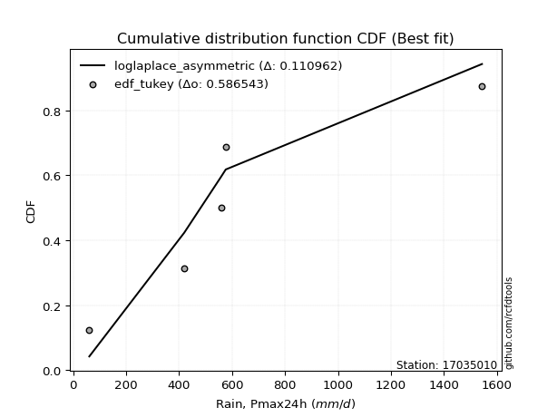</img>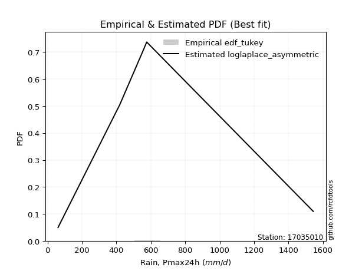</img>

</div>


### 8. EDF Gringorten (1963)

Gringorten plotting position formula is essential for estimating the probability and return periods of extreme events like floods and heavy rainfall. The constant _a=0.44_.

<div align="center">


$P=(m-a)/(n+1-2a)$


</div>


**8.1. Empirical values**

<div align="center">

|                | 0                   | 1                  | 2              | 3                 | 4                  |
|:---------------|:--------------------|:-------------------|:---------------|:------------------|:-------------------|
| date           | 2007                | 2017               | 2018           | 2020              | 2019               |
| x              | 60.7                | 419.2              | 557.8          | 575.9             | 1543.5             |
| m              | 1                   | 2                  | 3              | 4                 | 5                  |
| empirical_dist | edf_gringorten      | edf_gringorten     | edf_gringorten | edf_gringorten    | edf_gringorten     |
| empirical      | 0.10937500000000001 | 0.3046875          | 0.5            | 0.6953125         | 0.8906249999999999 |
| empirical_tr   | 1.1228070175438596  | 1.4382022471910112 | 2.0            | 3.282051282051282 | 9.142857142857133  |

</div>


**8.2. Kolmogorov-Smirnov fit test (sorted by Δ)**


<div align="center">

|                | 0                   | 1                   | 2                   | 3                  | 4                   | 5                   | 6                  | 7                   | 8                  | 9                   | 10                 | 11                 | 12                  | 13                  | 14                 | 15                  | 16                  | 17                 | 18                  | 19                  | 20                  | 21                  | 22                 | 23                  | 24                  | 25                  | 26                 | 27                  | 28                  | 29                  | 30                  | 31                 | 32                 | 33                  | 34                  | 35                  | 36                  | 37                  | 38                 | 39                  | 40                  | 41                  | 42                  | 43                  | 44                  | 45                  | 46                  | 47                  | 48                  | 49                  | 50                  | 51                  | 52                  | 53                  | 54                  | 55                  | 56                  | 57                 | 58                  | 59                  | 60                  | 61                  | 62                  | 63                  | 64                  | 65                  | 66                  | 67                 | 68                 | 69                 | 70                  | 71                  | 72                  | 73                 | 74                  | 75                 | 76                  | 77                 | 78                  | 79                 | 80                  | 81                  | 82                  | 83                  | 84                  | 85                  | 86                  | 87                 | 88                  | 89                  | 90                 | 91                 | 92                  | 93                  | 94                 | 95                 | 96                  | 97                  | 98                  | 99                 | 100                | 101                | 102                | 103                | 104                 | 105                | 106                 | 107                 | 108                 | 109                 | 110                | 111                 | 112                 | 113                 | 114                | 115                 | 116                 | 117                | 118                | 119                 | 120                | 121                 | 122                | 123                | 124                | 125                | 126                | 127                | 128                 | 129                 | 130                 | 131                | 132                 | 133                | 134                | 135                 | 136                | 137                 | 138                 | 139                | 140                 | 141                 | 142                | 143                | 144                | 145                | 146                | 147                | 148                | 149                | 150                | 151                | 152                | 153                | 154                | 155                | 156                | 157                | 158                | 159                |
|:---------------|:--------------------|:--------------------|:--------------------|:-------------------|:--------------------|:--------------------|:-------------------|:--------------------|:-------------------|:--------------------|:-------------------|:-------------------|:--------------------|:--------------------|:-------------------|:--------------------|:--------------------|:-------------------|:--------------------|:--------------------|:--------------------|:--------------------|:-------------------|:--------------------|:--------------------|:--------------------|:-------------------|:--------------------|:--------------------|:--------------------|:--------------------|:-------------------|:-------------------|:--------------------|:--------------------|:--------------------|:--------------------|:--------------------|:-------------------|:--------------------|:--------------------|:--------------------|:--------------------|:--------------------|:--------------------|:--------------------|:--------------------|:--------------------|:--------------------|:--------------------|:--------------------|:--------------------|:--------------------|:--------------------|:--------------------|:--------------------|:--------------------|:-------------------|:--------------------|:--------------------|:--------------------|:--------------------|:--------------------|:--------------------|:--------------------|:--------------------|:--------------------|:-------------------|:-------------------|:-------------------|:--------------------|:--------------------|:--------------------|:-------------------|:--------------------|:-------------------|:--------------------|:-------------------|:--------------------|:-------------------|:--------------------|:--------------------|:--------------------|:--------------------|:--------------------|:--------------------|:--------------------|:-------------------|:--------------------|:--------------------|:-------------------|:-------------------|:--------------------|:--------------------|:-------------------|:-------------------|:--------------------|:--------------------|:--------------------|:-------------------|:-------------------|:-------------------|:-------------------|:-------------------|:--------------------|:-------------------|:--------------------|:--------------------|:--------------------|:--------------------|:-------------------|:--------------------|:--------------------|:--------------------|:-------------------|:--------------------|:--------------------|:-------------------|:-------------------|:--------------------|:-------------------|:--------------------|:-------------------|:-------------------|:-------------------|:-------------------|:-------------------|:-------------------|:--------------------|:--------------------|:--------------------|:-------------------|:--------------------|:-------------------|:-------------------|:--------------------|:-------------------|:--------------------|:--------------------|:-------------------|:--------------------|:--------------------|:-------------------|:-------------------|:-------------------|:-------------------|:-------------------|:-------------------|:-------------------|:-------------------|:-------------------|:-------------------|:-------------------|:-------------------|:-------------------|:-------------------|:-------------------|:-------------------|:-------------------|:-------------------|
| station        | 17035010            | 17035010            | 17035010            | 17035010           | 17035010            | 17035010            | 17035010           | 17035010            | 17035010           | 17035010            | 17035010           | 17035010           | 17035010            | 17035010            | 17035010           | 17035010            | 17035010            | 17035010           | 17035010            | 17035010            | 17035010            | 17035010            | 17035010           | 17035010            | 17035010            | 17035010            | 17035010           | 17035010            | 17035010            | 17035010            | 17035010            | 17035010           | 17035010           | 17035010            | 17035010            | 17035010            | 17035010            | 17035010            | 17035010           | 17035010            | 17035010            | 17035010            | 17035010            | 17035010            | 17035010            | 17035010            | 17035010            | 17035010            | 17035010            | 17035010            | 17035010            | 17035010            | 17035010            | 17035010            | 17035010            | 17035010            | 17035010            | 17035010           | 17035010            | 17035010            | 17035010            | 17035010            | 17035010            | 17035010            | 17035010            | 17035010            | 17035010            | 17035010           | 17035010           | 17035010           | 17035010            | 17035010            | 17035010            | 17035010           | 17035010            | 17035010           | 17035010            | 17035010           | 17035010            | 17035010           | 17035010            | 17035010            | 17035010            | 17035010            | 17035010            | 17035010            | 17035010            | 17035010           | 17035010            | 17035010            | 17035010           | 17035010           | 17035010            | 17035010            | 17035010           | 17035010           | 17035010            | 17035010            | 17035010            | 17035010           | 17035010           | 17035010           | 17035010           | 17035010           | 17035010            | 17035010           | 17035010            | 17035010            | 17035010            | 17035010            | 17035010           | 17035010            | 17035010            | 17035010            | 17035010           | 17035010            | 17035010            | 17035010           | 17035010           | 17035010            | 17035010           | 17035010            | 17035010           | 17035010           | 17035010           | 17035010           | 17035010           | 17035010           | 17035010            | 17035010            | 17035010            | 17035010           | 17035010            | 17035010           | 17035010           | 17035010            | 17035010           | 17035010            | 17035010            | 17035010           | 17035010            | 17035010            | 17035010           | 17035010           | 17035010           | 17035010           | 17035010           | 17035010           | 17035010           | 17035010           | 17035010           | 17035010           | 17035010           | 17035010           | 17035010           | 17035010           | 17035010           | 17035010           | 17035010           | 17035010           |
| empirical_dist | edf_gringorten      | edf_gringorten      | edf_gringorten      | edf_gringorten     | edf_gringorten      | edf_gringorten      | edf_gringorten     | edf_gringorten      | edf_gringorten     | edf_gringorten      | edf_gringorten     | edf_gringorten     | edf_gringorten      | edf_gringorten      | edf_gringorten     | edf_gringorten      | edf_gringorten      | edf_gringorten     | edf_gringorten      | edf_gringorten      | edf_gringorten      | edf_gringorten      | edf_gringorten     | edf_gringorten      | edf_gringorten      | edf_gringorten      | edf_gringorten     | edf_gringorten      | edf_gringorten      | edf_gringorten      | edf_gringorten      | edf_gringorten     | edf_gringorten     | edf_gringorten      | edf_gringorten      | edf_gringorten      | edf_gringorten      | edf_gringorten      | edf_gringorten     | edf_gringorten      | edf_gringorten      | edf_gringorten      | edf_gringorten      | edf_gringorten      | edf_gringorten      | edf_gringorten      | edf_gringorten      | edf_gringorten      | edf_gringorten      | edf_gringorten      | edf_gringorten      | edf_gringorten      | edf_gringorten      | edf_gringorten      | edf_gringorten      | edf_gringorten      | edf_gringorten      | edf_gringorten     | edf_gringorten      | edf_gringorten      | edf_gringorten      | edf_gringorten      | edf_gringorten      | edf_gringorten      | edf_gringorten      | edf_gringorten      | edf_gringorten      | edf_gringorten     | edf_gringorten     | edf_gringorten     | edf_gringorten      | edf_gringorten      | edf_gringorten      | edf_gringorten     | edf_gringorten      | edf_gringorten     | edf_gringorten      | edf_gringorten     | edf_gringorten      | edf_gringorten     | edf_gringorten      | edf_gringorten      | edf_gringorten      | edf_gringorten      | edf_gringorten      | edf_gringorten      | edf_gringorten      | edf_gringorten     | edf_gringorten      | edf_gringorten      | edf_gringorten     | edf_gringorten     | edf_gringorten      | edf_gringorten      | edf_gringorten     | edf_gringorten     | edf_gringorten      | edf_gringorten      | edf_gringorten      | edf_gringorten     | edf_gringorten     | edf_gringorten     | edf_gringorten     | edf_gringorten     | edf_gringorten      | edf_gringorten     | edf_gringorten      | edf_gringorten      | edf_gringorten      | edf_gringorten      | edf_gringorten     | edf_gringorten      | edf_gringorten      | edf_gringorten      | edf_gringorten     | edf_gringorten      | edf_gringorten      | edf_gringorten     | edf_gringorten     | edf_gringorten      | edf_gringorten     | edf_gringorten      | edf_gringorten     | edf_gringorten     | edf_gringorten     | edf_gringorten     | edf_gringorten     | edf_gringorten     | edf_gringorten      | edf_gringorten      | edf_gringorten      | edf_gringorten     | edf_gringorten      | edf_gringorten     | edf_gringorten     | edf_gringorten      | edf_gringorten     | edf_gringorten      | edf_gringorten      | edf_gringorten     | edf_gringorten      | edf_gringorten      | edf_gringorten     | edf_gringorten     | edf_gringorten     | edf_gringorten     | edf_gringorten     | edf_gringorten     | edf_gringorten     | edf_gringorten     | edf_gringorten     | edf_gringorten     | edf_gringorten     | edf_gringorten     | edf_gringorten     | edf_gringorten     | edf_gringorten     | edf_gringorten     | edf_gringorten     | edf_gringorten     |
| p_dist         | logdweibull         | loggennorm          | wald                | kappa3             | mielke              | burr                | johnsonsu          | loggenlogistic      | betaprime          | loggumbel_l         | logburr            | logmielke          | genexpon            | invgamma            | logweibull_min     | logburr12           | nct                 | logskewnorm        | logdgamma           | lomax               | halflogistic        | logpearson3         | exponnorm          | moyal               | dgamma              | logtrapezoid        | logloggamma        | logargus            | logtriang           | truncpareto         | loggompertz         | halfnorm           | foldnorm           | truncexpon          | genlogistic         | bradford            | gumbel_r            | loggenhalflogistic  | logloglaplace      | pearson3            | vonmises_line       | kstwobign           | exponpow            | skewnorm            | gompertz            | rayleigh            | gennorm             | dweibull            | logfoldnorm         | logarcsine          | logsemicircular     | loganglit           | logt                | logcrystalball      | lognorm             | logexponnorm        | loglogistic         | loghypsecant       | lognct              | loglaplace          | loglaplace          | logf                | logfatiguelife      | logerlang           | maxwell             | logbetaprime        | logncf              | logrice            | loggamma           | loggamma           | ncf                 | loginvgamma         | arcsine             | logalpha           | rice                | loginvgauss        | logwrapcauchy       | logmaxwell         | semicircular        | loglevy_l          | anglit              | logbeta             | logcosine           | truncweibull_min    | loginvweibull       | norm                | truncnorm           | t                  | lograyleigh         | logistic            | hypsecant          | logweibull_max     | halfgennorm         | beta                | levy_l             | logjohnsonsb       | logkappa3           | weibull_min         | loggumbel_r         | loggengamma        | laplace            | logkstwobign       | loghalfnorm        | loggausshyper      | loggenextreme       | logksone           | loggenexpon         | gausshyper          | cosine              | lognakagami         | logkappa4          | loguniform          | logvonmises_line    | logmoyal            | wrapcauchy         | logbradford         | loghalflogistic     | f                  | logtruncnorm       | nakagami            | genextreme         | gumbel_l            | kappa4             | loggenpareto       | logexponweib       | ksone              | burr12             | invgauss           | uniform             | genpareto           | argus               | gamma              | logwald             | erlang             | triang             | logtruncexpon       | invweibull         | crystalball         | logjohnsonsu        | loglomax           | alpha               | logtruncweibull_min | genhalflogistic    | rdist              | exponweib          | logrdist           | fatiguelife        | logtukeylambda     | powerlaw           | johnsonsb          | trapezoid          | logexponpow        | tukeylambda        | weibull_max        | logpowerlaw        | logtruncpareto     | gengamma           | loghalfgennorm     | logvonmises        | vonmises           |
| delta          | 0.10011542140214869 | 0.10298690900255725 | 0.11766596583652406 | 0.1275324857349297 | 0.12844264439618558 | 0.12856570211598106 | 0.1287596221779339 | 0.12981901137548335 | 0.1308792880206574 | 0.13147587413652773 | 0.1320919688496796 | 0.1326897655273666 | 0.13303162257398826 | 0.13326026304543426 | 0.1333676831450088 | 0.13511833845950472 | 0.13581003159100447 | 0.1370252663194127 | 0.13755877635009817 | 0.13919894774456754 | 0.13920820908829357 | 0.14289331596455912 | 0.145742333132602  | 0.14718268111367194 | 0.14754609493523285 | 0.15001246896258447 | 0.1551135599095239 | 0.15728236098087356 | 0.15767902245468696 | 0.15918401927767267 | 0.15982864774374161 | 0.1607739257650025 | 0.1635208351192604 | 0.16397344487334808 | 0.16431836073894102 | 0.16653529208368145 | 0.17267226692387305 | 0.17530008571589517 | 0.1757599759702947 | 0.17780202902197906 | 0.18068019188989737 | 0.18413813939080503 | 0.18464610224779543 | 0.18948698351786786 | 0.19036195103370968 | 0.19413531919831228 | 0.19531249988968735 | 0.19531250000504397 | 0.19577612294669244 | 0.19640438359955092 | 0.19685673121570346 | 0.19697085192441222 | 0.19724628805095334 | 0.19724788474141242 | 0.19724790112007817 | 0.19724919664235008 | 0.19751232978298727 | 0.1977381516232255 | 0.19779017856715708 | 0.19873118169132753 | 0.19873118169132753 | 0.19930268519196725 | 0.19988747858603628 | 0.20342446243059886 | 0.20595979074337945 | 0.20647373734065844 | 0.20754008506402966 | 0.207619152306999  | 0.2085176311513829 | 0.2085176311513829 | 0.20941850055175815 | 0.21598288238579733 | 0.22072995207144996 | 0.2213627422023302 | 0.22444632944950688 | 0.2257061003235057 | 0.22863031075042795 | 0.2302198046706937 | 0.23120097510985926 | 0.2312892398865276 | 0.23383545442820114 | 0.23655028678372014 | 0.23953981581912098 | 0.23973591340746614 | 0.24021738118356928 | 0.24022064087468353 | 0.24022064974557467 | 0.2402253653428401 | 0.24118923886141186 | 0.24628701802760256 | 0.2514230368807137 | 0.2547312077885018 | 0.25481901237975213 | 0.25896355141698246 | 0.2595312172505648 | 0.2613087217504535 | 0.26201535162957656 | 0.26290490114575515 | 0.26767836197489314 | 0.2686814951425869 | 0.2690415503708965 | 0.2708375751544482 | 0.2720729611279672 | 0.2729353864801587 | 0.27412788547367406 | 0.2762986878790836 | 0.27817558590219016 | 0.28556038560282415 | 0.28581413783713705 | 0.28960507394970914 | 0.2903089744206193 | 0.29249592545490033 | 0.29253172178017484 | 0.29351164659516216 | 0.2942525040616971 | 0.29453901606560795 | 0.29712415106084733 | 0.3012200740753971 | 0.3046866261312136 | 0.30468746166370064 | 0.3064931983825677 | 0.31049873394338157 | 0.3149575960109888 | 0.3201755532688242 | 0.3220322276050718 | 0.322436859320205  | 0.3282140779879792 | 0.3377974130439878 | 0.34786173118424607 | 0.35668032693842744 | 0.35714772138664286 | 0.3616186897651983 | 0.36534190828056823 | 0.3923877595205023 | 0.3953609534752159 | 0.40120090924525664 | 0.4158979875091671 | 0.42107277176658753 | 0.43092533670656874 | 0.4452694450153768 | 0.44534004014204986 | 0.45198131477659376 | 0.4610213747252395 | 0.5000026370461829 | 0.5102510145434257 | 0.5199597641349801 | 0.5300522161460408 | 0.5431486688018694 | 0.5445802730052207 | 0.554121599759633  | 0.5544349082557226 | 0.5636857553344767 | 0.5726733905460648 | 0.58986670376792   | 0.628172042223399  | 0.6441344379715482 | 0.6953125          | 0.6953125          | 1.1049092358628056 | 245.32419639563986 |
| deltao         | 0.5865427407550001  | 0.5865427407550001  | 0.5865427407550001  | 0.5865427407550001 | 0.5865427407550001  | 0.5865427407550001  | 0.5865427407550001 | 0.5865427407550001  | 0.5865427407550001 | 0.5865427407550001  | 0.5865427407550001 | 0.5865427407550001 | 0.5865427407550001  | 0.5865427407550001  | 0.5865427407550001 | 0.5865427407550001  | 0.5865427407550001  | 0.5865427407550001 | 0.5865427407550001  | 0.5865427407550001  | 0.5865427407550001  | 0.5865427407550001  | 0.5865427407550001 | 0.5865427407550001  | 0.5865427407550001  | 0.5865427407550001  | 0.5865427407550001 | 0.5865427407550001  | 0.5865427407550001  | 0.5865427407550001  | 0.5865427407550001  | 0.5865427407550001 | 0.5865427407550001 | 0.5865427407550001  | 0.5865427407550001  | 0.5865427407550001  | 0.5865427407550001  | 0.5865427407550001  | 0.5865427407550001 | 0.5865427407550001  | 0.5865427407550001  | 0.5865427407550001  | 0.5865427407550001  | 0.5865427407550001  | 0.5865427407550001  | 0.5865427407550001  | 0.5865427407550001  | 0.5865427407550001  | 0.5865427407550001  | 0.5865427407550001  | 0.5865427407550001  | 0.5865427407550001  | 0.5865427407550001  | 0.5865427407550001  | 0.5865427407550001  | 0.5865427407550001  | 0.5865427407550001  | 0.5865427407550001 | 0.5865427407550001  | 0.5865427407550001  | 0.5865427407550001  | 0.5865427407550001  | 0.5865427407550001  | 0.5865427407550001  | 0.5865427407550001  | 0.5865427407550001  | 0.5865427407550001  | 0.5865427407550001 | 0.5865427407550001 | 0.5865427407550001 | 0.5865427407550001  | 0.5865427407550001  | 0.5865427407550001  | 0.5865427407550001 | 0.5865427407550001  | 0.5865427407550001 | 0.5865427407550001  | 0.5865427407550001 | 0.5865427407550001  | 0.5865427407550001 | 0.5865427407550001  | 0.5865427407550001  | 0.5865427407550001  | 0.5865427407550001  | 0.5865427407550001  | 0.5865427407550001  | 0.5865427407550001  | 0.5865427407550001 | 0.5865427407550001  | 0.5865427407550001  | 0.5865427407550001 | 0.5865427407550001 | 0.5865427407550001  | 0.5865427407550001  | 0.5865427407550001 | 0.5865427407550001 | 0.5865427407550001  | 0.5865427407550001  | 0.5865427407550001  | 0.5865427407550001 | 0.5865427407550001 | 0.5865427407550001 | 0.5865427407550001 | 0.5865427407550001 | 0.5865427407550001  | 0.5865427407550001 | 0.5865427407550001  | 0.5865427407550001  | 0.5865427407550001  | 0.5865427407550001  | 0.5865427407550001 | 0.5865427407550001  | 0.5865427407550001  | 0.5865427407550001  | 0.5865427407550001 | 0.5865427407550001  | 0.5865427407550001  | 0.5865427407550001 | 0.5865427407550001 | 0.5865427407550001  | 0.5865427407550001 | 0.5865427407550001  | 0.5865427407550001 | 0.5865427407550001 | 0.5865427407550001 | 0.5865427407550001 | 0.5865427407550001 | 0.5865427407550001 | 0.5865427407550001  | 0.5865427407550001  | 0.5865427407550001  | 0.5865427407550001 | 0.5865427407550001  | 0.5865427407550001 | 0.5865427407550001 | 0.5865427407550001  | 0.5865427407550001 | 0.5865427407550001  | 0.5865427407550001  | 0.5865427407550001 | 0.5865427407550001  | 0.5865427407550001  | 0.5865427407550001 | 0.5865427407550001 | 0.5865427407550001 | 0.5865427407550001 | 0.5865427407550001 | 0.5865427407550001 | 0.5865427407550001 | 0.5865427407550001 | 0.5865427407550001 | 0.5865427407550001 | 0.5865427407550001 | 0.5865427407550001 | 0.5865427407550001 | 0.5865427407550001 | 0.5865427407550001 | 0.5865427407550001 | 0.5865427407550001 | 0.5865427407550001 |
| eval           | Δo > Δ              | Δo > Δ              | Δo > Δ              | Δo > Δ             | Δo > Δ              | Δo > Δ              | Δo > Δ             | Δo > Δ              | Δo > Δ             | Δo > Δ              | Δo > Δ             | Δo > Δ             | Δo > Δ              | Δo > Δ              | Δo > Δ             | Δo > Δ              | Δo > Δ              | Δo > Δ             | Δo > Δ              | Δo > Δ              | Δo > Δ              | Δo > Δ              | Δo > Δ             | Δo > Δ              | Δo > Δ              | Δo > Δ              | Δo > Δ             | Δo > Δ              | Δo > Δ              | Δo > Δ              | Δo > Δ              | Δo > Δ             | Δo > Δ             | Δo > Δ              | Δo > Δ              | Δo > Δ              | Δo > Δ              | Δo > Δ              | Δo > Δ             | Δo > Δ              | Δo > Δ              | Δo > Δ              | Δo > Δ              | Δo > Δ              | Δo > Δ              | Δo > Δ              | Δo > Δ              | Δo > Δ              | Δo > Δ              | Δo > Δ              | Δo > Δ              | Δo > Δ              | Δo > Δ              | Δo > Δ              | Δo > Δ              | Δo > Δ              | Δo > Δ              | Δo > Δ             | Δo > Δ              | Δo > Δ              | Δo > Δ              | Δo > Δ              | Δo > Δ              | Δo > Δ              | Δo > Δ              | Δo > Δ              | Δo > Δ              | Δo > Δ             | Δo > Δ             | Δo > Δ             | Δo > Δ              | Δo > Δ              | Δo > Δ              | Δo > Δ             | Δo > Δ              | Δo > Δ             | Δo > Δ              | Δo > Δ             | Δo > Δ              | Δo > Δ             | Δo > Δ              | Δo > Δ              | Δo > Δ              | Δo > Δ              | Δo > Δ              | Δo > Δ              | Δo > Δ              | Δo > Δ             | Δo > Δ              | Δo > Δ              | Δo > Δ             | Δo > Δ             | Δo > Δ              | Δo > Δ              | Δo > Δ             | Δo > Δ             | Δo > Δ              | Δo > Δ              | Δo > Δ              | Δo > Δ             | Δo > Δ             | Δo > Δ             | Δo > Δ             | Δo > Δ             | Δo > Δ              | Δo > Δ             | Δo > Δ              | Δo > Δ              | Δo > Δ              | Δo > Δ              | Δo > Δ             | Δo > Δ              | Δo > Δ              | Δo > Δ              | Δo > Δ             | Δo > Δ              | Δo > Δ              | Δo > Δ             | Δo > Δ             | Δo > Δ              | Δo > Δ             | Δo > Δ              | Δo > Δ             | Δo > Δ             | Δo > Δ             | Δo > Δ             | Δo > Δ             | Δo > Δ             | Δo > Δ              | Δo > Δ              | Δo > Δ              | Δo > Δ             | Δo > Δ              | Δo > Δ             | Δo > Δ             | Δo > Δ              | Δo > Δ             | Δo > Δ              | Δo > Δ              | Δo > Δ             | Δo > Δ              | Δo > Δ              | Δo > Δ             | Δo > Δ             | Δo > Δ             | Δo > Δ             | Δo > Δ             | Δo > Δ             | Δo > Δ             | Δo > Δ             | Δo > Δ             | Δo > Δ             | Δo > Δ             | Δo <= Δ            | Δo <= Δ            | Δo <= Δ            | Δo <= Δ            | Δo <= Δ            | Δo <= Δ            | Δo <= Δ            |
| fit            | 1                   | 1                   | 1                   | 1                  | 1                   | 1                   | 1                  | 1                   | 1                  | 1                   | 1                  | 1                  | 1                   | 1                   | 1                  | 1                   | 1                   | 1                  | 1                   | 1                   | 1                   | 1                   | 1                  | 1                   | 1                   | 1                   | 1                  | 1                   | 1                   | 1                   | 1                   | 1                  | 1                  | 1                   | 1                   | 1                   | 1                   | 1                   | 1                  | 1                   | 1                   | 1                   | 1                   | 1                   | 1                   | 1                   | 1                   | 1                   | 1                   | 1                   | 1                   | 1                   | 1                   | 1                   | 1                   | 1                   | 1                   | 1                  | 1                   | 1                   | 1                   | 1                   | 1                   | 1                   | 1                   | 1                   | 1                   | 1                  | 1                  | 1                  | 1                   | 1                   | 1                   | 1                  | 1                   | 1                  | 1                   | 1                  | 1                   | 1                  | 1                   | 1                   | 1                   | 1                   | 1                   | 1                   | 1                   | 1                  | 1                   | 1                   | 1                  | 1                  | 1                   | 1                   | 1                  | 1                  | 1                   | 1                   | 1                   | 1                  | 1                  | 1                  | 1                  | 1                  | 1                   | 1                  | 1                   | 1                   | 1                   | 1                   | 1                  | 1                   | 1                   | 1                   | 1                  | 1                   | 1                   | 1                  | 1                  | 1                   | 1                  | 1                   | 1                  | 1                  | 1                  | 1                  | 1                  | 1                  | 1                   | 1                   | 1                   | 1                  | 1                   | 1                  | 1                  | 1                   | 1                  | 1                   | 1                   | 1                  | 1                   | 1                   | 1                  | 1                  | 1                  | 1                  | 1                  | 1                  | 1                  | 1                  | 1                  | 1                  | 1                  | 0                  | 0                  | 0                  | 0                  | 0                  | 0                  | 0                  |
| n              | 5                   | 5                   | 5                   | 5                  | 5                   | 5                   | 5                  | 5                   | 5                  | 5                   | 5                  | 5                  | 5                   | 5                   | 5                  | 5                   | 5                   | 5                  | 5                   | 5                   | 5                   | 5                   | 5                  | 5                   | 5                   | 5                   | 5                  | 5                   | 5                   | 5                   | 5                   | 5                  | 5                  | 5                   | 5                   | 5                   | 5                   | 5                   | 5                  | 5                   | 5                   | 5                   | 5                   | 5                   | 5                   | 5                   | 5                   | 5                   | 5                   | 5                   | 5                   | 5                   | 5                   | 5                   | 5                   | 5                   | 5                   | 5                  | 5                   | 5                   | 5                   | 5                   | 5                   | 5                   | 5                   | 5                   | 5                   | 5                  | 5                  | 5                  | 5                   | 5                   | 5                   | 5                  | 5                   | 5                  | 5                   | 5                  | 5                   | 5                  | 5                   | 5                   | 5                   | 5                   | 5                   | 5                   | 5                   | 5                  | 5                   | 5                   | 5                  | 5                  | 5                   | 5                   | 5                  | 5                  | 5                   | 5                   | 5                   | 5                  | 5                  | 5                  | 5                  | 5                  | 5                   | 5                  | 5                   | 5                   | 5                   | 5                   | 5                  | 5                   | 5                   | 5                   | 5                  | 5                   | 5                   | 5                  | 5                  | 5                   | 5                  | 5                   | 5                  | 5                  | 5                  | 5                  | 5                  | 5                  | 5                   | 5                   | 5                   | 5                  | 5                   | 5                  | 5                  | 5                   | 5                  | 5                   | 5                   | 5                  | 5                   | 5                   | 5                  | 5                  | 5                  | 5                  | 5                  | 5                  | 5                  | 5                  | 5                  | 5                  | 5                  | 5                  | 5                  | 5                  | 5                  | 5                  | 5                  | 5                  |
| best_fit       | 1                   | 0                   | 0                   | 0                  | 0                   | 0                   | 0                  | 0                   | 0                  | 0                   | 0                  | 0                  | 0                   | 0                   | 0                  | 0                   | 0                   | 0                  | 0                   | 0                   | 0                   | 0                   | 0                  | 0                   | 0                   | 0                   | 0                  | 0                   | 0                   | 0                   | 0                   | 0                  | 0                  | 0                   | 0                   | 0                   | 0                   | 0                   | 0                  | 0                   | 0                   | 0                   | 0                   | 0                   | 0                   | 0                   | 0                   | 0                   | 0                   | 0                   | 0                   | 0                   | 0                   | 0                   | 0                   | 0                   | 0                   | 0                  | 0                   | 0                   | 0                   | 0                   | 0                   | 0                   | 0                   | 0                   | 0                   | 0                  | 0                  | 0                  | 0                   | 0                   | 0                   | 0                  | 0                   | 0                  | 0                   | 0                  | 0                   | 0                  | 0                   | 0                   | 0                   | 0                   | 0                   | 0                   | 0                   | 0                  | 0                   | 0                   | 0                  | 0                  | 0                   | 0                   | 0                  | 0                  | 0                   | 0                   | 0                   | 0                  | 0                  | 0                  | 0                  | 0                  | 0                   | 0                  | 0                   | 0                   | 0                   | 0                   | 0                  | 0                   | 0                   | 0                   | 0                  | 0                   | 0                   | 0                  | 0                  | 0                   | 0                  | 0                   | 0                  | 0                  | 0                  | 0                  | 0                  | 0                  | 0                   | 0                   | 0                   | 0                  | 0                   | 0                  | 0                  | 0                   | 0                  | 0                   | 0                   | 0                  | 0                   | 0                   | 0                  | 0                  | 0                  | 0                  | 0                  | 0                  | 0                  | 0                  | 0                  | 0                  | 0                  | 0                  | 0                  | 0                  | 0                  | 0                  | 0                  | 0                  |
| best_fit_sort  | 1                   | 2                   | 3                   | 4                  | 5                   | 6                   | 7                  | 8                   | 9                  | 10                  | 11                 | 12                 | 13                  | 14                  | 15                 | 16                  | 17                  | 18                 | 19                  | 20                  | 21                  | 22                  | 23                 | 24                  | 25                  | 26                  | 27                 | 28                  | 29                  | 30                  | 31                  | 32                 | 33                 | 34                  | 35                  | 36                  | 37                  | 38                  | 39                 | 40                  | 41                  | 42                  | 43                  | 44                  | 45                  | 46                  | 47                  | 48                  | 49                  | 50                  | 51                  | 52                  | 53                  | 54                  | 55                  | 56                  | 57                  | 58                 | 59                  | 60                  | 61                  | 62                  | 63                  | 64                  | 65                  | 66                  | 67                  | 68                 | 69                 | 70                 | 71                  | 72                  | 73                  | 74                 | 75                  | 76                 | 77                  | 78                 | 79                  | 80                 | 81                  | 82                  | 83                  | 84                  | 85                  | 86                  | 87                  | 88                 | 89                  | 90                  | 91                 | 92                 | 93                  | 94                  | 95                 | 96                 | 97                  | 98                  | 99                  | 100                | 101                | 102                | 103                | 104                | 105                 | 106                | 107                 | 108                 | 109                 | 110                 | 111                | 112                 | 113                 | 114                 | 115                | 116                 | 117                 | 118                | 119                | 120                 | 121                | 122                 | 123                | 124                | 125                | 126                | 127                | 128                | 129                 | 130                 | 131                 | 132                | 133                 | 134                | 135                | 136                 | 137                | 138                 | 139                 | 140                | 141                 | 142                 | 143                | 144                | 145                | 146                | 147                | 148                | 149                | 150                | 151                | 152                | 153                | 154                | 155                | 156                | 157                | 158                | 159                | 160                |

</div>


**8.3. Best fit**

<div align="center">

|   id |   station | empirical_dist   | p_dist      |    delta |   deltao | eval   |   fit |   n |   best_fit |   best_fit_sort |
|-----:|----------:|:-----------------|:------------|---------:|---------:|:-------|------:|----:|-----------:|----------------:|
|    0 |  17035010 | edf_gringorten   | logdweibull | 0.100115 | 0.586543 | Δo > Δ |     1 |   5 |          1 |               1 |

</div>


<div align="center">

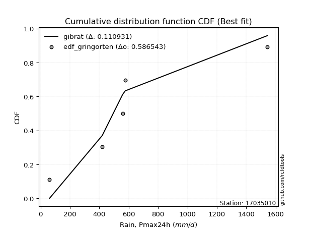</img>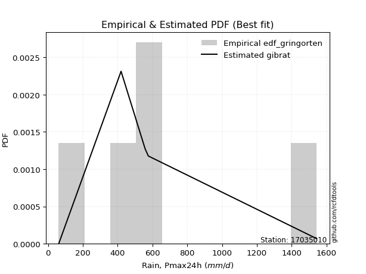</img>

</div>


### 9. EDF Filliben (1975)

The specific values of the constants (0.3175) (often denoted as $alpha$) and (0.365) are derived from a method proposed by James J. Filliben in a 1975 paper. This particular formula is the mean value of the $i$-th order statistic of the normal distribution and is considered a robust and effective plotting position formula for the normal probability plot correlation coefficient test for normality.

<div align="center">


$P=(m-0.3175)/(n+0.365)$


</div>


**9.1. Empirical values**

<div align="center">

|                | 0                   | 1                  | 2            | 3                  | 4                  |
|:---------------|:--------------------|:-------------------|:-------------|:-------------------|:-------------------|
| date           | 2007                | 2017               | 2018         | 2020               | 2019               |
| x              | 60.7                | 419.2              | 557.8        | 575.9              | 1543.5             |
| m              | 1                   | 2                  | 3            | 4                  | 5                  |
| empirical_dist | edf_filliben        | edf_filliben       | edf_filliben | edf_filliben       | edf_filliben       |
| empirical      | 0.12721342031686858 | 0.3136067101584343 | 0.5          | 0.6863932898415657 | 0.8727865796831314 |
| empirical_tr   | 1.1457554725040042  | 1.456890699253225  | 2.0          | 3.188707280832095  | 7.860805860805863  |

</div>


**9.2. Kolmogorov-Smirnov fit test (sorted by Δ)**


<div align="center">

|                | 0                   | 1                   | 2                   | 3                   | 4                   | 5                   | 6                   | 7                  | 8                   | 9                   | 10                  | 11                  | 12                  | 13                  | 14                  | 15                  | 16                  | 17                  | 18                  | 19                  | 20                  | 21                  | 22                  | 23                 | 24                  | 25                  | 26                  | 27                  | 28                  | 29                 | 30                  | 31                  | 32                  | 33                  | 34                  | 35                  | 36                  | 37                  | 38                  | 39                  | 40                  | 41                 | 42                 | 43                  | 44                  | 45                  | 46                  | 47                  | 48                  | 49                  | 50                  | 51                  | 52                  | 53                  | 54                 | 55                 | 56                 | 57                  | 58                 | 59                  | 60                  | 61                  | 62                 | 63                  | 64                 | 65                  | 66                  | 67                  | 68                 | 69                 | 70                  | 71                  | 72                  | 73                  | 74                  | 75                 | 76                  | 77                  | 78                  | 79                  | 80                 | 81                 | 82                 | 83                 | 84                 | 85                 | 86                  | 87                  | 88                  | 89                  | 90                  | 91                  | 92                  | 93                  | 94                  | 95                 | 96                 | 97                 | 98                  | 99                 | 100                 | 101                | 102                | 103                | 104                 | 105                 | 106                | 107                | 108                | 109                 | 110                 | 111                 | 112                | 113                | 114                | 115                 | 116                 | 117                | 118                 | 119                 | 120                | 121                | 122                | 123                 | 124                | 125                | 126                | 127                 | 128                 | 129                | 130                | 131                | 132                 | 133                 | 134                 | 135                 | 136                | 137                | 138                 | 139                 | 140                | 141                 | 142                | 143                | 144                | 145                | 146                | 147                | 148                | 149                | 150                | 151                | 152                | 153                | 154                | 155                | 156                | 157                | 158                | 159                |
|:---------------|:--------------------|:--------------------|:--------------------|:--------------------|:--------------------|:--------------------|:--------------------|:-------------------|:--------------------|:--------------------|:--------------------|:--------------------|:--------------------|:--------------------|:--------------------|:--------------------|:--------------------|:--------------------|:--------------------|:--------------------|:--------------------|:--------------------|:--------------------|:-------------------|:--------------------|:--------------------|:--------------------|:--------------------|:--------------------|:-------------------|:--------------------|:--------------------|:--------------------|:--------------------|:--------------------|:--------------------|:--------------------|:--------------------|:--------------------|:--------------------|:--------------------|:-------------------|:-------------------|:--------------------|:--------------------|:--------------------|:--------------------|:--------------------|:--------------------|:--------------------|:--------------------|:--------------------|:--------------------|:--------------------|:-------------------|:-------------------|:-------------------|:--------------------|:-------------------|:--------------------|:--------------------|:--------------------|:-------------------|:--------------------|:-------------------|:--------------------|:--------------------|:--------------------|:-------------------|:-------------------|:--------------------|:--------------------|:--------------------|:--------------------|:--------------------|:-------------------|:--------------------|:--------------------|:--------------------|:--------------------|:-------------------|:-------------------|:-------------------|:-------------------|:-------------------|:-------------------|:--------------------|:--------------------|:--------------------|:--------------------|:--------------------|:--------------------|:--------------------|:--------------------|:--------------------|:-------------------|:-------------------|:-------------------|:--------------------|:-------------------|:--------------------|:-------------------|:-------------------|:-------------------|:--------------------|:--------------------|:-------------------|:-------------------|:-------------------|:--------------------|:--------------------|:--------------------|:-------------------|:-------------------|:-------------------|:--------------------|:--------------------|:-------------------|:--------------------|:--------------------|:-------------------|:-------------------|:-------------------|:--------------------|:-------------------|:-------------------|:-------------------|:--------------------|:--------------------|:-------------------|:-------------------|:-------------------|:--------------------|:--------------------|:--------------------|:--------------------|:-------------------|:-------------------|:--------------------|:--------------------|:-------------------|:--------------------|:-------------------|:-------------------|:-------------------|:-------------------|:-------------------|:-------------------|:-------------------|:-------------------|:-------------------|:-------------------|:-------------------|:-------------------|:-------------------|:-------------------|:-------------------|:-------------------|:-------------------|:-------------------|
| station        | 17035010            | 17035010            | 17035010            | 17035010            | 17035010            | 17035010            | 17035010            | 17035010           | 17035010            | 17035010            | 17035010            | 17035010            | 17035010            | 17035010            | 17035010            | 17035010            | 17035010            | 17035010            | 17035010            | 17035010            | 17035010            | 17035010            | 17035010            | 17035010           | 17035010            | 17035010            | 17035010            | 17035010            | 17035010            | 17035010           | 17035010            | 17035010            | 17035010            | 17035010            | 17035010            | 17035010            | 17035010            | 17035010            | 17035010            | 17035010            | 17035010            | 17035010           | 17035010           | 17035010            | 17035010            | 17035010            | 17035010            | 17035010            | 17035010            | 17035010            | 17035010            | 17035010            | 17035010            | 17035010            | 17035010           | 17035010           | 17035010           | 17035010            | 17035010           | 17035010            | 17035010            | 17035010            | 17035010           | 17035010            | 17035010           | 17035010            | 17035010            | 17035010            | 17035010           | 17035010           | 17035010            | 17035010            | 17035010            | 17035010            | 17035010            | 17035010           | 17035010            | 17035010            | 17035010            | 17035010            | 17035010           | 17035010           | 17035010           | 17035010           | 17035010           | 17035010           | 17035010            | 17035010            | 17035010            | 17035010            | 17035010            | 17035010            | 17035010            | 17035010            | 17035010            | 17035010           | 17035010           | 17035010           | 17035010            | 17035010           | 17035010            | 17035010           | 17035010           | 17035010           | 17035010            | 17035010            | 17035010           | 17035010           | 17035010           | 17035010            | 17035010            | 17035010            | 17035010           | 17035010           | 17035010           | 17035010            | 17035010            | 17035010           | 17035010            | 17035010            | 17035010           | 17035010           | 17035010           | 17035010            | 17035010           | 17035010           | 17035010           | 17035010            | 17035010            | 17035010           | 17035010           | 17035010           | 17035010            | 17035010            | 17035010            | 17035010            | 17035010           | 17035010           | 17035010            | 17035010            | 17035010           | 17035010            | 17035010           | 17035010           | 17035010           | 17035010           | 17035010           | 17035010           | 17035010           | 17035010           | 17035010           | 17035010           | 17035010           | 17035010           | 17035010           | 17035010           | 17035010           | 17035010           | 17035010           | 17035010           |
| empirical_dist | edf_filliben        | edf_filliben        | edf_filliben        | edf_filliben        | edf_filliben        | edf_filliben        | edf_filliben        | edf_filliben       | edf_filliben        | edf_filliben        | edf_filliben        | edf_filliben        | edf_filliben        | edf_filliben        | edf_filliben        | edf_filliben        | edf_filliben        | edf_filliben        | edf_filliben        | edf_filliben        | edf_filliben        | edf_filliben        | edf_filliben        | edf_filliben       | edf_filliben        | edf_filliben        | edf_filliben        | edf_filliben        | edf_filliben        | edf_filliben       | edf_filliben        | edf_filliben        | edf_filliben        | edf_filliben        | edf_filliben        | edf_filliben        | edf_filliben        | edf_filliben        | edf_filliben        | edf_filliben        | edf_filliben        | edf_filliben       | edf_filliben       | edf_filliben        | edf_filliben        | edf_filliben        | edf_filliben        | edf_filliben        | edf_filliben        | edf_filliben        | edf_filliben        | edf_filliben        | edf_filliben        | edf_filliben        | edf_filliben       | edf_filliben       | edf_filliben       | edf_filliben        | edf_filliben       | edf_filliben        | edf_filliben        | edf_filliben        | edf_filliben       | edf_filliben        | edf_filliben       | edf_filliben        | edf_filliben        | edf_filliben        | edf_filliben       | edf_filliben       | edf_filliben        | edf_filliben        | edf_filliben        | edf_filliben        | edf_filliben        | edf_filliben       | edf_filliben        | edf_filliben        | edf_filliben        | edf_filliben        | edf_filliben       | edf_filliben       | edf_filliben       | edf_filliben       | edf_filliben       | edf_filliben       | edf_filliben        | edf_filliben        | edf_filliben        | edf_filliben        | edf_filliben        | edf_filliben        | edf_filliben        | edf_filliben        | edf_filliben        | edf_filliben       | edf_filliben       | edf_filliben       | edf_filliben        | edf_filliben       | edf_filliben        | edf_filliben       | edf_filliben       | edf_filliben       | edf_filliben        | edf_filliben        | edf_filliben       | edf_filliben       | edf_filliben       | edf_filliben        | edf_filliben        | edf_filliben        | edf_filliben       | edf_filliben       | edf_filliben       | edf_filliben        | edf_filliben        | edf_filliben       | edf_filliben        | edf_filliben        | edf_filliben       | edf_filliben       | edf_filliben       | edf_filliben        | edf_filliben       | edf_filliben       | edf_filliben       | edf_filliben        | edf_filliben        | edf_filliben       | edf_filliben       | edf_filliben       | edf_filliben        | edf_filliben        | edf_filliben        | edf_filliben        | edf_filliben       | edf_filliben       | edf_filliben        | edf_filliben        | edf_filliben       | edf_filliben        | edf_filliben       | edf_filliben       | edf_filliben       | edf_filliben       | edf_filliben       | edf_filliben       | edf_filliben       | edf_filliben       | edf_filliben       | edf_filliben       | edf_filliben       | edf_filliben       | edf_filliben       | edf_filliben       | edf_filliben       | edf_filliben       | edf_filliben       | edf_filliben       |
| p_dist         | logdweibull         | loggennorm          | mielke              | burr                | johnsonsu           | loggenlogistic      | betaprime           | loggumbel_l        | logburr             | logmielke           | invgamma            | logweibull_min      | logburr12           | genexpon            | nct                 | kappa3              | wald                | logskewnorm         | logdgamma           | lomax               | halflogistic        | logpearson3         | exponnorm           | moyal              | dgamma              | logtrapezoid        | logloggamma         | logargus            | logtriang           | truncpareto        | loggompertz         | halfnorm            | foldnorm            | truncexpon          | genlogistic         | bradford            | gumbel_r            | loggenhalflogistic  | logloglaplace       | pearson3            | vonmises_line       | kstwobign          | exponpow           | skewnorm            | gompertz            | rayleigh            | gennorm             | dweibull            | logfoldnorm         | logarcsine          | logsemicircular     | loganglit           | logt                | logcrystalball      | lognorm            | logexponnorm       | loglogistic        | loghypsecant        | lognct             | loglaplace          | loglaplace          | logf                | logfatiguelife     | logerlang           | maxwell            | logbetaprime        | logncf              | logrice             | loggamma           | loggamma           | ncf                 | loginvgamma         | arcsine             | logalpha            | rice                | loginvgauss        | logwrapcauchy       | logmaxwell          | semicircular        | loglevy_l           | anglit             | logbeta            | logcosine          | truncweibull_min   | loginvweibull      | norm               | truncnorm           | t                   | lograyleigh         | logistic            | hypsecant           | logjohnsonsb        | logweibull_max      | halfgennorm         | beta                | levy_l             | logkappa3          | weibull_min        | loggumbel_r         | loggengamma        | laplace             | logkstwobign       | loghalfnorm        | loggausshyper      | loggenextreme       | logksone            | loggenexpon        | gausshyper         | cosine             | logkappa4           | loguniform          | logvonmises_line    | logmoyal           | wrapcauchy         | logbradford        | loghalflogistic     | lognakagami         | f                  | genextreme          | gumbel_l            | kappa4             | loggenpareto       | logexponweib       | ksone               | logtruncnorm       | nakagami           | burr12             | invgauss            | uniform             | genpareto          | argus              | gamma              | logwald             | erlang              | triang              | logtruncexpon       | invweibull         | crystalball        | loglomax            | logjohnsonsu        | alpha              | logtruncweibull_min | genhalflogistic    | rdist              | exponweib          | logrdist           | fatiguelife        | logtukeylambda     | powerlaw           | johnsonsb          | trapezoid          | logexponpow        | tukeylambda        | weibull_max        | logpowerlaw        | logtruncpareto     | gengamma           | loghalfgennorm     | logvonmises        | vonmises           |
| delta          | 0.09119621124371435 | 0.11190611916099152 | 0.11952343423775125 | 0.11964649195754673 | 0.11984041201949958 | 0.12089980121704902 | 0.12196007786222313 | 0.1225566639780934 | 0.12317275869124533 | 0.12377055536893233 | 0.12434105288699993 | 0.12444847298657447 | 0.12619912830107038 | 0.12683615437185478 | 0.12689082143257013 | 0.12721342031668523 | 0.12721342031686858 | 0.12810605616097837 | 0.12863956619166383 | 0.13027973758613326 | 0.13028899892985923 | 0.13397410580612484 | 0.13682312297416765 | 0.1382634709552376 | 0.13862688477679852 | 0.14109325880415013 | 0.14619434975108958 | 0.14836315082243923 | 0.14875981229625268 | 0.1502648091192384 | 0.15090943758530734 | 0.15185471560656816 | 0.15460162496082608 | 0.15505423471491375 | 0.15539915058050668 | 0.15761608192524712 | 0.16375305676543872 | 0.16638087555746084 | 0.16684076581186036 | 0.16888281886354473 | 0.17176098173146304 | 0.1752189292323707 | 0.1757268920893611 | 0.18056777335943353 | 0.18144274087527534 | 0.18521610903987795 | 0.18639328973125302 | 0.18639328984660963 | 0.18685691278825817 | 0.18748517344111665 | 0.18793752105726919 | 0.18805164176597794 | 0.18832707789251907 | 0.18832867458297814 | 0.1883286909616439 | 0.1883299864839158 | 0.188593119624553  | 0.18881894146479122 | 0.1888709684087228 | 0.18981197153289325 | 0.18981197153289325 | 0.19038347503353298 | 0.190968268427602  | 0.19450525227216459 | 0.1970405805849451 | 0.19755452718222416 | 0.19862087490559538 | 0.19869994214856473 | 0.1995984209929486 | 0.1995984209929486 | 0.20049929039332387 | 0.20706367222736305 | 0.21181074191301563 | 0.21244353204389593 | 0.21552711929107254 | 0.2167868901650714 | 0.21971110059199367 | 0.22130059451225942 | 0.22228176495142493 | 0.22237002972809328 | 0.2249162442697668 | 0.2276310766252858 | 0.2306206056606867 | 0.2308167032490318 | 0.231298171025135  | 0.2313014307162492 | 0.23130143958714033 | 0.23130615518440578 | 0.23227002870297758 | 0.23736780786916822 | 0.24250382672227938 | 0.24347030143358492 | 0.24581199763006745 | 0.24589980222131785 | 0.25004434125854813 | 0.2506120070921305 | 0.2530961414711423 | 0.2539856909873209 | 0.25875915181645887 | 0.2597622849841526 | 0.26012234021246217 | 0.2619183649960139 | 0.2631537509695329 | 0.2640161763217244 | 0.26520867531523973 | 0.26737947772064935 | 0.2692563757437559 | 0.2766411754443898 | 0.2768949276787027 | 0.28138976426218504 | 0.28357671529646605 | 0.28361251162174056 | 0.2845924364367279 | 0.2853332939032628 | 0.2856198059071737 | 0.28820494090241305 | 0.28960507394970914 | 0.2923008639169628 | 0.29757398822413345 | 0.30157952378494723 | 0.3060383858525545 | 0.3112563431103899 | 0.3131130174466375 | 0.31351764916177066 | 0.3136058362896479 | 0.3136066718221349 | 0.3192948678295449 | 0.32887820288555353 | 0.33894252102581174 | 0.3477611167799931 | 0.3482285112282085 | 0.352699479606764  | 0.35642269812213395 | 0.38346854936206803 | 0.38644174331678155 | 0.39228169908682237 | 0.3980595671922987 | 0.403234351449719  | 0.42743102469850836 | 0.43092533670656874 | 0.4364208299836156 | 0.4430621046181595  | 0.4521021645668052 | 0.4910834268877486 | 0.5013318043849915 | 0.5110405539765459 | 0.5211330059876065 | 0.5342294586434351 | 0.5356610628467864 | 0.5452023896011988 | 0.5455156980972883 | 0.5547665451760424 | 0.5637541803876305 | 0.5809474936094857 | 0.6192528320649646 | 0.635215227813114  | 0.6863932898415657 | 0.6863932898415657 | 1.0959900257043713 | 245.34203481595674 |
| deltao         | 0.5865427407550001  | 0.5865427407550001  | 0.5865427407550001  | 0.5865427407550001  | 0.5865427407550001  | 0.5865427407550001  | 0.5865427407550001  | 0.5865427407550001 | 0.5865427407550001  | 0.5865427407550001  | 0.5865427407550001  | 0.5865427407550001  | 0.5865427407550001  | 0.5865427407550001  | 0.5865427407550001  | 0.5865427407550001  | 0.5865427407550001  | 0.5865427407550001  | 0.5865427407550001  | 0.5865427407550001  | 0.5865427407550001  | 0.5865427407550001  | 0.5865427407550001  | 0.5865427407550001 | 0.5865427407550001  | 0.5865427407550001  | 0.5865427407550001  | 0.5865427407550001  | 0.5865427407550001  | 0.5865427407550001 | 0.5865427407550001  | 0.5865427407550001  | 0.5865427407550001  | 0.5865427407550001  | 0.5865427407550001  | 0.5865427407550001  | 0.5865427407550001  | 0.5865427407550001  | 0.5865427407550001  | 0.5865427407550001  | 0.5865427407550001  | 0.5865427407550001 | 0.5865427407550001 | 0.5865427407550001  | 0.5865427407550001  | 0.5865427407550001  | 0.5865427407550001  | 0.5865427407550001  | 0.5865427407550001  | 0.5865427407550001  | 0.5865427407550001  | 0.5865427407550001  | 0.5865427407550001  | 0.5865427407550001  | 0.5865427407550001 | 0.5865427407550001 | 0.5865427407550001 | 0.5865427407550001  | 0.5865427407550001 | 0.5865427407550001  | 0.5865427407550001  | 0.5865427407550001  | 0.5865427407550001 | 0.5865427407550001  | 0.5865427407550001 | 0.5865427407550001  | 0.5865427407550001  | 0.5865427407550001  | 0.5865427407550001 | 0.5865427407550001 | 0.5865427407550001  | 0.5865427407550001  | 0.5865427407550001  | 0.5865427407550001  | 0.5865427407550001  | 0.5865427407550001 | 0.5865427407550001  | 0.5865427407550001  | 0.5865427407550001  | 0.5865427407550001  | 0.5865427407550001 | 0.5865427407550001 | 0.5865427407550001 | 0.5865427407550001 | 0.5865427407550001 | 0.5865427407550001 | 0.5865427407550001  | 0.5865427407550001  | 0.5865427407550001  | 0.5865427407550001  | 0.5865427407550001  | 0.5865427407550001  | 0.5865427407550001  | 0.5865427407550001  | 0.5865427407550001  | 0.5865427407550001 | 0.5865427407550001 | 0.5865427407550001 | 0.5865427407550001  | 0.5865427407550001 | 0.5865427407550001  | 0.5865427407550001 | 0.5865427407550001 | 0.5865427407550001 | 0.5865427407550001  | 0.5865427407550001  | 0.5865427407550001 | 0.5865427407550001 | 0.5865427407550001 | 0.5865427407550001  | 0.5865427407550001  | 0.5865427407550001  | 0.5865427407550001 | 0.5865427407550001 | 0.5865427407550001 | 0.5865427407550001  | 0.5865427407550001  | 0.5865427407550001 | 0.5865427407550001  | 0.5865427407550001  | 0.5865427407550001 | 0.5865427407550001 | 0.5865427407550001 | 0.5865427407550001  | 0.5865427407550001 | 0.5865427407550001 | 0.5865427407550001 | 0.5865427407550001  | 0.5865427407550001  | 0.5865427407550001 | 0.5865427407550001 | 0.5865427407550001 | 0.5865427407550001  | 0.5865427407550001  | 0.5865427407550001  | 0.5865427407550001  | 0.5865427407550001 | 0.5865427407550001 | 0.5865427407550001  | 0.5865427407550001  | 0.5865427407550001 | 0.5865427407550001  | 0.5865427407550001 | 0.5865427407550001 | 0.5865427407550001 | 0.5865427407550001 | 0.5865427407550001 | 0.5865427407550001 | 0.5865427407550001 | 0.5865427407550001 | 0.5865427407550001 | 0.5865427407550001 | 0.5865427407550001 | 0.5865427407550001 | 0.5865427407550001 | 0.5865427407550001 | 0.5865427407550001 | 0.5865427407550001 | 0.5865427407550001 | 0.5865427407550001 |
| eval           | Δo > Δ              | Δo > Δ              | Δo > Δ              | Δo > Δ              | Δo > Δ              | Δo > Δ              | Δo > Δ              | Δo > Δ             | Δo > Δ              | Δo > Δ              | Δo > Δ              | Δo > Δ              | Δo > Δ              | Δo > Δ              | Δo > Δ              | Δo > Δ              | Δo > Δ              | Δo > Δ              | Δo > Δ              | Δo > Δ              | Δo > Δ              | Δo > Δ              | Δo > Δ              | Δo > Δ             | Δo > Δ              | Δo > Δ              | Δo > Δ              | Δo > Δ              | Δo > Δ              | Δo > Δ             | Δo > Δ              | Δo > Δ              | Δo > Δ              | Δo > Δ              | Δo > Δ              | Δo > Δ              | Δo > Δ              | Δo > Δ              | Δo > Δ              | Δo > Δ              | Δo > Δ              | Δo > Δ             | Δo > Δ             | Δo > Δ              | Δo > Δ              | Δo > Δ              | Δo > Δ              | Δo > Δ              | Δo > Δ              | Δo > Δ              | Δo > Δ              | Δo > Δ              | Δo > Δ              | Δo > Δ              | Δo > Δ             | Δo > Δ             | Δo > Δ             | Δo > Δ              | Δo > Δ             | Δo > Δ              | Δo > Δ              | Δo > Δ              | Δo > Δ             | Δo > Δ              | Δo > Δ             | Δo > Δ              | Δo > Δ              | Δo > Δ              | Δo > Δ             | Δo > Δ             | Δo > Δ              | Δo > Δ              | Δo > Δ              | Δo > Δ              | Δo > Δ              | Δo > Δ             | Δo > Δ              | Δo > Δ              | Δo > Δ              | Δo > Δ              | Δo > Δ             | Δo > Δ             | Δo > Δ             | Δo > Δ             | Δo > Δ             | Δo > Δ             | Δo > Δ              | Δo > Δ              | Δo > Δ              | Δo > Δ              | Δo > Δ              | Δo > Δ              | Δo > Δ              | Δo > Δ              | Δo > Δ              | Δo > Δ             | Δo > Δ             | Δo > Δ             | Δo > Δ              | Δo > Δ             | Δo > Δ              | Δo > Δ             | Δo > Δ             | Δo > Δ             | Δo > Δ              | Δo > Δ              | Δo > Δ             | Δo > Δ             | Δo > Δ             | Δo > Δ              | Δo > Δ              | Δo > Δ              | Δo > Δ             | Δo > Δ             | Δo > Δ             | Δo > Δ              | Δo > Δ              | Δo > Δ             | Δo > Δ              | Δo > Δ              | Δo > Δ             | Δo > Δ             | Δo > Δ             | Δo > Δ              | Δo > Δ             | Δo > Δ             | Δo > Δ             | Δo > Δ              | Δo > Δ              | Δo > Δ             | Δo > Δ             | Δo > Δ             | Δo > Δ              | Δo > Δ              | Δo > Δ              | Δo > Δ              | Δo > Δ             | Δo > Δ             | Δo > Δ              | Δo > Δ              | Δo > Δ             | Δo > Δ              | Δo > Δ             | Δo > Δ             | Δo > Δ             | Δo > Δ             | Δo > Δ             | Δo > Δ             | Δo > Δ             | Δo > Δ             | Δo > Δ             | Δo > Δ             | Δo > Δ             | Δo > Δ             | Δo <= Δ            | Δo <= Δ            | Δo <= Δ            | Δo <= Δ            | Δo <= Δ            | Δo <= Δ            |
| fit            | 1                   | 1                   | 1                   | 1                   | 1                   | 1                   | 1                   | 1                  | 1                   | 1                   | 1                   | 1                   | 1                   | 1                   | 1                   | 1                   | 1                   | 1                   | 1                   | 1                   | 1                   | 1                   | 1                   | 1                  | 1                   | 1                   | 1                   | 1                   | 1                   | 1                  | 1                   | 1                   | 1                   | 1                   | 1                   | 1                   | 1                   | 1                   | 1                   | 1                   | 1                   | 1                  | 1                  | 1                   | 1                   | 1                   | 1                   | 1                   | 1                   | 1                   | 1                   | 1                   | 1                   | 1                   | 1                  | 1                  | 1                  | 1                   | 1                  | 1                   | 1                   | 1                   | 1                  | 1                   | 1                  | 1                   | 1                   | 1                   | 1                  | 1                  | 1                   | 1                   | 1                   | 1                   | 1                   | 1                  | 1                   | 1                   | 1                   | 1                   | 1                  | 1                  | 1                  | 1                  | 1                  | 1                  | 1                   | 1                   | 1                   | 1                   | 1                   | 1                   | 1                   | 1                   | 1                   | 1                  | 1                  | 1                  | 1                   | 1                  | 1                   | 1                  | 1                  | 1                  | 1                   | 1                   | 1                  | 1                  | 1                  | 1                   | 1                   | 1                   | 1                  | 1                  | 1                  | 1                   | 1                   | 1                  | 1                   | 1                   | 1                  | 1                  | 1                  | 1                   | 1                  | 1                  | 1                  | 1                   | 1                   | 1                  | 1                  | 1                  | 1                   | 1                   | 1                   | 1                   | 1                  | 1                  | 1                   | 1                   | 1                  | 1                   | 1                  | 1                  | 1                  | 1                  | 1                  | 1                  | 1                  | 1                  | 1                  | 1                  | 1                  | 1                  | 0                  | 0                  | 0                  | 0                  | 0                  | 0                  |
| n              | 5                   | 5                   | 5                   | 5                   | 5                   | 5                   | 5                   | 5                  | 5                   | 5                   | 5                   | 5                   | 5                   | 5                   | 5                   | 5                   | 5                   | 5                   | 5                   | 5                   | 5                   | 5                   | 5                   | 5                  | 5                   | 5                   | 5                   | 5                   | 5                   | 5                  | 5                   | 5                   | 5                   | 5                   | 5                   | 5                   | 5                   | 5                   | 5                   | 5                   | 5                   | 5                  | 5                  | 5                   | 5                   | 5                   | 5                   | 5                   | 5                   | 5                   | 5                   | 5                   | 5                   | 5                   | 5                  | 5                  | 5                  | 5                   | 5                  | 5                   | 5                   | 5                   | 5                  | 5                   | 5                  | 5                   | 5                   | 5                   | 5                  | 5                  | 5                   | 5                   | 5                   | 5                   | 5                   | 5                  | 5                   | 5                   | 5                   | 5                   | 5                  | 5                  | 5                  | 5                  | 5                  | 5                  | 5                   | 5                   | 5                   | 5                   | 5                   | 5                   | 5                   | 5                   | 5                   | 5                  | 5                  | 5                  | 5                   | 5                  | 5                   | 5                  | 5                  | 5                  | 5                   | 5                   | 5                  | 5                  | 5                  | 5                   | 5                   | 5                   | 5                  | 5                  | 5                  | 5                   | 5                   | 5                  | 5                   | 5                   | 5                  | 5                  | 5                  | 5                   | 5                  | 5                  | 5                  | 5                   | 5                   | 5                  | 5                  | 5                  | 5                   | 5                   | 5                   | 5                   | 5                  | 5                  | 5                   | 5                   | 5                  | 5                   | 5                  | 5                  | 5                  | 5                  | 5                  | 5                  | 5                  | 5                  | 5                  | 5                  | 5                  | 5                  | 5                  | 5                  | 5                  | 5                  | 5                  | 5                  |
| best_fit       | 1                   | 0                   | 0                   | 0                   | 0                   | 0                   | 0                   | 0                  | 0                   | 0                   | 0                   | 0                   | 0                   | 0                   | 0                   | 0                   | 0                   | 0                   | 0                   | 0                   | 0                   | 0                   | 0                   | 0                  | 0                   | 0                   | 0                   | 0                   | 0                   | 0                  | 0                   | 0                   | 0                   | 0                   | 0                   | 0                   | 0                   | 0                   | 0                   | 0                   | 0                   | 0                  | 0                  | 0                   | 0                   | 0                   | 0                   | 0                   | 0                   | 0                   | 0                   | 0                   | 0                   | 0                   | 0                  | 0                  | 0                  | 0                   | 0                  | 0                   | 0                   | 0                   | 0                  | 0                   | 0                  | 0                   | 0                   | 0                   | 0                  | 0                  | 0                   | 0                   | 0                   | 0                   | 0                   | 0                  | 0                   | 0                   | 0                   | 0                   | 0                  | 0                  | 0                  | 0                  | 0                  | 0                  | 0                   | 0                   | 0                   | 0                   | 0                   | 0                   | 0                   | 0                   | 0                   | 0                  | 0                  | 0                  | 0                   | 0                  | 0                   | 0                  | 0                  | 0                  | 0                   | 0                   | 0                  | 0                  | 0                  | 0                   | 0                   | 0                   | 0                  | 0                  | 0                  | 0                   | 0                   | 0                  | 0                   | 0                   | 0                  | 0                  | 0                  | 0                   | 0                  | 0                  | 0                  | 0                   | 0                   | 0                  | 0                  | 0                  | 0                   | 0                   | 0                   | 0                   | 0                  | 0                  | 0                   | 0                   | 0                  | 0                   | 0                  | 0                  | 0                  | 0                  | 0                  | 0                  | 0                  | 0                  | 0                  | 0                  | 0                  | 0                  | 0                  | 0                  | 0                  | 0                  | 0                  | 0                  |
| best_fit_sort  | 1                   | 2                   | 3                   | 4                   | 5                   | 6                   | 7                   | 8                  | 9                   | 10                  | 11                  | 12                  | 13                  | 14                  | 15                  | 16                  | 17                  | 18                  | 19                  | 20                  | 21                  | 22                  | 23                  | 24                 | 25                  | 26                  | 27                  | 28                  | 29                  | 30                 | 31                  | 32                  | 33                  | 34                  | 35                  | 36                  | 37                  | 38                  | 39                  | 40                  | 41                  | 42                 | 43                 | 44                  | 45                  | 46                  | 47                  | 48                  | 49                  | 50                  | 51                  | 52                  | 53                  | 54                  | 55                 | 56                 | 57                 | 58                  | 59                 | 60                  | 61                  | 62                  | 63                 | 64                  | 65                 | 66                  | 67                  | 68                  | 69                 | 70                 | 71                  | 72                  | 73                  | 74                  | 75                  | 76                 | 77                  | 78                  | 79                  | 80                  | 81                 | 82                 | 83                 | 84                 | 85                 | 86                 | 87                  | 88                  | 89                  | 90                  | 91                  | 92                  | 93                  | 94                  | 95                  | 96                 | 97                 | 98                 | 99                  | 100                | 101                 | 102                | 103                | 104                | 105                 | 106                 | 107                | 108                | 109                | 110                 | 111                 | 112                 | 113                | 114                | 115                | 116                 | 117                 | 118                | 119                 | 120                 | 121                | 122                | 123                | 124                 | 125                | 126                | 127                | 128                 | 129                 | 130                | 131                | 132                | 133                 | 134                 | 135                 | 136                 | 137                | 138                | 139                 | 140                 | 141                | 142                 | 143                | 144                | 145                | 146                | 147                | 148                | 149                | 150                | 151                | 152                | 153                | 154                | 155                | 156                | 157                | 158                | 159                | 160                |

</div>


**9.3. Best fit**

<div align="center">

|   id |   station | empirical_dist   | p_dist      |     delta |   deltao | eval   |   fit |   n |   best_fit |   best_fit_sort |
|-----:|----------:|:-----------------|:------------|----------:|---------:|:-------|------:|----:|-----------:|----------------:|
|    0 |  17035010 | edf_filliben     | logdweibull | 0.0911962 | 0.586543 | Δo > Δ |     1 |   5 |          1 |               1 |

</div>


<div align="center">

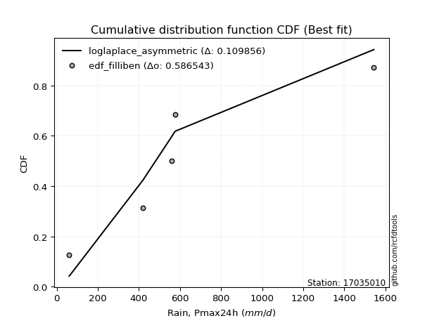</img></img>

</div>


### 10. EDF Jenkinson (1977)

The Jenkinson formula in hydrology is an empirical plotting position formula used to estimate the non-exceedance probability _(P)_ or return period _(T)_ of a given ordered observation within a sample. It is a widely used method in the frequency analysis of extreme events such as floods and rainfall, as it provides a distribution-free way to plot data. _a≈0.31_ and _b≈0.38_ are constants derived to approximate the median of the probability distribution for the given rank.

<div align="center">


$P=(m-a)/(n+b)$


</div>


**10.1. Empirical values**

<div align="center">

|                | 0                   | 1                  | 2             | 3                  | 4                  |
|:---------------|:--------------------|:-------------------|:--------------|:-------------------|:-------------------|
| date           | 2007                | 2017               | 2018          | 2020               | 2019               |
| x              | 60.7                | 419.2              | 557.8         | 575.9              | 1543.5             |
| m              | 1                   | 2                  | 3             | 4                  | 5                  |
| empirical_dist | edf_jenkinson       | edf_jenkinson      | edf_jenkinson | edf_jenkinson      | edf_jenkinson      |
| empirical      | 0.12825278810408922 | 0.3141263940520446 | 0.5           | 0.6858736059479554 | 0.8717472118959109 |
| empirical_tr   | 1.1471215351812367  | 1.4579945799457996 | 2.0           | 3.183431952662722  | 7.797101449275368  |

</div>


**10.2. Kolmogorov-Smirnov fit test (sorted by Δ)**


<div align="center">

|                | 0                   | 1                   | 2                   | 3                  | 4                   | 5                   | 6                   | 7                   | 8                   | 9                   | 10                  | 11                  | 12                  | 13                 | 14                 | 15                 | 16                  | 17                  | 18                  | 19                  | 20                 | 21                 | 22                  | 23                  | 24                  | 25                 | 26                  | 27                 | 28                  | 29                  | 30                 | 31                  | 32                  | 33                  | 34                  | 35                  | 36                  | 37                 | 38                  | 39                 | 40                 | 41                  | 42                  | 43                 | 44                 | 45                  | 46                  | 47                 | 48                  | 49                 | 50                  | 51                 | 52                  | 53                 | 54                  | 55                  | 56                  | 57                  | 58                  | 59                 | 60                 | 61                  | 62                  | 63                  | 64                  | 65                  | 66                  | 67                 | 68                  | 69                  | 70                  | 71                 | 72                 | 73                 | 74                 | 75                  | 76                  | 77                  | 78                 | 79                  | 80                  | 81                  | 82                  | 83                  | 84                  | 85                  | 86                 | 87                  | 88                  | 89                 | 90                  | 91                  | 92                 | 93                 | 94                 | 95                  | 96                  | 97                  | 98                 | 99                  | 100                 | 101                 | 102                | 103                 | 104                | 105                | 106                 | 107                | 108                | 109                | 110                | 111                | 112                 | 113                 | 114                 | 115                | 116                 | 117                 | 118                | 119                | 120                 | 121                 | 122                 | 123                | 124                 | 125                 | 126                 | 127                | 128                | 129                | 130                | 131                 | 132                | 133                | 134                | 135                | 136                | 137                | 138                | 139                 | 140                 | 141                 | 142                 | 143                 | 144                | 145                | 146                | 147                | 148                | 149                | 150                | 151                | 152                | 153                | 154                | 155                | 156                | 157                | 158                | 159                |
|:---------------|:--------------------|:--------------------|:--------------------|:-------------------|:--------------------|:--------------------|:--------------------|:--------------------|:--------------------|:--------------------|:--------------------|:--------------------|:--------------------|:-------------------|:-------------------|:-------------------|:--------------------|:--------------------|:--------------------|:--------------------|:-------------------|:-------------------|:--------------------|:--------------------|:--------------------|:-------------------|:--------------------|:-------------------|:--------------------|:--------------------|:-------------------|:--------------------|:--------------------|:--------------------|:--------------------|:--------------------|:--------------------|:-------------------|:--------------------|:-------------------|:-------------------|:--------------------|:--------------------|:-------------------|:-------------------|:--------------------|:--------------------|:-------------------|:--------------------|:-------------------|:--------------------|:-------------------|:--------------------|:-------------------|:--------------------|:--------------------|:--------------------|:--------------------|:--------------------|:-------------------|:-------------------|:--------------------|:--------------------|:--------------------|:--------------------|:--------------------|:--------------------|:-------------------|:--------------------|:--------------------|:--------------------|:-------------------|:-------------------|:-------------------|:-------------------|:--------------------|:--------------------|:--------------------|:-------------------|:--------------------|:--------------------|:--------------------|:--------------------|:--------------------|:--------------------|:--------------------|:-------------------|:--------------------|:--------------------|:-------------------|:--------------------|:--------------------|:-------------------|:-------------------|:-------------------|:--------------------|:--------------------|:--------------------|:-------------------|:--------------------|:--------------------|:--------------------|:-------------------|:--------------------|:-------------------|:-------------------|:--------------------|:-------------------|:-------------------|:-------------------|:-------------------|:-------------------|:--------------------|:--------------------|:--------------------|:-------------------|:--------------------|:--------------------|:-------------------|:-------------------|:--------------------|:--------------------|:--------------------|:-------------------|:--------------------|:--------------------|:--------------------|:-------------------|:-------------------|:-------------------|:-------------------|:--------------------|:-------------------|:-------------------|:-------------------|:-------------------|:-------------------|:-------------------|:-------------------|:--------------------|:--------------------|:--------------------|:--------------------|:--------------------|:-------------------|:-------------------|:-------------------|:-------------------|:-------------------|:-------------------|:-------------------|:-------------------|:-------------------|:-------------------|:-------------------|:-------------------|:-------------------|:-------------------|:-------------------|:-------------------|
| station        | 17035010            | 17035010            | 17035010            | 17035010           | 17035010            | 17035010            | 17035010            | 17035010            | 17035010            | 17035010            | 17035010            | 17035010            | 17035010            | 17035010           | 17035010           | 17035010           | 17035010            | 17035010            | 17035010            | 17035010            | 17035010           | 17035010           | 17035010            | 17035010            | 17035010            | 17035010           | 17035010            | 17035010           | 17035010            | 17035010            | 17035010           | 17035010            | 17035010            | 17035010            | 17035010            | 17035010            | 17035010            | 17035010           | 17035010            | 17035010           | 17035010           | 17035010            | 17035010            | 17035010           | 17035010           | 17035010            | 17035010            | 17035010           | 17035010            | 17035010           | 17035010            | 17035010           | 17035010            | 17035010           | 17035010            | 17035010            | 17035010            | 17035010            | 17035010            | 17035010           | 17035010           | 17035010            | 17035010            | 17035010            | 17035010            | 17035010            | 17035010            | 17035010           | 17035010            | 17035010            | 17035010            | 17035010           | 17035010           | 17035010           | 17035010           | 17035010            | 17035010            | 17035010            | 17035010           | 17035010            | 17035010            | 17035010            | 17035010            | 17035010            | 17035010            | 17035010            | 17035010           | 17035010            | 17035010            | 17035010           | 17035010            | 17035010            | 17035010           | 17035010           | 17035010           | 17035010            | 17035010            | 17035010            | 17035010           | 17035010            | 17035010            | 17035010            | 17035010           | 17035010            | 17035010           | 17035010           | 17035010            | 17035010           | 17035010           | 17035010           | 17035010           | 17035010           | 17035010            | 17035010            | 17035010            | 17035010           | 17035010            | 17035010            | 17035010           | 17035010           | 17035010            | 17035010            | 17035010            | 17035010           | 17035010            | 17035010            | 17035010            | 17035010           | 17035010           | 17035010           | 17035010           | 17035010            | 17035010           | 17035010           | 17035010           | 17035010           | 17035010           | 17035010           | 17035010           | 17035010            | 17035010            | 17035010            | 17035010            | 17035010            | 17035010           | 17035010           | 17035010           | 17035010           | 17035010           | 17035010           | 17035010           | 17035010           | 17035010           | 17035010           | 17035010           | 17035010           | 17035010           | 17035010           | 17035010           | 17035010           |
| empirical_dist | edf_jenkinson       | edf_jenkinson       | edf_jenkinson       | edf_jenkinson      | edf_jenkinson       | edf_jenkinson       | edf_jenkinson       | edf_jenkinson       | edf_jenkinson       | edf_jenkinson       | edf_jenkinson       | edf_jenkinson       | edf_jenkinson       | edf_jenkinson      | edf_jenkinson      | edf_jenkinson      | edf_jenkinson       | edf_jenkinson       | edf_jenkinson       | edf_jenkinson       | edf_jenkinson      | edf_jenkinson      | edf_jenkinson       | edf_jenkinson       | edf_jenkinson       | edf_jenkinson      | edf_jenkinson       | edf_jenkinson      | edf_jenkinson       | edf_jenkinson       | edf_jenkinson      | edf_jenkinson       | edf_jenkinson       | edf_jenkinson       | edf_jenkinson       | edf_jenkinson       | edf_jenkinson       | edf_jenkinson      | edf_jenkinson       | edf_jenkinson      | edf_jenkinson      | edf_jenkinson       | edf_jenkinson       | edf_jenkinson      | edf_jenkinson      | edf_jenkinson       | edf_jenkinson       | edf_jenkinson      | edf_jenkinson       | edf_jenkinson      | edf_jenkinson       | edf_jenkinson      | edf_jenkinson       | edf_jenkinson      | edf_jenkinson       | edf_jenkinson       | edf_jenkinson       | edf_jenkinson       | edf_jenkinson       | edf_jenkinson      | edf_jenkinson      | edf_jenkinson       | edf_jenkinson       | edf_jenkinson       | edf_jenkinson       | edf_jenkinson       | edf_jenkinson       | edf_jenkinson      | edf_jenkinson       | edf_jenkinson       | edf_jenkinson       | edf_jenkinson      | edf_jenkinson      | edf_jenkinson      | edf_jenkinson      | edf_jenkinson       | edf_jenkinson       | edf_jenkinson       | edf_jenkinson      | edf_jenkinson       | edf_jenkinson       | edf_jenkinson       | edf_jenkinson       | edf_jenkinson       | edf_jenkinson       | edf_jenkinson       | edf_jenkinson      | edf_jenkinson       | edf_jenkinson       | edf_jenkinson      | edf_jenkinson       | edf_jenkinson       | edf_jenkinson      | edf_jenkinson      | edf_jenkinson      | edf_jenkinson       | edf_jenkinson       | edf_jenkinson       | edf_jenkinson      | edf_jenkinson       | edf_jenkinson       | edf_jenkinson       | edf_jenkinson      | edf_jenkinson       | edf_jenkinson      | edf_jenkinson      | edf_jenkinson       | edf_jenkinson      | edf_jenkinson      | edf_jenkinson      | edf_jenkinson      | edf_jenkinson      | edf_jenkinson       | edf_jenkinson       | edf_jenkinson       | edf_jenkinson      | edf_jenkinson       | edf_jenkinson       | edf_jenkinson      | edf_jenkinson      | edf_jenkinson       | edf_jenkinson       | edf_jenkinson       | edf_jenkinson      | edf_jenkinson       | edf_jenkinson       | edf_jenkinson       | edf_jenkinson      | edf_jenkinson      | edf_jenkinson      | edf_jenkinson      | edf_jenkinson       | edf_jenkinson      | edf_jenkinson      | edf_jenkinson      | edf_jenkinson      | edf_jenkinson      | edf_jenkinson      | edf_jenkinson      | edf_jenkinson       | edf_jenkinson       | edf_jenkinson       | edf_jenkinson       | edf_jenkinson       | edf_jenkinson      | edf_jenkinson      | edf_jenkinson      | edf_jenkinson      | edf_jenkinson      | edf_jenkinson      | edf_jenkinson      | edf_jenkinson      | edf_jenkinson      | edf_jenkinson      | edf_jenkinson      | edf_jenkinson      | edf_jenkinson      | edf_jenkinson      | edf_jenkinson      | edf_jenkinson      |
| p_dist         | logdweibull         | loggennorm          | mielke              | burr               | johnsonsu           | loggenlogistic      | betaprime           | loggumbel_l         | logburr             | logmielke           | invgamma            | logweibull_min      | logburr12           | nct                | genexpon           | logdgamma          | logskewnorm         | kappa3              | wald                | lomax               | halflogistic       | logpearson3        | exponnorm           | moyal               | dgamma              | logtrapezoid       | logloggamma         | logargus           | logtriang           | truncpareto         | loggompertz        | halfnorm            | foldnorm            | truncexpon          | genlogistic         | bradford            | gumbel_r            | loggenhalflogistic | logloglaplace       | pearson3           | vonmises_line      | kstwobign           | exponpow            | skewnorm           | gompertz           | rayleigh            | gennorm             | dweibull           | logfoldnorm         | logarcsine         | logsemicircular     | loganglit          | logt                | logcrystalball     | lognorm             | logexponnorm        | loglogistic         | loghypsecant        | lognct              | loglaplace         | loglaplace         | logf                | logfatiguelife      | logerlang           | maxwell             | logbetaprime        | logncf              | logrice            | loggamma            | loggamma            | ncf                 | loginvgamma        | arcsine            | logalpha           | rice               | loginvgauss         | logwrapcauchy       | logmaxwell          | semicircular       | loglevy_l           | anglit              | logbeta             | logcosine           | truncweibull_min    | loginvweibull       | norm                | truncnorm          | t                   | lograyleigh         | logistic           | hypsecant           | logjohnsonsb        | logweibull_max     | halfgennorm        | beta               | levy_l              | logkappa3           | weibull_min         | loggumbel_r        | loggengamma         | laplace             | logkstwobign        | loghalfnorm        | loggausshyper       | loggenextreme      | logksone           | loggenexpon         | gausshyper         | cosine             | logkappa4          | loguniform         | logvonmises_line   | logmoyal            | wrapcauchy          | logbradford         | loghalflogistic    | lognakagami         | f                   | genextreme         | gumbel_l           | kappa4              | loggenpareto        | logexponweib        | ksone              | logtruncnorm        | nakagami            | burr12              | invgauss           | uniform            | genpareto          | argus              | gamma               | logwald            | erlang             | triang             | logtruncexpon      | invweibull         | crystalball        | loglomax           | logjohnsonsu        | alpha               | logtruncweibull_min | genhalflogistic     | rdist               | exponweib          | logrdist           | fatiguelife        | logtukeylambda     | powerlaw           | johnsonsb          | trapezoid          | logexponpow        | tukeylambda        | weibull_max        | logpowerlaw        | logtruncpareto     | gengamma           | loghalfgennorm     | logvonmises        | vonmises           |
| delta          | 0.09067652735010412 | 0.11242580305460187 | 0.11900375034414101 | 0.1191268080639365 | 0.11932072812588934 | 0.12038011732343878 | 0.12144039396861278 | 0.12203698008448316 | 0.12265307479763499 | 0.12325087147532199 | 0.12382136899338969 | 0.12392878909296423 | 0.12567944440746015 | 0.1263711375389599 | 0.1278755221590754 | 0.1281198822980536 | 0.12825229832827922 | 0.12825278810390586 | 0.12825278810408922 | 0.12976005369252291 | 0.129769315036249  | 0.1334544219125145 | 0.13630343908055742 | 0.13774378706162738 | 0.13810720088318829 | 0.1405735749105399 | 0.14567466585747935 | 0.147843466928829  | 0.14824012840264233 | 0.14974512522562805 | 0.150389753691697  | 0.15133503171295792 | 0.15408194106721584 | 0.15453455082130352 | 0.15487946668689645 | 0.15709639803163689 | 0.16323337287182849 | 0.1658611916638506 | 0.16632108191825012 | 0.1683631349699345 | 0.1712412978378528 | 0.17469924533876047 | 0.17520720819575086 | 0.1800480894658233 | 0.1809230569816651 | 0.18469642514626772 | 0.18587360583764279 | 0.1858736059529994 | 0.18633722889464782 | 0.1869654895475063 | 0.18741783716365884 | 0.1875319578723676 | 0.18780739399890872 | 0.1878089906893678 | 0.18780900706803355 | 0.18781030259030546 | 0.18807343573094265 | 0.18829925757118088 | 0.18835128451511246 | 0.1892922876392829 | 0.1892922876392829 | 0.18986379113992263 | 0.19044858453399166 | 0.19398556837855424 | 0.19652089669133488 | 0.19703484328861381 | 0.19810119101198503 | 0.1981802582549544 | 0.19907873709933827 | 0.19907873709933827 | 0.19997960649971352 | 0.2065439883337527 | 0.2112910580194054 | 0.2119238481502856 | 0.2150074353974623 | 0.21626720627146107 | 0.21919141669838332 | 0.22078091061864907 | 0.2217620810578147 | 0.22185034583448304 | 0.22439656037615657 | 0.22711139273167558 | 0.23010092176707636 | 0.23029701935542157 | 0.23077848713152466 | 0.23078174682263897 | 0.2307817556935301 | 0.23078647129079555 | 0.23175034480936724 | 0.236848123975558  | 0.24198414282866915 | 0.24243093364636428 | 0.2452923137364572 | 0.2453801183277075 | 0.2495246573649379 | 0.25009232319852026 | 0.25257645757753194 | 0.25346600709371053 | 0.2582394679228485 | 0.25924260109054226 | 0.25960265631885193 | 0.26139868110240355 | 0.2626340670759226 | 0.26349649242811407 | 0.2646889914216295 | 0.266859793827039  | 0.26873669185014554 | 0.2761214915507796 | 0.2763752437850925 | 0.2808700803685747 | 0.2830570314028557 | 0.2830928277281302 | 0.28407275254311753 | 0.28481361000965255 | 0.28510012201356333 | 0.2876852570088027 | 0.28960507394970914 | 0.29178118002335246 | 0.2970543043305231 | 0.301059839891337  | 0.30551870195894426 | 0.31073665921677956 | 0.31259333355302715 | 0.3129979652681604 | 0.31412552018325823 | 0.31412635571574526 | 0.31877518393593457 | 0.3283585189919432 | 0.3384228371322015 | 0.3472414328863829 | 0.3477088273345983 | 0.35217979571315366 | 0.3559030142285236 | 0.3829488654684577 | 0.3859220594231713 | 0.391762015193212  | 0.3970201994050781 | 0.4021949836624983 | 0.4263916569112878 | 0.43092533670656874 | 0.43590114609000524 | 0.44254242072454913 | 0.45158248067319495 | 0.49056374299413824 | 0.5008121204913811 | 0.5105208700829356 | 0.5206133220939961 | 0.5337097747498247 | 0.535141378953176  | 0.5446827057075885 | 0.544996014203678  | 0.5542468612824321 | 0.5632344964940201 | 0.5804278097158755 | 0.6187331481713543 | 0.6346955439195037 | 0.6858736059479553 | 0.6858736059479554 | 1.095470341810761  | 245.34307418374394 |
| deltao         | 0.5865427407550001  | 0.5865427407550001  | 0.5865427407550001  | 0.5865427407550001 | 0.5865427407550001  | 0.5865427407550001  | 0.5865427407550001  | 0.5865427407550001  | 0.5865427407550001  | 0.5865427407550001  | 0.5865427407550001  | 0.5865427407550001  | 0.5865427407550001  | 0.5865427407550001 | 0.5865427407550001 | 0.5865427407550001 | 0.5865427407550001  | 0.5865427407550001  | 0.5865427407550001  | 0.5865427407550001  | 0.5865427407550001 | 0.5865427407550001 | 0.5865427407550001  | 0.5865427407550001  | 0.5865427407550001  | 0.5865427407550001 | 0.5865427407550001  | 0.5865427407550001 | 0.5865427407550001  | 0.5865427407550001  | 0.5865427407550001 | 0.5865427407550001  | 0.5865427407550001  | 0.5865427407550001  | 0.5865427407550001  | 0.5865427407550001  | 0.5865427407550001  | 0.5865427407550001 | 0.5865427407550001  | 0.5865427407550001 | 0.5865427407550001 | 0.5865427407550001  | 0.5865427407550001  | 0.5865427407550001 | 0.5865427407550001 | 0.5865427407550001  | 0.5865427407550001  | 0.5865427407550001 | 0.5865427407550001  | 0.5865427407550001 | 0.5865427407550001  | 0.5865427407550001 | 0.5865427407550001  | 0.5865427407550001 | 0.5865427407550001  | 0.5865427407550001  | 0.5865427407550001  | 0.5865427407550001  | 0.5865427407550001  | 0.5865427407550001 | 0.5865427407550001 | 0.5865427407550001  | 0.5865427407550001  | 0.5865427407550001  | 0.5865427407550001  | 0.5865427407550001  | 0.5865427407550001  | 0.5865427407550001 | 0.5865427407550001  | 0.5865427407550001  | 0.5865427407550001  | 0.5865427407550001 | 0.5865427407550001 | 0.5865427407550001 | 0.5865427407550001 | 0.5865427407550001  | 0.5865427407550001  | 0.5865427407550001  | 0.5865427407550001 | 0.5865427407550001  | 0.5865427407550001  | 0.5865427407550001  | 0.5865427407550001  | 0.5865427407550001  | 0.5865427407550001  | 0.5865427407550001  | 0.5865427407550001 | 0.5865427407550001  | 0.5865427407550001  | 0.5865427407550001 | 0.5865427407550001  | 0.5865427407550001  | 0.5865427407550001 | 0.5865427407550001 | 0.5865427407550001 | 0.5865427407550001  | 0.5865427407550001  | 0.5865427407550001  | 0.5865427407550001 | 0.5865427407550001  | 0.5865427407550001  | 0.5865427407550001  | 0.5865427407550001 | 0.5865427407550001  | 0.5865427407550001 | 0.5865427407550001 | 0.5865427407550001  | 0.5865427407550001 | 0.5865427407550001 | 0.5865427407550001 | 0.5865427407550001 | 0.5865427407550001 | 0.5865427407550001  | 0.5865427407550001  | 0.5865427407550001  | 0.5865427407550001 | 0.5865427407550001  | 0.5865427407550001  | 0.5865427407550001 | 0.5865427407550001 | 0.5865427407550001  | 0.5865427407550001  | 0.5865427407550001  | 0.5865427407550001 | 0.5865427407550001  | 0.5865427407550001  | 0.5865427407550001  | 0.5865427407550001 | 0.5865427407550001 | 0.5865427407550001 | 0.5865427407550001 | 0.5865427407550001  | 0.5865427407550001 | 0.5865427407550001 | 0.5865427407550001 | 0.5865427407550001 | 0.5865427407550001 | 0.5865427407550001 | 0.5865427407550001 | 0.5865427407550001  | 0.5865427407550001  | 0.5865427407550001  | 0.5865427407550001  | 0.5865427407550001  | 0.5865427407550001 | 0.5865427407550001 | 0.5865427407550001 | 0.5865427407550001 | 0.5865427407550001 | 0.5865427407550001 | 0.5865427407550001 | 0.5865427407550001 | 0.5865427407550001 | 0.5865427407550001 | 0.5865427407550001 | 0.5865427407550001 | 0.5865427407550001 | 0.5865427407550001 | 0.5865427407550001 | 0.5865427407550001 |
| eval           | Δo > Δ              | Δo > Δ              | Δo > Δ              | Δo > Δ             | Δo > Δ              | Δo > Δ              | Δo > Δ              | Δo > Δ              | Δo > Δ              | Δo > Δ              | Δo > Δ              | Δo > Δ              | Δo > Δ              | Δo > Δ             | Δo > Δ             | Δo > Δ             | Δo > Δ              | Δo > Δ              | Δo > Δ              | Δo > Δ              | Δo > Δ             | Δo > Δ             | Δo > Δ              | Δo > Δ              | Δo > Δ              | Δo > Δ             | Δo > Δ              | Δo > Δ             | Δo > Δ              | Δo > Δ              | Δo > Δ             | Δo > Δ              | Δo > Δ              | Δo > Δ              | Δo > Δ              | Δo > Δ              | Δo > Δ              | Δo > Δ             | Δo > Δ              | Δo > Δ             | Δo > Δ             | Δo > Δ              | Δo > Δ              | Δo > Δ             | Δo > Δ             | Δo > Δ              | Δo > Δ              | Δo > Δ             | Δo > Δ              | Δo > Δ             | Δo > Δ              | Δo > Δ             | Δo > Δ              | Δo > Δ             | Δo > Δ              | Δo > Δ              | Δo > Δ              | Δo > Δ              | Δo > Δ              | Δo > Δ             | Δo > Δ             | Δo > Δ              | Δo > Δ              | Δo > Δ              | Δo > Δ              | Δo > Δ              | Δo > Δ              | Δo > Δ             | Δo > Δ              | Δo > Δ              | Δo > Δ              | Δo > Δ             | Δo > Δ             | Δo > Δ             | Δo > Δ             | Δo > Δ              | Δo > Δ              | Δo > Δ              | Δo > Δ             | Δo > Δ              | Δo > Δ              | Δo > Δ              | Δo > Δ              | Δo > Δ              | Δo > Δ              | Δo > Δ              | Δo > Δ             | Δo > Δ              | Δo > Δ              | Δo > Δ             | Δo > Δ              | Δo > Δ              | Δo > Δ             | Δo > Δ             | Δo > Δ             | Δo > Δ              | Δo > Δ              | Δo > Δ              | Δo > Δ             | Δo > Δ              | Δo > Δ              | Δo > Δ              | Δo > Δ             | Δo > Δ              | Δo > Δ             | Δo > Δ             | Δo > Δ              | Δo > Δ             | Δo > Δ             | Δo > Δ             | Δo > Δ             | Δo > Δ             | Δo > Δ              | Δo > Δ              | Δo > Δ              | Δo > Δ             | Δo > Δ              | Δo > Δ              | Δo > Δ             | Δo > Δ             | Δo > Δ              | Δo > Δ              | Δo > Δ              | Δo > Δ             | Δo > Δ              | Δo > Δ              | Δo > Δ              | Δo > Δ             | Δo > Δ             | Δo > Δ             | Δo > Δ             | Δo > Δ              | Δo > Δ             | Δo > Δ             | Δo > Δ             | Δo > Δ             | Δo > Δ             | Δo > Δ             | Δo > Δ             | Δo > Δ              | Δo > Δ              | Δo > Δ              | Δo > Δ              | Δo > Δ              | Δo > Δ             | Δo > Δ             | Δo > Δ             | Δo > Δ             | Δo > Δ             | Δo > Δ             | Δo > Δ             | Δo > Δ             | Δo > Δ             | Δo > Δ             | Δo <= Δ            | Δo <= Δ            | Δo <= Δ            | Δo <= Δ            | Δo <= Δ            | Δo <= Δ            |
| fit            | 1                   | 1                   | 1                   | 1                  | 1                   | 1                   | 1                   | 1                   | 1                   | 1                   | 1                   | 1                   | 1                   | 1                  | 1                  | 1                  | 1                   | 1                   | 1                   | 1                   | 1                  | 1                  | 1                   | 1                   | 1                   | 1                  | 1                   | 1                  | 1                   | 1                   | 1                  | 1                   | 1                   | 1                   | 1                   | 1                   | 1                   | 1                  | 1                   | 1                  | 1                  | 1                   | 1                   | 1                  | 1                  | 1                   | 1                   | 1                  | 1                   | 1                  | 1                   | 1                  | 1                   | 1                  | 1                   | 1                   | 1                   | 1                   | 1                   | 1                  | 1                  | 1                   | 1                   | 1                   | 1                   | 1                   | 1                   | 1                  | 1                   | 1                   | 1                   | 1                  | 1                  | 1                  | 1                  | 1                   | 1                   | 1                   | 1                  | 1                   | 1                   | 1                   | 1                   | 1                   | 1                   | 1                   | 1                  | 1                   | 1                   | 1                  | 1                   | 1                   | 1                  | 1                  | 1                  | 1                   | 1                   | 1                   | 1                  | 1                   | 1                   | 1                   | 1                  | 1                   | 1                  | 1                  | 1                   | 1                  | 1                  | 1                  | 1                  | 1                  | 1                   | 1                   | 1                   | 1                  | 1                   | 1                   | 1                  | 1                  | 1                   | 1                   | 1                   | 1                  | 1                   | 1                   | 1                   | 1                  | 1                  | 1                  | 1                  | 1                   | 1                  | 1                  | 1                  | 1                  | 1                  | 1                  | 1                  | 1                   | 1                   | 1                   | 1                   | 1                   | 1                  | 1                  | 1                  | 1                  | 1                  | 1                  | 1                  | 1                  | 1                  | 1                  | 0                  | 0                  | 0                  | 0                  | 0                  | 0                  |
| n              | 5                   | 5                   | 5                   | 5                  | 5                   | 5                   | 5                   | 5                   | 5                   | 5                   | 5                   | 5                   | 5                   | 5                  | 5                  | 5                  | 5                   | 5                   | 5                   | 5                   | 5                  | 5                  | 5                   | 5                   | 5                   | 5                  | 5                   | 5                  | 5                   | 5                   | 5                  | 5                   | 5                   | 5                   | 5                   | 5                   | 5                   | 5                  | 5                   | 5                  | 5                  | 5                   | 5                   | 5                  | 5                  | 5                   | 5                   | 5                  | 5                   | 5                  | 5                   | 5                  | 5                   | 5                  | 5                   | 5                   | 5                   | 5                   | 5                   | 5                  | 5                  | 5                   | 5                   | 5                   | 5                   | 5                   | 5                   | 5                  | 5                   | 5                   | 5                   | 5                  | 5                  | 5                  | 5                  | 5                   | 5                   | 5                   | 5                  | 5                   | 5                   | 5                   | 5                   | 5                   | 5                   | 5                   | 5                  | 5                   | 5                   | 5                  | 5                   | 5                   | 5                  | 5                  | 5                  | 5                   | 5                   | 5                   | 5                  | 5                   | 5                   | 5                   | 5                  | 5                   | 5                  | 5                  | 5                   | 5                  | 5                  | 5                  | 5                  | 5                  | 5                   | 5                   | 5                   | 5                  | 5                   | 5                   | 5                  | 5                  | 5                   | 5                   | 5                   | 5                  | 5                   | 5                   | 5                   | 5                  | 5                  | 5                  | 5                  | 5                   | 5                  | 5                  | 5                  | 5                  | 5                  | 5                  | 5                  | 5                   | 5                   | 5                   | 5                   | 5                   | 5                  | 5                  | 5                  | 5                  | 5                  | 5                  | 5                  | 5                  | 5                  | 5                  | 5                  | 5                  | 5                  | 5                  | 5                  | 5                  |
| best_fit       | 1                   | 0                   | 0                   | 0                  | 0                   | 0                   | 0                   | 0                   | 0                   | 0                   | 0                   | 0                   | 0                   | 0                  | 0                  | 0                  | 0                   | 0                   | 0                   | 0                   | 0                  | 0                  | 0                   | 0                   | 0                   | 0                  | 0                   | 0                  | 0                   | 0                   | 0                  | 0                   | 0                   | 0                   | 0                   | 0                   | 0                   | 0                  | 0                   | 0                  | 0                  | 0                   | 0                   | 0                  | 0                  | 0                   | 0                   | 0                  | 0                   | 0                  | 0                   | 0                  | 0                   | 0                  | 0                   | 0                   | 0                   | 0                   | 0                   | 0                  | 0                  | 0                   | 0                   | 0                   | 0                   | 0                   | 0                   | 0                  | 0                   | 0                   | 0                   | 0                  | 0                  | 0                  | 0                  | 0                   | 0                   | 0                   | 0                  | 0                   | 0                   | 0                   | 0                   | 0                   | 0                   | 0                   | 0                  | 0                   | 0                   | 0                  | 0                   | 0                   | 0                  | 0                  | 0                  | 0                   | 0                   | 0                   | 0                  | 0                   | 0                   | 0                   | 0                  | 0                   | 0                  | 0                  | 0                   | 0                  | 0                  | 0                  | 0                  | 0                  | 0                   | 0                   | 0                   | 0                  | 0                   | 0                   | 0                  | 0                  | 0                   | 0                   | 0                   | 0                  | 0                   | 0                   | 0                   | 0                  | 0                  | 0                  | 0                  | 0                   | 0                  | 0                  | 0                  | 0                  | 0                  | 0                  | 0                  | 0                   | 0                   | 0                   | 0                   | 0                   | 0                  | 0                  | 0                  | 0                  | 0                  | 0                  | 0                  | 0                  | 0                  | 0                  | 0                  | 0                  | 0                  | 0                  | 0                  | 0                  |
| best_fit_sort  | 1                   | 2                   | 3                   | 4                  | 5                   | 6                   | 7                   | 8                   | 9                   | 10                  | 11                  | 12                  | 13                  | 14                 | 15                 | 16                 | 17                  | 18                  | 19                  | 20                  | 21                 | 22                 | 23                  | 24                  | 25                  | 26                 | 27                  | 28                 | 29                  | 30                  | 31                 | 32                  | 33                  | 34                  | 35                  | 36                  | 37                  | 38                 | 39                  | 40                 | 41                 | 42                  | 43                  | 44                 | 45                 | 46                  | 47                  | 48                 | 49                  | 50                 | 51                  | 52                 | 53                  | 54                 | 55                  | 56                  | 57                  | 58                  | 59                  | 60                 | 61                 | 62                  | 63                  | 64                  | 65                  | 66                  | 67                  | 68                 | 69                  | 70                  | 71                  | 72                 | 73                 | 74                 | 75                 | 76                  | 77                  | 78                  | 79                 | 80                  | 81                  | 82                  | 83                  | 84                  | 85                  | 86                  | 87                 | 88                  | 89                  | 90                 | 91                  | 92                  | 93                 | 94                 | 95                 | 96                  | 97                  | 98                  | 99                 | 100                 | 101                 | 102                 | 103                | 104                 | 105                | 106                | 107                 | 108                | 109                | 110                | 111                | 112                | 113                 | 114                 | 115                 | 116                | 117                 | 118                 | 119                | 120                | 121                 | 122                 | 123                 | 124                | 125                 | 126                 | 127                 | 128                | 129                | 130                | 131                | 132                 | 133                | 134                | 135                | 136                | 137                | 138                | 139                | 140                 | 141                 | 142                 | 143                 | 144                 | 145                | 146                | 147                | 148                | 149                | 150                | 151                | 152                | 153                | 154                | 155                | 156                | 157                | 158                | 159                | 160                |

</div>


**10.3. Best fit**

<div align="center">

|   id |   station | empirical_dist   | p_dist      |     delta |   deltao | eval   |   fit |   n |   best_fit |   best_fit_sort |
|-----:|----------:|:-----------------|:------------|----------:|---------:|:-------|------:|----:|-----------:|----------------:|
|    0 |  17035010 | edf_jenkinson    | logdweibull | 0.0906765 | 0.586543 | Δo > Δ |     1 |   5 |          1 |               1 |

</div>


<div align="center">

</img>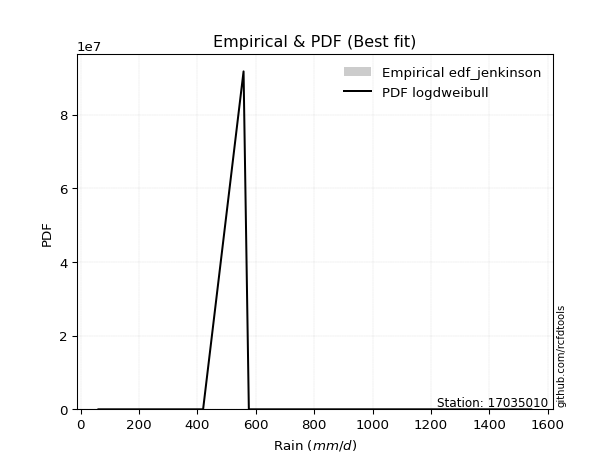</img>

</div>


### 11. EDF Cunnane (1978)

Cunnane´s work in statistical hydrology has focused on the performance and evaluation of different probability distributions (such as GEV, Gumbel, Lognormal) for flood frequency estimation. _b_ is a constant, typically set to 0.4.

<div align="center">


$P=(m-b)/(n+1-2b)$


</div>


**11.1. Empirical values**

<div align="center">

|                | 0                   | 1                  | 2           | 3                  | 4                  |
|:---------------|:--------------------|:-------------------|:------------|:-------------------|:-------------------|
| date           | 2007                | 2017               | 2018        | 2020               | 2019               |
| x              | 60.7                | 419.2              | 557.8       | 575.9              | 1543.5             |
| m              | 1                   | 2                  | 3           | 4                  | 5                  |
| empirical_dist | edf_cunnane         | edf_cunnane        | edf_cunnane | edf_cunnane        | edf_cunnane        |
| empirical      | 0.11538461538461538 | 0.3076923076923077 | 0.5         | 0.6923076923076923 | 0.8846153846153845 |
| empirical_tr   | 1.1304347826086958  | 1.4444444444444444 | 2.0         | 3.25               | 8.666666666666655  |

</div>


**11.2. Kolmogorov-Smirnov fit test (sorted by Δ)**


<div align="center">

|                | 0                   | 1                   | 2                   | 3                   | 4                   | 5                   | 6                  | 7                   | 8                  | 9                   | 10                 | 11                 | 12                  | 13                  | 14                 | 15                 | 16                  | 17                 | 18                  | 19                  | 20                  | 21                 | 22                  | 23                  | 24                  | 25                  | 26                 | 27                  | 28                  | 29                  | 30                 | 31                  | 32                 | 33                  | 34                 | 35                  | 36                  | 37                  | 38                  | 39                  | 40                  | 41                  | 42                  | 43                  | 44                  | 45                  | 46                  | 47                  | 48                  | 49                  | 50                  | 51                 | 52                  | 53                 | 54                  | 55                  | 56                  | 57                 | 58                  | 59                  | 60                  | 61                  | 62                  | 63                  | 64                  | 65                  | 66                  | 67                 | 68                  | 69                  | 70                  | 71                  | 72                  | 73                 | 74                  | 75                  | 76                  | 77                  | 78                  | 79                 | 80                  | 81                  | 82                  | 83                  | 84                  | 85                  | 86                  | 87                 | 88                  | 89                  | 90                 | 91                  | 92                 | 93                  | 94                  | 95                 | 96                  | 97                  | 98                  | 99                  | 100                | 101                 | 102                | 103                | 104                 | 105                | 106                 | 107                 | 108                 | 109                | 110                | 111                | 112                 | 113                 | 114                | 115                 | 116                | 117                | 118                | 119                 | 120                | 121                 | 122                | 123                | 124                 | 125                | 126                | 127                | 128                 | 129                 | 130                 | 131                | 132                | 133                | 134                 | 135                 | 136                | 137                 | 138                 | 139                | 140                 | 141                 | 142                | 143                 | 144                | 145                | 146                | 147                | 148                | 149                | 150                | 151                | 152                | 153                | 154                | 155                | 156                | 157                | 158                | 159                |
|:---------------|:--------------------|:--------------------|:--------------------|:--------------------|:--------------------|:--------------------|:-------------------|:--------------------|:-------------------|:--------------------|:-------------------|:-------------------|:--------------------|:--------------------|:-------------------|:-------------------|:--------------------|:-------------------|:--------------------|:--------------------|:--------------------|:-------------------|:--------------------|:--------------------|:--------------------|:--------------------|:-------------------|:--------------------|:--------------------|:--------------------|:-------------------|:--------------------|:-------------------|:--------------------|:-------------------|:--------------------|:--------------------|:--------------------|:--------------------|:--------------------|:--------------------|:--------------------|:--------------------|:--------------------|:--------------------|:--------------------|:--------------------|:--------------------|:--------------------|:--------------------|:--------------------|:-------------------|:--------------------|:-------------------|:--------------------|:--------------------|:--------------------|:-------------------|:--------------------|:--------------------|:--------------------|:--------------------|:--------------------|:--------------------|:--------------------|:--------------------|:--------------------|:-------------------|:--------------------|:--------------------|:--------------------|:--------------------|:--------------------|:-------------------|:--------------------|:--------------------|:--------------------|:--------------------|:--------------------|:-------------------|:--------------------|:--------------------|:--------------------|:--------------------|:--------------------|:--------------------|:--------------------|:-------------------|:--------------------|:--------------------|:-------------------|:--------------------|:-------------------|:--------------------|:--------------------|:-------------------|:--------------------|:--------------------|:--------------------|:--------------------|:-------------------|:--------------------|:-------------------|:-------------------|:--------------------|:-------------------|:--------------------|:--------------------|:--------------------|:-------------------|:-------------------|:-------------------|:--------------------|:--------------------|:-------------------|:--------------------|:-------------------|:-------------------|:-------------------|:--------------------|:-------------------|:--------------------|:-------------------|:-------------------|:--------------------|:-------------------|:-------------------|:-------------------|:--------------------|:--------------------|:--------------------|:-------------------|:-------------------|:-------------------|:--------------------|:--------------------|:-------------------|:--------------------|:--------------------|:-------------------|:--------------------|:--------------------|:-------------------|:--------------------|:-------------------|:-------------------|:-------------------|:-------------------|:-------------------|:-------------------|:-------------------|:-------------------|:-------------------|:-------------------|:-------------------|:-------------------|:-------------------|:-------------------|:-------------------|:-------------------|
| station        | 17035010            | 17035010            | 17035010            | 17035010            | 17035010            | 17035010            | 17035010           | 17035010            | 17035010           | 17035010            | 17035010           | 17035010           | 17035010            | 17035010            | 17035010           | 17035010           | 17035010            | 17035010           | 17035010            | 17035010            | 17035010            | 17035010           | 17035010            | 17035010            | 17035010            | 17035010            | 17035010           | 17035010            | 17035010            | 17035010            | 17035010           | 17035010            | 17035010           | 17035010            | 17035010           | 17035010            | 17035010            | 17035010            | 17035010            | 17035010            | 17035010            | 17035010            | 17035010            | 17035010            | 17035010            | 17035010            | 17035010            | 17035010            | 17035010            | 17035010            | 17035010            | 17035010           | 17035010            | 17035010           | 17035010            | 17035010            | 17035010            | 17035010           | 17035010            | 17035010            | 17035010            | 17035010            | 17035010            | 17035010            | 17035010            | 17035010            | 17035010            | 17035010           | 17035010            | 17035010            | 17035010            | 17035010            | 17035010            | 17035010           | 17035010            | 17035010            | 17035010            | 17035010            | 17035010            | 17035010           | 17035010            | 17035010            | 17035010            | 17035010            | 17035010            | 17035010            | 17035010            | 17035010           | 17035010            | 17035010            | 17035010           | 17035010            | 17035010           | 17035010            | 17035010            | 17035010           | 17035010            | 17035010            | 17035010            | 17035010            | 17035010           | 17035010            | 17035010           | 17035010           | 17035010            | 17035010           | 17035010            | 17035010            | 17035010            | 17035010           | 17035010           | 17035010           | 17035010            | 17035010            | 17035010           | 17035010            | 17035010           | 17035010           | 17035010           | 17035010            | 17035010           | 17035010            | 17035010           | 17035010           | 17035010            | 17035010           | 17035010           | 17035010           | 17035010            | 17035010            | 17035010            | 17035010           | 17035010           | 17035010           | 17035010            | 17035010            | 17035010           | 17035010            | 17035010            | 17035010           | 17035010            | 17035010            | 17035010           | 17035010            | 17035010           | 17035010           | 17035010           | 17035010           | 17035010           | 17035010           | 17035010           | 17035010           | 17035010           | 17035010           | 17035010           | 17035010           | 17035010           | 17035010           | 17035010           | 17035010           |
| empirical_dist | edf_cunnane         | edf_cunnane         | edf_cunnane         | edf_cunnane         | edf_cunnane         | edf_cunnane         | edf_cunnane        | edf_cunnane         | edf_cunnane        | edf_cunnane         | edf_cunnane        | edf_cunnane        | edf_cunnane         | edf_cunnane         | edf_cunnane        | edf_cunnane        | edf_cunnane         | edf_cunnane        | edf_cunnane         | edf_cunnane         | edf_cunnane         | edf_cunnane        | edf_cunnane         | edf_cunnane         | edf_cunnane         | edf_cunnane         | edf_cunnane        | edf_cunnane         | edf_cunnane         | edf_cunnane         | edf_cunnane        | edf_cunnane         | edf_cunnane        | edf_cunnane         | edf_cunnane        | edf_cunnane         | edf_cunnane         | edf_cunnane         | edf_cunnane         | edf_cunnane         | edf_cunnane         | edf_cunnane         | edf_cunnane         | edf_cunnane         | edf_cunnane         | edf_cunnane         | edf_cunnane         | edf_cunnane         | edf_cunnane         | edf_cunnane         | edf_cunnane         | edf_cunnane        | edf_cunnane         | edf_cunnane        | edf_cunnane         | edf_cunnane         | edf_cunnane         | edf_cunnane        | edf_cunnane         | edf_cunnane         | edf_cunnane         | edf_cunnane         | edf_cunnane         | edf_cunnane         | edf_cunnane         | edf_cunnane         | edf_cunnane         | edf_cunnane        | edf_cunnane         | edf_cunnane         | edf_cunnane         | edf_cunnane         | edf_cunnane         | edf_cunnane        | edf_cunnane         | edf_cunnane         | edf_cunnane         | edf_cunnane         | edf_cunnane         | edf_cunnane        | edf_cunnane         | edf_cunnane         | edf_cunnane         | edf_cunnane         | edf_cunnane         | edf_cunnane         | edf_cunnane         | edf_cunnane        | edf_cunnane         | edf_cunnane         | edf_cunnane        | edf_cunnane         | edf_cunnane        | edf_cunnane         | edf_cunnane         | edf_cunnane        | edf_cunnane         | edf_cunnane         | edf_cunnane         | edf_cunnane         | edf_cunnane        | edf_cunnane         | edf_cunnane        | edf_cunnane        | edf_cunnane         | edf_cunnane        | edf_cunnane         | edf_cunnane         | edf_cunnane         | edf_cunnane        | edf_cunnane        | edf_cunnane        | edf_cunnane         | edf_cunnane         | edf_cunnane        | edf_cunnane         | edf_cunnane        | edf_cunnane        | edf_cunnane        | edf_cunnane         | edf_cunnane        | edf_cunnane         | edf_cunnane        | edf_cunnane        | edf_cunnane         | edf_cunnane        | edf_cunnane        | edf_cunnane        | edf_cunnane         | edf_cunnane         | edf_cunnane         | edf_cunnane        | edf_cunnane        | edf_cunnane        | edf_cunnane         | edf_cunnane         | edf_cunnane        | edf_cunnane         | edf_cunnane         | edf_cunnane        | edf_cunnane         | edf_cunnane         | edf_cunnane        | edf_cunnane         | edf_cunnane        | edf_cunnane        | edf_cunnane        | edf_cunnane        | edf_cunnane        | edf_cunnane        | edf_cunnane        | edf_cunnane        | edf_cunnane        | edf_cunnane        | edf_cunnane        | edf_cunnane        | edf_cunnane        | edf_cunnane        | edf_cunnane        | edf_cunnane        |
| p_dist         | logdweibull         | loggennorm          | wald                | kappa3              | mielke              | burr                | johnsonsu          | loggenlogistic      | betaprime          | loggumbel_l         | logburr            | logmielke          | genexpon            | invgamma            | logweibull_min     | logburr12          | nct                 | logskewnorm        | logdgamma           | lomax               | halflogistic        | logpearson3        | exponnorm           | moyal               | dgamma              | logtrapezoid        | logloggamma        | logargus            | logtriang           | truncpareto         | loggompertz        | halfnorm            | foldnorm           | truncexpon          | genlogistic        | bradford            | gumbel_r            | loggenhalflogistic  | logloglaplace       | pearson3            | vonmises_line       | kstwobign           | exponpow            | skewnorm            | gompertz            | rayleigh            | gennorm             | dweibull            | logfoldnorm         | logarcsine          | logsemicircular     | loganglit          | logt                | logcrystalball     | lognorm             | logexponnorm        | loglogistic         | loghypsecant       | lognct              | loglaplace          | loglaplace          | logf                | logfatiguelife      | logerlang           | maxwell             | logbetaprime        | logncf              | logrice            | loggamma            | loggamma            | ncf                 | loginvgamma         | arcsine             | logalpha           | rice                | loginvgauss         | logwrapcauchy       | logmaxwell          | semicircular        | loglevy_l          | anglit              | logbeta             | logcosine           | truncweibull_min    | loginvweibull       | norm                | truncnorm           | t                  | lograyleigh         | logistic            | hypsecant          | logweibull_max      | halfgennorm        | logjohnsonsb        | beta                | levy_l             | logkappa3           | weibull_min         | loggumbel_r         | loggengamma         | laplace            | logkstwobign        | loghalfnorm        | loggausshyper      | loggenextreme       | logksone           | loggenexpon         | gausshyper          | cosine              | logkappa4          | loguniform         | logvonmises_line   | lognakagami         | logmoyal            | wrapcauchy         | logbradford         | loghalflogistic    | f                  | genextreme         | gumbel_l            | logtruncnorm       | nakagami            | kappa4             | loggenpareto       | logexponweib        | ksone              | burr12             | invgauss           | uniform             | genpareto           | argus               | gamma              | logwald            | erlang             | triang              | logtruncexpon       | invweibull         | crystalball         | logjohnsonsu        | loglomax           | alpha               | logtruncweibull_min | genhalflogistic    | rdist               | exponweib          | logrdist           | fatiguelife        | logtukeylambda     | powerlaw           | johnsonsb          | trapezoid          | logexponpow        | tukeylambda        | weibull_max        | logpowerlaw        | logtruncpareto     | gengamma           | loghalfgennorm     | logvonmises        | vonmises           |
| delta          | 0.09711061370984098 | 0.10599171669486496 | 0.11538461538461538 | 0.12452767804262199 | 0.12543783670387787 | 0.12556089442367335 | 0.1257548144856262 | 0.12681420368317564 | 0.1278744803283497 | 0.12847106644422002 | 0.1290871611573719 | 0.1296849578350589 | 0.13002681488168055 | 0.13025545535312655 | 0.1303628754527011 | 0.132113530767197  | 0.13280522389869676 | 0.134020458627105  | 0.13455396865779046 | 0.13619414005225983 | 0.13620340139598586 | 0.1398885082722514 | 0.14273752544029428 | 0.14417787342136423 | 0.14454128724292514 | 0.14700766127027676 | 0.1521087522172162 | 0.15427755328856585 | 0.15467421476237925 | 0.15617921158536496 | 0.1568238400514339 | 0.15776911807269478 | 0.1605160274269527 | 0.16096863718104037 | 0.1613135530466333 | 0.16353048439137374 | 0.16966745923156534 | 0.17229527802358746 | 0.17275516827798698 | 0.17479722132967135 | 0.17767538419758966 | 0.18113333169849732 | 0.18164129455548772 | 0.18648217582556015 | 0.18735714334140197 | 0.19113051150600457 | 0.19230769219737964 | 0.19230769231273626 | 0.19277131525438473 | 0.19339957590724322 | 0.19385192352339575 | 0.1939660442321045 | 0.19424148035864564 | 0.1942430770491047 | 0.19424309342777046 | 0.19424438895004237 | 0.19450752209067956 | 0.1947333439309178 | 0.19478537087484937 | 0.19572637399901982 | 0.19572637399901982 | 0.19629787749965955 | 0.19688267089372857 | 0.20041965473829115 | 0.20295498305107174 | 0.20346892964835073 | 0.20453527737172195 | 0.2046143446146913 | 0.20551282345907518 | 0.20551282345907518 | 0.20641369285945044 | 0.21297807469348962 | 0.21772514437914225 | 0.2183579345100225 | 0.22144152175719917 | 0.22270129263119798 | 0.22562550305812024 | 0.22721499697838599 | 0.22819616741755155 | 0.2282844321942199 | 0.23083064673589343 | 0.23354547909141243 | 0.23653500812681327 | 0.23673110571515843 | 0.23721257349126157 | 0.23721583318237582 | 0.23721584205326696 | 0.2372205576505324 | 0.23818443116910415 | 0.24328221033529485 | 0.248418229188406  | 0.25172640009619407 | 0.2518142046874444 | 0.25529910636583814 | 0.25595874372467475 | 0.2565264095582571 | 0.25901054393726886 | 0.25990009345344744 | 0.26467355428258543 | 0.26567668745027917 | 0.2660367426785888 | 0.26783276746214046 | 0.2690681534356595 | 0.269930578787851  | 0.27112307778136635 | 0.2732938801867759 | 0.27517077820988245 | 0.28255557791051644 | 0.28280933014482934 | 0.2873041667283116 | 0.2894911177625926 | 0.2895269140878671 | 0.28960507394970914 | 0.29050683890285445 | 0.2912476963693894 | 0.29153420837330024 | 0.2941193433685396 | 0.2982152663830894 | 0.30348839069026   | 0.30749392625107386 | 0.3076914338235213 | 0.30769226935600835 | 0.3119527883186811 | 0.3171707455765165 | 0.31902741991276407 | 0.3194320516278973 | 0.3252092702956715 | 0.3347926053516801 | 0.34485692349193836 | 0.35367551924611973 | 0.35414291369433515 | 0.3586138820728906 | 0.3623371005882605 | 0.3893829518281946 | 0.39235614578290817 | 0.39819610155294893 | 0.4098883721245517 | 0.41506315638197216 | 0.43092533670656874 | 0.4392598296307614 | 0.44233523244974216 | 0.44897650708428605 | 0.4580165670329318 | 0.49699782935387515 | 0.507246206851118  | 0.5169549564426724 | 0.5270474084537331 | 0.5401438611095617 | 0.541575465312913  | 0.5511167920673253 | 0.5514301005634149 | 0.560680947642169  | 0.5696685828537571 | 0.5868618960756123 | 0.6251672345310912 | 0.6411296302792405 | 0.6923076923076923 | 0.6923076923076923 | 1.101904428170498  | 245.33020601102447 |
| deltao         | 0.5865427407550001  | 0.5865427407550001  | 0.5865427407550001  | 0.5865427407550001  | 0.5865427407550001  | 0.5865427407550001  | 0.5865427407550001 | 0.5865427407550001  | 0.5865427407550001 | 0.5865427407550001  | 0.5865427407550001 | 0.5865427407550001 | 0.5865427407550001  | 0.5865427407550001  | 0.5865427407550001 | 0.5865427407550001 | 0.5865427407550001  | 0.5865427407550001 | 0.5865427407550001  | 0.5865427407550001  | 0.5865427407550001  | 0.5865427407550001 | 0.5865427407550001  | 0.5865427407550001  | 0.5865427407550001  | 0.5865427407550001  | 0.5865427407550001 | 0.5865427407550001  | 0.5865427407550001  | 0.5865427407550001  | 0.5865427407550001 | 0.5865427407550001  | 0.5865427407550001 | 0.5865427407550001  | 0.5865427407550001 | 0.5865427407550001  | 0.5865427407550001  | 0.5865427407550001  | 0.5865427407550001  | 0.5865427407550001  | 0.5865427407550001  | 0.5865427407550001  | 0.5865427407550001  | 0.5865427407550001  | 0.5865427407550001  | 0.5865427407550001  | 0.5865427407550001  | 0.5865427407550001  | 0.5865427407550001  | 0.5865427407550001  | 0.5865427407550001  | 0.5865427407550001 | 0.5865427407550001  | 0.5865427407550001 | 0.5865427407550001  | 0.5865427407550001  | 0.5865427407550001  | 0.5865427407550001 | 0.5865427407550001  | 0.5865427407550001  | 0.5865427407550001  | 0.5865427407550001  | 0.5865427407550001  | 0.5865427407550001  | 0.5865427407550001  | 0.5865427407550001  | 0.5865427407550001  | 0.5865427407550001 | 0.5865427407550001  | 0.5865427407550001  | 0.5865427407550001  | 0.5865427407550001  | 0.5865427407550001  | 0.5865427407550001 | 0.5865427407550001  | 0.5865427407550001  | 0.5865427407550001  | 0.5865427407550001  | 0.5865427407550001  | 0.5865427407550001 | 0.5865427407550001  | 0.5865427407550001  | 0.5865427407550001  | 0.5865427407550001  | 0.5865427407550001  | 0.5865427407550001  | 0.5865427407550001  | 0.5865427407550001 | 0.5865427407550001  | 0.5865427407550001  | 0.5865427407550001 | 0.5865427407550001  | 0.5865427407550001 | 0.5865427407550001  | 0.5865427407550001  | 0.5865427407550001 | 0.5865427407550001  | 0.5865427407550001  | 0.5865427407550001  | 0.5865427407550001  | 0.5865427407550001 | 0.5865427407550001  | 0.5865427407550001 | 0.5865427407550001 | 0.5865427407550001  | 0.5865427407550001 | 0.5865427407550001  | 0.5865427407550001  | 0.5865427407550001  | 0.5865427407550001 | 0.5865427407550001 | 0.5865427407550001 | 0.5865427407550001  | 0.5865427407550001  | 0.5865427407550001 | 0.5865427407550001  | 0.5865427407550001 | 0.5865427407550001 | 0.5865427407550001 | 0.5865427407550001  | 0.5865427407550001 | 0.5865427407550001  | 0.5865427407550001 | 0.5865427407550001 | 0.5865427407550001  | 0.5865427407550001 | 0.5865427407550001 | 0.5865427407550001 | 0.5865427407550001  | 0.5865427407550001  | 0.5865427407550001  | 0.5865427407550001 | 0.5865427407550001 | 0.5865427407550001 | 0.5865427407550001  | 0.5865427407550001  | 0.5865427407550001 | 0.5865427407550001  | 0.5865427407550001  | 0.5865427407550001 | 0.5865427407550001  | 0.5865427407550001  | 0.5865427407550001 | 0.5865427407550001  | 0.5865427407550001 | 0.5865427407550001 | 0.5865427407550001 | 0.5865427407550001 | 0.5865427407550001 | 0.5865427407550001 | 0.5865427407550001 | 0.5865427407550001 | 0.5865427407550001 | 0.5865427407550001 | 0.5865427407550001 | 0.5865427407550001 | 0.5865427407550001 | 0.5865427407550001 | 0.5865427407550001 | 0.5865427407550001 |
| eval           | Δo > Δ              | Δo > Δ              | Δo > Δ              | Δo > Δ              | Δo > Δ              | Δo > Δ              | Δo > Δ             | Δo > Δ              | Δo > Δ             | Δo > Δ              | Δo > Δ             | Δo > Δ             | Δo > Δ              | Δo > Δ              | Δo > Δ             | Δo > Δ             | Δo > Δ              | Δo > Δ             | Δo > Δ              | Δo > Δ              | Δo > Δ              | Δo > Δ             | Δo > Δ              | Δo > Δ              | Δo > Δ              | Δo > Δ              | Δo > Δ             | Δo > Δ              | Δo > Δ              | Δo > Δ              | Δo > Δ             | Δo > Δ              | Δo > Δ             | Δo > Δ              | Δo > Δ             | Δo > Δ              | Δo > Δ              | Δo > Δ              | Δo > Δ              | Δo > Δ              | Δo > Δ              | Δo > Δ              | Δo > Δ              | Δo > Δ              | Δo > Δ              | Δo > Δ              | Δo > Δ              | Δo > Δ              | Δo > Δ              | Δo > Δ              | Δo > Δ              | Δo > Δ             | Δo > Δ              | Δo > Δ             | Δo > Δ              | Δo > Δ              | Δo > Δ              | Δo > Δ             | Δo > Δ              | Δo > Δ              | Δo > Δ              | Δo > Δ              | Δo > Δ              | Δo > Δ              | Δo > Δ              | Δo > Δ              | Δo > Δ              | Δo > Δ             | Δo > Δ              | Δo > Δ              | Δo > Δ              | Δo > Δ              | Δo > Δ              | Δo > Δ             | Δo > Δ              | Δo > Δ              | Δo > Δ              | Δo > Δ              | Δo > Δ              | Δo > Δ             | Δo > Δ              | Δo > Δ              | Δo > Δ              | Δo > Δ              | Δo > Δ              | Δo > Δ              | Δo > Δ              | Δo > Δ             | Δo > Δ              | Δo > Δ              | Δo > Δ             | Δo > Δ              | Δo > Δ             | Δo > Δ              | Δo > Δ              | Δo > Δ             | Δo > Δ              | Δo > Δ              | Δo > Δ              | Δo > Δ              | Δo > Δ             | Δo > Δ              | Δo > Δ             | Δo > Δ             | Δo > Δ              | Δo > Δ             | Δo > Δ              | Δo > Δ              | Δo > Δ              | Δo > Δ             | Δo > Δ             | Δo > Δ             | Δo > Δ              | Δo > Δ              | Δo > Δ             | Δo > Δ              | Δo > Δ             | Δo > Δ             | Δo > Δ             | Δo > Δ              | Δo > Δ             | Δo > Δ              | Δo > Δ             | Δo > Δ             | Δo > Δ              | Δo > Δ             | Δo > Δ             | Δo > Δ             | Δo > Δ              | Δo > Δ              | Δo > Δ              | Δo > Δ             | Δo > Δ             | Δo > Δ             | Δo > Δ              | Δo > Δ              | Δo > Δ             | Δo > Δ              | Δo > Δ              | Δo > Δ             | Δo > Δ              | Δo > Δ              | Δo > Δ             | Δo > Δ              | Δo > Δ             | Δo > Δ             | Δo > Δ             | Δo > Δ             | Δo > Δ             | Δo > Δ             | Δo > Δ             | Δo > Δ             | Δo > Δ             | Δo <= Δ            | Δo <= Δ            | Δo <= Δ            | Δo <= Δ            | Δo <= Δ            | Δo <= Δ            | Δo <= Δ            |
| fit            | 1                   | 1                   | 1                   | 1                   | 1                   | 1                   | 1                  | 1                   | 1                  | 1                   | 1                  | 1                  | 1                   | 1                   | 1                  | 1                  | 1                   | 1                  | 1                   | 1                   | 1                   | 1                  | 1                   | 1                   | 1                   | 1                   | 1                  | 1                   | 1                   | 1                   | 1                  | 1                   | 1                  | 1                   | 1                  | 1                   | 1                   | 1                   | 1                   | 1                   | 1                   | 1                   | 1                   | 1                   | 1                   | 1                   | 1                   | 1                   | 1                   | 1                   | 1                   | 1                  | 1                   | 1                  | 1                   | 1                   | 1                   | 1                  | 1                   | 1                   | 1                   | 1                   | 1                   | 1                   | 1                   | 1                   | 1                   | 1                  | 1                   | 1                   | 1                   | 1                   | 1                   | 1                  | 1                   | 1                   | 1                   | 1                   | 1                   | 1                  | 1                   | 1                   | 1                   | 1                   | 1                   | 1                   | 1                   | 1                  | 1                   | 1                   | 1                  | 1                   | 1                  | 1                   | 1                   | 1                  | 1                   | 1                   | 1                   | 1                   | 1                  | 1                   | 1                  | 1                  | 1                   | 1                  | 1                   | 1                   | 1                   | 1                  | 1                  | 1                  | 1                   | 1                   | 1                  | 1                   | 1                  | 1                  | 1                  | 1                   | 1                  | 1                   | 1                  | 1                  | 1                   | 1                  | 1                  | 1                  | 1                   | 1                   | 1                   | 1                  | 1                  | 1                  | 1                   | 1                   | 1                  | 1                   | 1                   | 1                  | 1                   | 1                   | 1                  | 1                   | 1                  | 1                  | 1                  | 1                  | 1                  | 1                  | 1                  | 1                  | 1                  | 0                  | 0                  | 0                  | 0                  | 0                  | 0                  | 0                  |
| n              | 5                   | 5                   | 5                   | 5                   | 5                   | 5                   | 5                  | 5                   | 5                  | 5                   | 5                  | 5                  | 5                   | 5                   | 5                  | 5                  | 5                   | 5                  | 5                   | 5                   | 5                   | 5                  | 5                   | 5                   | 5                   | 5                   | 5                  | 5                   | 5                   | 5                   | 5                  | 5                   | 5                  | 5                   | 5                  | 5                   | 5                   | 5                   | 5                   | 5                   | 5                   | 5                   | 5                   | 5                   | 5                   | 5                   | 5                   | 5                   | 5                   | 5                   | 5                   | 5                  | 5                   | 5                  | 5                   | 5                   | 5                   | 5                  | 5                   | 5                   | 5                   | 5                   | 5                   | 5                   | 5                   | 5                   | 5                   | 5                  | 5                   | 5                   | 5                   | 5                   | 5                   | 5                  | 5                   | 5                   | 5                   | 5                   | 5                   | 5                  | 5                   | 5                   | 5                   | 5                   | 5                   | 5                   | 5                   | 5                  | 5                   | 5                   | 5                  | 5                   | 5                  | 5                   | 5                   | 5                  | 5                   | 5                   | 5                   | 5                   | 5                  | 5                   | 5                  | 5                  | 5                   | 5                  | 5                   | 5                   | 5                   | 5                  | 5                  | 5                  | 5                   | 5                   | 5                  | 5                   | 5                  | 5                  | 5                  | 5                   | 5                  | 5                   | 5                  | 5                  | 5                   | 5                  | 5                  | 5                  | 5                   | 5                   | 5                   | 5                  | 5                  | 5                  | 5                   | 5                   | 5                  | 5                   | 5                   | 5                  | 5                   | 5                   | 5                  | 5                   | 5                  | 5                  | 5                  | 5                  | 5                  | 5                  | 5                  | 5                  | 5                  | 5                  | 5                  | 5                  | 5                  | 5                  | 5                  | 5                  |
| best_fit       | 1                   | 0                   | 0                   | 0                   | 0                   | 0                   | 0                  | 0                   | 0                  | 0                   | 0                  | 0                  | 0                   | 0                   | 0                  | 0                  | 0                   | 0                  | 0                   | 0                   | 0                   | 0                  | 0                   | 0                   | 0                   | 0                   | 0                  | 0                   | 0                   | 0                   | 0                  | 0                   | 0                  | 0                   | 0                  | 0                   | 0                   | 0                   | 0                   | 0                   | 0                   | 0                   | 0                   | 0                   | 0                   | 0                   | 0                   | 0                   | 0                   | 0                   | 0                   | 0                  | 0                   | 0                  | 0                   | 0                   | 0                   | 0                  | 0                   | 0                   | 0                   | 0                   | 0                   | 0                   | 0                   | 0                   | 0                   | 0                  | 0                   | 0                   | 0                   | 0                   | 0                   | 0                  | 0                   | 0                   | 0                   | 0                   | 0                   | 0                  | 0                   | 0                   | 0                   | 0                   | 0                   | 0                   | 0                   | 0                  | 0                   | 0                   | 0                  | 0                   | 0                  | 0                   | 0                   | 0                  | 0                   | 0                   | 0                   | 0                   | 0                  | 0                   | 0                  | 0                  | 0                   | 0                  | 0                   | 0                   | 0                   | 0                  | 0                  | 0                  | 0                   | 0                   | 0                  | 0                   | 0                  | 0                  | 0                  | 0                   | 0                  | 0                   | 0                  | 0                  | 0                   | 0                  | 0                  | 0                  | 0                   | 0                   | 0                   | 0                  | 0                  | 0                  | 0                   | 0                   | 0                  | 0                   | 0                   | 0                  | 0                   | 0                   | 0                  | 0                   | 0                  | 0                  | 0                  | 0                  | 0                  | 0                  | 0                  | 0                  | 0                  | 0                  | 0                  | 0                  | 0                  | 0                  | 0                  | 0                  |
| best_fit_sort  | 1                   | 2                   | 3                   | 4                   | 5                   | 6                   | 7                  | 8                   | 9                  | 10                  | 11                 | 12                 | 13                  | 14                  | 15                 | 16                 | 17                  | 18                 | 19                  | 20                  | 21                  | 22                 | 23                  | 24                  | 25                  | 26                  | 27                 | 28                  | 29                  | 30                  | 31                 | 32                  | 33                 | 34                  | 35                 | 36                  | 37                  | 38                  | 39                  | 40                  | 41                  | 42                  | 43                  | 44                  | 45                  | 46                  | 47                  | 48                  | 49                  | 50                  | 51                  | 52                 | 53                  | 54                 | 55                  | 56                  | 57                  | 58                 | 59                  | 60                  | 61                  | 62                  | 63                  | 64                  | 65                  | 66                  | 67                  | 68                 | 69                  | 70                  | 71                  | 72                  | 73                  | 74                 | 75                  | 76                  | 77                  | 78                  | 79                  | 80                 | 81                  | 82                  | 83                  | 84                  | 85                  | 86                  | 87                  | 88                 | 89                  | 90                  | 91                 | 92                  | 93                 | 94                  | 95                  | 96                 | 97                  | 98                  | 99                  | 100                 | 101                | 102                 | 103                | 104                | 105                 | 106                | 107                 | 108                 | 109                 | 110                | 111                | 112                | 113                 | 114                 | 115                | 116                 | 117                | 118                | 119                | 120                 | 121                | 122                 | 123                | 124                | 125                 | 126                | 127                | 128                | 129                 | 130                 | 131                 | 132                | 133                | 134                | 135                 | 136                 | 137                | 138                 | 139                 | 140                | 141                 | 142                 | 143                | 144                 | 145                | 146                | 147                | 148                | 149                | 150                | 151                | 152                | 153                | 154                | 155                | 156                | 157                | 158                | 159                | 160                |

</div>


**11.3. Best fit**

<div align="center">

|   id |   station | empirical_dist   | p_dist      |     delta |   deltao | eval   |   fit |   n |   best_fit |   best_fit_sort |
|-----:|----------:|:-----------------|:------------|----------:|---------:|:-------|------:|----:|-----------:|----------------:|
|    0 |  17035010 | edf_cunnane      | logdweibull | 0.0971106 | 0.586543 | Δo > Δ |     1 |   5 |          1 |               1 |

</div>


<div align="center">

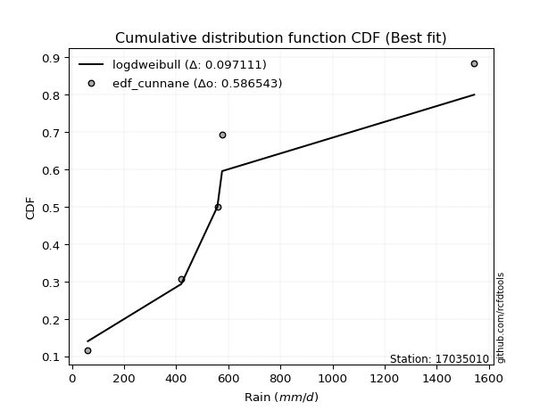</img></img>

</div>


### 12. EDF Adamowski (1981)

The Adamowski formula in hydrology refers to a specific plotting position formula used for estimating the non-parametric empirical distribution of hydrological events (like flood peaks) to calculate their return periods. This formula provides an alternative to traditional parametric methods (like the Gumbel or Log Pearson Type III distributions). 

<div align="center">


$P=(m-0.25)/(n+0.5)$


</div>


**12.1. Empirical values**

<div align="center">

|                | 0                   | 1                  | 2             | 3                  | 4                  |
|:---------------|:--------------------|:-------------------|:--------------|:-------------------|:-------------------|
| date           | 2007                | 2017               | 2018          | 2020               | 2019               |
| x              | 60.7                | 419.2              | 557.8         | 575.9              | 1543.5             |
| m              | 1                   | 2                  | 3             | 4                  | 5                  |
| empirical_dist | edf_adamowski       | edf_adamowski      | edf_adamowski | edf_adamowski      | edf_adamowski      |
| empirical      | 0.13636363636363635 | 0.3181818181818182 | 0.5           | 0.6818181818181818 | 0.8636363636363636 |
| empirical_tr   | 1.1578947368421053  | 1.4666666666666666 | 2.0           | 3.1428571428571423 | 7.333333333333334  |

</div>


**12.2. Kolmogorov-Smirnov fit test (sorted by Δ)**


<div align="center">

|                | 0                   | 1                   | 2                   | 3                   | 4                   | 5                   | 6                   | 7                  | 8                   | 9                   | 10                  | 11                  | 12                  | 13                  | 14                  | 15                  | 16                  | 17                  | 18                 | 19                  | 20                  | 21                  | 22                  | 23                 | 24                  | 25                  | 26                  | 27                  | 28                  | 29                 | 30                  | 31                  | 32                  | 33                  | 34                  | 35                  | 36                  | 37                  | 38                  | 39                  | 40                  | 41                 | 42                 | 43                  | 44                  | 45                  | 46                  | 47                  | 48                  | 49                  | 50                  | 51                  | 52                  | 53                  | 54                 | 55                 | 56                 | 57                  | 58                 | 59                  | 60                  | 61                  | 62                 | 63                  | 64                 | 65                  | 66                  | 67                  | 68                 | 69                 | 70                  | 71                  | 72                  | 73                  | 74                  | 75                 | 76                  | 77                  | 78                  | 79                  | 80                 | 81                 | 82                 | 83                 | 84                 | 85                 | 86                  | 87                  | 88                  | 89                  | 90                  | 91                  | 92                  | 93                  | 94                  | 95                 | 96                 | 97                  | 98                  | 99                 | 100                 | 101                | 102                | 103                | 104                | 105                 | 106                | 107                | 108                | 109                 | 110                 | 111                 | 112                | 113                | 114                | 115                 | 116                | 117                | 118                 | 119                 | 120                | 121                | 122                | 123                 | 124                | 125                | 126                | 127                | 128                 | 129                | 130                | 131                | 132                 | 133                 | 134                 | 135                 | 136                | 137                | 138                 | 139                 | 140                | 141                 | 142                | 143                | 144                | 145                | 146                | 147                | 148                | 149                | 150                | 151                | 152                | 153                | 154                | 155                | 156                | 157                | 158                | 159                |
|:---------------|:--------------------|:--------------------|:--------------------|:--------------------|:--------------------|:--------------------|:--------------------|:-------------------|:--------------------|:--------------------|:--------------------|:--------------------|:--------------------|:--------------------|:--------------------|:--------------------|:--------------------|:--------------------|:-------------------|:--------------------|:--------------------|:--------------------|:--------------------|:-------------------|:--------------------|:--------------------|:--------------------|:--------------------|:--------------------|:-------------------|:--------------------|:--------------------|:--------------------|:--------------------|:--------------------|:--------------------|:--------------------|:--------------------|:--------------------|:--------------------|:--------------------|:-------------------|:-------------------|:--------------------|:--------------------|:--------------------|:--------------------|:--------------------|:--------------------|:--------------------|:--------------------|:--------------------|:--------------------|:--------------------|:-------------------|:-------------------|:-------------------|:--------------------|:-------------------|:--------------------|:--------------------|:--------------------|:-------------------|:--------------------|:-------------------|:--------------------|:--------------------|:--------------------|:-------------------|:-------------------|:--------------------|:--------------------|:--------------------|:--------------------|:--------------------|:-------------------|:--------------------|:--------------------|:--------------------|:--------------------|:-------------------|:-------------------|:-------------------|:-------------------|:-------------------|:-------------------|:--------------------|:--------------------|:--------------------|:--------------------|:--------------------|:--------------------|:--------------------|:--------------------|:--------------------|:-------------------|:-------------------|:--------------------|:--------------------|:-------------------|:--------------------|:-------------------|:-------------------|:-------------------|:-------------------|:--------------------|:-------------------|:-------------------|:-------------------|:--------------------|:--------------------|:--------------------|:-------------------|:-------------------|:-------------------|:--------------------|:-------------------|:-------------------|:--------------------|:--------------------|:-------------------|:-------------------|:-------------------|:--------------------|:-------------------|:-------------------|:-------------------|:-------------------|:--------------------|:-------------------|:-------------------|:-------------------|:--------------------|:--------------------|:--------------------|:--------------------|:-------------------|:-------------------|:--------------------|:--------------------|:-------------------|:--------------------|:-------------------|:-------------------|:-------------------|:-------------------|:-------------------|:-------------------|:-------------------|:-------------------|:-------------------|:-------------------|:-------------------|:-------------------|:-------------------|:-------------------|:-------------------|:-------------------|:-------------------|:-------------------|
| station        | 17035010            | 17035010            | 17035010            | 17035010            | 17035010            | 17035010            | 17035010            | 17035010           | 17035010            | 17035010            | 17035010            | 17035010            | 17035010            | 17035010            | 17035010            | 17035010            | 17035010            | 17035010            | 17035010           | 17035010            | 17035010            | 17035010            | 17035010            | 17035010           | 17035010            | 17035010            | 17035010            | 17035010            | 17035010            | 17035010           | 17035010            | 17035010            | 17035010            | 17035010            | 17035010            | 17035010            | 17035010            | 17035010            | 17035010            | 17035010            | 17035010            | 17035010           | 17035010           | 17035010            | 17035010            | 17035010            | 17035010            | 17035010            | 17035010            | 17035010            | 17035010            | 17035010            | 17035010            | 17035010            | 17035010           | 17035010           | 17035010           | 17035010            | 17035010           | 17035010            | 17035010            | 17035010            | 17035010           | 17035010            | 17035010           | 17035010            | 17035010            | 17035010            | 17035010           | 17035010           | 17035010            | 17035010            | 17035010            | 17035010            | 17035010            | 17035010           | 17035010            | 17035010            | 17035010            | 17035010            | 17035010           | 17035010           | 17035010           | 17035010           | 17035010           | 17035010           | 17035010            | 17035010            | 17035010            | 17035010            | 17035010            | 17035010            | 17035010            | 17035010            | 17035010            | 17035010           | 17035010           | 17035010            | 17035010            | 17035010           | 17035010            | 17035010           | 17035010           | 17035010           | 17035010           | 17035010            | 17035010           | 17035010           | 17035010           | 17035010            | 17035010            | 17035010            | 17035010           | 17035010           | 17035010           | 17035010            | 17035010           | 17035010           | 17035010            | 17035010            | 17035010           | 17035010           | 17035010           | 17035010            | 17035010           | 17035010           | 17035010           | 17035010           | 17035010            | 17035010           | 17035010           | 17035010           | 17035010            | 17035010            | 17035010            | 17035010            | 17035010           | 17035010           | 17035010            | 17035010            | 17035010           | 17035010            | 17035010           | 17035010           | 17035010           | 17035010           | 17035010           | 17035010           | 17035010           | 17035010           | 17035010           | 17035010           | 17035010           | 17035010           | 17035010           | 17035010           | 17035010           | 17035010           | 17035010           | 17035010           |
| empirical_dist | edf_adamowski       | edf_adamowski       | edf_adamowski       | edf_adamowski       | edf_adamowski       | edf_adamowski       | edf_adamowski       | edf_adamowski      | edf_adamowski       | edf_adamowski       | edf_adamowski       | edf_adamowski       | edf_adamowski       | edf_adamowski       | edf_adamowski       | edf_adamowski       | edf_adamowski       | edf_adamowski       | edf_adamowski      | edf_adamowski       | edf_adamowski       | edf_adamowski       | edf_adamowski       | edf_adamowski      | edf_adamowski       | edf_adamowski       | edf_adamowski       | edf_adamowski       | edf_adamowski       | edf_adamowski      | edf_adamowski       | edf_adamowski       | edf_adamowski       | edf_adamowski       | edf_adamowski       | edf_adamowski       | edf_adamowski       | edf_adamowski       | edf_adamowski       | edf_adamowski       | edf_adamowski       | edf_adamowski      | edf_adamowski      | edf_adamowski       | edf_adamowski       | edf_adamowski       | edf_adamowski       | edf_adamowski       | edf_adamowski       | edf_adamowski       | edf_adamowski       | edf_adamowski       | edf_adamowski       | edf_adamowski       | edf_adamowski      | edf_adamowski      | edf_adamowski      | edf_adamowski       | edf_adamowski      | edf_adamowski       | edf_adamowski       | edf_adamowski       | edf_adamowski      | edf_adamowski       | edf_adamowski      | edf_adamowski       | edf_adamowski       | edf_adamowski       | edf_adamowski      | edf_adamowski      | edf_adamowski       | edf_adamowski       | edf_adamowski       | edf_adamowski       | edf_adamowski       | edf_adamowski      | edf_adamowski       | edf_adamowski       | edf_adamowski       | edf_adamowski       | edf_adamowski      | edf_adamowski      | edf_adamowski      | edf_adamowski      | edf_adamowski      | edf_adamowski      | edf_adamowski       | edf_adamowski       | edf_adamowski       | edf_adamowski       | edf_adamowski       | edf_adamowski       | edf_adamowski       | edf_adamowski       | edf_adamowski       | edf_adamowski      | edf_adamowski      | edf_adamowski       | edf_adamowski       | edf_adamowski      | edf_adamowski       | edf_adamowski      | edf_adamowski      | edf_adamowski      | edf_adamowski      | edf_adamowski       | edf_adamowski      | edf_adamowski      | edf_adamowski      | edf_adamowski       | edf_adamowski       | edf_adamowski       | edf_adamowski      | edf_adamowski      | edf_adamowski      | edf_adamowski       | edf_adamowski      | edf_adamowski      | edf_adamowski       | edf_adamowski       | edf_adamowski      | edf_adamowski      | edf_adamowski      | edf_adamowski       | edf_adamowski      | edf_adamowski      | edf_adamowski      | edf_adamowski      | edf_adamowski       | edf_adamowski      | edf_adamowski      | edf_adamowski      | edf_adamowski       | edf_adamowski       | edf_adamowski       | edf_adamowski       | edf_adamowski      | edf_adamowski      | edf_adamowski       | edf_adamowski       | edf_adamowski      | edf_adamowski       | edf_adamowski      | edf_adamowski      | edf_adamowski      | edf_adamowski      | edf_adamowski      | edf_adamowski      | edf_adamowski      | edf_adamowski      | edf_adamowski      | edf_adamowski      | edf_adamowski      | edf_adamowski      | edf_adamowski      | edf_adamowski      | edf_adamowski      | edf_adamowski      | edf_adamowski      | edf_adamowski      |
| p_dist         | logdweibull         | mielke              | burr                | johnsonsu           | loggenlogistic      | loggennorm          | betaprime           | loggumbel_l        | logburr             | logmielke           | invgamma            | logweibull_min      | logburr12           | nct                 | logdgamma           | halflogistic        | logpearson3         | exponnorm           | moyal              | dgamma              | genexpon            | logskewnorm         | lomax               | kappa3             | wald                | logtrapezoid        | logloggamma         | logargus            | logtriang           | truncpareto        | loggompertz         | halfnorm            | foldnorm            | truncexpon          | genlogistic         | bradford            | gumbel_r            | loggenhalflogistic  | logloglaplace       | pearson3            | vonmises_line       | kstwobign          | exponpow           | skewnorm            | gompertz            | rayleigh            | gennorm             | dweibull            | logfoldnorm         | logarcsine          | logsemicircular     | loganglit           | logt                | logcrystalball      | lognorm            | logexponnorm       | loglogistic        | loghypsecant        | lognct             | loglaplace          | loglaplace          | logf                | logfatiguelife     | logerlang           | maxwell            | logbetaprime        | logncf              | logrice             | loggamma           | loggamma           | ncf                 | loginvgamma         | arcsine             | logalpha            | rice                | loginvgauss        | logwrapcauchy       | logmaxwell          | semicircular        | loglevy_l           | anglit             | logbeta            | logcosine          | truncweibull_min   | loginvweibull      | norm               | truncnorm           | t                   | lograyleigh         | logistic            | logjohnsonsb        | hypsecant           | logweibull_max      | halfgennorm         | beta                | levy_l             | logkappa3          | weibull_min         | loggumbel_r         | loggengamma        | laplace             | logkstwobign       | loghalfnorm        | loggausshyper      | loggenextreme      | logksone            | loggenexpon        | gausshyper         | cosine             | logkappa4           | loguniform          | logvonmises_line    | logmoyal           | wrapcauchy         | logbradford        | loghalflogistic     | f                  | lognakagami        | genextreme          | gumbel_l            | kappa4             | loggenpareto       | logexponweib       | ksone               | burr12             | logtruncnorm       | nakagami           | invgauss           | uniform             | genpareto          | argus              | gamma              | logwald             | erlang              | triang              | logtruncexpon       | invweibull         | crystalball        | loglomax            | logjohnsonsu        | alpha              | logtruncweibull_min | genhalflogistic    | rdist              | exponweib          | logrdist           | fatiguelife        | logtukeylambda     | powerlaw           | johnsonsb          | trapezoid          | logexponpow        | tukeylambda        | weibull_max        | logpowerlaw        | logtruncpareto     | loghalfgennorm     | gengamma           | logvonmises        | vonmises           |
| delta          | 0.08662110322033045 | 0.11494832621436735 | 0.11507138393416283 | 0.11526530399611568 | 0.11632469319366512 | 0.11648122718437542 | 0.11738496983883923 | 0.1179815559547095 | 0.11859765066786143 | 0.11919544734554843 | 0.11976594486361603 | 0.11987336496319057 | 0.12162402027768648 | 0.12231571340918623 | 0.12406445816827993 | 0.12571389090647533 | 0.12939899778274094 | 0.13224801495078375 | 0.1336883629318537 | 0.13405177675341462 | 0.13598637041862255 | 0.13636314658782644 | 0.13636359836386341 | 0.136363636363453  | 0.13636363636363635 | 0.13651815078076623 | 0.14161924172770568 | 0.14378804279905533 | 0.14418470427286878 | 0.1456897010958545 | 0.14633432956192344 | 0.14727960758318426 | 0.15002651693744218 | 0.15047912669152985 | 0.15082404255712278 | 0.15304097390186322 | 0.15917794874205482 | 0.16180576753407694 | 0.16226565778847646 | 0.16430771084016083 | 0.16718587370807914 | 0.1706438212089868 | 0.1711517840659772 | 0.17599266533604963 | 0.17686763285189144 | 0.18064100101649405 | 0.18181818170786912 | 0.18181818182322573 | 0.18228180476487427 | 0.18291006541773275 | 0.18336241303388529 | 0.18347653374259404 | 0.18375196986913517 | 0.18375356655959424 | 0.18375358293826   | 0.1837548784605319 | 0.1840180116011691 | 0.18424383344140732 | 0.1842958603853389 | 0.18523686350950935 | 0.18523686350950935 | 0.18580836701014908 | 0.1863931604042181 | 0.18993014424878069 | 0.1924654725615612 | 0.19297941915884026 | 0.19404576688221148 | 0.19412483412518083 | 0.1950233129695647 | 0.1950233129695647 | 0.19592418236993997 | 0.20248856420397915 | 0.20723563388963173 | 0.20786842402051203 | 0.21095201126768864 | 0.2122117821416875 | 0.21513599256860977 | 0.21672548648887552 | 0.21770665692804103 | 0.21779492170470938 | 0.2203411362463829 | 0.2230559686019019 | 0.2260454976373028 | 0.2262415952256479 | 0.2267230630017511 | 0.2267263226928653 | 0.22672633156375643 | 0.22673104716102188 | 0.22769492067959368 | 0.23279269984578432 | 0.23432008538681715 | 0.23792871869889548 | 0.24123688960668355 | 0.24132469419793395 | 0.24546923323516423 | 0.2460368990687466 | 0.2485210334477584 | 0.24941058296393698 | 0.25418404379307497 | 0.2551871769607687 | 0.25554723218907827 | 0.25734325697263   | 0.258578642946149  | 0.2594410682983405 | 0.2606335672918558 | 0.26280436969726545 | 0.264681267720372  | 0.2720660674210059 | 0.2723198196553188 | 0.27681465623880114 | 0.27900160727308215 | 0.27903740359835666 | 0.280017328413344  | 0.2807581858798789 | 0.2810446978837898 | 0.28362983287902915 | 0.2877257558935789 | 0.2896246938964317 | 0.29299888020074955 | 0.29700441576156333 | 0.3014632778291706 | 0.306681235087006  | 0.3085379094232536 | 0.30894254113838676 | 0.314719759806161  | 0.3181809443130318 | 0.3181817798455188 | 0.3243030948621696 | 0.33436741300242784 | 0.3431860087566092 | 0.3436534032048246 | 0.3481243715833801 | 0.35184759009875005 | 0.37889344133868413 | 0.38186663529339765 | 0.38770659106343847 | 0.3889093511455309 | 0.3940841354029512 | 0.41828080865174055 | 0.43092533670656874 | 0.4318457219602317 | 0.4384869965947756  | 0.4475270565434213 | 0.4865083188643647 | 0.4967566963616075 | 0.5064654459531619 | 0.5165578979642227 | 0.5296543506200513 | 0.5310859548234026 | 0.5406272815778148 | 0.5409405900739044 | 0.5501914371526586 | 0.5591790723642467 | 0.5763723855861018 | 0.6146777240415808 | 0.63064011978973   | 0.6818181818181818 | 0.6818181818181819 | 1.0914149176809875 | 245.35118503200349 |
| deltao         | 0.5865427407550001  | 0.5865427407550001  | 0.5865427407550001  | 0.5865427407550001  | 0.5865427407550001  | 0.5865427407550001  | 0.5865427407550001  | 0.5865427407550001 | 0.5865427407550001  | 0.5865427407550001  | 0.5865427407550001  | 0.5865427407550001  | 0.5865427407550001  | 0.5865427407550001  | 0.5865427407550001  | 0.5865427407550001  | 0.5865427407550001  | 0.5865427407550001  | 0.5865427407550001 | 0.5865427407550001  | 0.5865427407550001  | 0.5865427407550001  | 0.5865427407550001  | 0.5865427407550001 | 0.5865427407550001  | 0.5865427407550001  | 0.5865427407550001  | 0.5865427407550001  | 0.5865427407550001  | 0.5865427407550001 | 0.5865427407550001  | 0.5865427407550001  | 0.5865427407550001  | 0.5865427407550001  | 0.5865427407550001  | 0.5865427407550001  | 0.5865427407550001  | 0.5865427407550001  | 0.5865427407550001  | 0.5865427407550001  | 0.5865427407550001  | 0.5865427407550001 | 0.5865427407550001 | 0.5865427407550001  | 0.5865427407550001  | 0.5865427407550001  | 0.5865427407550001  | 0.5865427407550001  | 0.5865427407550001  | 0.5865427407550001  | 0.5865427407550001  | 0.5865427407550001  | 0.5865427407550001  | 0.5865427407550001  | 0.5865427407550001 | 0.5865427407550001 | 0.5865427407550001 | 0.5865427407550001  | 0.5865427407550001 | 0.5865427407550001  | 0.5865427407550001  | 0.5865427407550001  | 0.5865427407550001 | 0.5865427407550001  | 0.5865427407550001 | 0.5865427407550001  | 0.5865427407550001  | 0.5865427407550001  | 0.5865427407550001 | 0.5865427407550001 | 0.5865427407550001  | 0.5865427407550001  | 0.5865427407550001  | 0.5865427407550001  | 0.5865427407550001  | 0.5865427407550001 | 0.5865427407550001  | 0.5865427407550001  | 0.5865427407550001  | 0.5865427407550001  | 0.5865427407550001 | 0.5865427407550001 | 0.5865427407550001 | 0.5865427407550001 | 0.5865427407550001 | 0.5865427407550001 | 0.5865427407550001  | 0.5865427407550001  | 0.5865427407550001  | 0.5865427407550001  | 0.5865427407550001  | 0.5865427407550001  | 0.5865427407550001  | 0.5865427407550001  | 0.5865427407550001  | 0.5865427407550001 | 0.5865427407550001 | 0.5865427407550001  | 0.5865427407550001  | 0.5865427407550001 | 0.5865427407550001  | 0.5865427407550001 | 0.5865427407550001 | 0.5865427407550001 | 0.5865427407550001 | 0.5865427407550001  | 0.5865427407550001 | 0.5865427407550001 | 0.5865427407550001 | 0.5865427407550001  | 0.5865427407550001  | 0.5865427407550001  | 0.5865427407550001 | 0.5865427407550001 | 0.5865427407550001 | 0.5865427407550001  | 0.5865427407550001 | 0.5865427407550001 | 0.5865427407550001  | 0.5865427407550001  | 0.5865427407550001 | 0.5865427407550001 | 0.5865427407550001 | 0.5865427407550001  | 0.5865427407550001 | 0.5865427407550001 | 0.5865427407550001 | 0.5865427407550001 | 0.5865427407550001  | 0.5865427407550001 | 0.5865427407550001 | 0.5865427407550001 | 0.5865427407550001  | 0.5865427407550001  | 0.5865427407550001  | 0.5865427407550001  | 0.5865427407550001 | 0.5865427407550001 | 0.5865427407550001  | 0.5865427407550001  | 0.5865427407550001 | 0.5865427407550001  | 0.5865427407550001 | 0.5865427407550001 | 0.5865427407550001 | 0.5865427407550001 | 0.5865427407550001 | 0.5865427407550001 | 0.5865427407550001 | 0.5865427407550001 | 0.5865427407550001 | 0.5865427407550001 | 0.5865427407550001 | 0.5865427407550001 | 0.5865427407550001 | 0.5865427407550001 | 0.5865427407550001 | 0.5865427407550001 | 0.5865427407550001 | 0.5865427407550001 |
| eval           | Δo > Δ              | Δo > Δ              | Δo > Δ              | Δo > Δ              | Δo > Δ              | Δo > Δ              | Δo > Δ              | Δo > Δ             | Δo > Δ              | Δo > Δ              | Δo > Δ              | Δo > Δ              | Δo > Δ              | Δo > Δ              | Δo > Δ              | Δo > Δ              | Δo > Δ              | Δo > Δ              | Δo > Δ             | Δo > Δ              | Δo > Δ              | Δo > Δ              | Δo > Δ              | Δo > Δ             | Δo > Δ              | Δo > Δ              | Δo > Δ              | Δo > Δ              | Δo > Δ              | Δo > Δ             | Δo > Δ              | Δo > Δ              | Δo > Δ              | Δo > Δ              | Δo > Δ              | Δo > Δ              | Δo > Δ              | Δo > Δ              | Δo > Δ              | Δo > Δ              | Δo > Δ              | Δo > Δ             | Δo > Δ             | Δo > Δ              | Δo > Δ              | Δo > Δ              | Δo > Δ              | Δo > Δ              | Δo > Δ              | Δo > Δ              | Δo > Δ              | Δo > Δ              | Δo > Δ              | Δo > Δ              | Δo > Δ             | Δo > Δ             | Δo > Δ             | Δo > Δ              | Δo > Δ             | Δo > Δ              | Δo > Δ              | Δo > Δ              | Δo > Δ             | Δo > Δ              | Δo > Δ             | Δo > Δ              | Δo > Δ              | Δo > Δ              | Δo > Δ             | Δo > Δ             | Δo > Δ              | Δo > Δ              | Δo > Δ              | Δo > Δ              | Δo > Δ              | Δo > Δ             | Δo > Δ              | Δo > Δ              | Δo > Δ              | Δo > Δ              | Δo > Δ             | Δo > Δ             | Δo > Δ             | Δo > Δ             | Δo > Δ             | Δo > Δ             | Δo > Δ              | Δo > Δ              | Δo > Δ              | Δo > Δ              | Δo > Δ              | Δo > Δ              | Δo > Δ              | Δo > Δ              | Δo > Δ              | Δo > Δ             | Δo > Δ             | Δo > Δ              | Δo > Δ              | Δo > Δ             | Δo > Δ              | Δo > Δ             | Δo > Δ             | Δo > Δ             | Δo > Δ             | Δo > Δ              | Δo > Δ             | Δo > Δ             | Δo > Δ             | Δo > Δ              | Δo > Δ              | Δo > Δ              | Δo > Δ             | Δo > Δ             | Δo > Δ             | Δo > Δ              | Δo > Δ             | Δo > Δ             | Δo > Δ              | Δo > Δ              | Δo > Δ             | Δo > Δ             | Δo > Δ             | Δo > Δ              | Δo > Δ             | Δo > Δ             | Δo > Δ             | Δo > Δ             | Δo > Δ              | Δo > Δ             | Δo > Δ             | Δo > Δ             | Δo > Δ              | Δo > Δ              | Δo > Δ              | Δo > Δ              | Δo > Δ             | Δo > Δ             | Δo > Δ              | Δo > Δ              | Δo > Δ             | Δo > Δ              | Δo > Δ             | Δo > Δ             | Δo > Δ             | Δo > Δ             | Δo > Δ             | Δo > Δ             | Δo > Δ             | Δo > Δ             | Δo > Δ             | Δo > Δ             | Δo > Δ             | Δo > Δ             | Δo <= Δ            | Δo <= Δ            | Δo <= Δ            | Δo <= Δ            | Δo <= Δ            | Δo <= Δ            |
| fit            | 1                   | 1                   | 1                   | 1                   | 1                   | 1                   | 1                   | 1                  | 1                   | 1                   | 1                   | 1                   | 1                   | 1                   | 1                   | 1                   | 1                   | 1                   | 1                  | 1                   | 1                   | 1                   | 1                   | 1                  | 1                   | 1                   | 1                   | 1                   | 1                   | 1                  | 1                   | 1                   | 1                   | 1                   | 1                   | 1                   | 1                   | 1                   | 1                   | 1                   | 1                   | 1                  | 1                  | 1                   | 1                   | 1                   | 1                   | 1                   | 1                   | 1                   | 1                   | 1                   | 1                   | 1                   | 1                  | 1                  | 1                  | 1                   | 1                  | 1                   | 1                   | 1                   | 1                  | 1                   | 1                  | 1                   | 1                   | 1                   | 1                  | 1                  | 1                   | 1                   | 1                   | 1                   | 1                   | 1                  | 1                   | 1                   | 1                   | 1                   | 1                  | 1                  | 1                  | 1                  | 1                  | 1                  | 1                   | 1                   | 1                   | 1                   | 1                   | 1                   | 1                   | 1                   | 1                   | 1                  | 1                  | 1                   | 1                   | 1                  | 1                   | 1                  | 1                  | 1                  | 1                  | 1                   | 1                  | 1                  | 1                  | 1                   | 1                   | 1                   | 1                  | 1                  | 1                  | 1                   | 1                  | 1                  | 1                   | 1                   | 1                  | 1                  | 1                  | 1                   | 1                  | 1                  | 1                  | 1                  | 1                   | 1                  | 1                  | 1                  | 1                   | 1                   | 1                   | 1                   | 1                  | 1                  | 1                   | 1                   | 1                  | 1                   | 1                  | 1                  | 1                  | 1                  | 1                  | 1                  | 1                  | 1                  | 1                  | 1                  | 1                  | 1                  | 0                  | 0                  | 0                  | 0                  | 0                  | 0                  |
| n              | 5                   | 5                   | 5                   | 5                   | 5                   | 5                   | 5                   | 5                  | 5                   | 5                   | 5                   | 5                   | 5                   | 5                   | 5                   | 5                   | 5                   | 5                   | 5                  | 5                   | 5                   | 5                   | 5                   | 5                  | 5                   | 5                   | 5                   | 5                   | 5                   | 5                  | 5                   | 5                   | 5                   | 5                   | 5                   | 5                   | 5                   | 5                   | 5                   | 5                   | 5                   | 5                  | 5                  | 5                   | 5                   | 5                   | 5                   | 5                   | 5                   | 5                   | 5                   | 5                   | 5                   | 5                   | 5                  | 5                  | 5                  | 5                   | 5                  | 5                   | 5                   | 5                   | 5                  | 5                   | 5                  | 5                   | 5                   | 5                   | 5                  | 5                  | 5                   | 5                   | 5                   | 5                   | 5                   | 5                  | 5                   | 5                   | 5                   | 5                   | 5                  | 5                  | 5                  | 5                  | 5                  | 5                  | 5                   | 5                   | 5                   | 5                   | 5                   | 5                   | 5                   | 5                   | 5                   | 5                  | 5                  | 5                   | 5                   | 5                  | 5                   | 5                  | 5                  | 5                  | 5                  | 5                   | 5                  | 5                  | 5                  | 5                   | 5                   | 5                   | 5                  | 5                  | 5                  | 5                   | 5                  | 5                  | 5                   | 5                   | 5                  | 5                  | 5                  | 5                   | 5                  | 5                  | 5                  | 5                  | 5                   | 5                  | 5                  | 5                  | 5                   | 5                   | 5                   | 5                   | 5                  | 5                  | 5                   | 5                   | 5                  | 5                   | 5                  | 5                  | 5                  | 5                  | 5                  | 5                  | 5                  | 5                  | 5                  | 5                  | 5                  | 5                  | 5                  | 5                  | 5                  | 5                  | 5                  | 5                  |
| best_fit       | 1                   | 0                   | 0                   | 0                   | 0                   | 0                   | 0                   | 0                  | 0                   | 0                   | 0                   | 0                   | 0                   | 0                   | 0                   | 0                   | 0                   | 0                   | 0                  | 0                   | 0                   | 0                   | 0                   | 0                  | 0                   | 0                   | 0                   | 0                   | 0                   | 0                  | 0                   | 0                   | 0                   | 0                   | 0                   | 0                   | 0                   | 0                   | 0                   | 0                   | 0                   | 0                  | 0                  | 0                   | 0                   | 0                   | 0                   | 0                   | 0                   | 0                   | 0                   | 0                   | 0                   | 0                   | 0                  | 0                  | 0                  | 0                   | 0                  | 0                   | 0                   | 0                   | 0                  | 0                   | 0                  | 0                   | 0                   | 0                   | 0                  | 0                  | 0                   | 0                   | 0                   | 0                   | 0                   | 0                  | 0                   | 0                   | 0                   | 0                   | 0                  | 0                  | 0                  | 0                  | 0                  | 0                  | 0                   | 0                   | 0                   | 0                   | 0                   | 0                   | 0                   | 0                   | 0                   | 0                  | 0                  | 0                   | 0                   | 0                  | 0                   | 0                  | 0                  | 0                  | 0                  | 0                   | 0                  | 0                  | 0                  | 0                   | 0                   | 0                   | 0                  | 0                  | 0                  | 0                   | 0                  | 0                  | 0                   | 0                   | 0                  | 0                  | 0                  | 0                   | 0                  | 0                  | 0                  | 0                  | 0                   | 0                  | 0                  | 0                  | 0                   | 0                   | 0                   | 0                   | 0                  | 0                  | 0                   | 0                   | 0                  | 0                   | 0                  | 0                  | 0                  | 0                  | 0                  | 0                  | 0                  | 0                  | 0                  | 0                  | 0                  | 0                  | 0                  | 0                  | 0                  | 0                  | 0                  | 0                  |
| best_fit_sort  | 1                   | 2                   | 3                   | 4                   | 5                   | 6                   | 7                   | 8                  | 9                   | 10                  | 11                  | 12                  | 13                  | 14                  | 15                  | 16                  | 17                  | 18                  | 19                 | 20                  | 21                  | 22                  | 23                  | 24                 | 25                  | 26                  | 27                  | 28                  | 29                  | 30                 | 31                  | 32                  | 33                  | 34                  | 35                  | 36                  | 37                  | 38                  | 39                  | 40                  | 41                  | 42                 | 43                 | 44                  | 45                  | 46                  | 47                  | 48                  | 49                  | 50                  | 51                  | 52                  | 53                  | 54                  | 55                 | 56                 | 57                 | 58                  | 59                 | 60                  | 61                  | 62                  | 63                 | 64                  | 65                 | 66                  | 67                  | 68                  | 69                 | 70                 | 71                  | 72                  | 73                  | 74                  | 75                  | 76                 | 77                  | 78                  | 79                  | 80                  | 81                 | 82                 | 83                 | 84                 | 85                 | 86                 | 87                  | 88                  | 89                  | 90                  | 91                  | 92                  | 93                  | 94                  | 95                  | 96                 | 97                 | 98                  | 99                  | 100                | 101                 | 102                | 103                | 104                | 105                | 106                 | 107                | 108                | 109                | 110                 | 111                 | 112                 | 113                | 114                | 115                | 116                 | 117                | 118                | 119                 | 120                 | 121                | 122                | 123                | 124                 | 125                | 126                | 127                | 128                | 129                 | 130                | 131                | 132                | 133                 | 134                 | 135                 | 136                 | 137                | 138                | 139                 | 140                 | 141                | 142                 | 143                | 144                | 145                | 146                | 147                | 148                | 149                | 150                | 151                | 152                | 153                | 154                | 155                | 156                | 157                | 158                | 159                | 160                |

</div>


**12.3. Best fit**

<div align="center">

|   id |   station | empirical_dist   | p_dist      |     delta |   deltao | eval   |   fit |   n |   best_fit |   best_fit_sort |
|-----:|----------:|:-----------------|:------------|----------:|---------:|:-------|------:|----:|-----------:|----------------:|
|    0 |  17035010 | edf_adamowski    | logdweibull | 0.0866211 | 0.586543 | Δo > Δ |     1 |   5 |          1 |               1 |

</div>


<div align="center">

</img></img>

</div>


## C. Best fit & Estimate extreme values for specific return periods - Tr

Best fit in probability distribution analysis means finding the theoretical distribution (like Normal, Poisson, Exponential, etc.) that most accurately mirrors your real-world data´s patterns (shape, center, spread) for better predictions, using methods like visual checks (Q-Q plots), goodness-of-fit tests (Kolmogorov-Smirnov, Chi-Squared), and information criteria (AIC) to score and select the simplest, most representative model.


### 1. Best fit (ordered by delta Δ)

:file_folder:Table: [bestfit_17035010.csv](table/bestfit_17035010.csv)

<div align="center">

|   id |   station | empirical_dist   | p_dist      |     delta |   deltao | eval   |   fit |   n |   best_fit |   best_fit_sort |
|-----:|----------:|:-----------------|:------------|----------:|---------:|:-------|------:|----:|-----------:|----------------:|
|    0 |  17035010 | edf_weibull      | logdweibull | 0.0714696 | 0.586543 | Δo > Δ |     1 |   5 |          1 |               1 |
|    1 |  17035010 | edf_adamowski    | logdweibull | 0.0866211 | 0.586543 | Δo > Δ |     1 |   5 |          1 |               2 |
|    2 |  17035010 | edf_chegodayev   | logdweibull | 0.0899881 | 0.586543 | Δo > Δ |     1 |   5 |          1 |               3 |
|    3 |  17035010 | edf_jenkinson    | logdweibull | 0.0906765 | 0.586543 | Δo > Δ |     1 |   5 |          1 |               4 |
|    4 |  17035010 | edf_beard        | logdweibull | 0.0906765 | 0.586543 | Δo > Δ |     1 |   5 |          1 |               5 |
|    5 |  17035010 | edf_filliben     | logdweibull | 0.0911962 | 0.586543 | Δo > Δ |     1 |   5 |          1 |               6 |
|    6 |  17035010 | edf_tukey        | logdweibull | 0.0923029 | 0.586543 | Δo > Δ |     1 |   5 |          1 |               7 |
|    7 |  17035010 | edf_blom         | logdweibull | 0.0952791 | 0.586543 | Δo > Δ |     1 |   5 |          1 |               8 |
|    8 |  17035010 | edf_cunnane      | logdweibull | 0.0971106 | 0.586543 | Δo > Δ |     1 |   5 |          1 |               9 |
|    9 |  17035010 | edf_gringorten   | logdweibull | 0.100115  | 0.586543 | Δo > Δ |     1 |   5 |          1 |              10 |
|   10 |  17035010 | edf_hazen        | loggennorm  | 0.104248  | 0.586543 | Δo > Δ |     1 |   5 |          1 |              11 |
|   11 |  17035010 | edf_california   | loglaplace  | 0.161803  | 0.586543 | Δo > Δ |     1 |   5 |          1 |              12 |
|   12 |  17035010 | edf_california   | loglaplace  | 0.161803  | 0.586543 | Δo > Δ |     1 |   5 |          1 |              13 |

</div>


### 2. Extreme values and % difference analysis

In hydrology, a return period (or recurrence interval $Tr$) is the statistical average time between extreme events like floods or droughts of a specific magnitude, indicating how rare an event is, with a 100-year flood, for example, having a 1% chance of occurring in any given year, not that it happens exactly every century. It is a key tool for infrastructure design (like bridges or dams) and risk assessment, calculated from historical data to determine the probability of future events, although it is important to remember it is statistical average, and events can cluster or be missed.

The extreme value porcentage difference is evaluated as $pdiff = 1 - (ETrBf / ETr) * 100$, where _ETrBf_ correspond to the bestfit extreme value for a specific recurrence interval and _ETr_ correspond to the extreme value for one of the most used PDFsused in hydrology.

> risk_rate: assuming the return period as the project useful life.

:file_folder:Table: [extreme_17035010.csv](table/extreme_17035010.csv), all PDFs.  
:file_folder:Table: [extremepdiff_17035010.csv](table/extremepdiff_17035010.csv), % difference between bestfit and most used PDFs in Hydrology.

<div align="center">

Extreme values table for only best fit PDFs
|   id |      tr |   prob_l |     prob_g |      alpha |   anglit |   arcsine |    argus |     beta |   betaprime |   bradford |     burr |   burr12 |   cosine |   crystalball |   dgamma |   dweibull |   erlang |   exponnorm |   exponpow |        exponweib |        f |   fatiguelife |   foldnorm |    gamma |   gausshyper |   genexpon |      genextreme |   gengamma |   genhalflogistic |   genlogistic |   gennorm |   genpareto |   gompertz |   gumbel_l |   gumbel_r |   halfgennorm |   halflogistic |   halfnorm |   hypsecant |   invgamma |   invgauss |       invweibull |   johnsonsb |   johnsonsu |   kappa3 |   kappa4 |    ksone |   kstwobign |   laplace |   levy_l |   loggamma |   logistic |   loglaplace |    lomax |   maxwell |   mielke |    moyal |   nakagami |      ncf |      nct |     norm |   pearson3 |   powerlaw |   rayleigh |    rdist |     rice |   semicircular |   skewnorm |        t |   trapezoid |   triang |   truncexpon |   truncnorm |   truncpareto |   truncweibull_min |   tukeylambda |   uniform |   vonmises |   vonmises_line |     wald |   weibull_max |   weibull_min |   wrapcauchy |   logalpha |   loganglit |   logarcsine |   logargus |   logbeta |   logbetaprime |   logbradford |   logburr |   logburr12 |   logcosine |   logcrystalball |   logdgamma |      logdweibull |   logerlang |   logexponnorm |   logexponpow |     logexponweib |      logf |   logfatiguelife |   logfoldnorm |   loggausshyper |   loggenexpon |   loggenextreme |     loggengamma |   loggenhalflogistic |   loggenlogistic |       loggennorm |   loggenpareto |   loggompertz |   loggumbel_l |   loggumbel_r |   loghalfgennorm |   loghalflogistic |   loghalfnorm |   loghypsecant |   loginvgamma |   loginvgauss |   loginvweibull |   logjohnsonsb |   logjohnsonsu |   logkappa3 |   logkappa4 |   logksone |   logkstwobign |   loglevy_l |   logloggamma |   loglogistic |    logloglaplace |         loglomax |   logmaxwell |   logmielke |   logmoyal |   lognakagami |    logncf |    lognct |   lognorm |   logpearson3 |   logpowerlaw |   lograyleigh |   logrdist |   logrice |   logsemicircular |   logskewnorm |      logt |   logtrapezoid |   logtriang |   logtruncexpon |   logtruncnorm |   logtruncpareto |   logtruncweibull_min |   logtukeylambda |   loguniform |   logvonmises |   logvonmises_line |          logwald |   logweibull_max |   logweibull_min |   logwrapcauchy |   station |   n |   risk_rate |
|-----:|--------:|---------:|-----------:|-----------:|---------:|----------:|---------:|---------:|------------:|-----------:|---------:|---------:|---------:|--------------:|---------:|-----------:|---------:|------------:|-----------:|-----------------:|---------:|--------------:|-----------:|---------:|-------------:|-----------:|----------------:|-----------:|------------------:|--------------:|----------:|------------:|-----------:|-----------:|-----------:|--------------:|---------------:|-----------:|------------:|-----------:|-----------:|-----------------:|------------:|------------:|---------:|---------:|---------:|------------:|----------:|---------:|-----------:|-----------:|-------------:|---------:|----------:|---------:|---------:|-----------:|---------:|---------:|---------:|-----------:|-----------:|-----------:|---------:|---------:|---------------:|-----------:|---------:|------------:|---------:|-------------:|------------:|--------------:|-------------------:|--------------:|----------:|-----------:|----------------:|---------:|--------------:|--------------:|-------------:|-----------:|------------:|-------------:|-----------:|----------:|---------------:|--------------:|----------:|------------:|------------:|-----------------:|------------:|-----------------:|------------:|---------------:|--------------:|-----------------:|----------:|-----------------:|--------------:|----------------:|--------------:|----------------:|----------------:|---------------------:|-----------------:|-----------------:|---------------:|--------------:|--------------:|--------------:|-----------------:|------------------:|--------------:|---------------:|--------------:|--------------:|----------------:|---------------:|---------------:|------------:|------------:|-----------:|---------------:|------------:|--------------:|--------------:|-----------------:|-----------------:|-------------:|------------:|-----------:|--------------:|----------:|----------:|----------:|--------------:|--------------:|--------------:|-----------:|----------:|------------------:|--------------:|----------:|---------------:|------------:|----------------:|---------------:|-----------------:|----------------------:|-----------------:|-------------:|--------------:|-------------------:|-----------------:|-----------------:|-----------------:|----------------:|----------:|----:|------------:|
|    0 |    2    | 0.5      | 0.5        |    197.822 |  631.42  |   631.42  |  824.455 |  710.157 |     488.355 |    535.354 |  501.603 |  229.841 |  695.759 |     -0.475357 |  557.8   |    575.9   |  224.094 |     525.431 |    560.875 |     62.1142      |  298.859 |       60.7027 |    533.769 |  262.516 |      740.561 |    499.351 |    96.2668      |        inf |           1053.84 |       543.512 |   575.9   |     837.11  |    569.806 |    712.276 |    550.564 |       330.822 |        510.367 |    530.673 |     631.42  |    508.586 |    266.664 |   6803.94        |     60.7123 |     501.174 |  502.871 |  756.398 |  802.1   |     563.478 |   631.42  |  861.192 |    404.337 |    631.42  |      417.05  |  484.184 |   589.327 |  501.579 |  524.462 |    621.18  |  401.265 |  518.317 |  631.42  |    555.09  |    64.2906 |    574.397 | -93.1726 |  608.982 |        631.42  |    568.971 |  631.423 |     1166.24 |  917.009 |      527.266 |     631.42  |       463.381 |            640.259 |      -94.2929 |   802.1   |   -1.92889 |         560.89  |  471.879 |       1543.4  |       339.172 |      802.004 |    390.457 |     417.05  |      417.05  |    521.551 |   651.029 |        406.56  |       303.936 |   490.142 |     502.319 |     369.824 |          417.05  |     557.8   |    557.8         |     409.869 |        417.049 |       83.3574 |    201.442       |   414.723 |          414.142 |       418.702 |         311.121 |       316.84  |         733.764 |   214.759       |              543.691 |          501.896 |    557.8         |        177.016 |       458.317 |       496.364 |       350.41  |          60.6994 |           321.357 |       335.714 |        417.05  |       396.145 |       384.873 |         360.011 |        575.325 |  575.9         |     333.919 |     305.219 |    306.089 |        322.572 |     684.762 |       524.752 |       417.05  |    557.8         |   2727.69        |      380.912 |     489.779 |    331.258 |       420.405 |   404.809 |   416.443 |   417.05  |       481.033 |       61.8597 |       368.862 |    92.7307 |   405.335 |           417.05  |       495.652 |   417.052 |        500.213 |     468.181 |         211.371 |        535.617 |          66.7323 |               163.837 |          186.969 |      306.089 |      0.973043 |            306.046 |    295.801       |          841.028 |          499.559 |         306.089 |  17035010 |   5 |    0.75     |
|    1 |    2.33 | 0.570815 | 0.429185   |    235.455 |  733.723 |   784.994 |  926.14  |  860.929 |     573.185 |    638.572 |  580.655 |  309.357 |  789.297 |    142.423    |  587.65  |    605.6   |  279.802 |     598.838 |    665.092 |     65.1521      |  374.921 |       72.7622 |    629.767 |  320.129 |      870.787 |    587.057 |   209.717       |        inf |           1149.77 |       619.186 |   590.851 |     948.618 |    660.488 |    788.687 |    631.947 |       438.878 |        594.041 |    625.463 |     701.709 |    585.982 |    331.206 | 578170           |     60.7711 |     580.995 |  579.352 |  865.295 |  928.106 |     644.73  |   684.569 | 1071.92  |    491.467 |    708.802 |      467.618 |  577.491 |   680.574 |  580.506 |  601.5   |    691.917 |  497.402 |  587.455 |  719.248 |    641.534 |    72.0517 |    666.994 |  38.2891 |  691.987 |        741.142 |    656.459 |  719.247 |     1252.39 | 1020.6   |      639.212 |     719.248 |       559.674 |            746.119 |        3.0223 |   907.105 |   -1.87598 |         634.043 |  529.469 |       1543.48 |       423.454 |      967.502 |    474.484 |     519.825 |      580.502 |    625.197 |   788.312 |        494.453 |       382.312 |   576.562 |     589.661 |     452.233 |          503.872 |     582.907 |    566.144       |     499.726 |        503.87  |       96.0321 |    291.688       |   502.331 |          500.267 |       502.628 |         408.401 |       401.891 |         875.158 |   407.683       |              661.682 |          582.209 |    569.284       |        295.42  |       545.352 |       585.135 |       417.524 |          60.6994 |           384.8   |       411.731 |        485.198 |       481.731 |       470.563 |         459.347 |       1100.38  |  575.9         |     425.12  |     386.7   |    402.967 |        412.121 |     880.179 |       616.733 |       492.666 |    630.889       |   6308.31        |      463.612 |     576.604 |    391.029 |       423.789 |   496.52  |   503.4   |   503.872 |       574.973 |       63.8476 |       450.252 |   135.341  |   492.612 |           528.196 |       594.162 |   503.874 |        621.866 |     570.238 |         263.474 |        564.26  |          69.7874 |               205.166 |          220.962 |      384.916 |      1.15294  |            384.869 |    334.852       |         1110.9   |          587.497 |         565.677 |  17035010 |   5 |    0.729209 |
|    2 |    5    | 0.8      | 0.2        |    527.269 | 1094.67  |  1194.52  | 1252.31  | 1312     |     980.192 |   1064.9   |  940.966 | 1364.51  | 1126.37  |    673.471    |  796.984 |    951.515 |  600.728 |     950.774 |   1116.71  |    320.441       |  802.395 |      328.889  |   1031.94  |  631.383 |     1280.04  |    990.578 | 75277.2         |        inf |           1396.7  |       947.899 |   756.858 |    1291.51  |   1041.27  |   1035.54  |    985.509 |      1267.03  |        972.649 |   1026.31  |     983.652 |    953.014 |    785.198 |      1.44694e+14 |    106.861  |     963.389 |  936.181 | 1225.93  | 1335.91  |     989.871 |   950.304 | 1421.05  |   1027.26  |   1007.59  |      828.69  | 1044     |  1039.72  |  941.39  |  958.351 |   1048.73  |  977.889 |  915.826 | 1045.64  |   1007.46  |   273.978  |   1037.7   | 413.035  | 1024.29  |       1115.58  |   1026.43  | 1045.62  |     1499.55 | 1317.8   |     1062.23  |    1045.64  |       981.904 |           1128.34  |      315.676  |  1246.94  |   -1.67871 |         920.597 |  851.856 |       1543.5  |       912.986 |     1344.12  |   1005.58  |    1130.83  |     1402.08  |   1051.8   |  1260.38  |       1033.08  |       804.624 |   965.875 |     990.059 |     933.693 |         1017.52  |     951.333 |   1550.15        |    1057.96  |       1017.52  |      236.854  |   2728.62        |  1025.25  |         1010.34  |       991.067 |         945.54  |      1063.27  |        1295.41  | 86893.7         |             1110.01  |          946.56  |    745.526       |       1005.07  |       979.025 |       995.634 |       893.951 |          60.6994 |           869.537 |       976.064 |        890.384 |      1018.59  |      1027.79  |        1324.01  |       1538.03  |  575.901       |     928.778 |     826.053 |    981.21  |       1166.76  |    1334.17  |      1014.72  |       937.475 |   1211.22        | 417273           |     1004.63  |     967.437 |    843.173 |       580.805 |  1080.05  |  1019.07  |  1017.52  |      1032.96  |      112.637  |      1000.28  |   385.831  |  1024.81  |          1182.9   |      1007.41  |  1017.53  |       1161.26  |    1004.06  |         604.194 |        723.289 |         107.912  |               510.462 |          376.409 |      808.059 |      2.22644  |            808.014 |    670.385       |         1508.53  |          991.97  |        1208.42  |  17035010 |   5 |    0.67232  |
|    3 |   10    | 0.9      | 0.1        |   1063.4   | 1298.98  |  1293.39  | 1409.6   | 1461.02  |    1344.3   |   1305.58  | 1275.16  |  inf     | 1330.02  |   1025.75     | 1006.58  |   1409.97  |  926.957 |    1268.04  |   1449.18  |   3368.67        | 1228.92  |      682.534  |   1325.18  |  932.531 |     1435.6   |   1318.03  |     1.19655e+07 |        inf |           1478.8  |      1215.6   |  1021.61  |    1427.96  |   1314.19  |   1172.98  |   1273.48  |      2488.17  |       1287.07  |   1322.93  |    1208.79  |   1290.18  |   1405.17  |      1.00198e+21 |   1121.46   |    1313.28  | 1275.41  | 1386.43  | 1513.84  |    1252.65  |  1191.53  | 1505.34  |   1692.99  |   1227.63  |     1393.07  | 1467.48  |  1292.46  | 1277.6   | 1269.04  |   1342.06  | 1402.75  | 1233.84  | 1262.16  |   1290.76  |   654.248  |   1302.02  | 523.923  | 1261.23  |       1307.71  |   1300.2   | 1262.13  |     1596.09 | 1433.88  |     1285.89  |    1262.16  |      1235.09  |           1323.01  |      449.107  |  1395.22  |   -1.54656 |        1133.74  | 1193.99  |       1543.5  |      1431.98  |     1449.87  |   1696.22  |    1755.7   |     1734.71  |   1312.66  |  1438.63  |       1698.38  |      1114.16  |  1315     |    1321.46  |    1446.84  |         1621.9   |    1667.43  |  26643.9         |    1760.52  |       1621.88  |      618.558  |  33261.6         |  1647.51  |         1611.65  |      1554.9   |        1279.03  |      2153.37  |        1443.05  |     3.13421e+08 |             1327.72  |         1281.84  |   1204.39        |       1360.7   |      1371.24  |      1338.51  |      1661.91  |          60.6994 |          1711.25  |      1848.71  |       1445.83  |      1707.21  |      1779.61  |        3135.84  |       1543.25  |  576.512       |    1306.37  |    1140.45  |   1446.77  |       2576.83  |    1475.1   |      1318.28  |      1505.68  |   2317.03        |      1.87511e+07 |     1731.25  |    1316.93  |   1646.12  |      1261.08  |  1838.29  |  1627.75  |  1621.9   |      1429.97  |      266.939  |      1767.26  |   512.67   |  1674.12  |          1789.03  |      1249.1   |  1621.9   |       1482.09  |    1252.37  |         935.167 |        886.439 |         211.472  |               848.668 |          470.161 |     1116.8   |      3.67034  |           1116.78  |   1400.41        |         1539.46  |         1327.87  |        1381.17  |  17035010 |   5 |    0.651322 |
|    4 |   15    | 0.933333 | 0.0666667  |   1597.62  | 1386.22  |  1312.24  | 1469.4   | 1498.74  |    1559.22  |   1394.71  | 1490.73  |  inf     | 1422.79  |   1201.55     | 1132.49  |   1722.46  | 1126.67  |    1453.63  |   1618.87  |  11344.9         | 1488.18  |      913.824  |   1476.29  | 1113.36  |     1480.01  |   1496.49  |     2.0896e+08  |        inf |           1502.81 |      1366.63  |  1227.03  |    1470.28  |   1451.86  |   1235.22  |   1435.95  |      3438.35  |       1465     |   1477.29  |    1337.28  |   1496.71  |   1859.4   |      7.24701e+24 |   1499.47   |    1524.91  | 1497.48  | 1440.25  | 1573.16  |    1392.16  |  1332.64  | 1530.8   |   2179.22  |   1347.52  |     1887.69  | 1715.21  |  1422.14  | 1495     | 1449.36  |   1498.42  | 1646.14  | 1440.5   | 1370.21  |   1444.72  |   874.853  |   1438.21  | 549.467  | 1383.31  |       1382.63  |   1442.67  | 1370.18  |     1627.07 | 1471.13  |     1367.5   |    1370.21  |      1331.21  |           1393.21  |      492.66   |  1444.65  |   -1.48    |        1240.69  | 1413.69  |       1543.5  |      1761.54  |     1481.79  |   2219.07  |    2118.53  |     1806.59  |   1421.75  |  1485.85  |       2182.05  |      1241.97  |  1537.7   |    1506.13  |    1766.31  |         2046.75  |    2364.84  | 399119           |    2277.92  |       2046.72  |     1110.41   | 172203           |  2088.16  |         2034.98  |      1946.76  |        1387.92  |      3104.76  |        1484.14  |     1.78891e+11 |             1401.31  |         1497.2   |   1785.09        |       1451.32  |      1600.21  |      1530.48  |      2357.99  |          60.6994 |          2510.19  |      2577.65  |       1906.65  |      2222.61  |      2362.74  |        5100.61  |       1543.45  |  595.895       |    1465.15  |    1266.46  |   1646.69  |       3924.32  |    1520.53  |      1479.06  |      1949.16  |   3478.83        |      1.73676e+08 |     2288.91  |    1539.48  |   2427.06  |      2199.27  |  2409.01  |  2056.56  |  2046.75  |      1652.39  |      422.268  |      2369.51  |   544.584  |  2140.92  |          2102.24  |      1340.67  |  2046.75  |       1602.76  |    1344.4   |        1096.33  |        985.842 |         323.602  |              1024.57  |          504.856 |     1244     |      4.87756  |           1243.99  |   2247.51        |         1542.31  |         1515.36  |        1435.04  |  17035010 |   5 |    0.644736 |
|    5 |   20    | 0.95     | 0.05       |   2131.37  | 1437.54  |  1318.88  | 1502.22  | 1514.54  |    1713.27  |   1441.08  | 1656.75  |  inf     | 1479.83  |   1316.68     | 1222.78  |   1961     | 1271.23  |    1585.3   |   1730.36  |  24884.6         | 1675.28  |     1085.07   |   1576.49  | 1243.18  |     1500.01  |   1618.18  |     1.54801e+09 |        inf |           1514.09 |      1472.37  |  1395.99  |    1490.52  |   1541.8   |   1273.96  |   1549.71  |      4227.89  |       1589.66  |   1580.21  |    1427.92  |   1648.84  |   2220.36  |      3.65041e+27 |   1552.2    |    1679.1   | 1670.01  | 1467.21  | 1602.81  |    1486.13  |  1432.76  | 1543.84  |   2573.97  |   1430.38  |     2341.83  | 1890.97  |  1508.21  | 1662.64  | 1577.06  |   1603.33  | 1816.8   | 1599.24  | 1440.97  |   1550.17  |  1010.22   |   1528.73  | 559.566  | 1464.46  |       1424.19  |   1537.66  | 1440.93  |     1642.35 | 1489.5   |     1409.82  |    1440.97  |      1381.69  |           1429.47  |      514.146  |  1469.36  |   -1.43612 |        1305.25  | 1577.41  |       1543.5  |      2005.55  |     1497.4   |   2653.69  |    2366.06  |     1832.61  |   1484     |  1505.93  |       2573.52  |      1311.3   |  1709.26  |    1633.92  |    1996.88  |         2383.6   |    3048.73  |      4.55918e+06 |    2700.06  |       2383.57  |     1688.63   | 596268           |  2439.06  |         2370.97  |      2255.45  |        1438.11  |      3962.21  |        1502.58  |     3.3259e+13  |             1437.95  |         1662.71  |   2491.7         |       1487.37  |      1762.5   |      1663.64  |      3012.47  |          60.6994 |          3283.12  |      3217.11  |       2317.57  |      2647.75  |      2854.56  |        7170.45  |       1543.48  |  801.975       |    1554.16  |    1333.45  |   1756.79  |       5209.83  |    1544.34  |      1587.27  |      2329.9   |   4701.3         |      8.42621e+08 |     2754.94  |    1710.8   |   3195.21  |      3295.51  |  2880.93  |  2396.99  |  2383.6   |      1805.39  |      554.338  |      2879.45  |   557.096  |  2515.86  |          2299.03  |      1388.81  |  2383.6   |       1665.86  |    1392.25  |        1190.46  |       1055.82  |         428.382  |              1130.22  |          522.691 |     1312.93  |      5.9659   |           1312.93  |   3197.42        |         1543     |         1645.21  |        1461.88  |  17035010 |   5 |    0.641514 |
|    6 |   25    | 0.96     | 0.04       |   2664.94  | 1472.32  |  1321.96  | 1523.38  | 1522.85  |    1833.83  |   1469.5   | 1794.41  |  inf     | 1519.84  |   1401.42     | 1293.23  |   2154.86  | 1384.72  |    1687.44  |   1812.38  |  44074.7         | 1821.9   |     1221.12   |   1650.77  | 1344.58  |     1511.09  |   1710.03  |     7.239e+09   |        inf |           1520.6  |      1553.82  |  1540.58  |    1502.28  |   1607.72  |   1301.53  |   1637.33  |      4910.01  |       1685.71  |   1656.78  |    1498.07  |   1770.46  |   2521.24  |      4.40282e+29 |   1563.68   |    1801.26  | 1814     | 1483.39  | 1620.61  |    1556.52  |  1510.41  | 1552.02  |   2911.26  |   1493.78  |     2768.07  | 2027.3   |  1572.1   | 1801.77  | 1676.04  |   1681.59  | 1948.13  | 1730.31  | 1493.05  |   1630.17  |  1100.67   |   1595.99  | 564.661  | 1524.75  |       1451.15  |   1608.33  | 1493.01  |     1651.45 | 1500.45  |     1435.73  |    1493.05  |      1412.79  |           1451.63  |      526.909  |  1484.19  |   -1.40366 |        1347.98  | 1708.54  |       1543.5  |      2200.23  |     1506.69  |   3031.69  |    2550.06  |     1844.81  |   1525.04  |  1516.59  |       2907.25  |      1354.75  |  1851.97  |    1731.42  |    2176.3   |         2666.51  |    3722.91  |      4.11292e+07 |    3062     |       2666.48  |     2339.27   |      1.62847e+06 |  2734.68  |         2653.35  |      2513.55  |        1465.97  |      4750.65  |        1512.81  |     2.91876e+15 |             1459.79  |         1799.77  |   3333.9         |       1505.43  |      1888.3   |      1765.39  |      3638.01  |          60.6994 |          4037.44  |      3793.79  |       2695.46  |      3015.34  |      3286.75  |        9321.53  |       1543.49  | 3360.6         |    1612.72  |    1374.8   |   1826.35  |       6441.68  |    1559.47  |      1668.29  |      2670.65  |   5983.56        |      2.86848e+09 |     3161.28  |    1853.26  |   3954.23  |      4502.51  |  3289.52  |  2683.18  |  2666.51  |      1921.21  |      662.765  |      3328.15  |   563.287  |  2833.62  |          2436.44  |      1418.48  |  2666.5   |       1704.63  |    1421.57  |        1251.99  |       1108.72  |         521.504  |              1200.37  |          533.494 |     1356.11  |      6.96584  |           1356.11  |   4240.61        |         1543.24  |         1744.33  |        1478.02  |  17035010 |   5 |    0.639603 |
|    7 |   50    | 0.98     | 0.02       |   5331.91  | 1557.93  |  1326.08  | 1571.37  | 1536.29  |    2215.35  |   1527.71  | 2281.97  |  inf     | 1624.6   |   1644.11     | 1513.92  |   2801.88  | 1743.4   |    2004.7   |   2045.99  | 218884           | 2284.14  |     1657.66   |   1865.42  | 1662.81  |     1530.54  |   1982.79  |     8.38183e+11 |        inf |           1532.91 |      1804.72  |  2067.11  |    1524.6   |   1794.38  |   1376.37  |   1907.26  |      7444.82  |       1981.65  |   1879.35  |    1715.56  |   2171.15  |   3562.33  |      1.13634e+36 |   1569.72   |    2196.35  | 2329.94  | 1515.78  | 1656.19  |    1763.22  |  1751.64  | 1570.45  |   4153.37  |   1687.45  |     4653.28  | 2450.78  |  1757.4   | 2295.24  | 1983.32  |   1909.51  | 2350.9   | 2189.51  | 1642.21  |   1870.51  |  1304.75   |   1791.22  | 572.387  | 1699.75  |       1512.74  |   1813.75  | 1642.17  |     1669.52 | 1522.17  |     1488.76  |    1642.21  |      1476.85  |           1496.9   |      552.026  |  1513.84  |   -1.30986 |        1441.91  | 2136.7   |       1543.5  |      2832.65  |     1525.14  |   4471.36  |    3066.26  |     1861.23  |   1620.7   |  1533.99  |       4131.13  |      1446.04  |  2363.56  |    2026.49  |    2726.26  |         3676.44  |    7007.04  |      2.3852e+11  |    4403.21  |       3676.39  |     6418.72   |      4.59615e+07 |  3795.77  |         3662.79  |      3427.95  |        1514.11  |      8054.92  |        1530.91  |     3.52675e+22 |             1502.88  |         2284.26  |   9978.38        |       1532.22  |      2278.62  |      2074.08  |      6505.56  |        1448.45   |          7635.75  |      6126.47  |       4305.43  |      4399.51  |      4963.36  |       20916.3   |       1543.5   |    8.50988e+94 |    1756.07  |    1459.58  |   1973.83  |      12013.6   |    1594.08  |      1906.11  |      4052.62  |  13232.8         |      1.28902e+11 |     4711.4   |    2363.65  |   7663.23  |     11481.2   |  4830.61  |  3706.56  |  3676.44  |      2264.59  |      983.854  |      5067.26  |   572.291  |  3985.89  |          2781.96  |      1479.69  |  3676.43  |       1784.25  |    1481.59  |        1387.93  |       1257.54  |         837.375  |              1358.22  |          555.136 |     1446.77  |     10.888    |           1446.79  |  10661.3         |         1543.47  |         2044.55  |        1510.52  |  17035010 |   5 |    0.63583  |
|    8 |   75    | 0.986667 | 0.0133333  |   7998.52  | 1595.6   |  1326.84  | 1590.4   | 1539.61  |    2444.07  |   1547.54  | 2617.7   |  inf     | 1674.63  |   1774.32     | 1644     |   3209.14  | 1956.69  |    2190.28  |   2170.04  | 506008           | 2558.38  |     1920.56   |   1981.52  | 1850.8   |     1535.92  |   2134.58  |     1.32684e+13 |        inf |           1536.74 |      1950.56  |  2431.01  |    1531.52  |   1892.87  |   1414.21  |   2064.15  |      9240.73  |       2153.68  |   2000.5   |    1842.66  |   2423.56  |   4238.35  |      6.05727e+39 |   1569.98   |    2439.3   | 2689.98  | 1526.57  | 1668.06  |    1876.95  |  1892.75  | 1578.02  |   5034.19  |   1799.31  |     6305.46  | 2698.51  |  1858.15  | 2635.55  | 2163.01  |   2033.61  | 2583.32  | 2501     | 1722.24  |   2006.42  |  1380.25   |   1897.43  | 574.122  | 1794.97  |       1537.34  |   1925.58  | 1722.2   |     1675.5  | 1529.37  |     1506.81  |    1722.24  |      1498.78  |           1512.28  |      560.215  |  1523.73  |   -1.25893 |        1475.24  | 2400.17  |       1543.5  |      3220.49  |     1531.26  |   5532.96  |    3325.39  |     1864.29  |   1659.66  |  1538.33  |       4994.82  |      1477.82  |  2723     |    2194.37  |    3035.95  |         4367.88  |   10209.1   |      1.4752e+14  |    5360.81  |       4367.82  |    11516.4    |      3.75472e+08 |  4526.63  |         4354.99  |      4048.89  |        1526.93  |     10742.2   |        1536.01  |     2.76726e+27 |             1516.92  |         2617.21  |  21856.6         |       1537.98  |      2506.68  |      2250.17  |      9120.14  |        1480.05   |         11059.2   |      7952.64  |       5660.75  |      5406.63  |      6224.48  |       33458     |       1543.5   |  inf           |    1823.89  |    1488.15  |   2025.6   |      16927.5   |    1608.53  |      2036.96  |      5156.35  |  21757.7         |      1.19391e+12 |     5852.79  |    2722.11  |  11283.6   |     19255.4   |  5952.93  |  4408.54  |  4367.88  |      2453.75  |     1135.86   |      6369.41  |   574.17   |  4788.28  |          2933.31  |      1500.67  |  4367.87  |       1811.42  |    1502.02  |        1437.45  |       1329.02  |        1008.91   |              1416.67  |          562.271 |     1478.32  |     13.4341   |           1478.34  |  18801.2         |         1543.49  |         2215.51  |        1521.45  |  17035010 |   5 |    0.634587 |
|    9 |  100    | 0.99     | 0.01       |  10665     | 1618.01  |  1327.11  | 1601.03  | 1540.99  |    2609.08  |   1557.52  | 2882.82  |  inf     | 1705.98  |   1862.4      | 1736.65  |   3509.96  | 2109.28  |    2321.96  |   2253.25  | 884000           | 2754.36  |     2109.73   |   2060.34  | 1984.84  |     1538.32  |   2239.2   |     9.37047e+13 |        inf |           1538.58 |      2053.78  |  2714.96  |    1534.83  |   1958.7   |   1438.97  |   2175.19  |     10665.2   |       2275.44  |   2083.04  |    1932.81  |   2611.61  |   4744.56  |      2.62991e+42 |   1570.03   |    2617.34  | 2976.71  | 1531.97  | 1673.99  |    1954.87  |  1992.87  | 1582.45  |   5737.38  |   1878.29  |     7822.43  | 2874.27  |  1926.77  | 2904.53  | 2290.49  |   2118.1   | 2746.97  | 2744.47  | 1776.38  |   2101.13  |  1419.49   |   1969.8   | 574.803  | 1859.83  |       1551.12  |   2001.75  | 1776.32  |     1678.48 | 1532.95  |     1515.91  |    1776.38  |      1509.85  |           1520.02  |      564.256  |  1528.67  |   -1.22422 |        1492.17  | 2592.27  |       1543.5  |      3503.08  |     1534.32  |   6402.25  |    3489.75  |     1865.36  |   1681.66  |  1540.15  |       5682.2   |      1493.98  |  3011.53  |    2311.65  |    3247.75  |         4907.85  |   13364     |      2.67322e+16 |    6128.49  |       4907.78  |    17369.8    |      1.77405e+09 |  5099.5   |         4896.1   |      4531.45  |        1532.49  |     13072.8   |        1538.32  |     1.81775e+31 |             1523.83  |         2879.86  |  40797.8         |       1540.18  |      2668.38  |      2373.36  |     11583.6   |        1496.11   |         14374.3   |      9499.4   |       6873.6   |      6224.06  |      7269.76  |       46654.4   |       1543.5   |  inf           |    1868.17  |    1502.39  |   2051.99  |      21410.6   |    1617.03  |      2126.64  |      6112.2   |  31451.1         |      5.79248e+12 |     6784.77  |    3009.82  |  14847.9   |     27395     |  6863.92  |  4957.39  |  4907.85  |      2582.7   |     1223.35   |      7443.33  |   574.874  |  5421.34  |          3021.64  |      1511.26  |  4907.83  |       1825.13  |    1512.31  |        1463.08  |       1371.58  |        1114.34   |              1447.1   |          565.797 |     1494.35  |     15.1287   |           1494.38  |  28432.7         |         1543.5   |         2334.99  |        1526.94  |  17035010 |   5 |    0.633968 |
|   10 |  200    | 0.995    | 0.005      |  21330.8   | 1660.34  |  1327.37  | 1619.49  | 1542.62  |    3016.62  |   1572.61  | 3630.02  |  inf     | 1769.74  |   2062.17     | 1960.85  |   4272.46  | 2480.53  |    2639.22  |   2439.59  |      3.05048e+06 | 3230.55  |     2572.78   |   2239.82  | 2309.72  |     1541.44  |   2481.91  |     1.0297e+16  |        inf |           1541.2  |      2301.92  |  3489.55  |    1539.53  |   2105.45  |   1492.77  |   2442.15  |     14644.7   |       2568.16  |   2271.8   |    2150.01  |   3098.3   |   6044.18  |      5.76967e+48 |   1570.05   |    3066.66  | 3794.81  | 1540.05  | 1682.88  |    2134.34  |  2234.09  | 1590.83  |   7733.59  |   2067.74  |    13149.9   | 3297.75  |  2083.77  | 3663.58  | 2597.64  |   2311.06  | 3137.48  | 3420.34  | 1899.16  |   2324.39  |  1480.3    |   2135.37  | 575.558  | 2008.25  |       1575.14  |   2175.98  | 1899.11  |     1682.95 | 1538.32  |     1529.65  |    1899.16  |      1526.59  |           1531.72  |      570.216  |  1536.09  |   -1.14459 |        1517.76  | 3070.75  |       1543.5  |      4207.53  |     1538.91  |   8964.85  |    3822.75  |     1866.39  |   1720.32  |  1542.32  |       7624.74  |      1518.54  |  3848.14  |    2588.69  |    3725.06  |         6393.16  |   25728.7   |      7.19648e+22 |    8320.68  |       6393.05  |    46050      |      9.17738e+10 |  6683.53  |         6386.75  |      5850.06  |        1539.39  |     20499.9   |        1541.36  |     4.54995e+41 |             1533.99  |         3618.99  | 234346           |       1542.52  |      3057.66  |      2664.88  |     20581.9   |        1520.52   |         26997.5   |     14263.5   |      10972.3   |      8601.91  |     10404.2   |      103760     |       1543.5   |  inf           |    1968.06  |    1523.52  |   2092.22  |      36782.4   |    1633.27  |      2333.32  |      9190.97  |  80863.6         |      2.60298e+14 |     9513.76  |    3844.03  |  28766.9   |     61170.9   |  9512.47  |  6469.65  |  6393.16  |      2875.63  |     1371.56   |     10631.6   |   575.609  |  7187.39  |          3182.04  |      1527.3   |  6393.13  |       1845.84  |    1527.84  |        1502.63  |       1447.37  |        1304.4    |              1494.31  |          570.989 |     1518.73  |     18.3531   |           1518.75  |  79663.7         |         1543.5   |         2617.4   |        1535.2   |  17035010 |   5 |    0.633042 |
|   11 |  250    | 0.996    | 0.004      |  26663.7   | 1671.11  |  1327.4   | 1623.81  | 1542.88  |    3150.99  |   1575.64  | 3908.03  |  inf     | 1787.22  |   2123.23     | 2033.27  |   4528.66  | 2600.97  |    2741.35  |   2495.82  |      4.42074e+06 | 3384.89  |     2723.69   |   2294.83  | 2414.8   |     1541.96  |   2557.47  |     4.66492e+16 |        inf |           1541.7  |      2381.69  |  3766.77  |    1540.41  |   2149.54  |   1508.6   |   2527.97  |     16099.6   |       2662.27  |   2329.88  |    2219.93  |   3265.89  |   6484.12  |      6.30604e+50 |   1570.05   |    3217.69  | 4102.55  | 1541.67  | 1684.66  |    2189.88  |  2311.75  | 1593.02  |   8477.09  |   2128.56  |    15543.4   | 3434.09  |  2132.1   | 3946.32  | 2696.52  |   2370.33  | 3262.16  | 3668.45  | 1936.69  |   2394.96  |  1492.74   |   2186.33  | 575.665  | 2053.94  |       1580.77  |   2229.58  | 1936.63  |     1683.84 | 1539.39  |     1532.41  |    1936.69  |      1529.96  |           1534.07  |      571.387  |  1537.57  |   -1.11999 |        1522.9   | 3229.05  |       1543.5  |      4441.03  |     1539.83  |   9952.18  |    3912.46  |     1866.52  |   1729.44  |  1542.66  |       8345.34  |      1523.5   |  4168.42  |    2676.36  |    3867.75  |         6931.15  |   31818.9   |      1.71794e+25 |    9141.37  |       6931.03  |    62720.2    |      3.46942e+11 |  7259.9   |         6927.4   |      6324.97  |        1540.51  |     23548.3   |        1541.89  |     2.36005e+45 |             1535.97  |         3893.67  | 444309           |       1542.84  |      3182.89  |      2757.29  |     24759.4   |        1525.45   |         33061.9   |     16163.5   |      12755     |      9507.1   |     11629.4   |      134162     |       1543.5   |  inf           |    1999.23  |    1527.67  |   2100.36  |      43488.2   |    1637.52  |      2397.33  |     10477     | 111570           |      8.86115e+14 |    10557.1   |    4163.41  |  35592.5   |     78208.4   | 10519.8   |  7018.22  |  6931.14  |      2964.67  |     1403.92   |     11864.8   |   575.706  |  7834.88  |          3220.88  |      1530.52  |  6931.11  |       1850     |    1530.97  |        1510.71  |       1464.69  |        1347.85   |              1503.99  |          572.006 |     1523.65  |     19.1081   |           1523.68  | 112018           |         1543.5   |         2706.82  |        1536.85  |  17035010 |   5 |    0.632858 |
|   12 |  500    | 0.998    | 0.002      |  53327.9   | 1697.82  |  1327.44  | 1633.75  | 1543.28  |    3578.84  |   1581.72  | 4911.28  |  inf     | 1833.73  |   2304.27     | 2258.86  |   5355.66  | 2977.5   |    3058.61  |   2660.37  |      1.30113e+07 | 3867     |     3197.08   |   2458.3   | 2742.49  |     1542.89  |   2785.03  |     5.07403e+18 |        inf |           1542.66 |      2629.29  |  4717.15  |    1542.08  |   2278.13  |   1553.98  |   2794.34  |     21196.6   |       2954.36  |   2503.02  |    2437.12  |   3823.87  |   7908.69  |      1.34021e+57 |   1570.05   |    3707.63  | 5225.87  | 1544.89  | 1688.22  |    2356.33  |  2552.98  | 1598.65  |  11146.3   |   2317.19  |    26129.3   | 3857.57  |  2276.31  | 4967.78  | 3003.66  |   2546.75  | 3646.61  | 4551.52  | 2047.96  |   2610.77  |  1517.93   |   2338.4   | 575.827  | 2190.25  |       1593.75  |   2389.39  | 2047.9   |     1685.62 | 1541.54  |     1537.95  |    2047.96  |      1536.72  |           1538.78  |      573.694  |  1540.53  |   -1.04621 |        1533.2   | 3732.38  |       1543.5  |      5185.85  |     1541.67  |  13628.2   |    4144.08  |     1866.68  |   1750.54  |  1543.2   |      10921.4   |      1533.47  |  5364.68  |    2944.53  |    4274.66  |         8807.73  |   61806.3   |      4.14937e+33 |   12103.1   |       8807.58  |   161146      |      2.57744e+13 |  9279.62  |         8815.85  |      7972.28  |        1542.39  |     35625.8   |        1542.84  |     1.19732e+58 |             1539.86  |         4883.65  |      4.1751e+06  |       1543.31  |      3571.62  |      3040.33  |     43938     |        1535.36   |         62011.5   |     23467     |      20360.1   |     12833.2   |     16258.8   |      297859     |       1543.5   |  inf           |    2095.7   |    1535.84  |   2116.73  |      71833.8   |    1648.56  |      2589.31  |     15726.6   | 321802           |      3.98195e+16 |    14401.5   |    5356.56  |  68957.2   |    161886     | 14215.4   |  8934.59  |  8807.73  |      3225.43  |     1471.61   |     16461.3   |   575.845  | 10120.8   |          3312.13  |      1537     |  8807.68  |       1858.35  |    1537.22  |        1527.03  |       1502.05  |        1441.05   |              1523.58  |          574.004 |     1533.54  |     20.7344   |           1533.57  | 331104           |         1543.5   |         2980.45  |        1540.17  |  17035010 |   5 |    0.632489 |
|   13 |  750    | 0.998667 | 0.00133333 |  79992.1   | 1709.64  |  1327.45  | 1637.74  | 1543.38  |    3836.77  |   1583.75  | 5611.73  |  inf     | 1856.27  |   2404.85     | 2391.19  |   5860.24  | 3199.22  |    3244.2   |   2750.32  |      2.33856e+07 | 4150.68  |     3476.79   |   2549.29  | 2934.96  |     1543.14  |   2913.56  |     7.86852e+19 |        inf |           1542.96 |      2774.04  |  5337.23  |    1542.6   |   2348.13  |   1578.24  |   2950.07  |     24605.7   |       3125.11  |   2599.75  |    2564.16  |   4178.63  |   8778.21  |      6.7015e+60  |   1570.05   |    4009.37  | 6020.58  | 1545.97  | 1689.41  |    2449.83  |  2694.08  | 1601.33  |  12989.7   |   2427.39  |    35406.6   | 4105.29  |  2356.97  | 5681.88  | 3183.32  |   2645.1   | 3869.68  | 5158.55  | 2109.78  |   2734.9   |  1526.41   |   2423.43  | 575.863  | 2266.48  |       1598.97  |   2478.67  | 2109.71  |     1686.21 | 1542.25  |     1539.8   |    2109.78  |      1538.97  |           1540.35  |      574.448  |  1541.52  |   -1.00464 |        1536.63  | 4034.17  |       1543.5  |      5634.55  |     1542.28  |  16276.9   |    4250.95  |     1866.72  |   1759.07  |  1543.34  |      12691.9   |      1536.81  |  6237.03  |    3098.73  |    4486.97  |        10061.7   |   91358.6   |      1.74742e+39 |   14160.6   |      10061.5   |   276680      |      3.61302e+14 | 10636.3   |        10079.8   |      9066.19  |        1542.88  |     44916.7   |        1543.11  |     2.19421e+66 |             1541.12  |         5573.88  |      1.86422e+07 |       1543.41  |      3798.85  |      3203.33  |     61441.8   |        1538.67   |         89568     |     28901.2   |      26766     |     15193.1   |     19648.7   |      474794     |       1543.5   |  inf           |    2152.85  |    1538.49  |   2122.22  |      95229.6   |    1653.82  |      2697.28  |     19938.4   | 624915           |      3.68815e+17 |    17133.1   |    6226.91  | 101530     |    242206     | 16831.7   | 10217.3   | 10061.7   |      3367.2   |     1495.09   |     19769     |   575.874  | 11669     |          3349.59  |      1539.16  | 10061.6   |       1861.14  |    1539.31  |        1532.52  |       1515.39  |        1474.12   |              1530.19  |          574.655 |     1536.85  |     21.3113   |           1536.88  | 634120           |         1543.5   |         3137.86  |        1541.28  |  17035010 |   5 |    0.632366 |
|   14 | 1000    | 0.999    | 0.001      | 106656     | 1716.69  |  1327.45  | 1639.98  | 1543.42  |    4023.36  |   1584.76  | 6167.9   |  inf     | 1870.48  |   2474.09     | 2485.23  |   6227.12  | 3357.1   |    3375.87  |   2811.63  |      3.48222e+07 | 4352.6   |     3676.31   |   2612     | 3071.82  |     1543.26  |   3002.87  |     5.50034e+20 |        inf |           1543.11 |      2876.71  |  5806.62  |    1542.85  |   2395.71  |   1594.56  |   3060.53  |     27226.4   |       3246.24  |   2666.56  |    2654.3   |   4444.07  |   9409.53  |      2.81848e+63 |   1570.05   |    4230.5   | 6656.91  | 1546.5   | 1690     |    2514.61  |  2794.2   | 1603.01  |  14439.1   |   2505.55  |    43924.8   | 4281.05  |  2412.72  | 6249.34  | 3310.8   |   2712.93  | 4027.21  | 5635.9   | 2152.34  |   2822.13  |  1530.66   |   2482.2   | 575.877  | 2319.15  |       1601.9   |   2540.32  | 2152.27  |     1686.51 | 1542.61  |     1540.72  |    2152.34  |      1540.11  |           1541.14  |      574.821  |  1542.02  |   -0.97576 |        1538.35  | 4251.26  |       1543.5  |      5958.46  |     1542.58  |  18417.2   |    4315.96  |     1866.73  |   1763.86  |  1543.4   |      14079.6   |      1538.48  |  6951.02  |    3207.04  |    4626.3   |        11027.3   |  120661     |      3.67562e+43 |   15784.4   |      11027.1   |   403938      |      2.47807e+15 | 11684.4   |        11054.1   |      9905.41  |        1543.09  |     52722.3   |        1543.23  |     3.81942e+72 |             1541.74  |         6121.45  |      5.87943e+07 |       1543.44  |      3960.01  |      3317.93  |     77940     |        1540.33   |        116257     |     33372.4   |      32499.5   |     17081     |     22415.5   |      660911     |       1543.5   |  inf           |    2194.03  |    1539.8   |   2124.97  |     115771     |    1657.13  |      2772.13  |     23592.5   |      1.02187e+06 |      1.78938e+18 |    19318.3   |    6939.46  | 133598     |    319423     | 18921.2   | 11206.2   | 11027.3   |      3463.15  |     1507.01   |     22435.6   |   575.884  | 12871.1   |          3370.81  |      1540.25  | 11027.2   |       1862.53  |    1540.36  |        1535.27  |       1522.25  |        1491.05   |              1533.5   |          574.976 |     1538.51  |     21.6062   |           1538.54  |      1.01198e+06 |         1543.5   |         3248.46  |        1541.84  |  17035010 |   5 |    0.632305 |


</div>


<div align="center">

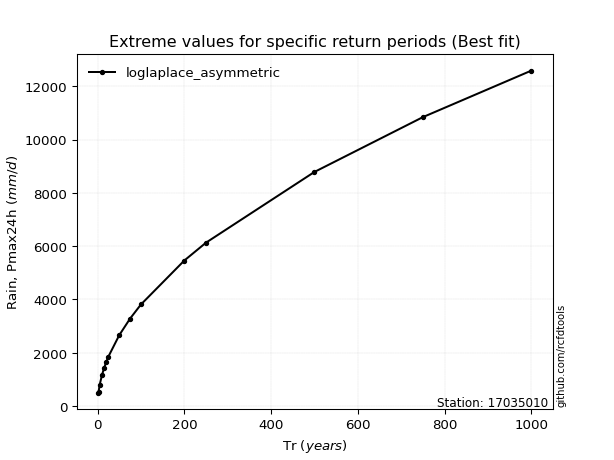</img>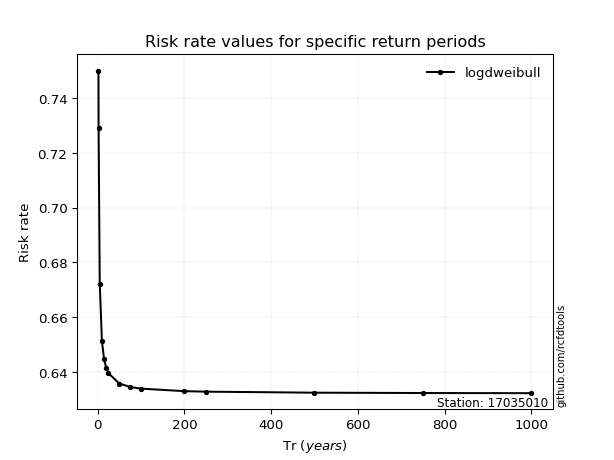</img>

</div>


<sub>**APP DISCLAIMER**: NO WARRANTY - This software is provided by [github.com/rcfdtools](https://github.com/rcfdtools) "as is", without any express or implied warranty, including warranties of merchantability, fitness for a particular purpose, or non-infringement. There is no guarantee that the software will be error-free or operate without interruption. LIMITATION OF LIABILITY - Neither the authors nor copyright holders will be liable for claims or damages arising from the software or its use. You are responsible for determining if the software is appropriate for your use and assume all associated risks, including errors, legal compliance, and data loss. NO PROFESSIONAL ADVICE - The software provides general information and does not offer professional advice. It should not replace consultation with professional advisors.</sub>