<div align="center">


</div>

# Station (rain, Pmax24h): 21015030

Probable Maximum Precipitation (PMP) is the greatest amount of rainfall for a specific duration that is meteorologically possible for a given location, acting as a "worst-case" scenario for extreme storms, crucial for designing safety-critical infrastructure like bridges, river deviations, dams, spillways, and nuclear plants to prevent catastrophic failure. PMP is calculated by hydrologists using meteorological data to determine the upper limit of extreme rainfall, often leading to the Probable Maximum Flood (PMF) for flood control design, and is increasingly being studied for climate change impacts.

<div align="center">

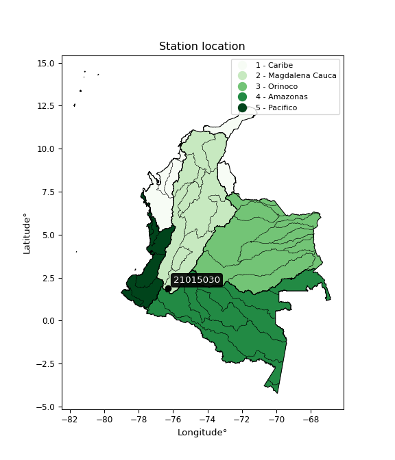</img>

</div>


## A. General information


### 1. General running parameters

• app_version: _v20251225_. • runtime: _2025-12-26 14:29:50.888910_. • Python version: _3.14.0_. • SciPy version: _1.16.3_. • Pandas version: _2.3.3_. • NumPy version: _2.3.5_. • Stations dataset (station_dataset_file): _dataset/pmax24h_in/automatic_colombia.csv_. • Stations catalog (station_catalog_file): _dataset/CNE_IDEAM.xls_. • Plot only fit distributions with Δo > Δ (plot_only_fit): _True_. • Eval low extreme values, if False, evaluates high extreme values (low_extreme): _False_. • Eval every SciPy distribution as logarithmic (pdist_logarithmic_on): _True_. • Standard deviation normalized (ddof): _1.0_. • Return periods to eval in years (Tr): _[2, 2.33, 5, 10, 15, 20, 25, 50, 75, 100, 200, 250, 500, 750, 1000]_. • Minimum data sample per station, 0 means any (minimum_sample): _5_. • Z-Score threshold to adjust a value, 0 means disable (zscore): _3.5_. • Avoid zeros, e.g. rain = 0 (avoid_zeros): _True_. • Avoid null values (avoid_nans): _True_. [:file_folder:Dataset file.](../../dataset/pmax24h_in/automatic_colombia.csv)


### 2. Station info and location

|   id |   CODIGO | NOMBRE                               | CATEGORIA               | TECNOLOGIA                              | ESTADO   | FECHA_INSTALACION   |   FECHA_SUSPENSION |   ALTITUD |   LATITUD |   LONGITUD | DEPARTAMENTO   | MUNICIPIO   | AREA_OPERATIVA                    | ENTIDAD                                                     | AREA_HIDROGRAFICA   | ZONA_HIDROGRAFICA   | SUBZONA_HIDROGRAFICA   |   CORRIENTE | OBSERVACION                                                                                                                                                                                                                                                                                                                                                                                                                               | SUBRED                                                                                                                | Catalogo   |
|-----:|---------:|:-------------------------------------|:------------------------|:----------------------------------------|:---------|:--------------------|-------------------:|----------:|----------:|-----------:|:---------------|:------------|:----------------------------------|:------------------------------------------------------------|:--------------------|:--------------------|:-----------------------|------------:|:------------------------------------------------------------------------------------------------------------------------------------------------------------------------------------------------------------------------------------------------------------------------------------------------------------------------------------------------------------------------------------------------------------------------------------------|:----------------------------------------------------------------------------------------------------------------------|:-----------|
|    0 | 21015030 | PARQUE ARQUEOLOGICO - AUT [21015030] | Climatológica Principal | Automática con Telemetría, Convencional | Activa   | 15/06/1971          |                nan |      1800 |   1.88847 |    -76.295 | Huila          | San Agustín | Area Operativa 04 - Huila-Caquetá | INSTITUTO DE HIDROLOGIA METEOROLOGIA Y ESTUDIOS AMBIENTALES | Magdalena Cauca     | Alto Magdalena      | Alto Magdalena         |         nan | Actualizada Tecnologia. Tipo de Transmision y Estado por solicitud de la coordinadora del AO. (31012023)|05/11/2024$mvelez$La estación fue automatizada a través del proyecto NDC fase 1, queda como automática con Telemetría, el componente convencional queda solo con el pluviómetro. en el CNE la categoría es PM y debe quedar CP, solicitud realizada por la coordinadora Sra. Ofelia Ángel mediante correo electrónico 17/10/2024 | Radiación Ultravioleta,RED ALERTAS - AREA OPERATIVA 04,Alto Magdalena Huila -Tolima,Radiación Visible,Radición Global | CNE_IDEAM  |

<div align="center">

Map location in: [:earth_americas:Google](http://maps.google.com/maps?q=1.888472222,-76.29497222) [:earth_americas:OSM](https://www.openstreetmap.org/#map=18/1.888472222/-76.29497222&layers=P) [:earth_americas:Bing](https://www.bing.com/maps?cp=1.888472222~-76.29497222&lvl=18) [:earth_americas:Apple](https://maps.apple.com/frame?center=1.888472222%2C-76.29497222&span=0.003%2C0.006)

</div>


<div align="center">

```geojson
{
  "type": "Feature",
  "geometry": {
    "type": "Point", 
    "coordinates": [-76.29497222, 1.888472222]
  }, 
  "properties": {
    "Name": "21015030"
  }
}
```

</div>


### 3. Discrete values table and plot

|               |          0 |          1 |           2 |           3 |           4 |
|:--------------|-----------:|-----------:|------------:|------------:|------------:|
| Date          | 2019       | 2022       | 2023        | 2024        | 2025        |
| Value         |   16.2     |   23.55    |  105.18     |  101.9      |  104.32     |
| Value_initial |   16.2     |   23.55    |  105.18     |  101.9      |  104.32     |
| count         |    5       |    5       |    5        |    5        |    5        |
| mean          |   70.23    |   70.23    |   70.23     |   70.23     |   70.23     |
| std           |   46.0567  |   46.0567  |   46.0567   |   46.0567   |   46.0567   |
| zscore        |   -1.17312 |   -1.01353 |    0.758847 |    0.687631 |    0.740174 |

<div align="center">

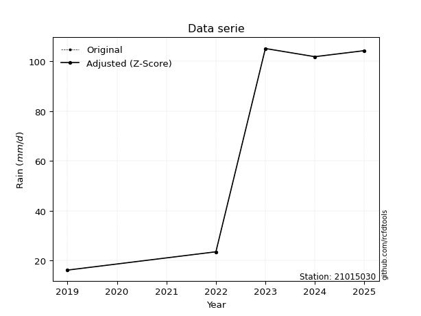</img>

</div>

> If Z-Score is active, values out of range or outliers are replaced with the station mean value.


### 4. Active continuous probability distributions from SciPy (45 of 104 available)

[scipy.stats](https://docs.scipy.org/doc/scipy/reference/stats.html) is a Python´s powerful submodule within the SciPy library for comprehensive statistical analysis, offering over 130 probability distributions (like Normal, Poisson), functions for descriptive stats (mean, variance), hypothesis testing (t-tests, chi-square), random variable generation, and statistical tests, making it essential for data science, modeling, and research. It provides tools to explore, model, and draw conclusions from data efficiently, working seamlessly with NumPy.

<div align="center">

|   id | p_dist             |   n_parameter | fit_method   | label                                                                       | active   | ref                                                                                                        |
|-----:|:-------------------|--------------:|:-------------|:----------------------------------------------------------------------------|:---------|:-----------------------------------------------------------------------------------------------------------|
|    0 | alpha              |             3 | MLE          | Alpha                                                                       | True     | [:mortar_board:](https://docs.scipy.org/doc/scipy/reference/generated/scipy.stats.alpha.html)              |
|    1 | betaprime          |             4 | MLE          | Beta prime                                                                  | True     | [:mortar_board:](https://docs.scipy.org/doc/scipy/reference/generated/scipy.stats.betaprime.html)          |
|    2 | chi2               |             3 | MLE          | Chi²                                                                        | True     | [:mortar_board:](https://docs.scipy.org/doc/scipy/reference/generated/scipy.stats.chi2.html)               |
|    3 | crystalball        |             4 | MLE          | Crystalball                                                                 | True     | [:mortar_board:](https://docs.scipy.org/doc/scipy/reference/generated/scipy.stats.crystalball.html)        |
|    4 | erlang             |             3 | MLE          | Erlang                                                                      | True     | [:mortar_board:](https://docs.scipy.org/doc/scipy/reference/generated/scipy.stats.erlang.html)             |
|    5 | expon              |             2 | MLE          | Exponential                                                                 | True     | [:mortar_board:](https://docs.scipy.org/doc/scipy/reference/generated/scipy.stats.expon.html)              |
|    6 | exponnorm          |             3 | MLE          | Exponentially modified Normal                                               | True     | [:mortar_board:](https://docs.scipy.org/doc/scipy/reference/generated/scipy.stats.exponnorm.html)          |
|    7 | f                  |             4 | MLE          | F                                                                           | True     | [:mortar_board:](https://docs.scipy.org/doc/scipy/reference/generated/scipy.stats.f.html)                  |
|    8 | fatiguelife        |             3 | MLE          | Fatigue-life (Birnbaum-Saunders)                                            | True     | [:mortar_board:](https://docs.scipy.org/doc/scipy/reference/generated/scipy.stats.fatiguelife.html)        |
|    9 | fisk               |             3 | MLE          | Fisk                                                                        | True     | [:mortar_board:](https://docs.scipy.org/doc/scipy/reference/generated/scipy.stats.fisk.html)               |
|   10 | gamma              |             3 | MLE          | Gamma                                                                       | True     | [:mortar_board:](https://docs.scipy.org/doc/scipy/reference/generated/scipy.stats.gamma.html)              |
|   11 | genexpon           |             5 | MLE          | Generalized exponential                                                     | True     | [:mortar_board:](https://docs.scipy.org/doc/scipy/reference/generated/scipy.stats.genexpon.html)           |
|   12 | genlogistic        |             3 | MLE          | Generalized logistic                                                        | True     | [:mortar_board:](https://docs.scipy.org/doc/scipy/reference/generated/scipy.stats.genlogistic.html)        |
|   13 | gibrat             |             2 | MM           | Gibrat                                                                      | True     | [:mortar_board:](https://docs.scipy.org/doc/scipy/reference/generated/scipy.stats.gibrat.html)             |
|   14 | gompertz           |             3 | MLE          | Gompertz (or truncated Gumbel)                                              | True     | [:mortar_board:](https://docs.scipy.org/doc/scipy/reference/generated/scipy.stats.gompertz.html)           |
|   15 | gumbel_l           |             2 | MM           | Gumbel Left Skew                                                            | True     | [:mortar_board:](https://docs.scipy.org/doc/scipy/reference/generated/scipy.stats.gumbel_l.html)           |
|   16 | gumbel_r           |             2 | MM           | Gumbel Right Skew                                                           | True     | [:mortar_board:](https://docs.scipy.org/doc/scipy/reference/generated/scipy.stats.gumbel_r.html)           |
|   17 | halflogistic       |             2 | MM           | Half-logistic                                                               | True     | [:mortar_board:](https://docs.scipy.org/doc/scipy/reference/generated/scipy.stats.halflogistic.html)       |
|   18 | halfnorm           |             2 | MM           | Half Normal                                                                 | True     | [:mortar_board:](https://docs.scipy.org/doc/scipy/reference/generated/scipy.stats.halfnorm.html)           |
|   19 | hypsecant          |             2 | MM           | hyperbolic secant                                                           | True     | [:mortar_board:](https://docs.scipy.org/doc/scipy/reference/generated/scipy.stats.hypsecant.html)          |
|   20 | invgamma           |             3 | MLE          | Inverted gamma                                                              | True     | [:mortar_board:](https://docs.scipy.org/doc/scipy/reference/generated/scipy.stats.invgamma.html)           |
|   21 | invgauss           |             3 | MLE          | Inverse Gaussian                                                            | True     | [:mortar_board:](https://docs.scipy.org/doc/scipy/reference/generated/scipy.stats.invgauss.html)           |
|   22 | invweibull         |             3 | MLE          | Inverted Weibull                                                            | True     | [:mortar_board:](https://docs.scipy.org/doc/scipy/reference/generated/scipy.stats.invweibull.html)         |
|   23 | johnsonsu          |             4 | MLE          | Johnson Su                                                                  | True     | [:mortar_board:](https://docs.scipy.org/doc/scipy/reference/generated/scipy.stats.johnsonsu.html)          |
|   24 | kstwobign          |             2 | MLE          | Limiting distribution of scaled Kolmogorov-Smirnov two-sided test statistic | True     | [:mortar_board:](https://docs.scipy.org/doc/scipy/reference/generated/scipy.stats.kstwobign.html)          |
|   25 | laplace            |             2 | MM           | Laplace                                                                     | True     | [:mortar_board:](https://docs.scipy.org/doc/scipy/reference/generated/scipy.stats.laplace.html)            |
|   26 | laplace_asymmetric |             3 | MLE          | Asymmetric Laplace                                                          | True     | [:mortar_board:](https://docs.scipy.org/doc/scipy/reference/generated/scipy.stats.laplace_asymmetric.html) |
|   27 | loggamma           |             3 | MLE          | Log gamma                                                                   | True     | [:mortar_board:](https://docs.scipy.org/doc/scipy/reference/generated/scipy.stats.loggamma.html)           |
|   28 | logistic           |             2 | MM           | Logistic (or Sech-squared)                                                  | True     | [:mortar_board:](https://docs.scipy.org/doc/scipy/reference/generated/scipy.stats.logistic.html)           |
|   29 | lognorm            |             3 | MLE          | Log Normal                                                                  | True     | [:mortar_board:](https://docs.scipy.org/doc/scipy/reference/generated/scipy.stats.lognorm.html)            |
|   30 | maxwell            |             2 | MM           | Maxwell                                                                     | True     | [:mortar_board:](https://docs.scipy.org/doc/scipy/reference/generated/scipy.stats.maxwell.html)            |
|   31 | mielke             |             4 | MLE          | Mielke Beta-Kappa / Dagum                                                   | True     | [:mortar_board:](https://docs.scipy.org/doc/scipy/reference/generated/scipy.stats.mielke.html)             |
|   32 | moyal              |             2 | MM           | Moyal                                                                       | True     | [:mortar_board:](https://docs.scipy.org/doc/scipy/reference/generated/scipy.stats.moyal.html)              |
|   33 | nakagami           |             3 | MLE          | Nakagami                                                                    | True     | [:mortar_board:](https://docs.scipy.org/doc/scipy/reference/generated/scipy.stats.nakagami.html)           |
|   34 | ncf                |             5 | MLE          | Non-central F distribution                                                  | True     | [:mortar_board:](https://docs.scipy.org/doc/scipy/reference/generated/scipy.stats.ncf.html)                |
|   35 | nct                |             4 | MLE          | Non-central Student’s t                                                     | True     | [:mortar_board:](https://docs.scipy.org/doc/scipy/reference/generated/scipy.stats.nct.html)                |
|   36 | norm               |             2 | MM           | Normal                                                                      | True     | [:mortar_board:](https://docs.scipy.org/doc/scipy/reference/generated/scipy.stats.norm.html)               |
|   37 | pareto             |             3 | MLE          | Pareto                                                                      | True     | [:mortar_board:](https://docs.scipy.org/doc/scipy/reference/generated/scipy.stats.pareto.html)             |
|   38 | pearson3           |             3 | MM           | Pearson type III                                                            | True     | [:mortar_board:](https://docs.scipy.org/doc/scipy/reference/generated/scipy.stats.pearson3.html)           |
|   39 | rayleigh           |             2 | MM           | Rayleigh                                                                    | True     | [:mortar_board:](https://docs.scipy.org/doc/scipy/reference/generated/scipy.stats.rayleigh.html)           |
|   40 | rice               |             3 | MLE          | Rice                                                                        | True     | [:mortar_board:](https://docs.scipy.org/doc/scipy/reference/generated/scipy.stats.rice.html)               |
|   41 | t                  |             3 | MLE          | Student’s t                                                                 | True     | [:mortar_board:](https://docs.scipy.org/doc/scipy/reference/generated/scipy.stats.t.html)                  |
|   42 | truncnorm          |             4 | MLE          | Truncated normal                                                            | True     | [:mortar_board:](https://docs.scipy.org/doc/scipy/reference/generated/scipy.stats.truncnorm.html)          |
|   43 | wald               |             2 | MM           | Wald                                                                        | True     | [:mortar_board:](https://docs.scipy.org/doc/scipy/reference/generated/scipy.stats.wald.html)               |
|   44 | weibull_min        |             3 | MLE          | Weibull minimum                                                             | True     | [:mortar_board:](https://docs.scipy.org/doc/scipy/reference/generated/scipy.stats.weibull_min.html)        |

</div>

> **n_parameter:** # arguments & localization & scale.
>
> **Fit methods:** (MLE) maximum likelihood, (MM) L-moments.
>
>**Inactive:** foldnorm, gennorm, norminvgauss, powernorm, powerlognorm, skewnorm, genextreme, anglit, arcsine, argus, beta, bradford, burr, burr12, cauchy, cosine, halfcauchy, foldcauchy, skewcauchy, wrapcauchy, dgamma, gengamma, exponweib, exponpow, truncexpon, gausshyper, genhalflogistic, genhyperbolic, geninvgauss, halfgennorm, johnsonsb, kappa4, kappa3, ksone, kstwo, loglaplace, levy, levy_l, levy_stable, ncx2, genpareto, truncpareto, lomax, powerlaw, rdist, rel_breitwigner, recipinvgauss, semicircular, studentized_range, trapezoid, triang, truncweibull_min, tukeylambda, uniform, loguniform, vonmises, vonmises_line, weibull_max, dweibull, 


## B. Probability distributions vs. Empirical distributions

A continuous probability distribution (CPD) describes probabilities for variables that can take any value within a range (like rain any time), unlike discrete variables with specific outcomes (like temperature). It uses a Probability Density Function (PDF), a curve where the total area under it equals 1, and the probability of the variable falling within an interval (a to b) is found by calculating the area under the curve between those points. A key feature is that the probability of hitting any single exact value is zero, so probabilities are always expressed for ranges, e.g., $P(a ≤ X ≤ b)$.

<div align="center">

Distributions parameters
|    |   station | p_dist                |   n |               loc |            scale | shape                  | shape1                 | shape2              | shape3   |
|---:|----------:|:----------------------|----:|------------------:|-----------------:|:-----------------------|:-----------------------|:--------------------|:---------|
|  0 |  21015030 | alpha                 |   5 |      -0.0776145   |     29.2514      | 1.208797851387743e-09  |                        |                     |          |
|  1 |  21015030 | betaprime             |   5 |      -6.86082     |   1198.05        | 2.6305870659216355     | 41.7335609396263       |                     |          |
|  2 |  21015030 | chi2                  |   5 |      16.2         |     19.4235      | 0.2925247015842402     |                        |                     |          |
|  3 |  21015030 | crystalball           |   5 |      70.23        |     41.1944      | 5710.456845245936      | 1381.5541432809787     |                     |          |
|  4 |  21015030 | erlang                |   5 |    -526.477       |      2.93959     | 202.8761980362035      |                        |                     |          |
|  5 |  21015030 | expon                 |   5 |      16.2         |     54.03        |                        |                        |                     |          |
|  6 |  21015030 | exponnorm             |   5 |      70.1933      |     41.1943      | 0.0008953296110792995  |                        |                     |          |
|  7 |  21015030 | f                     |   5 |      16.2         |     55.8364      | 0.9204598678620313     | 188.2961087007216      |                     |          |
|  8 |  21015030 | fatiguelife           |   5 |      16.1999      |      0.0820874   | 23.031242271053543     |                        |                     |          |
|  9 |  21015030 | fisk                  |   5 |      16.2         |     21.5387      | 0.8152006184454315     |                        |                     |          |
| 10 |  21015030 | gamma                 |   5 |    -555.91        |      2.77716     | 225.4898569789143      |                        |                     |          |
| 11 |  21015030 | genexpon              |   5 |      16.2         |      2.20553     | 0.040819415712077006   | 2.6443143344598143e-07 | 1.2408945456847353  |          |
| 12 |  21015030 | genlogistic           |   5 |     105.18        |      6.15693e-06 | 1.7610684703238837e-07 |                        |                     |          |
| 13 |  21015030 | gibrat                |   5 |      38.8039      |     19.0609      |                        |                        |                     |          |
| 14 |  21015030 | gompertz              |   5 |      16.2         |     56.8521      | 0.4485283045325205     |                        |                     |          |
| 15 |  21015030 | gumbel_l              |   5 |      88.7697      |     32.1191      |                        |                        |                     |          |
| 16 |  21015030 | gumbel_r              |   5 |      51.6903      |     32.1191      |                        |                        |                     |          |
| 17 |  21015030 | halflogistic          |   5 |      21.4051      |     35.2197      |                        |                        |                     |          |
| 18 |  21015030 | halfnorm              |   5 |      15.7048      |     68.3372      |                        |                        |                     |          |
| 19 |  21015030 | hypsecant             |   5 |      70.23        |     26.2252      |                        |                        |                     |          |
| 20 |  21015030 | invgamma              |   5 |    -249.009       |  16846.2         | 53.60162148473964      |                        |                     |          |
| 21 |  21015030 | invgauss              |   5 |       6.97505     |     41.4323      | 1.5267044777851742     |                        |                     |          |
| 22 |  21015030 | invweibull            |   5 |      16.2         |      2.01239     | 0.04330355860112886    |                        |                     |          |
| 23 |  21015030 | johnsonsu             |   5 |     105.18        |      8.81039e-13 | 2.8121466544093447     | 0.14496610642068747    |                     |          |
| 24 |  21015030 | kstwobign             |   5 |     -79.6071      |    169.967       |                        |                        |                     |          |
| 25 |  21015030 | laplace               |   5 |      70.23        |     29.1288      |                        |                        |                     |          |
| 26 |  21015030 | laplace_asymmetric    |   5 |     105.18        |      0.352608    | 99.25335596884213      |                        |                     |          |
| 27 |  21015030 | loggamma              |   5 |     105.18        |      7.0514e-06  | 2.016603826220705e-07  |                        |                     |          |
| 28 |  21015030 | logistic              |   5 |      70.23        |     22.7116      |                        |                        |                     |          |
| 29 |  21015030 | lognorm               |   5 |      16.2         |      0.0281086   | 14.880677133633132     |                        |                     |          |
| 30 |  21015030 | maxwell               |   5 |     -27.3834      |     61.1701      |                        |                        |                     |          |
| 31 |  21015030 | mielke                |   5 |       0.23609     |      0.729146    | 163.23032323820632     | 1.2611182520531736     |                     |          |
| 32 |  21015030 | moyal                 |   5 |      46.6724      |     18.544       |                        |                        |                     |          |
| 33 |  21015030 | nakagami              |   5 |      16.2         |     69.6439      | 0.05560442832323329    |                        |                     |          |
| 34 |  21015030 | ncf                   |   5 |      -1.89374     |     30.9596      | 3.112740322177217      | 1024.4415036248045     | 4.129854033721774   |          |
| 35 |  21015030 | nct                   |   5 |      -0.369594    |      0.389786    | 1.0597956354897113     | 76.20510919525063      |                     |          |
| 36 |  21015030 | norm                  |   5 |      70.23        |     41.1944      |                        |                        |                     |          |
| 37 |  21015030 | pareto                |   5 |      15.6688      |      0.531182    | 0.27729740410802683    |                        |                     |          |
| 38 |  21015030 | pearson3              |   5 |      70.23        |     41.1944      | -0.41590396277840014   |                        |                     |          |
| 39 |  21015030 | rayleigh              |   5 |      -8.57724     |     62.8791      |                        |                        |                     |          |
| 40 |  21015030 | rice                  |   5 |     -10.4956      |     48.3431      | 1.2306550642581857     |                        |                     |          |
| 41 |  21015030 | t                     |   5 |      70.2322      |     41.1944      | 5913062.63109019       |                        |                     |          |
| 42 |  21015030 | truncnorm             |   5 |      96.4309      |     49.1971      | -548.822849513082      | 0.1778374387765691     |                     |          |
| 43 |  21015030 | wald                  |   5 |      29.0356      |     41.1944      |                        |                        |                     |          |
| 44 |  21015030 | weibull_min           |   5 |      -2.68159e+09 |      2.68159e+09 | 89174006.90777516      |                        |                     |          |
| 45 |  21015030 | logalpha              |   5 |     -10.8105      |    257.091       | 17.466908958911084     |                        |                     |          |
| 46 |  21015030 | logbetaprime          |   5 |     -10.4852      |     91.2642      | 336.84927895725        | 2128.561127823654      |                     |          |
| 47 |  21015030 | logchi2               |   5 |       2.78501     |      0.976663    | 1.0177430117622226     |                        |                     |          |
| 48 |  21015030 | logcrystalball        |   5 |       3.97425     |      0.826854    | 12.492075849668137     | 14.686364303907492     |                     |          |
| 49 |  21015030 | logerlang             |   5 |      -7.87386     |      0.0594685   | 199.14916737196813     |                        |                     |          |
| 50 |  21015030 | logexpon              |   5 |       2.78501     |      1.18924     |                        |                        |                     |          |
| 51 |  21015030 | logexponnorm          |   5 |       3.97358     |      0.826852    | 0.0008146119027455709  |                        |                     |          |
| 52 |  21015030 | logf                  |   5 |    -548.646       |    552.62        | 2976689.53615559       | 1275658.8646620433     |                     |          |
| 53 |  21015030 | logfatiguelife        |   5 |    -190.486       |    194.46        | 0.004246779871832142   |                        |                     |          |
| 54 |  21015030 | logfisk               |   5 |      -3.27996e+07 |      3.27996e+07 | 63178918.86907332      |                        |                     |          |
| 55 |  21015030 | loggamma              |   5 |      -8.57813     |      0.0572057   | 219.29031420345592     |                        |                     |          |
| 56 |  21015030 | loggenexpon           |   5 |       2.78501     |      1.01166     | 0.6573195907224789     | 1.3279096013546314     | 0.19148946572578635 |          |
| 57 |  21015030 | loggenlogistic        |   5 |       4.6557      |      1.27475e-06 | 1.876028828423704e-06  |                        |                     |          |
| 58 |  21015030 | loggibrat             |   5 |       3.34349     |      0.382576    |                        |                        |                     |          |
| 59 |  21015030 | loggompertz           |   5 |       2.78501     |      0.951185    | 0.2684842022916185     |                        |                     |          |
| 60 |  21015030 | loggumbel_l           |   5 |       4.34638     |      0.644695    |                        |                        |                     |          |
| 61 |  21015030 | loggumbel_r           |   5 |       3.60212     |      0.644695    |                        |                        |                     |          |
| 62 |  21015030 | loghalflogistic       |   5 |       2.99419     |      0.70696     |                        |                        |                     |          |
| 63 |  21015030 | loghalfnorm           |   5 |       2.87981     |      1.37168     |                        |                        |                     |          |
| 64 |  21015030 | loghypsecant          |   5 |       3.97425     |      0.526391    |                        |                        |                     |          |
| 65 |  21015030 | loginvgamma           |   5 |     -10.3781      |   4166.71        | 291.34201404423493     |                        |                     |          |
| 66 |  21015030 | loginvgauss           |   5 |      -1.66563     |    229.576       | 0.024492191195594315   |                        |                     |          |
| 67 |  21015030 | loginvweibull         |   5 |      -4.57917e+07 |      4.57917e+07 | 58002066.136399895     |                        |                     |          |
| 68 |  21015030 | logjohnsonsu          |   5 |       4.65567     |      4.27006e-17 | 2.793096147948293      | 0.09448281894161725    |                     |          |
| 69 |  21015030 | logkstwobign          |   5 |       0.885203    |      3.50745     |                        |                        |                     |          |
| 70 |  21015030 | loglaplace            |   5 |       3.97425     |      0.584674    |                        |                        |                     |          |
| 71 |  21015030 | loglaplace_asymmetric |   5 |       4.65573     |      0.0141986   | 47.908444094405354     |                        |                     |          |
| 72 |  21015030 | logloggamma           |   5 |       4.65586     |      1.38383e-05 | 2.0202076843451125e-05 |                        |                     |          |
| 73 |  21015030 | loglogistic           |   5 |       3.97425     |      0.455868    |                        |                        |                     |          |
| 74 |  21015030 | loglognorm            |   5 |       2.78501     |      0.00101257  | 14.241151736489151     |                        |                     |          |
| 75 |  21015030 | logmaxwell            |   5 |       2.01496     |      1.22781     |                        |                        |                     |          |
| 76 |  21015030 | logmielke             |   5 | -711528           | 711528           | 99918090.02096291      | 904809.668520358       |                     |          |
| 77 |  21015030 | logmoyal              |   5 |       3.50141     |      0.372215    |                        |                        |                     |          |
| 78 |  21015030 | lognakagami           |   5 |       2.78501     |      1.35275     | 0.32289784502945174    |                        |                     |          |
| 79 |  21015030 | logncf                |   5 |      -6.51642     |      0.976494    | 67.00431285636779      | 1349.5655096362432     | 652.2940973816407   |          |
| 80 |  21015030 | lognct                |   5 |      35.7876      |      0.791133    | 8927.182500360454      | -40.2073748855497      |                     |          |
| 81 |  21015030 | lognorm               |   5 |       3.97425     |      0.826854    |                        |                        |                     |          |
| 82 |  21015030 | logpareto             |   5 |       2.77376     |      0.0112484   | 0.26494176197890645    |                        |                     |          |
| 83 |  21015030 | logpearson3           |   5 |       3.97425     |      0.826855    | -0.46977249985918423   |                        |                     |          |
| 84 |  21015030 | lograyleigh           |   5 |       2.39243     |      1.26211     |                        |                        |                     |          |
| 85 |  21015030 | logrice               |   5 |       2.29093     |      0.961478    | 1.3433990677712826     |                        |                     |          |
| 86 |  21015030 | logt                  |   5 |       3.97426     |      0.826854    | 2833793390.378197      |                        |                     |          |
| 87 |  21015030 | logtruncnorm          |   5 |       3.05514     |      1.36018     | -0.1986010563188632    | 41.316586277041        |                     |          |
| 88 |  21015030 | logwald               |   5 |       3.1474      |      0.826847    |                        |                        |                     |          |
| 89 |  21015030 | logweibull_min        |   5 |      -2.82793e+06 |      2.82794e+06 | 4703974.150954471      |                        |                     |          |

</div>

> **loc** (Location parameter): This shifts the distribution along the x-axis. For many common distributions, like the normal (Gaussian) distribution, loc represents the mean $μ$. For others, like the uniform distribution, it might represent the minimum value, or for the beta distribution, the left end of the support interval.
>
> **scale** (Scale parameter): This determines the width or spread of the distribution. For the normal distribution, scale represents the standard deviation $σ$. For a uniform distribution, it defines the length of the interval (from $loc$ to $loc + scale$).
>
> **shape** (Shape parameters): Refers to parameters that define the specific form of a probability distribution, distinct from its location (loc) and scale (scale). These parameters are required arguments for most distribution functions. For example, a normal (Gaussian) distribution is fully defined by its location (mean) and scale (standard deviation), so it has no specific shape parameters beyond loc and scale. However, other distributions have intrinsic properties that need specification, as Gamma distribution that takes a shape parameter, often named $a$ or $alpha$.


### 0. Cumulative distribution values - CDF (90 evaluated)

> Ordered by x ascending and calculating $log(f(x))$ separately. 

|   id |   Station |   date |      x |   count |   mean |     std |    zscore |   Value_initial |   station |   m |     alpha |   alpha_pdf |   betaprime |   betaprime_pdf |       chi2 |    chi2_pdf |   crystalball |   crystalball_pdf |    erlang |   erlang_pdf |    expon |   expon_pdf |   exponnorm |   exponnorm_pdf |           f |         f_pdf |   fatiguelife |   fatiguelife_pdf |        fisk |    fisk_pdf |     gamma |   gamma_pdf |    genexpon |   genexpon_pdf |   genlogistic |   genlogistic_pdf |   gibrat |   gibrat_pdf |    gompertz |   gompertz_pdf |   gumbel_l |   gumbel_l_pdf |   gumbel_r |   gumbel_r_pdf |   halflogistic |   halflogistic_pdf |   halfnorm |   halfnorm_pdf |   hypsecant |   hypsecant_pdf |   invgamma |   invgamma_pdf |   invgauss |   invgauss_pdf |   invweibull |   invweibull_pdf |   johnsonsu |   johnsonsu_pdf |   kstwobign |   kstwobign_pdf |   laplace |   laplace_pdf |   laplace_asymmetric |   laplace_asymmetric_pdf |   loggamma |   loggamma_pdf |   logistic |   logistic_pdf |   lognorm |   lognorm_pdf |   maxwell |   maxwell_pdf |      mielke |   mielke_pdf |     moyal |   moyal_pdf |   nakagami |   nakagami_pdf |       ncf |    ncf_pdf |       nct |    nct_pdf |      norm |   norm_pdf |      pareto |   pareto_pdf |   pearson3 |   pearson3_pdf |   rayleigh |   rayleigh_pdf |     rice |   rice_pdf |        t |      t_pdf |   truncnorm |   truncnorm_pdf |     wald |   wald_pdf |   weibull_min |   weibull_min_pdf |   logalpha |   logalpha_pdf |   logbetaprime |   logbetaprime_pdf |     logchi2 |   logchi2_pdf |   logcrystalball |   logcrystalball_pdf |   logerlang |   logerlang_pdf |   logexpon |   logexpon_pdf |   logexponnorm |   logexponnorm_pdf |      logf |   logf_pdf |   logfatiguelife |   logfatiguelife_pdf |   logfisk |   logfisk_pdf |   loggenexpon |   loggenexpon_pdf |   loggenlogistic |   loggenlogistic_pdf |   loggibrat |   loggibrat_pdf |   loggompertz |   loggompertz_pdf |   loggumbel_l |   loggumbel_l_pdf |   loggumbel_r |   loggumbel_r_pdf |   loghalflogistic |   loghalflogistic_pdf |   loghalfnorm |   loghalfnorm_pdf |   loghypsecant |   loghypsecant_pdf |   loginvgamma |   loginvgamma_pdf |   loginvgauss |   loginvgauss_pdf |   loginvweibull |   loginvweibull_pdf |   logjohnsonsu |   logjohnsonsu_pdf |   logkstwobign |   logkstwobign_pdf |   loglaplace |   loglaplace_pdf |   loglaplace_asymmetric |   loglaplace_asymmetric_pdf |   logloggamma |   logloggamma_pdf |   loglogistic |   loglogistic_pdf |   loglognorm |   loglognorm_pdf |   logmaxwell |   logmaxwell_pdf |   logmielke |   logmielke_pdf |   logmoyal |   logmoyal_pdf |   lognakagami |   lognakagami_pdf |    logncf |   logncf_pdf |    lognct |   lognct_pdf |   logpareto |   logpareto_pdf |   logpearson3 |   logpearson3_pdf |   lograyleigh |   lograyleigh_pdf |   logrice |   logrice_pdf |      logt |   logt_pdf |   logtruncnorm |   logtruncnorm_pdf |     logwald |   logwald_pdf |   logweibull_min |   logweibull_min_pdf |
|-----:|----------:|-------:|-------:|--------:|-------:|--------:|----------:|----------------:|----------:|----:|----------:|------------:|------------:|----------------:|-----------:|------------:|--------------:|------------------:|----------:|-------------:|---------:|------------:|------------:|----------------:|------------:|--------------:|--------------:|------------------:|------------:|------------:|----------:|------------:|------------:|---------------:|--------------:|------------------:|---------:|-------------:|------------:|---------------:|-----------:|---------------:|-----------:|---------------:|---------------:|-------------------:|-----------:|---------------:|------------:|----------------:|-----------:|---------------:|-----------:|---------------:|-------------:|-----------------:|------------:|----------------:|------------:|----------------:|----------:|--------------:|---------------------:|-------------------------:|-----------:|---------------:|-----------:|---------------:|----------:|--------------:|----------:|--------------:|------------:|-------------:|----------:|------------:|-----------:|---------------:|----------:|-----------:|----------:|-----------:|----------:|-----------:|------------:|-------------:|-----------:|---------------:|-----------:|---------------:|---------:|-----------:|---------:|-----------:|------------:|----------------:|---------:|-----------:|--------------:|------------------:|-----------:|---------------:|---------------:|-------------------:|------------:|--------------:|-----------------:|---------------------:|------------:|----------------:|-----------:|---------------:|---------------:|-------------------:|----------:|-----------:|-----------------:|---------------------:|----------:|--------------:|--------------:|------------------:|-----------------:|---------------------:|------------:|----------------:|--------------:|------------------:|--------------:|------------------:|--------------:|------------------:|------------------:|----------------------:|--------------:|------------------:|---------------:|-------------------:|--------------:|------------------:|--------------:|------------------:|----------------:|--------------------:|---------------:|-------------------:|---------------:|-------------------:|-------------:|-----------------:|------------------------:|----------------------------:|--------------:|------------------:|--------------:|------------------:|-------------:|-----------------:|-------------:|-----------------:|------------:|----------------:|-----------:|---------------:|--------------:|------------------:|----------:|-------------:|----------:|-------------:|------------:|----------------:|--------------:|------------------:|--------------:|------------------:|----------:|--------------:|----------:|-----------:|---------------:|-------------------:|------------:|--------------:|-----------------:|---------------------:|
|    0 |  21015030 |   2019 |  16.2  |       5 |  70.23 | 46.0567 | -1.17312  |           16.2  |  21015030 |   1 | 0.0723302 |  0.0175253  |   0.0844588 |      0.00752027 | 0.00482667 | 1.9871e+11  |     0.0948298 |        0.00409753 | 0.0968828 |   0.0043618  | 0        |  0.0185082  |   0.0948286 |      0.0040975  | 5.62015e-06 | 7080.5        |     0.0417573 |     1498.2        | 1.36134e-13 | 31.2371     | 0.0943293 |  0.00428266 | 5.21464e-07 |     0.0185077  |      0        |        0.00224434 | 0        |   0          | 3.70624e-13 |     0.00788938 |  0.0991478 |     0.00292852 |  0.048845  |     0.00459129 |      0         |         0          | 0.00578186 |     0.0116754  |   0.0806858 |      0.00304381 |  0.0927335 |     0.0048517  |  0.0632394 |     0.0178064  |    0.0128584 |      6.82363e+11 |   0.0248274 |     9.46671e-05 |   0.0915754 |      0.00646677 | 0.0782371 |    0.0026859  |            0.0786643 |               0.00224771 |  0.0780372 |       0.183991 |  0.0847916 |     0.00341684 | 0.0751782 |      0.171508 | 0.0827921 |    0.00513724 |   0.0732243 |    0.0149705 | 0.0229544 |  0.00368518 |  0.0135281 |    4.23462e+11 | 0.0863568 | 0.00749882 | 0.0706992 | 0.0174059  | 0.0948298 | 0.00409753 | 1.11022e-16 |  0.522038    |   0.10093  |     0.00365356 |  0.0746989 |     0.00579861 | 0.070119 | 0.00514574 | 0.094821 | 0.00409725 |   0.0901997 |      0.00375966 | 0        | 0          |     0.0831794 |        0.00264769 |  0.0745098 |       0.195906 |      0.0785633 |           0.184576 | 1.23557e-08 |   1.41581e+07 |        0.0751784 |             0.171508 |    0.075319 |        0.181565 |   0        |       0.840872 |      0.0751778 |           0.171507 | 0.0750573 |   0.171679 |        0.0742923 |             0.171222 | 0.0798038 |      0.141451 |   3.96923e-10 |          0.649744 |         0        |             0.093794 |    0        |        0        |   7.17744e-08 |          0.282263 |     0.0849304 |          0.125978 |     0.0286742 |          0.157972 |          0        |              0        |      0        |          0        |      0.0662423 |           0.124936 |     0.0727868 |          0.18445  |     0.0772115 |          0.209869 |       0.0727622 |            0.241522 |       0.18597  |        0.0135258   |      0.0690444 |           0.269306 |    0.0654039 |         0.111864 |               0.0638923 |                   0.0939271 |     0.0651427 |         0.0950996 |      0.068578 |          0.140117 |    0.0228529 |       8.5695e+12 |    0.0583878 |         0.20998  |   0.0733322 |        0.240785 | 0.00884954 |      0.0911921 |   7.77455e-11 |     113058        | 0.0785943 |     0.184842 | 0.0751196 |     0.170469 | 1.11022e-16 |      23.5538    |     0.0840013 |          0.153757 |     0.0472242 |          0.234813 | 0.0531506 |      0.213288 | 0.0751771 |   0.171506 |    7.56552e-12 |           0.49692  | 0           |   0           |        0.0701131 |             0.112438 |
|    1 |  21015030 |   2022 |  23.55 |       5 |  70.23 | 46.0567 | -1.01353  |           23.55 |  21015030 |   2 | 0.215709  |  0.019428   |   0.145798  |      0.00904754 | 0.819726   | 0.0138177   |     0.128573  |        0.00509614 | 0.132768  |   0.00541079 | 0.127188 |  0.0161542  |   0.128571  |      0.00509611 | 0.304456    |    0.0182828  |     0.657727  |        0.0103815  | 0.293911    |  0.0230172  | 0.129629  |  0.00533173 | 0.127186    |     0.0161539  |      0        |        0.00276943 | 0        |   0          | 0.0600252   |     0.00843929 |  0.123013  |     0.00358402 |  0.0905753 |     0.00677239 |      0.0304408 |         0.0141834  | 0.0913975  |     0.011599   |   0.106361  |      0.00398063 |  0.132802  |     0.00604736 |  0.20691   |     0.0192661  |    0.388505  |      0.00216407  |   0.0255626 |     0.000105746 |   0.145015  |      0.00801066 | 0.100693  |    0.0034568  |            0.0970479 |               0.00277299 |  0.17062   |       0.312994 |  0.113515  |     0.00443072 | 0.162111  |      0.29679  | 0.125223  |    0.00639407 |   0.196377  |    0.0171824 | 0.0621326 |  0.00704527 |  0.683071  |    0.0103291   | 0.146434  | 0.00875251 | 0.215328  | 0.0198073  | 0.128573  | 0.00509614 | 0.526644    |  0.0166549   |   0.130759 |     0.00447781 |  0.122368  |     0.00713138 | 0.112554 | 0.00638028 | 0.128562 | 0.00509584 |   0.121367  |      0.00474367 | 0        | 0          |     0.104961  |        0.00330045 |  0.174486  |       0.338957 |      0.171351  |           0.31348  | 0.456767    |   0.546349    |        0.162112  |             0.296791 |    0.167395 |        0.312998 |   0.269906 |       0.613915 |      0.162111  |           0.29679  | 0.162106  |   0.297217 |        0.161287  |             0.29742  | 0.151306  |      0.247349 |   0.228997    |          0.570141 |         0        |             0.162663 |    0        |        0        |   0.121359    |          0.367519 |     0.146634  |          0.209891 |     0.136965  |          0.422355 |          0.116127 |              0.697716 |      0.161358 |          0.56975  |      0.133337  |           0.245961 |     0.167059  |          0.321336 |     0.182932  |          0.35319  |       0.195631  |            0.404285 |       0.191669 |        0.0172245   |      0.205377  |           0.439892 |    0.124021  |         0.21212  |               0.110739  |                   0.162796  |     0.112476  |         0.164199  |      0.143309 |          0.269313 |    0.66098   |       0.0686969  |    0.166954  |         0.365561 |   0.195755  |        0.402993 | 0.113254   |      0.484335  |   0.336445    |          0.570015 | 0.171141  |     0.311487 | 0.161514  |     0.295047 | 0.607922    |       0.269558  |     0.159725  |          0.25574  |     0.168488  |          0.400217 | 0.160511  |      0.355541 | 0.162109  |   0.296788 |    0.188662    |           0.505338 | 1.23778e-16 |   3.77167e-13 |        0.126669  |             0.196754 |
|    2 |  21015030 |   2024 | 101.9  |       5 |  70.23 | 46.0567 |  0.687631 |          101.9  |  21015030 |   3 | 0.774234  |  0.00215383 |   0.784026  |      0.00465292 | 0.993249   | 0.000225859 |     0.778992  |        0.00720657 | 0.780652  |   0.00681749 | 0.795289 |  0.00378884 |   0.778991  |      0.0072066  | 0.78488     |    0.00254436 |     0.91948   |        0.00122399 | 0.755062    |  0.00175923 | 0.778523  |  0.00689694 | 0.795283    |     0.00378888 |      0        |        0.0260415  | 0.88435  |   0.00308864 | 0.793325    |     0.007362   |  0.777986  |     0.010403   |  0.811024  |     0.00528892 |      0.815339  |         0.00475901 | 0.792807   |     0.00527007 |   0.815091  |      0.00666091 |  0.772314  |     0.0060711  |  0.81215   |     0.00262876 |    0.427392  |      0.000183576 |   0.0688441 |     0.00585862  |   0.795812  |      0.00511514 | 0.831427  |    0.00578715 |            0.910444  |               0.0260145  |  0.783881  |       0.334357 |  0.8013    |     0.00701043 | 0.784007  |      0.354322 | 0.784739  |    0.00624355 | nan         |  nan         | 0.821531  |  0.00473098 |  0.89375   |    0.00107077  | 0.78141   | 0.00490801 | 0.786242  | 0.00215111 | 0.778992  | 0.00720657 | 0.756187    |  0.000784039 |   0.771475 |     0.00824626 |  0.786365  |     0.00596942 | 0.783349 | 0.00659822 | 0.778976 | 0.00720686 |   0.953877  |      0.0141245  | 0.856397 | 0.00348334 |     0.777125  |        0.0111257  |  0.791047  |       0.310112 |      0.784524  |           0.333783 | 0.826313    |   0.118067    |        0.784007  |             0.354322 |    0.785165 |        0.33573  |   0.786975 |       0.179126 |      0.784007  |           0.354322 | 0.783977  |   0.353802 |        0.783888  |             0.353693 | 0.749743  |      0.361411 |   0.791997    |          0.215409 |         0        |             1.4046   |    0.886492 |        0.15018  |   0.795556    |          0.398909 |     0.785231  |          0.512422 |     0.814696  |          0.258981 |          0.818642 |              0.233271 |      0.796474 |          0.25917  |      0.819704  |           0.32449  |     0.785219  |          0.326981 |     0.787113  |          0.296465 |       0.774811  |            0.250395 |       0.305897 |        1.046       |      0.794121  |           0.249453 |    0.835432  |         0.28147  |               0.953994  |                   1.40245   |     0.954555  |         1.39352   |      0.806164 |          0.342782 |    0.700888  |       0.0132584  |    0.789083  |         0.306899 |   0.775098  |        0.250819 | 0.824815   |      0.231509  |   0.829175    |          0.183018 | 0.775256  |     0.331968 | 0.783466  |     0.356286 | 0.741266    |       0.0370491 |     0.776509  |          0.413842 |     0.790519  |          0.293467 | 0.786451  |      0.325446 | 0.784004  |   0.354324 |    0.785091    |           0.260596 | 0.858814    |   0.170077    |        0.78748   |             0.547479 |
|    3 |  21015030 |   2025 | 104.32 |       5 |  70.23 | 46.0567 |  0.740174 |          104.32 |  21015030 |   4 | 0.77933   |  0.00205901 |   0.795031  |      0.00444286 | 0.993773   | 0.000207233 |     0.796035  |        0.00687646 | 0.796771  |   0.00650271 | 0.804256 |  0.00362288 |   0.796034  |      0.00687649 | 0.790931    |    0.00245704 |     0.922381  |        0.00117396 | 0.759236    |  0.00169106 | 0.794831  |  0.00658003 | 0.80425     |     0.00362293 |      0        |        0.0279079  | 0.891521 |   0.0028415  | 0.810747    |     0.00703455 |  0.802652  |     0.0099708  |  0.823447  |     0.0049802  |      0.826538  |         0.00449798 | 0.805277   |     0.00503669 |   0.830598  |      0.0061589  |  0.786672  |     0.00579554 |  0.818371  |     0.00251342 |    0.42783   |      0.000178502 |   0.098457  |     0.0292484   |   0.807904  |      0.00487902 | 0.844866  |    0.00532579 |            0.975627  |               0.027877   |  0.791641  |       0.3269   |  0.817722  |     0.00656282 | 0.79223   |      0.346367 | 0.799499  |    0.00595507 | nan         |  nan         | 0.832632  |  0.00444595 |  0.896304  |    0.00103957  | 0.793027  | 0.00469337 | 0.791329  | 0.00205414 | 0.796035  | 0.00687646 | 0.758052    |  0.000756805 |   0.791029 |     0.00791042 |  0.800482  |     0.0056971  | 0.798951 | 0.0062956  | 0.796019 | 0.00687676 |   0.987951  |      0.0140305  | 0.86454  | 0.00325014 |     0.803471  |        0.0106327  |  0.79824   |       0.302804 |      0.792271  |           0.32632  | 0.82906     |   0.115932    |        0.79223   |             0.346366 |    0.792956 |        0.328128 |   0.791138 |       0.175626 |      0.79223   |           0.346367 | 0.792188  |   0.345855 |        0.792097  |             0.345731 | 0.75813   |      0.353207 |   0.797001    |          0.21106  |         0        |             1.45396  |    0.889947 |        0.144252 |   0.804819    |          0.39035  |     0.797137  |          0.501961 |     0.820688  |          0.251558 |          0.824043 |              0.226995 |      0.802491 |          0.253555 |      0.827178  |           0.31242  |     0.792806  |          0.319494 |     0.793992  |          0.289739 |       0.780623  |            0.244883 |       0.352    |        4.27142     |      0.799912  |           0.244024 |    0.841908  |         0.270394 |               0.987486  |                   1.45169   |     0.987829  |         1.4421    |      0.814083 |          0.332007 |    0.701197  |       0.0130851  |    0.796204  |         0.299953 |   0.78092   |        0.245288 | 0.830168   |      0.22466   |   0.833429    |          0.179425 | 0.782965  |     0.3249   | 0.791735  |     0.348312 | 0.742129    |       0.036463  |     0.786128  |          0.405747 |     0.79733   |          0.286912 | 0.794005  |      0.318252 | 0.792227  |   0.346369 |    0.791147    |           0.255422 | 0.86274     |   0.164479    |        0.800189  |             0.535234 |
|    4 |  21015030 |   2023 | 105.18 |       5 |  70.23 | 46.0567 |  0.758847 |          105.18 |  21015030 |   5 | 0.781087  |  0.00202679 |   0.79882   |      0.00436986 | 0.993948   | 0.000201022 |     0.801897  |        0.00675721 | 0.802314  |   0.0063898  | 0.807347 |  0.00356567 |   0.801896  |      0.00675724 | 0.793031    |    0.00242697 |     0.923383  |        0.00115678 | 0.76068     |  0.00166783 | 0.800441  |  0.00646624 | 0.807341    |     0.00356572 |      0.999995 |        0.0286029  | 0.893929 |   0.00275965 | 0.816745    |     0.00691541 |  0.811154  |     0.00980016 |  0.827684  |     0.00487357 |      0.830367  |         0.0044079  | 0.809574   |     0.00495477 |   0.83582   |      0.00598648 |  0.791614  |     0.00569801 |  0.820515  |     0.00247407 |    0.427982  |      0.000176766 |   0.997086  |     1.36742e+09 |   0.812065  |      0.00479649 | 0.849379  |    0.00517085 |            0.999898  |               0.0285705  |  0.794315  |       0.324278 |  0.823299  |     0.00640544 | 0.795062  |      0.343561 | 0.804576  |    0.00585263 | nan         |  nan         | 0.836413  |  0.00434844 |  0.897193  |    0.00102884  | 0.797031  | 0.00461841 | 0.793081  | 0.00202121 | 0.801897  | 0.00675721 | 0.758698    |  0.00074753  |   0.797779 |     0.00778541 |  0.80534   |     0.00560072 | 0.804319 | 0.00618748 | 0.801882 | 0.00675751 |   1         |      0.0139891  | 0.867302 | 0.00317184 |     0.812531  |        0.0104368  |  0.800716  |       0.300248 |      0.794939  |           0.323696 | 0.830008    |   0.115197    |        0.795062  |             0.34356  |    0.795639 |        0.325456 |   0.792575 |       0.174418 |      0.795062  |           0.343561 | 0.795016  |   0.343053 |        0.794924  |             0.342924 | 0.761018  |      0.350319 |   0.798728    |          0.209553 |         0.999966 |             1.47164  |    0.891123 |        0.142248 |   0.808012    |          0.387294 |     0.801242  |          0.498106 |     0.822742  |          0.248997 |          0.825898 |              0.224831 |      0.804565 |          0.251602 |      0.829726  |           0.308266 |     0.795418  |          0.316868 |     0.796361  |          0.287389 |       0.782625  |            0.242972 |       0.992673 |        2.15579e+12 |      0.801908  |           0.242139 |    0.844112  |         0.266624 |               0.999477  |                   1.46932   |     0.99974   |         1.45948   |      0.816794 |          0.328256 |    0.701305  |       0.0130256  |    0.798657  |         0.297524 |   0.782926  |        0.24337  | 0.832003   |      0.222307  |   0.834897    |          0.17818  | 0.785622  |     0.322415 | 0.794583  |     0.345499 | 0.742428    |       0.0362619 |     0.789447  |          0.402843 |     0.799676  |          0.284623 | 0.796608  |      0.315726 | 0.795059  |   0.343563 |    0.793236    |           0.253619 | 0.864082    |   0.162574    |        0.804564  |             0.530711 |

An Empirical Distribution Function (EDF) is a step-function estimate of a true cumulative distribution function (CDF) based on observed sample data, representing the proportion of data points less than or equal to a given value. It is calculated by ordering your data and jumping up by $1/n$ (where $n$ is sample size) at each unique data point, allowing analysis without assuming an underlying population distribution, and it gets closer to the true CDF as the sample size grows.


### 1. Empirical - EDF California (1923)

California´s estimates the true probability distribution of water-related data (like rainfall, streamflow) using observed samples, crucial for risk assessment.

<div align="center">


$P=m/n$


</div>


**1.1. Empirical values**

<div align="center">

|                | 0              | 1                  | 2              | 3                 | 4              |
|:---------------|:---------------|:-------------------|:---------------|:------------------|:---------------|
| date           | 2019           | 2022               | 2024           | 2025              | 2023           |
| x              | 16.2           | 23.55              | 101.9          | 104.32            | 105.18         |
| m              | 1              | 2                  | 3              | 4                 | 5              |
| empirical_dist | edf_california | edf_california     | edf_california | edf_california    | edf_california |
| empirical      | 0.2            | 0.4                | 0.6            | 0.8               | 1.0            |
| empirical_tr   | 1.25           | 1.6666666666666667 | 2.5            | 5.000000000000001 | inf            |

</div>


**1.2. Kolmogorov-Smirnov fit test (sorted by Δ)**


<div align="center">

|                | 0                   | 1                   | 2                   | 3                   | 4                  | 5                  | 6                   | 7                  | 8                   | 9                   | 10                 | 11                  | 12                  | 13                 | 14                  | 15                  | 16                  | 17                  | 18                  | 19                 | 20                 | 21                  | 22                 | 23                 | 24                  | 25                  | 26                  | 27                  | 28                  | 29                 | 30                  | 31                  | 32                  | 33                 | 34                  | 35                  | 36                  | 37                 | 38                  | 39                 | 40                  | 41                  | 42                 | 43                  | 44                 | 45                  | 46                 | 47                  | 48                  | 49                  | 50                  | 51                 | 52                 | 53                 | 54                 | 55                 | 56                 | 57                 | 58                  | 59                 | 60                  | 61                 | 62                  | 63                 | 64                  | 65                 | 66                  | 67                 | 68                  | 69                 | 70                 | 71                  | 72                  | 73                 | 74                  | 75                 | 76                  | 77                    | 78                 | 79                  | 80                 | 81                 | 82                 | 83                 | 84                 | 85                 | 86                 | 87                 | 88                 | 89                 |
|:---------------|:--------------------|:--------------------|:--------------------|:--------------------|:-------------------|:-------------------|:--------------------|:-------------------|:--------------------|:--------------------|:-------------------|:--------------------|:--------------------|:-------------------|:--------------------|:--------------------|:--------------------|:--------------------|:--------------------|:-------------------|:-------------------|:--------------------|:-------------------|:-------------------|:--------------------|:--------------------|:--------------------|:--------------------|:--------------------|:-------------------|:--------------------|:--------------------|:--------------------|:-------------------|:--------------------|:--------------------|:--------------------|:-------------------|:--------------------|:-------------------|:--------------------|:--------------------|:-------------------|:--------------------|:-------------------|:--------------------|:-------------------|:--------------------|:--------------------|:--------------------|:--------------------|:-------------------|:-------------------|:-------------------|:-------------------|:-------------------|:-------------------|:-------------------|:--------------------|:-------------------|:--------------------|:-------------------|:--------------------|:-------------------|:--------------------|:-------------------|:--------------------|:-------------------|:--------------------|:-------------------|:-------------------|:--------------------|:--------------------|:-------------------|:--------------------|:-------------------|:--------------------|:----------------------|:-------------------|:--------------------|:-------------------|:-------------------|:-------------------|:-------------------|:-------------------|:-------------------|:-------------------|:-------------------|:-------------------|:-------------------|
| station        | 21015030            | 21015030            | 21015030            | 21015030            | 21015030           | 21015030           | 21015030            | 21015030           | 21015030            | 21015030            | 21015030           | 21015030            | 21015030            | 21015030           | 21015030            | 21015030            | 21015030            | 21015030            | 21015030            | 21015030           | 21015030           | 21015030            | 21015030           | 21015030           | 21015030            | 21015030            | 21015030            | 21015030            | 21015030            | 21015030           | 21015030            | 21015030            | 21015030            | 21015030           | 21015030            | 21015030            | 21015030            | 21015030           | 21015030            | 21015030           | 21015030            | 21015030            | 21015030           | 21015030            | 21015030           | 21015030            | 21015030           | 21015030            | 21015030            | 21015030            | 21015030            | 21015030           | 21015030           | 21015030           | 21015030           | 21015030           | 21015030           | 21015030           | 21015030            | 21015030           | 21015030            | 21015030           | 21015030            | 21015030           | 21015030            | 21015030           | 21015030            | 21015030           | 21015030            | 21015030           | 21015030           | 21015030            | 21015030            | 21015030           | 21015030            | 21015030           | 21015030            | 21015030              | 21015030           | 21015030            | 21015030           | 21015030           | 21015030           | 21015030           | 21015030           | 21015030           | 21015030           | 21015030           | 21015030           | 21015030           |
| empirical_dist | edf_california      | edf_california      | edf_california      | edf_california      | edf_california     | edf_california     | edf_california      | edf_california     | edf_california      | edf_california      | edf_california     | edf_california      | edf_california      | edf_california     | edf_california      | edf_california      | edf_california      | edf_california      | edf_california      | edf_california     | edf_california     | edf_california      | edf_california     | edf_california     | edf_california      | edf_california      | edf_california      | edf_california      | edf_california      | edf_california     | edf_california      | edf_california      | edf_california      | edf_california     | edf_california      | edf_california      | edf_california      | edf_california     | edf_california      | edf_california     | edf_california      | edf_california      | edf_california     | edf_california      | edf_california     | edf_california      | edf_california     | edf_california      | edf_california      | edf_california      | edf_california      | edf_california     | edf_california     | edf_california     | edf_california     | edf_california     | edf_california     | edf_california     | edf_california      | edf_california     | edf_california      | edf_california     | edf_california      | edf_california     | edf_california      | edf_california     | edf_california      | edf_california     | edf_california      | edf_california     | edf_california     | edf_california      | edf_california      | edf_california     | edf_california      | edf_california     | edf_california      | edf_california        | edf_california     | edf_california      | edf_california     | edf_california     | edf_california     | edf_california     | edf_california     | edf_california     | edf_california     | edf_california     | edf_california     | edf_california     |
| p_dist         | logkstwobign        | loggenexpon         | mielke              | nct                 | f                  | logexpon           | logtruncnorm        | invgauss           | loginvgauss         | logmielke           | loginvweibull      | alpha               | logalpha            | logchi2            | logbetaprime        | logncf              | lognakagami         | loggamma            | loggamma            | lograyleigh        | logerlang          | loginvgamma         | logmaxwell         | logcrystalball     | lognorm             | lognorm             | logexponnorm        | logt                | logf                | lognct             | loghalfnorm         | logfatiguelife      | fisk                | logrice            | logpearson3         | pareto              | logfisk             | loggumbel_l        | ncf                 | betaprime          | kstwobign           | loglogistic         | logpareto          | loggumbel_r         | loghypsecant       | invgamma            | erlang             | pearson3            | gamma               | norm                | crystalball         | exponnorm          | t                  | expon              | genexpon           | logweibull_min     | maxwell            | loglaplace         | gumbel_l            | rayleigh           | loggompertz         | loghalflogistic    | logistic            | logmoyal           | rice                | hypsecant          | nakagami            | weibull_min        | loglognorm          | laplace            | halfnorm           | gumbel_r            | laplace_asymmetric  | fatiguelife        | moyal               | gompertz           | truncnorm           | loglaplace_asymmetric | logloggamma        | halflogistic        | logwald            | loggibrat          | wald               | gibrat             | chi2               | logjohnsonsu       | invweibull         | johnsonsu          | loggenlogistic     | genlogistic        |
| delta          | 0.19809190144922284 | 0.20127203415793116 | 0.20362310445663337 | 0.20691854712645297 | 0.2069689352047136 | 0.2074246757214352 | 0.21133844290562054 | 0.2121502394535475 | 0.21706842406189128 | 0.21707447143283432 | 0.2173745602411432 | 0.21891331961036897 | 0.22551412954591088 | 0.2263134991506348 | 0.22864878819287884 | 0.22885949095068364 | 0.22917537373483288 | 0.22938033225576387 | 0.22938033225576387 | 0.231512295857962  | 0.2326045206120032 | 0.23294098805249097 | 0.2330459788495075 | 0.2378884766667863 | 0.23788881009383434 | 0.23788881009383434 | 0.23788930870889555 | 0.23789079925474893 | 0.23789359585726938 | 0.2384859746032334 | 0.23864172277295181 | 0.23871342171697896 | 0.23931989877381987 | 0.239489170274367  | 0.24027470590301153 | 0.24130163990989284 | 0.24869389172471662 | 0.2533655760400394 | 0.25356605048587844 | 0.2542023080061469 | 0.25498491854820493 | 0.25669125736559717 | 0.2575724927838483 | 0.26303528577739127 | 0.2666630809109441 | 0.26719774808158003 | 0.2672322520859828 | 0.26924141510181016 | 0.27037109344086846 | 0.27142739139297506 | 0.27142739430307883 | 0.2714288282443804 | 0.2714383167459202 | 0.272811615866875  | 0.2728136356843479 | 0.2733307070011991 | 0.2747767825748995 | 0.2759790175406296 | 0.27698745914632517 | 0.2776316876099566 | 0.27864143022014054 | 0.2838733711673844 | 0.28648536899655114 | 0.2867463980822504 | 0.28744578351421934 | 0.2936392355893885 | 0.29375040406055286 | 0.2950385558629571 | 0.29869546075717246 | 0.2993074693686044 | 0.3086025301016059 | 0.30942468093952197 | 0.31044432969084523 | 0.3194800145461175 | 0.33786739845390495 | 0.3399747888517547 | 0.35387685190808393 | 0.35399430689918787   | 0.3545549505724739 | 0.36955920206073345 | 0.3999999999999999 | 0.4                | 0.4                | 0.4                | 0.4197258198748399 | 0.4480002239733783 | 0.5720176050735202 | 0.7015430413009294 | 0.8                | 0.8                |
| deltao         | 0.5865427407550001  | 0.5865427407550001  | 0.5865427407550001  | 0.5865427407550001  | 0.5865427407550001 | 0.5865427407550001 | 0.5865427407550001  | 0.5865427407550001 | 0.5865427407550001  | 0.5865427407550001  | 0.5865427407550001 | 0.5865427407550001  | 0.5865427407550001  | 0.5865427407550001 | 0.5865427407550001  | 0.5865427407550001  | 0.5865427407550001  | 0.5865427407550001  | 0.5865427407550001  | 0.5865427407550001 | 0.5865427407550001 | 0.5865427407550001  | 0.5865427407550001 | 0.5865427407550001 | 0.5865427407550001  | 0.5865427407550001  | 0.5865427407550001  | 0.5865427407550001  | 0.5865427407550001  | 0.5865427407550001 | 0.5865427407550001  | 0.5865427407550001  | 0.5865427407550001  | 0.5865427407550001 | 0.5865427407550001  | 0.5865427407550001  | 0.5865427407550001  | 0.5865427407550001 | 0.5865427407550001  | 0.5865427407550001 | 0.5865427407550001  | 0.5865427407550001  | 0.5865427407550001 | 0.5865427407550001  | 0.5865427407550001 | 0.5865427407550001  | 0.5865427407550001 | 0.5865427407550001  | 0.5865427407550001  | 0.5865427407550001  | 0.5865427407550001  | 0.5865427407550001 | 0.5865427407550001 | 0.5865427407550001 | 0.5865427407550001 | 0.5865427407550001 | 0.5865427407550001 | 0.5865427407550001 | 0.5865427407550001  | 0.5865427407550001 | 0.5865427407550001  | 0.5865427407550001 | 0.5865427407550001  | 0.5865427407550001 | 0.5865427407550001  | 0.5865427407550001 | 0.5865427407550001  | 0.5865427407550001 | 0.5865427407550001  | 0.5865427407550001 | 0.5865427407550001 | 0.5865427407550001  | 0.5865427407550001  | 0.5865427407550001 | 0.5865427407550001  | 0.5865427407550001 | 0.5865427407550001  | 0.5865427407550001    | 0.5865427407550001 | 0.5865427407550001  | 0.5865427407550001 | 0.5865427407550001 | 0.5865427407550001 | 0.5865427407550001 | 0.5865427407550001 | 0.5865427407550001 | 0.5865427407550001 | 0.5865427407550001 | 0.5865427407550001 | 0.5865427407550001 |
| eval           | Δo > Δ              | Δo > Δ              | Δo > Δ              | Δo > Δ              | Δo > Δ             | Δo > Δ             | Δo > Δ              | Δo > Δ             | Δo > Δ              | Δo > Δ              | Δo > Δ             | Δo > Δ              | Δo > Δ              | Δo > Δ             | Δo > Δ              | Δo > Δ              | Δo > Δ              | Δo > Δ              | Δo > Δ              | Δo > Δ             | Δo > Δ             | Δo > Δ              | Δo > Δ             | Δo > Δ             | Δo > Δ              | Δo > Δ              | Δo > Δ              | Δo > Δ              | Δo > Δ              | Δo > Δ             | Δo > Δ              | Δo > Δ              | Δo > Δ              | Δo > Δ             | Δo > Δ              | Δo > Δ              | Δo > Δ              | Δo > Δ             | Δo > Δ              | Δo > Δ             | Δo > Δ              | Δo > Δ              | Δo > Δ             | Δo > Δ              | Δo > Δ             | Δo > Δ              | Δo > Δ             | Δo > Δ              | Δo > Δ              | Δo > Δ              | Δo > Δ              | Δo > Δ             | Δo > Δ             | Δo > Δ             | Δo > Δ             | Δo > Δ             | Δo > Δ             | Δo > Δ             | Δo > Δ              | Δo > Δ             | Δo > Δ              | Δo > Δ             | Δo > Δ              | Δo > Δ             | Δo > Δ              | Δo > Δ             | Δo > Δ              | Δo > Δ             | Δo > Δ              | Δo > Δ             | Δo > Δ             | Δo > Δ              | Δo > Δ              | Δo > Δ             | Δo > Δ              | Δo > Δ             | Δo > Δ              | Δo > Δ                | Δo > Δ             | Δo > Δ              | Δo > Δ             | Δo > Δ             | Δo > Δ             | Δo > Δ             | Δo > Δ             | Δo > Δ             | Δo > Δ             | Δo <= Δ            | Δo <= Δ            | Δo <= Δ            |
| fit            | 1                   | 1                   | 1                   | 1                   | 1                  | 1                  | 1                   | 1                  | 1                   | 1                   | 1                  | 1                   | 1                   | 1                  | 1                   | 1                   | 1                   | 1                   | 1                   | 1                  | 1                  | 1                   | 1                  | 1                  | 1                   | 1                   | 1                   | 1                   | 1                   | 1                  | 1                   | 1                   | 1                   | 1                  | 1                   | 1                   | 1                   | 1                  | 1                   | 1                  | 1                   | 1                   | 1                  | 1                   | 1                  | 1                   | 1                  | 1                   | 1                   | 1                   | 1                   | 1                  | 1                  | 1                  | 1                  | 1                  | 1                  | 1                  | 1                   | 1                  | 1                   | 1                  | 1                   | 1                  | 1                   | 1                  | 1                   | 1                  | 1                   | 1                  | 1                  | 1                   | 1                   | 1                  | 1                   | 1                  | 1                   | 1                     | 1                  | 1                   | 1                  | 1                  | 1                  | 1                  | 1                  | 1                  | 1                  | 0                  | 0                  | 0                  |
| n              | 5                   | 5                   | 5                   | 5                   | 5                  | 5                  | 5                   | 5                  | 5                   | 5                   | 5                  | 5                   | 5                   | 5                  | 5                   | 5                   | 5                   | 5                   | 5                   | 5                  | 5                  | 5                   | 5                  | 5                  | 5                   | 5                   | 5                   | 5                   | 5                   | 5                  | 5                   | 5                   | 5                   | 5                  | 5                   | 5                   | 5                   | 5                  | 5                   | 5                  | 5                   | 5                   | 5                  | 5                   | 5                  | 5                   | 5                  | 5                   | 5                   | 5                   | 5                   | 5                  | 5                  | 5                  | 5                  | 5                  | 5                  | 5                  | 5                   | 5                  | 5                   | 5                  | 5                   | 5                  | 5                   | 5                  | 5                   | 5                  | 5                   | 5                  | 5                  | 5                   | 5                   | 5                  | 5                   | 5                  | 5                   | 5                     | 5                  | 5                   | 5                  | 5                  | 5                  | 5                  | 5                  | 5                  | 5                  | 5                  | 5                  | 5                  |
| best_fit       | 1                   | 0                   | 0                   | 0                   | 0                  | 0                  | 0                   | 0                  | 0                   | 0                   | 0                  | 0                   | 0                   | 0                  | 0                   | 0                   | 0                   | 0                   | 0                   | 0                  | 0                  | 0                   | 0                  | 0                  | 0                   | 0                   | 0                   | 0                   | 0                   | 0                  | 0                   | 0                   | 0                   | 0                  | 0                   | 0                   | 0                   | 0                  | 0                   | 0                  | 0                   | 0                   | 0                  | 0                   | 0                  | 0                   | 0                  | 0                   | 0                   | 0                   | 0                   | 0                  | 0                  | 0                  | 0                  | 0                  | 0                  | 0                  | 0                   | 0                  | 0                   | 0                  | 0                   | 0                  | 0                   | 0                  | 0                   | 0                  | 0                   | 0                  | 0                  | 0                   | 0                   | 0                  | 0                   | 0                  | 0                   | 0                     | 0                  | 0                   | 0                  | 0                  | 0                  | 0                  | 0                  | 0                  | 0                  | 0                  | 0                  | 0                  |
| best_fit_sort  | 1                   | 2                   | 3                   | 4                   | 5                  | 6                  | 7                   | 8                  | 9                   | 10                  | 11                 | 12                  | 13                  | 14                 | 15                  | 16                  | 17                  | 18                  | 19                  | 20                 | 21                 | 22                  | 23                 | 24                 | 25                  | 26                  | 27                  | 28                  | 29                  | 30                 | 31                  | 32                  | 33                  | 34                 | 35                  | 36                  | 37                  | 38                 | 39                  | 40                 | 41                  | 42                  | 43                 | 44                  | 45                 | 46                  | 47                 | 48                  | 49                  | 50                  | 51                  | 52                 | 53                 | 54                 | 55                 | 56                 | 57                 | 58                 | 59                  | 60                 | 61                  | 62                 | 63                  | 64                 | 65                  | 66                 | 67                  | 68                 | 69                  | 70                 | 71                 | 72                  | 73                  | 74                 | 75                  | 76                 | 77                  | 78                    | 79                 | 80                  | 81                 | 82                 | 83                 | 84                 | 85                 | 86                 | 87                 | 88                 | 89                 | 90                 |

</div>


<div align="center">

</img>

</div>


**1.3. Best fit**

<div align="center">

|   id |   station | empirical_dist   | p_dist       |    delta |   deltao | eval   |   fit |   n |   best_fit |   best_fit_sort |
|-----:|----------:|:-----------------|:-------------|---------:|---------:|:-------|------:|----:|-----------:|----------------:|
|    0 |  21015030 | edf_california   | logkstwobign | 0.198092 | 0.586543 | Δo > Δ |     1 |   5 |          1 |               1 |

</div>


<div align="center">

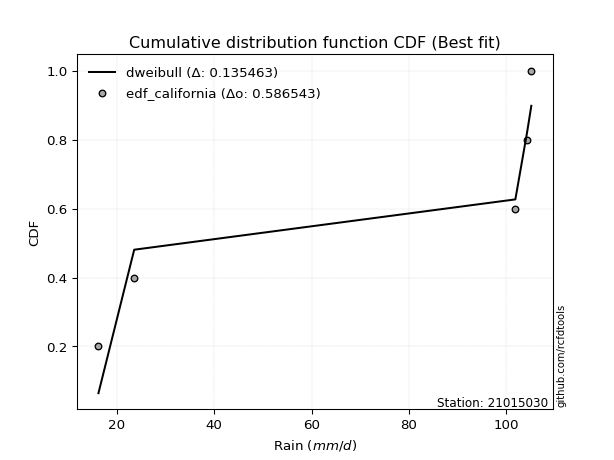</img>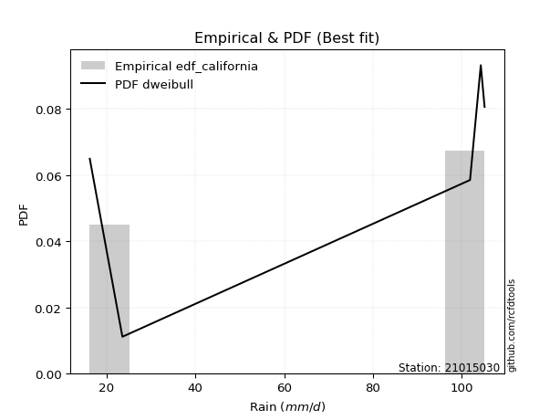</img>

</div>


### 2. Empirical - EDF Hazen (1930)

Hazen method for plotting positions is a formula used to estimate the empirical cumulative probability distribution of flood events or other hydrological data. This formula often results in biased estimations, particularly when extrapolating to extreme events (high return periods).

<div align="center">


$P=(m-0.5)/n$


</div>


**2.1. Empirical values**

<div align="center">

|                | 0                  | 1                  | 2         | 3                 | 4                  |
|:---------------|:-------------------|:-------------------|:----------|:------------------|:-------------------|
| date           | 2019               | 2022               | 2024      | 2025              | 2023               |
| x              | 16.2               | 23.55              | 101.9     | 104.32            | 105.18             |
| m              | 1                  | 2                  | 3         | 4                 | 5                  |
| empirical_dist | edf_hazen          | edf_hazen          | edf_hazen | edf_hazen         | edf_hazen          |
| empirical      | 0.1                | 0.3                | 0.5       | 0.7               | 0.9                |
| empirical_tr   | 1.1111111111111112 | 1.4285714285714286 | 2.0       | 3.333333333333333 | 10.000000000000002 |

</div>


**2.2. Kolmogorov-Smirnov fit test (sorted by Δ)**


<div align="center">

|                | 0                   | 1                   | 2                   | 3                  | 4                  | 5                  | 6                   | 7                  | 8                  | 9                   | 10                 | 11                  | 12                  | 13                 | 14                 | 15                  | 16                  | 17                 | 18                  | 19                 | 20                 | 21                  | 22                 | 23                 | 24                  | 25                  | 26                 | 27                 | 28                 | 29                 | 30                 | 31                 | 32                  | 33                 | 34                 | 35                 | 36                  | 37                  | 38                  | 39                 | 40                 | 41                  | 42                  | 43                  | 44                 | 45                 | 46                 | 47                  | 48                  | 49                  | 50                 | 51                 | 52                  | 53                 | 54                 | 55                  | 56                 | 57                 | 58                 | 59                 | 60                 | 61                 | 62                  | 63                 | 64                 | 65                  | 66                 | 67                 | 68                  | 69                 | 70                  | 71                 | 72                 | 73                 | 74                 | 75                 | 76                 | 77                  | 78                 | 79                  | 80                 | 81                 | 82                 | 83                    | 84                  | 85                  | 86                 | 87                 | 88                 | 89                 |
|:---------------|:--------------------|:--------------------|:--------------------|:-------------------|:-------------------|:-------------------|:--------------------|:-------------------|:-------------------|:--------------------|:-------------------|:--------------------|:--------------------|:-------------------|:-------------------|:--------------------|:--------------------|:-------------------|:--------------------|:-------------------|:-------------------|:--------------------|:-------------------|:-------------------|:--------------------|:--------------------|:-------------------|:-------------------|:-------------------|:-------------------|:-------------------|:-------------------|:--------------------|:-------------------|:-------------------|:-------------------|:--------------------|:--------------------|:--------------------|:-------------------|:-------------------|:--------------------|:--------------------|:--------------------|:-------------------|:-------------------|:-------------------|:--------------------|:--------------------|:--------------------|:-------------------|:-------------------|:--------------------|:-------------------|:-------------------|:--------------------|:-------------------|:-------------------|:-------------------|:-------------------|:-------------------|:-------------------|:--------------------|:-------------------|:-------------------|:--------------------|:-------------------|:-------------------|:--------------------|:-------------------|:--------------------|:-------------------|:-------------------|:-------------------|:-------------------|:-------------------|:-------------------|:--------------------|:-------------------|:--------------------|:-------------------|:-------------------|:-------------------|:----------------------|:--------------------|:--------------------|:-------------------|:-------------------|:-------------------|:-------------------|
| station        | 21015030            | 21015030            | 21015030            | 21015030           | 21015030           | 21015030           | 21015030            | 21015030           | 21015030           | 21015030            | 21015030           | 21015030            | 21015030            | 21015030           | 21015030           | 21015030            | 21015030            | 21015030           | 21015030            | 21015030           | 21015030           | 21015030            | 21015030           | 21015030           | 21015030            | 21015030            | 21015030           | 21015030           | 21015030           | 21015030           | 21015030           | 21015030           | 21015030            | 21015030           | 21015030           | 21015030           | 21015030            | 21015030            | 21015030            | 21015030           | 21015030           | 21015030            | 21015030            | 21015030            | 21015030           | 21015030           | 21015030           | 21015030            | 21015030            | 21015030            | 21015030           | 21015030           | 21015030            | 21015030           | 21015030           | 21015030            | 21015030           | 21015030           | 21015030           | 21015030           | 21015030           | 21015030           | 21015030            | 21015030           | 21015030           | 21015030            | 21015030           | 21015030           | 21015030            | 21015030           | 21015030            | 21015030           | 21015030           | 21015030           | 21015030           | 21015030           | 21015030           | 21015030            | 21015030           | 21015030            | 21015030           | 21015030           | 21015030           | 21015030              | 21015030            | 21015030            | 21015030           | 21015030           | 21015030           | 21015030           |
| empirical_dist | edf_hazen           | edf_hazen           | edf_hazen           | edf_hazen          | edf_hazen          | edf_hazen          | edf_hazen           | edf_hazen          | edf_hazen          | edf_hazen           | edf_hazen          | edf_hazen           | edf_hazen           | edf_hazen          | edf_hazen          | edf_hazen           | edf_hazen           | edf_hazen          | edf_hazen           | edf_hazen          | edf_hazen          | edf_hazen           | edf_hazen          | edf_hazen          | edf_hazen           | edf_hazen           | edf_hazen          | edf_hazen          | edf_hazen          | edf_hazen          | edf_hazen          | edf_hazen          | edf_hazen           | edf_hazen          | edf_hazen          | edf_hazen          | edf_hazen           | edf_hazen           | edf_hazen           | edf_hazen          | edf_hazen          | edf_hazen           | edf_hazen           | edf_hazen           | edf_hazen          | edf_hazen          | edf_hazen          | edf_hazen           | edf_hazen           | edf_hazen           | edf_hazen          | edf_hazen          | edf_hazen           | edf_hazen          | edf_hazen          | edf_hazen           | edf_hazen          | edf_hazen          | edf_hazen          | edf_hazen          | edf_hazen          | edf_hazen          | edf_hazen           | edf_hazen          | edf_hazen          | edf_hazen           | edf_hazen          | edf_hazen          | edf_hazen           | edf_hazen          | edf_hazen           | edf_hazen          | edf_hazen          | edf_hazen          | edf_hazen          | edf_hazen          | edf_hazen          | edf_hazen           | edf_hazen          | edf_hazen           | edf_hazen          | edf_hazen          | edf_hazen          | edf_hazen             | edf_hazen           | edf_hazen           | edf_hazen          | edf_hazen          | edf_hazen          | edf_hazen          |
| p_dist         | mielke              | logfisk             | fisk                | pareto             | pearson3           | invgamma           | alpha               | loginvweibull      | logmielke          | logncf              | logpearson3        | weibull_min         | gumbel_l            | gamma              | t                  | exponnorm           | crystalball         | norm               | erlang              | ncf                | rice               | lognct              | loggamma           | loggamma           | logfatiguelife      | logf                | logt               | lognorm            | lognorm            | logcrystalball     | logexponnorm       | betaprime          | logbetaprime        | maxwell            | f                  | logtruncnorm       | logerlang           | loginvgamma         | loggumbel_l         | nct                | rayleigh           | logrice             | logexpon            | loginvgauss         | logweibull_min     | logmaxwell         | lograyleigh        | logalpha            | loggenexpon         | halfnorm            | gompertz           | logkstwobign       | genexpon            | expon              | loggompertz        | kstwobign           | loghalfnorm        | logistic           | loglogistic        | logpareto          | gumbel_r           | invgauss           | loggumbel_r         | hypsecant          | halflogistic       | loghalflogistic     | loghypsecant       | moyal              | logmoyal            | logchi2            | lognakagami         | laplace            | loglaplace         | logjohnsonsu       | wald               | logwald            | loglognorm         | gibrat              | loggibrat          | nakagami            | laplace_asymmetric | fatiguelife        | truncnorm          | loglaplace_asymmetric | logloggamma         | invweibull          | chi2               | johnsonsu          | loggenlogistic     | genlogistic        |
| delta          | 0.10362310445663334 | 0.24974319573264847 | 0.25506182486189677 | 0.2561874351584068 | 0.2714747559714833 | 0.2723136013961489 | 0.27423357847371266 | 0.2748105461605097 | 0.2750976063595566 | 0.27525572128034725 | 0.2765091387746228 | 0.27712536843199387 | 0.27798551491163226 | 0.2785226078052825 | 0.2789763289431748 | 0.27899135798302666 | 0.27899226499810403 | 0.2789922765041597 | 0.28065223230759595 | 0.281410358255735  | 0.2833489094307783 | 0.28346603170223783 | 0.2838811114520967 | 0.2838811114520967 | 0.28388833728980445 | 0.28397716267247086 | 0.2840039702588246 | 0.2840067241395555 | 0.2840067241395555 | 0.2840069482252767 | 0.2840071025138352 | 0.284026454398967  | 0.28452426349573334 | 0.2847387482169469 | 0.2848801168148095 | 0.2850909282395362 | 0.28516491981196723 | 0.28521933733571314 | 0.28523100132427837 | 0.2862420770283298 | 0.2863653606756661 | 0.28645092013719897 | 0.28697530052910136 | 0.28711276057777213 | 0.287480285313791  | 0.2890825457779258 | 0.2905187360573558 | 0.29104738766392546 | 0.29199660901293534 | 0.29280701602372705 | 0.2933245613406311 | 0.2941212583137629 | 0.29528275195920317 | 0.2952889567581094 | 0.2955564433366119 | 0.29581243117896516 | 0.2964738490389759 | 0.3012998903331464 | 0.3061644609699211 | 0.3079219343721645 | 0.3110238031228981 | 0.3121502394535475 | 0.31469639199122557 | 0.3150907829630285 | 0.3153390827969137 | 0.31864163235554677 | 0.3197042806732656 | 0.3215310367665045 | 0.32481510971833105 | 0.3263134991506348 | 0.32917537373483285 | 0.3314270143058269 | 0.335432037468273  | 0.3480002239733782 | 0.3563968327806114 | 0.3588141208376948 | 0.3609801736972194 | 0.38435048260034854 | 0.3864918188551518 | 0.39375040406055284 | 0.4104443296908452 | 0.4194800145461175 | 0.4538768519080839 | 0.45399430689918785   | 0.45455495057247386 | 0.47201760507352025 | 0.51972581987484   | 0.6015430413009293 | 0.7                | 0.7                |
| deltao         | 0.5865427407550001  | 0.5865427407550001  | 0.5865427407550001  | 0.5865427407550001 | 0.5865427407550001 | 0.5865427407550001 | 0.5865427407550001  | 0.5865427407550001 | 0.5865427407550001 | 0.5865427407550001  | 0.5865427407550001 | 0.5865427407550001  | 0.5865427407550001  | 0.5865427407550001 | 0.5865427407550001 | 0.5865427407550001  | 0.5865427407550001  | 0.5865427407550001 | 0.5865427407550001  | 0.5865427407550001 | 0.5865427407550001 | 0.5865427407550001  | 0.5865427407550001 | 0.5865427407550001 | 0.5865427407550001  | 0.5865427407550001  | 0.5865427407550001 | 0.5865427407550001 | 0.5865427407550001 | 0.5865427407550001 | 0.5865427407550001 | 0.5865427407550001 | 0.5865427407550001  | 0.5865427407550001 | 0.5865427407550001 | 0.5865427407550001 | 0.5865427407550001  | 0.5865427407550001  | 0.5865427407550001  | 0.5865427407550001 | 0.5865427407550001 | 0.5865427407550001  | 0.5865427407550001  | 0.5865427407550001  | 0.5865427407550001 | 0.5865427407550001 | 0.5865427407550001 | 0.5865427407550001  | 0.5865427407550001  | 0.5865427407550001  | 0.5865427407550001 | 0.5865427407550001 | 0.5865427407550001  | 0.5865427407550001 | 0.5865427407550001 | 0.5865427407550001  | 0.5865427407550001 | 0.5865427407550001 | 0.5865427407550001 | 0.5865427407550001 | 0.5865427407550001 | 0.5865427407550001 | 0.5865427407550001  | 0.5865427407550001 | 0.5865427407550001 | 0.5865427407550001  | 0.5865427407550001 | 0.5865427407550001 | 0.5865427407550001  | 0.5865427407550001 | 0.5865427407550001  | 0.5865427407550001 | 0.5865427407550001 | 0.5865427407550001 | 0.5865427407550001 | 0.5865427407550001 | 0.5865427407550001 | 0.5865427407550001  | 0.5865427407550001 | 0.5865427407550001  | 0.5865427407550001 | 0.5865427407550001 | 0.5865427407550001 | 0.5865427407550001    | 0.5865427407550001  | 0.5865427407550001  | 0.5865427407550001 | 0.5865427407550001 | 0.5865427407550001 | 0.5865427407550001 |
| eval           | Δo > Δ              | Δo > Δ              | Δo > Δ              | Δo > Δ             | Δo > Δ             | Δo > Δ             | Δo > Δ              | Δo > Δ             | Δo > Δ             | Δo > Δ              | Δo > Δ             | Δo > Δ              | Δo > Δ              | Δo > Δ             | Δo > Δ             | Δo > Δ              | Δo > Δ              | Δo > Δ             | Δo > Δ              | Δo > Δ             | Δo > Δ             | Δo > Δ              | Δo > Δ             | Δo > Δ             | Δo > Δ              | Δo > Δ              | Δo > Δ             | Δo > Δ             | Δo > Δ             | Δo > Δ             | Δo > Δ             | Δo > Δ             | Δo > Δ              | Δo > Δ             | Δo > Δ             | Δo > Δ             | Δo > Δ              | Δo > Δ              | Δo > Δ              | Δo > Δ             | Δo > Δ             | Δo > Δ              | Δo > Δ              | Δo > Δ              | Δo > Δ             | Δo > Δ             | Δo > Δ             | Δo > Δ              | Δo > Δ              | Δo > Δ              | Δo > Δ             | Δo > Δ             | Δo > Δ              | Δo > Δ             | Δo > Δ             | Δo > Δ              | Δo > Δ             | Δo > Δ             | Δo > Δ             | Δo > Δ             | Δo > Δ             | Δo > Δ             | Δo > Δ              | Δo > Δ             | Δo > Δ             | Δo > Δ              | Δo > Δ             | Δo > Δ             | Δo > Δ              | Δo > Δ             | Δo > Δ              | Δo > Δ             | Δo > Δ             | Δo > Δ             | Δo > Δ             | Δo > Δ             | Δo > Δ             | Δo > Δ              | Δo > Δ             | Δo > Δ              | Δo > Δ             | Δo > Δ             | Δo > Δ             | Δo > Δ                | Δo > Δ              | Δo > Δ              | Δo > Δ             | Δo <= Δ            | Δo <= Δ            | Δo <= Δ            |
| fit            | 1                   | 1                   | 1                   | 1                  | 1                  | 1                  | 1                   | 1                  | 1                  | 1                   | 1                  | 1                   | 1                   | 1                  | 1                  | 1                   | 1                   | 1                  | 1                   | 1                  | 1                  | 1                   | 1                  | 1                  | 1                   | 1                   | 1                  | 1                  | 1                  | 1                  | 1                  | 1                  | 1                   | 1                  | 1                  | 1                  | 1                   | 1                   | 1                   | 1                  | 1                  | 1                   | 1                   | 1                   | 1                  | 1                  | 1                  | 1                   | 1                   | 1                   | 1                  | 1                  | 1                   | 1                  | 1                  | 1                   | 1                  | 1                  | 1                  | 1                  | 1                  | 1                  | 1                   | 1                  | 1                  | 1                   | 1                  | 1                  | 1                   | 1                  | 1                   | 1                  | 1                  | 1                  | 1                  | 1                  | 1                  | 1                   | 1                  | 1                   | 1                  | 1                  | 1                  | 1                     | 1                   | 1                   | 1                  | 0                  | 0                  | 0                  |
| n              | 5                   | 5                   | 5                   | 5                  | 5                  | 5                  | 5                   | 5                  | 5                  | 5                   | 5                  | 5                   | 5                   | 5                  | 5                  | 5                   | 5                   | 5                  | 5                   | 5                  | 5                  | 5                   | 5                  | 5                  | 5                   | 5                   | 5                  | 5                  | 5                  | 5                  | 5                  | 5                  | 5                   | 5                  | 5                  | 5                  | 5                   | 5                   | 5                   | 5                  | 5                  | 5                   | 5                   | 5                   | 5                  | 5                  | 5                  | 5                   | 5                   | 5                   | 5                  | 5                  | 5                   | 5                  | 5                  | 5                   | 5                  | 5                  | 5                  | 5                  | 5                  | 5                  | 5                   | 5                  | 5                  | 5                   | 5                  | 5                  | 5                   | 5                  | 5                   | 5                  | 5                  | 5                  | 5                  | 5                  | 5                  | 5                   | 5                  | 5                   | 5                  | 5                  | 5                  | 5                     | 5                   | 5                   | 5                  | 5                  | 5                  | 5                  |
| best_fit       | 1                   | 0                   | 0                   | 0                  | 0                  | 0                  | 0                   | 0                  | 0                  | 0                   | 0                  | 0                   | 0                   | 0                  | 0                  | 0                   | 0                   | 0                  | 0                   | 0                  | 0                  | 0                   | 0                  | 0                  | 0                   | 0                   | 0                  | 0                  | 0                  | 0                  | 0                  | 0                  | 0                   | 0                  | 0                  | 0                  | 0                   | 0                   | 0                   | 0                  | 0                  | 0                   | 0                   | 0                   | 0                  | 0                  | 0                  | 0                   | 0                   | 0                   | 0                  | 0                  | 0                   | 0                  | 0                  | 0                   | 0                  | 0                  | 0                  | 0                  | 0                  | 0                  | 0                   | 0                  | 0                  | 0                   | 0                  | 0                  | 0                   | 0                  | 0                   | 0                  | 0                  | 0                  | 0                  | 0                  | 0                  | 0                   | 0                  | 0                   | 0                  | 0                  | 0                  | 0                     | 0                   | 0                   | 0                  | 0                  | 0                  | 0                  |
| best_fit_sort  | 1                   | 2                   | 3                   | 4                  | 5                  | 6                  | 7                   | 8                  | 9                  | 10                  | 11                 | 12                  | 13                  | 14                 | 15                 | 16                  | 17                  | 18                 | 19                  | 20                 | 21                 | 22                  | 23                 | 24                 | 25                  | 26                  | 27                 | 28                 | 29                 | 30                 | 31                 | 32                 | 33                  | 34                 | 35                 | 36                 | 37                  | 38                  | 39                  | 40                 | 41                 | 42                  | 43                  | 44                  | 45                 | 46                 | 47                 | 48                  | 49                  | 50                  | 51                 | 52                 | 53                  | 54                 | 55                 | 56                  | 57                 | 58                 | 59                 | 60                 | 61                 | 62                 | 63                  | 64                 | 65                 | 66                  | 67                 | 68                 | 69                  | 70                 | 71                  | 72                 | 73                 | 74                 | 75                 | 76                 | 77                 | 78                  | 79                 | 80                  | 81                 | 82                 | 83                 | 84                    | 85                  | 86                  | 87                 | 88                 | 89                 | 90                 |

</div>


<div align="center">

</img>

</div>


**2.3. Best fit**

<div align="center">

|   id |   station | empirical_dist   | p_dist   |    delta |   deltao | eval   |   fit |   n |   best_fit |   best_fit_sort |
|-----:|----------:|:-----------------|:---------|---------:|---------:|:-------|------:|----:|-----------:|----------------:|
|    0 |  21015030 | edf_hazen        | mielke   | 0.103623 | 0.586543 | Δo > Δ |     1 |   5 |          1 |               1 |

</div>


<div align="center">

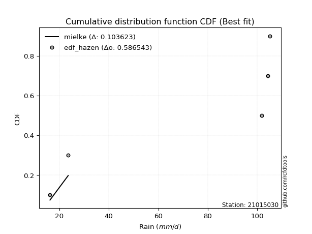</img></img>

</div>


### 3. Empirical - EDF Weibull (1939)

Weibull plotting position formula is an empirical method used to estimate the non-exceedance probability or plotting position for a set of observed data, is often recommended or widely used in practice, particularly in flood frequency analysis.

<div align="center">


$P=m/(n+1)$


</div>


**3.1. Empirical values**

<div align="center">

|                | 0                   | 1                  | 2           | 3                  | 4                  |
|:---------------|:--------------------|:-------------------|:------------|:-------------------|:-------------------|
| date           | 2019                | 2022               | 2024        | 2025               | 2023               |
| x              | 16.2                | 23.55              | 101.9       | 104.32             | 105.18             |
| m              | 1                   | 2                  | 3           | 4                  | 5                  |
| empirical_dist | edf_weibull         | edf_weibull        | edf_weibull | edf_weibull        | edf_weibull        |
| empirical      | 0.16666666666666666 | 0.3333333333333333 | 0.5         | 0.6666666666666666 | 0.8333333333333334 |
| empirical_tr   | 1.2                 | 1.4999999999999998 | 2.0         | 2.9999999999999996 | 6.000000000000002  |

</div>


**3.2. Kolmogorov-Smirnov fit test (sorted by Δ)**


<div align="center">

|                | 0                   | 1                   | 2                   | 3                  | 4                  | 5                  | 6                   | 7                   | 8                  | 9                  | 10                  | 11                 | 12                  | 13                  | 14                 | 15                 | 16                  | 17                  | 18                 | 19                  | 20                 | 21                 | 22                  | 23                 | 24                 | 25                  | 26                  | 27                 | 28                 | 29                 | 30                 | 31                 | 32                 | 33                  | 34                 | 35                 | 36                 | 37                  | 38                  | 39                  | 40                 | 41                 | 42                  | 43                  | 44                  | 45                 | 46                 | 47                 | 48                  | 49                  | 50                  | 51                 | 52                 | 53                  | 54                 | 55                 | 56                  | 57                 | 58                 | 59                 | 60                 | 61                 | 62                 | 63                  | 64                 | 65                 | 66                  | 67                 | 68                 | 69                  | 70                 | 71                 | 72                  | 73                 | 74                 | 75                 | 76                 | 77                  | 78                 | 79                  | 80                 | 81                 | 82                 | 83                 | 84                    | 85                  | 86                  | 87                 | 88                 | 89                 |
|:---------------|:--------------------|:--------------------|:--------------------|:-------------------|:-------------------|:-------------------|:--------------------|:--------------------|:-------------------|:-------------------|:--------------------|:-------------------|:--------------------|:--------------------|:-------------------|:-------------------|:--------------------|:--------------------|:-------------------|:--------------------|:-------------------|:-------------------|:--------------------|:-------------------|:-------------------|:--------------------|:--------------------|:-------------------|:-------------------|:-------------------|:-------------------|:-------------------|:-------------------|:--------------------|:-------------------|:-------------------|:-------------------|:--------------------|:--------------------|:--------------------|:-------------------|:-------------------|:--------------------|:--------------------|:--------------------|:-------------------|:-------------------|:-------------------|:--------------------|:--------------------|:--------------------|:-------------------|:-------------------|:--------------------|:-------------------|:-------------------|:--------------------|:-------------------|:-------------------|:-------------------|:-------------------|:-------------------|:-------------------|:--------------------|:-------------------|:-------------------|:--------------------|:-------------------|:-------------------|:--------------------|:-------------------|:-------------------|:--------------------|:-------------------|:-------------------|:-------------------|:-------------------|:--------------------|:-------------------|:--------------------|:-------------------|:-------------------|:-------------------|:-------------------|:----------------------|:--------------------|:--------------------|:-------------------|:-------------------|:-------------------|
| station        | 21015030            | 21015030            | 21015030            | 21015030           | 21015030           | 21015030           | 21015030            | 21015030            | 21015030           | 21015030           | 21015030            | 21015030           | 21015030            | 21015030            | 21015030           | 21015030           | 21015030            | 21015030            | 21015030           | 21015030            | 21015030           | 21015030           | 21015030            | 21015030           | 21015030           | 21015030            | 21015030            | 21015030           | 21015030           | 21015030           | 21015030           | 21015030           | 21015030           | 21015030            | 21015030           | 21015030           | 21015030           | 21015030            | 21015030            | 21015030            | 21015030           | 21015030           | 21015030            | 21015030            | 21015030            | 21015030           | 21015030           | 21015030           | 21015030            | 21015030            | 21015030            | 21015030           | 21015030           | 21015030            | 21015030           | 21015030           | 21015030            | 21015030           | 21015030           | 21015030           | 21015030           | 21015030           | 21015030           | 21015030            | 21015030           | 21015030           | 21015030            | 21015030           | 21015030           | 21015030            | 21015030           | 21015030           | 21015030            | 21015030           | 21015030           | 21015030           | 21015030           | 21015030            | 21015030           | 21015030            | 21015030           | 21015030           | 21015030           | 21015030           | 21015030              | 21015030            | 21015030            | 21015030           | 21015030           | 21015030           |
| empirical_dist | edf_weibull         | edf_weibull         | edf_weibull         | edf_weibull        | edf_weibull        | edf_weibull        | edf_weibull         | edf_weibull         | edf_weibull        | edf_weibull        | edf_weibull         | edf_weibull        | edf_weibull         | edf_weibull         | edf_weibull        | edf_weibull        | edf_weibull         | edf_weibull         | edf_weibull        | edf_weibull         | edf_weibull        | edf_weibull        | edf_weibull         | edf_weibull        | edf_weibull        | edf_weibull         | edf_weibull         | edf_weibull        | edf_weibull        | edf_weibull        | edf_weibull        | edf_weibull        | edf_weibull        | edf_weibull         | edf_weibull        | edf_weibull        | edf_weibull        | edf_weibull         | edf_weibull         | edf_weibull         | edf_weibull        | edf_weibull        | edf_weibull         | edf_weibull         | edf_weibull         | edf_weibull        | edf_weibull        | edf_weibull        | edf_weibull         | edf_weibull         | edf_weibull         | edf_weibull        | edf_weibull        | edf_weibull         | edf_weibull        | edf_weibull        | edf_weibull         | edf_weibull        | edf_weibull        | edf_weibull        | edf_weibull        | edf_weibull        | edf_weibull        | edf_weibull         | edf_weibull        | edf_weibull        | edf_weibull         | edf_weibull        | edf_weibull        | edf_weibull         | edf_weibull        | edf_weibull        | edf_weibull         | edf_weibull        | edf_weibull        | edf_weibull        | edf_weibull        | edf_weibull         | edf_weibull        | edf_weibull         | edf_weibull        | edf_weibull        | edf_weibull        | edf_weibull        | edf_weibull           | edf_weibull         | edf_weibull         | edf_weibull        | edf_weibull        | edf_weibull        |
| p_dist         | mielke              | logfisk             | fisk                | pareto             | pearson3           | invgamma           | alpha               | logpareto           | loginvweibull      | logmielke          | logncf              | logpearson3        | weibull_min         | gumbel_l            | gamma              | t                  | exponnorm           | crystalball         | norm               | erlang              | ncf                | rice               | lognct              | loggamma           | loggamma           | logfatiguelife      | logf                | logt               | lognorm            | lognorm            | logcrystalball     | logexponnorm       | betaprime          | logbetaprime        | maxwell            | f                  | logtruncnorm       | logerlang           | loginvgamma         | loggumbel_l         | nct                | rayleigh           | logrice             | logexpon            | loginvgauss         | logweibull_min     | logmaxwell         | lograyleigh        | logalpha            | loggenexpon         | halfnorm            | gompertz           | logkstwobign       | genexpon            | expon              | loggompertz        | kstwobign           | loghalfnorm        | logistic           | loglogistic        | gumbel_r           | invgauss           | logjohnsonsu       | loggumbel_r         | hypsecant          | halflogistic       | loghalflogistic     | loghypsecant       | moyal              | logmoyal            | logchi2            | loglognorm         | lognakagami         | laplace            | loglaplace         | wald               | logwald            | gibrat              | loggibrat          | nakagami            | invweibull         | laplace_asymmetric | fatiguelife        | truncnorm          | loglaplace_asymmetric | logloggamma         | chi2                | johnsonsu          | loggenlogistic     | genlogistic        |
| delta          | 0.13695643778996666 | 0.24974319573264847 | 0.25506182486189677 | 0.2561874351584068 | 0.2714747559714833 | 0.2723136013961489 | 0.27423357847371266 | 0.27458860103883115 | 0.2748105461605097 | 0.2750976063595566 | 0.27525572128034725 | 0.2765091387746228 | 0.27712536843199387 | 0.27798551491163226 | 0.2785226078052825 | 0.2789763289431748 | 0.27899135798302666 | 0.27899226499810403 | 0.2789922765041597 | 0.28065223230759595 | 0.281410358255735  | 0.2833489094307783 | 0.28346603170223783 | 0.2838811114520967 | 0.2838811114520967 | 0.28388833728980445 | 0.28397716267247086 | 0.2840039702588246 | 0.2840067241395555 | 0.2840067241395555 | 0.2840069482252767 | 0.2840071025138352 | 0.284026454398967  | 0.28452426349573334 | 0.2847387482169469 | 0.2848801168148095 | 0.2850909282395362 | 0.28516491981196723 | 0.28521933733571314 | 0.28523100132427837 | 0.2862420770283298 | 0.2863653606756661 | 0.28645092013719897 | 0.28697530052910136 | 0.28711276057777213 | 0.287480285313791  | 0.2890825457779258 | 0.2905187360573558 | 0.29104738766392546 | 0.29199660901293534 | 0.29280701602372705 | 0.2933245613406311 | 0.2941212583137629 | 0.29528275195920317 | 0.2952889567581094 | 0.2955564433366119 | 0.29581243117896516 | 0.2964738490389759 | 0.3012998903331464 | 0.3061644609699211 | 0.3110238031228981 | 0.3121502394535475 | 0.3146668906400449 | 0.31469639199122557 | 0.3150907829630285 | 0.3153390827969137 | 0.31864163235554677 | 0.3197042806732656 | 0.3215310367665045 | 0.32481510971833105 | 0.3263134991506348 | 0.3276468403638861 | 0.32917537373483285 | 0.3314270143058269 | 0.335432037468273  | 0.3563968327806114 | 0.3588141208376948 | 0.38435048260034854 | 0.3864918188551518 | 0.39375040406055284 | 0.4053509384068536 | 0.4104443296908452 | 0.4194800145461175 | 0.4538768519080839 | 0.45399430689918785   | 0.45455495057247386 | 0.49324885846644795 | 0.5682097079675961 | 0.6666666666666666 | 0.6666666666666666 |
| deltao         | 0.5865427407550001  | 0.5865427407550001  | 0.5865427407550001  | 0.5865427407550001 | 0.5865427407550001 | 0.5865427407550001 | 0.5865427407550001  | 0.5865427407550001  | 0.5865427407550001 | 0.5865427407550001 | 0.5865427407550001  | 0.5865427407550001 | 0.5865427407550001  | 0.5865427407550001  | 0.5865427407550001 | 0.5865427407550001 | 0.5865427407550001  | 0.5865427407550001  | 0.5865427407550001 | 0.5865427407550001  | 0.5865427407550001 | 0.5865427407550001 | 0.5865427407550001  | 0.5865427407550001 | 0.5865427407550001 | 0.5865427407550001  | 0.5865427407550001  | 0.5865427407550001 | 0.5865427407550001 | 0.5865427407550001 | 0.5865427407550001 | 0.5865427407550001 | 0.5865427407550001 | 0.5865427407550001  | 0.5865427407550001 | 0.5865427407550001 | 0.5865427407550001 | 0.5865427407550001  | 0.5865427407550001  | 0.5865427407550001  | 0.5865427407550001 | 0.5865427407550001 | 0.5865427407550001  | 0.5865427407550001  | 0.5865427407550001  | 0.5865427407550001 | 0.5865427407550001 | 0.5865427407550001 | 0.5865427407550001  | 0.5865427407550001  | 0.5865427407550001  | 0.5865427407550001 | 0.5865427407550001 | 0.5865427407550001  | 0.5865427407550001 | 0.5865427407550001 | 0.5865427407550001  | 0.5865427407550001 | 0.5865427407550001 | 0.5865427407550001 | 0.5865427407550001 | 0.5865427407550001 | 0.5865427407550001 | 0.5865427407550001  | 0.5865427407550001 | 0.5865427407550001 | 0.5865427407550001  | 0.5865427407550001 | 0.5865427407550001 | 0.5865427407550001  | 0.5865427407550001 | 0.5865427407550001 | 0.5865427407550001  | 0.5865427407550001 | 0.5865427407550001 | 0.5865427407550001 | 0.5865427407550001 | 0.5865427407550001  | 0.5865427407550001 | 0.5865427407550001  | 0.5865427407550001 | 0.5865427407550001 | 0.5865427407550001 | 0.5865427407550001 | 0.5865427407550001    | 0.5865427407550001  | 0.5865427407550001  | 0.5865427407550001 | 0.5865427407550001 | 0.5865427407550001 |
| eval           | Δo > Δ              | Δo > Δ              | Δo > Δ              | Δo > Δ             | Δo > Δ             | Δo > Δ             | Δo > Δ              | Δo > Δ              | Δo > Δ             | Δo > Δ             | Δo > Δ              | Δo > Δ             | Δo > Δ              | Δo > Δ              | Δo > Δ             | Δo > Δ             | Δo > Δ              | Δo > Δ              | Δo > Δ             | Δo > Δ              | Δo > Δ             | Δo > Δ             | Δo > Δ              | Δo > Δ             | Δo > Δ             | Δo > Δ              | Δo > Δ              | Δo > Δ             | Δo > Δ             | Δo > Δ             | Δo > Δ             | Δo > Δ             | Δo > Δ             | Δo > Δ              | Δo > Δ             | Δo > Δ             | Δo > Δ             | Δo > Δ              | Δo > Δ              | Δo > Δ              | Δo > Δ             | Δo > Δ             | Δo > Δ              | Δo > Δ              | Δo > Δ              | Δo > Δ             | Δo > Δ             | Δo > Δ             | Δo > Δ              | Δo > Δ              | Δo > Δ              | Δo > Δ             | Δo > Δ             | Δo > Δ              | Δo > Δ             | Δo > Δ             | Δo > Δ              | Δo > Δ             | Δo > Δ             | Δo > Δ             | Δo > Δ             | Δo > Δ             | Δo > Δ             | Δo > Δ              | Δo > Δ             | Δo > Δ             | Δo > Δ              | Δo > Δ             | Δo > Δ             | Δo > Δ              | Δo > Δ             | Δo > Δ             | Δo > Δ              | Δo > Δ             | Δo > Δ             | Δo > Δ             | Δo > Δ             | Δo > Δ              | Δo > Δ             | Δo > Δ              | Δo > Δ             | Δo > Δ             | Δo > Δ             | Δo > Δ             | Δo > Δ                | Δo > Δ              | Δo > Δ              | Δo > Δ             | Δo <= Δ            | Δo <= Δ            |
| fit            | 1                   | 1                   | 1                   | 1                  | 1                  | 1                  | 1                   | 1                   | 1                  | 1                  | 1                   | 1                  | 1                   | 1                   | 1                  | 1                  | 1                   | 1                   | 1                  | 1                   | 1                  | 1                  | 1                   | 1                  | 1                  | 1                   | 1                   | 1                  | 1                  | 1                  | 1                  | 1                  | 1                  | 1                   | 1                  | 1                  | 1                  | 1                   | 1                   | 1                   | 1                  | 1                  | 1                   | 1                   | 1                   | 1                  | 1                  | 1                  | 1                   | 1                   | 1                   | 1                  | 1                  | 1                   | 1                  | 1                  | 1                   | 1                  | 1                  | 1                  | 1                  | 1                  | 1                  | 1                   | 1                  | 1                  | 1                   | 1                  | 1                  | 1                   | 1                  | 1                  | 1                   | 1                  | 1                  | 1                  | 1                  | 1                   | 1                  | 1                   | 1                  | 1                  | 1                  | 1                  | 1                     | 1                   | 1                   | 1                  | 0                  | 0                  |
| n              | 5                   | 5                   | 5                   | 5                  | 5                  | 5                  | 5                   | 5                   | 5                  | 5                  | 5                   | 5                  | 5                   | 5                   | 5                  | 5                  | 5                   | 5                   | 5                  | 5                   | 5                  | 5                  | 5                   | 5                  | 5                  | 5                   | 5                   | 5                  | 5                  | 5                  | 5                  | 5                  | 5                  | 5                   | 5                  | 5                  | 5                  | 5                   | 5                   | 5                   | 5                  | 5                  | 5                   | 5                   | 5                   | 5                  | 5                  | 5                  | 5                   | 5                   | 5                   | 5                  | 5                  | 5                   | 5                  | 5                  | 5                   | 5                  | 5                  | 5                  | 5                  | 5                  | 5                  | 5                   | 5                  | 5                  | 5                   | 5                  | 5                  | 5                   | 5                  | 5                  | 5                   | 5                  | 5                  | 5                  | 5                  | 5                   | 5                  | 5                   | 5                  | 5                  | 5                  | 5                  | 5                     | 5                   | 5                   | 5                  | 5                  | 5                  |
| best_fit       | 1                   | 0                   | 0                   | 0                  | 0                  | 0                  | 0                   | 0                   | 0                  | 0                  | 0                   | 0                  | 0                   | 0                   | 0                  | 0                  | 0                   | 0                   | 0                  | 0                   | 0                  | 0                  | 0                   | 0                  | 0                  | 0                   | 0                   | 0                  | 0                  | 0                  | 0                  | 0                  | 0                  | 0                   | 0                  | 0                  | 0                  | 0                   | 0                   | 0                   | 0                  | 0                  | 0                   | 0                   | 0                   | 0                  | 0                  | 0                  | 0                   | 0                   | 0                   | 0                  | 0                  | 0                   | 0                  | 0                  | 0                   | 0                  | 0                  | 0                  | 0                  | 0                  | 0                  | 0                   | 0                  | 0                  | 0                   | 0                  | 0                  | 0                   | 0                  | 0                  | 0                   | 0                  | 0                  | 0                  | 0                  | 0                   | 0                  | 0                   | 0                  | 0                  | 0                  | 0                  | 0                     | 0                   | 0                   | 0                  | 0                  | 0                  |
| best_fit_sort  | 1                   | 2                   | 3                   | 4                  | 5                  | 6                  | 7                   | 8                   | 9                  | 10                 | 11                  | 12                 | 13                  | 14                  | 15                 | 16                 | 17                  | 18                  | 19                 | 20                  | 21                 | 22                 | 23                  | 24                 | 25                 | 26                  | 27                  | 28                 | 29                 | 30                 | 31                 | 32                 | 33                 | 34                  | 35                 | 36                 | 37                 | 38                  | 39                  | 40                  | 41                 | 42                 | 43                  | 44                  | 45                  | 46                 | 47                 | 48                 | 49                  | 50                  | 51                  | 52                 | 53                 | 54                  | 55                 | 56                 | 57                  | 58                 | 59                 | 60                 | 61                 | 62                 | 63                 | 64                  | 65                 | 66                 | 67                  | 68                 | 69                 | 70                  | 71                 | 72                 | 73                  | 74                 | 75                 | 76                 | 77                 | 78                  | 79                 | 80                  | 81                 | 82                 | 83                 | 84                 | 85                    | 86                  | 87                  | 88                 | 89                 | 90                 |

</div>


<div align="center">

</img>

</div>


**3.3. Best fit**

<div align="center">

|   id |   station | empirical_dist   | p_dist   |    delta |   deltao | eval   |   fit |   n |   best_fit |   best_fit_sort |
|-----:|----------:|:-----------------|:---------|---------:|---------:|:-------|------:|----:|-----------:|----------------:|
|    0 |  21015030 | edf_weibull      | mielke   | 0.136956 | 0.586543 | Δo > Δ |     1 |   5 |          1 |               1 |

</div>


<div align="center">

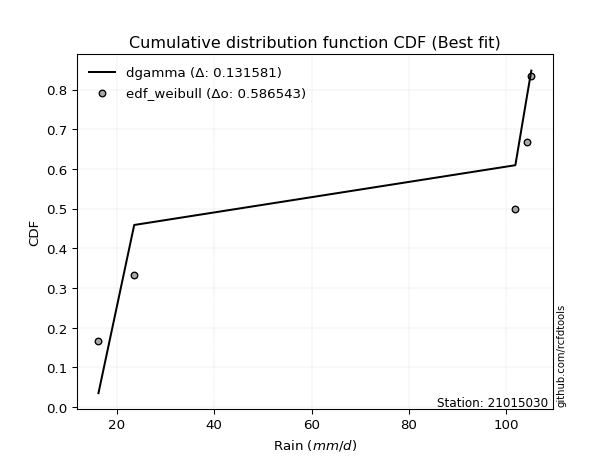</img>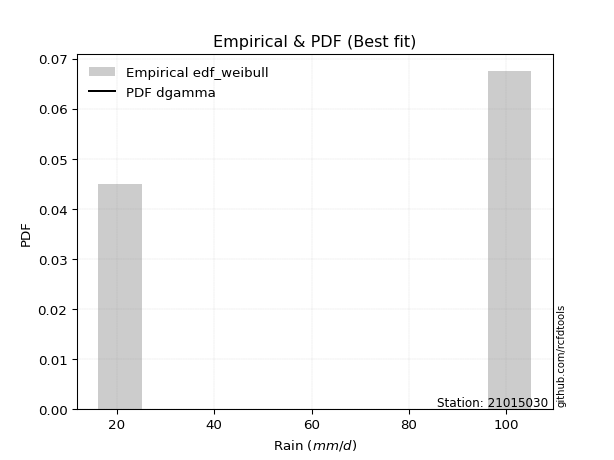</img>

</div>


### 4. Empirical - EDF Beard (1943)

The Beard formula (or Beard´s plotting position formula) in hydrology is used to estimate the empirical non-exceedance probability _(P)_ of a flood event (or other extreme hydrological data point) within a given dataset.

<div align="center">


$P=(m-0.31)/(n+0.38)$


</div>


**4.1. Empirical values**

<div align="center">

|                | 0                   | 1                  | 2         | 3                  | 4                  |
|:---------------|:--------------------|:-------------------|:----------|:-------------------|:-------------------|
| date           | 2019                | 2022               | 2024      | 2025               | 2023               |
| x              | 16.2                | 23.55              | 101.9     | 104.32             | 105.18             |
| m              | 1                   | 2                  | 3         | 4                  | 5                  |
| empirical_dist | edf_beard           | edf_beard          | edf_beard | edf_beard          | edf_beard          |
| empirical      | 0.12825278810408922 | 0.3141263940520446 | 0.5       | 0.6858736059479554 | 0.8717472118959109 |
| empirical_tr   | 1.1471215351812367  | 1.4579945799457996 | 2.0       | 3.183431952662722  | 7.797101449275368  |

</div>


**4.2. Kolmogorov-Smirnov fit test (sorted by Δ)**


<div align="center">

|                | 0                   | 1                   | 2                   | 3                  | 4                  | 5                  | 6                   | 7                  | 8                  | 9                   | 10                 | 11                  | 12                  | 13                 | 14                 | 15                  | 16                  | 17                 | 18                  | 19                 | 20                 | 21                  | 22                 | 23                 | 24                  | 25                  | 26                 | 27                 | 28                 | 29                 | 30                 | 31                 | 32                  | 33                 | 34                 | 35                 | 36                  | 37                  | 38                  | 39                 | 40                 | 41                  | 42                  | 43                  | 44                 | 45                 | 46                 | 47                  | 48                  | 49                  | 50                 | 51                  | 52                 | 53                  | 54                 | 55                 | 56                  | 57                 | 58                 | 59                 | 60                 | 61                 | 62                  | 63                 | 64                 | 65                  | 66                 | 67                 | 68                  | 69                 | 70                  | 71                 | 72                 | 73                 | 74                 | 75                 | 76                 | 77                  | 78                 | 79                  | 80                 | 81                 | 82                 | 83                 | 84                    | 85                  | 86                 | 87                 | 88                 | 89                 |
|:---------------|:--------------------|:--------------------|:--------------------|:-------------------|:-------------------|:-------------------|:--------------------|:-------------------|:-------------------|:--------------------|:-------------------|:--------------------|:--------------------|:-------------------|:-------------------|:--------------------|:--------------------|:-------------------|:--------------------|:-------------------|:-------------------|:--------------------|:-------------------|:-------------------|:--------------------|:--------------------|:-------------------|:-------------------|:-------------------|:-------------------|:-------------------|:-------------------|:--------------------|:-------------------|:-------------------|:-------------------|:--------------------|:--------------------|:--------------------|:-------------------|:-------------------|:--------------------|:--------------------|:--------------------|:-------------------|:-------------------|:-------------------|:--------------------|:--------------------|:--------------------|:-------------------|:--------------------|:-------------------|:--------------------|:-------------------|:-------------------|:--------------------|:-------------------|:-------------------|:-------------------|:-------------------|:-------------------|:--------------------|:-------------------|:-------------------|:--------------------|:-------------------|:-------------------|:--------------------|:-------------------|:--------------------|:-------------------|:-------------------|:-------------------|:-------------------|:-------------------|:-------------------|:--------------------|:-------------------|:--------------------|:-------------------|:-------------------|:-------------------|:-------------------|:----------------------|:--------------------|:-------------------|:-------------------|:-------------------|:-------------------|
| station        | 21015030            | 21015030            | 21015030            | 21015030           | 21015030           | 21015030           | 21015030            | 21015030           | 21015030           | 21015030            | 21015030           | 21015030            | 21015030            | 21015030           | 21015030           | 21015030            | 21015030            | 21015030           | 21015030            | 21015030           | 21015030           | 21015030            | 21015030           | 21015030           | 21015030            | 21015030            | 21015030           | 21015030           | 21015030           | 21015030           | 21015030           | 21015030           | 21015030            | 21015030           | 21015030           | 21015030           | 21015030            | 21015030            | 21015030            | 21015030           | 21015030           | 21015030            | 21015030            | 21015030            | 21015030           | 21015030           | 21015030           | 21015030            | 21015030            | 21015030            | 21015030           | 21015030            | 21015030           | 21015030            | 21015030           | 21015030           | 21015030            | 21015030           | 21015030           | 21015030           | 21015030           | 21015030           | 21015030            | 21015030           | 21015030           | 21015030            | 21015030           | 21015030           | 21015030            | 21015030           | 21015030            | 21015030           | 21015030           | 21015030           | 21015030           | 21015030           | 21015030           | 21015030            | 21015030           | 21015030            | 21015030           | 21015030           | 21015030           | 21015030           | 21015030              | 21015030            | 21015030           | 21015030           | 21015030           | 21015030           |
| empirical_dist | edf_beard           | edf_beard           | edf_beard           | edf_beard          | edf_beard          | edf_beard          | edf_beard           | edf_beard          | edf_beard          | edf_beard           | edf_beard          | edf_beard           | edf_beard           | edf_beard          | edf_beard          | edf_beard           | edf_beard           | edf_beard          | edf_beard           | edf_beard          | edf_beard          | edf_beard           | edf_beard          | edf_beard          | edf_beard           | edf_beard           | edf_beard          | edf_beard          | edf_beard          | edf_beard          | edf_beard          | edf_beard          | edf_beard           | edf_beard          | edf_beard          | edf_beard          | edf_beard           | edf_beard           | edf_beard           | edf_beard          | edf_beard          | edf_beard           | edf_beard           | edf_beard           | edf_beard          | edf_beard          | edf_beard          | edf_beard           | edf_beard           | edf_beard           | edf_beard          | edf_beard           | edf_beard          | edf_beard           | edf_beard          | edf_beard          | edf_beard           | edf_beard          | edf_beard          | edf_beard          | edf_beard          | edf_beard          | edf_beard           | edf_beard          | edf_beard          | edf_beard           | edf_beard          | edf_beard          | edf_beard           | edf_beard          | edf_beard           | edf_beard          | edf_beard          | edf_beard          | edf_beard          | edf_beard          | edf_beard          | edf_beard           | edf_beard          | edf_beard           | edf_beard          | edf_beard          | edf_beard          | edf_beard          | edf_beard             | edf_beard           | edf_beard          | edf_beard          | edf_beard          | edf_beard          |
| p_dist         | mielke              | logfisk             | fisk                | pareto             | pearson3           | invgamma           | alpha               | loginvweibull      | logmielke          | logncf              | logpearson3        | weibull_min         | gumbel_l            | gamma              | t                  | exponnorm           | crystalball         | norm               | erlang              | ncf                | rice               | lognct              | loggamma           | loggamma           | logfatiguelife      | logf                | logt               | lognorm            | lognorm            | logcrystalball     | logexponnorm       | betaprime          | logbetaprime        | maxwell            | f                  | logtruncnorm       | logerlang           | loginvgamma         | loggumbel_l         | nct                | rayleigh           | logrice             | logexpon            | loginvgauss         | logweibull_min     | logmaxwell         | lograyleigh        | logalpha            | loggenexpon         | halfnorm            | gompertz           | logpareto           | logkstwobign       | genexpon            | expon              | loggompertz        | kstwobign           | loghalfnorm        | logistic           | loglogistic        | gumbel_r           | invgauss           | loggumbel_r         | hypsecant          | halflogistic       | loghalflogistic     | loghypsecant       | moyal              | logmoyal            | logchi2            | lognakagami         | laplace            | logjohnsonsu       | loglaplace         | loglognorm         | wald               | logwald            | gibrat              | loggibrat          | nakagami            | laplace_asymmetric | fatiguelife        | invweibull         | truncnorm          | loglaplace_asymmetric | logloggamma         | chi2               | johnsonsu          | loggenlogistic     | genlogistic        |
| delta          | 0.11774949850867797 | 0.24974319573264847 | 0.25506182486189677 | 0.2561874351584068 | 0.2714747559714833 | 0.2723136013961489 | 0.27423357847371266 | 0.2748105461605097 | 0.2750976063595566 | 0.27525572128034725 | 0.2765091387746228 | 0.27712536843199387 | 0.27798551491163226 | 0.2785226078052825 | 0.2789763289431748 | 0.27899135798302666 | 0.27899226499810403 | 0.2789922765041597 | 0.28065223230759595 | 0.281410358255735  | 0.2833489094307783 | 0.28346603170223783 | 0.2838811114520967 | 0.2838811114520967 | 0.28388833728980445 | 0.28397716267247086 | 0.2840039702588246 | 0.2840067241395555 | 0.2840067241395555 | 0.2840069482252767 | 0.2840071025138352 | 0.284026454398967  | 0.28452426349573334 | 0.2847387482169469 | 0.2848801168148095 | 0.2850909282395362 | 0.28516491981196723 | 0.28521933733571314 | 0.28523100132427837 | 0.2862420770283298 | 0.2863653606756661 | 0.28645092013719897 | 0.28697530052910136 | 0.28711276057777213 | 0.287480285313791  | 0.2890825457779258 | 0.2905187360573558 | 0.29104738766392546 | 0.29199660901293534 | 0.29280701602372705 | 0.2933245613406311 | 0.29379554032011984 | 0.2941212583137629 | 0.29528275195920317 | 0.2952889567581094 | 0.2955564433366119 | 0.29581243117896516 | 0.2964738490389759 | 0.3012998903331464 | 0.3061644609699211 | 0.3110238031228981 | 0.3121502394535475 | 0.31469639199122557 | 0.3150907829630285 | 0.3153390827969137 | 0.31864163235554677 | 0.3197042806732656 | 0.3215310367665045 | 0.32481510971833105 | 0.3263134991506348 | 0.32917537373483285 | 0.3314270143058269 | 0.3338738299213337 | 0.335432037468273  | 0.3468537796451748 | 0.3563968327806114 | 0.3588141208376948 | 0.38435048260034854 | 0.3864918188551518 | 0.39375040406055284 | 0.4104443296908452 | 0.4194800145461175 | 0.4437648169694311 | 0.4538768519080839 | 0.45399430689918785   | 0.45455495057247386 | 0.5055994258227954 | 0.5874166472488849 | 0.6858736059479554 | 0.6858736059479554 |
| deltao         | 0.5865427407550001  | 0.5865427407550001  | 0.5865427407550001  | 0.5865427407550001 | 0.5865427407550001 | 0.5865427407550001 | 0.5865427407550001  | 0.5865427407550001 | 0.5865427407550001 | 0.5865427407550001  | 0.5865427407550001 | 0.5865427407550001  | 0.5865427407550001  | 0.5865427407550001 | 0.5865427407550001 | 0.5865427407550001  | 0.5865427407550001  | 0.5865427407550001 | 0.5865427407550001  | 0.5865427407550001 | 0.5865427407550001 | 0.5865427407550001  | 0.5865427407550001 | 0.5865427407550001 | 0.5865427407550001  | 0.5865427407550001  | 0.5865427407550001 | 0.5865427407550001 | 0.5865427407550001 | 0.5865427407550001 | 0.5865427407550001 | 0.5865427407550001 | 0.5865427407550001  | 0.5865427407550001 | 0.5865427407550001 | 0.5865427407550001 | 0.5865427407550001  | 0.5865427407550001  | 0.5865427407550001  | 0.5865427407550001 | 0.5865427407550001 | 0.5865427407550001  | 0.5865427407550001  | 0.5865427407550001  | 0.5865427407550001 | 0.5865427407550001 | 0.5865427407550001 | 0.5865427407550001  | 0.5865427407550001  | 0.5865427407550001  | 0.5865427407550001 | 0.5865427407550001  | 0.5865427407550001 | 0.5865427407550001  | 0.5865427407550001 | 0.5865427407550001 | 0.5865427407550001  | 0.5865427407550001 | 0.5865427407550001 | 0.5865427407550001 | 0.5865427407550001 | 0.5865427407550001 | 0.5865427407550001  | 0.5865427407550001 | 0.5865427407550001 | 0.5865427407550001  | 0.5865427407550001 | 0.5865427407550001 | 0.5865427407550001  | 0.5865427407550001 | 0.5865427407550001  | 0.5865427407550001 | 0.5865427407550001 | 0.5865427407550001 | 0.5865427407550001 | 0.5865427407550001 | 0.5865427407550001 | 0.5865427407550001  | 0.5865427407550001 | 0.5865427407550001  | 0.5865427407550001 | 0.5865427407550001 | 0.5865427407550001 | 0.5865427407550001 | 0.5865427407550001    | 0.5865427407550001  | 0.5865427407550001 | 0.5865427407550001 | 0.5865427407550001 | 0.5865427407550001 |
| eval           | Δo > Δ              | Δo > Δ              | Δo > Δ              | Δo > Δ             | Δo > Δ             | Δo > Δ             | Δo > Δ              | Δo > Δ             | Δo > Δ             | Δo > Δ              | Δo > Δ             | Δo > Δ              | Δo > Δ              | Δo > Δ             | Δo > Δ             | Δo > Δ              | Δo > Δ              | Δo > Δ             | Δo > Δ              | Δo > Δ             | Δo > Δ             | Δo > Δ              | Δo > Δ             | Δo > Δ             | Δo > Δ              | Δo > Δ              | Δo > Δ             | Δo > Δ             | Δo > Δ             | Δo > Δ             | Δo > Δ             | Δo > Δ             | Δo > Δ              | Δo > Δ             | Δo > Δ             | Δo > Δ             | Δo > Δ              | Δo > Δ              | Δo > Δ              | Δo > Δ             | Δo > Δ             | Δo > Δ              | Δo > Δ              | Δo > Δ              | Δo > Δ             | Δo > Δ             | Δo > Δ             | Δo > Δ              | Δo > Δ              | Δo > Δ              | Δo > Δ             | Δo > Δ              | Δo > Δ             | Δo > Δ              | Δo > Δ             | Δo > Δ             | Δo > Δ              | Δo > Δ             | Δo > Δ             | Δo > Δ             | Δo > Δ             | Δo > Δ             | Δo > Δ              | Δo > Δ             | Δo > Δ             | Δo > Δ              | Δo > Δ             | Δo > Δ             | Δo > Δ              | Δo > Δ             | Δo > Δ              | Δo > Δ             | Δo > Δ             | Δo > Δ             | Δo > Δ             | Δo > Δ             | Δo > Δ             | Δo > Δ              | Δo > Δ             | Δo > Δ              | Δo > Δ             | Δo > Δ             | Δo > Δ             | Δo > Δ             | Δo > Δ                | Δo > Δ              | Δo > Δ             | Δo <= Δ            | Δo <= Δ            | Δo <= Δ            |
| fit            | 1                   | 1                   | 1                   | 1                  | 1                  | 1                  | 1                   | 1                  | 1                  | 1                   | 1                  | 1                   | 1                   | 1                  | 1                  | 1                   | 1                   | 1                  | 1                   | 1                  | 1                  | 1                   | 1                  | 1                  | 1                   | 1                   | 1                  | 1                  | 1                  | 1                  | 1                  | 1                  | 1                   | 1                  | 1                  | 1                  | 1                   | 1                   | 1                   | 1                  | 1                  | 1                   | 1                   | 1                   | 1                  | 1                  | 1                  | 1                   | 1                   | 1                   | 1                  | 1                   | 1                  | 1                   | 1                  | 1                  | 1                   | 1                  | 1                  | 1                  | 1                  | 1                  | 1                   | 1                  | 1                  | 1                   | 1                  | 1                  | 1                   | 1                  | 1                   | 1                  | 1                  | 1                  | 1                  | 1                  | 1                  | 1                   | 1                  | 1                   | 1                  | 1                  | 1                  | 1                  | 1                     | 1                   | 1                  | 0                  | 0                  | 0                  |
| n              | 5                   | 5                   | 5                   | 5                  | 5                  | 5                  | 5                   | 5                  | 5                  | 5                   | 5                  | 5                   | 5                   | 5                  | 5                  | 5                   | 5                   | 5                  | 5                   | 5                  | 5                  | 5                   | 5                  | 5                  | 5                   | 5                   | 5                  | 5                  | 5                  | 5                  | 5                  | 5                  | 5                   | 5                  | 5                  | 5                  | 5                   | 5                   | 5                   | 5                  | 5                  | 5                   | 5                   | 5                   | 5                  | 5                  | 5                  | 5                   | 5                   | 5                   | 5                  | 5                   | 5                  | 5                   | 5                  | 5                  | 5                   | 5                  | 5                  | 5                  | 5                  | 5                  | 5                   | 5                  | 5                  | 5                   | 5                  | 5                  | 5                   | 5                  | 5                   | 5                  | 5                  | 5                  | 5                  | 5                  | 5                  | 5                   | 5                  | 5                   | 5                  | 5                  | 5                  | 5                  | 5                     | 5                   | 5                  | 5                  | 5                  | 5                  |
| best_fit       | 1                   | 0                   | 0                   | 0                  | 0                  | 0                  | 0                   | 0                  | 0                  | 0                   | 0                  | 0                   | 0                   | 0                  | 0                  | 0                   | 0                   | 0                  | 0                   | 0                  | 0                  | 0                   | 0                  | 0                  | 0                   | 0                   | 0                  | 0                  | 0                  | 0                  | 0                  | 0                  | 0                   | 0                  | 0                  | 0                  | 0                   | 0                   | 0                   | 0                  | 0                  | 0                   | 0                   | 0                   | 0                  | 0                  | 0                  | 0                   | 0                   | 0                   | 0                  | 0                   | 0                  | 0                   | 0                  | 0                  | 0                   | 0                  | 0                  | 0                  | 0                  | 0                  | 0                   | 0                  | 0                  | 0                   | 0                  | 0                  | 0                   | 0                  | 0                   | 0                  | 0                  | 0                  | 0                  | 0                  | 0                  | 0                   | 0                  | 0                   | 0                  | 0                  | 0                  | 0                  | 0                     | 0                   | 0                  | 0                  | 0                  | 0                  |
| best_fit_sort  | 1                   | 2                   | 3                   | 4                  | 5                  | 6                  | 7                   | 8                  | 9                  | 10                  | 11                 | 12                  | 13                  | 14                 | 15                 | 16                  | 17                  | 18                 | 19                  | 20                 | 21                 | 22                  | 23                 | 24                 | 25                  | 26                  | 27                 | 28                 | 29                 | 30                 | 31                 | 32                 | 33                  | 34                 | 35                 | 36                 | 37                  | 38                  | 39                  | 40                 | 41                 | 42                  | 43                  | 44                  | 45                 | 46                 | 47                 | 48                  | 49                  | 50                  | 51                 | 52                  | 53                 | 54                  | 55                 | 56                 | 57                  | 58                 | 59                 | 60                 | 61                 | 62                 | 63                  | 64                 | 65                 | 66                  | 67                 | 68                 | 69                  | 70                 | 71                  | 72                 | 73                 | 74                 | 75                 | 76                 | 77                 | 78                  | 79                 | 80                  | 81                 | 82                 | 83                 | 84                 | 85                    | 86                  | 87                 | 88                 | 89                 | 90                 |

</div>


<div align="center">

</img>

</div>


**4.3. Best fit**

<div align="center">

|   id |   station | empirical_dist   | p_dist   |    delta |   deltao | eval   |   fit |   n |   best_fit |   best_fit_sort |
|-----:|----------:|:-----------------|:---------|---------:|---------:|:-------|------:|----:|-----------:|----------------:|
|    0 |  21015030 | edf_beard        | mielke   | 0.117749 | 0.586543 | Δo > Δ |     1 |   5 |          1 |               1 |

</div>


<div align="center">

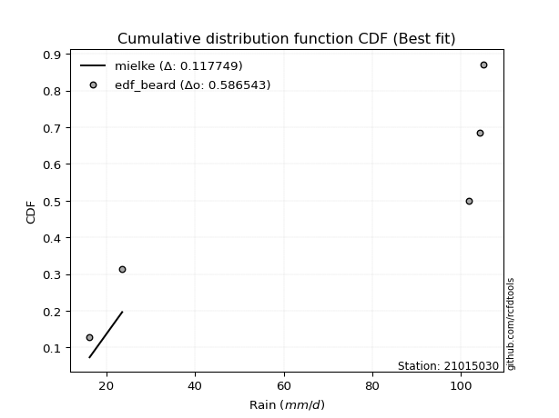</img></img>

</div>


### 5. Empirical - EDF Chegodayev (1955)

The Chegodayev formula is an empirical plotting position formula used in hydrological frequency analysis to estimate the exceedance probability or return period of a specific event from a set of observed data. It is primarily used for plotting observed data points on probability paper to fit a theoretical distribution, particularly for analyzing extreme events like maximum flood flows or rainfall intensities. The constant _b_ value in the generalized plotting position formula is 0.3.

<div align="center">


$P=(m-b)/(n+1-2b)$


</div>


**5.1. Empirical values**

<div align="center">

|                | 0                   | 1                   | 2              | 3                  | 4                  |
|:---------------|:--------------------|:--------------------|:---------------|:-------------------|:-------------------|
| date           | 2019                | 2022                | 2024           | 2025               | 2023               |
| x              | 16.2                | 23.55               | 101.9          | 104.32             | 105.18             |
| m              | 1                   | 2                   | 3              | 4                  | 5                  |
| empirical_dist | edf_chegodayev      | edf_chegodayev      | edf_chegodayev | edf_chegodayev     | edf_chegodayev     |
| empirical      | 0.12962962962962962 | 0.31481481481481477 | 0.5            | 0.6851851851851851 | 0.8703703703703703 |
| empirical_tr   | 1.148936170212766   | 1.4594594594594594  | 2.0            | 3.1764705882352935 | 7.714285714285713  |

</div>


**5.2. Kolmogorov-Smirnov fit test (sorted by Δ)**


<div align="center">

|                | 0                   | 1                   | 2                   | 3                  | 4                  | 5                  | 6                   | 7                  | 8                  | 9                   | 10                 | 11                  | 12                  | 13                 | 14                 | 15                  | 16                  | 17                 | 18                  | 19                 | 20                 | 21                  | 22                 | 23                 | 24                  | 25                  | 26                 | 27                 | 28                 | 29                 | 30                 | 31                 | 32                  | 33                 | 34                 | 35                 | 36                  | 37                  | 38                  | 39                 | 40                 | 41                  | 42                  | 43                  | 44                 | 45                 | 46                 | 47                  | 48                  | 49                  | 50                 | 51                 | 52                 | 53                  | 54                 | 55                 | 56                  | 57                 | 58                 | 59                 | 60                 | 61                 | 62                  | 63                 | 64                 | 65                  | 66                 | 67                 | 68                  | 69                 | 70                  | 71                 | 72                 | 73                 | 74                  | 75                 | 76                 | 77                  | 78                 | 79                  | 80                 | 81                 | 82                 | 83                 | 84                    | 85                  | 86                 | 87                 | 88                 | 89                 |
|:---------------|:--------------------|:--------------------|:--------------------|:-------------------|:-------------------|:-------------------|:--------------------|:-------------------|:-------------------|:--------------------|:-------------------|:--------------------|:--------------------|:-------------------|:-------------------|:--------------------|:--------------------|:-------------------|:--------------------|:-------------------|:-------------------|:--------------------|:-------------------|:-------------------|:--------------------|:--------------------|:-------------------|:-------------------|:-------------------|:-------------------|:-------------------|:-------------------|:--------------------|:-------------------|:-------------------|:-------------------|:--------------------|:--------------------|:--------------------|:-------------------|:-------------------|:--------------------|:--------------------|:--------------------|:-------------------|:-------------------|:-------------------|:--------------------|:--------------------|:--------------------|:-------------------|:-------------------|:-------------------|:--------------------|:-------------------|:-------------------|:--------------------|:-------------------|:-------------------|:-------------------|:-------------------|:-------------------|:--------------------|:-------------------|:-------------------|:--------------------|:-------------------|:-------------------|:--------------------|:-------------------|:--------------------|:-------------------|:-------------------|:-------------------|:--------------------|:-------------------|:-------------------|:--------------------|:-------------------|:--------------------|:-------------------|:-------------------|:-------------------|:-------------------|:----------------------|:--------------------|:-------------------|:-------------------|:-------------------|:-------------------|
| station        | 21015030            | 21015030            | 21015030            | 21015030           | 21015030           | 21015030           | 21015030            | 21015030           | 21015030           | 21015030            | 21015030           | 21015030            | 21015030            | 21015030           | 21015030           | 21015030            | 21015030            | 21015030           | 21015030            | 21015030           | 21015030           | 21015030            | 21015030           | 21015030           | 21015030            | 21015030            | 21015030           | 21015030           | 21015030           | 21015030           | 21015030           | 21015030           | 21015030            | 21015030           | 21015030           | 21015030           | 21015030            | 21015030            | 21015030            | 21015030           | 21015030           | 21015030            | 21015030            | 21015030            | 21015030           | 21015030           | 21015030           | 21015030            | 21015030            | 21015030            | 21015030           | 21015030           | 21015030           | 21015030            | 21015030           | 21015030           | 21015030            | 21015030           | 21015030           | 21015030           | 21015030           | 21015030           | 21015030            | 21015030           | 21015030           | 21015030            | 21015030           | 21015030           | 21015030            | 21015030           | 21015030            | 21015030           | 21015030           | 21015030           | 21015030            | 21015030           | 21015030           | 21015030            | 21015030           | 21015030            | 21015030           | 21015030           | 21015030           | 21015030           | 21015030              | 21015030            | 21015030           | 21015030           | 21015030           | 21015030           |
| empirical_dist | edf_chegodayev      | edf_chegodayev      | edf_chegodayev      | edf_chegodayev     | edf_chegodayev     | edf_chegodayev     | edf_chegodayev      | edf_chegodayev     | edf_chegodayev     | edf_chegodayev      | edf_chegodayev     | edf_chegodayev      | edf_chegodayev      | edf_chegodayev     | edf_chegodayev     | edf_chegodayev      | edf_chegodayev      | edf_chegodayev     | edf_chegodayev      | edf_chegodayev     | edf_chegodayev     | edf_chegodayev      | edf_chegodayev     | edf_chegodayev     | edf_chegodayev      | edf_chegodayev      | edf_chegodayev     | edf_chegodayev     | edf_chegodayev     | edf_chegodayev     | edf_chegodayev     | edf_chegodayev     | edf_chegodayev      | edf_chegodayev     | edf_chegodayev     | edf_chegodayev     | edf_chegodayev      | edf_chegodayev      | edf_chegodayev      | edf_chegodayev     | edf_chegodayev     | edf_chegodayev      | edf_chegodayev      | edf_chegodayev      | edf_chegodayev     | edf_chegodayev     | edf_chegodayev     | edf_chegodayev      | edf_chegodayev      | edf_chegodayev      | edf_chegodayev     | edf_chegodayev     | edf_chegodayev     | edf_chegodayev      | edf_chegodayev     | edf_chegodayev     | edf_chegodayev      | edf_chegodayev     | edf_chegodayev     | edf_chegodayev     | edf_chegodayev     | edf_chegodayev     | edf_chegodayev      | edf_chegodayev     | edf_chegodayev     | edf_chegodayev      | edf_chegodayev     | edf_chegodayev     | edf_chegodayev      | edf_chegodayev     | edf_chegodayev      | edf_chegodayev     | edf_chegodayev     | edf_chegodayev     | edf_chegodayev      | edf_chegodayev     | edf_chegodayev     | edf_chegodayev      | edf_chegodayev     | edf_chegodayev      | edf_chegodayev     | edf_chegodayev     | edf_chegodayev     | edf_chegodayev     | edf_chegodayev        | edf_chegodayev      | edf_chegodayev     | edf_chegodayev     | edf_chegodayev     | edf_chegodayev     |
| p_dist         | mielke              | logfisk             | fisk                | pareto             | pearson3           | invgamma           | alpha               | loginvweibull      | logmielke          | logncf              | logpearson3        | weibull_min         | gumbel_l            | gamma              | t                  | exponnorm           | crystalball         | norm               | erlang              | ncf                | rice               | lognct              | loggamma           | loggamma           | logfatiguelife      | logf                | logt               | lognorm            | lognorm            | logcrystalball     | logexponnorm       | betaprime          | logbetaprime        | maxwell            | f                  | logtruncnorm       | logerlang           | loginvgamma         | loggumbel_l         | nct                | rayleigh           | logrice             | logexpon            | loginvgauss         | logweibull_min     | logmaxwell         | lograyleigh        | logalpha            | loggenexpon         | halfnorm            | logpareto          | gompertz           | logkstwobign       | genexpon            | expon              | loggompertz        | kstwobign           | loghalfnorm        | logistic           | loglogistic        | gumbel_r           | invgauss           | loggumbel_r         | hypsecant          | halflogistic       | loghalflogistic     | loghypsecant       | moyal              | logmoyal            | logchi2            | lognakagami         | laplace            | logjohnsonsu       | loglaplace         | loglognorm          | wald               | logwald            | gibrat              | loggibrat          | nakagami            | laplace_asymmetric | fatiguelife        | invweibull         | truncnorm          | loglaplace_asymmetric | logloggamma         | chi2               | johnsonsu          | loggenlogistic     | genlogistic        |
| delta          | 0.11843791927144812 | 0.24974319573264847 | 0.25506182486189677 | 0.2561874351584068 | 0.2714747559714833 | 0.2723136013961489 | 0.27423357847371266 | 0.2748105461605097 | 0.2750976063595566 | 0.27525572128034725 | 0.2765091387746228 | 0.27712536843199387 | 0.27798551491163226 | 0.2785226078052825 | 0.2789763289431748 | 0.27899135798302666 | 0.27899226499810403 | 0.2789922765041597 | 0.28065223230759595 | 0.281410358255735  | 0.2833489094307783 | 0.28346603170223783 | 0.2838811114520967 | 0.2838811114520967 | 0.28388833728980445 | 0.28397716267247086 | 0.2840039702588246 | 0.2840067241395555 | 0.2840067241395555 | 0.2840069482252767 | 0.2840071025138352 | 0.284026454398967  | 0.28452426349573334 | 0.2847387482169469 | 0.2848801168148095 | 0.2850909282395362 | 0.28516491981196723 | 0.28521933733571314 | 0.28523100132427837 | 0.2862420770283298 | 0.2863653606756661 | 0.28645092013719897 | 0.28697530052910136 | 0.28711276057777213 | 0.287480285313791  | 0.2890825457779258 | 0.2905187360573558 | 0.29104738766392546 | 0.29199660901293534 | 0.29280701602372705 | 0.2931071195573497 | 0.2933245613406311 | 0.2941212583137629 | 0.29528275195920317 | 0.2952889567581094 | 0.2955564433366119 | 0.29581243117896516 | 0.2964738490389759 | 0.3012998903331464 | 0.3061644609699211 | 0.3110238031228981 | 0.3121502394535475 | 0.31469639199122557 | 0.3150907829630285 | 0.3153390827969137 | 0.31864163235554677 | 0.3197042806732656 | 0.3215310367665045 | 0.32481510971833105 | 0.3263134991506348 | 0.32917537373483285 | 0.3314270143058269 | 0.3331854091585634 | 0.335432037468273  | 0.34616535888240463 | 0.3563968327806114 | 0.3588141208376948 | 0.38435048260034854 | 0.3864918188551518 | 0.39375040406055284 | 0.4104443296908452 | 0.4194800145461175 | 0.4423879754438906 | 0.4538768519080839 | 0.45399430689918785   | 0.45455495057247386 | 0.5049110050600252 | 0.5867282264861144 | 0.6851851851851851 | 0.6851851851851851 |
| deltao         | 0.5865427407550001  | 0.5865427407550001  | 0.5865427407550001  | 0.5865427407550001 | 0.5865427407550001 | 0.5865427407550001 | 0.5865427407550001  | 0.5865427407550001 | 0.5865427407550001 | 0.5865427407550001  | 0.5865427407550001 | 0.5865427407550001  | 0.5865427407550001  | 0.5865427407550001 | 0.5865427407550001 | 0.5865427407550001  | 0.5865427407550001  | 0.5865427407550001 | 0.5865427407550001  | 0.5865427407550001 | 0.5865427407550001 | 0.5865427407550001  | 0.5865427407550001 | 0.5865427407550001 | 0.5865427407550001  | 0.5865427407550001  | 0.5865427407550001 | 0.5865427407550001 | 0.5865427407550001 | 0.5865427407550001 | 0.5865427407550001 | 0.5865427407550001 | 0.5865427407550001  | 0.5865427407550001 | 0.5865427407550001 | 0.5865427407550001 | 0.5865427407550001  | 0.5865427407550001  | 0.5865427407550001  | 0.5865427407550001 | 0.5865427407550001 | 0.5865427407550001  | 0.5865427407550001  | 0.5865427407550001  | 0.5865427407550001 | 0.5865427407550001 | 0.5865427407550001 | 0.5865427407550001  | 0.5865427407550001  | 0.5865427407550001  | 0.5865427407550001 | 0.5865427407550001 | 0.5865427407550001 | 0.5865427407550001  | 0.5865427407550001 | 0.5865427407550001 | 0.5865427407550001  | 0.5865427407550001 | 0.5865427407550001 | 0.5865427407550001 | 0.5865427407550001 | 0.5865427407550001 | 0.5865427407550001  | 0.5865427407550001 | 0.5865427407550001 | 0.5865427407550001  | 0.5865427407550001 | 0.5865427407550001 | 0.5865427407550001  | 0.5865427407550001 | 0.5865427407550001  | 0.5865427407550001 | 0.5865427407550001 | 0.5865427407550001 | 0.5865427407550001  | 0.5865427407550001 | 0.5865427407550001 | 0.5865427407550001  | 0.5865427407550001 | 0.5865427407550001  | 0.5865427407550001 | 0.5865427407550001 | 0.5865427407550001 | 0.5865427407550001 | 0.5865427407550001    | 0.5865427407550001  | 0.5865427407550001 | 0.5865427407550001 | 0.5865427407550001 | 0.5865427407550001 |
| eval           | Δo > Δ              | Δo > Δ              | Δo > Δ              | Δo > Δ             | Δo > Δ             | Δo > Δ             | Δo > Δ              | Δo > Δ             | Δo > Δ             | Δo > Δ              | Δo > Δ             | Δo > Δ              | Δo > Δ              | Δo > Δ             | Δo > Δ             | Δo > Δ              | Δo > Δ              | Δo > Δ             | Δo > Δ              | Δo > Δ             | Δo > Δ             | Δo > Δ              | Δo > Δ             | Δo > Δ             | Δo > Δ              | Δo > Δ              | Δo > Δ             | Δo > Δ             | Δo > Δ             | Δo > Δ             | Δo > Δ             | Δo > Δ             | Δo > Δ              | Δo > Δ             | Δo > Δ             | Δo > Δ             | Δo > Δ              | Δo > Δ              | Δo > Δ              | Δo > Δ             | Δo > Δ             | Δo > Δ              | Δo > Δ              | Δo > Δ              | Δo > Δ             | Δo > Δ             | Δo > Δ             | Δo > Δ              | Δo > Δ              | Δo > Δ              | Δo > Δ             | Δo > Δ             | Δo > Δ             | Δo > Δ              | Δo > Δ             | Δo > Δ             | Δo > Δ              | Δo > Δ             | Δo > Δ             | Δo > Δ             | Δo > Δ             | Δo > Δ             | Δo > Δ              | Δo > Δ             | Δo > Δ             | Δo > Δ              | Δo > Δ             | Δo > Δ             | Δo > Δ              | Δo > Δ             | Δo > Δ              | Δo > Δ             | Δo > Δ             | Δo > Δ             | Δo > Δ              | Δo > Δ             | Δo > Δ             | Δo > Δ              | Δo > Δ             | Δo > Δ              | Δo > Δ             | Δo > Δ             | Δo > Δ             | Δo > Δ             | Δo > Δ                | Δo > Δ              | Δo > Δ             | Δo <= Δ            | Δo <= Δ            | Δo <= Δ            |
| fit            | 1                   | 1                   | 1                   | 1                  | 1                  | 1                  | 1                   | 1                  | 1                  | 1                   | 1                  | 1                   | 1                   | 1                  | 1                  | 1                   | 1                   | 1                  | 1                   | 1                  | 1                  | 1                   | 1                  | 1                  | 1                   | 1                   | 1                  | 1                  | 1                  | 1                  | 1                  | 1                  | 1                   | 1                  | 1                  | 1                  | 1                   | 1                   | 1                   | 1                  | 1                  | 1                   | 1                   | 1                   | 1                  | 1                  | 1                  | 1                   | 1                   | 1                   | 1                  | 1                  | 1                  | 1                   | 1                  | 1                  | 1                   | 1                  | 1                  | 1                  | 1                  | 1                  | 1                   | 1                  | 1                  | 1                   | 1                  | 1                  | 1                   | 1                  | 1                   | 1                  | 1                  | 1                  | 1                   | 1                  | 1                  | 1                   | 1                  | 1                   | 1                  | 1                  | 1                  | 1                  | 1                     | 1                   | 1                  | 0                  | 0                  | 0                  |
| n              | 5                   | 5                   | 5                   | 5                  | 5                  | 5                  | 5                   | 5                  | 5                  | 5                   | 5                  | 5                   | 5                   | 5                  | 5                  | 5                   | 5                   | 5                  | 5                   | 5                  | 5                  | 5                   | 5                  | 5                  | 5                   | 5                   | 5                  | 5                  | 5                  | 5                  | 5                  | 5                  | 5                   | 5                  | 5                  | 5                  | 5                   | 5                   | 5                   | 5                  | 5                  | 5                   | 5                   | 5                   | 5                  | 5                  | 5                  | 5                   | 5                   | 5                   | 5                  | 5                  | 5                  | 5                   | 5                  | 5                  | 5                   | 5                  | 5                  | 5                  | 5                  | 5                  | 5                   | 5                  | 5                  | 5                   | 5                  | 5                  | 5                   | 5                  | 5                   | 5                  | 5                  | 5                  | 5                   | 5                  | 5                  | 5                   | 5                  | 5                   | 5                  | 5                  | 5                  | 5                  | 5                     | 5                   | 5                  | 5                  | 5                  | 5                  |
| best_fit       | 1                   | 0                   | 0                   | 0                  | 0                  | 0                  | 0                   | 0                  | 0                  | 0                   | 0                  | 0                   | 0                   | 0                  | 0                  | 0                   | 0                   | 0                  | 0                   | 0                  | 0                  | 0                   | 0                  | 0                  | 0                   | 0                   | 0                  | 0                  | 0                  | 0                  | 0                  | 0                  | 0                   | 0                  | 0                  | 0                  | 0                   | 0                   | 0                   | 0                  | 0                  | 0                   | 0                   | 0                   | 0                  | 0                  | 0                  | 0                   | 0                   | 0                   | 0                  | 0                  | 0                  | 0                   | 0                  | 0                  | 0                   | 0                  | 0                  | 0                  | 0                  | 0                  | 0                   | 0                  | 0                  | 0                   | 0                  | 0                  | 0                   | 0                  | 0                   | 0                  | 0                  | 0                  | 0                   | 0                  | 0                  | 0                   | 0                  | 0                   | 0                  | 0                  | 0                  | 0                  | 0                     | 0                   | 0                  | 0                  | 0                  | 0                  |
| best_fit_sort  | 1                   | 2                   | 3                   | 4                  | 5                  | 6                  | 7                   | 8                  | 9                  | 10                  | 11                 | 12                  | 13                  | 14                 | 15                 | 16                  | 17                  | 18                 | 19                  | 20                 | 21                 | 22                  | 23                 | 24                 | 25                  | 26                  | 27                 | 28                 | 29                 | 30                 | 31                 | 32                 | 33                  | 34                 | 35                 | 36                 | 37                  | 38                  | 39                  | 40                 | 41                 | 42                  | 43                  | 44                  | 45                 | 46                 | 47                 | 48                  | 49                  | 50                  | 51                 | 52                 | 53                 | 54                  | 55                 | 56                 | 57                  | 58                 | 59                 | 60                 | 61                 | 62                 | 63                  | 64                 | 65                 | 66                  | 67                 | 68                 | 69                  | 70                 | 71                  | 72                 | 73                 | 74                 | 75                  | 76                 | 77                 | 78                  | 79                 | 80                  | 81                 | 82                 | 83                 | 84                 | 85                    | 86                  | 87                 | 88                 | 89                 | 90                 |

</div>


<div align="center">

</img>

</div>


**5.3. Best fit**

<div align="center">

|   id |   station | empirical_dist   | p_dist   |    delta |   deltao | eval   |   fit |   n |   best_fit |   best_fit_sort |
|-----:|----------:|:-----------------|:---------|---------:|---------:|:-------|------:|----:|-----------:|----------------:|
|    0 |  21015030 | edf_chegodayev   | mielke   | 0.118438 | 0.586543 | Δo > Δ |     1 |   5 |          1 |               1 |

</div>


<div align="center">

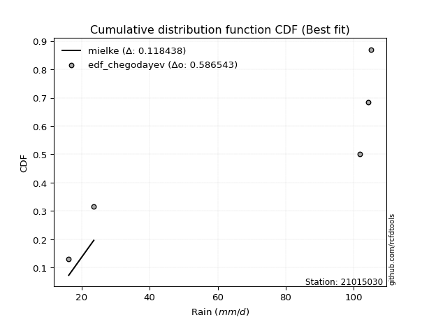</img>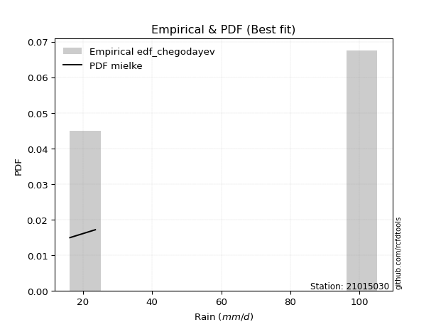</img>

</div>


### 6. Empirical - EDF Blom (1958)

The Blom formula is a specific "plotting position" formula used in hydrology and statistical analysis to estimate the empirical cumulative probability (or non-exceedance probability) of a data series. It is particularly recommended for data that are approximately normally distributed. The constant _a_ is set to 0.375 (or 3/8).

<div align="center">


$P=(m-a)/(n+1-2a)$


</div>


**6.1. Empirical values**

<div align="center">

|                | 0                   | 1                   | 2        | 3                  | 4                  |
|:---------------|:--------------------|:--------------------|:---------|:-------------------|:-------------------|
| date           | 2019                | 2022                | 2024     | 2025               | 2023               |
| x              | 16.2                | 23.55               | 101.9    | 104.32             | 105.18             |
| m              | 1                   | 2                   | 3        | 4                  | 5                  |
| empirical_dist | edf_blom            | edf_blom            | edf_blom | edf_blom           | edf_blom           |
| empirical      | 0.11904761904761904 | 0.30952380952380953 | 0.5      | 0.6904761904761905 | 0.8809523809523809 |
| empirical_tr   | 1.135135135135135   | 1.4482758620689655  | 2.0      | 3.230769230769231  | 8.399999999999999  |

</div>


**6.2. Kolmogorov-Smirnov fit test (sorted by Δ)**


<div align="center">

|                | 0                   | 1                   | 2                   | 3                  | 4                  | 5                  | 6                   | 7                  | 8                  | 9                   | 10                 | 11                  | 12                  | 13                 | 14                 | 15                  | 16                  | 17                 | 18                  | 19                 | 20                 | 21                  | 22                 | 23                 | 24                  | 25                  | 26                 | 27                 | 28                 | 29                 | 30                 | 31                 | 32                  | 33                 | 34                 | 35                 | 36                  | 37                  | 38                  | 39                 | 40                 | 41                  | 42                  | 43                  | 44                 | 45                 | 46                 | 47                  | 48                  | 49                  | 50                 | 51                 | 52                  | 53                 | 54                 | 55                  | 56                 | 57                  | 58                 | 59                 | 60                 | 61                 | 62                  | 63                 | 64                 | 65                  | 66                 | 67                 | 68                  | 69                 | 70                  | 71                 | 72                 | 73                 | 74                  | 75                 | 76                 | 77                  | 78                 | 79                  | 80                 | 81                 | 82                  | 83                 | 84                    | 85                  | 86                 | 87                 | 88                 | 89                 |
|:---------------|:--------------------|:--------------------|:--------------------|:-------------------|:-------------------|:-------------------|:--------------------|:-------------------|:-------------------|:--------------------|:-------------------|:--------------------|:--------------------|:-------------------|:-------------------|:--------------------|:--------------------|:-------------------|:--------------------|:-------------------|:-------------------|:--------------------|:-------------------|:-------------------|:--------------------|:--------------------|:-------------------|:-------------------|:-------------------|:-------------------|:-------------------|:-------------------|:--------------------|:-------------------|:-------------------|:-------------------|:--------------------|:--------------------|:--------------------|:-------------------|:-------------------|:--------------------|:--------------------|:--------------------|:-------------------|:-------------------|:-------------------|:--------------------|:--------------------|:--------------------|:-------------------|:-------------------|:--------------------|:-------------------|:-------------------|:--------------------|:-------------------|:--------------------|:-------------------|:-------------------|:-------------------|:-------------------|:--------------------|:-------------------|:-------------------|:--------------------|:-------------------|:-------------------|:--------------------|:-------------------|:--------------------|:-------------------|:-------------------|:-------------------|:--------------------|:-------------------|:-------------------|:--------------------|:-------------------|:--------------------|:-------------------|:-------------------|:--------------------|:-------------------|:----------------------|:--------------------|:-------------------|:-------------------|:-------------------|:-------------------|
| station        | 21015030            | 21015030            | 21015030            | 21015030           | 21015030           | 21015030           | 21015030            | 21015030           | 21015030           | 21015030            | 21015030           | 21015030            | 21015030            | 21015030           | 21015030           | 21015030            | 21015030            | 21015030           | 21015030            | 21015030           | 21015030           | 21015030            | 21015030           | 21015030           | 21015030            | 21015030            | 21015030           | 21015030           | 21015030           | 21015030           | 21015030           | 21015030           | 21015030            | 21015030           | 21015030           | 21015030           | 21015030            | 21015030            | 21015030            | 21015030           | 21015030           | 21015030            | 21015030            | 21015030            | 21015030           | 21015030           | 21015030           | 21015030            | 21015030            | 21015030            | 21015030           | 21015030           | 21015030            | 21015030           | 21015030           | 21015030            | 21015030           | 21015030            | 21015030           | 21015030           | 21015030           | 21015030           | 21015030            | 21015030           | 21015030           | 21015030            | 21015030           | 21015030           | 21015030            | 21015030           | 21015030            | 21015030           | 21015030           | 21015030           | 21015030            | 21015030           | 21015030           | 21015030            | 21015030           | 21015030            | 21015030           | 21015030           | 21015030            | 21015030           | 21015030              | 21015030            | 21015030           | 21015030           | 21015030           | 21015030           |
| empirical_dist | edf_blom            | edf_blom            | edf_blom            | edf_blom           | edf_blom           | edf_blom           | edf_blom            | edf_blom           | edf_blom           | edf_blom            | edf_blom           | edf_blom            | edf_blom            | edf_blom           | edf_blom           | edf_blom            | edf_blom            | edf_blom           | edf_blom            | edf_blom           | edf_blom           | edf_blom            | edf_blom           | edf_blom           | edf_blom            | edf_blom            | edf_blom           | edf_blom           | edf_blom           | edf_blom           | edf_blom           | edf_blom           | edf_blom            | edf_blom           | edf_blom           | edf_blom           | edf_blom            | edf_blom            | edf_blom            | edf_blom           | edf_blom           | edf_blom            | edf_blom            | edf_blom            | edf_blom           | edf_blom           | edf_blom           | edf_blom            | edf_blom            | edf_blom            | edf_blom           | edf_blom           | edf_blom            | edf_blom           | edf_blom           | edf_blom            | edf_blom           | edf_blom            | edf_blom           | edf_blom           | edf_blom           | edf_blom           | edf_blom            | edf_blom           | edf_blom           | edf_blom            | edf_blom           | edf_blom           | edf_blom            | edf_blom           | edf_blom            | edf_blom           | edf_blom           | edf_blom           | edf_blom            | edf_blom           | edf_blom           | edf_blom            | edf_blom           | edf_blom            | edf_blom           | edf_blom           | edf_blom            | edf_blom           | edf_blom              | edf_blom            | edf_blom           | edf_blom           | edf_blom           | edf_blom           |
| p_dist         | mielke              | logfisk             | fisk                | pareto             | pearson3           | invgamma           | alpha               | loginvweibull      | logmielke          | logncf              | logpearson3        | weibull_min         | gumbel_l            | gamma              | t                  | exponnorm           | crystalball         | norm               | erlang              | ncf                | rice               | lognct              | loggamma           | loggamma           | logfatiguelife      | logf                | logt               | lognorm            | lognorm            | logcrystalball     | logexponnorm       | betaprime          | logbetaprime        | maxwell            | f                  | logtruncnorm       | logerlang           | loginvgamma         | loggumbel_l         | nct                | rayleigh           | logrice             | logexpon            | loginvgauss         | logweibull_min     | logmaxwell         | lograyleigh        | logalpha            | loggenexpon         | halfnorm            | gompertz           | logkstwobign       | genexpon            | expon              | loggompertz        | kstwobign           | loghalfnorm        | logpareto           | logistic           | loglogistic        | gumbel_r           | invgauss           | loggumbel_r         | hypsecant          | halflogistic       | loghalflogistic     | loghypsecant       | moyal              | logmoyal            | logchi2            | lognakagami         | laplace            | loglaplace         | logjohnsonsu       | loglognorm          | wald               | logwald            | gibrat              | loggibrat          | nakagami            | laplace_asymmetric | fatiguelife        | invweibull          | truncnorm          | loglaplace_asymmetric | logloggamma         | chi2               | johnsonsu          | loggenlogistic     | genlogistic        |
| delta          | 0.11314691398044288 | 0.24974319573264847 | 0.25506182486189677 | 0.2561874351584068 | 0.2714747559714833 | 0.2723136013961489 | 0.27423357847371266 | 0.2748105461605097 | 0.2750976063595566 | 0.27525572128034725 | 0.2765091387746228 | 0.27712536843199387 | 0.27798551491163226 | 0.2785226078052825 | 0.2789763289431748 | 0.27899135798302666 | 0.27899226499810403 | 0.2789922765041597 | 0.28065223230759595 | 0.281410358255735  | 0.2833489094307783 | 0.28346603170223783 | 0.2838811114520967 | 0.2838811114520967 | 0.28388833728980445 | 0.28397716267247086 | 0.2840039702588246 | 0.2840067241395555 | 0.2840067241395555 | 0.2840069482252767 | 0.2840071025138352 | 0.284026454398967  | 0.28452426349573334 | 0.2847387482169469 | 0.2848801168148095 | 0.2850909282395362 | 0.28516491981196723 | 0.28521933733571314 | 0.28523100132427837 | 0.2862420770283298 | 0.2863653606756661 | 0.28645092013719897 | 0.28697530052910136 | 0.28711276057777213 | 0.287480285313791  | 0.2890825457779258 | 0.2905187360573558 | 0.29104738766392546 | 0.29199660901293534 | 0.29280701602372705 | 0.2933245613406311 | 0.2941212583137629 | 0.29528275195920317 | 0.2952889567581094 | 0.2955564433366119 | 0.29581243117896516 | 0.2964738490389759 | 0.29839812484835493 | 0.3012998903331464 | 0.3061644609699211 | 0.3110238031228981 | 0.3121502394535475 | 0.31469639199122557 | 0.3150907829630285 | 0.3153390827969137 | 0.31864163235554677 | 0.3197042806732656 | 0.3215310367665045 | 0.32481510971833105 | 0.3263134991506348 | 0.32917537373483285 | 0.3314270143058269 | 0.335432037468273  | 0.3384764144495687 | 0.35145636417340986 | 0.3563968327806114 | 0.3588141208376948 | 0.38435048260034854 | 0.3864918188551518 | 0.39375040406055284 | 0.4104443296908452 | 0.4194800145461175 | 0.45296998602590116 | 0.4538768519080839 | 0.45399430689918785   | 0.45455495057247386 | 0.5102020103510304 | 0.5920192317771198 | 0.6904761904761905 | 0.6904761904761905 |
| deltao         | 0.5865427407550001  | 0.5865427407550001  | 0.5865427407550001  | 0.5865427407550001 | 0.5865427407550001 | 0.5865427407550001 | 0.5865427407550001  | 0.5865427407550001 | 0.5865427407550001 | 0.5865427407550001  | 0.5865427407550001 | 0.5865427407550001  | 0.5865427407550001  | 0.5865427407550001 | 0.5865427407550001 | 0.5865427407550001  | 0.5865427407550001  | 0.5865427407550001 | 0.5865427407550001  | 0.5865427407550001 | 0.5865427407550001 | 0.5865427407550001  | 0.5865427407550001 | 0.5865427407550001 | 0.5865427407550001  | 0.5865427407550001  | 0.5865427407550001 | 0.5865427407550001 | 0.5865427407550001 | 0.5865427407550001 | 0.5865427407550001 | 0.5865427407550001 | 0.5865427407550001  | 0.5865427407550001 | 0.5865427407550001 | 0.5865427407550001 | 0.5865427407550001  | 0.5865427407550001  | 0.5865427407550001  | 0.5865427407550001 | 0.5865427407550001 | 0.5865427407550001  | 0.5865427407550001  | 0.5865427407550001  | 0.5865427407550001 | 0.5865427407550001 | 0.5865427407550001 | 0.5865427407550001  | 0.5865427407550001  | 0.5865427407550001  | 0.5865427407550001 | 0.5865427407550001 | 0.5865427407550001  | 0.5865427407550001 | 0.5865427407550001 | 0.5865427407550001  | 0.5865427407550001 | 0.5865427407550001  | 0.5865427407550001 | 0.5865427407550001 | 0.5865427407550001 | 0.5865427407550001 | 0.5865427407550001  | 0.5865427407550001 | 0.5865427407550001 | 0.5865427407550001  | 0.5865427407550001 | 0.5865427407550001 | 0.5865427407550001  | 0.5865427407550001 | 0.5865427407550001  | 0.5865427407550001 | 0.5865427407550001 | 0.5865427407550001 | 0.5865427407550001  | 0.5865427407550001 | 0.5865427407550001 | 0.5865427407550001  | 0.5865427407550001 | 0.5865427407550001  | 0.5865427407550001 | 0.5865427407550001 | 0.5865427407550001  | 0.5865427407550001 | 0.5865427407550001    | 0.5865427407550001  | 0.5865427407550001 | 0.5865427407550001 | 0.5865427407550001 | 0.5865427407550001 |
| eval           | Δo > Δ              | Δo > Δ              | Δo > Δ              | Δo > Δ             | Δo > Δ             | Δo > Δ             | Δo > Δ              | Δo > Δ             | Δo > Δ             | Δo > Δ              | Δo > Δ             | Δo > Δ              | Δo > Δ              | Δo > Δ             | Δo > Δ             | Δo > Δ              | Δo > Δ              | Δo > Δ             | Δo > Δ              | Δo > Δ             | Δo > Δ             | Δo > Δ              | Δo > Δ             | Δo > Δ             | Δo > Δ              | Δo > Δ              | Δo > Δ             | Δo > Δ             | Δo > Δ             | Δo > Δ             | Δo > Δ             | Δo > Δ             | Δo > Δ              | Δo > Δ             | Δo > Δ             | Δo > Δ             | Δo > Δ              | Δo > Δ              | Δo > Δ              | Δo > Δ             | Δo > Δ             | Δo > Δ              | Δo > Δ              | Δo > Δ              | Δo > Δ             | Δo > Δ             | Δo > Δ             | Δo > Δ              | Δo > Δ              | Δo > Δ              | Δo > Δ             | Δo > Δ             | Δo > Δ              | Δo > Δ             | Δo > Δ             | Δo > Δ              | Δo > Δ             | Δo > Δ              | Δo > Δ             | Δo > Δ             | Δo > Δ             | Δo > Δ             | Δo > Δ              | Δo > Δ             | Δo > Δ             | Δo > Δ              | Δo > Δ             | Δo > Δ             | Δo > Δ              | Δo > Δ             | Δo > Δ              | Δo > Δ             | Δo > Δ             | Δo > Δ             | Δo > Δ              | Δo > Δ             | Δo > Δ             | Δo > Δ              | Δo > Δ             | Δo > Δ              | Δo > Δ             | Δo > Δ             | Δo > Δ              | Δo > Δ             | Δo > Δ                | Δo > Δ              | Δo > Δ             | Δo <= Δ            | Δo <= Δ            | Δo <= Δ            |
| fit            | 1                   | 1                   | 1                   | 1                  | 1                  | 1                  | 1                   | 1                  | 1                  | 1                   | 1                  | 1                   | 1                   | 1                  | 1                  | 1                   | 1                   | 1                  | 1                   | 1                  | 1                  | 1                   | 1                  | 1                  | 1                   | 1                   | 1                  | 1                  | 1                  | 1                  | 1                  | 1                  | 1                   | 1                  | 1                  | 1                  | 1                   | 1                   | 1                   | 1                  | 1                  | 1                   | 1                   | 1                   | 1                  | 1                  | 1                  | 1                   | 1                   | 1                   | 1                  | 1                  | 1                   | 1                  | 1                  | 1                   | 1                  | 1                   | 1                  | 1                  | 1                  | 1                  | 1                   | 1                  | 1                  | 1                   | 1                  | 1                  | 1                   | 1                  | 1                   | 1                  | 1                  | 1                  | 1                   | 1                  | 1                  | 1                   | 1                  | 1                   | 1                  | 1                  | 1                   | 1                  | 1                     | 1                   | 1                  | 0                  | 0                  | 0                  |
| n              | 5                   | 5                   | 5                   | 5                  | 5                  | 5                  | 5                   | 5                  | 5                  | 5                   | 5                  | 5                   | 5                   | 5                  | 5                  | 5                   | 5                   | 5                  | 5                   | 5                  | 5                  | 5                   | 5                  | 5                  | 5                   | 5                   | 5                  | 5                  | 5                  | 5                  | 5                  | 5                  | 5                   | 5                  | 5                  | 5                  | 5                   | 5                   | 5                   | 5                  | 5                  | 5                   | 5                   | 5                   | 5                  | 5                  | 5                  | 5                   | 5                   | 5                   | 5                  | 5                  | 5                   | 5                  | 5                  | 5                   | 5                  | 5                   | 5                  | 5                  | 5                  | 5                  | 5                   | 5                  | 5                  | 5                   | 5                  | 5                  | 5                   | 5                  | 5                   | 5                  | 5                  | 5                  | 5                   | 5                  | 5                  | 5                   | 5                  | 5                   | 5                  | 5                  | 5                   | 5                  | 5                     | 5                   | 5                  | 5                  | 5                  | 5                  |
| best_fit       | 1                   | 0                   | 0                   | 0                  | 0                  | 0                  | 0                   | 0                  | 0                  | 0                   | 0                  | 0                   | 0                   | 0                  | 0                  | 0                   | 0                   | 0                  | 0                   | 0                  | 0                  | 0                   | 0                  | 0                  | 0                   | 0                   | 0                  | 0                  | 0                  | 0                  | 0                  | 0                  | 0                   | 0                  | 0                  | 0                  | 0                   | 0                   | 0                   | 0                  | 0                  | 0                   | 0                   | 0                   | 0                  | 0                  | 0                  | 0                   | 0                   | 0                   | 0                  | 0                  | 0                   | 0                  | 0                  | 0                   | 0                  | 0                   | 0                  | 0                  | 0                  | 0                  | 0                   | 0                  | 0                  | 0                   | 0                  | 0                  | 0                   | 0                  | 0                   | 0                  | 0                  | 0                  | 0                   | 0                  | 0                  | 0                   | 0                  | 0                   | 0                  | 0                  | 0                   | 0                  | 0                     | 0                   | 0                  | 0                  | 0                  | 0                  |
| best_fit_sort  | 1                   | 2                   | 3                   | 4                  | 5                  | 6                  | 7                   | 8                  | 9                  | 10                  | 11                 | 12                  | 13                  | 14                 | 15                 | 16                  | 17                  | 18                 | 19                  | 20                 | 21                 | 22                  | 23                 | 24                 | 25                  | 26                  | 27                 | 28                 | 29                 | 30                 | 31                 | 32                 | 33                  | 34                 | 35                 | 36                 | 37                  | 38                  | 39                  | 40                 | 41                 | 42                  | 43                  | 44                  | 45                 | 46                 | 47                 | 48                  | 49                  | 50                  | 51                 | 52                 | 53                  | 54                 | 55                 | 56                  | 57                 | 58                  | 59                 | 60                 | 61                 | 62                 | 63                  | 64                 | 65                 | 66                  | 67                 | 68                 | 69                  | 70                 | 71                  | 72                 | 73                 | 74                 | 75                  | 76                 | 77                 | 78                  | 79                 | 80                  | 81                 | 82                 | 83                  | 84                 | 85                    | 86                  | 87                 | 88                 | 89                 | 90                 |

</div>


<div align="center">

</img>

</div>


**6.3. Best fit**

<div align="center">

|   id |   station | empirical_dist   | p_dist   |    delta |   deltao | eval   |   fit |   n |   best_fit |   best_fit_sort |
|-----:|----------:|:-----------------|:---------|---------:|---------:|:-------|------:|----:|-----------:|----------------:|
|    0 |  21015030 | edf_blom         | mielke   | 0.113147 | 0.586543 | Δo > Δ |     1 |   5 |          1 |               1 |

</div>


<div align="center">

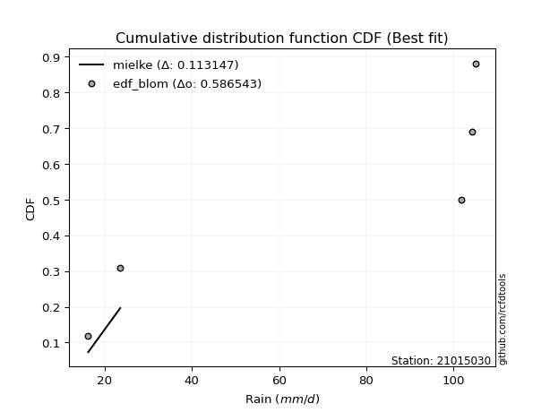</img></img>

</div>


### 7. Empirical - EDF Tukey (1962)

In hydrology, the Tukey formula is used as a plotting position formula to estimate the empirical probability or frequency of a flood event (or other hydrological data). The formula parameter is given as _c=0.333_ (or 1/3).

<div align="center">


$P=(m-c)/(n+1-2c)$


</div>


**7.1. Empirical values**

<div align="center">

|                | 0                  | 1                  | 2         | 3         | 4         |
|:---------------|:-------------------|:-------------------|:----------|:----------|:----------|
| date           | 2019               | 2022               | 2024      | 2025      | 2023      |
| x              | 16.2               | 23.55              | 101.9     | 104.32    | 105.18    |
| m              | 1                  | 2                  | 3         | 4         | 5         |
| empirical_dist | edf_tukey          | edf_tukey          | edf_tukey | edf_tukey | edf_tukey |
| empirical      | 0.125              | 0.3125             | 0.5       | 0.6875    | 0.875     |
| empirical_tr   | 1.1428571428571428 | 1.4545454545454546 | 2.0       | 3.2       | 8.0       |

</div>


**7.2. Kolmogorov-Smirnov fit test (sorted by Δ)**


<div align="center">

|                | 0                   | 1                   | 2                   | 3                  | 4                  | 5                  | 6                   | 7                  | 8                  | 9                   | 10                 | 11                  | 12                  | 13                 | 14                 | 15                  | 16                  | 17                 | 18                  | 19                 | 20                 | 21                  | 22                 | 23                 | 24                  | 25                  | 26                 | 27                 | 28                 | 29                 | 30                 | 31                 | 32                  | 33                 | 34                 | 35                 | 36                  | 37                  | 38                  | 39                 | 40                 | 41                  | 42                  | 43                  | 44                 | 45                 | 46                 | 47                  | 48                  | 49                  | 50                 | 51                 | 52                  | 53                 | 54                  | 55                 | 56                  | 57                 | 58                 | 59                 | 60                 | 61                 | 62                  | 63                 | 64                 | 65                  | 66                 | 67                 | 68                  | 69                 | 70                  | 71                 | 72                 | 73                  | 74                 | 75                 | 76                 | 77                  | 78                 | 79                  | 80                 | 81                 | 82                  | 83                 | 84                    | 85                  | 86                 | 87                 | 88                 | 89                 |
|:---------------|:--------------------|:--------------------|:--------------------|:-------------------|:-------------------|:-------------------|:--------------------|:-------------------|:-------------------|:--------------------|:-------------------|:--------------------|:--------------------|:-------------------|:-------------------|:--------------------|:--------------------|:-------------------|:--------------------|:-------------------|:-------------------|:--------------------|:-------------------|:-------------------|:--------------------|:--------------------|:-------------------|:-------------------|:-------------------|:-------------------|:-------------------|:-------------------|:--------------------|:-------------------|:-------------------|:-------------------|:--------------------|:--------------------|:--------------------|:-------------------|:-------------------|:--------------------|:--------------------|:--------------------|:-------------------|:-------------------|:-------------------|:--------------------|:--------------------|:--------------------|:-------------------|:-------------------|:--------------------|:-------------------|:--------------------|:-------------------|:--------------------|:-------------------|:-------------------|:-------------------|:-------------------|:-------------------|:--------------------|:-------------------|:-------------------|:--------------------|:-------------------|:-------------------|:--------------------|:-------------------|:--------------------|:-------------------|:-------------------|:--------------------|:-------------------|:-------------------|:-------------------|:--------------------|:-------------------|:--------------------|:-------------------|:-------------------|:--------------------|:-------------------|:----------------------|:--------------------|:-------------------|:-------------------|:-------------------|:-------------------|
| station        | 21015030            | 21015030            | 21015030            | 21015030           | 21015030           | 21015030           | 21015030            | 21015030           | 21015030           | 21015030            | 21015030           | 21015030            | 21015030            | 21015030           | 21015030           | 21015030            | 21015030            | 21015030           | 21015030            | 21015030           | 21015030           | 21015030            | 21015030           | 21015030           | 21015030            | 21015030            | 21015030           | 21015030           | 21015030           | 21015030           | 21015030           | 21015030           | 21015030            | 21015030           | 21015030           | 21015030           | 21015030            | 21015030            | 21015030            | 21015030           | 21015030           | 21015030            | 21015030            | 21015030            | 21015030           | 21015030           | 21015030           | 21015030            | 21015030            | 21015030            | 21015030           | 21015030           | 21015030            | 21015030           | 21015030            | 21015030           | 21015030            | 21015030           | 21015030           | 21015030           | 21015030           | 21015030           | 21015030            | 21015030           | 21015030           | 21015030            | 21015030           | 21015030           | 21015030            | 21015030           | 21015030            | 21015030           | 21015030           | 21015030            | 21015030           | 21015030           | 21015030           | 21015030            | 21015030           | 21015030            | 21015030           | 21015030           | 21015030            | 21015030           | 21015030              | 21015030            | 21015030           | 21015030           | 21015030           | 21015030           |
| empirical_dist | edf_tukey           | edf_tukey           | edf_tukey           | edf_tukey          | edf_tukey          | edf_tukey          | edf_tukey           | edf_tukey          | edf_tukey          | edf_tukey           | edf_tukey          | edf_tukey           | edf_tukey           | edf_tukey          | edf_tukey          | edf_tukey           | edf_tukey           | edf_tukey          | edf_tukey           | edf_tukey          | edf_tukey          | edf_tukey           | edf_tukey          | edf_tukey          | edf_tukey           | edf_tukey           | edf_tukey          | edf_tukey          | edf_tukey          | edf_tukey          | edf_tukey          | edf_tukey          | edf_tukey           | edf_tukey          | edf_tukey          | edf_tukey          | edf_tukey           | edf_tukey           | edf_tukey           | edf_tukey          | edf_tukey          | edf_tukey           | edf_tukey           | edf_tukey           | edf_tukey          | edf_tukey          | edf_tukey          | edf_tukey           | edf_tukey           | edf_tukey           | edf_tukey          | edf_tukey          | edf_tukey           | edf_tukey          | edf_tukey           | edf_tukey          | edf_tukey           | edf_tukey          | edf_tukey          | edf_tukey          | edf_tukey          | edf_tukey          | edf_tukey           | edf_tukey          | edf_tukey          | edf_tukey           | edf_tukey          | edf_tukey          | edf_tukey           | edf_tukey          | edf_tukey           | edf_tukey          | edf_tukey          | edf_tukey           | edf_tukey          | edf_tukey          | edf_tukey          | edf_tukey           | edf_tukey          | edf_tukey           | edf_tukey          | edf_tukey          | edf_tukey           | edf_tukey          | edf_tukey             | edf_tukey           | edf_tukey          | edf_tukey          | edf_tukey          | edf_tukey          |
| p_dist         | mielke              | logfisk             | fisk                | pareto             | pearson3           | invgamma           | alpha               | loginvweibull      | logmielke          | logncf              | logpearson3        | weibull_min         | gumbel_l            | gamma              | t                  | exponnorm           | crystalball         | norm               | erlang              | ncf                | rice               | lognct              | loggamma           | loggamma           | logfatiguelife      | logf                | logt               | lognorm            | lognorm            | logcrystalball     | logexponnorm       | betaprime          | logbetaprime        | maxwell            | f                  | logtruncnorm       | logerlang           | loginvgamma         | loggumbel_l         | nct                | rayleigh           | logrice             | logexpon            | loginvgauss         | logweibull_min     | logmaxwell         | lograyleigh        | logalpha            | loggenexpon         | halfnorm            | gompertz           | logkstwobign       | genexpon            | expon              | logpareto           | loggompertz        | kstwobign           | loghalfnorm        | logistic           | loglogistic        | gumbel_r           | invgauss           | loggumbel_r         | hypsecant          | halflogistic       | loghalflogistic     | loghypsecant       | moyal              | logmoyal            | logchi2            | lognakagami         | laplace            | loglaplace         | logjohnsonsu        | loglognorm         | wald               | logwald            | gibrat              | loggibrat          | nakagami            | laplace_asymmetric | fatiguelife        | invweibull          | truncnorm          | loglaplace_asymmetric | logloggamma         | chi2               | johnsonsu          | loggenlogistic     | genlogistic        |
| delta          | 0.11612310445663335 | 0.24974319573264847 | 0.25506182486189677 | 0.2561874351584068 | 0.2714747559714833 | 0.2723136013961489 | 0.27423357847371266 | 0.2748105461605097 | 0.2750976063595566 | 0.27525572128034725 | 0.2765091387746228 | 0.27712536843199387 | 0.27798551491163226 | 0.2785226078052825 | 0.2789763289431748 | 0.27899135798302666 | 0.27899226499810403 | 0.2789922765041597 | 0.28065223230759595 | 0.281410358255735  | 0.2833489094307783 | 0.28346603170223783 | 0.2838811114520967 | 0.2838811114520967 | 0.28388833728980445 | 0.28397716267247086 | 0.2840039702588246 | 0.2840067241395555 | 0.2840067241395555 | 0.2840069482252767 | 0.2840071025138352 | 0.284026454398967  | 0.28452426349573334 | 0.2847387482169469 | 0.2848801168148095 | 0.2850909282395362 | 0.28516491981196723 | 0.28521933733571314 | 0.28523100132427837 | 0.2862420770283298 | 0.2863653606756661 | 0.28645092013719897 | 0.28697530052910136 | 0.28711276057777213 | 0.287480285313791  | 0.2890825457779258 | 0.2905187360573558 | 0.29104738766392546 | 0.29199660901293534 | 0.29280701602372705 | 0.2933245613406311 | 0.2941212583137629 | 0.29528275195920317 | 0.2952889567581094 | 0.29542193437216446 | 0.2955564433366119 | 0.29581243117896516 | 0.2964738490389759 | 0.3012998903331464 | 0.3061644609699211 | 0.3110238031228981 | 0.3121502394535475 | 0.31469639199122557 | 0.3150907829630285 | 0.3153390827969137 | 0.31864163235554677 | 0.3197042806732656 | 0.3215310367665045 | 0.32481510971833105 | 0.3263134991506348 | 0.32917537373483285 | 0.3314270143058269 | 0.335432037468273  | 0.33550022397337825 | 0.3484801736972194 | 0.3563968327806114 | 0.3588141208376948 | 0.38435048260034854 | 0.3864918188551518 | 0.39375040406055284 | 0.4104443296908452 | 0.4194800145461175 | 0.44701760507352023 | 0.4538768519080839 | 0.45399430689918785   | 0.45455495057247386 | 0.50722581987484   | 0.5890430413009293 | 0.6875             | 0.6875             |
| deltao         | 0.5865427407550001  | 0.5865427407550001  | 0.5865427407550001  | 0.5865427407550001 | 0.5865427407550001 | 0.5865427407550001 | 0.5865427407550001  | 0.5865427407550001 | 0.5865427407550001 | 0.5865427407550001  | 0.5865427407550001 | 0.5865427407550001  | 0.5865427407550001  | 0.5865427407550001 | 0.5865427407550001 | 0.5865427407550001  | 0.5865427407550001  | 0.5865427407550001 | 0.5865427407550001  | 0.5865427407550001 | 0.5865427407550001 | 0.5865427407550001  | 0.5865427407550001 | 0.5865427407550001 | 0.5865427407550001  | 0.5865427407550001  | 0.5865427407550001 | 0.5865427407550001 | 0.5865427407550001 | 0.5865427407550001 | 0.5865427407550001 | 0.5865427407550001 | 0.5865427407550001  | 0.5865427407550001 | 0.5865427407550001 | 0.5865427407550001 | 0.5865427407550001  | 0.5865427407550001  | 0.5865427407550001  | 0.5865427407550001 | 0.5865427407550001 | 0.5865427407550001  | 0.5865427407550001  | 0.5865427407550001  | 0.5865427407550001 | 0.5865427407550001 | 0.5865427407550001 | 0.5865427407550001  | 0.5865427407550001  | 0.5865427407550001  | 0.5865427407550001 | 0.5865427407550001 | 0.5865427407550001  | 0.5865427407550001 | 0.5865427407550001  | 0.5865427407550001 | 0.5865427407550001  | 0.5865427407550001 | 0.5865427407550001 | 0.5865427407550001 | 0.5865427407550001 | 0.5865427407550001 | 0.5865427407550001  | 0.5865427407550001 | 0.5865427407550001 | 0.5865427407550001  | 0.5865427407550001 | 0.5865427407550001 | 0.5865427407550001  | 0.5865427407550001 | 0.5865427407550001  | 0.5865427407550001 | 0.5865427407550001 | 0.5865427407550001  | 0.5865427407550001 | 0.5865427407550001 | 0.5865427407550001 | 0.5865427407550001  | 0.5865427407550001 | 0.5865427407550001  | 0.5865427407550001 | 0.5865427407550001 | 0.5865427407550001  | 0.5865427407550001 | 0.5865427407550001    | 0.5865427407550001  | 0.5865427407550001 | 0.5865427407550001 | 0.5865427407550001 | 0.5865427407550001 |
| eval           | Δo > Δ              | Δo > Δ              | Δo > Δ              | Δo > Δ             | Δo > Δ             | Δo > Δ             | Δo > Δ              | Δo > Δ             | Δo > Δ             | Δo > Δ              | Δo > Δ             | Δo > Δ              | Δo > Δ              | Δo > Δ             | Δo > Δ             | Δo > Δ              | Δo > Δ              | Δo > Δ             | Δo > Δ              | Δo > Δ             | Δo > Δ             | Δo > Δ              | Δo > Δ             | Δo > Δ             | Δo > Δ              | Δo > Δ              | Δo > Δ             | Δo > Δ             | Δo > Δ             | Δo > Δ             | Δo > Δ             | Δo > Δ             | Δo > Δ              | Δo > Δ             | Δo > Δ             | Δo > Δ             | Δo > Δ              | Δo > Δ              | Δo > Δ              | Δo > Δ             | Δo > Δ             | Δo > Δ              | Δo > Δ              | Δo > Δ              | Δo > Δ             | Δo > Δ             | Δo > Δ             | Δo > Δ              | Δo > Δ              | Δo > Δ              | Δo > Δ             | Δo > Δ             | Δo > Δ              | Δo > Δ             | Δo > Δ              | Δo > Δ             | Δo > Δ              | Δo > Δ             | Δo > Δ             | Δo > Δ             | Δo > Δ             | Δo > Δ             | Δo > Δ              | Δo > Δ             | Δo > Δ             | Δo > Δ              | Δo > Δ             | Δo > Δ             | Δo > Δ              | Δo > Δ             | Δo > Δ              | Δo > Δ             | Δo > Δ             | Δo > Δ              | Δo > Δ             | Δo > Δ             | Δo > Δ             | Δo > Δ              | Δo > Δ             | Δo > Δ              | Δo > Δ             | Δo > Δ             | Δo > Δ              | Δo > Δ             | Δo > Δ                | Δo > Δ              | Δo > Δ             | Δo <= Δ            | Δo <= Δ            | Δo <= Δ            |
| fit            | 1                   | 1                   | 1                   | 1                  | 1                  | 1                  | 1                   | 1                  | 1                  | 1                   | 1                  | 1                   | 1                   | 1                  | 1                  | 1                   | 1                   | 1                  | 1                   | 1                  | 1                  | 1                   | 1                  | 1                  | 1                   | 1                   | 1                  | 1                  | 1                  | 1                  | 1                  | 1                  | 1                   | 1                  | 1                  | 1                  | 1                   | 1                   | 1                   | 1                  | 1                  | 1                   | 1                   | 1                   | 1                  | 1                  | 1                  | 1                   | 1                   | 1                   | 1                  | 1                  | 1                   | 1                  | 1                   | 1                  | 1                   | 1                  | 1                  | 1                  | 1                  | 1                  | 1                   | 1                  | 1                  | 1                   | 1                  | 1                  | 1                   | 1                  | 1                   | 1                  | 1                  | 1                   | 1                  | 1                  | 1                  | 1                   | 1                  | 1                   | 1                  | 1                  | 1                   | 1                  | 1                     | 1                   | 1                  | 0                  | 0                  | 0                  |
| n              | 5                   | 5                   | 5                   | 5                  | 5                  | 5                  | 5                   | 5                  | 5                  | 5                   | 5                  | 5                   | 5                   | 5                  | 5                  | 5                   | 5                   | 5                  | 5                   | 5                  | 5                  | 5                   | 5                  | 5                  | 5                   | 5                   | 5                  | 5                  | 5                  | 5                  | 5                  | 5                  | 5                   | 5                  | 5                  | 5                  | 5                   | 5                   | 5                   | 5                  | 5                  | 5                   | 5                   | 5                   | 5                  | 5                  | 5                  | 5                   | 5                   | 5                   | 5                  | 5                  | 5                   | 5                  | 5                   | 5                  | 5                   | 5                  | 5                  | 5                  | 5                  | 5                  | 5                   | 5                  | 5                  | 5                   | 5                  | 5                  | 5                   | 5                  | 5                   | 5                  | 5                  | 5                   | 5                  | 5                  | 5                  | 5                   | 5                  | 5                   | 5                  | 5                  | 5                   | 5                  | 5                     | 5                   | 5                  | 5                  | 5                  | 5                  |
| best_fit       | 1                   | 0                   | 0                   | 0                  | 0                  | 0                  | 0                   | 0                  | 0                  | 0                   | 0                  | 0                   | 0                   | 0                  | 0                  | 0                   | 0                   | 0                  | 0                   | 0                  | 0                  | 0                   | 0                  | 0                  | 0                   | 0                   | 0                  | 0                  | 0                  | 0                  | 0                  | 0                  | 0                   | 0                  | 0                  | 0                  | 0                   | 0                   | 0                   | 0                  | 0                  | 0                   | 0                   | 0                   | 0                  | 0                  | 0                  | 0                   | 0                   | 0                   | 0                  | 0                  | 0                   | 0                  | 0                   | 0                  | 0                   | 0                  | 0                  | 0                  | 0                  | 0                  | 0                   | 0                  | 0                  | 0                   | 0                  | 0                  | 0                   | 0                  | 0                   | 0                  | 0                  | 0                   | 0                  | 0                  | 0                  | 0                   | 0                  | 0                   | 0                  | 0                  | 0                   | 0                  | 0                     | 0                   | 0                  | 0                  | 0                  | 0                  |
| best_fit_sort  | 1                   | 2                   | 3                   | 4                  | 5                  | 6                  | 7                   | 8                  | 9                  | 10                  | 11                 | 12                  | 13                  | 14                 | 15                 | 16                  | 17                  | 18                 | 19                  | 20                 | 21                 | 22                  | 23                 | 24                 | 25                  | 26                  | 27                 | 28                 | 29                 | 30                 | 31                 | 32                 | 33                  | 34                 | 35                 | 36                 | 37                  | 38                  | 39                  | 40                 | 41                 | 42                  | 43                  | 44                  | 45                 | 46                 | 47                 | 48                  | 49                  | 50                  | 51                 | 52                 | 53                  | 54                 | 55                  | 56                 | 57                  | 58                 | 59                 | 60                 | 61                 | 62                 | 63                  | 64                 | 65                 | 66                  | 67                 | 68                 | 69                  | 70                 | 71                  | 72                 | 73                 | 74                  | 75                 | 76                 | 77                 | 78                  | 79                 | 80                  | 81                 | 82                 | 83                  | 84                 | 85                    | 86                  | 87                 | 88                 | 89                 | 90                 |

</div>


<div align="center">

</img>

</div>


**7.3. Best fit**

<div align="center">

|   id |   station | empirical_dist   | p_dist   |    delta |   deltao | eval   |   fit |   n |   best_fit |   best_fit_sort |
|-----:|----------:|:-----------------|:---------|---------:|---------:|:-------|------:|----:|-----------:|----------------:|
|    0 |  21015030 | edf_tukey        | mielke   | 0.116123 | 0.586543 | Δo > Δ |     1 |   5 |          1 |               1 |

</div>


<div align="center">

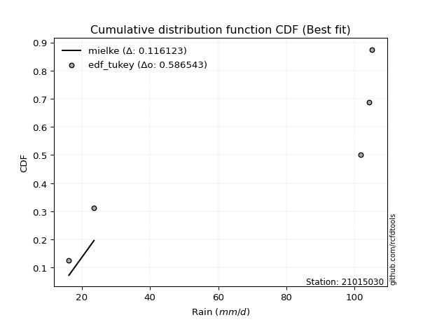</img></img>

</div>


### 8. Empirical - EDF Gringorten (1963)

Gringorten plotting position formula is essential for estimating the probability and return periods of extreme events like floods and heavy rainfall. The constant _a=0.44_.

<div align="center">


$P=(m-a)/(n+1-2a)$


</div>


**8.1. Empirical values**

<div align="center">

|                | 0                   | 1                  | 2              | 3                 | 4                  |
|:---------------|:--------------------|:-------------------|:---------------|:------------------|:-------------------|
| date           | 2019                | 2022               | 2024           | 2025              | 2023               |
| x              | 16.2                | 23.55              | 101.9          | 104.32            | 105.18             |
| m              | 1                   | 2                  | 3              | 4                 | 5                  |
| empirical_dist | edf_gringorten      | edf_gringorten     | edf_gringorten | edf_gringorten    | edf_gringorten     |
| empirical      | 0.10937500000000001 | 0.3046875          | 0.5            | 0.6953125         | 0.8906249999999999 |
| empirical_tr   | 1.1228070175438596  | 1.4382022471910112 | 2.0            | 3.282051282051282 | 9.142857142857133  |

</div>


**8.2. Kolmogorov-Smirnov fit test (sorted by Δ)**


<div align="center">

|                | 0                   | 1                   | 2                   | 3                  | 4                  | 5                  | 6                   | 7                  | 8                  | 9                   | 10                 | 11                  | 12                  | 13                 | 14                 | 15                  | 16                  | 17                 | 18                  | 19                 | 20                 | 21                  | 22                 | 23                 | 24                  | 25                  | 26                 | 27                 | 28                 | 29                 | 30                 | 31                 | 32                  | 33                 | 34                 | 35                 | 36                  | 37                  | 38                  | 39                 | 40                 | 41                  | 42                  | 43                  | 44                 | 45                 | 46                 | 47                  | 48                  | 49                  | 50                 | 51                 | 52                  | 53                 | 54                 | 55                  | 56                 | 57                 | 58                  | 59                 | 60                 | 61                 | 62                  | 63                 | 64                 | 65                  | 66                 | 67                 | 68                  | 69                 | 70                  | 71                 | 72                 | 73                  | 74                 | 75                 | 76                 | 77                  | 78                 | 79                  | 80                 | 81                 | 82                 | 83                    | 84                  | 85                 | 86                 | 87                 | 88                 | 89                 |
|:---------------|:--------------------|:--------------------|:--------------------|:-------------------|:-------------------|:-------------------|:--------------------|:-------------------|:-------------------|:--------------------|:-------------------|:--------------------|:--------------------|:-------------------|:-------------------|:--------------------|:--------------------|:-------------------|:--------------------|:-------------------|:-------------------|:--------------------|:-------------------|:-------------------|:--------------------|:--------------------|:-------------------|:-------------------|:-------------------|:-------------------|:-------------------|:-------------------|:--------------------|:-------------------|:-------------------|:-------------------|:--------------------|:--------------------|:--------------------|:-------------------|:-------------------|:--------------------|:--------------------|:--------------------|:-------------------|:-------------------|:-------------------|:--------------------|:--------------------|:--------------------|:-------------------|:-------------------|:--------------------|:-------------------|:-------------------|:--------------------|:-------------------|:-------------------|:--------------------|:-------------------|:-------------------|:-------------------|:--------------------|:-------------------|:-------------------|:--------------------|:-------------------|:-------------------|:--------------------|:-------------------|:--------------------|:-------------------|:-------------------|:--------------------|:-------------------|:-------------------|:-------------------|:--------------------|:-------------------|:--------------------|:-------------------|:-------------------|:-------------------|:----------------------|:--------------------|:-------------------|:-------------------|:-------------------|:-------------------|:-------------------|
| station        | 21015030            | 21015030            | 21015030            | 21015030           | 21015030           | 21015030           | 21015030            | 21015030           | 21015030           | 21015030            | 21015030           | 21015030            | 21015030            | 21015030           | 21015030           | 21015030            | 21015030            | 21015030           | 21015030            | 21015030           | 21015030           | 21015030            | 21015030           | 21015030           | 21015030            | 21015030            | 21015030           | 21015030           | 21015030           | 21015030           | 21015030           | 21015030           | 21015030            | 21015030           | 21015030           | 21015030           | 21015030            | 21015030            | 21015030            | 21015030           | 21015030           | 21015030            | 21015030            | 21015030            | 21015030           | 21015030           | 21015030           | 21015030            | 21015030            | 21015030            | 21015030           | 21015030           | 21015030            | 21015030           | 21015030           | 21015030            | 21015030           | 21015030           | 21015030            | 21015030           | 21015030           | 21015030           | 21015030            | 21015030           | 21015030           | 21015030            | 21015030           | 21015030           | 21015030            | 21015030           | 21015030            | 21015030           | 21015030           | 21015030            | 21015030           | 21015030           | 21015030           | 21015030            | 21015030           | 21015030            | 21015030           | 21015030           | 21015030           | 21015030              | 21015030            | 21015030           | 21015030           | 21015030           | 21015030           | 21015030           |
| empirical_dist | edf_gringorten      | edf_gringorten      | edf_gringorten      | edf_gringorten     | edf_gringorten     | edf_gringorten     | edf_gringorten      | edf_gringorten     | edf_gringorten     | edf_gringorten      | edf_gringorten     | edf_gringorten      | edf_gringorten      | edf_gringorten     | edf_gringorten     | edf_gringorten      | edf_gringorten      | edf_gringorten     | edf_gringorten      | edf_gringorten     | edf_gringorten     | edf_gringorten      | edf_gringorten     | edf_gringorten     | edf_gringorten      | edf_gringorten      | edf_gringorten     | edf_gringorten     | edf_gringorten     | edf_gringorten     | edf_gringorten     | edf_gringorten     | edf_gringorten      | edf_gringorten     | edf_gringorten     | edf_gringorten     | edf_gringorten      | edf_gringorten      | edf_gringorten      | edf_gringorten     | edf_gringorten     | edf_gringorten      | edf_gringorten      | edf_gringorten      | edf_gringorten     | edf_gringorten     | edf_gringorten     | edf_gringorten      | edf_gringorten      | edf_gringorten      | edf_gringorten     | edf_gringorten     | edf_gringorten      | edf_gringorten     | edf_gringorten     | edf_gringorten      | edf_gringorten     | edf_gringorten     | edf_gringorten      | edf_gringorten     | edf_gringorten     | edf_gringorten     | edf_gringorten      | edf_gringorten     | edf_gringorten     | edf_gringorten      | edf_gringorten     | edf_gringorten     | edf_gringorten      | edf_gringorten     | edf_gringorten      | edf_gringorten     | edf_gringorten     | edf_gringorten      | edf_gringorten     | edf_gringorten     | edf_gringorten     | edf_gringorten      | edf_gringorten     | edf_gringorten      | edf_gringorten     | edf_gringorten     | edf_gringorten     | edf_gringorten        | edf_gringorten      | edf_gringorten     | edf_gringorten     | edf_gringorten     | edf_gringorten     | edf_gringorten     |
| p_dist         | mielke              | logfisk             | fisk                | pareto             | pearson3           | invgamma           | alpha               | loginvweibull      | logmielke          | logncf              | logpearson3        | weibull_min         | gumbel_l            | gamma              | t                  | exponnorm           | crystalball         | norm               | erlang              | ncf                | rice               | lognct              | loggamma           | loggamma           | logfatiguelife      | logf                | logt               | lognorm            | lognorm            | logcrystalball     | logexponnorm       | betaprime          | logbetaprime        | maxwell            | f                  | logtruncnorm       | logerlang           | loginvgamma         | loggumbel_l         | nct                | rayleigh           | logrice             | logexpon            | loginvgauss         | logweibull_min     | logmaxwell         | lograyleigh        | logalpha            | loggenexpon         | halfnorm            | gompertz           | logkstwobign       | genexpon            | expon              | loggompertz        | kstwobign           | loghalfnorm        | logistic           | logpareto           | loglogistic        | gumbel_r           | invgauss           | loggumbel_r         | hypsecant          | halflogistic       | loghalflogistic     | loghypsecant       | moyal              | logmoyal            | logchi2            | lognakagami         | laplace            | loglaplace         | logjohnsonsu        | loglognorm         | wald               | logwald            | gibrat              | loggibrat          | nakagami            | laplace_asymmetric | fatiguelife        | truncnorm          | loglaplace_asymmetric | logloggamma         | invweibull         | chi2               | johnsonsu          | loggenlogistic     | genlogistic        |
| delta          | 0.10831060445663335 | 0.24974319573264847 | 0.25506182486189677 | 0.2561874351584068 | 0.2714747559714833 | 0.2723136013961489 | 0.27423357847371266 | 0.2748105461605097 | 0.2750976063595566 | 0.27525572128034725 | 0.2765091387746228 | 0.27712536843199387 | 0.27798551491163226 | 0.2785226078052825 | 0.2789763289431748 | 0.27899135798302666 | 0.27899226499810403 | 0.2789922765041597 | 0.28065223230759595 | 0.281410358255735  | 0.2833489094307783 | 0.28346603170223783 | 0.2838811114520967 | 0.2838811114520967 | 0.28388833728980445 | 0.28397716267247086 | 0.2840039702588246 | 0.2840067241395555 | 0.2840067241395555 | 0.2840069482252767 | 0.2840071025138352 | 0.284026454398967  | 0.28452426349573334 | 0.2847387482169469 | 0.2848801168148095 | 0.2850909282395362 | 0.28516491981196723 | 0.28521933733571314 | 0.28523100132427837 | 0.2862420770283298 | 0.2863653606756661 | 0.28645092013719897 | 0.28697530052910136 | 0.28711276057777213 | 0.287480285313791  | 0.2890825457779258 | 0.2905187360573558 | 0.29104738766392546 | 0.29199660901293534 | 0.29280701602372705 | 0.2933245613406311 | 0.2941212583137629 | 0.29528275195920317 | 0.2952889567581094 | 0.2955564433366119 | 0.29581243117896516 | 0.2964738490389759 | 0.3012998903331464 | 0.30323443437216446 | 0.3061644609699211 | 0.3110238031228981 | 0.3121502394535475 | 0.31469639199122557 | 0.3150907829630285 | 0.3153390827969137 | 0.31864163235554677 | 0.3197042806732656 | 0.3215310367665045 | 0.32481510971833105 | 0.3263134991506348 | 0.32917537373483285 | 0.3314270143058269 | 0.335432037468273  | 0.34331272397337825 | 0.3562926736972194 | 0.3563968327806114 | 0.3588141208376948 | 0.38435048260034854 | 0.3864918188551518 | 0.39375040406055284 | 0.4104443296908452 | 0.4194800145461175 | 0.4538768519080839 | 0.45399430689918785   | 0.45455495057247386 | 0.4626426050735201 | 0.51503831987484   | 0.5968555413009293 | 0.6953125          | 0.6953125          |
| deltao         | 0.5865427407550001  | 0.5865427407550001  | 0.5865427407550001  | 0.5865427407550001 | 0.5865427407550001 | 0.5865427407550001 | 0.5865427407550001  | 0.5865427407550001 | 0.5865427407550001 | 0.5865427407550001  | 0.5865427407550001 | 0.5865427407550001  | 0.5865427407550001  | 0.5865427407550001 | 0.5865427407550001 | 0.5865427407550001  | 0.5865427407550001  | 0.5865427407550001 | 0.5865427407550001  | 0.5865427407550001 | 0.5865427407550001 | 0.5865427407550001  | 0.5865427407550001 | 0.5865427407550001 | 0.5865427407550001  | 0.5865427407550001  | 0.5865427407550001 | 0.5865427407550001 | 0.5865427407550001 | 0.5865427407550001 | 0.5865427407550001 | 0.5865427407550001 | 0.5865427407550001  | 0.5865427407550001 | 0.5865427407550001 | 0.5865427407550001 | 0.5865427407550001  | 0.5865427407550001  | 0.5865427407550001  | 0.5865427407550001 | 0.5865427407550001 | 0.5865427407550001  | 0.5865427407550001  | 0.5865427407550001  | 0.5865427407550001 | 0.5865427407550001 | 0.5865427407550001 | 0.5865427407550001  | 0.5865427407550001  | 0.5865427407550001  | 0.5865427407550001 | 0.5865427407550001 | 0.5865427407550001  | 0.5865427407550001 | 0.5865427407550001 | 0.5865427407550001  | 0.5865427407550001 | 0.5865427407550001 | 0.5865427407550001  | 0.5865427407550001 | 0.5865427407550001 | 0.5865427407550001 | 0.5865427407550001  | 0.5865427407550001 | 0.5865427407550001 | 0.5865427407550001  | 0.5865427407550001 | 0.5865427407550001 | 0.5865427407550001  | 0.5865427407550001 | 0.5865427407550001  | 0.5865427407550001 | 0.5865427407550001 | 0.5865427407550001  | 0.5865427407550001 | 0.5865427407550001 | 0.5865427407550001 | 0.5865427407550001  | 0.5865427407550001 | 0.5865427407550001  | 0.5865427407550001 | 0.5865427407550001 | 0.5865427407550001 | 0.5865427407550001    | 0.5865427407550001  | 0.5865427407550001 | 0.5865427407550001 | 0.5865427407550001 | 0.5865427407550001 | 0.5865427407550001 |
| eval           | Δo > Δ              | Δo > Δ              | Δo > Δ              | Δo > Δ             | Δo > Δ             | Δo > Δ             | Δo > Δ              | Δo > Δ             | Δo > Δ             | Δo > Δ              | Δo > Δ             | Δo > Δ              | Δo > Δ              | Δo > Δ             | Δo > Δ             | Δo > Δ              | Δo > Δ              | Δo > Δ             | Δo > Δ              | Δo > Δ             | Δo > Δ             | Δo > Δ              | Δo > Δ             | Δo > Δ             | Δo > Δ              | Δo > Δ              | Δo > Δ             | Δo > Δ             | Δo > Δ             | Δo > Δ             | Δo > Δ             | Δo > Δ             | Δo > Δ              | Δo > Δ             | Δo > Δ             | Δo > Δ             | Δo > Δ              | Δo > Δ              | Δo > Δ              | Δo > Δ             | Δo > Δ             | Δo > Δ              | Δo > Δ              | Δo > Δ              | Δo > Δ             | Δo > Δ             | Δo > Δ             | Δo > Δ              | Δo > Δ              | Δo > Δ              | Δo > Δ             | Δo > Δ             | Δo > Δ              | Δo > Δ             | Δo > Δ             | Δo > Δ              | Δo > Δ             | Δo > Δ             | Δo > Δ              | Δo > Δ             | Δo > Δ             | Δo > Δ             | Δo > Δ              | Δo > Δ             | Δo > Δ             | Δo > Δ              | Δo > Δ             | Δo > Δ             | Δo > Δ              | Δo > Δ             | Δo > Δ              | Δo > Δ             | Δo > Δ             | Δo > Δ              | Δo > Δ             | Δo > Δ             | Δo > Δ             | Δo > Δ              | Δo > Δ             | Δo > Δ              | Δo > Δ             | Δo > Δ             | Δo > Δ             | Δo > Δ                | Δo > Δ              | Δo > Δ             | Δo > Δ             | Δo <= Δ            | Δo <= Δ            | Δo <= Δ            |
| fit            | 1                   | 1                   | 1                   | 1                  | 1                  | 1                  | 1                   | 1                  | 1                  | 1                   | 1                  | 1                   | 1                   | 1                  | 1                  | 1                   | 1                   | 1                  | 1                   | 1                  | 1                  | 1                   | 1                  | 1                  | 1                   | 1                   | 1                  | 1                  | 1                  | 1                  | 1                  | 1                  | 1                   | 1                  | 1                  | 1                  | 1                   | 1                   | 1                   | 1                  | 1                  | 1                   | 1                   | 1                   | 1                  | 1                  | 1                  | 1                   | 1                   | 1                   | 1                  | 1                  | 1                   | 1                  | 1                  | 1                   | 1                  | 1                  | 1                   | 1                  | 1                  | 1                  | 1                   | 1                  | 1                  | 1                   | 1                  | 1                  | 1                   | 1                  | 1                   | 1                  | 1                  | 1                   | 1                  | 1                  | 1                  | 1                   | 1                  | 1                   | 1                  | 1                  | 1                  | 1                     | 1                   | 1                  | 1                  | 0                  | 0                  | 0                  |
| n              | 5                   | 5                   | 5                   | 5                  | 5                  | 5                  | 5                   | 5                  | 5                  | 5                   | 5                  | 5                   | 5                   | 5                  | 5                  | 5                   | 5                   | 5                  | 5                   | 5                  | 5                  | 5                   | 5                  | 5                  | 5                   | 5                   | 5                  | 5                  | 5                  | 5                  | 5                  | 5                  | 5                   | 5                  | 5                  | 5                  | 5                   | 5                   | 5                   | 5                  | 5                  | 5                   | 5                   | 5                   | 5                  | 5                  | 5                  | 5                   | 5                   | 5                   | 5                  | 5                  | 5                   | 5                  | 5                  | 5                   | 5                  | 5                  | 5                   | 5                  | 5                  | 5                  | 5                   | 5                  | 5                  | 5                   | 5                  | 5                  | 5                   | 5                  | 5                   | 5                  | 5                  | 5                   | 5                  | 5                  | 5                  | 5                   | 5                  | 5                   | 5                  | 5                  | 5                  | 5                     | 5                   | 5                  | 5                  | 5                  | 5                  | 5                  |
| best_fit       | 1                   | 0                   | 0                   | 0                  | 0                  | 0                  | 0                   | 0                  | 0                  | 0                   | 0                  | 0                   | 0                   | 0                  | 0                  | 0                   | 0                   | 0                  | 0                   | 0                  | 0                  | 0                   | 0                  | 0                  | 0                   | 0                   | 0                  | 0                  | 0                  | 0                  | 0                  | 0                  | 0                   | 0                  | 0                  | 0                  | 0                   | 0                   | 0                   | 0                  | 0                  | 0                   | 0                   | 0                   | 0                  | 0                  | 0                  | 0                   | 0                   | 0                   | 0                  | 0                  | 0                   | 0                  | 0                  | 0                   | 0                  | 0                  | 0                   | 0                  | 0                  | 0                  | 0                   | 0                  | 0                  | 0                   | 0                  | 0                  | 0                   | 0                  | 0                   | 0                  | 0                  | 0                   | 0                  | 0                  | 0                  | 0                   | 0                  | 0                   | 0                  | 0                  | 0                  | 0                     | 0                   | 0                  | 0                  | 0                  | 0                  | 0                  |
| best_fit_sort  | 1                   | 2                   | 3                   | 4                  | 5                  | 6                  | 7                   | 8                  | 9                  | 10                  | 11                 | 12                  | 13                  | 14                 | 15                 | 16                  | 17                  | 18                 | 19                  | 20                 | 21                 | 22                  | 23                 | 24                 | 25                  | 26                  | 27                 | 28                 | 29                 | 30                 | 31                 | 32                 | 33                  | 34                 | 35                 | 36                 | 37                  | 38                  | 39                  | 40                 | 41                 | 42                  | 43                  | 44                  | 45                 | 46                 | 47                 | 48                  | 49                  | 50                  | 51                 | 52                 | 53                  | 54                 | 55                 | 56                  | 57                 | 58                 | 59                  | 60                 | 61                 | 62                 | 63                  | 64                 | 65                 | 66                  | 67                 | 68                 | 69                  | 70                 | 71                  | 72                 | 73                 | 74                  | 75                 | 76                 | 77                 | 78                  | 79                 | 80                  | 81                 | 82                 | 83                 | 84                    | 85                  | 86                 | 87                 | 88                 | 89                 | 90                 |

</div>


<div align="center">

</img>

</div>


**8.3. Best fit**

<div align="center">

|   id |   station | empirical_dist   | p_dist   |    delta |   deltao | eval   |   fit |   n |   best_fit |   best_fit_sort |
|-----:|----------:|:-----------------|:---------|---------:|---------:|:-------|------:|----:|-----------:|----------------:|
|    0 |  21015030 | edf_gringorten   | mielke   | 0.108311 | 0.586543 | Δo > Δ |     1 |   5 |          1 |               1 |

</div>


<div align="center">

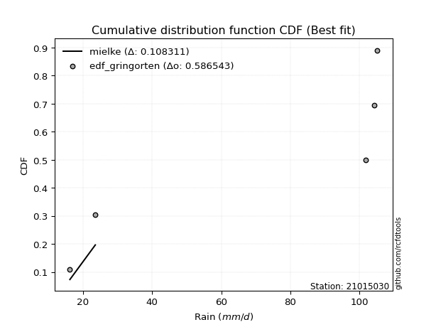</img>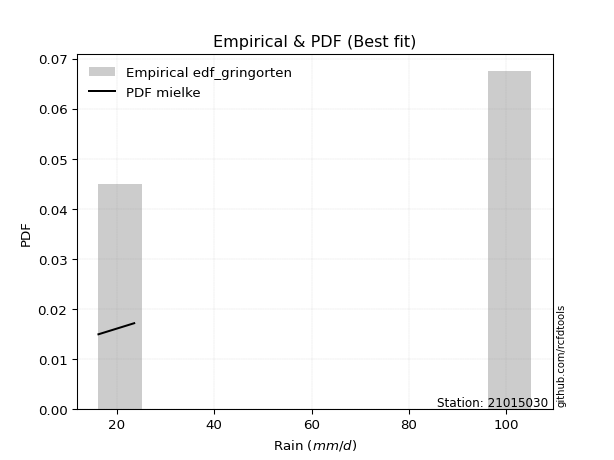</img>

</div>


### 9. Empirical - EDF Filliben (1975)

The specific values of the constants (0.3175) (often denoted as $alpha$) and (0.365) are derived from a method proposed by James J. Filliben in a 1975 paper. This particular formula is the mean value of the $i$-th order statistic of the normal distribution and is considered a robust and effective plotting position formula for the normal probability plot correlation coefficient test for normality.

<div align="center">


$P=(m-0.3175)/(n+0.365)$


</div>


**9.1. Empirical values**

<div align="center">

|                | 0                   | 1                  | 2            | 3                  | 4                  |
|:---------------|:--------------------|:-------------------|:-------------|:-------------------|:-------------------|
| date           | 2019                | 2022               | 2024         | 2025               | 2023               |
| x              | 16.2                | 23.55              | 101.9        | 104.32             | 105.18             |
| m              | 1                   | 2                  | 3            | 4                  | 5                  |
| empirical_dist | edf_filliben        | edf_filliben       | edf_filliben | edf_filliben       | edf_filliben       |
| empirical      | 0.12721342031686858 | 0.3136067101584343 | 0.5          | 0.6863932898415657 | 0.8727865796831314 |
| empirical_tr   | 1.1457554725040042  | 1.456890699253225  | 2.0          | 3.188707280832095  | 7.860805860805863  |

</div>


**9.2. Kolmogorov-Smirnov fit test (sorted by Δ)**


<div align="center">

|                | 0                   | 1                   | 2                   | 3                  | 4                  | 5                  | 6                   | 7                  | 8                  | 9                   | 10                 | 11                  | 12                  | 13                 | 14                 | 15                  | 16                  | 17                 | 18                  | 19                 | 20                 | 21                  | 22                 | 23                 | 24                  | 25                  | 26                 | 27                 | 28                 | 29                 | 30                 | 31                 | 32                  | 33                 | 34                 | 35                 | 36                  | 37                  | 38                  | 39                 | 40                 | 41                  | 42                  | 43                  | 44                 | 45                 | 46                 | 47                  | 48                  | 49                  | 50                 | 51                 | 52                 | 53                  | 54                 | 55                 | 56                  | 57                 | 58                 | 59                 | 60                 | 61                 | 62                  | 63                 | 64                 | 65                  | 66                 | 67                 | 68                  | 69                 | 70                  | 71                 | 72                 | 73                 | 74                 | 75                 | 76                 | 77                  | 78                 | 79                  | 80                 | 81                 | 82                 | 83                 | 84                    | 85                  | 86                 | 87                 | 88                 | 89                 |
|:---------------|:--------------------|:--------------------|:--------------------|:-------------------|:-------------------|:-------------------|:--------------------|:-------------------|:-------------------|:--------------------|:-------------------|:--------------------|:--------------------|:-------------------|:-------------------|:--------------------|:--------------------|:-------------------|:--------------------|:-------------------|:-------------------|:--------------------|:-------------------|:-------------------|:--------------------|:--------------------|:-------------------|:-------------------|:-------------------|:-------------------|:-------------------|:-------------------|:--------------------|:-------------------|:-------------------|:-------------------|:--------------------|:--------------------|:--------------------|:-------------------|:-------------------|:--------------------|:--------------------|:--------------------|:-------------------|:-------------------|:-------------------|:--------------------|:--------------------|:--------------------|:-------------------|:-------------------|:-------------------|:--------------------|:-------------------|:-------------------|:--------------------|:-------------------|:-------------------|:-------------------|:-------------------|:-------------------|:--------------------|:-------------------|:-------------------|:--------------------|:-------------------|:-------------------|:--------------------|:-------------------|:--------------------|:-------------------|:-------------------|:-------------------|:-------------------|:-------------------|:-------------------|:--------------------|:-------------------|:--------------------|:-------------------|:-------------------|:-------------------|:-------------------|:----------------------|:--------------------|:-------------------|:-------------------|:-------------------|:-------------------|
| station        | 21015030            | 21015030            | 21015030            | 21015030           | 21015030           | 21015030           | 21015030            | 21015030           | 21015030           | 21015030            | 21015030           | 21015030            | 21015030            | 21015030           | 21015030           | 21015030            | 21015030            | 21015030           | 21015030            | 21015030           | 21015030           | 21015030            | 21015030           | 21015030           | 21015030            | 21015030            | 21015030           | 21015030           | 21015030           | 21015030           | 21015030           | 21015030           | 21015030            | 21015030           | 21015030           | 21015030           | 21015030            | 21015030            | 21015030            | 21015030           | 21015030           | 21015030            | 21015030            | 21015030            | 21015030           | 21015030           | 21015030           | 21015030            | 21015030            | 21015030            | 21015030           | 21015030           | 21015030           | 21015030            | 21015030           | 21015030           | 21015030            | 21015030           | 21015030           | 21015030           | 21015030           | 21015030           | 21015030            | 21015030           | 21015030           | 21015030            | 21015030           | 21015030           | 21015030            | 21015030           | 21015030            | 21015030           | 21015030           | 21015030           | 21015030           | 21015030           | 21015030           | 21015030            | 21015030           | 21015030            | 21015030           | 21015030           | 21015030           | 21015030           | 21015030              | 21015030            | 21015030           | 21015030           | 21015030           | 21015030           |
| empirical_dist | edf_filliben        | edf_filliben        | edf_filliben        | edf_filliben       | edf_filliben       | edf_filliben       | edf_filliben        | edf_filliben       | edf_filliben       | edf_filliben        | edf_filliben       | edf_filliben        | edf_filliben        | edf_filliben       | edf_filliben       | edf_filliben        | edf_filliben        | edf_filliben       | edf_filliben        | edf_filliben       | edf_filliben       | edf_filliben        | edf_filliben       | edf_filliben       | edf_filliben        | edf_filliben        | edf_filliben       | edf_filliben       | edf_filliben       | edf_filliben       | edf_filliben       | edf_filliben       | edf_filliben        | edf_filliben       | edf_filliben       | edf_filliben       | edf_filliben        | edf_filliben        | edf_filliben        | edf_filliben       | edf_filliben       | edf_filliben        | edf_filliben        | edf_filliben        | edf_filliben       | edf_filliben       | edf_filliben       | edf_filliben        | edf_filliben        | edf_filliben        | edf_filliben       | edf_filliben       | edf_filliben       | edf_filliben        | edf_filliben       | edf_filliben       | edf_filliben        | edf_filliben       | edf_filliben       | edf_filliben       | edf_filliben       | edf_filliben       | edf_filliben        | edf_filliben       | edf_filliben       | edf_filliben        | edf_filliben       | edf_filliben       | edf_filliben        | edf_filliben       | edf_filliben        | edf_filliben       | edf_filliben       | edf_filliben       | edf_filliben       | edf_filliben       | edf_filliben       | edf_filliben        | edf_filliben       | edf_filliben        | edf_filliben       | edf_filliben       | edf_filliben       | edf_filliben       | edf_filliben          | edf_filliben        | edf_filliben       | edf_filliben       | edf_filliben       | edf_filliben       |
| p_dist         | mielke              | logfisk             | fisk                | pareto             | pearson3           | invgamma           | alpha               | loginvweibull      | logmielke          | logncf              | logpearson3        | weibull_min         | gumbel_l            | gamma              | t                  | exponnorm           | crystalball         | norm               | erlang              | ncf                | rice               | lognct              | loggamma           | loggamma           | logfatiguelife      | logf                | logt               | lognorm            | lognorm            | logcrystalball     | logexponnorm       | betaprime          | logbetaprime        | maxwell            | f                  | logtruncnorm       | logerlang           | loginvgamma         | loggumbel_l         | nct                | rayleigh           | logrice             | logexpon            | loginvgauss         | logweibull_min     | logmaxwell         | lograyleigh        | logalpha            | loggenexpon         | halfnorm            | gompertz           | logkstwobign       | logpareto          | genexpon            | expon              | loggompertz        | kstwobign           | loghalfnorm        | logistic           | loglogistic        | gumbel_r           | invgauss           | loggumbel_r         | hypsecant          | halflogistic       | loghalflogistic     | loghypsecant       | moyal              | logmoyal            | logchi2            | lognakagami         | laplace            | logjohnsonsu       | loglaplace         | loglognorm         | wald               | logwald            | gibrat              | loggibrat          | nakagami            | laplace_asymmetric | fatiguelife        | invweibull         | truncnorm          | loglaplace_asymmetric | logloggamma         | chi2               | johnsonsu          | loggenlogistic     | genlogistic        |
| delta          | 0.11722981461506762 | 0.24974319573264847 | 0.25506182486189677 | 0.2561874351584068 | 0.2714747559714833 | 0.2723136013961489 | 0.27423357847371266 | 0.2748105461605097 | 0.2750976063595566 | 0.27525572128034725 | 0.2765091387746228 | 0.27712536843199387 | 0.27798551491163226 | 0.2785226078052825 | 0.2789763289431748 | 0.27899135798302666 | 0.27899226499810403 | 0.2789922765041597 | 0.28065223230759595 | 0.281410358255735  | 0.2833489094307783 | 0.28346603170223783 | 0.2838811114520967 | 0.2838811114520967 | 0.28388833728980445 | 0.28397716267247086 | 0.2840039702588246 | 0.2840067241395555 | 0.2840067241395555 | 0.2840069482252767 | 0.2840071025138352 | 0.284026454398967  | 0.28452426349573334 | 0.2847387482169469 | 0.2848801168148095 | 0.2850909282395362 | 0.28516491981196723 | 0.28521933733571314 | 0.28523100132427837 | 0.2862420770283298 | 0.2863653606756661 | 0.28645092013719897 | 0.28697530052910136 | 0.28711276057777213 | 0.287480285313791  | 0.2890825457779258 | 0.2905187360573558 | 0.29104738766392546 | 0.29199660901293534 | 0.29280701602372705 | 0.2933245613406311 | 0.2941212583137629 | 0.2943152242137302 | 0.29528275195920317 | 0.2952889567581094 | 0.2955564433366119 | 0.29581243117896516 | 0.2964738490389759 | 0.3012998903331464 | 0.3061644609699211 | 0.3110238031228981 | 0.3121502394535475 | 0.31469639199122557 | 0.3150907829630285 | 0.3153390827969137 | 0.31864163235554677 | 0.3197042806732656 | 0.3215310367665045 | 0.32481510971833105 | 0.3263134991506348 | 0.32917537373483285 | 0.3314270143058269 | 0.3343935138149439 | 0.335432037468273  | 0.3473734635387851 | 0.3563968327806114 | 0.3588141208376948 | 0.38435048260034854 | 0.3864918188551518 | 0.39375040406055284 | 0.4104443296908452 | 0.4194800145461175 | 0.4448041847566517 | 0.4538768519080839 | 0.45399430689918785   | 0.45455495057247386 | 0.5061191097164057 | 0.587936331142495  | 0.6863932898415657 | 0.6863932898415657 |
| deltao         | 0.5865427407550001  | 0.5865427407550001  | 0.5865427407550001  | 0.5865427407550001 | 0.5865427407550001 | 0.5865427407550001 | 0.5865427407550001  | 0.5865427407550001 | 0.5865427407550001 | 0.5865427407550001  | 0.5865427407550001 | 0.5865427407550001  | 0.5865427407550001  | 0.5865427407550001 | 0.5865427407550001 | 0.5865427407550001  | 0.5865427407550001  | 0.5865427407550001 | 0.5865427407550001  | 0.5865427407550001 | 0.5865427407550001 | 0.5865427407550001  | 0.5865427407550001 | 0.5865427407550001 | 0.5865427407550001  | 0.5865427407550001  | 0.5865427407550001 | 0.5865427407550001 | 0.5865427407550001 | 0.5865427407550001 | 0.5865427407550001 | 0.5865427407550001 | 0.5865427407550001  | 0.5865427407550001 | 0.5865427407550001 | 0.5865427407550001 | 0.5865427407550001  | 0.5865427407550001  | 0.5865427407550001  | 0.5865427407550001 | 0.5865427407550001 | 0.5865427407550001  | 0.5865427407550001  | 0.5865427407550001  | 0.5865427407550001 | 0.5865427407550001 | 0.5865427407550001 | 0.5865427407550001  | 0.5865427407550001  | 0.5865427407550001  | 0.5865427407550001 | 0.5865427407550001 | 0.5865427407550001 | 0.5865427407550001  | 0.5865427407550001 | 0.5865427407550001 | 0.5865427407550001  | 0.5865427407550001 | 0.5865427407550001 | 0.5865427407550001 | 0.5865427407550001 | 0.5865427407550001 | 0.5865427407550001  | 0.5865427407550001 | 0.5865427407550001 | 0.5865427407550001  | 0.5865427407550001 | 0.5865427407550001 | 0.5865427407550001  | 0.5865427407550001 | 0.5865427407550001  | 0.5865427407550001 | 0.5865427407550001 | 0.5865427407550001 | 0.5865427407550001 | 0.5865427407550001 | 0.5865427407550001 | 0.5865427407550001  | 0.5865427407550001 | 0.5865427407550001  | 0.5865427407550001 | 0.5865427407550001 | 0.5865427407550001 | 0.5865427407550001 | 0.5865427407550001    | 0.5865427407550001  | 0.5865427407550001 | 0.5865427407550001 | 0.5865427407550001 | 0.5865427407550001 |
| eval           | Δo > Δ              | Δo > Δ              | Δo > Δ              | Δo > Δ             | Δo > Δ             | Δo > Δ             | Δo > Δ              | Δo > Δ             | Δo > Δ             | Δo > Δ              | Δo > Δ             | Δo > Δ              | Δo > Δ              | Δo > Δ             | Δo > Δ             | Δo > Δ              | Δo > Δ              | Δo > Δ             | Δo > Δ              | Δo > Δ             | Δo > Δ             | Δo > Δ              | Δo > Δ             | Δo > Δ             | Δo > Δ              | Δo > Δ              | Δo > Δ             | Δo > Δ             | Δo > Δ             | Δo > Δ             | Δo > Δ             | Δo > Δ             | Δo > Δ              | Δo > Δ             | Δo > Δ             | Δo > Δ             | Δo > Δ              | Δo > Δ              | Δo > Δ              | Δo > Δ             | Δo > Δ             | Δo > Δ              | Δo > Δ              | Δo > Δ              | Δo > Δ             | Δo > Δ             | Δo > Δ             | Δo > Δ              | Δo > Δ              | Δo > Δ              | Δo > Δ             | Δo > Δ             | Δo > Δ             | Δo > Δ              | Δo > Δ             | Δo > Δ             | Δo > Δ              | Δo > Δ             | Δo > Δ             | Δo > Δ             | Δo > Δ             | Δo > Δ             | Δo > Δ              | Δo > Δ             | Δo > Δ             | Δo > Δ              | Δo > Δ             | Δo > Δ             | Δo > Δ              | Δo > Δ             | Δo > Δ              | Δo > Δ             | Δo > Δ             | Δo > Δ             | Δo > Δ             | Δo > Δ             | Δo > Δ             | Δo > Δ              | Δo > Δ             | Δo > Δ              | Δo > Δ             | Δo > Δ             | Δo > Δ             | Δo > Δ             | Δo > Δ                | Δo > Δ              | Δo > Δ             | Δo <= Δ            | Δo <= Δ            | Δo <= Δ            |
| fit            | 1                   | 1                   | 1                   | 1                  | 1                  | 1                  | 1                   | 1                  | 1                  | 1                   | 1                  | 1                   | 1                   | 1                  | 1                  | 1                   | 1                   | 1                  | 1                   | 1                  | 1                  | 1                   | 1                  | 1                  | 1                   | 1                   | 1                  | 1                  | 1                  | 1                  | 1                  | 1                  | 1                   | 1                  | 1                  | 1                  | 1                   | 1                   | 1                   | 1                  | 1                  | 1                   | 1                   | 1                   | 1                  | 1                  | 1                  | 1                   | 1                   | 1                   | 1                  | 1                  | 1                  | 1                   | 1                  | 1                  | 1                   | 1                  | 1                  | 1                  | 1                  | 1                  | 1                   | 1                  | 1                  | 1                   | 1                  | 1                  | 1                   | 1                  | 1                   | 1                  | 1                  | 1                  | 1                  | 1                  | 1                  | 1                   | 1                  | 1                   | 1                  | 1                  | 1                  | 1                  | 1                     | 1                   | 1                  | 0                  | 0                  | 0                  |
| n              | 5                   | 5                   | 5                   | 5                  | 5                  | 5                  | 5                   | 5                  | 5                  | 5                   | 5                  | 5                   | 5                   | 5                  | 5                  | 5                   | 5                   | 5                  | 5                   | 5                  | 5                  | 5                   | 5                  | 5                  | 5                   | 5                   | 5                  | 5                  | 5                  | 5                  | 5                  | 5                  | 5                   | 5                  | 5                  | 5                  | 5                   | 5                   | 5                   | 5                  | 5                  | 5                   | 5                   | 5                   | 5                  | 5                  | 5                  | 5                   | 5                   | 5                   | 5                  | 5                  | 5                  | 5                   | 5                  | 5                  | 5                   | 5                  | 5                  | 5                  | 5                  | 5                  | 5                   | 5                  | 5                  | 5                   | 5                  | 5                  | 5                   | 5                  | 5                   | 5                  | 5                  | 5                  | 5                  | 5                  | 5                  | 5                   | 5                  | 5                   | 5                  | 5                  | 5                  | 5                  | 5                     | 5                   | 5                  | 5                  | 5                  | 5                  |
| best_fit       | 1                   | 0                   | 0                   | 0                  | 0                  | 0                  | 0                   | 0                  | 0                  | 0                   | 0                  | 0                   | 0                   | 0                  | 0                  | 0                   | 0                   | 0                  | 0                   | 0                  | 0                  | 0                   | 0                  | 0                  | 0                   | 0                   | 0                  | 0                  | 0                  | 0                  | 0                  | 0                  | 0                   | 0                  | 0                  | 0                  | 0                   | 0                   | 0                   | 0                  | 0                  | 0                   | 0                   | 0                   | 0                  | 0                  | 0                  | 0                   | 0                   | 0                   | 0                  | 0                  | 0                  | 0                   | 0                  | 0                  | 0                   | 0                  | 0                  | 0                  | 0                  | 0                  | 0                   | 0                  | 0                  | 0                   | 0                  | 0                  | 0                   | 0                  | 0                   | 0                  | 0                  | 0                  | 0                  | 0                  | 0                  | 0                   | 0                  | 0                   | 0                  | 0                  | 0                  | 0                  | 0                     | 0                   | 0                  | 0                  | 0                  | 0                  |
| best_fit_sort  | 1                   | 2                   | 3                   | 4                  | 5                  | 6                  | 7                   | 8                  | 9                  | 10                  | 11                 | 12                  | 13                  | 14                 | 15                 | 16                  | 17                  | 18                 | 19                  | 20                 | 21                 | 22                  | 23                 | 24                 | 25                  | 26                  | 27                 | 28                 | 29                 | 30                 | 31                 | 32                 | 33                  | 34                 | 35                 | 36                 | 37                  | 38                  | 39                  | 40                 | 41                 | 42                  | 43                  | 44                  | 45                 | 46                 | 47                 | 48                  | 49                  | 50                  | 51                 | 52                 | 53                 | 54                  | 55                 | 56                 | 57                  | 58                 | 59                 | 60                 | 61                 | 62                 | 63                  | 64                 | 65                 | 66                  | 67                 | 68                 | 69                  | 70                 | 71                  | 72                 | 73                 | 74                 | 75                 | 76                 | 77                 | 78                  | 79                 | 80                  | 81                 | 82                 | 83                 | 84                 | 85                    | 86                  | 87                 | 88                 | 89                 | 90                 |

</div>


<div align="center">

</img>

</div>


**9.3. Best fit**

<div align="center">

|   id |   station | empirical_dist   | p_dist   |   delta |   deltao | eval   |   fit |   n |   best_fit |   best_fit_sort |
|-----:|----------:|:-----------------|:---------|--------:|---------:|:-------|------:|----:|-----------:|----------------:|
|    0 |  21015030 | edf_filliben     | mielke   | 0.11723 | 0.586543 | Δo > Δ |     1 |   5 |          1 |               1 |

</div>


<div align="center">

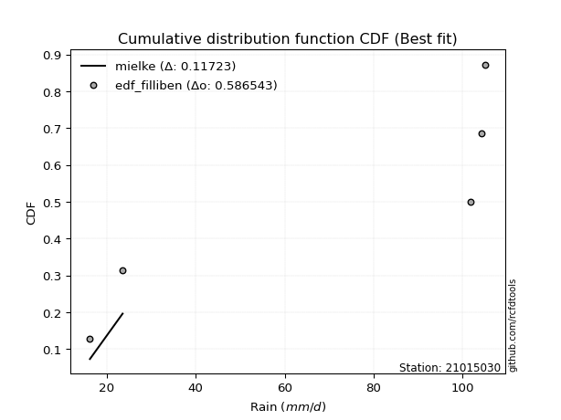</img></img>

</div>


### 10. Empirical - EDF Jenkinson (1977)

The Jenkinson formula in hydrology is an empirical plotting position formula used to estimate the non-exceedance probability _(P)_ or return period _(T)_ of a given ordered observation within a sample. It is a widely used method in the frequency analysis of extreme events such as floods and rainfall, as it provides a distribution-free way to plot data. _a≈0.31_ and _b≈0.38_ are constants derived to approximate the median of the probability distribution for the given rank.

<div align="center">


$P=(m-a)/(n+b)$


</div>


**10.1. Empirical values**

<div align="center">

|                | 0                   | 1                  | 2             | 3                  | 4                  |
|:---------------|:--------------------|:-------------------|:--------------|:-------------------|:-------------------|
| date           | 2019                | 2022               | 2024          | 2025               | 2023               |
| x              | 16.2                | 23.55              | 101.9         | 104.32             | 105.18             |
| m              | 1                   | 2                  | 3             | 4                  | 5                  |
| empirical_dist | edf_jenkinson       | edf_jenkinson      | edf_jenkinson | edf_jenkinson      | edf_jenkinson      |
| empirical      | 0.12825278810408922 | 0.3141263940520446 | 0.5           | 0.6858736059479554 | 0.8717472118959109 |
| empirical_tr   | 1.1471215351812367  | 1.4579945799457996 | 2.0           | 3.183431952662722  | 7.797101449275368  |

</div>


**10.2. Kolmogorov-Smirnov fit test (sorted by Δ)**


<div align="center">

|                | 0                   | 1                   | 2                   | 3                  | 4                  | 5                  | 6                   | 7                  | 8                  | 9                   | 10                 | 11                  | 12                  | 13                 | 14                 | 15                  | 16                  | 17                 | 18                  | 19                 | 20                 | 21                  | 22                 | 23                 | 24                  | 25                  | 26                 | 27                 | 28                 | 29                 | 30                 | 31                 | 32                  | 33                 | 34                 | 35                 | 36                  | 37                  | 38                  | 39                 | 40                 | 41                  | 42                  | 43                  | 44                 | 45                 | 46                 | 47                  | 48                  | 49                  | 50                 | 51                  | 52                 | 53                  | 54                 | 55                 | 56                  | 57                 | 58                 | 59                 | 60                 | 61                 | 62                  | 63                 | 64                 | 65                  | 66                 | 67                 | 68                  | 69                 | 70                  | 71                 | 72                 | 73                 | 74                 | 75                 | 76                 | 77                  | 78                 | 79                  | 80                 | 81                 | 82                 | 83                 | 84                    | 85                  | 86                 | 87                 | 88                 | 89                 |
|:---------------|:--------------------|:--------------------|:--------------------|:-------------------|:-------------------|:-------------------|:--------------------|:-------------------|:-------------------|:--------------------|:-------------------|:--------------------|:--------------------|:-------------------|:-------------------|:--------------------|:--------------------|:-------------------|:--------------------|:-------------------|:-------------------|:--------------------|:-------------------|:-------------------|:--------------------|:--------------------|:-------------------|:-------------------|:-------------------|:-------------------|:-------------------|:-------------------|:--------------------|:-------------------|:-------------------|:-------------------|:--------------------|:--------------------|:--------------------|:-------------------|:-------------------|:--------------------|:--------------------|:--------------------|:-------------------|:-------------------|:-------------------|:--------------------|:--------------------|:--------------------|:-------------------|:--------------------|:-------------------|:--------------------|:-------------------|:-------------------|:--------------------|:-------------------|:-------------------|:-------------------|:-------------------|:-------------------|:--------------------|:-------------------|:-------------------|:--------------------|:-------------------|:-------------------|:--------------------|:-------------------|:--------------------|:-------------------|:-------------------|:-------------------|:-------------------|:-------------------|:-------------------|:--------------------|:-------------------|:--------------------|:-------------------|:-------------------|:-------------------|:-------------------|:----------------------|:--------------------|:-------------------|:-------------------|:-------------------|:-------------------|
| station        | 21015030            | 21015030            | 21015030            | 21015030           | 21015030           | 21015030           | 21015030            | 21015030           | 21015030           | 21015030            | 21015030           | 21015030            | 21015030            | 21015030           | 21015030           | 21015030            | 21015030            | 21015030           | 21015030            | 21015030           | 21015030           | 21015030            | 21015030           | 21015030           | 21015030            | 21015030            | 21015030           | 21015030           | 21015030           | 21015030           | 21015030           | 21015030           | 21015030            | 21015030           | 21015030           | 21015030           | 21015030            | 21015030            | 21015030            | 21015030           | 21015030           | 21015030            | 21015030            | 21015030            | 21015030           | 21015030           | 21015030           | 21015030            | 21015030            | 21015030            | 21015030           | 21015030            | 21015030           | 21015030            | 21015030           | 21015030           | 21015030            | 21015030           | 21015030           | 21015030           | 21015030           | 21015030           | 21015030            | 21015030           | 21015030           | 21015030            | 21015030           | 21015030           | 21015030            | 21015030           | 21015030            | 21015030           | 21015030           | 21015030           | 21015030           | 21015030           | 21015030           | 21015030            | 21015030           | 21015030            | 21015030           | 21015030           | 21015030           | 21015030           | 21015030              | 21015030            | 21015030           | 21015030           | 21015030           | 21015030           |
| empirical_dist | edf_jenkinson       | edf_jenkinson       | edf_jenkinson       | edf_jenkinson      | edf_jenkinson      | edf_jenkinson      | edf_jenkinson       | edf_jenkinson      | edf_jenkinson      | edf_jenkinson       | edf_jenkinson      | edf_jenkinson       | edf_jenkinson       | edf_jenkinson      | edf_jenkinson      | edf_jenkinson       | edf_jenkinson       | edf_jenkinson      | edf_jenkinson       | edf_jenkinson      | edf_jenkinson      | edf_jenkinson       | edf_jenkinson      | edf_jenkinson      | edf_jenkinson       | edf_jenkinson       | edf_jenkinson      | edf_jenkinson      | edf_jenkinson      | edf_jenkinson      | edf_jenkinson      | edf_jenkinson      | edf_jenkinson       | edf_jenkinson      | edf_jenkinson      | edf_jenkinson      | edf_jenkinson       | edf_jenkinson       | edf_jenkinson       | edf_jenkinson      | edf_jenkinson      | edf_jenkinson       | edf_jenkinson       | edf_jenkinson       | edf_jenkinson      | edf_jenkinson      | edf_jenkinson      | edf_jenkinson       | edf_jenkinson       | edf_jenkinson       | edf_jenkinson      | edf_jenkinson       | edf_jenkinson      | edf_jenkinson       | edf_jenkinson      | edf_jenkinson      | edf_jenkinson       | edf_jenkinson      | edf_jenkinson      | edf_jenkinson      | edf_jenkinson      | edf_jenkinson      | edf_jenkinson       | edf_jenkinson      | edf_jenkinson      | edf_jenkinson       | edf_jenkinson      | edf_jenkinson      | edf_jenkinson       | edf_jenkinson      | edf_jenkinson       | edf_jenkinson      | edf_jenkinson      | edf_jenkinson      | edf_jenkinson      | edf_jenkinson      | edf_jenkinson      | edf_jenkinson       | edf_jenkinson      | edf_jenkinson       | edf_jenkinson      | edf_jenkinson      | edf_jenkinson      | edf_jenkinson      | edf_jenkinson         | edf_jenkinson       | edf_jenkinson      | edf_jenkinson      | edf_jenkinson      | edf_jenkinson      |
| p_dist         | mielke              | logfisk             | fisk                | pareto             | pearson3           | invgamma           | alpha               | loginvweibull      | logmielke          | logncf              | logpearson3        | weibull_min         | gumbel_l            | gamma              | t                  | exponnorm           | crystalball         | norm               | erlang              | ncf                | rice               | lognct              | loggamma           | loggamma           | logfatiguelife      | logf                | logt               | lognorm            | lognorm            | logcrystalball     | logexponnorm       | betaprime          | logbetaprime        | maxwell            | f                  | logtruncnorm       | logerlang           | loginvgamma         | loggumbel_l         | nct                | rayleigh           | logrice             | logexpon            | loginvgauss         | logweibull_min     | logmaxwell         | lograyleigh        | logalpha            | loggenexpon         | halfnorm            | gompertz           | logpareto           | logkstwobign       | genexpon            | expon              | loggompertz        | kstwobign           | loghalfnorm        | logistic           | loglogistic        | gumbel_r           | invgauss           | loggumbel_r         | hypsecant          | halflogistic       | loghalflogistic     | loghypsecant       | moyal              | logmoyal            | logchi2            | lognakagami         | laplace            | logjohnsonsu       | loglaplace         | loglognorm         | wald               | logwald            | gibrat              | loggibrat          | nakagami            | laplace_asymmetric | fatiguelife        | invweibull         | truncnorm          | loglaplace_asymmetric | logloggamma         | chi2               | johnsonsu          | loggenlogistic     | genlogistic        |
| delta          | 0.11774949850867797 | 0.24974319573264847 | 0.25506182486189677 | 0.2561874351584068 | 0.2714747559714833 | 0.2723136013961489 | 0.27423357847371266 | 0.2748105461605097 | 0.2750976063595566 | 0.27525572128034725 | 0.2765091387746228 | 0.27712536843199387 | 0.27798551491163226 | 0.2785226078052825 | 0.2789763289431748 | 0.27899135798302666 | 0.27899226499810403 | 0.2789922765041597 | 0.28065223230759595 | 0.281410358255735  | 0.2833489094307783 | 0.28346603170223783 | 0.2838811114520967 | 0.2838811114520967 | 0.28388833728980445 | 0.28397716267247086 | 0.2840039702588246 | 0.2840067241395555 | 0.2840067241395555 | 0.2840069482252767 | 0.2840071025138352 | 0.284026454398967  | 0.28452426349573334 | 0.2847387482169469 | 0.2848801168148095 | 0.2850909282395362 | 0.28516491981196723 | 0.28521933733571314 | 0.28523100132427837 | 0.2862420770283298 | 0.2863653606756661 | 0.28645092013719897 | 0.28697530052910136 | 0.28711276057777213 | 0.287480285313791  | 0.2890825457779258 | 0.2905187360573558 | 0.29104738766392546 | 0.29199660901293534 | 0.29280701602372705 | 0.2933245613406311 | 0.29379554032011984 | 0.2941212583137629 | 0.29528275195920317 | 0.2952889567581094 | 0.2955564433366119 | 0.29581243117896516 | 0.2964738490389759 | 0.3012998903331464 | 0.3061644609699211 | 0.3110238031228981 | 0.3121502394535475 | 0.31469639199122557 | 0.3150907829630285 | 0.3153390827969137 | 0.31864163235554677 | 0.3197042806732656 | 0.3215310367665045 | 0.32481510971833105 | 0.3263134991506348 | 0.32917537373483285 | 0.3314270143058269 | 0.3338738299213337 | 0.335432037468273  | 0.3468537796451748 | 0.3563968327806114 | 0.3588141208376948 | 0.38435048260034854 | 0.3864918188551518 | 0.39375040406055284 | 0.4104443296908452 | 0.4194800145461175 | 0.4437648169694311 | 0.4538768519080839 | 0.45399430689918785   | 0.45455495057247386 | 0.5055994258227954 | 0.5874166472488849 | 0.6858736059479554 | 0.6858736059479554 |
| deltao         | 0.5865427407550001  | 0.5865427407550001  | 0.5865427407550001  | 0.5865427407550001 | 0.5865427407550001 | 0.5865427407550001 | 0.5865427407550001  | 0.5865427407550001 | 0.5865427407550001 | 0.5865427407550001  | 0.5865427407550001 | 0.5865427407550001  | 0.5865427407550001  | 0.5865427407550001 | 0.5865427407550001 | 0.5865427407550001  | 0.5865427407550001  | 0.5865427407550001 | 0.5865427407550001  | 0.5865427407550001 | 0.5865427407550001 | 0.5865427407550001  | 0.5865427407550001 | 0.5865427407550001 | 0.5865427407550001  | 0.5865427407550001  | 0.5865427407550001 | 0.5865427407550001 | 0.5865427407550001 | 0.5865427407550001 | 0.5865427407550001 | 0.5865427407550001 | 0.5865427407550001  | 0.5865427407550001 | 0.5865427407550001 | 0.5865427407550001 | 0.5865427407550001  | 0.5865427407550001  | 0.5865427407550001  | 0.5865427407550001 | 0.5865427407550001 | 0.5865427407550001  | 0.5865427407550001  | 0.5865427407550001  | 0.5865427407550001 | 0.5865427407550001 | 0.5865427407550001 | 0.5865427407550001  | 0.5865427407550001  | 0.5865427407550001  | 0.5865427407550001 | 0.5865427407550001  | 0.5865427407550001 | 0.5865427407550001  | 0.5865427407550001 | 0.5865427407550001 | 0.5865427407550001  | 0.5865427407550001 | 0.5865427407550001 | 0.5865427407550001 | 0.5865427407550001 | 0.5865427407550001 | 0.5865427407550001  | 0.5865427407550001 | 0.5865427407550001 | 0.5865427407550001  | 0.5865427407550001 | 0.5865427407550001 | 0.5865427407550001  | 0.5865427407550001 | 0.5865427407550001  | 0.5865427407550001 | 0.5865427407550001 | 0.5865427407550001 | 0.5865427407550001 | 0.5865427407550001 | 0.5865427407550001 | 0.5865427407550001  | 0.5865427407550001 | 0.5865427407550001  | 0.5865427407550001 | 0.5865427407550001 | 0.5865427407550001 | 0.5865427407550001 | 0.5865427407550001    | 0.5865427407550001  | 0.5865427407550001 | 0.5865427407550001 | 0.5865427407550001 | 0.5865427407550001 |
| eval           | Δo > Δ              | Δo > Δ              | Δo > Δ              | Δo > Δ             | Δo > Δ             | Δo > Δ             | Δo > Δ              | Δo > Δ             | Δo > Δ             | Δo > Δ              | Δo > Δ             | Δo > Δ              | Δo > Δ              | Δo > Δ             | Δo > Δ             | Δo > Δ              | Δo > Δ              | Δo > Δ             | Δo > Δ              | Δo > Δ             | Δo > Δ             | Δo > Δ              | Δo > Δ             | Δo > Δ             | Δo > Δ              | Δo > Δ              | Δo > Δ             | Δo > Δ             | Δo > Δ             | Δo > Δ             | Δo > Δ             | Δo > Δ             | Δo > Δ              | Δo > Δ             | Δo > Δ             | Δo > Δ             | Δo > Δ              | Δo > Δ              | Δo > Δ              | Δo > Δ             | Δo > Δ             | Δo > Δ              | Δo > Δ              | Δo > Δ              | Δo > Δ             | Δo > Δ             | Δo > Δ             | Δo > Δ              | Δo > Δ              | Δo > Δ              | Δo > Δ             | Δo > Δ              | Δo > Δ             | Δo > Δ              | Δo > Δ             | Δo > Δ             | Δo > Δ              | Δo > Δ             | Δo > Δ             | Δo > Δ             | Δo > Δ             | Δo > Δ             | Δo > Δ              | Δo > Δ             | Δo > Δ             | Δo > Δ              | Δo > Δ             | Δo > Δ             | Δo > Δ              | Δo > Δ             | Δo > Δ              | Δo > Δ             | Δo > Δ             | Δo > Δ             | Δo > Δ             | Δo > Δ             | Δo > Δ             | Δo > Δ              | Δo > Δ             | Δo > Δ              | Δo > Δ             | Δo > Δ             | Δo > Δ             | Δo > Δ             | Δo > Δ                | Δo > Δ              | Δo > Δ             | Δo <= Δ            | Δo <= Δ            | Δo <= Δ            |
| fit            | 1                   | 1                   | 1                   | 1                  | 1                  | 1                  | 1                   | 1                  | 1                  | 1                   | 1                  | 1                   | 1                   | 1                  | 1                  | 1                   | 1                   | 1                  | 1                   | 1                  | 1                  | 1                   | 1                  | 1                  | 1                   | 1                   | 1                  | 1                  | 1                  | 1                  | 1                  | 1                  | 1                   | 1                  | 1                  | 1                  | 1                   | 1                   | 1                   | 1                  | 1                  | 1                   | 1                   | 1                   | 1                  | 1                  | 1                  | 1                   | 1                   | 1                   | 1                  | 1                   | 1                  | 1                   | 1                  | 1                  | 1                   | 1                  | 1                  | 1                  | 1                  | 1                  | 1                   | 1                  | 1                  | 1                   | 1                  | 1                  | 1                   | 1                  | 1                   | 1                  | 1                  | 1                  | 1                  | 1                  | 1                  | 1                   | 1                  | 1                   | 1                  | 1                  | 1                  | 1                  | 1                     | 1                   | 1                  | 0                  | 0                  | 0                  |
| n              | 5                   | 5                   | 5                   | 5                  | 5                  | 5                  | 5                   | 5                  | 5                  | 5                   | 5                  | 5                   | 5                   | 5                  | 5                  | 5                   | 5                   | 5                  | 5                   | 5                  | 5                  | 5                   | 5                  | 5                  | 5                   | 5                   | 5                  | 5                  | 5                  | 5                  | 5                  | 5                  | 5                   | 5                  | 5                  | 5                  | 5                   | 5                   | 5                   | 5                  | 5                  | 5                   | 5                   | 5                   | 5                  | 5                  | 5                  | 5                   | 5                   | 5                   | 5                  | 5                   | 5                  | 5                   | 5                  | 5                  | 5                   | 5                  | 5                  | 5                  | 5                  | 5                  | 5                   | 5                  | 5                  | 5                   | 5                  | 5                  | 5                   | 5                  | 5                   | 5                  | 5                  | 5                  | 5                  | 5                  | 5                  | 5                   | 5                  | 5                   | 5                  | 5                  | 5                  | 5                  | 5                     | 5                   | 5                  | 5                  | 5                  | 5                  |
| best_fit       | 1                   | 0                   | 0                   | 0                  | 0                  | 0                  | 0                   | 0                  | 0                  | 0                   | 0                  | 0                   | 0                   | 0                  | 0                  | 0                   | 0                   | 0                  | 0                   | 0                  | 0                  | 0                   | 0                  | 0                  | 0                   | 0                   | 0                  | 0                  | 0                  | 0                  | 0                  | 0                  | 0                   | 0                  | 0                  | 0                  | 0                   | 0                   | 0                   | 0                  | 0                  | 0                   | 0                   | 0                   | 0                  | 0                  | 0                  | 0                   | 0                   | 0                   | 0                  | 0                   | 0                  | 0                   | 0                  | 0                  | 0                   | 0                  | 0                  | 0                  | 0                  | 0                  | 0                   | 0                  | 0                  | 0                   | 0                  | 0                  | 0                   | 0                  | 0                   | 0                  | 0                  | 0                  | 0                  | 0                  | 0                  | 0                   | 0                  | 0                   | 0                  | 0                  | 0                  | 0                  | 0                     | 0                   | 0                  | 0                  | 0                  | 0                  |
| best_fit_sort  | 1                   | 2                   | 3                   | 4                  | 5                  | 6                  | 7                   | 8                  | 9                  | 10                  | 11                 | 12                  | 13                  | 14                 | 15                 | 16                  | 17                  | 18                 | 19                  | 20                 | 21                 | 22                  | 23                 | 24                 | 25                  | 26                  | 27                 | 28                 | 29                 | 30                 | 31                 | 32                 | 33                  | 34                 | 35                 | 36                 | 37                  | 38                  | 39                  | 40                 | 41                 | 42                  | 43                  | 44                  | 45                 | 46                 | 47                 | 48                  | 49                  | 50                  | 51                 | 52                  | 53                 | 54                  | 55                 | 56                 | 57                  | 58                 | 59                 | 60                 | 61                 | 62                 | 63                  | 64                 | 65                 | 66                  | 67                 | 68                 | 69                  | 70                 | 71                  | 72                 | 73                 | 74                 | 75                 | 76                 | 77                 | 78                  | 79                 | 80                  | 81                 | 82                 | 83                 | 84                 | 85                    | 86                  | 87                 | 88                 | 89                 | 90                 |

</div>


<div align="center">

</img>

</div>


**10.3. Best fit**

<div align="center">

|   id |   station | empirical_dist   | p_dist   |    delta |   deltao | eval   |   fit |   n |   best_fit |   best_fit_sort |
|-----:|----------:|:-----------------|:---------|---------:|---------:|:-------|------:|----:|-----------:|----------------:|
|    0 |  21015030 | edf_jenkinson    | mielke   | 0.117749 | 0.586543 | Δo > Δ |     1 |   5 |          1 |               1 |

</div>


<div align="center">

</img></img>

</div>


### 11. Empirical - EDF Cunnane (1978)

Cunnane´s work in statistical hydrology has focused on the performance and evaluation of different probability distributions (such as GEV, Gumbel, Lognormal) for flood frequency estimation. _b_ is a constant, typically set to 0.4.

<div align="center">


$P=(m-b)/(n+1-2b)$


</div>


**11.1. Empirical values**

<div align="center">

|                | 0                   | 1                  | 2           | 3                  | 4                  |
|:---------------|:--------------------|:-------------------|:------------|:-------------------|:-------------------|
| date           | 2019                | 2022               | 2024        | 2025               | 2023               |
| x              | 16.2                | 23.55              | 101.9       | 104.32             | 105.18             |
| m              | 1                   | 2                  | 3           | 4                  | 5                  |
| empirical_dist | edf_cunnane         | edf_cunnane        | edf_cunnane | edf_cunnane        | edf_cunnane        |
| empirical      | 0.11538461538461538 | 0.3076923076923077 | 0.5         | 0.6923076923076923 | 0.8846153846153845 |
| empirical_tr   | 1.1304347826086958  | 1.4444444444444444 | 2.0         | 3.25               | 8.666666666666655  |

</div>


**11.2. Kolmogorov-Smirnov fit test (sorted by Δ)**


<div align="center">

|                | 0                   | 1                   | 2                   | 3                  | 4                  | 5                  | 6                   | 7                  | 8                  | 9                   | 10                 | 11                  | 12                  | 13                 | 14                 | 15                  | 16                  | 17                 | 18                  | 19                 | 20                 | 21                  | 22                 | 23                 | 24                  | 25                  | 26                 | 27                 | 28                 | 29                 | 30                 | 31                 | 32                  | 33                 | 34                 | 35                 | 36                  | 37                  | 38                  | 39                 | 40                 | 41                  | 42                  | 43                  | 44                 | 45                 | 46                 | 47                  | 48                  | 49                  | 50                 | 51                 | 52                  | 53                 | 54                 | 55                  | 56                 | 57                  | 58                 | 59                 | 60                 | 61                 | 62                  | 63                 | 64                 | 65                  | 66                 | 67                 | 68                  | 69                 | 70                  | 71                 | 72                 | 73                  | 74                 | 75                 | 76                 | 77                  | 78                 | 79                  | 80                 | 81                 | 82                 | 83                    | 84                  | 85                 | 86                 | 87                 | 88                 | 89                 |
|:---------------|:--------------------|:--------------------|:--------------------|:-------------------|:-------------------|:-------------------|:--------------------|:-------------------|:-------------------|:--------------------|:-------------------|:--------------------|:--------------------|:-------------------|:-------------------|:--------------------|:--------------------|:-------------------|:--------------------|:-------------------|:-------------------|:--------------------|:-------------------|:-------------------|:--------------------|:--------------------|:-------------------|:-------------------|:-------------------|:-------------------|:-------------------|:-------------------|:--------------------|:-------------------|:-------------------|:-------------------|:--------------------|:--------------------|:--------------------|:-------------------|:-------------------|:--------------------|:--------------------|:--------------------|:-------------------|:-------------------|:-------------------|:--------------------|:--------------------|:--------------------|:-------------------|:-------------------|:--------------------|:-------------------|:-------------------|:--------------------|:-------------------|:--------------------|:-------------------|:-------------------|:-------------------|:-------------------|:--------------------|:-------------------|:-------------------|:--------------------|:-------------------|:-------------------|:--------------------|:-------------------|:--------------------|:-------------------|:-------------------|:--------------------|:-------------------|:-------------------|:-------------------|:--------------------|:-------------------|:--------------------|:-------------------|:-------------------|:-------------------|:----------------------|:--------------------|:-------------------|:-------------------|:-------------------|:-------------------|:-------------------|
| station        | 21015030            | 21015030            | 21015030            | 21015030           | 21015030           | 21015030           | 21015030            | 21015030           | 21015030           | 21015030            | 21015030           | 21015030            | 21015030            | 21015030           | 21015030           | 21015030            | 21015030            | 21015030           | 21015030            | 21015030           | 21015030           | 21015030            | 21015030           | 21015030           | 21015030            | 21015030            | 21015030           | 21015030           | 21015030           | 21015030           | 21015030           | 21015030           | 21015030            | 21015030           | 21015030           | 21015030           | 21015030            | 21015030            | 21015030            | 21015030           | 21015030           | 21015030            | 21015030            | 21015030            | 21015030           | 21015030           | 21015030           | 21015030            | 21015030            | 21015030            | 21015030           | 21015030           | 21015030            | 21015030           | 21015030           | 21015030            | 21015030           | 21015030            | 21015030           | 21015030           | 21015030           | 21015030           | 21015030            | 21015030           | 21015030           | 21015030            | 21015030           | 21015030           | 21015030            | 21015030           | 21015030            | 21015030           | 21015030           | 21015030            | 21015030           | 21015030           | 21015030           | 21015030            | 21015030           | 21015030            | 21015030           | 21015030           | 21015030           | 21015030              | 21015030            | 21015030           | 21015030           | 21015030           | 21015030           | 21015030           |
| empirical_dist | edf_cunnane         | edf_cunnane         | edf_cunnane         | edf_cunnane        | edf_cunnane        | edf_cunnane        | edf_cunnane         | edf_cunnane        | edf_cunnane        | edf_cunnane         | edf_cunnane        | edf_cunnane         | edf_cunnane         | edf_cunnane        | edf_cunnane        | edf_cunnane         | edf_cunnane         | edf_cunnane        | edf_cunnane         | edf_cunnane        | edf_cunnane        | edf_cunnane         | edf_cunnane        | edf_cunnane        | edf_cunnane         | edf_cunnane         | edf_cunnane        | edf_cunnane        | edf_cunnane        | edf_cunnane        | edf_cunnane        | edf_cunnane        | edf_cunnane         | edf_cunnane        | edf_cunnane        | edf_cunnane        | edf_cunnane         | edf_cunnane         | edf_cunnane         | edf_cunnane        | edf_cunnane        | edf_cunnane         | edf_cunnane         | edf_cunnane         | edf_cunnane        | edf_cunnane        | edf_cunnane        | edf_cunnane         | edf_cunnane         | edf_cunnane         | edf_cunnane        | edf_cunnane        | edf_cunnane         | edf_cunnane        | edf_cunnane        | edf_cunnane         | edf_cunnane        | edf_cunnane         | edf_cunnane        | edf_cunnane        | edf_cunnane        | edf_cunnane        | edf_cunnane         | edf_cunnane        | edf_cunnane        | edf_cunnane         | edf_cunnane        | edf_cunnane        | edf_cunnane         | edf_cunnane        | edf_cunnane         | edf_cunnane        | edf_cunnane        | edf_cunnane         | edf_cunnane        | edf_cunnane        | edf_cunnane        | edf_cunnane         | edf_cunnane        | edf_cunnane         | edf_cunnane        | edf_cunnane        | edf_cunnane        | edf_cunnane           | edf_cunnane         | edf_cunnane        | edf_cunnane        | edf_cunnane        | edf_cunnane        | edf_cunnane        |
| p_dist         | mielke              | logfisk             | fisk                | pareto             | pearson3           | invgamma           | alpha               | loginvweibull      | logmielke          | logncf              | logpearson3        | weibull_min         | gumbel_l            | gamma              | t                  | exponnorm           | crystalball         | norm               | erlang              | ncf                | rice               | lognct              | loggamma           | loggamma           | logfatiguelife      | logf                | logt               | lognorm            | lognorm            | logcrystalball     | logexponnorm       | betaprime          | logbetaprime        | maxwell            | f                  | logtruncnorm       | logerlang           | loginvgamma         | loggumbel_l         | nct                | rayleigh           | logrice             | logexpon            | loginvgauss         | logweibull_min     | logmaxwell         | lograyleigh        | logalpha            | loggenexpon         | halfnorm            | gompertz           | logkstwobign       | genexpon            | expon              | loggompertz        | kstwobign           | loghalfnorm        | logpareto           | logistic           | loglogistic        | gumbel_r           | invgauss           | loggumbel_r         | hypsecant          | halflogistic       | loghalflogistic     | loghypsecant       | moyal              | logmoyal            | logchi2            | lognakagami         | laplace            | loglaplace         | logjohnsonsu        | loglognorm         | wald               | logwald            | gibrat              | loggibrat          | nakagami            | laplace_asymmetric | fatiguelife        | truncnorm          | loglaplace_asymmetric | logloggamma         | invweibull         | chi2               | johnsonsu          | loggenlogistic     | genlogistic        |
| delta          | 0.11131541214894106 | 0.24974319573264847 | 0.25506182486189677 | 0.2561874351584068 | 0.2714747559714833 | 0.2723136013961489 | 0.27423357847371266 | 0.2748105461605097 | 0.2750976063595566 | 0.27525572128034725 | 0.2765091387746228 | 0.27712536843199387 | 0.27798551491163226 | 0.2785226078052825 | 0.2789763289431748 | 0.27899135798302666 | 0.27899226499810403 | 0.2789922765041597 | 0.28065223230759595 | 0.281410358255735  | 0.2833489094307783 | 0.28346603170223783 | 0.2838811114520967 | 0.2838811114520967 | 0.28388833728980445 | 0.28397716267247086 | 0.2840039702588246 | 0.2840067241395555 | 0.2840067241395555 | 0.2840069482252767 | 0.2840071025138352 | 0.284026454398967  | 0.28452426349573334 | 0.2847387482169469 | 0.2848801168148095 | 0.2850909282395362 | 0.28516491981196723 | 0.28521933733571314 | 0.28523100132427837 | 0.2862420770283298 | 0.2863653606756661 | 0.28645092013719897 | 0.28697530052910136 | 0.28711276057777213 | 0.287480285313791  | 0.2890825457779258 | 0.2905187360573558 | 0.29104738766392546 | 0.29199660901293534 | 0.29280701602372705 | 0.2933245613406311 | 0.2941212583137629 | 0.29528275195920317 | 0.2952889567581094 | 0.2955564433366119 | 0.29581243117896516 | 0.2964738490389759 | 0.30022962667985675 | 0.3012998903331464 | 0.3061644609699211 | 0.3110238031228981 | 0.3121502394535475 | 0.31469639199122557 | 0.3150907829630285 | 0.3153390827969137 | 0.31864163235554677 | 0.3197042806732656 | 0.3215310367665045 | 0.32481510971833105 | 0.3263134991506348 | 0.32917537373483285 | 0.3314270143058269 | 0.335432037468273  | 0.34030791628107054 | 0.3532878660049117 | 0.3563968327806114 | 0.3588141208376948 | 0.38435048260034854 | 0.3864918188551518 | 0.39375040406055284 | 0.4104443296908452 | 0.4194800145461175 | 0.4538768519080839 | 0.45399430689918785   | 0.45455495057247386 | 0.4566329896889047 | 0.5120335121825322 | 0.5938507336086216 | 0.6923076923076923 | 0.6923076923076923 |
| deltao         | 0.5865427407550001  | 0.5865427407550001  | 0.5865427407550001  | 0.5865427407550001 | 0.5865427407550001 | 0.5865427407550001 | 0.5865427407550001  | 0.5865427407550001 | 0.5865427407550001 | 0.5865427407550001  | 0.5865427407550001 | 0.5865427407550001  | 0.5865427407550001  | 0.5865427407550001 | 0.5865427407550001 | 0.5865427407550001  | 0.5865427407550001  | 0.5865427407550001 | 0.5865427407550001  | 0.5865427407550001 | 0.5865427407550001 | 0.5865427407550001  | 0.5865427407550001 | 0.5865427407550001 | 0.5865427407550001  | 0.5865427407550001  | 0.5865427407550001 | 0.5865427407550001 | 0.5865427407550001 | 0.5865427407550001 | 0.5865427407550001 | 0.5865427407550001 | 0.5865427407550001  | 0.5865427407550001 | 0.5865427407550001 | 0.5865427407550001 | 0.5865427407550001  | 0.5865427407550001  | 0.5865427407550001  | 0.5865427407550001 | 0.5865427407550001 | 0.5865427407550001  | 0.5865427407550001  | 0.5865427407550001  | 0.5865427407550001 | 0.5865427407550001 | 0.5865427407550001 | 0.5865427407550001  | 0.5865427407550001  | 0.5865427407550001  | 0.5865427407550001 | 0.5865427407550001 | 0.5865427407550001  | 0.5865427407550001 | 0.5865427407550001 | 0.5865427407550001  | 0.5865427407550001 | 0.5865427407550001  | 0.5865427407550001 | 0.5865427407550001 | 0.5865427407550001 | 0.5865427407550001 | 0.5865427407550001  | 0.5865427407550001 | 0.5865427407550001 | 0.5865427407550001  | 0.5865427407550001 | 0.5865427407550001 | 0.5865427407550001  | 0.5865427407550001 | 0.5865427407550001  | 0.5865427407550001 | 0.5865427407550001 | 0.5865427407550001  | 0.5865427407550001 | 0.5865427407550001 | 0.5865427407550001 | 0.5865427407550001  | 0.5865427407550001 | 0.5865427407550001  | 0.5865427407550001 | 0.5865427407550001 | 0.5865427407550001 | 0.5865427407550001    | 0.5865427407550001  | 0.5865427407550001 | 0.5865427407550001 | 0.5865427407550001 | 0.5865427407550001 | 0.5865427407550001 |
| eval           | Δo > Δ              | Δo > Δ              | Δo > Δ              | Δo > Δ             | Δo > Δ             | Δo > Δ             | Δo > Δ              | Δo > Δ             | Δo > Δ             | Δo > Δ              | Δo > Δ             | Δo > Δ              | Δo > Δ              | Δo > Δ             | Δo > Δ             | Δo > Δ              | Δo > Δ              | Δo > Δ             | Δo > Δ              | Δo > Δ             | Δo > Δ             | Δo > Δ              | Δo > Δ             | Δo > Δ             | Δo > Δ              | Δo > Δ              | Δo > Δ             | Δo > Δ             | Δo > Δ             | Δo > Δ             | Δo > Δ             | Δo > Δ             | Δo > Δ              | Δo > Δ             | Δo > Δ             | Δo > Δ             | Δo > Δ              | Δo > Δ              | Δo > Δ              | Δo > Δ             | Δo > Δ             | Δo > Δ              | Δo > Δ              | Δo > Δ              | Δo > Δ             | Δo > Δ             | Δo > Δ             | Δo > Δ              | Δo > Δ              | Δo > Δ              | Δo > Δ             | Δo > Δ             | Δo > Δ              | Δo > Δ             | Δo > Δ             | Δo > Δ              | Δo > Δ             | Δo > Δ              | Δo > Δ             | Δo > Δ             | Δo > Δ             | Δo > Δ             | Δo > Δ              | Δo > Δ             | Δo > Δ             | Δo > Δ              | Δo > Δ             | Δo > Δ             | Δo > Δ              | Δo > Δ             | Δo > Δ              | Δo > Δ             | Δo > Δ             | Δo > Δ              | Δo > Δ             | Δo > Δ             | Δo > Δ             | Δo > Δ              | Δo > Δ             | Δo > Δ              | Δo > Δ             | Δo > Δ             | Δo > Δ             | Δo > Δ                | Δo > Δ              | Δo > Δ             | Δo > Δ             | Δo <= Δ            | Δo <= Δ            | Δo <= Δ            |
| fit            | 1                   | 1                   | 1                   | 1                  | 1                  | 1                  | 1                   | 1                  | 1                  | 1                   | 1                  | 1                   | 1                   | 1                  | 1                  | 1                   | 1                   | 1                  | 1                   | 1                  | 1                  | 1                   | 1                  | 1                  | 1                   | 1                   | 1                  | 1                  | 1                  | 1                  | 1                  | 1                  | 1                   | 1                  | 1                  | 1                  | 1                   | 1                   | 1                   | 1                  | 1                  | 1                   | 1                   | 1                   | 1                  | 1                  | 1                  | 1                   | 1                   | 1                   | 1                  | 1                  | 1                   | 1                  | 1                  | 1                   | 1                  | 1                   | 1                  | 1                  | 1                  | 1                  | 1                   | 1                  | 1                  | 1                   | 1                  | 1                  | 1                   | 1                  | 1                   | 1                  | 1                  | 1                   | 1                  | 1                  | 1                  | 1                   | 1                  | 1                   | 1                  | 1                  | 1                  | 1                     | 1                   | 1                  | 1                  | 0                  | 0                  | 0                  |
| n              | 5                   | 5                   | 5                   | 5                  | 5                  | 5                  | 5                   | 5                  | 5                  | 5                   | 5                  | 5                   | 5                   | 5                  | 5                  | 5                   | 5                   | 5                  | 5                   | 5                  | 5                  | 5                   | 5                  | 5                  | 5                   | 5                   | 5                  | 5                  | 5                  | 5                  | 5                  | 5                  | 5                   | 5                  | 5                  | 5                  | 5                   | 5                   | 5                   | 5                  | 5                  | 5                   | 5                   | 5                   | 5                  | 5                  | 5                  | 5                   | 5                   | 5                   | 5                  | 5                  | 5                   | 5                  | 5                  | 5                   | 5                  | 5                   | 5                  | 5                  | 5                  | 5                  | 5                   | 5                  | 5                  | 5                   | 5                  | 5                  | 5                   | 5                  | 5                   | 5                  | 5                  | 5                   | 5                  | 5                  | 5                  | 5                   | 5                  | 5                   | 5                  | 5                  | 5                  | 5                     | 5                   | 5                  | 5                  | 5                  | 5                  | 5                  |
| best_fit       | 1                   | 0                   | 0                   | 0                  | 0                  | 0                  | 0                   | 0                  | 0                  | 0                   | 0                  | 0                   | 0                   | 0                  | 0                  | 0                   | 0                   | 0                  | 0                   | 0                  | 0                  | 0                   | 0                  | 0                  | 0                   | 0                   | 0                  | 0                  | 0                  | 0                  | 0                  | 0                  | 0                   | 0                  | 0                  | 0                  | 0                   | 0                   | 0                   | 0                  | 0                  | 0                   | 0                   | 0                   | 0                  | 0                  | 0                  | 0                   | 0                   | 0                   | 0                  | 0                  | 0                   | 0                  | 0                  | 0                   | 0                  | 0                   | 0                  | 0                  | 0                  | 0                  | 0                   | 0                  | 0                  | 0                   | 0                  | 0                  | 0                   | 0                  | 0                   | 0                  | 0                  | 0                   | 0                  | 0                  | 0                  | 0                   | 0                  | 0                   | 0                  | 0                  | 0                  | 0                     | 0                   | 0                  | 0                  | 0                  | 0                  | 0                  |
| best_fit_sort  | 1                   | 2                   | 3                   | 4                  | 5                  | 6                  | 7                   | 8                  | 9                  | 10                  | 11                 | 12                  | 13                  | 14                 | 15                 | 16                  | 17                  | 18                 | 19                  | 20                 | 21                 | 22                  | 23                 | 24                 | 25                  | 26                  | 27                 | 28                 | 29                 | 30                 | 31                 | 32                 | 33                  | 34                 | 35                 | 36                 | 37                  | 38                  | 39                  | 40                 | 41                 | 42                  | 43                  | 44                  | 45                 | 46                 | 47                 | 48                  | 49                  | 50                  | 51                 | 52                 | 53                  | 54                 | 55                 | 56                  | 57                 | 58                  | 59                 | 60                 | 61                 | 62                 | 63                  | 64                 | 65                 | 66                  | 67                 | 68                 | 69                  | 70                 | 71                  | 72                 | 73                 | 74                  | 75                 | 76                 | 77                 | 78                  | 79                 | 80                  | 81                 | 82                 | 83                 | 84                    | 85                  | 86                 | 87                 | 88                 | 89                 | 90                 |

</div>


<div align="center">

</img>

</div>


**11.3. Best fit**

<div align="center">

|   id |   station | empirical_dist   | p_dist   |    delta |   deltao | eval   |   fit |   n |   best_fit |   best_fit_sort |
|-----:|----------:|:-----------------|:---------|---------:|---------:|:-------|------:|----:|-----------:|----------------:|
|    0 |  21015030 | edf_cunnane      | mielke   | 0.111315 | 0.586543 | Δo > Δ |     1 |   5 |          1 |               1 |

</div>


<div align="center">

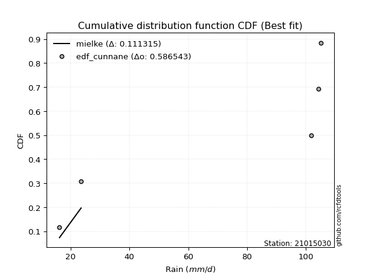</img></img>

</div>


### 12. Empirical - EDF Adamowski (1981)

The Adamowski formula in hydrology refers to a specific plotting position formula used for estimating the non-parametric empirical distribution of hydrological events (like flood peaks) to calculate their return periods. This formula provides an alternative to traditional parametric methods (like the Gumbel or Log Pearson Type III distributions). 

<div align="center">


$P=(m-0.25)/(n+0.5)$


</div>


**12.1. Empirical values**

<div align="center">

|                | 0                   | 1                  | 2             | 3                  | 4                  |
|:---------------|:--------------------|:-------------------|:--------------|:-------------------|:-------------------|
| date           | 2019                | 2022               | 2024          | 2025               | 2023               |
| x              | 16.2                | 23.55              | 101.9         | 104.32             | 105.18             |
| m              | 1                   | 2                  | 3             | 4                  | 5                  |
| empirical_dist | edf_adamowski       | edf_adamowski      | edf_adamowski | edf_adamowski      | edf_adamowski      |
| empirical      | 0.13636363636363635 | 0.3181818181818182 | 0.5           | 0.6818181818181818 | 0.8636363636363636 |
| empirical_tr   | 1.1578947368421053  | 1.4666666666666666 | 2.0           | 3.1428571428571423 | 7.333333333333334  |

</div>


**12.2. Kolmogorov-Smirnov fit test (sorted by Δ)**


<div align="center">

|                | 0                   | 1                   | 2                   | 3                  | 4                  | 5                  | 6                   | 7                  | 8                  | 9                   | 10                 | 11                  | 12                  | 13                 | 14                 | 15                  | 16                  | 17                 | 18                  | 19                 | 20                 | 21                  | 22                 | 23                 | 24                  | 25                  | 26                 | 27                 | 28                 | 29                 | 30                 | 31                 | 32                  | 33                 | 34                 | 35                 | 36                  | 37                  | 38                  | 39                 | 40                 | 41                  | 42                  | 43                  | 44                 | 45                 | 46                 | 47                 | 48                  | 49                  | 50                  | 51                 | 52                 | 53                  | 54                 | 55                 | 56                  | 57                 | 58                 | 59                 | 60                 | 61                 | 62                  | 63                 | 64                 | 65                  | 66                 | 67                 | 68                  | 69                 | 70                  | 71                 | 72                 | 73                 | 74                 | 75                 | 76                 | 77                  | 78                 | 79                  | 80                 | 81                 | 82                 | 83                 | 84                    | 85                  | 86                 | 87                 | 88                 | 89                 |
|:---------------|:--------------------|:--------------------|:--------------------|:-------------------|:-------------------|:-------------------|:--------------------|:-------------------|:-------------------|:--------------------|:-------------------|:--------------------|:--------------------|:-------------------|:-------------------|:--------------------|:--------------------|:-------------------|:--------------------|:-------------------|:-------------------|:--------------------|:-------------------|:-------------------|:--------------------|:--------------------|:-------------------|:-------------------|:-------------------|:-------------------|:-------------------|:-------------------|:--------------------|:-------------------|:-------------------|:-------------------|:--------------------|:--------------------|:--------------------|:-------------------|:-------------------|:--------------------|:--------------------|:--------------------|:-------------------|:-------------------|:-------------------|:-------------------|:--------------------|:--------------------|:--------------------|:-------------------|:-------------------|:--------------------|:-------------------|:-------------------|:--------------------|:-------------------|:-------------------|:-------------------|:-------------------|:-------------------|:--------------------|:-------------------|:-------------------|:--------------------|:-------------------|:-------------------|:--------------------|:-------------------|:--------------------|:-------------------|:-------------------|:-------------------|:-------------------|:-------------------|:-------------------|:--------------------|:-------------------|:--------------------|:-------------------|:-------------------|:-------------------|:-------------------|:----------------------|:--------------------|:-------------------|:-------------------|:-------------------|:-------------------|
| station        | 21015030            | 21015030            | 21015030            | 21015030           | 21015030           | 21015030           | 21015030            | 21015030           | 21015030           | 21015030            | 21015030           | 21015030            | 21015030            | 21015030           | 21015030           | 21015030            | 21015030            | 21015030           | 21015030            | 21015030           | 21015030           | 21015030            | 21015030           | 21015030           | 21015030            | 21015030            | 21015030           | 21015030           | 21015030           | 21015030           | 21015030           | 21015030           | 21015030            | 21015030           | 21015030           | 21015030           | 21015030            | 21015030            | 21015030            | 21015030           | 21015030           | 21015030            | 21015030            | 21015030            | 21015030           | 21015030           | 21015030           | 21015030           | 21015030            | 21015030            | 21015030            | 21015030           | 21015030           | 21015030            | 21015030           | 21015030           | 21015030            | 21015030           | 21015030           | 21015030           | 21015030           | 21015030           | 21015030            | 21015030           | 21015030           | 21015030            | 21015030           | 21015030           | 21015030            | 21015030           | 21015030            | 21015030           | 21015030           | 21015030           | 21015030           | 21015030           | 21015030           | 21015030            | 21015030           | 21015030            | 21015030           | 21015030           | 21015030           | 21015030           | 21015030              | 21015030            | 21015030           | 21015030           | 21015030           | 21015030           |
| empirical_dist | edf_adamowski       | edf_adamowski       | edf_adamowski       | edf_adamowski      | edf_adamowski      | edf_adamowski      | edf_adamowski       | edf_adamowski      | edf_adamowski      | edf_adamowski       | edf_adamowski      | edf_adamowski       | edf_adamowski       | edf_adamowski      | edf_adamowski      | edf_adamowski       | edf_adamowski       | edf_adamowski      | edf_adamowski       | edf_adamowski      | edf_adamowski      | edf_adamowski       | edf_adamowski      | edf_adamowski      | edf_adamowski       | edf_adamowski       | edf_adamowski      | edf_adamowski      | edf_adamowski      | edf_adamowski      | edf_adamowski      | edf_adamowski      | edf_adamowski       | edf_adamowski      | edf_adamowski      | edf_adamowski      | edf_adamowski       | edf_adamowski       | edf_adamowski       | edf_adamowski      | edf_adamowski      | edf_adamowski       | edf_adamowski       | edf_adamowski       | edf_adamowski      | edf_adamowski      | edf_adamowski      | edf_adamowski      | edf_adamowski       | edf_adamowski       | edf_adamowski       | edf_adamowski      | edf_adamowski      | edf_adamowski       | edf_adamowski      | edf_adamowski      | edf_adamowski       | edf_adamowski      | edf_adamowski      | edf_adamowski      | edf_adamowski      | edf_adamowski      | edf_adamowski       | edf_adamowski      | edf_adamowski      | edf_adamowski       | edf_adamowski      | edf_adamowski      | edf_adamowski       | edf_adamowski      | edf_adamowski       | edf_adamowski      | edf_adamowski      | edf_adamowski      | edf_adamowski      | edf_adamowski      | edf_adamowski      | edf_adamowski       | edf_adamowski      | edf_adamowski       | edf_adamowski      | edf_adamowski      | edf_adamowski      | edf_adamowski      | edf_adamowski         | edf_adamowski       | edf_adamowski      | edf_adamowski      | edf_adamowski      | edf_adamowski      |
| p_dist         | mielke              | logfisk             | fisk                | pareto             | pearson3           | invgamma           | alpha               | loginvweibull      | logmielke          | logncf              | logpearson3        | weibull_min         | gumbel_l            | gamma              | t                  | exponnorm           | crystalball         | norm               | erlang              | ncf                | rice               | lognct              | loggamma           | loggamma           | logfatiguelife      | logf                | logt               | lognorm            | lognorm            | logcrystalball     | logexponnorm       | betaprime          | logbetaprime        | maxwell            | f                  | logtruncnorm       | logerlang           | loginvgamma         | loggumbel_l         | nct                | rayleigh           | logrice             | logexpon            | loginvgauss         | logweibull_min     | logmaxwell         | logpareto          | lograyleigh        | logalpha            | loggenexpon         | halfnorm            | gompertz           | logkstwobign       | genexpon            | expon              | loggompertz        | kstwobign           | loghalfnorm        | logistic           | loglogistic        | gumbel_r           | invgauss           | loggumbel_r         | hypsecant          | halflogistic       | loghalflogistic     | loghypsecant       | moyal              | logmoyal            | logchi2            | lognakagami         | logjohnsonsu       | laplace            | loglaplace         | loglognorm         | wald               | logwald            | gibrat              | loggibrat          | nakagami            | laplace_asymmetric | fatiguelife        | invweibull         | truncnorm          | loglaplace_asymmetric | logloggamma         | chi2               | johnsonsu          | loggenlogistic     | genlogistic        |
| delta          | 0.12180492263845152 | 0.24974319573264847 | 0.25506182486189677 | 0.2561874351584068 | 0.2714747559714833 | 0.2723136013961489 | 0.27423357847371266 | 0.2748105461605097 | 0.2750976063595566 | 0.27525572128034725 | 0.2765091387746228 | 0.27712536843199387 | 0.27798551491163226 | 0.2785226078052825 | 0.2789763289431748 | 0.27899135798302666 | 0.27899226499810403 | 0.2789922765041597 | 0.28065223230759595 | 0.281410358255735  | 0.2833489094307783 | 0.28346603170223783 | 0.2838811114520967 | 0.2838811114520967 | 0.28388833728980445 | 0.28397716267247086 | 0.2840039702588246 | 0.2840067241395555 | 0.2840067241395555 | 0.2840069482252767 | 0.2840071025138352 | 0.284026454398967  | 0.28452426349573334 | 0.2847387482169469 | 0.2848801168148095 | 0.2850909282395362 | 0.28516491981196723 | 0.28521933733571314 | 0.28523100132427837 | 0.2862420770283298 | 0.2863653606756661 | 0.28645092013719897 | 0.28697530052910136 | 0.28711276057777213 | 0.287480285313791  | 0.2890825457779258 | 0.2897401161903463 | 0.2905187360573558 | 0.29104738766392546 | 0.29199660901293534 | 0.29280701602372705 | 0.2933245613406311 | 0.2941212583137629 | 0.29528275195920317 | 0.2952889567581094 | 0.2955564433366119 | 0.29581243117896516 | 0.2964738490389759 | 0.3012998903331464 | 0.3061644609699211 | 0.3110238031228981 | 0.3121502394535475 | 0.31469639199122557 | 0.3150907829630285 | 0.3153390827969137 | 0.31864163235554677 | 0.3197042806732656 | 0.3215310367665045 | 0.32481510971833105 | 0.3263134991506348 | 0.32917537373483285 | 0.32981840579156   | 0.3314270143058269 | 0.335432037468273  | 0.3427983555154012 | 0.3563968327806114 | 0.3588141208376948 | 0.38435048260034854 | 0.3864918188551518 | 0.39375040406055284 | 0.4104443296908452 | 0.4194800145461175 | 0.4356539687098839 | 0.4538768519080839 | 0.45399430689918785   | 0.45455495057247386 | 0.5015440016930217 | 0.5833612231191112 | 0.6818181818181818 | 0.6818181818181818 |
| deltao         | 0.5865427407550001  | 0.5865427407550001  | 0.5865427407550001  | 0.5865427407550001 | 0.5865427407550001 | 0.5865427407550001 | 0.5865427407550001  | 0.5865427407550001 | 0.5865427407550001 | 0.5865427407550001  | 0.5865427407550001 | 0.5865427407550001  | 0.5865427407550001  | 0.5865427407550001 | 0.5865427407550001 | 0.5865427407550001  | 0.5865427407550001  | 0.5865427407550001 | 0.5865427407550001  | 0.5865427407550001 | 0.5865427407550001 | 0.5865427407550001  | 0.5865427407550001 | 0.5865427407550001 | 0.5865427407550001  | 0.5865427407550001  | 0.5865427407550001 | 0.5865427407550001 | 0.5865427407550001 | 0.5865427407550001 | 0.5865427407550001 | 0.5865427407550001 | 0.5865427407550001  | 0.5865427407550001 | 0.5865427407550001 | 0.5865427407550001 | 0.5865427407550001  | 0.5865427407550001  | 0.5865427407550001  | 0.5865427407550001 | 0.5865427407550001 | 0.5865427407550001  | 0.5865427407550001  | 0.5865427407550001  | 0.5865427407550001 | 0.5865427407550001 | 0.5865427407550001 | 0.5865427407550001 | 0.5865427407550001  | 0.5865427407550001  | 0.5865427407550001  | 0.5865427407550001 | 0.5865427407550001 | 0.5865427407550001  | 0.5865427407550001 | 0.5865427407550001 | 0.5865427407550001  | 0.5865427407550001 | 0.5865427407550001 | 0.5865427407550001 | 0.5865427407550001 | 0.5865427407550001 | 0.5865427407550001  | 0.5865427407550001 | 0.5865427407550001 | 0.5865427407550001  | 0.5865427407550001 | 0.5865427407550001 | 0.5865427407550001  | 0.5865427407550001 | 0.5865427407550001  | 0.5865427407550001 | 0.5865427407550001 | 0.5865427407550001 | 0.5865427407550001 | 0.5865427407550001 | 0.5865427407550001 | 0.5865427407550001  | 0.5865427407550001 | 0.5865427407550001  | 0.5865427407550001 | 0.5865427407550001 | 0.5865427407550001 | 0.5865427407550001 | 0.5865427407550001    | 0.5865427407550001  | 0.5865427407550001 | 0.5865427407550001 | 0.5865427407550001 | 0.5865427407550001 |
| eval           | Δo > Δ              | Δo > Δ              | Δo > Δ              | Δo > Δ             | Δo > Δ             | Δo > Δ             | Δo > Δ              | Δo > Δ             | Δo > Δ             | Δo > Δ              | Δo > Δ             | Δo > Δ              | Δo > Δ              | Δo > Δ             | Δo > Δ             | Δo > Δ              | Δo > Δ              | Δo > Δ             | Δo > Δ              | Δo > Δ             | Δo > Δ             | Δo > Δ              | Δo > Δ             | Δo > Δ             | Δo > Δ              | Δo > Δ              | Δo > Δ             | Δo > Δ             | Δo > Δ             | Δo > Δ             | Δo > Δ             | Δo > Δ             | Δo > Δ              | Δo > Δ             | Δo > Δ             | Δo > Δ             | Δo > Δ              | Δo > Δ              | Δo > Δ              | Δo > Δ             | Δo > Δ             | Δo > Δ              | Δo > Δ              | Δo > Δ              | Δo > Δ             | Δo > Δ             | Δo > Δ             | Δo > Δ             | Δo > Δ              | Δo > Δ              | Δo > Δ              | Δo > Δ             | Δo > Δ             | Δo > Δ              | Δo > Δ             | Δo > Δ             | Δo > Δ              | Δo > Δ             | Δo > Δ             | Δo > Δ             | Δo > Δ             | Δo > Δ             | Δo > Δ              | Δo > Δ             | Δo > Δ             | Δo > Δ              | Δo > Δ             | Δo > Δ             | Δo > Δ              | Δo > Δ             | Δo > Δ              | Δo > Δ             | Δo > Δ             | Δo > Δ             | Δo > Δ             | Δo > Δ             | Δo > Δ             | Δo > Δ              | Δo > Δ             | Δo > Δ              | Δo > Δ             | Δo > Δ             | Δo > Δ             | Δo > Δ             | Δo > Δ                | Δo > Δ              | Δo > Δ             | Δo > Δ             | Δo <= Δ            | Δo <= Δ            |
| fit            | 1                   | 1                   | 1                   | 1                  | 1                  | 1                  | 1                   | 1                  | 1                  | 1                   | 1                  | 1                   | 1                   | 1                  | 1                  | 1                   | 1                   | 1                  | 1                   | 1                  | 1                  | 1                   | 1                  | 1                  | 1                   | 1                   | 1                  | 1                  | 1                  | 1                  | 1                  | 1                  | 1                   | 1                  | 1                  | 1                  | 1                   | 1                   | 1                   | 1                  | 1                  | 1                   | 1                   | 1                   | 1                  | 1                  | 1                  | 1                  | 1                   | 1                   | 1                   | 1                  | 1                  | 1                   | 1                  | 1                  | 1                   | 1                  | 1                  | 1                  | 1                  | 1                  | 1                   | 1                  | 1                  | 1                   | 1                  | 1                  | 1                   | 1                  | 1                   | 1                  | 1                  | 1                  | 1                  | 1                  | 1                  | 1                   | 1                  | 1                   | 1                  | 1                  | 1                  | 1                  | 1                     | 1                   | 1                  | 1                  | 0                  | 0                  |
| n              | 5                   | 5                   | 5                   | 5                  | 5                  | 5                  | 5                   | 5                  | 5                  | 5                   | 5                  | 5                   | 5                   | 5                  | 5                  | 5                   | 5                   | 5                  | 5                   | 5                  | 5                  | 5                   | 5                  | 5                  | 5                   | 5                   | 5                  | 5                  | 5                  | 5                  | 5                  | 5                  | 5                   | 5                  | 5                  | 5                  | 5                   | 5                   | 5                   | 5                  | 5                  | 5                   | 5                   | 5                   | 5                  | 5                  | 5                  | 5                  | 5                   | 5                   | 5                   | 5                  | 5                  | 5                   | 5                  | 5                  | 5                   | 5                  | 5                  | 5                  | 5                  | 5                  | 5                   | 5                  | 5                  | 5                   | 5                  | 5                  | 5                   | 5                  | 5                   | 5                  | 5                  | 5                  | 5                  | 5                  | 5                  | 5                   | 5                  | 5                   | 5                  | 5                  | 5                  | 5                  | 5                     | 5                   | 5                  | 5                  | 5                  | 5                  |
| best_fit       | 1                   | 0                   | 0                   | 0                  | 0                  | 0                  | 0                   | 0                  | 0                  | 0                   | 0                  | 0                   | 0                   | 0                  | 0                  | 0                   | 0                   | 0                  | 0                   | 0                  | 0                  | 0                   | 0                  | 0                  | 0                   | 0                   | 0                  | 0                  | 0                  | 0                  | 0                  | 0                  | 0                   | 0                  | 0                  | 0                  | 0                   | 0                   | 0                   | 0                  | 0                  | 0                   | 0                   | 0                   | 0                  | 0                  | 0                  | 0                  | 0                   | 0                   | 0                   | 0                  | 0                  | 0                   | 0                  | 0                  | 0                   | 0                  | 0                  | 0                  | 0                  | 0                  | 0                   | 0                  | 0                  | 0                   | 0                  | 0                  | 0                   | 0                  | 0                   | 0                  | 0                  | 0                  | 0                  | 0                  | 0                  | 0                   | 0                  | 0                   | 0                  | 0                  | 0                  | 0                  | 0                     | 0                   | 0                  | 0                  | 0                  | 0                  |
| best_fit_sort  | 1                   | 2                   | 3                   | 4                  | 5                  | 6                  | 7                   | 8                  | 9                  | 10                  | 11                 | 12                  | 13                  | 14                 | 15                 | 16                  | 17                  | 18                 | 19                  | 20                 | 21                 | 22                  | 23                 | 24                 | 25                  | 26                  | 27                 | 28                 | 29                 | 30                 | 31                 | 32                 | 33                  | 34                 | 35                 | 36                 | 37                  | 38                  | 39                  | 40                 | 41                 | 42                  | 43                  | 44                  | 45                 | 46                 | 47                 | 48                 | 49                  | 50                  | 51                  | 52                 | 53                 | 54                  | 55                 | 56                 | 57                  | 58                 | 59                 | 60                 | 61                 | 62                 | 63                  | 64                 | 65                 | 66                  | 67                 | 68                 | 69                  | 70                 | 71                  | 72                 | 73                 | 74                 | 75                 | 76                 | 77                 | 78                  | 79                 | 80                  | 81                 | 82                 | 83                 | 84                 | 85                    | 86                  | 87                 | 88                 | 89                 | 90                 |

</div>


<div align="center">

</img>

</div>


**12.3. Best fit**

<div align="center">

|   id |   station | empirical_dist   | p_dist   |    delta |   deltao | eval   |   fit |   n |   best_fit |   best_fit_sort |
|-----:|----------:|:-----------------|:---------|---------:|---------:|:-------|------:|----:|-----------:|----------------:|
|    0 |  21015030 | edf_adamowski    | mielke   | 0.121805 | 0.586543 | Δo > Δ |     1 |   5 |          1 |               1 |

</div>


<div align="center">

</img>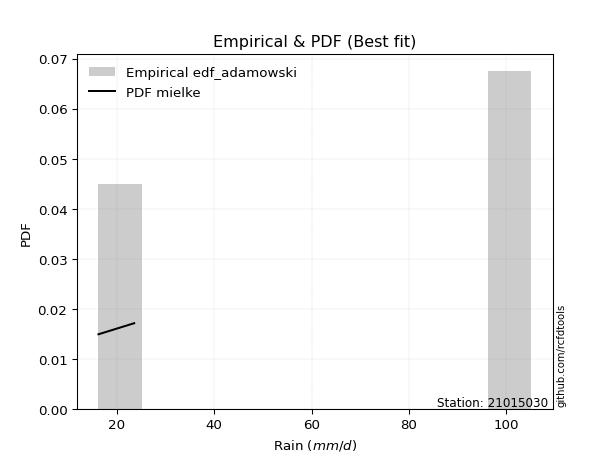</img>

</div>


## C. Best fit & Estimate extreme values for specific return periods - Tr


### 1. Best fit (ordered by delta Δ)

<div align="center">

|   id |   station | empirical_dist   | p_dist       |    delta |   deltao | eval   |   fit |   n |   best_fit |   best_fit_sort |
|-----:|----------:|:-----------------|:-------------|---------:|---------:|:-------|------:|----:|-----------:|----------------:|
|    0 |  21015030 | edf_hazen        | mielke       | 0.103623 | 0.586543 | Δo > Δ |     1 |   5 |          1 |               1 |
|    1 |  21015030 | edf_gringorten   | mielke       | 0.108311 | 0.586543 | Δo > Δ |     1 |   5 |          1 |               2 |
|    2 |  21015030 | edf_cunnane      | mielke       | 0.111315 | 0.586543 | Δo > Δ |     1 |   5 |          1 |               3 |
|    3 |  21015030 | edf_blom         | mielke       | 0.113147 | 0.586543 | Δo > Δ |     1 |   5 |          1 |               4 |
|    4 |  21015030 | edf_tukey        | mielke       | 0.116123 | 0.586543 | Δo > Δ |     1 |   5 |          1 |               5 |
|    5 |  21015030 | edf_filliben     | mielke       | 0.11723  | 0.586543 | Δo > Δ |     1 |   5 |          1 |               6 |
|    6 |  21015030 | edf_beard        | mielke       | 0.117749 | 0.586543 | Δo > Δ |     1 |   5 |          1 |               7 |
|    7 |  21015030 | edf_jenkinson    | mielke       | 0.117749 | 0.586543 | Δo > Δ |     1 |   5 |          1 |               8 |
|    8 |  21015030 | edf_chegodayev   | mielke       | 0.118438 | 0.586543 | Δo > Δ |     1 |   5 |          1 |               9 |
|    9 |  21015030 | edf_adamowski    | mielke       | 0.121805 | 0.586543 | Δo > Δ |     1 |   5 |          1 |              10 |
|   10 |  21015030 | edf_weibull      | mielke       | 0.136956 | 0.586543 | Δo > Δ |     1 |   5 |          1 |              11 |
|   11 |  21015030 | edf_california   | logkstwobign | 0.198092 | 0.586543 | Δo > Δ |     1 |   5 |          1 |              12 |

</div>

:file_folder:Tables: [bestfit_21015030.csv](table/bestfit_21015030.csv) | [extreme_21015030.csv](table/extreme_21015030.csv)


### 2. Extreme values

In hydrology, a return period (or recurrence interval $Tr$) is the statistical average time between extreme events like floods or droughts of a specific magnitude, indicating how rare an event is, with a 100-year flood, for example, having a 1% chance of occurring in any given year, not that it happens exactly every century. It is a key tool for infrastructure design (like bridges or dams) and risk assessment, calculated from historical data to determine the probability of future events, although it is important to remember it is statistical average, and events can cluster or be missed.

> risk_rate: assuming the return period as the project useful life.

|   id |      tr |   prob_l |     prob_g |      alpha |   betaprime |     chi2 |   crystalball |   erlang |    expon |   exponnorm |        f |   fatiguelife |        fisk |    gamma |   genexpon |   genlogistic |   gibrat |   gompertz |   gumbel_l |   gumbel_r |   halflogistic |   halfnorm |   hypsecant |   invgamma |   invgauss |     invweibull |   johnsonsu |   kstwobign |   laplace |   laplace_asymmetric |   loggamma |   logistic |   lognorm |   maxwell |    mielke |    moyal |   nakagami |      ncf |        nct |     norm |           pareto |   pearson3 |   rayleigh |     rice |        t |   truncnorm |     wald |   weibull_min |   logalpha |   logbetaprime |     logchi2 |   logcrystalball |   logerlang |   logexpon |   logexponnorm |     logf |   logfatiguelife |   logfisk |   loggenexpon |   loggenlogistic |   loggibrat |   loggompertz |   loggumbel_l |   loggumbel_r |   loghalflogistic |   loghalfnorm |   loghypsecant |   loginvgamma |   loginvgauss |   loginvweibull |   logjohnsonsu |   logkstwobign |   loglaplace |   loglaplace_asymmetric |   logloggamma |   loglogistic |    loglognorm |   logmaxwell |   logmielke |   logmoyal |   lognakagami |   logncf |   lognct |       logpareto |   logpearson3 |   lograyleigh |   logrice |     logt |   logtruncnorm |    logwald |   logweibull_min |   station |   n |   risk_rate |
|-----:|--------:|---------:|-----------:|-----------:|------------:|---------:|--------------:|---------:|---------:|------------:|---------:|--------------:|------------:|---------:|-----------:|--------------:|---------:|-----------:|-----------:|-----------:|---------------:|-----------:|------------:|-----------:|-----------:|---------------:|------------:|------------:|----------:|---------------------:|-----------:|-----------:|----------:|----------:|----------:|---------:|-----------:|---------:|-----------:|---------:|-----------------:|-----------:|-----------:|---------:|---------:|------------:|---------:|--------------:|-----------:|---------------:|------------:|-----------------:|------------:|-----------:|---------------:|---------:|-----------------:|----------:|--------------:|-----------------:|------------:|--------------:|--------------:|--------------:|------------------:|--------------:|---------------:|--------------:|--------------:|----------------:|---------------:|---------------:|-------------:|------------------------:|--------------:|--------------:|--------------:|-------------:|------------:|-----------:|--------------:|---------:|---------:|----------------:|--------------:|--------------:|----------:|---------:|---------------:|-----------:|-----------------:|----------:|----:|------------:|
|    0 |    2    | 0.5      | 0.5        |    43.2906 |     59.8705 |  16.4145 |       70.23   |  68.9169 |  53.6507 |     70.2302 |  39.8059 |       16.282  |     37.7387 |  69.3856 |    53.6514 |           inf |  57.8648 |    69.3158 |    76.9976 |    63.4624 |        60.0979 |    61.7975 |     70.23   |    67.2406 |    43.6363 | 9555.05        |      105.18 |     61.0534 |   70.23   |              80.9251 |    51.8038 |    70.23   |   53.2104 |   66.7068 |   46.2457 |  61.2776 |    16.6444 |  60.9971 |    42.5851 |  70.23   |     22.1377      |    73.0781 |    65.4572 |  68.0369 |  70.2322 |     68.5261 |  56.8765 |       78.6625 |    49.8086 |        51.7048 |     25.6424 |          53.2103 |     51.9063 |    36.9413 |        53.2104 |  53.1843 |          53.2133 |   57.6478 |       40.4656 |          inf     |     41.5155 |       54.5201 |       60.9523 |       46.4517 |           43.4175 |       44.9249 |        53.2104 |       51.4208 |       48.877  |         46.291  |        105.165 |        44.1627 |      53.2104 |                 65.6625 |       65.4345 |       53.2104 |  16.2164      |      49.5774 |     46.309  |    44.4587 |       32.866  |  52.2615 |  53.3759 |   18.6843       |       56.7568 |       48.3494 |   50.9493 |  53.2107 |        45.1688 |    40.6995 |          62.8454 |  21015030 |   5 |    0.75     |
|    1 |    2.33 | 0.570815 | 0.429185   |    51.5258 |     68.17   |  16.7344 |       77.5812 |  76.4127 |  61.9023 |     77.5813 |  49.3051 |       17.7464 |     46.7596 |  76.8506 |    61.9031 |           inf |  61.5886 |    76.4535 |    83.3932 |    70.2741 |        67.1014 |    69.7314 |     76.1131 |    75.0964 |    51.1962 |    1.27768e+06 |      105.18 |     68.9942 |   74.6786 |              85.5608 |    60.2864 |    76.7069 |   61.6705 |   74.3441 |   54.6936 |  67.7257 |    17.6624 |  69.3741 |    50.3541 |  77.5812 |     26.8894      |    80.2767 |    73.2076 |  75.5367 |  77.5834 |     74.2018 |  61.6967 |       84.6504 |    57.9808 |        60.1722 |     30.3681 |          61.6704 |     60.3213 |    44.2986 |        61.6705 |  61.6436 |          61.6661 |   66.8469 |       48.1671 |          inf     |     44.7373 |       62.7257 |       69.3014 |       53.2575 |           49.971  |       52.6803 |        59.8798 |       59.7912 |       57.1766 |         54.7281 |        105.178 |        52.0262 |      58.1802 |                 71.8536 |       71.6492 |       60.5977 |  16.4096      |      57.791  |     54.7393 |    50.6018 |       39.2265 |  61.0157 |  61.8517 |   21.0667       |       65.5419 |       56.4874 |   59.3189 |  61.671  |        53.4925 |    44.834  |          70.8373 |  21015030 |   5 |    0.729209 |
|    2 |    5    | 0.8      | 0.2        |   115.382  |    105.451  |  22.2561 |      104.9    | 104.819  | 103.158  |    104.9    | 108.112  |       47.2061 |    134.167  | 105.112  |   103.16   |           inf |  83.0276 |   102.814  |   104.055  |    99.8671 |        98.7907 |   103.282  |     99.7117 |   106.674  |    97.4684 |    2.22186e+15 |      105.18 |    102.725  |   96.9205 |              97.3741 |   107.057  |   101.715  |  106.714  |  104.404  |  113.423  |  97.594  |    46.7798 | 105.827  |   108.716  | 104.9    |    191.824       |   105.466  |   104.236  | 104.487  | 104.902  |     91.0509 |  88.6805 |      103.995  |   104.93   |       106.85   |     82.9883 |         106.714  |    106.609  |   109.84   |       106.714  | 106.731  |         106.76   |  118.398  |      105.822  |          inf     |     68.7938 |      103.047  |      104.918  |       96.46   |           94.3997 |      103.305  |        96.1597 |      106.723  |      106.529  |        113.27   |        105.18  |       104.357  |      90.9204 |                 90.3996 |       90.2875 |      100.105  |   5.78659e+71 |     105.657  |    113.106  |    92.1579 |       87.7306 | 110.085  | 106.855  | 2129.35         |      108.006  |      105.3    |  106.322  | 106.715  |       108.057  |    77.0597 |         104.283  |  21015030 |   5 |    0.67232  |
|    3 |   10    | 0.9      | 0.1        |   232.702  |    136.388  |  32.9868 |      123.023  | 124.145  | 140.609  |    123.023  | 171.307  |       87.8768 |    335.193  | 124.315  |   140.611  |           inf | 107.466  |   119.318  |   115.558  |   123.97   |       125.107  |   128.11   |    118.556  |   129.906  |   151.557  |    7.46116e+22 |      105.18 |    128.407  |  117.111  |             101.496  |   158.171  |   120.133  |  153.532  |  125.559  |  205.531  | 123.599  |   107.954  | 134.712  |   211.411  | 123.023  |   2160.93        |   120.85   |   126.359  | 124.312  | 123.025  |     98.0982 | 117.317  |      114.765  |   159.75   |       157.861  |    236.15   |         153.532  |    157.07   |   250.471  |       153.532  | 153.669  |         153.782  |  180.378  |      199.271  |          inf     |    112.349  |      138.935  |      132.169  |      156.48   |          160.098  |      170.037  |       140.366  |      159.448  |      166.86   |        204.838  |        105.18  |       177.291  |     136.353  |                 97.9404 |       97.8739 |      144.879  | inf           |     161.55   |    204.154  |   155.318  |      163.571  | 164.958  | 153.445  |    1.83709e+30  |      146.01   |      164.166  |  158.227  | 153.533  |       180.29   |   136.915  |         129.337  |  21015030 |   5 |    0.651322 |
|    4 |   15    | 0.933333 | 0.0666667  |   349.603  |    153.879  |  41.1701 |      132.066  | 133.934  | 162.516  |    132.066  | 210.908  |      114.476  |    564.686  | 134.034  |   162.519  |           inf | 124.322  |   127.134  |   120.768  |   137.569  |       140      |   141.029  |    129.31   |   142.252  |   188.049  |    1.31511e+27 |      105.18 |    142.041  |  128.922  |             102.769  |   192.726  |   130.167  |  184.091  |  136.413  |  287.466  | 138.691  |   149.653  | 150.551  |   310.684  | 132.066  |   9273.45        |   128.143  |   137.758  | 134.326  | 132.069  |    100.448  | 135.705  |      119.642  |   198.745  |       192.348  |    450.469  |         184.091  |    191.14   |   405.669  |       184.091  | 184.342  |         184.548  |  226.882  |      281.619  |          inf     |    157.581  |      159.7    |      146.737  |      205.589  |          215.882  |      220.379  |       174.183  |      195.86   |      211.096  |        286.139  |        105.18  |       234.896  |     172.831  |                100.394  |      100.343  |      177.206  | inf           |     200.874  |    284.846  |   210.273  |      226.981  | 202.652  | 183.768  |    2.87964e+135 |      168.257  |      206.372  |  193.343  | 184.093  |       234.891  |   198.038  |         142.584  |  21015030 |   5 |    0.644736 |
|    5 |   20    | 0.95     | 0.05       |   466.402  |    166.12   |  47.6235 |      137.989  | 140.397  | 178.059  |    137.989  | 239.889  |      134.17   |    813.93   | 140.448  |   178.063  |           inf | 137.544  |   132.093  |   124.01   |   147.09   |       150.435  |   149.643  |    136.897  |   150.627  |   215.901  |    1.23598e+30 |      105.18 |    151.225  |  137.302  |             103.388  |   219.573  |   137.103  |  207.329  |  143.617  |  363.598  | 149.38   |   179.536  | 161.442  |   407.962  | 137.989  |  26141.2         |   132.782  |   145.335  | 140.918  | 137.991  |    101.626  | 149.409  |      122.678  |   230.06   |       219.145  |    720.196  |         207.329  |    217.593  |   571.155  |       207.328  | 207.682  |         207.978  |  265.861  |      356.876  |          inf     |    205.476  |      174.348  |      156.606  |      248.886  |          266.182  |      261.974  |       202.834  |      224.543  |      247.269  |        361.591  |        105.18  |       283.914  |     204.489  |                101.61   |      101.567  |      203.676  | inf           |     232.124  |    359.65   |   260.589  |      282.568  | 232.227  | 206.786  |  inf            |      184.07   |      240.269  |  220.592  | 207.331  |       280.047  |   260.736  |         151.506  |  21015030 |   5 |    0.641514 |
|    6 |   25    | 0.96     | 0.04       |   583.159  |    175.544  |  52.9384 |      142.348  | 145.181  | 190.116  |    142.348  | 262.8    |      149.817  |   1078.66   | 145.195  |   190.119  |           inf | 148.567  |   135.662  |   126.318  |   154.424  |       158.474  |   156.052  |    142.768  |   156.944  |   238.543  |    2.41013e+32 |      105.18 |    158.105  |  143.802  |             103.755  |   241.823  |   142.409  |  226.289  |  148.965  |  435.735  | 157.664  |   202.452  | 169.723  |   503.818  | 142.348  |  58433.6         |   136.128  |   150.964  | 145.787  | 142.351  |    102.334  | 160.385  |      124.839  |   256.661  |       241.356  |   1041.82   |         226.289  |    239.507  |   744.738  |       226.289  | 226.736  |         227.116  |  300.142  |      427.016  |          inf     |    256.357  |      185.666  |      164.03   |      288.358  |          312.795  |      297.939  |       228.204  |      248.561  |      278.396  |        433.02   |        105.18  |       327.221  |     232.986  |                102.336  |      102.298  |      226.564  | inf           |     258.427  |    430.408  |   307.734  |      332.652  | 256.913  | 225.544  |  inf            |      196.353  |      269.01   |  243.14   | 226.291  |       319.111  |   324.998  |         158.193  |  21015030 |   5 |    0.639603 |
|    7 |   50    | 0.98     | 0.02       |  1166.76   |    204.553  |  70.8315 |      154.833  | 159.006  | 227.567  |    154.833  | 335.981  |      200.021  |   2566.37   | 158.906  |   227.571  |           inf | 187.423  |   145.503  |   132.582  |   177.017  |       183.244  |   174.681  |    160.972  |   175.776  |   314.09   |    2.73233e+39 |      105.18 |    178.306  |  163.992  |             104.477  |   319.591  |   158.62   |  290.732  |  164.475  |  760.996  | 183.383  |   270.8    | 194.678  |   969.755  | 154.833  | 711444           |   145.396  |   167.305  | 159.79   | 154.835  |    103.754  | 196.222  |      130.703  |   354.038  |       319.001  |   3358.01   |         290.732  |    316.05   |  1698.25   |       290.731  | 291.559  |         292.296  |  434.767  |      730.659  |          inf     |    559.175  |      220.608  |      186.006  |      453.813  |          514.272  |      433.03   |       328.858  |      334.131  |      394.957  |        754.542  |        105.18  |       496.463  |     349.41   |                103.781  |      103.753  |      313.692  | inf           |     352.81   |    748.416  |   515.67   |      534.76   | 344.31   | 289.153  |  inf            |      234.593  |      373.434  |  321.632  | 290.735  |       465.95   |   667.228  |         177.872  |  21015030 |   5 |    0.63583  |
|    8 |   75    | 0.986667 | 0.0133333  |  1750.29   |    221.411  |  82.0709 |      161.532  | 166.501  | 249.474  |    161.532  | 379.982  |      230.255  |   4244.74   | 166.336  |   249.478  |           inf | 213.667  |   150.558  |   135.749  |   190.149  |       197.643  |   184.822  |    171.61   |   186.357  |   361.534  |    3.4425e+43  |      105.18 |    189.421  |  175.803  |             104.714  |   371.722  |   167.982  |  332.573  |  172.907  | 1052.32   | 198.423  |   308.439  | 208.832  |  1422.03   | 161.532  |      3.07015e+06 |   150.178  |   176.195  | 167.338  | 161.534  |    104.228  | 218.274  |      133.669  |   422.952  |       371.064  |   6748.4    |         332.573  |    367.328  |  2750.53   |       332.572  | 333.691  |         334.715  |  538.522  |      988.402  |          inf     |    946.909  |      240.914  |      198.216  |      590.675  |          686.617  |      530.783  |       407.139  |      392.796  |      479.518  |       1041.99   |        105.18  |       624.45   |     442.885  |                104.261  |      104.236  |      378.547  | inf           |     417.876  |   1032.25   |   697.395  |      692.472  | 403.763  | 330.345  |  inf            |      257.006  |      446.386  |  373.942  | 332.576  |       572.261  |  1038.74   |         188.736  |  21015030 |   5 |    0.634587 |
|    9 |  100    | 0.99     | 0.01       |  2333.79   |    233.348  |  90.3206 |      166.062  | 171.601  | 265.017  |    166.062  | 411.657  |      252.01   |   6059.15   | 171.39   |   265.022  |           inf | 233.997  |   153.89   |   137.821  |   199.443  |       207.834  |   191.73   |    179.156  |   193.71   |   396.479  |    2.74749e+46 |      105.18 |    197.036  |  184.183  |             104.832  |   411.965  |   174.593  |  364.236  |  178.651  | 1323.68   | 209.094  |   334.086  | 218.71   |  1865.69   | 166.062  |      8.66398e+06 |   153.338  |   182.252  | 172.454  | 166.065  |    104.466  | 234.352  |      135.609  |   478.052  |       411.263  |  11126.7    |         364.236  |    406.898  |  3872.56   |       364.235  | 365.596  |         366.863  |  626.364  |     1219.1    |          inf     |   1424.03   |      255.267  |      206.633  |      711.815  |          842.473  |      609.729  |       473.723  |      438.743  |      548.153  |       1309.42   |        105.18  |       730.712  |     524.01   |                104.501  |      104.477  |      432.258  | inf           |     468.939  |   1296.03   |   863.959  |      825.741  | 450.083  | 361.466  |  inf            |      272.916  |      504.088  |  414.148  | 364.239  |       658.138  |  1434.37   |         196.199  |  21015030 |   5 |    0.633968 |
|   10 |  200    | 0.995    | 0.005      |  4667.74   |    262.095  | 110.962  |      176.34   | 183.26   | 302.468  |    176.34   | 489.341  |      305.263  |  14246.2    | 182.939  |   302.474  |           inf | 289.306  |   161.198  |   142.325  |   221.787  |       232.335  |   207.53   |    197.336  |   211.005  |   484.545  |    2.60489e+53 |      105.18 |    214.576  |  204.373  |             105.008  |   521.069  |   190.45   |  447.684  |  191.791  | 2297.86   | 234.802  |   392.513  | 242.03   |  3588.72   | 176.34   |      1.05512e+08 |   160.287  |   196.11   | 184.091  | 176.342  |    104.823  | 274.401  |      139.825  |   635.366  |       520.281  |  37632.9    |         447.684  |    514.132  |  8830.72   |       447.682  | 449.761  |         451.769  |  900.002  |     1993.72   |          inf     |   4321.6    |      289.686  |      226.182  |     1114.66   |         1377.66   |      837.275  |       682.335  |      565.97   |      748.266  |       2267.77   |        105.18  |      1049.4    |     785.857  |                104.859  |      104.838  |      594.252  | inf           |     610.473  |   2239.81   |  1447.42   |     1234.68   | 577.327  | 443.299  |  inf            |      311.24   |      665.748  |  522.39   | 447.688  |       905.695  |  3204.61   |         213.454  |  21015030 |   5 |    0.633042 |
|   11 |  250    | 0.996    | 0.004      |  5834.71   |    271.359  | 117.802  |      179.48   | 186.848  | 314.525  |    179.48   | 514.721  |      322.618  |  18749.6    | 186.493  |   314.53   |           inf | 309.152  |   163.363  |   143.65   |   228.97   |       240.211  |   212.39   |    203.188  |   216.467  |   513.942  |    4.5577e+55  |      105.18 |    220.004  |  210.873  |             105.043  |   560.132  |   195.54   |  476.814  |  195.836  | 2743.69   | 243.078  |   410.387  | 249.411  |  4429.87   | 179.48   |      2.3593e+08  |   162.35   |   200.376  | 187.655  | 179.483  |    104.894  | 287.651  |      141.066  |   694.401  |       559.327  |  55908      |         476.814  |    552.513  | 11514.5    |       476.812  | 479.168  |         481.465  | 1011.07   |     2327.36   |          inf     |   6436.25   |      300.72   |      232.278  |     1287.54   |         1613.64   |      923.081  |       767.383  |      612.406  |      824.716  |       2705.71   |        105.18  |      1173.78   |     895.374  |                104.931  |      104.91   |      658.184  | inf           |     662.107  |   2670.5    |  1708.99   |     1397.21   | 623.426  | 471.807  |  inf            |      323.563  |      725.263  |  560.88   | 476.818  |       999.049  |  4180.92   |         218.814  |  21015030 |   5 |    0.632858 |
|   12 |  500    | 0.998    | 0.002      | 11669.5    |    300.21   | 139.541  |      188.794  | 197.559  | 351.975  |    188.794  | 594.587  |      377.06   |  43966      | 197.096  |   351.982  |           inf | 377.737  |   169.608  |   147.448  |   251.266  |       264.659  |   226.883  |    221.366  |   233.172  |   608.088  |    4.17275e+62 |      105.18 |    236.271  |  231.064  |             105.113  |   694.998  |   211.329  |  574.828  |  207.907  | 4757.39   | 268.785  |   463.334  | 272.004  |  8520.33   | 188.794  |      2.87321e+09 |   168.306  |   213.104  | 198.243  | 188.796  |    105.037  | 329.78   |      144.622  |   908.677  |       694.183  | 192949      |         574.828  |    684.988  | 26256.9    |       574.826  | 578.197  |         581.581  | 1450.49   |     3727.16   |          inf     |  25496.1    |      334.868  |      250.68   |     2014.26   |         2635.92   |     1234.73   |      1105.28   |      775.999  |     1107.22   |       4680.4    |        105.18  |      1642      |    1342.79   |                105.074  |      105.055  |      903.597  | inf           |     843.625  |   4609.63   |  2863.09   |     2019.56   | 784.533  | 567.527  |  inf            |      361.754  |      936.371  |  692.751  | 574.834  |      1338.09   |  9738.97   |         234.937  |  21015030 |   5 |    0.632489 |
|   13 |  750    | 0.998667 | 0.00133333 | 17504.4    |    317.159  | 152.551  |      193.968  | 203.555  | 373.883  |    193.968  | 641.971  |      409.227  |  72346.9    | 203.029  |   373.889  |           inf | 423.094  |   172.967  |   149.478  |   264.3    |       278.951  |   234.979  |    232      |   242.792  |   664.938  |    4.90014e+66 |      105.18 |    245.409  |  242.874  |             105.137  |   784.177  |   220.552  |  637.734  |  214.658  | 6563.11   | 283.823  |   492.671  | 285.011  | 12491.6    | 193.968  |      1.23992e+10 |   171.51   |   220.221  | 204.136  | 193.97   |    105.085  | 355.039  |      146.522  |  1058.94   |       783.396  | 400464      |         637.734  |    772.563  | 42526.3    |       637.731  | 641.82   |         645.983  | 1790.95   |     4879.39   |          inf     |  63364.9    |      354.759  |      261.105  |     2616.58   |         3511.75   |     1452.61   |      1368.26   |      886.767  |     1309.27   |       6447.9    |        105.18  |      1982.77   |    1702.02   |                105.122  |      105.103  |     1087.38   | inf           |     966.052  |   6342.47   |  3871.89   |     2480.55   | 892.574  | 628.813  |  inf            |      384.007  |     1080.17   |  779.129  | 637.74   |      1575.07   | 16169.7    |         244.036  |  21015030 |   5 |    0.632366 |
|   14 | 1000    | 0.999    | 0.001      | 23339.2    |    329.226  | 161.896  |      197.53   | 207.701  | 389.426  |    197.53   | 675.867  |      432.173  | 102998      | 207.132  |   389.433  |           inf | 457.804  |   175.235  |   150.845  |   273.545  |       289.089  |   240.57   |    239.544  |   249.562  |   705.986  |    3.7763e+69  |      105.18 |    251.74   |  251.254  |             105.149  |   852.456  |   227.094  |  685.003  |  219.324  | 8245.83   | 294.493  |   512.829  | 294.158  | 16387.5    | 197.53   |      3.49907e+10 |   173.674  |   225.139  | 208.198  | 197.533  |    105.109  | 373.209  |      147.802  |  1178.43   |       851.723  | 673768      |         685.003  |    839.603  | 59874.3    |       684.999  | 689.657  |         694.446  | 2079.8    |     5892.68   |          105.111 | 127178      |      368.837  |      268.365  |     3150.13   |         4304.29   |     1625.14   |      1591.97   |      972.875  |     1471.89   |       8093.07   |        105.18  |      2259.5    |    2013.79   |                105.146  |      105.127  |     1239.95   | inf           |    1060.9    |   7953.66   |  4796.58   |     2858.72   | 976.035  | 674.794  |  inf            |      399.747  |     1192.25   |  844.848  | 685.009  |      1762.69   | 23285.7    |         250.357  |  21015030 |   5 |    0.632305 |

<div align="center">

</img>

</div>


<div align="center">

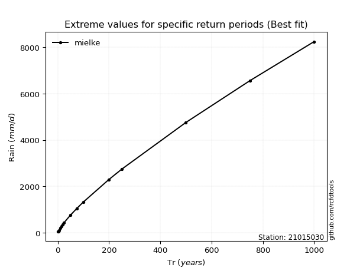</img>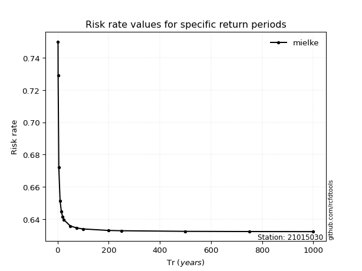</img>

</div>


<sub>**APP DISCLAIMER**: NO WARRANTY - This software is provided by [github.com/rcfdtools](https://github.com/rcfdtools) "as is", without any express or implied warranty, including warranties of merchantability, fitness for a particular purpose, or non-infringement. There is no guarantee that the software will be error-free or operate without interruption. LIMITATION OF LIABILITY - Neither the authors nor copyright holders will be liable for claims or damages arising from the software or its use. You are responsible for determining if the software is appropriate for your use and assume all associated risks, including errors, legal compliance, and data loss. NO PROFESSIONAL ADVICE - The software provides general information and does not offer professional advice. It should not replace consultation with professional advisors.</sub>