<div align="center">


</div>

# PMP Station (Rain, Pmax24h): 21015040

Probable Maximum Precipitation (PMP) is the greatest amount of rainfall for a specific duration that is meteorologically possible for a given location, acting as a "worst-case" scenario for extreme storms, crucial for designing safety-critical infrastructure like bridges, river deviations, dams, spillways, and nuclear plants to prevent catastrophic failure. PMP is calculated by hydrologists using meteorological data to determine the upper limit of extreme rainfall, often leading to the Probable Maximum Flood (PMF) for flood control design, and is increasingly being studied for climate change impacts. Probable Maximum Precipitation (PMP) is the theoretical upper limit of rainfall, a deterministic estimate for extreme events, while probability distributions (like GEV, Gumbel) describe the likelihood and frequency of various precipitation amounts, including rare ones, showing how often events occur, with PMP representing the extreme end of these distributions, used for critical infrastructure design to ensure safety against the worst conceivable weather, unlike standard statistical forecasts which cover typical probabilities.

The most common probability distributions in hydrology, used for analyzing floods, rainfall, and streamflow, include the Normal, Log-Normal, Gumbel, Gamma (including Log-Pearson Type III), and Generalized Extreme Value (GEV) distributions, often chosen based on the data´s skewness and whether modeling extremes or general conditions, with Gumbel and GEV popular for extreme events like floods, while the Normal distribution serves as a baseline, though often requiring transformations for skewed hydrological data. These distributions help in designing water infrastructure, managing water resources, and forecasting hydrologic events.

> Hydrological data often isn´t perfectly normal (it´s skewed), so different distributions are needed for different applications, such as: **Flood Frequency Analysis**: Using Gumbel, GEV, or Log-Pearson Type III for predicting extreme flood magnitudes and their return periods, **Rainfall Analysis**: Normal for annual totals, but Log-Normal, Weibull, or GEV for intensity or extreme daily rainfall, **Streamflow Modeling**: Gamma and Log-Normal for maximum flows, GEV for minimum flows, and Kappa for daily flows.

<div align="center">

</img>

</div>


## A. General information


### 1. General running parameters

• app_version: _v20260103_. • runtime: _2026-01-05 16:20:51.132608_. • Python version: _3.14.0_. • SciPy version: _1.16.3_. • Pandas version: _2.3.3_. • NumPy version: _2.3.5_. • Stations dataset (station_dataset_file): _dataset/pmax24h_in/automatic_colombia_2003_2024.csv_. • Stations catalog (station_catalog_file): _dataset/CNE.xls_. • Minimum year to eval til year_max (date_min): _1900_. • Maximum year to eval since year_min (date_max): _2024_. • Creates, save and include plots into reports (create_plot): _True_. • Plot only fit distributions with Δo > Δ (plot_only_fit): _True_. • Plot only simple graphs avoiding multiple CDFs and multiple Extreme values plots (plot_only_simple): _True_. • Eval low extreme values, if False, evaluates high extreme values (low_extreme): _False_. • Eval every SciPy distribution as logarithmic (pdist_logarithmic_on): _True_. • Standard deviation normalized (ddof): _1.0_. • Return periods to eval in years (Tr): _[2, 2.33, 5, 10, 15, 20, 25, 50, 75, 100, 200, 250, 500, 750, 1000]_. • Minimum data sample per station, 0 means any (minimum_sample): _5_. • Z-Score maximum threshold to adjust a value, 0 means disable (zscore_max): _3.5_. • Z-Score minimum threshold to adjust a value, 0 means disable (zscore_min): _-2.5_. • Avoid zeros, e.g. rain = 0 (avoid_zeros): _True_. • Avoid null values (avoid_nans): _True_. 

[:file_folder:Dataset file](../../dataset/pmax24h_in/automatic_colombia_2003_2024.csv)

> Delta Degrees of Freedom (DDOF): is a parameter used in the formulas for calculating variance and standard deviation. When ddof=0, the divisor is $N$ (the total number of observations) and this is used when your data set is the entire population. When ddof=1, the divisor is $N-1$ and this is used when your data set is a sample drawn from a larger population. Using $N-1$ provides an unbiased estimate of the population variance (known as Bessel´s correction).


### 2. Station info and location

|   id |   CODIGO | NOMBRE                        | CATEGORIA               | TECNOLOGIA                | ESTADO   | FECHA_INSTALACION   |   FECHA_SUSPENSION |   ALTITUD |   LATITUD |   LONGITUD | DEPARTAMENTO   | MUNICIPIO    | AREA_OPERATIVA                    | ENTIDAD                                                     | AREA_HIDROGRAFICA   | ZONA_HIDROGRAFICA   | SUBZONA_HIDROGRAFICA            |   CORRIENTE | Catalogo   |   Version |
|-----:|---------:|:------------------------------|:------------------------|:--------------------------|:---------|:--------------------|-------------------:|----------:|----------:|-----------:|:---------------|:-------------|:----------------------------------|:------------------------------------------------------------|:--------------------|:--------------------|:--------------------------------|------------:|:-----------|----------:|
|    0 | 21015040 | LA PRIMAVERA - AUT [21015040] | Climatológica Principal | Automática con Telemetría | Activa   | 28/07/2005          |                nan |      1919 |   2.02158 |   -76.1143 | Huila          | Saladoblanco | Area Operativa 04 - Huila-Caquetá | INSTITUTO DE HIDROLOGIA METEOROLOGIA Y ESTUDIOS AMBIENTALES | Magdalena Cauca     | Alto Magdalena      | Ríos Directos al Magdalena (mi) |         nan | CNE_IDEAM  |  20251226 |

<div align="center">

Dynamic map: [:earth_americas:Google](http://maps.google.com/maps?q=2.021583333,-76.11433333) [:earth_americas:OSM](https://www.openstreetmap.org/#map=18/2.021583333/-76.11433333&layers=P) [:earth_americas:Bing](https://www.bing.com/maps?cp=2.021583333~-76.11433333&lvl=18) [:earth_americas:Apple](https://maps.apple.com/frame?center=2.021583333%2C-76.11433333&span=0.003%2C0.006)

</div>


<div align="center">

```geojson
{
  "type": "Feature",
  "geometry": {
    "type": "Point", 
    "coordinates": [-76.11433333, 2.021583333]
  }, 
  "properties": {
    "Name": "21015040"
  }
}
```

</div>


### 3. Discrete values table and plot

<div align="center">

|               |           0 |           1 |           2 |            3 |           4 |           5 |           6 |            7 |           8 |           9 |         10 |          11 |           12 |          13 |          14 |         15 |         16 |
|:--------------|------------:|------------:|------------:|-------------:|------------:|------------:|------------:|-------------:|------------:|------------:|-----------:|------------:|-------------:|------------:|------------:|-----------:|-----------:|
| Date          | 2006        | 2007        | 2008        | 2009         | 2010        | 2011        | 2012        | 2013         | 2014        | 2015        | 2016       | 2017        | 2018         | 2019        | 2020        | 2021       | 2024       |
| Value         |   21.6      |   12.8      |   36.9      |   47.9       |   46        |   39.5      |   39.4      |   46.1       |   34.7      |   61.6      |  129.6     |   32.4      |   46.3       |   41.7      |   25.7      |    0.2     |  172       |
| Value_initial |   21.6      |   12.8      |   36.9      |   47.9       |   46        |   39.5      |   39.4      |   46.1       |   34.7      |   61.6      |  129.6     |   32.4      |   46.3       |   41.7      |   25.7      |    0.2     |  172       |
| count         |   17        |   17        |   17        |   17         |   17        |   17        |   17        |   17         |   17        |   17        |   17       |   17        |   17         |   17        |   17        |   17       |   17       |
| mean          |   49.0824   |   49.0824   |   49.0824   |   49.0824    |   49.0824   |   49.0824   |   49.0824   |   49.0824    |   49.0824   |   49.0824   |   49.0824  |   49.0824   |   49.0824    |   49.0824   |   49.0824   |   49.0824  |   49.0824  |
| std           |   41.5764   |   41.5764   |   41.5764   |   41.5764    |   41.5764   |   41.5764   |   41.5764   |   41.5764    |   41.5764   |   41.5764   |   41.5764  |   41.5764   |   41.5764    |   41.5764   |   41.5764   |   41.5764  |   41.5764  |
| zscore        |   -0.661008 |   -0.872666 |   -0.293011 |   -0.0284381 |   -0.074137 |   -0.230476 |   -0.232881 |   -0.0717318 |   -0.345926 |    0.301075 |    1.93662 |   -0.401245 |   -0.0669214 |   -0.177561 |   -0.562394 |   -1.17572 |    2.95643 |


</div>


<div align="center">

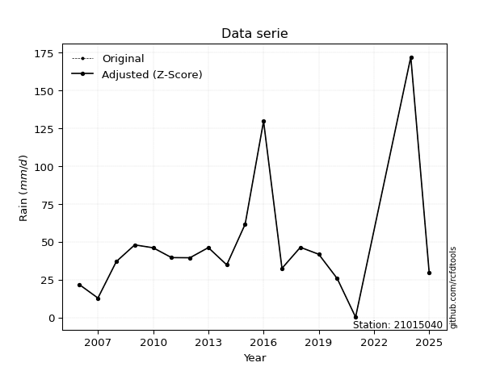</img>

</div>


> The initial value (value_initial) correspond to the initial obtained or null completed value, and value (value) is adjusted only when the initial value is outside the valid range (outlier) definite through the Z-Score value. If Z-Score is active, values out of range or outliers are replaced with the station mean value. A Z-Score (or standard score) measures how many standard deviations a data point is from the mean of a dataset, indicating its relative position; positive scores mean above the mean, negative mean below, and a score of zero is exactly at the mean, allowing for comparison of values from different distributions. It´s calculated using the formula $z=(x–μ)/σ$, where $x$ is the data point, $μ$ is the mean, and $σ$ is the standard deviation, helping identify outliers and understand probability.
>
> <sub>**Note**: In this study, "completing" (filling gaps in) and "extending" (forecasting or lengthening the historical record) rainfall data series are avoided for certain critical analyses because they introduce artificial bias and uncertainty, which can distort the statistics of rare events (extremes), alter day-to-day variability, and compromise the integrity and homogeneity of the original data. Some reasons against Completing/Extending rainfall data are: **Distortion of Extremes and Variability**: The primary issue is that most gap-filling or extension methods rely on averaging or regression with nearby stations, which inherently smooths the data. Rainfall is highly variable in space and time, with a large percentage of zero values and occasional large storms. Infilling methods often underestimate the highest values and overestimate the lowest (zero) values, which severely distorts analyses focused on flood frequency, drought severity, and intensity-duration-frequency (IDF) curves, **Loss of Data Homogeneity**: Infilled or extended data are synthetic estimates, not actual measurements. Combining these estimates with observed data can violate the assumption of data homogeneity, which requires that the data properties do not change over time. Inhomogeneity can lead to incorrect conclusions about long-term trends or changes in climate patterns, **Propagation of Errors**: Errors and biases from the original data (e.g., wind-induced undercatch, instrument errors, site changes) or the data used for imputation can propagate through the analysis, leading to unreliable hydrological models and inaccurate predictions, **Compromised Statistical Integrity**: For statistical analyses, especially those involving the frequency of events, using artificial data can introduce time bias or autocorrelation that doesn´t exist in reality, making it difficult to assess the true probability of events, **Difficulty in Validation**: It is difficult to accurately validate the quality of filled or extended data, especially for past periods where ground-truth measurements are unavailable. The reliability of imputation techniques heavily depends on the density of the surrounding station network and the complexity of the local topography.</sub>


### 4. Active continuous probability distributions from SciPy (44 of 104 available)

A Probability Density Function (PDF) describes the relative likelihood of a continuous random variable falling within a specific range, where the total area under its curve equals 1, and the area over any interval gives the actual probability for that range. Unlike discrete probabilities (like rolling a die), a PDF shows density, not direct probability for a single point (which is zero), with higher points indicating higher likelihood, often visualized as a bell curve for normal distributions.

A log of a probability density function (log-PDF) is simply the logarithm of the PDF´s value, denoted as $log(f(x))$, useful for converting multiplication of probabilities into addition, improving numerical stability with tiny numbers, and connecting to information theory concepts like entropy. Instead of dealing with very small probabilities (e.g., 0.000001), log-PDFs use negative numbers (e.g., $log(0.00001) ≈ -11.51$ that are easier for computers to handle, preventing underflow errors and simplifying complex calculations. In this study, each active probability distribution from SciPy is also evaluated in the $log$ form.

[scipy.stats](https://docs.scipy.org/doc/scipy/reference/stats.html) is a Python´s powerful submodule within the SciPy library for comprehensive statistical analysis, offering over 130 probability distributions (like Normal, Poisson), functions for descriptive stats (mean, variance), hypothesis testing (t-tests, chi-square), random variable generation, and statistical tests, making it essential for data science, modeling, and research. It provides tools to explore, model, and draw conclusions from data efficiently, working seamlessly with NumPy.

<div align="center">

|   id | p_dist             |   n_parameter | fit_method   | label                                                                       | active   | ref                                                                                                        |
|-----:|:-------------------|--------------:|:-------------|:----------------------------------------------------------------------------|:---------|:-----------------------------------------------------------------------------------------------------------|
|    0 | alpha              |             3 | MLE          | Alpha                                                                       | True     | [:mortar_board:](https://docs.scipy.org/doc/scipy/reference/generated/scipy.stats.alpha.html)              |
|    1 | betaprime          |             4 | MLE          | Beta prime                                                                  | True     | [:mortar_board:](https://docs.scipy.org/doc/scipy/reference/generated/scipy.stats.betaprime.html)          |
|    2 | chi2               |             3 | MLE          | Chi²                                                                        | True     | [:mortar_board:](https://docs.scipy.org/doc/scipy/reference/generated/scipy.stats.chi2.html)               |
|    3 | crystalball        |             4 | MLE          | Crystalball                                                                 | True     | [:mortar_board:](https://docs.scipy.org/doc/scipy/reference/generated/scipy.stats.crystalball.html)        |
|    4 | erlang             |             3 | MLE          | Erlang                                                                      | True     | [:mortar_board:](https://docs.scipy.org/doc/scipy/reference/generated/scipy.stats.erlang.html)             |
|    5 | expon              |             2 | MLE          | Exponential                                                                 | True     | [:mortar_board:](https://docs.scipy.org/doc/scipy/reference/generated/scipy.stats.expon.html)              |
|    6 | exponnorm          |             3 | MLE          | Exponentially modified Normal                                               | True     | [:mortar_board:](https://docs.scipy.org/doc/scipy/reference/generated/scipy.stats.exponnorm.html)          |
|    7 | f                  |             4 | MLE          | F                                                                           | True     | [:mortar_board:](https://docs.scipy.org/doc/scipy/reference/generated/scipy.stats.f.html)                  |
|    8 | fatiguelife        |             3 | MLE          | Fatigue-life (Birnbaum-Saunders)                                            | True     | [:mortar_board:](https://docs.scipy.org/doc/scipy/reference/generated/scipy.stats.fatiguelife.html)        |
|    9 | fisk               |             3 | MLE          | Fisk                                                                        | True     | [:mortar_board:](https://docs.scipy.org/doc/scipy/reference/generated/scipy.stats.fisk.html)               |
|   10 | gamma              |             3 | MLE          | Gamma                                                                       | True     | [:mortar_board:](https://docs.scipy.org/doc/scipy/reference/generated/scipy.stats.gamma.html)              |
|   11 | genexpon           |             5 | MLE          | Generalized exponential                                                     | True     | [:mortar_board:](https://docs.scipy.org/doc/scipy/reference/generated/scipy.stats.genexpon.html)           |
|   12 | genlogistic        |             3 | MLE          | Generalized logistic                                                        | True     | [:mortar_board:](https://docs.scipy.org/doc/scipy/reference/generated/scipy.stats.genlogistic.html)        |
|   13 | gibrat             |             2 | MM           | Gibrat                                                                      | True     | [:mortar_board:](https://docs.scipy.org/doc/scipy/reference/generated/scipy.stats.gibrat.html)             |
|   14 | gompertz           |             3 | MLE          | Gompertz (or truncated Gumbel)                                              | True     | [:mortar_board:](https://docs.scipy.org/doc/scipy/reference/generated/scipy.stats.gompertz.html)           |
|   15 | gumbel_l           |             2 | MM           | Gumbel Left Skew                                                            | True     | [:mortar_board:](https://docs.scipy.org/doc/scipy/reference/generated/scipy.stats.gumbel_l.html)           |
|   16 | gumbel_r           |             2 | MM           | Gumbel Right Skew                                                           | True     | [:mortar_board:](https://docs.scipy.org/doc/scipy/reference/generated/scipy.stats.gumbel_r.html)           |
|   17 | halflogistic       |             2 | MM           | Half-logistic                                                               | True     | [:mortar_board:](https://docs.scipy.org/doc/scipy/reference/generated/scipy.stats.halflogistic.html)       |
|   18 | halfnorm           |             2 | MM           | Half Normal                                                                 | True     | [:mortar_board:](https://docs.scipy.org/doc/scipy/reference/generated/scipy.stats.halfnorm.html)           |
|   19 | hypsecant          |             2 | MM           | hyperbolic secant                                                           | True     | [:mortar_board:](https://docs.scipy.org/doc/scipy/reference/generated/scipy.stats.hypsecant.html)          |
|   20 | invgamma           |             3 | MLE          | Inverted gamma                                                              | True     | [:mortar_board:](https://docs.scipy.org/doc/scipy/reference/generated/scipy.stats.invgamma.html)           |
|   21 | invgauss           |             3 | MLE          | Inverse Gaussian                                                            | True     | [:mortar_board:](https://docs.scipy.org/doc/scipy/reference/generated/scipy.stats.invgauss.html)           |
|   22 | invweibull         |             3 | MLE          | Inverted Weibull                                                            | True     | [:mortar_board:](https://docs.scipy.org/doc/scipy/reference/generated/scipy.stats.invweibull.html)         |
|   23 | johnsonsu          |             4 | MLE          | Johnson Su                                                                  | True     | [:mortar_board:](https://docs.scipy.org/doc/scipy/reference/generated/scipy.stats.johnsonsu.html)          |
|   24 | kstwobign          |             2 | MLE          | Limiting distribution of scaled Kolmogorov-Smirnov two-sided test statistic | True     | [:mortar_board:](https://docs.scipy.org/doc/scipy/reference/generated/scipy.stats.kstwobign.html)          |
|   25 | laplace            |             2 | MM           | Laplace                                                                     | True     | [:mortar_board:](https://docs.scipy.org/doc/scipy/reference/generated/scipy.stats.laplace.html)            |
|   26 | laplace_asymmetric |             3 | MLE          | Asymmetric Laplace                                                          | True     | [:mortar_board:](https://docs.scipy.org/doc/scipy/reference/generated/scipy.stats.laplace_asymmetric.html) |
|   27 | loggamma           |             3 | MLE          | Log gamma                                                                   | True     | [:mortar_board:](https://docs.scipy.org/doc/scipy/reference/generated/scipy.stats.loggamma.html)           |
|   28 | logistic           |             2 | MM           | Logistic (or Sech-squared)                                                  | True     | [:mortar_board:](https://docs.scipy.org/doc/scipy/reference/generated/scipy.stats.logistic.html)           |
|   29 | lognorm            |             3 | MLE          | Log Normal                                                                  | True     | [:mortar_board:](https://docs.scipy.org/doc/scipy/reference/generated/scipy.stats.lognorm.html)            |
|   30 | maxwell            |             2 | MM           | Maxwell                                                                     | True     | [:mortar_board:](https://docs.scipy.org/doc/scipy/reference/generated/scipy.stats.maxwell.html)            |
|   31 | mielke             |             4 | MLE          | Mielke Beta-Kappa / Dagum                                                   | True     | [:mortar_board:](https://docs.scipy.org/doc/scipy/reference/generated/scipy.stats.mielke.html)             |
|   32 | moyal              |             2 | MM           | Moyal                                                                       | True     | [:mortar_board:](https://docs.scipy.org/doc/scipy/reference/generated/scipy.stats.moyal.html)              |
|   33 | nakagami           |             3 | MLE          | Nakagami                                                                    | True     | [:mortar_board:](https://docs.scipy.org/doc/scipy/reference/generated/scipy.stats.nakagami.html)           |
|   34 | ncf                |             5 | MLE          | Non-central F distribution                                                  | True     | [:mortar_board:](https://docs.scipy.org/doc/scipy/reference/generated/scipy.stats.ncf.html)                |
|   35 | nct                |             4 | MLE          | Non-central Student’s t                                                     | True     | [:mortar_board:](https://docs.scipy.org/doc/scipy/reference/generated/scipy.stats.nct.html)                |
|   36 | norm               |             2 | MM           | Normal                                                                      | True     | [:mortar_board:](https://docs.scipy.org/doc/scipy/reference/generated/scipy.stats.norm.html)               |
|   37 | pearson3           |             3 | MM           | Pearson type III                                                            | True     | [:mortar_board:](https://docs.scipy.org/doc/scipy/reference/generated/scipy.stats.pearson3.html)           |
|   38 | rayleigh           |             2 | MM           | Rayleigh                                                                    | True     | [:mortar_board:](https://docs.scipy.org/doc/scipy/reference/generated/scipy.stats.rayleigh.html)           |
|   39 | rice               |             3 | MLE          | Rice                                                                        | True     | [:mortar_board:](https://docs.scipy.org/doc/scipy/reference/generated/scipy.stats.rice.html)               |
|   40 | t                  |             3 | MLE          | Student’s t                                                                 | True     | [:mortar_board:](https://docs.scipy.org/doc/scipy/reference/generated/scipy.stats.t.html)                  |
|   41 | truncnorm          |             4 | MLE          | Truncated normal                                                            | True     | [:mortar_board:](https://docs.scipy.org/doc/scipy/reference/generated/scipy.stats.truncnorm.html)          |
|   42 | wald               |             2 | MM           | Wald                                                                        | True     | [:mortar_board:](https://docs.scipy.org/doc/scipy/reference/generated/scipy.stats.wald.html)               |
|   43 | weibull_min        |             3 | MLE          | Weibull minimum                                                             | True     | [:mortar_board:](https://docs.scipy.org/doc/scipy/reference/generated/scipy.stats.weibull_min.html)        |

</div>

> **n_parameter:** # arguments & localization & scale.
>
> **Fit methods:** (MLE) maximum likelihood, (MM) L-moments.
>
>**Inactive** (With the only purpose of prevent loops, zero divisions, infinite values, over high estimated values or horizontal trending for recurrence intervals estimations, the follow distributions were disabled.)**:** foldnorm, gennorm, norminvgauss, powernorm, powerlognorm, skewnorm, genextreme, anglit, arcsine, argus, beta, bradford, burr, burr12, cauchy, cosine, halfcauchy, foldcauchy, skewcauchy, wrapcauchy, dgamma, gengamma, exponweib, exponpow, truncexpon, gausshyper, genhalflogistic, genhyperbolic, geninvgauss, halfgennorm, johnsonsb, kappa4, kappa3, ksone, kstwo, loglaplace, levy, levy_l, levy_stable, ncx2, pareto, genpareto, truncpareto, lomax, powerlaw, rdist, rel_breitwigner, recipinvgauss, semicircular, studentized_range, trapezoid, triang, truncweibull_min, tukeylambda, uniform, loguniform, vonmises, vonmises_line, weibull_max, dweibull, 


## B. Probability (PDF) vs. Empirical (EDF) distributions functions

A continuous probability distribution (CPD) describes probabilities for variables that can take any value within a range (like rain any time), unlike discrete variables with specific outcomes (like temperature). It uses a Probability Density Function (PDF), a curve where the total area under it equals 1, and the probability of the variable falling within an interval (a to b) is found by calculating the area under the curve between those points. A key feature is that the probability of hitting any single exact value is zero, so probabilities are always expressed for ranges, e.g., $P(a ≤ X ≤ b)$.

<div align="center">

Distributions parameters from station values
|    |   station | p_dist                |   n |              loc |           scale | shape                  | shape1                 | shape2                | shape3   |
|---:|----------:|:----------------------|----:|-----------------:|----------------:|:-----------------------|:-----------------------|:----------------------|:---------|
|  0 |  21015040 | alpha                 |  17 |      0.00126356  |     0.819537    | 1.6579039498472604e-08 |                        |                       |          |
|  1 |  21015040 | betaprime             |  17 |    -16.3743      |    46.7962      | 8.546033601681373      | 7.182260474697924      |                       |          |
|  2 |  21015040 | chi2                  |  17 |      0.2         |     1.75281     | 1.402443584302294      |                        |                       |          |
|  3 |  21015040 | crystalball           |  17 |     49.0824      |    40.3351      | 75023.30429825658      | 5069.016128331948      |                       |          |
|  4 |  21015040 | erlang                |  17 |     -4.75477     |    24.4621      | 2.2008368212374236     |                        |                       |          |
|  5 |  21015040 | expon                 |  17 |      0.2         |    48.8824      |                        |                        |                       |          |
|  6 |  21015040 | exponnorm             |  17 |     17.9366      |    12.7961      | 2.4340008147832304     |                        |                       |          |
|  7 |  21015040 | f                     |  17 |    -19.3115      |    57.9694      | 22.781368505121634     | 13.841213066921256     |                       |          |
|  8 |  21015040 | fatiguelife           |  17 |    -19.5431      |    60.5652      | 0.5170299252843696     |                        |                       |          |
|  9 |  21015040 | fisk                  |  17 |    -15.4573      |    54.9287      | 3.664675885130615      |                        |                       |          |
| 10 |  21015040 | gamma                 |  17 |     -4.75473     |    24.4622      | 2.2008287085024225     |                        |                       |          |
| 11 |  21015040 | genexpon              |  17 |      0.199987    |     2.47309     | 0.050593041244585385   | 2.1072293169325463e-05 | 2.035614702456545     |          |
| 12 |  21015040 | genlogistic           |  17 |   -134.559       |    24.3449      | 989.6568648352531      |                        |                       |          |
| 13 |  21015040 | gibrat                |  17 |     18.3118      |    18.6633      |                        |                        |                       |          |
| 14 |  21015040 | gompertz              |  17 |     -0.179712    |   166.52        | 2.538339822400202      |                        |                       |          |
| 15 |  21015040 | gumbel_l              |  17 |     67.2353      |    31.4491      |                        |                        |                       |          |
| 16 |  21015040 | gumbel_r              |  17 |     30.9294      |    31.4491      |                        |                        |                       |          |
| 17 |  21015040 | halflogistic          |  17 |      1.27591     |    34.485       |                        |                        |                       |          |
| 18 |  21015040 | halfnorm              |  17 |     -4.30547     |    66.9117      |                        |                        |                       |          |
| 19 |  21015040 | hypsecant             |  17 |     49.0824      |    25.6781      |                        |                        |                       |          |
| 20 |  21015040 | invgamma              |  17 |    -31.9965      |   450.876       | 6.594979518704569      |                        |                       |          |
| 21 |  21015040 | invgauss              |  17 |    -20.2291      |   250.045       | 0.27719572933606135    |                        |                       |          |
| 22 |  21015040 | invweibull            |  17 |   -111.496       |   142.79        | 6.259976971481532      |                        |                       |          |
| 23 |  21015040 | johnsonsu             |  17 |     38.6675      |     6.44202     | -0.1529729893705507    | 0.5886219170577238     |                       |          |
| 24 |  21015040 | kstwobign             |  17 |    -61.7955      |   129.849       |                        |                        |                       |          |
| 25 |  21015040 | laplace               |  17 |     49.0824      |    28.5212      |                        |                        |                       |          |
| 26 |  21015040 | laplace_asymmetric    |  17 |     34.7         |    20.2413      | 0.7059530411933415     |                        |                       |          |
| 27 |  21015040 | loggamma              |  17 | -12592.5         |  1699.09        | 1703.5997059518174     |                        |                       |          |
| 28 |  21015040 | logistic              |  17 |     49.0824      |    22.2379      |                        |                        |                       |          |
| 29 |  21015040 | lognorm               |  17 |    -17.0379      |    57.3428      | 0.5201230435275982     |                        |                       |          |
| 30 |  21015040 | maxwell               |  17 |    -46.4948      |    59.8941      |                        |                        |                       |          |
| 31 |  21015040 | mielke                |  17 |    -13.5368      |    54.7211      | 3.3342233448732896     | 3.633278152128379      |                       |          |
| 32 |  21015040 | moyal                 |  17 |     26.0162      |    18.1572      |                        |                        |                       |          |
| 33 |  21015040 | nakagami              |  17 |     12.8         |    63.3622      | 0.2885818118505056     |                        |                       |          |
| 34 |  21015040 | ncf                   |  17 |     -0.077009    |     8.8268e-08  | 2.7027914707282478e-08 | 7.128754538552171      | 12.151884309700648    |          |
| 35 |  21015040 | nct                   |  17 |     -0.0564319   |    16.3425      | 3.2489913511281365     | 2.223650820308877      |                       |          |
| 36 |  21015040 | norm                  |  17 |     49.0824      |    40.3351      |                        |                        |                       |          |
| 37 |  21015040 | pearson3              |  17 |     49.0823      |    40.3351      | 1.9463358646819782     |                        |                       |          |
| 38 |  21015040 | rayleigh              |  17 |    -28.081       |    61.5674      |                        |                        |                       |          |
| 39 |  21015040 | rice                  |  17 |    -12.6646      |    52.1517      | 0.0007774003351619389  |                        |                       |          |
| 40 |  21015040 | t                     |  17 |     39.7118      |     9.0787      | 1.047446427649112      |                        |                       |          |
| 41 |  21015040 | truncnorm             |  17 |    -18.4481      |    70.1995      | 0.26564383144767406    | 234.05195788137746     |                       |          |
| 42 |  21015040 | wald                  |  17 |      8.74731     |    40.3351      |                        |                        |                       |          |
| 43 |  21015040 | weibull_min           |  17 |     12.8         |    33.1539      | 0.7942832217801372     |                        |                       |          |
| 44 |  21015040 | logalpha              |  17 |    -62.3228      |  2914.31        | 44.357316469984625     |                        |                       |          |
| 45 |  21015040 | logbetaprime          |  17 |     -5.90778     |     8.70818e+12 | 21.084046408661678     | 19492125073572.1       |                       |          |
| 46 |  21015040 | logchi2               |  17 |     -1.60944     |     1.55354     | 1.1711288685235146     |                        |                       |          |
| 47 |  21015040 | logcrystalball        |  17 |      3.78632     |     0.573171    | 1.5556142007377267     | 2.0118730767133695     |                       |          |
| 48 |  21015040 | logerlang             |  17 |     -1.60944     |     1.70101     | 0.0012825962296536503  |                        |                       |          |
| 49 |  21015040 | logexpon              |  17 |     -1.60944     |     5.0488      |                        |                        |                       |          |
| 50 |  21015040 | logexponnorm          |  17 |      3.43861     |     1.38798     | 0.0005466046458099312  |                        |                       |          |
| 51 |  21015040 | logf                  |  17 |     -1.60944     |     1.13557     | 1.1079930595494245     | 1.0882273321793288     |                       |          |
| 52 |  21015040 | logfatiguelife        |  17 |  -1037.03        |  1040.47        | 0.0013268538664061814  |                        |                       |          |
| 53 |  21015040 | logfisk               |  17 |     -2.04461e+08 |     2.04461e+08 | 377802611.574134       |                        |                       |          |
| 54 |  21015040 | loggamma              |  17 |     -1.60944     |     7.0355      | 0.7185540481876234     |                        |                       |          |
| 55 |  21015040 | loggenexpon           |  17 |     -1.95829     |     0.0762654   | 2.7859298815220457e-05 | 4.972042405951061      | 7.532026331806118e-05 |          |
| 56 |  21015040 | loggenlogistic        |  17 |      4.14513     |     0.308861    | 0.35713814100156066    |                        |                       |          |
| 57 |  21015040 | loggibrat             |  17 |      2.38053     |     0.642223    |                        |                        |                       |          |
| 58 |  21015040 | loggompertz           |  17 |     -1.6352      |     0.835959    | 0.0012603636291899385  |                        |                       |          |
| 59 |  21015040 | loggumbel_l           |  17 |      4.06403     |     1.0822      |                        |                        |                       |          |
| 60 |  21015040 | loggumbel_r           |  17 |      2.8147      |     1.0822      |                        |                        |                       |          |
| 61 |  21015040 | loghalflogistic       |  17 |      1.79431     |     1.18666     |                        |                        |                       |          |
| 62 |  21015040 | loghalfnorm           |  17 |      1.60226     |     2.30247     |                        |                        |                       |          |
| 63 |  21015040 | loghypsecant          |  17 |      3.43936     |     0.883615    |                        |                        |                       |          |
| 64 |  21015040 | loginvgamma           |  17 |    -40.8932      | 38419.6         | 867.2798554686194      |                        |                       |          |
| 65 |  21015040 | loginvgauss           |  17 |    -15.3756      |  2320.05        | 0.008081957915944581   |                        |                       |          |
| 66 |  21015040 | loginvweibull         |  17 |     -2.71916e+08 |     2.71916e+08 | 129164227.23731297     |                        |                       |          |
| 67 |  21015040 | logjohnsonsu          |  17 |      3.75306     |     0.128367    | 0.20111583476821027    | 0.517406410741592      |                       |          |
| 68 |  21015040 | logkstwobign          |  17 |     -5.66891     |    10.5456      |                        |                        |                       |          |
| 69 |  21015040 | loglaplace            |  17 |      3.43936     |     0.981449    |                        |                        |                       |          |
| 70 |  21015040 | loglaplace_asymmetric |  17 |      3.83081     |     0.617573    | 1.3658726800758885     |                        |                       |          |
| 71 |  21015040 | logloggamma           |  17 |      4.25823     |     0.677785    | 0.7042001104440139     |                        |                       |          |
| 72 |  21015040 | loglogistic           |  17 |      3.43936     |     0.765233    |                        |                        |                       |          |
| 73 |  21015040 | loglognorm            |  17 |  -1062.03        |  1065.46        | 0.001297836149132493   |                        |                       |          |
| 74 |  21015040 | logmaxwell            |  17 |      0.150431    |     2.06103     |                        |                        |                       |          |
| 75 |  21015040 | logmielke             |  17 |  -3486.25        |  3489.66        | 6714.317093029462      | 4971.278989521685      |                       |          |
| 76 |  21015040 | logmoyal              |  17 |      2.64563     |     0.62481     |                        |                        |                       |          |
| 77 |  21015040 | lognakagami           |  17 |  -2053.26        |  2056.7         | 547547.8095175822      |                        |                       |          |
| 78 |  21015040 | logncf                |  17 |     -1.60944     |     1.05908     | 1.0735341432407104     | 1.1172775376394553     | 1.096241853584174     |          |
| 79 |  21015040 | lognct                |  17 |    -88.2214      |     1.34857     | 32039.60012342598      | 67.96721380639788      |                       |          |
| 80 |  21015040 | lognorm               |  17 |      3.43936     |     1.38798     |                        |                        |                       |          |
| 81 |  21015040 | logpearson3           |  17 |      3.43936     |     1.38799     | -2.6606076505540135    |                        |                       |          |
| 82 |  21015040 | lograyleigh           |  17 |      0.784102    |     2.1186      |                        |                        |                       |          |
| 83 |  21015040 | logrice               |  17 |  -1201.02        |     1.38878     | 867.281118086577       |                        |                       |          |
| 84 |  21015040 | logt                  |  17 |      3.7119      |     0.209477    | 0.8988736197231848     |                        |                       |          |
| 85 |  21015040 | logtruncnorm          |  17 |      2.47906     |     6.90737     | -0.5919048209130158    | 0.3863166471082614     |                       |          |
| 86 |  21015040 | logwald               |  17 |      2.05137     |     1.38799     |                        |                        |                       |          |
| 87 |  21015040 | logweibull_min        |  17 |     -1.60944     |     1.65954     | 0.5936581992144232     |                        |                       |          |

</div>

> **loc** (Location parameter): This shifts the distribution along the x-axis. For many common distributions, like the normal (Gaussian) distribution, loc represents the mean $μ$. For others, like the uniform distribution, it might represent the minimum value, or for the beta distribution, the left end of the support interval.
>
> **scale** (Scale parameter): This determines the width or spread of the distribution. For the normal distribution, scale represents the standard deviation $σ$. For a uniform distribution, it defines the length of the interval (from $loc$ to $loc + scale$).
>
> **shape** (Shape parameters): Refers to parameters that define the specific form of a probability distribution, distinct from its location (loc) and scale (scale). These parameters are required arguments for most distribution functions. For example, a normal (Gaussian) distribution is fully defined by its location (mean) and scale (standard deviation), so it has no specific shape parameters beyond loc and scale. However, other distributions have intrinsic properties that need specification, as Gamma distribution that takes a shape parameter, often named $a$ or $alpha$.


### 0. Cumulative distribution values - CDF (88 evaluated)

Cumulative Distribution Function (CDF), denoted as $F$<sub>$X$</sub>$(x)$, is a function that gives the probability that a random variable $X$ will take a value less than or equal to a specific value, $x$ (i.e., $(P(X≥x)$. It essentially "accumulates" probabilities from a given point up to the far right (positive infinity), providing a complete picture of the distribution´s probabilities for both discrete (like rain) and continuous (like temperature) variables, helping to find probabilities over ranges or above certain values. Each station is evaluated separately ordering the $x$ values ascending, calculating the CDF and PDF values for the activated distributions and their logarithmic forms.

<div align="center">

CDF ordered by x ascending and calculating $log(f(x))$ separately
|   id |   Station |   date |     x |   count |    mean |     std |     zscore |   Value_initial |   station |   m |       alpha |   alpha_pdf |   betaprime |   betaprime_pdf |        chi2 |        chi2_pdf |   crystalball |   crystalball_pdf |    erlang |   erlang_pdf |    expon |   expon_pdf |   exponnorm |   exponnorm_pdf |         f |       f_pdf |   fatiguelife |   fatiguelife_pdf |       fisk |    fisk_pdf |     gamma |   gamma_pdf |    genexpon |   genexpon_pdf |   genlogistic |   genlogistic_pdf |    gibrat |   gibrat_pdf |   gompertz |   gompertz_pdf |   gumbel_l |   gumbel_l_pdf |   gumbel_r |   gumbel_r_pdf |   halflogistic |   halflogistic_pdf |   halfnorm |   halfnorm_pdf |   hypsecant |   hypsecant_pdf |   invgamma |   invgamma_pdf |   invgauss |   invgauss_pdf |   invweibull |   invweibull_pdf |   johnsonsu |   johnsonsu_pdf |   kstwobign |   kstwobign_pdf |   laplace |   laplace_pdf |   laplace_asymmetric |   laplace_asymmetric_pdf |    loggamma |   loggamma_pdf |   logistic |   logistic_pdf |     lognorm |   lognorm_pdf |   maxwell |   maxwell_pdf |    mielke |   mielke_pdf |     moyal |   moyal_pdf |    nakagami |    nakagami_pdf |        ncf |     ncf_pdf |       nct |     nct_pdf |     norm |    norm_pdf |   pearson3 |   pearson3_pdf |   rayleigh |   rayleigh_pdf |      rice |    rice_pdf |         t |       t_pdf |   truncnorm |   truncnorm_pdf |       wald |    wald_pdf |   weibull_min |   weibull_min_pdf |   logalpha |   logalpha_pdf |   logbetaprime |   logbetaprime_pdf |    logchi2 |   logchi2_pdf |   logcrystalball |   logcrystalball_pdf |   logerlang |   logerlang_pdf |   logexpon |   logexpon_pdf |   logexponnorm |   logexponnorm_pdf |        logf |    logf_pdf |   logfatiguelife |   logfatiguelife_pdf |     logfisk |   logfisk_pdf |   loggenexpon |   loggenexpon_pdf |   loggenlogistic |   loggenlogistic_pdf |   loggibrat |   loggibrat_pdf |   loggompertz |   loggompertz_pdf |   loggumbel_l |   loggumbel_l_pdf |   loggumbel_r |   loggumbel_r_pdf |   loghalflogistic |   loghalflogistic_pdf |   loghalfnorm |   loghalfnorm_pdf |   loghypsecant |   loghypsecant_pdf |   loginvgamma |   loginvgamma_pdf |   loginvgauss |   loginvgauss_pdf |   loginvweibull |   loginvweibull_pdf |   logjohnsonsu |   logjohnsonsu_pdf |   logkstwobign |   logkstwobign_pdf |   loglaplace |   loglaplace_pdf |   loglaplace_asymmetric |   loglaplace_asymmetric_pdf |   logloggamma |   logloggamma_pdf |   loglogistic |   loglogistic_pdf |   loglognorm |   loglognorm_pdf |   logmaxwell |   logmaxwell_pdf |   logmielke |   logmielke_pdf |     logmoyal |   logmoyal_pdf |   lognakagami |   lognakagami_pdf |      logncf |   logncf_pdf |      lognct |   lognct_pdf |   logpearson3 |   logpearson3_pdf |   lograyleigh |   lograyleigh_pdf |     logrice |   logrice_pdf |      logt |   logt_pdf |   logtruncnorm |   logtruncnorm_pdf |   logwald |   logwald_pdf |   logweibull_min |   logweibull_min_pdf |
|-----:|----------:|-------:|------:|--------:|--------:|--------:|-----------:|----------------:|----------:|----:|------------:|------------:|------------:|----------------:|------------:|----------------:|--------------:|------------------:|----------:|-------------:|---------:|------------:|------------:|----------------:|----------:|------------:|--------------:|------------------:|-----------:|------------:|----------:|------------:|------------:|---------------:|--------------:|------------------:|----------:|-------------:|-----------:|---------------:|-----------:|---------------:|-----------:|---------------:|---------------:|-------------------:|-----------:|---------------:|------------:|----------------:|-----------:|---------------:|-----------:|---------------:|-------------:|-----------------:|------------:|----------------:|------------:|----------------:|----------:|--------------:|---------------------:|-------------------------:|------------:|---------------:|-----------:|---------------:|------------:|--------------:|----------:|--------------:|----------:|-------------:|----------:|------------:|------------:|----------------:|-----------:|------------:|----------:|------------:|---------:|------------:|-----------:|---------------:|-----------:|---------------:|----------:|------------:|----------:|------------:|------------:|----------------:|-----------:|------------:|--------------:|------------------:|-----------:|---------------:|---------------:|-------------------:|-----------:|--------------:|-----------------:|---------------------:|------------:|----------------:|-----------:|---------------:|---------------:|-------------------:|------------:|------------:|-----------------:|---------------------:|------------:|--------------:|--------------:|------------------:|-----------------:|---------------------:|------------:|----------------:|--------------:|------------------:|--------------:|------------------:|--------------:|------------------:|------------------:|----------------------:|--------------:|------------------:|---------------:|-------------------:|--------------:|------------------:|--------------:|------------------:|----------------:|--------------------:|---------------:|-------------------:|---------------:|-------------------:|-------------:|-----------------:|------------------------:|----------------------------:|--------------:|------------------:|--------------:|------------------:|-------------:|-----------------:|-------------:|-----------------:|------------:|----------------:|-------------:|---------------:|--------------:|------------------:|------------:|-------------:|------------:|-------------:|--------------:|------------------:|--------------:|------------------:|------------:|--------------:|----------:|-----------:|---------------:|-------------------:|----------:|--------------:|-----------------:|---------------------:|
|    0 |  21015040 |   2021 |   0.2 |      17 | 49.0824 | 41.5764 | -1.17572   |             0.2 |  21015040 |   1 | 3.72773e-05 | 0.00335984  |  0.00956296 |     0.00285606  | 1.12102e-12 | 28321.7         |      0.112774 |       0.00474569  | 0.0106874 |  0.00445137  | 0        | 0.0204573   |   0.0133007 |     0.00223335  | 0.0103504 | 0.00292879  |     0.0112068 |        0.00334825 | 0.00995637 | 0.00230714  | 0.0106874 | 0.00445139  | 2.74362e-07 |    0.0204574   |     0.0203216 |       0.0032458   | 0         |  0           | 0.00577798 |    0.01519     |   0.111885 |    0.00335075  |  0.0701737 |    0.00592818  |       0        |        0           |  0.0536847 |    0.0118974   |   0.0941775 |     0.00361434  | 0.00986675 |    0.00273129  |  0.0108222 |    0.00325529  |   0.00953524 |      0.00248645  |   0.052949  |     0.00162906  |   0.0234268 |     0.00371238  | 0.0900813 |   0.0031584   |            0.029743  |              0.00208147  | 1.52445e-12 |   4933.24      |  0.0999162 |    0.00404413  | 0.000137637 |   0.000384884 |  0.105358 |    0.00597504 | 0.0099071 |  0.00238892  | 0.0417664 | 0.00563128  | 0           |     0           | 0.00292264 | 0.00237778  | 0.013585  | 0.0019827   | 0.112774 | 0.00474569  |   0        |    0           |   0.100127 |    0.00671388  | 0.0299666 | 0.00458824  | 0.0675919 | 0.00172832  | 1.04368e-14 |     0.0138795   | 0          | 0           |   0           |       0           | 0.00013428 |    0.000412696 |    0.000934438 |          0.0026443 | 3.9371e-10 |   1.03827e+06 |        0.0192234 |           0.00370832 |    0.954878 |     5.51566e+12 |   0        |      0.198067  |    0.000137634 |        0.000384877 | 1.31367e-09 | 3.27758e+06 |      0.000121052 |          0.000344736 | 6.00317e-05 |    0.00011092 |    0.00403664 |         0.0227305 |       0.00128879 |           0.00149024 |   0         |       0         |   3.94516e-05 |        0.00155482 |    0.00527298 |        0.00485958 |   1.27318e-26 |       7.01477e-25 |          0        |             0         |      0        |          0        |      0.0021009 |          0.0023776 |   0.000146228 |       0.000441336 |   0.000325215 |       0.000976014 |     0.000616728 |          0.00216526 |      0.0183669 |          0.0043441 |     0.00157743 |         0.00608171 |   0.00291648 |        0.0029716 |              0.00102957 |                  0.00122056 |    0.00247505 |        0.00257125 |     0.0013616 |         0.0017769 |  0.000130116 |      0.000368245 |     0        |         0        | 6.26274e-05 |     0.000120579 | 2.90496e-199 |   2.11087e-196 |   0.000138983 |       0.000388238 | 1.46457e-09 |  3.54044e+06 | 0.000143037 |  0.000399439 |     0.0125931 |        0.00755006 |      0        |          0        | 0.000138766 |    0.00038762 | 0.0170976 | 0.00288548 |    9.61723e-07 |           0.129817 |  0        |     0         |      3.77171e-10 |           1.0084e+06 |
|    1 |  21015040 |   2007 |  12.8 |      17 | 49.0824 | 41.5764 | -0.872666  |            12.8 |  21015040 |   2 | 0.948944    | 0.00398368  |  0.101613   |     0.0117513   | 0.986455    |     0.00412695  |      0.184187 |       0.0065997   | 0.12291   |  0.0121479   | 0.227221 | 0.015809    |   0.0767505 |     0.00858243  | 0.102237  | 0.0116751   |     0.108731  |        0.0117043  | 0.080479   | 0.00959731  | 0.122911  | 0.012148    | 0.227297    |    0.0158141   |     0.0979014 |       0.00933402  | 0         |  0           | 0.185981   |    0.0134144   |   0.162325 |    0.00471788  |  0.168682  |    0.00954589  |       0.16555  |        0.0141017   |  0.201773  |    0.0115411   |   0.152009  |     0.00569735  | 0.0979643  |    0.0114188   |  0.107889  |    0.0117791   |   0.0922732  |      0.0110743   |   0.0825433 |     0.00336111  |   0.103833  |     0.00901482  | 0.140119  |   0.00491279  |            0.0718344 |              0.0050271   | 0.595831    |      0.0718736 |  0.163617  |    0.00615376  | 0.260709    |   0.234024    |  0.19393  |    0.0079983  | 0.0820447 |  0.00970584  | 0.150155  | 0.0112273   | 2.17253e-10 | 70588.7         | 0.11001    | 0.0136965   | 0.0761454 | 0.00907931  | 0.184187 | 0.0065997   |   0.107204 |    0.0205433   |   0.197842 |    0.00865125  | 0.112377  | 0.00831052  | 0.0989716 | 0.00357244  | 0.169876    |     0.0130218   | 0.00418152 | 0.00553886  |   1.19183e-13 |      53.2916      | 0.285501   |    0.2353      |    0.33991     |          0.191712  | 0.873978   |   0.0491002   |        0.0945558 |           0.0880592  |    0.999966 |     2.67981e-05 |   0.561211 |      0.0869095 |    0.260707    |        0.234023    | 0.702756    | 0.032884    |      0.258055    |          0.234244    | 0.115496    |    0.188765   |    0.480469   |         0.150641  |       0.157688   |           0.181302   |   0.0908511 |       0.96811   |   0.17046     |        0.186699   |    0.218634   |        0.178129   |   0.278662    |       0.329016    |          0.307858 |             0.381416  |      0.319203 |          0.318418 |      0.222949  |          0.232185  |   0.278252    |       0.228982    |   0.324025    |       0.223356    |     0.358779    |          0.174695   |      0.0939118 |          0.0716363 |     0.421868   |         0.157215   |   0.201919   |        0.205736  |              0.142523   |                  0.168961   |    0.180256   |        0.178602   |     0.238134  |         0.237086  |  0.262388    |      0.235872    |     0.283851 |         0.266407 | 0.133555    |     0.199138    | 0.280138     |   0.384862     |   0.260765    |       0.233789    | 0.597797    |  0.0406924   | 0.262179    |  0.233594    |     0.172469  |        0.118289   |      0.293309 |          0.277947 | 0.260834    |    0.233947   | 0.0665678 | 0.0505138  |    0.608197    |           0.154663 |  0.228343 |     0.754064  |      0.821879    |           0.043867   |
|    2 |  21015040 |   2006 |  21.6 |      17 | 49.0824 | 41.5764 | -0.661008  |            21.6 |  21015040 |   3 | 0.969733    | 0.00140068  |  0.223396   |     0.0153237   | 0.999038    |     0.000286223 |      0.247825 |       0.00784186  | 0.23886   |  0.0138094   | 0.354536 | 0.0132044   |   0.176954  |     0.0139896   | 0.223329  | 0.0152536   |     0.225868  |        0.0143944  | 0.191188   | 0.0152922   | 0.238861  | 0.0138094   | 0.354649    |    0.0132077   |     0.198008  |       0.0131609   | 0.0412638 |  0.0268767   | 0.298608   |    0.0121856   |   0.208889 |    0.0058943   |  0.26045   |    0.0111416   |       0.286436 |        0.0133095   |  0.301361  |    0.0110634   |   0.210308  |     0.00760718  | 0.217985   |    0.0152662   |  0.226254  |    0.0145756   |   0.211626   |      0.0154572   |   0.124165  |     0.00661104  |   0.196089  |     0.0117138   | 0.190763  |   0.00668846  |            0.132981  |              0.00930622  | 0.631472    |      0.0645334 |  0.225162  |    0.00784535  | 0.395822    |   0.27757     |  0.269106 |    0.00902265 | 0.193135  |  0.0152729   | 0.258766  | 0.0131141   | 0.248303    |     0.0162152   | 0.243641   | 0.0158721   | 0.186001  | 0.0155528   | 0.247825 | 0.00784186  |   0.274329 |    0.0173563   |   0.277886 |    0.00946441  | 0.194133  | 0.0101525   | 0.143465  | 0.00710042  | 0.281042    |     0.0122187   | 0.185722   | 0.0265398   |   0.294395    |       0.0222078   | 0.417955   |    0.266094    |    0.442589    |          0.198432  | 0.897056   |   0.0395018   |        0.181944  |           0.293582   |    0.999977 |     1.75029e-05 |   0.604409 |      0.0783534 |    0.39582     |        0.27757     | 0.71866     | 0.0281138   |      0.393538    |          0.278721    | 0.255606    |    0.351584   |    0.557503   |         0.143142  |       0.286222   |           0.320995   |   0.529848  |       0.574755  |   0.295709    |        0.29641    |    0.329749   |        0.247799   |   0.454803    |       0.331116    |          0.491964 |             0.319372  |      0.476937 |          0.282606 |      0.371547  |          0.3313    |   0.407544    |       0.260661    |   0.445891    |       0.238578    |     0.449569    |          0.170728   |      0.152689  |          0.17631   |     0.502137   |         0.148826   |   0.344126   |        0.35063   |              0.265022   |                  0.314183   |    0.298992   |        0.280128   |     0.38245   |         0.308641  |  0.398442    |      0.279198    |     0.429735 |         0.284829 | 0.2706      |     0.322875    | 0.477381     |   0.352464     |   0.395721    |       0.277218    | 0.617628    |  0.0353178   | 0.396825    |  0.276242    |     0.249139  |        0.180148   |      0.442035 |          0.284498 | 0.395887    |    0.277423   | 0.111831  | 0.148074   |    0.689015    |           0.154101 |  0.537973 |     0.434276  |      0.842927    |           0.0368648  |
|    3 |  21015040 |   2020 |  25.7 |      17 | 49.0824 | 41.5764 | -0.562394  |            25.7 |  21015040 |   4 | 0.97456     | 0.00098961  |  0.287436   |     0.0158028   | 0.999715    |     8.43391e-05 |      0.281058 |       0.00836091  | 0.295768  |  0.0138928   | 0.406466 | 0.0121421   |   0.238133  |     0.0157274   | 0.287112  | 0.0157478   |     0.285654  |        0.0146841  | 0.257739   | 0.0170343   | 0.295769  | 0.0138928   | 0.406591    |    0.0121447   |     0.254459  |       0.0142952   | 0.177049  |  0.035148    | 0.347408   |    0.0116204   |   0.234285 |    0.0064995   |  0.307     |    0.0115278   |       0.340029 |        0.0128227   |  0.34616   |    0.0107838   |   0.243491  |     0.00858434  | 0.282029   |    0.0158567   |  0.286796  |    0.0148678   |   0.276842   |      0.0162231   |   0.157177  |     0.00977633  |   0.245749  |     0.0124547   | 0.220255  |   0.00772249  |            0.177173  |              0.0123989   | 0.642494    |      0.0623162 |  0.258944  |    0.00862906  | 0.444741    |   0.284665    |  0.306823 |    0.00936053 | 0.25953   |  0.0169826   | 0.313097  | 0.0133254   | 0.309195    |     0.0137059   | 0.308287   | 0.0155656   | 0.25384   | 0.0173578   | 0.281058 | 0.00836091  |   0.3424   |    0.0158615   |   0.317182 |    0.00968794  | 0.237063  | 0.0107617   | 0.178953  | 0.0105037   | 0.330286    |     0.0117981   | 0.290783   | 0.0243371   |   0.376549    |       0.0181374   | 0.464539   |    0.269355    |    0.477027    |          0.197629  | 0.903683   |   0.0367929   |        0.242909  |           0.408999   |    0.99998  |     1.5238e-05  |   0.617795 |      0.0757021 |    0.444739    |        0.284665    | 0.723429    | 0.0267777   |      0.442678    |          0.286039    | 0.321303    |    0.402945   |    0.582099   |         0.139838  |       0.34713    |           0.380644   |   0.617494  |       0.440565  |   0.350705    |        0.336414   |    0.374876   |        0.271378   |   0.511199    |       0.316958    |          0.545447 |             0.295993  |      0.524843 |          0.26854  |      0.431065  |          0.351821  |   0.453243    |       0.26465     |   0.487379    |       0.238422    |     0.478971    |          0.16748    |      0.190537  |          0.269145  |     0.527688   |         0.145145   |   0.410793   |        0.418558  |              0.325658   |                  0.386068   |    0.351034   |        0.318932   |     0.43732   |         0.321564  |  0.447625    |      0.286064    |     0.479107 |         0.28268  | 0.329667    |     0.355398    | 0.5364       |   0.326086     |   0.444577    |       0.284299    | 0.623632    |  0.0337872   | 0.445492    |  0.283112    |     0.282921  |        0.209583   |      0.491068 |          0.279203 | 0.444779    |    0.284505   | 0.145429  | 0.25187    |    0.715766    |           0.153719 |  0.606362 |     0.355727  |      0.849159    |           0.0348816  |
|    4 |  21015040 |   2017 |  32.4 |      17 | 49.0824 | 41.5764 | -0.401245  |            32.4 |  21015040 |   5 | 0.979819    | 0.00062275  |  0.392551   |     0.0153642   | 0.99996     |     1.16339e-05 |      0.339586 |       0.00907992  | 0.387598  |  0.0134136   | 0.482489 | 0.0105869   |   0.348298  |     0.0167768   | 0.391937  | 0.0153313   |     0.383112  |        0.0142544  | 0.376357   | 0.0179731   | 0.387599  | 0.0134136   | 0.482628    |    0.0105885   |     0.353626  |       0.0150917   | 0.389271  |  0.0272195   | 0.422207   |    0.0107109   |   0.281312 |    0.00754878  |  0.385075  |    0.011685    |       0.422942 |        0.0119055   |  0.416696  |    0.0102587   |   0.306381  |     0.0101728   | 0.387908   |    0.0155218   |  0.385375  |    0.0143984   |   0.385626   |      0.0159858   |   0.254494  |     0.0210079   |   0.331397  |     0.0129777   | 0.278578  |   0.00976739  |            0.283158  |              0.0198159   | 0.656603    |      0.0595119 |  0.320783  |    0.00979774  | 0.511149    |   0.287315    |  0.370845 |    0.00970753 | 0.37779   |  0.0179278   | 0.401587  | 0.012964    | 0.392257    |     0.0113056   | 0.408344   | 0.0141754   | 0.37372   | 0.0179699   | 0.339586 | 0.00907992  |   0.440984 |    0.0136105   |   0.382767 |    0.0098484   | 0.311569  | 0.0114067   | 0.281682  | 0.021596    | 0.406893    |     0.0110603   | 0.436059   | 0.0190365   |   0.482472    |       0.0138145   | 0.526899   |    0.267913    |    0.52248     |          0.194373  | 0.911818   |   0.0334961   |        0.354863  |           0.551534   |    0.999983 |     1.2693e-05  |   0.634936 |      0.072307  |    0.511147    |        0.287315    | 0.729441    | 0.0251532   |      0.509429    |          0.288883    | 0.420745    |    0.450344   |    0.613935   |         0.134914  |       0.444758   |           0.461075   |   0.704011  |       0.314829  |   0.434577    |        0.38651    |    0.441193   |        0.300497   |   0.581765    |       0.291198    |          0.610357 |             0.264382  |      0.584773 |          0.24866  |      0.513971  |          0.359889  |   0.514653    |       0.26445     |   0.542219    |       0.234288    |     0.517158    |          0.161989   |      0.281738  |          0.575791  |     0.560697   |         0.139737   |   0.519378   |        0.489706  |              0.428585   |                  0.508088   |    0.430921   |        0.370217   |     0.512671  |         0.326488  |  0.514312    |      0.288305    |     0.543719 |         0.274093 | 0.415525    |     0.38221     | 0.607501     |   0.287431     |   0.510901    |       0.286956    | 0.631238    |  0.0319105   | 0.511516    |  0.285569    |     0.337025  |        0.260041   |      0.55448  |          0.26741  | 0.511149    |    0.287149   | 0.240454  | 0.651665   |    0.751305    |           0.153062 |  0.679023 |     0.275677  |      0.856955    |           0.0324583  |
|    5 |  21015040 |   2014 |  34.7 |      17 | 49.0824 | 41.5764 | -0.345926  |            34.7 |  21015040 |   6 | 0.981157    | 0.00054295  |  0.427448   |     0.014965    | 0.99998     |     5.91338e-06 |      0.360706 |       0.0092815   | 0.418125  |  0.013123    | 0.506275 | 0.0101003   |   0.386766  |     0.016636    | 0.426765  | 0.0149377   |     0.415533  |        0.013926   | 0.417506   | 0.0177687   | 0.418126  | 0.013123    | 0.506418    |    0.0101016   |     0.38835   |       0.015081    | 0.448285  |  0.0241384   | 0.446489   |    0.0104035   |   0.299101 |    0.00792052  |  0.411884  |    0.0116171   |       0.449934 |        0.0115638   |  0.440066  |    0.0100611   |   0.330365  |     0.0106771   | 0.423186   |    0.0151373   |  0.418104  |    0.0140493   |   0.421962   |      0.0155899   |   0.310024  |     0.0274486   |   0.361267  |     0.0129834   | 0.301974  |   0.0105877   |            0.332608  |              0.0232765   | 0.660657    |      0.058713  |  0.343722  |    0.0101438   | 0.530832    |   0.286568    |  0.393247 |    0.00976743 | 0.418848  |  0.0177358   | 0.431099  | 0.0126884   | 0.417564    |     0.0107137   | 0.440257   | 0.0135683   | 0.414687  | 0.0176141   | 0.360706 | 0.0092815   |   0.471465 |    0.0128998   |   0.405423 |    0.00984768  | 0.337954  | 0.0115293   | 0.337747  | 0.0272343   | 0.432028    |     0.0107951   | 0.47789    | 0.0173608   |   0.512945    |       0.0127077   | 0.545219   |    0.266241    |    0.535763    |          0.19296   | 0.914084   |   0.0325835   |        0.393837  |           0.583985   |    0.999984 |     1.20295e-05 |   0.639862 |      0.0713314 |    0.53083     |        0.286568    | 0.731151    | 0.0247034   |      0.52922     |          0.288169    | 0.451902    |    0.457675   |    0.623134   |         0.133354  |       0.477117   |           0.482218   |   0.724606  |       0.286318  |   0.461538    |        0.39955    |    0.462069   |        0.308196   |   0.601441    |       0.282561    |          0.62817  |             0.255087  |      0.601619 |          0.242591 |      0.538586  |          0.357593  |   0.532749    |       0.263194    |   0.558219    |       0.232252    |     0.528204    |          0.160146   |      0.327398  |          0.768661  |     0.570222   |         0.138045   |   0.551816   |        0.456655  |              0.464886   |                  0.551123   |    0.456801   |        0.384391   |     0.535022  |         0.325095  |  0.534058    |      0.287421    |     0.562394 |         0.270423 | 0.441872    |     0.385773    | 0.626816     |   0.275838     |   0.530559    |       0.286217    | 0.633409    |  0.0313877   | 0.531078    |  0.284792    |     0.355475  |        0.278311   |      0.572671 |          0.263021 | 0.53082     |    0.286404   | 0.293301  | 0.903037   |    0.761794    |           0.152834 |  0.697256 |     0.256316  |      0.859158    |           0.0317851  |
|    6 |  21015040 |   2008 |  36.9 |      17 | 49.0824 | 41.5764 | -0.293011  |            36.9 |  21015040 |   7 | 0.98228     | 0.000480152 |  0.459875   |     0.0145024   | 0.999989    |     3.09932e-06 |      0.381315 |       0.00944972  | 0.446649  |  0.0128019   | 0.528003 | 0.00965578  |   0.423032  |     0.0163037   | 0.459137  | 0.0144796   |     0.445769  |        0.0135524  | 0.456187   | 0.017364    | 0.44665   | 0.0128019   | 0.528148    |    0.0096569   |     0.421407  |       0.0149519   | 0.498392  |  0.0214619   | 0.469055   |    0.0101121   |   0.316919 |    0.00827848  |  0.437323  |    0.0115012   |       0.475006 |        0.0112276   |  0.461986  |    0.00986481  |   0.354351  |     0.011121    | 0.456      |    0.0146808   |  0.448588  |    0.0136544   |   0.455746   |      0.0151077   |   0.377326  |     0.0334777   |   0.389771  |     0.0129177   | 0.326188  |   0.0114367   |            0.381901  |              0.0215573   | 0.664244    |      0.0580084 |  0.36637   |    0.0104391   | 0.548412    |   0.285308    |  0.414773 |    0.00979677 | 0.457471  |  0.0173443   | 0.458674  | 0.0123725   | 0.440574    |     0.0102141   | 0.469442   | 0.0129612   | 0.452879  | 0.0170777   | 0.381315 | 0.00944972  |   0.499125 |    0.0122501   |   0.427064 |    0.00982178  | 0.363406  | 0.011601    | 0.403488  | 0.0323368   | 0.455494    |     0.0105368   | 0.51444    | 0.0158888   |   0.539852    |       0.0117715   | 0.561527   |    0.264278    |    0.547582    |          0.191531  | 0.916063   |   0.0317887   |        0.430481  |           0.607258   |    0.999985 |     1.1466e-05  |   0.64422  |      0.0704682 |    0.54841     |        0.285308    | 0.732657    | 0.0243113   |      0.546899    |          0.286928    | 0.48016     |    0.461223   |    0.631288   |         0.13192   |       0.507285   |           0.498873   |   0.741491  |       0.263425  |   0.486431    |        0.410157   |    0.481214   |        0.314599   |   0.618566    |       0.274559    |          0.643596 |             0.24682   |      0.616363 |          0.237098 |      0.560458  |          0.353758  |   0.548882    |       0.261617    |   0.572432    |       0.23013     |     0.537996    |          0.158421   |      0.38193   |          1.01944   |     0.578661   |         0.136498   |   0.579027   |        0.42893   |              0.50003    |                  0.592786   |    0.480802   |        0.39635    |     0.554939  |         0.322754  |  0.551686    |      0.286032    |     0.578906 |         0.266739 | 0.465638    |     0.387161    | 0.643455     |   0.265522     |   0.548118    |       0.284966    | 0.635324    |  0.0309309   | 0.548548    |  0.283516    |     0.373129  |        0.29636    |      0.58871  |          0.258781 | 0.54839     |    0.285146   | 0.357289  | 1.18321    |    0.771183    |           0.152618 |  0.712515 |     0.240366  |      0.861093    |           0.0311976  |
|    7 |  21015040 |   2012 |  39.4 |      17 | 49.0824 | 41.5764 | -0.232881  |            39.4 |  21015040 |   8 | 0.983404    | 0.000421163 |  0.495398   |     0.0139052   | 0.999995    |     1.48937e-06 |      0.405147 |       0.0096098   | 0.478155  |  0.0123961   | 0.551535 | 0.00917437  |   0.46312   |     0.015737    | 0.494609  | 0.0138866   |     0.479062  |        0.0130738  | 0.498808   | 0.0167009   | 0.478155  | 0.0123961   | 0.551683    |    0.00917523  |     0.458473  |       0.0146807   | 0.548612  |  0.0187771   | 0.493925   |    0.0097842   |   0.338124 |    0.00868518  |  0.465855  |    0.0113153   |       0.502588 |        0.0108367   |  0.486361  |    0.0096337   |   0.382723  |     0.0115643   | 0.49197    |    0.0140832   |  0.482105  |    0.0131511   |   0.492732   |      0.0144681   |   0.465659  |     0.0360846   |   0.421893  |     0.0127679   | 0.356071  |   0.0124844   |            0.433512  |              0.0197573   | 0.668022    |      0.0572688 |  0.392838  |    0.0107257   | 0.567054    |   0.283357    |  0.439273 |    0.00979761 | 0.500061  |  0.0166955   | 0.489105  | 0.0119646   | 0.465465    |     0.00970779  | 0.500968   | 0.0122582   | 0.494626  | 0.0162942   | 0.405147 | 0.0096098   |   0.528863 |    0.011547    |   0.451552 |    0.00976371  | 0.392456  | 0.0116301   | 0.488975  | 0.0353309   | 0.481464    |     0.0102386   | 0.552234   | 0.0143742   |   0.568077    |       0.0108274   | 0.57877    |    0.261714    |    0.560083    |          0.189842  | 0.918119   |   0.0309644   |        0.470917  |           0.625126   |    0.999985 |     1.08958e-05 |   0.64881  |      0.0695591 |    0.567053    |        0.283357    | 0.734237    | 0.0239045   |      0.565649    |          0.284988    | 0.510431    |    0.461749   |    0.639885   |         0.130356  |       0.540485   |           0.513373   |   0.758027  |       0.241457  |   0.513653    |        0.420102   |    0.502045   |        0.320824   |   0.636279    |       0.265822    |          0.65949  |             0.238094  |      0.631713 |          0.231195 |      0.583467  |          0.347922  |   0.565964    |       0.259477    |   0.587436    |       0.227572    |     0.548319    |          0.15651    |      0.459763  |          1.36108   |     0.587554   |         0.134821   |   0.606227   |        0.401216  |              0.54044    |                  0.640691   |    0.507175   |        0.408089   |     0.575985  |         0.319153  |  0.570371    |      0.283939    |     0.596252 |         0.262425 | 0.491015    |     0.386757    | 0.660504     |   0.254655     |   0.566738    |       0.283028    | 0.637336    |  0.0304558   | 0.567073    |  0.28156     |     0.393242  |        0.317656   |      0.605518 |          0.253967 | 0.567022    |    0.283198   | 0.443928  | 1.43722    |    0.78118     |           0.152375 |  0.727751 |     0.224683  |      0.863118    |           0.0305872  |
|    8 |  21015040 |   2011 |  39.5 |      17 | 49.0824 | 41.5764 | -0.230476  |            39.5 |  21015040 |   9 | 0.983446    | 0.000419033 |  0.496787   |     0.0138801   | 0.999995    |     1.44638e-06 |      0.406108 |       0.0096155   | 0.479394  |  0.0123791   | 0.552452 | 0.00915562  |   0.464692  |     0.0157109   | 0.495996  | 0.0138617   |     0.480368  |        0.0130537  | 0.500476   | 0.0166706   | 0.479394  | 0.0123791   | 0.5526      |    0.00915647  |     0.459941  |       0.0146674   | 0.550485  |  0.0186775   | 0.494902   |    0.00977117  |   0.338994 |    0.00870139  |  0.466986  |    0.0113068   |       0.503671 |        0.0108209   |  0.487323  |    0.00962429  |   0.38388   |     0.0115804   | 0.493377   |    0.0140579   |  0.483419  |    0.01313     |   0.494178   |      0.0144409   |   0.469266  |     0.0360443   |   0.42317   |     0.0127604   | 0.357321  |   0.0125283   |            0.435484  |              0.0196885   | 0.668168    |      0.0572404 |  0.393911  |    0.010736    | 0.567773    |   0.283269    |  0.440252 |    0.00979694 | 0.501729  |  0.0166657   | 0.490301  | 0.0119474   | 0.466435    |     0.00968869  | 0.502192   | 0.01223     | 0.496254  | 0.0162599   | 0.406108 | 0.0096155   |   0.530017 |    0.0115197   |   0.452528 |    0.00976077  | 0.393619  | 0.0116301   | 0.49251   | 0.0353528   | 0.482487    |     0.0102266   | 0.553669   | 0.014317    |   0.569157    |       0.010792    | 0.579434   |    0.261605    |    0.560564    |          0.189774  | 0.918198   |   0.030933    |        0.472502  |           0.625663   |    0.999985 |     1.08744e-05 |   0.648986 |      0.0695242 |    0.567771    |        0.28327     | 0.734298    | 0.023889    |      0.566371    |          0.284901    | 0.511601    |    0.461701   |    0.640215   |         0.130295  |       0.541786   |           0.513853   |   0.758638  |       0.240654  |   0.514718    |        0.420454   |    0.502858   |        0.321051   |   0.636953    |       0.265481    |          0.660093 |             0.237759  |      0.632298 |          0.230966 |      0.584348  |          0.347662  |   0.566622    |       0.259385    |   0.588013    |       0.227467    |     0.548716    |          0.156435   |      0.463229  |          1.37422   |     0.587896   |         0.134755   |   0.607242   |        0.400181  |              0.542066   |                  0.642619   |    0.50821    |        0.408518   |     0.576794  |         0.318991  |  0.571091    |      0.283846    |     0.596917 |         0.26225  | 0.491995    |     0.386703    | 0.661149     |   0.254238     |   0.567456    |       0.28294     | 0.637413    |  0.0304377   | 0.567786    |  0.281473    |     0.394048  |        0.318527   |      0.606162 |          0.253775 | 0.56774     |    0.28311    | 0.447579  | 1.44348    |    0.781566    |           0.152365 |  0.72832  |     0.224103  |      0.863196    |           0.030564   |
|    9 |  21015040 |   2019 |  41.7 |      17 | 49.0824 | 41.5764 | -0.177561  |            41.7 |  21015040 |  10 | 0.98432     | 0.000375992 |  0.526701   |     0.0133086   | 0.999997    |     7.59743e-07 |      0.427389 |       0.00972642  | 0.506207  |  0.0119932   | 0.572148 | 0.0087527   |   0.498583  |     0.0150828   | 0.525872  | 0.0132931   |     0.508588  |        0.0125963  | 0.536372   | 0.0159441   | 0.506208  | 0.0119932   | 0.572298    |    0.00875334  |     0.491853  |       0.0143308   | 0.589273  |  0.0166285   | 0.516085   |    0.0094859   |   0.358528 |    0.00905611  |  0.491639  |    0.0110995   |       0.527092 |        0.0104708   |  0.508267  |    0.00941425  |   0.409722  |     0.0119009   | 0.523676   |    0.0134807   |  0.511783  |    0.0126512   |   0.525272   |      0.0138194   |   0.545692  |     0.0327642   |   0.451041  |     0.0125685   | 0.385974  |   0.0135329   |            0.477179  |              0.0182343   | 0.671254    |      0.0566383 |  0.417761  |    0.0109379   | 0.583071    |   0.281173    |  0.461779 |    0.00976866 | 0.537626  |  0.0159498   | 0.516157  | 0.0115545   | 0.487302    |     0.00928766  | 0.528417   | 0.0116122   | 0.53116   | 0.0154607   | 0.427389 | 0.00972642  |   0.554709 |    0.0109325   |   0.473922 |    0.00968467  | 0.41919   | 0.0116095   | 0.569257  | 0.033787    | 0.504694    |     0.00996051  | 0.58383    | 0.0131223   |   0.592073    |       0.0100529   | 0.593547   |    0.259116    |    0.570809    |          0.18825   | 0.919856   |   0.0302698   |        0.506672  |           0.634282   |    0.999986 |     1.04266e-05 |   0.652734 |      0.0687818 |    0.583069    |        0.281173    | 0.735584    | 0.0235614   |      0.581758    |          0.282805    | 0.536576    |    0.459478   |    0.647241   |         0.128975  |       0.569886   |           0.522487   |   0.77123   |       0.224254  |   0.5377      |        0.427373   |    0.520386   |        0.325639   |   0.651143    |       0.258138    |          0.672786 |             0.23063   |      0.644684 |          0.226058 |      0.60303   |          0.34153   |   0.580624    |       0.257254    |   0.600279    |       0.225121    |     0.55715     |          0.154802   |      0.544051  |          1.57408   |     0.595162   |         0.133347   |   0.628344   |        0.378681  |              0.57804    |                  0.685266   |    0.530592   |        0.417202   |     0.593983  |         0.315155  |  0.586417    |      0.281629    |     0.611028 |         0.258391 | 0.512911    |     0.384865    | 0.674688     |   0.245397     |   0.582737    |       0.280856    | 0.639053    |  0.0300542   | 0.582987    |  0.279382    |     0.411834  |        0.338093   |      0.619804 |          0.249576 | 0.58303     |    0.281017   | 0.527596  | 1.47519    |    0.789819    |           0.152153 |  0.740138 |     0.212119  |      0.864839    |           0.0300719  |
|   10 |  21015040 |   2010 |  46   |      17 | 49.0824 | 41.5764 | -0.074137  |            46   |  21015040 |  11 | 0.985785    | 0.000308992 |  0.581407   |     0.0121265   | 0.999999    |     2.16355e-07 |      0.469543 |       0.00986187  | 0.556066  |  0.0111882   | 0.608176 | 0.00801565  |   0.560442  |     0.0136586   | 0.580521  | 0.012115    |     0.560727  |        0.0116449  | 0.601463   | 0.0142935   | 0.556067  | 0.0111882   | 0.608328    |    0.00801594  |     0.551715  |       0.0134738   | 0.653375  |  0.01333     | 0.55569    |    0.00893736  |   0.398928 |    0.00972905  |  0.538334  |    0.0106005   |       0.57063  |        0.00977788  |  0.54784   |    0.00898875  |   0.461882  |     0.0123074   | 0.579082   |    0.0122785   |  0.564072  |    0.0116607   |   0.581932   |      0.0125226   |   0.663274  |     0.0220148   |   0.504059  |     0.0120656   | 0.448781  |   0.015735    |            0.54999   |              0.0156949   | 0.676759    |      0.0555682 |  0.465403  |    0.0111882   | 0.610439    |   0.276342    |  0.503545 |    0.00964167 | 0.602773  |  0.0143124   | 0.564091  | 0.0107308   | 0.525707    |     0.00859209  | 0.575803   | 0.0104373   | 0.594014  | 0.0137542   | 0.469543 | 0.00986187  |   0.599384 |    0.00986348  |   0.515145 |    0.00947582  | 0.468834  | 0.0114569   | 0.694972  | 0.0240442   | 0.546394    |     0.00943352  | 0.635783   | 0.0111082   |   0.632526    |       0.00880121  | 0.618725   |    0.253832    |    0.589138    |          0.185224  | 0.92277    |   0.0291081   |        0.569136  |           0.635562   |    0.999987 |     9.66464e-06 |   0.659419 |      0.0674577 |    0.610437    |        0.276342    | 0.737868    | 0.0229867   |      0.609286    |          0.277958    | 0.58125     |    0.449752   |    0.65978    |         0.126528  |       0.621584   |           0.528912   |   0.791914  |       0.197948  |   0.580129    |        0.4365     |    0.552698   |        0.332529   |   0.675818    |       0.244692    |          0.694795 |             0.217948  |      0.666431 |          0.217127 |      0.635904  |          0.327898  |   0.605652    |       0.25263     |   0.622145    |       0.220394    |     0.572194    |          0.15174    |      0.688089  |          1.22865   |     0.608121   |         0.130756   |   0.66371    |        0.342646  |              0.64936    |                  0.769817   |    0.572202   |        0.430099   |     0.624503  |         0.306442  |  0.613819    |      0.276578    |     0.636021 |         0.250815 | 0.550395    |     0.378353    | 0.698001     |   0.229786     |   0.610075    |       0.27605     | 0.641969    |  0.0293799   | 0.610181    |  0.274581    |     0.446955  |        0.378901   |      0.643907 |          0.24154  | 0.610383    |    0.276194   | 0.657763  | 1.1222     |    0.804731    |           0.151747 |  0.759967 |     0.192369  |      0.867748    |           0.0292078  |
|   11 |  21015040 |   2013 |  46.1 |      17 | 49.0824 | 41.5764 | -0.0717318 |            46.1 |  21015040 |  12 | 0.985816    | 0.000307654 |  0.582618   |     0.0120984   | 0.999999    |     2.10133e-07 |      0.470529 |       0.00986371  | 0.557184  |  0.0111689   | 0.608977 | 0.00799926  |   0.561806  |     0.0136238   | 0.581731  | 0.0120871   |     0.56189   |        0.0116222  | 0.60289    | 0.014253    | 0.557185  | 0.0111689   | 0.609129    |    0.00799955  |     0.553062  |       0.0134514   | 0.654705  |  0.013263    | 0.556583   |    0.00892476  |   0.399902 |    0.00974423  |  0.539394  |    0.0105877   |       0.571607 |        0.0097617   |  0.548738  |    0.00897865  |   0.463113  |     0.012313    | 0.580309   |    0.01225     |  0.565237  |    0.0116372   |   0.583183   |      0.0124919   |   0.665465  |     0.0217906   |   0.505265  |     0.0120522   | 0.450358  |   0.0157903   |            0.551557  |              0.0156403   | 0.67688     |      0.0555448 |  0.466522  |    0.0111917   | 0.611039    |   0.27622     |  0.504509 |    0.00963764 | 0.604203  |  0.014272    | 0.565163  | 0.010711    | 0.526565    |     0.00857707  | 0.576845   | 0.0104107   | 0.595388  | 0.0137135   | 0.470529 | 0.00986371  |   0.600369 |    0.00983982  |   0.516092 |    0.00947007  | 0.46998   | 0.0114517   | 0.697364  | 0.0237988   | 0.547336    |     0.00942118  | 0.636892   | 0.0110659   |   0.633405    |       0.00877474  | 0.619276   |    0.253704    |    0.589541    |          0.185153  | 0.922833   |   0.029083    |        0.570515  |           0.635379   |    0.999987 |     9.64846e-06 |   0.659566 |      0.0674287 |    0.611037    |        0.276221    | 0.737918    | 0.0229743   |      0.609889    |          0.277836    | 0.582227    |    0.449457   |    0.660054   |         0.126473  |       0.622732   |           0.528904   |   0.792344  |       0.197411  |   0.581077    |        0.436648   |    0.55342    |        0.332659   |   0.676349    |       0.244394    |          0.695268 |             0.217671  |      0.666903 |          0.216929 |      0.636616  |          0.327564  |   0.606201    |       0.252517    |   0.622624    |       0.220283    |     0.572523    |          0.151671   |      0.690742  |          1.21502   |     0.608405   |         0.130698   |   0.664454   |        0.341889  |              0.651034   |                  0.7718     |    0.573136   |        0.430337   |     0.625168  |         0.306224  |  0.61442     |      0.276451    |     0.636565 |         0.25064  | 0.551216    |     0.378165    | 0.6985       |   0.229447     |   0.610674    |       0.275929    | 0.642033    |  0.0293652   | 0.610777    |  0.274461    |     0.447778  |        0.379896   |      0.644431 |          0.241356 | 0.610983    |    0.276073   | 0.660189  | 1.11202    |    0.805061    |           0.151738 |  0.760384 |     0.191958  |      0.867811    |           0.0291891  |
|   12 |  21015040 |   2018 |  46.3 |      17 | 49.0824 | 41.5764 | -0.0669214 |            46.3 |  21015040 |  13 | 0.985877    | 0.000305002 |  0.585032   |     0.0120424   | 0.999999    |     1.98223e-07 |      0.472502 |       0.0098672   | 0.559414  |  0.0111303   | 0.610574 | 0.0079666   |   0.564524  |     0.013554    | 0.584143  | 0.0120312   |     0.56421   |        0.0115768  | 0.605733   | 0.0141716   | 0.559415  | 0.0111303   | 0.610726    |    0.00796688  |     0.555747  |       0.0134062   | 0.657344  |  0.0131304   | 0.558366   |    0.00889956  |   0.401854 |    0.0097745   |  0.541509  |    0.0105618   |       0.573556 |        0.00972934  |  0.550532  |    0.00895842  |   0.465577  |     0.0123237   | 0.582753   |    0.0121928   |  0.567559  |    0.0115901   |   0.585675   |      0.0124303   |   0.669778  |     0.0213488   |   0.507672  |     0.0120252   | 0.453527  |   0.0159014   |            0.554674  |              0.0155316   | 0.67712     |      0.0554982 |  0.468761  |    0.0111982   | 0.612234    |   0.275976    |  0.506435 |    0.00962942 | 0.607049  |  0.014191    | 0.567301  | 0.0106715   | 0.528277    |     0.00854717  | 0.578922   | 0.0103577   | 0.598122  | 0.0136322   | 0.472502 | 0.0098672   |   0.602332 |    0.00979265  |   0.517985 |    0.00945846  | 0.472269  | 0.0114411   | 0.702075  | 0.0233115   | 0.549218    |     0.00939649  | 0.639097   | 0.010982    |   0.635155    |       0.0087221   | 0.620374   |    0.253448    |    0.590342    |          0.185012  | 0.922959   |   0.0290329   |        0.573265  |           0.634989   |    0.999987 |     9.6163e-06  |   0.659857 |      0.0673709 |    0.612232    |        0.275976    | 0.738017    | 0.0229495   |      0.611091    |          0.277591    | 0.584171    |    0.448859   |    0.660602   |         0.126364  |       0.625022   |           0.528867   |   0.793196  |       0.196345  |   0.582968    |        0.436934   |    0.554861   |        0.332915   |   0.677406    |       0.243798    |          0.696209 |             0.217119  |      0.667841 |          0.216534 |      0.638032  |          0.326893  |   0.607293    |       0.25229     |   0.623577    |       0.22006     |     0.573179    |          0.151533   |      0.695943  |          1.18785   |     0.608971   |         0.130582   |   0.66593    |        0.340384  |              0.654359   |                  0.764446   |    0.575      |        0.430805   |     0.626493  |         0.305789  |  0.615616    |      0.276197    |     0.63765  |         0.250289 | 0.552852    |     0.377784    | 0.699492     |   0.228772     |   0.611868    |       0.275686    | 0.64216     |  0.0293361   | 0.611965    |  0.274219    |     0.449427  |        0.381893   |      0.645475 |          0.240989 | 0.612177    |    0.275829   | 0.664959  | 1.09175    |    0.805718    |           0.151719 |  0.761213 |     0.191142  |      0.867937    |           0.0291518  |
|   13 |  21015040 |   2009 |  47.9 |      17 | 49.0824 | 41.5764 | -0.0284381 |            47.9 |  21015040 |  14 | 0.986349    | 0.000284969 |  0.603941   |     0.0115934   | 1           |     1.24311e-07 |      0.488307 |       0.00988646  | 0.576974  |  0.0108192   | 0.623114 | 0.00771006  |   0.585761  |     0.0129917   | 0.603034  | 0.0115833   |     0.582441  |        0.0112118  | 0.627883   | 0.0135144   | 0.576975  | 0.0108192   | 0.623266    |    0.00771022  |     0.576901  |       0.0130317   | 0.677535  |  0.0121249   | 0.572444   |    0.00869904  |   0.417684 |    0.0100125   |  0.558238  |    0.010348    |       0.588916 |        0.00947046  |  0.564735  |    0.00879535  |   0.485349  |     0.012383    | 0.601895   |    0.0117344   |  0.585801  |    0.0112121   |   0.605169   |      0.0119369   |   0.701295  |     0.0181437   |   0.526734  |     0.0117997   | 0.479696  |   0.0168189   |            0.578844  |              0.0146886   | 0.679       |      0.0551342 |  0.486711  |    0.0112341   | 0.621577    |   0.273974    |  0.521786 |    0.00955695 | 0.629232  |  0.0135359   | 0.584122  | 0.0103535   | 0.541765    |     0.00831435  | 0.595159   | 0.00993969  | 0.619413  | 0.0129815   | 0.488307 | 0.00988646  |   0.617703 |    0.00942285  |   0.533041 |    0.00936012  | 0.490501  | 0.0113455   | 0.736377  | 0.0196401   | 0.564094    |     0.00919863  | 0.656146   | 0.0103375   |   0.648782    |       0.00831613  | 0.628949   |    0.251375    |    0.596608    |          0.183881  | 0.923938   |   0.0286433   |        0.594771  |           0.630682   |    0.999987 |     9.36776e-06 |   0.662139 |      0.0669191 |    0.621575    |        0.273975    | 0.738793    | 0.0227564   |      0.620488    |          0.275578    | 0.599335    |    0.443717   |    0.66488    |         0.1255    |       0.642973   |           0.527601   |   0.799727  |       0.188226  |   0.597846    |        0.438822   |    0.566204   |        0.334778   |   0.685609    |       0.239125    |          0.703512 |             0.212812  |      0.675145 |          0.213435 |      0.649047  |          0.321461  |   0.615834    |       0.250448    |   0.631023    |       0.218275    |     0.578309    |          0.150442   |      0.732765  |          0.9835    |     0.613392   |         0.129673   |   0.677297   |        0.328803  |              0.679379   |                  0.709112   |    0.589695   |        0.434163   |     0.636822  |         0.302235  |  0.624965    |      0.274119    |     0.646105 |         0.247489 | 0.565633    |     0.374539    | 0.707174     |   0.223515     |   0.621201    |       0.273694    | 0.643153    |  0.029109    | 0.621248    |  0.272235    |     0.462675  |        0.398209   |      0.653613 |          0.238079 | 0.621515    |    0.273831   | 0.699394  | 0.937208   |    0.810869    |           0.151571 |  0.7676   |     0.184888  |      0.868923    |           0.0288612  |
|   14 |  21015040 |   2015 |  61.6 |      17 | 49.0824 | 41.5764 |  0.301075  |            61.6 |  21015040 |  15 | 0.989385    | 0.000172316 |  0.737382   |     0.00799733  | 1           |     2.31482e-09 |      0.621849 |       0.0094257   | 0.706804  |  0.00815782  | 0.715231 | 0.0058256   |   0.732236  |     0.00858678  | 0.736381  | 0.007993    |     0.714894  |        0.00818047 | 0.775658   | 0.00827567  | 0.706804  | 0.00815781  | 0.71538     |    0.00582502  |     0.730965  |       0.00940815  | 0.799916  |  0.00646902  | 0.680244   |    0.00706362  |   0.566537 |    0.0115219   |  0.685847  |    0.00822386  |       0.703725 |        0.0073187   |  0.675357  |    0.00734129  |   0.649367  |     0.0110562   | 0.736691   |    0.00805712  |  0.717681  |    0.00810803  |   0.741008   |      0.00803267  |   0.844635  |     0.0058975   |   0.672881  |     0.00944814  | 0.677624  |   0.011303    |            0.738825  |              0.00910896  | 0.692538    |      0.0525299 |  0.637123  |    0.0103966   | 0.688236    |   0.254805    |  0.646353 |    0.00851354 | 0.777241  |  0.00828217  | 0.707397  | 0.00768617  | 0.643755    |     0.00665937  | 0.709286   | 0.00688351  | 0.761682  | 0.00804306  | 0.621849 | 0.0094257   |   0.727564 |    0.0067564   |   0.653851 |    0.00818958  | 0.6372    | 0.00990631  | 0.879428  | 0.00516529  | 0.678483    |     0.00750493  | 0.767784   | 0.00635609  |   0.743186    |       0.00568228  | 0.689967   |    0.232902    |    0.64171     |          0.174414  | 0.930796   |   0.0259288   |        0.743773  |           0.537595   |    0.999989 |     7.72575e-06 |   0.678559 |      0.0636667 |    0.688234    |        0.254806    | 0.744345    | 0.0214069   |      0.687534    |          0.256258    | 0.704226    |    0.384882   |    0.695625   |         0.118887  |       0.76953    |           0.46252    |   0.840565  |       0.139501  |   0.70805     |        0.430415   |    0.651363   |        0.339462   |   0.741438    |       0.204963    |          0.753157 |             0.182342  |      0.725948 |          0.190529 |      0.724198  |          0.274514  |   0.676832    |       0.233666    |   0.684094    |       0.203167    |     0.615101    |          0.141991   |      0.868477  |          0.283381  |     0.645151   |         0.122806   |   0.750257   |        0.254464  |              0.816187   |                  0.406536   |    0.70022    |        0.437763   |     0.708955  |         0.269641  |  0.69159     |      0.254393    |     0.70556  |         0.224666 | 0.655717    |     0.338506    | 0.758721     |   0.187085     |   0.6878      |       0.25461     | 0.650271    |  0.0275138   | 0.687494    |  0.253286    |     0.582399  |        0.574016   |      0.710657 |          0.215088 | 0.688142    |    0.254692   | 0.838768  | 0.308881   |    0.848849    |           0.150364 |  0.80893  |     0.145639  |      0.875923    |           0.0268261  |
|   15 |  21015040 |   2016 | 129.6 |      17 | 49.0824 | 41.5764 |  1.93662   |           129.6 |  21015040 |  16 | 0.994954    | 3.89313e-05 |  0.964189   |     0.000969152 | 1           |     6.97538e-18 |      0.977045 |       0.00134871  | 0.96459   |  0.00118095  | 0.929149 | 0.00144942  |   0.969826  |     0.000968787 | 0.963458  | 0.000976962 |     0.964274  |        0.0011243  | 0.972314   | 0.000680093 | 0.96459   | 0.00118095  | 0.929228    |    0.00144843  |     0.980993  |       0.000773276 | 0.962915  |  0.00072802  | 0.949987   |    0.00166205  |   0.9993   |    0.000161647 |  0.957535  |    0.00132118  |       0.952732 |        0.00133829  |  0.954632  |    0.00160984  |   0.972343  |     0.00107572  | 0.963688   |    0.000966534 |  0.96333   |    0.00111553  |   0.963037   |      0.00094177  |   0.965162  |     0.000497037 |   0.974064  |     0.00117766  | 0.970289  |   0.00104173  |            0.975625  |              0.000850131 | 0.728983    |      0.0456642 |  0.973935  |    0.00114156  | 0.847728    |   0.169673    |  0.965585 |    0.00152833 | 0.972899  |  0.000668446 | 0.953984  | 0.00126575  | 0.917165    |     0.00204945  | 0.927719   | 0.00126117  | 0.964462  | 0.000797348 | 0.977045 | 0.00134871  |   0.950198 |    0.00125071  |   0.962358 |    0.00156584  | 0.975783  | 0.0012667   | 0.970986  | 0.000335691 | 0.955791    |     0.00155556  | 0.953039   | 0.000980769 |   0.934055    |       0.0012193   | 0.836783   |    0.159133    |    0.758714    |          0.138864  | 0.947528   |   0.0194023   |        0.972544  |           0.108654   |    0.999994 |     4.41676e-06 |   0.722591 |      0.0549455 |    0.847727    |        0.169674    | 0.758982    | 0.0181018   |      0.847812    |          0.170291    | 0.903948    |    0.160437   |    0.776359   |         0.0979947 |       0.967352   |           0.0992754  |   0.911918  |       0.0643369 |   0.950168    |        0.178852   |    0.876948   |        0.238229   |   0.860312    |       0.11961     |          0.860068 |             0.10967   |      0.843464 |          0.127013 |      0.874744  |          0.138124  |   0.825778    |       0.163658    |   0.814938    |       0.14698     |     0.710829    |          0.11525    |      0.953354  |          0.0451205 |     0.728755   |         0.101989   |   0.882952   |        0.11926   |              0.964523   |                  0.0784645  |    0.952875   |        0.185835   |     0.865564  |         0.152062  |  0.850299    |      0.168164    |     0.84438  |         0.14808  | 0.850709    |     0.184595    | 0.865496     |   0.10661      |   0.847256    |       0.169768    | 0.669199    |  0.02355     | 0.84628     |  0.169364    |     1         |        0          |      0.843497 |          0.142274 | 0.847592    |    0.169676   | 0.932928  | 0.0513169  |    0.959058    |           0.145718 |  0.888368 |     0.0768039 |      0.89393     |           0.0218232  |
|   16 |  21015040 |   2024 | 172   |      17 | 49.0824 | 41.5764 |  2.95643   |           172   |  21015040 |  17 | 0.996198    | 2.21031e-05 |  0.987839   |     0.000291114 | 1           |     3.58134e-23 |      0.998846 |       9.52005e-05 | 0.991695  |  0.000290077 | 0.970239 | 0.000608827 |   0.992266  |     0.000248317 | 0.987402  | 0.000296821 |     0.990664  |        0.00029662 | 0.988996   | 0.000212752 | 0.991695  | 0.000290078 | 0.970283    |    0.000608183 |     0.996643  |       0.000137668 | 0.9825    |  0.000281193 | 0.98995    |    0.000430849 |   1        |    6.31769e-13 |  0.988794  |    0.000354318 |       0.985942 |        0.000404784 |  0.991584  |    0.000370556 |   0.994692  |     0.000206718 | 0.987377   |    0.000294125 |  0.989867  |    0.000306102 |   0.986432   |      0.000297563 |   0.97927   |     0.00022009  |   0.996944  |     0.000169514 | 0.993281  |   0.000235573 |            0.994444  |              0.000193759 | 0.741576    |      0.0433384 |  0.996039  |    0.000177395 | 0.890775    |   0.134788    |  0.995984 |    0.00022849 | 0.989256  |  0.00020803  | 0.985676  | 0.000394389 | 0.973743    |     0.000775267 | 0.963268   | 0.000537243 | 0.984727  | 0.000270652 | 0.998846 | 9.52005e-05 |   0.982861 |    0.000431805 |   0.99491  |    0.000268651 | 0.998106  | 0.000128601 | 0.980604  | 0.000153066 | 0.991564    |     0.000362631 | 0.979829   | 0.000385673 |   0.969107    |       0.000535957 | 0.877644   |    0.129828    |    0.795927    |          0.124069  | 0.952732   |   0.0174016   |        0.991962  |           0.0379918  |    0.999995 |     3.58326e-06 |   0.737715 |      0.0519499 |    0.890774    |        0.134789    | 0.763955    | 0.0170597   |      0.89099     |          0.135101    | 0.940749    |    0.102998   |    0.80295    |         0.0899096 |       0.986445   |           0.0427669  |   0.927933  |       0.0496218 |   0.985126    |        0.0748973  |    0.934221   |        0.165417   |   0.890623    |       0.0953281   |          0.888101 |             0.0890213 |      0.876378 |          0.105908 |      0.908518  |          0.102112  |   0.86802     |       0.134989    |   0.853371    |       0.124713    |     0.742016    |          0.105171   |      0.963677  |          0.0294322 |     0.756516   |         0.0942098  |   0.912276   |        0.0893818 |              0.981029   |                  0.0419572  |    0.987978   |        0.0701893  |     0.903102  |         0.114356  |  0.8929      |      0.133179    |     0.882321 |         0.120402 | 0.895683    |     0.134924    | 0.892571     |   0.0854476    |   0.890343    |       0.134964    | 0.675682    |  0.0222826   | 0.889306    |  0.134932    |     1         |        0          |      0.880077 |          0.116581 | 0.890646    |    0.134826   | 0.944775  | 0.0341516  |    1           |           0.14355  |  0.907836 |     0.0614389 |      0.89988     |           0.020244   |


</div>

An Empirical Distribution Function (EDF) is a step-function estimate of a true cumulative distribution function (CDF) based on observed sample data, representing the proportion of data points less than or equal to a given value. It is calculated by ordering your data and jumping up by $1/n$ (where $n$ is sample size) at each unique data point, allowing analysis without assuming an underlying population distribution, and it gets closer to the true CDF as the sample size grows. For the empirical probability calculations, the parameter $m$ correspond to the order number which means the position of the $x$ values in an ascending order list.

The Kolmogorov-Smirnov (K-S) test is a non-parametric statistical test used to determine if a sample data set comes from a specific theoretical distribution (one-sample) or if two different samples come from the same underlying distribution (two-sample), by comparing their cumulative distribution functions (CDFs). It calculates the maximum vertical difference (D statistic) between these functions, with a small p-value indicating a significant difference and rejection of the null hypothesis (that the data/samples match).


### 1. EDF California (1923)

California´s estimates the true probability distribution of water-related data (like rainfall, streamflow) using observed samples, crucial for risk assessment.

<div align="center">


$P=m/n$


</div>


**1.1. Empirical values**

<div align="center">

|                | 0                    | 1                   | 2                   | 3                   | 4                   | 5                   | 6                  | 7                   | 8                  | 9                  | 10                 | 11                 | 12                 | 13                 | 14                 | 15                 | 16             |
|:---------------|:---------------------|:--------------------|:--------------------|:--------------------|:--------------------|:--------------------|:-------------------|:--------------------|:-------------------|:-------------------|:-------------------|:-------------------|:-------------------|:-------------------|:-------------------|:-------------------|:---------------|
| date           | 2021                 | 2007                | 2006                | 2020                | 2017                | 2014                | 2008               | 2012                | 2011               | 2019               | 2010               | 2013               | 2018               | 2009               | 2015               | 2016               | 2024           |
| x              | 0.2                  | 12.8                | 21.6                | 25.7                | 32.4                | 34.7                | 36.9               | 39.4                | 39.5               | 41.7               | 46.0               | 46.1               | 46.3               | 47.9               | 61.6               | 129.6              | 172.0          |
| m              | 1                    | 2                   | 3                   | 4                   | 5                   | 6                   | 7                  | 8                   | 9                  | 10                 | 11                 | 12                 | 13                 | 14                 | 15                 | 16                 | 17             |
| empirical_dist | edf_california       | edf_california      | edf_california      | edf_california      | edf_california      | edf_california      | edf_california     | edf_california      | edf_california     | edf_california     | edf_california     | edf_california     | edf_california     | edf_california     | edf_california     | edf_california     | edf_california |
| empirical      | 0.058823529411764705 | 0.11764705882352941 | 0.17647058823529413 | 0.23529411764705882 | 0.29411764705882354 | 0.35294117647058826 | 0.4117647058823529 | 0.47058823529411764 | 0.5294117647058824 | 0.5882352941176471 | 0.6470588235294118 | 0.7058823529411765 | 0.7647058823529411 | 0.8235294117647058 | 0.8823529411764706 | 0.9411764705882353 | 1.0            |
| empirical_tr   | 1.0625               | 1.1333333333333333  | 1.2142857142857144  | 1.3076923076923077  | 1.4166666666666667  | 1.5454545454545456  | 1.7                | 1.8888888888888888  | 2.125              | 2.428571428571429  | 2.8333333333333335 | 3.4000000000000004 | 4.249999999999999  | 5.666666666666665  | 8.499999999999998  | 16.999999999999996 | inf            |

</div>


**1.2. Kolmogorov-Smirnov fit test (sorted by Δ)**


<div align="center">

|                | 0                   | 1                   | 2                   | 3                   | 4                     | 5                  | 6                  | 7                   | 8                  | 9                   | 10                  | 11                  | 12                 | 13                  | 14                  | 15                  | 16                 | 17                 | 18                  | 19                 | 20                 | 21                 | 22                  | 23                 | 24                  | 25                 | 26                 | 27                  | 28                 | 29                 | 30                  | 31                  | 32                  | 33                 | 34                  | 35                  | 36                 | 37                 | 38                  | 39                  | 40                  | 41                  | 42                 | 43                  | 44                 | 45                  | 46                 | 47                  | 48                  | 49                 | 50                 | 51                  | 52                  | 53                  | 54                 | 55                 | 56                  | 57                 | 58                  | 59                 | 60                 | 61                  | 62                  | 63                 | 64                  | 65                 | 66                 | 67                 | 68                  | 69                 | 70                 | 71                 | 72                 | 73                  | 74                  | 75                  | 76                 | 77                 | 78                  | 79                  | 80                  | 81                 | 82                 | 83                 | 84                 | 85                 | 86                 | 87                 |
|:---------------|:--------------------|:--------------------|:--------------------|:--------------------|:----------------------|:-------------------|:-------------------|:--------------------|:-------------------|:--------------------|:--------------------|:--------------------|:-------------------|:--------------------|:--------------------|:--------------------|:-------------------|:-------------------|:--------------------|:-------------------|:-------------------|:-------------------|:--------------------|:-------------------|:--------------------|:-------------------|:-------------------|:--------------------|:-------------------|:-------------------|:--------------------|:--------------------|:--------------------|:-------------------|:--------------------|:--------------------|:-------------------|:-------------------|:--------------------|:--------------------|:--------------------|:--------------------|:-------------------|:--------------------|:-------------------|:--------------------|:-------------------|:--------------------|:--------------------|:-------------------|:-------------------|:--------------------|:--------------------|:--------------------|:-------------------|:-------------------|:--------------------|:-------------------|:--------------------|:-------------------|:-------------------|:--------------------|:--------------------|:-------------------|:--------------------|:-------------------|:-------------------|:-------------------|:--------------------|:-------------------|:-------------------|:-------------------|:-------------------|:--------------------|:--------------------|:--------------------|:-------------------|:-------------------|:--------------------|:--------------------|:--------------------|:-------------------|:-------------------|:-------------------|:-------------------|:-------------------|:-------------------|:-------------------|
| station        | 21015040            | 21015040            | 21015040            | 21015040            | 21015040              | 21015040           | 21015040           | 21015040            | 21015040           | 21015040            | 21015040            | 21015040            | 21015040           | 21015040            | 21015040            | 21015040            | 21015040           | 21015040           | 21015040            | 21015040           | 21015040           | 21015040           | 21015040            | 21015040           | 21015040            | 21015040           | 21015040           | 21015040            | 21015040           | 21015040           | 21015040            | 21015040            | 21015040            | 21015040           | 21015040            | 21015040            | 21015040           | 21015040           | 21015040            | 21015040            | 21015040            | 21015040            | 21015040           | 21015040            | 21015040           | 21015040            | 21015040           | 21015040            | 21015040            | 21015040           | 21015040           | 21015040            | 21015040            | 21015040            | 21015040           | 21015040           | 21015040            | 21015040           | 21015040            | 21015040           | 21015040           | 21015040            | 21015040            | 21015040           | 21015040            | 21015040           | 21015040           | 21015040           | 21015040            | 21015040           | 21015040           | 21015040           | 21015040           | 21015040            | 21015040            | 21015040            | 21015040           | 21015040           | 21015040            | 21015040            | 21015040            | 21015040           | 21015040           | 21015040           | 21015040           | 21015040           | 21015040           | 21015040           |
| empirical_dist | edf_california      | edf_california      | edf_california      | edf_california      | edf_california        | edf_california     | edf_california     | edf_california      | edf_california     | edf_california      | edf_california      | edf_california      | edf_california     | edf_california      | edf_california      | edf_california      | edf_california     | edf_california     | edf_california      | edf_california     | edf_california     | edf_california     | edf_california      | edf_california     | edf_california      | edf_california     | edf_california     | edf_california      | edf_california     | edf_california     | edf_california      | edf_california      | edf_california      | edf_california     | edf_california      | edf_california      | edf_california     | edf_california     | edf_california      | edf_california      | edf_california      | edf_california      | edf_california     | edf_california      | edf_california     | edf_california      | edf_california     | edf_california      | edf_california      | edf_california     | edf_california     | edf_california      | edf_california      | edf_california      | edf_california     | edf_california     | edf_california      | edf_california     | edf_california      | edf_california     | edf_california     | edf_california      | edf_california      | edf_california     | edf_california      | edf_california     | edf_california     | edf_california     | edf_california      | edf_california     | edf_california     | edf_california     | edf_california     | edf_california      | edf_california      | edf_california      | edf_california     | edf_california     | edf_california      | edf_california      | edf_california      | edf_california     | edf_california     | edf_california     | edf_california     | edf_california     | edf_california     | edf_california     |
| p_dist         | t                   | logjohnsonsu        | johnsonsu           | logt                | loglaplace_asymmetric | gibrat             | wald               | loggenlogistic      | weibull_min        | mielke              | fisk                | genexpon            | expon              | nct                 | pearson3            | logfatiguelife      | invweibull         | loglogistic        | lognakagami         | logexponnorm       | lognorm            | lognorm            | logrice             | betaprime          | loghypsecant        | lognct             | f                  | invgamma            | loglognorm         | logfisk            | loglaplace          | loggompertz         | ncf                 | logcrystalball     | loginvgamma         | logloggamma         | halflogistic       | invgauss           | exponnorm           | moyal               | fatiguelife         | logalpha            | laplace_asymmetric | gamma               | erlang             | genlogistic         | gompertz           | logmaxwell          | loggumbel_l         | logmielke          | halfnorm           | truncnorm           | gumbel_r            | lograyleigh         | logbetaprime       | loginvgauss        | loginvweibull       | nakagami           | loggumbel_r         | rayleigh           | kstwobign          | loghalfnorm         | maxwell             | logmoyal           | loghalflogistic     | logkstwobign       | rice               | norm               | crystalball         | logistic           | hypsecant          | laplace            | logpearson3        | loggenexpon         | logwald             | gumbel_l            | loggibrat          | logexpon           | loggamma            | loggamma            | logncf              | logtruncnorm       | logf               | logweibull_min     | logchi2            | alpha              | chi2               | logerlang          |
| delta          | 0.08715284553865854 | 0.09076416888267402 | 0.12223474825495728 | 0.12413589217631649 | 0.1441508223242034    | 0.1459940657101112 | 0.1673835872047943 | 0.18055682585727528 | 0.1883542003336673 | 0.19429754020656276 | 0.19564648802941131 | 0.20026319219102606 | 0.2004155060472913 | 0.20411659802175575 | 0.20582664828311925 | 0.21706787552483367 | 0.2183603828055578 | 0.2185536646768909 | 0.21925046431306364 | 0.2193496626046715 | 0.2193515263862895 | 0.2193515263862895 | 0.21941602215371184 | 0.2195887642197455 | 0.21985297838318646 | 0.2203540482074828 | 0.2204951632197618 | 0.22163434853197606 | 0.2219711719644589 | 0.2241941109347232 | 0.22526063578018624 | 0.22568371044658253 | 0.22837071187685554 | 0.2287582988144118 | 0.23107292081319555 | 0.23383466299932354 | 0.2346137397153638 | 0.2377279838457942 | 0.23776840896343587 | 0.23940775506949885 | 0.24108808893558098 | 0.24148426912098428 | 0.2446855885513084 | 0.24655464180772857 | 0.2465550738613116 | 0.24662874484442143 | 0.2510849582395567 | 0.25326443362207063 | 0.25732564036197636 | 0.2578961932603214 | 0.2587942062559069 | 0.25943513013456365 | 0.26529135287184036 | 0.26556420390638935 | 0.2661180290270725 | 0.2694203546333911 | 0.27309829316501877 | 0.2817642789108885 | 0.28764716777148386 | 0.2904884773643879 | 0.2967949757395978 | 0.30046630646906936 | 0.30174341412054717 | 0.3133837874985111 | 0.31623962558606006 | 0.3256664115246879 | 0.3330286450163835 | 0.3352220412390125 | 0.33522204821930185 | 0.3368183804140683 | 0.3381808719905097 | 0.343833267797022  | 0.3608539702629835 | 0.38103209130986104 | 0.38490582470778284 | 0.40584491829397185 | 0.4098937939642962 | 0.4435639392758368 | 0.47818416873256575 | 0.47818416873256575 | 0.48014995456240905 | 0.5125448981537097 | 0.5851088418300886 | 0.7042318675197717 | 0.7563309851345528 | 0.8312971711634031 | 0.8688077083699277 | 0.8960543564191092 |
| deltao         | 0.3260541228310003  | 0.3260541228310003  | 0.3260541228310003  | 0.3260541228310003  | 0.3260541228310003    | 0.3260541228310003 | 0.3260541228310003 | 0.3260541228310003  | 0.3260541228310003 | 0.3260541228310003  | 0.3260541228310003  | 0.3260541228310003  | 0.3260541228310003 | 0.3260541228310003  | 0.3260541228310003  | 0.3260541228310003  | 0.3260541228310003 | 0.3260541228310003 | 0.3260541228310003  | 0.3260541228310003 | 0.3260541228310003 | 0.3260541228310003 | 0.3260541228310003  | 0.3260541228310003 | 0.3260541228310003  | 0.3260541228310003 | 0.3260541228310003 | 0.3260541228310003  | 0.3260541228310003 | 0.3260541228310003 | 0.3260541228310003  | 0.3260541228310003  | 0.3260541228310003  | 0.3260541228310003 | 0.3260541228310003  | 0.3260541228310003  | 0.3260541228310003 | 0.3260541228310003 | 0.3260541228310003  | 0.3260541228310003  | 0.3260541228310003  | 0.3260541228310003  | 0.3260541228310003 | 0.3260541228310003  | 0.3260541228310003 | 0.3260541228310003  | 0.3260541228310003 | 0.3260541228310003  | 0.3260541228310003  | 0.3260541228310003 | 0.3260541228310003 | 0.3260541228310003  | 0.3260541228310003  | 0.3260541228310003  | 0.3260541228310003 | 0.3260541228310003 | 0.3260541228310003  | 0.3260541228310003 | 0.3260541228310003  | 0.3260541228310003 | 0.3260541228310003 | 0.3260541228310003  | 0.3260541228310003  | 0.3260541228310003 | 0.3260541228310003  | 0.3260541228310003 | 0.3260541228310003 | 0.3260541228310003 | 0.3260541228310003  | 0.3260541228310003 | 0.3260541228310003 | 0.3260541228310003 | 0.3260541228310003 | 0.3260541228310003  | 0.3260541228310003  | 0.3260541228310003  | 0.3260541228310003 | 0.3260541228310003 | 0.3260541228310003  | 0.3260541228310003  | 0.3260541228310003  | 0.3260541228310003 | 0.3260541228310003 | 0.3260541228310003 | 0.3260541228310003 | 0.3260541228310003 | 0.3260541228310003 | 0.3260541228310003 |
| eval           | Δo > Δ              | Δo > Δ              | Δo > Δ              | Δo > Δ              | Δo > Δ                | Δo > Δ             | Δo > Δ             | Δo > Δ              | Δo > Δ             | Δo > Δ              | Δo > Δ              | Δo > Δ              | Δo > Δ             | Δo > Δ              | Δo > Δ              | Δo > Δ              | Δo > Δ             | Δo > Δ             | Δo > Δ              | Δo > Δ             | Δo > Δ             | Δo > Δ             | Δo > Δ              | Δo > Δ             | Δo > Δ              | Δo > Δ             | Δo > Δ             | Δo > Δ              | Δo > Δ             | Δo > Δ             | Δo > Δ              | Δo > Δ              | Δo > Δ              | Δo > Δ             | Δo > Δ              | Δo > Δ              | Δo > Δ             | Δo > Δ             | Δo > Δ              | Δo > Δ              | Δo > Δ              | Δo > Δ              | Δo > Δ             | Δo > Δ              | Δo > Δ             | Δo > Δ              | Δo > Δ             | Δo > Δ              | Δo > Δ              | Δo > Δ             | Δo > Δ             | Δo > Δ              | Δo > Δ              | Δo > Δ              | Δo > Δ             | Δo > Δ             | Δo > Δ              | Δo > Δ             | Δo > Δ              | Δo > Δ             | Δo > Δ             | Δo > Δ              | Δo > Δ              | Δo > Δ             | Δo > Δ              | Δo > Δ             | Δo <= Δ            | Δo <= Δ            | Δo <= Δ             | Δo <= Δ            | Δo <= Δ            | Δo <= Δ            | Δo <= Δ            | Δo <= Δ             | Δo <= Δ             | Δo <= Δ             | Δo <= Δ            | Δo <= Δ            | Δo <= Δ             | Δo <= Δ             | Δo <= Δ             | Δo <= Δ            | Δo <= Δ            | Δo <= Δ            | Δo <= Δ            | Δo <= Δ            | Δo <= Δ            | Δo <= Δ            |
| fit            | 1                   | 1                   | 1                   | 1                   | 1                     | 1                  | 1                  | 1                   | 1                  | 1                   | 1                   | 1                   | 1                  | 1                   | 1                   | 1                   | 1                  | 1                  | 1                   | 1                  | 1                  | 1                  | 1                   | 1                  | 1                   | 1                  | 1                  | 1                   | 1                  | 1                  | 1                   | 1                   | 1                   | 1                  | 1                   | 1                   | 1                  | 1                  | 1                   | 1                   | 1                   | 1                   | 1                  | 1                   | 1                  | 1                   | 1                  | 1                   | 1                   | 1                  | 1                  | 1                   | 1                   | 1                   | 1                  | 1                  | 1                   | 1                  | 1                   | 1                  | 1                  | 1                   | 1                   | 1                  | 1                   | 1                  | 0                  | 0                  | 0                   | 0                  | 0                  | 0                  | 0                  | 0                   | 0                   | 0                   | 0                  | 0                  | 0                   | 0                   | 0                   | 0                  | 0                  | 0                  | 0                  | 0                  | 0                  | 0                  |
| n              | 17                  | 17                  | 17                  | 17                  | 17                    | 17                 | 17                 | 17                  | 17                 | 17                  | 17                  | 17                  | 17                 | 17                  | 17                  | 17                  | 17                 | 17                 | 17                  | 17                 | 17                 | 17                 | 17                  | 17                 | 17                  | 17                 | 17                 | 17                  | 17                 | 17                 | 17                  | 17                  | 17                  | 17                 | 17                  | 17                  | 17                 | 17                 | 17                  | 17                  | 17                  | 17                  | 17                 | 17                  | 17                 | 17                  | 17                 | 17                  | 17                  | 17                 | 17                 | 17                  | 17                  | 17                  | 17                 | 17                 | 17                  | 17                 | 17                  | 17                 | 17                 | 17                  | 17                  | 17                 | 17                  | 17                 | 17                 | 17                 | 17                  | 17                 | 17                 | 17                 | 17                 | 17                  | 17                  | 17                  | 17                 | 17                 | 17                  | 17                  | 17                  | 17                 | 17                 | 17                 | 17                 | 17                 | 17                 | 17                 |
| best_fit       | 1                   | 0                   | 0                   | 0                   | 0                     | 0                  | 0                  | 0                   | 0                  | 0                   | 0                   | 0                   | 0                  | 0                   | 0                   | 0                   | 0                  | 0                  | 0                   | 0                  | 0                  | 0                  | 0                   | 0                  | 0                   | 0                  | 0                  | 0                   | 0                  | 0                  | 0                   | 0                   | 0                   | 0                  | 0                   | 0                   | 0                  | 0                  | 0                   | 0                   | 0                   | 0                   | 0                  | 0                   | 0                  | 0                   | 0                  | 0                   | 0                   | 0                  | 0                  | 0                   | 0                   | 0                   | 0                  | 0                  | 0                   | 0                  | 0                   | 0                  | 0                  | 0                   | 0                   | 0                  | 0                   | 0                  | 0                  | 0                  | 0                   | 0                  | 0                  | 0                  | 0                  | 0                   | 0                   | 0                   | 0                  | 0                  | 0                   | 0                   | 0                   | 0                  | 0                  | 0                  | 0                  | 0                  | 0                  | 0                  |
| best_fit_sort  | 1                   | 2                   | 3                   | 4                   | 5                     | 6                  | 7                  | 8                   | 9                  | 10                  | 11                  | 12                  | 13                 | 14                  | 15                  | 16                  | 17                 | 18                 | 19                  | 20                 | 21                 | 22                 | 23                  | 24                 | 25                  | 26                 | 27                 | 28                  | 29                 | 30                 | 31                  | 32                  | 33                  | 34                 | 35                  | 36                  | 37                 | 38                 | 39                  | 40                  | 41                  | 42                  | 43                 | 44                  | 45                 | 46                  | 47                 | 48                  | 49                  | 50                 | 51                 | 52                  | 53                  | 54                  | 55                 | 56                 | 57                  | 58                 | 59                  | 60                 | 61                 | 62                  | 63                  | 64                 | 65                  | 66                 | 67                 | 68                 | 69                  | 70                 | 71                 | 72                 | 73                 | 74                  | 75                  | 76                  | 77                 | 78                 | 79                  | 80                  | 81                  | 82                 | 83                 | 84                 | 85                 | 86                 | 87                 | 88                 |

</div>


**1.3. Best fit**

<div align="center">

|   id |   station | empirical_dist   | p_dist   |     delta |   deltao | eval   |   fit |   n |   best_fit |   best_fit_sort |
|-----:|----------:|:-----------------|:---------|----------:|---------:|:-------|------:|----:|-----------:|----------------:|
|    0 |  21015040 | edf_california   | t        | 0.0871528 | 0.326054 | Δo > Δ |     1 |  17 |          1 |               1 |

</div>


<div align="center">

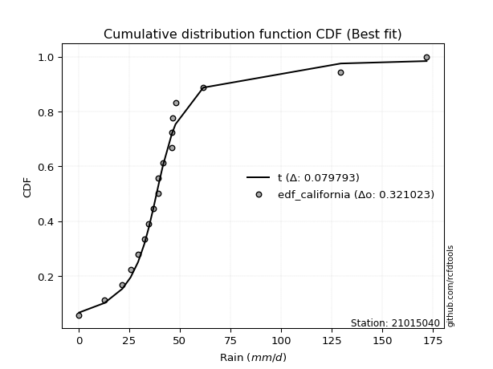</img>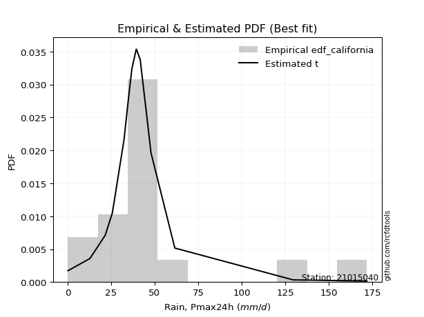</img>

</div>


### 2. EDF Hazen (1930)

Hazen method for plotting positions is a formula used to estimate the empirical cumulative probability distribution of flood events or other hydrological data. This formula often results in biased estimations, particularly when extrapolating to extreme events (high return periods).

<div align="center">


$P=(m-0.5)/n$


</div>


**2.1. Empirical values**

<div align="center">

|                | 0                    | 1                   | 2                   | 3                   | 4                  | 5                  | 6                   | 7                  | 8         | 9                  | 10                 | 11                 | 12                 | 13                 | 14                 | 15                 | 16                 |
|:---------------|:---------------------|:--------------------|:--------------------|:--------------------|:-------------------|:-------------------|:--------------------|:-------------------|:----------|:-------------------|:-------------------|:-------------------|:-------------------|:-------------------|:-------------------|:-------------------|:-------------------|
| date           | 2021                 | 2007                | 2006                | 2020                | 2017               | 2014               | 2008                | 2012               | 2011      | 2019               | 2010               | 2013               | 2018               | 2009               | 2015               | 2016               | 2024               |
| x              | 0.2                  | 12.8                | 21.6                | 25.7                | 32.4               | 34.7               | 36.9                | 39.4               | 39.5      | 41.7               | 46.0               | 46.1               | 46.3               | 47.9               | 61.6               | 129.6              | 172.0              |
| m              | 1                    | 2                   | 3                   | 4                   | 5                  | 6                  | 7                   | 8                  | 9         | 10                 | 11                 | 12                 | 13                 | 14                 | 15                 | 16                 | 17                 |
| empirical_dist | edf_hazen            | edf_hazen           | edf_hazen           | edf_hazen           | edf_hazen          | edf_hazen          | edf_hazen           | edf_hazen          | edf_hazen | edf_hazen          | edf_hazen          | edf_hazen          | edf_hazen          | edf_hazen          | edf_hazen          | edf_hazen          | edf_hazen          |
| empirical      | 0.029411764705882353 | 0.08823529411764706 | 0.14705882352941177 | 0.20588235294117646 | 0.2647058823529412 | 0.3235294117647059 | 0.38235294117647056 | 0.4411764705882353 | 0.5       | 0.5588235294117647 | 0.6176470588235294 | 0.6764705882352942 | 0.7352941176470589 | 0.7941176470588235 | 0.8529411764705882 | 0.9117647058823529 | 0.9705882352941176 |
| empirical_tr   | 1.0303030303030303   | 1.096774193548387   | 1.1724137931034484  | 1.259259259259259   | 1.3599999999999999 | 1.4782608695652173 | 1.619047619047619   | 1.7894736842105263 | 2.0       | 2.2666666666666666 | 2.6153846153846154 | 3.0909090909090913 | 3.7777777777777786 | 4.857142857142856  | 6.799999999999999  | 11.33333333333333  | 33.99999999999999  |

</div>


**2.2. Kolmogorov-Smirnov fit test (sorted by Δ)**


<div align="center">

|                | 0                  | 1                   | 2                   | 3                   | 4                   | 5                     | 6                  | 7                   | 8                   | 9                  | 10                 | 11                  | 12                  | 13                  | 14                  | 15                 | 16                  | 17                  | 18                  | 19                  | 20                  | 21                  | 22                  | 23                 | 24                 | 25                  | 26                  | 27                 | 28                  | 29                  | 30                  | 31                 | 32                  | 33                  | 34                 | 35                  | 36                  | 37                 | 38                 | 39                  | 40                  | 41                 | 42                  | 43                  | 44                  | 45                 | 46                  | 47                  | 48                 | 49                  | 50                 | 51                 | 52                 | 53                  | 54                  | 55                 | 56                 | 57                 | 58                  | 59                  | 60                  | 61                  | 62                  | 63                 | 64                  | 65                  | 66                  | 67                 | 68                 | 69                  | 70                  | 71                 | 72                  | 73                 | 74                 | 75                 | 76                  | 77                 | 78                 | 79                 | 80                 | 81                 | 82                 | 83                 | 84                 | 85                 | 86                 | 87                 |
|:---------------|:-------------------|:--------------------|:--------------------|:--------------------|:--------------------|:----------------------|:-------------------|:--------------------|:--------------------|:-------------------|:-------------------|:--------------------|:--------------------|:--------------------|:--------------------|:-------------------|:--------------------|:--------------------|:--------------------|:--------------------|:--------------------|:--------------------|:--------------------|:-------------------|:-------------------|:--------------------|:--------------------|:-------------------|:--------------------|:--------------------|:--------------------|:-------------------|:--------------------|:--------------------|:-------------------|:--------------------|:--------------------|:-------------------|:-------------------|:--------------------|:--------------------|:-------------------|:--------------------|:--------------------|:--------------------|:-------------------|:--------------------|:--------------------|:-------------------|:--------------------|:-------------------|:-------------------|:-------------------|:--------------------|:--------------------|:-------------------|:-------------------|:-------------------|:--------------------|:--------------------|:--------------------|:--------------------|:--------------------|:-------------------|:--------------------|:--------------------|:--------------------|:-------------------|:-------------------|:--------------------|:--------------------|:-------------------|:--------------------|:-------------------|:-------------------|:-------------------|:--------------------|:-------------------|:-------------------|:-------------------|:-------------------|:-------------------|:-------------------|:-------------------|:-------------------|:-------------------|:-------------------|:-------------------|
| station        | 21015040           | 21015040            | 21015040            | 21015040            | 21015040            | 21015040              | 21015040           | 21015040            | 21015040            | 21015040           | 21015040           | 21015040            | 21015040            | 21015040            | 21015040            | 21015040           | 21015040            | 21015040            | 21015040            | 21015040            | 21015040            | 21015040            | 21015040            | 21015040           | 21015040           | 21015040            | 21015040            | 21015040           | 21015040            | 21015040            | 21015040            | 21015040           | 21015040            | 21015040            | 21015040           | 21015040            | 21015040            | 21015040           | 21015040           | 21015040            | 21015040            | 21015040           | 21015040            | 21015040            | 21015040            | 21015040           | 21015040            | 21015040            | 21015040           | 21015040            | 21015040           | 21015040           | 21015040           | 21015040            | 21015040            | 21015040           | 21015040           | 21015040           | 21015040            | 21015040            | 21015040            | 21015040            | 21015040            | 21015040           | 21015040            | 21015040            | 21015040            | 21015040           | 21015040           | 21015040            | 21015040            | 21015040           | 21015040            | 21015040           | 21015040           | 21015040           | 21015040            | 21015040           | 21015040           | 21015040           | 21015040           | 21015040           | 21015040           | 21015040           | 21015040           | 21015040           | 21015040           | 21015040           |
| empirical_dist | edf_hazen          | edf_hazen           | edf_hazen           | edf_hazen           | edf_hazen           | edf_hazen             | edf_hazen          | edf_hazen           | edf_hazen           | edf_hazen          | edf_hazen          | edf_hazen           | edf_hazen           | edf_hazen           | edf_hazen           | edf_hazen          | edf_hazen           | edf_hazen           | edf_hazen           | edf_hazen           | edf_hazen           | edf_hazen           | edf_hazen           | edf_hazen          | edf_hazen          | edf_hazen           | edf_hazen           | edf_hazen          | edf_hazen           | edf_hazen           | edf_hazen           | edf_hazen          | edf_hazen           | edf_hazen           | edf_hazen          | edf_hazen           | edf_hazen           | edf_hazen          | edf_hazen          | edf_hazen           | edf_hazen           | edf_hazen          | edf_hazen           | edf_hazen           | edf_hazen           | edf_hazen          | edf_hazen           | edf_hazen           | edf_hazen          | edf_hazen           | edf_hazen          | edf_hazen          | edf_hazen          | edf_hazen           | edf_hazen           | edf_hazen          | edf_hazen          | edf_hazen          | edf_hazen           | edf_hazen           | edf_hazen           | edf_hazen           | edf_hazen           | edf_hazen          | edf_hazen           | edf_hazen           | edf_hazen           | edf_hazen          | edf_hazen          | edf_hazen           | edf_hazen           | edf_hazen          | edf_hazen           | edf_hazen          | edf_hazen          | edf_hazen          | edf_hazen           | edf_hazen          | edf_hazen          | edf_hazen          | edf_hazen          | edf_hazen          | edf_hazen          | edf_hazen          | edf_hazen          | edf_hazen          | edf_hazen          | edf_hazen          |
| p_dist         | logjohnsonsu       | t                   | johnsonsu           | logt                | gibrat              | loglaplace_asymmetric | mielke             | fisk                | wald                | nct                | pearson3           | loggenlogistic      | invweibull          | betaprime           | f                   | invgamma           | logfisk             | loggompertz         | ncf                 | logcrystalball      | logloggamma         | halflogistic        | invgauss            | exponnorm          | moyal              | fatiguelife         | laplace_asymmetric  | gamma              | erlang              | genlogistic         | weibull_min         | expon              | genexpon            | gompertz            | loggumbel_l        | logmielke           | halfnorm            | truncnorm          | gumbel_r           | logfatiguelife      | loglogistic         | lognakagami        | logexponnorm        | lognorm             | lognorm             | logrice            | loghypsecant        | lognct              | loglognorm         | nakagami            | loglaplace         | loginvgamma        | rayleigh           | kstwobign           | logalpha            | maxwell            | logmaxwell         | lograyleigh        | logbetaprime        | loginvgauss         | loginvweibull       | rice                | norm                | crystalball        | logistic            | hypsecant           | laplace             | loggumbel_r        | loghalfnorm        | logpearson3         | logmoyal            | loghalflogistic    | logkstwobign        | gumbel_l           | loggenexpon        | logwald            | loggibrat           | logexpon           | loggamma           | loggamma           | logncf             | logtruncnorm       | logf               | logweibull_min     | logchi2            | alpha              | chi2               | logerlang          |
| delta          | 0.0704418259041173 | 0.07732468685761029 | 0.09282298354907492 | 0.09472412747043413 | 0.12475576876796912 | 0.16387955231625817   | 0.1648857755006804 | 0.16623472332352895 | 0.17135272737073837 | 0.1747048333158734 | 0.1764148835772369 | 0.18005244152492716 | 0.18894861809967545 | 0.19017699951386313 | 0.19108339851387945 | 0.1922225838260937 | 0.19478234622884083 | 0.19627194574070017 | 0.19895894717097318 | 0.19934653410852943 | 0.20442289829344118 | 0.20520197500948145 | 0.20831621913991183 | 0.2083566442575535 | 0.2099959903636165 | 0.21167632422969862 | 0.21527382384542604 | 0.2171428771018462 | 0.21714330915542923 | 0.21721698013853907 | 0.21776596503954965 | 0.2177830816125838 | 0.21792258100117895 | 0.22167319353367432 | 0.227913875656094  | 0.22848442855443907 | 0.22938244155002452 | 0.2300233654286813 | 0.235879588165958  | 0.24647964023071603 | 0.24796542938277327 | 0.248662229018946  | 0.24876142731055387 | 0.24876329109217185 | 0.24876329109217185 | 0.2488277868595942 | 0.24926474308906882 | 0.24976581291336516 | 0.2513829366703413 | 0.25235251420500615 | 0.2546724004860686 | 0.2604846855190779 | 0.2610767126585055 | 0.26738321103371543 | 0.27089603382686667 | 0.2723316494146648 | 0.282676198327953  | 0.2949759686122717 | 0.29552979373295485 | 0.29883211933927345 | 0.30251005787090113 | 0.30361688031050116 | 0.30581027653313014 | 0.3058102835134195 | 0.30740661570818595 | 0.30876910728462736 | 0.31442150309113964 | 0.3170589324773662 | 0.3298780711749517 | 0.33144220555710113 | 0.34279555220439345 | 0.3456513902919424 | 0.35507817623057025 | 0.3764331535880895 | 0.4104438560157434 | 0.4143175894136652 | 0.43930555867017856 | 0.4729757039817192 | 0.5075959334384481 | 0.5075959334384481 | 0.5095617192682914 | 0.5419566628595921 | 0.614520606535971  | 0.7336436322256541 | 0.7857427498404351 | 0.8607089358692854 | 0.8982194730758101 | 0.9254661211249916 |
| deltao         | 0.3260541228310003 | 0.3260541228310003  | 0.3260541228310003  | 0.3260541228310003  | 0.3260541228310003  | 0.3260541228310003    | 0.3260541228310003 | 0.3260541228310003  | 0.3260541228310003  | 0.3260541228310003 | 0.3260541228310003 | 0.3260541228310003  | 0.3260541228310003  | 0.3260541228310003  | 0.3260541228310003  | 0.3260541228310003 | 0.3260541228310003  | 0.3260541228310003  | 0.3260541228310003  | 0.3260541228310003  | 0.3260541228310003  | 0.3260541228310003  | 0.3260541228310003  | 0.3260541228310003 | 0.3260541228310003 | 0.3260541228310003  | 0.3260541228310003  | 0.3260541228310003 | 0.3260541228310003  | 0.3260541228310003  | 0.3260541228310003  | 0.3260541228310003 | 0.3260541228310003  | 0.3260541228310003  | 0.3260541228310003 | 0.3260541228310003  | 0.3260541228310003  | 0.3260541228310003 | 0.3260541228310003 | 0.3260541228310003  | 0.3260541228310003  | 0.3260541228310003 | 0.3260541228310003  | 0.3260541228310003  | 0.3260541228310003  | 0.3260541228310003 | 0.3260541228310003  | 0.3260541228310003  | 0.3260541228310003 | 0.3260541228310003  | 0.3260541228310003 | 0.3260541228310003 | 0.3260541228310003 | 0.3260541228310003  | 0.3260541228310003  | 0.3260541228310003 | 0.3260541228310003 | 0.3260541228310003 | 0.3260541228310003  | 0.3260541228310003  | 0.3260541228310003  | 0.3260541228310003  | 0.3260541228310003  | 0.3260541228310003 | 0.3260541228310003  | 0.3260541228310003  | 0.3260541228310003  | 0.3260541228310003 | 0.3260541228310003 | 0.3260541228310003  | 0.3260541228310003  | 0.3260541228310003 | 0.3260541228310003  | 0.3260541228310003 | 0.3260541228310003 | 0.3260541228310003 | 0.3260541228310003  | 0.3260541228310003 | 0.3260541228310003 | 0.3260541228310003 | 0.3260541228310003 | 0.3260541228310003 | 0.3260541228310003 | 0.3260541228310003 | 0.3260541228310003 | 0.3260541228310003 | 0.3260541228310003 | 0.3260541228310003 |
| eval           | Δo > Δ             | Δo > Δ              | Δo > Δ              | Δo > Δ              | Δo > Δ              | Δo > Δ                | Δo > Δ             | Δo > Δ              | Δo > Δ              | Δo > Δ             | Δo > Δ             | Δo > Δ              | Δo > Δ              | Δo > Δ              | Δo > Δ              | Δo > Δ             | Δo > Δ              | Δo > Δ              | Δo > Δ              | Δo > Δ              | Δo > Δ              | Δo > Δ              | Δo > Δ              | Δo > Δ             | Δo > Δ             | Δo > Δ              | Δo > Δ              | Δo > Δ             | Δo > Δ              | Δo > Δ              | Δo > Δ              | Δo > Δ             | Δo > Δ              | Δo > Δ              | Δo > Δ             | Δo > Δ              | Δo > Δ              | Δo > Δ             | Δo > Δ             | Δo > Δ              | Δo > Δ              | Δo > Δ             | Δo > Δ              | Δo > Δ              | Δo > Δ              | Δo > Δ             | Δo > Δ              | Δo > Δ              | Δo > Δ             | Δo > Δ              | Δo > Δ             | Δo > Δ             | Δo > Δ             | Δo > Δ              | Δo > Δ              | Δo > Δ             | Δo > Δ             | Δo > Δ             | Δo > Δ              | Δo > Δ              | Δo > Δ              | Δo > Δ              | Δo > Δ              | Δo > Δ             | Δo > Δ              | Δo > Δ              | Δo > Δ              | Δo > Δ             | Δo <= Δ            | Δo <= Δ             | Δo <= Δ             | Δo <= Δ            | Δo <= Δ             | Δo <= Δ            | Δo <= Δ            | Δo <= Δ            | Δo <= Δ             | Δo <= Δ            | Δo <= Δ            | Δo <= Δ            | Δo <= Δ            | Δo <= Δ            | Δo <= Δ            | Δo <= Δ            | Δo <= Δ            | Δo <= Δ            | Δo <= Δ            | Δo <= Δ            |
| fit            | 1                  | 1                   | 1                   | 1                   | 1                   | 1                     | 1                  | 1                   | 1                   | 1                  | 1                  | 1                   | 1                   | 1                   | 1                   | 1                  | 1                   | 1                   | 1                   | 1                   | 1                   | 1                   | 1                   | 1                  | 1                  | 1                   | 1                   | 1                  | 1                   | 1                   | 1                   | 1                  | 1                   | 1                   | 1                  | 1                   | 1                   | 1                  | 1                  | 1                   | 1                   | 1                  | 1                   | 1                   | 1                   | 1                  | 1                   | 1                   | 1                  | 1                   | 1                  | 1                  | 1                  | 1                   | 1                   | 1                  | 1                  | 1                  | 1                   | 1                   | 1                   | 1                   | 1                   | 1                  | 1                   | 1                   | 1                   | 1                  | 0                  | 0                   | 0                   | 0                  | 0                   | 0                  | 0                  | 0                  | 0                   | 0                  | 0                  | 0                  | 0                  | 0                  | 0                  | 0                  | 0                  | 0                  | 0                  | 0                  |
| n              | 17                 | 17                  | 17                  | 17                  | 17                  | 17                    | 17                 | 17                  | 17                  | 17                 | 17                 | 17                  | 17                  | 17                  | 17                  | 17                 | 17                  | 17                  | 17                  | 17                  | 17                  | 17                  | 17                  | 17                 | 17                 | 17                  | 17                  | 17                 | 17                  | 17                  | 17                  | 17                 | 17                  | 17                  | 17                 | 17                  | 17                  | 17                 | 17                 | 17                  | 17                  | 17                 | 17                  | 17                  | 17                  | 17                 | 17                  | 17                  | 17                 | 17                  | 17                 | 17                 | 17                 | 17                  | 17                  | 17                 | 17                 | 17                 | 17                  | 17                  | 17                  | 17                  | 17                  | 17                 | 17                  | 17                  | 17                  | 17                 | 17                 | 17                  | 17                  | 17                 | 17                  | 17                 | 17                 | 17                 | 17                  | 17                 | 17                 | 17                 | 17                 | 17                 | 17                 | 17                 | 17                 | 17                 | 17                 | 17                 |
| best_fit       | 1                  | 0                   | 0                   | 0                   | 0                   | 0                     | 0                  | 0                   | 0                   | 0                  | 0                  | 0                   | 0                   | 0                   | 0                   | 0                  | 0                   | 0                   | 0                   | 0                   | 0                   | 0                   | 0                   | 0                  | 0                  | 0                   | 0                   | 0                  | 0                   | 0                   | 0                   | 0                  | 0                   | 0                   | 0                  | 0                   | 0                   | 0                  | 0                  | 0                   | 0                   | 0                  | 0                   | 0                   | 0                   | 0                  | 0                   | 0                   | 0                  | 0                   | 0                  | 0                  | 0                  | 0                   | 0                   | 0                  | 0                  | 0                  | 0                   | 0                   | 0                   | 0                   | 0                   | 0                  | 0                   | 0                   | 0                   | 0                  | 0                  | 0                   | 0                   | 0                  | 0                   | 0                  | 0                  | 0                  | 0                   | 0                  | 0                  | 0                  | 0                  | 0                  | 0                  | 0                  | 0                  | 0                  | 0                  | 0                  |
| best_fit_sort  | 1                  | 2                   | 3                   | 4                   | 5                   | 6                     | 7                  | 8                   | 9                   | 10                 | 11                 | 12                  | 13                  | 14                  | 15                  | 16                 | 17                  | 18                  | 19                  | 20                  | 21                  | 22                  | 23                  | 24                 | 25                 | 26                  | 27                  | 28                 | 29                  | 30                  | 31                  | 32                 | 33                  | 34                  | 35                 | 36                  | 37                  | 38                 | 39                 | 40                  | 41                  | 42                 | 43                  | 44                  | 45                  | 46                 | 47                  | 48                  | 49                 | 50                  | 51                 | 52                 | 53                 | 54                  | 55                  | 56                 | 57                 | 58                 | 59                  | 60                  | 61                  | 62                  | 63                  | 64                 | 65                  | 66                  | 67                  | 68                 | 69                 | 70                  | 71                  | 72                 | 73                  | 74                 | 75                 | 76                 | 77                  | 78                 | 79                 | 80                 | 81                 | 82                 | 83                 | 84                 | 85                 | 86                 | 87                 | 88                 |

</div>


**2.3. Best fit**

<div align="center">

|   id |   station | empirical_dist   | p_dist       |     delta |   deltao | eval   |   fit |   n |   best_fit |   best_fit_sort |
|-----:|----------:|:-----------------|:-------------|----------:|---------:|:-------|------:|----:|-----------:|----------------:|
|    0 |  21015040 | edf_hazen        | logjohnsonsu | 0.0704418 | 0.326054 | Δo > Δ |     1 |  17 |          1 |               1 |

</div>


<div align="center">

</img></img>

</div>


### 3. EDF Weibull (1939)

Weibull plotting position formula is an empirical method used to estimate the non-exceedance probability or plotting position for a set of observed data, is often recommended or widely used in practice, particularly in flood frequency analysis.

<div align="center">


$P=m/(n+1)$


</div>


**3.1. Empirical values**

<div align="center">

|                | 0                   | 1                  | 2                   | 3                  | 4                  | 5                  | 6                  | 7                  | 8           | 9                  | 10                 | 11                 | 12                 | 13                 | 14                 | 15                 | 16                 |
|:---------------|:--------------------|:-------------------|:--------------------|:-------------------|:-------------------|:-------------------|:-------------------|:-------------------|:------------|:-------------------|:-------------------|:-------------------|:-------------------|:-------------------|:-------------------|:-------------------|:-------------------|
| date           | 2021                | 2007               | 2006                | 2020               | 2017               | 2014               | 2008               | 2012               | 2011        | 2019               | 2010               | 2013               | 2018               | 2009               | 2015               | 2016               | 2024               |
| x              | 0.2                 | 12.8               | 21.6                | 25.7               | 32.4               | 34.7               | 36.9               | 39.4               | 39.5        | 41.7               | 46.0               | 46.1               | 46.3               | 47.9               | 61.6               | 129.6              | 172.0              |
| m              | 1                   | 2                  | 3                   | 4                  | 5                  | 6                  | 7                  | 8                  | 9           | 10                 | 11                 | 12                 | 13                 | 14                 | 15                 | 16                 | 17                 |
| empirical_dist | edf_weibull         | edf_weibull        | edf_weibull         | edf_weibull        | edf_weibull        | edf_weibull        | edf_weibull        | edf_weibull        | edf_weibull | edf_weibull        | edf_weibull        | edf_weibull        | edf_weibull        | edf_weibull        | edf_weibull        | edf_weibull        | edf_weibull        |
| empirical      | 0.05555555555555555 | 0.1111111111111111 | 0.16666666666666666 | 0.2222222222222222 | 0.2777777777777778 | 0.3333333333333333 | 0.3888888888888889 | 0.4444444444444444 | 0.5         | 0.5555555555555556 | 0.6111111111111112 | 0.6666666666666666 | 0.7222222222222222 | 0.7777777777777778 | 0.8333333333333334 | 0.8888888888888888 | 0.9444444444444444 |
| empirical_tr   | 1.0588235294117647  | 1.125              | 1.2                 | 1.2857142857142856 | 1.3846153846153846 | 1.4999999999999998 | 1.6363636363636362 | 1.7999999999999998 | 2.0         | 2.25               | 2.5714285714285716 | 2.9999999999999996 | 3.5999999999999996 | 4.5                | 6.000000000000002  | 8.999999999999996  | 17.999999999999993 |

</div>


**3.2. Kolmogorov-Smirnov fit test (sorted by Δ)**


<div align="center">

|                | 0                   | 1                   | 2                   | 3                   | 4                   | 5                  | 6                   | 7                     | 8                   | 9                  | 10                  | 11                  | 12                  | 13                  | 14                  | 15                 | 16                  | 17                  | 18                  | 19                  | 20                 | 21                  | 22                  | 23                  | 24                 | 25                  | 26                  | 27                  | 28                  | 29                  | 30                  | 31                 | 32                  | 33                  | 34                 | 35                  | 36                  | 37                 | 38                 | 39                  | 40                  | 41                  | 42                  | 43                  | 44                  | 45                  | 46                  | 47                  | 48                 | 49                 | 50                  | 51                  | 52                  | 53                  | 54                 | 55                 | 56                 | 57                 | 58                  | 59                 | 60                 | 61                  | 62                  | 63                 | 64                  | 65                  | 66                  | 67                 | 68                 | 69                  | 70                  | 71                 | 72                 | 73                 | 74                  | 75                 | 76                  | 77                  | 78                 | 79                 | 80                 | 81                 | 82                 | 83                 | 84                 | 85                 | 86                 | 87                 |
|:---------------|:--------------------|:--------------------|:--------------------|:--------------------|:--------------------|:-------------------|:--------------------|:----------------------|:--------------------|:-------------------|:--------------------|:--------------------|:--------------------|:--------------------|:--------------------|:-------------------|:--------------------|:--------------------|:--------------------|:--------------------|:-------------------|:--------------------|:--------------------|:--------------------|:-------------------|:--------------------|:--------------------|:--------------------|:--------------------|:--------------------|:--------------------|:-------------------|:--------------------|:--------------------|:-------------------|:--------------------|:--------------------|:-------------------|:-------------------|:--------------------|:--------------------|:--------------------|:--------------------|:--------------------|:--------------------|:--------------------|:--------------------|:--------------------|:-------------------|:-------------------|:--------------------|:--------------------|:--------------------|:--------------------|:-------------------|:-------------------|:-------------------|:-------------------|:--------------------|:-------------------|:-------------------|:--------------------|:--------------------|:-------------------|:--------------------|:--------------------|:--------------------|:-------------------|:-------------------|:--------------------|:--------------------|:-------------------|:-------------------|:-------------------|:--------------------|:-------------------|:--------------------|:--------------------|:-------------------|:-------------------|:-------------------|:-------------------|:-------------------|:-------------------|:-------------------|:-------------------|:-------------------|:-------------------|
| station        | 21015040            | 21015040            | 21015040            | 21015040            | 21015040            | 21015040           | 21015040            | 21015040              | 21015040            | 21015040           | 21015040            | 21015040            | 21015040            | 21015040            | 21015040            | 21015040           | 21015040            | 21015040            | 21015040            | 21015040            | 21015040           | 21015040            | 21015040            | 21015040            | 21015040           | 21015040            | 21015040            | 21015040            | 21015040            | 21015040            | 21015040            | 21015040           | 21015040            | 21015040            | 21015040           | 21015040            | 21015040            | 21015040           | 21015040           | 21015040            | 21015040            | 21015040            | 21015040            | 21015040            | 21015040            | 21015040            | 21015040            | 21015040            | 21015040           | 21015040           | 21015040            | 21015040            | 21015040            | 21015040            | 21015040           | 21015040           | 21015040           | 21015040           | 21015040            | 21015040           | 21015040           | 21015040            | 21015040            | 21015040           | 21015040            | 21015040            | 21015040            | 21015040           | 21015040           | 21015040            | 21015040            | 21015040           | 21015040           | 21015040           | 21015040            | 21015040           | 21015040            | 21015040            | 21015040           | 21015040           | 21015040           | 21015040           | 21015040           | 21015040           | 21015040           | 21015040           | 21015040           | 21015040           |
| empirical_dist | edf_weibull         | edf_weibull         | edf_weibull         | edf_weibull         | edf_weibull         | edf_weibull        | edf_weibull         | edf_weibull           | edf_weibull         | edf_weibull        | edf_weibull         | edf_weibull         | edf_weibull         | edf_weibull         | edf_weibull         | edf_weibull        | edf_weibull         | edf_weibull         | edf_weibull         | edf_weibull         | edf_weibull        | edf_weibull         | edf_weibull         | edf_weibull         | edf_weibull        | edf_weibull         | edf_weibull         | edf_weibull         | edf_weibull         | edf_weibull         | edf_weibull         | edf_weibull        | edf_weibull         | edf_weibull         | edf_weibull        | edf_weibull         | edf_weibull         | edf_weibull        | edf_weibull        | edf_weibull         | edf_weibull         | edf_weibull         | edf_weibull         | edf_weibull         | edf_weibull         | edf_weibull         | edf_weibull         | edf_weibull         | edf_weibull        | edf_weibull        | edf_weibull         | edf_weibull         | edf_weibull         | edf_weibull         | edf_weibull        | edf_weibull        | edf_weibull        | edf_weibull        | edf_weibull         | edf_weibull        | edf_weibull        | edf_weibull         | edf_weibull         | edf_weibull        | edf_weibull         | edf_weibull         | edf_weibull         | edf_weibull        | edf_weibull        | edf_weibull         | edf_weibull         | edf_weibull        | edf_weibull        | edf_weibull        | edf_weibull         | edf_weibull        | edf_weibull         | edf_weibull         | edf_weibull        | edf_weibull        | edf_weibull        | edf_weibull        | edf_weibull        | edf_weibull        | edf_weibull        | edf_weibull        | edf_weibull        | edf_weibull        |
| p_dist         | johnsonsu           | logjohnsonsu        | logt                | t                   | gibrat              | mielke             | fisk                | loglaplace_asymmetric | wald                | nct                | pearson3            | loggenlogistic      | invweibull          | betaprime           | f                   | invgamma           | logfisk             | loggompertz         | ncf                 | logcrystalball      | logloggamma        | halflogistic        | invgauss            | exponnorm           | moyal              | fatiguelife         | laplace_asymmetric  | gamma               | erlang              | genlogistic         | weibull_min         | expon              | genexpon            | gompertz            | loggumbel_l        | logmielke           | halfnorm            | truncnorm          | gumbel_r           | logfatiguelife      | lognakagami         | logexponnorm        | logrice             | lognorm             | lognorm             | lognct              | loglogistic         | nakagami            | loghypsecant       | loglognorm         | loginvgamma         | loglaplace          | rayleigh            | kstwobign           | logalpha           | maxwell            | logmaxwell         | logbetaprime       | lograyleigh         | loginvgauss        | loginvweibull      | rice                | norm                | crystalball        | logistic            | hypsecant           | laplace             | loggumbel_r        | loghalfnorm        | logpearson3         | logmoyal            | loghalflogistic    | logkstwobign       | gumbel_l           | loggenexpon         | logwald            | loggibrat           | logexpon            | loggamma           | loggamma           | logncf             | logtruncnorm       | logf               | logweibull_min     | logchi2            | alpha              | chi2               | logerlang          |
| delta          | 0.07648311426802923 | 0.07697777361653557 | 0.07838425818938843 | 0.08386063457002857 | 0.12540291134765777 | 0.1485459062196347 | 0.14989485404248326 | 0.15080765689142156   | 0.15828083194590176 | 0.1583649640348277 | 0.16320670694311956 | 0.16698054610009055 | 0.17260874881862975 | 0.17383713023281744 | 0.17474352923283376 | 0.175882714545048  | 0.17844247694779514 | 0.17993207645965448 | 0.18261907788992748 | 0.18300666482748373 | 0.1880830290123955 | 0.18886210572843576 | 0.19197634985886614 | 0.19201677497650782 | 0.1936561210825708 | 0.19533645494865293 | 0.19893395456438034 | 0.20080300782080052 | 0.20080343987438354 | 0.20087711085749338 | 0.20469406961471304 | 0.2047111861877472 | 0.20485068557634234 | 0.20533332425262862 | 0.2115740063750483 | 0.21214455927339337 | 0.21304257226897882 | 0.2136834961476356 | 0.2195397188849123 | 0.23165110837838376 | 0.23312298114052965 | 0.23336937718587625 | 0.23337112109701164 | 0.23337129742409823 | 0.23337129742409823 | 0.23373780499546648 | 0.23489353395793666 | 0.23601264492396046 | 0.2361928476642322 | 0.236533726613676  | 0.24087684238182303 | 0.24160050506123198 | 0.24473684337745982 | 0.25104334175266974 | 0.2512881906896117 | 0.2559917801336191 | 0.2659416392798676 | 0.2759219505956999 | 0.27670212608702915 | 0.2792242762020186 | 0.2829022147336462 | 0.28727701102945546 | 0.28947040725208445 | 0.2894704142323738 | 0.29106674642714025 | 0.29242923800358167 | 0.29808163381009395 | 0.3039870370525296 | 0.3102702280376969 | 0.31510233627605544 | 0.32972365677955684 | 0.3325794948671058 | 0.3354703330933154 | 0.3600932843070438 | 0.39083601287848857 | 0.4012456939888286 | 0.42623366324534195 | 0.45009988698825515 | 0.4847201164449841 | 0.4847201164449841 | 0.4866859022748274 | 0.5223488197223373 | 0.591644789542507  | 0.7107678152321901 | 0.762866932846971  | 0.8378331188758215 | 0.875343656082346  | 0.8993223302753184 |
| deltao         | 0.3260541228310003  | 0.3260541228310003  | 0.3260541228310003  | 0.3260541228310003  | 0.3260541228310003  | 0.3260541228310003 | 0.3260541228310003  | 0.3260541228310003    | 0.3260541228310003  | 0.3260541228310003 | 0.3260541228310003  | 0.3260541228310003  | 0.3260541228310003  | 0.3260541228310003  | 0.3260541228310003  | 0.3260541228310003 | 0.3260541228310003  | 0.3260541228310003  | 0.3260541228310003  | 0.3260541228310003  | 0.3260541228310003 | 0.3260541228310003  | 0.3260541228310003  | 0.3260541228310003  | 0.3260541228310003 | 0.3260541228310003  | 0.3260541228310003  | 0.3260541228310003  | 0.3260541228310003  | 0.3260541228310003  | 0.3260541228310003  | 0.3260541228310003 | 0.3260541228310003  | 0.3260541228310003  | 0.3260541228310003 | 0.3260541228310003  | 0.3260541228310003  | 0.3260541228310003 | 0.3260541228310003 | 0.3260541228310003  | 0.3260541228310003  | 0.3260541228310003  | 0.3260541228310003  | 0.3260541228310003  | 0.3260541228310003  | 0.3260541228310003  | 0.3260541228310003  | 0.3260541228310003  | 0.3260541228310003 | 0.3260541228310003 | 0.3260541228310003  | 0.3260541228310003  | 0.3260541228310003  | 0.3260541228310003  | 0.3260541228310003 | 0.3260541228310003 | 0.3260541228310003 | 0.3260541228310003 | 0.3260541228310003  | 0.3260541228310003 | 0.3260541228310003 | 0.3260541228310003  | 0.3260541228310003  | 0.3260541228310003 | 0.3260541228310003  | 0.3260541228310003  | 0.3260541228310003  | 0.3260541228310003 | 0.3260541228310003 | 0.3260541228310003  | 0.3260541228310003  | 0.3260541228310003 | 0.3260541228310003 | 0.3260541228310003 | 0.3260541228310003  | 0.3260541228310003 | 0.3260541228310003  | 0.3260541228310003  | 0.3260541228310003 | 0.3260541228310003 | 0.3260541228310003 | 0.3260541228310003 | 0.3260541228310003 | 0.3260541228310003 | 0.3260541228310003 | 0.3260541228310003 | 0.3260541228310003 | 0.3260541228310003 |
| eval           | Δo > Δ              | Δo > Δ              | Δo > Δ              | Δo > Δ              | Δo > Δ              | Δo > Δ             | Δo > Δ              | Δo > Δ                | Δo > Δ              | Δo > Δ             | Δo > Δ              | Δo > Δ              | Δo > Δ              | Δo > Δ              | Δo > Δ              | Δo > Δ             | Δo > Δ              | Δo > Δ              | Δo > Δ              | Δo > Δ              | Δo > Δ             | Δo > Δ              | Δo > Δ              | Δo > Δ              | Δo > Δ             | Δo > Δ              | Δo > Δ              | Δo > Δ              | Δo > Δ              | Δo > Δ              | Δo > Δ              | Δo > Δ             | Δo > Δ              | Δo > Δ              | Δo > Δ             | Δo > Δ              | Δo > Δ              | Δo > Δ             | Δo > Δ             | Δo > Δ              | Δo > Δ              | Δo > Δ              | Δo > Δ              | Δo > Δ              | Δo > Δ              | Δo > Δ              | Δo > Δ              | Δo > Δ              | Δo > Δ             | Δo > Δ             | Δo > Δ              | Δo > Δ              | Δo > Δ              | Δo > Δ              | Δo > Δ             | Δo > Δ             | Δo > Δ             | Δo > Δ             | Δo > Δ              | Δo > Δ             | Δo > Δ             | Δo > Δ              | Δo > Δ              | Δo > Δ             | Δo > Δ              | Δo > Δ              | Δo > Δ              | Δo > Δ             | Δo > Δ             | Δo > Δ              | Δo <= Δ             | Δo <= Δ            | Δo <= Δ            | Δo <= Δ            | Δo <= Δ             | Δo <= Δ            | Δo <= Δ             | Δo <= Δ             | Δo <= Δ            | Δo <= Δ            | Δo <= Δ            | Δo <= Δ            | Δo <= Δ            | Δo <= Δ            | Δo <= Δ            | Δo <= Δ            | Δo <= Δ            | Δo <= Δ            |
| fit            | 1                   | 1                   | 1                   | 1                   | 1                   | 1                  | 1                   | 1                     | 1                   | 1                  | 1                   | 1                   | 1                   | 1                   | 1                   | 1                  | 1                   | 1                   | 1                   | 1                   | 1                  | 1                   | 1                   | 1                   | 1                  | 1                   | 1                   | 1                   | 1                   | 1                   | 1                   | 1                  | 1                   | 1                   | 1                  | 1                   | 1                   | 1                  | 1                  | 1                   | 1                   | 1                   | 1                   | 1                   | 1                   | 1                   | 1                   | 1                   | 1                  | 1                  | 1                   | 1                   | 1                   | 1                   | 1                  | 1                  | 1                  | 1                  | 1                   | 1                  | 1                  | 1                   | 1                   | 1                  | 1                   | 1                   | 1                   | 1                  | 1                  | 1                   | 0                   | 0                  | 0                  | 0                  | 0                   | 0                  | 0                   | 0                   | 0                  | 0                  | 0                  | 0                  | 0                  | 0                  | 0                  | 0                  | 0                  | 0                  |
| n              | 17                  | 17                  | 17                  | 17                  | 17                  | 17                 | 17                  | 17                    | 17                  | 17                 | 17                  | 17                  | 17                  | 17                  | 17                  | 17                 | 17                  | 17                  | 17                  | 17                  | 17                 | 17                  | 17                  | 17                  | 17                 | 17                  | 17                  | 17                  | 17                  | 17                  | 17                  | 17                 | 17                  | 17                  | 17                 | 17                  | 17                  | 17                 | 17                 | 17                  | 17                  | 17                  | 17                  | 17                  | 17                  | 17                  | 17                  | 17                  | 17                 | 17                 | 17                  | 17                  | 17                  | 17                  | 17                 | 17                 | 17                 | 17                 | 17                  | 17                 | 17                 | 17                  | 17                  | 17                 | 17                  | 17                  | 17                  | 17                 | 17                 | 17                  | 17                  | 17                 | 17                 | 17                 | 17                  | 17                 | 17                  | 17                  | 17                 | 17                 | 17                 | 17                 | 17                 | 17                 | 17                 | 17                 | 17                 | 17                 |
| best_fit       | 1                   | 0                   | 0                   | 0                   | 0                   | 0                  | 0                   | 0                     | 0                   | 0                  | 0                   | 0                   | 0                   | 0                   | 0                   | 0                  | 0                   | 0                   | 0                   | 0                   | 0                  | 0                   | 0                   | 0                   | 0                  | 0                   | 0                   | 0                   | 0                   | 0                   | 0                   | 0                  | 0                   | 0                   | 0                  | 0                   | 0                   | 0                  | 0                  | 0                   | 0                   | 0                   | 0                   | 0                   | 0                   | 0                   | 0                   | 0                   | 0                  | 0                  | 0                   | 0                   | 0                   | 0                   | 0                  | 0                  | 0                  | 0                  | 0                   | 0                  | 0                  | 0                   | 0                   | 0                  | 0                   | 0                   | 0                   | 0                  | 0                  | 0                   | 0                   | 0                  | 0                  | 0                  | 0                   | 0                  | 0                   | 0                   | 0                  | 0                  | 0                  | 0                  | 0                  | 0                  | 0                  | 0                  | 0                  | 0                  |
| best_fit_sort  | 1                   | 2                   | 3                   | 4                   | 5                   | 6                  | 7                   | 8                     | 9                   | 10                 | 11                  | 12                  | 13                  | 14                  | 15                  | 16                 | 17                  | 18                  | 19                  | 20                  | 21                 | 22                  | 23                  | 24                  | 25                 | 26                  | 27                  | 28                  | 29                  | 30                  | 31                  | 32                 | 33                  | 34                  | 35                 | 36                  | 37                  | 38                 | 39                 | 40                  | 41                  | 42                  | 43                  | 44                  | 45                  | 46                  | 47                  | 48                  | 49                 | 50                 | 51                  | 52                  | 53                  | 54                  | 55                 | 56                 | 57                 | 58                 | 59                  | 60                 | 61                 | 62                  | 63                  | 64                 | 65                  | 66                  | 67                  | 68                 | 69                 | 70                  | 71                  | 72                 | 73                 | 74                 | 75                  | 76                 | 77                  | 78                  | 79                 | 80                 | 81                 | 82                 | 83                 | 84                 | 85                 | 86                 | 87                 | 88                 |

</div>


**3.3. Best fit**

<div align="center">

|   id |   station | empirical_dist   | p_dist    |     delta |   deltao | eval   |   fit |   n |   best_fit |   best_fit_sort |
|-----:|----------:|:-----------------|:----------|----------:|---------:|:-------|------:|----:|-----------:|----------------:|
|    0 |  21015040 | edf_weibull      | johnsonsu | 0.0764831 | 0.326054 | Δo > Δ |     1 |  17 |          1 |               1 |

</div>


<div align="center">

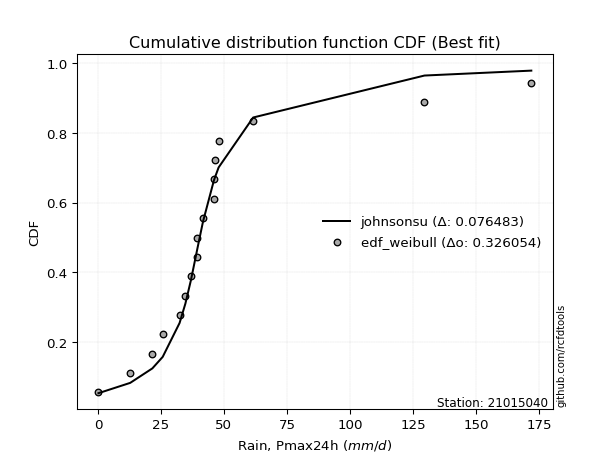</img>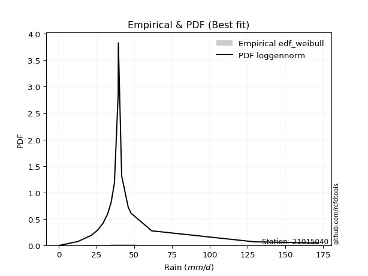</img>

</div>


### 4. EDF Beard (1943)

The Beard formula (or Beard´s plotting position formula) in hydrology is used to estimate the empirical non-exceedance probability _(P)_ of a flood event (or other extreme hydrological data point) within a given dataset.

<div align="center">


$P=(m-0.31)/(n+0.38)$


</div>


**4.1. Empirical values**

<div align="center">

|                | 0                   | 1                   | 2                   | 3                   | 4                  | 5                   | 6                   | 7                   | 8         | 9                  | 10                 | 11                 | 12                 | 13                 | 14                 | 15                 | 16                 |
|:---------------|:--------------------|:--------------------|:--------------------|:--------------------|:-------------------|:--------------------|:--------------------|:--------------------|:----------|:-------------------|:-------------------|:-------------------|:-------------------|:-------------------|:-------------------|:-------------------|:-------------------|
| date           | 2021                | 2007                | 2006                | 2020                | 2017               | 2014                | 2008                | 2012                | 2011      | 2019               | 2010               | 2013               | 2018               | 2009               | 2015               | 2016               | 2024               |
| x              | 0.2                 | 12.8                | 21.6                | 25.7                | 32.4               | 34.7                | 36.9                | 39.4                | 39.5      | 41.7               | 46.0               | 46.1               | 46.3               | 47.9               | 61.6               | 129.6              | 172.0              |
| m              | 1                   | 2                   | 3                   | 4                   | 5                  | 6                   | 7                   | 8                   | 9         | 10                 | 11                 | 12                 | 13                 | 14                 | 15                 | 16                 | 17                 |
| empirical_dist | edf_beard           | edf_beard           | edf_beard           | edf_beard           | edf_beard          | edf_beard           | edf_beard           | edf_beard           | edf_beard | edf_beard          | edf_beard          | edf_beard          | edf_beard          | edf_beard          | edf_beard          | edf_beard          | edf_beard          |
| empirical      | 0.03970080552359033 | 0.09723820483314155 | 0.15477560414269276 | 0.21231300345224396 | 0.2698504027617952 | 0.32738780207134643 | 0.38492520138089764 | 0.44246260069044885 | 0.5       | 0.5575373993095513 | 0.6150747986191024 | 0.6726121979286537 | 0.7301495972382048 | 0.7876869965477561 | 0.8452243958573072 | 0.9027617951668585 | 0.9602991944764098 |
| empirical_tr   | 1.0413421210305571  | 1.1077119184193753  | 1.1831177671885638  | 1.2695398100803508  | 1.3695823483057525 | 1.4867408041060737  | 1.6258185219831622  | 1.7936016511867907  | 2.0       | 2.2600780234070226 | 2.5979073243647233 | 3.0544815465729354 | 3.7057569296375266 | 4.710027100271004  | 6.460966542750929  | 10.284023668639058 | 25.188405797101513 |

</div>


**4.2. Kolmogorov-Smirnov fit test (sorted by Δ)**


<div align="center">

|                | 0                   | 1                   | 2                   | 3                   | 4                   | 5                  | 6                     | 7                   | 8                   | 9                  | 10                  | 11                  | 12                  | 13                  | 14                  | 15                 | 16                  | 17                  | 18                  | 19                  | 20                 | 21                  | 22                  | 23                  | 24                 | 25                  | 26                  | 27                  | 28                  | 29                  | 30                 | 31                  | 32                 | 33                  | 34                 | 35                  | 36                  | 37                 | 38                 | 39                  | 40                 | 41                 | 42                 | 43                 | 44                 | 45                  | 46                  | 47                  | 48                  | 49                  | 50                  | 51                 | 52                 | 53                  | 54                  | 55                 | 56                 | 57                  | 58                  | 59                 | 60                 | 61                  | 62                  | 63                 | 64                  | 65                  | 66                  | 67                  | 68                  | 69                  | 70                 | 71                  | 72                 | 73                 | 74                  | 75                  | 76                 | 77                 | 78                  | 79                  | 80                 | 81                 | 82                 | 83                 | 84                 | 85                 | 86                 | 87                 |
|:---------------|:--------------------|:--------------------|:--------------------|:--------------------|:--------------------|:-------------------|:----------------------|:--------------------|:--------------------|:-------------------|:--------------------|:--------------------|:--------------------|:--------------------|:--------------------|:-------------------|:--------------------|:--------------------|:--------------------|:--------------------|:-------------------|:--------------------|:--------------------|:--------------------|:-------------------|:--------------------|:--------------------|:--------------------|:--------------------|:--------------------|:-------------------|:--------------------|:-------------------|:--------------------|:-------------------|:--------------------|:--------------------|:-------------------|:-------------------|:--------------------|:-------------------|:-------------------|:-------------------|:-------------------|:-------------------|:--------------------|:--------------------|:--------------------|:--------------------|:--------------------|:--------------------|:-------------------|:-------------------|:--------------------|:--------------------|:-------------------|:-------------------|:--------------------|:--------------------|:-------------------|:-------------------|:--------------------|:--------------------|:-------------------|:--------------------|:--------------------|:--------------------|:--------------------|:--------------------|:--------------------|:-------------------|:--------------------|:-------------------|:-------------------|:--------------------|:--------------------|:-------------------|:-------------------|:--------------------|:--------------------|:-------------------|:-------------------|:-------------------|:-------------------|:-------------------|:-------------------|:-------------------|:-------------------|
| station        | 21015040            | 21015040            | 21015040            | 21015040            | 21015040            | 21015040           | 21015040              | 21015040            | 21015040            | 21015040           | 21015040            | 21015040            | 21015040            | 21015040            | 21015040            | 21015040           | 21015040            | 21015040            | 21015040            | 21015040            | 21015040           | 21015040            | 21015040            | 21015040            | 21015040           | 21015040            | 21015040            | 21015040            | 21015040            | 21015040            | 21015040           | 21015040            | 21015040           | 21015040            | 21015040           | 21015040            | 21015040            | 21015040           | 21015040           | 21015040            | 21015040           | 21015040           | 21015040           | 21015040           | 21015040           | 21015040            | 21015040            | 21015040            | 21015040            | 21015040            | 21015040            | 21015040           | 21015040           | 21015040            | 21015040            | 21015040           | 21015040           | 21015040            | 21015040            | 21015040           | 21015040           | 21015040            | 21015040            | 21015040           | 21015040            | 21015040            | 21015040            | 21015040            | 21015040            | 21015040            | 21015040           | 21015040            | 21015040           | 21015040           | 21015040            | 21015040            | 21015040           | 21015040           | 21015040            | 21015040            | 21015040           | 21015040           | 21015040           | 21015040           | 21015040           | 21015040           | 21015040           | 21015040           |
| empirical_dist | edf_beard           | edf_beard           | edf_beard           | edf_beard           | edf_beard           | edf_beard          | edf_beard             | edf_beard           | edf_beard           | edf_beard          | edf_beard           | edf_beard           | edf_beard           | edf_beard           | edf_beard           | edf_beard          | edf_beard           | edf_beard           | edf_beard           | edf_beard           | edf_beard          | edf_beard           | edf_beard           | edf_beard           | edf_beard          | edf_beard           | edf_beard           | edf_beard           | edf_beard           | edf_beard           | edf_beard          | edf_beard           | edf_beard          | edf_beard           | edf_beard          | edf_beard           | edf_beard           | edf_beard          | edf_beard          | edf_beard           | edf_beard          | edf_beard          | edf_beard          | edf_beard          | edf_beard          | edf_beard           | edf_beard           | edf_beard           | edf_beard           | edf_beard           | edf_beard           | edf_beard          | edf_beard          | edf_beard           | edf_beard           | edf_beard          | edf_beard          | edf_beard           | edf_beard           | edf_beard          | edf_beard          | edf_beard           | edf_beard           | edf_beard          | edf_beard           | edf_beard           | edf_beard           | edf_beard           | edf_beard           | edf_beard           | edf_beard          | edf_beard           | edf_beard          | edf_beard          | edf_beard           | edf_beard           | edf_beard          | edf_beard          | edf_beard           | edf_beard           | edf_beard          | edf_beard          | edf_beard          | edf_beard          | edf_beard          | edf_beard          | edf_beard          | edf_beard          |
| p_dist         | logjohnsonsu        | t                   | johnsonsu           | logt                | gibrat              | mielke             | loglaplace_asymmetric | fisk                | wald                | nct                | pearson3            | loggenlogistic      | invweibull          | betaprime           | f                   | invgamma           | logfisk             | loggompertz         | ncf                 | logcrystalball      | logloggamma        | halflogistic        | invgauss            | exponnorm           | moyal              | fatiguelife         | laplace_asymmetric  | gamma               | erlang              | genlogistic         | weibull_min        | expon               | genexpon           | gompertz            | loggumbel_l        | logmielke           | halfnorm            | truncnorm          | gumbel_r           | logfatiguelife      | lognakagami        | logexponnorm       | logrice            | lognorm            | lognorm            | lognct              | loglogistic         | loghypsecant        | loglognorm          | nakagami            | loglaplace          | loginvgamma        | rayleigh           | kstwobign           | logalpha            | maxwell            | logmaxwell         | lograyleigh         | logbetaprime        | loginvgauss        | loginvweibull      | rice                | norm                | crystalball        | logistic            | hypsecant           | laplace             | loggumbel_r         | loghalfnorm         | logpearson3         | logmoyal           | loghalflogistic     | logkstwobign       | gumbel_l           | loggenexpon         | logwald             | loggibrat          | logexpon           | loggamma            | loggamma            | logncf             | logtruncnorm       | logf               | logweibull_min     | logchi2            | alpha              | chi2               | logerlang          |
| delta          | 0.07301408610854432 | 0.07989694706203732 | 0.08639233303800753 | 0.08829347695936673 | 0.12089737846132859 | 0.158455124989613  | 0.15873503190740412   | 0.15980407281246156 | 0.16620820696188432 | 0.168274182804806  | 0.17113408195910212 | 0.17490792111607312 | 0.18251796758860805 | 0.18374634900279574 | 0.18465274800281206 | 0.1857919333150263 | 0.18835169571777344 | 0.18984129522963278 | 0.19252829665990578 | 0.19291588359746203 | 0.1979922477823738 | 0.19877132449841406 | 0.20188556862884444 | 0.20192599374648612 | 0.2035653398525491 | 0.20524567371863123 | 0.20884317333435864 | 0.21071222659077882 | 0.21071265864436184 | 0.21078632962747168 | 0.2126214446306956 | 0.21263856120372976 | 0.2127780605923249 | 0.21524254302260692 | 0.2214832251450266 | 0.22205377804337167 | 0.22295179103895713 | 0.2235927149176139 | 0.2294489376548906 | 0.23957848339436633 | 0.2410503561565122 | 0.2412967522018588 | 0.2412984961129942 | 0.2412986724400808 | 0.2412986724400808 | 0.24204903230008418 | 0.24282090897391923 | 0.24412022268021477 | 0.24446110162965856 | 0.24592186369393876 | 0.24952788007721455 | 0.2527679049057969 | 0.2546460621474381 | 0.26095256052264804 | 0.26317925321358565 | 0.2659009989035974 | 0.274959417714672  | 0.28725918799899075 | 0.28781301311967383 | 0.2911153387259925 | 0.2947932772576201 | 0.29718622979943377 | 0.29937962602206275 | 0.2993796330023521 | 0.30097596519711856 | 0.30233845677355997 | 0.30799085258007225 | 0.31191441206851217 | 0.32216129056167075 | 0.32501155504603374 | 0.3376510317955394 | 0.34050686988308837 | 0.3473613956172893 | 0.3700025030770221 | 0.40272707540246244 | 0.40917306900481115 | 0.4341610382613245 | 0.4639727932662247 | 0.49859302272295364 | 0.49859302272295364 | 0.500558808552797  | 0.5342398822463111 | 0.6055176958204764 | 0.7246407215101596 | 0.7767398391249407 | 0.8517060251537909 | 0.8892165623603157 | 0.9151770803072836 |
| deltao         | 0.3260541228310003  | 0.3260541228310003  | 0.3260541228310003  | 0.3260541228310003  | 0.3260541228310003  | 0.3260541228310003 | 0.3260541228310003    | 0.3260541228310003  | 0.3260541228310003  | 0.3260541228310003 | 0.3260541228310003  | 0.3260541228310003  | 0.3260541228310003  | 0.3260541228310003  | 0.3260541228310003  | 0.3260541228310003 | 0.3260541228310003  | 0.3260541228310003  | 0.3260541228310003  | 0.3260541228310003  | 0.3260541228310003 | 0.3260541228310003  | 0.3260541228310003  | 0.3260541228310003  | 0.3260541228310003 | 0.3260541228310003  | 0.3260541228310003  | 0.3260541228310003  | 0.3260541228310003  | 0.3260541228310003  | 0.3260541228310003 | 0.3260541228310003  | 0.3260541228310003 | 0.3260541228310003  | 0.3260541228310003 | 0.3260541228310003  | 0.3260541228310003  | 0.3260541228310003 | 0.3260541228310003 | 0.3260541228310003  | 0.3260541228310003 | 0.3260541228310003 | 0.3260541228310003 | 0.3260541228310003 | 0.3260541228310003 | 0.3260541228310003  | 0.3260541228310003  | 0.3260541228310003  | 0.3260541228310003  | 0.3260541228310003  | 0.3260541228310003  | 0.3260541228310003 | 0.3260541228310003 | 0.3260541228310003  | 0.3260541228310003  | 0.3260541228310003 | 0.3260541228310003 | 0.3260541228310003  | 0.3260541228310003  | 0.3260541228310003 | 0.3260541228310003 | 0.3260541228310003  | 0.3260541228310003  | 0.3260541228310003 | 0.3260541228310003  | 0.3260541228310003  | 0.3260541228310003  | 0.3260541228310003  | 0.3260541228310003  | 0.3260541228310003  | 0.3260541228310003 | 0.3260541228310003  | 0.3260541228310003 | 0.3260541228310003 | 0.3260541228310003  | 0.3260541228310003  | 0.3260541228310003 | 0.3260541228310003 | 0.3260541228310003  | 0.3260541228310003  | 0.3260541228310003 | 0.3260541228310003 | 0.3260541228310003 | 0.3260541228310003 | 0.3260541228310003 | 0.3260541228310003 | 0.3260541228310003 | 0.3260541228310003 |
| eval           | Δo > Δ              | Δo > Δ              | Δo > Δ              | Δo > Δ              | Δo > Δ              | Δo > Δ             | Δo > Δ                | Δo > Δ              | Δo > Δ              | Δo > Δ             | Δo > Δ              | Δo > Δ              | Δo > Δ              | Δo > Δ              | Δo > Δ              | Δo > Δ             | Δo > Δ              | Δo > Δ              | Δo > Δ              | Δo > Δ              | Δo > Δ             | Δo > Δ              | Δo > Δ              | Δo > Δ              | Δo > Δ             | Δo > Δ              | Δo > Δ              | Δo > Δ              | Δo > Δ              | Δo > Δ              | Δo > Δ             | Δo > Δ              | Δo > Δ             | Δo > Δ              | Δo > Δ             | Δo > Δ              | Δo > Δ              | Δo > Δ             | Δo > Δ             | Δo > Δ              | Δo > Δ             | Δo > Δ             | Δo > Δ             | Δo > Δ             | Δo > Δ             | Δo > Δ              | Δo > Δ              | Δo > Δ              | Δo > Δ              | Δo > Δ              | Δo > Δ              | Δo > Δ             | Δo > Δ             | Δo > Δ              | Δo > Δ              | Δo > Δ             | Δo > Δ             | Δo > Δ              | Δo > Δ              | Δo > Δ             | Δo > Δ             | Δo > Δ              | Δo > Δ              | Δo > Δ             | Δo > Δ              | Δo > Δ              | Δo > Δ              | Δo > Δ              | Δo > Δ              | Δo > Δ              | Δo <= Δ            | Δo <= Δ             | Δo <= Δ            | Δo <= Δ            | Δo <= Δ             | Δo <= Δ             | Δo <= Δ            | Δo <= Δ            | Δo <= Δ             | Δo <= Δ             | Δo <= Δ            | Δo <= Δ            | Δo <= Δ            | Δo <= Δ            | Δo <= Δ            | Δo <= Δ            | Δo <= Δ            | Δo <= Δ            |
| fit            | 1                   | 1                   | 1                   | 1                   | 1                   | 1                  | 1                     | 1                   | 1                   | 1                  | 1                   | 1                   | 1                   | 1                   | 1                   | 1                  | 1                   | 1                   | 1                   | 1                   | 1                  | 1                   | 1                   | 1                   | 1                  | 1                   | 1                   | 1                   | 1                   | 1                   | 1                  | 1                   | 1                  | 1                   | 1                  | 1                   | 1                   | 1                  | 1                  | 1                   | 1                  | 1                  | 1                  | 1                  | 1                  | 1                   | 1                   | 1                   | 1                   | 1                   | 1                   | 1                  | 1                  | 1                   | 1                   | 1                  | 1                  | 1                   | 1                   | 1                  | 1                  | 1                   | 1                   | 1                  | 1                   | 1                   | 1                   | 1                   | 1                   | 1                   | 0                  | 0                   | 0                  | 0                  | 0                   | 0                   | 0                  | 0                  | 0                   | 0                   | 0                  | 0                  | 0                  | 0                  | 0                  | 0                  | 0                  | 0                  |
| n              | 17                  | 17                  | 17                  | 17                  | 17                  | 17                 | 17                    | 17                  | 17                  | 17                 | 17                  | 17                  | 17                  | 17                  | 17                  | 17                 | 17                  | 17                  | 17                  | 17                  | 17                 | 17                  | 17                  | 17                  | 17                 | 17                  | 17                  | 17                  | 17                  | 17                  | 17                 | 17                  | 17                 | 17                  | 17                 | 17                  | 17                  | 17                 | 17                 | 17                  | 17                 | 17                 | 17                 | 17                 | 17                 | 17                  | 17                  | 17                  | 17                  | 17                  | 17                  | 17                 | 17                 | 17                  | 17                  | 17                 | 17                 | 17                  | 17                  | 17                 | 17                 | 17                  | 17                  | 17                 | 17                  | 17                  | 17                  | 17                  | 17                  | 17                  | 17                 | 17                  | 17                 | 17                 | 17                  | 17                  | 17                 | 17                 | 17                  | 17                  | 17                 | 17                 | 17                 | 17                 | 17                 | 17                 | 17                 | 17                 |
| best_fit       | 1                   | 0                   | 0                   | 0                   | 0                   | 0                  | 0                     | 0                   | 0                   | 0                  | 0                   | 0                   | 0                   | 0                   | 0                   | 0                  | 0                   | 0                   | 0                   | 0                   | 0                  | 0                   | 0                   | 0                   | 0                  | 0                   | 0                   | 0                   | 0                   | 0                   | 0                  | 0                   | 0                  | 0                   | 0                  | 0                   | 0                   | 0                  | 0                  | 0                   | 0                  | 0                  | 0                  | 0                  | 0                  | 0                   | 0                   | 0                   | 0                   | 0                   | 0                   | 0                  | 0                  | 0                   | 0                   | 0                  | 0                  | 0                   | 0                   | 0                  | 0                  | 0                   | 0                   | 0                  | 0                   | 0                   | 0                   | 0                   | 0                   | 0                   | 0                  | 0                   | 0                  | 0                  | 0                   | 0                   | 0                  | 0                  | 0                   | 0                   | 0                  | 0                  | 0                  | 0                  | 0                  | 0                  | 0                  | 0                  |
| best_fit_sort  | 1                   | 2                   | 3                   | 4                   | 5                   | 6                  | 7                     | 8                   | 9                   | 10                 | 11                  | 12                  | 13                  | 14                  | 15                  | 16                 | 17                  | 18                  | 19                  | 20                  | 21                 | 22                  | 23                  | 24                  | 25                 | 26                  | 27                  | 28                  | 29                  | 30                  | 31                 | 32                  | 33                 | 34                  | 35                 | 36                  | 37                  | 38                 | 39                 | 40                  | 41                 | 42                 | 43                 | 44                 | 45                 | 46                  | 47                  | 48                  | 49                  | 50                  | 51                  | 52                 | 53                 | 54                  | 55                  | 56                 | 57                 | 58                  | 59                  | 60                 | 61                 | 62                  | 63                  | 64                 | 65                  | 66                  | 67                  | 68                  | 69                  | 70                  | 71                 | 72                  | 73                 | 74                 | 75                  | 76                  | 77                 | 78                 | 79                  | 80                  | 81                 | 82                 | 83                 | 84                 | 85                 | 86                 | 87                 | 88                 |

</div>


**4.3. Best fit**

<div align="center">

|   id |   station | empirical_dist   | p_dist       |     delta |   deltao | eval   |   fit |   n |   best_fit |   best_fit_sort |
|-----:|----------:|:-----------------|:-------------|----------:|---------:|:-------|------:|----:|-----------:|----------------:|
|    0 |  21015040 | edf_beard        | logjohnsonsu | 0.0730141 | 0.326054 | Δo > Δ |     1 |  17 |          1 |               1 |

</div>


<div align="center">

</img>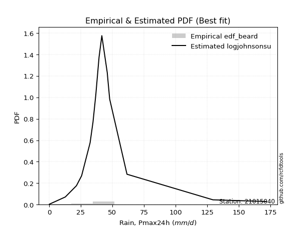</img>

</div>


### 5. EDF Chegodayev (1955)

The Chegodayev formula is an empirical plotting position formula used in hydrological frequency analysis to estimate the exceedance probability or return period of a specific event from a set of observed data. It is primarily used for plotting observed data points on probability paper to fit a theoretical distribution, particularly for analyzing extreme events like maximum flood flows or rainfall intensities. The constant _b_ value in the generalized plotting position formula is 0.3.

<div align="center">


$P=(m-b)/(n+1-2b)$


</div>


**5.1. Empirical values**

<div align="center">

|                | 0                    | 1                   | 2                   | 3                   | 4                  | 5                   | 6                   | 7                 | 8              | 9                  | 10                 | 11                 | 12                 | 13                 | 14                 | 15                 | 16                 |
|:---------------|:---------------------|:--------------------|:--------------------|:--------------------|:-------------------|:--------------------|:--------------------|:------------------|:---------------|:-------------------|:-------------------|:-------------------|:-------------------|:-------------------|:-------------------|:-------------------|:-------------------|
| date           | 2021                 | 2007                | 2006                | 2020                | 2017               | 2014                | 2008                | 2012              | 2011           | 2019               | 2010               | 2013               | 2018               | 2009               | 2015               | 2016               | 2024               |
| x              | 0.2                  | 12.8                | 21.6                | 25.7                | 32.4               | 34.7                | 36.9                | 39.4              | 39.5           | 41.7               | 46.0               | 46.1               | 46.3               | 47.9               | 61.6               | 129.6              | 172.0              |
| m              | 1                    | 2                   | 3                   | 4                   | 5                  | 6                   | 7                   | 8                 | 9              | 10                 | 11                 | 12                 | 13                 | 14                 | 15                 | 16                 | 17                 |
| empirical_dist | edf_chegodayev       | edf_chegodayev      | edf_chegodayev      | edf_chegodayev      | edf_chegodayev     | edf_chegodayev      | edf_chegodayev      | edf_chegodayev    | edf_chegodayev | edf_chegodayev     | edf_chegodayev     | edf_chegodayev     | edf_chegodayev     | edf_chegodayev     | edf_chegodayev     | edf_chegodayev     | edf_chegodayev     |
| empirical      | 0.040229885057471264 | 0.09770114942528736 | 0.15517241379310348 | 0.21264367816091956 | 0.2701149425287357 | 0.32758620689655177 | 0.38505747126436785 | 0.442528735632184 | 0.5            | 0.5574712643678161 | 0.6149425287356322 | 0.6724137931034483 | 0.7298850574712644 | 0.7873563218390804 | 0.8448275862068966 | 0.9022988505747127 | 0.9597701149425287 |
| empirical_tr   | 1.0419161676646707   | 1.10828025477707    | 1.183673469387755   | 1.27007299270073    | 1.3700787401574803 | 1.4871794871794874  | 1.6261682242990656  | 1.793814432989691 | 2.0            | 2.25974025974026   | 2.5970149253731343 | 3.0526315789473686 | 3.7021276595744688 | 4.702702702702703  | 6.4444444444444455 | 10.235294117647065 | 24.857142857142854 |

</div>


**5.2. Kolmogorov-Smirnov fit test (sorted by Δ)**


<div align="center">

|                | 0                   | 1                   | 2                   | 3                   | 4                   | 5                   | 6                     | 7                  | 8                   | 9                   | 10                  | 11                  | 12                 | 13                 | 14                 | 15                  | 16                 | 17                  | 18                  | 19                  | 20                  | 21                 | 22                 | 23                  | 24                  | 25                  | 26                 | 27                  | 28                 | 29                  | 30                  | 31                 | 32                  | 33                  | 34                  | 35                  | 36                  | 37                  | 38                  | 39                  | 40                  | 41                  | 42                  | 43                  | 44                  | 45                  | 46                  | 47                 | 48                 | 49                 | 50                  | 51                 | 52                 | 53                 | 54                  | 55                  | 56                 | 57                 | 58                 | 59                  | 60                 | 61                 | 62                 | 63                  | 64                 | 65                 | 66                 | 67                 | 68                  | 69                 | 70                  | 71                 | 72                  | 73                  | 74                 | 75                 | 76                  | 77                 | 78                  | 79                  | 80                 | 81                 | 82                 | 83                 | 84                 | 85                 | 86                 | 87                 |
|:---------------|:--------------------|:--------------------|:--------------------|:--------------------|:--------------------|:--------------------|:----------------------|:-------------------|:--------------------|:--------------------|:--------------------|:--------------------|:-------------------|:-------------------|:-------------------|:--------------------|:-------------------|:--------------------|:--------------------|:--------------------|:--------------------|:-------------------|:-------------------|:--------------------|:--------------------|:--------------------|:-------------------|:--------------------|:-------------------|:--------------------|:--------------------|:-------------------|:--------------------|:--------------------|:--------------------|:--------------------|:--------------------|:--------------------|:--------------------|:--------------------|:--------------------|:--------------------|:--------------------|:--------------------|:--------------------|:--------------------|:--------------------|:-------------------|:-------------------|:-------------------|:--------------------|:-------------------|:-------------------|:-------------------|:--------------------|:--------------------|:-------------------|:-------------------|:-------------------|:--------------------|:-------------------|:-------------------|:-------------------|:--------------------|:-------------------|:-------------------|:-------------------|:-------------------|:--------------------|:-------------------|:--------------------|:-------------------|:--------------------|:--------------------|:-------------------|:-------------------|:--------------------|:-------------------|:--------------------|:--------------------|:-------------------|:-------------------|:-------------------|:-------------------|:-------------------|:-------------------|:-------------------|:-------------------|
| station        | 21015040            | 21015040            | 21015040            | 21015040            | 21015040            | 21015040            | 21015040              | 21015040           | 21015040            | 21015040            | 21015040            | 21015040            | 21015040           | 21015040           | 21015040           | 21015040            | 21015040           | 21015040            | 21015040            | 21015040            | 21015040            | 21015040           | 21015040           | 21015040            | 21015040            | 21015040            | 21015040           | 21015040            | 21015040           | 21015040            | 21015040            | 21015040           | 21015040            | 21015040            | 21015040            | 21015040            | 21015040            | 21015040            | 21015040            | 21015040            | 21015040            | 21015040            | 21015040            | 21015040            | 21015040            | 21015040            | 21015040            | 21015040           | 21015040           | 21015040           | 21015040            | 21015040           | 21015040           | 21015040           | 21015040            | 21015040            | 21015040           | 21015040           | 21015040           | 21015040            | 21015040           | 21015040           | 21015040           | 21015040            | 21015040           | 21015040           | 21015040           | 21015040           | 21015040            | 21015040           | 21015040            | 21015040           | 21015040            | 21015040            | 21015040           | 21015040           | 21015040            | 21015040           | 21015040            | 21015040            | 21015040           | 21015040           | 21015040           | 21015040           | 21015040           | 21015040           | 21015040           | 21015040           |
| empirical_dist | edf_chegodayev      | edf_chegodayev      | edf_chegodayev      | edf_chegodayev      | edf_chegodayev      | edf_chegodayev      | edf_chegodayev        | edf_chegodayev     | edf_chegodayev      | edf_chegodayev      | edf_chegodayev      | edf_chegodayev      | edf_chegodayev     | edf_chegodayev     | edf_chegodayev     | edf_chegodayev      | edf_chegodayev     | edf_chegodayev      | edf_chegodayev      | edf_chegodayev      | edf_chegodayev      | edf_chegodayev     | edf_chegodayev     | edf_chegodayev      | edf_chegodayev      | edf_chegodayev      | edf_chegodayev     | edf_chegodayev      | edf_chegodayev     | edf_chegodayev      | edf_chegodayev      | edf_chegodayev     | edf_chegodayev      | edf_chegodayev      | edf_chegodayev      | edf_chegodayev      | edf_chegodayev      | edf_chegodayev      | edf_chegodayev      | edf_chegodayev      | edf_chegodayev      | edf_chegodayev      | edf_chegodayev      | edf_chegodayev      | edf_chegodayev      | edf_chegodayev      | edf_chegodayev      | edf_chegodayev     | edf_chegodayev     | edf_chegodayev     | edf_chegodayev      | edf_chegodayev     | edf_chegodayev     | edf_chegodayev     | edf_chegodayev      | edf_chegodayev      | edf_chegodayev     | edf_chegodayev     | edf_chegodayev     | edf_chegodayev      | edf_chegodayev     | edf_chegodayev     | edf_chegodayev     | edf_chegodayev      | edf_chegodayev     | edf_chegodayev     | edf_chegodayev     | edf_chegodayev     | edf_chegodayev      | edf_chegodayev     | edf_chegodayev      | edf_chegodayev     | edf_chegodayev      | edf_chegodayev      | edf_chegodayev     | edf_chegodayev     | edf_chegodayev      | edf_chegodayev     | edf_chegodayev      | edf_chegodayev      | edf_chegodayev     | edf_chegodayev     | edf_chegodayev     | edf_chegodayev     | edf_chegodayev     | edf_chegodayev     | edf_chegodayev     | edf_chegodayev     |
| p_dist         | logjohnsonsu        | t                   | johnsonsu           | logt                | gibrat              | mielke              | loglaplace_asymmetric | fisk               | wald                | nct                 | pearson3            | loggenlogistic      | invweibull         | betaprime          | f                  | invgamma            | logfisk            | loggompertz         | ncf                 | logcrystalball      | logloggamma         | halflogistic       | invgauss           | exponnorm           | moyal               | fatiguelife         | laplace_asymmetric | gamma               | erlang             | genlogistic         | weibull_min         | expon              | genexpon            | gompertz            | loggumbel_l         | logmielke           | halfnorm            | truncnorm           | gumbel_r            | logfatiguelife      | lognakagami         | logexponnorm        | logrice             | lognorm             | lognorm             | lognct              | loglogistic         | loghypsecant       | loglognorm         | nakagami           | loglaplace          | loginvgamma        | rayleigh           | kstwobign          | logalpha            | maxwell             | logmaxwell         | lograyleigh        | logbetaprime       | loginvgauss         | loginvweibull      | rice               | norm               | crystalball         | logistic           | hypsecant          | laplace            | loggumbel_r        | loghalfnorm         | logpearson3        | logmoyal            | loghalflogistic    | logkstwobign        | gumbel_l            | loggenexpon        | logwald            | loggibrat           | logexpon           | loggamma            | loggamma            | logncf             | logtruncnorm       | logf               | logweibull_min     | logchi2            | alpha              | chi2               | logerlang          |
| delta          | 0.07314635599201458 | 0.08002921694550758 | 0.08606165832933188 | 0.08796280225069109 | 0.12069897363612325 | 0.15812445028093736 | 0.15847049214046366   | 0.1594733981037859 | 0.16594366719494386 | 0.16794350809613035 | 0.17086954219216166 | 0.17464338134913265 | 0.1821872928799324 | 0.1834156742941201 | 0.1843220732941364 | 0.18546125860635065 | 0.1880210210090978 | 0.18951062052095713 | 0.19219762195123014 | 0.19258520888878639 | 0.19766157307369814 | 0.1984406497897384 | 0.2015548939201688 | 0.20159531903781047 | 0.20323466514387345 | 0.20491499900995558 | 0.208512498625683  | 0.21038155188210317 | 0.2103819839356862 | 0.21045565491879603 | 0.21235690486375514 | 0.2123740214367893 | 0.21251352082538444 | 0.21491186831393128 | 0.22115255043635096 | 0.22172310333469603 | 0.22262111633028148 | 0.22326204020893825 | 0.22911826294621496 | 0.23931394362742586 | 0.24078581638957175 | 0.24103221243491835 | 0.24103395634605373 | 0.24103413267314033 | 0.24103413267314033 | 0.24165222264967345 | 0.24255636920697876 | 0.2438556829132743 | 0.2441965618627181 | 0.2455911889852631 | 0.24926334031027408 | 0.2523710952553862 | 0.2543153874387625 | 0.2606218858139724 | 0.26278244356317493 | 0.26557032419492177 | 0.2745626080642613 | 0.28686237834858   | 0.2874162034692631 | 0.29071852907558177 | 0.2943964676072094 | 0.2968555550907581 | 0.2990489513133871 | 0.29904895829367645 | 0.3006452904884429 | 0.3020077820648843 | 0.3076601778713966 | 0.3116498723015717 | 0.32176448091126003 | 0.3246808803373581 | 0.33738649202859894 | 0.3402423301161479 | 0.34696458596687857 | 0.36967182836834644 | 0.4023302657520517 | 0.4089085292378707 | 0.43389649849438405 | 0.4635098486740789 | 0.49813007813080784 | 0.49813007813080784 | 0.5000958639606511 | 0.5338430725959005 | 0.6050547512283306 | 0.7241777769180138 | 0.7762768945327948 | 0.8512430805616451 | 0.8887536177681697 | 0.9146480007734027 |
| deltao         | 0.3260541228310003  | 0.3260541228310003  | 0.3260541228310003  | 0.3260541228310003  | 0.3260541228310003  | 0.3260541228310003  | 0.3260541228310003    | 0.3260541228310003 | 0.3260541228310003  | 0.3260541228310003  | 0.3260541228310003  | 0.3260541228310003  | 0.3260541228310003 | 0.3260541228310003 | 0.3260541228310003 | 0.3260541228310003  | 0.3260541228310003 | 0.3260541228310003  | 0.3260541228310003  | 0.3260541228310003  | 0.3260541228310003  | 0.3260541228310003 | 0.3260541228310003 | 0.3260541228310003  | 0.3260541228310003  | 0.3260541228310003  | 0.3260541228310003 | 0.3260541228310003  | 0.3260541228310003 | 0.3260541228310003  | 0.3260541228310003  | 0.3260541228310003 | 0.3260541228310003  | 0.3260541228310003  | 0.3260541228310003  | 0.3260541228310003  | 0.3260541228310003  | 0.3260541228310003  | 0.3260541228310003  | 0.3260541228310003  | 0.3260541228310003  | 0.3260541228310003  | 0.3260541228310003  | 0.3260541228310003  | 0.3260541228310003  | 0.3260541228310003  | 0.3260541228310003  | 0.3260541228310003 | 0.3260541228310003 | 0.3260541228310003 | 0.3260541228310003  | 0.3260541228310003 | 0.3260541228310003 | 0.3260541228310003 | 0.3260541228310003  | 0.3260541228310003  | 0.3260541228310003 | 0.3260541228310003 | 0.3260541228310003 | 0.3260541228310003  | 0.3260541228310003 | 0.3260541228310003 | 0.3260541228310003 | 0.3260541228310003  | 0.3260541228310003 | 0.3260541228310003 | 0.3260541228310003 | 0.3260541228310003 | 0.3260541228310003  | 0.3260541228310003 | 0.3260541228310003  | 0.3260541228310003 | 0.3260541228310003  | 0.3260541228310003  | 0.3260541228310003 | 0.3260541228310003 | 0.3260541228310003  | 0.3260541228310003 | 0.3260541228310003  | 0.3260541228310003  | 0.3260541228310003 | 0.3260541228310003 | 0.3260541228310003 | 0.3260541228310003 | 0.3260541228310003 | 0.3260541228310003 | 0.3260541228310003 | 0.3260541228310003 |
| eval           | Δo > Δ              | Δo > Δ              | Δo > Δ              | Δo > Δ              | Δo > Δ              | Δo > Δ              | Δo > Δ                | Δo > Δ             | Δo > Δ              | Δo > Δ              | Δo > Δ              | Δo > Δ              | Δo > Δ             | Δo > Δ             | Δo > Δ             | Δo > Δ              | Δo > Δ             | Δo > Δ              | Δo > Δ              | Δo > Δ              | Δo > Δ              | Δo > Δ             | Δo > Δ             | Δo > Δ              | Δo > Δ              | Δo > Δ              | Δo > Δ             | Δo > Δ              | Δo > Δ             | Δo > Δ              | Δo > Δ              | Δo > Δ             | Δo > Δ              | Δo > Δ              | Δo > Δ              | Δo > Δ              | Δo > Δ              | Δo > Δ              | Δo > Δ              | Δo > Δ              | Δo > Δ              | Δo > Δ              | Δo > Δ              | Δo > Δ              | Δo > Δ              | Δo > Δ              | Δo > Δ              | Δo > Δ             | Δo > Δ             | Δo > Δ             | Δo > Δ              | Δo > Δ             | Δo > Δ             | Δo > Δ             | Δo > Δ              | Δo > Δ              | Δo > Δ             | Δo > Δ             | Δo > Δ             | Δo > Δ              | Δo > Δ             | Δo > Δ             | Δo > Δ             | Δo > Δ              | Δo > Δ             | Δo > Δ             | Δo > Δ             | Δo > Δ             | Δo > Δ              | Δo > Δ             | Δo <= Δ             | Δo <= Δ            | Δo <= Δ             | Δo <= Δ             | Δo <= Δ            | Δo <= Δ            | Δo <= Δ             | Δo <= Δ            | Δo <= Δ             | Δo <= Δ             | Δo <= Δ            | Δo <= Δ            | Δo <= Δ            | Δo <= Δ            | Δo <= Δ            | Δo <= Δ            | Δo <= Δ            | Δo <= Δ            |
| fit            | 1                   | 1                   | 1                   | 1                   | 1                   | 1                   | 1                     | 1                  | 1                   | 1                   | 1                   | 1                   | 1                  | 1                  | 1                  | 1                   | 1                  | 1                   | 1                   | 1                   | 1                   | 1                  | 1                  | 1                   | 1                   | 1                   | 1                  | 1                   | 1                  | 1                   | 1                   | 1                  | 1                   | 1                   | 1                   | 1                   | 1                   | 1                   | 1                   | 1                   | 1                   | 1                   | 1                   | 1                   | 1                   | 1                   | 1                   | 1                  | 1                  | 1                  | 1                   | 1                  | 1                  | 1                  | 1                   | 1                   | 1                  | 1                  | 1                  | 1                   | 1                  | 1                  | 1                  | 1                   | 1                  | 1                  | 1                  | 1                  | 1                   | 1                  | 0                   | 0                  | 0                   | 0                   | 0                  | 0                  | 0                   | 0                  | 0                   | 0                   | 0                  | 0                  | 0                  | 0                  | 0                  | 0                  | 0                  | 0                  |
| n              | 17                  | 17                  | 17                  | 17                  | 17                  | 17                  | 17                    | 17                 | 17                  | 17                  | 17                  | 17                  | 17                 | 17                 | 17                 | 17                  | 17                 | 17                  | 17                  | 17                  | 17                  | 17                 | 17                 | 17                  | 17                  | 17                  | 17                 | 17                  | 17                 | 17                  | 17                  | 17                 | 17                  | 17                  | 17                  | 17                  | 17                  | 17                  | 17                  | 17                  | 17                  | 17                  | 17                  | 17                  | 17                  | 17                  | 17                  | 17                 | 17                 | 17                 | 17                  | 17                 | 17                 | 17                 | 17                  | 17                  | 17                 | 17                 | 17                 | 17                  | 17                 | 17                 | 17                 | 17                  | 17                 | 17                 | 17                 | 17                 | 17                  | 17                 | 17                  | 17                 | 17                  | 17                  | 17                 | 17                 | 17                  | 17                 | 17                  | 17                  | 17                 | 17                 | 17                 | 17                 | 17                 | 17                 | 17                 | 17                 |
| best_fit       | 1                   | 0                   | 0                   | 0                   | 0                   | 0                   | 0                     | 0                  | 0                   | 0                   | 0                   | 0                   | 0                  | 0                  | 0                  | 0                   | 0                  | 0                   | 0                   | 0                   | 0                   | 0                  | 0                  | 0                   | 0                   | 0                   | 0                  | 0                   | 0                  | 0                   | 0                   | 0                  | 0                   | 0                   | 0                   | 0                   | 0                   | 0                   | 0                   | 0                   | 0                   | 0                   | 0                   | 0                   | 0                   | 0                   | 0                   | 0                  | 0                  | 0                  | 0                   | 0                  | 0                  | 0                  | 0                   | 0                   | 0                  | 0                  | 0                  | 0                   | 0                  | 0                  | 0                  | 0                   | 0                  | 0                  | 0                  | 0                  | 0                   | 0                  | 0                   | 0                  | 0                   | 0                   | 0                  | 0                  | 0                   | 0                  | 0                   | 0                   | 0                  | 0                  | 0                  | 0                  | 0                  | 0                  | 0                  | 0                  |
| best_fit_sort  | 1                   | 2                   | 3                   | 4                   | 5                   | 6                   | 7                     | 8                  | 9                   | 10                  | 11                  | 12                  | 13                 | 14                 | 15                 | 16                  | 17                 | 18                  | 19                  | 20                  | 21                  | 22                 | 23                 | 24                  | 25                  | 26                  | 27                 | 28                  | 29                 | 30                  | 31                  | 32                 | 33                  | 34                  | 35                  | 36                  | 37                  | 38                  | 39                  | 40                  | 41                  | 42                  | 43                  | 44                  | 45                  | 46                  | 47                  | 48                 | 49                 | 50                 | 51                  | 52                 | 53                 | 54                 | 55                  | 56                  | 57                 | 58                 | 59                 | 60                  | 61                 | 62                 | 63                 | 64                  | 65                 | 66                 | 67                 | 68                 | 69                  | 70                 | 71                  | 72                 | 73                  | 74                  | 75                 | 76                 | 77                  | 78                 | 79                  | 80                  | 81                 | 82                 | 83                 | 84                 | 85                 | 86                 | 87                 | 88                 |

</div>


**5.3. Best fit**

<div align="center">

|   id |   station | empirical_dist   | p_dist       |     delta |   deltao | eval   |   fit |   n |   best_fit |   best_fit_sort |
|-----:|----------:|:-----------------|:-------------|----------:|---------:|:-------|------:|----:|-----------:|----------------:|
|    0 |  21015040 | edf_chegodayev   | logjohnsonsu | 0.0731464 | 0.326054 | Δo > Δ |     1 |  17 |          1 |               1 |

</div>


<div align="center">

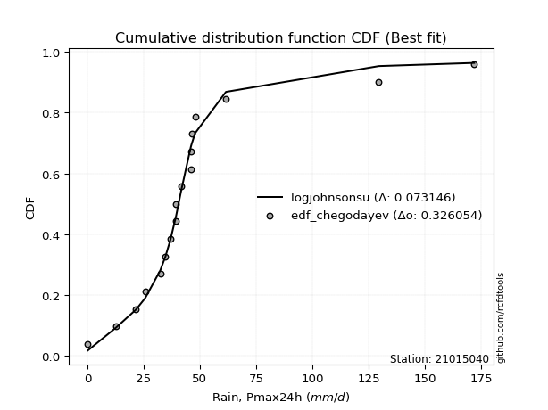</img>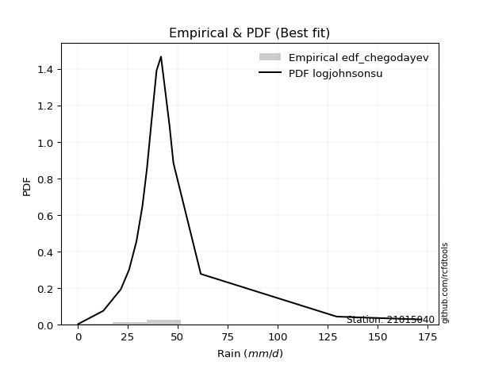</img>

</div>


### 6. EDF Blom (1958)

The Blom formula is a specific "plotting position" formula used in hydrology and statistical analysis to estimate the empirical cumulative probability (or non-exceedance probability) of a data series. It is particularly recommended for data that are approximately normally distributed. The constant _a_ is set to 0.375 (or 3/8).

<div align="center">


$P=(m-a)/(n+1-2a)$


</div>


**6.1. Empirical values**

<div align="center">

|                | 0                    | 1                   | 2                   | 3                   | 4                   | 5                   | 6                   | 7                  | 8        | 9                  | 10                 | 11                 | 12                 | 13                 | 14                 | 15                 | 16                 |
|:---------------|:---------------------|:--------------------|:--------------------|:--------------------|:--------------------|:--------------------|:--------------------|:-------------------|:---------|:-------------------|:-------------------|:-------------------|:-------------------|:-------------------|:-------------------|:-------------------|:-------------------|
| date           | 2021                 | 2007                | 2006                | 2020                | 2017                | 2014                | 2008                | 2012               | 2011     | 2019               | 2010               | 2013               | 2018               | 2009               | 2015               | 2016               | 2024               |
| x              | 0.2                  | 12.8                | 21.6                | 25.7                | 32.4                | 34.7                | 36.9                | 39.4               | 39.5     | 41.7               | 46.0               | 46.1               | 46.3               | 47.9               | 61.6               | 129.6              | 172.0              |
| m              | 1                    | 2                   | 3                   | 4                   | 5                   | 6                   | 7                   | 8                  | 9        | 10                 | 11                 | 12                 | 13                 | 14                 | 15                 | 16                 | 17                 |
| empirical_dist | edf_blom             | edf_blom            | edf_blom            | edf_blom            | edf_blom            | edf_blom            | edf_blom            | edf_blom           | edf_blom | edf_blom           | edf_blom           | edf_blom           | edf_blom           | edf_blom           | edf_blom           | edf_blom           | edf_blom           |
| empirical      | 0.036231884057971016 | 0.09420289855072464 | 0.15217391304347827 | 0.21014492753623187 | 0.26811594202898553 | 0.32608695652173914 | 0.38405797101449274 | 0.4420289855072464 | 0.5      | 0.5579710144927537 | 0.6159420289855072 | 0.6739130434782609 | 0.7318840579710145 | 0.7898550724637681 | 0.8478260869565217 | 0.9057971014492754 | 0.9637681159420289 |
| empirical_tr   | 1.037593984962406    | 1.1039999999999999  | 1.1794871794871795  | 1.2660550458715598  | 1.3663366336633664  | 1.4838709677419355  | 1.6235294117647057  | 1.7922077922077921 | 2.0      | 2.2622950819672134 | 2.6037735849056602 | 3.0666666666666664 | 3.7297297297297303 | 4.758620689655172  | 6.571428571428571  | 10.615384615384619 | 27.599999999999962 |

</div>


**6.2. Kolmogorov-Smirnov fit test (sorted by Δ)**


<div align="center">

|                | 0                   | 1                   | 2                   | 3                   | 4                   | 5                     | 6                   | 7                   | 8                   | 9                   | 10                  | 11                 | 12                  | 13                  | 14                  | 15                  | 16                  | 17                  | 18                  | 19                  | 20                  | 21                  | 22                  | 23                 | 24                  | 25                 | 26                  | 27                 | 28                  | 29                  | 30                 | 31                  | 32                 | 33                 | 34                 | 35                  | 36                 | 37                  | 38                  | 39                  | 40                 | 41                  | 42                  | 43                  | 44                 | 45                  | 46                  | 47                  | 48                  | 49                  | 50                  | 51                 | 52                 | 53                 | 54                  | 55                 | 56                 | 57                  | 58                 | 59                 | 60                 | 61                  | 62                  | 63                 | 64                  | 65                  | 66                  | 67                  | 68                  | 69                 | 70                 | 71                  | 72                 | 73                 | 74                  | 75                  | 76                 | 77                  | 78                 | 79                 | 80                 | 81                 | 82                 | 83                 | 84                 | 85                 | 86                 | 87                 |
|:---------------|:--------------------|:--------------------|:--------------------|:--------------------|:--------------------|:----------------------|:--------------------|:--------------------|:--------------------|:--------------------|:--------------------|:-------------------|:--------------------|:--------------------|:--------------------|:--------------------|:--------------------|:--------------------|:--------------------|:--------------------|:--------------------|:--------------------|:--------------------|:-------------------|:--------------------|:-------------------|:--------------------|:-------------------|:--------------------|:--------------------|:-------------------|:--------------------|:-------------------|:-------------------|:-------------------|:--------------------|:-------------------|:--------------------|:--------------------|:--------------------|:-------------------|:--------------------|:--------------------|:--------------------|:-------------------|:--------------------|:--------------------|:--------------------|:--------------------|:--------------------|:--------------------|:-------------------|:-------------------|:-------------------|:--------------------|:-------------------|:-------------------|:--------------------|:-------------------|:-------------------|:-------------------|:--------------------|:--------------------|:-------------------|:--------------------|:--------------------|:--------------------|:--------------------|:--------------------|:-------------------|:-------------------|:--------------------|:-------------------|:-------------------|:--------------------|:--------------------|:-------------------|:--------------------|:-------------------|:-------------------|:-------------------|:-------------------|:-------------------|:-------------------|:-------------------|:-------------------|:-------------------|:-------------------|
| station        | 21015040            | 21015040            | 21015040            | 21015040            | 21015040            | 21015040              | 21015040            | 21015040            | 21015040            | 21015040            | 21015040            | 21015040           | 21015040            | 21015040            | 21015040            | 21015040            | 21015040            | 21015040            | 21015040            | 21015040            | 21015040            | 21015040            | 21015040            | 21015040           | 21015040            | 21015040           | 21015040            | 21015040           | 21015040            | 21015040            | 21015040           | 21015040            | 21015040           | 21015040           | 21015040           | 21015040            | 21015040           | 21015040            | 21015040            | 21015040            | 21015040           | 21015040            | 21015040            | 21015040            | 21015040           | 21015040            | 21015040            | 21015040            | 21015040            | 21015040            | 21015040            | 21015040           | 21015040           | 21015040           | 21015040            | 21015040           | 21015040           | 21015040            | 21015040           | 21015040           | 21015040           | 21015040            | 21015040            | 21015040           | 21015040            | 21015040            | 21015040            | 21015040            | 21015040            | 21015040           | 21015040           | 21015040            | 21015040           | 21015040           | 21015040            | 21015040            | 21015040           | 21015040            | 21015040           | 21015040           | 21015040           | 21015040           | 21015040           | 21015040           | 21015040           | 21015040           | 21015040           | 21015040           |
| empirical_dist | edf_blom            | edf_blom            | edf_blom            | edf_blom            | edf_blom            | edf_blom              | edf_blom            | edf_blom            | edf_blom            | edf_blom            | edf_blom            | edf_blom           | edf_blom            | edf_blom            | edf_blom            | edf_blom            | edf_blom            | edf_blom            | edf_blom            | edf_blom            | edf_blom            | edf_blom            | edf_blom            | edf_blom           | edf_blom            | edf_blom           | edf_blom            | edf_blom           | edf_blom            | edf_blom            | edf_blom           | edf_blom            | edf_blom           | edf_blom           | edf_blom           | edf_blom            | edf_blom           | edf_blom            | edf_blom            | edf_blom            | edf_blom           | edf_blom            | edf_blom            | edf_blom            | edf_blom           | edf_blom            | edf_blom            | edf_blom            | edf_blom            | edf_blom            | edf_blom            | edf_blom           | edf_blom           | edf_blom           | edf_blom            | edf_blom           | edf_blom           | edf_blom            | edf_blom           | edf_blom           | edf_blom           | edf_blom            | edf_blom            | edf_blom           | edf_blom            | edf_blom            | edf_blom            | edf_blom            | edf_blom            | edf_blom           | edf_blom           | edf_blom            | edf_blom           | edf_blom           | edf_blom            | edf_blom            | edf_blom           | edf_blom            | edf_blom           | edf_blom           | edf_blom           | edf_blom           | edf_blom           | edf_blom           | edf_blom           | edf_blom           | edf_blom           | edf_blom           |
| p_dist         | logjohnsonsu        | t                   | johnsonsu           | logt                | gibrat              | loglaplace_asymmetric | mielke              | fisk                | wald                | nct                 | pearson3            | loggenlogistic     | invweibull          | betaprime           | f                   | invgamma            | logfisk             | loggompertz         | ncf                 | logcrystalball      | logloggamma         | halflogistic        | invgauss            | exponnorm          | moyal               | fatiguelife        | laplace_asymmetric  | gamma              | erlang              | genlogistic         | weibull_min        | expon               | genexpon           | gompertz           | loggumbel_l        | logmielke           | halfnorm           | truncnorm           | gumbel_r            | logfatiguelife      | lognakagami        | logexponnorm        | lognorm             | lognorm             | logrice            | loglogistic         | lognct              | loghypsecant        | loglognorm          | nakagami            | loglaplace          | loginvgamma        | rayleigh           | kstwobign          | logalpha            | maxwell            | logmaxwell         | lograyleigh         | logbetaprime       | loginvgauss        | loginvweibull      | rice                | norm                | crystalball        | logistic            | hypsecant           | laplace             | loggumbel_r         | loghalfnorm         | logpearson3        | logmoyal           | loghalflogistic     | logkstwobign       | gumbel_l           | loggenexpon         | logwald             | loggibrat          | logexpon            | loggamma           | loggamma           | logncf             | logtruncnorm       | logf               | logweibull_min     | logchi2            | alpha              | chi2               | logerlang          |
| delta          | 0.07214685574213953 | 0.07902971669563252 | 0.08856040895401951 | 0.09046155287537871 | 0.12219822401093589 | 0.16046949264021382   | 0.16062320090562499 | 0.16197214872847354 | 0.16794266769469401 | 0.17044225872081797 | 0.17286854269191182 | 0.1766423818488828 | 0.18468604350462003 | 0.18591442491880772 | 0.18682082391882404 | 0.18796000923103828 | 0.19051977163378542 | 0.19200937114564476 | 0.19469637257591776 | 0.19508395951347401 | 0.20016032369838577 | 0.20093940041442604 | 0.20405364454485642 | 0.2040940696624981 | 0.20573341576856108 | 0.2074137496346432 | 0.21101124925037062 | 0.2128803025067908 | 0.21288073456037382 | 0.21295440554348366 | 0.2143559053635053 | 0.21437302193653945 | 0.2145125213251346 | 0.2174106189386189 | 0.2236513010610386 | 0.22422185395938365 | 0.2251198669549691 | 0.22576079083362588 | 0.23161701357090259 | 0.24136455071664953 | 0.2435471395048795 | 0.24364633779648737 | 0.24364820157810535 | 0.24364820157810535 | 0.2437126973455277 | 0.24455536970672892 | 0.24465072339929866 | 0.24585468341302447 | 0.24626784715627476 | 0.24808993960995074 | 0.25126234081002424 | 0.2553695960050114 | 0.2568141380634501 | 0.26312063643866   | 0.26578094431280014 | 0.2680690748196094 | 0.2775611088138865 | 0.28986087909820524 | 0.2904147042188883 | 0.293717029825207  | 0.2973949683568346 | 0.29935430571544575 | 0.30154770193807473 | 0.3015477089183641 | 0.30314404111313054 | 0.30450653268957195 | 0.31015892849608423 | 0.31364887280132187 | 0.32476298166088524 | 0.3271796309620457 | 0.3393854925283491 | 0.34224133061589807 | 0.3499630867165038 | 0.3721705789930341 | 0.40532876650167693 | 0.41090752973762085 | 0.4358954989941342 | 0.46700809954864164 | 0.5016283290053706 | 0.5016283290053706 | 0.5035941148352139 | 0.5368415733455256 | 0.6085530021028934 | 0.7276760277925766 | 0.7797751454073576 | 0.8547413314362079 | 0.8922518686427325 | 0.9186460017729029 |
| deltao         | 0.3260541228310003  | 0.3260541228310003  | 0.3260541228310003  | 0.3260541228310003  | 0.3260541228310003  | 0.3260541228310003    | 0.3260541228310003  | 0.3260541228310003  | 0.3260541228310003  | 0.3260541228310003  | 0.3260541228310003  | 0.3260541228310003 | 0.3260541228310003  | 0.3260541228310003  | 0.3260541228310003  | 0.3260541228310003  | 0.3260541228310003  | 0.3260541228310003  | 0.3260541228310003  | 0.3260541228310003  | 0.3260541228310003  | 0.3260541228310003  | 0.3260541228310003  | 0.3260541228310003 | 0.3260541228310003  | 0.3260541228310003 | 0.3260541228310003  | 0.3260541228310003 | 0.3260541228310003  | 0.3260541228310003  | 0.3260541228310003 | 0.3260541228310003  | 0.3260541228310003 | 0.3260541228310003 | 0.3260541228310003 | 0.3260541228310003  | 0.3260541228310003 | 0.3260541228310003  | 0.3260541228310003  | 0.3260541228310003  | 0.3260541228310003 | 0.3260541228310003  | 0.3260541228310003  | 0.3260541228310003  | 0.3260541228310003 | 0.3260541228310003  | 0.3260541228310003  | 0.3260541228310003  | 0.3260541228310003  | 0.3260541228310003  | 0.3260541228310003  | 0.3260541228310003 | 0.3260541228310003 | 0.3260541228310003 | 0.3260541228310003  | 0.3260541228310003 | 0.3260541228310003 | 0.3260541228310003  | 0.3260541228310003 | 0.3260541228310003 | 0.3260541228310003 | 0.3260541228310003  | 0.3260541228310003  | 0.3260541228310003 | 0.3260541228310003  | 0.3260541228310003  | 0.3260541228310003  | 0.3260541228310003  | 0.3260541228310003  | 0.3260541228310003 | 0.3260541228310003 | 0.3260541228310003  | 0.3260541228310003 | 0.3260541228310003 | 0.3260541228310003  | 0.3260541228310003  | 0.3260541228310003 | 0.3260541228310003  | 0.3260541228310003 | 0.3260541228310003 | 0.3260541228310003 | 0.3260541228310003 | 0.3260541228310003 | 0.3260541228310003 | 0.3260541228310003 | 0.3260541228310003 | 0.3260541228310003 | 0.3260541228310003 |
| eval           | Δo > Δ              | Δo > Δ              | Δo > Δ              | Δo > Δ              | Δo > Δ              | Δo > Δ                | Δo > Δ              | Δo > Δ              | Δo > Δ              | Δo > Δ              | Δo > Δ              | Δo > Δ             | Δo > Δ              | Δo > Δ              | Δo > Δ              | Δo > Δ              | Δo > Δ              | Δo > Δ              | Δo > Δ              | Δo > Δ              | Δo > Δ              | Δo > Δ              | Δo > Δ              | Δo > Δ             | Δo > Δ              | Δo > Δ             | Δo > Δ              | Δo > Δ             | Δo > Δ              | Δo > Δ              | Δo > Δ             | Δo > Δ              | Δo > Δ             | Δo > Δ             | Δo > Δ             | Δo > Δ              | Δo > Δ             | Δo > Δ              | Δo > Δ              | Δo > Δ              | Δo > Δ             | Δo > Δ              | Δo > Δ              | Δo > Δ              | Δo > Δ             | Δo > Δ              | Δo > Δ              | Δo > Δ              | Δo > Δ              | Δo > Δ              | Δo > Δ              | Δo > Δ             | Δo > Δ             | Δo > Δ             | Δo > Δ              | Δo > Δ             | Δo > Δ             | Δo > Δ              | Δo > Δ             | Δo > Δ             | Δo > Δ             | Δo > Δ              | Δo > Δ              | Δo > Δ             | Δo > Δ              | Δo > Δ              | Δo > Δ              | Δo > Δ              | Δo > Δ              | Δo <= Δ            | Δo <= Δ            | Δo <= Δ             | Δo <= Δ            | Δo <= Δ            | Δo <= Δ             | Δo <= Δ             | Δo <= Δ            | Δo <= Δ             | Δo <= Δ            | Δo <= Δ            | Δo <= Δ            | Δo <= Δ            | Δo <= Δ            | Δo <= Δ            | Δo <= Δ            | Δo <= Δ            | Δo <= Δ            | Δo <= Δ            |
| fit            | 1                   | 1                   | 1                   | 1                   | 1                   | 1                     | 1                   | 1                   | 1                   | 1                   | 1                   | 1                  | 1                   | 1                   | 1                   | 1                   | 1                   | 1                   | 1                   | 1                   | 1                   | 1                   | 1                   | 1                  | 1                   | 1                  | 1                   | 1                  | 1                   | 1                   | 1                  | 1                   | 1                  | 1                  | 1                  | 1                   | 1                  | 1                   | 1                   | 1                   | 1                  | 1                   | 1                   | 1                   | 1                  | 1                   | 1                   | 1                   | 1                   | 1                   | 1                   | 1                  | 1                  | 1                  | 1                   | 1                  | 1                  | 1                   | 1                  | 1                  | 1                  | 1                   | 1                   | 1                  | 1                   | 1                   | 1                   | 1                   | 1                   | 0                  | 0                  | 0                   | 0                  | 0                  | 0                   | 0                   | 0                  | 0                   | 0                  | 0                  | 0                  | 0                  | 0                  | 0                  | 0                  | 0                  | 0                  | 0                  |
| n              | 17                  | 17                  | 17                  | 17                  | 17                  | 17                    | 17                  | 17                  | 17                  | 17                  | 17                  | 17                 | 17                  | 17                  | 17                  | 17                  | 17                  | 17                  | 17                  | 17                  | 17                  | 17                  | 17                  | 17                 | 17                  | 17                 | 17                  | 17                 | 17                  | 17                  | 17                 | 17                  | 17                 | 17                 | 17                 | 17                  | 17                 | 17                  | 17                  | 17                  | 17                 | 17                  | 17                  | 17                  | 17                 | 17                  | 17                  | 17                  | 17                  | 17                  | 17                  | 17                 | 17                 | 17                 | 17                  | 17                 | 17                 | 17                  | 17                 | 17                 | 17                 | 17                  | 17                  | 17                 | 17                  | 17                  | 17                  | 17                  | 17                  | 17                 | 17                 | 17                  | 17                 | 17                 | 17                  | 17                  | 17                 | 17                  | 17                 | 17                 | 17                 | 17                 | 17                 | 17                 | 17                 | 17                 | 17                 | 17                 |
| best_fit       | 1                   | 0                   | 0                   | 0                   | 0                   | 0                     | 0                   | 0                   | 0                   | 0                   | 0                   | 0                  | 0                   | 0                   | 0                   | 0                   | 0                   | 0                   | 0                   | 0                   | 0                   | 0                   | 0                   | 0                  | 0                   | 0                  | 0                   | 0                  | 0                   | 0                   | 0                  | 0                   | 0                  | 0                  | 0                  | 0                   | 0                  | 0                   | 0                   | 0                   | 0                  | 0                   | 0                   | 0                   | 0                  | 0                   | 0                   | 0                   | 0                   | 0                   | 0                   | 0                  | 0                  | 0                  | 0                   | 0                  | 0                  | 0                   | 0                  | 0                  | 0                  | 0                   | 0                   | 0                  | 0                   | 0                   | 0                   | 0                   | 0                   | 0                  | 0                  | 0                   | 0                  | 0                  | 0                   | 0                   | 0                  | 0                   | 0                  | 0                  | 0                  | 0                  | 0                  | 0                  | 0                  | 0                  | 0                  | 0                  |
| best_fit_sort  | 1                   | 2                   | 3                   | 4                   | 5                   | 6                     | 7                   | 8                   | 9                   | 10                  | 11                  | 12                 | 13                  | 14                  | 15                  | 16                  | 17                  | 18                  | 19                  | 20                  | 21                  | 22                  | 23                  | 24                 | 25                  | 26                 | 27                  | 28                 | 29                  | 30                  | 31                 | 32                  | 33                 | 34                 | 35                 | 36                  | 37                 | 38                  | 39                  | 40                  | 41                 | 42                  | 43                  | 44                  | 45                 | 46                  | 47                  | 48                  | 49                  | 50                  | 51                  | 52                 | 53                 | 54                 | 55                  | 56                 | 57                 | 58                  | 59                 | 60                 | 61                 | 62                  | 63                  | 64                 | 65                  | 66                  | 67                  | 68                  | 69                  | 70                 | 71                 | 72                  | 73                 | 74                 | 75                  | 76                  | 77                 | 78                  | 79                 | 80                 | 81                 | 82                 | 83                 | 84                 | 85                 | 86                 | 87                 | 88                 |

</div>


**6.3. Best fit**

<div align="center">

|   id |   station | empirical_dist   | p_dist       |     delta |   deltao | eval   |   fit |   n |   best_fit |   best_fit_sort |
|-----:|----------:|:-----------------|:-------------|----------:|---------:|:-------|------:|----:|-----------:|----------------:|
|    0 |  21015040 | edf_blom         | logjohnsonsu | 0.0721469 | 0.326054 | Δo > Δ |     1 |  17 |          1 |               1 |

</div>


<div align="center">

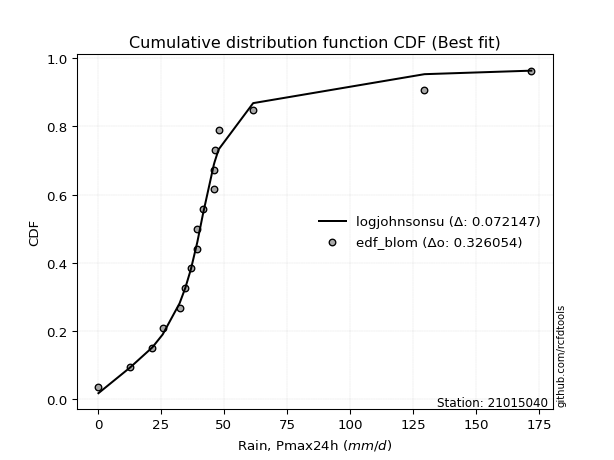</img></img>

</div>


### 7. EDF Tukey (1962)

In hydrology, the Tukey formula is used as a plotting position formula to estimate the empirical probability or frequency of a flood event (or other hydrological data). The formula parameter is given as _c=0.333_ (or 1/3).

<div align="center">


$P=(m-c)/(n+1-2c)$


</div>


**7.1. Empirical values**

<div align="center">

|                | 0                    | 1                   | 2                   | 3                   | 4                  | 5                  | 6                   | 7                  | 8         | 9                  | 10                 | 11                 | 12                 | 13                 | 14                 | 15                 | 16                 |
|:---------------|:---------------------|:--------------------|:--------------------|:--------------------|:-------------------|:-------------------|:--------------------|:-------------------|:----------|:-------------------|:-------------------|:-------------------|:-------------------|:-------------------|:-------------------|:-------------------|:-------------------|
| date           | 2021                 | 2007                | 2006                | 2020                | 2017               | 2014               | 2008                | 2012               | 2011      | 2019               | 2010               | 2013               | 2018               | 2009               | 2015               | 2016               | 2024               |
| x              | 0.2                  | 12.8                | 21.6                | 25.7                | 32.4               | 34.7               | 36.9                | 39.4               | 39.5      | 41.7               | 46.0               | 46.1               | 46.3               | 47.9               | 61.6               | 129.6              | 172.0              |
| m              | 1                    | 2                   | 3                   | 4                   | 5                  | 6                  | 7                   | 8                  | 9         | 10                 | 11                 | 12                 | 13                 | 14                 | 15                 | 16                 | 17                 |
| empirical_dist | edf_tukey            | edf_tukey           | edf_tukey           | edf_tukey           | edf_tukey          | edf_tukey          | edf_tukey           | edf_tukey          | edf_tukey | edf_tukey          | edf_tukey          | edf_tukey          | edf_tukey          | edf_tukey          | edf_tukey          | edf_tukey          | edf_tukey          |
| empirical      | 0.038461538461538464 | 0.09615384615384616 | 0.15384615384615385 | 0.21153846153846154 | 0.2692307692307692 | 0.3269230769230769 | 0.38461538461538464 | 0.4423076923076923 | 0.5       | 0.5576923076923077 | 0.6153846153846154 | 0.6730769230769231 | 0.7307692307692307 | 0.7884615384615384 | 0.8461538461538461 | 0.9038461538461539 | 0.9615384615384616 |
| empirical_tr   | 1.04                 | 1.1063829787234043  | 1.1818181818181819  | 1.2682926829268293  | 1.3684210526315788 | 1.4857142857142855 | 1.625               | 1.793103448275862  | 2.0       | 2.2608695652173916 | 2.6                | 3.0588235294117654 | 3.7142857142857135 | 4.727272727272727  | 6.5                | 10.4               | 26.000000000000018 |

</div>


**7.2. Kolmogorov-Smirnov fit test (sorted by Δ)**


<div align="center">

|                | 0                   | 1                   | 2                   | 3                   | 4                  | 5                   | 6                     | 7                  | 8                   | 9                   | 10                  | 11                  | 12                 | 13                  | 14                 | 15                  | 16                  | 17                  | 18                  | 19                  | 20                  | 21                 | 22                  | 23                  | 24                  | 25                  | 26                 | 27                  | 28                  | 29                  | 30                 | 31                  | 32                 | 33                  | 34                  | 35                  | 36                  | 37                  | 38                  | 39                  | 40                 | 41                  | 42                  | 43                  | 44                 | 45                  | 46                  | 47                  | 48                  | 49                 | 50                  | 51                  | 52                  | 53                 | 54                  | 55                  | 56                  | 57                  | 58                  | 59                 | 60                 | 61                 | 62                 | 63                  | 64                 | 65                 | 66                 | 67                 | 68                  | 69                 | 70                 | 71                 | 72                 | 73                  | 74                  | 75                  | 76                 | 77                 | 78                  | 79                  | 80                 | 81                 | 82                 | 83                 | 84                 | 85                 | 86                 | 87                 |
|:---------------|:--------------------|:--------------------|:--------------------|:--------------------|:-------------------|:--------------------|:----------------------|:-------------------|:--------------------|:--------------------|:--------------------|:--------------------|:-------------------|:--------------------|:-------------------|:--------------------|:--------------------|:--------------------|:--------------------|:--------------------|:--------------------|:-------------------|:--------------------|:--------------------|:--------------------|:--------------------|:-------------------|:--------------------|:--------------------|:--------------------|:-------------------|:--------------------|:-------------------|:--------------------|:--------------------|:--------------------|:--------------------|:--------------------|:--------------------|:--------------------|:-------------------|:--------------------|:--------------------|:--------------------|:-------------------|:--------------------|:--------------------|:--------------------|:--------------------|:-------------------|:--------------------|:--------------------|:--------------------|:-------------------|:--------------------|:--------------------|:--------------------|:--------------------|:--------------------|:-------------------|:-------------------|:-------------------|:-------------------|:--------------------|:-------------------|:-------------------|:-------------------|:-------------------|:--------------------|:-------------------|:-------------------|:-------------------|:-------------------|:--------------------|:--------------------|:--------------------|:-------------------|:-------------------|:--------------------|:--------------------|:-------------------|:-------------------|:-------------------|:-------------------|:-------------------|:-------------------|:-------------------|:-------------------|
| station        | 21015040            | 21015040            | 21015040            | 21015040            | 21015040           | 21015040            | 21015040              | 21015040           | 21015040            | 21015040            | 21015040            | 21015040            | 21015040           | 21015040            | 21015040           | 21015040            | 21015040            | 21015040            | 21015040            | 21015040            | 21015040            | 21015040           | 21015040            | 21015040            | 21015040            | 21015040            | 21015040           | 21015040            | 21015040            | 21015040            | 21015040           | 21015040            | 21015040           | 21015040            | 21015040            | 21015040            | 21015040            | 21015040            | 21015040            | 21015040            | 21015040           | 21015040            | 21015040            | 21015040            | 21015040           | 21015040            | 21015040            | 21015040            | 21015040            | 21015040           | 21015040            | 21015040            | 21015040            | 21015040           | 21015040            | 21015040            | 21015040            | 21015040            | 21015040            | 21015040           | 21015040           | 21015040           | 21015040           | 21015040            | 21015040           | 21015040           | 21015040           | 21015040           | 21015040            | 21015040           | 21015040           | 21015040           | 21015040           | 21015040            | 21015040            | 21015040            | 21015040           | 21015040           | 21015040            | 21015040            | 21015040           | 21015040           | 21015040           | 21015040           | 21015040           | 21015040           | 21015040           | 21015040           |
| empirical_dist | edf_tukey           | edf_tukey           | edf_tukey           | edf_tukey           | edf_tukey          | edf_tukey           | edf_tukey             | edf_tukey          | edf_tukey           | edf_tukey           | edf_tukey           | edf_tukey           | edf_tukey          | edf_tukey           | edf_tukey          | edf_tukey           | edf_tukey           | edf_tukey           | edf_tukey           | edf_tukey           | edf_tukey           | edf_tukey          | edf_tukey           | edf_tukey           | edf_tukey           | edf_tukey           | edf_tukey          | edf_tukey           | edf_tukey           | edf_tukey           | edf_tukey          | edf_tukey           | edf_tukey          | edf_tukey           | edf_tukey           | edf_tukey           | edf_tukey           | edf_tukey           | edf_tukey           | edf_tukey           | edf_tukey          | edf_tukey           | edf_tukey           | edf_tukey           | edf_tukey          | edf_tukey           | edf_tukey           | edf_tukey           | edf_tukey           | edf_tukey          | edf_tukey           | edf_tukey           | edf_tukey           | edf_tukey          | edf_tukey           | edf_tukey           | edf_tukey           | edf_tukey           | edf_tukey           | edf_tukey          | edf_tukey          | edf_tukey          | edf_tukey          | edf_tukey           | edf_tukey          | edf_tukey          | edf_tukey          | edf_tukey          | edf_tukey           | edf_tukey          | edf_tukey          | edf_tukey          | edf_tukey          | edf_tukey           | edf_tukey           | edf_tukey           | edf_tukey          | edf_tukey          | edf_tukey           | edf_tukey           | edf_tukey          | edf_tukey          | edf_tukey          | edf_tukey          | edf_tukey          | edf_tukey          | edf_tukey          | edf_tukey          |
| p_dist         | logjohnsonsu        | t                   | johnsonsu           | logt                | gibrat             | mielke              | loglaplace_asymmetric | fisk               | wald                | nct                 | pearson3            | loggenlogistic      | invweibull         | betaprime           | f                  | invgamma            | logfisk             | loggompertz         | ncf                 | logcrystalball      | logloggamma         | halflogistic       | invgauss            | exponnorm           | moyal               | fatiguelife         | laplace_asymmetric | gamma               | erlang              | genlogistic         | weibull_min        | expon               | genexpon           | gompertz            | loggumbel_l         | logmielke           | halfnorm            | truncnorm           | gumbel_r            | logfatiguelife      | lognakagami        | logexponnorm        | lognorm             | lognorm             | logrice            | lognct              | loglogistic         | loghypsecant        | loglognorm          | nakagami           | loglaplace          | loginvgamma         | rayleigh            | kstwobign          | logalpha            | maxwell             | logmaxwell          | lograyleigh         | logbetaprime        | loginvgauss        | loginvweibull      | rice               | norm               | crystalball         | logistic           | hypsecant          | laplace            | loggumbel_r        | loghalfnorm         | logpearson3        | logmoyal           | loghalflogistic    | logkstwobign       | gumbel_l            | loggenexpon         | logwald             | loggibrat          | logexpon           | loggamma            | loggamma            | logncf             | logtruncnorm       | logf               | logweibull_min     | logchi2            | alpha              | chi2               | logerlang          |
| delta          | 0.07270426934303131 | 0.07958713029652431 | 0.08716687495178987 | 0.08906801887314908 | 0.1213621036095981 | 0.15922966690339535 | 0.15935466543843013   | 0.1605786147262439 | 0.16682784049291033 | 0.16904872471858834 | 0.17175371549012813 | 0.17552755464709913 | 0.1832925095023904 | 0.18452089091657808 | 0.1854272899165944 | 0.18656647522880865 | 0.18912623763155578 | 0.19061583714341512 | 0.19330283857368813 | 0.19369042551124438 | 0.19876678969615613 | 0.1995458664121964 | 0.20266011054262678 | 0.20270053566026847 | 0.20433988176633144 | 0.20602021563241357 | 0.209617715248141  | 0.21148676850456116 | 0.21148720055814418 | 0.21156087154125403 | 0.2132410781617216 | 0.21325819473475577 | 0.2133976941233509 | 0.21601708493638927 | 0.22225776705880895 | 0.22282831995715402 | 0.22372633295273947 | 0.22436725683139624 | 0.23022347956867295 | 0.24019811692539234 | 0.2418748987022039 | 0.24197409699381178 | 0.24197596077542977 | 0.24197596077542977 | 0.2420404565428521 | 0.24297848259662308 | 0.24344054250494523 | 0.24473985621124078 | 0.24508073516068457 | 0.2466964056077211 | 0.25014751360824056 | 0.25369735520233583 | 0.25542060406122047 | 0.2617271024364304 | 0.26410870351012455 | 0.26667554081737976 | 0.27588886801121093 | 0.28818863829552965 | 0.28874246341621274 | 0.2920447890225314 | 0.295722727554159  | 0.2979607717132161 | 0.3001541679358451 | 0.30015417491613444 | 0.3017505071109009 | 0.3031129986873423 | 0.3087653944938546 | 0.3125340455995382 | 0.32309074085820966 | 0.3257860969598161 | 0.3382706653265654 | 0.3411265034141144 | 0.3482908459138282 | 0.37077704499080444 | 0.40365652569900135 | 0.40979270253583716 | 0.4347806717923505 | 0.4650571519455201 | 0.49967738140224904 | 0.49967738140224904 | 0.5016431672320923 | 0.53516933254285   | 0.6066020544997719 | 0.725725080189455  | 0.7778241978042361 | 0.8527903838330864 | 0.890300921039611  | 0.9164163473693355 |
| deltao         | 0.3260541228310003  | 0.3260541228310003  | 0.3260541228310003  | 0.3260541228310003  | 0.3260541228310003 | 0.3260541228310003  | 0.3260541228310003    | 0.3260541228310003 | 0.3260541228310003  | 0.3260541228310003  | 0.3260541228310003  | 0.3260541228310003  | 0.3260541228310003 | 0.3260541228310003  | 0.3260541228310003 | 0.3260541228310003  | 0.3260541228310003  | 0.3260541228310003  | 0.3260541228310003  | 0.3260541228310003  | 0.3260541228310003  | 0.3260541228310003 | 0.3260541228310003  | 0.3260541228310003  | 0.3260541228310003  | 0.3260541228310003  | 0.3260541228310003 | 0.3260541228310003  | 0.3260541228310003  | 0.3260541228310003  | 0.3260541228310003 | 0.3260541228310003  | 0.3260541228310003 | 0.3260541228310003  | 0.3260541228310003  | 0.3260541228310003  | 0.3260541228310003  | 0.3260541228310003  | 0.3260541228310003  | 0.3260541228310003  | 0.3260541228310003 | 0.3260541228310003  | 0.3260541228310003  | 0.3260541228310003  | 0.3260541228310003 | 0.3260541228310003  | 0.3260541228310003  | 0.3260541228310003  | 0.3260541228310003  | 0.3260541228310003 | 0.3260541228310003  | 0.3260541228310003  | 0.3260541228310003  | 0.3260541228310003 | 0.3260541228310003  | 0.3260541228310003  | 0.3260541228310003  | 0.3260541228310003  | 0.3260541228310003  | 0.3260541228310003 | 0.3260541228310003 | 0.3260541228310003 | 0.3260541228310003 | 0.3260541228310003  | 0.3260541228310003 | 0.3260541228310003 | 0.3260541228310003 | 0.3260541228310003 | 0.3260541228310003  | 0.3260541228310003 | 0.3260541228310003 | 0.3260541228310003 | 0.3260541228310003 | 0.3260541228310003  | 0.3260541228310003  | 0.3260541228310003  | 0.3260541228310003 | 0.3260541228310003 | 0.3260541228310003  | 0.3260541228310003  | 0.3260541228310003 | 0.3260541228310003 | 0.3260541228310003 | 0.3260541228310003 | 0.3260541228310003 | 0.3260541228310003 | 0.3260541228310003 | 0.3260541228310003 |
| eval           | Δo > Δ              | Δo > Δ              | Δo > Δ              | Δo > Δ              | Δo > Δ             | Δo > Δ              | Δo > Δ                | Δo > Δ             | Δo > Δ              | Δo > Δ              | Δo > Δ              | Δo > Δ              | Δo > Δ             | Δo > Δ              | Δo > Δ             | Δo > Δ              | Δo > Δ              | Δo > Δ              | Δo > Δ              | Δo > Δ              | Δo > Δ              | Δo > Δ             | Δo > Δ              | Δo > Δ              | Δo > Δ              | Δo > Δ              | Δo > Δ             | Δo > Δ              | Δo > Δ              | Δo > Δ              | Δo > Δ             | Δo > Δ              | Δo > Δ             | Δo > Δ              | Δo > Δ              | Δo > Δ              | Δo > Δ              | Δo > Δ              | Δo > Δ              | Δo > Δ              | Δo > Δ             | Δo > Δ              | Δo > Δ              | Δo > Δ              | Δo > Δ             | Δo > Δ              | Δo > Δ              | Δo > Δ              | Δo > Δ              | Δo > Δ             | Δo > Δ              | Δo > Δ              | Δo > Δ              | Δo > Δ             | Δo > Δ              | Δo > Δ              | Δo > Δ              | Δo > Δ              | Δo > Δ              | Δo > Δ             | Δo > Δ             | Δo > Δ             | Δo > Δ             | Δo > Δ              | Δo > Δ             | Δo > Δ             | Δo > Δ             | Δo > Δ             | Δo > Δ              | Δo > Δ             | Δo <= Δ            | Δo <= Δ            | Δo <= Δ            | Δo <= Δ             | Δo <= Δ             | Δo <= Δ             | Δo <= Δ            | Δo <= Δ            | Δo <= Δ             | Δo <= Δ             | Δo <= Δ            | Δo <= Δ            | Δo <= Δ            | Δo <= Δ            | Δo <= Δ            | Δo <= Δ            | Δo <= Δ            | Δo <= Δ            |
| fit            | 1                   | 1                   | 1                   | 1                   | 1                  | 1                   | 1                     | 1                  | 1                   | 1                   | 1                   | 1                   | 1                  | 1                   | 1                  | 1                   | 1                   | 1                   | 1                   | 1                   | 1                   | 1                  | 1                   | 1                   | 1                   | 1                   | 1                  | 1                   | 1                   | 1                   | 1                  | 1                   | 1                  | 1                   | 1                   | 1                   | 1                   | 1                   | 1                   | 1                   | 1                  | 1                   | 1                   | 1                   | 1                  | 1                   | 1                   | 1                   | 1                   | 1                  | 1                   | 1                   | 1                   | 1                  | 1                   | 1                   | 1                   | 1                   | 1                   | 1                  | 1                  | 1                  | 1                  | 1                   | 1                  | 1                  | 1                  | 1                  | 1                   | 1                  | 0                  | 0                  | 0                  | 0                   | 0                   | 0                   | 0                  | 0                  | 0                   | 0                   | 0                  | 0                  | 0                  | 0                  | 0                  | 0                  | 0                  | 0                  |
| n              | 17                  | 17                  | 17                  | 17                  | 17                 | 17                  | 17                    | 17                 | 17                  | 17                  | 17                  | 17                  | 17                 | 17                  | 17                 | 17                  | 17                  | 17                  | 17                  | 17                  | 17                  | 17                 | 17                  | 17                  | 17                  | 17                  | 17                 | 17                  | 17                  | 17                  | 17                 | 17                  | 17                 | 17                  | 17                  | 17                  | 17                  | 17                  | 17                  | 17                  | 17                 | 17                  | 17                  | 17                  | 17                 | 17                  | 17                  | 17                  | 17                  | 17                 | 17                  | 17                  | 17                  | 17                 | 17                  | 17                  | 17                  | 17                  | 17                  | 17                 | 17                 | 17                 | 17                 | 17                  | 17                 | 17                 | 17                 | 17                 | 17                  | 17                 | 17                 | 17                 | 17                 | 17                  | 17                  | 17                  | 17                 | 17                 | 17                  | 17                  | 17                 | 17                 | 17                 | 17                 | 17                 | 17                 | 17                 | 17                 |
| best_fit       | 1                   | 0                   | 0                   | 0                   | 0                  | 0                   | 0                     | 0                  | 0                   | 0                   | 0                   | 0                   | 0                  | 0                   | 0                  | 0                   | 0                   | 0                   | 0                   | 0                   | 0                   | 0                  | 0                   | 0                   | 0                   | 0                   | 0                  | 0                   | 0                   | 0                   | 0                  | 0                   | 0                  | 0                   | 0                   | 0                   | 0                   | 0                   | 0                   | 0                   | 0                  | 0                   | 0                   | 0                   | 0                  | 0                   | 0                   | 0                   | 0                   | 0                  | 0                   | 0                   | 0                   | 0                  | 0                   | 0                   | 0                   | 0                   | 0                   | 0                  | 0                  | 0                  | 0                  | 0                   | 0                  | 0                  | 0                  | 0                  | 0                   | 0                  | 0                  | 0                  | 0                  | 0                   | 0                   | 0                   | 0                  | 0                  | 0                   | 0                   | 0                  | 0                  | 0                  | 0                  | 0                  | 0                  | 0                  | 0                  |
| best_fit_sort  | 1                   | 2                   | 3                   | 4                   | 5                  | 6                   | 7                     | 8                  | 9                   | 10                  | 11                  | 12                  | 13                 | 14                  | 15                 | 16                  | 17                  | 18                  | 19                  | 20                  | 21                  | 22                 | 23                  | 24                  | 25                  | 26                  | 27                 | 28                  | 29                  | 30                  | 31                 | 32                  | 33                 | 34                  | 35                  | 36                  | 37                  | 38                  | 39                  | 40                  | 41                 | 42                  | 43                  | 44                  | 45                 | 46                  | 47                  | 48                  | 49                  | 50                 | 51                  | 52                  | 53                  | 54                 | 55                  | 56                  | 57                  | 58                  | 59                  | 60                 | 61                 | 62                 | 63                 | 64                  | 65                 | 66                 | 67                 | 68                 | 69                  | 70                 | 71                 | 72                 | 73                 | 74                  | 75                  | 76                  | 77                 | 78                 | 79                  | 80                  | 81                 | 82                 | 83                 | 84                 | 85                 | 86                 | 87                 | 88                 |

</div>


**7.3. Best fit**

<div align="center">

|   id |   station | empirical_dist   | p_dist       |     delta |   deltao | eval   |   fit |   n |   best_fit |   best_fit_sort |
|-----:|----------:|:-----------------|:-------------|----------:|---------:|:-------|------:|----:|-----------:|----------------:|
|    0 |  21015040 | edf_tukey        | logjohnsonsu | 0.0727043 | 0.326054 | Δo > Δ |     1 |  17 |          1 |               1 |

</div>


<div align="center">

</img></img>

</div>


### 8. EDF Gringorten (1963)

Gringorten plotting position formula is essential for estimating the probability and return periods of extreme events like floods and heavy rainfall. The constant _a=0.44_.

<div align="center">


$P=(m-a)/(n+1-2a)$


</div>


**8.1. Empirical values**

<div align="center">

|                | 0                   | 1                  | 2                   | 3                   | 4                   | 5                   | 6                  | 7                   | 8              | 9                  | 10                 | 11                 | 12                 | 13                 | 14                 | 15                 | 16                 |
|:---------------|:--------------------|:-------------------|:--------------------|:--------------------|:--------------------|:--------------------|:-------------------|:--------------------|:---------------|:-------------------|:-------------------|:-------------------|:-------------------|:-------------------|:-------------------|:-------------------|:-------------------|
| date           | 2021                | 2007               | 2006                | 2020                | 2017                | 2014                | 2008               | 2012                | 2011           | 2019               | 2010               | 2013               | 2018               | 2009               | 2015               | 2016               | 2024               |
| x              | 0.2                 | 12.8               | 21.6                | 25.7                | 32.4                | 34.7                | 36.9               | 39.4                | 39.5           | 41.7               | 46.0               | 46.1               | 46.3               | 47.9               | 61.6               | 129.6              | 172.0              |
| m              | 1                   | 2                  | 3                   | 4                   | 5                   | 6                   | 7                  | 8                   | 9              | 10                 | 11                 | 12                 | 13                 | 14                 | 15                 | 16                 | 17                 |
| empirical_dist | edf_gringorten      | edf_gringorten     | edf_gringorten      | edf_gringorten      | edf_gringorten      | edf_gringorten      | edf_gringorten     | edf_gringorten      | edf_gringorten | edf_gringorten     | edf_gringorten     | edf_gringorten     | edf_gringorten     | edf_gringorten     | edf_gringorten     | edf_gringorten     | edf_gringorten     |
| empirical      | 0.03271028037383178 | 0.0911214953271028 | 0.14953271028037382 | 0.20794392523364486 | 0.26635514018691586 | 0.32476635514018687 | 0.3831775700934579 | 0.44158878504672894 | 0.5            | 0.5584112149532711 | 0.616822429906542  | 0.6752336448598131 | 0.7336448598130841 | 0.7920560747663551 | 0.8504672897196262 | 0.9088785046728972 | 0.967289719626168  |
| empirical_tr   | 1.0338164251207729  | 1.1002570694087404 | 1.1758241758241759  | 1.262536873156342   | 1.3630573248407643  | 1.480968858131488   | 1.621212121212121  | 1.7907949790794977  | 2.0            | 2.2645502645502646 | 2.6097560975609753 | 3.079136690647482  | 3.7543859649122813 | 4.808988764044942  | 6.687499999999999  | 10.974358974358976 | 30.571428571428413 |

</div>


**8.2. Kolmogorov-Smirnov fit test (sorted by Δ)**


<div align="center">

|                | 0                   | 1                   | 2                   | 3                   | 4                   | 5                     | 6                  | 7                   | 8                   | 9                  | 10                 | 11                  | 12                  | 13                  | 14                  | 15                 | 16                  | 17                  | 18                  | 19                  | 20                  | 21                  | 22                  | 23                  | 24                 | 25                  | 26                  | 27                  | 28                  | 29                  | 30                  | 31                  | 32                  | 33                  | 34                 | 35                  | 36                  | 37                 | 38                 | 39                  | 40                  | 41                  | 42                 | 43                 | 44                 | 45                  | 46                  | 47                  | 48                 | 49                  | 50                 | 51                  | 52                 | 53                  | 54                 | 55                 | 56                  | 57                  | 58                 | 59                 | 60                 | 61                  | 62                  | 63                 | 64                  | 65                  | 66                  | 67                  | 68                  | 69                  | 70                  | 71                  | 72                 | 73                 | 74                  | 75                 | 76                 | 77                  | 78                 | 79                 | 80                 | 81                 | 82                 | 83                 | 84                 | 85                 | 86                 | 87                 |
|:---------------|:--------------------|:--------------------|:--------------------|:--------------------|:--------------------|:----------------------|:-------------------|:--------------------|:--------------------|:-------------------|:-------------------|:--------------------|:--------------------|:--------------------|:--------------------|:-------------------|:--------------------|:--------------------|:--------------------|:--------------------|:--------------------|:--------------------|:--------------------|:--------------------|:-------------------|:--------------------|:--------------------|:--------------------|:--------------------|:--------------------|:--------------------|:--------------------|:--------------------|:--------------------|:-------------------|:--------------------|:--------------------|:-------------------|:-------------------|:--------------------|:--------------------|:--------------------|:-------------------|:-------------------|:-------------------|:--------------------|:--------------------|:--------------------|:-------------------|:--------------------|:-------------------|:--------------------|:-------------------|:--------------------|:-------------------|:-------------------|:--------------------|:--------------------|:-------------------|:-------------------|:-------------------|:--------------------|:--------------------|:-------------------|:--------------------|:--------------------|:--------------------|:--------------------|:--------------------|:--------------------|:--------------------|:--------------------|:-------------------|:-------------------|:--------------------|:-------------------|:-------------------|:--------------------|:-------------------|:-------------------|:-------------------|:-------------------|:-------------------|:-------------------|:-------------------|:-------------------|:-------------------|:-------------------|
| station        | 21015040            | 21015040            | 21015040            | 21015040            | 21015040            | 21015040              | 21015040           | 21015040            | 21015040            | 21015040           | 21015040           | 21015040            | 21015040            | 21015040            | 21015040            | 21015040           | 21015040            | 21015040            | 21015040            | 21015040            | 21015040            | 21015040            | 21015040            | 21015040            | 21015040           | 21015040            | 21015040            | 21015040            | 21015040            | 21015040            | 21015040            | 21015040            | 21015040            | 21015040            | 21015040           | 21015040            | 21015040            | 21015040           | 21015040           | 21015040            | 21015040            | 21015040            | 21015040           | 21015040           | 21015040           | 21015040            | 21015040            | 21015040            | 21015040           | 21015040            | 21015040           | 21015040            | 21015040           | 21015040            | 21015040           | 21015040           | 21015040            | 21015040            | 21015040           | 21015040           | 21015040           | 21015040            | 21015040            | 21015040           | 21015040            | 21015040            | 21015040            | 21015040            | 21015040            | 21015040            | 21015040            | 21015040            | 21015040           | 21015040           | 21015040            | 21015040           | 21015040           | 21015040            | 21015040           | 21015040           | 21015040           | 21015040           | 21015040           | 21015040           | 21015040           | 21015040           | 21015040           | 21015040           |
| empirical_dist | edf_gringorten      | edf_gringorten      | edf_gringorten      | edf_gringorten      | edf_gringorten      | edf_gringorten        | edf_gringorten     | edf_gringorten      | edf_gringorten      | edf_gringorten     | edf_gringorten     | edf_gringorten      | edf_gringorten      | edf_gringorten      | edf_gringorten      | edf_gringorten     | edf_gringorten      | edf_gringorten      | edf_gringorten      | edf_gringorten      | edf_gringorten      | edf_gringorten      | edf_gringorten      | edf_gringorten      | edf_gringorten     | edf_gringorten      | edf_gringorten      | edf_gringorten      | edf_gringorten      | edf_gringorten      | edf_gringorten      | edf_gringorten      | edf_gringorten      | edf_gringorten      | edf_gringorten     | edf_gringorten      | edf_gringorten      | edf_gringorten     | edf_gringorten     | edf_gringorten      | edf_gringorten      | edf_gringorten      | edf_gringorten     | edf_gringorten     | edf_gringorten     | edf_gringorten      | edf_gringorten      | edf_gringorten      | edf_gringorten     | edf_gringorten      | edf_gringorten     | edf_gringorten      | edf_gringorten     | edf_gringorten      | edf_gringorten     | edf_gringorten     | edf_gringorten      | edf_gringorten      | edf_gringorten     | edf_gringorten     | edf_gringorten     | edf_gringorten      | edf_gringorten      | edf_gringorten     | edf_gringorten      | edf_gringorten      | edf_gringorten      | edf_gringorten      | edf_gringorten      | edf_gringorten      | edf_gringorten      | edf_gringorten      | edf_gringorten     | edf_gringorten     | edf_gringorten      | edf_gringorten     | edf_gringorten     | edf_gringorten      | edf_gringorten     | edf_gringorten     | edf_gringorten     | edf_gringorten     | edf_gringorten     | edf_gringorten     | edf_gringorten     | edf_gringorten     | edf_gringorten     | edf_gringorten     |
| p_dist         | logjohnsonsu        | t                   | johnsonsu           | logt                | gibrat              | loglaplace_asymmetric | mielke             | fisk                | wald                | nct                | pearson3           | loggenlogistic      | invweibull          | betaprime           | f                   | invgamma           | logfisk             | loggompertz         | ncf                 | logcrystalball      | logloggamma         | halflogistic        | invgauss            | exponnorm           | moyal              | fatiguelife         | laplace_asymmetric  | gamma               | erlang              | genlogistic         | weibull_min         | expon               | genexpon            | gompertz            | loggumbel_l        | logmielke           | halfnorm            | truncnorm          | gumbel_r           | logfatiguelife      | lognakagami         | logexponnorm        | lognorm            | lognorm            | loglogistic        | logrice             | lognct              | loghypsecant        | loglognorm         | nakagami            | loglaplace         | loginvgamma         | rayleigh           | kstwobign           | logalpha           | maxwell            | logmaxwell          | lograyleigh         | logbetaprime       | loginvgauss        | loginvweibull      | rice                | norm                | crystalball        | logistic            | hypsecant           | laplace             | loggumbel_r         | loghalfnorm         | logpearson3         | logmoyal            | loghalflogistic     | logkstwobign       | gumbel_l           | loggenexpon         | logwald            | loggibrat          | logexpon            | loggamma           | loggamma           | logncf             | logtruncnorm       | logf               | logweibull_min     | logchi2            | alpha              | chi2               | logerlang          |
| delta          | 0.07126645482110472 | 0.07814931577459772 | 0.09076141125660653 | 0.09266255517796573 | 0.12351882539248815 | 0.1622302944822835    | 0.162824203208212  | 0.16417315103106056 | 0.16970346953676368 | 0.172643261023405  | 0.1746293445339815 | 0.17840318369095248 | 0.18688704580720705 | 0.18811542722139474 | 0.18902182622141106 | 0.1901610115336253 | 0.19272077393637244 | 0.19421037344823178 | 0.19689737487850478 | 0.19728496181606103 | 0.20236132600097279 | 0.20314040271701306 | 0.20625464684744343 | 0.20629507196508512 | 0.2079344180711481 | 0.20961475193723023 | 0.21321225155295764 | 0.21508130480937782 | 0.21508173686296084 | 0.21515540784607068 | 0.21611670720557496 | 0.21613382377860912 | 0.21627332316720427 | 0.21961162124120592 | 0.2258523033636256 | 0.22642285626197067 | 0.22732086925755612 | 0.2279617931362129 | 0.2338180158734896 | 0.24400575347975398 | 0.24618834226798395 | 0.24628754055959182 | 0.2462894043412098 | 0.2462894043412098 | 0.2463161715487986 | 0.24635390010863215 | 0.24729192616240311 | 0.24761548525509414 | 0.2489090499193792 | 0.25029094191253776 | 0.2530231426520939 | 0.25801079876811583 | 0.2590151403660371 | 0.26532163874124703 | 0.2684221470759046 | 0.2702700771221964 | 0.28020231157699094 | 0.29250208186130966 | 0.2930559069819928 | 0.2963582325883114 | 0.3000361711199391 | 0.30155530801803276 | 0.30374870424066175 | 0.3037487112209511 | 0.30534504341571755 | 0.30670753499215897 | 0.31235993079867125 | 0.31540967464339154 | 0.32740418442398966 | 0.32938063326463274 | 0.34114629437041877 | 0.34400213245796774 | 0.3526042894796082 | 0.3743715812956211 | 0.40796996926478135 | 0.4126683315796905 | 0.4376563008362039 | 0.47008950277226347 | 0.5047097322289924 | 0.5047097322289924 | 0.5066755180588357 | 0.53948277610863   | 0.6116344053265153 | 0.7307574310161984 | 0.7828565486309794 | 0.8578227346598297 | 0.8953332718663544 | 0.9221676054570422 |
| deltao         | 0.3260541228310003  | 0.3260541228310003  | 0.3260541228310003  | 0.3260541228310003  | 0.3260541228310003  | 0.3260541228310003    | 0.3260541228310003 | 0.3260541228310003  | 0.3260541228310003  | 0.3260541228310003 | 0.3260541228310003 | 0.3260541228310003  | 0.3260541228310003  | 0.3260541228310003  | 0.3260541228310003  | 0.3260541228310003 | 0.3260541228310003  | 0.3260541228310003  | 0.3260541228310003  | 0.3260541228310003  | 0.3260541228310003  | 0.3260541228310003  | 0.3260541228310003  | 0.3260541228310003  | 0.3260541228310003 | 0.3260541228310003  | 0.3260541228310003  | 0.3260541228310003  | 0.3260541228310003  | 0.3260541228310003  | 0.3260541228310003  | 0.3260541228310003  | 0.3260541228310003  | 0.3260541228310003  | 0.3260541228310003 | 0.3260541228310003  | 0.3260541228310003  | 0.3260541228310003 | 0.3260541228310003 | 0.3260541228310003  | 0.3260541228310003  | 0.3260541228310003  | 0.3260541228310003 | 0.3260541228310003 | 0.3260541228310003 | 0.3260541228310003  | 0.3260541228310003  | 0.3260541228310003  | 0.3260541228310003 | 0.3260541228310003  | 0.3260541228310003 | 0.3260541228310003  | 0.3260541228310003 | 0.3260541228310003  | 0.3260541228310003 | 0.3260541228310003 | 0.3260541228310003  | 0.3260541228310003  | 0.3260541228310003 | 0.3260541228310003 | 0.3260541228310003 | 0.3260541228310003  | 0.3260541228310003  | 0.3260541228310003 | 0.3260541228310003  | 0.3260541228310003  | 0.3260541228310003  | 0.3260541228310003  | 0.3260541228310003  | 0.3260541228310003  | 0.3260541228310003  | 0.3260541228310003  | 0.3260541228310003 | 0.3260541228310003 | 0.3260541228310003  | 0.3260541228310003 | 0.3260541228310003 | 0.3260541228310003  | 0.3260541228310003 | 0.3260541228310003 | 0.3260541228310003 | 0.3260541228310003 | 0.3260541228310003 | 0.3260541228310003 | 0.3260541228310003 | 0.3260541228310003 | 0.3260541228310003 | 0.3260541228310003 |
| eval           | Δo > Δ              | Δo > Δ              | Δo > Δ              | Δo > Δ              | Δo > Δ              | Δo > Δ                | Δo > Δ             | Δo > Δ              | Δo > Δ              | Δo > Δ             | Δo > Δ             | Δo > Δ              | Δo > Δ              | Δo > Δ              | Δo > Δ              | Δo > Δ             | Δo > Δ              | Δo > Δ              | Δo > Δ              | Δo > Δ              | Δo > Δ              | Δo > Δ              | Δo > Δ              | Δo > Δ              | Δo > Δ             | Δo > Δ              | Δo > Δ              | Δo > Δ              | Δo > Δ              | Δo > Δ              | Δo > Δ              | Δo > Δ              | Δo > Δ              | Δo > Δ              | Δo > Δ             | Δo > Δ              | Δo > Δ              | Δo > Δ             | Δo > Δ             | Δo > Δ              | Δo > Δ              | Δo > Δ              | Δo > Δ             | Δo > Δ             | Δo > Δ             | Δo > Δ              | Δo > Δ              | Δo > Δ              | Δo > Δ             | Δo > Δ              | Δo > Δ             | Δo > Δ              | Δo > Δ             | Δo > Δ              | Δo > Δ             | Δo > Δ             | Δo > Δ              | Δo > Δ              | Δo > Δ             | Δo > Δ             | Δo > Δ             | Δo > Δ              | Δo > Δ              | Δo > Δ             | Δo > Δ              | Δo > Δ              | Δo > Δ              | Δo > Δ              | Δo <= Δ             | Δo <= Δ             | Δo <= Δ             | Δo <= Δ             | Δo <= Δ            | Δo <= Δ            | Δo <= Δ             | Δo <= Δ            | Δo <= Δ            | Δo <= Δ             | Δo <= Δ            | Δo <= Δ            | Δo <= Δ            | Δo <= Δ            | Δo <= Δ            | Δo <= Δ            | Δo <= Δ            | Δo <= Δ            | Δo <= Δ            | Δo <= Δ            |
| fit            | 1                   | 1                   | 1                   | 1                   | 1                   | 1                     | 1                  | 1                   | 1                   | 1                  | 1                  | 1                   | 1                   | 1                   | 1                   | 1                  | 1                   | 1                   | 1                   | 1                   | 1                   | 1                   | 1                   | 1                   | 1                  | 1                   | 1                   | 1                   | 1                   | 1                   | 1                   | 1                   | 1                   | 1                   | 1                  | 1                   | 1                   | 1                  | 1                  | 1                   | 1                   | 1                   | 1                  | 1                  | 1                  | 1                   | 1                   | 1                   | 1                  | 1                   | 1                  | 1                   | 1                  | 1                   | 1                  | 1                  | 1                   | 1                   | 1                  | 1                  | 1                  | 1                   | 1                   | 1                  | 1                   | 1                   | 1                   | 1                   | 0                   | 0                   | 0                   | 0                   | 0                  | 0                  | 0                   | 0                  | 0                  | 0                   | 0                  | 0                  | 0                  | 0                  | 0                  | 0                  | 0                  | 0                  | 0                  | 0                  |
| n              | 17                  | 17                  | 17                  | 17                  | 17                  | 17                    | 17                 | 17                  | 17                  | 17                 | 17                 | 17                  | 17                  | 17                  | 17                  | 17                 | 17                  | 17                  | 17                  | 17                  | 17                  | 17                  | 17                  | 17                  | 17                 | 17                  | 17                  | 17                  | 17                  | 17                  | 17                  | 17                  | 17                  | 17                  | 17                 | 17                  | 17                  | 17                 | 17                 | 17                  | 17                  | 17                  | 17                 | 17                 | 17                 | 17                  | 17                  | 17                  | 17                 | 17                  | 17                 | 17                  | 17                 | 17                  | 17                 | 17                 | 17                  | 17                  | 17                 | 17                 | 17                 | 17                  | 17                  | 17                 | 17                  | 17                  | 17                  | 17                  | 17                  | 17                  | 17                  | 17                  | 17                 | 17                 | 17                  | 17                 | 17                 | 17                  | 17                 | 17                 | 17                 | 17                 | 17                 | 17                 | 17                 | 17                 | 17                 | 17                 |
| best_fit       | 1                   | 0                   | 0                   | 0                   | 0                   | 0                     | 0                  | 0                   | 0                   | 0                  | 0                  | 0                   | 0                   | 0                   | 0                   | 0                  | 0                   | 0                   | 0                   | 0                   | 0                   | 0                   | 0                   | 0                   | 0                  | 0                   | 0                   | 0                   | 0                   | 0                   | 0                   | 0                   | 0                   | 0                   | 0                  | 0                   | 0                   | 0                  | 0                  | 0                   | 0                   | 0                   | 0                  | 0                  | 0                  | 0                   | 0                   | 0                   | 0                  | 0                   | 0                  | 0                   | 0                  | 0                   | 0                  | 0                  | 0                   | 0                   | 0                  | 0                  | 0                  | 0                   | 0                   | 0                  | 0                   | 0                   | 0                   | 0                   | 0                   | 0                   | 0                   | 0                   | 0                  | 0                  | 0                   | 0                  | 0                  | 0                   | 0                  | 0                  | 0                  | 0                  | 0                  | 0                  | 0                  | 0                  | 0                  | 0                  |
| best_fit_sort  | 1                   | 2                   | 3                   | 4                   | 5                   | 6                     | 7                  | 8                   | 9                   | 10                 | 11                 | 12                  | 13                  | 14                  | 15                  | 16                 | 17                  | 18                  | 19                  | 20                  | 21                  | 22                  | 23                  | 24                  | 25                 | 26                  | 27                  | 28                  | 29                  | 30                  | 31                  | 32                  | 33                  | 34                  | 35                 | 36                  | 37                  | 38                 | 39                 | 40                  | 41                  | 42                  | 43                 | 44                 | 45                 | 46                  | 47                  | 48                  | 49                 | 50                  | 51                 | 52                  | 53                 | 54                  | 55                 | 56                 | 57                  | 58                  | 59                 | 60                 | 61                 | 62                  | 63                  | 64                 | 65                  | 66                  | 67                  | 68                  | 69                  | 70                  | 71                  | 72                  | 73                 | 74                 | 75                  | 76                 | 77                 | 78                  | 79                 | 80                 | 81                 | 82                 | 83                 | 84                 | 85                 | 86                 | 87                 | 88                 |

</div>


**8.3. Best fit**

<div align="center">

|   id |   station | empirical_dist   | p_dist       |     delta |   deltao | eval   |   fit |   n |   best_fit |   best_fit_sort |
|-----:|----------:|:-----------------|:-------------|----------:|---------:|:-------|------:|----:|-----------:|----------------:|
|    0 |  21015040 | edf_gringorten   | logjohnsonsu | 0.0712665 | 0.326054 | Δo > Δ |     1 |  17 |          1 |               1 |

</div>


<div align="center">

</img>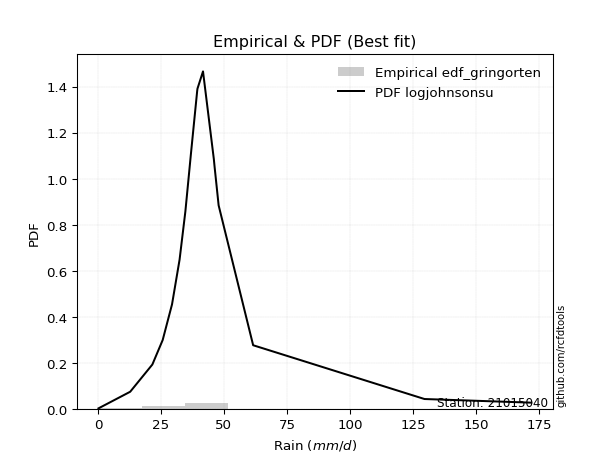</img>

</div>


### 9. EDF Filliben (1975)

The specific values of the constants (0.3175) (often denoted as $alpha$) and (0.365) are derived from a method proposed by James J. Filliben in a 1975 paper. This particular formula is the mean value of the $i$-th order statistic of the normal distribution and is considered a robust and effective plotting position formula for the normal probability plot correlation coefficient test for normality.

<div align="center">


$P=(m-0.3175)/(n+0.365)$


</div>


**9.1. Empirical values**

<div align="center">

|                | 0                   | 1                   | 2                  | 3                   | 4                  | 5                 | 6                  | 7                  | 8            | 9                  | 10                 | 11                 | 12                 | 13                 | 14                 | 15                 | 16                 |
|:---------------|:--------------------|:--------------------|:-------------------|:--------------------|:-------------------|:------------------|:-------------------|:-------------------|:-------------|:-------------------|:-------------------|:-------------------|:-------------------|:-------------------|:-------------------|:-------------------|:-------------------|
| date           | 2021                | 2007                | 2006               | 2020                | 2017               | 2014              | 2008               | 2012               | 2011         | 2019               | 2010               | 2013               | 2018               | 2009               | 2015               | 2016               | 2024               |
| x              | 0.2                 | 12.8                | 21.6               | 25.7                | 32.4               | 34.7              | 36.9               | 39.4               | 39.5         | 41.7               | 46.0               | 46.1               | 46.3               | 47.9               | 61.6               | 129.6              | 172.0              |
| m              | 1                   | 2                   | 3                  | 4                   | 5                  | 6                 | 7                  | 8                  | 9            | 10                 | 11                 | 12                 | 13                 | 14                 | 15                 | 16                 | 17                 |
| empirical_dist | edf_filliben        | edf_filliben        | edf_filliben       | edf_filliben        | edf_filliben       | edf_filliben      | edf_filliben       | edf_filliben       | edf_filliben | edf_filliben       | edf_filliben       | edf_filliben       | edf_filliben       | edf_filliben       | edf_filliben       | edf_filliben       | edf_filliben       |
| empirical      | 0.03930319608407717 | 0.09689029657356754 | 0.1544773970630579 | 0.21206449755254825 | 0.2696515980420386 | 0.327238698531529 | 0.3848257990210193 | 0.4424128995105097 | 0.5          | 0.5575871004894903 | 0.6151742009789807 | 0.6727613014684711 | 0.7303484019579615 | 0.7879355024474518 | 0.8455226029369421 | 0.9031097034264325 | 0.9606968039159229 |
| empirical_tr   | 1.0409111344222988  | 1.1072851904989638  | 1.1827004937851184 | 1.2691394116572265  | 1.369209540705697  | 1.486411298951423 | 1.6255558155862393 | 1.793441776400723  | 2.0          | 2.2603319232020826 | 2.598578376356154  | 3.055873295204576  | 3.708489054991992  | 4.7155465037338775 | 6.473438956197578  | 10.320950965824666 | 25.44322344322351  |

</div>


**9.2. Kolmogorov-Smirnov fit test (sorted by Δ)**


<div align="center">

|                | 0                   | 1                   | 2                   | 3                   | 4                   | 5                   | 6                     | 7                   | 8                   | 9                  | 10                  | 11                  | 12                  | 13                  | 14                  | 15                  | 16                  | 17                 | 18                 | 19                  | 20                 | 21                  | 22                  | 23                  | 24                  | 25                  | 26                  | 27                  | 28                  | 29                 | 30                  | 31                 | 32                  | 33                  | 34                  | 35                 | 36                  | 37                  | 38                  | 39                  | 40                  | 41                  | 42                  | 43                  | 44                  | 45                  | 46                  | 47                 | 48                 | 49                  | 50                 | 51                 | 52                  | 53                  | 54                 | 55                  | 56                 | 57                 | 58                 | 59                  | 60                  | 61                 | 62                  | 63                 | 64                 | 65                 | 66                  | 67                 | 68                 | 69                  | 70                  | 71                 | 72                  | 73                 | 74                 | 75                 | 76                  | 77                  | 78                 | 79                 | 80                 | 81                 | 82                 | 83                 | 84                 | 85                 | 86                 | 87                 |
|:---------------|:--------------------|:--------------------|:--------------------|:--------------------|:--------------------|:--------------------|:----------------------|:--------------------|:--------------------|:-------------------|:--------------------|:--------------------|:--------------------|:--------------------|:--------------------|:--------------------|:--------------------|:-------------------|:-------------------|:--------------------|:-------------------|:--------------------|:--------------------|:--------------------|:--------------------|:--------------------|:--------------------|:--------------------|:--------------------|:-------------------|:--------------------|:-------------------|:--------------------|:--------------------|:--------------------|:-------------------|:--------------------|:--------------------|:--------------------|:--------------------|:--------------------|:--------------------|:--------------------|:--------------------|:--------------------|:--------------------|:--------------------|:-------------------|:-------------------|:--------------------|:-------------------|:-------------------|:--------------------|:--------------------|:-------------------|:--------------------|:-------------------|:-------------------|:-------------------|:--------------------|:--------------------|:-------------------|:--------------------|:-------------------|:-------------------|:-------------------|:--------------------|:-------------------|:-------------------|:--------------------|:--------------------|:-------------------|:--------------------|:-------------------|:-------------------|:-------------------|:--------------------|:--------------------|:-------------------|:-------------------|:-------------------|:-------------------|:-------------------|:-------------------|:-------------------|:-------------------|:-------------------|:-------------------|
| station        | 21015040            | 21015040            | 21015040            | 21015040            | 21015040            | 21015040            | 21015040              | 21015040            | 21015040            | 21015040           | 21015040            | 21015040            | 21015040            | 21015040            | 21015040            | 21015040            | 21015040            | 21015040           | 21015040           | 21015040            | 21015040           | 21015040            | 21015040            | 21015040            | 21015040            | 21015040            | 21015040            | 21015040            | 21015040            | 21015040           | 21015040            | 21015040           | 21015040            | 21015040            | 21015040            | 21015040           | 21015040            | 21015040            | 21015040            | 21015040            | 21015040            | 21015040            | 21015040            | 21015040            | 21015040            | 21015040            | 21015040            | 21015040           | 21015040           | 21015040            | 21015040           | 21015040           | 21015040            | 21015040            | 21015040           | 21015040            | 21015040           | 21015040           | 21015040           | 21015040            | 21015040            | 21015040           | 21015040            | 21015040           | 21015040           | 21015040           | 21015040            | 21015040           | 21015040           | 21015040            | 21015040            | 21015040           | 21015040            | 21015040           | 21015040           | 21015040           | 21015040            | 21015040            | 21015040           | 21015040           | 21015040           | 21015040           | 21015040           | 21015040           | 21015040           | 21015040           | 21015040           | 21015040           |
| empirical_dist | edf_filliben        | edf_filliben        | edf_filliben        | edf_filliben        | edf_filliben        | edf_filliben        | edf_filliben          | edf_filliben        | edf_filliben        | edf_filliben       | edf_filliben        | edf_filliben        | edf_filliben        | edf_filliben        | edf_filliben        | edf_filliben        | edf_filliben        | edf_filliben       | edf_filliben       | edf_filliben        | edf_filliben       | edf_filliben        | edf_filliben        | edf_filliben        | edf_filliben        | edf_filliben        | edf_filliben        | edf_filliben        | edf_filliben        | edf_filliben       | edf_filliben        | edf_filliben       | edf_filliben        | edf_filliben        | edf_filliben        | edf_filliben       | edf_filliben        | edf_filliben        | edf_filliben        | edf_filliben        | edf_filliben        | edf_filliben        | edf_filliben        | edf_filliben        | edf_filliben        | edf_filliben        | edf_filliben        | edf_filliben       | edf_filliben       | edf_filliben        | edf_filliben       | edf_filliben       | edf_filliben        | edf_filliben        | edf_filliben       | edf_filliben        | edf_filliben       | edf_filliben       | edf_filliben       | edf_filliben        | edf_filliben        | edf_filliben       | edf_filliben        | edf_filliben       | edf_filliben       | edf_filliben       | edf_filliben        | edf_filliben       | edf_filliben       | edf_filliben        | edf_filliben        | edf_filliben       | edf_filliben        | edf_filliben       | edf_filliben       | edf_filliben       | edf_filliben        | edf_filliben        | edf_filliben       | edf_filliben       | edf_filliben       | edf_filliben       | edf_filliben       | edf_filliben       | edf_filliben       | edf_filliben       | edf_filliben       | edf_filliben       |
| p_dist         | logjohnsonsu        | t                   | johnsonsu           | logt                | gibrat              | mielke              | loglaplace_asymmetric | fisk                | wald                | nct                | pearson3            | loggenlogistic      | invweibull          | betaprime           | f                   | invgamma            | logfisk             | loggompertz        | ncf                | logcrystalball      | logloggamma        | halflogistic        | invgauss            | exponnorm           | moyal               | fatiguelife         | laplace_asymmetric  | gamma               | erlang              | genlogistic        | weibull_min         | expon              | genexpon            | gompertz            | loggumbel_l         | logmielke          | halfnorm            | truncnorm           | gumbel_r            | logfatiguelife      | lognakagami         | logexponnorm        | logrice             | lognorm             | lognorm             | lognct              | loglogistic         | loghypsecant       | loglognorm         | nakagami            | loglaplace         | loginvgamma        | rayleigh            | kstwobign           | logalpha           | maxwell             | logmaxwell         | lograyleigh        | logbetaprime       | loginvgauss         | loginvweibull       | rice               | norm                | crystalball        | logistic           | hypsecant          | laplace             | loggumbel_r        | loghalfnorm        | logpearson3         | logmoyal            | loghalflogistic    | logkstwobign        | gumbel_l           | loggenexpon        | logwald            | loggibrat           | logexpon            | loggamma           | loggamma           | logncf             | logtruncnorm       | logf               | logweibull_min     | logchi2            | alpha              | chi2               | logerlang          |
| delta          | 0.07291468374866605 | 0.07979754470215905 | 0.08664083893770325 | 0.08854198285906245 | 0.12104648200114604 | 0.15870363088930872 | 0.15893383662716076   | 0.16005257871215728 | 0.16640701168164096 | 0.1685226887045017 | 0.17133288667885876 | 0.17510672583582976 | 0.18276647348830377 | 0.18399485490249146 | 0.18490125390250778 | 0.18604043921472202 | 0.18860020161746915 | 0.1900898011293285 | 0.1927768025596015 | 0.19316438949715775 | 0.1982407536820695 | 0.19901983039810978 | 0.20213407452854015 | 0.20217449964618184 | 0.20381384575224482 | 0.20549417961832694 | 0.20909167923405436 | 0.21096073249047453 | 0.21096116454405756 | 0.2110348355271674 | 0.21282024935045224 | 0.2128373659234864 | 0.21297686531208154 | 0.21549104892230264 | 0.22173173104472232 | 0.2223022839430674 | 0.22320029693865284 | 0.22384122081730962 | 0.22969744355458632 | 0.23977728811412297 | 0.24124916087626885 | 0.24149555692161545 | 0.24149730083275084 | 0.24149747715983744 | 0.24149747715983744 | 0.24234723937971903 | 0.24301971369367587 | 0.2443190273999714 | 0.2446599063494152 | 0.24617036959363447 | 0.2497266847969712 | 0.2530661119854318 | 0.25489456804713384 | 0.26120106642234375 | 0.2634774602932205 | 0.26614950480329314 | 0.2752576247943069 | 0.2875573950786256 | 0.2881112201993087 | 0.29141354580562734 | 0.29509148433725496 | 0.2974347356991295 | 0.29962813192175847 | 0.2996281389020478 | 0.3012244710968143 | 0.3025869626732557 | 0.30823935847976797 | 0.3121132167882688 | 0.3224594976413056 | 0.32526006094572946 | 0.33784983651529604 | 0.340705674602845  | 0.34765960269692414 | 0.3702510089767178 | 0.4030252824820973 | 0.4093718737245678 | 0.43435984298108116 | 0.46432070152579874 | 0.4989409309825277 | 0.4989409309825277 | 0.500906716812371  | 0.5345380893259459 | 0.6058656040800505 | 0.7249886297697337 | 0.7770877473845147 | 0.852053933413365  | 0.8895644706198896 | 0.9155746897467968 |
| deltao         | 0.3260541228310003  | 0.3260541228310003  | 0.3260541228310003  | 0.3260541228310003  | 0.3260541228310003  | 0.3260541228310003  | 0.3260541228310003    | 0.3260541228310003  | 0.3260541228310003  | 0.3260541228310003 | 0.3260541228310003  | 0.3260541228310003  | 0.3260541228310003  | 0.3260541228310003  | 0.3260541228310003  | 0.3260541228310003  | 0.3260541228310003  | 0.3260541228310003 | 0.3260541228310003 | 0.3260541228310003  | 0.3260541228310003 | 0.3260541228310003  | 0.3260541228310003  | 0.3260541228310003  | 0.3260541228310003  | 0.3260541228310003  | 0.3260541228310003  | 0.3260541228310003  | 0.3260541228310003  | 0.3260541228310003 | 0.3260541228310003  | 0.3260541228310003 | 0.3260541228310003  | 0.3260541228310003  | 0.3260541228310003  | 0.3260541228310003 | 0.3260541228310003  | 0.3260541228310003  | 0.3260541228310003  | 0.3260541228310003  | 0.3260541228310003  | 0.3260541228310003  | 0.3260541228310003  | 0.3260541228310003  | 0.3260541228310003  | 0.3260541228310003  | 0.3260541228310003  | 0.3260541228310003 | 0.3260541228310003 | 0.3260541228310003  | 0.3260541228310003 | 0.3260541228310003 | 0.3260541228310003  | 0.3260541228310003  | 0.3260541228310003 | 0.3260541228310003  | 0.3260541228310003 | 0.3260541228310003 | 0.3260541228310003 | 0.3260541228310003  | 0.3260541228310003  | 0.3260541228310003 | 0.3260541228310003  | 0.3260541228310003 | 0.3260541228310003 | 0.3260541228310003 | 0.3260541228310003  | 0.3260541228310003 | 0.3260541228310003 | 0.3260541228310003  | 0.3260541228310003  | 0.3260541228310003 | 0.3260541228310003  | 0.3260541228310003 | 0.3260541228310003 | 0.3260541228310003 | 0.3260541228310003  | 0.3260541228310003  | 0.3260541228310003 | 0.3260541228310003 | 0.3260541228310003 | 0.3260541228310003 | 0.3260541228310003 | 0.3260541228310003 | 0.3260541228310003 | 0.3260541228310003 | 0.3260541228310003 | 0.3260541228310003 |
| eval           | Δo > Δ              | Δo > Δ              | Δo > Δ              | Δo > Δ              | Δo > Δ              | Δo > Δ              | Δo > Δ                | Δo > Δ              | Δo > Δ              | Δo > Δ             | Δo > Δ              | Δo > Δ              | Δo > Δ              | Δo > Δ              | Δo > Δ              | Δo > Δ              | Δo > Δ              | Δo > Δ             | Δo > Δ             | Δo > Δ              | Δo > Δ             | Δo > Δ              | Δo > Δ              | Δo > Δ              | Δo > Δ              | Δo > Δ              | Δo > Δ              | Δo > Δ              | Δo > Δ              | Δo > Δ             | Δo > Δ              | Δo > Δ             | Δo > Δ              | Δo > Δ              | Δo > Δ              | Δo > Δ             | Δo > Δ              | Δo > Δ              | Δo > Δ              | Δo > Δ              | Δo > Δ              | Δo > Δ              | Δo > Δ              | Δo > Δ              | Δo > Δ              | Δo > Δ              | Δo > Δ              | Δo > Δ             | Δo > Δ             | Δo > Δ              | Δo > Δ             | Δo > Δ             | Δo > Δ              | Δo > Δ              | Δo > Δ             | Δo > Δ              | Δo > Δ             | Δo > Δ             | Δo > Δ             | Δo > Δ              | Δo > Δ              | Δo > Δ             | Δo > Δ              | Δo > Δ             | Δo > Δ             | Δo > Δ             | Δo > Δ              | Δo > Δ             | Δo > Δ             | Δo > Δ              | Δo <= Δ             | Δo <= Δ            | Δo <= Δ             | Δo <= Δ            | Δo <= Δ            | Δo <= Δ            | Δo <= Δ             | Δo <= Δ             | Δo <= Δ            | Δo <= Δ            | Δo <= Δ            | Δo <= Δ            | Δo <= Δ            | Δo <= Δ            | Δo <= Δ            | Δo <= Δ            | Δo <= Δ            | Δo <= Δ            |
| fit            | 1                   | 1                   | 1                   | 1                   | 1                   | 1                   | 1                     | 1                   | 1                   | 1                  | 1                   | 1                   | 1                   | 1                   | 1                   | 1                   | 1                   | 1                  | 1                  | 1                   | 1                  | 1                   | 1                   | 1                   | 1                   | 1                   | 1                   | 1                   | 1                   | 1                  | 1                   | 1                  | 1                   | 1                   | 1                   | 1                  | 1                   | 1                   | 1                   | 1                   | 1                   | 1                   | 1                   | 1                   | 1                   | 1                   | 1                   | 1                  | 1                  | 1                   | 1                  | 1                  | 1                   | 1                   | 1                  | 1                   | 1                  | 1                  | 1                  | 1                   | 1                   | 1                  | 1                   | 1                  | 1                  | 1                  | 1                   | 1                  | 1                  | 1                   | 0                   | 0                  | 0                   | 0                  | 0                  | 0                  | 0                   | 0                   | 0                  | 0                  | 0                  | 0                  | 0                  | 0                  | 0                  | 0                  | 0                  | 0                  |
| n              | 17                  | 17                  | 17                  | 17                  | 17                  | 17                  | 17                    | 17                  | 17                  | 17                 | 17                  | 17                  | 17                  | 17                  | 17                  | 17                  | 17                  | 17                 | 17                 | 17                  | 17                 | 17                  | 17                  | 17                  | 17                  | 17                  | 17                  | 17                  | 17                  | 17                 | 17                  | 17                 | 17                  | 17                  | 17                  | 17                 | 17                  | 17                  | 17                  | 17                  | 17                  | 17                  | 17                  | 17                  | 17                  | 17                  | 17                  | 17                 | 17                 | 17                  | 17                 | 17                 | 17                  | 17                  | 17                 | 17                  | 17                 | 17                 | 17                 | 17                  | 17                  | 17                 | 17                  | 17                 | 17                 | 17                 | 17                  | 17                 | 17                 | 17                  | 17                  | 17                 | 17                  | 17                 | 17                 | 17                 | 17                  | 17                  | 17                 | 17                 | 17                 | 17                 | 17                 | 17                 | 17                 | 17                 | 17                 | 17                 |
| best_fit       | 1                   | 0                   | 0                   | 0                   | 0                   | 0                   | 0                     | 0                   | 0                   | 0                  | 0                   | 0                   | 0                   | 0                   | 0                   | 0                   | 0                   | 0                  | 0                  | 0                   | 0                  | 0                   | 0                   | 0                   | 0                   | 0                   | 0                   | 0                   | 0                   | 0                  | 0                   | 0                  | 0                   | 0                   | 0                   | 0                  | 0                   | 0                   | 0                   | 0                   | 0                   | 0                   | 0                   | 0                   | 0                   | 0                   | 0                   | 0                  | 0                  | 0                   | 0                  | 0                  | 0                   | 0                   | 0                  | 0                   | 0                  | 0                  | 0                  | 0                   | 0                   | 0                  | 0                   | 0                  | 0                  | 0                  | 0                   | 0                  | 0                  | 0                   | 0                   | 0                  | 0                   | 0                  | 0                  | 0                  | 0                   | 0                   | 0                  | 0                  | 0                  | 0                  | 0                  | 0                  | 0                  | 0                  | 0                  | 0                  |
| best_fit_sort  | 1                   | 2                   | 3                   | 4                   | 5                   | 6                   | 7                     | 8                   | 9                   | 10                 | 11                  | 12                  | 13                  | 14                  | 15                  | 16                  | 17                  | 18                 | 19                 | 20                  | 21                 | 22                  | 23                  | 24                  | 25                  | 26                  | 27                  | 28                  | 29                  | 30                 | 31                  | 32                 | 33                  | 34                  | 35                  | 36                 | 37                  | 38                  | 39                  | 40                  | 41                  | 42                  | 43                  | 44                  | 45                  | 46                  | 47                  | 48                 | 49                 | 50                  | 51                 | 52                 | 53                  | 54                  | 55                 | 56                  | 57                 | 58                 | 59                 | 60                  | 61                  | 62                 | 63                  | 64                 | 65                 | 66                 | 67                  | 68                 | 69                 | 70                  | 71                  | 72                 | 73                  | 74                 | 75                 | 76                 | 77                  | 78                  | 79                 | 80                 | 81                 | 82                 | 83                 | 84                 | 85                 | 86                 | 87                 | 88                 |

</div>


**9.3. Best fit**

<div align="center">

|   id |   station | empirical_dist   | p_dist       |     delta |   deltao | eval   |   fit |   n |   best_fit |   best_fit_sort |
|-----:|----------:|:-----------------|:-------------|----------:|---------:|:-------|------:|----:|-----------:|----------------:|
|    0 |  21015040 | edf_filliben     | logjohnsonsu | 0.0729147 | 0.326054 | Δo > Δ |     1 |  17 |          1 |               1 |

</div>


<div align="center">

</img>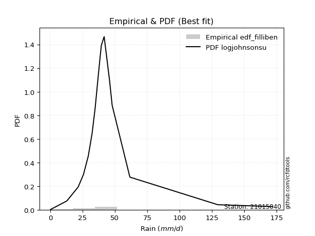</img>

</div>


### 10. EDF Jenkinson (1977)

The Jenkinson formula in hydrology is an empirical plotting position formula used to estimate the non-exceedance probability _(P)_ or return period _(T)_ of a given ordered observation within a sample. It is a widely used method in the frequency analysis of extreme events such as floods and rainfall, as it provides a distribution-free way to plot data. _a≈0.31_ and _b≈0.38_ are constants derived to approximate the median of the probability distribution for the given rank.

<div align="center">


$P=(m-a)/(n+b)$


</div>


**10.1. Empirical values**

<div align="center">

|                | 0                   | 1                   | 2                   | 3                   | 4                  | 5                   | 6                   | 7                   | 8             | 9                  | 10                 | 11                 | 12                 | 13                 | 14                 | 15                 | 16                 |
|:---------------|:--------------------|:--------------------|:--------------------|:--------------------|:-------------------|:--------------------|:--------------------|:--------------------|:--------------|:-------------------|:-------------------|:-------------------|:-------------------|:-------------------|:-------------------|:-------------------|:-------------------|
| date           | 2021                | 2007                | 2006                | 2020                | 2017               | 2014                | 2008                | 2012                | 2011          | 2019               | 2010               | 2013               | 2018               | 2009               | 2015               | 2016               | 2024               |
| x              | 0.2                 | 12.8                | 21.6                | 25.7                | 32.4               | 34.7                | 36.9                | 39.4                | 39.5          | 41.7               | 46.0               | 46.1               | 46.3               | 47.9               | 61.6               | 129.6              | 172.0              |
| m              | 1                   | 2                   | 3                   | 4                   | 5                  | 6                   | 7                   | 8                   | 9             | 10                 | 11                 | 12                 | 13                 | 14                 | 15                 | 16                 | 17                 |
| empirical_dist | edf_jenkinson       | edf_jenkinson       | edf_jenkinson       | edf_jenkinson       | edf_jenkinson      | edf_jenkinson       | edf_jenkinson       | edf_jenkinson       | edf_jenkinson | edf_jenkinson      | edf_jenkinson      | edf_jenkinson      | edf_jenkinson      | edf_jenkinson      | edf_jenkinson      | edf_jenkinson      | edf_jenkinson      |
| empirical      | 0.03970080552359033 | 0.09723820483314155 | 0.15477560414269276 | 0.21231300345224396 | 0.2698504027617952 | 0.32738780207134643 | 0.38492520138089764 | 0.44246260069044885 | 0.5           | 0.5575373993095513 | 0.6150747986191024 | 0.6726121979286537 | 0.7301495972382048 | 0.7876869965477561 | 0.8452243958573072 | 0.9027617951668585 | 0.9602991944764098 |
| empirical_tr   | 1.0413421210305571  | 1.1077119184193753  | 1.1831177671885638  | 1.2695398100803508  | 1.3695823483057525 | 1.4867408041060737  | 1.6258185219831622  | 1.7936016511867907  | 2.0           | 2.2600780234070226 | 2.5979073243647233 | 3.0544815465729354 | 3.7057569296375266 | 4.710027100271004  | 6.460966542750929  | 10.284023668639058 | 25.188405797101513 |

</div>


**10.2. Kolmogorov-Smirnov fit test (sorted by Δ)**


<div align="center">

|                | 0                   | 1                   | 2                   | 3                   | 4                   | 5                  | 6                     | 7                   | 8                   | 9                  | 10                  | 11                  | 12                  | 13                  | 14                  | 15                 | 16                  | 17                  | 18                  | 19                  | 20                 | 21                  | 22                  | 23                  | 24                 | 25                  | 26                  | 27                  | 28                  | 29                  | 30                 | 31                  | 32                 | 33                  | 34                 | 35                  | 36                  | 37                 | 38                 | 39                  | 40                 | 41                 | 42                 | 43                 | 44                 | 45                  | 46                  | 47                  | 48                  | 49                  | 50                  | 51                 | 52                 | 53                  | 54                  | 55                 | 56                 | 57                  | 58                  | 59                 | 60                 | 61                  | 62                  | 63                 | 64                  | 65                  | 66                  | 67                  | 68                  | 69                  | 70                 | 71                  | 72                 | 73                 | 74                  | 75                  | 76                 | 77                 | 78                  | 79                  | 80                 | 81                 | 82                 | 83                 | 84                 | 85                 | 86                 | 87                 |
|:---------------|:--------------------|:--------------------|:--------------------|:--------------------|:--------------------|:-------------------|:----------------------|:--------------------|:--------------------|:-------------------|:--------------------|:--------------------|:--------------------|:--------------------|:--------------------|:-------------------|:--------------------|:--------------------|:--------------------|:--------------------|:-------------------|:--------------------|:--------------------|:--------------------|:-------------------|:--------------------|:--------------------|:--------------------|:--------------------|:--------------------|:-------------------|:--------------------|:-------------------|:--------------------|:-------------------|:--------------------|:--------------------|:-------------------|:-------------------|:--------------------|:-------------------|:-------------------|:-------------------|:-------------------|:-------------------|:--------------------|:--------------------|:--------------------|:--------------------|:--------------------|:--------------------|:-------------------|:-------------------|:--------------------|:--------------------|:-------------------|:-------------------|:--------------------|:--------------------|:-------------------|:-------------------|:--------------------|:--------------------|:-------------------|:--------------------|:--------------------|:--------------------|:--------------------|:--------------------|:--------------------|:-------------------|:--------------------|:-------------------|:-------------------|:--------------------|:--------------------|:-------------------|:-------------------|:--------------------|:--------------------|:-------------------|:-------------------|:-------------------|:-------------------|:-------------------|:-------------------|:-------------------|:-------------------|
| station        | 21015040            | 21015040            | 21015040            | 21015040            | 21015040            | 21015040           | 21015040              | 21015040            | 21015040            | 21015040           | 21015040            | 21015040            | 21015040            | 21015040            | 21015040            | 21015040           | 21015040            | 21015040            | 21015040            | 21015040            | 21015040           | 21015040            | 21015040            | 21015040            | 21015040           | 21015040            | 21015040            | 21015040            | 21015040            | 21015040            | 21015040           | 21015040            | 21015040           | 21015040            | 21015040           | 21015040            | 21015040            | 21015040           | 21015040           | 21015040            | 21015040           | 21015040           | 21015040           | 21015040           | 21015040           | 21015040            | 21015040            | 21015040            | 21015040            | 21015040            | 21015040            | 21015040           | 21015040           | 21015040            | 21015040            | 21015040           | 21015040           | 21015040            | 21015040            | 21015040           | 21015040           | 21015040            | 21015040            | 21015040           | 21015040            | 21015040            | 21015040            | 21015040            | 21015040            | 21015040            | 21015040           | 21015040            | 21015040           | 21015040           | 21015040            | 21015040            | 21015040           | 21015040           | 21015040            | 21015040            | 21015040           | 21015040           | 21015040           | 21015040           | 21015040           | 21015040           | 21015040           | 21015040           |
| empirical_dist | edf_jenkinson       | edf_jenkinson       | edf_jenkinson       | edf_jenkinson       | edf_jenkinson       | edf_jenkinson      | edf_jenkinson         | edf_jenkinson       | edf_jenkinson       | edf_jenkinson      | edf_jenkinson       | edf_jenkinson       | edf_jenkinson       | edf_jenkinson       | edf_jenkinson       | edf_jenkinson      | edf_jenkinson       | edf_jenkinson       | edf_jenkinson       | edf_jenkinson       | edf_jenkinson      | edf_jenkinson       | edf_jenkinson       | edf_jenkinson       | edf_jenkinson      | edf_jenkinson       | edf_jenkinson       | edf_jenkinson       | edf_jenkinson       | edf_jenkinson       | edf_jenkinson      | edf_jenkinson       | edf_jenkinson      | edf_jenkinson       | edf_jenkinson      | edf_jenkinson       | edf_jenkinson       | edf_jenkinson      | edf_jenkinson      | edf_jenkinson       | edf_jenkinson      | edf_jenkinson      | edf_jenkinson      | edf_jenkinson      | edf_jenkinson      | edf_jenkinson       | edf_jenkinson       | edf_jenkinson       | edf_jenkinson       | edf_jenkinson       | edf_jenkinson       | edf_jenkinson      | edf_jenkinson      | edf_jenkinson       | edf_jenkinson       | edf_jenkinson      | edf_jenkinson      | edf_jenkinson       | edf_jenkinson       | edf_jenkinson      | edf_jenkinson      | edf_jenkinson       | edf_jenkinson       | edf_jenkinson      | edf_jenkinson       | edf_jenkinson       | edf_jenkinson       | edf_jenkinson       | edf_jenkinson       | edf_jenkinson       | edf_jenkinson      | edf_jenkinson       | edf_jenkinson      | edf_jenkinson      | edf_jenkinson       | edf_jenkinson       | edf_jenkinson      | edf_jenkinson      | edf_jenkinson       | edf_jenkinson       | edf_jenkinson      | edf_jenkinson      | edf_jenkinson      | edf_jenkinson      | edf_jenkinson      | edf_jenkinson      | edf_jenkinson      | edf_jenkinson      |
| p_dist         | logjohnsonsu        | t                   | johnsonsu           | logt                | gibrat              | mielke             | loglaplace_asymmetric | fisk                | wald                | nct                | pearson3            | loggenlogistic      | invweibull          | betaprime           | f                   | invgamma           | logfisk             | loggompertz         | ncf                 | logcrystalball      | logloggamma        | halflogistic        | invgauss            | exponnorm           | moyal              | fatiguelife         | laplace_asymmetric  | gamma               | erlang              | genlogistic         | weibull_min        | expon               | genexpon           | gompertz            | loggumbel_l        | logmielke           | halfnorm            | truncnorm          | gumbel_r           | logfatiguelife      | lognakagami        | logexponnorm       | logrice            | lognorm            | lognorm            | lognct              | loglogistic         | loghypsecant        | loglognorm          | nakagami            | loglaplace          | loginvgamma        | rayleigh           | kstwobign           | logalpha            | maxwell            | logmaxwell         | lograyleigh         | logbetaprime        | loginvgauss        | loginvweibull      | rice                | norm                | crystalball        | logistic            | hypsecant           | laplace             | loggumbel_r         | loghalfnorm         | logpearson3         | logmoyal           | loghalflogistic     | logkstwobign       | gumbel_l           | loggenexpon         | logwald             | loggibrat          | logexpon           | loggamma            | loggamma            | logncf             | logtruncnorm       | logf               | logweibull_min     | logchi2            | alpha              | chi2               | logerlang          |
| delta          | 0.07301408610854432 | 0.07989694706203732 | 0.08639233303800753 | 0.08829347695936673 | 0.12089737846132859 | 0.158455124989613  | 0.15873503190740412   | 0.15980407281246156 | 0.16620820696188432 | 0.168274182804806  | 0.17113408195910212 | 0.17490792111607312 | 0.18251796758860805 | 0.18374634900279574 | 0.18465274800281206 | 0.1857919333150263 | 0.18835169571777344 | 0.18984129522963278 | 0.19252829665990578 | 0.19291588359746203 | 0.1979922477823738 | 0.19877132449841406 | 0.20188556862884444 | 0.20192599374648612 | 0.2035653398525491 | 0.20524567371863123 | 0.20884317333435864 | 0.21071222659077882 | 0.21071265864436184 | 0.21078632962747168 | 0.2126214446306956 | 0.21263856120372976 | 0.2127780605923249 | 0.21524254302260692 | 0.2214832251450266 | 0.22205377804337167 | 0.22295179103895713 | 0.2235927149176139 | 0.2294489376548906 | 0.23957848339436633 | 0.2410503561565122 | 0.2412967522018588 | 0.2412984961129942 | 0.2412986724400808 | 0.2412986724400808 | 0.24204903230008418 | 0.24282090897391923 | 0.24412022268021477 | 0.24446110162965856 | 0.24592186369393876 | 0.24952788007721455 | 0.2527679049057969 | 0.2546460621474381 | 0.26095256052264804 | 0.26317925321358565 | 0.2659009989035974 | 0.274959417714672  | 0.28725918799899075 | 0.28781301311967383 | 0.2911153387259925 | 0.2947932772576201 | 0.29718622979943377 | 0.29937962602206275 | 0.2993796330023521 | 0.30097596519711856 | 0.30233845677355997 | 0.30799085258007225 | 0.31191441206851217 | 0.32216129056167075 | 0.32501155504603374 | 0.3376510317955394 | 0.34050686988308837 | 0.3473613956172893 | 0.3700025030770221 | 0.40272707540246244 | 0.40917306900481115 | 0.4341610382613245 | 0.4639727932662247 | 0.49859302272295364 | 0.49859302272295364 | 0.500558808552797  | 0.5342398822463111 | 0.6055176958204764 | 0.7246407215101596 | 0.7767398391249407 | 0.8517060251537909 | 0.8892165623603157 | 0.9151770803072836 |
| deltao         | 0.3260541228310003  | 0.3260541228310003  | 0.3260541228310003  | 0.3260541228310003  | 0.3260541228310003  | 0.3260541228310003 | 0.3260541228310003    | 0.3260541228310003  | 0.3260541228310003  | 0.3260541228310003 | 0.3260541228310003  | 0.3260541228310003  | 0.3260541228310003  | 0.3260541228310003  | 0.3260541228310003  | 0.3260541228310003 | 0.3260541228310003  | 0.3260541228310003  | 0.3260541228310003  | 0.3260541228310003  | 0.3260541228310003 | 0.3260541228310003  | 0.3260541228310003  | 0.3260541228310003  | 0.3260541228310003 | 0.3260541228310003  | 0.3260541228310003  | 0.3260541228310003  | 0.3260541228310003  | 0.3260541228310003  | 0.3260541228310003 | 0.3260541228310003  | 0.3260541228310003 | 0.3260541228310003  | 0.3260541228310003 | 0.3260541228310003  | 0.3260541228310003  | 0.3260541228310003 | 0.3260541228310003 | 0.3260541228310003  | 0.3260541228310003 | 0.3260541228310003 | 0.3260541228310003 | 0.3260541228310003 | 0.3260541228310003 | 0.3260541228310003  | 0.3260541228310003  | 0.3260541228310003  | 0.3260541228310003  | 0.3260541228310003  | 0.3260541228310003  | 0.3260541228310003 | 0.3260541228310003 | 0.3260541228310003  | 0.3260541228310003  | 0.3260541228310003 | 0.3260541228310003 | 0.3260541228310003  | 0.3260541228310003  | 0.3260541228310003 | 0.3260541228310003 | 0.3260541228310003  | 0.3260541228310003  | 0.3260541228310003 | 0.3260541228310003  | 0.3260541228310003  | 0.3260541228310003  | 0.3260541228310003  | 0.3260541228310003  | 0.3260541228310003  | 0.3260541228310003 | 0.3260541228310003  | 0.3260541228310003 | 0.3260541228310003 | 0.3260541228310003  | 0.3260541228310003  | 0.3260541228310003 | 0.3260541228310003 | 0.3260541228310003  | 0.3260541228310003  | 0.3260541228310003 | 0.3260541228310003 | 0.3260541228310003 | 0.3260541228310003 | 0.3260541228310003 | 0.3260541228310003 | 0.3260541228310003 | 0.3260541228310003 |
| eval           | Δo > Δ              | Δo > Δ              | Δo > Δ              | Δo > Δ              | Δo > Δ              | Δo > Δ             | Δo > Δ                | Δo > Δ              | Δo > Δ              | Δo > Δ             | Δo > Δ              | Δo > Δ              | Δo > Δ              | Δo > Δ              | Δo > Δ              | Δo > Δ             | Δo > Δ              | Δo > Δ              | Δo > Δ              | Δo > Δ              | Δo > Δ             | Δo > Δ              | Δo > Δ              | Δo > Δ              | Δo > Δ             | Δo > Δ              | Δo > Δ              | Δo > Δ              | Δo > Δ              | Δo > Δ              | Δo > Δ             | Δo > Δ              | Δo > Δ             | Δo > Δ              | Δo > Δ             | Δo > Δ              | Δo > Δ              | Δo > Δ             | Δo > Δ             | Δo > Δ              | Δo > Δ             | Δo > Δ             | Δo > Δ             | Δo > Δ             | Δo > Δ             | Δo > Δ              | Δo > Δ              | Δo > Δ              | Δo > Δ              | Δo > Δ              | Δo > Δ              | Δo > Δ             | Δo > Δ             | Δo > Δ              | Δo > Δ              | Δo > Δ             | Δo > Δ             | Δo > Δ              | Δo > Δ              | Δo > Δ             | Δo > Δ             | Δo > Δ              | Δo > Δ              | Δo > Δ             | Δo > Δ              | Δo > Δ              | Δo > Δ              | Δo > Δ              | Δo > Δ              | Δo > Δ              | Δo <= Δ            | Δo <= Δ             | Δo <= Δ            | Δo <= Δ            | Δo <= Δ             | Δo <= Δ             | Δo <= Δ            | Δo <= Δ            | Δo <= Δ             | Δo <= Δ             | Δo <= Δ            | Δo <= Δ            | Δo <= Δ            | Δo <= Δ            | Δo <= Δ            | Δo <= Δ            | Δo <= Δ            | Δo <= Δ            |
| fit            | 1                   | 1                   | 1                   | 1                   | 1                   | 1                  | 1                     | 1                   | 1                   | 1                  | 1                   | 1                   | 1                   | 1                   | 1                   | 1                  | 1                   | 1                   | 1                   | 1                   | 1                  | 1                   | 1                   | 1                   | 1                  | 1                   | 1                   | 1                   | 1                   | 1                   | 1                  | 1                   | 1                  | 1                   | 1                  | 1                   | 1                   | 1                  | 1                  | 1                   | 1                  | 1                  | 1                  | 1                  | 1                  | 1                   | 1                   | 1                   | 1                   | 1                   | 1                   | 1                  | 1                  | 1                   | 1                   | 1                  | 1                  | 1                   | 1                   | 1                  | 1                  | 1                   | 1                   | 1                  | 1                   | 1                   | 1                   | 1                   | 1                   | 1                   | 0                  | 0                   | 0                  | 0                  | 0                   | 0                   | 0                  | 0                  | 0                   | 0                   | 0                  | 0                  | 0                  | 0                  | 0                  | 0                  | 0                  | 0                  |
| n              | 17                  | 17                  | 17                  | 17                  | 17                  | 17                 | 17                    | 17                  | 17                  | 17                 | 17                  | 17                  | 17                  | 17                  | 17                  | 17                 | 17                  | 17                  | 17                  | 17                  | 17                 | 17                  | 17                  | 17                  | 17                 | 17                  | 17                  | 17                  | 17                  | 17                  | 17                 | 17                  | 17                 | 17                  | 17                 | 17                  | 17                  | 17                 | 17                 | 17                  | 17                 | 17                 | 17                 | 17                 | 17                 | 17                  | 17                  | 17                  | 17                  | 17                  | 17                  | 17                 | 17                 | 17                  | 17                  | 17                 | 17                 | 17                  | 17                  | 17                 | 17                 | 17                  | 17                  | 17                 | 17                  | 17                  | 17                  | 17                  | 17                  | 17                  | 17                 | 17                  | 17                 | 17                 | 17                  | 17                  | 17                 | 17                 | 17                  | 17                  | 17                 | 17                 | 17                 | 17                 | 17                 | 17                 | 17                 | 17                 |
| best_fit       | 1                   | 0                   | 0                   | 0                   | 0                   | 0                  | 0                     | 0                   | 0                   | 0                  | 0                   | 0                   | 0                   | 0                   | 0                   | 0                  | 0                   | 0                   | 0                   | 0                   | 0                  | 0                   | 0                   | 0                   | 0                  | 0                   | 0                   | 0                   | 0                   | 0                   | 0                  | 0                   | 0                  | 0                   | 0                  | 0                   | 0                   | 0                  | 0                  | 0                   | 0                  | 0                  | 0                  | 0                  | 0                  | 0                   | 0                   | 0                   | 0                   | 0                   | 0                   | 0                  | 0                  | 0                   | 0                   | 0                  | 0                  | 0                   | 0                   | 0                  | 0                  | 0                   | 0                   | 0                  | 0                   | 0                   | 0                   | 0                   | 0                   | 0                   | 0                  | 0                   | 0                  | 0                  | 0                   | 0                   | 0                  | 0                  | 0                   | 0                   | 0                  | 0                  | 0                  | 0                  | 0                  | 0                  | 0                  | 0                  |
| best_fit_sort  | 1                   | 2                   | 3                   | 4                   | 5                   | 6                  | 7                     | 8                   | 9                   | 10                 | 11                  | 12                  | 13                  | 14                  | 15                  | 16                 | 17                  | 18                  | 19                  | 20                  | 21                 | 22                  | 23                  | 24                  | 25                 | 26                  | 27                  | 28                  | 29                  | 30                  | 31                 | 32                  | 33                 | 34                  | 35                 | 36                  | 37                  | 38                 | 39                 | 40                  | 41                 | 42                 | 43                 | 44                 | 45                 | 46                  | 47                  | 48                  | 49                  | 50                  | 51                  | 52                 | 53                 | 54                  | 55                  | 56                 | 57                 | 58                  | 59                  | 60                 | 61                 | 62                  | 63                  | 64                 | 65                  | 66                  | 67                  | 68                  | 69                  | 70                  | 71                 | 72                  | 73                 | 74                 | 75                  | 76                  | 77                 | 78                 | 79                  | 80                  | 81                 | 82                 | 83                 | 84                 | 85                 | 86                 | 87                 | 88                 |

</div>


**10.3. Best fit**

<div align="center">

|   id |   station | empirical_dist   | p_dist       |     delta |   deltao | eval   |   fit |   n |   best_fit |   best_fit_sort |
|-----:|----------:|:-----------------|:-------------|----------:|---------:|:-------|------:|----:|-----------:|----------------:|
|    0 |  21015040 | edf_jenkinson    | logjohnsonsu | 0.0730141 | 0.326054 | Δo > Δ |     1 |  17 |          1 |               1 |

</div>


<div align="center">

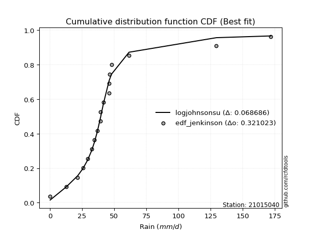</img>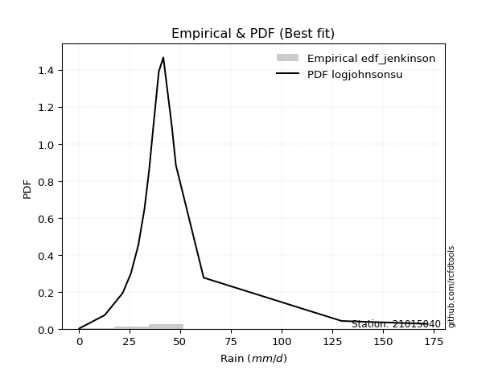</img>

</div>


### 11. EDF Cunnane (1978)

Cunnane´s work in statistical hydrology has focused on the performance and evaluation of different probability distributions (such as GEV, Gumbel, Lognormal) for flood frequency estimation. _b_ is a constant, typically set to 0.4.

<div align="center">


$P=(m-b)/(n+1-2b)$


</div>


**11.1. Empirical values**

<div align="center">

|                | 0                   | 1                  | 2                   | 3                   | 4                   | 5                  | 6                   | 7                  | 8           | 9                  | 10                 | 11                 | 12                 | 13                 | 14                 | 15                 | 16                 |
|:---------------|:--------------------|:-------------------|:--------------------|:--------------------|:--------------------|:-------------------|:--------------------|:-------------------|:------------|:-------------------|:-------------------|:-------------------|:-------------------|:-------------------|:-------------------|:-------------------|:-------------------|
| date           | 2021                | 2007               | 2006                | 2020                | 2017                | 2014               | 2008                | 2012               | 2011        | 2019               | 2010               | 2013               | 2018               | 2009               | 2015               | 2016               | 2024               |
| x              | 0.2                 | 12.8               | 21.6                | 25.7                | 32.4                | 34.7               | 36.9                | 39.4               | 39.5        | 41.7               | 46.0               | 46.1               | 46.3               | 47.9               | 61.6               | 129.6              | 172.0              |
| m              | 1                   | 2                  | 3                   | 4                   | 5                   | 6                  | 7                   | 8                  | 9           | 10                 | 11                 | 12                 | 13                 | 14                 | 15                 | 16                 | 17                 |
| empirical_dist | edf_cunnane         | edf_cunnane        | edf_cunnane         | edf_cunnane         | edf_cunnane         | edf_cunnane        | edf_cunnane         | edf_cunnane        | edf_cunnane | edf_cunnane        | edf_cunnane        | edf_cunnane        | edf_cunnane        | edf_cunnane        | edf_cunnane        | edf_cunnane        | edf_cunnane        |
| empirical      | 0.03488372093023256 | 0.0930232558139535 | 0.15116279069767444 | 0.20930232558139536 | 0.26744186046511625 | 0.3255813953488372 | 0.38372093023255816 | 0.4418604651162791 | 0.5         | 0.5581395348837209 | 0.6162790697674418 | 0.6744186046511628 | 0.7325581395348837 | 0.7906976744186046 | 0.8488372093023256 | 0.9069767441860466 | 0.9651162790697676 |
| empirical_tr   | 1.036144578313253   | 1.1025641025641026 | 1.178082191780822   | 1.2647058823529413  | 1.3650793650793651  | 1.482758620689655  | 1.6226415094339623  | 1.7916666666666667 | 2.0         | 2.263157894736842  | 2.606060606060606  | 3.071428571428571  | 3.7391304347826084 | 4.777777777777777  | 6.6153846153846185 | 10.750000000000007 | 28.6666666666668   |

</div>


**11.2. Kolmogorov-Smirnov fit test (sorted by Δ)**


<div align="center">

|                | 0                   | 1                   | 2                   | 3                   | 4                   | 5                     | 6                   | 7                   | 8                  | 9                   | 10                 | 11                 | 12                  | 13                  | 14                  | 15                  | 16                  | 17                 | 18                 | 19                  | 20                 | 21                  | 22                  | 23                  | 24                  | 25                  | 26                  | 27                  | 28                  | 29                 | 30                  | 31                  | 32                  | 33                  | 34                  | 35                 | 36                  | 37                  | 38                  | 39                  | 40                  | 41                 | 42                  | 43                  | 44                  | 45                 | 46                 | 47                  | 48                 | 49                  | 50                 | 51                 | 52                  | 53                  | 54                 | 55                  | 56                 | 57                  | 58                 | 59                 | 60                  | 61                 | 62                  | 63                 | 64                 | 65                 | 66                  | 67                  | 68                  | 69                  | 70                 | 71                  | 72                 | 73                 | 74                  | 75                 | 76                 | 77                  | 78                 | 79                 | 80                 | 81                 | 82                 | 83                 | 84                 | 85                 | 86                 | 87                 |
|:---------------|:--------------------|:--------------------|:--------------------|:--------------------|:--------------------|:----------------------|:--------------------|:--------------------|:-------------------|:--------------------|:-------------------|:-------------------|:--------------------|:--------------------|:--------------------|:--------------------|:--------------------|:-------------------|:-------------------|:--------------------|:-------------------|:--------------------|:--------------------|:--------------------|:--------------------|:--------------------|:--------------------|:--------------------|:--------------------|:-------------------|:--------------------|:--------------------|:--------------------|:--------------------|:--------------------|:-------------------|:--------------------|:--------------------|:--------------------|:--------------------|:--------------------|:-------------------|:--------------------|:--------------------|:--------------------|:-------------------|:-------------------|:--------------------|:-------------------|:--------------------|:-------------------|:-------------------|:--------------------|:--------------------|:-------------------|:--------------------|:-------------------|:--------------------|:-------------------|:-------------------|:--------------------|:-------------------|:--------------------|:-------------------|:-------------------|:-------------------|:--------------------|:--------------------|:--------------------|:--------------------|:-------------------|:--------------------|:-------------------|:-------------------|:--------------------|:-------------------|:-------------------|:--------------------|:-------------------|:-------------------|:-------------------|:-------------------|:-------------------|:-------------------|:-------------------|:-------------------|:-------------------|:-------------------|
| station        | 21015040            | 21015040            | 21015040            | 21015040            | 21015040            | 21015040              | 21015040            | 21015040            | 21015040           | 21015040            | 21015040           | 21015040           | 21015040            | 21015040            | 21015040            | 21015040            | 21015040            | 21015040           | 21015040           | 21015040            | 21015040           | 21015040            | 21015040            | 21015040            | 21015040            | 21015040            | 21015040            | 21015040            | 21015040            | 21015040           | 21015040            | 21015040            | 21015040            | 21015040            | 21015040            | 21015040           | 21015040            | 21015040            | 21015040            | 21015040            | 21015040            | 21015040           | 21015040            | 21015040            | 21015040            | 21015040           | 21015040           | 21015040            | 21015040           | 21015040            | 21015040           | 21015040           | 21015040            | 21015040            | 21015040           | 21015040            | 21015040           | 21015040            | 21015040           | 21015040           | 21015040            | 21015040           | 21015040            | 21015040           | 21015040           | 21015040           | 21015040            | 21015040            | 21015040            | 21015040            | 21015040           | 21015040            | 21015040           | 21015040           | 21015040            | 21015040           | 21015040           | 21015040            | 21015040           | 21015040           | 21015040           | 21015040           | 21015040           | 21015040           | 21015040           | 21015040           | 21015040           | 21015040           |
| empirical_dist | edf_cunnane         | edf_cunnane         | edf_cunnane         | edf_cunnane         | edf_cunnane         | edf_cunnane           | edf_cunnane         | edf_cunnane         | edf_cunnane        | edf_cunnane         | edf_cunnane        | edf_cunnane        | edf_cunnane         | edf_cunnane         | edf_cunnane         | edf_cunnane         | edf_cunnane         | edf_cunnane        | edf_cunnane        | edf_cunnane         | edf_cunnane        | edf_cunnane         | edf_cunnane         | edf_cunnane         | edf_cunnane         | edf_cunnane         | edf_cunnane         | edf_cunnane         | edf_cunnane         | edf_cunnane        | edf_cunnane         | edf_cunnane         | edf_cunnane         | edf_cunnane         | edf_cunnane         | edf_cunnane        | edf_cunnane         | edf_cunnane         | edf_cunnane         | edf_cunnane         | edf_cunnane         | edf_cunnane        | edf_cunnane         | edf_cunnane         | edf_cunnane         | edf_cunnane        | edf_cunnane        | edf_cunnane         | edf_cunnane        | edf_cunnane         | edf_cunnane        | edf_cunnane        | edf_cunnane         | edf_cunnane         | edf_cunnane        | edf_cunnane         | edf_cunnane        | edf_cunnane         | edf_cunnane        | edf_cunnane        | edf_cunnane         | edf_cunnane        | edf_cunnane         | edf_cunnane        | edf_cunnane        | edf_cunnane        | edf_cunnane         | edf_cunnane         | edf_cunnane         | edf_cunnane         | edf_cunnane        | edf_cunnane         | edf_cunnane        | edf_cunnane        | edf_cunnane         | edf_cunnane        | edf_cunnane        | edf_cunnane         | edf_cunnane        | edf_cunnane        | edf_cunnane        | edf_cunnane        | edf_cunnane        | edf_cunnane        | edf_cunnane        | edf_cunnane        | edf_cunnane        | edf_cunnane        |
| p_dist         | logjohnsonsu        | t                   | johnsonsu           | logt                | gibrat              | loglaplace_asymmetric | mielke              | fisk                | wald               | nct                 | pearson3           | loggenlogistic     | invweibull          | betaprime           | f                   | invgamma            | logfisk             | loggompertz        | ncf                | logcrystalball      | logloggamma        | halflogistic        | invgauss            | exponnorm           | moyal               | fatiguelife         | laplace_asymmetric  | gamma               | erlang              | genlogistic        | weibull_min         | expon               | genexpon            | gompertz            | loggumbel_l         | logmielke          | halfnorm            | truncnorm           | gumbel_r            | logfatiguelife      | lognakagami         | logexponnorm       | lognorm             | lognorm             | logrice             | loglogistic        | lognct             | loghypsecant        | loglognorm         | nakagami            | loglaplace         | loginvgamma        | rayleigh            | kstwobign           | logalpha           | maxwell             | logmaxwell         | lograyleigh         | logbetaprime       | loginvgauss        | loginvweibull       | rice               | norm                | crystalball        | logistic           | hypsecant          | laplace             | loggumbel_r         | loghalfnorm         | logpearson3         | logmoyal           | loghalflogistic     | logkstwobign       | gumbel_l           | loggenexpon         | logwald            | loggibrat          | logexpon            | loggamma           | loggamma           | logncf             | logtruncnorm       | logf               | logweibull_min     | logchi2            | alpha              | chi2               | logerlang          |
| delta          | 0.07180981496020489 | 0.07869267591369788 | 0.08940301090885605 | 0.09130415483021526 | 0.12270378518383784 | 0.1611435742040831    | 0.16146580286046153 | 0.16281475068331008 | 0.1686167492585633 | 0.17128486067565452 | 0.1735426242557811 | 0.1773164634127521 | 0.18552864545945658 | 0.18675702687364426 | 0.18766342587366058 | 0.18880261118587482 | 0.19136237358862196 | 0.1928519731004813 | 0.1955389745307543 | 0.19592656146831056 | 0.2010029256532223 | 0.20178200236926258 | 0.20489624649969296 | 0.20493667161733464 | 0.20657601772339762 | 0.20825635158947975 | 0.21185385120520717 | 0.21372290446162734 | 0.21372333651521036 | 0.2137970074983202 | 0.21502998692737457 | 0.21504710350040873 | 0.21518660288900388 | 0.21825322089345545 | 0.22449390301587513 | 0.2250644559142202 | 0.22596246890980565 | 0.22660339278846242 | 0.23245961552573913 | 0.24237567306245336 | 0.24455826185068333 | 0.2446574601422912 | 0.24465932392390918 | 0.24465932392390918 | 0.24472381969133153 | 0.2452294512705982 | 0.2456618457451025 | 0.24652876497689374 | 0.2472789695020786 | 0.24893254156478728 | 0.2519364223738935 | 0.2563807183508152 | 0.25765674001828665 | 0.26396323839349656 | 0.266792066658604  | 0.26891167677444594 | 0.2785722311596903 | 0.29087200144400904 | 0.2914258265646922 | 0.2947281521710108 | 0.29840609070263846 | 0.3001969076702823 | 0.30239030389291127 | 0.3023903108732006 | 0.3039866430679671 | 0.3053491346444085 | 0.31100153045092077 | 0.31432295436519114 | 0.32577410400668905 | 0.32802223291688226 | 0.3400595740922184 | 0.34291541217976734 | 0.3509742090623076 | 0.3730131809478706 | 0.40633988884748073 | 0.4115816113014901 | 0.4365695805580035 | 0.46818774228541277 | 0.5028079717421416 | 0.5028079717421416 | 0.504773757571985  | 0.5378526956913294 | 0.6097326448396645 | 0.7288556705293476 | 0.7809547881441287 | 0.855920974172979  | 0.8934315113795036 | 0.9199941649006415 |
| deltao         | 0.3260541228310003  | 0.3260541228310003  | 0.3260541228310003  | 0.3260541228310003  | 0.3260541228310003  | 0.3260541228310003    | 0.3260541228310003  | 0.3260541228310003  | 0.3260541228310003 | 0.3260541228310003  | 0.3260541228310003 | 0.3260541228310003 | 0.3260541228310003  | 0.3260541228310003  | 0.3260541228310003  | 0.3260541228310003  | 0.3260541228310003  | 0.3260541228310003 | 0.3260541228310003 | 0.3260541228310003  | 0.3260541228310003 | 0.3260541228310003  | 0.3260541228310003  | 0.3260541228310003  | 0.3260541228310003  | 0.3260541228310003  | 0.3260541228310003  | 0.3260541228310003  | 0.3260541228310003  | 0.3260541228310003 | 0.3260541228310003  | 0.3260541228310003  | 0.3260541228310003  | 0.3260541228310003  | 0.3260541228310003  | 0.3260541228310003 | 0.3260541228310003  | 0.3260541228310003  | 0.3260541228310003  | 0.3260541228310003  | 0.3260541228310003  | 0.3260541228310003 | 0.3260541228310003  | 0.3260541228310003  | 0.3260541228310003  | 0.3260541228310003 | 0.3260541228310003 | 0.3260541228310003  | 0.3260541228310003 | 0.3260541228310003  | 0.3260541228310003 | 0.3260541228310003 | 0.3260541228310003  | 0.3260541228310003  | 0.3260541228310003 | 0.3260541228310003  | 0.3260541228310003 | 0.3260541228310003  | 0.3260541228310003 | 0.3260541228310003 | 0.3260541228310003  | 0.3260541228310003 | 0.3260541228310003  | 0.3260541228310003 | 0.3260541228310003 | 0.3260541228310003 | 0.3260541228310003  | 0.3260541228310003  | 0.3260541228310003  | 0.3260541228310003  | 0.3260541228310003 | 0.3260541228310003  | 0.3260541228310003 | 0.3260541228310003 | 0.3260541228310003  | 0.3260541228310003 | 0.3260541228310003 | 0.3260541228310003  | 0.3260541228310003 | 0.3260541228310003 | 0.3260541228310003 | 0.3260541228310003 | 0.3260541228310003 | 0.3260541228310003 | 0.3260541228310003 | 0.3260541228310003 | 0.3260541228310003 | 0.3260541228310003 |
| eval           | Δo > Δ              | Δo > Δ              | Δo > Δ              | Δo > Δ              | Δo > Δ              | Δo > Δ                | Δo > Δ              | Δo > Δ              | Δo > Δ             | Δo > Δ              | Δo > Δ             | Δo > Δ             | Δo > Δ              | Δo > Δ              | Δo > Δ              | Δo > Δ              | Δo > Δ              | Δo > Δ             | Δo > Δ             | Δo > Δ              | Δo > Δ             | Δo > Δ              | Δo > Δ              | Δo > Δ              | Δo > Δ              | Δo > Δ              | Δo > Δ              | Δo > Δ              | Δo > Δ              | Δo > Δ             | Δo > Δ              | Δo > Δ              | Δo > Δ              | Δo > Δ              | Δo > Δ              | Δo > Δ             | Δo > Δ              | Δo > Δ              | Δo > Δ              | Δo > Δ              | Δo > Δ              | Δo > Δ             | Δo > Δ              | Δo > Δ              | Δo > Δ              | Δo > Δ             | Δo > Δ             | Δo > Δ              | Δo > Δ             | Δo > Δ              | Δo > Δ             | Δo > Δ             | Δo > Δ              | Δo > Δ              | Δo > Δ             | Δo > Δ              | Δo > Δ             | Δo > Δ              | Δo > Δ             | Δo > Δ             | Δo > Δ              | Δo > Δ             | Δo > Δ              | Δo > Δ             | Δo > Δ             | Δo > Δ             | Δo > Δ              | Δo > Δ              | Δo > Δ              | Δo <= Δ             | Δo <= Δ            | Δo <= Δ             | Δo <= Δ            | Δo <= Δ            | Δo <= Δ             | Δo <= Δ            | Δo <= Δ            | Δo <= Δ             | Δo <= Δ            | Δo <= Δ            | Δo <= Δ            | Δo <= Δ            | Δo <= Δ            | Δo <= Δ            | Δo <= Δ            | Δo <= Δ            | Δo <= Δ            | Δo <= Δ            |
| fit            | 1                   | 1                   | 1                   | 1                   | 1                   | 1                     | 1                   | 1                   | 1                  | 1                   | 1                  | 1                  | 1                   | 1                   | 1                   | 1                   | 1                   | 1                  | 1                  | 1                   | 1                  | 1                   | 1                   | 1                   | 1                   | 1                   | 1                   | 1                   | 1                   | 1                  | 1                   | 1                   | 1                   | 1                   | 1                   | 1                  | 1                   | 1                   | 1                   | 1                   | 1                   | 1                  | 1                   | 1                   | 1                   | 1                  | 1                  | 1                   | 1                  | 1                   | 1                  | 1                  | 1                   | 1                   | 1                  | 1                   | 1                  | 1                   | 1                  | 1                  | 1                   | 1                  | 1                   | 1                  | 1                  | 1                  | 1                   | 1                   | 1                   | 0                   | 0                  | 0                   | 0                  | 0                  | 0                   | 0                  | 0                  | 0                   | 0                  | 0                  | 0                  | 0                  | 0                  | 0                  | 0                  | 0                  | 0                  | 0                  |
| n              | 17                  | 17                  | 17                  | 17                  | 17                  | 17                    | 17                  | 17                  | 17                 | 17                  | 17                 | 17                 | 17                  | 17                  | 17                  | 17                  | 17                  | 17                 | 17                 | 17                  | 17                 | 17                  | 17                  | 17                  | 17                  | 17                  | 17                  | 17                  | 17                  | 17                 | 17                  | 17                  | 17                  | 17                  | 17                  | 17                 | 17                  | 17                  | 17                  | 17                  | 17                  | 17                 | 17                  | 17                  | 17                  | 17                 | 17                 | 17                  | 17                 | 17                  | 17                 | 17                 | 17                  | 17                  | 17                 | 17                  | 17                 | 17                  | 17                 | 17                 | 17                  | 17                 | 17                  | 17                 | 17                 | 17                 | 17                  | 17                  | 17                  | 17                  | 17                 | 17                  | 17                 | 17                 | 17                  | 17                 | 17                 | 17                  | 17                 | 17                 | 17                 | 17                 | 17                 | 17                 | 17                 | 17                 | 17                 | 17                 |
| best_fit       | 1                   | 0                   | 0                   | 0                   | 0                   | 0                     | 0                   | 0                   | 0                  | 0                   | 0                  | 0                  | 0                   | 0                   | 0                   | 0                   | 0                   | 0                  | 0                  | 0                   | 0                  | 0                   | 0                   | 0                   | 0                   | 0                   | 0                   | 0                   | 0                   | 0                  | 0                   | 0                   | 0                   | 0                   | 0                   | 0                  | 0                   | 0                   | 0                   | 0                   | 0                   | 0                  | 0                   | 0                   | 0                   | 0                  | 0                  | 0                   | 0                  | 0                   | 0                  | 0                  | 0                   | 0                   | 0                  | 0                   | 0                  | 0                   | 0                  | 0                  | 0                   | 0                  | 0                   | 0                  | 0                  | 0                  | 0                   | 0                   | 0                   | 0                   | 0                  | 0                   | 0                  | 0                  | 0                   | 0                  | 0                  | 0                   | 0                  | 0                  | 0                  | 0                  | 0                  | 0                  | 0                  | 0                  | 0                  | 0                  |
| best_fit_sort  | 1                   | 2                   | 3                   | 4                   | 5                   | 6                     | 7                   | 8                   | 9                  | 10                  | 11                 | 12                 | 13                  | 14                  | 15                  | 16                  | 17                  | 18                 | 19                 | 20                  | 21                 | 22                  | 23                  | 24                  | 25                  | 26                  | 27                  | 28                  | 29                  | 30                 | 31                  | 32                  | 33                  | 34                  | 35                  | 36                 | 37                  | 38                  | 39                  | 40                  | 41                  | 42                 | 43                  | 44                  | 45                  | 46                 | 47                 | 48                  | 49                 | 50                  | 51                 | 52                 | 53                  | 54                  | 55                 | 56                  | 57                 | 58                  | 59                 | 60                 | 61                  | 62                 | 63                  | 64                 | 65                 | 66                 | 67                  | 68                  | 69                  | 70                  | 71                 | 72                  | 73                 | 74                 | 75                  | 76                 | 77                 | 78                  | 79                 | 80                 | 81                 | 82                 | 83                 | 84                 | 85                 | 86                 | 87                 | 88                 |

</div>


**11.3. Best fit**

<div align="center">

|   id |   station | empirical_dist   | p_dist       |     delta |   deltao | eval   |   fit |   n |   best_fit |   best_fit_sort |
|-----:|----------:|:-----------------|:-------------|----------:|---------:|:-------|------:|----:|-----------:|----------------:|
|    0 |  21015040 | edf_cunnane      | logjohnsonsu | 0.0718098 | 0.326054 | Δo > Δ |     1 |  17 |          1 |               1 |

</div>


<div align="center">

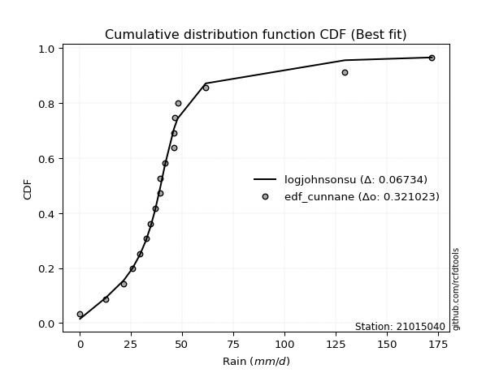</img></img>

</div>


### 12. EDF Adamowski (1981)

The Adamowski formula in hydrology refers to a specific plotting position formula used for estimating the non-parametric empirical distribution of hydrological events (like flood peaks) to calculate their return periods. This formula provides an alternative to traditional parametric methods (like the Gumbel or Log Pearson Type III distributions). 

<div align="center">


$P=(m-0.25)/(n+0.5)$


</div>


**12.1. Empirical values**

<div align="center">

|                | 0                   | 1                  | 2                   | 3                   | 4                  | 5                   | 6                   | 7                   | 8             | 9                  | 10                 | 11                 | 12                 | 13                 | 14                 | 15                 | 16                 |
|:---------------|:--------------------|:-------------------|:--------------------|:--------------------|:-------------------|:--------------------|:--------------------|:--------------------|:--------------|:-------------------|:-------------------|:-------------------|:-------------------|:-------------------|:-------------------|:-------------------|:-------------------|
| date           | 2021                | 2007               | 2006                | 2020                | 2017               | 2014                | 2008                | 2012                | 2011          | 2019               | 2010               | 2013               | 2018               | 2009               | 2015               | 2016               | 2024               |
| x              | 0.2                 | 12.8               | 21.6                | 25.7                | 32.4               | 34.7                | 36.9                | 39.4                | 39.5          | 41.7               | 46.0               | 46.1               | 46.3               | 47.9               | 61.6               | 129.6              | 172.0              |
| m              | 1                   | 2                  | 3                   | 4                   | 5                  | 6                   | 7                   | 8                   | 9             | 10                 | 11                 | 12                 | 13                 | 14                 | 15                 | 16                 | 17                 |
| empirical_dist | edf_adamowski       | edf_adamowski      | edf_adamowski       | edf_adamowski       | edf_adamowski      | edf_adamowski       | edf_adamowski       | edf_adamowski       | edf_adamowski | edf_adamowski      | edf_adamowski      | edf_adamowski      | edf_adamowski      | edf_adamowski      | edf_adamowski      | edf_adamowski      | edf_adamowski      |
| empirical      | 0.04285714285714286 | 0.1                | 0.15714285714285714 | 0.21428571428571427 | 0.2714285714285714 | 0.32857142857142857 | 0.38571428571428573 | 0.44285714285714284 | 0.5           | 0.5571428571428572 | 0.6142857142857143 | 0.6714285714285714 | 0.7285714285714285 | 0.7857142857142857 | 0.8428571428571429 | 0.9                | 0.9571428571428572 |
| empirical_tr   | 1.044776119402985   | 1.1111111111111112 | 1.1864406779661016  | 1.2727272727272727  | 1.372549019607843  | 1.4893617021276595  | 1.627906976744186   | 1.7948717948717947  | 2.0           | 2.2580645161290325 | 2.592592592592593  | 3.0434782608695645 | 3.684210526315789  | 4.666666666666666  | 6.363636363636364  | 10.000000000000002 | 23.333333333333357 |

</div>


**12.2. Kolmogorov-Smirnov fit test (sorted by Δ)**


<div align="center">

|                | 0                   | 1                  | 2                   | 3                   | 4                   | 5                  | 6                     | 7                   | 8                   | 9                  | 10                  | 11                  | 12                  | 13                  | 14                  | 15                 | 16                  | 17                  | 18                 | 19                  | 20                 | 21                  | 22                  | 23                  | 24                 | 25                  | 26                  | 27                  | 28                  | 29                 | 30                  | 31                  | 32                  | 33                  | 34                  | 35                  | 36                  | 37                 | 38                 | 39                  | 40                  | 41                  | 42                  | 43                  | 44                  | 45                  | 46                  | 47                 | 48                  | 49                  | 50                  | 51                  | 52                  | 53                  | 54                  | 55                 | 56                  | 57                  | 58                  | 59                 | 60                  | 61                 | 62                  | 63                 | 64                  | 65                 | 66                  | 67                 | 68                 | 69                  | 70                 | 71                 | 72                 | 73                 | 74                  | 75                  | 76                  | 77                 | 78                 | 79                 | 80                 | 81                 | 82                 | 83                 | 84                 | 85                 | 86                 | 87                 |
|:---------------|:--------------------|:-------------------|:--------------------|:--------------------|:--------------------|:-------------------|:----------------------|:--------------------|:--------------------|:-------------------|:--------------------|:--------------------|:--------------------|:--------------------|:--------------------|:-------------------|:--------------------|:--------------------|:-------------------|:--------------------|:-------------------|:--------------------|:--------------------|:--------------------|:-------------------|:--------------------|:--------------------|:--------------------|:--------------------|:-------------------|:--------------------|:--------------------|:--------------------|:--------------------|:--------------------|:--------------------|:--------------------|:-------------------|:-------------------|:--------------------|:--------------------|:--------------------|:--------------------|:--------------------|:--------------------|:--------------------|:--------------------|:-------------------|:--------------------|:--------------------|:--------------------|:--------------------|:--------------------|:--------------------|:--------------------|:-------------------|:--------------------|:--------------------|:--------------------|:-------------------|:--------------------|:-------------------|:--------------------|:-------------------|:--------------------|:-------------------|:--------------------|:-------------------|:-------------------|:--------------------|:-------------------|:-------------------|:-------------------|:-------------------|:--------------------|:--------------------|:--------------------|:-------------------|:-------------------|:-------------------|:-------------------|:-------------------|:-------------------|:-------------------|:-------------------|:-------------------|:-------------------|:-------------------|
| station        | 21015040            | 21015040           | 21015040            | 21015040            | 21015040            | 21015040           | 21015040              | 21015040            | 21015040            | 21015040           | 21015040            | 21015040            | 21015040            | 21015040            | 21015040            | 21015040           | 21015040            | 21015040            | 21015040           | 21015040            | 21015040           | 21015040            | 21015040            | 21015040            | 21015040           | 21015040            | 21015040            | 21015040            | 21015040            | 21015040           | 21015040            | 21015040            | 21015040            | 21015040            | 21015040            | 21015040            | 21015040            | 21015040           | 21015040           | 21015040            | 21015040            | 21015040            | 21015040            | 21015040            | 21015040            | 21015040            | 21015040            | 21015040           | 21015040            | 21015040            | 21015040            | 21015040            | 21015040            | 21015040            | 21015040            | 21015040           | 21015040            | 21015040            | 21015040            | 21015040           | 21015040            | 21015040           | 21015040            | 21015040           | 21015040            | 21015040           | 21015040            | 21015040           | 21015040           | 21015040            | 21015040           | 21015040           | 21015040           | 21015040           | 21015040            | 21015040            | 21015040            | 21015040           | 21015040           | 21015040           | 21015040           | 21015040           | 21015040           | 21015040           | 21015040           | 21015040           | 21015040           | 21015040           |
| empirical_dist | edf_adamowski       | edf_adamowski      | edf_adamowski       | edf_adamowski       | edf_adamowski       | edf_adamowski      | edf_adamowski         | edf_adamowski       | edf_adamowski       | edf_adamowski      | edf_adamowski       | edf_adamowski       | edf_adamowski       | edf_adamowski       | edf_adamowski       | edf_adamowski      | edf_adamowski       | edf_adamowski       | edf_adamowski      | edf_adamowski       | edf_adamowski      | edf_adamowski       | edf_adamowski       | edf_adamowski       | edf_adamowski      | edf_adamowski       | edf_adamowski       | edf_adamowski       | edf_adamowski       | edf_adamowski      | edf_adamowski       | edf_adamowski       | edf_adamowski       | edf_adamowski       | edf_adamowski       | edf_adamowski       | edf_adamowski       | edf_adamowski      | edf_adamowski      | edf_adamowski       | edf_adamowski       | edf_adamowski       | edf_adamowski       | edf_adamowski       | edf_adamowski       | edf_adamowski       | edf_adamowski       | edf_adamowski      | edf_adamowski       | edf_adamowski       | edf_adamowski       | edf_adamowski       | edf_adamowski       | edf_adamowski       | edf_adamowski       | edf_adamowski      | edf_adamowski       | edf_adamowski       | edf_adamowski       | edf_adamowski      | edf_adamowski       | edf_adamowski      | edf_adamowski       | edf_adamowski      | edf_adamowski       | edf_adamowski      | edf_adamowski       | edf_adamowski      | edf_adamowski      | edf_adamowski       | edf_adamowski      | edf_adamowski      | edf_adamowski      | edf_adamowski      | edf_adamowski       | edf_adamowski       | edf_adamowski       | edf_adamowski      | edf_adamowski      | edf_adamowski      | edf_adamowski      | edf_adamowski      | edf_adamowski      | edf_adamowski      | edf_adamowski      | edf_adamowski      | edf_adamowski      | edf_adamowski      |
| p_dist         | logjohnsonsu        | t                  | johnsonsu           | logt                | gibrat              | mielke             | loglaplace_asymmetric | fisk                | wald                | nct                | pearson3            | loggenlogistic      | invweibull          | betaprime           | f                   | invgamma           | logfisk             | loggompertz         | ncf                | logcrystalball      | logloggamma        | halflogistic        | invgauss            | exponnorm           | moyal              | fatiguelife         | laplace_asymmetric  | gamma               | erlang              | genlogistic        | weibull_min         | expon               | genexpon            | gompertz            | loggumbel_l         | logmielke           | halfnorm            | truncnorm          | gumbel_r           | logfatiguelife      | lognakagami         | logexponnorm        | logrice             | lognorm             | lognorm             | lognct              | loglogistic         | loghypsecant       | loglognorm          | nakagami            | loglaplace          | loginvgamma         | rayleigh            | kstwobign           | logalpha            | maxwell            | logmaxwell          | lograyleigh         | logbetaprime        | loginvgauss        | loginvweibull       | rice               | norm                | crystalball        | logistic            | hypsecant          | laplace             | loggumbel_r        | loghalfnorm        | logpearson3         | logmoyal           | loghalflogistic    | logkstwobign       | gumbel_l           | loggenexpon         | logwald             | loggibrat           | logexpon           | loggamma           | loggamma           | logncf             | logtruncnorm       | logf               | logweibull_min     | logchi2            | alpha              | chi2               | logerlang          |
| delta          | 0.07380317044193241 | 0.0806860313954254 | 0.08441962220453714 | 0.08632076612589634 | 0.11971375196124645 | 0.1564824141561426 | 0.15715686324062794   | 0.15783136197899117 | 0.16463003829510814 | 0.1663014719713356 | 0.16955591329232594 | 0.17332975244929694 | 0.18054525675513766 | 0.18177363816932535 | 0.18268003716934167 | 0.1838192224815559 | 0.18637898488430304 | 0.18786858439616239 | 0.1905555858264354 | 0.19094317276399164 | 0.1960195369489034 | 0.19679861366494367 | 0.19991285779537404 | 0.19995328291301573 | 0.2015926290190787 | 0.20327296288516084 | 0.20687046250088825 | 0.20873951575730842 | 0.20873994781089145 | 0.2088136187940013 | 0.21104327596391942 | 0.21106039253695358 | 0.21119989192554872 | 0.21326983218913653 | 0.21951051431155622 | 0.22008106720990128 | 0.22097908020548673 | 0.2216200040841435 | 0.2274762268214202 | 0.23800031472759015 | 0.23947218748973603 | 0.23971858353508263 | 0.23972032744621802 | 0.23972050377330462 | 0.23972050377330462 | 0.24008701134467286 | 0.24124274030714304 | 0.2425420540134386 | 0.24288293296288238 | 0.24394915286046837 | 0.24794971141043837 | 0.25040065190563254 | 0.25267335131396773 | 0.25897984968917764 | 0.26081200021342127 | 0.263928288070127  | 0.27259216471450765 | 0.28489193499882637 | 0.28544576011950945 | 0.2887480857258281 | 0.29242602425745573 | 0.2952135189659634 | 0.29740691518859236 | 0.2974069221688817 | 0.29900325436364816 | 0.3003657459400896 | 0.30601814174660186 | 0.310336243401736  | 0.3197940375615064 | 0.32303884421256335 | 0.3360728631287632 | 0.3389287012163122 | 0.3449941426171249 | 0.3680297922435517 | 0.40035982240229806 | 0.40759490033803497 | 0.43258286959454834 | 0.4612109980993663 | 0.4958312275560952 | 0.4958312275560952 | 0.4977970133859385 | 0.5318726292461468 | 0.6027559006536181 | 0.7218789263433012 | 0.7739780439580822 | 0.8489442299869325 | 0.8864547671934572 | 0.9120207429737311 |
| deltao         | 0.3260541228310003  | 0.3260541228310003 | 0.3260541228310003  | 0.3260541228310003  | 0.3260541228310003  | 0.3260541228310003 | 0.3260541228310003    | 0.3260541228310003  | 0.3260541228310003  | 0.3260541228310003 | 0.3260541228310003  | 0.3260541228310003  | 0.3260541228310003  | 0.3260541228310003  | 0.3260541228310003  | 0.3260541228310003 | 0.3260541228310003  | 0.3260541228310003  | 0.3260541228310003 | 0.3260541228310003  | 0.3260541228310003 | 0.3260541228310003  | 0.3260541228310003  | 0.3260541228310003  | 0.3260541228310003 | 0.3260541228310003  | 0.3260541228310003  | 0.3260541228310003  | 0.3260541228310003  | 0.3260541228310003 | 0.3260541228310003  | 0.3260541228310003  | 0.3260541228310003  | 0.3260541228310003  | 0.3260541228310003  | 0.3260541228310003  | 0.3260541228310003  | 0.3260541228310003 | 0.3260541228310003 | 0.3260541228310003  | 0.3260541228310003  | 0.3260541228310003  | 0.3260541228310003  | 0.3260541228310003  | 0.3260541228310003  | 0.3260541228310003  | 0.3260541228310003  | 0.3260541228310003 | 0.3260541228310003  | 0.3260541228310003  | 0.3260541228310003  | 0.3260541228310003  | 0.3260541228310003  | 0.3260541228310003  | 0.3260541228310003  | 0.3260541228310003 | 0.3260541228310003  | 0.3260541228310003  | 0.3260541228310003  | 0.3260541228310003 | 0.3260541228310003  | 0.3260541228310003 | 0.3260541228310003  | 0.3260541228310003 | 0.3260541228310003  | 0.3260541228310003 | 0.3260541228310003  | 0.3260541228310003 | 0.3260541228310003 | 0.3260541228310003  | 0.3260541228310003 | 0.3260541228310003 | 0.3260541228310003 | 0.3260541228310003 | 0.3260541228310003  | 0.3260541228310003  | 0.3260541228310003  | 0.3260541228310003 | 0.3260541228310003 | 0.3260541228310003 | 0.3260541228310003 | 0.3260541228310003 | 0.3260541228310003 | 0.3260541228310003 | 0.3260541228310003 | 0.3260541228310003 | 0.3260541228310003 | 0.3260541228310003 |
| eval           | Δo > Δ              | Δo > Δ             | Δo > Δ              | Δo > Δ              | Δo > Δ              | Δo > Δ             | Δo > Δ                | Δo > Δ              | Δo > Δ              | Δo > Δ             | Δo > Δ              | Δo > Δ              | Δo > Δ              | Δo > Δ              | Δo > Δ              | Δo > Δ             | Δo > Δ              | Δo > Δ              | Δo > Δ             | Δo > Δ              | Δo > Δ             | Δo > Δ              | Δo > Δ              | Δo > Δ              | Δo > Δ             | Δo > Δ              | Δo > Δ              | Δo > Δ              | Δo > Δ              | Δo > Δ             | Δo > Δ              | Δo > Δ              | Δo > Δ              | Δo > Δ              | Δo > Δ              | Δo > Δ              | Δo > Δ              | Δo > Δ             | Δo > Δ             | Δo > Δ              | Δo > Δ              | Δo > Δ              | Δo > Δ              | Δo > Δ              | Δo > Δ              | Δo > Δ              | Δo > Δ              | Δo > Δ             | Δo > Δ              | Δo > Δ              | Δo > Δ              | Δo > Δ              | Δo > Δ              | Δo > Δ              | Δo > Δ              | Δo > Δ             | Δo > Δ              | Δo > Δ              | Δo > Δ              | Δo > Δ             | Δo > Δ              | Δo > Δ             | Δo > Δ              | Δo > Δ             | Δo > Δ              | Δo > Δ             | Δo > Δ              | Δo > Δ             | Δo > Δ             | Δo > Δ              | Δo <= Δ            | Δo <= Δ            | Δo <= Δ            | Δo <= Δ            | Δo <= Δ             | Δo <= Δ             | Δo <= Δ             | Δo <= Δ            | Δo <= Δ            | Δo <= Δ            | Δo <= Δ            | Δo <= Δ            | Δo <= Δ            | Δo <= Δ            | Δo <= Δ            | Δo <= Δ            | Δo <= Δ            | Δo <= Δ            |
| fit            | 1                   | 1                  | 1                   | 1                   | 1                   | 1                  | 1                     | 1                   | 1                   | 1                  | 1                   | 1                   | 1                   | 1                   | 1                   | 1                  | 1                   | 1                   | 1                  | 1                   | 1                  | 1                   | 1                   | 1                   | 1                  | 1                   | 1                   | 1                   | 1                   | 1                  | 1                   | 1                   | 1                   | 1                   | 1                   | 1                   | 1                   | 1                  | 1                  | 1                   | 1                   | 1                   | 1                   | 1                   | 1                   | 1                   | 1                   | 1                  | 1                   | 1                   | 1                   | 1                   | 1                   | 1                   | 1                   | 1                  | 1                   | 1                   | 1                   | 1                  | 1                   | 1                  | 1                   | 1                  | 1                   | 1                  | 1                   | 1                  | 1                  | 1                   | 0                  | 0                  | 0                  | 0                  | 0                   | 0                   | 0                   | 0                  | 0                  | 0                  | 0                  | 0                  | 0                  | 0                  | 0                  | 0                  | 0                  | 0                  |
| n              | 17                  | 17                 | 17                  | 17                  | 17                  | 17                 | 17                    | 17                  | 17                  | 17                 | 17                  | 17                  | 17                  | 17                  | 17                  | 17                 | 17                  | 17                  | 17                 | 17                  | 17                 | 17                  | 17                  | 17                  | 17                 | 17                  | 17                  | 17                  | 17                  | 17                 | 17                  | 17                  | 17                  | 17                  | 17                  | 17                  | 17                  | 17                 | 17                 | 17                  | 17                  | 17                  | 17                  | 17                  | 17                  | 17                  | 17                  | 17                 | 17                  | 17                  | 17                  | 17                  | 17                  | 17                  | 17                  | 17                 | 17                  | 17                  | 17                  | 17                 | 17                  | 17                 | 17                  | 17                 | 17                  | 17                 | 17                  | 17                 | 17                 | 17                  | 17                 | 17                 | 17                 | 17                 | 17                  | 17                  | 17                  | 17                 | 17                 | 17                 | 17                 | 17                 | 17                 | 17                 | 17                 | 17                 | 17                 | 17                 |
| best_fit       | 1                   | 0                  | 0                   | 0                   | 0                   | 0                  | 0                     | 0                   | 0                   | 0                  | 0                   | 0                   | 0                   | 0                   | 0                   | 0                  | 0                   | 0                   | 0                  | 0                   | 0                  | 0                   | 0                   | 0                   | 0                  | 0                   | 0                   | 0                   | 0                   | 0                  | 0                   | 0                   | 0                   | 0                   | 0                   | 0                   | 0                   | 0                  | 0                  | 0                   | 0                   | 0                   | 0                   | 0                   | 0                   | 0                   | 0                   | 0                  | 0                   | 0                   | 0                   | 0                   | 0                   | 0                   | 0                   | 0                  | 0                   | 0                   | 0                   | 0                  | 0                   | 0                  | 0                   | 0                  | 0                   | 0                  | 0                   | 0                  | 0                  | 0                   | 0                  | 0                  | 0                  | 0                  | 0                   | 0                   | 0                   | 0                  | 0                  | 0                  | 0                  | 0                  | 0                  | 0                  | 0                  | 0                  | 0                  | 0                  |
| best_fit_sort  | 1                   | 2                  | 3                   | 4                   | 5                   | 6                  | 7                     | 8                   | 9                   | 10                 | 11                  | 12                  | 13                  | 14                  | 15                  | 16                 | 17                  | 18                  | 19                 | 20                  | 21                 | 22                  | 23                  | 24                  | 25                 | 26                  | 27                  | 28                  | 29                  | 30                 | 31                  | 32                  | 33                  | 34                  | 35                  | 36                  | 37                  | 38                 | 39                 | 40                  | 41                  | 42                  | 43                  | 44                  | 45                  | 46                  | 47                  | 48                 | 49                  | 50                  | 51                  | 52                  | 53                  | 54                  | 55                  | 56                 | 57                  | 58                  | 59                  | 60                 | 61                  | 62                 | 63                  | 64                 | 65                  | 66                 | 67                  | 68                 | 69                 | 70                  | 71                 | 72                 | 73                 | 74                 | 75                  | 76                  | 77                  | 78                 | 79                 | 80                 | 81                 | 82                 | 83                 | 84                 | 85                 | 86                 | 87                 | 88                 |

</div>


**12.3. Best fit**

<div align="center">

|   id |   station | empirical_dist   | p_dist       |     delta |   deltao | eval   |   fit |   n |   best_fit |   best_fit_sort |
|-----:|----------:|:-----------------|:-------------|----------:|---------:|:-------|------:|----:|-----------:|----------------:|
|    0 |  21015040 | edf_adamowski    | logjohnsonsu | 0.0738032 | 0.326054 | Δo > Δ |     1 |  17 |          1 |               1 |

</div>


<div align="center">

</img></img>

</div>


## C. Best fit & Estimate extreme values for specific return periods - Tr

Best fit in probability distribution analysis means finding the theoretical distribution (like Normal, Poisson, Exponential) that most accurately mirrors your real-world data´s patterns (shape, center, spread) for better predictions, using methods like visual checks (Q-Q plots), goodness-of-fit tests (Kolmogorov-Smirnov, Chi-Squared), and information criteria (AIC) to score and select the simplest, most representative model.


### 1. Best fit (ordered by delta Δ)

<div align="center">

|   id |   station | empirical_dist   | p_dist       |     delta |   deltao | eval   |   fit |   n |   best_fit |   best_fit_sort |
|-----:|----------:|:-----------------|:-------------|----------:|---------:|:-------|------:|----:|-----------:|----------------:|
|    0 |  21015040 | edf_hazen        | logjohnsonsu | 0.0704418 | 0.326054 | Δo > Δ |     1 |  17 |          1 |               1 |
|    1 |  21015040 | edf_gringorten   | logjohnsonsu | 0.0712665 | 0.326054 | Δo > Δ |     1 |  17 |          1 |               2 |
|    2 |  21015040 | edf_cunnane      | logjohnsonsu | 0.0718098 | 0.326054 | Δo > Δ |     1 |  17 |          1 |               3 |
|    3 |  21015040 | edf_blom         | logjohnsonsu | 0.0721469 | 0.326054 | Δo > Δ |     1 |  17 |          1 |               4 |
|    4 |  21015040 | edf_tukey        | logjohnsonsu | 0.0727043 | 0.326054 | Δo > Δ |     1 |  17 |          1 |               5 |
|    5 |  21015040 | edf_filliben     | logjohnsonsu | 0.0729147 | 0.326054 | Δo > Δ |     1 |  17 |          1 |               6 |
|    6 |  21015040 | edf_beard        | logjohnsonsu | 0.0730141 | 0.326054 | Δo > Δ |     1 |  17 |          1 |               7 |
|    7 |  21015040 | edf_jenkinson    | logjohnsonsu | 0.0730141 | 0.326054 | Δo > Δ |     1 |  17 |          1 |               8 |
|    8 |  21015040 | edf_chegodayev   | logjohnsonsu | 0.0731464 | 0.326054 | Δo > Δ |     1 |  17 |          1 |               9 |
|    9 |  21015040 | edf_adamowski    | logjohnsonsu | 0.0738032 | 0.326054 | Δo > Δ |     1 |  17 |          1 |              10 |
|   10 |  21015040 | edf_weibull      | johnsonsu    | 0.0764831 | 0.326054 | Δo > Δ |     1 |  17 |          1 |              11 |
|   11 |  21015040 | edf_california   | t            | 0.0871528 | 0.326054 | Δo > Δ |     1 |  17 |          1 |              12 |

</div>

:file_folder:Tables: [bestfit_21015040.csv](table/bestfit_21015040.csv) | [extreme_21015040.csv](table/extreme_21015040.csv)


### 2. Extreme values

In hydrology, a return period (or recurrence interval $Tr$) is the statistical average time between extreme events like floods or droughts of a specific magnitude, indicating how rare an event is, with a 100-year flood, for example, having a 1% chance of occurring in any given year, not that it happens exactly every century. It is a key tool for infrastructure design (like bridges or dams) and risk assessment, calculated from historical data to determine the probability of future events, although it is important to remember it is statistical average, and events can cluster or be missed.

> risk_rate: assuming the return period as the project useful life.

|   id |      tr |   prob_l |     prob_g |     alpha |   betaprime |     chi2 |   crystalball |   erlang |    expon |   exponnorm |        f |   fatiguelife |     fisk |    gamma |   genexpon |   genlogistic |   gibrat |   gompertz |   gumbel_l |   gumbel_r |   halflogistic |   halfnorm |   hypsecant |   invgamma |   invgauss |   invweibull |   johnsonsu |   kstwobign |   laplace |   laplace_asymmetric |         loggamma |   logistic |   lognorm |   maxwell |   mielke |    moyal |   nakagami |      ncf |      nct |     norm |   pearson3 |   rayleigh |     rice |         t |   truncnorm |     wald |   weibull_min |   logalpha |   logbetaprime |          logchi2 |   logcrystalball |   logerlang |         logexpon |   logexponnorm |           logf |   logfatiguelife |   logfisk |   loggenexpon |   loggenlogistic |        loggibrat |   loggompertz |   loggumbel_l |   loggumbel_r |   loghalflogistic |   loghalfnorm |   loghypsecant |   loginvgamma |   loginvgauss |    loginvweibull |    logjohnsonsu |     logkstwobign |   loglaplace |   loglaplace_asymmetric |   logloggamma |   loglogistic |   loglognorm |   logmaxwell |   logmielke |   logmoyal |   lognakagami |         logncf |    lognct |   logpearson3 |   lograyleigh |   logrice |             logt |   logtruncnorm |     logwald |   logweibull_min |   station |   n |   risk_rate |
|-----:|--------:|---------:|-----------:|----------:|------------:|---------:|--------------:|---------:|---------:|------------:|---------:|--------------:|---------:|---------:|-----------:|--------------:|---------:|-----------:|-----------:|-----------:|---------------:|-----------:|------------:|-----------:|-----------:|-------------:|------------:|------------:|----------:|---------------------:|-----------------:|-----------:|----------:|----------:|---------:|---------:|-----------:|---------:|---------:|---------:|-----------:|-----------:|---------:|----------:|------------:|---------:|--------------:|-----------:|---------------:|-----------------:|-----------------:|------------:|-----------------:|---------------:|---------------:|-----------------:|----------:|--------------:|-----------------:|-----------------:|--------------:|--------------:|--------------:|------------------:|--------------:|---------------:|--------------:|--------------:|-----------------:|----------------:|-----------------:|-------------:|------------------------:|--------------:|--------------:|-------------:|-------------:|------------:|-----------:|--------------:|---------------:|----------:|--------------:|--------------:|----------:|-----------------:|---------------:|------------:|-----------------:|----------:|----:|------------:|
|    0 |    2    | 0.5      | 0.5        |   1.21631 |     39.7319 |  1.63225 |       49.0824 |  41.1844 |  34.0827 |     41.794  |  39.7896 |       41.0221 |  39.4714 |  41.1844 |    34.0688 |       42.2704 |  36.9751 |    40.0235 |    55.7088 |    42.4559 |        39.1616 |    40.8258 |     49.0824 |    39.9731 |    40.7761 |      39.9047 |     40.3606 |     45.6642 |   49.0824 |              42.9797 |      3.96944     |    49.0824 |   31.1671 |   45.6326 |  39.3964 |  40.3167 |    43.0849 |  39.3211 |  39.731  |  49.0824 |    36.9715 |    44.4091 |  48.7394 |   39.7118 |     41.2301 |  36.0074 |       33.6994 |    29.3138 |        28.8785 |      0.512275    |          41.2633 |    0.2      |      6.6202      |        31.1673 |    0.632273    |          31.3598 |   38.5202 |       14.581  |          36.3631 |     20.5478      |       38.1332 |       39.1495 |       24.8123 |           22.1534 |       23.4591 |        31.1671 |       30.6558 |       27.0986 |     29.1691      |    40.5242      |     21.2924      |      31.1671 |                 36.8981 |       38.7108 |       31.1671 |      30.8316 |      27.6785 |     40.3267 |    23.0514 |       31.1926 |   2.16242      |   31.1198 |       52.332  |       26.5375 |   31.1665 |     40.9314      |        6.35374 |     19.8744 |      0.489508    |  21015040 |  17 |    0.75     |
|    1 |    2.33 | 0.570815 | 0.429185   |   1.44704 |     45.1352 |  2.03996 |       56.2802 |  47.3336 |  41.548  |     46.767  |  45.2062 |       46.8738 |  43.9166 |  47.3336 |    41.531  |       47.435  |  40.6212 |    47.713  |    61.971  |    49.1255 |        46.019  |    48.5941 |     54.8428 |    45.3319 |    46.5817 |      45.1217 |     42.4894 |     51.7308 |   53.4381 |              47.3586 |      9.14877     |    55.4241 |   39.9269 |   53.1107 |  43.8324 |  46.6303 |    51.5012 |  45.525  |  44.3533 |  56.2802 |    43.1998 |    51.9978 |  55.1675 |   41.7462 |     48.6343 |  40.7271 |       39.654  |    38.2232 |        41.7014 |      0.697309    |          46.1218 |    0.2      |     14.3132      |        39.9271 |    1.15492     |          40.1216 |   44.9485 |       23.7186 |          41.7742 |     23.2945      |       45.0272 |       48.5637 |       31.2135 |           28.0491 |       30.6481 |        38      |       40.1445 |       36.6418 |     45.5845      |    42.4122      |     34.8494      |      36.207  |                 41.26   |       45.8519 |       38.7679 |      39.4617 |      35.8014 |     48.5687 |    28.6452 |       39.9722 |   6.98557      |   39.9277 |       60.3478 |       34.4563 |   39.9317 |     42.9652      |       10.0517  |     23.3791 |      0.699321    |  21015040 |  17 |    0.729209 |
|    2 |    5    | 0.8      | 0.2        |   3.2361  |     70.5187 |  4.24052 |       83.0292 |  74.9381 |  78.8731 |     70.6921 |  70.6871 |       73.7272 |  64.7266 |  74.9381 |    78.8402 |       69.8694 |  61.613  |    81.5919 |    82.2014 |    78.1012 |        77.0473 |    81.4453 |     77.9491 |    70.5723 |    73.424  |      69.9556 |     55.5239 |     77.5001 |   75.2161 |              69.2519 |    806.669       |    79.9106 |  100.235  |   82.5437 |  64.5095 |  75.8755 |    90.8766 |  77.9126 |  66.8461 |  83.0292 |    74.0383 |    82.3785 |  80.902  |   51.9022 |     80.6372 |  67.1479 |       73.1583 |   104.455  |       177.781  |      4.01271     |          68.8523 |    0.2      |    676.069       |       100.236  | 2511.68        |         100.291  |   81.5669 |      166.477  |          65.9497 |     47.9695      |       77.0481 |       97.4201 |       84.6004 |           81.587  |       94.9169 |        84.1586 |      111.499  |      117.387  |    317.092       |    52.2364      |    282.555       |      76.6046 |                 59.2937 |       78.0431 |       90.0353 |      98.7869 |      98.5746 |    101.683  |    78.3629 |      100.476  |   1.25021e+07  |  100.892  |       80.8766 |       98.0153 |  100.3    |     55.6338      |       44.5885  |     58.0337 |      8.0842      |  21015040 |  17 |    0.67232  |
|    3 |   10    | 0.9      | 0.1        |   6.52305 |     93.4568 |  6.36803 |      100.774  |  97.6389 | 112.756  |     92.281  |  93.7893 |       96.5929 |  84.5862 |  97.6389 |   112.709  |       88.1399 |  85.5412 |   107.325  |    93.4649 |   101.702  |       102.815  |   105.755  |     96.4002 |    93.546  |    96.5724 |      93.0649 |     75.2333 |     97.1201 |   94.9855 |              89.1261 |  60024.4         |    97.944  |  184.589  |  103.257  |  84.1762 | 101.338  |   121.86   | 111.734  |  89.1283 | 100.774  |   101.799  |   104.041  |  99.2512 |   66.3385 |    104.837  |  95.1867 |      107.547  |   207.003  |       501.47   |     23.2982      |          89.2757 |    0.2      |  22378.6         |       184.59   |    6.75458e+14 |         184.248  |  126.505  |      668.483  |          87.8375 |    109.285       |      103.921  |      143.541  |      190.576  |          198.018  |      219.093  |       158.797  |      223.392  |      264.1    |   1539.15        |    71.0284      |   1390.33        |     151.252  |                 81.1181 |      103.896  |      167.461  |     181.66   |     201.057  |    177.701  |   188.208  |      185.202  |   5.52296e+27  |  186.733  |       86.225  |      206.549  |  184.774  |     84.8353      |       86.7466  |    152.304  |    173.023       |  21015040 |  17 |    0.651322 |
|    4 |   15    | 0.933333 | 0.0666667  |   9.79828 |    107.334  |  7.64518 |      109.629  | 110.344  | 132.576  |    104.91   | 107.805  |      109.683  |  97.4052 | 110.344  |   132.52   |       98.4477 | 102.046  |   120.719  |    98.5658 |   115.017  |       117.397  |   118.405  |    106.93   |   107.534  |   109.946  |     107.379  |     91.9772 |    107.536  |  106.55   |             100.752  | 793759           |   107.769  |  250.345  |  113.885  |  96.8626 | 116.115  |   138.214  | 134.282  | 103.76   | 109.629  |   117.98   |   115.202  | 108.706  |   79.7661 |    117.554  | 113.192  |      129.011  |   292.745  |       860.825  |     68.0649      |         101.533  |    0.2      | 173333           |       250.346  |    2.49367e+32 |         249.616  |  160.677  |     1368.58   |         101.76   |    192.847       |      119.003  |      171.083  |      301.341  |          327.061  |      338.595  |       228.143  |      317.66   |      400.523  |   3752.94        |    93.652       |   3239.63        |     225.177  |                 97.4398 |      118.003  |      234.829  |     246.228  |     289.833  |    241.538  |   312.953  |      251.297  |   5.19023e+58  |  253.942  |       87.375  |      303.266  |  250.639  |    130.634       |      108.709   |    283.005  |   1448.38        |  21015040 |  17 |    0.644736 |
|    5 |   20    | 0.95     | 0.05       |  13.0706  |    117.475  |  8.56186 |      115.428  | 119.174  | 146.638  |    113.87   | 118.067  |      118.894  | 107.213  | 119.174  |   146.577  |      105.665  | 114.992  |   129.608  |   101.741  |   124.339  |       127.614  |   126.839  |    114.358  |   117.8    |   119.408  |     117.993  |    106.821  |    114.552  |  114.755  |             109      |      5.05668e+06 |   114.56   |  305.633  |  120.938  | 106.57   | 126.581  |   149.16   | 151.754  | 115.054  | 115.428  |   129.442  |   122.621  | 114.99   |   92.824  |    126.07   | 126.609  |      144.763  |   368.041  |      1236.57   |    147.683       |         110.43   |    0.2      | 740752           |       305.635  |    4.96581e+55 |         304.544  |  189.552  |     2203.65   |         112.398  |    301.088       |      129.478  |      190.835  |      415.321  |          464.85   |      452.609  |       294.592  |      400.8    |      528.382  |   7004.9         |   120.837       |   5727.6         |     298.639  |                110.975  |      127.648  |      296.648  |     300.505  |     369.451  |    298.833  |   448.623  |      306.895  |   1.38788e+99  |  310.6    |       87.8135 |      391.462  |  306.028  |    203.838       |      121.801   |    449.07   |   7523.55        |  21015040 |  17 |    0.641514 |
|    6 |   25    | 0.96     | 0.04       |  16.3418  |    125.535  |  9.27789 |      119.696  | 125.935  | 157.546  |    120.82   | 126.234  |      126.007  | 115.288  | 125.935  |   157.48   |      111.224  | 125.785  |   136.191  |   104      |   131.521  |       135.486  |   133.114  |    120.107  |   125.986  |   126.743  |     126.518  |    120.301  |    119.808  |  121.119  |             115.398  |      2.14634e+07 |   119.756  |  353.994  |  126.175  | 114.563  | 134.693  |   157.317  | 166.239  | 124.411  | 119.696  |   138.323  |   128.132  | 119.659  |  105.667  |    132.423  | 137.356  |      157.255  |   436.015  |      1621.3    |    271.11        |         117.462  |    0.2      |      2.28535e+06 |       353.996  |    2.89248e+84 |         352.571  |  215.098  |     3139.55   |         121.171  |    436.506       |      137.489  |      206.264  |      531.744  |          609.464  |      561.699  |       359.035  |      476.08   |      649.353  |  11328.3         |   153.304       |   8776.94        |     371.756  |                122.756  |      134.946  |      354.715  |     347.975  |     442.397  |    351.784  |   593.076  |      355.541  |   2.88393e+148 |  360.252  |       88.0292 |      473.219  |  354.481  |    321.733       |      130.441   |    650.019  |  29176.1         |  21015040 |  17 |    0.639603 |
|    7 |   50    | 0.98     | 0.02       |  32.6926  |    151.818  | 11.5247  |      131.92   | 146.539  | 191.429  |    142.408  | 152.934  |      147.98   | 143.402  | 146.539  |   191.348  |      128.348  | 163.831  |   155.121  |   110.134  |   153.642  |       159.739  |   151.354  |    137.931  |   152.834  |   149.547  |     154.823  |    175.411  |    135.241  |  140.889  |             135.272  |      1.99654e+09 |   135.628  |  539.112  |  141.361  | 142.411  | 159.875  |   181.055  | 217.144  | 157.355  | 131.92   |   165.872  |   144.132  | 133.212  |  168.168  |    150.962  | 172.446  |      197.457  |   711.729  |      3593.13   |   1843.29        |         140.114  |    0.2      |      7.56473e+07 |       539.116  |    4.129e+304  |         536.306  |  316.516  |     8774.05   |         151.942  |   1616.45        |      161.825  |      254.732  |     1138.41   |         1404.11   |     1052.18   |       662.996  |      783.016  |     1184.2    |  49804.8         |   426.312       |  30738.3         |     734.013  |                167.94   |      156.732  |      612.478  |     529.663  |     746.05   |    579.722  |  1410.76   |      541.854  | inf            |  550.954  |       88.3443 |      820.68   |  539.985  |   3571.04        |      149.71    |   2174.33   |      2.97364e+06 |  21015040 |  17 |    0.63583  |
|    8 |   75    | 0.986667 | 0.0133333  |  49.0412  |    168.175  | 12.8518  |      138.48   | 158.364  | 211.249  |    155.037  | 169.6    |      160.776  | 162.316  | 158.364  |   211.16   |      138.302  | 189.527  |   165.272  |   113.235  |   166.5    |       173.837  |   161.284  |    148.348  |   169.66   |   162.923  |     172.797  |    218.964  |    143.732  |  152.453  |             146.898  |      2.89896e+10 |   144.796  |  675.618  |  149.618  | 161.162  | 174.602  |   193.979  | 251.662  | 179.817  | 138.48   |   181.965  |   152.837  | 140.585  |  229.068  |    161.093  | 194.038  |      221.869  |   928.465  |      5575.56   |   5752.95        |         153.987  |    0.200005 |      5.85926e+08 |       675.623  |  inf           |         671.718  |  395.628  |    15349.2    |         172.902  |   3913.61        |      175.728  |      283.422  |     1771.96   |         2280.83   |     1480.72   |       948.807  |     1025.58   |     1645.33   | 117779           |   998.688       |  61259.1         |    1092.77   |                201.731  |      168.94   |      839.642  |     663.631  |     991.196  |    773.994  |  2341.71   |      679.322  | inf            |  692.094  |       88.4114 |     1107.29   |  676.8    |  45730.3         |      156.781   |   4571.06   |      5.88071e+07 |  21015040 |  17 |    0.634587 |
|    9 |  100    | 0.99     | 0.01       |  65.3891  |    180.269  | 13.798   |      142.916  | 166.67   | 225.312  |    163.997  | 181.945  |      169.838  | 177.011  | 166.67   |   225.217  |      145.346  | 209.433  |   172.117  |   115.264  |   175.6    |       183.816  |   168.048  |    155.736  |   182.156  |   172.437  |     186.247  |    256.027  |    149.55   |  160.658  |             155.147  |      1.95192e+11 |   151.268  |  787.045  |  155.241  | 175.741  | 185.049  |   202.779  | 278.583  | 197.423  | 142.916  |   193.374  |   158.767  | 145.608  |  289.003  |    168.008  | 209.781  |      239.556  |  1112.65   |      7542.08   |  12979.9         |         164.129  |    0.200076 |      2.504e+09   |       787.05   |  inf           |         782.221  |  463.121  |    22469.1    |         189.344  |   7763.53        |      185.461  |      303.914  |     2423.56   |         3215.27   |     1868.78   |      1223.49   |     1232.37   |     2060.54   | 216584           |  2108.83        |  98258.3         |    1449.27   |                229.754  |      177.393  |     1049.11   |     772.986  |    1202.84   |    949.335  |  3354.82   |      791.573  | inf            |  807.566  |       88.4368 |     1357.95   |  788.49   | 646344           |      160.447   |   7857.6    |      5.51371e+08 |  21015040 |  17 |    0.633968 |
|   10 |  200    | 0.995    | 0.005      | 130.78    |    211.231  | 16.0912  |      152.979  | 186.444  | 259.194  |    185.586  | 213.638  |      191.639  | 217.405  | 186.444  |   259.085  |      162.282  | 263.589  |   187.538  |   119.673  |   197.478  |       207.806  |   183.518  |    173.537  |   214.351  |   195.449  |     221.243  |    370.795  |    162.95   |  180.427  |             175.021  |      1.98061e+13 |   166.794  | 1112.72   |  168.108  | 215.857  | 210.221  |   222.889  | 352.927  | 246.478  | 152.979  |   220.84   |   172.336  | 157.102  |  523.049  |    183.861  | 248.995  |      283.334  |  1683.31   |     15189.8    |  93820.3         |         189.645  |    0.203921 |      8.28848e+10 |      1112.72   |  inf           |        1105.09   |  675.758  |    53745.3    |         235.242  |  50048.8         |      208.518  |      353.711  |     5145.31   |         7340.6    |     3182.38   |      2257.45   |     1875.87   |     3459.96   | 936814           | 23668.1         | 291736           |    2861.51   |                314.32   |      197.13   |     1790.01   |    1092.63   |    1872.81   |   1549.86   |  7977.26   |     1119.82   | inf            | 1146.15   |       88.464  |     2166.04   | 1114.98   |      4.90749e+10 |      166.118   |  30292      |      1.8046e+11  |  21015040 |  17 |    0.633042 |
|   11 |  250    | 0.996    | 0.004      | 163.475   |    221.788  | 16.8329  |      156.054  | 192.746  | 270.102  |    192.536  | 224.471  |      198.65   | 232.093  | 192.747  |   269.988  |      167.727  | 283.02   |   192.214  |   120.971  |   204.512  |       215.518  |   188.277  |    179.267  |   225.393  |   202.886  |     233.346  |    416.732  |    167.097  |  186.792  |             181.419  |      8.82062e+13 |   171.779  | 1236.92   |  172.069  | 230.458  | 218.325  |   229.069  | 380.059  | 264.541  | 156.054  |   229.676  |   176.513  | 160.64   |  637.833  |    188.748  | 261.968  |      297.756  |  1912.24   |     18891.6    | 178159           |         198.199  |    0.208804 |      2.55714e+11 |      1236.93   |  inf           |        1228.2    |  762.91   |    70299.4    |         252.176  |  97675.6         |      215.832  |      369.86   |     6554.26   |         9571.7    |     3748.67   |      2749.49   |     2134.94   |     4062.63   |      1.50012e+06 | 64554.2         | 408559           |    3562.11   |                347.688  |      203.312  |     2124.94   |    1214.55   |    2146.27   |   1814.11   | 10542.8    |     1245.06   | inf            | 1275.64   |       88.4676 |     2500.85   | 1239.51   |      1.775e+13   |      167.277   |  47337.6    |      1.30828e+12 |  21015040 |  17 |    0.632858 |
|   12 |  500    | 0.998    | 0.002      | 326.949   |    256.587  | 19.1457  |      165.173  | 212.16   | 303.985  |    214.124  | 260.272  |      220.418  | 283.8    | 212.16   |   303.856  |      184.626  | 350.174  |   205.952  |   124.69   |   226.342  |       239.456  |   202.467  |    197.066  |   262.008  |   226.08   |     273.785  |    593.8    |    179.524  |  206.561  |             201.293  |      9.28596e+15 |   187.238  | 1692.89   |  183.888  | 281.914  | 243.496  |   247.476  | 475.919  | 329.023  | 165.173  |   257.107  |   188.976  | 171.197  | 1199.05   |    203.339  | 303.218  |      343.505  |  2798.73   |     36486      |      1.32138e+06 |         225.878  |    0.251354 |      8.46438e+12 |      1692.9    |  inf           |        1680.05   | 1111.37   |   156656      |         312.746  | 984852           |      238.255  |      420.358  |    13892.2    |        21813.5    |     6108.54   |      5072.83   |     3141.74   |     6580.46   |      6.468e+06   |     3.57124e+06 |      1.12094e+06 |    7033.2    |                475.662  |      222.047  |     3617.19   |    1662.18   |    3223.39   |   2956.46   | 25068.6    |     1705.04   | inf            | 1752.39   |       88.473  |     3840.02   | 1696.74   |      5.94706e+26 |      169.621   | 195738      |      8.7438e+14  |  21015040 |  17 |    0.632489 |
|   13 |  750    | 0.998667 | 0.00133333 | 490.423   |    278.455  | 20.5041  |      170.239  | 223.415  | 323.805  |    226.753  | 282.836  |      233.149  | 318.872  | 223.415  |   323.668  |      194.505  | 394.586  |   213.492  |   126.677  |   239.104  |       253.45   |   210.395  |    207.477  |   285.177  |   239.712  |     299.588  |    725.845  |    186.506  |  218.125  |             212.919  |      1.42978e+17 |   196.269  | 2015.29   |  190.498  | 316.859  | 258.22   |   257.745  | 541.2    | 373.493  | 170.239  |   273.142  |   195.945  | 177.1    | 1747.09   |    211.504  | 327.95   |      370.895  |  3464.45   |     52985.3    |      4.29716e+06 |         242.877  |    0.306803 |      6.55609e+13 |      2015.3    |  inf           |        1999.5    | 1384.56   |   245235      |         354.609  |      4.54025e+06 |      251.179  |      450.116  |    21552.3    |        35306.8    |     8024.28   |      7258.52   |     3900.71   |     8636.35   |      1.51978e+07 |     8.04298e+07 |      1.97615e+06 |   10470.7    |                571.37   |      232.705  |     4935.65   |    1978.76   |    4046.71   |   3933.03   | 41608.1    |     2030.43   | inf            | 2090.57   |       88.4741 |     4880.69   | 2020.08   |      1.30948e+41 |      170.41    | 458454      |      4.99753e+16 |  21015040 |  17 |    0.632366 |
|   14 | 1000    | 0.999    | 0.001      | 653.897   |    294.697  | 21.4701  |      173.727  | 231.36   | 337.867  |    235.713  | 299.628  |      242.182  | 346.208  | 231.36   |   337.725  |      201.513  | 428.572  |   218.642  |   128.015  |   248.157  |       263.376  |   215.869  |    214.865  |   302.463  |   249.413  |     318.932  |    834.594  |    191.342  |  226.33   |             221.167  |      9.98882e+17 |   202.674  | 2272.28   |  195.067  | 344.118  | 268.667  |   264.831  | 592.208  | 408.533  | 173.727  |   284.516  |   200.76   | 181.179  | 2286.75   |    217.148  | 345.741  |      390.596  |  4015.77   |     68716.6    |      9.94884e+06 |         255.313  |    0.367378 |      2.80179e+14 |      2272.3    |  inf           |        2254.12   | 1618.1    |   334273      |         387.635  |      1.46212e+07 |      260.27   |      471.322  |    29429.4    |        49682.6    |     9687.73   |      9359.36   |     4530.7    |    10431.4    |      2.78583e+07 |     1.11432e+09 |      2.92693e+06 |   13886.7    |                650.741  |      240.145  |     6152.66   |    2231.16   |    4735.66   |   4815.52   | 59607.9    |     2289.9    | inf            | 2360.69   |       88.4746 |     5760.39   | 2277.84   |      1.0427e+56  |      170.806   | 845618      |      9.79785e+17 |  21015040 |  17 |    0.632305 |

<div align="center">

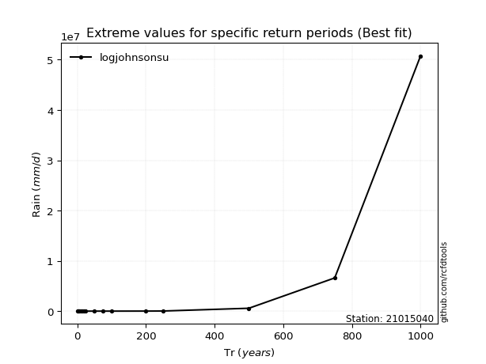</img>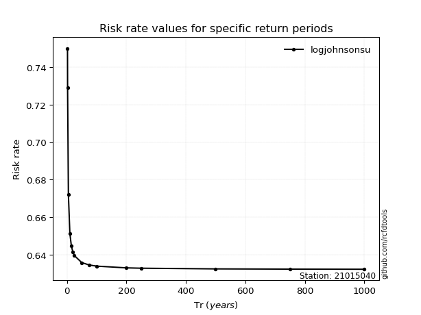</img>

</div>


<sub>**APP DISCLAIMER**: NO WARRANTY - This software is provided by [github.com/rcfdtools](https://github.com/rcfdtools) "as is", without any express or implied warranty, including warranties of merchantability, fitness for a particular purpose, or non-infringement. There is no guarantee that the software will be error-free or operate without interruption. LIMITATION OF LIABILITY - Neither the authors nor copyright holders will be liable for claims or damages arising from the software or its use. You are responsible for determining if the software is appropriate for your use and assume all associated risks, including errors, legal compliance, and data loss. NO PROFESSIONAL ADVICE - The software provides general information and does not offer professional advice. It should not replace consultation with professional advisors.</sub>