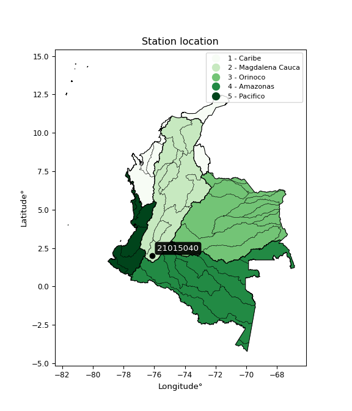

<div align="center">


</div>

# PMax24h Station (Rain): 21015040

Maximum Precipitation in 24 hours (PMax24h) is the greatest amount of rainfall for a specific duration that is meteorologically possible for a given location, acting as a "worst-case" scenario for extreme storms, crucial for designing safety-critical infrastructure like bridges, river deviations, dams, spillways, and nuclear plants to prevent catastrophic failure. The PMax24h is related with the Probable Maximum Precipitation (PMP) and it is calculated by hydrologists using meteorological data to determine the upper limit of extreme rainfall, often leading to the Probable Maximum Flood (PMF) for flood control design, and is increasingly being studied for climate change impacts. Probable Maximum Precipitation (PMP) is the theoretical upper limit of rainfall, a deterministic estimate for extreme events, while probability distributions (like GEV, Gumbel) describe the likelihood and frequency of various precipitation amounts, including rare ones, showing how often events occur, with PMP representing the extreme end of these distributions, used for critical infrastructure design to ensure safety against the worst conceivable weather, unlike standard statistical forecasts which cover typical probabilities.

The most common probability distributions in hydrology, used for analyzing floods, rainfall, and streamflow, include the Normal, Log-Normal, Gumbel, Gamma (including Log-Pearson Type III), and Generalized Extreme Value (GEV) distributions, often chosen based on the data´s skewness and whether modeling extremes or general conditions, with Gumbel and GEV popular for extreme events like floods, while the Normal distribution serves as a baseline, though often requiring transformations for skewed hydrological data. These distributions help in designing water infrastructure, managing water resources, and forecasting hydrologic events.

> Hydrological data often isn´t perfectly normal (it´s skewed), so different distributions are needed for different applications, such as: **Flood Frequency Analysis**: Using Gumbel, GEV, or Log-Pearson Type III for predicting extreme flood magnitudes and their return periods, **Rainfall Analysis**: Normal for annual totals, but Log-Normal, Weibull, or GEV for intensity or extreme daily rainfall, **Streamflow Modeling**: Gamma and Log-Normal for maximum flows, GEV for minimum flows, and Kappa for daily flows.

<div align="center">

</img>

</div>


## A. General information


### 1. General running parameters

• app_version: _v20260225_. • runtime: _2026-02-28 16:54:07.457399_. • Python version: _3.14.0_. • SciPy version: _1.16.3_. • Pandas version: _2.3.3_. • NumPy version: _2.3.5_. • Stations dataset (station_dataset_file): _dataset/pmax24h_in/automatic_colombia_2003_2025.csv_. • Stations catalog (station_catalog_file): _dataset/CNE.xls_. • Minimum year to eval til year_max (date_min): _1900_. • Maximum year to eval since year_min (date_max): _2025_. • Creates, save and include plots into reports (create_plot): _False_. • Plot only fit distributions with Δo > Δ (plot_only_fit): _True_. • Plot only simple graphs avoiding multiple CDFs and multiple Extreme values plots (plot_only_simple): _False_. • Eval low extreme values, if False, evaluates high extreme values (low_extreme): _False_. • Eval every SciPy distribution as logarithmic (pdist_logarithmic_on): _True_. • Standard deviation normalized (ddof): _1.0_. • Return periods to eval in years (Tr): _[2, 2.33, 5, 10, 15, 20, 25, 50, 75, 100, 200, 250, 500, 750, 1000]_. • Minimum data sample per station, 0 means any (minimum_sample): _5_. • Z-Score maximum threshold to adjust a value, 0 means disable (zscore_max): _3.5_. • Z-Score minimum threshold to adjust a value, 0 means disable (zscore_min): _-2.5_. • Avoid zeros, e.g. rain = 0 (avoid_zeros): _True_. • Avoid null values (avoid_nans): _True_. 

:file_folder:Table: [dataset.csv](../../dataset/pmax24h_in/automatic_colombia_2003_2025.csv)

> Delta Degrees of Freedom (DDOF): is a parameter used in the formulas for calculating variance and standard deviation. When ddof=0, the divisor is $N$ (the total number of observations) and this is used when your data set is the entire population. When ddof=1, the divisor is $N-1$ and this is used when your data set is a sample drawn from a larger population. Using $N-1$ provides an unbiased estimate of the population variance (known as Bessel´s correction).


### 2. Station info and location

|   id |   CODIGO | NOMBRE                        | CATEGORIA               | TECNOLOGIA                | ESTADO   | FECHA_INSTALACION   |   FECHA_SUSPENSION |   ALTITUD |   LATITUD |   LONGITUD | DEPARTAMENTO   | MUNICIPIO    | AREA_OPERATIVA                    | ENTIDAD                                                     | AREA_HIDROGRAFICA   | ZONA_HIDROGRAFICA   | SUBZONA_HIDROGRAFICA            |   CORRIENTE | Catalogo   |   Version |
|-----:|---------:|:------------------------------|:------------------------|:--------------------------|:---------|:--------------------|-------------------:|----------:|----------:|-----------:|:---------------|:-------------|:----------------------------------|:------------------------------------------------------------|:--------------------|:--------------------|:--------------------------------|------------:|:-----------|----------:|
|    0 | 21015040 | LA PRIMAVERA - AUT [21015040] | Climatológica Principal | Automática con Telemetría | Activa   | 28/07/2005          |                nan |      1919 |   2.02158 |   -76.1143 | Huila          | Saladoblanco | Area Operativa 04 - Huila-Caquetá | INSTITUTO DE HIDROLOGIA METEOROLOGIA Y ESTUDIOS AMBIENTALES | Magdalena Cauca     | Alto Magdalena      | Ríos Directos al Magdalena (mi) |         nan | CNE_IDEAM  |  20251226 |

<div align="center">

Dynamic map: [:earth_americas:Google](http://maps.google.com/maps?q=2.021583333,-76.11433333) [:earth_americas:OSM](https://www.openstreetmap.org/#map=18/2.021583333/-76.11433333&layers=P) [:earth_americas:Bing](https://www.bing.com/maps?cp=2.021583333~-76.11433333&lvl=18) [:earth_americas:Apple](https://maps.apple.com/frame?center=2.021583333%2C-76.11433333&span=0.003%2C0.006)

</div>


<div align="center">

```geojson
{
  "type": "Feature",
  "geometry": {
    "type": "Point", 
    "coordinates": [-76.11433333, 2.021583333]
  }, 
  "properties": {
    "Name": "21015040"
  }
}
```

</div>


### 3. Discrete values table and plot

<div align="center">

|               |           0 |         1 |           2 |             3 |            4 |           5 |           6 |            7 |           8 |           9 |         10 |          11 |           12 |          13 |          14 |         15 |         16 |          17 |
|:--------------|------------:|----------:|------------:|--------------:|-------------:|------------:|------------:|-------------:|------------:|------------:|-----------:|------------:|-------------:|------------:|------------:|-----------:|-----------:|------------:|
| Date          | 2006        | 2007      | 2008        | 2009          | 2010         | 2011        | 2012        | 2013         | 2014        | 2015        | 2016       | 2017        | 2018         | 2019        | 2020        | 2021       | 2024       | 2025        |
| Value         |   21.6      |   12.8    |   36.9      |   47.9        |   46         |   39.5      |   39.4      |   46.1       |   34.7      |   61.6      |  129.6     |   32.4      |   46.3       |   41.7      |   25.7      |    0.2     |  172       |   29.4      |
| Value_initial |   21.6      |   12.8    |   36.9      |   47.9        |   46         |   39.5      |   39.4      |   46.1       |   34.7      |   61.6      |  129.6     |   32.4      |   46.3       |   41.7      |   25.7      |    0.2     |  172       |   29.4      |
| count         |   18        |   18      |   18        |   18          |   18         |   18        |   18        |   18         |   18        |   18        |   18       |   18        |   18         |   18        |   18        |   18       |   18       |   18        |
| mean          |   47.9889   |   47.9889 |   47.9889   |   47.9889     |   47.9889    |   47.9889   |   47.9889   |   47.9889    |   47.9889   |   47.9889   |   47.9889  |   47.9889   |   47.9889    |   47.9889   |   47.9889   |   47.9889  |   47.9889  |   47.9889   |
| std           |   40.601    |   40.601  |   40.601    |   40.601      |   40.601     |   40.601    |   40.601    |   40.601     |   40.601    |   40.601    |   40.601   |   40.601    |   40.601     |   40.601    |   40.601    |   40.601   |   40.601   |   40.601    |
| zscore        |   -0.649957 |   -0.8667 |   -0.273119 |   -0.00218933 |   -0.0489862 |   -0.209081 |   -0.211544 |   -0.0465232 |   -0.327305 |    0.335241 |    2.01008 |   -0.383953 |   -0.0415972 |   -0.154895 |   -0.548974 |   -1.17704 |    3.05439 |   -0.457843 |


</div>


> The initial value (value_initial) correspond to the initial obtained or null completed value, and value (value) is adjusted only when the initial value is outside the valid range (outlier) definite through the Z-Score value. If Z-Score is active, values out of range or outliers are replaced with the station mean value. A Z-Score (or standard score) measures how many standard deviations a data point is from the mean of a dataset, indicating its relative position; positive scores mean above the mean, negative mean below, and a score of zero is exactly at the mean, allowing for comparison of values from different distributions. It´s calculated using the formula $z=(x–μ)/σ$, where $x$ is the data point, $μ$ is the mean, and $σ$ is the standard deviation, helping identify outliers and understand probability.
>
> <sub>**Note**: In this study, "completing" (filling gaps in) and "extending" (forecasting or lengthening the historical record) rainfall data series are avoided for certain critical analyses because they introduce artificial bias and uncertainty, which can distort the statistics of rare events (extremes), alter day-to-day variability, and compromise the integrity and homogeneity of the original data. Some reasons against Completing/Extending rainfall data are: **Distortion of Extremes and Variability**: The primary issue is that most gap-filling or extension methods rely on averaging or regression with nearby stations, which inherently smooths the data. Rainfall is highly variable in space and time, with a large percentage of zero values and occasional large storms. Infilling methods often underestimate the highest values and overestimate the lowest (zero) values, which severely distorts analyses focused on flood frequency, drought severity, and intensity-duration-frequency (IDF) curves, **Loss of Data Homogeneity**: Infilled or extended data are synthetic estimates, not actual measurements. Combining these estimates with observed data can violate the assumption of data homogeneity, which requires that the data properties do not change over time. Inhomogeneity can lead to incorrect conclusions about long-term trends or changes in climate patterns, **Propagation of Errors**: Errors and biases from the original data (e.g., wind-induced undercatch, instrument errors, site changes) or the data used for imputation can propagate through the analysis, leading to unreliable hydrological models and inaccurate predictions, **Compromised Statistical Integrity**: For statistical analyses, especially those involving the frequency of events, using artificial data can introduce time bias or autocorrelation that doesn´t exist in reality, making it difficult to assess the true probability of events, **Difficulty in Validation**: It is difficult to accurately validate the quality of filled or extended data, especially for past periods where ground-truth measurements are unavailable. The reliability of imputation techniques heavily depends on the density of the surrounding station network and the complexity of the local topography.</sub>


### 4. Active continuous probability distributions from SciPy (80 of 104 available)

A Probability Density Function (PDF) describes the relative likelihood of a continuous random variable falling within a specific range, where the total area under its curve equals 1, and the area over any interval gives the actual probability for that range. Unlike discrete probabilities (like rolling a die), a PDF shows density, not direct probability for a single point (which is zero), with higher points indicating higher likelihood, often visualized as a bell curve for normal distributions.

A log of a probability density function (log-PDF) is simply the logarithm of the PDF´s value, denoted as $log(f(x))$, useful for converting multiplication of probabilities into addition, improving numerical stability with tiny numbers, and connecting to information theory concepts like entropy. Instead of dealing with very small probabilities (e.g., 0.000001), log-PDFs use negative numbers (e.g., $log(0.00001) ≈ -11.51$ that are easier for computers to handle, preventing underflow errors and simplifying complex calculations. In this study, each active probability distribution from SciPy is also evaluated in the $log$ form.

[scipy.stats](https://docs.scipy.org/doc/scipy/reference/stats.html) is a Python´s powerful submodule within the SciPy library for comprehensive statistical analysis, offering over 130 probability distributions (like Normal, Poisson, etc.), functions for descriptive stats (mean, variance), hypothesis testing (t-tests, chi-square), random variable generation, and statistical tests, making it essential for data science, modeling, and research. It provides tools to explore, model, and draw conclusions from data efficiently, working seamlessly with [NumPy](https://numpy.org/).

<div align="center">

|   id | p_dist           |   n_parameter | fit_method   | label                                                                       | active   | ref                                                                                                      |
|-----:|:-----------------|--------------:|:-------------|:----------------------------------------------------------------------------|:---------|:---------------------------------------------------------------------------------------------------------|
|    0 | alpha            |             3 | MLE          | Alpha                                                                       | True     | [:mortar_board:](https://docs.scipy.org/doc/scipy/reference/generated/scipy.stats.alpha.html)            |
|    1 | anglit           |             2 | MM           | Anglit                                                                      | True     | [:mortar_board:](https://docs.scipy.org/doc/scipy/reference/generated/scipy.stats.anglit.html)           |
|    2 | arcsine          |             2 | MM           | Arcsine                                                                     | True     | [:mortar_board:](https://docs.scipy.org/doc/scipy/reference/generated/scipy.stats.arcsine.html)          |
|    3 | argus            |             3 | MLE          | Argus                                                                       | True     | [:mortar_board:](https://docs.scipy.org/doc/scipy/reference/generated/scipy.stats.argus.html)            |
|    4 | beta             |             4 | MLE          | Beta                                                                        | True     | [:mortar_board:](https://docs.scipy.org/doc/scipy/reference/generated/scipy.stats.beta.html)             |
|    5 | betaprime        |             4 | MLE          | Beta prime                                                                  | True     | [:mortar_board:](https://docs.scipy.org/doc/scipy/reference/generated/scipy.stats.betaprime.html)        |
|    6 | bradford         |             3 | MLE          | Bradford                                                                    | True     | [:mortar_board:](https://docs.scipy.org/doc/scipy/reference/generated/scipy.stats.bradford.html)         |
|    7 | burr             |             4 | MLE          | Burr (Type III)                                                             | True     | [:mortar_board:](https://docs.scipy.org/doc/scipy/reference/generated/scipy.stats.burr.html)             |
|    8 | burr12           |             4 | MLE          | Burr (Type III) 12                                                          | True     | [:mortar_board:](https://docs.scipy.org/doc/scipy/reference/generated/scipy.stats.burr12.html)           |
|    9 | cosine           |             2 | MLE          | Cosine                                                                      | True     | [:mortar_board:](https://docs.scipy.org/doc/scipy/reference/generated/scipy.stats.cosine.html)           |
|   10 | crystalball      |             4 | MLE          | Crystalball                                                                 | True     | [:mortar_board:](https://docs.scipy.org/doc/scipy/reference/generated/scipy.stats.crystalball.html)      |
|   11 | dgamma           |             3 | MLE          | Double gamma                                                                | True     | [:mortar_board:](https://docs.scipy.org/doc/scipy/reference/generated/scipy.stats.dgamma.html)           |
|   12 | dweibull         |             3 | MLE          | Double Weibull                                                              | True     | [:mortar_board:](https://docs.scipy.org/doc/scipy/reference/generated/scipy.stats.dweibull.html)         |
|   13 | erlang           |             3 | MLE          | Erlang                                                                      | True     | [:mortar_board:](https://docs.scipy.org/doc/scipy/reference/generated/scipy.stats.erlang.html)           |
|   14 | exponnorm        |             3 | MLE          | Exponentially modified Normal                                               | True     | [:mortar_board:](https://docs.scipy.org/doc/scipy/reference/generated/scipy.stats.exponnorm.html)        |
|   15 | exponpow         |             3 | MLE          | Exponential power                                                           | True     | [:mortar_board:](https://docs.scipy.org/doc/scipy/reference/generated/scipy.stats.exponpow.html)         |
|   16 | exponweib        |             4 | MLE          | Exponentiated Weibull                                                       | True     | [:mortar_board:](https://docs.scipy.org/doc/scipy/reference/generated/scipy.stats.exponweib.html)        |
|   17 | f                |             4 | MLE          | F                                                                           | True     | [:mortar_board:](https://docs.scipy.org/doc/scipy/reference/generated/scipy.stats.f.html)                |
|   18 | fatiguelife      |             3 | MLE          | Fatigue-life (Birnbaum-Saunders)                                            | True     | [:mortar_board:](https://docs.scipy.org/doc/scipy/reference/generated/scipy.stats.fatiguelife.html)      |
|   19 | foldnorm         |             3 | MM           | Fold Normal                                                                 | True     | [:mortar_board:](https://docs.scipy.org/doc/scipy/reference/generated/scipy.stats.foldnorm.html)         |
|   20 | gamma            |             3 | MLE          | Gamma                                                                       | True     | [:mortar_board:](https://docs.scipy.org/doc/scipy/reference/generated/scipy.stats.gamma.html)            |
|   21 | gausshyper       |             6 | MLE          | Gauss hypergeometric                                                        | True     | [:mortar_board:](https://docs.scipy.org/doc/scipy/reference/generated/scipy.stats.gausshyper.html)       |
|   22 | genexpon         |             5 | MLE          | Generalized exponential                                                     | True     | [:mortar_board:](https://docs.scipy.org/doc/scipy/reference/generated/scipy.stats.genexpon.html)         |
|   23 | genextreme       |             3 | MLE          | Generalized exponential                                                     | True     | [:mortar_board:](https://docs.scipy.org/doc/scipy/reference/generated/scipy.stats.genextreme.html)       |
|   24 | gengamma         |             4 | MLE          | Generalized gamma                                                           | True     | [:mortar_board:](https://docs.scipy.org/doc/scipy/reference/generated/scipy.stats.gengamma.html)         |
|   25 | genhalflogistic  |             3 | MLE          | Generalized half-logistic                                                   | True     | [:mortar_board:](https://docs.scipy.org/doc/scipy/reference/generated/scipy.stats.genhalflogistic.html)  |
|   26 | genlogistic      |             3 | MLE          | Generalized logistic                                                        | True     | [:mortar_board:](https://docs.scipy.org/doc/scipy/reference/generated/scipy.stats.genlogistic.html)      |
|   27 | gennorm          |             3 | MLE          | Generalized Normal                                                          | True     | [:mortar_board:](https://docs.scipy.org/doc/scipy/reference/generated/scipy.stats.gennorm.html)          |
|   28 | genpareto        |             3 | MLE          | Generalized Pareto                                                          | True     | [:mortar_board:](https://docs.scipy.org/doc/scipy/reference/generated/scipy.stats.genpareto.html)        |
|   29 | gompertz         |             3 | MLE          | Gompertz (or truncated Gumbel)                                              | True     | [:mortar_board:](https://docs.scipy.org/doc/scipy/reference/generated/scipy.stats.gompertz.html)         |
|   30 | gumbel_l         |             2 | MM           | Gumbel Left Skew                                                            | True     | [:mortar_board:](https://docs.scipy.org/doc/scipy/reference/generated/scipy.stats.gumbel_l.html)         |
|   31 | gumbel_r         |             2 | MM           | Gumbel Right Skew                                                           | True     | [:mortar_board:](https://docs.scipy.org/doc/scipy/reference/generated/scipy.stats.gumbel_r.html)         |
|   32 | halfgennorm      |             3 | MLE          | Upper half of a generalized normal                                          | True     | [:mortar_board:](https://docs.scipy.org/doc/scipy/reference/generated/scipy.stats.halfgennorm.html)      |
|   33 | halflogistic     |             2 | MM           | Half-logistic                                                               | True     | [:mortar_board:](https://docs.scipy.org/doc/scipy/reference/generated/scipy.stats.halflogistic.html)     |
|   34 | halfnorm         |             2 | MM           | Half Normal                                                                 | True     | [:mortar_board:](https://docs.scipy.org/doc/scipy/reference/generated/scipy.stats.halfnorm.html)         |
|   35 | hypsecant        |             2 | MM           | hyperbolic secant                                                           | True     | [:mortar_board:](https://docs.scipy.org/doc/scipy/reference/generated/scipy.stats.hypsecant.html)        |
|   36 | invgamma         |             3 | MLE          | Inverted gamma                                                              | True     | [:mortar_board:](https://docs.scipy.org/doc/scipy/reference/generated/scipy.stats.invgamma.html)         |
|   37 | invgauss         |             3 | MLE          | Inverse Gaussian                                                            | True     | [:mortar_board:](https://docs.scipy.org/doc/scipy/reference/generated/scipy.stats.invgauss.html)         |
|   38 | invweibull       |             3 | MLE          | Inverted Weibull                                                            | True     | [:mortar_board:](https://docs.scipy.org/doc/scipy/reference/generated/scipy.stats.invweibull.html)       |
|   39 | johnsonsb        |             4 | MLE          | Johnson SB                                                                  | True     | [:mortar_board:](https://docs.scipy.org/doc/scipy/reference/generated/scipy.stats.johnsonsb.html)        |
|   40 | johnsonsu        |             4 | MLE          | Johnson Su                                                                  | True     | [:mortar_board:](https://docs.scipy.org/doc/scipy/reference/generated/scipy.stats.johnsonsu.html)        |
|   41 | kappa3           |             3 | MLE          | Kappa 3                                                                     | True     | [:mortar_board:](https://docs.scipy.org/doc/scipy/reference/generated/scipy.stats.kappa3.html)           |
|   42 | kappa4           |             4 | MLE          | Kappa 4                                                                     | True     | [:mortar_board:](https://docs.scipy.org/doc/scipy/reference/generated/scipy.stats.kappa4.html)           |
|   43 | ksone            |             3 | MLE          | Kolmogorov-Smirnov one-sided test statistic distribution                    | True     | [:mortar_board:](https://docs.scipy.org/doc/scipy/reference/generated/scipy.stats.ksone.html)            |
|   44 | kstwobign        |             2 | MLE          | Limiting distribution of scaled Kolmogorov-Smirnov two-sided test statistic | True     | [:mortar_board:](https://docs.scipy.org/doc/scipy/reference/generated/scipy.stats.kstwobign.html)        |
|   45 | laplace          |             2 | MM           | Laplace                                                                     | True     | [:mortar_board:](https://docs.scipy.org/doc/scipy/reference/generated/scipy.stats.laplace.html)          |
|   46 | levy_l           |             2 | MLE          | Left-skewed Levy                                                            | True     | [:mortar_board:](https://docs.scipy.org/doc/scipy/reference/generated/scipy.stats.levy_l.html)           |
|   47 | loggamma         |             3 | MLE          | Log gamma                                                                   | True     | [:mortar_board:](https://docs.scipy.org/doc/scipy/reference/generated/scipy.stats.loggamma.html)         |
|   48 | logistic         |             2 | MM           | Logistic (or Sech-squared)                                                  | True     | [:mortar_board:](https://docs.scipy.org/doc/scipy/reference/generated/scipy.stats.logistic.html)         |
|   49 | loglaplace       |             3 | MLE          | Log-Laplace                                                                 | True     | [:mortar_board:](https://docs.scipy.org/doc/scipy/reference/generated/scipy.stats.loglaplace.html)       |
|   50 | lomax            |             3 | MLE          | Lomax (Pareto of the second kind)                                           | True     | [:mortar_board:](https://docs.scipy.org/doc/scipy/reference/generated/scipy.stats.lomax.html)            |
|   51 | maxwell          |             2 | MM           | Maxwell                                                                     | True     | [:mortar_board:](https://docs.scipy.org/doc/scipy/reference/generated/scipy.stats.maxwell.html)          |
|   52 | mielke           |             4 | MLE          | Mielke Beta-Kappa / Dagum                                                   | True     | [:mortar_board:](https://docs.scipy.org/doc/scipy/reference/generated/scipy.stats.mielke.html)           |
|   53 | moyal            |             2 | MM           | Moyal                                                                       | True     | [:mortar_board:](https://docs.scipy.org/doc/scipy/reference/generated/scipy.stats.moyal.html)            |
|   54 | nakagami         |             3 | MLE          | Nakagami                                                                    | True     | [:mortar_board:](https://docs.scipy.org/doc/scipy/reference/generated/scipy.stats.nakagami.html)         |
|   55 | ncf              |             5 | MLE          | Non-central F distribution                                                  | True     | [:mortar_board:](https://docs.scipy.org/doc/scipy/reference/generated/scipy.stats.ncf.html)              |
|   56 | nct              |             4 | MLE          | Non-central Student’s t                                                     | True     | [:mortar_board:](https://docs.scipy.org/doc/scipy/reference/generated/scipy.stats.nct.html)              |
|   57 | norm             |             2 | MM           | Normal                                                                      | True     | [:mortar_board:](https://docs.scipy.org/doc/scipy/reference/generated/scipy.stats.norm.html)             |
|   58 | pearson3         |             3 | MM           | Pearson type III                                                            | True     | [:mortar_board:](https://docs.scipy.org/doc/scipy/reference/generated/scipy.stats.pearson3.html)         |
|   59 | powerlaw         |             3 | MLE          | Power-function                                                              | True     | [:mortar_board:](https://docs.scipy.org/doc/scipy/reference/generated/scipy.stats.powerlaw.html)         |
|   60 | rayleigh         |             2 | MM           | Rayleigh                                                                    | True     | [:mortar_board:](https://docs.scipy.org/doc/scipy/reference/generated/scipy.stats.rayleigh.html)         |
|   61 | rdist            |             3 | MLE          | R-distributed (symmetric beta)                                              | True     | [:mortar_board:](https://docs.scipy.org/doc/scipy/reference/generated/scipy.stats.rdist.html)            |
|   62 | rice             |             3 | MLE          | Rice                                                                        | True     | [:mortar_board:](https://docs.scipy.org/doc/scipy/reference/generated/scipy.stats.rice.html)             |
|   63 | semicircular     |             2 | MM           | Semicircular                                                                | True     | [:mortar_board:](https://docs.scipy.org/doc/scipy/reference/generated/scipy.stats.semicircular.html)     |
|   64 | skewnorm         |             3 | MLE          | Skew normal                                                                 | True     | [:mortar_board:](https://docs.scipy.org/doc/scipy/reference/generated/scipy.stats.skewnorm.html)         |
|   65 | t                |             3 | MLE          | Student’s t                                                                 | True     | [:mortar_board:](https://docs.scipy.org/doc/scipy/reference/generated/scipy.stats.t.html)                |
|   66 | trapezoid        |             4 | MLE          | Trapezoid                                                                   | True     | [:mortar_board:](https://docs.scipy.org/doc/scipy/reference/generated/scipy.stats.trapezoid.html)        |
|   67 | triang           |             3 | MLE          | Triangular                                                                  | True     | [:mortar_board:](https://docs.scipy.org/doc/scipy/reference/generated/scipy.stats.triang.html)           |
|   68 | truncexpon       |             3 | MLE          | Truncated exponential                                                       | True     | [:mortar_board:](https://docs.scipy.org/doc/scipy/reference/generated/scipy.stats.truncexpon.html)       |
|   69 | truncnorm        |             4 | MLE          | Truncated normal                                                            | True     | [:mortar_board:](https://docs.scipy.org/doc/scipy/reference/generated/scipy.stats.truncnorm.html)        |
|   70 | truncpareto      |             4 | MLE          | Upper truncated Pareto                                                      | True     | [:mortar_board:](https://docs.scipy.org/doc/scipy/reference/generated/scipy.stats.truncpareto.html)      |
|   71 | truncweibull_min |             5 | MLE          | Doubly truncated Weibull minimum                                            | True     | [:mortar_board:](https://docs.scipy.org/doc/scipy/reference/generated/scipy.stats.truncweibull_min.html) |
|   72 | tukeylambda      |             3 | MLE          | Tukey-Lamdba                                                                | True     | [:mortar_board:](https://docs.scipy.org/doc/scipy/reference/generated/scipy.stats.tukeylambda.html)      |
|   73 | uniform          |             2 | MLE          | Uniform                                                                     | True     | [:mortar_board:](https://docs.scipy.org/doc/scipy/reference/generated/scipy.stats.uniform.html)          |
|   74 | vonmises         |             3 | MLE          | Von Mises                                                                   | True     | [:mortar_board:](https://docs.scipy.org/doc/scipy/reference/generated/scipy.stats.vonmises.html)         |
|   75 | vonmises_line    |             3 | MLE          | Von Mises line                                                              | True     | [:mortar_board:](https://docs.scipy.org/doc/scipy/reference/generated/scipy.stats.vonmises_line.html)    |
|   76 | wald             |             2 | MM           | Wald                                                                        | True     | [:mortar_board:](https://docs.scipy.org/doc/scipy/reference/generated/scipy.stats.wald.html)             |
|   77 | weibull_max      |             3 | MLE          | Weibull maximum                                                             | True     | [:mortar_board:](https://docs.scipy.org/doc/scipy/reference/generated/scipy.stats.weibull_max.html)      |
|   78 | weibull_min      |             3 | MLE          | Weibull minimum                                                             | True     | [:mortar_board:](https://docs.scipy.org/doc/scipy/reference/generated/scipy.stats.weibull_min.html)      |
|   79 | wrapcauchy       |             3 | MLE          | Wrapped  Cauchy                                                             | True     | [:mortar_board:](https://docs.scipy.org/doc/scipy/reference/generated/scipy.stats.wrapcauchy.html)       |

</div>

> **n_parameter:** # arguments & localization & scale.
>
> **Fit methods:** (MLE) maximum likelihood, (MM) L-moments.
>
>**Inactive** (With the only purpose of prevent loops, zero divisions, infinite values, over high estimated values or horizontal trending for recurrence intervals estimations, the follow distributions were disabled.)**:** lognorm, norminvgauss, powernorm, powerlognorm, cauchy, halfcauchy, foldcauchy, skewcauchy, chi2, expon, fisk, genhyperbolic, geninvgauss, gibrat, kstwo, laplace_asymmetric, levy, levy_stable, ncx2, pareto, rel_breitwigner, recipinvgauss, studentized_range, loguniform, 


## B. Probability (PDF) vs. Empirical (EDF) distributions functions

A continuous probability distribution (CPD) describes probabilities for variables that can take any value within a range (like rain any time), unlike discrete variables with specific outcomes (like temperature). It uses a Probability Density Function (PDF), a curve where the total area under it equals 1, and the probability of the variable falling within an interval (a to b) is found by calculating the area under the curve between those points. A key feature is that the probability of hitting any single exact value is zero, so probabilities are always expressed for ranges, e.g., $P(a ≤ X ≤ b)$.

<div align="center">

Distributions parameters from station values
|     |   station | p_dist              |   n |              loc |           scale | shape                  | shape1                 | shape2                | shape3              |
|----:|----------:|:--------------------|----:|-----------------:|----------------:|:-----------------------|:-----------------------|:----------------------|:--------------------|
|   0 |  21015040 | alpha               |  18 |    -61.2677      |   385.849       | 3.857723189113318      |                        |                       |                     |
|   1 |  21015040 | anglit              |  18 |     47.9889      |   115.428       |                        |                        |                       |                     |
|   2 |  21015040 | arcsine             |  18 |     -7.81181     |   111.601       |                        |                        |                       |                     |
|   3 |  21015040 | argus               |  18 |    -65.2518      |   241.096       | 3.1542733765080635e-06 |                        |                       |                     |
|   4 |  21015040 | beta                |  18 |      0.2         |   225.484       | 0.3801397087182903     | 0.8809382504352271     |                       |                     |
|   5 |  21015040 | betaprime           |  18 |    -17.6937      |    37.8261      | 10.3322280086788       | 6.935171581500413      |                       |                     |
|   6 |  21015040 | bradford            |  18 |      0.199942    |   171.8         | 2.50119561669504       |                        |                       |                     |
|   7 |  21015040 | burr                |  18 |    -14.0008      |    53.3148      | 3.725292271571141      | 0.9647922029336908     |                       |                     |
|   8 |  21015040 | burr12              |  18 |    -42.9013      |    71.6107      | 8.029454834067412      | 0.49878539398641586    |                       |                     |
|   9 |  21015040 | cosine              |  18 |     61.0473      |    41.2986      |                        |                        |                       |                     |
|  10 |  21015040 | crystalball         |  18 |     -0.0754221   |    62.1534      | 5.748785199251534      | 1.0082811261731468     |                       |                     |
|  11 |  21015040 | dgamma              |  18 |     39.5         |    35.1333      | 0.6056560023971567     |                        |                       |                     |
|  12 |  21015040 | dweibull            |  18 |     39.5         |    29.1706      | 0.7832249224391646     |                        |                       |                     |
|  13 |  21015040 | erlang              |  18 |     -4.73058     |    23.1763      | 2.2747128942591797     |                        |                       |                     |
|  14 |  21015040 | exponnorm           |  18 |     17.9895      |    12.2447      | 2.4499964098180405     |                        |                       |                     |
|  15 |  21015040 | exponpow            |  18 |      0.2         |    94.8669      | 0.8461134873878109     |                        |                       |                     |
|  16 |  21015040 | exponweib           |  18 |      0.2         |     4.13136     | 2.344746374212738      | 0.3085479686542454     |                       |                     |
|  17 |  21015040 | f                   |  18 |    -18.6996      |    61.7139      | 13.851703139748807     | 19.813998991480858     |                       |                     |
|  18 |  21015040 | fatiguelife         |  18 |    -18.8739      |    59.1577      | 0.5116025922604139     |                        |                       |                     |
|  19 |  21015040 | foldnorm            |  18 |    -10.2647      |    71.6448      | 0.0027686421880135483  |                        |                       |                     |
|  20 |  21015040 | gamma               |  18 |     -4.73063     |    23.1763      | 2.2747143299024213     |                        |                       |                     |
|  21 |  21015040 | gausshyper          |  18 |      0.2         |   207.295       | 0.7063382922670629     | 2.9710544424309093     | 1.6950364016535833    | 0.07019389237640998 |
|  22 |  21015040 | genexpon            |  18 |     -5.85198     |     1.96785     | 6.519381895602353e-11  | 0.06313966507735916    | 0.06354511558559367   |                     |
|  23 |  21015040 | genextreme          |  18 |     30.8286      |    21.9734      | -0.15839204555207687   |                        |                       |                     |
|  24 |  21015040 | gengamma            |  18 |    -10.8704      |     0.0293386   | 19.005853184867505     | 0.39274796720830546    |                       |                     |
|  25 |  21015040 | genhalflogistic     |  18 |      0.2         |    33.1113      | 9.521077310463243e-06  |                        |                       |                     |
|  26 |  21015040 | genlogistic         |  18 |   -125.232       |    23.4071      | 855.7250535543983      |                        |                       |                     |
|  27 |  21015040 | gennorm             |  18 |     39.5         |     1.55328     | 0.4196791318882453     |                        |                       |                     |
|  28 |  21015040 | genpareto           |  18 |      0.2         |    55.4391      | -0.16297921827484918   |                        |                       |                     |
|  29 |  21015040 | gompertz            |  18 |      0.102413    |   210.596       | 3.60206715034521       |                        |                       |                     |
|  30 |  21015040 | gumbel_l            |  18 |     65.7467      |    30.7645      |                        |                        |                       |                     |
|  31 |  21015040 | gumbel_r            |  18 |     30.2311      |    30.7645      |                        |                        |                       |                     |
|  32 |  21015040 | halfgennorm         |  18 |      0.2         |     2.74284     | 0.38194559112212945    |                        |                       |                     |
|  33 |  21015040 | halflogistic        |  18 |      1.22313     |    33.7344      |                        |                        |                       |                     |
|  34 |  21015040 | halfnorm            |  18 |     -4.2368      |    65.4552      |                        |                        |                       |                     |
|  35 |  21015040 | hypsecant           |  18 |     47.9889      |    25.1191      |                        |                        |                       |                     |
|  36 |  21015040 | invgamma            |  18 |    -30.6011      |   442.918       | 6.676575955692963      |                        |                       |                     |
|  37 |  21015040 | invgauss            |  18 |    -19.4521      |   247.826       | 0.2721311330016324     |                        |                       |                     |
|  38 |  21015040 | invweibull          |  18 |   -107.899       |   138.727       | 6.3134176617199635     |                        |                       |                     |
|  39 |  21015040 | johnsonsb           |  18 |    -16.1495      | 17889           | 11.125785593161027     | 1.9278737157776655     |                       |                     |
|  40 |  21015040 | johnsonsu           |  18 |     36.5333      |     7.66549     | -0.2220932895322156    | 0.6495631535191101     |                       |                     |
|  41 |  21015040 | kappa3              |  18 |      0.2         |    45.9216      | 3.2849289183705426     |                        |                       |                     |
|  42 |  21015040 | kappa4              |  18 |    -17.5431      |   189.08        | 1.1035298498305126     | 0.9951913376930998     |                       |                     |
|  43 |  21015040 | ksone               |  18 |    -16.98        |   206.16        | 1.0                    |                        |                       |                     |
|  44 |  21015040 | kstwobign           |  18 |    -59.4653      |   126.017       |                        |                        |                       |                     |
|  45 |  21015040 | laplace             |  18 |     47.9889      |    27.9004      |                        |                        |                       |                     |
|  46 |  21015040 | levy_l              |  18 |    185.287       |    89.6716      |                        |                        |                       |                     |
|  47 |  21015040 | loggamma            |  18 | -17016.7         |  2149.13        | 2808.188511736922      |                        |                       |                     |
|  48 |  21015040 | logistic            |  18 |     47.9889      |    21.7538      |                        |                        |                       |                     |
|  49 |  21015040 | loglaplace          |  18 |     -5.47306     |    44.973       | 2.2962422501044575     |                        |                       |                     |
|  50 |  21015040 | lomax               |  18 |      0.2         |     1.82234e+10 | 383102969.742623       |                        |                       |                     |
|  51 |  21015040 | maxwell             |  18 |    -45.5078      |    58.5904      |                        |                        |                       |                     |
|  52 |  21015040 | mielke              |  18 |    -13.9999      |    53.3149      | 3.5939832957452245     | 3.7252842024280843     |                       |                     |
|  53 |  21015040 | moyal               |  18 |     25.4248      |    17.7619      |                        |                        |                       |                     |
|  54 |  21015040 | nakagami            |  18 |     12.8         |    41.6232      | 0.2805020956119999     |                        |                       |                     |
|  55 |  21015040 | ncf                 |  18 |     -0.00301599  |     1.93647e-08 | 3.127483669530674e-09  | 3.4974107293700873     | 5.551913556824678     |                     |
|  56 |  21015040 | nct                 |  18 |     -0.0387788   |    15.5835      | 3.290356537506871      | 2.285198585884491      |                       |                     |
|  57 |  21015040 | norm                |  18 |     47.9889      |    39.4571      |                        |                        |                       |                     |
|  58 |  21015040 | pearson3            |  18 |     47.9889      |    39.457       | 2.0399606782487947     |                        |                       |                     |
|  59 |  21015040 | powerlaw            |  18 |      0.2         |   171.8         | 0.2670913292264739     |                        |                       |                     |
|  60 |  21015040 | rayleigh            |  18 |    -27.4948      |    60.2273      |                        |                        |                       |                     |
|  61 |  21015040 | rdist               |  18 |    -17.2367      |    78.8367      | 1.1776300465501257     |                        |                       |                     |
|  62 |  21015040 | rice                |  18 |    -12.0091      |    50.777       | 0.000364510505208142   |                        |                       |                     |
|  63 |  21015040 | semicircular        |  18 |     47.9889      |    78.9141      |                        |                        |                       |                     |
|  64 |  21015040 | skewnorm            |  18 |      0.199999    |    61.9724      | 406794113.7588327      |                        |                       |                     |
|  65 |  21015040 | t                   |  18 |     38.532       |     9.67888     | 1.1500769788984417     |                        |                       |                     |
|  66 |  21015040 | trapezoid           |  18 |    -17.829       |   206.16        | 1.0                    | 1.0                    |                       |                     |
|  67 |  21015040 | triang              |  18 |     -9.71039     |   194.499       | 0.1820597253466632     |                        |                       |                     |
|  68 |  21015040 | truncexpon          |  18 |      0.199985    |   146.071       | 1.1761385825471262     |                        |                       |                     |
|  69 |  21015040 | truncnorm           |  18 |    -21.724       |    68.9802      | 0.3178294193832435     | 318.0140609243367      |                       |                     |
|  70 |  21015040 | truncpareto         |  18 |      0.199999    |     6.33074e-07 | 0.05882354827960845    | 271374149.159335       |                       |                     |
|  71 |  21015040 | truncweibull_min    |  18 |     -0.198166    |   133.821       | 1.0055801651669825     | 0.002975356923673134   | 1.286779013985262     |                     |
|  72 |  21015040 | tukeylambda         |  18 |     39.3813      |   266.518       | 6.80217827970594       |                        |                       |                     |
|  73 |  21015040 | uniform             |  18 |      0.2         |   171.8         |                        |                        |                       |                     |
|  74 |  21015040 | vonmises            |  18 |      2.40582     |     1           | 0.4176153919405517     |                        |                       |                     |
|  75 |  21015040 | vonmises_line       |  18 |     41.1277      |    41.658       | 2.323531314620441      |                        |                       |                     |
|  76 |  21015040 | wald                |  18 |      8.53185     |    39.4571      |                        |                        |                       |                     |
|  77 |  21015040 | weibull_max         |  18 |    172           |     1.59779     | 0.19475569476538052    |                        |                       |                     |
|  78 |  21015040 | weibull_min         |  18 |     12.8         |    36.0083      | 0.9306084259166032     |                        |                       |                     |
|  79 |  21015040 | wrapcauchy          |  18 |      0.167103    |    27.3481      | 0.1768979188813986     |                        |                       |                     |
|  80 |  21015040 | logalpha            |  18 |    -63.2314      |  3047.23        | 45.75028158813717      |                        |                       |                     |
|  81 |  21015040 | loganglit           |  18 |      3.43612     |     3.94623     |                        |                        |                       |                     |
|  82 |  21015040 | logarcsine          |  18 |      1.52841     |     3.81541     |                        |                        |                       |                     |
|  83 |  21015040 | logargus            |  18 |     -4.10272     |     9.30086     | 2.892383311195738      |                        |                       |                     |
|  84 |  21015040 | logbeta             |  18 |     -6.18828e+07 |     6.18828e+07 | 93147092.41586412      | 3.050034945468793      |                       |                     |
|  85 |  21015040 | logbetaprime        |  18 |     -9.7763      |     6.21438e+06 | 59.381749945266016     | 27879719.238480553     |                       |                     |
|  86 |  21015040 | logbradford         |  18 |     -1.61484     |     7.12774     | 2.303380616886907e-06  |                        |                       |                     |
|  87 |  21015040 | logburr             |  18 |     -1.60944     |     1.56668     | 1.0773385883910387     | 0.8732119098438259     |                       |                     |
|  88 |  21015040 | logburr12           |  18 |  -3941.6         |  3954.83        | 4813.331810596532      | 82996.86718231671      |                       |                     |
|  89 |  21015040 | logcosine           |  18 |      2.83811     |     1.61694     |                        |                        |                       |                     |
|  90 |  21015040 | logcrystalball      |  18 |      3.43612     |     1.34894     | 288.600523735545       | 73.51854472751093      |                       |                     |
|  91 |  21015040 | logdgamma           |  18 |      3.67377     |     1.26031     | 0.4874575089331548     |                        |                       |                     |
|  92 |  21015040 | logdweibull         |  18 |      3.6763      |     0.98745     | 0.8136764906844627     |                        |                       |                     |
|  93 |  21015040 | logerlang           |  18 |     -1.60944     |    68.3279      | 0.3138704283498217     |                        |                       |                     |
|  94 |  21015040 | logexponnorm        |  18 |      3.43539     |     1.34894     | 0.0005429502265174415  |                        |                       |                     |
|  95 |  21015040 | logexponpow         |  18 |     -1.60944     |     1.73954     | 0.31531852110653225    |                        |                       |                     |
|  96 |  21015040 | logexponweib        |  18 |     -1.60944     |     1.75737     | 1.6943321516388594     | 0.5504852776349114     |                       |                     |
|  97 |  21015040 | logf                |  18 |     -1.60944     |     1.13557     | 1.1079930595494245     | 1.0882273321793288     |                       |                     |
|  98 |  21015040 | logfatiguelife      |  18 |   -985.923       |   989.367       | 0.0013676262352902008  |                        |                       |                     |
|  99 |  21015040 | logfoldnorm         |  18 |     -3.81007     |     0.967415    | 7.567707201223419      |                        |                       |                     |
| 100 |  21015040 | loggamma            |  18 |     -1.60944     |     7.10598     | 0.6877616192484393     |                        |                       |                     |
| 101 |  21015040 | loggausshyper       |  18 |     -2.1772      |     7.3247      | 1.2948115594851222     | 0.5007715797711821     | 1.227766957989199     | 1.0241312198324648  |
| 102 |  21015040 | loggenexpon         |  18 |     -1.79315     |     0.0795247   | 0.0007423747043710186  | 6.121554546897142      | 6.733882606889131e-05 |                     |
| 103 |  21015040 | loggenextreme       |  18 |      3.25624     |     1.36685     | 0.6981751835987606     |                        |                       |                     |
| 104 |  21015040 | loggengamma         |  18 |    -15.8796      |     7.58932     | 20.098902311573795     | 3.199060840078407      |                       |                     |
| 105 |  21015040 | loggenhalflogistic  |  18 |     -2.27534     |     7.92356     | 1.0674572942374554     |                        |                       |                     |
| 106 |  21015040 | loggenlogistic      |  18 |      4.09665     |     0.304962    | 0.37041865604418944    |                        |                       |                     |
| 107 |  21015040 | loggennorm          |  18 |      3.6763      |     0.0465146   | 0.42673714102814686    |                        |                       |                     |
| 108 |  21015040 | loggenpareto        |  18 |     -1.60944     |     4.40672     | -0.6309251190483609    |                        |                       |                     |
| 109 |  21015040 | loggompertz         |  18 |     -1.62731     |     0.822559    | 0.0011663763468895182  |                        |                       |                     |
| 110 |  21015040 | loggumbel_l         |  18 |      4.04322     |     1.05176     |                        |                        |                       |                     |
| 111 |  21015040 | loggumbel_r         |  18 |      2.82903     |     1.05176     |                        |                        |                       |                     |
| 112 |  21015040 | loghalfgennorm      |  18 |     -1.60961     |     6.76552     | 5329.8956216034785     |                        |                       |                     |
| 113 |  21015040 | loghalflogistic     |  18 |      1.83729     |     1.1533      |                        |                        |                       |                     |
| 114 |  21015040 | loghalfnorm         |  18 |      1.65063     |     2.23777     |                        |                        |                       |                     |
| 115 |  21015040 | loghypsecant        |  18 |      3.43612     |     0.858761    |                        |                        |                       |                     |
| 116 |  21015040 | loginvgamma         |  18 |    -38.6656      | 36492           | 867.7973821789801      |                        |                       |                     |
| 117 |  21015040 | loginvgauss         |  18 |    -15.3331      |  2460.24        | 0.007607053263822052   |                        |                       |                     |
| 118 |  21015040 | loginvweibull       |  18 |     -4.16308e+08 |     4.16308e+08 | 200865917.67160115     |                        |                       |                     |
| 119 |  21015040 | logjohnsonsb        |  18 |  -4834.3         | 13158.7         | 1316.095894660516      | 2426.7415353326605     |                       |                     |
| 120 |  21015040 | logjohnsonsu        |  18 |      3.73373     |     0.146863    | 0.20373034474250662    | 0.549691951917465      |                       |                     |
| 121 |  21015040 | logkappa3           |  18 |     -1.60977     |     6.75686     | 56080.64783641926      |                        |                       |                     |
| 122 |  21015040 | logkappa4           |  18 |     -1.96198     |     8.16546     | 1.0452765642062016     | 1.1485329206284005     |                       |                     |
| 123 |  21015040 | logksone            |  18 |     -2.28513     |     8.10832     | 1.0                    |                        |                       |                     |
| 124 |  21015040 | logkstwobign        |  18 |     -5.57136     |    10.4373      |                        |                        |                       |                     |
| 125 |  21015040 | loglaplace          |  18 |      3.43612     |     0.953844    |                        |                        |                       |                     |
| 126 |  21015040 | loglevy_l           |  18 |      5.29982     |     1.00023     |                        |                        |                       |                     |
| 127 |  21015040 | logloggamma         |  18 |      4.16917     |     0.703597    | 0.7676513948229319     |                        |                       |                     |
| 128 |  21015040 | loglogistic         |  18 |      3.43612     |     0.743709    |                        |                        |                       |                     |
| 129 |  21015040 | logloglaplace       |  18 |     -1.60944     |     1.4206      | 0.5652283497993272     |                        |                       |                     |
| 130 |  21015040 | loglomax            |  18 |     -1.60944     |     6.11547e+12 | 1265968289777.712      |                        |                       |                     |
| 131 |  21015040 | logmaxwell          |  18 |      0.239714    |     2.00305     |                        |                        |                       |                     |
| 132 |  21015040 | logmielke           |  18 | -58529.4         | 58533.5         | 67415.9794396055       | 189238.7908363142      |                       |                     |
| 133 |  21015040 | logmoyal            |  18 |      2.66471     |     0.607236    |                        |                        |                       |                     |
| 134 |  21015040 | lognakagami         |  18 |  -1888.68        |  1892.13        | 491156.3335380233      |                        |                       |                     |
| 135 |  21015040 | logncf              |  18 |     -1.60944     |     1.05908     | 1.0735341432407104     | 1.1172775376394553     | 1.096241853584174     |                     |
| 136 |  21015040 | lognct              |  18 |    -76.0654      |     1.31556     | 29804.486711255653     | 60.42957386005011      |                       |                     |
| 137 |  21015040 | lognorm             |  18 |      3.43612     |     1.34894     |                        |                        |                       |                     |
| 138 |  21015040 | logpearson3         |  18 |      3.43612     |     1.34894     | -2.7301359174651427    |                        |                       |                     |
| 139 |  21015040 | logpowerlaw         |  18 |     -1.60944     |     6.75693     | 0.428096719249427      |                        |                       |                     |
| 140 |  21015040 | lograyleigh         |  18 |      0.855511    |     2.05903     |                        |                        |                       |                     |
| 141 |  21015040 | logrdist            |  18 |     -1.27149     |     3.82093     | 1.0793893599232476     |                        |                       |                     |
| 142 |  21015040 | logrice             |  18 |   -483.747       |     1.34911     | 361.1134811969953      |                        |                       |                     |
| 143 |  21015040 | logsemicircular     |  18 |      3.43612     |     2.69789     |                        |                        |                       |                     |
| 144 |  21015040 | logskewnorm         |  18 |      5.14749     |     2.17915     | -50004794.0174466      |                        |                       |                     |
| 145 |  21015040 | logt                |  18 |      3.68462     |     0.235251    | 1.0047940554049162     |                        |                       |                     |
| 146 |  21015040 | logtrapezoid        |  18 |     -2.39939     |     8.10832     | 0.9999999999999998     | 1.0                    |                       |                     |
| 147 |  21015040 | logtriang           |  18 |     -2.50423     |     7.65175     | 0.9999997686100199     |                        |                       |                     |
| 148 |  21015040 | logtruncexpon       |  18 |     -1.66023     |     9.63995     | 0.7061991859427625     |                        |                       |                     |
| 149 |  21015040 | logtruncnorm        |  18 |      2.50121     |     6.93292     | -0.5929179111999231    | 0.38169878020675363    |                       |                     |
| 150 |  21015040 | logtruncpareto      |  18 |     -1.60944     |     8.08919e-08 | 1.2912506615677927e-08 | 88275792.3807725       |                       |                     |
| 151 |  21015040 | logtruncweibull_min |  18 |     -1.83976     |    12.5263      | 1.6869794914804737     | 1.7783411472194926e-10 | 0.5578074510270705    |                     |
| 152 |  21015040 | logtukeylambda      |  18 |      3.68721     |     0.0981599   | -0.8893127631859723    |                        |                       |                     |
| 153 |  21015040 | loguniform          |  18 |     -1.60944     |     6.75693     |                        |                        |                       |                     |
| 154 |  21015040 | logvonmises         |  18 |     -2.51834     |     1           | 3.366978710162752      |                        |                       |                     |
| 155 |  21015040 | logvonmises_line    |  18 |      1.76903     |     1.0754      | 0.04973723807271675    |                        |                       |                     |
| 156 |  21015040 | logwald             |  18 |      2.08721     |     1.34892     |                        |                        |                       |                     |
| 157 |  21015040 | logweibull_max      |  18 |      5.14749     |     1.20134     | 0.9651194152400073     |                        |                       |                     |
| 158 |  21015040 | logweibull_min      |  18 |     -1.60944     |     1.65954     | 0.5936581992144232     |                        |                       |                     |
| 159 |  21015040 | logwrapcauchy       |  18 |     -1.60944     |     1.0754      | 0.1845053315685809     |                        |                       |                     |

</div>

> **loc** (Location parameter): This shifts the distribution along the x-axis. For many common distributions, like the normal (Gaussian) distribution, loc represents the mean $μ$. For others, like the uniform distribution, it might represent the minimum value, or for the beta distribution, the left end of the support interval.
>
> **scale** (Scale parameter): This determines the width or spread of the distribution. For the normal distribution, scale represents the standard deviation $σ$. For a uniform distribution, it defines the length of the interval (from $loc$ to $loc + scale$).
>
> **shape** (Shape parameters): Refers to parameters that define the specific form of a probability distribution, distinct from its location (loc) and scale (scale). These parameters are required arguments for most distribution functions. For example, a normal (Gaussian) distribution is fully defined by its location (mean) and scale (standard deviation), so it has no specific shape parameters beyond loc and scale. However, other distributions have intrinsic properties that need specification, as Gamma distribution that takes a shape parameter, often named $a$ or $alpha$.


### 0. Cumulative distribution values - CDF (160 evaluated)

Cumulative Distribution Function (CDF), denoted as $F$<sub>$X$</sub>$(x)$, is a function that gives the probability that a random variable $X$ will take a value less than or equal to a specific value, $x$ (i.e., $(P(X≥x)$. It essentially "accumulates" probabilities from a given point up to the far right (positive infinity), providing a complete picture of the distribution´s probabilities for both discrete (like rain) and continuous (like temperature) variables, helping to find probabilities over ranges or above certain values. Each station is evaluated separately ordering the $x$ values ascending, calculating the CDF and PDF values for the activated distributions and their logarithmic forms.

<div align="center">

CDF ordered by x ascending and calculating $log(f(x))$ separately
|   id |   Station |   date |     x |   count |    mean |    std |      zscore |   Value_initial |   station |   m |      alpha |   alpha_pdf |   anglit |   anglit_pdf |   arcsine |   arcsine_pdf |    argus |   argus_pdf |        beta |    beta_pdf |   betaprime |   betaprime_pdf |   bradford |   bradford_pdf |       burr |    burr_pdf |     burr12 |   burr12_pdf |   cosine |   cosine_pdf |   crystalball |   crystalball_pdf |    dgamma |      dgamma_pdf |   dweibull |   dweibull_pdf |     erlang |   erlang_pdf |   exponnorm |   exponnorm_pdf |    exponpow |   exponpow_pdf |   exponweib |   exponweib_pdf |         f |       f_pdf |   fatiguelife |   fatiguelife_pdf |   foldnorm |   foldnorm_pdf |      gamma |   gamma_pdf |   gausshyper |   gausshyper_pdf |   genexpon |   genexpon_pdf |   genextreme |   genextreme_pdf |   gengamma |   gengamma_pdf |   genhalflogistic |   genhalflogistic_pdf |   genlogistic |   genlogistic_pdf |   gennorm |   gennorm_pdf |   genpareto |   genpareto_pdf |   gompertz |   gompertz_pdf |   gumbel_l |   gumbel_l_pdf |   gumbel_r |   gumbel_r_pdf |   halfgennorm |   halfgennorm_pdf |   halflogistic |   halflogistic_pdf |   halfnorm |   halfnorm_pdf |   hypsecant |   hypsecant_pdf |   invgamma |   invgamma_pdf |   invgauss |   invgauss_pdf |   invweibull |   invweibull_pdf |   johnsonsb |   johnsonsb_pdf |   johnsonsu |   johnsonsu_pdf |      kappa3 |   kappa3_pdf |      kappa4 |   kappa4_pdf |     ksone |   ksone_pdf |   kstwobign |   kstwobign_pdf |   laplace |   laplace_pdf |   levy_l |   levy_l_pdf |    loggamma |   loggamma_pdf |   logistic |   logistic_pdf |   loglaplace |   loglaplace_pdf |       lomax |   lomax_pdf |   maxwell |   maxwell_pdf |     mielke |   mielke_pdf |     moyal |   moyal_pdf |    nakagami |     nakagami_pdf |       ncf |     ncf_pdf |       nct |     nct_pdf |     norm |    norm_pdf |   pearson3 |   pearson3_pdf |    powerlaw |   powerlaw_pdf |   rayleigh |   rayleigh_pdf |    rdist |     rdist_pdf |     rice |    rice_pdf |   semicircular |   semicircular_pdf |   skewnorm |   skewnorm_pdf |         t |       t_pdf |   trapezoid |   trapezoid_pdf |    triang |   triang_pdf |   truncexpon |   truncexpon_pdf |   truncnorm |   truncnorm_pdf |   truncpareto |   truncpareto_pdf |   truncweibull_min |   truncweibull_min_pdf |   tukeylambda |   tukeylambda_pdf |   uniform |   uniform_pdf |   vonmises |   vonmises_pdf |   vonmises_line |   vonmises_line_pdf |       wald |    wald_pdf |   weibull_max |   weibull_max_pdf |   weibull_min |   weibull_min_pdf |   wrapcauchy |   wrapcauchy_pdf |   logalpha |   logalpha_pdf |   loganglit |   loganglit_pdf |   logarcsine |   logarcsine_pdf |   logargus |   logargus_pdf |    logbeta |   logbeta_pdf |   logbetaprime |   logbetaprime_pdf |   logbradford |   logbradford_pdf |     logburr |   logburr_pdf |   logburr12 |   logburr12_pdf |   logcosine |   logcosine_pdf |   logcrystalball |   logcrystalball_pdf |   logdgamma |   logdgamma_pdf |   logdweibull |   logdweibull_pdf |   logerlang |   logerlang_pdf |   logexponnorm |   logexponnorm_pdf |   logexponpow |   logexponpow_pdf |   logexponweib |   logexponweib_pdf |        logf |    logf_pdf |   logfatiguelife |   logfatiguelife_pdf |   logfoldnorm |   logfoldnorm_pdf |   loggausshyper |   loggausshyper_pdf |   loggenexpon |   loggenexpon_pdf |   loggenextreme |   loggenextreme_pdf |   loggengamma |   loggengamma_pdf |   loggenhalflogistic |   loggenhalflogistic_pdf |   loggenlogistic |   loggenlogistic_pdf |   loggennorm |   loggennorm_pdf |   loggenpareto |   loggenpareto_pdf |   loggompertz |   loggompertz_pdf |   loggumbel_l |   loggumbel_l_pdf |   loggumbel_r |   loggumbel_r_pdf |   loghalfgennorm |   loghalfgennorm_pdf |   loghalflogistic |   loghalflogistic_pdf |   loghalfnorm |   loghalfnorm_pdf |   loghypsecant |   loghypsecant_pdf |   loginvgamma |   loginvgamma_pdf |   loginvgauss |   loginvgauss_pdf |   loginvweibull |   loginvweibull_pdf |   logjohnsonsb |   logjohnsonsb_pdf |   logjohnsonsu |   logjohnsonsu_pdf |   logkappa3 |   logkappa3_pdf |   logkappa4 |   logkappa4_pdf |   logksone |   logksone_pdf |   logkstwobign |   logkstwobign_pdf |   loglevy_l |   loglevy_l_pdf |   logloggamma |   logloggamma_pdf |   loglogistic |   loglogistic_pdf |   logloglaplace |   logloglaplace_pdf |    loglomax |   loglomax_pdf |   logmaxwell |   logmaxwell_pdf |   logmielke |   logmielke_pdf |     logmoyal |   logmoyal_pdf |   lognakagami |   lognakagami_pdf |      logncf |   logncf_pdf |     lognct |   lognct_pdf |     lognorm |   lognorm_pdf |   logpearson3 |   logpearson3_pdf |   logpowerlaw |   logpowerlaw_pdf |   lograyleigh |   lograyleigh_pdf |   logrdist |   logrdist_pdf |     logrice |   logrice_pdf |   logsemicircular |   logsemicircular_pdf |   logskewnorm |   logskewnorm_pdf |      logt |   logt_pdf |   logtrapezoid |   logtrapezoid_pdf |   logtriang |   logtriang_pdf |   logtruncexpon |   logtruncexpon_pdf |   logtruncnorm |   logtruncnorm_pdf |   logtruncpareto |   logtruncpareto_pdf |   logtruncweibull_min |   logtruncweibull_min_pdf |   logtukeylambda |   logtukeylambda_pdf |   loguniform |   loguniform_pdf |   logvonmises |   logvonmises_pdf |   logvonmises_line |   logvonmises_line_pdf |   logwald |   logwald_pdf |   logweibull_max |   logweibull_max_pdf |   logweibull_min |   logweibull_min_pdf |   logwrapcauchy |   logwrapcauchy_pdf |
|-----:|----------:|-------:|------:|--------:|--------:|-------:|------------:|----------------:|----------:|----:|-----------:|------------:|---------:|-------------:|----------:|--------------:|---------:|------------:|------------:|------------:|------------:|----------------:|-----------:|---------------:|-----------:|------------:|-----------:|-------------:|---------:|-------------:|--------------:|------------------:|----------:|----------------:|-----------:|---------------:|-----------:|-------------:|------------:|----------------:|------------:|---------------:|------------:|----------------:|----------:|------------:|--------------:|------------------:|-----------:|---------------:|-----------:|------------:|-------------:|-----------------:|-----------:|---------------:|-------------:|-----------------:|-----------:|---------------:|------------------:|----------------------:|--------------:|------------------:|----------:|--------------:|------------:|----------------:|-----------:|---------------:|-----------:|---------------:|-----------:|---------------:|--------------:|------------------:|---------------:|-------------------:|-----------:|---------------:|------------:|----------------:|-----------:|---------------:|-----------:|---------------:|-------------:|-----------------:|------------:|----------------:|------------:|----------------:|------------:|-------------:|------------:|-------------:|----------:|------------:|------------:|----------------:|----------:|--------------:|---------:|-------------:|------------:|---------------:|-----------:|---------------:|-------------:|-----------------:|------------:|------------:|----------:|--------------:|-----------:|-------------:|----------:|------------:|------------:|-----------------:|----------:|------------:|----------:|------------:|---------:|------------:|-----------:|---------------:|------------:|---------------:|-----------:|---------------:|---------:|--------------:|---------:|------------:|---------------:|-------------------:|-----------:|---------------:|----------:|------------:|------------:|----------------:|----------:|-------------:|-------------:|-----------------:|------------:|----------------:|--------------:|------------------:|-------------------:|-----------------------:|--------------:|------------------:|----------:|--------------:|-----------:|---------------:|----------------:|--------------------:|-----------:|------------:|--------------:|------------------:|--------------:|------------------:|-------------:|-----------------:|-----------:|---------------:|------------:|----------------:|-------------:|-----------------:|-----------:|---------------:|-----------:|--------------:|---------------:|-------------------:|--------------:|------------------:|------------:|--------------:|------------:|----------------:|------------:|----------------:|-----------------:|---------------------:|------------:|----------------:|--------------:|------------------:|------------:|----------------:|---------------:|-------------------:|--------------:|------------------:|---------------:|-------------------:|------------:|------------:|-----------------:|---------------------:|--------------:|------------------:|----------------:|--------------------:|--------------:|------------------:|----------------:|--------------------:|--------------:|------------------:|---------------------:|-------------------------:|-----------------:|---------------------:|-------------:|-----------------:|---------------:|-------------------:|--------------:|------------------:|--------------:|------------------:|--------------:|------------------:|-----------------:|---------------------:|------------------:|----------------------:|--------------:|------------------:|---------------:|-------------------:|--------------:|------------------:|--------------:|------------------:|----------------:|--------------------:|---------------:|-------------------:|---------------:|-------------------:|------------:|----------------:|------------:|----------------:|-----------:|---------------:|---------------:|-------------------:|------------:|----------------:|--------------:|------------------:|--------------:|------------------:|----------------:|--------------------:|------------:|---------------:|-------------:|-----------------:|------------:|----------------:|-------------:|---------------:|--------------:|------------------:|------------:|-------------:|-----------:|-------------:|------------:|--------------:|--------------:|------------------:|--------------:|------------------:|--------------:|------------------:|-----------:|---------------:|------------:|--------------:|------------------:|----------------------:|--------------:|------------------:|----------:|-----------:|---------------:|-------------------:|------------:|----------------:|----------------:|--------------------:|---------------:|-------------------:|-----------------:|---------------------:|----------------------:|--------------------------:|-----------------:|---------------------:|-------------:|-----------------:|--------------:|------------------:|-------------------:|-----------------------:|----------:|--------------:|-----------------:|---------------------:|-----------------:|---------------------:|----------------:|--------------------:|
|    0 |  21015040 |   2021 |   0.2 |      18 | 47.9889 | 40.601 | -1.17704    |             0.2 |  21015040 |   1 | 0.00777063 | 0.00218195  | 0.131699 |   0.00585931 |  0.172683 |    0.0110491  | 0.108487 |  0.00325117 | 6.08143e-08 | 8.32911e+08 |  0.00912476 |     0.00274743  | 6.6811e-07 |     0.0116181  | 0.00855119 | 0.00214869  | 0.00835674 |  0.00153731  | 0.107109 |  0.0042287   |      0.501768 |       0.00641861  | 0.0861556 |     0.00301345  |   0.141409 |    0.00355924  | 0.00977231 |  0.00422007  |   0.0114392 |     0.00205659  | 2.08129e-16 |    6.34469     | 3.76781e-13 |  9821.02        | 0.0142093 | 0.00331472  |    0.00983868 |       0.0031356   |   0.116129 |     0.0110185  | 0.00977247 | 0.00422009  |  1.09278e-13 |   2784.71        |   0.017639 |    0.00559531  |   0.00798133 |      0.00225177  | 0.00937112 |    0.00320279  |       3.20669e-10 |           0.0151006   |     0.0179825 |       0.00307985  |  0.076015 |   0.00227038  | 4.06987e-12 |     0.0180378   | 0.00166813 |    0.0170835   |   0.111985 |    0.0034282   |   0.070352 |    0.0060697   |   1.91753e-12 |       0.0960711   |       0        |        0           |  0.0540422 |    0.0121618   |   0.0942862 |     0.00369891  |  0.0083762 |    0.00250225  | 0.00944347 |    0.00304012  |   0.00798123 |      0.00225176  |   0.0090585 |     0.00288508  |   0.0454977 |     0.00167283  | 3.97831e-13 |  0.0151615   | 9.43151e-15 |   0.149692   | 0.0833333 |   0.0048506 |    0.021565 |     0.00361671  | 0.0901763 |   0.00323208  | 0.513602 |   0.00117752 | 4.90975e-12 |  15207.5       |   0.100038 |    0.00413859  |   0.00252161 |       0.00264363 | 9.69534e-11 | 0.0210226   |  0.105538 |   0.00611347  | 0.00855084 |  0.00214866  | 0.0419358 | 0.00577158  | 0           |      0           | 0.0651386 | 0.0140997   | 0.0115752 | 0.00181175  | 0.112917 | 0.00485567  |   0        |    0           | 9.56989e-06 |    9.20909e+10 |   0.100328 |    0.00686904  | 0.579255 |    0.00460847 | 0.028493 | 0.00460038  |       0.139544 |         0.00641978 |   0        |    0.0128748   | 0.0659229 | 0.00188486  |  0.00764776 |     0.000848385 | 0.0142605 |   0.00287788 |   1.4624e-07 |       0.00989971 | 8.30805e-11 |     0.0146509   |      0        |  136460           |        3.62713e-10 |             0.0100537  |   1.64064e-11 |        0.00375209 | 0         |    0.00582072 |  0.0997239 |       0.118987 |       0.0935958 |         0.00481752  | 0          | 0           |     0.0831729 |       0.000234474 |   0           |       0           |  0.000273738 |       0.00832106 | 0.00010776 |    0.000340759 |    0        |        0        |     0        |         0        |  0.0125999 |      0.0114934 | 0.00176459 |    0.00219189 |    0.000337814 |        0.000998292 |   0.000757231 |          0.140297 | 1.23188e-15 |     5.21915   |  0.00115502 |      0.00141022 |  0.00157343 |       0.0074283 |       9.1867e-05 |          0.000270965 |  0.00180889 |     0.001583    |    0.00996082 |        0.00600452 |  3.6219e-06 |     5.11972e+09 |    9.18648e-05 |        0.000270959 |   9.73485e-06 |       1.38241e+10 |     1.4841e-15 |          6.234     | 1.31367e-09 | 3.27758e+06 |      9.04913e-05 |          0.000267698 |   6.01771e-08 |       3.40276e-07 |       0.0302113 |         0.0673631   |    0.00281099 |         0.0212492 |      0.00253018 |          0.00317576 |   0.000106884 |       0.000313414 |            0.0439979 |                0.0691876 |      0.000977184 |           0.00118693 |   0.00397937 |       0.00204188 |    1.00091e-06 |          0.226926  |   2.56171e-05 |        0.00144909 |    0.00462273 |        0.00438505 |   2.83653e-30 |       1.83485e-28 |         0        |             0.147824 |          0        |             0         |      0        |          0        |     0.00178743 |         0.00208139 |   6.76744e-05 |       0.000227415 |   0.000206971 |       0.000662283 |     0.000457032 |          0.00169593 |    3.22347e-05 |        0.000107998 |      0.0156584 |          0.0040409 | 4.92736e-05 |        0.147969 | 1.98809e-08 |        0.275154 |  0.0833333 |        0.12333 |     0.00126292 |         0.00513971 |    0.296412 |       0.0204351 |    0.00197956 |        0.00215944 |     0.0011301 |        0.00151783 |      5.8204e-10 |         1.48162e+06 | 3.58992e-14 |      0.207011  |     0        |         0        |  0.00136126 |      0.00156798 | 7.02866e-250 |   6.60286e-247 |   9.04824e-05 |       0.000267166 | 1.46457e-09 |  3.54044e+06 | 9.3953e-05 |  0.000277373 | 9.18672e-05 |   0.000270966 |     0.0118091 |        0.00714926 |   8.78111e-08 |       1.69298e+08 |      0        |          0        |   0.470291 |    0.0881222   | 9.20518e-05 |   0.000271444 |          0        |              0        |    0.00193054 |        0.00299161 | 0.0139389 | 0.00264205 |     0.00949155 |          0.0240308 |   0.0136748 |       0.0305654 |       0.0103759 |            0.203738 |    3.49368e-07 |           0.129738 |      7.54261e-05 |      674746          |            0.00378674 |                 0.0277198 |        0.0125735 |           0.00261353 |     0        |         0.147996 |      0.936688 |         0.190976  |        6.14004e-07 |               0.140728 |  0        |     0         |       0.00501321 |           0.00379201 |      3.77171e-10 |           1.0084e+06 |       9.651e-07 |            0.214964 |
|    1 |  21015040 |   2007 |  12.8 |      18 | 47.9889 | 40.601 | -0.8667     |            12.8 |  21015040 |   2 | 0.0882437  | 0.0112553   | 0.213684 |   0.00710239 |  0.282802 |    0.00735015 | 0.153015 |  0.00381139 | 0.314015    | 0.00952108  |  0.100147   |     0.0117659   | 0.134407   |     0.00981726 | 0.0785778  | 0.00978306  | 0.0603869  |  0.0079311   | 0.167633 |  0.0053635   |      0.582056 |       0.00628241  | 0.135473  |     0.00502366  |   0.196679 |    0.00538308  | 0.121624   |  0.0123438   |   0.0739244 |     0.00873105  | 0.180174    |    0.0119578   | 0.519026    |     0.013567    | 0.101809  | 0.0105332   |    0.107294   |       0.0119585   |   0.252495 |     0.0105742  | 0.121624   | 0.0123438   |  0.307621    |      0.0159506   |   0.138342 |    0.0125089   |   0.0899704  |      0.0113336   | 0.109253   |    0.0121986   |       0.188004    |           0.0145669   |     0.0955626 |       0.00957276  |  0.11439  |   0.00405946  | 0.206731    |     0.0148593   | 0.200575   |    0.0145233   |   0.163795 |    0.00486215  |   0.171656 |    0.00983285  |   0.35748     |       0.016037    |       0.169924 |        0.0143937   |  0.205354  |    0.0117838   |   0.153788  |     0.00588691  |  0.096073  |    0.0116972   | 0.106494   |    0.0120472   |   0.0899701  |      0.0113336   |   0.103771  |     0.0120258   |   0.0774039 |     0.00377634  | 0.190783    |  0.0150759   | 0.0938839   |   0.00675081 | 0.144451  |   0.0048506 |    0.102643 |     0.00923664  | 0.141652  |   0.00507707  | 0.529105 |   0.00128592 | 0.610437    |      0.0703023 |   0.165537 |    0.00634989  |   0.197359   |       0.206909   | 0.232706    | 0.0161305   |  0.19642  |   0.00821972  | 0.0785766  |  0.00978295  | 0.153656  | 0.0115809   | 5.09411e-10 | 160881           | 0.259829  | 0.0149787   | 0.0733114 | 0.00928702  | 0.186243 | 0.00679322  |   0.093001 |    0.0244604   | 0.497673    |    0.0105495   |   0.200534 |    0.00888102  | 0.638477 |    0.00481514 | 0.112511 | 0.00853962  |       0.225833 |         0.0072208  |   0.161112 |    0.0126115   | 0.10099   | 0.00407457  |  0.0220728  |     0.0014413   | 0.073573  |   0.0065368  |   0.119508   |       0.00908157 | 0.178367    |     0.0135958   |      0.922153 |       0.00255117  |        0.122732    |             0.00934089 |   0.055443    |        0.005224   | 0.0733411 |    0.00582072 |  2.10375   |       0.120357 |       0.174042  |         0.00808066  | 0.00613149 | 0.00719438  |     0.086275  |       0.000258605 |   6.67862e-16 |       0.349884    |  0.103249    |       0.00788928 | 0.283093   |    0.238315    |    0.282798 |        0.228248 |     0.346132 |         0.188446 |  0.221921  |      0.139952  | 0.195291   |    0.185883   |    0.308825    |        0.214959    |   0.584236    |          0.140297 | 0.769812    |     0.0450795 |  0.169265   |      0.188005   |  0.443323   |       0.195295  |       0.25549    |          0.238285    |  0.0880892  |     0.0948492   |    0.164214   |        0.132026   |  0.457248   |     0.0329415   |    0.255489    |        0.238285    |   0.934759    |       0.0242842   |     0.68439    |          0.061862  | 0.702756    | 0.032884    |      0.254218    |          0.23715     |   0.160113    |       0.251623    |       0.424846  |         0.119455    |    0.480239   |         0.151704  |      0.211184   |          0.176527   |   0.263073    |       0.240416    |            0.455588  |                0.142869  |      0.152345    |           0.183893   |   0.0722388  |       0.0777391  |    0.761727    |          0.133653  |   0.169674    |        0.18887    |    0.214671   |        0.180437   |   0.271307    |       0.336503    |         0        |             0.147824 |          0.299295 |             0.394703  |      0.312062 |          0.328922 |     0.217794   |         0.234284   |   0.272601    |       0.23905     |   0.316034    |       0.228359    |     0.3556      |          0.177399   |    0.243258    |        0.248437    |      0.0922853 |          0.0762052 | 0.615435    |        0.147969 | 0.579057    |        0.142989 |  0.596249  |        0.12333 |     0.419783   |         0.158996   |    0.453525 |       0.0729292 |    0.177236   |        0.182649   |     0.232859  |        0.240196   |      0.727549   |         0.0370285   | 0.577233    |      0.0875104 |     0.277896 |         0.272431 |  0.163447   |      0.187089   | 0.271524     |   0.394669     |   0.254059    |       0.237449    | 0.597797    |  0.0406924   | 0.25677    |  0.238091    | 0.25549     |   0.238285    |     0.167739  |        0.117581   |   0.812398    |       0.0836246   |      0.287094 |          0.284842 |   1        |    1.02416e+06 | 0.25553     |   0.238276    |          0.294603 |              0.222861 |    0.233172   |        0.179886   | 0.0646071 | 0.0555993  |     0.372515   |          0.150547  |   0.436207  |       0.17263   |       0.698599  |            0.132345 |    0.607886    |           0.154666 |      0.970454    |           0.0131422  |            0.502873   |                 0.17727   |        0.0649911 |           0.0578583  |     0.615499 |         0.147996 |      1.02418  |         0.0778146 |        0.6208      |               0.153511 |  0.211313 |     0.784878  |       0.121818   |           0.0952675  |      0.821879    |           0.043867   |       0.58138   |            0.109122 |
|    2 |  21015040 |   2006 |  21.6 |      18 | 47.9889 | 40.601 | -0.649957   |            21.6 |  21015040 |   3 | 0.212309   | 0.0162981   | 0.279265 |   0.00777349 |  0.343202 |    0.00647412 | 0.188198 |  0.00418155 | 0.384576    | 0.00689087  |  0.22274    |     0.0154748   | 0.216435   |     0.00885828 | 0.19301    | 0.0159438   | 0.163949   |  0.015658    | 0.218043 |  0.00607918  |      0.636358 |       0.00603998  | 0.189781  |     0.00755582  |   0.252763 |    0.0075445   | 0.240211   |  0.0141822   |   0.177602  |     0.0146119   | 0.279636    |    0.0107296   | 0.610259    |     0.00803488  | 0.210486  | 0.0137506   |    0.227729   |       0.0148463   |   0.343506 |     0.0100879  | 0.240211   | 0.0141822   |  0.430907    |      0.0124007   |   0.256713 |    0.0140206   |   0.213447   |      0.0160709   | 0.231787   |    0.0150785   |       0.312356    |           0.0136274   |     0.19931   |       0.0137207   |  0.160527 |   0.00675812  | 0.328799    |     0.0129198   | 0.320991   |    0.012862    |   0.211891 |    0.0061      |   0.266105 |    0.0114511   |   0.472457    |       0.0107345   |       0.29316  |        0.0135479   |  0.306954  |    0.0112762   |   0.21419   |     0.00789787  |  0.220103  |    0.0158393   | 0.228292   |    0.0150409   |   0.213447   |      0.0160709   |   0.227318  |     0.0154381   |   0.126188  |     0.00801874  | 0.322047    |  0.014685    | 0.151705    |   0.00642185 | 0.187136  |   0.0048506 |    0.197675 |     0.0121008   | 0.194179  |   0.00695974  | 0.540792 |   0.0013717  | 0.645248    |      0.062939  |   0.229158 |    0.00812018  |   0.341584   |       0.358113   | 0.362298    | 0.0134062   |  0.273686 |   0.00927122  | 0.193007   |  0.0159436   | 0.265417  | 0.0134542   | 0.324199    |      0.0204664   | 0.380822  | 0.0124448   | 0.187573  | 0.0162965   | 0.251811 | 0.00808457  |   0.280923 |    0.0187202   | 0.573306    |    0.00715538  |   0.282686 |    0.00970864  | 0.681855 |    0.00506102 | 0.19672  | 0.010471    |       0.291151 |         0.00760283 |   0.270143 |    0.0121297   | 0.152691  | 0.00836227  |  0.0365782  |     0.0018554   | 0.142341  |   0.00909224 |   0.197066   |       0.0085506  | 0.293962    |     0.0126515   |      0.938917 |       0.00145601  |        0.202427    |             0.00877505 |   0.109655    |        0.00736111 | 0.124563  |    0.00582072 |  3.57911   |       0.225835 |       0.256107  |         0.010545    | 0.199129   | 0.0270015   |     0.0886348 |       0.000278126 |   0.236231    |       0.0217665   |  0.169869    |       0.00722109 | 0.417574   |    0.270602    |    0.408426 |        0.24912  |     0.438988 |         0.169968 |  0.308785  |      0.194994  | 0.314487   |    0.272135   |    0.4269      |        0.232811    |   0.657646    |          0.140297 | 0.791295    |     0.0373859 |  0.296136   |      0.301606   |  0.546098   |       0.195826  |       0.393804   |          0.285204    |  0.160215   |     0.198031    |    0.255857   |        0.23108    |  0.473727   |     0.0301374   |    0.393804    |        0.285205    |   0.946139    |       0.0194358   |     0.714516   |          0.0535693 | 0.71866     | 0.0281138   |      0.391919    |          0.284058    |   0.32523     |       0.372145    |       0.490127  |         0.130744    |    0.557801   |         0.144088  |      0.320792   |          0.243965   |   0.401999    |       0.28536     |            0.534962  |                0.161149  |      0.284673    |           0.334142   |   0.136875   |       0.193391   |    0.827768    |          0.118564  |   0.296929    |        0.302119   |    0.327949   |        0.253943   |   0.452393    |       0.341179    |         0        |             0.147824 |          0.489645 |             0.329597  |      0.474885 |          0.291362 |     0.369141   |         0.339778   |   0.408413    |       0.274791    |   0.441254    |       0.246056    |     0.447867    |          0.173579   |    0.389447    |        0.304248    |      0.156042  |          0.19429   | 0.692859    |        0.147969 | 0.654718    |        0.146392 |  0.660781  |        0.12333 |     0.500972   |         0.15053    |    0.497243 |       0.0959    |    0.299443   |        0.289463   |     0.380207  |        0.316857   |      0.745201   |         0.0307594   | 0.620633    |      0.0785341 |     0.427663 |         0.293078 |  0.29575    |      0.329489   | 0.474813     |   0.363705     |   0.391997    |       0.28465     | 0.617628    |  0.0353178   | 0.39477    |  0.284209    | 0.393804    |   0.285204    |     0.24453   |        0.181801   |   0.854676    |       0.0781448   |      0.439966 |          0.29288  |   1        |    0           | 0.393834    |   0.285175    |          0.414504 |              0.233818 |    0.341039   |        0.232704   | 0.116347  | 0.174259   |     0.455453   |          0.166464  |   0.531212  |       0.190504  |       0.766002  |            0.125353 |    0.688717    |           0.154145 |      0.976931    |           0.0116735  |            0.597681   |                 0.184818  |        0.118074  |           0.175978   |     0.692937 |         0.147996 |      1.11818  |         0.322113  |        0.70038     |               0.150509 |  0.53479  |     0.450664  |       0.183696   |           0.14479    |      0.842927    |           0.0368648  |       0.641733  |            0.122866 |
|    3 |  21015040 |   2020 |  25.7 |      18 | 47.9889 | 40.601 | -0.548974   |            25.7 |  21015040 |   4 | 0.281322   | 0.0172127   | 0.311666 |   0.00802536 |  0.369205 |    0.00622235 | 0.205683 |  0.00434728 | 0.411337    | 0.00619635  |  0.287451   |     0.0159747   | 0.251952   |     0.00847268 | 0.26255    | 0.0178255   | 0.234427   |  0.018533    | 0.243593 |  0.00638006  |      0.660822 |       0.00588979  | 0.224342  |     0.00940836  |   0.28663  |    0.00905167  | 0.298709   |  0.01429     |   0.241607  |     0.0164652   | 0.322681    |    0.0102755   | 0.640255    |     0.00667115  | 0.268362  | 0.0143947   |    0.289403   |       0.0151466   |   0.384322 |     0.00981828 | 0.298709   | 0.0142899   |  0.479311    |      0.0112457   |   0.31439  |    0.0140568   |   0.281256   |      0.0168598   | 0.294385   |    0.0153632   |       0.367099    |           0.0130657   |     0.25822   |       0.0149245   |  0.19253  |   0.00901825  | 0.380051    |     0.0120888   | 0.372207   |    0.0121257   |   0.238195 |    0.00673699  |   0.313899 |    0.0118224   |   0.513236    |       0.00922309  |       0.347668 |        0.0130301   |  0.35259   |    0.0109793   |   0.248663  |     0.00892274  |  0.286549  |    0.0164439   | 0.290768   |    0.0153385   |   0.281256   |      0.0168598   |   0.291678  |     0.0158485   |   0.166954  |     0.0122428   | 0.381574    |  0.0143319   | 0.177812    |   0.00631631 | 0.207024  |   0.0048506 |    0.248991 |     0.0128704   | 0.224917  |   0.00806145  | 0.546504 |   0.00141491 | 0.655993    |      0.0607234 |   0.264133 |    0.00893483  |   0.409854   |       0.429687   | 0.414961    | 0.012299    |  0.312429 |   0.00961112  | 0.262547   |  0.0178254   | 0.321059  | 0.0136222   | 0.400532    |      0.0170555   | 0.429356  | 0.0112407   | 0.258657  | 0.0181723   | 0.286074 | 0.00861973  |   0.353478 |    0.0167193   | 0.600785    |    0.00629273  |   0.322978 |    0.00992855  | 0.702915 |    0.00521715 | 0.241003 | 0.0111007   |       0.32261  |         0.00773878 |   0.319275 |    0.0118298   | 0.194671  | 0.0124495   |  0.0445809  |     0.00204833  | 0.18206   |   0.0102828  |   0.231636   |       0.00831394 | 0.344847    |     0.0121664   |      0.944351 |       0.00120937  |        0.237879    |             0.00851952 |   0.143311    |        0.00920515 | 0.148428  |    0.00582072 |  4.14647   |       0.13649  |       0.301497  |         0.0115741   | 0.305189   | 0.0244138   |     0.0897954 |       0.000288109 |   0.319345    |       0.0188898   |  0.198755    |       0.00686819 | 0.464957   |    0.274019    |    0.452022 |        0.252237 |     0.468308 |         0.167685 |  0.344587  |      0.21736   | 0.364444   |    0.302742   |    0.467492    |        0.233902    |   0.682029    |          0.140297 | 0.797605    |     0.0352554 |  0.35217    |      0.343156   |  0.579967   |       0.193737  |       0.444102   |          0.292837    |  0.200424   |     0.270765    |    0.300777   |        0.289393   |  0.478893   |     0.0293184   |    0.444102    |        0.292838    |   0.949399    |       0.0180931   |     0.723615   |          0.0511632 | 0.723429    | 0.0267777   |      0.442025    |          0.291779    |   0.392246    |       0.397244    |       0.513259  |         0.135562    |    0.582557   |         0.140731  |      0.365261   |          0.267803   |   0.452265    |       0.292324    |            0.563569  |                0.168139  |      0.348275    |           0.398497   |   0.177994   |       0.289303   |    0.847915    |          0.113243  |   0.353031    |        0.343418   |    0.374267   |        0.278925   |   0.510488    |       0.326353    |         0        |             0.147824 |          0.544789 |             0.304866  |      0.524244 |          0.276496 |     0.430276   |         0.361805   |   0.4566      |       0.279039    |   0.484075    |       0.246227    |     0.47776     |          0.17027    |    0.443189    |        0.31326     |      0.198054  |          0.300629  | 0.718576    |        0.147969 | 0.680281    |        0.147801 |  0.682216  |        0.12333 |     0.526814   |         0.146787   |    0.514788 |       0.10629   |    0.353251   |        0.329862   |     0.436598  |        0.330748   |      0.750396   |         0.0290538   | 0.634039    |      0.0757586 |     0.478473 |         0.290917 |  0.358169   |      0.389419   | 0.535667     |   0.335896     |   0.442211    |       0.292433    | 0.623632    |  0.0337872   | 0.444875   |  0.291627    | 0.444102    |   0.292837    |     0.278738  |        0.212953   |   0.868116    |       0.0765328   |      0.490442 |          0.287372 |   1        |    0           | 0.444127    |   0.292804    |          0.455291 |              0.235386 |    0.383013   |        0.250266   | 0.156398  | 0.303118   |     0.484843   |          0.171751  |   0.564837  |       0.19644   |       0.787593  |            0.123113 |    0.715476    |           0.153779 |      0.978923    |           0.0112557  |            0.629989   |                 0.186943  |        0.15806   |           0.299468   |     0.718659 |         0.147996 |      1.18506  |         0.449183  |        0.726438    |               0.149351 |  0.605556 |     0.366967  |       0.210709   |           0.166589   |      0.849159    |           0.0348816  |       0.663626  |            0.129229 |
|    4 |  21015040 |   2025 |  29.4 |      18 | 47.9889 | 40.601 | -0.457843   |            29.4 |  21015040 |   5 | 0.345368   | 0.0173008   | 0.341727 |   0.00821793 |  0.391895 |    0.00604998 | 0.222039 |  0.00449286 | 0.43333     | 0.00570988  |  0.346531   |     0.0158851   | 0.282701   |     0.00815242 | 0.330339   | 0.0186774   | 0.306026   |  0.0199608   | 0.267668 |  0.00663031  |      0.682335 |       0.00573599  | 0.263324  |     0.0118224   |   0.323393 |    0.0109276   | 0.351303   |  0.0141001   |   0.304377  |     0.017331    | 0.359993    |    0.00989688  | 0.663164    |     0.00575122  | 0.322038  | 0.0145587   |    0.34528    |       0.015       |   0.420167 |     0.00955427 | 0.351303   | 0.0141      |  0.519237    |      0.010356    |   0.366039 |    0.0138248   |   0.343854   |      0.0168793   | 0.351023   |    0.015194    |       0.414422    |           0.0125072   |     0.314707  |       0.0155333   |  0.231408 |   0.0122598   | 0.423451    |     0.0113763   | 0.415876   |    0.0114822   |   0.264228 |    0.00733833  |   0.357942 |    0.0119535   |   0.545295    |       0.0081437   |       0.394931 |        0.0125099   |  0.392671  |    0.010682    |   0.283398  |     0.00984962  |  0.347441  |    0.0163866   | 0.347318   |    0.0151694   |   0.343854   |      0.0168794   |   0.350208  |     0.0157205   |   0.222985  |     0.01851     | 0.433839    |  0.0139012   | 0.201029    |   0.00623579 | 0.224971  |   0.0048506 |    0.297416 |     0.0132591   | 0.256813  |   0.00920465  | 0.551814 |   0.00145584 | 0.664049    |      0.0590786 |   0.298487 |    0.00962556  |   0.471922   |       0.494758   | 0.458742    | 0.0113786   |  0.348422 |   0.00983048  | 0.330336   |  0.0186773   | 0.371251  | 0.0134654   | 0.459639    |      0.0150007   | 0.46904   | 0.0102232   | 0.32735   | 0.0187937   | 0.318779 | 0.00904876  |   0.412343 |    0.0151308   | 0.622925    |    0.00569787  |   0.359944 |    0.0100393   | 0.722526 |    0.00538905 | 0.28289  | 0.0115172   |       0.351437 |         0.00784024 |   0.362486 |    0.0115221   | 0.250708  | 0.0182209   |  0.0524818  |     0.00222244  | 0.219664  |   0.0100437  |   0.262012   |       0.00810599 | 0.389022    |     0.0117091   |      0.948512 |       0.00104775  |        0.268982    |             0.00829411 |   0.182113    |        0.012044   | 0.169965  |    0.00582072 |  4.85664   |       0.135242 |       0.345831  |         0.0123645   | 0.389809   | 0.0213117   |     0.0908789 |       0.000297662 |   0.385197    |       0.0167663   |  0.223572    |       0.00654691 | 0.501837   |    0.273968    |    0.486034 |        0.253308 |     0.490801 |         0.166925 |  0.375073  |      0.236154  | 0.406735   |    0.325957   |    0.498913    |        0.233077    |   0.700899    |          0.140297 | 0.802243    |     0.0337271 |  0.400435   |      0.374218   |  0.605873   |       0.191364  |       0.483701   |          0.295498    |  0.242648   |     0.36567     |    0.343821   |        0.354771   |  0.482796   |     0.0287173   |    0.483701    |        0.295499    |   0.951767    |       0.0171304   |     0.730377   |          0.0494042 | 0.726965    | 0.0258142   |      0.481488    |          0.29454     |   0.446529    |       0.40867     |       0.531772  |         0.139801    |    0.601297   |         0.137893  |      0.402523   |          0.286225   |   0.491762    |       0.294496    |            0.58657   |                0.173927  |      0.405308    |           0.44931    |   0.225066   |       0.423998   |    0.862862    |          0.109001  |   0.401316    |        0.374242   |    0.413035   |        0.297338   |   0.553401    |       0.311317    |         0        |             0.147824 |          0.584489 |             0.28543   |      0.560627 |          0.264416 |     0.479581   |         0.369899   |   0.494189    |       0.279476    |   0.51709     |       0.244426    |     0.500457    |          0.167152   |    0.485565    |        0.316263    |      0.247825  |          0.455045  | 0.738478    |        0.147969 | 0.700241    |        0.149015 |  0.698804  |        0.12333 |     0.546348   |         0.143652   |    0.5297   |       0.115668  |    0.399718   |        0.360921   |     0.481477  |        0.335692   |      0.754221   |         0.0278375   | 0.644089    |      0.0736794 |     0.517327 |         0.286434 |  0.41373    |      0.436507   | 0.579275     |   0.312361     |   0.481765    |       0.295223    | 0.628101    |  0.0326761   | 0.484302   |  0.294157    | 0.483701    |   0.295498    |     0.309297  |        0.24233    |   0.87833     |       0.0753462   |      0.528672 |          0.280765 |   1        |    0           | 0.483721    |   0.295463    |          0.486994 |              0.23592  |    0.417575   |        0.263608   | 0.209444  | 0.508363   |     0.50822    |          0.175843  |   0.591568  |       0.201035  |       0.804037  |            0.121407 |    0.736137    |           0.153429 |      0.980416    |           0.0109523  |            0.655237   |                 0.188462  |        0.209942  |           0.49336    |     0.738565 |         0.147996 |      1.25216  |         0.547146  |        0.746465    |               0.148434 |  0.651283 |     0.314581  |       0.234382   |           0.185781   |      0.853753    |           0.0334458  |       0.681376  |            0.134798 |
|    5 |  21015040 |   2017 |  32.4 |      18 | 47.9889 | 40.601 | -0.383953   |            32.4 |  21015040 |   6 | 0.396833   | 0.0169555   | 0.366583 |   0.00834932 |  0.409875 |    0.00594095 | 0.235691 |  0.00460799 | 0.449958    | 0.00538389  |  0.393696   |     0.0155214   | 0.306791   |     0.00791    | 0.386631   | 0.0187637   | 0.366468   |  0.0202011   | 0.287843 |  0.00681695  |      0.699341 |       0.00559966  | 0.302923  |     0.0147962   |   0.359235 |    0.0131024   | 0.393172   |  0.0137925   |   0.356683  |     0.0174568   | 0.389242    |    0.00960442  | 0.679493    |     0.00515378  | 0.365595  | 0.0144465   |    0.389815   |       0.0146619   |   0.448492 |     0.00932714 | 0.393172   | 0.0137925   |  0.549327    |      0.00971484  |   0.407044 |    0.0134934   |   0.394018   |      0.0165137   | 0.396105   |    0.0148319   |       0.451228    |           0.0120261   |     0.361633  |       0.0157049   |  0.274117 |   0.0165764   | 0.456745    |     0.0108237   | 0.449559   |    0.0109753   |   0.286992 |    0.00783968  |   0.393794 |    0.0119289   |   0.568603    |       0.0074136   |       0.431789 |        0.0120583   |  0.424332  |    0.0104224   |   0.314039  |     0.0105703   |  0.396104  |    0.0160137   | 0.392321   |    0.0148041   |   0.394017   |      0.0165137   |   0.396866  |     0.0153511   |   0.288672  |     0.0254764   | 0.474916    |  0.0134711   | 0.219649    |   0.00617823 | 0.239523  |   0.0048506 |    0.337416 |     0.0133803   | 0.285966  |   0.0102496   | 0.556233 |   0.00149046 | 0.669733    |      0.0579265 |   0.328141 |    0.0101345   |   0.521557   |       0.501595   | 0.491824    | 0.0106832   |  0.378101 |   0.00994679  | 0.386627   |  0.0187637   | 0.411235  | 0.0131681   | 0.502632    |      0.0137026   | 0.498549  | 0.00945843  | 0.383615  | 0.018627    | 0.34639  | 0.0093517   |   0.455966 |    0.0139683   | 0.639411    |    0.00530376  |   0.390121 |    0.0100704   | 0.738936 |    0.00555594 | 0.317814 | 0.01175     |       0.375063 |         0.00790828 |   0.396648 |    0.0112491   | 0.314459  | 0.0244592   |  0.0593609  |     0.00236361  | 0.249504  |   0.00984978 |   0.286081   |       0.00794121 | 0.423578    |     0.011327    |      0.951496 |       0.000944681 |        0.293595    |             0.00811508 |   0.223965    |        0.0163261  | 0.187427  |    0.00582072 |  5.20854   |       0.162189 |       0.383726  |         0.0128776   | 0.450061   | 0.0188891   |     0.091784  |       0.000305819 |   0.43322     |       0.0152795   |  0.242828    |       0.00629135 | 0.528394   |    0.272482    |    0.510653 |        0.253349 |     0.507015 |         0.166895 |  0.398711  |      0.250528  | 0.439192   |    0.342013   |    0.521494    |        0.231601    |   0.714531    |          0.140297 | 0.805469    |     0.0326829 |  0.437822   |      0.395036   |  0.624366   |       0.189249  |       0.51243    |          0.295602    |  0.283448   |     0.485669    |    0.381437   |        0.423962   |  0.485566   |     0.0282996   |    0.512431    |        0.295602    |   0.953399    |       0.0164731   |     0.735118   |          0.0481857 | 0.729441    | 0.0251532   |      0.510129    |          0.294734    |   0.486438    |       0.412141    |       0.545519  |         0.143198    |    0.614591   |         0.135726  |      0.430972   |          0.299323   |   0.520378    |       0.294269    |            0.603682  |                0.178335  |      0.450664    |           0.48374    |   0.273929   |       0.598408   |    0.873301    |          0.105862  |   0.438696    |        0.39487    |    0.442534   |        0.309725   |   0.583062    |       0.299059    |         0        |             0.147824 |          0.61154  |             0.271403  |      0.585884 |          0.255445 |     0.515575   |         0.370218   |   0.521295    |       0.278249    |   0.540734    |       0.242117    |     0.516578    |          0.164634   |    0.516307    |        0.316203    |      0.300684  |          0.649056  | 0.752855    |        0.147969 | 0.714765    |        0.14997  |  0.710787  |        0.12333 |     0.560191   |         0.141277   |    0.541304 |       0.123318  |    0.435838   |        0.38236    |     0.514127  |        0.335885   |      0.756886   |         0.0270098   | 0.651176    |      0.0722032 |     0.544942 |         0.281797 |  0.457717   |      0.468399   | 0.608782     |   0.294973     |   0.510472    |       0.295425    | 0.631238    |  0.0319105   | 0.512897   |  0.29419     | 0.51243     |   0.295602    |     0.334026  |        0.267298   |   0.88561     |       0.0745198   |      0.555672 |          0.274864 |   1        |    0           | 0.512447    |   0.295565    |          0.50992  |              0.23594  |    0.443648   |        0.273038   | 0.270434  | 0.765594   |     0.525449   |          0.178799  |   0.611262  |       0.204354  |       0.815774  |            0.12019  |    0.751031    |           0.153142 |      0.98147     |           0.0107432  |            0.673599   |                 0.189492  |        0.268939  |           0.740224   |     0.752945 |         0.147996 |      1.30842  |         0.609301  |        0.760855    |               0.147768 |  0.680246 |     0.282314  |       0.253166   |           0.201065   |      0.856955    |           0.0324583  |       0.694683  |            0.13917  |
|    6 |  21015040 |   2014 |  34.7 |      18 | 47.9889 | 40.601 | -0.327305   |            34.7 |  21015040 |   7 | 0.435329   | 0.0164945   | 0.385887 |   0.00843479 |  0.423459 |    0.00587339 | 0.246389 |  0.00469441 | 0.462085    | 0.00516586  |  0.42894    |     0.0151083   | 0.324779   |     0.00773369 | 0.429532   | 0.0184971   | 0.41264    |  0.0198826   | 0.303676 |  0.0069495   |      0.712093 |       0.00548867  | 0.340794  |     0.0184343   |   0.392009 |    0.0155641   | 0.424551   |  0.0134839   |   0.396632  |     0.0172402   | 0.411081    |    0.00938666  | 0.690889    |     0.00476368  | 0.3986    | 0.0142369   |    0.423137   |       0.014302    |   0.469737 |     0.00914582 | 0.424551   | 0.0134839   |  0.571146    |      0.00926298  |   0.437718 |    0.0131708   |   0.431499   |      0.0160569   | 0.429795   |    0.0144508   |       0.47845     |           0.011644    |     0.397729  |       0.0156577   |  0.318032 |   0.0220802   | 0.481167    |     0.0104149   | 0.474364   |    0.0105958   |   0.305471 |    0.0082293   |   0.421137 |    0.0118382   |   0.58508     |       0.00692343  |       0.45911  |        0.0116975   |  0.448064  |    0.0102131   |   0.33895   |     0.0110844   |  0.432455  |    0.0155771   | 0.425944   |    0.0144203   |   0.431499   |      0.0160569   |   0.431725  |     0.0149457   |   0.353459  |     0.0306348   | 0.505473    |  0.0130935   | 0.233812    |   0.0061379  | 0.250679  |   0.0048506 |    0.368194 |     0.0133681   | 0.310539  |   0.0111303   | 0.559693 |   0.00151792 | 0.673678    |      0.0571308 |   0.351859 |    0.0104834   |   0.55475    |       0.466796   | 0.515811    | 0.0101789   |  0.401045 |   0.00999886  | 0.429528   |  0.0184971   | 0.441178  | 0.0128591   | 0.533149    |      0.012851    | 0.519667  | 0.00891051  | 0.425982  | 0.0181726   | 0.368136 | 0.00955332  |   0.487135 |    0.0131439   | 0.651303    |    0.00504224  |   0.413277 |    0.0100601   | 0.751882 |    0.00570479 | 0.344983 | 0.0118664   |       0.393304 |         0.00795204 |   0.422267 |    0.0110267   | 0.376517  | 0.0294142   |  0.0649216  |     0.00247184  | 0.271988  |   0.00970112 |   0.304203   |       0.00781715 | 0.449287    |     0.0110283   |      0.95359  |       0.000878131 |        0.312104    |             0.00798012 |   0.268154    |        0.0228904  | 0.200815  |    0.00582072 |  5.69324   |       0.199017 |       0.413708  |         0.0131799   | 0.491519   | 0.0171859   |     0.0924949 |       0.000312337 |   0.467166    |       0.0142542   |  0.257078    |       0.0061011  | 0.547024   |    0.270717    |    0.528018 |        0.253008 |     0.518468 |         0.167136 |  0.416252  |      0.261064  | 0.46302    |    0.35278    |    0.537329    |        0.230129    |   0.724153    |          0.140297 | 0.807686    |     0.0319743 |  0.465381   |      0.40845    |  0.637288   |       0.187558  |       0.532678   |          0.294753    |  0.321496   |     0.639838    |    0.412835   |        0.496659   |  0.487497   |     0.0280126   |    0.532679    |        0.294753    |   0.954514    |       0.0160272   |     0.738394   |          0.0473508 | 0.731151    | 0.0247034   |      0.530319    |          0.293957    |   0.514714    |       0.412099    |       0.555427  |         0.14579     |    0.623845   |         0.134141  |      0.451811   |          0.308376   |   0.540527    |       0.2932      |            0.616023  |                0.181571  |      0.484597    |           0.505345   |   0.321686   |       0.814046   |    0.880484    |          0.103606  |   0.466239    |        0.408143   |    0.464057   |        0.31783    |   0.60326     |       0.289887    |         0        |             0.147824 |          0.629816 |             0.261568  |      0.603183 |          0.249014 |     0.540889   |         0.367608   |   0.540325    |       0.276621    |   0.557269    |       0.240001    |     0.527804    |          0.162737   |    0.537958    |        0.315032    |      0.351949  |          0.858028  | 0.763003    |        0.147969 | 0.725075    |        0.150688 |  0.719245  |        0.12333 |     0.569821   |         0.139551   |    0.549962 |       0.12923   |    0.462553   |        0.396566   |     0.537116  |        0.334301   |      0.758719   |         0.0264496   | 0.656093    |      0.0711955 |     0.564136 |         0.277871 |  0.490543   |      0.488471   | 0.62859      |   0.282704     |   0.53071     |       0.294647    | 0.633409    |  0.0313877   | 0.533047   |  0.293305    | 0.532678    |   0.294752    |     0.353031  |        0.287284   |   0.890701    |       0.0739514   |      0.574365 |          0.270186 |   1        |    0           | 0.532692    |   0.294715    |          0.526096 |              0.235771 |    0.462597   |        0.279563   | 0.331063  | 1.00855    |     0.537783   |          0.180885  |   0.625357  |       0.206697  |       0.823988  |            0.119338 |    0.761526    |           0.152921 |      0.982202    |           0.0106003  |            0.686618   |                 0.190185  |        0.327801  |           0.984919   |     0.763094 |         0.147996 |      1.35149  |         0.645462  |        0.770973    |               0.147301 |  0.698899 |     0.26196   |       0.267348   |           0.21264    |      0.859158    |           0.0317851  |       0.704339  |            0.142429 |
|    7 |  21015040 |   2008 |  36.9 |      18 | 47.9889 | 40.601 | -0.273119   |            36.9 |  21015040 |   8 | 0.471017   | 0.0159318   | 0.404522 |   0.00850401 |  0.436321 |    0.00582049 | 0.256806 |  0.00477553 | 0.47324     | 0.00497852  |  0.461665   |     0.0146302   | 0.341615   |     0.00757224 | 0.469729   | 0.0180116   | 0.455735   |  0.0192475   | 0.319096 |  0.00706732  |      0.724047 |       0.00537767  | 0.387619  |     0.0249933   |   0.430124 |    0.0195049   | 0.453846   |  0.0131416   |   0.434133  |     0.0168209   | 0.431506    |    0.00918246  | 0.701       |     0.00443507  | 0.429622  | 0.0139531   |    0.454164   |       0.0138949   |   0.489662 |     0.00896702 | 0.453846   | 0.0131416   |  0.591074    |      0.00885842  |   0.466313 |    0.012818    |   0.466241   |      0.0155119   | 0.461125   |    0.0140217   |       0.503657    |           0.0112701   |     0.432005  |       0.015483    |  0.376008 |   0.0317834   | 0.503661    |     0.0100356   | 0.497282   |    0.0102402   |   0.323987 |    0.00860368  |   0.447037 |    0.011699    |   0.59984     |       0.00650174  |       0.484456 |        0.0113431   |  0.470306  |    0.0100052   |   0.363835  |     0.0115301   |  0.466178  |    0.0150669   | 0.457205   |    0.0139894   |   0.466241   |      0.0155119   |   0.464108  |     0.0144822   |   0.424252  |     0.0331567   | 0.533847    |  0.0126955   | 0.247275    |   0.00610196 | 0.26135   |   0.0048506 |    0.39752  |     0.0132806   | 0.336017  |   0.0120435   | 0.563062 |   0.00154497 | 0.677169    |      0.0564295 |   0.375253 |    0.0107769   |   0.582539   |       0.437661   | 0.537694    | 0.00971886  |  0.42307  |   0.010019    | 0.469726   |  0.0180117   | 0.469094  | 0.0125119   | 0.560605    |      0.0121219   | 0.538722  | 0.00841753  | 0.465292  | 0.0175351   | 0.389341 | 0.00971929  |   0.51523  |    0.0124046   | 0.662146    |    0.00481889  |   0.435373 |    0.0100236   | 0.764608 |    0.00586809 | 0.371167 | 0.0119286   |       0.410838 |         0.0079872  |   0.446283 |    0.0108041   | 0.445408  | 0.0328708   |  0.0704736  |     0.00257536  | 0.293174  |   0.00955892 |   0.321272   |       0.00770029 | 0.473232    |     0.0107389   |      0.95546  |       0.000822495 |        0.32952     |             0.00785291 |   0.332604    |        0.0385176  | 0.21362   |    0.00582072 |  5.99364   |       0.100481 |       0.442948  |         0.0133878   | 0.527667   | 0.015699    |     0.0931891 |       0.000318802 |   0.497521    |       0.0133531   |  0.270306    |       0.00592516 | 0.563604   |    0.268646    |    0.543555 |        0.252443 |     0.528754 |         0.167538 |  0.432597  |      0.27077   | 0.48499    |    0.361909   |    0.551427    |        0.228516    |   0.732777    |          0.140297 | 0.809632    |     0.0313582 |  0.490829   |      0.419298   |  0.648768   |       0.185906  |       0.550757   |          0.293348    |  0.368658   |     0.94298     |    0.446356   |        0.60537    |  0.489211   |     0.0277608   |    0.550758    |        0.293349    |   0.955487    |       0.0156398   |     0.741282   |          0.0466194 | 0.732657    | 0.0243113   |      0.548352    |          0.292622    |   0.54        |       0.410305    |       0.564464  |         0.148267    |    0.632046   |         0.132684  |      0.471012   |          0.316303   |   0.558504    |       0.29161     |            0.627276  |                0.184565  |      0.516184    |           0.521799   |   0.38161    |       1.18053    |    0.88679     |          0.101554  |   0.491664    |        0.418863   |    0.483804   |        0.324545   |   0.620819    |       0.281388    |         0        |             0.147824 |          0.645626 |             0.252826  |      0.618311 |          0.243193 |     0.563365   |         0.363342   |   0.557271    |       0.27464     |   0.571955    |       0.237776    |     0.537753    |          0.160959   |    0.557271    |        0.313198    |      0.412089  |          1.10742   | 0.772099    |        0.147969 | 0.734359    |        0.151366 |  0.726827  |        0.12333 |     0.578352   |         0.137973   |    0.558079 |       0.134931  |    0.487299   |        0.408388   |     0.557592  |        0.331693   |      0.76033    |         0.0259635   | 0.660442    |      0.0703005 |     0.581098 |         0.273925 |  0.521058   |      0.503853   | 0.645633     |   0.271795     |   0.548785    |       0.293308    | 0.635324    |  0.0309309   | 0.551036   |  0.291877    | 0.550757    |   0.293348    |     0.371292  |        0.307202   |   0.895232    |       0.0734518   |      0.590836 |          0.265663 |   1        |    0           | 0.550769    |   0.293311    |          0.540582 |              0.235489 |    0.47996    |        0.285302   | 0.399934  | 1.22534    |     0.548959   |          0.182755  |   0.638128  |       0.208797  |       0.8313    |            0.118579 |    0.77092     |           0.15271  |      0.98285     |           0.0104754  |            0.698328   |                 0.190783  |        0.395684  |           1.21948    |     0.772192 |         0.147996 |      1.39199  |         0.67083   |        0.780015    |               0.146886 |  0.714481 |     0.245231  |       0.280754   |           0.223608   |      0.861093    |           0.0311976  |       0.713187  |            0.145466 |
|    8 |  21015040 |   2012 |  39.4 |      18 | 47.9889 | 40.601 | -0.211544   |            39.4 |  21015040 |   9 | 0.509934   | 0.0151858   | 0.425865 |   0.00856767 |  0.45081  |    0.0057732  | 0.268858 |  0.00486581 | 0.485443    | 0.00478684  |  0.497484   |     0.0140139   | 0.360324   |     0.00739678 | 0.513836   | 0.0172399   | 0.502642   |  0.0182361   | 0.336921 |  0.00719012  |      0.737328 |       0.00524627  | 0.483958  |     0.0969868   |   0.494168 |    0.0454103   | 0.486167   |  0.0127083   |   0.475382  |     0.0161481   | 0.454176    |    0.0089543   | 0.711667    |     0.00410554  | 0.464017  | 0.0135497   |    0.488263   |       0.013376    |   0.511819 |     0.00875805 | 0.486167   | 0.0127083   |  0.612676    |      0.0084275   |   0.497813 |    0.0123757   |   0.504147   |      0.0147993   | 0.495508   |    0.0134763   |       0.531294    |           0.0108382   |     0.470324  |       0.0151503   |  0.491177 |   0.0801594   | 0.528225    |     0.00961819  | 0.522387   |    0.00984505  |   0.346027 |    0.00902777  |   0.476029 |    0.0114855   |   0.615545    |       0.0060704   |       0.512301 |        0.0109317   |  0.495015  |    0.00976081  |   0.393222  |     0.0119657   |  0.503035  |    0.0144063   | 0.491506   |    0.0134434   |   0.504147   |      0.0147993   |   0.499584  |     0.0138886   |   0.506182  |     0.0316602   | 0.56498     |  0.0122038   | 0.262482    |   0.00606382 | 0.273477  |   0.0048506 |    0.430514 |     0.0131017   | 0.367516  |   0.0131724   | 0.566963 |   0.00157667 | 0.680844    |      0.0556937 |   0.402557 |    0.0110558   |   0.610266   |       0.408593   | 0.561364    | 0.00922126  |  0.44811  |   0.0100074   | 0.513833   |  0.01724     | 0.49983   | 0.0120698   | 0.589957    |      0.0113721   | 0.559103  | 0.00789331  | 0.508039  | 0.0166372   | 0.41384  | 0.00987407  |   0.545247 |    0.0116184   | 0.673903    |    0.00459168  |   0.46035  |    0.00995219  | 0.779541 |    0.00608452 | 0.401019 | 0.0119431   |       0.430848 |         0.00801932 |   0.472966 |    0.0105405   | 0.529218  | 0.0334933   |  0.077059   |     0.00269301  | 0.316869  |   0.00939733 |   0.340359   |       0.00756963 | 0.499664    |     0.0104063   |      0.957445 |       0.000767061 |        0.348974    |             0.00771058 |   0.501954    |        0.10466    | 0.228172  |    0.00582072 |  6.34219   |       0.209521 |       0.476608  |         0.0135218   | 0.564975   | 0.014176    |     0.0939956 |       0.000326433 |   0.52971     |       0.0124124   |  0.284877    |       0.00573354 | 0.581129   |    0.265944    |    0.560076 |        0.251571 |     0.539756 |         0.168165 |  0.450694  |      0.281378  | 0.509016   |    0.370976   |    0.566343    |        0.226502    |   0.741974    |          0.140297 | 0.811667    |     0.0307203 |  0.518655   |      0.42938    |  0.660893   |       0.184005  |       0.56992    |          0.291191    |  0.5        |     1.81708e+07 |    0.496115   |        1.24223    |  0.491022   |     0.0274976   |    0.569921    |        0.291192    |   0.956499    |       0.0152389   |     0.744313   |          0.0458568 | 0.734237    | 0.0239045   |      0.56747     |          0.290545    |   0.566785    |       0.406587    |       0.574275  |         0.151088    |    0.640693   |         0.131094  |      0.492018   |          0.324508   |   0.577547    |       0.289267    |            0.639482  |                0.18786   |      0.550858    |           0.535316   |   0.492058   |       2.86805    |    0.893375    |          0.0993325 |   0.519458    |        0.42881    |    0.505296   |        0.331035   |   0.638963    |       0.272112    |         0        |             0.147824 |          0.661896 |             0.243602  |      0.634049 |          0.236938 |     0.586982   |         0.356908   |   0.575191    |       0.271998    |   0.587456    |       0.235076    |     0.548241    |          0.158989   |    0.577716    |        0.310438    |      0.494051  |          1.38224   | 0.781799    |        0.147969 | 0.744306    |        0.152128 |  0.734912  |        0.12333 |     0.58734    |         0.136261   |    0.567136 |       0.141476  |    0.514452   |        0.419785   |     0.579212  |        0.327716   |      0.762015   |         0.025461    | 0.665019    |      0.0693389 |     0.598906 |         0.269301 |  0.55453    |      0.516652   | 0.663073     |   0.260314     |   0.567947    |       0.29122     | 0.637336    |  0.0304558   | 0.570103   |  0.289706    | 0.56992     |   0.291191    |     0.392193  |        0.33093    |   0.90003     |       0.0729292   |      0.608085 |          0.260524 |   1        |    0           | 0.56993     |   0.291154    |          0.556005 |              0.235052 |    0.49886    |        0.291298   | 0.485308  | 1.35144    |     0.561005   |          0.184749  |   0.651889  |       0.211036  |       0.839047  |            0.117776 |    0.780923    |           0.152473 |      0.983532    |           0.0103454  |            0.710855   |                 0.191397  |        0.481533  |           1.36987    |     0.781894 |         0.147996 |      1.43662  |         0.689371  |        0.789629    |               0.146447 |  0.730012 |     0.228818  |       0.295813   |           0.23596    |      0.863118    |           0.0305872  |       0.722832  |            0.148823 |
|    9 |  21015040 |   2011 |  39.5 |      18 | 47.9889 | 40.601 | -0.209081   |            39.5 |  21015040 |  10 | 0.511451   | 0.0151541   | 0.426722 |   0.00856989 |  0.451387 |    0.00577158 | 0.269345 |  0.00486938 | 0.485921    | 0.00477959  |  0.498884   |     0.013988    | 0.361064   |     0.00738993 | 0.515559   | 0.017205    | 0.504464   |  0.0181907   | 0.33764  |  0.00719478  |      0.737852 |       0.0052409   | 0.5       | 14891.7         |   0.5      |   32.546       | 0.487437   |  0.0126901   |   0.476995  |     0.0161177   | 0.455071    |    0.00894524  | 0.712077    |     0.00409322  | 0.465371  | 0.013532    |    0.4896     |       0.0133543   |   0.512695 |     0.00874957 | 0.487437   | 0.0126901   |  0.613518    |      0.00841085  |   0.49905  |    0.0123572   |   0.505626   |      0.0147692   | 0.496855   |    0.0134535   |       0.532377    |           0.0108208   |     0.471838  |       0.0151343   |  0.5      |   0.109977    | 0.529186    |     0.00960179  | 0.523371   |    0.00982944  |   0.346931 |    0.00904465  |   0.477177 |    0.0114758   |   0.616151    |       0.0060541   |       0.513394 |        0.0109151   |  0.495991  |    0.00975087  |   0.39442   |     0.0119813   |  0.504474  |    0.0143785   | 0.492849   |    0.0134206   |   0.505626   |      0.0147692   |   0.500971  |     0.0138637   |   0.509341  |     0.0315184   | 0.566199    |  0.0121833   | 0.263088    |   0.00606235 | 0.273962  |   0.0048506 |    0.431824 |     0.013093    | 0.368835  |   0.0132197   | 0.567121 |   0.00157796 | 0.680985    |      0.0556655 |   0.403663 |    0.0110656   |   0.6113     |       0.407509   | 0.562285    | 0.0092019   |  0.449111 |   0.0100062   | 0.515555   |  0.0172051   | 0.501036  | 0.0120513   | 0.591093    |      0.0113436   | 0.559891  | 0.00787311  | 0.5097    | 0.0165983   | 0.414828 | 0.00987949  |   0.546407 |    0.0115881   | 0.674362    |    0.00458311  |   0.461345 |    0.00994869  | 0.78015  |    0.00609398 | 0.402213 | 0.0119425   |       0.43165  |         0.00802044 |   0.474019 |    0.0105297   | 0.532564  | 0.0334325   |  0.0773286  |     0.00269771  | 0.317808  |   0.00939086 |   0.341116   |       0.00756445 | 0.500704    |     0.010393    |      0.957522 |       0.000764994 |        0.349745    |             0.00770493 |   0.512387    |        0.103794   | 0.228754  |    0.00582072 |  6.36341   |       0.214917 |       0.47796   |         0.0135248   | 0.566389   | 0.0141187   |     0.0940282 |       0.000326745 |   0.53095     |       0.0123765   |  0.28545     |       0.00572608 | 0.581803   |    0.265829    |    0.560714 |        0.251531 |     0.540182 |         0.168193 |  0.451408  |      0.281793  | 0.509957   |    0.371311   |    0.566917    |        0.226418    |   0.74233     |          0.140297 | 0.811745    |     0.030696  |  0.519744   |      0.429736   |  0.661359   |       0.183928  |       0.570658   |          0.291094    |  0.527344   |     5.25122     |    0.5        |      298.141      |  0.491092   |     0.0274875   |    0.570659    |        0.291095    |   0.956538    |       0.0152236   |     0.744429   |          0.0458276 | 0.734298    | 0.023889    |      0.568206    |          0.290451    |   0.567816    |       0.406407    |       0.574659  |         0.151201    |    0.641025   |         0.131032  |      0.492841   |          0.32482    |   0.578281    |       0.289163    |            0.639959  |                0.18799   |      0.552216    |           0.535741   |   0.5        |       3.82778    |    0.893627    |          0.0992459 |   0.520545    |        0.42916    |    0.506135   |        0.331271   |   0.639652    |       0.27175     |         0        |             0.147824 |          0.662513 |             0.243248  |      0.634649 |          0.236696 |     0.587887   |         0.356623   |   0.575881    |       0.271885    |   0.588051    |       0.234965    |     0.548644    |          0.158911   |    0.578503    |        0.310315    |      0.497565  |          1.39061   | 0.782174    |        0.147969 | 0.744692    |        0.152158 |  0.735224  |        0.12333 |     0.587686   |         0.136195   |    0.567495 |       0.14174   |    0.515516   |        0.420197   |     0.580043  |        0.327538   |      0.76208    |         0.0254419   | 0.665194    |      0.0692999 |     0.599588 |         0.269114 |  0.55584    |      0.51706    | 0.663732     |   0.259874     |   0.568686    |       0.291126    | 0.637413    |  0.0304377   | 0.570837   |  0.289609    | 0.570658    |   0.291094    |     0.393033  |        0.331905   |   0.900215    |       0.0729092   |      0.608745 |          0.260319 |   1        |    0           | 0.570668    |   0.291057    |          0.556601 |              0.235032 |    0.499598   |        0.291527   | 0.488735  | 1.35262    |     0.561474   |          0.184826  |   0.652424  |       0.211122  |       0.839346  |            0.117745 |    0.78131     |           0.152464 |      0.983559    |           0.0103404  |            0.71134    |                 0.191421  |        0.485008  |           1.37161    |     0.782269 |         0.147996 |      1.43837  |         0.689899  |        0.790001    |               0.146431 |  0.730591 |     0.228211  |       0.296412   |           0.236452   |      0.863196    |           0.030564   |       0.72321   |            0.148955 |
|   10 |  21015040 |   2019 |  41.7 |      18 | 47.9889 | 40.601 | -0.154895   |            41.7 |  21015040 |  11 | 0.544003   | 0.0144312   | 0.445624 |   0.00861205 |  0.464049 |    0.00574098 | 0.280143 |  0.00494704 | 0.496266    | 0.00462746  |  0.529016   |     0.0133993   | 0.377158   |     0.00724238 | 0.552517   | 0.0163753   | 0.543334   |  0.0171271   | 0.353578 |  0.00729231  |      0.749251 |       0.00512089  | 0.601997  |     0.0270009   |   0.561861 |    0.020601    | 0.514906   |  0.0122776   |   0.511678  |     0.0153973   | 0.474533    |    0.00874734  | 0.720795    |     0.00383699  | 0.494694  | 0.0131181   |    0.518441   |       0.0128605   |   0.531737 |     0.00856089 | 0.514906   | 0.0122776   |  0.631627    |      0.00805505  |   0.52578  |    0.0119391   |   0.537373   |      0.0140847   | 0.525888   |    0.0129358   |       0.555761    |           0.0104366   |     0.504713  |       0.0147377   |  0.610738 |   0.0345702   | 0.549917    |     0.00924661  | 0.54462    |    0.00948983  |   0.367235 |    0.00941308  |   0.502175 |    0.0112435   |   0.629089    |       0.0057123   |       0.537003 |        0.0105475   |  0.517199  |    0.00952893  |   0.421127  |     0.012285    |  0.535418  |    0.0137464   | 0.521811   |    0.0129037   |   0.537372   |      0.0140847   |   0.530855  |     0.0132982   |   0.574542  |     0.0275418   | 0.592496    |  0.0117189   | 0.276391    |   0.00603099 | 0.284633  |   0.0048506 |    0.460396 |     0.0128725   | 0.399096  |   0.0143043   | 0.570624 |   0.00160677 | 0.683986    |      0.0550669 |   0.428226 |    0.0112554   |   0.632772   |       0.384998   | 0.582068    | 0.008786    |  0.471085 |   0.00996546  | 0.552514   |  0.0163754   | 0.527091  | 0.0116303   | 0.615378    |      0.0107412   | 0.576734  | 0.00744348  | 0.545246  | 0.0157043   | 0.436683 | 0.00998318  |   0.571183 |    0.0109417   | 0.684244    |    0.00440375  |   0.483138 |    0.00985965  | 0.793799 |    0.0063205  | 0.428454 | 0.011906    |       0.44932  |         0.00804159 |   0.496921 |    0.0102888   | 0.60353   | 0.030664    |  0.0833774  |     0.00280124  | 0.338312  |   0.00924866 |   0.357633   |       0.00745137 | 0.523244    |     0.0100977   |      0.959157 |       0.000722123 |        0.36656     |             0.00758171 |   0.660963    |        0.0406163  | 0.24156   |    0.00582072 |  6.81858   |       0.150899 |       0.507754  |         0.0135458   | 0.596111   | 0.012922    |     0.0947547 |       0.000333739 |   0.557331    |       0.0116164   |  0.29787     |       0.00556591 | 0.596142   |    0.263207    |    0.574323 |        0.250591 |     0.549317 |         0.168878 |  0.466923  |      0.290756  | 0.53027    |    0.378165   |    0.579139    |        0.224521    |   0.749934    |          0.140297 | 0.813394    |     0.0301835 |  0.543229   |      0.436655   |  0.671283   |       0.182246  |       0.586375   |          0.288786    |  0.622688   |     1.02259     |    0.544979   |        0.643919   |  0.492576   |     0.0272741   |    0.586376    |        0.288787    |   0.957354    |       0.0149017   |     0.746896   |          0.0452106 | 0.735584    | 0.0235614   |      0.58389     |          0.288213    |   0.589727    |       0.401905    |       0.582921  |         0.153693    |    0.648091   |         0.12969   |      0.510625   |          0.33136    |   0.593889    |       0.286711    |            0.650224  |                0.190803  |      0.581464    |           0.542864   |   0.601086   |       1.31667    |    0.898955    |          0.0973812 |   0.543996    |        0.43597    |    0.524222   |        0.336016   |   0.65417     |       0.263958    |         0        |             0.147824 |          0.675493 |             0.235719  |      0.647337 |          0.231495 |     0.607039   |         0.349901   |   0.590548    |       0.269286    |   0.60072     |       0.232478    |     0.557211    |          0.157227   |    0.595246    |        0.307398    |      0.575984  |          1.46567   | 0.790194    |        0.147969 | 0.752957    |        0.152822 |  0.741909  |        0.12333 |     0.595029   |         0.134757   |    0.575333 |       0.147567  |    0.538519   |        0.428424   |     0.597685  |        0.323322   |      0.763448   |         0.0250389   | 0.66893     |      0.0685443 |     0.614064 |         0.264976 |  0.584069   |      0.524016   | 0.677564     |   0.250545     |   0.584406    |       0.288874    | 0.639053    |  0.0300542   | 0.586473   |  0.287297    | 0.586375    |   0.288786    |     0.41161   |        0.353943   |   0.904155    |       0.072485    |      0.622734 |          0.255834 |   1        |    0           | 0.586383    |   0.288749    |          0.569328 |              0.23456  |    0.515531   |        0.296372   | 0.561366  | 1.3048     |     0.571536   |          0.186475  |   0.663917  |       0.212974  |       0.84571   |            0.117084 |    0.789568    |           0.152257 |      0.984116    |           0.0102355  |            0.721728   |                 0.191909  |        0.558771  |           1.32394    |     0.79029  |         0.147996 |      1.47601  |         0.697672  |        0.797928    |               0.146074 |  0.742617 |     0.215696  |       0.309517   |           0.24723    |      0.864839    |           0.0300719  |       0.73136   |            0.151821 |
|   11 |  21015040 |   2010 |  46   |      18 | 47.9889 | 40.601 | -0.0489862  |            46   |  21015040 |  12 | 0.602858   | 0.0129318   | 0.482773 |   0.00865829 |  0.488652 |    0.00570803 | 0.301734 |  0.00509396 | 0.515586    | 0.0043654   |  0.584041   |     0.0121847   | 0.407708   |     0.00697037 | 0.619028   | 0.0145249   | 0.612141   |  0.0148565   | 0.385297 |  0.00745453  |      0.77075  |       0.00487653  | 0.687967  |     0.0155843   |   0.632741 |    0.0136539   | 0.56587    |  0.0114175   |   0.574533  |     0.0138131   | 0.511325    |    0.00836628  | 0.736339    |     0.00340693  | 0.549174  | 0.012202    |    0.571563   |       0.0118387   |   0.567738 |     0.00818147 | 0.56587    | 0.0114175   |  0.664858    |      0.00741214  |   0.575274 |    0.0110735   |   0.594924   |      0.0126744   | 0.579234   |    0.0118676   |       0.599016    |           0.00968232  |     0.56606   |       0.013757    |  0.71559  |   0.0177576   | 0.588237    |     0.00858295  | 0.584035   |    0.00884727  |   0.409219 |    0.0101069   |   0.549385 |    0.010696    |   0.652355    |       0.00512592  |       0.580799 |        0.00982191  |  0.557215  |    0.00907997  |   0.474823  |     0.0126324   |  0.591745  |    0.0124431   | 0.575028   |    0.0118408   |   0.594924   |      0.0126744   |   0.585549  |     0.0121317   |   0.674462  |     0.0192056   | 0.640825    |  0.0107482   | 0.3022      |   0.00597454 | 0.305491  |   0.0048506 |    0.514592 |     0.012309    | 0.465598  |   0.0166879   | 0.577659 |   0.00166562 | 0.689337    |      0.0540036 |   0.477159 |    0.0114683   |   0.668677   |       0.347356   | 0.618191    | 0.00802662  |  0.513638 |   0.00981052  | 0.619025   |  0.014525    | 0.575241  | 0.0107571   | 0.659233    |      0.00967904  | 0.607066  | 0.00668043  | 0.60879   | 0.0138379   | 0.479899 | 0.010098    |   0.615698 |    0.0097855   | 0.702502    |    0.00409677  |   0.525054 |    0.00962308  | 0.822143 |    0.00689822 | 0.479294 | 0.0117153   |       0.483957 |         0.00806468 |   0.540117 |    0.00979807  | 0.716259  | 0.02155     |  0.0958578  |     0.00300358  | 0.377483  |   0.00897073 |   0.389207   |       0.00723522 | 0.565417    |     0.00951675  |      0.962103 |       0.000650541 |        0.398652    |             0.00734612 |   0.769979    |        0.0170825  | 0.266589  |    0.00582072 |  7.4111    |       0.22437  |       0.565667  |         0.0133354   | 0.647208   | 0.0109118   |     0.0962205 |       0.000348185 |   0.604348    |       0.0102831   |  0.32117     |       0.00527651 | 0.621708   |    0.257646    |    0.598814 |        0.248409 |     0.565966 |         0.170503 |  0.496269  |      0.307353  | 0.567928   |    0.388862   |    0.600986    |        0.220599    |   0.763703    |          0.140297 | 0.816312    |     0.0292871 |  0.586558   |      0.445494   |  0.68901    |       0.178961  |       0.614468   |          0.283486    |  0.695237   |     0.565391    |    0.598156   |        0.469065   |  0.495234   |     0.0268968   |    0.614469    |        0.283486    |   0.958789    |       0.0143391   |     0.75128    |          0.0441223 | 0.737868    | 0.0229867   |      0.611933    |          0.283046    |   0.628653    |       0.390746    |       0.598241  |         0.158611    |    0.660697   |         0.127205  |      0.5437     |          0.342537   |   0.621766    |       0.281174    |            0.669207  |                0.196105  |      0.634965    |           0.54495    |   0.695852   |       0.728668   |    0.908344    |          0.0939385 |   0.587248    |        0.444624   |    0.55756    |        0.343031   |   0.679377    |       0.249707    |         0        |             0.147824 |          0.697967 |             0.222337  |      0.669592 |          0.222035 |     0.640676   |         0.335049   |   0.616711    |       0.263708    |   0.623294    |       0.227445    |     0.572488    |          0.154067   |    0.625102    |        0.300768    |      0.704703  |          1.08515   | 0.804716    |        0.147969 | 0.768017    |        0.154109 |  0.754012  |        0.12333 |     0.608124   |         0.132112   |    0.590373 |       0.159157  |    0.581174   |        0.440075   |     0.628967  |        0.313789   |      0.76587    |         0.0243352   | 0.675588    |      0.0671521 |     0.639676 |         0.256854 |  0.635747   |      0.526893   | 0.70134      |   0.234096     |   0.612513    |       0.283677    | 0.641969    |  0.0293799   | 0.614421   |  0.28201     | 0.614468    |   0.283486    |     0.448557  |        0.400655   |   0.911232    |       0.071734    |      0.647425 |          0.247252 |   1        |    0           | 0.614472    |   0.28345     |          0.592296 |              0.233458 |    0.545037   |        0.30487    | 0.675057  | 0.985643   |     0.589983   |          0.189461  |   0.684983  |       0.216326  |       0.857142  |            0.115898 |    0.804491    |           0.15186  |      0.985112    |           0.0100508  |            0.740604   |                 0.192751  |        0.673137  |           0.98121    |     0.804815 |         0.147996 |      1.54449  |         0.694288  |        0.812232    |               0.145441 |  0.762755 |     0.19512   |       0.334789   |           0.268086   |      0.867748    |           0.0292078  |       0.746522  |            0.157192 |
|   12 |  21015040 |   2013 |  46.1 |      18 | 47.9889 | 40.601 | -0.0465232  |            46.1 |  21015040 |  13 | 0.604149   | 0.0128964   | 0.483639 |   0.00865879 |  0.489223 |    0.00570768 | 0.302243 |  0.0050973  | 0.516022    | 0.0043598   |  0.585258   |     0.012156    | 0.408405   |     0.00696428 | 0.620478   | 0.0144799   | 0.613624   |  0.014803    | 0.386043 |  0.00745785  |      0.771237 |       0.00487071  | 0.689518  |     0.0154468   |   0.634102 |    0.0135584   | 0.567011   |  0.0113969   |   0.575913  |     0.013775    | 0.512161    |    0.00835749  | 0.736679    |     0.00339789  | 0.550393  | 0.0121795   |    0.572746   |       0.0118145   |   0.568555 |     0.00817249 | 0.567011   | 0.0113969   |  0.665598    |      0.00739794  |   0.576381 |    0.0110528   |   0.59619    |      0.0126412   | 0.580419   |    0.0118422   |       0.599984    |           0.0096648   |     0.567435  |       0.0137317   |  0.717355 |   0.0175507   | 0.589094    |     0.00856798  | 0.584919   |    0.00883266  |   0.410231 |    0.0101224   |   0.550454 |    0.010682    |   0.652867    |       0.00511342  |       0.581781 |        0.009805    |  0.558123  |    0.00906932  |   0.476087  |     0.0126363   |  0.592988  |    0.0124124   | 0.576211   |    0.0118157   |   0.59619    |      0.0126412   |   0.58676   |     0.0121041   |   0.676374  |     0.0190375   | 0.641899    |  0.0107249   | 0.302798    |   0.00597329 | 0.305976  |   0.0048506 |    0.515822 |     0.0122942   | 0.46727   |   0.0167478   | 0.577825 |   0.00166703 | 0.689455    |      0.0539804 |   0.478306 |    0.0114706   |   0.66943    |       0.346566   | 0.618993    | 0.00800976  |  0.514619 |   0.00980579  | 0.620475   |  0.01448     | 0.576316  | 0.0107364   | 0.6602      |      0.00965587  | 0.607733  | 0.00666383  | 0.610171  | 0.013794    | 0.480909 | 0.0100992   |   0.616675 |    0.00976019  | 0.702911    |    0.00409023  |   0.526016 |    0.00961666  | 0.822834 |    0.00691449 | 0.480465 | 0.0117091   |       0.484763 |         0.00806494 |   0.541096 |    0.00978638  | 0.718404  | 0.0213389   |  0.0961584  |     0.00300829  | 0.37838   |   0.00896427 |   0.38993    |       0.00723026 | 0.566368    |     0.00950321  |      0.962168 |       0.000649041 |        0.399387    |             0.00734072 |   0.771676    |        0.0168664  | 0.267171  |    0.00582072 |  7.4337    |       0.227499 |       0.567     |         0.0133267   | 0.648297   | 0.0108698   |     0.0962553 |       0.000348533 |   0.605374    |       0.0102543   |  0.321697    |       0.00527017 | 0.622268   |    0.257512    |    0.599353 |        0.248353 |     0.566336 |         0.170545 |  0.496937  |      0.307725  | 0.568773   |    0.38907    |    0.601465    |        0.220506    |   0.764007    |          0.140297 | 0.816376    |     0.0292677 |  0.587526   |      0.44563    |  0.689399   |       0.178885  |       0.615084   |          0.283353    |  0.69646    |     0.560404    |    0.599172   |        0.466646   |  0.495292   |     0.0268886   |    0.615084    |        0.283353    |   0.95882     |       0.0143269   |     0.751375   |          0.0440986 | 0.737918    | 0.0229743   |      0.612548    |          0.282916    |   0.629501    |       0.390457    |       0.598585  |         0.158726    |    0.660973   |         0.127149  |      0.544445   |          0.342774   |   0.622377    |       0.281036    |            0.669633  |                0.196226  |      0.636148    |           0.544823   |   0.697427   |       0.721381   |    0.908548    |          0.0938613 |   0.588214    |        0.444756   |    0.558305   |        0.343162   |   0.679919    |       0.249391    |         0        |             0.147824 |          0.69845  |             0.222045  |      0.670074 |          0.221825 |     0.641403   |         0.334686   |   0.617284    |       0.263572    |   0.623788    |       0.227327    |     0.572822    |          0.153995   |    0.625755    |        0.300602    |      0.707047  |          1.07387   | 0.805037    |        0.147969 | 0.768352    |        0.154139 |  0.75428   |        0.12333 |     0.608411   |         0.132053   |    0.590719 |       0.15943   |    0.58213    |        0.44028    |     0.629648  |        0.313552   |      0.765923   |         0.02432     | 0.675734    |      0.0671332 |     0.640234 |         0.256666 |  0.636891   |      0.5268     | 0.701848     |   0.233739     |   0.613128    |       0.283546    | 0.642033    |  0.0293652   | 0.615033   |  0.281878    | 0.615084    |   0.283353    |     0.449428  |        0.401807   |   0.911387    |       0.0717176   |      0.647961 |          0.247056 |   1        |    0           | 0.615088    |   0.283317    |          0.592803 |              0.23343  |    0.545699   |        0.305054   | 0.677188  | 0.977555   |     0.590395   |          0.189527  |   0.685453  |       0.2164    |       0.857394  |            0.115872 |    0.804821    |           0.151851 |      0.985133    |           0.0100467  |            0.741023   |                 0.192769  |        0.675259  |           0.972791   |     0.805136 |         0.147996 |      1.546    |         0.693959  |        0.812548    |               0.145428 |  0.763178 |     0.194693  |       0.335372   |           0.268568   |      0.867811    |           0.0291891  |       0.746863  |            0.157313 |
|   13 |  21015040 |   2018 |  46.3 |      18 | 47.9889 | 40.601 | -0.0415972  |            46.3 |  21015040 |  14 | 0.606721   | 0.0128256   | 0.485371 |   0.00865972 |  0.490364 |    0.00570702 | 0.303264 |  0.00510396 | 0.516893    | 0.00434864  |  0.587683   |     0.0120985   | 0.409796   |     0.00695215 | 0.623365   | 0.0143898   | 0.616574   |  0.014696    | 0.387535 |  0.00746441  |      0.77221  |       0.00485906  | 0.692581  |     0.0151793   |   0.636794 |    0.0133718   | 0.569286   |  0.0113557   |   0.57866   |     0.0136987   | 0.51383     |    0.00833993  | 0.737357    |     0.00337993  | 0.552825  | 0.0121343   |    0.575104   |       0.0117659   |   0.570188 |     0.00815453 | 0.569286   | 0.0113556   |  0.667075    |      0.00736963  |   0.578587 |    0.0110115   |   0.598712   |      0.0125747   | 0.582783   |    0.0117916   |       0.601913    |           0.00962978  |     0.570176  |       0.0136807   |  0.720825 |   0.0171493   | 0.590805    |     0.00853812  | 0.586683   |    0.00880349  |   0.412258 |    0.0101534   |   0.552587 |    0.0106539   |   0.653887    |       0.00508855  |       0.583738 |        0.00977118  |  0.559934  |    0.00904799  |   0.478615  |     0.0126434   |  0.595464  |    0.0123508   | 0.578569   |    0.0117654   |   0.598712   |      0.0125747   |   0.589176  |     0.0120488   |   0.680148  |     0.0187059   | 0.644039    |  0.0106782   | 0.303992    |   0.00597081 | 0.306946  |   0.0048506 |    0.518278 |     0.0122642   | 0.470631  |   0.0168683   | 0.578159 |   0.00166985 | 0.689688    |      0.0539341 |   0.480601 |    0.0114749   |   0.670927   |       0.344996   | 0.620591    | 0.00797615  |  0.516579 |   0.00979617  | 0.623362   |  0.0143899   | 0.578459  | 0.0106948   | 0.662126    |      0.00960971  | 0.609062  | 0.00663077  | 0.612921  | 0.0137062   | 0.482929 | 0.0101015   |   0.618622 |    0.00970976  | 0.703728    |    0.00407722  |   0.527938 |    0.00960369  | 0.82422  |    0.00694749 | 0.482806 | 0.0116965   |       0.486376 |         0.0080654  |   0.543051 |    0.00976297  | 0.72263   | 0.0209206   |  0.096761   |     0.0030177   | 0.380172  |   0.00895134 |   0.391375   |       0.00722037 | 0.568266    |     0.00947611  |      0.962297 |       0.00064606  |        0.400854    |             0.00732994 |   0.775008    |        0.0164516  | 0.268335  |    0.00582072 |  7.47962   |       0.231074 |       0.569663  |         0.0133086   | 0.650463   | 0.0107862   |     0.0963251 |       0.000349233 |   0.60742     |       0.0101969   |  0.32275     |       0.00525753 | 0.623382   |    0.257242    |    0.600428 |        0.248242 |     0.567075 |         0.170629 |  0.49827   |      0.308467  | 0.570458   |    0.389482   |    0.602419    |        0.220318    |   0.764615    |          0.140297 | 0.816503    |     0.0292291 |  0.589456   |      0.445893   |  0.690173   |       0.178733  |       0.61631    |          0.283085    |  0.698864   |     0.550753    |    0.601182   |        0.461922   |  0.495409   |     0.0268722   |    0.61631     |        0.283086    |   0.958882    |       0.0143027   |     0.751566   |          0.0440515 | 0.738017    | 0.0229495   |      0.613772    |          0.282655    |   0.63119     |       0.389876    |       0.599273  |         0.158957    |    0.661523   |         0.127038  |      0.545929   |          0.343243   |   0.623593    |       0.280759    |            0.670483  |                0.196467  |      0.638506    |           0.544547   |   0.700519   |       0.70724    |    0.908954    |          0.0937073 |   0.59014     |        0.445012   |    0.559791   |        0.343418   |   0.680997    |       0.248761    |         0        |             0.147824 |          0.69941  |             0.221463  |      0.671034 |          0.221407 |     0.64285    |         0.333958   |   0.618424    |       0.2633      |   0.624771    |       0.227089    |     0.573488    |          0.153853   |    0.627056    |        0.30027     |      0.711648  |          1.05147   | 0.805678    |        0.147969 | 0.769019    |        0.154198 |  0.754814  |        0.12333 |     0.608983   |         0.131935   |    0.59141  |       0.159976  |    0.584037   |        0.440679   |     0.631004  |        0.313077   |      0.766028   |         0.0242898   | 0.676024    |      0.0670578 |     0.641344 |         0.256289 |  0.639171   |      0.526594   | 0.702858     |   0.233028     |   0.614355    |       0.283283    | 0.64216     |  0.0293361   | 0.616253   |  0.281612    | 0.61631     |   0.283085    |     0.451173  |        0.404121   |   0.911698    |       0.071685    |      0.64903  |          0.246665 |   1        |    0           | 0.616313    |   0.28305     |          0.593813 |              0.233374 |    0.547021   |        0.30542    | 0.681385  | 0.961473   |     0.591215   |          0.189658  |   0.68639   |       0.216548  |       0.857895  |            0.11582  |    0.805478    |           0.151833 |      0.985177    |           0.0100388  |            0.741857   |                 0.192805  |        0.679434  |           0.956093   |     0.805777 |         0.147996 |      1.549    |         0.693271  |        0.813177    |               0.1454   |  0.764019 |     0.193845  |       0.336537   |           0.269532   |      0.867937    |           0.0291518  |       0.747545  |            0.157555 |
|   14 |  21015040 |   2009 |  47.9 |      18 | 47.9889 | 40.601 | -0.00218933 |            47.9 |  21015040 |  15 | 0.626789   | 0.0122595   | 0.49923  |   0.00866342 |  0.499493 |    0.00570441 | 0.311472 |  0.00515676 | 0.523781    | 0.00426218  |  0.606673   |     0.0116384   | 0.420843   |     0.00685658 | 0.645809   | 0.0136646   | 0.639407   |  0.0138469   | 0.399518 |  0.00751388  |      0.77991  |       0.00476504  | 0.715335  |     0.013344    |   0.6571   |    0.012059    | 0.58719    |  0.0110235   |   0.600089  |     0.0130876   | 0.527062    |    0.00819985  | 0.742653    |     0.00324168  | 0.571947  | 0.0117675   |    0.593618   |       0.0113758   |   0.58312  |     0.00801002 | 0.58719    | 0.0110235   |  0.678688    |      0.00714764  |   0.59594  |    0.0106793   |   0.618406   |      0.0120439   | 0.601324   |    0.011385    |       0.617097    |           0.00935028  |     0.591731  |       0.0132604   |  0.745985 |   0.0144346   | 0.604276    |     0.0083022   | 0.600583   |    0.0085723   |   0.428699 |    0.0103963   |   0.56945  |    0.0104227   |   0.661874    |       0.00489617  |       0.599156 |        0.00950087  |  0.574274  |    0.00887618  |   0.498874  |     0.0126719   |  0.614832  |    0.0118584   | 0.597071   |    0.011362    |   0.618406   |      0.0120439   |   0.6081    |     0.011606    |   0.708077  |     0.0162682   | 0.660823    |  0.010301    | 0.31353     |   0.00595138 | 0.314707  |   0.0048506 |    0.537704 |     0.0120154   | 0.49841   |   0.0178639   | 0.580849 |   0.00169274 | 0.691514    |      0.0535727 |   0.498978 |    0.0114922   |   0.682442   |       0.332925   | 0.633141    | 0.00771233  |  0.532187 |   0.00971221  | 0.645807   |  0.0136647   | 0.595303  | 0.0103606   | 0.677211    |      0.00924905  | 0.619464  | 0.0063733   | 0.634291  | 0.0130072   | 0.499101 | 0.0101108   |   0.63384  |    0.009316    | 0.71017     |    0.00397653  |   0.543218 |    0.00949432  | 0.835561 |    0.00723698 | 0.501433 | 0.0115846   |       0.499283 |         0.00806724 |   0.558521 |    0.00957407  | 0.75354   | 0.0177838   |  0.101649   |     0.00309299  | 0.394411  |   0.00884792 |   0.402865   |       0.00714171 | 0.583254    |     0.00925933  |      0.963312 |       0.000623137 |        0.412513    |             0.00724421 |   0.79906     |        0.0137841  | 0.277648  |    0.00582072 |  7.80581   |       0.15623  |       0.590828  |         0.01314     | 0.667202   | 0.010145    |     0.0968884 |       0.000354917 |   0.623375    |       0.00975088  |  0.331082    |       0.00515901 | 0.632085   |    0.255063    |    0.608846 |        0.247329 |     0.572883 |         0.171326 |  0.508849  |      0.314312  | 0.583743   |    0.39253    |    0.609878    |        0.218808    |   0.769381    |          0.140297 | 0.81749     |     0.0289287 |  0.604635   |      0.447575   |  0.696224   |       0.177519  |       0.625891   |          0.280895    |  0.716427   |     0.486096    |    0.616292   |        0.428657   |  0.496319   |     0.0267444   |    0.625891    |        0.280896    |   0.959364    |       0.0141144   |     0.753056   |          0.043684  | 0.738793    | 0.0227564   |      0.623339    |          0.280513    |   0.644355    |       0.385079    |       0.604705  |         0.16081     |    0.665824   |         0.12616   |      0.557652   |          0.346852   |   0.633093    |       0.278494    |            0.67719   |                0.198376  |      0.656956    |           0.541282   |   0.722848   |       0.61139    |    0.912117    |          0.0924924 |   0.605288    |        0.446636   |    0.571491   |        0.345265   |   0.689364    |       0.243813    |         0        |             0.147824 |          0.706856 |             0.216923  |      0.6785   |          0.218125 |     0.654097   |         0.328069   |   0.627332    |       0.261096    |   0.632454    |       0.225182    |     0.578696    |          0.152726   |    0.637212    |        0.29755     |      0.744482  |          0.884635  | 0.810705    |        0.147969 | 0.774266    |        0.154675 |  0.759004  |        0.12333 |     0.613449   |         0.131007   |    0.596919 |       0.16437   |    0.599057   |        0.443462   |     0.641576  |        0.309202   |      0.766849   |         0.0240544   | 0.678295    |      0.0665882 |     0.65     |         0.253288 |  0.657022   |      0.523983   | 0.710681     |   0.227499     |   0.623943    |       0.281128    | 0.643153    |  0.029109    | 0.625783   |  0.279432    | 0.625891    |   0.280895    |     0.465221  |        0.423132   |   0.914129    |       0.0714304   |      0.657357 |          0.243558 |   1        |    0           | 0.625893    |   0.28086     |          0.601734 |              0.23291  |    0.557445   |        0.308263   | 0.711948  | 0.839131   |     0.597676   |          0.190692  |   0.693766  |       0.217709  |       0.861823  |            0.115413 |    0.810634    |           0.151688 |      0.985517    |           0.00997651 |            0.748412   |                 0.193083  |        0.709754  |           0.830769   |     0.810805 |         0.147996 |      1.57245  |         0.686393  |        0.818113    |               0.145187 |  0.770493 |     0.187344  |       0.345824   |           0.277223   |      0.868923    |           0.0288612  |       0.75293   |            0.159468 |
|   15 |  21015040 |   2015 |  61.6 |      18 | 47.9889 | 40.601 |  0.335241   |            61.6 |  21015040 |  16 | 0.763469   | 0.00788369  | 0.616829 |   0.00842362 |  0.578435 |    0.00588208 | 0.385021 |  0.00556748 | 0.577903    | 0.00367968  |  0.740213   |     0.00797538  | 0.509648   |     0.00613448 | 0.792706   | 0.00806424  | 0.785002   |  0.0078617   | 0.50426  |  0.00770717  |      0.839477 |       0.00392306  | 0.838903  |     0.00616973  |   0.776367 |    0.00637692  | 0.718645   |  0.00819744  |   0.746018  |     0.00846007  | 0.631304    |    0.00702436  | 0.780487    |     0.00235767  | 0.711026  | 0.00855994  |    0.727035   |       0.00817068  |   0.684171 |     0.006734   | 0.718645   | 0.00819744  |  0.764945    |      0.00551798  |   0.722837 |    0.0078858   |   0.75405    |      0.00792874  | 0.734039   |    0.00807008  |       0.729278    |           0.00706951  |     0.746567  |       0.0093203   |  0.864425 |   0.00522128  | 0.705186    |     0.0064891   | 0.705228   |    0.00675164  |   0.58268  |    0.0118544   |   0.697172 |    0.00817454  |   0.719561    |       0.00362229  |       0.713799 |        0.0072699   |  0.685503  |    0.00735037  |   0.664611  |     0.011015    |  0.749749  |    0.00797687  | 0.729732   |    0.00808709  |   0.75405    |      0.00792874  |   0.742006  |     0.00804576  |   0.844336  |     0.00592158  | 0.779657    |  0.00709208  | 0.394044    |   0.00580893 | 0.38116   |   0.0048506 |    0.685484 |     0.00947743  | 0.693027  |   0.0110025   | 0.605488 |   0.00191127 | 0.704662    |      0.0509897 |   0.651511 |    0.010437    |   0.756055   |       0.255749   | 0.724946    | 0.00578235  |  0.658143 |   0.00855905  | 0.792705   |  0.00806432  | 0.717953  | 0.00760034  | 0.785216    |      0.0066443   | 0.693862  | 0.00460735  | 0.775079  | 0.00785284  | 0.634938 | 0.00952676  |   0.741384 |    0.00655047  | 0.759712    |    0.00330476  |   0.665186 |    0.00822376  | 1        | 9275.35       | 0.650323 | 0.00998305  |       0.609257 |         0.00794634 |   0.678199 |    0.00788111  | 0.887016  | 0.00497092  |  0.148439   |     0.00373766  | 0.509562  |   0.00796241 |   0.496258   |       0.00650235 | 0.697487    |     0.00742942  |      0.970761 |       0.000476962 |        0.506914    |             0.00654804 |   0.919988    |        0.00608717 | 0.357392  |    0.00582072 |  9.94934   |       0.10558  |       0.753735  |         0.0102915   | 0.776455   | 0.00620168  |     0.102119  |       0.000411026 |   0.734716    |       0.00671296  |  0.396878    |       0.00450089 | 0.693918   |    0.235667    |    0.670009 |        0.238308 |     0.616825 |         0.17876  |  0.593418  |      0.35808   | 0.684263   |    0.402691   |    0.663332    |        0.205637    |   0.804672    |          0.140297 | 0.8245      |     0.0268401 |  0.716693   |      0.435879   |  0.739654   |       0.167485  |       0.694086   |          0.260015    |  0.804787   |     0.260517    |    0.703392   |        0.283617   |  0.502931   |     0.0258379   |    0.694087    |        0.260015    |   0.962747    |       0.0128072   |     0.763714   |          0.0410905 | 0.744345    | 0.0214069   |      0.691485    |          0.260008    |   0.7357      |       0.338121    |       0.647125  |         0.177408    |    0.696722   |         0.119443  |      0.647829   |          0.368437   |   0.700626    |       0.257183    |            0.728976  |                0.213755  |      0.784697    |           0.457808   |   0.826139   |       0.278805   |    0.934218    |          0.0831143 |   0.71707     |        0.434674   |    0.659184   |        0.348803   |   0.746128    |       0.207756    |         0        |             0.147824 |          0.757332 |             0.184882  |      0.730315 |          0.193893 |     0.730473   |         0.277673   |   0.690639    |       0.241277    |   0.687133    |       0.208992    |     0.616029    |          0.143996   |    0.709029    |        0.271949    |      0.872034  |          0.277918  | 0.847926    |        0.147969 | 0.813665    |        0.158763 |  0.790027  |        0.12333 |     0.645526   |         0.123995   |    0.642954 |       0.203894  |    0.7112     |        0.440757   |     0.715132  |        0.273922   |      0.772691   |         0.0224222   | 0.694618    |      0.0632138 |     0.710715 |         0.228862 |  0.781435   |      0.449618   | 0.762999     |   0.189304     |   0.692228    |       0.260488    | 0.650271    |  0.0275138   | 0.693628   |  0.258713    | 0.694086    |   0.260015    |     0.595391  |        0.64156    |   0.931866    |       0.0696199   |      0.715589 |          0.21904  |   1        |    0           | 0.69408     |   0.259985    |          0.659781 |              0.228247 |    0.637493   |        0.327671   | 0.842966  | 0.305378   |     0.646607   |          0.198344  |   0.749611  |       0.226301  |       0.890479  |            0.11244  |    0.848646    |           0.150507 |      0.987971    |           0.00953855 |            0.797223   |                 0.194941  |        0.839735  |           0.307016   |     0.848033 |         0.147996 |      1.73223  |         0.566139  |        0.854445    |               0.143715 |  0.812252 |     0.146709  |       0.423402   |           0.342016   |      0.875923    |           0.0268261  |       0.794876  |            0.174158 |
|   16 |  21015040 |   2016 | 129.6 |      18 | 47.9889 | 40.601 |  2.01008    |           129.6 |  21015040 |  17 | 0.966889   | 0.000783011 | 0.993871 |   0.00135228 |  1        |    0          | 0.795748 |  0.00592245 | 0.777918    | 0.00247054  |  0.964683   |     0.000951619 | 0.845217   |     0.00402862 | 0.976509   | 0.000594821 | 0.970443   |  0.000685632 | 0.922709 |  0.00351073  |      0.981528 |       0.000728131 | 0.983942  |     0.000511697 |   0.955488 |    0.000935943 | 0.969465   |  0.00107175  |   0.973672  |     0.000877621 | 0.930797    |    0.00215993  | 0.87504     |     0.000829489 | 0.963351  | 0.00108123  |    0.968755   |       0.00102625  |   0.949084 |     0.00165652 | 0.969464   | 0.00107176  |  0.969099    |      0.0012391   |   0.965437 |    0.00109501  |   0.966997   |      0.00086268  | 0.968494   |    0.000983963 |       0.960633    |           0.00116556  |     0.984125  |       0.000672796 |  0.977673 |   0.00045099  | 0.946984    |     0.00154343  | 0.953109   |    0.00148336  |   0.999654 |    8.96375e-05 |   0.961214 |    0.00123597  |   0.864145    |       0.00123031  |       0.956473 |        0.0012622   |  0.959116  |    0.00150709  |   0.975302  |     0.000982236 |  0.967852  |    0.000882167 | 0.967758   |    0.00102158  |   0.966997   |      0.000862681 |   0.969146  |     0.000928754 |   0.967911  |     0.000500411 | 0.968919    |  0.000737713 | 0.773214    |   0.00539253 | 0.711001  |   0.0048506 |    0.977825 |     0.00105605  | 0.97317   |   0.000961632 | 0.795548 |   0.00406387 | 0.739991    |      0.0442053 |   0.977058 |    0.00103042  |   0.88815    |       0.117263   | 0.934147    | 0.00138441  |  0.969794 |   0.00139788  | 0.976509   |  0.000594821 | 0.957524  | 0.00119458  | 0.984533    |      0.000731567 | 0.864792  | 0.0013106   | 0.968023  | 0.000731088 | 0.980697 | 0.00119073  |   0.953362 |    0.00117068  | 0.927095    |    0.00191359  |   0.966686 |    0.00144277  | 1        |    0          | 0.97953  | 0.00112425  |       1        |         0          |   0.963205 |    0.0014555   | 0.975069  | 0.000312091 |  0.511396   |     0.00693752  | 0.901567  |   0.00356716 |   0.849771   |       0.0040822  | 0.962358    |     0.00138928  |      0.992122 |       0.000216607 |        0.856528    |             0.00394853 |   1           |        0          | 0.753201  |    0.00582072 | 20.8087    |       0.155024 |       0.991452  |         0.00039156  | 0.955797   | 0.000936845 |     0.15052   |       0.00130924  |   0.94968     |       0.00119851  |  0.69733     |       0.00550498 | 0.841627   |    0.158825    |    0.831156 |        0.189859 |     0.769331 |         0.25171  |  0.894723  |      0.411703  | 0.942266   |    0.233793   |    0.797682    |        0.15342     |   0.909024    |          0.140297 | 0.8425      |     0.0218172 |  0.956048   |      0.167498   |  0.850647   |       0.129168  |       0.855167   |          0.168833    |  0.917953   |     0.0873772   |    0.843645   |        0.124473   |  0.521253   |     0.0235052   |    0.855168    |        0.168833    |   0.971053    |       0.00969233  |     0.79175    |          0.0345529 | 0.758982    | 0.0181018   |      0.852953    |          0.169797    |   0.919092    |       0.15499     |       0.816972  |         0.326556    |    0.777756   |         0.0982466 |      0.91872    |          0.319143   |   0.859441    |       0.165808    |            0.910449  |                0.283123  |      0.97168     |           0.0880767  |   0.932319   |       0.0711131  |    0.984171    |          0.0491298 |   0.955856    |        0.167519   |    0.887326   |        0.233889   |   0.865552    |       0.118825    |         0.957023 |             0.147824 |          0.864879 |             0.109245  |      0.849046 |          0.127128 |     0.88076    |         0.135626   |   0.841583    |       0.161715    |   0.820827    |       0.14877     |     0.712926    |          0.116396   |    0.872966    |        0.165125    |      0.956277  |          0.0446479 | 0.957984    |        0.147969 | 0.939512    |        0.186337 |  0.881759  |        0.12333 |     0.729852   |         0.102745   |    0.870412 |       0.440345  |    0.957812   |        0.171919   |     0.8722    |        0.14988    |      0.787843   |         0.0185232   | 0.738198    |      0.0541891 |     0.850882 |         0.147732 |  0.969722   |      0.0923491  | 0.870167     |   0.105956     |   0.853843    |       0.169703    | 0.669199    |  0.02355     | 0.854088   |  0.168534    | 0.855167    |   0.168833    |     1         |        0          |   0.981848    |       0.0649263   |      0.849744 |          0.142081 |   1        |    0           | 0.855148    |   0.168827    |          0.820559 |              0.200186 |    0.896656   |        0.363069   | 0.937785  | 0.0516197  |     0.802548   |          0.220971  |   0.927381  |       0.251709  |       0.970966  |            0.104091 |    0.95899     |           0.14594  |      0.994641    |           0.00844265 |            0.943716   |                 0.198502  |        0.93722   |           0.0542197  |     0.958111 |         0.147996 |      1.96497  |         0.111185  |        0.960145    |               0.140969 |  0.891733 |     0.0762485 |       0.780524   |           0.659479   |      0.89393     |           0.0218232  |       0.93954   |            0.210934 |
|   17 |  21015040 |   2024 | 172   |      18 | 47.9889 | 40.601 |  3.05439    |           172   |  21015040 |  18 | 0.986281   | 0.000249567 | 1        |   0          |  1        |    0          | 0.994373 |  0.00217787 | 0.876549    | 0.00222123  |  0.987917   |     0.000286554 | 1          |     0.00331834 | 0.990905   | 0.00018047  | 0.987738   |  0.000228479 | 0.997527 |  0.000392075 |      0.997185 |       0.000139004 | 0.995749  |     0.000131475 |   0.981032 |    0.000366854 | 0.993368   |  0.000244027 |   0.993594  |     0.000213547 | 0.985324    |    0.000623767 | 0.90323     |     0.000533001 | 0.988988  | 0.000299171 |    0.9923     |       0.000255337 |   0.989041 |     0.00043792 | 0.993368   | 0.000244028 |  0.997227    |      0.000236643 |   0.99105  |    0.000286258 |   0.988174   |      0.000265168 | 0.99142    |    0.000258008 |       0.988903    |           0.000333291 |     0.997388  |       0.000111434 |  0.989719 |   0.000171701 | 0.986638    |     0.000486967 | 0.989388   |    0.000410576 |   1        |    1.90514e-14 |   0.99008  |    0.000320854 |   0.904933    |       0.000747544 |       0.987419 |        0.000370599 |  0.992908  |    0.000324936 |   0.995431  |     0.000181877 |  0.989161  |    0.000259422 | 0.991555   |    0.000265753 |   0.988174   |      0.000265168 |   0.990992  |     0.000251906 |   0.981879  |     0.000213136 | 0.987243    |  0.000237315 | 0.997695    |   0.00513778 | 0.916667  |   0.0048506 |    0.997653 |     0.000136866 | 0.99413   |   0.000210385 | 0.99062  |   0.00267053 | 0.752176    |      0.0419154 |   0.996667 |    0.000152686 |   0.916869   |       0.0871541  | 0.972994    | 0.000567745 |  0.996782 |   0.000190893 | 0.990905   |  0.00018047  | 0.987118  | 0.000362592 | 0.998377    |      9.6018e-05  | 0.906606  | 0.000735973 | 0.98646   | 0.000243886 | 0.999164 | 7.24089e-05 |   0.98389  |    0.000403465 | 1           |    0.00155466  |   0.995855 |    0.000227958 | 1        |    0          | 0.998593 | 0.000100425 |       1        |         0          |   0.994432 |    0.000276021 | 0.983894  | 0.000138215 |  0.847845   |     0.00893272  | 0.994715  |   0.00082659 |   1          |       0.00305374 | 0.993367    |     0.000298632 |      1        |       0.000160451 |        1           |             0.00287515 |   1           |        0          | 1         |    0.00582072 | 27.488     |       0.231319 |       1         |         0.000129929 | 0.981257   | 0.000363978 |     0.997903  |       1.4357e+10  |   0.981462    |       0.000432158 |  1           |       0.00832106 | 0.882267   |    0.128626    |    0.881308 |        0.163916 |     0.854321 |         0.377625 |  0.992625  |      0.213929  | 0.989042   |    0.0951516  |    0.838041    |        0.131796    |   0.948734    |          0.140297 | 0.848452    |     0.0202652 |  0.987879   |      0.0652287  |  0.884852   |       0.112414  |       0.897723   |          0.132254    |  0.938939   |     0.0625738   |    0.874615   |        0.095922   |  0.527795   |     0.0227307   |    0.897723    |        0.132253    |   0.973659    |       0.00874292  |     0.801226   |          0.032436  | 0.763955    | 0.0170597   |      0.895811    |          0.133404    |   0.954635    |       0.0986178   |       1         |         5.86247e+06 |    0.804403   |         0.0900547 |      0.99216    |          0.168198   |   0.90117     |       0.129457    |            1         |                2.57247   |      0.988443    |           0.0370908  |   0.948996   |       0.048605   |    0.995602    |          0.0306236 |   0.987751    |        0.0655721  |    0.942585   |        0.155986   |   0.895547    |       0.0939351   |         0.998864 |             0.14763  |          0.892707 |             0.0880406 |      0.881866 |          0.105166 |     0.913755   |         0.099205   |   0.882882    |       0.130414    |   0.859565    |       0.125108    |     0.744395    |          0.10602    |    0.913877    |        0.124641    |      0.96645   |          0.0288615 | 0.999865    |        0.147893 | 1           |       14.1687   |  0.916667  |        0.12333 |     0.757806   |         0.094812   |    0.989607 |       0.251731  |    0.989655   |        0.0618973  |     0.908971  |        0.111257   |      0.792913   |         0.0173232   | 0.753097    |      0.0511115 |     0.888548 |         0.118863 |  0.987446   |      0.0396252  | 0.896988     |   0.0843473    |   0.896647    |       0.133126    | 0.675682    |  0.0222826   | 0.896615   |  0.132339    | 0.897723    |   0.132254    |     1         |        0          |   1           |       0.0633567   |      0.886108 |          0.115299 |   1        |    0           | 0.897703    |   0.132256    |          0.87482  |              0.182417 |    1          |        0.366144   | 0.949646  | 0.034      |     0.86631    |          0.229581  |   0.999993  |       0.261377  |       1         |            0.101079 |    1           |           0.143803 |      0.99698     |           0.008089   |            1          |                 0.199146  |        0.94969   |           0.0357606  |     1        |         0.147996 |      1.98588  |         0.0452645 |        1           |               0.140728 |  0.911015 |     0.0607017 |       1          |           2.70832    |      0.89988     |           0.020244   |       1         |            0.214964 |


</div>

An Empirical Distribution Function (EDF) is a step-function estimate of a true cumulative distribution function (CDF) based on observed sample data, representing the proportion of data points less than or equal to a given value. It is calculated by ordering your data and jumping up by $1/n$ (where $n$ is sample size) at each unique data point, allowing analysis without assuming an underlying population distribution, and it gets closer to the true CDF as the sample size grows. For the empirical probability calculations, the parameter $m$ correspond to the order number which means the position of the $x$ values in an ascending order list.

The Kolmogorov-Smirnov (K-S) test is a non-parametric statistical test used to determine if a sample data set comes from a specific theoretical distribution (one-sample) or if two different samples come from the same underlying distribution (two-sample), by comparing their cumulative distribution functions (CDFs). It calculates the maximum vertical difference (D statistic) between these functions, with a small p-value indicating a significant difference and rejection of the null hypothesis (that the data/samples match).


### 1. EDF California (1923)

California´s estimates the true probability distribution of water-related data (like rainfall, streamflow) using observed samples, crucial for risk assessment.

<div align="center">


$P=m/n$


</div>


**1.1. Empirical values**

<div align="center">

|                | 0                   | 1                  | 2                   | 3                  | 4                  | 5                  | 6                  | 7                  | 8              | 9                  | 10                 | 11                 | 12                 | 13                 | 14                 | 15                 | 16                 | 17             |
|:---------------|:--------------------|:-------------------|:--------------------|:-------------------|:-------------------|:-------------------|:-------------------|:-------------------|:---------------|:-------------------|:-------------------|:-------------------|:-------------------|:-------------------|:-------------------|:-------------------|:-------------------|:---------------|
| date           | 2021                | 2007               | 2006                | 2020               | 2025               | 2017               | 2014               | 2008               | 2012           | 2011               | 2019               | 2010               | 2013               | 2018               | 2009               | 2015               | 2016               | 2024           |
| x              | 0.2                 | 12.8               | 21.6                | 25.7               | 29.4               | 32.4               | 34.7               | 36.9               | 39.4           | 39.5               | 41.7               | 46.0               | 46.1               | 46.3               | 47.9               | 61.6               | 129.6              | 172.0          |
| m              | 1                   | 2                  | 3                   | 4                  | 5                  | 6                  | 7                  | 8                  | 9              | 10                 | 11                 | 12                 | 13                 | 14                 | 15                 | 16                 | 17                 | 18             |
| empirical_dist | edf_california      | edf_california     | edf_california      | edf_california     | edf_california     | edf_california     | edf_california     | edf_california     | edf_california | edf_california     | edf_california     | edf_california     | edf_california     | edf_california     | edf_california     | edf_california     | edf_california     | edf_california |
| empirical      | 0.05555555555555555 | 0.1111111111111111 | 0.16666666666666666 | 0.2222222222222222 | 0.2777777777777778 | 0.3333333333333333 | 0.3888888888888889 | 0.4444444444444444 | 0.5            | 0.5555555555555556 | 0.6111111111111112 | 0.6666666666666666 | 0.7222222222222222 | 0.7777777777777778 | 0.8333333333333334 | 0.8888888888888888 | 0.9444444444444444 | 1.0            |
| empirical_tr   | 1.0588235294117647  | 1.125              | 1.2                 | 1.2857142857142856 | 1.3846153846153846 | 1.4999999999999998 | 1.6363636363636362 | 1.7999999999999998 | 2.0            | 2.25               | 2.5714285714285716 | 2.9999999999999996 | 3.5999999999999996 | 4.5                | 6.000000000000002  | 8.999999999999996  | 17.999999999999993 | inf            |

</div>


**1.2. Kolmogorov-Smirnov fit test (sorted by Δ)**


<div align="center">

|                | 0                   | 1                   | 2                   | 3                   | 4                   | 5                   | 6                   | 7                   | 8                   | 9                   | 10                  | 11                  | 12                  | 13                  | 14                  | 15                  | 16                  | 17                  | 18                  | 19                  | 20                  | 21                  | 22                  | 23                  | 24                  | 25                  | 26                  | 27                  | 28                  | 29                  | 30                  | 31                  | 32                  | 33                  | 34                  | 35                  | 36                  | 37                  | 38                  | 39                  | 40                  | 41                  | 42                  | 43                  | 44                  | 45                  | 46                  | 47                  | 48                  | 49                  | 50                  | 51                  | 52                  | 53                  | 54                  | 55                  | 56                  | 57                  | 58                  | 59                  | 60                  | 61                  | 62                  | 63                  | 64                  | 65                  | 66                  | 67                  | 68                  | 69                  | 70                  | 71                  | 72                  | 73                  | 74                  | 75                  | 76                  | 77                  | 78                  | 79                  | 80                  | 81                  | 82                  | 83                  | 84                  | 85                  | 86                  | 87                  | 88                  | 89                  | 90                  | 91                  | 92                  | 93                  | 94                  | 95                  | 96                  | 97                  | 98                  | 99                  | 100                 | 101                 | 102                 | 103                 | 104                 | 105                 | 106                 | 107                 | 108                 | 109                 | 110                 | 111                 | 112                 | 113                 | 114                 | 115                 | 116                 | 117                 | 118                 | 119                 | 120                 | 121                 | 122                 | 123                 | 124                 | 125                 | 126                 | 127                 | 128                 | 129                 | 130                 | 131                 | 132                 | 133                 | 134                 | 135                 | 136                 | 137                 | 138                 | 139                 | 140                 | 141                 | 142                 | 143                 | 144                 | 145                 | 146                 | 147                 | 148                 | 149                 | 150                 | 151                 | 152                 | 153                 | 154                 | 155                 | 156                 | 157                 | 158                 | 159                 |
|:---------------|:--------------------|:--------------------|:--------------------|:--------------------|:--------------------|:--------------------|:--------------------|:--------------------|:--------------------|:--------------------|:--------------------|:--------------------|:--------------------|:--------------------|:--------------------|:--------------------|:--------------------|:--------------------|:--------------------|:--------------------|:--------------------|:--------------------|:--------------------|:--------------------|:--------------------|:--------------------|:--------------------|:--------------------|:--------------------|:--------------------|:--------------------|:--------------------|:--------------------|:--------------------|:--------------------|:--------------------|:--------------------|:--------------------|:--------------------|:--------------------|:--------------------|:--------------------|:--------------------|:--------------------|:--------------------|:--------------------|:--------------------|:--------------------|:--------------------|:--------------------|:--------------------|:--------------------|:--------------------|:--------------------|:--------------------|:--------------------|:--------------------|:--------------------|:--------------------|:--------------------|:--------------------|:--------------------|:--------------------|:--------------------|:--------------------|:--------------------|:--------------------|:--------------------|:--------------------|:--------------------|:--------------------|:--------------------|:--------------------|:--------------------|:--------------------|:--------------------|:--------------------|:--------------------|:--------------------|:--------------------|:--------------------|:--------------------|:--------------------|:--------------------|:--------------------|:--------------------|:--------------------|:--------------------|:--------------------|:--------------------|:--------------------|:--------------------|:--------------------|:--------------------|:--------------------|:--------------------|:--------------------|:--------------------|:--------------------|:--------------------|:--------------------|:--------------------|:--------------------|:--------------------|:--------------------|:--------------------|:--------------------|:--------------------|:--------------------|:--------------------|:--------------------|:--------------------|:--------------------|:--------------------|:--------------------|:--------------------|:--------------------|:--------------------|:--------------------|:--------------------|:--------------------|:--------------------|:--------------------|:--------------------|:--------------------|:--------------------|:--------------------|:--------------------|:--------------------|:--------------------|:--------------------|:--------------------|:--------------------|:--------------------|:--------------------|:--------------------|:--------------------|:--------------------|:--------------------|:--------------------|:--------------------|:--------------------|:--------------------|:--------------------|:--------------------|:--------------------|:--------------------|:--------------------|:--------------------|:--------------------|:--------------------|:--------------------|:--------------------|:--------------------|:--------------------|:--------------------|:--------------------|:--------------------|:--------------------|:--------------------|
| station        | 21015040            | 21015040            | 21015040            | 21015040            | 21015040            | 21015040            | 21015040            | 21015040            | 21015040            | 21015040            | 21015040            | 21015040            | 21015040            | 21015040            | 21015040            | 21015040            | 21015040            | 21015040            | 21015040            | 21015040            | 21015040            | 21015040            | 21015040            | 21015040            | 21015040            | 21015040            | 21015040            | 21015040            | 21015040            | 21015040            | 21015040            | 21015040            | 21015040            | 21015040            | 21015040            | 21015040            | 21015040            | 21015040            | 21015040            | 21015040            | 21015040            | 21015040            | 21015040            | 21015040            | 21015040            | 21015040            | 21015040            | 21015040            | 21015040            | 21015040            | 21015040            | 21015040            | 21015040            | 21015040            | 21015040            | 21015040            | 21015040            | 21015040            | 21015040            | 21015040            | 21015040            | 21015040            | 21015040            | 21015040            | 21015040            | 21015040            | 21015040            | 21015040            | 21015040            | 21015040            | 21015040            | 21015040            | 21015040            | 21015040            | 21015040            | 21015040            | 21015040            | 21015040            | 21015040            | 21015040            | 21015040            | 21015040            | 21015040            | 21015040            | 21015040            | 21015040            | 21015040            | 21015040            | 21015040            | 21015040            | 21015040            | 21015040            | 21015040            | 21015040            | 21015040            | 21015040            | 21015040            | 21015040            | 21015040            | 21015040            | 21015040            | 21015040            | 21015040            | 21015040            | 21015040            | 21015040            | 21015040            | 21015040            | 21015040            | 21015040            | 21015040            | 21015040            | 21015040            | 21015040            | 21015040            | 21015040            | 21015040            | 21015040            | 21015040            | 21015040            | 21015040            | 21015040            | 21015040            | 21015040            | 21015040            | 21015040            | 21015040            | 21015040            | 21015040            | 21015040            | 21015040            | 21015040            | 21015040            | 21015040            | 21015040            | 21015040            | 21015040            | 21015040            | 21015040            | 21015040            | 21015040            | 21015040            | 21015040            | 21015040            | 21015040            | 21015040            | 21015040            | 21015040            | 21015040            | 21015040            | 21015040            | 21015040            | 21015040            | 21015040            | 21015040            | 21015040            | 21015040            | 21015040            | 21015040            | 21015040            |
| empirical_dist | edf_california      | edf_california      | edf_california      | edf_california      | edf_california      | edf_california      | edf_california      | edf_california      | edf_california      | edf_california      | edf_california      | edf_california      | edf_california      | edf_california      | edf_california      | edf_california      | edf_california      | edf_california      | edf_california      | edf_california      | edf_california      | edf_california      | edf_california      | edf_california      | edf_california      | edf_california      | edf_california      | edf_california      | edf_california      | edf_california      | edf_california      | edf_california      | edf_california      | edf_california      | edf_california      | edf_california      | edf_california      | edf_california      | edf_california      | edf_california      | edf_california      | edf_california      | edf_california      | edf_california      | edf_california      | edf_california      | edf_california      | edf_california      | edf_california      | edf_california      | edf_california      | edf_california      | edf_california      | edf_california      | edf_california      | edf_california      | edf_california      | edf_california      | edf_california      | edf_california      | edf_california      | edf_california      | edf_california      | edf_california      | edf_california      | edf_california      | edf_california      | edf_california      | edf_california      | edf_california      | edf_california      | edf_california      | edf_california      | edf_california      | edf_california      | edf_california      | edf_california      | edf_california      | edf_california      | edf_california      | edf_california      | edf_california      | edf_california      | edf_california      | edf_california      | edf_california      | edf_california      | edf_california      | edf_california      | edf_california      | edf_california      | edf_california      | edf_california      | edf_california      | edf_california      | edf_california      | edf_california      | edf_california      | edf_california      | edf_california      | edf_california      | edf_california      | edf_california      | edf_california      | edf_california      | edf_california      | edf_california      | edf_california      | edf_california      | edf_california      | edf_california      | edf_california      | edf_california      | edf_california      | edf_california      | edf_california      | edf_california      | edf_california      | edf_california      | edf_california      | edf_california      | edf_california      | edf_california      | edf_california      | edf_california      | edf_california      | edf_california      | edf_california      | edf_california      | edf_california      | edf_california      | edf_california      | edf_california      | edf_california      | edf_california      | edf_california      | edf_california      | edf_california      | edf_california      | edf_california      | edf_california      | edf_california      | edf_california      | edf_california      | edf_california      | edf_california      | edf_california      | edf_california      | edf_california      | edf_california      | edf_california      | edf_california      | edf_california      | edf_california      | edf_california      | edf_california      | edf_california      | edf_california      | edf_california      | edf_california      |
| p_dist         | t                   | gennorm             | logjohnsonsu        | loggennorm          | logdgamma           | dgamma              | tukeylambda         | logt                | logtukeylambda      | johnsonsu           | wald                | kappa3              | dweibull            | logmielke           | loggenlogistic      | nakagami            | burr                | mielke              | logfoldnorm         | burr12              | loglaplace          | loglaplace          | nct                 | pearson3            | lomax               | alpha               | loghypsecant        | weibull_min         | ncf                 | loglogistic         | genextreme          | invweibull          | genhalflogistic     | logdweibull         | invgamma            | logjohnsonsb        | johnsonsb           | logfatiguelife      | lognakagami         | betaprime           | lognorm             | logcrystalball      | logexponnorm        | logrice             | loggompertz         | lognct              | logburr12           | genpareto           | gengamma            | gompertz            | exponnorm           | halflogistic        | logloggamma         | loggengamma         | invgauss            | genexpon            | moyal               | fatiguelife         | genlogistic         | loginvgamma         | loganglit           | vonmises_line       | erlang              | gamma               | logsemicircular     | logbeta             | truncnorm           | foldnorm            | logalpha            | halfnorm            | logbetaprime        | logmaxwell          | f                   | loggumbel_l         | gumbel_r            | gausshyper          | logarcsine          | lograyleigh         | loginvgauss         | skewnorm            | loggenextreme       | logskewnorm         | loginvweibull       | loggumbel_r         | logtrapezoid        | rayleigh            | kstwobign           | maxwell             | halfgennorm         | exponpow            | loghalfnorm         | beta                | logmoyal            | loghalflogistic     | loggausshyper       | logargus            | rice                | arcsine             | semicircular        | anglit              | norm                | logkstwobign        | logistic            | hypsecant           | laplace             | loglevy_l           | logtriang           | logpearson3         | loggenhalflogistic  | logcosine           | logwald             | loggenexpon         | gumbel_l            | powerlaw            | bradford            | truncweibull_min    | truncexpon          | logtruncweibull_min | cosine              | triang              | exponweib           | levy_l              | loglomax            | crystalball         | logerlang           | logwrapcauchy       | logncf              | logweibull_max      | logkappa4           | logbradford         | logksone            | loggamma            | loggamma            | wrapcauchy          | ksone               | kappa4              | argus               | logtruncnorm        | logkappa3           | loguniform          | rdist               | logvonmises_line    | uniform             | logexponweib        | logf                | logtruncexpon       | logloglaplace       | logburr             | loggenpareto        | logpowerlaw         | logweibull_min      | trapezoid           | weibull_max         | truncpareto         | logexponpow         | logtruncpareto      | logrdist            | loghalfgennorm      | logvonmises         | vonmises            |
| delta          | 0.07979289748790208 | 0.0873479939486449  | 0.08885156217208601 | 0.11048490460023952 | 0.11690638296646061 | 0.11799877506196588 | 0.12073524241419481 | 0.12138527865584947 | 0.12357910199920974 | 0.12525641541511323 | 0.16613173283533678 | 0.17250985864697133 | 0.17623313900804916 | 0.176311157928826   | 0.17637714917841862 | 0.18186153309602965 | 0.18752404425470037 | 0.18752677670187923 | 0.18897798526230825 | 0.19392661324609894 | 0.19414429009405398 | 0.19414429009405398 | 0.19904210873362616 | 0.1994929451769114  | 0.2001923942361018  | 0.20654440492953463 | 0.2080534272627062  | 0.2099586043411269  | 0.21415556737950478 | 0.214376102288022   | 0.2149271516598622  | 0.21492719070060662 | 0.2162364654721909  | 0.21704098076179512 | 0.21850168613964827 | 0.22278035885810002 | 0.22523364942380142 | 0.22525283290276196 | 0.2253306922349135  | 0.22666034383785194 | 0.22713747281736582 | 0.22713748982900503 | 0.2271376159526334  | 0.2271677729618242  | 0.22804510285256618 | 0.22810294881133256 | 0.22869872976472305 | 0.22905711097787296 | 0.2320091587514872  | 0.23275046168616398 | 0.23324448542216014 | 0.23417733199225832 | 0.23427620350952205 | 0.23533241295584698 | 0.2362621563240076  | 0.23739306023636486 | 0.23803013318013122 | 0.23971561862337276 | 0.2416018995185525  | 0.24174638276457536 | 0.24175941369808715 | 0.24250544361143855 | 0.24614303299598328 | 0.2461431621685387  | 0.24783687221220288 | 0.24959067344230146 | 0.2500793608042472  | 0.2502134509763342  | 0.25090684673142327 | 0.25905938360101144 | 0.26023292495696826 | 0.2609962793300109  | 0.26138617896978833 | 0.26184257029743185 | 0.26388320474962634 | 0.2642406275134803  | 0.27232139134030886 | 0.2732997477744471  | 0.27458758728704535 | 0.27481246716877383 | 0.275681065450048   | 0.27588801848787525 | 0.281200653706118   | 0.288265305267988   | 0.2887861578344286  | 0.29011511824310776 | 0.2956293862541334  | 0.3011462169408309  | 0.30578999327075385 | 0.3062711447811609  | 0.30821808235560055 | 0.31098584789038    | 0.31344500356476757 | 0.3229781426596513  | 0.3234607068470229  | 0.32448404957149746 | 0.3319000079969652  | 0.33384041844511275 | 0.3340504883168176  | 0.3341033312259809  | 0.3342320699018211  | 0.334305175954246   | 0.3343548638951189  | 0.33445973118225614 | 0.33492376891038267 | 0.3424138880500976  | 0.36454506997387104 | 0.36811242943160394 | 0.36829558398060824 | 0.3794314602980897  | 0.3833337898713719  | 0.3911347784714302  | 0.40463403568167533 | 0.4066395837089384  | 0.41249035587419053 | 0.42082025685629876 | 0.43046877465055533 | 0.43101388345096814 | 0.43381519105562755 | 0.4389221426264322  | 0.44359280240535026 | 0.4580461198765724  | 0.46612177012819694 | 0.4709449575237968  | 0.4722053843909928  | 0.47506583729886775 | 0.4866859022748274  | 0.48750964693609883 | 0.4880511888887963  | 0.4909790714952341  | 0.4941145080587892  | 0.49932598069639794 | 0.49932598069639794 | 0.5022510623143981  | 0.5186263096623982  | 0.5198035711460466  | 0.5218610443969992  | 0.5220498427494701  | 0.5261922836208027  | 0.5262707430038804  | 0.5273657473223039  | 0.5337132018128714  | 0.5556849049282111  | 0.5732792393602242  | 0.591644789542507   | 0.5993352825621349  | 0.6164379052864168  | 0.6587010977982719  | 0.6611017255826109  | 0.7012868584765684  | 0.7107678152321901  | 0.7404494244846993  | 0.7939245998029916  | 0.8110414175401148  | 0.8236479543407136  | 0.8593426549502006  | 0.8888888872788818  | 0.8888888888888888  | 1.0205268294982155  | 26.488007986342854  |
| deltao         | 0.32102346734599996 | 0.32102346734599996 | 0.32102346734599996 | 0.32102346734599996 | 0.32102346734599996 | 0.32102346734599996 | 0.32102346734599996 | 0.32102346734599996 | 0.32102346734599996 | 0.32102346734599996 | 0.32102346734599996 | 0.32102346734599996 | 0.32102346734599996 | 0.32102346734599996 | 0.32102346734599996 | 0.32102346734599996 | 0.32102346734599996 | 0.32102346734599996 | 0.32102346734599996 | 0.32102346734599996 | 0.32102346734599996 | 0.32102346734599996 | 0.32102346734599996 | 0.32102346734599996 | 0.32102346734599996 | 0.32102346734599996 | 0.32102346734599996 | 0.32102346734599996 | 0.32102346734599996 | 0.32102346734599996 | 0.32102346734599996 | 0.32102346734599996 | 0.32102346734599996 | 0.32102346734599996 | 0.32102346734599996 | 0.32102346734599996 | 0.32102346734599996 | 0.32102346734599996 | 0.32102346734599996 | 0.32102346734599996 | 0.32102346734599996 | 0.32102346734599996 | 0.32102346734599996 | 0.32102346734599996 | 0.32102346734599996 | 0.32102346734599996 | 0.32102346734599996 | 0.32102346734599996 | 0.32102346734599996 | 0.32102346734599996 | 0.32102346734599996 | 0.32102346734599996 | 0.32102346734599996 | 0.32102346734599996 | 0.32102346734599996 | 0.32102346734599996 | 0.32102346734599996 | 0.32102346734599996 | 0.32102346734599996 | 0.32102346734599996 | 0.32102346734599996 | 0.32102346734599996 | 0.32102346734599996 | 0.32102346734599996 | 0.32102346734599996 | 0.32102346734599996 | 0.32102346734599996 | 0.32102346734599996 | 0.32102346734599996 | 0.32102346734599996 | 0.32102346734599996 | 0.32102346734599996 | 0.32102346734599996 | 0.32102346734599996 | 0.32102346734599996 | 0.32102346734599996 | 0.32102346734599996 | 0.32102346734599996 | 0.32102346734599996 | 0.32102346734599996 | 0.32102346734599996 | 0.32102346734599996 | 0.32102346734599996 | 0.32102346734599996 | 0.32102346734599996 | 0.32102346734599996 | 0.32102346734599996 | 0.32102346734599996 | 0.32102346734599996 | 0.32102346734599996 | 0.32102346734599996 | 0.32102346734599996 | 0.32102346734599996 | 0.32102346734599996 | 0.32102346734599996 | 0.32102346734599996 | 0.32102346734599996 | 0.32102346734599996 | 0.32102346734599996 | 0.32102346734599996 | 0.32102346734599996 | 0.32102346734599996 | 0.32102346734599996 | 0.32102346734599996 | 0.32102346734599996 | 0.32102346734599996 | 0.32102346734599996 | 0.32102346734599996 | 0.32102346734599996 | 0.32102346734599996 | 0.32102346734599996 | 0.32102346734599996 | 0.32102346734599996 | 0.32102346734599996 | 0.32102346734599996 | 0.32102346734599996 | 0.32102346734599996 | 0.32102346734599996 | 0.32102346734599996 | 0.32102346734599996 | 0.32102346734599996 | 0.32102346734599996 | 0.32102346734599996 | 0.32102346734599996 | 0.32102346734599996 | 0.32102346734599996 | 0.32102346734599996 | 0.32102346734599996 | 0.32102346734599996 | 0.32102346734599996 | 0.32102346734599996 | 0.32102346734599996 | 0.32102346734599996 | 0.32102346734599996 | 0.32102346734599996 | 0.32102346734599996 | 0.32102346734599996 | 0.32102346734599996 | 0.32102346734599996 | 0.32102346734599996 | 0.32102346734599996 | 0.32102346734599996 | 0.32102346734599996 | 0.32102346734599996 | 0.32102346734599996 | 0.32102346734599996 | 0.32102346734599996 | 0.32102346734599996 | 0.32102346734599996 | 0.32102346734599996 | 0.32102346734599996 | 0.32102346734599996 | 0.32102346734599996 | 0.32102346734599996 | 0.32102346734599996 | 0.32102346734599996 | 0.32102346734599996 | 0.32102346734599996 | 0.32102346734599996 | 0.32102346734599996 |
| eval           | Δo > Δ              | Δo > Δ              | Δo > Δ              | Δo > Δ              | Δo > Δ              | Δo > Δ              | Δo > Δ              | Δo > Δ              | Δo > Δ              | Δo > Δ              | Δo > Δ              | Δo > Δ              | Δo > Δ              | Δo > Δ              | Δo > Δ              | Δo > Δ              | Δo > Δ              | Δo > Δ              | Δo > Δ              | Δo > Δ              | Δo > Δ              | Δo > Δ              | Δo > Δ              | Δo > Δ              | Δo > Δ              | Δo > Δ              | Δo > Δ              | Δo > Δ              | Δo > Δ              | Δo > Δ              | Δo > Δ              | Δo > Δ              | Δo > Δ              | Δo > Δ              | Δo > Δ              | Δo > Δ              | Δo > Δ              | Δo > Δ              | Δo > Δ              | Δo > Δ              | Δo > Δ              | Δo > Δ              | Δo > Δ              | Δo > Δ              | Δo > Δ              | Δo > Δ              | Δo > Δ              | Δo > Δ              | Δo > Δ              | Δo > Δ              | Δo > Δ              | Δo > Δ              | Δo > Δ              | Δo > Δ              | Δo > Δ              | Δo > Δ              | Δo > Δ              | Δo > Δ              | Δo > Δ              | Δo > Δ              | Δo > Δ              | Δo > Δ              | Δo > Δ              | Δo > Δ              | Δo > Δ              | Δo > Δ              | Δo > Δ              | Δo > Δ              | Δo > Δ              | Δo > Δ              | Δo > Δ              | Δo > Δ              | Δo > Δ              | Δo > Δ              | Δo > Δ              | Δo > Δ              | Δo > Δ              | Δo > Δ              | Δo > Δ              | Δo > Δ              | Δo > Δ              | Δo > Δ              | Δo > Δ              | Δo > Δ              | Δo > Δ              | Δo > Δ              | Δo > Δ              | Δo > Δ              | Δo > Δ              | Δo > Δ              | Δo > Δ              | Δo > Δ              | Δo > Δ              | Δo <= Δ             | Δo <= Δ             | Δo <= Δ             | Δo <= Δ             | Δo <= Δ             | Δo <= Δ             | Δo <= Δ             | Δo <= Δ             | Δo <= Δ             | Δo <= Δ             | Δo <= Δ             | Δo <= Δ             | Δo <= Δ             | Δo <= Δ             | Δo <= Δ             | Δo <= Δ             | Δo <= Δ             | Δo <= Δ             | Δo <= Δ             | Δo <= Δ             | Δo <= Δ             | Δo <= Δ             | Δo <= Δ             | Δo <= Δ             | Δo <= Δ             | Δo <= Δ             | Δo <= Δ             | Δo <= Δ             | Δo <= Δ             | Δo <= Δ             | Δo <= Δ             | Δo <= Δ             | Δo <= Δ             | Δo <= Δ             | Δo <= Δ             | Δo <= Δ             | Δo <= Δ             | Δo <= Δ             | Δo <= Δ             | Δo <= Δ             | Δo <= Δ             | Δo <= Δ             | Δo <= Δ             | Δo <= Δ             | Δo <= Δ             | Δo <= Δ             | Δo <= Δ             | Δo <= Δ             | Δo <= Δ             | Δo <= Δ             | Δo <= Δ             | Δo <= Δ             | Δo <= Δ             | Δo <= Δ             | Δo <= Δ             | Δo <= Δ             | Δo <= Δ             | Δo <= Δ             | Δo <= Δ             | Δo <= Δ             | Δo <= Δ             | Δo <= Δ             | Δo <= Δ             | Δo <= Δ             | Δo <= Δ             | Δo <= Δ             | Δo <= Δ             |
| fit            | 1                   | 1                   | 1                   | 1                   | 1                   | 1                   | 1                   | 1                   | 1                   | 1                   | 1                   | 1                   | 1                   | 1                   | 1                   | 1                   | 1                   | 1                   | 1                   | 1                   | 1                   | 1                   | 1                   | 1                   | 1                   | 1                   | 1                   | 1                   | 1                   | 1                   | 1                   | 1                   | 1                   | 1                   | 1                   | 1                   | 1                   | 1                   | 1                   | 1                   | 1                   | 1                   | 1                   | 1                   | 1                   | 1                   | 1                   | 1                   | 1                   | 1                   | 1                   | 1                   | 1                   | 1                   | 1                   | 1                   | 1                   | 1                   | 1                   | 1                   | 1                   | 1                   | 1                   | 1                   | 1                   | 1                   | 1                   | 1                   | 1                   | 1                   | 1                   | 1                   | 1                   | 1                   | 1                   | 1                   | 1                   | 1                   | 1                   | 1                   | 1                   | 1                   | 1                   | 1                   | 1                   | 1                   | 1                   | 1                   | 1                   | 1                   | 1                   | 1                   | 1                   | 0                   | 0                   | 0                   | 0                   | 0                   | 0                   | 0                   | 0                   | 0                   | 0                   | 0                   | 0                   | 0                   | 0                   | 0                   | 0                   | 0                   | 0                   | 0                   | 0                   | 0                   | 0                   | 0                   | 0                   | 0                   | 0                   | 0                   | 0                   | 0                   | 0                   | 0                   | 0                   | 0                   | 0                   | 0                   | 0                   | 0                   | 0                   | 0                   | 0                   | 0                   | 0                   | 0                   | 0                   | 0                   | 0                   | 0                   | 0                   | 0                   | 0                   | 0                   | 0                   | 0                   | 0                   | 0                   | 0                   | 0                   | 0                   | 0                   | 0                   | 0                   | 0                   | 0                   | 0                   | 0                   | 0                   | 0                   |
| n              | 18                  | 18                  | 18                  | 18                  | 18                  | 18                  | 18                  | 18                  | 18                  | 18                  | 18                  | 18                  | 18                  | 18                  | 18                  | 18                  | 18                  | 18                  | 18                  | 18                  | 18                  | 18                  | 18                  | 18                  | 18                  | 18                  | 18                  | 18                  | 18                  | 18                  | 18                  | 18                  | 18                  | 18                  | 18                  | 18                  | 18                  | 18                  | 18                  | 18                  | 18                  | 18                  | 18                  | 18                  | 18                  | 18                  | 18                  | 18                  | 18                  | 18                  | 18                  | 18                  | 18                  | 18                  | 18                  | 18                  | 18                  | 18                  | 18                  | 18                  | 18                  | 18                  | 18                  | 18                  | 18                  | 18                  | 18                  | 18                  | 18                  | 18                  | 18                  | 18                  | 18                  | 18                  | 18                  | 18                  | 18                  | 18                  | 18                  | 18                  | 18                  | 18                  | 18                  | 18                  | 18                  | 18                  | 18                  | 18                  | 18                  | 18                  | 18                  | 18                  | 18                  | 18                  | 18                  | 18                  | 18                  | 18                  | 18                  | 18                  | 18                  | 18                  | 18                  | 18                  | 18                  | 18                  | 18                  | 18                  | 18                  | 18                  | 18                  | 18                  | 18                  | 18                  | 18                  | 18                  | 18                  | 18                  | 18                  | 18                  | 18                  | 18                  | 18                  | 18                  | 18                  | 18                  | 18                  | 18                  | 18                  | 18                  | 18                  | 18                  | 18                  | 18                  | 18                  | 18                  | 18                  | 18                  | 18                  | 18                  | 18                  | 18                  | 18                  | 18                  | 18                  | 18                  | 18                  | 18                  | 18                  | 18                  | 18                  | 18                  | 18                  | 18                  | 18                  | 18                  | 18                  | 18                  | 18                  | 18                  |
| best_fit       | 1                   | 0                   | 0                   | 0                   | 0                   | 0                   | 0                   | 0                   | 0                   | 0                   | 0                   | 0                   | 0                   | 0                   | 0                   | 0                   | 0                   | 0                   | 0                   | 0                   | 0                   | 0                   | 0                   | 0                   | 0                   | 0                   | 0                   | 0                   | 0                   | 0                   | 0                   | 0                   | 0                   | 0                   | 0                   | 0                   | 0                   | 0                   | 0                   | 0                   | 0                   | 0                   | 0                   | 0                   | 0                   | 0                   | 0                   | 0                   | 0                   | 0                   | 0                   | 0                   | 0                   | 0                   | 0                   | 0                   | 0                   | 0                   | 0                   | 0                   | 0                   | 0                   | 0                   | 0                   | 0                   | 0                   | 0                   | 0                   | 0                   | 0                   | 0                   | 0                   | 0                   | 0                   | 0                   | 0                   | 0                   | 0                   | 0                   | 0                   | 0                   | 0                   | 0                   | 0                   | 0                   | 0                   | 0                   | 0                   | 0                   | 0                   | 0                   | 0                   | 0                   | 0                   | 0                   | 0                   | 0                   | 0                   | 0                   | 0                   | 0                   | 0                   | 0                   | 0                   | 0                   | 0                   | 0                   | 0                   | 0                   | 0                   | 0                   | 0                   | 0                   | 0                   | 0                   | 0                   | 0                   | 0                   | 0                   | 0                   | 0                   | 0                   | 0                   | 0                   | 0                   | 0                   | 0                   | 0                   | 0                   | 0                   | 0                   | 0                   | 0                   | 0                   | 0                   | 0                   | 0                   | 0                   | 0                   | 0                   | 0                   | 0                   | 0                   | 0                   | 0                   | 0                   | 0                   | 0                   | 0                   | 0                   | 0                   | 0                   | 0                   | 0                   | 0                   | 0                   | 0                   | 0                   | 0                   | 0                   |
| best_fit_sort  | 1                   | 2                   | 3                   | 4                   | 5                   | 6                   | 7                   | 8                   | 9                   | 10                  | 11                  | 12                  | 13                  | 14                  | 15                  | 16                  | 17                  | 18                  | 19                  | 20                  | 21                  | 22                  | 23                  | 24                  | 25                  | 26                  | 27                  | 28                  | 29                  | 30                  | 31                  | 32                  | 33                  | 34                  | 35                  | 36                  | 37                  | 38                  | 39                  | 40                  | 41                  | 42                  | 43                  | 44                  | 45                  | 46                  | 47                  | 48                  | 49                  | 50                  | 51                  | 52                  | 53                  | 54                  | 55                  | 56                  | 57                  | 58                  | 59                  | 60                  | 61                  | 62                  | 63                  | 64                  | 65                  | 66                  | 67                  | 68                  | 69                  | 70                  | 71                  | 72                  | 73                  | 74                  | 75                  | 76                  | 77                  | 78                  | 79                  | 80                  | 81                  | 82                  | 83                  | 84                  | 85                  | 86                  | 87                  | 88                  | 89                  | 90                  | 91                  | 92                  | 93                  | 94                  | 95                  | 96                  | 97                  | 98                  | 99                  | 100                 | 101                 | 102                 | 103                 | 104                 | 105                 | 106                 | 107                 | 108                 | 109                 | 110                 | 111                 | 112                 | 113                 | 114                 | 115                 | 116                 | 117                 | 118                 | 119                 | 120                 | 121                 | 122                 | 123                 | 124                 | 125                 | 126                 | 127                 | 128                 | 129                 | 130                 | 131                 | 132                 | 133                 | 134                 | 135                 | 136                 | 137                 | 138                 | 139                 | 140                 | 141                 | 142                 | 143                 | 144                 | 145                 | 146                 | 147                 | 148                 | 149                 | 150                 | 151                 | 152                 | 153                 | 154                 | 155                 | 156                 | 157                 | 158                 | 159                 | 160                 |

</div>


**1.3. Best fit**

<div align="center">

|   id |   station | empirical_dist   | p_dist   |     delta |   deltao | eval   |   fit |   n |   best_fit |   best_fit_sort |
|-----:|----------:|:-----------------|:---------|----------:|---------:|:-------|------:|----:|-----------:|----------------:|
|    0 |  21015040 | edf_california   | t        | 0.0797929 | 0.321023 | Δo > Δ |     1 |  18 |          1 |               1 |

</div>


### 2. EDF Hazen (1930)

Hazen method for plotting positions is a formula used to estimate the empirical cumulative probability distribution of flood events or other hydrological data. This formula often results in biased estimations, particularly when extrapolating to extreme events (high return periods).

<div align="center">


$P=(m-0.5)/n$


</div>


**2.1. Empirical values**

<div align="center">

|                | 0                    | 1                   | 2                  | 3                   | 4                  | 5                  | 6                  | 7                  | 8                  | 9                  | 10                 | 11                 | 12                 | 13        | 14                 | 15                 | 16                 | 17                 |
|:---------------|:---------------------|:--------------------|:-------------------|:--------------------|:-------------------|:-------------------|:-------------------|:-------------------|:-------------------|:-------------------|:-------------------|:-------------------|:-------------------|:----------|:-------------------|:-------------------|:-------------------|:-------------------|
| date           | 2021                 | 2007                | 2006               | 2020                | 2025               | 2017               | 2014               | 2008               | 2012               | 2011               | 2019               | 2010               | 2013               | 2018      | 2009               | 2015               | 2016               | 2024               |
| x              | 0.2                  | 12.8                | 21.6               | 25.7                | 29.4               | 32.4               | 34.7               | 36.9               | 39.4               | 39.5               | 41.7               | 46.0               | 46.1               | 46.3      | 47.9               | 61.6               | 129.6              | 172.0              |
| m              | 1                    | 2                   | 3                  | 4                   | 5                  | 6                  | 7                  | 8                  | 9                  | 10                 | 11                 | 12                 | 13                 | 14        | 15                 | 16                 | 17                 | 18                 |
| empirical_dist | edf_hazen            | edf_hazen           | edf_hazen          | edf_hazen           | edf_hazen          | edf_hazen          | edf_hazen          | edf_hazen          | edf_hazen          | edf_hazen          | edf_hazen          | edf_hazen          | edf_hazen          | edf_hazen | edf_hazen          | edf_hazen          | edf_hazen          | edf_hazen          |
| empirical      | 0.027777777777777776 | 0.08333333333333333 | 0.1388888888888889 | 0.19444444444444445 | 0.25               | 0.3055555555555556 | 0.3611111111111111 | 0.4166666666666667 | 0.4722222222222222 | 0.5277777777777778 | 0.5833333333333334 | 0.6388888888888888 | 0.6944444444444444 | 0.75      | 0.8055555555555556 | 0.8611111111111112 | 0.9166666666666666 | 0.9722222222222222 |
| empirical_tr   | 1.0285714285714287   | 1.090909090909091   | 1.161290322580645  | 1.2413793103448276  | 1.3333333333333333 | 1.44               | 1.565217391304348  | 1.7142857142857144 | 1.894736842105263  | 2.1176470588235294 | 2.4000000000000004 | 2.7692307692307687 | 3.2727272727272725 | 4.0       | 5.142857142857143  | 7.200000000000003  | 11.999999999999995 | 35.999999999999986 |

</div>


**2.2. Kolmogorov-Smirnov fit test (sorted by Δ)**


<div align="center">

|                | 0                   | 1                   | 2                   | 3                   | 4                   | 5                   | 6                   | 7                   | 8                   | 9                   | 10                  | 11                  | 12                  | 13                  | 14                  | 15                  | 16                  | 17                  | 18                  | 19                  | 20                  | 21                  | 22                  | 23                  | 24                  | 25                  | 26                  | 27                  | 28                  | 29                  | 30                  | 31                  | 32                  | 33                  | 34                  | 35                  | 36                  | 37                  | 38                  | 39                  | 40                  | 41                  | 42                  | 43                  | 44                  | 45                  | 46                  | 47                  | 48                  | 49                  | 50                  | 51                  | 52                  | 53                  | 54                  | 55                  | 56                  | 57                  | 58                  | 59                  | 60                  | 61                  | 62                  | 63                  | 64                  | 65                  | 66                  | 67                  | 68                  | 69                  | 70                  | 71                  | 72                  | 73                  | 74                  | 75                  | 76                  | 77                  | 78                  | 79                  | 80                  | 81                  | 82                  | 83                  | 84                  | 85                  | 86                  | 87                  | 88                  | 89                  | 90                  | 91                  | 92                  | 93                  | 94                  | 95                  | 96                  | 97                  | 98                  | 99                  | 100                 | 101                 | 102                 | 103                 | 104                 | 105                 | 106                 | 107                 | 108                 | 109                 | 110                 | 111                 | 112                 | 113                 | 114                 | 115                 | 116                 | 117                 | 118                 | 119                 | 120                 | 121                 | 122                 | 123                 | 124                 | 125                 | 126                 | 127                 | 128                 | 129                 | 130                 | 131                 | 132                 | 133                 | 134                 | 135                 | 136                 | 137                 | 138                 | 139                 | 140                 | 141                 | 142                 | 143                 | 144                 | 145                 | 146                 | 147                 | 148                 | 149                 | 150                 | 151                 | 152                 | 153                 | 154                 | 155                 | 156                 | 157                 | 158                 | 159                 |
|:---------------|:--------------------|:--------------------|:--------------------|:--------------------|:--------------------|:--------------------|:--------------------|:--------------------|:--------------------|:--------------------|:--------------------|:--------------------|:--------------------|:--------------------|:--------------------|:--------------------|:--------------------|:--------------------|:--------------------|:--------------------|:--------------------|:--------------------|:--------------------|:--------------------|:--------------------|:--------------------|:--------------------|:--------------------|:--------------------|:--------------------|:--------------------|:--------------------|:--------------------|:--------------------|:--------------------|:--------------------|:--------------------|:--------------------|:--------------------|:--------------------|:--------------------|:--------------------|:--------------------|:--------------------|:--------------------|:--------------------|:--------------------|:--------------------|:--------------------|:--------------------|:--------------------|:--------------------|:--------------------|:--------------------|:--------------------|:--------------------|:--------------------|:--------------------|:--------------------|:--------------------|:--------------------|:--------------------|:--------------------|:--------------------|:--------------------|:--------------------|:--------------------|:--------------------|:--------------------|:--------------------|:--------------------|:--------------------|:--------------------|:--------------------|:--------------------|:--------------------|:--------------------|:--------------------|:--------------------|:--------------------|:--------------------|:--------------------|:--------------------|:--------------------|:--------------------|:--------------------|:--------------------|:--------------------|:--------------------|:--------------------|:--------------------|:--------------------|:--------------------|:--------------------|:--------------------|:--------------------|:--------------------|:--------------------|:--------------------|:--------------------|:--------------------|:--------------------|:--------------------|:--------------------|:--------------------|:--------------------|:--------------------|:--------------------|:--------------------|:--------------------|:--------------------|:--------------------|:--------------------|:--------------------|:--------------------|:--------------------|:--------------------|:--------------------|:--------------------|:--------------------|:--------------------|:--------------------|:--------------------|:--------------------|:--------------------|:--------------------|:--------------------|:--------------------|:--------------------|:--------------------|:--------------------|:--------------------|:--------------------|:--------------------|:--------------------|:--------------------|:--------------------|:--------------------|:--------------------|:--------------------|:--------------------|:--------------------|:--------------------|:--------------------|:--------------------|:--------------------|:--------------------|:--------------------|:--------------------|:--------------------|:--------------------|:--------------------|:--------------------|:--------------------|:--------------------|:--------------------|:--------------------|:--------------------|:--------------------|:--------------------|
| station        | 21015040            | 21015040            | 21015040            | 21015040            | 21015040            | 21015040            | 21015040            | 21015040            | 21015040            | 21015040            | 21015040            | 21015040            | 21015040            | 21015040            | 21015040            | 21015040            | 21015040            | 21015040            | 21015040            | 21015040            | 21015040            | 21015040            | 21015040            | 21015040            | 21015040            | 21015040            | 21015040            | 21015040            | 21015040            | 21015040            | 21015040            | 21015040            | 21015040            | 21015040            | 21015040            | 21015040            | 21015040            | 21015040            | 21015040            | 21015040            | 21015040            | 21015040            | 21015040            | 21015040            | 21015040            | 21015040            | 21015040            | 21015040            | 21015040            | 21015040            | 21015040            | 21015040            | 21015040            | 21015040            | 21015040            | 21015040            | 21015040            | 21015040            | 21015040            | 21015040            | 21015040            | 21015040            | 21015040            | 21015040            | 21015040            | 21015040            | 21015040            | 21015040            | 21015040            | 21015040            | 21015040            | 21015040            | 21015040            | 21015040            | 21015040            | 21015040            | 21015040            | 21015040            | 21015040            | 21015040            | 21015040            | 21015040            | 21015040            | 21015040            | 21015040            | 21015040            | 21015040            | 21015040            | 21015040            | 21015040            | 21015040            | 21015040            | 21015040            | 21015040            | 21015040            | 21015040            | 21015040            | 21015040            | 21015040            | 21015040            | 21015040            | 21015040            | 21015040            | 21015040            | 21015040            | 21015040            | 21015040            | 21015040            | 21015040            | 21015040            | 21015040            | 21015040            | 21015040            | 21015040            | 21015040            | 21015040            | 21015040            | 21015040            | 21015040            | 21015040            | 21015040            | 21015040            | 21015040            | 21015040            | 21015040            | 21015040            | 21015040            | 21015040            | 21015040            | 21015040            | 21015040            | 21015040            | 21015040            | 21015040            | 21015040            | 21015040            | 21015040            | 21015040            | 21015040            | 21015040            | 21015040            | 21015040            | 21015040            | 21015040            | 21015040            | 21015040            | 21015040            | 21015040            | 21015040            | 21015040            | 21015040            | 21015040            | 21015040            | 21015040            | 21015040            | 21015040            | 21015040            | 21015040            | 21015040            | 21015040            |
| empirical_dist | edf_hazen           | edf_hazen           | edf_hazen           | edf_hazen           | edf_hazen           | edf_hazen           | edf_hazen           | edf_hazen           | edf_hazen           | edf_hazen           | edf_hazen           | edf_hazen           | edf_hazen           | edf_hazen           | edf_hazen           | edf_hazen           | edf_hazen           | edf_hazen           | edf_hazen           | edf_hazen           | edf_hazen           | edf_hazen           | edf_hazen           | edf_hazen           | edf_hazen           | edf_hazen           | edf_hazen           | edf_hazen           | edf_hazen           | edf_hazen           | edf_hazen           | edf_hazen           | edf_hazen           | edf_hazen           | edf_hazen           | edf_hazen           | edf_hazen           | edf_hazen           | edf_hazen           | edf_hazen           | edf_hazen           | edf_hazen           | edf_hazen           | edf_hazen           | edf_hazen           | edf_hazen           | edf_hazen           | edf_hazen           | edf_hazen           | edf_hazen           | edf_hazen           | edf_hazen           | edf_hazen           | edf_hazen           | edf_hazen           | edf_hazen           | edf_hazen           | edf_hazen           | edf_hazen           | edf_hazen           | edf_hazen           | edf_hazen           | edf_hazen           | edf_hazen           | edf_hazen           | edf_hazen           | edf_hazen           | edf_hazen           | edf_hazen           | edf_hazen           | edf_hazen           | edf_hazen           | edf_hazen           | edf_hazen           | edf_hazen           | edf_hazen           | edf_hazen           | edf_hazen           | edf_hazen           | edf_hazen           | edf_hazen           | edf_hazen           | edf_hazen           | edf_hazen           | edf_hazen           | edf_hazen           | edf_hazen           | edf_hazen           | edf_hazen           | edf_hazen           | edf_hazen           | edf_hazen           | edf_hazen           | edf_hazen           | edf_hazen           | edf_hazen           | edf_hazen           | edf_hazen           | edf_hazen           | edf_hazen           | edf_hazen           | edf_hazen           | edf_hazen           | edf_hazen           | edf_hazen           | edf_hazen           | edf_hazen           | edf_hazen           | edf_hazen           | edf_hazen           | edf_hazen           | edf_hazen           | edf_hazen           | edf_hazen           | edf_hazen           | edf_hazen           | edf_hazen           | edf_hazen           | edf_hazen           | edf_hazen           | edf_hazen           | edf_hazen           | edf_hazen           | edf_hazen           | edf_hazen           | edf_hazen           | edf_hazen           | edf_hazen           | edf_hazen           | edf_hazen           | edf_hazen           | edf_hazen           | edf_hazen           | edf_hazen           | edf_hazen           | edf_hazen           | edf_hazen           | edf_hazen           | edf_hazen           | edf_hazen           | edf_hazen           | edf_hazen           | edf_hazen           | edf_hazen           | edf_hazen           | edf_hazen           | edf_hazen           | edf_hazen           | edf_hazen           | edf_hazen           | edf_hazen           | edf_hazen           | edf_hazen           | edf_hazen           | edf_hazen           | edf_hazen           | edf_hazen           | edf_hazen           | edf_hazen           | edf_hazen           |
| p_dist         | logjohnsonsu        | gennorm             | t                   | loggennorm          | logdgamma           | dgamma              | logt                | logtukeylambda      | johnsonsu           | tukeylambda         | wald                | dweibull            | loggenlogistic      | burr                | mielke              | logmielke           | burr12              | nct                 | pearson3            | alpha               | weibull_min         | kappa3              | genextreme          | invweibull          | genhalflogistic     | logdweibull         | invgamma            | johnsonsb           | logfoldnorm         | betaprime           | loggompertz         | logburr12           | genpareto           | gengamma            | gompertz            | exponnorm           | halflogistic        | logloggamma         | invgauss            | genexpon            | nakagami            | moyal               | fatiguelife         | genlogistic         | vonmises_line       | erlang              | gamma               | logbeta             | loglaplace          | loglaplace          | truncnorm           | foldnorm            | lomax               | halfnorm            | f                   | loggumbel_l         | loghypsecant        | gumbel_r            | ncf                 | loglogistic         | skewnorm            | loggenextreme       | logskewnorm         | logjohnsonsb        | logfatiguelife      | lognakagami         | lognorm             | logcrystalball      | logexponnorm        | logrice             | lognct              | rayleigh            | loggengamma         | kstwobign           | loginvgamma         | loganglit           | maxwell             | logsemicircular     | exponpow            | logalpha            | beta                | logbetaprime        | logmaxwell          | gausshyper          | logargus            | logarcsine          | lograyleigh         | loginvgauss         | rice                | arcsine             | semicircular        | anglit              | norm                | logistic            | hypsecant           | laplace             | loginvweibull       | loggumbel_r         | logtrapezoid        | halfgennorm         | loghalfnorm         | logpearson3         | logmoyal            | loghalflogistic     | loggausshyper       | logkstwobign        | loglevy_l           | gumbel_l            | bradford            | logtriang           | truncweibull_min    | loggenhalflogistic  | truncexpon          | cosine              | logcosine           | logwald             | triang              | loggenexpon         | powerlaw            | logerlang           | logtruncweibull_min | logweibull_max      | exponweib           | wrapcauchy          | levy_l              | ksone               | kappa4              | loglomax            | argus               | crystalball         | logwrapcauchy       | logncf              | logkappa4           | logbradford         | logksone            | loggamma            | loggamma            | uniform             | logtruncnorm        | logkappa3           | loguniform          | rdist               | logvonmises_line    | logexponweib        | logf                | logtruncexpon       | logloglaplace       | logburr             | loggenpareto        | trapezoid           | logpowerlaw         | logweibull_min      | weibull_max         | truncpareto         | logexponpow         | loghalfgennorm      | logtruncpareto      | logrdist            | logvonmises         | vonmises            |
| delta          | 0.0658142355263216  | 0.07670094364222735 | 0.07737057079637366 | 0.08270712682246173 | 0.08912860518868282 | 0.09022099728418809 | 0.09360750087807168 | 0.09580132422143195 | 0.09747863763733544 | 0.13108998175426168 | 0.14450586086035133 | 0.14845536123027137 | 0.15530756152220843 | 0.15974626647692258 | 0.15974899892410144 | 0.16372978159541463 | 0.16614883546832115 | 0.17126433095584837 | 0.17171516739913362 | 0.17876662715175684 | 0.1821808265633491  | 0.18712980801464305 | 0.1871493738820844  | 0.18714941292282883 | 0.1884586876944131  | 0.18926320298401733 | 0.19072390836187048 | 0.19745587164602363 | 0.19780125984484995 | 0.19888256606007415 | 0.2002673250747884  | 0.20092095198694526 | 0.20127933320009517 | 0.2042313809737094  | 0.2049726839083862  | 0.20546670764438235 | 0.20639955421448053 | 0.20649842573174426 | 0.2084843785462298  | 0.20961528245858707 | 0.20963931087380744 | 0.21025235540235343 | 0.21193784084559497 | 0.2138241217407747  | 0.21472766583366076 | 0.2183652552182055  | 0.21836538439076092 | 0.22181289566452367 | 0.22192206787183177 | 0.22192206787183177 | 0.2223015830264694  | 0.2224356731985564  | 0.22340862222301805 | 0.23128160582323365 | 0.23360840119201054 | 0.23406479251965406 | 0.23583120504048397 | 0.23610542697184855 | 0.24193334515728254 | 0.24215388006579977 | 0.24703468939099604 | 0.2479032876722702  | 0.24811024071009746 | 0.2505581366358778  | 0.2530306106805397  | 0.25310847001269127 | 0.2549152505951436  | 0.2549152676067828  | 0.25491539373041117 | 0.25494555073960196 | 0.2558807265891103  | 0.26233734046532997 | 0.26311019073362474 | 0.2678516084763556  | 0.2695241605423531  | 0.2695371914758649  | 0.2733684391630531  | 0.27561464998998064 | 0.2784933670033831  | 0.278684624509201   | 0.2832080701126023  | 0.28801070273474605 | 0.2887740571077887  | 0.2920184052912581  | 0.29670627179371967 | 0.30009916911808665 | 0.30107752555222483 | 0.3023653650648231  | 0.3041222302191874  | 0.30606264066733496 | 0.3062727105390398  | 0.3063255534482031  | 0.3064542921240433  | 0.30657708611734114 | 0.30668195340447835 | 0.3071459911326049  | 0.30897843148389575 | 0.3160430830457658  | 0.31656393561220636 | 0.3335677710485316  | 0.3359958601333783  | 0.34033465165382615 | 0.34122278134254536 | 0.35075592043742904 | 0.3512384846248006  | 0.36208295373202376 | 0.3701916658278754  | 0.37685625790389754 | 0.38471257809641274 | 0.3923228477516488  | 0.39304247907852097 | 0.396073361758386   | 0.40269099687277754 | 0.40603741327784976 | 0.40720923807586745 | 0.4111115676491497  | 0.4111443648486544  | 0.4189125562492079  | 0.4344173614867161  | 0.444427606613215   | 0.4587916612287459  | 0.45973186915832104 | 0.471370580183128   | 0.47447328453662035 | 0.4858238976543502  | 0.49084853188462046 | 0.4920257933682688  | 0.49389954790597473 | 0.4940832666192214  | 0.49872273530157457 | 0.5028436150766455  | 0.5144636800526051  | 0.5158289666665741  | 0.5187568492730119  | 0.5218922858365669  | 0.5271037584741757  | 0.5271037584741757  | 0.5279071271504334  | 0.5498276205272479  | 0.5539700613985805  | 0.5540485207816581  | 0.5551435251000816  | 0.5614909795906491  | 0.6010570171380019  | 0.6194225673202847  | 0.6271130603399127  | 0.6442156830641946  | 0.6864788755760496  | 0.6888795033603887  | 0.7126716467069216  | 0.7290646362543461  | 0.7385455930099678  | 0.7661468220252137  | 0.8388191953178925  | 0.8514257321184913  | 0.8611111111111112  | 0.8871204327279782  | 0.9166666650566596  | 1.0483046072759934  | 26.515785764120633  |
| deltao         | 0.32102346734599996 | 0.32102346734599996 | 0.32102346734599996 | 0.32102346734599996 | 0.32102346734599996 | 0.32102346734599996 | 0.32102346734599996 | 0.32102346734599996 | 0.32102346734599996 | 0.32102346734599996 | 0.32102346734599996 | 0.32102346734599996 | 0.32102346734599996 | 0.32102346734599996 | 0.32102346734599996 | 0.32102346734599996 | 0.32102346734599996 | 0.32102346734599996 | 0.32102346734599996 | 0.32102346734599996 | 0.32102346734599996 | 0.32102346734599996 | 0.32102346734599996 | 0.32102346734599996 | 0.32102346734599996 | 0.32102346734599996 | 0.32102346734599996 | 0.32102346734599996 | 0.32102346734599996 | 0.32102346734599996 | 0.32102346734599996 | 0.32102346734599996 | 0.32102346734599996 | 0.32102346734599996 | 0.32102346734599996 | 0.32102346734599996 | 0.32102346734599996 | 0.32102346734599996 | 0.32102346734599996 | 0.32102346734599996 | 0.32102346734599996 | 0.32102346734599996 | 0.32102346734599996 | 0.32102346734599996 | 0.32102346734599996 | 0.32102346734599996 | 0.32102346734599996 | 0.32102346734599996 | 0.32102346734599996 | 0.32102346734599996 | 0.32102346734599996 | 0.32102346734599996 | 0.32102346734599996 | 0.32102346734599996 | 0.32102346734599996 | 0.32102346734599996 | 0.32102346734599996 | 0.32102346734599996 | 0.32102346734599996 | 0.32102346734599996 | 0.32102346734599996 | 0.32102346734599996 | 0.32102346734599996 | 0.32102346734599996 | 0.32102346734599996 | 0.32102346734599996 | 0.32102346734599996 | 0.32102346734599996 | 0.32102346734599996 | 0.32102346734599996 | 0.32102346734599996 | 0.32102346734599996 | 0.32102346734599996 | 0.32102346734599996 | 0.32102346734599996 | 0.32102346734599996 | 0.32102346734599996 | 0.32102346734599996 | 0.32102346734599996 | 0.32102346734599996 | 0.32102346734599996 | 0.32102346734599996 | 0.32102346734599996 | 0.32102346734599996 | 0.32102346734599996 | 0.32102346734599996 | 0.32102346734599996 | 0.32102346734599996 | 0.32102346734599996 | 0.32102346734599996 | 0.32102346734599996 | 0.32102346734599996 | 0.32102346734599996 | 0.32102346734599996 | 0.32102346734599996 | 0.32102346734599996 | 0.32102346734599996 | 0.32102346734599996 | 0.32102346734599996 | 0.32102346734599996 | 0.32102346734599996 | 0.32102346734599996 | 0.32102346734599996 | 0.32102346734599996 | 0.32102346734599996 | 0.32102346734599996 | 0.32102346734599996 | 0.32102346734599996 | 0.32102346734599996 | 0.32102346734599996 | 0.32102346734599996 | 0.32102346734599996 | 0.32102346734599996 | 0.32102346734599996 | 0.32102346734599996 | 0.32102346734599996 | 0.32102346734599996 | 0.32102346734599996 | 0.32102346734599996 | 0.32102346734599996 | 0.32102346734599996 | 0.32102346734599996 | 0.32102346734599996 | 0.32102346734599996 | 0.32102346734599996 | 0.32102346734599996 | 0.32102346734599996 | 0.32102346734599996 | 0.32102346734599996 | 0.32102346734599996 | 0.32102346734599996 | 0.32102346734599996 | 0.32102346734599996 | 0.32102346734599996 | 0.32102346734599996 | 0.32102346734599996 | 0.32102346734599996 | 0.32102346734599996 | 0.32102346734599996 | 0.32102346734599996 | 0.32102346734599996 | 0.32102346734599996 | 0.32102346734599996 | 0.32102346734599996 | 0.32102346734599996 | 0.32102346734599996 | 0.32102346734599996 | 0.32102346734599996 | 0.32102346734599996 | 0.32102346734599996 | 0.32102346734599996 | 0.32102346734599996 | 0.32102346734599996 | 0.32102346734599996 | 0.32102346734599996 | 0.32102346734599996 | 0.32102346734599996 | 0.32102346734599996 | 0.32102346734599996 | 0.32102346734599996 |
| eval           | Δo > Δ              | Δo > Δ              | Δo > Δ              | Δo > Δ              | Δo > Δ              | Δo > Δ              | Δo > Δ              | Δo > Δ              | Δo > Δ              | Δo > Δ              | Δo > Δ              | Δo > Δ              | Δo > Δ              | Δo > Δ              | Δo > Δ              | Δo > Δ              | Δo > Δ              | Δo > Δ              | Δo > Δ              | Δo > Δ              | Δo > Δ              | Δo > Δ              | Δo > Δ              | Δo > Δ              | Δo > Δ              | Δo > Δ              | Δo > Δ              | Δo > Δ              | Δo > Δ              | Δo > Δ              | Δo > Δ              | Δo > Δ              | Δo > Δ              | Δo > Δ              | Δo > Δ              | Δo > Δ              | Δo > Δ              | Δo > Δ              | Δo > Δ              | Δo > Δ              | Δo > Δ              | Δo > Δ              | Δo > Δ              | Δo > Δ              | Δo > Δ              | Δo > Δ              | Δo > Δ              | Δo > Δ              | Δo > Δ              | Δo > Δ              | Δo > Δ              | Δo > Δ              | Δo > Δ              | Δo > Δ              | Δo > Δ              | Δo > Δ              | Δo > Δ              | Δo > Δ              | Δo > Δ              | Δo > Δ              | Δo > Δ              | Δo > Δ              | Δo > Δ              | Δo > Δ              | Δo > Δ              | Δo > Δ              | Δo > Δ              | Δo > Δ              | Δo > Δ              | Δo > Δ              | Δo > Δ              | Δo > Δ              | Δo > Δ              | Δo > Δ              | Δo > Δ              | Δo > Δ              | Δo > Δ              | Δo > Δ              | Δo > Δ              | Δo > Δ              | Δo > Δ              | Δo > Δ              | Δo > Δ              | Δo > Δ              | Δo > Δ              | Δo > Δ              | Δo > Δ              | Δo > Δ              | Δo > Δ              | Δo > Δ              | Δo > Δ              | Δo > Δ              | Δo > Δ              | Δo > Δ              | Δo > Δ              | Δo > Δ              | Δo > Δ              | Δo > Δ              | Δo > Δ              | Δo <= Δ             | Δo <= Δ             | Δo <= Δ             | Δo <= Δ             | Δo <= Δ             | Δo <= Δ             | Δo <= Δ             | Δo <= Δ             | Δo <= Δ             | Δo <= Δ             | Δo <= Δ             | Δo <= Δ             | Δo <= Δ             | Δo <= Δ             | Δo <= Δ             | Δo <= Δ             | Δo <= Δ             | Δo <= Δ             | Δo <= Δ             | Δo <= Δ             | Δo <= Δ             | Δo <= Δ             | Δo <= Δ             | Δo <= Δ             | Δo <= Δ             | Δo <= Δ             | Δo <= Δ             | Δo <= Δ             | Δo <= Δ             | Δo <= Δ             | Δo <= Δ             | Δo <= Δ             | Δo <= Δ             | Δo <= Δ             | Δo <= Δ             | Δo <= Δ             | Δo <= Δ             | Δo <= Δ             | Δo <= Δ             | Δo <= Δ             | Δo <= Δ             | Δo <= Δ             | Δo <= Δ             | Δo <= Δ             | Δo <= Δ             | Δo <= Δ             | Δo <= Δ             | Δo <= Δ             | Δo <= Δ             | Δo <= Δ             | Δo <= Δ             | Δo <= Δ             | Δo <= Δ             | Δo <= Δ             | Δo <= Δ             | Δo <= Δ             | Δo <= Δ             | Δo <= Δ             | Δo <= Δ             | Δo <= Δ             | Δo <= Δ             |
| fit            | 1                   | 1                   | 1                   | 1                   | 1                   | 1                   | 1                   | 1                   | 1                   | 1                   | 1                   | 1                   | 1                   | 1                   | 1                   | 1                   | 1                   | 1                   | 1                   | 1                   | 1                   | 1                   | 1                   | 1                   | 1                   | 1                   | 1                   | 1                   | 1                   | 1                   | 1                   | 1                   | 1                   | 1                   | 1                   | 1                   | 1                   | 1                   | 1                   | 1                   | 1                   | 1                   | 1                   | 1                   | 1                   | 1                   | 1                   | 1                   | 1                   | 1                   | 1                   | 1                   | 1                   | 1                   | 1                   | 1                   | 1                   | 1                   | 1                   | 1                   | 1                   | 1                   | 1                   | 1                   | 1                   | 1                   | 1                   | 1                   | 1                   | 1                   | 1                   | 1                   | 1                   | 1                   | 1                   | 1                   | 1                   | 1                   | 1                   | 1                   | 1                   | 1                   | 1                   | 1                   | 1                   | 1                   | 1                   | 1                   | 1                   | 1                   | 1                   | 1                   | 1                   | 1                   | 1                   | 1                   | 1                   | 1                   | 1                   | 0                   | 0                   | 0                   | 0                   | 0                   | 0                   | 0                   | 0                   | 0                   | 0                   | 0                   | 0                   | 0                   | 0                   | 0                   | 0                   | 0                   | 0                   | 0                   | 0                   | 0                   | 0                   | 0                   | 0                   | 0                   | 0                   | 0                   | 0                   | 0                   | 0                   | 0                   | 0                   | 0                   | 0                   | 0                   | 0                   | 0                   | 0                   | 0                   | 0                   | 0                   | 0                   | 0                   | 0                   | 0                   | 0                   | 0                   | 0                   | 0                   | 0                   | 0                   | 0                   | 0                   | 0                   | 0                   | 0                   | 0                   | 0                   | 0                   | 0                   | 0                   |
| n              | 18                  | 18                  | 18                  | 18                  | 18                  | 18                  | 18                  | 18                  | 18                  | 18                  | 18                  | 18                  | 18                  | 18                  | 18                  | 18                  | 18                  | 18                  | 18                  | 18                  | 18                  | 18                  | 18                  | 18                  | 18                  | 18                  | 18                  | 18                  | 18                  | 18                  | 18                  | 18                  | 18                  | 18                  | 18                  | 18                  | 18                  | 18                  | 18                  | 18                  | 18                  | 18                  | 18                  | 18                  | 18                  | 18                  | 18                  | 18                  | 18                  | 18                  | 18                  | 18                  | 18                  | 18                  | 18                  | 18                  | 18                  | 18                  | 18                  | 18                  | 18                  | 18                  | 18                  | 18                  | 18                  | 18                  | 18                  | 18                  | 18                  | 18                  | 18                  | 18                  | 18                  | 18                  | 18                  | 18                  | 18                  | 18                  | 18                  | 18                  | 18                  | 18                  | 18                  | 18                  | 18                  | 18                  | 18                  | 18                  | 18                  | 18                  | 18                  | 18                  | 18                  | 18                  | 18                  | 18                  | 18                  | 18                  | 18                  | 18                  | 18                  | 18                  | 18                  | 18                  | 18                  | 18                  | 18                  | 18                  | 18                  | 18                  | 18                  | 18                  | 18                  | 18                  | 18                  | 18                  | 18                  | 18                  | 18                  | 18                  | 18                  | 18                  | 18                  | 18                  | 18                  | 18                  | 18                  | 18                  | 18                  | 18                  | 18                  | 18                  | 18                  | 18                  | 18                  | 18                  | 18                  | 18                  | 18                  | 18                  | 18                  | 18                  | 18                  | 18                  | 18                  | 18                  | 18                  | 18                  | 18                  | 18                  | 18                  | 18                  | 18                  | 18                  | 18                  | 18                  | 18                  | 18                  | 18                  | 18                  |
| best_fit       | 1                   | 0                   | 0                   | 0                   | 0                   | 0                   | 0                   | 0                   | 0                   | 0                   | 0                   | 0                   | 0                   | 0                   | 0                   | 0                   | 0                   | 0                   | 0                   | 0                   | 0                   | 0                   | 0                   | 0                   | 0                   | 0                   | 0                   | 0                   | 0                   | 0                   | 0                   | 0                   | 0                   | 0                   | 0                   | 0                   | 0                   | 0                   | 0                   | 0                   | 0                   | 0                   | 0                   | 0                   | 0                   | 0                   | 0                   | 0                   | 0                   | 0                   | 0                   | 0                   | 0                   | 0                   | 0                   | 0                   | 0                   | 0                   | 0                   | 0                   | 0                   | 0                   | 0                   | 0                   | 0                   | 0                   | 0                   | 0                   | 0                   | 0                   | 0                   | 0                   | 0                   | 0                   | 0                   | 0                   | 0                   | 0                   | 0                   | 0                   | 0                   | 0                   | 0                   | 0                   | 0                   | 0                   | 0                   | 0                   | 0                   | 0                   | 0                   | 0                   | 0                   | 0                   | 0                   | 0                   | 0                   | 0                   | 0                   | 0                   | 0                   | 0                   | 0                   | 0                   | 0                   | 0                   | 0                   | 0                   | 0                   | 0                   | 0                   | 0                   | 0                   | 0                   | 0                   | 0                   | 0                   | 0                   | 0                   | 0                   | 0                   | 0                   | 0                   | 0                   | 0                   | 0                   | 0                   | 0                   | 0                   | 0                   | 0                   | 0                   | 0                   | 0                   | 0                   | 0                   | 0                   | 0                   | 0                   | 0                   | 0                   | 0                   | 0                   | 0                   | 0                   | 0                   | 0                   | 0                   | 0                   | 0                   | 0                   | 0                   | 0                   | 0                   | 0                   | 0                   | 0                   | 0                   | 0                   | 0                   |
| best_fit_sort  | 1                   | 2                   | 3                   | 4                   | 5                   | 6                   | 7                   | 8                   | 9                   | 10                  | 11                  | 12                  | 13                  | 14                  | 15                  | 16                  | 17                  | 18                  | 19                  | 20                  | 21                  | 22                  | 23                  | 24                  | 25                  | 26                  | 27                  | 28                  | 29                  | 30                  | 31                  | 32                  | 33                  | 34                  | 35                  | 36                  | 37                  | 38                  | 39                  | 40                  | 41                  | 42                  | 43                  | 44                  | 45                  | 46                  | 47                  | 48                  | 49                  | 50                  | 51                  | 52                  | 53                  | 54                  | 55                  | 56                  | 57                  | 58                  | 59                  | 60                  | 61                  | 62                  | 63                  | 64                  | 65                  | 66                  | 67                  | 68                  | 69                  | 70                  | 71                  | 72                  | 73                  | 74                  | 75                  | 76                  | 77                  | 78                  | 79                  | 80                  | 81                  | 82                  | 83                  | 84                  | 85                  | 86                  | 87                  | 88                  | 89                  | 90                  | 91                  | 92                  | 93                  | 94                  | 95                  | 96                  | 97                  | 98                  | 99                  | 100                 | 101                 | 102                 | 103                 | 104                 | 105                 | 106                 | 107                 | 108                 | 109                 | 110                 | 111                 | 112                 | 113                 | 114                 | 115                 | 116                 | 117                 | 118                 | 119                 | 120                 | 121                 | 122                 | 123                 | 124                 | 125                 | 126                 | 127                 | 128                 | 129                 | 130                 | 131                 | 132                 | 133                 | 134                 | 135                 | 136                 | 137                 | 138                 | 139                 | 140                 | 141                 | 142                 | 143                 | 144                 | 145                 | 146                 | 147                 | 148                 | 149                 | 150                 | 151                 | 152                 | 153                 | 154                 | 155                 | 156                 | 157                 | 158                 | 159                 | 160                 |

</div>


**2.3. Best fit**

<div align="center">

|   id |   station | empirical_dist   | p_dist       |     delta |   deltao | eval   |   fit |   n |   best_fit |   best_fit_sort |
|-----:|----------:|:-----------------|:-------------|----------:|---------:|:-------|------:|----:|-----------:|----------------:|
|    0 |  21015040 | edf_hazen        | logjohnsonsu | 0.0658142 | 0.321023 | Δo > Δ |     1 |  18 |          1 |               1 |

</div>


### 3. EDF Weibull (1939)

Weibull plotting position formula is an empirical method used to estimate the non-exceedance probability or plotting position for a set of observed data, is often recommended or widely used in practice, particularly in flood frequency analysis.

<div align="center">


$P=m/(n+1)$


</div>


**3.1. Empirical values**

<div align="center">

|                | 0                   | 1                   | 2                   | 3                   | 4                  | 5                  | 6                  | 7                   | 8                   | 9                  | 10                 | 11                | 12                 | 13                 | 14                 | 15                 | 16                 | 17                 |
|:---------------|:--------------------|:--------------------|:--------------------|:--------------------|:-------------------|:-------------------|:-------------------|:--------------------|:--------------------|:-------------------|:-------------------|:------------------|:-------------------|:-------------------|:-------------------|:-------------------|:-------------------|:-------------------|
| date           | 2021                | 2007                | 2006                | 2020                | 2025               | 2017               | 2014               | 2008                | 2012                | 2011               | 2019               | 2010              | 2013               | 2018               | 2009               | 2015               | 2016               | 2024               |
| x              | 0.2                 | 12.8                | 21.6                | 25.7                | 29.4               | 32.4               | 34.7               | 36.9                | 39.4                | 39.5               | 41.7               | 46.0              | 46.1               | 46.3               | 47.9               | 61.6               | 129.6              | 172.0              |
| m              | 1                   | 2                   | 3                   | 4                   | 5                  | 6                  | 7                  | 8                   | 9                   | 10                 | 11                 | 12                | 13                 | 14                 | 15                 | 16                 | 17                 | 18                 |
| empirical_dist | edf_weibull         | edf_weibull         | edf_weibull         | edf_weibull         | edf_weibull        | edf_weibull        | edf_weibull        | edf_weibull         | edf_weibull         | edf_weibull        | edf_weibull        | edf_weibull       | edf_weibull        | edf_weibull        | edf_weibull        | edf_weibull        | edf_weibull        | edf_weibull        |
| empirical      | 0.05263157894736842 | 0.10526315789473684 | 0.15789473684210525 | 0.21052631578947367 | 0.2631578947368421 | 0.3157894736842105 | 0.3684210526315789 | 0.42105263157894735 | 0.47368421052631576 | 0.5263157894736842 | 0.5789473684210527 | 0.631578947368421 | 0.6842105263157895 | 0.7368421052631579 | 0.7894736842105263 | 0.8421052631578947 | 0.8947368421052632 | 0.9473684210526315 |
| empirical_tr   | 1.0555555555555556  | 1.1176470588235294  | 1.1875              | 1.2666666666666666  | 1.357142857142857  | 1.4615384615384615 | 1.5833333333333335 | 1.7272727272727273  | 1.8999999999999997  | 2.111111111111111  | 2.375              | 2.714285714285714 | 3.166666666666667  | 3.7999999999999994 | 4.75               | 6.333333333333331  | 9.5                | 18.999999999999982 |

</div>


**3.2. Kolmogorov-Smirnov fit test (sorted by Δ)**


<div align="center">

|                | 0                   | 1                   | 2                   | 3                   | 4                   | 5                   | 6                   | 7                   | 8                   | 9                   | 10                  | 11                  | 12                  | 13                  | 14                  | 15                  | 16                  | 17                  | 18                  | 19                  | 20                  | 21                  | 22                  | 23                  | 24                  | 25                  | 26                  | 27                  | 28                  | 29                  | 30                  | 31                  | 32                  | 33                  | 34                  | 35                  | 36                  | 37                  | 38                  | 39                  | 40                  | 41                  | 42                  | 43                  | 44                  | 45                  | 46                  | 47                  | 48                  | 49                  | 50                  | 51                  | 52                  | 53                  | 54                  | 55                  | 56                  | 57                  | 58                  | 59                  | 60                  | 61                  | 62                  | 63                  | 64                  | 65                  | 66                  | 67                  | 68                  | 69                  | 70                  | 71                  | 72                  | 73                  | 74                  | 75                  | 76                  | 77                  | 78                  | 79                  | 80                  | 81                  | 82                  | 83                  | 84                  | 85                  | 86                  | 87                  | 88                  | 89                  | 90                  | 91                  | 92                  | 93                  | 94                  | 95                  | 96                  | 97                  | 98                  | 99                  | 100                 | 101                 | 102                 | 103                 | 104                 | 105                 | 106                 | 107                 | 108                 | 109                 | 110                 | 111                 | 112                 | 113                 | 114                 | 115                 | 116                 | 117                 | 118                 | 119                 | 120                 | 121                 | 122                 | 123                 | 124                 | 125                 | 126                 | 127                 | 128                 | 129                 | 130                 | 131                 | 132                 | 133                 | 134                 | 135                 | 136                 | 137                 | 138                 | 139                 | 140                 | 141                 | 142                 | 143                 | 144                 | 145                 | 146                 | 147                 | 148                 | 149                 | 150                 | 151                 | 152                 | 153                 | 154                 | 155                 | 156                 | 157                 | 158                 | 159                 |
|:---------------|:--------------------|:--------------------|:--------------------|:--------------------|:--------------------|:--------------------|:--------------------|:--------------------|:--------------------|:--------------------|:--------------------|:--------------------|:--------------------|:--------------------|:--------------------|:--------------------|:--------------------|:--------------------|:--------------------|:--------------------|:--------------------|:--------------------|:--------------------|:--------------------|:--------------------|:--------------------|:--------------------|:--------------------|:--------------------|:--------------------|:--------------------|:--------------------|:--------------------|:--------------------|:--------------------|:--------------------|:--------------------|:--------------------|:--------------------|:--------------------|:--------------------|:--------------------|:--------------------|:--------------------|:--------------------|:--------------------|:--------------------|:--------------------|:--------------------|:--------------------|:--------------------|:--------------------|:--------------------|:--------------------|:--------------------|:--------------------|:--------------------|:--------------------|:--------------------|:--------------------|:--------------------|:--------------------|:--------------------|:--------------------|:--------------------|:--------------------|:--------------------|:--------------------|:--------------------|:--------------------|:--------------------|:--------------------|:--------------------|:--------------------|:--------------------|:--------------------|:--------------------|:--------------------|:--------------------|:--------------------|:--------------------|:--------------------|:--------------------|:--------------------|:--------------------|:--------------------|:--------------------|:--------------------|:--------------------|:--------------------|:--------------------|:--------------------|:--------------------|:--------------------|:--------------------|:--------------------|:--------------------|:--------------------|:--------------------|:--------------------|:--------------------|:--------------------|:--------------------|:--------------------|:--------------------|:--------------------|:--------------------|:--------------------|:--------------------|:--------------------|:--------------------|:--------------------|:--------------------|:--------------------|:--------------------|:--------------------|:--------------------|:--------------------|:--------------------|:--------------------|:--------------------|:--------------------|:--------------------|:--------------------|:--------------------|:--------------------|:--------------------|:--------------------|:--------------------|:--------------------|:--------------------|:--------------------|:--------------------|:--------------------|:--------------------|:--------------------|:--------------------|:--------------------|:--------------------|:--------------------|:--------------------|:--------------------|:--------------------|:--------------------|:--------------------|:--------------------|:--------------------|:--------------------|:--------------------|:--------------------|:--------------------|:--------------------|:--------------------|:--------------------|:--------------------|:--------------------|:--------------------|:--------------------|:--------------------|:--------------------|
| station        | 21015040            | 21015040            | 21015040            | 21015040            | 21015040            | 21015040            | 21015040            | 21015040            | 21015040            | 21015040            | 21015040            | 21015040            | 21015040            | 21015040            | 21015040            | 21015040            | 21015040            | 21015040            | 21015040            | 21015040            | 21015040            | 21015040            | 21015040            | 21015040            | 21015040            | 21015040            | 21015040            | 21015040            | 21015040            | 21015040            | 21015040            | 21015040            | 21015040            | 21015040            | 21015040            | 21015040            | 21015040            | 21015040            | 21015040            | 21015040            | 21015040            | 21015040            | 21015040            | 21015040            | 21015040            | 21015040            | 21015040            | 21015040            | 21015040            | 21015040            | 21015040            | 21015040            | 21015040            | 21015040            | 21015040            | 21015040            | 21015040            | 21015040            | 21015040            | 21015040            | 21015040            | 21015040            | 21015040            | 21015040            | 21015040            | 21015040            | 21015040            | 21015040            | 21015040            | 21015040            | 21015040            | 21015040            | 21015040            | 21015040            | 21015040            | 21015040            | 21015040            | 21015040            | 21015040            | 21015040            | 21015040            | 21015040            | 21015040            | 21015040            | 21015040            | 21015040            | 21015040            | 21015040            | 21015040            | 21015040            | 21015040            | 21015040            | 21015040            | 21015040            | 21015040            | 21015040            | 21015040            | 21015040            | 21015040            | 21015040            | 21015040            | 21015040            | 21015040            | 21015040            | 21015040            | 21015040            | 21015040            | 21015040            | 21015040            | 21015040            | 21015040            | 21015040            | 21015040            | 21015040            | 21015040            | 21015040            | 21015040            | 21015040            | 21015040            | 21015040            | 21015040            | 21015040            | 21015040            | 21015040            | 21015040            | 21015040            | 21015040            | 21015040            | 21015040            | 21015040            | 21015040            | 21015040            | 21015040            | 21015040            | 21015040            | 21015040            | 21015040            | 21015040            | 21015040            | 21015040            | 21015040            | 21015040            | 21015040            | 21015040            | 21015040            | 21015040            | 21015040            | 21015040            | 21015040            | 21015040            | 21015040            | 21015040            | 21015040            | 21015040            | 21015040            | 21015040            | 21015040            | 21015040            | 21015040            | 21015040            |
| empirical_dist | edf_weibull         | edf_weibull         | edf_weibull         | edf_weibull         | edf_weibull         | edf_weibull         | edf_weibull         | edf_weibull         | edf_weibull         | edf_weibull         | edf_weibull         | edf_weibull         | edf_weibull         | edf_weibull         | edf_weibull         | edf_weibull         | edf_weibull         | edf_weibull         | edf_weibull         | edf_weibull         | edf_weibull         | edf_weibull         | edf_weibull         | edf_weibull         | edf_weibull         | edf_weibull         | edf_weibull         | edf_weibull         | edf_weibull         | edf_weibull         | edf_weibull         | edf_weibull         | edf_weibull         | edf_weibull         | edf_weibull         | edf_weibull         | edf_weibull         | edf_weibull         | edf_weibull         | edf_weibull         | edf_weibull         | edf_weibull         | edf_weibull         | edf_weibull         | edf_weibull         | edf_weibull         | edf_weibull         | edf_weibull         | edf_weibull         | edf_weibull         | edf_weibull         | edf_weibull         | edf_weibull         | edf_weibull         | edf_weibull         | edf_weibull         | edf_weibull         | edf_weibull         | edf_weibull         | edf_weibull         | edf_weibull         | edf_weibull         | edf_weibull         | edf_weibull         | edf_weibull         | edf_weibull         | edf_weibull         | edf_weibull         | edf_weibull         | edf_weibull         | edf_weibull         | edf_weibull         | edf_weibull         | edf_weibull         | edf_weibull         | edf_weibull         | edf_weibull         | edf_weibull         | edf_weibull         | edf_weibull         | edf_weibull         | edf_weibull         | edf_weibull         | edf_weibull         | edf_weibull         | edf_weibull         | edf_weibull         | edf_weibull         | edf_weibull         | edf_weibull         | edf_weibull         | edf_weibull         | edf_weibull         | edf_weibull         | edf_weibull         | edf_weibull         | edf_weibull         | edf_weibull         | edf_weibull         | edf_weibull         | edf_weibull         | edf_weibull         | edf_weibull         | edf_weibull         | edf_weibull         | edf_weibull         | edf_weibull         | edf_weibull         | edf_weibull         | edf_weibull         | edf_weibull         | edf_weibull         | edf_weibull         | edf_weibull         | edf_weibull         | edf_weibull         | edf_weibull         | edf_weibull         | edf_weibull         | edf_weibull         | edf_weibull         | edf_weibull         | edf_weibull         | edf_weibull         | edf_weibull         | edf_weibull         | edf_weibull         | edf_weibull         | edf_weibull         | edf_weibull         | edf_weibull         | edf_weibull         | edf_weibull         | edf_weibull         | edf_weibull         | edf_weibull         | edf_weibull         | edf_weibull         | edf_weibull         | edf_weibull         | edf_weibull         | edf_weibull         | edf_weibull         | edf_weibull         | edf_weibull         | edf_weibull         | edf_weibull         | edf_weibull         | edf_weibull         | edf_weibull         | edf_weibull         | edf_weibull         | edf_weibull         | edf_weibull         | edf_weibull         | edf_weibull         | edf_weibull         | edf_weibull         | edf_weibull         | edf_weibull         |
| p_dist         | loggennorm          | logdgamma           | logjohnsonsu        | logt                | logtukeylambda      | johnsonsu           | gennorm             | t                   | dgamma              | dweibull            | wald                | tukeylambda         | loggenlogistic      | burr                | mielke              | burr12              | logmielke           | nct                 | pearson3            | alpha               | weibull_min         | kappa3              | genextreme          | invweibull          | genhalflogistic     | logdweibull         | invgamma            | johnsonsb           | betaprime           | logfoldnorm         | loggompertz         | logburr12           | genpareto           | gengamma            | gompertz            | exponnorm           | halflogistic        | logloggamma         | invgauss            | genexpon            | moyal               | fatiguelife         | nakagami            | genlogistic         | vonmises_line       | erlang              | gamma               | lomax               | logbeta             | truncnorm           | foldnorm            | loglaplace          | loglaplace          | halfnorm            | f                   | loggumbel_l         | loghypsecant        | gumbel_r            | ncf                 | loglogistic         | skewnorm            | loggenextreme       | logskewnorm         | logjohnsonsb        | logfatiguelife      | lognakagami         | lognorm             | logcrystalball      | logexponnorm        | logrice             | lognct              | loggengamma         | rayleigh            | loginvgamma         | loganglit           | kstwobign           | logsemicircular     | maxwell             | logalpha            | exponpow            | beta                | logbetaprime        | logmaxwell          | gausshyper          | logargus            | logarcsine          | lograyleigh         | loginvgauss         | rice                | loginvweibull       | arcsine             | semicircular        | anglit              | norm                | logistic            | hypsecant           | laplace             | logtrapezoid        | loggumbel_r         | halfgennorm         | loghalfnorm         | logpearson3         | logmoyal            | loggausshyper       | loghalflogistic     | logkstwobign        | loglevy_l           | gumbel_l            | bradford            | logtriang           | truncweibull_min    | loggenhalflogistic  | truncexpon          | logcosine           | cosine              | logwald             | triang              | loggenexpon         | powerlaw            | logerlang           | logtruncweibull_min | logweibull_max      | exponweib           | wrapcauchy          | levy_l              | loglomax            | ksone               | kappa4              | argus               | crystalball         | logwrapcauchy       | logncf              | logkappa4           | logbradford         | logksone            | loggamma            | loggamma            | uniform             | logtruncnorm        | rdist               | logkappa3           | loguniform          | logvonmises_line    | logexponweib        | logf                | logtruncexpon       | logloglaplace       | logburr             | loggenpareto        | trapezoid           | logpowerlaw         | logweibull_min      | weibull_max         | truncpareto         | logexponpow         | loghalfgennorm      | logtruncpareto      | logrdist            | logvonmises         | vonmises            |
| delta          | 0.06662525547743248 | 0.07304673384365357 | 0.07312417704678942 | 0.07752562953304243 | 0.0797194528764027  | 0.08139676629230619 | 0.08401088516269517 | 0.08468051231684148 | 0.08920524768460059 | 0.1323734898852421  | 0.1342719427316964  | 0.1383999232747295  | 0.14214966678536634 | 0.14366439513189333 | 0.14366712757907218 | 0.1500669641232919  | 0.15057188685857253 | 0.1551824596108191  | 0.15563329605410436 | 0.1626847558067276  | 0.16609895521831985 | 0.17104793666961382 | 0.17106750253705516 | 0.17106754157779958 | 0.17237681634938384 | 0.17318133163898808 | 0.17464203701684122 | 0.18137400030099438 | 0.1828006947150449  | 0.18337075065705566 | 0.18418545372975914 | 0.184839080641916   | 0.18519746185506591 | 0.18814950962868016 | 0.18889081256335694 | 0.1893848362993531  | 0.19031768286945128 | 0.190416554386715   | 0.19240250720120056 | 0.19353341111355782 | 0.19417048405732418 | 0.19585596950056572 | 0.19648141613696535 | 0.19774225039574544 | 0.1986457944886315  | 0.20228338387317624 | 0.20228351304573167 | 0.20443425932487502 | 0.20573102431949442 | 0.20621971168144015 | 0.20635380185352714 | 0.20876417313498968 | 0.20876417313498968 | 0.2151997344782044  | 0.2175265298469813  | 0.2179829211746248  | 0.21974933369545474 | 0.2200235556268193  | 0.22292749720406618 | 0.22607200872077055 | 0.2309528180459668  | 0.23182141632724096 | 0.2320283693650682  | 0.232662684096336   | 0.23402476272732337 | 0.2341026220594749  | 0.23590940264192722 | 0.23590941965356643 | 0.2359095457771948  | 0.2359397027863856  | 0.23687487863589396 | 0.24410434278040838 | 0.24625546912030072 | 0.25051831258913676 | 0.25053134352264855 | 0.25176973713132633 | 0.2566088020367643  | 0.25728656781802384 | 0.25967877655598465 | 0.26241149565835387 | 0.26569285345119686 | 0.2690048547815297  | 0.26976820915457234 | 0.27301255733804175 | 0.2806244004486904  | 0.2810933211648703  | 0.2820716775990085  | 0.28335951711160673 | 0.28804035887415813 | 0.2899725835306794  | 0.2899807693223057  | 0.29019083919401056 | 0.29024368210317386 | 0.29037242077901404 | 0.2904952147723119  | 0.2906000820594491  | 0.2910641197875756  | 0.29755808765899    | 0.29996121170073653 | 0.3145619230953152  | 0.31699001218016193 | 0.3242527803087969  | 0.3251409099975161  | 0.33223263667158426 | 0.334262847917545   | 0.3430771057788074  | 0.34826184126647186 | 0.3607743865588683  | 0.3686307067513835  | 0.3733169997984324  | 0.3769606077334917  | 0.3770675138051696  | 0.3866091255277483  | 0.3882033901226511  | 0.3899555419328205  | 0.39502969630412044 | 0.39506249350362516 | 0.39990670829599156 | 0.41541151353349975 | 0.4195738054436243  | 0.4397858132755295  | 0.4436499978132918  | 0.45236473222991164 | 0.4583914131915911  | 0.46097009648475956 | 0.4719697233445712  | 0.4747666605395912  | 0.47594392202323954 | 0.47800139527419216 | 0.4784635222453733  | 0.48383776712342913 | 0.49253385549120166 | 0.49682311871335766 | 0.4997510013197955  | 0.5028864378833506  | 0.5051739339127722  | 0.5051739339127722  | 0.5118252558054042  | 0.5308217725740314  | 0.5332137005386781  | 0.534964213445364   | 0.5350426728284419  | 0.5424851316374328  | 0.5791271925765984  | 0.5974927427588812  | 0.6081072123866962  | 0.6222858585027912  | 0.6645490510146461  | 0.6698736554071723  | 0.6936657987537052  | 0.7071348116929427  | 0.7166157684485643  | 0.7442169974638102  | 0.816889370756489   | 0.8294959075570878  | 0.8421052631578947  | 0.8651906081665748  | 0.8947368404952561  | 1.0702344318373966  | 26.540639565290224  |
| deltao         | 0.32102346734599996 | 0.32102346734599996 | 0.32102346734599996 | 0.32102346734599996 | 0.32102346734599996 | 0.32102346734599996 | 0.32102346734599996 | 0.32102346734599996 | 0.32102346734599996 | 0.32102346734599996 | 0.32102346734599996 | 0.32102346734599996 | 0.32102346734599996 | 0.32102346734599996 | 0.32102346734599996 | 0.32102346734599996 | 0.32102346734599996 | 0.32102346734599996 | 0.32102346734599996 | 0.32102346734599996 | 0.32102346734599996 | 0.32102346734599996 | 0.32102346734599996 | 0.32102346734599996 | 0.32102346734599996 | 0.32102346734599996 | 0.32102346734599996 | 0.32102346734599996 | 0.32102346734599996 | 0.32102346734599996 | 0.32102346734599996 | 0.32102346734599996 | 0.32102346734599996 | 0.32102346734599996 | 0.32102346734599996 | 0.32102346734599996 | 0.32102346734599996 | 0.32102346734599996 | 0.32102346734599996 | 0.32102346734599996 | 0.32102346734599996 | 0.32102346734599996 | 0.32102346734599996 | 0.32102346734599996 | 0.32102346734599996 | 0.32102346734599996 | 0.32102346734599996 | 0.32102346734599996 | 0.32102346734599996 | 0.32102346734599996 | 0.32102346734599996 | 0.32102346734599996 | 0.32102346734599996 | 0.32102346734599996 | 0.32102346734599996 | 0.32102346734599996 | 0.32102346734599996 | 0.32102346734599996 | 0.32102346734599996 | 0.32102346734599996 | 0.32102346734599996 | 0.32102346734599996 | 0.32102346734599996 | 0.32102346734599996 | 0.32102346734599996 | 0.32102346734599996 | 0.32102346734599996 | 0.32102346734599996 | 0.32102346734599996 | 0.32102346734599996 | 0.32102346734599996 | 0.32102346734599996 | 0.32102346734599996 | 0.32102346734599996 | 0.32102346734599996 | 0.32102346734599996 | 0.32102346734599996 | 0.32102346734599996 | 0.32102346734599996 | 0.32102346734599996 | 0.32102346734599996 | 0.32102346734599996 | 0.32102346734599996 | 0.32102346734599996 | 0.32102346734599996 | 0.32102346734599996 | 0.32102346734599996 | 0.32102346734599996 | 0.32102346734599996 | 0.32102346734599996 | 0.32102346734599996 | 0.32102346734599996 | 0.32102346734599996 | 0.32102346734599996 | 0.32102346734599996 | 0.32102346734599996 | 0.32102346734599996 | 0.32102346734599996 | 0.32102346734599996 | 0.32102346734599996 | 0.32102346734599996 | 0.32102346734599996 | 0.32102346734599996 | 0.32102346734599996 | 0.32102346734599996 | 0.32102346734599996 | 0.32102346734599996 | 0.32102346734599996 | 0.32102346734599996 | 0.32102346734599996 | 0.32102346734599996 | 0.32102346734599996 | 0.32102346734599996 | 0.32102346734599996 | 0.32102346734599996 | 0.32102346734599996 | 0.32102346734599996 | 0.32102346734599996 | 0.32102346734599996 | 0.32102346734599996 | 0.32102346734599996 | 0.32102346734599996 | 0.32102346734599996 | 0.32102346734599996 | 0.32102346734599996 | 0.32102346734599996 | 0.32102346734599996 | 0.32102346734599996 | 0.32102346734599996 | 0.32102346734599996 | 0.32102346734599996 | 0.32102346734599996 | 0.32102346734599996 | 0.32102346734599996 | 0.32102346734599996 | 0.32102346734599996 | 0.32102346734599996 | 0.32102346734599996 | 0.32102346734599996 | 0.32102346734599996 | 0.32102346734599996 | 0.32102346734599996 | 0.32102346734599996 | 0.32102346734599996 | 0.32102346734599996 | 0.32102346734599996 | 0.32102346734599996 | 0.32102346734599996 | 0.32102346734599996 | 0.32102346734599996 | 0.32102346734599996 | 0.32102346734599996 | 0.32102346734599996 | 0.32102346734599996 | 0.32102346734599996 | 0.32102346734599996 | 0.32102346734599996 | 0.32102346734599996 | 0.32102346734599996 | 0.32102346734599996 |
| eval           | Δo > Δ              | Δo > Δ              | Δo > Δ              | Δo > Δ              | Δo > Δ              | Δo > Δ              | Δo > Δ              | Δo > Δ              | Δo > Δ              | Δo > Δ              | Δo > Δ              | Δo > Δ              | Δo > Δ              | Δo > Δ              | Δo > Δ              | Δo > Δ              | Δo > Δ              | Δo > Δ              | Δo > Δ              | Δo > Δ              | Δo > Δ              | Δo > Δ              | Δo > Δ              | Δo > Δ              | Δo > Δ              | Δo > Δ              | Δo > Δ              | Δo > Δ              | Δo > Δ              | Δo > Δ              | Δo > Δ              | Δo > Δ              | Δo > Δ              | Δo > Δ              | Δo > Δ              | Δo > Δ              | Δo > Δ              | Δo > Δ              | Δo > Δ              | Δo > Δ              | Δo > Δ              | Δo > Δ              | Δo > Δ              | Δo > Δ              | Δo > Δ              | Δo > Δ              | Δo > Δ              | Δo > Δ              | Δo > Δ              | Δo > Δ              | Δo > Δ              | Δo > Δ              | Δo > Δ              | Δo > Δ              | Δo > Δ              | Δo > Δ              | Δo > Δ              | Δo > Δ              | Δo > Δ              | Δo > Δ              | Δo > Δ              | Δo > Δ              | Δo > Δ              | Δo > Δ              | Δo > Δ              | Δo > Δ              | Δo > Δ              | Δo > Δ              | Δo > Δ              | Δo > Δ              | Δo > Δ              | Δo > Δ              | Δo > Δ              | Δo > Δ              | Δo > Δ              | Δo > Δ              | Δo > Δ              | Δo > Δ              | Δo > Δ              | Δo > Δ              | Δo > Δ              | Δo > Δ              | Δo > Δ              | Δo > Δ              | Δo > Δ              | Δo > Δ              | Δo > Δ              | Δo > Δ              | Δo > Δ              | Δo > Δ              | Δo > Δ              | Δo > Δ              | Δo > Δ              | Δo > Δ              | Δo > Δ              | Δo > Δ              | Δo > Δ              | Δo > Δ              | Δo > Δ              | Δo > Δ              | Δo > Δ              | Δo <= Δ             | Δo <= Δ             | Δo <= Δ             | Δo <= Δ             | Δo <= Δ             | Δo <= Δ             | Δo <= Δ             | Δo <= Δ             | Δo <= Δ             | Δo <= Δ             | Δo <= Δ             | Δo <= Δ             | Δo <= Δ             | Δo <= Δ             | Δo <= Δ             | Δo <= Δ             | Δo <= Δ             | Δo <= Δ             | Δo <= Δ             | Δo <= Δ             | Δo <= Δ             | Δo <= Δ             | Δo <= Δ             | Δo <= Δ             | Δo <= Δ             | Δo <= Δ             | Δo <= Δ             | Δo <= Δ             | Δo <= Δ             | Δo <= Δ             | Δo <= Δ             | Δo <= Δ             | Δo <= Δ             | Δo <= Δ             | Δo <= Δ             | Δo <= Δ             | Δo <= Δ             | Δo <= Δ             | Δo <= Δ             | Δo <= Δ             | Δo <= Δ             | Δo <= Δ             | Δo <= Δ             | Δo <= Δ             | Δo <= Δ             | Δo <= Δ             | Δo <= Δ             | Δo <= Δ             | Δo <= Δ             | Δo <= Δ             | Δo <= Δ             | Δo <= Δ             | Δo <= Δ             | Δo <= Δ             | Δo <= Δ             | Δo <= Δ             | Δo <= Δ             | Δo <= Δ             | Δo <= Δ             |
| fit            | 1                   | 1                   | 1                   | 1                   | 1                   | 1                   | 1                   | 1                   | 1                   | 1                   | 1                   | 1                   | 1                   | 1                   | 1                   | 1                   | 1                   | 1                   | 1                   | 1                   | 1                   | 1                   | 1                   | 1                   | 1                   | 1                   | 1                   | 1                   | 1                   | 1                   | 1                   | 1                   | 1                   | 1                   | 1                   | 1                   | 1                   | 1                   | 1                   | 1                   | 1                   | 1                   | 1                   | 1                   | 1                   | 1                   | 1                   | 1                   | 1                   | 1                   | 1                   | 1                   | 1                   | 1                   | 1                   | 1                   | 1                   | 1                   | 1                   | 1                   | 1                   | 1                   | 1                   | 1                   | 1                   | 1                   | 1                   | 1                   | 1                   | 1                   | 1                   | 1                   | 1                   | 1                   | 1                   | 1                   | 1                   | 1                   | 1                   | 1                   | 1                   | 1                   | 1                   | 1                   | 1                   | 1                   | 1                   | 1                   | 1                   | 1                   | 1                   | 1                   | 1                   | 1                   | 1                   | 1                   | 1                   | 1                   | 1                   | 1                   | 1                   | 0                   | 0                   | 0                   | 0                   | 0                   | 0                   | 0                   | 0                   | 0                   | 0                   | 0                   | 0                   | 0                   | 0                   | 0                   | 0                   | 0                   | 0                   | 0                   | 0                   | 0                   | 0                   | 0                   | 0                   | 0                   | 0                   | 0                   | 0                   | 0                   | 0                   | 0                   | 0                   | 0                   | 0                   | 0                   | 0                   | 0                   | 0                   | 0                   | 0                   | 0                   | 0                   | 0                   | 0                   | 0                   | 0                   | 0                   | 0                   | 0                   | 0                   | 0                   | 0                   | 0                   | 0                   | 0                   | 0                   | 0                   | 0                   | 0                   |
| n              | 18                  | 18                  | 18                  | 18                  | 18                  | 18                  | 18                  | 18                  | 18                  | 18                  | 18                  | 18                  | 18                  | 18                  | 18                  | 18                  | 18                  | 18                  | 18                  | 18                  | 18                  | 18                  | 18                  | 18                  | 18                  | 18                  | 18                  | 18                  | 18                  | 18                  | 18                  | 18                  | 18                  | 18                  | 18                  | 18                  | 18                  | 18                  | 18                  | 18                  | 18                  | 18                  | 18                  | 18                  | 18                  | 18                  | 18                  | 18                  | 18                  | 18                  | 18                  | 18                  | 18                  | 18                  | 18                  | 18                  | 18                  | 18                  | 18                  | 18                  | 18                  | 18                  | 18                  | 18                  | 18                  | 18                  | 18                  | 18                  | 18                  | 18                  | 18                  | 18                  | 18                  | 18                  | 18                  | 18                  | 18                  | 18                  | 18                  | 18                  | 18                  | 18                  | 18                  | 18                  | 18                  | 18                  | 18                  | 18                  | 18                  | 18                  | 18                  | 18                  | 18                  | 18                  | 18                  | 18                  | 18                  | 18                  | 18                  | 18                  | 18                  | 18                  | 18                  | 18                  | 18                  | 18                  | 18                  | 18                  | 18                  | 18                  | 18                  | 18                  | 18                  | 18                  | 18                  | 18                  | 18                  | 18                  | 18                  | 18                  | 18                  | 18                  | 18                  | 18                  | 18                  | 18                  | 18                  | 18                  | 18                  | 18                  | 18                  | 18                  | 18                  | 18                  | 18                  | 18                  | 18                  | 18                  | 18                  | 18                  | 18                  | 18                  | 18                  | 18                  | 18                  | 18                  | 18                  | 18                  | 18                  | 18                  | 18                  | 18                  | 18                  | 18                  | 18                  | 18                  | 18                  | 18                  | 18                  | 18                  |
| best_fit       | 1                   | 0                   | 0                   | 0                   | 0                   | 0                   | 0                   | 0                   | 0                   | 0                   | 0                   | 0                   | 0                   | 0                   | 0                   | 0                   | 0                   | 0                   | 0                   | 0                   | 0                   | 0                   | 0                   | 0                   | 0                   | 0                   | 0                   | 0                   | 0                   | 0                   | 0                   | 0                   | 0                   | 0                   | 0                   | 0                   | 0                   | 0                   | 0                   | 0                   | 0                   | 0                   | 0                   | 0                   | 0                   | 0                   | 0                   | 0                   | 0                   | 0                   | 0                   | 0                   | 0                   | 0                   | 0                   | 0                   | 0                   | 0                   | 0                   | 0                   | 0                   | 0                   | 0                   | 0                   | 0                   | 0                   | 0                   | 0                   | 0                   | 0                   | 0                   | 0                   | 0                   | 0                   | 0                   | 0                   | 0                   | 0                   | 0                   | 0                   | 0                   | 0                   | 0                   | 0                   | 0                   | 0                   | 0                   | 0                   | 0                   | 0                   | 0                   | 0                   | 0                   | 0                   | 0                   | 0                   | 0                   | 0                   | 0                   | 0                   | 0                   | 0                   | 0                   | 0                   | 0                   | 0                   | 0                   | 0                   | 0                   | 0                   | 0                   | 0                   | 0                   | 0                   | 0                   | 0                   | 0                   | 0                   | 0                   | 0                   | 0                   | 0                   | 0                   | 0                   | 0                   | 0                   | 0                   | 0                   | 0                   | 0                   | 0                   | 0                   | 0                   | 0                   | 0                   | 0                   | 0                   | 0                   | 0                   | 0                   | 0                   | 0                   | 0                   | 0                   | 0                   | 0                   | 0                   | 0                   | 0                   | 0                   | 0                   | 0                   | 0                   | 0                   | 0                   | 0                   | 0                   | 0                   | 0                   | 0                   |
| best_fit_sort  | 1                   | 2                   | 3                   | 4                   | 5                   | 6                   | 7                   | 8                   | 9                   | 10                  | 11                  | 12                  | 13                  | 14                  | 15                  | 16                  | 17                  | 18                  | 19                  | 20                  | 21                  | 22                  | 23                  | 24                  | 25                  | 26                  | 27                  | 28                  | 29                  | 30                  | 31                  | 32                  | 33                  | 34                  | 35                  | 36                  | 37                  | 38                  | 39                  | 40                  | 41                  | 42                  | 43                  | 44                  | 45                  | 46                  | 47                  | 48                  | 49                  | 50                  | 51                  | 52                  | 53                  | 54                  | 55                  | 56                  | 57                  | 58                  | 59                  | 60                  | 61                  | 62                  | 63                  | 64                  | 65                  | 66                  | 67                  | 68                  | 69                  | 70                  | 71                  | 72                  | 73                  | 74                  | 75                  | 76                  | 77                  | 78                  | 79                  | 80                  | 81                  | 82                  | 83                  | 84                  | 85                  | 86                  | 87                  | 88                  | 89                  | 90                  | 91                  | 92                  | 93                  | 94                  | 95                  | 96                  | 97                  | 98                  | 99                  | 100                 | 101                 | 102                 | 103                 | 104                 | 105                 | 106                 | 107                 | 108                 | 109                 | 110                 | 111                 | 112                 | 113                 | 114                 | 115                 | 116                 | 117                 | 118                 | 119                 | 120                 | 121                 | 122                 | 123                 | 124                 | 125                 | 126                 | 127                 | 128                 | 129                 | 130                 | 131                 | 132                 | 133                 | 134                 | 135                 | 136                 | 137                 | 138                 | 139                 | 140                 | 141                 | 142                 | 143                 | 144                 | 145                 | 146                 | 147                 | 148                 | 149                 | 150                 | 151                 | 152                 | 153                 | 154                 | 155                 | 156                 | 157                 | 158                 | 159                 | 160                 |

</div>


**3.3. Best fit**

<div align="center">

|   id |   station | empirical_dist   | p_dist     |     delta |   deltao | eval   |   fit |   n |   best_fit |   best_fit_sort |
|-----:|----------:|:-----------------|:-----------|----------:|---------:|:-------|------:|----:|-----------:|----------------:|
|    0 |  21015040 | edf_weibull      | loggennorm | 0.0666253 | 0.321023 | Δo > Δ |     1 |  18 |          1 |               1 |

</div>


### 4. EDF Beard (1943)

The Beard formula (or Beard´s plotting position formula) in hydrology is used to estimate the empirical non-exceedance probability _(P)_ of a flood event (or other extreme hydrological data point) within a given dataset.

<div align="center">


$P=(m-0.31)/(n+0.38)$


</div>


**4.1. Empirical values**

<div align="center">

|                | 0                   | 1                   | 2                   | 3                   | 4                  | 5                   | 6                  | 7                  | 8                   | 9                  | 10                 | 11                 | 12                | 13                 | 14                 | 15                 | 16                 | 17                 |
|:---------------|:--------------------|:--------------------|:--------------------|:--------------------|:-------------------|:--------------------|:-------------------|:-------------------|:--------------------|:-------------------|:-------------------|:-------------------|:------------------|:-------------------|:-------------------|:-------------------|:-------------------|:-------------------|
| date           | 2021                | 2007                | 2006                | 2020                | 2025               | 2017                | 2014               | 2008               | 2012                | 2011               | 2019               | 2010               | 2013              | 2018               | 2009               | 2015               | 2016               | 2024               |
| x              | 0.2                 | 12.8                | 21.6                | 25.7                | 29.4               | 32.4                | 34.7               | 36.9               | 39.4                | 39.5               | 41.7               | 46.0               | 46.1              | 46.3               | 47.9               | 61.6               | 129.6              | 172.0              |
| m              | 1                   | 2                   | 3                   | 4                   | 5                  | 6                   | 7                  | 8                  | 9                   | 10                 | 11                 | 12                 | 13                | 14                 | 15                 | 16                 | 17                 | 18                 |
| empirical_dist | edf_beard           | edf_beard           | edf_beard           | edf_beard           | edf_beard          | edf_beard           | edf_beard          | edf_beard          | edf_beard           | edf_beard          | edf_beard          | edf_beard          | edf_beard         | edf_beard          | edf_beard          | edf_beard          | edf_beard          | edf_beard          |
| empirical      | 0.03754080522306855 | 0.09194776931447225 | 0.14635473340587596 | 0.20076169749727965 | 0.2551686615886834 | 0.30957562568008706 | 0.3639825897714908 | 0.4183895538628945 | 0.47279651795429817 | 0.5272034820457019 | 0.5816104461371056 | 0.6360174102285092 | 0.690424374319913 | 0.7448313384113167 | 0.7992383025027203 | 0.8536452665941241 | 0.9080522306855279 | 0.9624591947769315 |
| empirical_tr   | 1.0390050876201244  | 1.1012582384661473  | 1.17144678138942    | 1.2511912865895167  | 1.3425858290723158 | 1.4483845547675334  | 1.572284003421728  | 1.7193638914873717 | 1.896800825593395   | 2.1150747986191027 | 2.390117035110533  | 2.747384155455904  | 3.230228471001758 | 3.9189765458422174 | 4.981029810298102  | 6.832713754646843  | 10.875739644970428 | 26.637681159420353 |

</div>


**4.2. Kolmogorov-Smirnov fit test (sorted by Δ)**


<div align="center">

|                | 0                   | 1                   | 2                   | 3                   | 4                   | 5                   | 6                   | 7                   | 8                   | 9                   | 10                  | 11                  | 12                  | 13                  | 14                  | 15                  | 16                  | 17                  | 18                  | 19                  | 20                  | 21                  | 22                  | 23                  | 24                  | 25                  | 26                  | 27                  | 28                  | 29                  | 30                  | 31                  | 32                  | 33                  | 34                  | 35                  | 36                  | 37                  | 38                  | 39                  | 40                  | 41                  | 42                  | 43                  | 44                  | 45                  | 46                  | 47                  | 48                  | 49                  | 50                  | 51                  | 52                  | 53                  | 54                  | 55                  | 56                  | 57                  | 58                  | 59                  | 60                  | 61                  | 62                  | 63                  | 64                  | 65                  | 66                  | 67                  | 68                  | 69                  | 70                  | 71                  | 72                  | 73                  | 74                  | 75                  | 76                  | 77                  | 78                  | 79                  | 80                  | 81                  | 82                  | 83                  | 84                  | 85                  | 86                  | 87                  | 88                  | 89                  | 90                  | 91                  | 92                  | 93                  | 94                  | 95                  | 96                  | 97                  | 98                  | 99                  | 100                 | 101                 | 102                 | 103                 | 104                 | 105                 | 106                 | 107                 | 108                 | 109                 | 110                 | 111                 | 112                 | 113                 | 114                 | 115                 | 116                 | 117                 | 118                 | 119                 | 120                 | 121                 | 122                 | 123                 | 124                 | 125                 | 126                 | 127                 | 128                 | 129                 | 130                 | 131                 | 132                 | 133                 | 134                 | 135                 | 136                 | 137                 | 138                 | 139                 | 140                 | 141                 | 142                 | 143                 | 144                 | 145                 | 146                 | 147                 | 148                 | 149                 | 150                 | 151                 | 152                 | 153                 | 154                 | 155                 | 156                 | 157                 | 158                 | 159                 |
|:---------------|:--------------------|:--------------------|:--------------------|:--------------------|:--------------------|:--------------------|:--------------------|:--------------------|:--------------------|:--------------------|:--------------------|:--------------------|:--------------------|:--------------------|:--------------------|:--------------------|:--------------------|:--------------------|:--------------------|:--------------------|:--------------------|:--------------------|:--------------------|:--------------------|:--------------------|:--------------------|:--------------------|:--------------------|:--------------------|:--------------------|:--------------------|:--------------------|:--------------------|:--------------------|:--------------------|:--------------------|:--------------------|:--------------------|:--------------------|:--------------------|:--------------------|:--------------------|:--------------------|:--------------------|:--------------------|:--------------------|:--------------------|:--------------------|:--------------------|:--------------------|:--------------------|:--------------------|:--------------------|:--------------------|:--------------------|:--------------------|:--------------------|:--------------------|:--------------------|:--------------------|:--------------------|:--------------------|:--------------------|:--------------------|:--------------------|:--------------------|:--------------------|:--------------------|:--------------------|:--------------------|:--------------------|:--------------------|:--------------------|:--------------------|:--------------------|:--------------------|:--------------------|:--------------------|:--------------------|:--------------------|:--------------------|:--------------------|:--------------------|:--------------------|:--------------------|:--------------------|:--------------------|:--------------------|:--------------------|:--------------------|:--------------------|:--------------------|:--------------------|:--------------------|:--------------------|:--------------------|:--------------------|:--------------------|:--------------------|:--------------------|:--------------------|:--------------------|:--------------------|:--------------------|:--------------------|:--------------------|:--------------------|:--------------------|:--------------------|:--------------------|:--------------------|:--------------------|:--------------------|:--------------------|:--------------------|:--------------------|:--------------------|:--------------------|:--------------------|:--------------------|:--------------------|:--------------------|:--------------------|:--------------------|:--------------------|:--------------------|:--------------------|:--------------------|:--------------------|:--------------------|:--------------------|:--------------------|:--------------------|:--------------------|:--------------------|:--------------------|:--------------------|:--------------------|:--------------------|:--------------------|:--------------------|:--------------------|:--------------------|:--------------------|:--------------------|:--------------------|:--------------------|:--------------------|:--------------------|:--------------------|:--------------------|:--------------------|:--------------------|:--------------------|:--------------------|:--------------------|:--------------------|:--------------------|:--------------------|:--------------------|
| station        | 21015040            | 21015040            | 21015040            | 21015040            | 21015040            | 21015040            | 21015040            | 21015040            | 21015040            | 21015040            | 21015040            | 21015040            | 21015040            | 21015040            | 21015040            | 21015040            | 21015040            | 21015040            | 21015040            | 21015040            | 21015040            | 21015040            | 21015040            | 21015040            | 21015040            | 21015040            | 21015040            | 21015040            | 21015040            | 21015040            | 21015040            | 21015040            | 21015040            | 21015040            | 21015040            | 21015040            | 21015040            | 21015040            | 21015040            | 21015040            | 21015040            | 21015040            | 21015040            | 21015040            | 21015040            | 21015040            | 21015040            | 21015040            | 21015040            | 21015040            | 21015040            | 21015040            | 21015040            | 21015040            | 21015040            | 21015040            | 21015040            | 21015040            | 21015040            | 21015040            | 21015040            | 21015040            | 21015040            | 21015040            | 21015040            | 21015040            | 21015040            | 21015040            | 21015040            | 21015040            | 21015040            | 21015040            | 21015040            | 21015040            | 21015040            | 21015040            | 21015040            | 21015040            | 21015040            | 21015040            | 21015040            | 21015040            | 21015040            | 21015040            | 21015040            | 21015040            | 21015040            | 21015040            | 21015040            | 21015040            | 21015040            | 21015040            | 21015040            | 21015040            | 21015040            | 21015040            | 21015040            | 21015040            | 21015040            | 21015040            | 21015040            | 21015040            | 21015040            | 21015040            | 21015040            | 21015040            | 21015040            | 21015040            | 21015040            | 21015040            | 21015040            | 21015040            | 21015040            | 21015040            | 21015040            | 21015040            | 21015040            | 21015040            | 21015040            | 21015040            | 21015040            | 21015040            | 21015040            | 21015040            | 21015040            | 21015040            | 21015040            | 21015040            | 21015040            | 21015040            | 21015040            | 21015040            | 21015040            | 21015040            | 21015040            | 21015040            | 21015040            | 21015040            | 21015040            | 21015040            | 21015040            | 21015040            | 21015040            | 21015040            | 21015040            | 21015040            | 21015040            | 21015040            | 21015040            | 21015040            | 21015040            | 21015040            | 21015040            | 21015040            | 21015040            | 21015040            | 21015040            | 21015040            | 21015040            | 21015040            |
| empirical_dist | edf_beard           | edf_beard           | edf_beard           | edf_beard           | edf_beard           | edf_beard           | edf_beard           | edf_beard           | edf_beard           | edf_beard           | edf_beard           | edf_beard           | edf_beard           | edf_beard           | edf_beard           | edf_beard           | edf_beard           | edf_beard           | edf_beard           | edf_beard           | edf_beard           | edf_beard           | edf_beard           | edf_beard           | edf_beard           | edf_beard           | edf_beard           | edf_beard           | edf_beard           | edf_beard           | edf_beard           | edf_beard           | edf_beard           | edf_beard           | edf_beard           | edf_beard           | edf_beard           | edf_beard           | edf_beard           | edf_beard           | edf_beard           | edf_beard           | edf_beard           | edf_beard           | edf_beard           | edf_beard           | edf_beard           | edf_beard           | edf_beard           | edf_beard           | edf_beard           | edf_beard           | edf_beard           | edf_beard           | edf_beard           | edf_beard           | edf_beard           | edf_beard           | edf_beard           | edf_beard           | edf_beard           | edf_beard           | edf_beard           | edf_beard           | edf_beard           | edf_beard           | edf_beard           | edf_beard           | edf_beard           | edf_beard           | edf_beard           | edf_beard           | edf_beard           | edf_beard           | edf_beard           | edf_beard           | edf_beard           | edf_beard           | edf_beard           | edf_beard           | edf_beard           | edf_beard           | edf_beard           | edf_beard           | edf_beard           | edf_beard           | edf_beard           | edf_beard           | edf_beard           | edf_beard           | edf_beard           | edf_beard           | edf_beard           | edf_beard           | edf_beard           | edf_beard           | edf_beard           | edf_beard           | edf_beard           | edf_beard           | edf_beard           | edf_beard           | edf_beard           | edf_beard           | edf_beard           | edf_beard           | edf_beard           | edf_beard           | edf_beard           | edf_beard           | edf_beard           | edf_beard           | edf_beard           | edf_beard           | edf_beard           | edf_beard           | edf_beard           | edf_beard           | edf_beard           | edf_beard           | edf_beard           | edf_beard           | edf_beard           | edf_beard           | edf_beard           | edf_beard           | edf_beard           | edf_beard           | edf_beard           | edf_beard           | edf_beard           | edf_beard           | edf_beard           | edf_beard           | edf_beard           | edf_beard           | edf_beard           | edf_beard           | edf_beard           | edf_beard           | edf_beard           | edf_beard           | edf_beard           | edf_beard           | edf_beard           | edf_beard           | edf_beard           | edf_beard           | edf_beard           | edf_beard           | edf_beard           | edf_beard           | edf_beard           | edf_beard           | edf_beard           | edf_beard           | edf_beard           | edf_beard           | edf_beard           | edf_beard           |
| p_dist         | logjohnsonsu        | loggennorm          | gennorm             | t                   | logdgamma           | dgamma              | logt                | logtukeylambda      | johnsonsu           | tukeylambda         | wald                | dweibull            | loggenlogistic      | burr                | mielke              | logmielke           | burr12              | nct                 | pearson3            | alpha               | weibull_min         | kappa3              | genextreme          | invweibull          | genhalflogistic     | logdweibull         | invgamma            | johnsonsb           | logfoldnorm         | betaprime           | loggompertz         | logburr12           | genpareto           | gengamma            | gompertz            | exponnorm           | halflogistic        | logloggamma         | invgauss            | genexpon            | moyal               | nakagami            | fatiguelife         | genlogistic         | vonmises_line       | erlang              | gamma               | logbeta             | lomax               | truncnorm           | foldnorm            | loglaplace          | loglaplace          | halfnorm            | f                   | loggumbel_l         | loghypsecant        | gumbel_r            | ncf                 | loglogistic         | skewnorm            | loggenextreme       | logskewnorm         | logjohnsonsb        | logfatiguelife      | lognakagami         | lognorm             | logcrystalball      | logexponnorm        | logrice             | lognct              | loggengamma         | rayleigh            | kstwobign           | loginvgamma         | loganglit           | maxwell             | logsemicircular     | logalpha            | exponpow            | beta                | logbetaprime        | logmaxwell          | gausshyper          | logargus            | logarcsine          | lograyleigh         | loginvgauss         | rice                | arcsine             | semicircular        | anglit              | norm                | logistic            | hypsecant           | laplace             | loginvweibull       | logtrapezoid        | loggumbel_r         | halfgennorm         | loghalfnorm         | logpearson3         | logmoyal            | loggausshyper       | loghalflogistic     | logkstwobign        | loglevy_l           | gumbel_l            | bradford            | logtriang           | truncweibull_min    | loggenhalflogistic  | truncexpon          | cosine              | logcosine           | logwald             | triang              | loggenexpon         | powerlaw            | logerlang           | logtruncweibull_min | logweibull_max      | exponweib           | wrapcauchy          | levy_l              | ksone               | loglomax            | kappa4              | argus               | crystalball         | logwrapcauchy       | logncf              | logkappa4           | logbradford         | logksone            | loggamma            | loggamma            | uniform             | logtruncnorm        | logkappa3           | rdist               | loguniform          | logvonmises_line    | logexponweib        | logf                | logtruncexpon       | logloglaplace       | logburr             | loggenpareto        | trapezoid           | logpowerlaw         | logweibull_min      | weibull_max         | truncpareto         | logexponpow         | loghalfgennorm      | logtruncpareto      | logrdist            | logvonmises         | vonmises            |
| delta          | 0.06868571418670122 | 0.07638987376962647 | 0.07957242230260697 | 0.08024204945675328 | 0.08281135213584756 | 0.08390374423135283 | 0.08729024782523642 | 0.08948407116859669 | 0.09116138458450018 | 0.1339614604146413  | 0.14048579073581985 | 0.1421381081774361  | 0.15013889993352503 | 0.15342901342408732 | 0.15343174587126618 | 0.15856112000673123 | 0.1598315824154859  | 0.1649470779030131  | 0.16539791434629836 | 0.17244937409892158 | 0.17586357351051385 | 0.18081255496180784 | 0.18083212082924915 | 0.18083215986999357 | 0.18214143464157784 | 0.18294594993118207 | 0.18440665530903522 | 0.19113861859318837 | 0.19148400679201474 | 0.1925653130072389  | 0.19395007202195313 | 0.19460369893411    | 0.1949620801472599  | 0.19791412792087415 | 0.19865543085555093 | 0.1991494545915471  | 0.20008230116164527 | 0.200181172678909   | 0.20216712549339455 | 0.2032980294057518  | 0.20393510234951817 | 0.20447064928512404 | 0.2056205877927597  | 0.20750686868793944 | 0.2084104127808255  | 0.21204800216537023 | 0.21204813133792566 | 0.2154956426116884  | 0.21594277770603099 | 0.21598432997363415 | 0.21611842014572114 | 0.21675340628314838 | 0.21675340628314838 | 0.2249643527703984  | 0.22729114813917528 | 0.2277475394668188  | 0.22951395198764876 | 0.2297881739190133  | 0.23446750064029548 | 0.23583662701296457 | 0.24071743633816078 | 0.24158603461943495 | 0.2417929876572622  | 0.24309229211889072 | 0.24556476616355266 | 0.2456426254957042  | 0.24744940607815652 | 0.24744942308979573 | 0.2474495492134241  | 0.2474797062226149  | 0.24841488207212326 | 0.2556443462166377  | 0.2560200874124947  | 0.2615343554235203  | 0.26205831602536606 | 0.26207134695887785 | 0.26705118611021783 | 0.2681488054729936  | 0.27121877999221394 | 0.27217611395054786 | 0.27574222559561523 | 0.280544858217759   | 0.28130821259080163 | 0.28455256077427105 | 0.2903890187408844  | 0.2926333246010996  | 0.29361168103523777 | 0.294899520547836   | 0.2978049771663521  | 0.2997453876144997  | 0.29995545748620456 | 0.30000830039536786 | 0.30013703907120803 | 0.3002598330645059  | 0.3003647003516431  | 0.3008287380797696  | 0.3015125869669087  | 0.3090980910952193  | 0.3097258299929305  | 0.3261019265315445  | 0.3285300156163912  | 0.3340173986009909  | 0.3349055282897101  | 0.34377264010781355 | 0.344027466209739   | 0.3546171092150367  | 0.36157722984673646 | 0.3705390048510623  | 0.3783953250435775  | 0.3848570032346617  | 0.3867252260256857  | 0.3886075172413989  | 0.3963737438199423  | 0.3997201602250145  | 0.3997433935588804  | 0.40479431459631443 | 0.40482711179581915 | 0.41144671173222086 | 0.42695151696972905 | 0.43466457916792434 | 0.4513258167117588  | 0.4534146161054858  | 0.46390473566614093 | 0.4681560314837851  | 0.4760608702090594  | 0.4845312788317852  | 0.4852851119248358  | 0.48570854031543353 | 0.48776601356638616 | 0.49010829932043565 | 0.4953777705596584  | 0.5058492440714663  | 0.508363122149587   | 0.5112910047560248  | 0.5144264413195798  | 0.5184893224930368  | 0.5184893224930368  | 0.5215898740975982  | 0.5423617760102608  | 0.5465042168815935  | 0.5465290891189427  | 0.546582676264671   | 0.554025135073662   | 0.592442581156863   | 0.6108081313391458  | 0.6196472158229256  | 0.6356012470830558  | 0.6778644395949107  | 0.6814136588434017  | 0.7052058021899346  | 0.7204502002732073  | 0.7299311570288289  | 0.757532386044075   | 0.8302047593367536  | 0.8428112961373524  | 0.8536452665941241  | 0.8785059967468394  | 0.9080522290755207  | 1.056919043257132   | 26.52554879156592   |
| deltao         | 0.32102346734599996 | 0.32102346734599996 | 0.32102346734599996 | 0.32102346734599996 | 0.32102346734599996 | 0.32102346734599996 | 0.32102346734599996 | 0.32102346734599996 | 0.32102346734599996 | 0.32102346734599996 | 0.32102346734599996 | 0.32102346734599996 | 0.32102346734599996 | 0.32102346734599996 | 0.32102346734599996 | 0.32102346734599996 | 0.32102346734599996 | 0.32102346734599996 | 0.32102346734599996 | 0.32102346734599996 | 0.32102346734599996 | 0.32102346734599996 | 0.32102346734599996 | 0.32102346734599996 | 0.32102346734599996 | 0.32102346734599996 | 0.32102346734599996 | 0.32102346734599996 | 0.32102346734599996 | 0.32102346734599996 | 0.32102346734599996 | 0.32102346734599996 | 0.32102346734599996 | 0.32102346734599996 | 0.32102346734599996 | 0.32102346734599996 | 0.32102346734599996 | 0.32102346734599996 | 0.32102346734599996 | 0.32102346734599996 | 0.32102346734599996 | 0.32102346734599996 | 0.32102346734599996 | 0.32102346734599996 | 0.32102346734599996 | 0.32102346734599996 | 0.32102346734599996 | 0.32102346734599996 | 0.32102346734599996 | 0.32102346734599996 | 0.32102346734599996 | 0.32102346734599996 | 0.32102346734599996 | 0.32102346734599996 | 0.32102346734599996 | 0.32102346734599996 | 0.32102346734599996 | 0.32102346734599996 | 0.32102346734599996 | 0.32102346734599996 | 0.32102346734599996 | 0.32102346734599996 | 0.32102346734599996 | 0.32102346734599996 | 0.32102346734599996 | 0.32102346734599996 | 0.32102346734599996 | 0.32102346734599996 | 0.32102346734599996 | 0.32102346734599996 | 0.32102346734599996 | 0.32102346734599996 | 0.32102346734599996 | 0.32102346734599996 | 0.32102346734599996 | 0.32102346734599996 | 0.32102346734599996 | 0.32102346734599996 | 0.32102346734599996 | 0.32102346734599996 | 0.32102346734599996 | 0.32102346734599996 | 0.32102346734599996 | 0.32102346734599996 | 0.32102346734599996 | 0.32102346734599996 | 0.32102346734599996 | 0.32102346734599996 | 0.32102346734599996 | 0.32102346734599996 | 0.32102346734599996 | 0.32102346734599996 | 0.32102346734599996 | 0.32102346734599996 | 0.32102346734599996 | 0.32102346734599996 | 0.32102346734599996 | 0.32102346734599996 | 0.32102346734599996 | 0.32102346734599996 | 0.32102346734599996 | 0.32102346734599996 | 0.32102346734599996 | 0.32102346734599996 | 0.32102346734599996 | 0.32102346734599996 | 0.32102346734599996 | 0.32102346734599996 | 0.32102346734599996 | 0.32102346734599996 | 0.32102346734599996 | 0.32102346734599996 | 0.32102346734599996 | 0.32102346734599996 | 0.32102346734599996 | 0.32102346734599996 | 0.32102346734599996 | 0.32102346734599996 | 0.32102346734599996 | 0.32102346734599996 | 0.32102346734599996 | 0.32102346734599996 | 0.32102346734599996 | 0.32102346734599996 | 0.32102346734599996 | 0.32102346734599996 | 0.32102346734599996 | 0.32102346734599996 | 0.32102346734599996 | 0.32102346734599996 | 0.32102346734599996 | 0.32102346734599996 | 0.32102346734599996 | 0.32102346734599996 | 0.32102346734599996 | 0.32102346734599996 | 0.32102346734599996 | 0.32102346734599996 | 0.32102346734599996 | 0.32102346734599996 | 0.32102346734599996 | 0.32102346734599996 | 0.32102346734599996 | 0.32102346734599996 | 0.32102346734599996 | 0.32102346734599996 | 0.32102346734599996 | 0.32102346734599996 | 0.32102346734599996 | 0.32102346734599996 | 0.32102346734599996 | 0.32102346734599996 | 0.32102346734599996 | 0.32102346734599996 | 0.32102346734599996 | 0.32102346734599996 | 0.32102346734599996 | 0.32102346734599996 | 0.32102346734599996 | 0.32102346734599996 |
| eval           | Δo > Δ              | Δo > Δ              | Δo > Δ              | Δo > Δ              | Δo > Δ              | Δo > Δ              | Δo > Δ              | Δo > Δ              | Δo > Δ              | Δo > Δ              | Δo > Δ              | Δo > Δ              | Δo > Δ              | Δo > Δ              | Δo > Δ              | Δo > Δ              | Δo > Δ              | Δo > Δ              | Δo > Δ              | Δo > Δ              | Δo > Δ              | Δo > Δ              | Δo > Δ              | Δo > Δ              | Δo > Δ              | Δo > Δ              | Δo > Δ              | Δo > Δ              | Δo > Δ              | Δo > Δ              | Δo > Δ              | Δo > Δ              | Δo > Δ              | Δo > Δ              | Δo > Δ              | Δo > Δ              | Δo > Δ              | Δo > Δ              | Δo > Δ              | Δo > Δ              | Δo > Δ              | Δo > Δ              | Δo > Δ              | Δo > Δ              | Δo > Δ              | Δo > Δ              | Δo > Δ              | Δo > Δ              | Δo > Δ              | Δo > Δ              | Δo > Δ              | Δo > Δ              | Δo > Δ              | Δo > Δ              | Δo > Δ              | Δo > Δ              | Δo > Δ              | Δo > Δ              | Δo > Δ              | Δo > Δ              | Δo > Δ              | Δo > Δ              | Δo > Δ              | Δo > Δ              | Δo > Δ              | Δo > Δ              | Δo > Δ              | Δo > Δ              | Δo > Δ              | Δo > Δ              | Δo > Δ              | Δo > Δ              | Δo > Δ              | Δo > Δ              | Δo > Δ              | Δo > Δ              | Δo > Δ              | Δo > Δ              | Δo > Δ              | Δo > Δ              | Δo > Δ              | Δo > Δ              | Δo > Δ              | Δo > Δ              | Δo > Δ              | Δo > Δ              | Δo > Δ              | Δo > Δ              | Δo > Δ              | Δo > Δ              | Δo > Δ              | Δo > Δ              | Δo > Δ              | Δo > Δ              | Δo > Δ              | Δo > Δ              | Δo > Δ              | Δo > Δ              | Δo > Δ              | Δo <= Δ             | Δo <= Δ             | Δo <= Δ             | Δo <= Δ             | Δo <= Δ             | Δo <= Δ             | Δo <= Δ             | Δo <= Δ             | Δo <= Δ             | Δo <= Δ             | Δo <= Δ             | Δo <= Δ             | Δo <= Δ             | Δo <= Δ             | Δo <= Δ             | Δo <= Δ             | Δo <= Δ             | Δo <= Δ             | Δo <= Δ             | Δo <= Δ             | Δo <= Δ             | Δo <= Δ             | Δo <= Δ             | Δo <= Δ             | Δo <= Δ             | Δo <= Δ             | Δo <= Δ             | Δo <= Δ             | Δo <= Δ             | Δo <= Δ             | Δo <= Δ             | Δo <= Δ             | Δo <= Δ             | Δo <= Δ             | Δo <= Δ             | Δo <= Δ             | Δo <= Δ             | Δo <= Δ             | Δo <= Δ             | Δo <= Δ             | Δo <= Δ             | Δo <= Δ             | Δo <= Δ             | Δo <= Δ             | Δo <= Δ             | Δo <= Δ             | Δo <= Δ             | Δo <= Δ             | Δo <= Δ             | Δo <= Δ             | Δo <= Δ             | Δo <= Δ             | Δo <= Δ             | Δo <= Δ             | Δo <= Δ             | Δo <= Δ             | Δo <= Δ             | Δo <= Δ             | Δo <= Δ             | Δo <= Δ             | Δo <= Δ             |
| fit            | 1                   | 1                   | 1                   | 1                   | 1                   | 1                   | 1                   | 1                   | 1                   | 1                   | 1                   | 1                   | 1                   | 1                   | 1                   | 1                   | 1                   | 1                   | 1                   | 1                   | 1                   | 1                   | 1                   | 1                   | 1                   | 1                   | 1                   | 1                   | 1                   | 1                   | 1                   | 1                   | 1                   | 1                   | 1                   | 1                   | 1                   | 1                   | 1                   | 1                   | 1                   | 1                   | 1                   | 1                   | 1                   | 1                   | 1                   | 1                   | 1                   | 1                   | 1                   | 1                   | 1                   | 1                   | 1                   | 1                   | 1                   | 1                   | 1                   | 1                   | 1                   | 1                   | 1                   | 1                   | 1                   | 1                   | 1                   | 1                   | 1                   | 1                   | 1                   | 1                   | 1                   | 1                   | 1                   | 1                   | 1                   | 1                   | 1                   | 1                   | 1                   | 1                   | 1                   | 1                   | 1                   | 1                   | 1                   | 1                   | 1                   | 1                   | 1                   | 1                   | 1                   | 1                   | 1                   | 1                   | 1                   | 1                   | 1                   | 0                   | 0                   | 0                   | 0                   | 0                   | 0                   | 0                   | 0                   | 0                   | 0                   | 0                   | 0                   | 0                   | 0                   | 0                   | 0                   | 0                   | 0                   | 0                   | 0                   | 0                   | 0                   | 0                   | 0                   | 0                   | 0                   | 0                   | 0                   | 0                   | 0                   | 0                   | 0                   | 0                   | 0                   | 0                   | 0                   | 0                   | 0                   | 0                   | 0                   | 0                   | 0                   | 0                   | 0                   | 0                   | 0                   | 0                   | 0                   | 0                   | 0                   | 0                   | 0                   | 0                   | 0                   | 0                   | 0                   | 0                   | 0                   | 0                   | 0                   | 0                   |
| n              | 18                  | 18                  | 18                  | 18                  | 18                  | 18                  | 18                  | 18                  | 18                  | 18                  | 18                  | 18                  | 18                  | 18                  | 18                  | 18                  | 18                  | 18                  | 18                  | 18                  | 18                  | 18                  | 18                  | 18                  | 18                  | 18                  | 18                  | 18                  | 18                  | 18                  | 18                  | 18                  | 18                  | 18                  | 18                  | 18                  | 18                  | 18                  | 18                  | 18                  | 18                  | 18                  | 18                  | 18                  | 18                  | 18                  | 18                  | 18                  | 18                  | 18                  | 18                  | 18                  | 18                  | 18                  | 18                  | 18                  | 18                  | 18                  | 18                  | 18                  | 18                  | 18                  | 18                  | 18                  | 18                  | 18                  | 18                  | 18                  | 18                  | 18                  | 18                  | 18                  | 18                  | 18                  | 18                  | 18                  | 18                  | 18                  | 18                  | 18                  | 18                  | 18                  | 18                  | 18                  | 18                  | 18                  | 18                  | 18                  | 18                  | 18                  | 18                  | 18                  | 18                  | 18                  | 18                  | 18                  | 18                  | 18                  | 18                  | 18                  | 18                  | 18                  | 18                  | 18                  | 18                  | 18                  | 18                  | 18                  | 18                  | 18                  | 18                  | 18                  | 18                  | 18                  | 18                  | 18                  | 18                  | 18                  | 18                  | 18                  | 18                  | 18                  | 18                  | 18                  | 18                  | 18                  | 18                  | 18                  | 18                  | 18                  | 18                  | 18                  | 18                  | 18                  | 18                  | 18                  | 18                  | 18                  | 18                  | 18                  | 18                  | 18                  | 18                  | 18                  | 18                  | 18                  | 18                  | 18                  | 18                  | 18                  | 18                  | 18                  | 18                  | 18                  | 18                  | 18                  | 18                  | 18                  | 18                  | 18                  |
| best_fit       | 1                   | 0                   | 0                   | 0                   | 0                   | 0                   | 0                   | 0                   | 0                   | 0                   | 0                   | 0                   | 0                   | 0                   | 0                   | 0                   | 0                   | 0                   | 0                   | 0                   | 0                   | 0                   | 0                   | 0                   | 0                   | 0                   | 0                   | 0                   | 0                   | 0                   | 0                   | 0                   | 0                   | 0                   | 0                   | 0                   | 0                   | 0                   | 0                   | 0                   | 0                   | 0                   | 0                   | 0                   | 0                   | 0                   | 0                   | 0                   | 0                   | 0                   | 0                   | 0                   | 0                   | 0                   | 0                   | 0                   | 0                   | 0                   | 0                   | 0                   | 0                   | 0                   | 0                   | 0                   | 0                   | 0                   | 0                   | 0                   | 0                   | 0                   | 0                   | 0                   | 0                   | 0                   | 0                   | 0                   | 0                   | 0                   | 0                   | 0                   | 0                   | 0                   | 0                   | 0                   | 0                   | 0                   | 0                   | 0                   | 0                   | 0                   | 0                   | 0                   | 0                   | 0                   | 0                   | 0                   | 0                   | 0                   | 0                   | 0                   | 0                   | 0                   | 0                   | 0                   | 0                   | 0                   | 0                   | 0                   | 0                   | 0                   | 0                   | 0                   | 0                   | 0                   | 0                   | 0                   | 0                   | 0                   | 0                   | 0                   | 0                   | 0                   | 0                   | 0                   | 0                   | 0                   | 0                   | 0                   | 0                   | 0                   | 0                   | 0                   | 0                   | 0                   | 0                   | 0                   | 0                   | 0                   | 0                   | 0                   | 0                   | 0                   | 0                   | 0                   | 0                   | 0                   | 0                   | 0                   | 0                   | 0                   | 0                   | 0                   | 0                   | 0                   | 0                   | 0                   | 0                   | 0                   | 0                   | 0                   |
| best_fit_sort  | 1                   | 2                   | 3                   | 4                   | 5                   | 6                   | 7                   | 8                   | 9                   | 10                  | 11                  | 12                  | 13                  | 14                  | 15                  | 16                  | 17                  | 18                  | 19                  | 20                  | 21                  | 22                  | 23                  | 24                  | 25                  | 26                  | 27                  | 28                  | 29                  | 30                  | 31                  | 32                  | 33                  | 34                  | 35                  | 36                  | 37                  | 38                  | 39                  | 40                  | 41                  | 42                  | 43                  | 44                  | 45                  | 46                  | 47                  | 48                  | 49                  | 50                  | 51                  | 52                  | 53                  | 54                  | 55                  | 56                  | 57                  | 58                  | 59                  | 60                  | 61                  | 62                  | 63                  | 64                  | 65                  | 66                  | 67                  | 68                  | 69                  | 70                  | 71                  | 72                  | 73                  | 74                  | 75                  | 76                  | 77                  | 78                  | 79                  | 80                  | 81                  | 82                  | 83                  | 84                  | 85                  | 86                  | 87                  | 88                  | 89                  | 90                  | 91                  | 92                  | 93                  | 94                  | 95                  | 96                  | 97                  | 98                  | 99                  | 100                 | 101                 | 102                 | 103                 | 104                 | 105                 | 106                 | 107                 | 108                 | 109                 | 110                 | 111                 | 112                 | 113                 | 114                 | 115                 | 116                 | 117                 | 118                 | 119                 | 120                 | 121                 | 122                 | 123                 | 124                 | 125                 | 126                 | 127                 | 128                 | 129                 | 130                 | 131                 | 132                 | 133                 | 134                 | 135                 | 136                 | 137                 | 138                 | 139                 | 140                 | 141                 | 142                 | 143                 | 144                 | 145                 | 146                 | 147                 | 148                 | 149                 | 150                 | 151                 | 152                 | 153                 | 154                 | 155                 | 156                 | 157                 | 158                 | 159                 | 160                 |

</div>


**4.3. Best fit**

<div align="center">

|   id |   station | empirical_dist   | p_dist       |     delta |   deltao | eval   |   fit |   n |   best_fit |   best_fit_sort |
|-----:|----------:|:-----------------|:-------------|----------:|---------:|:-------|------:|----:|-----------:|----------------:|
|    0 |  21015040 | edf_beard        | logjohnsonsu | 0.0686857 | 0.321023 | Δo > Δ |     1 |  18 |          1 |               1 |

</div>


### 5. EDF Chegodayev (1955)

The Chegodayev formula is an empirical plotting position formula used in hydrological frequency analysis to estimate the exceedance probability or return period of a specific event from a set of observed data. It is primarily used for plotting observed data points on probability paper to fit a theoretical distribution, particularly for analyzing extreme events like maximum flood flows or rainfall intensities. The constant _b_ value in the generalized plotting position formula is 0.3.

<div align="center">


$P=(m-b)/(n+1-2b)$


</div>


**5.1. Empirical values**

<div align="center">

|                | 0                   | 1                  | 2                   | 3                   | 4                  | 5                  | 6                   | 7                   | 8                   | 9                  | 10                 | 11                 | 12                 | 13                 | 14                 | 15                 | 16                | 17                 |
|:---------------|:--------------------|:-------------------|:--------------------|:--------------------|:-------------------|:-------------------|:--------------------|:--------------------|:--------------------|:-------------------|:-------------------|:-------------------|:-------------------|:-------------------|:-------------------|:-------------------|:------------------|:-------------------|
| date           | 2021                | 2007               | 2006                | 2020                | 2025               | 2017               | 2014                | 2008                | 2012                | 2011               | 2019               | 2010               | 2013               | 2018               | 2009               | 2015               | 2016              | 2024               |
| x              | 0.2                 | 12.8               | 21.6                | 25.7                | 29.4               | 32.4               | 34.7                | 36.9                | 39.4                | 39.5               | 41.7               | 46.0               | 46.1               | 46.3               | 47.9               | 61.6               | 129.6             | 172.0              |
| m              | 1                   | 2                  | 3                   | 4                   | 5                  | 6                  | 7                   | 8                   | 9                   | 10                 | 11                 | 12                 | 13                 | 14                 | 15                 | 16                 | 17                | 18                 |
| empirical_dist | edf_chegodayev      | edf_chegodayev     | edf_chegodayev      | edf_chegodayev      | edf_chegodayev     | edf_chegodayev     | edf_chegodayev      | edf_chegodayev      | edf_chegodayev      | edf_chegodayev     | edf_chegodayev     | edf_chegodayev     | edf_chegodayev     | edf_chegodayev     | edf_chegodayev     | edf_chegodayev     | edf_chegodayev    | edf_chegodayev     |
| empirical      | 0.03804347826086957 | 0.0923913043478261 | 0.14673913043478262 | 0.20108695652173916 | 0.2554347826086957 | 0.3097826086956522 | 0.36413043478260876 | 0.41847826086956524 | 0.47282608695652173 | 0.5271739130434783 | 0.5815217391304348 | 0.6358695652173914 | 0.6902173913043479 | 0.7445652173913043 | 0.7989130434782609 | 0.8532608695652174 | 0.907608695652174 | 0.9619565217391305 |
| empirical_tr   | 1.03954802259887    | 1.1017964071856288 | 1.1719745222929936  | 1.251700680272109   | 1.343065693430657  | 1.4488188976377954 | 1.5726495726495728  | 1.719626168224299   | 1.8969072164948453  | 2.1149425287356323 | 2.38961038961039   | 2.7462686567164183 | 3.228070175438597  | 3.914893617021276  | 4.972972972972973  | 6.814814814814816  | 10.82352941176471 | 26.285714285714324 |

</div>


**5.2. Kolmogorov-Smirnov fit test (sorted by Δ)**


<div align="center">

|                | 0                   | 1                   | 2                   | 3                   | 4                   | 5                   | 6                   | 7                   | 8                   | 9                   | 10                  | 11                  | 12                  | 13                  | 14                  | 15                  | 16                  | 17                  | 18                  | 19                  | 20                  | 21                  | 22                  | 23                  | 24                  | 25                  | 26                  | 27                  | 28                  | 29                  | 30                  | 31                  | 32                  | 33                  | 34                  | 35                  | 36                  | 37                  | 38                  | 39                  | 40                  | 41                  | 42                  | 43                  | 44                  | 45                  | 46                  | 47                  | 48                  | 49                  | 50                  | 51                  | 52                  | 53                  | 54                  | 55                  | 56                  | 57                  | 58                  | 59                  | 60                  | 61                  | 62                  | 63                  | 64                  | 65                  | 66                  | 67                  | 68                  | 69                  | 70                  | 71                  | 72                  | 73                  | 74                  | 75                  | 76                  | 77                  | 78                  | 79                  | 80                  | 81                  | 82                  | 83                  | 84                  | 85                  | 86                  | 87                  | 88                  | 89                  | 90                  | 91                  | 92                  | 93                  | 94                  | 95                  | 96                  | 97                  | 98                  | 99                  | 100                 | 101                 | 102                 | 103                 | 104                 | 105                 | 106                 | 107                 | 108                 | 109                 | 110                 | 111                 | 112                 | 113                 | 114                 | 115                 | 116                 | 117                 | 118                 | 119                 | 120                 | 121                 | 122                 | 123                 | 124                 | 125                 | 126                 | 127                 | 128                 | 129                 | 130                 | 131                 | 132                 | 133                 | 134                 | 135                 | 136                 | 137                 | 138                 | 139                 | 140                 | 141                 | 142                 | 143                 | 144                 | 145                 | 146                 | 147                 | 148                 | 149                 | 150                 | 151                 | 152                 | 153                 | 154                 | 155                 | 156                 | 157                 | 158                 | 159                 |
|:---------------|:--------------------|:--------------------|:--------------------|:--------------------|:--------------------|:--------------------|:--------------------|:--------------------|:--------------------|:--------------------|:--------------------|:--------------------|:--------------------|:--------------------|:--------------------|:--------------------|:--------------------|:--------------------|:--------------------|:--------------------|:--------------------|:--------------------|:--------------------|:--------------------|:--------------------|:--------------------|:--------------------|:--------------------|:--------------------|:--------------------|:--------------------|:--------------------|:--------------------|:--------------------|:--------------------|:--------------------|:--------------------|:--------------------|:--------------------|:--------------------|:--------------------|:--------------------|:--------------------|:--------------------|:--------------------|:--------------------|:--------------------|:--------------------|:--------------------|:--------------------|:--------------------|:--------------------|:--------------------|:--------------------|:--------------------|:--------------------|:--------------------|:--------------------|:--------------------|:--------------------|:--------------------|:--------------------|:--------------------|:--------------------|:--------------------|:--------------------|:--------------------|:--------------------|:--------------------|:--------------------|:--------------------|:--------------------|:--------------------|:--------------------|:--------------------|:--------------------|:--------------------|:--------------------|:--------------------|:--------------------|:--------------------|:--------------------|:--------------------|:--------------------|:--------------------|:--------------------|:--------------------|:--------------------|:--------------------|:--------------------|:--------------------|:--------------------|:--------------------|:--------------------|:--------------------|:--------------------|:--------------------|:--------------------|:--------------------|:--------------------|:--------------------|:--------------------|:--------------------|:--------------------|:--------------------|:--------------------|:--------------------|:--------------------|:--------------------|:--------------------|:--------------------|:--------------------|:--------------------|:--------------------|:--------------------|:--------------------|:--------------------|:--------------------|:--------------------|:--------------------|:--------------------|:--------------------|:--------------------|:--------------------|:--------------------|:--------------------|:--------------------|:--------------------|:--------------------|:--------------------|:--------------------|:--------------------|:--------------------|:--------------------|:--------------------|:--------------------|:--------------------|:--------------------|:--------------------|:--------------------|:--------------------|:--------------------|:--------------------|:--------------------|:--------------------|:--------------------|:--------------------|:--------------------|:--------------------|:--------------------|:--------------------|:--------------------|:--------------------|:--------------------|:--------------------|:--------------------|:--------------------|:--------------------|:--------------------|:--------------------|
| station        | 21015040            | 21015040            | 21015040            | 21015040            | 21015040            | 21015040            | 21015040            | 21015040            | 21015040            | 21015040            | 21015040            | 21015040            | 21015040            | 21015040            | 21015040            | 21015040            | 21015040            | 21015040            | 21015040            | 21015040            | 21015040            | 21015040            | 21015040            | 21015040            | 21015040            | 21015040            | 21015040            | 21015040            | 21015040            | 21015040            | 21015040            | 21015040            | 21015040            | 21015040            | 21015040            | 21015040            | 21015040            | 21015040            | 21015040            | 21015040            | 21015040            | 21015040            | 21015040            | 21015040            | 21015040            | 21015040            | 21015040            | 21015040            | 21015040            | 21015040            | 21015040            | 21015040            | 21015040            | 21015040            | 21015040            | 21015040            | 21015040            | 21015040            | 21015040            | 21015040            | 21015040            | 21015040            | 21015040            | 21015040            | 21015040            | 21015040            | 21015040            | 21015040            | 21015040            | 21015040            | 21015040            | 21015040            | 21015040            | 21015040            | 21015040            | 21015040            | 21015040            | 21015040            | 21015040            | 21015040            | 21015040            | 21015040            | 21015040            | 21015040            | 21015040            | 21015040            | 21015040            | 21015040            | 21015040            | 21015040            | 21015040            | 21015040            | 21015040            | 21015040            | 21015040            | 21015040            | 21015040            | 21015040            | 21015040            | 21015040            | 21015040            | 21015040            | 21015040            | 21015040            | 21015040            | 21015040            | 21015040            | 21015040            | 21015040            | 21015040            | 21015040            | 21015040            | 21015040            | 21015040            | 21015040            | 21015040            | 21015040            | 21015040            | 21015040            | 21015040            | 21015040            | 21015040            | 21015040            | 21015040            | 21015040            | 21015040            | 21015040            | 21015040            | 21015040            | 21015040            | 21015040            | 21015040            | 21015040            | 21015040            | 21015040            | 21015040            | 21015040            | 21015040            | 21015040            | 21015040            | 21015040            | 21015040            | 21015040            | 21015040            | 21015040            | 21015040            | 21015040            | 21015040            | 21015040            | 21015040            | 21015040            | 21015040            | 21015040            | 21015040            | 21015040            | 21015040            | 21015040            | 21015040            | 21015040            | 21015040            |
| empirical_dist | edf_chegodayev      | edf_chegodayev      | edf_chegodayev      | edf_chegodayev      | edf_chegodayev      | edf_chegodayev      | edf_chegodayev      | edf_chegodayev      | edf_chegodayev      | edf_chegodayev      | edf_chegodayev      | edf_chegodayev      | edf_chegodayev      | edf_chegodayev      | edf_chegodayev      | edf_chegodayev      | edf_chegodayev      | edf_chegodayev      | edf_chegodayev      | edf_chegodayev      | edf_chegodayev      | edf_chegodayev      | edf_chegodayev      | edf_chegodayev      | edf_chegodayev      | edf_chegodayev      | edf_chegodayev      | edf_chegodayev      | edf_chegodayev      | edf_chegodayev      | edf_chegodayev      | edf_chegodayev      | edf_chegodayev      | edf_chegodayev      | edf_chegodayev      | edf_chegodayev      | edf_chegodayev      | edf_chegodayev      | edf_chegodayev      | edf_chegodayev      | edf_chegodayev      | edf_chegodayev      | edf_chegodayev      | edf_chegodayev      | edf_chegodayev      | edf_chegodayev      | edf_chegodayev      | edf_chegodayev      | edf_chegodayev      | edf_chegodayev      | edf_chegodayev      | edf_chegodayev      | edf_chegodayev      | edf_chegodayev      | edf_chegodayev      | edf_chegodayev      | edf_chegodayev      | edf_chegodayev      | edf_chegodayev      | edf_chegodayev      | edf_chegodayev      | edf_chegodayev      | edf_chegodayev      | edf_chegodayev      | edf_chegodayev      | edf_chegodayev      | edf_chegodayev      | edf_chegodayev      | edf_chegodayev      | edf_chegodayev      | edf_chegodayev      | edf_chegodayev      | edf_chegodayev      | edf_chegodayev      | edf_chegodayev      | edf_chegodayev      | edf_chegodayev      | edf_chegodayev      | edf_chegodayev      | edf_chegodayev      | edf_chegodayev      | edf_chegodayev      | edf_chegodayev      | edf_chegodayev      | edf_chegodayev      | edf_chegodayev      | edf_chegodayev      | edf_chegodayev      | edf_chegodayev      | edf_chegodayev      | edf_chegodayev      | edf_chegodayev      | edf_chegodayev      | edf_chegodayev      | edf_chegodayev      | edf_chegodayev      | edf_chegodayev      | edf_chegodayev      | edf_chegodayev      | edf_chegodayev      | edf_chegodayev      | edf_chegodayev      | edf_chegodayev      | edf_chegodayev      | edf_chegodayev      | edf_chegodayev      | edf_chegodayev      | edf_chegodayev      | edf_chegodayev      | edf_chegodayev      | edf_chegodayev      | edf_chegodayev      | edf_chegodayev      | edf_chegodayev      | edf_chegodayev      | edf_chegodayev      | edf_chegodayev      | edf_chegodayev      | edf_chegodayev      | edf_chegodayev      | edf_chegodayev      | edf_chegodayev      | edf_chegodayev      | edf_chegodayev      | edf_chegodayev      | edf_chegodayev      | edf_chegodayev      | edf_chegodayev      | edf_chegodayev      | edf_chegodayev      | edf_chegodayev      | edf_chegodayev      | edf_chegodayev      | edf_chegodayev      | edf_chegodayev      | edf_chegodayev      | edf_chegodayev      | edf_chegodayev      | edf_chegodayev      | edf_chegodayev      | edf_chegodayev      | edf_chegodayev      | edf_chegodayev      | edf_chegodayev      | edf_chegodayev      | edf_chegodayev      | edf_chegodayev      | edf_chegodayev      | edf_chegodayev      | edf_chegodayev      | edf_chegodayev      | edf_chegodayev      | edf_chegodayev      | edf_chegodayev      | edf_chegodayev      | edf_chegodayev      | edf_chegodayev      | edf_chegodayev      | edf_chegodayev      | edf_chegodayev      |
| p_dist         | logjohnsonsu        | loggennorm          | gennorm             | t                   | logdgamma           | dgamma              | logt                | logtukeylambda      | johnsonsu           | tukeylambda         | wald                | dweibull            | loggenlogistic      | burr                | mielke              | logmielke           | burr12              | nct                 | pearson3            | alpha               | weibull_min         | kappa3              | genextreme          | invweibull          | genhalflogistic     | logdweibull         | invgamma            | johnsonsb           | logfoldnorm         | betaprime           | loggompertz         | logburr12           | genpareto           | gengamma            | gompertz            | exponnorm           | halflogistic        | logloggamma         | invgauss            | genexpon            | moyal               | nakagami            | fatiguelife         | genlogistic         | vonmises_line       | erlang              | gamma               | logbeta             | lomax               | truncnorm           | foldnorm            | loglaplace          | loglaplace          | halfnorm            | f                   | loggumbel_l         | loghypsecant        | gumbel_r            | ncf                 | loglogistic         | skewnorm            | loggenextreme       | logskewnorm         | logjohnsonsb        | logfatiguelife      | lognakagami         | lognorm             | logcrystalball      | logexponnorm        | logrice             | lognct              | loggengamma         | rayleigh            | kstwobign           | loginvgamma         | loganglit           | maxwell             | logsemicircular     | logalpha            | exponpow            | beta                | logbetaprime        | logmaxwell          | gausshyper          | logargus            | logarcsine          | lograyleigh         | loginvgauss         | rice                | arcsine             | semicircular        | anglit              | norm                | logistic            | hypsecant           | laplace             | loginvweibull       | logtrapezoid        | loggumbel_r         | halfgennorm         | loghalfnorm         | logpearson3         | logmoyal            | loggausshyper       | loghalflogistic     | logkstwobign        | loglevy_l           | gumbel_l            | bradford            | logtriang           | truncweibull_min    | loggenhalflogistic  | truncexpon          | logcosine           | cosine              | logwald             | triang              | loggenexpon         | powerlaw            | logerlang           | logtruncweibull_min | logweibull_max      | exponweib           | wrapcauchy          | levy_l              | ksone               | loglomax            | kappa4              | argus               | crystalball         | logwrapcauchy       | logncf              | logkappa4           | logbradford         | logksone            | loggamma            | loggamma            | uniform             | logtruncnorm        | rdist               | logkappa3           | loguniform          | logvonmises_line    | logexponweib        | logf                | logtruncexpon       | logloglaplace       | logburr             | loggenpareto        | trapezoid           | logpowerlaw         | logweibull_min      | weibull_max         | truncpareto         | logexponpow         | loghalfgennorm      | logtruncpareto      | logrdist            | logvonmises         | vonmises            |
| delta          | 0.06883355919781908 | 0.07606461474516701 | 0.07972026731372484 | 0.08038989446787115 | 0.0824860931113881  | 0.08357848520689337 | 0.08696498880077697 | 0.08915881214413723 | 0.09083612556004073 | 0.13410930542575916 | 0.1402788077202547  | 0.14181284915297665 | 0.14987277891351275 | 0.15310375439962787 | 0.15310648684680672 | 0.15829499898671895 | 0.15950632339102644 | 0.16462181887855365 | 0.1650726553218389  | 0.17212411507446213 | 0.1755383144860544  | 0.18048729593734833 | 0.1805068618047897  | 0.1805069008455341  | 0.18181617561711838 | 0.18262069090672262 | 0.18408139628457576 | 0.1908133595687289  | 0.19115874776755523 | 0.19224005398277944 | 0.19362481299749368 | 0.19427843990965055 | 0.19463682112280045 | 0.1975888688964147  | 0.19833017183109147 | 0.19882419556708764 | 0.19975704213718581 | 0.19985591365444955 | 0.2018418664689351  | 0.20297277038129236 | 0.20360984332505871 | 0.20420452826511176 | 0.20529532876830026 | 0.20718160966347998 | 0.20808515375636605 | 0.21172274314091077 | 0.2117228723134662  | 0.21517038358722895 | 0.21555838067712432 | 0.2156590709491747  | 0.21579316112126168 | 0.2164872852631361  | 0.2164872852631361  | 0.22463909374593893 | 0.22696588911471582 | 0.22742228044235935 | 0.22918869296318925 | 0.22946291489455384 | 0.23408310361138882 | 0.23551136798850505 | 0.24039217731370133 | 0.2412607755949755  | 0.24146772863280275 | 0.24270789508998405 | 0.245180369134646   | 0.24525822846679754 | 0.24706500904924986 | 0.24706502606088906 | 0.24706515218451744 | 0.24709530919370823 | 0.2480304850432166  | 0.255259949187731   | 0.25569482838803526 | 0.26120909639906087 | 0.2616739189964594  | 0.2616869499299712  | 0.2667259270857584  | 0.2677644084440869  | 0.2708343829633073  | 0.2718508549260884  | 0.27535782856670854 | 0.2801604611888523  | 0.28092381556189494 | 0.28416816374536435 | 0.29006375971642495 | 0.2922489275721929  | 0.29322728400633113 | 0.2945151235189294  | 0.29747971814189267 | 0.29942012859004025 | 0.2996301984617451  | 0.2996830413709084  | 0.2998117800467486  | 0.2999345740400464  | 0.30003944132718363 | 0.30050347905531016 | 0.30112818993800206 | 0.30871369406631266 | 0.30940057096847107 | 0.3257175295026379  | 0.3281456185874846  | 0.33369213957653143 | 0.33458026926525064 | 0.3433882430789069  | 0.34370220718527955 | 0.35423271218613006 | 0.3611336948133826  | 0.3702137458266028  | 0.378070066019118   | 0.3844726062057551  | 0.38639996700122625 | 0.3882231202124923  | 0.3960484847954828  | 0.39935899652997375 | 0.39939490120055504 | 0.404469055571855   | 0.4045018527713597  | 0.4110623147033142  | 0.4265671199408224  | 0.4341619061301233  | 0.4509414196828522  | 0.4530893570810263  | 0.4635203386372343  | 0.46783077245932564 | 0.4755581971712584  | 0.48420601980732575 | 0.48484157689148194 | 0.4853832812909741  | 0.4874407545419267  | 0.4896647642870818  | 0.4949933735307518  | 0.5054057090381124  | 0.5079787251206803  | 0.5109066077271182  | 0.5140420442906732  | 0.518045787459683   | 0.518045787459683   | 0.5212646150731386  | 0.5419773789813541  | 0.5460855540855889  | 0.5461198198526868  | 0.5461982792357645  | 0.5536407380447554  | 0.5919990461235092  | 0.610364596305792   | 0.6192628187940189  | 0.635157712049702   | 0.6774209045615569  | 0.681029261814495   | 0.7048214051610279  | 0.7200066652398535  | 0.7294876219954751  | 0.757088851010721   | 0.8297612243033998  | 0.8423677611039986  | 0.8532608695652174  | 0.8780624617134856  | 0.9076086940421669  | 1.057362578290486   | 26.526051464603725  |
| deltao         | 0.32102346734599996 | 0.32102346734599996 | 0.32102346734599996 | 0.32102346734599996 | 0.32102346734599996 | 0.32102346734599996 | 0.32102346734599996 | 0.32102346734599996 | 0.32102346734599996 | 0.32102346734599996 | 0.32102346734599996 | 0.32102346734599996 | 0.32102346734599996 | 0.32102346734599996 | 0.32102346734599996 | 0.32102346734599996 | 0.32102346734599996 | 0.32102346734599996 | 0.32102346734599996 | 0.32102346734599996 | 0.32102346734599996 | 0.32102346734599996 | 0.32102346734599996 | 0.32102346734599996 | 0.32102346734599996 | 0.32102346734599996 | 0.32102346734599996 | 0.32102346734599996 | 0.32102346734599996 | 0.32102346734599996 | 0.32102346734599996 | 0.32102346734599996 | 0.32102346734599996 | 0.32102346734599996 | 0.32102346734599996 | 0.32102346734599996 | 0.32102346734599996 | 0.32102346734599996 | 0.32102346734599996 | 0.32102346734599996 | 0.32102346734599996 | 0.32102346734599996 | 0.32102346734599996 | 0.32102346734599996 | 0.32102346734599996 | 0.32102346734599996 | 0.32102346734599996 | 0.32102346734599996 | 0.32102346734599996 | 0.32102346734599996 | 0.32102346734599996 | 0.32102346734599996 | 0.32102346734599996 | 0.32102346734599996 | 0.32102346734599996 | 0.32102346734599996 | 0.32102346734599996 | 0.32102346734599996 | 0.32102346734599996 | 0.32102346734599996 | 0.32102346734599996 | 0.32102346734599996 | 0.32102346734599996 | 0.32102346734599996 | 0.32102346734599996 | 0.32102346734599996 | 0.32102346734599996 | 0.32102346734599996 | 0.32102346734599996 | 0.32102346734599996 | 0.32102346734599996 | 0.32102346734599996 | 0.32102346734599996 | 0.32102346734599996 | 0.32102346734599996 | 0.32102346734599996 | 0.32102346734599996 | 0.32102346734599996 | 0.32102346734599996 | 0.32102346734599996 | 0.32102346734599996 | 0.32102346734599996 | 0.32102346734599996 | 0.32102346734599996 | 0.32102346734599996 | 0.32102346734599996 | 0.32102346734599996 | 0.32102346734599996 | 0.32102346734599996 | 0.32102346734599996 | 0.32102346734599996 | 0.32102346734599996 | 0.32102346734599996 | 0.32102346734599996 | 0.32102346734599996 | 0.32102346734599996 | 0.32102346734599996 | 0.32102346734599996 | 0.32102346734599996 | 0.32102346734599996 | 0.32102346734599996 | 0.32102346734599996 | 0.32102346734599996 | 0.32102346734599996 | 0.32102346734599996 | 0.32102346734599996 | 0.32102346734599996 | 0.32102346734599996 | 0.32102346734599996 | 0.32102346734599996 | 0.32102346734599996 | 0.32102346734599996 | 0.32102346734599996 | 0.32102346734599996 | 0.32102346734599996 | 0.32102346734599996 | 0.32102346734599996 | 0.32102346734599996 | 0.32102346734599996 | 0.32102346734599996 | 0.32102346734599996 | 0.32102346734599996 | 0.32102346734599996 | 0.32102346734599996 | 0.32102346734599996 | 0.32102346734599996 | 0.32102346734599996 | 0.32102346734599996 | 0.32102346734599996 | 0.32102346734599996 | 0.32102346734599996 | 0.32102346734599996 | 0.32102346734599996 | 0.32102346734599996 | 0.32102346734599996 | 0.32102346734599996 | 0.32102346734599996 | 0.32102346734599996 | 0.32102346734599996 | 0.32102346734599996 | 0.32102346734599996 | 0.32102346734599996 | 0.32102346734599996 | 0.32102346734599996 | 0.32102346734599996 | 0.32102346734599996 | 0.32102346734599996 | 0.32102346734599996 | 0.32102346734599996 | 0.32102346734599996 | 0.32102346734599996 | 0.32102346734599996 | 0.32102346734599996 | 0.32102346734599996 | 0.32102346734599996 | 0.32102346734599996 | 0.32102346734599996 | 0.32102346734599996 | 0.32102346734599996 | 0.32102346734599996 |
| eval           | Δo > Δ              | Δo > Δ              | Δo > Δ              | Δo > Δ              | Δo > Δ              | Δo > Δ              | Δo > Δ              | Δo > Δ              | Δo > Δ              | Δo > Δ              | Δo > Δ              | Δo > Δ              | Δo > Δ              | Δo > Δ              | Δo > Δ              | Δo > Δ              | Δo > Δ              | Δo > Δ              | Δo > Δ              | Δo > Δ              | Δo > Δ              | Δo > Δ              | Δo > Δ              | Δo > Δ              | Δo > Δ              | Δo > Δ              | Δo > Δ              | Δo > Δ              | Δo > Δ              | Δo > Δ              | Δo > Δ              | Δo > Δ              | Δo > Δ              | Δo > Δ              | Δo > Δ              | Δo > Δ              | Δo > Δ              | Δo > Δ              | Δo > Δ              | Δo > Δ              | Δo > Δ              | Δo > Δ              | Δo > Δ              | Δo > Δ              | Δo > Δ              | Δo > Δ              | Δo > Δ              | Δo > Δ              | Δo > Δ              | Δo > Δ              | Δo > Δ              | Δo > Δ              | Δo > Δ              | Δo > Δ              | Δo > Δ              | Δo > Δ              | Δo > Δ              | Δo > Δ              | Δo > Δ              | Δo > Δ              | Δo > Δ              | Δo > Δ              | Δo > Δ              | Δo > Δ              | Δo > Δ              | Δo > Δ              | Δo > Δ              | Δo > Δ              | Δo > Δ              | Δo > Δ              | Δo > Δ              | Δo > Δ              | Δo > Δ              | Δo > Δ              | Δo > Δ              | Δo > Δ              | Δo > Δ              | Δo > Δ              | Δo > Δ              | Δo > Δ              | Δo > Δ              | Δo > Δ              | Δo > Δ              | Δo > Δ              | Δo > Δ              | Δo > Δ              | Δo > Δ              | Δo > Δ              | Δo > Δ              | Δo > Δ              | Δo > Δ              | Δo > Δ              | Δo > Δ              | Δo > Δ              | Δo > Δ              | Δo > Δ              | Δo > Δ              | Δo > Δ              | Δo > Δ              | Δo <= Δ             | Δo <= Δ             | Δo <= Δ             | Δo <= Δ             | Δo <= Δ             | Δo <= Δ             | Δo <= Δ             | Δo <= Δ             | Δo <= Δ             | Δo <= Δ             | Δo <= Δ             | Δo <= Δ             | Δo <= Δ             | Δo <= Δ             | Δo <= Δ             | Δo <= Δ             | Δo <= Δ             | Δo <= Δ             | Δo <= Δ             | Δo <= Δ             | Δo <= Δ             | Δo <= Δ             | Δo <= Δ             | Δo <= Δ             | Δo <= Δ             | Δo <= Δ             | Δo <= Δ             | Δo <= Δ             | Δo <= Δ             | Δo <= Δ             | Δo <= Δ             | Δo <= Δ             | Δo <= Δ             | Δo <= Δ             | Δo <= Δ             | Δo <= Δ             | Δo <= Δ             | Δo <= Δ             | Δo <= Δ             | Δo <= Δ             | Δo <= Δ             | Δo <= Δ             | Δo <= Δ             | Δo <= Δ             | Δo <= Δ             | Δo <= Δ             | Δo <= Δ             | Δo <= Δ             | Δo <= Δ             | Δo <= Δ             | Δo <= Δ             | Δo <= Δ             | Δo <= Δ             | Δo <= Δ             | Δo <= Δ             | Δo <= Δ             | Δo <= Δ             | Δo <= Δ             | Δo <= Δ             | Δo <= Δ             | Δo <= Δ             |
| fit            | 1                   | 1                   | 1                   | 1                   | 1                   | 1                   | 1                   | 1                   | 1                   | 1                   | 1                   | 1                   | 1                   | 1                   | 1                   | 1                   | 1                   | 1                   | 1                   | 1                   | 1                   | 1                   | 1                   | 1                   | 1                   | 1                   | 1                   | 1                   | 1                   | 1                   | 1                   | 1                   | 1                   | 1                   | 1                   | 1                   | 1                   | 1                   | 1                   | 1                   | 1                   | 1                   | 1                   | 1                   | 1                   | 1                   | 1                   | 1                   | 1                   | 1                   | 1                   | 1                   | 1                   | 1                   | 1                   | 1                   | 1                   | 1                   | 1                   | 1                   | 1                   | 1                   | 1                   | 1                   | 1                   | 1                   | 1                   | 1                   | 1                   | 1                   | 1                   | 1                   | 1                   | 1                   | 1                   | 1                   | 1                   | 1                   | 1                   | 1                   | 1                   | 1                   | 1                   | 1                   | 1                   | 1                   | 1                   | 1                   | 1                   | 1                   | 1                   | 1                   | 1                   | 1                   | 1                   | 1                   | 1                   | 1                   | 1                   | 0                   | 0                   | 0                   | 0                   | 0                   | 0                   | 0                   | 0                   | 0                   | 0                   | 0                   | 0                   | 0                   | 0                   | 0                   | 0                   | 0                   | 0                   | 0                   | 0                   | 0                   | 0                   | 0                   | 0                   | 0                   | 0                   | 0                   | 0                   | 0                   | 0                   | 0                   | 0                   | 0                   | 0                   | 0                   | 0                   | 0                   | 0                   | 0                   | 0                   | 0                   | 0                   | 0                   | 0                   | 0                   | 0                   | 0                   | 0                   | 0                   | 0                   | 0                   | 0                   | 0                   | 0                   | 0                   | 0                   | 0                   | 0                   | 0                   | 0                   | 0                   |
| n              | 18                  | 18                  | 18                  | 18                  | 18                  | 18                  | 18                  | 18                  | 18                  | 18                  | 18                  | 18                  | 18                  | 18                  | 18                  | 18                  | 18                  | 18                  | 18                  | 18                  | 18                  | 18                  | 18                  | 18                  | 18                  | 18                  | 18                  | 18                  | 18                  | 18                  | 18                  | 18                  | 18                  | 18                  | 18                  | 18                  | 18                  | 18                  | 18                  | 18                  | 18                  | 18                  | 18                  | 18                  | 18                  | 18                  | 18                  | 18                  | 18                  | 18                  | 18                  | 18                  | 18                  | 18                  | 18                  | 18                  | 18                  | 18                  | 18                  | 18                  | 18                  | 18                  | 18                  | 18                  | 18                  | 18                  | 18                  | 18                  | 18                  | 18                  | 18                  | 18                  | 18                  | 18                  | 18                  | 18                  | 18                  | 18                  | 18                  | 18                  | 18                  | 18                  | 18                  | 18                  | 18                  | 18                  | 18                  | 18                  | 18                  | 18                  | 18                  | 18                  | 18                  | 18                  | 18                  | 18                  | 18                  | 18                  | 18                  | 18                  | 18                  | 18                  | 18                  | 18                  | 18                  | 18                  | 18                  | 18                  | 18                  | 18                  | 18                  | 18                  | 18                  | 18                  | 18                  | 18                  | 18                  | 18                  | 18                  | 18                  | 18                  | 18                  | 18                  | 18                  | 18                  | 18                  | 18                  | 18                  | 18                  | 18                  | 18                  | 18                  | 18                  | 18                  | 18                  | 18                  | 18                  | 18                  | 18                  | 18                  | 18                  | 18                  | 18                  | 18                  | 18                  | 18                  | 18                  | 18                  | 18                  | 18                  | 18                  | 18                  | 18                  | 18                  | 18                  | 18                  | 18                  | 18                  | 18                  | 18                  |
| best_fit       | 1                   | 0                   | 0                   | 0                   | 0                   | 0                   | 0                   | 0                   | 0                   | 0                   | 0                   | 0                   | 0                   | 0                   | 0                   | 0                   | 0                   | 0                   | 0                   | 0                   | 0                   | 0                   | 0                   | 0                   | 0                   | 0                   | 0                   | 0                   | 0                   | 0                   | 0                   | 0                   | 0                   | 0                   | 0                   | 0                   | 0                   | 0                   | 0                   | 0                   | 0                   | 0                   | 0                   | 0                   | 0                   | 0                   | 0                   | 0                   | 0                   | 0                   | 0                   | 0                   | 0                   | 0                   | 0                   | 0                   | 0                   | 0                   | 0                   | 0                   | 0                   | 0                   | 0                   | 0                   | 0                   | 0                   | 0                   | 0                   | 0                   | 0                   | 0                   | 0                   | 0                   | 0                   | 0                   | 0                   | 0                   | 0                   | 0                   | 0                   | 0                   | 0                   | 0                   | 0                   | 0                   | 0                   | 0                   | 0                   | 0                   | 0                   | 0                   | 0                   | 0                   | 0                   | 0                   | 0                   | 0                   | 0                   | 0                   | 0                   | 0                   | 0                   | 0                   | 0                   | 0                   | 0                   | 0                   | 0                   | 0                   | 0                   | 0                   | 0                   | 0                   | 0                   | 0                   | 0                   | 0                   | 0                   | 0                   | 0                   | 0                   | 0                   | 0                   | 0                   | 0                   | 0                   | 0                   | 0                   | 0                   | 0                   | 0                   | 0                   | 0                   | 0                   | 0                   | 0                   | 0                   | 0                   | 0                   | 0                   | 0                   | 0                   | 0                   | 0                   | 0                   | 0                   | 0                   | 0                   | 0                   | 0                   | 0                   | 0                   | 0                   | 0                   | 0                   | 0                   | 0                   | 0                   | 0                   | 0                   |
| best_fit_sort  | 1                   | 2                   | 3                   | 4                   | 5                   | 6                   | 7                   | 8                   | 9                   | 10                  | 11                  | 12                  | 13                  | 14                  | 15                  | 16                  | 17                  | 18                  | 19                  | 20                  | 21                  | 22                  | 23                  | 24                  | 25                  | 26                  | 27                  | 28                  | 29                  | 30                  | 31                  | 32                  | 33                  | 34                  | 35                  | 36                  | 37                  | 38                  | 39                  | 40                  | 41                  | 42                  | 43                  | 44                  | 45                  | 46                  | 47                  | 48                  | 49                  | 50                  | 51                  | 52                  | 53                  | 54                  | 55                  | 56                  | 57                  | 58                  | 59                  | 60                  | 61                  | 62                  | 63                  | 64                  | 65                  | 66                  | 67                  | 68                  | 69                  | 70                  | 71                  | 72                  | 73                  | 74                  | 75                  | 76                  | 77                  | 78                  | 79                  | 80                  | 81                  | 82                  | 83                  | 84                  | 85                  | 86                  | 87                  | 88                  | 89                  | 90                  | 91                  | 92                  | 93                  | 94                  | 95                  | 96                  | 97                  | 98                  | 99                  | 100                 | 101                 | 102                 | 103                 | 104                 | 105                 | 106                 | 107                 | 108                 | 109                 | 110                 | 111                 | 112                 | 113                 | 114                 | 115                 | 116                 | 117                 | 118                 | 119                 | 120                 | 121                 | 122                 | 123                 | 124                 | 125                 | 126                 | 127                 | 128                 | 129                 | 130                 | 131                 | 132                 | 133                 | 134                 | 135                 | 136                 | 137                 | 138                 | 139                 | 140                 | 141                 | 142                 | 143                 | 144                 | 145                 | 146                 | 147                 | 148                 | 149                 | 150                 | 151                 | 152                 | 153                 | 154                 | 155                 | 156                 | 157                 | 158                 | 159                 | 160                 |

</div>


**5.3. Best fit**

<div align="center">

|   id |   station | empirical_dist   | p_dist       |     delta |   deltao | eval   |   fit |   n |   best_fit |   best_fit_sort |
|-----:|----------:|:-----------------|:-------------|----------:|---------:|:-------|------:|----:|-----------:|----------------:|
|    0 |  21015040 | edf_chegodayev   | logjohnsonsu | 0.0688336 | 0.321023 | Δo > Δ |     1 |  18 |          1 |               1 |

</div>


### 6. EDF Blom (1958)

The Blom formula is a specific "plotting position" formula used in hydrology and statistical analysis to estimate the empirical cumulative probability (or non-exceedance probability) of a data series. It is particularly recommended for data that are approximately normally distributed. The constant _a_ is set to 0.375 (or 3/8).

<div align="center">


$P=(m-a)/(n+1-2a)$


</div>


**6.1. Empirical values**

<div align="center">

|                | 0                   | 1                   | 2                   | 3                   | 4                  | 5                  | 6                  | 7                  | 8                  | 9                  | 10                 | 11                 | 12                 | 13                 | 14                 | 15                 | 16                 | 17                 |
|:---------------|:--------------------|:--------------------|:--------------------|:--------------------|:-------------------|:-------------------|:-------------------|:-------------------|:-------------------|:-------------------|:-------------------|:-------------------|:-------------------|:-------------------|:-------------------|:-------------------|:-------------------|:-------------------|
| date           | 2021                | 2007                | 2006                | 2020                | 2025               | 2017               | 2014               | 2008               | 2012               | 2011               | 2019               | 2010               | 2013               | 2018               | 2009               | 2015               | 2016               | 2024               |
| x              | 0.2                 | 12.8                | 21.6                | 25.7                | 29.4               | 32.4               | 34.7               | 36.9               | 39.4               | 39.5               | 41.7               | 46.0               | 46.1               | 46.3               | 47.9               | 61.6               | 129.6              | 172.0              |
| m              | 1                   | 2                   | 3                   | 4                   | 5                  | 6                  | 7                  | 8                  | 9                  | 10                 | 11                 | 12                 | 13                 | 14                 | 15                 | 16                 | 17                 | 18                 |
| empirical_dist | edf_blom            | edf_blom            | edf_blom            | edf_blom            | edf_blom           | edf_blom           | edf_blom           | edf_blom           | edf_blom           | edf_blom           | edf_blom           | edf_blom           | edf_blom           | edf_blom           | edf_blom           | edf_blom           | edf_blom           | edf_blom           |
| empirical      | 0.03424657534246575 | 0.08904109589041095 | 0.14383561643835616 | 0.19863013698630136 | 0.2534246575342466 | 0.3082191780821918 | 0.363013698630137  | 0.4178082191780822 | 0.4726027397260274 | 0.5273972602739726 | 0.5821917808219178 | 0.636986301369863  | 0.6917808219178082 | 0.7465753424657534 | 0.8013698630136986 | 0.8561643835616438 | 0.910958904109589  | 0.9657534246575342 |
| empirical_tr   | 1.0354609929078014  | 1.0977443609022557  | 1.168               | 1.2478632478632479  | 1.3394495412844036 | 1.4455445544554455 | 1.5698924731182795 | 1.7176470588235295 | 1.896103896103896  | 2.1159420289855073 | 2.3934426229508197 | 2.7547169811320753 | 3.2444444444444445 | 3.9459459459459456 | 5.0344827586206895 | 6.952380952380952  | 11.230769230769228 | 29.199999999999978 |

</div>


**6.2. Kolmogorov-Smirnov fit test (sorted by Δ)**


<div align="center">

|                | 0                   | 1                   | 2                   | 3                   | 4                   | 5                   | 6                   | 7                   | 8                   | 9                   | 10                  | 11                  | 12                  | 13                  | 14                  | 15                  | 16                  | 17                  | 18                  | 19                  | 20                  | 21                  | 22                  | 23                  | 24                  | 25                  | 26                  | 27                  | 28                  | 29                  | 30                  | 31                  | 32                  | 33                  | 34                  | 35                  | 36                  | 37                  | 38                  | 39                  | 40                  | 41                  | 42                  | 43                  | 44                  | 45                  | 46                  | 47                  | 48                  | 49                  | 50                  | 51                  | 52                  | 53                  | 54                  | 55                  | 56                  | 57                  | 58                  | 59                  | 60                  | 61                  | 62                  | 63                  | 64                  | 65                  | 66                  | 67                  | 68                  | 69                  | 70                  | 71                  | 72                  | 73                  | 74                  | 75                  | 76                  | 77                  | 78                  | 79                  | 80                  | 81                  | 82                  | 83                  | 84                  | 85                  | 86                  | 87                  | 88                  | 89                  | 90                  | 91                  | 92                  | 93                  | 94                  | 95                  | 96                  | 97                  | 98                  | 99                  | 100                 | 101                 | 102                 | 103                 | 104                 | 105                 | 106                 | 107                 | 108                 | 109                 | 110                 | 111                 | 112                 | 113                 | 114                 | 115                 | 116                 | 117                 | 118                 | 119                 | 120                 | 121                 | 122                 | 123                 | 124                 | 125                 | 126                 | 127                 | 128                 | 129                 | 130                 | 131                 | 132                 | 133                 | 134                 | 135                 | 136                 | 137                 | 138                 | 139                 | 140                 | 141                 | 142                 | 143                 | 144                 | 145                 | 146                 | 147                 | 148                 | 149                 | 150                 | 151                 | 152                 | 153                 | 154                 | 155                 | 156                 | 157                 | 158                 | 159                 |
|:---------------|:--------------------|:--------------------|:--------------------|:--------------------|:--------------------|:--------------------|:--------------------|:--------------------|:--------------------|:--------------------|:--------------------|:--------------------|:--------------------|:--------------------|:--------------------|:--------------------|:--------------------|:--------------------|:--------------------|:--------------------|:--------------------|:--------------------|:--------------------|:--------------------|:--------------------|:--------------------|:--------------------|:--------------------|:--------------------|:--------------------|:--------------------|:--------------------|:--------------------|:--------------------|:--------------------|:--------------------|:--------------------|:--------------------|:--------------------|:--------------------|:--------------------|:--------------------|:--------------------|:--------------------|:--------------------|:--------------------|:--------------------|:--------------------|:--------------------|:--------------------|:--------------------|:--------------------|:--------------------|:--------------------|:--------------------|:--------------------|:--------------------|:--------------------|:--------------------|:--------------------|:--------------------|:--------------------|:--------------------|:--------------------|:--------------------|:--------------------|:--------------------|:--------------------|:--------------------|:--------------------|:--------------------|:--------------------|:--------------------|:--------------------|:--------------------|:--------------------|:--------------------|:--------------------|:--------------------|:--------------------|:--------------------|:--------------------|:--------------------|:--------------------|:--------------------|:--------------------|:--------------------|:--------------------|:--------------------|:--------------------|:--------------------|:--------------------|:--------------------|:--------------------|:--------------------|:--------------------|:--------------------|:--------------------|:--------------------|:--------------------|:--------------------|:--------------------|:--------------------|:--------------------|:--------------------|:--------------------|:--------------------|:--------------------|:--------------------|:--------------------|:--------------------|:--------------------|:--------------------|:--------------------|:--------------------|:--------------------|:--------------------|:--------------------|:--------------------|:--------------------|:--------------------|:--------------------|:--------------------|:--------------------|:--------------------|:--------------------|:--------------------|:--------------------|:--------------------|:--------------------|:--------------------|:--------------------|:--------------------|:--------------------|:--------------------|:--------------------|:--------------------|:--------------------|:--------------------|:--------------------|:--------------------|:--------------------|:--------------------|:--------------------|:--------------------|:--------------------|:--------------------|:--------------------|:--------------------|:--------------------|:--------------------|:--------------------|:--------------------|:--------------------|:--------------------|:--------------------|:--------------------|:--------------------|:--------------------|:--------------------|
| station        | 21015040            | 21015040            | 21015040            | 21015040            | 21015040            | 21015040            | 21015040            | 21015040            | 21015040            | 21015040            | 21015040            | 21015040            | 21015040            | 21015040            | 21015040            | 21015040            | 21015040            | 21015040            | 21015040            | 21015040            | 21015040            | 21015040            | 21015040            | 21015040            | 21015040            | 21015040            | 21015040            | 21015040            | 21015040            | 21015040            | 21015040            | 21015040            | 21015040            | 21015040            | 21015040            | 21015040            | 21015040            | 21015040            | 21015040            | 21015040            | 21015040            | 21015040            | 21015040            | 21015040            | 21015040            | 21015040            | 21015040            | 21015040            | 21015040            | 21015040            | 21015040            | 21015040            | 21015040            | 21015040            | 21015040            | 21015040            | 21015040            | 21015040            | 21015040            | 21015040            | 21015040            | 21015040            | 21015040            | 21015040            | 21015040            | 21015040            | 21015040            | 21015040            | 21015040            | 21015040            | 21015040            | 21015040            | 21015040            | 21015040            | 21015040            | 21015040            | 21015040            | 21015040            | 21015040            | 21015040            | 21015040            | 21015040            | 21015040            | 21015040            | 21015040            | 21015040            | 21015040            | 21015040            | 21015040            | 21015040            | 21015040            | 21015040            | 21015040            | 21015040            | 21015040            | 21015040            | 21015040            | 21015040            | 21015040            | 21015040            | 21015040            | 21015040            | 21015040            | 21015040            | 21015040            | 21015040            | 21015040            | 21015040            | 21015040            | 21015040            | 21015040            | 21015040            | 21015040            | 21015040            | 21015040            | 21015040            | 21015040            | 21015040            | 21015040            | 21015040            | 21015040            | 21015040            | 21015040            | 21015040            | 21015040            | 21015040            | 21015040            | 21015040            | 21015040            | 21015040            | 21015040            | 21015040            | 21015040            | 21015040            | 21015040            | 21015040            | 21015040            | 21015040            | 21015040            | 21015040            | 21015040            | 21015040            | 21015040            | 21015040            | 21015040            | 21015040            | 21015040            | 21015040            | 21015040            | 21015040            | 21015040            | 21015040            | 21015040            | 21015040            | 21015040            | 21015040            | 21015040            | 21015040            | 21015040            | 21015040            |
| empirical_dist | edf_blom            | edf_blom            | edf_blom            | edf_blom            | edf_blom            | edf_blom            | edf_blom            | edf_blom            | edf_blom            | edf_blom            | edf_blom            | edf_blom            | edf_blom            | edf_blom            | edf_blom            | edf_blom            | edf_blom            | edf_blom            | edf_blom            | edf_blom            | edf_blom            | edf_blom            | edf_blom            | edf_blom            | edf_blom            | edf_blom            | edf_blom            | edf_blom            | edf_blom            | edf_blom            | edf_blom            | edf_blom            | edf_blom            | edf_blom            | edf_blom            | edf_blom            | edf_blom            | edf_blom            | edf_blom            | edf_blom            | edf_blom            | edf_blom            | edf_blom            | edf_blom            | edf_blom            | edf_blom            | edf_blom            | edf_blom            | edf_blom            | edf_blom            | edf_blom            | edf_blom            | edf_blom            | edf_blom            | edf_blom            | edf_blom            | edf_blom            | edf_blom            | edf_blom            | edf_blom            | edf_blom            | edf_blom            | edf_blom            | edf_blom            | edf_blom            | edf_blom            | edf_blom            | edf_blom            | edf_blom            | edf_blom            | edf_blom            | edf_blom            | edf_blom            | edf_blom            | edf_blom            | edf_blom            | edf_blom            | edf_blom            | edf_blom            | edf_blom            | edf_blom            | edf_blom            | edf_blom            | edf_blom            | edf_blom            | edf_blom            | edf_blom            | edf_blom            | edf_blom            | edf_blom            | edf_blom            | edf_blom            | edf_blom            | edf_blom            | edf_blom            | edf_blom            | edf_blom            | edf_blom            | edf_blom            | edf_blom            | edf_blom            | edf_blom            | edf_blom            | edf_blom            | edf_blom            | edf_blom            | edf_blom            | edf_blom            | edf_blom            | edf_blom            | edf_blom            | edf_blom            | edf_blom            | edf_blom            | edf_blom            | edf_blom            | edf_blom            | edf_blom            | edf_blom            | edf_blom            | edf_blom            | edf_blom            | edf_blom            | edf_blom            | edf_blom            | edf_blom            | edf_blom            | edf_blom            | edf_blom            | edf_blom            | edf_blom            | edf_blom            | edf_blom            | edf_blom            | edf_blom            | edf_blom            | edf_blom            | edf_blom            | edf_blom            | edf_blom            | edf_blom            | edf_blom            | edf_blom            | edf_blom            | edf_blom            | edf_blom            | edf_blom            | edf_blom            | edf_blom            | edf_blom            | edf_blom            | edf_blom            | edf_blom            | edf_blom            | edf_blom            | edf_blom            | edf_blom            | edf_blom            | edf_blom            | edf_blom            |
| p_dist         | logjohnsonsu        | loggennorm          | gennorm             | t                   | logdgamma           | dgamma              | logt                | logtukeylambda      | johnsonsu           | tukeylambda         | wald                | dweibull            | loggenlogistic      | burr                | mielke              | logmielke           | burr12              | nct                 | pearson3            | alpha               | weibull_min         | kappa3              | genextreme          | invweibull          | genhalflogistic     | logdweibull         | invgamma            | johnsonsb           | logfoldnorm         | betaprime           | loggompertz         | logburr12           | genpareto           | gengamma            | gompertz            | exponnorm           | halflogistic        | logloggamma         | invgauss            | genexpon            | moyal               | nakagami            | fatiguelife         | genlogistic         | vonmises_line       | erlang              | gamma               | logbeta             | truncnorm           | foldnorm            | lomax               | loglaplace          | loglaplace          | halfnorm            | f                   | loggumbel_l         | loghypsecant        | gumbel_r            | ncf                 | loglogistic         | skewnorm            | loggenextreme       | logskewnorm         | logjohnsonsb        | logfatiguelife      | lognakagami         | lognorm             | logcrystalball      | logexponnorm        | logrice             | lognct              | rayleigh            | loggengamma         | kstwobign           | loginvgamma         | loganglit           | maxwell             | logsemicircular     | logalpha            | exponpow            | beta                | logbetaprime        | logmaxwell          | gausshyper          | logargus            | logarcsine          | lograyleigh         | loginvgauss         | rice                | arcsine             | semicircular        | anglit              | norm                | logistic            | hypsecant           | laplace             | loginvweibull       | logtrapezoid        | loggumbel_r         | halfgennorm         | loghalfnorm         | logpearson3         | logmoyal            | loghalflogistic     | loggausshyper       | logkstwobign        | loglevy_l           | gumbel_l            | bradford            | logtriang           | truncweibull_min    | loggenhalflogistic  | truncexpon          | cosine              | logcosine           | logwald             | triang              | loggenexpon         | powerlaw            | logerlang           | logtruncweibull_min | logweibull_max      | exponweib           | wrapcauchy          | levy_l              | ksone               | kappa4              | loglomax            | argus               | crystalball         | logwrapcauchy       | logncf              | logkappa4           | logbradford         | logksone            | loggamma            | loggamma            | uniform             | logtruncnorm        | logkappa3           | loguniform          | rdist               | logvonmises_line    | logexponweib        | logf                | logtruncexpon       | logloglaplace       | logburr             | loggenpareto        | trapezoid           | logpowerlaw         | logweibull_min      | weibull_max         | truncpareto         | logexponpow         | loghalfgennorm      | logtruncpareto      | logrdist            | logvonmises         | vonmises            |
| delta          | 0.06771682304534743 | 0.07852143428060476 | 0.07860353116125318 | 0.0792731583153995  | 0.08494291264682585 | 0.08603530474233112 | 0.08942180833621471 | 0.09161563167957498 | 0.09329294509547847 | 0.1329925692732875  | 0.14184223833371512 | 0.1442696686884144  | 0.15188290398796184 | 0.15556057393506562 | 0.15556330638224447 | 0.16030512406116804 | 0.1619631429264642  | 0.1670786384139914  | 0.16752947485727665 | 0.17458093460989987 | 0.17799513402149214 | 0.18294411547278613 | 0.18296368134022745 | 0.18296372038097186 | 0.18427299515255613 | 0.18507751044216036 | 0.1865382158200135  | 0.19327017910416666 | 0.19361556730299304 | 0.19469687351821718 | 0.19608163253293143 | 0.1967352594450883  | 0.1970936406582382  | 0.20004568843185244 | 0.20078699136652922 | 0.20128101510252538 | 0.20221386167262356 | 0.2023127331898873  | 0.20429868600437284 | 0.2054295899167301  | 0.20606666286049646 | 0.20621465333956085 | 0.207752148303738   | 0.20963842919891773 | 0.2105419732918038  | 0.21417956267634852 | 0.21417969184890395 | 0.2176272031226667  | 0.21811589048461244 | 0.21824998065669943 | 0.2184618946735508  | 0.21849741033758519 | 0.21849741033758519 | 0.22709591328137668 | 0.22942270865015357 | 0.2298790999777971  | 0.23164551249862705 | 0.2319197344299916  | 0.23698661760781528 | 0.23796818752394286 | 0.24284899684913908 | 0.24371759513041324 | 0.2439245481682405  | 0.24561140908641052 | 0.24808388313107246 | 0.248161742463224   | 0.24996852304567632 | 0.24996854005731553 | 0.2499686661809439  | 0.2499988231901347  | 0.2509339990396431  | 0.258151647923473   | 0.2581634631841575  | 0.2636659159344986  | 0.26457743299288583 | 0.2645904639263976  | 0.2691827466211961  | 0.2706679224405134  | 0.2737378969597337  | 0.27430767446152615 | 0.27826134256313495 | 0.2830639751852788  | 0.28382732955832146 | 0.2870716777417909  | 0.2925205792518627  | 0.2951524415686194  | 0.29613079800275754 | 0.2974186375153558  | 0.2999365376773304  | 0.301876948125478   | 0.30208701799718285 | 0.30213986090634615 | 0.3022685995821863  | 0.30239139357548417 | 0.3024962608626214  | 0.3029602985907479  | 0.30403170393442847 | 0.31161720806273907 | 0.3118573905039088  | 0.3286210434990643  | 0.331049132583911   | 0.3361489591119692  | 0.3370370888006884  | 0.3461590267207173  | 0.34629175707533333 | 0.35713622618255647 | 0.3644839032707977  | 0.3726705653620406  | 0.38052688555455577 | 0.3873761202021815  | 0.388856786536664   | 0.3911266342089187  | 0.3985053043309206  | 0.4018517207359928  | 0.40226251052640016 | 0.4069258751072927  | 0.40695867230679744 | 0.41396582869974063 | 0.4294706339372488  | 0.437958809048527   | 0.4538449336792786  | 0.45554617661646407 | 0.4664238526336607  | 0.4702875919947634  | 0.4793551000896622  | 0.4866628393427635  | 0.4878401008264118  | 0.48819178534889707 | 0.48989757407736445 | 0.4930149727444969  | 0.4978968875271782  | 0.5087559174955275  | 0.5108822391171067  | 0.5138101217235446  | 0.5169455582870996  | 0.5213959959170981  | 0.5213959959170981  | 0.5237214346085763  | 0.5448808929777805  | 0.5490233338491132  | 0.5491017932321909  | 0.549435762543004   | 0.5565442520411819  | 0.5953492545809242  | 0.6137148047632071  | 0.6221663327904453  | 0.638507920507117   | 0.680771113018972   | 0.6839327758109214  | 0.7077249191574543  | 0.7233568736972685  | 0.7328378304528902  | 0.7604390594681361  | 0.8331114327608149  | 0.8457179695614137  | 0.8561643835616438  | 0.8814126701709006  | 0.910958902499582   | 1.054012369833071   | 26.52225456168532   |
| deltao         | 0.32102346734599996 | 0.32102346734599996 | 0.32102346734599996 | 0.32102346734599996 | 0.32102346734599996 | 0.32102346734599996 | 0.32102346734599996 | 0.32102346734599996 | 0.32102346734599996 | 0.32102346734599996 | 0.32102346734599996 | 0.32102346734599996 | 0.32102346734599996 | 0.32102346734599996 | 0.32102346734599996 | 0.32102346734599996 | 0.32102346734599996 | 0.32102346734599996 | 0.32102346734599996 | 0.32102346734599996 | 0.32102346734599996 | 0.32102346734599996 | 0.32102346734599996 | 0.32102346734599996 | 0.32102346734599996 | 0.32102346734599996 | 0.32102346734599996 | 0.32102346734599996 | 0.32102346734599996 | 0.32102346734599996 | 0.32102346734599996 | 0.32102346734599996 | 0.32102346734599996 | 0.32102346734599996 | 0.32102346734599996 | 0.32102346734599996 | 0.32102346734599996 | 0.32102346734599996 | 0.32102346734599996 | 0.32102346734599996 | 0.32102346734599996 | 0.32102346734599996 | 0.32102346734599996 | 0.32102346734599996 | 0.32102346734599996 | 0.32102346734599996 | 0.32102346734599996 | 0.32102346734599996 | 0.32102346734599996 | 0.32102346734599996 | 0.32102346734599996 | 0.32102346734599996 | 0.32102346734599996 | 0.32102346734599996 | 0.32102346734599996 | 0.32102346734599996 | 0.32102346734599996 | 0.32102346734599996 | 0.32102346734599996 | 0.32102346734599996 | 0.32102346734599996 | 0.32102346734599996 | 0.32102346734599996 | 0.32102346734599996 | 0.32102346734599996 | 0.32102346734599996 | 0.32102346734599996 | 0.32102346734599996 | 0.32102346734599996 | 0.32102346734599996 | 0.32102346734599996 | 0.32102346734599996 | 0.32102346734599996 | 0.32102346734599996 | 0.32102346734599996 | 0.32102346734599996 | 0.32102346734599996 | 0.32102346734599996 | 0.32102346734599996 | 0.32102346734599996 | 0.32102346734599996 | 0.32102346734599996 | 0.32102346734599996 | 0.32102346734599996 | 0.32102346734599996 | 0.32102346734599996 | 0.32102346734599996 | 0.32102346734599996 | 0.32102346734599996 | 0.32102346734599996 | 0.32102346734599996 | 0.32102346734599996 | 0.32102346734599996 | 0.32102346734599996 | 0.32102346734599996 | 0.32102346734599996 | 0.32102346734599996 | 0.32102346734599996 | 0.32102346734599996 | 0.32102346734599996 | 0.32102346734599996 | 0.32102346734599996 | 0.32102346734599996 | 0.32102346734599996 | 0.32102346734599996 | 0.32102346734599996 | 0.32102346734599996 | 0.32102346734599996 | 0.32102346734599996 | 0.32102346734599996 | 0.32102346734599996 | 0.32102346734599996 | 0.32102346734599996 | 0.32102346734599996 | 0.32102346734599996 | 0.32102346734599996 | 0.32102346734599996 | 0.32102346734599996 | 0.32102346734599996 | 0.32102346734599996 | 0.32102346734599996 | 0.32102346734599996 | 0.32102346734599996 | 0.32102346734599996 | 0.32102346734599996 | 0.32102346734599996 | 0.32102346734599996 | 0.32102346734599996 | 0.32102346734599996 | 0.32102346734599996 | 0.32102346734599996 | 0.32102346734599996 | 0.32102346734599996 | 0.32102346734599996 | 0.32102346734599996 | 0.32102346734599996 | 0.32102346734599996 | 0.32102346734599996 | 0.32102346734599996 | 0.32102346734599996 | 0.32102346734599996 | 0.32102346734599996 | 0.32102346734599996 | 0.32102346734599996 | 0.32102346734599996 | 0.32102346734599996 | 0.32102346734599996 | 0.32102346734599996 | 0.32102346734599996 | 0.32102346734599996 | 0.32102346734599996 | 0.32102346734599996 | 0.32102346734599996 | 0.32102346734599996 | 0.32102346734599996 | 0.32102346734599996 | 0.32102346734599996 | 0.32102346734599996 | 0.32102346734599996 | 0.32102346734599996 |
| eval           | Δo > Δ              | Δo > Δ              | Δo > Δ              | Δo > Δ              | Δo > Δ              | Δo > Δ              | Δo > Δ              | Δo > Δ              | Δo > Δ              | Δo > Δ              | Δo > Δ              | Δo > Δ              | Δo > Δ              | Δo > Δ              | Δo > Δ              | Δo > Δ              | Δo > Δ              | Δo > Δ              | Δo > Δ              | Δo > Δ              | Δo > Δ              | Δo > Δ              | Δo > Δ              | Δo > Δ              | Δo > Δ              | Δo > Δ              | Δo > Δ              | Δo > Δ              | Δo > Δ              | Δo > Δ              | Δo > Δ              | Δo > Δ              | Δo > Δ              | Δo > Δ              | Δo > Δ              | Δo > Δ              | Δo > Δ              | Δo > Δ              | Δo > Δ              | Δo > Δ              | Δo > Δ              | Δo > Δ              | Δo > Δ              | Δo > Δ              | Δo > Δ              | Δo > Δ              | Δo > Δ              | Δo > Δ              | Δo > Δ              | Δo > Δ              | Δo > Δ              | Δo > Δ              | Δo > Δ              | Δo > Δ              | Δo > Δ              | Δo > Δ              | Δo > Δ              | Δo > Δ              | Δo > Δ              | Δo > Δ              | Δo > Δ              | Δo > Δ              | Δo > Δ              | Δo > Δ              | Δo > Δ              | Δo > Δ              | Δo > Δ              | Δo > Δ              | Δo > Δ              | Δo > Δ              | Δo > Δ              | Δo > Δ              | Δo > Δ              | Δo > Δ              | Δo > Δ              | Δo > Δ              | Δo > Δ              | Δo > Δ              | Δo > Δ              | Δo > Δ              | Δo > Δ              | Δo > Δ              | Δo > Δ              | Δo > Δ              | Δo > Δ              | Δo > Δ              | Δo > Δ              | Δo > Δ              | Δo > Δ              | Δo > Δ              | Δo > Δ              | Δo > Δ              | Δo > Δ              | Δo > Δ              | Δo > Δ              | Δo > Δ              | Δo > Δ              | Δo > Δ              | Δo > Δ              | Δo <= Δ             | Δo <= Δ             | Δo <= Δ             | Δo <= Δ             | Δo <= Δ             | Δo <= Δ             | Δo <= Δ             | Δo <= Δ             | Δo <= Δ             | Δo <= Δ             | Δo <= Δ             | Δo <= Δ             | Δo <= Δ             | Δo <= Δ             | Δo <= Δ             | Δo <= Δ             | Δo <= Δ             | Δo <= Δ             | Δo <= Δ             | Δo <= Δ             | Δo <= Δ             | Δo <= Δ             | Δo <= Δ             | Δo <= Δ             | Δo <= Δ             | Δo <= Δ             | Δo <= Δ             | Δo <= Δ             | Δo <= Δ             | Δo <= Δ             | Δo <= Δ             | Δo <= Δ             | Δo <= Δ             | Δo <= Δ             | Δo <= Δ             | Δo <= Δ             | Δo <= Δ             | Δo <= Δ             | Δo <= Δ             | Δo <= Δ             | Δo <= Δ             | Δo <= Δ             | Δo <= Δ             | Δo <= Δ             | Δo <= Δ             | Δo <= Δ             | Δo <= Δ             | Δo <= Δ             | Δo <= Δ             | Δo <= Δ             | Δo <= Δ             | Δo <= Δ             | Δo <= Δ             | Δo <= Δ             | Δo <= Δ             | Δo <= Δ             | Δo <= Δ             | Δo <= Δ             | Δo <= Δ             | Δo <= Δ             | Δo <= Δ             |
| fit            | 1                   | 1                   | 1                   | 1                   | 1                   | 1                   | 1                   | 1                   | 1                   | 1                   | 1                   | 1                   | 1                   | 1                   | 1                   | 1                   | 1                   | 1                   | 1                   | 1                   | 1                   | 1                   | 1                   | 1                   | 1                   | 1                   | 1                   | 1                   | 1                   | 1                   | 1                   | 1                   | 1                   | 1                   | 1                   | 1                   | 1                   | 1                   | 1                   | 1                   | 1                   | 1                   | 1                   | 1                   | 1                   | 1                   | 1                   | 1                   | 1                   | 1                   | 1                   | 1                   | 1                   | 1                   | 1                   | 1                   | 1                   | 1                   | 1                   | 1                   | 1                   | 1                   | 1                   | 1                   | 1                   | 1                   | 1                   | 1                   | 1                   | 1                   | 1                   | 1                   | 1                   | 1                   | 1                   | 1                   | 1                   | 1                   | 1                   | 1                   | 1                   | 1                   | 1                   | 1                   | 1                   | 1                   | 1                   | 1                   | 1                   | 1                   | 1                   | 1                   | 1                   | 1                   | 1                   | 1                   | 1                   | 1                   | 1                   | 0                   | 0                   | 0                   | 0                   | 0                   | 0                   | 0                   | 0                   | 0                   | 0                   | 0                   | 0                   | 0                   | 0                   | 0                   | 0                   | 0                   | 0                   | 0                   | 0                   | 0                   | 0                   | 0                   | 0                   | 0                   | 0                   | 0                   | 0                   | 0                   | 0                   | 0                   | 0                   | 0                   | 0                   | 0                   | 0                   | 0                   | 0                   | 0                   | 0                   | 0                   | 0                   | 0                   | 0                   | 0                   | 0                   | 0                   | 0                   | 0                   | 0                   | 0                   | 0                   | 0                   | 0                   | 0                   | 0                   | 0                   | 0                   | 0                   | 0                   | 0                   |
| n              | 18                  | 18                  | 18                  | 18                  | 18                  | 18                  | 18                  | 18                  | 18                  | 18                  | 18                  | 18                  | 18                  | 18                  | 18                  | 18                  | 18                  | 18                  | 18                  | 18                  | 18                  | 18                  | 18                  | 18                  | 18                  | 18                  | 18                  | 18                  | 18                  | 18                  | 18                  | 18                  | 18                  | 18                  | 18                  | 18                  | 18                  | 18                  | 18                  | 18                  | 18                  | 18                  | 18                  | 18                  | 18                  | 18                  | 18                  | 18                  | 18                  | 18                  | 18                  | 18                  | 18                  | 18                  | 18                  | 18                  | 18                  | 18                  | 18                  | 18                  | 18                  | 18                  | 18                  | 18                  | 18                  | 18                  | 18                  | 18                  | 18                  | 18                  | 18                  | 18                  | 18                  | 18                  | 18                  | 18                  | 18                  | 18                  | 18                  | 18                  | 18                  | 18                  | 18                  | 18                  | 18                  | 18                  | 18                  | 18                  | 18                  | 18                  | 18                  | 18                  | 18                  | 18                  | 18                  | 18                  | 18                  | 18                  | 18                  | 18                  | 18                  | 18                  | 18                  | 18                  | 18                  | 18                  | 18                  | 18                  | 18                  | 18                  | 18                  | 18                  | 18                  | 18                  | 18                  | 18                  | 18                  | 18                  | 18                  | 18                  | 18                  | 18                  | 18                  | 18                  | 18                  | 18                  | 18                  | 18                  | 18                  | 18                  | 18                  | 18                  | 18                  | 18                  | 18                  | 18                  | 18                  | 18                  | 18                  | 18                  | 18                  | 18                  | 18                  | 18                  | 18                  | 18                  | 18                  | 18                  | 18                  | 18                  | 18                  | 18                  | 18                  | 18                  | 18                  | 18                  | 18                  | 18                  | 18                  | 18                  |
| best_fit       | 1                   | 0                   | 0                   | 0                   | 0                   | 0                   | 0                   | 0                   | 0                   | 0                   | 0                   | 0                   | 0                   | 0                   | 0                   | 0                   | 0                   | 0                   | 0                   | 0                   | 0                   | 0                   | 0                   | 0                   | 0                   | 0                   | 0                   | 0                   | 0                   | 0                   | 0                   | 0                   | 0                   | 0                   | 0                   | 0                   | 0                   | 0                   | 0                   | 0                   | 0                   | 0                   | 0                   | 0                   | 0                   | 0                   | 0                   | 0                   | 0                   | 0                   | 0                   | 0                   | 0                   | 0                   | 0                   | 0                   | 0                   | 0                   | 0                   | 0                   | 0                   | 0                   | 0                   | 0                   | 0                   | 0                   | 0                   | 0                   | 0                   | 0                   | 0                   | 0                   | 0                   | 0                   | 0                   | 0                   | 0                   | 0                   | 0                   | 0                   | 0                   | 0                   | 0                   | 0                   | 0                   | 0                   | 0                   | 0                   | 0                   | 0                   | 0                   | 0                   | 0                   | 0                   | 0                   | 0                   | 0                   | 0                   | 0                   | 0                   | 0                   | 0                   | 0                   | 0                   | 0                   | 0                   | 0                   | 0                   | 0                   | 0                   | 0                   | 0                   | 0                   | 0                   | 0                   | 0                   | 0                   | 0                   | 0                   | 0                   | 0                   | 0                   | 0                   | 0                   | 0                   | 0                   | 0                   | 0                   | 0                   | 0                   | 0                   | 0                   | 0                   | 0                   | 0                   | 0                   | 0                   | 0                   | 0                   | 0                   | 0                   | 0                   | 0                   | 0                   | 0                   | 0                   | 0                   | 0                   | 0                   | 0                   | 0                   | 0                   | 0                   | 0                   | 0                   | 0                   | 0                   | 0                   | 0                   | 0                   |
| best_fit_sort  | 1                   | 2                   | 3                   | 4                   | 5                   | 6                   | 7                   | 8                   | 9                   | 10                  | 11                  | 12                  | 13                  | 14                  | 15                  | 16                  | 17                  | 18                  | 19                  | 20                  | 21                  | 22                  | 23                  | 24                  | 25                  | 26                  | 27                  | 28                  | 29                  | 30                  | 31                  | 32                  | 33                  | 34                  | 35                  | 36                  | 37                  | 38                  | 39                  | 40                  | 41                  | 42                  | 43                  | 44                  | 45                  | 46                  | 47                  | 48                  | 49                  | 50                  | 51                  | 52                  | 53                  | 54                  | 55                  | 56                  | 57                  | 58                  | 59                  | 60                  | 61                  | 62                  | 63                  | 64                  | 65                  | 66                  | 67                  | 68                  | 69                  | 70                  | 71                  | 72                  | 73                  | 74                  | 75                  | 76                  | 77                  | 78                  | 79                  | 80                  | 81                  | 82                  | 83                  | 84                  | 85                  | 86                  | 87                  | 88                  | 89                  | 90                  | 91                  | 92                  | 93                  | 94                  | 95                  | 96                  | 97                  | 98                  | 99                  | 100                 | 101                 | 102                 | 103                 | 104                 | 105                 | 106                 | 107                 | 108                 | 109                 | 110                 | 111                 | 112                 | 113                 | 114                 | 115                 | 116                 | 117                 | 118                 | 119                 | 120                 | 121                 | 122                 | 123                 | 124                 | 125                 | 126                 | 127                 | 128                 | 129                 | 130                 | 131                 | 132                 | 133                 | 134                 | 135                 | 136                 | 137                 | 138                 | 139                 | 140                 | 141                 | 142                 | 143                 | 144                 | 145                 | 146                 | 147                 | 148                 | 149                 | 150                 | 151                 | 152                 | 153                 | 154                 | 155                 | 156                 | 157                 | 158                 | 159                 | 160                 |

</div>


**6.3. Best fit**

<div align="center">

|   id |   station | empirical_dist   | p_dist       |     delta |   deltao | eval   |   fit |   n |   best_fit |   best_fit_sort |
|-----:|----------:|:-----------------|:-------------|----------:|---------:|:-------|------:|----:|-----------:|----------------:|
|    0 |  21015040 | edf_blom         | logjohnsonsu | 0.0677168 | 0.321023 | Δo > Δ |     1 |  18 |          1 |               1 |

</div>


### 7. EDF Tukey (1962)

In hydrology, the Tukey formula is used as a plotting position formula to estimate the empirical probability or frequency of a flood event (or other hydrological data). The formula parameter is given as _c=0.333_ (or 1/3).

<div align="center">


$P=(m-c)/(n+1-2c)$


</div>


**7.1. Empirical values**

<div align="center">

|                | 0                   | 1                   | 2                   | 3         | 4                  | 5                  | 6                   | 7                   | 8                  | 9                  | 10                 | 11                 | 12                 | 13                 | 14                | 15                 | 16                 | 17                 |
|:---------------|:--------------------|:--------------------|:--------------------|:----------|:-------------------|:-------------------|:--------------------|:--------------------|:-------------------|:-------------------|:-------------------|:-------------------|:-------------------|:-------------------|:------------------|:-------------------|:-------------------|:-------------------|
| date           | 2021                | 2007                | 2006                | 2020      | 2025               | 2017               | 2014                | 2008                | 2012               | 2011               | 2019               | 2010               | 2013               | 2018               | 2009              | 2015               | 2016               | 2024               |
| x              | 0.2                 | 12.8                | 21.6                | 25.7      | 29.4               | 32.4               | 34.7                | 36.9                | 39.4               | 39.5               | 41.7               | 46.0               | 46.1               | 46.3               | 47.9              | 61.6               | 129.6              | 172.0              |
| m              | 1                   | 2                   | 3                   | 4         | 5                  | 6                  | 7                   | 8                   | 9                  | 10                 | 11                 | 12                 | 13                 | 14                 | 15                | 16                 | 17                 | 18                 |
| empirical_dist | edf_tukey           | edf_tukey           | edf_tukey           | edf_tukey | edf_tukey          | edf_tukey          | edf_tukey           | edf_tukey           | edf_tukey          | edf_tukey          | edf_tukey          | edf_tukey          | edf_tukey          | edf_tukey          | edf_tukey         | edf_tukey          | edf_tukey          | edf_tukey          |
| empirical      | 0.03636363636363636 | 0.09090909090909091 | 0.14545454545454545 | 0.2       | 0.2545454545454545 | 0.3090909090909091 | 0.36363636363636365 | 0.41818181818181815 | 0.4727272727272727 | 0.5272727272727272 | 0.5818181818181818 | 0.6363636363636364 | 0.6909090909090909 | 0.7454545454545455 | 0.8               | 0.8545454545454545 | 0.9090909090909091 | 0.9636363636363636 |
| empirical_tr   | 1.0377358490566038  | 1.1                 | 1.1702127659574468  | 1.25      | 1.3414634146341462 | 1.4473684210526316 | 1.5714285714285714  | 1.71875             | 1.8965517241379308 | 2.115384615384615  | 2.391304347826087  | 2.75               | 3.235294117647059  | 3.928571428571429  | 5.000000000000001 | 6.874999999999997  | 10.999999999999996 | 27.49999999999999  |

</div>


**7.2. Kolmogorov-Smirnov fit test (sorted by Δ)**


<div align="center">

|                | 0                   | 1                   | 2                   | 3                   | 4                   | 5                   | 6                   | 7                   | 8                   | 9                   | 10                  | 11                  | 12                  | 13                  | 14                  | 15                  | 16                  | 17                  | 18                  | 19                  | 20                  | 21                  | 22                  | 23                  | 24                  | 25                  | 26                  | 27                  | 28                  | 29                  | 30                  | 31                  | 32                  | 33                  | 34                  | 35                  | 36                  | 37                  | 38                  | 39                  | 40                  | 41                  | 42                  | 43                  | 44                  | 45                  | 46                  | 47                  | 48                  | 49                  | 50                  | 51                  | 52                  | 53                  | 54                  | 55                  | 56                  | 57                  | 58                  | 59                  | 60                  | 61                  | 62                  | 63                  | 64                  | 65                  | 66                  | 67                  | 68                  | 69                  | 70                  | 71                  | 72                  | 73                  | 74                  | 75                  | 76                  | 77                  | 78                  | 79                  | 80                  | 81                  | 82                  | 83                  | 84                  | 85                  | 86                  | 87                  | 88                  | 89                  | 90                  | 91                  | 92                  | 93                  | 94                  | 95                  | 96                  | 97                  | 98                  | 99                  | 100                 | 101                 | 102                 | 103                 | 104                 | 105                 | 106                 | 107                 | 108                 | 109                 | 110                 | 111                 | 112                 | 113                 | 114                 | 115                 | 116                 | 117                 | 118                 | 119                 | 120                 | 121                 | 122                 | 123                 | 124                 | 125                 | 126                 | 127                 | 128                 | 129                 | 130                 | 131                 | 132                 | 133                 | 134                 | 135                 | 136                 | 137                 | 138                 | 139                 | 140                 | 141                 | 142                 | 143                 | 144                 | 145                 | 146                 | 147                 | 148                 | 149                 | 150                 | 151                 | 152                 | 153                 | 154                 | 155                 | 156                 | 157                 | 158                 | 159                 |
|:---------------|:--------------------|:--------------------|:--------------------|:--------------------|:--------------------|:--------------------|:--------------------|:--------------------|:--------------------|:--------------------|:--------------------|:--------------------|:--------------------|:--------------------|:--------------------|:--------------------|:--------------------|:--------------------|:--------------------|:--------------------|:--------------------|:--------------------|:--------------------|:--------------------|:--------------------|:--------------------|:--------------------|:--------------------|:--------------------|:--------------------|:--------------------|:--------------------|:--------------------|:--------------------|:--------------------|:--------------------|:--------------------|:--------------------|:--------------------|:--------------------|:--------------------|:--------------------|:--------------------|:--------------------|:--------------------|:--------------------|:--------------------|:--------------------|:--------------------|:--------------------|:--------------------|:--------------------|:--------------------|:--------------------|:--------------------|:--------------------|:--------------------|:--------------------|:--------------------|:--------------------|:--------------------|:--------------------|:--------------------|:--------------------|:--------------------|:--------------------|:--------------------|:--------------------|:--------------------|:--------------------|:--------------------|:--------------------|:--------------------|:--------------------|:--------------------|:--------------------|:--------------------|:--------------------|:--------------------|:--------------------|:--------------------|:--------------------|:--------------------|:--------------------|:--------------------|:--------------------|:--------------------|:--------------------|:--------------------|:--------------------|:--------------------|:--------------------|:--------------------|:--------------------|:--------------------|:--------------------|:--------------------|:--------------------|:--------------------|:--------------------|:--------------------|:--------------------|:--------------------|:--------------------|:--------------------|:--------------------|:--------------------|:--------------------|:--------------------|:--------------------|:--------------------|:--------------------|:--------------------|:--------------------|:--------------------|:--------------------|:--------------------|:--------------------|:--------------------|:--------------------|:--------------------|:--------------------|:--------------------|:--------------------|:--------------------|:--------------------|:--------------------|:--------------------|:--------------------|:--------------------|:--------------------|:--------------------|:--------------------|:--------------------|:--------------------|:--------------------|:--------------------|:--------------------|:--------------------|:--------------------|:--------------------|:--------------------|:--------------------|:--------------------|:--------------------|:--------------------|:--------------------|:--------------------|:--------------------|:--------------------|:--------------------|:--------------------|:--------------------|:--------------------|:--------------------|:--------------------|:--------------------|:--------------------|:--------------------|:--------------------|
| station        | 21015040            | 21015040            | 21015040            | 21015040            | 21015040            | 21015040            | 21015040            | 21015040            | 21015040            | 21015040            | 21015040            | 21015040            | 21015040            | 21015040            | 21015040            | 21015040            | 21015040            | 21015040            | 21015040            | 21015040            | 21015040            | 21015040            | 21015040            | 21015040            | 21015040            | 21015040            | 21015040            | 21015040            | 21015040            | 21015040            | 21015040            | 21015040            | 21015040            | 21015040            | 21015040            | 21015040            | 21015040            | 21015040            | 21015040            | 21015040            | 21015040            | 21015040            | 21015040            | 21015040            | 21015040            | 21015040            | 21015040            | 21015040            | 21015040            | 21015040            | 21015040            | 21015040            | 21015040            | 21015040            | 21015040            | 21015040            | 21015040            | 21015040            | 21015040            | 21015040            | 21015040            | 21015040            | 21015040            | 21015040            | 21015040            | 21015040            | 21015040            | 21015040            | 21015040            | 21015040            | 21015040            | 21015040            | 21015040            | 21015040            | 21015040            | 21015040            | 21015040            | 21015040            | 21015040            | 21015040            | 21015040            | 21015040            | 21015040            | 21015040            | 21015040            | 21015040            | 21015040            | 21015040            | 21015040            | 21015040            | 21015040            | 21015040            | 21015040            | 21015040            | 21015040            | 21015040            | 21015040            | 21015040            | 21015040            | 21015040            | 21015040            | 21015040            | 21015040            | 21015040            | 21015040            | 21015040            | 21015040            | 21015040            | 21015040            | 21015040            | 21015040            | 21015040            | 21015040            | 21015040            | 21015040            | 21015040            | 21015040            | 21015040            | 21015040            | 21015040            | 21015040            | 21015040            | 21015040            | 21015040            | 21015040            | 21015040            | 21015040            | 21015040            | 21015040            | 21015040            | 21015040            | 21015040            | 21015040            | 21015040            | 21015040            | 21015040            | 21015040            | 21015040            | 21015040            | 21015040            | 21015040            | 21015040            | 21015040            | 21015040            | 21015040            | 21015040            | 21015040            | 21015040            | 21015040            | 21015040            | 21015040            | 21015040            | 21015040            | 21015040            | 21015040            | 21015040            | 21015040            | 21015040            | 21015040            | 21015040            |
| empirical_dist | edf_tukey           | edf_tukey           | edf_tukey           | edf_tukey           | edf_tukey           | edf_tukey           | edf_tukey           | edf_tukey           | edf_tukey           | edf_tukey           | edf_tukey           | edf_tukey           | edf_tukey           | edf_tukey           | edf_tukey           | edf_tukey           | edf_tukey           | edf_tukey           | edf_tukey           | edf_tukey           | edf_tukey           | edf_tukey           | edf_tukey           | edf_tukey           | edf_tukey           | edf_tukey           | edf_tukey           | edf_tukey           | edf_tukey           | edf_tukey           | edf_tukey           | edf_tukey           | edf_tukey           | edf_tukey           | edf_tukey           | edf_tukey           | edf_tukey           | edf_tukey           | edf_tukey           | edf_tukey           | edf_tukey           | edf_tukey           | edf_tukey           | edf_tukey           | edf_tukey           | edf_tukey           | edf_tukey           | edf_tukey           | edf_tukey           | edf_tukey           | edf_tukey           | edf_tukey           | edf_tukey           | edf_tukey           | edf_tukey           | edf_tukey           | edf_tukey           | edf_tukey           | edf_tukey           | edf_tukey           | edf_tukey           | edf_tukey           | edf_tukey           | edf_tukey           | edf_tukey           | edf_tukey           | edf_tukey           | edf_tukey           | edf_tukey           | edf_tukey           | edf_tukey           | edf_tukey           | edf_tukey           | edf_tukey           | edf_tukey           | edf_tukey           | edf_tukey           | edf_tukey           | edf_tukey           | edf_tukey           | edf_tukey           | edf_tukey           | edf_tukey           | edf_tukey           | edf_tukey           | edf_tukey           | edf_tukey           | edf_tukey           | edf_tukey           | edf_tukey           | edf_tukey           | edf_tukey           | edf_tukey           | edf_tukey           | edf_tukey           | edf_tukey           | edf_tukey           | edf_tukey           | edf_tukey           | edf_tukey           | edf_tukey           | edf_tukey           | edf_tukey           | edf_tukey           | edf_tukey           | edf_tukey           | edf_tukey           | edf_tukey           | edf_tukey           | edf_tukey           | edf_tukey           | edf_tukey           | edf_tukey           | edf_tukey           | edf_tukey           | edf_tukey           | edf_tukey           | edf_tukey           | edf_tukey           | edf_tukey           | edf_tukey           | edf_tukey           | edf_tukey           | edf_tukey           | edf_tukey           | edf_tukey           | edf_tukey           | edf_tukey           | edf_tukey           | edf_tukey           | edf_tukey           | edf_tukey           | edf_tukey           | edf_tukey           | edf_tukey           | edf_tukey           | edf_tukey           | edf_tukey           | edf_tukey           | edf_tukey           | edf_tukey           | edf_tukey           | edf_tukey           | edf_tukey           | edf_tukey           | edf_tukey           | edf_tukey           | edf_tukey           | edf_tukey           | edf_tukey           | edf_tukey           | edf_tukey           | edf_tukey           | edf_tukey           | edf_tukey           | edf_tukey           | edf_tukey           | edf_tukey           | edf_tukey           | edf_tukey           |
| p_dist         | logjohnsonsu        | loggennorm          | gennorm             | t                   | logdgamma           | dgamma              | logt                | logtukeylambda      | johnsonsu           | tukeylambda         | wald                | dweibull            | loggenlogistic      | burr                | mielke              | logmielke           | burr12              | nct                 | pearson3            | alpha               | weibull_min         | kappa3              | genextreme          | invweibull          | genhalflogistic     | logdweibull         | invgamma            | johnsonsb           | logfoldnorm         | betaprime           | loggompertz         | logburr12           | genpareto           | gengamma            | gompertz            | exponnorm           | halflogistic        | logloggamma         | invgauss            | genexpon            | moyal               | nakagami            | fatiguelife         | genlogistic         | vonmises_line       | erlang              | gamma               | logbeta             | truncnorm           | lomax               | foldnorm            | loglaplace          | loglaplace          | halfnorm            | f                   | loggumbel_l         | loghypsecant        | gumbel_r            | ncf                 | loglogistic         | skewnorm            | loggenextreme       | logskewnorm         | logjohnsonsb        | logfatiguelife      | lognakagami         | lognorm             | logcrystalball      | logexponnorm        | logrice             | lognct              | loggengamma         | rayleigh            | kstwobign           | loginvgamma         | loganglit           | maxwell             | logsemicircular     | logalpha            | exponpow            | beta                | logbetaprime        | logmaxwell          | gausshyper          | logargus            | logarcsine          | lograyleigh         | loginvgauss         | rice                | arcsine             | semicircular        | anglit              | norm                | logistic            | hypsecant           | laplace             | loginvweibull       | logtrapezoid        | loggumbel_r         | halfgennorm         | loghalfnorm         | logpearson3         | logmoyal            | loggausshyper       | loghalflogistic     | logkstwobign        | loglevy_l           | gumbel_l            | bradford            | logtriang           | truncweibull_min    | loggenhalflogistic  | truncexpon          | cosine              | logcosine           | logwald             | triang              | loggenexpon         | powerlaw            | logerlang           | logtruncweibull_min | logweibull_max      | exponweib           | wrapcauchy          | levy_l              | ksone               | loglomax            | kappa4              | argus               | crystalball         | logwrapcauchy       | logncf              | logkappa4           | logbradford         | logksone            | loggamma            | loggamma            | uniform             | logtruncnorm        | logkappa3           | loguniform          | rdist               | logvonmises_line    | logexponweib        | logf                | logtruncexpon       | logloglaplace       | logburr             | loggenpareto        | trapezoid           | logpowerlaw         | logweibull_min      | weibull_max         | truncpareto         | logexponpow         | loghalfgennorm      | logtruncpareto      | logrdist            | logvonmises         | vonmises            |
| delta          | 0.06833948805157408 | 0.0771515712669062  | 0.07922619616747983 | 0.07989582332162615 | 0.08357304963312728 | 0.08466544172863255 | 0.08805194532251615 | 0.09024576866587641 | 0.0919230820817799  | 0.13361523427951416 | 0.14097050732499783 | 0.14289980567471583 | 0.1507621069767539  | 0.15419071092136705 | 0.1541934433685459  | 0.1591843270499601  | 0.16059327991276562 | 0.16570877540029283 | 0.16615961184357808 | 0.1732110715962013  | 0.17662527100779357 | 0.18157425245908748 | 0.18159381832652888 | 0.1815938573672733  | 0.18290313213885756 | 0.1837076474284618  | 0.18516835280631494 | 0.1919003160904681  | 0.19224570428929438 | 0.19332701050451861 | 0.19471176951923286 | 0.19536539643138973 | 0.19572377764453963 | 0.19867582541815387 | 0.19941712835283065 | 0.19991115208882682 | 0.200843998658925   | 0.20094287017618873 | 0.20292882299067427 | 0.20405972690303154 | 0.2046967998467979  | 0.20509385632835292 | 0.20638228529003944 | 0.20826856618521916 | 0.20917211027810523 | 0.21280969966264995 | 0.21280982883520538 | 0.21625734010896813 | 0.21674602747091387 | 0.2168429656573615  | 0.21688011764300086 | 0.21737661332637725 | 0.21737661332637725 | 0.2257260502676781  | 0.228052845636455   | 0.22850923696409853 | 0.2302756494849284  | 0.23054987141629302 | 0.235367688591626   | 0.2365983245102442  | 0.2414791338354405  | 0.24234773211671468 | 0.24255468515454193 | 0.24399248007022123 | 0.24646495411488317 | 0.24654281344703471 | 0.24834959402948703 | 0.24834961104112624 | 0.2483497371647546  | 0.2483798941739454  | 0.24931507002345377 | 0.2565445341679682  | 0.25678178490977444 | 0.26229605292080005 | 0.26295850397669657 | 0.26297153491020836 | 0.26781288360749755 | 0.2690489934243241  | 0.27211896794354445 | 0.2729378114478276  | 0.27664241354694563 | 0.2814450461690895  | 0.28220840054213214 | 0.28545274872560156 | 0.29115071623816413 | 0.2935335125524301  | 0.2945118689865683  | 0.29579970849916654 | 0.29856667466363185 | 0.3005070851117794  | 0.3007171549834843  | 0.3007699978926476  | 0.30089873656848776 | 0.3010215305617856  | 0.3011263978489228  | 0.30159043557704934 | 0.3024127749182392  | 0.3099982790465498  | 0.3104875274902102  | 0.32700211448287503 | 0.32943020356772174 | 0.3347790960982706  | 0.33566722578698976 | 0.34467282805914407 | 0.3447891637070187  | 0.3555172971663672  | 0.36261590825211776 | 0.371300702348342   | 0.3791570225408572  | 0.3857571911859922  | 0.38748692352296543 | 0.3895077051927294  | 0.397135441317222   | 0.4004818577222942  | 0.4006435815102109  | 0.4055560120935941  | 0.4055888092930989  | 0.41234689968355137 | 0.42785170492105956 | 0.4358417480273564  | 0.4522260046630893  | 0.4541763136027655  | 0.46480492361747144 | 0.4689177289810648  | 0.4772380390684916  | 0.48529297632906493 | 0.4863237903302171  | 0.48647023781271326 | 0.4885277110636659  | 0.49114697772581695 | 0.49627795851098894 | 0.5068879224768476  | 0.5092633101009174  | 0.5121911927073552  | 0.5153266292709104  | 0.5195280008984181  | 0.5195280008984181  | 0.5223515715948779  | 0.5432619639615912  | 0.5474044048329239  | 0.5474828642160017  | 0.547567767524324   | 0.5549253230249926  | 0.5934812595622443  | 0.6118468097445271  | 0.620547403774256   | 0.6366399254884371  | 0.678903118000292   | 0.6823138467947321  | 0.706105990141265   | 0.7214888786785886  | 0.7309698354342102  | 0.7585710644494561  | 0.8312434377421349  | 0.8438499745427337  | 0.8545454545454545  | 0.8795446751522207  | 0.909090907480902   | 1.0558803648517507  | 26.52437162270649   |
| deltao         | 0.32102346734599996 | 0.32102346734599996 | 0.32102346734599996 | 0.32102346734599996 | 0.32102346734599996 | 0.32102346734599996 | 0.32102346734599996 | 0.32102346734599996 | 0.32102346734599996 | 0.32102346734599996 | 0.32102346734599996 | 0.32102346734599996 | 0.32102346734599996 | 0.32102346734599996 | 0.32102346734599996 | 0.32102346734599996 | 0.32102346734599996 | 0.32102346734599996 | 0.32102346734599996 | 0.32102346734599996 | 0.32102346734599996 | 0.32102346734599996 | 0.32102346734599996 | 0.32102346734599996 | 0.32102346734599996 | 0.32102346734599996 | 0.32102346734599996 | 0.32102346734599996 | 0.32102346734599996 | 0.32102346734599996 | 0.32102346734599996 | 0.32102346734599996 | 0.32102346734599996 | 0.32102346734599996 | 0.32102346734599996 | 0.32102346734599996 | 0.32102346734599996 | 0.32102346734599996 | 0.32102346734599996 | 0.32102346734599996 | 0.32102346734599996 | 0.32102346734599996 | 0.32102346734599996 | 0.32102346734599996 | 0.32102346734599996 | 0.32102346734599996 | 0.32102346734599996 | 0.32102346734599996 | 0.32102346734599996 | 0.32102346734599996 | 0.32102346734599996 | 0.32102346734599996 | 0.32102346734599996 | 0.32102346734599996 | 0.32102346734599996 | 0.32102346734599996 | 0.32102346734599996 | 0.32102346734599996 | 0.32102346734599996 | 0.32102346734599996 | 0.32102346734599996 | 0.32102346734599996 | 0.32102346734599996 | 0.32102346734599996 | 0.32102346734599996 | 0.32102346734599996 | 0.32102346734599996 | 0.32102346734599996 | 0.32102346734599996 | 0.32102346734599996 | 0.32102346734599996 | 0.32102346734599996 | 0.32102346734599996 | 0.32102346734599996 | 0.32102346734599996 | 0.32102346734599996 | 0.32102346734599996 | 0.32102346734599996 | 0.32102346734599996 | 0.32102346734599996 | 0.32102346734599996 | 0.32102346734599996 | 0.32102346734599996 | 0.32102346734599996 | 0.32102346734599996 | 0.32102346734599996 | 0.32102346734599996 | 0.32102346734599996 | 0.32102346734599996 | 0.32102346734599996 | 0.32102346734599996 | 0.32102346734599996 | 0.32102346734599996 | 0.32102346734599996 | 0.32102346734599996 | 0.32102346734599996 | 0.32102346734599996 | 0.32102346734599996 | 0.32102346734599996 | 0.32102346734599996 | 0.32102346734599996 | 0.32102346734599996 | 0.32102346734599996 | 0.32102346734599996 | 0.32102346734599996 | 0.32102346734599996 | 0.32102346734599996 | 0.32102346734599996 | 0.32102346734599996 | 0.32102346734599996 | 0.32102346734599996 | 0.32102346734599996 | 0.32102346734599996 | 0.32102346734599996 | 0.32102346734599996 | 0.32102346734599996 | 0.32102346734599996 | 0.32102346734599996 | 0.32102346734599996 | 0.32102346734599996 | 0.32102346734599996 | 0.32102346734599996 | 0.32102346734599996 | 0.32102346734599996 | 0.32102346734599996 | 0.32102346734599996 | 0.32102346734599996 | 0.32102346734599996 | 0.32102346734599996 | 0.32102346734599996 | 0.32102346734599996 | 0.32102346734599996 | 0.32102346734599996 | 0.32102346734599996 | 0.32102346734599996 | 0.32102346734599996 | 0.32102346734599996 | 0.32102346734599996 | 0.32102346734599996 | 0.32102346734599996 | 0.32102346734599996 | 0.32102346734599996 | 0.32102346734599996 | 0.32102346734599996 | 0.32102346734599996 | 0.32102346734599996 | 0.32102346734599996 | 0.32102346734599996 | 0.32102346734599996 | 0.32102346734599996 | 0.32102346734599996 | 0.32102346734599996 | 0.32102346734599996 | 0.32102346734599996 | 0.32102346734599996 | 0.32102346734599996 | 0.32102346734599996 | 0.32102346734599996 | 0.32102346734599996 | 0.32102346734599996 |
| eval           | Δo > Δ              | Δo > Δ              | Δo > Δ              | Δo > Δ              | Δo > Δ              | Δo > Δ              | Δo > Δ              | Δo > Δ              | Δo > Δ              | Δo > Δ              | Δo > Δ              | Δo > Δ              | Δo > Δ              | Δo > Δ              | Δo > Δ              | Δo > Δ              | Δo > Δ              | Δo > Δ              | Δo > Δ              | Δo > Δ              | Δo > Δ              | Δo > Δ              | Δo > Δ              | Δo > Δ              | Δo > Δ              | Δo > Δ              | Δo > Δ              | Δo > Δ              | Δo > Δ              | Δo > Δ              | Δo > Δ              | Δo > Δ              | Δo > Δ              | Δo > Δ              | Δo > Δ              | Δo > Δ              | Δo > Δ              | Δo > Δ              | Δo > Δ              | Δo > Δ              | Δo > Δ              | Δo > Δ              | Δo > Δ              | Δo > Δ              | Δo > Δ              | Δo > Δ              | Δo > Δ              | Δo > Δ              | Δo > Δ              | Δo > Δ              | Δo > Δ              | Δo > Δ              | Δo > Δ              | Δo > Δ              | Δo > Δ              | Δo > Δ              | Δo > Δ              | Δo > Δ              | Δo > Δ              | Δo > Δ              | Δo > Δ              | Δo > Δ              | Δo > Δ              | Δo > Δ              | Δo > Δ              | Δo > Δ              | Δo > Δ              | Δo > Δ              | Δo > Δ              | Δo > Δ              | Δo > Δ              | Δo > Δ              | Δo > Δ              | Δo > Δ              | Δo > Δ              | Δo > Δ              | Δo > Δ              | Δo > Δ              | Δo > Δ              | Δo > Δ              | Δo > Δ              | Δo > Δ              | Δo > Δ              | Δo > Δ              | Δo > Δ              | Δo > Δ              | Δo > Δ              | Δo > Δ              | Δo > Δ              | Δo > Δ              | Δo > Δ              | Δo > Δ              | Δo > Δ              | Δo > Δ              | Δo > Δ              | Δo > Δ              | Δo > Δ              | Δo > Δ              | Δo > Δ              | Δo <= Δ             | Δo <= Δ             | Δo <= Δ             | Δo <= Δ             | Δo <= Δ             | Δo <= Δ             | Δo <= Δ             | Δo <= Δ             | Δo <= Δ             | Δo <= Δ             | Δo <= Δ             | Δo <= Δ             | Δo <= Δ             | Δo <= Δ             | Δo <= Δ             | Δo <= Δ             | Δo <= Δ             | Δo <= Δ             | Δo <= Δ             | Δo <= Δ             | Δo <= Δ             | Δo <= Δ             | Δo <= Δ             | Δo <= Δ             | Δo <= Δ             | Δo <= Δ             | Δo <= Δ             | Δo <= Δ             | Δo <= Δ             | Δo <= Δ             | Δo <= Δ             | Δo <= Δ             | Δo <= Δ             | Δo <= Δ             | Δo <= Δ             | Δo <= Δ             | Δo <= Δ             | Δo <= Δ             | Δo <= Δ             | Δo <= Δ             | Δo <= Δ             | Δo <= Δ             | Δo <= Δ             | Δo <= Δ             | Δo <= Δ             | Δo <= Δ             | Δo <= Δ             | Δo <= Δ             | Δo <= Δ             | Δo <= Δ             | Δo <= Δ             | Δo <= Δ             | Δo <= Δ             | Δo <= Δ             | Δo <= Δ             | Δo <= Δ             | Δo <= Δ             | Δo <= Δ             | Δo <= Δ             | Δo <= Δ             | Δo <= Δ             |
| fit            | 1                   | 1                   | 1                   | 1                   | 1                   | 1                   | 1                   | 1                   | 1                   | 1                   | 1                   | 1                   | 1                   | 1                   | 1                   | 1                   | 1                   | 1                   | 1                   | 1                   | 1                   | 1                   | 1                   | 1                   | 1                   | 1                   | 1                   | 1                   | 1                   | 1                   | 1                   | 1                   | 1                   | 1                   | 1                   | 1                   | 1                   | 1                   | 1                   | 1                   | 1                   | 1                   | 1                   | 1                   | 1                   | 1                   | 1                   | 1                   | 1                   | 1                   | 1                   | 1                   | 1                   | 1                   | 1                   | 1                   | 1                   | 1                   | 1                   | 1                   | 1                   | 1                   | 1                   | 1                   | 1                   | 1                   | 1                   | 1                   | 1                   | 1                   | 1                   | 1                   | 1                   | 1                   | 1                   | 1                   | 1                   | 1                   | 1                   | 1                   | 1                   | 1                   | 1                   | 1                   | 1                   | 1                   | 1                   | 1                   | 1                   | 1                   | 1                   | 1                   | 1                   | 1                   | 1                   | 1                   | 1                   | 1                   | 1                   | 0                   | 0                   | 0                   | 0                   | 0                   | 0                   | 0                   | 0                   | 0                   | 0                   | 0                   | 0                   | 0                   | 0                   | 0                   | 0                   | 0                   | 0                   | 0                   | 0                   | 0                   | 0                   | 0                   | 0                   | 0                   | 0                   | 0                   | 0                   | 0                   | 0                   | 0                   | 0                   | 0                   | 0                   | 0                   | 0                   | 0                   | 0                   | 0                   | 0                   | 0                   | 0                   | 0                   | 0                   | 0                   | 0                   | 0                   | 0                   | 0                   | 0                   | 0                   | 0                   | 0                   | 0                   | 0                   | 0                   | 0                   | 0                   | 0                   | 0                   | 0                   |
| n              | 18                  | 18                  | 18                  | 18                  | 18                  | 18                  | 18                  | 18                  | 18                  | 18                  | 18                  | 18                  | 18                  | 18                  | 18                  | 18                  | 18                  | 18                  | 18                  | 18                  | 18                  | 18                  | 18                  | 18                  | 18                  | 18                  | 18                  | 18                  | 18                  | 18                  | 18                  | 18                  | 18                  | 18                  | 18                  | 18                  | 18                  | 18                  | 18                  | 18                  | 18                  | 18                  | 18                  | 18                  | 18                  | 18                  | 18                  | 18                  | 18                  | 18                  | 18                  | 18                  | 18                  | 18                  | 18                  | 18                  | 18                  | 18                  | 18                  | 18                  | 18                  | 18                  | 18                  | 18                  | 18                  | 18                  | 18                  | 18                  | 18                  | 18                  | 18                  | 18                  | 18                  | 18                  | 18                  | 18                  | 18                  | 18                  | 18                  | 18                  | 18                  | 18                  | 18                  | 18                  | 18                  | 18                  | 18                  | 18                  | 18                  | 18                  | 18                  | 18                  | 18                  | 18                  | 18                  | 18                  | 18                  | 18                  | 18                  | 18                  | 18                  | 18                  | 18                  | 18                  | 18                  | 18                  | 18                  | 18                  | 18                  | 18                  | 18                  | 18                  | 18                  | 18                  | 18                  | 18                  | 18                  | 18                  | 18                  | 18                  | 18                  | 18                  | 18                  | 18                  | 18                  | 18                  | 18                  | 18                  | 18                  | 18                  | 18                  | 18                  | 18                  | 18                  | 18                  | 18                  | 18                  | 18                  | 18                  | 18                  | 18                  | 18                  | 18                  | 18                  | 18                  | 18                  | 18                  | 18                  | 18                  | 18                  | 18                  | 18                  | 18                  | 18                  | 18                  | 18                  | 18                  | 18                  | 18                  | 18                  |
| best_fit       | 1                   | 0                   | 0                   | 0                   | 0                   | 0                   | 0                   | 0                   | 0                   | 0                   | 0                   | 0                   | 0                   | 0                   | 0                   | 0                   | 0                   | 0                   | 0                   | 0                   | 0                   | 0                   | 0                   | 0                   | 0                   | 0                   | 0                   | 0                   | 0                   | 0                   | 0                   | 0                   | 0                   | 0                   | 0                   | 0                   | 0                   | 0                   | 0                   | 0                   | 0                   | 0                   | 0                   | 0                   | 0                   | 0                   | 0                   | 0                   | 0                   | 0                   | 0                   | 0                   | 0                   | 0                   | 0                   | 0                   | 0                   | 0                   | 0                   | 0                   | 0                   | 0                   | 0                   | 0                   | 0                   | 0                   | 0                   | 0                   | 0                   | 0                   | 0                   | 0                   | 0                   | 0                   | 0                   | 0                   | 0                   | 0                   | 0                   | 0                   | 0                   | 0                   | 0                   | 0                   | 0                   | 0                   | 0                   | 0                   | 0                   | 0                   | 0                   | 0                   | 0                   | 0                   | 0                   | 0                   | 0                   | 0                   | 0                   | 0                   | 0                   | 0                   | 0                   | 0                   | 0                   | 0                   | 0                   | 0                   | 0                   | 0                   | 0                   | 0                   | 0                   | 0                   | 0                   | 0                   | 0                   | 0                   | 0                   | 0                   | 0                   | 0                   | 0                   | 0                   | 0                   | 0                   | 0                   | 0                   | 0                   | 0                   | 0                   | 0                   | 0                   | 0                   | 0                   | 0                   | 0                   | 0                   | 0                   | 0                   | 0                   | 0                   | 0                   | 0                   | 0                   | 0                   | 0                   | 0                   | 0                   | 0                   | 0                   | 0                   | 0                   | 0                   | 0                   | 0                   | 0                   | 0                   | 0                   | 0                   |
| best_fit_sort  | 1                   | 2                   | 3                   | 4                   | 5                   | 6                   | 7                   | 8                   | 9                   | 10                  | 11                  | 12                  | 13                  | 14                  | 15                  | 16                  | 17                  | 18                  | 19                  | 20                  | 21                  | 22                  | 23                  | 24                  | 25                  | 26                  | 27                  | 28                  | 29                  | 30                  | 31                  | 32                  | 33                  | 34                  | 35                  | 36                  | 37                  | 38                  | 39                  | 40                  | 41                  | 42                  | 43                  | 44                  | 45                  | 46                  | 47                  | 48                  | 49                  | 50                  | 51                  | 52                  | 53                  | 54                  | 55                  | 56                  | 57                  | 58                  | 59                  | 60                  | 61                  | 62                  | 63                  | 64                  | 65                  | 66                  | 67                  | 68                  | 69                  | 70                  | 71                  | 72                  | 73                  | 74                  | 75                  | 76                  | 77                  | 78                  | 79                  | 80                  | 81                  | 82                  | 83                  | 84                  | 85                  | 86                  | 87                  | 88                  | 89                  | 90                  | 91                  | 92                  | 93                  | 94                  | 95                  | 96                  | 97                  | 98                  | 99                  | 100                 | 101                 | 102                 | 103                 | 104                 | 105                 | 106                 | 107                 | 108                 | 109                 | 110                 | 111                 | 112                 | 113                 | 114                 | 115                 | 116                 | 117                 | 118                 | 119                 | 120                 | 121                 | 122                 | 123                 | 124                 | 125                 | 126                 | 127                 | 128                 | 129                 | 130                 | 131                 | 132                 | 133                 | 134                 | 135                 | 136                 | 137                 | 138                 | 139                 | 140                 | 141                 | 142                 | 143                 | 144                 | 145                 | 146                 | 147                 | 148                 | 149                 | 150                 | 151                 | 152                 | 153                 | 154                 | 155                 | 156                 | 157                 | 158                 | 159                 | 160                 |

</div>


**7.3. Best fit**

<div align="center">

|   id |   station | empirical_dist   | p_dist       |     delta |   deltao | eval   |   fit |   n |   best_fit |   best_fit_sort |
|-----:|----------:|:-----------------|:-------------|----------:|---------:|:-------|------:|----:|-----------:|----------------:|
|    0 |  21015040 | edf_tukey        | logjohnsonsu | 0.0683395 | 0.321023 | Δo > Δ |     1 |  18 |          1 |               1 |

</div>


### 8. EDF Gringorten (1963)

Gringorten plotting position formula is essential for estimating the probability and return periods of extreme events like floods and heavy rainfall. The constant _a=0.44_.

<div align="center">


$P=(m-a)/(n+1-2a)$


</div>


**8.1. Empirical values**

<div align="center">

|                | 0                   | 1                   | 2                  | 3                   | 4                  | 5                  | 6                   | 7                  | 8                   | 9                  | 10                 | 11                 | 12                 | 13                 | 14                 | 15                 | 16                 | 17                 |
|:---------------|:--------------------|:--------------------|:-------------------|:--------------------|:-------------------|:-------------------|:--------------------|:-------------------|:--------------------|:-------------------|:-------------------|:-------------------|:-------------------|:-------------------|:-------------------|:-------------------|:-------------------|:-------------------|
| date           | 2021                | 2007                | 2006               | 2020                | 2025               | 2017               | 2014                | 2008               | 2012                | 2011               | 2019               | 2010               | 2013               | 2018               | 2009               | 2015               | 2016               | 2024               |
| x              | 0.2                 | 12.8                | 21.6               | 25.7                | 29.4               | 32.4               | 34.7                | 36.9               | 39.4                | 39.5               | 41.7               | 46.0               | 46.1               | 46.3               | 47.9               | 61.6               | 129.6              | 172.0              |
| m              | 1                   | 2                   | 3                  | 4                   | 5                  | 6                  | 7                   | 8                  | 9                   | 10                 | 11                 | 12                 | 13                 | 14                 | 15                 | 16                 | 17                 | 18                 |
| empirical_dist | edf_gringorten      | edf_gringorten      | edf_gringorten     | edf_gringorten      | edf_gringorten     | edf_gringorten     | edf_gringorten      | edf_gringorten     | edf_gringorten      | edf_gringorten     | edf_gringorten     | edf_gringorten     | edf_gringorten     | edf_gringorten     | edf_gringorten     | edf_gringorten     | edf_gringorten     | edf_gringorten     |
| empirical      | 0.03090507726269316 | 0.08609271523178808 | 0.141280353200883  | 0.19646799116997793 | 0.2516556291390728 | 0.3068432671081677 | 0.36203090507726265 | 0.4172185430463576 | 0.47240618101545256 | 0.5275938189845475 | 0.5827814569536424 | 0.6379690949227373 | 0.6931567328918322 | 0.7483443708609271 | 0.8035320088300221 | 0.8587196467991169 | 0.9139072847682118 | 0.9690949227373067 |
| empirical_tr   | 1.031890660592255   | 1.0942028985507246  | 1.1645244215938304 | 1.2445054945054945  | 1.3362831858407078 | 1.4426751592356688 | 1.5674740484429064  | 1.7159090909090906 | 1.8953974895397487  | 2.1168224299065423 | 2.3968253968253967 | 2.76219512195122   | 3.2589928057553954 | 3.9736842105263146 | 5.089887640449438  | 7.078124999999997  | 11.6153846153846   | 32.35714285714269  |

</div>


**8.2. Kolmogorov-Smirnov fit test (sorted by Δ)**


<div align="center">

|                | 0                   | 1                   | 2                   | 3                   | 4                   | 5                   | 6                   | 7                   | 8                   | 9                   | 10                  | 11                  | 12                  | 13                  | 14                  | 15                  | 16                  | 17                  | 18                  | 19                  | 20                  | 21                  | 22                  | 23                  | 24                  | 25                  | 26                  | 27                  | 28                  | 29                  | 30                  | 31                  | 32                  | 33                  | 34                  | 35                  | 36                  | 37                  | 38                  | 39                  | 40                  | 41                  | 42                  | 43                  | 44                  | 45                  | 46                  | 47                  | 48                  | 49                  | 50                  | 51                  | 52                  | 53                  | 54                  | 55                  | 56                  | 57                  | 58                  | 59                  | 60                  | 61                  | 62                  | 63                  | 64                  | 65                  | 66                  | 67                  | 68                  | 69                  | 70                  | 71                  | 72                  | 73                  | 74                  | 75                  | 76                  | 77                  | 78                  | 79                  | 80                  | 81                  | 82                  | 83                  | 84                  | 85                  | 86                  | 87                  | 88                  | 89                  | 90                  | 91                  | 92                  | 93                  | 94                  | 95                  | 96                  | 97                  | 98                  | 99                  | 100                 | 101                 | 102                 | 103                 | 104                 | 105                 | 106                 | 107                 | 108                 | 109                 | 110                 | 111                 | 112                 | 113                 | 114                 | 115                 | 116                 | 117                 | 118                 | 119                 | 120                 | 121                 | 122                 | 123                 | 124                 | 125                 | 126                 | 127                 | 128                 | 129                 | 130                 | 131                 | 132                 | 133                 | 134                 | 135                 | 136                 | 137                 | 138                 | 139                 | 140                 | 141                 | 142                 | 143                 | 144                 | 145                 | 146                 | 147                 | 148                 | 149                 | 150                 | 151                 | 152                 | 153                 | 154                 | 155                 | 156                 | 157                 | 158                 | 159                 |
|:---------------|:--------------------|:--------------------|:--------------------|:--------------------|:--------------------|:--------------------|:--------------------|:--------------------|:--------------------|:--------------------|:--------------------|:--------------------|:--------------------|:--------------------|:--------------------|:--------------------|:--------------------|:--------------------|:--------------------|:--------------------|:--------------------|:--------------------|:--------------------|:--------------------|:--------------------|:--------------------|:--------------------|:--------------------|:--------------------|:--------------------|:--------------------|:--------------------|:--------------------|:--------------------|:--------------------|:--------------------|:--------------------|:--------------------|:--------------------|:--------------------|:--------------------|:--------------------|:--------------------|:--------------------|:--------------------|:--------------------|:--------------------|:--------------------|:--------------------|:--------------------|:--------------------|:--------------------|:--------------------|:--------------------|:--------------------|:--------------------|:--------------------|:--------------------|:--------------------|:--------------------|:--------------------|:--------------------|:--------------------|:--------------------|:--------------------|:--------------------|:--------------------|:--------------------|:--------------------|:--------------------|:--------------------|:--------------------|:--------------------|:--------------------|:--------------------|:--------------------|:--------------------|:--------------------|:--------------------|:--------------------|:--------------------|:--------------------|:--------------------|:--------------------|:--------------------|:--------------------|:--------------------|:--------------------|:--------------------|:--------------------|:--------------------|:--------------------|:--------------------|:--------------------|:--------------------|:--------------------|:--------------------|:--------------------|:--------------------|:--------------------|:--------------------|:--------------------|:--------------------|:--------------------|:--------------------|:--------------------|:--------------------|:--------------------|:--------------------|:--------------------|:--------------------|:--------------------|:--------------------|:--------------------|:--------------------|:--------------------|:--------------------|:--------------------|:--------------------|:--------------------|:--------------------|:--------------------|:--------------------|:--------------------|:--------------------|:--------------------|:--------------------|:--------------------|:--------------------|:--------------------|:--------------------|:--------------------|:--------------------|:--------------------|:--------------------|:--------------------|:--------------------|:--------------------|:--------------------|:--------------------|:--------------------|:--------------------|:--------------------|:--------------------|:--------------------|:--------------------|:--------------------|:--------------------|:--------------------|:--------------------|:--------------------|:--------------------|:--------------------|:--------------------|:--------------------|:--------------------|:--------------------|:--------------------|:--------------------|:--------------------|
| station        | 21015040            | 21015040            | 21015040            | 21015040            | 21015040            | 21015040            | 21015040            | 21015040            | 21015040            | 21015040            | 21015040            | 21015040            | 21015040            | 21015040            | 21015040            | 21015040            | 21015040            | 21015040            | 21015040            | 21015040            | 21015040            | 21015040            | 21015040            | 21015040            | 21015040            | 21015040            | 21015040            | 21015040            | 21015040            | 21015040            | 21015040            | 21015040            | 21015040            | 21015040            | 21015040            | 21015040            | 21015040            | 21015040            | 21015040            | 21015040            | 21015040            | 21015040            | 21015040            | 21015040            | 21015040            | 21015040            | 21015040            | 21015040            | 21015040            | 21015040            | 21015040            | 21015040            | 21015040            | 21015040            | 21015040            | 21015040            | 21015040            | 21015040            | 21015040            | 21015040            | 21015040            | 21015040            | 21015040            | 21015040            | 21015040            | 21015040            | 21015040            | 21015040            | 21015040            | 21015040            | 21015040            | 21015040            | 21015040            | 21015040            | 21015040            | 21015040            | 21015040            | 21015040            | 21015040            | 21015040            | 21015040            | 21015040            | 21015040            | 21015040            | 21015040            | 21015040            | 21015040            | 21015040            | 21015040            | 21015040            | 21015040            | 21015040            | 21015040            | 21015040            | 21015040            | 21015040            | 21015040            | 21015040            | 21015040            | 21015040            | 21015040            | 21015040            | 21015040            | 21015040            | 21015040            | 21015040            | 21015040            | 21015040            | 21015040            | 21015040            | 21015040            | 21015040            | 21015040            | 21015040            | 21015040            | 21015040            | 21015040            | 21015040            | 21015040            | 21015040            | 21015040            | 21015040            | 21015040            | 21015040            | 21015040            | 21015040            | 21015040            | 21015040            | 21015040            | 21015040            | 21015040            | 21015040            | 21015040            | 21015040            | 21015040            | 21015040            | 21015040            | 21015040            | 21015040            | 21015040            | 21015040            | 21015040            | 21015040            | 21015040            | 21015040            | 21015040            | 21015040            | 21015040            | 21015040            | 21015040            | 21015040            | 21015040            | 21015040            | 21015040            | 21015040            | 21015040            | 21015040            | 21015040            | 21015040            | 21015040            |
| empirical_dist | edf_gringorten      | edf_gringorten      | edf_gringorten      | edf_gringorten      | edf_gringorten      | edf_gringorten      | edf_gringorten      | edf_gringorten      | edf_gringorten      | edf_gringorten      | edf_gringorten      | edf_gringorten      | edf_gringorten      | edf_gringorten      | edf_gringorten      | edf_gringorten      | edf_gringorten      | edf_gringorten      | edf_gringorten      | edf_gringorten      | edf_gringorten      | edf_gringorten      | edf_gringorten      | edf_gringorten      | edf_gringorten      | edf_gringorten      | edf_gringorten      | edf_gringorten      | edf_gringorten      | edf_gringorten      | edf_gringorten      | edf_gringorten      | edf_gringorten      | edf_gringorten      | edf_gringorten      | edf_gringorten      | edf_gringorten      | edf_gringorten      | edf_gringorten      | edf_gringorten      | edf_gringorten      | edf_gringorten      | edf_gringorten      | edf_gringorten      | edf_gringorten      | edf_gringorten      | edf_gringorten      | edf_gringorten      | edf_gringorten      | edf_gringorten      | edf_gringorten      | edf_gringorten      | edf_gringorten      | edf_gringorten      | edf_gringorten      | edf_gringorten      | edf_gringorten      | edf_gringorten      | edf_gringorten      | edf_gringorten      | edf_gringorten      | edf_gringorten      | edf_gringorten      | edf_gringorten      | edf_gringorten      | edf_gringorten      | edf_gringorten      | edf_gringorten      | edf_gringorten      | edf_gringorten      | edf_gringorten      | edf_gringorten      | edf_gringorten      | edf_gringorten      | edf_gringorten      | edf_gringorten      | edf_gringorten      | edf_gringorten      | edf_gringorten      | edf_gringorten      | edf_gringorten      | edf_gringorten      | edf_gringorten      | edf_gringorten      | edf_gringorten      | edf_gringorten      | edf_gringorten      | edf_gringorten      | edf_gringorten      | edf_gringorten      | edf_gringorten      | edf_gringorten      | edf_gringorten      | edf_gringorten      | edf_gringorten      | edf_gringorten      | edf_gringorten      | edf_gringorten      | edf_gringorten      | edf_gringorten      | edf_gringorten      | edf_gringorten      | edf_gringorten      | edf_gringorten      | edf_gringorten      | edf_gringorten      | edf_gringorten      | edf_gringorten      | edf_gringorten      | edf_gringorten      | edf_gringorten      | edf_gringorten      | edf_gringorten      | edf_gringorten      | edf_gringorten      | edf_gringorten      | edf_gringorten      | edf_gringorten      | edf_gringorten      | edf_gringorten      | edf_gringorten      | edf_gringorten      | edf_gringorten      | edf_gringorten      | edf_gringorten      | edf_gringorten      | edf_gringorten      | edf_gringorten      | edf_gringorten      | edf_gringorten      | edf_gringorten      | edf_gringorten      | edf_gringorten      | edf_gringorten      | edf_gringorten      | edf_gringorten      | edf_gringorten      | edf_gringorten      | edf_gringorten      | edf_gringorten      | edf_gringorten      | edf_gringorten      | edf_gringorten      | edf_gringorten      | edf_gringorten      | edf_gringorten      | edf_gringorten      | edf_gringorten      | edf_gringorten      | edf_gringorten      | edf_gringorten      | edf_gringorten      | edf_gringorten      | edf_gringorten      | edf_gringorten      | edf_gringorten      | edf_gringorten      | edf_gringorten      | edf_gringorten      | edf_gringorten      |
| p_dist         | logjohnsonsu        | gennorm             | t                   | loggennorm          | logdgamma           | dgamma              | logt                | logtukeylambda      | johnsonsu           | tukeylambda         | wald                | dweibull            | loggenlogistic      | burr                | mielke              | logmielke           | burr12              | nct                 | pearson3            | alpha               | weibull_min         | kappa3              | genextreme          | invweibull          | genhalflogistic     | logdweibull         | invgamma            | johnsonsb           | logfoldnorm         | betaprime           | loggompertz         | logburr12           | genpareto           | gengamma            | gompertz            | exponnorm           | halflogistic        | logloggamma         | invgauss            | genexpon            | nakagami            | moyal               | fatiguelife         | genlogistic         | vonmises_line       | erlang              | gamma               | logbeta             | loglaplace          | loglaplace          | truncnorm           | foldnorm            | lomax               | halfnorm            | f                   | loggumbel_l         | loghypsecant        | gumbel_r            | ncf                 | loglogistic         | skewnorm            | loggenextreme       | logskewnorm         | logjohnsonsb        | logfatiguelife      | lognakagami         | lognorm             | logcrystalball      | logexponnorm        | logrice             | lognct              | rayleigh            | loggengamma         | kstwobign           | loginvgamma         | loganglit           | maxwell             | logsemicircular     | logalpha            | exponpow            | beta                | logbetaprime        | logmaxwell          | gausshyper          | logargus            | logarcsine          | lograyleigh         | loginvgauss         | rice                | arcsine             | semicircular        | anglit              | norm                | logistic            | hypsecant           | laplace             | loginvweibull       | loggumbel_r         | logtrapezoid        | halfgennorm         | loghalfnorm         | logpearson3         | logmoyal            | loghalflogistic     | loggausshyper       | logkstwobign        | loglevy_l           | gumbel_l            | bradford            | logtriang           | truncweibull_min    | loggenhalflogistic  | truncexpon          | cosine              | logcosine           | logwald             | triang              | loggenexpon         | powerlaw            | logerlang           | logtruncweibull_min | logweibull_max      | exponweib           | wrapcauchy          | levy_l              | ksone               | kappa4              | loglomax            | argus               | crystalball         | logwrapcauchy       | logncf              | logkappa4           | logbradford         | logksone            | loggamma            | loggamma            | uniform             | logtruncnorm        | logkappa3           | loguniform          | rdist               | logvonmises_line    | logexponweib        | logf                | logtruncexpon       | logloglaplace       | logburr             | loggenpareto        | trapezoid           | logpowerlaw         | logweibull_min      | weibull_max         | truncpareto         | logexponpow         | loghalfgennorm      | logtruncpareto      | logrdist            | logvonmises         | vonmises            |
| delta          | 0.06673402949247309 | 0.07762073760837884 | 0.07829036476252516 | 0.08068358009692822 | 0.08710505846314931 | 0.08819745055865458 | 0.09158395415253817 | 0.09377777749589844 | 0.09545509091180193 | 0.13200977572041317 | 0.14321814930773918 | 0.14643181450473786 | 0.15365193238313563 | 0.15772271975138907 | 0.15772545219856793 | 0.16207415245634182 | 0.16412528874278765 | 0.16924078423031486 | 0.1696916206736001  | 0.17674308042622333 | 0.1801572798378156  | 0.18510626128910956 | 0.1851258271565509  | 0.18512586619729532 | 0.1864351409688796  | 0.18723965625848382 | 0.18870036163633697 | 0.19543232492049012 | 0.19577771311931647 | 0.19685901933454064 | 0.19824377834925488 | 0.19889740526141175 | 0.19925578647456166 | 0.2022078342481759  | 0.20294913718285268 | 0.20344316091884884 | 0.20437600748894702 | 0.20447487900621075 | 0.2064608318206963  | 0.20759173573305356 | 0.20798368173473464 | 0.20822880867681992 | 0.20991429412006146 | 0.2118005750152412  | 0.21270411910812725 | 0.21634170849267198 | 0.2163418376652274  | 0.21978934893899016 | 0.22026643873275897 | 0.22026643873275897 | 0.2202780363009359  | 0.22041212647302288 | 0.22101715791102394 | 0.22925805909770014 | 0.23158485446647703 | 0.23204124579412055 | 0.23380765831495048 | 0.23408188024631504 | 0.23954188084528844 | 0.2401303333402663  | 0.24501114266546253 | 0.2458797409467367  | 0.24608669398456395 | 0.24816667232388367 | 0.2506391463685456  | 0.25071700570069716 | 0.2525237862831495  | 0.2525238032947887  | 0.25252392941841706 | 0.25255408642760785 | 0.2534892622771162  | 0.26031379373979646 | 0.26071872642163063 | 0.2658280617508221  | 0.267132696230359   | 0.2671457271638708  | 0.2713448924375196  | 0.27322318567798654 | 0.2762931601972069  | 0.2764698202778496  | 0.2808166058006081  | 0.28561923842275194 | 0.2863825927957946  | 0.289626940979264   | 0.29468272506818616 | 0.29770770480609254 | 0.2986860612402307  | 0.299973900752829   | 0.3020986834936539  | 0.30403909394180145 | 0.3042491638135063  | 0.3043020067226696  | 0.3044307453985098  | 0.3045535393918076  | 0.30465840667894484 | 0.30512244440707137 | 0.30658696717190165 | 0.3140195363202323  | 0.31417247130021225 | 0.3311763067365375  | 0.3336043958213842  | 0.33831110492829264 | 0.33919923461701185 | 0.34836445612543493 | 0.3488470203128065  | 0.35969148942002965 | 0.3674322839294206  | 0.37483271117836403 | 0.38268903137087923 | 0.38993138343965467 | 0.39101893235298746 | 0.39368189744639187 | 0.40066745014724403 | 0.40401386655231625 | 0.40481777376387335 | 0.4090880209236162  | 0.4091208181231209  | 0.4165210919372138  | 0.432025897174722   | 0.4413003071282995  | 0.45640019691675177 | 0.45770832243278753 | 0.4689791158711339  | 0.47244973781108685 | 0.48269659816943483 | 0.48882498515908696 | 0.4900022466427353  | 0.49114016600752    | 0.4920597198936879  | 0.4959633534031198  | 0.5004521507646513  | 0.5117042981541504  | 0.5134375023545799  | 0.5163653849610177  | 0.5195008215245729  | 0.524344376575721   | 0.524344376575721   | 0.5258835804248998  | 0.5474361562152537  | 0.5515785970865863  | 0.5516570564696641  | 0.5523841432016269  | 0.5590995152786551  | 0.5982976352395472  | 0.61666318542183    | 0.6247215960279184  | 0.6414563011657399  | 0.6837194936775949  | 0.6864880390483945  | 0.7102801823949274  | 0.7263052543558914  | 0.7357862111115131  | 0.7633874401267589  | 0.8360598134194378  | 0.8486663502200366  | 0.8587196467991169  | 0.8843610508295235  | 0.9139072831582049  | 1.0510639891744482  | 26.51891306360555   |
| deltao         | 0.32102346734599996 | 0.32102346734599996 | 0.32102346734599996 | 0.32102346734599996 | 0.32102346734599996 | 0.32102346734599996 | 0.32102346734599996 | 0.32102346734599996 | 0.32102346734599996 | 0.32102346734599996 | 0.32102346734599996 | 0.32102346734599996 | 0.32102346734599996 | 0.32102346734599996 | 0.32102346734599996 | 0.32102346734599996 | 0.32102346734599996 | 0.32102346734599996 | 0.32102346734599996 | 0.32102346734599996 | 0.32102346734599996 | 0.32102346734599996 | 0.32102346734599996 | 0.32102346734599996 | 0.32102346734599996 | 0.32102346734599996 | 0.32102346734599996 | 0.32102346734599996 | 0.32102346734599996 | 0.32102346734599996 | 0.32102346734599996 | 0.32102346734599996 | 0.32102346734599996 | 0.32102346734599996 | 0.32102346734599996 | 0.32102346734599996 | 0.32102346734599996 | 0.32102346734599996 | 0.32102346734599996 | 0.32102346734599996 | 0.32102346734599996 | 0.32102346734599996 | 0.32102346734599996 | 0.32102346734599996 | 0.32102346734599996 | 0.32102346734599996 | 0.32102346734599996 | 0.32102346734599996 | 0.32102346734599996 | 0.32102346734599996 | 0.32102346734599996 | 0.32102346734599996 | 0.32102346734599996 | 0.32102346734599996 | 0.32102346734599996 | 0.32102346734599996 | 0.32102346734599996 | 0.32102346734599996 | 0.32102346734599996 | 0.32102346734599996 | 0.32102346734599996 | 0.32102346734599996 | 0.32102346734599996 | 0.32102346734599996 | 0.32102346734599996 | 0.32102346734599996 | 0.32102346734599996 | 0.32102346734599996 | 0.32102346734599996 | 0.32102346734599996 | 0.32102346734599996 | 0.32102346734599996 | 0.32102346734599996 | 0.32102346734599996 | 0.32102346734599996 | 0.32102346734599996 | 0.32102346734599996 | 0.32102346734599996 | 0.32102346734599996 | 0.32102346734599996 | 0.32102346734599996 | 0.32102346734599996 | 0.32102346734599996 | 0.32102346734599996 | 0.32102346734599996 | 0.32102346734599996 | 0.32102346734599996 | 0.32102346734599996 | 0.32102346734599996 | 0.32102346734599996 | 0.32102346734599996 | 0.32102346734599996 | 0.32102346734599996 | 0.32102346734599996 | 0.32102346734599996 | 0.32102346734599996 | 0.32102346734599996 | 0.32102346734599996 | 0.32102346734599996 | 0.32102346734599996 | 0.32102346734599996 | 0.32102346734599996 | 0.32102346734599996 | 0.32102346734599996 | 0.32102346734599996 | 0.32102346734599996 | 0.32102346734599996 | 0.32102346734599996 | 0.32102346734599996 | 0.32102346734599996 | 0.32102346734599996 | 0.32102346734599996 | 0.32102346734599996 | 0.32102346734599996 | 0.32102346734599996 | 0.32102346734599996 | 0.32102346734599996 | 0.32102346734599996 | 0.32102346734599996 | 0.32102346734599996 | 0.32102346734599996 | 0.32102346734599996 | 0.32102346734599996 | 0.32102346734599996 | 0.32102346734599996 | 0.32102346734599996 | 0.32102346734599996 | 0.32102346734599996 | 0.32102346734599996 | 0.32102346734599996 | 0.32102346734599996 | 0.32102346734599996 | 0.32102346734599996 | 0.32102346734599996 | 0.32102346734599996 | 0.32102346734599996 | 0.32102346734599996 | 0.32102346734599996 | 0.32102346734599996 | 0.32102346734599996 | 0.32102346734599996 | 0.32102346734599996 | 0.32102346734599996 | 0.32102346734599996 | 0.32102346734599996 | 0.32102346734599996 | 0.32102346734599996 | 0.32102346734599996 | 0.32102346734599996 | 0.32102346734599996 | 0.32102346734599996 | 0.32102346734599996 | 0.32102346734599996 | 0.32102346734599996 | 0.32102346734599996 | 0.32102346734599996 | 0.32102346734599996 | 0.32102346734599996 | 0.32102346734599996 | 0.32102346734599996 |
| eval           | Δo > Δ              | Δo > Δ              | Δo > Δ              | Δo > Δ              | Δo > Δ              | Δo > Δ              | Δo > Δ              | Δo > Δ              | Δo > Δ              | Δo > Δ              | Δo > Δ              | Δo > Δ              | Δo > Δ              | Δo > Δ              | Δo > Δ              | Δo > Δ              | Δo > Δ              | Δo > Δ              | Δo > Δ              | Δo > Δ              | Δo > Δ              | Δo > Δ              | Δo > Δ              | Δo > Δ              | Δo > Δ              | Δo > Δ              | Δo > Δ              | Δo > Δ              | Δo > Δ              | Δo > Δ              | Δo > Δ              | Δo > Δ              | Δo > Δ              | Δo > Δ              | Δo > Δ              | Δo > Δ              | Δo > Δ              | Δo > Δ              | Δo > Δ              | Δo > Δ              | Δo > Δ              | Δo > Δ              | Δo > Δ              | Δo > Δ              | Δo > Δ              | Δo > Δ              | Δo > Δ              | Δo > Δ              | Δo > Δ              | Δo > Δ              | Δo > Δ              | Δo > Δ              | Δo > Δ              | Δo > Δ              | Δo > Δ              | Δo > Δ              | Δo > Δ              | Δo > Δ              | Δo > Δ              | Δo > Δ              | Δo > Δ              | Δo > Δ              | Δo > Δ              | Δo > Δ              | Δo > Δ              | Δo > Δ              | Δo > Δ              | Δo > Δ              | Δo > Δ              | Δo > Δ              | Δo > Δ              | Δo > Δ              | Δo > Δ              | Δo > Δ              | Δo > Δ              | Δo > Δ              | Δo > Δ              | Δo > Δ              | Δo > Δ              | Δo > Δ              | Δo > Δ              | Δo > Δ              | Δo > Δ              | Δo > Δ              | Δo > Δ              | Δo > Δ              | Δo > Δ              | Δo > Δ              | Δo > Δ              | Δo > Δ              | Δo > Δ              | Δo > Δ              | Δo > Δ              | Δo > Δ              | Δo > Δ              | Δo > Δ              | Δo > Δ              | Δo > Δ              | Δo > Δ              | Δo <= Δ             | Δo <= Δ             | Δo <= Δ             | Δo <= Δ             | Δo <= Δ             | Δo <= Δ             | Δo <= Δ             | Δo <= Δ             | Δo <= Δ             | Δo <= Δ             | Δo <= Δ             | Δo <= Δ             | Δo <= Δ             | Δo <= Δ             | Δo <= Δ             | Δo <= Δ             | Δo <= Δ             | Δo <= Δ             | Δo <= Δ             | Δo <= Δ             | Δo <= Δ             | Δo <= Δ             | Δo <= Δ             | Δo <= Δ             | Δo <= Δ             | Δo <= Δ             | Δo <= Δ             | Δo <= Δ             | Δo <= Δ             | Δo <= Δ             | Δo <= Δ             | Δo <= Δ             | Δo <= Δ             | Δo <= Δ             | Δo <= Δ             | Δo <= Δ             | Δo <= Δ             | Δo <= Δ             | Δo <= Δ             | Δo <= Δ             | Δo <= Δ             | Δo <= Δ             | Δo <= Δ             | Δo <= Δ             | Δo <= Δ             | Δo <= Δ             | Δo <= Δ             | Δo <= Δ             | Δo <= Δ             | Δo <= Δ             | Δo <= Δ             | Δo <= Δ             | Δo <= Δ             | Δo <= Δ             | Δo <= Δ             | Δo <= Δ             | Δo <= Δ             | Δo <= Δ             | Δo <= Δ             | Δo <= Δ             | Δo <= Δ             |
| fit            | 1                   | 1                   | 1                   | 1                   | 1                   | 1                   | 1                   | 1                   | 1                   | 1                   | 1                   | 1                   | 1                   | 1                   | 1                   | 1                   | 1                   | 1                   | 1                   | 1                   | 1                   | 1                   | 1                   | 1                   | 1                   | 1                   | 1                   | 1                   | 1                   | 1                   | 1                   | 1                   | 1                   | 1                   | 1                   | 1                   | 1                   | 1                   | 1                   | 1                   | 1                   | 1                   | 1                   | 1                   | 1                   | 1                   | 1                   | 1                   | 1                   | 1                   | 1                   | 1                   | 1                   | 1                   | 1                   | 1                   | 1                   | 1                   | 1                   | 1                   | 1                   | 1                   | 1                   | 1                   | 1                   | 1                   | 1                   | 1                   | 1                   | 1                   | 1                   | 1                   | 1                   | 1                   | 1                   | 1                   | 1                   | 1                   | 1                   | 1                   | 1                   | 1                   | 1                   | 1                   | 1                   | 1                   | 1                   | 1                   | 1                   | 1                   | 1                   | 1                   | 1                   | 1                   | 1                   | 1                   | 1                   | 1                   | 1                   | 0                   | 0                   | 0                   | 0                   | 0                   | 0                   | 0                   | 0                   | 0                   | 0                   | 0                   | 0                   | 0                   | 0                   | 0                   | 0                   | 0                   | 0                   | 0                   | 0                   | 0                   | 0                   | 0                   | 0                   | 0                   | 0                   | 0                   | 0                   | 0                   | 0                   | 0                   | 0                   | 0                   | 0                   | 0                   | 0                   | 0                   | 0                   | 0                   | 0                   | 0                   | 0                   | 0                   | 0                   | 0                   | 0                   | 0                   | 0                   | 0                   | 0                   | 0                   | 0                   | 0                   | 0                   | 0                   | 0                   | 0                   | 0                   | 0                   | 0                   | 0                   |
| n              | 18                  | 18                  | 18                  | 18                  | 18                  | 18                  | 18                  | 18                  | 18                  | 18                  | 18                  | 18                  | 18                  | 18                  | 18                  | 18                  | 18                  | 18                  | 18                  | 18                  | 18                  | 18                  | 18                  | 18                  | 18                  | 18                  | 18                  | 18                  | 18                  | 18                  | 18                  | 18                  | 18                  | 18                  | 18                  | 18                  | 18                  | 18                  | 18                  | 18                  | 18                  | 18                  | 18                  | 18                  | 18                  | 18                  | 18                  | 18                  | 18                  | 18                  | 18                  | 18                  | 18                  | 18                  | 18                  | 18                  | 18                  | 18                  | 18                  | 18                  | 18                  | 18                  | 18                  | 18                  | 18                  | 18                  | 18                  | 18                  | 18                  | 18                  | 18                  | 18                  | 18                  | 18                  | 18                  | 18                  | 18                  | 18                  | 18                  | 18                  | 18                  | 18                  | 18                  | 18                  | 18                  | 18                  | 18                  | 18                  | 18                  | 18                  | 18                  | 18                  | 18                  | 18                  | 18                  | 18                  | 18                  | 18                  | 18                  | 18                  | 18                  | 18                  | 18                  | 18                  | 18                  | 18                  | 18                  | 18                  | 18                  | 18                  | 18                  | 18                  | 18                  | 18                  | 18                  | 18                  | 18                  | 18                  | 18                  | 18                  | 18                  | 18                  | 18                  | 18                  | 18                  | 18                  | 18                  | 18                  | 18                  | 18                  | 18                  | 18                  | 18                  | 18                  | 18                  | 18                  | 18                  | 18                  | 18                  | 18                  | 18                  | 18                  | 18                  | 18                  | 18                  | 18                  | 18                  | 18                  | 18                  | 18                  | 18                  | 18                  | 18                  | 18                  | 18                  | 18                  | 18                  | 18                  | 18                  | 18                  |
| best_fit       | 1                   | 0                   | 0                   | 0                   | 0                   | 0                   | 0                   | 0                   | 0                   | 0                   | 0                   | 0                   | 0                   | 0                   | 0                   | 0                   | 0                   | 0                   | 0                   | 0                   | 0                   | 0                   | 0                   | 0                   | 0                   | 0                   | 0                   | 0                   | 0                   | 0                   | 0                   | 0                   | 0                   | 0                   | 0                   | 0                   | 0                   | 0                   | 0                   | 0                   | 0                   | 0                   | 0                   | 0                   | 0                   | 0                   | 0                   | 0                   | 0                   | 0                   | 0                   | 0                   | 0                   | 0                   | 0                   | 0                   | 0                   | 0                   | 0                   | 0                   | 0                   | 0                   | 0                   | 0                   | 0                   | 0                   | 0                   | 0                   | 0                   | 0                   | 0                   | 0                   | 0                   | 0                   | 0                   | 0                   | 0                   | 0                   | 0                   | 0                   | 0                   | 0                   | 0                   | 0                   | 0                   | 0                   | 0                   | 0                   | 0                   | 0                   | 0                   | 0                   | 0                   | 0                   | 0                   | 0                   | 0                   | 0                   | 0                   | 0                   | 0                   | 0                   | 0                   | 0                   | 0                   | 0                   | 0                   | 0                   | 0                   | 0                   | 0                   | 0                   | 0                   | 0                   | 0                   | 0                   | 0                   | 0                   | 0                   | 0                   | 0                   | 0                   | 0                   | 0                   | 0                   | 0                   | 0                   | 0                   | 0                   | 0                   | 0                   | 0                   | 0                   | 0                   | 0                   | 0                   | 0                   | 0                   | 0                   | 0                   | 0                   | 0                   | 0                   | 0                   | 0                   | 0                   | 0                   | 0                   | 0                   | 0                   | 0                   | 0                   | 0                   | 0                   | 0                   | 0                   | 0                   | 0                   | 0                   | 0                   |
| best_fit_sort  | 1                   | 2                   | 3                   | 4                   | 5                   | 6                   | 7                   | 8                   | 9                   | 10                  | 11                  | 12                  | 13                  | 14                  | 15                  | 16                  | 17                  | 18                  | 19                  | 20                  | 21                  | 22                  | 23                  | 24                  | 25                  | 26                  | 27                  | 28                  | 29                  | 30                  | 31                  | 32                  | 33                  | 34                  | 35                  | 36                  | 37                  | 38                  | 39                  | 40                  | 41                  | 42                  | 43                  | 44                  | 45                  | 46                  | 47                  | 48                  | 49                  | 50                  | 51                  | 52                  | 53                  | 54                  | 55                  | 56                  | 57                  | 58                  | 59                  | 60                  | 61                  | 62                  | 63                  | 64                  | 65                  | 66                  | 67                  | 68                  | 69                  | 70                  | 71                  | 72                  | 73                  | 74                  | 75                  | 76                  | 77                  | 78                  | 79                  | 80                  | 81                  | 82                  | 83                  | 84                  | 85                  | 86                  | 87                  | 88                  | 89                  | 90                  | 91                  | 92                  | 93                  | 94                  | 95                  | 96                  | 97                  | 98                  | 99                  | 100                 | 101                 | 102                 | 103                 | 104                 | 105                 | 106                 | 107                 | 108                 | 109                 | 110                 | 111                 | 112                 | 113                 | 114                 | 115                 | 116                 | 117                 | 118                 | 119                 | 120                 | 121                 | 122                 | 123                 | 124                 | 125                 | 126                 | 127                 | 128                 | 129                 | 130                 | 131                 | 132                 | 133                 | 134                 | 135                 | 136                 | 137                 | 138                 | 139                 | 140                 | 141                 | 142                 | 143                 | 144                 | 145                 | 146                 | 147                 | 148                 | 149                 | 150                 | 151                 | 152                 | 153                 | 154                 | 155                 | 156                 | 157                 | 158                 | 159                 | 160                 |

</div>


**8.3. Best fit**

<div align="center">

|   id |   station | empirical_dist   | p_dist       |    delta |   deltao | eval   |   fit |   n |   best_fit |   best_fit_sort |
|-----:|----------:|:-----------------|:-------------|---------:|---------:|:-------|------:|----:|-----------:|----------------:|
|    0 |  21015040 | edf_gringorten   | logjohnsonsu | 0.066734 | 0.321023 | Δo > Δ |     1 |  18 |          1 |               1 |

</div>


### 9. EDF Filliben (1975)

The specific values of the constants (0.3175) (often denoted as $alpha$) and (0.365) are derived from a method proposed by James J. Filliben in a 1975 paper. This particular formula is the mean value of the $i$-th order statistic of the normal distribution and is considered a robust and effective plotting position formula for the normal probability plot correlation coefficient test for normality.

<div align="center">


$P=(m-0.3175)/(n+0.365)$


</div>


**9.1. Empirical values**

<div align="center">

|                | 0                  | 1                  | 2                   | 3                   | 4                   | 5                  | 6                   | 7                  | 8                   | 9                  | 10                | 11                 | 12                 | 13                 | 14                 | 15                 | 16                 | 17                 |
|:---------------|:-------------------|:-------------------|:--------------------|:--------------------|:--------------------|:-------------------|:--------------------|:-------------------|:--------------------|:-------------------|:------------------|:-------------------|:-------------------|:-------------------|:-------------------|:-------------------|:-------------------|:-------------------|
| date           | 2021               | 2007               | 2006                | 2020                | 2025                | 2017               | 2014                | 2008               | 2012                | 2011               | 2019              | 2010               | 2013               | 2018               | 2009               | 2015               | 2016               | 2024               |
| x              | 0.2                | 12.8               | 21.6                | 25.7                | 29.4                | 32.4               | 34.7                | 36.9               | 39.4                | 39.5               | 41.7              | 46.0               | 46.1               | 46.3               | 47.9               | 61.6               | 129.6              | 172.0              |
| m              | 1                  | 2                  | 3                   | 4                   | 5                   | 6                  | 7                   | 8                  | 9                   | 10                 | 11                | 12                 | 13                 | 14                 | 15                 | 16                 | 17                 | 18                 |
| empirical_dist | edf_filliben       | edf_filliben       | edf_filliben        | edf_filliben        | edf_filliben        | edf_filliben       | edf_filliben        | edf_filliben       | edf_filliben        | edf_filliben       | edf_filliben      | edf_filliben       | edf_filliben       | edf_filliben       | edf_filliben       | edf_filliben       | edf_filliben       | edf_filliben       |
| empirical      | 0.0371630819493602 | 0.0916144840729649 | 0.14606588619656957 | 0.20051728832017426 | 0.25496869044377896 | 0.3094200925673836 | 0.36387149469098834 | 0.418322896814593  | 0.47277429893819767 | 0.5272257010618023 | 0.581677103185407 | 0.6361285053090118 | 0.6905799074326164 | 0.7450313095562211 | 0.7994827116798258 | 0.8539341138034304 | 0.9083855159270352 | 0.96283691805064   |
| empirical_tr   | 1.03859748338753   | 1.100854188520905  | 1.1710505340347521  | 1.2508087859696917  | 1.3422254704915038  | 1.4480583481174847 | 1.5720094157928526  | 1.7191668616896794 | 1.8967208882003614  | 2.1151742009789807 | 2.390497884803124 | 2.7482229704451933 | 3.2318521777386717 | 3.9220501868659907 | 4.987101154107265  | 6.846225535880707  | 10.915304606240722 | 26.908424908425033 |

</div>


**9.2. Kolmogorov-Smirnov fit test (sorted by Δ)**


<div align="center">

|                | 0                   | 1                   | 2                   | 3                   | 4                   | 5                   | 6                   | 7                   | 8                   | 9                   | 10                  | 11                  | 12                  | 13                  | 14                  | 15                  | 16                  | 17                  | 18                  | 19                  | 20                  | 21                  | 22                  | 23                  | 24                  | 25                  | 26                  | 27                  | 28                  | 29                  | 30                  | 31                  | 32                  | 33                  | 34                  | 35                  | 36                  | 37                  | 38                  | 39                  | 40                  | 41                  | 42                  | 43                  | 44                  | 45                  | 46                  | 47                  | 48                  | 49                  | 50                  | 51                  | 52                  | 53                  | 54                  | 55                  | 56                  | 57                  | 58                  | 59                  | 60                  | 61                  | 62                  | 63                  | 64                  | 65                  | 66                  | 67                  | 68                  | 69                  | 70                  | 71                  | 72                  | 73                  | 74                  | 75                  | 76                  | 77                  | 78                  | 79                  | 80                  | 81                  | 82                  | 83                  | 84                  | 85                  | 86                  | 87                  | 88                  | 89                  | 90                  | 91                  | 92                  | 93                  | 94                  | 95                  | 96                  | 97                  | 98                  | 99                  | 100                 | 101                 | 102                 | 103                 | 104                 | 105                 | 106                 | 107                 | 108                 | 109                 | 110                 | 111                 | 112                 | 113                 | 114                 | 115                 | 116                 | 117                 | 118                 | 119                 | 120                 | 121                 | 122                 | 123                 | 124                 | 125                 | 126                 | 127                 | 128                 | 129                 | 130                 | 131                 | 132                 | 133                 | 134                 | 135                 | 136                 | 137                 | 138                 | 139                 | 140                 | 141                 | 142                 | 143                 | 144                 | 145                 | 146                 | 147                 | 148                 | 149                 | 150                 | 151                 | 152                 | 153                 | 154                 | 155                 | 156                 | 157                 | 158                 | 159                 |
|:---------------|:--------------------|:--------------------|:--------------------|:--------------------|:--------------------|:--------------------|:--------------------|:--------------------|:--------------------|:--------------------|:--------------------|:--------------------|:--------------------|:--------------------|:--------------------|:--------------------|:--------------------|:--------------------|:--------------------|:--------------------|:--------------------|:--------------------|:--------------------|:--------------------|:--------------------|:--------------------|:--------------------|:--------------------|:--------------------|:--------------------|:--------------------|:--------------------|:--------------------|:--------------------|:--------------------|:--------------------|:--------------------|:--------------------|:--------------------|:--------------------|:--------------------|:--------------------|:--------------------|:--------------------|:--------------------|:--------------------|:--------------------|:--------------------|:--------------------|:--------------------|:--------------------|:--------------------|:--------------------|:--------------------|:--------------------|:--------------------|:--------------------|:--------------------|:--------------------|:--------------------|:--------------------|:--------------------|:--------------------|:--------------------|:--------------------|:--------------------|:--------------------|:--------------------|:--------------------|:--------------------|:--------------------|:--------------------|:--------------------|:--------------------|:--------------------|:--------------------|:--------------------|:--------------------|:--------------------|:--------------------|:--------------------|:--------------------|:--------------------|:--------------------|:--------------------|:--------------------|:--------------------|:--------------------|:--------------------|:--------------------|:--------------------|:--------------------|:--------------------|:--------------------|:--------------------|:--------------------|:--------------------|:--------------------|:--------------------|:--------------------|:--------------------|:--------------------|:--------------------|:--------------------|:--------------------|:--------------------|:--------------------|:--------------------|:--------------------|:--------------------|:--------------------|:--------------------|:--------------------|:--------------------|:--------------------|:--------------------|:--------------------|:--------------------|:--------------------|:--------------------|:--------------------|:--------------------|:--------------------|:--------------------|:--------------------|:--------------------|:--------------------|:--------------------|:--------------------|:--------------------|:--------------------|:--------------------|:--------------------|:--------------------|:--------------------|:--------------------|:--------------------|:--------------------|:--------------------|:--------------------|:--------------------|:--------------------|:--------------------|:--------------------|:--------------------|:--------------------|:--------------------|:--------------------|:--------------------|:--------------------|:--------------------|:--------------------|:--------------------|:--------------------|:--------------------|:--------------------|:--------------------|:--------------------|:--------------------|:--------------------|
| station        | 21015040            | 21015040            | 21015040            | 21015040            | 21015040            | 21015040            | 21015040            | 21015040            | 21015040            | 21015040            | 21015040            | 21015040            | 21015040            | 21015040            | 21015040            | 21015040            | 21015040            | 21015040            | 21015040            | 21015040            | 21015040            | 21015040            | 21015040            | 21015040            | 21015040            | 21015040            | 21015040            | 21015040            | 21015040            | 21015040            | 21015040            | 21015040            | 21015040            | 21015040            | 21015040            | 21015040            | 21015040            | 21015040            | 21015040            | 21015040            | 21015040            | 21015040            | 21015040            | 21015040            | 21015040            | 21015040            | 21015040            | 21015040            | 21015040            | 21015040            | 21015040            | 21015040            | 21015040            | 21015040            | 21015040            | 21015040            | 21015040            | 21015040            | 21015040            | 21015040            | 21015040            | 21015040            | 21015040            | 21015040            | 21015040            | 21015040            | 21015040            | 21015040            | 21015040            | 21015040            | 21015040            | 21015040            | 21015040            | 21015040            | 21015040            | 21015040            | 21015040            | 21015040            | 21015040            | 21015040            | 21015040            | 21015040            | 21015040            | 21015040            | 21015040            | 21015040            | 21015040            | 21015040            | 21015040            | 21015040            | 21015040            | 21015040            | 21015040            | 21015040            | 21015040            | 21015040            | 21015040            | 21015040            | 21015040            | 21015040            | 21015040            | 21015040            | 21015040            | 21015040            | 21015040            | 21015040            | 21015040            | 21015040            | 21015040            | 21015040            | 21015040            | 21015040            | 21015040            | 21015040            | 21015040            | 21015040            | 21015040            | 21015040            | 21015040            | 21015040            | 21015040            | 21015040            | 21015040            | 21015040            | 21015040            | 21015040            | 21015040            | 21015040            | 21015040            | 21015040            | 21015040            | 21015040            | 21015040            | 21015040            | 21015040            | 21015040            | 21015040            | 21015040            | 21015040            | 21015040            | 21015040            | 21015040            | 21015040            | 21015040            | 21015040            | 21015040            | 21015040            | 21015040            | 21015040            | 21015040            | 21015040            | 21015040            | 21015040            | 21015040            | 21015040            | 21015040            | 21015040            | 21015040            | 21015040            | 21015040            |
| empirical_dist | edf_filliben        | edf_filliben        | edf_filliben        | edf_filliben        | edf_filliben        | edf_filliben        | edf_filliben        | edf_filliben        | edf_filliben        | edf_filliben        | edf_filliben        | edf_filliben        | edf_filliben        | edf_filliben        | edf_filliben        | edf_filliben        | edf_filliben        | edf_filliben        | edf_filliben        | edf_filliben        | edf_filliben        | edf_filliben        | edf_filliben        | edf_filliben        | edf_filliben        | edf_filliben        | edf_filliben        | edf_filliben        | edf_filliben        | edf_filliben        | edf_filliben        | edf_filliben        | edf_filliben        | edf_filliben        | edf_filliben        | edf_filliben        | edf_filliben        | edf_filliben        | edf_filliben        | edf_filliben        | edf_filliben        | edf_filliben        | edf_filliben        | edf_filliben        | edf_filliben        | edf_filliben        | edf_filliben        | edf_filliben        | edf_filliben        | edf_filliben        | edf_filliben        | edf_filliben        | edf_filliben        | edf_filliben        | edf_filliben        | edf_filliben        | edf_filliben        | edf_filliben        | edf_filliben        | edf_filliben        | edf_filliben        | edf_filliben        | edf_filliben        | edf_filliben        | edf_filliben        | edf_filliben        | edf_filliben        | edf_filliben        | edf_filliben        | edf_filliben        | edf_filliben        | edf_filliben        | edf_filliben        | edf_filliben        | edf_filliben        | edf_filliben        | edf_filliben        | edf_filliben        | edf_filliben        | edf_filliben        | edf_filliben        | edf_filliben        | edf_filliben        | edf_filliben        | edf_filliben        | edf_filliben        | edf_filliben        | edf_filliben        | edf_filliben        | edf_filliben        | edf_filliben        | edf_filliben        | edf_filliben        | edf_filliben        | edf_filliben        | edf_filliben        | edf_filliben        | edf_filliben        | edf_filliben        | edf_filliben        | edf_filliben        | edf_filliben        | edf_filliben        | edf_filliben        | edf_filliben        | edf_filliben        | edf_filliben        | edf_filliben        | edf_filliben        | edf_filliben        | edf_filliben        | edf_filliben        | edf_filliben        | edf_filliben        | edf_filliben        | edf_filliben        | edf_filliben        | edf_filliben        | edf_filliben        | edf_filliben        | edf_filliben        | edf_filliben        | edf_filliben        | edf_filliben        | edf_filliben        | edf_filliben        | edf_filliben        | edf_filliben        | edf_filliben        | edf_filliben        | edf_filliben        | edf_filliben        | edf_filliben        | edf_filliben        | edf_filliben        | edf_filliben        | edf_filliben        | edf_filliben        | edf_filliben        | edf_filliben        | edf_filliben        | edf_filliben        | edf_filliben        | edf_filliben        | edf_filliben        | edf_filliben        | edf_filliben        | edf_filliben        | edf_filliben        | edf_filliben        | edf_filliben        | edf_filliben        | edf_filliben        | edf_filliben        | edf_filliben        | edf_filliben        | edf_filliben        | edf_filliben        | edf_filliben        | edf_filliben        |
| p_dist         | logjohnsonsu        | loggennorm          | gennorm             | t                   | logdgamma           | dgamma              | logt                | logtukeylambda      | johnsonsu           | tukeylambda         | wald                | dweibull            | loggenlogistic      | burr                | mielke              | logmielke           | burr12              | nct                 | pearson3            | alpha               | weibull_min         | kappa3              | genextreme          | invweibull          | genhalflogistic     | logdweibull         | invgamma            | johnsonsb           | logfoldnorm         | betaprime           | loggompertz         | logburr12           | genpareto           | gengamma            | gompertz            | exponnorm           | halflogistic        | logloggamma         | invgauss            | genexpon            | moyal               | nakagami            | fatiguelife         | genlogistic         | vonmises_line       | erlang              | gamma               | logbeta             | truncnorm           | lomax               | foldnorm            | loglaplace          | loglaplace          | halfnorm            | f                   | loggumbel_l         | loghypsecant        | gumbel_r            | ncf                 | loglogistic         | skewnorm            | loggenextreme       | logskewnorm         | logjohnsonsb        | logfatiguelife      | lognakagami         | lognorm             | logcrystalball      | logexponnorm        | logrice             | lognct              | loggengamma         | rayleigh            | kstwobign           | loginvgamma         | loganglit           | maxwell             | logsemicircular     | logalpha            | exponpow            | beta                | logbetaprime        | logmaxwell          | gausshyper          | logargus            | logarcsine          | lograyleigh         | loginvgauss         | rice                | arcsine             | semicircular        | anglit              | norm                | logistic            | hypsecant           | laplace             | loginvweibull       | logtrapezoid        | loggumbel_r         | halfgennorm         | loghalfnorm         | logpearson3         | logmoyal            | loggausshyper       | loghalflogistic     | logkstwobign        | loglevy_l           | gumbel_l            | bradford            | logtriang           | truncweibull_min    | loggenhalflogistic  | truncexpon          | cosine              | logcosine           | logwald             | triang              | loggenexpon         | powerlaw            | logerlang           | logtruncweibull_min | logweibull_max      | exponweib           | wrapcauchy          | levy_l              | ksone               | loglomax            | kappa4              | argus               | crystalball         | logwrapcauchy       | logncf              | logkappa4           | logbradford         | logksone            | loggamma            | loggamma            | uniform             | logtruncnorm        | logkappa3           | rdist               | loguniform          | logvonmises_line    | logexponweib        | logf                | logtruncexpon       | logloglaplace       | logburr             | loggenpareto        | trapezoid           | logpowerlaw         | logweibull_min      | weibull_max         | truncpareto         | logexponpow         | loghalfgennorm      | logtruncpareto      | logrdist            | logvonmises         | vonmises            |
| delta          | 0.06857461910619866 | 0.07663428294673191 | 0.07946132722210442 | 0.08013095437625073 | 0.083055761312953   | 0.08414815340845827 | 0.08753465700234186 | 0.08972848034570213 | 0.09140579376160562 | 0.13385036533413874 | 0.1406413238485233  | 0.14238251735454155 | 0.15033887107842947 | 0.15367342260119277 | 0.15367615504837162 | 0.15876109115163567 | 0.16007599159259134 | 0.16519148708011855 | 0.1656423235234038  | 0.17269378327602702 | 0.1761079826876193  | 0.18105696413891323 | 0.1810765300063546  | 0.181076569047099   | 0.18238584381868328 | 0.18319035910828751 | 0.18465106448614066 | 0.1913830277702938  | 0.19172841596912013 | 0.19280972218434433 | 0.19419448119905858 | 0.19484810811121545 | 0.19520648932436535 | 0.1981585370979796  | 0.19889984003265637 | 0.19939386376865254 | 0.2003267103387507  | 0.20042558185601445 | 0.2024115346705     | 0.20354243858285725 | 0.2041795115266236  | 0.20467062043002848 | 0.20586499696986515 | 0.20775127786504488 | 0.20865482195793095 | 0.21229241134247567 | 0.2122925405150311  | 0.21574005178879385 | 0.2162287391507396  | 0.21623162491533737 | 0.21636282932282658 | 0.21695337742805282 | 0.21695337742805282 | 0.22520876194750383 | 0.22753555731628072 | 0.22799194864392425 | 0.22975836116475415 | 0.23003258309611874 | 0.23475634784960187 | 0.23608103619006995 | 0.24096184551526623 | 0.2418304437965404  | 0.24203739683436765 | 0.2433811393281971  | 0.24585361337285905 | 0.2459314727050106  | 0.2477382532874629  | 0.24773827029910211 | 0.2477383964227305  | 0.24776855343192128 | 0.24870372928142964 | 0.25593319342594406 | 0.25626449658960015 | 0.26177876460062577 | 0.26234716323467244 | 0.26236019416818424 | 0.2672955952873233  | 0.26843765268229997 | 0.27150762720152033 | 0.2724205231276533  | 0.27603107280492156 | 0.28083370542706537 | 0.281597059800108   | 0.28484140798357743 | 0.29063342791798985 | 0.292922171810406   | 0.29390052824454416 | 0.2951883677571424  | 0.29804938634345757 | 0.29998979679160515 | 0.30019986666331    | 0.3002527095724733  | 0.3003814482483135  | 0.3005042422416113  | 0.30060910952874853 | 0.30107314725687506 | 0.3018014341762151  | 0.3093869383045257  | 0.30997023917003597 | 0.3263907737408509  | 0.3288188628256976  | 0.33426180777809633 | 0.33514993746681554 | 0.34406148731711994 | 0.34427187538684445 | 0.3549059564243431  | 0.3619105150882438  | 0.3707834140281677  | 0.3786397342206829  | 0.3851458504439681  | 0.38696963520279115 | 0.3888963644507053  | 0.3966181529970477  | 0.39996456940211994 | 0.4000322407681868  | 0.4050387237734199  | 0.4050715209729246  | 0.41173555894152725 | 0.42724036417903544 | 0.4350423024416328  | 0.4516146639210652  | 0.4536590252825912  | 0.4641935828754473  | 0.46840044066089054 | 0.4764385934827678  | 0.48477568800889065 | 0.48561839716634314 | 0.485952949492539   | 0.4880104227434916  | 0.490441584561943   | 0.4956666177689648  | 0.5061825293129736  | 0.5086519693588933  | 0.5115798519653312  | 0.5147152885288863  | 0.5188226077345441  | 0.5188226077345441  | 0.5218342832747036  | 0.5426506232195671  | 0.5467930640908998  | 0.54686237436045    | 0.5468715234739775  | 0.5543139822829685  | 0.5927758663983703  | 0.6111414165806531  | 0.6199360630322319  | 0.6359345323245631  | 0.678197724836418   | 0.681702506052708   | 0.7054946493992409  | 0.7207834855147146  | 0.7302644422703363  | 0.7578656712855822  | 0.830538044578261   | 0.8431445813788597  | 0.8539341138034304  | 0.8788392819883467  | 0.9083855143170281  | 1.0565857580156246  | 26.525171068292213  |
| deltao         | 0.32102346734599996 | 0.32102346734599996 | 0.32102346734599996 | 0.32102346734599996 | 0.32102346734599996 | 0.32102346734599996 | 0.32102346734599996 | 0.32102346734599996 | 0.32102346734599996 | 0.32102346734599996 | 0.32102346734599996 | 0.32102346734599996 | 0.32102346734599996 | 0.32102346734599996 | 0.32102346734599996 | 0.32102346734599996 | 0.32102346734599996 | 0.32102346734599996 | 0.32102346734599996 | 0.32102346734599996 | 0.32102346734599996 | 0.32102346734599996 | 0.32102346734599996 | 0.32102346734599996 | 0.32102346734599996 | 0.32102346734599996 | 0.32102346734599996 | 0.32102346734599996 | 0.32102346734599996 | 0.32102346734599996 | 0.32102346734599996 | 0.32102346734599996 | 0.32102346734599996 | 0.32102346734599996 | 0.32102346734599996 | 0.32102346734599996 | 0.32102346734599996 | 0.32102346734599996 | 0.32102346734599996 | 0.32102346734599996 | 0.32102346734599996 | 0.32102346734599996 | 0.32102346734599996 | 0.32102346734599996 | 0.32102346734599996 | 0.32102346734599996 | 0.32102346734599996 | 0.32102346734599996 | 0.32102346734599996 | 0.32102346734599996 | 0.32102346734599996 | 0.32102346734599996 | 0.32102346734599996 | 0.32102346734599996 | 0.32102346734599996 | 0.32102346734599996 | 0.32102346734599996 | 0.32102346734599996 | 0.32102346734599996 | 0.32102346734599996 | 0.32102346734599996 | 0.32102346734599996 | 0.32102346734599996 | 0.32102346734599996 | 0.32102346734599996 | 0.32102346734599996 | 0.32102346734599996 | 0.32102346734599996 | 0.32102346734599996 | 0.32102346734599996 | 0.32102346734599996 | 0.32102346734599996 | 0.32102346734599996 | 0.32102346734599996 | 0.32102346734599996 | 0.32102346734599996 | 0.32102346734599996 | 0.32102346734599996 | 0.32102346734599996 | 0.32102346734599996 | 0.32102346734599996 | 0.32102346734599996 | 0.32102346734599996 | 0.32102346734599996 | 0.32102346734599996 | 0.32102346734599996 | 0.32102346734599996 | 0.32102346734599996 | 0.32102346734599996 | 0.32102346734599996 | 0.32102346734599996 | 0.32102346734599996 | 0.32102346734599996 | 0.32102346734599996 | 0.32102346734599996 | 0.32102346734599996 | 0.32102346734599996 | 0.32102346734599996 | 0.32102346734599996 | 0.32102346734599996 | 0.32102346734599996 | 0.32102346734599996 | 0.32102346734599996 | 0.32102346734599996 | 0.32102346734599996 | 0.32102346734599996 | 0.32102346734599996 | 0.32102346734599996 | 0.32102346734599996 | 0.32102346734599996 | 0.32102346734599996 | 0.32102346734599996 | 0.32102346734599996 | 0.32102346734599996 | 0.32102346734599996 | 0.32102346734599996 | 0.32102346734599996 | 0.32102346734599996 | 0.32102346734599996 | 0.32102346734599996 | 0.32102346734599996 | 0.32102346734599996 | 0.32102346734599996 | 0.32102346734599996 | 0.32102346734599996 | 0.32102346734599996 | 0.32102346734599996 | 0.32102346734599996 | 0.32102346734599996 | 0.32102346734599996 | 0.32102346734599996 | 0.32102346734599996 | 0.32102346734599996 | 0.32102346734599996 | 0.32102346734599996 | 0.32102346734599996 | 0.32102346734599996 | 0.32102346734599996 | 0.32102346734599996 | 0.32102346734599996 | 0.32102346734599996 | 0.32102346734599996 | 0.32102346734599996 | 0.32102346734599996 | 0.32102346734599996 | 0.32102346734599996 | 0.32102346734599996 | 0.32102346734599996 | 0.32102346734599996 | 0.32102346734599996 | 0.32102346734599996 | 0.32102346734599996 | 0.32102346734599996 | 0.32102346734599996 | 0.32102346734599996 | 0.32102346734599996 | 0.32102346734599996 | 0.32102346734599996 | 0.32102346734599996 | 0.32102346734599996 |
| eval           | Δo > Δ              | Δo > Δ              | Δo > Δ              | Δo > Δ              | Δo > Δ              | Δo > Δ              | Δo > Δ              | Δo > Δ              | Δo > Δ              | Δo > Δ              | Δo > Δ              | Δo > Δ              | Δo > Δ              | Δo > Δ              | Δo > Δ              | Δo > Δ              | Δo > Δ              | Δo > Δ              | Δo > Δ              | Δo > Δ              | Δo > Δ              | Δo > Δ              | Δo > Δ              | Δo > Δ              | Δo > Δ              | Δo > Δ              | Δo > Δ              | Δo > Δ              | Δo > Δ              | Δo > Δ              | Δo > Δ              | Δo > Δ              | Δo > Δ              | Δo > Δ              | Δo > Δ              | Δo > Δ              | Δo > Δ              | Δo > Δ              | Δo > Δ              | Δo > Δ              | Δo > Δ              | Δo > Δ              | Δo > Δ              | Δo > Δ              | Δo > Δ              | Δo > Δ              | Δo > Δ              | Δo > Δ              | Δo > Δ              | Δo > Δ              | Δo > Δ              | Δo > Δ              | Δo > Δ              | Δo > Δ              | Δo > Δ              | Δo > Δ              | Δo > Δ              | Δo > Δ              | Δo > Δ              | Δo > Δ              | Δo > Δ              | Δo > Δ              | Δo > Δ              | Δo > Δ              | Δo > Δ              | Δo > Δ              | Δo > Δ              | Δo > Δ              | Δo > Δ              | Δo > Δ              | Δo > Δ              | Δo > Δ              | Δo > Δ              | Δo > Δ              | Δo > Δ              | Δo > Δ              | Δo > Δ              | Δo > Δ              | Δo > Δ              | Δo > Δ              | Δo > Δ              | Δo > Δ              | Δo > Δ              | Δo > Δ              | Δo > Δ              | Δo > Δ              | Δo > Δ              | Δo > Δ              | Δo > Δ              | Δo > Δ              | Δo > Δ              | Δo > Δ              | Δo > Δ              | Δo > Δ              | Δo > Δ              | Δo > Δ              | Δo > Δ              | Δo > Δ              | Δo > Δ              | Δo <= Δ             | Δo <= Δ             | Δo <= Δ             | Δo <= Δ             | Δo <= Δ             | Δo <= Δ             | Δo <= Δ             | Δo <= Δ             | Δo <= Δ             | Δo <= Δ             | Δo <= Δ             | Δo <= Δ             | Δo <= Δ             | Δo <= Δ             | Δo <= Δ             | Δo <= Δ             | Δo <= Δ             | Δo <= Δ             | Δo <= Δ             | Δo <= Δ             | Δo <= Δ             | Δo <= Δ             | Δo <= Δ             | Δo <= Δ             | Δo <= Δ             | Δo <= Δ             | Δo <= Δ             | Δo <= Δ             | Δo <= Δ             | Δo <= Δ             | Δo <= Δ             | Δo <= Δ             | Δo <= Δ             | Δo <= Δ             | Δo <= Δ             | Δo <= Δ             | Δo <= Δ             | Δo <= Δ             | Δo <= Δ             | Δo <= Δ             | Δo <= Δ             | Δo <= Δ             | Δo <= Δ             | Δo <= Δ             | Δo <= Δ             | Δo <= Δ             | Δo <= Δ             | Δo <= Δ             | Δo <= Δ             | Δo <= Δ             | Δo <= Δ             | Δo <= Δ             | Δo <= Δ             | Δo <= Δ             | Δo <= Δ             | Δo <= Δ             | Δo <= Δ             | Δo <= Δ             | Δo <= Δ             | Δo <= Δ             | Δo <= Δ             |
| fit            | 1                   | 1                   | 1                   | 1                   | 1                   | 1                   | 1                   | 1                   | 1                   | 1                   | 1                   | 1                   | 1                   | 1                   | 1                   | 1                   | 1                   | 1                   | 1                   | 1                   | 1                   | 1                   | 1                   | 1                   | 1                   | 1                   | 1                   | 1                   | 1                   | 1                   | 1                   | 1                   | 1                   | 1                   | 1                   | 1                   | 1                   | 1                   | 1                   | 1                   | 1                   | 1                   | 1                   | 1                   | 1                   | 1                   | 1                   | 1                   | 1                   | 1                   | 1                   | 1                   | 1                   | 1                   | 1                   | 1                   | 1                   | 1                   | 1                   | 1                   | 1                   | 1                   | 1                   | 1                   | 1                   | 1                   | 1                   | 1                   | 1                   | 1                   | 1                   | 1                   | 1                   | 1                   | 1                   | 1                   | 1                   | 1                   | 1                   | 1                   | 1                   | 1                   | 1                   | 1                   | 1                   | 1                   | 1                   | 1                   | 1                   | 1                   | 1                   | 1                   | 1                   | 1                   | 1                   | 1                   | 1                   | 1                   | 1                   | 0                   | 0                   | 0                   | 0                   | 0                   | 0                   | 0                   | 0                   | 0                   | 0                   | 0                   | 0                   | 0                   | 0                   | 0                   | 0                   | 0                   | 0                   | 0                   | 0                   | 0                   | 0                   | 0                   | 0                   | 0                   | 0                   | 0                   | 0                   | 0                   | 0                   | 0                   | 0                   | 0                   | 0                   | 0                   | 0                   | 0                   | 0                   | 0                   | 0                   | 0                   | 0                   | 0                   | 0                   | 0                   | 0                   | 0                   | 0                   | 0                   | 0                   | 0                   | 0                   | 0                   | 0                   | 0                   | 0                   | 0                   | 0                   | 0                   | 0                   | 0                   |
| n              | 18                  | 18                  | 18                  | 18                  | 18                  | 18                  | 18                  | 18                  | 18                  | 18                  | 18                  | 18                  | 18                  | 18                  | 18                  | 18                  | 18                  | 18                  | 18                  | 18                  | 18                  | 18                  | 18                  | 18                  | 18                  | 18                  | 18                  | 18                  | 18                  | 18                  | 18                  | 18                  | 18                  | 18                  | 18                  | 18                  | 18                  | 18                  | 18                  | 18                  | 18                  | 18                  | 18                  | 18                  | 18                  | 18                  | 18                  | 18                  | 18                  | 18                  | 18                  | 18                  | 18                  | 18                  | 18                  | 18                  | 18                  | 18                  | 18                  | 18                  | 18                  | 18                  | 18                  | 18                  | 18                  | 18                  | 18                  | 18                  | 18                  | 18                  | 18                  | 18                  | 18                  | 18                  | 18                  | 18                  | 18                  | 18                  | 18                  | 18                  | 18                  | 18                  | 18                  | 18                  | 18                  | 18                  | 18                  | 18                  | 18                  | 18                  | 18                  | 18                  | 18                  | 18                  | 18                  | 18                  | 18                  | 18                  | 18                  | 18                  | 18                  | 18                  | 18                  | 18                  | 18                  | 18                  | 18                  | 18                  | 18                  | 18                  | 18                  | 18                  | 18                  | 18                  | 18                  | 18                  | 18                  | 18                  | 18                  | 18                  | 18                  | 18                  | 18                  | 18                  | 18                  | 18                  | 18                  | 18                  | 18                  | 18                  | 18                  | 18                  | 18                  | 18                  | 18                  | 18                  | 18                  | 18                  | 18                  | 18                  | 18                  | 18                  | 18                  | 18                  | 18                  | 18                  | 18                  | 18                  | 18                  | 18                  | 18                  | 18                  | 18                  | 18                  | 18                  | 18                  | 18                  | 18                  | 18                  | 18                  |
| best_fit       | 1                   | 0                   | 0                   | 0                   | 0                   | 0                   | 0                   | 0                   | 0                   | 0                   | 0                   | 0                   | 0                   | 0                   | 0                   | 0                   | 0                   | 0                   | 0                   | 0                   | 0                   | 0                   | 0                   | 0                   | 0                   | 0                   | 0                   | 0                   | 0                   | 0                   | 0                   | 0                   | 0                   | 0                   | 0                   | 0                   | 0                   | 0                   | 0                   | 0                   | 0                   | 0                   | 0                   | 0                   | 0                   | 0                   | 0                   | 0                   | 0                   | 0                   | 0                   | 0                   | 0                   | 0                   | 0                   | 0                   | 0                   | 0                   | 0                   | 0                   | 0                   | 0                   | 0                   | 0                   | 0                   | 0                   | 0                   | 0                   | 0                   | 0                   | 0                   | 0                   | 0                   | 0                   | 0                   | 0                   | 0                   | 0                   | 0                   | 0                   | 0                   | 0                   | 0                   | 0                   | 0                   | 0                   | 0                   | 0                   | 0                   | 0                   | 0                   | 0                   | 0                   | 0                   | 0                   | 0                   | 0                   | 0                   | 0                   | 0                   | 0                   | 0                   | 0                   | 0                   | 0                   | 0                   | 0                   | 0                   | 0                   | 0                   | 0                   | 0                   | 0                   | 0                   | 0                   | 0                   | 0                   | 0                   | 0                   | 0                   | 0                   | 0                   | 0                   | 0                   | 0                   | 0                   | 0                   | 0                   | 0                   | 0                   | 0                   | 0                   | 0                   | 0                   | 0                   | 0                   | 0                   | 0                   | 0                   | 0                   | 0                   | 0                   | 0                   | 0                   | 0                   | 0                   | 0                   | 0                   | 0                   | 0                   | 0                   | 0                   | 0                   | 0                   | 0                   | 0                   | 0                   | 0                   | 0                   | 0                   |
| best_fit_sort  | 1                   | 2                   | 3                   | 4                   | 5                   | 6                   | 7                   | 8                   | 9                   | 10                  | 11                  | 12                  | 13                  | 14                  | 15                  | 16                  | 17                  | 18                  | 19                  | 20                  | 21                  | 22                  | 23                  | 24                  | 25                  | 26                  | 27                  | 28                  | 29                  | 30                  | 31                  | 32                  | 33                  | 34                  | 35                  | 36                  | 37                  | 38                  | 39                  | 40                  | 41                  | 42                  | 43                  | 44                  | 45                  | 46                  | 47                  | 48                  | 49                  | 50                  | 51                  | 52                  | 53                  | 54                  | 55                  | 56                  | 57                  | 58                  | 59                  | 60                  | 61                  | 62                  | 63                  | 64                  | 65                  | 66                  | 67                  | 68                  | 69                  | 70                  | 71                  | 72                  | 73                  | 74                  | 75                  | 76                  | 77                  | 78                  | 79                  | 80                  | 81                  | 82                  | 83                  | 84                  | 85                  | 86                  | 87                  | 88                  | 89                  | 90                  | 91                  | 92                  | 93                  | 94                  | 95                  | 96                  | 97                  | 98                  | 99                  | 100                 | 101                 | 102                 | 103                 | 104                 | 105                 | 106                 | 107                 | 108                 | 109                 | 110                 | 111                 | 112                 | 113                 | 114                 | 115                 | 116                 | 117                 | 118                 | 119                 | 120                 | 121                 | 122                 | 123                 | 124                 | 125                 | 126                 | 127                 | 128                 | 129                 | 130                 | 131                 | 132                 | 133                 | 134                 | 135                 | 136                 | 137                 | 138                 | 139                 | 140                 | 141                 | 142                 | 143                 | 144                 | 145                 | 146                 | 147                 | 148                 | 149                 | 150                 | 151                 | 152                 | 153                 | 154                 | 155                 | 156                 | 157                 | 158                 | 159                 | 160                 |

</div>


**9.3. Best fit**

<div align="center">

|   id |   station | empirical_dist   | p_dist       |     delta |   deltao | eval   |   fit |   n |   best_fit |   best_fit_sort |
|-----:|----------:|:-----------------|:-------------|----------:|---------:|:-------|------:|----:|-----------:|----------------:|
|    0 |  21015040 | edf_filliben     | logjohnsonsu | 0.0685746 | 0.321023 | Δo > Δ |     1 |  18 |          1 |               1 |

</div>


### 10. EDF Jenkinson (1977)

The Jenkinson formula in hydrology is an empirical plotting position formula used to estimate the non-exceedance probability _(P)_ or return period _(T)_ of a given ordered observation within a sample. It is a widely used method in the frequency analysis of extreme events such as floods and rainfall, as it provides a distribution-free way to plot data. _a≈0.31_ and _b≈0.38_ are constants derived to approximate the median of the probability distribution for the given rank.

<div align="center">


$P=(m-a)/(n+b)$


</div>


**10.1. Empirical values**

<div align="center">

|                | 0                   | 1                   | 2                   | 3                   | 4                  | 5                   | 6                  | 7                  | 8                   | 9                  | 10                 | 11                 | 12                | 13                 | 14                 | 15                 | 16                 | 17                 |
|:---------------|:--------------------|:--------------------|:--------------------|:--------------------|:-------------------|:--------------------|:-------------------|:-------------------|:--------------------|:-------------------|:-------------------|:-------------------|:------------------|:-------------------|:-------------------|:-------------------|:-------------------|:-------------------|
| date           | 2021                | 2007                | 2006                | 2020                | 2025               | 2017                | 2014               | 2008               | 2012                | 2011               | 2019               | 2010               | 2013              | 2018               | 2009               | 2015               | 2016               | 2024               |
| x              | 0.2                 | 12.8                | 21.6                | 25.7                | 29.4               | 32.4                | 34.7               | 36.9               | 39.4                | 39.5               | 41.7               | 46.0               | 46.1              | 46.3               | 47.9               | 61.6               | 129.6              | 172.0              |
| m              | 1                   | 2                   | 3                   | 4                   | 5                  | 6                   | 7                  | 8                  | 9                   | 10                 | 11                 | 12                 | 13                | 14                 | 15                 | 16                 | 17                 | 18                 |
| empirical_dist | edf_jenkinson       | edf_jenkinson       | edf_jenkinson       | edf_jenkinson       | edf_jenkinson      | edf_jenkinson       | edf_jenkinson      | edf_jenkinson      | edf_jenkinson       | edf_jenkinson      | edf_jenkinson      | edf_jenkinson      | edf_jenkinson     | edf_jenkinson      | edf_jenkinson      | edf_jenkinson      | edf_jenkinson      | edf_jenkinson      |
| empirical      | 0.03754080522306855 | 0.09194776931447225 | 0.14635473340587596 | 0.20076169749727965 | 0.2551686615886834 | 0.30957562568008706 | 0.3639825897714908 | 0.4183895538628945 | 0.47279651795429817 | 0.5272034820457019 | 0.5816104461371056 | 0.6360174102285092 | 0.690424374319913 | 0.7448313384113167 | 0.7992383025027203 | 0.8536452665941241 | 0.9080522306855279 | 0.9624591947769315 |
| empirical_tr   | 1.0390050876201244  | 1.1012582384661473  | 1.17144678138942    | 1.2511912865895167  | 1.3425858290723158 | 1.4483845547675334  | 1.572284003421728  | 1.7193638914873717 | 1.896800825593395   | 2.1150747986191027 | 2.390117035110533  | 2.747384155455904  | 3.230228471001758 | 3.9189765458422174 | 4.981029810298102  | 6.832713754646843  | 10.875739644970428 | 26.637681159420353 |

</div>


**10.2. Kolmogorov-Smirnov fit test (sorted by Δ)**


<div align="center">

|                | 0                   | 1                   | 2                   | 3                   | 4                   | 5                   | 6                   | 7                   | 8                   | 9                   | 10                  | 11                  | 12                  | 13                  | 14                  | 15                  | 16                  | 17                  | 18                  | 19                  | 20                  | 21                  | 22                  | 23                  | 24                  | 25                  | 26                  | 27                  | 28                  | 29                  | 30                  | 31                  | 32                  | 33                  | 34                  | 35                  | 36                  | 37                  | 38                  | 39                  | 40                  | 41                  | 42                  | 43                  | 44                  | 45                  | 46                  | 47                  | 48                  | 49                  | 50                  | 51                  | 52                  | 53                  | 54                  | 55                  | 56                  | 57                  | 58                  | 59                  | 60                  | 61                  | 62                  | 63                  | 64                  | 65                  | 66                  | 67                  | 68                  | 69                  | 70                  | 71                  | 72                  | 73                  | 74                  | 75                  | 76                  | 77                  | 78                  | 79                  | 80                  | 81                  | 82                  | 83                  | 84                  | 85                  | 86                  | 87                  | 88                  | 89                  | 90                  | 91                  | 92                  | 93                  | 94                  | 95                  | 96                  | 97                  | 98                  | 99                  | 100                 | 101                 | 102                 | 103                 | 104                 | 105                 | 106                 | 107                 | 108                 | 109                 | 110                 | 111                 | 112                 | 113                 | 114                 | 115                 | 116                 | 117                 | 118                 | 119                 | 120                 | 121                 | 122                 | 123                 | 124                 | 125                 | 126                 | 127                 | 128                 | 129                 | 130                 | 131                 | 132                 | 133                 | 134                 | 135                 | 136                 | 137                 | 138                 | 139                 | 140                 | 141                 | 142                 | 143                 | 144                 | 145                 | 146                 | 147                 | 148                 | 149                 | 150                 | 151                 | 152                 | 153                 | 154                 | 155                 | 156                 | 157                 | 158                 | 159                 |
|:---------------|:--------------------|:--------------------|:--------------------|:--------------------|:--------------------|:--------------------|:--------------------|:--------------------|:--------------------|:--------------------|:--------------------|:--------------------|:--------------------|:--------------------|:--------------------|:--------------------|:--------------------|:--------------------|:--------------------|:--------------------|:--------------------|:--------------------|:--------------------|:--------------------|:--------------------|:--------------------|:--------------------|:--------------------|:--------------------|:--------------------|:--------------------|:--------------------|:--------------------|:--------------------|:--------------------|:--------------------|:--------------------|:--------------------|:--------------------|:--------------------|:--------------------|:--------------------|:--------------------|:--------------------|:--------------------|:--------------------|:--------------------|:--------------------|:--------------------|:--------------------|:--------------------|:--------------------|:--------------------|:--------------------|:--------------------|:--------------------|:--------------------|:--------------------|:--------------------|:--------------------|:--------------------|:--------------------|:--------------------|:--------------------|:--------------------|:--------------------|:--------------------|:--------------------|:--------------------|:--------------------|:--------------------|:--------------------|:--------------------|:--------------------|:--------------------|:--------------------|:--------------------|:--------------------|:--------------------|:--------------------|:--------------------|:--------------------|:--------------------|:--------------------|:--------------------|:--------------------|:--------------------|:--------------------|:--------------------|:--------------------|:--------------------|:--------------------|:--------------------|:--------------------|:--------------------|:--------------------|:--------------------|:--------------------|:--------------------|:--------------------|:--------------------|:--------------------|:--------------------|:--------------------|:--------------------|:--------------------|:--------------------|:--------------------|:--------------------|:--------------------|:--------------------|:--------------------|:--------------------|:--------------------|:--------------------|:--------------------|:--------------------|:--------------------|:--------------------|:--------------------|:--------------------|:--------------------|:--------------------|:--------------------|:--------------------|:--------------------|:--------------------|:--------------------|:--------------------|:--------------------|:--------------------|:--------------------|:--------------------|:--------------------|:--------------------|:--------------------|:--------------------|:--------------------|:--------------------|:--------------------|:--------------------|:--------------------|:--------------------|:--------------------|:--------------------|:--------------------|:--------------------|:--------------------|:--------------------|:--------------------|:--------------------|:--------------------|:--------------------|:--------------------|:--------------------|:--------------------|:--------------------|:--------------------|:--------------------|:--------------------|
| station        | 21015040            | 21015040            | 21015040            | 21015040            | 21015040            | 21015040            | 21015040            | 21015040            | 21015040            | 21015040            | 21015040            | 21015040            | 21015040            | 21015040            | 21015040            | 21015040            | 21015040            | 21015040            | 21015040            | 21015040            | 21015040            | 21015040            | 21015040            | 21015040            | 21015040            | 21015040            | 21015040            | 21015040            | 21015040            | 21015040            | 21015040            | 21015040            | 21015040            | 21015040            | 21015040            | 21015040            | 21015040            | 21015040            | 21015040            | 21015040            | 21015040            | 21015040            | 21015040            | 21015040            | 21015040            | 21015040            | 21015040            | 21015040            | 21015040            | 21015040            | 21015040            | 21015040            | 21015040            | 21015040            | 21015040            | 21015040            | 21015040            | 21015040            | 21015040            | 21015040            | 21015040            | 21015040            | 21015040            | 21015040            | 21015040            | 21015040            | 21015040            | 21015040            | 21015040            | 21015040            | 21015040            | 21015040            | 21015040            | 21015040            | 21015040            | 21015040            | 21015040            | 21015040            | 21015040            | 21015040            | 21015040            | 21015040            | 21015040            | 21015040            | 21015040            | 21015040            | 21015040            | 21015040            | 21015040            | 21015040            | 21015040            | 21015040            | 21015040            | 21015040            | 21015040            | 21015040            | 21015040            | 21015040            | 21015040            | 21015040            | 21015040            | 21015040            | 21015040            | 21015040            | 21015040            | 21015040            | 21015040            | 21015040            | 21015040            | 21015040            | 21015040            | 21015040            | 21015040            | 21015040            | 21015040            | 21015040            | 21015040            | 21015040            | 21015040            | 21015040            | 21015040            | 21015040            | 21015040            | 21015040            | 21015040            | 21015040            | 21015040            | 21015040            | 21015040            | 21015040            | 21015040            | 21015040            | 21015040            | 21015040            | 21015040            | 21015040            | 21015040            | 21015040            | 21015040            | 21015040            | 21015040            | 21015040            | 21015040            | 21015040            | 21015040            | 21015040            | 21015040            | 21015040            | 21015040            | 21015040            | 21015040            | 21015040            | 21015040            | 21015040            | 21015040            | 21015040            | 21015040            | 21015040            | 21015040            | 21015040            |
| empirical_dist | edf_jenkinson       | edf_jenkinson       | edf_jenkinson       | edf_jenkinson       | edf_jenkinson       | edf_jenkinson       | edf_jenkinson       | edf_jenkinson       | edf_jenkinson       | edf_jenkinson       | edf_jenkinson       | edf_jenkinson       | edf_jenkinson       | edf_jenkinson       | edf_jenkinson       | edf_jenkinson       | edf_jenkinson       | edf_jenkinson       | edf_jenkinson       | edf_jenkinson       | edf_jenkinson       | edf_jenkinson       | edf_jenkinson       | edf_jenkinson       | edf_jenkinson       | edf_jenkinson       | edf_jenkinson       | edf_jenkinson       | edf_jenkinson       | edf_jenkinson       | edf_jenkinson       | edf_jenkinson       | edf_jenkinson       | edf_jenkinson       | edf_jenkinson       | edf_jenkinson       | edf_jenkinson       | edf_jenkinson       | edf_jenkinson       | edf_jenkinson       | edf_jenkinson       | edf_jenkinson       | edf_jenkinson       | edf_jenkinson       | edf_jenkinson       | edf_jenkinson       | edf_jenkinson       | edf_jenkinson       | edf_jenkinson       | edf_jenkinson       | edf_jenkinson       | edf_jenkinson       | edf_jenkinson       | edf_jenkinson       | edf_jenkinson       | edf_jenkinson       | edf_jenkinson       | edf_jenkinson       | edf_jenkinson       | edf_jenkinson       | edf_jenkinson       | edf_jenkinson       | edf_jenkinson       | edf_jenkinson       | edf_jenkinson       | edf_jenkinson       | edf_jenkinson       | edf_jenkinson       | edf_jenkinson       | edf_jenkinson       | edf_jenkinson       | edf_jenkinson       | edf_jenkinson       | edf_jenkinson       | edf_jenkinson       | edf_jenkinson       | edf_jenkinson       | edf_jenkinson       | edf_jenkinson       | edf_jenkinson       | edf_jenkinson       | edf_jenkinson       | edf_jenkinson       | edf_jenkinson       | edf_jenkinson       | edf_jenkinson       | edf_jenkinson       | edf_jenkinson       | edf_jenkinson       | edf_jenkinson       | edf_jenkinson       | edf_jenkinson       | edf_jenkinson       | edf_jenkinson       | edf_jenkinson       | edf_jenkinson       | edf_jenkinson       | edf_jenkinson       | edf_jenkinson       | edf_jenkinson       | edf_jenkinson       | edf_jenkinson       | edf_jenkinson       | edf_jenkinson       | edf_jenkinson       | edf_jenkinson       | edf_jenkinson       | edf_jenkinson       | edf_jenkinson       | edf_jenkinson       | edf_jenkinson       | edf_jenkinson       | edf_jenkinson       | edf_jenkinson       | edf_jenkinson       | edf_jenkinson       | edf_jenkinson       | edf_jenkinson       | edf_jenkinson       | edf_jenkinson       | edf_jenkinson       | edf_jenkinson       | edf_jenkinson       | edf_jenkinson       | edf_jenkinson       | edf_jenkinson       | edf_jenkinson       | edf_jenkinson       | edf_jenkinson       | edf_jenkinson       | edf_jenkinson       | edf_jenkinson       | edf_jenkinson       | edf_jenkinson       | edf_jenkinson       | edf_jenkinson       | edf_jenkinson       | edf_jenkinson       | edf_jenkinson       | edf_jenkinson       | edf_jenkinson       | edf_jenkinson       | edf_jenkinson       | edf_jenkinson       | edf_jenkinson       | edf_jenkinson       | edf_jenkinson       | edf_jenkinson       | edf_jenkinson       | edf_jenkinson       | edf_jenkinson       | edf_jenkinson       | edf_jenkinson       | edf_jenkinson       | edf_jenkinson       | edf_jenkinson       | edf_jenkinson       | edf_jenkinson       | edf_jenkinson       | edf_jenkinson       |
| p_dist         | logjohnsonsu        | loggennorm          | gennorm             | t                   | logdgamma           | dgamma              | logt                | logtukeylambda      | johnsonsu           | tukeylambda         | wald                | dweibull            | loggenlogistic      | burr                | mielke              | logmielke           | burr12              | nct                 | pearson3            | alpha               | weibull_min         | kappa3              | genextreme          | invweibull          | genhalflogistic     | logdweibull         | invgamma            | johnsonsb           | logfoldnorm         | betaprime           | loggompertz         | logburr12           | genpareto           | gengamma            | gompertz            | exponnorm           | halflogistic        | logloggamma         | invgauss            | genexpon            | moyal               | nakagami            | fatiguelife         | genlogistic         | vonmises_line       | erlang              | gamma               | logbeta             | lomax               | truncnorm           | foldnorm            | loglaplace          | loglaplace          | halfnorm            | f                   | loggumbel_l         | loghypsecant        | gumbel_r            | ncf                 | loglogistic         | skewnorm            | loggenextreme       | logskewnorm         | logjohnsonsb        | logfatiguelife      | lognakagami         | lognorm             | logcrystalball      | logexponnorm        | logrice             | lognct              | loggengamma         | rayleigh            | kstwobign           | loginvgamma         | loganglit           | maxwell             | logsemicircular     | logalpha            | exponpow            | beta                | logbetaprime        | logmaxwell          | gausshyper          | logargus            | logarcsine          | lograyleigh         | loginvgauss         | rice                | arcsine             | semicircular        | anglit              | norm                | logistic            | hypsecant           | laplace             | loginvweibull       | logtrapezoid        | loggumbel_r         | halfgennorm         | loghalfnorm         | logpearson3         | logmoyal            | loggausshyper       | loghalflogistic     | logkstwobign        | loglevy_l           | gumbel_l            | bradford            | logtriang           | truncweibull_min    | loggenhalflogistic  | truncexpon          | cosine              | logcosine           | logwald             | triang              | loggenexpon         | powerlaw            | logerlang           | logtruncweibull_min | logweibull_max      | exponweib           | wrapcauchy          | levy_l              | ksone               | loglomax            | kappa4              | argus               | crystalball         | logwrapcauchy       | logncf              | logkappa4           | logbradford         | logksone            | loggamma            | loggamma            | uniform             | logtruncnorm        | logkappa3           | rdist               | loguniform          | logvonmises_line    | logexponweib        | logf                | logtruncexpon       | logloglaplace       | logburr             | loggenpareto        | trapezoid           | logpowerlaw         | logweibull_min      | weibull_max         | truncpareto         | logexponpow         | loghalfgennorm      | logtruncpareto      | logrdist            | logvonmises         | vonmises            |
| delta          | 0.06868571418670122 | 0.07638987376962647 | 0.07957242230260697 | 0.08024204945675328 | 0.08281135213584756 | 0.08390374423135283 | 0.08729024782523642 | 0.08948407116859669 | 0.09116138458450018 | 0.1339614604146413  | 0.14048579073581985 | 0.1421381081774361  | 0.15013889993352503 | 0.15342901342408732 | 0.15343174587126618 | 0.15856112000673123 | 0.1598315824154859  | 0.1649470779030131  | 0.16539791434629836 | 0.17244937409892158 | 0.17586357351051385 | 0.18081255496180784 | 0.18083212082924915 | 0.18083215986999357 | 0.18214143464157784 | 0.18294594993118207 | 0.18440665530903522 | 0.19113861859318837 | 0.19148400679201474 | 0.1925653130072389  | 0.19395007202195313 | 0.19460369893411    | 0.1949620801472599  | 0.19791412792087415 | 0.19865543085555093 | 0.1991494545915471  | 0.20008230116164527 | 0.200181172678909   | 0.20216712549339455 | 0.2032980294057518  | 0.20393510234951817 | 0.20447064928512404 | 0.2056205877927597  | 0.20750686868793944 | 0.2084104127808255  | 0.21204800216537023 | 0.21204813133792566 | 0.2154956426116884  | 0.21594277770603099 | 0.21598432997363415 | 0.21611842014572114 | 0.21675340628314838 | 0.21675340628314838 | 0.2249643527703984  | 0.22729114813917528 | 0.2277475394668188  | 0.22951395198764876 | 0.2297881739190133  | 0.23446750064029548 | 0.23583662701296457 | 0.24071743633816078 | 0.24158603461943495 | 0.2417929876572622  | 0.24309229211889072 | 0.24556476616355266 | 0.2456426254957042  | 0.24744940607815652 | 0.24744942308979573 | 0.2474495492134241  | 0.2474797062226149  | 0.24841488207212326 | 0.2556443462166377  | 0.2560200874124947  | 0.2615343554235203  | 0.26205831602536606 | 0.26207134695887785 | 0.26705118611021783 | 0.2681488054729936  | 0.27121877999221394 | 0.27217611395054786 | 0.27574222559561523 | 0.280544858217759   | 0.28130821259080163 | 0.28455256077427105 | 0.2903890187408844  | 0.2926333246010996  | 0.29361168103523777 | 0.294899520547836   | 0.2978049771663521  | 0.2997453876144997  | 0.29995545748620456 | 0.30000830039536786 | 0.30013703907120803 | 0.3002598330645059  | 0.3003647003516431  | 0.3008287380797696  | 0.3015125869669087  | 0.3090980910952193  | 0.3097258299929305  | 0.3261019265315445  | 0.3285300156163912  | 0.3340173986009909  | 0.3349055282897101  | 0.34377264010781355 | 0.344027466209739   | 0.3546171092150367  | 0.36157722984673646 | 0.3705390048510623  | 0.3783953250435775  | 0.3848570032346617  | 0.3867252260256857  | 0.3886075172413989  | 0.3963737438199423  | 0.3997201602250145  | 0.3997433935588804  | 0.40479431459631443 | 0.40482711179581915 | 0.41144671173222086 | 0.42695151696972905 | 0.43466457916792434 | 0.4513258167117588  | 0.4534146161054858  | 0.46390473566614093 | 0.4681560314837851  | 0.4760608702090594  | 0.4845312788317852  | 0.4852851119248358  | 0.48570854031543353 | 0.48776601356638616 | 0.49010829932043565 | 0.4953777705596584  | 0.5058492440714663  | 0.508363122149587   | 0.5112910047560248  | 0.5144264413195798  | 0.5184893224930368  | 0.5184893224930368  | 0.5215898740975982  | 0.5423617760102608  | 0.5465042168815935  | 0.5465290891189427  | 0.546582676264671   | 0.554025135073662   | 0.592442581156863   | 0.6108081313391458  | 0.6196472158229256  | 0.6356012470830558  | 0.6778644395949107  | 0.6814136588434017  | 0.7052058021899346  | 0.7204502002732073  | 0.7299311570288289  | 0.757532386044075   | 0.8302047593367536  | 0.8428112961373524  | 0.8536452665941241  | 0.8785059967468394  | 0.9080522290755207  | 1.056919043257132   | 26.52554879156592   |
| deltao         | 0.32102346734599996 | 0.32102346734599996 | 0.32102346734599996 | 0.32102346734599996 | 0.32102346734599996 | 0.32102346734599996 | 0.32102346734599996 | 0.32102346734599996 | 0.32102346734599996 | 0.32102346734599996 | 0.32102346734599996 | 0.32102346734599996 | 0.32102346734599996 | 0.32102346734599996 | 0.32102346734599996 | 0.32102346734599996 | 0.32102346734599996 | 0.32102346734599996 | 0.32102346734599996 | 0.32102346734599996 | 0.32102346734599996 | 0.32102346734599996 | 0.32102346734599996 | 0.32102346734599996 | 0.32102346734599996 | 0.32102346734599996 | 0.32102346734599996 | 0.32102346734599996 | 0.32102346734599996 | 0.32102346734599996 | 0.32102346734599996 | 0.32102346734599996 | 0.32102346734599996 | 0.32102346734599996 | 0.32102346734599996 | 0.32102346734599996 | 0.32102346734599996 | 0.32102346734599996 | 0.32102346734599996 | 0.32102346734599996 | 0.32102346734599996 | 0.32102346734599996 | 0.32102346734599996 | 0.32102346734599996 | 0.32102346734599996 | 0.32102346734599996 | 0.32102346734599996 | 0.32102346734599996 | 0.32102346734599996 | 0.32102346734599996 | 0.32102346734599996 | 0.32102346734599996 | 0.32102346734599996 | 0.32102346734599996 | 0.32102346734599996 | 0.32102346734599996 | 0.32102346734599996 | 0.32102346734599996 | 0.32102346734599996 | 0.32102346734599996 | 0.32102346734599996 | 0.32102346734599996 | 0.32102346734599996 | 0.32102346734599996 | 0.32102346734599996 | 0.32102346734599996 | 0.32102346734599996 | 0.32102346734599996 | 0.32102346734599996 | 0.32102346734599996 | 0.32102346734599996 | 0.32102346734599996 | 0.32102346734599996 | 0.32102346734599996 | 0.32102346734599996 | 0.32102346734599996 | 0.32102346734599996 | 0.32102346734599996 | 0.32102346734599996 | 0.32102346734599996 | 0.32102346734599996 | 0.32102346734599996 | 0.32102346734599996 | 0.32102346734599996 | 0.32102346734599996 | 0.32102346734599996 | 0.32102346734599996 | 0.32102346734599996 | 0.32102346734599996 | 0.32102346734599996 | 0.32102346734599996 | 0.32102346734599996 | 0.32102346734599996 | 0.32102346734599996 | 0.32102346734599996 | 0.32102346734599996 | 0.32102346734599996 | 0.32102346734599996 | 0.32102346734599996 | 0.32102346734599996 | 0.32102346734599996 | 0.32102346734599996 | 0.32102346734599996 | 0.32102346734599996 | 0.32102346734599996 | 0.32102346734599996 | 0.32102346734599996 | 0.32102346734599996 | 0.32102346734599996 | 0.32102346734599996 | 0.32102346734599996 | 0.32102346734599996 | 0.32102346734599996 | 0.32102346734599996 | 0.32102346734599996 | 0.32102346734599996 | 0.32102346734599996 | 0.32102346734599996 | 0.32102346734599996 | 0.32102346734599996 | 0.32102346734599996 | 0.32102346734599996 | 0.32102346734599996 | 0.32102346734599996 | 0.32102346734599996 | 0.32102346734599996 | 0.32102346734599996 | 0.32102346734599996 | 0.32102346734599996 | 0.32102346734599996 | 0.32102346734599996 | 0.32102346734599996 | 0.32102346734599996 | 0.32102346734599996 | 0.32102346734599996 | 0.32102346734599996 | 0.32102346734599996 | 0.32102346734599996 | 0.32102346734599996 | 0.32102346734599996 | 0.32102346734599996 | 0.32102346734599996 | 0.32102346734599996 | 0.32102346734599996 | 0.32102346734599996 | 0.32102346734599996 | 0.32102346734599996 | 0.32102346734599996 | 0.32102346734599996 | 0.32102346734599996 | 0.32102346734599996 | 0.32102346734599996 | 0.32102346734599996 | 0.32102346734599996 | 0.32102346734599996 | 0.32102346734599996 | 0.32102346734599996 | 0.32102346734599996 | 0.32102346734599996 | 0.32102346734599996 |
| eval           | Δo > Δ              | Δo > Δ              | Δo > Δ              | Δo > Δ              | Δo > Δ              | Δo > Δ              | Δo > Δ              | Δo > Δ              | Δo > Δ              | Δo > Δ              | Δo > Δ              | Δo > Δ              | Δo > Δ              | Δo > Δ              | Δo > Δ              | Δo > Δ              | Δo > Δ              | Δo > Δ              | Δo > Δ              | Δo > Δ              | Δo > Δ              | Δo > Δ              | Δo > Δ              | Δo > Δ              | Δo > Δ              | Δo > Δ              | Δo > Δ              | Δo > Δ              | Δo > Δ              | Δo > Δ              | Δo > Δ              | Δo > Δ              | Δo > Δ              | Δo > Δ              | Δo > Δ              | Δo > Δ              | Δo > Δ              | Δo > Δ              | Δo > Δ              | Δo > Δ              | Δo > Δ              | Δo > Δ              | Δo > Δ              | Δo > Δ              | Δo > Δ              | Δo > Δ              | Δo > Δ              | Δo > Δ              | Δo > Δ              | Δo > Δ              | Δo > Δ              | Δo > Δ              | Δo > Δ              | Δo > Δ              | Δo > Δ              | Δo > Δ              | Δo > Δ              | Δo > Δ              | Δo > Δ              | Δo > Δ              | Δo > Δ              | Δo > Δ              | Δo > Δ              | Δo > Δ              | Δo > Δ              | Δo > Δ              | Δo > Δ              | Δo > Δ              | Δo > Δ              | Δo > Δ              | Δo > Δ              | Δo > Δ              | Δo > Δ              | Δo > Δ              | Δo > Δ              | Δo > Δ              | Δo > Δ              | Δo > Δ              | Δo > Δ              | Δo > Δ              | Δo > Δ              | Δo > Δ              | Δo > Δ              | Δo > Δ              | Δo > Δ              | Δo > Δ              | Δo > Δ              | Δo > Δ              | Δo > Δ              | Δo > Δ              | Δo > Δ              | Δo > Δ              | Δo > Δ              | Δo > Δ              | Δo > Δ              | Δo > Δ              | Δo > Δ              | Δo > Δ              | Δo > Δ              | Δo <= Δ             | Δo <= Δ             | Δo <= Δ             | Δo <= Δ             | Δo <= Δ             | Δo <= Δ             | Δo <= Δ             | Δo <= Δ             | Δo <= Δ             | Δo <= Δ             | Δo <= Δ             | Δo <= Δ             | Δo <= Δ             | Δo <= Δ             | Δo <= Δ             | Δo <= Δ             | Δo <= Δ             | Δo <= Δ             | Δo <= Δ             | Δo <= Δ             | Δo <= Δ             | Δo <= Δ             | Δo <= Δ             | Δo <= Δ             | Δo <= Δ             | Δo <= Δ             | Δo <= Δ             | Δo <= Δ             | Δo <= Δ             | Δo <= Δ             | Δo <= Δ             | Δo <= Δ             | Δo <= Δ             | Δo <= Δ             | Δo <= Δ             | Δo <= Δ             | Δo <= Δ             | Δo <= Δ             | Δo <= Δ             | Δo <= Δ             | Δo <= Δ             | Δo <= Δ             | Δo <= Δ             | Δo <= Δ             | Δo <= Δ             | Δo <= Δ             | Δo <= Δ             | Δo <= Δ             | Δo <= Δ             | Δo <= Δ             | Δo <= Δ             | Δo <= Δ             | Δo <= Δ             | Δo <= Δ             | Δo <= Δ             | Δo <= Δ             | Δo <= Δ             | Δo <= Δ             | Δo <= Δ             | Δo <= Δ             | Δo <= Δ             |
| fit            | 1                   | 1                   | 1                   | 1                   | 1                   | 1                   | 1                   | 1                   | 1                   | 1                   | 1                   | 1                   | 1                   | 1                   | 1                   | 1                   | 1                   | 1                   | 1                   | 1                   | 1                   | 1                   | 1                   | 1                   | 1                   | 1                   | 1                   | 1                   | 1                   | 1                   | 1                   | 1                   | 1                   | 1                   | 1                   | 1                   | 1                   | 1                   | 1                   | 1                   | 1                   | 1                   | 1                   | 1                   | 1                   | 1                   | 1                   | 1                   | 1                   | 1                   | 1                   | 1                   | 1                   | 1                   | 1                   | 1                   | 1                   | 1                   | 1                   | 1                   | 1                   | 1                   | 1                   | 1                   | 1                   | 1                   | 1                   | 1                   | 1                   | 1                   | 1                   | 1                   | 1                   | 1                   | 1                   | 1                   | 1                   | 1                   | 1                   | 1                   | 1                   | 1                   | 1                   | 1                   | 1                   | 1                   | 1                   | 1                   | 1                   | 1                   | 1                   | 1                   | 1                   | 1                   | 1                   | 1                   | 1                   | 1                   | 1                   | 0                   | 0                   | 0                   | 0                   | 0                   | 0                   | 0                   | 0                   | 0                   | 0                   | 0                   | 0                   | 0                   | 0                   | 0                   | 0                   | 0                   | 0                   | 0                   | 0                   | 0                   | 0                   | 0                   | 0                   | 0                   | 0                   | 0                   | 0                   | 0                   | 0                   | 0                   | 0                   | 0                   | 0                   | 0                   | 0                   | 0                   | 0                   | 0                   | 0                   | 0                   | 0                   | 0                   | 0                   | 0                   | 0                   | 0                   | 0                   | 0                   | 0                   | 0                   | 0                   | 0                   | 0                   | 0                   | 0                   | 0                   | 0                   | 0                   | 0                   | 0                   |
| n              | 18                  | 18                  | 18                  | 18                  | 18                  | 18                  | 18                  | 18                  | 18                  | 18                  | 18                  | 18                  | 18                  | 18                  | 18                  | 18                  | 18                  | 18                  | 18                  | 18                  | 18                  | 18                  | 18                  | 18                  | 18                  | 18                  | 18                  | 18                  | 18                  | 18                  | 18                  | 18                  | 18                  | 18                  | 18                  | 18                  | 18                  | 18                  | 18                  | 18                  | 18                  | 18                  | 18                  | 18                  | 18                  | 18                  | 18                  | 18                  | 18                  | 18                  | 18                  | 18                  | 18                  | 18                  | 18                  | 18                  | 18                  | 18                  | 18                  | 18                  | 18                  | 18                  | 18                  | 18                  | 18                  | 18                  | 18                  | 18                  | 18                  | 18                  | 18                  | 18                  | 18                  | 18                  | 18                  | 18                  | 18                  | 18                  | 18                  | 18                  | 18                  | 18                  | 18                  | 18                  | 18                  | 18                  | 18                  | 18                  | 18                  | 18                  | 18                  | 18                  | 18                  | 18                  | 18                  | 18                  | 18                  | 18                  | 18                  | 18                  | 18                  | 18                  | 18                  | 18                  | 18                  | 18                  | 18                  | 18                  | 18                  | 18                  | 18                  | 18                  | 18                  | 18                  | 18                  | 18                  | 18                  | 18                  | 18                  | 18                  | 18                  | 18                  | 18                  | 18                  | 18                  | 18                  | 18                  | 18                  | 18                  | 18                  | 18                  | 18                  | 18                  | 18                  | 18                  | 18                  | 18                  | 18                  | 18                  | 18                  | 18                  | 18                  | 18                  | 18                  | 18                  | 18                  | 18                  | 18                  | 18                  | 18                  | 18                  | 18                  | 18                  | 18                  | 18                  | 18                  | 18                  | 18                  | 18                  | 18                  |
| best_fit       | 1                   | 0                   | 0                   | 0                   | 0                   | 0                   | 0                   | 0                   | 0                   | 0                   | 0                   | 0                   | 0                   | 0                   | 0                   | 0                   | 0                   | 0                   | 0                   | 0                   | 0                   | 0                   | 0                   | 0                   | 0                   | 0                   | 0                   | 0                   | 0                   | 0                   | 0                   | 0                   | 0                   | 0                   | 0                   | 0                   | 0                   | 0                   | 0                   | 0                   | 0                   | 0                   | 0                   | 0                   | 0                   | 0                   | 0                   | 0                   | 0                   | 0                   | 0                   | 0                   | 0                   | 0                   | 0                   | 0                   | 0                   | 0                   | 0                   | 0                   | 0                   | 0                   | 0                   | 0                   | 0                   | 0                   | 0                   | 0                   | 0                   | 0                   | 0                   | 0                   | 0                   | 0                   | 0                   | 0                   | 0                   | 0                   | 0                   | 0                   | 0                   | 0                   | 0                   | 0                   | 0                   | 0                   | 0                   | 0                   | 0                   | 0                   | 0                   | 0                   | 0                   | 0                   | 0                   | 0                   | 0                   | 0                   | 0                   | 0                   | 0                   | 0                   | 0                   | 0                   | 0                   | 0                   | 0                   | 0                   | 0                   | 0                   | 0                   | 0                   | 0                   | 0                   | 0                   | 0                   | 0                   | 0                   | 0                   | 0                   | 0                   | 0                   | 0                   | 0                   | 0                   | 0                   | 0                   | 0                   | 0                   | 0                   | 0                   | 0                   | 0                   | 0                   | 0                   | 0                   | 0                   | 0                   | 0                   | 0                   | 0                   | 0                   | 0                   | 0                   | 0                   | 0                   | 0                   | 0                   | 0                   | 0                   | 0                   | 0                   | 0                   | 0                   | 0                   | 0                   | 0                   | 0                   | 0                   | 0                   |
| best_fit_sort  | 1                   | 2                   | 3                   | 4                   | 5                   | 6                   | 7                   | 8                   | 9                   | 10                  | 11                  | 12                  | 13                  | 14                  | 15                  | 16                  | 17                  | 18                  | 19                  | 20                  | 21                  | 22                  | 23                  | 24                  | 25                  | 26                  | 27                  | 28                  | 29                  | 30                  | 31                  | 32                  | 33                  | 34                  | 35                  | 36                  | 37                  | 38                  | 39                  | 40                  | 41                  | 42                  | 43                  | 44                  | 45                  | 46                  | 47                  | 48                  | 49                  | 50                  | 51                  | 52                  | 53                  | 54                  | 55                  | 56                  | 57                  | 58                  | 59                  | 60                  | 61                  | 62                  | 63                  | 64                  | 65                  | 66                  | 67                  | 68                  | 69                  | 70                  | 71                  | 72                  | 73                  | 74                  | 75                  | 76                  | 77                  | 78                  | 79                  | 80                  | 81                  | 82                  | 83                  | 84                  | 85                  | 86                  | 87                  | 88                  | 89                  | 90                  | 91                  | 92                  | 93                  | 94                  | 95                  | 96                  | 97                  | 98                  | 99                  | 100                 | 101                 | 102                 | 103                 | 104                 | 105                 | 106                 | 107                 | 108                 | 109                 | 110                 | 111                 | 112                 | 113                 | 114                 | 115                 | 116                 | 117                 | 118                 | 119                 | 120                 | 121                 | 122                 | 123                 | 124                 | 125                 | 126                 | 127                 | 128                 | 129                 | 130                 | 131                 | 132                 | 133                 | 134                 | 135                 | 136                 | 137                 | 138                 | 139                 | 140                 | 141                 | 142                 | 143                 | 144                 | 145                 | 146                 | 147                 | 148                 | 149                 | 150                 | 151                 | 152                 | 153                 | 154                 | 155                 | 156                 | 157                 | 158                 | 159                 | 160                 |

</div>


**10.3. Best fit**

<div align="center">

|   id |   station | empirical_dist   | p_dist       |     delta |   deltao | eval   |   fit |   n |   best_fit |   best_fit_sort |
|-----:|----------:|:-----------------|:-------------|----------:|---------:|:-------|------:|----:|-----------:|----------------:|
|    0 |  21015040 | edf_jenkinson    | logjohnsonsu | 0.0686857 | 0.321023 | Δo > Δ |     1 |  18 |          1 |               1 |

</div>


### 11. EDF Cunnane (1978)

Cunnane´s work in statistical hydrology has focused on the performance and evaluation of different probability distributions (such as GEV, Gumbel, Lognormal) for flood frequency estimation. _b_ is a constant, typically set to 0.4.

<div align="center">


$P=(m-b)/(n+1-2b)$


</div>


**11.1. Empirical values**

<div align="center">

|                | 0                   | 1                   | 2                   | 3                   | 4                   | 5                  | 6                  | 7                  | 8                  | 9                  | 10                 | 11                 | 12                 | 13                 | 14                 | 15                 | 16                 | 17                 |
|:---------------|:--------------------|:--------------------|:--------------------|:--------------------|:--------------------|:-------------------|:-------------------|:-------------------|:-------------------|:-------------------|:-------------------|:-------------------|:-------------------|:-------------------|:-------------------|:-------------------|:-------------------|:-------------------|
| date           | 2021                | 2007                | 2006                | 2020                | 2025                | 2017               | 2014               | 2008               | 2012               | 2011               | 2019               | 2010               | 2013               | 2018               | 2009               | 2015               | 2016               | 2024               |
| x              | 0.2                 | 12.8                | 21.6                | 25.7                | 29.4                | 32.4               | 34.7               | 36.9               | 39.4               | 39.5               | 41.7               | 46.0               | 46.1               | 46.3               | 47.9               | 61.6               | 129.6              | 172.0              |
| m              | 1                   | 2                   | 3                   | 4                   | 5                   | 6                  | 7                  | 8                  | 9                  | 10                 | 11                 | 12                 | 13                 | 14                 | 15                 | 16                 | 17                 | 18                 |
| empirical_dist | edf_cunnane         | edf_cunnane         | edf_cunnane         | edf_cunnane         | edf_cunnane         | edf_cunnane        | edf_cunnane        | edf_cunnane        | edf_cunnane        | edf_cunnane        | edf_cunnane        | edf_cunnane        | edf_cunnane        | edf_cunnane        | edf_cunnane        | edf_cunnane        | edf_cunnane        | edf_cunnane        |
| empirical      | 0.03296703296703297 | 0.08791208791208792 | 0.14285714285714288 | 0.19780219780219782 | 0.25274725274725274 | 0.3076923076923077 | 0.3626373626373626 | 0.4175824175824176 | 0.4725274725274725 | 0.5274725274725275 | 0.5824175824175825 | 0.6373626373626373 | 0.6923076923076923 | 0.7472527472527473 | 0.8021978021978022 | 0.8571428571428572 | 0.9120879120879122 | 0.9670329670329672 |
| empirical_tr   | 1.0340909090909092  | 1.0963855421686748  | 1.1666666666666667  | 1.2465753424657533  | 1.338235294117647   | 1.4444444444444444 | 1.5689655172413794 | 1.716981132075472  | 1.8958333333333333 | 2.116279069767442  | 2.3947368421052633 | 2.7575757575757573 | 3.25               | 3.956521739130435  | 5.055555555555556  | 7.0000000000000036 | 11.375000000000012 | 30.333333333333442 |

</div>


**11.2. Kolmogorov-Smirnov fit test (sorted by Δ)**


<div align="center">

|                | 0                   | 1                   | 2                   | 3                   | 4                   | 5                   | 6                   | 7                   | 8                   | 9                   | 10                  | 11                  | 12                  | 13                  | 14                  | 15                  | 16                  | 17                  | 18                  | 19                  | 20                  | 21                  | 22                  | 23                  | 24                  | 25                  | 26                  | 27                  | 28                  | 29                  | 30                  | 31                  | 32                  | 33                  | 34                  | 35                  | 36                  | 37                  | 38                  | 39                  | 40                  | 41                  | 42                  | 43                  | 44                  | 45                  | 46                  | 47                  | 48                  | 49                  | 50                  | 51                  | 52                  | 53                  | 54                  | 55                  | 56                  | 57                  | 58                  | 59                  | 60                  | 61                  | 62                  | 63                  | 64                  | 65                  | 66                  | 67                  | 68                  | 69                  | 70                  | 71                  | 72                  | 73                  | 74                  | 75                  | 76                  | 77                  | 78                  | 79                  | 80                  | 81                  | 82                  | 83                  | 84                  | 85                  | 86                  | 87                  | 88                  | 89                  | 90                  | 91                  | 92                  | 93                  | 94                  | 95                  | 96                  | 97                  | 98                  | 99                  | 100                 | 101                 | 102                 | 103                 | 104                 | 105                 | 106                 | 107                 | 108                 | 109                 | 110                 | 111                 | 112                 | 113                 | 114                 | 115                 | 116                 | 117                 | 118                 | 119                 | 120                 | 121                 | 122                 | 123                 | 124                 | 125                 | 126                 | 127                 | 128                 | 129                 | 130                 | 131                 | 132                 | 133                 | 134                 | 135                 | 136                 | 137                 | 138                 | 139                 | 140                 | 141                 | 142                 | 143                 | 144                 | 145                 | 146                 | 147                 | 148                 | 149                 | 150                 | 151                 | 152                 | 153                 | 154                 | 155                 | 156                 | 157                 | 158                 | 159                 |
|:---------------|:--------------------|:--------------------|:--------------------|:--------------------|:--------------------|:--------------------|:--------------------|:--------------------|:--------------------|:--------------------|:--------------------|:--------------------|:--------------------|:--------------------|:--------------------|:--------------------|:--------------------|:--------------------|:--------------------|:--------------------|:--------------------|:--------------------|:--------------------|:--------------------|:--------------------|:--------------------|:--------------------|:--------------------|:--------------------|:--------------------|:--------------------|:--------------------|:--------------------|:--------------------|:--------------------|:--------------------|:--------------------|:--------------------|:--------------------|:--------------------|:--------------------|:--------------------|:--------------------|:--------------------|:--------------------|:--------------------|:--------------------|:--------------------|:--------------------|:--------------------|:--------------------|:--------------------|:--------------------|:--------------------|:--------------------|:--------------------|:--------------------|:--------------------|:--------------------|:--------------------|:--------------------|:--------------------|:--------------------|:--------------------|:--------------------|:--------------------|:--------------------|:--------------------|:--------------------|:--------------------|:--------------------|:--------------------|:--------------------|:--------------------|:--------------------|:--------------------|:--------------------|:--------------------|:--------------------|:--------------------|:--------------------|:--------------------|:--------------------|:--------------------|:--------------------|:--------------------|:--------------------|:--------------------|:--------------------|:--------------------|:--------------------|:--------------------|:--------------------|:--------------------|:--------------------|:--------------------|:--------------------|:--------------------|:--------------------|:--------------------|:--------------------|:--------------------|:--------------------|:--------------------|:--------------------|:--------------------|:--------------------|:--------------------|:--------------------|:--------------------|:--------------------|:--------------------|:--------------------|:--------------------|:--------------------|:--------------------|:--------------------|:--------------------|:--------------------|:--------------------|:--------------------|:--------------------|:--------------------|:--------------------|:--------------------|:--------------------|:--------------------|:--------------------|:--------------------|:--------------------|:--------------------|:--------------------|:--------------------|:--------------------|:--------------------|:--------------------|:--------------------|:--------------------|:--------------------|:--------------------|:--------------------|:--------------------|:--------------------|:--------------------|:--------------------|:--------------------|:--------------------|:--------------------|:--------------------|:--------------------|:--------------------|:--------------------|:--------------------|:--------------------|:--------------------|:--------------------|:--------------------|:--------------------|:--------------------|:--------------------|
| station        | 21015040            | 21015040            | 21015040            | 21015040            | 21015040            | 21015040            | 21015040            | 21015040            | 21015040            | 21015040            | 21015040            | 21015040            | 21015040            | 21015040            | 21015040            | 21015040            | 21015040            | 21015040            | 21015040            | 21015040            | 21015040            | 21015040            | 21015040            | 21015040            | 21015040            | 21015040            | 21015040            | 21015040            | 21015040            | 21015040            | 21015040            | 21015040            | 21015040            | 21015040            | 21015040            | 21015040            | 21015040            | 21015040            | 21015040            | 21015040            | 21015040            | 21015040            | 21015040            | 21015040            | 21015040            | 21015040            | 21015040            | 21015040            | 21015040            | 21015040            | 21015040            | 21015040            | 21015040            | 21015040            | 21015040            | 21015040            | 21015040            | 21015040            | 21015040            | 21015040            | 21015040            | 21015040            | 21015040            | 21015040            | 21015040            | 21015040            | 21015040            | 21015040            | 21015040            | 21015040            | 21015040            | 21015040            | 21015040            | 21015040            | 21015040            | 21015040            | 21015040            | 21015040            | 21015040            | 21015040            | 21015040            | 21015040            | 21015040            | 21015040            | 21015040            | 21015040            | 21015040            | 21015040            | 21015040            | 21015040            | 21015040            | 21015040            | 21015040            | 21015040            | 21015040            | 21015040            | 21015040            | 21015040            | 21015040            | 21015040            | 21015040            | 21015040            | 21015040            | 21015040            | 21015040            | 21015040            | 21015040            | 21015040            | 21015040            | 21015040            | 21015040            | 21015040            | 21015040            | 21015040            | 21015040            | 21015040            | 21015040            | 21015040            | 21015040            | 21015040            | 21015040            | 21015040            | 21015040            | 21015040            | 21015040            | 21015040            | 21015040            | 21015040            | 21015040            | 21015040            | 21015040            | 21015040            | 21015040            | 21015040            | 21015040            | 21015040            | 21015040            | 21015040            | 21015040            | 21015040            | 21015040            | 21015040            | 21015040            | 21015040            | 21015040            | 21015040            | 21015040            | 21015040            | 21015040            | 21015040            | 21015040            | 21015040            | 21015040            | 21015040            | 21015040            | 21015040            | 21015040            | 21015040            | 21015040            | 21015040            |
| empirical_dist | edf_cunnane         | edf_cunnane         | edf_cunnane         | edf_cunnane         | edf_cunnane         | edf_cunnane         | edf_cunnane         | edf_cunnane         | edf_cunnane         | edf_cunnane         | edf_cunnane         | edf_cunnane         | edf_cunnane         | edf_cunnane         | edf_cunnane         | edf_cunnane         | edf_cunnane         | edf_cunnane         | edf_cunnane         | edf_cunnane         | edf_cunnane         | edf_cunnane         | edf_cunnane         | edf_cunnane         | edf_cunnane         | edf_cunnane         | edf_cunnane         | edf_cunnane         | edf_cunnane         | edf_cunnane         | edf_cunnane         | edf_cunnane         | edf_cunnane         | edf_cunnane         | edf_cunnane         | edf_cunnane         | edf_cunnane         | edf_cunnane         | edf_cunnane         | edf_cunnane         | edf_cunnane         | edf_cunnane         | edf_cunnane         | edf_cunnane         | edf_cunnane         | edf_cunnane         | edf_cunnane         | edf_cunnane         | edf_cunnane         | edf_cunnane         | edf_cunnane         | edf_cunnane         | edf_cunnane         | edf_cunnane         | edf_cunnane         | edf_cunnane         | edf_cunnane         | edf_cunnane         | edf_cunnane         | edf_cunnane         | edf_cunnane         | edf_cunnane         | edf_cunnane         | edf_cunnane         | edf_cunnane         | edf_cunnane         | edf_cunnane         | edf_cunnane         | edf_cunnane         | edf_cunnane         | edf_cunnane         | edf_cunnane         | edf_cunnane         | edf_cunnane         | edf_cunnane         | edf_cunnane         | edf_cunnane         | edf_cunnane         | edf_cunnane         | edf_cunnane         | edf_cunnane         | edf_cunnane         | edf_cunnane         | edf_cunnane         | edf_cunnane         | edf_cunnane         | edf_cunnane         | edf_cunnane         | edf_cunnane         | edf_cunnane         | edf_cunnane         | edf_cunnane         | edf_cunnane         | edf_cunnane         | edf_cunnane         | edf_cunnane         | edf_cunnane         | edf_cunnane         | edf_cunnane         | edf_cunnane         | edf_cunnane         | edf_cunnane         | edf_cunnane         | edf_cunnane         | edf_cunnane         | edf_cunnane         | edf_cunnane         | edf_cunnane         | edf_cunnane         | edf_cunnane         | edf_cunnane         | edf_cunnane         | edf_cunnane         | edf_cunnane         | edf_cunnane         | edf_cunnane         | edf_cunnane         | edf_cunnane         | edf_cunnane         | edf_cunnane         | edf_cunnane         | edf_cunnane         | edf_cunnane         | edf_cunnane         | edf_cunnane         | edf_cunnane         | edf_cunnane         | edf_cunnane         | edf_cunnane         | edf_cunnane         | edf_cunnane         | edf_cunnane         | edf_cunnane         | edf_cunnane         | edf_cunnane         | edf_cunnane         | edf_cunnane         | edf_cunnane         | edf_cunnane         | edf_cunnane         | edf_cunnane         | edf_cunnane         | edf_cunnane         | edf_cunnane         | edf_cunnane         | edf_cunnane         | edf_cunnane         | edf_cunnane         | edf_cunnane         | edf_cunnane         | edf_cunnane         | edf_cunnane         | edf_cunnane         | edf_cunnane         | edf_cunnane         | edf_cunnane         | edf_cunnane         | edf_cunnane         | edf_cunnane         | edf_cunnane         |
| p_dist         | logjohnsonsu        | gennorm             | t                   | loggennorm          | logdgamma           | dgamma              | logt                | logtukeylambda      | johnsonsu           | tukeylambda         | wald                | dweibull            | loggenlogistic      | burr                | mielke              | logmielke           | burr12              | nct                 | pearson3            | alpha               | weibull_min         | kappa3              | genextreme          | invweibull          | genhalflogistic     | logdweibull         | invgamma            | johnsonsb           | logfoldnorm         | betaprime           | loggompertz         | logburr12           | genpareto           | gengamma            | gompertz            | exponnorm           | halflogistic        | logloggamma         | invgauss            | genexpon            | nakagami            | moyal               | fatiguelife         | genlogistic         | vonmises_line       | erlang              | gamma               | logbeta             | truncnorm           | foldnorm            | loglaplace          | loglaplace          | lomax               | halfnorm            | f                   | loggumbel_l         | loghypsecant        | gumbel_r            | ncf                 | loglogistic         | skewnorm            | loggenextreme       | logskewnorm         | logjohnsonsb        | logfatiguelife      | lognakagami         | lognorm             | logcrystalball      | logexponnorm        | logrice             | lognct              | rayleigh            | loggengamma         | kstwobign           | loginvgamma         | loganglit           | maxwell             | logsemicircular     | logalpha            | exponpow            | beta                | logbetaprime        | logmaxwell          | gausshyper          | logargus            | logarcsine          | lograyleigh         | loginvgauss         | rice                | arcsine             | semicircular        | anglit              | norm                | logistic            | hypsecant           | laplace             | loginvweibull       | logtrapezoid        | loggumbel_r         | halfgennorm         | loghalfnorm         | logpearson3         | logmoyal            | loghalflogistic     | loggausshyper       | logkstwobign        | loglevy_l           | gumbel_l            | bradford            | logtriang           | truncweibull_min    | loggenhalflogistic  | truncexpon          | cosine              | logcosine           | logwald             | triang              | loggenexpon         | powerlaw            | logerlang           | logtruncweibull_min | logweibull_max      | exponweib           | wrapcauchy          | levy_l              | ksone               | kappa4              | loglomax            | argus               | crystalball         | logwrapcauchy       | logncf              | logkappa4           | logbradford         | logksone            | loggamma            | loggamma            | uniform             | logtruncnorm        | logkappa3           | loguniform          | rdist               | logvonmises_line    | logexponweib        | logf                | logtruncexpon       | logloglaplace       | logburr             | loggenpareto        | trapezoid           | logpowerlaw         | logweibull_min      | weibull_max         | truncpareto         | logexponpow         | loghalfgennorm      | logtruncpareto      | logrdist            | logvonmises         | vonmises            |
| delta          | 0.06734048705257312 | 0.07822719516847887 | 0.07889682232262518 | 0.07934937346470838 | 0.08577085183092947 | 0.08686324392643474 | 0.09024974752031834 | 0.0924435708636786  | 0.0941208842795821  | 0.1326162332805132  | 0.1423691087235992  | 0.14509760787251802 | 0.1525603087749557  | 0.15638851311916924 | 0.1563912455663481  | 0.1609825288481619  | 0.1627910821105678  | 0.16790657759809502 | 0.16835741404138027 | 0.1754088737940035  | 0.17882307320559576 | 0.18377205465688967 | 0.18379162052433107 | 0.18379165956507548 | 0.18510093433665975 | 0.18590544962626399 | 0.18736615500411713 | 0.19409811828827028 | 0.19444350648709657 | 0.1955248127023208  | 0.19690957171703505 | 0.19756319862919192 | 0.19792157984234182 | 0.20087362761595606 | 0.20161493055063284 | 0.202108954286629   | 0.20304180085672718 | 0.20314067237399092 | 0.20512662518847646 | 0.20625752910083373 | 0.2068920581265547  | 0.20689460204460008 | 0.20858008748784163 | 0.21046636838302135 | 0.21136991247590742 | 0.21500750186045214 | 0.21500763103300757 | 0.21845514230677032 | 0.21894382966871606 | 0.21907791984080305 | 0.21917481512457904 | 0.21917481512457904 | 0.21944036825476407 | 0.2279238524654803  | 0.2302506478342572  | 0.23070703916190072 | 0.2324734516827306  | 0.2327476736140952  | 0.23796509118902856 | 0.2387961267080464  | 0.2436769360332427  | 0.24454553431451687 | 0.24475248735234412 | 0.2465898826676238  | 0.24906235671228574 | 0.24914021604443728 | 0.2509469966268896  | 0.2509470136385288  | 0.2509471397621572  | 0.25097729677134795 | 0.25191247262085636 | 0.2589795871075766  | 0.2591419367653708  | 0.26449385511860224 | 0.2655559065740991  | 0.2655689375076109  | 0.27001068580529974 | 0.2716463960217267  | 0.274716370540947   | 0.2751356136456298  | 0.27923981614434834 | 0.2840424487664921  | 0.28480580313953474 | 0.28805015132300416 | 0.2933485184359663  | 0.2961309151498327  | 0.2971092715839708  | 0.2983971110965691  | 0.30076447686143404 | 0.3027048873095816  | 0.30291495718128647 | 0.30296780009044977 | 0.30309653876628995 | 0.3032193327595878  | 0.303324200046725   | 0.30378823777485153 | 0.30501017751564174 | 0.31259568164395235 | 0.3126853296880124  | 0.32959951708027757 | 0.3320276061651243  | 0.3369768982960728  | 0.33786502798479195 | 0.34698696590482087 | 0.3472702306565466  | 0.35811469976376975 | 0.36561291124912076 | 0.3734985045461442  | 0.3813548247386594  | 0.38835459378339476 | 0.3896847257207676  | 0.39210510779013197 | 0.3993332435150242  | 0.4026796599200964  | 0.40324098410761344 | 0.4077538142913963  | 0.40778661149090106 | 0.4149443022809539  | 0.4304491075184621  | 0.43923835142395995 | 0.45482340726049186 | 0.4563741158005677  | 0.467402326214874   | 0.471115531178867   | 0.480634642465095   | 0.4874907785268671  | 0.48866804001051545 | 0.4893207933272201  | 0.49072551326146807 | 0.49414398072281995 | 0.4988753611083915  | 0.5098849254738506  | 0.51186071269832    | 0.5147885953047578  | 0.5179240318683129  | 0.5225250038954211  | 0.5225250038954211  | 0.5245493737926801  | 0.5458593665589938  | 0.5500018074303265  | 0.5500802668134042  | 0.550564770521327   | 0.5575227256223951  | 0.5964782625592473  | 0.6148438127415301  | 0.6231448063716586  | 0.6396369284854401  | 0.681900120997295   | 0.6849112493921347  | 0.7087033927386677  | 0.7244858816755916  | 0.7339668384312132  | 0.7615680674464593  | 0.834240440739138   | 0.8468469775397367  | 0.8571428571428572  | 0.8825416781492237  | 0.912087910477905   | 1.0528833618547477  | 26.520975019309887  |
| deltao         | 0.32102346734599996 | 0.32102346734599996 | 0.32102346734599996 | 0.32102346734599996 | 0.32102346734599996 | 0.32102346734599996 | 0.32102346734599996 | 0.32102346734599996 | 0.32102346734599996 | 0.32102346734599996 | 0.32102346734599996 | 0.32102346734599996 | 0.32102346734599996 | 0.32102346734599996 | 0.32102346734599996 | 0.32102346734599996 | 0.32102346734599996 | 0.32102346734599996 | 0.32102346734599996 | 0.32102346734599996 | 0.32102346734599996 | 0.32102346734599996 | 0.32102346734599996 | 0.32102346734599996 | 0.32102346734599996 | 0.32102346734599996 | 0.32102346734599996 | 0.32102346734599996 | 0.32102346734599996 | 0.32102346734599996 | 0.32102346734599996 | 0.32102346734599996 | 0.32102346734599996 | 0.32102346734599996 | 0.32102346734599996 | 0.32102346734599996 | 0.32102346734599996 | 0.32102346734599996 | 0.32102346734599996 | 0.32102346734599996 | 0.32102346734599996 | 0.32102346734599996 | 0.32102346734599996 | 0.32102346734599996 | 0.32102346734599996 | 0.32102346734599996 | 0.32102346734599996 | 0.32102346734599996 | 0.32102346734599996 | 0.32102346734599996 | 0.32102346734599996 | 0.32102346734599996 | 0.32102346734599996 | 0.32102346734599996 | 0.32102346734599996 | 0.32102346734599996 | 0.32102346734599996 | 0.32102346734599996 | 0.32102346734599996 | 0.32102346734599996 | 0.32102346734599996 | 0.32102346734599996 | 0.32102346734599996 | 0.32102346734599996 | 0.32102346734599996 | 0.32102346734599996 | 0.32102346734599996 | 0.32102346734599996 | 0.32102346734599996 | 0.32102346734599996 | 0.32102346734599996 | 0.32102346734599996 | 0.32102346734599996 | 0.32102346734599996 | 0.32102346734599996 | 0.32102346734599996 | 0.32102346734599996 | 0.32102346734599996 | 0.32102346734599996 | 0.32102346734599996 | 0.32102346734599996 | 0.32102346734599996 | 0.32102346734599996 | 0.32102346734599996 | 0.32102346734599996 | 0.32102346734599996 | 0.32102346734599996 | 0.32102346734599996 | 0.32102346734599996 | 0.32102346734599996 | 0.32102346734599996 | 0.32102346734599996 | 0.32102346734599996 | 0.32102346734599996 | 0.32102346734599996 | 0.32102346734599996 | 0.32102346734599996 | 0.32102346734599996 | 0.32102346734599996 | 0.32102346734599996 | 0.32102346734599996 | 0.32102346734599996 | 0.32102346734599996 | 0.32102346734599996 | 0.32102346734599996 | 0.32102346734599996 | 0.32102346734599996 | 0.32102346734599996 | 0.32102346734599996 | 0.32102346734599996 | 0.32102346734599996 | 0.32102346734599996 | 0.32102346734599996 | 0.32102346734599996 | 0.32102346734599996 | 0.32102346734599996 | 0.32102346734599996 | 0.32102346734599996 | 0.32102346734599996 | 0.32102346734599996 | 0.32102346734599996 | 0.32102346734599996 | 0.32102346734599996 | 0.32102346734599996 | 0.32102346734599996 | 0.32102346734599996 | 0.32102346734599996 | 0.32102346734599996 | 0.32102346734599996 | 0.32102346734599996 | 0.32102346734599996 | 0.32102346734599996 | 0.32102346734599996 | 0.32102346734599996 | 0.32102346734599996 | 0.32102346734599996 | 0.32102346734599996 | 0.32102346734599996 | 0.32102346734599996 | 0.32102346734599996 | 0.32102346734599996 | 0.32102346734599996 | 0.32102346734599996 | 0.32102346734599996 | 0.32102346734599996 | 0.32102346734599996 | 0.32102346734599996 | 0.32102346734599996 | 0.32102346734599996 | 0.32102346734599996 | 0.32102346734599996 | 0.32102346734599996 | 0.32102346734599996 | 0.32102346734599996 | 0.32102346734599996 | 0.32102346734599996 | 0.32102346734599996 | 0.32102346734599996 | 0.32102346734599996 | 0.32102346734599996 |
| eval           | Δo > Δ              | Δo > Δ              | Δo > Δ              | Δo > Δ              | Δo > Δ              | Δo > Δ              | Δo > Δ              | Δo > Δ              | Δo > Δ              | Δo > Δ              | Δo > Δ              | Δo > Δ              | Δo > Δ              | Δo > Δ              | Δo > Δ              | Δo > Δ              | Δo > Δ              | Δo > Δ              | Δo > Δ              | Δo > Δ              | Δo > Δ              | Δo > Δ              | Δo > Δ              | Δo > Δ              | Δo > Δ              | Δo > Δ              | Δo > Δ              | Δo > Δ              | Δo > Δ              | Δo > Δ              | Δo > Δ              | Δo > Δ              | Δo > Δ              | Δo > Δ              | Δo > Δ              | Δo > Δ              | Δo > Δ              | Δo > Δ              | Δo > Δ              | Δo > Δ              | Δo > Δ              | Δo > Δ              | Δo > Δ              | Δo > Δ              | Δo > Δ              | Δo > Δ              | Δo > Δ              | Δo > Δ              | Δo > Δ              | Δo > Δ              | Δo > Δ              | Δo > Δ              | Δo > Δ              | Δo > Δ              | Δo > Δ              | Δo > Δ              | Δo > Δ              | Δo > Δ              | Δo > Δ              | Δo > Δ              | Δo > Δ              | Δo > Δ              | Δo > Δ              | Δo > Δ              | Δo > Δ              | Δo > Δ              | Δo > Δ              | Δo > Δ              | Δo > Δ              | Δo > Δ              | Δo > Δ              | Δo > Δ              | Δo > Δ              | Δo > Δ              | Δo > Δ              | Δo > Δ              | Δo > Δ              | Δo > Δ              | Δo > Δ              | Δo > Δ              | Δo > Δ              | Δo > Δ              | Δo > Δ              | Δo > Δ              | Δo > Δ              | Δo > Δ              | Δo > Δ              | Δo > Δ              | Δo > Δ              | Δo > Δ              | Δo > Δ              | Δo > Δ              | Δo > Δ              | Δo > Δ              | Δo > Δ              | Δo > Δ              | Δo > Δ              | Δo > Δ              | Δo > Δ              | Δo <= Δ             | Δo <= Δ             | Δo <= Δ             | Δo <= Δ             | Δo <= Δ             | Δo <= Δ             | Δo <= Δ             | Δo <= Δ             | Δo <= Δ             | Δo <= Δ             | Δo <= Δ             | Δo <= Δ             | Δo <= Δ             | Δo <= Δ             | Δo <= Δ             | Δo <= Δ             | Δo <= Δ             | Δo <= Δ             | Δo <= Δ             | Δo <= Δ             | Δo <= Δ             | Δo <= Δ             | Δo <= Δ             | Δo <= Δ             | Δo <= Δ             | Δo <= Δ             | Δo <= Δ             | Δo <= Δ             | Δo <= Δ             | Δo <= Δ             | Δo <= Δ             | Δo <= Δ             | Δo <= Δ             | Δo <= Δ             | Δo <= Δ             | Δo <= Δ             | Δo <= Δ             | Δo <= Δ             | Δo <= Δ             | Δo <= Δ             | Δo <= Δ             | Δo <= Δ             | Δo <= Δ             | Δo <= Δ             | Δo <= Δ             | Δo <= Δ             | Δo <= Δ             | Δo <= Δ             | Δo <= Δ             | Δo <= Δ             | Δo <= Δ             | Δo <= Δ             | Δo <= Δ             | Δo <= Δ             | Δo <= Δ             | Δo <= Δ             | Δo <= Δ             | Δo <= Δ             | Δo <= Δ             | Δo <= Δ             | Δo <= Δ             |
| fit            | 1                   | 1                   | 1                   | 1                   | 1                   | 1                   | 1                   | 1                   | 1                   | 1                   | 1                   | 1                   | 1                   | 1                   | 1                   | 1                   | 1                   | 1                   | 1                   | 1                   | 1                   | 1                   | 1                   | 1                   | 1                   | 1                   | 1                   | 1                   | 1                   | 1                   | 1                   | 1                   | 1                   | 1                   | 1                   | 1                   | 1                   | 1                   | 1                   | 1                   | 1                   | 1                   | 1                   | 1                   | 1                   | 1                   | 1                   | 1                   | 1                   | 1                   | 1                   | 1                   | 1                   | 1                   | 1                   | 1                   | 1                   | 1                   | 1                   | 1                   | 1                   | 1                   | 1                   | 1                   | 1                   | 1                   | 1                   | 1                   | 1                   | 1                   | 1                   | 1                   | 1                   | 1                   | 1                   | 1                   | 1                   | 1                   | 1                   | 1                   | 1                   | 1                   | 1                   | 1                   | 1                   | 1                   | 1                   | 1                   | 1                   | 1                   | 1                   | 1                   | 1                   | 1                   | 1                   | 1                   | 1                   | 1                   | 1                   | 0                   | 0                   | 0                   | 0                   | 0                   | 0                   | 0                   | 0                   | 0                   | 0                   | 0                   | 0                   | 0                   | 0                   | 0                   | 0                   | 0                   | 0                   | 0                   | 0                   | 0                   | 0                   | 0                   | 0                   | 0                   | 0                   | 0                   | 0                   | 0                   | 0                   | 0                   | 0                   | 0                   | 0                   | 0                   | 0                   | 0                   | 0                   | 0                   | 0                   | 0                   | 0                   | 0                   | 0                   | 0                   | 0                   | 0                   | 0                   | 0                   | 0                   | 0                   | 0                   | 0                   | 0                   | 0                   | 0                   | 0                   | 0                   | 0                   | 0                   | 0                   |
| n              | 18                  | 18                  | 18                  | 18                  | 18                  | 18                  | 18                  | 18                  | 18                  | 18                  | 18                  | 18                  | 18                  | 18                  | 18                  | 18                  | 18                  | 18                  | 18                  | 18                  | 18                  | 18                  | 18                  | 18                  | 18                  | 18                  | 18                  | 18                  | 18                  | 18                  | 18                  | 18                  | 18                  | 18                  | 18                  | 18                  | 18                  | 18                  | 18                  | 18                  | 18                  | 18                  | 18                  | 18                  | 18                  | 18                  | 18                  | 18                  | 18                  | 18                  | 18                  | 18                  | 18                  | 18                  | 18                  | 18                  | 18                  | 18                  | 18                  | 18                  | 18                  | 18                  | 18                  | 18                  | 18                  | 18                  | 18                  | 18                  | 18                  | 18                  | 18                  | 18                  | 18                  | 18                  | 18                  | 18                  | 18                  | 18                  | 18                  | 18                  | 18                  | 18                  | 18                  | 18                  | 18                  | 18                  | 18                  | 18                  | 18                  | 18                  | 18                  | 18                  | 18                  | 18                  | 18                  | 18                  | 18                  | 18                  | 18                  | 18                  | 18                  | 18                  | 18                  | 18                  | 18                  | 18                  | 18                  | 18                  | 18                  | 18                  | 18                  | 18                  | 18                  | 18                  | 18                  | 18                  | 18                  | 18                  | 18                  | 18                  | 18                  | 18                  | 18                  | 18                  | 18                  | 18                  | 18                  | 18                  | 18                  | 18                  | 18                  | 18                  | 18                  | 18                  | 18                  | 18                  | 18                  | 18                  | 18                  | 18                  | 18                  | 18                  | 18                  | 18                  | 18                  | 18                  | 18                  | 18                  | 18                  | 18                  | 18                  | 18                  | 18                  | 18                  | 18                  | 18                  | 18                  | 18                  | 18                  | 18                  |
| best_fit       | 1                   | 0                   | 0                   | 0                   | 0                   | 0                   | 0                   | 0                   | 0                   | 0                   | 0                   | 0                   | 0                   | 0                   | 0                   | 0                   | 0                   | 0                   | 0                   | 0                   | 0                   | 0                   | 0                   | 0                   | 0                   | 0                   | 0                   | 0                   | 0                   | 0                   | 0                   | 0                   | 0                   | 0                   | 0                   | 0                   | 0                   | 0                   | 0                   | 0                   | 0                   | 0                   | 0                   | 0                   | 0                   | 0                   | 0                   | 0                   | 0                   | 0                   | 0                   | 0                   | 0                   | 0                   | 0                   | 0                   | 0                   | 0                   | 0                   | 0                   | 0                   | 0                   | 0                   | 0                   | 0                   | 0                   | 0                   | 0                   | 0                   | 0                   | 0                   | 0                   | 0                   | 0                   | 0                   | 0                   | 0                   | 0                   | 0                   | 0                   | 0                   | 0                   | 0                   | 0                   | 0                   | 0                   | 0                   | 0                   | 0                   | 0                   | 0                   | 0                   | 0                   | 0                   | 0                   | 0                   | 0                   | 0                   | 0                   | 0                   | 0                   | 0                   | 0                   | 0                   | 0                   | 0                   | 0                   | 0                   | 0                   | 0                   | 0                   | 0                   | 0                   | 0                   | 0                   | 0                   | 0                   | 0                   | 0                   | 0                   | 0                   | 0                   | 0                   | 0                   | 0                   | 0                   | 0                   | 0                   | 0                   | 0                   | 0                   | 0                   | 0                   | 0                   | 0                   | 0                   | 0                   | 0                   | 0                   | 0                   | 0                   | 0                   | 0                   | 0                   | 0                   | 0                   | 0                   | 0                   | 0                   | 0                   | 0                   | 0                   | 0                   | 0                   | 0                   | 0                   | 0                   | 0                   | 0                   | 0                   |
| best_fit_sort  | 1                   | 2                   | 3                   | 4                   | 5                   | 6                   | 7                   | 8                   | 9                   | 10                  | 11                  | 12                  | 13                  | 14                  | 15                  | 16                  | 17                  | 18                  | 19                  | 20                  | 21                  | 22                  | 23                  | 24                  | 25                  | 26                  | 27                  | 28                  | 29                  | 30                  | 31                  | 32                  | 33                  | 34                  | 35                  | 36                  | 37                  | 38                  | 39                  | 40                  | 41                  | 42                  | 43                  | 44                  | 45                  | 46                  | 47                  | 48                  | 49                  | 50                  | 51                  | 52                  | 53                  | 54                  | 55                  | 56                  | 57                  | 58                  | 59                  | 60                  | 61                  | 62                  | 63                  | 64                  | 65                  | 66                  | 67                  | 68                  | 69                  | 70                  | 71                  | 72                  | 73                  | 74                  | 75                  | 76                  | 77                  | 78                  | 79                  | 80                  | 81                  | 82                  | 83                  | 84                  | 85                  | 86                  | 87                  | 88                  | 89                  | 90                  | 91                  | 92                  | 93                  | 94                  | 95                  | 96                  | 97                  | 98                  | 99                  | 100                 | 101                 | 102                 | 103                 | 104                 | 105                 | 106                 | 107                 | 108                 | 109                 | 110                 | 111                 | 112                 | 113                 | 114                 | 115                 | 116                 | 117                 | 118                 | 119                 | 120                 | 121                 | 122                 | 123                 | 124                 | 125                 | 126                 | 127                 | 128                 | 129                 | 130                 | 131                 | 132                 | 133                 | 134                 | 135                 | 136                 | 137                 | 138                 | 139                 | 140                 | 141                 | 142                 | 143                 | 144                 | 145                 | 146                 | 147                 | 148                 | 149                 | 150                 | 151                 | 152                 | 153                 | 154                 | 155                 | 156                 | 157                 | 158                 | 159                 | 160                 |

</div>


**11.3. Best fit**

<div align="center">

|   id |   station | empirical_dist   | p_dist       |     delta |   deltao | eval   |   fit |   n |   best_fit |   best_fit_sort |
|-----:|----------:|:-----------------|:-------------|----------:|---------:|:-------|------:|----:|-----------:|----------------:|
|    0 |  21015040 | edf_cunnane      | logjohnsonsu | 0.0673405 | 0.321023 | Δo > Δ |     1 |  18 |          1 |               1 |

</div>


### 12. EDF Adamowski (1981)

The Adamowski formula in hydrology refers to a specific plotting position formula used for estimating the non-parametric empirical distribution of hydrological events (like flood peaks) to calculate their return periods. This formula provides an alternative to traditional parametric methods (like the Gumbel or Log Pearson Type III distributions). 

<div align="center">


$P=(m-0.25)/(n+0.5)$


</div>


**12.1. Empirical values**

<div align="center">

|                | 0                   | 1                  | 2                   | 3                   | 4                   | 5                  | 6                   | 7                  | 8                   | 9                 | 10                | 11                 | 12                 | 13                 | 14                 | 15                 | 16                 | 17                 |
|:---------------|:--------------------|:-------------------|:--------------------|:--------------------|:--------------------|:-------------------|:--------------------|:-------------------|:--------------------|:------------------|:------------------|:-------------------|:-------------------|:-------------------|:-------------------|:-------------------|:-------------------|:-------------------|
| date           | 2021                | 2007               | 2006                | 2020                | 2025                | 2017               | 2014                | 2008               | 2012                | 2011              | 2019              | 2010               | 2013               | 2018               | 2009               | 2015               | 2016               | 2024               |
| x              | 0.2                 | 12.8               | 21.6                | 25.7                | 29.4                | 32.4               | 34.7                | 36.9               | 39.4                | 39.5              | 41.7              | 46.0               | 46.1               | 46.3               | 47.9               | 61.6               | 129.6              | 172.0              |
| m              | 1                   | 2                  | 3                   | 4                   | 5                   | 6                  | 7                   | 8                  | 9                   | 10                | 11                | 12                 | 13                 | 14                 | 15                 | 16                 | 17                 | 18                 |
| empirical_dist | edf_adamowski       | edf_adamowski      | edf_adamowski       | edf_adamowski       | edf_adamowski       | edf_adamowski      | edf_adamowski       | edf_adamowski      | edf_adamowski       | edf_adamowski     | edf_adamowski     | edf_adamowski      | edf_adamowski      | edf_adamowski      | edf_adamowski      | edf_adamowski      | edf_adamowski      | edf_adamowski      |
| empirical      | 0.04054054054054054 | 0.0945945945945946 | 0.14864864864864866 | 0.20270270270270271 | 0.25675675675675674 | 0.3108108108108108 | 0.36486486486486486 | 0.4189189189189189 | 0.47297297297297297 | 0.527027027027027 | 0.581081081081081 | 0.6351351351351351 | 0.6891891891891891 | 0.7432432432432432 | 0.7972972972972973 | 0.8513513513513513 | 0.9054054054054054 | 0.9594594594594594 |
| empirical_tr   | 1.0422535211267605  | 1.1044776119402986 | 1.1746031746031746  | 1.2542372881355932  | 1.3454545454545455  | 1.4509803921568627 | 1.574468085106383   | 1.7209302325581393 | 1.8974358974358976  | 2.114285714285714 | 2.387096774193548 | 2.7407407407407405 | 3.2173913043478257 | 3.8947368421052624 | 4.933333333333333  | 6.727272727272726  | 10.571428571428568 | 24.66666666666665  |

</div>


**12.2. Kolmogorov-Smirnov fit test (sorted by Δ)**


<div align="center">

|                | 0                   | 1                   | 2                   | 3                   | 4                   | 5                   | 6                   | 7                   | 8                   | 9                   | 10                  | 11                  | 12                  | 13                  | 14                  | 15                  | 16                  | 17                  | 18                  | 19                  | 20                  | 21                  | 22                  | 23                  | 24                  | 25                  | 26                  | 27                  | 28                  | 29                  | 30                  | 31                  | 32                  | 33                  | 34                  | 35                  | 36                  | 37                  | 38                  | 39                  | 40                  | 41                  | 42                  | 43                  | 44                  | 45                  | 46                  | 47                  | 48                  | 49                  | 50                  | 51                  | 52                  | 53                  | 54                  | 55                  | 56                  | 57                  | 58                  | 59                  | 60                  | 61                  | 62                  | 63                  | 64                  | 65                  | 66                  | 67                  | 68                  | 69                  | 70                  | 71                  | 72                  | 73                  | 74                  | 75                  | 76                  | 77                  | 78                  | 79                  | 80                  | 81                  | 82                  | 83                  | 84                  | 85                  | 86                  | 87                  | 88                  | 89                  | 90                  | 91                  | 92                  | 93                  | 94                  | 95                  | 96                  | 97                  | 98                  | 99                  | 100                 | 101                 | 102                 | 103                 | 104                 | 105                 | 106                 | 107                 | 108                 | 109                 | 110                 | 111                 | 112                 | 113                 | 114                 | 115                 | 116                 | 117                 | 118                 | 119                 | 120                 | 121                 | 122                 | 123                 | 124                 | 125                 | 126                 | 127                 | 128                 | 129                 | 130                 | 131                 | 132                 | 133                 | 134                 | 135                 | 136                 | 137                 | 138                 | 139                 | 140                 | 141                 | 142                 | 143                 | 144                 | 145                 | 146                 | 147                 | 148                 | 149                 | 150                 | 151                 | 152                 | 153                 | 154                 | 155                 | 156                 | 157                 | 158                 | 159                 |
|:---------------|:--------------------|:--------------------|:--------------------|:--------------------|:--------------------|:--------------------|:--------------------|:--------------------|:--------------------|:--------------------|:--------------------|:--------------------|:--------------------|:--------------------|:--------------------|:--------------------|:--------------------|:--------------------|:--------------------|:--------------------|:--------------------|:--------------------|:--------------------|:--------------------|:--------------------|:--------------------|:--------------------|:--------------------|:--------------------|:--------------------|:--------------------|:--------------------|:--------------------|:--------------------|:--------------------|:--------------------|:--------------------|:--------------------|:--------------------|:--------------------|:--------------------|:--------------------|:--------------------|:--------------------|:--------------------|:--------------------|:--------------------|:--------------------|:--------------------|:--------------------|:--------------------|:--------------------|:--------------------|:--------------------|:--------------------|:--------------------|:--------------------|:--------------------|:--------------------|:--------------------|:--------------------|:--------------------|:--------------------|:--------------------|:--------------------|:--------------------|:--------------------|:--------------------|:--------------------|:--------------------|:--------------------|:--------------------|:--------------------|:--------------------|:--------------------|:--------------------|:--------------------|:--------------------|:--------------------|:--------------------|:--------------------|:--------------------|:--------------------|:--------------------|:--------------------|:--------------------|:--------------------|:--------------------|:--------------------|:--------------------|:--------------------|:--------------------|:--------------------|:--------------------|:--------------------|:--------------------|:--------------------|:--------------------|:--------------------|:--------------------|:--------------------|:--------------------|:--------------------|:--------------------|:--------------------|:--------------------|:--------------------|:--------------------|:--------------------|:--------------------|:--------------------|:--------------------|:--------------------|:--------------------|:--------------------|:--------------------|:--------------------|:--------------------|:--------------------|:--------------------|:--------------------|:--------------------|:--------------------|:--------------------|:--------------------|:--------------------|:--------------------|:--------------------|:--------------------|:--------------------|:--------------------|:--------------------|:--------------------|:--------------------|:--------------------|:--------------------|:--------------------|:--------------------|:--------------------|:--------------------|:--------------------|:--------------------|:--------------------|:--------------------|:--------------------|:--------------------|:--------------------|:--------------------|:--------------------|:--------------------|:--------------------|:--------------------|:--------------------|:--------------------|:--------------------|:--------------------|:--------------------|:--------------------|:--------------------|:--------------------|
| station        | 21015040            | 21015040            | 21015040            | 21015040            | 21015040            | 21015040            | 21015040            | 21015040            | 21015040            | 21015040            | 21015040            | 21015040            | 21015040            | 21015040            | 21015040            | 21015040            | 21015040            | 21015040            | 21015040            | 21015040            | 21015040            | 21015040            | 21015040            | 21015040            | 21015040            | 21015040            | 21015040            | 21015040            | 21015040            | 21015040            | 21015040            | 21015040            | 21015040            | 21015040            | 21015040            | 21015040            | 21015040            | 21015040            | 21015040            | 21015040            | 21015040            | 21015040            | 21015040            | 21015040            | 21015040            | 21015040            | 21015040            | 21015040            | 21015040            | 21015040            | 21015040            | 21015040            | 21015040            | 21015040            | 21015040            | 21015040            | 21015040            | 21015040            | 21015040            | 21015040            | 21015040            | 21015040            | 21015040            | 21015040            | 21015040            | 21015040            | 21015040            | 21015040            | 21015040            | 21015040            | 21015040            | 21015040            | 21015040            | 21015040            | 21015040            | 21015040            | 21015040            | 21015040            | 21015040            | 21015040            | 21015040            | 21015040            | 21015040            | 21015040            | 21015040            | 21015040            | 21015040            | 21015040            | 21015040            | 21015040            | 21015040            | 21015040            | 21015040            | 21015040            | 21015040            | 21015040            | 21015040            | 21015040            | 21015040            | 21015040            | 21015040            | 21015040            | 21015040            | 21015040            | 21015040            | 21015040            | 21015040            | 21015040            | 21015040            | 21015040            | 21015040            | 21015040            | 21015040            | 21015040            | 21015040            | 21015040            | 21015040            | 21015040            | 21015040            | 21015040            | 21015040            | 21015040            | 21015040            | 21015040            | 21015040            | 21015040            | 21015040            | 21015040            | 21015040            | 21015040            | 21015040            | 21015040            | 21015040            | 21015040            | 21015040            | 21015040            | 21015040            | 21015040            | 21015040            | 21015040            | 21015040            | 21015040            | 21015040            | 21015040            | 21015040            | 21015040            | 21015040            | 21015040            | 21015040            | 21015040            | 21015040            | 21015040            | 21015040            | 21015040            | 21015040            | 21015040            | 21015040            | 21015040            | 21015040            | 21015040            |
| empirical_dist | edf_adamowski       | edf_adamowski       | edf_adamowski       | edf_adamowski       | edf_adamowski       | edf_adamowski       | edf_adamowski       | edf_adamowski       | edf_adamowski       | edf_adamowski       | edf_adamowski       | edf_adamowski       | edf_adamowski       | edf_adamowski       | edf_adamowski       | edf_adamowski       | edf_adamowski       | edf_adamowski       | edf_adamowski       | edf_adamowski       | edf_adamowski       | edf_adamowski       | edf_adamowski       | edf_adamowski       | edf_adamowski       | edf_adamowski       | edf_adamowski       | edf_adamowski       | edf_adamowski       | edf_adamowski       | edf_adamowski       | edf_adamowski       | edf_adamowski       | edf_adamowski       | edf_adamowski       | edf_adamowski       | edf_adamowski       | edf_adamowski       | edf_adamowski       | edf_adamowski       | edf_adamowski       | edf_adamowski       | edf_adamowski       | edf_adamowski       | edf_adamowski       | edf_adamowski       | edf_adamowski       | edf_adamowski       | edf_adamowski       | edf_adamowski       | edf_adamowski       | edf_adamowski       | edf_adamowski       | edf_adamowski       | edf_adamowski       | edf_adamowski       | edf_adamowski       | edf_adamowski       | edf_adamowski       | edf_adamowski       | edf_adamowski       | edf_adamowski       | edf_adamowski       | edf_adamowski       | edf_adamowski       | edf_adamowski       | edf_adamowski       | edf_adamowski       | edf_adamowski       | edf_adamowski       | edf_adamowski       | edf_adamowski       | edf_adamowski       | edf_adamowski       | edf_adamowski       | edf_adamowski       | edf_adamowski       | edf_adamowski       | edf_adamowski       | edf_adamowski       | edf_adamowski       | edf_adamowski       | edf_adamowski       | edf_adamowski       | edf_adamowski       | edf_adamowski       | edf_adamowski       | edf_adamowski       | edf_adamowski       | edf_adamowski       | edf_adamowski       | edf_adamowski       | edf_adamowski       | edf_adamowski       | edf_adamowski       | edf_adamowski       | edf_adamowski       | edf_adamowski       | edf_adamowski       | edf_adamowski       | edf_adamowski       | edf_adamowski       | edf_adamowski       | edf_adamowski       | edf_adamowski       | edf_adamowski       | edf_adamowski       | edf_adamowski       | edf_adamowski       | edf_adamowski       | edf_adamowski       | edf_adamowski       | edf_adamowski       | edf_adamowski       | edf_adamowski       | edf_adamowski       | edf_adamowski       | edf_adamowski       | edf_adamowski       | edf_adamowski       | edf_adamowski       | edf_adamowski       | edf_adamowski       | edf_adamowski       | edf_adamowski       | edf_adamowski       | edf_adamowski       | edf_adamowski       | edf_adamowski       | edf_adamowski       | edf_adamowski       | edf_adamowski       | edf_adamowski       | edf_adamowski       | edf_adamowski       | edf_adamowski       | edf_adamowski       | edf_adamowski       | edf_adamowski       | edf_adamowski       | edf_adamowski       | edf_adamowski       | edf_adamowski       | edf_adamowski       | edf_adamowski       | edf_adamowski       | edf_adamowski       | edf_adamowski       | edf_adamowski       | edf_adamowski       | edf_adamowski       | edf_adamowski       | edf_adamowski       | edf_adamowski       | edf_adamowski       | edf_adamowski       | edf_adamowski       | edf_adamowski       | edf_adamowski       | edf_adamowski       |
| p_dist         | logjohnsonsu        | loggennorm          | gennorm             | logdgamma           | t                   | dgamma              | logt                | logtukeylambda      | johnsonsu           | tukeylambda         | wald                | dweibull            | loggenlogistic      | burr                | mielke              | logmielke           | burr12              | nct                 | pearson3            | alpha               | weibull_min         | kappa3              | genextreme          | invweibull          | genhalflogistic     | logdweibull         | invgamma            | johnsonsb           | logfoldnorm         | betaprime           | loggompertz         | logburr12           | genpareto           | gengamma            | gompertz            | exponnorm           | halflogistic        | logloggamma         | invgauss            | genexpon            | moyal               | nakagami            | fatiguelife         | genlogistic         | vonmises_line       | erlang              | gamma               | logbeta             | lomax               | truncnorm           | foldnorm            | loglaplace          | loglaplace          | halfnorm            | f                   | loggumbel_l         | loghypsecant        | gumbel_r            | ncf                 | loglogistic         | skewnorm            | loggenextreme       | logskewnorm         | logjohnsonsb        | logfatiguelife      | lognakagami         | lognorm             | logcrystalball      | logexponnorm        | logrice             | lognct              | loggengamma         | rayleigh            | kstwobign           | loginvgamma         | loganglit           | maxwell             | logsemicircular     | logalpha            | exponpow            | beta                | logbetaprime        | logmaxwell          | gausshyper          | logargus            | logarcsine          | lograyleigh         | loginvgauss         | rice                | arcsine             | semicircular        | anglit              | norm                | logistic            | hypsecant           | laplace             | loginvweibull       | logtrapezoid        | loggumbel_r         | halfgennorm         | loghalfnorm         | logpearson3         | logmoyal            | loggausshyper       | loghalflogistic     | logkstwobign        | loglevy_l           | gumbel_l            | bradford            | logtriang           | truncweibull_min    | loggenhalflogistic  | truncexpon          | logcosine           | cosine              | logwald             | triang              | loggenexpon         | powerlaw            | logerlang           | logtruncweibull_min | logweibull_max      | exponweib           | wrapcauchy          | levy_l              | ksone               | loglomax            | kappa4              | argus               | crystalball         | logwrapcauchy       | logncf              | logkappa4           | logbradford         | logksone            | loggamma            | loggamma            | uniform             | logtruncnorm        | rdist               | logkappa3           | loguniform          | logvonmises_line    | logexponweib        | logf                | logtruncexpon       | logloglaplace       | logburr             | loggenpareto        | trapezoid           | logpowerlaw         | logweibull_min      | weibull_max         | truncpareto         | logexponpow         | loghalfgennorm      | logtruncpareto      | logrdist            | logvonmises         | vonmises            |
| delta          | 0.06956798928007535 | 0.07444886856420341 | 0.0804546973959811  | 0.0808703469304245  | 0.08112432455012741 | 0.08196273902592977 | 0.08534924261981336 | 0.08754306596317363 | 0.08922037937907712 | 0.13484373550801543 | 0.1392506056050961  | 0.14019710297201304 | 0.14855080476545168 | 0.15148800821866426 | 0.15149074066584312 | 0.15697302483865788 | 0.15789057721006283 | 0.16300607269759004 | 0.1634569091408753  | 0.17050836889349852 | 0.17392256830509079 | 0.17887154975638478 | 0.1788911156238261  | 0.1788911546645705  | 0.18020042943615477 | 0.181004944725759   | 0.18246565010361215 | 0.1891976133877653  | 0.189771888637141   | 0.19062430780181583 | 0.19200906681653007 | 0.19266269372868694 | 0.19302107494183685 | 0.1959731227154511  | 0.19671442565012787 | 0.19720844938612403 | 0.1981412959562222  | 0.19824016747348594 | 0.2002261202879715  | 0.20135702420032875 | 0.2019940971440951  | 0.2028825541170507  | 0.20367958258733665 | 0.20556586348251638 | 0.20646940757540244 | 0.21010699695994717 | 0.2101071261325026  | 0.21355463740626535 | 0.2136488624632583  | 0.21404332476821109 | 0.21417741494029807 | 0.21516531111507503 | 0.21516531111507503 | 0.22302334756497533 | 0.22535014293375222 | 0.22580653426139574 | 0.2275729467822257  | 0.22784716871359023 | 0.23217358539752278 | 0.2338956218075415  | 0.23877643113273772 | 0.2396450294140119  | 0.23985198245183914 | 0.24079837687611802 | 0.24327085092077996 | 0.2433487102529315  | 0.24515549083538382 | 0.24515550784702303 | 0.2451556339706514  | 0.2451857909798422  | 0.24612096682935056 | 0.253350430973865   | 0.25407908220707165 | 0.25959335021809726 | 0.25976440078259333 | 0.2597774317161051  | 0.26511018090479477 | 0.2658548902302209  | 0.2689248647494412  | 0.2702351087451248  | 0.2735164665379678  | 0.2782509429749863  | 0.27901429734802896 | 0.2822586455314984  | 0.28844801353546135 | 0.2903394093583269  | 0.29131776579246504 | 0.2926056053050633  | 0.29586397196092906 | 0.29780438240907664 | 0.2980144522807815  | 0.2980672951899448  | 0.29819603386578497 | 0.2983188278590828  | 0.29842369514622    | 0.29888773287434656 | 0.29921867172413597 | 0.30680417585244657 | 0.30778482478750746 | 0.3238080112887718  | 0.3262361003736185  | 0.3320763933955678  | 0.33296452308428703 | 0.34147872486504083 | 0.34208646100431594 | 0.35232319397226397 | 0.35893040456661407 | 0.3685979996456392  | 0.3764543198381544  | 0.382563087991889   | 0.38478422082026265 | 0.3863136019986262  | 0.3944327386145192  | 0.39744947831610766 | 0.39777915501959143 | 0.40285330939089137 | 0.4028861065903961  | 0.40915279648944813 | 0.4246576017269563  | 0.43166484385045223 | 0.4490319014689861  | 0.4514736109000627  | 0.4616108204233682  | 0.46621502627836203 | 0.4730611348915874  | 0.48259027362636214 | 0.4826382866447134  | 0.48376753511001047 | 0.4858250083609631  | 0.4877096104388299  | 0.4930838553168857  | 0.5032024187913439  | 0.5060692069068142  | 0.5089970895132521  | 0.5121325260768071  | 0.5158424972129144  | 0.5158424972129144  | 0.519648868892175   | 0.540067860767488   | 0.5438822638388203  | 0.5442103016388207  | 0.5442887610218984  | 0.5517312198308894  | 0.5897957558767406  | 0.6081613060590234  | 0.6173533005801528  | 0.6329544218029334  | 0.6752176143147883  | 0.6791197436006289  | 0.7029118869471618  | 0.7178033749930849  | 0.7272843317487065  | 0.7548855607639524  | 0.8275579340566313  | 0.84016447085723    | 0.8513513513513513  | 0.875859171466717   | 0.9054054037953984  | 1.0595658685372547  | 26.528548526883394  |
| deltao         | 0.32102346734599996 | 0.32102346734599996 | 0.32102346734599996 | 0.32102346734599996 | 0.32102346734599996 | 0.32102346734599996 | 0.32102346734599996 | 0.32102346734599996 | 0.32102346734599996 | 0.32102346734599996 | 0.32102346734599996 | 0.32102346734599996 | 0.32102346734599996 | 0.32102346734599996 | 0.32102346734599996 | 0.32102346734599996 | 0.32102346734599996 | 0.32102346734599996 | 0.32102346734599996 | 0.32102346734599996 | 0.32102346734599996 | 0.32102346734599996 | 0.32102346734599996 | 0.32102346734599996 | 0.32102346734599996 | 0.32102346734599996 | 0.32102346734599996 | 0.32102346734599996 | 0.32102346734599996 | 0.32102346734599996 | 0.32102346734599996 | 0.32102346734599996 | 0.32102346734599996 | 0.32102346734599996 | 0.32102346734599996 | 0.32102346734599996 | 0.32102346734599996 | 0.32102346734599996 | 0.32102346734599996 | 0.32102346734599996 | 0.32102346734599996 | 0.32102346734599996 | 0.32102346734599996 | 0.32102346734599996 | 0.32102346734599996 | 0.32102346734599996 | 0.32102346734599996 | 0.32102346734599996 | 0.32102346734599996 | 0.32102346734599996 | 0.32102346734599996 | 0.32102346734599996 | 0.32102346734599996 | 0.32102346734599996 | 0.32102346734599996 | 0.32102346734599996 | 0.32102346734599996 | 0.32102346734599996 | 0.32102346734599996 | 0.32102346734599996 | 0.32102346734599996 | 0.32102346734599996 | 0.32102346734599996 | 0.32102346734599996 | 0.32102346734599996 | 0.32102346734599996 | 0.32102346734599996 | 0.32102346734599996 | 0.32102346734599996 | 0.32102346734599996 | 0.32102346734599996 | 0.32102346734599996 | 0.32102346734599996 | 0.32102346734599996 | 0.32102346734599996 | 0.32102346734599996 | 0.32102346734599996 | 0.32102346734599996 | 0.32102346734599996 | 0.32102346734599996 | 0.32102346734599996 | 0.32102346734599996 | 0.32102346734599996 | 0.32102346734599996 | 0.32102346734599996 | 0.32102346734599996 | 0.32102346734599996 | 0.32102346734599996 | 0.32102346734599996 | 0.32102346734599996 | 0.32102346734599996 | 0.32102346734599996 | 0.32102346734599996 | 0.32102346734599996 | 0.32102346734599996 | 0.32102346734599996 | 0.32102346734599996 | 0.32102346734599996 | 0.32102346734599996 | 0.32102346734599996 | 0.32102346734599996 | 0.32102346734599996 | 0.32102346734599996 | 0.32102346734599996 | 0.32102346734599996 | 0.32102346734599996 | 0.32102346734599996 | 0.32102346734599996 | 0.32102346734599996 | 0.32102346734599996 | 0.32102346734599996 | 0.32102346734599996 | 0.32102346734599996 | 0.32102346734599996 | 0.32102346734599996 | 0.32102346734599996 | 0.32102346734599996 | 0.32102346734599996 | 0.32102346734599996 | 0.32102346734599996 | 0.32102346734599996 | 0.32102346734599996 | 0.32102346734599996 | 0.32102346734599996 | 0.32102346734599996 | 0.32102346734599996 | 0.32102346734599996 | 0.32102346734599996 | 0.32102346734599996 | 0.32102346734599996 | 0.32102346734599996 | 0.32102346734599996 | 0.32102346734599996 | 0.32102346734599996 | 0.32102346734599996 | 0.32102346734599996 | 0.32102346734599996 | 0.32102346734599996 | 0.32102346734599996 | 0.32102346734599996 | 0.32102346734599996 | 0.32102346734599996 | 0.32102346734599996 | 0.32102346734599996 | 0.32102346734599996 | 0.32102346734599996 | 0.32102346734599996 | 0.32102346734599996 | 0.32102346734599996 | 0.32102346734599996 | 0.32102346734599996 | 0.32102346734599996 | 0.32102346734599996 | 0.32102346734599996 | 0.32102346734599996 | 0.32102346734599996 | 0.32102346734599996 | 0.32102346734599996 | 0.32102346734599996 | 0.32102346734599996 |
| eval           | Δo > Δ              | Δo > Δ              | Δo > Δ              | Δo > Δ              | Δo > Δ              | Δo > Δ              | Δo > Δ              | Δo > Δ              | Δo > Δ              | Δo > Δ              | Δo > Δ              | Δo > Δ              | Δo > Δ              | Δo > Δ              | Δo > Δ              | Δo > Δ              | Δo > Δ              | Δo > Δ              | Δo > Δ              | Δo > Δ              | Δo > Δ              | Δo > Δ              | Δo > Δ              | Δo > Δ              | Δo > Δ              | Δo > Δ              | Δo > Δ              | Δo > Δ              | Δo > Δ              | Δo > Δ              | Δo > Δ              | Δo > Δ              | Δo > Δ              | Δo > Δ              | Δo > Δ              | Δo > Δ              | Δo > Δ              | Δo > Δ              | Δo > Δ              | Δo > Δ              | Δo > Δ              | Δo > Δ              | Δo > Δ              | Δo > Δ              | Δo > Δ              | Δo > Δ              | Δo > Δ              | Δo > Δ              | Δo > Δ              | Δo > Δ              | Δo > Δ              | Δo > Δ              | Δo > Δ              | Δo > Δ              | Δo > Δ              | Δo > Δ              | Δo > Δ              | Δo > Δ              | Δo > Δ              | Δo > Δ              | Δo > Δ              | Δo > Δ              | Δo > Δ              | Δo > Δ              | Δo > Δ              | Δo > Δ              | Δo > Δ              | Δo > Δ              | Δo > Δ              | Δo > Δ              | Δo > Δ              | Δo > Δ              | Δo > Δ              | Δo > Δ              | Δo > Δ              | Δo > Δ              | Δo > Δ              | Δo > Δ              | Δo > Δ              | Δo > Δ              | Δo > Δ              | Δo > Δ              | Δo > Δ              | Δo > Δ              | Δo > Δ              | Δo > Δ              | Δo > Δ              | Δo > Δ              | Δo > Δ              | Δo > Δ              | Δo > Δ              | Δo > Δ              | Δo > Δ              | Δo > Δ              | Δo > Δ              | Δo > Δ              | Δo > Δ              | Δo > Δ              | Δo > Δ              | Δo <= Δ             | Δo <= Δ             | Δo <= Δ             | Δo <= Δ             | Δo <= Δ             | Δo <= Δ             | Δo <= Δ             | Δo <= Δ             | Δo <= Δ             | Δo <= Δ             | Δo <= Δ             | Δo <= Δ             | Δo <= Δ             | Δo <= Δ             | Δo <= Δ             | Δo <= Δ             | Δo <= Δ             | Δo <= Δ             | Δo <= Δ             | Δo <= Δ             | Δo <= Δ             | Δo <= Δ             | Δo <= Δ             | Δo <= Δ             | Δo <= Δ             | Δo <= Δ             | Δo <= Δ             | Δo <= Δ             | Δo <= Δ             | Δo <= Δ             | Δo <= Δ             | Δo <= Δ             | Δo <= Δ             | Δo <= Δ             | Δo <= Δ             | Δo <= Δ             | Δo <= Δ             | Δo <= Δ             | Δo <= Δ             | Δo <= Δ             | Δo <= Δ             | Δo <= Δ             | Δo <= Δ             | Δo <= Δ             | Δo <= Δ             | Δo <= Δ             | Δo <= Δ             | Δo <= Δ             | Δo <= Δ             | Δo <= Δ             | Δo <= Δ             | Δo <= Δ             | Δo <= Δ             | Δo <= Δ             | Δo <= Δ             | Δo <= Δ             | Δo <= Δ             | Δo <= Δ             | Δo <= Δ             | Δo <= Δ             | Δo <= Δ             |
| fit            | 1                   | 1                   | 1                   | 1                   | 1                   | 1                   | 1                   | 1                   | 1                   | 1                   | 1                   | 1                   | 1                   | 1                   | 1                   | 1                   | 1                   | 1                   | 1                   | 1                   | 1                   | 1                   | 1                   | 1                   | 1                   | 1                   | 1                   | 1                   | 1                   | 1                   | 1                   | 1                   | 1                   | 1                   | 1                   | 1                   | 1                   | 1                   | 1                   | 1                   | 1                   | 1                   | 1                   | 1                   | 1                   | 1                   | 1                   | 1                   | 1                   | 1                   | 1                   | 1                   | 1                   | 1                   | 1                   | 1                   | 1                   | 1                   | 1                   | 1                   | 1                   | 1                   | 1                   | 1                   | 1                   | 1                   | 1                   | 1                   | 1                   | 1                   | 1                   | 1                   | 1                   | 1                   | 1                   | 1                   | 1                   | 1                   | 1                   | 1                   | 1                   | 1                   | 1                   | 1                   | 1                   | 1                   | 1                   | 1                   | 1                   | 1                   | 1                   | 1                   | 1                   | 1                   | 1                   | 1                   | 1                   | 1                   | 1                   | 0                   | 0                   | 0                   | 0                   | 0                   | 0                   | 0                   | 0                   | 0                   | 0                   | 0                   | 0                   | 0                   | 0                   | 0                   | 0                   | 0                   | 0                   | 0                   | 0                   | 0                   | 0                   | 0                   | 0                   | 0                   | 0                   | 0                   | 0                   | 0                   | 0                   | 0                   | 0                   | 0                   | 0                   | 0                   | 0                   | 0                   | 0                   | 0                   | 0                   | 0                   | 0                   | 0                   | 0                   | 0                   | 0                   | 0                   | 0                   | 0                   | 0                   | 0                   | 0                   | 0                   | 0                   | 0                   | 0                   | 0                   | 0                   | 0                   | 0                   | 0                   |
| n              | 18                  | 18                  | 18                  | 18                  | 18                  | 18                  | 18                  | 18                  | 18                  | 18                  | 18                  | 18                  | 18                  | 18                  | 18                  | 18                  | 18                  | 18                  | 18                  | 18                  | 18                  | 18                  | 18                  | 18                  | 18                  | 18                  | 18                  | 18                  | 18                  | 18                  | 18                  | 18                  | 18                  | 18                  | 18                  | 18                  | 18                  | 18                  | 18                  | 18                  | 18                  | 18                  | 18                  | 18                  | 18                  | 18                  | 18                  | 18                  | 18                  | 18                  | 18                  | 18                  | 18                  | 18                  | 18                  | 18                  | 18                  | 18                  | 18                  | 18                  | 18                  | 18                  | 18                  | 18                  | 18                  | 18                  | 18                  | 18                  | 18                  | 18                  | 18                  | 18                  | 18                  | 18                  | 18                  | 18                  | 18                  | 18                  | 18                  | 18                  | 18                  | 18                  | 18                  | 18                  | 18                  | 18                  | 18                  | 18                  | 18                  | 18                  | 18                  | 18                  | 18                  | 18                  | 18                  | 18                  | 18                  | 18                  | 18                  | 18                  | 18                  | 18                  | 18                  | 18                  | 18                  | 18                  | 18                  | 18                  | 18                  | 18                  | 18                  | 18                  | 18                  | 18                  | 18                  | 18                  | 18                  | 18                  | 18                  | 18                  | 18                  | 18                  | 18                  | 18                  | 18                  | 18                  | 18                  | 18                  | 18                  | 18                  | 18                  | 18                  | 18                  | 18                  | 18                  | 18                  | 18                  | 18                  | 18                  | 18                  | 18                  | 18                  | 18                  | 18                  | 18                  | 18                  | 18                  | 18                  | 18                  | 18                  | 18                  | 18                  | 18                  | 18                  | 18                  | 18                  | 18                  | 18                  | 18                  | 18                  |
| best_fit       | 1                   | 0                   | 0                   | 0                   | 0                   | 0                   | 0                   | 0                   | 0                   | 0                   | 0                   | 0                   | 0                   | 0                   | 0                   | 0                   | 0                   | 0                   | 0                   | 0                   | 0                   | 0                   | 0                   | 0                   | 0                   | 0                   | 0                   | 0                   | 0                   | 0                   | 0                   | 0                   | 0                   | 0                   | 0                   | 0                   | 0                   | 0                   | 0                   | 0                   | 0                   | 0                   | 0                   | 0                   | 0                   | 0                   | 0                   | 0                   | 0                   | 0                   | 0                   | 0                   | 0                   | 0                   | 0                   | 0                   | 0                   | 0                   | 0                   | 0                   | 0                   | 0                   | 0                   | 0                   | 0                   | 0                   | 0                   | 0                   | 0                   | 0                   | 0                   | 0                   | 0                   | 0                   | 0                   | 0                   | 0                   | 0                   | 0                   | 0                   | 0                   | 0                   | 0                   | 0                   | 0                   | 0                   | 0                   | 0                   | 0                   | 0                   | 0                   | 0                   | 0                   | 0                   | 0                   | 0                   | 0                   | 0                   | 0                   | 0                   | 0                   | 0                   | 0                   | 0                   | 0                   | 0                   | 0                   | 0                   | 0                   | 0                   | 0                   | 0                   | 0                   | 0                   | 0                   | 0                   | 0                   | 0                   | 0                   | 0                   | 0                   | 0                   | 0                   | 0                   | 0                   | 0                   | 0                   | 0                   | 0                   | 0                   | 0                   | 0                   | 0                   | 0                   | 0                   | 0                   | 0                   | 0                   | 0                   | 0                   | 0                   | 0                   | 0                   | 0                   | 0                   | 0                   | 0                   | 0                   | 0                   | 0                   | 0                   | 0                   | 0                   | 0                   | 0                   | 0                   | 0                   | 0                   | 0                   | 0                   |
| best_fit_sort  | 1                   | 2                   | 3                   | 4                   | 5                   | 6                   | 7                   | 8                   | 9                   | 10                  | 11                  | 12                  | 13                  | 14                  | 15                  | 16                  | 17                  | 18                  | 19                  | 20                  | 21                  | 22                  | 23                  | 24                  | 25                  | 26                  | 27                  | 28                  | 29                  | 30                  | 31                  | 32                  | 33                  | 34                  | 35                  | 36                  | 37                  | 38                  | 39                  | 40                  | 41                  | 42                  | 43                  | 44                  | 45                  | 46                  | 47                  | 48                  | 49                  | 50                  | 51                  | 52                  | 53                  | 54                  | 55                  | 56                  | 57                  | 58                  | 59                  | 60                  | 61                  | 62                  | 63                  | 64                  | 65                  | 66                  | 67                  | 68                  | 69                  | 70                  | 71                  | 72                  | 73                  | 74                  | 75                  | 76                  | 77                  | 78                  | 79                  | 80                  | 81                  | 82                  | 83                  | 84                  | 85                  | 86                  | 87                  | 88                  | 89                  | 90                  | 91                  | 92                  | 93                  | 94                  | 95                  | 96                  | 97                  | 98                  | 99                  | 100                 | 101                 | 102                 | 103                 | 104                 | 105                 | 106                 | 107                 | 108                 | 109                 | 110                 | 111                 | 112                 | 113                 | 114                 | 115                 | 116                 | 117                 | 118                 | 119                 | 120                 | 121                 | 122                 | 123                 | 124                 | 125                 | 126                 | 127                 | 128                 | 129                 | 130                 | 131                 | 132                 | 133                 | 134                 | 135                 | 136                 | 137                 | 138                 | 139                 | 140                 | 141                 | 142                 | 143                 | 144                 | 145                 | 146                 | 147                 | 148                 | 149                 | 150                 | 151                 | 152                 | 153                 | 154                 | 155                 | 156                 | 157                 | 158                 | 159                 | 160                 |

</div>


**12.3. Best fit**

<div align="center">

|   id |   station | empirical_dist   | p_dist       |    delta |   deltao | eval   |   fit |   n |   best_fit |   best_fit_sort |
|-----:|----------:|:-----------------|:-------------|---------:|---------:|:-------|------:|----:|-----------:|----------------:|
|    0 |  21015040 | edf_adamowski    | logjohnsonsu | 0.069568 | 0.321023 | Δo > Δ |     1 |  18 |          1 |               1 |

</div>


## C. Best fit & Estimate extreme values for specific return periods - Tr

Best fit in probability distribution analysis means finding the theoretical distribution (like Normal, Poisson, Exponential, etc.) that most accurately mirrors your real-world data´s patterns (shape, center, spread) for better predictions, using methods like visual checks (Q-Q plots), goodness-of-fit tests (Kolmogorov-Smirnov, Chi-Squared), and information criteria (AIC) to score and select the simplest, most representative model.


### 1. Best fit (ordered by delta Δ)

:file_folder:Table: [bestfit_21015040.csv](table/bestfit_21015040.csv)

<div align="center">

|   id |   station | empirical_dist   | p_dist       |     delta |   deltao | eval   |   fit |   n |   best_fit |   best_fit_sort |
|-----:|----------:|:-----------------|:-------------|----------:|---------:|:-------|------:|----:|-----------:|----------------:|
|    0 |  21015040 | edf_hazen        | logjohnsonsu | 0.0658142 | 0.321023 | Δo > Δ |     1 |  18 |          1 |               1 |
|    1 |  21015040 | edf_weibull      | loggennorm   | 0.0666253 | 0.321023 | Δo > Δ |     1 |  18 |          1 |               2 |
|    2 |  21015040 | edf_gringorten   | logjohnsonsu | 0.066734  | 0.321023 | Δo > Δ |     1 |  18 |          1 |               3 |
|    3 |  21015040 | edf_cunnane      | logjohnsonsu | 0.0673405 | 0.321023 | Δo > Δ |     1 |  18 |          1 |               4 |
|    4 |  21015040 | edf_blom         | logjohnsonsu | 0.0677168 | 0.321023 | Δo > Δ |     1 |  18 |          1 |               5 |
|    5 |  21015040 | edf_tukey        | logjohnsonsu | 0.0683395 | 0.321023 | Δo > Δ |     1 |  18 |          1 |               6 |
|    6 |  21015040 | edf_filliben     | logjohnsonsu | 0.0685746 | 0.321023 | Δo > Δ |     1 |  18 |          1 |               7 |
|    7 |  21015040 | edf_jenkinson    | logjohnsonsu | 0.0686857 | 0.321023 | Δo > Δ |     1 |  18 |          1 |               8 |
|    8 |  21015040 | edf_beard        | logjohnsonsu | 0.0686857 | 0.321023 | Δo > Δ |     1 |  18 |          1 |               9 |
|    9 |  21015040 | edf_chegodayev   | logjohnsonsu | 0.0688336 | 0.321023 | Δo > Δ |     1 |  18 |          1 |              10 |
|   10 |  21015040 | edf_adamowski    | logjohnsonsu | 0.069568  | 0.321023 | Δo > Δ |     1 |  18 |          1 |              11 |
|   11 |  21015040 | edf_california   | t            | 0.0797929 | 0.321023 | Δo > Δ |     1 |  18 |          1 |              12 |

</div>


### 2. Extreme values and % difference analysis

In hydrology, a return period (or recurrence interval $Tr$) is the statistical average time between extreme events like floods or droughts of a specific magnitude, indicating how rare an event is, with a 100-year flood, for example, having a 1% chance of occurring in any given year, not that it happens exactly every century. It is a key tool for infrastructure design (like bridges or dams) and risk assessment, calculated from historical data to determine the probability of future events, although it is important to remember it is statistical average, and events can cluster or be missed.

The extreme value porcentage difference is evaluated as $pdiff = 1 - (ETrBf / ETr) * 100$, where _ETrBf_ correspond to the bestfit extreme value for a specific recurrence interval and _ETr_ correspond to the extreme value for one of the most used PDFsused in hydrology.

> risk_rate: assuming the return period as the project useful life.

:file_folder:Table: [extreme_21015040.csv](table/extreme_21015040.csv), all PDFs.  
:file_folder:Table: [extremepdiff_21015040.csv](table/extremepdiff_21015040.csv), % difference between bestfit and most used PDFs in Hydrology.

<div align="center">

Extreme values table for only best fit PDFs
|   id |      tr |   prob_l |     prob_g |    alpha |   anglit |   arcsine |    argus |     beta |   betaprime |   bradford |     burr |   burr12 |   cosine |   crystalball |   dgamma |   dweibull |   erlang |   exponnorm |   exponpow |   exponweib |        f |   fatiguelife |   foldnorm |    gamma |   gausshyper |   genexpon |   genextreme |   gengamma |   genhalflogistic |   genlogistic |   gennorm |   genpareto |   gompertz |   gumbel_l |   gumbel_r |   halfgennorm |   halflogistic |   halfnorm |   hypsecant |   invgamma |   invgauss |   invweibull |   johnsonsb |   johnsonsu |   kappa3 |   kappa4 |   ksone |   kstwobign |   laplace |   levy_l |         loggamma |   logistic |   loglaplace |    lomax |   maxwell |   mielke |    moyal |   nakagami |       ncf |      nct |     norm |   pearson3 |   powerlaw |   rayleigh |     rdist |     rice |   semicircular |   skewnorm |         t |   trapezoid |   triang |   truncexpon |   truncnorm |   truncpareto |   truncweibull_min |   tukeylambda |   uniform |   vonmises |   vonmises_line |     wald |   weibull_max |   weibull_min |   wrapcauchy |   logalpha |   loganglit |   logarcsine |   logargus |   logbeta |   logbetaprime |   logbradford |         logburr |   logburr12 |   logcosine |   logcrystalball |   logdgamma |   logdweibull |       logerlang |   logexponnorm |      logexponpow |     logexponweib |           logf |   logfatiguelife |   logfoldnorm |   loggausshyper |   loggenexpon |   loggenextreme |   loggengamma |   loggenhalflogistic |   loggenlogistic |   loggennorm |   loggenpareto |   loggompertz |   loggumbel_l |   loggumbel_r |   loghalfgennorm |   loghalflogistic |   loghalfnorm |   loghypsecant |   loginvgamma |   loginvgauss |    loginvweibull |   logjohnsonsb |     logjohnsonsu |   logkappa3 |   logkappa4 |   logksone |     logkstwobign |   loglevy_l |   logloggamma |   loglogistic |   logloglaplace |         loglomax |   logmaxwell |   logmielke |   logmoyal |   lognakagami |         logncf |    lognct |   lognorm |   logpearson3 |   logpowerlaw |   lograyleigh |   logrdist |   logrice |   logsemicircular |   logskewnorm |            logt |   logtrapezoid |   logtriang |   logtruncexpon |   logtruncnorm |   logtruncpareto |   logtruncweibull_min |   logtukeylambda |   loguniform |   logvonmises |   logvonmises_line |     logwald |   logweibull_max |   logweibull_min |   logwrapcauchy |   station |   n |   risk_rate |
|-----:|--------:|---------:|-----------:|---------:|---------:|----------:|---------:|---------:|------------:|-----------:|---------:|---------:|---------:|--------------:|---------:|-----------:|---------:|------------:|-----------:|------------:|---------:|--------------:|-----------:|---------:|-------------:|-----------:|-------------:|-----------:|------------------:|--------------:|----------:|------------:|-----------:|-----------:|-----------:|--------------:|---------------:|-----------:|------------:|-----------:|-----------:|-------------:|------------:|------------:|---------:|---------:|--------:|------------:|----------:|---------:|-----------------:|-----------:|-------------:|---------:|----------:|---------:|---------:|-----------:|----------:|---------:|---------:|-----------:|-----------:|-----------:|----------:|---------:|---------------:|-----------:|----------:|------------:|---------:|-------------:|------------:|--------------:|-------------------:|--------------:|----------:|-----------:|----------------:|---------:|--------------:|--------------:|-------------:|-----------:|------------:|-------------:|-----------:|----------:|---------------:|--------------:|----------------:|------------:|------------:|-----------------:|------------:|--------------:|----------------:|---------------:|-----------------:|-----------------:|---------------:|-----------------:|--------------:|----------------:|--------------:|----------------:|--------------:|---------------------:|-----------------:|-------------:|---------------:|--------------:|--------------:|--------------:|-----------------:|------------------:|--------------:|---------------:|--------------:|--------------:|-----------------:|---------------:|-----------------:|------------:|------------:|-----------:|-----------------:|------------:|--------------:|--------------:|----------------:|-----------------:|-------------:|------------:|-----------:|--------------:|---------------:|----------:|----------:|--------------:|--------------:|--------------:|-----------:|----------:|------------------:|--------------:|----------------:|---------------:|------------:|----------------:|---------------:|-----------------:|----------------------:|-----------------:|-------------:|--------------:|-------------------:|------------:|-----------------:|-----------------:|----------------:|----------:|----:|------------:|
|    0 |    2    | 0.5      | 0.5        |  38.7502 |  47.9889 |   47.9889 |  81.4089 |  42.5115 |     39.5799 |    60.0367 |  38.6037 |  39.2554 |  61.0473 |    -0.0754656 |  39.5    |    39.5    |  40.4972 |     40.9478 |    44.6559 |     11.468  |  42.1057 |       40.2838 |    38.0591 |  40.4972 |      27.5792 |    39.5769 |      39.1205 |    39.7342 |           36.5763 |       41.3809 |   39.5    |     36.5364 |    37.166  |    54.4711 |    41.5067 |       24.3003 |        38.2841 |    39.9121 |     47.9889 |    39.1898 |    40.0353 |      39.1205 |     39.43   |     39.2055 |  34.2832 |  80.0838 |  86.1   |     44.8227 |   47.9889 | -11.8211 |      3.33663     |    47.9889 |      31.0662 |  33.1715 |   44.6143 |  38.6039 |  39.4141 |    32.2085 |   32.5537 |  38.9195 |  47.9889 |    35.6917 |    13.022  |    43.4174 | -17.2367  |  47.7763 |        47.9889 |    41.9997 |   38.532  |     127.948 |  60.4049 |      62.1766 |     39.4323 |      0.200748 |            60.5483 |       39.3813 |   86.1    |    2.40582 |         41.1277 |  35.1986 |       171.757 |       37.0862 |      86.0836 |    29.2036 |     31.0661 |      31.0661 |    46.5599 |   38.4499 |        29.5374 |       7.02191 |    0.741858     |     37.7125 |     17.0835 |          31.0662 |     39.4    |       39.5    |   55.0406       |        31.0662 |      0.251109    |      1.5691      |    0.632273    |          31.3057 |       33.4834 |          23.281 |       14.5901 |         40.3766 |       30.2338 |              17.287  |          35.7647 |      39.5    |        2.37441 |       37.6388 |       38.7733 |       24.8911 |         0.199966 |           22.2941 |       23.5703 |        31.0662 |       30.0179 |       27.4193 |     29.3197      |        30.7723 |     39.5691      |    0.199933 |     7.32395 |    5.86515 |     21.4611      |     22.2248 |       38.0576 |       31.0662 |     0.827922    |      5.69122     |      27.6811 |     35.3747 |    23.1726 |       31.2719 |   2.16242      |   31.0108 |   31.0662 |       51.7724 |      0.762544 |       26.5714 |   0.280414 |   31.0643 |           31.0661 |       39.5544 |    39.8301      |        28.052  |     18.2904 |         3.17329 |        6.36598 |         0.200152 |               12.5941 |     39.9334      |      5.86515 |     0.0805935 |            5.86514 |     20.0628 |          75.6221 |      0.489508    |         5.86514 |  21015040 |  18 |    0.75     |
|    1 |    2.33 | 0.570815 | 0.429185   |  43.6008 |  56.1905 |   60.3009 |  93.033  |  59.6912 |     44.9281 |    71.9631 |  42.8334 |  43.3452 |  70.2735 |    11.0158    |  40.6832 |    42.1483 |  46.4348 |     45.7319 |    53.3959 |     17.2251 |  47.8039 |       45.9369 |    46.377  |  46.4348 |      34.6644 |    45.5988 |      44.143  |    45.2959 |           43.1604 |       46.3468 |   40.6835 |     44.0053 |    44.5239 |    60.5969 |    48.0311 |       32.6998 |        44.9922 |    47.5113 |     53.6239 |    44.3515 |    45.6455 |      44.143  |     44.8019 |     41.5654 |  39.8801 |  92.6823 | 100.699 |     50.7102 |   52.2499 |  41.819  |      7.52364     |    54.1926 |      35.9379 |  40.4362 |   51.9295 |  42.8336 |  45.5902 |    37.7516 |   40.9128 |  43.3658 |  55.03   |    41.6664 |    21.254  |    50.8409 |  -1.63533 |  54.035  |        56.7853 |    49.1946 |   40.6619 |     137.93  |  69.5493 |      73.5413 |     46.5696 |      0.202721 |            71.7292 |       40.1215 |   98.2661 |    2.7138  |         46.3866 |  39.8155 |       171.918 |       42.8805 |     103.194  |    37.9059 |     41.1208 |      47.325  |    57.7744 |   46.3425 |        40.1868 |      11.6323  |    1.12453      |     44.3985 |     24.5163 |          39.5213 |     40.1157 |       43.5701 | 1426.07         |        39.5213 |      0.289073    |      2.97712     |    1.15492     |          39.8567 |       39.7928 |          38.505 |       23.6543 |         49.7423 |       38.4951 |              26.8256 |          40.8885 |      40.839  |        3.59327 |       44.3262 |       47.8064 |       31.1111 |         0.199966 |           28.0407 |       30.563  |        37.6664 |       38.772  |       36.7236 |     45.504       |        38.5353 |     41.5533      |    0.199933 |    12.0823  |   10.4147  |     34.9482      |     40.4283 |       44.9271 |       38.4059 |     1.28641     |     11.9015      |      35.5465 |     40.6559 |    28.6203 |       39.7902 |   6.98557      |   39.4971 |   39.5213 |       59.193  |      1.23889  |       34.2479 |   0.624702 |   39.5201 |           41.9654 |       50.0108 |    42.0049      |        41.5391 |     26.4921 |         5.10012 |       10.0719  |         0.200556 |               18.6637 |     42.0843      |      9.46427 |     0.0892382 |            9.2559  |     23.4931 |          88.9307 |      0.699321    |        11.6096  |  21015040 |  18 |    0.729209 |
|    2 |    5    | 0.8      | 0.2        |  66.6549 |  85.1278 |   93.1326 | 130.319  | 138.677  |     70.103  |   118.688  |  62.522  |  63.5898 | 103.521  |    52.2342    |  56.0922 |    65.5898 |  73.001  |     68.7705 |    90.5023 |     70.6622 |  73.8148 |       71.8231 |    81.5521 |  73.001  |      68.3678 |    72.8365 |      68.032  |    70.8824 |           72.9522 |       67.9176 |   52.497  |     78.683  |    77.8883 |    80.3871 |    76.3761 |       90.3417 |        75.3451 |    79.6474 |     76.2273 |    68.625  |    71.533  |      68.032  |     69.7063 |     55.4988 |  64.605  | 134.578  | 147.948 |     75.7189 |   73.5537 | 130.688  |    619.22        |    78.1461 |      74.4494 |  76.7575 |   80.7218 |  62.5222 |  74.1989 |    63.8891 |   93.2787 |  64.9872 |  81.1968 |    71.7598 |    74.7055 |    80.5603 |  42.6724  |  79.0912 |        86.8037 |    79.6208 |   50.945  |     166.566 | 106.121  |     117.89   |     77.5454 |      0.608225 |           115.999  |       47.9684 |  137.64   |    3.8808  |         66.4065 |  65.6612 |       171.999 |       72.8465 |     146.286  |   101.751  |    110.589  |     145.399  |   103.606  |   82.6442 |       131.58   |      59.5823  |   27.5282       |     75.2281 |     90.1127 |          96.681  |     60.4979 |       95.8859 |    5.45401e+13  |        96.6807 |      0.918056    |    165.646       | 2511.68        |          97.831  |       75.5843 |         122.752 |      163.855  |         92.4802 |       94.2817 |              84.4662 |          63.7363 |      56.6456 |       17.2013  |       75.2015 |       94.0413 |       81.991  |         0.199966 |           79.1507 |       91.6937 |        81.5749 |      102.217  |      113.256  |    307.158       |        88.9092 |     51.6801      |    0.199933 |    56.4958  |   66.788   |    277.328       |    108.941  |       75.9583 |       87.1056 |   264.245       |    475.905       |      95.1234 |     64.2584 |    76.1096 |       97.4132 |   1.25021e+07  |   97.1159 |   96.681  |       77.3845 |     11.0529   |       94.6007 |   5.65776  |   96.6885 |          117.109  |       99.029  |    55.0131      |       128.113  |     76.6848 |        28.4401  |       44.6601  |         0.240379 |               62.4837 |     55.3922      |     44.5275  |     0.131026  |           42.296   |     56.8432 |         133.429  |      8.0842      |        63.4299  |  21015040 |  18 |    0.67232  |
|    3 |   10    | 0.9      | 0.1        |  88.4912 | 101.507  |  101.059  | 148.299  | 182.622  |     92.9376 |   143.676  |  81.1897 |  84.1941 | 123.608  |    79.5773    |  74.573  |    93.0576 |  94.7764 |     89.5648 |   117.265  |    166.106  |  96.3674 |       93.8164 |   107.581  |  94.7765 |      94.7215 |    95.7139 |      90.237  |    92.9514 |           97.6928 |       85.4846 |   70.1058 |    106.636  |   104.186  |    91.4053 |    99.4626 |      165.628  |       100.552  |   103.427  |     94.2767 |    90.6707 |    93.8086 |      90.237  |     91.5811 |     74.9553 |  86.497  | 153.342  | 168.564 |     94.7598 |   92.8928 | 152.143  |  44766.9         |    95.7869 |     144.21   | 109.729  |  100.984  |  81.1898 |  99.1071 |    84.551  |  163.492  |  86.3588 |  98.5552 |    99.2501 |   115.999  |   101.751  |  55.6345  |  96.9567 |       102.207  |   102.135  |   64.5091 |     177.752 | 129.162  |     142.454  |    101.067  |      6.61187  |           141.089  |       58.5163 |  154.82   |    4.60932 |         80.7651 |  93.0897 |       172     |      101.032  |     159.778  |   199.101  |    193.597  |     190.652  |   131.277  |  110.657  |       299.869  |     121.527   | 7575.01         |    100.902  |    197.851  |         175.012  |    107.937  |      232.412  |    4.13364e+26  |       175.011  |      4.25766     |  19166.6         |    6.75458e+14 |         177.571  |      115.682  |         157.96  |      651.833  |        122.383  |      170.459  |             124.86   |          84.4079 |      91.7649 |       42.1506  |      100.946  |      137.06   |      180.527  |        88.1202   |          187.376  |      206.736  |       151.197  |      197.66   |      247.866  |   1454.87        |       154.819  |     69.7639      |    0.199933 |   103.942   |  150.258   |   1342.46        |    138.397  |      101.016  |      159.209  |     8.69594e+09 |  13542.4         |     190.166  |     85.6333 |   178.346  |      176.441  |   5.52296e+27  |  176.511  |  175.012  |       81.773  |     39.3839   |      195.219  |  10.1545   |  175.039  |          198.284  |      130.799  |    81.856       |       198.907  |    116.147  |        67.0682  |       86.8329  |         0.62908  |              103.941  |     83.216       |     87.5142  |     0.171032  |           84.7245  |    145.183  |         153.057  |    173.023       |       107.143   |  21015040 |  18 |    0.651322 |
|    4 |   15    | 0.933333 | 0.0666667  | 102.432  | 108.501  |  102.57   | 155.135  | 197.811  |    106.792  |   152.726  |  93.1961 |  97.8323 | 132.758  |    93.2221    |  86.2201 |   110.852  | 106.945  |    101.729  |   130.791  |    248.883  | 109.63   |      106.393  |   121.126  | 106.945  |     108.092  |   108.751  |     103.98   |   105.768  |          111.694  |       95.3953 |   83.3053 |    121.582  |   118.172  |    96.3952 |   112.488  |      220.14   |       114.817  |   115.802  |    104.577  |   104.074  |   106.663  |     103.98   |    104.487  |     90.6657 | 100.256  | 159.664  | 175.436 |    104.868  |  104.205  | 158.625  | 587120           |   105.398  |     212.305  | 129.016  |  111.381  |  93.1961 | 113.563  |    95.4688 |  219.118  | 100.364  | 107.217  |   115.374  |   132.89   |   112.669  |  58.5888  | 106.162  |       108.213  |   113.852  |   76.4734 |     181.34  | 139.37   |     151.654  |    113.451  |     18.1059   |           150.62   |       63.8869 |  160.547  |    4.90217 |         88.5607 | 110.703  |       172     |      117.832  |     163.928  |   279.719  |    245.892  |     200.765  |   142.773  |  124.905  |       457.401  |     154.119   |    1.65206e+06  |    115.253  |    283.087  |         235.331  |    157.942  |      408.35   |    1.07565e+35  |       235.33   |     12.0791      | 491499           |    2.49367e+32 |         239.124  |      143.054  |         165.596 |     1328.07   |        135.812  |      228.912  |             140.267  |          97.5471 |     131.481  |       60.9491  |      115.347  |      162.554  |      281.796  |       110.409    |          305.148  |      315.613  |       215.022  |      276.063  |      370.485  |   3498.77        |       204.189  |     90.4348      |    0.199933 |   125.343   |  196.888   |   3101.01        |    148.773  |      114.746  |      221.144  |     1.2554e+21  |  96013.7         |     271.327  |     99.2323 |   292.343  |      237.327  |   5.19023e+58  |  237.872  |  235.331  |       82.6635 |     62.9131   |      283.551  |  11.4695   |  235.375  |          243.485  |      143.338  |   119.567       |       229.062  |    132.696  |        90.879   |      108.786   |         1.64758  |              122.993  |    121.111       |    109.621   |     0.196595  |          107.181   |    265.109  |         159.532  |   1448.38        |       125.835   |  21015040 |  18 |    0.644736 |
|    5 |   20    | 0.95     | 0.05       | 113.056  | 112.615  |  103.103  | 158.887  | 205.334  |    116.936  |   157.395  | 102.364  | 108.35   | 138.385  |   102.158     |  94.7257 |   124.108  | 115.396  |    110.359  |   139.636  |    321.893  | 119.16   |      115.239  |   130.157  | 115.396  |     116.704  |   117.913  |     114.166  |   114.882  |          121.503  |      102.334  |   93.9648 |    131.602  |   127.561  |    99.5012 |   121.608  |      263.64   |       124.811  |   124.053  |    111.844  |   113.903  |   115.753  |     114.166  |    113.759  |    104.197  | 110.711  | 162.839  | 178.872 |    111.678  |  112.232  | 161.944  |      3.72874e+06 |   112.042  |     279.34   | 142.701  |  118.281  | 102.364  | 123.8    |   102.778  |  267.082  | 111.16   | 112.89   |   126.827  |   141.981  |   119.926  |  59.7491  | 112.28   |       111.545  |   121.664  |   87.7386 |     183.111 | 145.455  |     156.481  |    121.751  |     30.8571   |           155.653  |       67.0222 |  163.41   |    5.05759 |         94.005  | 123.828  |       172     |      129.868  |     165.966  |   350.115  |    283.029  |     204.452  |   149.314  |  134.113  |       605.537  |     173.56    |    3.13346e+08  |    125.199  |    352.858  |         285.696  |    209.48   |      619.223  |    1.94687e+41  |       285.694  |     26.5742      |      6.02075e+06 |    4.96581e+55 |         290.595  |      164.401  |         168.363 |     2131.56   |        143.72   |      277.594  |             148.241  |         107.579  |     175.64   |       75.1903  |      125.331  |      180.765  |      384.895  |       123.586    |          429.439  |      418.462  |       275.661  |      344.208  |      483.998  |   6467.63        |       244.768  |    114.29        |    0.199933 |   137.001   |  225.376   |   5450.52        |    154.384  |      124.157  |      277.53   |     3.657e+35   | 385363           |     343.508  |    109.624  |   414.856  |      288.181  |   1.38788e+99  |  289.22   |  285.696  |       82.9915 |     80.1997   |      363.397  |  12.0002   |  285.756  |          272.859  |      150.032  |   173.814       |       245.58   |    141.709  |       106.177   |      121.868   |         3.49434  |              133.768  |    173.508       |    122.688   |     0.216062  |          120.605   |    415.242  |         162.739  |   7523.55        |       136.168   |  21015040 |  18 |    0.641514 |
|    6 |   25    | 0.96     | 0.04       | 121.801  | 115.403  |  103.35   | 161.306  | 209.778  |    125.01   |   160.243  | 109.901  | 117.034  | 142.331  |   108.736     | 101.432  |   134.714  | 121.863  |    117.053  |   146.124  |    387.557  | 126.642  |      122.067  |   136.876  | 121.863  |     122.91   |   124.984  |     122.344  |   121.977  |          129.061  |      107.679  |  102.975  |    139.058  |   134.566  |   101.711  |   128.633  |      300.192  |       132.511  |   130.192  |    117.468  |   121.736  |   122.796  |     122.344  |    121.034  |    116.241  | 119.304  | 164.749  | 180.934 |    116.778  |  118.458  | 164.027  |      1.58099e+07 |   117.124  |     345.597  | 153.315  |  123.403  | 109.901  | 131.736  |   108.225  |  310.073  | 120.095  | 117.066  |   135.718  |   147.65   |   125.318  |  60.3317  | 116.826  |       113.706  |   127.476  |   98.5641 |     184.166 | 149.607  |     159.456  |    127.947  |     42.8856   |           158.766  |       69.0628 |  165.128  |    5.15326 |         98.2314 | 134.341  |       172     |      139.263  |     167.18   |   413.412  |    311.336  |     206.186  |   153.62   |  140.769  |       745.983  |     186.382   |    5.38014e+10  |    132.795  |    411.81   |         329.537  |    262.237  |      862.472  |    1.90223e+46  |       329.536  |     50.1264      |      4.71648e+07 |    2.89248e+84 |         335.447  |      182.125  |         169.661 |     3029.57   |        149.028  |      319.887  |             153.084  |         115.845  |     224.243  |       86.3649  |      132.957  |      194.954  |      489.375  |       132.236    |          558.766  |      516.179  |       334.098  |      405.282  |      590.458  |  10381.8         |       279.709  |    141.767       |    0.199933 |   144.226   |  244.412   |   8315.79        |    158.014  |      131.29   |      330.19   |     1.30716e+53 |      1.13243e+06 |     409.252  |    118.194  |   544.147  |      332.457  |   2.88393e+148 |  333.988  |  329.538  |       83.149  |     93.0317   |      436.956  |  12.2649   |  329.613  |          293.785  |      154.193  |   252.137       |       255.983  |    147.367  |       116.708   |      130.5     |         6.20559  |              140.673  |    245.944       |    131.265   |     0.232072  |          129.467   |    594.829  |         164.648  |  29176.1         |       142.722   |  21015040 |  18 |    0.639603 |
|    7 |   50    | 0.98     | 0.02       | 152.483  | 122.267  |  103.679  | 166.792  | 218.347  |    151.402  |   166.048  | 136.083  | 147.282  | 152.664  |   127.572     | 122.735  |   169.268  | 141.558  |    137.847  |   164.518  |    648.448  | 150.518  |      143.151  |   156.407  | 141.558  |     139.769  |   146.816  |     149.48   |   144.233  |          152.347  |      124.144  |  135.13   |    160.561  |   154.948  |   107.711  |   150.272  |      429.782  |       156.237  |   148.035  |    134.904  |   147.399  |   144.681  |     149.48   |    144.177  |    163.805  | 149.299  | 168.583  | 185.057 |    131.756  |  137.797  | 168.717  |      1.47447e+09 |   132.651  |     669.43   | 186.287  |  138.259  | 136.083  | 156.37   |   124.079  |  484.431  | 151.496  | 129.024  |   163.365  |   159.484  |   140.97   |  61.2086  | 130.022  |       118.644  |   144.369  |  148.991  |     186.259 | 159.912  |     165.593  |    146.042  |     84.6233   |           165.219  |       73.5319 |  168.564  |    5.34875 |        111.713  | 168.667  |       172     |      168.747  |     169.595  |   668.327  |    393.673  |     208.525  |   163.634  |  158.946  |      1368.85   |     214.939   |    3.17964e+21  |    155.822  |    617.154  |         495.964  |    539.668  |     2515.97   |    2.45474e+62  |       495.961  |    398.181       |      5.3078e+10  |    4.129e+304  |         506.033  |      244.174  |         171.411 |     8407.93   |        161.672  |      479.804  |             162.796  |         144.803  |     534.72   |      119.492   |      156.084  |      239.338  |     1025.51   |       151.394    |         1257.46   |      950.006  |       606.395  |      649.856  |     1053.7    |  44607.8         |       409.882  |    349.678       |    0.199933 |   158.858   |  287.442   |  28750.7         |    166.501  |      152.644  |      561.439  |     5.4706e+182 |      3.22245e+07 |     680.081  |    148.262  |  1263.21   |      500.601  | inf            |  504.415  |  495.964  |       83.3707 |    125.968    |      746.151  |  12.6494   |  496.102  |          347.808  |      162.856  |  1600.5         |       277.949  |    159.272  |       141.406   |      149.745   |        28.3073   |              155.558  |   1279.36        |    150.258   |     0.288238  |          149.217   |   1923.23   |         168.413  |      2.97364e+06 |       156.709   |  21015040 |  18 |    0.63583  |
|    8 |   75    | 0.986667 | 0.0133333  | 173.575  | 125.287  |  103.741  | 168.968  | 221.035  |    167.875  |   168.015  | 153.651  | 167.55   | 157.598  |   137.679     | 135.451  |   190.492  | 152.853  |    150.011  |   174.239  |    846.197  | 165.011  |      155.423  |   167.038  | 152.853  |     148.104  |   159.529  |     166.699  |   157.446  |          165.883  |      133.714  |  156.891  |    172.059  |   166.016  |   110.745  |   162.85   |      517.147  |       170.028  |   157.748  |    145.093  |   163.462  |   157.511  |     166.699  |    158.15   |    200.068  | 169.639  | 169.866  | 186.431 |    139.996  |  149.109  | 170.645  |      2.15139e+10 |   141.619  |     985.528  | 205.574  |  146.336  | 153.651  | 170.776  |   132.71   |  623.362  | 172.857  | 135.44   |   179.554  |   163.579  |   149.485  |  61.4034  | 137.201  |       120.616  |   153.565  |  195.921  |     186.952 | 164.477  |     167.698  |    155.938  |    106.833    |           167.441  |       75.1436 |  169.709  |    5.41477 |        120.046  | 189.789  |       172     |      186.181  |     170.397  |   867.196  |    436.5    |     208.961  |   167.704  |  167.996  |      1907.23   |     225.399   |    7.35976e+31  |    168.946  |    748.684  |         617.611  |    833.918  |     4829.51   |    1.43858e+72  |       617.607  |   1413.18        |      5.00588e+12 |  inf           |         630.981  |      285.772  |         171.738 |    14652.9    |        166.911  |      596.147  |             165.994  |         164.493  |     960.913  |      136.57    |      169.269  |      265.497  |     1576.48   |       158.378    |         2014.94   |     1324.16   |       859.1    |      839.526  |     1446.48   | 104091           |       503.16   |    727.378       |    0.199933 |   163.628   |  303.408   |  56893.4         |    170.12   |      164.647  |      762.875  |   inf           |      2.28467e+08 |     896.357  |    168.749  |  2067.11   |      623.556  | inf            |  629.376  |  617.612  |       83.4152 |    139.619    |      998.286  |  12.7287   |  617.8    |          372.071  |      165.849  | 10079.4         |       285.629  |    163.422  |       150.879   |      156.806   |        53.8168   |              160.858  |   6055.96        |    157.182   |     0.326967  |          156.453   |   3959.5    |         169.643  |      5.88071e+07 |       161.653   |  21015040 |  18 |    0.634587 |
|    9 |  100    | 0.99     | 0.01       | 190.346  | 127.083  |  103.762  | 170.182  | 222.324  |    180.076  |   169.005  | 167.278  | 183.225  | 160.691  |   144.515     | 144.563  |   205.959  | 160.784  |    158.641  |   180.743  |   1009.22   | 175.562  |      164.113  |   174.281  | 160.784  |     153.413  |   168.532  |     179.577  |   166.921  |          175.464  |      140.488  |  173.667  |    179.768  |   173.53   |   112.73   |   171.753  |      584.451  |       179.789  |   164.365  |    152.321  |   175.382  |   166.634  |     179.578  |    168.277  |    230.271  | 185.556  | 170.509  | 187.118 |    145.642  |  157.136  | 171.772  |      1.45537e+11 |   147.95   |    1296.7    | 219.258  |  151.837  | 167.278  | 180.996  |   138.588  |  743.377  | 189.578  | 139.78   |   191.046  |   165.655  |   155.286  |  61.4793  | 142.092  |       121.721  |   159.83   |  240.77   |     187.298 | 167.198  |     168.762  |    162.696  |    120.186    |           168.566  |       75.9736 |  170.282  |    5.44788 |        126.19   | 205.19   |       172     |      198.625  |     170.798  |  1035.41   |    464.144  |     209.114  |   170      |  173.787  |      2392.55   |     230.818   |    9.49987e+41  |    178.123  |    845.06   |         716.388  |   1140.75   |     7750.61   |    1.63033e+79  |       716.383  |   3535.44        |      1.52809e+14 |  inf           |         732.569  |      317.855  |         171.852 |    21394      |        169.884  |      690.323  |             167.569  |         179.919  |    1508.53   |      147.364   |      178.49   |      284.134  |     2137.29   |       161.99     |         2813.16   |     1660.3    |      1099.92   |      999.385  |     1796.53   | 189615           |       578.01   |   1370.27        |  160.907    |   165.941   |  311.72    |  90813.9         |    172.271  |      172.974  |      947.241  |   inf           |      9.16982e+08 |    1081.84   |    184.821  |  2931.62   |      723.42   | inf            |  731.04   |  716.389  |       83.4316 |    147.041    |     1217.27   |  12.7581   |  716.62   |          386.39   |      167.366  | 63235.3         |       289.538  |    165.532  |       155.877   |      160.467   |        76.5104   |              163.575  |  27057.5         |    160.762   |     0.357931  |          160.203   |   6703.34   |         170.25   |      5.51371e+08 |       164.181   |  21015040 |  18 |    0.633968 |
|   10 |  200    | 0.995    | 0.005      | 238.814  | 130.477  |  103.783  | 172.293  | 224.15   |    211.397  |   170.498  | 204.651  | 225.955  | 166.98   |   160.021     | 166.763  |   244.502  | 179.655  |    179.435  |   195.263  |   1488.23   | 201.997  |      185.01   |   190.845  | 179.655  |     164.393  |   190.191  |     213.065  |   190.125  |          198.497  |      156.771  |  218.702  |    196.922  |   190.605  |   117.043  |   193.154  |      765.218  |       203.257  |   179.498  |    169.734  |   206.063  |   188.691  |     213.065  |    193.458  |    321.05   | 229.855  | 171.477  | 188.149 |    158.647  |  176.475  | 173.906  |      1.49868e+13 |   163.138  |    2511.75   | 252.23   |  164.424  | 204.65   | 205.62   |   152.018  | 1128.14   | 236.072  | 149.624  |   218.754  |   168.806  |   168.56   |  61.5628  | 153.283  |       123.647  |   174.159  |  408.261  |     187.815 | 172.35   |     170.372  |    178.195  |    143.638    |           170.272  |       77.2492 |  171.141  |    5.49762 |        141.209  | 243.55   |       172     |      228.841  |     171.399  |  1553.17   |    521.237  |     209.262  |   174.032  |  185.832  |      4029.88   |     239.193   |    8.3115e+80   |    199.826  |   1080.98   |        1003.01   |   2457.38   |    25020.5    |    3.61536e+96  |      1003      |  33750.2         |      1.10366e+18 |  inf           |        1027.89   |      404.62   |         171.963 |    50869.2    |        175.118  |      962.306  |             169.877  |         222.903  |    5046.77   |      168.729   |      200.304  |      329.282  |     4442.48   |       167.562    |         6275.22   |     2785.36   |      1994.79   |     1488.94   |     2958.8    | 801756           |       791.692  |  10180.4         |  166.437    |   169.239   |  324.617   | 266636           |    176.422  |      192.464  |     1592.09   |   inf           |      2.60937e+10 |    1663.57   |    229.697  |  6803.17   |     1013.3    | inf            | 1026.85   | 1003.01   |       83.4483 |    158.99     |     1916.32   |  12.7884   | 1003.37   |          412.684  |      169.667  |     9.59849e+07 |       295.49   |    168.741  |       163.72    |      166.128   |       135.247    |              167.735  |      7.70064e+06 |    166.286   |     0.448883  |          165.997   |  24879.1    |         171.147  |      1.8046e+11  |       168.046   |  21015040 |  18 |    0.633042 |
|   11 |  250    | 0.996    | 0.004      | 257.501  | 131.34   |  103.785  | 172.787  | 224.493  |    222.102  |   170.798  | 218.212  | 241.36   | 168.704  |   164.76      | 173.972  |   257.269  | 185.667  |    186.129  |   199.632  |   1670.71   | 210.835  |      191.729  |   195.941  | 185.667  |     167.443  |   197.157  |     224.638  |   197.715  |          205.901  |      162.006  |  234.603  |    202.045  |   195.82   |   118.312  |   200.035  |      829.131  |       210.802  |   184.154  |    175.34   |   216.576  |   195.817  |     224.639  |    201.811  |    356.495  | 246.159  | 171.671  | 188.355 |    162.671  |  182.701  | 174.462  |      6.71211e+13 |   168.015  |    3107.52   | 262.844  |  168.298  | 218.211  | 213.547  |   156.145  | 1288.15   | 253.161  | 152.632  |   227.678  |   169.441  |   172.646  |  61.5745  | 156.728  |       124.098  |   178.567  |  487.469  |     187.918 | 173.663  |     170.696  |    182.974  |    148.886    |           170.616  |       77.5089 |  171.313  |    5.50757 |        145.76   | 256.24   |       172     |      238.634  |     171.519  |  1759.71   |    536.856  |     209.279  |   174.983  |  189.197  |      4735.33   |     240.904   |    6.36136e+99  |    206.702  |   1156.46   |        1111.65   |   3156.03   |    36817.5    |    1.70644e+102 |      1111.64   |  70533.5         |      2.3375e+19  |  inf           |        1140.01   |      435.591  |         171.976 |    66414.9    |        176.351  |     1064.96   |             170.326  |         238.736  |    7723.07   |      174.287   |      207.217  |      343.884  |     5620.58   |       168.7      |         8121.69   |     3265.94   |      2416.14   |     1683.42   |     3453.2    |      1.27452e+06 |       871.581  |  23062           |  167.566    |   169.86    |  327.26    | 372118           |    177.519  |      198.582  |     1880.89   |   inf           |      7.66789e+10 |    1899.18   |    246.257  |  8920.86   |     1123.22   | inf            | 1139.25   | 1111.65   |       83.4505 |    161.504    |     2203.61   |  12.7923   | 1112.07   |          419.107  |      170.131  |     3.71071e+09 |       296.693  |    169.39   |       165.34    |      167.285   |       152.54     |              168.579  |      1.14093e+08 |    167.413   |     0.484721  |          167.18    |  38393.4    |         171.323  |      1.30828e+12 |       168.829   |  21015040 |  18 |    0.632858 |
|   12 |  500    | 0.998    | 0.002      | 329.088  | 133.482  |  103.788  | 173.923  | 225.141  |    257.474  |   171.398  | 265.853  | 295.072  | 173.291  |   178.812     | 196.525  |   297.952  | 204.181  |    206.924  |   212.391  |   2335.25   | 239.402  |      212.587  |   211.135  | 204.181  |     175.633  |   218.782  |     263.286  |   221.686  |          228.884  |      178.254  |  288.417  |    216.82   |   211.241  |   121.95   |   221.39   |     1045.93   |       234.218  |   198.035  |    192.751  |   251.402  |   218.035  |     263.286  |    228.56   |    489.736  | 304.339  | 172.059  | 188.768 |    174.732  |  202.04   | 175.897  |      7.20776e+15 |   183.137  |    6019.34   | 295.816  |  179.86   | 265.852  | 238.171  |   168.435  | 1937.79   | 314.051  | 161.553  |   255.412  |   170.717  |   184.837  |  61.5922  | 167.006  |       125.139  |   191.709  |  858.861  |     188.125 | 176.922  |     171.347  |    197.25   |    160.001    |           171.306  |       78.0327 |  171.656  |    5.52749 |        157.337  | 296.592  |       172     |      269.235  |     171.76   |  2554.91   |    577.633  |     209.303  |   177.181  |  198.28   |      7682.25   |     244.363   |    8.53965e+190 |    227.751  |   1384      |        1508.07   |   6920.92   |   125393      |    1.22229e+120 |      1508.06   | 712361           |      5.54196e+23 |  inf           |        1549.78   |      542.088  |         171.994 |   147185      |        179.186  |     1437.79   |             171.2    |         295.265  |   32498.5    |      188.04    |      228.382  |      389.43   |    11664.1    |       170.998    |        18085.3    |     5249.39   |      4381.65   |     2428.9    |     5491.62   |      5.37222e+06 |      1159.11   | 572768           |  169.846    |   171.031   |  332.61    |      1.01042e+06 |    180.383  |      217.159  |     3154.21   |   inf           |      2.18198e+12 |    2819.85   |    305.504  | 20701.5    |     1524.41   | inf            | 1550.37   | 1508.07   |       83.4535 |    166.662    |     3343.06   |  12.7979   | 1508.7    |          434.279  |      171.063  |     3.06715e+17 |       299.112  |    170.693  |       168.634   |      169.625   |       195.348    |              170.281  |      3.98741e+13 |    169.691   |     0.626511  |          169.573   | 152537      |         171.67   |      8.7438e+14  |       170.407   |  21015040 |  18 |    0.632489 |
|   13 |  750    | 0.998667 | 0.00133333 | 383.896  | 134.43   |  103.789  | 174.379  | 225.341  |    279.765  |   171.599  | 298.089  | 331.08   | 175.515  |   186.618     | 209.812  |   322.426  | 214.91   |    219.087  |   219.347  |   2798.32   | 256.944  |      224.782  |   219.623  | 214.91   |     179.637  |   231.426  |     287.927  |   235.994  |          242.32   |      187.753  |  323.034  |    224.72   |   219.764  |   123.895  |   233.874  |     1185.86   |       247.908  |   205.79   |    202.936  |   273.416  |   231.091  |     287.928  |    244.793  |    586.424  | 344.444  | 172.189  | 188.905 |    181.507  |  213.352  | 176.577  |      1.12433e+17 |   191.972  |    8861.61   | 315.103  |  186.326  | 298.088  | 252.574  |   175.292  | 2455.79   | 355.953  | 166.508  |   271.643  |   171.144  |   191.654  |  61.5961  | 172.753  |       125.557  |   199.051  | 1205.64   |     188.194 | 178.365  |     171.564  |    205.241  |    163.899    |           171.537  |       78.2087 |  171.771  |    5.53413 |        161.967  | 320.787  |       172     |      287.257  |     171.84   |  3148.28   |    596.661  |     209.307  |   178.069  |  202.749  |     10087.1    |     245.527   |    4.85566e+278 |    239.867  |   1509.86   |        1786.49   |  11008.6    |   261162      |    4.69265e+130 |      1786.47   |      2.7866e+06  |      3.02341e+26 |  inf           |        1838.12   |      612.123  |         171.997 |   229696      |        180.319  |     1698.22   |             171.481  |         334.254  |   81736.2    |      194.009   |      240.567  |      416.198  |    17873.5    |       171.771    |        28878.8    |     6843.03   |      6206.68   |     2982.53   |     7132.39   |      1.2457e+07  |      1358.02   |      6.60542e+06 |  170.613    |   171.391   |  334.413   |      1.77098e+06 |    181.757  |      227.75   |     4266.45   |   inf           |      1.54699e+13 |    3517.51   |    346.462  | 33873.4    |     1806.28   | inf            | 1839.93   | 1786.49   |       83.4542 |    168.421    |     4220.5    |  12.799    | 1787.27   |          440.539  |      171.375  |     2.42173e+25 |       299.922  |    171.129  |       169.748   |      170.413   |       212.569    |              170.852  |      6.78128e+18 |    170.457   |     0.73857   |          170.378   | 348812      |         171.783  |      4.99753e+16 |       170.937   |  21015040 |  18 |    0.632366 |
|   14 | 1000    | 0.999    | 0.001      | 430.861  | 134.995  |  103.789  | 174.636  | 225.437  |    296.352  |   171.699  | 323.175  | 358.932  | 176.917  |   191.993     | 219.277  |   340.076  | 222.483  |    227.718  |   224.081  |   3162.91   | 269.787  |      233.434  |   225.485  | 222.483  |     182.174  |   240.396  |     306.392  |   246.277  |          251.85   |      194.49   |  349.017  |    230.017  |   225.609  |   125.204  |   242.73   |     1291.13   |       257.618  |   211.145  |    210.162  |   289.828  |   240.38   |     306.393  |    256.581  |    664.732  | 376.033  | 172.254  | 188.974 |    186.201  |  221.379  | 177.005  |      7.93209e+17 |   198.237  |   11659.6    | 328.787  |  190.795  | 323.174  | 262.794  |   180.022  | 2903.38   | 388.924  | 169.92   |   283.162  |   171.358  |   196.365  |  61.5976  | 176.725  |       125.792  |   204.122  | 1537.36   |     188.228 | 179.226  |     171.673  |    210.766  |    165.886    |           171.653  |       78.2969 |  171.828  |    5.53745 |        164.402  | 338.19   |       172     |      300.093  |     171.88   |  3637.72   |    608.299  |     209.309  |   178.568  |  205.591  |     12185.6    |     246.111   |  inf            |    248.382  |   1595.08   |        2007.52   |  15330      |   442643      |    1.71842e+138 |      2007.5    |      7.35808e+06 |      3.1691e+28  |  inf           |        2067.28   |      665.534  |         171.999 |   312422      |        180.953  |     1904.23   |             171.618  |         364.972  |  163179      |      197.492   |      249.132  |      435.241  |    24193.2    |       172.159    |        40248.9    |     8217.99   |      7946.06   |     3437.85   |     8552.19   |      2.26208e+07 |      1514.49   |      5.07649e+07 |  170.998    |   171.562   |  335.318   |      2.61248e+06 |    182.627  |      235.153  |     5285.58   |   inf           |      6.20906e+13 |    4098.2    |    378.78   | 48039      |     2030.11   | inf            | 2070.2    | 2007.52   |       83.4544 |    169.308    |     4958.05   |  12.7994   | 2008.43   |          444.096  |      171.531  |     1.85645e+33 |       300.328  |    171.347  |       170.308   |      170.808   |       221.826    |              171.138  |      7.38983e+23 |    170.842   |     0.834419  |          170.782   | 632392      |         171.839  |      9.79785e+17 |       171.202   |  21015040 |  18 |    0.632305 |


</div>


<sub>**APP DISCLAIMER**: NO WARRANTY - This software is provided by [github.com/rcfdtools](https://github.com/rcfdtools) "as is", without any express or implied warranty, including warranties of merchantability, fitness for a particular purpose, or non-infringement. There is no guarantee that the software will be error-free or operate without interruption. LIMITATION OF LIABILITY - Neither the authors nor copyright holders will be liable for claims or damages arising from the software or its use. You are responsible for determining if the software is appropriate for your use and assume all associated risks, including errors, legal compliance, and data loss. NO PROFESSIONAL ADVICE - The software provides general information and does not offer professional advice. It should not replace consultation with professional advisors.</sub>