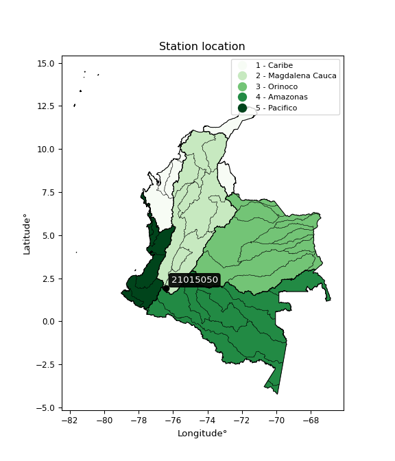

<div align="center">


</div>

# PMP Station (rain, Pmax24h): 21015050

Probable Maximum Precipitation (PMP) is the greatest amount of rainfall for a specific duration that is meteorologically possible for a given location, acting as a "worst-case" scenario for extreme storms, crucial for designing safety-critical infrastructure like bridges, river deviations, dams, spillways, and nuclear plants to prevent catastrophic failure. PMP is calculated by hydrologists using meteorological data to determine the upper limit of extreme rainfall, often leading to the Probable Maximum Flood (PMF) for flood control design, and is increasingly being studied for climate change impacts.

<div align="center">

</img>

</div>


## A. General information


### 1. General running parameters

• app_version: _v20251227_. • runtime: _2025-12-27 09:02:11.367833_. • Python version: _3.14.0_. • SciPy version: _1.16.3_. • Pandas version: _2.3.3_. • NumPy version: _2.3.5_. • Stations dataset (station_dataset_file): _dataset/pmax24h_in/automatic_colombia_2003_2024_filter.csv_. • Stations catalog (station_catalog_file): _dataset/CNE_IDEAM.xls_. • Minimum year to eval til year_max (date_min): _2003_. • Maximum year to eval since year_min (date_max): _2024_. • Creates, save and include plots into reports (create_plot): _False_. • Plot only fit distributions with Δo > Δ (plot_only_fit): _True_. • Eval low extreme values, if False, evaluates high extreme values (low_extreme): _False_. • Eval every SciPy distribution as logarithmic (pdist_logarithmic_on): _True_. • Standard deviation normalized (ddof): _1.0_. • Return periods to eval in years (Tr): _[2, 2.33, 5, 10, 15, 20, 25, 50, 75, 100, 200, 250, 500, 750, 1000]_. • Minimum data sample per station, 0 means any (minimum_sample): _5_. • Z-Score threshold to adjust a value, 0 means disable (zscore): _3.5_. • Avoid zeros, e.g. rain = 0 (avoid_zeros): _True_. • Avoid null values (avoid_nans): _True_. [:file_folder:Dataset file.](../../dataset/pmax24h_in/automatic_colombia_2003_2024_filter.csv)

> Delta Degrees of Freedom (DDOF): is a parameter used in the formulas for calculating variance and standard deviation. When ddof=0, the divisor is $N$ (the total number of observations) and this is used when your data set is the entire population. When ddof=1, the divisor is $N-1$ and this is used when your data set is a sample drawn from a larger population. Using $N-1$ provides an unbiased estimate of the population variance (known as Bessel´s correction).


### 2. Station info and location

|   id |   CODIGO | NOMBRE                   | CATEGORIA               | TECNOLOGIA                | ESTADO           | FECHA_INSTALACION   |   FECHA_SUSPENSION |   ALTITUD |   LATITUD |   LONGITUD | DEPARTAMENTO   | MUNICIPIO   | AREA_OPERATIVA                    | ENTIDAD                                                     | AREA_HIDROGRAFICA   | ZONA_HIDROGRAFICA   | SUBZONA_HIDROGRAFICA   |   CORRIENTE | Catalogo   |
|-----:|---------:|:-------------------------|:------------------------|:--------------------------|:-----------------|:--------------------|-------------------:|----------:|----------:|-----------:|:---------------|:------------|:----------------------------------|:------------------------------------------------------------|:--------------------|:--------------------|:-----------------------|------------:|:-----------|
|    0 | 21015050 | PURACE  - AUT [21015050] | Climatológica Principal | Automática con Telemetría | En Mantenimiento | 17/07/2005          |                nan |      1900 |   1.92592 |   -76.4276 | Huila          | San Agustín | Area Operativa 04 - Huila-Caquetá | INSTITUTO DE HIDROLOGIA METEOROLOGIA Y ESTUDIOS AMBIENTALES | Magdalena Cauca     | Alto Magdalena      | Alto Magdalena         |         nan | CNE_IDEAM  |

<div align="center">

Map location in: [:earth_americas:Google](http://maps.google.com/maps?q=1.925916667,-76.42755556) [:earth_americas:OSM](https://www.openstreetmap.org/#map=18/1.925916667/-76.42755556&layers=P) [:earth_americas:Bing](https://www.bing.com/maps?cp=1.925916667~-76.42755556&lvl=18) [:earth_americas:Apple](https://maps.apple.com/frame?center=1.925916667%2C-76.42755556&span=0.003%2C0.006)

</div>


<div align="center">

```geojson
{
  "type": "Feature",
  "geometry": {
    "type": "Point", 
    "coordinates": [-76.42755556, 1.925916667]
  }, 
  "properties": {
    "Name": "21015050"
  }
}
```

</div>


### 3. Discrete values table and plot

|               |         0 |           1 |           2 |          3 |          4 |           5 |           6 |           7 |          8 |           9 |          10 |
|:--------------|----------:|------------:|------------:|-----------:|-----------:|------------:|------------:|------------:|-----------:|------------:|------------:|
| Date          | 2006      | 2007        | 2008        | 2009       | 2013       | 2014        | 2015        | 2017        | 2018       | 2019        | 2021        |
| Value         |   31.7    |   66.9      |   64.8      |   53.4     |   92.3     |   52.9      |   46.2      |   64        |   40.1     |   48.9      |   59.5      |
| Value_initial |   31.7    |   66.9      |   64.8      |   53.4     |   92.3     |   52.9      |   46.2      |   64        |   40.1     |   48.9      |   59.5      |
| count         |   11      |   11        |   11        |   11       |   11       |   11        |   11        |   11        |   11       |   11        |   11        |
| mean          |   56.4273 |   56.4273   |   56.4273   |   56.4273  |   56.4273  |   56.4273   |   56.4273   |   56.4273   |   56.4273  |   56.4273   |   56.4273   |
| std           |   16.1068 |   16.1068   |   16.1068   |   16.1068  |   16.1068  |   16.1068   |   16.1068   |   16.1068   |   16.1068  |   16.1068   |   16.1068   |
| zscore        |   -1.5352 |    0.650204 |    0.519824 |   -0.18795 |    2.22717 |   -0.218992 |   -0.634965 |    0.470156 |   -1.01369 |   -0.467334 |    0.190772 |

> The initial value (value_initial) correspond to the initial obtained or null completed value, and value (value) is adjusted only when the initial value is outside the valid range definite through the Z-Score value. If Z-Score is active, values out of range or outliers are replaced with the station mean value


### 4. Active continuous probability distributions from SciPy (45 of 104 available)

[scipy.stats](https://docs.scipy.org/doc/scipy/reference/stats.html) is a Python´s powerful submodule within the SciPy library for comprehensive statistical analysis, offering over 130 probability distributions (like Normal, Poisson), functions for descriptive stats (mean, variance), hypothesis testing (t-tests, chi-square), random variable generation, and statistical tests, making it essential for data science, modeling, and research. It provides tools to explore, model, and draw conclusions from data efficiently, working seamlessly with NumPy.

<div align="center">

|   id | p_dist             |   n_parameter | fit_method   | label                                                                       | active   | ref                                                                                                        |
|-----:|:-------------------|--------------:|:-------------|:----------------------------------------------------------------------------|:---------|:-----------------------------------------------------------------------------------------------------------|
|    0 | alpha              |             3 | MLE          | Alpha                                                                       | True     | [:mortar_board:](https://docs.scipy.org/doc/scipy/reference/generated/scipy.stats.alpha.html)              |
|    1 | betaprime          |             4 | MLE          | Beta prime                                                                  | True     | [:mortar_board:](https://docs.scipy.org/doc/scipy/reference/generated/scipy.stats.betaprime.html)          |
|    2 | chi2               |             3 | MLE          | Chi²                                                                        | True     | [:mortar_board:](https://docs.scipy.org/doc/scipy/reference/generated/scipy.stats.chi2.html)               |
|    3 | crystalball        |             4 | MLE          | Crystalball                                                                 | True     | [:mortar_board:](https://docs.scipy.org/doc/scipy/reference/generated/scipy.stats.crystalball.html)        |
|    4 | erlang             |             3 | MLE          | Erlang                                                                      | True     | [:mortar_board:](https://docs.scipy.org/doc/scipy/reference/generated/scipy.stats.erlang.html)             |
|    5 | expon              |             2 | MLE          | Exponential                                                                 | True     | [:mortar_board:](https://docs.scipy.org/doc/scipy/reference/generated/scipy.stats.expon.html)              |
|    6 | exponnorm          |             3 | MLE          | Exponentially modified Normal                                               | True     | [:mortar_board:](https://docs.scipy.org/doc/scipy/reference/generated/scipy.stats.exponnorm.html)          |
|    7 | f                  |             4 | MLE          | F                                                                           | True     | [:mortar_board:](https://docs.scipy.org/doc/scipy/reference/generated/scipy.stats.f.html)                  |
|    8 | fatiguelife        |             3 | MLE          | Fatigue-life (Birnbaum-Saunders)                                            | True     | [:mortar_board:](https://docs.scipy.org/doc/scipy/reference/generated/scipy.stats.fatiguelife.html)        |
|    9 | fisk               |             3 | MLE          | Fisk                                                                        | True     | [:mortar_board:](https://docs.scipy.org/doc/scipy/reference/generated/scipy.stats.fisk.html)               |
|   10 | gamma              |             3 | MLE          | Gamma                                                                       | True     | [:mortar_board:](https://docs.scipy.org/doc/scipy/reference/generated/scipy.stats.gamma.html)              |
|   11 | genexpon           |             5 | MLE          | Generalized exponential                                                     | True     | [:mortar_board:](https://docs.scipy.org/doc/scipy/reference/generated/scipy.stats.genexpon.html)           |
|   12 | genlogistic        |             3 | MLE          | Generalized logistic                                                        | True     | [:mortar_board:](https://docs.scipy.org/doc/scipy/reference/generated/scipy.stats.genlogistic.html)        |
|   13 | gibrat             |             2 | MM           | Gibrat                                                                      | True     | [:mortar_board:](https://docs.scipy.org/doc/scipy/reference/generated/scipy.stats.gibrat.html)             |
|   14 | gompertz           |             3 | MLE          | Gompertz (or truncated Gumbel)                                              | True     | [:mortar_board:](https://docs.scipy.org/doc/scipy/reference/generated/scipy.stats.gompertz.html)           |
|   15 | gumbel_l           |             2 | MM           | Gumbel Left Skew                                                            | True     | [:mortar_board:](https://docs.scipy.org/doc/scipy/reference/generated/scipy.stats.gumbel_l.html)           |
|   16 | gumbel_r           |             2 | MM           | Gumbel Right Skew                                                           | True     | [:mortar_board:](https://docs.scipy.org/doc/scipy/reference/generated/scipy.stats.gumbel_r.html)           |
|   17 | halflogistic       |             2 | MM           | Half-logistic                                                               | True     | [:mortar_board:](https://docs.scipy.org/doc/scipy/reference/generated/scipy.stats.halflogistic.html)       |
|   18 | halfnorm           |             2 | MM           | Half Normal                                                                 | True     | [:mortar_board:](https://docs.scipy.org/doc/scipy/reference/generated/scipy.stats.halfnorm.html)           |
|   19 | hypsecant          |             2 | MM           | hyperbolic secant                                                           | True     | [:mortar_board:](https://docs.scipy.org/doc/scipy/reference/generated/scipy.stats.hypsecant.html)          |
|   20 | invgamma           |             3 | MLE          | Inverted gamma                                                              | True     | [:mortar_board:](https://docs.scipy.org/doc/scipy/reference/generated/scipy.stats.invgamma.html)           |
|   21 | invgauss           |             3 | MLE          | Inverse Gaussian                                                            | True     | [:mortar_board:](https://docs.scipy.org/doc/scipy/reference/generated/scipy.stats.invgauss.html)           |
|   22 | invweibull         |             3 | MLE          | Inverted Weibull                                                            | True     | [:mortar_board:](https://docs.scipy.org/doc/scipy/reference/generated/scipy.stats.invweibull.html)         |
|   23 | johnsonsu          |             4 | MLE          | Johnson Su                                                                  | True     | [:mortar_board:](https://docs.scipy.org/doc/scipy/reference/generated/scipy.stats.johnsonsu.html)          |
|   24 | kstwobign          |             2 | MLE          | Limiting distribution of scaled Kolmogorov-Smirnov two-sided test statistic | True     | [:mortar_board:](https://docs.scipy.org/doc/scipy/reference/generated/scipy.stats.kstwobign.html)          |
|   25 | laplace            |             2 | MM           | Laplace                                                                     | True     | [:mortar_board:](https://docs.scipy.org/doc/scipy/reference/generated/scipy.stats.laplace.html)            |
|   26 | laplace_asymmetric |             3 | MLE          | Asymmetric Laplace                                                          | True     | [:mortar_board:](https://docs.scipy.org/doc/scipy/reference/generated/scipy.stats.laplace_asymmetric.html) |
|   27 | loggamma           |             3 | MLE          | Log gamma                                                                   | True     | [:mortar_board:](https://docs.scipy.org/doc/scipy/reference/generated/scipy.stats.loggamma.html)           |
|   28 | logistic           |             2 | MM           | Logistic (or Sech-squared)                                                  | True     | [:mortar_board:](https://docs.scipy.org/doc/scipy/reference/generated/scipy.stats.logistic.html)           |
|   29 | lognorm            |             3 | MLE          | Log Normal                                                                  | True     | [:mortar_board:](https://docs.scipy.org/doc/scipy/reference/generated/scipy.stats.lognorm.html)            |
|   30 | maxwell            |             2 | MM           | Maxwell                                                                     | True     | [:mortar_board:](https://docs.scipy.org/doc/scipy/reference/generated/scipy.stats.maxwell.html)            |
|   31 | mielke             |             4 | MLE          | Mielke Beta-Kappa / Dagum                                                   | True     | [:mortar_board:](https://docs.scipy.org/doc/scipy/reference/generated/scipy.stats.mielke.html)             |
|   32 | moyal              |             2 | MM           | Moyal                                                                       | True     | [:mortar_board:](https://docs.scipy.org/doc/scipy/reference/generated/scipy.stats.moyal.html)              |
|   33 | nakagami           |             3 | MLE          | Nakagami                                                                    | True     | [:mortar_board:](https://docs.scipy.org/doc/scipy/reference/generated/scipy.stats.nakagami.html)           |
|   34 | ncf                |             5 | MLE          | Non-central F distribution                                                  | True     | [:mortar_board:](https://docs.scipy.org/doc/scipy/reference/generated/scipy.stats.ncf.html)                |
|   35 | nct                |             4 | MLE          | Non-central Student’s t                                                     | True     | [:mortar_board:](https://docs.scipy.org/doc/scipy/reference/generated/scipy.stats.nct.html)                |
|   36 | norm               |             2 | MM           | Normal                                                                      | True     | [:mortar_board:](https://docs.scipy.org/doc/scipy/reference/generated/scipy.stats.norm.html)               |
|   37 | pareto             |             3 | MLE          | Pareto                                                                      | True     | [:mortar_board:](https://docs.scipy.org/doc/scipy/reference/generated/scipy.stats.pareto.html)             |
|   38 | pearson3           |             3 | MM           | Pearson type III                                                            | True     | [:mortar_board:](https://docs.scipy.org/doc/scipy/reference/generated/scipy.stats.pearson3.html)           |
|   39 | rayleigh           |             2 | MM           | Rayleigh                                                                    | True     | [:mortar_board:](https://docs.scipy.org/doc/scipy/reference/generated/scipy.stats.rayleigh.html)           |
|   40 | rice               |             3 | MLE          | Rice                                                                        | True     | [:mortar_board:](https://docs.scipy.org/doc/scipy/reference/generated/scipy.stats.rice.html)               |
|   41 | t                  |             3 | MLE          | Student’s t                                                                 | True     | [:mortar_board:](https://docs.scipy.org/doc/scipy/reference/generated/scipy.stats.t.html)                  |
|   42 | truncnorm          |             4 | MLE          | Truncated normal                                                            | True     | [:mortar_board:](https://docs.scipy.org/doc/scipy/reference/generated/scipy.stats.truncnorm.html)          |
|   43 | wald               |             2 | MM           | Wald                                                                        | True     | [:mortar_board:](https://docs.scipy.org/doc/scipy/reference/generated/scipy.stats.wald.html)               |
|   44 | weibull_min        |             3 | MLE          | Weibull minimum                                                             | True     | [:mortar_board:](https://docs.scipy.org/doc/scipy/reference/generated/scipy.stats.weibull_min.html)        |

</div>

> **n_parameter:** # arguments & localization & scale.
>
> **Fit methods:** (MLE) maximum likelihood, (MM) L-moments.
>
>**Inactive:** foldnorm, gennorm, norminvgauss, powernorm, powerlognorm, skewnorm, genextreme, anglit, arcsine, argus, beta, bradford, burr, burr12, cauchy, cosine, halfcauchy, foldcauchy, skewcauchy, wrapcauchy, dgamma, gengamma, exponweib, exponpow, truncexpon, gausshyper, genhalflogistic, genhyperbolic, geninvgauss, halfgennorm, johnsonsb, kappa4, kappa3, ksone, kstwo, loglaplace, levy, levy_l, levy_stable, ncx2, genpareto, truncpareto, lomax, powerlaw, rdist, rel_breitwigner, recipinvgauss, semicircular, studentized_range, trapezoid, triang, truncweibull_min, tukeylambda, uniform, loguniform, vonmises, vonmises_line, weibull_max, dweibull, 


## B. Probability distributions vs. Empirical distributions

A continuous probability distribution (CPD) describes probabilities for variables that can take any value within a range (like rain any time), unlike discrete variables with specific outcomes (like temperature). It uses a Probability Density Function (PDF), a curve where the total area under it equals 1, and the probability of the variable falling within an interval (a to b) is found by calculating the area under the curve between those points. A key feature is that the probability of hitting any single exact value is zero, so probabilities are always expressed for ranges, e.g., $P(a ≤ X ≤ b)$.

<div align="center">

Distributions parameters from station values
|    |   station | p_dist                |   n |             loc |          scale | shape                  | shape1                | shape2                | shape3   |
|---:|----------:|:----------------------|----:|----------------:|---------------:|:-----------------------|:----------------------|:----------------------|:---------|
|  0 |  21015050 | alpha                 |  11 |   -73.4043      | 1126.25        | 8.79141779051906       |                       |                       |          |
|  1 |  21015050 | betaprime             |  11 |    -0.493594    |   75.8946      | 24.494793467078658     | 33.620499954768036    |                       |          |
|  2 |  21015050 | chi2                  |  11 |    12.9807      |    2.73009     | 15.913972614222976     |                       |                       |          |
|  3 |  21015050 | crystalball           |  11 |    56.4273      |   15.3573      | 8816.392234799563      | 18777.08723973156     |                       |          |
|  4 |  21015050 | erlang                |  11 |    12.9807      |    5.46019     | 7.956980356546818      |                       |                       |          |
|  5 |  21015050 | expon                 |  11 |    31.7         |   24.7273      |                        |                       |                       |          |
|  6 |  21015050 | exponnorm             |  11 |    44.6979      |   10.0607      | 1.1658666371332669     |                       |                       |          |
|  7 |  21015050 | f                     |  11 |    -0.349078    |   55.6014      | 39.55199027192889      | 96.62171405277576     |                       |          |
|  8 |  21015050 | fatiguelife           |  11 |    31.7         |    0.000539424 | 190.5011352920037      |                       |                       |          |
|  9 |  21015050 | fisk                  |  11 |    -0.297231    |   55.0147      | 6.604525065770299      |                       |                       |          |
| 10 |  21015050 | gamma                 |  11 |    12.9806      |    5.46019     | 7.956988181646624      |                       |                       |          |
| 11 |  21015050 | genexpon              |  11 |    31.6998      |    1.39667     | 0.056679244443794796   | 6.454904618557752e-07 | 0.9241637971167693    |          |
| 12 |  21015050 | genlogistic           |  11 |    37.9689      |   11.0505      | 3.4810159253723745     |                       |                       |          |
| 13 |  21015050 | gibrat                |  11 |    44.7116      |    7.10589     |                        |                       |                       |          |
| 14 |  21015050 | gompertz              |  11 |  -400.44        |   13.1606      | 3.3221675706474037e-16 |                       |                       |          |
| 15 |  21015050 | gumbel_l              |  11 |    63.3389      |   11.974       |                        |                       |                       |          |
| 16 |  21015050 | gumbel_r              |  11 |    49.5157      |   11.974       |                        |                       |                       |          |
| 17 |  21015050 | halflogistic          |  11 |    38.2253      |   13.1299      |                        |                       |                       |          |
| 18 |  21015050 | halfnorm              |  11 |    36.1003      |   25.4761      |                        |                       |                       |          |
| 19 |  21015050 | hypsecant             |  11 |    56.4273      |    9.77674     |                        |                       |                       |          |
| 20 |  21015050 | invgamma              |  11 |   -29.7038      | 2785.69        | 33.34194164077896      |                       |                       |          |
| 21 |  21015050 | invgauss              |  11 |     5.98811     |  498.74        | 0.09989125800488996    |                       |                       |          |
| 22 |  21015050 | invweibull            |  11 |    -1.00867e+09 |    1.00867e+09 | 77566531.36691734      |                       |                       |          |
| 23 |  21015050 | johnsonsu             |  11 |    -6.07403     |   12.2773      | -9.668933689651922     | 4.2000912201689555    |                       |          |
| 24 |  21015050 | kstwobign             |  11 |     2.24601     |   62.3354      |                        |                       |                       |          |
| 25 |  21015050 | laplace               |  11 |    56.4273      |   10.8592      |                        |                       |                       |          |
| 26 |  21015050 | laplace_asymmetric    |  11 |    52.9         |   11.2439      | 0.8553799330776659     |                       |                       |          |
| 27 |  21015050 | loggamma              |  11 | -5989.97        |  772.209       | 2515.3757524088596     |                       |                       |          |
| 28 |  21015050 | logistic              |  11 |    56.4273      |    8.4669      |                        |                       |                       |          |
| 29 |  21015050 | lognorm               |  11 |    31.7         |    0.870348    | 10.489073685744108     |                       |                       |          |
| 30 |  21015050 | maxwell               |  11 |    20.037       |   22.8042      |                        |                       |                       |          |
| 31 |  21015050 | mielke                |  11 |    -0.308757    |   58.043       | 5.701428058299262      | 7.287899479516026     |                       |          |
| 32 |  21015050 | moyal                 |  11 |    47.645       |    6.9132      |                        |                       |                       |          |
| 33 |  21015050 | nakagami              |  11 |    40.1         |    9.71575     | 0.12078607503675581    |                       |                       |          |
| 34 |  21015050 | ncf                   |  11 |    -0.0732623   |    0.000547911 | 9.621297805411354e-05  | 16.88620662039014     | 9.063084478999807     |          |
| 35 |  21015050 | nct                   |  11 |    -0.116496    |   10.2798      | 15.912052416753305     | 5.236490754787756     |                       |          |
| 36 |  21015050 | norm                  |  11 |    56.4273      |   15.3573      |                        |                       |                       |          |
| 37 |  21015050 | pareto                |  11 |    31.6996      |    0.000400302 | 0.10002120004088097    |                       |                       |          |
| 38 |  21015050 | pearson3              |  11 |    56.4273      |   15.3572      | 0.6857943366659986     |                       |                       |          |
| 39 |  21015050 | rayleigh              |  11 |    27.0479      |   23.4413      |                        |                       |                       |          |
| 40 |  21015050 | rice                  |  11 |    26.9924      |   23.4761      | 0.001210926255769716   |                       |                       |          |
| 41 |  21015050 | t                     |  11 |    55.2765      |   12.3851      | 5.1706207688306245     |                       |                       |          |
| 42 |  21015050 | truncnorm             |  11 |    56.4273      |   15.3573      | -757.1966858952574     | 2440.862583079759     |                       |          |
| 43 |  21015050 | wald                  |  11 |    41.07        |   15.3572      |                        |                       |                       |          |
| 44 |  21015050 | weibull_min           |  11 |    27.3754      |   32.6884      | 1.95125360679034       |                       |                       |          |
| 45 |  21015050 | logalpha              |  11 |    -4.03255     |  232.896       | 29.0356367902545       |                       |                       |          |
| 46 |  21015050 | logbetaprime          |  11 |    -4.1165      |   12.4269      | 926.7989393180133      | 1420.47703145195      |                       |          |
| 47 |  21015050 | logchi2               |  11 |     3.45632     |    0.920329    | 1.1147073926053959     |                       |                       |          |
| 48 |  21015050 | logcrystalball        |  11 |     3.99646     |    0.271558    | 302.4538195593076      | 21.225854293534386    |                       |          |
| 49 |  21015050 | logerlang             |  11 |    -2.96744     |    0.0106706   | 652.6444547352639      |                       |                       |          |
| 50 |  21015050 | logexpon              |  11 |     3.45632     |    0.540144    |                        |                       |                       |          |
| 51 |  21015050 | logexponnorm          |  11 |     3.99613     |    0.271557    | 0.0012261538977268076  |                       |                       |          |
| 52 |  21015050 | logf                  |  11 |   -72.2903      |   76.285       | 840150.3031393166      | 193523.95298501098    |                       |          |
| 53 |  21015050 | logfatiguelife        |  11 |   -37.549       |   41.5446      | 0.006526927635884109   |                       |                       |          |
| 54 |  21015050 | logfisk               |  11 |    -4.08649e+06 |    4.08649e+06 | 26836691.651028354     |                       |                       |          |
| 55 |  21015050 | loggamma              |  11 |    -2.89275     |    0.01076     | 640.22671931172        |                       |                       |          |
| 56 |  21015050 | loggenexpon           |  11 |     3.45579     |    0.00743955  | 0.003532513312520847   | 5.220693559868174     | 4.314714841328044e-05 |          |
| 57 |  21015050 | loggenlogistic        |  11 |     4.05697     |    0.137681    | 0.7778635345955409     |                       |                       |          |
| 58 |  21015050 | loggibrat             |  11 |     3.78927     |    0.125668    |                        |                       |                       |          |
| 59 |  21015050 | loggompertz           |  11 |     3.45632     |    0.337303    | 0.17275649341929544    |                       |                       |          |
| 60 |  21015050 | loggumbel_l           |  11 |     4.11868     |    0.211733    |                        |                       |                       |          |
| 61 |  21015050 | loggumbel_r           |  11 |     3.87425     |    0.211733    |                        |                       |                       |          |
| 62 |  21015050 | loghalflogistic       |  11 |     3.67458     |    0.232184    |                        |                       |                       |          |
| 63 |  21015050 | loghalfnorm           |  11 |     3.63707     |    0.450428    |                        |                       |                       |          |
| 64 |  21015050 | loghypsecant          |  11 |     3.99646     |    0.172879    |                        |                       |                       |          |
| 65 |  21015050 | loginvgamma           |  11 |    -3.45828     | 5541.69        | 744.5923880550401      |                       |                       |          |
| 66 |  21015050 | loginvgauss           |  11 |     1.90319     |  114.346       | 0.018305591776293817   |                       |                       |          |
| 67 |  21015050 | loginvweibull         |  11 |    -5.26253e+07 |    5.26253e+07 | 193491122.62201262     |                       |                       |          |
| 68 |  21015050 | logjohnsonsu          |  11 |     6.70424     |    3.41351     | 11.670412449765855     | 16.070883771104132    |                       |          |
| 69 |  21015050 | logkstwobign          |  11 |     2.8736      |    1.28833     |                        |                       |                       |          |
| 70 |  21015050 | loglaplace            |  11 |     3.99646     |    0.19202     |                        |                       |                       |          |
| 71 |  21015050 | loglaplace_asymmetric |  11 |     3.97781     |    0.208908    | 0.9563202354532505     |                       |                       |          |
| 72 |  21015050 | logloggamma           |  11 |    -6.12853     |    2.34724     | 75.2064134091548       |                       |                       |          |
| 73 |  21015050 | loglogistic           |  11 |     3.99646     |    0.149718    |                        |                       |                       |          |
| 74 |  21015050 | loglognorm            |  11 |     3.45632     |    0.023395    | 9.998636174423645      |                       |                       |          |
| 75 |  21015050 | logmaxwell            |  11 |     3.35298     |    0.40324     |                        |                       |                       |          |
| 76 |  21015050 | logmielke             |  11 |    -0.0114298   |    4.1104      | 19.997453470528214     | 32.21922475954014     |                       |          |
| 77 |  21015050 | logmoyal              |  11 |     3.84117     |    0.122244    |                        |                       |                       |          |
| 78 |  21015050 | lognakagami           |  11 |   -33.2836      |   37.2811      | 4697.981230560308      |                       |                       |          |
| 79 |  21015050 | logncf                |  11 |    -1.3326      |    3.34795     | 1181.7682465136936     | 1629.1378399376       | 695.7519594756748     |          |
| 80 |  21015050 | lognct                |  11 |    -2.36067     |    0.0401594   | 284.26351153647954     | 157.87223873252861    |                       |          |
| 81 |  21015050 | lognorm               |  11 |     3.99646     |    0.271558    |                        |                       |                       |          |
| 82 |  21015050 | logpareto             |  11 |     3.45631     |    9.22604e-06 | 0.10002006505716457    |                       |                       |          |
| 83 |  21015050 | logpearson3           |  11 |     3.99646     |    0.271558    | -0.11229320871702367   |                       |                       |          |
| 84 |  21015050 | lograyleigh           |  11 |     3.47693     |    0.414522    |                        |                       |                       |          |
| 85 |  21015050 | logrice               |  11 |     3.306       |    0.293541    | 2.094896893994786      |                       |                       |          |
| 86 |  21015050 | logt                  |  11 |     3.99646     |    0.271559    | 22605702.81812228      |                       |                       |          |
| 87 |  21015050 | logtruncnorm          |  11 |    -0.0526919   |    1.52514     | 2.3007713898465116     | 7.661440415891505     |                       |          |
| 88 |  21015050 | logwald               |  11 |     3.72488     |    0.271578    |                        |                       |                       |          |
| 89 |  21015050 | logweibull_min        |  11 |     3.08732     |    1.00641     | 3.7480039353339976     |                       |                       |          |

</div>

> **loc** (Location parameter): This shifts the distribution along the x-axis. For many common distributions, like the normal (Gaussian) distribution, loc represents the mean $μ$. For others, like the uniform distribution, it might represent the minimum value, or for the beta distribution, the left end of the support interval.
>
> **scale** (Scale parameter): This determines the width or spread of the distribution. For the normal distribution, scale represents the standard deviation $σ$. For a uniform distribution, it defines the length of the interval (from $loc$ to $loc + scale$).
>
> **shape** (Shape parameters): Refers to parameters that define the specific form of a probability distribution, distinct from its location (loc) and scale (scale). These parameters are required arguments for most distribution functions. For example, a normal (Gaussian) distribution is fully defined by its location (mean) and scale (standard deviation), so it has no specific shape parameters beyond loc and scale. However, other distributions have intrinsic properties that need specification, as Gamma distribution that takes a shape parameter, often named $a$ or $alpha$.


### 0. Cumulative distribution values - CDF (90 evaluated)

Cumulative Distribution Function (CDF), denoted as $F$<sub>$X$</sub>$(x)$, is a function that gives the probability that a random variable $X$ will take a value less than or equal to a specific value, $x$ (i.e., $(P(X≥x)$. It essentially "accumulates" probabilities from a given point up to the far right (positive infinity), providing a complete picture of the distribution´s probabilities for both discrete (like rain) and continuous (like temperature) variables, helping to find probabilities over ranges or above certain values.

<div align="center">

CDF ordered by x ascending and calculating $log(f(x))$ separately
|   id |   Station |   date |    x |   count |    mean |     std |    zscore |   Value_initial |   station |   m |     alpha |   alpha_pdf |   betaprime |   betaprime_pdf |      chi2 |   chi2_pdf |   crystalball |   crystalball_pdf |    erlang |   erlang_pdf |    expon |   expon_pdf |   exponnorm |   exponnorm_pdf |        f |      f_pdf |   fatiguelife |   fatiguelife_pdf |      fisk |   fisk_pdf |     gamma |   gamma_pdf |    genexpon |   genexpon_pdf |   genlogistic |   genlogistic_pdf |    gibrat |   gibrat_pdf |   gompertz |   gompertz_pdf |   gumbel_l |   gumbel_l_pdf |   gumbel_r |   gumbel_r_pdf |   halflogistic |   halflogistic_pdf |   halfnorm |   halfnorm_pdf |   hypsecant |   hypsecant_pdf |   invgamma |   invgamma_pdf |   invgauss |   invgauss_pdf |   invweibull |   invweibull_pdf |   johnsonsu |   johnsonsu_pdf |   kstwobign |   kstwobign_pdf |   laplace |   laplace_pdf |   laplace_asymmetric |   laplace_asymmetric_pdf |   loggamma |   loggamma_pdf |   logistic |   logistic_pdf |   lognorm |   lognorm_pdf |   maxwell |   maxwell_pdf |    mielke |   mielke_pdf |      moyal |   moyal_pdf |   nakagami |   nakagami_pdf |      ncf |    ncf_pdf |       nct |    nct_pdf |      norm |   norm_pdf |   pareto |    pareto_pdf |   pearson3 |   pearson3_pdf |   rayleigh |   rayleigh_pdf |      rice |   rice_pdf |         t |      t_pdf |   truncnorm |   truncnorm_pdf |     wald |   wald_pdf |   weibull_min |   weibull_min_pdf |   logalpha |   logalpha_pdf |   logbetaprime |   logbetaprime_pdf |     logchi2 |   logchi2_pdf |   logcrystalball |   logcrystalball_pdf |   logerlang |   logerlang_pdf |   logexpon |   logexpon_pdf |   logexponnorm |   logexponnorm_pdf |      logf |   logf_pdf |   logfatiguelife |   logfatiguelife_pdf |   logfisk |   logfisk_pdf |   loggenexpon |   loggenexpon_pdf |   loggenlogistic |   loggenlogistic_pdf |   loggibrat |   loggibrat_pdf |   loggompertz |   loggompertz_pdf |   loggumbel_l |   loggumbel_l_pdf |   loggumbel_r |   loggumbel_r_pdf |   loghalflogistic |   loghalflogistic_pdf |   loghalfnorm |   loghalfnorm_pdf |   loghypsecant |   loghypsecant_pdf |   loginvgamma |   loginvgamma_pdf |   loginvgauss |   loginvgauss_pdf |   loginvweibull |   loginvweibull_pdf |   logjohnsonsu |   logjohnsonsu_pdf |   logkstwobign |   logkstwobign_pdf |   loglaplace |   loglaplace_pdf |   loglaplace_asymmetric |   loglaplace_asymmetric_pdf |   logloggamma |   logloggamma_pdf |   loglogistic |   loglogistic_pdf |   loglognorm |   loglognorm_pdf |   logmaxwell |   logmaxwell_pdf |   logmielke |   logmielke_pdf |    logmoyal |   logmoyal_pdf |   lognakagami |   lognakagami_pdf |    logncf |   logncf_pdf |    lognct |   lognct_pdf |   logpareto |   logpareto_pdf |   logpearson3 |   logpearson3_pdf |   lograyleigh |   lograyleigh_pdf |   logrice |   logrice_pdf |      logt |   logt_pdf |   logtruncnorm |   logtruncnorm_pdf |   logwald |   logwald_pdf |   logweibull_min |   logweibull_min_pdf |
|-----:|----------:|-------:|-----:|--------:|--------:|--------:|----------:|----------------:|----------:|----:|----------:|------------:|------------:|----------------:|----------:|-----------:|--------------:|------------------:|----------:|-------------:|---------:|------------:|------------:|----------------:|---------:|-----------:|--------------:|------------------:|----------:|-----------:|----------:|------------:|------------:|---------------:|--------------:|------------------:|----------:|-------------:|-----------:|---------------:|-----------:|---------------:|-----------:|---------------:|---------------:|-------------------:|-----------:|---------------:|------------:|----------------:|-----------:|---------------:|-----------:|---------------:|-------------:|-----------------:|------------:|----------------:|------------:|----------------:|----------:|--------------:|---------------------:|-------------------------:|-----------:|---------------:|-----------:|---------------:|----------:|--------------:|----------:|--------------:|----------:|-------------:|-----------:|------------:|-----------:|---------------:|---------:|-----------:|----------:|-----------:|----------:|-----------:|---------:|--------------:|-----------:|---------------:|-----------:|---------------:|----------:|-----------:|----------:|-----------:|------------:|----------------:|---------:|-----------:|--------------:|------------------:|-----------:|---------------:|---------------:|-------------------:|------------:|--------------:|-----------------:|---------------------:|------------:|----------------:|-----------:|---------------:|---------------:|-------------------:|----------:|-----------:|-----------------:|---------------------:|----------:|--------------:|--------------:|------------------:|-----------------:|---------------------:|------------:|----------------:|--------------:|------------------:|--------------:|------------------:|--------------:|------------------:|------------------:|----------------------:|--------------:|------------------:|---------------:|-------------------:|--------------:|------------------:|--------------:|------------------:|----------------:|--------------------:|---------------:|-------------------:|---------------:|-------------------:|-------------:|-----------------:|------------------------:|----------------------------:|--------------:|------------------:|--------------:|------------------:|-------------:|-----------------:|-------------:|-----------------:|------------:|----------------:|------------:|---------------:|--------------:|------------------:|----------:|-------------:|----------:|-------------:|------------:|----------------:|--------------:|------------------:|--------------:|------------------:|----------:|--------------:|----------:|-----------:|---------------:|-------------------:|----------:|--------------:|-----------------:|---------------------:|
|    0 |  21015050 |   2006 | 31.7 |      11 | 56.4273 | 16.1068 | -1.5352   |            31.7 |  21015050 |   1 | 0.0271703 |  0.00638821 |   0.0241942 |      0.00632994 | 0.0250923 | 0.00678613 |     0.0536842 |        0.00710615 | 0.0250923 |   0.00678613 | 0        |  0.0404412  |   0.0290988 |      0.0058902  | 0.026619 | 0.00656007 |     0.0270426 |       1.50037e+07 | 0.0271374 | 0.0054494  | 0.0250923 |  0.00678613 | 7.84221e-06 |     0.0405814  |      0.029059 |        0.00584144 | 0         |   0          |  0.0587231 |     0.00432839 |  0.0687223 |    0.0055374   |  0.0119428 |     0.0044161  |      0         |          0         |   0        |      0         |   0.0506463 |      0.00515845 |  0.0267651 |     0.00645944 |  0.0225721 |     0.00705259 |    0.0213268 |       0.0063105  |   0.0267702 |      0.00654437 |   0.0211289 |      0.00721047 | 0.0512919 |    0.00472335 |            0.0466185 |               0.00484712 |   0.02151  |       0.199748 |  0.0511513 |     0.0057323  | 0.0233474 |      0.203206 | 0.0329139 |    0.00803    | 0.0332567 |   0.00584729 | 0.00153277 |  0.0012083  | 0          |    0           | 0.32401  | 0.0120842  | 0.0277839 | 0.00621371 | 0.0536842 | 0.00710615 | 0        | 249.864       |  0.0258443 |     0.00678732 |  0.0194998 |     0.00830099 | 0.0199049 | 0.00837175 | 0.0567074 | 0.00596311 |   0.0536842 |      0.00710615 | 0        | 0          |     0.0191307 |        0.00854873 |  0.0195417 |       0.197148 |      0.0536839 |           0.339526 | 2.22032e-09 |   2.78662e+06 |        0.0233474 |             0.203206 |   0.0215499 |        0.199698 |   0        |       1.85136  |       0.023347 |           0.203203 | 0.0233922 |   0.204935 |        0.0226512 |             0.200995 | 0.0270081 |      0.172577 |   0.000249384 |          0.476843 |        0.0332601 |             0.185547 |    0        |        0        |    6.8318e-08 |          0.51217  |     0.0428479 |         0.197969  |   0.000747824 |          0.025424 |         0         |              0        |     0         |          0        |      0.0279697 |           0.16158  |     0.0204293 |          0.199399 |     0.0157146 |          0.190119 |       0.0123728 |            0.199813 |      0.0264295 |           0.20884  |      0.0133259 |           0.252943 |    0.0300137 |         0.156305 |               0.0351154 |                    0.175768 |     0.0264152 |          0.209208 |      0.026397 |          0.171658 |  0.000788959 |      6.09833e+11 |   0.00438847 |         0.12574  |    0.033291 |        0.19118  | 1.39002e-06 |    0.000137717 |     0.0233134 |          0.203652 | 0.0217731 |     0.208409 | 0.0172499 |     0.182835 |    0        |   10841.1       |     0.0263092 |          0.209357 |      0        |          0        | 0.0157144 |      0.223217 | 0.0233475 |   0.203206 |    1.06282e-08 |           1.73238  |  0        |      0        |         0.023001 |             0.230921 |
|    1 |  21015050 |   2018 | 40.1 |      11 | 56.4273 | 16.1068 | -1.01369  |            40.1 |  21015050 |   2 | 0.129007  |  0.0183952  |   0.128609  |      0.0189708  | 0.13349   | 0.0192085  |     0.143854  |        0.0147622  | 0.13349   |   0.0192085  | 0.28802  |  0.0287933  |   0.122227  |      0.0171879  | 0.130928 | 0.0186765  |     0.74377   |       0.0125528   | 0.115093  | 0.0166509  | 0.13349   |  0.0192085  | 0.288868    |     0.0288593  |      0.123274 |        0.0175498  | 0         |   0          |  0.108253  |     0.00776333 |  0.133759  |    0.010388    |  0.111319  |     0.0204096  |      0.0712684 |          0.0378875 |   0.124755 |      0.0309353 |   0.118454  |      0.0118382  |  0.129908  |     0.0185718  |  0.143256  |     0.0216211  |    0.133073  |       0.0206392  |   0.131015  |      0.0186968  |   0.145478  |      0.021871   | 0.111171  |    0.0102375  |            0.111651  |               0.0116088  |   0.130754 |       0.804018 |  0.126932  |     0.0130886  | 0.130621  |      0.781577 | 0.144333  |    0.018391   | 0.120192  |   0.015828   | 0.0843819  |  0.0224631  | 0.00018116 |    6.15914e+09 | 0.42304  | 0.0113903  | 0.127233  | 0.0181318  | 0.143854  | 0.0147622  | 0.630413 |   0.00440057  |  0.133273  |     0.0190104  |  0.143595  |     0.020342   | 0.14433   | 0.0203506  | 0.13665   | 0.0139803  |   0.143854  |      0.0147622  | 0        | 0          |     0.146715  |        0.0207605  |  0.132022  |       0.83468  |      0.186976  |           0.812681 | 0.341347    |   0.745111    |        0.130621  |             0.781576 |   0.130598  |        0.802121 |   0.352851 |       1.1981   |       0.130619 |           0.781572 | 0.131714  |   0.788543 |        0.13007   |             0.786207 | 0.11501   |      0.668423 |   0.201285    |          1.14455  |        0.12023   |             0.634672 |    0        |        0        |    0.159744   |          0.863926 |     0.124453  |         0.549588  |   0.0933059   |          1.04523  |         0.0361445 |              2.15065  |     0.0959606 |          1.75856  |      0.107963  |           0.612597 |     0.132372  |          0.828549 |     0.135568  |          0.904931 |       0.157122  |            1.06917  |      0.131268  |           0.751736 |      0.184805  |           1.1579   |    0.102084  |         0.53163  |               0.113888  |                    0.570061 |     0.131421  |          0.752529 |      0.115298 |          0.68131  |  0.591251    |      0.165283    |   0.127792   |         0.979874 |    0.121308 |        0.633244 | 0.0649862   |    1.09725     |     0.130921  |          0.783819 | 0.136103  |     0.835852 | 0.127187  |     0.836033 |    0.637512 |       0.154236  |     0.131508  |          0.753874 |      0.125245 |          1.09169  | 0.134316  |      0.841442 | 0.130621  |   0.781573 |    0.341607    |           1.20084  |  0        |      0        |         0.137219 |             0.790123 |
|    2 |  21015050 |   2015 | 46.2 |      11 | 56.4273 | 16.1068 | -0.634965 |            46.2 |  21015050 |   3 | 0.265974  |  0.0258356  |   0.268759  |      0.0262022  | 0.273012  | 0.0257812  |     0.252719  |        0.0208109  | 0.273012  |   0.0257812  | 0.443672 |  0.0224986  |   0.255147  |      0.0259346  | 0.268569 | 0.0257476  |     0.805273  |       0.00817561  | 0.247697  | 0.0264684  | 0.273011  |  0.0257812  | 0.444812    |     0.0225307  |      0.258607 |        0.0262265  | 0.0589968 |   0.0789857  |  0.166506  |     0.0115347  |  0.212576  |    0.0157162   |  0.267391  |     0.0294555  |      0.29468   |          0.0347741 |   0.308219 |      0.028952  |   0.215077  |      0.0203627  |  0.26748   |     0.0258339  |  0.297138  |     0.0277427  |    0.283176  |       0.0274748  |   0.268937  |      0.0258117  |   0.297305  |      0.0268033  | 0.194962  |    0.0179536  |            0.210529  |               0.0218895  |   0.277394 |       1.25059  |  0.230071  |     0.0209212  | 0.273583  |      1.2256   | 0.274726  |    0.0238476  | 0.245349  |   0.0250855  | 0.266927   |  0.0345933  | 0.730184   |    0.0277126   | 0.490157 | 0.0105865  | 0.263609  | 0.0259281  | 0.252719  | 0.0208109  | 0.650052 |   0.00241388  |  0.271665  |     0.0256378  |  0.283776  |     0.0249632  | 0.284452  | 0.0249379  | 0.247754  | 0.0226319  |   0.252719  |      0.0208109  | 0.202156 | 0.0692777  |     0.288713  |        0.0251177  |  0.282968  |       1.27368  |      0.321194  |           1.06541  | 0.432378    |   0.559974    |        0.273583  |             1.2256   |   0.276888  |        1.24775  |   0.502091 |       0.921807 |       0.273581 |           1.2256   | 0.275642  |   1.23121  |        0.273957  |             1.23307  | 0.247754  |      1.22394  |   0.373999    |          1.25718  |        0.24535   |             1.15848  |    0.145473 |        5.22578  |    0.298804   |          1.09705  |     0.228497  |         0.945244  |   0.296655    |          1.70257  |         0.328457  |              1.92114  |     0.336391  |          1.61152  |      0.235864  |           1.24286  |     0.282764  |          1.27445  |     0.296388  |          1.32852  |       0.333007  |            1.34633  |      0.269139  |           1.18938  |      0.363857  |           1.30826  |    0.213414  |         1.11141  |               0.231367  |                    1.15809  |     0.269349  |          1.18924  |      0.251255 |          1.25654  |  0.609463    |      0.101916    |   0.29843    |         1.38052  |    0.245153 |        1.14282  | 0.301111    |    1.97714     |     0.274164  |          1.22688  | 0.286712  |     1.26945  | 0.28018   |     1.30077  |    0.65421  |       0.0918197 |     0.269599  |          1.18995  |      0.308491 |          1.43287  | 0.283899  |      1.25201  | 0.273582  |   1.22559  |    0.493457    |           0.951973 |  0.268638 |      3.71063  |         0.277469 |             1.1803   |
|    3 |  21015050 |   2019 | 48.9 |      11 | 56.4273 | 16.1068 | -0.467334 |            48.9 |  21015050 |   4 | 0.338282  |  0.0275342  |   0.341757  |      0.0276736  | 0.344613  | 0.0270801  |     0.312016  |        0.0230371  | 0.344613  |   0.0270801  | 0.501219 |  0.0201713  |   0.328778  |      0.0284013  | 0.340415 | 0.0272867  |     0.825703  |       0.00700629  | 0.32341   | 0.0293751  | 0.344613  |  0.0270801  | 0.502431    |     0.0201924  |      0.332665 |        0.0284062  | 0.298536  |   0.08283    |  0.200368  |     0.0135861  |  0.258765  |    0.0185363   |  0.348972  |     0.0306819  |      0.385498  |          0.0324218 |   0.384628 |      0.0276053 |   0.276073  |      0.0248283  |  0.339654  |     0.0274389  |  0.373132  |     0.0283439  |    0.35875   |       0.0282811  |   0.340958  |      0.0273506  |   0.370197  |      0.0270174  | 0.249995  |    0.0230214  |            0.27876   |               0.0289838  |   0.35226  |       1.37781  |  0.291311  |     0.0243831  | 0.347212  |      1.35998  | 0.341055  |    0.0251603  | 0.317669  |   0.0283079  | 0.361122   |  0.0347306  | 0.793493   |    0.019935    | 0.518204 | 0.010186   | 0.336373  | 0.0277713  | 0.312016  | 0.0230371  | 0.655978 |   0.00200051  |  0.342964  |     0.0270017  |  0.352412  |     0.0257529  | 0.353006  | 0.0257183  | 0.313952  | 0.0263117  |   0.312016  |      0.0230371  | 0.373572 | 0.0563777  |     0.357581  |        0.0257707  |  0.358764  |       1.38659  |      0.383627  |           1.12837  | 0.462727    |   0.510231    |        0.347212  |             1.35998  |   0.351594  |        1.37506  |   0.551789 |       0.829799 |       0.34721  |           1.35998  | 0.349528  |   1.36326  |        0.347992  |             1.3666   | 0.323523  |      1.43727  |   0.445128    |          1.2423   |        0.317643  |             1.38376  |    0.411611 |        3.87143  |    0.363486   |          1.17848  |     0.287682  |         1.14125   |   0.394842    |          1.73291  |         0.432859  |              1.74997  |     0.425224  |          1.51344  |      0.314968  |           1.53881  |     0.358773  |          1.39354  |     0.374559  |          1.41401  |       0.40969   |            1.34418  |      0.340924  |           1.33237  |      0.437463  |           1.27686  |    0.286868  |         1.49395  |               0.307447  |                    1.53891  |     0.341111  |          1.3317   |      0.329032 |          1.47458  |  0.614844    |      0.0882082   |   0.378975   |         1.44563  |    0.316528 |        1.36826  | 0.412391    |    1.91176     |     0.347837  |          1.36018  | 0.362289  |     1.38344  | 0.357729  |     1.4206   |    0.659033 |       0.0786756 |     0.341384  |          1.33177  |      0.391012 |          1.46318  | 0.358402  |      1.36399  | 0.347211  |   1.35998  |    0.54503     |           0.865202 |  0.451744 |      2.73437  |         0.34814  |             1.30287  |
|    4 |  21015050 |   2014 | 52.9 |      11 | 56.4273 | 16.1068 | -0.218992 |            52.9 |  21015050 |   5 | 0.450054  |  0.0279439  |   0.453414  |      0.0277604  | 0.453744  | 0.0271338  |     0.40917   |        0.0253012  | 0.453744  |   0.0271338  | 0.575716 |  0.0171585  |   0.445749  |      0.0295659  | 0.450894 | 0.0275709  |     0.850975  |       0.00569786  | 0.444758  | 0.030659   | 0.453744  |  0.0271337  | 0.576986    |     0.0171668  |      0.448628 |        0.0290669  | 0.556377  |   0.0482334  |  0.261418  |     0.0170059  |  0.34177   |    0.0229892   |  0.470579  |     0.029624   |      0.507106  |          0.0282882 |   0.490381 |      0.0251988 |   0.387573  |      0.0305481  |  0.450838  |     0.0277574  |  0.484977  |     0.0272306  |    0.470629  |       0.0272769  |   0.451654  |      0.0276115  |   0.476221  |      0.0257285  | 0.361329  |    0.033274   |            0.422524  |               0.0439315  |   0.464718 |       1.46344  |  0.397332  |     0.0282818  | 0.458854  |      1.46127  | 0.443369  |    0.0257246  | 0.436574  |   0.0305632  | 0.494093   |  0.0312342  | 0.859017   |    0.0134334   | 0.557715 | 0.00956519 | 0.449344  | 0.0282803  | 0.40917   | 0.0253012  | 0.663098 |   0.00158947  |  0.451987  |     0.0271565  |  0.455632  |     0.0256108  | 0.456071  | 0.0255692  | 0.427572  | 0.0300352  |   0.40917   |      0.0253012  | 0.558195 | 0.0371296  |     0.460502  |        0.0254514  |  0.470953  |       1.44756  |      0.474214  |           1.16579  | 0.500556    |   0.45412     |        0.458853  |             1.46127  |   0.463858  |        1.46135  |   0.612506 |       0.71739  |       0.458852 |           1.46127  | 0.461264  |   1.46028  |        0.460046  |             1.46483  | 0.444906  |      1.62186  |   0.540493    |          1.17543  |        0.436518  |             1.61659  |    0.638516 |        2.09143  |    0.459731   |          1.26288  |     0.388461  |         1.42038   |   0.526757    |          1.59474  |         0.559927  |              1.47831  |     0.53802   |          1.3515   |      0.448565  |           1.81724  |     0.471859  |          1.46314  |     0.487151  |          1.43031  |       0.512567  |            1.25952  |      0.451167  |           1.4546   |      0.534358  |           1.17962  |    0.432028  |         2.2499   |               0.455712  |                    2.28104  |     0.451276  |          1.45336  |      0.453285 |          1.65523  |  0.621202    |      0.0742918   |   0.49306    |         1.43814  |    0.434581 |        1.6134   | 0.552331    |    1.62547     |     0.459426  |          1.4597   | 0.474369  |     1.44818  | 0.472746  |     1.48396  |    0.664671 |       0.0654948 |     0.451517  |          1.45249  |      0.504831 |          1.4163   | 0.469135  |      1.43501  | 0.458852  |   1.46126  |    0.608692    |           0.756249 |  0.623482 |      1.71976  |         0.455267 |             1.40762  |
|    5 |  21015050 |   2009 | 53.4 |      11 | 56.4273 | 16.1068 | -0.18795  |            53.4 |  21015050 |   6 | 0.463999  |  0.0278294  |   0.467258  |      0.0276129  | 0.467279  | 0.0269991  |     0.421866  |        0.0254776  | 0.467279  |   0.0269991  | 0.584209 |  0.0168151  |   0.460516  |      0.0294946  | 0.464651 | 0.0274518  |     0.853789  |       0.00556037  | 0.460063  | 0.0305527  | 0.467278  |  0.0269991  | 0.585483    |     0.016822   |      0.463132 |        0.0289426  | 0.579674  |   0.0449981  |  0.270034  |     0.0174584  |  0.353404  |    0.0235458   |  0.485311  |     0.029302   |      0.521113  |          0.0277397 |   0.502898 |      0.02487   |   0.402977  |      0.0310571  |  0.464688  |     0.0276371  |  0.498525  |     0.0269575  |    0.484201  |       0.0270049  |   0.46543   |      0.0274881  |   0.48902   |      0.025467   | 0.378355  |    0.0348418  |            0.444078  |               0.0422919  |   0.478497 |       1.46572  |  0.411555  |     0.0286028  | 0.472622  |      1.46563  | 0.456222  |    0.0256825  | 0.451865  |   0.0305912  | 0.509558   |  0.0306203  | 0.865582   |    0.0128325   | 0.562477 | 0.00948618 | 0.463457  | 0.0281675  | 0.421866  | 0.0254776  | 0.663882 |   0.00154923  |  0.465536  |     0.0270333  |  0.468409  |     0.0254934  | 0.468827  | 0.0254514  | 0.442653  | 0.0302832  |   0.421866  |      0.0254776  | 0.576285 | 0.0352463  |     0.473195  |        0.0253155  |  0.484569  |       1.44691  |      0.485184  |           1.16616  | 0.5048      |   0.448179    |        0.472622  |             1.46563  |   0.477618  |        1.46375  |   0.619196 |       0.705003 |       0.47262  |           1.46563  | 0.475021  |   1.46411  |        0.473846  |             1.46872  | 0.46021   |      1.6314   |   0.551499    |          1.1644   |        0.451807  |             1.63342  |    0.65751  |        1.94879  |    0.471645   |          1.26996  |     0.401973  |         1.4521    |   0.541637    |          1.56853  |         0.573677  |              1.44475  |     0.550636  |          1.33061  |      0.465727  |           1.83057  |     0.485626  |          1.46337  |     0.50058   |          1.42453  |       0.524346  |            1.24466  |      0.464886  |           1.46188  |      0.545387  |           1.16508  |    0.45372   |         2.36288  |               0.477684  |                    2.39102  |     0.464984  |          1.4606   |      0.468898 |          1.66335  |  0.621894    |      0.0729105   |   0.506553   |         1.4302   |    0.44985  |        1.63246  | 0.567431    |    1.58471     |     0.473179  |          1.46385  | 0.487993  |     1.44806  | 0.486703  |     1.48299  |    0.665281 |       0.0641964 |     0.465216  |          1.45962  |      0.518101 |          1.40472  | 0.482642  |      1.43624  | 0.47262   |   1.46562  |    0.615749    |           0.744035 |  0.639235 |      1.63027  |         0.468541 |             1.41399  |
|    6 |  21015050 |   2021 | 59.5 |      11 | 56.4273 | 16.1068 |  0.190772 |            59.5 |  21015050 |   7 | 0.624488  |  0.0241883  |   0.625619  |      0.0237691  | 0.622789  | 0.0234882  |     0.579292  |        0.0254626  | 0.622789  |   0.0234882  | 0.675109 |  0.013139   |   0.630746  |      0.0254615  | 0.623027 | 0.0239157  |     0.883302  |       0.00420382  | 0.634262  | 0.0256212  | 0.622789  |  0.0234882  | 0.676382    |     0.0131331  |      0.628935 |        0.0247105  | 0.768195  |   0.0206227  |  0.393682  |     0.0230515  |  0.516021  |    0.0293327   |  0.647665  |     0.0234954  |      0.669678  |          0.0210028 |   0.641641 |      0.0205406 |   0.598434  |      0.0310135  |  0.623994  |     0.0240189  |  0.649479  |     0.0221848  |    0.635274  |       0.0221644  |   0.623855  |      0.0238959  |   0.632277  |      0.0212586  | 0.623225  |    0.0346963  |            0.650477  |               0.02659    |   0.633819 |       1.37014  |  0.589745  |     0.0285755  | 0.629162  |      1.3914   | 0.607553  |    0.0234417  | 0.630348  |   0.0267768  | 0.671379   |  0.0223756  | 0.925958   |    0.00746655  | 0.617385 | 0.00851631 | 0.625747  | 0.0244052  | 0.579292  | 0.0254626  | 0.672108 |   0.0011797   |  0.621588  |     0.0236162  |  0.616446  |     0.0226519  | 0.616613  | 0.0226136  | 0.626743  | 0.0286639  |   0.579292  |      0.0254626  | 0.737271 | 0.0194328  |     0.619634  |        0.0223324  |  0.636334  |       1.32653  |      0.609227  |           1.10917  | 0.54993     |   0.388773    |        0.629162  |             1.3914   |   0.632814  |        1.36986  |   0.688303 |       0.577062 |       0.629161 |           1.39141  | 0.631093  |   1.38468  |        0.630413  |             1.3889   | 0.634332  |      1.52329  |   0.669251    |          1.00381  |        0.630309  |             1.59368  |    0.804859 |        0.929639 |    0.611126   |          1.28808  |     0.575521  |         1.71789   |   0.692198    |          1.20269  |         0.709371  |              1.06982  |     0.681048  |          1.07804  |      0.657911  |           1.61927  |     0.63952   |          1.34764  |     0.647274  |          1.26082  |       0.64807   |            1.03356  |      0.622804  |           1.41914  |      0.661398  |           0.97463  |    0.686301  |         1.63367  |               0.681659  |                    1.45727  |     0.622757  |          1.41792  |      0.645174 |          1.52904  |  0.62904     |      0.0600226   |   0.652948   |         1.25297  |    0.629593 |        1.61467  | 0.713324    |    1.12074     |     0.629421  |          1.38793  | 0.640169  |     1.33236  | 0.641861  |     1.35108  |    0.671532 |       0.0521757 |     0.622839  |          1.4163   |      0.660189 |          1.20445  | 0.634557  |      1.33998  | 0.62916   |   1.3914   |    0.689077    |           0.615324 |  0.772662 |      0.919776 |         0.621454 |             1.3801   |
|    7 |  21015050 |   2017 | 64   |      11 | 56.4273 | 16.1068 |  0.470156 |            64   |  21015050 |   8 | 0.724017  |  0.0199395  |   0.723341  |      0.0195776  | 0.719916  | 0.0195844  |     0.68903   |        0.0230036  | 0.719916  |   0.0195844  | 0.729166 |  0.0109528  |   0.734055  |      0.0203272  | 0.721712 | 0.0198394  |     0.900515  |       0.00347655  | 0.736867  | 0.0199165  | 0.719916  |  0.0195844  | 0.730399    |     0.010941   |      0.729511 |        0.0199049  | 0.841     |   0.0125628  |  0.505557  |     0.0264614  |  0.652422  |    0.0306755   |  0.742077  |     0.018487   |      0.753725  |          0.0164471 |   0.726541 |      0.0171941 |   0.725054  |      0.0247536  |  0.72294   |     0.0198539  |  0.739815  |     0.0179512  |    0.725436  |       0.0179063  |   0.72238   |      0.0197914  |   0.719867  |      0.0176598  | 0.75105   |    0.0229252  |            0.751801  |               0.0188818  |   0.727921 |       1.20025  |  0.709796  |     0.0243283  | 0.725117  |      1.22847  | 0.706261  |    0.0202779  | 0.738316  |   0.0210414  | 0.759304   |  0.0168704  | 0.953596   |    0.0049674   | 0.654117 | 0.00781211 | 0.725899  | 0.0200002  | 0.68903   | 0.0230036  | 0.676991 |   0.00100023  |  0.719332  |     0.0197235  |  0.711327  |     0.0194124  | 0.71134   | 0.0193831  | 0.744168  | 0.0231405  |   0.68903   |      0.0230036  | 0.809384 | 0.013125   |     0.713035  |        0.0190863  |  0.727078  |       1.15381  |      0.6869    |           1.0153   | 0.577049    |   0.355986    |        0.725117  |             1.22847  |   0.72694   |        1.20114  |   0.727659 |       0.5042   |       0.725116 |           1.22848  | 0.726489  |   1.22019  |        0.72608   |             1.22335  | 0.736846  |      1.2734   |   0.737745    |          0.873448 |        0.738315  |             1.34716  |    0.859666 |        0.603164 |    0.703015   |          1.22106  |     0.70154   |         1.70438   |   0.7705      |          0.94875  |         0.779038  |              0.846526 |     0.75333   |          0.9055   |      0.762817  |           1.24848  |     0.731713  |          1.17159  |     0.732849  |          1.08078  |       0.717657  |            0.875411 |      0.721268  |           1.2677   |      0.727459  |           0.837711 |    0.785405  |         1.11756  |               0.771993  |                    1.04375  |     0.721151  |          1.26702  |      0.747412 |          1.26096  |  0.633173    |      0.053597    |   0.737914   |         1.07268  |    0.739159 |        1.3664   | 0.785112    |    0.857365    |     0.725114  |          1.2249   | 0.731362  |     1.15977  | 0.733946  |     1.16579  |    0.675112 |       0.0462518 |     0.72112   |          1.26562  |      0.741601 |          1.02553  | 0.726746  |      1.17874  | 0.725115  |   1.22847  |    0.731135    |           0.539847 |  0.829195 |      0.650155 |         0.71777  |             1.24879  |
|    8 |  21015050 |   2008 | 64.8 |      11 | 56.4273 | 16.1068 |  0.519824 |            64.8 |  21015050 |   9 | 0.739649  |  0.0191394  |   0.738692  |      0.0187989  | 0.735289  | 0.018849   |     0.707191  |        0.0223899  | 0.735289  |   0.018849   | 0.737788 |  0.0106042  |   0.749934  |      0.0193712  | 0.737275 | 0.0190696  |     0.903251  |       0.00336481  | 0.752393  | 0.0189011  | 0.735289  |  0.018849   | 0.739011    |     0.0105915  |      0.745083 |        0.0190251  | 0.850648  |   0.0115732  |  0.526909  |     0.0269056  |  0.676897  |    0.0304857   |  0.756522  |     0.0176288  |      0.766583  |          0.0157027 |   0.740061 |      0.0166046 |   0.744328  |      0.0234285  |  0.73851   |     0.0190699  |  0.753877  |     0.0172051  |    0.739464  |       0.0171635  |   0.737904  |      0.0190186  |   0.73374   |      0.017023   | 0.76873   |    0.0212971  |            0.766456  |               0.0177669  |   0.742617 |       1.16546  |  0.728866  |     0.0233403  | 0.740166  |      1.19407  | 0.722228  |    0.0196357  | 0.754719  |   0.0199671  | 0.772452   |  0.0160039  | 0.957425   |    0.00460976  | 0.660318 | 0.00768926 | 0.741569  | 0.0191745  | 0.707191  | 0.0223899  | 0.677781 |   0.000973666 |  0.734816  |     0.0189858  |  0.726606  |     0.018783   | 0.726597  | 0.0187556  | 0.762218  | 0.0219815  |   0.707191  |      0.0223899  | 0.819543 | 0.0122843  |     0.728055  |        0.0184629  |  0.741201  |       1.11975  |      0.699393  |           0.995839 | 0.581439    |   0.350859    |        0.740165  |             1.19407  |   0.741647  |        1.16654  |   0.733851 |       0.492736 |       0.740164 |           1.19407  | 0.741434  |   1.18571  |        0.741064  |             1.18867  | 0.752356  |      1.22357  |   0.748453    |          0.850451 |        0.754724  |             1.29435  |    0.866904 |        0.562799 |    0.718072   |          1.20264  |     0.722569  |         1.68003   |   0.782032    |          0.908079 |         0.789337  |              0.811742 |     0.764399  |          0.876693 |      0.777918  |           1.1829   |     0.74605   |          1.13651  |     0.746067  |          1.04725  |       0.728366  |            0.848807 |      0.73681   |           1.23407  |      0.737722  |           0.814647 |    0.798849  |         1.04755  |               0.784597  |                    0.986052 |     0.736684  |          1.23351  |      0.762752 |          1.20868  |  0.633832    |      0.0526343   |   0.751034   |         1.03947  |    0.755797 |        1.31193  | 0.795515    |    0.817823    |     0.740119  |          1.19057  | 0.745557  |     1.12544  | 0.748204  |     1.12952  |    0.675681 |       0.0453686 |     0.736636  |          1.23218  |      0.754142 |          0.99353  | 0.741186  |      1.14581  | 0.740163  |   1.19407  |    0.737766    |           0.527823 |  0.837047 |      0.614442 |         0.7331   |             1.21896  |
|    9 |  21015050 |   2007 | 66.9 |      11 | 56.4273 | 16.1068 |  0.650204 |            66.9 |  21015050 |  10 | 0.777637  |  0.0170442  |   0.776032  |      0.0167689  | 0.77284   | 0.0169155  |     0.752361  |        0.020588   | 0.77284   |   0.0169155  | 0.759138 |  0.00974076 |   0.788011  |      0.0169085  | 0.775196 | 0.0170479  |     0.910026  |       0.0030925   | 0.789367  | 0.0163417  | 0.77284   |  0.0169155  | 0.760332    |     0.00972625 |      0.782643 |        0.0167606  | 0.872574  |   0.00940268 |  0.584368  |     0.0277272  |  0.739815  |    0.0292553   |  0.791251  |     0.0154721  |      0.797592  |          0.0138556 |   0.773324 |      0.0150808 |   0.789872  |      0.0199653  |  0.776395  |     0.0170154  |  0.787991  |     0.0152988  |    0.773508  |       0.0152763  |   0.775711  |      0.016992   |   0.767757  |      0.015384   | 0.809396  |    0.0175523  |            0.800938  |               0.0151436  |   0.778298 |       1.07098  |  0.775024  |     0.0205933  | 0.776762  |      1.09949  | 0.761639  |    0.0178864  | 0.793736  |   0.0172159  | 0.803808   |  0.0139002  | 0.966203   |    0.00377313  | 0.67613  | 0.00737105 | 0.779566  | 0.01702    | 0.752361  | 0.020588   | 0.679757 |   0.000909963 |  0.772644  |     0.0170419  |  0.764285  |     0.0170952  | 0.764223  | 0.0170728  | 0.805139  | 0.0188959  |   0.752361  |      0.020588   | 0.843263 | 0.0103715  |     0.765085  |        0.0167991  |  0.775472  |       1.02857  |      0.730311  |           0.942221 | 0.592426    |   0.338234    |        0.776761  |             1.09949  |   0.77737   |        1.07247  |   0.749111 |       0.464485 |       0.776761 |           1.0995   | 0.777764  |   1.09121  |        0.777479  |             1.09364  | 0.789293  |      1.09218  |   0.774631    |          0.791078 |        0.793756  |             1.15213  |    0.88338  |        0.473607 |    0.755561   |          1.14612  |     0.774767  |         1.58566   |   0.809385    |          0.808419 |         0.813858  |              0.727084 |     0.791196  |          0.804056 |      0.813025  |           1.0204   |     0.780807  |          1.04221  |     0.778072  |          0.959426 |       0.754363  |            0.78183  |      0.774694  |           1.13987  |      0.76277   |           0.756315 |    0.829632  |         0.887241 |               0.813858  |                    0.852105 |     0.774555  |          1.13961  |      0.799128 |          1.07217  |  0.635474    |      0.050311    |   0.782806   |         0.9527   |    0.795308 |        1.16442  | 0.820065    |    0.72336     |     0.776607  |          1.09629  | 0.779994  |     1.03321  | 0.782698  |     1.03281  |    0.677093 |       0.0432421 |     0.774469  |          1.13853  |      0.784511 |          0.910805 | 0.776319  |      1.05628  | 0.776759  |   1.0995   |    0.754121    |           0.498013 |  0.85531  |      0.533132 |         0.770655 |             1.13432  |
|   10 |  21015050 |   2013 | 92.3 |      11 | 56.4273 | 16.1068 |  2.22717  |            92.3 |  21015050 |  11 | 0.976961  |  0.0022382  |   0.975582  |      0.00233904 | 0.977189  | 0.00236723 |     0.990251  |        0.00169734 | 0.977189  |   0.00236723 | 0.91377  |  0.00348725 |   0.975041  |      0.00212781 | 0.977419 | 0.00228902 |     0.960747  |       0.00123195  | 0.968892  | 0.00214974 | 0.977189  |  0.00236723 | 0.914504    |     0.0034696  |      0.974919 |        0.00223284 | 0.971392  |   0.00137447 |  0.997639  |     0.00108509 |  0.999987  |    1.24356e-05 |  0.972322  |     0.00227926 |      0.967981  |          0.0023996 |   0.972614 |      0.0027485 |   0.983772  |      0.00165918 |  0.977093  |     0.00227269 |  0.97347   |     0.0023579  |    0.964235  |       0.00270052 |   0.977201  |      0.00229156 |   0.969223  |      0.00285309 | 0.981622  |    0.00169242 |            0.971173  |               0.002193   |   0.971832 |       0.225782 |  0.985752  |     0.00165876 | 0.974202  |      0.220963 | 0.981784  |    0.00231861 | 0.974765  |   0.00192891 | 0.968436   |  0.00228168 | 0.998919   |    0.000174591 | 0.820233 | 0.00419986 | 0.976648  | 0.00220825 | 0.990251  | 0.00169734 | 0.696694 |   0.000500608 |  0.977801  |     0.00234102 |  0.979231  |     0.00246626 | 0.979129  | 0.00247314 | 0.985388  | 0.00138767 |   0.990251  |      0.00169734 | 0.964558 | 0.00188193 |     0.977964  |        0.00252661 |  0.965661  |       0.24192  |      0.935145  |           0.348316 | 0.684558    |   0.242325    |        0.974201  |             0.220965 |   0.971567  |        0.227387 |   0.861737 |       0.255975 |       0.974201 |           0.220965 | 0.973868  |   0.221116 |        0.973823  |             0.221187 | 0.968759  |      0.198756 |   0.940957    |          0.284184 |        0.97478   |             0.177912 |    0.96141  |        0.11375  |    0.98043    |          0.238255 |     0.998904  |         0.0352903 |   0.954803    |          0.208566 |         0.949966  |              0.210102 |     0.951321  |          0.253744 |      0.970099  |           0.172707 |     0.969908  |          0.227798 |     0.958985  |          0.250005 |       0.917295  |            0.291151 |      0.977473  |           0.212479 |      0.925219  |           0.297573 |    0.968124  |         0.166005 |               0.957343  |                    0.195272 |     0.97749   |          0.212841 |      0.971544 |          0.184655 |  0.648852    |      0.0347039   |   0.962401   |         0.244686 |    0.974974 |        0.171961 | 0.951374    |    0.198644    |     0.973833  |          0.222234 | 0.968899  |     0.231614 | 0.969167  |     0.226195 |    0.688461 |       0.0291561 |     0.977432  |          0.213374 |      0.959099 |          0.249486 | 0.970533  |      0.233771 | 0.974201  |   0.220968 |    0.874492    |           0.27029  |  0.951018 |      0.152719 |         0.977782 |             0.220496 |


</div>

An Empirical Distribution Function (EDF) is a step-function estimate of a true cumulative distribution function (CDF) based on observed sample data, representing the proportion of data points less than or equal to a given value. It is calculated by ordering your data and jumping up by $1/n$ (where $n$ is sample size) at each unique data point, allowing analysis without assuming an underlying population distribution, and it gets closer to the true CDF as the sample size grows.


### 1. Empirical - EDF California (1923)

California´s estimates the true probability distribution of water-related data (like rainfall, streamflow) using observed samples, crucial for risk assessment.

<div align="center">


$P=m/n$


</div>


**1.1. Empirical values**

<div align="center">

|                | 0                   | 1                   | 2                  | 3                   | 4                   | 5                  | 6                  | 7                  | 8                  | 9                  | 10             |
|:---------------|:--------------------|:--------------------|:-------------------|:--------------------|:--------------------|:-------------------|:-------------------|:-------------------|:-------------------|:-------------------|:---------------|
| date           | 2006                | 2018                | 2015               | 2019                | 2014                | 2009               | 2021               | 2017               | 2008               | 2007               | 2013           |
| x              | 31.7                | 40.1                | 46.2               | 48.9                | 52.9                | 53.4               | 59.5               | 64.0               | 64.8               | 66.9               | 92.3           |
| m              | 1                   | 2                   | 3                  | 4                   | 5                   | 6                  | 7                  | 8                  | 9                  | 10                 | 11             |
| empirical_dist | edf_california      | edf_california      | edf_california     | edf_california      | edf_california      | edf_california     | edf_california     | edf_california     | edf_california     | edf_california     | edf_california |
| empirical      | 0.09090909090909091 | 0.18181818181818182 | 0.2727272727272727 | 0.36363636363636365 | 0.45454545454545453 | 0.5454545454545454 | 0.6363636363636364 | 0.7272727272727273 | 0.8181818181818182 | 0.9090909090909091 | 1.0            |
| empirical_tr   | 1.1                 | 1.2222222222222223  | 1.375              | 1.5714285714285714  | 1.8333333333333335  | 2.1999999999999997 | 2.75               | 3.666666666666667  | 5.500000000000002  | 10.999999999999996 | inf            |

</div>


**1.2. Kolmogorov-Smirnov fit test (sorted by Δ)**


<div align="center">

|                | 0                   | 1                     | 2                   | 3                   | 4                   | 5                   | 6                   | 7                   | 8                   | 9                   | 10                  | 11                  | 12                  | 13                  | 14                  | 15                  | 16                  | 17                  | 18                  | 19                  | 20                  | 21                  | 22                  | 23                  | 24                  | 25                  | 26                  | 27                  | 28                  | 29                  | 30                  | 31                  | 32                  | 33                  | 34                  | 35                  | 36                  | 37                  | 38                  | 39                  | 40                  | 41                  | 42                  | 43                  | 44                  | 45                  | 46                  | 47                  | 48                  | 49                  | 50                  | 51                  | 52                  | 53                  | 54                  | 55                  | 56                  | 57                  | 58                  | 59                  | 60                  | 61                  | 62                  | 63                  | 64                  | 65                  | 66                  | 67                  | 68                  | 69                  | 70                  | 71                  | 72                  | 73                  | 74                  | 75                  | 76                  | 77                  | 78                  | 79                  | 80                  | 81                  | 82                  | 83                  | 84                  | 85                  | 86                  | 87                  | 88                  | 89                  |
|:---------------|:--------------------|:----------------------|:--------------------|:--------------------|:--------------------|:--------------------|:--------------------|:--------------------|:--------------------|:--------------------|:--------------------|:--------------------|:--------------------|:--------------------|:--------------------|:--------------------|:--------------------|:--------------------|:--------------------|:--------------------|:--------------------|:--------------------|:--------------------|:--------------------|:--------------------|:--------------------|:--------------------|:--------------------|:--------------------|:--------------------|:--------------------|:--------------------|:--------------------|:--------------------|:--------------------|:--------------------|:--------------------|:--------------------|:--------------------|:--------------------|:--------------------|:--------------------|:--------------------|:--------------------|:--------------------|:--------------------|:--------------------|:--------------------|:--------------------|:--------------------|:--------------------|:--------------------|:--------------------|:--------------------|:--------------------|:--------------------|:--------------------|:--------------------|:--------------------|:--------------------|:--------------------|:--------------------|:--------------------|:--------------------|:--------------------|:--------------------|:--------------------|:--------------------|:--------------------|:--------------------|:--------------------|:--------------------|:--------------------|:--------------------|:--------------------|:--------------------|:--------------------|:--------------------|:--------------------|:--------------------|:--------------------|:--------------------|:--------------------|:--------------------|:--------------------|:--------------------|:--------------------|:--------------------|:--------------------|:--------------------|
| station        | 21015050            | 21015050              | 21015050            | 21015050            | 21015050            | 21015050            | 21015050            | 21015050            | 21015050            | 21015050            | 21015050            | 21015050            | 21015050            | 21015050            | 21015050            | 21015050            | 21015050            | 21015050            | 21015050            | 21015050            | 21015050            | 21015050            | 21015050            | 21015050            | 21015050            | 21015050            | 21015050            | 21015050            | 21015050            | 21015050            | 21015050            | 21015050            | 21015050            | 21015050            | 21015050            | 21015050            | 21015050            | 21015050            | 21015050            | 21015050            | 21015050            | 21015050            | 21015050            | 21015050            | 21015050            | 21015050            | 21015050            | 21015050            | 21015050            | 21015050            | 21015050            | 21015050            | 21015050            | 21015050            | 21015050            | 21015050            | 21015050            | 21015050            | 21015050            | 21015050            | 21015050            | 21015050            | 21015050            | 21015050            | 21015050            | 21015050            | 21015050            | 21015050            | 21015050            | 21015050            | 21015050            | 21015050            | 21015050            | 21015050            | 21015050            | 21015050            | 21015050            | 21015050            | 21015050            | 21015050            | 21015050            | 21015050            | 21015050            | 21015050            | 21015050            | 21015050            | 21015050            | 21015050            | 21015050            | 21015050            |
| empirical_dist | edf_california      | edf_california        | edf_california      | edf_california      | edf_california      | edf_california      | edf_california      | edf_california      | edf_california      | edf_california      | edf_california      | edf_california      | edf_california      | edf_california      | edf_california      | edf_california      | edf_california      | edf_california      | edf_california      | edf_california      | edf_california      | edf_california      | edf_california      | edf_california      | edf_california      | edf_california      | edf_california      | edf_california      | edf_california      | edf_california      | edf_california      | edf_california      | edf_california      | edf_california      | edf_california      | edf_california      | edf_california      | edf_california      | edf_california      | edf_california      | edf_california      | edf_california      | edf_california      | edf_california      | edf_california      | edf_california      | edf_california      | edf_california      | edf_california      | edf_california      | edf_california      | edf_california      | edf_california      | edf_california      | edf_california      | edf_california      | edf_california      | edf_california      | edf_california      | edf_california      | edf_california      | edf_california      | edf_california      | edf_california      | edf_california      | edf_california      | edf_california      | edf_california      | edf_california      | edf_california      | edf_california      | edf_california      | edf_california      | edf_california      | edf_california      | edf_california      | edf_california      | edf_california      | edf_california      | edf_california      | edf_california      | edf_california      | edf_california      | edf_california      | edf_california      | edf_california      | edf_california      | edf_california      | edf_california      | edf_california      |
| p_dist         | loglaplace          | loglaplace_asymmetric | loghypsecant        | loggumbel_r         | t                   | moyal               | laplace_asymmetric  | loglogistic         | halflogistic        | logmielke           | loggenlogistic      | mielke              | logmoyal            | gumbel_r            | loghalfnorm         | fisk                | logfisk             | exponnorm           | invgauss            | lograyleigh         | logmaxwell          | lognct              | genlogistic         | loginvgamma         | logncf              | nct                 | loggamma            | loggamma            | loginvgauss         | logf                | alpha               | logfatiguelife      | logerlang           | lognorm             | lognorm             | logcrystalball      | logexponnorm        | logt                | lognakagami         | invgamma            | logrice             | betaprime           | johnsonsu           | logalpha            | f                   | logistic            | logjohnsonsu        | loggenexpon         | logloggamma         | logpearson3         | invweibull          | halfnorm            | erlang              | chi2                | gamma               | pearson3            | logweibull_min      | kstwobign           | hypsecant           | loggumbel_l         | weibull_min         | rayleigh            | rice                | loghalflogistic     | logkstwobign        | maxwell             | loggompertz         | loginvweibull       | crystalball         | norm                | truncnorm           | laplace             | expon               | genexpon            | logbetaprime        | wald                | logwald             | loggibrat           | gumbel_l            | gibrat              | logtruncnorm        | logexpon            | ncf                 | logchi2             | gompertz            | loglognorm          | pareto              | logpareto           | nakagami            | fatiguelife         |
| delta          | 0.09173420576978819 | 0.09523285379628021   | 0.09606577608798672 | 0.09970544464269504 | 0.10395217929472578 | 0.10528309784138457 | 0.10815245139566632 | 0.10996325735837886 | 0.11149898161335803 | 0.11378244932126014 | 0.11533536694487123 | 0.11535452509636601 | 0.11683196140182806 | 0.11783967549646035 | 0.11789458270779152 | 0.11972425956032418 | 0.11979818891492844 | 0.1210803583905874  | 0.12110036550005066 | 0.12458023276357322 | 0.12628455631286806 | 0.12639337155831643 | 0.12644812897792312 | 0.12828375526216362 | 0.12909734072995127 | 0.12952467733556483 | 0.13079285994471168 | 0.13079285994471168 | 0.13101903917344615 | 0.13132698785105057 | 0.13145423554478042 | 0.13161191089706636 | 0.13172123063594576 | 0.1323289345287203  | 0.1323289345287203  | 0.13232956766524862 | 0.1323302610205742  | 0.13233143807783498 | 0.1324835776363682  | 0.13269583539635788 | 0.13277188674385088 | 0.1330593205992293  | 0.13337967110258342 | 0.1336191290047678  | 0.13389531891076145 | 0.1340666862969978  | 0.13439740908670494 | 0.13446032476173186 | 0.13453613432900313 | 0.13462239096257167 | 0.13558336710868135 | 0.135767284145888   | 0.13625102166732905 | 0.13625110005249852 | 0.1362512434279599  | 0.13644660159594224 | 0.1384355209074154  | 0.14133343856097746 | 0.14247788619296814 | 0.14348166610364066 | 0.14400621552348436 | 0.14480590665188997 | 0.14486808620601144 | 0.14567371512766936 | 0.1463205704453464  | 0.14745183520576    | 0.15352944613393993 | 0.15472741909667664 | 0.15672948936860076 | 0.1567294930217692  | 0.1567294978308078  | 0.16709918555505998 | 0.17094463170134155 | 0.17208517923086064 | 0.17877964926085343 | 0.18181818181818182 | 0.18181818181818182 | 0.18397014633790715 | 0.19205053387766235 | 0.21373048585986726 | 0.2207302148364998  | 0.22936363170349017 | 0.24122132519566414 | 0.31666467442977586 | 0.3247233876659694  | 0.4094324043687331  | 0.44859441588319887 | 0.4556938225365407  | 0.45745706011887133 | 0.5619516519513608  |
| deltao         | 0.37613735880099997 | 0.37613735880099997   | 0.37613735880099997 | 0.37613735880099997 | 0.37613735880099997 | 0.37613735880099997 | 0.37613735880099997 | 0.37613735880099997 | 0.37613735880099997 | 0.37613735880099997 | 0.37613735880099997 | 0.37613735880099997 | 0.37613735880099997 | 0.37613735880099997 | 0.37613735880099997 | 0.37613735880099997 | 0.37613735880099997 | 0.37613735880099997 | 0.37613735880099997 | 0.37613735880099997 | 0.37613735880099997 | 0.37613735880099997 | 0.37613735880099997 | 0.37613735880099997 | 0.37613735880099997 | 0.37613735880099997 | 0.37613735880099997 | 0.37613735880099997 | 0.37613735880099997 | 0.37613735880099997 | 0.37613735880099997 | 0.37613735880099997 | 0.37613735880099997 | 0.37613735880099997 | 0.37613735880099997 | 0.37613735880099997 | 0.37613735880099997 | 0.37613735880099997 | 0.37613735880099997 | 0.37613735880099997 | 0.37613735880099997 | 0.37613735880099997 | 0.37613735880099997 | 0.37613735880099997 | 0.37613735880099997 | 0.37613735880099997 | 0.37613735880099997 | 0.37613735880099997 | 0.37613735880099997 | 0.37613735880099997 | 0.37613735880099997 | 0.37613735880099997 | 0.37613735880099997 | 0.37613735880099997 | 0.37613735880099997 | 0.37613735880099997 | 0.37613735880099997 | 0.37613735880099997 | 0.37613735880099997 | 0.37613735880099997 | 0.37613735880099997 | 0.37613735880099997 | 0.37613735880099997 | 0.37613735880099997 | 0.37613735880099997 | 0.37613735880099997 | 0.37613735880099997 | 0.37613735880099997 | 0.37613735880099997 | 0.37613735880099997 | 0.37613735880099997 | 0.37613735880099997 | 0.37613735880099997 | 0.37613735880099997 | 0.37613735880099997 | 0.37613735880099997 | 0.37613735880099997 | 0.37613735880099997 | 0.37613735880099997 | 0.37613735880099997 | 0.37613735880099997 | 0.37613735880099997 | 0.37613735880099997 | 0.37613735880099997 | 0.37613735880099997 | 0.37613735880099997 | 0.37613735880099997 | 0.37613735880099997 | 0.37613735880099997 | 0.37613735880099997 |
| eval           | Δo > Δ              | Δo > Δ                | Δo > Δ              | Δo > Δ              | Δo > Δ              | Δo > Δ              | Δo > Δ              | Δo > Δ              | Δo > Δ              | Δo > Δ              | Δo > Δ              | Δo > Δ              | Δo > Δ              | Δo > Δ              | Δo > Δ              | Δo > Δ              | Δo > Δ              | Δo > Δ              | Δo > Δ              | Δo > Δ              | Δo > Δ              | Δo > Δ              | Δo > Δ              | Δo > Δ              | Δo > Δ              | Δo > Δ              | Δo > Δ              | Δo > Δ              | Δo > Δ              | Δo > Δ              | Δo > Δ              | Δo > Δ              | Δo > Δ              | Δo > Δ              | Δo > Δ              | Δo > Δ              | Δo > Δ              | Δo > Δ              | Δo > Δ              | Δo > Δ              | Δo > Δ              | Δo > Δ              | Δo > Δ              | Δo > Δ              | Δo > Δ              | Δo > Δ              | Δo > Δ              | Δo > Δ              | Δo > Δ              | Δo > Δ              | Δo > Δ              | Δo > Δ              | Δo > Δ              | Δo > Δ              | Δo > Δ              | Δo > Δ              | Δo > Δ              | Δo > Δ              | Δo > Δ              | Δo > Δ              | Δo > Δ              | Δo > Δ              | Δo > Δ              | Δo > Δ              | Δo > Δ              | Δo > Δ              | Δo > Δ              | Δo > Δ              | Δo > Δ              | Δo > Δ              | Δo > Δ              | Δo > Δ              | Δo > Δ              | Δo > Δ              | Δo > Δ              | Δo > Δ              | Δo > Δ              | Δo > Δ              | Δo > Δ              | Δo > Δ              | Δo > Δ              | Δo > Δ              | Δo > Δ              | Δo > Δ              | Δo > Δ              | Δo <= Δ             | Δo <= Δ             | Δo <= Δ             | Δo <= Δ             | Δo <= Δ             |
| fit            | 1                   | 1                     | 1                   | 1                   | 1                   | 1                   | 1                   | 1                   | 1                   | 1                   | 1                   | 1                   | 1                   | 1                   | 1                   | 1                   | 1                   | 1                   | 1                   | 1                   | 1                   | 1                   | 1                   | 1                   | 1                   | 1                   | 1                   | 1                   | 1                   | 1                   | 1                   | 1                   | 1                   | 1                   | 1                   | 1                   | 1                   | 1                   | 1                   | 1                   | 1                   | 1                   | 1                   | 1                   | 1                   | 1                   | 1                   | 1                   | 1                   | 1                   | 1                   | 1                   | 1                   | 1                   | 1                   | 1                   | 1                   | 1                   | 1                   | 1                   | 1                   | 1                   | 1                   | 1                   | 1                   | 1                   | 1                   | 1                   | 1                   | 1                   | 1                   | 1                   | 1                   | 1                   | 1                   | 1                   | 1                   | 1                   | 1                   | 1                   | 1                   | 1                   | 1                   | 1                   | 1                   | 0                   | 0                   | 0                   | 0                   | 0                   |
| n              | 11                  | 11                    | 11                  | 11                  | 11                  | 11                  | 11                  | 11                  | 11                  | 11                  | 11                  | 11                  | 11                  | 11                  | 11                  | 11                  | 11                  | 11                  | 11                  | 11                  | 11                  | 11                  | 11                  | 11                  | 11                  | 11                  | 11                  | 11                  | 11                  | 11                  | 11                  | 11                  | 11                  | 11                  | 11                  | 11                  | 11                  | 11                  | 11                  | 11                  | 11                  | 11                  | 11                  | 11                  | 11                  | 11                  | 11                  | 11                  | 11                  | 11                  | 11                  | 11                  | 11                  | 11                  | 11                  | 11                  | 11                  | 11                  | 11                  | 11                  | 11                  | 11                  | 11                  | 11                  | 11                  | 11                  | 11                  | 11                  | 11                  | 11                  | 11                  | 11                  | 11                  | 11                  | 11                  | 11                  | 11                  | 11                  | 11                  | 11                  | 11                  | 11                  | 11                  | 11                  | 11                  | 11                  | 11                  | 11                  | 11                  | 11                  |
| best_fit       | 1                   | 0                     | 0                   | 0                   | 0                   | 0                   | 0                   | 0                   | 0                   | 0                   | 0                   | 0                   | 0                   | 0                   | 0                   | 0                   | 0                   | 0                   | 0                   | 0                   | 0                   | 0                   | 0                   | 0                   | 0                   | 0                   | 0                   | 0                   | 0                   | 0                   | 0                   | 0                   | 0                   | 0                   | 0                   | 0                   | 0                   | 0                   | 0                   | 0                   | 0                   | 0                   | 0                   | 0                   | 0                   | 0                   | 0                   | 0                   | 0                   | 0                   | 0                   | 0                   | 0                   | 0                   | 0                   | 0                   | 0                   | 0                   | 0                   | 0                   | 0                   | 0                   | 0                   | 0                   | 0                   | 0                   | 0                   | 0                   | 0                   | 0                   | 0                   | 0                   | 0                   | 0                   | 0                   | 0                   | 0                   | 0                   | 0                   | 0                   | 0                   | 0                   | 0                   | 0                   | 0                   | 0                   | 0                   | 0                   | 0                   | 0                   |
| best_fit_sort  | 1                   | 2                     | 3                   | 4                   | 5                   | 6                   | 7                   | 8                   | 9                   | 10                  | 11                  | 12                  | 13                  | 14                  | 15                  | 16                  | 17                  | 18                  | 19                  | 20                  | 21                  | 22                  | 23                  | 24                  | 25                  | 26                  | 27                  | 28                  | 29                  | 30                  | 31                  | 32                  | 33                  | 34                  | 35                  | 36                  | 37                  | 38                  | 39                  | 40                  | 41                  | 42                  | 43                  | 44                  | 45                  | 46                  | 47                  | 48                  | 49                  | 50                  | 51                  | 52                  | 53                  | 54                  | 55                  | 56                  | 57                  | 58                  | 59                  | 60                  | 61                  | 62                  | 63                  | 64                  | 65                  | 66                  | 67                  | 68                  | 69                  | 70                  | 71                  | 72                  | 73                  | 74                  | 75                  | 76                  | 77                  | 78                  | 79                  | 80                  | 81                  | 82                  | 83                  | 84                  | 85                  | 86                  | 87                  | 88                  | 89                  | 90                  |

</div>


**1.3. Best fit**

<div align="center">

|   id |   station | empirical_dist   | p_dist     |     delta |   deltao | eval   |   fit |   n |   best_fit |   best_fit_sort |
|-----:|----------:|:-----------------|:-----------|----------:|---------:|:-------|------:|----:|-----------:|----------------:|
|    0 |  21015050 | edf_california   | loglaplace | 0.0917342 | 0.376137 | Δo > Δ |     1 |  11 |          1 |               1 |

</div>


### 2. Empirical - EDF Hazen (1930)

Hazen method for plotting positions is a formula used to estimate the empirical cumulative probability distribution of flood events or other hydrological data. This formula often results in biased estimations, particularly when extrapolating to extreme events (high return periods).

<div align="center">


$P=(m-0.5)/n$


</div>


**2.1. Empirical values**

<div align="center">

|                | 0                    | 1                   | 2                   | 3                  | 4                  | 5         | 6                  | 7                  | 8                  | 9                  | 10                 |
|:---------------|:---------------------|:--------------------|:--------------------|:-------------------|:-------------------|:----------|:-------------------|:-------------------|:-------------------|:-------------------|:-------------------|
| date           | 2006                 | 2018                | 2015                | 2019               | 2014               | 2009      | 2021               | 2017               | 2008               | 2007               | 2013               |
| x              | 31.7                 | 40.1                | 46.2                | 48.9               | 52.9               | 53.4      | 59.5               | 64.0               | 64.8               | 66.9               | 92.3               |
| m              | 1                    | 2                   | 3                   | 4                  | 5                  | 6         | 7                  | 8                  | 9                  | 10                 | 11                 |
| empirical_dist | edf_hazen            | edf_hazen           | edf_hazen           | edf_hazen          | edf_hazen          | edf_hazen | edf_hazen          | edf_hazen          | edf_hazen          | edf_hazen          | edf_hazen          |
| empirical      | 0.045454545454545456 | 0.13636363636363635 | 0.22727272727272727 | 0.3181818181818182 | 0.4090909090909091 | 0.5       | 0.5909090909090909 | 0.6818181818181818 | 0.7727272727272727 | 0.8636363636363636 | 0.9545454545454546 |
| empirical_tr   | 1.0476190476190477   | 1.1578947368421053  | 1.2941176470588236  | 1.4666666666666666 | 1.6923076923076925 | 2.0       | 2.4444444444444446 | 3.1428571428571423 | 4.3999999999999995 | 7.333333333333334  | 22.00000000000002  |

</div>


**2.2. Kolmogorov-Smirnov fit test (sorted by Δ)**


<div align="center">

|                | 0                   | 1                   | 2                   | 3                   | 4                   | 5                   | 6                   | 7                   | 8                   | 9                   | 10                  | 11                  | 12                  | 13                  | 14                  | 15                  | 16                  | 17                  | 18                  | 19                  | 20                  | 21                  | 22                  | 23                  | 24                  | 25                  | 26                  | 27                  | 28                  | 29                  | 30                  | 31                  | 32                  | 33                  | 34                  | 35                  | 36                  | 37                  | 38                  | 39                  | 40                  | 41                  | 42                  | 43                  | 44                    | 45                  | 46                  | 47                  | 48                  | 49                  | 50                  | 51                  | 52                  | 53                  | 54                  | 55                  | 56                  | 57                  | 58                  | 59                  | 60                  | 61                  | 62                  | 63                  | 64                  | 65                  | 66                  | 67                  | 68                  | 69                  | 70                  | 71                  | 72                  | 73                  | 74                  | 75                  | 76                  | 77                  | 78                  | 79                  | 80                  | 81                  | 82                  | 83                  | 84                  | 85                  | 86                  | 87                  | 88                  | 89                  |
|:---------------|:--------------------|:--------------------|:--------------------|:--------------------|:--------------------|:--------------------|:--------------------|:--------------------|:--------------------|:--------------------|:--------------------|:--------------------|:--------------------|:--------------------|:--------------------|:--------------------|:--------------------|:--------------------|:--------------------|:--------------------|:--------------------|:--------------------|:--------------------|:--------------------|:--------------------|:--------------------|:--------------------|:--------------------|:--------------------|:--------------------|:--------------------|:--------------------|:--------------------|:--------------------|:--------------------|:--------------------|:--------------------|:--------------------|:--------------------|:--------------------|:--------------------|:--------------------|:--------------------|:--------------------|:----------------------|:--------------------|:--------------------|:--------------------|:--------------------|:--------------------|:--------------------|:--------------------|:--------------------|:--------------------|:--------------------|:--------------------|:--------------------|:--------------------|:--------------------|:--------------------|:--------------------|:--------------------|:--------------------|:--------------------|:--------------------|:--------------------|:--------------------|:--------------------|:--------------------|:--------------------|:--------------------|:--------------------|:--------------------|:--------------------|:--------------------|:--------------------|:--------------------|:--------------------|:--------------------|:--------------------|:--------------------|:--------------------|:--------------------|:--------------------|:--------------------|:--------------------|:--------------------|:--------------------|:--------------------|:--------------------|
| station        | 21015050            | 21015050            | 21015050            | 21015050            | 21015050            | 21015050            | 21015050            | 21015050            | 21015050            | 21015050            | 21015050            | 21015050            | 21015050            | 21015050            | 21015050            | 21015050            | 21015050            | 21015050            | 21015050            | 21015050            | 21015050            | 21015050            | 21015050            | 21015050            | 21015050            | 21015050            | 21015050            | 21015050            | 21015050            | 21015050            | 21015050            | 21015050            | 21015050            | 21015050            | 21015050            | 21015050            | 21015050            | 21015050            | 21015050            | 21015050            | 21015050            | 21015050            | 21015050            | 21015050            | 21015050              | 21015050            | 21015050            | 21015050            | 21015050            | 21015050            | 21015050            | 21015050            | 21015050            | 21015050            | 21015050            | 21015050            | 21015050            | 21015050            | 21015050            | 21015050            | 21015050            | 21015050            | 21015050            | 21015050            | 21015050            | 21015050            | 21015050            | 21015050            | 21015050            | 21015050            | 21015050            | 21015050            | 21015050            | 21015050            | 21015050            | 21015050            | 21015050            | 21015050            | 21015050            | 21015050            | 21015050            | 21015050            | 21015050            | 21015050            | 21015050            | 21015050            | 21015050            | 21015050            | 21015050            | 21015050            |
| empirical_dist | edf_hazen           | edf_hazen           | edf_hazen           | edf_hazen           | edf_hazen           | edf_hazen           | edf_hazen           | edf_hazen           | edf_hazen           | edf_hazen           | edf_hazen           | edf_hazen           | edf_hazen           | edf_hazen           | edf_hazen           | edf_hazen           | edf_hazen           | edf_hazen           | edf_hazen           | edf_hazen           | edf_hazen           | edf_hazen           | edf_hazen           | edf_hazen           | edf_hazen           | edf_hazen           | edf_hazen           | edf_hazen           | edf_hazen           | edf_hazen           | edf_hazen           | edf_hazen           | edf_hazen           | edf_hazen           | edf_hazen           | edf_hazen           | edf_hazen           | edf_hazen           | edf_hazen           | edf_hazen           | edf_hazen           | edf_hazen           | edf_hazen           | edf_hazen           | edf_hazen             | edf_hazen           | edf_hazen           | edf_hazen           | edf_hazen           | edf_hazen           | edf_hazen           | edf_hazen           | edf_hazen           | edf_hazen           | edf_hazen           | edf_hazen           | edf_hazen           | edf_hazen           | edf_hazen           | edf_hazen           | edf_hazen           | edf_hazen           | edf_hazen           | edf_hazen           | edf_hazen           | edf_hazen           | edf_hazen           | edf_hazen           | edf_hazen           | edf_hazen           | edf_hazen           | edf_hazen           | edf_hazen           | edf_hazen           | edf_hazen           | edf_hazen           | edf_hazen           | edf_hazen           | edf_hazen           | edf_hazen           | edf_hazen           | edf_hazen           | edf_hazen           | edf_hazen           | edf_hazen           | edf_hazen           | edf_hazen           | edf_hazen           | edf_hazen           | edf_hazen           |
| p_dist         | t                   | loglogistic         | logmielke           | loggenlogistic      | mielke              | laplace_asymmetric  | gumbel_r            | fisk                | logfisk             | exponnorm           | invgauss            | lognct              | genlogistic         | loghypsecant        | loginvgamma         | logncf              | logmaxwell          | nct                 | moyal               | loggamma            | loggamma            | loginvgauss         | logf                | alpha               | logfatiguelife      | logerlang           | lognorm             | lognorm             | logcrystalball      | logexponnorm        | logt                | lognakagami         | invgamma            | logrice             | betaprime           | johnsonsu           | logalpha            | f                   | logistic            | logjohnsonsu        | logloggamma         | logpearson3         | invweibull          | halfnorm            | loglaplace_asymmetric | erlang              | chi2                | gamma               | pearson3            | logweibull_min      | lograyleigh         | kstwobign           | hypsecant           | halflogistic        | loggumbel_l         | weibull_min         | rayleigh            | rice                | maxwell             | loglaplace          | loggompertz         | loginvweibull       | crystalball         | norm                | truncnorm           | loggumbel_r         | laplace             | loghalfnorm         | logbetaprime        | logkstwobign        | logmoyal            | gumbel_l            | loggenexpon         | wald                | loghalflogistic     | gibrat              | logwald             | expon               | genexpon            | loggibrat           | logtruncnorm        | logchi2             | logexpon            | gompertz            | ncf                 | loglognorm          | pareto              | logpareto           | nakagami            | fatiguelife         |
| delta          | 0.0623498079265975  | 0.06559342248583788 | 0.06832790386671472 | 0.06988082149032582 | 0.0698999796418206  | 0.06998253387860831 | 0.07238513004191494 | 0.07426971410577876 | 0.07434364346038302 | 0.07562581293604198 | 0.07588564129777148 | 0.08093882610377101 | 0.08099358352337771 | 0.08099868401493893 | 0.08282920980761821 | 0.08364279527540586 | 0.08396865888992383 | 0.08407013188101942 | 0.0850019787777126  | 0.08533831449016627 | 0.08533831449016627 | 0.08556449371890074 | 0.08587244239650516 | 0.085999690090235   | 0.08615736544252095 | 0.08626668518140035 | 0.08687438907417488 | 0.08687438907417488 | 0.0868750222107032  | 0.0868757155660288  | 0.08687689262328957 | 0.08702903218182279 | 0.08724128994181246 | 0.08731734128930546 | 0.0876047751446839  | 0.087925125648038   | 0.08816458355022239 | 0.08844077345621604 | 0.08861214084245239 | 0.08894286363215953 | 0.08908158887445772 | 0.08916784550802626 | 0.09012882165413594 | 0.0903127386913426  | 0.09075031425267066   | 0.09079647621278364 | 0.0907965545979531  | 0.0907966979734145  | 0.09099205614139683 | 0.09298097545286998 | 0.09574004757164284 | 0.09587889310643205 | 0.09702334073842273 | 0.09801459115669592 | 0.09802712064909525 | 0.09855167006893895 | 0.09935136119734456 | 0.09941354075146602 | 0.10199728975121458 | 0.10358729656374288 | 0.10807490067939451 | 0.10927287364213123 | 0.11127494391405535 | 0.11127494756722378 | 0.11127495237626239 | 0.11766596384729094 | 0.12164464010051457 | 0.12892890222784875 | 0.13332510380630802 | 0.13658464472195544 | 0.14324002644589567 | 0.14659598842311694 | 0.1467263016299369  | 0.1491043022488841  | 0.15083652003679854 | 0.17728596025604515 | 0.21439129840160903 | 0.216399177155887   | 0.21753972468540608 | 0.22942469179245256 | 0.2661847602910452  | 0.27121012897523045 | 0.2748181771580356  | 0.279268842211424   | 0.2866758706502096  | 0.4548869498232786  | 0.49404896133774434 | 0.5011483679910862  | 0.5029116055734167  | 0.6074061974059062  |
| deltao         | 0.37613735880099997 | 0.37613735880099997 | 0.37613735880099997 | 0.37613735880099997 | 0.37613735880099997 | 0.37613735880099997 | 0.37613735880099997 | 0.37613735880099997 | 0.37613735880099997 | 0.37613735880099997 | 0.37613735880099997 | 0.37613735880099997 | 0.37613735880099997 | 0.37613735880099997 | 0.37613735880099997 | 0.37613735880099997 | 0.37613735880099997 | 0.37613735880099997 | 0.37613735880099997 | 0.37613735880099997 | 0.37613735880099997 | 0.37613735880099997 | 0.37613735880099997 | 0.37613735880099997 | 0.37613735880099997 | 0.37613735880099997 | 0.37613735880099997 | 0.37613735880099997 | 0.37613735880099997 | 0.37613735880099997 | 0.37613735880099997 | 0.37613735880099997 | 0.37613735880099997 | 0.37613735880099997 | 0.37613735880099997 | 0.37613735880099997 | 0.37613735880099997 | 0.37613735880099997 | 0.37613735880099997 | 0.37613735880099997 | 0.37613735880099997 | 0.37613735880099997 | 0.37613735880099997 | 0.37613735880099997 | 0.37613735880099997   | 0.37613735880099997 | 0.37613735880099997 | 0.37613735880099997 | 0.37613735880099997 | 0.37613735880099997 | 0.37613735880099997 | 0.37613735880099997 | 0.37613735880099997 | 0.37613735880099997 | 0.37613735880099997 | 0.37613735880099997 | 0.37613735880099997 | 0.37613735880099997 | 0.37613735880099997 | 0.37613735880099997 | 0.37613735880099997 | 0.37613735880099997 | 0.37613735880099997 | 0.37613735880099997 | 0.37613735880099997 | 0.37613735880099997 | 0.37613735880099997 | 0.37613735880099997 | 0.37613735880099997 | 0.37613735880099997 | 0.37613735880099997 | 0.37613735880099997 | 0.37613735880099997 | 0.37613735880099997 | 0.37613735880099997 | 0.37613735880099997 | 0.37613735880099997 | 0.37613735880099997 | 0.37613735880099997 | 0.37613735880099997 | 0.37613735880099997 | 0.37613735880099997 | 0.37613735880099997 | 0.37613735880099997 | 0.37613735880099997 | 0.37613735880099997 | 0.37613735880099997 | 0.37613735880099997 | 0.37613735880099997 | 0.37613735880099997 |
| eval           | Δo > Δ              | Δo > Δ              | Δo > Δ              | Δo > Δ              | Δo > Δ              | Δo > Δ              | Δo > Δ              | Δo > Δ              | Δo > Δ              | Δo > Δ              | Δo > Δ              | Δo > Δ              | Δo > Δ              | Δo > Δ              | Δo > Δ              | Δo > Δ              | Δo > Δ              | Δo > Δ              | Δo > Δ              | Δo > Δ              | Δo > Δ              | Δo > Δ              | Δo > Δ              | Δo > Δ              | Δo > Δ              | Δo > Δ              | Δo > Δ              | Δo > Δ              | Δo > Δ              | Δo > Δ              | Δo > Δ              | Δo > Δ              | Δo > Δ              | Δo > Δ              | Δo > Δ              | Δo > Δ              | Δo > Δ              | Δo > Δ              | Δo > Δ              | Δo > Δ              | Δo > Δ              | Δo > Δ              | Δo > Δ              | Δo > Δ              | Δo > Δ                | Δo > Δ              | Δo > Δ              | Δo > Δ              | Δo > Δ              | Δo > Δ              | Δo > Δ              | Δo > Δ              | Δo > Δ              | Δo > Δ              | Δo > Δ              | Δo > Δ              | Δo > Δ              | Δo > Δ              | Δo > Δ              | Δo > Δ              | Δo > Δ              | Δo > Δ              | Δo > Δ              | Δo > Δ              | Δo > Δ              | Δo > Δ              | Δo > Δ              | Δo > Δ              | Δo > Δ              | Δo > Δ              | Δo > Δ              | Δo > Δ              | Δo > Δ              | Δo > Δ              | Δo > Δ              | Δo > Δ              | Δo > Δ              | Δo > Δ              | Δo > Δ              | Δo > Δ              | Δo > Δ              | Δo > Δ              | Δo > Δ              | Δo > Δ              | Δo > Δ              | Δo <= Δ             | Δo <= Δ             | Δo <= Δ             | Δo <= Δ             | Δo <= Δ             |
| fit            | 1                   | 1                   | 1                   | 1                   | 1                   | 1                   | 1                   | 1                   | 1                   | 1                   | 1                   | 1                   | 1                   | 1                   | 1                   | 1                   | 1                   | 1                   | 1                   | 1                   | 1                   | 1                   | 1                   | 1                   | 1                   | 1                   | 1                   | 1                   | 1                   | 1                   | 1                   | 1                   | 1                   | 1                   | 1                   | 1                   | 1                   | 1                   | 1                   | 1                   | 1                   | 1                   | 1                   | 1                   | 1                     | 1                   | 1                   | 1                   | 1                   | 1                   | 1                   | 1                   | 1                   | 1                   | 1                   | 1                   | 1                   | 1                   | 1                   | 1                   | 1                   | 1                   | 1                   | 1                   | 1                   | 1                   | 1                   | 1                   | 1                   | 1                   | 1                   | 1                   | 1                   | 1                   | 1                   | 1                   | 1                   | 1                   | 1                   | 1                   | 1                   | 1                   | 1                   | 1                   | 1                   | 0                   | 0                   | 0                   | 0                   | 0                   |
| n              | 11                  | 11                  | 11                  | 11                  | 11                  | 11                  | 11                  | 11                  | 11                  | 11                  | 11                  | 11                  | 11                  | 11                  | 11                  | 11                  | 11                  | 11                  | 11                  | 11                  | 11                  | 11                  | 11                  | 11                  | 11                  | 11                  | 11                  | 11                  | 11                  | 11                  | 11                  | 11                  | 11                  | 11                  | 11                  | 11                  | 11                  | 11                  | 11                  | 11                  | 11                  | 11                  | 11                  | 11                  | 11                    | 11                  | 11                  | 11                  | 11                  | 11                  | 11                  | 11                  | 11                  | 11                  | 11                  | 11                  | 11                  | 11                  | 11                  | 11                  | 11                  | 11                  | 11                  | 11                  | 11                  | 11                  | 11                  | 11                  | 11                  | 11                  | 11                  | 11                  | 11                  | 11                  | 11                  | 11                  | 11                  | 11                  | 11                  | 11                  | 11                  | 11                  | 11                  | 11                  | 11                  | 11                  | 11                  | 11                  | 11                  | 11                  |
| best_fit       | 1                   | 0                   | 0                   | 0                   | 0                   | 0                   | 0                   | 0                   | 0                   | 0                   | 0                   | 0                   | 0                   | 0                   | 0                   | 0                   | 0                   | 0                   | 0                   | 0                   | 0                   | 0                   | 0                   | 0                   | 0                   | 0                   | 0                   | 0                   | 0                   | 0                   | 0                   | 0                   | 0                   | 0                   | 0                   | 0                   | 0                   | 0                   | 0                   | 0                   | 0                   | 0                   | 0                   | 0                   | 0                     | 0                   | 0                   | 0                   | 0                   | 0                   | 0                   | 0                   | 0                   | 0                   | 0                   | 0                   | 0                   | 0                   | 0                   | 0                   | 0                   | 0                   | 0                   | 0                   | 0                   | 0                   | 0                   | 0                   | 0                   | 0                   | 0                   | 0                   | 0                   | 0                   | 0                   | 0                   | 0                   | 0                   | 0                   | 0                   | 0                   | 0                   | 0                   | 0                   | 0                   | 0                   | 0                   | 0                   | 0                   | 0                   |
| best_fit_sort  | 1                   | 2                   | 3                   | 4                   | 5                   | 6                   | 7                   | 8                   | 9                   | 10                  | 11                  | 12                  | 13                  | 14                  | 15                  | 16                  | 17                  | 18                  | 19                  | 20                  | 21                  | 22                  | 23                  | 24                  | 25                  | 26                  | 27                  | 28                  | 29                  | 30                  | 31                  | 32                  | 33                  | 34                  | 35                  | 36                  | 37                  | 38                  | 39                  | 40                  | 41                  | 42                  | 43                  | 44                  | 45                    | 46                  | 47                  | 48                  | 49                  | 50                  | 51                  | 52                  | 53                  | 54                  | 55                  | 56                  | 57                  | 58                  | 59                  | 60                  | 61                  | 62                  | 63                  | 64                  | 65                  | 66                  | 67                  | 68                  | 69                  | 70                  | 71                  | 72                  | 73                  | 74                  | 75                  | 76                  | 77                  | 78                  | 79                  | 80                  | 81                  | 82                  | 83                  | 84                  | 85                  | 86                  | 87                  | 88                  | 89                  | 90                  |

</div>


**2.3. Best fit**

<div align="center">

|   id |   station | empirical_dist   | p_dist   |     delta |   deltao | eval   |   fit |   n |   best_fit |   best_fit_sort |
|-----:|----------:|:-----------------|:---------|----------:|---------:|:-------|------:|----:|-----------:|----------------:|
|    0 |  21015050 | edf_hazen        | t        | 0.0623498 | 0.376137 | Δo > Δ |     1 |  11 |          1 |               1 |

</div>


### 3. Empirical - EDF Weibull (1939)

Weibull plotting position formula is an empirical method used to estimate the non-exceedance probability or plotting position for a set of observed data, is often recommended or widely used in practice, particularly in flood frequency analysis.

<div align="center">


$P=m/(n+1)$


</div>


**3.1. Empirical values**

<div align="center">

|                | 0                   | 1                   | 2                  | 3                  | 4                  | 5           | 6                  | 7                  | 8           | 9                  | 10                 |
|:---------------|:--------------------|:--------------------|:-------------------|:-------------------|:-------------------|:------------|:-------------------|:-------------------|:------------|:-------------------|:-------------------|
| date           | 2006                | 2018                | 2015               | 2019               | 2014               | 2009        | 2021               | 2017               | 2008        | 2007               | 2013               |
| x              | 31.7                | 40.1                | 46.2               | 48.9               | 52.9               | 53.4        | 59.5               | 64.0               | 64.8        | 66.9               | 92.3               |
| m              | 1                   | 2                   | 3                  | 4                  | 5                  | 6           | 7                  | 8                  | 9           | 10                 | 11                 |
| empirical_dist | edf_weibull         | edf_weibull         | edf_weibull        | edf_weibull        | edf_weibull        | edf_weibull | edf_weibull        | edf_weibull        | edf_weibull | edf_weibull        | edf_weibull        |
| empirical      | 0.08333333333333333 | 0.16666666666666666 | 0.25               | 0.3333333333333333 | 0.4166666666666667 | 0.5         | 0.5833333333333334 | 0.6666666666666666 | 0.75        | 0.8333333333333334 | 0.9166666666666666 |
| empirical_tr   | 1.090909090909091   | 1.2                 | 1.3333333333333333 | 1.4999999999999998 | 1.7142857142857144 | 2.0         | 2.4000000000000004 | 2.9999999999999996 | 4.0         | 6.000000000000002  | 11.999999999999995 |

</div>


**3.2. Kolmogorov-Smirnov fit test (sorted by Δ)**


<div align="center">

|                | 0                   | 1                    | 2                   | 3                   | 4                   | 5                   | 6                   | 7                   | 8                   | 9                    | 10                  | 11                  | 12                  | 13                  | 14                   | 15                   | 16                   | 17                   | 18                   | 19                  | 20                   | 21                  | 22                  | 23                  | 24                  | 25                  | 26                  | 27                  | 28                  | 29                  | 30                  | 31                  | 32                  | 33                  | 34                  | 35                  | 36                  | 37                  | 38                  | 39                  | 40                  | 41                  | 42                  | 43                  | 44                  | 45                  | 46                  | 47                  | 48                  | 49                  | 50                  | 51                  | 52                  | 53                  | 54                  | 55                  | 56                  | 57                  | 58                  | 59                  | 60                  | 61                  | 62                  | 63                  | 64                    | 65                  | 66                  | 67                  | 68                  | 69                  | 70                  | 71                  | 72                  | 73                  | 74                  | 75                  | 76                  | 77                  | 78                  | 79                  | 80                  | 81                  | 82                  | 83                  | 84                  | 85                  | 86                  | 87                  | 88                  | 89                  |
|:---------------|:--------------------|:---------------------|:--------------------|:--------------------|:--------------------|:--------------------|:--------------------|:--------------------|:--------------------|:---------------------|:--------------------|:--------------------|:--------------------|:--------------------|:---------------------|:---------------------|:---------------------|:---------------------|:---------------------|:--------------------|:---------------------|:--------------------|:--------------------|:--------------------|:--------------------|:--------------------|:--------------------|:--------------------|:--------------------|:--------------------|:--------------------|:--------------------|:--------------------|:--------------------|:--------------------|:--------------------|:--------------------|:--------------------|:--------------------|:--------------------|:--------------------|:--------------------|:--------------------|:--------------------|:--------------------|:--------------------|:--------------------|:--------------------|:--------------------|:--------------------|:--------------------|:--------------------|:--------------------|:--------------------|:--------------------|:--------------------|:--------------------|:--------------------|:--------------------|:--------------------|:--------------------|:--------------------|:--------------------|:--------------------|:----------------------|:--------------------|:--------------------|:--------------------|:--------------------|:--------------------|:--------------------|:--------------------|:--------------------|:--------------------|:--------------------|:--------------------|:--------------------|:--------------------|:--------------------|:--------------------|:--------------------|:--------------------|:--------------------|:--------------------|:--------------------|:--------------------|:--------------------|:--------------------|:--------------------|:--------------------|
| station        | 21015050            | 21015050             | 21015050            | 21015050            | 21015050            | 21015050            | 21015050            | 21015050            | 21015050            | 21015050             | 21015050            | 21015050            | 21015050            | 21015050            | 21015050             | 21015050             | 21015050             | 21015050             | 21015050             | 21015050            | 21015050             | 21015050            | 21015050            | 21015050            | 21015050            | 21015050            | 21015050            | 21015050            | 21015050            | 21015050            | 21015050            | 21015050            | 21015050            | 21015050            | 21015050            | 21015050            | 21015050            | 21015050            | 21015050            | 21015050            | 21015050            | 21015050            | 21015050            | 21015050            | 21015050            | 21015050            | 21015050            | 21015050            | 21015050            | 21015050            | 21015050            | 21015050            | 21015050            | 21015050            | 21015050            | 21015050            | 21015050            | 21015050            | 21015050            | 21015050            | 21015050            | 21015050            | 21015050            | 21015050            | 21015050              | 21015050            | 21015050            | 21015050            | 21015050            | 21015050            | 21015050            | 21015050            | 21015050            | 21015050            | 21015050            | 21015050            | 21015050            | 21015050            | 21015050            | 21015050            | 21015050            | 21015050            | 21015050            | 21015050            | 21015050            | 21015050            | 21015050            | 21015050            | 21015050            | 21015050            |
| empirical_dist | edf_weibull         | edf_weibull          | edf_weibull         | edf_weibull         | edf_weibull         | edf_weibull         | edf_weibull         | edf_weibull         | edf_weibull         | edf_weibull          | edf_weibull         | edf_weibull         | edf_weibull         | edf_weibull         | edf_weibull          | edf_weibull          | edf_weibull          | edf_weibull          | edf_weibull          | edf_weibull         | edf_weibull          | edf_weibull         | edf_weibull         | edf_weibull         | edf_weibull         | edf_weibull         | edf_weibull         | edf_weibull         | edf_weibull         | edf_weibull         | edf_weibull         | edf_weibull         | edf_weibull         | edf_weibull         | edf_weibull         | edf_weibull         | edf_weibull         | edf_weibull         | edf_weibull         | edf_weibull         | edf_weibull         | edf_weibull         | edf_weibull         | edf_weibull         | edf_weibull         | edf_weibull         | edf_weibull         | edf_weibull         | edf_weibull         | edf_weibull         | edf_weibull         | edf_weibull         | edf_weibull         | edf_weibull         | edf_weibull         | edf_weibull         | edf_weibull         | edf_weibull         | edf_weibull         | edf_weibull         | edf_weibull         | edf_weibull         | edf_weibull         | edf_weibull         | edf_weibull           | edf_weibull         | edf_weibull         | edf_weibull         | edf_weibull         | edf_weibull         | edf_weibull         | edf_weibull         | edf_weibull         | edf_weibull         | edf_weibull         | edf_weibull         | edf_weibull         | edf_weibull         | edf_weibull         | edf_weibull         | edf_weibull         | edf_weibull         | edf_weibull         | edf_weibull         | edf_weibull         | edf_weibull         | edf_weibull         | edf_weibull         | edf_weibull         | edf_weibull         |
| p_dist         | betaprime           | logf                 | nct                 | logt                | logcrystalball      | lognorm             | lognorm             | logexponnorm        | lognakagami         | alpha                | invgamma            | gamma               | chi2                | erlang              | johnsonsu            | logfatiguelife       | f                    | logpearson3          | logjohnsonsu         | logloggamma         | pearson3             | logerlang           | loggamma            | loggamma            | invweibull          | logweibull_min      | genlogistic         | logalpha            | logncf              | loginvgamma         | kstwobign           | lognct              | exponnorm           | logrice             | weibull_min         | rayleigh            | rice                | logfisk             | fisk                | loginvgauss         | loggenlogistic      | mielke              | maxwell             | logmielke           | invgauss            | gumbel_r            | t                   | logmaxwell          | loglogistic         | crystalball         | norm                | truncnorm           | loggompertz         | halfnorm            | laplace_asymmetric  | lograyleigh         | logistic            | moyal               | halflogistic        | loginvweibull       | loghypsecant        | hypsecant           | loggumbel_l         | logbetaprime        | loglaplace_asymmetric | loggumbel_r         | logkstwobign        | loglaplace          | loghalfnorm         | laplace             | loggenexpon         | logmoyal            | loghalflogistic     | gumbel_l            | wald                | gibrat              | expon               | genexpon            | logwald             | loggibrat           | logchi2             | logtruncnorm        | gompertz            | logexpon            | ncf                 | loglognorm          | pareto              | logpareto           | nakagami            | fatiguelife         |
| delta          | 0.05913911883290453 | 0.059941144540723114 | 0.0599815930096923  | 0.05998581999947086 | 0.0599859121622074  | 0.05998595569355421 | 0.05998595569355421 | 0.05998636732640597 | 0.06001991404116347 | 0.060294633416179244 | 0.06042636439992877 | 0.06052236219925844 | 0.06052239180004848 | 0.06052240046512125 | 0.060534170390303066 | 0.060682160760677784 | 0.060752732972810586 | 0.060765820465972564 | 0.060806492606191975 | 0.06082323708317505 | 0.061133890483150766 | 0.06178339666648598 | 0.06182329655894191 | 0.06182329655894191 | 0.06200651246207888 | 0.06267794514983971 | 0.06284475129035993 | 0.06379165286326087 | 0.06469505771552986 | 0.06504601878993044 | 0.06557586280340177 | 0.06727980126038668 | 0.06738844317834225 | 0.06761891496898693 | 0.06824863976590867 | 0.06904833089431428 | 0.06911051044843575 | 0.07017890133880644 | 0.0702007989821003  | 0.07048398790646421 | 0.07164797458441718 | 0.07164893685078477 | 0.0716942594481843  | 0.07249259065863567 | 0.07314806134791718 | 0.07540988191805087 | 0.07750132307811264 | 0.07894486118434996 | 0.08074493763735302 | 0.08097191361102507 | 0.0809719172641935  | 0.08097192207323212 | 0.08333326501532895 | 0.08333333333333333 | 0.08513404903012345 | 0.08816428999588527 | 0.08844525594896208 | 0.09263770370481239 | 0.09539822444353693 | 0.09590005064064527 | 0.09615019916645406 | 0.09702334073842273 | 0.09802712064909525 | 0.10302207350327774 | 0.10532659662358435   | 0.11009020627153338 | 0.11769113042057239 | 0.11873881171525802 | 0.12135314465209118 | 0.12164464010051457 | 0.12399902890266418 | 0.1356642688701381  | 0.14326076246104097 | 0.14659598842311694 | 0.16666666666666666 | 0.19100321313259455 | 0.19367190442861426 | 0.19481245195813335 | 0.20681554082585146 | 0.221848934216695   | 0.24090709867220017 | 0.2434574875637725  | 0.24896581190839373 | 0.2520909044307629  | 0.25637284034717933 | 0.4245839195202483  | 0.46374593103471407 | 0.4708453376880559  | 0.48018433284614404 | 0.5771031671028759  |
| deltao         | 0.37613735880099997 | 0.37613735880099997  | 0.37613735880099997 | 0.37613735880099997 | 0.37613735880099997 | 0.37613735880099997 | 0.37613735880099997 | 0.37613735880099997 | 0.37613735880099997 | 0.37613735880099997  | 0.37613735880099997 | 0.37613735880099997 | 0.37613735880099997 | 0.37613735880099997 | 0.37613735880099997  | 0.37613735880099997  | 0.37613735880099997  | 0.37613735880099997  | 0.37613735880099997  | 0.37613735880099997 | 0.37613735880099997  | 0.37613735880099997 | 0.37613735880099997 | 0.37613735880099997 | 0.37613735880099997 | 0.37613735880099997 | 0.37613735880099997 | 0.37613735880099997 | 0.37613735880099997 | 0.37613735880099997 | 0.37613735880099997 | 0.37613735880099997 | 0.37613735880099997 | 0.37613735880099997 | 0.37613735880099997 | 0.37613735880099997 | 0.37613735880099997 | 0.37613735880099997 | 0.37613735880099997 | 0.37613735880099997 | 0.37613735880099997 | 0.37613735880099997 | 0.37613735880099997 | 0.37613735880099997 | 0.37613735880099997 | 0.37613735880099997 | 0.37613735880099997 | 0.37613735880099997 | 0.37613735880099997 | 0.37613735880099997 | 0.37613735880099997 | 0.37613735880099997 | 0.37613735880099997 | 0.37613735880099997 | 0.37613735880099997 | 0.37613735880099997 | 0.37613735880099997 | 0.37613735880099997 | 0.37613735880099997 | 0.37613735880099997 | 0.37613735880099997 | 0.37613735880099997 | 0.37613735880099997 | 0.37613735880099997 | 0.37613735880099997   | 0.37613735880099997 | 0.37613735880099997 | 0.37613735880099997 | 0.37613735880099997 | 0.37613735880099997 | 0.37613735880099997 | 0.37613735880099997 | 0.37613735880099997 | 0.37613735880099997 | 0.37613735880099997 | 0.37613735880099997 | 0.37613735880099997 | 0.37613735880099997 | 0.37613735880099997 | 0.37613735880099997 | 0.37613735880099997 | 0.37613735880099997 | 0.37613735880099997 | 0.37613735880099997 | 0.37613735880099997 | 0.37613735880099997 | 0.37613735880099997 | 0.37613735880099997 | 0.37613735880099997 | 0.37613735880099997 |
| eval           | Δo > Δ              | Δo > Δ               | Δo > Δ              | Δo > Δ              | Δo > Δ              | Δo > Δ              | Δo > Δ              | Δo > Δ              | Δo > Δ              | Δo > Δ               | Δo > Δ              | Δo > Δ              | Δo > Δ              | Δo > Δ              | Δo > Δ               | Δo > Δ               | Δo > Δ               | Δo > Δ               | Δo > Δ               | Δo > Δ              | Δo > Δ               | Δo > Δ              | Δo > Δ              | Δo > Δ              | Δo > Δ              | Δo > Δ              | Δo > Δ              | Δo > Δ              | Δo > Δ              | Δo > Δ              | Δo > Δ              | Δo > Δ              | Δo > Δ              | Δo > Δ              | Δo > Δ              | Δo > Δ              | Δo > Δ              | Δo > Δ              | Δo > Δ              | Δo > Δ              | Δo > Δ              | Δo > Δ              | Δo > Δ              | Δo > Δ              | Δo > Δ              | Δo > Δ              | Δo > Δ              | Δo > Δ              | Δo > Δ              | Δo > Δ              | Δo > Δ              | Δo > Δ              | Δo > Δ              | Δo > Δ              | Δo > Δ              | Δo > Δ              | Δo > Δ              | Δo > Δ              | Δo > Δ              | Δo > Δ              | Δo > Δ              | Δo > Δ              | Δo > Δ              | Δo > Δ              | Δo > Δ                | Δo > Δ              | Δo > Δ              | Δo > Δ              | Δo > Δ              | Δo > Δ              | Δo > Δ              | Δo > Δ              | Δo > Δ              | Δo > Δ              | Δo > Δ              | Δo > Δ              | Δo > Δ              | Δo > Δ              | Δo > Δ              | Δo > Δ              | Δo > Δ              | Δo > Δ              | Δo > Δ              | Δo > Δ              | Δo > Δ              | Δo <= Δ             | Δo <= Δ             | Δo <= Δ             | Δo <= Δ             | Δo <= Δ             |
| fit            | 1                   | 1                    | 1                   | 1                   | 1                   | 1                   | 1                   | 1                   | 1                   | 1                    | 1                   | 1                   | 1                   | 1                   | 1                    | 1                    | 1                    | 1                    | 1                    | 1                   | 1                    | 1                   | 1                   | 1                   | 1                   | 1                   | 1                   | 1                   | 1                   | 1                   | 1                   | 1                   | 1                   | 1                   | 1                   | 1                   | 1                   | 1                   | 1                   | 1                   | 1                   | 1                   | 1                   | 1                   | 1                   | 1                   | 1                   | 1                   | 1                   | 1                   | 1                   | 1                   | 1                   | 1                   | 1                   | 1                   | 1                   | 1                   | 1                   | 1                   | 1                   | 1                   | 1                   | 1                   | 1                     | 1                   | 1                   | 1                   | 1                   | 1                   | 1                   | 1                   | 1                   | 1                   | 1                   | 1                   | 1                   | 1                   | 1                   | 1                   | 1                   | 1                   | 1                   | 1                   | 1                   | 0                   | 0                   | 0                   | 0                   | 0                   |
| n              | 11                  | 11                   | 11                  | 11                  | 11                  | 11                  | 11                  | 11                  | 11                  | 11                   | 11                  | 11                  | 11                  | 11                  | 11                   | 11                   | 11                   | 11                   | 11                   | 11                  | 11                   | 11                  | 11                  | 11                  | 11                  | 11                  | 11                  | 11                  | 11                  | 11                  | 11                  | 11                  | 11                  | 11                  | 11                  | 11                  | 11                  | 11                  | 11                  | 11                  | 11                  | 11                  | 11                  | 11                  | 11                  | 11                  | 11                  | 11                  | 11                  | 11                  | 11                  | 11                  | 11                  | 11                  | 11                  | 11                  | 11                  | 11                  | 11                  | 11                  | 11                  | 11                  | 11                  | 11                  | 11                    | 11                  | 11                  | 11                  | 11                  | 11                  | 11                  | 11                  | 11                  | 11                  | 11                  | 11                  | 11                  | 11                  | 11                  | 11                  | 11                  | 11                  | 11                  | 11                  | 11                  | 11                  | 11                  | 11                  | 11                  | 11                  |
| best_fit       | 1                   | 0                    | 0                   | 0                   | 0                   | 0                   | 0                   | 0                   | 0                   | 0                    | 0                   | 0                   | 0                   | 0                   | 0                    | 0                    | 0                    | 0                    | 0                    | 0                   | 0                    | 0                   | 0                   | 0                   | 0                   | 0                   | 0                   | 0                   | 0                   | 0                   | 0                   | 0                   | 0                   | 0                   | 0                   | 0                   | 0                   | 0                   | 0                   | 0                   | 0                   | 0                   | 0                   | 0                   | 0                   | 0                   | 0                   | 0                   | 0                   | 0                   | 0                   | 0                   | 0                   | 0                   | 0                   | 0                   | 0                   | 0                   | 0                   | 0                   | 0                   | 0                   | 0                   | 0                   | 0                     | 0                   | 0                   | 0                   | 0                   | 0                   | 0                   | 0                   | 0                   | 0                   | 0                   | 0                   | 0                   | 0                   | 0                   | 0                   | 0                   | 0                   | 0                   | 0                   | 0                   | 0                   | 0                   | 0                   | 0                   | 0                   |
| best_fit_sort  | 1                   | 2                    | 3                   | 4                   | 5                   | 6                   | 7                   | 8                   | 9                   | 10                   | 11                  | 12                  | 13                  | 14                  | 15                   | 16                   | 17                   | 18                   | 19                   | 20                  | 21                   | 22                  | 23                  | 24                  | 25                  | 26                  | 27                  | 28                  | 29                  | 30                  | 31                  | 32                  | 33                  | 34                  | 35                  | 36                  | 37                  | 38                  | 39                  | 40                  | 41                  | 42                  | 43                  | 44                  | 45                  | 46                  | 47                  | 48                  | 49                  | 50                  | 51                  | 52                  | 53                  | 54                  | 55                  | 56                  | 57                  | 58                  | 59                  | 60                  | 61                  | 62                  | 63                  | 64                  | 65                    | 66                  | 67                  | 68                  | 69                  | 70                  | 71                  | 72                  | 73                  | 74                  | 75                  | 76                  | 77                  | 78                  | 79                  | 80                  | 81                  | 82                  | 83                  | 84                  | 85                  | 86                  | 87                  | 88                  | 89                  | 90                  |

</div>


**3.3. Best fit**

<div align="center">

|   id |   station | empirical_dist   | p_dist    |     delta |   deltao | eval   |   fit |   n |   best_fit |   best_fit_sort |
|-----:|----------:|:-----------------|:----------|----------:|---------:|:-------|------:|----:|-----------:|----------------:|
|    0 |  21015050 | edf_weibull      | betaprime | 0.0591391 | 0.376137 | Δo > Δ |     1 |  11 |          1 |               1 |

</div>


### 4. Empirical - EDF Beard (1943)

The Beard formula (or Beard´s plotting position formula) in hydrology is used to estimate the empirical non-exceedance probability _(P)_ of a flood event (or other extreme hydrological data point) within a given dataset.

<div align="center">


$P=(m-0.31)/(n+0.38)$


</div>


**4.1. Empirical values**

<div align="center">

|                | 0                    | 1                 | 2                   | 3                  | 4                  | 5         | 6                  | 7                  | 8                  | 9                  | 10                 |
|:---------------|:---------------------|:------------------|:--------------------|:-------------------|:-------------------|:----------|:-------------------|:-------------------|:-------------------|:-------------------|:-------------------|
| date           | 2006                 | 2018              | 2015                | 2019               | 2014               | 2009      | 2021               | 2017               | 2008               | 2007               | 2013               |
| x              | 31.7                 | 40.1              | 46.2                | 48.9               | 52.9               | 53.4      | 59.5               | 64.0               | 64.8               | 66.9               | 92.3               |
| m              | 1                    | 2                 | 3                   | 4                  | 5                  | 6         | 7                  | 8                  | 9                  | 10                 | 11                 |
| empirical_dist | edf_beard            | edf_beard         | edf_beard           | edf_beard          | edf_beard          | edf_beard | edf_beard          | edf_beard          | edf_beard          | edf_beard          | edf_beard          |
| empirical      | 0.060632688927943754 | 0.148506151142355 | 0.23637961335676624 | 0.3242530755711775 | 0.4121265377855888 | 0.5       | 0.5878734622144113 | 0.6757469244288224 | 0.7636203866432336 | 0.8514938488576449 | 0.9393673110720562 |
| empirical_tr   | 1.0645463049579045   | 1.174406604747162 | 1.3095512082853855  | 1.4798439531859557 | 1.7010463378176381 | 2.0       | 2.4264392324093818 | 3.0840108401084008 | 4.230483271375462  | 6.733727810650883  | 16.49275362318839  |

</div>


**4.2. Kolmogorov-Smirnov fit test (sorted by Δ)**


<div align="center">

|                | 0                   | 1                    | 2                   | 3                   | 4                   | 5                   | 6                   | 7                   | 8                   | 9                   | 10                  | 11                  | 12                  | 13                  | 14                  | 15                  | 16                  | 17                  | 18                  | 19                  | 20                  | 21                  | 22                  | 23                  | 24                  | 25                  | 26                  | 27                  | 28                  | 29                  | 30                  | 31                  | 32                  | 33                  | 34                  | 35                  | 36                  | 37                  | 38                  | 39                  | 40                  | 41                  | 42                  | 43                  | 44                  | 45                  | 46                  | 47                  | 48                  | 49                  | 50                  | 51                  | 52                  | 53                  | 54                  | 55                  | 56                  | 57                    | 58                  | 59                  | 60                  | 61                  | 62                  | 63                  | 64                  | 65                  | 66                  | 67                  | 68                  | 69                  | 70                  | 71                  | 72                  | 73                  | 74                  | 75                  | 76                  | 77                  | 78                  | 79                  | 80                  | 81                  | 82                  | 83                  | 84                  | 85                  | 86                  | 87                  | 88                  | 89                  |
|:---------------|:--------------------|:---------------------|:--------------------|:--------------------|:--------------------|:--------------------|:--------------------|:--------------------|:--------------------|:--------------------|:--------------------|:--------------------|:--------------------|:--------------------|:--------------------|:--------------------|:--------------------|:--------------------|:--------------------|:--------------------|:--------------------|:--------------------|:--------------------|:--------------------|:--------------------|:--------------------|:--------------------|:--------------------|:--------------------|:--------------------|:--------------------|:--------------------|:--------------------|:--------------------|:--------------------|:--------------------|:--------------------|:--------------------|:--------------------|:--------------------|:--------------------|:--------------------|:--------------------|:--------------------|:--------------------|:--------------------|:--------------------|:--------------------|:--------------------|:--------------------|:--------------------|:--------------------|:--------------------|:--------------------|:--------------------|:--------------------|:--------------------|:----------------------|:--------------------|:--------------------|:--------------------|:--------------------|:--------------------|:--------------------|:--------------------|:--------------------|:--------------------|:--------------------|:--------------------|:--------------------|:--------------------|:--------------------|:--------------------|:--------------------|:--------------------|:--------------------|:--------------------|:--------------------|:--------------------|:--------------------|:--------------------|:--------------------|:--------------------|:--------------------|:--------------------|:--------------------|:--------------------|:--------------------|:--------------------|:--------------------|
| station        | 21015050            | 21015050             | 21015050            | 21015050            | 21015050            | 21015050            | 21015050            | 21015050            | 21015050            | 21015050            | 21015050            | 21015050            | 21015050            | 21015050            | 21015050            | 21015050            | 21015050            | 21015050            | 21015050            | 21015050            | 21015050            | 21015050            | 21015050            | 21015050            | 21015050            | 21015050            | 21015050            | 21015050            | 21015050            | 21015050            | 21015050            | 21015050            | 21015050            | 21015050            | 21015050            | 21015050            | 21015050            | 21015050            | 21015050            | 21015050            | 21015050            | 21015050            | 21015050            | 21015050            | 21015050            | 21015050            | 21015050            | 21015050            | 21015050            | 21015050            | 21015050            | 21015050            | 21015050            | 21015050            | 21015050            | 21015050            | 21015050            | 21015050              | 21015050            | 21015050            | 21015050            | 21015050            | 21015050            | 21015050            | 21015050            | 21015050            | 21015050            | 21015050            | 21015050            | 21015050            | 21015050            | 21015050            | 21015050            | 21015050            | 21015050            | 21015050            | 21015050            | 21015050            | 21015050            | 21015050            | 21015050            | 21015050            | 21015050            | 21015050            | 21015050            | 21015050            | 21015050            | 21015050            | 21015050            | 21015050            |
| empirical_dist | edf_beard           | edf_beard            | edf_beard           | edf_beard           | edf_beard           | edf_beard           | edf_beard           | edf_beard           | edf_beard           | edf_beard           | edf_beard           | edf_beard           | edf_beard           | edf_beard           | edf_beard           | edf_beard           | edf_beard           | edf_beard           | edf_beard           | edf_beard           | edf_beard           | edf_beard           | edf_beard           | edf_beard           | edf_beard           | edf_beard           | edf_beard           | edf_beard           | edf_beard           | edf_beard           | edf_beard           | edf_beard           | edf_beard           | edf_beard           | edf_beard           | edf_beard           | edf_beard           | edf_beard           | edf_beard           | edf_beard           | edf_beard           | edf_beard           | edf_beard           | edf_beard           | edf_beard           | edf_beard           | edf_beard           | edf_beard           | edf_beard           | edf_beard           | edf_beard           | edf_beard           | edf_beard           | edf_beard           | edf_beard           | edf_beard           | edf_beard           | edf_beard             | edf_beard           | edf_beard           | edf_beard           | edf_beard           | edf_beard           | edf_beard           | edf_beard           | edf_beard           | edf_beard           | edf_beard           | edf_beard           | edf_beard           | edf_beard           | edf_beard           | edf_beard           | edf_beard           | edf_beard           | edf_beard           | edf_beard           | edf_beard           | edf_beard           | edf_beard           | edf_beard           | edf_beard           | edf_beard           | edf_beard           | edf_beard           | edf_beard           | edf_beard           | edf_beard           | edf_beard           | edf_beard           |
| p_dist         | fisk                | logfisk              | loggenlogistic      | mielke              | logmielke           | exponnorm           | gumbel_r            | t                   | lognct              | genlogistic         | loginvgamma         | logncf              | loglogistic         | nct                 | invgauss            | loggamma            | loggamma            | logf                | alpha               | logfatiguelife      | logerlang           | lognorm             | lognorm             | logcrystalball      | logexponnorm        | logt                | lognakagami         | loginvgauss         | invgamma            | logrice             | betaprime           | johnsonsu           | logalpha            | laplace_asymmetric  | f                   | logjohnsonsu        | logloggamma         | logpearson3         | invweibull          | halfnorm            | erlang              | chi2                | gamma               | pearson3            | logweibull_min      | logmaxwell          | moyal               | kstwobign           | weibull_min         | loghypsecant        | rayleigh            | rice                | logistic            | maxwell             | lograyleigh         | halflogistic        | loggompertz         | loglaplace_asymmetric | hypsecant           | loggumbel_l         | crystalball         | norm                | truncnorm           | loginvweibull       | loglaplace          | loggumbel_r         | logbetaprime        | laplace             | loghalfnorm         | logkstwobign        | loggenexpon         | logmoyal            | gumbel_l            | loghalflogistic     | wald                | gibrat              | expon               | genexpon            | logwald             | loggibrat           | logtruncnorm        | logchi2             | logexpon            | gompertz            | ncf                 | loglognorm          | pareto              | logpareto           | nakagami            | fatiguelife         |
| delta          | 0.06212719932706001 | 0.062201128681664275 | 0.06256771682226137 | 0.06256867908862895 | 0.06341233289647985 | 0.06348329815732323 | 0.06632962415589505 | 0.06842106531595682 | 0.06879631132505226 | 0.06885106874465896 | 0.07068669502889946 | 0.07150028049668711 | 0.0716646798751972  | 0.07192761710230067 | 0.07285001260309182 | 0.07319579971144752 | 0.07319579971144752 | 0.0737299276177864  | 0.07385717531151625 | 0.0740148506638022  | 0.0741241704026816  | 0.07473187429545614 | 0.07473187429545614 | 0.07473250743198445 | 0.07473320078731005 | 0.07473437784457082 | 0.07488651740310404 | 0.07502411678754212 | 0.07509877516309371 | 0.07517482651058671 | 0.07546226036596515 | 0.07578261086931926 | 0.07602206877150364 | 0.07605379126796763 | 0.07629825867749729 | 0.07680034885344078 | 0.07693907409573897 | 0.0770253307293075  | 0.07798630687541719 | 0.0782541609899825  | 0.07865396143406489 | 0.07865403981923436 | 0.07865418319469575 | 0.07884954136267808 | 0.08083846067415124 | 0.08093303019524417 | 0.08355744594265657 | 0.0837363783277133  | 0.0864091552902202  | 0.08706994140429825 | 0.08720884641862581 | 0.08727102597274727 | 0.08844525594896208 | 0.08985477497249583 | 0.09270441887696318 | 0.09497896246201626 | 0.09593238590067577 | 0.09624633886142853   | 0.09702334073842273 | 0.09802712064909525 | 0.0991324291353366  | 0.09913243278850503 | 0.09913243759754364 | 0.10044017952172318 | 0.1096585539531022  | 0.11463033515261128 | 0.12118258902758927 | 0.12164464010051457 | 0.1258932735331691  | 0.12747775863791647 | 0.13761941554589793 | 0.14020439775121601 | 0.14659598842311694 | 0.14780089134211888 | 0.14939717594248225 | 0.1803215889507248  | 0.20729229107184802 | 0.2084328386013671  | 0.21135566970692937 | 0.2263890630977729  | 0.25707787420700623 | 0.2590676141965117  | 0.2657112910739966  | 0.26712632743270526 | 0.27453335587149097 | 0.44274443504455996 | 0.4819064465590257  | 0.48900585321236756 | 0.49380471948937776 | 0.5952636826271875  |
| deltao         | 0.37613735880099997 | 0.37613735880099997  | 0.37613735880099997 | 0.37613735880099997 | 0.37613735880099997 | 0.37613735880099997 | 0.37613735880099997 | 0.37613735880099997 | 0.37613735880099997 | 0.37613735880099997 | 0.37613735880099997 | 0.37613735880099997 | 0.37613735880099997 | 0.37613735880099997 | 0.37613735880099997 | 0.37613735880099997 | 0.37613735880099997 | 0.37613735880099997 | 0.37613735880099997 | 0.37613735880099997 | 0.37613735880099997 | 0.37613735880099997 | 0.37613735880099997 | 0.37613735880099997 | 0.37613735880099997 | 0.37613735880099997 | 0.37613735880099997 | 0.37613735880099997 | 0.37613735880099997 | 0.37613735880099997 | 0.37613735880099997 | 0.37613735880099997 | 0.37613735880099997 | 0.37613735880099997 | 0.37613735880099997 | 0.37613735880099997 | 0.37613735880099997 | 0.37613735880099997 | 0.37613735880099997 | 0.37613735880099997 | 0.37613735880099997 | 0.37613735880099997 | 0.37613735880099997 | 0.37613735880099997 | 0.37613735880099997 | 0.37613735880099997 | 0.37613735880099997 | 0.37613735880099997 | 0.37613735880099997 | 0.37613735880099997 | 0.37613735880099997 | 0.37613735880099997 | 0.37613735880099997 | 0.37613735880099997 | 0.37613735880099997 | 0.37613735880099997 | 0.37613735880099997 | 0.37613735880099997   | 0.37613735880099997 | 0.37613735880099997 | 0.37613735880099997 | 0.37613735880099997 | 0.37613735880099997 | 0.37613735880099997 | 0.37613735880099997 | 0.37613735880099997 | 0.37613735880099997 | 0.37613735880099997 | 0.37613735880099997 | 0.37613735880099997 | 0.37613735880099997 | 0.37613735880099997 | 0.37613735880099997 | 0.37613735880099997 | 0.37613735880099997 | 0.37613735880099997 | 0.37613735880099997 | 0.37613735880099997 | 0.37613735880099997 | 0.37613735880099997 | 0.37613735880099997 | 0.37613735880099997 | 0.37613735880099997 | 0.37613735880099997 | 0.37613735880099997 | 0.37613735880099997 | 0.37613735880099997 | 0.37613735880099997 | 0.37613735880099997 | 0.37613735880099997 |
| eval           | Δo > Δ              | Δo > Δ               | Δo > Δ              | Δo > Δ              | Δo > Δ              | Δo > Δ              | Δo > Δ              | Δo > Δ              | Δo > Δ              | Δo > Δ              | Δo > Δ              | Δo > Δ              | Δo > Δ              | Δo > Δ              | Δo > Δ              | Δo > Δ              | Δo > Δ              | Δo > Δ              | Δo > Δ              | Δo > Δ              | Δo > Δ              | Δo > Δ              | Δo > Δ              | Δo > Δ              | Δo > Δ              | Δo > Δ              | Δo > Δ              | Δo > Δ              | Δo > Δ              | Δo > Δ              | Δo > Δ              | Δo > Δ              | Δo > Δ              | Δo > Δ              | Δo > Δ              | Δo > Δ              | Δo > Δ              | Δo > Δ              | Δo > Δ              | Δo > Δ              | Δo > Δ              | Δo > Δ              | Δo > Δ              | Δo > Δ              | Δo > Δ              | Δo > Δ              | Δo > Δ              | Δo > Δ              | Δo > Δ              | Δo > Δ              | Δo > Δ              | Δo > Δ              | Δo > Δ              | Δo > Δ              | Δo > Δ              | Δo > Δ              | Δo > Δ              | Δo > Δ                | Δo > Δ              | Δo > Δ              | Δo > Δ              | Δo > Δ              | Δo > Δ              | Δo > Δ              | Δo > Δ              | Δo > Δ              | Δo > Δ              | Δo > Δ              | Δo > Δ              | Δo > Δ              | Δo > Δ              | Δo > Δ              | Δo > Δ              | Δo > Δ              | Δo > Δ              | Δo > Δ              | Δo > Δ              | Δo > Δ              | Δo > Δ              | Δo > Δ              | Δo > Δ              | Δo > Δ              | Δo > Δ              | Δo > Δ              | Δo > Δ              | Δo <= Δ             | Δo <= Δ             | Δo <= Δ             | Δo <= Δ             | Δo <= Δ             |
| fit            | 1                   | 1                    | 1                   | 1                   | 1                   | 1                   | 1                   | 1                   | 1                   | 1                   | 1                   | 1                   | 1                   | 1                   | 1                   | 1                   | 1                   | 1                   | 1                   | 1                   | 1                   | 1                   | 1                   | 1                   | 1                   | 1                   | 1                   | 1                   | 1                   | 1                   | 1                   | 1                   | 1                   | 1                   | 1                   | 1                   | 1                   | 1                   | 1                   | 1                   | 1                   | 1                   | 1                   | 1                   | 1                   | 1                   | 1                   | 1                   | 1                   | 1                   | 1                   | 1                   | 1                   | 1                   | 1                   | 1                   | 1                   | 1                     | 1                   | 1                   | 1                   | 1                   | 1                   | 1                   | 1                   | 1                   | 1                   | 1                   | 1                   | 1                   | 1                   | 1                   | 1                   | 1                   | 1                   | 1                   | 1                   | 1                   | 1                   | 1                   | 1                   | 1                   | 1                   | 1                   | 1                   | 0                   | 0                   | 0                   | 0                   | 0                   |
| n              | 11                  | 11                   | 11                  | 11                  | 11                  | 11                  | 11                  | 11                  | 11                  | 11                  | 11                  | 11                  | 11                  | 11                  | 11                  | 11                  | 11                  | 11                  | 11                  | 11                  | 11                  | 11                  | 11                  | 11                  | 11                  | 11                  | 11                  | 11                  | 11                  | 11                  | 11                  | 11                  | 11                  | 11                  | 11                  | 11                  | 11                  | 11                  | 11                  | 11                  | 11                  | 11                  | 11                  | 11                  | 11                  | 11                  | 11                  | 11                  | 11                  | 11                  | 11                  | 11                  | 11                  | 11                  | 11                  | 11                  | 11                  | 11                    | 11                  | 11                  | 11                  | 11                  | 11                  | 11                  | 11                  | 11                  | 11                  | 11                  | 11                  | 11                  | 11                  | 11                  | 11                  | 11                  | 11                  | 11                  | 11                  | 11                  | 11                  | 11                  | 11                  | 11                  | 11                  | 11                  | 11                  | 11                  | 11                  | 11                  | 11                  | 11                  |
| best_fit       | 1                   | 0                    | 0                   | 0                   | 0                   | 0                   | 0                   | 0                   | 0                   | 0                   | 0                   | 0                   | 0                   | 0                   | 0                   | 0                   | 0                   | 0                   | 0                   | 0                   | 0                   | 0                   | 0                   | 0                   | 0                   | 0                   | 0                   | 0                   | 0                   | 0                   | 0                   | 0                   | 0                   | 0                   | 0                   | 0                   | 0                   | 0                   | 0                   | 0                   | 0                   | 0                   | 0                   | 0                   | 0                   | 0                   | 0                   | 0                   | 0                   | 0                   | 0                   | 0                   | 0                   | 0                   | 0                   | 0                   | 0                   | 0                     | 0                   | 0                   | 0                   | 0                   | 0                   | 0                   | 0                   | 0                   | 0                   | 0                   | 0                   | 0                   | 0                   | 0                   | 0                   | 0                   | 0                   | 0                   | 0                   | 0                   | 0                   | 0                   | 0                   | 0                   | 0                   | 0                   | 0                   | 0                   | 0                   | 0                   | 0                   | 0                   |
| best_fit_sort  | 1                   | 2                    | 3                   | 4                   | 5                   | 6                   | 7                   | 8                   | 9                   | 10                  | 11                  | 12                  | 13                  | 14                  | 15                  | 16                  | 17                  | 18                  | 19                  | 20                  | 21                  | 22                  | 23                  | 24                  | 25                  | 26                  | 27                  | 28                  | 29                  | 30                  | 31                  | 32                  | 33                  | 34                  | 35                  | 36                  | 37                  | 38                  | 39                  | 40                  | 41                  | 42                  | 43                  | 44                  | 45                  | 46                  | 47                  | 48                  | 49                  | 50                  | 51                  | 52                  | 53                  | 54                  | 55                  | 56                  | 57                  | 58                    | 59                  | 60                  | 61                  | 62                  | 63                  | 64                  | 65                  | 66                  | 67                  | 68                  | 69                  | 70                  | 71                  | 72                  | 73                  | 74                  | 75                  | 76                  | 77                  | 78                  | 79                  | 80                  | 81                  | 82                  | 83                  | 84                  | 85                  | 86                  | 87                  | 88                  | 89                  | 90                  |

</div>


**4.3. Best fit**

<div align="center">

|   id |   station | empirical_dist   | p_dist   |     delta |   deltao | eval   |   fit |   n |   best_fit |   best_fit_sort |
|-----:|----------:|:-----------------|:---------|----------:|---------:|:-------|------:|----:|-----------:|----------------:|
|    0 |  21015050 | edf_beard        | fisk     | 0.0621272 | 0.376137 | Δo > Δ |     1 |  11 |          1 |               1 |

</div>


### 5. Empirical - EDF Chegodayev (1955)

The Chegodayev formula is an empirical plotting position formula used in hydrological frequency analysis to estimate the exceedance probability or return period of a specific event from a set of observed data. It is primarily used for plotting observed data points on probability paper to fit a theoretical distribution, particularly for analyzing extreme events like maximum flood flows or rainfall intensities. The constant _b_ value in the generalized plotting position formula is 0.3.

<div align="center">


$P=(m-b)/(n+1-2b)$


</div>


**5.1. Empirical values**

<div align="center">

|                | 0                   | 1                   | 2                  | 3                   | 4                   | 5              | 6                  | 7                  | 8                  | 9                 | 10                 |
|:---------------|:--------------------|:--------------------|:-------------------|:--------------------|:--------------------|:---------------|:-------------------|:-------------------|:-------------------|:------------------|:-------------------|
| date           | 2006                | 2018                | 2015               | 2019                | 2014                | 2009           | 2021               | 2017               | 2008               | 2007              | 2013               |
| x              | 31.7                | 40.1                | 46.2               | 48.9                | 52.9                | 53.4           | 59.5               | 64.0               | 64.8               | 66.9              | 92.3               |
| m              | 1                   | 2                   | 3                  | 4                   | 5                   | 6              | 7                  | 8                  | 9                  | 10                | 11                 |
| empirical_dist | edf_chegodayev      | edf_chegodayev      | edf_chegodayev     | edf_chegodayev      | edf_chegodayev      | edf_chegodayev | edf_chegodayev     | edf_chegodayev     | edf_chegodayev     | edf_chegodayev    | edf_chegodayev     |
| empirical      | 0.06140350877192982 | 0.14912280701754385 | 0.2368421052631579 | 0.32456140350877194 | 0.41228070175438597 | 0.5            | 0.5877192982456141 | 0.6754385964912281 | 0.763157894736842  | 0.850877192982456 | 0.9385964912280701 |
| empirical_tr   | 1.0654205607476634  | 1.175257731958763   | 1.310344827586207  | 1.4805194805194806  | 1.7014925373134326  | 2.0            | 2.425531914893617  | 3.081081081081081  | 4.2222222222222205 | 6.70588235294117  | 16.285714285714263 |

</div>


**5.2. Kolmogorov-Smirnov fit test (sorted by Δ)**


<div align="center">

|                | 0                    | 1                   | 2                   | 3                   | 4                   | 5                   | 6                   | 7                   | 8                   | 9                   | 10                  | 11                  | 12                  | 13                  | 14                  | 15                  | 16                  | 17                  | 18                  | 19                  | 20                  | 21                  | 22                  | 23                  | 24                  | 25                  | 26                  | 27                  | 28                  | 29                  | 30                  | 31                  | 32                  | 33                  | 34                  | 35                  | 36                  | 37                  | 38                  | 39                  | 40                  | 41                  | 42                  | 43                  | 44                  | 45                  | 46                  | 47                  | 48                  | 49                  | 50                  | 51                  | 52                  | 53                  | 54                  | 55                  | 56                  | 57                    | 58                  | 59                  | 60                  | 61                  | 62                  | 63                  | 64                  | 65                  | 66                  | 67                  | 68                  | 69                  | 70                  | 71                  | 72                  | 73                  | 74                  | 75                  | 76                  | 77                  | 78                  | 79                  | 80                  | 81                  | 82                  | 83                  | 84                  | 85                  | 86                  | 87                  | 88                  | 89                  |
|:---------------|:---------------------|:--------------------|:--------------------|:--------------------|:--------------------|:--------------------|:--------------------|:--------------------|:--------------------|:--------------------|:--------------------|:--------------------|:--------------------|:--------------------|:--------------------|:--------------------|:--------------------|:--------------------|:--------------------|:--------------------|:--------------------|:--------------------|:--------------------|:--------------------|:--------------------|:--------------------|:--------------------|:--------------------|:--------------------|:--------------------|:--------------------|:--------------------|:--------------------|:--------------------|:--------------------|:--------------------|:--------------------|:--------------------|:--------------------|:--------------------|:--------------------|:--------------------|:--------------------|:--------------------|:--------------------|:--------------------|:--------------------|:--------------------|:--------------------|:--------------------|:--------------------|:--------------------|:--------------------|:--------------------|:--------------------|:--------------------|:--------------------|:----------------------|:--------------------|:--------------------|:--------------------|:--------------------|:--------------------|:--------------------|:--------------------|:--------------------|:--------------------|:--------------------|:--------------------|:--------------------|:--------------------|:--------------------|:--------------------|:--------------------|:--------------------|:--------------------|:--------------------|:--------------------|:--------------------|:--------------------|:--------------------|:--------------------|:--------------------|:--------------------|:--------------------|:--------------------|:--------------------|:--------------------|:--------------------|:--------------------|
| station        | 21015050             | 21015050            | 21015050            | 21015050            | 21015050            | 21015050            | 21015050            | 21015050            | 21015050            | 21015050            | 21015050            | 21015050            | 21015050            | 21015050            | 21015050            | 21015050            | 21015050            | 21015050            | 21015050            | 21015050            | 21015050            | 21015050            | 21015050            | 21015050            | 21015050            | 21015050            | 21015050            | 21015050            | 21015050            | 21015050            | 21015050            | 21015050            | 21015050            | 21015050            | 21015050            | 21015050            | 21015050            | 21015050            | 21015050            | 21015050            | 21015050            | 21015050            | 21015050            | 21015050            | 21015050            | 21015050            | 21015050            | 21015050            | 21015050            | 21015050            | 21015050            | 21015050            | 21015050            | 21015050            | 21015050            | 21015050            | 21015050            | 21015050              | 21015050            | 21015050            | 21015050            | 21015050            | 21015050            | 21015050            | 21015050            | 21015050            | 21015050            | 21015050            | 21015050            | 21015050            | 21015050            | 21015050            | 21015050            | 21015050            | 21015050            | 21015050            | 21015050            | 21015050            | 21015050            | 21015050            | 21015050            | 21015050            | 21015050            | 21015050            | 21015050            | 21015050            | 21015050            | 21015050            | 21015050            | 21015050            |
| empirical_dist | edf_chegodayev       | edf_chegodayev      | edf_chegodayev      | edf_chegodayev      | edf_chegodayev      | edf_chegodayev      | edf_chegodayev      | edf_chegodayev      | edf_chegodayev      | edf_chegodayev      | edf_chegodayev      | edf_chegodayev      | edf_chegodayev      | edf_chegodayev      | edf_chegodayev      | edf_chegodayev      | edf_chegodayev      | edf_chegodayev      | edf_chegodayev      | edf_chegodayev      | edf_chegodayev      | edf_chegodayev      | edf_chegodayev      | edf_chegodayev      | edf_chegodayev      | edf_chegodayev      | edf_chegodayev      | edf_chegodayev      | edf_chegodayev      | edf_chegodayev      | edf_chegodayev      | edf_chegodayev      | edf_chegodayev      | edf_chegodayev      | edf_chegodayev      | edf_chegodayev      | edf_chegodayev      | edf_chegodayev      | edf_chegodayev      | edf_chegodayev      | edf_chegodayev      | edf_chegodayev      | edf_chegodayev      | edf_chegodayev      | edf_chegodayev      | edf_chegodayev      | edf_chegodayev      | edf_chegodayev      | edf_chegodayev      | edf_chegodayev      | edf_chegodayev      | edf_chegodayev      | edf_chegodayev      | edf_chegodayev      | edf_chegodayev      | edf_chegodayev      | edf_chegodayev      | edf_chegodayev        | edf_chegodayev      | edf_chegodayev      | edf_chegodayev      | edf_chegodayev      | edf_chegodayev      | edf_chegodayev      | edf_chegodayev      | edf_chegodayev      | edf_chegodayev      | edf_chegodayev      | edf_chegodayev      | edf_chegodayev      | edf_chegodayev      | edf_chegodayev      | edf_chegodayev      | edf_chegodayev      | edf_chegodayev      | edf_chegodayev      | edf_chegodayev      | edf_chegodayev      | edf_chegodayev      | edf_chegodayev      | edf_chegodayev      | edf_chegodayev      | edf_chegodayev      | edf_chegodayev      | edf_chegodayev      | edf_chegodayev      | edf_chegodayev      | edf_chegodayev      | edf_chegodayev      | edf_chegodayev      |
| p_dist         | fisk                 | logfisk             | exponnorm           | loggenlogistic      | mielke              | logmielke           | gumbel_r            | lognct              | genlogistic         | t                   | loginvgamma         | logncf              | nct                 | loglogistic         | loggamma            | loggamma            | invgauss            | logf                | alpha               | logfatiguelife      | logerlang           | lognorm             | lognorm             | logcrystalball      | logexponnorm        | logt                | lognakagami         | invgamma            | logrice             | betaprime           | loginvgauss         | johnsonsu           | logalpha            | f                   | logjohnsonsu        | logloggamma         | laplace_asymmetric  | logpearson3         | invweibull          | erlang              | chi2                | gamma               | halfnorm            | pearson3            | logweibull_min      | logmaxwell          | kstwobign           | moyal               | weibull_min         | rayleigh            | rice                | loghypsecant        | logistic            | maxwell             | lograyleigh         | halflogistic        | loggompertz         | loglaplace_asymmetric | hypsecant           | loggumbel_l         | crystalball         | norm                | truncnorm           | loginvweibull       | loglaplace          | loggumbel_r         | logbetaprime        | laplace             | loghalfnorm         | logkstwobign        | loggenexpon         | logmoyal            | gumbel_l            | loghalflogistic     | wald                | gibrat              | expon               | genexpon            | logwald             | loggibrat           | logtruncnorm        | logchi2             | logexpon            | gompertz            | ncf                 | loglognorm          | pareto              | logpareto           | nakagami            | fatiguelife         |
| delta          | 0.061510543451871125 | 0.06158447280647539 | 0.06286664228213434 | 0.06287604475985575 | 0.06287700702622334 | 0.06372066083407424 | 0.06663795209348944 | 0.06817965544986337 | 0.06823441286947007 | 0.06872939325355121 | 0.07007003915371057 | 0.07088362462149822 | 0.07131096122711178 | 0.07197300781279159 | 0.07257914383625863 | 0.07257914383625863 | 0.07269584863429462 | 0.07311327174259752 | 0.07324051943632737 | 0.07339819478861331 | 0.07350751452749271 | 0.07411521842026725 | 0.07411521842026725 | 0.07411585155679556 | 0.07411654491212116 | 0.07411772196938193 | 0.07426986152791515 | 0.07448211928790482 | 0.07455817063539782 | 0.07484560449077626 | 0.07486995281874492 | 0.07516595499413037 | 0.07540541289631475 | 0.0756816028023084  | 0.0761836929782519  | 0.07632241822055008 | 0.07636211920556202 | 0.07640867485411862 | 0.0773696510002283  | 0.078037305558876   | 0.07803738394404547 | 0.07803752731950686 | 0.07809999702118531 | 0.07823288548748919 | 0.08022180479896235 | 0.08077886622644698 | 0.08311972245252441 | 0.08386577388025096 | 0.08579249941503131 | 0.08659219054343692 | 0.08665437009755839 | 0.08737826934189263 | 0.08844525594896208 | 0.08923811909730694 | 0.09255025490816599 | 0.09482479849321906 | 0.09531573002548688 | 0.09655466679902291   | 0.09702334073842273 | 0.09802712064909525 | 0.09851577326014771 | 0.09851577691331614 | 0.09851578172235476 | 0.10028601555292599 | 0.10996688189069659 | 0.11447617118381409 | 0.12056593315240038 | 0.12164464010051457 | 0.1257391095643719  | 0.1270152667315248  | 0.13715692363950627 | 0.14005023378241882 | 0.14659598842311694 | 0.14764672737332168 | 0.14955133991127945 | 0.180475752919522   | 0.20682979916545635 | 0.20797034669497544 | 0.21120150573813218 | 0.2262348991289757  | 0.2566153823006146  | 0.2584509583213228  | 0.26524879916760497 | 0.26650967155751637 | 0.2739166999963021  | 0.44212777916937107 | 0.4812897906838368  | 0.48838919733717867 | 0.4933422275829861  | 0.5946470267519987  |
| deltao         | 0.37613735880099997  | 0.37613735880099997 | 0.37613735880099997 | 0.37613735880099997 | 0.37613735880099997 | 0.37613735880099997 | 0.37613735880099997 | 0.37613735880099997 | 0.37613735880099997 | 0.37613735880099997 | 0.37613735880099997 | 0.37613735880099997 | 0.37613735880099997 | 0.37613735880099997 | 0.37613735880099997 | 0.37613735880099997 | 0.37613735880099997 | 0.37613735880099997 | 0.37613735880099997 | 0.37613735880099997 | 0.37613735880099997 | 0.37613735880099997 | 0.37613735880099997 | 0.37613735880099997 | 0.37613735880099997 | 0.37613735880099997 | 0.37613735880099997 | 0.37613735880099997 | 0.37613735880099997 | 0.37613735880099997 | 0.37613735880099997 | 0.37613735880099997 | 0.37613735880099997 | 0.37613735880099997 | 0.37613735880099997 | 0.37613735880099997 | 0.37613735880099997 | 0.37613735880099997 | 0.37613735880099997 | 0.37613735880099997 | 0.37613735880099997 | 0.37613735880099997 | 0.37613735880099997 | 0.37613735880099997 | 0.37613735880099997 | 0.37613735880099997 | 0.37613735880099997 | 0.37613735880099997 | 0.37613735880099997 | 0.37613735880099997 | 0.37613735880099997 | 0.37613735880099997 | 0.37613735880099997 | 0.37613735880099997 | 0.37613735880099997 | 0.37613735880099997 | 0.37613735880099997 | 0.37613735880099997   | 0.37613735880099997 | 0.37613735880099997 | 0.37613735880099997 | 0.37613735880099997 | 0.37613735880099997 | 0.37613735880099997 | 0.37613735880099997 | 0.37613735880099997 | 0.37613735880099997 | 0.37613735880099997 | 0.37613735880099997 | 0.37613735880099997 | 0.37613735880099997 | 0.37613735880099997 | 0.37613735880099997 | 0.37613735880099997 | 0.37613735880099997 | 0.37613735880099997 | 0.37613735880099997 | 0.37613735880099997 | 0.37613735880099997 | 0.37613735880099997 | 0.37613735880099997 | 0.37613735880099997 | 0.37613735880099997 | 0.37613735880099997 | 0.37613735880099997 | 0.37613735880099997 | 0.37613735880099997 | 0.37613735880099997 | 0.37613735880099997 | 0.37613735880099997 |
| eval           | Δo > Δ               | Δo > Δ              | Δo > Δ              | Δo > Δ              | Δo > Δ              | Δo > Δ              | Δo > Δ              | Δo > Δ              | Δo > Δ              | Δo > Δ              | Δo > Δ              | Δo > Δ              | Δo > Δ              | Δo > Δ              | Δo > Δ              | Δo > Δ              | Δo > Δ              | Δo > Δ              | Δo > Δ              | Δo > Δ              | Δo > Δ              | Δo > Δ              | Δo > Δ              | Δo > Δ              | Δo > Δ              | Δo > Δ              | Δo > Δ              | Δo > Δ              | Δo > Δ              | Δo > Δ              | Δo > Δ              | Δo > Δ              | Δo > Δ              | Δo > Δ              | Δo > Δ              | Δo > Δ              | Δo > Δ              | Δo > Δ              | Δo > Δ              | Δo > Δ              | Δo > Δ              | Δo > Δ              | Δo > Δ              | Δo > Δ              | Δo > Δ              | Δo > Δ              | Δo > Δ              | Δo > Δ              | Δo > Δ              | Δo > Δ              | Δo > Δ              | Δo > Δ              | Δo > Δ              | Δo > Δ              | Δo > Δ              | Δo > Δ              | Δo > Δ              | Δo > Δ                | Δo > Δ              | Δo > Δ              | Δo > Δ              | Δo > Δ              | Δo > Δ              | Δo > Δ              | Δo > Δ              | Δo > Δ              | Δo > Δ              | Δo > Δ              | Δo > Δ              | Δo > Δ              | Δo > Δ              | Δo > Δ              | Δo > Δ              | Δo > Δ              | Δo > Δ              | Δo > Δ              | Δo > Δ              | Δo > Δ              | Δo > Δ              | Δo > Δ              | Δo > Δ              | Δo > Δ              | Δo > Δ              | Δo > Δ              | Δo > Δ              | Δo <= Δ             | Δo <= Δ             | Δo <= Δ             | Δo <= Δ             | Δo <= Δ             |
| fit            | 1                    | 1                   | 1                   | 1                   | 1                   | 1                   | 1                   | 1                   | 1                   | 1                   | 1                   | 1                   | 1                   | 1                   | 1                   | 1                   | 1                   | 1                   | 1                   | 1                   | 1                   | 1                   | 1                   | 1                   | 1                   | 1                   | 1                   | 1                   | 1                   | 1                   | 1                   | 1                   | 1                   | 1                   | 1                   | 1                   | 1                   | 1                   | 1                   | 1                   | 1                   | 1                   | 1                   | 1                   | 1                   | 1                   | 1                   | 1                   | 1                   | 1                   | 1                   | 1                   | 1                   | 1                   | 1                   | 1                   | 1                   | 1                     | 1                   | 1                   | 1                   | 1                   | 1                   | 1                   | 1                   | 1                   | 1                   | 1                   | 1                   | 1                   | 1                   | 1                   | 1                   | 1                   | 1                   | 1                   | 1                   | 1                   | 1                   | 1                   | 1                   | 1                   | 1                   | 1                   | 1                   | 0                   | 0                   | 0                   | 0                   | 0                   |
| n              | 11                   | 11                  | 11                  | 11                  | 11                  | 11                  | 11                  | 11                  | 11                  | 11                  | 11                  | 11                  | 11                  | 11                  | 11                  | 11                  | 11                  | 11                  | 11                  | 11                  | 11                  | 11                  | 11                  | 11                  | 11                  | 11                  | 11                  | 11                  | 11                  | 11                  | 11                  | 11                  | 11                  | 11                  | 11                  | 11                  | 11                  | 11                  | 11                  | 11                  | 11                  | 11                  | 11                  | 11                  | 11                  | 11                  | 11                  | 11                  | 11                  | 11                  | 11                  | 11                  | 11                  | 11                  | 11                  | 11                  | 11                  | 11                    | 11                  | 11                  | 11                  | 11                  | 11                  | 11                  | 11                  | 11                  | 11                  | 11                  | 11                  | 11                  | 11                  | 11                  | 11                  | 11                  | 11                  | 11                  | 11                  | 11                  | 11                  | 11                  | 11                  | 11                  | 11                  | 11                  | 11                  | 11                  | 11                  | 11                  | 11                  | 11                  |
| best_fit       | 1                    | 0                   | 0                   | 0                   | 0                   | 0                   | 0                   | 0                   | 0                   | 0                   | 0                   | 0                   | 0                   | 0                   | 0                   | 0                   | 0                   | 0                   | 0                   | 0                   | 0                   | 0                   | 0                   | 0                   | 0                   | 0                   | 0                   | 0                   | 0                   | 0                   | 0                   | 0                   | 0                   | 0                   | 0                   | 0                   | 0                   | 0                   | 0                   | 0                   | 0                   | 0                   | 0                   | 0                   | 0                   | 0                   | 0                   | 0                   | 0                   | 0                   | 0                   | 0                   | 0                   | 0                   | 0                   | 0                   | 0                   | 0                     | 0                   | 0                   | 0                   | 0                   | 0                   | 0                   | 0                   | 0                   | 0                   | 0                   | 0                   | 0                   | 0                   | 0                   | 0                   | 0                   | 0                   | 0                   | 0                   | 0                   | 0                   | 0                   | 0                   | 0                   | 0                   | 0                   | 0                   | 0                   | 0                   | 0                   | 0                   | 0                   |
| best_fit_sort  | 1                    | 2                   | 3                   | 4                   | 5                   | 6                   | 7                   | 8                   | 9                   | 10                  | 11                  | 12                  | 13                  | 14                  | 15                  | 16                  | 17                  | 18                  | 19                  | 20                  | 21                  | 22                  | 23                  | 24                  | 25                  | 26                  | 27                  | 28                  | 29                  | 30                  | 31                  | 32                  | 33                  | 34                  | 35                  | 36                  | 37                  | 38                  | 39                  | 40                  | 41                  | 42                  | 43                  | 44                  | 45                  | 46                  | 47                  | 48                  | 49                  | 50                  | 51                  | 52                  | 53                  | 54                  | 55                  | 56                  | 57                  | 58                    | 59                  | 60                  | 61                  | 62                  | 63                  | 64                  | 65                  | 66                  | 67                  | 68                  | 69                  | 70                  | 71                  | 72                  | 73                  | 74                  | 75                  | 76                  | 77                  | 78                  | 79                  | 80                  | 81                  | 82                  | 83                  | 84                  | 85                  | 86                  | 87                  | 88                  | 89                  | 90                  |

</div>


**5.3. Best fit**

<div align="center">

|   id |   station | empirical_dist   | p_dist   |     delta |   deltao | eval   |   fit |   n |   best_fit |   best_fit_sort |
|-----:|----------:|:-----------------|:---------|----------:|---------:|:-------|------:|----:|-----------:|----------------:|
|    0 |  21015050 | edf_chegodayev   | fisk     | 0.0615105 | 0.376137 | Δo > Δ |     1 |  11 |          1 |               1 |

</div>


### 6. Empirical - EDF Blom (1958)

The Blom formula is a specific "plotting position" formula used in hydrology and statistical analysis to estimate the empirical cumulative probability (or non-exceedance probability) of a data series. It is particularly recommended for data that are approximately normally distributed. The constant _a_ is set to 0.375 (or 3/8).

<div align="center">


$P=(m-a)/(n+1-2a)$


</div>


**6.1. Empirical values**

<div align="center">

|                | 0                   | 1                   | 2                   | 3                   | 4                  | 5        | 6                  | 7                  | 8                  | 9                  | 10                 |
|:---------------|:--------------------|:--------------------|:--------------------|:--------------------|:-------------------|:---------|:-------------------|:-------------------|:-------------------|:-------------------|:-------------------|
| date           | 2006                | 2018                | 2015                | 2019                | 2014               | 2009     | 2021               | 2017               | 2008               | 2007               | 2013               |
| x              | 31.7                | 40.1                | 46.2                | 48.9                | 52.9               | 53.4     | 59.5               | 64.0               | 64.8               | 66.9               | 92.3               |
| m              | 1                   | 2                   | 3                   | 4                   | 5                  | 6        | 7                  | 8                  | 9                  | 10                 | 11                 |
| empirical_dist | edf_blom            | edf_blom            | edf_blom            | edf_blom            | edf_blom           | edf_blom | edf_blom           | edf_blom           | edf_blom           | edf_blom           | edf_blom           |
| empirical      | 0.05555555555555555 | 0.14444444444444443 | 0.23333333333333334 | 0.32222222222222224 | 0.4111111111111111 | 0.5      | 0.5888888888888889 | 0.6777777777777778 | 0.7666666666666667 | 0.8555555555555555 | 0.9444444444444444 |
| empirical_tr   | 1.0588235294117647  | 1.1688311688311688  | 1.3043478260869565  | 1.4754098360655736  | 1.6981132075471697 | 2.0      | 2.4324324324324325 | 3.1034482758620694 | 4.2857142857142865 | 6.923076923076921  | 17.999999999999993 |

</div>


**6.2. Kolmogorov-Smirnov fit test (sorted by Δ)**


<div align="center">

|                | 0                   | 1                    | 2                    | 3                   | 4                   | 5                   | 6                   | 7                   | 8                   | 9                   | 10                  | 11                  | 12                  | 13                  | 14                  | 15                  | 16                  | 17                  | 18                  | 19                  | 20                  | 21                  | 22                  | 23                  | 24                  | 25                  | 26                  | 27                  | 28                  | 29                  | 30                  | 31                  | 32                  | 33                  | 34                  | 35                  | 36                  | 37                  | 38                  | 39                  | 40                  | 41                  | 42                  | 43                  | 44                  | 45                  | 46                  | 47                  | 48                  | 49                  | 50                  | 51                  | 52                  | 53                  | 54                  | 55                    | 56                  | 57                  | 58                  | 59                  | 60                  | 61                  | 62                  | 63                  | 64                  | 65                  | 66                  | 67                  | 68                  | 69                  | 70                  | 71                  | 72                  | 73                  | 74                  | 75                  | 76                  | 77                  | 78                  | 79                  | 80                  | 81                  | 82                  | 83                  | 84                  | 85                  | 86                  | 87                  | 88                  | 89                  |
|:---------------|:--------------------|:---------------------|:---------------------|:--------------------|:--------------------|:--------------------|:--------------------|:--------------------|:--------------------|:--------------------|:--------------------|:--------------------|:--------------------|:--------------------|:--------------------|:--------------------|:--------------------|:--------------------|:--------------------|:--------------------|:--------------------|:--------------------|:--------------------|:--------------------|:--------------------|:--------------------|:--------------------|:--------------------|:--------------------|:--------------------|:--------------------|:--------------------|:--------------------|:--------------------|:--------------------|:--------------------|:--------------------|:--------------------|:--------------------|:--------------------|:--------------------|:--------------------|:--------------------|:--------------------|:--------------------|:--------------------|:--------------------|:--------------------|:--------------------|:--------------------|:--------------------|:--------------------|:--------------------|:--------------------|:--------------------|:----------------------|:--------------------|:--------------------|:--------------------|:--------------------|:--------------------|:--------------------|:--------------------|:--------------------|:--------------------|:--------------------|:--------------------|:--------------------|:--------------------|:--------------------|:--------------------|:--------------------|:--------------------|:--------------------|:--------------------|:--------------------|:--------------------|:--------------------|:--------------------|:--------------------|:--------------------|:--------------------|:--------------------|:--------------------|:--------------------|:--------------------|:--------------------|:--------------------|:--------------------|:--------------------|
| station        | 21015050            | 21015050             | 21015050             | 21015050            | 21015050            | 21015050            | 21015050            | 21015050            | 21015050            | 21015050            | 21015050            | 21015050            | 21015050            | 21015050            | 21015050            | 21015050            | 21015050            | 21015050            | 21015050            | 21015050            | 21015050            | 21015050            | 21015050            | 21015050            | 21015050            | 21015050            | 21015050            | 21015050            | 21015050            | 21015050            | 21015050            | 21015050            | 21015050            | 21015050            | 21015050            | 21015050            | 21015050            | 21015050            | 21015050            | 21015050            | 21015050            | 21015050            | 21015050            | 21015050            | 21015050            | 21015050            | 21015050            | 21015050            | 21015050            | 21015050            | 21015050            | 21015050            | 21015050            | 21015050            | 21015050            | 21015050              | 21015050            | 21015050            | 21015050            | 21015050            | 21015050            | 21015050            | 21015050            | 21015050            | 21015050            | 21015050            | 21015050            | 21015050            | 21015050            | 21015050            | 21015050            | 21015050            | 21015050            | 21015050            | 21015050            | 21015050            | 21015050            | 21015050            | 21015050            | 21015050            | 21015050            | 21015050            | 21015050            | 21015050            | 21015050            | 21015050            | 21015050            | 21015050            | 21015050            | 21015050            |
| empirical_dist | edf_blom            | edf_blom             | edf_blom             | edf_blom            | edf_blom            | edf_blom            | edf_blom            | edf_blom            | edf_blom            | edf_blom            | edf_blom            | edf_blom            | edf_blom            | edf_blom            | edf_blom            | edf_blom            | edf_blom            | edf_blom            | edf_blom            | edf_blom            | edf_blom            | edf_blom            | edf_blom            | edf_blom            | edf_blom            | edf_blom            | edf_blom            | edf_blom            | edf_blom            | edf_blom            | edf_blom            | edf_blom            | edf_blom            | edf_blom            | edf_blom            | edf_blom            | edf_blom            | edf_blom            | edf_blom            | edf_blom            | edf_blom            | edf_blom            | edf_blom            | edf_blom            | edf_blom            | edf_blom            | edf_blom            | edf_blom            | edf_blom            | edf_blom            | edf_blom            | edf_blom            | edf_blom            | edf_blom            | edf_blom            | edf_blom              | edf_blom            | edf_blom            | edf_blom            | edf_blom            | edf_blom            | edf_blom            | edf_blom            | edf_blom            | edf_blom            | edf_blom            | edf_blom            | edf_blom            | edf_blom            | edf_blom            | edf_blom            | edf_blom            | edf_blom            | edf_blom            | edf_blom            | edf_blom            | edf_blom            | edf_blom            | edf_blom            | edf_blom            | edf_blom            | edf_blom            | edf_blom            | edf_blom            | edf_blom            | edf_blom            | edf_blom            | edf_blom            | edf_blom            | edf_blom            |
| p_dist         | logmielke           | loggenlogistic       | mielke               | gumbel_r            | fisk                | logfisk             | t                   | exponnorm           | loglogistic         | lognct              | genlogistic         | invgauss            | laplace_asymmetric  | loginvgamma         | logncf              | nct                 | loggamma            | loggamma            | loginvgauss         | logf                | alpha               | logfatiguelife      | logerlang           | lognorm             | lognorm             | logcrystalball      | logexponnorm        | logt                | lognakagami         | invgamma            | logrice             | betaprime           | johnsonsu           | logalpha            | f                   | logjohnsonsu        | logloggamma         | logpearson3         | logmaxwell          | invweibull          | halfnorm            | erlang              | chi2                | gamma               | pearson3            | moyal               | logweibull_min      | loghypsecant        | kstwobign           | logistic            | weibull_min         | rayleigh            | rice                | lograyleigh         | maxwell             | loglaplace_asymmetric | halflogistic        | hypsecant           | loggumbel_l         | loggompertz         | loginvweibull       | crystalball         | norm                | truncnorm           | loglaplace          | loggumbel_r         | laplace             | logbetaprime        | loghalfnorm         | logkstwobign        | loggenexpon         | logmoyal            | gumbel_l            | wald                | loghalflogistic     | gibrat              | expon               | genexpon            | logwald             | loggibrat           | logtruncnorm        | logchi2             | logexpon            | gompertz            | ncf                 | loglognorm          | pareto              | logpareto           | nakagami            | fatiguelife         |
| delta          | 0.06138147954752449 | 0.061800013409517685 | 0.061819171561012465 | 0.0643043219611068  | 0.06618890602497063 | 0.06626283537957489 | 0.06639021196700146 | 0.06754500485523385 | 0.06963382652624184 | 0.07285801802296288 | 0.07291277544256958 | 0.0738654392775695  | 0.07402293791901227 | 0.07474840172681008 | 0.07556198719459772 | 0.07598932380021128 | 0.07725750640935813 | 0.07725750640935813 | 0.0774836856380926  | 0.07779163431569702 | 0.07791888200942687 | 0.07807655736171282 | 0.07818587710059222 | 0.07879358099336675 | 0.07879358099336675 | 0.07879421412989507 | 0.07879490748522067 | 0.07879608454248144 | 0.07894822410101465 | 0.07916048186100433 | 0.07923653320849733 | 0.07952396706387577 | 0.07984431756722987 | 0.08008377546941425 | 0.0803599653754079  | 0.0808620555513514  | 0.08100078079364958 | 0.08108703742721812 | 0.08194845686972185 | 0.0820480135733278  | 0.08223193061053446 | 0.0827156681319755  | 0.08271574651714497 | 0.08271588989260636 | 0.0829112480605887  | 0.08298177675751062 | 0.08490016737206185 | 0.08503908805534288 | 0.08779808502562392 | 0.08844525594896208 | 0.09047086198813081 | 0.09127055311653642 | 0.09133273267065789 | 0.09371984555144086 | 0.09391648167040645 | 0.09421548551247316   | 0.09599438913649394 | 0.09702334073842273 | 0.09802712064909525 | 0.09999409259858638 | 0.10145560619620086 | 0.10319413583324721 | 0.10319413948641565 | 0.10319414429545426 | 0.10762770060414684 | 0.11564576182708897 | 0.12164464010051457 | 0.1252442957254999  | 0.12690870020764677 | 0.13052403866134937 | 0.14066569556933084 | 0.1412198244256937  | 0.14659598842311694 | 0.14838174926800463 | 0.14881631801659656 | 0.17930616227624718 | 0.21033857109528092 | 0.2114791186248     | 0.21237109638140705 | 0.22740448977225058 | 0.26012415423043916 | 0.2631293208944223  | 0.26875757109742954 | 0.2711880341306159  | 0.27859506256940153 | 0.4468061417424705  | 0.48596815325693626 | 0.4930675599102781  | 0.4968509995128107  | 0.599325389325098   |
| deltao         | 0.37613735880099997 | 0.37613735880099997  | 0.37613735880099997  | 0.37613735880099997 | 0.37613735880099997 | 0.37613735880099997 | 0.37613735880099997 | 0.37613735880099997 | 0.37613735880099997 | 0.37613735880099997 | 0.37613735880099997 | 0.37613735880099997 | 0.37613735880099997 | 0.37613735880099997 | 0.37613735880099997 | 0.37613735880099997 | 0.37613735880099997 | 0.37613735880099997 | 0.37613735880099997 | 0.37613735880099997 | 0.37613735880099997 | 0.37613735880099997 | 0.37613735880099997 | 0.37613735880099997 | 0.37613735880099997 | 0.37613735880099997 | 0.37613735880099997 | 0.37613735880099997 | 0.37613735880099997 | 0.37613735880099997 | 0.37613735880099997 | 0.37613735880099997 | 0.37613735880099997 | 0.37613735880099997 | 0.37613735880099997 | 0.37613735880099997 | 0.37613735880099997 | 0.37613735880099997 | 0.37613735880099997 | 0.37613735880099997 | 0.37613735880099997 | 0.37613735880099997 | 0.37613735880099997 | 0.37613735880099997 | 0.37613735880099997 | 0.37613735880099997 | 0.37613735880099997 | 0.37613735880099997 | 0.37613735880099997 | 0.37613735880099997 | 0.37613735880099997 | 0.37613735880099997 | 0.37613735880099997 | 0.37613735880099997 | 0.37613735880099997 | 0.37613735880099997   | 0.37613735880099997 | 0.37613735880099997 | 0.37613735880099997 | 0.37613735880099997 | 0.37613735880099997 | 0.37613735880099997 | 0.37613735880099997 | 0.37613735880099997 | 0.37613735880099997 | 0.37613735880099997 | 0.37613735880099997 | 0.37613735880099997 | 0.37613735880099997 | 0.37613735880099997 | 0.37613735880099997 | 0.37613735880099997 | 0.37613735880099997 | 0.37613735880099997 | 0.37613735880099997 | 0.37613735880099997 | 0.37613735880099997 | 0.37613735880099997 | 0.37613735880099997 | 0.37613735880099997 | 0.37613735880099997 | 0.37613735880099997 | 0.37613735880099997 | 0.37613735880099997 | 0.37613735880099997 | 0.37613735880099997 | 0.37613735880099997 | 0.37613735880099997 | 0.37613735880099997 | 0.37613735880099997 |
| eval           | Δo > Δ              | Δo > Δ               | Δo > Δ               | Δo > Δ              | Δo > Δ              | Δo > Δ              | Δo > Δ              | Δo > Δ              | Δo > Δ              | Δo > Δ              | Δo > Δ              | Δo > Δ              | Δo > Δ              | Δo > Δ              | Δo > Δ              | Δo > Δ              | Δo > Δ              | Δo > Δ              | Δo > Δ              | Δo > Δ              | Δo > Δ              | Δo > Δ              | Δo > Δ              | Δo > Δ              | Δo > Δ              | Δo > Δ              | Δo > Δ              | Δo > Δ              | Δo > Δ              | Δo > Δ              | Δo > Δ              | Δo > Δ              | Δo > Δ              | Δo > Δ              | Δo > Δ              | Δo > Δ              | Δo > Δ              | Δo > Δ              | Δo > Δ              | Δo > Δ              | Δo > Δ              | Δo > Δ              | Δo > Δ              | Δo > Δ              | Δo > Δ              | Δo > Δ              | Δo > Δ              | Δo > Δ              | Δo > Δ              | Δo > Δ              | Δo > Δ              | Δo > Δ              | Δo > Δ              | Δo > Δ              | Δo > Δ              | Δo > Δ                | Δo > Δ              | Δo > Δ              | Δo > Δ              | Δo > Δ              | Δo > Δ              | Δo > Δ              | Δo > Δ              | Δo > Δ              | Δo > Δ              | Δo > Δ              | Δo > Δ              | Δo > Δ              | Δo > Δ              | Δo > Δ              | Δo > Δ              | Δo > Δ              | Δo > Δ              | Δo > Δ              | Δo > Δ              | Δo > Δ              | Δo > Δ              | Δo > Δ              | Δo > Δ              | Δo > Δ              | Δo > Δ              | Δo > Δ              | Δo > Δ              | Δo > Δ              | Δo > Δ              | Δo <= Δ             | Δo <= Δ             | Δo <= Δ             | Δo <= Δ             | Δo <= Δ             |
| fit            | 1                   | 1                    | 1                    | 1                   | 1                   | 1                   | 1                   | 1                   | 1                   | 1                   | 1                   | 1                   | 1                   | 1                   | 1                   | 1                   | 1                   | 1                   | 1                   | 1                   | 1                   | 1                   | 1                   | 1                   | 1                   | 1                   | 1                   | 1                   | 1                   | 1                   | 1                   | 1                   | 1                   | 1                   | 1                   | 1                   | 1                   | 1                   | 1                   | 1                   | 1                   | 1                   | 1                   | 1                   | 1                   | 1                   | 1                   | 1                   | 1                   | 1                   | 1                   | 1                   | 1                   | 1                   | 1                   | 1                     | 1                   | 1                   | 1                   | 1                   | 1                   | 1                   | 1                   | 1                   | 1                   | 1                   | 1                   | 1                   | 1                   | 1                   | 1                   | 1                   | 1                   | 1                   | 1                   | 1                   | 1                   | 1                   | 1                   | 1                   | 1                   | 1                   | 1                   | 1                   | 1                   | 0                   | 0                   | 0                   | 0                   | 0                   |
| n              | 11                  | 11                   | 11                   | 11                  | 11                  | 11                  | 11                  | 11                  | 11                  | 11                  | 11                  | 11                  | 11                  | 11                  | 11                  | 11                  | 11                  | 11                  | 11                  | 11                  | 11                  | 11                  | 11                  | 11                  | 11                  | 11                  | 11                  | 11                  | 11                  | 11                  | 11                  | 11                  | 11                  | 11                  | 11                  | 11                  | 11                  | 11                  | 11                  | 11                  | 11                  | 11                  | 11                  | 11                  | 11                  | 11                  | 11                  | 11                  | 11                  | 11                  | 11                  | 11                  | 11                  | 11                  | 11                  | 11                    | 11                  | 11                  | 11                  | 11                  | 11                  | 11                  | 11                  | 11                  | 11                  | 11                  | 11                  | 11                  | 11                  | 11                  | 11                  | 11                  | 11                  | 11                  | 11                  | 11                  | 11                  | 11                  | 11                  | 11                  | 11                  | 11                  | 11                  | 11                  | 11                  | 11                  | 11                  | 11                  | 11                  | 11                  |
| best_fit       | 1                   | 0                    | 0                    | 0                   | 0                   | 0                   | 0                   | 0                   | 0                   | 0                   | 0                   | 0                   | 0                   | 0                   | 0                   | 0                   | 0                   | 0                   | 0                   | 0                   | 0                   | 0                   | 0                   | 0                   | 0                   | 0                   | 0                   | 0                   | 0                   | 0                   | 0                   | 0                   | 0                   | 0                   | 0                   | 0                   | 0                   | 0                   | 0                   | 0                   | 0                   | 0                   | 0                   | 0                   | 0                   | 0                   | 0                   | 0                   | 0                   | 0                   | 0                   | 0                   | 0                   | 0                   | 0                   | 0                     | 0                   | 0                   | 0                   | 0                   | 0                   | 0                   | 0                   | 0                   | 0                   | 0                   | 0                   | 0                   | 0                   | 0                   | 0                   | 0                   | 0                   | 0                   | 0                   | 0                   | 0                   | 0                   | 0                   | 0                   | 0                   | 0                   | 0                   | 0                   | 0                   | 0                   | 0                   | 0                   | 0                   | 0                   |
| best_fit_sort  | 1                   | 2                    | 3                    | 4                   | 5                   | 6                   | 7                   | 8                   | 9                   | 10                  | 11                  | 12                  | 13                  | 14                  | 15                  | 16                  | 17                  | 18                  | 19                  | 20                  | 21                  | 22                  | 23                  | 24                  | 25                  | 26                  | 27                  | 28                  | 29                  | 30                  | 31                  | 32                  | 33                  | 34                  | 35                  | 36                  | 37                  | 38                  | 39                  | 40                  | 41                  | 42                  | 43                  | 44                  | 45                  | 46                  | 47                  | 48                  | 49                  | 50                  | 51                  | 52                  | 53                  | 54                  | 55                  | 56                    | 57                  | 58                  | 59                  | 60                  | 61                  | 62                  | 63                  | 64                  | 65                  | 66                  | 67                  | 68                  | 69                  | 70                  | 71                  | 72                  | 73                  | 74                  | 75                  | 76                  | 77                  | 78                  | 79                  | 80                  | 81                  | 82                  | 83                  | 84                  | 85                  | 86                  | 87                  | 88                  | 89                  | 90                  |

</div>


**6.3. Best fit**

<div align="center">

|   id |   station | empirical_dist   | p_dist    |     delta |   deltao | eval   |   fit |   n |   best_fit |   best_fit_sort |
|-----:|----------:|:-----------------|:----------|----------:|---------:|:-------|------:|----:|-----------:|----------------:|
|    0 |  21015050 | edf_blom         | logmielke | 0.0613815 | 0.376137 | Δo > Δ |     1 |  11 |          1 |               1 |

</div>


### 7. Empirical - EDF Tukey (1962)

In hydrology, the Tukey formula is used as a plotting position formula to estimate the empirical probability or frequency of a flood event (or other hydrological data). The formula parameter is given as _c=0.333_ (or 1/3).

<div align="center">


$P=(m-c)/(n+1-2c)$


</div>


**7.1. Empirical values**

<div align="center">

|                | 0                    | 1                   | 2                   | 3                  | 4                  | 5         | 6                  | 7                  | 8                  | 9                  | 10                 |
|:---------------|:---------------------|:--------------------|:--------------------|:-------------------|:-------------------|:----------|:-------------------|:-------------------|:-------------------|:-------------------|:-------------------|
| date           | 2006                 | 2018                | 2015                | 2019               | 2014               | 2009      | 2021               | 2017               | 2008               | 2007               | 2013               |
| x              | 31.7                 | 40.1                | 46.2                | 48.9               | 52.9               | 53.4      | 59.5               | 64.0               | 64.8               | 66.9               | 92.3               |
| m              | 1                    | 2                   | 3                   | 4                  | 5                  | 6         | 7                  | 8                  | 9                  | 10                 | 11                 |
| empirical_dist | edf_tukey            | edf_tukey           | edf_tukey           | edf_tukey          | edf_tukey          | edf_tukey | edf_tukey          | edf_tukey          | edf_tukey          | edf_tukey          | edf_tukey          |
| empirical      | 0.058823529411764705 | 0.14705882352941177 | 0.23529411764705882 | 0.3235294117647059 | 0.4117647058823529 | 0.5       | 0.5882352941176471 | 0.6764705882352942 | 0.7647058823529411 | 0.8529411764705882 | 0.9411764705882353 |
| empirical_tr   | 1.0625               | 1.1724137931034484  | 1.3076923076923077  | 1.4782608695652173 | 1.7                | 2.0       | 2.428571428571429  | 3.0909090909090913 | 4.249999999999999  | 6.799999999999999  | 16.999999999999996 |

</div>


**7.2. Kolmogorov-Smirnov fit test (sorted by Δ)**


<div align="center">

|                | 0                   | 1                    | 2                   | 3                   | 4                   | 5                   | 6                   | 7                   | 8                   | 9                   | 10                  | 11                  | 12                  | 13                  | 14                  | 15                  | 16                  | 17                  | 18                  | 19                  | 20                  | 21                  | 22                  | 23                  | 24                  | 25                  | 26                  | 27                  | 28                  | 29                  | 30                  | 31                  | 32                  | 33                  | 34                  | 35                  | 36                  | 37                  | 38                  | 39                  | 40                  | 41                  | 42                  | 43                  | 44                  | 45                  | 46                  | 47                  | 48                  | 49                  | 50                  | 51                  | 52                  | 53                  | 54                  | 55                  | 56                    | 57                  | 58                  | 59                  | 60                  | 61                  | 62                  | 63                  | 64                  | 65                  | 66                  | 67                  | 68                  | 69                  | 70                  | 71                  | 72                  | 73                  | 74                  | 75                  | 76                  | 77                  | 78                  | 79                  | 80                  | 81                  | 82                  | 83                  | 84                  | 85                  | 86                  | 87                  | 88                  | 89                  |
|:---------------|:--------------------|:---------------------|:--------------------|:--------------------|:--------------------|:--------------------|:--------------------|:--------------------|:--------------------|:--------------------|:--------------------|:--------------------|:--------------------|:--------------------|:--------------------|:--------------------|:--------------------|:--------------------|:--------------------|:--------------------|:--------------------|:--------------------|:--------------------|:--------------------|:--------------------|:--------------------|:--------------------|:--------------------|:--------------------|:--------------------|:--------------------|:--------------------|:--------------------|:--------------------|:--------------------|:--------------------|:--------------------|:--------------------|:--------------------|:--------------------|:--------------------|:--------------------|:--------------------|:--------------------|:--------------------|:--------------------|:--------------------|:--------------------|:--------------------|:--------------------|:--------------------|:--------------------|:--------------------|:--------------------|:--------------------|:--------------------|:----------------------|:--------------------|:--------------------|:--------------------|:--------------------|:--------------------|:--------------------|:--------------------|:--------------------|:--------------------|:--------------------|:--------------------|:--------------------|:--------------------|:--------------------|:--------------------|:--------------------|:--------------------|:--------------------|:--------------------|:--------------------|:--------------------|:--------------------|:--------------------|:--------------------|:--------------------|:--------------------|:--------------------|:--------------------|:--------------------|:--------------------|:--------------------|:--------------------|:--------------------|
| station        | 21015050            | 21015050             | 21015050            | 21015050            | 21015050            | 21015050            | 21015050            | 21015050            | 21015050            | 21015050            | 21015050            | 21015050            | 21015050            | 21015050            | 21015050            | 21015050            | 21015050            | 21015050            | 21015050            | 21015050            | 21015050            | 21015050            | 21015050            | 21015050            | 21015050            | 21015050            | 21015050            | 21015050            | 21015050            | 21015050            | 21015050            | 21015050            | 21015050            | 21015050            | 21015050            | 21015050            | 21015050            | 21015050            | 21015050            | 21015050            | 21015050            | 21015050            | 21015050            | 21015050            | 21015050            | 21015050            | 21015050            | 21015050            | 21015050            | 21015050            | 21015050            | 21015050            | 21015050            | 21015050            | 21015050            | 21015050            | 21015050              | 21015050            | 21015050            | 21015050            | 21015050            | 21015050            | 21015050            | 21015050            | 21015050            | 21015050            | 21015050            | 21015050            | 21015050            | 21015050            | 21015050            | 21015050            | 21015050            | 21015050            | 21015050            | 21015050            | 21015050            | 21015050            | 21015050            | 21015050            | 21015050            | 21015050            | 21015050            | 21015050            | 21015050            | 21015050            | 21015050            | 21015050            | 21015050            | 21015050            |
| empirical_dist | edf_tukey           | edf_tukey            | edf_tukey           | edf_tukey           | edf_tukey           | edf_tukey           | edf_tukey           | edf_tukey           | edf_tukey           | edf_tukey           | edf_tukey           | edf_tukey           | edf_tukey           | edf_tukey           | edf_tukey           | edf_tukey           | edf_tukey           | edf_tukey           | edf_tukey           | edf_tukey           | edf_tukey           | edf_tukey           | edf_tukey           | edf_tukey           | edf_tukey           | edf_tukey           | edf_tukey           | edf_tukey           | edf_tukey           | edf_tukey           | edf_tukey           | edf_tukey           | edf_tukey           | edf_tukey           | edf_tukey           | edf_tukey           | edf_tukey           | edf_tukey           | edf_tukey           | edf_tukey           | edf_tukey           | edf_tukey           | edf_tukey           | edf_tukey           | edf_tukey           | edf_tukey           | edf_tukey           | edf_tukey           | edf_tukey           | edf_tukey           | edf_tukey           | edf_tukey           | edf_tukey           | edf_tukey           | edf_tukey           | edf_tukey           | edf_tukey             | edf_tukey           | edf_tukey           | edf_tukey           | edf_tukey           | edf_tukey           | edf_tukey           | edf_tukey           | edf_tukey           | edf_tukey           | edf_tukey           | edf_tukey           | edf_tukey           | edf_tukey           | edf_tukey           | edf_tukey           | edf_tukey           | edf_tukey           | edf_tukey           | edf_tukey           | edf_tukey           | edf_tukey           | edf_tukey           | edf_tukey           | edf_tukey           | edf_tukey           | edf_tukey           | edf_tukey           | edf_tukey           | edf_tukey           | edf_tukey           | edf_tukey           | edf_tukey           | edf_tukey           |
| p_dist         | loggenlogistic      | mielke               | logmielke           | fisk                | logfisk             | exponnorm           | gumbel_r            | t                   | lognct              | genlogistic         | loglogistic         | loginvgamma         | logncf              | invgauss            | nct                 | loggamma            | loggamma            | logf                | alpha               | laplace_asymmetric  | loginvgauss         | logfatiguelife      | logerlang           | lognorm             | lognorm             | logcrystalball      | logexponnorm        | logt                | lognakagami         | invgamma            | logrice             | betaprime           | johnsonsu           | logalpha            | f                   | logjohnsonsu        | logloggamma         | logpearson3         | invweibull          | halfnorm            | erlang              | chi2                | gamma               | pearson3            | logmaxwell          | logweibull_min      | moyal               | kstwobign           | loghypsecant        | weibull_min         | logistic            | rayleigh            | rice                | maxwell             | lograyleigh         | halflogistic        | loglaplace_asymmetric | hypsecant           | loggompertz         | loggumbel_l         | crystalball         | norm                | truncnorm           | loginvweibull       | loglaplace          | loggumbel_r         | laplace             | logbetaprime        | loghalfnorm         | logkstwobign        | loggenexpon         | logmoyal            | gumbel_l            | loghalflogistic     | wald                | gibrat              | expon               | genexpon            | logwald             | loggibrat           | logtruncnorm        | logchi2             | logexpon            | gompertz            | ncf                 | loglognorm          | pareto              | logpareto           | nakagami            | fatiguelife         |
| delta          | 0.06184405301578966 | 0.061845015282157245 | 0.06268866909000814 | 0.06357452694000332 | 0.06364845629460758 | 0.06493062577026654 | 0.06560596034942334 | 0.06769740150948511 | 0.07024363893799557 | 0.07029839635760227 | 0.0709410160687255  | 0.07213402264184277 | 0.07294760810963041 | 0.07321184450632767 | 0.07337494471524397 | 0.07464312732439082 | 0.07464312732439082 | 0.07517725523072971 | 0.07530450292445956 | 0.07533012746149592 | 0.07538594869077797 | 0.0754621782767455  | 0.0755714980156249  | 0.07617920190839944 | 0.07617920190839944 | 0.07617983504492776 | 0.07618052840025336 | 0.07618170545751413 | 0.07633384501604734 | 0.07654610277603702 | 0.07662215412353002 | 0.07690958797890846 | 0.07722993848226256 | 0.07746939638444694 | 0.0777455862904406  | 0.07824767646638409 | 0.07838640170868227 | 0.07847265834225081 | 0.0794336344883605  | 0.07961755152556715 | 0.0801012890470082  | 0.08010136743217766 | 0.08010151080763905 | 0.08029686897562138 | 0.08129486209848003 | 0.08228578828709454 | 0.08314367081953478 | 0.0851837059406566  | 0.08634627759782654 | 0.0878564829031635  | 0.08844525594896208 | 0.08865617403156911 | 0.08871835358569058 | 0.09130210258543914 | 0.09306625078019903 | 0.09534079436525211 | 0.09552267505495682   | 0.09702334073842273 | 0.09737971351361907 | 0.09802712064909525 | 0.1005797567482799  | 0.10057976040144834 | 0.10057976521048695 | 0.10080201142495904 | 0.10893489014663049 | 0.11499216705584714 | 0.12164464010051457 | 0.12262991664053258 | 0.12625510543640495 | 0.1285632543476239  | 0.13870491125560536 | 0.14056622965445187 | 0.14659598842311694 | 0.14816272324535473 | 0.14903534403924645 | 0.179959757047489   | 0.20837778678155544 | 0.20951833431107453 | 0.21171750161016523 | 0.22675089500100876 | 0.2581633699167137  | 0.260514941809455   | 0.26679678678370405 | 0.26857365504564856 | 0.27598068348443416 | 0.44419176265750315 | 0.4833537741719689  | 0.49045318082531075 | 0.4948902151990852  | 0.5967110102401307  |
| deltao         | 0.37613735880099997 | 0.37613735880099997  | 0.37613735880099997 | 0.37613735880099997 | 0.37613735880099997 | 0.37613735880099997 | 0.37613735880099997 | 0.37613735880099997 | 0.37613735880099997 | 0.37613735880099997 | 0.37613735880099997 | 0.37613735880099997 | 0.37613735880099997 | 0.37613735880099997 | 0.37613735880099997 | 0.37613735880099997 | 0.37613735880099997 | 0.37613735880099997 | 0.37613735880099997 | 0.37613735880099997 | 0.37613735880099997 | 0.37613735880099997 | 0.37613735880099997 | 0.37613735880099997 | 0.37613735880099997 | 0.37613735880099997 | 0.37613735880099997 | 0.37613735880099997 | 0.37613735880099997 | 0.37613735880099997 | 0.37613735880099997 | 0.37613735880099997 | 0.37613735880099997 | 0.37613735880099997 | 0.37613735880099997 | 0.37613735880099997 | 0.37613735880099997 | 0.37613735880099997 | 0.37613735880099997 | 0.37613735880099997 | 0.37613735880099997 | 0.37613735880099997 | 0.37613735880099997 | 0.37613735880099997 | 0.37613735880099997 | 0.37613735880099997 | 0.37613735880099997 | 0.37613735880099997 | 0.37613735880099997 | 0.37613735880099997 | 0.37613735880099997 | 0.37613735880099997 | 0.37613735880099997 | 0.37613735880099997 | 0.37613735880099997 | 0.37613735880099997 | 0.37613735880099997   | 0.37613735880099997 | 0.37613735880099997 | 0.37613735880099997 | 0.37613735880099997 | 0.37613735880099997 | 0.37613735880099997 | 0.37613735880099997 | 0.37613735880099997 | 0.37613735880099997 | 0.37613735880099997 | 0.37613735880099997 | 0.37613735880099997 | 0.37613735880099997 | 0.37613735880099997 | 0.37613735880099997 | 0.37613735880099997 | 0.37613735880099997 | 0.37613735880099997 | 0.37613735880099997 | 0.37613735880099997 | 0.37613735880099997 | 0.37613735880099997 | 0.37613735880099997 | 0.37613735880099997 | 0.37613735880099997 | 0.37613735880099997 | 0.37613735880099997 | 0.37613735880099997 | 0.37613735880099997 | 0.37613735880099997 | 0.37613735880099997 | 0.37613735880099997 | 0.37613735880099997 |
| eval           | Δo > Δ              | Δo > Δ               | Δo > Δ              | Δo > Δ              | Δo > Δ              | Δo > Δ              | Δo > Δ              | Δo > Δ              | Δo > Δ              | Δo > Δ              | Δo > Δ              | Δo > Δ              | Δo > Δ              | Δo > Δ              | Δo > Δ              | Δo > Δ              | Δo > Δ              | Δo > Δ              | Δo > Δ              | Δo > Δ              | Δo > Δ              | Δo > Δ              | Δo > Δ              | Δo > Δ              | Δo > Δ              | Δo > Δ              | Δo > Δ              | Δo > Δ              | Δo > Δ              | Δo > Δ              | Δo > Δ              | Δo > Δ              | Δo > Δ              | Δo > Δ              | Δo > Δ              | Δo > Δ              | Δo > Δ              | Δo > Δ              | Δo > Δ              | Δo > Δ              | Δo > Δ              | Δo > Δ              | Δo > Δ              | Δo > Δ              | Δo > Δ              | Δo > Δ              | Δo > Δ              | Δo > Δ              | Δo > Δ              | Δo > Δ              | Δo > Δ              | Δo > Δ              | Δo > Δ              | Δo > Δ              | Δo > Δ              | Δo > Δ              | Δo > Δ                | Δo > Δ              | Δo > Δ              | Δo > Δ              | Δo > Δ              | Δo > Δ              | Δo > Δ              | Δo > Δ              | Δo > Δ              | Δo > Δ              | Δo > Δ              | Δo > Δ              | Δo > Δ              | Δo > Δ              | Δo > Δ              | Δo > Δ              | Δo > Δ              | Δo > Δ              | Δo > Δ              | Δo > Δ              | Δo > Δ              | Δo > Δ              | Δo > Δ              | Δo > Δ              | Δo > Δ              | Δo > Δ              | Δo > Δ              | Δo > Δ              | Δo > Δ              | Δo <= Δ             | Δo <= Δ             | Δo <= Δ             | Δo <= Δ             | Δo <= Δ             |
| fit            | 1                   | 1                    | 1                   | 1                   | 1                   | 1                   | 1                   | 1                   | 1                   | 1                   | 1                   | 1                   | 1                   | 1                   | 1                   | 1                   | 1                   | 1                   | 1                   | 1                   | 1                   | 1                   | 1                   | 1                   | 1                   | 1                   | 1                   | 1                   | 1                   | 1                   | 1                   | 1                   | 1                   | 1                   | 1                   | 1                   | 1                   | 1                   | 1                   | 1                   | 1                   | 1                   | 1                   | 1                   | 1                   | 1                   | 1                   | 1                   | 1                   | 1                   | 1                   | 1                   | 1                   | 1                   | 1                   | 1                   | 1                     | 1                   | 1                   | 1                   | 1                   | 1                   | 1                   | 1                   | 1                   | 1                   | 1                   | 1                   | 1                   | 1                   | 1                   | 1                   | 1                   | 1                   | 1                   | 1                   | 1                   | 1                   | 1                   | 1                   | 1                   | 1                   | 1                   | 1                   | 1                   | 0                   | 0                   | 0                   | 0                   | 0                   |
| n              | 11                  | 11                   | 11                  | 11                  | 11                  | 11                  | 11                  | 11                  | 11                  | 11                  | 11                  | 11                  | 11                  | 11                  | 11                  | 11                  | 11                  | 11                  | 11                  | 11                  | 11                  | 11                  | 11                  | 11                  | 11                  | 11                  | 11                  | 11                  | 11                  | 11                  | 11                  | 11                  | 11                  | 11                  | 11                  | 11                  | 11                  | 11                  | 11                  | 11                  | 11                  | 11                  | 11                  | 11                  | 11                  | 11                  | 11                  | 11                  | 11                  | 11                  | 11                  | 11                  | 11                  | 11                  | 11                  | 11                  | 11                    | 11                  | 11                  | 11                  | 11                  | 11                  | 11                  | 11                  | 11                  | 11                  | 11                  | 11                  | 11                  | 11                  | 11                  | 11                  | 11                  | 11                  | 11                  | 11                  | 11                  | 11                  | 11                  | 11                  | 11                  | 11                  | 11                  | 11                  | 11                  | 11                  | 11                  | 11                  | 11                  | 11                  |
| best_fit       | 1                   | 0                    | 0                   | 0                   | 0                   | 0                   | 0                   | 0                   | 0                   | 0                   | 0                   | 0                   | 0                   | 0                   | 0                   | 0                   | 0                   | 0                   | 0                   | 0                   | 0                   | 0                   | 0                   | 0                   | 0                   | 0                   | 0                   | 0                   | 0                   | 0                   | 0                   | 0                   | 0                   | 0                   | 0                   | 0                   | 0                   | 0                   | 0                   | 0                   | 0                   | 0                   | 0                   | 0                   | 0                   | 0                   | 0                   | 0                   | 0                   | 0                   | 0                   | 0                   | 0                   | 0                   | 0                   | 0                   | 0                     | 0                   | 0                   | 0                   | 0                   | 0                   | 0                   | 0                   | 0                   | 0                   | 0                   | 0                   | 0                   | 0                   | 0                   | 0                   | 0                   | 0                   | 0                   | 0                   | 0                   | 0                   | 0                   | 0                   | 0                   | 0                   | 0                   | 0                   | 0                   | 0                   | 0                   | 0                   | 0                   | 0                   |
| best_fit_sort  | 1                   | 2                    | 3                   | 4                   | 5                   | 6                   | 7                   | 8                   | 9                   | 10                  | 11                  | 12                  | 13                  | 14                  | 15                  | 16                  | 17                  | 18                  | 19                  | 20                  | 21                  | 22                  | 23                  | 24                  | 25                  | 26                  | 27                  | 28                  | 29                  | 30                  | 31                  | 32                  | 33                  | 34                  | 35                  | 36                  | 37                  | 38                  | 39                  | 40                  | 41                  | 42                  | 43                  | 44                  | 45                  | 46                  | 47                  | 48                  | 49                  | 50                  | 51                  | 52                  | 53                  | 54                  | 55                  | 56                  | 57                    | 58                  | 59                  | 60                  | 61                  | 62                  | 63                  | 64                  | 65                  | 66                  | 67                  | 68                  | 69                  | 70                  | 71                  | 72                  | 73                  | 74                  | 75                  | 76                  | 77                  | 78                  | 79                  | 80                  | 81                  | 82                  | 83                  | 84                  | 85                  | 86                  | 87                  | 88                  | 89                  | 90                  |

</div>


**7.3. Best fit**

<div align="center">

|   id |   station | empirical_dist   | p_dist         |     delta |   deltao | eval   |   fit |   n |   best_fit |   best_fit_sort |
|-----:|----------:|:-----------------|:---------------|----------:|---------:|:-------|------:|----:|-----------:|----------------:|
|    0 |  21015050 | edf_tukey        | loggenlogistic | 0.0618441 | 0.376137 | Δo > Δ |     1 |  11 |          1 |               1 |

</div>


### 8. Empirical - EDF Gringorten (1963)

Gringorten plotting position formula is essential for estimating the probability and return periods of extreme events like floods and heavy rainfall. The constant _a=0.44_.

<div align="center">


$P=(m-a)/(n+1-2a)$


</div>


**8.1. Empirical values**

<div align="center">

|                | 0                   | 1                   | 2                  | 3                   | 4                   | 5              | 6                  | 7                  | 8                  | 9                  | 10                 |
|:---------------|:--------------------|:--------------------|:-------------------|:--------------------|:--------------------|:---------------|:-------------------|:-------------------|:-------------------|:-------------------|:-------------------|
| date           | 2006                | 2018                | 2015               | 2019                | 2014                | 2009           | 2021               | 2017               | 2008               | 2007               | 2013               |
| x              | 31.7                | 40.1                | 46.2               | 48.9                | 52.9                | 53.4           | 59.5               | 64.0               | 64.8               | 66.9               | 92.3               |
| m              | 1                   | 2                   | 3                  | 4                   | 5                   | 6              | 7                  | 8                  | 9                  | 10                 | 11                 |
| empirical_dist | edf_gringorten      | edf_gringorten      | edf_gringorten     | edf_gringorten      | edf_gringorten      | edf_gringorten | edf_gringorten     | edf_gringorten     | edf_gringorten     | edf_gringorten     | edf_gringorten     |
| empirical      | 0.05035971223021583 | 0.14028776978417268 | 0.2302158273381295 | 0.32014388489208634 | 0.41007194244604317 | 0.5            | 0.5899280575539568 | 0.6798561151079137 | 0.7697841726618706 | 0.8597122302158274 | 0.9496402877697843 |
| empirical_tr   | 1.053030303030303   | 1.1631799163179917  | 1.2990654205607477 | 1.470899470899471   | 1.6951219512195121  | 2.0            | 2.43859649122807   | 3.1235955056179776 | 4.343750000000002  | 7.128205128205133  | 19.857142857142893 |

</div>


**8.2. Kolmogorov-Smirnov fit test (sorted by Δ)**


<div align="center">

|                | 0                   | 1                   | 2                   | 3                   | 4                   | 5                   | 6                   | 7                   | 8                   | 9                   | 10                  | 11                  | 12                  | 13                  | 14                  | 15                  | 16                  | 17                  | 18                  | 19                  | 20                  | 21                  | 22                  | 23                  | 24                  | 25                  | 26                  | 27                  | 28                  | 29                  | 30                  | 31                  | 32                  | 33                  | 34                  | 35                  | 36                  | 37                  | 38                  | 39                  | 40                  | 41                  | 42                  | 43                  | 44                  | 45                  | 46                  | 47                  | 48                  | 49                  | 50                    | 51                  | 52                  | 53                  | 54                  | 55                  | 56                  | 57                  | 58                  | 59                  | 60                  | 61                  | 62                  | 63                  | 64                  | 65                  | 66                  | 67                  | 68                  | 69                  | 70                  | 71                  | 72                  | 73                  | 74                  | 75                  | 76                  | 77                  | 78                  | 79                  | 80                  | 81                  | 82                  | 83                  | 84                  | 85                  | 86                  | 87                  | 88                  | 89                  |
|:---------------|:--------------------|:--------------------|:--------------------|:--------------------|:--------------------|:--------------------|:--------------------|:--------------------|:--------------------|:--------------------|:--------------------|:--------------------|:--------------------|:--------------------|:--------------------|:--------------------|:--------------------|:--------------------|:--------------------|:--------------------|:--------------------|:--------------------|:--------------------|:--------------------|:--------------------|:--------------------|:--------------------|:--------------------|:--------------------|:--------------------|:--------------------|:--------------------|:--------------------|:--------------------|:--------------------|:--------------------|:--------------------|:--------------------|:--------------------|:--------------------|:--------------------|:--------------------|:--------------------|:--------------------|:--------------------|:--------------------|:--------------------|:--------------------|:--------------------|:--------------------|:----------------------|:--------------------|:--------------------|:--------------------|:--------------------|:--------------------|:--------------------|:--------------------|:--------------------|:--------------------|:--------------------|:--------------------|:--------------------|:--------------------|:--------------------|:--------------------|:--------------------|:--------------------|:--------------------|:--------------------|:--------------------|:--------------------|:--------------------|:--------------------|:--------------------|:--------------------|:--------------------|:--------------------|:--------------------|:--------------------|:--------------------|:--------------------|:--------------------|:--------------------|:--------------------|:--------------------|:--------------------|:--------------------|:--------------------|:--------------------|
| station        | 21015050            | 21015050            | 21015050            | 21015050            | 21015050            | 21015050            | 21015050            | 21015050            | 21015050            | 21015050            | 21015050            | 21015050            | 21015050            | 21015050            | 21015050            | 21015050            | 21015050            | 21015050            | 21015050            | 21015050            | 21015050            | 21015050            | 21015050            | 21015050            | 21015050            | 21015050            | 21015050            | 21015050            | 21015050            | 21015050            | 21015050            | 21015050            | 21015050            | 21015050            | 21015050            | 21015050            | 21015050            | 21015050            | 21015050            | 21015050            | 21015050            | 21015050            | 21015050            | 21015050            | 21015050            | 21015050            | 21015050            | 21015050            | 21015050            | 21015050            | 21015050              | 21015050            | 21015050            | 21015050            | 21015050            | 21015050            | 21015050            | 21015050            | 21015050            | 21015050            | 21015050            | 21015050            | 21015050            | 21015050            | 21015050            | 21015050            | 21015050            | 21015050            | 21015050            | 21015050            | 21015050            | 21015050            | 21015050            | 21015050            | 21015050            | 21015050            | 21015050            | 21015050            | 21015050            | 21015050            | 21015050            | 21015050            | 21015050            | 21015050            | 21015050            | 21015050            | 21015050            | 21015050            | 21015050            | 21015050            |
| empirical_dist | edf_gringorten      | edf_gringorten      | edf_gringorten      | edf_gringorten      | edf_gringorten      | edf_gringorten      | edf_gringorten      | edf_gringorten      | edf_gringorten      | edf_gringorten      | edf_gringorten      | edf_gringorten      | edf_gringorten      | edf_gringorten      | edf_gringorten      | edf_gringorten      | edf_gringorten      | edf_gringorten      | edf_gringorten      | edf_gringorten      | edf_gringorten      | edf_gringorten      | edf_gringorten      | edf_gringorten      | edf_gringorten      | edf_gringorten      | edf_gringorten      | edf_gringorten      | edf_gringorten      | edf_gringorten      | edf_gringorten      | edf_gringorten      | edf_gringorten      | edf_gringorten      | edf_gringorten      | edf_gringorten      | edf_gringorten      | edf_gringorten      | edf_gringorten      | edf_gringorten      | edf_gringorten      | edf_gringorten      | edf_gringorten      | edf_gringorten      | edf_gringorten      | edf_gringorten      | edf_gringorten      | edf_gringorten      | edf_gringorten      | edf_gringorten      | edf_gringorten        | edf_gringorten      | edf_gringorten      | edf_gringorten      | edf_gringorten      | edf_gringorten      | edf_gringorten      | edf_gringorten      | edf_gringorten      | edf_gringorten      | edf_gringorten      | edf_gringorten      | edf_gringorten      | edf_gringorten      | edf_gringorten      | edf_gringorten      | edf_gringorten      | edf_gringorten      | edf_gringorten      | edf_gringorten      | edf_gringorten      | edf_gringorten      | edf_gringorten      | edf_gringorten      | edf_gringorten      | edf_gringorten      | edf_gringorten      | edf_gringorten      | edf_gringorten      | edf_gringorten      | edf_gringorten      | edf_gringorten      | edf_gringorten      | edf_gringorten      | edf_gringorten      | edf_gringorten      | edf_gringorten      | edf_gringorten      | edf_gringorten      | edf_gringorten      |
| p_dist         | t                   | logmielke           | loggenlogistic      | mielke              | loglogistic         | gumbel_r            | fisk                | logfisk             | exponnorm           | laplace_asymmetric  | invgauss            | lognct              | genlogistic         | loginvgamma         | logncf              | nct                 | loggamma            | loggamma            | loginvgauss         | logf                | alpha               | logfatiguelife      | logerlang           | lognorm             | lognorm             | logcrystalball      | logexponnorm        | logt                | loghypsecant        | logmaxwell          | lognakagami         | invgamma            | logrice             | betaprime           | johnsonsu           | moyal               | logalpha            | f                   | logjohnsonsu        | logloggamma         | logpearson3         | invweibull          | halfnorm            | erlang              | chi2                | gamma               | pearson3            | logistic            | logweibull_min      | kstwobign           | loglaplace_asymmetric | weibull_min         | lograyleigh         | rayleigh            | rice                | hypsecant           | halflogistic        | loggumbel_l         | maxwell             | loggompertz         | loginvweibull       | loglaplace          | crystalball         | norm                | truncnorm           | loggumbel_r         | laplace             | loghalfnorm         | logbetaprime        | logkstwobign        | logmoyal            | loggenexpon         | gumbel_l            | wald                | loghalflogistic     | gibrat              | logwald             | expon               | genexpon            | loggibrat           | logtruncnorm        | logchi2             | logexpon            | gompertz            | ncf                 | loglognorm          | pareto              | logpareto           | nakagami            | fatiguelife         |
| delta          | 0.0643118746368656  | 0.06440377044617851 | 0.0659566880697896  | 0.06597584622128438 | 0.06755548919610599 | 0.06846099662137872 | 0.07034558068524255 | 0.07041951003984681 | 0.07170167951550577 | 0.07194460058887642 | 0.07490460794263742 | 0.0770146926832348  | 0.0770694501028415  | 0.078905076387082   | 0.07971866185486964 | 0.0801459984604832  | 0.08141418106963005 | 0.08141418106963005 | 0.08164036029836452 | 0.08194830897596894 | 0.08207555666969879 | 0.08223323202198474 | 0.08234255176086414 | 0.08295025565363867 | 0.08295025565363867 | 0.08295088879016699 | 0.08295158214549259 | 0.08295275920275336 | 0.08296075072520703 | 0.08298762553478978 | 0.08310489876128657 | 0.08331715652127625 | 0.08339320786876925 | 0.08368064172414769 | 0.08400099222750179 | 0.08402094542257854 | 0.08424045012968617 | 0.08451664003567982 | 0.08501873021162332 | 0.0851574554539215  | 0.08524371208749004 | 0.08620468823359972 | 0.08638860527080638 | 0.08687234279224743 | 0.08687242117741689 | 0.08687256455287828 | 0.08706792272086061 | 0.08844525594896208 | 0.08905684203233377 | 0.09195475968589584 | 0.09213714818233731   | 0.09462753664840273 | 0.09475901421650879 | 0.09542722777680834 | 0.09548940733092981 | 0.09702334073842273 | 0.09703355780156186 | 0.09802712064909525 | 0.09807315633067837 | 0.1041507672588583  | 0.10534874022159502 | 0.10554936327401099 | 0.10735081049351913 | 0.10735081414668757 | 0.10735081895572618 | 0.11668493049215689 | 0.12164464010051457 | 0.1279478688727147  | 0.1294009703857718  | 0.1336415446565532  | 0.14225899309076162 | 0.14378320156453467 | 0.14659598842311694 | 0.14812326889375005 | 0.14985548668166448 | 0.17826699361117926 | 0.21341026504647498 | 0.21345607709048475 | 0.21459662462000384 | 0.2284436584373185  | 0.263241660225643   | 0.26728599555469423 | 0.27187507709263337 | 0.2753447087908878  | 0.2827517372296733  | 0.4509628164027423  | 0.490124827917208   | 0.4972242345705499  | 0.4999685055080145  | 0.6034820639853699  |
| deltao         | 0.37613735880099997 | 0.37613735880099997 | 0.37613735880099997 | 0.37613735880099997 | 0.37613735880099997 | 0.37613735880099997 | 0.37613735880099997 | 0.37613735880099997 | 0.37613735880099997 | 0.37613735880099997 | 0.37613735880099997 | 0.37613735880099997 | 0.37613735880099997 | 0.37613735880099997 | 0.37613735880099997 | 0.37613735880099997 | 0.37613735880099997 | 0.37613735880099997 | 0.37613735880099997 | 0.37613735880099997 | 0.37613735880099997 | 0.37613735880099997 | 0.37613735880099997 | 0.37613735880099997 | 0.37613735880099997 | 0.37613735880099997 | 0.37613735880099997 | 0.37613735880099997 | 0.37613735880099997 | 0.37613735880099997 | 0.37613735880099997 | 0.37613735880099997 | 0.37613735880099997 | 0.37613735880099997 | 0.37613735880099997 | 0.37613735880099997 | 0.37613735880099997 | 0.37613735880099997 | 0.37613735880099997 | 0.37613735880099997 | 0.37613735880099997 | 0.37613735880099997 | 0.37613735880099997 | 0.37613735880099997 | 0.37613735880099997 | 0.37613735880099997 | 0.37613735880099997 | 0.37613735880099997 | 0.37613735880099997 | 0.37613735880099997 | 0.37613735880099997   | 0.37613735880099997 | 0.37613735880099997 | 0.37613735880099997 | 0.37613735880099997 | 0.37613735880099997 | 0.37613735880099997 | 0.37613735880099997 | 0.37613735880099997 | 0.37613735880099997 | 0.37613735880099997 | 0.37613735880099997 | 0.37613735880099997 | 0.37613735880099997 | 0.37613735880099997 | 0.37613735880099997 | 0.37613735880099997 | 0.37613735880099997 | 0.37613735880099997 | 0.37613735880099997 | 0.37613735880099997 | 0.37613735880099997 | 0.37613735880099997 | 0.37613735880099997 | 0.37613735880099997 | 0.37613735880099997 | 0.37613735880099997 | 0.37613735880099997 | 0.37613735880099997 | 0.37613735880099997 | 0.37613735880099997 | 0.37613735880099997 | 0.37613735880099997 | 0.37613735880099997 | 0.37613735880099997 | 0.37613735880099997 | 0.37613735880099997 | 0.37613735880099997 | 0.37613735880099997 | 0.37613735880099997 |
| eval           | Δo > Δ              | Δo > Δ              | Δo > Δ              | Δo > Δ              | Δo > Δ              | Δo > Δ              | Δo > Δ              | Δo > Δ              | Δo > Δ              | Δo > Δ              | Δo > Δ              | Δo > Δ              | Δo > Δ              | Δo > Δ              | Δo > Δ              | Δo > Δ              | Δo > Δ              | Δo > Δ              | Δo > Δ              | Δo > Δ              | Δo > Δ              | Δo > Δ              | Δo > Δ              | Δo > Δ              | Δo > Δ              | Δo > Δ              | Δo > Δ              | Δo > Δ              | Δo > Δ              | Δo > Δ              | Δo > Δ              | Δo > Δ              | Δo > Δ              | Δo > Δ              | Δo > Δ              | Δo > Δ              | Δo > Δ              | Δo > Δ              | Δo > Δ              | Δo > Δ              | Δo > Δ              | Δo > Δ              | Δo > Δ              | Δo > Δ              | Δo > Δ              | Δo > Δ              | Δo > Δ              | Δo > Δ              | Δo > Δ              | Δo > Δ              | Δo > Δ                | Δo > Δ              | Δo > Δ              | Δo > Δ              | Δo > Δ              | Δo > Δ              | Δo > Δ              | Δo > Δ              | Δo > Δ              | Δo > Δ              | Δo > Δ              | Δo > Δ              | Δo > Δ              | Δo > Δ              | Δo > Δ              | Δo > Δ              | Δo > Δ              | Δo > Δ              | Δo > Δ              | Δo > Δ              | Δo > Δ              | Δo > Δ              | Δo > Δ              | Δo > Δ              | Δo > Δ              | Δo > Δ              | Δo > Δ              | Δo > Δ              | Δo > Δ              | Δo > Δ              | Δo > Δ              | Δo > Δ              | Δo > Δ              | Δo > Δ              | Δo > Δ              | Δo <= Δ             | Δo <= Δ             | Δo <= Δ             | Δo <= Δ             | Δo <= Δ             |
| fit            | 1                   | 1                   | 1                   | 1                   | 1                   | 1                   | 1                   | 1                   | 1                   | 1                   | 1                   | 1                   | 1                   | 1                   | 1                   | 1                   | 1                   | 1                   | 1                   | 1                   | 1                   | 1                   | 1                   | 1                   | 1                   | 1                   | 1                   | 1                   | 1                   | 1                   | 1                   | 1                   | 1                   | 1                   | 1                   | 1                   | 1                   | 1                   | 1                   | 1                   | 1                   | 1                   | 1                   | 1                   | 1                   | 1                   | 1                   | 1                   | 1                   | 1                   | 1                     | 1                   | 1                   | 1                   | 1                   | 1                   | 1                   | 1                   | 1                   | 1                   | 1                   | 1                   | 1                   | 1                   | 1                   | 1                   | 1                   | 1                   | 1                   | 1                   | 1                   | 1                   | 1                   | 1                   | 1                   | 1                   | 1                   | 1                   | 1                   | 1                   | 1                   | 1                   | 1                   | 1                   | 1                   | 0                   | 0                   | 0                   | 0                   | 0                   |
| n              | 11                  | 11                  | 11                  | 11                  | 11                  | 11                  | 11                  | 11                  | 11                  | 11                  | 11                  | 11                  | 11                  | 11                  | 11                  | 11                  | 11                  | 11                  | 11                  | 11                  | 11                  | 11                  | 11                  | 11                  | 11                  | 11                  | 11                  | 11                  | 11                  | 11                  | 11                  | 11                  | 11                  | 11                  | 11                  | 11                  | 11                  | 11                  | 11                  | 11                  | 11                  | 11                  | 11                  | 11                  | 11                  | 11                  | 11                  | 11                  | 11                  | 11                  | 11                    | 11                  | 11                  | 11                  | 11                  | 11                  | 11                  | 11                  | 11                  | 11                  | 11                  | 11                  | 11                  | 11                  | 11                  | 11                  | 11                  | 11                  | 11                  | 11                  | 11                  | 11                  | 11                  | 11                  | 11                  | 11                  | 11                  | 11                  | 11                  | 11                  | 11                  | 11                  | 11                  | 11                  | 11                  | 11                  | 11                  | 11                  | 11                  | 11                  |
| best_fit       | 1                   | 0                   | 0                   | 0                   | 0                   | 0                   | 0                   | 0                   | 0                   | 0                   | 0                   | 0                   | 0                   | 0                   | 0                   | 0                   | 0                   | 0                   | 0                   | 0                   | 0                   | 0                   | 0                   | 0                   | 0                   | 0                   | 0                   | 0                   | 0                   | 0                   | 0                   | 0                   | 0                   | 0                   | 0                   | 0                   | 0                   | 0                   | 0                   | 0                   | 0                   | 0                   | 0                   | 0                   | 0                   | 0                   | 0                   | 0                   | 0                   | 0                   | 0                     | 0                   | 0                   | 0                   | 0                   | 0                   | 0                   | 0                   | 0                   | 0                   | 0                   | 0                   | 0                   | 0                   | 0                   | 0                   | 0                   | 0                   | 0                   | 0                   | 0                   | 0                   | 0                   | 0                   | 0                   | 0                   | 0                   | 0                   | 0                   | 0                   | 0                   | 0                   | 0                   | 0                   | 0                   | 0                   | 0                   | 0                   | 0                   | 0                   |
| best_fit_sort  | 1                   | 2                   | 3                   | 4                   | 5                   | 6                   | 7                   | 8                   | 9                   | 10                  | 11                  | 12                  | 13                  | 14                  | 15                  | 16                  | 17                  | 18                  | 19                  | 20                  | 21                  | 22                  | 23                  | 24                  | 25                  | 26                  | 27                  | 28                  | 29                  | 30                  | 31                  | 32                  | 33                  | 34                  | 35                  | 36                  | 37                  | 38                  | 39                  | 40                  | 41                  | 42                  | 43                  | 44                  | 45                  | 46                  | 47                  | 48                  | 49                  | 50                  | 51                    | 52                  | 53                  | 54                  | 55                  | 56                  | 57                  | 58                  | 59                  | 60                  | 61                  | 62                  | 63                  | 64                  | 65                  | 66                  | 67                  | 68                  | 69                  | 70                  | 71                  | 72                  | 73                  | 74                  | 75                  | 76                  | 77                  | 78                  | 79                  | 80                  | 81                  | 82                  | 83                  | 84                  | 85                  | 86                  | 87                  | 88                  | 89                  | 90                  |

</div>


**8.3. Best fit**

<div align="center">

|   id |   station | empirical_dist   | p_dist   |     delta |   deltao | eval   |   fit |   n |   best_fit |   best_fit_sort |
|-----:|----------:|:-----------------|:---------|----------:|---------:|:-------|------:|----:|-----------:|----------------:|
|    0 |  21015050 | edf_gringorten   | t        | 0.0643119 | 0.376137 | Δo > Δ |     1 |  11 |          1 |               1 |

</div>


### 9. Empirical - EDF Filliben (1975)

The specific values of the constants (0.3175) (often denoted as $alpha$) and (0.365) are derived from a method proposed by James J. Filliben in a 1975 paper. This particular formula is the mean value of the $i$-th order statistic of the normal distribution and is considered a robust and effective plotting position formula for the normal probability plot correlation coefficient test for normality.

<div align="center">


$P=(m-0.3175)/(n+0.365)$


</div>


**9.1. Empirical values**

<div align="center">

|                | 0                    | 1                   | 2                   | 3                  | 4                   | 5            | 6                  | 7                  | 8                  | 9                  | 10                 |
|:---------------|:---------------------|:--------------------|:--------------------|:-------------------|:--------------------|:-------------|:-------------------|:-------------------|:-------------------|:-------------------|:-------------------|
| date           | 2006                 | 2018                | 2015                | 2019               | 2014                | 2009         | 2021               | 2017               | 2008               | 2007               | 2013               |
| x              | 31.7                 | 40.1                | 46.2                | 48.9               | 52.9                | 53.4         | 59.5               | 64.0               | 64.8               | 66.9               | 92.3               |
| m              | 1                    | 2                   | 3                   | 4                  | 5                   | 6            | 7                  | 8                  | 9                  | 10                 | 11                 |
| empirical_dist | edf_filliben         | edf_filliben        | edf_filliben        | edf_filliben       | edf_filliben        | edf_filliben | edf_filliben       | edf_filliben       | edf_filliben       | edf_filliben       | edf_filliben       |
| empirical      | 0.060052793664760226 | 0.14804223493180818 | 0.23603167619885615 | 0.3240211174659041 | 0.41201055873295206 | 0.5          | 0.587989441267048  | 0.6759788825340959 | 0.7639683238011438 | 0.8519577650681918 | 0.9399472063352396 |
| empirical_tr   | 1.063889538965598    | 1.173767105602892   | 1.3089547941261157  | 1.4793361535958347 | 1.7007108118219232  | 2.0          | 2.4271222637479983 | 3.08621860149355   | 4.236719478098787  | 6.754829123328378  | 16.652014652014618 |

</div>


**9.2. Kolmogorov-Smirnov fit test (sorted by Δ)**


<div align="center">

|                | 0                   | 1                   | 2                   | 3                   | 4                   | 5                   | 6                   | 7                   | 8                   | 9                   | 10                  | 11                  | 12                  | 13                  | 14                  | 15                  | 16                  | 17                  | 18                  | 19                  | 20                  | 21                  | 22                  | 23                  | 24                  | 25                  | 26                  | 27                  | 28                  | 29                  | 30                  | 31                  | 32                  | 33                  | 34                  | 35                  | 36                  | 37                  | 38                  | 39                  | 40                  | 41                  | 42                  | 43                  | 44                  | 45                  | 46                  | 47                  | 48                  | 49                  | 50                  | 51                  | 52                  | 53                  | 54                  | 55                  | 56                    | 57                  | 58                  | 59                  | 60                  | 61                  | 62                  | 63                  | 64                  | 65                  | 66                  | 67                  | 68                  | 69                  | 70                  | 71                  | 72                  | 73                  | 74                  | 75                  | 76                  | 77                  | 78                  | 79                  | 80                  | 81                  | 82                  | 83                  | 84                  | 85                  | 86                  | 87                  | 88                  | 89                  |
|:---------------|:--------------------|:--------------------|:--------------------|:--------------------|:--------------------|:--------------------|:--------------------|:--------------------|:--------------------|:--------------------|:--------------------|:--------------------|:--------------------|:--------------------|:--------------------|:--------------------|:--------------------|:--------------------|:--------------------|:--------------------|:--------------------|:--------------------|:--------------------|:--------------------|:--------------------|:--------------------|:--------------------|:--------------------|:--------------------|:--------------------|:--------------------|:--------------------|:--------------------|:--------------------|:--------------------|:--------------------|:--------------------|:--------------------|:--------------------|:--------------------|:--------------------|:--------------------|:--------------------|:--------------------|:--------------------|:--------------------|:--------------------|:--------------------|:--------------------|:--------------------|:--------------------|:--------------------|:--------------------|:--------------------|:--------------------|:--------------------|:----------------------|:--------------------|:--------------------|:--------------------|:--------------------|:--------------------|:--------------------|:--------------------|:--------------------|:--------------------|:--------------------|:--------------------|:--------------------|:--------------------|:--------------------|:--------------------|:--------------------|:--------------------|:--------------------|:--------------------|:--------------------|:--------------------|:--------------------|:--------------------|:--------------------|:--------------------|:--------------------|:--------------------|:--------------------|:--------------------|:--------------------|:--------------------|:--------------------|:--------------------|
| station        | 21015050            | 21015050            | 21015050            | 21015050            | 21015050            | 21015050            | 21015050            | 21015050            | 21015050            | 21015050            | 21015050            | 21015050            | 21015050            | 21015050            | 21015050            | 21015050            | 21015050            | 21015050            | 21015050            | 21015050            | 21015050            | 21015050            | 21015050            | 21015050            | 21015050            | 21015050            | 21015050            | 21015050            | 21015050            | 21015050            | 21015050            | 21015050            | 21015050            | 21015050            | 21015050            | 21015050            | 21015050            | 21015050            | 21015050            | 21015050            | 21015050            | 21015050            | 21015050            | 21015050            | 21015050            | 21015050            | 21015050            | 21015050            | 21015050            | 21015050            | 21015050            | 21015050            | 21015050            | 21015050            | 21015050            | 21015050            | 21015050              | 21015050            | 21015050            | 21015050            | 21015050            | 21015050            | 21015050            | 21015050            | 21015050            | 21015050            | 21015050            | 21015050            | 21015050            | 21015050            | 21015050            | 21015050            | 21015050            | 21015050            | 21015050            | 21015050            | 21015050            | 21015050            | 21015050            | 21015050            | 21015050            | 21015050            | 21015050            | 21015050            | 21015050            | 21015050            | 21015050            | 21015050            | 21015050            | 21015050            |
| empirical_dist | edf_filliben        | edf_filliben        | edf_filliben        | edf_filliben        | edf_filliben        | edf_filliben        | edf_filliben        | edf_filliben        | edf_filliben        | edf_filliben        | edf_filliben        | edf_filliben        | edf_filliben        | edf_filliben        | edf_filliben        | edf_filliben        | edf_filliben        | edf_filliben        | edf_filliben        | edf_filliben        | edf_filliben        | edf_filliben        | edf_filliben        | edf_filliben        | edf_filliben        | edf_filliben        | edf_filliben        | edf_filliben        | edf_filliben        | edf_filliben        | edf_filliben        | edf_filliben        | edf_filliben        | edf_filliben        | edf_filliben        | edf_filliben        | edf_filliben        | edf_filliben        | edf_filliben        | edf_filliben        | edf_filliben        | edf_filliben        | edf_filliben        | edf_filliben        | edf_filliben        | edf_filliben        | edf_filliben        | edf_filliben        | edf_filliben        | edf_filliben        | edf_filliben        | edf_filliben        | edf_filliben        | edf_filliben        | edf_filliben        | edf_filliben        | edf_filliben          | edf_filliben        | edf_filliben        | edf_filliben        | edf_filliben        | edf_filliben        | edf_filliben        | edf_filliben        | edf_filliben        | edf_filliben        | edf_filliben        | edf_filliben        | edf_filliben        | edf_filliben        | edf_filliben        | edf_filliben        | edf_filliben        | edf_filliben        | edf_filliben        | edf_filliben        | edf_filliben        | edf_filliben        | edf_filliben        | edf_filliben        | edf_filliben        | edf_filliben        | edf_filliben        | edf_filliben        | edf_filliben        | edf_filliben        | edf_filliben        | edf_filliben        | edf_filliben        | edf_filliben        |
| p_dist         | loggenlogistic      | mielke              | fisk                | logfisk             | logmielke           | exponnorm           | gumbel_r            | t                   | lognct              | genlogistic         | loginvgamma         | loglogistic         | logncf              | nct                 | invgauss            | loggamma            | loggamma            | logf                | alpha               | logfatiguelife      | logerlang           | loginvgauss         | lognorm             | lognorm             | logcrystalball      | logexponnorm        | logt                | lognakagami         | invgamma            | logrice             | laplace_asymmetric  | betaprime           | johnsonsu           | logalpha            | f                   | logjohnsonsu        | logloggamma         | logpearson3         | invweibull          | halfnorm            | erlang              | chi2                | gamma               | pearson3            | logmaxwell          | logweibull_min      | moyal               | kstwobign           | loghypsecant        | weibull_min         | rayleigh            | rice                | logistic            | maxwell             | lograyleigh         | halflogistic        | loglaplace_asymmetric | loggompertz         | hypsecant           | loggumbel_l         | crystalball         | norm                | truncnorm           | loginvweibull       | loglaplace          | loggumbel_r         | laplace             | logbetaprime        | loghalfnorm         | logkstwobign        | loggenexpon         | logmoyal            | gumbel_l            | loghalflogistic     | wald                | gibrat              | expon               | genexpon            | logwald             | loggibrat           | logtruncnorm        | logchi2             | logexpon            | gompertz            | ncf                 | loglognorm          | pareto              | logpareto           | nakagami            | fatiguelife         |
| delta          | 0.06233575871698793 | 0.06233672098335552 | 0.06259111553760688 | 0.06266504489221114 | 0.06318037479120642 | 0.0639472143678701  | 0.06609766605062162 | 0.06818910721068339 | 0.06926022753559913 | 0.06931498495520583 | 0.07115061123944633 | 0.07143272176992377 | 0.07196419670723397 | 0.07239153331284753 | 0.07296599165572853 | 0.07365971592199438 | 0.07365971592199438 | 0.07419384382833327 | 0.07432109152206312 | 0.07447876687434907 | 0.07458808661322847 | 0.07514009584017883 | 0.075195790506003   | 0.075195790506003   | 0.07519642364253132 | 0.07519711699785692 | 0.07519829405511769 | 0.0753504336136509  | 0.07556269137364058 | 0.07563874272113358 | 0.0758218331626942  | 0.07592617657651202 | 0.07624652707986612 | 0.0764859849820505  | 0.07676217488804415 | 0.07726426506398765 | 0.07740299030628583 | 0.07748924693985437 | 0.07845022308596405 | 0.07863414012317071 | 0.07911787764461176 | 0.07911795602978122 | 0.07911809940524261 | 0.07931345757322494 | 0.08104900924788089 | 0.0813023768846981  | 0.08338952367013386 | 0.08420029453826017 | 0.08683798329902481 | 0.08687307150076706 | 0.08767276262917267 | 0.08773494218329414 | 0.08844525594896208 | 0.0903186911830427  | 0.0928203979295999  | 0.09509494151465298 | 0.0960143807561551    | 0.09639630211122263 | 0.09702334073842273 | 0.09802712064909525 | 0.09959634534588346 | 0.0995963489990519  | 0.09959635380809051 | 0.1005561585743599  | 0.10942659584782877 | 0.114746314205248   | 0.12164464010051457 | 0.12164650523813614 | 0.1260092525858058  | 0.12782569579582656 | 0.13796735270380803 | 0.14032037680385273 | 0.14659598842311694 | 0.1479168703947556  | 0.14928119688984554 | 0.1802056098980881  | 0.2076402282297581  | 0.2087807757592772  | 0.2114716487595661  | 0.22650504215040962 | 0.2574258113649164  | 0.25953153040705856 | 0.26605922823190675 | 0.2675902436432521  | 0.2749972720820378  | 0.44320835125510677 | 0.4823703627695725  | 0.48946976942291437 | 0.4941526566472879  | 0.5957275988377344  |
| deltao         | 0.37613735880099997 | 0.37613735880099997 | 0.37613735880099997 | 0.37613735880099997 | 0.37613735880099997 | 0.37613735880099997 | 0.37613735880099997 | 0.37613735880099997 | 0.37613735880099997 | 0.37613735880099997 | 0.37613735880099997 | 0.37613735880099997 | 0.37613735880099997 | 0.37613735880099997 | 0.37613735880099997 | 0.37613735880099997 | 0.37613735880099997 | 0.37613735880099997 | 0.37613735880099997 | 0.37613735880099997 | 0.37613735880099997 | 0.37613735880099997 | 0.37613735880099997 | 0.37613735880099997 | 0.37613735880099997 | 0.37613735880099997 | 0.37613735880099997 | 0.37613735880099997 | 0.37613735880099997 | 0.37613735880099997 | 0.37613735880099997 | 0.37613735880099997 | 0.37613735880099997 | 0.37613735880099997 | 0.37613735880099997 | 0.37613735880099997 | 0.37613735880099997 | 0.37613735880099997 | 0.37613735880099997 | 0.37613735880099997 | 0.37613735880099997 | 0.37613735880099997 | 0.37613735880099997 | 0.37613735880099997 | 0.37613735880099997 | 0.37613735880099997 | 0.37613735880099997 | 0.37613735880099997 | 0.37613735880099997 | 0.37613735880099997 | 0.37613735880099997 | 0.37613735880099997 | 0.37613735880099997 | 0.37613735880099997 | 0.37613735880099997 | 0.37613735880099997 | 0.37613735880099997   | 0.37613735880099997 | 0.37613735880099997 | 0.37613735880099997 | 0.37613735880099997 | 0.37613735880099997 | 0.37613735880099997 | 0.37613735880099997 | 0.37613735880099997 | 0.37613735880099997 | 0.37613735880099997 | 0.37613735880099997 | 0.37613735880099997 | 0.37613735880099997 | 0.37613735880099997 | 0.37613735880099997 | 0.37613735880099997 | 0.37613735880099997 | 0.37613735880099997 | 0.37613735880099997 | 0.37613735880099997 | 0.37613735880099997 | 0.37613735880099997 | 0.37613735880099997 | 0.37613735880099997 | 0.37613735880099997 | 0.37613735880099997 | 0.37613735880099997 | 0.37613735880099997 | 0.37613735880099997 | 0.37613735880099997 | 0.37613735880099997 | 0.37613735880099997 | 0.37613735880099997 |
| eval           | Δo > Δ              | Δo > Δ              | Δo > Δ              | Δo > Δ              | Δo > Δ              | Δo > Δ              | Δo > Δ              | Δo > Δ              | Δo > Δ              | Δo > Δ              | Δo > Δ              | Δo > Δ              | Δo > Δ              | Δo > Δ              | Δo > Δ              | Δo > Δ              | Δo > Δ              | Δo > Δ              | Δo > Δ              | Δo > Δ              | Δo > Δ              | Δo > Δ              | Δo > Δ              | Δo > Δ              | Δo > Δ              | Δo > Δ              | Δo > Δ              | Δo > Δ              | Δo > Δ              | Δo > Δ              | Δo > Δ              | Δo > Δ              | Δo > Δ              | Δo > Δ              | Δo > Δ              | Δo > Δ              | Δo > Δ              | Δo > Δ              | Δo > Δ              | Δo > Δ              | Δo > Δ              | Δo > Δ              | Δo > Δ              | Δo > Δ              | Δo > Δ              | Δo > Δ              | Δo > Δ              | Δo > Δ              | Δo > Δ              | Δo > Δ              | Δo > Δ              | Δo > Δ              | Δo > Δ              | Δo > Δ              | Δo > Δ              | Δo > Δ              | Δo > Δ                | Δo > Δ              | Δo > Δ              | Δo > Δ              | Δo > Δ              | Δo > Δ              | Δo > Δ              | Δo > Δ              | Δo > Δ              | Δo > Δ              | Δo > Δ              | Δo > Δ              | Δo > Δ              | Δo > Δ              | Δo > Δ              | Δo > Δ              | Δo > Δ              | Δo > Δ              | Δo > Δ              | Δo > Δ              | Δo > Δ              | Δo > Δ              | Δo > Δ              | Δo > Δ              | Δo > Δ              | Δo > Δ              | Δo > Δ              | Δo > Δ              | Δo > Δ              | Δo <= Δ             | Δo <= Δ             | Δo <= Δ             | Δo <= Δ             | Δo <= Δ             |
| fit            | 1                   | 1                   | 1                   | 1                   | 1                   | 1                   | 1                   | 1                   | 1                   | 1                   | 1                   | 1                   | 1                   | 1                   | 1                   | 1                   | 1                   | 1                   | 1                   | 1                   | 1                   | 1                   | 1                   | 1                   | 1                   | 1                   | 1                   | 1                   | 1                   | 1                   | 1                   | 1                   | 1                   | 1                   | 1                   | 1                   | 1                   | 1                   | 1                   | 1                   | 1                   | 1                   | 1                   | 1                   | 1                   | 1                   | 1                   | 1                   | 1                   | 1                   | 1                   | 1                   | 1                   | 1                   | 1                   | 1                   | 1                     | 1                   | 1                   | 1                   | 1                   | 1                   | 1                   | 1                   | 1                   | 1                   | 1                   | 1                   | 1                   | 1                   | 1                   | 1                   | 1                   | 1                   | 1                   | 1                   | 1                   | 1                   | 1                   | 1                   | 1                   | 1                   | 1                   | 1                   | 1                   | 0                   | 0                   | 0                   | 0                   | 0                   |
| n              | 11                  | 11                  | 11                  | 11                  | 11                  | 11                  | 11                  | 11                  | 11                  | 11                  | 11                  | 11                  | 11                  | 11                  | 11                  | 11                  | 11                  | 11                  | 11                  | 11                  | 11                  | 11                  | 11                  | 11                  | 11                  | 11                  | 11                  | 11                  | 11                  | 11                  | 11                  | 11                  | 11                  | 11                  | 11                  | 11                  | 11                  | 11                  | 11                  | 11                  | 11                  | 11                  | 11                  | 11                  | 11                  | 11                  | 11                  | 11                  | 11                  | 11                  | 11                  | 11                  | 11                  | 11                  | 11                  | 11                  | 11                    | 11                  | 11                  | 11                  | 11                  | 11                  | 11                  | 11                  | 11                  | 11                  | 11                  | 11                  | 11                  | 11                  | 11                  | 11                  | 11                  | 11                  | 11                  | 11                  | 11                  | 11                  | 11                  | 11                  | 11                  | 11                  | 11                  | 11                  | 11                  | 11                  | 11                  | 11                  | 11                  | 11                  |
| best_fit       | 1                   | 0                   | 0                   | 0                   | 0                   | 0                   | 0                   | 0                   | 0                   | 0                   | 0                   | 0                   | 0                   | 0                   | 0                   | 0                   | 0                   | 0                   | 0                   | 0                   | 0                   | 0                   | 0                   | 0                   | 0                   | 0                   | 0                   | 0                   | 0                   | 0                   | 0                   | 0                   | 0                   | 0                   | 0                   | 0                   | 0                   | 0                   | 0                   | 0                   | 0                   | 0                   | 0                   | 0                   | 0                   | 0                   | 0                   | 0                   | 0                   | 0                   | 0                   | 0                   | 0                   | 0                   | 0                   | 0                   | 0                     | 0                   | 0                   | 0                   | 0                   | 0                   | 0                   | 0                   | 0                   | 0                   | 0                   | 0                   | 0                   | 0                   | 0                   | 0                   | 0                   | 0                   | 0                   | 0                   | 0                   | 0                   | 0                   | 0                   | 0                   | 0                   | 0                   | 0                   | 0                   | 0                   | 0                   | 0                   | 0                   | 0                   |
| best_fit_sort  | 1                   | 2                   | 3                   | 4                   | 5                   | 6                   | 7                   | 8                   | 9                   | 10                  | 11                  | 12                  | 13                  | 14                  | 15                  | 16                  | 17                  | 18                  | 19                  | 20                  | 21                  | 22                  | 23                  | 24                  | 25                  | 26                  | 27                  | 28                  | 29                  | 30                  | 31                  | 32                  | 33                  | 34                  | 35                  | 36                  | 37                  | 38                  | 39                  | 40                  | 41                  | 42                  | 43                  | 44                  | 45                  | 46                  | 47                  | 48                  | 49                  | 50                  | 51                  | 52                  | 53                  | 54                  | 55                  | 56                  | 57                    | 58                  | 59                  | 60                  | 61                  | 62                  | 63                  | 64                  | 65                  | 66                  | 67                  | 68                  | 69                  | 70                  | 71                  | 72                  | 73                  | 74                  | 75                  | 76                  | 77                  | 78                  | 79                  | 80                  | 81                  | 82                  | 83                  | 84                  | 85                  | 86                  | 87                  | 88                  | 89                  | 90                  |

</div>


**9.3. Best fit**

<div align="center">

|   id |   station | empirical_dist   | p_dist         |     delta |   deltao | eval   |   fit |   n |   best_fit |   best_fit_sort |
|-----:|----------:|:-----------------|:---------------|----------:|---------:|:-------|------:|----:|-----------:|----------------:|
|    0 |  21015050 | edf_filliben     | loggenlogistic | 0.0623358 | 0.376137 | Δo > Δ |     1 |  11 |          1 |               1 |

</div>


### 10. Empirical - EDF Jenkinson (1977)

The Jenkinson formula in hydrology is an empirical plotting position formula used to estimate the non-exceedance probability _(P)_ or return period _(T)_ of a given ordered observation within a sample. It is a widely used method in the frequency analysis of extreme events such as floods and rainfall, as it provides a distribution-free way to plot data. _a≈0.31_ and _b≈0.38_ are constants derived to approximate the median of the probability distribution for the given rank.

<div align="center">


$P=(m-a)/(n+b)$


</div>


**10.1. Empirical values**

<div align="center">

|                | 0                    | 1                 | 2                   | 3                  | 4                  | 5             | 6                  | 7                  | 8                  | 9                  | 10                 |
|:---------------|:---------------------|:------------------|:--------------------|:-------------------|:-------------------|:--------------|:-------------------|:-------------------|:-------------------|:-------------------|:-------------------|
| date           | 2006                 | 2018              | 2015                | 2019               | 2014               | 2009          | 2021               | 2017               | 2008               | 2007               | 2013               |
| x              | 31.7                 | 40.1              | 46.2                | 48.9               | 52.9               | 53.4          | 59.5               | 64.0               | 64.8               | 66.9               | 92.3               |
| m              | 1                    | 2                 | 3                   | 4                  | 5                  | 6             | 7                  | 8                  | 9                  | 10                 | 11                 |
| empirical_dist | edf_jenkinson        | edf_jenkinson     | edf_jenkinson       | edf_jenkinson      | edf_jenkinson      | edf_jenkinson | edf_jenkinson      | edf_jenkinson      | edf_jenkinson      | edf_jenkinson      | edf_jenkinson      |
| empirical      | 0.060632688927943754 | 0.148506151142355 | 0.23637961335676624 | 0.3242530755711775 | 0.4121265377855888 | 0.5           | 0.5878734622144113 | 0.6757469244288224 | 0.7636203866432336 | 0.8514938488576449 | 0.9393673110720562 |
| empirical_tr   | 1.0645463049579045   | 1.174406604747162 | 1.3095512082853855  | 1.4798439531859557 | 1.7010463378176381 | 2.0           | 2.4264392324093818 | 3.0840108401084008 | 4.230483271375462  | 6.733727810650883  | 16.49275362318839  |

</div>


**10.2. Kolmogorov-Smirnov fit test (sorted by Δ)**


<div align="center">

|                | 0                   | 1                    | 2                   | 3                   | 4                   | 5                   | 6                   | 7                   | 8                   | 9                   | 10                  | 11                  | 12                  | 13                  | 14                  | 15                  | 16                  | 17                  | 18                  | 19                  | 20                  | 21                  | 22                  | 23                  | 24                  | 25                  | 26                  | 27                  | 28                  | 29                  | 30                  | 31                  | 32                  | 33                  | 34                  | 35                  | 36                  | 37                  | 38                  | 39                  | 40                  | 41                  | 42                  | 43                  | 44                  | 45                  | 46                  | 47                  | 48                  | 49                  | 50                  | 51                  | 52                  | 53                  | 54                  | 55                  | 56                  | 57                    | 58                  | 59                  | 60                  | 61                  | 62                  | 63                  | 64                  | 65                  | 66                  | 67                  | 68                  | 69                  | 70                  | 71                  | 72                  | 73                  | 74                  | 75                  | 76                  | 77                  | 78                  | 79                  | 80                  | 81                  | 82                  | 83                  | 84                  | 85                  | 86                  | 87                  | 88                  | 89                  |
|:---------------|:--------------------|:---------------------|:--------------------|:--------------------|:--------------------|:--------------------|:--------------------|:--------------------|:--------------------|:--------------------|:--------------------|:--------------------|:--------------------|:--------------------|:--------------------|:--------------------|:--------------------|:--------------------|:--------------------|:--------------------|:--------------------|:--------------------|:--------------------|:--------------------|:--------------------|:--------------------|:--------------------|:--------------------|:--------------------|:--------------------|:--------------------|:--------------------|:--------------------|:--------------------|:--------------------|:--------------------|:--------------------|:--------------------|:--------------------|:--------------------|:--------------------|:--------------------|:--------------------|:--------------------|:--------------------|:--------------------|:--------------------|:--------------------|:--------------------|:--------------------|:--------------------|:--------------------|:--------------------|:--------------------|:--------------------|:--------------------|:--------------------|:----------------------|:--------------------|:--------------------|:--------------------|:--------------------|:--------------------|:--------------------|:--------------------|:--------------------|:--------------------|:--------------------|:--------------------|:--------------------|:--------------------|:--------------------|:--------------------|:--------------------|:--------------------|:--------------------|:--------------------|:--------------------|:--------------------|:--------------------|:--------------------|:--------------------|:--------------------|:--------------------|:--------------------|:--------------------|:--------------------|:--------------------|:--------------------|:--------------------|
| station        | 21015050            | 21015050             | 21015050            | 21015050            | 21015050            | 21015050            | 21015050            | 21015050            | 21015050            | 21015050            | 21015050            | 21015050            | 21015050            | 21015050            | 21015050            | 21015050            | 21015050            | 21015050            | 21015050            | 21015050            | 21015050            | 21015050            | 21015050            | 21015050            | 21015050            | 21015050            | 21015050            | 21015050            | 21015050            | 21015050            | 21015050            | 21015050            | 21015050            | 21015050            | 21015050            | 21015050            | 21015050            | 21015050            | 21015050            | 21015050            | 21015050            | 21015050            | 21015050            | 21015050            | 21015050            | 21015050            | 21015050            | 21015050            | 21015050            | 21015050            | 21015050            | 21015050            | 21015050            | 21015050            | 21015050            | 21015050            | 21015050            | 21015050              | 21015050            | 21015050            | 21015050            | 21015050            | 21015050            | 21015050            | 21015050            | 21015050            | 21015050            | 21015050            | 21015050            | 21015050            | 21015050            | 21015050            | 21015050            | 21015050            | 21015050            | 21015050            | 21015050            | 21015050            | 21015050            | 21015050            | 21015050            | 21015050            | 21015050            | 21015050            | 21015050            | 21015050            | 21015050            | 21015050            | 21015050            | 21015050            |
| empirical_dist | edf_jenkinson       | edf_jenkinson        | edf_jenkinson       | edf_jenkinson       | edf_jenkinson       | edf_jenkinson       | edf_jenkinson       | edf_jenkinson       | edf_jenkinson       | edf_jenkinson       | edf_jenkinson       | edf_jenkinson       | edf_jenkinson       | edf_jenkinson       | edf_jenkinson       | edf_jenkinson       | edf_jenkinson       | edf_jenkinson       | edf_jenkinson       | edf_jenkinson       | edf_jenkinson       | edf_jenkinson       | edf_jenkinson       | edf_jenkinson       | edf_jenkinson       | edf_jenkinson       | edf_jenkinson       | edf_jenkinson       | edf_jenkinson       | edf_jenkinson       | edf_jenkinson       | edf_jenkinson       | edf_jenkinson       | edf_jenkinson       | edf_jenkinson       | edf_jenkinson       | edf_jenkinson       | edf_jenkinson       | edf_jenkinson       | edf_jenkinson       | edf_jenkinson       | edf_jenkinson       | edf_jenkinson       | edf_jenkinson       | edf_jenkinson       | edf_jenkinson       | edf_jenkinson       | edf_jenkinson       | edf_jenkinson       | edf_jenkinson       | edf_jenkinson       | edf_jenkinson       | edf_jenkinson       | edf_jenkinson       | edf_jenkinson       | edf_jenkinson       | edf_jenkinson       | edf_jenkinson         | edf_jenkinson       | edf_jenkinson       | edf_jenkinson       | edf_jenkinson       | edf_jenkinson       | edf_jenkinson       | edf_jenkinson       | edf_jenkinson       | edf_jenkinson       | edf_jenkinson       | edf_jenkinson       | edf_jenkinson       | edf_jenkinson       | edf_jenkinson       | edf_jenkinson       | edf_jenkinson       | edf_jenkinson       | edf_jenkinson       | edf_jenkinson       | edf_jenkinson       | edf_jenkinson       | edf_jenkinson       | edf_jenkinson       | edf_jenkinson       | edf_jenkinson       | edf_jenkinson       | edf_jenkinson       | edf_jenkinson       | edf_jenkinson       | edf_jenkinson       | edf_jenkinson       | edf_jenkinson       |
| p_dist         | fisk                | logfisk              | loggenlogistic      | mielke              | logmielke           | exponnorm           | gumbel_r            | t                   | lognct              | genlogistic         | loginvgamma         | logncf              | loglogistic         | nct                 | invgauss            | loggamma            | loggamma            | logf                | alpha               | logfatiguelife      | logerlang           | lognorm             | lognorm             | logcrystalball      | logexponnorm        | logt                | lognakagami         | loginvgauss         | invgamma            | logrice             | betaprime           | johnsonsu           | logalpha            | laplace_asymmetric  | f                   | logjohnsonsu        | logloggamma         | logpearson3         | invweibull          | halfnorm            | erlang              | chi2                | gamma               | pearson3            | logweibull_min      | logmaxwell          | moyal               | kstwobign           | weibull_min         | loghypsecant        | rayleigh            | rice                | logistic            | maxwell             | lograyleigh         | halflogistic        | loggompertz         | loglaplace_asymmetric | hypsecant           | loggumbel_l         | crystalball         | norm                | truncnorm           | loginvweibull       | loglaplace          | loggumbel_r         | logbetaprime        | laplace             | loghalfnorm         | logkstwobign        | loggenexpon         | logmoyal            | gumbel_l            | loghalflogistic     | wald                | gibrat              | expon               | genexpon            | logwald             | loggibrat           | logtruncnorm        | logchi2             | logexpon            | gompertz            | ncf                 | loglognorm          | pareto              | logpareto           | nakagami            | fatiguelife         |
| delta          | 0.06212719932706001 | 0.062201128681664275 | 0.06256771682226137 | 0.06256867908862895 | 0.06341233289647985 | 0.06348329815732323 | 0.06632962415589505 | 0.06842106531595682 | 0.06879631132505226 | 0.06885106874465896 | 0.07068669502889946 | 0.07150028049668711 | 0.0716646798751972  | 0.07192761710230067 | 0.07285001260309182 | 0.07319579971144752 | 0.07319579971144752 | 0.0737299276177864  | 0.07385717531151625 | 0.0740148506638022  | 0.0741241704026816  | 0.07473187429545614 | 0.07473187429545614 | 0.07473250743198445 | 0.07473320078731005 | 0.07473437784457082 | 0.07488651740310404 | 0.07502411678754212 | 0.07509877516309371 | 0.07517482651058671 | 0.07546226036596515 | 0.07578261086931926 | 0.07602206877150364 | 0.07605379126796763 | 0.07629825867749729 | 0.07680034885344078 | 0.07693907409573897 | 0.0770253307293075  | 0.07798630687541719 | 0.0782541609899825  | 0.07865396143406489 | 0.07865403981923436 | 0.07865418319469575 | 0.07884954136267808 | 0.08083846067415124 | 0.08093303019524417 | 0.08355744594265657 | 0.0837363783277133  | 0.0864091552902202  | 0.08706994140429825 | 0.08720884641862581 | 0.08727102597274727 | 0.08844525594896208 | 0.08985477497249583 | 0.09270441887696318 | 0.09497896246201626 | 0.09593238590067577 | 0.09624633886142853   | 0.09702334073842273 | 0.09802712064909525 | 0.0991324291353366  | 0.09913243278850503 | 0.09913243759754364 | 0.10044017952172318 | 0.1096585539531022  | 0.11463033515261128 | 0.12118258902758927 | 0.12164464010051457 | 0.1258932735331691  | 0.12747775863791647 | 0.13761941554589793 | 0.14020439775121601 | 0.14659598842311694 | 0.14780089134211888 | 0.14939717594248225 | 0.1803215889507248  | 0.20729229107184802 | 0.2084328386013671  | 0.21135566970692937 | 0.2263890630977729  | 0.25707787420700623 | 0.2590676141965117  | 0.2657112910739966  | 0.26712632743270526 | 0.27453335587149097 | 0.44274443504455996 | 0.4819064465590257  | 0.48900585321236756 | 0.49380471948937776 | 0.5952636826271875  |
| deltao         | 0.37613735880099997 | 0.37613735880099997  | 0.37613735880099997 | 0.37613735880099997 | 0.37613735880099997 | 0.37613735880099997 | 0.37613735880099997 | 0.37613735880099997 | 0.37613735880099997 | 0.37613735880099997 | 0.37613735880099997 | 0.37613735880099997 | 0.37613735880099997 | 0.37613735880099997 | 0.37613735880099997 | 0.37613735880099997 | 0.37613735880099997 | 0.37613735880099997 | 0.37613735880099997 | 0.37613735880099997 | 0.37613735880099997 | 0.37613735880099997 | 0.37613735880099997 | 0.37613735880099997 | 0.37613735880099997 | 0.37613735880099997 | 0.37613735880099997 | 0.37613735880099997 | 0.37613735880099997 | 0.37613735880099997 | 0.37613735880099997 | 0.37613735880099997 | 0.37613735880099997 | 0.37613735880099997 | 0.37613735880099997 | 0.37613735880099997 | 0.37613735880099997 | 0.37613735880099997 | 0.37613735880099997 | 0.37613735880099997 | 0.37613735880099997 | 0.37613735880099997 | 0.37613735880099997 | 0.37613735880099997 | 0.37613735880099997 | 0.37613735880099997 | 0.37613735880099997 | 0.37613735880099997 | 0.37613735880099997 | 0.37613735880099997 | 0.37613735880099997 | 0.37613735880099997 | 0.37613735880099997 | 0.37613735880099997 | 0.37613735880099997 | 0.37613735880099997 | 0.37613735880099997 | 0.37613735880099997   | 0.37613735880099997 | 0.37613735880099997 | 0.37613735880099997 | 0.37613735880099997 | 0.37613735880099997 | 0.37613735880099997 | 0.37613735880099997 | 0.37613735880099997 | 0.37613735880099997 | 0.37613735880099997 | 0.37613735880099997 | 0.37613735880099997 | 0.37613735880099997 | 0.37613735880099997 | 0.37613735880099997 | 0.37613735880099997 | 0.37613735880099997 | 0.37613735880099997 | 0.37613735880099997 | 0.37613735880099997 | 0.37613735880099997 | 0.37613735880099997 | 0.37613735880099997 | 0.37613735880099997 | 0.37613735880099997 | 0.37613735880099997 | 0.37613735880099997 | 0.37613735880099997 | 0.37613735880099997 | 0.37613735880099997 | 0.37613735880099997 | 0.37613735880099997 |
| eval           | Δo > Δ              | Δo > Δ               | Δo > Δ              | Δo > Δ              | Δo > Δ              | Δo > Δ              | Δo > Δ              | Δo > Δ              | Δo > Δ              | Δo > Δ              | Δo > Δ              | Δo > Δ              | Δo > Δ              | Δo > Δ              | Δo > Δ              | Δo > Δ              | Δo > Δ              | Δo > Δ              | Δo > Δ              | Δo > Δ              | Δo > Δ              | Δo > Δ              | Δo > Δ              | Δo > Δ              | Δo > Δ              | Δo > Δ              | Δo > Δ              | Δo > Δ              | Δo > Δ              | Δo > Δ              | Δo > Δ              | Δo > Δ              | Δo > Δ              | Δo > Δ              | Δo > Δ              | Δo > Δ              | Δo > Δ              | Δo > Δ              | Δo > Δ              | Δo > Δ              | Δo > Δ              | Δo > Δ              | Δo > Δ              | Δo > Δ              | Δo > Δ              | Δo > Δ              | Δo > Δ              | Δo > Δ              | Δo > Δ              | Δo > Δ              | Δo > Δ              | Δo > Δ              | Δo > Δ              | Δo > Δ              | Δo > Δ              | Δo > Δ              | Δo > Δ              | Δo > Δ                | Δo > Δ              | Δo > Δ              | Δo > Δ              | Δo > Δ              | Δo > Δ              | Δo > Δ              | Δo > Δ              | Δo > Δ              | Δo > Δ              | Δo > Δ              | Δo > Δ              | Δo > Δ              | Δo > Δ              | Δo > Δ              | Δo > Δ              | Δo > Δ              | Δo > Δ              | Δo > Δ              | Δo > Δ              | Δo > Δ              | Δo > Δ              | Δo > Δ              | Δo > Δ              | Δo > Δ              | Δo > Δ              | Δo > Δ              | Δo > Δ              | Δo <= Δ             | Δo <= Δ             | Δo <= Δ             | Δo <= Δ             | Δo <= Δ             |
| fit            | 1                   | 1                    | 1                   | 1                   | 1                   | 1                   | 1                   | 1                   | 1                   | 1                   | 1                   | 1                   | 1                   | 1                   | 1                   | 1                   | 1                   | 1                   | 1                   | 1                   | 1                   | 1                   | 1                   | 1                   | 1                   | 1                   | 1                   | 1                   | 1                   | 1                   | 1                   | 1                   | 1                   | 1                   | 1                   | 1                   | 1                   | 1                   | 1                   | 1                   | 1                   | 1                   | 1                   | 1                   | 1                   | 1                   | 1                   | 1                   | 1                   | 1                   | 1                   | 1                   | 1                   | 1                   | 1                   | 1                   | 1                   | 1                     | 1                   | 1                   | 1                   | 1                   | 1                   | 1                   | 1                   | 1                   | 1                   | 1                   | 1                   | 1                   | 1                   | 1                   | 1                   | 1                   | 1                   | 1                   | 1                   | 1                   | 1                   | 1                   | 1                   | 1                   | 1                   | 1                   | 1                   | 0                   | 0                   | 0                   | 0                   | 0                   |
| n              | 11                  | 11                   | 11                  | 11                  | 11                  | 11                  | 11                  | 11                  | 11                  | 11                  | 11                  | 11                  | 11                  | 11                  | 11                  | 11                  | 11                  | 11                  | 11                  | 11                  | 11                  | 11                  | 11                  | 11                  | 11                  | 11                  | 11                  | 11                  | 11                  | 11                  | 11                  | 11                  | 11                  | 11                  | 11                  | 11                  | 11                  | 11                  | 11                  | 11                  | 11                  | 11                  | 11                  | 11                  | 11                  | 11                  | 11                  | 11                  | 11                  | 11                  | 11                  | 11                  | 11                  | 11                  | 11                  | 11                  | 11                  | 11                    | 11                  | 11                  | 11                  | 11                  | 11                  | 11                  | 11                  | 11                  | 11                  | 11                  | 11                  | 11                  | 11                  | 11                  | 11                  | 11                  | 11                  | 11                  | 11                  | 11                  | 11                  | 11                  | 11                  | 11                  | 11                  | 11                  | 11                  | 11                  | 11                  | 11                  | 11                  | 11                  |
| best_fit       | 1                   | 0                    | 0                   | 0                   | 0                   | 0                   | 0                   | 0                   | 0                   | 0                   | 0                   | 0                   | 0                   | 0                   | 0                   | 0                   | 0                   | 0                   | 0                   | 0                   | 0                   | 0                   | 0                   | 0                   | 0                   | 0                   | 0                   | 0                   | 0                   | 0                   | 0                   | 0                   | 0                   | 0                   | 0                   | 0                   | 0                   | 0                   | 0                   | 0                   | 0                   | 0                   | 0                   | 0                   | 0                   | 0                   | 0                   | 0                   | 0                   | 0                   | 0                   | 0                   | 0                   | 0                   | 0                   | 0                   | 0                   | 0                     | 0                   | 0                   | 0                   | 0                   | 0                   | 0                   | 0                   | 0                   | 0                   | 0                   | 0                   | 0                   | 0                   | 0                   | 0                   | 0                   | 0                   | 0                   | 0                   | 0                   | 0                   | 0                   | 0                   | 0                   | 0                   | 0                   | 0                   | 0                   | 0                   | 0                   | 0                   | 0                   |
| best_fit_sort  | 1                   | 2                    | 3                   | 4                   | 5                   | 6                   | 7                   | 8                   | 9                   | 10                  | 11                  | 12                  | 13                  | 14                  | 15                  | 16                  | 17                  | 18                  | 19                  | 20                  | 21                  | 22                  | 23                  | 24                  | 25                  | 26                  | 27                  | 28                  | 29                  | 30                  | 31                  | 32                  | 33                  | 34                  | 35                  | 36                  | 37                  | 38                  | 39                  | 40                  | 41                  | 42                  | 43                  | 44                  | 45                  | 46                  | 47                  | 48                  | 49                  | 50                  | 51                  | 52                  | 53                  | 54                  | 55                  | 56                  | 57                  | 58                    | 59                  | 60                  | 61                  | 62                  | 63                  | 64                  | 65                  | 66                  | 67                  | 68                  | 69                  | 70                  | 71                  | 72                  | 73                  | 74                  | 75                  | 76                  | 77                  | 78                  | 79                  | 80                  | 81                  | 82                  | 83                  | 84                  | 85                  | 86                  | 87                  | 88                  | 89                  | 90                  |

</div>


**10.3. Best fit**

<div align="center">

|   id |   station | empirical_dist   | p_dist   |     delta |   deltao | eval   |   fit |   n |   best_fit |   best_fit_sort |
|-----:|----------:|:-----------------|:---------|----------:|---------:|:-------|------:|----:|-----------:|----------------:|
|    0 |  21015050 | edf_jenkinson    | fisk     | 0.0621272 | 0.376137 | Δo > Δ |     1 |  11 |          1 |               1 |

</div>


### 11. Empirical - EDF Cunnane (1978)

Cunnane´s work in statistical hydrology has focused on the performance and evaluation of different probability distributions (such as GEV, Gumbel, Lognormal) for flood frequency estimation. _b_ is a constant, typically set to 0.4.

<div align="center">


$P=(m-b)/(n+1-2b)$


</div>


**11.1. Empirical values**

<div align="center">

|                | 0                    | 1                   | 2                   | 3                   | 4                  | 5           | 6                  | 7                  | 8                  | 9                  | 10                 |
|:---------------|:---------------------|:--------------------|:--------------------|:--------------------|:-------------------|:------------|:-------------------|:-------------------|:-------------------|:-------------------|:-------------------|
| date           | 2006                 | 2018                | 2015                | 2019                | 2014               | 2009        | 2021               | 2017               | 2008               | 2007               | 2013               |
| x              | 31.7                 | 40.1                | 46.2                | 48.9                | 52.9               | 53.4        | 59.5               | 64.0               | 64.8               | 66.9               | 92.3               |
| m              | 1                    | 2                   | 3                   | 4                   | 5                  | 6           | 7                  | 8                  | 9                  | 10                 | 11                 |
| empirical_dist | edf_cunnane          | edf_cunnane         | edf_cunnane         | edf_cunnane         | edf_cunnane        | edf_cunnane | edf_cunnane        | edf_cunnane        | edf_cunnane        | edf_cunnane        | edf_cunnane        |
| empirical      | 0.053571428571428575 | 0.14285714285714288 | 0.23214285714285718 | 0.32142857142857145 | 0.4107142857142857 | 0.5         | 0.5892857142857143 | 0.6785714285714286 | 0.7678571428571429 | 0.8571428571428572 | 0.9464285714285715 |
| empirical_tr   | 1.0566037735849056   | 1.1666666666666667  | 1.302325581395349   | 1.4736842105263157  | 1.696969696969697  | 2.0         | 2.4347826086956523 | 3.1111111111111116 | 4.307692307692308  | 7.0000000000000036 | 18.666666666666693 |

</div>


**11.2. Kolmogorov-Smirnov fit test (sorted by Δ)**


<div align="center">

|                | 0                   | 1                   | 2                   | 3                   | 4                   | 5                   | 6                   | 7                   | 8                   | 9                   | 10                  | 11                  | 12                  | 13                  | 14                  | 15                  | 16                  | 17                  | 18                  | 19                  | 20                  | 21                  | 22                  | 23                  | 24                  | 25                  | 26                  | 27                  | 28                  | 29                  | 30                  | 31                  | 32                  | 33                  | 34                  | 35                  | 36                  | 37                  | 38                  | 39                  | 40                  | 41                  | 42                  | 43                  | 44                  | 45                  | 46                  | 47                  | 48                  | 49                  | 50                  | 51                  | 52                  | 53                    | 54                  | 55                  | 56                  | 57                  | 58                  | 59                  | 60                  | 61                  | 62                  | 63                  | 64                  | 65                  | 66                  | 67                  | 68                  | 69                  | 70                  | 71                  | 72                  | 73                  | 74                  | 75                  | 76                  | 77                  | 78                  | 79                  | 80                  | 81                  | 82                  | 83                  | 84                  | 85                  | 86                  | 87                  | 88                  | 89                  |
|:---------------|:--------------------|:--------------------|:--------------------|:--------------------|:--------------------|:--------------------|:--------------------|:--------------------|:--------------------|:--------------------|:--------------------|:--------------------|:--------------------|:--------------------|:--------------------|:--------------------|:--------------------|:--------------------|:--------------------|:--------------------|:--------------------|:--------------------|:--------------------|:--------------------|:--------------------|:--------------------|:--------------------|:--------------------|:--------------------|:--------------------|:--------------------|:--------------------|:--------------------|:--------------------|:--------------------|:--------------------|:--------------------|:--------------------|:--------------------|:--------------------|:--------------------|:--------------------|:--------------------|:--------------------|:--------------------|:--------------------|:--------------------|:--------------------|:--------------------|:--------------------|:--------------------|:--------------------|:--------------------|:----------------------|:--------------------|:--------------------|:--------------------|:--------------------|:--------------------|:--------------------|:--------------------|:--------------------|:--------------------|:--------------------|:--------------------|:--------------------|:--------------------|:--------------------|:--------------------|:--------------------|:--------------------|:--------------------|:--------------------|:--------------------|:--------------------|:--------------------|:--------------------|:--------------------|:--------------------|:--------------------|:--------------------|:--------------------|:--------------------|:--------------------|:--------------------|:--------------------|:--------------------|:--------------------|:--------------------|:--------------------|
| station        | 21015050            | 21015050            | 21015050            | 21015050            | 21015050            | 21015050            | 21015050            | 21015050            | 21015050            | 21015050            | 21015050            | 21015050            | 21015050            | 21015050            | 21015050            | 21015050            | 21015050            | 21015050            | 21015050            | 21015050            | 21015050            | 21015050            | 21015050            | 21015050            | 21015050            | 21015050            | 21015050            | 21015050            | 21015050            | 21015050            | 21015050            | 21015050            | 21015050            | 21015050            | 21015050            | 21015050            | 21015050            | 21015050            | 21015050            | 21015050            | 21015050            | 21015050            | 21015050            | 21015050            | 21015050            | 21015050            | 21015050            | 21015050            | 21015050            | 21015050            | 21015050            | 21015050            | 21015050            | 21015050              | 21015050            | 21015050            | 21015050            | 21015050            | 21015050            | 21015050            | 21015050            | 21015050            | 21015050            | 21015050            | 21015050            | 21015050            | 21015050            | 21015050            | 21015050            | 21015050            | 21015050            | 21015050            | 21015050            | 21015050            | 21015050            | 21015050            | 21015050            | 21015050            | 21015050            | 21015050            | 21015050            | 21015050            | 21015050            | 21015050            | 21015050            | 21015050            | 21015050            | 21015050            | 21015050            | 21015050            |
| empirical_dist | edf_cunnane         | edf_cunnane         | edf_cunnane         | edf_cunnane         | edf_cunnane         | edf_cunnane         | edf_cunnane         | edf_cunnane         | edf_cunnane         | edf_cunnane         | edf_cunnane         | edf_cunnane         | edf_cunnane         | edf_cunnane         | edf_cunnane         | edf_cunnane         | edf_cunnane         | edf_cunnane         | edf_cunnane         | edf_cunnane         | edf_cunnane         | edf_cunnane         | edf_cunnane         | edf_cunnane         | edf_cunnane         | edf_cunnane         | edf_cunnane         | edf_cunnane         | edf_cunnane         | edf_cunnane         | edf_cunnane         | edf_cunnane         | edf_cunnane         | edf_cunnane         | edf_cunnane         | edf_cunnane         | edf_cunnane         | edf_cunnane         | edf_cunnane         | edf_cunnane         | edf_cunnane         | edf_cunnane         | edf_cunnane         | edf_cunnane         | edf_cunnane         | edf_cunnane         | edf_cunnane         | edf_cunnane         | edf_cunnane         | edf_cunnane         | edf_cunnane         | edf_cunnane         | edf_cunnane         | edf_cunnane           | edf_cunnane         | edf_cunnane         | edf_cunnane         | edf_cunnane         | edf_cunnane         | edf_cunnane         | edf_cunnane         | edf_cunnane         | edf_cunnane         | edf_cunnane         | edf_cunnane         | edf_cunnane         | edf_cunnane         | edf_cunnane         | edf_cunnane         | edf_cunnane         | edf_cunnane         | edf_cunnane         | edf_cunnane         | edf_cunnane         | edf_cunnane         | edf_cunnane         | edf_cunnane         | edf_cunnane         | edf_cunnane         | edf_cunnane         | edf_cunnane         | edf_cunnane         | edf_cunnane         | edf_cunnane         | edf_cunnane         | edf_cunnane         | edf_cunnane         | edf_cunnane         | edf_cunnane         | edf_cunnane         |
| p_dist         | logmielke           | loggenlogistic      | mielke              | t                   | gumbel_r            | fisk                | logfisk             | loglogistic         | exponnorm           | laplace_asymmetric  | invgauss            | lognct              | genlogistic         | loginvgamma         | logncf              | nct                 | loggamma            | loggamma            | loginvgauss         | logf                | alpha               | logfatiguelife      | logerlang           | lognorm             | lognorm             | logcrystalball      | logexponnorm        | logt                | lognakagami         | invgamma            | logrice             | betaprime           | johnsonsu           | logalpha            | f                   | logmaxwell          | logjohnsonsu        | logloggamma         | logpearson3         | moyal               | invweibull          | halfnorm            | loghypsecant        | erlang              | chi2                | gamma               | pearson3            | logweibull_min      | logistic            | kstwobign           | weibull_min         | rayleigh            | rice                | loglaplace_asymmetric | lograyleigh         | maxwell             | halflogistic        | hypsecant           | loggumbel_l         | loggompertz         | loginvweibull       | crystalball         | norm                | truncnorm           | loglaplace          | loggumbel_r         | laplace             | logbetaprime        | loghalfnorm         | logkstwobign        | logmoyal            | loggenexpon         | gumbel_l            | wald                | loghalflogistic     | gibrat              | expon               | genexpon            | logwald             | loggibrat           | logtruncnorm        | logchi2             | logexpon            | gompertz            | ncf                 | loglognorm          | pareto              | logpareto           | nakagami            | fatiguelife         |
| delta          | 0.06183439737320828 | 0.06338731499681938 | 0.06340647314831416 | 0.06559656117335066 | 0.0658916235484085  | 0.06777620761227232 | 0.06785013696687658 | 0.06884017573259105 | 0.06913230644253554 | 0.07322928712536148 | 0.0742622646743949  | 0.07444531961026457 | 0.07450007702987127 | 0.07633570331411177 | 0.07714928878189942 | 0.07757662538751298 | 0.07884480799665983 | 0.07884480799665983 | 0.0790709872253943  | 0.07937893590299872 | 0.07950618359672856 | 0.07966385894901451 | 0.07977317868789391 | 0.08038088258066844 | 0.08038088258066844 | 0.08038151571719676 | 0.08038220907252236 | 0.08038338612978313 | 0.08053552568831635 | 0.08074778344830602 | 0.08082383479579902 | 0.08111126865117746 | 0.08143161915453156 | 0.08167107705671595 | 0.0819472669627096  | 0.08234528226654725 | 0.08244935713865309 | 0.08258808238095128 | 0.08267433901451982 | 0.08337860215433601 | 0.0836353151606295  | 0.08381923219783616 | 0.08424543726169209 | 0.0843029697192772  | 0.08430304810444667 | 0.08430319147990806 | 0.08449854964789039 | 0.08648746895936354 | 0.08844525594896208 | 0.08938538661292561 | 0.0920581635754325  | 0.09285785470383812 | 0.09292003425795958 | 0.09342183471882237   | 0.09411667094826626 | 0.09550378325770814 | 0.09639121453331934 | 0.09702334073842273 | 0.09802712064909525 | 0.10158139418588807 | 0.10277936714862479 | 0.1047814374205489  | 0.10478144107371734 | 0.10478144588275595 | 0.10683404981049605 | 0.11604258722391436 | 0.12164464010051457 | 0.12683159731280158 | 0.12730552560447217 | 0.13171451485182553 | 0.1416166498225191  | 0.141856171759807   | 0.14659598842311694 | 0.14798492387117923 | 0.14921314341342196 | 0.1789093368794218  | 0.21152904728575708 | 0.21266959481527617 | 0.21276792177823245 | 0.22780131516907598 | 0.2613146304209153  | 0.264716622481724   | 0.26994804728790567 | 0.27277533571791757 | 0.28018236415670306 | 0.44839344332977205 | 0.4875554548442378  | 0.49465486149757965 | 0.49804147570328683 | 0.6009126909123996  |
| deltao         | 0.37613735880099997 | 0.37613735880099997 | 0.37613735880099997 | 0.37613735880099997 | 0.37613735880099997 | 0.37613735880099997 | 0.37613735880099997 | 0.37613735880099997 | 0.37613735880099997 | 0.37613735880099997 | 0.37613735880099997 | 0.37613735880099997 | 0.37613735880099997 | 0.37613735880099997 | 0.37613735880099997 | 0.37613735880099997 | 0.37613735880099997 | 0.37613735880099997 | 0.37613735880099997 | 0.37613735880099997 | 0.37613735880099997 | 0.37613735880099997 | 0.37613735880099997 | 0.37613735880099997 | 0.37613735880099997 | 0.37613735880099997 | 0.37613735880099997 | 0.37613735880099997 | 0.37613735880099997 | 0.37613735880099997 | 0.37613735880099997 | 0.37613735880099997 | 0.37613735880099997 | 0.37613735880099997 | 0.37613735880099997 | 0.37613735880099997 | 0.37613735880099997 | 0.37613735880099997 | 0.37613735880099997 | 0.37613735880099997 | 0.37613735880099997 | 0.37613735880099997 | 0.37613735880099997 | 0.37613735880099997 | 0.37613735880099997 | 0.37613735880099997 | 0.37613735880099997 | 0.37613735880099997 | 0.37613735880099997 | 0.37613735880099997 | 0.37613735880099997 | 0.37613735880099997 | 0.37613735880099997 | 0.37613735880099997   | 0.37613735880099997 | 0.37613735880099997 | 0.37613735880099997 | 0.37613735880099997 | 0.37613735880099997 | 0.37613735880099997 | 0.37613735880099997 | 0.37613735880099997 | 0.37613735880099997 | 0.37613735880099997 | 0.37613735880099997 | 0.37613735880099997 | 0.37613735880099997 | 0.37613735880099997 | 0.37613735880099997 | 0.37613735880099997 | 0.37613735880099997 | 0.37613735880099997 | 0.37613735880099997 | 0.37613735880099997 | 0.37613735880099997 | 0.37613735880099997 | 0.37613735880099997 | 0.37613735880099997 | 0.37613735880099997 | 0.37613735880099997 | 0.37613735880099997 | 0.37613735880099997 | 0.37613735880099997 | 0.37613735880099997 | 0.37613735880099997 | 0.37613735880099997 | 0.37613735880099997 | 0.37613735880099997 | 0.37613735880099997 | 0.37613735880099997 |
| eval           | Δo > Δ              | Δo > Δ              | Δo > Δ              | Δo > Δ              | Δo > Δ              | Δo > Δ              | Δo > Δ              | Δo > Δ              | Δo > Δ              | Δo > Δ              | Δo > Δ              | Δo > Δ              | Δo > Δ              | Δo > Δ              | Δo > Δ              | Δo > Δ              | Δo > Δ              | Δo > Δ              | Δo > Δ              | Δo > Δ              | Δo > Δ              | Δo > Δ              | Δo > Δ              | Δo > Δ              | Δo > Δ              | Δo > Δ              | Δo > Δ              | Δo > Δ              | Δo > Δ              | Δo > Δ              | Δo > Δ              | Δo > Δ              | Δo > Δ              | Δo > Δ              | Δo > Δ              | Δo > Δ              | Δo > Δ              | Δo > Δ              | Δo > Δ              | Δo > Δ              | Δo > Δ              | Δo > Δ              | Δo > Δ              | Δo > Δ              | Δo > Δ              | Δo > Δ              | Δo > Δ              | Δo > Δ              | Δo > Δ              | Δo > Δ              | Δo > Δ              | Δo > Δ              | Δo > Δ              | Δo > Δ                | Δo > Δ              | Δo > Δ              | Δo > Δ              | Δo > Δ              | Δo > Δ              | Δo > Δ              | Δo > Δ              | Δo > Δ              | Δo > Δ              | Δo > Δ              | Δo > Δ              | Δo > Δ              | Δo > Δ              | Δo > Δ              | Δo > Δ              | Δo > Δ              | Δo > Δ              | Δo > Δ              | Δo > Δ              | Δo > Δ              | Δo > Δ              | Δo > Δ              | Δo > Δ              | Δo > Δ              | Δo > Δ              | Δo > Δ              | Δo > Δ              | Δo > Δ              | Δo > Δ              | Δo > Δ              | Δo > Δ              | Δo <= Δ             | Δo <= Δ             | Δo <= Δ             | Δo <= Δ             | Δo <= Δ             |
| fit            | 1                   | 1                   | 1                   | 1                   | 1                   | 1                   | 1                   | 1                   | 1                   | 1                   | 1                   | 1                   | 1                   | 1                   | 1                   | 1                   | 1                   | 1                   | 1                   | 1                   | 1                   | 1                   | 1                   | 1                   | 1                   | 1                   | 1                   | 1                   | 1                   | 1                   | 1                   | 1                   | 1                   | 1                   | 1                   | 1                   | 1                   | 1                   | 1                   | 1                   | 1                   | 1                   | 1                   | 1                   | 1                   | 1                   | 1                   | 1                   | 1                   | 1                   | 1                   | 1                   | 1                   | 1                     | 1                   | 1                   | 1                   | 1                   | 1                   | 1                   | 1                   | 1                   | 1                   | 1                   | 1                   | 1                   | 1                   | 1                   | 1                   | 1                   | 1                   | 1                   | 1                   | 1                   | 1                   | 1                   | 1                   | 1                   | 1                   | 1                   | 1                   | 1                   | 1                   | 1                   | 1                   | 0                   | 0                   | 0                   | 0                   | 0                   |
| n              | 11                  | 11                  | 11                  | 11                  | 11                  | 11                  | 11                  | 11                  | 11                  | 11                  | 11                  | 11                  | 11                  | 11                  | 11                  | 11                  | 11                  | 11                  | 11                  | 11                  | 11                  | 11                  | 11                  | 11                  | 11                  | 11                  | 11                  | 11                  | 11                  | 11                  | 11                  | 11                  | 11                  | 11                  | 11                  | 11                  | 11                  | 11                  | 11                  | 11                  | 11                  | 11                  | 11                  | 11                  | 11                  | 11                  | 11                  | 11                  | 11                  | 11                  | 11                  | 11                  | 11                  | 11                    | 11                  | 11                  | 11                  | 11                  | 11                  | 11                  | 11                  | 11                  | 11                  | 11                  | 11                  | 11                  | 11                  | 11                  | 11                  | 11                  | 11                  | 11                  | 11                  | 11                  | 11                  | 11                  | 11                  | 11                  | 11                  | 11                  | 11                  | 11                  | 11                  | 11                  | 11                  | 11                  | 11                  | 11                  | 11                  | 11                  |
| best_fit       | 1                   | 0                   | 0                   | 0                   | 0                   | 0                   | 0                   | 0                   | 0                   | 0                   | 0                   | 0                   | 0                   | 0                   | 0                   | 0                   | 0                   | 0                   | 0                   | 0                   | 0                   | 0                   | 0                   | 0                   | 0                   | 0                   | 0                   | 0                   | 0                   | 0                   | 0                   | 0                   | 0                   | 0                   | 0                   | 0                   | 0                   | 0                   | 0                   | 0                   | 0                   | 0                   | 0                   | 0                   | 0                   | 0                   | 0                   | 0                   | 0                   | 0                   | 0                   | 0                   | 0                   | 0                     | 0                   | 0                   | 0                   | 0                   | 0                   | 0                   | 0                   | 0                   | 0                   | 0                   | 0                   | 0                   | 0                   | 0                   | 0                   | 0                   | 0                   | 0                   | 0                   | 0                   | 0                   | 0                   | 0                   | 0                   | 0                   | 0                   | 0                   | 0                   | 0                   | 0                   | 0                   | 0                   | 0                   | 0                   | 0                   | 0                   |
| best_fit_sort  | 1                   | 2                   | 3                   | 4                   | 5                   | 6                   | 7                   | 8                   | 9                   | 10                  | 11                  | 12                  | 13                  | 14                  | 15                  | 16                  | 17                  | 18                  | 19                  | 20                  | 21                  | 22                  | 23                  | 24                  | 25                  | 26                  | 27                  | 28                  | 29                  | 30                  | 31                  | 32                  | 33                  | 34                  | 35                  | 36                  | 37                  | 38                  | 39                  | 40                  | 41                  | 42                  | 43                  | 44                  | 45                  | 46                  | 47                  | 48                  | 49                  | 50                  | 51                  | 52                  | 53                  | 54                    | 55                  | 56                  | 57                  | 58                  | 59                  | 60                  | 61                  | 62                  | 63                  | 64                  | 65                  | 66                  | 67                  | 68                  | 69                  | 70                  | 71                  | 72                  | 73                  | 74                  | 75                  | 76                  | 77                  | 78                  | 79                  | 80                  | 81                  | 82                  | 83                  | 84                  | 85                  | 86                  | 87                  | 88                  | 89                  | 90                  |

</div>


**11.3. Best fit**

<div align="center">

|   id |   station | empirical_dist   | p_dist    |     delta |   deltao | eval   |   fit |   n |   best_fit |   best_fit_sort |
|-----:|----------:|:-----------------|:----------|----------:|---------:|:-------|------:|----:|-----------:|----------------:|
|    0 |  21015050 | edf_cunnane      | logmielke | 0.0618344 | 0.376137 | Δo > Δ |     1 |  11 |          1 |               1 |

</div>


### 12. Empirical - EDF Adamowski (1981)

The Adamowski formula in hydrology refers to a specific plotting position formula used for estimating the non-parametric empirical distribution of hydrological events (like flood peaks) to calculate their return periods. This formula provides an alternative to traditional parametric methods (like the Gumbel or Log Pearson Type III distributions). 

<div align="center">


$P=(m-0.25)/(n+0.5)$


</div>


**12.1. Empirical values**

<div align="center">

|                | 0                   | 1                   | 2                  | 3                   | 4                   | 5             | 6                  | 7                  | 8                  | 9                  | 10                 |
|:---------------|:--------------------|:--------------------|:-------------------|:--------------------|:--------------------|:--------------|:-------------------|:-------------------|:-------------------|:-------------------|:-------------------|
| date           | 2006                | 2018                | 2015               | 2019                | 2014                | 2009          | 2021               | 2017               | 2008               | 2007               | 2013               |
| x              | 31.7                | 40.1                | 46.2               | 48.9                | 52.9                | 53.4          | 59.5               | 64.0               | 64.8               | 66.9               | 92.3               |
| m              | 1                   | 2                   | 3                  | 4                   | 5                   | 6             | 7                  | 8                  | 9                  | 10                 | 11                 |
| empirical_dist | edf_adamowski       | edf_adamowski       | edf_adamowski      | edf_adamowski       | edf_adamowski       | edf_adamowski | edf_adamowski      | edf_adamowski      | edf_adamowski      | edf_adamowski      | edf_adamowski      |
| empirical      | 0.06521739130434782 | 0.15217391304347827 | 0.2391304347826087 | 0.32608695652173914 | 0.41304347826086957 | 0.5           | 0.5869565217391305 | 0.6739130434782609 | 0.7608695652173914 | 0.8478260869565217 | 0.9347826086956522 |
| empirical_tr   | 1.069767441860465   | 1.1794871794871795  | 1.3142857142857143 | 1.4838709677419355  | 1.703703703703704   | 2.0           | 2.421052631578948  | 3.0666666666666664 | 4.1818181818181825 | 6.571428571428571  | 15.333333333333343 |

</div>


**12.2. Kolmogorov-Smirnov fit test (sorted by Δ)**


<div align="center">

|                | 0                    | 1                   | 2                   | 3                   | 4                   | 5                   | 6                   | 7                   | 8                   | 9                   | 10                  | 11                  | 12                  | 13                  | 14                  | 15                  | 16                  | 17                  | 18                  | 19                  | 20                  | 21                  | 22                  | 23                  | 24                  | 25                  | 26                  | 27                  | 28                  | 29                  | 30                  | 31                  | 32                  | 33                  | 34                  | 35                  | 36                  | 37                  | 38                  | 39                  | 40                  | 41                  | 42                  | 43                  | 44                  | 45                  | 46                  | 47                  | 48                  | 49                  | 50                  | 51                  | 52                  | 53                  | 54                  | 55                  | 56                  | 57                  | 58                  | 59                  | 60                  | 61                  | 62                    | 63                  | 64                  | 65                  | 66                  | 67                  | 68                  | 69                  | 70                  | 71                  | 72                  | 73                  | 74                  | 75                  | 76                  | 77                  | 78                  | 79                  | 80                  | 81                  | 82                  | 83                  | 84                  | 85                  | 86                  | 87                  | 88                  | 89                  |
|:---------------|:---------------------|:--------------------|:--------------------|:--------------------|:--------------------|:--------------------|:--------------------|:--------------------|:--------------------|:--------------------|:--------------------|:--------------------|:--------------------|:--------------------|:--------------------|:--------------------|:--------------------|:--------------------|:--------------------|:--------------------|:--------------------|:--------------------|:--------------------|:--------------------|:--------------------|:--------------------|:--------------------|:--------------------|:--------------------|:--------------------|:--------------------|:--------------------|:--------------------|:--------------------|:--------------------|:--------------------|:--------------------|:--------------------|:--------------------|:--------------------|:--------------------|:--------------------|:--------------------|:--------------------|:--------------------|:--------------------|:--------------------|:--------------------|:--------------------|:--------------------|:--------------------|:--------------------|:--------------------|:--------------------|:--------------------|:--------------------|:--------------------|:--------------------|:--------------------|:--------------------|:--------------------|:--------------------|:----------------------|:--------------------|:--------------------|:--------------------|:--------------------|:--------------------|:--------------------|:--------------------|:--------------------|:--------------------|:--------------------|:--------------------|:--------------------|:--------------------|:--------------------|:--------------------|:--------------------|:--------------------|:--------------------|:--------------------|:--------------------|:--------------------|:--------------------|:--------------------|:--------------------|:--------------------|:--------------------|:--------------------|
| station        | 21015050             | 21015050            | 21015050            | 21015050            | 21015050            | 21015050            | 21015050            | 21015050            | 21015050            | 21015050            | 21015050            | 21015050            | 21015050            | 21015050            | 21015050            | 21015050            | 21015050            | 21015050            | 21015050            | 21015050            | 21015050            | 21015050            | 21015050            | 21015050            | 21015050            | 21015050            | 21015050            | 21015050            | 21015050            | 21015050            | 21015050            | 21015050            | 21015050            | 21015050            | 21015050            | 21015050            | 21015050            | 21015050            | 21015050            | 21015050            | 21015050            | 21015050            | 21015050            | 21015050            | 21015050            | 21015050            | 21015050            | 21015050            | 21015050            | 21015050            | 21015050            | 21015050            | 21015050            | 21015050            | 21015050            | 21015050            | 21015050            | 21015050            | 21015050            | 21015050            | 21015050            | 21015050            | 21015050              | 21015050            | 21015050            | 21015050            | 21015050            | 21015050            | 21015050            | 21015050            | 21015050            | 21015050            | 21015050            | 21015050            | 21015050            | 21015050            | 21015050            | 21015050            | 21015050            | 21015050            | 21015050            | 21015050            | 21015050            | 21015050            | 21015050            | 21015050            | 21015050            | 21015050            | 21015050            | 21015050            |
| empirical_dist | edf_adamowski        | edf_adamowski       | edf_adamowski       | edf_adamowski       | edf_adamowski       | edf_adamowski       | edf_adamowski       | edf_adamowski       | edf_adamowski       | edf_adamowski       | edf_adamowski       | edf_adamowski       | edf_adamowski       | edf_adamowski       | edf_adamowski       | edf_adamowski       | edf_adamowski       | edf_adamowski       | edf_adamowski       | edf_adamowski       | edf_adamowski       | edf_adamowski       | edf_adamowski       | edf_adamowski       | edf_adamowski       | edf_adamowski       | edf_adamowski       | edf_adamowski       | edf_adamowski       | edf_adamowski       | edf_adamowski       | edf_adamowski       | edf_adamowski       | edf_adamowski       | edf_adamowski       | edf_adamowski       | edf_adamowski       | edf_adamowski       | edf_adamowski       | edf_adamowski       | edf_adamowski       | edf_adamowski       | edf_adamowski       | edf_adamowski       | edf_adamowski       | edf_adamowski       | edf_adamowski       | edf_adamowski       | edf_adamowski       | edf_adamowski       | edf_adamowski       | edf_adamowski       | edf_adamowski       | edf_adamowski       | edf_adamowski       | edf_adamowski       | edf_adamowski       | edf_adamowski       | edf_adamowski       | edf_adamowski       | edf_adamowski       | edf_adamowski       | edf_adamowski         | edf_adamowski       | edf_adamowski       | edf_adamowski       | edf_adamowski       | edf_adamowski       | edf_adamowski       | edf_adamowski       | edf_adamowski       | edf_adamowski       | edf_adamowski       | edf_adamowski       | edf_adamowski       | edf_adamowski       | edf_adamowski       | edf_adamowski       | edf_adamowski       | edf_adamowski       | edf_adamowski       | edf_adamowski       | edf_adamowski       | edf_adamowski       | edf_adamowski       | edf_adamowski       | edf_adamowski       | edf_adamowski       | edf_adamowski       | edf_adamowski       |
| p_dist         | exponnorm            | logfisk             | fisk                | loggenlogistic      | mielke              | lognct              | genlogistic         | logmielke           | loginvgamma         | logncf              | gumbel_r            | nct                 | loggamma            | loggamma            | logf                | alpha               | t                   | logfatiguelife      | logerlang           | lognorm             | lognorm             | logcrystalball      | logexponnorm        | logt                | lognakagami         | invgamma            | logrice             | betaprime           | invgauss            | johnsonsu           | logalpha            | f                   | logjohnsonsu        | logloggamma         | logpearson3         | loglogistic         | loginvgauss         | invweibull          | erlang              | chi2                | gamma               | pearson3            | logweibull_min      | halfnorm            | laplace_asymmetric  | logmaxwell          | kstwobign           | weibull_min         | rayleigh            | rice                | moyal               | maxwell             | logistic            | loghypsecant        | lograyleigh         | loggompertz         | halflogistic        | crystalball         | norm                | truncnorm           | hypsecant           | loggumbel_l         | loglaplace_asymmetric | loginvweibull       | loglaplace          | loggumbel_r         | logbetaprime        | laplace             | logkstwobign        | loghalfnorm         | loggenexpon         | logmoyal            | gumbel_l            | loghalflogistic     | wald                | gibrat              | expon               | genexpon            | logwald             | loggibrat           | logtruncnorm        | logchi2             | logexpon            | gompertz            | ncf                 | loglognorm          | pareto              | logpareto           | nakagami            | fatiguelife         |
| delta          | 0.060142066366748015 | 0.06293252452721221 | 0.06295442217050606 | 0.06440159777282295 | 0.06440256003919054 | 0.0651285494239291  | 0.0651833068435358  | 0.06524621384704143 | 0.06701893312777629 | 0.06783251859556394 | 0.06816350510645663 | 0.0682598552011775  | 0.06952803781032435 | 0.06952803781032435 | 0.07006216571666324 | 0.07018941341039309 | 0.0702549462665184  | 0.07034708876267903 | 0.07045640850155843 | 0.07106411239433297 | 0.07106411239433297 | 0.07106474553086128 | 0.07106543888618688 | 0.07106661594344765 | 0.07121875550198087 | 0.07143101326197054 | 0.07150706460946354 | 0.07179449846484198 | 0.07193307212781103 | 0.07211484896819609 | 0.07235430687038047 | 0.07263049677637412 | 0.07313258695231761 | 0.0732713121946158  | 0.07335756882818434 | 0.07349856082575879 | 0.07410717631226132 | 0.07431854497429402 | 0.07498619953294172 | 0.07498627791811119 | 0.07498642129357258 | 0.07518177946155491 | 0.07717069877302807 | 0.07733722051470171 | 0.07788767221852921 | 0.08001608971996338 | 0.08006861642659013 | 0.08274139338909703 | 0.08354108451750264 | 0.0836032640716241  | 0.08539132689321816 | 0.08618701307137266 | 0.08844525594896208 | 0.08890382235485983 | 0.09178747840168239 | 0.0922646239995526  | 0.09406202198673547 | 0.09546466723421343 | 0.09546467088738186 | 0.09546467569642048 | 0.09702334073842273 | 0.09802712064909525 | 0.09808021981199011   | 0.09952323904644239 | 0.11149243490366378 | 0.11371339467733049 | 0.1175148271264661  | 0.12164464010051457 | 0.12472693721207401 | 0.1249763330578883  | 0.13486859412005547 | 0.13928745727593522 | 0.14659598842311694 | 0.1468839508668381  | 0.15217391304347827 | 0.1812385294260056  | 0.20454146964600556 | 0.20568201717552465 | 0.21043872923164858 | 0.2254721226224921  | 0.2543270527811638  | 0.25539985229538853 | 0.26296046964815417 | 0.2634585655315821  | 0.2708655939703677  | 0.4390766731434367  | 0.4782386846579024  | 0.4853380913112443  | 0.49105389806353533 | 0.5915959207260643  |
| deltao         | 0.37613735880099997  | 0.37613735880099997 | 0.37613735880099997 | 0.37613735880099997 | 0.37613735880099997 | 0.37613735880099997 | 0.37613735880099997 | 0.37613735880099997 | 0.37613735880099997 | 0.37613735880099997 | 0.37613735880099997 | 0.37613735880099997 | 0.37613735880099997 | 0.37613735880099997 | 0.37613735880099997 | 0.37613735880099997 | 0.37613735880099997 | 0.37613735880099997 | 0.37613735880099997 | 0.37613735880099997 | 0.37613735880099997 | 0.37613735880099997 | 0.37613735880099997 | 0.37613735880099997 | 0.37613735880099997 | 0.37613735880099997 | 0.37613735880099997 | 0.37613735880099997 | 0.37613735880099997 | 0.37613735880099997 | 0.37613735880099997 | 0.37613735880099997 | 0.37613735880099997 | 0.37613735880099997 | 0.37613735880099997 | 0.37613735880099997 | 0.37613735880099997 | 0.37613735880099997 | 0.37613735880099997 | 0.37613735880099997 | 0.37613735880099997 | 0.37613735880099997 | 0.37613735880099997 | 0.37613735880099997 | 0.37613735880099997 | 0.37613735880099997 | 0.37613735880099997 | 0.37613735880099997 | 0.37613735880099997 | 0.37613735880099997 | 0.37613735880099997 | 0.37613735880099997 | 0.37613735880099997 | 0.37613735880099997 | 0.37613735880099997 | 0.37613735880099997 | 0.37613735880099997 | 0.37613735880099997 | 0.37613735880099997 | 0.37613735880099997 | 0.37613735880099997 | 0.37613735880099997 | 0.37613735880099997   | 0.37613735880099997 | 0.37613735880099997 | 0.37613735880099997 | 0.37613735880099997 | 0.37613735880099997 | 0.37613735880099997 | 0.37613735880099997 | 0.37613735880099997 | 0.37613735880099997 | 0.37613735880099997 | 0.37613735880099997 | 0.37613735880099997 | 0.37613735880099997 | 0.37613735880099997 | 0.37613735880099997 | 0.37613735880099997 | 0.37613735880099997 | 0.37613735880099997 | 0.37613735880099997 | 0.37613735880099997 | 0.37613735880099997 | 0.37613735880099997 | 0.37613735880099997 | 0.37613735880099997 | 0.37613735880099997 | 0.37613735880099997 | 0.37613735880099997 |
| eval           | Δo > Δ               | Δo > Δ              | Δo > Δ              | Δo > Δ              | Δo > Δ              | Δo > Δ              | Δo > Δ              | Δo > Δ              | Δo > Δ              | Δo > Δ              | Δo > Δ              | Δo > Δ              | Δo > Δ              | Δo > Δ              | Δo > Δ              | Δo > Δ              | Δo > Δ              | Δo > Δ              | Δo > Δ              | Δo > Δ              | Δo > Δ              | Δo > Δ              | Δo > Δ              | Δo > Δ              | Δo > Δ              | Δo > Δ              | Δo > Δ              | Δo > Δ              | Δo > Δ              | Δo > Δ              | Δo > Δ              | Δo > Δ              | Δo > Δ              | Δo > Δ              | Δo > Δ              | Δo > Δ              | Δo > Δ              | Δo > Δ              | Δo > Δ              | Δo > Δ              | Δo > Δ              | Δo > Δ              | Δo > Δ              | Δo > Δ              | Δo > Δ              | Δo > Δ              | Δo > Δ              | Δo > Δ              | Δo > Δ              | Δo > Δ              | Δo > Δ              | Δo > Δ              | Δo > Δ              | Δo > Δ              | Δo > Δ              | Δo > Δ              | Δo > Δ              | Δo > Δ              | Δo > Δ              | Δo > Δ              | Δo > Δ              | Δo > Δ              | Δo > Δ                | Δo > Δ              | Δo > Δ              | Δo > Δ              | Δo > Δ              | Δo > Δ              | Δo > Δ              | Δo > Δ              | Δo > Δ              | Δo > Δ              | Δo > Δ              | Δo > Δ              | Δo > Δ              | Δo > Δ              | Δo > Δ              | Δo > Δ              | Δo > Δ              | Δo > Δ              | Δo > Δ              | Δo > Δ              | Δo > Δ              | Δo > Δ              | Δo > Δ              | Δo <= Δ             | Δo <= Δ             | Δo <= Δ             | Δo <= Δ             | Δo <= Δ             |
| fit            | 1                    | 1                   | 1                   | 1                   | 1                   | 1                   | 1                   | 1                   | 1                   | 1                   | 1                   | 1                   | 1                   | 1                   | 1                   | 1                   | 1                   | 1                   | 1                   | 1                   | 1                   | 1                   | 1                   | 1                   | 1                   | 1                   | 1                   | 1                   | 1                   | 1                   | 1                   | 1                   | 1                   | 1                   | 1                   | 1                   | 1                   | 1                   | 1                   | 1                   | 1                   | 1                   | 1                   | 1                   | 1                   | 1                   | 1                   | 1                   | 1                   | 1                   | 1                   | 1                   | 1                   | 1                   | 1                   | 1                   | 1                   | 1                   | 1                   | 1                   | 1                   | 1                   | 1                     | 1                   | 1                   | 1                   | 1                   | 1                   | 1                   | 1                   | 1                   | 1                   | 1                   | 1                   | 1                   | 1                   | 1                   | 1                   | 1                   | 1                   | 1                   | 1                   | 1                   | 1                   | 1                   | 0                   | 0                   | 0                   | 0                   | 0                   |
| n              | 11                   | 11                  | 11                  | 11                  | 11                  | 11                  | 11                  | 11                  | 11                  | 11                  | 11                  | 11                  | 11                  | 11                  | 11                  | 11                  | 11                  | 11                  | 11                  | 11                  | 11                  | 11                  | 11                  | 11                  | 11                  | 11                  | 11                  | 11                  | 11                  | 11                  | 11                  | 11                  | 11                  | 11                  | 11                  | 11                  | 11                  | 11                  | 11                  | 11                  | 11                  | 11                  | 11                  | 11                  | 11                  | 11                  | 11                  | 11                  | 11                  | 11                  | 11                  | 11                  | 11                  | 11                  | 11                  | 11                  | 11                  | 11                  | 11                  | 11                  | 11                  | 11                  | 11                    | 11                  | 11                  | 11                  | 11                  | 11                  | 11                  | 11                  | 11                  | 11                  | 11                  | 11                  | 11                  | 11                  | 11                  | 11                  | 11                  | 11                  | 11                  | 11                  | 11                  | 11                  | 11                  | 11                  | 11                  | 11                  | 11                  | 11                  |
| best_fit       | 1                    | 0                   | 0                   | 0                   | 0                   | 0                   | 0                   | 0                   | 0                   | 0                   | 0                   | 0                   | 0                   | 0                   | 0                   | 0                   | 0                   | 0                   | 0                   | 0                   | 0                   | 0                   | 0                   | 0                   | 0                   | 0                   | 0                   | 0                   | 0                   | 0                   | 0                   | 0                   | 0                   | 0                   | 0                   | 0                   | 0                   | 0                   | 0                   | 0                   | 0                   | 0                   | 0                   | 0                   | 0                   | 0                   | 0                   | 0                   | 0                   | 0                   | 0                   | 0                   | 0                   | 0                   | 0                   | 0                   | 0                   | 0                   | 0                   | 0                   | 0                   | 0                   | 0                     | 0                   | 0                   | 0                   | 0                   | 0                   | 0                   | 0                   | 0                   | 0                   | 0                   | 0                   | 0                   | 0                   | 0                   | 0                   | 0                   | 0                   | 0                   | 0                   | 0                   | 0                   | 0                   | 0                   | 0                   | 0                   | 0                   | 0                   |
| best_fit_sort  | 1                    | 2                   | 3                   | 4                   | 5                   | 6                   | 7                   | 8                   | 9                   | 10                  | 11                  | 12                  | 13                  | 14                  | 15                  | 16                  | 17                  | 18                  | 19                  | 20                  | 21                  | 22                  | 23                  | 24                  | 25                  | 26                  | 27                  | 28                  | 29                  | 30                  | 31                  | 32                  | 33                  | 34                  | 35                  | 36                  | 37                  | 38                  | 39                  | 40                  | 41                  | 42                  | 43                  | 44                  | 45                  | 46                  | 47                  | 48                  | 49                  | 50                  | 51                  | 52                  | 53                  | 54                  | 55                  | 56                  | 57                  | 58                  | 59                  | 60                  | 61                  | 62                  | 63                    | 64                  | 65                  | 66                  | 67                  | 68                  | 69                  | 70                  | 71                  | 72                  | 73                  | 74                  | 75                  | 76                  | 77                  | 78                  | 79                  | 80                  | 81                  | 82                  | 83                  | 84                  | 85                  | 86                  | 87                  | 88                  | 89                  | 90                  |

</div>


**12.3. Best fit**

<div align="center">

|   id |   station | empirical_dist   | p_dist    |     delta |   deltao | eval   |   fit |   n |   best_fit |   best_fit_sort |
|-----:|----------:|:-----------------|:----------|----------:|---------:|:-------|------:|----:|-----------:|----------------:|
|    0 |  21015050 | edf_adamowski    | exponnorm | 0.0601421 | 0.376137 | Δo > Δ |     1 |  11 |          1 |               1 |

</div>


## C. Best fit & Estimate extreme values for specific return periods - Tr


### 1. Best fit (ordered by delta Δ)

<div align="center">

|   id |   station | empirical_dist   | p_dist         |     delta |   deltao | eval   |   fit |   n |   best_fit |   best_fit_sort |
|-----:|----------:|:-----------------|:---------------|----------:|---------:|:-------|------:|----:|-----------:|----------------:|
|    0 |  21015050 | edf_weibull      | betaprime      | 0.0591391 | 0.376137 | Δo > Δ |     1 |  11 |          1 |               1 |
|    1 |  21015050 | edf_adamowski    | exponnorm      | 0.0601421 | 0.376137 | Δo > Δ |     1 |  11 |          1 |               2 |
|    2 |  21015050 | edf_blom         | logmielke      | 0.0613815 | 0.376137 | Δo > Δ |     1 |  11 |          1 |               3 |
|    3 |  21015050 | edf_chegodayev   | fisk           | 0.0615105 | 0.376137 | Δo > Δ |     1 |  11 |          1 |               4 |
|    4 |  21015050 | edf_cunnane      | logmielke      | 0.0618344 | 0.376137 | Δo > Δ |     1 |  11 |          1 |               5 |
|    5 |  21015050 | edf_tukey        | loggenlogistic | 0.0618441 | 0.376137 | Δo > Δ |     1 |  11 |          1 |               6 |
|    6 |  21015050 | edf_beard        | fisk           | 0.0621272 | 0.376137 | Δo > Δ |     1 |  11 |          1 |               7 |
|    7 |  21015050 | edf_jenkinson    | fisk           | 0.0621272 | 0.376137 | Δo > Δ |     1 |  11 |          1 |               8 |
|    8 |  21015050 | edf_filliben     | loggenlogistic | 0.0623358 | 0.376137 | Δo > Δ |     1 |  11 |          1 |               9 |
|    9 |  21015050 | edf_hazen        | t              | 0.0623498 | 0.376137 | Δo > Δ |     1 |  11 |          1 |              10 |
|   10 |  21015050 | edf_gringorten   | t              | 0.0643119 | 0.376137 | Δo > Δ |     1 |  11 |          1 |              11 |
|   11 |  21015050 | edf_california   | loglaplace     | 0.0917342 | 0.376137 | Δo > Δ |     1 |  11 |          1 |              12 |

</div>

:file_folder:Tables: [bestfit_21015050.csv](table/bestfit_21015050.csv) | [extreme_21015050.csv](table/extreme_21015050.csv)


### 2. Extreme values

In hydrology, a return period (or recurrence interval $Tr$) is the statistical average time between extreme events like floods or droughts of a specific magnitude, indicating how rare an event is, with a 100-year flood, for example, having a 1% chance of occurring in any given year, not that it happens exactly every century. It is a key tool for infrastructure design (like bridges or dams) and risk assessment, calculated from historical data to determine the probability of future events, although it is important to remember it is statistical average, and events can cluster or be missed.

> risk_rate: assuming the return period as the project useful life.

|   id |      tr |   prob_l |     prob_g |    alpha |   betaprime |     chi2 |   crystalball |   erlang |    expon |   exponnorm |        f |   fatiguelife |     fisk |    gamma |   genexpon |   genlogistic |   gibrat |   gompertz |   gumbel_l |   gumbel_r |   halflogistic |   halfnorm |   hypsecant |   invgamma |   invgauss |   invweibull |   johnsonsu |   kstwobign |   laplace |   laplace_asymmetric |   loggamma |   logistic |   lognorm |   maxwell |   mielke |    moyal |   nakagami |      ncf |      nct |     norm |         pareto |   pearson3 |   rayleigh |     rice |        t |   truncnorm |     wald |   weibull_min |   logalpha |   logbetaprime |     logchi2 |   logcrystalball |   logerlang |   logexpon |   logexponnorm |     logf |   logfatiguelife |   logfisk |   loggenexpon |   loggenlogistic |   loggibrat |   loggompertz |   loggumbel_l |   loggumbel_r |   loghalflogistic |   loghalfnorm |   loghypsecant |   loginvgamma |   loginvgauss |   loginvweibull |   logjohnsonsu |   logkstwobign |   loglaplace |   loglaplace_asymmetric |   logloggamma |   loglogistic |    loglognorm |   logmaxwell |   logmielke |   logmoyal |   lognakagami |   logncf |   lognct |     logpareto |   logpearson3 |   lograyleigh |   logrice |     logt |   logtruncnorm |   logwald |   logweibull_min |   station |   n |   risk_rate |
|-----:|--------:|---------:|-----------:|---------:|------------:|---------:|--------------:|---------:|---------:|------------:|---------:|--------------:|---------:|---------:|-----------:|--------------:|---------:|-----------:|-----------:|-----------:|---------------:|-----------:|------------:|-----------:|-----------:|-------------:|------------:|------------:|----------:|---------------------:|-----------:|-----------:|----------:|----------:|---------:|---------:|-----------:|---------:|---------:|---------:|---------------:|-----------:|-----------:|---------:|---------:|------------:|---------:|--------------:|-----------:|---------------:|------------:|-----------------:|------------:|-----------:|---------------:|---------:|-----------------:|----------:|--------------:|-----------------:|------------:|--------------:|--------------:|--------------:|------------------:|--------------:|---------------:|--------------:|--------------:|----------------:|---------------:|---------------:|-------------:|------------------------:|--------------:|--------------:|--------------:|-------------:|------------:|-----------:|--------------:|---------:|---------:|--------------:|--------------:|--------------:|----------:|---------:|---------------:|----------:|-----------------:|----------:|----:|------------:|
|    0 |    2    | 0.5      | 0.5        |  54.7034 |     54.5954 |  54.6214 |       56.4273 |  54.6214 |  48.8396 |     54.747  |  54.6975 |       31.7005 |  54.7175 |  54.6214 |    48.7799 |       54.6841 |  51.8175 |    63.7895 |    58.9502 |    53.9043 |        52.65   |    53.2836 |     56.4273 |    54.6875 |    53.4548 |      53.9888 |     54.6672 |     53.8332 |   56.4273 |              54.7936 |    54.189  |    56.4273 |   54.4053 |   55.1138 |  54.9785 |  53.0898 |    41.3468 |  47.1358 |  54.7071 |  56.4273 |   32.1089      |    54.6847 |    54.648  |  54.6334 |  55.2765 |     56.4273 |  51.4491 |       54.466  |    53.973  |        54.083  |     52.8353 |          54.4053 |     54.2225 |    46.0955 |        54.4054 |  54.3178 |          54.3583 |   54.7128 |       51.1353 |          54.9805 |     50.1459 |       54.5988 |       56.8874 |       52.0315 |           50.8899 |       51.464  |        54.4053 |       53.9274 |       53.3783 |         52.3779 |        54.6925 |        51.4075 |      54.4053 |                 53.9118 |       54.6901 |       54.4053 |  32.4504      |      53.1563 |     55.0423 |    51.2874 |       54.386  |  53.8448 |  53.8813 |  32.0002      |       54.6824 |       52.7201 |   54.0494 |  54.4054 |        46.5205 |   49.8204 |          54.5968 |  21015050 |  11 |    0.75     |
|    1 |    2.33 | 0.570815 | 0.429185   |  57.3576 |     57.279  |  57.3604 |       59.1678 |  57.3603 |  52.616  |     57.242  |  57.3891 |       32.3245 |  57.145  |  57.3604 |    52.5431 |       57.2442 |  53.2058 |    66.41   |    61.3345 |    56.4437 |        55.2609 |    56.2414 |     58.6205 |    57.3616 |    56.1746 |      56.7467 |     57.3558 |     56.7455 |   58.0857 |              56.8011 |    56.8924 |    58.8419 |   57.1067 |   57.961  |  57.3645 |  55.4937 |    42.2611 |  54.2855 |  57.33   |  59.1678 |   33.584       |    57.4182 |    57.5373 |  57.527  |  57.5993 |     59.1678 |  53.2461 |       57.3765 |    56.7177 |        57.5025 |     62.9002 |          57.1067 |     56.9311 |    50.0593 |        57.1067 |  57.0206 |          57.0549 |   57.141  |       54.3013 |          57.3663 |     51.3923 |       57.6738 |       59.3371 |       54.4211 |           53.2946 |       54.2268 |        56.5567 |       56.6309 |       56.1472 |         55.4879 |        57.3921 |        54.5968 |      56.0244 |                 55.7407 |       57.3921 |       56.7785 |  36.439       |      55.901  |     57.4144 |    53.5145 |       57.0911 |  56.5734 |  56.5528 |  33.1069      |       57.3866 |       55.4837 |   56.8054 |  57.1068 |        50.4187 |   51.429  |          57.3845 |  21015050 |  11 |    0.729209 |
|    2 |    5    | 0.8      | 0.2        |  68.2658 |     68.3922 |  68.5816 |       69.3523 |  68.5816 |  71.497  |     67.6268 |  68.4192 |       45.5673 |  67.5665 |  68.5816 |    71.3585 |       67.9714 |  61.1982 |    74.8759 |    69.0371 |    67.476  |        67.0747 |    68.7492 |     67.4181 |    68.3464 |    67.7035 |      68.7278 |     68.3916 |     69.1163 |   66.3775 |              66.8382 |    68.3124 |    68.1649 |   68.3752 |   69.1674 |  67.2688 |  66.6286 |    49.2323 |  87.7339 |  68.1465 |  69.3523 | 3927.59        |    68.5812 |    69.1045 |  69.1115 |  66.6309 |     69.3523 |  63.3056 |       69.0923 |    68.5745 |        72.4919 |    171.835  |          68.3752 |     68.3732 |    75.6143 |        68.3753 |  68.3202 |          68.336  |   67.5719 |       69.1708 |          67.2676 |     59.1948 |       69.6503 |       67.9952 |       66.1439 |           65.6768 |       67.6481 |        66.0762 |       68.1792 |       68.5022 |         71.2897 |        68.4518 |        70.5027 |      64.8715 |                 65.8588 |       68.461  |       66.9545 |   2.34704e+47 |      68.152  |     67.1723 |    65.1601 |       68.3899 |  68.2472 |  68.0605 |   3.19172e+40 |       68.468  |       68.0769 |   68.4678 |  68.3753 |        74.0074 |   61.4421 |          68.7161 |  21015050 |  11 |    0.67232  |
|    3 |   10    | 0.9      | 0.1        |  76.5648 |     76.8834 |  76.9629 |       76.1084 |  76.9629 |  88.6366 |     75.9873 |  76.7214 |       63.8523 |  76.4322 |  76.9629 |    88.4386 |       76.4524 |  70.3087 |    79.5893 |    73.3256 |    76.4616 |        76.8856 |    78.0048 |     74.4432 |    76.6651 |    76.7078 |      78.4863 |     76.72   |     78.5351 |   73.9045 |              75.9495 |    77.2616 |    75.031  |   77.0517 |   77.0539 |  75.4032 |  76.3232 |    56.4684 | 117.538  |  76.4515 |  76.1084 |    3.98356e+06 |    76.8888 |    77.3522 |  77.3714 |  73.4653 |     76.1084 |  73.9811 |       77.4971 |    78.1678 |        84.8184 |    477.452  |          77.0517 |     77.3399 |   109.952  |        77.0518 |  77.0477 |          77.0579 |   76.4529 |       82.2705 |          75.3986 |     69.5435 |       77.8125 |       73.3519 |       77.5344 |           78.1193 |       79.6755 |        74.8159 |       77.3732 |       78.9428 |         87.4312 |        76.7602 |        85.654  |      74.1067 |                 76.6255 |       76.7714 |       75.5976 | inf           |      78.3507 |     75.1864 |    77.3449 |       77.1056 |  77.5597 |  77.3352 | inf           |       76.788  |       78.7663 |   77.5886 |  77.0519 |       102.466  |   74.2087 |          77.0582 |  21015050 |  11 |    0.651322 |
|    4 |   15    | 0.933333 | 0.0666667  |  81.0809 |     81.4989 |  81.4337 |       79.4798 |  81.4337 |  98.6627 |     80.7685 |  81.1896 |       75.811  |  81.7409 |  81.4337 |    98.4298 |       81.1889 |  76.5927 |    81.7239 |    75.2677 |    81.5312 |        82.4377 |    82.8213 |     78.4523 |    81.1662 |    81.6421 |      83.992  |     81.21   |     83.5353 |   78.3076 |              81.2793 |    82.1999 |    78.7719 |   81.7849 |   81.1003 |  80.193  |  81.9496 |    60.534  | 135.344  |  81.0067 |  79.4798 |    2.29513e+08 |    81.312  |    81.6018 |  81.6273 |  77.3168 |     79.4798 |  80.8365 |       81.8415 |    83.5765 |        91.8265 |    892.604  |          81.785  |     82.2879 |   136.873  |        81.785  |  81.8184 |          81.8287 |   81.7735 |       89.9758 |          80.1868 |     77.7178 |       81.8975 |       75.9147 |       84.806  |           86.1782 |       86.7578 |        80.3124 |       82.5006 |       84.9953 |         98.1015 |        81.2219 |        94.9794 |      80.107  |                 83.7222 |       81.2312 |       80.7675 | inf           |      84.1623 |     79.9459 |    85.4357 |       81.8657 |  82.7595 |  82.5511 | inf           |       81.252  |       84.9134 |   82.606  |  81.7852 |       122.88   |   83.7731 |          81.4641 |  21015050 |  11 |    0.644736 |
|    5 |   20    | 0.95     | 0.05       |  84.1886 |     84.669  |  84.4674 |       81.6877 |  84.4674 | 105.776  |     84.1482 |  84.2406 |       84.665  |  85.6232 |  84.4674 |   105.519  |       84.4929 |  81.522  |    83.0526 |    76.4766 |    85.0808 |        86.3276 |    86.0325 |     81.2806 |    84.2507 |    85.0402 |      87.8469 |     84.2789 |     86.9037 |   81.4316 |              85.0609 |    85.6199 |    81.3576 |   85.041  |   83.7858 |  83.6669 |  85.9342 |    63.2993 | 148.253  |  84.1572 |  81.6877 |    4.07315e+09 |    84.3104 |    84.4264 |  84.456  |  80.0523 |     81.6877 |  85.9451 |       84.7338 |    87.3706 |        96.7629 |   1404      |          85.0411 |     85.7147 |   159.883  |        85.0411 |  85.1042 |          85.1158 |   85.6659 |       95.4973 |          83.6599 |     84.7969 |       84.5696 |       77.555  |       90.2996 |           92.3149 |       91.8261 |        84.4311 |       86.0738 |       89.3099 |        106.339  |        84.2636 |       101.827  |      84.6567 |                 89.1524 |       84.2702 |       84.546  | inf           |      88.2553 |     83.425  |    91.6726 |       85.1426 |  86.3856 |  86.2045 | inf           |       84.2931 |       89.2623 |   86.0729 |  85.0413 |       139.301  |   91.6936 |          84.4371 |  21015050 |  11 |    0.641514 |
|    6 |   25    | 0.96     | 0.04       |  86.5575 |     87.0808 |  86.7547 |       83.313  |  86.7547 | 111.294  |     86.7671 |  86.5521 |       91.6998 |  88.7168 |  86.7547 |   111.017  |       87.0328 |  85.6313 |    83.9981 |    77.3369 |    87.815  |        89.3246 |    88.4218 |     83.4695 |    86.5938 |    87.6283 |      90.8162 |     86.6054 |     89.4267 |   83.8547 |              87.9941 |    88.2367 |    83.3356 |   87.5206 |   85.7795 |  86.42   |  89.0228 |    65.3737 | 158.452  |  86.5676 |  83.313  |    3.79162e+10 |    86.5696 |    86.525  |  86.5578 |  82.1933 |     83.313  |  90.0369 |       86.885  |    90.3001 |       100.585  |   2003.56   |          87.5206 |     88.3366 |   180.364  |        87.5206 |  87.6083 |          87.6218 |   88.7681 |       99.82   |          86.4126 |     91.1889 |       86.5334 |       78.7438 |       94.7726 |           97.3394 |       95.7882 |        87.7631 |       88.82   |       92.6795 |        113.152  |        86.5652 |       107.278  |      88.3629 |                 93.6059 |       86.5689 |       87.5554 | inf           |      91.4222 |     86.2006 |    96.8185 |       87.6391 |  89.1737 |  89.0224 | inf           |       86.5929 |       92.6371 |   88.7208 |  87.5208 |       153.252  |   98.5745 |          86.6701 |  21015050 |  11 |    0.639603 |
|    7 |   50    | 0.98     | 0.02       |  93.7526 |     94.3743 |  93.5607 |       87.9672 |  93.5607 | 128.434  |     94.8982 |  93.493  |      114.271  |  98.8758 |  93.5607 |   128.097  |       94.8386 | 100.117  |    86.5647 |    79.6721 |    96.2375 |        98.5589 |    95.3666 |     90.2559 |    93.6634 |    95.4575 |      99.9632 |     93.5984 |     96.8355 |   91.3818 |              97.1054 |    96.2243 |    89.3789 |   95.0281 |   91.5616 |  95.382  |  98.6109 |    71.442  | 191.348  |  93.9361 |  87.9672 |    3.87692e+13 |    93.2852 |    92.6168 |  92.6587 |  89.0497 |     87.9672 | 103.397  |       93.1402 |    99.3861 |       112.486  |   6164.42   |          95.0282 |     96.34   |   262.27   |        95.0282 |  95.2014 |          95.2241 |   98.9599 |      113.519  |          95.3749 |    117.814  |       92.1349 |       82.0634 |      109.993  |          114.606  |      108.302  |        98.9527 |       97.2681 |      103.335  |        137.008  |        93.4598 |       125.029  |     100.942  |                108.909  |       93.4497 |       97.4301 | inf           |     101.264  |     95.3611 |   114.707  |       95.2044 |  97.7574 |  97.7463 | inf           |       93.4743 |      103.174  |   96.7772 |  95.0285 |       204.193  |  124.845  |          93.2737 |  21015050 |  11 |    0.63583  |
|    8 |   75    | 0.986667 | 0.0133333  |  97.8867 |     98.5385 |  97.3707 |       90.4645 |  97.3707 | 138.46   |     99.6541 |  97.423  |      127.864  | 105.263  |  97.3707 |   138.088  |       99.3673 | 109.9    |    87.8626 |    80.8529 |   101.133  |       103.927  |    99.147  |     94.2218 |    97.6901 |    99.9212 |     105.28   |     97.5623 |    100.912  |   95.7848 |             102.435  |   100.832  |    92.8694 |   99.3185 |   94.7053 | 100.964  | 104.218  |    74.7512 | 211.561  |  98.2019 |  90.4645 |    2.23371e+15 |    97.0407 |    95.931  |  95.9778 |  93.2689 |     90.4645 | 111.618  |       96.5495 |   104.726  |       119.508  |  12026.7    |          99.3186 |    100.957  |   326.485  |        99.3186 |  99.5478 |          99.5783 |  105.371  |      121.752  |         100.958  |    140.069  |       95.1235 |       83.7949 |      119.939  |          126.018  |      115.789  |       106.141  |      102.186  |      109.739  |        153.123  |        97.3519 |       136.018  |     109.116  |                118.995  |       97.3302 |      103.633  | inf           |     107.052  |    101.171  |   126.663  |       99.5319 | 102.758  | 102.863  | inf           |       97.3531 |      109.401  |  101.406  |  99.3189 |       240.051  |  144.381  |          96.9456 |  21015050 |  11 |    0.634587 |
|    9 |  100    | 0.99     | 0.01       | 100.801  |    101.46   | 100.011  |       92.1536 | 100.011  | 145.573  |    103.028  | 100.166  |      137.645  | 110.019  | 100.011  |   145.177  |      102.57   | 117.479  |    88.7116 |    81.6253 |   104.598  |       107.726  |   101.722  |     97.035  |   100.512  |   103.047  |     109.043  |    100.331  |    103.705  |   98.9088 |             106.217  |   104.085  |    95.3337 |  102.33   |   96.8465 | 105.097  | 108.196  |    77.003  | 226.386  | 101.222  |  92.1536 |    3.96414e+16 |    99.6414 |    98.1889 |  98.2391 |  96.3826 |     92.1536 | 117.612  |       98.8745 |   108.539  |       124.531  |  19400.4    |         102.33   |    104.216  |   381.371  |       102.33   | 102.601  |         102.638  |  110.146  |      127.703  |         105.093  |    160.159  |       97.137  |       84.9473 |      127.517  |          134.775  |      121.183  |       111.555  |      105.676  |      114.373  |        165.661  |       100.063  |       144.101  |     115.313  |                126.713  |      100.032  |      108.249  | inf           |     111.184  |    105.526  |   135.893  |      102.571  | 106.31   | 106.511  | inf           |      100.053  |      113.858  |  104.664  | 102.33   |       268.578  |  160.525  |          99.4804 |  21015050 |  11 |    0.633968 |
|   10 |  200    | 0.995    | 0.005      | 107.793  |    108.419  | 106.191  |       95.985  | 106.191  | 162.713  |    111.159  | 106.656  |      161.586  | 122.32   | 106.191  |   162.257  |      110.266  | 138.099  |    90.5568 |    83.3042 |   112.928  |       116.86   |   107.613  |    103.812  |   107.221  |   110.464  |     118.089  |    106.885  |    110.137  |  106.436  |             115.328  |   111.893  |   101.245  |  109.503  |  101.745  | 115.706  | 117.78   |    82.1378 | 263.913  | 108.515  |  95.985  |    4.05332e+19 |   105.724  |   103.355  | 103.413  | 104.378  |     95.985  | 132.542  |      104.201  |   117.839  |       136.815  |  62093      |         109.503  |    112.04   |   554.559  |       109.503  | 109.885  |         109.942  |  122.501  |      142.443  |         115.708  |    230.631  |      101.679  |       87.5069 |      147.753  |          158.401  |      134.483  |       125.758  |      114.121  |      125.887  |        200.166  |       106.459  |       164.591  |     131.729  |                147.429  |      106.398  |      120.177  | inf           |     121.244  |    116.921  |   160.989  |      109.816  | 114.907  | 115.394  | inf           |      106.41   |      124.749  |  112.458  | 109.503  |       349.275  |  209.03   |         105.385  |  21015050 |  11 |    0.633042 |
|   11 |  250    | 0.996    | 0.004      | 110.043  |    110.642  | 108.132  |       97.1558 | 108.132  | 168.231  |    113.776  | 108.716  |      169.389  | 126.553  | 108.132  |   167.756  |      112.739  | 145.497  |    91.0997 |    83.7982 |   115.606  |       119.796  |   109.425  |    105.994  |   109.361  |   112.823  |     120.997  |    108.966  |    112.128  |  108.859  |             118.261  |   114.405  |   103.143  |  111.793  |  103.253  | 119.332  | 120.865  |    83.7121 | 276.576  | 110.875  |  97.1558 |    3.77316e+20 |   107.634  |   104.946  | 105.006  | 107.121  |     97.1558 | 137.482  |      105.843  |   120.875  |       140.831  |  90564.5    |         111.793  |    114.556  |   625.595  |       111.793  | 112.214  |         112.278  |  126.755  |      147.316  |         119.337  |    262.87   |      103.059  |       88.2746 |      154.918  |          166.843  |      138.862  |       130.704  |      116.856  |      129.708  |        212.719  |       108.483  |       171.504  |     137.496  |                154.793  |      108.411  |      124.278  | inf           |     124.521  |    120.888  |   170.016  |      112.131  | 117.694  | 118.289  | inf           |      108.419  |      128.307  |  114.956  | 111.794  |       379.264  |  228.11   |         107.232  |  21015050 |  11 |    0.632858 |
|   12 |  500    | 0.998    | 0.002      | 117.057  |    117.514  | 114.038  |      100.628  | 114.038  | 185.37   |    121.906  | 115.045  |      193.866  | 140.632  | 114.038  |   184.836  |      120.413  | 171.066  |    92.6561 |    85.2142 |   123.917  |       128.911  |   114.827  |    112.771  |   115.97   |   120.078  |     130.024  |    115.364  |    118.094  |  116.386  |             127.373  |   122.22   |   109.029  |  118.872  |  107.753  | 131.311  | 130.449  |    88.3885 | 317.886  | 118.268  | 100.628  |    3.85804e+23 |   113.44   |   109.691  | 109.758  | 116.258  |    100.628  | 153.187  |      110.746  |   130.459  |       153.528  | 294713      |         118.872  |    122.387  |   909.689  |       118.872  | 119.42   |         119.51   |  140.908  |      162.874  |         131.329  |    413.161  |      107.13   |       90.5128 |      179.445  |          196.021  |      152.78   |       147.344  |      125.426  |      141.969  |        256.92   |       114.684  |       194.009  |     157.07   |                180.099  |      114.573  |      137.91   | inf           |     134.834  |    134.261  |   201.414  |      119.291  | 126.43   | 127.412  | inf           |      114.564  |      139.538  |  122.701  | 118.873  |       486.798  |  301.137  |         112.831  |  21015050 |  11 |    0.632489 |
|   13 |  750    | 0.998667 | 0.00133333 | 121.19   |    121.521  | 117.415  |      102.557  | 117.415  | 195.396  |    126.662  | 118.708  |      208.328  | 149.57   | 117.415  |   194.827  |      124.898  | 187.975  |    93.4879 |    85.971  |   128.777  |       134.239  |   117.846  |    116.735  |   119.819  |   124.278  |     135.301  |    119.068  |    121.445  |  120.789  |             132.702  |   126.811  |   112.468  |  122.996  |  110.27   | 138.855  | 136.055  |    90.9891 | 343.528  | 122.649  | 102.557  |    2.22283e+25 |   116.758  |   112.344  | 112.415  | 122.088  |    102.557  | 162.604  |      113.49   |   136.185  |       161.123  | 590417      |         122.997  |    126.986  |  1132.42   |       122.997  | 123.625  |         123.732  |  149.897  |      172.282  |         138.883  |    557.174  |      109.378  |       91.7323 |      195.545  |          215.389  |      161.155  |       158.042  |      130.502  |      149.435  |        286.9    |       118.26   |       207.924  |     169.788  |                196.779  |      118.122  |      146.555  | inf           |     140.97   |    142.896  |   222.403  |      123.466  | 131.607  | 132.853  | inf           |      118.102  |      146.241  |  127.231  | 122.997  |       561.022  |  355.7    |         116.02   |  21015050 |  11 |    0.632366 |
|   14 | 1000    | 0.999    | 0.001      | 124.142  |    124.362  | 119.78   |      103.885  | 119.78   | 202.51   |    130.036  | 121.295  |      218.644  | 156.251  | 119.78   |   201.916  |      128.079  | 200.915  |    94.0477 |    86.4804 |   132.223  |       138.018  |   119.93   |    119.548  |   122.546  |   127.241  |     139.044  |    121.684  |    123.767  |  123.913  |             136.484  |   130.08   |   114.906  |  125.919  |  112.01   | 144.466  | 140.032  |    92.7801 | 362.428  | 125.789  | 103.885  |    3.94484e+26 |   119.08   |   114.178  | 114.251  | 126.467  |    103.885  | 169.378  |      115.388  |   140.307  |       166.592  | 968367      |         125.919  |    130.262  |  1322.8    |       125.919  | 126.607  |         126.727  |  156.618  |      179.102  |         144.502  |    700.448  |      110.919  |       92.5622 |      207.834  |          230.276  |      167.205  |       166.101  |      134.135  |      154.872  |        310.264  |       120.779  |       218.145  |     179.431  |                209.543  |      120.62   |      153.013  | inf           |     145.374  |    149.424  |   238.609  |      126.425  | 135.314  | 136.765  | inf           |      120.59   |      151.061  |  130.449  | 125.92   |       619.388  |  400.965  |         118.247  |  21015050 |  11 |    0.632305 |

<sub>**APP DISCLAIMER**: NO WARRANTY - This software is provided by [github.com/rcfdtools](https://github.com/rcfdtools) "as is", without any express or implied warranty, including warranties of merchantability, fitness for a particular purpose, or non-infringement. There is no guarantee that the software will be error-free or operate without interruption. LIMITATION OF LIABILITY - Neither the authors nor copyright holders will be liable for claims or damages arising from the software or its use. You are responsible for determining if the software is appropriate for your use and assume all associated risks, including errors, legal compliance, and data loss. NO PROFESSIONAL ADVICE - The software provides general information and does not offer professional advice. It should not replace consultation with professional advisors.</sub>